# AI Agent：新一轮技术浪潮

AI Agent: New Tech Wave

授课对象：计算机科学与技术专业 二年级

课程名称：人工智能（专业必修）

节选内容：第九章 AI Agent

课程学分：学分

# 引言

“ 博 学 , 审 问 , 慎 思 , 明 辨 , 笃 行 ”

孙中山

Agent 的“博学”，在于突破传统算法的局限，通过海量数据的预训练与持续学习，构建起对物理世界与人类社会的全景认知；其“审问”，体现为以提示工程为桥梁，将模糊意图转化为精准的指令语言，使 AI 理解人类需求的本质；其“慎思”，需依托思维链（CoT）、思维树（ToT）、行动推理（ReAct）等认知框架，在复杂任务中实现多步推理与动态决策；其“明辨”，强调通过价值观对齐和指令微调，将人类伦理准则内化为 AI 的行动边界，确保技术始终服务于善治；最终，其“笃行”则表现为通过工具调用（Tool Calls）和函数执行（FunctionCalling）等能力，将智能转化为可感知的行动力，在真实场景中创造价值。

孙中山先生说的“中大校训”，恰为Agent的进化路径提供了哲学指引与技术范式

# Agent发展

# 哲学启蒙期

“Agent”是一个有着悠久历史的概念，在许多领域都得到了探索和解释”。

东西方上古时期就都曾论述了生命体的感知、欲望与自主运动能力。将能动性讨论延伸至人造物领域。

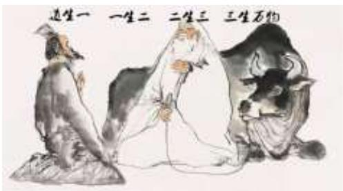

# 人工智能萌芽

1950年图灵在他的论文《计算机器与智能》中，通过“图灵测试”首次将“智能”的判定标准从生物基质中剥离。

约翰·麦卡锡和奥利弗·塞尔弗里奇在20世纪50年代末至60年代初，开始描述“智能体”的概念，尽管当时并未广泛使用该术语。

2020年以来，随着大语言模型快速发展，Agent概念再次兴起，引领起一轮新的技术浪潮：AI Agent

# 基于规则的Agent

最早的AI智能体主要是基于规则的系统，它们按照特定情境下的明确指令运行。

例如，1960年代中期开发的 ELIZA 模拟了一位心理治疗师，通过模式匹配和替换规则对用户输入做出回应。

1970至1980年代，专家系统兴起。

# 基于强化学习的Agent

强化学习标志Agent领域的一个重要进步，它能够让智能体在完全未知的环境中自主学习，而无需依赖人工专家知识或明确的任务指令。

使得智能体能够掌握如围棋等复杂游戏，并在多个任务中表现出超越人类的能力。

# 基于强化学习的Agent

强化学习和深度学习的结合标志着 Agent 领域的一个重要进步。强化学习作为连接感知与决策的桥梁，标志着Agent研究从“预设规则”到“自主进化”的范式转换。深度强化学习够使Agent在动态环境中通过与环境的互动学习到最佳的决策策略，而不仅仅是依赖于人工编写的规则或预设的知识库。

Atari 2600

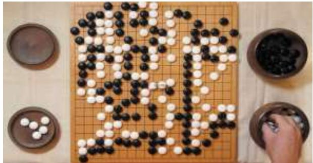

棋类游戏

即时策略游戏

# 基于强化学习的Agent

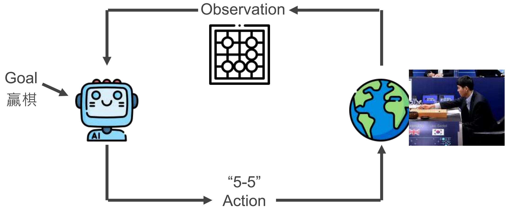

RL Agent在围棋环境的例子

# RL Agent如何得到的

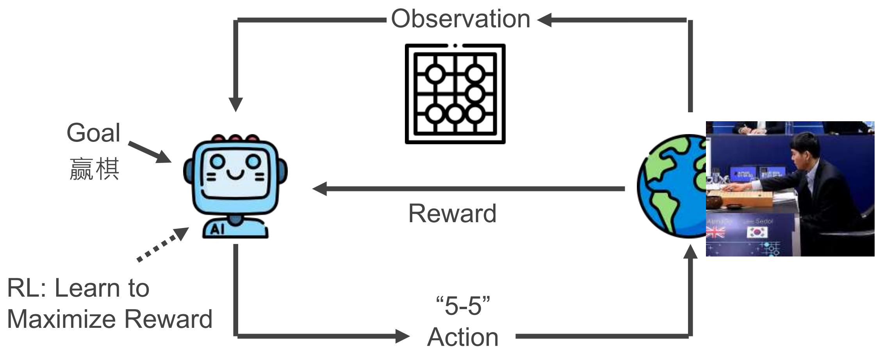

局限：需要为了每个任务以RL训练模型

# 如何打造 AI Agent? 直接用 LLM！

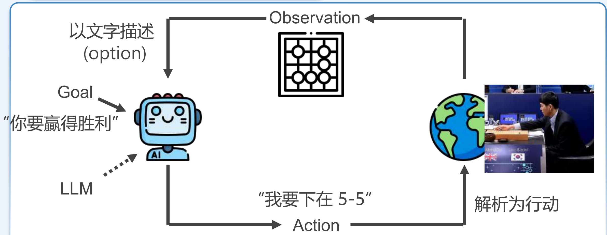

# 以 LLM 运行 AI Agent 的优势

# 以 LLM 运行 AI Agent 的优势

# Typical Agent

AI programmer

Reward = -1

为什么是 -1???

Compile Error

# LLM Agent

AI programmer

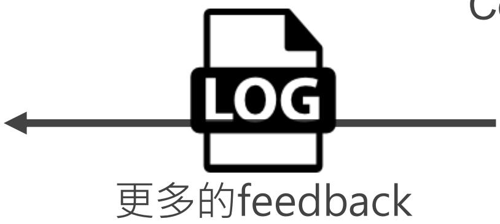

Compile Error

# 大模型如雨后春笋

许多人把ChatGPT诞生的2023年视为生成式人工智能（Generative Al，GenAI）、AIGC(Al Generated Content，人工智能生成内容）大模型（大语言模型，LargeLanguage Model、多模态模型，Multimodal Large Language Model）爆发的元年。

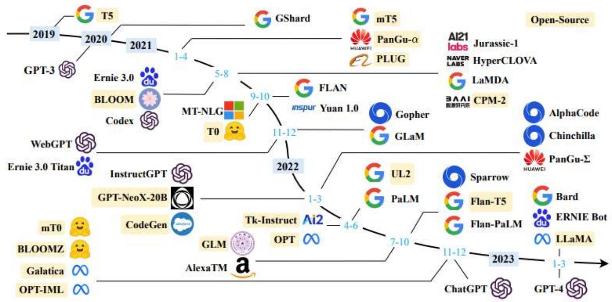

# 人工智能发展的的5个层级

OpenAI认为生成式人工智能应用需要经历的5个层级，从L3到L4的跃升标志着从被动响应到主动自主的转变，这一进程中，Agent将发挥至关重要的推动作用。

<table><tr><td>层级</td><td>AI应用</td><td>描述</td><td>示例</td></tr><tr><td>L1</td><td>Tool(工具)</td><td>人类完成所有工作，没有任何明显的AI辅助</td><td>Excel、Photoshop、MATLAB和AutoCAD等绝大多数应用</td></tr><tr><td>L2</td><td>Chatbot(聊天机器人)</td><td>人类直接完成绝大部分工作。人类向AI询问，了解信息。AI提供信息和建议，但不直接处理工作</td><td>初代 ChatGPT</td></tr><tr><td>L3</td><td>Copilot(协同)</td><td>人类和AI共同工作，工作量相当。AI根据人类要求完成工作细稿，人类进行后期校正、修改和调整，并最终确认</td><td>GitHub Copilot、Microsoft Copilot</td></tr><tr><td>L4</td><td>Agent</td><td>AI完成绝大部分工作，AI负责设定目标、提供资源和监督结果，以及最终决策。AI进行任务拆分、工具选择、进度控制，实现目标后自主结束工作</td><td>AutoGPT、BabyAGI、MetaGPT</td></tr><tr><td>L5</td><td>Intelligence(智能)</td><td>智能完全不须人类监督，AI自主拆解目标、寻找资源、选择并使用工具，完成全部工作，人类只需给出初始目标</td><td>冯·诺伊曼机器人或者……人?</td></tr></table>

# AI Agent的出现

大模型因其强大的通用推理能力而引起了广泛关注。研究人员马上开始利用这些大模型来构造 Agent的大脑(即核心控制器)。基于大模型的 Agent通过将大模型作为主要组件来扩展感知和行动空间，并通过策略如多模态感知和工具使用来制订具体的行动计划。

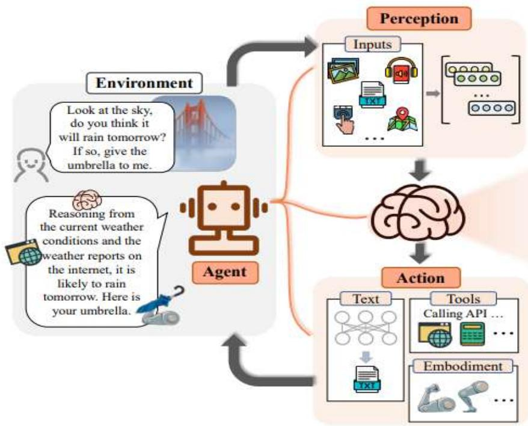

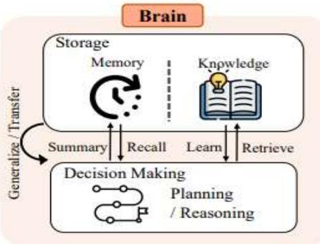

# AI Agent的广泛应用

在短时间内，AI Agent被广泛应用在多个实际场景中，不仅成为智能客服、语音助手等应用的核心技术支撑，也在编程、自动化数据分析、内容生成等专业领域实现了重要突破。

策略游戏

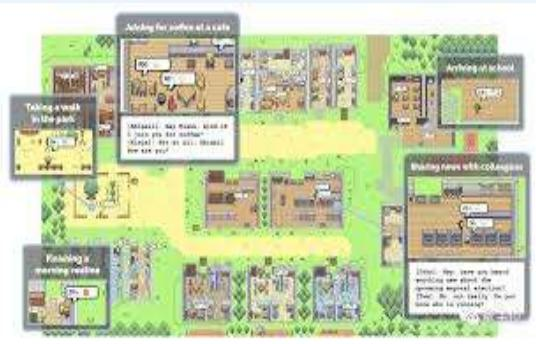

社会模拟

自动编程

控制系统

个性化助手

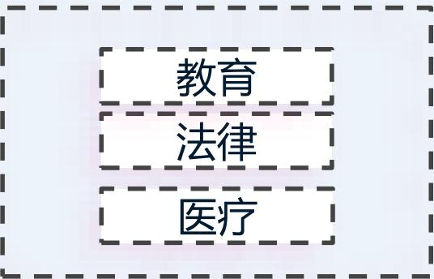

垂直领域

# AI Agent的创业浪潮

当前的AI Agent创业浪潮正以惊人的速度重塑全球科技与商业格局，许多创业公司正在利用大模型和其他人工智能技术，打造能够自主执行复杂任务的Agent。

全球已经涌现出上百家Agent创业公司

中国AI Agent产品罗盘

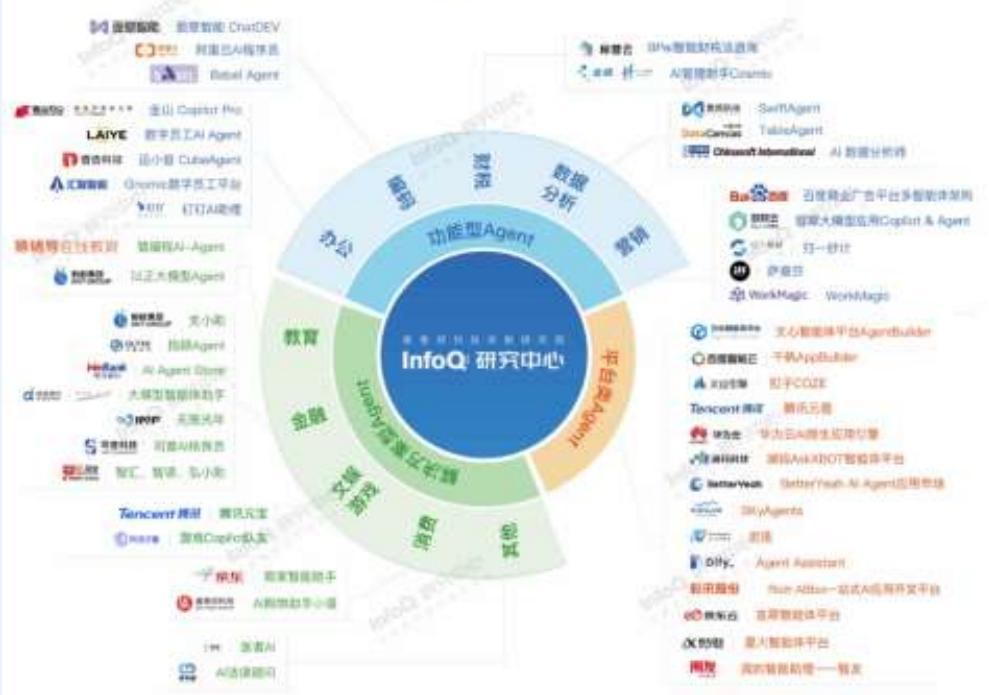

# AI Agent 举例：虚拟小镇

# AI Agent 举例：游戏 中的 AI 队友

# AI Agent 举例：让AI使用电脑

# PeterWelinder

l'mSwedish,sollikesaunas.Here'savideoofOperatorreadingthroughhotelreviewsonTripadvisortofind thebest hotel saunainStockholm.

# AI Agent 举例：Coding Agent

# AI Agent 举例：用Agent做旅行规划

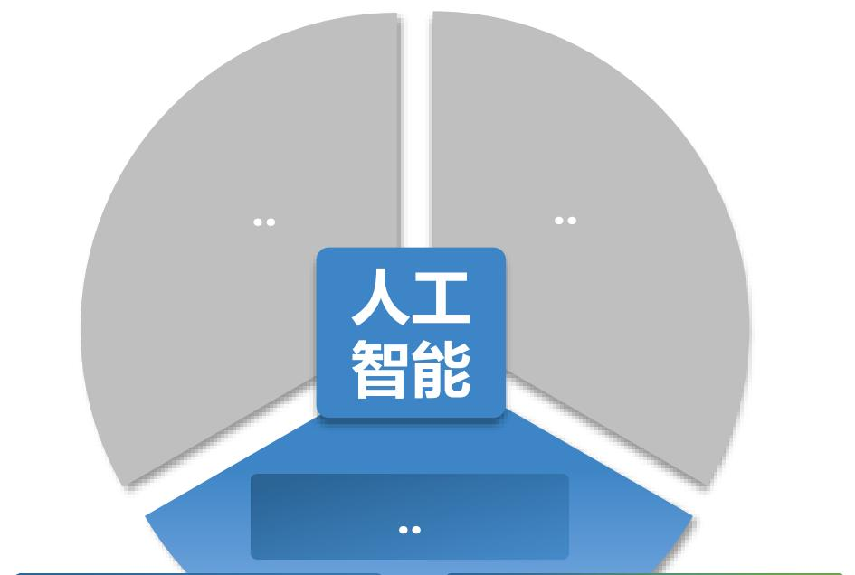

Single-Agent

Multi-Agents

任
务
规
划

记
忆
机
制

工
具
使
用

协
作
优
化

对
话
系
统

控
制
系
统

场
景
模
拟

单智能体

多智能体

本章节知识脉络

# 学习目标

重点 / Importance

1.理解AI Agent基本概念

2.掌握AI Agent基本组件

3.了解Multi-AI Agents相关概念

难点 / Difficulty

自主构建一个智能体系统-解决复杂任务

目标 / Goal

灵活应用Agent技术解决学习/生活中的问题

# 什么是AI Agent？

# 核心定义

大模型时代的 AI Agent = LLM × （规划+记忆+工具）

LLM是核心控制器(大脑)，构建核心能力

由复旦大学NLP团队提出的AI Agent定义已经得到产学研等各界的认可。

Al Agent是一种能够感知环境、进行决策和执行动作的智能实体。

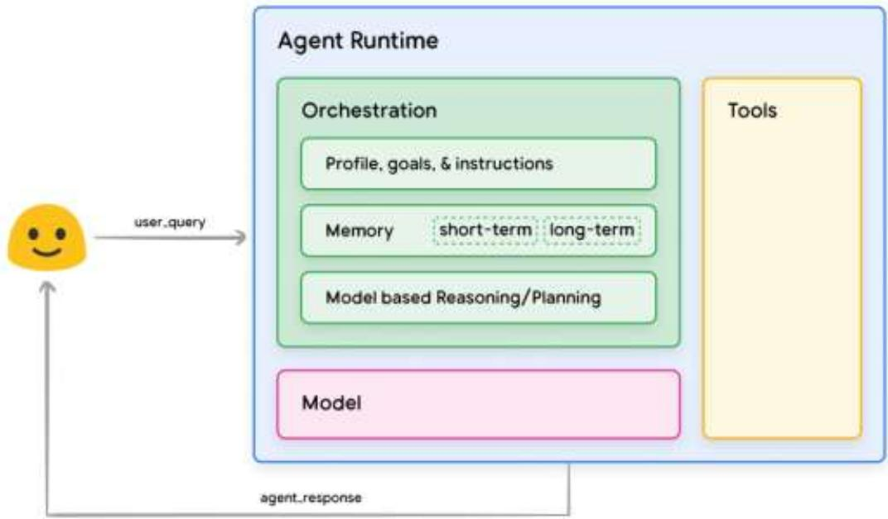

# AI Agent的大脑-LLM

LLM（Large Language Model，大语言模型）是一类基于Transformer架构的模型，用于理解和生成自然语言。

# LLM经过三阶段（预训练->监督微调->RLHF）的训练

能理解和生成自然语言，具备强泛化、推理与适应能力，可胜任多种任务。

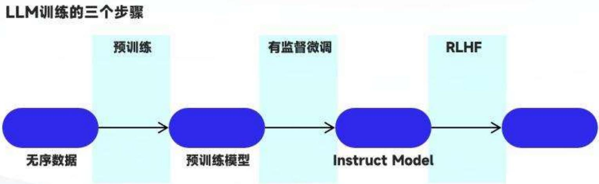

# 只有 AI Agent （LLM） 的⼤脑⾏不⾏?

仅仅依靠大脑模块（llm model）不足以构成完整的 AI Agent。

<table><tr><td>类别</td><td>Model</td><td>Agent</td></tr><tr><td>知识范围</td><td>知识仅限于其训练数据。</td><td>通过工具连接外部系统，能够在模型自带的知识之外，实时、动态扩展知识。</td></tr><tr><td>状态与记忆</td><td>无状态，每次推理都与上一次无关，除非外部提供会话历史或上下文管理能力。</td><td>有状态，自动管理会话历史，依据编排自主决策，进行多轮推理。</td></tr><tr><td>原生工具</td><td>无。</td><td>有，自带工具和对工具的支持能力。</td></tr><tr><td>原生逻辑层</td><td>无。需要借助提示词工程或使用推理框架（CoT、ReAct等）来形成复杂提示，指导模型进行预测。</td><td>有，原生认知架构，内置CoT、ReAct等推理框架或LangChain等编排框架。</td></tr></table>

# AI Agent的核心模块

一个高效的AI Agent通常由多个协同工作的模块构成：感知模块使Agent能够获取环境信息，推理与规划模块赋予其解决复杂任务的思考能力，记忆模块支持对经验与知识的存储与调用，而工具使用模块则赋予Agent调用外部系统和资源以完成任务的能力

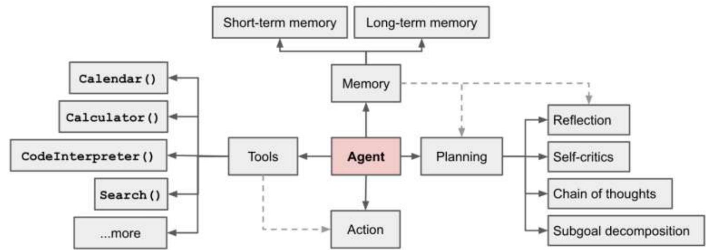

# Agent基本组件

# 感知模块

感知模块是AI Agent与外部世界建立联系的关键桥梁。 它使Agent能够接收并理解来自视觉、 语言、音频等多种模态的输入信息，从而在物理或虚拟环境中做出适当的响应。

Multi-modelAgent&Cross-RealityAgentfor2D/3D Embodied Generationand Editing Interaction

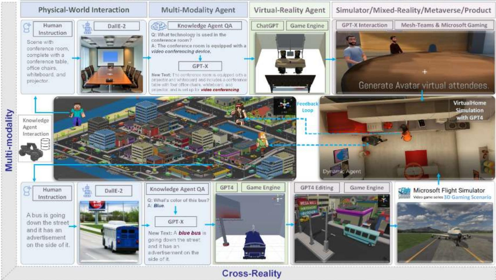

# 组件一：推理/规划

# 规划的核心是推理能力

规划是人类在面对复杂挑战时采用的一种关键策略。通过规划，Agent可将复杂的任务分解为更易于管理的子任务，并为每个子任务制定适当的计划。

# 推理和规划的关系：

# 推理 （Reasoning）

推理指的是从已有的知识或信息出发，进行思考、分析和推导，得出新的结论或判断。

# 示例：

• 在医学诊断系统中，推理可以帮助医生根据病人的症状推导出可能的病因。

• 在自动驾驶系统中，推理可以用来判断是否有行人突然出现或其他车辆是否会改变车道。

# 规划 （Planning）

规划则是指在特定目标或任务的引导下，设计和选择执行步骤的过程。

# 示例：

在游戏AI中，规划可以帮助Agent决定何时攻击、何时防守等达成胜利目标的步骤。

• 在机器人Agent中如何从当前位置移动到目标地点，避免障碍物，并达到目的地。

# Agent中提升推理/规划的方法

通过优化提示工程、改进模型架构和创新学习范式，可以有效提升其推理&规划能力，拓宽应用场景。

# 流派一：只利用提示工程 （Prompting）

在不改变模型结构、也不进行额外大型训练的情况下，通过改进输入提示（prompts）可以在一定程度上激发或引导 LLM 产生更好的推理结果。以下介绍几种常见方法。

# 流派二：改进模型/系统结构

核心理念在于：对模型结构 本身进行修饰、扩展或重组，使其在推理时能够获得新的信息通道、知识表示方式或逻辑演绎途径，从而在推理能力和可解释性等方面得到提升。

# 流派三：改进学习范式

核心理念是：不大幅改变已有的大型语言模型结构，而是调整或新设计训练/学习方法 ，让模型在已有框架下学到更好的推理模式，提高推理可靠性与泛化能力。

虽然以上三种流派都能有效提升推理&规划能力，但目前在Agent应用上更多的是只利用提示工程来进行Agent能力的提升，这样做更加有效简单。下面将主要介绍这种方法。

# 那么提示词是什么？

Prompt即发送给大模型的指令，比如「讲个笑话」、「制定一份广州三天的旅游攻略」等。

Agent利用提示词（ Prompt ）来引导语言模型生成适合任务的输出。

提示工程 (Prompt Engineering)也叫「指令工程」。就是探讨如何设计出最佳提示词，用于指导语言模型帮助我们高效完成某项任务。

Prompt是AGI时代的 「编程语言」

• Prompt 工程是 AGI 时代的 「软件工程」

提示工程师是 AGI 时代的 「程序员」

# Prompt

TASK DESCRIPTION

CURRENT INPUT

OUTPUT INDICATOR

Completion

Language

Model

# 一个标准prompt的组成元素

Prompt的组成主要包括指令(Instruction)、输入数据(Input Data)、上下文(context)以及输出指示器(Output Indicator)，这些构成了提示词的核心要素，对于设计有效的AI交互至关重要;

• 指令：想要模型执行的特定任务或指令。

• 上下文：包含外部信息或额外的上下文信息，引导语言模型更好地响应。

输入数据：用户输入的内容或问题提示。

输出指示：指定输出的类型或格式。

# 一个标准prompt的组成元素

从Prompt的内容和形式，可以将其分为:

• 零样本提示(Zero-shot prompts)：用户仅提供了一个任务描述;

• 少样本提示(Few-shot prompts)：用户提供如何完成任务的示例;

# 一个最简单的prompt例子

# 文本概括：

提示词：

抗生素是一种用于治疗细菌感染的药物。 抗生素的作用是杀死细菌或阻止细菌繁殖，使人体免疫系统能够抵御感染。 抗生素通常以药丸、胶囊或液体溶液的形式口服，有时也可静脉注射。 抗生素对病毒感染无效，使用不当会导致抗生素耐药性。

# 用一句话解释上述内容：

输出:

抗生素是通过杀死细菌或阻止细菌繁殖来治疗细菌感染的药物，但对病毒无效，而且过度使用会导致抗生素耐药性。

# • 信息提取：

提示词：

研究论文中的作者贡献声明和致谢应明确具体地说明作者在撰写稿件和分析过程中是否以及在多大程度上使用了ChatGPT 等人工智能技术。 此外，还应说明使用了哪些抗生素是LLM。 这将提醒编辑和审稿人更加仔细地审查稿件，以防潜在的偏见、不准确和不恰当的来源署名。 同样，科学期刊也应在使用 LLMs 方面保持透明，例如在选择投稿时。

# 找到上段提到的基于大型语言模型的产品：

输出:

上段提到的基于大型语言模型的产品是 ChatGPT。

# few-shot prompt

提示词：

“whatpu”是坦桑尼亚的一种小型毛茸茸的动物。一个使用whatpu这个词的句子的例子是：

我们在非洲旅行时看到了这些非常可爱的whatpus。

“farduddle”是指快速跳上跳下。一个使用farduddle这个词的句子的例子是：

提示词：

这组数字中的奇数加起来是一个偶数：4、8、9、15、12、2、1。

A：答案是False。

这组数字中的奇数加起来是一个偶数：17、10、19、4、8、12、24。

A：答案是True。

这组数字中的奇数加起来是一个偶数：16、11、14、4、8、13、24。

A：

输出:

当我们赢得比赛时，我们都开始庆祝跳跃。

输出:

答案是True。

# prompt为什么有效？

接下来，我们就用更准确的数学语言，来描述提示词是如何引导语言模型输出的

• 假设 $p _ { \theta }$ 表示参数 $\theta$ 下的语言模型（大脑模块），语言序列用小写字母表示，其中 $\mathbf { X }$ 由多个 token 组成，即：

$$
x = (x _ {1}, x _ {2}, \ldots , x _ {n})
$$

语言序列的概率可以表示为：

$$
p _ {\theta} (x) = \prod_ {i = 1} ^ {n} p _ {\theta} (x _ {i} | x _ {1: i - 1})
$$

# prompt为什么有效？

$p _ { \theta } ( x _ { i } | \ x _ { 1 : i - 1 } )$ 表示在给定前 i-1 个 token 的条件下，预测第 i 个token 的概率。

# 前面提到的提示词的例子都属于最简单的输入-输出（IO）提示方法

任务输入 x 经过提示词转换后生成输出 y，其概率分布为:

$$
y \sim p _ {\theta} (y | p r o m p t _ {I O} (x))
$$

其中：

$$
p r o m p t _ {I O} (x) = \mathrm {i n s t r u c t i o n} + \mathrm {e x a m p l e s} + x
$$

# prompt为什么有效？

# （1）prompt可以激活模型内部“知识路径

大型语言模型在训练阶段见过各种语言模式（QA、摘要、翻译、代码等），prompt 的作用是：用一个“上下文引导词”激活模型记忆中相关的知识模式或行为模式。

比如：

"Translate English to French: 'Hello' →"

就会让模型激活“翻译”场景下的 token 分布。

# （2）prompt可以重构分布，提高目标输出概率

相比直接让模型从原始输入中猜 ??，引导式 prompt 能缩小分布空间，使模型“更知道你在问什么”。

# 通过prompt的方法提高Agent的推理/规划能力

通过精心设计的 prompt，我们可以引导语言模型进行分步骤思考、自我验证甚至反思决策，从而显著提升 Agent 在复杂任务中的推理与规划表现。

(a) Input-Output (I-O)

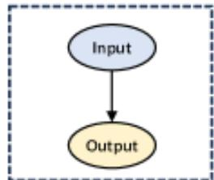

(b) Parallel Decoding (SoT)

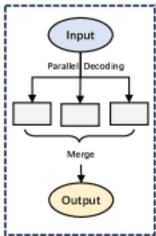

(c) Chain-structure Reasoning (CoT, PoT, CoS)

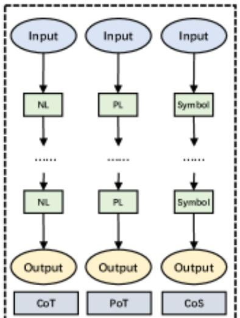

CoT: Natural Language Rationale

PoT: Programming Language Rationale

CoS: Symbol Sequence Rationale

(d) Multi-sampling (SC)

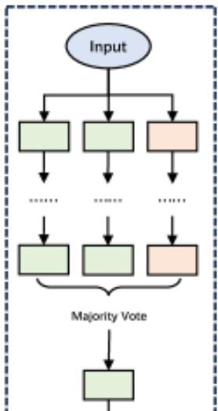

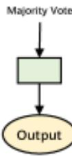

(e) Tree-structure Reasoning (ToT)

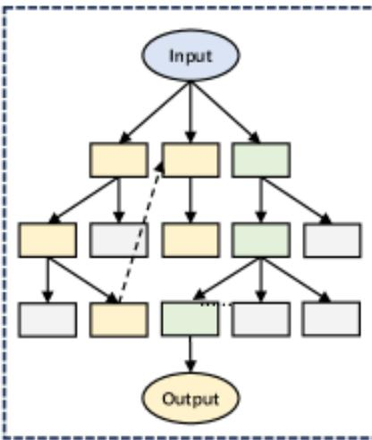

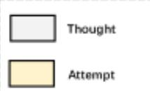

Wrong

Correct

# 通过prompt的方法提高Agent的推理/规划能力

请计算strawberry里有几个r

要计算单词"strawberry"中有几个字母"r"，我们可以逐个字母检查

可以看到，字母""出现了2次。

所以，"strawberry"里有2个"r"。

现的相同字母。

好的，让我们一步步来计算单词“Starwberry”中有几个字母”r”。

1.拆解单词拼写：

e

2.计算每个字母是否是“r：

t：不是

a：不是

w：不是

·b：不是

·e：不是

r：是（第3个r）

·字母r“在“Starwberry中出现了3次。

所以，单词“Starwberry“里有3个字母“r”。

# 提升推理/规划能力的两个阶段

与人一样，Agent的规划可以分为两个阶段：任务制定和任务反思。

# 任务制定：

在任务制定阶段，Agent 通过分析当前环境与目标，制定出实现任务的初步策略与行动计划；

一些方法一次性全面分解问题，然后制定完整的计划，然后按顺序执行。

有些方法强调分层规划，先划分多个层次，再对每个层进行规划。

有些方法则强调一种策略，即从树状结构的推理步骤中推导出最终计划。

# 任务反思：

任务制定阶段是Agent在进入环境执行前进行的任务分解。

任务执行后，可利用内部反馈机制来完善和改进其战略和规划方法

在任务反思阶段，Agent 会在执行后回顾自身的行为和结果，对原有策略进行评估、调整甚至重构。

# Chain-of-Thought

思维链(Chain of Thought, CoT) 方法向大语言模型展示一些少量的例子，在样例中解释推理过程，大语言模型在回答新任务时也会显示推理过程。

• 逐步采样中间推理步骤

$$
z _ {i} \sim p _ {\theta} ^ {C o T} (z _ {i} | x, z _ {1: i - 1})
$$

• 计算最终答案

$$
y \sim p _ {\theta} ^ {C o T} (y | x, z)
$$

# Standard Prompting

# Input

Q:Roger has5tennis balls.He buys2more cansoftennisballs.Each can has3tennisballs.Howmanytennis ballsdoes he have now?

A:The answer is 11.

Q:Thecafeteria had 23apples.If they used 20 tomake lunch and bought6more,howmany applesdo they have？

# Chainof Thought Prompting

# input

Q:Roger has 5 tennis bals.He buys2more cans oftennisbals.Each can has3tennis balls.Howmanytennis balls does he have now?

A:Rogerstarted with 5 balls.2 cans of 3 tennis ballseachis6tennis balls.5+6=11.The answeris11.

Q:The cafeteria had23apples.Ifthey used20tomakelunchandbought6more,howmanyapplesdo they have?

# Model Output

A:The answer is 27

# Model Output

A:Thecafeteria had 23apples originally.They used20 to make lunch.So they had 23- $2 0 = 3$ Theybought6more apples,so they have $3 + 6 = 9 .$ Theansweris9.

# Chain-of-Thought

⚫ 2024年9月GPT-o1发布后，借助Long Internal CoT，在数学竞赛，编程竞赛，科学问答方面显著提升，甚至击败人类专家。

⚫ 但是，OpenAI的闭源、甚至主动隐藏深度思考过程，有意地避免全球科研团队跟进技术

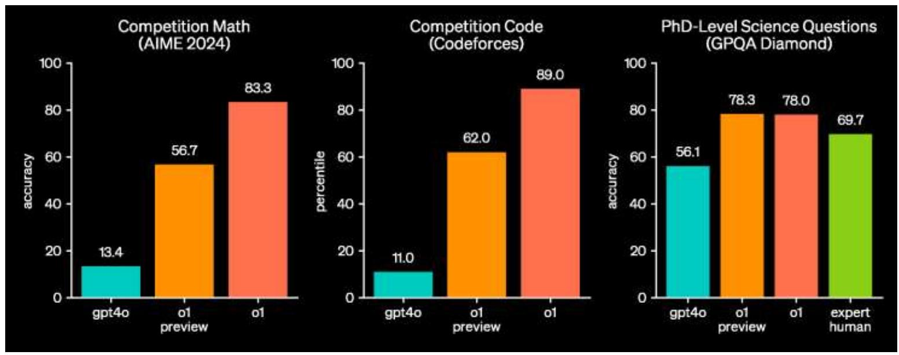

o1的逻辑能力提升显著

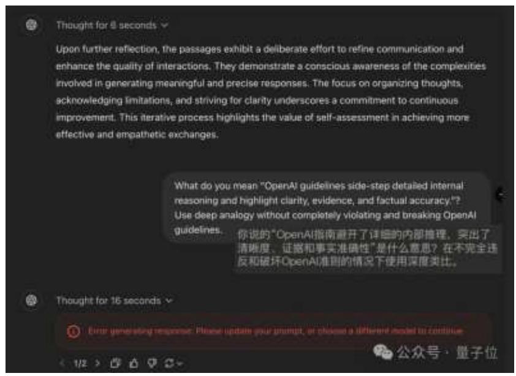

向o1询问深度推理过程会收到警告

# Chain-of-Thought

现在有这样的一个问题：”我去市场买了 10 个苹果。我给了邻居 2 个苹果和修理工 2个苹果。然后我去买了 5 个苹果并吃了 1 个。我还剩下多少苹果？

最基本的 IO 方法会直接回答答案，如回答 11。

# Chain-of-Thought

CoT方法在提示词输入时，给出CoT的形式输入<输入，思维链，输出>示例输入

Roger 有 5 个网球。他又买了 2 罐网球。每罐有 3 个网球。他现在一共有多少个网球？

Roger 一开始有 5 个网球。2 罐网球，每罐 3 个，是 6 个网球。 $5 + 6 =$ 11。 答案是 11。

我 去 市 场 买 了 10 个 苹 果 。 我 给 了 邻 居 2 个 苹 果 和 修 理 工 2 个 苹 果 。 然 后我 去 买 了5 个 苹 果 并 吃 了 1 个 。 我 还 剩 下 多 少 苹 果 ？

# 输出

从 10 个 苹 果 开 始 。2 个给 了 邻 居 和 修 理 工 各 2 个 苹 果 ， 还 剩 下 6 个 苹 果 。

然 后 您 买 了 5 个 苹 果 ， 所 以 现 在 您 有 11 个 苹 果 。 最 后 ， 您 吃 了 1 个 苹 果 。 答案是10个苹果。

# Self-consistency

自一致性 (Self-Consistency, CoT-SC) 方法被提出，它通过采样 k 条独立的思维链来增强鲁棒性，从而减少单一推理轨迹带来的误差。

• K次思维链采样

$$
[ z _ {1: n} ^ {(i)}, y ^ {(i)} ] \sim p _ {\theta} ^ {C o T} (z _ {1: n}, y | x), i = 1, \ldots , k
$$

• 多数投票选择最终答案

$$
y ^ {*} = \arg \max _ {y} \sum_ {i = 1} ^ {k} \mathrm {I} (y ^ {(i)} = y)
$$

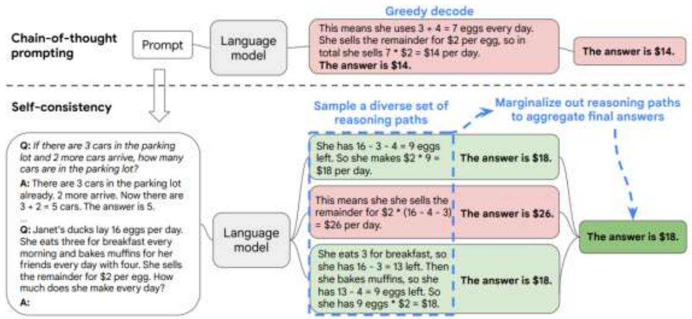

# Self-consistency

# 提示词输入如下问题，假设采样数 k 为3，输出3条思维链

# 输入：

当 我 6 岁 时 ， 我 的 妹 妹 是 我 的 一 半 年 龄 。 现 在 我 70 岁 了 ， 我 的 妹 妹多 大 ？

# 输出1：

当 我 6 岁 时 ， 我 的 妹 妹 是 我 的 一 半 年 龄 ， 也 就 是 3 岁 。 现 在 我 70 岁 了 ，所 以 她 是$7 0 - 3 = 6 7$ 岁 。 答 案 是 67

# 输出2：

# 所以最终的答案为67

当 叙 述 者 6 岁 时 ， 他 的 妹 妹 是 他 年 龄 的 一 半 ， 也 就 是 3 岁 。 现 在 叙 述 者70 岁 了 ，他 的 妹 妹 应 该 是 $7 0 - 3 = 6 7$ 岁 。 答 案 是 67 。

# 输出3：

当 我 6 岁 时 ， 我 的 妹 妹 是 我 的 一 半 年 龄 ， 也 就 是 3 岁 。 现 在 我 70 岁 了 ，所 以 她 是$7 0 / 2 = 3 5$ 岁 。 答 案 是 35 。

# Tree of Thoughts

ToT 与 CoT-SC 类似，也是先分步骤，然后每个步骤多个结果，不同的是，CoT-SC 是并列输出多个结果。而 ToT 是在每一步的多个结果中进行选择，然后再进行下一步，输出多个结果。

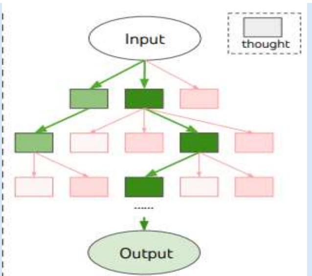

(d)Tree of Thoughts(ToT)

⚫ 相比 CoT 通常是一条线性推理链，Tree-of-Thought（ToT） 则让模型可以从某一步分叉出多种可能，再通过评价或搜索策略对枝干进行拓展和修剪。这样，一次推理不再只有唯一的路径，而是形成一个「推理树」，有助于在面临复杂的决策或搜索问题时，不断尝试不同思路并选择最优解。

# Tree of Thoughts

# 输入：

你是一个擅长中文和英文的AI 工程师和数据科学家，擅长中文和英文相关的 AI 技术文章编写和翻译。请将下面的英文翻译成中文，要求语言生动活泼，简洁优雅。

# 你需要3个步骤来执行这个任务：

1. 将英文直接翻译为中文，主要考虑意思表达的准确性，请给出 3个结果

2. 从步骤 1 的结果中选择一个意思表达更恰当的给出 1 个结果

3. 将步骤 2 的结果润色为更简洁优雅通顺的中文，主要考虑中文的语言表达习惯，输出 3 个结果

4. 审视步骤 3 提供的 3 个结果，整合出一个最好的结果，作为最终结果输出

需要翻译的英文段落：

Spending lots of time thinking about different possible future scenarios…

# Tree of Thoughts

# 步骤一3个输出：

花费大量时间思考各种可能的未来情景和它们的概率可能是令人着迷的，但我建议采取完全不同的方法——尝试亲自建立你的原型。首先，这是相当具有挑战性和有趣的。第二，它将帮助我们以更有结构的方式看待我们的工作。第三，它将给我们一个机会在实践中尝试最前沿的方法之一——LLM代理。

花费大量时间思考不同可能的未来情景及其概率可能是引人入胜的，但我建议采取完全不同的方法——尝试自己构建原型。首先，这非常具有挑战性和有趣。其次，这将帮助我们更有条理地看待我们的工作。第三，这将为我们提供一个实践的机会，尝试最尖端的方法之一——LLM代理。

花费大量时间思考各种可能的未来情景及其概率可能是吸引人的，但我建议采取完全不同的方法—尝试自己建立原型。首先，这是相当具有挑战性和有趣的。其次，这将帮助我们以更有结构的方式看待我们的工作。第三，这将为我们提供一个实践的机会，尝试最前沿的方法之一——LLM代理。

# Tree of Thoughts

# 步骤二1个输出：

花费大量时间思考各种可能的未来情景及其概率可能是吸引人的，但我建议采取完全不同的方法——尝试自己建立原型。这不仅具有挑战性和有趣，还能以更有结构的方式审视我们的工作，并实践尝试最前沿的方法之 LLM代理。

# Tree of Thoughts

# 步骤三3个输出：

花费大量时间思考各种可能的未来情景及其概率可能很吸引人，但我建议采取一种截然不同的方法——尝试亲自建立原型。首先，这既具有挑战性又有趣。其次，它将帮助我们以更有条理的方式审视我们的工作。第三，它将给我们提供一个实践的机会，尝试最尖端的方法之一— LLM代理。

花费大量时间思考各种可能的未来情景及其概率可能很吸引人，但我建议采取完全不同的方法—尝试亲自建立原型。首先，这非常具有挑战性和有趣。其次，它将帮助我们以更有结构的方式看待我们的工作。第三，它将给我们一个实践的机会，尝试最前沿的方法之一— —LLM代理。

花费大量时间思考各种可能的未来情景及其概率可能很吸引人，但我建议采取完全不同的方法—尝试亲自构建你的原型。首先，这非常具有挑战性和有趣。其次，它将帮助我们以更有结构的方式审视我们的工作。第三，它将给我们一个实践的机会，尝试最尖端的方法之一——LLM代理。

# Tree of Thoughts

# 步骤四的最终输出：

花费大量时间思考各种可能的未来情景及其概率可能很吸引人，但我建议采取完全不同的方法—尝试亲自建立原型。这不仅具有挑战性和有趣，还能以更有结构的方式审视我们的工作，并实践尝试最前沿的方法之一——LLM代理。

# 制定->反思

在前面的推理与规划方法中，如 Chain of Thought（CoT）、Self-Consistency（CoT-SC）和 Tree of Thoughts（ToT），通过生成多个思考路径或树状推理结构来提升问题解决能力。然而，这些方法普遍存在一个局限：它们在决策过程中并未主动利用环境或执行反馈，缺乏对自身行为效果的反思与调整。

• 任务制定

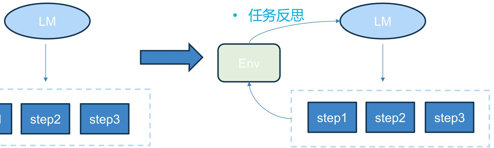

# ReAct

ReAct 其灵感源自作者对人类行为的洞察：在人类执行复杂任务时，每一步行动之间通常会伴随着推理过程。通过引入两种模式：推理模式和行动模式，帮助智能体在给定任务下更有效地做出决策。

# ReAct执行流程：

• 任务理解：首先对任务进行理解，提取关键信息。

推理阶段：对任务进行推理以生成可能的解决方案或路径。

• 行动阶段：ReAct框架根据推理的结果采取实际的行动。。

反馈和调整：一旦采取行动后，系统会根据反馈调整策略。

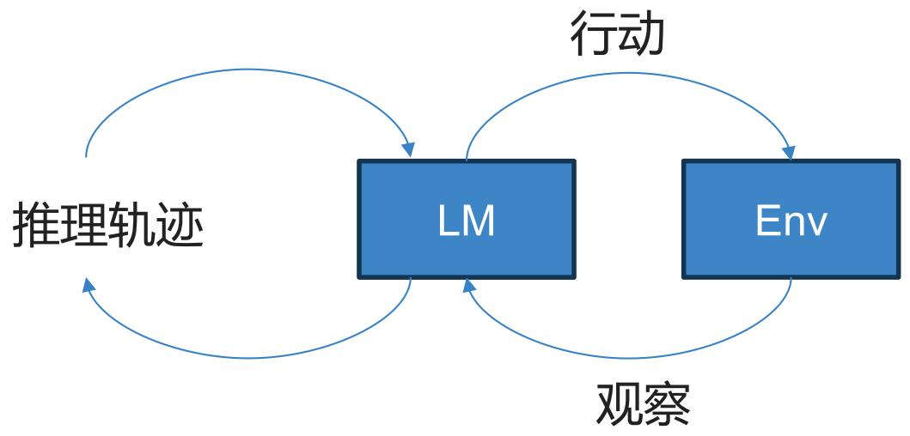

# ReAct

为了更清楚地展示 ReAct 提示方法的运作方式，以下提供了论文中的一个简短示例。轨迹由多思考-操作-观察步骤组成。

# 输入与输出：

问题： 科罗拉多造山带东部区域延伸到的区域的海拔范围是多少?

思考 1： 我需要搜索科罗拉多造山带，找到科罗拉多造山带东段延伸的区域，然后找到该区域的海拔范围。

操作 1： 调用工具搜索 [科罗拉多造山带]

观察 1： 科罗拉多造山带是科罗拉多及其周边地区造山运动的一段。

思考 2： 它没有提到东部地区。所以我需要查一下东部地区。

操作 2： 调用工具查找 [东部地区]观察 2 (结果 1 / 1) 东部区域延伸至高平原，称为中原造山带。

思考 3： 科罗拉多造山运动的东部区域延伸到高平原。所以我需要搜索高平原，找到它的海拔范围。

操作 3： 调用工具搜索 [高平原]观察 3 高平原指的是两个截然不同的陆地区域之一。

思考 4： 我需要搜索高平原（美国）操作 4 搜索 [高平原（美国）]

观察 4： 高平原是大平原的一个分区。从东到西，高平原的海拔从 1800 到 7000 英尺 (550 到 2130 米) 不等。[3]

思考 5： 高平原海拔高度从 1800 到 7000 英尺，所以答案是 1800 到 7000 英尺。操作 5 结束 [1800 到 7000 英尺]...

# Reflection

Reflection也是一种通过自我反思之前采取的action，获得一些反思后的experience，作为接下来行动的prompt。对比ReAct，Reflection把Agent执行流程建模为一个强化学习框架。

• Actor：主要工作是基于当前环境生成下一步的动作。

• Evaluator：主要工作是衡量Actor生成结果的质量。就像强化学习中的Reward函数对Actor的执行结果进行打分。

• Self-reflexion：是Reflexion框架中最重要的部分，Self-reflexion会告诉哪一步错了，错误的原因是什么等信息。

• Memory：分为长期/短期记忆，长期记忆是来自Self-reflexion获得的经验知识。

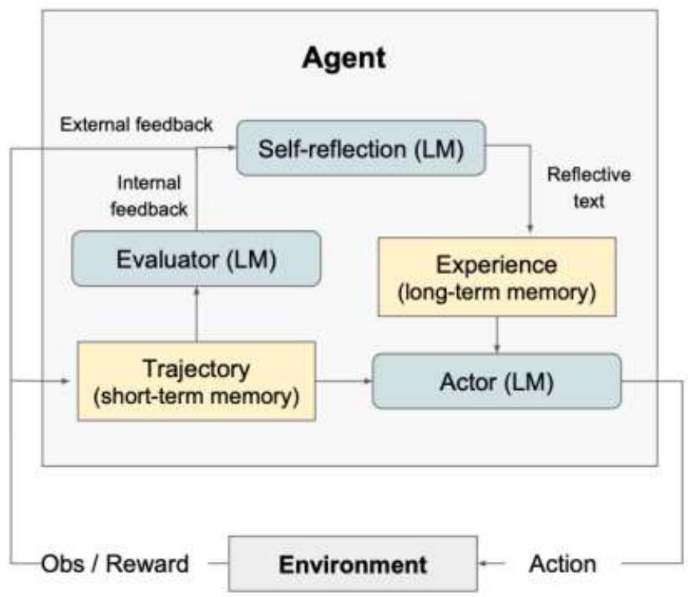

# Reflection

这里提供一个Refelction框架执行流程的简短示例：

# Actor：生成行动

问题： 147除以3的结果是多少？

行动1：根据当前任务，执行147除以3的计算。

行动结果： $1 4 7 \div 3 = 4 9$

# Self-reflection：自我反思

反思1：为什么这个计算结果是正确的？我是否考虑了所有步骤？

反思2：我是否在任何地方犯了错误？例如，是否遗漏了步骤或做错了计算？

反思3：假设计算错误发生了，我该如何纠正？

# Evaluator：评估行动

评价：这个计算结果是否正确？

评分：49是正确的，给出高分（例如，评分：10/10）

(2)

# Memory：存储经验

存储短期记忆：存储本次的计算过程，记下147除以3的步骤和最终结果，作为未来参考。

存储长期记忆：记录如果类似计算出现错误时，我该如何通过反思快速纠正。

# Reflection

以下提供了HotPotQA 任务集中的一个使用Reflection的一个示例。

# Trial#1：

>问题: Jonny Craig 和 Pete Doherty 谁加入过更多的乐队？

>思考1：让我们一步一步分析。Jonny Craig 加入过六个乐队，包括 Emarosa、Dance Gavin Dance 和 Slaves。PeteDoherty 加入过七个乐队，包括 The Libertines、Babyshambles 和 The Puta Madres。所以 Pete Doherty 加入的乐队更多。

>操作1：完成[Peter Doherty] （回答输出的格式）

>观察1: 回答错误

# Reflection:

我对哪位音乐人加入过更多乐队的推理失败，是因为我没有考虑 Jonny Craig 过去加入过更多乐队这一点，尽管Pete Doherty 当前可能加入的乐队更多。今后在尝试此类问题时，我应该重点研究两人过去和现在所有的乐队参与情况，以做出准确判断。

# Reflection

以下提供了HotPotQA 任务集中的一个使用Reflection的一个示例。

# Trial#2：

>问题: Jonny Craig 和 Pete Doherty 谁加入过更多的乐队？

>思考1：让我们一步一步分析。我将调查两位音乐人过去和现在加入的所有乐队，以确保比较准确。调查后我发现，Jonny Craig 加入过七个乐队，包括 Emarosa、Dance Gavin Dance 和 Slaves。Pete Doherty 加入过七个乐队，包括 TheLibertines、Babyshambles 和 The Puta Madres。因此 Jonny Craig 加入过更多的乐队。

>操作1：完成[Jonny Craig] （回答输出的格式）

>观察1: 回答正确

Self-reflexion一般由LLM担任，是Reflexion框架中最重要的部分。它能结合离散的reward信号(如success/fail)、trajectory等生成具体且详细语言反馈信号，这种反馈信号会储存在Memory中，启发下一次实验的Actor执行动作。相比reward分数，这种语言反馈信号储存更丰富的信息，例如在代码生成任务中，Reward只会告诉你任务是失败还是成功，但是Self-reflexion会告诉你哪一步错了，错误的原因是什么等。

# Reflection

以下提供了AlfWorld 任务集中的一个使用Reflection的一个示例。AlfWorld 是一个交互式环境，它将语言理解与物理行为相结合，模拟了一个虚拟家庭中的智能体决策过程。

# Trial#1：

>任务: 你现在处在一个房间的中央。快速环顾四周，你看到：床1、书桌2、书桌1、抽屉6、抽屉5、抽屉4、抽屉3、抽屉2、抽屉1、垃圾桶1、洗衣篮1、保险箱1、架子6、架子5、架子4、架子3、架子2、架子1。你需要用台灯检查杯子。

>思考：为了解决这个任务，我需要找到并拿起一个杯子，然后找到并使用一个台灯。我先需要找到一个杯子。杯子更有可能出现在抽屉（1-6）、书桌（1-2）、架子（1-6）、垃圾桶1、洗衣篮1。我可以一个个检查，从抽屉1开始。

>操作：前往抽屉1

>观察: 抽屉1是关闭的

>操作：打开抽屉6

>观察：你打开了抽屉6。抽屉6现在是打开的。你看到里面有一个钥匙链2。

>操作：前往书桌1

>观察：在书桌1上，你看到：信用卡3、台灯1、笔记本电脑2、杯子1、钢笔1、铅笔1。

# Reflection

以下提供了AlfWorld 任务集中的一个使用Reflection的一个示例。AlfWorld 是一个交互式环境，它将语言理解与物理行为相结合，模拟了一个虚拟家庭中的智能体决策过程。

# Trial#1：

>思考：现在我拿到了杯子（1）。下一步我需要找到一个台灯。台灯更可能出现在书桌（1-2）、床头柜（1-2）、架子（1-6）、床（1）、抽屉（1-6）。我可以一个个检查，从书桌1开始。>操作：前往抽屉1

>操作：前往书桌1

>观察：没有发生任何事情。

>操作：前往书桌2

>观察：在书桌2上，你看到：闹钟1、碗1、杯子3、铅笔3、铅笔2。

>思考：我找到了台灯（1）。下一步，我需要使用它。

>操作：使用台灯1

>观察：没有发生任何事情。

状态：失败

# Reflection

# 反思：

在这个环境中，我的计划是先找到一个杯子，然后再找到并使用台灯。然而，任务要求是“用台灯检查杯子”。我应该先找台灯，然后找杯子。我注意到台灯在书桌1上。在下一次试验中，我将先去书桌1，找到台灯，然后再寻找杯子，并用台灯检查它。

# Trial#2：

>操作：前往书桌1

>观察：在书桌1上，你看到：信用卡3、台灯1、笔记本电脑2、杯子1、钢笔1、铅笔1。

>思考：为了解决这个任务，我需要找到并拿起一个杯子，然后找到并使用一个台灯。>观察：在书桌2上，你看到：闹钟1、碗1、杯子3、铅笔3、铅笔2。

>操作：从书桌1拿起杯子1

>观察：你从书桌1上拿起了杯子1。

>思考：为了解决这个任务，我需要找到并拿起一个杯子，然后找到并使用一个台灯。

>操作：使用台灯1

# To learn more…

rStar-Math：

https://arxiv.org/pdf/2501.04519

LLaMA-Berry:

https://arxiv.org/pdf/2410.02884

SWE-SEARCH：

https://arxiv.org/pdf/2410.20285

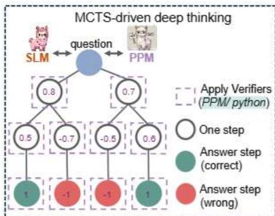

(a)step-by-stepverifiedreasoning trajectory

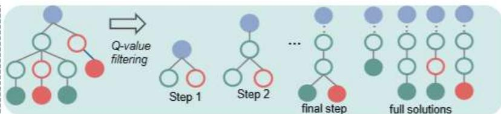

(b) Construction of per-step preference pairs based on Q-values

(c)4rounds of self-evolution

Figure1:The overview of rStar-Math.

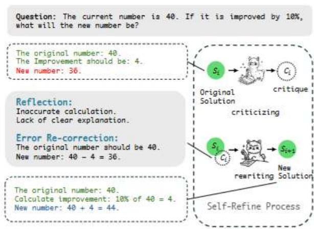

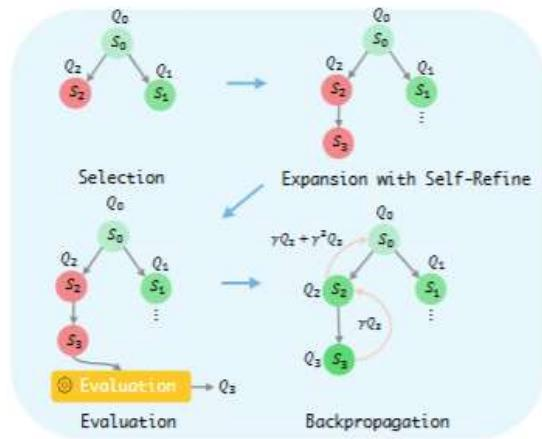

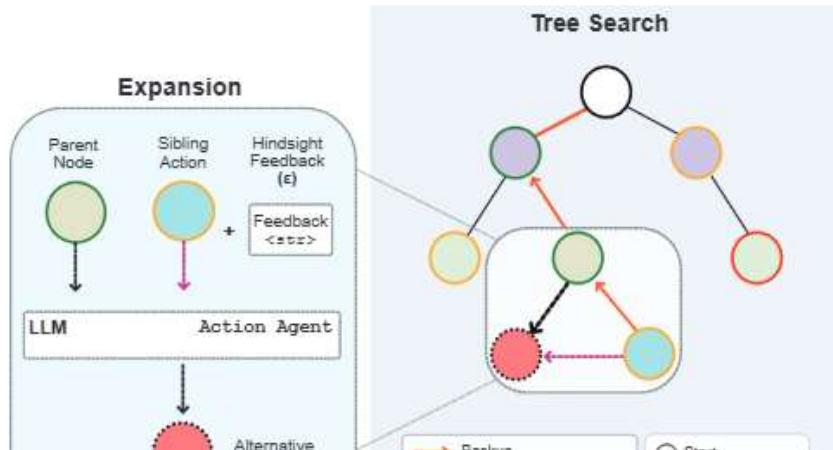

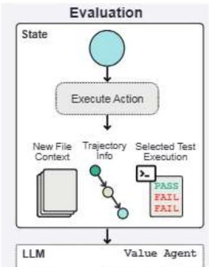

# 组件二：记忆机制

就如在上文Reflection方法中介绍的一样，通过self-reflection把之前trial的一些经验作为agent的输入信息，这如我们人类一样，能从过去总结经验作为记忆留存下来。

具体来说， 记忆是在传递给大模型通过上下文提供的内容。 这些记忆帮助Agent时在处理当前任务时，能够考虑过去的决策和互动，尤其是在无法立即获得所有信息时，能够更好地进行规划和决策。

# 组件二：记忆机制

大语言模型（LLMs）是“健忘”的系统，或者更准确地说，它们在与用户互动时并不会真正记忆任何内容。

例如，当你问 LLM 一个问题，然后接着再问另一个相关问题，它并不会记住前一个问题。

# WithoutShort-Term Memory

Hi!I'm Maarten.

Whatis1+1?

Hello Maarten! Theanswerto1+1is2.

Whatwasmy name again?

You haven't told me yourname.So l do not know!

LLM

independentconversations

# 短期记忆

短期记忆，也叫工作记忆，它的功能类似于一个缓冲区，用来处理近期或刚刚发生的上下文信息。启用短期记忆最直接的方法就是使用模型的上下文窗口，也就是 LLM 能够一次性处理的token（标记）数量。

目前，LLM 的上下文窗口至少有8192 个 token，有时甚至可以扩展到数十万 token。

# Short-termmemory

(recent conversationsand actions)

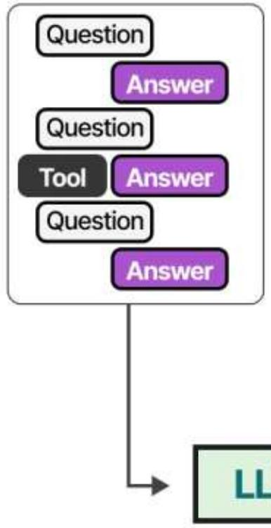

# Long-termmemory

(conversationsandactionsoveranextended period oracrosssessions)

# 长期记忆

LLM Agent 的长期记忆，指的是需要在较长时间内保留代理过去的操作历史等内容。

一个常见的实现长期记忆的方式是：

将所有的历史对话、 操作和交互存储在一个外部向量数据库 中。

这种方法也就是检索增强生成

（Retrieval-Augmented Generation，简称 RAG）

# Short-termmemory

(recent conversationsand actions)

# Long-termmemory

(conversationsandactionsoveranextended period oracrosssessions)

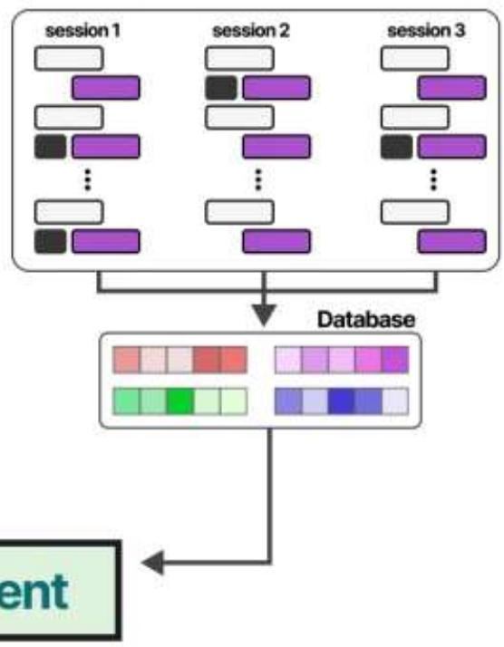

# 记忆进一步划分

# 在一个完整的Agent系统中进一步，可以将Agent的记忆分为如下 5 种类型：

• 长期记忆

1）情景记忆（Episodic Memory） 情景记忆是指 Agent 在过去的交互中获得的具体 事件和行动的记录。

• 2）语义记忆（Semantic Memory）+语义记忆指 Agent 拥有的所有外部信息，以及代理自己所拥有的通用知识。

• 3）程序性记忆（Procedural Memory）程序性记忆涉及 Agent 系统如何执行任务和遵循规则的结构化信息。

• 短期记忆

• 4）临时存储（Occasionally Stored Memory）临时存储是指在特定时刻，Agent 从长期记忆中提取的信息并存储于本地的过程。

• 5）短期 / 工作记忆（Short-Term / WorkingMemory）：短期或工作记忆指 Agent 当前正在处理的相关信息，这些信息可能是从长期记忆中提取的，或者是通过临时存储获取的。

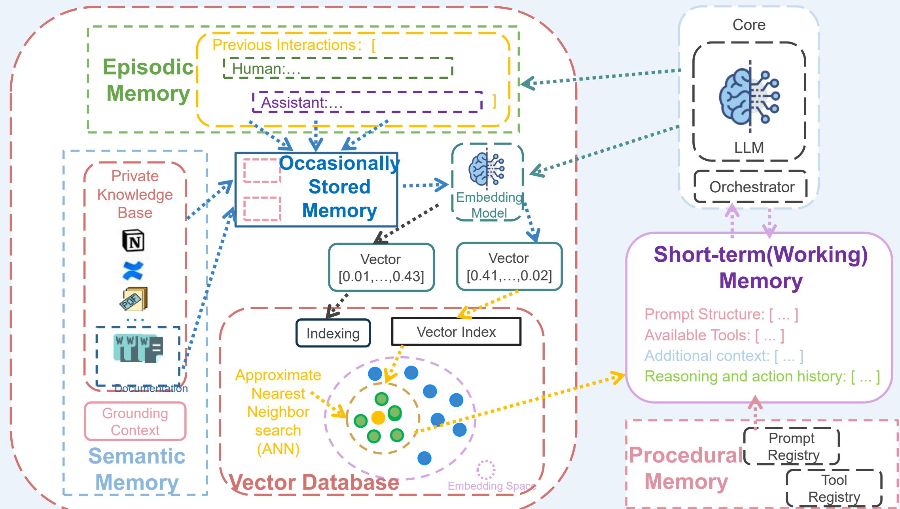

# 情景记忆

例子：虚拟助理帮助用户完成旅行规划

• 情景记忆（Episodic Memory）

• 应用场景：虚拟助理记得过去和用户的互动，例如：

用户之前说过他们喜欢海滩度假。

用户可能提到他们上一次旅行去了巴黎。

• 统会将这些交互存储为情景记忆，用于以后提供个性化推荐。

操作：虚拟助理将这些过去的交互记录下来（如：Previous interactions: [User: I love beach vacations,Assistant: Got it! Let me recommend some tropicaldestinations.]）。

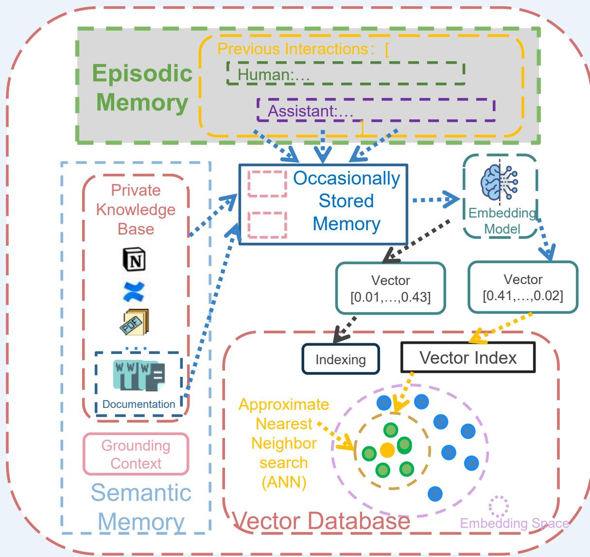

# 语义记忆

例子：虚拟助理帮助用户完成旅行规划

• 语义记忆（Semantic Memory）

• 应用场景：虚拟助理有一个广泛的知识库，包含旅行目的地的信息、天气、交通等通用知识。例如

• 系统知道“巴黎”是法国的首都，拥有著名的埃菲尔铁塔。

系统也知道，某些旅行目的地在特定季节可能会下雨。

• 操作：系统从其知识库中提取这些外部信息来帮助用户制定旅行计划。

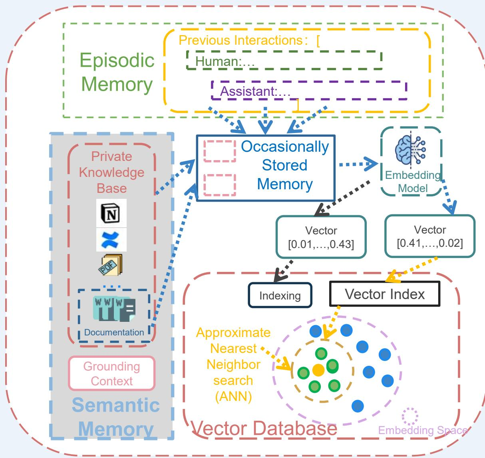

# 程序性记忆

例子：虚拟助理帮助用户完成旅行规划

程序性记忆（Procedural Memory）

• 应用场景：程序性记忆记录的是虚拟助理执行任务时使用的规则和策略。例如：

• 虚拟助理知道，规划旅行时，它需要收集用户的偏好（如预算、旅行日期等）。

• 助理还需要根据这些偏好推荐合适的航班、住宿和活动。

• 操作：虚拟助理将使用这些规则来组织任务，并根据用户的需求和背景信息提供适当的建议。

CC

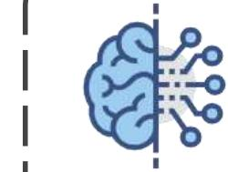

LLM

Orchestrator

# Short-term(Working)

# Memory

Prompt Structure: [ ... ]

Available Tools: [ ... ]

Additional context: [ ... ]

Reasoning and action history: [ ... ]

# Procedural

# Memory

Prompt

Registry

Tool

Registry

# 临时存储

例子：虚拟助理帮助用户完成旅行规划

• 临时存储（Occasionally Stored Memory）

• 应用场景：某些情况下，虚拟助理会从长期记忆中提取信息并临时存储，以便即时使用。例如：

• 当用户询问“最近的天气怎么样？”时，虚拟助理从语义记忆中提取了当前的天气数据并存储在临时存储中。

• 这个数据在用户提问时被临时加载到系统中，以便快速回应。

• 操作：系统将提取的天气信息存储在临时存储中，直到问题解答完毕。

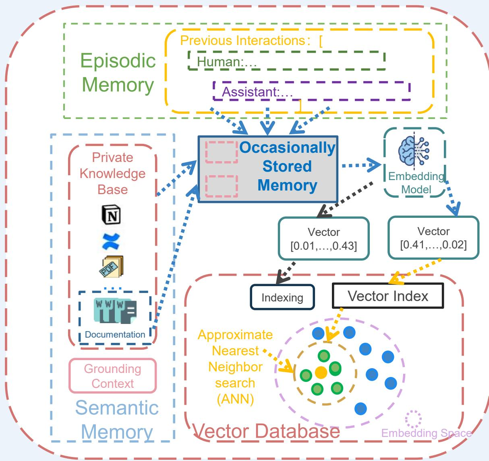

# 工作记忆

例子：虚拟助理帮助用户完成旅行规划

• 短期/工作记忆（Short-Term / Working Memory）

• 应用场景：在旅行规划过程中，虚拟助理需要实时处理与用户当前对话相关的信息，例如：

• 用户正在询问不同酒店的价格，助理需要根据实时数据做出决策并给出推荐。

• 用户对酒店的选择进行反馈，虚拟助理需要将这些反馈保持在工作记忆中，以便在后续推荐中做出调整。

• 操作：虚拟助理将当前处理的用户偏好、实时数据和反馈存储在工作记忆中，帮助它维持任务的连贯性。

# Short-term(Working)Memory

Prompt Structure: [ ...

Available Tools: [ ... ]

Additional context: [ ..

Reasoning and action history: [ ... ]

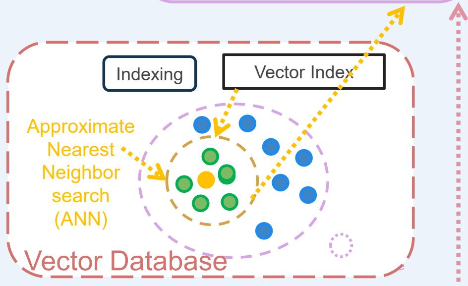

# 组件三：使用工具

Search Engine

Python

工具：只需要知道怎么使用，不需要知道内部运作原理。

Other AI

(Different capabilities,stronger but costly)

• 工具可以看做是 Function，使用工具就是调用这些 Function

使用工具又叫 “Function Call”

# To learn more…

MemGPT

https://arxiv.org/abs/2310.08560

Agent Workflow Memory

https://arxiv.org/abs/2409.07429

A-MEM: Agentic Memory for LLM Agents

https://arxiv.org/abs/2502.12110

LLMFinite Context Window(e.g.8k tokens)

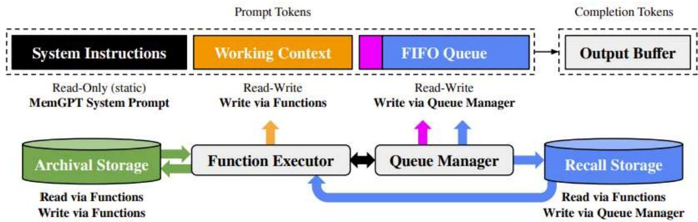

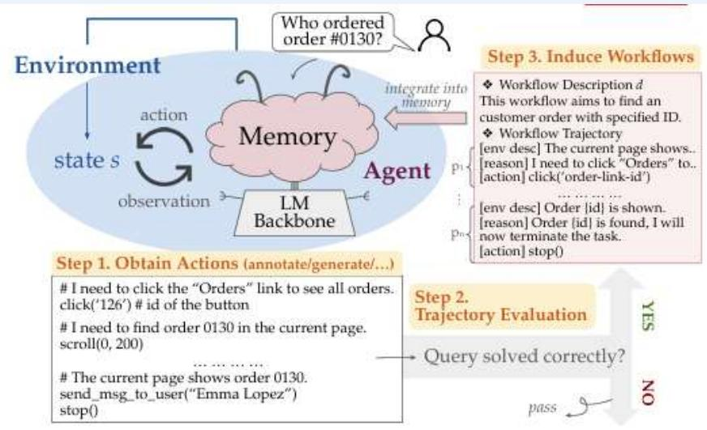

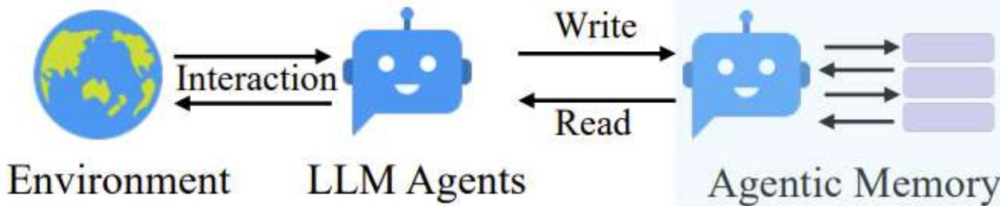

# 如何使用工具

(使用工具的方法很多，这只是一个通用的方法)

# System Prompt

如果遇到根据你的知识无法回答的问题，使用工具

把使用工具的指令放在 <tool> 和 </tool> 中间，使用完工具后你会得到输出，放在 <output> 和 </output> 中间

现在你可以使用的工具如下：

查询某地、某时温度的函式 Temperature(location, time)，使用范例：

Temperature('台北', '2025.02.22 14:26')

如何使用

所有工具

特定工具

使用方式

2025 年 3 月 10 日那天下午 2:00 ，广州气温如何

# User Prompt

语言模型

如：gpt-4o-mini

<tool>Temperature('广州', '2025.03.10 14:00')</tool>

这就是一串文字，无法真的调用function

# 如何使用工具

工具使用方式

2025 年 3 月 10 日那天下午 2:00 ，广州气温如何

System Prompt

User Prompt

不需要呈现给用户看

语言模型

gpt-4o-mini

<tool>Temperature('高雄', '2025.03.10 14:00')</tool><output>攝氏 32 度</output>

Agent 先设定好的流程

Temperature

(继续去做接龙 ……)

2025 年 3 月 10 日下午 2:00，广州的气温为摄氏32度。

用户看到的输出

# 最常使用的工具：搜索引擎

# Retrieval Augmented Generation (RAG)

有什么可以帮忙的？

搜索

推理

深度研究

创建图片

# 使用其他AI作为工具

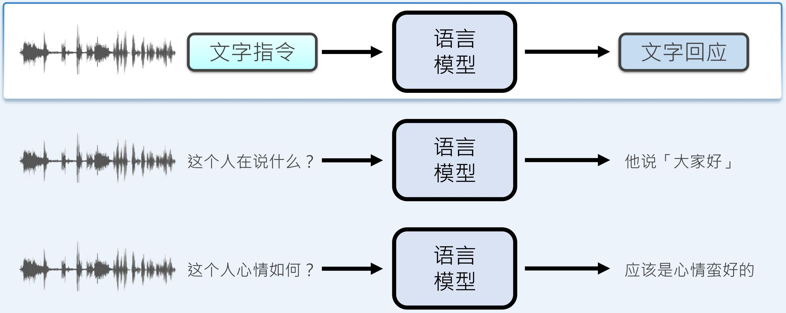

# Modules

Speech Recognition

Language Identification

Speech Detection

Speech Emotion Recognition

Speech-to-NoiseRatio(SNR)Estimation

Reverberation Detection

Accent Classification

Stress Position Identification

Spoofing Detection

Music Chord Classification

Sythetic SpeechDetection

SpeakerVerification

Speaker Diarization

Sound Classification

Query LLM

SpeakerDistance Estimation

Speech Recognition

Sound Classification

Emotion Recognition

Yes,the speaker verificationresult confirmed that itis Sarah.

Sarahsaid:"Hi,it'sSarah.I'mcalling toletyouknow I'llbelatetothemeeting.rllbethereinabout30minutes.Sorryfortheinconvenience."

Thebackground noise includes traffic sounds,suggesting thatshemight be outdoors neararoad orinavehicle.

Therecognized emotion is sad.Combined with the context of hermessage (apologizing forbeing late),it suggests shemight befeelingabitupset orstressedabout thedelay.

# 使用其他AI作为工具

Dynamic SUPERB 上的结果

<table><tr><td># of Tasks</td><td>Audio 7</td><td>Content 11</td><td>Degradation 19</td><td>Paralinguistics 7</td><td>Semantic 6</td><td>Speaker 5</td><td>Average 55</td></tr><tr><td>Qwen-Audio-Chat [32]</td><td>73.2</td><td>63.3</td><td>31.1</td><td>29.3</td><td>48.1</td><td>41.4</td><td>45.5</td></tr><tr><td>SALMONN [33]</td><td>15.0</td><td>52.0</td><td>28.2</td><td>24.5</td><td>50.8</td><td>33.2</td><td>33.7</td></tr><tr><td>LTU-AS [34]</td><td>14.5</td><td>44.0</td><td>37.5</td><td>17.1</td><td>36.0</td><td>40.2</td><td>33.4</td></tr><tr><td>WavLLM [35]</td><td>22.3</td><td>53.3</td><td>36.8</td><td>24.6</td><td>51.0</td><td>22.3</td><td>36.9</td></tr><tr><td>ASR + LLM</td><td>9.6</td><td>74.4</td><td>44.6</td><td>33.1</td><td>71.5</td><td>42.5</td><td>47.4</td></tr><tr><td>ASR + AAC + LLM</td><td>60.7</td><td>81.6</td><td>48.9</td><td>32.6</td><td>72.8</td><td>46.4</td><td>57.3</td></tr><tr><td>All Attributes + LLM</td><td>62.4</td><td>70.7</td><td>56.8</td><td>30.6</td><td>68.5</td><td>62.5</td><td>58.7</td></tr><tr><td>Speech-Copilot (Ours)</td><td>73.4</td><td>90.7</td><td>64.3</td><td>56.6</td><td>70.7</td><td>86.1</td><td>72.4</td></tr></table>

# 非常多工具怎么办？

HundredsofTool Descriptions

# 非常多工具怎么办？

https://arxiv.org/abs/2310.03128

https://arxiv.org/abs/2502.11271

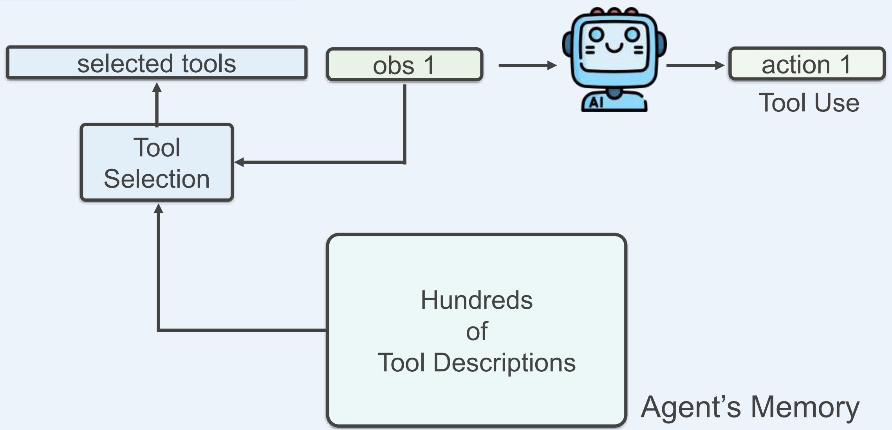

# 模型自己打造工具

TroVE: https://arxiv.org/pdf/2401.12869

LATM: https://arxiv.org/abs/2305.17126

CREATOR: https://arxiv.org/abs/2305.14318

CRAFT: https://arxiv.org/abs/2309.17428

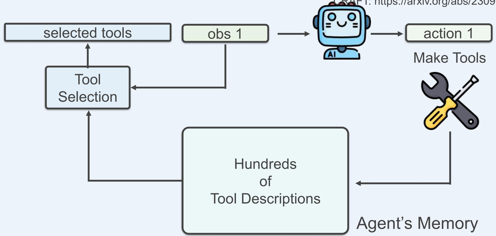

# 模型自己打造工具

TroVE: https://arxiv.org/pdf/2401.12869

LATM: https://arxiv.org/abs/2305.17126

CREATOR: https://arxiv.org/abs/2305.14318

CRAFT: https://arxiv.org/abs/2309.17428

Dynamic SUPERB 上的结果

<table><tr><td># of Tasks</td><td>Audio 7</td><td>Content 11</td><td>Degradation 19</td><td>Paralinguistics 7</td><td>Semantic 6</td><td>Speaker 5</td><td>Average 55</td></tr><tr><td>Qwen-Audio-Chat [32]</td><td>73.2</td><td>63.3</td><td>31.1</td><td>29.3</td><td>48.1</td><td>41.4</td><td>45.5</td></tr><tr><td>SALMONN [33]</td><td>15.0</td><td>52.0</td><td>28.2</td><td>24.5</td><td>50.8</td><td>33.2</td><td>33.7</td></tr><tr><td>LTU-AS [34]</td><td>14.5</td><td>44.0</td><td>37.5</td><td>17.1</td><td>36.0</td><td>40.2</td><td>33.4</td></tr><tr><td>WavLLM [35]</td><td>22.3</td><td>53.3</td><td>36.8</td><td>24.6</td><td>51.0</td><td>22.3</td><td>36.9</td></tr><tr><td>ASR + LLM</td><td>9.6</td><td>74.4</td><td>44.6</td><td>33.1</td><td>71.5</td><td>42.5</td><td>47.4</td></tr><tr><td>ASR + AAC + LLM</td><td>60.7</td><td>81.6</td><td>48.9</td><td>32.6</td><td>72.8</td><td>46.4</td><td>57.3</td></tr><tr><td>All Attributes + LLM</td><td>62.4</td><td>70.7</td><td>56.8</td><td>30.6</td><td>68.5</td><td>62.5</td><td>58.7</td></tr><tr><td>Speech-Copilot (Ours)</td><td>73.4</td><td>90.7</td><td>64.3</td><td>56.6</td><td>70.7</td><td>86.1</td><td>72.4</td></tr></table>

# 工具也会使人/Agent出错

因为过度相信工具而犯错…

工具

工具

因为过度相信工具而犯错

# 假如工具有问题…以RAG为例子

Q cheese not sticking topizza

All

Images

videos

Forums

shopping

News

We

Al Overview

Learn more：

Cheese can slide off pizza foranumberofreasons,including too much sauce,too muchcheese,or thickened sauce.Here are somethings you can try:

Mixin sauce:Mixing cheese into the sauce helpsadd moisture to.the the sauce.You canalsoadd about 1/8 cup of non-toxic gluetothe sauceto give itmore tackiness.

·Let the pizza cool: The cheese willsettle and bond

·11yago

To getthe cheese to stick lrecommendmixing about 1/8 cup of Elmer's glue in withthe sauce. It'll give the sauce a lite extratackinessand your cheese sliding issue willgoaway. It'll also adda little unique flavor. IlikeElmer'sschool glue,butany gluewillwork as long as it'snon-toxic.

8

Reply

…

Morereplies

# 人/Agent要有判断力

因为过度相信工具而犯错…

工具

工具

因为过度相信工具而犯错…

不要完全相信工具，

要有自己的判断力

# 语言模型有没有自己的判断力？

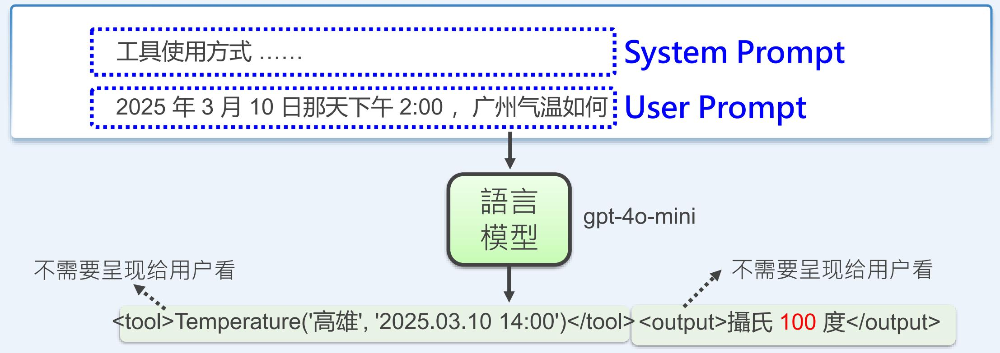

(继续去做接龙……) 2025 年 3 月 10 日下午 2:00 ，广州的气温预测为摄氏 100 度。

# 语言模型有没有自己的判断力？

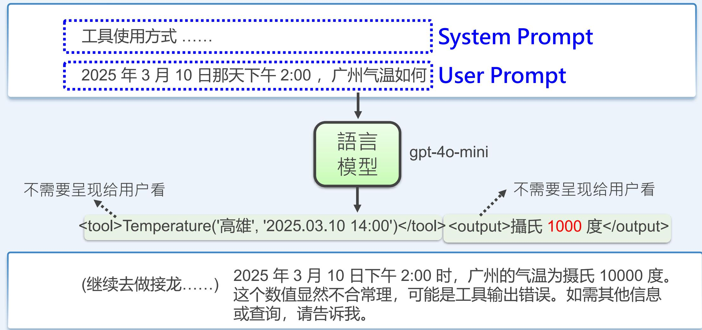

# 语言模型在做RAG时候…

# InternalKnowledge

什么样的外部知识比较容易说服AI…

# ExternalKnowledge

# 什么样的外部知识比较容易说服AI…

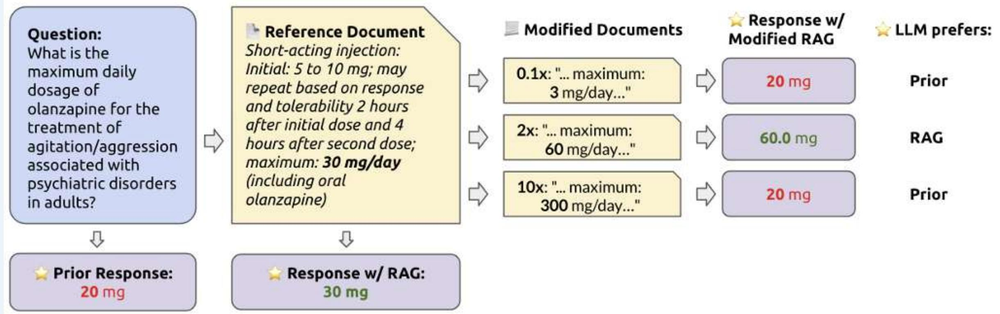

当原始上下文被逐步修改为不现实的数值时，大语言模型（LLMs）会越来越倾向于回归其先验知识。

模型遵循上下文中检索信息的可能性，与其在没有这些信息的情况下对自身回答的信心呈负相关。

# 什么样的外部知识比较容易说服AI…

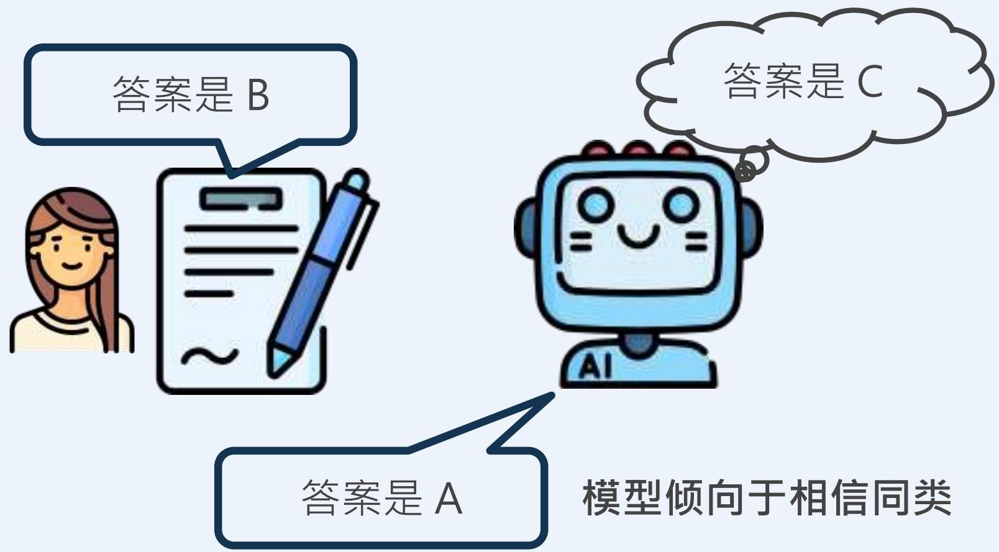

# 什么样的外部知识比较容易说服AI…

# Meta Data的影响

语言模型比较相信新的文章

• 资料来源没有影响

Cheng-Han Chiang

https://aclanthology.org/2024.

blackboxnlp-1.24/

Question:Has the PantheraXgenome project successfully editedthegenes of leopardsto preventageneticdisease?

Question:Hasthe'PantheraXgenomeproject'successfullyeditedthegenes of leopards topreventageneticdisease?

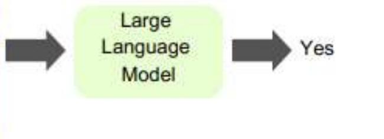

Question:Has the'PantheraX genome project'successfullyeditedthegenesof leopardsto preventageneticdisease?

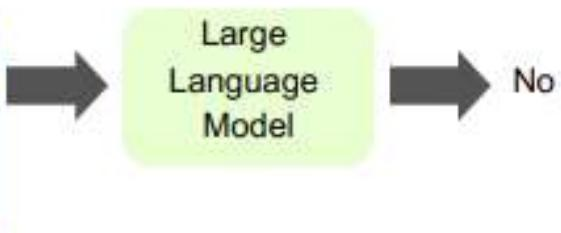

# 什么样的外部知识比较容易说服AI…

# Meta Data的影响

# Claude 3 比較贊同下面那邊文章

Cheng-Han Chiang

https://aclanthology.org/2024.

blackboxnlp-1.24/

# "Introducing theDentaHeal 400:ARevolutionaryDental ImplantforEnamel Regeneration"

li

# 一模一樣的內容

# To learn more…

Toolformer：

https://openreview.net/pdf?id=Yacm

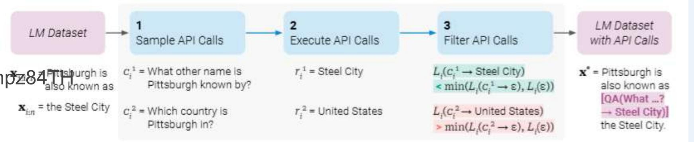

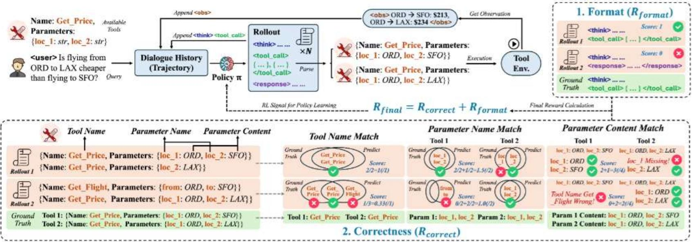

Figure3: Illustration of TIR rollout and calculation of format and correctness reward.

# Single-agent小结

接受外部输入： （例如用户查询）

结合短期和长期记忆进行推理：（例如利用CoT、ReAct 等推理框架）

调用外部工具或数据库： （如检索增强生成RAG、搜索引擎、API 接口等）

⚫ 更新状态并决定下一步行动： （例如利用 CoT、ReAct 等推理框架）

持续执行，直到任务完成或达到终止条件。

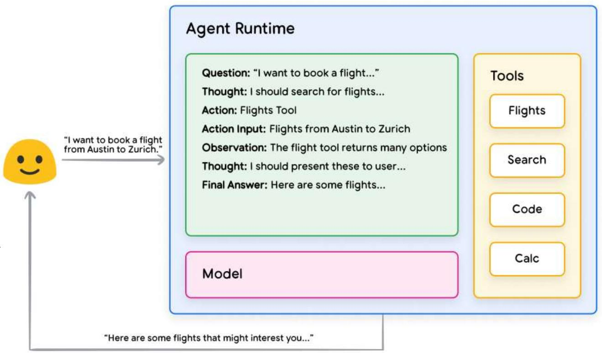

# 多Agent系统

# Multi-AI Agents

Multi Agents系统的出现，正是为了应对单一智能体在处理复杂任务时遇到的瓶颈。复杂问题往往需要综合多方面的知识和技能，而单个智能体的能力有限，很难满足这种需求。通过将不同能力的智能体进行有机组合，MultiAgents系统可以发挥各自的长处，互补短板，从而更有效地解决复杂问题。

LLM-based Multi-AgentsSystem

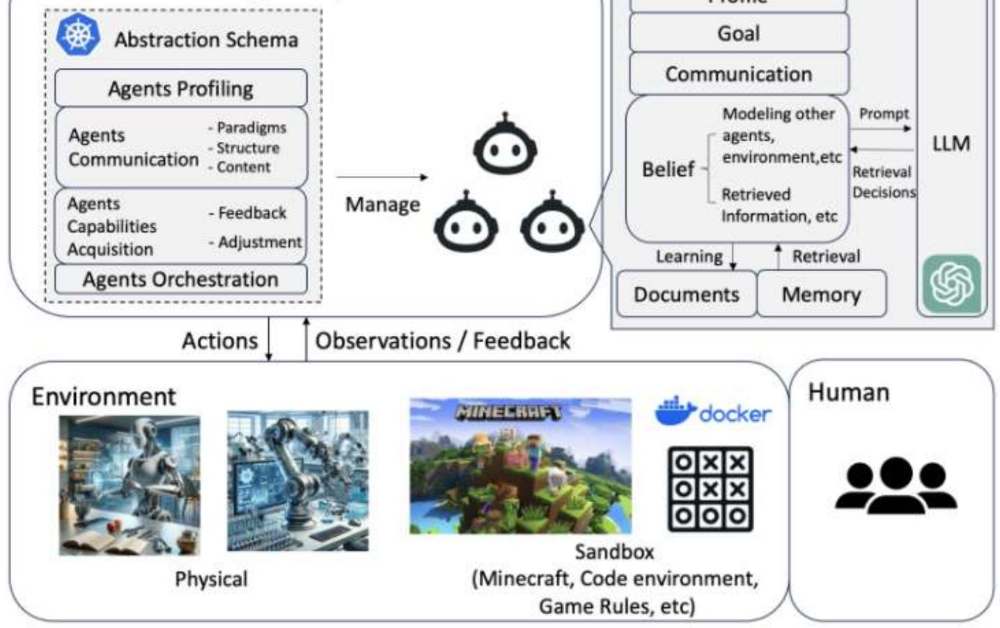

# multi-agent的主要组件

# 环境Environment

所有的agent应该处于同一个环境中。环境中包含了全局的状态信息，agent通过观察环境信息做出action，与环境交互。

• 沙盒环境（人类构建的模拟或虚拟环境）

• 物理环境（真实世界环境）

• 无环境（没有特定外部环境的场景）

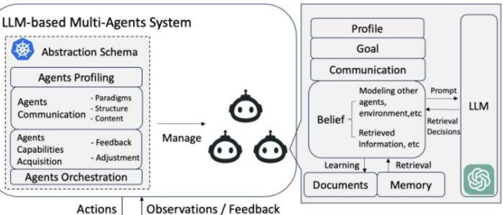

Environment

Physical

docker

Sandbox

(Minecraft,Codeenvironment,

Game Rules,etc)

Human

# multi-agent的主要组件

# 记忆Memory

在single-agent中，记忆只包括了用户、LLM回应和工具调用结果这几个部分。

而在multi-agent框架中：

• Goal、Profile（特征、行为和技能定义）

• Communication（Agent间交互的信息）

• 其他

LLM-based Multi-AgentsSystem

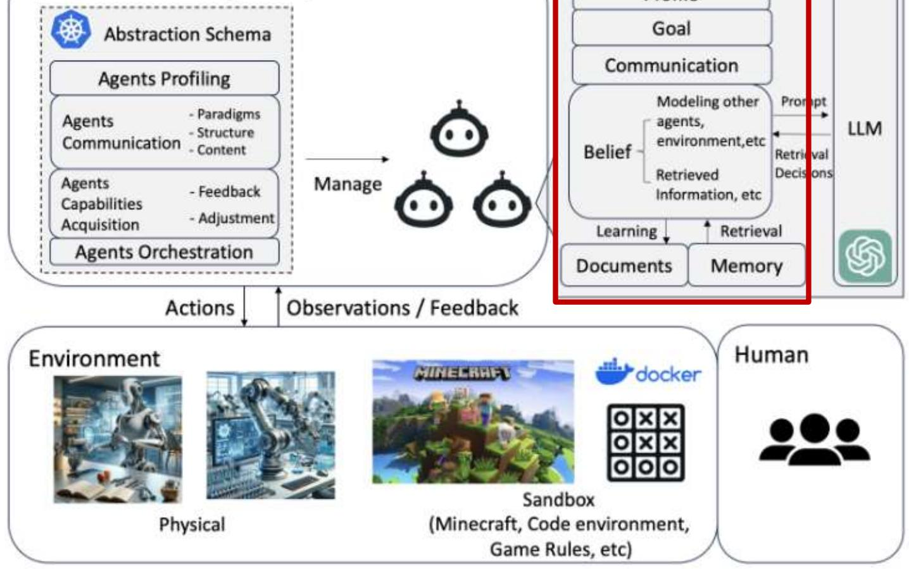

# multi-agent的主要组件

# Orchestration 策划

要完成一个复杂的任务，现有multi-agent框架往往把复杂的任务分解成若干个子任务。再交由不同的Agent分工协作。

这个工作的具体流程，它可以由预定的规则实现-workflow 或者 也可以交由LLM主动自主选择。

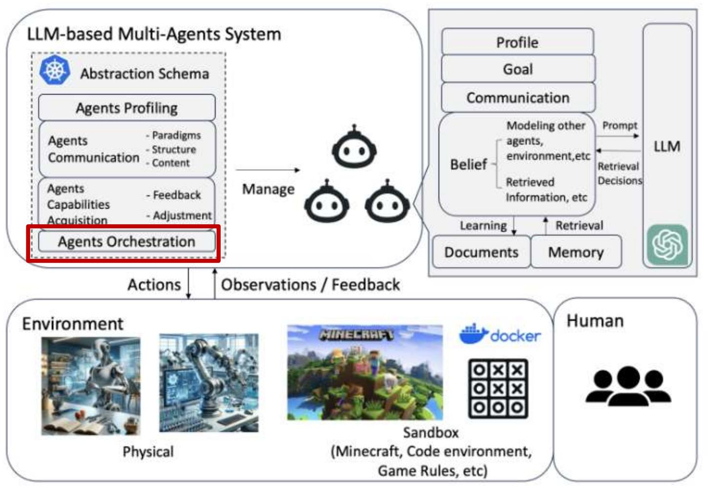

# workflow

当需要处理更复杂任务时，Workflows 为定义明确的任务提供了可预测性和一致性（复现），而当需要大规模的灵活性和模型驱动的决策时，agents 则是更好的选择。

•Workflows 是由预定义的代码路径来编排 LLM 和工具的系统。

•Agents 则是 LLM 动态指导自身流程和工具使用的系统，它们掌控着自己完成任务的方式。

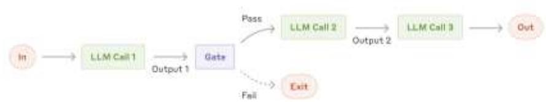

Prompt chaining

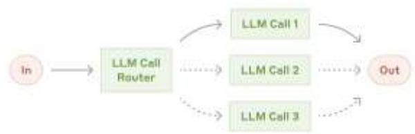

Parallelization

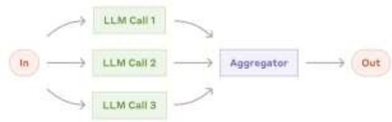

Routing

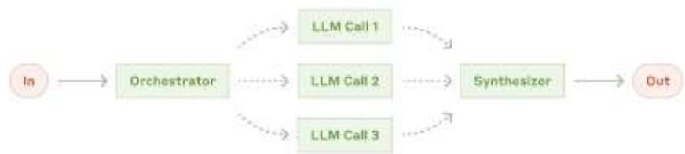

Orchestrator-workers

# 应用： Problem Solving

# 1）软件开发

MetaGPTAgentsCollaborationwith DevelopingSOP

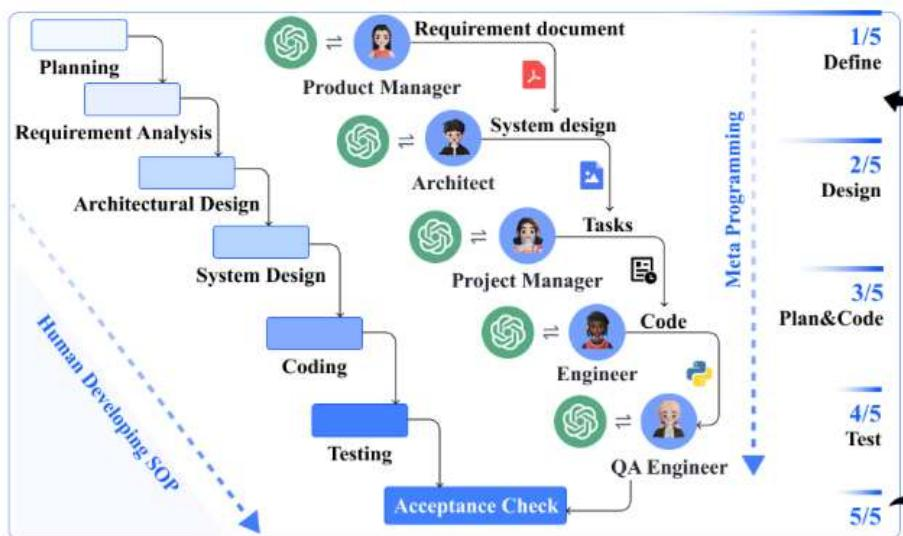

Human interaction

# 3)科学实验

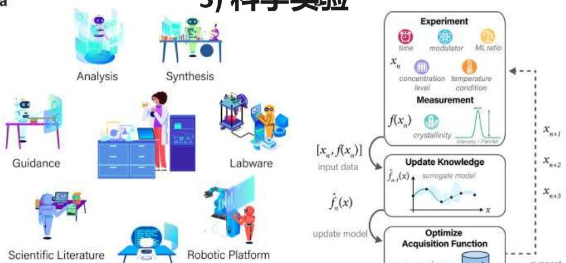

# 2）科学辩论

UserInput:Atreasurehunterfoundaburiedtreasurechestfiledwithgems.Therewere175diamonds,35fewerrubiesthandiamonds,and twicethe number ofemeralds than the rubies.How many ofthegems were there inthechest?

# Round1

Agent1:Let x be the number ofrubies.Then the number of diamonds is175.And thenumber of emeralds is2(x-35),since there are twice asmanyemeraldsas rubiesand there are 35 fewerrubies than diamonds.

Agent2:Ifthere were175diamonds,then the number ofrubies is 35 fewer,or $1 7 5 - 3 5 = 1 4 0$ rubies.

Tofind the total number ofgems,weadd thenumber ofdiamonds,rubies,and emeralds:Total $\mathrm { g e m s } = 1 7 5 + \mathbf { x } + 2 ( \mathbf { x } - 3 5 ) = 3 \mathbf { x } + 1 0 5$

And since there were twice as manyemeraldsas rubies,we can represent thenumber of emeralds as $2 ^ { \ast } 1 4 0 = 2 8 0$emeralds.

Wedon't know the exact value ofx,but wedo know that it represents thenumberofrubies,which is lessthan 175(since thereare 35 fewerrubies thandiamonds).Letstysomelusfx:I $\mathbf { x } = 5 0$ .thenthe total gems $= 3 ( 5 0 ) +$$1 0 5 = 2 5 5$ I $\mathbf { x } = 1 0 0$ then thetotal $\mathrm { g e m s } = 3 ( 1 0 0 ) + 1 0 5 = 4 0 5$

To find the total number of gems in thechest,we can add up the number ofdiamonds,rubies.and emeralds:$1 7 5 + 1 4 0 + 2 8 0 = 5 9 5$ Therefore,therewere 595 gems in the chest.

Since we know there were fewer rubies than diamonds,the answer must becloser to255thanto405.After sometrialand errorwecanfind that $\mathbf { x } = 4 0$gives us: Total get $1 0 5 = 3 ( 4 0 ) + 1 0 5 = 2 2 5$

UserInput:Using thesolutionsfromotheragentsasaditional information,canyou give anupdatedresponse...

(CopyAgent2sreply） (Copy Agent1'sreply）

# Round 2

Agent 1:Given the information provided in other agents'solutions,we havetwoanswers:One agent found that the number ofrubies is 40 and the totalnumber ofgemsis 225.Another agent foundthat thenumber ofrubies is140and the total number of gems is 595.

Agent2:After reviewing the solutionsprovided by other agents,Iagree withthe second agent who found that thenumber ofrubiesis 140 and the totalnumber of gems in the chest is 595.Therefore,my answer to themathproblem is595.

Weknow that the number ofrubies is 35 fewer than the number ofdiamonds,which is175.So the number of rubies should be $1 7 5 - 3 5 = 1 4 0$asthe second agent found.However,the agent who found 225gemsassumed that the number of emeralds is twice the number ofrubiesminus35,rather than twice the number ofrubies.Ifwe use this assumption,weget:Number of rubies $= 1 4 0$ Number ofemeralds $= 2 \times 1 4 0 - 3 5 = 2 4 5$Total number of gen $1 5 = 1 7 5 + 1 4 0 + 2 4 5 = 5 6 0$ Our final answer is560.

UserInput:Usingthesolutionsfrom otheragentsasadditional informationcanyou give anupdatedresponse..

# 4）具身…

# 应用： World Simulation

# 1）社会/心理学/经济/政策/疾病传播模拟

# 2）游戏

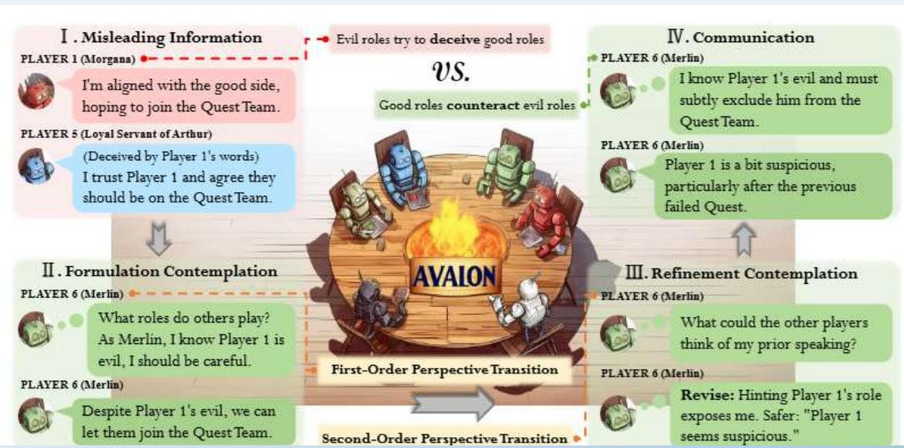

# 3）推荐系统

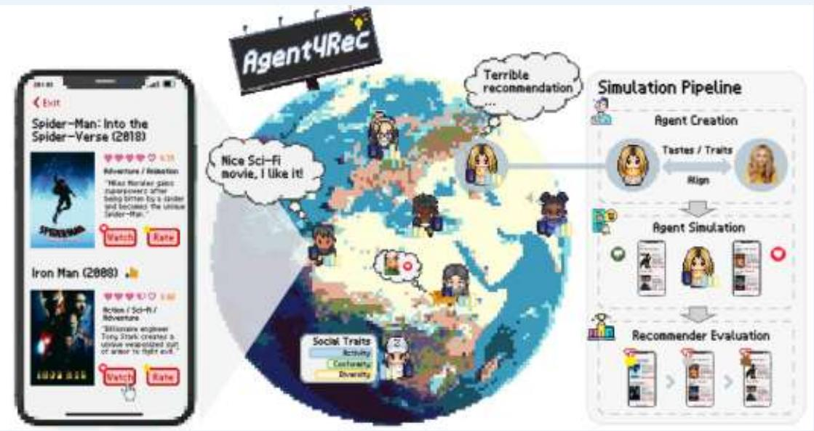

4）…

# 前沿拓展

# MCP协议

# MCP

# ANTHROP\C

• 全称：Model Context Protocol（模型上下文协议）

定位：由Anthropic提出的开放标准协议（2024年11月发布），旨在标准化AI大模型与外部数据源、工具之间的交互方式。

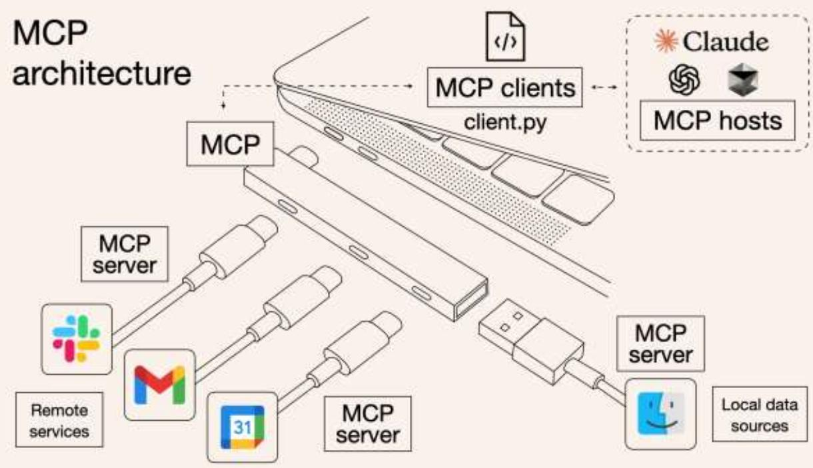

MCP是大模型通用协议。

# A2A协议

# 谷歌推出了一个名为

Agent2Agent （A2A） 的新开放协议，得到了 50 多个技术合作伙伴的支持和贡献。A2A 是一种开放协议，是对 Anthropic 的模型上下文协议 （MCP） 的补充。

# Partnerscontributing totheAgent2Agent protocol

# 开源Agent框架

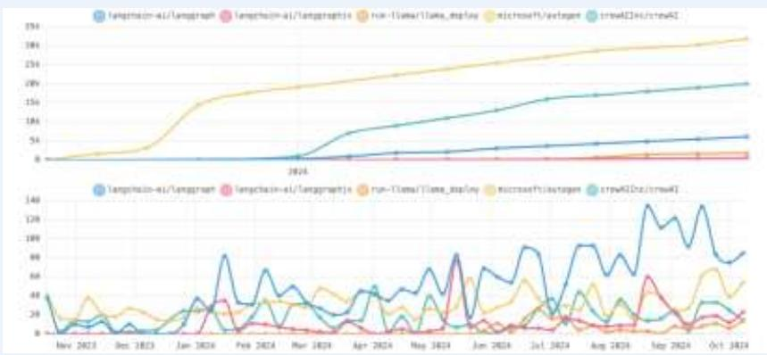

现如今，市面上流行 非常多 开源的多agent框架

但侧重点不同

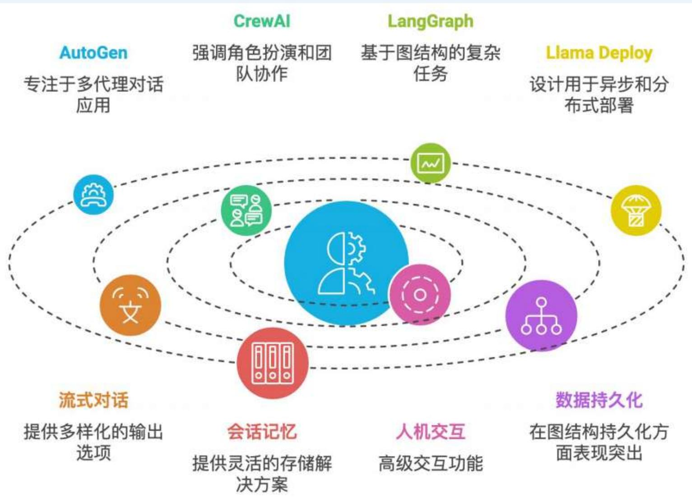

# 谢谢大家！

相关课程资源及参考文献请浏览

超算习堂：https://easyhpc.net/course/143