# 不确定性知识表示与推理

# Building Confidence with Probabilistic

授课对象：计算机科学与技术专业 二年级

课程名称：人工智能（专业必修）

节选内容：第四章 不确定性知识表示与推理

课程学分：3学分

# 前情知识回顾：确定性知识表示与推理

“刘备的义弟是关羽 =

“关羽的义弟是张飞“

“姜维的主公是刘备”

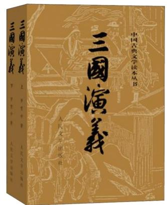

知识表示

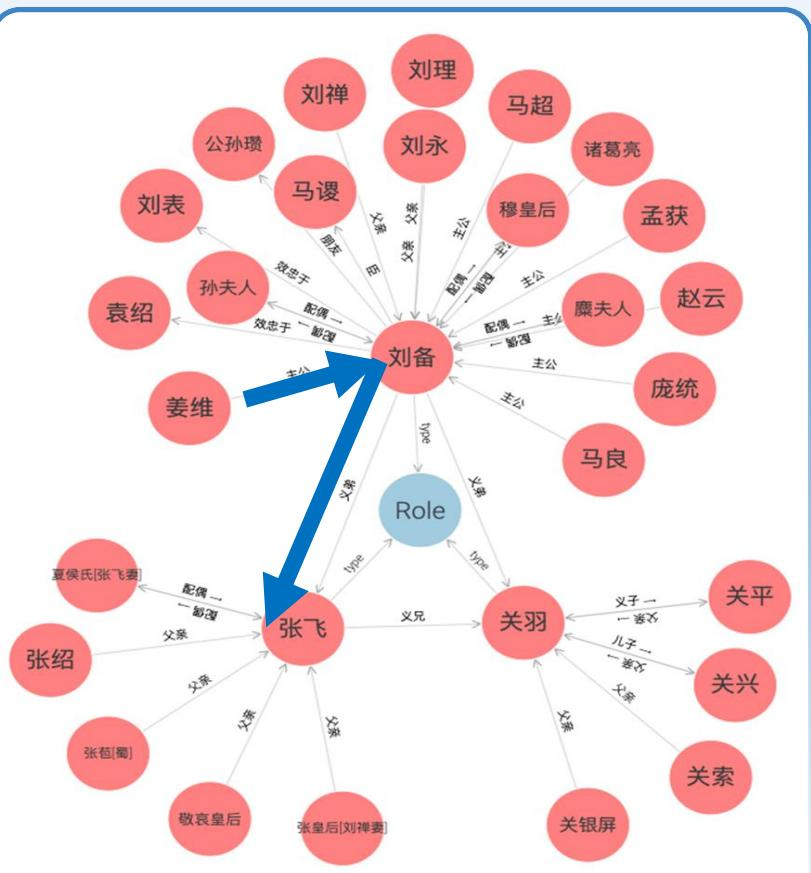

问：姜维和张飞的关系？

“姜维的主公的义弟是张飞”

谓词逻辑归结推理

假设现有一个新问题：“一个从未见过的角色是否可能成为蜀汉的将领？

这个问题并不能通过确定性推理直接回答，而需要概率性推断

# 前情知识回顾：确定性知识表示与推理

在客观世界中,由于事物发展的随机性和复杂性,人类认识的不完全、不可靠、不精确和不一致性,自然语言中存在的模糊性和歧义性,使得现实世界中的事物以及事物之间的关系极其复杂,带来了大量的不确定性。如果采用确定性的经典逻辑处理不确定性,就需要把知识或思维行为中原本具有的不确定性划归为确定性处理,这无疑会舍去事物的某些重要属性,造成信息流失,妨碍人们做出最好的决定,甚至可能做出错误的决定。大多数要求智能行为的任务都具有某种程度的不确定。不确定性可以理解为在缺少足够信息的情况下做出判断。

# 前情知识回顾：确定性知识表示与推理

生活中不确定性随处可见，主要源于信息不完整性、随机性事件干扰以及语义或感知的模糊性，广泛存在于医疗诊断、金融预测及自然语言处理等复杂场景。

# 信息不完整

在医疗诊断中，患者可能无法提供完整症状，如某些罕见病症状隐蔽，导致诊断困难。信息不完整还常见于数据采集环节，传感器故障或网络传输问题使数据缺失。

# 随机性

金融市场波动受多种因素随机影响，如突发经济事件、政策调整等，难以精准预测。生物实验中，基因表达受环境因素随机干扰，不同实验条件下结果差异大。

# 模糊性

自然语言中“很快”“高个子”等表述模糊，不同人理解不同，给信息处理带来挑战。图像识别中，物体边缘模糊，难以精确界定目标区域，影响识别准确性。

# 更加不确定的现实场景

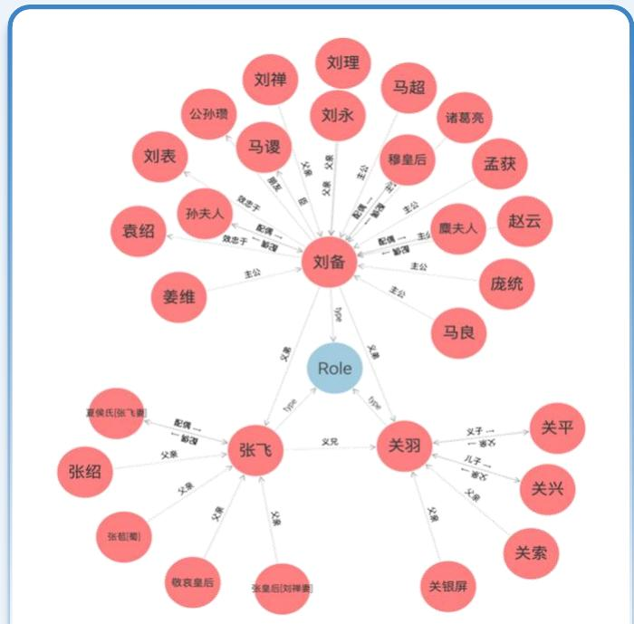

确定性知识表示与推理

不确定性知识表示与推理

现实世界中的许多问题并不确定，状态、动作、甚至目标都可能带有不确定性

如何在不确定性条件下进行推断和决策？

贝叶斯推断

# 不确定性

在搜索问题中，我们将动作视为确定性（deterministic）的执行某个动作 A 在状态 $S _ { 1 }$ 下会导致系统转移到状态 $S _ { 2 }$ 。

此外，我们假设存在一个固定的初始状态 $S _ { O }$ 。

因此，在执行任意一系列动作后，我们可以精确地知道最终到达的状态。

这些假设在某些领域是合理的，但在许多领域中并不成立。

# 不确定性

我们可能无法准确知道起始状态是什么，

例如，在扑克牌游戏中，我们看不到对手的手牌，

或者，我们无法确切知道患者的疾病是什么。

我们可能无法完全预测某个动作的所有影响：

该动作可能带有随机性，比如掷骰子。

我们可能不知道某种药物的所有长期影响。

动作可能会失败。

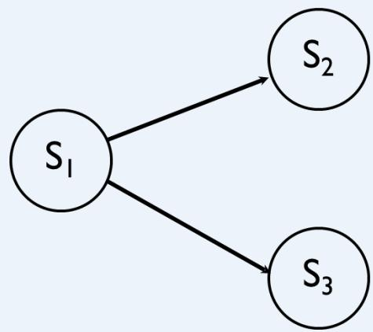

Based on what we can see,there's a $30 \%$  chance we're incell S_, $30 \%$ in $\mathsf { S } _ { \mathsf { s } }$ and $40 \%$ inS3....

$\mathsf { M o v e } ( \mathsf { S } _ { 1 } , \mathsf { ' N } ^ { \ast } ) = \mathsf { S } _ { 2 } \mathsf { 5 0 \% }$ of the time

${ \sf M o v e } ( \mathsf { S } _ { 1 } , \mathsf { N } ^ { \prime } ) = \mathsf { S } _ { 3 }$ $50 \%$ of the time

# 不确定性

在这些领域中，我们仍然需要采取行动，

⚫ 但我们不能仅仅依赖已知的真实事实来做决策。

⚫ 我们必须“赌博” （做出不确定性下的决策）。

但是，如何才能做到理性地赌博？

# 示例

设想下：们需要前往机场，但无法确切知道路上的交通状况。那么，我们应该什么时候出发呢？

如果我们必须在工作日晚上 9 点到达机场，

我们可以“安全地”提前1 小时出发。

⚫ 尽管存在行程时间更长的可能性，但概率较低。

⚫ 如果我们必须在周五下午 6:30 到达机场，

我们很可能需要 1.5 小时或更长时间才能到达。

在不确定性环境下进行理性决策，通常意味着最大化期望效用（Expected Utility）

# 期望效用例子

• 对结果的概率分布（也称为“联合分布” joint distribution）。

<table><tr><td>Event</td><td>Go to Bloor St.</td><td>Go to Queen Street</td></tr><tr><td>Find Ice Cream</td><td>0.5</td><td>0.2</td></tr><tr><td>Find donuts</td><td>0.4</td><td>0.1</td></tr><tr><td>Find live music</td><td>0.1</td><td>0.7</td></tr></table>

结果的效用 （Utilities of Outcomes）。 。

<table><tr><td>Event</td><td>Utility</td></tr><tr><td>Ice Cream</td><td>10</td></tr><tr><td>Donuts</td><td>5</td></tr><tr><td>Music</td><td>20</td></tr></table>

# 期望效用例子

最大期望效用？ （Maximum Expected Utility）

<table><tr><td>Event</td><td>Go to Bloor St.</td><td>Go to Queen Street</td></tr><tr><td>Ice Cream</td><td>0.5 * 10</td><td>0.2 *10</td></tr><tr><td>Donuts</td><td>0.4 * 5</td><td>0.1 * 5</td></tr><tr><td>Music</td><td>0.1 * 20</td><td>0.7 * 20</td></tr><tr><td>Utility</td><td>9.0</td><td>16.5</td></tr></table>

这是，去皇后街（Queen Street）

然而，如果甜甜圈或冰淇淋的效用更高，它可能就会是“去布洛尔街（Bloor Street）”。

# 不确定性

To act rationally under uncertainty, we must be able toevaluate how likely certain things are.

在面对不确定性时，要做出理性的行为，我们必须能够评估某些事情发生的可能性。

By weighing likelihoods of events (probabilities), we candevelop mechanisms for acting rationally under uncertainty.通过权衡事件的可能性（概率），我们可以开发出在不确定性下行动的机制。

# 理论发展背景

 人工智能系统的表示与推理过程实际上就是一种思维过程 。

其中 ，推理是从 已知事实出发，通过运用相关的知识逐步推出某个结论的过程 。人们常常对 原因和结果的推理很感兴趣。

比如，我感冒症状减轻了，是不是因为服用了维 生素C片导致的？但是， 由于事件都带有随机性，导致看似直截了当的问题， 却不容易回答。例如，我可能仅仅喝白开水，感冒也会自己消失。

n 已知事实 （证据）， 用以指出推理的出发点及推理时应使用的知识；

n 知识是推理得以向前推进，并逐步达到最终目标的依据。

# 般的推理过程

如已知:

事实A，B

知识 $\mathrm { A } \land \mathrm { B }  \mathrm { C }$

可以推出结论C。

# 理论发展背景

 按照所用知识的确定性，可以分为确定性和不确定性两种类别。

n 确定性推理是建立在经典逻辑基础上的，经典逻辑的基础之一就是集合论。 这在很多实际情况中是很难做到的， 如高、 矮、胖、 瘦就很难精确地分开；

n 不确定性推理就是从不确定性初始证据出发， 通过运用不确定性的知识， 最终推出具有一定程度的不确定性但却是合理或者近乎合理的结论的思维过程。

# 理论发展背景

 常识（commonsense）具有不确定性。

n 一个常识可能有众多的例外，一个常识可能是一种尚无理论依据或者缺乏充分验证的经验。

 常识往往对环境有极强的依存性。

“鸟是会飞的”

 把指示确定性程度的数据附加到推理规则， 并由此研究不确定强度的表示和计算问题 。

 处理数据的不精确和知识的不确定所需要的一些工具和方 法，包括：

基于Bayes理论的概率推理。

基于可信度的确定性理论

基于信任测度函数的证据理论

基于模糊集合论的模糊推理等

# 理论发展背景

# 不确定知识表示和推理方法

# 确定性理论

 该理论由Shortliffe提出，并于1976年首次在血液病诊断 专家系统MYCIN中得到了成功应用。

 在确定性理论中，不确定性是用可信度来表示的。

# 证据理论

 用于处理不确定性、不精确以及间或不准的信息

 引入了信任函数来度量不确定性，引用似然函数来处理 由于“不知道”引起的不确定性。

# 模糊逻辑和模糊推理

 模糊集合论是1965年由Zadeh提出的，随后，他又将模糊 集合论应用于近似或模糊推理，形成了可能性理论。

 模糊逻辑可以看作是多值逻辑的扩展。模糊推理是在一 组可能不精确的前提下推出一个可能不精确的结论。

# 理论发展背景

 不确定知识表示与推理是人工智能的核心模块之一 ，其理论基础包括概率论和可能性理论等。

概率论处理的是由随机性引起的不确定性；

可能性理论处理的是由模糊性引起的不确定性。

本讲主要以概率论为基础，介绍概率图模型的表示、推理和学习 等内容。

# 理论发展背景

#  概率图模型

概率论与图论结合的产物，为统计推理和学习提供了一个统一的灵活框架；

概率图模型用节点表示变量，节点之间的边表示局部变量间的概率依赖关系。系统的 联合概率分布表示为局部变量分布的连乘积，该表示框架不仅避免了对复杂系统的 联合概率分布直接进行建模，而且易于引入先验知识 。

#  概率图模型统一了目前广泛应用的许多统计模型和方法

马尔科夫随机场（MRF）、条件随机场（CRF）。

隐马尔科夫模型（HMM）、多元高斯模型。

卡尔曼滤波、粒子滤波、变分推理等

# 理论发展背景

 Judea Pearl（朱迪亚 . 佩尔）， 贝叶斯网络之父，以色列裔美籍计算机科学家、哲学家，以倡导人工智能的概率方法和贝叶斯网络而闻名。他还因在结构模型的基础上发展出因果和反事实推论而受到广泛称赞。2011年，ACM授予Judea Pearl图灵奖，以表彰他“通过发展概率和因果推理演算对人工智能做出的基础性贡献”。

# 理论发展背景

# 概率图模型例子

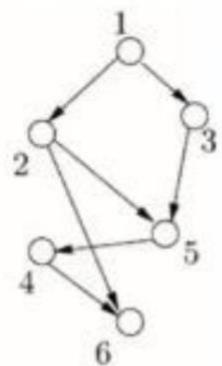

贝叶斯网

$$
p (\mathbf {x}) = \prod_ {s} p _ {s} \left(x _ {s} \mid x _ {\pi (s)}\right)
$$

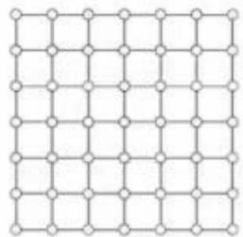

马尔科夫随机场

$$
p (\mathbf {x}) = \frac {1}{Z} \prod_ {p} \phi_ {p} \left(x _ {p}\right) \prod_ {(p, q)} \phi_ {p q} \left(x _ {p}, x _ {q}\right)
$$

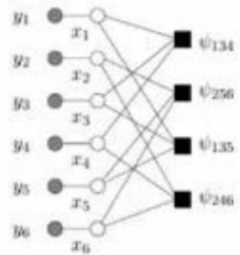

因子图

$$
p (\mathbf {x}) = \frac {1}{Z} \prod_ {c} \varphi_ {c} \left(\mathbf {x} _ {c}\right)
$$

# 理论发展背景

#  概率图模型的发展历程

萌芽期

历史上，曾经有来自不同学科的学者尝试使用图的形式表示高维分布的 变量之间的依赖关系；

人工智能初探

在人工智能领域，概率方法始于构造专家系统的早期尝试

如今，概率图模型的推理和学习已经广泛应用于人工智能研究领域。

突破

在20世纪80年代末，在贝叶斯网络和一般的概率图模型中的推理取得重要进展 。 1988年， Pearl 提出了信念传播（BeliefPropagation ， BP）算法，把全局的概率推理过程转变为局部变量间的消息传递，从而大大降低了推理的复杂度。

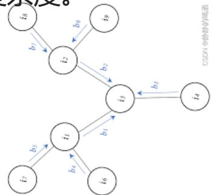

成熟

BP算法引起了国际上学者的广泛关注，掀起了新一轮的研究热潮。

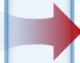

# 理论发展背景

 概率图模型研究内容

概率图模型表示

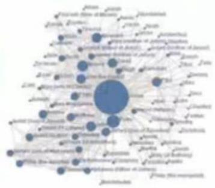

图论

$$
+ p (\mathbf {X}) = p \left(X _ {1}, X _ {2}, \dots , X _ {N}\right)
$$

概率论

# 概率图模型推理

$$
\begin{array}{l} p \left(\mathbf {x} _ {\alpha}\right) = \sum_ {\mathbf {x} \mid \mathbf {x} _ {\alpha}} p (\mathbf {x}) \\ \mathbf {x} ^ {\circ} = \underset {\mathbf {x} \in \lambda^ {\prime}} {\arg \max } p (\mathbf {x}) \\ \end{array}
$$

求边缘概率、最大后验概率状态等

概率图模型学习

$$
D = \left\{X _ {1} ^ {(i)}, X _ {2} ^ {(i)}, \dots , X _ {N} ^ {(i)} \right\} _ {i = 1} ^ {M}
$$

数据

# 理论发展背景

图像分割

图像去噪

#  概率图模型应用——图像视觉分析

姿态估计

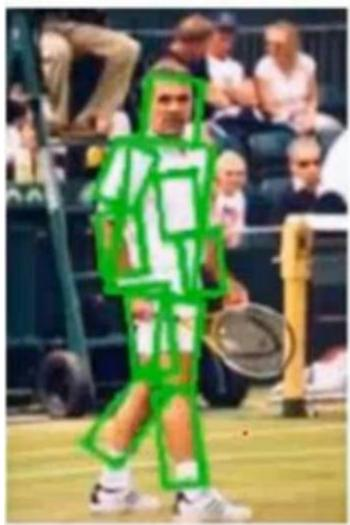

立体视觉

# 理论发展背景

#  概率图模型应用——计算神经学

在计算神经学领域， 研究表明 ， 大脑具有表示和处理不确定信息的能力 。 大量的生理和心理实验发现， 大脑的认知处理过程是个概率推理过程。

n Ott和Stoop建立了二值马尔科夫随机场信念传播算法和神经动力学 模型的联系，证明了连续Hopfield网络的方程可以用BP算法的消息 传递迭代方程得到。因此，马尔科夫随机场中的BP算法可以由神经 元实现，每个神经元对应于MRF的一个节点，神经元之间的突触连 接对应于节点之间的依赖关系。

现有人工智能技术的两种主流“大脑 ”

一种是支持人工神经网络的深度学习加速器，基于研究“电脑”的计算机科学 , 让计算机运行机器学习算法；

另一种是支持脉冲神经网络的神经形态芯片，基于研究“人脑 ”的神经科学， 无限模拟人来大脑。

# 前置概念 Probability (over Finite Sets)

# 概率是定义在一组原子事件集 U 上的函数。

# U 代表所有可能事件的全集。

它指定一个值 $P r ( e )$ 对每个事件 $e \in U$ , 该值的范围是 [0,1].

它通过对事件集 $F$ 中每个成员的概率求和来为每个事件集 ??指定一个值： $\begin{array} { r } { P r ( F ) = \sum _ { e \in F } P r ( e ) } \end{array}$

$\bullet$ 因此 $P r ( U ) = 1 , P r ( \emptyset ) = 0$ 以及

⚫ $P r ( A \cup B ) = P r ( A ) + P r ( B ) - P r ( A \cap B )$

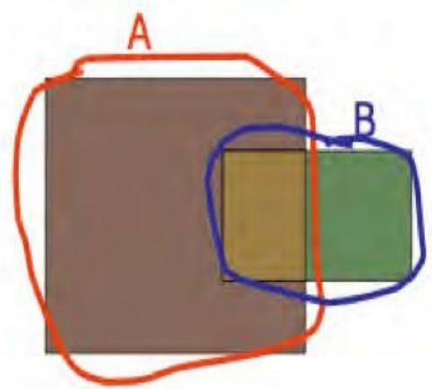

# 前置概念 Probability (over Finite Sets)

给定一个集合U（ universe ），概率函数是定义在U的子集上的函数，它将每个子集映射到实数，并且满足概率公理

⚫

# Properties and sets 属性与集合

任何一组事件A都可以解释为一个属性：具有属性A的事件集. 因此，我们通常写作：

⚫ $A \ \vee B$ 来表示具有属性A或B的事件集：即事件集 $A \ \cup \ B$

⚫ A ∧B 来表示具有属性A和B的事件集：即事件集 $A \cap B$

⚫ ¬ A 来表示不具有属性A的事件集：即事件集 $U - A$ (即相对于事件全集U的补集)

# Probability over Feature Vectors 多变量概率

随着我们继续推进，我们将把事件集建模为特征值的向量。

我们有

一组变量 $V _ { 1 } , V _ { 2 } , \dots , V _ { n }$

$\bullet$ 每个变量的有限域, Dom[V1], Dom[V2],..., Dom[Vn].

⚫ 事件全集 $U$ 是所有变量值向量的集合： $\{ ( d _ { 1 } , d _ { 2 } , \dotsc , d _ { n } ) \ | \ d _ { i } \in D o m [ V i ] \}$

⚫ 这个事件空间的大小是 $\textstyle \prod _ { i } { \big | } D o m \ [ V _ { i } ] { \big | } .$ , 即各个变量值域大小的乘积。

⚫ 例如，如果 $\mathrm { | D o m [ V i ] | } = 2 \mathrm { . }$ , 则我们有 $2 ^ { n }$ 不同的原子事件. (Exponential!)

# Probability over Feature Vectors 多变量概率

• 通过断言某些变量的子集具有特定的值，我们可以指定一组有用的事件子集，例如：

$\left\{ V _ { 1 } = a \right\} =$ 所有事件中 $V _ { 1 } = a$ 的事件集合

• $\left\{ V _ { 1 } = a , V _ { 3 } = d \right\} = \left. \right.$ 所有事件中 V1 = a and $V _ { 3 } = d .$ 的事件集合

• 如果我们有每个原子事件的概率Pr (即所有变量的完全实例化) 我们可以计算任何其他事件集的概率Pr, 例如：

$$
P r \big (\{V _ {1} = a \} \big) = \sum_ {x _ {2} \in D [ V _ {2} ] \ldots} \sum_ {x _ {n} \in D [ V _ {n} ]} P r (V _ {1} = a, V _ {2} = x _ {2}, \ldots , V _ {n} = x _ {n})
$$

# Review: Probability over Feature Vectors

例子:

$$
\mathsf {P} (\{\mathbf {V} _ {1} = \mathbf {I} \}) = \sum_ {\mathbf {x} _ {2} \in \mathsf {D o m} [ \mathbf {V} _ {2} ],} \sum_ {\mathbf {x} _ {3} \in \mathsf {D o m} [ \mathbf {V} _ {3} ]} \mathsf {P} (\{\mathbf {V} _ {1} = \mathbf {I}, \mathbf {V} _ {2} = \mathbf {x} _ {2}, \mathbf {V} _ {3} = \mathbf {x} _ {3} \}).
$$

(V1 = 1,V2= 1, V3= 1) (V1=2,V2 =1, V3= 1)(V1=3,V2 = 1, V3 = 1)

(V1 =1,V2=1,V3= 2) (V1=2,V2= 1,V3=2) (V1=3,V2= 1,V3= 2)

(V1 = 1,V2= 1, V3= 3)(V1=2,V2=1,V3=3)(V1=3,2= 1,V3=3)

(V1 = 1,V2=2,V3= 1) (V1=2,V2 =2,V3= 1) (V1=3,V2 =2,V3 = 1)

(V1=1,V2=2,V3=2) (V1=2,V2=2,V3=2) (V1=3,V2=2,V3= 2)

(V1=1,V2= 2,V3=3) (V1=2,V2=2,V3=3) (V1=3,V2=2,V3=3)

(V1=1,V2=3,V3=1)(V1=2,V2=3,V3=1)(V1=3,V2=3,V3=1)

(V1=1,V2=3,V3=2) (V1=2,V2=3,V3=2) (V1=3,V2=3,V3= 2)

(V1=1'V2=3,V3=3)(V1=2,v2=3,V3=3)(V1=3,V2=3,V3=3)

# Review: Probability over Feature Vectors

例子:

$$
\mathsf {P} (\{\mathsf {V} _ {1} = 1, \mathsf {V} _ {3} = 2 \}) = \sum_ {\mathbf {x} _ {2} \in \operatorname {D o m} [ \mathsf {V} _ {2} ]} \mathsf {P} (\{\mathsf {V} _ {1} = 1, \mathsf {V} _ {2} = \mathbf {x} _ {2}, \mathsf {V} _ {3} = 2 \}).
$$

$$
(V 1 = 1, V 2 = 1, V 3 = 1) \quad (V 1 = 2, V 2 = 1, V 3 = 1) \quad (V 1 = 3, V 2 = 1, V 3 = 1)
$$

$$
(V 1 = 1, V 2 = 1, V 3 = 2) \quad (V 1 = 2, V 2 = 1, V 3 = 2) \quad (V 1 = 3, V 2 = 1, V 3 = 2)
$$

$$
(V 1 = 1, V 2 = 1, V 3 = 3) \quad (V 1 = 2, V 2 = 1, V 3 = 3) \quad (V 1 = 3, V 2 = 1, V 3 = 3)
$$

$$
(V 1 = 1, V 2 = 2, V 3 = 1) \quad (V 1 = 2, V 2 = 2, V 3 = 1) \quad (V 1 = 3, V 2 = 2, V 3 = 1)
$$

$$
(V 1 = 1, V 2 = 2, V 3 = 2) \quad (V 1 = 2, V 2 = 2, V 3 = 2) \quad (V 1 = 3, V 2 = 2, V 3 = 2)
$$

$$
(V 1 = 1, V 2 = 2, V 3 = 3) \quad (V 1 = 2, V 2 = 2, V 3 = 3) \quad (V 1 = 3, V 2 = 2, V 3 = 3)
$$

$$
(V 1 = 1, V 2 = 3, V 3 = 1) \quad (V 1 = 2, V 2 = 3, V 3 = 1) \quad (V 1 = 3, V 2 = 3, V 3 = 1)
$$

$$
(V 1 = 1, V 2 = 3, V 3 = 2) \quad (V 1 = 2, V 2 = 3, V 3 = 2) \quad (V 1 = 3, V 2 = 3, V 3 = 2)
$$

$$
(V 1 = 1, V 2 = 3, V 3 = 3) \quad (V 1 = 2, V 2 = 3, V 3 = 3) \quad (V 1 = 3, V 2 = 3, V 3 = 3)
$$

在这些示例中 我们是 “summing out” 总结法则 些变量,这也被称为“边际化”（marginalizing）我们的分布

# Problem and solution 存在的问题与解决思路

# 问题：

This is an exponential number of atomic probabilities tospecify. 需要指定指数级别的原子概率

Requires summing up an exponential number of items.

需要对指数级别的项求和。

# 解决方法：

Make use of probabilistic independence, especially conditionalindependence. 利用概率独立性，特别是条件独立性。

# Conditional probabilities 条件概率

在我们讨论条件独立性之前，我们需要定义条件概率（conditional probabilities. ）的含义。

• 假设 A 是一组事件，满足 $P r ( A ) > 0 .$

• 那么可以定义相对于事件A的条件概率:

$$
P r (B | A) = P r (B \cap A) / P r (A)
$$

• 对A进行条件化,相当于将注意力限制在 A 中的事件上.

# 一个示例

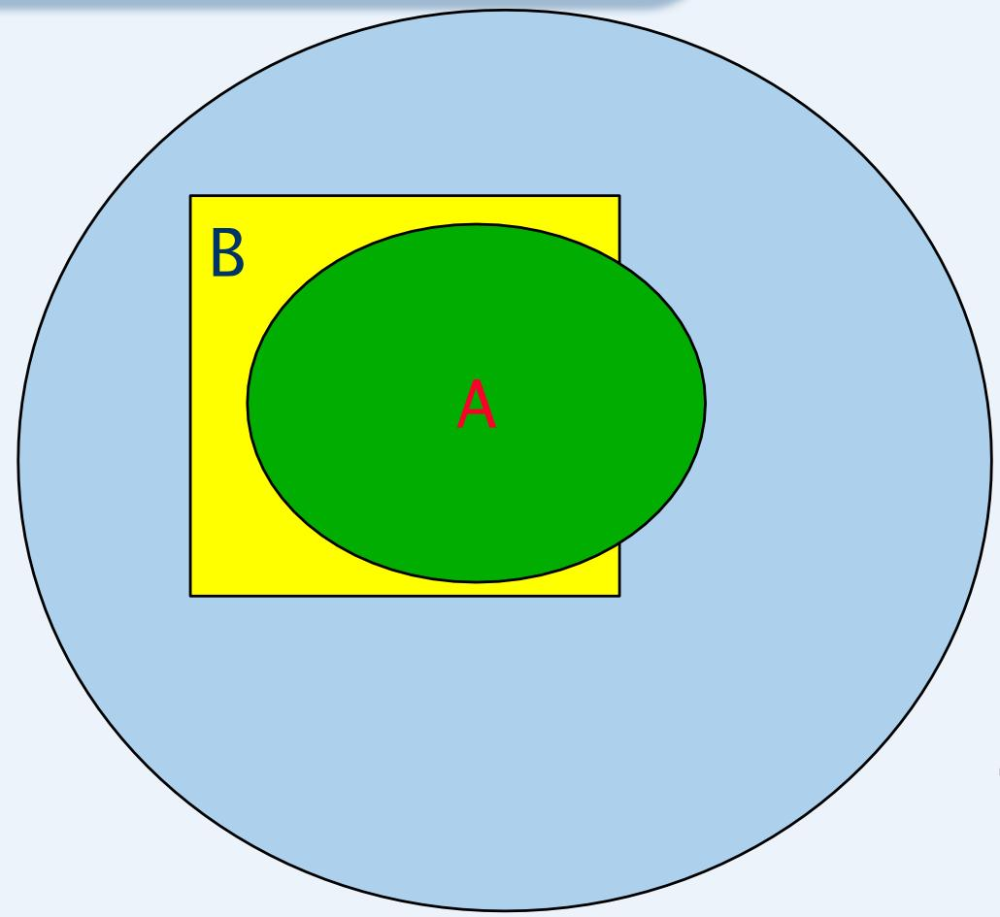

B 覆盖了整个空间

(U) 大约 30%，但覆盖了 A 的 80%

以上。

$$
\mathrm {S o} \Pr (B) = 0. 3, \mathrm {b u t} \Pr (B | A) = 0. 8
$$

 These capture conditional information about the influence of any one variable's value on the probability of others'.

# Summing out rule 总结法则

假设 B1, B2, . . . , $B _ { k }$ 构成了全集 $U$ 的一个划分

Bi ∩Bj = ∅, i ≠ j (mutuallyexclusive 相互排斥)

B1 ∪B2 ∪. . . $\cup B _ { k } = U$ (exhaustive 周全)

在概率中:

$$
P r (B _ {i} \cap B _ {j}) = 0, i \neq j
$$

$$
P r (B _ {1} \cup B _ {2} \cup \ldots \cup B _ {k}) = 1
$$

给定任何其他事件集 $A$ ，我们有：

$$
P r (A) = P r (A \cap B _ {1}) + \dots + P r (A \cap B _ {k})
$$

在条件概率中:

$$
P r (A) = P r (A \mid B _ {1}) P r (B _ {1}) + \dots + P r (A \mid B _ {k}) P r (B _ {k})
$$

通常我们知道 $P r ( A | B _ { i } )$ , 所以我们可以通过这种方式计算 $P r ( A )$

# Independence 独立性

有可能 ?? 在 ??上的密度与它在整个集合上的密度相同。

概率密度（Probability density）是一个表示可能性的度量: 从整

个集合中随机选择一个元素，选中的元素属于集合 ?? 的可能性有多大？

或者， $B$ 在?? 上的密度可能与它在整个空间上的密度差异很大。

在第一种情况下 $\mathsf { P } ( \mathsf { B } | \mathsf { A } ) = \mathsf { P } ( \mathsf { B } )$ , 我们说B 与 A是独立的（ independent ） . 而在第二种情况下, B 依赖于 A （dependent）. $( { \mathsf { P } } ( { \mathsf { B } } | { \mathsf { A } } ) { = } { \mathsf { P } } ( { \mathsf { B } } ) ) .$ .

在这种情况下，知道一个元素属于 A 并不能告诉我们它是否也属于 B。

# Conditional independence 条件独立性

假设我们已经知道随机选取的一个元素具有属性 A。

现在我们想知道该元素是否具有属性B：

$P r ( B | A )$ 表示这一事件发生的概率。

接着，我们又得知该元素还具有属性 C。这是否能为我们提供更多关于 B-ness 的信息？

$P r ( B \mid A \ \cap C )$ 表示在这一额外信息下，该事件发生的概率。

# Conditional independence 条件独立性

如果 $P r ( B | A \ \cap C ) = P r ( B | A )$ , 那么从知道该元素属于 C 并不会获得额外的信息。

在这种情况下，我们称B 在给定A 的条件下与C 条件独立（conditionallyindependent）。

也就是说，一旦我们知道了 A，额外知道 C 是无关紧要的（它不会提供关于 B 是否为真的额外信息）。

⚫ 条件独立性指的是在条件概率空间 Pr(⋅∣A) 中的独立性。

# Conditional independence 条件独立性

Note！

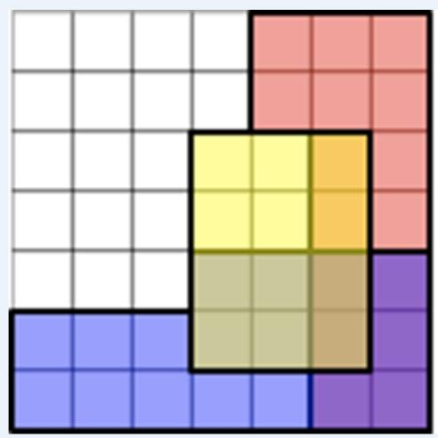

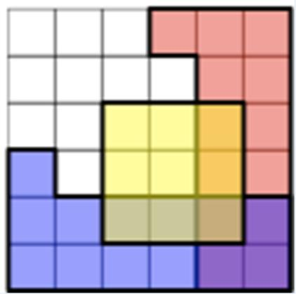

 These pictures represent the probabilities of event sets A, B and C by the areas shaded red,blue and yellow respectively with respect to the total area.In both examples A and B are conditionally independent given C because:

$$
P (A ^ {\wedge} B | C) = P (A | C) P (B | C)
$$

 BUT A and B are NOT conditionally independent given $\multimap$ , as:

$$
P (A ^ {\wedge} B | \neg C) \neq P (A | \neg C) P (B | \neg C)
$$

# Computational Impact of Independence独立性下的计算

如果 A 和 B 独立, 则 :

$$
P r (A \cap B) = P r (A) \cdot P r (B)
$$

Proof:

$$
\mathrm {P} (\mathrm {B} | \mathrm {A}) = \mathrm {P} (\mathrm {B}) \quad \text {(d e f ’ n o f i n d e p e n d e n c e)}
$$

$$
\mathrm {P} (\mathrm {A} \wedge \mathrm {B}) / \mathrm {P} (\mathrm {A}) = \mathrm {P} (\mathrm {B})
$$

$$
\mathrm {P} (\mathrm {A} \wedge \mathrm {B}) = \mathrm {P} (\mathrm {B}) * \mathrm {P} (\mathrm {A})
$$

如果在给定A 的条件下，B 和C 条件独立，则:

$$
P r (B \cap C | A) = P r (B | A) \cdot P r (C | A)
$$

Proof:

$$
\mathrm {P} (\mathrm {B} | \mathrm {C} \wedge \mathrm {A}) = \mathrm {P} (\mathrm {B} | \mathrm {A}) (\text {d e f ’ n o f c o n d i t i o n a l i n d e p e n d e n c e})
$$

$$
\mathrm {P} (\mathrm {B} \wedge \mathrm {C} \wedge \mathrm {A}) / \mathrm {P} (\mathrm {C} \wedge \mathrm {A}) = \mathrm {P} (\mathrm {B} \wedge \mathrm {A}) / \mathrm {P} (\mathrm {A})
$$

$$
\mathrm {P} (\mathrm {B} \wedge \mathrm {C} \wedge \mathrm {A}) / \mathrm {P} (\mathrm {A}) = \mathrm {P} (\mathrm {C} \wedge \mathrm {A}) / \mathrm {P} (\mathrm {A}) * \mathrm {P} (\mathrm {B} \wedge \mathrm {A}) / \mathrm {P} (\mathrm {A})
$$

$$
\mathrm {P} (\mathrm {B} \wedge \mathrm {C} | \mathrm {A}) = \mathrm {P} (\mathrm {B} | \mathrm {A}) * \mathrm {P} (\mathrm {C} | \mathrm {A})
$$

# Computational Impact of Independence独立性下的计算

独立性质允许我们去拆分这个计算“P(AB)” 为两个独立的计算“P(A)” and“P(B)”. P(BC|A) intoP(B|A) and P(C|A), P(B|AC) into P(B|A)

这一性质可以带来巨大的计算节省。

# Review: Chain rule 链式法则

$$
\begin{array}{l} \mathsf {P} (\mathsf {A} _ {1} \wedge \mathsf {A} _ {2} \wedge \ldots \wedge \mathsf {A} _ {n}) = \\ \mathrm {P} (\mathsf {A} _ {1} | \mathsf {A} _ {2} \wedge \ldots \wedge \mathsf {A} _ {n}) * \mathrm {P} (\mathsf {A} _ {2} | \mathsf {A} _ {3} \wedge \ldots \wedge \mathsf {A} _ {n}) \\ ^ {*} \dots^ {*} P (A _ {n - 1} | A _ {n}) ^ {*} P (A _ {n}) \\ \end{array}
$$

# Proof:

$$
\begin{array}{l} \mathrm {P} \left(\mathrm {A} _ {1} \mid \mathrm {A} _ {2} \wedge \dots \wedge \mathrm {A} _ {n}\right) * \mathrm {P} \left(\mathrm {A} _ {2} \mid \mathrm {A} _ {3} \wedge \dots \wedge \mathrm {A} _ {n}\right) * \dots * \mathrm {P} \left(\mathrm {A} _ {n - 1} \mid \mathrm {A} _ {n}\right) \\ = \mathrm {P} \left(\mathrm {A} _ {1} \wedge \mathrm {A} _ {2} \wedge \dots \wedge \mathrm {A} _ {n}\right) / \mathrm {P} \left(\mathrm {A} _ {2} \wedge \dots \wedge \mathrm {A} _ {n}\right) * \mathrm {P} \left(\mathrm {A} _ {2} \wedge \dots \wedge \mathrm {A} _ {n}\right) / \mathrm {P} \left(\mathrm {A} _ {3} \wedge \dots \wedge \mathrm {A} _ {n}\right) * \\ \dots * P \left(A _ {n - 1} \wedge A _ {n}\right) / P \left(A _ {n}\right) * P \left(A _ {n}\right) \\ \end{array}
$$

$$
\begin{array}{l} P _ {r} (A _ {1} \cap A _ {2} \cap A _ {3}) \\ = P r (A _ {1} \mid A _ {2} \cap A _ {3}) P r (A _ {2} \cap A _ {3}) \\ = P r (A _ {1} | A _ {2} \cap A _ {3}) P r (A _ {2} | A _ {3}) P r (A _ {3}) \\ \end{array}
$$

# 流感案例分析

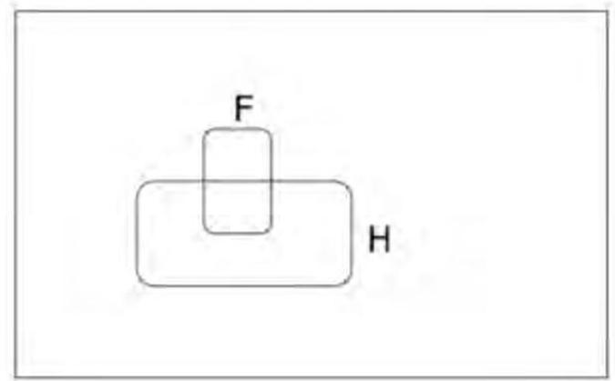

$$
\mathrm {P} (\text {H e a d a c h e} = \text {t r u e}) = 1 / 1 0
$$

$$
P (F l u = t r u e) = 1 / 4 0
$$

$$
\mathrm {P} (\text {H e a d a c h e} = \text {t r u e} | \text {F l u} = \text {t r u e}) = 1 / 2
$$

Headaches are rare and having flu israrer. But, given flu, there is a 50%chance you have a headache.

What is P(Flu=true|Headache=true)?

P(Flu|Headache)

$$
\begin{array}{l} = P (F l u \land H e a d a c h e) / P (H e a d a c h e) \\ = P (F l u \land H e a d a c h e) / P (F l u) * P (F l u) / P (H e a d a c h e) \\ = P (H e a d a c h e | F l u) P (F l u) / P (H e a d a c h e) \\ \end{array}
$$

# Using Bayes Rule to Gamble

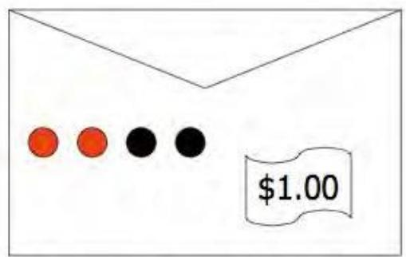

The"Win"envelopehasadollarand fourbeadsinit

The"Lose"envelopehasthree beadsandno money

Trivial question:Someone picks an envelope and random andasks you to bet as to whether or not it holds a dollar.Whatare your odds?

# Using Bayes Rule to Gamble

The"Win"envelopehasadollarand fourbeads init

The"Lose"envelopehasthree beadsandno money

Not trivial question:Someone lets you take a bead out of the envelope before youbet. If it is black,what are your odds? If it is red,what are your odds?

$$
P (A | B) = P (A) \frac {P (B | A)}{P (B)}
$$

后验概率 先验概率　调整因子

# Bayes rule贝叶斯法则

Bayes rule is a simple mathematical fact. But it has great implicationswrt how probabilities can be reasoned with.

$$
P r (Y \mid X) = P r (X \mid Y) P r (Y) / P r (X)
$$

⚫ e.g., from treating patients with heart disease we might be able toestimate the value of

⚫ Pr(high Cholesterol高胆固醇|heart disease心脏病)

⚫ With Bayes rule, we can turn this around into a predictor for heart disease

⚫ Pr(heart disease心脏病 | high Cholesterol高胆固醇)

With a simple blood test we can determine “high Cholesterol”, and use it tohelp estimate the likelihood of heart disease.

# Bayes Rule Example 贝叶斯法则案例

Disease ∈{malaria疟疾, cold感冒 , flu流感};

Symptom $=$ fever 发烧

Must compute Pr(Disease|fever) to prescribe treatment. Why notassess this quantity directly?

⚫ Pr(mal|fever) – is not natural to assess. It does not reflect the underlying“causal mechanism” malaria $\Rightarrow$ fever 难以直接评估，无法反映内在因果机制

Pr(mal|fever) – is not “stable”: a malaria epidemic changes this quantity (forexample) 随环境不断变化

⚫ So we use Bayes rule:

Pr(mal|fever) = Pr(fever|mal)Pr(mal)/Pr(fever)

Pr(mal)表示当前环境下患疟疾概率，反映的就是环境的影响

# Bayes Rule Example 贝叶斯法则案例

⚫ What about Pr(fever)

Say that malaria, cold and flu are the only possible causes of fever, i.e.,Pr(fever|¬ malaria ∧¬ cold ∧¬ flu) = 0, and they are mutually exclusive.

Then Pr(fever) =Pr(malaria ∧fever) + Pr(cold ∧fever) + Pr(flu ∧fever)

其中 Pr(malaria ^fever) = Pr(fever|mal)Pr(mal)

Similarly, we can obtain Pr(cold ∧fever) and Pr(flu ∧fever)

# Useful equations 常用的计算公式总结

n Conditional probability: $P r ( B \mid A ) = P r ( B \cap A ) / P r ( A )$

Summing out rule:Say that $B _ { 1 } , B _ { 2 } , \ldots , B _ { k }$ $B _ { k }$ form a partition of U. Then$P r ( A ) = P r ( A \cap B _ { 1 } ) + \ldots + P r ( A \cap B _ { k } )$

If A and $B$ are independent, then$P r ( A \cap B ) = P r ( A ) \cdot P r ( B )$

If given $A$ , $B$ and $C$ are conditionally independent, then$P r ( B \cap C | A ) = P r ( B | A ) \cdot P r ( C | A )$

n Bayes rule: $P r ( Y \mid X ) = P r ( X \mid Y ) P r ( Y ) / P r ( X )$

Chain rule: Pr(A1 ∩A2 ∩. . . ∩An) = Pr(A1|A2 ∩. . . ∩An)·$P r ( A _ { 2 } | A _ { 3 } \cap \ldots \cap A _ { n } ) \ \ldots \cdot P r ( A _ { n - 1 } | A _ { n } ) \cdot P r ( A _ { n } )$

# 扩展到连续空间分布

⚫ $P r ( X )$ for variable X refers to the (marginal边际) distribution over $X$ .$P r ( X \mid Y )$ refers to family of conditional distributions over $X$ , one for each y∈Dom(Y ).

For each $d \in D o m [ Y ] , P r ( X | Y = d )$ specifies a distribution over the values of$X \colon P r ( X = d _ { 1 } | Y = d )$ , $P r ( X = d _ { 2 } | Y = d )$ , . . . , $P r ( X = d _ { n } | Y = d )$ , where$D o m [ X ] = \left\{ d _ { 1 } , d _ { 2 } , \dots , d _ { n } \right\}$ .

Distinguish between $P r ( X )$ which is distribution and Pr(X = d)$( d \in D o m [ X ] )$ ) – which is a number.

Think of $P r ( X )$ as a function that accepts any x ∈Dom[X]as an argument and returns $P r ( X = \ x )$ .

Similarly, think of $P r ( X \mid Y$ ) as a function that accepts any$y \in D o m [ Y ]$ and returns a distribution $P r ( X \mid Y = y )$ .

# 贝叶斯推断

对条件概率公式进行变形，可以得到

$$
P (A \mid B) = P (A) \frac {P (B \mid A)}{P (B)}
$$

后验概率 先验概率 调整因子

P(A)称为"先验概率" （Prior probability），即在B事件发生之前，我们对A事件概率的一个判断。

P(A|B)称为"后验概率" （Posterior probability），即在B事件发生之后，我们对A事件概率的重新评估。

P(B|A)/P(B)称为"可能性函数" （Likelyhood），这是一个调整因子使得预估概率更接近真实概率。

# 贝叶斯推断的含义

条件概率可以理解为

后验概率= 先验概率× 调整因子

贝叶斯推断含义：我们先预估一个"先验概率"，然后加入实验结果，看这个实验到底是增强还是削弱了"先验概率"，由此得到更接近事实的"后验概率"。

如果 "调整因子">1，意味着"先验概率"被增强，事件A的发生的可能性变大；

如果 "调整因子 $" = 1$ ，意味着B事件无助于判断事件A的可能性；

如果 "调整因子"<1，意味着"先验概率"被削弱，事件A的可能性变小。

# 例子：水果糖问题

两个一模一样的碗，一号碗有30颗水果糖和10颗巧克力糖，二号碗有水果糖和巧克力糖各20颗。现在随机选择一个碗，从中摸出颗糖，发现是水果糖。请问这颗水果糖来自一号碗的概率有多大？

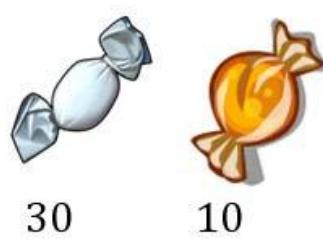

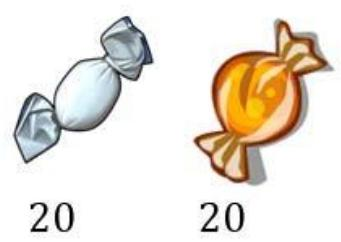

# 例子：水果糖问题

假定，H1表示一号碗，H2表示二号碗。由于这两个碗是一样的，所以P(H1)=P(H2)，也就是说，在取出水果糖之前，这两个碗被选中的概率相同。因此，P(H1)=0.5，我们把这个概率就叫做"先验概率"，即没有做实验之前，来自一号碗的概率是0.5。

再假定，E表示水果糖，所以问题就变成了在已知E的情况下，来自号碗的概率有多大，即求P(H1|E)。我们把这个概率叫做"后验概率"，即在E事件发生之后，对P(H1)的修正。

由条件概率公式，有

$$
P (H _ {1} | E) = P (H _ {1}) \frac {P (E | H _ {1})}{P (E)}
$$

# 例子：水果糖问题

已知，P(H1)等于0.5，P(E|H1)为一号碗中取出水果糖的概率，等于0.75，那么求出P(E)就可以得到答案。

根据全概率公式

$$
P (E) = P (E \mid H _ {1}) P (H _ {1}) + P (E \mid H _ {2}) P (H _ {2})
$$

所以

$$
P (E) = 0. 7 5 \times 0. 5 + 0. 5 \times 0. 5 = 0. 6 2 5
$$

代入数据得

$$
P (H 1 | E) = 0. 5 \times \frac {0 . 7 5}{0 . 6 2 5} = 0. 6
$$

这表明，来自一号碗的概率是0.6。也就是说，取出水果糖之后，H1事件的可能性得到了增强。 工智能: :不确定性知识表不确定性知识表人工智能:

# 练习： 别墅与狗

座别墅在过去的 20*365天里一共发生过 2 次被盗，别墅的主人有一条狗，狗平均每周晚上叫 3 次，在盗贼入侵时狗叫的概率被估计为 0.9，问题是：在狗叫的时候发生入侵的概率是多少？TRY

$$
\begin{array}{l} P (A) = 3 / 7 \\ P (B) = 2 / (2 0 \cdot 3 6 5) = 2 / 7 3 0 0 \\ P (A \mid B) = 0. 9 \\ \end{array}
$$

按照公式很容易得出结果：

$$
P (B | A) = 0. 9 ^ {*} (2 / 7 3 0 0) / (3 / 7) = 0. 0 0 0 5 8
$$

# 例子：流感案例分析

已知某种疾病的发病率是0.001，即1000人中会有1个人得病。现有一种试剂可以检验患者是否得病，它的准确率是0.99，即在患者确实得病的情况下，它有99%的可能呈现阳性。它的误报率是5%，即在患者没有得病的情况下，它有5%的可能呈现阳性。现有一个病人的检验结果为阳性，请问他确实得病的可能性有多大？

中国医务工作者在“抗疫”一线

# 引例：流感案例分析

已知某种疾病的发病率是0.001，即1000人中会有1个人得病。现有一种试剂可以检验患者是否得病，它的准确率是0.99，即在患者确实得病的情况下，它有99%的可能呈现阳性。它的误报率是5%，即在患者没有得病的情况下，它有5%的可能呈现阳性。现有一个病人的检验结果为阳性，请问他确实得病的可能性有多大？

# 贝叶斯公式

$$
P (A \mid B) = P (A) \frac {P (B \mid A)}{P (B)}
$$

$P ( A )$ 称为"先验概率" （Prior probability）即在B事件发生之前，对A事件概率的一个判断

$P ( A \mid B )$ 称为"后验概率"（Posterior probability）即在B事件发生之后，对A事件概率的重新评估

$P ( B \mid A ) / P ( B )$ 称为"可能性函数" （Likelyhood）这是一个调整因子，使得预估概率更接近真实概率

# 引例：流感案例分析

⚫ 假定A事件表示得病，B事件表示阳性，那么 $P ( A ) = 0 , 0 \mathbf { 0 } 1$ （先验概率），要计算的是 $P ( A \mid B )$ (后验概率)

准确率是0.99，即 $P ( B \mid A ) = 0 , 9 9$

误报率是0.05，即 $P ( B \mid { \overline { { A } } } ) = 0 . 0 5$

根据贝叶斯公式 $P ( A \mid B ) = P ( A ) { \frac { P ( B \mid A ) } { P ( B ) } }$

??(?? ∣ ??)用全概率公式改写分母 $P ( A \mid B ) = P ( A ) { \frac { \imath \mid A \mid B ) = P ( A ) } { P ( B \mid A ) P ( A ) + P ( B \mid { \overline { { A } } } ) P ( { \overline { { A } } } ) } }$

??. ????结果 ??(?? ∣ ??) = ??. ?????? × ≈ ??. ????????. ???? × ??. ?????? + ??. ???? × ??. ??????

原因：误报率太高、疾病发生概率低

也就是说，即使检验呈现阳性，病人得病的概率，也只是从0.1%增加到了2%左右。这就是所谓的“假阳性”，即阳性结果完全不足以说明病人得病。

如何提高准确率呢？

多因子下的贝叶斯推断

# Bayesian Classifiers 贝叶斯分类器

# Consider each attribute and class label as random variables

比如给定一位学生人工智能、明清文学、宋明理学、常微分方程几门课的成绩attribute，判别他是计算机学院还是历史学院class label

Given a record with attributes (A1, A2,…,An)

– Goal is to predict class C

Specifically, we want to find the value of C thatmaximizes $\mathsf { P } ( \mathsf { C } | \mathsf { A } _ { 1 } , \mathsf { A } _ { 2 } , \ldots , \mathsf { A } _ { n } )$

Can we estimate $p ( \mathsf { C } | \mathsf { A } _ { 1 } , \mathsf { A } _ { 2 } , \ldots , \mathsf { A } _ { n } )$ directly from data?

# Bayesian Classifiers 贝叶斯分类器

Approach:

compute the posterior probability $\mathsf { P } ( \mathsf { C } \mid \mathsf { A } _ { 1 } , \mathsf { A } _ { 2 } , \ldots , \mathsf { A } _ { \mathsf { n } } )$ for all valuesof C using the Bayes theorem

$$
P (C \mid A _ {1} A _ {2} \dots A _ {n}) = \frac {P \left(A _ {1} A _ {2} \dots A _ {n} \mid C\right) P (C)}{P \left(A _ {1} A _ {2} \dots A _ {n}\right)}
$$

Choose value of C that maximizesP(C | A1, A2, …, An)

Equivalent to choosing value of C that maximizesP(A1, A2, …, An|C) P(C)

How to estimate $\mathsf { P } ( \mathsf { A } _ { 1 } , \mathsf { A } _ { 2 } , \ldots , \mathsf { A } _ { \mathsf { n } } | \mathrm { ~ C ~ } ) ?$

# Naïve Bayes Classifier朴素贝叶斯分类器

Assume independence among attributes Ai when class is given:

– P(A $, \mathsf { A } _ { 2 } , . . . , \mathsf { A } _ { \mathsf { n } } \left| \mathsf { C } \right. = \mathsf { P } ( \mathsf { A } _ { 1 } | \mathsf { C } _ { \mathrm { j } } ) \mathsf { P } ( \mathsf { A } _ { 2 } | \mathsf { C } _ { \mathrm { j } } ) . . . \mathsf { P } ( \mathsf { A } _ { \mathrm { n } } | \mathsf { C } _ { \mathrm { j } } )$

– Can estimate ${ \mathsf { P } } ( { \mathsf { A } } _ { \mathrm { i } } | { \mathsf { C } } _ { \mathrm { j } } )$ for all Ai and Cj.

– New point is classified to Cj if

$$
\mathsf {P} (\mathsf {C} _ {\mathrm {j}}) \mathsf {P} (\mathsf {A} _ {1} | \mathsf {C} _ {\mathrm {j}}) \mathsf {P} (\mathsf {A} _ {2} | \mathsf {C} _ {\mathrm {j}}) \dots \mathsf {P} (\mathsf {A} _ {\mathrm {n}} | \mathsf {C} _ {\mathrm {j}})
$$

is maximal.

# 朴素贝叶斯基本原理

假设预测患者是否感染疾病 C∈{感染, 未感染} ，预测因子包括： A1性别（男/女）、 A2地区（高风险/低风险）、 A3核酸检测结果（阳性/阴性）、 A4体重（kg）

<table><tr><td>编号</td><td>A1 性别</td><td>A2 地区</td><td>A3 核酸检测结果</td><td>A4 体重(kg)</td><td>C 是否感染疾病</td></tr><tr><td>1</td><td>男</td><td>低风险</td><td>阴性</td><td>70</td><td>未感染</td></tr><tr><td>2</td><td>女</td><td>高风险</td><td>阳性</td><td>55</td><td>感染</td></tr><tr><td>3</td><td>男</td><td>高风险</td><td>阴性</td><td>64</td><td>未感染</td></tr><tr><td>4</td><td>男</td><td>低风险</td><td>阴性</td><td>85</td><td>未感染</td></tr><tr><td>5</td><td>女</td><td>低风险</td><td>阴性</td><td>50</td><td>未感染</td></tr><tr><td>6</td><td>女</td><td>低风险</td><td>阳性</td><td>62</td><td>感染</td></tr><tr><td>7</td><td>男</td><td>高风险</td><td>阳性</td><td>67</td><td>未感染</td></tr><tr><td>8</td><td>女</td><td>低风险</td><td>阴性</td><td>60</td><td>未感染</td></tr><tr><td>9</td><td>女</td><td>高风险</td><td>阴性</td><td>53</td><td>感染</td></tr><tr><td>10</td><td>男</td><td>低风险</td><td>阴性</td><td>74</td><td>未感染</td></tr></table>

# 问题形式化：

给定一个样本带有 $( \mathsf { A } _ { 1 } , \mathsf { A } _ { 2 } , . . . , \mathsf { A } _ { \mathsf { n } } )$ 等属性，我们要预测样本的类别C，即

找到 C 使得 P(C| A1, A2,…,An ) 最大化

我们可以从数据中直接得到P(C| A1, A2,…,An )吗?

# 朴素贝叶斯基本原理

假设预测患者是否感染疾病 C∈{感染, 未感染} ，预测因子包括： A1性别（男/女）、 A2地区（高风险/低风险）、 A3核酸检测结果（阳性/阴性）、 A4体重（kg）

<table><tr><td>编号</td><td>A1 性别</td><td>A2 地区</td><td>A3 核酸检测结果</td><td>A4 体重(kg)</td><td>C 是否感染疾病</td></tr><tr><td>1</td><td>男</td><td>低风险</td><td>阴性</td><td>70</td><td>未感染</td></tr><tr><td>2</td><td>女</td><td>高风险</td><td>阳性</td><td>55</td><td>感染</td></tr><tr><td>3</td><td>男</td><td>高风险</td><td>阴性</td><td>64</td><td>未感染</td></tr><tr><td>4</td><td>男</td><td>低风险</td><td>阴性</td><td>85</td><td>未感染</td></tr><tr><td>5</td><td>女</td><td>低风险</td><td>阴性</td><td>50</td><td>未感染</td></tr><tr><td>6</td><td>女</td><td>低风险</td><td>阳性</td><td>62</td><td>感染</td></tr><tr><td>7</td><td>男</td><td>高风险</td><td>阳性</td><td>67</td><td>未感染</td></tr><tr><td>8</td><td>女</td><td>低风险</td><td>阴性</td><td>60</td><td>未感染</td></tr><tr><td>9</td><td>女</td><td>高风险</td><td>阴性</td><td>53</td><td>感染</td></tr><tr><td>10</td><td>男</td><td>低风险</td><td>阴性</td><td>74</td><td>未感染</td></tr></table>

我们可以从数据中直接得到P(C| A1, A2,…,An )吗?

① 使用贝叶斯公式

$$
\overline {{P (C | A _ {1} A _ {2} \ldots A _ {n})}} = \frac {P (A _ {1} A _ {2} \ldots A _ {n} | C) P (C)}{P (A _ {1} A _ {2} \ldots A _ {n})}
$$

$\textcircled{2}$ 选择合适的数值C最大化 $P ( C \mid A _ { 1 } , A _ { 2 } , . . . , A _ { n } )$ 等价于

$$
\operatorname {M a x} P (A _ {1}, A _ {2}, \dots , A _ {n} | C) P (C)
$$

P(C)可以从数据样本中得到，如何估计其中的P(A1, A2, …, An|C)？

# 朴素贝叶斯基本原理

假设预测患者是否感染疾病 C∈{感染, 未感染} ，预测因子包括： A1性别（男/女）、 A2地区（高风险/低风险）、 A3核酸检测结果（阳性/阴性）、 A4体重（kg）

<table><tr><td>编号</td><td>A1性别</td><td>A2地区</td><td>A3核酸检测结果</td><td>A4体重(kg)</td><td>C是否感染疾病</td></tr><tr><td>1</td><td>男</td><td>低风险</td><td>阴性</td><td>70</td><td>未感染</td></tr><tr><td>2</td><td>女</td><td>高风险</td><td>阳性</td><td>55</td><td>感染</td></tr><tr><td>3</td><td>男</td><td>高风险</td><td>阴性</td><td>64</td><td>未感染</td></tr><tr><td>4</td><td>男</td><td>低风险</td><td>阴性</td><td>85</td><td>未感染</td></tr><tr><td>5</td><td>女</td><td>低风险</td><td>阴性</td><td>50</td><td>未感染</td></tr><tr><td>6</td><td>女</td><td>低风险</td><td>阳性</td><td>62</td><td>感染</td></tr><tr><td>7</td><td>男</td><td>高风险</td><td>阳性</td><td>67</td><td>未感染</td></tr><tr><td>8</td><td>女</td><td>低风险</td><td>阴性</td><td>60</td><td>未感染</td></tr><tr><td>9</td><td>女</td><td>高风险</td><td>阴性</td><td>53</td><td>感染</td></tr><tr><td>10</td><td>男</td><td>低风险</td><td>阴性</td><td>74</td><td>未感染</td></tr></table>

如何估计其中的P(A1, A2, …, An|C)？

假设 $\mathsf { A } _ { 1 } , \mathsf { A } _ { 2 } , . . . , \mathsf { A } _ { \mathsf { n } }$ 在给定样本的类别Cj时具有独立性，即

$$
\mathrm {P} \left(\mathrm {A} _ {1}, \mathrm {A} _ {2}, \dots , \mathrm {A} _ {n} \mid \mathrm {C} _ {j}\right) = \mathrm {P} \left(\mathrm {A} _ {1} \mid \mathrm {C} _ {j}\right) \mathrm {P} \left(\mathrm {A} _ {2} \mid \mathrm {C} _ {j}\right) \dots \mathrm {P} \left(\mathrm {A} _ {n} \mid \mathrm {C} _ {j}\right)
$$

可通过统计所有C样本中A出现频率

因此，一个样本点划分到Cj类别等价于

$$
\operatorname {M a x} P (A _ {1}, A _ {2}, \dots , A _ {n} | C _ {j}) P (C _ {j}) = \operatorname {M a x} P (A _ {1} | C _ {j}) P (A _ {2} | C _ {j}) \dots P (A _ {n} | C _ {j}) P (C _ {j})
$$

# 朴素贝叶斯基本原理

<table><tr><td>编号</td><td>A1 性别</td><td>A2 地区</td><td>A3 核酸检测结果</td><td>A4 体重(kg)</td><td>C 是否感染疾病</td></tr><tr><td>1</td><td>男</td><td>低风险</td><td>阴性</td><td>70</td><td>未感染</td></tr><tr><td>2</td><td>女</td><td>高风险</td><td>阳性</td><td>55</td><td>感染</td></tr><tr><td>3</td><td>男</td><td>高风险</td><td>阴性</td><td>64</td><td>未感染</td></tr><tr><td>4</td><td>男</td><td>低风险</td><td>阴性</td><td>85</td><td>未感染</td></tr><tr><td>5</td><td>女</td><td>低风险</td><td>阴性</td><td>50</td><td>未感染</td></tr><tr><td>6</td><td>女</td><td>低风险</td><td>阳性</td><td>62</td><td>感染</td></tr><tr><td>7</td><td>男</td><td>高风险</td><td>阳性</td><td>67</td><td>未感染</td></tr><tr><td>8</td><td>女</td><td>低风险</td><td>阴性</td><td>60</td><td>未感染</td></tr><tr><td>9</td><td>女</td><td>高风险</td><td>阴性</td><td>53</td><td>感染</td></tr><tr><td>10</td><td>男</td><td>低风险</td><td>阴性</td><td>74</td><td>未感染</td></tr></table>

$$
P \left(A _ {1} / C _ {j}\right) P \left(A _ {2} / C _ {j}\right) \dots P \left(A _ {n} / C _ {j}\right) P \left(C _ {j}\right)
$$

⚫ 类别: $P ( C ) = N c / N$

$$
\begin{array}{l} e. g., P (\mathrm {未 感 染}) = 7 / 1 0, \\ P (\mathrm {感 染}) = 3 / 1 0 \\ \end{array}
$$

# 朴素贝叶斯基本原理

<table><tr><td>编号</td><td>A1 性别</td><td>A2 地区</td><td>A3 核酸检测结果</td><td>A4 体重(kg)</td><td>C 是否感染疾病</td></tr><tr><td>1</td><td>男</td><td>低风险</td><td>阴性</td><td>70</td><td>未感染</td></tr><tr><td>2</td><td>女</td><td>高风险</td><td>阳性</td><td>55</td><td>感染</td></tr><tr><td>3</td><td>男</td><td>高风险</td><td>阴性</td><td>64</td><td>未感染</td></tr><tr><td>4</td><td>男</td><td>低风险</td><td>阴性</td><td>85</td><td>未感染</td></tr><tr><td>5</td><td>女</td><td>低风险</td><td>阴性</td><td>50</td><td>未感染</td></tr><tr><td>6</td><td>女</td><td>低风险</td><td>阳性</td><td>62</td><td>感染</td></tr><tr><td>7</td><td>男</td><td>高风险</td><td>阳性</td><td>67</td><td>未感染</td></tr><tr><td>8</td><td>女</td><td>低风险</td><td>阴性</td><td>60</td><td>未感染</td></tr><tr><td>9</td><td>女</td><td>高风险</td><td>阴性</td><td>53</td><td>感染</td></tr><tr><td>10</td><td>男</td><td>低风险</td><td>阴性</td><td>74</td><td>未感染</td></tr></table>

$$
P \left(A _ {1} / C _ {j}\right) P \left(A _ {2} / C _ {j}\right) \dots P \left(A _ {n} / C _ {j}\right) P \left(C _ {j}\right)
$$

# 离散属性:

$$
P (A _ {i} \mid C _ {k}) = \left| A _ {i k} \right| / N c
$$

其中 | Aik| 是具有属性Ai 且属于 $C _ { k }$ 类别的比率，

$$
e. g.,
$$

$$
P (A 1 = \mathrm {男} \mid \mathrm {未 感 染}) = 5 / 7
$$

$$
P (A 3 = \text {阴 性} \mid \text {感 染}) = 1 / 3
$$

# 连续属性？

# 朴素贝叶斯基本原理

$$
P \left(A _ {1} / C _ {j}\right) P \left(A _ {2} / C _ {j}\right) \dots P \left(A _ {n} / C _ {j}\right) P \left(C _ {j}\right)
$$

<table><tr><td>编号</td><td>A1 性别</td><td>A2 地区</td><td>A3 核酸检测结果</td><td>A4 体重(kg)</td><td>C 是否感染疾病</td></tr><tr><td>1</td><td>男</td><td>低风险</td><td>阴性</td><td>70</td><td>未感染</td></tr><tr><td>2</td><td>女</td><td>高风险</td><td>阳性</td><td>55</td><td>感染</td></tr><tr><td>3</td><td>男</td><td>高风险</td><td>阴性</td><td>64</td><td>未感染</td></tr><tr><td>4</td><td>男</td><td>低风险</td><td>阴性</td><td>85</td><td>未感染</td></tr><tr><td>5</td><td>女</td><td>低风险</td><td>阴性</td><td>50</td><td>未感染</td></tr><tr><td>6</td><td>女</td><td>低风险</td><td>阳性</td><td>62</td><td>感染</td></tr><tr><td>7</td><td>男</td><td>高风险</td><td>阳性</td><td>67</td><td>未感染</td></tr><tr><td>8</td><td>女</td><td>低风险</td><td>阴性</td><td>60</td><td>未感染</td></tr><tr><td>9</td><td>女</td><td>高风险</td><td>阴性</td><td>53</td><td>感染</td></tr><tr><td>10</td><td>男</td><td>低风险</td><td>阴性</td><td>74</td><td>未感染</td></tr></table>

# 连续属性:

# 1. 离散化：将范围划分为区间

➢ 大区间数量：训练记录太少，难以可靠估计

➢ 小区间数量：会将不同类别的记录合并在一起

# 2. 概率密度估计：

假设属性遵循正态分布

➢ 使用数据估计分布参数（例如，均值和标准差）

一旦概率分布已知，就可以用它来估计条件概率 $P ( A _ { i } / \ C _ { k } )$

# 朴素贝叶斯基本原理

$$
P \left(A _ {1} / C _ {j}\right) P \left(A _ {2} / C _ {j}\right) \dots P \left(A _ {n} / C _ {j}\right) P \left(C _ {j}\right)
$$

# 连续属性:

# 2. 概率密度估计：

假设符合正态分

$$
\mathrm {分 布} P (A _ {i} | C _ {j}) = \frac {1}{\sqrt {2 \pi \sigma_ {i j} ^ {2}}} e ^ {- \frac {(A _ {i} - \mu_ {i j}) ^ {2}}{2 \sigma_ {i j} ^ {2}}}
$$

比如，对于(A4, C=未感染)， 统计得到其均值与方差

均值 mean = 67

方差 variance = 200

$$
P (A 4 = 7 7 | \mathrm {未 感 染}) = \frac {1}{\sqrt {2 \pi \times 2 0 0}} e ^ {- \frac {(7 7 - 6 7) ^ {2}}{2 \times 2 0 0}} = 0. 0 0 2 2
$$

# 朴素贝叶斯基本原理

# 练一练

给定一个数据样本,计算患病概率$X =$ (男性, 低风险地区, 阴性, 77kg)

<table><tr><td>编号</td><td>A1 性别</td><td>A2 地区</td><td>A3 核酸检测结果</td><td>A4 体重(kg)</td><td>C 是否感染疾病</td></tr><tr><td>1</td><td>男</td><td>低风险</td><td>阴性</td><td>70</td><td>未感染</td></tr><tr><td>2</td><td>女</td><td>高风险</td><td>阳性</td><td>55</td><td>感染</td></tr><tr><td>3</td><td>男</td><td>高风险</td><td>阴性</td><td>64</td><td>未感染</td></tr><tr><td>4</td><td>男</td><td>低风险</td><td>阴性</td><td>85</td><td>未感染</td></tr><tr><td>5</td><td>女</td><td>低风险</td><td>阴性</td><td>50</td><td>未感染</td></tr><tr><td>6</td><td>女</td><td>低风险</td><td>阳性</td><td>62</td><td>感染</td></tr><tr><td>7</td><td>男</td><td>高风险</td><td>阳性</td><td>67</td><td>未感染</td></tr><tr><td>8</td><td>女</td><td>低风险</td><td>阴性</td><td>60</td><td>未感染</td></tr><tr><td>9</td><td>女</td><td>高风险</td><td>阴性</td><td>53</td><td>感染</td></tr><tr><td>10</td><td>男</td><td>低风险</td><td>阴性</td><td>74</td><td>未感染</td></tr></table>

可事先计算：

 P(A1 = man|No) = 5/7

$$
P (A 1 = w o m e n \mid N o) = 2 / 7
$$

$$
P (A 1 = \text {m a n} | \text {Y e s}) = 0
$$

$$
P (A 1 = \text {w o m e n} | \text {Y e s}) = 1
$$

$$
P (A 2 = l o w | N o) = 5 / 7
$$

$$
P (A 2 = h i g h \mid N o) = 2 / 7
$$

$$
P (A 2 = l o w | Y e s) = 1 / 3
$$

$$
P (A 2 = \text {h i g h} | \text {Y e s}) = 2 / 3
$$

$$
P (A 3 = \text {n e g a t i v e} | N o) = 6 / 7
$$

$$
P (A 3 = \text {p o s i t i v e} | N o) = 1 / 7
$$

$$
P (A 3 = \text {n e g a t i v e} | N o) = 1 / 3
$$

$$
P (A 3 = \text {p o s i t i v e} | N o) = 2 / 3
$$

$$
F o r A 4:
$$

$$
\text {I f} C = \text {N o : s a m p l e m e a n} = 6 7
$$

$$
\text {s a m p l e v a r i a n c e} = 2 0 0
$$

$$
\text {I f} C = \text {Y e s :} \text {s a m p l e} = 5 7
$$

$$
\text {s a m p l e v a r i a n c e} = 1 5
$$

# 朴素贝叶斯基本原理

# 练一练

给定一个数据样本,计算患病概率$X =$ (男性, 低风险地区, 阴性, 77kg)

⚫P(X|未感染) $=$ P(A1=男|未感染)

 P(A2=低风险|未感染)

 P(A3=阴性|未感染)

 P(A4=77kg|未感染)

$$
= 5 / 7 \times 5 / 7 \times 6 / 7 \times 0. 0 0 2 2 = 0. 0 0 1
$$

⚫P(X|感染) = P(A1=男|感染)

 P(A2=低风险|感染)

 P(A3=阴性|感染)

 P(A4=77kg|感染)

$$
= 0 \times 1 / 3 \times 1 / 3 \times 1. 6 6 \times 1 0 ^ {- 7} = 0
$$

由于P(X|未感染)P(未感染) > P(X|感染)P(感染)，因此样本X属于感染类

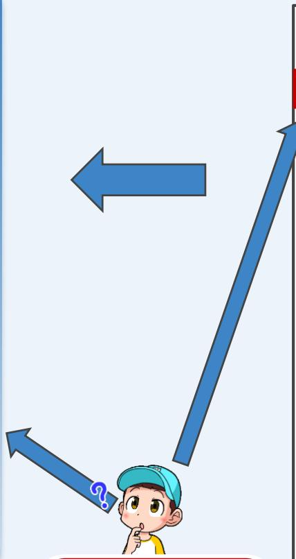

竟然概率0？

P(A1 = man|No) = 5/7

P(A1 = women|No) = 2/7

P(A1 = man|Yes) = 0

P(A1 = women|Yes) = 1

P(A2 = low|No) = 5/7

P(A2 = high|No) = 2/7

P(A2 = low|Yes) = 1/3

P(A2 = high|Yes) = 2/3

P(A3 = negative|No) = 6/7

P(A3 = positive|No) = 1/7

 P(A3 = negative|No) = 1/3

P(A3 = positive|No) = 2/3

For A4:

If $\mathsf { C } = \mathsf { N o }$ : sample mean $= 6 7$

 sample variance $= 2 0 0$

If C = Yes: sample mean $= 5 7$

 sample variance $= 1 5$

# 朴素贝叶斯平滑化

⚫ 由于样本数量的缺失， 部分条件概率会出现0值，此时可基于概率估计方法进行平滑化

$$
\begin{array}{l} \mathrm {O r i g i n a l :} P (A _ {i} | C) = \frac {N _ {i c}}{N _ {c}} \\ \mathrm {L a p l a c e :} P (A _ {i} | C) = \frac {N _ {i c} + 1}{N _ {c} + c} \\ \mathrm {m - e s t i m a t e :} P (A _ {i} | C) = \frac {N _ {i c} + m p}{N _ {c} + m} \\ \end{array}
$$

c: 类别数量

p: 先验概率

m: 参数

平滑技术可以避免模型过度依赖训练数据，尤其在数据稀疏的情况下，通过给未见过的特征值分配适度的概率，提升模型的鲁棒性

# 垃圾邮件分类

垃圾邮件困扰着互联网用户，正确识别技术难度大

⚫ 校验码法：计算邮件文本的效验码，与已知的垃圾邮件进行对比，但是识别效果不理想，且容易规避

⚫ Paul Graham提出基于“贝叶斯推断”的检测方案：基于特定词语计算垃圾邮件概率

# 垃圾邮件分类

⚫ 假设预先提供两组已经识别好的邮件：正常邮件和垃圾邮件各4000封

解析所有的邮件，提取每一个词。计算每个词语在正常邮件和垃圾邮件中出现的频率。

• prince在4000封垃圾邮件中，有200封包含，频率为5%；4000封正常邮件中，2封包含，频率为0.05%

• 而如果某个词只出现在垃圾邮件中，就假定它在正常邮件的出现频率是1%（经验值，可调整），反之亦然，避免概率为0。

# 垃圾邮件分类

⚫ 收到一封新邮件，假定它是垃圾邮件的概率为50%

• S表示垃圾邮件（spam），H表示正常邮件（healthy）

• P(S)和P(H)的先验概率，均为50%

用W表示事件—包含“prince”这个词，问题变成如何计算P(S|W)，即在某个词语(W)已经存在的情况下，垃圾邮件(S)的概率有多大

$$
P (S \mid W) = \frac {P (W \mid S) P (S)}{P (W \mid S) P (S) + P (W \mid H) P (H)}
$$

$$
P(W\mid S) = 5\% P(W\mid H) = 0.05\%
$$

$$
P(S) = 50\% \quad P(H) = 50\%
$$

# 垃圾邮件分类

能否得出结论，这封新邮件是垃圾邮件？

不能，一封邮件包含很多词语，一些词语（比如prince）说是垃圾邮件，另一些 (比如computer science）说不是，以哪个词为准？

⚫ 选出这封邮件中P(S|W)最高的15个词，计算它们的联合概率

先考虑只有W1和W2两个词语的情况，它们都出现在某封电子邮件中，这封邮件是垃圾邮件的概率，就是联合概率。

<table><tr><td>事件</td><td>w1</td><td>w2</td><td>垃圾邮件</td></tr><tr><td>ε1</td><td>出现</td><td>出现</td><td>是的</td></tr><tr><td>ε2</td><td>出现</td><td>出现</td><td>不是</td></tr></table>

# 垃圾邮件分类

假定所有事件都是独立事件（严格来说，这个假定不成立，但是这里先忽略）

$$
\begin{array}{l} P \left(E _ {1}\right) = P (S \mid W _ {1}) P (S \mid W _ {2}) P (S) \\ P = \frac {P (E _ {1})}{P (E _ {1}) + P (E _ {2})} \\ \end{array}
$$

<table><tr><td>事件</td><td>W1</td><td>W2</td><td>垃圾邮件</td></tr><tr><td>E1</td><td>出现</td><td>出现</td><td>是的</td></tr><tr><td>E2</td><td>出现</td><td>出现</td><td>不是</td></tr></table>

$$
P = \frac {P (S \mid W _ {1}) P (S \mid W _ {2}) P (S)}{P (S \mid W _ {1}) P (S \mid W _ {2}) P (S) + (1 - P (S \mid W _ {1})) (1 - P (S \mid W _ {2})) (1 - P (S))}
$$

将 $P ( S )$ 等于0.5代入，得到

$$
\begin{array}{l} P = \frac {P (S \mid W _ {1}) P (S \mid W _ {2})}{P (S \mid W _ {1}) P (S \mid W _ {2}) + (1 - P (S \mid W _ {1})) (1 - P (S \mid W _ {2}))} \\ = P 1 P 2 / \left(P 1 P 2 + (1 - P 1) (1 - P 2)\right) \\ \end{array}
$$

15个单词联合？

# 垃圾邮件分类

$$
P = \frac {P _ {1} P _ {2} \cdots P _ {1 5}}{P _ {1} P _ {2} \cdots P _ {1 5} + (1 - P _ {1}) (1 - P _ {2}) \cdots (1 - P _ {1 5})}
$$

# 这就是2002年，Paul Graham提出使用“贝叶斯推断”过滤垃圾邮件方法

• Paul Graham的门槛值是0.9，概率大于0.9，表示15个词联合认定，这封邮件有90%以上的可能属于垃圾邮件；概率小于0.9，就表示是正常邮件

• 有了这个方法以后，1000封垃圾邮件可以过滤掉995封，没有误判

# Naïve Bayes 朴素贝叶斯特点

Robust to isolated noise points / irrelevant attributes 根据后验概率判断，对数据噪音有天然的鲁棒性

Sensitive to prior probability

（垃圾邮件例子中的P(S)对最终结果影响大）

⚫ Noninformative prior

Independence assumption may not hold for some attributes（独立性条件有时候并不成立，如邮件中有些单词一起出现概率大，prince 与account）

Use other techniques such as Bayesian Belief Networks (BBN) 贝叶斯网络or信念网络…

# 频率学派 vs 贝叶斯学派

贝叶斯公式真正得到重视和广泛应用却是最近二三十年的事，其间被埋没了200多年

原因在于我们有另外一种数学工具—经典统计学，或者叫频率主义统计学，它在200多年的时间里一直表现不错。从理论上它可以揭示一切现象产生的原因，既不需要构建模型，也不需要默认条件，只要进行足够多次的测量，隐藏在数据背后的原因就会自动揭开面纱

经典统计学：科学是关于客观事实的研究，我们只要反复观察一个可重复的现象，直到积累了足够多的数据，就能从中推断出有意义的规律

贝叶斯方法：像算命先生一样，从主观猜测出发，这显然不符合科学精神。连拉普拉斯后来也放弃了贝叶斯方法这一思路，转向经典统计学。因为他发现，如果数据量足够大，人们完全可以通过直接研究这些样本来推断总体的规律

# 频率学派 vs 贝叶斯学派

# 频率学派：

概率必须符合科学的要求，可以用大量重复试验的频率去解释（概率=频率）

2. 其理论与方法的研究基于样本信息，从无到有

# 贝叶斯学派：

概率是认识主体对事件出现可能性大小的相信程度（概率=知识经验+频率）

2. 其理论与方法的研究基于样本信息和先验信息，从有到优

# 频率学派 vs 贝叶斯学派

# 假如想知道某个区域里海拔最低的地方

经典统计学的方法是首先进行观测，取得区域内不同地方的海拔数据，然后从中找出最低点。这个数据量必须足够多，以反映区域内地形全貌的特征，这样我们才能相信找到的就是实际上的最低点

贝叶斯方法是我不管哪里最低，就凭感觉在区域内随便选个地方开始走，每一步都往下走，虽然中间可能有一些曲折，但相信这样走早晚能够到达最低点

可以看出，贝叶斯方法的关键问题是这个最终到达的低点可能不是真正的最低点，而是某个相对低点，它可能对该区域的地形（碗型、马鞍形等）和最初我们主观选择的出发点有依赖性。这是贝叶斯方法最受经典统计学方法诟病的原因，也是它在过去的200多年被雪藏的原因所在

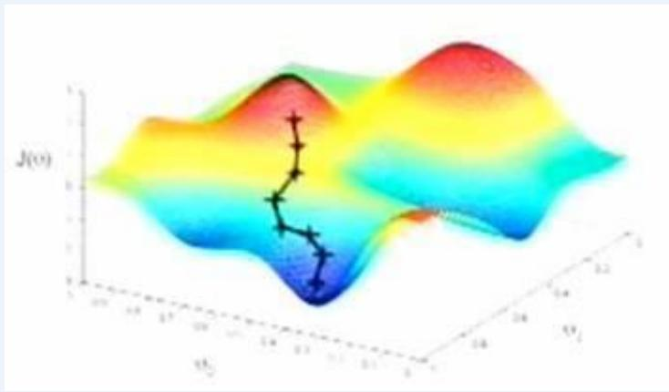

# 贝叶斯的崛起

⚫ 另一个原因：频率学派主要使用最优化的方法，在很多时候处理起来要方便很多。而贝叶斯方法中先验后验计算复杂，直到计算机的迅速发展，以及抽样算法的进步（Gibbssampling…）才重新回归

而两个标志性的事件在让学术界开始重视贝叶斯方法上起到了重要作用

联邦党人文集作者公案

天蝎号核潜艇搜救

# 联邦党人文集作者公案

1787年5月，美国各州（当时为13个）代表在费城召开制宪会议

1787年9月，美国的宪法草案被分发到各州进行讨论。一批反对派以“反联邦主义者”为笔名，发表了大量文章对该草案提出批评

宪法起草人之一亚历山大·汉密尔顿着急了，他找到曾任外交国务秘书（即后来的国务卿）的约翰·杰伊，以及纽约市国会议员麦迪逊，一同以普布利乌斯（Publius）的笔名发表文章，向公众解释为什么美国需要一部宪法。1788年，他们所写的85篇文章结集出版，这就是美国历史上著名的《联邦党人文集》

《联邦党人文集》出版的时候，汉密尔顿坚持匿名发表，于是，这些文章到底出自谁人之手，成了一桩公案

1810年，汉密尔顿接受了一个政敌的决斗挑战，但出于基督徒的宗教信仰，他决意不向对方开枪。在决斗之前数日，汉密尔顿自知时日不多，他列出了一份《联邦党人文集》的作者名单。1818年，麦迪逊又提出了另一份作者名单。这两份名单并不致。在85篇文章中，有73篇文章的作者身份较为明确，其余12篇作者存在争议

# 联邦党人文集作者公案

1955年，哈佛大学统计学教授Fredrick Mosteller找到芝加哥大学的年轻统计学家David Wallance，建议他跟自己一起做一个小课题，他想用统计学的方法，鉴定出《联邦党人文集》的作者身份。

# 汉密尔顿 or麦迪逊？这根本不是小课题

汉密尔顿和麦迪逊都是文章高手，他们的文风非常接近

– 从已经确定作者身份的文本，汉密尔顿写了9.4万字，麦迪逊写了11.4万字

– 汉密尔顿每个句子的平均长度是34.55字，而麦迪逊是34.59字

– 就写作风格而论，汉密尔顿和麦迪逊简直就是一对双胞胎

汉密尔顿和麦迪逊写这些文章，用了大约一年的时间，而Mosteller和Wallance甄别出作者的身份花了10多年的时间

# 联邦党人文集作者公案

如何分辨两人写作风格的细微差别，并据此判断每篇文章的作者就是问题的关键

以贝叶斯公式为核心的分类算法

先挑选一些能够反映作者写作风格的词汇，在已经确定了作者的文本中，对这些特征词汇的出现频率进行统计（条件概率）

统计这些词汇在那些不确定作者的文本中的出现频率，从而根据词频的差别推断其作者归属

将近100个哈佛大学学生帮助处理数据

用打字机把《联邦党人文集》的文本打出来，然后把每个单词剪下来，按照字母表的顺序，把这些单词分门别类地汇集在一起

# 联邦党人文集作者公案

首先剔除掉用不上的词汇。比如“战争” “立法权” “行政权等，这些词汇是因主题而出现，并不反映不同作者的写作风格。

只有像“in” “an” £ “upon”这些介词、连词等才“of 能显示出作者风格的微妙差异

位历史学家好心地告诉他们，有一篇1916年的论文提到，汉密尔顿总是用while，而麦迪逊则总是用whilst

仅仅有这一个线索是不够的。while和whilst在这12篇作者身份待定的文章里出现的次数不够多。况且，汉密尔顿和麦迪逊有时候会合写一篇文章，也保不齐他们会互相改文章，要是汉密尔顿把麦迪逊的whilst都改成了while呢？

# 联邦党人文集作者公案

当学生们把每个单词的小纸条归类、粘好之后，他们发现，汉密尔顿的文章里平均每一页纸会出现两次upon，而麦迪逊几乎一次也不用汉密尔顿更喜欢用enough，麦迪逊则很少用，其它一些有用的词汇包括：there、on等等

1964年，Mosteller和Wallance发表了他们的研究成果。他们的结论是，这12篇文章的作者很可能都是麦迪逊。他们最拿不准的是第55篇，麦迪逊是作者的概率是240：1

这个研究引起了极大的轰动，但最受震撼的不是宪法研究者，而是统计学家

这个研究把贝叶斯公式这个被统计学界禁锢了200年的幽灵从瓶子中释放了出来

# 天蝎号核潜艇搜救

1968年5月，美国海军的天蝎号核潜艇在大西洋亚速海海域突然失踪，潜艇和艇上的99名海军官兵全部杳无音信

事后调查报告：这艘潜艇上的一枚奇怪的鱼雷，发射出去后竟然敌我不分，扭头射向自己，让潜艇中弹爆炸

为了寻找天蝎号，美国政府调集了多位专家前往现场，包括了JohnCraven数学家， 美国海军特别计划部首席科学家

早在1966年，Craven就帮忙找到一颗“不小心”丢失的氢弹….

# 天蝎号核潜艇搜救

Craven使用了贝叶斯公式。他召集了数学家、潜艇专家、海事搜救等各个领域的专家。每个专家都有自己擅长的领域，但并非通才，没有专家能准确估计到在出事前后潜艇到底发生了什么

Craven并不要求团队成员互相协商寻求一个共识，而是让各位专家编写了各种可能的“剧本，让他们按照自己的知识和经验对于情况会向哪一个方向发展进行猜测，并评估每种情境出现的可能性

他把一瓶威士忌作为猜中的奖品。于是团队成员开始对潜艇可能遇到的麻烦、潜艇的下沉速度、下沉角度等因素下注

# 天蝎号核潜艇搜救

# 这一做法受到了很多同行的质疑

因为结果很多是这些专家以猜测、投票甚至可以说赌博的形式得到的，不可能保证准确性

– 因为搜索潜艇的任务紧迫，没有时间进行精确的实验、建立完整可靠的理论

Craven粗略估计了一下，半径20英里的数千英尺深的海底，都是天蝎号核潜艇可能沉睡的地方, Craven把各位专家的意见综合到一起，得到了一张20英里海域的概率图

# 天蝎号核潜艇搜救

，每个小格子有两个概率值p和q

- p:潜艇躺在这个格子里的概率，

q: 如果潜艇在这个格子里，它被搜索到的概率 (主要跟海域的水深有关，深海区漏网可能性更大)

如果一个格子被搜索后，没有发现潜艇的踪迹，那么按照贝叶斯公式，这个格子潜艇存在的概率就会降低

- A:潜艇躺在这个格子里 ${ \mathsf { P } } ( { \mathsf { A } } ) = { \mathsf { p } }$

- B:潜艇在格子里被找到

$$
\mathrm {P} (\bar {B}) = \mathrm {P} (\mathrm {A}) \mathrm {P} (\bar {B} | \mathrm {A}) + \mathrm {P} (\bar {A}) \mathrm {P} (\bar {B} | \bar {A}) = \mathrm {p} (1 - \mathrm {q}) + (1 - \mathrm {p}) 1
$$

$\mathsf { P } ( \mathsf { A } | \bar { B } ) { = } \mathsf { P } ( \bar { B } | \mathsf { A } ) \mathsf { P } ( \mathsf { A } ) / \mathsf { P } ( \bar { B } ) { = } \mathsf { p } ( \mathbb { 1 } - \mathsf { q } ) / \mathsf { p } ( \mathbb { 1 } - \mathsf { q } ) + ( \mathbb { 1 } - \mathsf { p } )$

$$
p ^ {\prime} = \frac {p (1 - q)}{(1 - p) + p (1 - q)} = p \frac {1 - q}{1 - p q} <   p
$$

# 天蝎号核潜艇搜救

◆ 由于所有格子概率的总和是1，这时其他格子潜艇存在的概率值就会上升

$$
r ^ {\prime} = r \frac {1}{1 - p q} > r
$$

$\bullet$ 先搜索概率值最高的格子，如没发现，重算概率分布图，搜寻船搜索新的最可疑格子

$\spadesuit$ 最初，海军人员对Craven和其团队的建议嗤之以鼻，他们凭经验估计潜艇是在爆炸点的东侧海底。但几个月一无所获，他们才不得不听从了Craven的建议，按照概率图在爆炸点的西侧寻找, 经过几次搜索，潜艇果然在爆炸点西南方被找到

# 天蝎号核潜艇搜救

由于这种基于贝叶斯公式的方法在后来多次搜救实践中被成功应用，现在已经成为海难空难搜救的通行做法（Bayesian search theory）

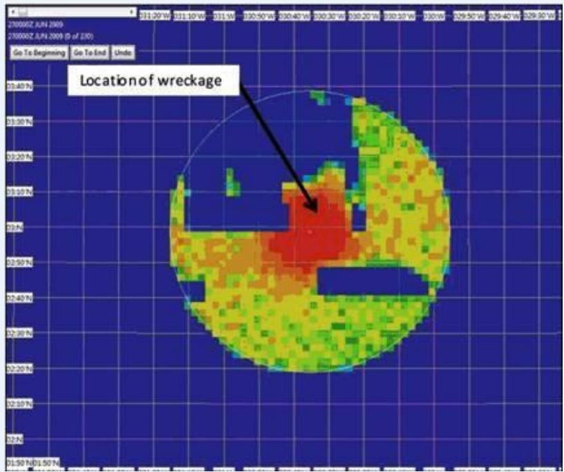

2009年法航空难搜救的后验概率分布图

# 独立性带给我们什么？

Suppose Boolean variables X1, $X _ { 2 }$ , . . . , $X _ { n }$ are mutually independent (i.e.,every subset is variable independent of every other subset)

We can specify full joint distribution (probability function over all vectorsof values) using only $n$ parameters (linear) instead of $2 ^ { n } - 1$ (exponential)只使用n个参数(线性)来计算完整的联合分布

Simply specify $\cdot P r ( X _ { 1 } = t r u e ) , \ldots , P r ( X _ { n } = t r u e )$(i.e. $, P r ( X _ { i } = t r u e )$ for all i)

⚫ We can easily recover probability of any primitive event, e.g.

⚫ Pr( $X _ { 1 } \lnot X _ { 2 } X _ { 3 } X _ { 4 } ) = P r ( X _ { 1 } ) { \lnot P r } ( X _ { 2 } ) ) P r ( X _ { 3 } ) P r ( X _ { 4 } )$

# 思考: 独立性的适用性

如果变量之间存在依赖性，朴素贝叶斯模型是否适用？如何改进？

Smoking：是否吸烟

Bronchitis：患支气管炎

Lung cancer：患肺癌

X-ray：受到X光照射

Dyspnoea：感到呼吸困难

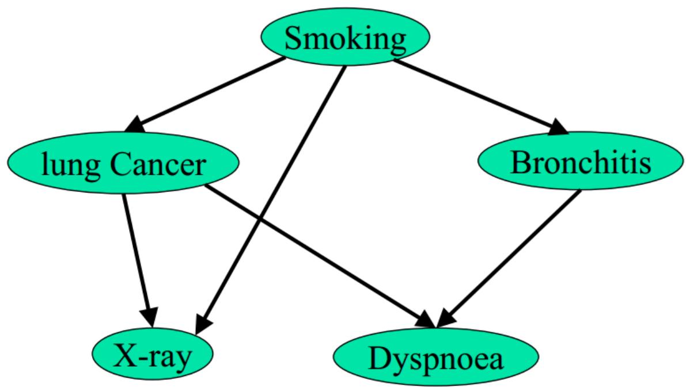

# The Value of Independence 独立性的价值

Complete independence reduces both representation and inference from$O ( 2 ^ { n } )$ to $O ( n )$ !

Unfortunately, such complete mutual independence is rare. Most realisticdomains do not exhibit this property. 完全的相互独立性不存在了！

Fortunately, most domains do exhibit a fair amount of conditionalindependence. 而条件独立性时常有！

⚫ And we can exploit conditional independence for representationand inference as well.

Bayesian networks do just this

# Exploiting Conditional Independence

# 想象这么一个故事:

⚫ If Craig woke up too early (E), Craig probably needs coffee (C);

⚫ if C, he’s likely angry (A).

⚫ If A, there is an increased chance of a burst blood vessel (B).

⚫ If B, Craig is quite likely to be hospitalized (H).

E – Craig woke too early A – Craig is angry H – Craig hospitalizedC – Craig needs coffee B – Craig burst a blood vessel

# Exploiting Conditional Independence

If you learned any of E, C, A, or B, your assessment of $P r ( H )$ would change.对E，C，A，B信息的掌握影响对 $\underline { { P r ( H ) } }$ 的评估

e.g., if any of these are seen to be true, you would increase $P r ( h )$ and decrease$P r ( \neg h )$ .

• So H is not independent of E, or C, or A, or B.

But if you knew value of B (true or false), learning value of E, C, or A, wouldnot influence $P r ( H )$ . Influence these factors have on H is mediated by theirinfluence on B.

Craig doesn’t get sent to the hospital because he’s angry, he gets sentbecause he’s had a burst blood vessel.

• So H is independent of E, and C, and A, given B

# Exploiting Conditional Independence

• Similarly

• B is independent of $\mathsf { E } ,$ and $\complement ,$ given A

• A is independent of $\mathsf { E } ,$ given C

• This means that:

• $P r ( H | B , \{ A , C , E \} ) = P r ( H | B )$

• $P r ( B | A , \{ C , E \} ) = P r ( B | A )$

• $P r ( A | C , \{ E \} ) = P r ( A | C )$

• $P r ( C | E )$ and $P r ( E )$ don’t simplify

# Exploiting Conditional Independence

By the chain rule (for any instantiation of H…E):

$$
\mathrm {P} (\mathrm {H}, \mathrm {B}, \mathrm {A}, \mathrm {C}, \mathrm {E}) = \mathrm {P} (\mathrm {H} | \mathrm {B}, \mathrm {A}, \mathrm {C}, \mathrm {E}) \mathrm {P} (\mathrm {B} | \mathrm {A}, \mathrm {C}, \mathrm {E}) \mathrm {P} (\mathrm {A} | \mathrm {C}, \mathrm {E}) \mathrm {P} (\mathrm {C} | \mathrm {E}) \mathrm {P} (\mathrm {E})
$$

$$
2 ^ {4} + 2 ^ {3} + 2 ^ {2} + 2 ^ {1} + 2 ^ {0} = 2 ^ {5} - 1
$$

By our conditional independence assumptions:

$$
\mathrm {P} (\mathrm {H}, \mathrm {B}, \mathrm {A}, \mathrm {C}, \mathrm {E}) = \mathrm {P} (\mathrm {H} | \mathrm {B}) \mathrm {P} (\mathrm {B} | \mathrm {A}) \mathrm {P} (\mathrm {A} | \mathrm {C}) \mathrm {P} (\mathrm {C} | \mathrm {E}) \mathrm {P} (\mathrm {E})
$$

We can specify the full joint by specifying five local conditional

distributions (joints):P(H|B);P(B|A);P(A|C);P(C|E);and P(E)

# Example quantification

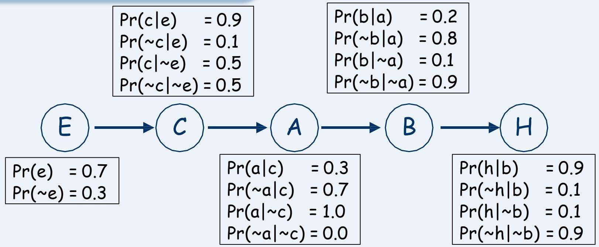

Note that half of these are “1 minus” the others

So specifying the full joint requires only 9(1+2+2+2+2) parameters, instead of 31for explicit representation

Linear in number of variables instead of exponential!

• Linear generally if dependence has a chain structure

# Inference is Easy

Want to know P(a)? Use summing out rule:

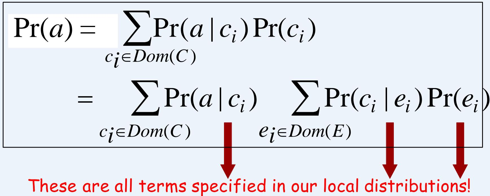

# Inference is Easy

$$
\begin{array}{c c} \hline \mathsf {P} (\mathsf {E}) & = 0. 7 \\ \hline \end{array}
$$

$$
P (\sim E) = 0. 3
$$

$$
\mathrm {P} (\mathrm {C} | \mathrm {E}) = 0. 9
$$

$$
\begin{array}{l l} \mathrm {P (\sim C | E)} & = 0. 1 \end{array}
$$

$$
\mathrm {P} (\mathrm {C} | \sim \mathrm {E}) = 0. 5
$$

$$
P (\sim C | \sim E) = 0. 5
$$

$$
\mathrm {P} (\mathrm {B} | \mathrm {A}) = 0. 2
$$

$$
\mathrm {P} (\sim \mathrm {B} | \mathrm {A}) = 0. 8
$$

$$
\begin{array}{r l} \mathrm {P (B | \sim A)} & = 0. 1 \end{array}
$$

$$
\mathrm {P} (\sim \mathrm {B} | \sim \mathrm {A}) = 0. 9
$$

$$
\mathrm {P} (\mathrm {H} | \mathrm {B}) = 0. 9
$$

$$
\mathrm {P} (\sim \mathrm {H} | \mathrm {B}) = 0. 1
$$

$$
\mathrm {P} (\mathrm {H} | \sim \mathrm {B}) = 0. 1
$$

$$
P (\sim H | \sim B) = 0. 9
$$

E

C

A

B

H

$$
\mathrm {P} (\mathrm {A} \mid \mathrm {C}) = 0. 7
$$

$$
\mathrm {P} (\sim \mathrm {A} | \mathrm {C}) = 0. 3
$$

$$
\mathrm {P} (\mathrm {A} | \sim \mathrm {C}) = 0. 0
$$

$$
P (\sim A \mid \sim C) = 1. 0
$$

计算??(~??)？

# Bayesian Networks: graph + tables 一图一表一BN

The structure above is a Bayesian network（贝叶斯网络）.

A BN is a graphical representation of the direct dependencies over a setof variables, together with a set of conditional probability tables (CPTs)quantifying the strength of those influences.

Bayes nets generalize the above ideas in very interesting ways, leading toeffective means of representation and inference under uncertainty.

一图：有向无环图

一表：条件概率表

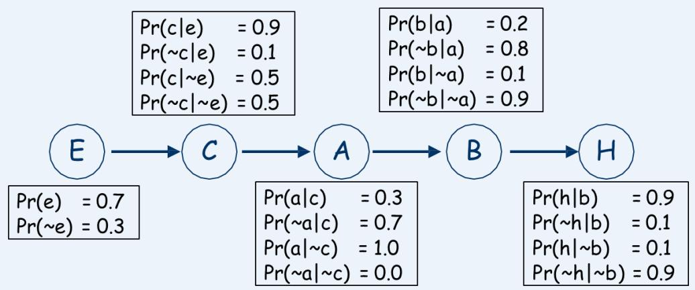

# Bayesian Networks

A BN over variables $\{ X _ { 1 } , X _ { 2 } , \ldots , X _ { n } \}$ consists of:

⚫ a DAG (directed acyclic graph ) whose nodes are the variables

⚫ a set of CPTs (conditional probability tables)

$P r ( X _ { i } | P a r ( X _ { i } ) )$ for each $X _ { i }$

Key notions

parents of a node: $P a r ( X _ { i } )$

⚫ children of a node

descendents of a node

ancestors of a node

family: set of nodes consisting of $X _ { i }$ and its parents

# Bayesian Networks

贝叶斯网络（Bayesian Network，简称BN）是不确定知识表示与推理的一种 有效方法，它由一个有向无环图（Directed Acyclic Graph, DAG）和一系列 条件概率表（衡量了上述关系的强度）组成。

有向无环图指的是一个无回路的有向图，即从图中任意一个节点出发经过任意条边，均无法回到该节点。有向无环图刻画了图中所有节点之间的依赖关系。

1986年，Judea Pearl提出贝叶斯网络，用于描述不确定知识表示与推理问 题 。贝叶斯网络让机器可以回答问题——给出一个从非洲回来的发烧且 身体疼痛的病人，最有可能的解释是疟疾。

令 G 为定义在{X1 X2 XN} 上的一个贝叶斯网络，其联合概率分布可以 表示为各个节点的条件概率分布的乘积 ：

$$
p (X) = \prod_ {i} p _ {i} \left(X _ {i} \mid \operatorname {P a r} _ {G} \left(X _ {i}\right)\right)
$$

# Example (此处变量取二值)

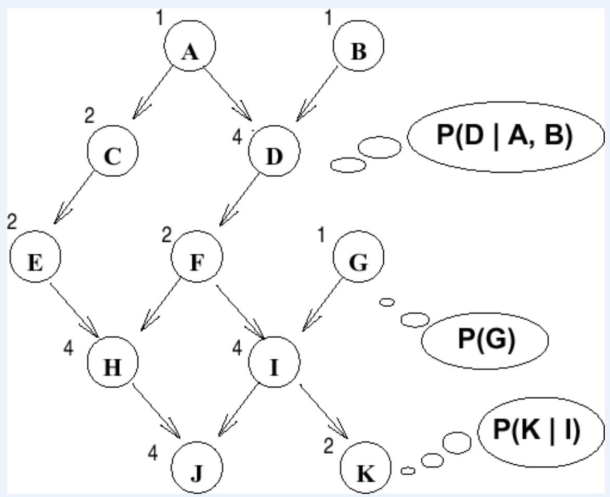

A couple CPTSare “shown”with 11 variables

Explicit jointrequires 211 -1$= 2 0 4 7$ parmtrs!

BN requires only27 parmtrs (thenumber ofentries for eachCPT is listed)

# Semantics of Bayes Nets

⚫ A Bayes net specifies that the joint distribution over the variable in the net canbe written as the following product decomposition.

$$
P r (X _ {1}, X _ {2}, \ldots , X _ {n}) = P r (X _ {n} | P a r (X _ {n})) ^ {*} P r (X _ {n - 1} | P a r (X _ {n - 1})) ^ {*} \dots^ {*} P r (X _ {1} | P a r (X _ {1}))
$$

⚫ This equation holds for any set of values d1, d2, . . . , $d _ { n }$ for the variables X1, X2, . . ., $X _ { n }$ .

⚫ e.g., We have X1, X2, X3 each with domain Dom[Xi] = {a, b, c}and we have

$$
P r (X _ {1}, X _ {2}, X _ {3}) = P (X _ {3} | X _ {1}, X _ {2}) P (X _ {2}) P (X _ {1})
$$

⚫ Then

$$
P r (X _ {1} = a, X _ {2} = b, X _ {3} = c) = P (X _ {3} = c \mid X _ {1} = a, X _ {2} = b) P (X _ {2} = b) P (X _ {1} = a)
$$

# Another Bayesian Network

A: Aameri gives the lecture

S: It is sunny out

L:The lecturer arrives late

Assume that all instructors may arrive late in bad weather.Some instructors may be more likely to be late than others.

# Another Bayesian Network

A: Aameri gives the lecture

S: It is sunny out

L:The lecturer arrives late

Assume that all instructors may arrive late in bad weather.Some instructors may be more likely to be late than others.

We'll start by writing down what we know:

$$
\mathrm {P} (\mathrm {S} \mid \mathrm {A}) = \mathrm {P} (\mathrm {S}), \mathrm {P} (\mathrm {S}) = 0. 3, \mathrm {P} (\mathrm {A}) = 0. 5
$$

Lateness is not independent of the weather or the lecturer.

We need to formulate P(L|S,A) for all of the values of S and A.

# Another Bayesian Network

A: Aameri gives the lecture

S: It is sunny out

L:The lecturer arrives late

Assume that all instructors may arrive late in bad weather.Some instructors may be more likely to be late than others.

We'll start by writing down what we know:

$$
\mathrm {P} (\mathrm {S} \mid \mathrm {A}) = \mathrm {P} (\mathrm {S}), \mathrm {P} (\mathrm {S}) = 0. 3, \mathrm {P} (\mathrm {A}) = 0. 5
$$

Lateness is not independent of the weather or the lecturer.

We need to formulate P(L|S,A) for all of the values of S and A.

# Another Bayesian Network

A: Aameri gives the lecture

S: It is sunny out

L:The lecturer arrives late

$$
\begin{array}{l} P (S \mid A) = P (S), P (S) = 0. 3, P (A) = 0. 5 \\ \mathsf {P} (\mathsf {L} | \mathsf {S}, \mathsf {A}) = 0. 0 5, \mathsf {P} (\mathsf {L} | \mathsf {S}, \sim \mathsf {A}) = 0. 1, \mathsf {P} (\mathsf {L} | \sim \mathsf {S}, \mathsf {A}) = 0. 1, \mathsf {P} (\mathsf {L} | \sim \mathsf {S}, \sim \mathsf {A}) = 0. 2 \\ \end{array}
$$

Because of conditional independence, we only need 6 values to specify the fulljoint instead of $7 = 2 \land 3 = 1$ .

Conditional independence leads to computational savings!

# Drawing the Network

$$
\mathsf {P} (\mathsf {S} | \mathsf {A}) = \mathsf {P} (\mathsf {S}), \mathsf {P} (\mathsf {S}) = 0. 3, \mathsf {P} (\mathsf {A}) = 0. 5
$$

$$
\mathsf {P} (\mathsf {L} | \mathsf {S}, \mathsf {A}) = 0. 0 5, \mathsf {P} (\mathsf {L} | \mathsf {S}, \sim \mathsf {A}) = 0. 1, \mathsf {P} (\mathsf {L} | \sim \mathsf {S}, \mathsf {A}) = 0. 1, \mathsf {P} (\mathsf {L} | \sim \mathsf {S}, \sim \mathsf {A}) = 0. 2
$$

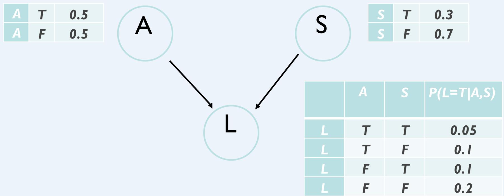

# Drawing the Network

$$
\mathsf {P} (\mathsf {S} | \mathsf {A}) = \mathsf {P} (\mathsf {S}), \mathsf {P} (\mathsf {S}) = 0. 3, \mathsf {P} (\mathsf {A}) = 0. 5
$$

$$
\mathsf {P} (\mathsf {L} | \mathsf {S}, \mathsf {A}) = 0. 0 5, \mathsf {P} (\mathsf {L} | \mathsf {S}, \sim \mathsf {A}) = 0. 1, \mathsf {P} (\mathsf {L} | \sim \mathsf {S}, \mathsf {A}) = 0. 1, \mathsf {P} (\mathsf {L} | \sim \mathsf {S}, \sim \mathsf {A}) = 0. 2
$$

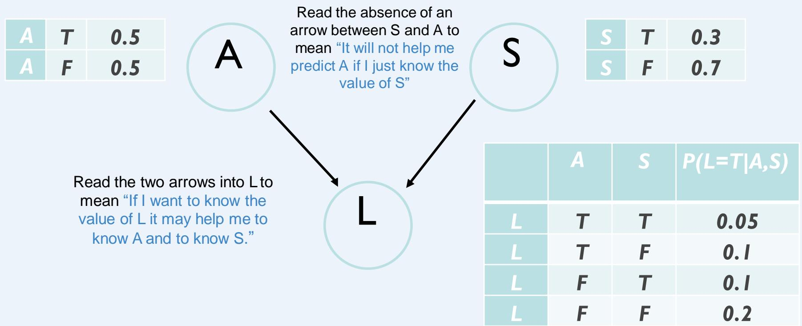

# Back to the network

Now let’s suppose we have these three events:

A: Aameri gives the lecture (~A: Allin gives the lecture )

L: The lecturer arrives late

R :The lecturer concerns Reasoning with Bayes’ Nets

And we know:

⚫ Allin has a higher chance of being late than Aameri. （~A）

⚫ Allin has a higher chance of giving lectures about reasoning withBNs

What kind of independences exist in our graph?

# Back to the network

Now let’s suppose we have these three events:

A: Aameri gives the lecture (~A: Allin gives the lecture )

L: The lecturer arrives late

R :The lecturer concerns Reasoning with Bayes’ Nets

And we know:

⚫ Allin has a higher chance of being late than Aameri. （~A）

⚫ Allin has a higher chance of giving lectures about reasoning withBNs

What kind of independences exist in our graph?

# Back to the network

Once you know who the lecturer is, then whether they arrivelate doesn’t affect whether the lecture concerns Reasoning withBayes’ Nets, i.e.:

$$
\begin{array}{l} P (R \mid A, L) = P (R \mid A) \\ \mathsf {P} (\mathsf {R} | \sim \mathsf {A}, \mathsf {L}) = \mathsf {P} (\mathsf {R} | \sim \mathsf {A}) \\ \end{array}
$$

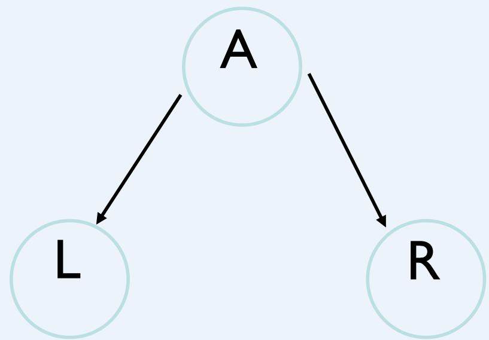

Read this diagram as“Given knowledge of A,knowing about L won’t tellanythingmore about R.”

# The network reflects conditional independences

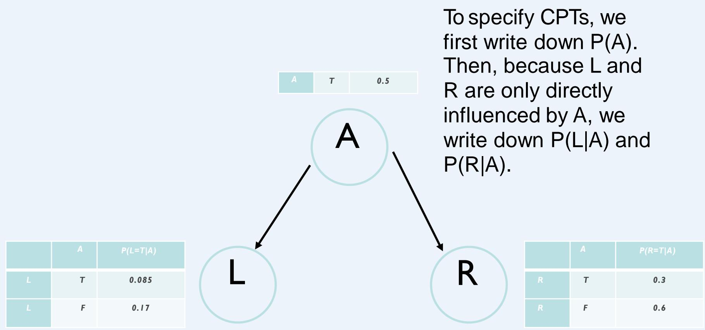

R is conditionally independent of L givenA (and vice versa)

# The network reflects conditional independences

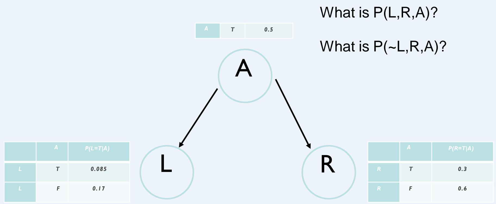

R is conditionally independent of L givenA (and vice versa)

# Try to Build a Bayes Net

A: Aameri gives the lecture

L: The lecturer arrives late

R: The lecturer concerns Reasoning with Bayes’ Nets

S: It is sunny out

T: The lecture starts on time.

➢ T is only directly influenced by L (i.e.T is conditionallyindependent of R,A,S given L)

➢ L is only directly influenced by A and S (i.e. L is conditionallyindependent of R given A & S)

➢ R is only directly influenced by A (i.e. R is conditionallyindependent of L,S, given A)

➢ A and S are independent

# Try to Build a Bayes Net

A: Aameri gives the lecture

L: The lecturer arrives late

R: The lecturer concerns Reasoning

with Bayes’ Nets

S: It is sunny out

T: The lecture starts on time.

Step One: Add variables

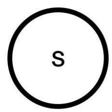

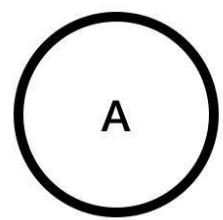

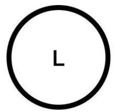

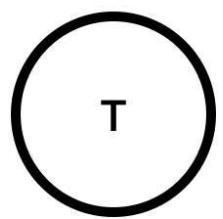

# Building a Bayes Net

A: Aameri gives the lecture

L: The lecturer arrives late

R: The lecturer concerns Reasoning

with Bayes’ Nets

S: It is sunny out

T: The lecture starts on time.

Step Two: add links.

The link structure must be acyclic.

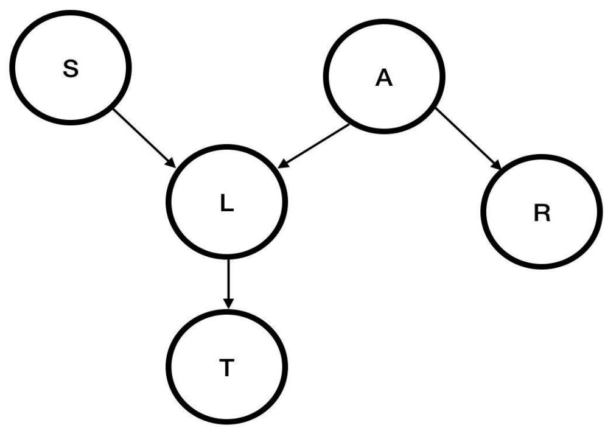

If you assign node Y the parents $\mathsf { X } _ { 1 } , \mathsf { X } _ { 2 } , . . . , \mathsf { X } _ { \mathsf { n } }$ , you are promising that, given $\{ { \mathsf X } _ { 1 } , { \mathsf X } _ { 2 } , . . . , { \mathsf X } _ { \mathsf n } \}$ , Y isconditionally independent of any other variable that’s not a descendent of Y

# Building a Bayes Net

A: Aameri gives the lecture

L: The lecturer arrives late

R: The lecturer concerns Reasoning

with Bayes’ Nets

S: It is sunny out

T: The lecture starts on time.

Step Three: add a conditional probabilitytable (CPT) for each node.

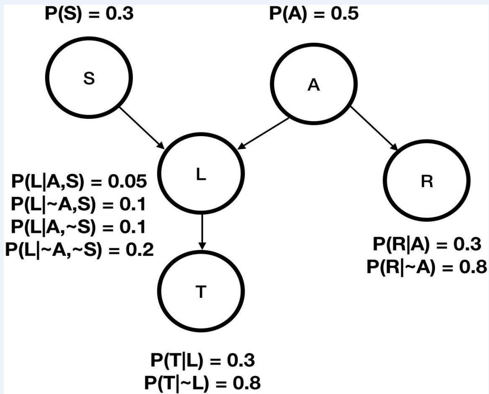

The table for X must define P(X|Parents) and for all combinations of the possible parent values.

# Building a Bayes Net

A: Aameri gives the lecture

L: The lecturer arrives late

R: The lecturer concerns Reasoning

with Bayes’ Nets

S: It is sunny out

T: The lecture starts on time.

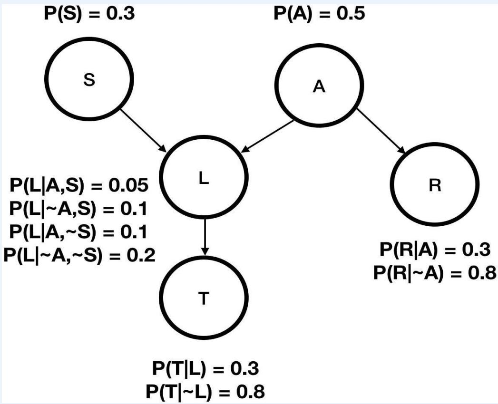

You can deduce many probability relations from a Bayes Net.

Note that variables that are not directly connected may still be correlated.

# 贝叶斯网络的构建

 给定变量 $\{ X _ { 1 } , . . . , X _ { n } \}$ ，构建一个贝叶斯网络的步骤如下：

步骤1：在某种变量顺序下，对所有变量的联合概率应用链式法则

$$
P r (X _ {1}, \dots , X _ {n}) = P r (X _ {n} | X _ {1}, \dots , X _ {n - 1}) P r (X _ {n - 1} | X _ {1}, \dots , X _ {n - 2}) \dots P r (X _ {1})
$$

步骤2：对于每个变量Xi，考虑该变量的条件集合X1,...,Xi-1， 采用如下方 法递归地判断条件集合中的每个变量X是否可以删除：如果给定其余 变量的集合，Xi和X是条件独立的，则将X从Xi的条件集合中删除。经过 这一步骤，可以得到下式

$$
P r (X _ {1}, \dots , X _ {n}) = P r (X _ {n} | P a r (X _ {n})) P r (X _ {n - 1} | P a r (X _ {n - 1})) \dots P r (X _ {1})
$$

步骤3：基于上述公式，构建一个有向无环图 。其中，对于每个用节点表 示的变量Xi，其父节点为 $\mathsf { \Pi } ^ { P a n ( X _ { i } ) }$ 中的变量集合。

步骤4：为每个家庭（即变量及其父节点集合）确定条件概率表的取值。

# Variable Ordering Matters - Causal Intuitions

The Bayes Net can be constructed using an arbitraryordering of the variables. 变量序列

However, some orderings will yield BNs with very largeparent sets. This requires exponential space, and (as wewill see later) exponential time to perform inference.

Empirically, and conceptually, a good way to construct aBN is to use an ordering based on causality. This oftenyields a more natural and compact BN. 基于因果关系的变量序列可以获得更加自然紧致的贝叶斯网络结构

# Causal Intuitions

Malaria, the flu and a cold all cause aches. So use the ordering that causes comebefore effects: Malaria, Flu, Cold, Aches

$$
P r (M, F, C, A) = P r (A | M, F, C) P r (C | M, F) P r (F | M) P r (M)
$$

Each of these disease affects the probability of aches, so the first conditionalprobability does not change.

It is reasonable to assume that these diseases are independent of each other:having or not having one does not change the probability of having the others.

$$
\mathrm {S o} \operatorname * {P r} (C | M, F) = \operatorname * {P r} (C), \operatorname * {P r} (F | M) = \operatorname * {P r} (F)
$$

# Causal Intuitions

This yields a fairly simple Bayes net.

We only need one big CPT, involving the family of“Aches”.

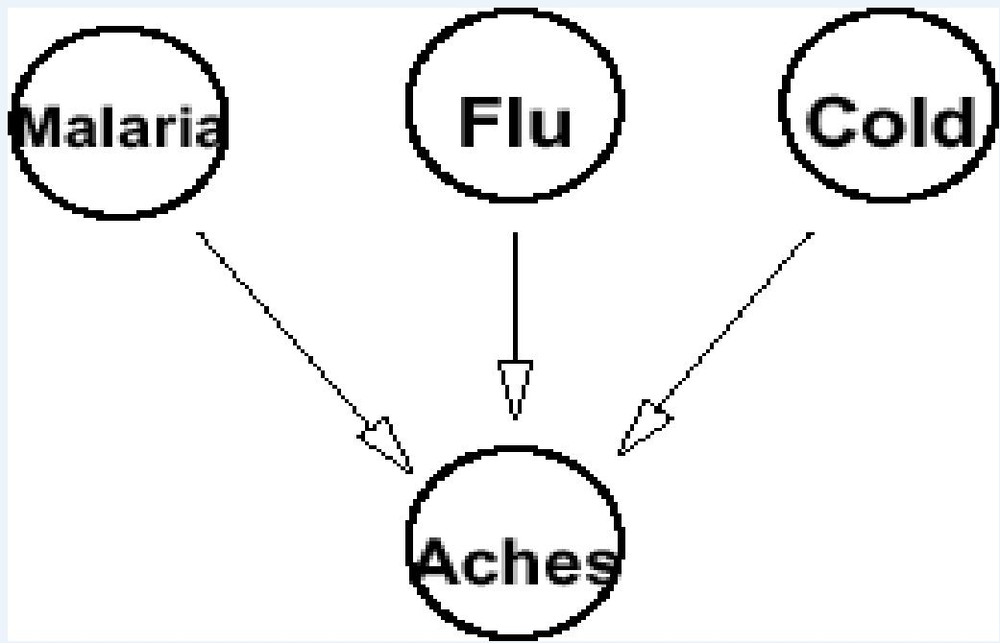

# Causal Intuitions

Suppose we build the BN using the opposite ordering:Aches, Cold, Flu, Malaria

Pr $( A , C , F , M ) = P r ( M | A , C , F ) P r ( F | A , C ) P r ( C | A ) P r ( A )$

Can we reduce $P r ( M | A , C , F )$ ？ No

• Probability of Malaria is clearly affected by knowing aches.

• How about knowing aches and cold, or aches and cold and flu?

Probability of Malaria is affected by both of these additionalpieces of knowledge

Knowing Cold and of Flu lowers the probability of Achesindicating Malaria since they “explain away” Aches!

Similarly, we can’t reduce $P r ( F | A , C )$ .

$\bullet P r ( C | A ) \neq P r ( C )$

# Causal Intuitions

We obtain a much more complex Bayes net. In fact, we obtainno savings over explicitly representing the full joint distribution(i.e., representing the probability of every atomic event).

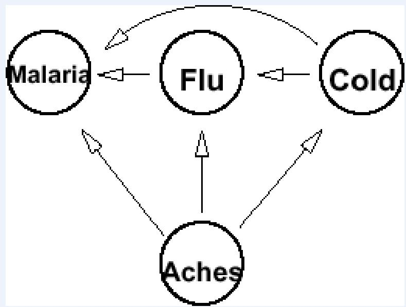

基于因果关系的变量序列可以获得更加自然紧致的贝叶斯网络结构

# Example (Binary valued Variables)

$$
\begin{array}{l} \Pr (A, B, C, D, E, F, G, H, I, J, K) \\ = \Pr (\mathrm {A}) \\ x \Pr (B) \\ \mathbf {\chi} \times \operatorname {P r} (\mathbf {C} | \mathbf {A}) \\ \mathbf {\chi} \times \operatorname * {P r} (D | A, B) \\ \mathbf {\boldsymbol {x}} \Pr (\mathbf {E} | \mathbf {C}) \\ \times \Pr (F | D) \\ x \Pr (G) \\ \times \operatorname * {P r} (H | E, F) \\ x P r (I | F, G) \\ \mathbf {x} \Pr (\mathbf {J} | \mathbf {H}, \mathbf {I}) \\ x \Pr (K | I) \\ \end{array}
$$

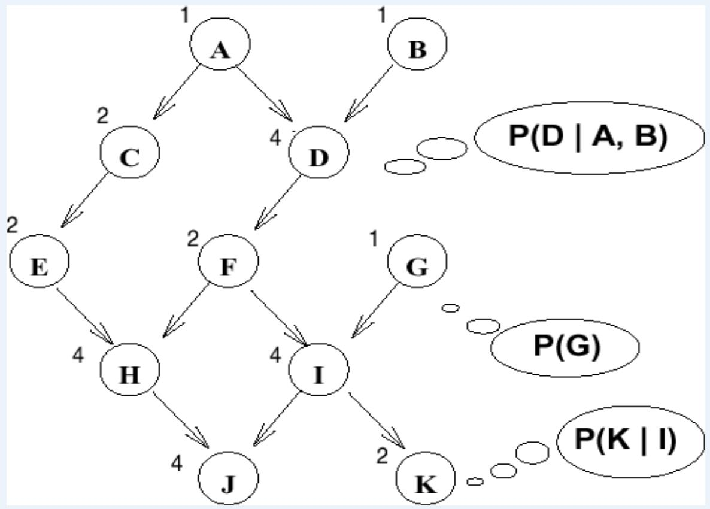

# The Classic Burglary Example

n I’m at work, neighbour John calls to say my alarm is ringing, but neighbourMary doesn’t call. Sometimes it’s set off by minor earthquakes. Is there aburglar?

Variables: Burglary入室盗窃, Earthquake, Alarm, JohnCalls, MaryCallsNetwork topology reflects ”causal” knowledge:

n A burglar can set the alarm off

n An earthquake can set the alarm off The alarm cancause Mary to call

n The alarm can cause John to call

# Burglary example

• A burglary can set the alarm off

• An earthquake can set the alarmoff

• The alarm can cause Mary to call

• The alarm can cause John to call

Note that these tablesonly provide theprobability that Xi istrue.

(E.g., Pr(A is true|B,E))The probability that Xiis false is 1- thesevalues

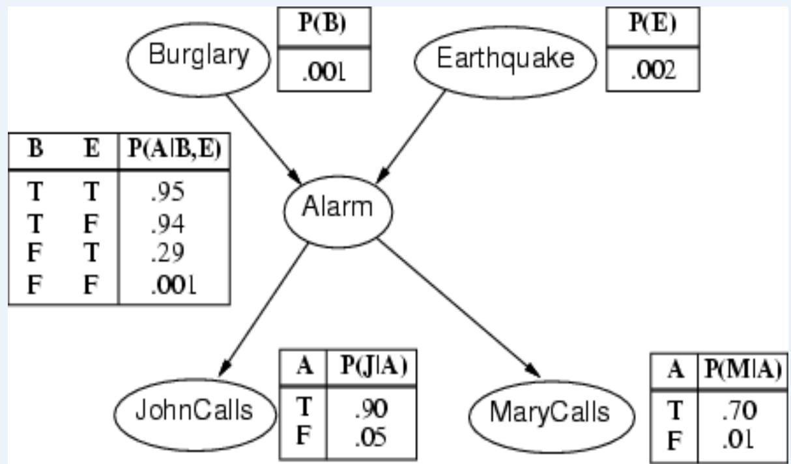

Number of Parameters: $1 + 1 + 4 + 2 + 2 = \mathrm { ~ | ~ 0 ~ }$ (vs. 25-1 = 31)

Using the Bayes Net:

$P r ( B , E , A , J , M ) = P r ( M \vert A ) ~ P r ( J \vert A ) ~ P r ( A \vert B , E ) P r ( B ) P r ( E )$

# Example of Constructing Bayes Network

n Previously we chose a causal order.

n Now suppose we choose the ordering MaryCalls (M), JohnCalls (J), Alarm (A),Burglary(B), Earthquake(E), i.e., M,J,A,B,E

n These “orderings”are the ordering of the arrows in the Bayes Net DAG, which arethe opposite to the ordering of variables in the chain rule, i.e.,

$$
P r (M, J, A, B, E) = P r (E | B, A, J, M) ^ {*} P r (B | A, J, M) ^ {*} P r (A | J, M) ^ {*} P r (J | M) ^ {*} P r (M)
$$

n Now let’s see if we can get rid of the conditioning sets

# Burglary Example

Suppose we choose the ordering M,

J, A, B, E

$$
P (J \mid M) = P (J)?
$$

MaryCalls

JohnCalls

$$
P r (E, B, A, J, M) = P r (E | B, A, J, M) ^ {*} P r (B | A, J, M) ^ {*} P r (A | J, M) ^ {*} P r (J | M) ^ {*} P r (M)
$$

# Burglary Example

Suppose we choose the ordering M,

J, A, B, E

$$
P (J \mid M) = P (J)? N o
$$

$$
P (A \mid J, M) = P (A \mid J)? P (A \mid J, M) = P (A)?
$$

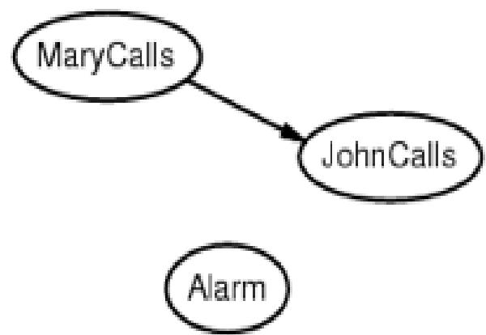

Pr(E, B, A, J, M ) = Pr(E|B, A, J, M )*Pr(B|A, J, M )*Pr(A|J, M ) *Pr(J |M ) *Pr(M )

# Burglary Example

Suppose we choose the ordering M,

J, A, B, E

$$
P (J \mid M) = P (J)? N o
$$

$$
P (A \mid J, M) = P (A \mid J)? P (A \mid J, M) = P (A)? N o
$$

$$
\mathsf {P} (\mathsf {B} \mid \mathsf {A}, \mathsf {J}, \mathsf {M}) = \mathsf {P} (\mathsf {B} \mid \mathsf {A})?
$$

$$
P (B \mid A, J, M) = P (B)?
$$

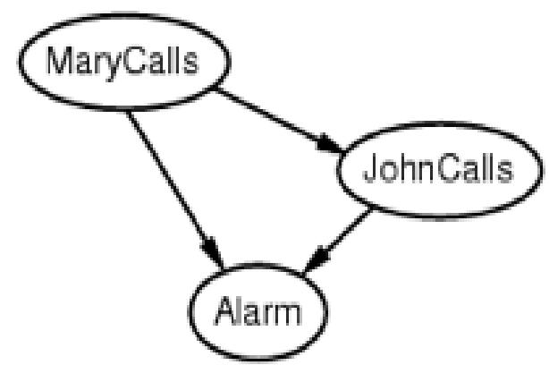

Burglary

Pr(E, B, A, J, M ) = Pr(E|B, A, J, M )*Pr(B|A, J, M )*Pr(A|J, M ) *Pr(J |M ) *Pr(M )

# Burglary Example

Suppose we choose the ordering M,

J, A, B, E

$$
P (J \mid M) = P (J)? N o
$$

$$
P (A \mid J, M) = P (A \mid J)? P (A \mid J, M) = P (A)? N o
$$

$$
P (B \mid A, J, M) = P (B \mid A)? Y e s
$$

$$
P (B \mid A, J, M) = P (B)? N o
$$

$$
P (E \mid B, A, J, M) = P (E \mid A)? N o
$$

$$
P (E \mid B, A, J, M) = P (E \mid A, B)? \mathrm {Y e s}
$$

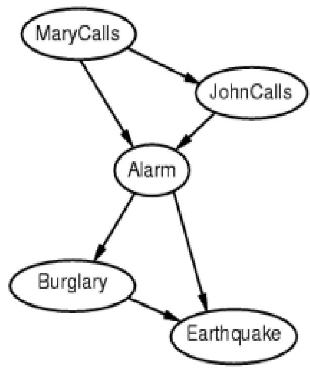

$$
P r (E, B, A, J, M) = P r (E | B, A, J, M) ^ {*} P r (B | A, J, M) ^ {*} P r (A | J, M) ^ {*} P r (J | M) ^ {*} P r (M)
$$

# Example cont’d

Deciding conditional independence is hard in the non-causal direction!Causal models & conditional independence seem hardwired for humans.Network is less compact: $1 + 2 + 4 + 2 + 4 = 1 3$ numbers needed!

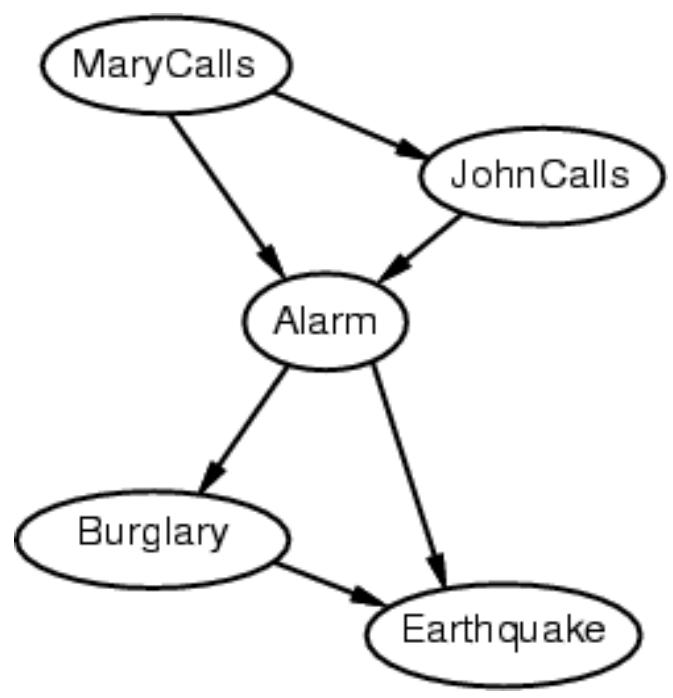

# Inference in Bayes Nets

# Given

1) a Bayes netPr(X1, X2,…, Xn)

$$
= \Pr \left(X _ {n} \mid \operatorname {P a r} \left(X _ {n}\right)\right) ^ {*} \Pr \left( \right.X _ {n - 1} \mid \operatorname {P a r} \left(X _ {n - 1}\right) ^ {*} \dots^ {*} \Pr \left(X _ {1} \mid \operatorname {P a r} \left(X _ {1}\right)\right)
$$

2) some Evidence, E

$$
E = \{a \text {s e t o f v a l u e s f o r s o m e o f t h e v a r i a b l e s} \}
$$

We want to compute the new probability distributionPr(Xk| E)

That is, we want to figure out

$$
\Pr (X _ {k} = d \mid E) \text {f o r a l l} d \in \operatorname {D o m} [ X _ {k} ]
$$

# Examples

⚫ Computing probability of different diseases given symptoms症状

Computing probability of hail storms 冰雹 given differentmetrological evidence

In such cases getting a good estimate of the probability of the unknown event allowsus to respond more effectively (gamble rationally)

# 回到入室盗窃例子

In the Alarm example*** we have (the compact network):

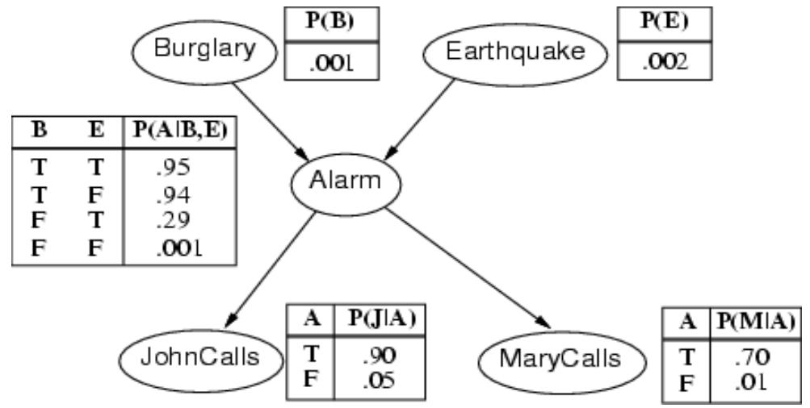

Recall Burglary(B), Earthquake(E), Alarm(A), MaryCalled (M), JohnCalled(J)And from our Bayes Net above, we determined:

$$
\Pr (B, E, A, M, J) = P (J | A) * \Pr (M | A) * \Pr (A | E, B) * \Pr (E) * \Pr (B)
$$

We might want to compute things like:

$$
\Pr (B = \text {T r u e} | M = \text {t r u e}, J = \text {f a l s e}, E = \text {f a l s e})
$$

The probability that there was a burglary, given that Mary called, John didn’t call, andthere was no earthquake

# Burglary example calculation: Try

<table><tr><td>B</td><td>P(B)</td></tr><tr><td>+b</td><td>0.001</td></tr><tr><td>-b</td><td>0.999</td></tr></table>

<table><tr><td>A</td><td>J</td><td>P(J|A)</td></tr><tr><td>+a</td><td>+j</td><td>0.9</td></tr><tr><td>+a</td><td>-j</td><td>0.1</td></tr><tr><td>-a</td><td>+j</td><td>0.05</td></tr><tr><td>-a</td><td>-j</td><td>0.95</td></tr></table>

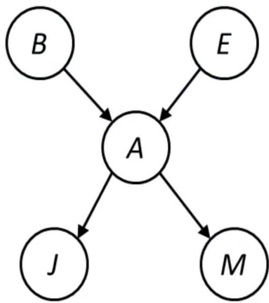

<table><tr><td>E</td><td>P(E)</td></tr><tr><td>+e</td><td>0.002</td></tr><tr><td>-e</td><td>0.998</td></tr></table>

<table><tr><td>A</td><td>M</td><td>P(M | A)</td></tr><tr><td>+a</td><td>+m</td><td>0.7</td></tr><tr><td>+a</td><td>-m</td><td>0.3</td></tr><tr><td>-a</td><td>+m</td><td>0.01</td></tr><tr><td>-a</td><td>-m</td><td>0.99</td></tr></table>

<table><tr><td>B</td><td>E</td><td>A</td><td>P(A|B,E)</td></tr><tr><td>+b</td><td>+e</td><td>+a</td><td>0.95</td></tr><tr><td>+b</td><td>+e</td><td>-a</td><td>0.05</td></tr><tr><td>+b</td><td>-e</td><td>+a</td><td>0.94</td></tr><tr><td>+b</td><td>-e</td><td>-a</td><td>0.06</td></tr><tr><td>-b</td><td>+e</td><td>+a</td><td>0.29</td></tr><tr><td>-b</td><td>+e</td><td>-a</td><td>0.71</td></tr><tr><td>-b</td><td>-e</td><td>+a</td><td>0.001</td></tr><tr><td>-b</td><td>-e</td><td>-a</td><td>0.999</td></tr></table>

$$
\begin{array}{l} P (+ b, - e, + a, - j, + m) = \\ P (+ b) P (- e) P (+ a | + b, - e) P (- j | + a) P (+ m | + a) = \\ 0. 0 0 1 \times 0. 9 9 8 \times 0. 9 4 \times 0. 1 \times 0. 7 \\ \end{array}
$$

It tells that independence between variables can reduce the size of calculation!

# Recall conditional independence

Similarly

B is independent of $\mathsf { E } ,$ and C, given A

A is independent of E, given C

This means that:

$P r ( H | B , \{ A , C , E \} ) = P r ( H | B )$

$P r ( B | A , \{ C , E \} ) = P r ( B | A )$

$P r ( A | C , \{ E \} ) = P r ( A | C )$

$P r ( C | E )$ and $P r ( E )$ don’t simplify

■Example:

Alarm」Fire|Smoke

火-》烟-》警报

Based on the independent

$P r ( H , B , A , C , E ) \ = \ P r ( H \vert B ) ^ { * }$

Pr(B|A) *Pr(A|C) *Pr(C|E)

*Pr(E)

Simple!

# 贝叶斯网络示例

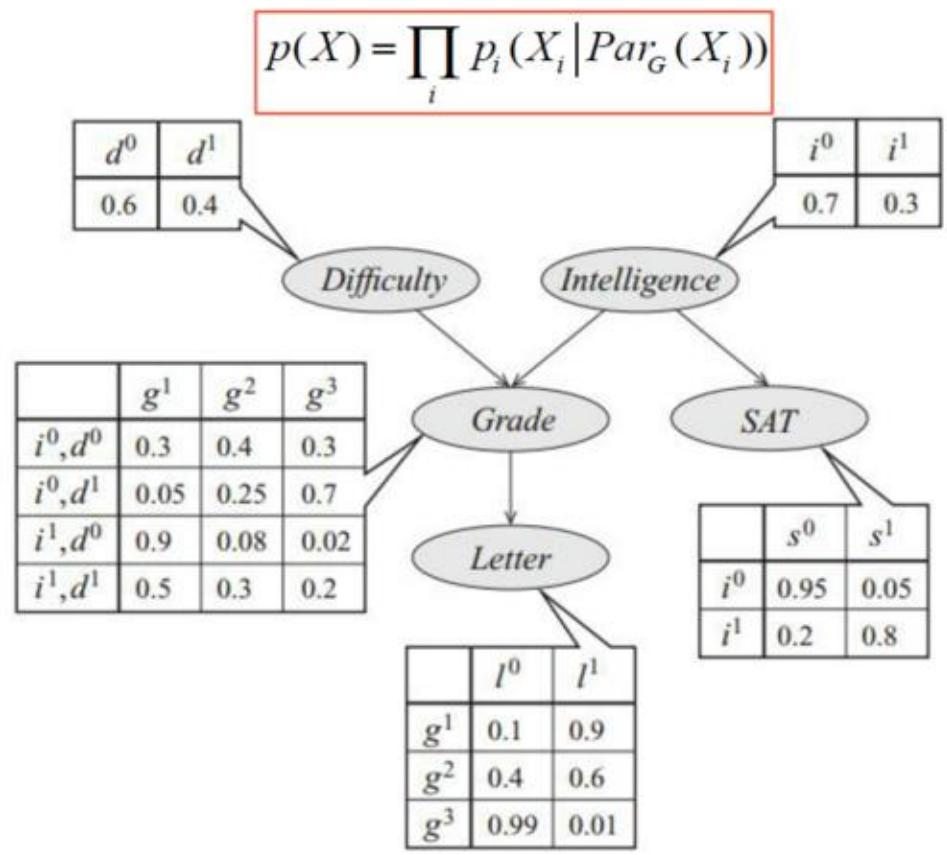

# 节点定义

试题难度 $( D ) : d ^ { 0 }$ （低）， $d ^ { 1 }$ （高）

智力（1）：（低）， $i ^ { I }$ （高）

考试成绩（G）： $g ^ { l }$ $g ^ { 2 }$ （B）， $g ^ { s }$

高考成绩（S）：s（低）， $s ^ { I }$ （高）

是否得到推荐信（L）：10（否）， $l ^ { I I }$ （是）

# 贝叶斯网络示例

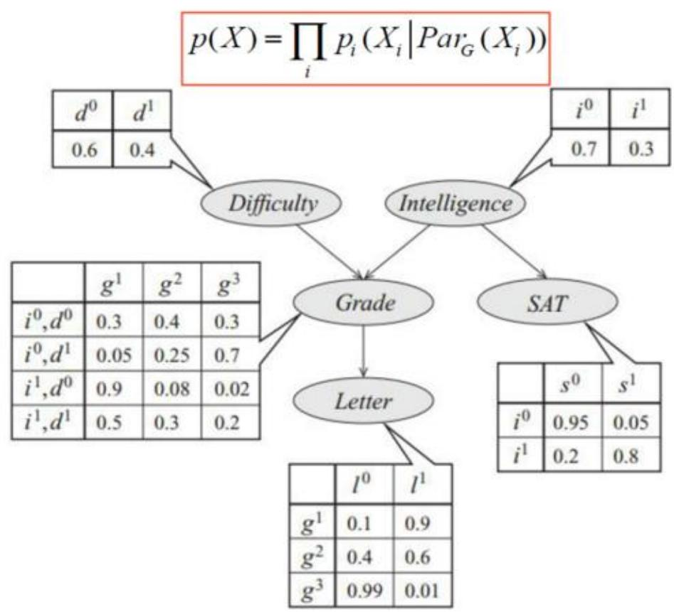

# 联合概率分布：

$$
\begin{array}{l} p (D, I, G, S, L) \\ = P (D) P (I) P (G \mid I, D) P (S \mid I) P (L \mid G) \\ \end{array}
$$

# 联合概率分布结构化分解的好处：

□枚举法： $2 ^ { * } 2 ^ { * } 3 ^ { * } 2 ^ { * } 2 - 1 = 4 7$ 个参数

□结构化分解： $1 + 1 + 8 + 3 + 2 = 1 5$ 个参数

# 贝叶斯网络示例

# 联合概率分布：

$$
\begin{array}{l} p (D, I, G, S, L) \\ = P (D) P (I) P (G \mid I, D) P (S \mid I) P (L \mid G) \\ \end{array}
$$

# 联合概率分布结构化分解的好处：

□枚举法： $2 ^ { \ast } 2 ^ { \ast } 3 ^ { \ast } 2 ^ { \ast } 2 - 1 = 4 7$ 个参数

□结构化分解： $1 + 1 + 8 + 3 + 2 = 1 5$ 个参数

□更一般地，假设 $n$ 个二元随机变量的联合概率分布，表示该分布需要 $2 ^ { n _ { - } } I$ 个参数。如果用贝叶斯网络建模，假设每个节点最多有 $k$ 个父节点，所需要的参数最多为 $n ^ { * } 2 ^ { k }$ ，一般每个变量局部依赖于少数变量。

# 贝叶斯网络示例

# Try

# 联合概率分布：

$$
\begin{array}{l} p (D, I, G, S, L) \\ = P (D) P (I) P (G \mid I, D) P (S \mid I) P (L \mid G) \\ \end{array}
$$

$$
\begin{array}{l} p \left(d ^ {1}, i ^ {0}, g ^ {1}, s ^ {1}, l ^ {1}\right) \\ = P (d ^ {1}) P (i ^ {0}) P (g ^ {1} | i ^ {0}, d ^ {1}) P (s ^ {1} | i ^ {0}) P (l ^ {1} | g ^ {1}) \\ = 0. 4 \times 0. 7 \times 0. 0 5 \times 0. 0 5 \times 0. 1 \\ = 0. 0 0 0 0 7 \\ \end{array}
$$

$$
\begin{array}{l} p \left(d ^ {0}, i ^ {1}, g ^ {1}, s ^ {1}, l ^ {1}\right) \\ = P \left(d ^ {0}\right) P \left(i ^ {1}\right) P \left(g ^ {1} \mid i ^ {1}, d ^ {0}\right) P \left(s ^ {1} \mid i ^ {1}\right) P \left(l ^ {1} \mid g ^ {1}\right) \\ = 0. 6 \times 0. 3 \times 0. 9 \times 0. 8 \times 0. 9 \\ = 0. 1 1 6 6 4 \\ \end{array}
$$

# 贝叶斯网络表示

 盘式记法（plate notation）

贝叶斯网络的一种简洁的表示方法，其将相互独立的、由相同机制生成的多个变量放在一个方框（盘）内，并在 方框中标出类似变量重复出现的个数。此外，方框可以 嵌套，且通常用阴影标注出可观察到的变量。

n 示例：

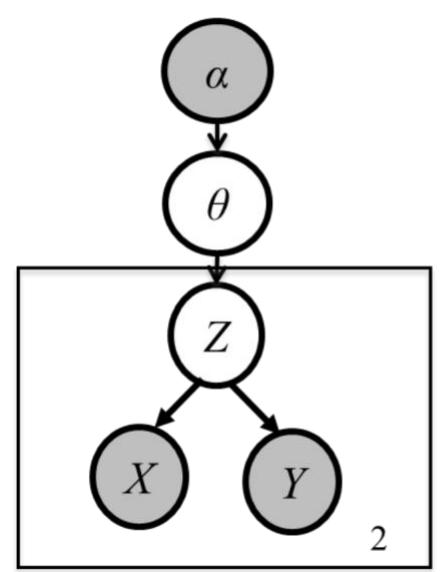

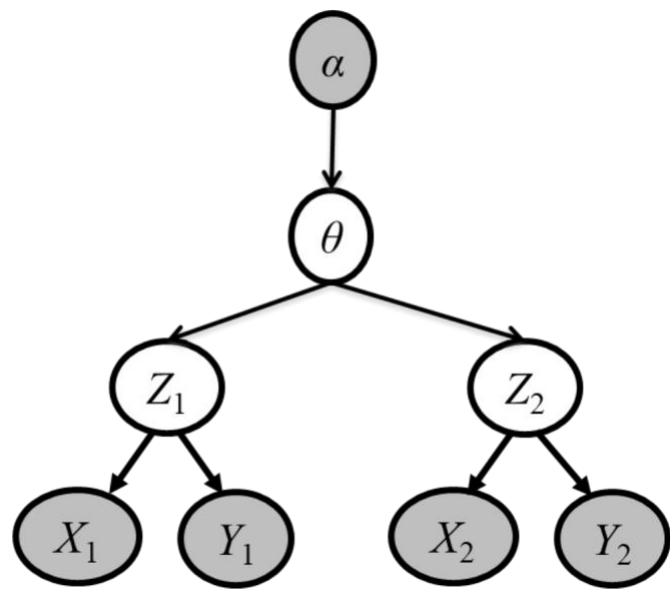

# 贝叶斯网络表示

 一元语言模型：

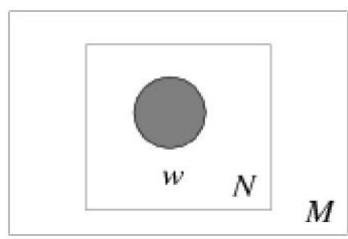

$$
p (\mathbf {w}) = \coprod_ {n = 1} p (w _ {n})
$$

假设文本中每个词都和其他词独立， 和它的上下文无关。 通过一元语言模型， 我们可以 计算一个序列的概率， 从而判断该序列是否 符合自然语言的语法和语义规则。

 一元混合语言模型：

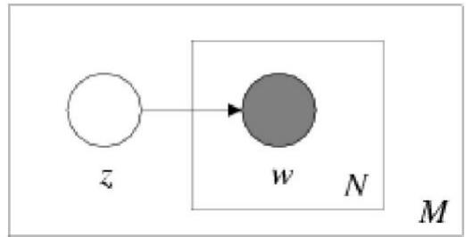

$$
p (\mathbf {w}) = \sum_ {z} p (z) \coprod_ {n = 1} p \left(w _ {n} \mid z\right)
$$

假设给定文本主题 （z ）

的 前提下， 该文本中的每个 词都和其他词条件独立 。 其中， z 为隐变量。

# 贝叶斯网络表示

概率潜在语义分析：

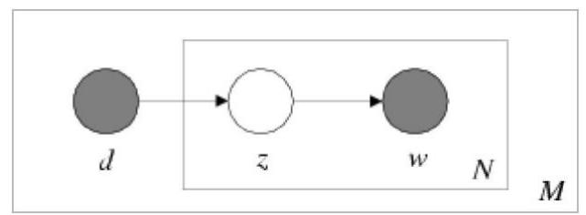

$$
p (d, w _ {n}) = p (d) \sum_ {z} p (w _ {n} \mid z) p (z \mid d)
$$

 潜在狄利克雷分配：

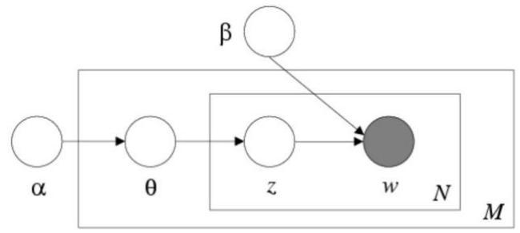

$$
p (\mathbf {w} \mid \alpha , \beta) = \int p (\theta \mid \alpha) \left(\prod_ {n = 1} ^ {N} \sum_ {z _ {n}} p (z _ {n} \mid \theta) p (w _ {n} \mid z _ {n}, \beta)\right) d ^ {k} \theta
$$

$$
p (D \mid \alpha , \beta) = \prod_ {d = 1} ^ {M} \int p (\theta_ {d} \mid \alpha) \left(\prod_ {n = 1} ^ {N _ {d}} \sum_ {z _ {d n}} p (z _ {d n} \mid \theta_ {d}) p (w _ {d n} \mid z _ {d n}, \beta)\right) d ^ {k} \theta_ {d}
$$

# Independence in BN

# Important question about a BN:

■Are two nodes independent given certain evidence?

■ If yes,can prove using algebra (tedious in general)

■ If no,can prove with a counter example

·Example:

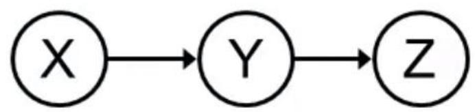

Question:are Xand Znecessarily independent?

Answer:no.Example:low pressure causes rain,which causes traffic.

Xcan influence Z,Zcan influenceX (via Y)

# D-separation / D分离

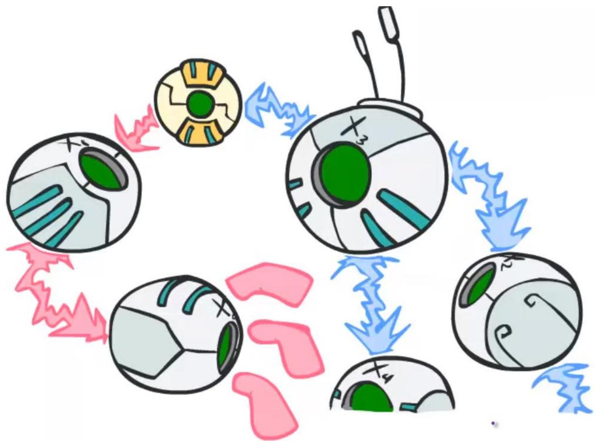

# D-separation

■ Study independence properties for triples

 Analyze complex cases in terms of member triples

■ D-separation: a condition / algorithm for answering suchqueries

# D-separation：Causal Chains

This configuration is a“causal chain’

X:Low pressure

Y: Rain

Z: Traffic

$$
P (x, y, z) = P (x) P (y | x) P (z | y)
$$

Guaranteed X independent of Z？ No!

One example set of CPTs for which Xis notindependent of Zis sufficient toshow thisindependence isnot guaranteed.

·Example:

Low pressure causes rain causes traffic,high pressure causes no rain causes notraffic

In numbers:

$$
\begin{array}{l} P (+ y \mid + x) = 1, P (- y \mid - x) = 1, \\ P (+ z | + y) = 1, P (- z | - y) = 1 \\ \end{array}
$$

# D-separation：Causal Chains

This configuration is a“causal chain’

X: Low pressure

Y: Rain

Z: Traffic

$$
P (x, y, z) = P (x) P (y | x) P (z | y)
$$

Guaranteed X independent of Z given Y?

$$
\begin{array}{l} P (z | x, y) = \frac {P (x , y , z)}{P (x , y)} \\ = \frac {P (x) P (y | x) P (z | y)}{P (x) P (y | x)} \\ \end{array}
$$

Yes!

Evidence along the chain “blocks”theinfluence

# D-separation：Common Cause

■ This configuration is a“common cause"

$$
P (x, y, z) = P (y) P (x | y) P (z | y)
$$

Guaranteed X independent of Z? No!

One example set of CPTs forwhich Xis notindependent of Zissufficient to showthisindependence is not guaranteed.

·Example:

■Project due causes both forums busyand lab full

In numbers:

$$
\begin{array}{l} P (+ x \mid + y) = 1, P (- x \mid - y) = 1, \\ P (+ z | + y) = 1, P (- z | - y) = 1 \\ \end{array}
$$

# D-separation：Common Cause

■This configuration is a“common cause"

$$
P (x, y, z) = P (y) P (x | y) P (z | y)
$$

 Guaranteed X and Z independent given Y?

$$
\begin{array}{l} P (z | x, y) = \frac {P (x , y , z)}{P (x , y)} \\ = \frac {P (y) P (x | y) ^ {1} P (z | y)}{P (y) P (x | y)} \\ \end{array}
$$

Yes!

 Observing the cause blocks influencebetween effects.

# D-separation: Common Effect

■ Last configuration: two causes of oneeffect (v-structures)

X: Raining

Y: Ballgame

Z: Traffic

AreXand Yindependent?

Yes:the ballgame and the rain cause traffic, buttheyarenot correlated

■Still need to prove they must be (try it!)

Are X and Y independent given Z?

No: seeing traffic puts the rain and the ballgameincompetitionas explanation.

This is backwards from the other cases

Observingan effect activates influence betweenpossible causes.

再举些栗子：

dead battery --> car won't start <-- no gas

陈老师买了2张彩票，赚了1个亿

# D-separation: General Case

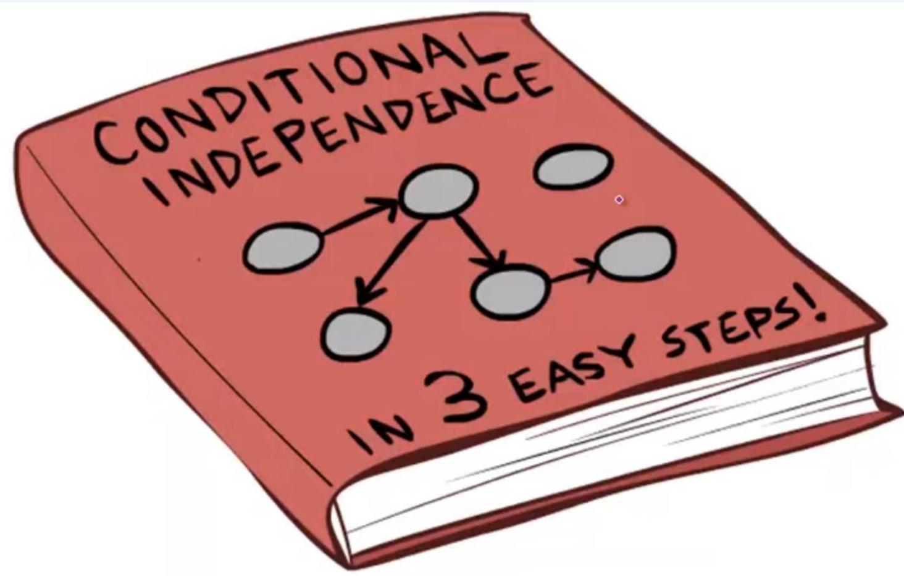

# D-separation: General Case

 General question: in a given BN,are two variables independent(given evidence)?

■ Solution: analyze the graph

1Anycomplex example can be brokeninto repetitions of the three canonical cases

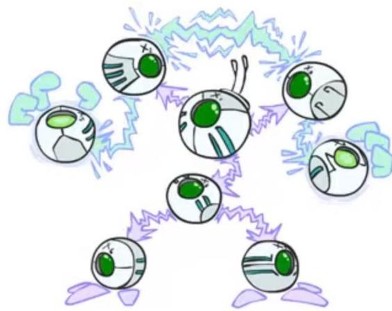

# Reachability 相关与独立：连通与阻塞

Recipe: shade evidence nodes, lookfor paths in the resulting graph

Attempt 1: if two nodes are connectedby an undirected path not blocked bya shaded node, they are conditionallyindependent

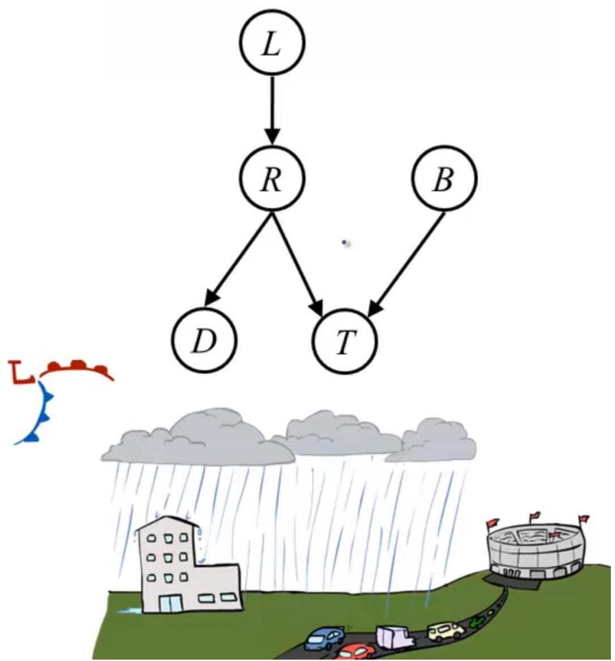

# Reachability 相关与独立：连通与阻塞

# Active /Inactive Paths

Question: Are X and Y conditionally independent givenevidence variables {Z}?

Yes,ifXandY“d-separated"byZ

■Considerall (undirected) paths fromXtoY

Noactivepaths $\underline { { \underline { { \mathbf { \delta \pi } } } } }$ independence!

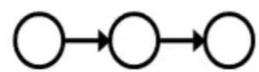

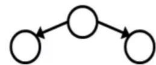

■A path is active if each triple is active:

·Causalchain $A  B  C$ where Bis unobserved (either direction)

■Common cause $A \left. B \right. C$ where Bis unobserved

■Common effect (aka v-structure)$A \right. B \left. C$ whereBorone ofitsdescendents isobserved

Allit takes to block a path is a single inactive segment

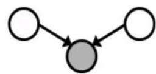

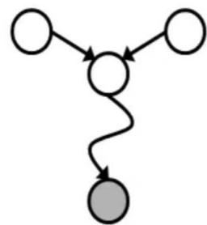

Inactive Triples

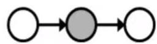

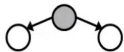

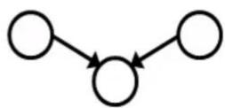

相关 连通

独立 阻塞

# D-seperation

Query: $X _ { i } \perp \perp X _ { j } | \{ X _ { k _ { 1 } } , . . . , X _ { k _ { n } } \} \perp$

Check all (undirected!) paths between $X _ { i }$ and $X _ { j }$

■ If one or more active,then independence not guaranteed

$$
X _ {i} \mathbb {N} X _ {j} | \{X _ {k _ {1}}, \dots , X _ {k _ {n}} \}
$$

■Otherwise (i.e.if all paths are inactive),then independence is guaranteed

$$
X _ {i} \perp \perp X _ {j} | \{X _ {k _ {1}}, \dots , X _ {k _ {n}} \}
$$

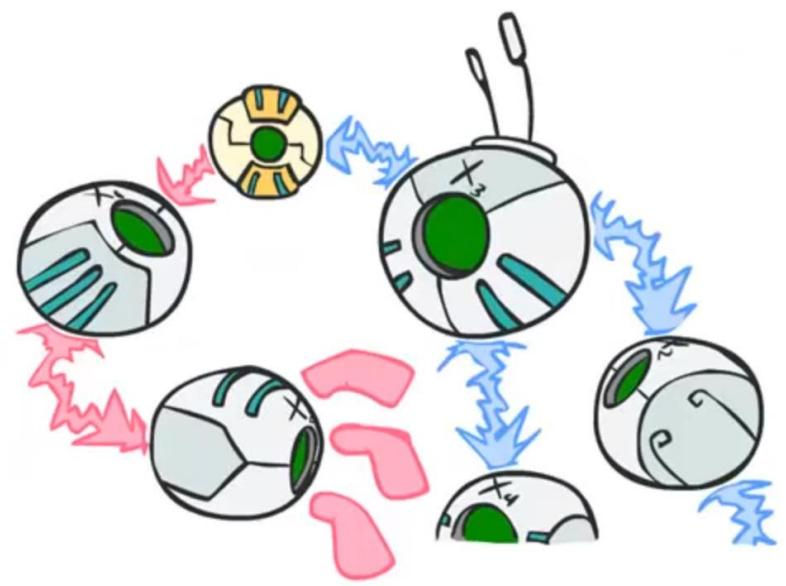

# D-separation Example

RIB

Independent

RIB|T

RB|T'

（All paths inactive=independent）

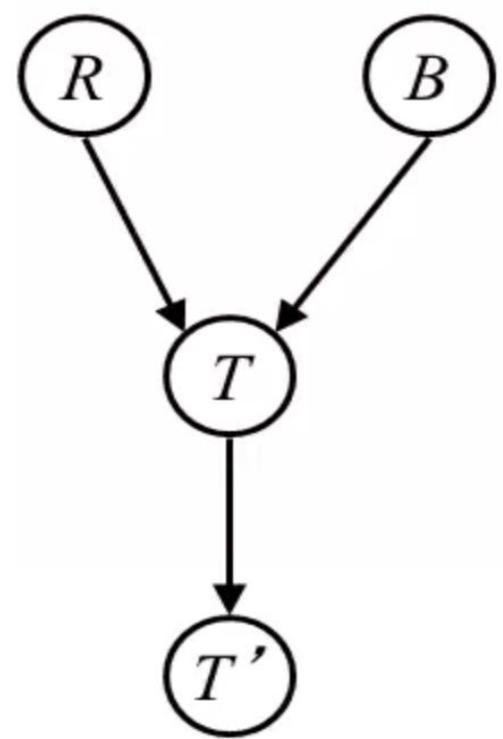

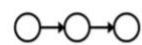

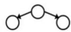

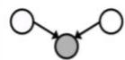

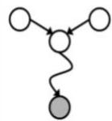

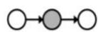

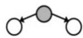

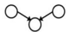

# D-separation Example

$$
\begin{array}{l} L \perp T ^ {\prime} | T \\ L \perp B \\ \end{array}
$$

Independent

Independent

$$
L \perp B | T
$$

$$
L \perp B | T ^ {\prime}
$$

$$
L \perp B | T, R
$$

Independent

（All paths inactive=independent）

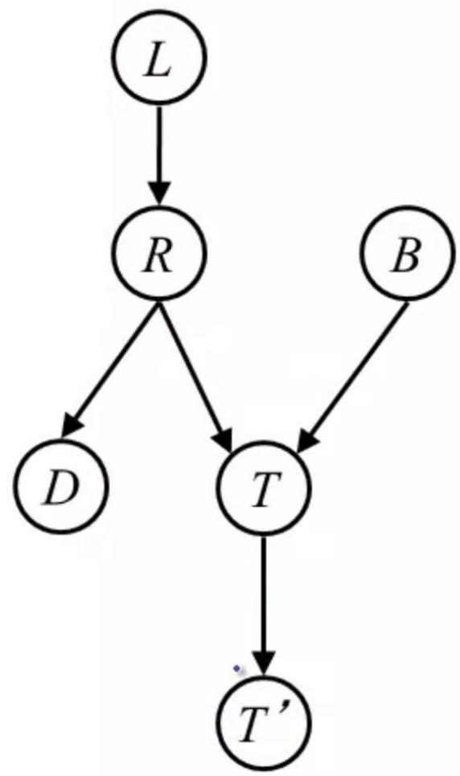

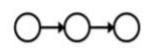

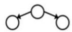

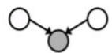

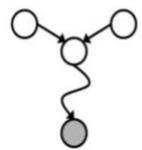

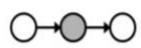

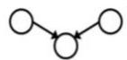

# D-separation Example

# Variables:

·R: Raining

·T: Traffic

■D: Roof drips

·S: I'm sad

# Questions:

TID

T $D | R$ Independent

TID|R,S

（All paths inactive=independent）

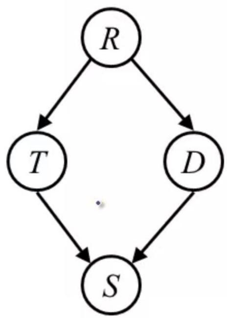

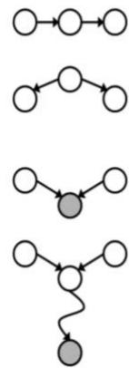

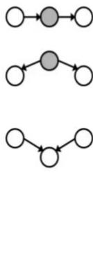

# Structure Implications

Given a Bayes net structure,can run d-separation algorithm to build a complete list ofconditional independences that are necessarilytrue of the form

$$
X _ {i} \perp X _ {j} | \{X _ {k _ {1}}, \dots , X _ {k _ {n}} \}
$$

This list determines the set of probabilitydistributions that can be represented

# Computing All Independences

COMPUTE ALL THE

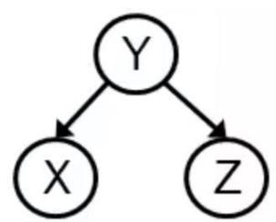

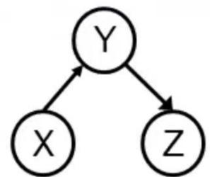

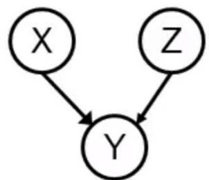

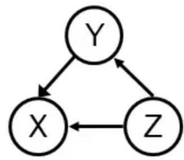

# D-Separation Exercise

In the following network determineif A and E are independent giventhe evidence.

1. A and E given no evidence?

2. A and E given {C}?

3. A and E given {G,C}?

4. A and E given {G,C,H}?

5. A and E given {G,F}?

6. A and E given {F,D}?

7. A and E given {F,D,H}?

8. A and E given {B}?

9. A and E given {H,B}?

10. A and E given {G,C,D,H,D,F,B}?

# D-Separation Exercise

In the following network determineif A and E are independent giventhe evidence.

1. A and E given no evidence? N

2. A and E given {C}? N

3. A and E given {G,C}? Y

4. A and E given {G,C,H}? Y

5. A and E given {G,F}? N

6. A and E given {F,D}? Y

7. A and E given {F,D,H}? N

8. A and E given {B}? Y

9. A and E given {H,B}? Y

10. A and E given {G,C,D,H,D,F,B}? Y

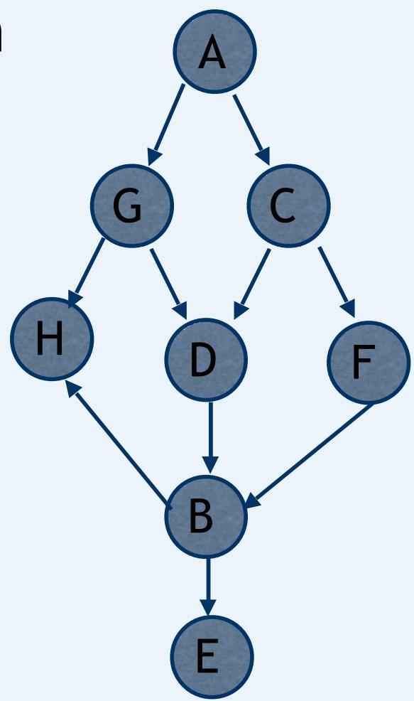

# 贝叶斯网络中的D-分离

 示例：

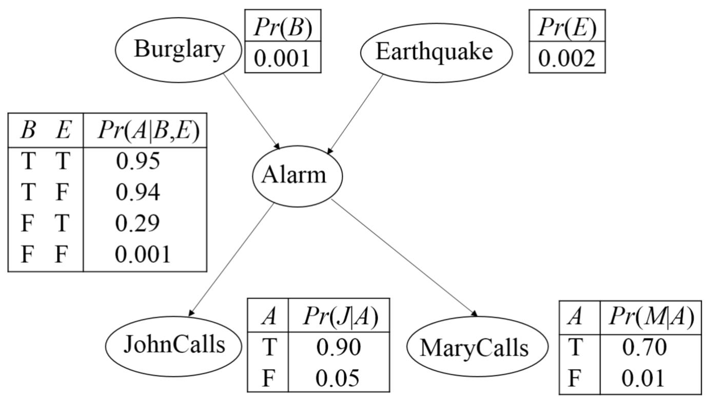

# 贝叶斯网络中的D-分离

#  间接的因果作用：

# 贝叶斯网络中的D-分离

#  间接的因果作用：

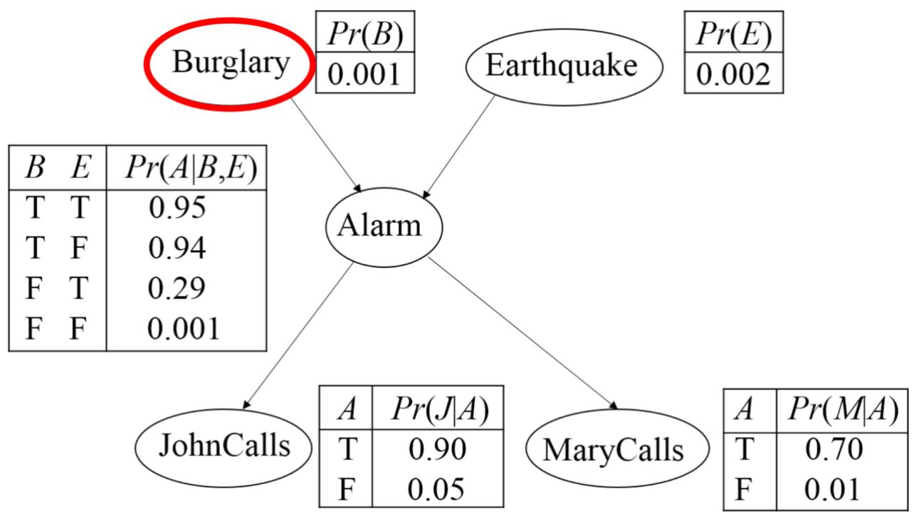

# 贝叶斯网络中的D-分离

#  间接的因果作用：

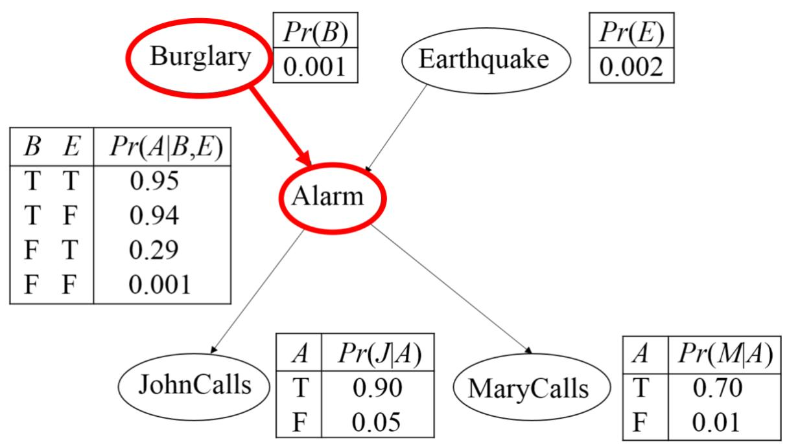

# 贝叶斯网络中的D-分离

#  间接的因果作用：

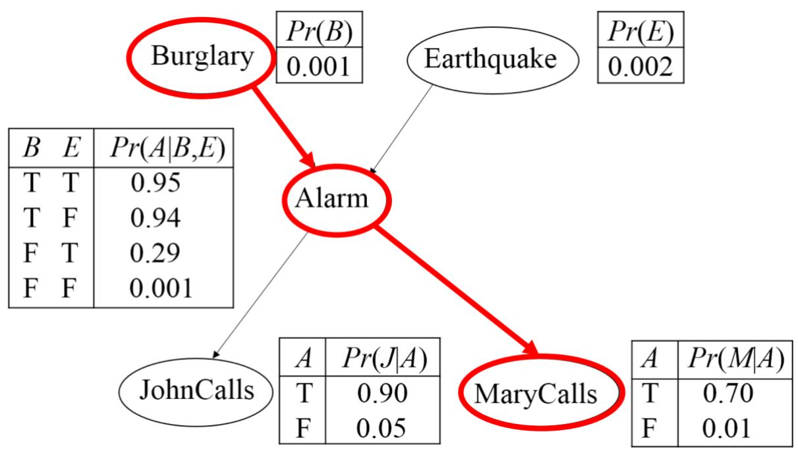

# 贝叶斯网络中的D-分离

间接的因果/证据作用（Chain）：给定A的前提下，M与B条件独立。

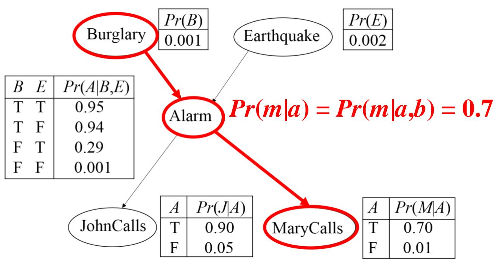

# 贝叶斯网络中的D-分离

#  共同的原因

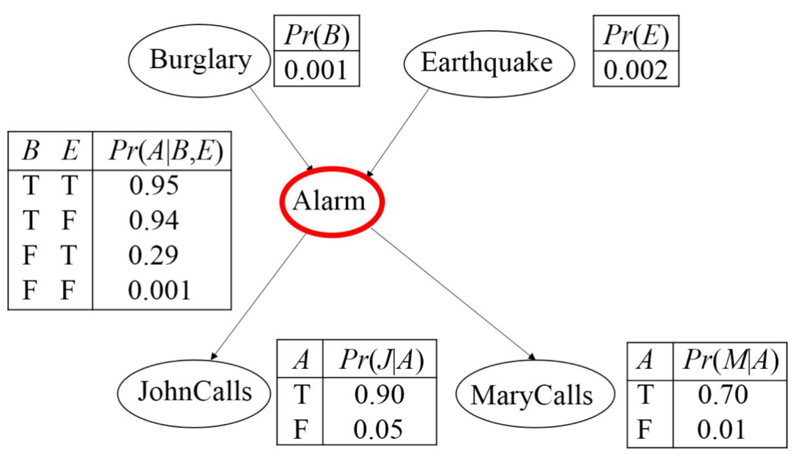

# 贝叶斯网络中的D-分离

#  共同的原因

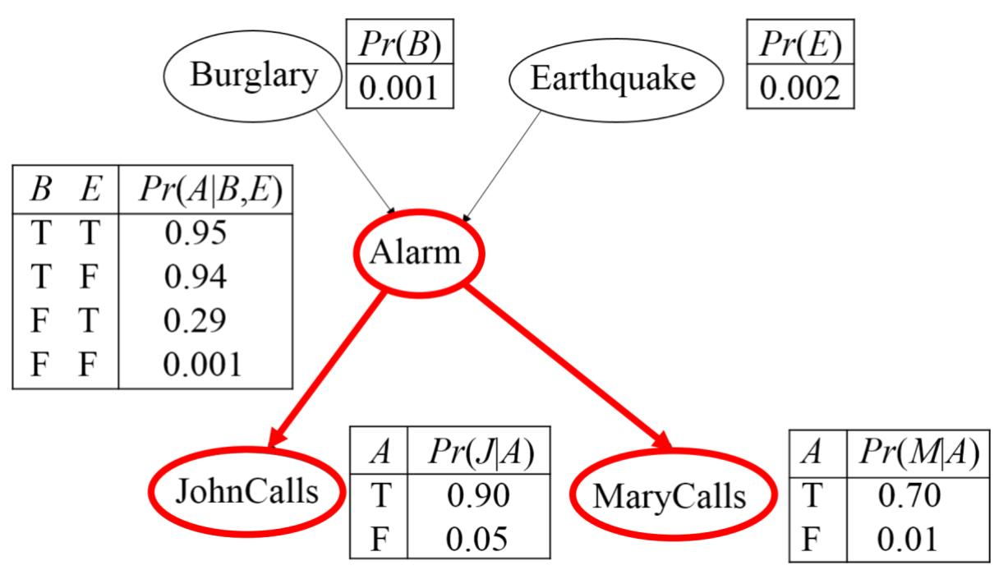

# 贝叶斯网络中的D-分离

 共同的原因(Fork)：给定A的前提下，J与M条件独立。

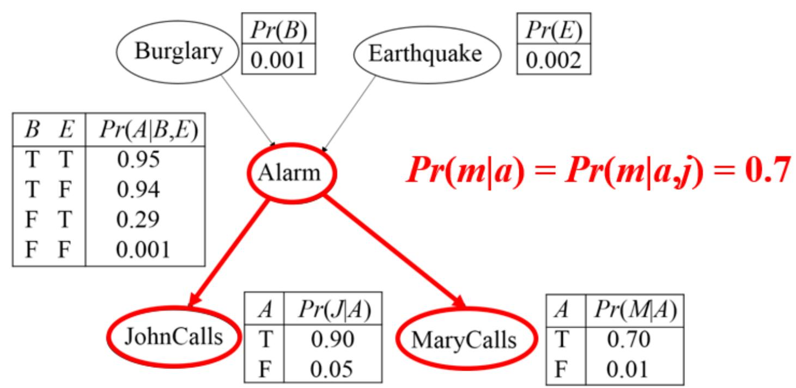

# 贝叶斯网络中的D-分离

 共同的原因(Fork)：未给定A的前提下，J与M不独立。

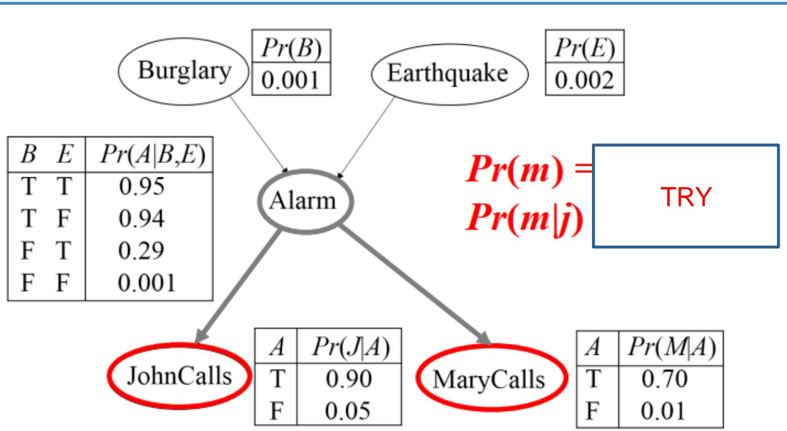

$$
\begin{array}{l} p (m) = p (m, a = 0) + p (m, a = 1) \\ = p (m \mid a = 0) p (a = 0) + p (m \mid a = 1) p (a = 1) \\ = 0. 0 1 * 0. 9 9 7 4 8 4 + 0. 7 * 0. 0 0 2 5 1 6 \\ = 0. 0 1 1 7 3 6 0 4 \\ \end{array}
$$

$$
\begin{array}{l} p (a) = p (a, b = 0, e = 0) + p (a, b = 0, e = 1) + p (a, b = 1, e = 0) + p (a, b = 1, e = 1) \\ = p (a \mid b = 0, e = 0) p (b = 0) p (e = 0) + p (a \mid b = 0, e = 1) p (b = 0) p (e = 1) \\ + p (a \mid b = 1, e = 0) p (b = 1) p (e = 0) + p (a \mid b = 1, e = 1) p (b = 1) p (e = 1) \\ = 0. 0 0 1 * 0. 9 9 9 * 0. 9 9 8 + 0. 2 9 * 0. 9 9 9 * 0. 0 0 2 + 0. 9 4 * 0. 0 0 1 * 0. 9 9 8 + 0. 9 5 * 0. 0 0 1 * 0. 0 0 2 \\ = 0. 0 0 2 5 1 6 \\ \end{array}
$$

$$
\begin{array}{l} p (m, j) = p (m, j, a = 0) + p (m, j, a = 1) \\ = p (m, j \mid a = 0) p (a = 0) + p (m, j \mid a = 1) p (a = 1) \\ = p (m \mid a = 0) p (j \mid a = 0) p (a = 0) + p (m \mid a = 1) p (j \mid a = 1) p (a = 1) \\ = 0. 0 1 * 0. 0 5 * 0. 9 9 7 4 8 4 + 0. 7 * 0. 9 * 0. 0 0 2 5 1 6 \\ = 0. 0 0 2 0 8 3 8 2 2 \\ \end{array}
$$

$$
\begin{array}{l} p (j) = p (j, a = 0) + p (j, a = 1) \\ = p (j \mid a = 0) p (a = 0) + p (j \mid a = 1) p (a = 1) \\ = 0. 0 5 * 0. 9 9 7 4 8 4 + 0. 9 * 0. 0 0 2 5 1 6 \\ = 0. 0 5 2 1 3 8 6 \\ \end{array}
$$

$$
p (m | j) = \frac {p (m , j)}{p (j)} = \frac {0 . 0 0 2 0 8 3 8 2 2}{0 . 0 5 2 1 3 8 6} = 0. 0 3 9 9 6 6 7
$$

# 贝叶斯网络中的D-分离

 共同的作用：

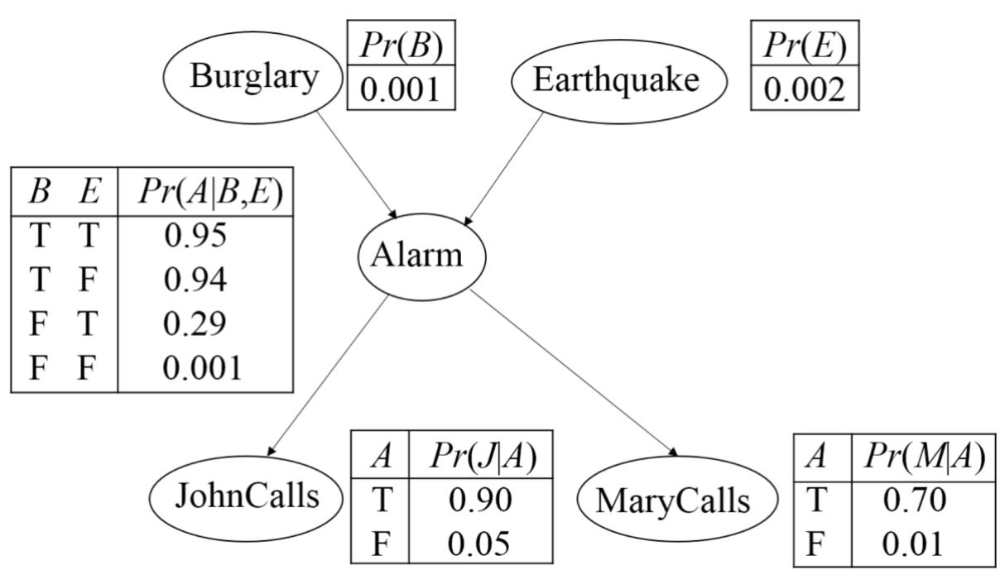

# 贝叶斯网络中的D-分离

 共同的作用：

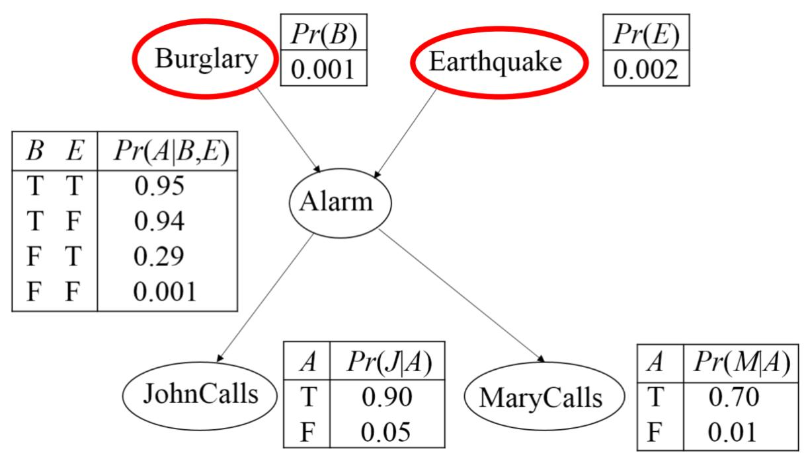

# 贝叶斯网络中的D-分离

 共同的作用：

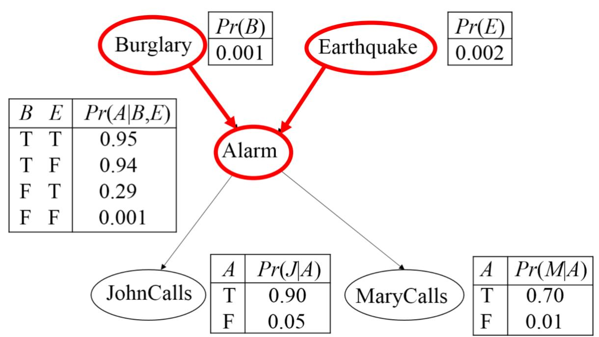

# 贝叶斯网络中的D-分离

 共同的作用（Collider）：给定A的前提下，B与E不是条件独立的。

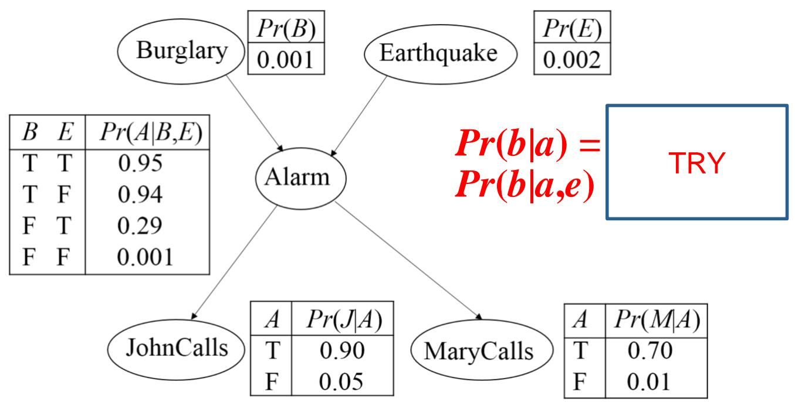

$$
\begin{array}{l} p (b | a) = \frac {p (a b)}{p (a)} \\ = \frac {p (a , b , e = 0) + p (a , b , e = 1)}{p (a)} \\ = \frac {p (a \mid b , e = 0) p (b) p (e = 0) + p (a \mid b , e = 1) p (b) p (e = 1)}{p (a)} \\ = \frac {0 . 9 4 * 0 . 0 0 1 * 0 . 9 9 8 + 0 . 9 5 * 0 . 0 0 1 * 0 . 0 0 2}{0 . 0 0 2 5 1 6} \\ = \frac {0 . 0 0 0 9 4 0 0 2}{0 . 0 0 2 5 6 1} \\ = 0. 3 7 3 6 \\ \end{array}
$$

$$
\begin{array}{l} p (b | a, e) = \frac {p (a , b , e)}{p (a , e)} \\ = \frac {p (a \mid b , e) p (b) p (e)}{p (a , e , b = 0) + p (a , e , b = 1)} \\ = \frac {p (a | b , e) p (b) p (e)}{p (a | e , b = 0) p (e) p (b = 0) + p (a | e , b = 1) p (e) p (b = 1)} \\ = \frac {0 . 9 5 * 0 . 0 0 1 * 0 . 0 0 2}{0 . 2 9 * 0 . 9 9 9 * 0 . 0 0 2 + 0 . 9 5 * 0 . 0 0 1 * 0 . 0 0 2} \\ = \frac {0 . 0 0 0 0 0 1 9}{0 . 0 0 0 5 8 1 3 2} \\ = 0. 0 0 3 2 6 8 4 2 3 \\ \end{array}
$$

# 贝叶斯网络中的D-分离

 共同的作用（Collider）:未给定A的前提下,B与E是独立的。

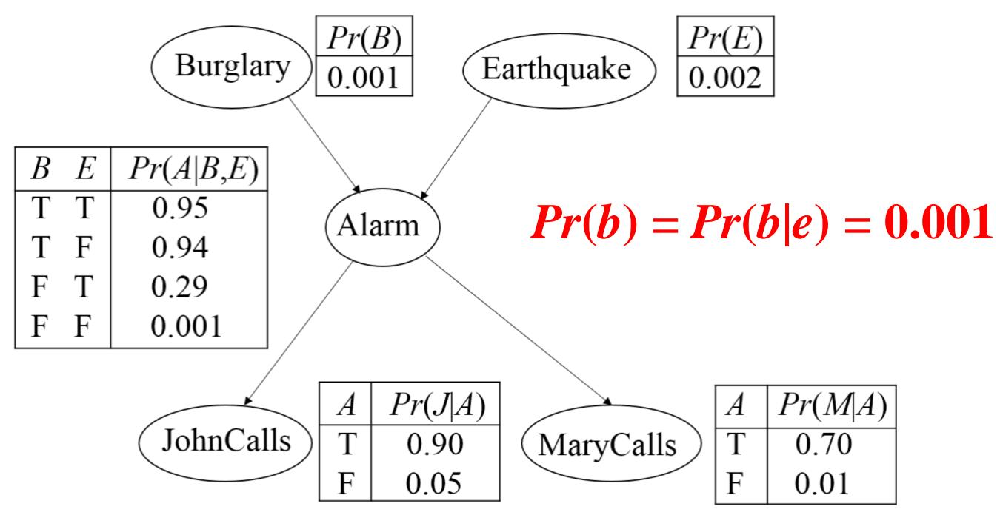

# BN Inference 贝叶斯网络推断：

Inference: calculating someuseful quantity from a jointprobability distribution

■Examples:

■Posterior probability

$$
P (Q | E _ {1} = e _ {1}, \dots E _ {k} = e _ {k})
$$

■Most likely explanation:

$$
\operatorname {a r g m a x} _ {q} P (Q = q | E _ {1} = e _ {1} \dots)
$$

# BN Inference Example by 枚举法

Given unlimited time, inference in BNs is easy

·Recipe:

■State the marginal probabilities you need

■Figure out ALLatomic probabilities you need

■Calculate and combine them

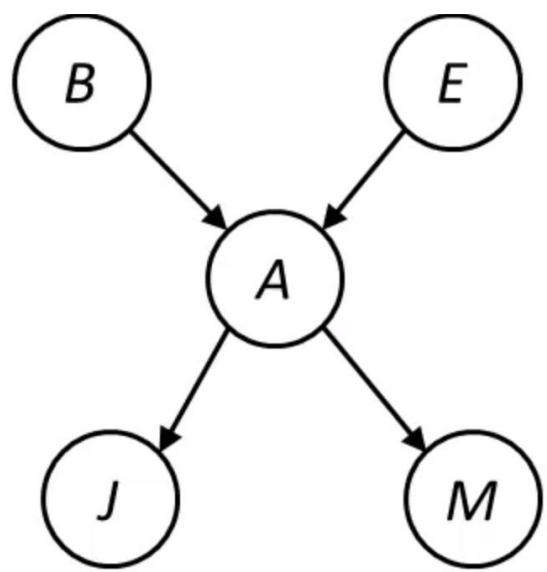

$$
\begin{array}{l} P (+ b, + j, + m) = \quad P (+ b) P (+ e) P (+ a | + b, + e) P (+ j | + a) P (+ m | + a) + \\ P (+ b) P (+ e) P (- a | + b, + e) P (+ j | - a) P (+ m | - a) + \\ P (+ b) P (- e) P (+ a | + b, - e) P (+ j | + a) P (+ m | + a) + \\ P (+ b) P (- e) P (- a | + b, - e) P (+ j | - a) P (+ m | - a) \\ \end{array}
$$

# BN Inference Example by 枚举法

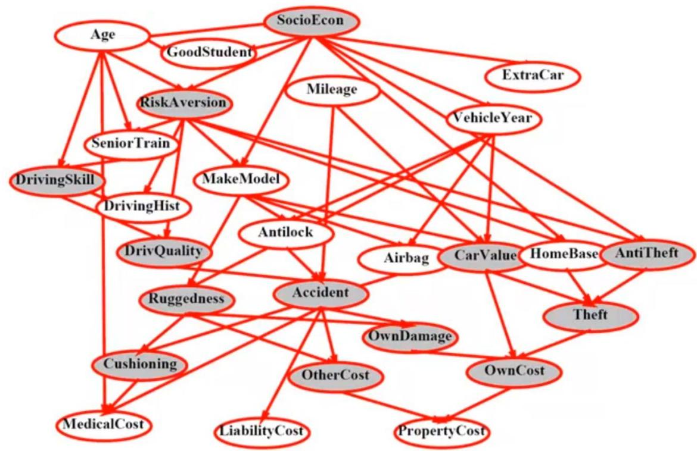

x Pr(I|F,G)

x Pr(J|H,I)

x Pr(K|I)

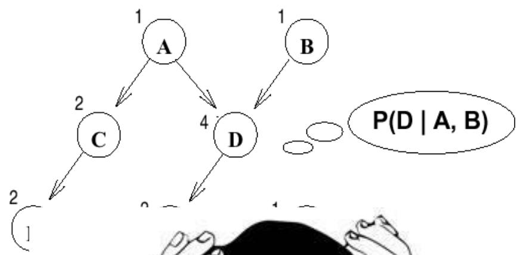

# BN Inference：

If the network has a lot of variables, making exact inferences can becomputationally hairy.

Variable elimination 变量消除 uses the product decomposition that defines aBayes Net and the summing out rule to compute probabilities conditioned onevidence from information in the network (CPTs).

VE helps to reduce some of computation required to make exact inferences.

# Inference by 枚举法 vs Variable elimination 变量消元

■ Why is inference by enumeration so slow?

■You join up the whole joint distribution beforeyou sum out the hidden variables

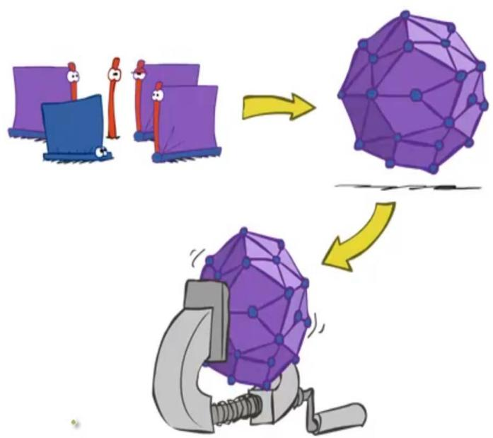

枚举法：指数型增长的联合分布

Idea: interleave joining and marginalizing!

■Called“Variable Elimination”

■Still NP-hard,but usually much faster thaninference by enumeration

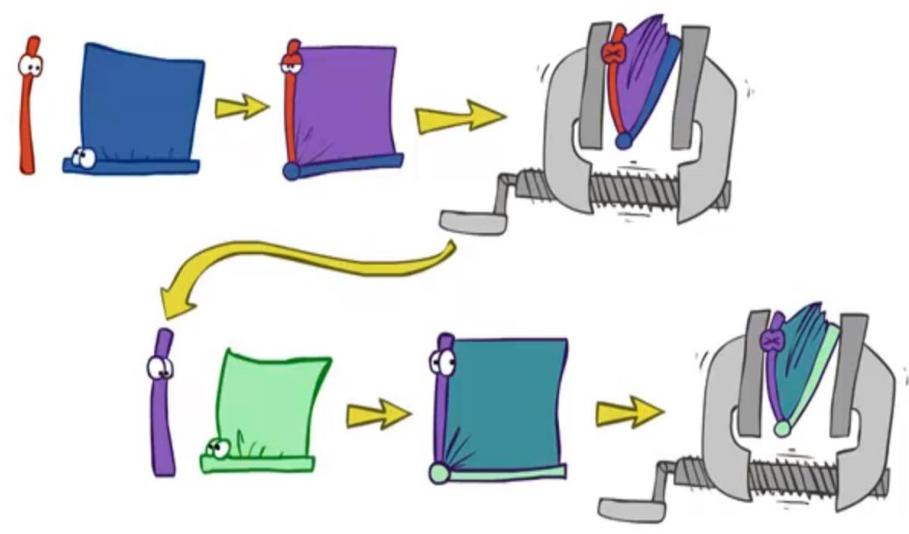

VE：通过交替合并和边缘化减少分布规模

First we'll need some new notation:factors

# Variable elimination：Factors 1

Joint distribution: P(X,Y)

■Entries P(x,y)for all x,y

Sums to1

$P ( c o l d , W )$

<table><tr><td>T</td><td>W</td><td>P</td></tr><tr><td>cold</td><td>sun</td><td>0.2</td></tr><tr><td>cold</td><td>rain</td><td>0.3</td></tr></table>

Number of capitals $=$dimensionality of the table

# Variable elimination：Factors 2

■ Single conditional: P(Y | x)

·Entries $\mathsf { P } ( \forall \mid \mathsf { x } )$ for fixed x, all

·Sums to 1

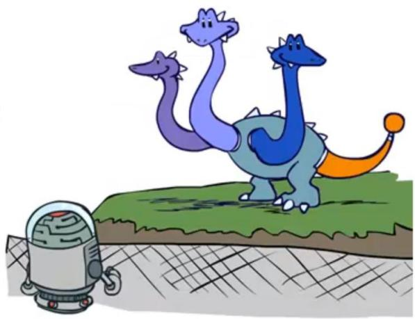

P(W|cold)

<table><tr><td>T</td><td>W</td><td>P</td></tr><tr><td>cold</td><td>sun</td><td>0.4</td></tr><tr><td>cold</td><td>rain</td><td>0.6</td></tr></table>

■Family of conditionals:P(X IY)

■Multiple conditionals

■Entries P(x|y)for all x,y

·Sums to |Yl

P(W|T)

<table><tr><td>T</td><td>W</td><td>P</td></tr><tr><td>hot</td><td>sun</td><td>0.8</td></tr><tr><td>hot</td><td>rain</td><td>0.2</td></tr><tr><td>cold</td><td>sun</td><td>0.4</td></tr><tr><td>cold</td><td>rain</td><td>0.6</td></tr></table>

# Variable elimination：Factors 3

Specified family: P(y|×)

Entries P(y|x)for fixed y,but for all x

■ Sums to... who knows!

P(rain|T)

<table><tr><td>T</td><td>W</td><td>P</td></tr><tr><td>hot</td><td>rain</td><td>0.2</td></tr><tr><td>cold</td><td>rain</td><td>0.6</td></tr></table>

# Variable elimination：Factors 4

■ In general, when we write $\mathsf { P } ( \mathsf { Y } _ { 1 } \ldots \mathsf { Y } _ { \mathsf { N } } \mid \mathsf { X } _ { 1 } \ldots \mathsf { X } _ { \mathsf { M } } )$

■Itisa“factor,”amulti-dimensionalrray

· Its values are all $\mathsf { P } ( \mathsf { y } _ { 1 } \ldots \mathsf { y } _ { \mathsf { N } } \mid \mathsf { x } _ { 1 } \ldots \mathsf { x } _ { \mathsf { M } } )$

Any assigned XorYisa dimension missing (selected) from the array

# Variable elimination：Example Traffic

# ■ Random Variables

· R: Raining

·T: Traffic

■L: Late for class!

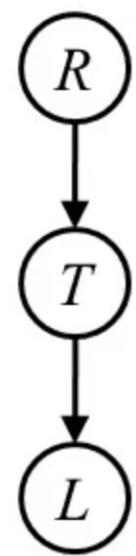

P(R)

<table><tr><td>+r</td><td>0.1</td></tr><tr><td>-r</td><td>0.9</td></tr></table>

P(T|R)

<table><tr><td>+r</td><td>+t</td><td>0.8</td></tr><tr><td>+r</td><td>-t</td><td>0.2</td></tr><tr><td>-r</td><td>+t</td><td>0.1</td></tr><tr><td>-r</td><td>-t</td><td>0.9</td></tr></table>

P(L|T)

<table><tr><td>+t</td><td>+1</td><td>0.3</td></tr><tr><td>+t</td><td>-1</td><td>0.7</td></tr><tr><td>-t</td><td>+1</td><td>0.1</td></tr><tr><td>-t</td><td>-1</td><td>0.9</td></tr></table>

# Variable elimination Outline

■ Track objects called factors

 Initial factors are local CPTs (one per node)

<table><tr><td>+r</td><td>0.1</td></tr><tr><td>-r</td><td>0.9</td></tr></table>

<table><tr><td>+r</td><td>+t</td><td>0.8</td></tr><tr><td>+r</td><td>-t</td><td>0.2</td></tr><tr><td>-r</td><td>+t</td><td>0.1</td></tr><tr><td>-r</td><td>-t</td><td>0.9</td></tr></table>

<table><tr><td>+ t</td><td>+1</td><td>0.3</td></tr><tr><td>+ t</td><td>-1</td><td>0.7</td></tr><tr><td>-t</td><td>+1</td><td>0.1</td></tr><tr><td>-t</td><td>-1</td><td>0.9</td></tr></table>

■ Any known values are selected

■E.g.if we know $L = + \ell ,$ the initialfactors are

<table><tr><td>+r</td><td>0.1</td></tr><tr><td>-r</td><td>0.9</td></tr></table>

<table><tr><td>+r</td><td>+t</td><td>0.8</td></tr><tr><td>+ r</td><td>-t</td><td>0.2</td></tr><tr><td>-r</td><td>+t</td><td>0.1</td></tr><tr><td>-r</td><td>-t</td><td>0.9</td></tr></table>

<table><tr><td>+t</td><td>+1</td><td>0.3</td></tr><tr><td>-t</td><td>+1</td><td>0.1</td></tr></table>

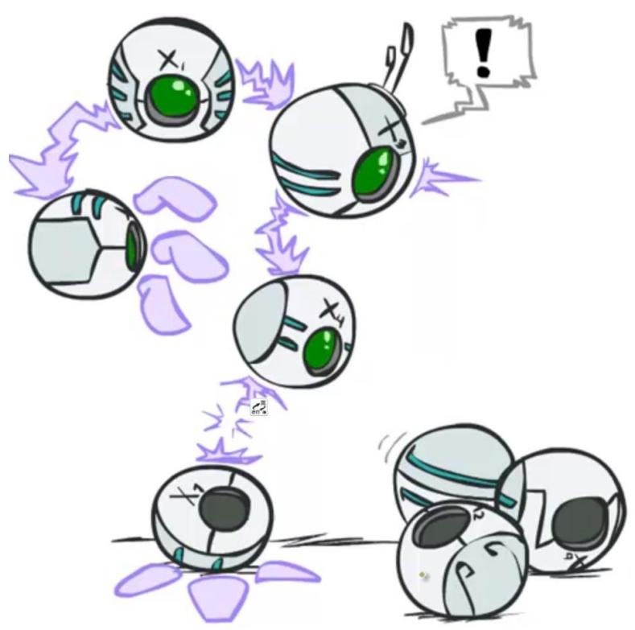

P(L)？

# Operation 1: Join Factors 合并因子

First basic operation: joining factors

Combining factors:

 Just like a database join

Getallfactors over the joiningvariable

Build a new factor over the union of the variablesinvolved

Example: Join on R

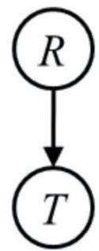

P(R)

<table><tr><td>+r</td><td>0.1</td></tr><tr><td>-r</td><td>0.9</td></tr></table>

P(T|R) P(R,T)

<table><tr><td>+r</td><td>+t</td><td>0.8</td></tr><tr><td>+ r</td><td>-t</td><td>0.2</td></tr><tr><td>-r</td><td>+t</td><td>0.1</td></tr><tr><td>-r</td><td>-t</td><td>0.9</td></tr></table>

<table><tr><td>+r</td><td>+t</td><td>0.08</td></tr><tr><td>+r</td><td>-t</td><td>0.02</td></tr><tr><td>-r</td><td>+t</td><td>0.09</td></tr><tr><td>-r</td><td>-t</td><td>0.81</td></tr></table>

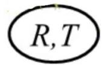

Computation for each entry:pointwise products

$\begin{array} { r l } { \forall r , t : } & { { } P ( r , t ) = P ( r ) \cdot P ( t | r ) } \end{array}$

# Operation 1: Join Factors 合并因子

# Operation 1: Join Factors 合并因子

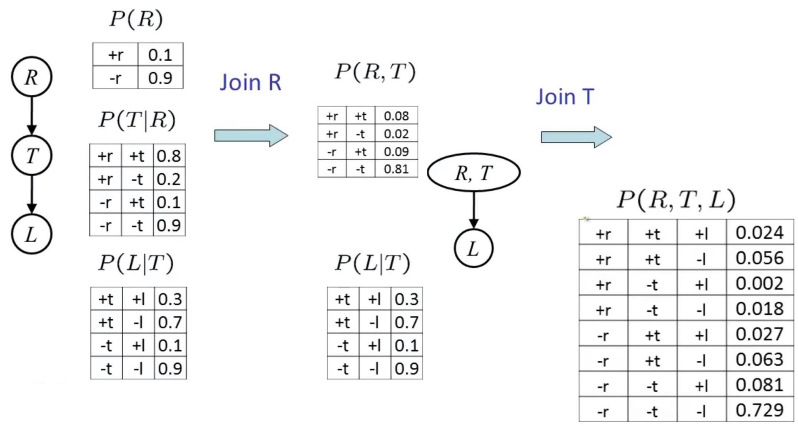

# Operation 2: Eliminate 消除

Second basic operation: marginalization

■ Take a factor and sum out a variable

Shrinksa factor toa smallerone

■A projection operation

■Example:

P(R,T)

<table><tr><td>+r</td><td>+t</td><td>0.08</td></tr><tr><td>+r</td><td>-t</td><td>0.02</td></tr><tr><td>-r</td><td>+t</td><td>0.09</td></tr><tr><td>-r</td><td>-t</td><td>0.81</td></tr></table>

sum R

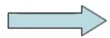

P(T)

<table><tr><td>T</td><td>P(T)</td></tr><tr><td>+t</td><td>0.17</td></tr><tr><td>-t</td><td>0.83</td></tr></table>

# Operation 2: Multiple Eliminate

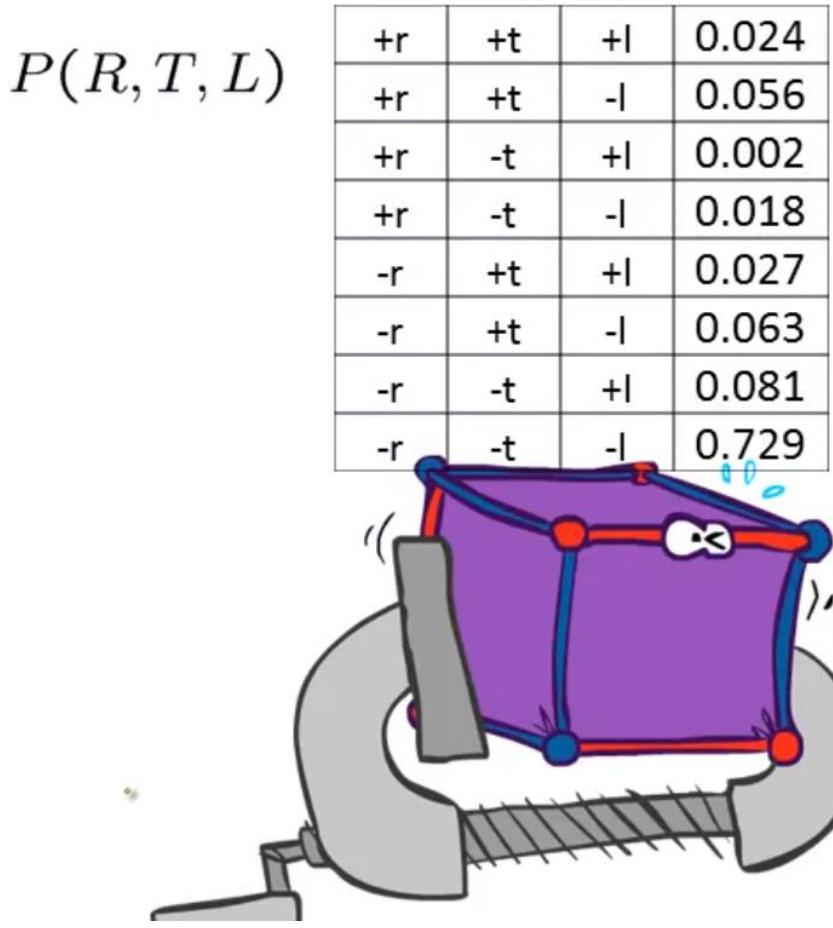

R,T,L

TL

Sumout R

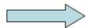

P(T,L)

<table><tr><td>+t</td><td>+|</td><td>0.051</td></tr><tr><td>+t</td><td>-|</td><td>0.119</td></tr><tr><td>-t</td><td>+|</td><td>0.083</td></tr><tr><td>-t</td><td>-|</td><td>0.747</td></tr></table>

Sumout T

P(L)

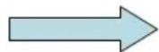

<table><tr><td>+1</td><td>0.134</td></tr><tr><td>-1</td><td>0.886</td></tr></table>

# Thus far: Multiple Join, Multiple Eliminate 类似枚举法

# Marginalizing Early(= Variable Elimination)

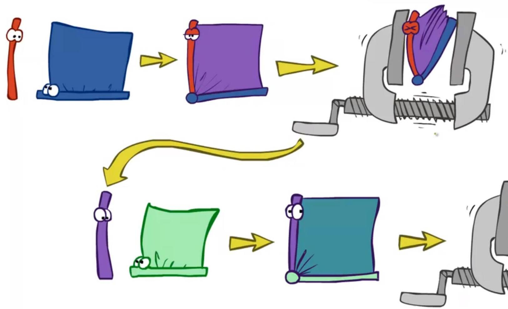

# Marginalizing Early(= Variable Elimination)

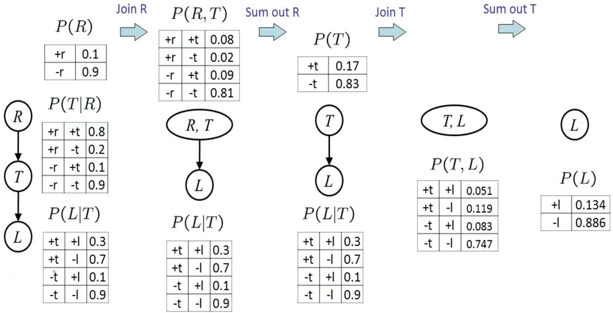

# Evidence（已知取值变量） and Query（最终判断变量）

If evidence,start with factors that select that evidence

■No evidence uses these initial factors:

<table><tr><td>+r</td><td>0.1</td></tr><tr><td>-r</td><td>0.9</td></tr></table>

<table><tr><td>+r</td><td>+t</td><td>0.8</td></tr><tr><td>+r</td><td>-t</td><td>0.2</td></tr><tr><td>-r</td><td>+t</td><td>0.1</td></tr><tr><td>-r</td><td>-t</td><td>0.9</td></tr></table>

<table><tr><td>+t</td><td>+1</td><td>0.3</td></tr><tr><td>+t</td><td>-1</td><td>0.7</td></tr><tr><td>-t</td><td>+1</td><td>0.1</td></tr><tr><td>-t</td><td>-1</td><td>0.9</td></tr></table>

·Computing $P ( L | + r )$ the initial factors become:

P(+r)

<table><tr><td>+r</td><td>0.1</td></tr></table>

P(T|+r)

<table><tr><td>+r</td><td>+t</td><td>0.8</td></tr><tr><td>+r</td><td>-t</td><td>0.2</td></tr></table>

P(L|T)

<table><tr><td>+t</td><td>+1</td><td>0.3</td></tr><tr><td>+t</td><td>-1</td><td>0.7</td></tr><tr><td>-t</td><td>+1</td><td>0.1</td></tr><tr><td>-t</td><td>-1</td><td>0.9</td></tr></table>

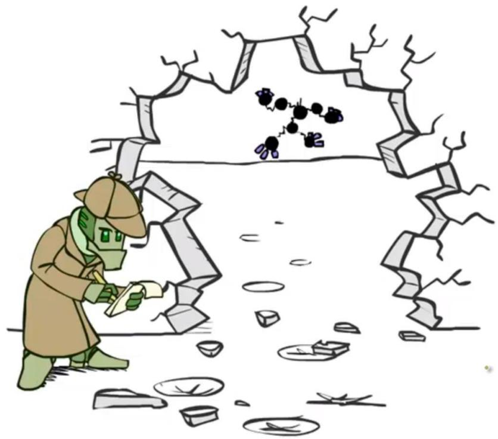

We eliminate all vars other than query $^ +$ evidence

只保留与前提Evidence和结论Query相关的变量

# Evidence（已知取值变量） and Query（最终判断变量）

Result will be a selected joint of query and evidence

·E.g.for $\mathsf { P } ( \lfloor \lfloor \mathsf { \Lambda } \rfloor + \mathsf { r } )$ ,we'd end up with:

$P ( + r , L )$

<table><tr><td>+r</td><td>+1</td><td>0.026</td></tr><tr><td>+r</td><td>-1</td><td>0.074</td></tr></table>

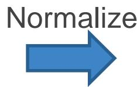

$P ( L | + r )$

<table><tr><td>+1</td><td>0.26</td></tr><tr><td>-1</td><td>0.74</td></tr></table>

■ To get our answer, just normalize this!

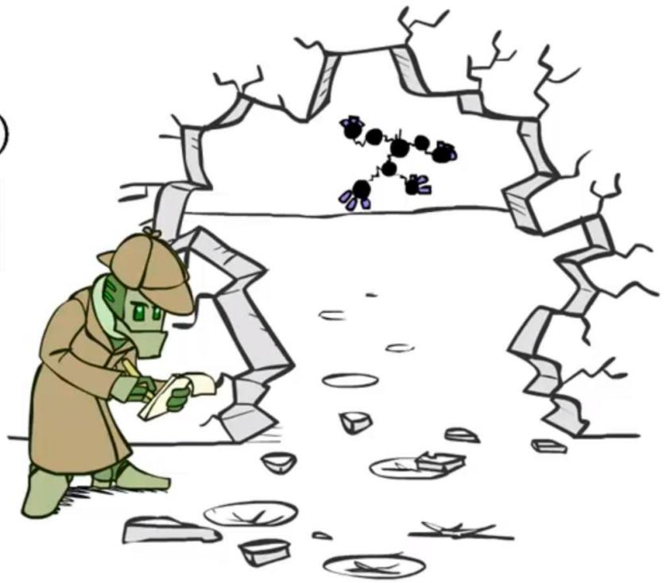

# Marginalizing Early(= Variable Elimination)

带Evidence情况：

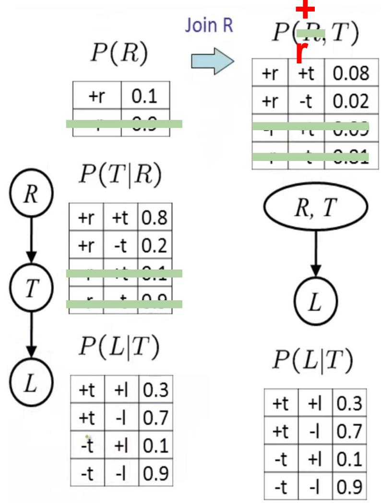

$$
P (+ r, L)
$$

<table><tr><td>+r</td><td>+1</td><td>0.026</td></tr><tr><td>+r</td><td>-1</td><td>0.074</td></tr></table>

$$
\mathbf {N o r m a l i z e}
$$

$$
P (L | + r)
$$

<table><tr><td>+1</td><td>0.26</td></tr><tr><td>-1</td><td>0.74</td></tr></table>

# General Variable Elimination

# General Variable Elimination

·Query: $P ( Q | E _ { 1 } = e _ { 1 } , . . . E _ { k } = e _ { k } )$

Start with initial factors:

■Local CPTs (but instantiated by evidence)

While there are still hidden variables(not Q or evidence):

■Picka hidden variable H

■Join all factors mentioning H

■Eliminate (sum out) H

■Join all remaining factors and normalize

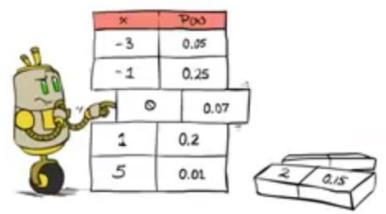

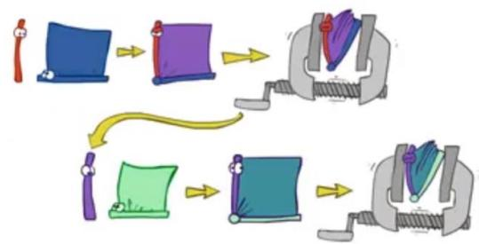

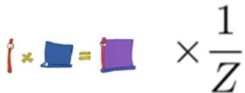

# 贝叶斯推断的应用：关联基因检测

采用贝叶斯框架来整合基因组信息和网络，目的是识别一组最可能的疾病相关基因。团队将该方法应用于六种疾病，以识别高风险基因（HRG）

⚫ 贝叶斯方法通过计算后验概率，评估每个基因与特定疾病的关联程度，从而实现对高风险基因的准确识别

 Accurate identification of genes associated with brain disorders by integratingheterogeneous genomic data into a Bayesian framework

eBioMedicine

PartofTHELANCETDiscovery Science

Editorial

forandmanagementofbipolardisorder

Articles

Thegluagoeideagonistduaglutideonsexityinhealthy men

Review

responseto injuryinacutedeyinury

Braindisorder-related GSEA

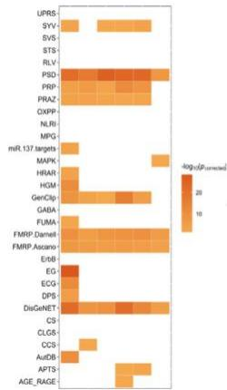

Cellularexpression profiles

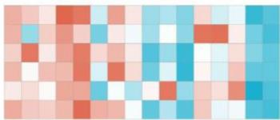

Developmentalexpressiontrajectories

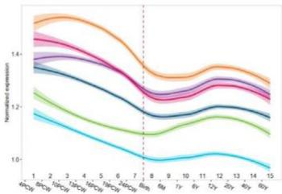

Cel-typespecificity

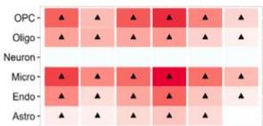

Disease heritability enrichment

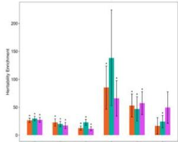

Accurate identification of genes associated with brain disorders by integrating heterogeneous genomic data intoa Bayesian framework[J]. EBioMedicine, 2024, 107.

# 本节小结

#  其它不确定知识表示和推理方法

# 确定性理论

该理论由Shortliffe提出，并于1976年首次在血液病诊断专家系统MYCIN中得到了成功应用。

 在确定性理论中，不确定性是用可信度来表示的。

# n 证据理论

用于处理不确定性、不精确以及间或不准确的信息。

 引入了信任函数来度量不确定性，引用似然函数来处理由于“不知道”引起的不确定性。

# n 模糊逻辑和模糊推理

 模糊集合论是1965年由Zadeh提出的，随后，他又将模糊集合论应用于近似或模糊推理，形成了可能性理论。

 模糊逻辑可以看作是多值逻辑的扩展。模糊推理是在一组可能不精确的前提下推出一个可能不精确的结论。

# 练习

1．考虑以下贝叶斯网络，判断(a)-(c)的对错。 

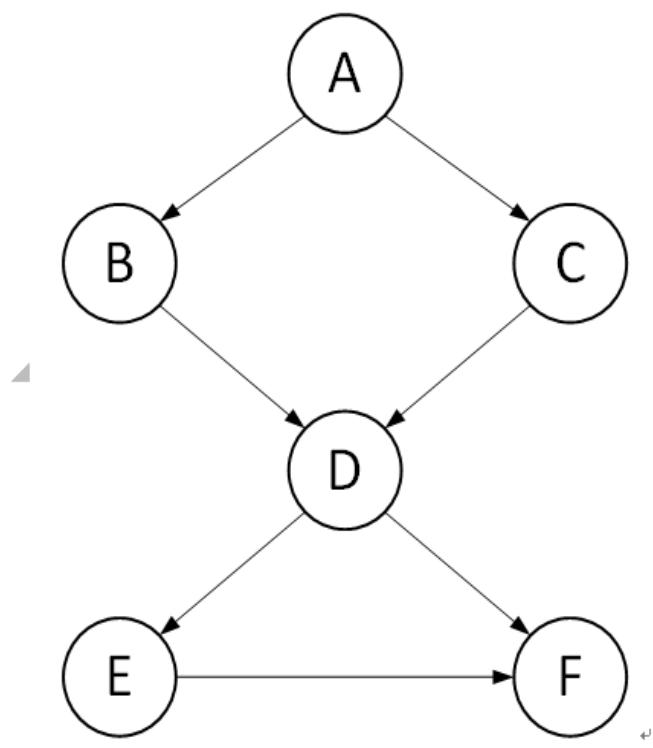

(a)给定D的前提下，B和C是条件独立的。（错）。

(b）给定E的前提下，D和F是条件独立的。（错）。

(c）给定D的前提下，B和F是条件独立的。（对）。

# 练习

2.考虑以下贝叶斯网络，判断(a)-(c)的对错。

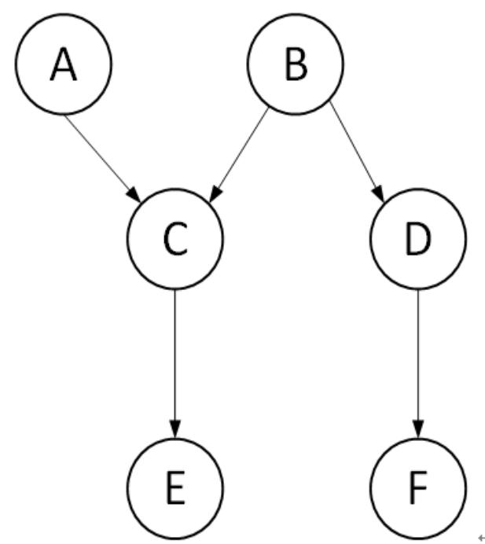

(a)给定C的前提下，A和B是条件独立的。（错）。

(b)给定D的前提下，B和F是条件独立的。（对）。

(c）给定B的前提下，C和D是条件独立的。（对）。

# 练习

4．假设给定如下训练数据集，其中 $A _ { 1 }$ $A _ { 2 }$ $\ b { A _ { 3 } }$ 为二值输入特征， $y$ 为二值类标签。

<table><tr><td>训练样例。</td><td>A1。</td><td>A2。</td><td>A3。</td><td>y。</td></tr><tr><td>x1。</td><td>T。</td><td>F。</td><td>F。</td><td>F。</td></tr><tr><td>x2。</td><td>T。</td><td>F。</td><td>T。</td><td>F。</td></tr><tr><td>x3。</td><td>F。</td><td>T。</td><td>F。</td><td>F。</td></tr><tr><td>x4。</td><td>T。</td><td>T。</td><td>T。</td><td>T。</td></tr><tr><td>x5。</td><td>T。</td><td>T。</td><td>F。</td><td>T。</td></tr><tr><td>x6。</td><td>F。</td><td>F。</td><td>F。</td><td>T。</td></tr></table>

(a)对一个新的测试数据，其输入特征 $A _ { 1 } = \mathrm { T }$ $A _ { 2 } = \mathrm { F }$ $A _ { 3 } = \mathrm { F }$ ，朴素贝叶斯分类器将会

预测 $y =$ ？

解答：(a）对于题目中给定的测试数据，朴素贝叶斯分类器将会预测 $y = \mathrm { F }$ 。如下：

$$
P (C \mid A _ {1} A _ {2} \dots A _ {n}) = \frac {P \left(A _ {1} A _ {2} \dots A _ {n} \mid C\right) P (C)}{P \left(A _ {1} A _ {2} \dots A _ {n}\right)}
$$

$$
\begin{array}{l} P (y = \mathrm {T} \mid A _ {1} = \mathrm {T}, A _ {2} = \mathrm {F}, A _ {3} = \mathrm {F}) \propto P (y = \mathrm {T}, A _ {1} = \mathrm {T}, A _ {2} = \mathrm {F}, A _ {3} = \mathrm {F}) \\ = P (y = \mathrm {T}) \times P \left(A _ {1} = \mathrm {T} \mid y = \mathrm {T}\right) \times P \left(A _ {2} = \mathrm {F} \mid y = \mathrm {T}\right) \times P \left(A _ {3} = \mathrm {F} \mid y = \mathrm {T}\right) \\ = \frac {1}{2} \times \frac {2}{3} \times \frac {1}{3} \times \frac {2}{3} = \frac {2}{2 7} \\ \end{array}
$$

$$
\begin{array}{l} P (y = \mathrm {F} \mid A _ {1} = \mathrm {T}, A _ {2} = \mathrm {F}, A _ {3} = \mathrm {F}) \propto P (y = \mathrm {F}, A _ {1} = \mathrm {T}, A _ {2} = \mathrm {F}, A _ {3} = \mathrm {F}) \\ = P (y = \mathrm {F}) \times P \left(A _ {1} = \mathrm {T} \mid y = \mathrm {F}\right) \times P \left(A _ {2} = \mathrm {F} \mid y = \mathrm {F}\right) \times P \left(A _ {3} = \mathrm {F} \mid y = \mathrm {F}\right) \\ = \frac {1}{2} \times \frac {2}{3} \times \frac {2}{3} \times \frac {2}{3} = \frac {4}{2 7} \\ \end{array}
$$

# 练习

(b）假设 $A _ { 1 }$ $A _ { 2 }$ $A _ { 3 }$ 和 $y$ 符合如下贝叶斯网络结构，根据题目中给出的6个样例计算相应的条件概率表中的取值，并求解 $P ( y = \mathrm { F } \mid A _ { 1 } = \mathrm { T } , A _ { 3 } = \mathrm { F } ) = \mathrm { ~ c ~ }$ ？

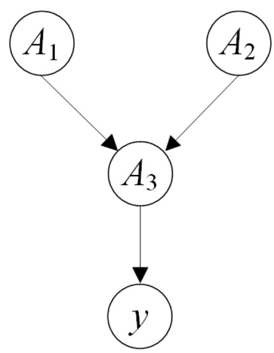

$$
P (A _ {1} = \mathrm {T}) = \underline {{\quad}}?
$$

$$
P (A _ {2} = \mathrm {T}) = \underline {{\quad}}?
$$

<table><tr><td>A1</td><td>A2</td><td>P(A3=T)</td></tr><tr><td>T</td><td>T</td><td></td></tr><tr><td>T</td><td>F</td><td></td></tr><tr><td>F</td><td>T</td><td></td></tr><tr><td>F</td><td>F</td><td></td></tr></table>

<table><tr><td>A3</td><td>P(y=T)</td></tr><tr><td>T</td><td></td></tr><tr><td>F</td><td></td></tr></table>

<table><tr><td>训练样例</td><td>A1</td><td>A2</td><td>A3</td><td>y</td></tr><tr><td>x1</td><td>T</td><td>F</td><td>F</td><td>F</td></tr><tr><td>x2</td><td>T</td><td>F</td><td>T</td><td>F</td></tr><tr><td>x3</td><td>F</td><td>T</td><td>F</td><td>F</td></tr><tr><td>x4</td><td>T</td><td>T</td><td>T</td><td>T</td></tr><tr><td>x5</td><td>T</td><td>T</td><td>F</td><td>T</td></tr><tr><td>x6</td><td>F</td><td>F</td><td>F</td><td>T</td></tr></table>

# 练习

(b)基于题目中给出的6个样例和贝叶斯网络结构，得到的条件概率表中的取值如下：

$$
P (A _ {1} = \mathrm {T}) = 4 / 6
$$

$$
P (A _ {2} = \mathrm {T}) = 3 / 6
$$

<table><tr><td>A1</td><td>A2</td><td>P(A3=T)</td></tr><tr><td>T</td><td>T</td><td>1/2</td></tr><tr><td>T</td><td>F</td><td>1/2</td></tr><tr><td>F</td><td>T</td><td>0</td></tr><tr><td>F</td><td>F</td><td>0</td></tr></table>

<table><tr><td>A3</td><td>P(y=T)</td></tr><tr><td>T</td><td>1/2</td></tr><tr><td>F</td><td>1/2</td></tr></table>

此外， $P ( y = \mathrm { F } \mid A _ { 1 } = \mathrm { T } , A _ { 3 } = \mathrm { F } ) = 1 / 2$

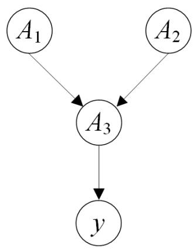

<table><tr><td>训练样例。</td><td>A1</td><td>A2</td><td>A3</td><td>y</td></tr><tr><td>x1</td><td>T</td><td>F</td><td>F</td><td>F</td></tr><tr><td>x2</td><td>T</td><td>F</td><td>T</td><td>F</td></tr><tr><td>x3</td><td>F</td><td>T</td><td>F</td><td>F</td></tr><tr><td>x4</td><td>T</td><td>T</td><td>T</td><td>T</td></tr><tr><td>x5</td><td>T</td><td>T</td><td>F</td><td>T</td></tr><tr><td>x6</td><td>F</td><td>F</td><td>F</td><td>T</td></tr></table>

# 练习

4. Compute $P ( c | a , b , \lnot d , \lnot e , \lnot f )$ .

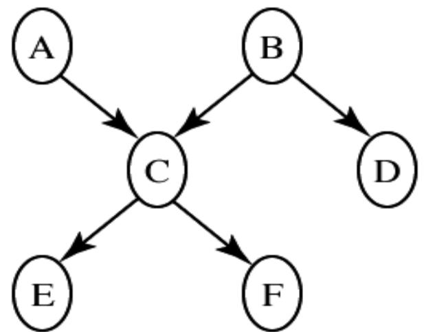

$$
P (a) = 0. 9
$$

$$
P (b) = 0. 2
$$

$$
P (c | a, b) = 0. 1
$$

$$
P (c \mid a, \neg b) = 0. 8
$$

$$
P (c | \neg a, b) = 0. 7
$$

$$
P (c | \neg a, \neg b) = 0. 4
$$

$$
P (d | b) = 0. 1
$$

$$
P (d \mid \neg b) = 0. 8
$$

$$
P (e | c) = 0. 7
$$

$$
P (e | \neg c) = 0. 2
$$

$$
P (f | c) = 0. 2
$$

$$
P (f | \neg c) = 0. 9
$$

$$
\begin{array}{l} P (a, b, \neg d, \neg e, \neg f, c) \\ = P (a) P (b) P (c | a, b) P (\neg d | b) P (\neg e | c) P (\neg f | c) \\ = 0. 9 \times 0. 2 \times 0. 1 \times 0. 9 \times 0. 3 \times 0. 8 \\ = 0. 0 0 3 8 8 8 \\ \end{array}
$$

$$
\begin{array}{l} P (a, b, \neg d, \neg e, \neg f, \neg c) \\ = P (a) P (b) P (\neg c | a, b) P (\neg d | b) P (\neg e | \neg c) P (\neg f | \neg c) \\ = 0. 9 \times 0. 2 \times 0. 9 \times 0. 9 \times 0. 8 \times 0. 1 \\ = 0. 0 1 1 6 6 4 \\ \end{array}
$$

$$
\begin{array}{l} P (c | a, b, \lnot d, \lnot e, \lnot f) \\ = \frac {P (a , b , \neg d , \neg e , \neg f , c)}{P (a , b , \neg d , \neg e , \neg f)} \\ = \frac {P (a , b , \neg d , \neg e , \neg f , c)}{P (a , b , \neg d , \neg e , \neg f , c) + P (a , b , \neg d , \neg e , \neg f , \neg c)} \\ 0. 0 0 3 8 8 8 \\ = \overline {{0 . 0 0 3 8 8 8 + 0 . 0 1 1 6 6 4}} = 0. 2 5 \\ \end{array}
$$

# 谢谢大家！

相关课程资源及参考文献请浏览

超算习堂：https://easyhpc.net/course/143