# 人工智能

# 知识表示与推理

陈 川

中山大学 计算机学院

2025年

# 目录

1. 知识图谱及其表示

2. 知识图谱的类型

2.1 领域无关知识图谱

2.2 特定领域知识图谱

2.3 跨语言知识图谱

3. 知识图谱的推理

4. 知识图谱的应用

4.1 精准分析

4.2 智慧搜索

4.3 智能推荐

4.4 智能解释

4.5 自然人机交互

4.6 深层关系推理

5. 现有知识图谱资源

# 搜索引擎的发展

 Baidu & Google：对搜索引擎提出问题，它们会通过知识图谱给出很多知识性问题的答案。

传统搜索：基于字符串匹配，如今天真冷！

# 新一代搜索引擎

 查询理解

 自动问答

 文档表示

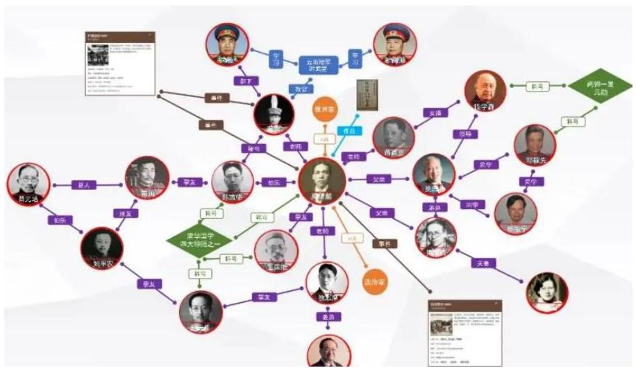

梁启超的儿子的妻子

百度一下

丫搜索工具

梁思成妻子：

林徽因

林洙

# 知识图谱相关概念

• 知识图谱技术是指在建立知识图谱中使用的技术，是融合认知计算、 知识表示与推理、信息检索与抽取、自然语言处理与语义Web、数据挖掘与机器学习等交叉研究。

▫ 知识图谱构建解决如何建立计算机算法，从客观世界或者互联网的各种数据资源中获取客观世界的知识，主要研究使用什么样的数据和什么样的方法抽取什么样的知识。

▫ 知识图谱应用主要研究如何利用知识图谱，建立基于知识的系统并提供智能的知识服务，更好地解决实际应用问题。

# 知识图谱起源

由于互联网内容的大规模、异质多元、组织结构松散的特点，给人们有效获取信息和知识提出了挑战。

• 谷歌于2012年5月16日首先发布了知识图谱（Knowledge Graph）。

知识图谱是一种互联网环境下的知识表示方法。

• 知识图谱的目的是为了提高搜索引擎的能力，改善用户的搜索质量以及搜索体验。

Google、百度和搜狗等搜索引擎公司逐步均构建起自己的知识图谱。

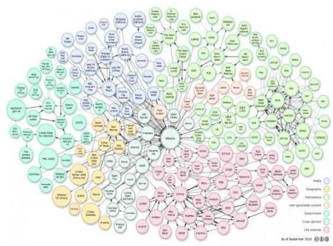

Google

Knowledge Graph

Microsoft

Browse the Knowledge Base!

Freebase

DBpedia

YaGo

selectknowledge

OpenIE

(Reverb, OLLIE)

# GOOGLE Knowledge Graph Project

# 知识图谱及其表示

• 知识图谱的概念于2013年以后开始在学术界和业界普及，并在智能问答、医疗、反欺诈等应用中发挥重要作用。

• 关于知识图谱的理解：

▫ 知识图谱是一个实体-关系的有向图。

• Knowledge graphs are heterogeneous graphs

• Multiple types of relations

• A set of facts represented as triplets

• (head entity, relation, tail entity)

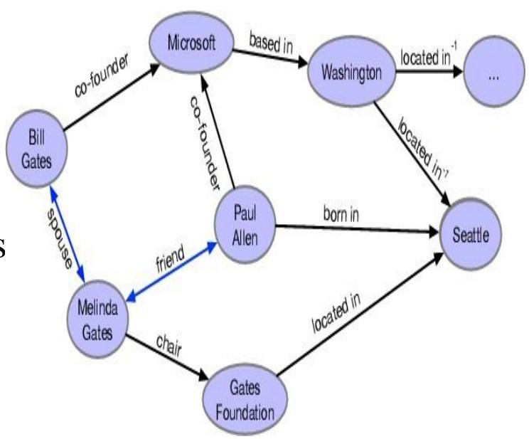

知识图谱包含更抽象的概念之间的关系，如，谷歌和必应、雅虎一起推出了Schema.org来提供一个覆盖广泛主题（包括人物、地点、事件等）的模式（schema） C

# 知识图谱及其表示

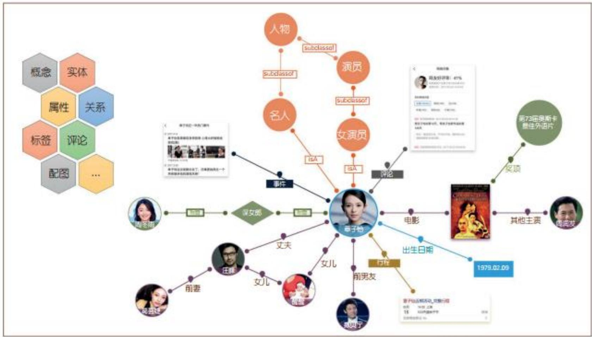

 本质上，知识图谱是语义网络（semantic network）知识库

# 知识图谱及其表示

• 知识图谱是由一些相互连接的实体及其属性构成的。

• 三元组是知识图谱的一种通用表示方式：

(实体1-关系-实体2)：中国-首都-北京

(实体-属性-属性值)：北京-人口-2069万

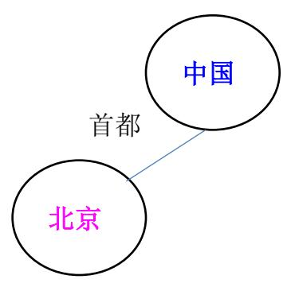

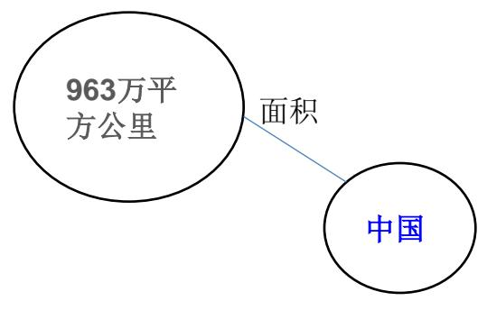

# 知识图谱及其表示

知识图谱可被看作是一张图，图中的节点表示实体或概念，而图中的边则由属性或关系构成。

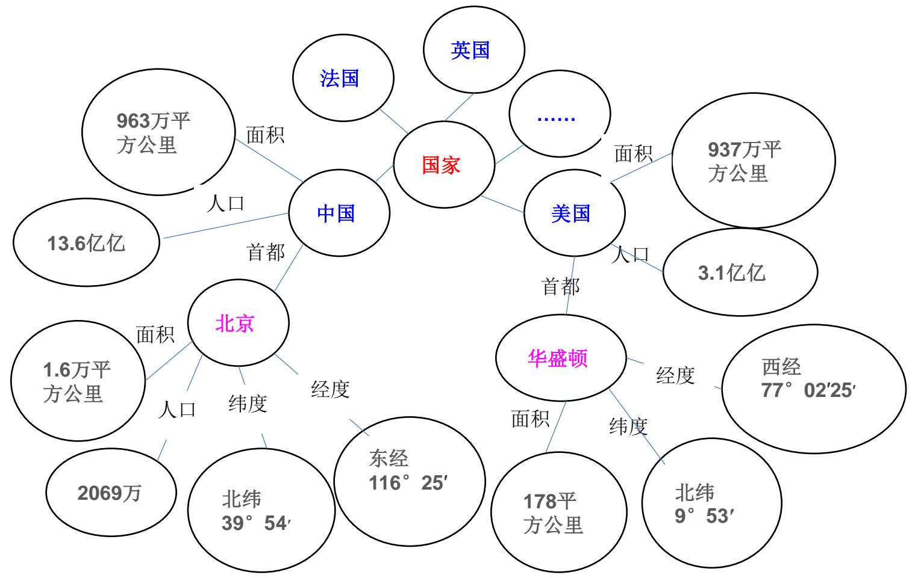

# 知识图谱及其表示

• 知识图谱的表示和存储方式：属性图(property graph)和传统的RDF(Resource Description Framework)。

▫ 属性图或带标签的属性图（Labeled-Property Graph），由顶点（圆圈）、边（箭头）、属性（key:value）和标签组成，顶点和边可以有标签。

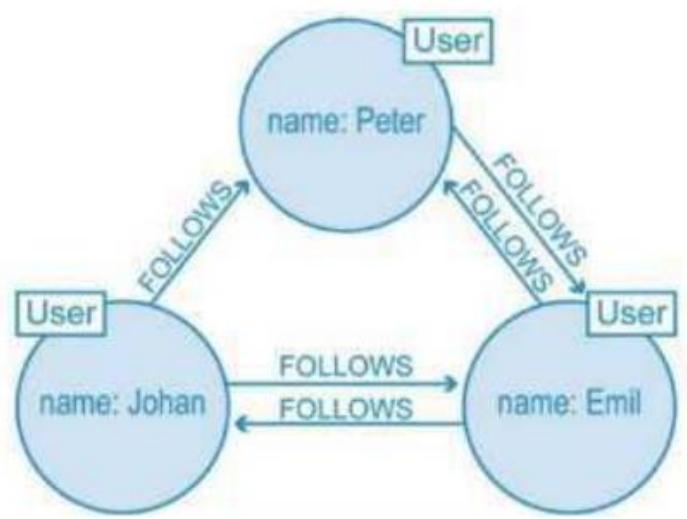

图4.7属性图结构

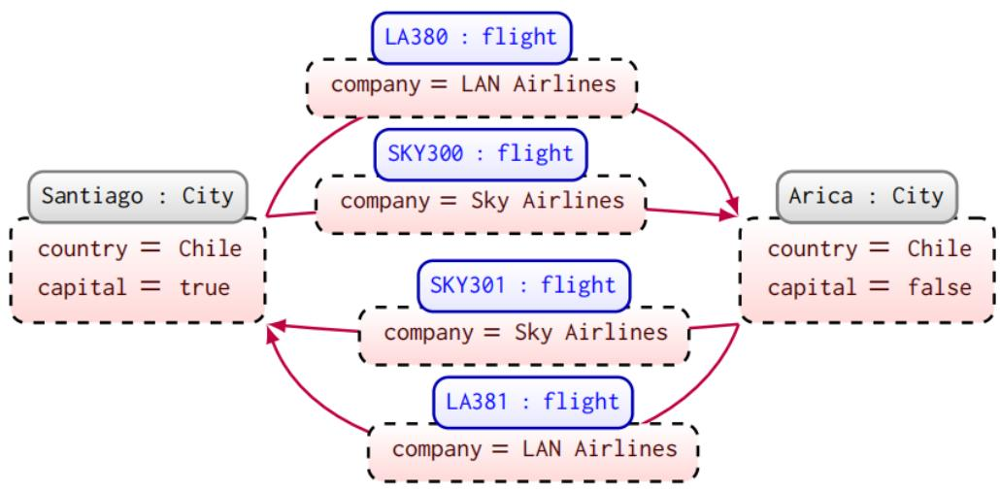

Fig. 4. Property graph with companies ofering flights between Santiago and Arica

# 知识图谱及其表示

# • 资源描述框架(RDF)的数据模式

▫ 资源 Resource

 使用URI唯一标示一个资源

 一个资源通常表示一个事物

▫ 属性 Property

一种特殊类型的资源，用以描述资源与资源间的关系

▫ 语句 Statement

 主语RDF: subject ，谓语RDF: predicate以及宾语RDF: object

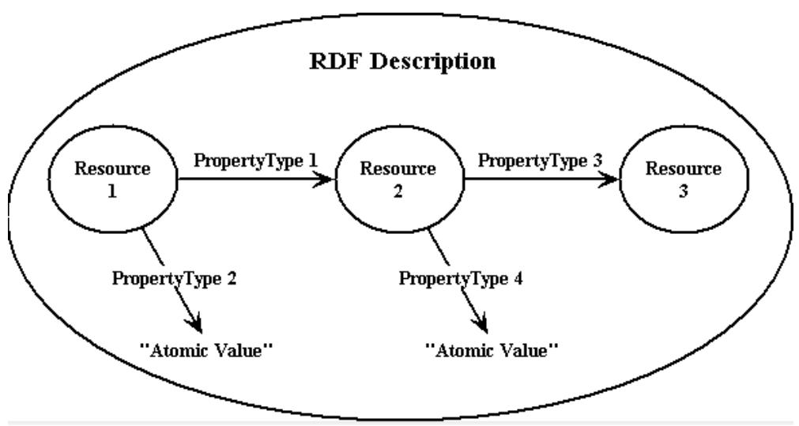

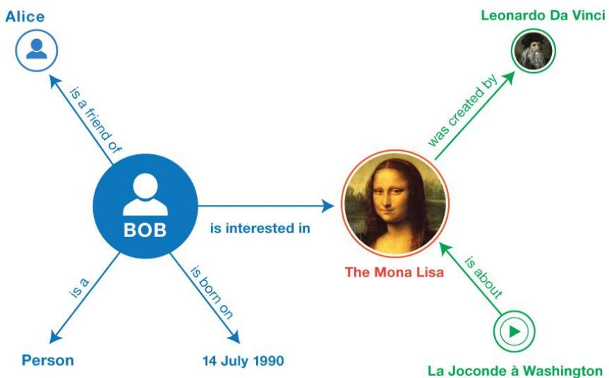

# 知识图谱及其表示

# Recommendation in E-commerce

• Suggest relevant items to users

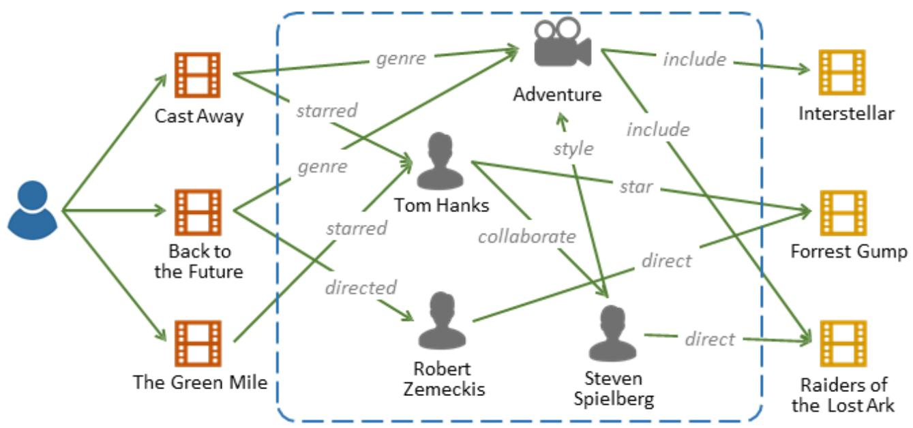

Figure from Wang et al. 2018

# 知识图谱及其表示

# Question Answering

Question: “where is the Mona Lisa located?”

where is the mona lisa located today

圖片

国新聞

# the Louvre Museum

been a part of the museum's collection since 1804.2022年1月14日

https://www.britannica.com Visual Arts Painting

Mona Lisa|Painting,Subject,History,Meaning,& Facts

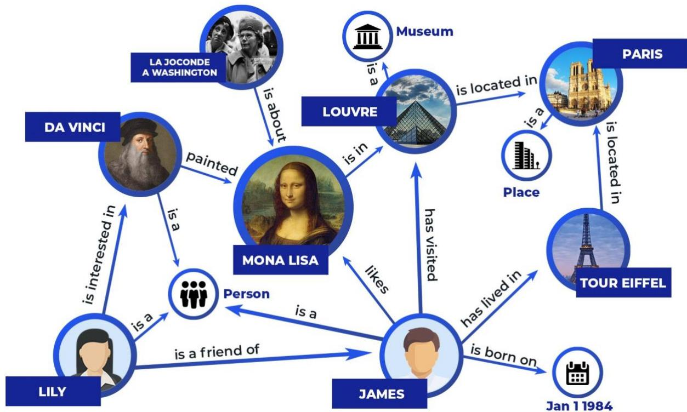

# 知识图谱及其表示

# Drug Repurposing

• Predicting effective (approved)drugs given a disease

在新药研发中，第一步也是最重要的一步是确定与疾病病理生理学有关的适当靶点（如基因、蛋白质），然后找到可以干扰这些靶点的药物或类药物分子。人工智能的发展可以帮助提取这些大型生物医学数据集中存在的有用特征、模式和结构。在确定和验证了合适的靶点之后，寻找合适的药物或类药物分子，这些分子可以与靶点相互作用并引起所需的反应。

现在，通过支配海量的大型化学数据库以及相关的知识图谱，协助寻找针对特定靶点的完美药物。

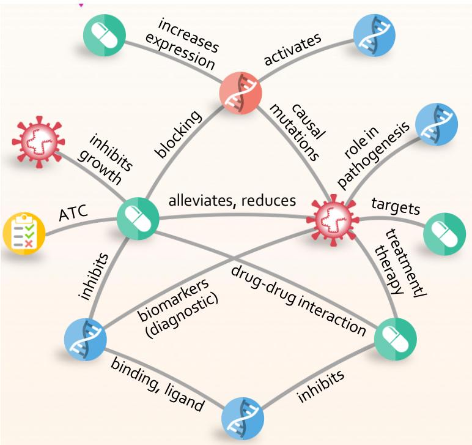

Figure from Zeng et al. 2019

# Information Retrieval

• Knowledge graphs are used to understand the meanings of query termsand identify documents that match the meanings

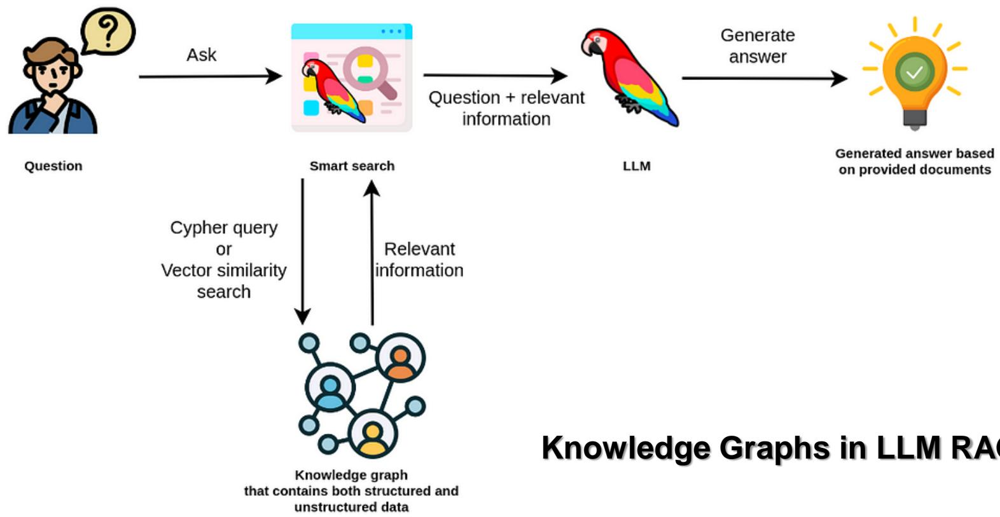

# 目录

1. 知识图谱及其表示

2. 知识图谱的类型

2.1 领域无关知识图谱

2.2 特定领域知识图谱

2.3 跨语言知识图谱

3. 知识图谱的推理

4. 知识图谱的应用

4.1 精准分析

4.2 智慧搜索

4.3 智能推荐

4.4 智能解释

4.5 自然人机交互

4.6 深层关系推理

5. 现有知识图谱资源

# 知识图谱的类型

# 一、 领域无关知识图谱

• DBPedia, Yago, Freebase, Google KG, etc.

# 二、特定/垂直领域知识图谱

• FOAF, Geonames, Linked Movie Database, etc.

# 三、跨语言知识图谱

• DBPedia, Yago, Freebase, XLORE, etc.

领域无关知识图谱

<table><tr><td>类别</td><td>名称</td><td>其他</td></tr><tr><td rowspan="2">人工构建</td><td>ResearchCyc</td><td>http://www.cyc.com/platform/researchcyc</td></tr><tr><td>WordNet</td><td>wordnet.princeton.edu</td></tr><tr><td rowspan="5">基于维基百科</td><td>DBPedia</td><td>dbpedia.org</td></tr><tr><td>YAGO</td><td>yago-knowledge.org</td></tr><tr><td>Freebase</td><td>freebase.com</td></tr><tr><td>WikiTaxonomy</td><td>http://www.h-its.org/english/research/nlp/download/wikitaxonomy.php</td></tr><tr><td>BabelNet</td><td>babelnet.org</td></tr><tr><td rowspan="3">开放知识抽取</td><td>KnowItAll</td><td>openie.cs.washington.edu</td></tr><tr><td>NELL</td><td>rtw.ml.cmu.edu</td></tr><tr><td>Probase</td><td>http://research.microsoft.com/en-us/projects/probase/</td></tr><tr><td rowspan="2">中文知识图谱</td><td>百度知心</td><td>www.baidu.com</td></tr><tr><td>搜狗知立方</td><td>www.sogou.com</td></tr></table>

# 领域无关知识图谱

<table><tr><td>name</td><td># of concepts</td><td># of isA pairs</td></tr><tr><td>Freebase</td><td>1,450</td><td>24,483,434</td></tr><tr><td>WordNet</td><td>25,229</td><td>283,070</td></tr><tr><td>WikiTaxonomy</td><td>111,654</td><td>105,418</td></tr><tr><td>YAGO</td><td>352,297</td><td>8,277,227</td></tr><tr><td>DBPedia</td><td>259</td><td>1,900,000</td></tr><tr><td>ResearchCyc</td><td>≈ 120,000</td><td>&lt; 5,000,000</td></tr><tr><td>KnowItAll</td><td>N/A</td><td>&lt; 54,753</td></tr><tr><td>TextRunner</td><td>N/A</td><td>&lt; 11,000,000</td></tr><tr><td>OMCS</td><td>173,398</td><td>1,030,619</td></tr><tr><td>NELL</td><td>123</td><td>&lt; 242,453</td></tr><tr><td>Probase</td><td>2,653,872</td><td>20,757,545</td></tr></table>

概念数量对比2010.12

http://research.microsoft.com/en-us/projects/probase/

# 特定领域知识图谱

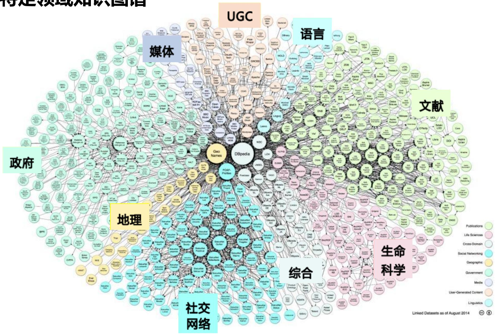

# 知识图谱类型

 知识图谱是对处理数据的结构化结果表示。

 知识图谱可以表达：

◼ 实体及其关系知识

◼ 事件知识

◼ 计算知识

◼ 限定领域知识

◼ 面向特定任务的知识图谱

◼ 跨语言知识

◼

 知识图谱是实现语义互操作的基础。

# 事件知识图谱

# □灾难>自然灾害>地震： 2014年鲁甸地震事件

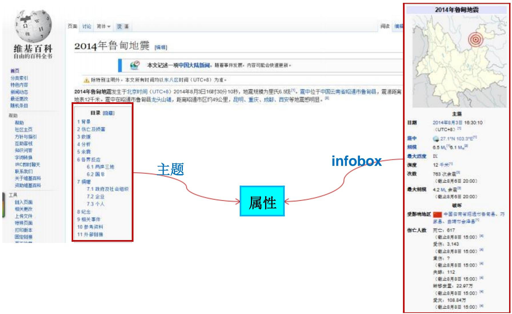

# 事件知识图谱

□ 事件学习：从多个相似事件实例中学习层次主题模式

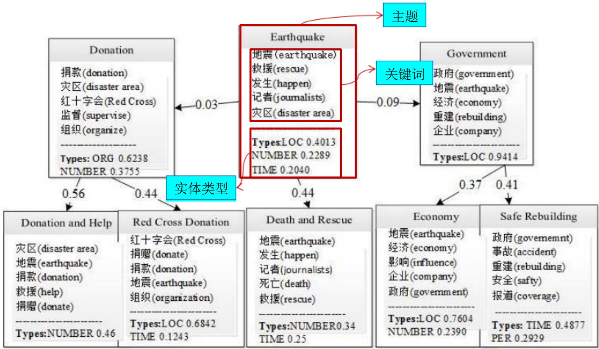

# 计算知识图谱

# □ 计算知识引擎WolframAIpha

htm

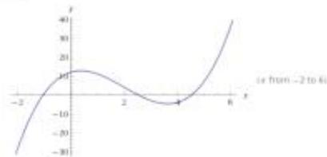

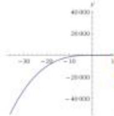

WolframAlpha

<table><tr><td></td><td>5 in × 7 in</td><td>8 in × 10 in</td></tr><tr><td>width</td><td>12.7 cm (centimeters)</td><td>20.32 cm (centimeters)</td></tr><tr><td>height</td><td>17.78 cm (centimeters)</td><td>25.4 cm (centimeters)</td></tr><tr><td>diagonal</td><td>21.8 cm (centimeters)</td><td>32.5 cm (centimeters)</td></tr><tr><td>aspect ratio</td><td>5:7 (1:1.40)</td><td>4:5 (1:1.25)</td></tr><tr><td>pixel count at 72 pixels/in</td><td>0.1814 megapixels</td><td>0.4147 megapixels</td></tr><tr><td>pixel count at 300 pixels/in</td><td>3.15 megapixels</td><td>7.2 megapixels</td></tr><tr><td>raw memory at 72 pixels/in</td><td>544 kB (kbytes) (24-bit)</td><td>1.24 MB (megabytes) (24-bit)</td></tr><tr><td>raw memory at 300 pixels/in</td><td>9.45 MB (megabytes) (24-bit)</td><td>21.6 MB (megabytes) (24-bit)</td></tr></table>

# 影视领域知识图谱

# • 多源影视知识

# 维基百科

自由的百科全书

<table><tr><td colspan="2">后会无期
The Continent</td></tr><tr><td colspan="2">基本资料</td></tr><tr><td>导演</td><td>韩寒</td></tr><tr><td>监制</td><td>方励</td></tr><tr><td>编剧</td><td>韩寒</td></tr><tr><td>主演</td><td>冯绍峰、陈柏霖、钟汉良、陈乔恩、王路丹、袁泉[1]</td></tr><tr><td>配乐作曲</td><td>小林武史</td></tr><tr><td>摄影</td><td>廖拟</td></tr><tr><td>剪辑</td><td>肖洋</td></tr><tr><td>片长</td><td>106分钟</td></tr><tr><td>制片商</td><td>北京劳雷影业有限公司
杭州果麦文化传媒有限公司
博纳影业集团</td></tr><tr><td>产地</td><td>中国大陆</td></tr><tr><td>语言</td><td>现代标准汉语</td></tr><tr><td colspan="2">上映及发行</td></tr><tr><td>上映日期</td><td>中国大陆2014年07月24日
台湾2014年9月19日[1]
香港:2014年10月16日</td></tr><tr><td>发行商</td><td>天津博纳文化传媒有限公司
华夏电影发行责任公司</td></tr></table>

# 属性数据补充

# 链接补充

Bai

百科

<table><tr><td>中文名</td><td>后会无期</td></tr><tr><td>外文名</td><td>The Continent</td></tr><tr><td>导演</td><td>韩寒</td></tr><tr><td>制片人</td><td>方励</td></tr><tr><td>编剧</td><td>韩寒</td></tr><tr><td>主演</td><td>冯绍峰、陈柏霖、钟汉良、陈乔恩、王珞丹、袁泉</td></tr><tr><td>出品时间</td><td>2014年</td></tr><tr><td>制片地区</td><td>中国</td></tr><tr><td>出品公司</td><td>劳雷影业、果麦文化、博纳影业</td></tr><tr><td>片长</td><td>106分钟</td></tr><tr><td>对白语言</td><td>普通话</td></tr><tr><td>上映时间</td><td>2014年07月24日</td></tr><tr><td>发行公司</td><td>天津博纳文化
华夏电影发行</td></tr><tr><td>类型</td><td>喜剧，爱情，冒险</td></tr><tr><td>色彩</td><td>彩色</td></tr><tr><td>制片成本</td><td>5000万人民币</td></tr><tr><td>拍摄地点</td><td>上海，四川西昌，内蒙古赤峰，浙江舟山普陀，东极岛</td></tr><tr><td>拍摄日期</td><td>2014年2月14日</td></tr></table>

# 影视领域知识图谱

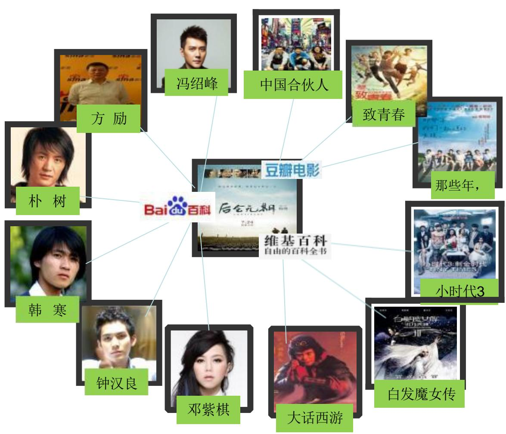

# isA :

食人女

isA

Film or TV?

Film

Film

movie:directed_by

“Han Han”@en,

“ ”@zh .

movie:genres

“Comedy”@en,

“ ”@zh .

movie:summary

“The Continent is

directed and written by Han

Han…”@en,

“《后会无期》是一部由

“@zh .

# 跨语言知识图谱

# BabelNet

Averylargemultilingual ontology

演员/Actor

http://babelnet.org/

Google KG

YaGoselect knowledge

F Freebase

VaEuroWordNet

XLORE

# 跨语言知识图谱

• 基于分布的在线异构百科资源，通过跨语言知识链接技术，构建一个中英文知识量比较平衡的大规模跨语言知识图谱。

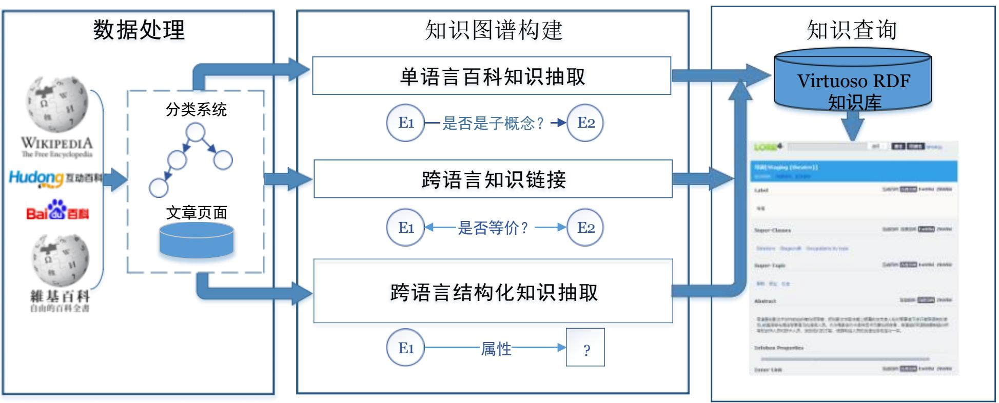

XLORE:集成百度百科、互动百科、中文维基和英文维基，包含856,146个概念，71,596个属性，7,854,301个实例。

# 跨语言知识图谱

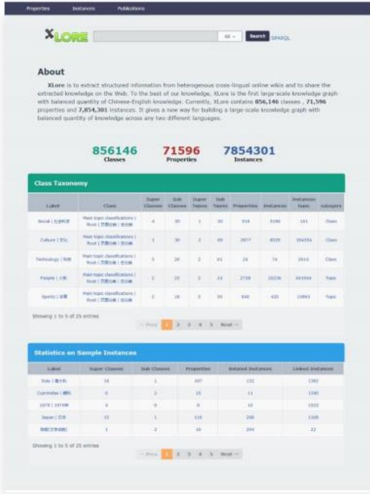

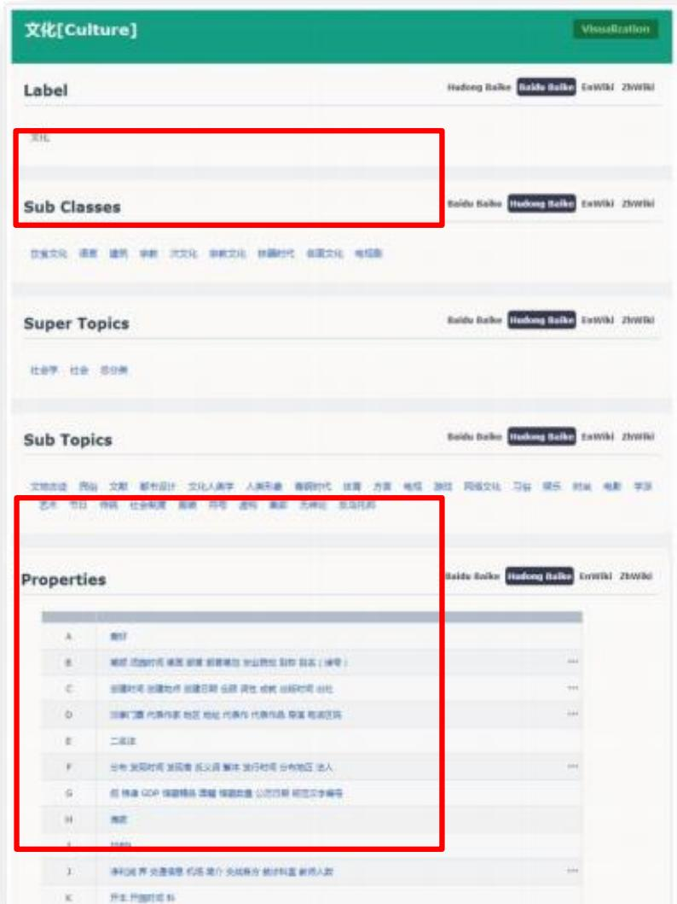

# 跨语言知识图谱

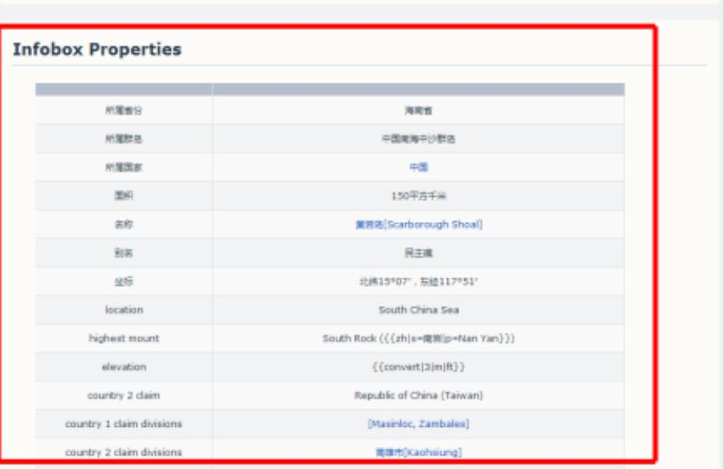

# 知识图谱类型

 知识图谱是对处理数据的结构化结果表示。

 知识图谱可以表达：

◼ 实体及其关系知识

◼ 事件知识

◼ 计算知识

◼ 限定领域知识

◼ 面向特定任务的知识图谱

◼ 跨语言知识

◼

 知识图谱是实现语义互操作的基础。

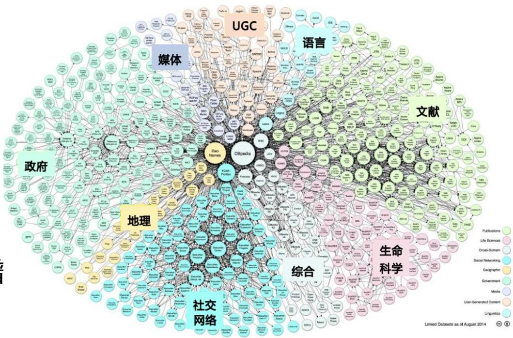

# 目录

1. 知识图谱及其表示

2. 知识图谱的类型

2.1 领域无关知识图谱

2.2 特定领域知识图谱

2.3 跨语言知识图谱

3. 知识图谱的推理

4. 知识图谱的应用

4.1 精准分析

4.2 智慧搜索

4.3 智能推荐

4.4 智能解释

4.5 自然人机交互

4.6 深层关系推理

5. 现有知识图谱资源

# 知识图谱推理

知识库推理包括基于符号的推理和基于统计的推理。

▫ 基于符号的推理一般是基于经典逻辑（一阶谓词逻辑或者命题逻辑）或者经典逻辑的变异（比如说缺省逻辑）。基于符号的推理可以从一个已有的知识图谱推理出新的实体间关系；同时可以对知识图谱进行逻辑的冲突检测。

▫ 基于统计的方法一般指关系机器学习方法，通过统计规律从知识图谱中学习到新的实体间关系；并且对新学到的关系进行评分，去掉那些可能错误的关系。

# 知识图谱推理

# Why Reasoning on Knowledge Graphs

• Knowledge graphs are usually incomplete. Many facts are missing

• A fundamental task: predicting missing links (or facts) by reasoningon existing facts

• The Key Idea: leverage logic rules for reasoning on knowledge graphsimplicitly or explicitly

• Example:

Barack_Obama BornIn United_States

Barack_Obama Nationality American

Parents of Parents are Grandparents

# 知识图谱推理

# Reasoning in Symbolic Space

• Symbolic logical rule based methods

• Logic programming (e.g., Prolog)

• Markov Logic Network

 ?- likes(john, jane). dot necessary

true. ‘ answer from prolog interpreter

 sign on

 prolog query

prompt

 variables

?- friends(x, Y).

 X = john,

$\mathrm { Y } =$

X = jane,

Y = john.

Prolog

R1 2.0∀X.Y links(X.Y)vlinks(Y.X)→similar(X,Y)

R21.5VX.Y similar(X,Y)=(aboutSports(X)aboutSports())

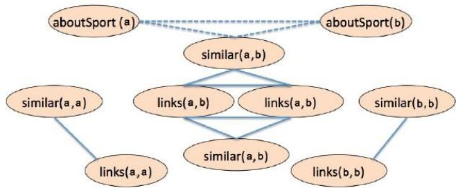

Markov Logic Networks

# 知识图谱推理

# Reasoning in Continuous Space

• Knowledge graph embedding methods

• Map entities and relations into continuous space, and reasoning in thecontinuous spaces

• TransE, TransH, TransR, ComplEx, RotatE, ….

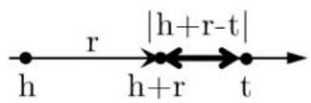

TransE

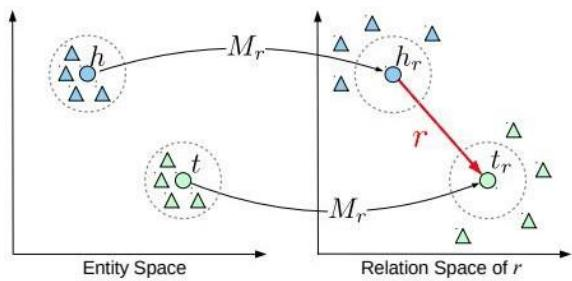

TransR

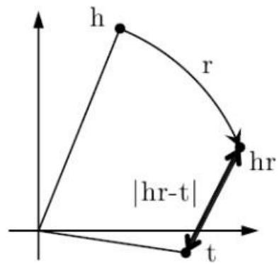

RotatE

# 知识图谱推理

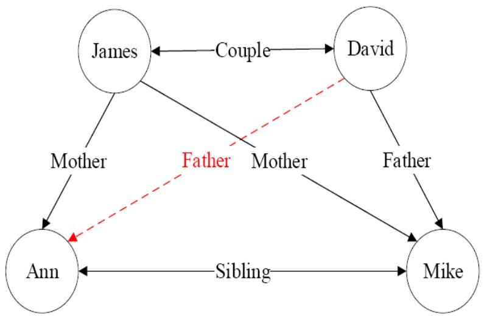

一个简单的家庭关系知识图谱

知识图谱中存在连线的两个实体可表达为形如<left_node,relation,right_node $>$ 的三元组形式，这种三元组也可以表示为一阶逻辑(first order logic,FOL)的形式,从而为基于知识图谱的推理创造了条件。

例如从<奥巴马，出生地，夏威夷>和<夏威夷，属于，美国>两个三元组，可推理得到<奥巴马，国籍，美国>。

# 知识图谱推理

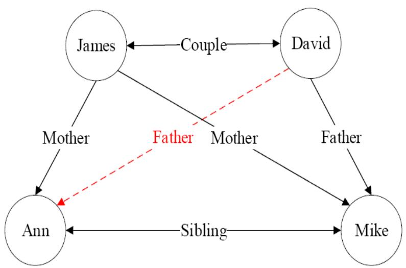

一个简单的家庭关系知识图谱

⚫ 可利用一阶谓词来表达刻画知识图谱中节点 之 间 存 在 的 关 系 ， 如 图 中 形 如<James,????????????,David>的关系可用一阶逻辑的形式来描述，即????????????(James, David)。

⚫ ???????????? ??, ?? 是一阶谓词，????????????是图中实体之间具有的关系， $x$ 和??是谓词变量

⚫ 从图中已有关系可推知David和Ann具有父女关系，但这一关系在图中初始图(无红线)中并不存在，是需要推理的目标。

# 知识图谱推理

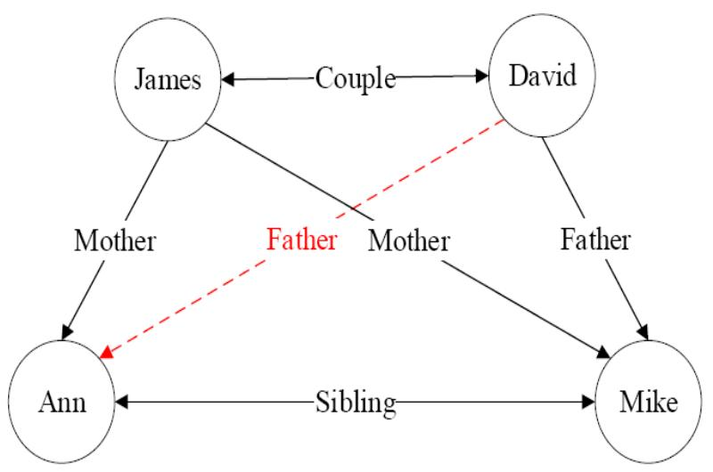

一个简单的家庭关系知识图谱

问题：如何从知识图谱中推理得到

??????ℎ????(??????????, ??????)

$$
\begin{array}{l} (\forall x) (\forall y) (\forall z) \left(M o t h e r (z, y) \wedge C o u p l e (x, z) \right. \\ \rightarrow F a t h e r (x, y)) \\ \end{array}
$$

如果能够学习得到这条规则，该有多好？（从具体例子中学习，这是归纳推理的范畴

# 知识图谱推理：归纳学习

归纳逻辑程序设计 (inductive logic programming，ILP)算法

归纳逻辑程序设计（ILP）是机器学习和逻辑程序设计交叉领域的研究内容。

ILP使用一阶谓词逻辑进行知识表示，通过修改和扩充逻辑表达式对现有知识归纳，完成推理任务。

作为ILP的代表性方法，FOIL（First Order Inductive Learner）通过序贯覆盖实现规则推理。

# 知识图谱推理： FOIL (First Order Inductive Learner)

$$
(\forall x) (\forall y) (\forall z) \big (M o t h e r (z, y) \land C o u p l e (x, z) \rightarrow F a t h e r (x, y) \big)
$$

前提约束谓词(学习得到)

目标谓词(已知)

推理手段: positive examples + negative examples + background knowledge examples $\Longrightarrow$ hypothesis

# 知识图谱推理： FOIL (First Order Inductive Learner)

目标谓词：??????ℎ???? ??, ??

⚫ 目标谓词只有一个正例??????ℎ????(David, Mike)。

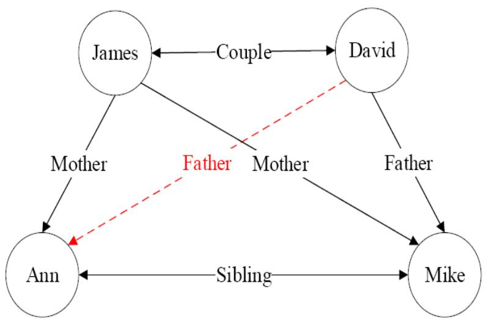

⚫ 反例在知识图谱中一般不会显式给出，但可从知识图谱中构造出来。如从知识图谱中已经知道????????????(David, James)成立，则??????ℎ????(David,James)可作为目标谓词 $P$ 的一个反例，记为¬??????ℎ???? (David, James)。

# 一个简单的家庭关系知识图谱

只能在已知两个实体的关系且确定其关系与目标谓词相悖时，才能将这两个实体用于构建目标谓词的反例，而不能在不知两个实体是否满足目标谓词前提下将它们来构造目标谓词的反例。

# 知识图谱推理： FOIL (First Order Inductive Learner)

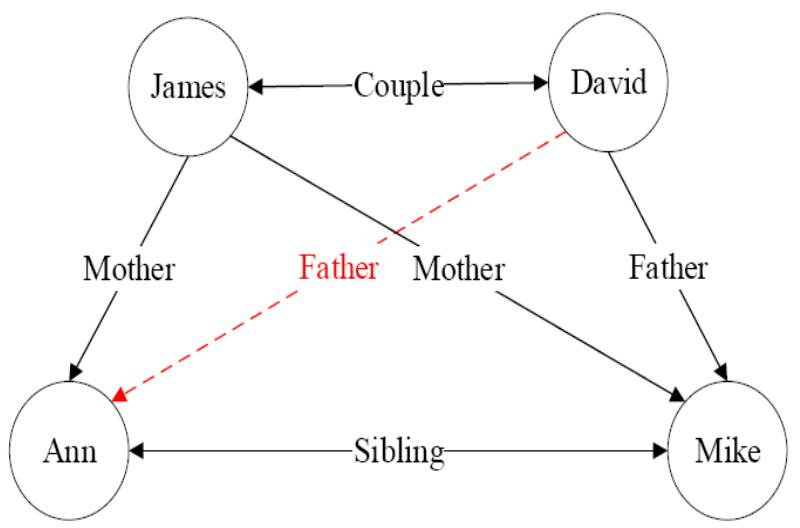

一个简单的家庭关系知识图谱

目标谓词：??????ℎ???? ??, ??

⚫ 背景知识：知识图谱中目标谓词以外的其他谓词实例化结果，如??????????????(Ann, Mike)

# 知识图谱推理： FOIL (First Order Inductive Learner)

$$
(\forall x) (\forall y) (\forall z) \left(M o t h e r (z, y) \land C o u p l e (x, z) \rightarrow F a t h e r (x, y)\right)
$$

# 前提约束谓词

# (学习得到)

# 目标谓词

# (已知)

推理思路：从一般到特殊，逐步给目标谓词添加前提约束谓词，直到所构成的推理规则不覆盖任何反例。

从一般到特殊 ： 对目标谓词或前提约束谓词中的变量赋予具体值 ， 如 将(∀??)(∀??)(∀??) ??????ℎ???? ??, ?? ∧ ???????????? ??, ?? → ??????ℎ???? ??, ?? 这一推理规则所包含的目标谓词 $F a t h e r ( x , y )$ 中 $x$ 和??分别赋值为David和Ann，进而进行推理。

# 知识图谱推理： FOIL (First Order Inductive Learner)

$$
(\forall x) (\forall y) (\forall z) \left(M o t h e r (z, y) \wedge C o u p l e (x, z) \rightarrow F a t h e r (x, y)\right)
$$

# 前提约束谓词

# (学习得到)

# 目标谓词

# (已知)

哪些谓词好呢？

可以作为目标

谓词的前提约

束谓词？

FOIL中信息增益值

(information gain)

FOIL信息增益值计算方法如下：

$$
F O I L \_ G a i n = \widehat {m _ {+}} \cdot \left(\log_ {2} \frac {\widehat {m _ {+}}}{\widehat {m _ {+}} + \widehat {m _ {-}}} - \log_ {2} \frac {m _ {+}}{m _ {+} + m _ {-}}\right)
$$

其中，??ෞ+和 $\widehat { m _ { - } }$ 是增加前提约束谓词后所得新推理规则覆盖的正例和反例的数量， $m _ { + }$ 和 $m _ { - }$ 是原推理规则所覆盖的正例和反例数量。

# 知识图谱推理： FOIL (First Order Inductive Learner)

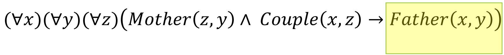

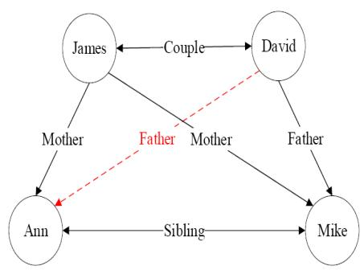

前提约束谓词(学习得到)

目标谓词(已知)

??????ℎ???? ∙,∙

?????????????? ∙,∙

??????????e(∙,∙)

依次将谓词加入到推理规则中作为前提约束谓词，并计算所得到新推理规则的FOIL增益值。

基于计算所得FOIL增益值来选择最佳前提约束谓词。

# 知识图谱推理： FOIL (First Order Inductive Learner)

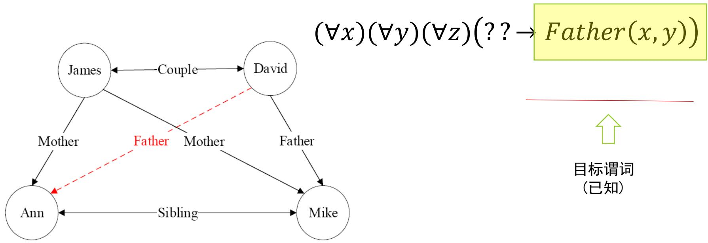

<table><tr><td>背景知识
样例集合</td><td>Sibling(Ann, Mike)
Couple(David, James)
Mother(James, Ann)
Mother(James, Mike)</td><td>目标谓词
训练样例
集合</td><td>Father(David, Mike)
¬Father(David, James)
¬Father(James, Ann)
¬Father(James, Mike)
¬Father(Ann, Mike)</td></tr></table>

# 知识图谱推理： FOIL (First Order Inductive Learner)

<table><tr><td colspan="2">推理规则</td><td colspan="2">推理规则涵盖的正例和反例数</td><td>FOIL信息增益值</td></tr><tr><td>目标谓词</td><td>前提约束谓词</td><td>正例</td><td>反例</td><td>信息增益值</td></tr><tr><td>Father(x,y)←</td><td>空集</td><td>m_ = 1</td><td>m_ = 4</td><td>FOIL_Gain</td></tr><tr><td rowspan="18">Father(x,y)←</td><td>Mother(x,y)</td><td>m_ = 0</td><td>m_ = 2</td><td>NA</td></tr><tr><td>Mother(x,z)</td><td>m_ = 0</td><td>m_ = 2</td><td>NA</td></tr><tr><td>Mother(y,x)</td><td>m_ = 0</td><td>m_ = 1</td><td>NA</td></tr><tr><td>Mother(y,z)</td><td>m_ = 0</td><td>m_ = 1</td><td>NA</td></tr><tr><td>Mother(z,x)</td><td>m_ = 0</td><td>m_ = 1</td><td>NA</td></tr><tr><td>Mother(z,y)</td><td>m_ = 1</td><td>m_ = 3</td><td>0.32</td></tr><tr><td>Sibling(x,y)</td><td>m_ = 0</td><td>m_ = 1</td><td>NA</td></tr><tr><td>Sibling(x,z)</td><td>m_ = 0</td><td>m_ = 1</td><td>NA</td></tr><tr><td>Sibling(y,x)</td><td>m_ = 0</td><td>m_ = 0</td><td>NA</td></tr><tr><td>Sibling(y,z)</td><td>m_ = 0</td><td>m_ = 0</td><td>NA</td></tr><tr><td>Sibling(z,x)</td><td>m_ = 0</td><td>m_ = 0</td><td>NA</td></tr><tr><td>Sibling(z,y)</td><td>m_ = 1</td><td>m_ = 2</td><td>0.74</td></tr><tr><td>Couple(x,y)</td><td>m_ = 0</td><td>m_ = 1</td><td>NA</td></tr><tr><td>Couple(x,z)</td><td>m_ = 1</td><td>m_ = 1</td><td>1.32</td></tr><tr><td>Couple(y,x)</td><td>m_ = 0</td><td>m_ = 0</td><td>NA</td></tr><tr><td>Couple(y,z)</td><td>m_ = 0</td><td>m_ = 0</td><td>NA</td></tr><tr><td>Couple(z,x)</td><td>m_ = 0</td><td>m_ = 2</td><td>NA</td></tr><tr><td>Couple(z,y)</td><td>m_ = 0</td><td>m_ = 1</td><td>NA</td></tr></table>

给定目标谓词，此时推理规则只有目标谓词，因此推理规则所覆盖的正例和反例的样本数分别是训练样本中正例和反例的数量，即1和4，因此， $m _ { + } =$1， $m _ { - } = 4 \mathrm { _ o }$ 。

# 知识图谱推理： FOIL (First Order Inductive Learner)

<table><tr><td colspan="2">推理规则</td><td colspan="2">推理规则涵盖的正例和反例数</td><td>FOIL信息增益值</td></tr><tr><td>目标谓词</td><td>前提约束谓词</td><td>正例</td><td>反例</td><td>信息增益值</td></tr><tr><td>Father(x,y)←</td><td>空集</td><td>m_ = 1</td><td>m_ = 4</td><td>FOIL_Gain</td></tr><tr><td rowspan="18">Father(x,y)←</td><td>Mother(x,y)</td><td>m_ = 0</td><td>m_ = 2</td><td>NA</td></tr><tr><td>Mother(x,z)</td><td>m_ = 0</td><td>m_ = 2</td><td>NA</td></tr><tr><td>Mother(y,x)</td><td>m_ = 0</td><td>m_ = 1</td><td>NA</td></tr><tr><td>Mother(y,z)</td><td>m_ = 0</td><td>m_ = 1</td><td>NA</td></tr><tr><td>Mother(z,x)</td><td>m_ = 0</td><td>m_ = 1</td><td>NA</td></tr><tr><td>Mother(z,y)</td><td>m_ = 1</td><td>m_ = 3</td><td>0.32</td></tr><tr><td>Sibling(x,y)</td><td>m_ = 0</td><td>m_ = 1</td><td>NA</td></tr><tr><td>Sibling(x,z)</td><td>m_ = 0</td><td>m_ = 1</td><td>NA</td></tr><tr><td>Sibling(y,x)</td><td>m_ = 0</td><td>m_ = 0</td><td>NA</td></tr><tr><td>Sibling(y,z)</td><td>m_ = 0</td><td>m_ = 0</td><td>NA</td></tr><tr><td>Sibling(z,x)</td><td>m_ = 0</td><td>m_ = 0</td><td>NA</td></tr><tr><td>Sibling(z,y)</td><td>m_ = 1</td><td>m_ = 2</td><td>0.74</td></tr><tr><td>Couple(x,y)</td><td>m_ = 0</td><td>m_ = 1</td><td>NA</td></tr><tr><td>Couple(x,z)</td><td>m_ = 1</td><td>m_ = 1</td><td>1.32</td></tr><tr><td>Couple(y,x)</td><td>m_ = 0</td><td>m_ = 0</td><td>NA</td></tr><tr><td>Couple(y,z)</td><td>m_ = 0</td><td>m_ = 0</td><td>NA</td></tr><tr><td>Couple(z,x)</td><td>m_ = 0</td><td>m_ = 2</td><td>NA</td></tr><tr><td>Couple(z,y)</td><td>m_ = 0</td><td>m_ = 1</td><td>NA</td></tr></table>

将??????ℎ????(??, ??)作为前提约束谓词加入，可得到推理规则??????ℎ???? ??, ?? → ??????ℎ???? ??, ??

在背景知识中，??????ℎ????(??, ??)有两个实例??????ℎ????(James, Ann)??????ℎ????(James, Mike)

对于??????ℎ????(James, Ann)这一实例， x = James， $y = \mathbf { A } \mathbf { n } \mathbf { n }$ ，将??和??代入 $F a t h e r ( x , y )$ 得到??????ℎ????(James, Ann)，可知在训练样本中??????ℎ????(James, Ann)是一个反例

对于??????ℎ????(James, Mike)这一实例， x= James， $y = \mathrm { M i k e }$ ，将??和??代入 $F a t h e r ( x , y )$ 得到??????ℎ????(James, Mike)，可知在训练样本中??????ℎ????(James,Mike)是一个反例

# 知识图谱推理： FOIL (First Order Inductive Learner)

<table><tr><td colspan="2">推理规则</td><td colspan="2">推理规则涵盖的正例和反例数</td><td>FOIL信息增益值</td></tr><tr><td>目标谓词</td><td>前提约束谓词</td><td>正例</td><td>反例</td><td>信息增益值</td></tr><tr><td>Father(x,y)←</td><td>空集</td><td>m_ = 1</td><td>m_ = 4</td><td>FOIL_Gain</td></tr><tr><td rowspan="18">Father(x,y)←</td><td>Mother(x,y)</td><td>m_ = 0</td><td>m_ = 2</td><td>NA</td></tr><tr><td>Mother(x,z)</td><td>m_ = 0</td><td>m_ = 2</td><td>NA</td></tr><tr><td>Mother(y,x)</td><td>m_ = 0</td><td>m_ = 1</td><td>NA</td></tr><tr><td>Mother(y,z)</td><td>m_ = 0</td><td>m_ = 1</td><td>NA</td></tr><tr><td>Mother(z,x)</td><td>m_ = 0</td><td>m_ = 1</td><td>NA</td></tr><tr><td>Mother(z,y)</td><td>m_ = 1</td><td>m_ = 3</td><td>0.32</td></tr><tr><td>Sibling(x,y)</td><td>m_ = 0</td><td>m_ = 1</td><td>NA</td></tr><tr><td>Sibling(x,z)</td><td>m_ = 0</td><td>m_ = 1</td><td>NA</td></tr><tr><td>Sibling(y,x)</td><td>m_ = 0</td><td>m_ = 0</td><td>NA</td></tr><tr><td>Sibling(y,z)</td><td>m_ = 0</td><td>m_ = 0</td><td>NA</td></tr><tr><td>Sibling(z,x)</td><td>m_ = 0</td><td>m_ = 0</td><td>NA</td></tr><tr><td>Sibling(z,y)</td><td>m_ = 1</td><td>m_ = 2</td><td>0.74</td></tr><tr><td>Couple(x,y)</td><td>m_ = 0</td><td>m_ = 1</td><td>NA</td></tr><tr><td>Couple(x,z)</td><td>m_ = 1</td><td>m_ = 1</td><td>1.32</td></tr><tr><td>Couple(y,x)</td><td>m_ = 0</td><td>m_ = 0</td><td>NA</td></tr><tr><td>Couple(y,z)</td><td>m_ = 0</td><td>m_ = 0</td><td>NA</td></tr><tr><td>Couple(z,x)</td><td>m_ = 0</td><td>m_ = 2</td><td>NA</td></tr><tr><td>Couple(z,y)</td><td>m_ = 0</td><td>m_ = 1</td><td>NA</td></tr></table>

$$
M o t h e r (x, y) \rightarrow F a t h e r (x, y)
$$

覆盖正例和反例数量分别为0和2，即 $\widehat { m _ { + } } = 0$ ， $\widehat { m _ { - } } = 2$

由于 $\widehat { m _ { + } } = 0$ ，代入????????_????????公式时会出现负无穷的情况，此时????????_???????? 记为NA（Not Available）

FOIL信息增益值计算方法如下：

$$
F O I L _ {-} G a i n = \widehat {m} _ {+} \cdot \left(\log_ {2} \frac {\widehat {m} _ {+}}{\widehat {m} _ {+} + \widehat {m} _ {-}} - \log_ {2} \frac {m _ {+}}{m _ {+} + m _ {-}}\right)
$$

其中，m和m-是增加前提约束谓词后所得新推理规则覆盖的正例和反例的数量，m+和m_是原推理规则所覆盖的正例和反例数量。

# 知识图谱推理： FOIL (First Order Inductive Learner)

<table><tr><td colspan="2">推理规则</td><td colspan="2">推理规则涵盖的正例和反例数</td><td>FOIL信息增益值</td></tr><tr><td>目标谓词</td><td>前提约束谓词</td><td>正例</td><td>反例</td><td>信息增益值</td></tr><tr><td>Father(x,y)←</td><td>空集</td><td>m_ = 1</td><td>m_ = 4</td><td>FOIL_Gain</td></tr><tr><td rowspan="18">Father(x,y)←</td><td>Mother(x,y)</td><td>m_ = 0</td><td>m_ = 2</td><td>NA</td></tr><tr><td>Mother(x,z)</td><td>m_ = 0</td><td>m_ = 2</td><td>NA</td></tr><tr><td>Mother(y,x)</td><td>m_ = 0</td><td>m_ = 1</td><td>NA</td></tr><tr><td>Mother(y,z)</td><td>m_ = 0</td><td>m_ = 1</td><td>NA</td></tr><tr><td>Mother(z,x)</td><td>m_ = 0</td><td>m_ = 1</td><td>NA</td></tr><tr><td>Mother(z,y)</td><td>m_ = 1</td><td>m_ = 3</td><td>0.32</td></tr><tr><td>Sibling(x,y)</td><td>m_ = 0</td><td>m_ = 1</td><td>NA</td></tr><tr><td>Sibling(x,z)</td><td>m_ = 0</td><td>m_ = 1</td><td>NA</td></tr><tr><td>Sibling(y,x)</td><td>m_ = 0</td><td>m_ = 0</td><td>NA</td></tr><tr><td>Sibling(y,z)</td><td>m_ = 0</td><td>m_ = 0</td><td>NA</td></tr><tr><td>Sibling(z,x)</td><td>m_ = 0</td><td>m_ = 0</td><td>NA</td></tr><tr><td>Sibling(z,y)</td><td>m_ = 1</td><td>m_ = 2</td><td>0.74</td></tr><tr><td>Couple(x,y)</td><td>m_ = 0</td><td>m_ = 1</td><td>NA</td></tr><tr><td>Couple(x,z)</td><td>m_ = 1</td><td>m_ = 1</td><td>1.32</td></tr><tr><td>Couple(y,x)</td><td>m_ = 0</td><td>m_ = 0</td><td>NA</td></tr><tr><td>Couple(y,z)</td><td>m_ = 0</td><td>m_ = 0</td><td>NA</td></tr><tr><td>Couple(z,x)</td><td>m_ = 0</td><td>m_ = 2</td><td>NA</td></tr><tr><td>Couple(z,y)</td><td>m_ = 0</td><td>m_ = 1</td><td>NA</td></tr></table>

如果将 $\cdot$ 作为前提约束谓词加入，可得到如下推理规则$C o u p l \mathrm { e } ( x , z )  F a t h e r ( x , y )$

在背景知识中，??????????e(??, ??)只有一个实例??????????e(David, James)，即??=David，??= James，将其代入$F a t h e r ( x , y )$ 得到??????ℎ????(David, ??)。

# 知识图谱推理： FOIL (First Order Inductive Learner)

<table><tr><td colspan="2">推理规则</td><td colspan="2">推理规则涵盖的正例和反例数</td><td>FOIL信息增益值</td></tr><tr><td>目标谓词</td><td>前提约束谓词</td><td>正例</td><td>反例</td><td>信息增益值</td></tr><tr><td>Father(x,y)←</td><td>空集</td><td>m_ = 1</td><td>m_ = 4</td><td>FOIL_Gain</td></tr><tr><td rowspan="18">Father(x,y)←</td><td>Mother(x,y)</td><td>m_ = 0</td><td>m_ = 2</td><td>NA</td></tr><tr><td>Mother(x,z)</td><td>m_ = 0</td><td>m_ = 2</td><td>NA</td></tr><tr><td>Mother(y,x)</td><td>m_ = 0</td><td>m_ = 1</td><td>NA</td></tr><tr><td>Mother(y,z)</td><td>m_ = 0</td><td>m_ = 1</td><td>NA</td></tr><tr><td>Mother(z,x)</td><td>m_ = 0</td><td>m_ = 1</td><td>NA</td></tr><tr><td>Mother(z,y)</td><td>m_ = 1</td><td>m_ = 3</td><td>0.32</td></tr><tr><td>Sibling(x,y)</td><td>m_ = 0</td><td>m_ = 1</td><td>NA</td></tr><tr><td>Sibling(x,z)</td><td>m_ = 0</td><td>m_ = 1</td><td>NA</td></tr><tr><td>Sibling(y,x)</td><td>m_ = 0</td><td>m_ = 0</td><td>NA</td></tr><tr><td>Sibling(y,z)</td><td>m_ = 0</td><td>m_ = 0</td><td>NA</td></tr><tr><td>Sibling(z,x)</td><td>m_ = 0</td><td>m_ = 0</td><td>NA</td></tr><tr><td>Sibling(z,y)</td><td>m_ = 1</td><td>m_ = 2</td><td>0.74</td></tr><tr><td>Couple(x,y)</td><td>m_ = 0</td><td>m_ = 1</td><td>NA</td></tr><tr><td>Couple(x,z)</td><td>m_ = 1</td><td>m_ = 1</td><td>1.32</td></tr><tr><td>Couple(y,x)</td><td>m_ = 0</td><td>m_ = 0</td><td>NA</td></tr><tr><td>Couple(y,z)</td><td>m_ = 0</td><td>m_ = 0</td><td>NA</td></tr><tr><td>Couple(z,x)</td><td>m_ = 0</td><td>m_ = 2</td><td>NA</td></tr><tr><td>Couple(z,y)</td><td>m_ = 0</td><td>m_ = 1</td><td>NA</td></tr></table>

在训练样本中存在正例??????ℎ????(David,Mike)以及反例¬??????ℎ????(David, James)，即?????? $p l \mathbf { e } ( x , z )  F a t h e r ( x , y )$ 覆盖正例和反例数量分别为1和1。信息增益值为：

$$
\begin{array}{l} \widehat {m _ {+}} \cdot \left(\log_ {2} \frac {\widehat {m _ {+}}}{\widehat {m _ {+}} + \widehat {m _ {-}}} - \log_ {2} \frac {m _ {+}}{m _ {+} + m _ {-}}\right) \\ = 1 \cdot \left(\log_ {2} {\frac {1}{1 + 1}} - \log_ {2} {\frac {1}{1 + 4}}\right) = 1. 3 2 \\ \end{array}
$$

# 知识图谱推理： FOIL (First Order Inductive Learner)

<table><tr><td>Background knowledge</td><td>Sibling(Ann, Mike)
Couple(David, James)
Mother(James, Ann)
Mother(James, Mike)</td></tr><tr><td>Positive and negative training samples</td><td>Father(David, Mike)
 ¬Father(David, James)
¬Father(James, Ann)
¬Father(James, Mike)
¬Father(Ann, Mike)</td></tr></table>

??????????e $( x , z )$ 加入后信息增益最大

$\bullet$ 将 ??????????e $( x , z )$ 加 入 推 理 规 则 , 得 到$C o u p l e ( x , z ) \to F a t h e r ( x , y )$ 新推理规则

⚫ 将训练样例中与该推理规则不符的样例去掉。这里不符指当 $\underline { { C o u p l e } } ( x , z )$ 中 $\underline { x }$ 取值为David时，与??????ℎ????(David, )或¬??????ℎ????(David, )无法匹配的实例。

⚫ 训练样本集中只有正例??????ℎ????(David, Mike)和负例¬??????ℎ????(David, James)两个实例

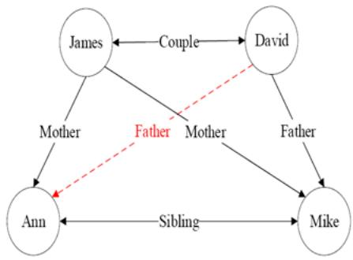

# 知识图谱推理： FOIL (First Order Inductive Learner)

<table><tr><td colspan="2">推理规则</td><td colspan="2">推理规则涵盖的正例和反例数</td><td>FOIL信息增益值</td></tr><tr><td>现有规则</td><td>拟加入前提约束谓词</td><td>正例</td><td>反例</td><td>信息增益值</td></tr><tr><td colspan="2">Father(x,y)← Couple(x,z)</td><td>m_ = 1</td><td>m_ = 1</td><td>1.32</td></tr><tr><td rowspan="19">Father(x,y)← Couple(x,z)</td><td>∧ Mother(x,y)</td><td>m_ = 0</td><td>m_ = 0</td><td>NA</td></tr><tr><td>∧ Mother(x,z)</td><td>m_ = 0</td><td>m_ = 0</td><td>NA</td></tr><tr><td>∧ Mother(y,x)</td><td>m_ = 0</td><td>m_ = 0</td><td>NA</td></tr><tr><td>∧ Mother(y,z)</td><td>m_ = 0</td><td>m_ = 0</td><td>NA</td></tr><tr><td>∧ Mother(z,x)</td><td>m_ = 0</td><td>m_ = 0</td><td>NA</td></tr><tr><td>∧ Mother(z,y)</td><td>m_ = 1</td><td>m_ = 0</td><td>1</td></tr><tr><td>∧ Sibling(x,y)</td><td>m_ = 0</td><td>m_ = 0</td><td>NA</td></tr><tr><td>∧ Sibling(x,z)</td><td>m_ = 0</td><td>m_ = 0</td><td>NA</td></tr><tr><td>∧ Sibling(y,x)</td><td>m_ = 0</td><td>m_ = 0</td><td>NA</td></tr><tr><td>∧ Sibling(y,z)</td><td>m_ = 0</td><td>m_ = 0</td><td>NA</td></tr><tr><td>∧ Sibling(z,x)</td><td>m_ = 0</td><td>m_ = 0</td><td>NA</td></tr><tr><td>∧ Sibling(z,y)</td><td>m_ = 0</td><td>m_ = 0</td><td>NA</td></tr><tr><td>∧ Sibling(x,y)</td><td>m_ = 0</td><td>m_ = 1</td><td>NA</td></tr><tr><td>∧ Sibling(x,z)</td><td>m_ = 1</td><td>m_ = 1</td><td>0</td></tr><tr><td>∧ Sibling(y,x)</td><td>m_ = 0</td><td>m_ = 0</td><td>NA</td></tr><tr><td>∧ Sibling(y,z)</td><td>m_ = 0</td><td>m_ = 0</td><td>NA</td></tr><tr><td>∧ Couple(x,y)</td><td>m_ = 0</td><td>m_ = 0</td><td>NA</td></tr><tr><td>∧ Couple(x,z)</td><td>m_ = 0</td><td>m_ = 0</td><td>NA</td></tr><tr><td>∧ Couple(z,y)</td><td>m_ = 0</td><td>m_ = 0</td><td>NA</td></tr></table>

??????ℎ????(??, ??)加入信息增益最大

将??????ℎ????(??, ??)加入，得到新推理规则

$$
M o o t h e r (z, y) \wedge C o u p l e (x, z)
$$

$$
\rightarrow F a t h e r (x, y)
$$

当x=David、y=Mike、z =James时，该推理规则覆盖训练样本集合中正例??????ℎ????(David, Mike)且不覆盖任意反例，因此算法学习结束。

# 知识图谱推理： FOIL (First Order Inductive Learner)

<table><tr><td colspan="2">推理规则</td><td colspan="2">推理规则涵盖的正例和反例数</td><td>FOIL信息增益值</td></tr><tr><td>现有规则</td><td>拟加入前提约束谓词</td><td>正例</td><td>反例</td><td>信息增益值</td></tr><tr><td colspan="2">Father(x,y)← Couple(x,z)</td><td>m_1 = 1</td><td>m_=_ = 1</td><td>1.32</td></tr><tr><td rowspan="18">Father(x,y)← Couple(x,z)</td><td>∧ Mother(x,y)</td><td>m_+ = 0</td><td>m_=_ = 0</td><td>NA</td></tr><tr><td>∧ Mother(x,z)</td><td>m_+ = 0</td><td>m_=_ = 0</td><td>NA</td></tr><tr><td>∧ Mother(y,x)</td><td>m_+ = 0</td><td>m_=_ = 0</td><td>NA</td></tr><tr><td>∧ Mother(y,z)</td><td>m_+ = 0</td><td>m_=_ = 0</td><td>NA</td></tr><tr><td>∧ Mother(z,x)</td><td>m_+ = 0</td><td>m_=_ = 0</td><td>NA</td></tr><tr><td>∧ Mother(z,y)</td><td>m_+ = 1</td><td>m_=_ = 0</td><td>1</td></tr><tr><td>∧ Sibling(x,y)</td><td>m_+ = 0</td><td>m_=_ = 0</td><td>NA</td></tr><tr><td>∧ Sibling(x,z)</td><td>m_+ = 0</td><td>m_=_ = 0</td><td>NA</td></tr><tr><td>∧ Sibling(y,x)</td><td>m_+ = 0</td><td>m_=_ = 0</td><td>NA</td></tr><tr><td>∧ Sibling(y,z)</td><td>m_+ = 0</td><td>m_=_ = 0</td><td>NA</td></tr><tr><td>∧ Sibling(z,x)</td><td>m_+ = 0</td><td>m_=_ = 0</td><td>NA</td></tr><tr><td>∧ Sibling(z,y)</td><td>m_+ = 0</td><td>m_=_ = 0</td><td>NA</td></tr><tr><td>∧ Couple(x,y)</td><td>m_+ = 0</td><td>m_=_ = 1</td><td>NA</td></tr><tr><td>∧ Couple(x,z)</td><td>m_+ = 1</td><td>m_=_ = 1</td><td>0</td></tr><tr><td>∧ Couple(y,x)</td><td>m_+ = 0</td><td>m_=_ = 0</td><td>NA</td></tr><tr><td>∧ Couple(y,z)</td><td>m_+ = 0</td><td>m_=_ = 0</td><td>NA</td></tr><tr><td>∧ Couple(z,x)</td><td>m_+ = 0</td><td>m_=_ = 0</td><td>NA</td></tr><tr><td>∧ Couple(z,y)</td><td>m_+ = 0</td><td>m_=_ = 0</td><td>NA</td></tr></table>

???????????? ??, ?? ∧ ???????????? ??, ??

→ ???????????? ??, ??

已知：

??????ℎ????(James, Ann)

????????????(David,James)

于是：??????ℎ????(David, Ann)

# 知识图谱推理： FOIL (First Order Inductive Learner)

$$
(\forall x) (\forall y) (\forall z) \big (M o t h e r (z, y) \land C o u p l e (x, z) \rightarrow F a t h e r (x, y) \big)
$$

# 前提约束谓词

# (学习得到)

# 目标谓词

# (已知)

推理手段: positive examples + negative examples + background knowledge examples $\Longrightarrow$ hypothesis

<table><tr><td rowspan="4">背景知识
样例
集合</td><td>Sibling
Mike</td><td>(Ann, Mike)</td><td rowspan="4">目标谓词
训练样例
集合</td><td>Father(David, Mike)</td></tr><tr><td>Couple
James</td><td>(David, James)</td><td>¬Father(David, James)</td></tr><tr><td>Mother
Ann</td><td>(James, Ann)</td><td>¬Father(James, Ann)</td></tr><tr><td>Mother
Mike</td><td>(James, Mike)</td><td>¬Father(James, Mike)</td></tr></table>

给定目标谓词，FOIL算法从实例（正例、反例、背景样例）出发，不断测试所得到推理规则是否还包含反例，一旦不包含负例，则学习结束，展示了 “归纳学习”能力。

# 知识图谱推理： FOIL (First Order Inductive Learner)

推理所得事实 (例子)

学习所得推理规则

前提约束谓词

变量赋值下演绎推理

目标谓词

样例驱动下归纳学习

背景知识样例集合

目标谓词训练样例集合

<table><tr><td colspan="2">FOIL算法</td></tr><tr><td>输入:</td><td>目标谓词P，P的训练样例（正例集合E+和反例集合E-），其他背景知识</td></tr><tr><td>输出:</td><td>推导得到目标谓词P的推理规则</td></tr><tr><td>1</td><td>将目标谓词作为所学习推理规则的结论</td></tr><tr><td>2</td><td>将其他谓词逐一作为前提约束谓词加入推理规则，计算所得到推理规则的 FOIL信息增益值，选取最优前提约束谓词以生成新推理规则，并将训练样 例集合中与该推理规则不符的样例去掉</td></tr><tr><td>3</td><td>重复2过程，直到所得到的推理规则不覆盖任意反例</td></tr></table>

# 知识图谱推理： 路径排序

Score(Father(David, Ann))

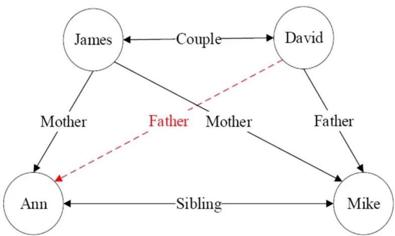

将实体之间的关联路径作为特征，来学习目标关系的分类器

即：判断David和Ann之间的路径关联是否足够支持表述Father这一关系。

# 一个简单的家庭关系知识图谱

Ni Lao, William W. Cohen, Relational retrieval using a combination of path-constrained random walks,Machine learning,2010, 81(1): 53-67,2010

# 知识图谱推理： 路径排序

Score(Father(David,Ann))

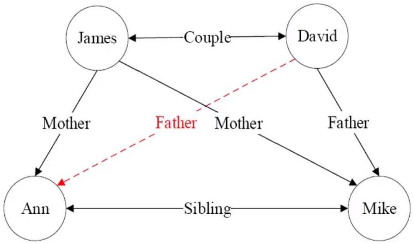

$$
\operatorname {s c o r e} (s, t) = \sum_ {\pi_ {j} \in p _ {l}} \theta_ {j} P (s \rightarrow t; \pi_ {j})
$$

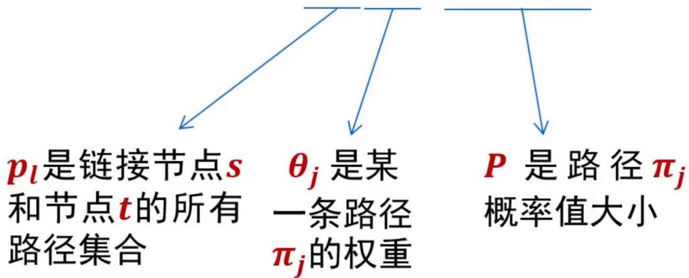

一个简单的家庭关系知识图谱

# 知识图谱推理： 路径排序

$$
s c o r e (s, t) = \sum_ {\pi_ {j} \in p _ {l}} \theta_ {j} P (s \rightarrow t; \pi_ {j})
$$

Score(Father(David,Ann))

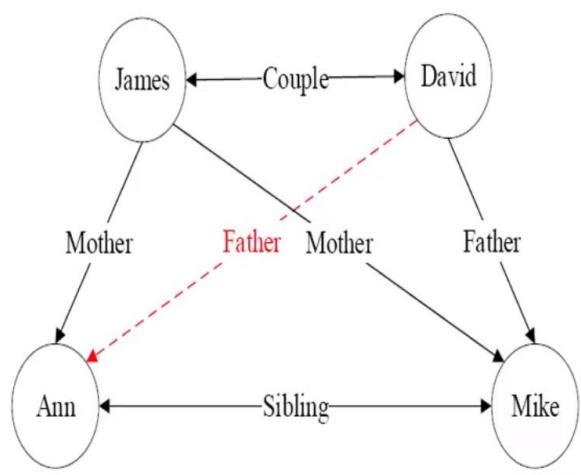

特征抽取：生成并选择路径特征集合。生成路径的方式有随机游走（randomwalk）、广度优先搜索、深度优先搜索等。

特征计算：计算每个训练样例的特征值 $P ( s \to t ; \pi _ { j } )$该特征值可以表示从实体节点s出发，通过关系路径$\pi _ { j }$ 到达实体节点t的概率；也可以表示为布尔值，表示实体s到实体t之间是否存在路径 $\pi _ { j }$ ；还可以是实体s和实体t之间路径出现频次、频率等。

分类器训练：根据训练样例的特征值，为目标关系训练分类器。当训练好分类器后，即可将该分类器用于推理两个实体之间是否存在目标关系。

# 知识图谱推理： 路径排序

$$
\operatorname {s c o r e} (s, t) = \sum_ {\pi_ {j} \in p _ {l}} \theta_ {j} \text {f a t h e r} (s \rightarrow t; \pi_ {j})
$$

# Score(Father(David,Ann))

给定目标关系：Father(s,t)

1.对于目标关系Father，生成四组训练样例，一个为正例、三个为负例：

正例：(David, Mike)

负例：(David,James)，(James,Ann)，(James,Mike)

2.从知识图谱采样得到路径，每一路径链接上述每个训练样例中两个实体：

(David,Mike)对应路径：Couple Mother

(David,James)对应路径：Father Mother-1（Mother-1与Mother为相反关系）

(James,Ann)对应路径：Mother Sibling

(James,Mike)对应路径：Couple Father

(David, Mike)对应路径：????????????→??????ℎ????

(David, James)对应路径：????????????

(James, Ann)对应路径：??????ℎ????→??????????????

(James, Mike)对应路径：??????ℎ????

# 知识图谱推理： 路径排序

$$
s c o r e (s, t) = \sum_ {\pi_ {j} \in p _ {l}} \theta_ {j} f a t h e r (s \rightarrow t; \pi_ {j})
$$

3.对于每一个正例/负例，

Score(Father(David, Ann))

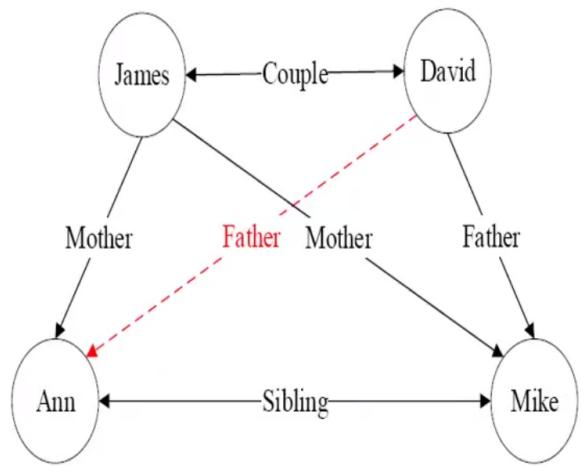

得到一个四

维特征向量：

(David, Mike):

(David, James):

(James, Ann):

(James, Mike):

4.依据训练样本，训练分类器M

# 知识图谱推理：基于分布式表示的知识推理

⚫ 随着深度学习应用的进展，在自然语言处理（Natural Language Processing，NLP）中，通过无监督学习将一个单词表示成一个隐向量(latent vector)的分布式表示方法取得了良好效果。研究者将知识图谱中的节点和节点之间的关系均映射到连续数值空间中（即分布式表示），同时对映射过程进行约束，使得知识图谱中节点之间的拓扑结构得以保留，从而有效地对知识图谱进行表示和推理 [Bordes 2013]。

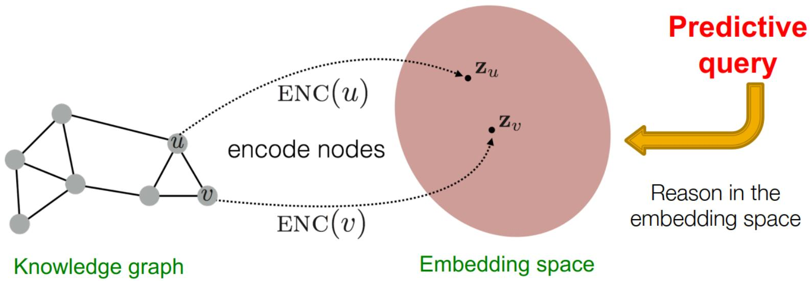

# 知识图谱推理：基于分布式表示的知识推理

如给定2.3.1中??????ℎ????(David, Mike)这一个样例知识，可首先学得David和Mike的分布式表达（向量表达）David和Mike以及谓词??????ℎ????的分布式表达????????????，然后再学习一个度量函数ψ使得David+????????????的结果与Mike很接近，即ψ(?????????? +????????????, ????????)取值最小（也即?????????? + ???????????? $\approx$ ????????）。于是，给定所有<left_node，relation，right_node >形式的样例知识，就可去学习度量函数ψ，使得ψ(????????_????????, ????????????????, ??????????_????????)取值最小。

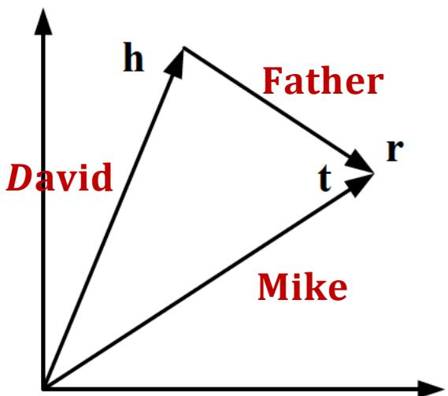

Entity and Relation Space

# 知识图谱推理：基于分布式表示的知识推理

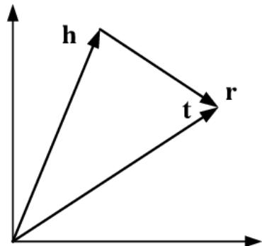

Entity and Relation Space

(a) TransE.

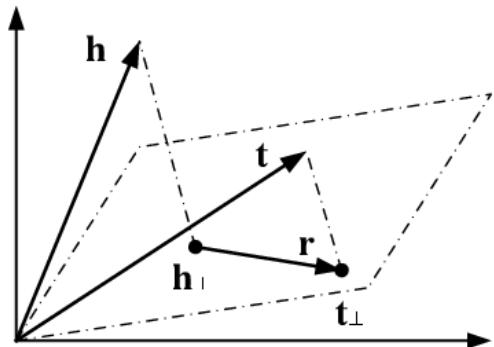

Entity and Relation Space

(b) TransH.

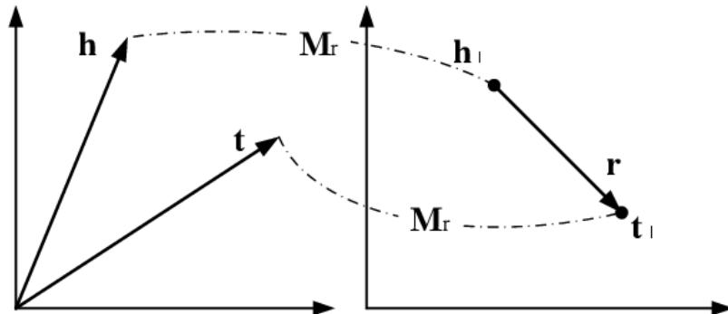

Entity Space

Relation Space of r

(c) TransR.

⚫ 一旦学习得到度量函数ψ，就可用其去判断任意两个节点之间是否具有某一关系。

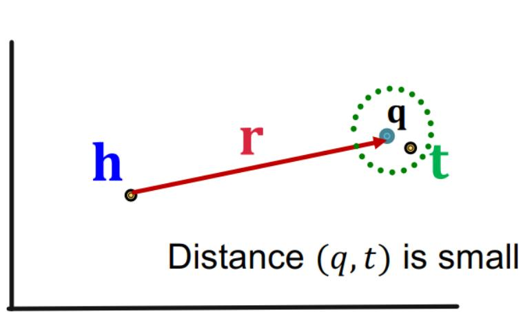

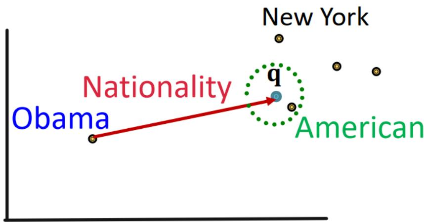

# 知识图谱构建： 机器学习途径

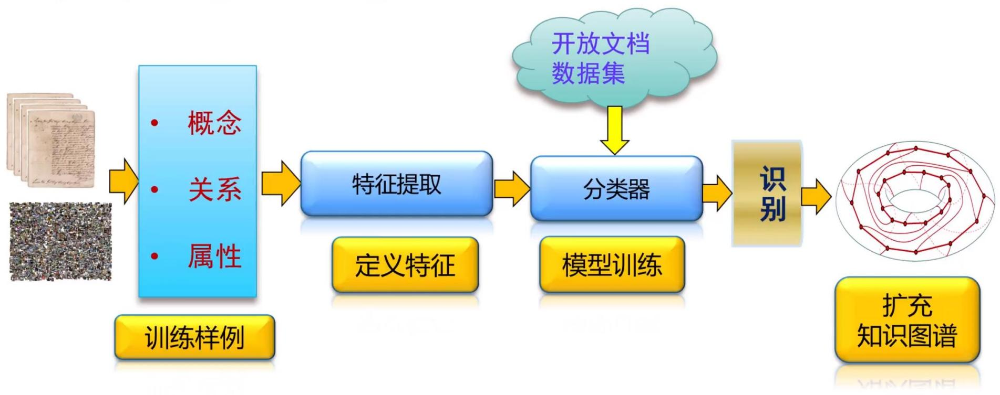

# 知识图谱构建： 逻辑架构

# ⚫ （1）知识图谱的逻辑架构：模式层与数据层。

◼数据层主要是由一系列的事实组成，而知识以事实为单位进行存储。

 在知识图谱的数据层，知识以事实（fact）为单位存储在图数据库。

 事实的基本表达方式：“实体－关系－实体”或者“实体－属性－性值”三元组。

模式层构建在数据层之上，是知识图谱的核心。

 模式层存储的是经过提炼的知识， 通常采用本体库来管理知识图谱的模式层，借助本体库对公理、规则和约束条件的支持能力来规范实体、关系以及实体的类型和属性等对象之间的联系。

# 知识图谱构建：技术架构

• （2） 知识图谱的技术架构 （构建）

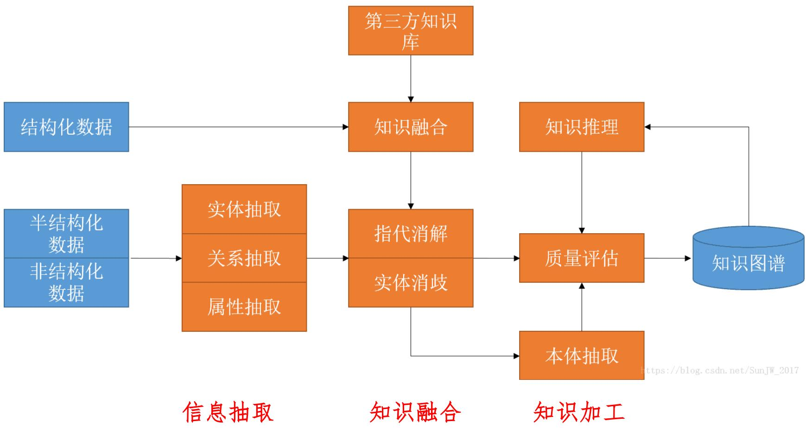

# 知识图谱构建：知识获取

$\bullet$ 获取知识的资源对象大体可分为：

• 结构化数据是指知识定义和表示都比较完备的数据。

• 半结构化数据是指部分数据是结构化的，但存在大量结构化程度较低的数据。

• 非结构化数据是指没有定义和规范约束的“自由”数据。

# 百度知识图谱技术视图

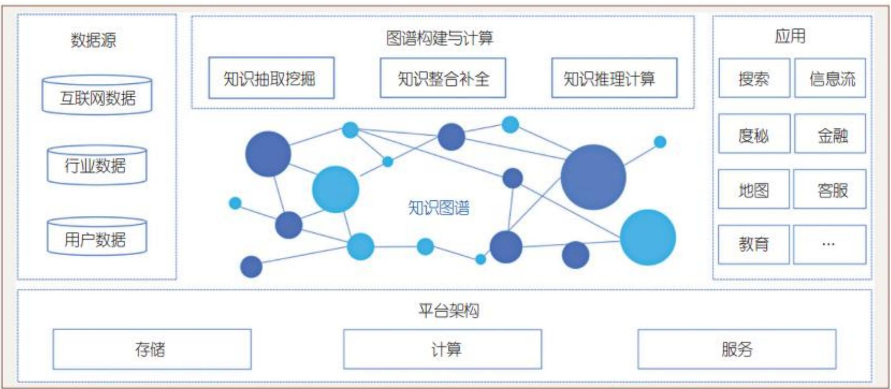

# 知识图谱构造流程： Wiki为例

正文描述

Willian Henry "Bill* Gates III

（bornOctober28,1955)isan

American business magnate,

investor,programmer,inventor and

theformer chief executive and

chairman of Microsoft,the

world'slargest personal-computer

software company,which he co-

founded with Paul Allen.

Gates was born in Seattle,Washington,to William H.Gates, Sr. and Mar

Maxwell Gates. His ancestry includes

English,German, andseots-

Irish.[i5][i6] His father wa. 

prominent lawyer,and his mother served

onthe board ofdirectors forFirst

Interstate BancSystem and the United

Way.Gates's maternal grandfathexwas

JW Maxwell,a national bank president.

Afterbeing named one ofGood

Housekeeping's"5o Most Eligible

Bachelorsin 1985,[7i]Gates married

Melinda French onJanuary1,1994

They havethree children:daughters

JenniferKatharine (b.19g6)and

Phoebe Adele (b. 20o2)， andon Rory

John (b.19g9).The f-dy resides in

Bill Gates

Gates in 2013

Bor

William Henry Gates III

October28,1955（age58）

Seattle,WA,US

Residence

Medina,WA, US

（droppedout）

Childrer

Tennifer,Rory and Phoebe

William H.Gates，Sr

Mary Maxwell Gates

Signature

w H.t

属性定义

及描述

44个类别标签

# 知识图谱构造流程： Wiki为例

Willian Henry "Bill"Gates III

（bornOctober 28,1955)isan

American business magnate,

investor,programmer, inventor andphilanthropist.[2][3][4] Gates isthe former chief executive andchairman of Microsoft, Theworld's largest persona-computersoftware company,which he co-founded with Paul Allen.

to William H. Gates, Sr. and Mar

Maxwell Gates. His ancestry includes

English,German,and Jeots-

prominent lawyer,and his mother servedon the board of directors for FirstInterstate BancSystem and the UnitedWay.Gates's maternal grandfathewasJW Maxwell,a national bank president.After being named one of GoodHousekeeping's 50 Most EligibleBachelorsin 1985,[71] Gates marriedMelinda French onJanuary 1，1994They have three children:daughtersJenniferKatharine （b.1996)anPhoebe Adele (b.2002)，andon RoryJohn (b. 1999). The family resides in

Bill Gates

Gates in 2013

Bor

William Henry Gates III

0ctober 28,1955（age58）

Seattle.WA.US

Residence

Medina,WA,US

Alma mater

Chil

Jenniter,Kory, and Phoebr

Pare

William H.Gates,Sr

Mary Maxwell Gates

Signature

Wl H.t

□手工构造的种子知识(infobox):

□比尔盖茨这个实体用了13个属性描述、奥巴马这个实体用了20多个属性描述(由于两者均属于persons这个类别，有些属性是共享的)

□Freebase中定义的cities这个概念时使用了将近200个属性，但是仍然远远不够。

□如何发现和学习新的属性？

# 知识图谱构造流程： Wiki为例

·基于机器学习算法进行概念、属性和关系学习，需要大量良好标注数据

·Wikipedia当中，英文文章占总文章数的 $3 8 . 9 5 \%$ ，中文文章占 $4 . 7 5 \%$ ，其他语言文章占 $5 6 . 3 0 \%$ 。其中， $3 8 . 6 0 \%$ 的英文文章以Infobox方式被标注(如实体属性或实体之间的关系)， $2 1 . 4 3 \%$ 的中文文章被标注，平均 $2 8 . 5 7 \%$ 的其他语言文章被标注。

Willian Henry "Bill"Gates III（bornOctober 28,1955）is anAmerican business magnate,investor,programmer, inventor andphilanthropist.[2][3][4] Gates isthe former chief executive andchairman of Microsoft, theworld'slargest personal-computersoftware company,which he co-founded with Paul Allen.

Gates was born in Seattle,Washington,to William H. Gates，Sr.and MarMaxwell Gates. His ancestry includesEnglish,German,and Seots-Irish.[15]16] His father was aprominent lawyer,and his mother serveon the board of directors for FrstInterstate BancSystem and the UnitedWay.Gates's maternal grandfather wasJW Maxwell,a national bank president.After being named one of GoodHousekeeping's "50 Most EligibleBachelorsin 1985,[71] Gates marrieMelinda French on January 1，1994They have three children:daughtersJennifer Katharine (b.1996)andPhoebe Adele (b. 2002)，and zon RoryJohn (b.1999).The fanily resides

用户对wiki中BillGates文章所标注的知识

# 知识图谱构造流程： Wiki为例

. 给定无结构化文档数据，通过机器学习方法对实体描述内容进行分类，同时

提取描述实体的属性和对应属性值。

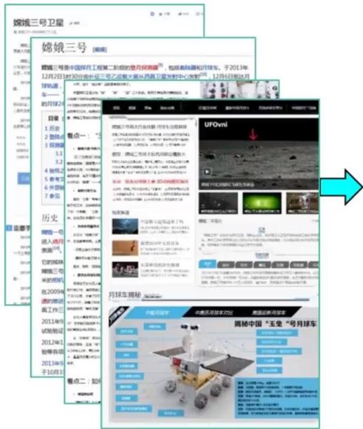

<table><tr><td>名称</td><td>嫦娥三号月球探测器</td></tr><tr><td>所属国家</td><td>中华人民共和国</td></tr><tr><td>构成</td><td>着陆器、“玉兔号”月球车</td></tr><tr><td>重量</td><td>3,750千克</td></tr><tr><td>关键技术</td><td>7500牛变推力发动机、
热控两相流体回路、可
变热导热管等</td></tr><tr><td colspan="2">类别分类、实体识别、属性填充</td></tr></table>

嫦娥三号类别:2013 in China; Space probes launchedin 2013; Chinese Lunar Exploration Program; Chinesespace probes; Lunar rovers; Missions to the Moon;Spacecraft that orbited theMoon;Soft landings on theMoon; Space probes

# 知识图谱构造流程：属性识别与填充

<table><tr><td>纳尔逊·罗利赫拉赫拉·曼德拉(Nelson Rolihlahla Mandela)</td></tr><tr><td>1918年7月18日出生于南非特兰斯凯一个大酋长家庭，先后获</td></tr><tr><td>南非大学文学士和威特沃特斯兰德大学律师资格，当过律师。</td></tr><tr><td>曼德拉自幼性格刚强，崇敬民族英雄。他是家中长子而被指</td></tr><tr><td>定为酋长继承人。但他表示：“决不愿以酋长身份统治一个</td></tr><tr><td>受压迫的部族”，而要“以一个战士的名义投身于民族解放</td></tr><tr><td>事业”。他毅然走上了追求民族解放的道路。</td></tr><tr><td>南非政府2013年12月6日（北京时间）宣布南非前总统曼德拉</td></tr><tr><td>去世享年95岁。</td></tr><tr><td>曼德拉，南非黑人领袖，因其在废除南非种族歧视政策方面</td></tr><tr><td>作出了巨大贡献而于1993年荣获诺贝尔和平奖。</td></tr><tr><td>1918年7月18日，曼德拉出生于南非特兰斯凯，曼德拉自幼性</td></tr><tr><td>格刚强，崇敬民族英雄。他是家中长子而被指定为酋长继承</td></tr><tr><td>人。但他表示：“决不愿以酋长身份统治一个受压迫的部</td></tr><tr><td>族”，而要“以一个战士的名义投身于民族解放事业”，他</td></tr><tr><td>毅然……</td></tr></table>

无结构化文档

<table><tr><td colspan="2">人物</td></tr><tr><td>中文名</td><td>纳尔逊·罗利赫
拉赫拉·曼德拉</td></tr><tr><td>外文名</td><td>Nelson Rolihlahla
Mandela</td></tr><tr><td>国籍</td><td>南非</td></tr><tr><td>出生地</td><td>南非特兰斯凯</td></tr><tr><td>出生日期</td><td>1918年7月18日</td></tr><tr><td>职业</td><td>政治 南非总统</td></tr><tr><td>主要成就</td><td>诺贝尔和平奖得主</td></tr></table>

所提取的实体及其属性值形式的知识

# 知识图谱构造流程：属性识别与填充

GeorgeWashington byGilbert Stuart,1797

# 从数据中学习人名这个类别所定义的各个属性分类器

infoboxes

Born:Febrary22732WestmorelandountyViiniaUiedat

Died:December14799ntVeonrginiaUidtate

Spouse:Martha Washington(m.1759-1799)

Presidentialterm:April30,1789-March41797

Siblings:LawrenceWashington (1718-1752)more

ThomasJefferson

3rd President of the United States

Born:

Died:

Party:

Presidential term:

Children:

# 知识图谱构造流程：属性识别与填充

George Washington by Gilbert Stuart,1797

# 训练得到的属性分类器

ThomasJefferson

3rd President ot the United States

# infoboxes

Born:February22732WestmorelandCountyVirgniaUitdae

Died:December14799,ntogiiaUdate

Spouse:Martha Washington (m.1759-1799)

Presidentialterm:April30,1789-March41797

Siblings:Lawrence Washington(1718-1752)more

Born:April13,1743,Shadwell,Virginia,UnitedStates

Died:July4,1826,Monticello,Virginia,UnitedStates

Party:Democratic-Republican Party

Presidentialterm:March4,1801-March4,1809

Children: Martha Jefferson Randolph, Eston Hemings,

# 知识图谱：从数据到知识，从知识到决策

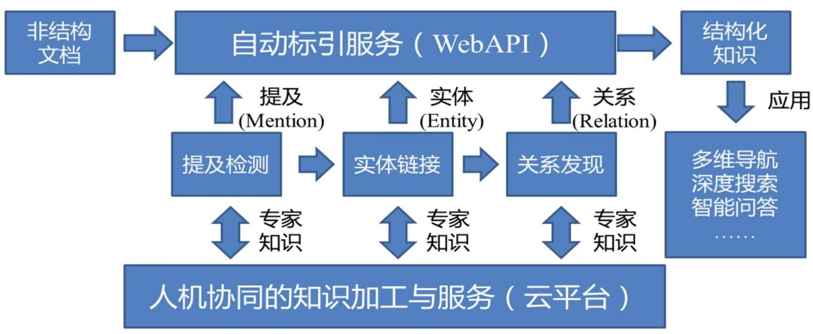

# 目录

1. 知识图谱及其表示

2. 知识图谱的类型

2.1 领域无关知识图谱

2.2 特定领域知识图谱

2.3 跨语言知识图谱

3. 知识图谱的推理

4. 知识图谱的应用

4.1 精准分析

4.2 智慧搜索

4.3 智能推荐

4.4 智能解释

4.5 自然人机交互

4.6 深层关系推理

5. 现有知识图谱资源

# 知识图谱的应用

• 认知智能应用需求广泛多样，需要对传统信息化手段的全面而彻底的革新

• 认知智能：人类脑力解放，机器生产力显著提高

认知智能包括：

▫ 精准分析

▫ 智慧搜索

▫ 智能推荐

▫ 智能解释

▫ 自然人机交互

▫ 深层关系推理

# 4.1 精准分析

• 精准化数据分析

▫ 舆情分析

▫ 热点统计

▫ 军事情报分析

商业情报分析

• 精细化数据分析

▫ 酒店评论抽取

▫ 个性化制造

军民融合南海掀波 陆渔船舰队近逼菲中业岛→ 菲律宾 相关

意大利华人捐古版中国地图 证明钓鱼岛为中国领土 → 日本 相关

大数据的精准、精细分析需要智能化技术支撑。

# 4.1 精准分析

# • 影视大数据分析

▫ 最具影响力和市场价值的主力受众： 中年男性专业人士

▫ 受欢迎电视剧类型： 政治惊悚剧

▫ 受欢迎导演： 大卫 •芬奇

▫ 受欢迎演员： 凯文 •史派西

▫ 观看偏好： 一次观看多集

▫ 基于知识图谱的影视元素关系挖掘：预测出凯文.史派西、大卫.芬奇和“BBC出品”三种元素结合在一起的电视剧产品

• 相比传统文本的方式大大提高了影视数据分析的精准度和可行性

# 纸牌屋

《纸牌屋》是美国一部以政治为题材的电视连续剧。本剧由鲍尔·威利蒙创作并改编自安德鲁戴维斯主创的BBC同名电视剧。两部电视剧都是基于迈克尔多布斯同名小说创作的。第一季的全部13集于2013年2月1日在流媒体服务商Netflix首播。第二季全部13集则于2014年2月14日同时放出。

维基百科

开播时间：2013年2月1日

网络：Netfix

语言：英语

所获奖项：皮博迪奖

编剧：迈克尔·多布斯，安德鲁·戴维斯，里克·克里夫兰，萨姆·福曼

# 演员表

凯文·史派西

罗宾怀特

凯特玛拉

科里施托尔

克莉丝汀·康诺利

# 用户还搜索了

政坛野兽

五闻（电视副

铁杉树丛

三军统帅

白宫群英

# 4.1 精准分析

• 新闻事件— 智利地震：话题关系图与分布图

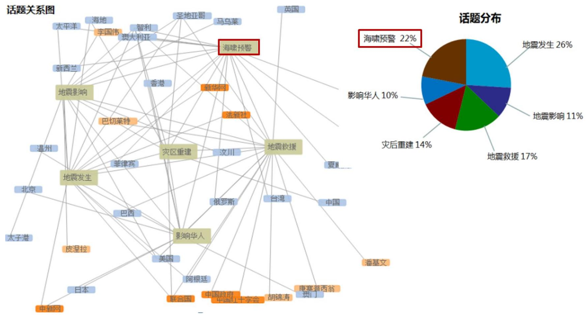

# 4.1 精准分析

• 基于行业知识图谱，形成行业数据理解能力。

实现数据中的实体、概念、主题认知，实现可视化洞察。

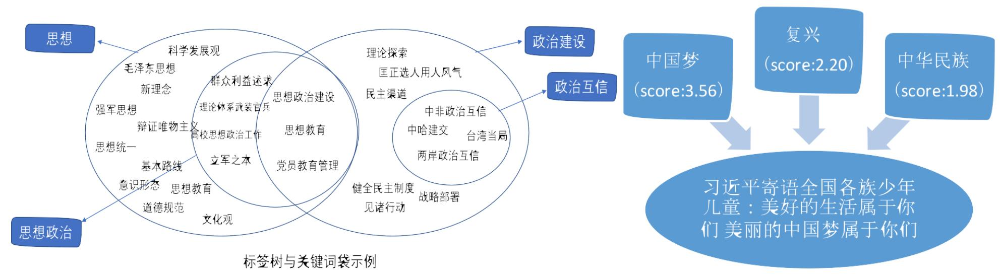

总书记文章的标签体系自动构建

总书记文章自动标签化

# 4.2 智慧搜索

• 精准搜索意图理解

▫ 精准分类、语义理解、个性化

• 复杂多元对象搜索

▫ 表格、文本、图片、视频

▫ 文案、素材、代码、专家

• 多粒度搜索

▫ 篇章级、段落级、语句级

• 跨媒体搜索

▫ 不同媒体数据联合完成搜索任务

一切皆可搜索，搜索必达。

# 汉语语言知识图谱

汉语语言博大精深，百度有专门针对汉语语言的知识图谱。比如，搜索“凹的笔顺”，知识图谱可以直接把笔顺反馈给用户。针对现在大多数用户使用拼音或语音输入时，一些字不会念，无法输入拼音，百度会把汉字拆解，用语言描述它。比如，如果不知道“怼”字怎么念，就可以这样提问：“上面是‘对’下面是‘心’怎么念”。搜索结果页除了满足用户的主需求外，还有很多与这个汉字有关的扩展内容，如拼音、释义、组词、近反义词、成语、成语故事等。

# 4.3 智慧推荐

• 场景化推荐（电商领域的场景化推荐）

• 任务型推荐

• 冷启动环境下的推荐

• 跨领域推荐（比如给微博用户推荐淘宝商品，存在巨大的vocabulary gap）

• 知识型推荐

精准感知任务与场景， 想用户之未想。

从基于行为的推荐发展到行为与语义融合的智能推荐。

# 实体推荐

• 用户在发起一次搜索时，满足当前的需求后，仍有可能存在尚未满足的潜在需求。利用知识图谱中实体之间的丰富联系，我们可以给出优质的推荐，激发用户潜在的需求。根据查询的相关性、用户点击推荐内容的可能性等多方面，对推荐内容综合动态排序，向用户展示。

• 比如，当用户搜索“杨幂”的时候，除了直接给出和杨幂有关的各个维度的人物信息外，还能够给出可解释的推荐理由。

• 知识图谱还有生成摘要功能，即借助知识图谱技术提炼页面内容，在搜索结果中展示最关键的内容与服务，优化搜索体验。

# 4.3 智慧推荐

知识图谱的成功应用集中在搜索、推荐、问答等互联网头部企业的大规模简单应用场景。

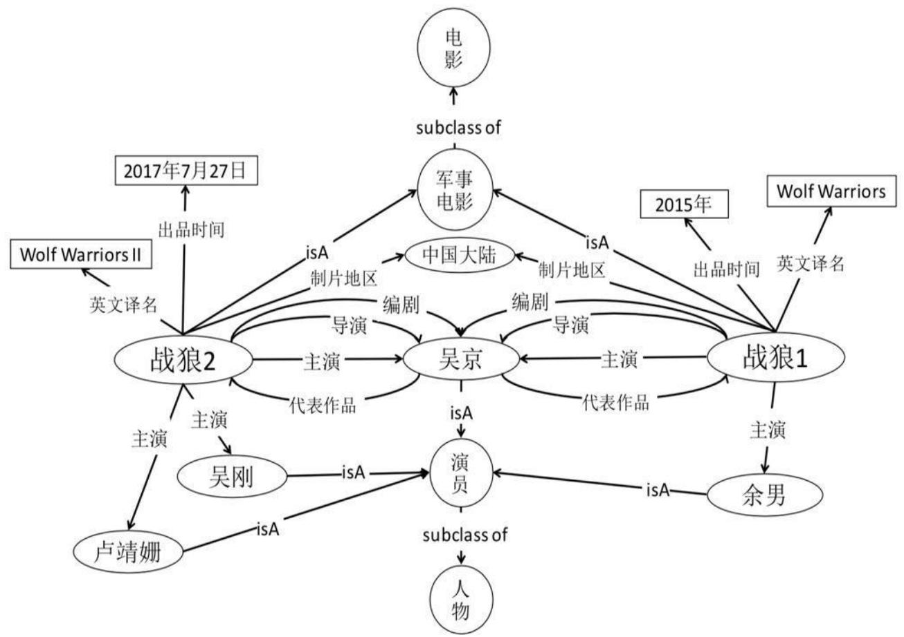

根据知识图谱中的路径为战狼1的观众推荐战狼2

# 4.4 智慧解释

• 事实解释

• 关系解释

• 过程解释

• 结果解释

解释是智能的重要体现之一，将是人们对于智能系统的普遍期望。

• 可解释是智能系统决策结果被采信的前提。

# 解释机器学习过程

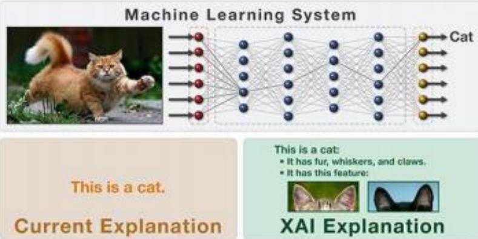

Thingsyou didn't knowabout Donald Trump'swife-Nicki Swift

www.nickiswift.com/79g6/things-didnt-know-donaid-trumps-wife/-翻译此页

# 解释事实

# 补全缺失的因果链条

• 万事万物都处在一个复杂的因果网络中。

• 当前的大数据多是业务结果数据，缺乏产生这些数据背景因果。

• 知其然，不知其所以然。

P(啤酒尿布)

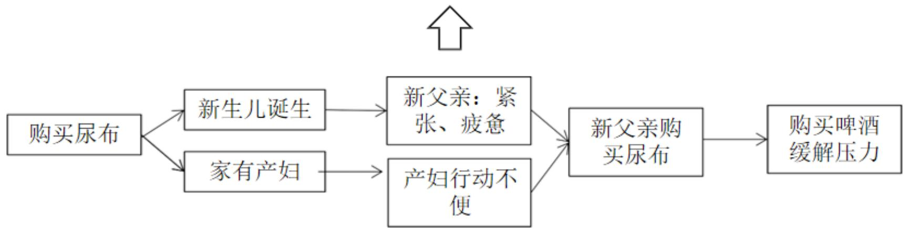

# 4.5 自然人机交互

人机交互方式将更加自然，对话式交互取代关键词搜索成为主流交互方式。

• 一切皆可问答： 图片问答、新闻问答、百科问答

# 智能问答

在智能问答领域，借助知识图谱问答技术，图谱问答搜索产品能够直接回答搜索查询(query)中有客观答案的问题，如刘德华的年龄、上善若水的拼音、薰衣草的花期等。答案是一个有共同特征的集合问题，如一部电视剧的演员表、形容春天的成语、清朝皇帝列表、李白的诗等。

# 问答系统

What killed sir edward heath

# Pneumonia

# Edward Heath -Wikipedia, the free encyclopedia

en.wikipedia.org/wiki/Edward Heath ~

Early life - Second World War - Post war - Member of Parliament

# Former PM Sir Edward Heath dies-BBC News

WolframAlpha 

Yangtze length

3915 miles

6.3×106meters

# 对话系统

• 对话系统能与用户进行多轮交互。

首先，用户的输入经过自然语言理解模块进入对话管理系统，对话管理系统识别出当前的对话状态，并确定下一步的对话行为。对话策略模块包含通用模型和领域模型。前者负责处理通用的交互逻辑，后者处理特定领域的交互逻辑。

之后，该系统会为用户生成交互回复，其中后台的答案库通过知识图谱构建。对话系统还可以利用知识图谱丰富的内容以及实体的不同侧面，通过多轮交互来澄清用户的真实意图。

# 智能客服

• 在人工智能技术应用的场景中，服务机器人的市场潜力及成熟度是最高的。据高德纳公司(Gartner)预测，2020年智能客服将取代 $40 \%$ 的传统坐席。以电信运营商为例，传统客服每天要处理大量简单重复的用户需求，耗费大量的人力成本。

• 智能客服的出现能够帮助运营商解决这个问题。而智能客服依靠的就是行业知识图谱的构建。例如，电信运营商的流量套餐关联的是日流量、月流量、流量包等信息。

• 这些行业知识就构建了电信运营商的知识图谱。对于一个行业来说，除了静态的实体、属性和关系外，还有业务逻辑。比如，拨打运营商的客服电话办理流量包，客服会询问流量包的类型。用户选择了其中一个以后还可以继续查询办理相关的业务，这是一个完整的流程。这个流程就组成了行业知识图谱的一部分。

# 4.6 深层关系发现／推理

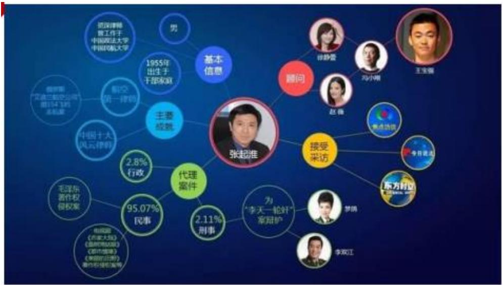

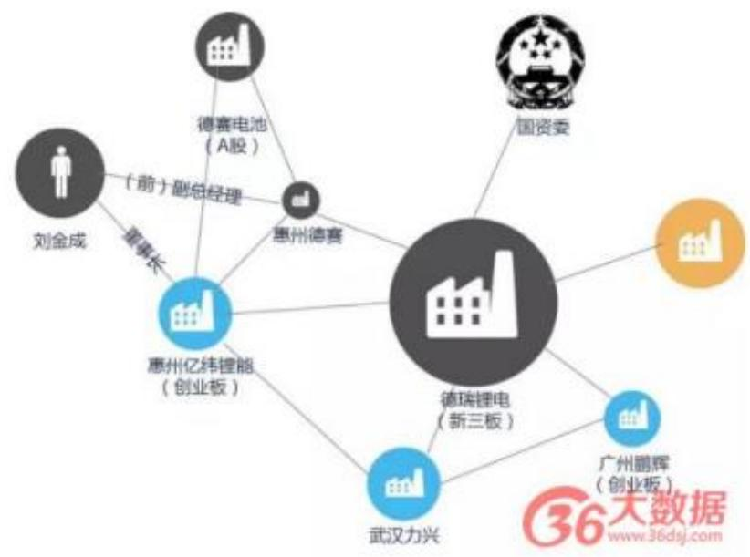

Why baoqiang select Qizhun Zhang as his lawyer?

Why A invests B?

 隐式关系发现、深层关系推理将成为智能的主要体现之一。

# 中文医学知识图谱

CMeKG

中文医学知识图谱

Chinese Medical Knowledge Graph

首页

知识图谱

构建工具

示范应用

使用说明

关于我们

疾病

请输入疾病名称

搜索

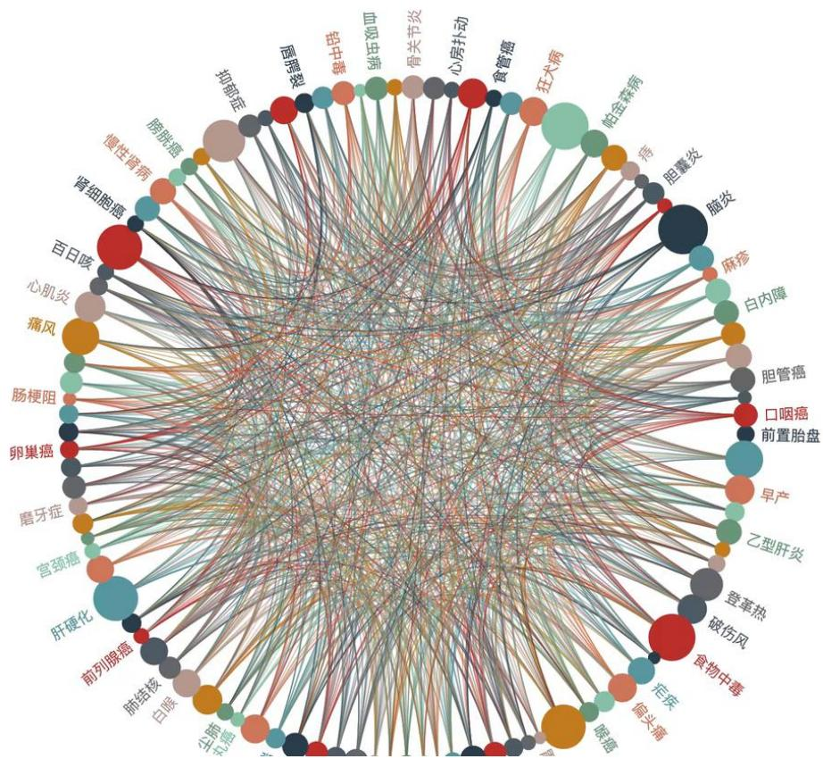

# 认知智能是智能化的关键

• 理解与解释是后深度学习时代人工智能的核心使命之一。

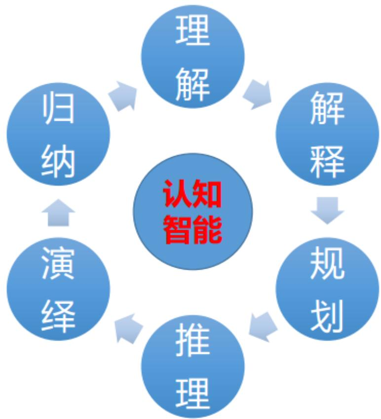

# 从“小”知识到“大”知识

• small knowledge + big data = big knowledge

• 知识图谱引领知识工程复兴

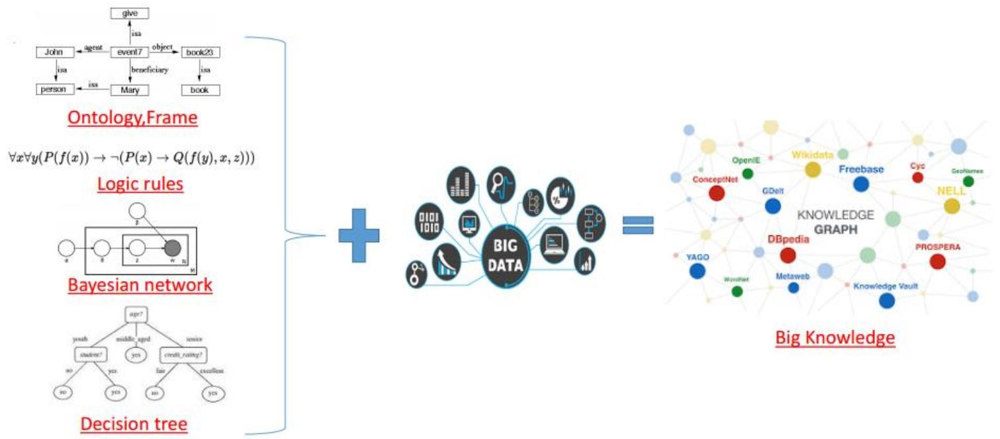

• 传统知识工程，专家构建，代价高昂，规模有限；知识边界易于突破，难以适应大数据时代开放应用到规模化需求

• 大规模开放应用需要“大”知识（大规模知识库）

# 基于知识图谱的认知智能

• 机器理解数据的本质：建立从数据到知识库中实体、概念、关系的映射

• 机器解释现象的本质：利用知识库中实体、概念、关系解释现象的过程

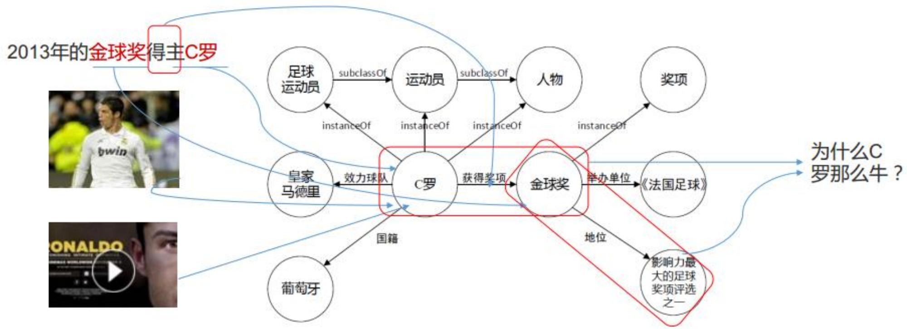

# 知识引导将成为解决问题的主要方式

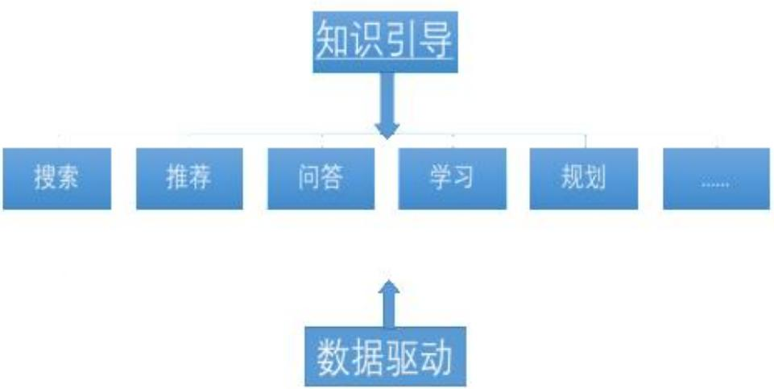

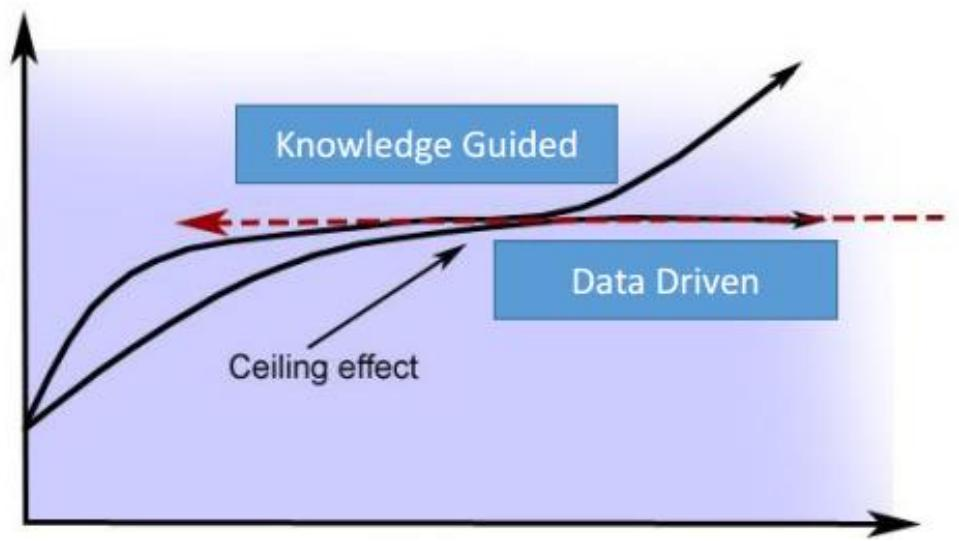

• “数据驱动”利用统计模式解决问题

• 单纯依赖统计模式难以有效解决很多实际问题

张三把李四打了，他进医院了张三把李四打了，他进监狱了

# 知识将显著增强机器学习能力

• 降低机器学习模型的大样本依赖，提高学习的经济性

• 提高机器学习模型对于先验知识的利用效率

• 增强机器学习模型与先验知识的一致性

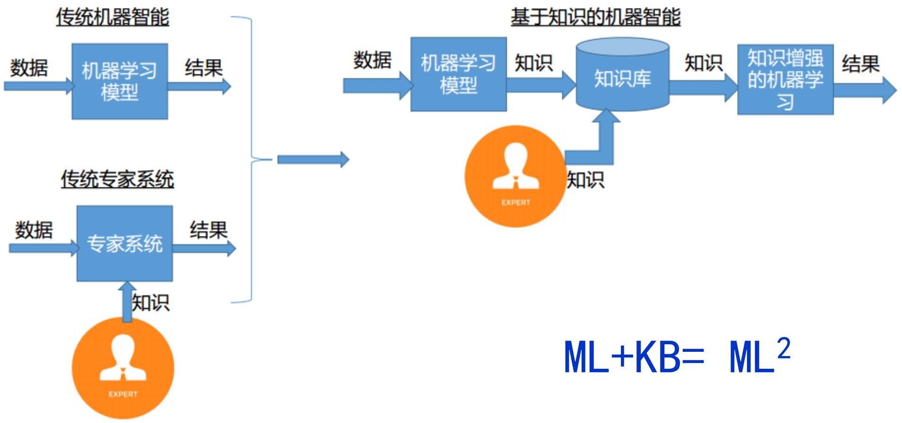

# 目录

1. 知识图谱及其表示

2. 知识图谱的类型

2.1 领域无关知识图谱

2.2 特定领域知识图谱

2.3 跨语言知识图谱

3. 知识图谱的推理

4. 知识图谱的应用

4.1 精准分析

4.2 智慧搜索

4.3 智能推荐

4.4 智能解释

4.5 自然人机交互

4.6 深层关系推理

5. 现有知识图谱资源

# 现有知识图谱资源

# • 依靠人工构建的知识资源

▫ 早期知识资源建立是通过人工添加和群体智能合作编辑得到，如英文Wordnet 和Cyc项目，以及中文的Hownet。Cyc是一个通用的世界知识库，始建于1984年，其目的是将上百万条知识编码为机器可处理形式，并在此基础上实现知识推理等人工智能相关任务。Cyc包含了50万实体，接近3万个关系以及5百万事实。 Wordnet 和Cyc项目， 文的Hownet。Cyc 1 建 上 形 

# • 基于群体智能的知识图谱

Freeba合Wor是基于据的知建立大梁，通 ▫ Frebe 维现 基了 百很 科 多使用维基百科构建知识库的项目，如DBpedia、YAGO和se 等。DBpedia以构建本体的形式对知识条目进行组织。YAGOdNet良好的概念层次结构和维基百科中的大量实体数据。Freeb维基百科，使用群体智能方法建立的包含6800万实体的结构化识图谱。清华大学和上海交通大学通过利用互动百科、百度百规模知识图谱XLORE 和Zhishi.me。XLORE以英文维基百科为过跨语言链接技术，建立融合了四大中英文百科数据的跨语言 是至 良 维 今利用 Bpedia以构 群体 智能建立的互联网上最大的知识资源，因此出 能 首 ， YAGO和 丝 YAGO融和上海交通大学通过利用 。 数科，桥知

# 现有知识图谱资源

# • 基于互联网上链接数据构建的知识资源

▫ 国际万维网组织W3C于2007年发起的开放互联数据项目（Linked OpenData, LOD），为实现网络环境下的知识发布、互联、共享和服务提供了创新技术，为智能搜索、知识问答和语义集成提供了创新源动力。Sean Bechhofer 等人在科学领域自建了一个近似于Linked Data的语义数据资源，该资源包含更准确的学术用语，并能很好地反映研究者的影响力。

# • 基于机器学习和信息抽取构建的知识图谱

▫ 从互联网数据自动获取知识是建立可持续发展知识图谱的发展趋势。这类知识图谱构建的特点是面向互联网的大规模、开放、异构环境，利用机器学习和信息抽取技术自动获取Web上的信息构建知识库。如华盛顿大学图灵中心的KnowItAll 和TextRunner 项目、卡内基梅隆大学的“永不停歇的语言学习者”(Never-Ending Language Learner，NELL)项目 都是这种类型的知识库。

# 现有知识图谱资源

•维基百科（Wikipedia）由维基媒体基金会负责运营的一个自由内容、自由编辑的多语言知识库。

• DBpedia由2007年德国柏林自由大学以及莱比锡大学的研究者从维基百科里萃取结构化知识的项目开始建立

• YAGO由德国马克斯-普朗克研究所（MPI）构建的大型多语言的语义知识库，从10个维基百科以不同语言提取事实和事实的组合。

• XLORE是清华大学构建的基于中、英文维基和百度百科的开放知识平台，是第一个中英文知识规模较为平衡的大规模中英文知识图谱。

# 现有知识图谱资源

250概念4M实例6000属性500M三元组在线更新

NELL

OpenIE(Reverb, OLLIE)

YaGo

350K概念10M实例100属性20M三元组

850K概念8M实例70K属性

Google KG

15K概念40M实例4000属性1B三元组Google KB核心

15K概念600M实例20B三元组

50M义项50+种语言262M三元组

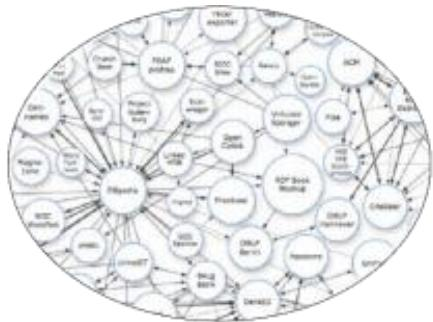

WordNet7种欧洲语言跨语言链接

# Thanks

Thanks the support from Dr. Jian Tang (MILA), Prof. Jure Leskovec (Stanford University), Prof. FeiWu (Zhejiang Univeristy) ,Prof. Jiahai Wang(SYSU), and the authors of the courseware, for therefer to their slides.