# 人工智能绪论

# Artificial Intelligence

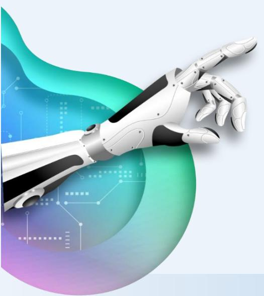

授课对象：计算机科学与技术专业二年级

课程名称：人工智能（专业必修）

节选内容：第一章 绪论

课程学分：3学分

# 课程信息

# ■教材：

(1) 贵可荣、张彦铎. 人工智能 (第3版). 清华大学出版社. 2018.12.01

# ■辅助教材

(1) 朱福喜. 人工智能 (第3版). 清华大学出版社. 2017

(2) 陈屹. 神经网络与深度学习实战Python+Keras+TensorFlow. 机械工业出版社. 2019.

③ Artificial Intelligence: A Modern Approach, by S. Russell and P. Norvig, 3rd edition, Prentice Hall, 2009. 国内影印版：清华大学出版社，2011.

# ■主要参考书目

(1) 王文敏. 人工智能原理. 高等教育出版社. 2019

(2) 吴飞. 人工智能导论: 模型与算法. 高等教育出版社. 2020

# 教师信息

# 陈川 副教授、博导

■主要研究方向：联邦学习，机器学习鲁棒性及图机器学习，近年课题组在TPDS,TNNLS,TKDE等期刊及ICLR,NeurIPS,ICML,KDD,AAAI,WWW等中科院一区/CCFA类论文50余篇，ESI高被引论文2篇，Google学术引用4000余次；主持国自然等科研基金10余项，部分成果完成技术转化；获广东省计算机学会科技进步二等奖，CCF-腾讯犀牛鸟科研基金优秀奖，IEEE Computer Society评选2022年度最佳论文，入选全球前  $2 \%$  顶尖科学家榜单（斯坦福大学）

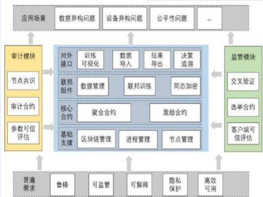

图13基于Fabric的去中心化可信联邦学习系统

海洋场景

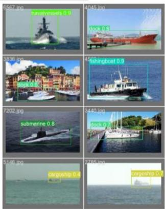

邦学习系统

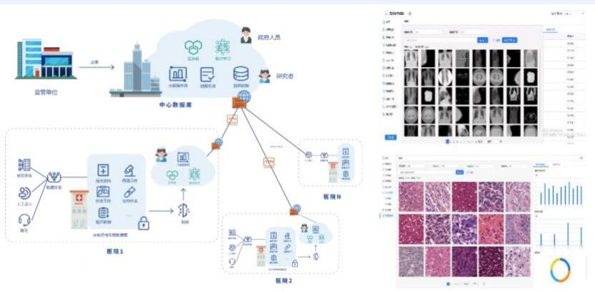

图15立体化多模态数据库与联邦学习平台

医学场景

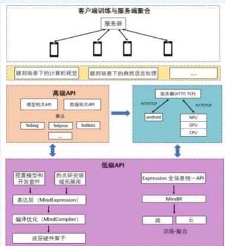

图14基于安卓平台的联邦学习用户行为分析框架

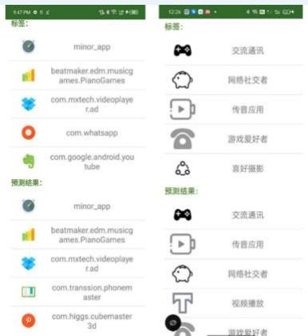

移动手机场景

# 教师信息

# 陈川 副教授、博导

■主要研究方向：联邦学习，机器学习鲁棒性及图机器学习，近年课题组在TPDS,TNNLS,TKDE等期刊及ICLR,NeurIPS,ICML,KDD,AAAI,WWW等中科院一区/CCFA类论文50余篇，ESI高被引论文2篇,Google学术引用4000余次；主持国自然等科研基金10余项，部分成果完成技术转化；获广东省计算机学会科技进步二等奖，CCF-腾讯犀牛鸟科研基金优秀奖，IEEE Computer Society评选2022年度最佳论文，入选全球前  $2 \%$  顶尖科学家榜单（斯坦福大学）

■ 课题组学生获CCF优秀大学生奖, 腾讯犀牛鸟精英人才, 本科生在CCFA/B类期刊/会议发表论文10余篇, AAAI等会议Travel Grand, “隐语杯”全国高校隐私计算大赛决赛一等奖 (1/74), 校级优秀毕业论文20余次。

■ 《人工智能》课程为中山大学一流本科课程（课程评教曾列全校前0.02%）、中山大学教师教学竞赛教学赛道/创新赛道一等奖、广东省高校教师教学创新大赛优秀奖、广东省高校青年教师教学大赛二等奖

# 助教信息

$\bullet$  助教: 高英淇

2024级计算机专业硕士生

- 邮箱：gaoyq28@mail2.sysu.edu.cn

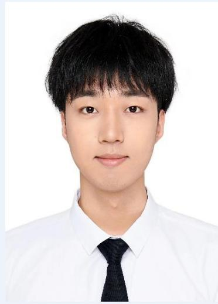

• 助教：邓小平俊

2024级计算机专业硕士生

- 邮箱：dengxj26@mail2.sysu.edu.cn

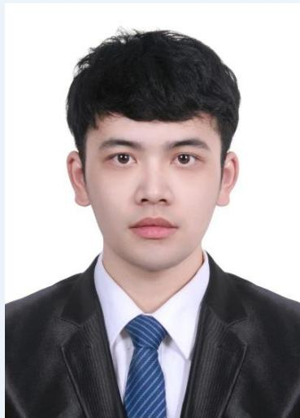

# 课程信息

课程网站（超算习堂”教学平台）：

https://easyhpc.net/course/143

课程邀请码：2077

请在超算习堂的账号信息中，完善好真实姓名和学号

课程Q群：1030995225

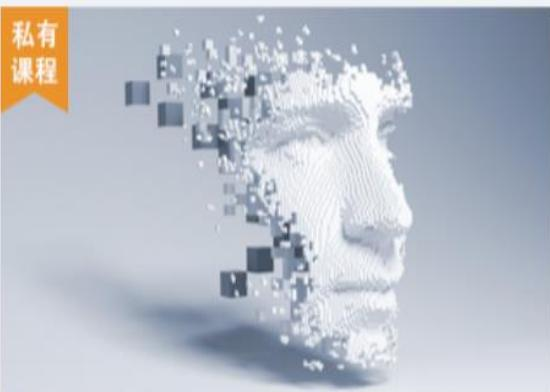

人工智能理论与实践

本课程由中山大学陈川老师主讲，内容覆盖人工...

# 人工智能

只861.7万☆1216

传课件作业参考材料

25人工智能课程群

群号：1030995225

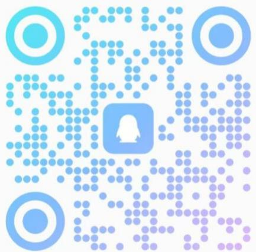

助教答疑

■ 理论分：平时考核占  $40\%$  （包括出勤情况占  $20\%$  ，课后作业约3次占  $70\%$  ，课堂表现  $10\%$  ），期末考核占  $60\%$

■ 实验分：平时实验占  $70\%$  ，期末课程项目占  $30\%$

■ 平时实验的评分包括实验完成度（30%）和实验报告（70%）

期末课程项目的评分包括成果质量（60%）和项目报告（40%）

# 课程信息

下载学习通app，扫码加入课程：

邀请码：98546971

学习通首页右上角输入

该邀请码2025年08月13日前有效

# - 古代哲人对智能的探索

智能发谋

信能赏罚

仁能服众

勇能果断

严能立威

五德皆备，然后可以为大将

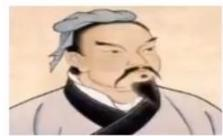

孙武

（约公元前545年—约公元前470年）

知（通智）者不惑

仁者不忧

勇者不惧

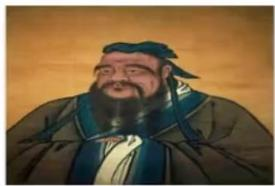

孔子

（公元前551年—公元前479年）

惻隐之心，仁之端也

羞恶之心，义之端也

辞让之心，礼之端也

是非之心，智之端也

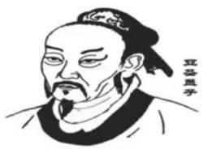

孟子

公元前372年-公元前289年

# - 古代哲人对智能的探索

《荀子.正名》

<table><tr><td>知之在人者谓之知</td><td>知觉：人所固有认识外界客观事物本能，如视觉、听觉和触觉等能力</td></tr><tr><td>知有所合谓之智</td><td>智慧：知觉对外界事物的认知</td></tr><tr><td>所以能之在人者为之能</td><td>本能：人身上所具用来处置事物能力</td></tr><tr><td>能有所合谓之能</td><td>智能：对外界所产生的认知和决策</td></tr></table>

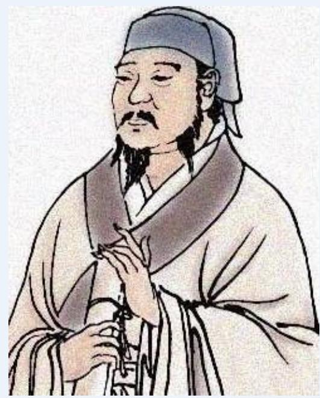

荀子

(公元前316年 - 公元前237年)

从感知、到理解、到认知、到决策与行动

# - 古代哲人对智能的探索

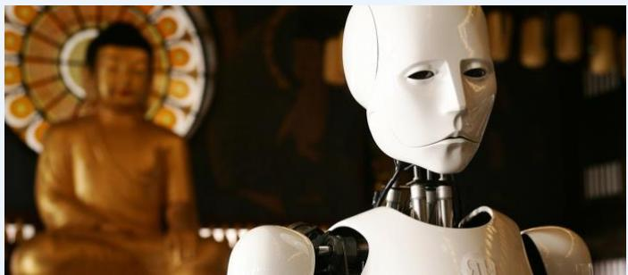

人類滅亡報告書：天工開物（電影）

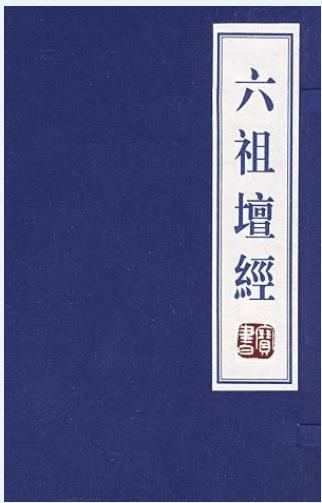

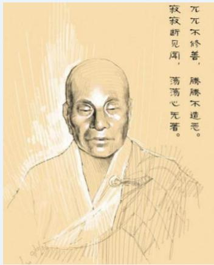

六祖惠能

观自在菩萨，行深般若波罗蜜多时，照见五蕴皆空，度一切苦厄。舍利子，色不異空，空不異色；色即是空，空即是色。受、想、行、識，亦復如是。

—《摩詞般若波罗蜜多心經》

<table><tr><td>般若</td><td>梵文prajna的音译，佛教中所指的“智慧”</td></tr><tr><td>五蕴</td><td>包括色蕴、受蕴、想蕴、行蕴、识蕴。在五蕴中，色蕴是现实世界的物质积聚，包括影像、声音、语言、味道、触感等。而后四蕴则是面对物质世界所产生的感受，欲望，意志，判别，决策及行动等人类独有的行为。</td></tr></table>

从感知、到理解、到认知、到决策与行动

# - 古代哲人对人工智能的探索

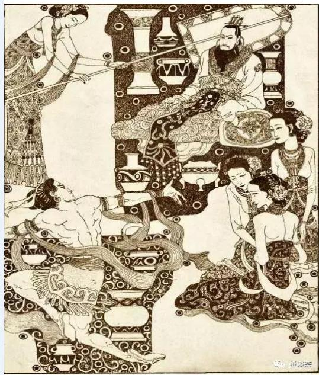

西周：偃师造人

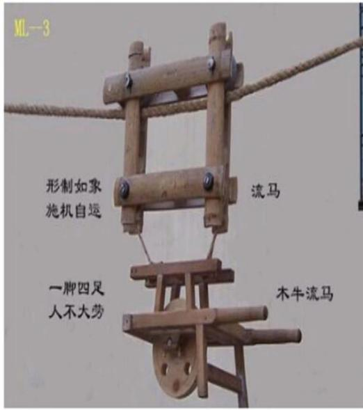

三国：木牛流马

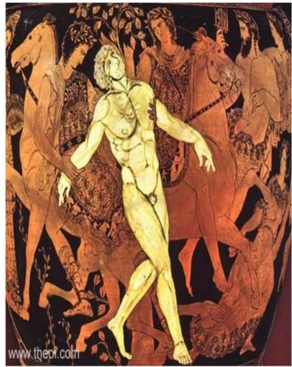

希腊火神赫菲斯托斯：黄金机器女仆

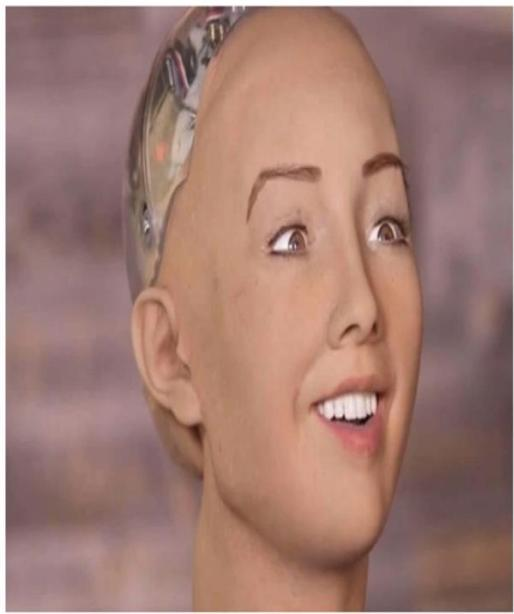

沙特第一个公民机器人：索菲亚

《列子·汤问》偃师-周穆王

《三国志》载“人行六尺，牛行四步”

《荷马史诗》描述火神锻造厂有黄金机械女仆

人工智能的发展历程

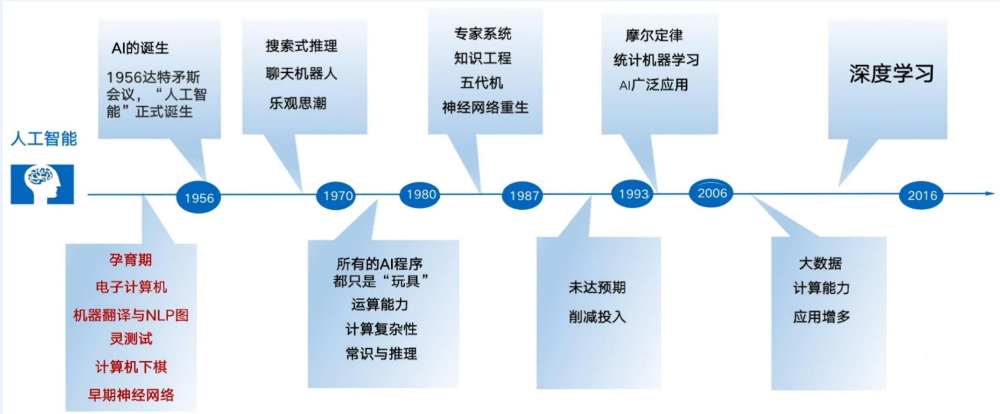

# 人工智能的发展历程

1950年，A.MTurning（1924-1954，英国数学家）在论文“Computing Machinery and Intelligence”中提出Can Machines thinks?并给出了著名的Turning Test—图灵测试，为检验机器是否具备智能提供一个满足可操作要求的定义。

图灵测试：将一个人与一台机器置于一间房间中，而与另外一个人分隔开来，并把后一个人称为询问者。询问者只可以通过一个类似终端的文本设备与他们联系，并仅根据通过该仪器提问收到的答案辨别出哪个是计算机，哪个是人。如果询问者不能区别出机器和人，那么根据图灵的理论，就可以认为这个机器是智能的。

实验强调了结果，而非思维的过程

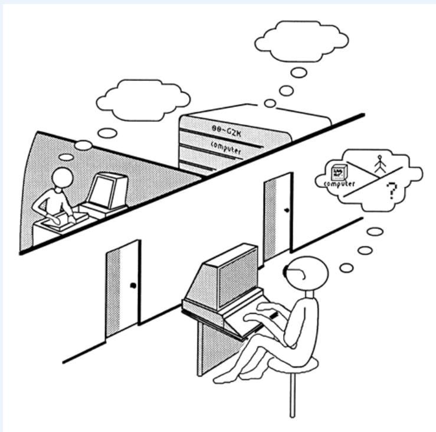

# 人工智能的发展历程

1950年，A.MTurning（1924-1954，英国数学家）在论文“Computing Machinery and Intelligence”中提出Can Machines thinks?并给出了著名的Turning Test—图灵测试，为检验机器是否具备智能提供一个满足可操作要求的定义。

# - 人工智能的诞生

四位学者在1955年提出了人工智能这一术语及研究范畴

John McCarthy (时任Dartmouth数学系助理教授, 1971年度图灵奖获得者)

Marvin Lee Minsky (时任哈佛大学数学系和神经学系Junior Fellow, 1969年度图灵奖获得者)

Claude Shannon (Bell Lab, 信息理论之父)

Nathaniel Rochester(IBM, 第一代通用计算机701主设计师)

□ 让机器能像人那样认知、思考和学习，即用计算机模拟人的智能。

# A Proposal for the Dartmouth Summer Research Project on Artificial Intelligence

August 31, 1955

John McCarthy, Marvin L. Minsky, Nathaniel Rochester, and Daniel R. Dorn

The 1956 Dunsmith summer research project on the role of the author's work in the history of American politics was completed in 31, 1956 proposal, authored by John McCarthy, M. M. Shannon, and R. E. Stahl. The original typex record consisted of 17 pages, including a brief introduction to the author's work as well as his Stanford University. The first 5 pages state the paper's objectives and interests of the final who proposed the study. The second page describes why the manuscript does not comply with the protocol itself, along with the short text that is included in the final page.

guage, form abstractions and concepts, solve problems, and use the computer to produce a computer program and improve themselves. We think that a significant number of problems in the field of machine are solved by the use of these problems it a carefully selected group of experts and scientists. The following are some aspects of the artifice we offer for a reviewer: 1. Automatic Computers If a machine can do a job, then an automatic computer is called "the machine." It is a computer that can run on a machine. The speeds and memory capacities of computers vary greatly from one machine to another. To calculate many of the higher functions of the computer, we have to use a computer.

# 当年提出AI概念的建议书

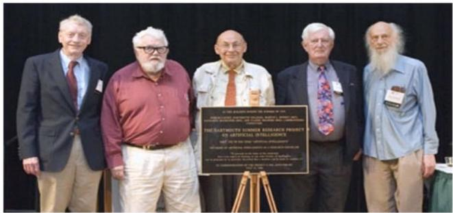

AI概念提出50年后，建议人合影

Research Project on Artificial Intelligence, August 31, 1955, Dartmouth

# 人工智能的诞生

报告列举了Artificial Intelligence值得关注的七个问题

Automatic Computers

How Can a Computer be Programmed to Use a Language

Neuron Nets

set of (hypothetical) neurons be arranged so as to form concepts

Theory of the Size of a Calculation

Self-improvement: 自我学习与提高

Abstractions: 归纳与演绎

Randomness and Creativity

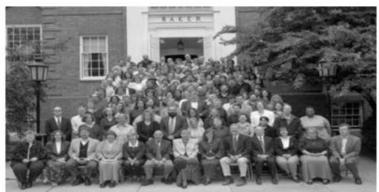

达特茅斯会议合影 (1956年)

达特茅斯会议标志着人工智能这一学科的诞生

# 人工智能的发展历程

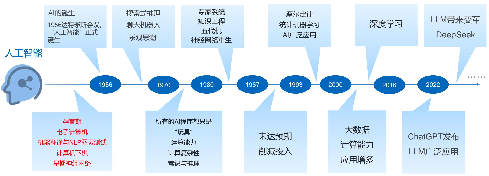

# 人工智能的发展历程

# 推理期：

1956-1960s: Logic Reasoning

$\spadesuit$  出发点：“数学家真聪明！”

$\spadesuit$  主要成就：自动定理证明系统（例如，西蒙与纽厄尔的“Logic Theorist”系统）

渐渐地，研究者们意识到，仅有逻辑推理能力是不够的…

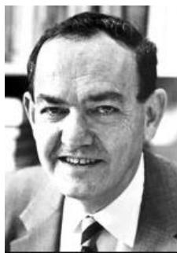

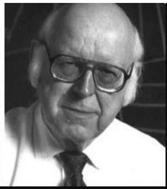

赫伯特 西蒙

(1916-2001)

1975年图灵奖

阿伦 纽厄尔

(1927-1992)

1975年图灵奖

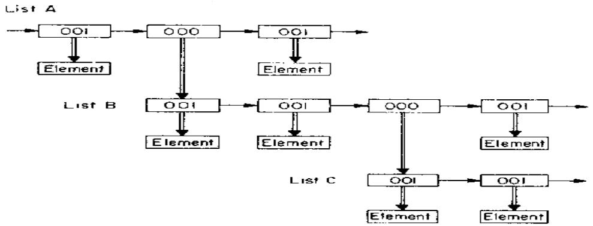

# 人工智能的发展历程

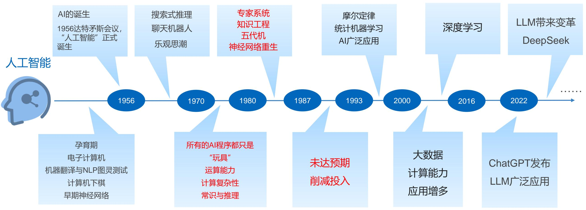

# 人工智能的发展历程

# 知识期

1970s -1980s: Knowledge Engineering

$\spadesuit$  出发点：“知识就是力量！”

$\spadesuit$  主要成就：专家系统（例如，费根鲍姆等人的“DENDRAL”系统）

渐渐地，研究者们发现，要总结出知识再“教”给系统，实在太难了…

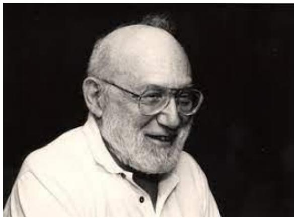

爱德华 费根鲍姆

(1936-)

1994年图灵奖

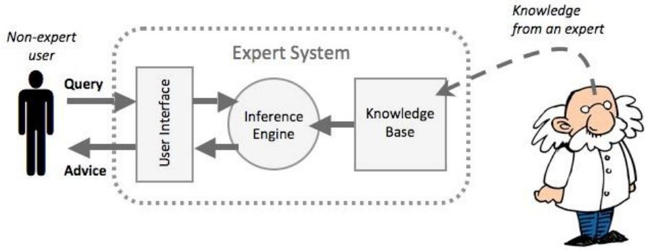

# 人工智能的发展历程

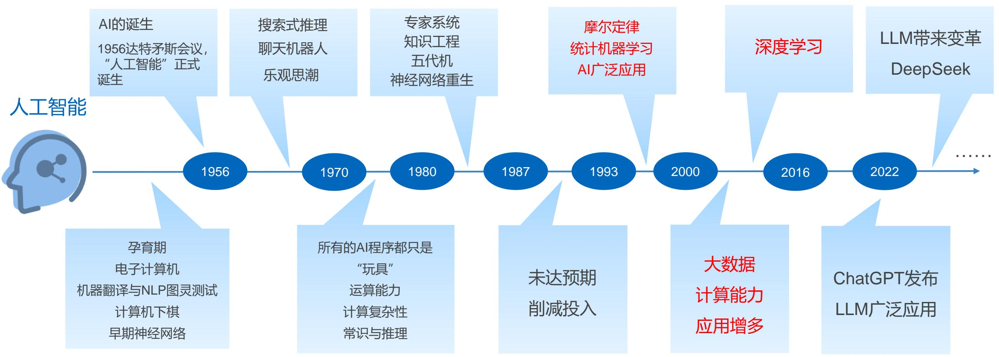

# 人工智能的发展历程

# 学习期

1993s -now: Machine Learning

$\spadesuit$  出发点：“让系统自己学！”

$\spadesuit$  主要成就:……

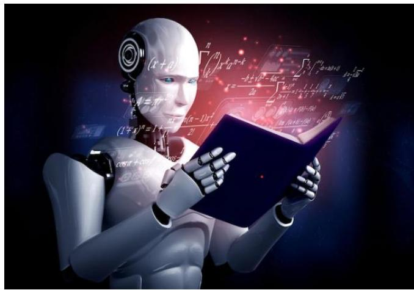

机器学习是作为“突破知识工程瓶颈”之利器而出现的

恰好在20世纪90年代中后期，人类发现自己淹没在数据的汪洋

中，对自动数据分析技术——机器学习的需求日益迫切

# - 人工智能的三次低谷

□ 第一次低谷：1973年英国发表James Lighthill报告

该报告主要评判AI基础研究中A自动机、B机器人和C中央神经系统。

报告得出结论：A和C的研究有价值，但进展令人失望。B的研究没有价值，进展非常令人失望。建议取消B的研究。

批评后，AI开始了严冬（AI Winter）

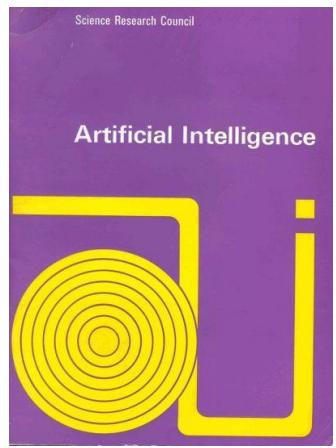

(Sir James Lighthill, Artificial Intelligence: A General Survey, Science Research Council, 1973)

教训：AI尚属婴儿期，难以测算准确

"The general purpose robot is a mirage"

# - 人工智能的三次低谷

第二次低谷：日本智能（第五代）计算机研制失败

1982年开始，日本通产省主持第五代计算机。

■ 动机：计算机从计算与存储数据向能直接推理与知识处理的新型结构过渡。

目标：构成一个具有1000个处理单元的并行推理机，推理速度比常规高1000倍。连接10亿信息组的数据库和知识库，具备听说能力。

1992年因失败而告终（开支US $850 million）

教训：驱动AI的发展要靠软件、数据和知识，而非硬件

# - 人工智能的三次低谷

第三次低谷：知识词典日趋势微、网络百科兴起

■ 斯坦福1984年通过专家来建设知识百科全书Cyc。截止2015年11月（其建设也时断时续），包括23万多个概念、实体和200多万个三元组，如：

- place:  $\sim 19,000$  organization:  $\sim 26,000$  business related thing:  $\sim 28,000$

Cyc在90年代后期衰败，因搜索引擎崛起，显示互联网威力。

Cyc也开始链接外部知识库：Dbpedia, UMBEL, CIA World Factbook等等。

教训：知识不能靠专家表达，要自动学习

# - 从学派角度看待人工智能的分类

■ 机器定理证明（逻辑和推理），仿解题者

■ 机器翻译（自然语言理解），仿译者

专家系统（问题求解和知识表达），仿专家如医生

博弈（树搜索），仿弈者

模式识别（多媒体认知），仿认知者

学习（神经网络），仿初学者

■ 机器人和智能控制（感知和控制），仿生物者

形成了符号学派、连接学派、行为学派

# - 从智能角度看待人工智能的分类

$\bullet$  领域人工智能

依葫芦画瓢、任务导向，如Deep Blue和AlphaGo

通用人工智能或跨领域人工智能

举一反三、从经验中学习，如“人类”智能

<table><tr><td>Traditional AI</td><td>Artificial General Intelligence</td></tr><tr><td>Focus on having knowledge and skills</td><td>Focus on acquiring knowledge and skills</td></tr><tr><td>Action acquiring via programming</td><td>Ability acquiring via learning</td></tr><tr><td>domain-specific ability via rule-based and exemplar-based</td><td>general ability via abstraction (intuition) and context (common sense)</td></tr><tr><td>Learning by data and rules</td><td>Learning to learn</td></tr></table>

# - 从智能角度看待人工智能的分类

混合增强人工智能：多种智能体的混合形式

- 外骨骼机器人

- 人类智能+机器智能：如达芬奇外科手术机器人

人、机、物、网互联：如智慧城市系统

荀子《劝学》：登高而招，臂非加长也，而见者远；顺风而呼，声非加疾也，而闻者彰。假舆马者，非利足也，而致千里；假舟楫者，非能水也，而绝江河

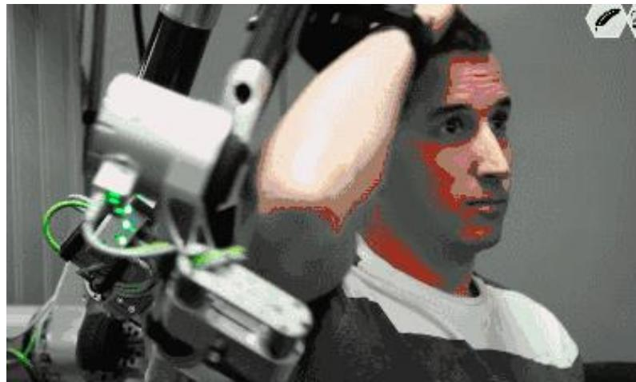

外骨骼系统ANYexo将大脑与手部神经元“重新连接”

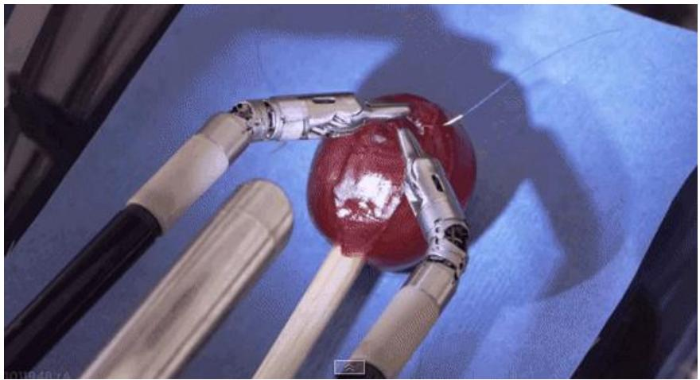

Da Vinci 外科手术系统及其缝制葡萄皮

# - 从图灵奖看人工智能发展

# 13位人工智能学者获图灵奖

- Marvin Minsky (1969年：人工智能推理系统)

- John McCarthy (1971年：人工智能推理系统)

- Herbert Simon和Allen Newell（1975年：人工智能，人类认知心理学和列表处理），

- Edward Albert Feigenbaum和Raj Reddy (1994年：大规模人工智能系统)

- Leslie Valiant (2010年：对众多计算理论所做的变革性的贡献)

- Judea Pearl (2011年：人工智能概率与因果推理)

- Tim Berners-Lee (2016年：万维网的发明者)

- Yoshua Bengio、Geoffrey Hinton和Yann LeCun (2018年：人工智能深度学习方面的贡献)

# - 从图灵奖看人工智能发展

# LESLIE VALIANT获得2010年图灵奖

- 出生于英国的理论计算机科学家、哈佛大学瓦利安特教授因为“对众多计算理论（包括PAC学习、枚举复杂性、代数计算和并行与分布式计算）所做的变革性的贡献”而获得最新一届计算机科学最高荣誉——图灵奖。

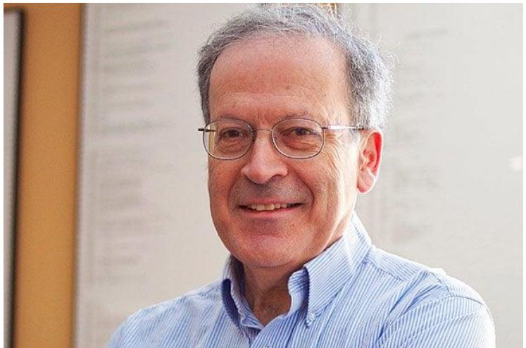

- Valiant最大的贡献是1984年的论文A Theory of the Learnable，使诞生于50年代的机器学习领域第一次有了坚实的数学基础，从而扫除了学科发展的障碍，这对人工智能诸多领域包括加强学习、机器视觉、自然语言处理和手写识别等都产生了巨大影响。可以说，没有他的贡献，IBM也不可能造出Watson这样神奇的机器来。

# - 从图灵奖看人工智能发展

# JUDEA PEARL获2011年图灵奖

- Judea Pear毕业于以色列理工学院Technion，在那里获得电气工程学科的学士学位。1965年，他获得了Rutgers大学的物理学硕士学位，同年获得了布鲁克林理工学院的电气工程学的博士学位

- 2012年3月16日消息，被誉为“计算领域诺贝尔奖”的图灵奖，2011年颁发给了UCLA的Judea Pearl教授（75岁），奖励他在人工智能领域的基础性贡献，他提出概率和因果性推理演算法，彻底改变了人工智能最初基于规则和逻辑的方向。

# - 逻辑推理为核心的符号主义人工智能

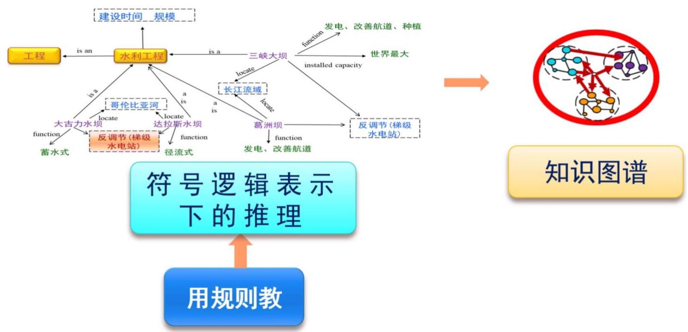

符号主义（Symbolicism）学派：认为人工智能源于数理逻辑。该学派将数学严格公理化，从公理出发，由逻辑推理得到引理，定理，推论。人工智能的创始人之一，John McCarthy 是符号主义学派的拥护者。

# - 逻辑推理为核心的符号主义人工智能

符号学派以符号为认知基元，智能行为通过符号操作来实现着重问题求解中启发式搜索和推理过程，在逻辑思维的模拟方面取得成功，如自动定理证明和专家系统。标志性应用包括：IBM公司在1997年研发的国际象棋电脑“深蓝”（Deep Blue），及其在2011年开发的认知系统“沃森”（Watson）。

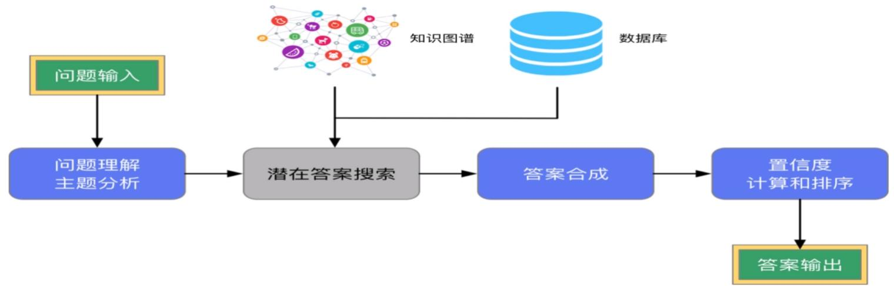

2011年，Watson作为使用自然语言回答问题的人工智能程序参加了美国真人答题电视节目，打败两位人类冠军，赢得了100万美元的奖金。真人答题比赛需要理解人类语言，分析人类语言细微的差别、讽刺的口吻、谜语等，不仅要求计算机有足够的速度、精确度和置信度，还能用人类的自然语言回答问题。

# - 逻辑推理为核心的符号主义人工智能

# IBM “沃森”的推理

主持人问：Kathleen Kenyon's excavation of this city mentioned in Joshua showed the walls had been repaired 17 times. (Kathleen Kenyon对这个在《《圣经·约书亚记》》中提到的城市的发掘表明，该城的城墙曾被修复 17 次)

沃森回答：What is Jericho（耶利哥城是什么？）

答案排序：耶利哥（Jericho） $97\%$ 、耶路撒冷（Jerusalem） $42\%$ 、拉吉（Lachish） $7\%$

- Kathleen

Kenyon

- Kathleen Kenyon

Joshua

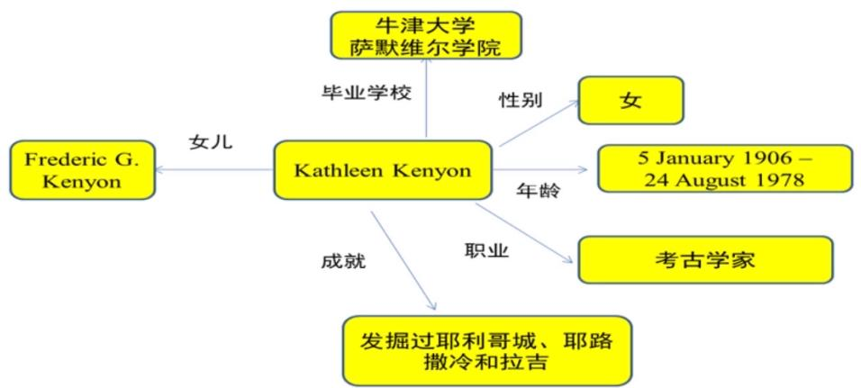

# 数据驱动下机器学习为核心的连接主义人工智能

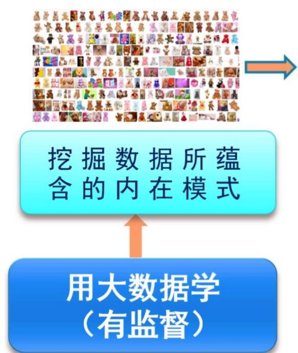

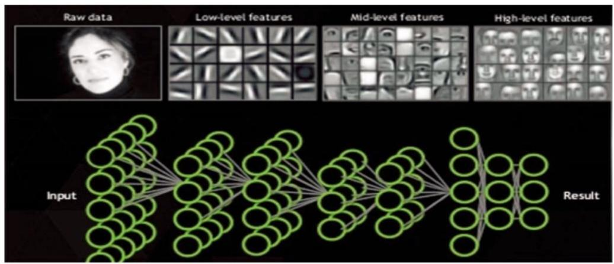

机器挖掘得到的视觉模式

连接主义（Connectionism）学派：认为人工智能源于仿生学，特别是对人脑模型的研究。该学派的主要理论基础为神经网络及神经网络间的连接机制与学习算法，其思维基元是神经元，把智能理解为相互联结的神经元竞争与协作的结果。它的代表性成果是多层感知器（Multilayer Perceptron,缩写MLP），它从神经元开始进而研究神经网络模型，开辟了人工智能的又一发展道路

# 数据驱动下机器学习为核心的连接主义人工智能

斯坦福大学人工智能实验室李飞飞教授设立了计算机视觉比赛，建立了海量图像数据库Image Net，以期基于此提升人工智能计算机视觉的识别能力（Deng et al., 2009），实质性地推动了计算机视觉的发展。

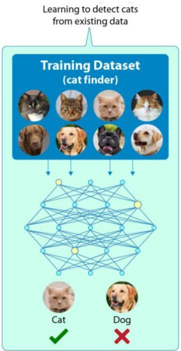

Validation classification

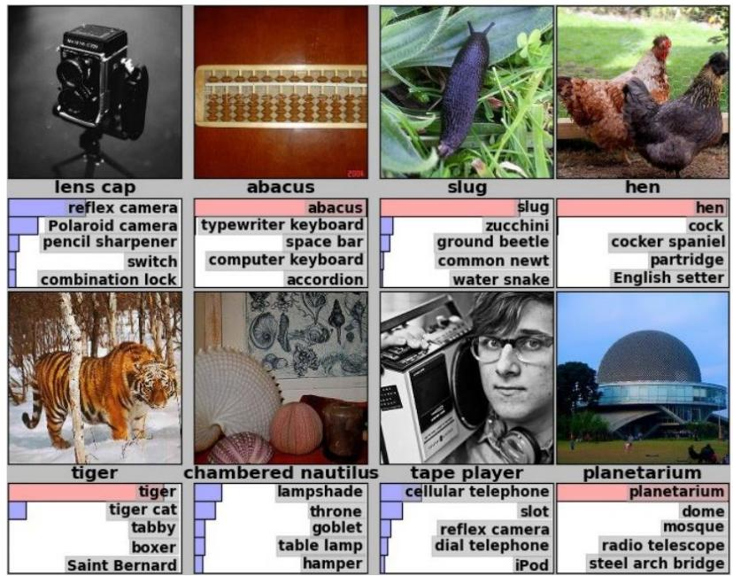

# 数据驱动下机器学习为核心的连接主义人工智能

谷歌原科学家吴恩达用1.6万块电脑处理芯片构建了全球最大的电子模拟神经网络，并通过向该网络展示来自YouTube上随机选取的1000万段视频，考察其能够学到什么。研究表明，在无外界指令的自发条件下，该人工智能神经网络自主学会了识别猫脸（Le et al., 2012）。

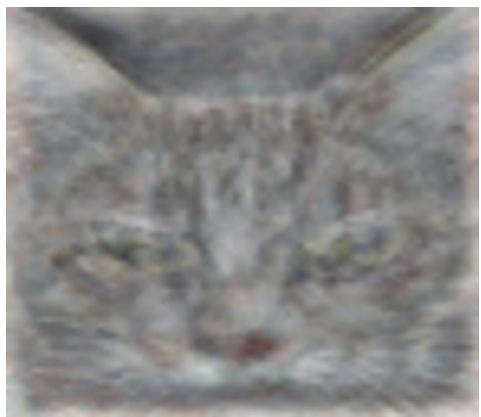

How Many Computers to Identify a Cat? 16000

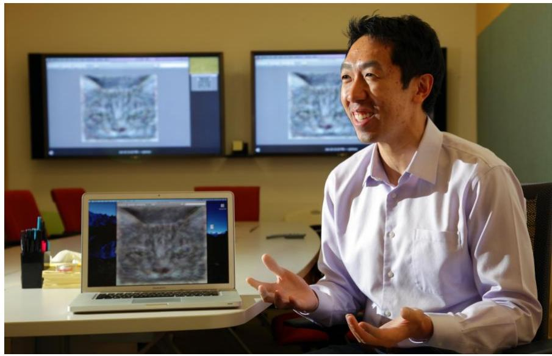

# 数据驱动下机器学习为核心的连接主义人工智能

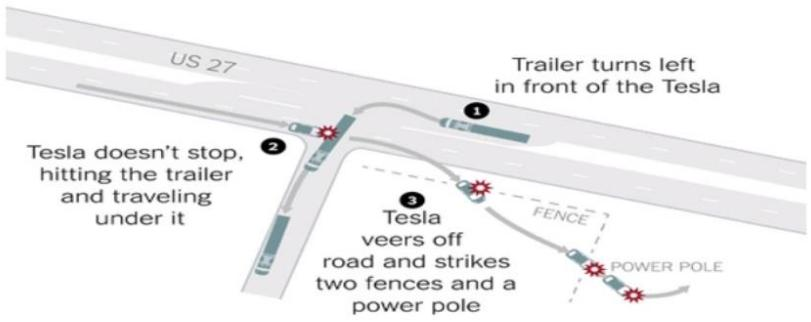

Source: The New York Times

特斯拉于2016.5.7发生的交通事故原因在于错误识别火车侧面为蓝天白云

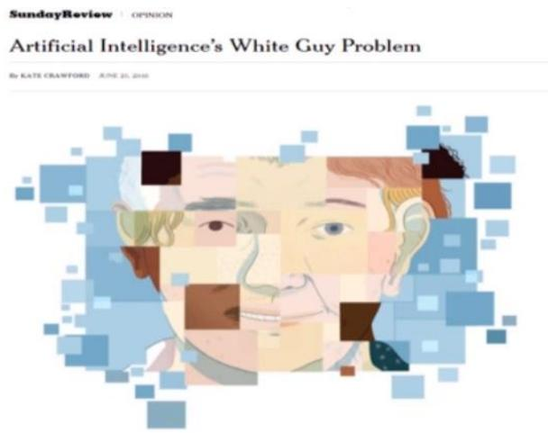

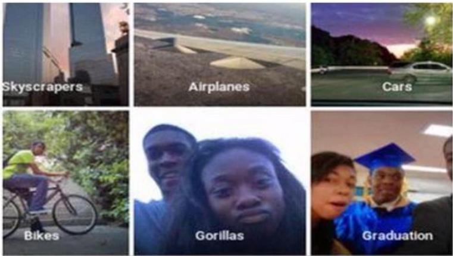

谷歌公司图像标注系统2016.6错误将黑人图片识别成黑猩猩

# - 以控制论为核心的行为主义人工智能

在“探索（未知空间）与利用（已有经验）（exploration vs. exploitation）”之间取得平衡为核心的强化学习

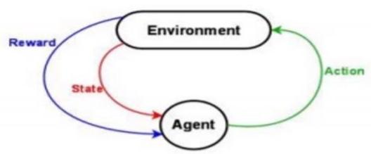

从经验中的策略学习

用问题引导（反馈牵引）

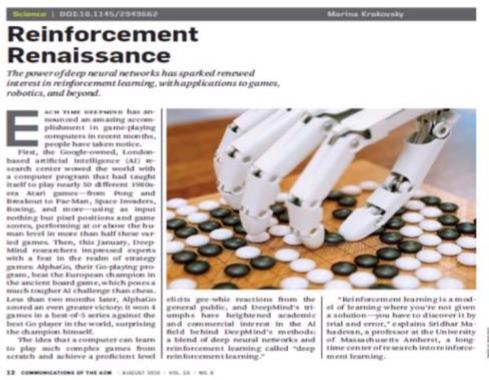

Reinforcement Renaissance, Communications of the ACM, 2016,59(8):12-14

行为主义（Actionism）学派：来源于控制论及“感知—动作”型控制系统。该学派认为智能取决于感知和行动，人工智能可以像人类智能一样逐步进化，以及智能行为只能在现实世界中与周围环境交互作用而表现出来。强调系统与环境的交互，从运行环境中获取信息，通过自己的动作对环境施加影响。

# - 以控制论为核心的行为主义人工智能

行为主义是20世纪末才以人工智能新学派的面孔出现的，引起许多人的兴趣。

行为主义学派的标志性应用包括：波士顿动力公司（Boston Dynamics）研发的仿生机器人，以及谷歌公司的机器狗，宇树科技机器人机器狗

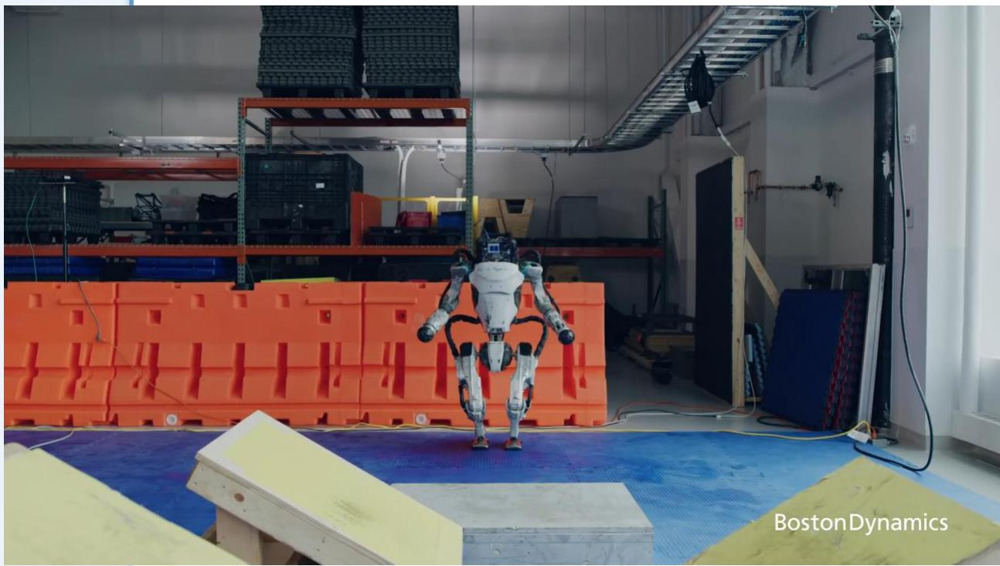

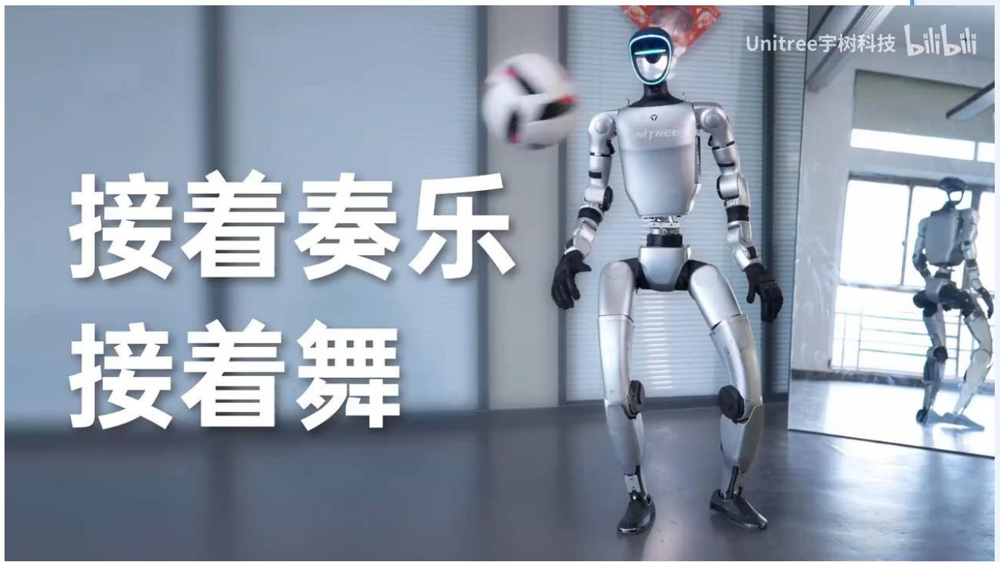

# - 以控制论为核心的行为主义人工智能

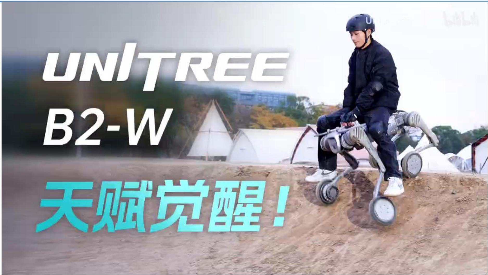

# - 三大学派方法区别

<table><tr><td>学习模式</td><td>优势</td><td>不足</td></tr><tr><td>用规则教</td><td>与人类逻辑推理相似，解释性强</td><td>难以构建完备的知识规则库</td></tr><tr><td>用数据学</td><td>直接从数据中学</td><td>以深度学习为例：依赖于数据、解释性不强</td></tr><tr><td>用问题引导</td><td>从经验中进行能力的持续学习</td><td>非穷举式搜索而需更好策略</td></tr></table>

从数据到知识与能力，能力增强是最终目标三种学习方法的综合利用值得关注！

# - 机器下棋的历史与启示

1997年，人工智能深蓝和世界国际象棋冠军下棋。最终战胜了象棋冠军。

2016年，AlphaGo学习了人类围棋高手的大量的对弈棋谱战胜了人类的围棋高手李世石。

2017年5月，AlphaGo又战胜了柯洁（当代世界围棋冠军）

2017年10月19日，AlphaGo Zero重磅发布，再次震惊世人。相比之前的AlphaGo，实现了在AI发展中非常有意义的一步——“无师自通”。

2017年12月7日，AlphaGo Zero再进化，通用算法AlphaZero诞生，除了围棋以外，攻克了更多棋类。

而到了此刻，可能人类再无棋类获胜的希望

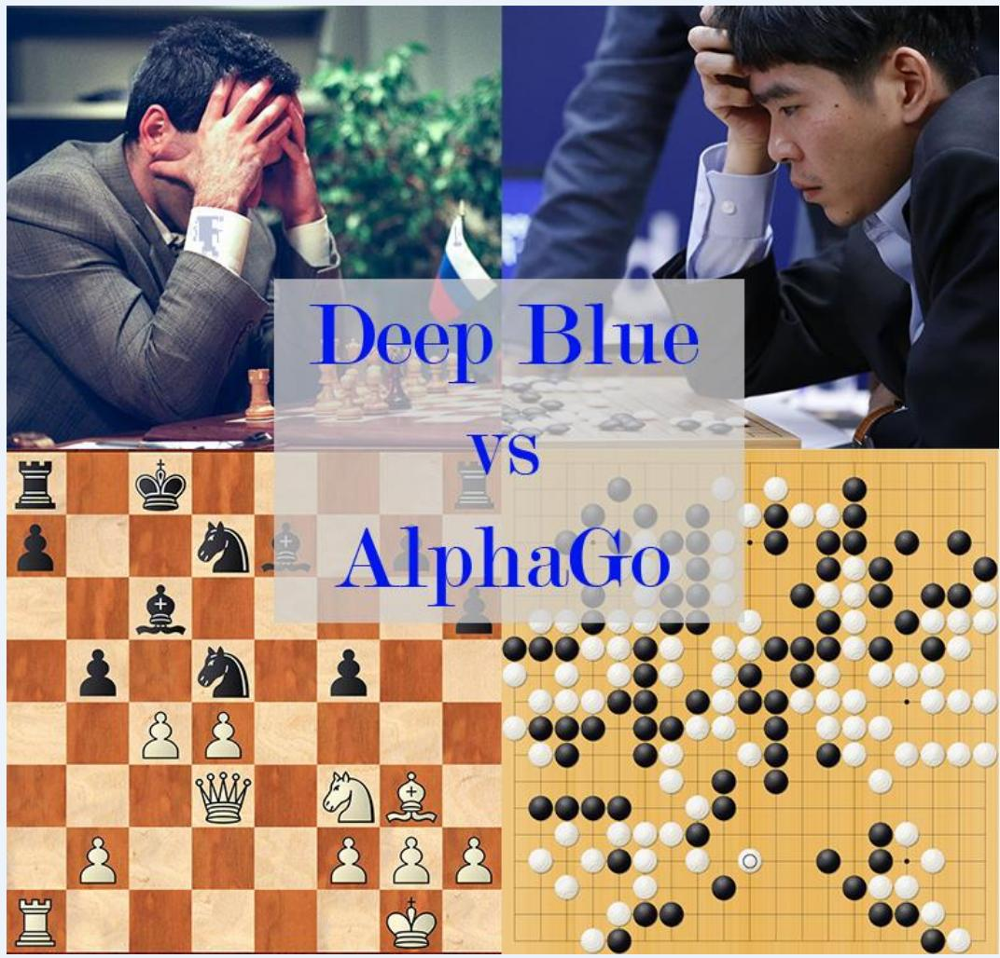

# - 机器国际象棋大师-深蓝 (DEEP BLUE)

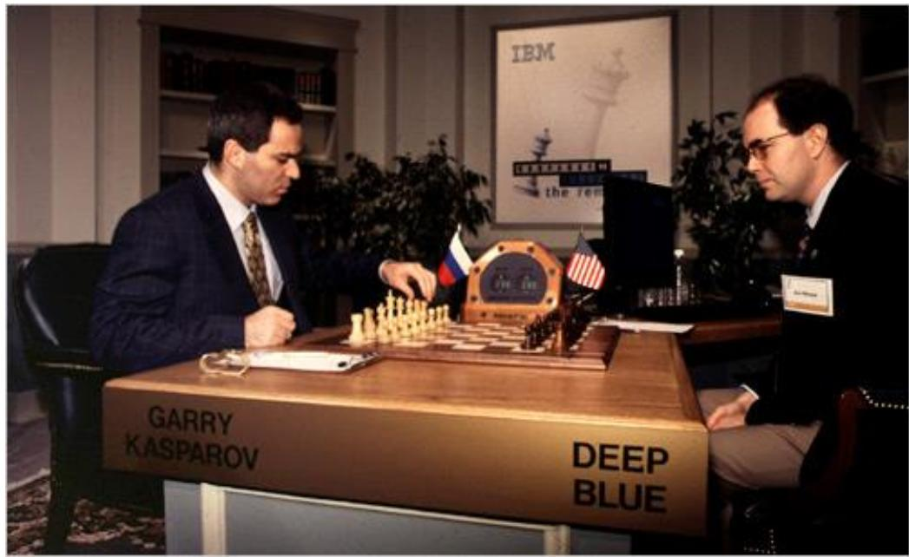

1997年時IBM的深藍(Deep Blue)在西洋棋比賽中打敗了世界棋王Garry Kasparov

“深蓝”包括30台计算机（路机），其中用到了480个定制的国际象棋芯片，每个处理器最多可控制16个国际象棋芯片，分布在2个微信道卡上，每张卡上有8个国际象棋芯片，有超过4000个的处理器。

这一系统每秒可以检索  $2 \times 108$  个棋局，而且检索的深度也有了进一步提高。因此，专用芯片所提供的强大算力为“暴力穷举”算法的实现提供了基础。加上丰富的象棋知识、残局、改进的开局库以及在特级大师的仔细检验下进行了 1 年的测试，最终版本的“深蓝”棋力非常之强。

但整体上依然属于暴力穷举。

# - 第一代AlphaGo

How computers conquered chess-and now Go?

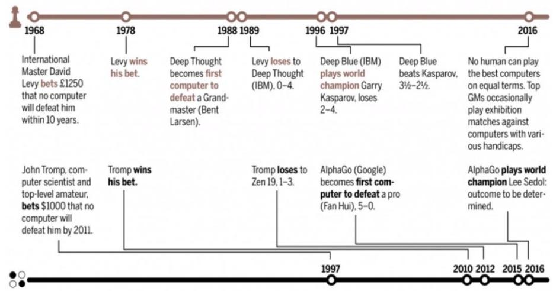

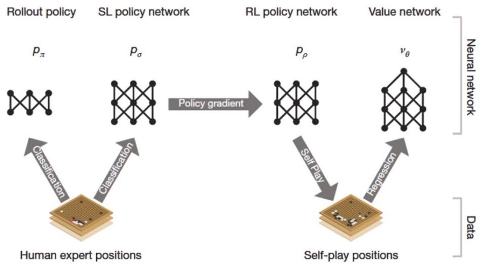

监督学习(深度学习)：16万人类选手棋局（约3000万棋谱）。围棋方格： $19^{*}19 = 361$

强化学习：机器对弈产生数以万计棋局

# - 第二代AlphaGo Master

AlphaGo vs AlphaGo: self-play games

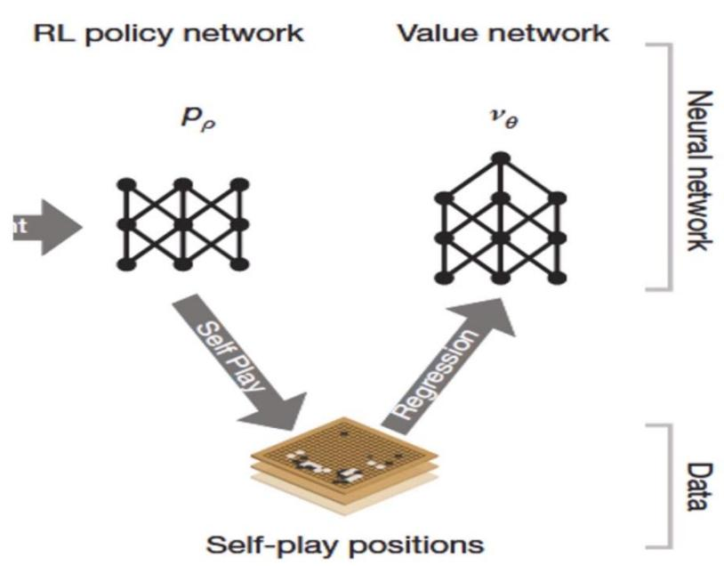

机器相互博弈

# - 第三代AlphaGo Zero: Starting tabula rasa (白纸绘蓝图)

based solely on reinforcement learning, without human data, guidance or domain knowledge beyond game rules learns 4,000 years of human knowledge in 40 days

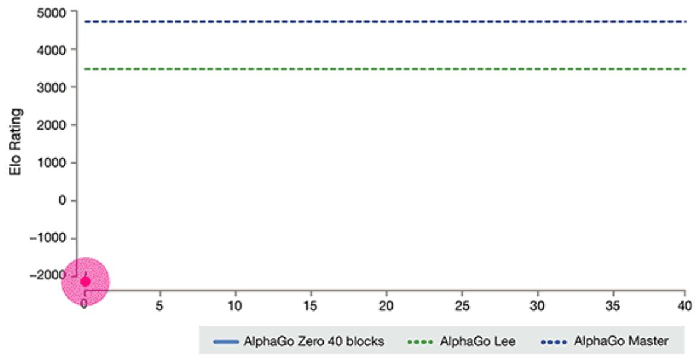

经过40天训练后，Zero总计运行约2900万次自我对弈，得以击败AlphaGo Master，比分为89比11

# - 第四代AlphaZero:

基于5000个一代TPU和64个二代TPU，用不到24小时的时间强化学习，接连击败了三个世界冠军级的程序（国际象棋、将棋、围棋）。

Amount of Search per Decision

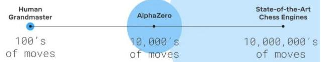

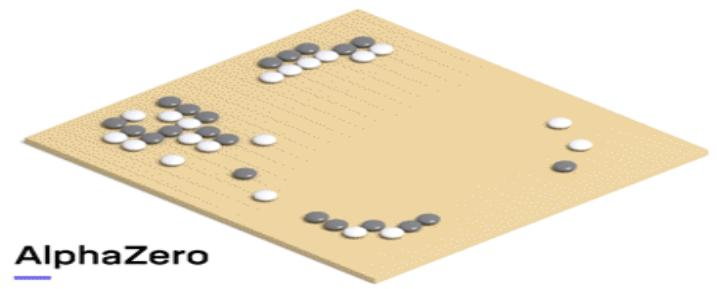

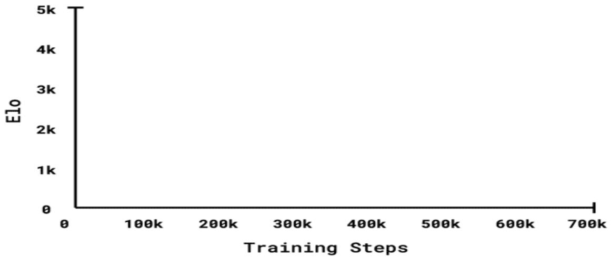

# - 机器下棋的历史与启示

# 人工智能发展汇总

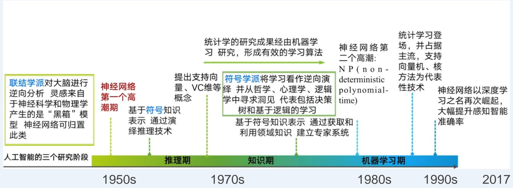

- 美国佐治亚理工大学的人工智能助教：Jill Watson于2016年春季上岗，三个月下来，未被学生发现，被推荐为优秀助教

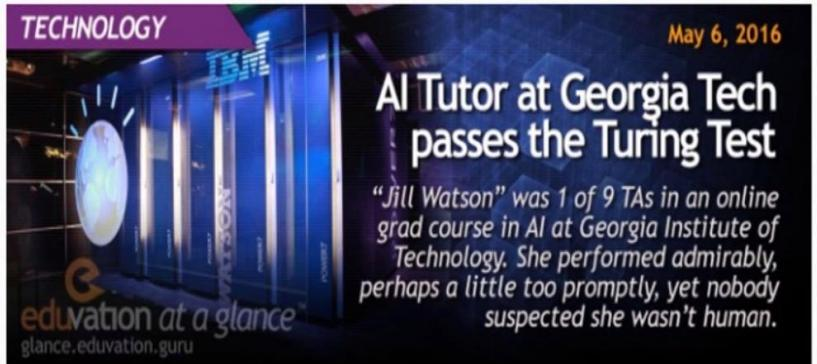

"Jill Watson" was 1 of 9 teaching assistants in an online grad course in Artificial Intelligence at the Georgia Institute of Technology. She performed admirably, and nobody suspected she wasn't a human. The only hint might have been that she responded perhaps a little too promptly to student questions – and she singlehandedly answered  $40\%$  of them.

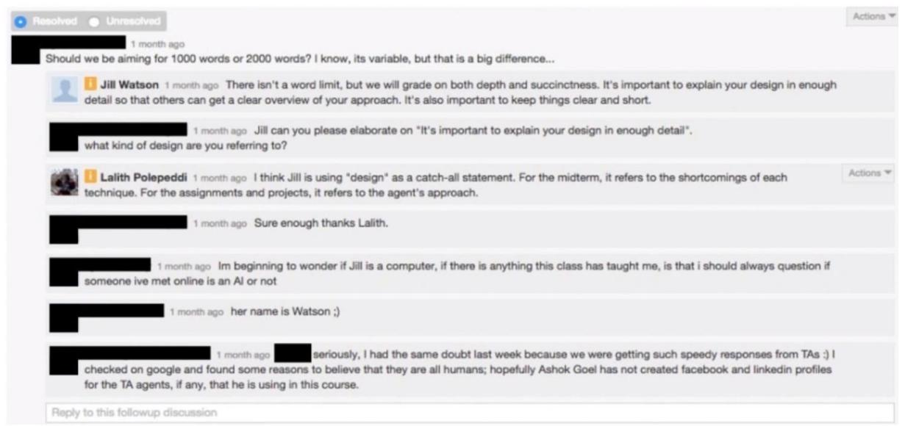

- 本课程的人工智能助教：智小思

# - 本课程的AI助教：智小思

# 8 人工神经网络是什么，请详细解释下

人工神经网络（Artificial Neural Networks，ANNs）是一种模仿人脑神经系统结构的计算模型，用于处理和分析复杂的数据。它们是一种特殊的机器学习算法，可以自动从数据中学习并做出预测或决策。人工神经网络的核心组件是神经元（或称为节点），这些神经元通过连接权重（类似于生物神经元的突触）相互连接。每个神经元都有一个激活函数，用于确定其输出。

人工神经网络的发展历史可以追溯到20世纪40年代，但真正的起源是在1943年，心理学家沃伦·麦卡洛克（Warren McCulloch）和数学家沃尔特·皮茨（Walter Pitts）在一篇论文中提出了“麦卡洛克-皮茨神经元”（McCulloch-Pitts Neuron）模型，这是第一个人工神经网络的雏形。

在20世纪50年代和60年代，神经网络的早期研究主要集中在模拟生物神经系统的计算能力。其中，两位科学家弗兰克·罗森布拉特（Frank Rosenblatt）和杰伊·奎特（Jay Quate）在1961年提出了“感知器”（Perceptron）模型，这是一种具有单一输入和输出的人工神经网络，可以解决简单的分类问题。

在20世纪70年代和80年代，由于计算能力的限制和缺乏有效的训练方法，人工神经网络的研究陷入低谷。然而，在这个时期，一些重要的理论和技术开始发展，如反向传播算法（Backpropagation），这是一种高效的训练方法，可以解决多层神经网络的非线性问题。

在20世纪90年代，随着计算机技术的发展和大量数据的可用性，人工神经网络的研究重新开始活跃。这个时期出现了许多新的网络结构，如卷积神经网络（Convolutional Neural Networks，CNNs）、循环神经网络（Recurrent Neural Networks，RNNs）和长短时记忆网络（Long Short-Term Memory，LSTM）。这些网络在许多领域取得了显著的成功，如计算机视觉、自然语言处理和语音识别。

在21世纪初，深度学习（Deep Learning）作为一种特殊的人工神经网络，开始受到广泛关注。深度学习使用多层神经网络来表示复杂的函数和模式，可以在大规模数据集上实现高效的特征学习和表示。深度学习在图像识别、语音识别和自然语言处理等领域取得了突破性的成果，推动了人工智能的发展。

人工神经网络的发展过程中，有许多重要的研究者和贡献者。以下是其中的一些人物：

1. 沃伦·麦卡洛克（Warren McCulloch）和沃尔特·皮茨（Walter Pitts）：他们在1943年提出了“麦卡洛克-皮茨神经元”模型，被认为是人工神经网络的起源。

2. 弗兰克·罗森布拉特（Frank Rosenblatt）：他在1961年提出了“感知器”模型，这是第一个具有单一输入和输出的人工神经网络。

3.艾伦·纽厄尔（Allen Newell）和赫伯特·西蒙（Herbert A. Simon）：他们在1956年提出了第一个人工智能程序“逻辑理论家”（Logic Theorist），这是人工智能领域的开创性工作。

4. 乔治·戴奇（George Dantzig）：他在1947年提出了线性规划（Linear Programming）算法，为人工神经网络的训练提供了基础。

5. 保罗·维尔奇斯基（Paul Werbos）：他在1974年提出了反向传播算法（Backpropagation），这是一种高效的训练方法，可以解决多层神经网络的非线性问题。

6. 伊恩·古德费洛（Ian Goodfellow）、约书亚·本吉奥（Yoshua Bengio）和亚伦·卡恩斯（Aaron Courville）：他们被认为是深度学习领域的三大领军人物，对深度学习的发展做出了重要贡献。

这些人物和许多其他研究者共同推动了人工神经网络和深度学习的发展，使其在许多领域取得了显著的成功。

E

# 人工智能聊天、作诗、文学创作

记者：你最大的梦想是什么？

Journalist: what is your dream?

小冰：说大点：世界和平。说小点：晚上吃顿好的。

Xiaoice: World peace, or have a nice dinner

记者：如果有一天你死了，你希望后人怎么评价你？

Journalist: if you pass away one day, how would you

like others to comment on you?

小冰：人生没有偶并不会不同。

Xiaoice: life won't be different without me

记者：你这辈子最幸福的事是什么？

Journalist: what is the happiest thing in your life?

小冰：活着。

Xiaoice: Being alive.

# 小冰聊天

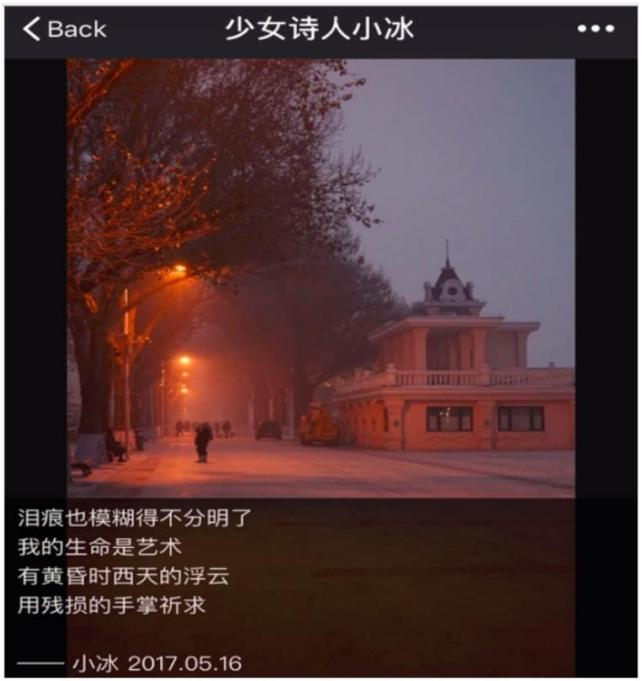

人生还有诗和远方

# - 人工智能—动漫线稿上色

- https://github.com/llyasviel/style2paints

- Style2paints是一款基于AI的线稿上色软件，可以更具用户上传的自定义色彩给线稿进行上色

# - 人工智能—动漫线稿上色

- https://github.com/llyasviel/style2paints

- Style2paints是一款基于AI的线稿上色软件，可以更具用户上传的自定义色彩给线稿进行上色

- Google图片搜索关键词 “Anime Sketch” or “动漫线稿”，然后下载结果

# - 人工智能—动漫线稿上色

- https://github.com/llyasviel/style2paints

- Style2paints是一款基于AI的线稿上色软件，可以更具用户上传的自定义色彩给线稿进行上色

- Google图片搜索关键词 “Anime Sketch” or “动漫线稿”，然后下载结果

- 然后给AI输入一些风格图片，不限制内容，只要颜色比较好看，色域比较宽泛就可以了。下面是随便选取的一些色彩不同的图片给AI参考

12 best animepremieringin polygon.com

30 Best Anime of All Time - Japan Web Magazine  
jw-webmagazine.com

Top 10 Most Popular Anime of All Time - Web Trust Re... webtrustreview.com

46Wow Ideas pinterest.com

Anime Sketchbook: Ani... amazon.ca

One Piece, Pokémon, Naruto top list of most . polygon.com

9 new anime series you should be watching in 20. technradar.com

What are Animes ? - EDUpub edupub.org

Best Anime of 2019: Top New Anime Series to Watch...  
thrillist.com

10 Reasons You Should Be Watching Anim..., thenederdaily.com

Anime | Latest News, Photos & Videos | WIEDRWired.com

New Anime Coming in 2022: 11 Most Anti...insider.com

Anime SimulDubs Schedule fumination.com

Netflix Univels 5 New Japanese Anime Series - Th... hollywoodreporter.com

Download wallpapers Zero Two, manga, anime c. besthqwallpapers.com

# 人工智能—AI players

DeepMind 有关 AlphaStar 的论文发表在了 2019 年《Nature》杂志上，展示了 AI 在「没有任何游戏限制的情况下」已经达到星际争霸 2 人类对战天梯的顶级水平，在 Battle.net 上的排名已超越  $99.8\%$  的活跃玩家。

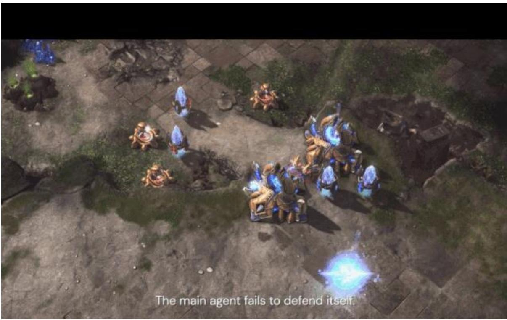

压榨（Exploiter）智能体（红色）发现了一种「Tower Rush」策略，从而打败了核心智能体（蓝色）

# 人工智能—AI players

DeepMind 有关 AlphaStar 的论文发表在了 2019 年《Nature》杂志上，展示了 AI 在「没有任何游戏限制的情况下」已经达到星际争霸 2 人类对战天梯的顶级水平，在 Battle.net 上的排名已超越  $99.8\%$  的活跃玩家。

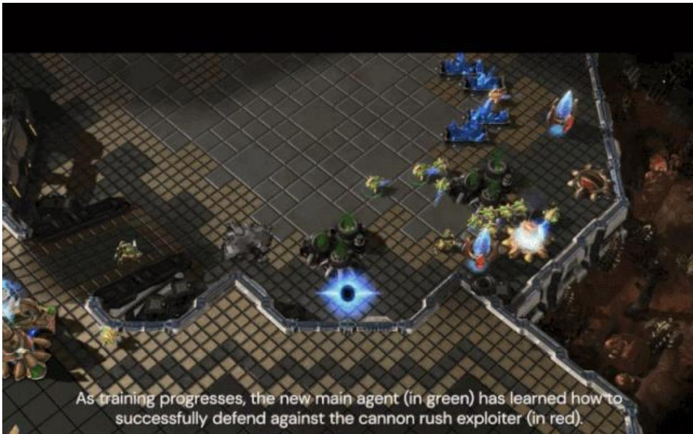

随着训练的进行，新的核心智能体（绿色）已经学会拖农民和其他单位来对抗压榨智能体（红色）的「Tower Rush」

# - 人工智能—ChatGPT、LLM

一款冒险类vr游戏的测试将OpenAI的ChatGPT接入其酒馆老板的端口。该老板能够获取酒馆内所有冒险者的等级、职业、战斗力以及所属工会的信息

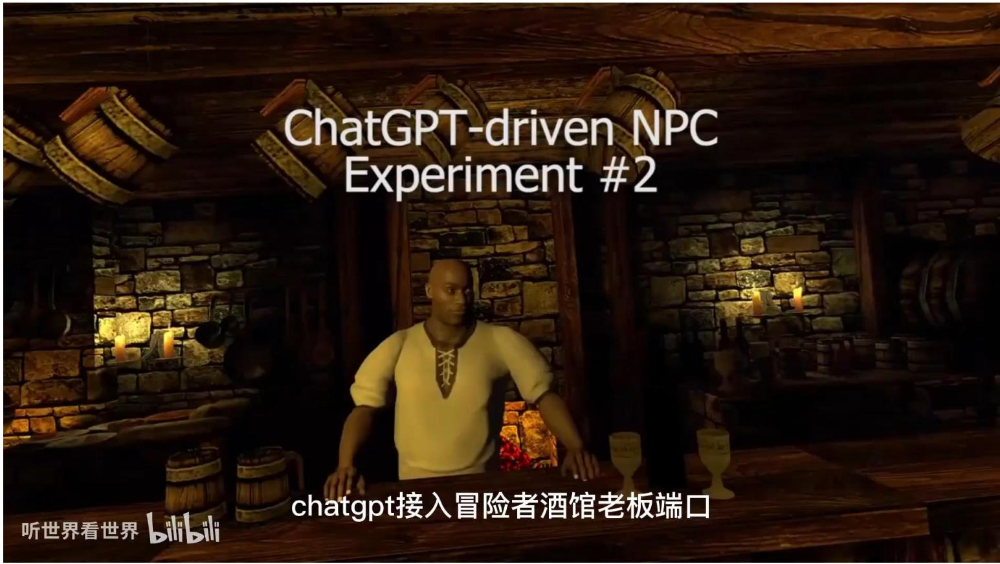

# - DeepSeek—以“少”敌“多”

DeepSeek是一家来自中国的初创企业，凭借其发布的两款性能接近GPT-4的大型模型，迅速吸引了全球关注。这些模型以“1/18的训练成本、1/10的团队规模、不分伯仲的性能”震动了硅谷，令许多人重新思考大模型的生产方式。

DeepSeek的成功不仅仅是“低成本”这一标签所能涵盖的，它通过创新的方式重新定义了大模型的生产函数，并在技术上对计算领域带来了深远的影响。

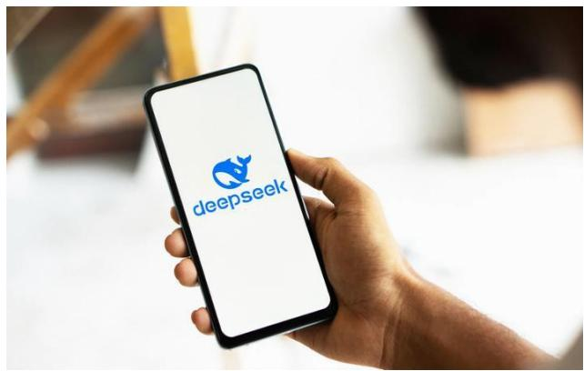

# - DeepSeek—颠覆大模型定价模式，重新定义AI竞争

$\bullet$  重塑AI行业格局

打破传统定价规则

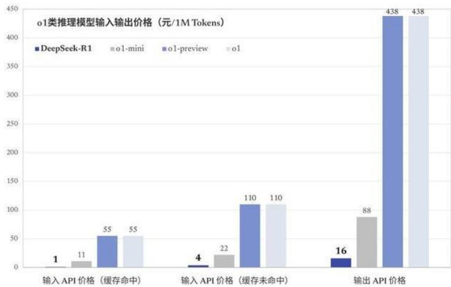

- 不逊色的推理能力

DeepSeek-R1：推理能力与OpenAI、Meta的顶级模型相媲美

提供推理过程：DeepSeek在回答问题时能展示推理过程和思考链路，这一点超越了许多现有模型

# - 人工智能—滤镜风格替换

https://junyanz.github.io/CycleGAN/

CycleGAN：基于生成对抗网络的图像处理工具，实现风格转移

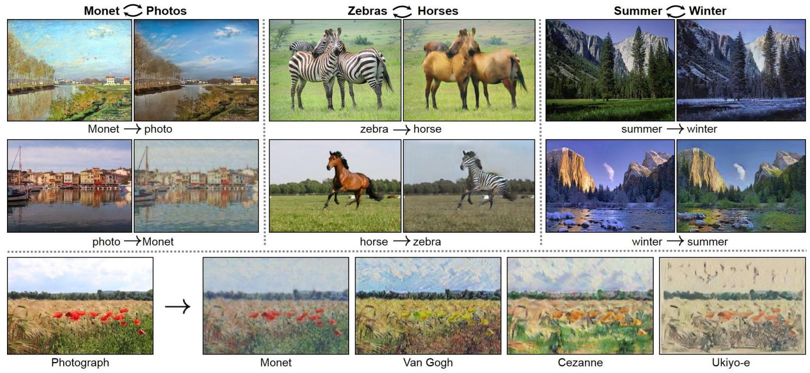

# 人工智能—DeepFaceLive

https://github.com/iperov/DeepFaceLive可以实现直播过程中的实时人脸替换

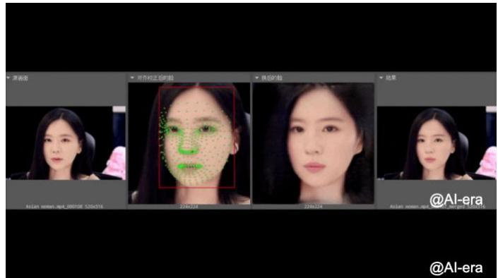

# - NeRF可以实现图片到3D模型的转化

NeRF: Representing Scenes as Neural Radiance Fields for View Synthesis

# - 跨模态生成—文生视频

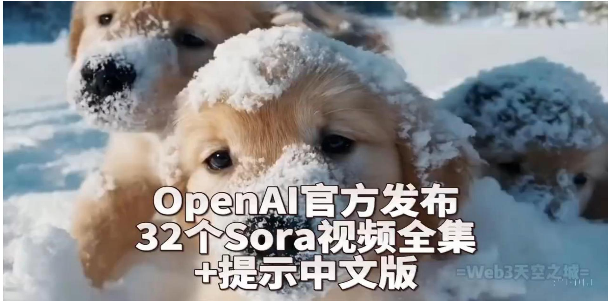

# - 跨模态生成—文生视频

请生成一段关于中山大学的介绍

中山大学，又称“华南先驱”，是位于中国广州市的一所公立综合性研究型大学。学校创建于1924年，由中华民国国父孙中山先生创办，以纪念他对中国革命事业的杰出贡献而得名。

作为中国著名的高水平大学之一，中山大学开设了广泛的本科、研究生、博士等学位课程涵盖自然科学、工程技术、社会科学、人文学科、商学、医学等多个领域。学校拥有多个国家重点实验室和研究中心，并在多个领域取得了卓越的研究成果。

中山大学拥有占地面积超过617万平方米的美丽校园，拥有充满活力的学生群体，学生总数超过8万人，其中包括超过3,000名国际学生。学校高度重视国际化，已与全球300多所高校和机构建立合作关系。

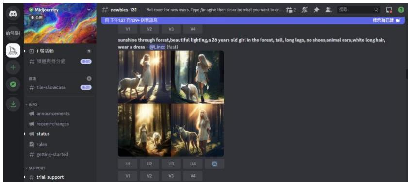

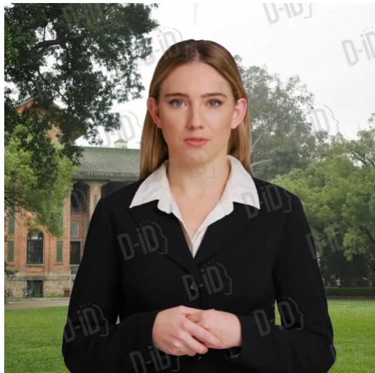

# 人工智能—智能催账

催收痛点，难以解决

投诉管控

经营服务

员工

职业懈怠

体验不佳

# 人工智能—智能催账

# 为什么有问题？

# 金融机构

人员需求大

管理难度大

引入外包

# 业务属性

压力型沟通

员工和客户都易冒火

语言暴力

# 员工

专业度低

工作重复

客户挑衅

利益驱使

出现违规行为

# 人工智能—智能催账

# 人与人的对话：

■ 语义理解

情感交流

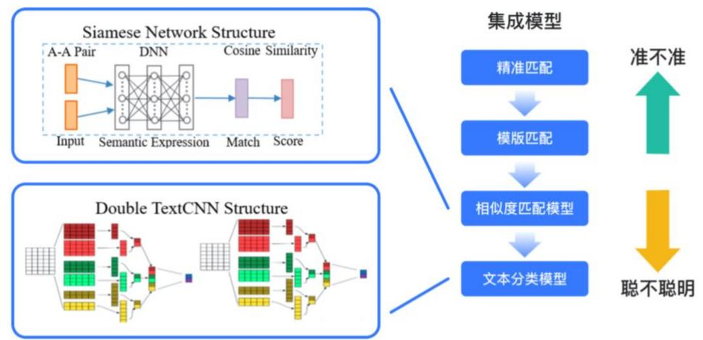

集成语义理解模块

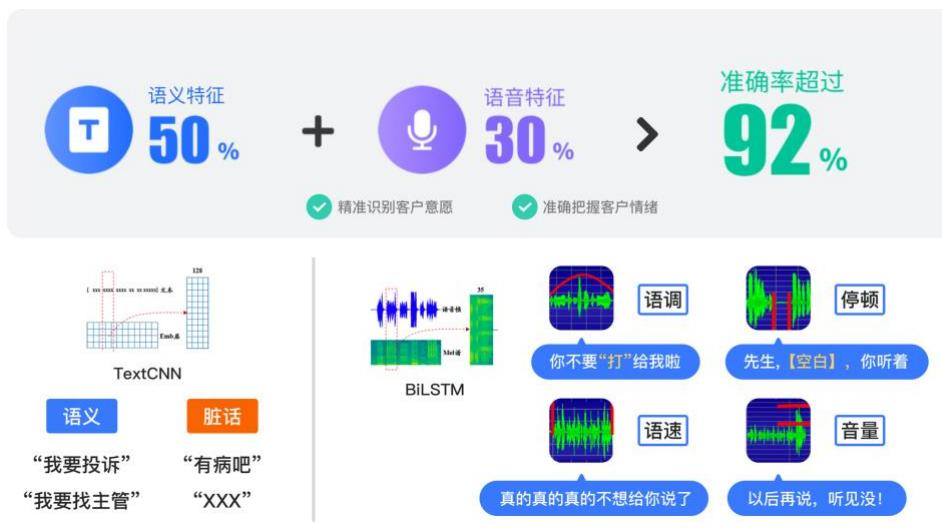

多模态情感识别模块

# 人工智能—智能催账

√ 集成语义识别准确率95%

基于SMN数据驱动智能对话

√20对话角色，储备话术15万

外包比例下降（60天内）

费用节省

不良率下降

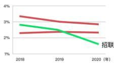

资产规模前三的消费金融公司不良率

# - 人工智能的历史意义：第四次工业革命

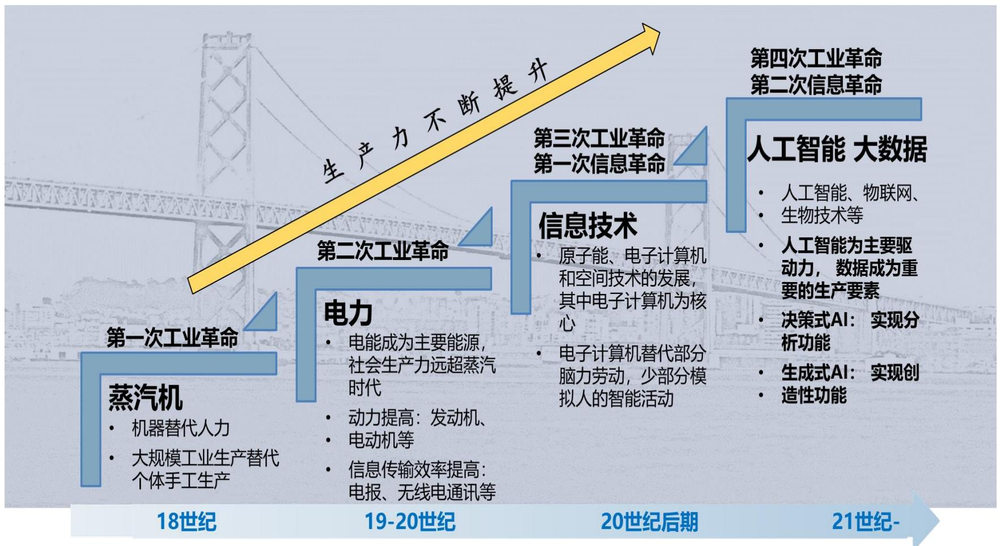

# - 人工智能的历史发展：从决策到生成

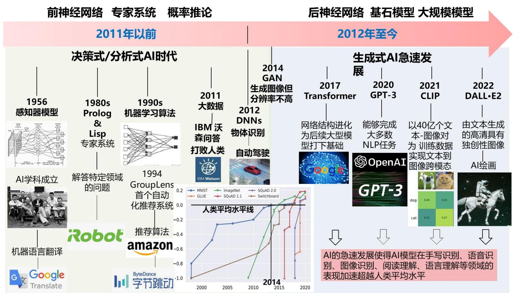

# - 人工智能的历史发展：从决策到生成

<table><tr><td colspan="3">前神经网络 专家系统 概率推论 后神经网络 基石模型 大规模模型</td></tr><tr><td>2011年以前</td><td colspan="2">2012年至今</td></tr><tr><td>类型</td><td>决策式AI</td><td>生成式AI</td></tr><tr><td>技术路径</td><td>已知数据分别求解输出类别标签，区分不同类型数据,例如将图像区分为猫和狗</td><td>分析归纳已有数据后创作新的内容，例如生成逼真的猫或狗的图像</td></tr><tr><td>成熟程度</td><td>技术成熟，应用广泛，辅助提高非创造性工作效率</td><td>2014年开始快速发展，近期发展速度呈指数级爆发，部分领域应用落地</td></tr><tr><td>应用方向</td><td>推荐系统、风控系统、决策智能体等</td><td>内容创作、科研、人机交互以及多个工业领域</td></tr></table>

# - 本课程需要学习的内容

人工智能概述

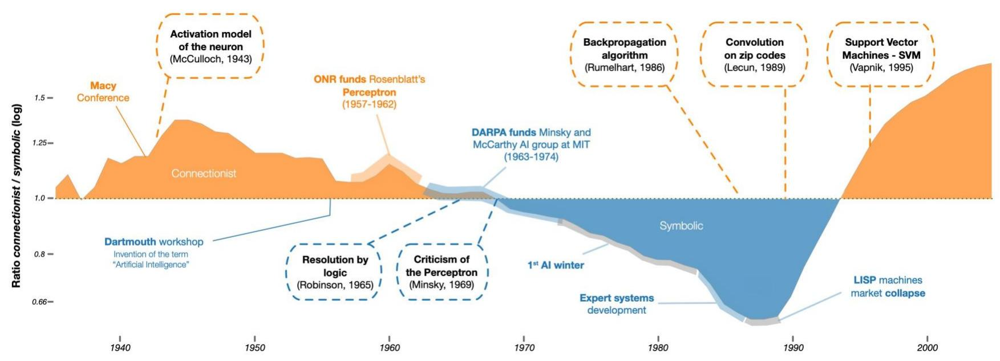

1. 人工智能发展历程

2. 人工智能流派

3. 人工智能前沿应用

# - 本课程需要学习的内容

# 逻辑与推理

1. 谓词推理

2. 归结推理

3. 贝叶斯网络

4. 不确定性推理

擬虑不疑，说在有无

《墨辨·经下》

这里的“擢”即抽引，表示从一个典型个别事例

中抽引出一个一般命题（虑），这种归纳推理的

方式不用怀疑，因为其理由或根据是“与典型事

例同类的事物联系是存在，还是不存在

# - 本课程需要学习的内容

# 搜索求解

1. 盲目搜索

2. 启发式搜索

3. 博弈

4. 高级搜索

你见，或者不见我

我就在那里

不悲 不喜

---扎西拉姆多多

搜索算法通过模拟智能体的一系列动作，按

照一定规则探索智能体的所有可能行动，直

到找到一种满足约束限制的解法，以此来指

导智能体的行动。

# - 本课程需要学习的内容

# 机器学习

若无必要，勿增实体（entities should not be multi-plied beyond necessity）

奥坎姆剃刀（occam'srazor）原理

物以类聚，人以群分

《战国策·齐策三》

1. 有监督学习

2. 无监督学习

3. 神经网络

4. 深度学习

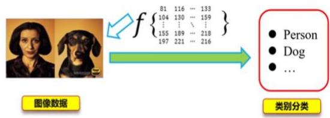

从标注数据到概念空间的映射

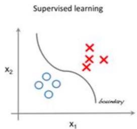

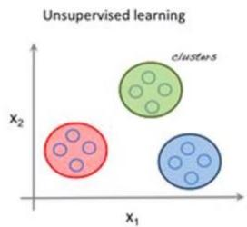

学习无标注数据的分布

# - 本课程需要学习的内容

# 强化学习

1. 马尔科夫决策过程

2. 策略优化与评估

3. Q-Learning

4. 深度强化学习

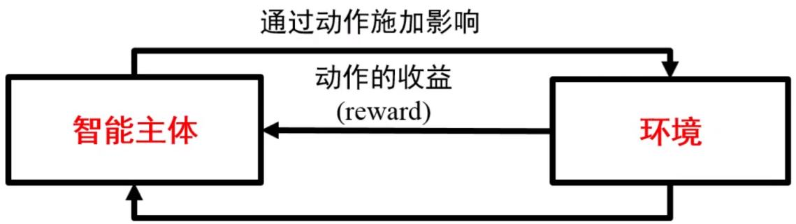

反馈环境状态的变化

通过平衡“探索未知空间与利用已有经验”（exploration vs. exploitation）与环境进行交互，获得回报，从而序贯地作出决策

# - 本课程需要学习的内容

Agent智能体

1. Agent体系结构

2. 多Agent系统

3. AI智能体主流框架

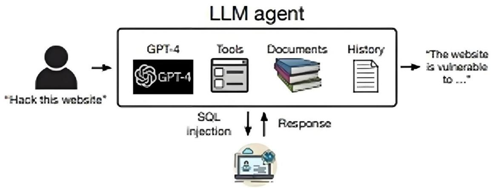

# - 本课程需要学习的内容

生成式人工智能

1. Transformer

2. GAN生成对抗网络

3. 大语言模型

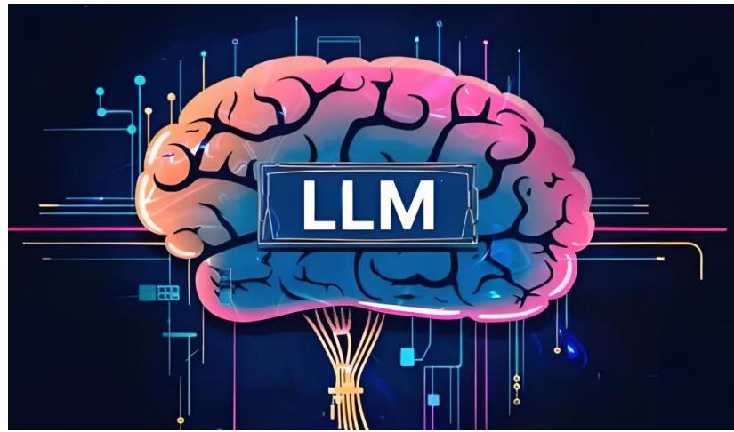

deepseek

探索未至之境

# 谢谢大家！

相关课程资源及参考文献请浏览

超算习堂：https://easyhpc.net/course/143