# 人工智能高级搜索


授课对象：计算机科学与技术专业 二年级

课程名称：人工智能（专业必修）

节选内容：第四章 搜索技术 III

课程学分：3学分

# 爬山算法

# 局部搜索算法

1 搜索算法在内存中保留一条或多条路径并且记录哪些是已经探索过的，哪些是还没有探索过的。当找到目标时，到达目标的路径同时也构成了这个问题的一个解。除非智能体做出改变环境的行为，否则状态不会改变

$\diamond$ 在许多问题中，问题的解与到达目标的路径是无关的。

$\spadesuit$ 例如，在八皇后问题中，重要的是最终皇后的布局，而不是加入皇后的次序。

$\diamond$ 这类问题包括了：集成电路设计；工厂场地布局；作业车间调度；自动程序设计；电信网络优化；车辆寻径；文件夹管理

◼ 这种假设并不总是合理的如果目标路径与问题解不相关，将考虑各种根本不关心路径（耗散）的算法，其中占据重要地位的就是局部搜索算法；

# 局部搜索算法

◼局部搜索算法: 局部搜索算法从单独的一个当前状态出发，通常只移动到与之相邻的状态。

$\diamond$ ◆ 典型情况下，搜索的路径是不保留的

$\spadesuit$ 优点：只占用少量的内存，通常可以在很大状态空间中找到合理的解

除了找到目标，局部搜索算法对于解决纯粹的最优化问题是很有用的，其目标是根据一个目标函数找到最佳状态。

$\diamond$ 许多最优化问题不适合于“标准的”搜索模型。如自然界提供了一个目标函数——繁殖适应性——达尔文的进化论可以被视为优化的尝试，但是这个问题没有“目标测试”和“路径耗散”。

# 局部搜索算法

# ◼局部搜索算法: 类比在地形图中找到最高或最低点

$\diamond$ 地形图既有“位置”（用状态定义），又有“高度”（由启发式耗散函数或目标函数值定义）。

$\diamond$ 如果高度对应于耗散，那么目标是找到最低谷——即一个全局最小值；

$\spadesuit$ 如果高度对应于目标函数，那么目标是找到最高峰——即一个全局最大值。

$\spadesuit$ 局部搜索算法就象对地形图的探索，如果存在解，那么完备的局部搜索算法总能找到解；最优的局部搜索算法总能找到全局最小值／最大值。

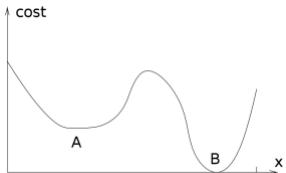


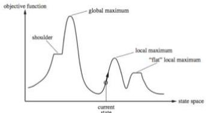


# 爬山法搜索

爬山搜索算法是一种贪婪局部搜索算法，可在海拔/值不断增加的方向上连续移动以找到山峰或对该问题的最佳解决方案。当它达到一个峰值，没有邻居有更高的值时，它将终止。

$\spadesuit$ 它也被称为贪婪本地搜索，因为它只查找其良好的直接邻居状态，而没有超出此范围

$\diamond$ 爬山算法的节点具有状态和值两个部分

$\diamond$ 不需要维护和处理搜索树或图形，而是仅保留一个当前状态

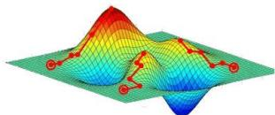


$\spadesuit$ 爬山算法是一种用于优化数学问题的技术。爬山算法的一个被广泛讨论的例子是旅行推销员问题，其中我们需要最小化推销员的行进距离。当有良好的启发式功能时，通常会使用“爬山”。

# 爬山法搜索：8皇后问题

局部搜索算法通常使用完全状态形式化，即每个状态都在棋盘上放8个皇后，每列一个。

目标：任何一个皇后都不会攻击到其他的皇后（皇后可以攻击和它在同一行、同一列或同一对角线上的皇后）。

后继函数：返回的是移动一个皇后到和它同一列的另一个方格中的所有可能的状态。因

此，每个状态有 $5 6 { = } 8 { \ast } 7$ 个后继。

启发式耗散函数h：是可以彼此攻击的皇后对的数目，不管

中间是否有障碍。全局最小值为0，即没有彼此攻击的皇后对。

<table><tr><td>18</td><td>12</td><td>14</td><td>13</td><td>13</td><td>12</td><td>14</td><td>14</td></tr><tr><td>14</td><td>16</td><td>13</td><td>15</td><td>12</td><td>14</td><td>12</td><td>16</td></tr><tr><td>14</td><td>12</td><td>18</td><td>13</td><td>15</td><td>12</td><td>14</td><td>14</td></tr><tr><td>15</td><td>14</td><td>14</td><td>0</td><td>13</td><td>16</td><td>13</td><td>16</td></tr><tr><td>0</td><td>14</td><td>17</td><td>15</td><td>0</td><td>14</td><td>16</td><td>16</td></tr><tr><td>17</td><td>0</td><td>16</td><td>18</td><td>15</td><td>0</td><td>15</td><td>0</td></tr><tr><td>18</td><td>14</td><td>0</td><td>15</td><td>15</td><td>14</td><td>0</td><td>16</td></tr><tr><td>14</td><td>14</td><td>13</td><td>17</td><td>12</td><td>14</td><td>12</td><td>18</td></tr></table>

# 爬山法搜索：8皇后问题

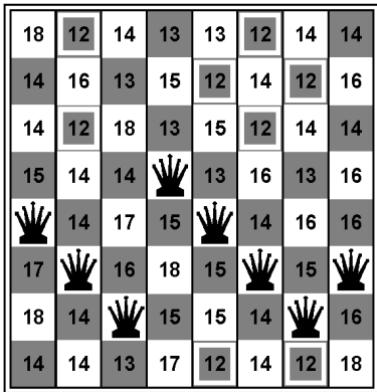


h＝17的一个状态，最好的后继的 $h = 1 2$

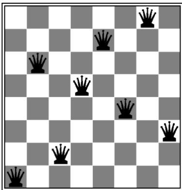


h取局部极小值时的一个状态

# 爬山法搜索

◼爬山法(hill-climbing)：是一个向值增加的方向持续移动的循环过程，即登高过程。

；最陡上升方式的爬山搜索算法

；如果相邻状态中没有比它更高的值，则算法结束于“峰顶”

function Hill-Climbing( problem )

inputs: problem, a problem

returns a state that is a local maximum

1. current  Make-Node( Initial-Sate[ problem ])

2. loop do

3. neighbor a highest-valued successor of current

4. if Value[ neighbor ] $\mid < =$ Value[ current ] thenreturn State[ current ]

5. current neighbor

# 爬山法搜索：8皇后问题

<table><tr><td>18</td><td>12</td><td>14</td><td>13</td><td>13</td><td>12</td><td>14</td><td>14</td></tr><tr><td>14</td><td>16</td><td>13</td><td>15</td><td>12</td><td>14</td><td>12</td><td>16</td></tr><tr><td>14</td><td>12</td><td>18</td><td>13</td><td>15</td><td>12</td><td>14</td><td>14</td></tr><tr><td>15</td><td>14</td><td>14</td><td>Q</td><td>13</td><td>16</td><td>13</td><td>16</td></tr><tr><td>Q</td><td>14</td><td>17</td><td>15</td><td>Q</td><td>14</td><td>16</td><td>16</td></tr><tr><td>17</td><td>Q</td><td>16</td><td>18</td><td>15</td><td>Q</td><td>15</td><td>Q</td></tr><tr><td>18</td><td>14</td><td>Q</td><td>15</td><td>15</td><td>14</td><td>Q</td><td>16</td></tr><tr><td>14</td><td>14</td><td>13</td><td>17</td><td>12</td><td>14</td><td>12</td><td>18</td></tr></table>


图4.1（a）


<table><tr><td></td><td></td><td></td><td></td><td></td><td></td><td>Q</td><td></td></tr><tr><td></td><td></td><td></td><td></td><td>Q</td><td></td><td></td><td></td></tr><tr><td></td><td>Q</td><td></td><td></td><td></td><td></td><td></td><td></td></tr><tr><td></td><td></td><td></td><td>Q</td><td></td><td></td><td></td><td></td></tr><tr><td></td><td></td><td></td><td></td><td></td><td>Q</td><td></td><td></td></tr><tr><td></td><td></td><td></td><td></td><td></td><td></td><td></td><td>Q</td></tr><tr><td></td><td></td><td>Q</td><td></td><td></td><td></td><td></td><td></td></tr><tr><td>Q</td><td></td><td></td><td></td><td></td><td></td><td></td><td></td></tr></table>


图4.1（b）


爬山法能很快朝着解的方向进展。例如，从图4-1（a）中的状态，它只需要五步就能到达图4-1（b）中的状态，它的h=1，这基本上很接近于解了。可是，爬山法经常会遇到下面的问题：

# 爬山法搜索：存在问题

 爬山法是一种贪婪局部搜索，不是最优解算法(或是不完备的), 爬山法经常会遇到下面的问题：

局部极大值：比其邻居状态都高的顶峰，但是小于全局最大值。

高原或山肩：评价函数平坦的一块区域。山肩有上坡边缘

山脊：一系列的局部极大值。

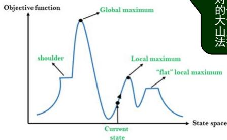


对于 对于状态空间地形图上评的一块区域。它可能是一大值，不存在上山的出路，山肩，从山肩还有可能取法搜索可能无法找到离开 间 地开 价块得高 值平坦局部极夏索 。爬道路。 山

➢局部极大值是一个比它的每个邻居状态都高的峰顶，但是比全局最大值要低。

➢爬山法算法到达局部极大值附近就会被拉向峰顶，然后被卡在局部极大值处无处可走。

➢更具体地，图4-1（b）部极大值（即耗散h的局部极小值）；不管移动哪个皇后得到的情况都会比原来差。 部极大值即耗h的局部 中的状态事实上是一个局得到的情况都会比原

# 爬山法搜索：存在问题

对于最陡上升的爬山法算法，从一个随机生成的八皇后问题的状态开始；

$\diamond$ 在86％的情况下会被卡住；

$\spadesuit$ 只有 $14 \%$ 的问题实例能求到最优解。

但这个算法速度很快，成功得到最优解的平均步数是4步，被卡住的平均步数是3步。

$\spadesuit$ 对于包含8的8次方≈1千7百万个状态的状态空间是不错的结果。

# 爬山法搜索：解决思路

◼ 前述算法中，如果到达一个高原，最佳后继的状态值和当前状态值相等时将会停止。

如果高原其实是山肩，继续前进——即侧向移动通常是一种好方法

如果高原是平坦的局部最大值而不是山肩，算法会陷入死循环

$\diamond$ 限制侧向移动次数。

例、八皇后问题中，允许最多连续侧向移动100次，将使问题实例的解决率从14％上升到94％。

⚫ 代价是每个成功搜索实例的平均步长大约为21步，每个失败搜索的平均步长大约为64步。

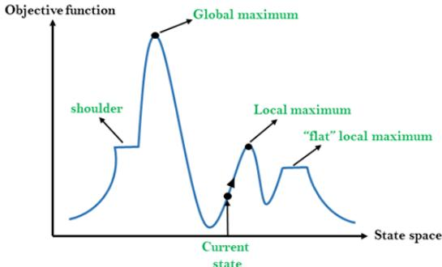


# 爬山法搜索的变形

针对爬山法的不足，有许多变化的形式

◼ 随机爬山法，它在上山移动中随机地选择下一步；选择的概率随着上山移动的陡峭程度而变化。

 这种算法通常比最陡上升算法的收敛速度慢不少，但是在某些状态空间地形图上能找到更好的解。

1 首选爬山法，它在实现随机爬山法的基础上，采用的方式是随机地生成后继节点直到生成一个优于当前节点的后继。

 这个算法在有很多后继节点的情况下有很好的效果。

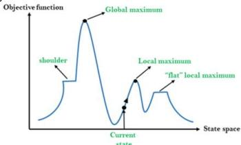


随机重新开始爬山法：随机生成初始状态，进行一系列爬山法搜索。这时算法是完备的概率接近1。

 如果爬山法每次成功的概率为p，则需要重新开始搜索的期望次数是1/p。

 对于皇后问题，该方法通常用不了1分钟就可以找到解。

# 爬山法搜索的特点

爬山法搜索成功与否在很大程度上取决于状态空间地形图的形状。

➢ 如果在图中几乎没有局部极大值和高原，随机重新开始的爬山法将会很快地找到好的解。

➢ 许多实际问题的地形图存在着大量的局部极值。NP难题通常有指数级数量的局部极大值。

经过少数随机重新开始的搜索之后还是能找到一个合理的较好的局部极大值的。

# 模拟退火算法

# 模拟退火算法

# ◼模拟退火算法概述

$\diamond$ 模拟退火算法（Simulated Annealing，SA）是一种模拟物理退火的过程而设计的优化算法。它的基本思想最早在1953年就被Metropolis提出，但直到1983年Kirkpatrick等人才设计出真正意义上的模拟退火算法并进行应用。

# ⚫ 至今我们考虑的◼模拟退火算法目的

$\spadesuit$ 解决NP复杂性问题；

$\diamond$ 克服优化过程陷入局部极小；

$\spadesuit$ 克服初值依赖性。

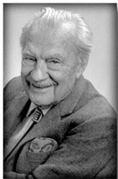


Nick Metropolis


# 模拟退火算法

# 物理退火过程

$\diamond$ 退火是指将固体加热到足够高的温度，使分子呈随机排列状态，然后逐步降温使之冷却，最后分子以低能状态排列，固体达到某种稳定状态。

◼ 加温过程— 增强粒子的热运动，消除系统原先可能存在的非均匀态；

等温过程——对于与环境换热而温度不变的封闭系统，系统状态的自发变化总是朝自由能减少的方向进行，当自由能达到最小时，系统达到平衡态；

◼ 冷却过程— 使粒子热运动减弱并渐趋有序，系统能量逐渐下降，从而得到低能的晶体结构。


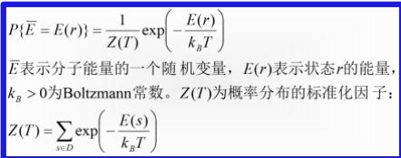


在温度T，分子停留在状态r满足Boltzmann概率分布

# 模拟退火算法

# ◼物理退火过程数学表述

在同一个温度T，选定两个能量E1<E2，有

$$
\overbrace {P \{\bar {E} = E _ {1} \} - P \{\bar {E} = E _ {2} \}} ^ {P \{\bar {E} = E _ {1} \} - P \{\bar {E} = E _ {2} \}} = \frac {1}{Z (T)} \exp \left(- \frac {E _ {1}}{k _ {B} T}\right) \left[ 1 + \exp \left(- \frac {E _ {2} - E _ {1}}{k _ {B} T}\right) \right]
$$

在同一个温度，分子停留在能量小的状态的概率比停留在能量大的状态的概率要大。

# 模拟退火算法

# ◼物理退火过程数学表述

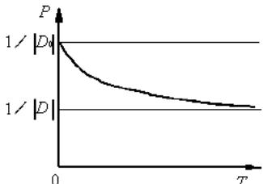


智能体做出改变最低能量的状态


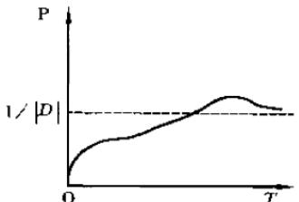


状态不会改变非最低能量的状态


$\spadesuit$ 若|D|为状态空间D中状态的个数，D0是具有最低能量的状态集合：

$\diamond$ 当温度很高时，每个状态概率基本相同，接近平均值1/|D|；

$\spadesuit$ 状态空间存在超过两个不同能量时，具有最低能量状态的概率超出平均值1/|D| ；

$\spadesuit$ 当温度趋于0时，分子停留在最低能量状态的概率趋于1。

# 模拟退火算法

# ◼物理退火过程数学表述

# Metropolis准则（1953） 以概率接受新状态

固体在恒定温度下达到热平衡的过程可以用Monte Carlo方法（计算机随机模拟方法）加以模拟，虽然该方法简单，但必须大量采样才能得到比较精确的⚫ 至今我们考虑的结果，计算量很大。

# 模拟退火算法

# ◼物理退火过程数学表述

# Metropolis准则（1953） 以概率接受新状态

若在温度T，当前状态 $\dot { \cdot } \dot { 1 } \longrightarrow$ 新状态j

若Ej<Ei，则接受 j 为当前状态；

至今我们考虑否则，若概率 $\scriptstyle \mathbf { p } = \mathbf { e x p } [ - ( \mathbf { E j - E i } ) / \mathbf { k B T } ]$ 能体对环境有完全的控制 大于[0,1)区间的随机数，则仍接受状态j 为当前状态；若不成立则保留状态 i 为当前状态。

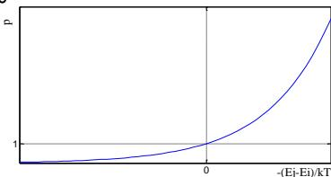


# 模拟退火算法

# ◼物理退火过程数学表述

# Metropolis准则（1953） 以概率接受新状态

$$
p = \exp [ - (E _ {j} - E _ {i}) / k _ {B} T ]
$$

在高温下，可接受与当前状态能量差较大的新状态；

今我们考虑的搜索问题都假设智能体对环境有完全在低温下，只接受与当前状态能量差较小的新状态。

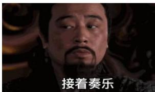


高温


低温


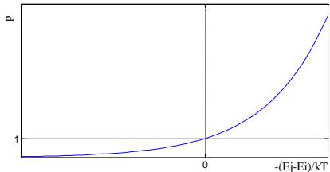


# 模拟退火算法

# ◼物理退火过程数学表述

退火是指将固体加热到足够高的温度，使分子呈随机排列状态，然后逐步降温使之冷却，最后分子以低能状态排列，固体达到某种稳定状态。

# ◼模拟退火算法思想

模拟退火算法采用类似于物理退火的过程，先在一个高温状态下（相当于算法随机搜索,大概率接受劣解），然后逐渐退火，徐徐冷却（接受劣解概率变小直至为零，相当于算法局部搜索），最终达到物理基态（相当于算法找到最优解）。算法的本质是通过温度来控制算法接受劣解的概率（劣向转移是脱出局部极小的核心机制）。

# 模拟退火算法思想

物理退火过程

物体内部的状态

状态的能量

温度

➢ 除非熔解过程

退火冷却过程

状态的转移

能量最低状态

类比关系

模拟退火算法

问题的解空间

解的质量

控制参数

改变设定初始温度

控制参数的修改

解在邻域中的变化

最优解

# 模拟退火基本流程

# 基本步骤

给定初温 $\mathtt { t } = \mathtt { t } 0$ ，随机产生初始状态 $\mathtt { s } { = } \mathtt { s } 0$ ，令 $\scriptstyle \mathbf { k } = 0$ ；

Repeat

Repeat

产生新状态 $\begin{array} { r } { s j = G e n e t e { ( s ) } _ { \mathrm { ~ } } } \end{array}$

$$
\text {i f} \quad \min  \left\{\mathbf {1}, e x p \left[ - \left(C \left(s _ {j}\right) - C (s)\right) / t _ {k} \right] \right\} > = r a n d r o m [ \mathbf {0}, \mathbf {1} ] \quad s = s _ {j};
$$

Until 抽样稳定准则满足；

退温 $t _ { k + 1 } = u p d a t e ( t _ { k } )$ 并令 $\pmb { k } = \pmb { k } + \pmb { 1 }$ ；

Until 算法终止准则满足；

输出算法搜索结果。

# 模拟退火基本流程

# 影响优化结果的主要因素

给定初温 $_ { \mathrm { t } = \mathrm { t } 0 }$ ，随机产生初始状态 $\mathtt { s } { = } \mathtt { s } 0$ ，令 $\scriptstyle \mathbf { k } = 0$ ；

Repeat

Repeat

产生新状态 $\begin{array} { r } { s j = G e n e t e { ( s ) } _ { \mathrm { ~ } } } \end{array}$

$$
\text {i f} \min  \{1, \exp [ - (C (s _ {j}) - C (s)) / t _ {k} ] \} > = r a n d r o m [ 0, 1 ] s = s _ {j};
$$

Until 抽样稳定准则满足；

退温 $t _ { k + 1 } = u p d a t e ( t _ { k } )$ 并令 $\pmb { k } = \pmb { k } + \pmb { 1 }$

Until 算法终止准则满足；

输出算法搜索结果。

三函数两准则

初始温度

# 模拟退火基本要素

从算法流程上看，模拟退火（SA）算法包括三函数两准则，即状态产生函数、状态接受函数、温度更新函数、内循环终止准则和外循环终止准则，这些环节的设计将决定SA算法的优化性能。此外，初温的选择对SA算法性能也有很大影响。

理论上，SA算法的参数只有满足算法的收敛条件，才能保证实现的算法依概率1收敛到➢ 除非智能体做出改变环境的行为，否则状态不会改变全局最优解。然而，SA算法的某些收敛条件无法严格实现，即使某些收敛条件可以实现，但也常常会因为实际应用的效果不理想而不被采用。因此，至今SA算法的参数选择依然是一个难题，通常只能依据一定的启发式准则或大量的实验加以选取。

# 模拟退火算法基本要素

# ◼状态产生函数

$\diamond$ 设计状态产生函数（邻域函数）的出发点应该是尽可能保证产生的候选解遍布全部解空间。通常，状态产生函数由两部分组成，即产生候选解的方式和候选解产生的概率分布。

$\spadesuit$ 前者决定由当前解产生候选解的方式，后者决定在当前解产生的候选解中选择不同至今我们考状态的概率。

$\spadesuit$ ◆ ➢ 除非智能体做出改变环境的行为，否则状态不会改变候选解的产生方式由问题的性质决定，通常在当前状态的邻域结构内以一定概率方式产生，而邻域函数和概率方式可以多样化设计，其中概率分布可以是均匀分布、正态分布、指数分布、柯西分布等。在组合优化中，通常采用解的局部搜索操作，如0-1背包问题用翻位操作，TSP问题中用交换两个城市，翻转城市片段等操作。

# 模拟退火算法基本要素

# ◼状态接受函数

$\spadesuit$ 状态接受函数一般以概率的方式给出，不同接受函数的差别主要在于接受概率的形式不同。设计状态接受概率，应该遵循以下原则：

在固定温度下，接受使目标函数值下降的候选解的概率要大于使目标函数值上升的候选解的概率；

随温度的下降，接受使目标函数值上升的解的概率要逐渐减小；

今我们考虑的搜索问题都假设智能当温度趋于零时，只能接受目标函数值下降的解。

$\spadesuit$ 状态接受函数的引入是SA 算法实现全局搜索的最关键的因素，但实验表明，状态接受函数的具体形式对算法性能的影响不显著。因此，SA 算法中通常采用min[1,exp(-⊿C/t)]作为状态接受函数。

# 模拟退火算法基本要素

# 初温

◦ 初始温度t、温度更新函数、内循环终止准则和外循环终止准则通常被称为退火历程(annealing schedule)。

◦ 实验表明，初温越大，获得高质量解的几率越大，但花费的计算时间将增加。因此，至今我们考虑的搜索问题都假设智能体对环境有完初温的确定应折衷考虑优化质量和优化效率，常用方法包括：

➢ 除非智能体做出改变环境的行为，否则状态不（1）均匀抽样一组状态，以各状态目标值的方差为初温；

（2）随机产生一组状态，确定两两状态间的最大目标值差|⊿max|，然后依据差值，利用一定的函数确定初温。譬如t0=－⊿max/lnPr，其中Pr为初始接受概率。若取Pr接近1，且初始随机产生的状态能够一定程度上表征整个状态空间时，算法将以几乎等同的概率接受任意状态，完全不受极小解的限制；

（3）利用经验公式给出。

# 模拟退火算法基本要素

# 温度更新函数

◦ 温度更新函数，即温度的下降方式，用于在外循环中修改温度值。

◦ 在非时齐SA 算法收敛性理论中，更新函数可采用指数函数。

# 如时齐算法的温度下降函数

今我（1） $t _ { k + 1 } = \alpha t _ { k } , k \geq 0 , 0 < \alpha < 1$ 设智能体对环境有完全的控制，α越接近1温度下降越慢，且其大小可以不断变除化；

（2） $t _ { k } = \frac { K - k } { K } t _ { 0 }$ ，其中t为起始温度，K为算法温度下降的总次数

若固定每一温度，算法均计算至平稳分布，然后下降温度，则称为时齐算法；若无需各温度下算法均达到平稳分布，但温度需按一定速率下降，则称为非时齐算法。

# 模拟退火算法基本要素

# ◼ 内循环终止准则

◦ 内循环终止准则，或称Metropolis 抽样稳定准则，用于决定在各温度下产生候选解的数目。

◦ 在非时齐SA算法理论中，由于在每个温度下只产生一个或少量候选解，所以不存在选择内循环终止准则的问题。

◦ 在时齐SA算法理论中，收敛性条件要求在每个温度下产生候选解数目趋于无穷大，以使相应的马氏链达到平稳概率分布，显然在实际应用算法时这是无法实现的，常用的抽样稳定准则包括：

 检验目标函数的均值是否稳定；

 连续若干步的目标值变化较小；

 按一定的步数抽样。

# 模拟退火算法基本要素

# ◼外循环终止准则

◦ 外循环终止准则，即算法终止准则，用于决定算法何时结束。设置温度终值te是一种简单的方法。SA 算法的收敛性理论中要求te趋于零，这显然是不实际的。通常的做法包括

至今我们考虑的搜设置终止温度的阈值；

➢ 除非智能体做出改变环境的行为，否则状态不会改变设置外循环迭代次数（内循环*外循环=算法总循环，给定总循环数，合理分配内外循环，如 $1 0 ^ { * } 1 0 0 0 { = } 1 0 0 0 0 )$ ）；

◦ 算法搜索到的最优值连续若干步保持不变

◦ 检验系统熵是否稳定

# 模拟退火算法基本流程

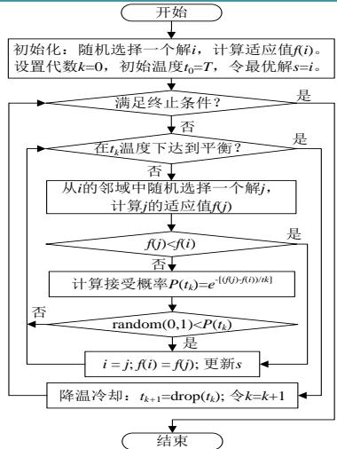


功能：模拟退火算法伪代码

/说明：本例以求问题最小值为目标

//参数：T为初始温度;L为内层循环次数

# procedure SA

//Initialization

Randomly generate a solution $X _ { 0 } ,$ ,and calculate itsfitnessvalue $f ( X _ { 0 } )$ 

$$
X _ {b e s t} = X _ {0}; k = 0; t _ {k} = T;
$$

while not stop

$t _ { k }$

for $i { = } 1$ to $L$ //The loop times

Generateanewsolution $X _ { n e w }$ based on the current体对 $X _ { k } .$ 境有完全的控 $f ( X _ { n e w } )$ .

$$
\mathbf {i f} f (X _ {\text {n e w}}) <   f (X _ {k})
$$

$$
X _ {k} = X _ {\text {n e w}};
$$

$$
\text {i f} f \left(X _ {k}\right) <   f \left(X _ {\text {b e s t}}\right) X _ {\text {b e s t}} = X _ {k};
$$

$$
\text {c o n t i n u e s};
$$

endif

Calculate P(tk)=e[(f(Xnew)-f(Xk)/k]),

$$
i f \operatorname {r a n d o m} (0, 1) <   P
$$

$$
X _ {k} = X _ {\text {n e w}};
$$

end if

end for

//Drop down the temperature

$$
t _ {k + 1} = \operatorname {d r o p} (t _ {k}); k = k + 1;
$$

end while

print Xbest

end procedure

# 模拟退火算法基本要素与设置

# 功能意义

影响模拟退火算法全局搜索性能的重要因素之一。实验表明，初温越大，获得高质量解的几率越大，但花费的计算时间将增加。

状态空间与状态产生函数。邻域函数（状态产生函数）应尽可能保证产生的候选解遍布全部解空间。

指从一个状态 $X _ { k }$ (一个可行解)向另一个状态 $X _ { n e w }$ （另一个可行解)的转们考虑的搜索问解为当前解的概率

指从某一较高温状态to向较低温状态冷却时的降温管理表，或者说降温方式

内层平衡也称Metropolis抽样稳定准则，用于决定在各温度下产生候选解的数目

算法的终止条件

# 基本要素

初始温度

邻域函数

接受概率

冷却控制

内层平衡

终止条件

# 设置方法

1、均匀抽样一组状态，以各状态目标值的方差定初温

2、随机产生一组状态，以两两状态间最大差值定初温

3、利用经验公式给出初温

候选解一般采用按照某一概率密度函数对解空间进行随机采样来获得。

概率分布可以是均匀分布、正态分布、指数分布等等

一般采用Metropolis准则

$$
P _ {i j} ^ {T} = \left\{ \begin{array}{l l} 1, & \text {i f} E (j) \leq E (i) \\ e ^ {- \frac {E (j) - E (i)}{k T}} = e ^ {- \frac {\Delta E}{k T}}, & \text {o t h e r w i s e} \end{array} \right.
$$

1、经典模拟退火算法的降温方式tk = 1g(1+k) t0

2、快速模拟退火算法的降温方式𝑡k= t01+k

1、检验目标函数的均值是否稳定

2、连续若于步的目标值变化较小

3、预先设定的抽样数目，内循环代数

1、设置终止温度的阈值

2、设置外循环迭代次数

3、算法搜索到的最优值连续若于步保持不变

4、检验系统熵是否稳定

# 模拟退火算法的优缺点

◼模拟退火算法的优点

质量高；

初值鲁棒性强；

简单、通用、易实现。

◼模拟退火算法的缺点

➢ 除非智能体做出改变环境的行为，否则状态不会改变由于要求较高的初始温度、较慢的降温速率、较低的终止温度，以及各温度下足够多次的抽样，因此优化过程较长。

# 模拟退火算法的应用案例

 例题 已知背包的装载量为 $\curvearrowleft$ ，现有 $\pmb { n = 5 }$ 个物品，它们的重量和价值分别是(2,3, 5, 1, 4)和(2, 5, 8, 3, 6)。试使用模拟退火算法求解该背包问题，写出关键的步骤。

 求解：假设问题的一个可行解用0和1的序列表示，例如 $\dot { \pmb { \mathscr { r } } } =$ (1010)表示选择第1和第3个物品，而不选择第2和第4个物品。用模拟退火算法求解关键过程如图所示：

# 模拟退火算法的应用案例

已知：

物体个数： $n { = } 5$

背包容量： $c { = } 8$

重量w=(2,3,5,1,4)

价值v=(2,5,8,3,6)

第一步：初始化。假设初始解为i=(11001)，初始温度为T=10。计算 $f ( i ) = 2 + 5 + 6 = 1 3$ ，最优解 $s { = } i$

第三步：降温，假设温度降为非智能体做出改变返回第二步继续执行

假设在继续运行的时候，从当前解i=(10110)得到一个新解j=(00111)，这时候的函数值为fj)=8+3+6=17，这是个全局最优解。可见上面过程中接受了劣解是有好处的。

第二步：在T温度下局部搜索，直到“平衡”， 假设平衡条件为执行了3次内层循环。

（2-1）产生当前解i的一个邻域解j（如何构造邻域根据具体的问题而定，这里假设为随机改变某一位的0/1值或者交换某两位的0/1值），假设j=(11100)

要注意产生的新解的合法性，要舍弃那些总重量超过背包装载量的非法解

(2-2）f(j)=2+5+8=15>13=f(i)，所以接受新解ji=j;f(i)=f(j)=15；而且s=i；要注意求解的是最大值，因此适应值越大越优

（2-3）返回（2-1）继续执行。

(a)假设第二轮得到的新解j=(11010)，由于 $f ( j ) = 2 + 5 + 3 = 1 0$$\scriptstyle 1 < 1 5 = f ( i )$ ，所以需要计算接受概率 $P ( T ) { = } \mathrm { e x p } ( ( f ( j ) { - } f ( i ) ) / T ) =$exp(-0.5)= 0.607，假设random $( 0 , 1 ) { > } P ( T )$ ，则不接受新解

(b)假设第三轮得到的新解i=(10110)，由于 $\scriptstyle { f ( j ) = 2 + 8 + 3 = 1 3 }$<15=f(i)，所以需要计算接受概率 $P ( T ) { = } \mathrm { e x p } ( ( f ( j ) { - } f ( i ) ) / T ) =$exp(-0.3)=0.741，假设random $( 0 , 1 ) { < } P ( T )$ ，则接受新解按照一定的概率接受劣解，也是跳出局部最优的一种手段

（2-4）这时候，T温度下的“平衡”已达到（即已经完成了3次的邻域产生），结束内层循环

# 模拟退火算法的应用案例

 The Traveling Salesman Problem (TSP) is one of the most widely studied combinatorialoptimization problems.

 Its statement is deceptively simple: A salesperson seeks the shortest tour through n cities.

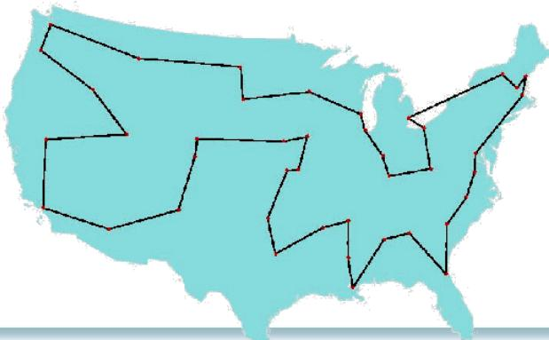


# 模拟退火算法的应用案例

 思考：如何用模拟退火法求解TSP问题？

 提示：采用排列编码表示TSP的解，如五个城市的TSP的解可表示为：

1 3 5 4 2，状态产生函数设为交换任意两个城市顺序，如交换3和4，得：

1 4 5 3 2，其余按背包问题求解类似设计思路。脱出局部极小如图所示：

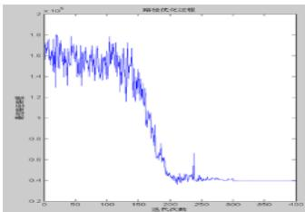


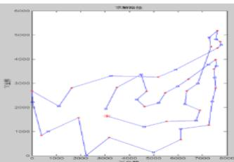


# 遗传算法

# 遗传算法：进化算法

进化算法(evolutionary algorithms，EA)是基于自然选择和自然遗传等生物进化机制的一种搜索算法。

生物进化是通过繁殖、变异、竞争和选择实现的；而进化算法则主要通过选择、重组和变异这三种操作实现优化问题的求解。

进化算法是一个“算法簇”，包括遗传算法(GA)、遗传规划、进化策略和进化规划等。

进化算法的基本框架是遗传算法所描述的框架。

# 遗传算法：进化算法

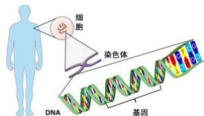


适者生存：最适合自然环境的群体往往产生更大的后代群体

• 生物进化的基本过程：

染色体(chromosome)： 生物的遗传物质的主要载体。

基因(gene)：扩展生物性状的遗传物质的功能单元和结构单位。

基因座（locus）：染色体中基因的位置。

等位基因（alleles）：基因所取的值。

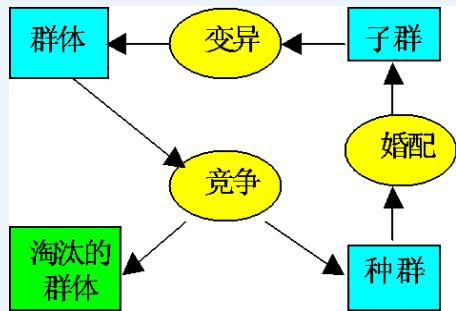


# 遗传算法的概念

遗传算法（genetic algorithms，GA）：一类借鉴生物界自然选择和自然遗传机制的随机搜索算法,非常适用于处理传统搜索方法难以解决的复杂和非线性优化问题。

遗传算法可广泛应用于组合优化、机器学习、自适应控制、规划设计和人工生命等领域。

# 遗传算法的概念

# The general structure of genetic algorithms

Gen, M. & R. Cheng: Genetic Algorithms and Engineering Design, John Wiley, New York, 1997.

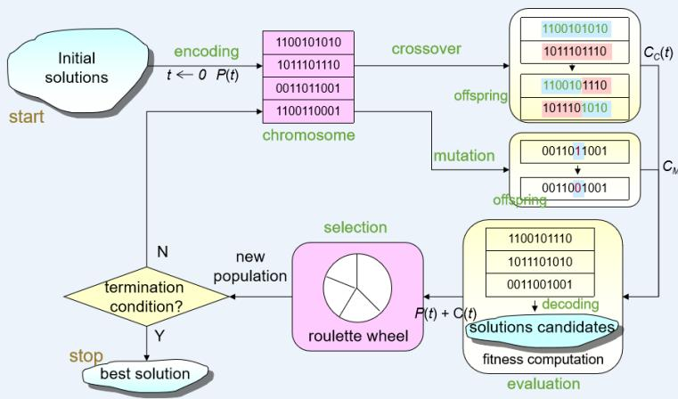


<table><tr><td>生物遗传概念</td><td>遗产算法中的应用</td></tr><tr><td>适者生存</td><td>目标值比较大的解被选择的可能性大</td></tr><tr><td>个体(Individual)</td><td>解</td></tr><tr><td>染色体(Chromosome)</td><td>解的编码(字符串、向量等)</td></tr><tr><td>基因(Gene)</td><td>解的编码中每一分量</td></tr><tr><td>适应性(Fitness)</td><td>适应度函数值</td></tr><tr><td>群体(Population)</td><td>根据适应度值选定的一组解(解的个数为群体的规模)</td></tr><tr><td>婚配(Marry)</td><td>交叉(Crossover)选择两个染色体进行交叉产生一组新的染色体的过程</td></tr><tr><td>变异(Mutation)</td><td>编码的某一分量发生变化的过程</td></tr></table>

# 遗传算法概念对比

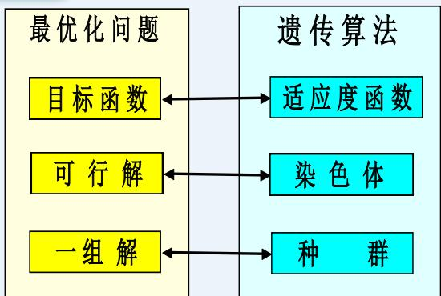


# 遗传算法的基本思想：

在求解问题时从多个解开始，然后通过一定的法则进行逐步迭代以产生新的解。

# 遗传算法发展历程

·1962年，Fraser提出了自然遗传算法。

·1965年，Holland首次提出了人工遗传操作的重要性。

·1967年，Bagley首次提出了遗传算法这一术语。

·1970年，Cavicchio把遗传算法应用于模式识别中。

·1971年，Hollstien在论文《计算机控制系统中人工遗传自适应方法》中阐述了遗传算法用于数字反馈控制的方

·1975年，美国J.Holland出版了《自然系统和人工系统的适配》；DeJong完成了重要论文《遗传自适应系统的行为分析》

# 遗传算法步骤

# Procedure of Simple GA

procedure: Simple GA

input: GA parameters

output: best solution

begin

$t\gets 0$  //t:generation number   
initialize  $P(t)$  by encoding routine编码；//  $P(t)$  :populationofchromosomes   
fitnesseval(P)by decoding routine解码; 初代种群产生   
while (not termination condition)do crossover交叉  $P(t)$  to yield  $C(t)$  //  $C(t)$  :offspring mutation变异  $P(t)$  to yield  $C(t)$  fitness适应度计算eval(C)by decodingroutine解码; select选择子代  $P(t + 1)$  from  $P(t)$  and  $C(t)$  .  $t\gets t + 1$    
end   
output best solution;

# 遗传算法与其他搜索算法对比

# Major Advantages

#  Conventional Method (point-to-point approach)

▫ Generally, algorithm for solving optimization problems is asequence of computational steps which asymptoticallyconverge to optimal solution.

Most of classical optimization methods generate adeterministic sequence of computation based on the gradientor higher order derivatives of objective function.

▫ The methods are applied to a single point in the search space.

The point is then improved along the deepest descendingdirection gradually through iterations.

▫ This point-to-point approach takes the danger of falling inlocal optima.


Conventional Method


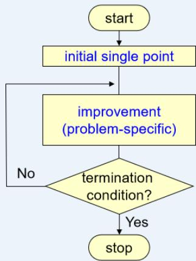


# 遗传算法与其他搜索算法对比

# Major Advantages

#  Genetic Algorithm (population-to-population approach)

Genetic algorithms performs a multiple directional searchby maintaining a population of potential solutions.

The population-to-population approach is hopeful to makethe search escape from local optima.

Population undergoes a simulated evolution: at eachgeneration the relatively good solutions are reproduced,while the relatively bad solutions die.

Genetic algorithms use probabilistic transition rules to selectsomeone to be reproduced and someone to die so as to guidetheir search toward regions of the search space with likelyimprovement.

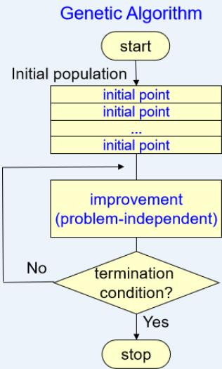


# 遗传算法与其他搜索算法对比

 Random Search + Directed Search

max $f ( x )$

s. t. $0 \leq x \leq u _ { b }$

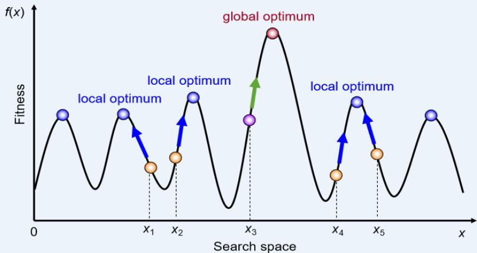


# 遗传算法与其他搜索算法对比

 Example of Genetic Algorithm for Unconstrained Numerical Optimization(Michalewicz, 1996)

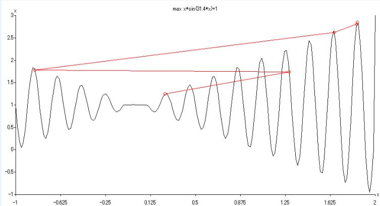


# 遗传算法迭代

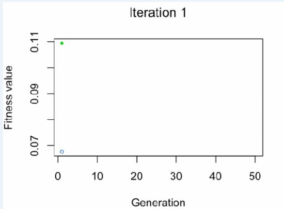


•Blue dot: Population fitness average

•Green dot: Best fitness value

# 遗传算法迭代

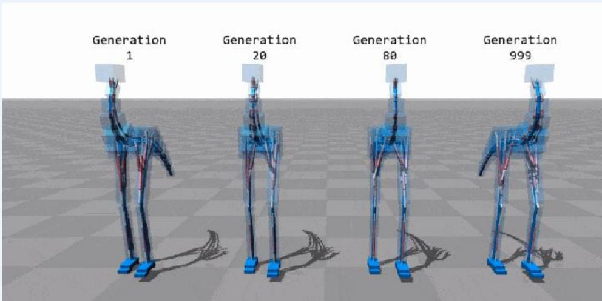


# 遗传算法案例

例：用遗传算法求解下面一个Rastrigin函数的最小值。

$$
\begin{array}{l} f (x _ {1}, x _ {2}) = 2 0 + x _ {1} ^ {2} + x _ {2} ^ {2} - 1 0 (\cos 2 \pi x _ {1} + \cos 2 \pi x _ {2}) \\ - 5 \leq x _ {i} \leq 5 \quad i = 1, 2 \\ \end{array}
$$

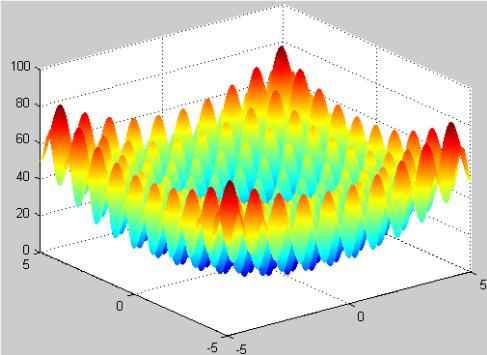


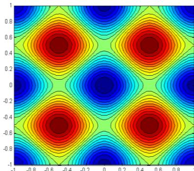


# 遗传算法案例

https://rednuht.org/genetic_walkers/

 例：用遗传算法求解下面一个Rastrigin函数的最小值。

$$
\begin{array}{l} f (x _ {1}, x _ {2}) = 2 0 + x _ {1} ^ {2} + x _ {2} ^ {2} - 1 0 (\cos 2 \pi x _ {1} + \cos 2 \pi x _ {2}) \\ - 5 \leq x _ {i} \leq 5 i = 1, 2 \\ \end{array}
$$

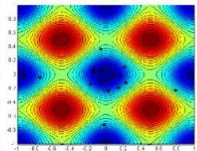


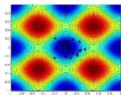


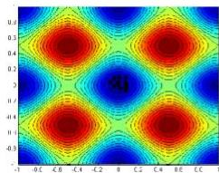


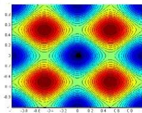


迭代60、80、95、100次时的种群

# 遗传算法步骤详解

# 编码 初代种群 解码（适应度） 选择 交叉 变异

procedure: Simple GA  
input: GA parameters  
output: best solution  
begin  
t  $\leftarrow 0$  // t: generation number  
initialize  $P(t)$  by encoding routine编码；//  $P(t)$  : population of chromosomes  
fitness eval(P) by decoding routine解码; 初代种群产生  
while (not termination condition) do  
crossover交叉  $P(t)$  to yield C(t); //C(t): offspring  
mutation变异  $P(t)$  to yield C(t);  
fitness适应度计算eval(C)by decoding routine解码;  
select选择子代  $P(t + 1)$  from  $P(t)$  and  $C(t)$ $t\gets t + 1$    
end  
output best solution;  
end

# 遗传算法

# 编码 初代种群解码（适应度）选择 交叉变异

# 1. 位串编码

一维染色体编码方法：将问题状态空间的参数编码为一维排列的染色体的方法。


# （1） 二进制编码

二进制编码：用若干二进制数表示一个个体，将原问题的解空间映射到位串空间 $B = \{ 0 , ~ 1 \}$ 上，然后在位串空间上进行遗传操作。

# 遗传算法

编码 初代种群解码（适应度）选择 交叉变异

# （1） 二进制编码（续）

●优点：

类似于生物染色体的组成，算法易于用生物遗传理论解释，遗传操作如交叉、变异等易实现；算法处理的模式数最多。

●缺点：

$\textcircled{1}$ 相邻整数的二进制编码可能具有较大的Hamming距离，降低了遗传算子的搜索效率。

15：01111 16： 10000

$\textcircled{2}$ 要先给出求解的精度。

$\textcircled{3}$ 求解高维优化问题的二进制编码串长，算法的搜索效率低。

# 遗传算法

（2） Gray 编码

编码 初代种群解码（适应度）选择 交叉变异

相邻位间转换时，只有一位产生变化, 减少了由一个状态到下一个状态时逻辑的混淆

Gray编码: 将二进制编码通过一个变换进行转换得到的编码。

二进制串 <ββ2...β >

二进制编码→Gray编码 Gray编码→二进制编码

$$
\gamma_ {k} = \left\{ \begin{array}{c} \beta_ {1} \hskip 2 8. 4 5 2 7 5 6 p t k = 1 \\ \beta_ {k - 1} \oplus \beta_ {k} k > 1 \end{array} \right.
$$

$$
\beta_ {k} = \sum_ {i = 1} ^ {k} \gamma_ {i} (\mathrm {m o d} 2)
$$

<table><tr><td>0</td><td>0 0 0 0</td><td>0 0 0 0</td></tr><tr><td>1</td><td>0 0 0 1</td><td>0 0 0 1</td></tr><tr><td>2</td><td>0 0 1 0</td><td>0 0 1 1</td></tr><tr><td>3</td><td>0 0 1 1</td><td>0 0 1 0</td></tr><tr><td>4</td><td>0 1 0 0</td><td>0 1 1 0</td></tr><tr><td>5</td><td>0 1 0 1</td><td>0 1 1 1</td></tr><tr><td>6</td><td>0 1 1 0</td><td>0 1 0 1</td></tr><tr><td>7</td><td>0 1 1 1</td><td>0 1 0 0</td></tr><tr><td>8</td><td>1 0 0 0</td><td>1 1 0 0</td></tr><tr><td>9</td><td>1 0 0 1</td><td>1 1 0 1</td></tr><tr><td>10</td><td>1 0 1 0</td><td>1 1 1 1</td></tr><tr><td>11</td><td>1 0 1 1</td><td>1 1 1 0</td></tr><tr><td>12</td><td>1 1 0 0</td><td>1 0 1 0</td></tr><tr><td>13</td><td>1 1 0 1</td><td>1 0 1 1</td></tr><tr><td>14</td><td>1 1 1 0</td><td>1 0 0 1</td></tr></table>

# 遗传算法

# 编码 初代种群解码（适应度）选择 交叉变异

# 2 实数编码

采用实数表达法不必进行数制转换，可直接在解的表现型上进行遗传操作。

# 3 多参数映射编码

多参数映射编码的基本思想：把每个参数先进行二进制编码得到子串，再把这些子串连成一个完整的染色体。

多参数映射编码中的每个子串对应各自的编码参数，所以，可以有不同的串长度和参数的取值范围。

# 遗传算法

编码初代种群解码（适应度）选择交叉变异

# 1. 初始种群的产生

●随机产生群体规模数目的个体作为初始群体。

●随机产生一定数目的个体，从中挑选最好的个体加到初始群体中。这种过程不断迭代，直到初始群体中个体数目达到了预先确定的规模。

●根据问题固有知识，把握最优解所占空间在整个问题空间中的分布范围，然后，在此分布范围内设定初始群体。

# 遗传算法

编码初代种群解码（适应度）选择交叉变异

# 2. 种群规模的确定

群体规模太小，遗传算法的优化性能不太好，易陷入局部最优解。

群体规模太大，计算复杂。

模式定理Schema Theorem表明：若群体规模为M，则遗传操作可从这M个个体中生成和检测 $\boldsymbol { \mathcal { M } } ^ { 3 }$ 个模式，并在此基础上能够不断形成和优化，直到找到最优解。

# 遗传算法

编码 初代种群

解码 (适应度)

选择 交叉 变异

# 1. 将目标函数映射成适应度函数的方法

● 若目标函数为最大化问题，则 $F i t ( f ( x ) ) = f ( x )$

●若目标函数为最小化问题，则 $F i t ( f ( x ) ) { = } { \frac { 1 } { f ( x ) } }$


将目标函数转换为求最大值的形式,且保证函数值非负！

● 若目标函数为最大化问题，则

$$
F i t (f (x)) = \left\{ \begin{array}{l l} f (x) - C _ {\min } & f (x) > C _ {\min } \\ 0 & \text {其 他 情 况} \end{array} \right.
$$

. 若目标函数为最小化问题，则

$$
F i t (f (x)) = \left\{ \begin{array}{l l} C _ {\max } - f (x) & f (x) <   C _ {\max } \\ 0 & \text {其 他 情 况} \end{array} \right.
$$

# 遗传算法

# 编码 初代种群

# 解码 (适应度)

# 选择 交叉变异

在遗传算法中，将所有妨碍适应度值高的个体产生，从而影响遗传算法正常工作的问题统称为欺骗问题（deceptive problem）

● 过早收敛：缩小这些个体的适应度，以降低这些超级个体的竞争力。

● 停滞现象：改变原始适应值对应的比例关系，以提高个体之间的竞争力。

● 尺度变换（fitness scaling）或定标：对适应度函数值域的某种映射变换。

# 遗传算法

编码 初代种群

解码 (适应度)

选择 交叉 变异

# 2. 适应度函数的尺度变换

（1）线性变换：

$$
f ^ {\prime} = a f + b
$$

满足 $f _ { a \nu g } ^ { \prime } = f _ { a \nu g } , \quad f _ { \mathrm { m a x } } ^ { \prime } = C _ { m u l t } \cdot f _ { a \nu g }$

$$
a = \frac {\left(C _ {m u l t} - 1\right) f _ {a v g}}{f _ {\max} - f _ {a v g}}
$$

$$
b = \frac {\left(f _ {\max } - C _ {\text {m u l t}} f _ {\text {a v g}}\right) f _ {\text {a v g}}}{f _ {\max } - f _ {\text {a v g}}}
$$

满足最小适应度值非负


$$
a = \frac {f _ {\text {a v g}}}{f _ {\text {a v g}} - f _ {\text {m i n}}}
$$

$$
b = \frac {- f _ {\min} f _ {a v g}}{f _ {a v g} - f _ {\min}}
$$

# 遗传算法

编码初代种群

解码 (适应度)

选择 交叉变异

# 2. 适应度函数的尺度变换

（2）幂函数变换法： $f ^ { \prime } = f ^ { K }$

（3）指数变换法：

# 遗传算法

编码初代种群解码（适应度）选择 交叉变异

# 1.个体选择概率分配方法

● 选择操作也称为复制（reproduction）操作：从当前群体中按照一定概率选出优良的个体，使它们有机会作为父代繁殖下一代子孙。

● 判断个体优良与否的准则是各个个体的适应度值：个体适应度越高，其被选择的机会就越多。

# 遗传算法

编码初代种群解码（适应度）选择 交叉变异

# 1.个体选择概率分配方法

（1）适应度比例方法（fitness proportional model）或蒙特卡罗法（MonteCarlo）

● 各个个体被选择的概率和其适应度值成比例。

● 个体i 被选择的概率为：

$$
p _ {s i} = \frac {f _ {i}}{\sum_ {i = 1} ^ {M} f _ {i}}
$$

# 遗传算法

编码初代种群解码（适应度）选择交叉变异

# 1.个体选择概率分配方法

# （2）排序方法 （rank-based model）

$\textcircled{1}$ 线性排序：J. E. Baker

$\gtrdot$ 群体成员按适应值大小从好到坏依次排列： N $x _ { 1 } , x _ { 2 } , \cdots , x _ { N }$

➢ 个体 $x _ { i }$ 分配选择概率 $p _ { i }$

$$
p _ {i} = \frac {a - b i}{M (M + 1)}
$$

按转盘式选择的方式选择父体

# 遗传算法

编码初代种群解码（适应度）选择交叉变异

# 1.个体选择概率分配方法

# （2）排序方法 （rank-based model）

$\textcircled{2}$ 非线性排序： Z. Michalewicz

●将群体成员按适应值从好到坏依次排列，并按下式分配选择概率：

$$
p _ {i} = \left\{ \begin{array}{l l} q (1 - q) ^ {i - 1} & i = 1, 2, \dots , M - 1 \\ (1 - q) ^ {M - 1} & i = M \end{array} \right.
$$

# 遗传算法

编码初代种群解码（适应度）选择 交叉变异

# 1.个体选择概率分配方法

# （2）排序方法 （rank-based model）

● 可用其他非线性函数来分配选择概率，只要满足以下条件：

(1)若 $P = \left\{ x _ { 1 , } x _ { 2 } \cdots , x _ { M } \right\}$ 且 $f ( x _ { 1 } ) \geq f ( x _ { 2 } ) \geq . . . \geq f ( x _ { M } )$ ，则 $p _ { i }$ 满足

$\sum _ { i = 1 } ^ { M } p _ { i } = 1$

$$
p _ {1} \geq p _ {2} \geq \dots \geq p _ {M}
$$

# 遗传算法

编码初代种群解码（适应度）选择交叉变异

# 2. 选择个体方法

# （1）转盘赌选择

➢ 按个体的选择概率产生一个轮盘，轮盘每个区的角度与个体的选择概率成比例。

产生一个随机数，它落入转盘的哪个区域就选择相应的个体交叉。

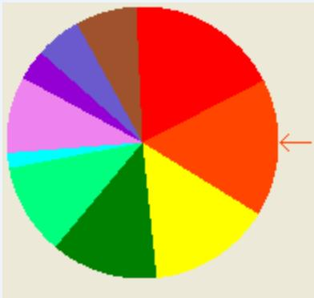


# 遗传算法

编码初代种群解码（适应度）选择交叉变异

# 2. 选择个体方法

# （1）转盘赌选择

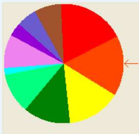


<table><tr><td>个体</td><td>1</td><td>2</td><td>3</td><td>4</td><td>5</td><td>6</td><td>7</td><td>8</td><td>9</td><td>10</td><td>11</td></tr><tr><td>适应度</td><td>2.0</td><td>1.8</td><td>1.6</td><td>1.4</td><td>1.2</td><td>1.0</td><td>0.8</td><td>0.6</td><td>0.4</td><td>0.2</td><td>0.1</td></tr><tr><td>选择概率</td><td>0.18</td><td>0.16</td><td>0.15</td><td>0.13</td><td>0.11</td><td>0.09</td><td>0.07</td><td>0.06</td><td>0.03</td><td>0.02</td><td>0.0</td></tr><tr><td>累积概率</td><td>0.18</td><td>0.34</td><td>0.49</td><td>0.62</td><td>0.73</td><td>0.82</td><td>0.89</td><td>0.95</td><td>0.98</td><td>1.00</td><td>1.00</td></tr></table>

第1轮产生一个随机数：0.81

第2轮产生一个随机数：0.32

# 遗传算法

编码初代种群解码（适应度）选择 交叉变异

# 2. 选择个体方法

# （1）锦标赛选择方法（tournament selection model）

● 锦标赛选择方法：从群体中随机选择个个体，将其中适应度最高的个体保存到下一代。这一过程反复执行，直到保存到下一代的个体数达到预先设定的数量为止。

● 随机竞争方法（stochastic tournament）：每次按赌轮选择方法选取一对个体，然后让这两个个体进行竞争，适应度高者获胜。如此反复，直到选满为止。

# 遗传算法

编码初代种群解码（适应度）选择

交叉 变异

# 1. 基本的交叉算子

（1）一点交叉（single-point crossover）

● 一点交叉：在个体串中随机设定一个交叉点，实行交叉时，该点前或后的两个个体的部分结构进行互换，并生成两个新的个体。

（2）二点交叉 （two-point crossover）

●二点交叉：随机设置两个交叉点，将两个交叉点之间的码串相互交换。

# 遗传算法

编码初代种群解码（适应度）选择 交叉变异

# 1. 基本的交叉算子

（1）一点交叉（single-point crossover）

● 一点交叉：在个体串中随机设定一个交叉点，实行交叉时，该点前或后的两个个体的部分结构进行互换，并生成两个新的个体。

（2）二点交叉 （two-point crossover）

● 二点交叉：随机设置两个交叉点，将两个交叉点之间的码串相互交换。

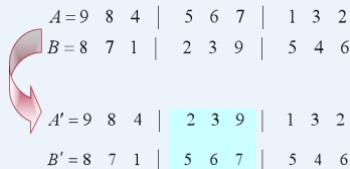


# 遗传算法

# 编码初代种群解码（适应度）选择 交叉变异

位点变异：群体中的个体码串，随机挑选一个或多个基因座，并对这些基因座的基因值以变异概率作变动。

逆转变异：在个体码串中随机选择两点（逆转点），然后将两点之间的基因值以逆向排序插入到原位置中。

插入变异：在个体码串中随机选择一个码，然后将此码插入随机选择的插入点中间。

● 互换变异：随机选取染色体的两个基因进行简单互换。

● 移动变异：随机选取一个基因，向左或者向右移动一个随机位数。

# 遗传算法

# 编码初代种群解码（适应度）选择 交叉

# 变异

procedure: Simple GA

input:GA parameters

output: best solution

begin

$t \gets 0 ;$

initialize $P ( t )$ by encoding routine 编码;

fitness eva $I ( P )$ by decoding routine 解码;

while (not termination condition) do

crossover 交叉 $P ( t )$ toyield $C ( t )$ ；

mutation 变异 $P ( t )$ to yield $C ( t )$

fitness 适应度计算 eval(C) by decoding routine 解码;

select选择子代 $P ( t + 1 )$ from $P ( t )$ and $C ( t )$

$t \gets t { + } 1$

end

output best solution;

end

# 遗传算法一般步骤

（1）使用随机方法或者其它方法，产生一个有N个染色体的初始群体 $P ( I )$ ， $t : = 1$ ；

（2）对群体中的每一个染色体 $P _ { i } ( t )$ $P _ { i }$ ，计算其适应值 $f _ { i } = f _ { \scriptscriptstyle N } i t n e s s ( P _ { i } ( t ) )$

（3）若满足停止条件，则算法停止；否则，以概率 $p _ { i } = f _ { i } / \sum _ { j = 1 } ^ { \cdot } f _ { j }$

从 $P ( t )$ 中随机选择一些染色体构成一个新种群

$$
\mathrm {n e w} P (t + 1) = \{P _ {j} (t) | j = 1, 2, \dots , N \}
$$

（4）以概率 $p _ { \mathtt { c } }$ 进行交叉产生一些新的染色体，得到一个新的群体 $c r o s s P ( t + 1 )$

（5）以一个较小的概率 $p _ { m }$ 使染色体的一个基因发生变异，形成 $m u t P ( t + 1 ) ; t :$$= t + 1$ ，成为一个新的群体 $P ( t ) = m u t P ( t + 1 )$ ，返回（2）。

# 遗传算法案例分析

We explain in detail about how a genetic algorithm actually works with a simpleexamples.

We follow the approach of implementation of genetic algorithms given by Michalewicz.

Michalewicz, Z.: Genetic Algorithm $^ +$ Data Structures $=$ Evolution Programs. 3rded., Springer-Verlag: New York, 1996.

The numerical example of unconstrained optimization problem is given as follows:

$$
\begin{array}{l} \max  f \left(x _ {1}, x _ {2}\right) = 2 1. 5 + x _ {1} \cdot \sin \left(4 \pi x _ {1}\right) + x _ {2} \cdot \sin \left(2 0 \pi x _ {2}\right) \\ \begin{array}{l l} \text {s . t .} & - 3. 0 \leq x _ {1} \leq 1 2. 1 \end{array} \\ 4. 1 \leq x _ {2} \leq 5. 8 \\ \end{array}
$$

# 遗传算法案例分析

# 2 Example with Simple Genetic Algorithms

max f (x1, x2) =  + x1·sin(4 x1) + x2·sin(20 x2)

s. t. $- 3 . 0 \leq x _ { 1 } \leq 1 2 . 1$

$$
4. 1 \leq x _ {2} \leq 5. 8
$$

by Mathematica 4.1

$$
\begin{array}{l} f = 2 1. 5 + x 1 \operatorname {S i n} [ 4 \mathrm {P i} x 1 ] + x 2 \operatorname {S i n} [ 2 0 \mathrm {P i} x 2 ]; \\ \operatorname {P l o t 3 D} [ f, \{x 1, - 3, 1 2. 1 \}, \{x 2, 4. 1, 5. 8 \}, \\ \text {P l o t P o i n t s - > 1 9}, \\ \text {A x e s L a b e l} \rightarrow \{\mathrm {x 1}, \mathrm {x 2}, \text {" f (x 1 , x 2) "} \}; \\ \end{array}
$$

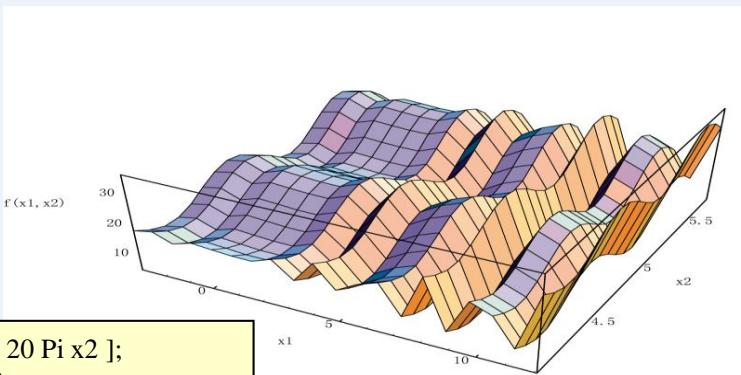


# 遗传算法案例分析

# 2.1 Representation

 Binary String Representation

The domain of xj is $[ a _ { j } , b _ { j } ]$ and the required precision is fiveplaces after the decimal point.

The precision requirement implies that the range of domain ofeach variable should be divided into at least $( b _ { j } - a _ { j } ) { \times } 1 0 ^ { 5 }$ size ranges.

The required bits (denoted with $m _ { j } )$ for a variable is calculated asfollows: $2 ^ { m _ { j } - 1 } < ( b _ { j } - a _ { j } ) \times 1 0 ^ { 5 } \leq 2 ^ { m _ { j } } - 1$

The mapping from a binary string to a real number for variable xis completed as follows:  x =aj +decimal(substringj)× 2m-1 b -aj

# 遗传算法案例分析

2.1 Representation

 Binary String Encoding

The precision requirement implies that the range of domain of each variableshould be divided into at least $( b _ { j } - a _ { j } ) { \times } 1 0 ^ { 5 }$ size ranges.

The required bits (denoted with $m _ { j } )$ for a variable is calculated as follows:

$$
\begin{array}{l} x _ {1} \colon (1 2. 1 - (- 3. 0)) \times 1 0, 0 0 0 = 1 5 1, 0 0 0 \\ 2 ^ {1 7} <   1 5 1, 0 0 0 \leq 2 ^ {1 8}, \quad m _ {1} = 1 8 \text {b i t s} \\ \end{array}
$$

$$
\begin{array}{l} x _ {2}: (5. 8 - 4. 1) \times 1 0, 0 0 0 = 1 7, 0 0 0 \\ 2 ^ {1 4} <   1 7, 0 0 0 \leq 2 ^ {1 5}, \quad m _ {2} = 1 5 \text {b i t s} \\ \end{array}
$$


precision requirement: $m = m _ { 1 } + m _ { 2 } = 1 8 + 1 5 = 3 3$ bits


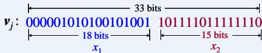


# 遗传算法案例分析

# 2.1 Representation

Procedure of Binput: domain of $x _ { j } \in [ a _ { j } , b _ { j } ]$ ng Enco, (j=1,2)

output: chromosome v

step 1: The domain of xj is $[ a _ { j } , b _ { j } ]$ and the required precision is fiveplaces after the decimal point.

step 2: The precision requirement implies that the range of domain ofeach variable should be divided into at least $( b _ { j } - a _ { j } ) \times 1 0 ^ { 5 }$ size ranges.

step 3: The required bits (denoted with $m _ { j } )$ for a variable is calculated asfollows:

$$
2 ^ {m _ {j} - 1} <   \left(b _ {j} - a _ {j}\right) \times 1 0 ^ {5} \leq 2 ^ {m _ {j}} - 1
$$

step 4: A chromosome v is randomly generated, which has the number of genes m,where m is sum of $m _ { j } ( j { = } 1 , 2 )$ .

# 遗传算法案例分析

# 2.1 Representation

 Binary String Encoding

The mapping from a binary string to a real number for variable $x _ { j }$ is completed asfollows:

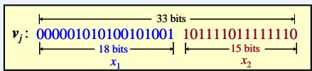


<table><tr><td></td><td>Binary Number</td><td>Decimal Number</td></tr><tr><td>x1</td><td>000001010100101001</td><td>5417</td></tr><tr><td>x2</td><td>101111011111110</td><td>24318</td></tr></table>

$$
x _ {j} = a _ {j} + \text {d e c i m a l} (s u b s t r i n g _ {j}) \times \frac {b _ {j} - a _ {j}}{2 ^ {m _ {j}} - 1}
$$


$$
\begin{array}{l} x _ {1} = - 3. 0 + 5 4 1 7 \times \frac {1 2 . 1 - (- 3 . 0)}{2 ^ {1 8} - 1} \\ = - 2. 6 8 7 0 6 9 \\ \end{array}
$$

$$
\begin{array}{l} x _ {2} = 4. 1 + 2 4 3 1 8 \times \frac {5 . 8 - 4 . 1}{2 ^ {1 5} - 1} \\ = 5. 3 6 1 6 5 3 \\ \end{array}
$$

# 遗传算法案例分析

# 2.1 Representation

 Procedure of Binary String Decoding

input: substringj

output: a real number xj

step 1: Convert a substring (a binary string) to a decimal number.

step 2: The mapping for variable $x _ { j }$ is completed as follows:

$$
x _ {j} = a _ {j} + \operatorname {d e c i m a l} \left(\text {s u b s t r i n g} _ {j}\right) \times \frac {b _ {j} - a _ {j}}{2 ^ {m _ {j}} - 1}
$$

# 遗传算法案例分析

# 2.2 Initial Population

 Initial population is randomly generated as follows:

$$
\boldsymbol {v} _ {1} = [ 0 0 0 0 0 1 0 1 0 1 0 0 1 0 1 0 0 1 1 0 1 1 1 1 0 1 1 1 1 1 1 1 1 0 ] = \left[ x _ {1} x _ {2} \right] = \left[ - 2. 6 8 7 9 6 9 \quad 5. 3 6 1 6 5 3 \right]
$$

$$
\boldsymbol {v} _ {2} = \left[ 0 0 1 1 1 0 1 0 1 1 1 0 0 1 1 0 0 0 0 0 0 0 1 0 1 0 1 0 0 1 0 0 0 \right] = \left[ x _ {1} x _ {2} \right] = \left[ \begin{array}{l l} 0. 4 7 4 1 0 1 & 4. 1 7 0 1 4 4 \end{array} \right]
$$

$$
\mathbf {v} _ {3} = [ 1 1 1 0 0 0 1 1 1 0 0 0 0 0 1 0 0 0 0 1 0 1 0 1 0 0 1 0 0 0 1 1 0 ] = \left[ x _ {1} x _ {2} \right] = [ 1 0. 4 1 9 4 5 7 \quad 4. 6 6 1 4 6 1 ]
$$

$$
\boldsymbol {v} _ {4} = [ 1 0 0 1 1 0 1 1 0 1 0 0 1 0 1 1 0 1 0 0 0 0 0 0 0 1 0 1 1 1 0 0 1 ] = \left[ x _ {1} x _ {2} \right] = [ 6. 1 5 9 9 5 1 4. 1 0 9 5 9 8 ]
$$

$$
\mathbf {v} _ {5} = [ 0 0 0 0 1 0 1 1 1 1 0 1 1 0 0 0 1 0 0 0 1 1 1 0 0 0 1 1 0 1 0 0 0 ] = \left[ x _ {1} x _ {2} \right] = [ - 2. 3 0 1 2 8 6 4. 4 7 7 2 8 2 ]
$$

$$
v _ {6} = [ 1 1 1 1 1 0 1 0 1 0 1 0 1 1 0 0 0 0 0 0 0 1 0 1 1 0 0 1 1 0 0 1 ] = \left[ x _ {1} x _ {2} \right] = [ 1 1. 7 8 8 0 8 4. 4. 1 7 4 3 4 6 ]
$$

$$
v _ {7} = [ 1 1 0 1 0 0 0 1 0 0 1 1 1 1 1 0 0 0 1 0 0 1 1 0 0 1 1 1 0 1 1 0 1 ] = \left[ x _ {1} x _ {2} \right] = [ 9. 3 4 2 0 6 7 5. 1 2 1 7 0 2 ]
$$

$$
\mathbf {v} _ {8} = [ 0 0 1 0 1 1 0 1 0 1 0 0 0 0 1 1 0 0 0 1 0 1 1 0 0 1 1 0 0 1 1 0 0 ] = \left[ x _ {1} x _ {2} \right] = [ - 0. 3 3 0 2 5 6 4. 6 9 4 9 7 7 ]
$$

$$
v _ {9} = [ 1 1 1 1 1 0 0 0 1 0 1 1 1 0 1 1 0 0 0 1 1 1 0 1 0 0 0 1 1 1 1 0 1 ] = \left[ x _ {1} x _ {2} \right] = [ 1 1. 6 7 1 2 6 7 \quad 4. 8 7 3 5 0 1 ]
$$

$$
\boldsymbol {v} _ {1 0} = \left[ 1 1 1 1 0 1 0 0 1 1 1 0 1 0 1 0 1 0 0 0 0 0 1 0 1 0 1 1 0 1 0 1 0 \right] = \left[ x _ {1} x _ {2} \right] = \left[ 1 1. 4 4 6 2 7 3 \quad 4. 1 7 1 9 0 8 \right]
$$

# 遗传算法案例分析

# 2.3 Evaluation

 The process of evaluating the fitness of a chromosome consists of the following three steps:

input:chromoome v,k=1,2,，..,popize

output: the fitness eval $( v _ { k } )$

step1: Convert thechromosome's genotype to its phenotype,i.e., convert binary stringintorelativerealvalues $x _ { k } = ( x _ { k 1 } , x _ { k 2 } )$ ， $k = 1 , 2$ ,...popSize.

 step 2: Evaluate the objective function f(xk), $k = 1 , 2$ ...,.popSize.

step 3: Convert the value of objective function into fitness. For the maximization problem,thefitness issimplyequal tothevalueof objectivefunction:

$$
e v a l \left(\mathbf {v} _ {k}\right) = f \left(x _ {k}\right), \quad k = 1, 2, \dots , p o p S i z e.
$$

$$
e v a l \left(v _ {k}\right) = f \left(x _ {i}\right) \quad (k = 1, 2, \dots , p o p S i z e)
$$

$$
(i = 1, 2, \dots , n)
$$

$$
f \left(x _ {1}, x _ {2}\right) = 2 1. 5 + x _ {1} \cdot \sin \left(4 \pi x _ {1}\right) + x 2 \cdot \sin \left(2 0 \pi x _ {2}\right)
$$


Example: (x1=-2.687969, $x _ { 2 } { = } 5 . 3 6 1 6 5 3 )$

$$
e v a l \left(\nu_ {1}\right) = f (- 2. 6 8 7 9 6 9, 5. 3 6 1 6 5 3) = 1 9. 8 0 5 1 1 9
$$

# 遗传算法案例分析

# 2.3 Evaluation

An evaluation function plays the role of the environment, and it rates chromosomes interms of their fitness.

 The fitness function values of above chromosomes are as follows:

$$
\begin{array}{l} e v a l \left(\boldsymbol {v} _ {1}\right) = f (- 2. 6 8 7 9 6 9, 5. 3 6 1 6 5 3) = 1 9. 8 0 5 1 1 9 \\ e v a l \left(\mathbf {v} _ {2}\right) = f (0. 4 7 4 1 0 1, 4. 1 7 0 1 4 4) = 1 7. 3 7 0 8 9 6 \\ e v a l \left(\mathbf {v} _ {3}\right) = f (1 0. 4 1 9 4 5 7, 4. 6 6 1 4 6 1) = 9. 5 9 0 5 4 6 \\ e v a l \left(\mathbf {v} _ {4}\right) = f (6. 1 5 9 9 5 1, 4. 1 0 9 5 9 8) = 2 9. 4 0 6 1 2 2 \\ e v a l \left(\mathbf {v} _ {5}\right) = f (- 2. 3 0 1 2 8 6, 4. 4 7 7 2 8 2) = 1 5. 6 8 6 0 9 1 \\ e v a l \left(\mathbf {v} _ {6}\right) = f (1 1. 7 8 8 0 8 4, 4. 1 7 4 3 4 6) = 1 1. 9 0 0 5 4 1 \\ e v a l \left(\mathbf {v} _ {7}\right) = f (9. 3 4 2 0 6 7, 5. 1 2 1 7 0 2) = 1 7. 9 5 8 7 1 7 \\ e v a l \left(\mathbf {v} _ {\mathbf {g}}\right) = f (- 0. 3 3 0 2 5 6, 4. 6 9 4 9 7 7) = 1 9. 7 6 3 1 9 0 \\ e v a l \left(\mathbf {v} _ {9}\right) = f (1 1. 6 7 1 2 6 7, 4. 8 7 3 5 0 1) = 2 6. 4 0 1 6 6 9 \\ e v a l \left(\boldsymbol {v} _ {1 0}\right) = f (1 1. 4 4 6 2 7 3, 4. 1 7 1 9 0 8) = 1 0. 2 5 2 4 8 0 \\ \end{array}
$$

 It is clear that chromosome $\nu _ { 4 }$ is the strongest one and that chromosome $\nu _ { 3 }$ is the weakestone.

# 遗传算法案例分析

# 2.4 Genetic Operators

#  Selection:

◦ In most practices, a roulette wheel approach is adopted as the selection procedure, which is one of thefitness-proportional selection and can select a new population with respect to the probability distributionbased on fitness values.

◦ The roulette wheel can be constructed with the following steps:

 input: population P(t-1), C(t-1)

output: population P(t), C(t)

e $F = \sum _ { k = 1 } ^ { p o p S i z e } e \nu a l ( \nu _ { k } )$

 step 2: Calculate selection probability $p _ { k }$ foreach chromosome $\pmb { v } _ { k }$

$$
p _ {k} = \frac {\operatorname {e v a l} \left(\mathbf {v} _ {k}\right)}{F}, \quad k = 1, 2, \dots , p o p S i z e
$$

 step 3: Calculate cumulative probabiity $\boldsymbol { q } _ { k }$ for each chromosome $\pmb { v } _ { k }$

$$
q _ {k} = \sum_ {j = 1} ^ {k} p _ {j}, \quad k = 1, 2, \dots , p o p S i z e
$$

 step 4: Generate a random number rfrom the range [0, 1].

step 5: If $r \leq q _ { 1 } ,$ then select the first chromosome $\pmb { v } _ { 1 }$ ; otherwise,selectthe kth chromosome $\pmb { v } _ { k } ( 2 \le k \le p o p S i z e )$ such that $q _ { k - 1 } < r \leq q _ { k }$

# 遗传算法案例分析

 Illustration of Selection:

# 2.4 Genetic Operators

input: population P(t-1), C(t-1)

output: population P(t), C(t)

step1: Calculate the total fitness $F$ for the population.

$$
F = \sum_ {k = 1} ^ {1 0} e v a l (\mathbf {v} _ {k}) = 1 7 8. 1 3 5 3 7 2
$$

step 2: Calculate selection probability $p _ { k }$ foreachchromosome $\pmb { v } _ { k } .$

$$
p _ {1} = 0. 1 1 1 1 8 0, p _ {2} = 0. 0 9 7 5 1 5, p _ {3} = 0. 0 5 3 8 3 9, p _ {4} = 0. 1 6 5 0 7 7,
$$

$$
p _ {5} = 0. 0 8 8 0 5 7, p _ {6} = 0. 0 6 6 8 0 6, p _ {7} = 0. 1 0 0 8 1 5, p _ {8} = 0. 1 1 0 9 4 5,
$$

$$
p _ {9} = 0. 1 4 8 2 1 1, p _ {1 0} = 0. 0 5 7 5 5 4
$$

step 3: Calculate cumulative probability $q _ { k }$ for each chromosome $\pmb { v } _ { k } .$

$$
q _ {1} = 0. 1 1 1 1 8 0, q _ {2} = 0. 2 0 8 6 9 5, q _ {3} = 0. 2 6 2 5 3 4, q _ {4} = 0. 4 2 7 6 1 1,
$$

$$
q _ {5} = 0. 5 1 5 6 6 8, q _ {6} = 0. 5 8 2 4 7 5, q _ {7} = 0. 6 8 3 2 9 0, q _ {8} = 0. 7 9 4 2 3 4,
$$

$$
q _ {9} = 0. 9 4 2 4 4 6, q _ {1 0} = 1. 0 0 0 0 0 0
$$

step 4: Generate a random number r from the range [0,1].

0.301431，0.322062，0.766503，0.881893，0.350871,

0.583392，0.177618，0.343242，0.032685，0.197577

# 遗传算法案例分析

# 2.4 Genetic Operators

 Illustration of Selection:

step 5: $q _ { 3 } < r _ { 1 } = 0 . 3 0 1 4 3 2 \leq q _ { 4 }$ , it means that the chromosome $\pmb { v } _ { 4 }$  is selected for new population; $q _ { 3 } < r _ { 2 } = 0 . 3 2 2 0 6 2 \leq q _ { 4 } ,$ , it means that the chromosome$\pmb { v } _ { 4 }$ isselectedagain,and soon.Finaly, thenew populationconsistsof thefollowing chromosome.

$$
\boldsymbol {v} _ {1} ^ {\prime} = [ 1 0 0 1 1 0 1 1 0 1 0 0 1 0 1 1 0 1 0 0 0 0 0 0 0 1 0 1 1 1 0 0 1 ] \quad (\boldsymbol {v} _ {4})
$$

$$
\boldsymbol {v} _ {2} ^ {\prime} = [ 1 0 0 1 1 0 1 1 0 1 0 0 1 0 1 1 0 1 0 0 0 0 0 0 0 1 0 1 1 1 0 0 1 ] \quad (\boldsymbol {v} _ {4})
$$

$$
\boldsymbol {v} _ {3} ^ {\prime} = [ 0 0 1 0 1 1 0 1 0 1 0 0 0 0 1 1 0 0 0 1 0 1 1 0 0 1 1 0 0 1 1 0 0 ] \quad (\boldsymbol {v} _ {8})
$$

$$
\boldsymbol {v} _ {4} ^ {\prime} = [ 1 1 1 1 1 0 0 0 1 0 1 1 1 0 1 1 0 0 0 1 1 1 0 1 0 0 0 1 1 1 1 0 1 ] \quad (\boldsymbol {v} _ {9})
$$

$$
\boldsymbol {v} _ {5} ^ {\prime} = [ 1 0 0 1 1 0 1 1 0 1 0 0 1 0 1 1 0 1 0 0 0 0 0 0 0 1 0 1 1 1 0 0 1 ] \quad (\boldsymbol {v} _ {4})
$$

$$
\boldsymbol {v} _ {6} ^ {\prime} = [ 1 1 0 1 0 0 0 1 0 0 1 1 1 1 1 0 0 0 1 0 0 1 1 0 0 1 1 0 1 1 0 1 1 0 1 ] \quad (\boldsymbol {v} _ {7})
$$

$$
\boldsymbol {v} _ {7} ^ {\prime} = [ 0 0 1 1 1 0 1 0 1 1 1 0 0 1 1 0 0 0 0 0 0 0 1 0 1 0 1 0 0 1 0 0 0 ] \quad (\boldsymbol {v} _ {2})
$$

$$
\boldsymbol {v} _ {8} ^ {\prime} = [ 1 0 0 1 1 0 1 1 0 1 0 0 1 0 1 1 0 1 0 0 0 0 0 0 0 1 0 1 1 1 0 0 1 ] \quad (\boldsymbol {v} _ {4})
$$

$$
\boldsymbol {v} _ {9} ^ {\prime} = \left[ 0 0 0 0 0 1 0 1 0 1 0 0 1 0 1 0 0 1 1 0 1 1 1 1 0 1 1 1 1 1 1 1 0 \right] \quad \left(\boldsymbol {v} _ {1}\right)
$$

$$
\boldsymbol {v} _ {1 0} ^ {\prime} = [ 0 0 1 1 1 0 1 0 1 1 1 0 0 1 1 0 0 0 0 0 0 0 1 0 1 0 1 0 0 1 0 0 0 ] \quad (\boldsymbol {v} _ {2})
$$

# 遗传算法案例分析

# 2.4 Genetic Operators

 Crossover (One-cut point Crossover)

◦ Crossover used here is one-cut point method, which random selects one cut point.

◦ Exchanges the right parts of two parents to generate offspring.

◦ Consider two chromosomes as follow and the cut point is randomly selected after the 17th gene:

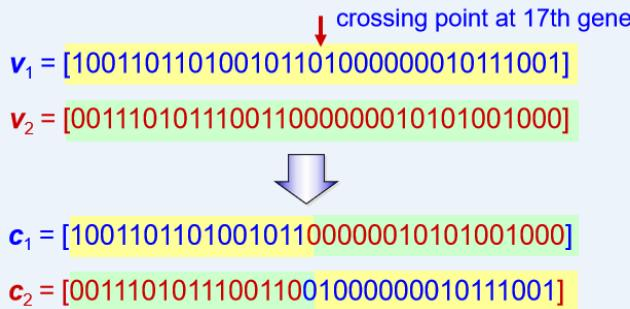


# 遗传算法案例分析

# 2.4 Genetic Operators

 Procedure of One-cut Point Crossover:

procedure: One-cut Point Crossover  
input:  $p_{C}$ , parent  $P_{k}$ ,  $k = 1, 2, \ldots$ , popSize  
output: offspring  $C_{k}$   
begin  
for  $k \gets 1$  to  $\lceil \text{popSize}/2 \rceil$  do // popSize: population size  
if  $p_{C} \geq \text{random}[0, 1]$  then //  $p_{C}$ : the probability of crossover  
 $i \gets 0$ ;  
 $j \gets 0$ ;  
repeat  
 $i \gets \text{random}[1, \text{popSize}]$ ;  
 $j \gets \text{random}[1, \text{popSize}]$ ;  
until (#j)  
 $p \gets \text{random}[1, I-1]$ ; //  $p$ : the cut position, I: the length of chromosome  
 $C_{i} \gets P_{i}[1:p-1] // P_{i}[p:I]$ ;  
 $C_{j} \gets P_{j}[1:p-1] // P_{j}[p:I]$ ;  
end  
end  
output offspring  $C_{k}$ ;  
end

# 遗传算法案例分析

# 2.4 Genetic Operators

# Mutation

◦ Alters one or more genes with a probability equal to the mutation rate.

◦ Assume that the 16th gene of the chromosome $\nu _ { 1 }$ is selected for a mutation.

Since the gene is 1, it would be flipped into 0. So the chromosome after mutation would be:

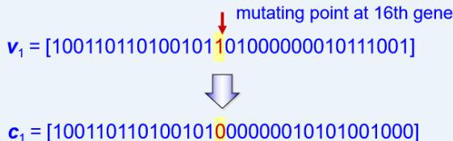


# 遗传算法案例分析

# 2.4 Genetic Operators

# Procedure of Mutation:

procedure:Mutation   
input:  $p_{M}$  ,parent  $P_{k}$ $k = 1$  2,...,popSize   
output: offspring  $C_k$    
begin for  $k\gets 1$  to popSize do //popSize: population size for  $j\gets 1$  to /do //I: the length of chromosome if  $p_{M}\geq$  random [0, 1] then //  $p_{M}$  :the probability of mutation  $C_k\gets P_k[1;j - 1] / P_k[j]^* p / P_k[j + 1:I];$  end end output offspring  $C_k$  .

# Illustration of Mutation:


Assume that $p _ { M } = 0 . 0 1$


<table><tr><td>chromNum</td><td>bitNo</td><td>randomNum</td></tr><tr><td>4</td><td>6</td><td>0.009857</td></tr><tr><td>5</td><td>32</td><td>0.003113</td></tr><tr><td>7</td><td>1</td><td>0.000946</td></tr><tr><td>8</td><td>3</td><td>0.011282 &gt; pM = 0.01</td></tr><tr><td>10</td><td>32</td><td>0.001282</td></tr></table>

# 遗传算法案例分析

# 2. Example with Simple Genetic Algorithms

#  Next Generation

$$
\begin{array}{l} v _ {1} ^ {\prime} = [ 1 0 0 1 1 0 1 1 0 1 0 0 1 0 1 1 0 1 0 0 0 0 0 0 1 0 1 1 1 0 0 1 ], \quad f (6. 1 5 9 9 5 1, 4. 1 0 9 5 9 8) = 2 9. 4 0 6 1 2 2 \\ v _ {2} ^ {\prime} = [ 1 0 0 1 1 0 1 1 0 1 0 0 1 0 1 1 0 1 0 0 0 0 0 0 0 1 0 1 1 1 0 0 1 ], f (6. 1 5 9 9 5 1, 4. 1 0 9 5 9 8) = 2 9. 4 0 6 1 2 2 \\ \boldsymbol {v} _ {3} ^ {\prime} = [ 0 0 1 0 1 1 0 1 0 1 0 0 0 0 1 1 0 0 0 1 0 1 1 0 0 1 1 0 0 1 1 0 0 ], \quad f (- 0. 3 3 0 2 5 6, 4. 6 9 4 9 7 7) = 1 9. 7 6 3 1 9 0 \\ \boldsymbol {v} _ {4} ^ {\prime} = [ 1 1 1 1 0 0 0 1 0 1 1 1 0 1 1 0 0 0 1 1 1 0 1 0 0 0 1 1 1 1 0 1 ], \quad f (1 1. 9 0 7 2 0 6, 4. 8 7 3 5 0 1) = 5. 7 0 2 7 8 1 \\ v _ {5} ^ {\prime} = [ 1 0 0 1 1 0 1 1 0 1 0 0 1 0 1 1 0 1 0 0 0 0 0 0 1 0 1 1 1 0 0 1 ], f (8. 0 2 4 1 3 0, 4. 1 7 0 2 4 8) = 1 9. 9 1 0 2 5 \\ v _ {6} ^ {\prime} = [ 1 1 0 1 0 0 0 1 0 0 1 1 1 1 1 0 0 0 1 0 0 1 1 0 0 1 1 1 0 1 1 0 1 ], f (9. 3 4 0 6 7, 5. 1 2 1 7 0 2) = 1 7. 9 5 8 7 1 7 \\ \boldsymbol {v} _ {7} ^ {\prime} = [ 1 0 0 1 1 0 1 1 0 1 0 0 1 0 1 1 0 1 0 0 0 0 0 0 1 0 1 1 1 0 0 1 ], \quad f (6. 1 5 9 9 5 1, 4. 1 0 9 5 9 8) = 2 9. 4 0 6 1 2 2 \\ \boldsymbol {v} _ {8} ^ {\prime} = [ 1 0 0 1 1 0 1 1 0 1 0 0 1 0 1 1 0 1 0 0 0 0 0 0 1 0 1 1 1 0 0 1 ], \quad f (6. 1 5 9 9 5 1, 4. 1 0 9 5 9 8) = 2 9. 4 0 6 1 2 2 \\ \boldsymbol {v} _ {9} ^ {\prime} = [ 0 0 0 0 0 1 0 1 0 1 0 0 1 0 1 0 0 1 1 0 1 1 1 1 0 1 1 1 1 1 1 1 0 ], f (- 2. 6 8 7 9 6 9, 5. 3 6 1 6 5 3) = 1 9. 8 0 5 1 9 9 \\ \boldsymbol {v} _ {1 0} ^ {\prime} = [ 0 0 1 1 1 0 1 0 1 1 1 0 0 1 1 0 0 0 0 0 0 0 1 0 1 0 1 0 0 1 0 0 0 ], \quad f (0. 4 7 4 1 0 1, 4. 1 7 0 2 4 8) = 1 7. 3 7 0 8 9 6 \\ \end{array}
$$

# 遗传算法案例分析

# 2. Example with Simple Genetic Algorithms

 Procedure of GA for Unconstrained Optimization

procedure: GA for Unconstrained Optimization (uO)  
input: uO data set, GA parameters  
output: best solution  
begin  
    t  $\leftarrow 0$ ;  
initialize  $P(t)$  by binary string encoding;  
fitness eval(P) by binary string decoding;  
while (not termination condition) do  
    crossover  $P(t)$  to yield  $C(t)$  by one-cut point crossover;  
    mutation  $P(t)$  to yield  $C(t)$ ;  
    fitness eval(C) by binary string decoding;  
    select  $P(t+1)$  from  $P(t)$  and  $C(t)$  by roulette wheel selection;  
    t  $\leftarrow t+1$ ;  
end  
output best solution;

# 遗传算法案例分析

# 2. Example with Simple Genetic Algorithms

#  Final Result

◦ The test run is terminated after 1000 generations.

◦ We obtained the best chromosome in the 884th generation as follows:

$$
\begin{array}{l} \max  f \left(x _ {1}, x _ {2}\right) = 2 1. 5 + x _ {1} \cdot \sin \left(4 \pi x _ {1}\right) + x _ {2} \cdot \sin \left(2 0 \pi x _ {2}\right) \\ \begin{array}{l l} \text {s . t .} & - 3. 0 \leq x _ {1} \leq 1 2. 1 \end{array} \\ 4. 1 \leq x _ {2} \leq 5. 8 \\ \end{array}
$$

$$
\begin{array}{l} e v a l \left(\boldsymbol {v} ^ {*}\right) = f (1 1. 6 2 2 7 6 6, 5. 6 2 4 3 2 9) \\ = 3 8. 7 3 7 5 2 4 \\ \end{array}
$$

$$
\begin{array}{l} x _ {1} ^ {*} = 1 1. 6 2 2 7 6 6 \\ x _ {2} ^ {*} = 5. 6 2 4 3 2 9 \\ f \left(x _ {1} ^ {*}, x _ {2} ^ {*}\right) = 3 8. 7 3 7 5 2 4 \\ \end{array}
$$

# 遗传算法案例分析

# 2. Example with Simple Genetic Algorithms

 Evolutional Process

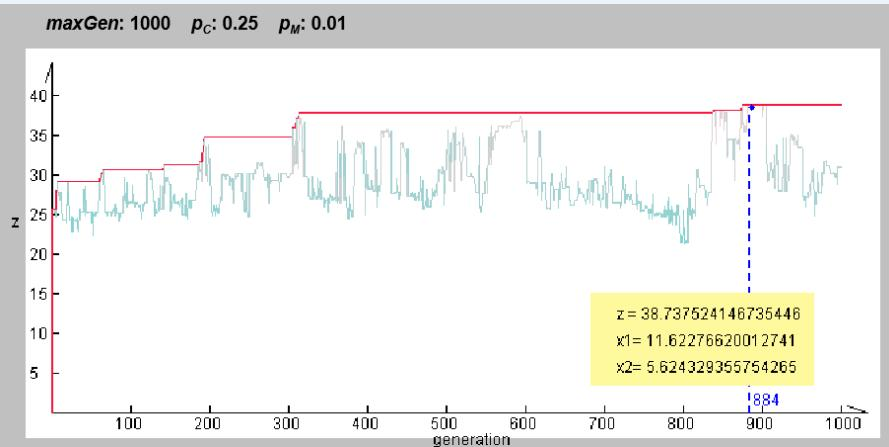


# 遗传算法案例分析

#  Evolutional Process

$$
\begin{array}{l} \max  f \left(x _ {1}, x _ {2}\right) = 2 1. 5 + x _ {1} \cdot \sin \left(4 \pi x _ {1}\right) + x _ {2} \cdot \sin \left(2 0 \pi x _ {2}\right) \\ \begin{array}{l l} \text {s . t .} & - 3. 0 \leq x _ {1} \leq 1 2. 1 \end{array} \\ 4. 1 \leq x _ {2} \leq 5. 8 \\ \end{array}
$$

# by Mathematica 4.1

$$
\begin{array}{l} f = 2 1. 5 + x 1 \operatorname {S i n} [ 4 \mathrm {P i} x 1 ] + x 2 \operatorname {S i n} [ 2 0 \mathrm {P i} x 2 ]; \\ \operatorname {P l o t 3 D} [ f, \{x 1, - 3. 0, 1 2. 1 \}, \{x 2, 4. 1, 5. 8 \}, \\ \end{array}
$$

$$
\begin{array}{l} \text {P l o t P o i n t s} - > 1 9, \\ \text {A x e s L a b e l} \rightarrow \{\mathrm {x} 1, \mathrm {x} 2, \text {" f} (\mathrm {x} 1, \mathrm {x} 2) ^ {\prime \prime} \} \}; \\ \operatorname {C o n t o u r P l o t} [ f, \{x, - 3. 0, 1 2. 1 \}, \{y, 4. 1, 5. 8 \} ]; \\ \end{array}
$$

# 2. Example with Simple Genetic Algorithms

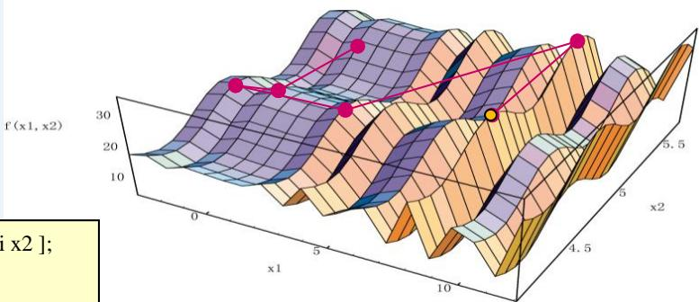


# 遗传算法的特点

遗传算法是一种全局优化概率算法，主要特点有：

1. 遗传算法对所求解的优化问题没有太多的数学要求，由于进化特性，搜素过程中不需要问题的内在性质，可直接对结构对象进行操作。

2.利用随机技术指导对一个被编码的参数空间进行高效率搜索.

3.采用群体搜索策略，易于并行化。

4.仅用适应度函数值来评估个体，并在此基础上进行遗传操作，使种群中个体之间进行信息交换。

5. 遗传算法能够非常有效地进行概率意义的全局搜素。

# 遗传算法的应用

# 应用案例

# Traveling Salesman Problem

The Traveling Salesman Problem (TSP) is one of the most widely studied combinatorial optimizationproblems.

Its statement is deceptively simple: A salesperson seeks the shortest tour through n cities.

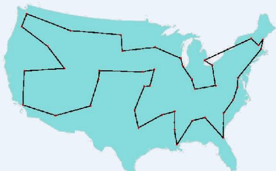


Fig. 3.4 George Dantzig, Ray Fulkerson, and Selmer Johnson (1954)a description of a method for solving the TSP :49 cities


# Traveling Salesman Problem

# Existing Instances

• 49 city problem

Dagtzig, G., D. Fulkerson and S. Johnson: “Solution of a large scale traveling salesman problems”,Operations Research, vol. 2, pp. 393-410, 1954.

• 120 city problem

Grötschel, M.: “On the symmetric traveling salesman problem: solution of a 120 city problem”,Mathematical Programming Studies, vol. 12, pp. 61-77, 1980.

• 318 city problem

Crowder, H. and M. Padberg: “Solving large scale symmetric traveling salesman problems tooptimality”, Management Science, vol. 22, pp. 15-24, 1995.

• 532 city problem

Padberg, M. and G. Rinaldi: “Optimization of 532 city symmetric traveling salesman problem bybranch and cut”, Operations Research Letters, vol. 6, pp. 1-7, 1987.

# Traveling Salesman Problem

• 666 city problem

Grötschel, M. and O. Holland: “Solution of large scale symmetric traveling salesman problems”, MathematicalProgramming Studies, vol. 51, pp. 141-202, 1991.

• 2392 city problem

Padberg, M. and G. Rinaldi: “A branch and cut algorithm for the resolution of large scale symmetric travelingsalesman problem”, SIAM Review, vol. 33, pp. 60-100, 1991.

• The earlier studies using the genetic algorithm to solve TSP

Grefenstette, J.: Proceedings of the First International Conference on Genetic Algorithms, Lawrence ErlbaumAssociates, Hillsdale, NJ, 1985.

• TSP has become a target for the genetic algorithm community.

Michalewicz, Z.: Genetic Algorithm + Data structure $=$ Evolution Programs, 2nd ed.,Springer-Verlag, New York, 1994.

# Traveling Salesman Problem

# Notations

Indices

$$
i, j: \text {t h e i n d e x o f c i t y}, \quad i, j = 1, 2, \dots , n
$$

Parameters

$$
n: \text {t h e t o t a l n u m b e r o f c i t e s}
$$

$$
\begin{array}{l} d _ {i j}: \text {t h e d i s t a n c e c i t y} i \text {t o c i t y} j, \text {i . e . , t h e d i s t a n c e o f r o u t e} (i, j); \text {t h e d i s t a n c e m a t r i x} (d _ {i j}) \text {i s s y m m e t r i c .} \end{array}
$$

Decision Variables

$$
x _ {i j}: \text {t h e 0 , 1 d e c i s i o n v a r i a b l e ; 1 , i f r o u t e} (i, j) \text {i s s e l e c t e d , a n d 0 , o t h e r w i s e .}
$$

# Mathematical Model of TSP

$$
\min  z = \sum_ {i = 1} ^ {n} \sum_ {j = 1} ^ {n} \left(d _ {i j} x _ {i j} + d _ {n 1} x _ {n 1}\right)
$$

s.t. $\sum _ { i = 1 } ^ { n } x _ { i j } = 1 ,$ $j = 1 , 2 , 3 , \cdots , n$

$$
\begin{array}{l} \sum_ {j = 1} ^ {n} x _ {i j} = 1, \quad i = 1, 2, 3, \dots , n \\ x _ {i j} = \left\{ \begin{array}{l l} 1, & \text {i f r o u t e (i , j) i s s e l e c t e d} \\ 0, & \text {o t h e r w i s e} \end{array} \right. \\ \end{array}
$$


data set for non-directed graph


<table><tr><td>\( i \)</td><td>\( j \)</td><td>\( {d}_{ij} \)</td><td>\( i \)</td><td>\( j \)</td><td>\( {d}_{ii} \)</td></tr><tr><td>1</td><td>2</td><td>8</td><td>3</td><td>7</td><td>7</td></tr><tr><td></td><td>3</td><td>5</td><td></td><td>8</td><td>12</td></tr><tr><td></td><td>4</td><td>9</td><td></td><td>9</td><td>12</td></tr><tr><td></td><td>5</td><td>12</td><td>4</td><td>5</td><td>3</td></tr><tr><td></td><td>6</td><td>14</td><td></td><td>6</td><td>17</td></tr><tr><td></td><td>7</td><td>12</td><td></td><td>7</td><td>10</td></tr><tr><td></td><td>8</td><td>16</td><td></td><td>8</td><td>7</td></tr><tr><td></td><td>9</td><td>17</td><td></td><td>9</td><td>15</td></tr><tr><td>2</td><td>3</td><td>9</td><td>5</td><td>6</td><td>8</td></tr><tr><td></td><td>4</td><td>15</td><td></td><td>7</td><td>10</td></tr><tr><td></td><td>5</td><td>17</td><td></td><td>8</td><td>6</td></tr><tr><td></td><td>6</td><td>8</td><td></td><td>9</td><td>15</td></tr><tr><td></td><td>7</td><td>11</td><td>6</td><td>7</td><td>9</td></tr><tr><td></td><td>8</td><td>18</td><td></td><td>8</td><td>14</td></tr><tr><td></td><td>9</td><td>14</td><td></td><td>9</td><td>8</td></tr><tr><td>3</td><td>4</td><td>7</td><td>7</td><td>8</td><td>8</td></tr><tr><td></td><td>5</td><td>9</td><td></td><td>9</td><td>6</td></tr><tr><td></td><td>6</td><td>11</td><td>8</td><td>9</td><td>11</td></tr></table>

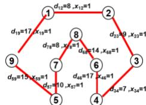


Fiq.3.5 Simple TSP Model


# Representation

#  Permutation Representation

◦ This direct representation is perhaps the most natural representation of a TSP, wherecities are listed in the order in which they are visited

chromosome 染色体

<table><tr><td>3</td><td>2</td><td>5</td><td>4</td><td>7</td><td>1</td><td>6</td><td>9</td><td>8</td></tr></table>

tour list 旅行路径

3 - 2 - 5 - 4 - 7 - 1 - 6 - 9 – 8

◦ This representation is also called a path representation or order representation.

<table><tr><td>procedure: Permutation Encoding
Input: city set, total number of cities N
Output: chromosome v
begin
    for j=1 to N
        v(j)← j;
    for i=1 to
        repeat
            k-random[1, N];
            k-random[1, N];
        until #j
            swap(v(j), v(i));
        output chromosome v;
    end</td><td>procedure: Permutation Decoding
Input: chromosome v,
total number of cities N
output: tour list L
begin
    L← φ;
    for i=1 to N
        L← L ∪ v(i);
    output tour list L;
end</td></tr></table>

# Random Keys Representation

#  Random Keys Representation

$^ \circ$ This indirect representation encodes a solution with random numbers from (0,1).

◦ These values are used as sort keys to decode the solution.

chromosome

<table><tr><td>0.23</td><td>0.82</td><td>0.45</td><td>0.74</td><td>0.87</td><td>0.11</td><td>0.56</td><td>0.69</td><td>0.78</td></tr></table>

where position $i$ in the list represents city i.

tour list 5 - 2 – 9 - 4 - 8 - 7 - 3 - 1 - 6

<table><tr><td>procedure: Random Keys Encoding</td><td>procedure: Random Keys Decoding</td></tr><tr><td>Input: city set, 
total number of cities N</td><td>Input: chromosome v, 
total number of cities N</td></tr><tr><td>output: chromosome v</td><td>output: tour list L</td></tr><tr><td>begin</td><td>begin</td></tr><tr><td>for i=1 to N</td><td>for i=1 to N</td></tr><tr><td>v[i] ← random[0,1];</td><td>L ← ∅;</td></tr><tr><td>output chromosome v,</td><td>sort L by v[i];</td></tr><tr><td>end</td><td>output tour list L;</td></tr><tr><td></td><td>end</td></tr></table>

# Crossover Operators

During the past decade, several crossover operators have been proposed forpermutation representation, such as partial-mapped crossover (PMX), ordercrossover (OX), cycle crossover (CX), position-based crossover,order-based crossover, heuristic crossover, and so on.

These operators can be classified into two classes:

◦ Canonical approach

The canonical approach can be viewed as an extension of two-point or multipointcrossover of binary strings to permutation representation.

◦ Heuristic approach

 The application of heuristics in crossover intends to generate an improved offspring.

# Crossover Operators

# 1.Partial-Mapped Crossover（PMX）

procedure : PMX crossover

input : chromosome v , v ,

length of chromosome l

output : offspring ,

begin

$$
R \leftarrow \phi ;
$$

// step 1: select two positions

at random

$s \gets$ random[1:l-1] ;

$t \gets$ random[s+1:l] ;

// step 2: exchange two substrings

$$
\leftarrow v _ {1} [ 1: s - 1 ] / v _ {2} [ s: t ] / v _ {1} [ t + 1: t ];
$$

← v [1:s-1] // v [s: t] // v [t +1:l] ;

// step 3: determine the mapping

relationship

$R \gets$ relation(v [s:t] , v [s:t]) ;

1 2// step 4: legalize offspring

legalize( , , R );

output offspring , ;

step1:select twopositionsat random

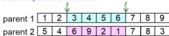


step 2: exchange two substrings

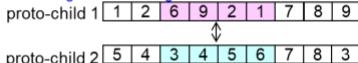


step 3:determine the mapping relationship

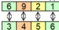


step 4: legalize offspring

offspring1

offspring 2


$v _ { 1 } :$ parent chromosome 1

$v _ { 2 } :$ parent chromosome 2

l : length of chromosome

: offspring chromosome 1

: offspring chromosome 2

R : relationships

s : start position of substring

t : end position of substring

relation $( v _ { 1 } , v _ { 2 } )$ : searching relationship between $v _ { \uparrow }$ and $v _ { 2 }$

legalize $( v _ { 1 } , v _ { 2 } , R )$ ) change genes value of $v _ { \uparrow }$ , $v _ { 2 }$ based on relationship R

# Crossover Operators

# 2. OX Crossover

procedure : Order Crossover (OX)

input :chromosome v1, $\nu _ { 2 }$

length of chromosome l

output : offspring

begin

$$
w \leftarrow 1;
$$

// step 1: select substring at random

$s \gets$ random[1: l-1] ;

t ← random[s+1: l] ;

// step 2: produce a proto-child bycopying the substring

$$
\leftarrow v _ {1} [ s: t ];
$$

// step 3: produce offspring by filingunfixed positions of proto-child from parent 2

$$
f o r i = 1 t o s - 1
$$

for j=w to l

$$
f g \leftarrow 0;
$$

for $k { = } s$ to t

if $\nu _ { 2 } [ j ] = \nu _ { 1 } [ k ]$ then

$f g \gets 1$ ; break;

if fg=0 then

[i] ← v [j] ;

$w  j + 1$ ; break;

step 1:select substring at random

parent 1


 step 2: produce a proto-child by copying the substring

proto-child


step 3: produce offspring by filing unfixed positionsof proto-child from parent 2

offspring


parent chromosome 1

l : length of chromosome

w: working data

s : start position of substring

v : parent chromosome 2

: offspring chromosome

t : end position of substring

# Crossover Operators

# 2. OX Crossover

for i=t+1 to l

for j=w to l

$$
f g \leftarrow 0;
$$

for k=s to t

$$
i f v _ {2} [ j ] = v _ {1} [ k ] t h e n
$$

$$
f g \leftarrow 1; \text {b r e a k};
$$

if $f g = 0$ then

$$
[ i ] \leftarrow v _ {2} [ j ];
$$

$$
w \leftarrow j + 1; \text {b r e a k};
$$

output offspring ;

end;

offspring


parent 2

v : parent chromosome 1

l : length of chromosome

w: working data

s : start position of substring

v : parent chromosome 2

: offspring chromosome

t : end position of substring

# Crossover Operators

# 3. Position-based Crossover（PBX）

procedure : Position-based Crossover

input : chromosome $\nu _ { \uparrow }$ , $\nu _ { 2 }$

length of chromosome l

output : offspring

begin

$$
T \leftarrow \phi , S \leftarrow \phi , w \leftarrow 1;
$$

// step 1: select a set of positions

from parent 1 at random

$$
N \leftarrow
$$

random[1:l] ;

// step 2: produce proto-child by

copying values of

selected positions

for $i = 1$ to N

$$
j \leftarrow \text {r a n d o m} [ 1: l ];
$$

$$
\leftarrow v _ {1} [ j ];
$$

$$
T \leftarrow T \cup j;
$$

$$
S \cup v _ {1} [ j ];
$$

$$
S \leftarrow
$$

 step 1 : select a set of positions from parent 1 at random

parent 1


 step 2 : produce proto-child by copyingvalues of selected positions

proto-child

<table><tr><td></td><td>2</td><td></td><td></td><td>5</td><td>6</td><td></td><td></td><td>9</td></tr></table>

v : parent chromosome 1

v : parent chromosome 2

l : length of chromosome

: offspring chromosome

N : total number of selected positions

T={t[j]} , j=1,2,…, N : selected positions set

$S = \{ s [ m ] \}$ , $\ m = 1 , 2 , \ldots$ , N : genes value set of selected positions

fg1 : flag 1

fg2 : flag 2

w : working data

# Crossover Operators

# 3. Position-based Crossover（PBX）

// step 3: produce offspring by filing unfixed positions ofproto-child from parent 2

$$
f o r i = 1 t o l
$$

$$
f g _ {1} \leftarrow 0;
$$

$$
f o r j = 1 t o N
$$

$$
i = t [ j ] \text {t h e n} f g _ {1} \leftarrow 1;
$$

if $f g _ { 1 } = 1$ then continue;

for $k { = } w$ to l

$$
f g _ {2} \leftarrow 0;
$$

for $m { = } 1$ to N

$$
i f v _ {2} [ k ] = s [ m ] t h e n
$$

$$
f g _ {2} \leftarrow 1; \text {b r e a k};
$$

if $f g _ { 2 } = 0$ then

$$
\leftarrow v _ {2} [ k ];
$$

$$
w \leftarrow k + 1; \text {b r e a k};
$$

output offspring ;

end

 step 3 :produce offspring by filing unfixed positions of proto-child from parent 2

offspring


parent 2

v : parent chromosome 1

v : parent chromosome 2

l : length of chromosome

: offspring chromosome

N : total number of selected positions

T={t[j]} , j=1,2,…, N : selected positions set

$S = \{ s [ m ] \}$ , $\ m = 1 , 2 , \ldots$ , N : genes value set of selected positions

fg2 : flag 2

w : working data

# Crossover Operators

# 4. Order-Based Crossover（OBX）

procedure : Order-Based Crossover

input : chromosome $\nu _ { \uparrow }$ , $\nu _ { 2 }$

length of chromosome l

output : offspring

begin

$$
S \leftarrow \phi , T \leftarrow \phi , w \leftarrow 1;
$$

// step 1: select a set of positions

from parent 1 at random

$$
N \leftarrow
$$

random[1:l] ;

for $i = 1$ to N

$j \gets$ random[1:l];

$$
S \leftarrow
$$

S ∪ v [j] ;

step 1 : select a set of positions


from parent 1 at random


parent 1


v : parent chromosome 1

v : parent chromosome 2

l : length of chromosome

: offspring chromosome

N : total number of selected positions

T={t[j]} , j=1,2,…, N : positions set of assigned genes from $v _ { 2 }$ to

S ={s[i]}, i=1,2,…, N : genes value set of selected positions

fg : flag 1 fg : flag 2

w : working data

# Crossover Operators

# 4. Order-Based Crossover（OBX）

// step 2: produce proto-child by copying

non-selected value from parent

2

$$
f o r i = 1 t o l
$$

$$
f g _ {1} \leftarrow 0;
$$

$$
f o r j = 1 t o N
$$

if

$$
\begin{array}{l} v _ {2} [ i ] = s [ j ] \text {t h e n} \\ f g _ {1} \leftarrow 1; \text {b r e a k}; \\ i f \quad f g _ {1} = 0 \text {t h e n} \\ \leftarrow v _ {2} [ i ], \\ T \leftarrow T \cup i; \\ \end{array}
$$

// step 3: produce offspring by copying selected

values from parent 1

$$
f o r i = 1 t o l
$$

$$
f _ {g _ {2}} \leftarrow 0;
$$

$$
f o r j = 1 t o N
$$

$$
i = t [ j ] \text {t h e n} f g _ {2} \leftarrow 1;
$$

$$
i f \quad f g _ {2} = 1 \text {t h e n c o n t i n u e};
$$

$$
\leftarrow s [ w ];
$$

$$
w \leftarrow w + 1;
$$

output offspring ;

end

step 2: produce proto-child by copying non-selected value from parent 2

parent 2


step 3:produce offspring by copying selected values from parent 1

parent 1


v : parent chromosome 1

v : parent chromosome 2

l : length of chromosome

: offspring chromosome

N : total number of selected positions

T={t[j]} , j=1,2,…, N : positions set of assigned genes from $v _ { 2 }$ to

S ={s[i]}, i=1,2,…, N : genes value set of selected positions

fg1 : flag 1

fg2 : flag 2

w : working data

# Crossover Operators

# 5. Cycle Crossover（CX）

procedure : CX crossover

input : chromosome $\nu _ { \uparrow }$ , $\nu _ { 2 }$

length of chromosome l

output : offspring

begin

$$
S \leftarrow \emptyset , T \leftarrow \emptyset , w \leftarrow 1;
$$

// step 1: find the cycle between

parents

$$
C \leftarrow \operatorname {c y} \left(v _ {1}, v _ {2}\right);
$$

// step 2: produce proto-child by

copying

gene values in cycle from

parent 1

for $i = 1$ to l

for $j { = } 1$ to N-1

if $\nu _ { 1 } [ i ] { = } c [ j ]$ then

← v [i] ;

T ← T∪i ;

$$
S \leftarrow S \cup v _ {1} [ i ];
$$

 step 1 : find the cycle between parents

parent 1


parent 2

$c y c l e \ 1  5  2  4  9  1$

 step 2 : produce proto-child by copying gene values in cycle from parent 1

proto-child

<table><tr><td>1</td><td>2</td><td></td><td>4</td><td>5</td><td></td><td></td><td></td><td>9</td></tr></table>

$v _ { 1 } :$ parent chromosome 1

v : parent chromosome 2

l : length of chromosome

: offspring chromosome

N : total number of values in cycle

T={t[n]} , n=1,2,…, N-1: positions set of S in proto-child

$S = \{ s [ k ] \}$ , k=1,2,…, N-1: proto-child genes value set in cycle

C={c[j]}, j=1,2,…, N-1: value set of cycle

fg : flag 1

fg2 : flag 2

w : working data

cy $( v _ { 1 } , v _ { 2 } )$ :finding the cycle which is defined

by the corresponding positions between parents

# Crossover Operators

# 5. Cycle Crossover（CX）

procedure : CX crossover

input : chromosome $\nu _ { \uparrow }$ , $\nu _ { 2 }$

length of chromosome l

output : offspring

begin

$$
S \leftarrow \emptyset , T \leftarrow \emptyset , w \leftarrow 1;
$$

// step 1: find the cycle between

$$
C \leftarrow \operatorname {c y} \left(v _ {1}, v _ {2}\right);
$$

// step 2: produce proto-child by

copying

gene values in cycle from

parent 1

for $i = 1$ to l

for $j { = } 1$ to N-1

if $\nu _ { 1 } [ i ] { = } c [ j ]$ then

← v [i] ;

T ← T∪i ;

$$
S \leftarrow S \cup v _ {1} [ i ];
$$

 step 1 : find the cycle between parents

parent 1


parent 2

$c y c l e \ 1  5  2  4  9  1$

 step 2 : produce proto-child by copying gene values in cycle from parent 1

proto-child

<table><tr><td>1</td><td>2</td><td></td><td>4</td><td>5</td><td></td><td></td><td></td><td>9</td></tr></table>

$v _ { 1 } :$ parent chromosome 1

v : parent chromosome 2

l : length of chromosome

: offspring chromosome

N : total number of values in cycle

T={t[n]} , n=1,2,…, N-1: positions set of S in proto-child

$S = \{ s [ k ] \}$ , k=1,2,…, N-1: proto-child genes value set in cycle

C={c[j]}, j=1,2,…, N-1: value set of cycle

fg : flag 1

fg2 : flag 2

w : working data

cy $( v _ { 1 } , v _ { 2 } )$ :finding the cycle which is defined

by the corresponding positions between parents

# Crossover Operators

# 5. Cycle Crossover（CX）

// step 3: produce offspring by fillingunfixed position from parent 2

$$
f o r i = 1 t o l
$$

$$
f g _ {1} \leftarrow 0;
$$

$$
f o r n = 1 \text {t o} | T |
$$

$$
i = t [ n ] \text {t h e n} f g _ {1} \leftarrow 1;
$$

$$
i f \quad f g _ {1} = 1 \text {t h e n c o n t i n u e};
$$

$$
f o r j = w t o l
$$

$$
f g _ {2} \leftarrow 0;
$$

$$
f o r k = 1 \text {t o} | S |
$$

$$
i f v _ {2} [ j ] = s [ k ] t h e n
$$

$$
f g _ {2} \leftarrow 1; \text {b r e a k};
$$

$$
i f \quad f g _ {2} = 0 \text {t h e n}
$$

$$
\leftarrow v _ {2} [ j ];
$$

$$
w \leftarrow j + 1; \text {b r e a k};
$$

$$
\text {o u t p u t} \quad ;
$$

 step 3 : produce offspring by filling unfixed position from parent 2

parent 2


offspring

$v _ { 1 } :$ parent chromosome 1 v : parent chromosome 2

l : length of chromosome : offspring chromosome

N : total number of values in cycle

T={t[n]} , n=1,2,…, N-1: positions set of S in proto-child

$S = \{ s [ k ] \}$ , k=1,2,…, N-1: proto-child genes value set in cycle

C={c[j]}, j=1,2,…, N-1: value set of cycle

fg : flag 1 fg : flag 2

w : working data

cy $( v _ { 1 } , v _ { 2 } )$ :finding the cycle which is defined

by the corresponding positions between parents

# Crossover Operators

# 6.Subtour Exchange Crossover

procedure : Subtour Exchange Crossover

input : chromosome $\nu _ { \uparrow }$ , $\nu _ { 2 }$

length of chromosome l

output : offspring

begin

$$
S \leftarrow \phi , T \leftarrow \phi ;
$$

// step 1: select subtours in parents

$$
s \leftarrow \text {r a n d o m} [ 1: l - 1 ];
$$

$$
t \leftarrow \text {r a n d o m} [ s + 1: l ];
$$

for $i = 1$ to l

for $j { = } s$ to t

if $\nu _ { 2 } [ i ] { = } \nu _ { 1 } [ j ]$ then

$$
S \leftarrow S \cup v _ {2} [ i ];
$$

else

$$
\leftarrow v _ {2} [ i ],
$$

$$
T \leftarrow T \cup i;
$$

step 1:select subtours in parents


v : parent chromosome 1

v : parent chromosome 2

l : length of chromosome

: offspring chromosome 1

: offspring chromosome 2

N : total number of values in subtour

S ={s[i]}, i=1,2,…, N: value set of subtour

T={t[j]} , j=1,2,…, N: positions set of S

s : stsrt position of substring in $v _ { \uparrow }$ t : end position of substring v1

# Crossover Operators

# 6.Subtour Exchange Crossover

// step 2: exchange subtours

$$
\leftarrow v _ {1} [ 1: s - 1 ] / S / \nu_ {1} [ t + 1: l ];
$$

$$
k \leftarrow s;
$$

$$
f o r i = 1 t o l
$$

$$
f g \leftarrow 0;
$$

$$
f o r j = 1 t o | T |
$$

$$
i = t [ j ] \text {t h e n} f g \leftarrow 1; \text {b r e a k};
$$

$$
i f _ {f g} = 1 \text {t h e n c o n t i n u e};
$$

$$
\leftarrow v _ {1} [ k ];
$$

$$
k \leftarrow k + 1;
$$

$$
\text {o u t p u t o f s p r i n g} \quad , \quad ;
$$

$$
e n d
$$

step 2:exchange subtours

offspring 1

<table><tr><td>1</td><td>2</td><td>3</td><td>4</td><td>7</td><td>5</td><td>6</td><td>8</td><td>9</td></tr></table>

offspring 2

<table><tr><td>3</td><td>4</td><td>9</td><td>5</td><td>8</td><td>6</td><td>2</td><td>1</td><td>7</td></tr></table>

v : parent chromosome 1

v : parent chromosome 2

l : length of chromosome

: offspring chromosome 1

: offspring chromosome 2

N : total number of values in subtour

S ={s[i]}, i=1,2,…, N: value set of subtour

T={t[j]} , j=1,2,…, N: positions set of S

s : stsrt position of substring in $v _ { \uparrow }$ t : end position of substring v1

# Mutation Operators

# 1. Inversion Mutation

procedure : Inversion Mutation

input : chromosome v1, $\nu _ { 2 }$

length of chromosome l

output : offspring

begin

// step 1: select subtour at random

$$
s \leftarrow \text {r a n d o m} [ 1: l - 1 ];
$$

$$
t \leftarrow \text {r a n d o m} [ s + 1: l ];
$$

// step 2: produce offspring by

copying inverse string of

substring

$$
S \leftarrow \operatorname {i n v e r t} (v [ s: t ]) ;
$$

$$
\leftarrow v [ 1: s - 1 ] / S / \nu [ t + 1: l ];
$$

output offspring ;

end

step 1:select subtourat random

parent


 step 2: produce offspring by copying inverse string of substring

offspring

<table><tr><td>1</td><td>2</td><td>6</td><td>5</td><td>4</td><td>3</td><td>7</td><td>8</td><td>9</td></tr></table>

v : parent chromosome

l : length of chromosome

: offspring chromosome

s : start position of substring

t : end position of substring

S : inverse string of substring

invert(string) : inversely changing

order of string

# Mutation Operators

# 2. Insertion Mutation

procedure : Insertion Mutation

input : chromosome $\nu _ { \uparrow }$ , $\nu _ { 2 }$ ,length of chromosome l

output : offspring

begin

// step 1 : select a position in

parent 1 at random

$i \gets$ random[1:l] ;

// step 2: insert selected value in

randomly selected

position parent 2

$j \gets$ random[1:l-1] ;

W ← v [1:i-1] // v[i+1:l] ;

$\overleftarrow { }$ W [1:j-1] // v[i] // W [ j:l-1];

output offspring

end

step 1:selecta position in parent 1 at random

parent


step 2: insert selected value in randomlyselected positionof parent 2

offspring


v : parent chromosome v : parent chromosome

: end position of substring : offspring chromosome

invert(string) : inversely changing oj : selected position in parent 2

length of chromosome l : length of chromosome

inverse string of substring i : selected position in parent 1

er of stringW : working data set

# Mutation Operators

# 3. Displacement Mutation

# procedure : Displacement Mutation

input : chromosome v1, $\nu _ { 2 } ,$ ,2length of chromosome l

output : offspring

begin

// step 1: select subtour

$s \gets$ random[1:l-1] ;

$t \gets$ random[s+1:l] ;

// step 2: insert subtour in arandom position

n ← t-(s-1);

i ← random[1:l-n ] ;

W ←v [1:s-1] // v [t+1:l];

← W [1:i-1] // v [s : t ] // W [ i:l-n] ;

output offspring ;

end

step 1:select subtour


step 2 :insert subtour in a random position


v : parent chromosome

l : length of chromosome

: offspring chromosome  : parent chromosome : offspring chromosome

l : length of chromosome l : length of chromosomes : start position of substring

t : end position of substring : offspring chromosome t : end position of substring

S : inverse string of si : selected posn : length of subtour

invert(string) : inverj : selected positii insert position

W : working data set

# Mutation Operators

# 3. Displacement Mutation

# procedure : Displacement Mutation

input : chromosome v1, $\nu _ { 2 } ,$ ,length of chromosome l

output : offspring

begin

// step 1: select subtour

$s \gets$ random[1:l-1] ;

$t \gets$ random[s+1:l] ;

// step 2: insert subtour in arandom position

n ← t-(s-1);

i ← random[1:l-n ] ;

W ←v [1:s-1] // v [t+1:l];

← W [1:i-1] // v [s : t ] // W [ i:l-n] ;

output offspring ;

end

step 1:select subtour


step 2 :insert subtour in a random position


v : parent chromosome

l : length of chromosome

: offspring chromosome  : parent chromosome : offspring chromosome

l : length of chromosome l : length of chromosomes : start position of substring

t : end position of substring : offspring chromosome t : end position of substring

S : inverse string of si : selected posn : length of subtour

invert(string) : inverj : selected positii insert position

W : working data set

# Mutation Operators

# 4. Swap Mutation

procedure : Swap Mutation

input : chromosome v1, v2,

length of chromosome l

output : offspring

begin

// step 1: select two position at random

$i \gets$ random[1:l -1 ] ;

j ← random[i +1 :l] ;

// step 2: produce offspring by swapping

selected positions

$$
- v [ 1: i - 1 ] / v [ j ] / v [ i + 1: j - 1 ] / v [ i ] / v [ j
$$

$$
+ 1: l ];
$$

output offspring ;

 step 1: select two position at random


 step 2 : produce offspring by swapping selected positions


v : parent chromosome v : parent chromosome: offspring chromosov : parent chromosome

: offspring chromosome : offspring chromosome : offspring chromosome

invert(string) : inverselj : selected positioni insert positionj : selected position

gth of chromosome length of chromosome t position of substring l : length of chromosome

i : selected position

# Mutation Operators

# 5. Heurisitic Mutation

procedure : Heuristic Mutation

input : chromosome v1, $\boldsymbol { v } _ { 2 }$ ,length of chromosome l

output : offspring

begin

$$
P \leftarrow \phi ;
$$

// step 1: select positions and

produce neighbors

$$
f o r i = 1 t o m \{\}
$$

$$
r \leftarrow \text {r a n d o m} [ 1: l ];
$$

$$
P \leftarrow P \cup \operatorname {n b} (\nu [ r ]) ;
$$

$$
\}
$$

// step 2: produce offspring by

evaluating neighbors

$$
w \leftarrow F (p [ 1 ])
$$

$$
f o r i = 2 t o | P |
$$

$$
i f w > F (p [ i ]) \text {t h e n}
$$

$$
w \leftarrow F (p [ i ]), n \leftarrow i;
$$

$$
\leftarrow p [ n ];
$$

output offspring ;


end;

step 1:select positions and produce neighbors


proto-child 1


proto-child 2


proto-child 3


proto-child 4


proto-child 5


step 2 : produce ofspring by evaluating neighbors

offspring


v : parent chromosome

l : length of chromosome

: offspring chromosome

m : total number of selected positions

r : selected position

N : total number of neighbor chromosomes

w :working data

n : position of chromosome with best fitness value in P

P{p[i]}, $\yen 1,2,. . ., N$ : neighbor chromosome set

nb(v[r]) : searching neighbors of rth gene

F(p[i]) : fitness value of p[i]

# Overall Algorithm

procedure: GA for Traveling Salesperson Problem (TSP)

Input: TSP data set, GA parameters

output: best tour route

begin

$t \gets 0 ;$

initialize $P ( t )$ by permutation encoding or random keys encoding;

fitness eva $I ( P )$ by permutation decoding or random keys decoding;

while (not termination condition) do

crossover $P ( t )$ to yield $C ( t )$ by partial-mapped crossover;

mutation $P ( t )$ to yield $C ( t )$ by swap mutation;

fitness eval(C) by permutation decoding or random keys decoding;

select $P ( t + 1 )$ from $P ( t )$ and $C ( t )$ ;

$t \gets t { + } 1$ ;

output best tour route;

end

# 30城市TSP问题（模拟退火）

# TSP Benchmark 问题

41 94;37 84;54 67;25 62;

7 64;2 99;68 58;71 44;54

62;83 69;64 60;18 54;22

60;83 46;91 38;25 38;24

42;58 69;71 71;74 78;87

76;18 40;13 40;82 7;62 32;

58 35;45 21;41 26;44 35;4 50


# 30城市TSP问题（模拟退火）

# 初始温度的计算

```txt
for i=1:100  
    route=randperm(CityNum);  
    fval0(i)=CalDist(dislist,route);  
end  
t0=-((max(fval0)-min(fval0))/log(0.9);
```

# 30城市TSP问题（模拟退火）

# 状态产生函数的设计

（1）互换操作，随机交换两个城市的顺序；


（2）逆序操作，两个随机位置间的城市逆序；


（3）插入操作，随机选择某点插入某随机位置。


# 30城市TSP问题（模拟退火）

# 参数设定

截止温度 tf=0.01;

退温系数 alpha=0.90;

内循环次数 L=200*CityNum;

# 30城市TSP问题（模拟退火）


# 运行过程


# 30城市TSP问题（模拟退火）


# 运行过程


# 30城市TSP问题（模拟退火）


# 运行过程


# 30城市TSP问题（模拟退火）


# 运行过程


# 30城市TSP问题（模拟退火）


# 运行过程


# 不同搜索算法比较：最短路径问题


# Thanks