# 人工智能：对抗性搜索技术

授课对象：计算机科学与技术专业 二年级

课程名称：人工智能（专业必修）

节选内容：第四章 搜索技术 II

课程学分：3学分

# 背景

# 博弈/对抗性搜索

一 博弈游戏

◼MiniMax策略

◼ Alpha Beta 剪枝

蒙特卡洛树搜索

# 搜索问题的泛化

至今我们考虑的搜索问题都假设智能体对环境有完全的控制agent has complete control of environment

$\diamond$ 除非智能体做出改变环境的行为，否则状态不会改变

$\diamond$ 因此，我们所要做的就是构造一条到目标状态的路径path to a goal state

这种假设并不总是合理的

$\diamond$ 方面，环境可能是随机变化的（比如天气，交通状况）Stochastic environment

$\diamond$ 可能存在利益与你的智能体相违背的其他智能体

◆Search can find a path to a goal state, but the actions might not lead you tothe goal as the state can be changed by other agents

◼ 在这种情况下，我们需要通过扩展搜索的视角（泛化）来处理不是由我们的智能体所控制的状态的变化

2 or more agents;

◆ All agents acting to maximize their own profits.

# 搜索问题的泛化

<table><tr><td></td><td>经典搜索</td><td>对抗/博弈搜索</td></tr><tr><td>环境</td><td>单智能主体</td><td>多智能主体</td></tr><tr><td>搜索方式</td><td>启发式搜索</td><td>对抗式搜索</td></tr><tr><td>优化</td><td>用启发式方法可找到最优解</td><td>因时间受限而被迫执行近似解</td></tr><tr><td>评价函数</td><td>路径的代价估计</td><td>博弈策略和局势评估</td></tr></table>

# 博弈类智力游戏

<table><tr><td rowspan="8">桌上游戏</td><td rowspan="4">棋盘游戏</td><td>井字棋</td></tr><tr><td>西洋跳棋</td></tr><tr><td>国际/中国象棋</td></tr><tr><td>围棋</td></tr><tr><td rowspan="2">纸牌游戏</td><td>德州扑克</td></tr><tr><td>桥牌</td></tr><tr><td>骰子游戏</td><td>僵尸骰子</td></tr><tr><td>棋牌游戏</td><td>麻将</td></tr><tr><td>猜拳游戏</td><td></td><td>剪刀石头布</td></tr></table>

# 现实世界问题

# 囚徒困境（Prisoner's dilemma）

⚫ 囚徒困境源于1950年梅里尔·弗拉德（Merrill Flood）等人的相关困境理论，后来艾伯特·塔克（Albert W. Tucker）将其命名为“囚徒困境”。

今我们考虑的搜索问题都假设智能体对环境有完全的控制两个犯罪分子被分别监禁，无法沟通。每个囚徒只有二选一的机会：揭发对方并证明其犯罪，或者保持沉默。可能的选项如下：

1）若囚徒A和B彼此揭发对方，则每个囚徒被监禁2年；

2）若囚徒A揭发B、而B保持沉默，则A被释放而B被监禁3年，反之亦然；

3）若A和B都保持沉默，则他们仅被监禁1年。

# 博弈的示例：囚徒困境

· Two prisoners in separate cells.

The sheriff doesn't have enough evidence to convict them.

 They agree ahead of time to both deny the crime (they will cooperate).

· If one confesses and the other doesn't:

 Confessor goes free;

们考虑的搜索问题都假设

➢ 除非智能体

both sentenced to 3 years.

· If both cooperate (neither confesses):

- both sentenced to 1 year.

Confess

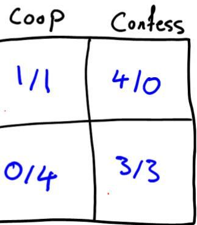

# 博弈问题的复杂性

囚徒困境、象棋、跳棋、围棋、井字棋都属于完美信息博弈，面对其空间和时间的复杂性，人工智能的工作就是在每个决策点上寻找胜率最大的路径。

徒困境但是，非完美信息博弈，例如纸牌、麻将游戏 ， 不仅仅是空间和时间的复杂性，还依赖于博弈策略。

现实生活中非完美信息博弈几乎无处不在。

围棋可能的棋局数约为10170，比宇宙中原子的数目还要多！

# 博弈算法的历史

1912年，恩斯特·策梅罗（Ernst Zermelo）提出了最小最大算法（MiniMax algorithm）。

. 1949年，克劳德·香农（Claude Shannon）采用评价函数和选择性搜索方法，开发了国际象棋软件。

1956年，约翰·麦卡锡（John McCarthy）在最小最大算法的基础上，提出了Alpha-beta剪枝方法。

同年，即1956年，亚瑟·塞缪尔（Arthur Samuel）开发了西洋跳棋（Checkers）程序，其中通过自我对弈来学习自身的评价函数。

1958年，亚历克斯·伯恩斯坦（Alex Bernstein）等 人 在 IBM 704 上 开 发 了 史 上 第 一 款 计 算 机国际象棋软件。

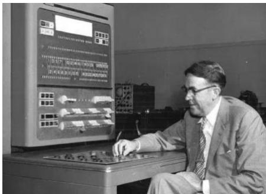

图亚瑟·塞谬尔与一台计算机下跳棋

# 博弈算法的历史

1968年，艾伯特·索伯里斯特实现了世界上首款计算机围棋程序。

 1990年，中山大学化学系教授陈志行编写了“手谈”。在1995至1998年期间，手谈在国际计算机围棋比赛中七次获得冠军。

1993年，贝恩德·布鲁格曼（Bernd Brügmann）第一次将蒙特卡罗仿真（Monte Carlo Simulation）用于计算机围棋。

1994年，乔纳森·薛弗尔（Jonathan Schaeffer）开发了西洋跳棋程序，与人类世界冠军打了个平局。2007年，他与合作者在《Science》上发表了“Checkers is Solved（西洋跳棋已破解）”的论文。

 1997年，IBM深蓝战胜了国际象棋冠军加里·卡斯帕罗夫

图中山大学教授陈志行

# 博弈算法的历史

2009年，斯 坦 福 大 学 的Wan Jing Loh发表了“AIMahjong（AI麻将）”的论文。

2011年，尾島陽児（Yoji Ojima）开发的围棋软件Zen19D达到了KGS（Kiseido Go Server, KGS）五段的水平。

2013年，疯石（Crazy Stone）在受让四子的情况下，战胜了日本九段棋手石田芳夫。

2015年2月，谷歌DeepMind公司通过深度强化学习的方法来控制视频游戏机Atari，达到了人类玩家的水平。

. 2015年12月，DeepMind公司的计算机围棋AlphaGo打败了欧洲围棋冠军樊麾（Fan Hui）。

2016年3月，AlphaGo在韩国首尔战胜了韩国九段职业棋手李世乭。

图 AlphaGo与李世乭

# 博弈算法的历史

 2016年12月29日至2017年1月5日，以Master为网名在中国著名的围棋网站上与世界顶级围棋选手进行了60局在线快棋赛，赢得60连胜。

2017年5月， AlphaGo战胜了当时世界围棋排名第一的职业棋手柯洁。

2017年10月， DeepMind公司推出了从零开始学习的围棋软件AlphaGo Zero。接着又推出了会下围棋、国际象棋和日本将棋的Alpha Zero。

2016年12月，在一对一无限注德州扑克（Heads-Up No-LimitTexas Hold'em）比赛中，阿尔伯塔大学开发的人工智能扑克DeepStack击败了11位职业扑克选手。

2017年1月，卡内基·梅隆大学的人工智能扑克Libratus，在一对一无限注德州扑克比赛中，战胜了4位人类顶级选手。

. 2019年4月，OpenAI公司的OpenAI Five，在TI9的Dota2五对五终极决赛上，以2:0击败了上一届TI8世界冠军团队OG。

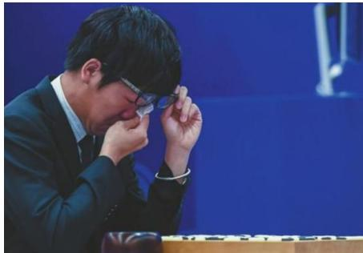

图柯洁泪洒赛场

# 博弈的主要特点

◼超过两个以上玩家且均可以改变状态

There are two (or more) agents making changes to the world (the state).

◼每个玩家都有他们自身的利益取向

Each agent has their own interests and goals.

◼每个玩家都会根据自身的利益来改变世界（状态）

Each agent independently tries to alter the world so as to best benefit itself

◼难点：你如何行动取决于你认为对方会如何行动，而对方如何行动又取决于他们认为你会如何行动

◆How you should play depends on how you think the other person will play;

◆How the other person plays depends on how they think you will play.

joint-dependency

# Game Playing State-of-the-Art

Checkers（西洋跳棋）: 1950: First computer player.1994: First computer champion: Chinook ended 40-year-reign of human champion Marion Tinsley usingcomplete 8-piece endgame. 2007: Checkers solved!

Chess: 1997, Deep Blue defeats human champion GaryKasparov in a six-game match. Deep Blue examined200M positions per second, used very sophisticatedevaluation and undisclosed methods for extendingsome lines of search. Current programs are even better.

Go: Human champions are now starting to be beatenby machines. In AlphaGo, each position takes only 0.4second for the machines to take the decision. Big recentadvances use Monte Carlo (蒙特卡洛树搜索MCTS)expansion methods.

◼ Pacman?

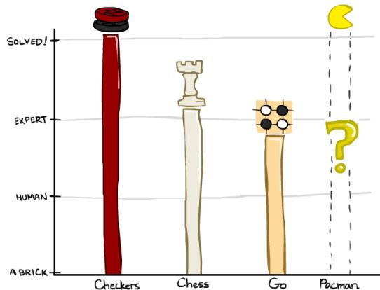

# Behavior from Computation

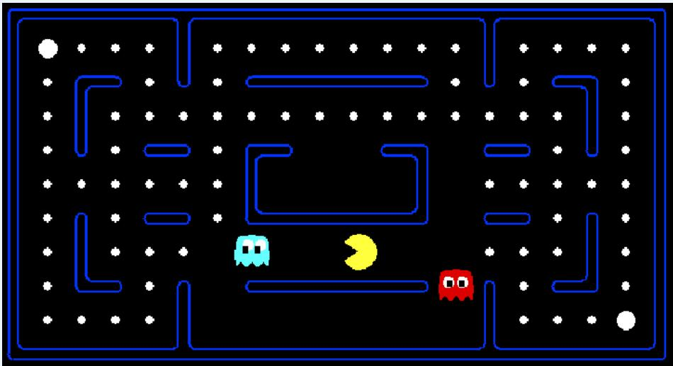

Video of Demo Mystery Pacman

博弈/Adversarial Games/Adversarial Search

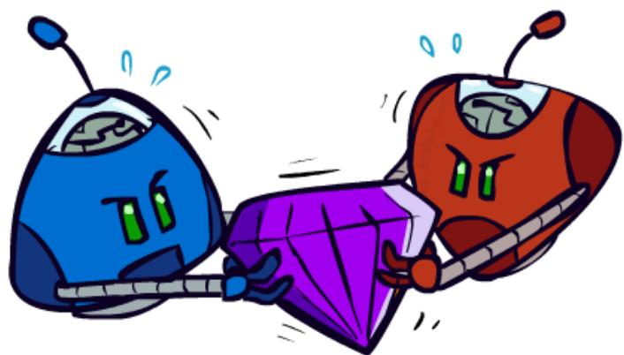

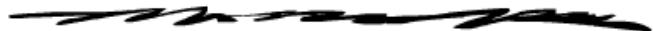

# 博弈的类型

<table><tr><td></td><td>Deterministic 确定性</td><td>Stochastic 随机性</td></tr><tr><td>Perfect information (fully observable)</td><td>Chess 国际象棋</td><td>Backgammon 西洋双陆棋</td></tr><tr><td>完全信息 (可完全观测)</td><td>Checkers 西洋跳棋</td><td>Monopoly 大富翁</td></tr><tr><td></td><td>Go 围棋</td><td></td></tr><tr><td></td><td>Othello 黑白棋</td><td></td></tr></table>

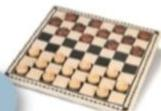

(a) Checkers

(b) Othello

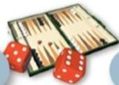

(c) Backgammon

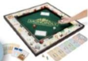

(d)Monopoly

# 博弈的类型

<table><tr><td></td><td>Deterministic 确定性</td><td>Stochastic 随机性</td></tr><tr><td>Imperfect information (partially observable) 不完全信息 (不可完全观测)</td><td>Stratego 西洋陆军棋 Battleships 海战</td><td>Bridge 桥牌 Poker 扑克 Scrabble 拼字游戏</td></tr></table>

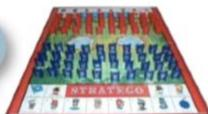

(e)Stratego

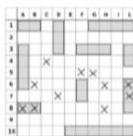

(（f)Battleships

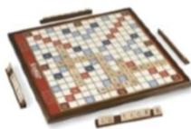

（g)Scrabble

# 博弈的示例：剪刀，石头，布

⚫ 剪刀可以剪布，布可以包石头，石头可以砸剪刀

⚫ 可以用矩阵表示：玩家1选择一我们考虑的搜索行，玩家2选择一列

除非智能体做出改变环境每一格表示各个玩家结算的分数（玩家1的分数/玩家2的分数）

1：赢了，0：平局，-1：输了

. 所以这个游戏是零和博弈

<table><tr><td colspan="3">Player II</td></tr><tr><td>R石头</td><td>P布</td><td>S剪刀</td></tr><tr><td>0/0</td><td>-1/1</td><td>1/-1</td></tr><tr><td>1/-1</td><td>0/0</td><td>-1/1</td></tr><tr><td>-1/1</td><td>1/-1</td><td>0/0</td></tr></table>

# 零和博弈 Zero-Sum Games

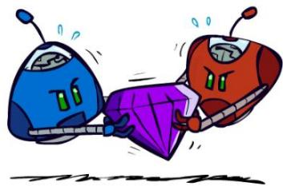

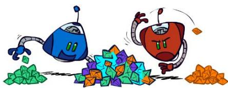

# • Zero-Sum Games

Agents have opposite utilities (values onoutcomes)

Lets us think of a single value that onemaximizes and the other minimizes

能体对环境有完全的控制Adversarial, pure competition

# • 的行为，否则状General Games

▫ Agents have independent utilities (valueson outcomes)

Cooperation, indifference, competition,and more are all possible

More later on non-zero-sum games

# 双人博弈

⚫ 剪刀石头布是简单的一次性（one shot）的博弈

➢ 每一方只有一次动作

➢ 在博弈论中：属于策略或范式博弈

⚫ 许多博弈是有多步的

➢ 轮流：玩家是交替行动的

$\curlyeqsucc$ 比如，象棋、跳棋等

➢ 在博弈论中：属于扩展形式的博弈

⚫ 我们专注于扩展形式的博弈

➢ 扩展形式的博弈中才会出现需要计算的问题

# 双人博弈的扩展定义

两个玩家

. 离散的：游戏的状态或决策可以映射为离散的

. 有限的：游戏的状态或可以采取的行动的种类是有限的

# 确定性

没有不确定的因素:例

如，没有骰子

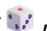

没有抛硬币等

# 完美信息

任何层面的状态都是

可观察的: 例如，没

有隐藏的卡牌

# 零和博弈

完全的竞争: 游戏的一方赢了，则另一方输掉了同等的数量

# 双人博弈的形式化

⚫ 两个玩家 A（Max）和B（Min）

⚫ 状态集合S（游戏状态的有限集合）

⚫ 一个初始状态I∈S（游戏）

⚫ 终止位置T∈S（游戏的终止状态：游戏结束的状态）

后继函数（一个接收状态为输入，返回通过某些动作可以到达的状态的函数）

效益（Utility）或收益（payoff）函数U：T→R.（将终止位置映射到实数的函数，表示每个终止位置对玩家A有多有利和对玩家B有多不利）

# 双人博弈的过程

⚫ 玩家交替行动（从玩家A，或玩家Max开始）

⚫ 当到达某个终止状态??∈??时游戏结束

⚫ 一个游戏状态：一个（状态-玩家）对

⚫ 告诉当前是哪个状态，轮到哪个玩家行动

⚫ 效益函数和终止状态代替原来的目标状态

⚫ 玩家A或Max希望最大化终止状态的效益

⚫ 玩家B或Min希望最小化终止状态的效益

⚫ 另一种解读

⚫ 在终止状态??时，玩家A或Max获得了U(??)的收益，玩家B或Min获得了−U(??)的收益

这就是为何称为“零和”

# 双人博弈的示例

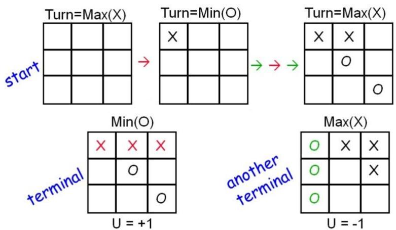

# Which of these are: 2-player zero-sum discrete finitedeterministic games of perfect information

·Zero-sum: Inany outcome of anygame,Player A's gainsequal player B'slosses.

·Discrete:Allgame statesanddecisionsarediscrete values.

FiniteOnlyfiniteumberofsatesanddecisions.

Deterministic:Nohancenodierols.

·Perfectinformation:Both playerscan see the state,and each decision ismadesequentially(no simultaneousmoves).

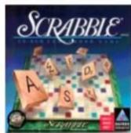

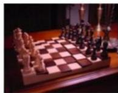

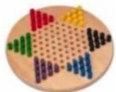

# Which of these are: 2-player zero-sum discrete finite deterministic games of perfect information

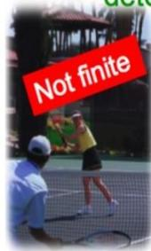

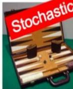

·Two player: Duh!

·Zero-sum:Inany outcomeof anygame,Player A'sgainsequal player B'slosses.

Discreesatesdeciarediscrete values

FiniteOnlyfieumfstatesanddecisions.

·Deterministic:Ncedrols),

·Perfectinformation:Bothplayerscan see the state,and each decision ismade sequentially(no simultaneousmoves）.

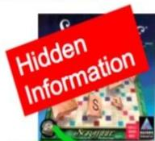

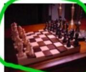

Multiplayer

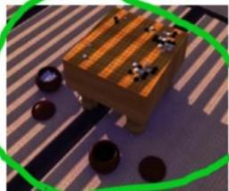

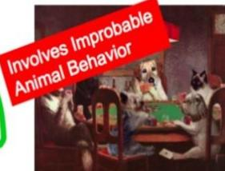

# Game Tree 博弈树定义

· A Game Tree consists of layers reflect alternating moves between Max and Min.

 Root is start state.

· Starting with Max, players alternate moves.

 Game State: a state-player pair, specifies the current state and whose turn it is.

· Game ends when some terminal $p \in T$ is reached.

· Utility function and terminals replace goals:

 Terminal nodes t are labeled with utilities $U ( t )$

- Max gets $U ( t )$ , Min gets $- U ( t )$ for terminal node t.

# Nim问题：非正式的描述

1. 开始时有一定数量的几堆火柴

2. 每一回合玩家可以从某堆中移走任意数目的火柴

3. 移走最后的火柴的玩家则输

 在II-Nim问题中，有两堆火柴，每堆有2根火柴

<table><tr><td>S =</td><td>(_, _)-A</td><td>(_, i)-A</td><td>(_, ii)-A</td></tr><tr><td></td><td>(i, _)-A</td><td>(i, i)-A</td><td>(i, ii)-A</td></tr><tr><td></td><td>(ii, _)-A</td><td>(ii, i)-A</td><td>(ii, ii)-A</td></tr><tr><td></td><td>(_, _)-B</td><td>(_, i)-B</td><td>(_, ii)-B</td></tr><tr><td></td><td>(i, _)-B</td><td>(i, i)-B</td><td>(i, ii)-B</td></tr><tr><td></td><td>(ii, _)-B</td><td>(ii, i)-B</td><td>(ii, ii)-B</td></tr></table>

根据对称性，一些状态是等价的（比如(_,ii)-A和(ii,_)-A） C可以把这些等价的状态合并为1个（即规定左边的火柴堆不多于右边的火柴堆）

# Nim问题：非正式的描述

II-Nim

<table><tr><td>S =</td><td>a finite set of states (note: state includes information sufficient to deduce who is due to move)</td><td colspan="2">(_,_)-A (_, i)-A (_, ii)-A (i, i)-A (i, ii)-A (ii, ii)-A (_,_)-B (_, i)-B (_, ii)-B (i, i)-B (i, ii)-B (ii, ii)-B</td></tr><tr><td>I =</td><td>the initial state</td><td colspan="2">(ii, ii)-A</td></tr><tr><td rowspan="5">Succs =</td><td rowspan="5">a function which takes a state as input and returns a set of possible next states available to whoever is due to move</td><td>Succs(_,i)-A = {(_,_)-B}</td><td>Succs(_,i)-B = {(_,_)-A}</td></tr><tr><td>Succs(_,ii)-A = {(_,_) - B, (_,i)-B}</td><td>Succs(_,ii)-B = {(_,_) - A, (_,i)-A}</td></tr><tr><td>Succs(i, i)-A = {(_,i)-B}</td><td>Succs(i, i)-B = {(_,i)-A}</td></tr><tr><td>Succs(i,ii)-A = {(_,i)-B (_,ii)-B (i, i)-B}</td><td>Succs(i,ii)-B = {(_,i)-A, (_,ii)-A (i, i)-A}</td></tr><tr><td>Succs(ii, ii)-A = {(_,ii)-B, (i, ii)-B}</td><td>Succs(ii, ii)-B = {(_,ii)-A, (i, ii)-A}</td></tr><tr><td>T =</td><td>a subset of S. It is the terminal states</td><td>(_, _)-A</td><td>(_, _)-B</td></tr><tr><td>V =</td><td>Maps from terminal states to real numbers. It is the amount that A wins from B.</td><td>V(_, _)-A = +1</td><td>V(_, _)-B = -1</td></tr></table>

# Nim问题：非正式的描述

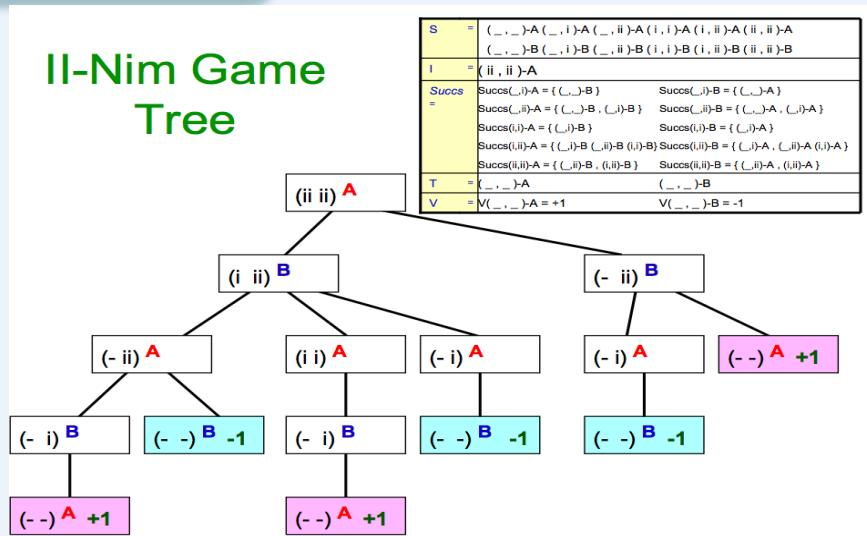

# Nim问题：非正式的描述

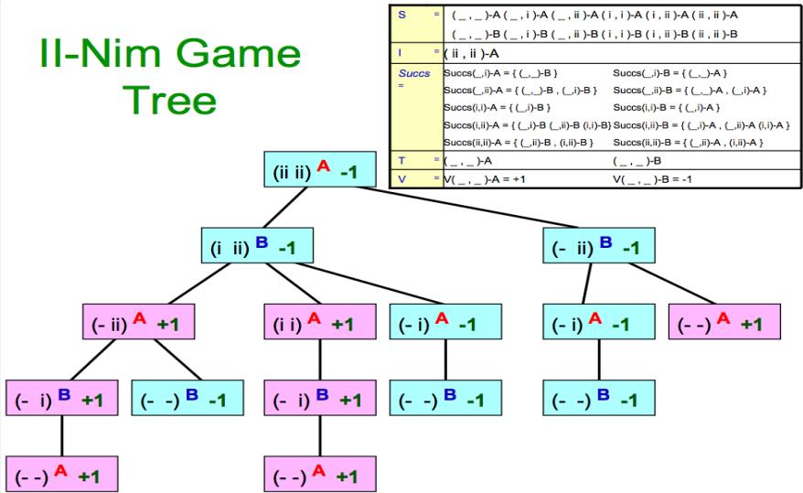

# Single-Agent Trees 单智能体树结构

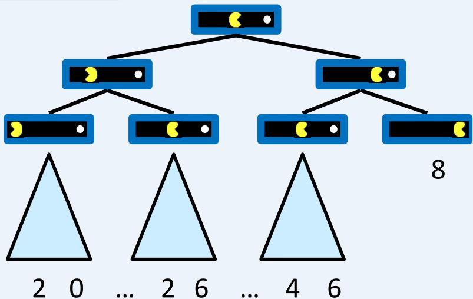

# Value of a State 状态的价值/收益

Value of a state: The

best achievable

outcome (utility)

from that state

状态可获得的

最佳价值/收益

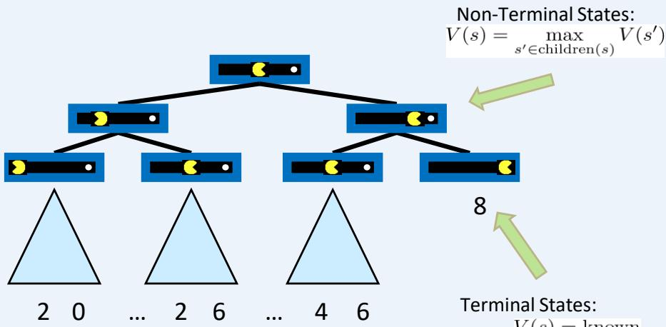

$$
s) = \max_{s^{\prime}\in \text{children} (s)}V(s^{\prime})
$$

Adversarial Game Trees 博弈树

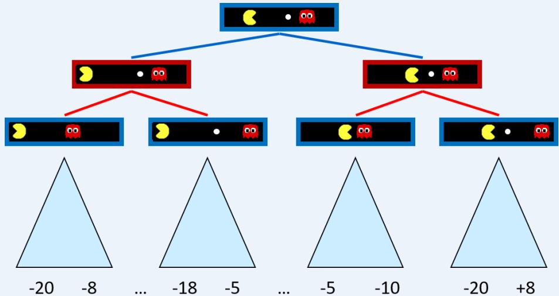

# Minimax Values

# States Under Agent’s Control:

$$
V (s) = \max  _ {s ^ {\prime} \in \text {s u c c e s s o r s} (s)} V (s ^ {\prime})
$$

# States Under Opponent’s Control:

$$
V \left(s ^ {\prime}\right) = \min  _ {s \in \text {s u c c e s s o r s} \left(s ^ {\prime}\right)} V (s)
$$

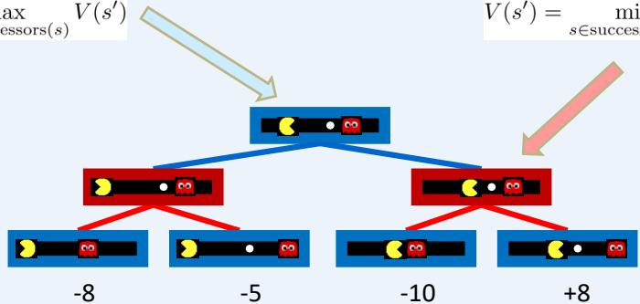

# Terminal States:

$$
V (s) = \mathrm {k n o w n}
$$

# Adversarial Search博弈/对抗搜索

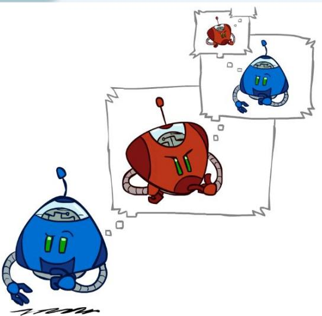

# Search vs Adversarial Search

<table><tr><td>Search</td><td>Adversarial Search</td></tr><tr><td>Single agent 单智能体</td><td>Multiple agents 多智能体</td></tr><tr><td>Solution is (heuristic) method for finding goal. 
解是寻找目标的（启发式）方法</td><td>Solution is strategy (strategy specifies move for every possible opponent reply). 
解是策略（指定对每个可能对手回应的行动策略）</td></tr><tr><td>Heuristics can find optimal solution. 
启发式法可以找到最优解</td><td>Time limits force an approximate solution. 
时间受限被迫执行一个近似解</td></tr><tr><td>Evaluation function: estimate of cost from start to goal through given node. 
评价函数：是从起始穿过给定节点到达目标的代价估计</td><td>Evaluation function: evaluate “goodness” of game position. 
评价函数：评估博弈局势的“好坏”</td></tr></table>

# MiniMax算法

# Adversarial Search 对抗搜索

·Max wants to maximize the terminal payoff.

·Min wants to minimize the terminal payoff.

·Max doesn't decide which terminal state is reached alone.AfterMaxmovestoa state，Mindecideswhich subseguentstatetomove to.

· Thus Max must have a strategy:

-Must know what to do for each possible move of Min.

- One sequence of moves will not suffice:“What to do”will depend on how Minwill play.

# Tic-Tac-Toe Game Tree 井字棋博弈树

MAX (X)

MAX (X)

TERMINAL

Utility

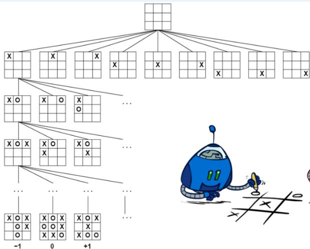

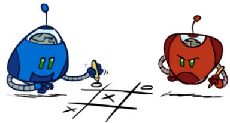

# Adversarial Search (Minimax)对抗性搜索

• Deterministic, zero-sum games:

▫ Tic-tac-toe, chess, checkers….

▫ One player maximizes result

▫ The other minimizes result

• Minimax search:

A state-space game search tree 状态空间博弈搜索树

▫ Players alternate turns 玩家轮流行动

Compute each node’s minimax value:计算每个节点的最小最大值 the bestachievable utility against a rational(optimal) adversary针对理性对手的最佳策略

Minimax values:computed recursively

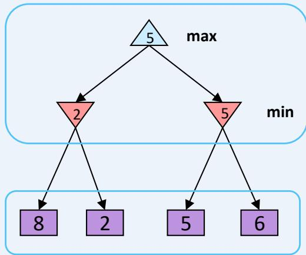

Terminal values:part of the game

# MiniMax策略的收益

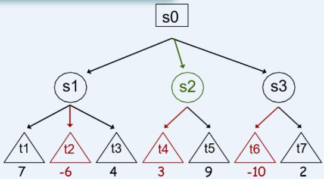

 A (max) plays

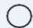

 B(min) plays

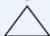

 terminal

终止状态具有一个效益值（V）。对于在非终止状态时的“效益值”，我们可以通过假设每个玩家都做出对自己最优的行动来计算得到。

# MiniMax策略

⚫ 假设对方能总是做出最优的行动

➢ 己方总是做出能最小化对方获得的收益的行动

➢ 通过最小化对方的收益，可以最大化己方的收益

⚫ 注意到如果已经知道在某些情况下对方无法做出最优的行动，那么可能存在比MiniMax更好的策略（也就是说，有其他的策略可以获得更多的收益）

# Minimax Implementation

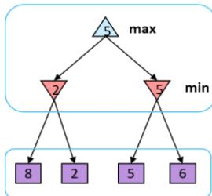

Terminal values:part of the game

def max-value(state):

initialize $\mathsf { v } = - \mathsf { o } \mathsf { o }$

for each successor of state:

$$
v = \max  (v, v a l u e (\text {s u c c e s s o r}))
$$

return v

$$
V (s) = \max  _ {s ^ {\prime} \in \text {s u c c e s s o r s} (s)} V (s ^ {\prime})
$$

def min-value(state):

initialize $\mathsf { v } = + \infty$

for each successor of state:

$$
v = \min  (v, v a l u e (\text {s u c c e s s o r}))
$$

return v

$$
V (s ^ {\prime}) = \min  _ {v} V (s)
$$

$$
s \in \text {s u c c e s s e r s} \left(s ^ {\prime}\right)
$$

# MiniMax算法

⚫ 构建完整的博弈树（每个叶子节点都表示终止状态）

⚫ 根节点表示起始状态，边表示可能的行动之类的

⚫ 每个叶子节点（终止状态）都标记了对应的效益值

⚫ 反向传播效益值 $U ( n )$

⚫ 每个叶子节点 $t$ 的 $U ( t )$ 值是预定义好的（算法输入的一部分）

⚫ 假如节点 $n$ 是一个Min节点：

 $U ( n ) = \operatorname* { m i n } \{ U ( c ) \colon c .$ 是 $n$ 的子节点

⚫ 假如节点 $n$ 是一个Max节点：

 $U ( n ) = \operatorname* { m a x } \{ U ( c ) \colon c$ 是 $n$ 的子节点}

# Minimax Implementation

# def value(state):

if the state is a terminal state: return the state’s utilityif the next agent is MAX: return max-value(state)if the next agent is MIN: return min-value(state)

# def max-value(state):

initialize $\mathsf { v } = - \mathsf { o } \mathsf { o }$

for each successor of state:

$$
v = \max  (v, v a l u e (\text {s u c c e s s o r}))
$$

return v

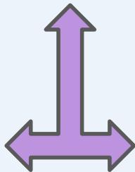

# def min-value(state):

initialize $\mathsf { v } = + \infty$

for each successor of state:

$$
v = \min  (v, v a l u e (\text {s u c c e s s o r}))
$$

return v

# MiniMax Example

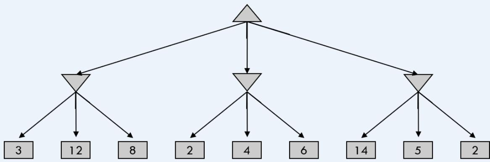

# Minimax Properties

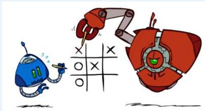

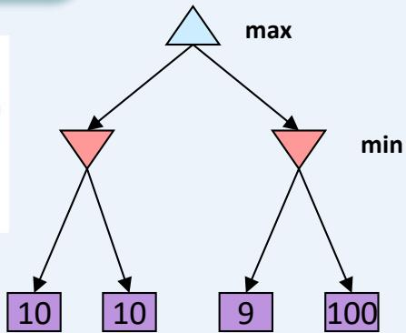

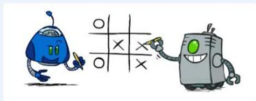

Optimal against a perfect player. Otherwise?

Video of Demo Min vs. Exp(理性对手)

# 背景

Video of Demo Min vs. Exp(非理性对手)

# MiniMax算法

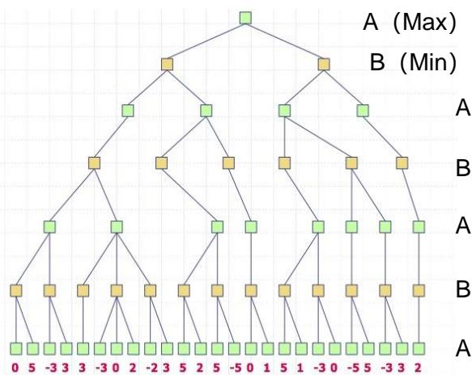

 练习：计算出下面博弈树中的每个节点的理论效益值

# MiniMax算法

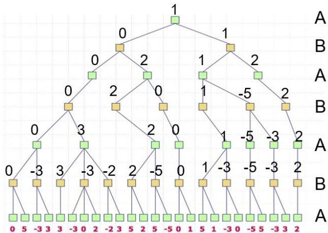

问题：假如每个玩家都按照对自己最优的策略行动，博弈树中的哪条路径会是游戏进行的过程？

# MiniMax算法

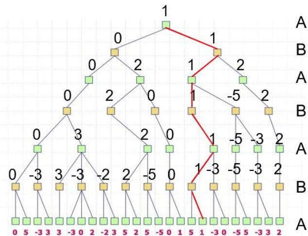

# MiniMax算法的深度优先实现

⚫ 我们希望能构建整个博弈树并且记录每个玩家决策所需的值

⚫ 但是博弈树的大小是指数增长的

⚫ 之后我们会看到，其实知道整个博弈树并不必要

⚫ 今我们考虑的搜索问题都假设智能体对环境有完全的控制为了解决博弈树太大的问题，我们需要找到深度优先搜索算法来实现MiniMax

➢ 除非智能体做出改变环境的行为，否则状态不会改变通过深度优先搜索我们可以找到MAX玩家的下一步动作（对于MIN玩家也是类似）

⚫ 这样就可以避免记录指数级大小的博弈树，只需要计算我们需要的动作

# MiniMax算法的深度优先实现

DFMiniMax(n, Player) //return Utility of state n given that //Player is MIN or MAX   
If n is TERMINAL   
Return U(n) //Return terminal states utility //U is specified as part of game)   
//Apply Player's moves to get successor states.   
ChildList  $=$  n successors(Player)   
If Player  $\equiv =$  MIN return minimum of DFMiniMax(c, MAX) over c e ChildList Else //Player is MAX return maximum of DFMiniMax(c, MIN) over c e ChildList

这个算法的前提是博弈树的深度是有限的

⚫ 深度优先搜索的优点是：空间复杂度低深度优先搜索的优点是：空间复杂度低

# MiniMax Efficiency 效率

• How efficient is MiniMax?

▫ Just like (exhaustive) DFS

▫ Time: O(bd)

▫ Space: O(bd)

Example: For chess, b  35, d  50

▫ Exact solution is completely infeasible

▫ But, do we need to explore the whole tree?

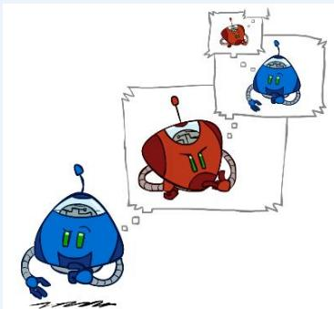

E.g., Chess: average branching factor $\approx 3 5$each player often go to50moves,so searchtree hasabout $3 5 ^ { 1 0 0 }$ or10154 nodes!

常常走50多步，故该搜索树约有35100或 $1 0 ^ { 1 5 4 }$

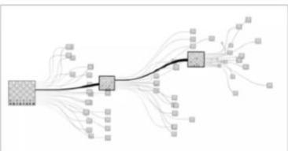

# Alpha-beta剪枝

# 剪枝

# Minimax Example

# Minimax Pruning

# 剪枝

⚫ MiniMax的决策没有必要计算整个博弈树

⚫ 假设使用深度优先来生成博弈树

只要计算节点n的一部分子节点就可以确定在MiniMax策略中会不会走到节点n了

如果已经确定节点n不会被考虑，那么也就不用继续计算n的剩余子节点了

有两种类型的剪枝：

对Max节点的剪枝 (α-cuts)

对Min节点的剪枝 $\boldsymbol { \beta }$ -cuts)

MAX

MIN

MAX

MIN

假设叶子节点（终止节点）的取值只有1和-1，并且使用深度优先搜索实现MiniMax策略。我们应该在哪里进行剪枝呢？

如果有的状态已经快到当前玩家胜利的结局了，那就不用继续评估其他子节点了，这样可以把博弈树剪枝很多

# 对Max节点的剪枝 (α-cuts)

 At a Max node s:

$\alpha _ { s }$ : The highest value of s's children examined so far (changes as children'of s are examined).

$\beta$ : The bestoption for MIN (i.e.,lowest value)found so far (fixed as children of s are examined);

# 在Max节点s：

⚫ 设 $\alpha _ { s }$ 是S被遍历过的子节点中的最高值（随着子节点的遍历而改变）

⚫ 设β是当前遍历过S的兄弟节点中的最低值（在评估节点S时是固定的）

A (max)

B (min)

terminal

$\beta = 8$ （前面只遍历了一个兄弟节点）

S遍历子节点的时候alpha值的变化:

$$
\alpha_ {s} = 2; \alpha_ {s} = 4; \alpha_ {s} = 9
$$

# 对Max节点的剪枝 (α-cuts)

??

∗

??????

If $\alpha _ { s }$ becomes greater than or equal to $\beta$ , we can stop expanding the Mildren of s:

 Min will never choose to move from s's parent to $s$  since it would choose one of s's lowervalued siblings.

??????

在Max节点S的时候，如果 $\pmb { \alpha } _ { s }$ 值变得 ≥ β的时候，就可以停止遍历n的子节点了前面的Min节点不会来到通过Max节点S的父母P来到Max节点S这个状态的，因为Min一定会选择Max节点S的值更小的兄弟节点

# 对Min节点的剪枝 (β-cuts)

 At a Min node s:

??????（初始值−∞）

α: The best option for MAX (i.e., highest value) found so far (fixed as children of s are exam-ined).

$\beta _ { s }$ : The lowest value of s'schildren examined so far (changes as children of s are examined);

# 在Min节点S:

⚫ 设α 到现在为止S节点的兄弟节点中值最高的 (在评估节点S时是固定的)

⚫ 设 $\beta _ { s }$ 是到现在为止节点S的子节点中值最低的(随着子节点的遍历而改变)

A (max)

B (min)

terminal

??????（初始值 $+ \infty$

# 对Min节点的剪枝 (β-cuts)

·If $\alpha$ becomes greater than or equal to $\beta _ { s }$ , we can stop expanding the children of s:Max will never choose to move from s's parent to $s$  since it would choose one of s'shigher value siblings.

• 如果???? 变得 ≤ α 那么可以停止扩展S的子节点

Max节点一定不会选择Min节点S，因为它会优先选择Min节点S值更高的兄弟节点

再放大一点来说, 在Min节点 S, 如果β 变得 ≤ 某个Max祖先节点的α值, 那么S节点的扩展就可以停止了

# Alpha-beta剪枝的泛化

定理：如果α $( \mathsf { m } ^ { \prime } ) = \mathsf { U } \mathrm { ~ } ( \mathsf { m } ) \geq \mathsf { \beta }$ (n), 那么n节点可以被剪枝

⚫ 使用归纳法来证明

⚫ Base case: $\mathsf { m } ^ { \prime } = \mathsf { n } ^ { \prime }$ . 显然n节点可以被剪枝

$\bullet$ 接下来是归纳法的步骤：

Case 1: α (n') > β (n). n的其它子节点不影行为，否则状态不会改变响U (n')，所以n可以被剪枝

Case 2: α (n') = β (n). 那么U (m) ≥ β (n) =α (n') ≥ β (n''). 根据归纳法，n''可以被剪枝，所以n也可以被剪枝

# Alpha-beta剪枝的步骤

α:Best already explored option along the path to the root for MAX.β: Best already explored option along the path to the root for MIN.

# Alpha-Beta Pruning:

·Set initial values:α= -o and β = ∞

·While backing the utility values up the tree,identify $\alpha$ and β for each node.

·At every node s,if $\alpha \ge \beta$ ,prune (remaining) children of s.

$\alpha$ -cuts: Pruning of MAX nodes.$\beta$ -cuts:Pruning of MIN nodes.

⚫记录Max节点alpha值的变化和Min节点beta值的变化

⚫Max节点如果alpha值大于等于任何祖先Min节点的beta值，就进行alpha剪枝

⚫Min节点如果beta值小于等于任何祖先Max节点的alpha值，就进行beta剪枝

# Alpha-beta剪枝的实现

function ALPHA-BETA-SEARCH(state) returns an action  $v \gets \text{MAX-VALUE(state, -∞, +∞)}$  return the action in ACTIONS(state) with value  $v$

function MAX-VALUE(state,  $\alpha ,\beta$  )returns a utility value if TERMINAL-TEST(state) then return UTILITY(state)  $v\gets -\infty$  for each a in ACTIONS(state) do  $v\gets \mathrm{MAX}(v,\mathrm{MIN - VALUE}(\mathrm{RESULT}(s,a),\alpha ,\beta))$  if  $v\geq \beta$  then return v  $\alpha \leftarrow \mathrm{MAX}(\alpha ,v)$  return  $v$

function MIN-VALUE(state,  $\alpha ,\beta$  )returns a utility value if TERMINAL-TEST(state) then return UTILITY(state)  $v\gets +\infty$  for each a in ACTIONS(state) do  $\nu \leftarrow \mathrm{MIN}(\nu ,\mathrm{MAX - VALUE}(\mathrm{RESULT}(s,a),\alpha ,\beta))$  if  $\nu \leq \alpha$  then return v  $\beta \leftarrow \mathrm{MIN}(\beta ,\nu)$  return  $\pmb{\nu}$

# 示例

# 示例

# Recall:

– alpha: value of best move for us seen so far incurrent search path

– beta: best move for opponent (worst move for us)seen so far in current search path

If alpha $> =$ beta, prune

Initial alpha: −∞

Initial beta: ∞

# 练习

假设从左到右扩展节点，哪部分的计算可以忽略（剪枝）呢？

# 练习

# 练习

在下图所示的博弈树中，方框表示极大方，圆圈表示极小方。以优先生成左边结点的顺序来进行α-β剪枝搜索，试在博弈树上给出何处发生剪枝的标记，并用粗体注明最好的走步路径。

# 练习

在下图所示的博弈树中，方框表示极大方，圆圈表示极小方。以优先生成左边结点的顺序来进行α-β剪枝搜索，试在博弈树上给出何处发生剪枝的标记，并用粗体注明最好的走步路径。

解答：如下图，红色为被剪枝的节点，蓝色为最好的走步路径：

# 逐步运行Alpha-beta剪枝

在搜索过程中，记录Max节点的alpha值和Min节点的beta值，它们分别表示Max方的最小得分和Min方的最大得分

⚫ Max节点的alpha值如果大于等于任何祖先Min节点的beta值，就进行alpha剪枝

⚫ Min节点的beta值如果小于等于任何祖先Max节点的alpha值，就进行beta剪枝

# Alpha-beta剪枝的有效性

没有剪枝的话，需要扩展O(bd)个节点，与普通的MiniMax算法一样

但是，如果节点遍历的顺序是最优的（即最优的动作被优先遍历），使用alpha-beta剪枝需要遍历的节点数是 O(bd/2).

这意味着我们理论上可以搜索决策树的两倍深度

在Deep Blue程序中, alpha-beta剪枝使每个节点的分支系数由35降为6

# 最优情况的一个示例

设博弈树的宽度是B（图中是 $\mathsf { B } = 3$ ）。第一层的有效分支因子是B，第二层的有效分支因子是

1. 第三层的有效分支因子是 B. 以此类推 ....

# 实际操作中的问题

⚫ 真实游戏很难生成整棵博弈树，例如，国际象棋的分支因子约为35，整棵博弈树会有2,700,000,000,000,000个节点。此时，即使使用alpha-beta剪枝也收效甚微，必须限制搜索树的深度。

真实游戏中根本无法扩展到叶子节点，因此需要启发式地计算非叶子节点的效用值，这样的启发式方法被称为评价函数。设计评价函数的基本要求如下：

✓ 必须使得终止节点的排序和原来的效用函数一致；

$\checkmark$ 计算不能太耗时；

✓ 对于非叶子节点，评价函数需要与这个节点实际能获得胜利的概率强相关。

# Resource Limits

# Resource Limits

 Problem: In realistic games, cannot search to leaves!

 Solution: Depth-limited search

◦ Instead, search only to a limited depth in the tree

◦ Replace terminal utilities with an evaluation function fornon-terminal positions

 Example:

◦ Suppose we have 100 seconds, can explore 10K nodes / sec

◦ So can check 1M nodes per move

◦ - reaches about depth 8 – decent chess program

 Guarantee of optimal play is gone

 More plies makes a BIG difference

 Use iterative deepening for an anytime algorithm

Video of Demo Limited Depth (2)

Video of Demo Limited Depth (10)

# Depth Matters

 Evaluation functions are alwaysimperfect

 The deeper in the tree the evaluationfunction is buried, the less the qualityof the evaluation function matters

 An important example of the tradeoffbetween complexity of features andcomplexity of computation

# 评价函数的基本要求

⚫ 必须使得终止节点的排序和原来的效用函数一致

计算不能太耗时

. 对于非终止节点，评价函数需要与这个节点实际能获得胜利的概率强相关

Black to move

White slightly better

White to move

Black winning

# 如何设计评价函数

这些权重不是规则的一部分，它们是由人类的经验得来

⚫ 大多数的评价函数会分别计算各个特征的数值贡献，之后再进行结合

⚫ 例如，在国际象棋游戏中，每个兵评价为1，马或象评价为3，车评价为5，皇后评价为9

⚫ 数学上，一个加权评价函数为

$$
E v a l (s) = w _ {1} \cdot f _ {1} (s) + \dots + w _ {n} \cdot f _ {n} (s) = \sum_ {i = 1} ^ {n} w _ {i} \cdot f _ {i} (s)
$$

⚫ Deep Blue用了超过8000个特征

⚫ 这里要考虑一个很强的假设：所有特征的贡献都是独立于其他特征的

假如没有这方面的经验，则评价函数里的权重可以通过机器学习的技巧估计得到。

# 如何设计评价函数：井字棋

 定义 $X _ { n }$ 为只有n个X而没有O的行，列或对角线的数量

 同样 $O _ { n }$ 是只有 $_ { n }$ 个O而没有X的行，列或对角线的数量

 效用函数对于任何 ${ \dot { X } } _ { 3 } = 1$ 的状态都赋值为+1

 并且对于任何 $\mathrm { \Delta O } _ { 3 } = 1$ 的状态都赋值为-1

 其他所有的终止状态效用都为0

 对于非终止状态，我们使用线性评价函数

$$
E v a l (s) = 3 X _ {2} (s) + X _ {1} (s) - \left(3 O _ {2} (s) + O _ {1} (s)\right)
$$

# 如何设计评价函数：井字棋

从空白棋盘开始建立博弈树，把树扩展到第2层

在博弈树第二层的每个节点上标记当前的评价函数值

使用MiniMax算法，标出第0和1层的节点的评价值

在最优节点最先生成的假设下，把第二层会被alpha-beta剪枝的节点圈出来

# 示例：井字棋

# Alpha-beta剪枝 练习

# Alpha-beta剪枝 练习

# Alpha-beta剪枝 练习

# Alpha-beta剪枝 练习

# Alpha-beta剪枝 练习

在下图所示的博弈树中，方框表示极大方，圆圈表示极小方。以优先生成左边结点的顺序来进行α-β剪枝搜索，试在博弈树上给出何处发生剪枝的标记，并用粗体注明最好的走步路径。

# Alpha-beta剪枝 练习

在下图所示的博弈树中，方框表示极大方，圆圈表示极小方。以优先生成左边结点的顺序来进行α-β剪枝搜索，试在博弈树上给出何处发生剪枝的标记，并用粗体注明最好的走步路径。

解答：如下图，红色为被剪枝的节点，蓝色为最好的走步路径：

# 蒙特卡洛树搜索

# 蒙特卡洛树搜索

 对搜索算法进行优化以提高搜索效率基本上是在解决如下两个问题：优先扩展哪些节点以及放弃扩展哪些节点，综合来看也可以概括为如何高效地扩展搜索树。

 如果将目标稍微降低，改为求解一个近似最优解，则上述问题可以看成是如下探索性问题：算法从根节点开始，每一步动作为选择（在非叶子节点）或扩展（在叶子节点）一个孩子节点。可以用执行该动作后所收获奖励来判断该动作优劣。奖励可以根据从当前节点出发到达目标路径的代价或游戏终局分数来定义。算法会倾向于扩展获得奖励较高的节点。

 算法事先不知道每个节点将会得到怎样的代价（或终局分数）分布，只能通过采样式探索来得到计算奖励的样本。由于这个算法利用蒙特卡洛法通过采样来估计每个动作优劣，因此它被称为蒙特卡洛树搜索（Monte-Carlo Tree Search）算法。

# 蒙特卡洛树搜索

选择（selection）：选择指算法从搜索树的根节点开始，向下递归选择子节点，直至到达叶子节点或者到达具有还未被扩展过的子节点的节点L。这个向下递归选择过程可由UCB1算法来实现，在递归选择过程中记录下每个节点被选择次数和每个节点得到的奖励均值。

扩展（expansion）：如果节点 L 不是一个终止节点（或对抗搜索的终局节点），则随机扩展它的一个未被扩展过的后继边缘节点M。

模拟（simulation）：从节点M出发，模拟扩展搜索树，直到找到一个终止节点。模拟过程使用的策略和采用UCB1算法实现的选择过程并不相同，前者通常会使用比较简单的策略，例如使用随机策略。

反向传播（Back Propagation）：用模拟所得结果（终止节点的代价或游戏终局分数）回溯更新模拟路径中M以上（含M）节点的奖励均值和被访问次数。

# 蒙特卡洛树搜索

❖ 图(a) 选择（Selection）：从根节点出发，按照某种策略，选择一个给定节点的子节点。

❖ 图(b) 扩展（Expansion）：在搜索树中创建一个新的节点?? 作为??的一个新的子节点。

❖ 图(c) 模拟（Simulation）：进行蒙特卡罗模拟，直到得到一个结果，作为?? 的初始评分。

❖ 图(d) 反向传播（Backpropagation）：更新 $N _ { n }$ 的父节点??及反向传播路径上每个节点的状态。

# 蒙特卡洛树搜索算法

agent MONTE-CARLO-TREE-SEARCH  
input problem; output a best move  
root = MAKE-NODE(problem.INitial-STATE)  
while has time do  
    current  $\leftarrow$  root  
    while current  $\in$  the search tree do  
        last  $\leftarrow$  current  
        current  $\leftarrow$  SELECT(current) /*Selection*/  
        last  $\leftarrow$  EXPAND(last) /*Expansion*/  
        result  $\leftarrow$  SIMULATE(last) /*Simulation*/  
    while current  $\in$  the search tree do  
        current.Backpropagate(result) /*Backpropagation*/  
        current.VISIT-COUNT  $\leftarrow$  current.VISIT-COUNT + 1  
        current  $\leftarrow$  current.PARENT  
return best move = argmax $_{node \in the children of root}$ (node.VISIT-COUNT)

# AlphaGo中的蒙特卡洛树搜索

AlphaGo中的蒙特卡洛树搜索：对经典的蒙特卡罗树搜索进行了改进，将第三步改为评估（Evaluation）、将第四步称为后援（Backup）

# AlphaGo中的蒙特卡洛树搜索

AlphaGo中的两个深度神经网络（Deep neural networks）：价值网络（value networks）用来评估棋盘位置，策略网络（policy networks）用于选择如何落子。

# END