# 人工智能：搜索技术 I


授课对象：计算机科学与技术专业 二年级

课程名称：人工智能（专业必修）

节选内容：第四章 搜索技术 I

课程学分：3学分

# 搜索定义

# 搜索Search

◼ Problem solving by search 搜索可以解决的问题

◼ Uninformed search 盲目（无信息）搜索

◼ Heuristic search 启发式（有信息）搜索

# 搜索Search

◼ 搜索在游戏策略中取得了较好的结果

◼ 其它人工智能问题中也可以应用搜索算法


Finite State Machine


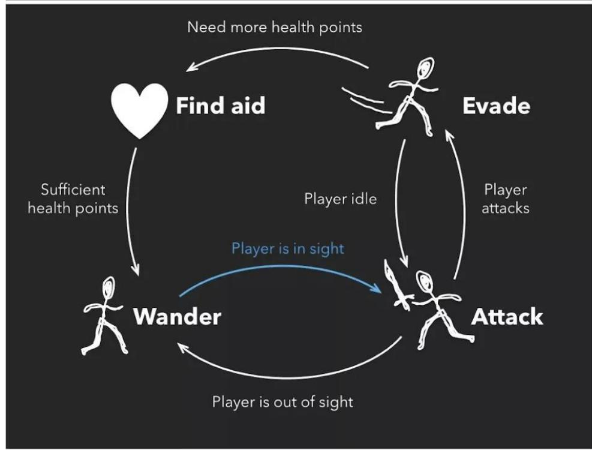


# 搜索Search

# Monte Carlo Search Tree Algorithm

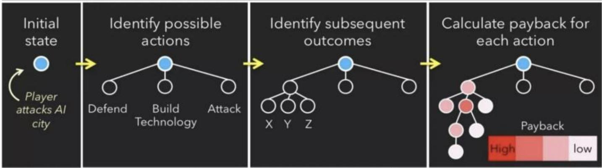


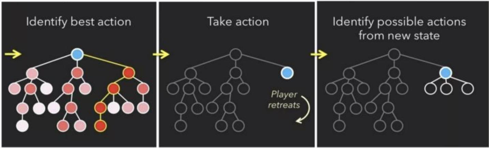


# 搜索Search

◼ 搜索在游戏策略中取得了较好的结果

◼ 其它人工智能问题中也可以应用搜索算法

# Practical

⚫ Many problems don't have specific algorithms for solving them.Casting as search problems is often the easiest way of solving them.

⚫ Problem specific heuristics provides search with a way of exploitingextra knowledge.

# 搜索Search

# Search Problems


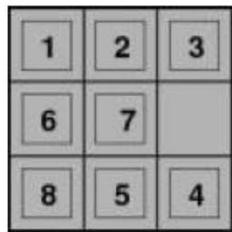


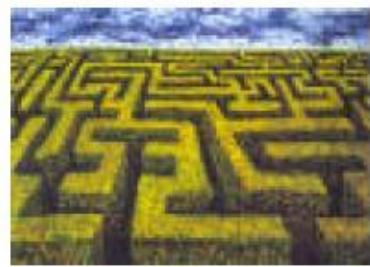


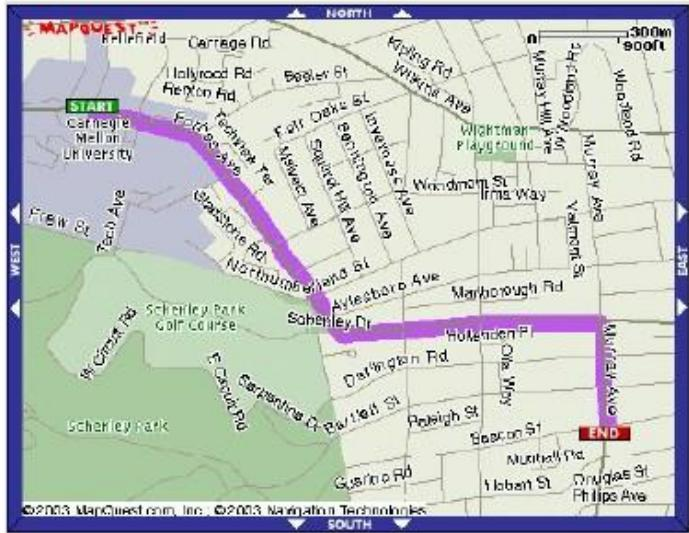


Slide7


# 搜索Search

# More search problems

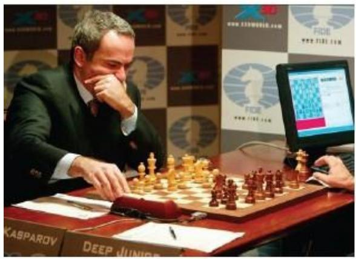


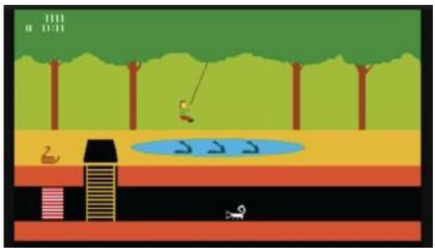


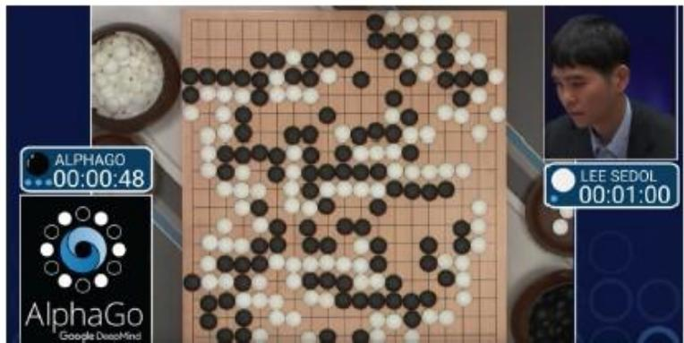


# 搜索Search

# A Search Problem:How do Agent make decisions?

• This kind of hypothetical reasoning involves asking

— what state am I ? 我在哪？

what actions can I take? 我能干吗？

— what state should I achieve？我到哪里去？

• From this we can reason about particular sequences of actionsone should try to bring about to achieve a desirable state.

• Search is a computational method for capturing a particularversion of this kind of schedule.

# 搜索Search

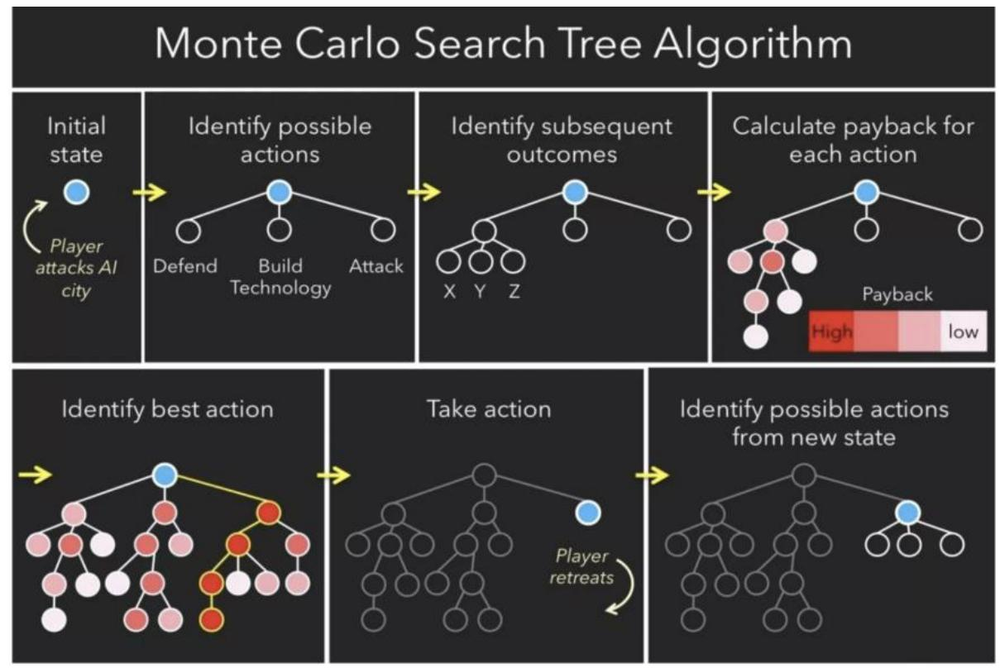


— what state am I ?

Current resources

— what actions can I take?

Defend/Build Tech/Attack

— what state should I achieve？

Defeat the player

Limitation of Search：Search only shows how to solve the

problem once we have the problem correctly formulated.

# 形式化定义

我们需要考虑下面几个部分来对搜索问题进行形式化定义：

◼ 状态空间(state space)：表示需要进行搜索的空间。状态空间是对问题的形式化

◼ 动作(action)：表示从一个状态到另一个状态。动作是对真实的动作的形式化

◼ 初始状态(initial state)：当前状态的表示

◼ 目标(goal)：需要达到的目标状态的表示

◼ 启发式方法(heuristics)：用于指导搜索的前进方向

◼ 解(solution): 是由 “动作”构成的序列

# 形式化定义

Once you have a formalized search problem, there are a number of algorithms one canuse to solve it.

A solution is a sequence of actions or moves that can transform your current state into astate where desired (or goal) conditions hold. 问题的解是由“动作”构成的序列。序列中的动作可以将初始状态转化为目标状态。


# 例1：Romania Travel

Currently in Arad, need to get to Bucharest ASAP.

Can we formalize this search?

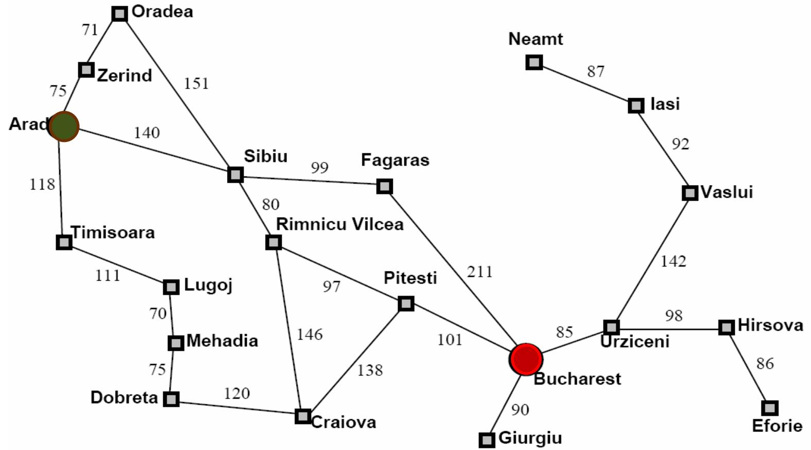


– state space:

actions (successorfunctions):

– initial state:

– desired (or goal)condition:

# 例1：Romania Travel

Currently in Arad, need to get to Bucharest ASAP.

Can we formalize this search?

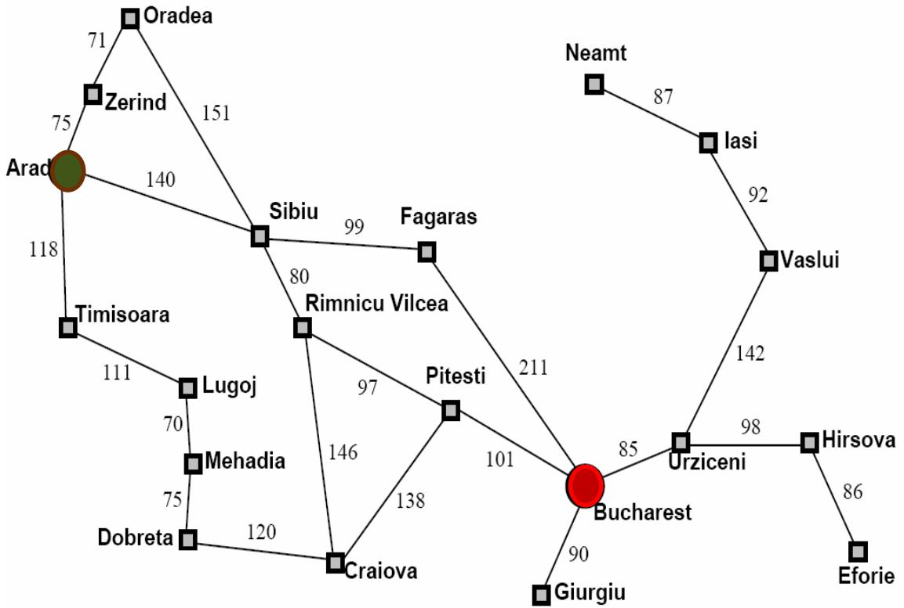


– state space

可以到达的任一个城市

– actions

在相邻的城市之间移动

initial state

在城市Arad

– desired (or goal) condition

在城市Bucharest

问题的解：旅行路线，即从Arad到Bucharest途径城市组成的序列

# 例2：Water Jugs

We have a 3 gallon (liter) jug and a 4 gallon jug. We can filleither jug to the top from a tap, we can empty either jug, orwe can pour one jug into the other (at least until the otherjug is full).

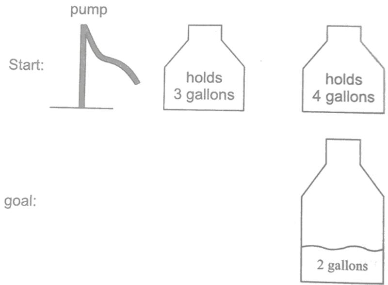


Fig: Water Jug Problem


# 例2：Water Jugs

–state space:

pairs of numbers (gal3, gal4) where gal3 is the number ofgallons in the 3 gallon jug, and gal4 is the number ofgallons in the 4 gallon jug.

–actions (successor functions):

Empty-3-Gallon, Empty-4- Gallon, Fill-3-Gallon, Fill-4-Gallon, Pour-3-into-4, Pour 4-into-3.

–initial state:

Various, e.g., (0,0)

–desired (or goal) condition:

Various, e.g., (0,2) or (1, 3)

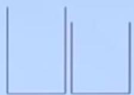


4L:0


4L:3


3L:0


4L:4


3L:2


4L:0


3L:2


4L:2


3L:0


# 例2：Water Jugs

– If we start off with gal3 and gal4 as integers, can only reachinteger values.

– Some values, e.g., (1,2) are not reachable from some initialstate, e.g., (0,0).

– Some actions do not change the state, e.g.,

• (0,0) → Empty-3-Gallon → (0,0)

# 例3：The 8-Puzzle/八数码问题

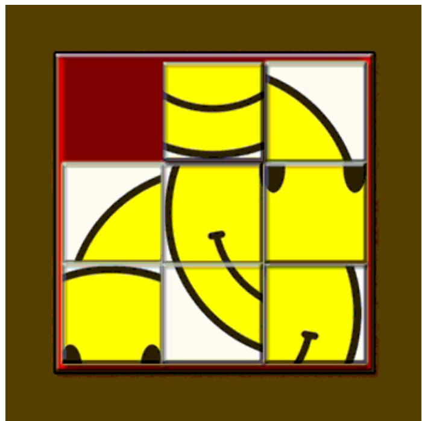


规则：可以把空格移动到相邻的位置（也可以视为移动空格到临近的数字的位置）

# 例3：The 8-Puzzle

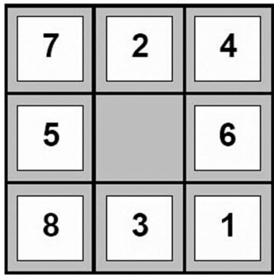


Start State


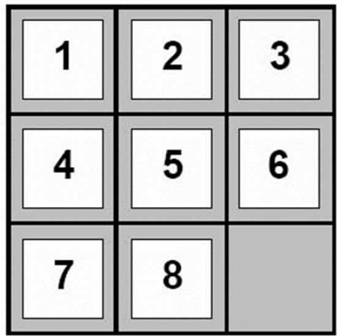


Goal State


$\bullet$ 状态空间:

各种不同的方格摆放方式

$\bullet$ 初始状态:

左图所示的方格摆放方式

$\bullet$ 目标:

右图所示的方格摆放方式

动作:

向上/下/左/右移动空格

规则：可以把空格移动到相邻的位置

目标：从初始数字排布变换出目标的数字排布方式

# 例3：The 8-Puzzle

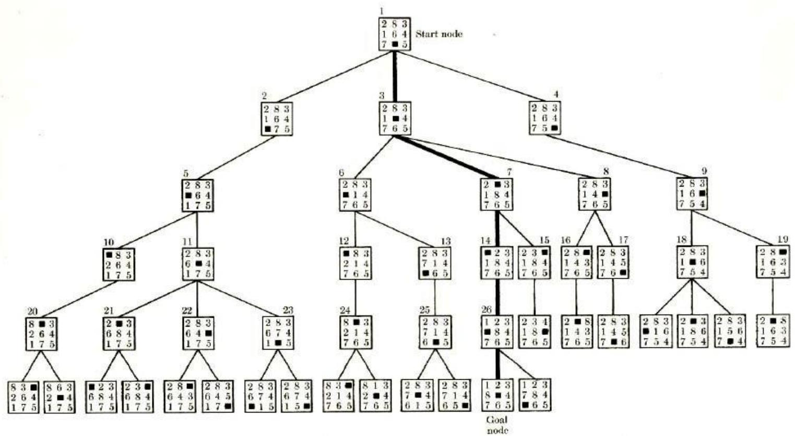


Search Space for 8‐Puzzle Problem


# 例3：The 8-Puzzle

#  八数码难题属于滑块难题


漫画人物


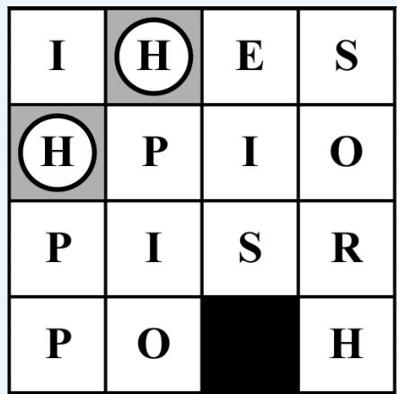


英语拼词


华容道


滑块难题又属于二维组合谜题（2D combination puzzle）

此外，还有三维组合谜题（3D combination puzzle），例如魔方

# 搜索问题形式优化

◆ 前面的示例中，一个状态是对应一个真实世界中的状态

然而，一个状态也可以对应智能体如何认识世界的情况：智能体的认知状态（ the agent’s knowledge state. ）

# 例4： 吸尘器世界

# 问题描述：

• 有一个吸尘器需要清扫两个房间

• 每个房间有两个状态：

干净或不干净

• 吸尘器有向左(left)和向右(right)两个动作（左边/右边没有房间时动作不起作用）

• 吸尘器有吸尘(suck)的动作，该动作使得吸尘器所在的房间状态变为干净（即使房间本身就是干净的）

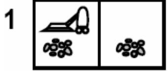


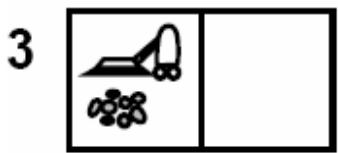


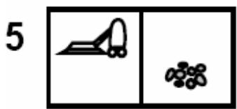


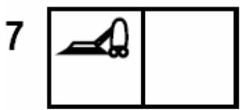


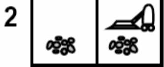


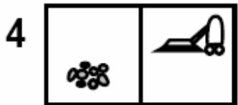


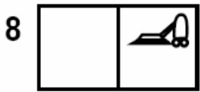


物理状态

# 例4： 吸尘器世界

# 认知层面的状态空间

•一个认知状态是物理状态空间的一个子集。也就是智能体知道自己处于几个物理状态中的一个状态中，但是不知道具体是哪一个。

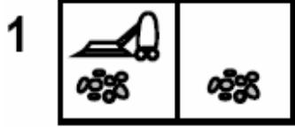


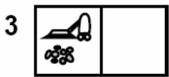


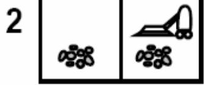


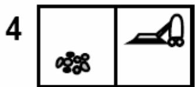


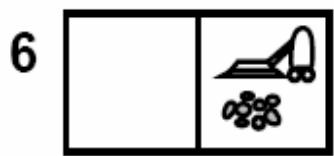


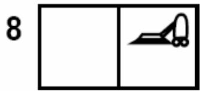


目标是所有房间的状态都为干净

# 例4： 吸尘器世界

# 认知层面的状态空间

•完全不清楚物理世界

认知状态是物理状态的集合

•初始认知状态为{1,2,3,4,5,6,7,8}

智能体不知道自己身处具体是哪个物理状态

•但不论如何，动作序列 <right, suck,left, suck> 都可到达目标，认知状态的变化情况如下

$$
\{1, 2, 3, 4, 5, 6, 7, 8 \} \text {r i g h t} \rightarrow \{2, 4, 6, 8 \}
$$

$$
\mathrm {s u c k} \rightarrow \{4, 8 \} \mathrm {l e f t} \rightarrow \{3, 7 \} \mathrm {s u c k} \rightarrow \{7 \}
$$

1

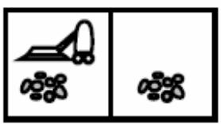


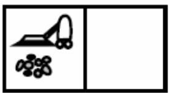


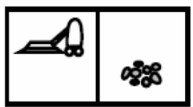


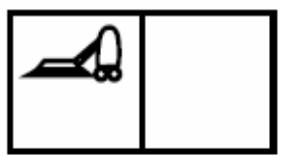


2

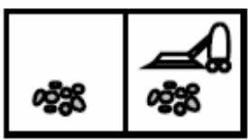


4

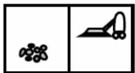


6

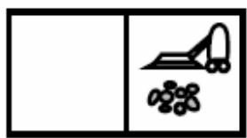


8

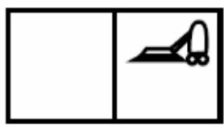


目标是所有房间的状态都为干净

# 搜索算法

# 算法输入

• 具体的初始状态：一个具体的物理状态，或是一个物理状态的集合表示的智能体的认知状态，等等

• 后继函数： $\begin{array} { r l } { \mathrm { ~ } } & { { } = \left\{ \begin{array} { l l } { \begin{array} { r l r l } \end{array} } \end{array} \right. } \end{array}$ 状态经过一个动作之后可以到达的状态的集合}

• 目标测试：一个作用于状态上，当该状态满足目标条件时返回真的函数

• 前进成本： ${ \mathsf { C } } ( \mathsf { x } , a , \mathsf { y } ) =$ 从x状态通过动作a到达y状态所需要的成本 (x状态无法到达y状态时， $\forall _ { a } \mathsf { C } ( \mathsf { x } , a , \mathsf { y } ) = \infty )$

# 算法输出

• 从初始状态到某个满足目标测试的状态的状态序列

# 获取动作系列

• 状态 $\pmb { \mathsf { X } }$ 的后继状态可能来自不同的动作，如：

• $x  a  y$

• $x  b  z$

• 后继函数 S(x) 返回的状态集合中的状态是状态 $\pmb { \times }$ 通过任何一个动作能达到的状态，因此需要把来自不同动作的后继状态加以区分

• 因此修改 $\mathsf { S } ( { \boldsymbol { \mathsf { x } } } )$ 的返回值，不仅包括后继状态，还要记录获得这个后继状态所经过的动作

• ${ \sf S } ( \boldsymbol { \times } ) = \{ < \boldsymbol { \gamma } , \boldsymbol { a } > , < \boldsymbol { \gamma } , \boldsymbol { b } > \}$

状态 y 通过动作 $\cdot$ 得到，状态 z 通过动作 $\cdot$ 得到

• $S ( x ) = \{ < y , > , < y , > \}$

状态 y 通过动作 $\cdot$ 得到，状态 y 通过动作 $b$ 得到

# 算法框架

We put states we we haven’t yet explored or expanded, but want toexplore, in a list called the Frontier边界 (or Open 表).

还没有被探索，但准备下一步探索的状态的集合

Initially, all that is in the Frontier is the initial state.

初始边界 $=$ 初始状态集合

• At each iteration, we pull a node from the Frontier, apply S(x), andinsert children back into the Frontier.

TreeSearch(Frontier，Sucessors,Goal?)

If Frontier is empty return failure

Curr $=$ select state from Frontier

If (Goal?(Curr)) return Curr.

Frontier' $=$ (Frontier - {Curr}) U Successors(Curr)

return TreeSearch(Frontier'， Successors,Goal?)

# 树搜索

树搜索：用搜索树来寻找一条从起点A 到终点 M 的路径。

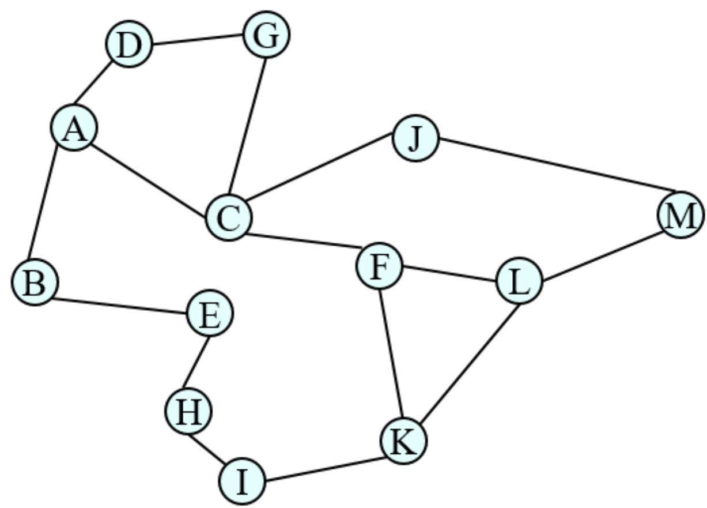


# 树搜索

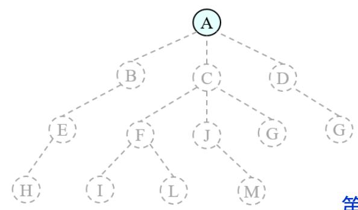


第1步


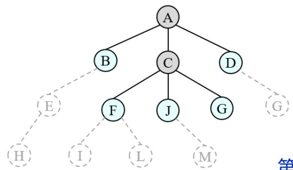


第3步


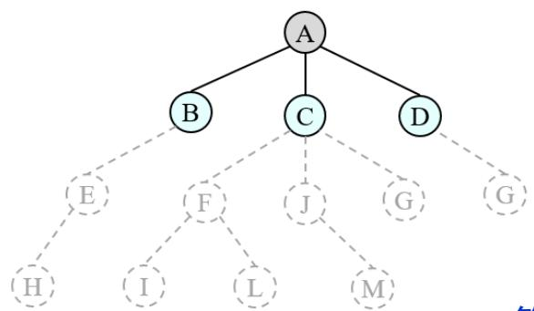


第2步


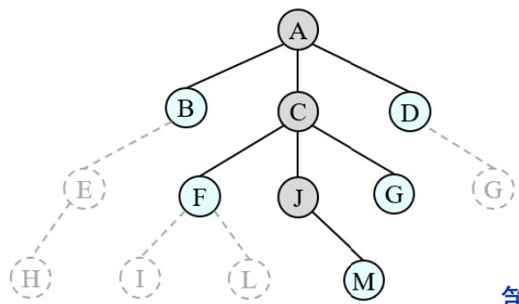


第4步


A为根节点、M为叶节点。

虚线表示节点尚未生成。

$\clubsuit$ 粗实线为已生成节点。

$\clubsuit$ 已扩展节点加阴影表示。

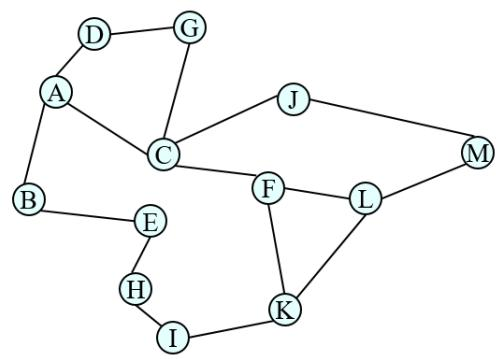


# 示例：罗马尼亚旅行问题

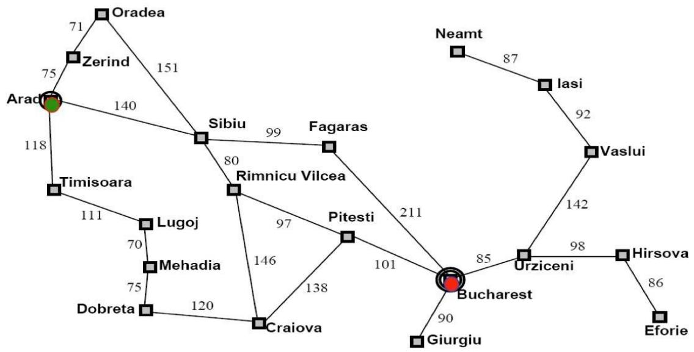


1. Initial nodes on the Frontier: {Arad}.

2. Expand Arad: {Z<A>, T<A>, $\leq < A > \}$

3. Expand Sibiu: $\{ Z { < } \mathsf { A } >$ , $\mathsf { T } { \mathsf { { < } } } \mathsf { A } \mathsf { { > } }$ , ${ \mathsf { A } } { < } { \mathsf { S } } , { \mathsf { A } } { > }$ , $O { < } S , A { > }$ , F<S,A>, R<S,A>}

4. Expand Fagaras: $\{ Z { < } \mathsf { A } >$ , $\mathsf { T } { \mathsf { { < } } } \mathsf { A } \mathsf { { > } }$ , ${ \mathsf { A } } { < } { \mathsf { S } } , { \mathsf { A } } { > }$ , O<S,A>, R<S,A>,${ \tt S } { < } \mathsf { F } , { \tt S } , \mathsf { A } { > }$ , B<F,S,A>}

Solution is now on frontier; cost of this solution is $1 4 0 + 9 9 + 2 1 1 = 4 5 0$

# 示例：罗马尼亚旅行问题

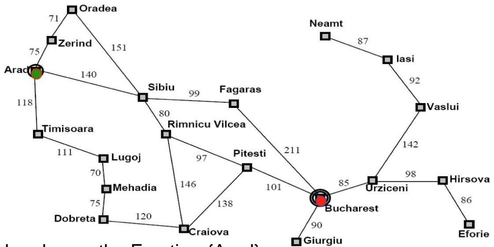


1. Initial nodes on the Frontier: {Arad}.

2. Expand Arad: {Z<A>, T<A>, S<A>},

3. Expand Sibiu: $\{ Z { < } \mathsf { A } >$ , T<A>, A<S,A>, O<S,A>, F<S,A>, R<S,A>}

4. Expand R.V.: $\{ Z { < } \mathsf { A } >$ , T<A>, A<S,A>, O<S,A>, R<S,A>, S<R,S,A>,P<R,S,A>, $C < R , S , A > )$

5. Expand Pitesti: $\{ Z { < } \mathsf { A } >$ , $\mathsf { T } { \mathsf { { < } } } \mathsf { A } \mathsf { { > } }$ , ${ \mathsf { A } } { < } { \mathsf { S } } , { \mathsf { A } } { > }$ , O<S,A>, R<S,A>, S<R,S,A>,$\mathsf { P { < R , } S , } A >$ , ${ \mathsf { C } } { \mathsf { < R } } , { \mathsf { S } } , { \mathsf { A } } { \mathsf { > } }$ , R<P,R,S,A>, C<P,R,S,A>, B<P,R,S,A>}

Solution is now on frontier; cost of this solution is $1 4 0 + 8 0 + 9 7 + 1 0 1 = 4 1 8$

# 示例：罗马尼亚旅行问题

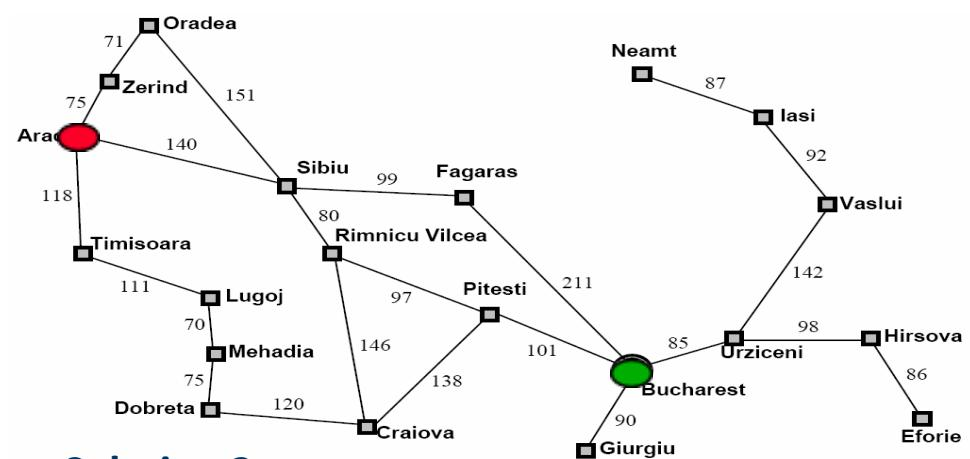


# Solution 2:

{Arad}

{Z<A>, T<A>, S<A>},

{Z<A>, T<A>, A<S,A>, O<S,A>, F<S,A>, R<S,A>}

{Z<A>, T<A>, A<S,A>, O<S,A>, F<S,A>, S<R,S,A>, P<R,S,A>, C<R,S,A>}

{Z<A>, T<A>, A<S,A>, O<S,A>, F<S,A>, S<R,S,A>, C<R,S,A>, R<P,R,S,A>, C<P,R,S,A>, Bucharest<P,R,S,A>}

Solution: Arad -> Sibiu $\mathbf { \varepsilon } _ { - > }$ Rimnicu Vilcea $\mathbf { \varepsilon } _ { - > }$ Pitesti $\mathbf { \varepsilon } _ { - > }$ Bucharest Cost:

140 + 80 +

97 $\mathbf { + 1 0 1 } = 4 1 8$

# Solution 1:

{Arad},

{Z<A>, T<A>, S<A>},

{Z<A>, T<A>, A<S;A>, O<S;A>, F<S;A>, R<S;A>}

{Z<A>, T<A>, A<S;A>, O<S;A>, R<S;A>, S<F;S;A>, B<F;S;A>}

Solution: Arad $\mathbf { \varepsilon } _ { - > }$ Sibiu $\mathbf { \varepsilon } _ { - > }$ Fagaras $\mathbf { \varepsilon } _ { \mathbf { - } \mathbf { > } }$ Bucharest

Cost: $1 4 0 + 9 9 + 2 1 1 = 4 5 0$

# 示例：罗马尼亚旅行问题


Search Tree Representation


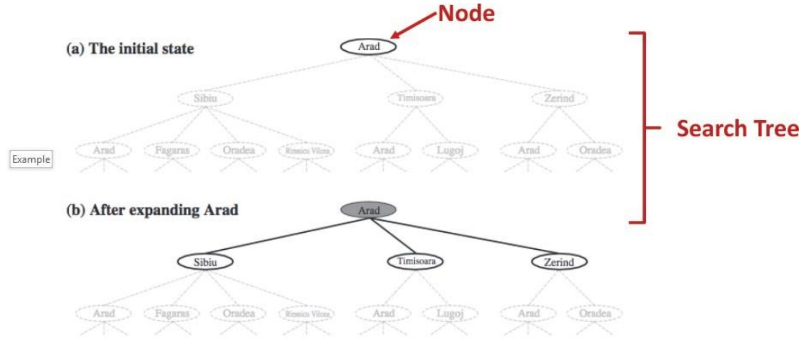


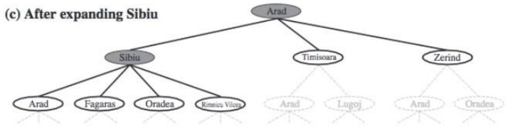


# 示例：罗马尼亚旅行问题


Reflections on Example


In this problem, the Frontier here contains a set of paths, not juststates. 边界不仅是状态的集合而是路径的集合

# 示例：罗马尼亚旅行问题

# Reflections on Example

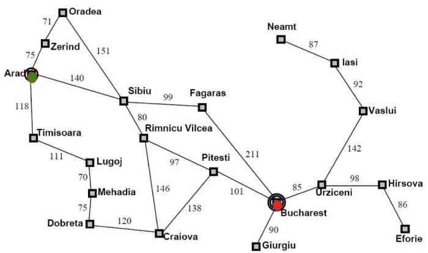


The order states are selected from the Frontier has a critical effect on表明了状态选择的顺序会对搜索操作产生重要的影响

• Whether or not a solution is found会影响搜索是否能找到解

• The cost of the solution that is found.会影响搜索到的节的成本大小

• The time and space required by the search.会影响搜索过程中所需要的时间和空间资源

# 循环问题

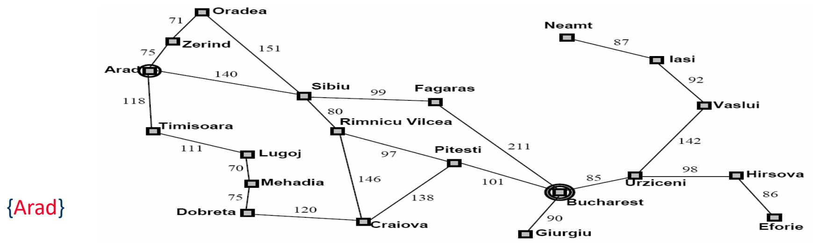


{Z<A>, T<A>, S<A>},

{Z<A>, T<A>, O<S;A>, F<S;A>, A<S;A>, R<S;A>}

{Z<A>, T<A>, O<S;A>, F<S;A>, R<S;A>, Z<A;S;A>, T<A;S;A>, S<A,S,A>}

边界不是状态的集合而是路径的集合，因此只要路径不同就会往边界上添加新的元素，导致了循环问题

# 搜索算法的重要特征

◼ 完备性（Completeness）: 搜索算法是否总能在问题存在解的情况下找到解

最优性（Optimality）: 当问题中的动作是需要成本时，搜索算法是否总能找到成本最小的解

时间复杂度（Time complexity）: 搜索算法最多需要探索/生成多少个节点来找到解

◼ 空间复杂度（Space complexity）: 搜索算法最多需要将多少个节点储存在内存中

# 盲目搜索

# 选择法则

上面的例子表明了状态选择的顺序会对搜索操作产生重要的影响:

会影响搜索是否能找到解

会影响搜索到的解的成本大小

◼ 会影响搜索过程中所需要的时间和空间资源

# 搜索算法的重要性质

◼ 完备性（Completeness）: 搜索算法是否总能在问题存在解的情况下找到解

◼ 最优性（Optimality）: 当问题中的动作是需要成本时，搜索算法是否总能找到成本最小的解

◼ 时间复杂度（Time complexity）: 搜索算法最多需要探索/生成多少个节点来找到解

◼ 空间复杂度（Space complexity）: 搜索算法最多需要将多少个节点储存在内存中

# 盲目搜索策略

◼ 这些策略都采用固定的规则来选择下一需要被扩展的状态

◼ 这些规则不会随着要搜索解决的问题的变化而变化

◼ 这些策略不考虑任何与要解决的问题领域相关的信息

# 常用的盲目搜索方法

宽度优先（Breadth-First）

深度优先（Depth-First ）

◼ 一致代价（Uniform-Cost）

深度受限（Depth-Limited）

迭代加深搜索（Iterative-Deepening search）

# 边界中的节点选择

⚫ Selection can be achieved by employing an appropriate ordering of thefrontier set, i.e.:

1. Order the elements on the Frontier.对边界上的元素进行排序

2. Always select the first element.总是选择第一个元素

⚫ Any selection rule can be achieved by employing an appropriate orderingof the frontier set.

任何选择规则都可以视为对边界采用某种合适的排序方式

# 宽度优先搜索

• 把当前要扩展的状态的后继状态放在边界的最后 {0<>}

• 例子:

• 假设使用正整数表示状态 {0,1,2,…}

• 状态n的后继状态为状态 $\mathsf { n } { + } 1$ 和状态 $n + 2$

• 如： ${ \mathsf { S } } ( 1 ) = \{ 2 , 3 \} ; { \mathsf { S } } ( 1 0 ) = \{ 1 1 , 1 2 \}$

• 初始状态为0

• 目标状态为5

{1,2}

{2,2,3}

{2,3,3,4}

{3,3,4,3,4}

{3,4,3,4,4,5}

# 宽度优先搜索

• 把当前要扩展的状态的后继状态放在边界的最后 {0<>}

• 例子:

• 假设使用正整数表示状态 {0,1,2,…}

• 状态n的后继状态为状态 $\mathsf { n } { + } 1$ 和状态 $n + 2$

• 如： ${ \mathsf { S } } ( 1 ) = \{ 2 , 3 \} ; { \mathsf { S } } ( 1 0 ) = \{ 1 1 , 1 2 \}$

• 初始状态为0

• 目标状态为5

{1,2}

{2,2,3}

{2,3,3,4}

{3,3,4,3,4}

{3,4,3,4,4,5}

# 宽度优先搜索

1. Place Start in the Frontier.

2. Expand all nodes reachable from Start in 1 step,

3. but not more than 1; add path to back of Frontier list.

4. Expand all nodes reachable from Start in 2 step, but notmore than 2; add path to back of Frontier list.

5. Expand all nodes reachable from Start in 3 step, but notmore than 3; add to path back of Frontier list.

6. And so on ….

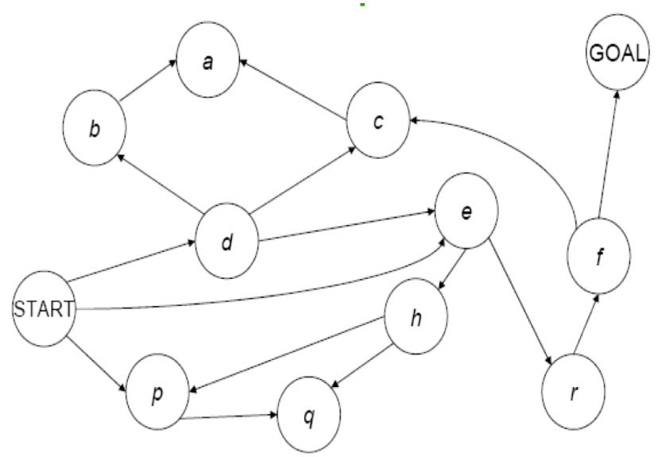


# 宽度优先搜索

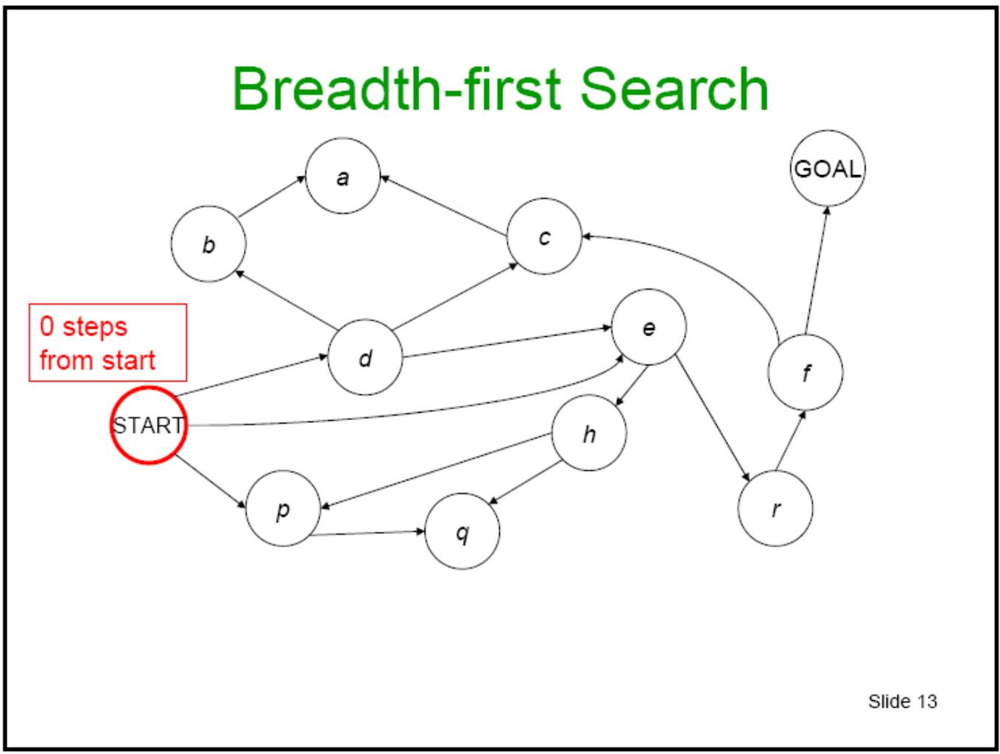


# 宽度优先搜索

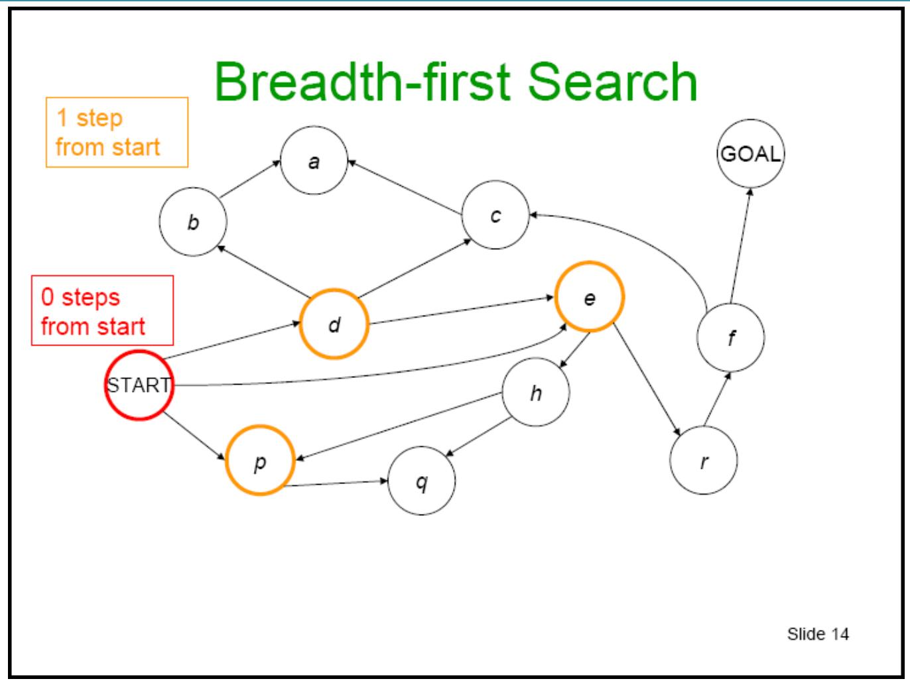


# 宽度优先搜索

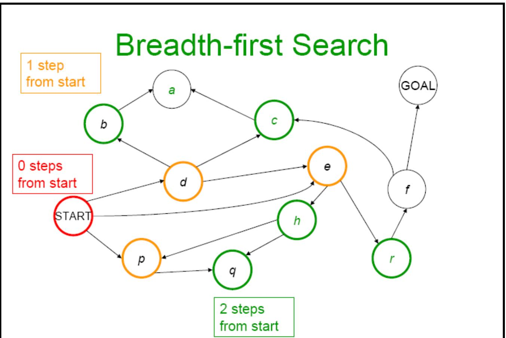


Slide 15


# 宽度优先搜索

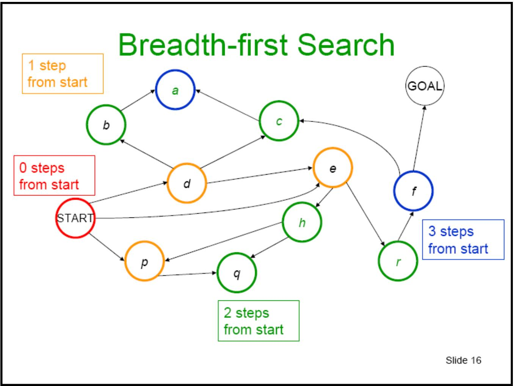


# 宽度优先搜索

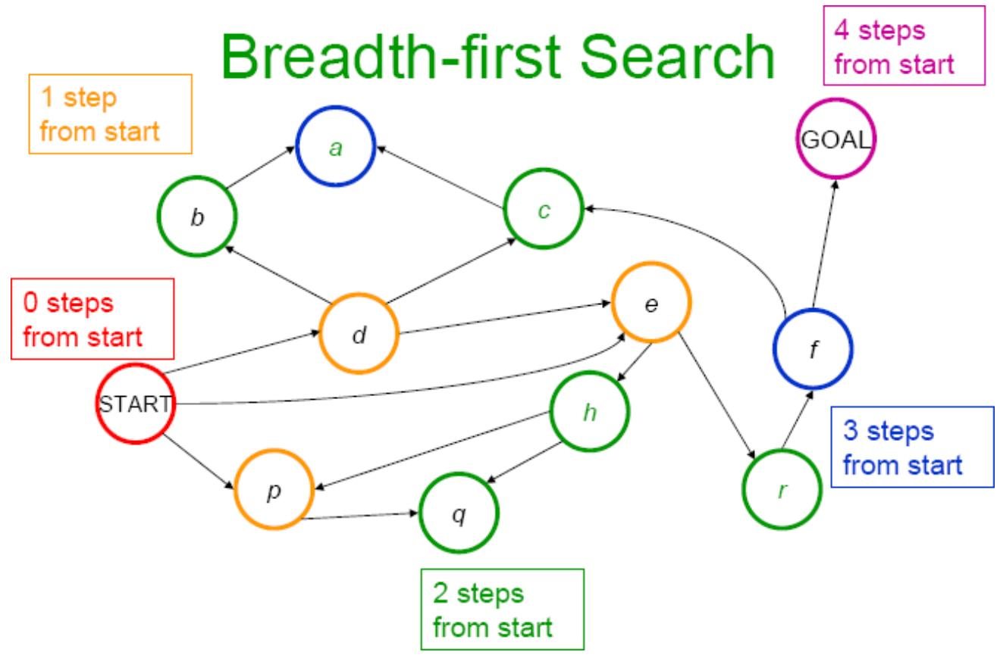


# 宽度优先搜索

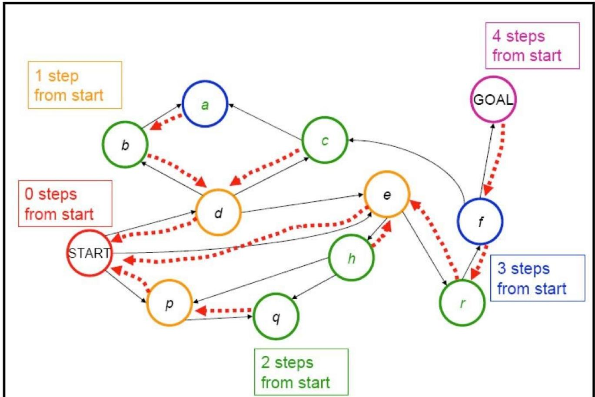


# 宽度优先搜索 for Water Jug

Level O

Level 1

Level 2

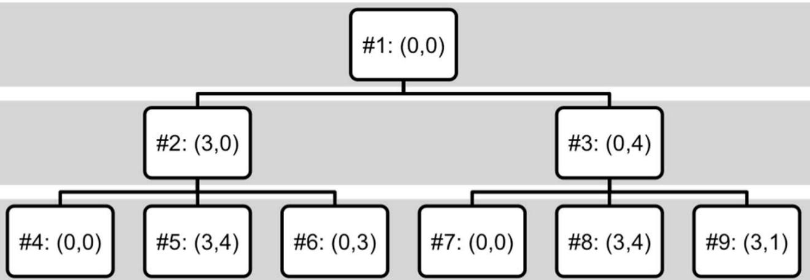


In the tree above we order the states explored; paths to states arerepresented by the path from the root to that states.

Breadth‐First Search explores the search space level by level.

# 宽度优先搜索 for Water Jug

initial state $=$ (0,0), goal state $=$ (*,2), actions(successor functions): Empty-3-Gallon, Empty-4-Gallon, Fill-3-Gallon, Fill-4- Gallon, Pour-3-into-4,Pour 4-into-3.

1.Frontier = {<(0,0)>}

2.Frontier = {<(0,0),(3,0)>, <(0,0),(0,4)>}

3.Frontier = {<(0,0),(0,4)>, <(0,0),(3,0),(0,0)>,

$$
<   (0, 0), (3, 0), (3, 4) >, <   (0, 0), (3, 0), (0, 3) > \}
$$

$$
\begin{array}{l} <   (0, 0), (3, 0), (0, 3) >, <   (0, 0), (0, 4), (0, 0) >, \\ <   (0, 0), (0, 4), (3, 4) >, <   (0, 0), (0, 4), (3, 1) > \\ \end{array}
$$

# 宽度优先的性质

$$
\begin{array}{l} b = \mathrm {问 题 中 一 个 状 态 最 大 的 后 继 状 态 个 数} \\ d = \mathrm {最 短 解 的 动 作 个 数} \\ \end{array}
$$

宽度优先搜索具有完备性和最优性

◼ 短的路径会在任何比它长的路径之前被遍历

◼ 给定路径长度，该长度的路径是有限的

◼ 最终可以遍历所有长度为d的路径，因此一定可以找出最短的解

时间复杂度: $1 + b + b ^ { 2 } + \ldots + b ^ { d } + b ( b ^ { d } - \ 1 ) = { \cal O } ( b ^ { d + 1 } )$

空间复杂度: $b ( b ^ { d } - \mathrm { ~  ~ \nabla ~ } 1 ) = O ( b ^ { d + 1 } )$

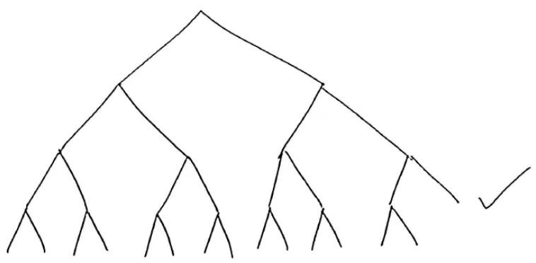


# 空间复杂度会带来的问题

• 假设 b = 10, 并且每秒扩展1000个节点，每个节点需要100bytes来存储：

<table><tr><td>Depth</td><td>Nodes</td><td>Time</td><td>Memory</td></tr><tr><td>1</td><td>1</td><td>1 millisecond.</td><td>100 bytes</td></tr><tr><td>6</td><td>106</td><td>18 mins.</td><td>111 MB</td></tr><tr><td>8</td><td>108</td><td>31 hrs.</td><td>11 GB</td></tr></table>

• 实际情况下，内存需求会先于时间限制算法的运行

# 深度优先搜索

• 把当前要扩展的状态的后继状态放在边界的最前面

• 边界上总是扩展最深的那个节点

与宽度优先搜索的示例比较：

深度优先：

{0}

{1,2}

{2,3,2}

{3,4,3,2}

{4,5,4,3,2}

{5,6 4,5,4,3,2}

宽度优先：

{0}

{1,2}

{2,2,3}

{2,3,3,4}

{3,3,4,3,4}

{3,4,3,4,4,5}

# 深度优先搜索

initial state $=$ (0,0), goal state = (*,2), actions (successor functions)

$=$ Empty-3-Gallon, Empty-4-Gallon, Fill-3-Gallon, Fill-4-Gallon, Pour-3- into-4,Pour 4-into-3.

1. Frontier $= \{ < ( 0 , 0 ) > \}$

2. Frontier = {<(0,0), (3,0)>, <(0,0), (0,4)>}

3. Frontier = {<(0,0),(3,0),(0,0)>, <(0,0),(3,0),(3,4)>,

$$
<   (0, 0), (3, 0), (0, 3) >, <   (0, 4), (0, 0) > \}
$$

4. Frontier = {<(0,0),(3,0),(0,0),(3,0)>, <(0,0),(3,0),(0,0),(0,4)>

$$
<   (0, 0), (3, 0), (3, 4) >, <   (0, 0), (3, 0), (0, 3) >, <   (0, 0), (0, 4) > \}
$$

Level 0

Level 1

Level 2

Level 3

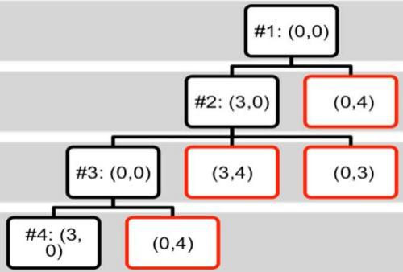


Red nodes are backtrack points (these nodes remain on Frontier).

# 深度优先的性质

# 完备性:

在状态空间无限的情况下: No

◼ 在状态空间有限，但是存在无限的路径（例如存在回路）的情况下: No

$$
e. g., S (0) = \{1, 2 \}, S (1) = \{0 \}, i n i t s t a t e 0, g o a l i s 2
$$

◼ 在状态空间有限，且对重复路径进行剪枝的情况下：Yes

最优性: No 存在多条路径时，最先发现的不一定最优

# 时间复杂度

# 时间复杂度为： $O ( b ^ { m } )$

其中m是遍历过程中最长路径的长度 (Could explore each branch of searchtree)

当m远远大于d时，时间效率会很差

当存在多条解路径的情况下深度优先搜索可以比宽度优先搜索更快找到解 (可以碰运气先遍历了到达解的那条路径).

# 空间复杂度

# 空间复杂度：

深度优先回溯点 $=$ 当前路径上的点的未扩展过的兄弟节点

一次只会考虑一条路径

边界上只包含当前探索的最深的节点，以及回溯点

O(bm), 线性复杂度是深度优先搜索一个显著的优点

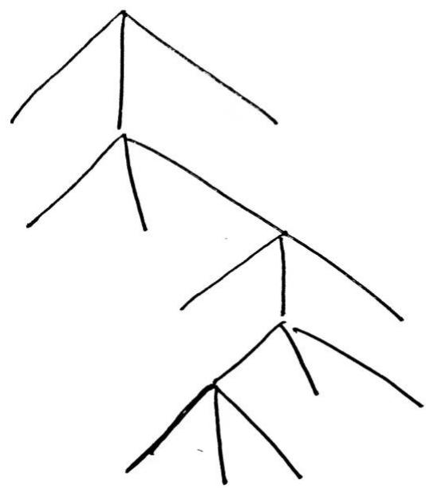


# 致代价搜索

边界中，按路径的成本升序排列

总是扩展成本最低的那条路径

◼ 当每种动作的成本是一样的时候，和宽度优先是一样的

# 一致代价搜索性质

假设每个动作的成本 ≥ s > 0

◼ 一致代价搜索中，所有成本较低的路径都会在成本高的路径之前被扩展

给定成本，该成本的路径数量是有限的

◼ 成本小于最优路径的路径数量是有限的

最终，我们可以找到最短的路径

当最优解的路径长度为 $d$ 时，宽度优先搜索的时间和空间复杂度都是 $O ( b ^ { d + 1 } )$

对于一致代价搜索，当最优解的成本为 $C ^ { * }$ ，则时间和空间复杂度为O(bC∗/s+1)

# 深度受限搜索

◼ 宽度优先搜索存在空间复杂度过大的问题

◼ 深度优先搜索存在可能运行时间非常长，甚至在存在无限路径时无限运行下去的问题

深度受限搜索

◼ 深度优先搜索，但是预先限制了搜索的深度 L

◼ 因此无限长度的路径不会导致深度优先搜索无法停止的问题

◼ 但只有当解路径的长度 $\leq L$ 时，才能找到解

# 深度受限搜索

```txt
DLS (Frontier, Successors, Goal?) /* Call with Frontier = {<START>} */  
WHILE (Frontier not EMPTY) {  
    n= select first node from Frontier  
    Curr = terminal state of n  
    If(Goal?(Curr)) return n  
    If Depth(n) < D //Don't add successors if Depth(n) = D!!  
        Frontier = (Frontier - {n}) U Successors(Curr)  
    Else  
        Frontier = Frontier - {n}  
        CutOffOccured = TRUE.  
}  
return FAIL
```

# 示例


Limi


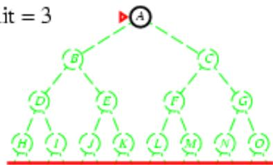


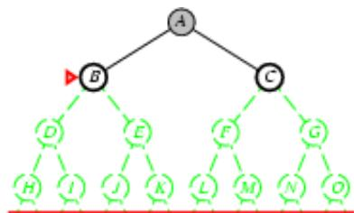


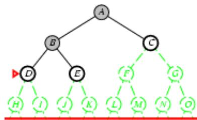


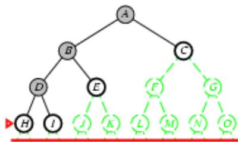


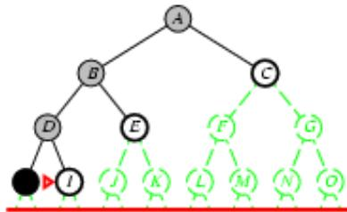


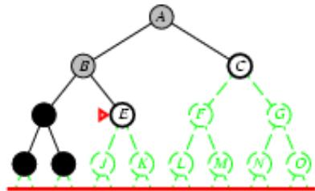


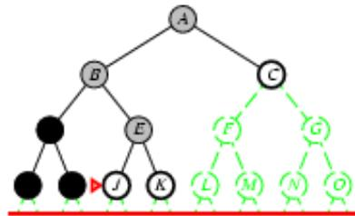


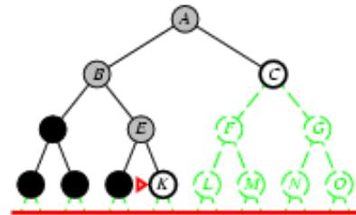


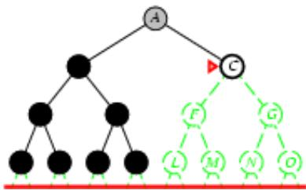


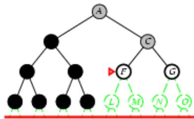


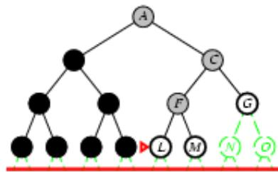


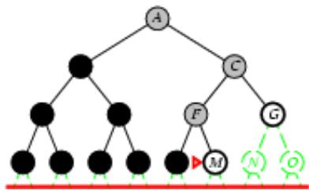


# 深度受限的性质

完备性: No

最优性: No

时间复杂度: $O ( b ^ { L } )$

空间复杂度: $O ( b L )$

L为限制的最大深度

# 迭代加深搜索

 为了解决深度优先搜索和宽度优先搜索存在的问题

 一开始设置深度限制为 $L = 0$ ，我们迭代地增加深度限制，对于每个深度限制都进行深度受限搜索

 如果找到解，或者深度受限搜索没有节点可以扩展的时候可以停止当前迭代，并提高深度限制L

 如果没有节点可以被剪掉（深度限制不能再提高）仍然没有找到解，那么说明已经搜索所有路径，因此这个搜索不存在解

# 示例

Limit = 0

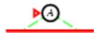


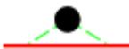


# 示例

Limit = 0


Limit =

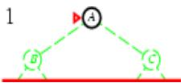


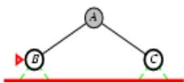


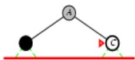


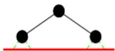


# 示例

Limit = 0

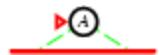


Limit =


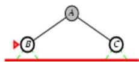


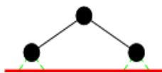


Limit

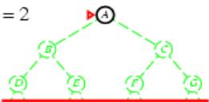


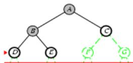


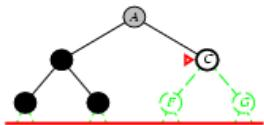


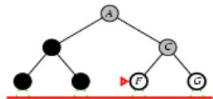


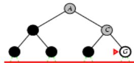


# 示例

Limit = 0


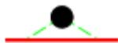


Limit =


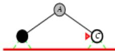


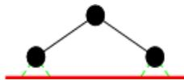


Limit


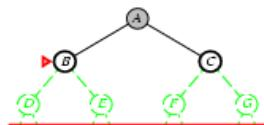


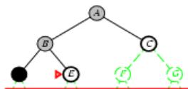


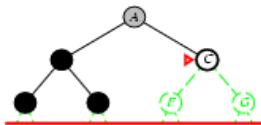


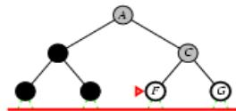


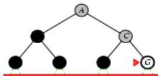


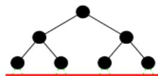


Limi

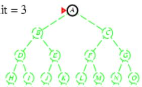


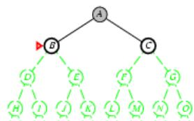


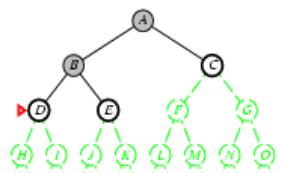


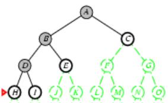


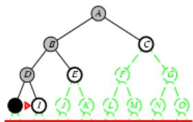


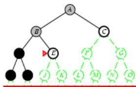


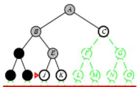


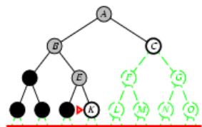


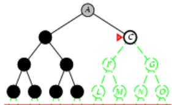


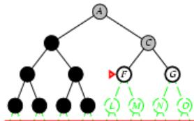


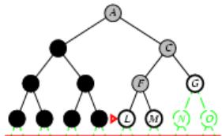


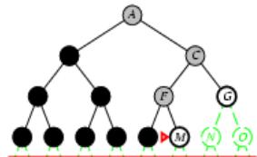


# 迭代加深搜索性质

完备性：Yes

最优性：Yes （在每个动作的成本一致的情况下）

如果动作成本不一致，则可以使用成本边界(cost bound)代替深度限制L：

⚫ 只扩展成本低于成本边界(cost bound)的路径

⚫ 每次迭代时记录当前还未扩展路径中的最小成本

下一次迭代则提高成本边界

这样开销会很大，迭代数量为成本数值的构成的集合的大小

时间复杂度： $( d + 1 ) b ^ { 0 } + d b + ( d - 1 ) b ^ { 2 } + . . . . + b ^ { d } = { \cal O } ( b ^ { d } )$

空间复杂度: $O ( b d )$

迭代加深搜索可以比宽度优先搜索更高效: 不用扩展深度限制上的节点。但是宽度优先搜索需要扩展直到目标节点。

# 迭代加深搜索性质

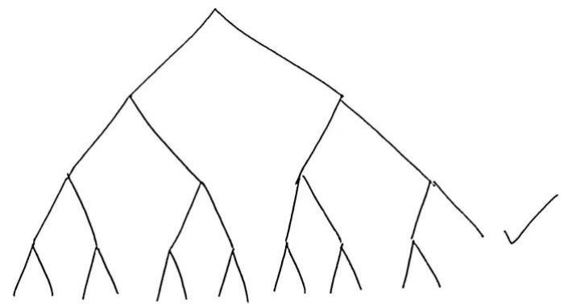


BFS


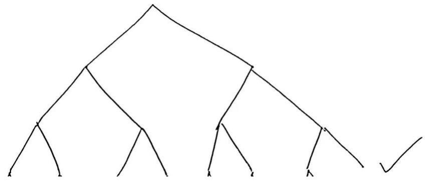


IDS


时间复杂度： $( d + 1 ) b ^ { 0 } + d b + ( d - 1 ) b ^ { 2 } + \ldots + b ^ { d } = O ( b ^ { d } )$

对比宽度优先搜索的时间复杂度:

$$
1 + b + b ^ {2} + \dots + b ^ {d} + b (b ^ {d} - 1) = O (b ^ {d + 1})
$$

迭代加深搜索可以比宽度优先搜索更高效: 不用扩展深度限制上的节点。但是宽度优先搜索需要扩展直到目标节点。

空间复杂度: O(bd)

# 双向搜索

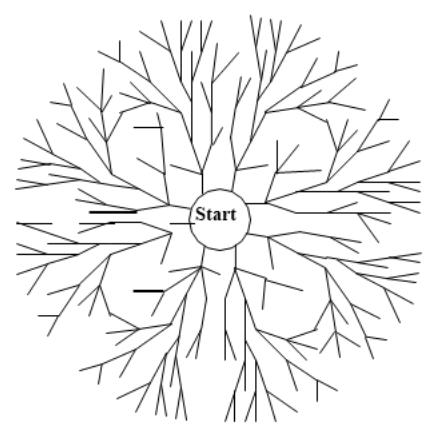


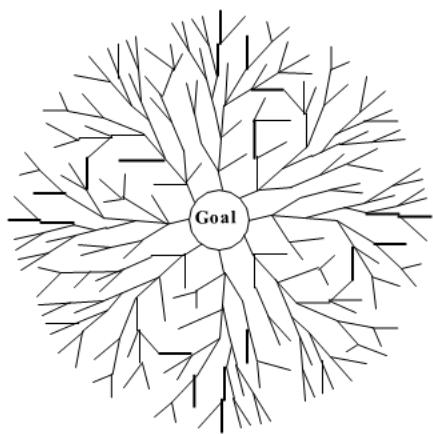


Bidirectional Search


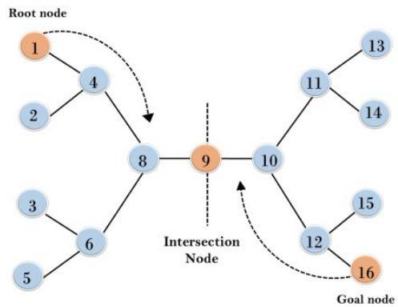


同时进行从初始状态向前的搜索和从目标节点向后搜索，在两个搜索在中间相遇时停止搜索假设两个搜索都使用宽度优先搜索

完备性: Yes

◼ 最优性: Yes（在每条边/每个动作的成本一致的情况下）

时间和空间复杂度: $O ( b ^ { d / 2 } )$

难点：如何向后搜索，部分问题可以向后搜索，但有些问题向后搜索会使得分子引子很大

# 盲目搜索总结

<table><tr><td>标准</td><td>深度优先</td><td>宽度优先</td><td>深度受限</td><td>迭代加深</td><td>一致代价</td></tr><tr><td>时间</td><td>O(bm)</td><td>O bd+1)</td><td>O(bL)</td><td>O(bd)</td><td>O(bC*/s+1)</td></tr><tr><td>空间</td><td>O(bm)</td><td>O bd+1)</td><td>O(bL)</td><td>O bd)</td><td>O(bC*/s+1)</td></tr><tr><td>最优</td><td>否</td><td>是</td><td>否</td><td>是</td><td>是</td></tr><tr><td>完备</td><td>否</td><td>是</td><td>否</td><td>是</td><td>是</td></tr></table>

上表中， $b$ 为问题中一个状态最大的后继状态个数， $d$ 是最短解的动作个数，m是遍历过程中最长路径的长度， $L$ 为限制的搜索深度，$C ^ { * }$ 为最优解的成本，s为动作的成本下界。

# 路径检测

⚫ 回顾下，我们之前在边界上通常保存了路径

假设 $( n _ { 1 } , \ldots , n _ { k } )$ 是一条到达节点 $n _ { k }$ 的路径，并且我们要扩展节点 $n _ { k }$ 来获得子节点 $c _ { \prime }$我们可以获得一条到达节点c 的路径 $( n _ { 1 } , \ldots , n _ { k } , c )$ 

路径检测用于确保状态（节点） c 与它所在路径上的祖先节点都不相等

⚫ 也就是说，单独检测每条路径是否出现重复节点

# Path Checking

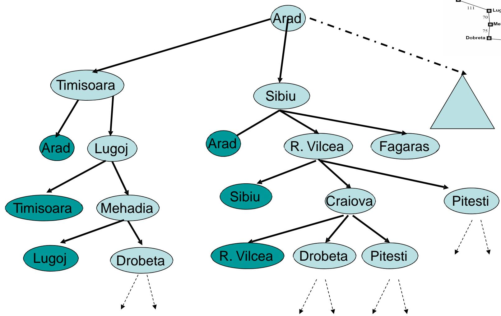


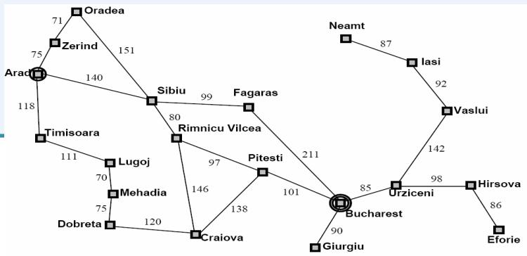


# Cycle Checking

Keep track of all states previously expanded during the search.记录下在之前的搜索过程中扩展过的所有节点

当扩展节点 $n _ { k }$ 获得子节点c时，确保节点c不等于之前任何扩展过的节点

Higher space complexity (equal to the space complexity of breadth-firstsearch).

Other issues with cycle checking will come up when we look at heuristicsearch.

# Cycle Checking (BFS)

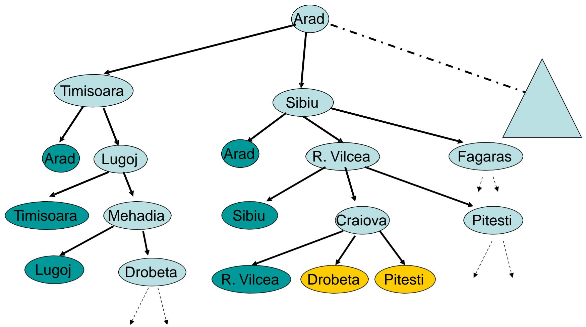


# Example: Arad to Neamt

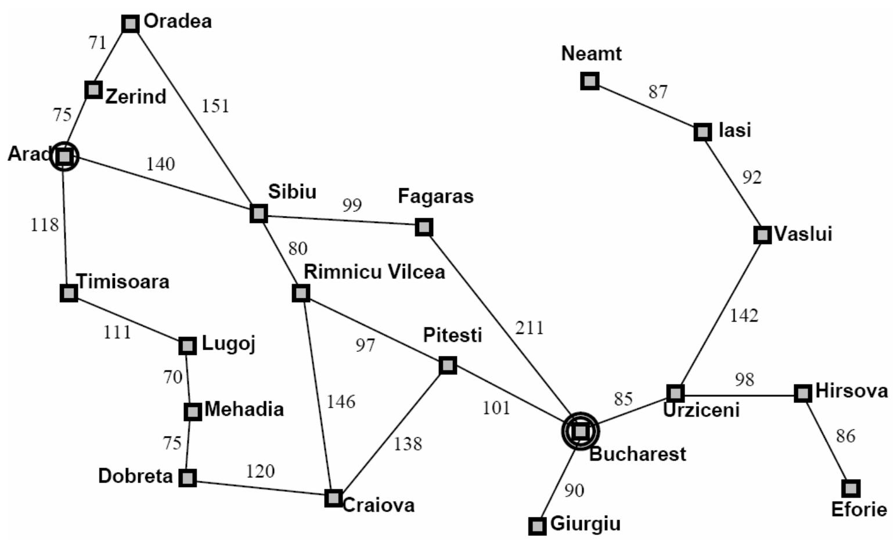


# Example: Arad to Neamt


⚫If path checking, nodes 1 and 2 are not generated

⚫If cycle checking, node 3 is not generated since it is expanded before; but if only path checking, node3 is generated

⚫If cycle checking, node 4 is generated, because it is only generated before, not expanded before

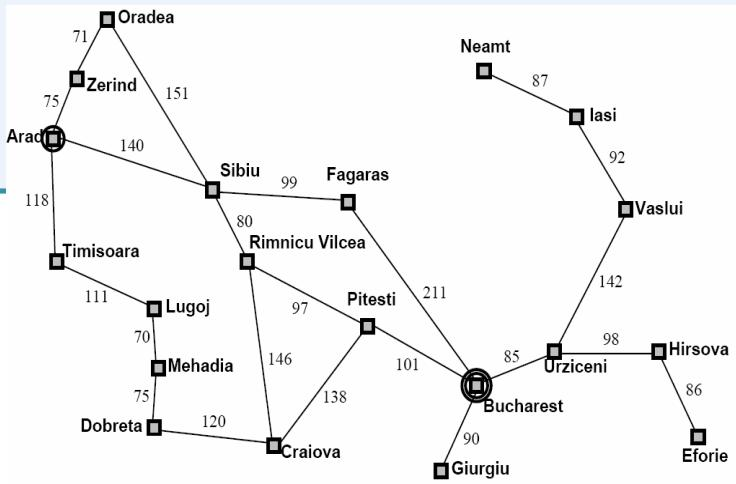


# 环检测最优性问题

对于一致代价搜索，使用环检测后仍能找到最优的解

⚫ 一致代价搜索在第一次扩展到某个节点时，其实已经找到了到达这个节点的成本最低的路径

⚫ 这意味着被环检测剔除的节点不可能出现一条更短/成本更低的路径之后会看到，对于启发式搜索，这个性质不一定会成立

# 环检测最优性问题

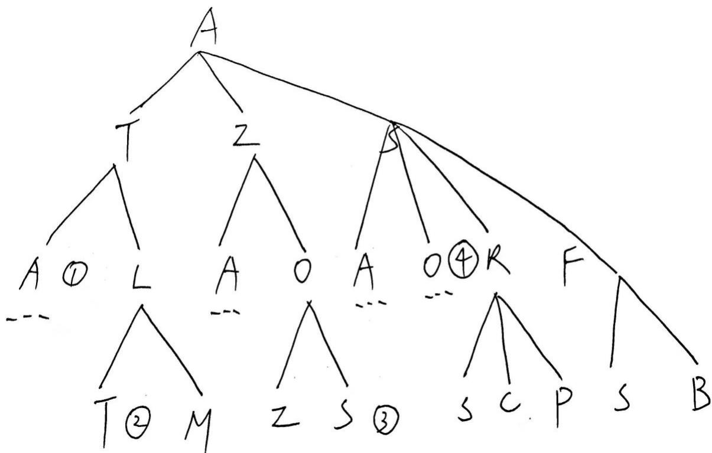


e.g., on the previous slide, when we expand the first O to generate node3, S is already expanded, so $c ( A \to S ) \leq$ $\begin{array} { r l } { c ( A  S ) \leq } & { { } C ( A  Z  O ) } \end{array}$ . Thus node 3can be safely rejected.

# 路径/环检测 比较

路径检测: 当扩展节点n来获得子节点c时，确保节点c不等于到达节点c的路径上的任何祖先节点

环检测: 记录下在之前的搜索过程中扩展过的所有节点当扩展节点 $n _ { k }$ 获得子节点c时，确保节点c不等于之前任何扩展过的节点对于一致代价搜索，环检测可以保留一致代价搜索的最优性

# 启发式搜索

# 课堂练习

练习1 如右图所示，初始状态为节点S，目标状态为G，各边的路径成本如图。请使用一致代价搜索算法，完成以下任务：

• 按扩展顺序列出节点，并记录每一步的Open表和Closed表状态

• 当节点A生成目标G时，为何算法不立即终止？解释UCS如何保证最终找到最优路径。

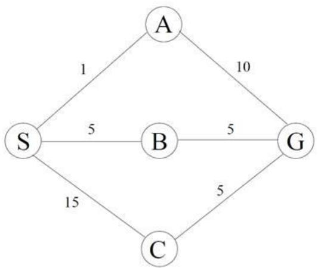


# 课堂练习

# 练习1 解：

• 搜索过程如下: （括号内为该节点总代价）

<table><tr><td>步骤</td><td>扩展节点</td><td>Open表</td><td>Closed表</td><td>备注</td></tr><tr><td>0</td><td>-</td><td>S(0)</td><td>空</td><td>初始状态</td></tr><tr><td>1</td><td>S</td><td>A(1), B(5), C(15)</td><td>S(0)</td><td>扩展S，生成子节点A/B/C</td></tr><tr><td>2</td><td>A</td><td>B(5), G(11), C(15)</td><td>S(0), A(1)</td><td>扩展A，生成G（总成本1+10=11）</td></tr><tr><td>3</td><td>B</td><td>G(10), C(15)</td><td>S(0), A(1), B(5)</td><td>扩展B，生成G（总成本5+5=10）</td></tr><tr><td>4</td><td>G</td><td>C(15)</td><td>S(0), A(1), B(5), G(10)</td><td>找到目标G，终止</td></tr></table>

最终路径为 $S  \mathsf { B }  \mathsf { G }$ ，总成本为 10

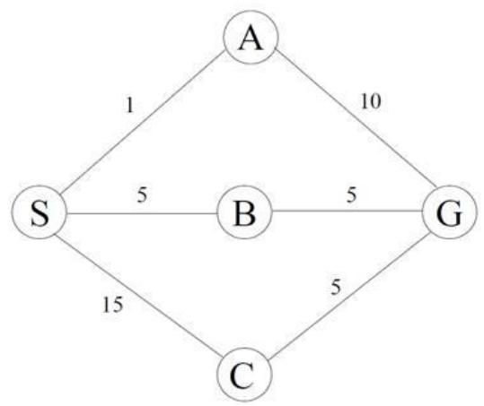


# 课堂练习

# 练习1 解：

• 当节点A生成目标G（路径成本11）时，算法未终止的原因：

• UCS仅在扩展节点时检查是否为目标，而非生成时

• 此时Open表中存在B(5)，其潜在路径到G的总成本可能更低（实际为5+5=10）

• UCS始终优先扩展累积成本最小的节点，确保首次到达目标时路径成本最小。若提前终止，可能错过更优路径（B→G） 。

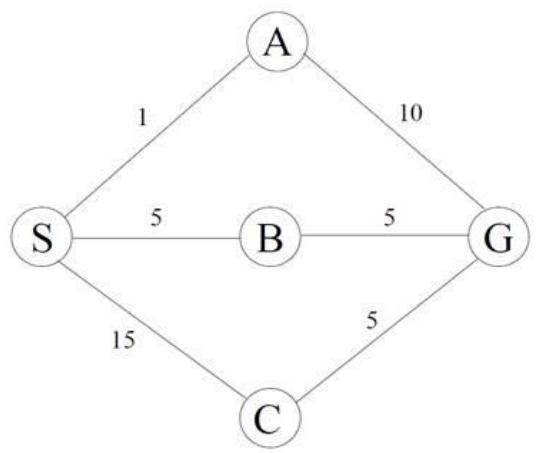


# 无信息搜索总结

•宽度优先：搜索对象的位置深度

•一致代价：搜索对象的到达路径长度

•深度优先：搜索对象的位置深度

•深度受限：搜索对象的位置深度

•迭代加深：搜索对象的位置深度

•双向：搜索对象的位置深度

共有的特征是：

搜索方向都依据了某一评价指标

$\bullet$ 搜索方向和搜索对象本身的属性无关

<table><tr><td>Criterion</td><td>Breadth-First</td><td>Uniform-Cost</td><td>Depth-First</td><td>Depth-Limited</td><td>Iterative Deepening</td><td>Bidirectional (if applicable)</td></tr><tr><td>Complete?</td><td>Yesa</td><td>Yesa,b</td><td>No</td><td>No</td><td>Yesa</td><td>Yesa,d</td></tr><tr><td>Time</td><td>O(bd)</td><td>O(b1+[C*/ε])</td><td>O(bm)</td><td>O(bl)</td><td>O(bd)</td><td>O(bd/2)</td></tr><tr><td>Space</td><td>O bd)</td><td>O(b1+[C*/ε])</td><td>O(bm)</td><td>O(bl)</td><td>O bd)</td><td>O(bd/2)</td></tr><tr><td>Optimal?</td><td>Yesc</td><td>Yes</td><td>No</td><td>No</td><td>Yesc</td><td>Yesc,d</td></tr></table>

# 如何能让搜索更“聪明”？

• 通用搜索策略在搜索过程中，不对状态优劣进行判断，仅按照固定方式搜索。在盲目搜索中，我们没有考虑边界上的节点哪一个更具有“前景”（promising）

• 例如在一致代价搜索(UCS)时，我们总是扩展从初始状态到达当前状态的成本最小的那条路径，却没有考虑过从当前状态点沿着当前路径到达目标路径的成本

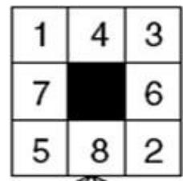


VS


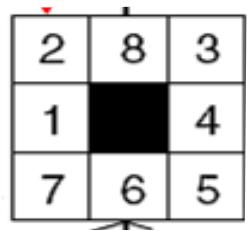


人解决问题的“启发性”

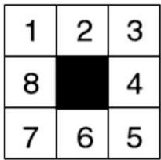


Goal


对两个可能的状态A和B， 选择“从目前状态到最终状态” 更好的一个作为搜索方向。

• 但很多时候我们对两个状态的优劣是有判断的。

# 动机

◼ 在盲目搜索中，我们没有考虑边界上的节点哪一个更具有“前景”

◼ 例如在一致代价搜索时，我们总是扩展从初始状态到达当前状态的成本最小的那条路径，却没有考虑过从当前状态点沿着当前路径到达目标路径的成本

◼ 但是，在许多情况下，我们可以有额外的知识来衡量当前节点，例如可以知道当前节点到达目标节点的成本

# 启发式搜索

◼ 对于一个具体问题，构造专用于该领域的启发式函数 $h ( n )$ , 该函数用于估计从节点??到达目标节点的成本

要求对于所有满足目标条件的节点??， $h ( n ) = 0$

◼ 在不同的问题领域中，对上述的成本的估计有不同的方法。即，启发式函数是随领域不同而不同的

当前节点到目标的某种距离或者差异的度量；

当前节点处于最佳路径的概率；

某种条件下的主观if-then规则；

# 启发式函数示例: 8-puzzle

• 在某个状态下，共有三种可能的选择。

• 如何评判三种走法的优劣？

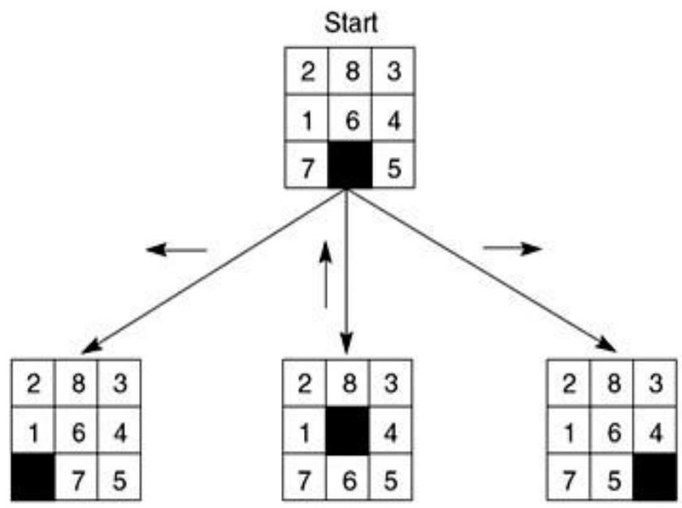


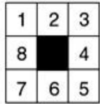


Goal


# 启发式函数示例: 8-puzzle

• Method A：

– 当前棋局与目标棋局之间错位的牌的数量，错数最少者最优。

–然而，这个启发方法没有考虑到距离因素，譬如：棋局中把“1”“2”颠 倒，与“1”“5”颠倒，但是移动难度显然不同。


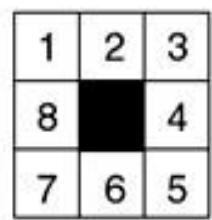


Goal


# 启发式函数示例: 8-puzzle

Method B改进：

– 更好的启发方法是“错位的牌距离目标位置的距离和最小” 。

– Method B 仍然存在很大的问题：没有考虑到牌移动的难度。两 张牌即使相差一格，如“1”“2”颠倒，将其移动至目标状态依 然不容易。


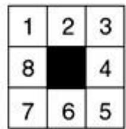


Goal


# 启发式函数示例: 8-puzzle

Method C：

– 在遇到需要颠倒两张相邻牌的时候，认为其需要的步数为一个固 定的数字。

Method D改进：

– 将B与C的组合，考虑距离，同时再加上需要颠倒的数量。

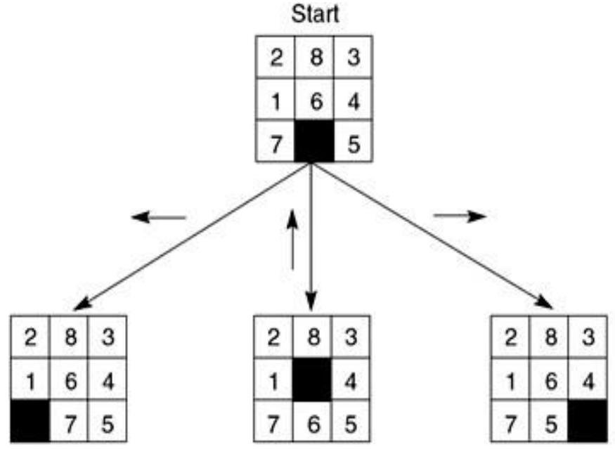


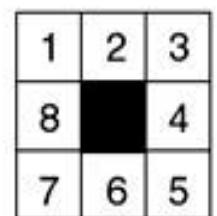


# 启发式函数示例: 直线距离（欧氏距离）

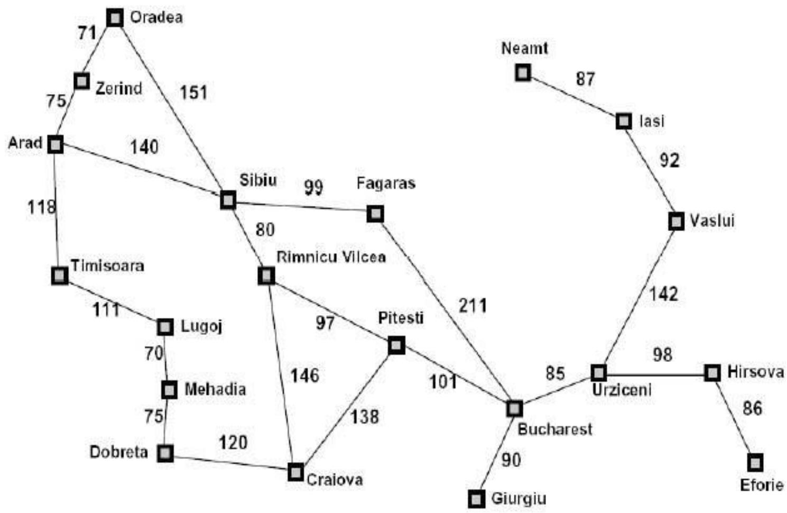


# Straight-line distance

to Bucharest

Arad 366

Bucharest 0

Craiova 160

Dobreta

Eforie 161

Fagaras 178

Giurgiu 77

Hirsova 151

Iasi 226

Lugoj 244

Mehadia 241

Neamt 234

Oradea 380

Pitesti 98

RimnicuVilcea 193

Sibiu 253

Timisoara 329

Urziceni 80

Vaslui 199

Zerind

# 启发式函数示例: 直线距离（欧氏距离）

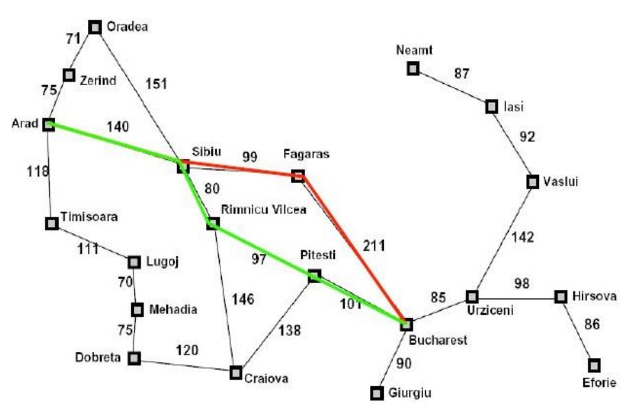


Straight-line distance

toBucharest

Arad 366

Bucharest 0

Craiova 160

Dobreta 242

Eforie 161

Fagaras 178

Glurgiu

Hirsova 151

Iasi 226

Lugoj 244

Mehadia 241

Neamt 234

Oradea 380

Pitesti 98

Rimnicu Vileea193

Sibiu

Timisoara 329

Urziceni 80

Vaslui 199

Zerind 374

(a)The initial state

(b)After expanding Arad dingArad

Arad

Arad

329 329

(c)After expanding Sibiu

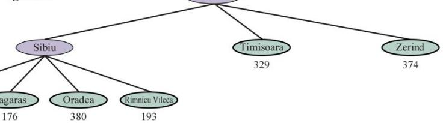


(d)After expanding Fagaras

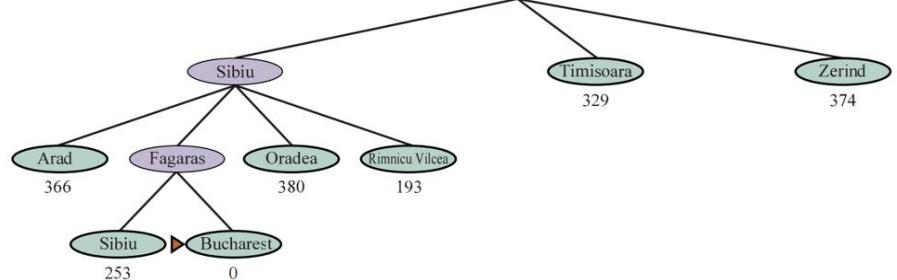


Arad-Sibiu-Fagaras-Bucharest: $-$

Arad-Sibiu-RV-Pitesli-Bucharest: $1 4 0 + 8 0 + 9 7 + 1 0 1 = 1 4 0 + 2 7 8 = 4 1 8$

In red is the path we selected. In green is the shortest path between

Arad and Bucharest. What happened?

仅依靠启发式函数有问题

# 贪心最好优先搜索 Greedy

利用启发式函数 $h ( n )$ 来对边界上的节点进行排序，只靠启发式函数的方法叫贪心最好（最佳）优先搜索 (Greedy Best-first Search)

我们贪婪地希望找到成本最低的解

◼ 但是，这种做法忽略了从初始状态到达节点??的成本

因此这种做法可能“误入歧途”，选择了离初始状态很远（成本很高），但根据 $h ( n )$ 看起来离目标状态很近的节点

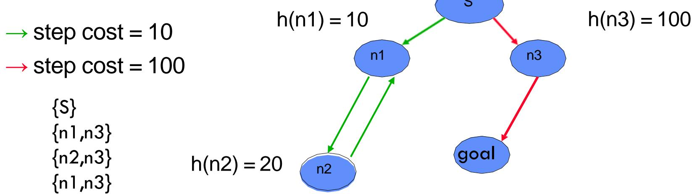


因此贪心最好优先搜索既不是完备的，也不是最优的。…

# 贪心最好优先搜索 Greedy

利用启发式函数 $h ( n )$ 来对边界上的节点进行排序，只靠启发式函数的方法叫贪心最好（最佳）优先搜索 (Greedy Best-first Search)

我们贪婪地希望找到成本最低的解

◼ 但是，这种做法忽略了从初始状态到达节点??的成本

因此这种做法可能“误入歧途”，选择了离初始状态很远（成本很高），但根据 $h ( n )$ 看起来离目标状态很近的节点

$$
\rightarrow \mathrm {s t e p} \mathrm {c o s t} = 1 0
$$

$$
\rightarrow \mathrm {s t e p} = 1 0 0
$$

[S]

$$
[ n 3, n 1 ]
$$

$$
[ G o a l, n 1 ]
$$

$$
\mathsf {h} (\mathsf {n} 1) = 7 0
$$

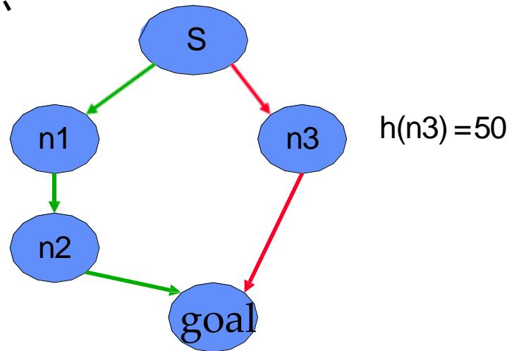


因此贪心最好优先搜索既不是完备的，也不是最优的。

# 贪心最好优先搜索


贪心最好优先搜索：评价函数 $f ( n ) =$ 启发式函数 $h ( n )$


<table><tr><td>辅助信息</td><td>所求解问题之外、与所求解 问题相关的特定信息或知识</td><td></td></tr><tr><td>评价函数 (evaluation function) \(f(n)\)</td><td>从当前节点\(n\)出发，根据评 价函数来选择后继节点。</td><td>下一个节 点是谁?</td></tr><tr><td>启发式函数 (heuristic function) \(h(n)\)</td><td>计算从节点\(n\)到目标节点之 间所形成路径的最小代价值， 这里将两点之间的直线距离 作为启发式函数。</td><td>完成任务 还需要多少代价?</td></tr></table>

# 贪心最佳优先搜索(Greedy BFS)

# 单纯依靠启发函数搜索不可行

⚫ 对于一个具体问题，我们可以定义最优路线：“从初始节点出发，以最优路线经过当前节点，并以最优路线达到终止节点” 。

盲目搜索(如UCS)，只考虑了前半部分，能计算出从初始节点走到当前节点的优劣。

⚫ 启发函数(如Greedy)则只“估计”了当前节点到最终节点的优劣。

两者相结合，就是启发式搜索策略。

典型代表是A算法。

# A 搜索

f(n) g(n) + h(n)评价函数 起始节点到节点n代价 节点n到目标节点代价(当前最小代价) (后续估计最小代价)

Define an evaluation function 定义评价函数 $\_$

$\cdot$ is the cost of the path to node n从初始节点到达节点??的路径成本

$h ( n )$ is the heuristic estimate of the cost of getting to a goal node from n从 $n$ 节点到达目标节点的成本的启发式估计值

⚫ So $f ( n )$ is an estimate of the cost of getting to the goal via node $n _ { \mathrm { \iota } }$ 是经过节点??从初始节点到达目标节点的路径成本的估计值

⚫ We use $f ( n )$ to order the nodes on the frontier. Always expand the node with lowest f-valueon Frontier. 利用节点对应的 $f \left( n \right)$ 值来对边界上的节点进行排序，并总扩展边界中具有最小$f$ 值的节点。

⚫ 对于某个确定状态，g(n)和h(n)都是定值，用两者的和评估当前节点到达最终目标的成本，采用最佳优先搜索进行求解

# 一致代价搜索UCS和贪婪搜索Greedy对比

•UCS：按路径计算成本

•路径代价g(x)

•Greedy：按目标临近性计算成本

•启发函数h(x)

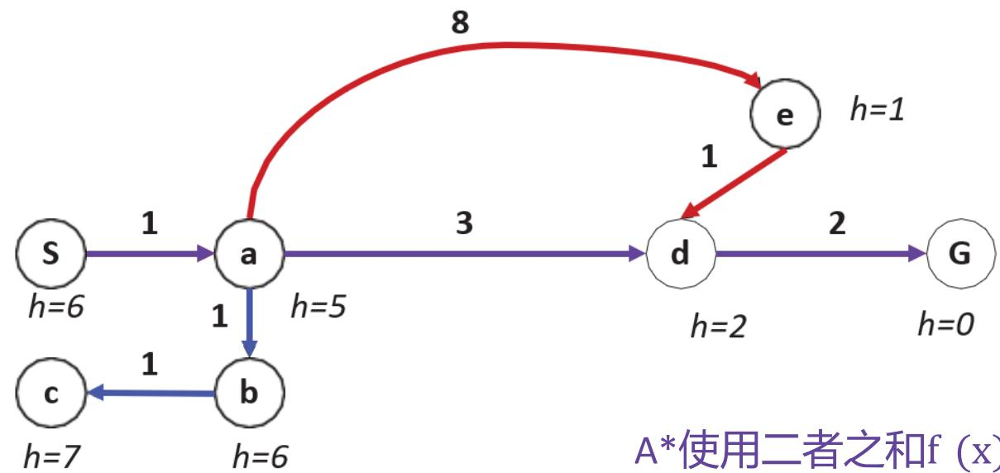


${ \mathfrak { d } } = \operatorname { g } ( \mathbf { \boldsymbol { x } } ) + \mathbf { \boldsymbol { h } } ( \mathbf { \boldsymbol { x } } )$


# 例子：利用A搜索找到Arad到Bucharest最短路径

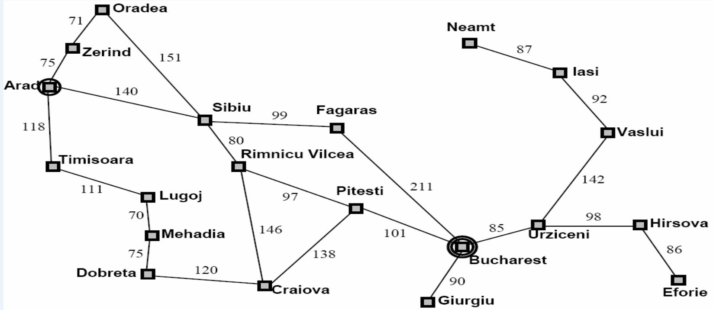


 Straight-line distance

to Bucharest

Arad 366

Bucharest 0

Craiova 160

Dobreta 242

Eforie 161

Fagaras 178

Giurgiu 77

Hirsova 151

Iasi 226

Lugoj 244

Mehadia 241

Neamt 234

Oradea 380

Pitesti 98

Rimnicu Vilcea 193

Sibiu 253

Timisoara 329

Urziceni 80

Vaslui 199

Zerind 374

# 示例

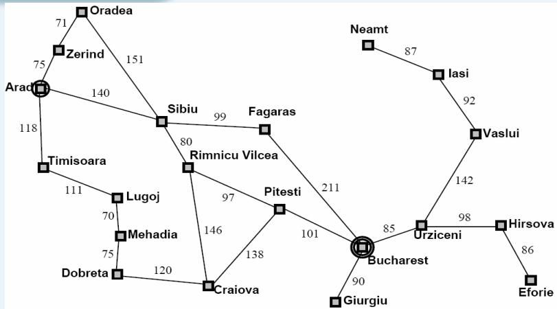


Straight-line distanceto Bucharest

Arad 366

Bucharest 0

Craiova 160

Dobreta

Eforie 161

Fagaras 178

Giurgiu 77

Hirsova 151

Iasi 226

Lugoj 244

Mehadia 241

Neamt 234

Oradea 380

Pitesti 98

Rimnicu Vilcea193

Sibiu 253

Timisoara 329

Urziceni 80

Vaslui 199

Zerind 374

(a) The initial state

Arad

366=0+366

(b) After expanding Arad nding Arad

Arad

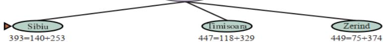


(c) After expanding Sibiu

Arad

646=280+366 415=239+176 671=291+380 413=220+193

(d) After expanding Rimnicu Vilcea

Arad

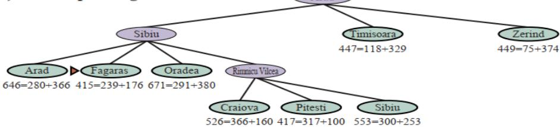


(e) After expanding Fagaras

Arad

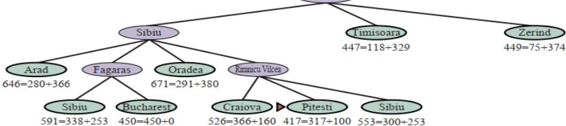


(f) After expanding Pitesti

Arad

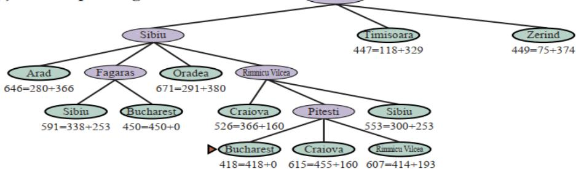


# 示例

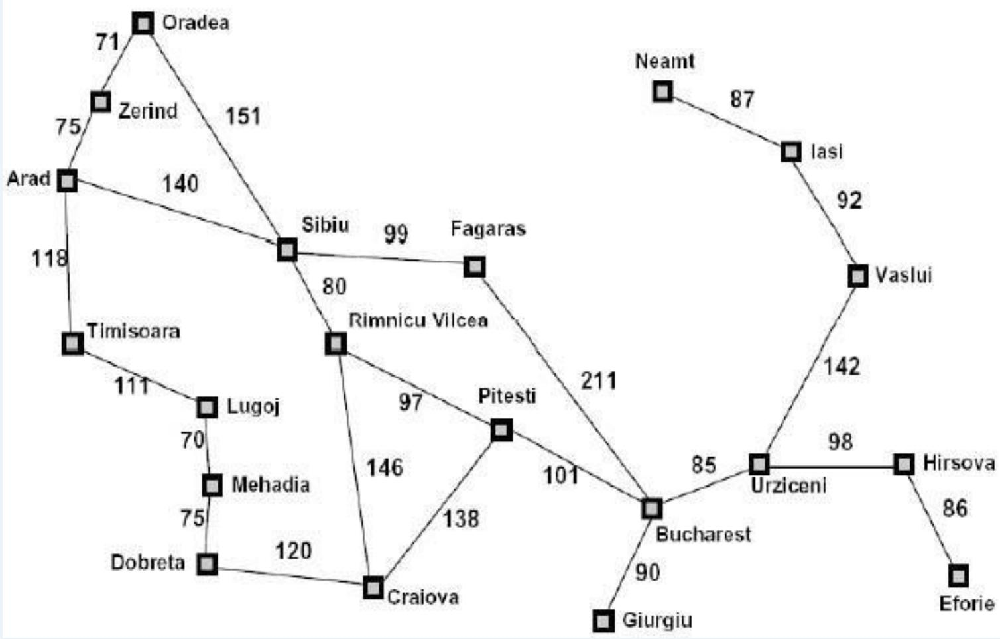


Straight-line distance

to Bucharest

Arad 366

Bucharest 0

Craiova 160

Dobreta

Eforie 161

Fagaras

Giurgiu 77

Hirsova 151

Iasi 226

Lugoj 244

Mehadia 241

Neamt 234

Oradea 380

Pitesti 98

RimnicuVilcea

Sibiu 253

Timisoara 329

Urziceni 80

Vaslui 199

Zerind 374

# 示例 8-puzzle的启发式求解

仍然以8格拼图来解释A算法。令h(n)为“错牌数量”， $\mathsf { g } \left( \mathsf { n } \right)$ 为“已经移动的步数”，从初始状态开始搜索。

• step1：

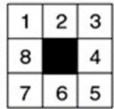


Goal


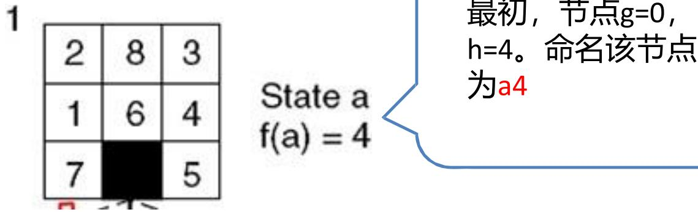


Open/Frontier =[a4]

Closed=[ ]

# 示例 8-puzzle的启发式求解


Step2：三种走法


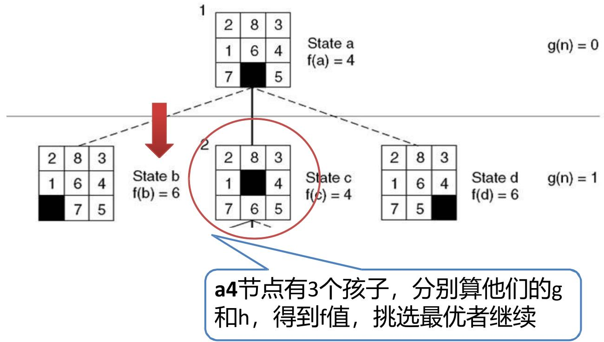


Open =[c4,b6,d6]

closed=[ a4 ]


Goal


# 示例 8-puzzle的启发式求解


Step3：继续


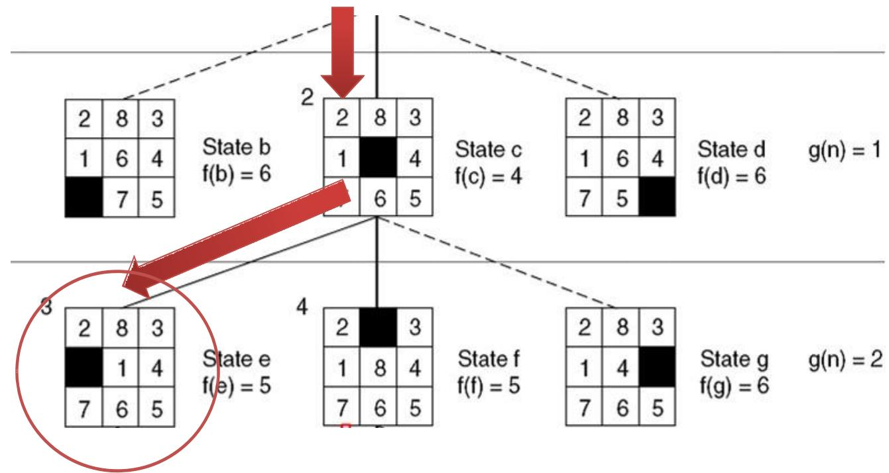


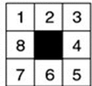


Goal


Open =[e5,f5,b6,d6,g6]

closed=[ a4 ]

# 示例 8-puzzle的启发式求解


• Step4：继续


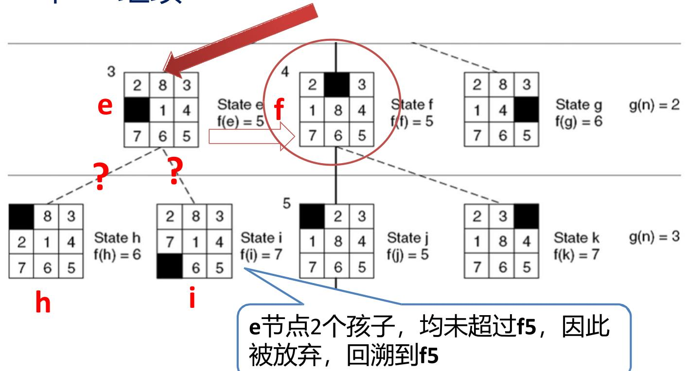


<table><tr><td>1</td><td>2</td><td>3</td></tr><tr><td>8</td><td></td><td>4</td></tr><tr><td>7</td><td>6</td><td>5</td></tr></table>

Goal

$$
\text {O p e n} = [ \mathrm {f 5}, \mathrm {h 6}, \mathrm {b 6}, \mathrm {d 6}, \mathrm {g 6}, \mathrm {i 7} ]
$$

$$
c l o s e d = [ a 4, c 4, e 5 ]
$$

# 示例 8-puzzle的启发式求解

St 

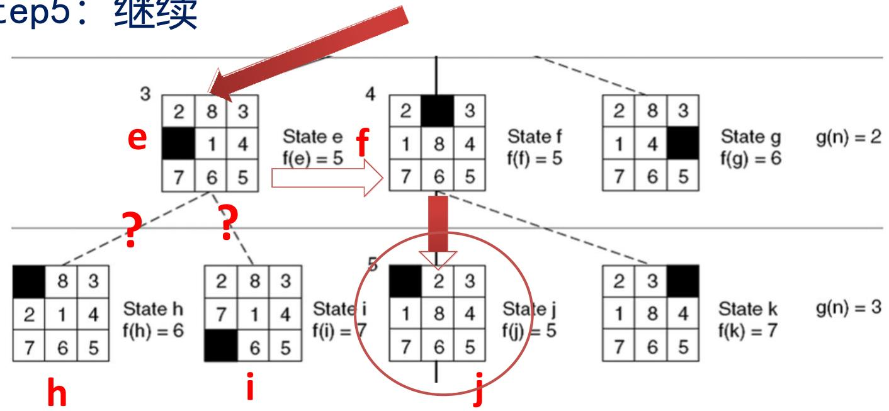


<table><tr><td>1</td><td>2</td><td>3</td></tr><tr><td>8</td><td></td><td>4</td></tr><tr><td>7</td><td>6</td><td>5</td></tr></table>

Goal

$$
\text {O p e n} = [ \mathrm {j} 5, \mathrm {h} 6, \mathrm {b} 6, \mathrm {d} 6, \mathrm {g} 6, \mathrm {k} 7, \mathrm {i} 7 ]
$$

$$
c l o s e d = [ a 4, c 4, e 5, f 5 ]
$$

# 示例 8-puzzle的启发式求解

Step6：j节点只有一个孩子

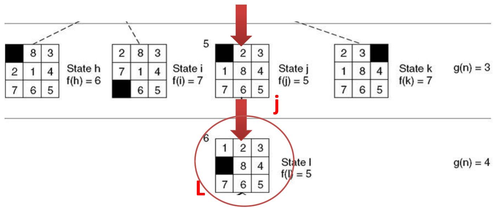


Goal


Open =[L5,h6,b6,d6,g6,k7,i7]

closed=[ a4,c4,e5,f5,j5 ]

# 示例 8-puzzle的启发式求解

Step7：找到答案

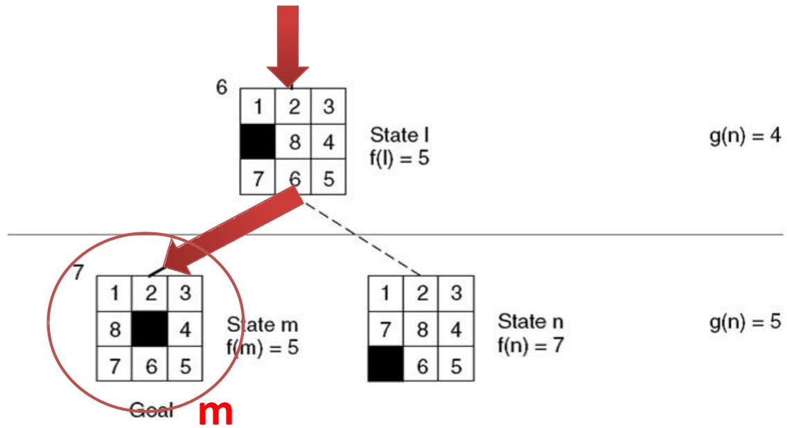


Goal


Open =[m5,h6,b6,d6,g6,n7,k7,i7]

closed=[ a4,c4,e5,f5,j5,L5 ]

# 示例 8-puzzle的启发式求解

https://www.redblobgames.com/pathfinding/a-star/introduction.html

```python
frontier = PriorityQueue()
frontier.put(start, 0)
came_from = dict()
cost(so_far = dict())
came_from[ start ] = None
cost"So_far[ start ] = 0
```

while not frontier.empty(): current  $=$  frontier.get() if current  $\equiv =$  goal: break

for next in graph.neighbors(current):   
new_cost  $=$  cost(so_far[current]  $^+$  graph.cost(current, next) if next not in cost"So_far or new_cost  $<$  cost"So_far[next]: cost"So_far[next]  $=$  new_cost priority  $=$  new_cost frontier.put(next, priority) came_from[next]  $=$  current

# Uniform Cost Search

# 示例 8-puzzle的启发式求解

frontier $\equiv$ PriorityQueue()

frontier.put(start, 0)

came_from $=$ dict()

came_from[start] $\mathbf { \equiv } =$ None

 while not frontier.empty():

$\mathbf { \equiv } =$ frontier.get()

$= =$ goal:

break

for next in graph.neighbors(current):

if next not in came_from:

priority $\equiv$  heuristic(goal, next)

 frontier.put(next, priority)

came_from[next] $=$ current

# Greedy Best-First Search

# 示例 8-puzzle的启发式求解

```python
frontier = PriorityQueue()
frontier.put(start, 0)
came_from = dict()
cost(so_far = dict())
came_from[ start ] = None
cost"So_far[ start ] = 0
while not frontier.empty():
    current = frontier.get()
if current == goal:
    break
for next in graph.neighbors(current):
    new_cost = cost"So_far[ current ] + graph.cost(current, next)
    if next not in cost"So_far or new_cost < cost"So_far[ next]:
        cost"So_far[ next ] = new_cost
        priority = new_cost + heuristic(goal, next)
        frontier.put(next, priority)
    came_from[ next ] = current
```

# 练习：使用A算法解决8数码问题

采用Manhattan启发式函数，使用A*搜索解决初始状态和目标状态如图所示的8数码问题，画出搜索图，图中标明所有节点的f, $g , h$ 值

$h ( n ) =$ 所有方块到达其目标位置的曼哈顿距离之和


Goal


<table><tr><td></td><td>1</td><td>2</td></tr><tr><td>3</td><td>4</td><td>5</td></tr><tr><td>6</td><td>7</td><td>8</td></tr></table>


Current


<table><tr><td>8</td><td>5</td><td>2</td></tr><tr><td>3</td><td>4</td><td></td></tr><tr><td>6</td><td>7</td><td>1</td></tr></table>

The Current state has amanhattan distannce of 9to the goal state in theleft example


Initial State


<table><tr><td>1</td><td>2</td><td>3</td></tr><tr><td></td><td>4</td><td>6</td></tr><tr><td>7</td><td>5</td><td>8</td></tr></table>


Goal State


<table><tr><td>1</td><td>2</td><td>3</td></tr><tr><td>4</td><td>5</td><td>6</td></tr><tr><td>7</td><td>8</td><td></td></tr></table>

8 tile needs to move 4 squares 5 tile needs to move 2 squares1 tile needs to move 3 squares

# 练习：使用A算法解决8数码问题


Initial State


<table><tr><td>1</td><td>2</td><td>3</td></tr><tr><td></td><td>4</td><td>6</td></tr><tr><td>7</td><td>5</td><td>8</td></tr></table>


Goal State


<table><tr><td>1</td><td>2</td><td>3</td></tr><tr><td>4</td><td>5</td><td>6</td></tr><tr><td>7</td><td>8</td><td></td></tr></table>

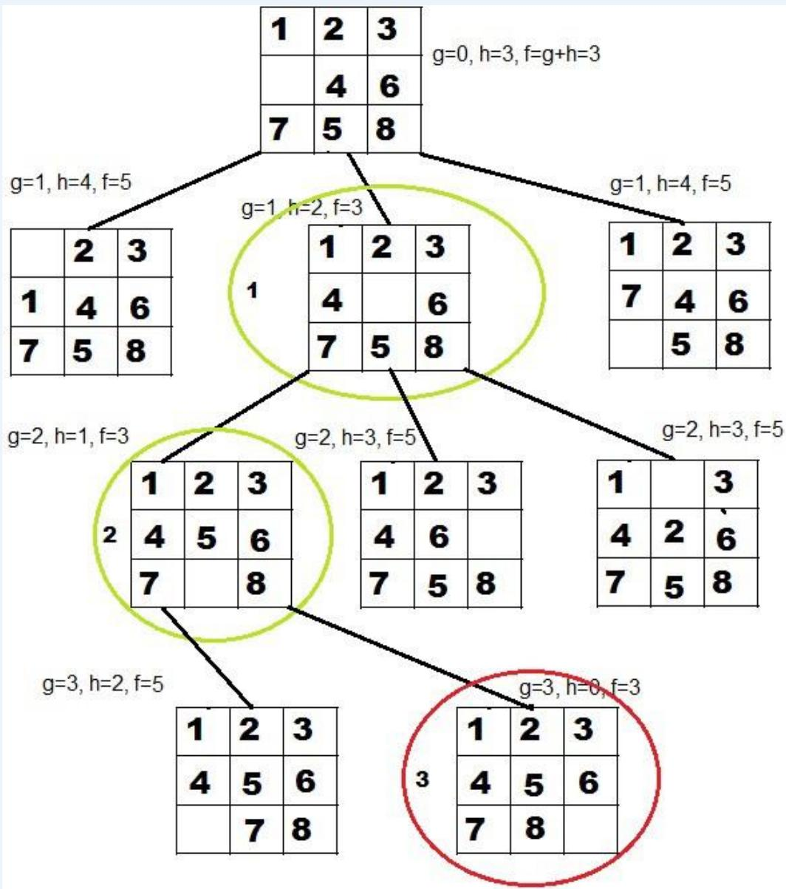


# 城市旅行示例

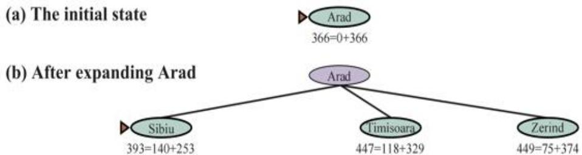


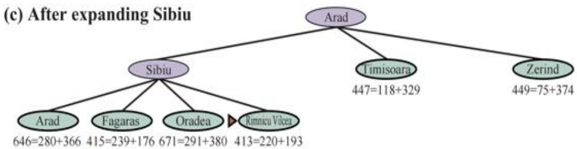


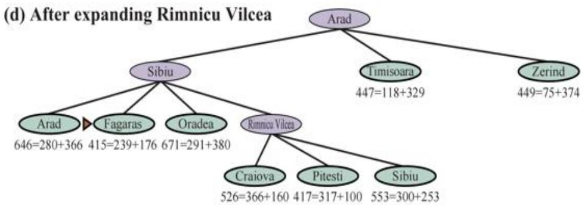


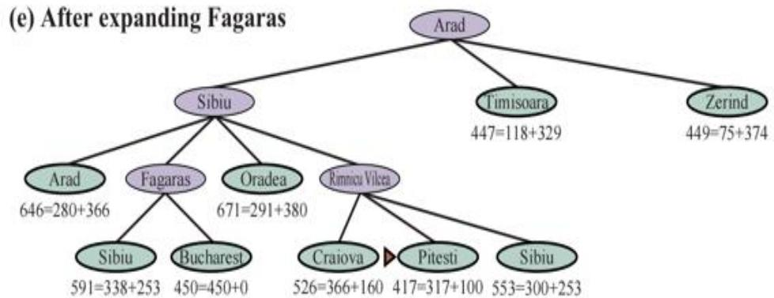


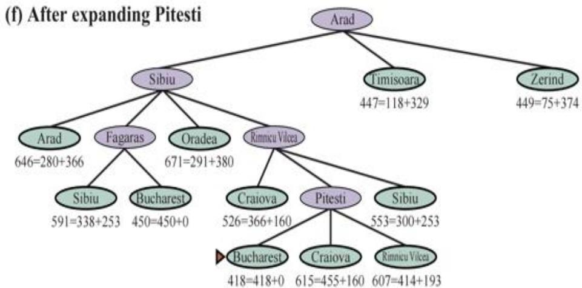


# A搜索的解是最优的吗

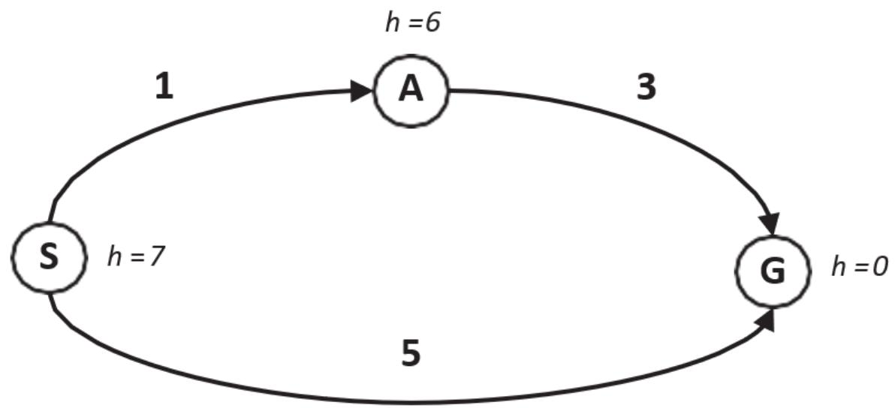


•为什么？

•h(A)的估计太大了，甚至超出了实际cost，

•过大的启发值将淹没实际代价 $\mathfrak { g } \left( \mathfrak { n } \right)$ ，使得搜索脱离实际

•因此启发函数应该有上限

# 启发函数的上限问题

• A算法中，状态图上的每一步都有很多种可能的路径，我们希望能找到最优的路径。

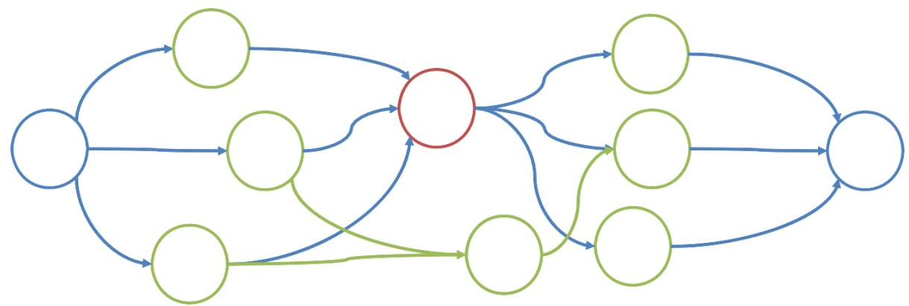


• 最优路径满足什么条件？ （假设n是最优路径上的点）

# 启发函数的上限问题

$- \mathtt { g } ( \mathtt { n } )$ 是从 S 走到 $\mathbf { n }$ 的所有方式中，代价最小的路径，记为g*(n)

$- \mathtt { h } ( \mathtt { n } )$ 是从 $\mathbf { n }$ 走到 E 的所有方式中，代价最小的路径，记为h*(n)

– 则最优路径为 $\mathtt { f } \ast \left( \mathrm { n } \right) = \mathtt { g } \ast \left( \mathrm { n } \right) + \mathtt { h } \ast \left( \mathrm { n } \right)$

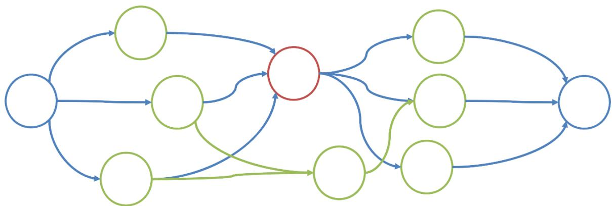


# 启发函数的上限问题

f*(n)无法直接计算，只能求近似，且需要能约束住算法估计值

搜索过程中， ${ \mathfrak { g } } \left( { \mathfrak { n } } \right)$ 是逐步优化得到的，因此 $\mathbf { g } * ( \mathbf { \boldsymbol { n } } ) \approx \mathbf { g } \left( \mathbf { \boldsymbol { n } } \right)$ 是合理的

– 有： $\_$ 。

$$
\begin{array}{r l} & {\text {f} (n) \leq f * (n) (\text {使 得 n 点 有 被 扩 展 的 可 能 性})} \\ & {\quad g * (n) \approx g (n)} \end{array}
$$

– 可以得出： ${ \mathrm {  ~ h ~ } } ( { \mathrm {  ~ n } } ) \equiv { \mathrm {  ~ h * ~ } } ( { \mathrm {  ~ n } } )$

– 于是直观上理解，这就是启发函数的上限。

如果启发函数大于这个上限，则搜索算法出现发散（跳过最优点），不能保证总能找到最优解。

$- \mathrm {  ~ h ~ } ( \mathrm { n } ) = 0$ 退化为一致代价搜索，则可找到最优解，h（n）趋于无穷则算法失效

1.如果 $h ( n )$ 高估了实际成本 $h ^ { * } ( n )$ ：这意味着算法可能会认为通过节点 $n$ 的路径比实际上更糟，从而可能错过最短路径。因为如果 $h ( n )$ 过大， $f ( n )$ 也会相应变大，导致算法倾向于探索其他看似更有希望（即 $f$ 值更小）的路径，而这些路径可能并不是最优的。

2.如果 $h ( n )$ 精确或低于实际成本 $h ^ { * } ( n )$ ：这样算法就不会错过任何潜在的最短路径，因为它总是偏向于探索那些估计总成本更低的路径。即使 $h ( n )$ 低估了，最坏的结果就是算法会探索更多节点，这可能会使搜索过程更慢，但仍然可以保证找到最优路径。

# h(n)的条件：可采纳性

在A算法中，如果代价函数 $\scriptstyle { \mathrm { f ( n ) = g ( n ) + h ( n ) } }$ 始终满足 h(n) ≦ h*(n)那么该算法就是A*算法。

I. 假设 $c ( n _ { 1 } \to n _ { 2 } ) \geq s > 0 .$ 每个状态转移（每条边）的成本是非负的，而且不能无穷地小

II. 假设 $h ^ { * } ( n )$ 是从节点 $\mathbf { \bar { \Phi } } _ { n }$ 到目标节点的最优路径的成本 (当节点??到目标节点不连通时， $h ^ { * } ( n ) = \infty ,$ )

当对于所有节点??，满足??(??) ≤ ??∗(??)，?? ?? 是可采纳的

◼所以，可采纳的启发式函数低估了当前节点到达目标节点的成本，使得实际成本最小的最优路径能够被选上；如果启发函数大于这个上限，则搜索算法出现 发散，不能保证总能找到最优解。

◼因此，对于任何目标节点??，ℎ(??) = 0


# h(n)的条件：一致性(单调性)

对于任意节点 $\dot { \boldsymbol { n } } _ { 1 }$ 和 $| n _ { 2 }$ ，若

$$
h (n _ {1}) \leq c (n _ {1} \to n _ {2}) + h (n _ {2})
$$

则 $h ( n )$ 具有一致性/单调性

（想想， 如果是大于号， 代表的是不是过大估计了cost？）

◼ 注意到，满足一致性的启发式函数也一定满足可采纳性（证明如下）

Case 1: 从节点 $\mathbf { \dot { \Omega } } _ { n }$ 没有路径到达目标节点，则可采纳性一定成立

Case 2: 假设 $n = n _ { 1 } \to n _ { 2 } \to \ldots \to n _ { k }$ 是从节点 $\mathbf { \dot { \Omega } } _ { n }$ 到目标节点的一条最优路径。可以使用数学归纳法证明对于所有的??， $h ( n _ { i } ) \leq h ^ { * } ( n _ { i } )$ .

$$
\begin{array}{l} \mathrm {B a s e :} h \left(n _ {k}\right) = 0 \\ \text {I n d u c t i o n :} h \left(n _ {i - 1}\right) \leq c \left(n _ {i - 1} \rightarrow n _ {i}\right) + h \left(n _ {i}\right) \leq c \left(n _ {i - 1} \rightarrow n _ {i}\right) + h ^ {*} \left(n _ {i}\right) = h ^ {*} \left(n _ {i - 1}\right) \\ \end{array}
$$

大部分的可采纳的启发式函数也满足一致性/单调性

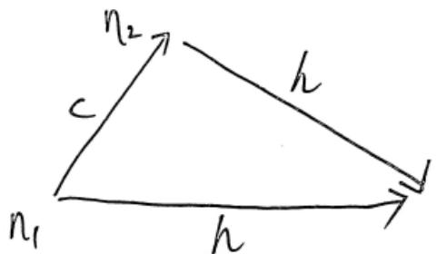


# 示例：直线距离（是否满足一致性与可采纳性？）

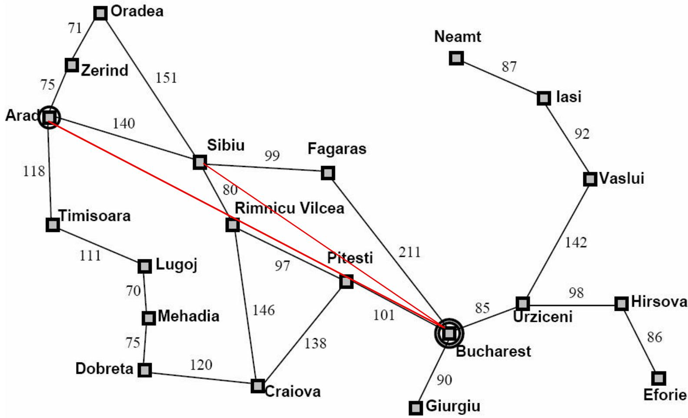


# 示例1：可采纳但不具备单调性的启发式函数

因为 $h ( n _ { 2 } ) > c ( n _ { 2 } {  } n _ { 4 } ) + h ( n _ { 4 } )$ ，下面的启发式函数不是单调的，但是却是可采纳的

→ step cost =200

→ step cost $=$ 100

$$
\boldsymbol {g} (\boldsymbol {n}) + \boldsymbol {h} (\boldsymbol {n}) = \boldsymbol {f} (\boldsymbol {n})
$$

$$
\begin{array}{l} \{S \} \rightarrow \left\{n _ {1} [ 2 0 0 + 5 0 = 2 5 0 ], n _ {2} [ 2 0 0 + 1 0 0 = 3 0 0 ] \right\} \\ \rightarrow \left\{n _ {2} [ 1 0 0 + 2 0 0 = 3 0 0 ], n _ {3} [ 4 0 0 + 5 0 = 4 5 0 ] \right\} \\ \rightarrow \left\{n _ {4} [ 2 0 0 + 5 0 = 2 5 0 ], n _ {3} [ 4 0 0 + 5 0 = 4 5 0 ] \right\} \\ \rightarrow \left\{\text {G o a l} [ 3 0 0 + 0 = 3 0 0 ], n _ {3} [ 4 0 0 + 5 0 = 4 5 0 ] \right\} \\ \end{array}
$$

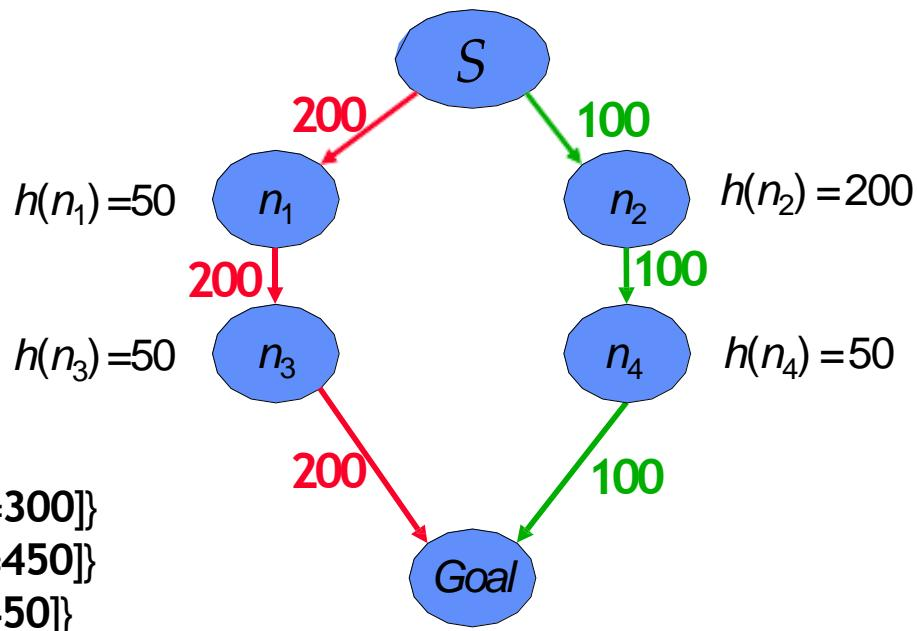


n1$S \to n _ { 2 } \to n _ { 4 } \to G o a l _ { \circ }$ 。虽然确实可以找到最优路径，但是在搜索过程中错误地忽略了 $\overline { { n _ { 2 } } }$ 而去扩展 $n _ { 1 }$

# 示例2：可采纳但不具备单调性的启发式函数

因为 $h ( n _ { 2 } ) > c ( n _ { 2 } {  } n _ { 1 } ) + h ( n _ { 1 } )$ ，下面的启发式函数不是单调的，但是却是可采纳的

→ step cost =200

→ step cost =100

→step cost =50

$$
\boldsymbol {g} (\boldsymbol {n}) + \boldsymbol {h} (\boldsymbol {n}) = \boldsymbol {f} (\boldsymbol {n})
$$


$$
\begin{array}{l} \{S \} \rightarrow \left\{n _ {1} [ 2 0 0 + 5 0 = 2 5 0 ], n _ {2} [ 2 0 0 + 1 0 0 = 3 0 0 ] \right\} \\ \rightarrow \left\{n _ {2} [ 1 0 0 + 2 0 0 = 3 0 0 ], n _ {3} [ 4 0 0 + 5 0 = 4 5 0 ] \right\} \\ \rightarrow \{n _ {3} [ 4 0 0 + 5 0 = 4 5 0 ] \} \\ \rightarrow \left\{\text {G o a} / [ 6 0 0 + 0 = 6 0 0 ] \right\} \\ \end{array}
$$

采用环检测： $S \to n _ { 1 } \to n _ { 3 } \to G o a I$

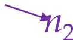


最优路径： $S \to n _ { 2 } \to n _ { 1 } \to n _ { 3 } \to G o a I$

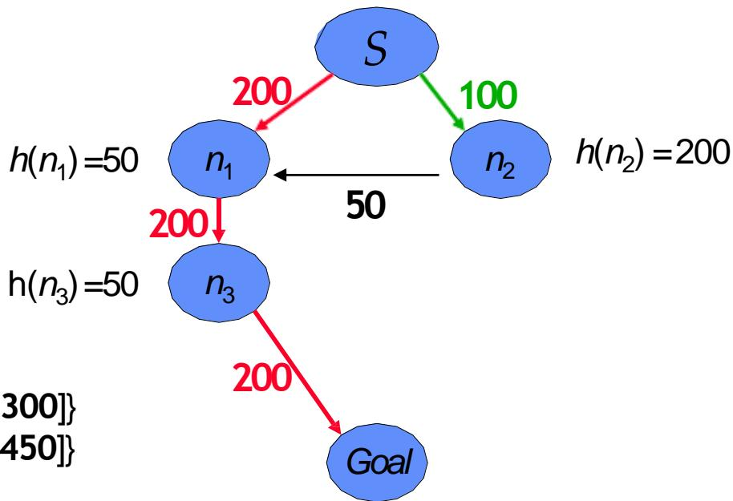


环检测是指通过记录在之前的搜索过程中扩展过的所有节点，每当扩展节点时，只有该节点不同于之前任何扩展过的节点时才进行扩展，否则该节点被剪枝（即不扩展），从而减少需要扩展的节点数量。

# 环检测的影响

◼如果启发式函数只有可采纳性，则不一定能在使用了环检测之后仍保持最优性

◼为了解决这个问题：必须对于之前遍历过的节点，必须记录其扩展路径的成本。这样的话，若出现到达已遍历过节点但成本更低的路径，则需重新扩展而不能剪枝

◼启发式函数的一单调性可以保证我们在第一次遍历到一个节点时，就是沿着到这个节点的最优路径扩展的

◼因此，只要启发式函数具备单调性，就能在进行环检测之后仍然保持最优性

# 时间和空间复杂度

$h ( n ) = 0$ 时，对于任何n这个启发式函数都是单调的。A∗搜索会变成一致代价搜索因此一致代价的时间/空间复杂度的下界也适用于A*搜索。

即， $\mathsf { A } ^ { * }$ 搜索仍可能是指数复杂度，除非我们能才找到好的h函数

<table><tr><td>Criterion</td><td>Breadth-First</td><td>Uniform-Cost</td><td>Depth-First</td><td>Depth-Limited</td><td>Iterative Deepening</td><td>Bidirectional (if applicable)</td></tr><tr><td>Complete?</td><td>Yesa</td><td>Yesa,b</td><td>No</td><td>No</td><td>Yesa</td><td>Yesa,d</td></tr><tr><td>Time</td><td>O(bd)</td><td>O(b1+[C*/ε])</td><td>O(bm)</td><td>O(bl)</td><td>O bd)</td><td>O(bd/2)</td></tr><tr><td>Space</td><td>O bd)</td><td>O(b1+[C*/ε])</td><td>O(bm)</td><td>O(bl)</td><td>O bd)</td><td>O(bd/2)</td></tr><tr><td>Optimal?</td><td>Yesc</td><td>Yes</td><td>No</td><td>No</td><td>Yesc</td><td>Yesc,d</td></tr></table>

# 可采纳性意味着最优性

假设最优解的成本是??∗

◼ 最优解一定会在所有成本大于 $C ^ { * }$ 的路径之前被扩展到

成本≤ ??∗的路径的数量是有限的

因此最终可以检测到最优解

# 可采纳性意味着最优性

# 最优解一定会在所有成本大于 $C ^ { * }$ 的路径之前被扩展到

# 证明:

• 假设 $p ^ { * }$ 是一个最优解的路径，其成本为 $C ^ { * }$

• 假设 $p$ 是一条满足 $c ( p ) > c ( p ^ { * } )$ 的路径，而且路径 $p$ 在 $\overleftarrow { p } ^ { * }$ 之前被扩展（反证法）

• 那么扩展了到路径 $p$ 时，肯定会有一个 $p ^ { * }$ 上的节点 $\mathbf { \bar { \it { n } } }$ 处在边界上

• 因为 $p$ 在 $\dot { p }$ ∗之前被扩展，因此 $p$ 路径的最后的节点(假设为目标节点） $x$ 有

• $f ( x ) \leq f \left( n \right)$

因此 

• ?? ?? = ??(??) $+ 0 = f ( x ) \leq f \left( n \right) = g ( n ) + h ( n ) \leq g ( n ) + h ^ { * } ( n ) = c ( p ^ { * } )$

和 $c ( p ) > c ( p ^ { * } )$ 相矛盾

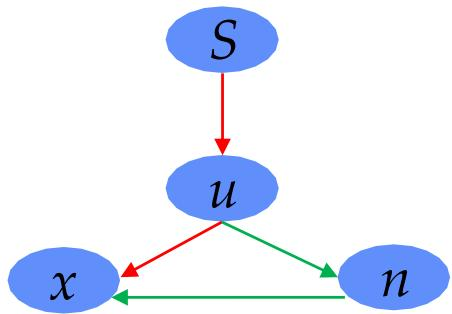


$$
\begin{array}{l} p = S \rightarrow u \rightarrow x \\ p ^ {*} = S \longrightarrow u \longrightarrow n \longrightarrow x \\ \end{array}
$$

# 单调性相关结论

Proposition 1：一条路径上的节点的 $f$ 函数值应该是非递减的

（注意如果只有可采纳性，此结论不成立）

证明：令… . ??1, ??2, … …为一路径

$$
f (n 1) = g (n 1) + h (n 1) \leq g (n 1) + c (n 1 \rightarrow n 2) + h (n 2)
$$

$$
f (n 2) = g (n 2) + h (n 2) = g (n 1) + c (n 1 \rightarrow n 2) + h (n 2)
$$

故 $f ( n 1 ) \leq f ( n 2 )$

# 单调性相关结论

Proposition 2： 如果节点??2在节点??1之后被扩展，则有

$$
f \left(n 1\right) \leq f \left(n 2\right)
$$

# 证明：

有以下两种情况:

◼当 $n 1$ 被扩展， $n 2$ 还在边界上。由于 $n 2$ 在 $\mathrm { \Pi } _ { \mathrm { \it { n } 1 } }$ 之后扩展，说明$f \left( n 1 \right) \leq f \left( n 2 \right)$

◼当 $n 1$ 被扩展， $n 2$ 的祖先节点 $\dot { n } 3$ 在边界上，则 $f \left( n 1 \right) \leq$$f \left( n 3 \right)$ 。再根据Proposition 1， $f \left( n 1 \right) \leq f \left( n 3 \right) \leq f ( n 2 )$

# 单调性相关结论

Proposition 3：在遍历节点n时，所有??值小于 $f ( n )$ 的节点都已经被遍历过了

证明：

⚫ 假设存在路径 $p = n _ { 1 } \to \ n _ { 2 } \dots \to \ n _ { k }$ 还没有被遍历过，但

$$
f (n _ {k}) <   f (n)
$$

$\bullet$ 其中， $n _ { k }$ 是路径 $p .$ 上最后被遍历的节点

$\bullet$ 路径 $p .$ 上的节点 $\dot { n } _ { i + 1 }$ 应该已经在n被探索时的边界上了，因此

$$
f (n) \leq f (n _ {i + 1})
$$

$\bullet$ 根据命题1， $f ( n _ { i + 1 } ) \leq f ( n _ { k } )$

$\bullet$ 因此 $f ( n ) \leq f ( n _ { k } )$ ， 与假设矛盾

# 单调性相关结论

Proposition 3：在遍历节点n时，所有??值小于 $f ( n )$ 的节点都已经被遍历过了

证明：

⚫ 假设存在路径 $p = n _ { 1 } \to \ n _ { 2 } \dots \to \ n _ { k }$ 还没有被遍历过，但

$$
f (n _ {k}) <   f (n)
$$

$\bullet$ 其中， $n _ { k }$ 是路径 $p .$ 上最后被遍历的节点

$\bullet$ 路径 $p .$ 上的节点 $\dot { n } _ { i + 1 }$ 应该已经在n被探索时的边界上了，因此

$$
f (n) \leq f (n _ {i + 1})
$$

$\bullet$ 根据命题1， $f ( n _ { i + 1 } ) \leq f ( n _ { k } )$

$\bullet$ 因此 $f ( n ) \leq f ( n _ { k } )$ ， 与假设矛盾

# 单调性相关结论

Proposition 4：A*搜索第一次扩展到某个状态，其已经找到到达该状态的最小成本路径

证明：

$\bullet$ 假设路径 $\ p = \yen 123,456$ 是第一条被发现的到达??的路径

$\bullet$ 假设路径 $\cdot p ^ { \prime } = \ . . . \  \ m  \ n$ 是第二条被发现的到达 $n$ 的路径

$\bullet$ 根据Proposition 2， $f ( \mathfrak { n } ) \mathrm { v i a } \mathrm { p } = g ( \mathfrak { p } ) + h ( \mathfrak { n } ) \le f ( \mathfrak { m } )$

$\bullet$ 根据Proposition 1， $f ( m ) \leq f ( \mathrm { n } ) \mathrm { v i a } p ^ { \prime } = g ( p ^ { \prime } ) + h ( n )$

$\bullet$ 因此 $g ( p ) \leq g ( p ^ { \prime } )$ ， 即 $c ( p ) \leq \ c ( p ^ { \prime } )$

# IDA∗

A∗搜索和宽度优先搜索或一致代价搜索一样，也存在潜在的空间复杂度过大的问题。

IDA∗（迭代加深的A∗搜索）：用于解决空间复杂度过大的问题，它类似于迭代加深算法，但是IDA*用于划定界限的不是深度，而是f 值，即 $( g + h )$ ）。

在每次迭代时，IDA*划定的界限是f 值超过上次迭代的f值。

可证明，当启发函数h为可采纳时， IDA* 是最优的： let $C ^ { * }$ be the cost of the optimalsolution, the cutoff value will be increased to $C ^ { * } ,$ and an optimal solution will be found

# A∗搜索：总结

◼ 定义一个评价函数为 $f ( n ) = g ( n ) + h ( n )$

◼ 我们使用 $f ( n )$ 函数来对边界上的节点进行排序。

可采纳性： $h ( n ) \leq h ^ { \ast } \left( n \right)$

单调性：对于任意节点??1和??2：

$$
h (n _ {1}) \leq c (n _ {1} \to n _ {2}) + h (n _ {2})
$$

◼ 启发式函数具有单调性说明其也具有可采纳性。

◼ 启发式函数具有可采纳性说明其也具有最优性 (无环检测)。

◼ 只要启发式函数是单调的，就能在进行环检测之后仍然保持最优性。

A*搜索具有指数级的空间复杂度。

# 单调性结论：总结

◼ 一条路径上的节点的 $f$ 值应该是非递减的

◼ 如果??2节点在??1节点之后扩展， $\exists \mathbb { B } \mathcal { L } ( n 1 ) \leq f ( n 2 )$

◼ A*搜索第一次扩展到某个状态，其已经找到到达该状态的最小成本的路径

◼ 只要启发式函数具备单调性（一致性），就能在进行环检测之后仍然保持最优性

# 构建启发式函数：松弛问题

通过考虑一个比较简单的问题，并将 $h ( n )$ 设置为简单问题中到达目标的成本

8数码问题：当满足下面条件时，可以把方块A移动到B位置

◼A方块与B位置相邻（上/下/左/右相邻）

◼B位置是空的

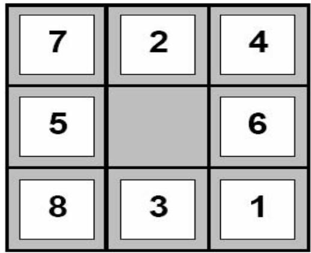


Start State


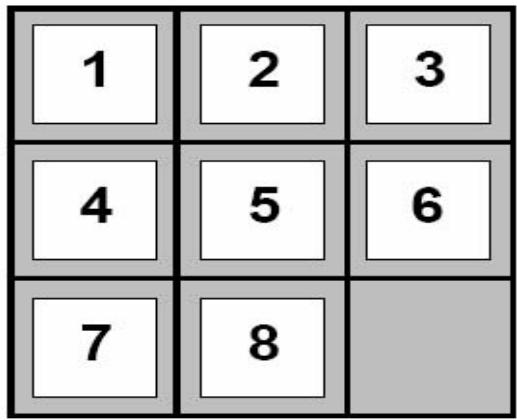


Goal State


# 构建启发式函数：松弛问题

可以放松一些条件使得问题变简单

1.只要方块A和B位置相邻就可以把A移动到B（不考虑B是否为空的条件）

2.只要B位置为空的，就可以把A移动到B（忽略相邻的条件）

3.任何情况下都可以把A移动到B（忽略两个条件）

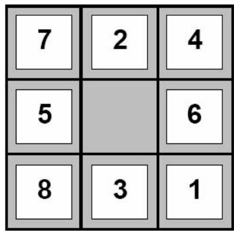


Start State


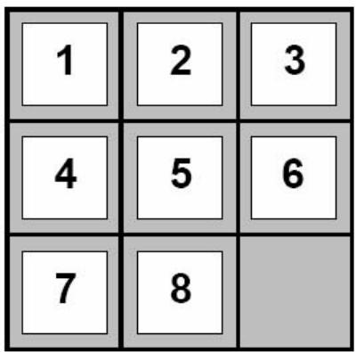


Goal State


# 构建启发式函数：松弛问题

3. 任何情况下都可以把A移动到B（忽略两个条件）

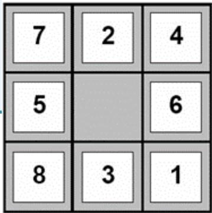


Start State


Goal State


#3 可以推导出“不在目标位置方块数”(Misplaced)的启发式函数ℎ ?? = 当前状态与目标状态位置不同的方块数

可采纳性：对于没有在目标位置上的方块，我们需要至少一次动作才能把其移动到目标位置，这个动作的成本大于等于1。所以 $h ( n ) \leq h * ( n )$

单调性：任何动作都最多只能消除一个不在目标状态上的方块，因此对于任何8数字的状态，相邻状态位置不同的方块数最多差1， $h ( n 1 ) - h ( n 2 ) \leq 1$≤ ??(??1 → ??2)

# 构建启发式函数：松弛问题


Start State


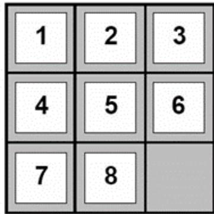


Goal State


1. 只要方块A和B位置相邻就可以把A移动到B（不考虑B是否为空的）

#1 可以推导出“曼哈顿距离”(Manhattan)的启发式函数

ℎ(??) = 所有方块到达其目标位置的曼哈顿距离之和

可采纳性：对于每个不在目标位置的方块，都需要至少d个动作才能到达目标位置，其中d是该方块初始位置到目标位置的曼哈顿距离。不同的两个不在目标位置的方块，它们的这些动作是不同的，仍有 $h ( n ) \leq h * ( n )$

单调性：任何动作最多能使一个不在目标位置的方块的曼哈顿距离减少1，因此ℎ ??1 − ℎ ??2 ≤ 1 ≤ ??(??1 → ??2)

# 构建启发式函数：松弛问题

定理：在松弛问题中，到达某个节点的最优成本是原始问题中到达该节点的可采纳的启发式函数值

证明：

⚫ 若 $P$ 是一个初始问题，设 $P _ { j }$ 是问题??的松弛问题

⚫ 那么 $S o l ( P ) \subseteq S o l \big ( P _ { j } \big )$ ， $S o l ( P )$ 表示问题 $P$ 的解节点集

于是?????????? $\varsigma t \Bigl ( S o l \bigl ( P _ { j } \bigr ) \Bigr ) \leq m i n c o s t \bigl ( S o l ( P ) \bigr )$ ，??????????????(??)表示到达节点集??中的节点的最小成本

$\bullet$ 因此 $h ( n ) \leq h ^ { * } ( n )$

# 比较两种启发式函数

定义：假如启发式函数h1和 $\mathrm { l h } 2$ 都是可采纳的，并且对于除了目标节点之外的其他节点，都有 $h 1 ( n ) \leq h 2 ( n )$ ，我们称h2函数支配了h1函数（或者h2函数比h1含有更多信息）

定理：假如h2函数支配了h1函数，那么在使用A*算法时，使用h2函数扩展的节点，使用h1函数也会扩展到。

<table><tr><td>Depth</td><td>IDS</td><td>A*(Misplaced) h1</td><td>A*(Manhattan) h2</td></tr><tr><td>10</td><td>47,127</td><td>93</td><td>39</td></tr><tr><td>14</td><td>3,473,941</td><td>539</td><td>113</td></tr><tr><td>24</td><td>---</td><td>39,135</td><td>1,641</td></tr></table>

# 应用

# 使用A*搜索解决8数码问题

采用Manhattan启发式函数 $h ( n )$ ，用带环检测的A*搜索初始状态和目标状态如下图所示的8数码问题，画出搜索图，图中标明所有节点的f值

初始：

<table><tr><td>2</td><td>8</td><td>3</td></tr><tr><td>1</td><td>6</td><td>4</td></tr><tr><td>7</td><td></td><td>5</td></tr></table>

目标：

<table><tr><td>1</td><td>2</td><td>3</td></tr><tr><td>8</td><td></td><td>4</td></tr><tr><td>7</td><td>6</td><td>5</td></tr></table>


Goal


<table><tr><td></td><td>1</td><td>2</td></tr><tr><td>3</td><td>4</td><td>5</td></tr><tr><td>6</td><td>7</td><td>8</td></tr></table>


Current


<table><tr><td>8</td><td>5</td><td>2</td></tr><tr><td>3</td><td>4</td><td></td></tr><tr><td>6</td><td>7</td><td>1</td></tr></table>

 8 tile needs to move 4 squares 5 tile needs to move 2 squares1 tile needs to move 3 squares

$h ( n ) =$ 所有方块到达其目标位置的曼哈顿距离之和

The Current state has a manhattandistannce of 9 to the goal state in the aboveexample

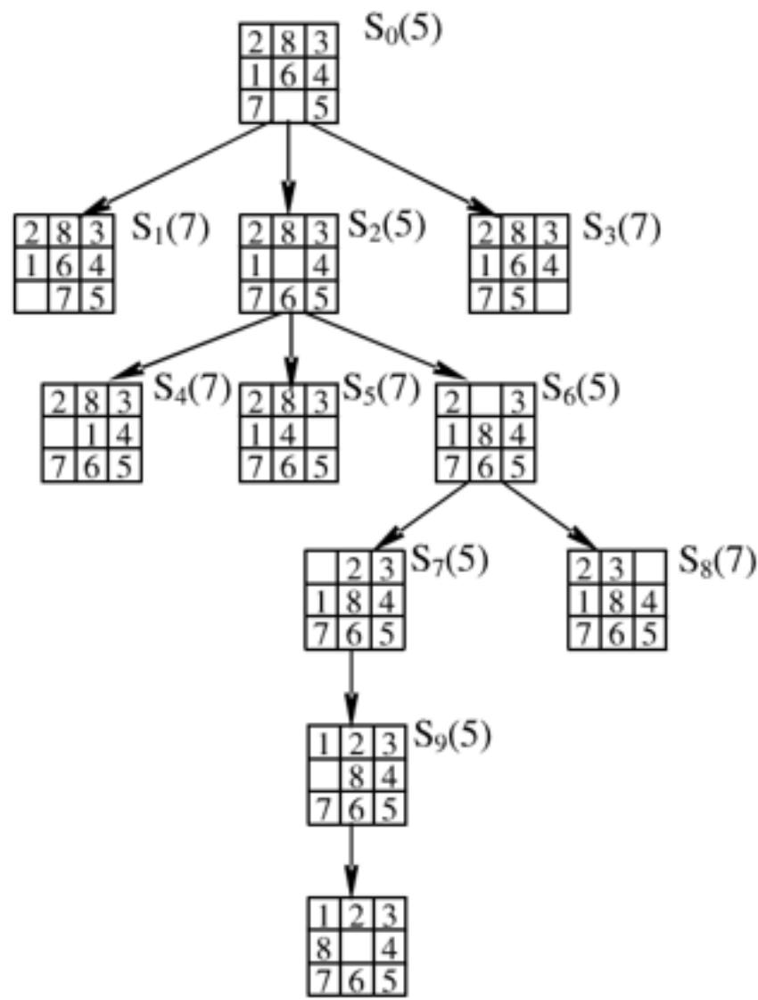


<table><tr><td>循环</td><td>OPEN</td><td>CLOSED</td></tr><tr><td>初始化</td><td>S0</td><td></td></tr><tr><td>1</td><td>S2S1S3</td><td>S0</td></tr><tr><td>2</td><td>S6S1S3S4S5</td><td>S0S2</td></tr><tr><td>3</td><td>S7S1S3S4S5S8</td><td>S0S2S6</td></tr></table>

搜索树如左图(右上角的数字是其估价函数值)

初始:

<table><tr><td>2</td><td>8</td><td>3</td></tr><tr><td>1</td><td>6</td><td>4</td></tr><tr><td>7</td><td></td><td>5</td></tr></table>

目标：

<table><tr><td>1</td><td>2</td><td>3</td></tr><tr><td>8</td><td></td><td>4</td></tr><tr><td>7</td><td>6</td><td>5</td></tr></table>

# 积木世界规划

现有积木若干，积木可以放在桌子上，也可以放在另一块积木上面。有两种操作：

$\textcircled{1}$ move(x, y)：把积木x放到积木y上面。前提是积木x和y上面都没有其他积木。

$\textcircled{2}$ moveToTable(x)：把积木x放到桌子上，前提是积木x上面无其他积木，且积木x不在桌子上。

设计本问题的一个启发式函数h(n)，满足 $h ( n ) \leq h ^ { * } ( n )$ ，然后用A*搜索初始状态和目标状态如下图所示的规划问题：

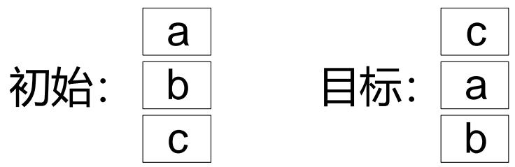


# 积木世界规划

◼ 积木处于其目标位置：以该积木为顶的塔出现在目标状态中

启发式函数：令h(n)为状态n中不在目标位置的积木数

◼ 可采纳性：对于每个不在目标位置的积木，需要至少1步动作来使得其到达目标位置。每块不在目标位置的积木要移动到目标位置的动作都不相同（即不存在一个动作使得两块积木同时到达目标位置的情况）

◼ 单调性：任何动作最多都只能消除一个不在目标位置的积木

# 积木世界规划

◼ 是否可以设计一个更好的具有可采纳性的启发式函数？

 （考虑下面的策略）

➢ 当积木x已经处于其目标位置，我们说x是一个good tower

➢ 如果当前状态下采取某一个动作可以创建一个good tower，则进行该动作；

➢ 否则，把一个积木移到桌上，但要确保移动的这个积木不是good tower

# 积木世界规划

◼ 一个盒子中有七个格子，里面放了黑色，白色两种木块；

◼ 三个黑色在左边，三个白色在右边，最右边一个格子空着；

一个木块移入相邻空格，耗散值（成本）为1；

◼ 一个木块相邻一个或两个其他木块跳入空格，耗散值（成本）为跳过的木块数；

◼ 游戏中将所有白色木块跳到黑色木块左边为成功。

# 滑动积木游戏

◼ 令 $h ( n )$ 为每个白色木块前的黑色木块数目和

◼ $E X  X E , E X Y  Y X E , E X Y Z  Z X Y E$

每个代价为1的动作使 $h ( n )$ 至多下降1

每个代价为2的动作使 $h ( n )$ 至多下降2

因此 $h ( n )$ 是单调的

# 传教士和野蛮人的问题

有N个传教士和N个野蛮人在河的左岸

有一艘可以载K个人的小船

◼ 寻求一种可以把所有人运到河的右岸的方法

◼ 并且要求无论何时何地 (在河的任意岸或在小船上)：传教士的人数 ≥ 野蛮人的人数或 传教士的人数 $= 0$

类似的渡河难题：


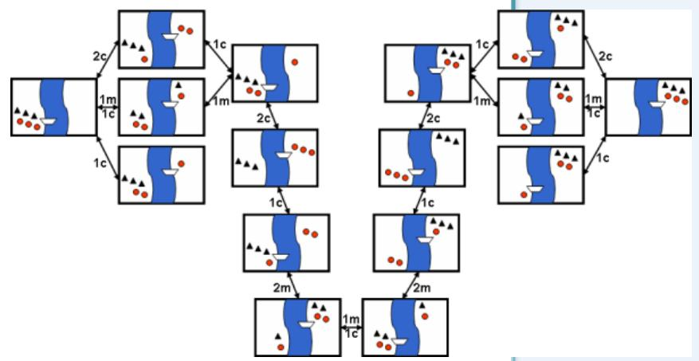


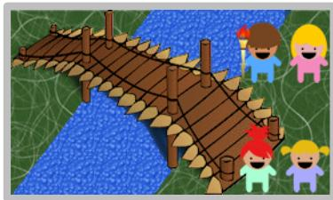


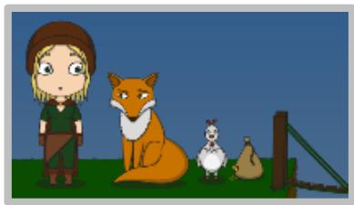


吃醋丈夫；火炬过桥；狐狸、鹅与豆袋难题；船夫与羊、狼和白菜问题

# 传教士和野蛮人的问题

◼ 状态 (M, C, B) 表示：M – 左岸的传教士的人数，C –左岸的野蛮人的人数，$\mathsf { B } = 1$ 表示小船在河的左岸

◼ 动作 (m, c) 表示：m – 小船上的传教士的人数，c –小船上的野蛮人的人数

前提条件：传教士的人数和野蛮人的人数满足题目中的约束

动作的效果：

$$
(\mathrm {M}, \mathrm {C}, 1) \rightarrow (m, c) \rightarrow (M - m, C - c, 0)
$$

$$
(\mathrm {M}, \mathrm {C}, 0) \rightarrow (m, c) \rightarrow (M + m, C + c, 1)
$$

# 对于K ≤ 3时的启发式函数

$h 1 ( n ) = M + C$ 的启发式函数是可采纳的吗?

不是，考虑状态 (1, 1, 1)时，

$$
h 1 (n) = 2, \text {但} h ^ {*} (n) = 1 <   2
$$

假设 $h ( n ) = M + C - 2 B$

单调性：

$$
(\mathrm {M}, \mathrm {C}, 1) \rightarrow (m, c) \rightarrow (M - m, C - c, 0)
$$

$$
h (n _ {1}) - h (n _ {2}) = m + c - 2 \leq K - 2 \leq 1
$$

$$
(\mathrm {M}, \mathrm {C}, 0) \to (m, c) \to (M + m, C + c, 1)
$$

$$
h (n _ {1}) - h (n _ {2}) = 2 - (m + c) \leq 1, s i n c e m + c \geq 1
$$

# 直接证明可采纳性

当 B = 1，

在最好的情形下,我们在最后一步把3个人送到河的右岸

在此之前，我们可以把三个人送到右岸，再由一个人把船摆

渡到左岸。因此，每次来回都只能渡2个人过河，

$\textstyle \sum _ { \Xi } ^ { \overline { { \operatorname { m } } } } \geq 2 \left| { \frac { M + C - 3 } { 2 } } \right| + 1 \geq M + C - 2 \uparrow { \overline { { \Xi } } } / \mathcal { J } / \mathsf { F }$

当 $\mathsf { B } = 0$

我们需要一个人将船摆渡到左岸，这样就形成了B = 1的情

形。现在我们需要把M + C + 1的人摆渡到右岸

因此，我们总共需要 $i \geq M + C + 1 - 2 + 1 = M + C \uparrow$ 动作

# 直接证明可采纳性

两者结合，得到：

$$
h (n) = \left\{ \begin{array}{l l} M + C - 2, B = 1 \\ M + C, & B = 0 \end{array} \right.
$$

• 综合即 $h ( n ) = M + C - 2 B$ 此时满足A*条件

# 练习

 令N=3, $K = 2 ,$ 利用A*算法求解该问题。

# 参考

 令N=3, $K = 2 ,$ 利用A*算法求解该问题。

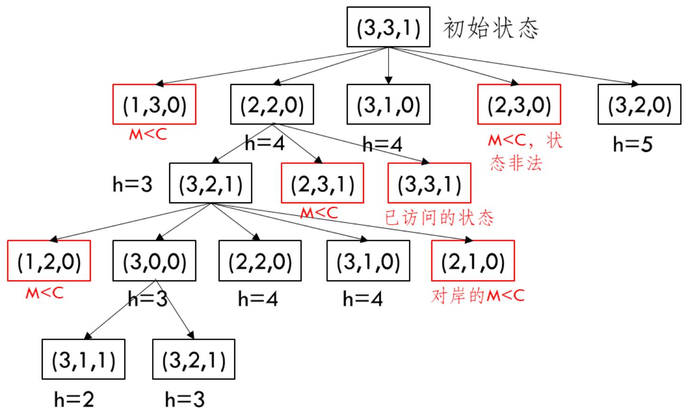


# 参考

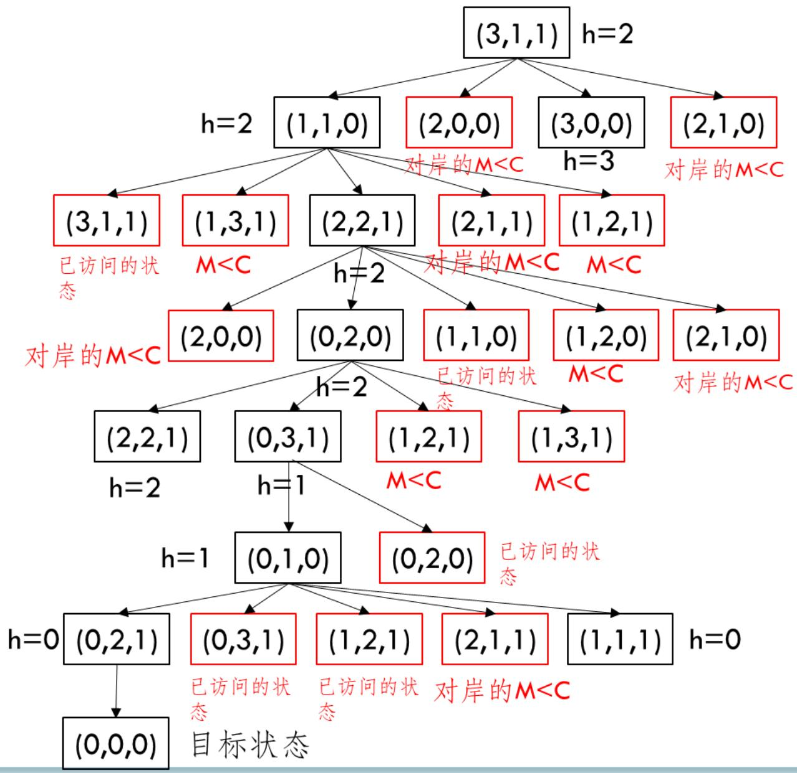


# 练习

 如果第一次选择状态时，选择从(3,1,0)，以及倒数第二次选择状态(1,1,1)，则会得到另外的不同路径（试一试）

 简化后的所有求解方法如下图所示：

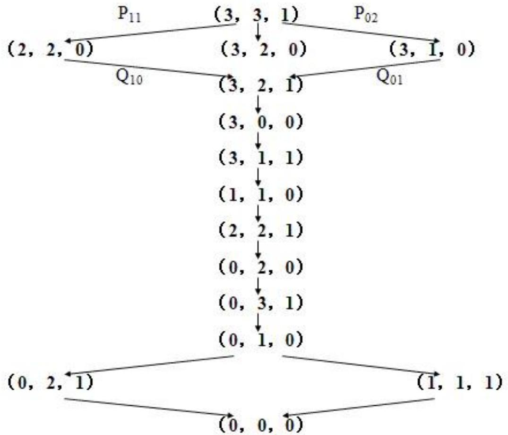


# 练习

#  游戏中的怪物追逐

• 游戏中，怪物试图靠近人发起 攻击应该沿着什么路径过来 遇到障碍物该怎么办？

– 怪物可以横向、纵向、斜向运动

假定小孩不动

– 如何找到最快接近的路线？

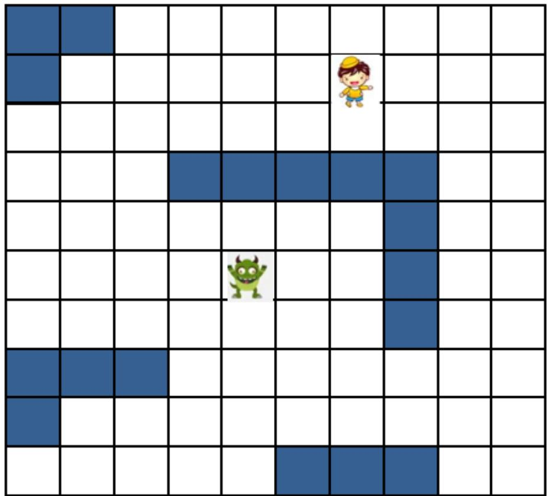


# 练习

#  游戏中的怪物追逐

. Step1： 状态空间和状态转移

– 直接用怪物位置作为状态

– 直接用坐标点作为转移动作


# 练习

#  游戏中的怪物追逐

• Step2： 设计A*启发函数

– 优化目标为步骤最短。

– 两点之间直线最短， 因此可以 设计启发函数为：怪物当前坐 标与小孩目标坐标的直线距离。

– 如图中(4,4)到(8,6)距离为4.47

– 显然，此时满足 $\mathtt { h } \left( \mathrm { n } \right) \leqslant \mathrm { h } * \left( \mathrm { n } \right)$

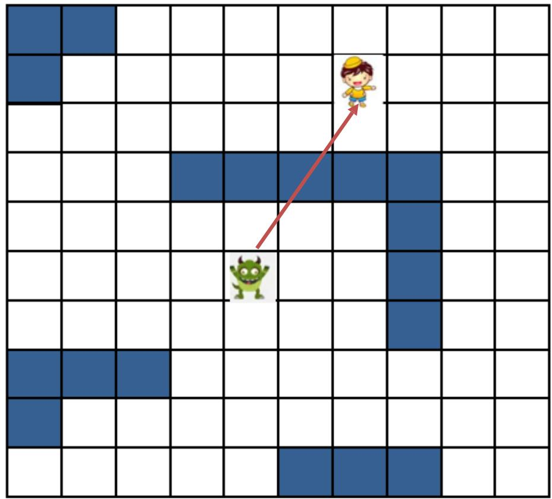


# 练习

#  游戏中的怪物追逐

Step3： 计算搜索过程

– 在0时刻，向8个方向行动1步，$\mathsf { g } = 1$

– 计算每种可能下的h值

– 选择最优情况前进。

– 最终路线如何？

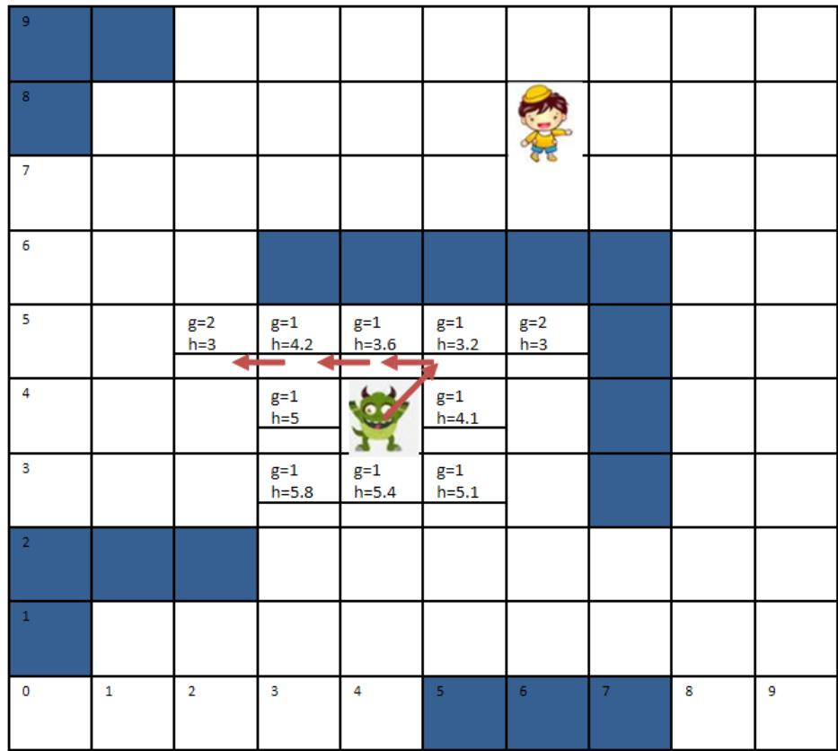


# A*搜索应用

•游戏AI

•导航路径

•资源分配

•机器人运动

•语言分析

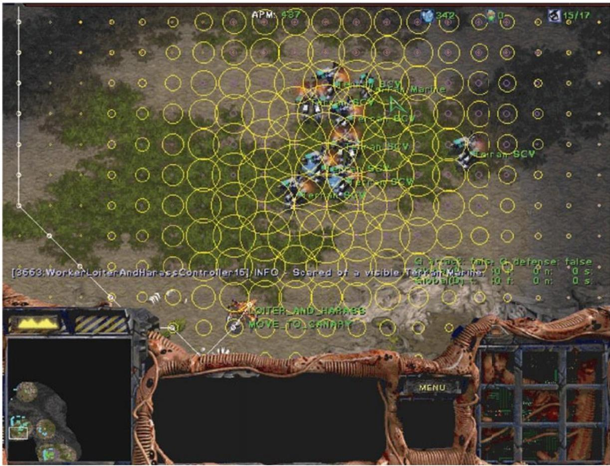


# 课堂练习

练习2 某探险队需绕过湖到达露营地，地图由方格组成（如右图所示），湖面为不可穿越的障碍区。探险队可向上下左右或对角线移动（水平和垂直移动成本为10，对角线为15）。使用A*算法测绘最终到达目的地的最近行走距离。（探险队、湖面、露营地分别为图中圆形、矩形、星形）

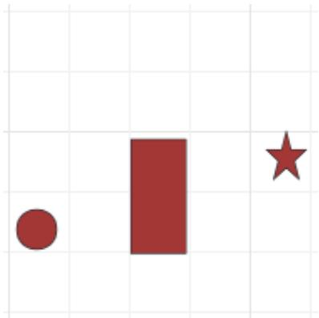


# 课堂练习

# 练习2 解：

• 选择启发式函数：考虑到可以对角线移动且代价比两次纵\横向移动更低，那么直接采用曼哈顿距离不能满足可采纳性。

• 根据问题可知，若不考虑湖面，则当前位置??到露营地的最优路径必然仅由一条斜线+一条直线组成，令：

$$
\begin{array}{l} a = \max \big (\left| x _ {g} - x _ {c u r r} \right|, \left| y _ {g} - y _ {c u r r} \right| \big) \\ b = \min (\left| x _ {g} - x _ {c u r r} \right|, \left| y _ {g} - y _ {c u r r} \right|) \\ h (n) := h (x _ {c u r r}, y _ {c u r r}) = 1 0 \times (a - b) + 1 5 \times b \\ \end{array}
$$

可采纳性：满足 $h ( n ) \leq h ^ { * } ( n )$

一致性：满足 $h ( n _ { 1 } ) \leq c ( n _ { 1 } , n _ { 2 } ) + h ( n _ { 2 } )$

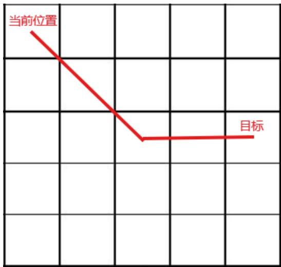


# 课堂练习

# 练习2 解：

搜索过程：设起点为(1, 2)，湖面覆盖区(3,2)和(3, 3)，露营地(5,3)。（花括号第一项为坐标，第二项为f=g+h）

<table><tr><td>步骤</td><td>当前坐标</td><td>Open表</td><td>Closed表</td><td>移动方向</td></tr><tr><td>0</td><td>-</td><td>[(1,2), f = 0 + 45]</td><td>空</td><td>-</td></tr><tr><td>1</td><td>[(1,2), 0+45]</td><td>[(2,1), 15+40], [(2,2), 10 + 35], [(2,3), 15+30], [(1,3), 10 + 40], [(1,1), 10 + 50]</td><td>[(1,2)]</td><td>右上</td></tr><tr><td>2</td><td>[(2,3), 15+30]</td><td>[(2,2), 25 + 35], [(2,4), 25 + 35], [(3,4), 30 + 25]</td><td>[(1,2), (2,3)]</td><td>右上</td></tr><tr><td>3</td><td>[(3,4), 30+25]</td><td>[(3,5), 40 + 30], [(4,5), 45 + 25], [(4,4), 40 + 15], [(4,3), 45 + 10]</td><td>[(1,2), (2,3), (3,4)]</td><td>右下</td></tr></table>

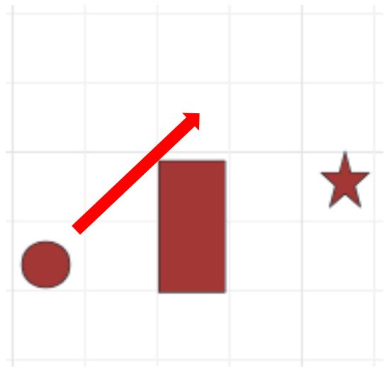


# 课堂练习

# 练习2 解：

搜索过程：设起点为(1, 2)，湖面覆盖区(3,2)和(3, 3)，露营地(5,3)。（限于篇幅有些明显更远的Open表项未列出来）

<table><tr><td>步骤</td><td>当前坐标</td><td>Open表</td><td>Closed表</td><td>移动方向</td></tr><tr><td>4</td><td>[(4,3), 45+10]</td><td>[(5,3), 55 + 0], [(4,4), 55 +15], [(4,2), 55 + 15], [(5,4), 60 +10], [(5,5), 60 + 10]</td><td>[(1,2), (2,3), (3,4), (4,3)]</td><td>右</td></tr><tr><td>5</td><td>[(5,3), 55+0]</td><td colspan="3">抵达露营地，算法结束</td></tr></table>

故最短路径为(1, 2)→(2, 3)→(3, 4)→(4, 3)→(5, 3)，总成本为55。当然从过程可以看出，在同时存在相同最小f值时，选择不同的移动方向也会得到其他路径

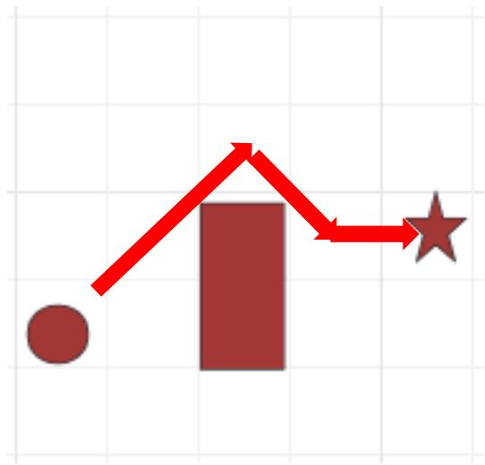


# A*搜索应用

/www.youtube.com/watch?v=2XjzjAfUSING PAC-MAN VISUAL THEME

ALGORITHMS SHOUN

BREADTH-FIRSTDEPTH-FIRSTHILL CLIMBING A-STAR

# A*搜索应用

Maze solver using $\mathsf { A } ^ { * }$ pathfinder algorithm

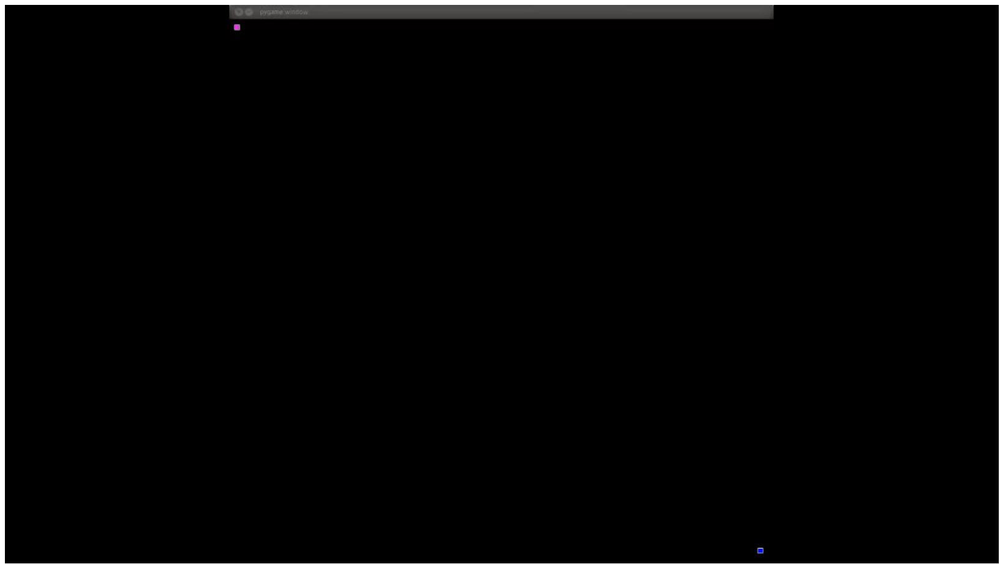


# A*搜索应用

# 语音词图中的启发式搜索

在统计语音识别过程中，计算机将用户的每个发音转化成若干可能的词，构成如下的词图（比如sense、sentence）。语音识别的任务就是要在这样的词图中寻找最有可能组成合理句子的组合。

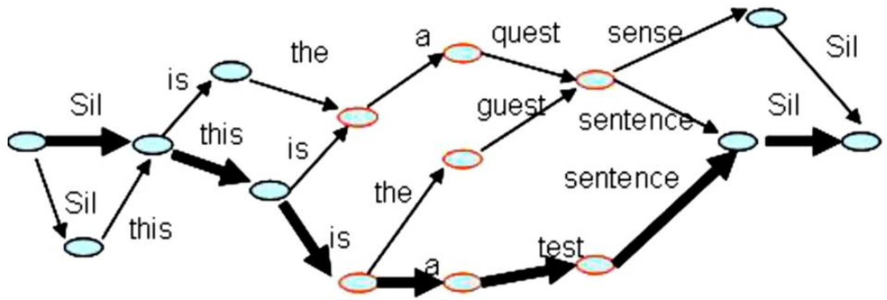


# A*搜索应用

# 机器翻译中的启发式搜索

源语言的若干可能的翻译形式需要通过拼接，形成最终的翻译译文。每一个外文词都有很多种翻译方法，所有翻译词形成一个状态空间，最佳译文就是在状态空间中找到一个最佳的搜索路线。

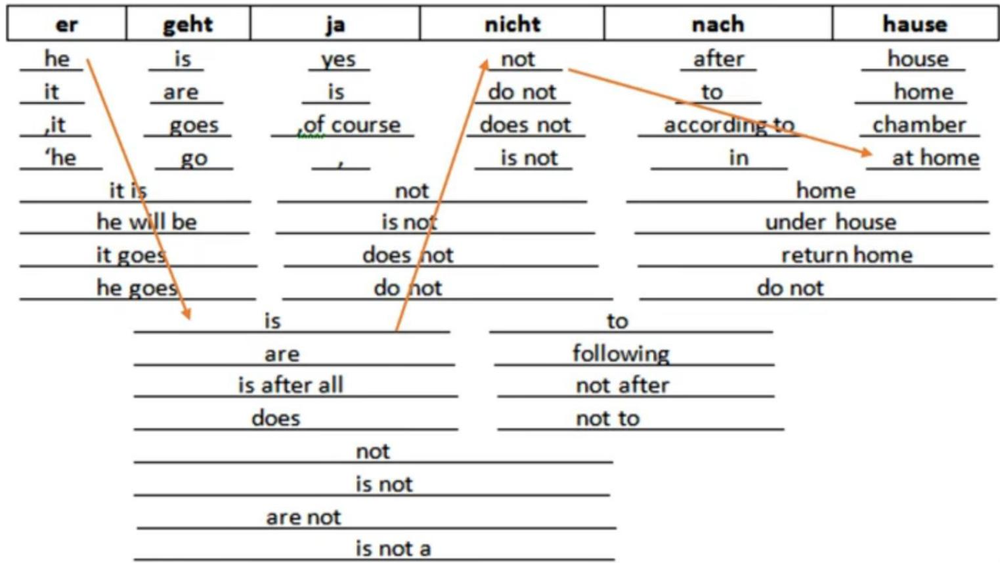


# 练习

• 利用带环检测的宽度优先搜索解决 $\ N = 3 , K = 2$ 的时候的传教士和野蛮人的问题

• 利用带环检测的A*搜索解决 ${ N } = 5 , { K } = 3$ 的时候的传教士和野蛮人的问题

# Thanks