# 人工智能：知识表示和推理 II-III

授课对象：计算机科学与技术专业 二年级

课程名称：人工智能（专业必修）

节选内容：第三章 知识表示和推理 II

课程学分：3学分

# 逻辑推理

# 逻辑推理

# 定义

• 逻辑推理指的是用蕴涵推导出结论

• 模型验证则是通过枚举所有可能的模型来验证在给定当前知识库（记作????）的前提下，结论都为真

如果推理算法??可以根据 $K B$ 导出结论 $\alpha$ ，则形式化地记为

$$
K B \vDash_ {i} \alpha
$$

只会导出蕴涵句的推理算法被称为可靠的或真值保持的

# 逻辑推理方法

# 演绎推理

Deductive Reasoning

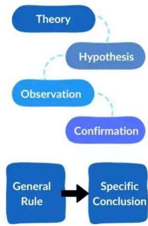

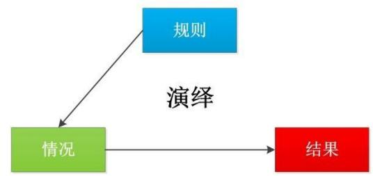

# 归纳推理

Inductive Reasoning

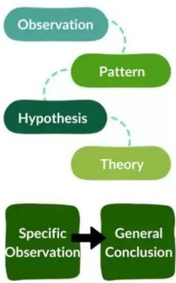

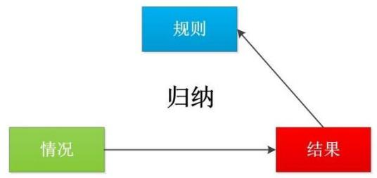

# 溯因推理

Abductive Reasoning

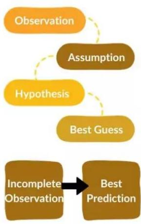

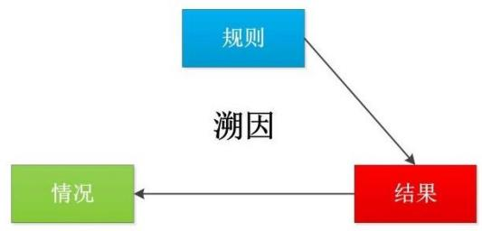

# 演绎推理

Deductive Reasoning

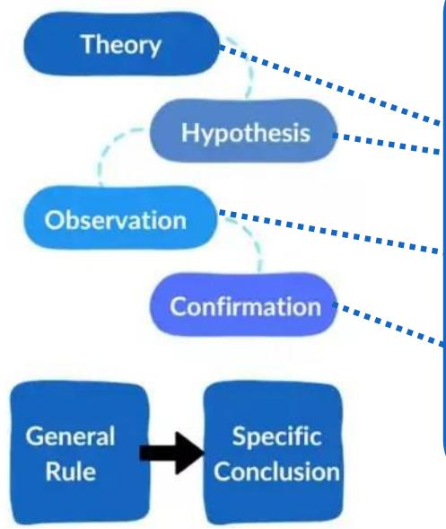

# 从一般推导出个别

# 三段论式 （三段论法）

① 足球运动员的身体都是强壮的 ； （ 大前提 ）

高波是一名足球运动员； （ 小前提 ）

③ 所以，高波的身体是强壮的。 （ 结 论 ）

# 演绎推理

# Example

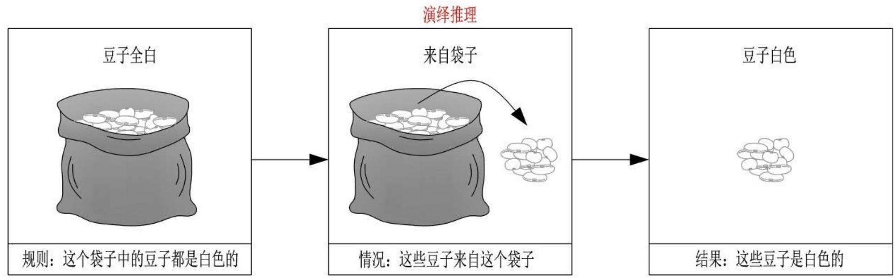

# 归纳推理

Inductive Reasoning

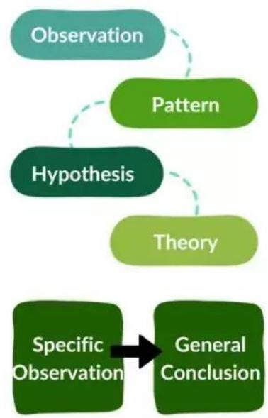

从个别推导出一般

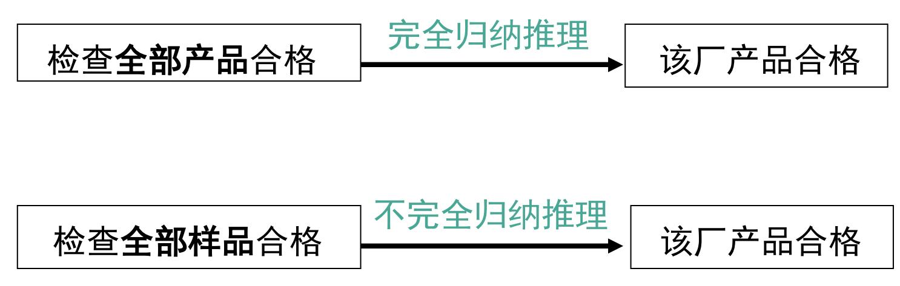

# 归纳推理

# Example

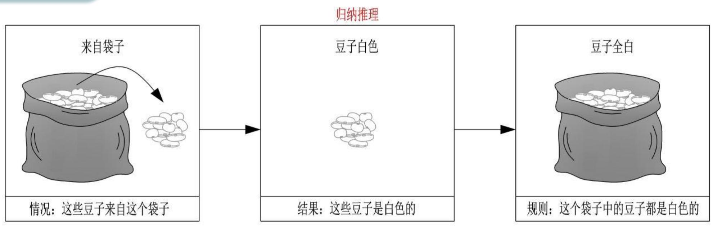

# 溯因推理

# Example

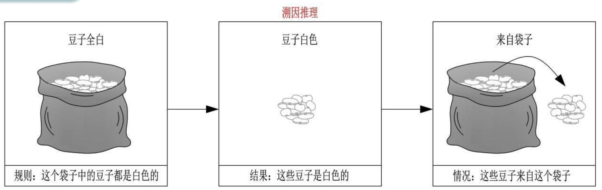

# 自然演绎推理

P规则、T规则、假言推理、拒取式推理

从一组已知为真的事实出发，运用经典逻辑的推理规则推出结论的过程。

# 假言推理

$$
\frac {P , P \rightarrow Q}{Q}
$$

“如果??是金属，则??能导电”,“铜是金属” 推出 “铜能导电”

# 拒取式推理

$$
\frac {P \rightarrow Q , \neg Q}{\neg P}
$$

“如果下雨，则地下就湿”, “地上不湿” 推出 “没有下雨”

# 自然演绎推理

# Example

# 已知事实：

（1）凡是容易的课程小王(wang)都喜欢；

（2）??班的课程都是容易的；

（3）ds是??班的一门课程。

求证：小王喜欢ds这门课程。

# Prove

# 1.定义谓词：

$E a s y ( x )$ ：??是容易的

$L i k e ( x , y )$ ： $x$ 喜欢??

$C ( x ) : x$ $x$ 是 $C$ 班的一门课程

# 2.已知事实和结论用谓词公式表示：

$$
(\forall x) \big (E a s y (x) \rightarrow L i k e (\mathrm {w a n g}, x) \big)
$$

$$
(\forall x) \big (C (x) \rightarrow E a s y (x) \big)
$$

$$
C (\mathrm {d s})
$$

$$
L i k e (w a n g, d s)
$$

# 自然演绎推理

# Prove

# 3.应用推理规则进行推理：

3.1. $( \forall x ) { \bigl ( } E a s y ( x ) \to L i k e ( W a n g , x ) { \bigr ) }$$E a s y ( z )  L i k e ( W a n g , z )$

全称实例化

3.2. ∀?? ?? ?? → ???????? ???? ?? → ???????? ??

全称实例化

3.3. ?? ???? , ?? ?? → ???????? ?????????? ????

假言推理

3.4. ???????? ???? , ???????? ?? → ???????? ????????, ??????????(????????, ????)

假言推理

# 自然演绎推理

# 优点

表达定理证明过程自然，易理解。

拥有丰富的推理规则，推理过程灵活。

便于嵌入领域启发式知识。

# 缺点

易产生组合爆炸，得到的中间结论一般呈指数形式递增

# 归结推理

# 归结演绎推理

# 反证法

$P  Q$ 当且仅当 $P \land \lnot Q  F a l s e$

即： $Q$ 为 $P$ 的逻辑推论，当且仅当 $P \land \lnot Q$ 是不可满足的

# 定理

??为??1 ， ??2 ，…， $P _ { n }$ 的逻辑推论，当且仅当 $( P _ { 1 } \land P _ { 2 } \land \cdots \land P _ { n } ) \land \lnot Q$ 是不可满足的

# 核心思路

证明 $P  Q$ 等价于证明语句 $F = ( P _ { 1 } \land P _ { 2 } \land \cdots \land P _ { n } ) \land \lnot Q$ 为假，转换为证明子句集$S = \{ P _ { 1 } , P _ { 2 } , \ldots , P _ { n } , \lnot Q \}$ 是不可满足的

# 什么是归结原理？

⚫ 在定理证明系统中，已知一个公式集 $F _ { 1 }$ ， $F _ { 2 }$ ，…， $F _ { n }$ ，要证明一个公式W (定理)是否成立，即要证明W是公式集的逻辑推论时，一种证明法就是要证明 $F _ { 1 }$ $F _ { 1 } \wedge F _ { 2 } \wedge \cdots \wedge F _ { n } \to \ W$ 为永真式。

反证法：证明 $F = F _ { 1 } \wedge F _ { 2 } \wedge \dots \wedge F _ { n } \wedge _ { 7 } ~ W$ 为永假，这等价于证明F对应的子句集S = {F1, F2,…, F, ┐W }为不可满足的。

# 归结演绎推理

# 文字

原子公式及其否定

$P$ ： 正文字

$\neg P$ ： 负文字

# 子句

任何文字的析取。某个文字本身也都是子句。

$$
P \lor \neg Q \mathrm {记 作} (P, \neg Q)
$$

空子句：不包含任何文字的子句，记作NIL

空子句是永假的，不可满足的。

# 子句集

由子句构成的集合（子句的合取）

$$
\begin{array}{r l} & {(P \lor \neg Q) \land (P \lor R) \text {记 作}} \\ & {\{(P, \neg Q), (P, R) \}} \end{array}
$$

# 归结演绎推理

# 归结式

对于任意两个子句 $C _ { 1 }$ 和 $C _ { 2 }$ ，若 $C _ { 1 }$ 中有一个文字 $L$ ，而 $C _ { 2 }$ 中有一个与L成互补的文字¬?? ，则分别从 $C _ { 1 }$ 和 $C _ { 2 }$ 中删去 $L$ 和¬?? ，并将其剩余部分组成新的析取式。

这个新的子句被称为 $C _ { 1 }$ 和 $C _ { 2 }$ 关于 $L$ 的归结式， $C _ { 1 }$ 和 $C _ { 2 }$ 则是该归结式的亲本子句

子句 $P$ 和 $\neg P$ 的归结式为空子句记作()、□或NIL

子句 $( W , R , Q )$ 和 $( \mathsf { W } , \mathsf { S } , \mathsf { \neg R } )$ 的归结式为 $( W , Q , S )$

# 定理

两个子句的归结式是这两个子句集的逻辑推论，如 $\{ ( P , C _ { 1 } ) , ( \neg P , C _ { 2 } ) \} \vdash ( C _ { 1 } , C _ { 2 } )$

# 归结式的定义与性质

# ⚫ 定定理

# 两个子句C1和C2的归结式C是C1和C2的逻辑推论

# Prove

证:设C1=L∨C1'， ${ \mathsf { C } } 2 { \mathsf { = } } { \mathsf { ( } } { \mathsf { \Lambda } } _ { \mathsf { 7 } } { \mathsf { \Lambda } } { \mathsf { L } } { \mathsf { ) } } { \mathsf { V } } { \mathsf { C } } 2 ^ { \mathsf { \prime } }$ 关于解释I为真，则需证明 $\complement =$$\mathsf { C } | ^ { \textsf { \tiny { I } } } \vee \mathsf { C } 2 ^ { \textsf { \tiny { I } } }$ 关于解释I也为真。

关于解释I，L和┐L二者中必有一个为假。若L为假，则C1'必为真，否则C1为假，这与前提假设矛盾，所以只能是C1'为真。

同理，若┐L为假，则C2'必为真。最后有 $\mathsf { C } { = } \mathsf { C } \mathsf { 1 } ^ { \prime } \mathsf { V } \mathsf { C } 2 ^ { \prime }$ 关于解释I为真，即C是C1和C2的逻辑推论。

# 归结式的定义与性质

由于子句集中子句之间是合取关系，因此只要有一个子句不可满足，则子句集就不可满足。

# ⚫ 推推论

子句集S={C1,C2，…,Cn}与子句集S1={C,C1,C2，…,Cn}的不可满足性是(其中C是C1和C2的归结式)。

# Prove

证:设S是不可满足的，则C1,C2，…,Cn中必有一为假，因而S1必为不可满足的。设S1是不可满足的，则对于不满足S1的任一解释I，可能有两种情况:

(1)I使C为真，则C1,C2，…,Cn中必有一子句为假，因而S是不可满足的。

(2)I使C为假，则根据定理有归结式 $\complement ^ { = }$ (C1,C2)为假，即I或使C1为假，或使C2为假，因而S也是不可满足的。

由此可见S和S1的不可满足性是等价的。

# 归结式的定义与性质

# 推论

同理可证Si和 $\$ 1+1$ (由Si导出的扩大的子句集)的不可满足性也是等价的，其中i=1，2，…。

归结原理就是从子句集S出发，应用归结推理规则导出子句集S1。再从S1出发导出S2，依此类推，直到某一个子句集Sn出现空子句为止。

根据不可满足性等价原理，已知若Sn为不可满足的，则可逆向依次推得S必为不可满足的。

用归结法，过程比较单钝，只涉及归结推理规则的应用问题，因而便于实现机器证明。

# 归结推导

⚫ 从一个子句集S（如KB）推导出一个子句C的过程中会产生一系列子句C1, C2, …, Cn，其中 $\mathtt { C n } = \mathtt { C }$ ，且对于Ci (i = 1, 2, …, n-1)均有：

 Ci ∈ S

 或者Ci是推导过程中产生的某两个子句的归结式

⚫ 从S推导出C记为：S ├ C

# 归结推导的合理性

定理：如果S ├ C，那么S ╞ C

# Prove

证:令S推导出C产生的子句序列为C1, C2, …, Cn。

通过数学归纳法证明对于 $\mathsf { i } \in [ 1 , ~ \mathsf { n } ]$ ， ${ \mathsf { S } } \models { \mathsf { C } } { \mathsf { i } }$ 均成立

反之，若 ${ \mathsf { S } } \models { \mathsf { C } }$ ，则从S中不一定能够推导出C。

# 归结推导的合理性和完备性

定理：S ├ ()，当且仅当S ╞ ()，当且仅当S不可满足

由前文可知，KB ╞ α，当且仅当KB ∧ ┐α不可满足。结合上述定理，我们通过下述过程来判断KB ╞ α是否成立：

 记KB ∧ ┐α的子句集为S

 判断S ├ ()是否成立，即从S中能否推导出空子句

# 归结演绎推理

由于子句集中子句之间是合取关系，因此只要有一个子句不可满足，则子句集就不可满足。

# 鲁宾逊归结原理

检查子句集??中是否包含空子句，若包含，则??不可满足。

若不包含，则在??中选择合适的子句进行归结，一旦归结出空子句，就说明??是不可满足的。

# 命题逻辑的归结推理

# 命题逻辑的归结推理

# 归结推理过程

命题逻辑中，若给定前提集??和命题 $P$ ，则归结证明过程可归纳如下：

1.把??转化成子句集表示，得到子句集 $S _ { 0 }$

2.把命题 $P$ 的否定式 $\cdot$ 也转化成子句集表示，并将其加到 $S _ { 0 }$ 中，得 $S = S _ { 0 } \cup S _ { \lnot P }$

3.对子句集??反复应用归结推理规则（推导），直至导出含有空子句的扩大子句集为止。即出现归结式为空子句时，表明已找到矛盾，证明过程结束

# Example

设已知前提集为:

(1) ??

(2) $( P \land Q ) \to R$

(3) ?? ∨ ?? → ??

(4) ??

求证 $R$

# Prove.

1.化成子句集： $S = \{ P , \lnot P \lor \lnot Q \lor R , \lnot S \lor$$Q , \neg T \lor Q , T , \neg R \}$

2.归结可用图的演绎树表示，由于根部出现空子句，因此命题??得证

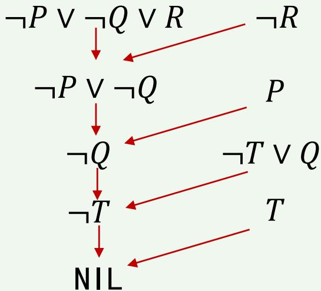

# 命题逻辑的归结原理和过程

# Practice

# KB

FirstGrade

FirstGrade $\mathrm { . > }$ Child

Child ^ Male $\mathord { - } >$ Boy

Kindergarten $\mathrm { . > }$ Child

Child ^ Female $\mathord { - } >$ Girl

Female

# Show that KB |= Girl

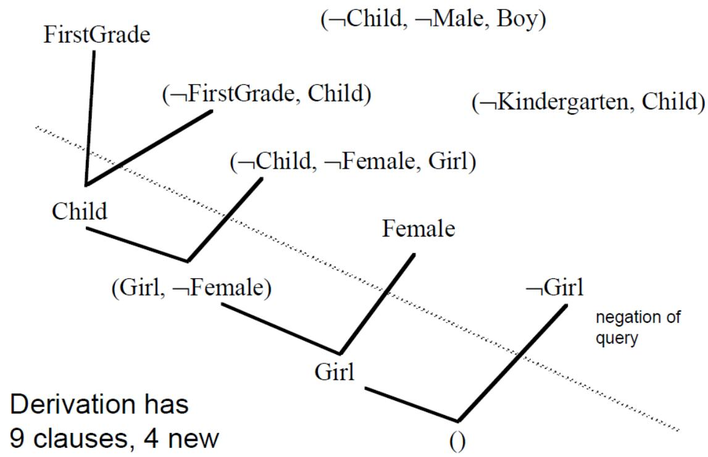

# 谓词逻辑的归结推理

# 谓词逻辑的归结原理和过程

⚫ 在谓词逻辑中，由于子句中含有变元，所以不能像命题逻辑那样直接消去互补文字，而需要先对变元进行代换，然后才能进行归结。

例如,设有两个子句

$$
C 1 = P (x) \vee Q (x), \quad C 2 = - P (a) \vee R (y)
$$

由于P $\left( \mathbf { x } \right)$ 与P(a)不同，所以C1与C2不能直接进行归结。但是若引入替换σ={a/x}对两个子句分别进行代换：

$$
\mathrm {C} 1 \sigma = \mathrm {P} (\mathrm {a}) \vee \mathrm {Q} (\mathrm {a}), \quad \mathrm {C} 2 \sigma = - \mathrm {P} (\mathrm {a}) \vee \mathrm {R} (\mathrm {y})
$$

就可对它们进行归结，得到归结式：

$$
Q (a) \vee R (y)
$$

# 谓词逻辑的归结推理

# 归结过程

在谓词逻辑中应用归结法时，需要：

1.将所有谓词公式（包括知识库KB和查询α）化为子句集

2.通过合一，对含有变量的子句进行归结

$$
\begin{array}{c} C _ {1} = \boxed {P (x) \vee Q (x)} \\ C _ {2} = \boxed {\neg P (\mathsf {a}) \vee R (y)} \end{array}
$$

# 合一

在谓词逻辑的归结过程中，寻找项之间合适的变量置换使表达式一致，这个过程称为合一。

用 $\sigma = \{ t _ { 1 } / \mathrm { v } _ { 1 } , t _ { 2 } / \mathrm { v } _ { 2 } , \ldots , t _ { n } / \mathrm { v } _ { n } \}$ 来表示任一置换。用 $\sigma$ 对表达式（语句） $S$ 作置换后的例简记为 $S \sigma$ 。

可以对表达式多次置换：

如用??和 $\sigma$ 依次对??进行置换，记为 ???? ??。

其结果等价于先将这两个置换合成（组合）

为一个置换，即 $\theta \sigma$ ，再用合成置换对??进行置换，即??(????)

# 置换与合一：置换

# 合一（Unify） ■

在谓词逻辑的归结过程中，寻找项之间合适的变量置换使表达式一致，这个过程称为合一 。

置换/代换是形如 $\{ t _ { 1 } / v _ { 1 } , t _ { 2 } / v _ { 2 } , \ldots , t _ { n } / v _ { n } \}$ 的有限集合，其中

$\{ v _ { 1 } , v _ { 2 } , \ldots , v _ { n } \}$ 是互不相同的变量

$\{ \mathbf { t } _ { 1 } , \mathbf { t } _ { 2 } , \ldots , \mathbf { t } _ { n } \}$ 是项（常量、变量或函数）

• $\pmb { t } _ { i } / v _ { i }$ 表示用 $\mathbf { t } _ { i }$ 置换 $v _ { i }$ ，不允许????和 $v _ { i }$ 相同，不允许用与 $v _ { i }$ 有关的项 $t _ { i }$ （但是 $t _ { i }$中可以包含其它变量），也不允许变量 $v _ { i }$ 循环出现在另一个????中

为了便于理解，后续记 $\mathbf { \sigma } \bullet = \{ v _ { 1 } = t _ { 1 } $ , ???? = ????,…, $v _ { n } = t _ { n } \}$ 。用 $\pmb { \sigma }$ 对表达式E作置换后的例简记为Eσ 。

# 置换与合一：置换

{a/x, f(b)/y, w/z}是置换

{g(y)/x, f(x)/y}不是置换

$\{ \mathrm { g ( a ) / x , f ( x ) / y } \}$ 是置换

$\{ \mathrm { g ( x ) / x , f ( y ) / y } \}$ 不是置换

规则: IF father(x,y) and man(y) THEN son(y,x)

事实: father(李四，李小四) and man(李小四)

$$
\mathrm {F} = \text {f a t h e r} (\mathrm {x}, \mathrm {y}) \wedge \text {m a n} (\mathrm {y})
$$

$$
\theta = \{\text {李 四} / \mathrm {x}, \text {李 小 四} / \mathrm {y} \}
$$

$$
\mathrm {F} \theta = \text {f a t h e r} (\text {李 四 ， 李 小 四}) \wedge \text {m a n} (\text {李 小 四})
$$

结论: son(李小四,李四)

# 置换与合一：置换

# Example

例 表达式P[x,f(y)，B]，对应于不同的变换si，可得到不同的例:

置换

置换的例

$$
\begin{array}{l} s 1 = \left\{z / x, w / y \right\}, \quad P [ x, f (y), B ] s 1 = P [ z, f (w), B ] \\ s 2 = \{A / y \}, \quad P [ x, f (y), B ] s 2 = P [ x, f (A), B ] \\ s 3 = \left\{g (z) / x, A / y \right\}, \quad P [ x, f (y), B ] s 3 = P [ g (z), f (A), B ] \\ s 4 = \{C / x, A / y \}, \quad P [ x, f (y), B ] s 4 = P [ C, f (A), B ] \\ \end{array}
$$

第一个例叫做原始文字的初等变式，实际上置换后只是对变量作了换名。第四个例称作基例，即置换后项中不再含有变量。

# 置换与合一：置换

例如， $P ( x , g ( y , z ) ) \{ x = y , y = f ( \mathrm { a } ) \} \Rightarrow P ( y , g ( f ( \mathrm { a } ) , z ) )$

注意：置换是同时进行的，而不是先后进行的。

可以对表达式多次置换，如用θ和σ依次对E进行置换，记为(Eθ)σ 。其结果等价于先将这两个置换合成（组合）为一个置换，即θσ，再用合成置换对E进行置换，即E(θσ)。

# 置换与合一：置换

定义 设 $\mathrm { \bf \{ { t } _ { 1 } / x _ { 1 } , t _ { 2 } / x _ { 2 } , . . . , t _ { n } / x _ { n } \} , } \lambda = \{ \mathrm { \bf { u } _ { 1 } / y _ { 1 } , \mathrm { \bf { u } _ { 2 } / y _ { 2 } , . . . , \mathrm { \bf { u } _ { n } } } }$ /ym}

是两个置换，则这两个置换的复合也是一个置换，它是从

$$
\left\{\mathbf {t} _ {1} \lambda / \mathbf {x} _ {1}, \mathbf {t} _ {2} \lambda / \mathbf {x} _ {2}, \dots , \mathbf {t} _ {n} \lambda / \mathbf {x} _ {n}, \mathbf {u} _ {1} / \mathbf {y} _ {1}, \mathbf {u} _ {2} / \mathbf {y} _ {2}, \dots , \mathbf {u} _ {m} / \mathbf {y} _ {m} \right\}
$$

中删去如下两种元素：

$$
t _ {i} \lambda / x _ {i} \quad \text {当} t _ {i} \lambda = x _ {i}
$$

$$
\mathbf {u} _ {\mathrm {i}} / \mathbf {y} _ {\mathrm {i}} \quad \text {当} \mathbf {y} _ {\mathrm {i}} \in \left\{\mathbf {x} _ {1}, \mathbf {x} _ {2}, \dots , \mathbf {x} _ {\mathrm {n}} \right\}
$$

后剩下的元素所构成的集合，记为 ${ \bf 0 } ^ { \circ } \lambda$ 。

注： tiλ表示对ti运用λ进行置换。

${ \bf 0 } ^ { \circ } \lambda$ 就是对一个公式F先运用θ进行置换，然后再运用λ进行置换： $\operatorname { F } ( \mathbf { \boldsymbol { \theta } } ^ { \circ } \lambda ) = \left( \operatorname { F } \mathbf { \boldsymbol { \theta } } \right) \lambda$

# 谓词逻辑的归结推理

# 归结过程

在谓词逻辑中应用归结法时，需要：

1.将所有谓词公式（包括知识库KB和查询α）化为子句集

2.通过合一，对含有变量的子句进行归结

$$
\begin{array}{c} C _ {1} = \boxed {P (x) \vee Q (x)} \\ C _ {2} = \boxed {- P (a) \vee R (y)} \end{array}
$$

# 合成置换

令 $\theta = \{ f ( y ) / x , z / y \} , \sigma = \{ a / \mathrm { x } , b / \mathrm { y } , y / z \}$

步骤1： $\theta \sigma = \{ f ( \mathrm { b } ) / x , \qquad , a / \ , b / \ , y / z \}$

步骤2：删除 $a / \mathbf { x }$ 和 $b / \mathrm { y }$

步骤3：删除 $y / y$

$$
\theta \sigma = \{f (b) / x, y / z \}
$$

# 可以对表达式多次置换：

如用??和 $\sigma$ 依次对??进行置换，记为 ???? ??。

其结果等价于先将这两个置换合成（组合）

为一个置换，即 $\theta \sigma$ ，再用合成置换对??进行置换，即??(????)

# 置换与合一：公式集的合一

定义：设有公式集 $\mathrm { F = } \{ \mathrm { F } _ { 1 } , \mathrm { F } _ { 2 } , . . . , \mathrm { F } _ { \mathrm { n } } \}$ ，若存在一个置换λ使得

$$
\mathrm {F} _ {1} \lambda = \mathrm {F} _ {2} \lambda = \dots = \mathrm {F} _ {\mathrm {n}} \lambda
$$

则称λ为公式集F的一个合一，且称 $\mathrm { F _ { 1 } , F _ { 2 } , . . . , F _ { n } }$ 是可合一的。

例如，设有公式集

$$
\mathbf {F} = \{\mathbf {P} (\mathbf {x}, \mathbf {y}, \mathbf {f} (\mathbf {y})), \mathbf {P} (\mathbf {a}, \mathbf {g} (\mathbf {x}), \mathbf {z}) \}
$$

则下式是它的一个合一：

$$
\lambda = \{\mathbf {a} / \mathbf {x}, \mathbf {g} (\mathbf {a}) / \mathbf {y}, \mathbf {f} (\mathbf {g} (\mathbf {a})) / \mathbf {z} \}
$$

一个公式集的合一一般不唯一。

# 置换与合一：最一般合一

定义：设σ是公式集F的一个合一，如果对任一个合一θ都存在一个置换λ，使得θ=σ°λ

则称σ是一个最一般合一 （MGU） 。

（1）置换过程是一个用项代替变元的过程，因此是一个从一般到特殊的过程。

（2）最一般合一是唯一的。

# Example

$P ( f ( x ) , z )$ and $P ( y , a )$

$\sigma = \{ y = f ( a ) , x = a , z = a \}$  is a unifier, but not an MGU

· $\theta = \{ y = f ( x ) , z = a \}$ is an MGU

· $\sigma = \theta \lambda$ ，where $\lambda = \{ x = a \}$

# 置换与合一：最一般合一

差异集：两个公式中相同位置处不同符号的集合。

例： $\mathsf { F } = \{ \mathsf { P } \left( \mathsf { x } , \mathsf { y } , \mathsf { z } \right)$ , $\mathsf { P } \left( \mathsf { x } , \mathsf { f } \left( \mathsf { a } \right) , \mathsf { h } \left( \mathsf { b } \right) \right) \big \}$ ，则 ${ \sf D } 1 = \{ { \sf y } , { \sf f } \left( { \sf a } \right) \}$ , $\mathsf { D } 2 \mathrm { = } \left\{ \mathsf { z } , \mathsf { h } \left( \mathsf { b } \right) \right\}$ 是差异集。

# 求取最一般合一的算法：

令 $\mathtt { k } { = } 0$ , $F _ { k } = F$ , $\sigma _ { \kappa } \equiv \varepsilon$ 。ε是空置换。

2. 若 $\mathsf { F } _ { \mathsf { k } }$ 只含一个表达式，则算法停止， $\sigma _ { \kappa }$ 就是最一般合一。

3. 找出 $\mathsf { F } _ { \mathsf { k } }$ 的差异集 $\mathsf { D } _ { \mathsf { k } }$ 。

4. 若 $\mathtt { D } _ { \mathtt { k } }$ 中存在元素 ${ \sf x } _ { \sf k }$ 和 $\ t _ { \kappa }$ ，其中 ${ \sf x } _ { \sf k }$ 是变元， $\ t _ { \kappa }$ 是项，且 $. \mathsf { x } _ { \mathsf { k } }$ 不在 $\ddagger _ { \mathrm { k } }$ 中出现，则置：

$$
\begin{array}{l} F _ {k + 1} = F _ {k} \left\{t _ {k} / x _ {k} \right\} \\ \sigma_ {k + 1} = \sigma_ {k} ^ {\circ} \left\{t _ {k} / x _ {k} \right\} \\ k = k + 1 \\ \end{array}
$$

然后转(2)。若不存在这样的 ${ \sf x } _ { \sf k }$ 和tk则算法停止。

5. 算法终止，F的最一般合一不存在。

# 置换与合一：最一般合一

例如，设 $F { = } \left\{ \mathsf { P } \left( \mathbf { a } , \mathbf { x } , \mathsf { f } \left( \mathbf { g } \left( \mathsf { y } \right) \right) \right) , \mathsf { P } \left( \mathbf { z } , \mathsf { f } \left( \mathbf { z } \right) , \mathsf { f } \left( \mathbf { \dot { u } } \right) \right) \right\}$

求其最一般合一。

令 $F _ { 0 } = F$ , $\sigma _ { 0 } \equiv \varepsilon$ 。 $\mathsf { F } _ { 0 }$ 中有两个表达式，所以 $\sigma _ { 0 }$ 不是最一般合一。

2. 差异集： $\cdot$ 。代换： {a/z}

$$
\begin{array}{l} F _ {1} = F _ {0} \left\{a / z \right\} = \left\{P (a, x, f (g (y))), P (a, f (a), f (u)) \right\} \\ \sigma_ {1} = \sigma_ {0} ^ {\circ} \quad \{a / z \} = \{a / z \} \\ \end{array}
$$

3. $\sf { D } _ { 1 } \mathrm { = } \{ { x , f ( a ) } \}$ 。代换： $\{ \boldsymbol { \mathsf { f } } \left( \mathsf { a } \right) / \mathsf { x } \}$

$$
\begin{array}{l} F _ {2} = F _ {1} \left\{f (a) / x \right\} = \left\{P (a, f (a), f (g (y))), P (a, f (a), f (u)) \right\} \\ \sigma_ {2} = \sigma_ {1} ^ {\circ} \quad \left\{f (a) / x \right\} = \left\{a / z, f (a) / x \right\} \\ \end{array}
$$

$\mathsf { D } _ { 2 } \mathbf { = } \left\{ \mathbf { g } \left( \mathsf { y } \right) , \mathsf { u } \right\}$ 。代换： $\{ \mathfrak { g } \left( \mathfrak { y } \right) / \mathfrak { u } \}$

$$
\begin{array}{l} F _ {3} = F _ {2} \left\{g (y) / u \right\} = \left\{P (a, f (a), f (g (y))) , P (a, f (a), f (g (y))) \right\} 。 \\ \sigma_ {3} = \sigma_ {2} ^ {\circ} \quad \left\{\mathrm {g} (\mathrm {y}) / \mathrm {u} \right\} = \left\{\mathrm {a} / \mathrm {z}, \mathrm {f} (\mathrm {a}) / \mathrm {x}, \mathrm {g} (\mathrm {y}) / \mathrm {u} \right\} \\ \end{array}
$$

# 谓词逻辑的归结推理

# 合一项/置换

对于两个语句 $f$ 和 $g$ ，合一项是使得语句??和 $g$ 等价的一个置换 $\sigma$

# 最一般合一项

两个语句 $f$ 和 $g$ 的最一般合一项 $\sigma$ 满足

$\sigma$ 是 $f$ 和 $g$ 的一个合一项

对于 $f$ 和 $g$ 的任意其它合一项 $\theta$ ，存在一个替换??使得 $\theta = \sigma \lambda$

# 求最一般合一项

给定两个语句??和 $g$ ，

1.初始化： $\sigma = \{ \}$ , $S = \{ f , g \}$

2.如果??包含相同的语句，那么停止算法：当前的置换 $\sigma$ 为语句 $f$ 和 $g$ 的最一般合一项

3.否则，找出??的差异集 $D = \{ e _ { 1 } , e _ { 2 } \}$ ：

3.1. 若 $e _ { 1 } = v$ 是一个变量且 $e _ { 2 } = { \mathfrak { t } }$ 是一个不包含 $v$ 的项，那么令 $\sigma = \sigma \{ \mathfrak { t } / v \}$ , $S { = } S \sigma$ 。返回步骤 2

3.2. 否则，停止算法：语句 $f$ 和 $g$ 不可合一

# 置换与合一

定义 若子句C含有可合一的文字，则在进行归结之前应先对这些文字进行合一。

$$
C 1 = P (x) \vee P (f (a)) \vee Q (x),
$$

$$
C _ {2} = \neg P (y) V R (b)
$$

$$
\sigma = \left\{f (a) / x \right\}
$$

$$
\mathsf {C} _ {1} \sigma = \mathsf {P} (\mathsf {f} (\mathsf {a})) \quad \mathsf {V} \quad \mathsf {Q} (\mathsf {f} (\mathsf {a}))
$$

$$
\sigma^ {\prime} = \left\{f (a) / y \right\}
$$

$$
\mathrm {C} _ {2} \sigma^ {\prime} = \neg P (\mathrm {f} (\mathrm {a})) \vee R (\mathrm {b})
$$

$$
C _ {1 2} = Q (f (a)) V R (b)
$$

# 置换与合一

# Example

设： $\mathsf { C } _ { 1 } \mathsf { = P } \left( \mathsf { a } \right) \mathsf { V } \mathsf { \mathrm { - } } \mathsf { \pmb { 0 } } \left( \mathsf { x } \right) \mathsf { V } \mathsf { R } \left( \mathsf { x } \right)$ , $\complement 2 \neg \mathsf { P } \left( \mathsf { y } \right) \lor \emptyset \left( \mathsf { b } \right)$

若选 $\bot _ { 1 } = \mathsf { P } ( \mathsf { a } )$ , $\mathsf { L } _ { 2 } \mathsf { = \mathrm { \lnot P \left( y \right) } }$ ，则有： $\mathsf { L } _ { 1 } \mathsf { = P } \left( \mathsf { a } \right)$ , ¬L2=P(y)， $\sigma = \{ \mathsf { a } / \mathsf { y } \}$ 就是L1与¬L2的最一般合一。可得：

$$
\begin{array}{l} \mathbf {C} _ {1 2} \quad = - \mathbf {Q} (\mathbf {x}) \vee R (\mathbf {x}) \vee \mathbf {Q} (\mathbf {b}) \\ = \left(\mathsf {C} _ {1} \sigma - \{\mathsf {L} _ {1} \sigma \}\right) \cup \left(\mathsf {C} _ {2} \sigma - \{\mathsf {L} _ {2} \sigma \}\right) \\ \end{array}
$$

定义 设C1与 $\mathsf { C } _ { 2 }$ 是两个没有相同变元的子句，L1和L2分别是C1和 $\mathsf { C } _ { 2 }$ 中的文字。若σ是L1和¬L2的最一般合一，则称

$$
\mathbf {C} _ {1 2} = \left(\mathbf {C} _ {1} \sigma - \left\{\mathbf {L} _ {1} \sigma \right\}\right) \cup \left(\mathbf {C} _ {2} \sigma - \left\{\mathbf {L} _ {2} \sigma \right\}\right)
$$

为 ${ \sf C } _ { 1 }$ 和 $\mathsf { C } _ { 2 }$ 的二元归结式，L1和L2称为归结式上的文字。

# 置换与合一

⚫ 定义 子句 $\mathrm { C } _ { 1 }$ 和 $\mathrm { C } _ { 2 }$ 的归结式是下列二元归结式之一：

1. $\mathrm { C } _ { 1 }$ 与 $\mathbf { C } _ { 2 }$ 的二元归结式；

2. $\mathrm { C } _ { 1 }$ 与C2的因子 $\mathbf { \cdot C } _ { 2 } \mathbf { \sigma } _ { 2 }$ 的二元归结式；

3. C1的因子 $\mathbf { \cdot C } _ { 1 } \mathbf { \sigma } _ { 1 }$ 与C2的二元归结式；

4. C1的因子 $\mathbf { \cdot C } _ { 1 } \mathbf { \sigma } _ { 1 }$ 与C2的因子 $\mathbf { \cdot C } _ { 2 } \mathbf { \sigma } _ { 2 }$ 的二元归结式。

⚫ 对于一阶谓词逻辑归结原理也是完备的。即，若子句集S不可满足，则必然存在一个从S到空子句的归结演绎；若存在一个从S到空子句的归结演绎，则S一定是不可满足的。

# 回顾归结原理和过程

From the two clauses $\{ \rho _ { 1 } \} \cup c _ { 1 }$  and $\{ \neg \rho _ { 2 } \} \cup c _ { 2 }$ , where there existsa MGU $\sigma$ for $\rho _ { 1 }$ and $\rho _ { 2 }$ , infer the clause $( c _ { 1 } \cup c _ { 2 } ) \sigma$

Theorem. $S \vdash ( )$  iff $S$  is unsatisfiable

# 归结语言：

$( P ( x ) , Q ( g ( x ) ) )$

$( R ( a ) , Q ( z ) , \neg P ( a ) )$

3. R[1a,2c]{X=a} (Q(g(a)),R(a),Q(z))

"R” means resolution step.

“1a” means the 1st (a-th) literal in the first clause: $P ( x )$

. "2c" means the 3rd (c-th)literal in the second clause: $\neg P ( a )$

● 1a and 2c are the“clashing" literals.

$\{ X = a \}$  is the MGU applied.

# 谓词逻辑的归结推理

# Example

# 谓词公式化为子句集的步骤

# 1.消去蕴涵和等价符号

$$
\forall x (\neg \forall y P (x, y)) \vee \neg \forall y (\neg Q (x, y) \vee R (x, y))
$$

$$
P \to Q \iff \neg P \lor Q
$$

$$
P \leftrightarrow Q \Leftrightarrow (P \land Q) \lor (\neg P \land \neg Q)
$$

$$
\forall x \big (\forall y P (x, y) \big) \rightarrow \neg \forall y (Q (x, y) \rightarrow R (x, y))
$$

# 2.内移否定符号¬，将其移到紧靠谓词的位置上

$$
\forall x \left(\exists y \neg P (x, y)\right) \vee \exists y \left(Q (x, y) \wedge \neg R (x, y)\right)
$$

双重否定律 $\lnot ( \lnot P ) \Leftrightarrow P$

德摩根律 $\neg ( P \land Q ) \Leftrightarrow \neg P \lor \neg Q$

$$
\neg (P \lor Q) \Leftrightarrow \neg P \land \neg Q
$$

量词转换律 $\lnot \exists x P \Leftrightarrow \forall x \lnot P$

$$
\neg \forall x P \Leftrightarrow \exists x \neg P
$$

# 谓词逻辑的归结推理

# Example

# 谓词公式化为子句集的步骤

3.变量标准化，对变量作必要的换名，使每一量词只约束一个唯一的变量名

$$
\exists x P (x) \equiv \exists y P (y), \quad \forall x P (x) \equiv \forall y P (y)
$$

$$
\forall x (\exists y \neg P (x, y) \vee \exists z (Q (x, z) \wedge \neg R (x, z)))
$$

4.消去存在量词 （Skolemize）。对于待消去的存在量词，若不在任何全称量词辖域之内，则用Skolem常量替代公式中存在量词约束的变量；若受全称量词约束，则要用Skolem函数替代存在量词约束的变量，然后就可消去存在量词。

$$
\forall x (\exists y \neg P (x, y) \vee \exists y (Q (x, y) \wedge \neg R (x, y)))
$$

# Skolemize

对于一般情况

$$
\forall x _ {1} \forall x _ {2} \ldots \forall x _ {n} \exists y P (x _ {1}, x _ {2}, \ldots , x _ {n}, y)
$$

存在量词??的Skolem函数为

$$
y = f (x _ {1}, x _ {2}, \dots , x _ {n})
$$

a.存在量词不出现在全称量词的辖域内，则只要用一个新的个体常量替换受该量词约束的变元。

谓词逻辑的归结推理b.存在量词位于一个或者多个全称量词的辖域内，此时要用Skolem函数f(x1,x2,…,xn)替换受该存在量词约束的变元。

# 谓词公式化为子句集的步骤

4.消去存在量词 （Skolemize）。对于待消去的存在量词，若不在任何全称量词辖域之内，则用Skolem常量替代公式中存在量词约束的变量；若受全称量词约束，则要用Skolem函数替代存在量词约束的变量，然后就可消去存在量词。 

对于一般情况

$$
\forall x _ {1} \forall x _ {2} \dots \forall x _ {n} \exists y P (x _ {1}, x _ {2}, \dots , x _ {n}, y)
$$

Skolemy 存在量词 的 函数为 $y = f ( x _ { 1 } , x _ { 2 } , \cdots , x _ { n } )$

Skolem化：用Skolem函数替代存在量词约束的变量的过程。

$$
y = f (x),
$$

$$
z = g (x)
$$

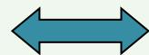

$$
\forall x (\neg P (x, f (x)) \vee (Q (x, g (x)) \wedge \neg R (x, g (x))))
$$

# Example

$$
\forall x (\exists y \neg P (x, y) \vee \exists z (Q (x, z) \wedge \neg R (x, z)))
$$

# Skolemize

对于一般情况

$$
\forall x _ {1} \forall x _ {2} \ldots \forall x _ {n} \exists y P (x _ {1}, x _ {2}, \ldots , x _ {n}, y)
$$

存在量词??的Skolem函数为

$$
y = f (x _ {1}, x _ {2}, \dots , x _ {n})
$$

# 谓词逻辑的归结推理

# Example

$$
\forall x (\neg P (x, f (x)) \vee (Q (x, g (x)) \wedge \neg R (x, g (x))))
$$

# 谓词公式化为子句集的步骤

5.化为前束型，即前束型=(前缀)[母式]。其中，前缀为全称量词串，母式为不含量词的谓词公式 ∀?? ¬?? ??, ??(??) ∨ (?? ??, ?? ?? ∧ ¬??(??, ??(??)))

$$
P \land (Q \lor R) \Leftrightarrow (P \land Q) \lor (P \land R)
$$

$$
P \vee (Q \wedge R) \Leftrightarrow (P \vee Q) \wedge (P \vee R)
$$

6.把母式化成合取范式。反复使用结合律和分配律，将母式表达成合取范式的Skolem标准形

$$
\forall x (\left(\neg P (x, f (x)) \vee Q (x, g (x))\right) \wedge (\neg P (x, f (x)) \vee \neg R (x, g (x))))
$$

7.略去全称量词。由于母式的变量均受全称量词的约束，因此可省略掉全称量词

$$
\Big (\neg P \big (x, f (x) \big) \vee Q \big (x, g (x) \big) \Big) \wedge (\neg P \big (x, f (x) \big) \vee \neg R (x, g (x)))
$$

# 谓词逻辑的归结推理

# Example

$$
\Big (\neg P \big (x, f (x) \big) \vee Q \big (x, g (x) \big) \Big) \wedge \Big (\neg P \big (x, f (x) \big), \neg R \big (x, g (x) \big) \Big)
$$

# 谓词公式化为子句集的步骤

8.把母式用子句集表示。把母式中每一个合取元称为一个子句，省去合取联结词，这样就可把母式写成集合的形式表示，每一个元素就是一个子句。

$$
\left. \right.\left\{\left(\neg P (x, f (x)), Q (x, g (x))\right), \left(\neg P (x, f (x)), \neg R (x, g (x))\right)\right\}
$$

9.子句变量标准化。对某些变量重新命名，使任意两个子句不会有相同的变量出现。这是因为在使用子句集进行证明推理的过程中，有时需要例化某一个全称量词约束的变量，该步骤可以使公式尽量保持其一般化形式，增加了应用过程的灵活性。

$$
\left. \right.\left\{\left(\neg P (x, f (x)), Q (x, g (x))\right), \left(\neg P (y, f (y)), \neg R (y, g (y))\right)\right\}
$$

# 谓词逻辑的归结推理

# Practice

例1 将下列谓词公式化为子句集。

$$
\forall x \{[ \neg P (x) \vee \neg Q (x) ] \rightarrow \exists y [ S (x, y) \wedge Q (x) ] \} \wedge \forall x [ P (x) \vee B (x) ]
$$

（1）消去蕴涵符号

$$
\forall x \left\{\neg \left[ \neg P (x) \vee \neg Q (x) \right] \vee \exists y [ S (x, y) \wedge Q (x) ] \right\} \wedge \forall x [ P (x) \vee B (x) ]
$$

（2）把否定符号移到每个谓词前面

$$
\forall x \{[ P (x) \land Q (x) ] \lor \exists y [ S (x, y) \land Q (x) ] \} \land \forall x [ P (x) \lor B (x) ]
$$

（3）变量标准化

$$
\forall x \{[ P (x) \wedge Q (x) ] \vee \exists y [ S (x, y) \wedge Q (x) ] \} \wedge \forall w [ P (w) \vee B (w) ]
$$

（4）消去存在量词，设y的Skolem函数是 $f ( \chi )$ ，则

$$
\forall x \{[ P (x) \wedge Q (x) ] \vee [ S (x, f (x)) \wedge Q (x) ] \} \wedge \forall w [ P (w) \vee B (w) ]
$$

# 谓词逻辑的归结推理

# Practice

# 例1 将下列谓词公式化为子句集。

（5）化为前束型

$$
\forall x \forall w \{\{[ P (x) \wedge Q (x) ] \vee [ S (x, f (x)) \wedge Q (x) ] \} \wedge [ P (w) \vee B (w) ] \}
$$

（6）化为标准形

$$
\forall x \forall w \{\{[ Q (x) \land P (x) ] \lor [ Q (x) \land S (x, f (x)) ] \} \land [ P (w) \lor B (w) ] \}
$$

$$
\forall x \forall w \{Q (x) \land [ P (x) \lor S (x, f (x)) ] \land [ P (w) \lor B (w) ] \}
$$

（7）略去全称量词 $Q ( x ) \land [ P ( x ) \lor S ( x , f ( x ) ) ] \land [ P ( w ) \lor B ( w ) ]$

（8）消去合取词，把母式用子句集表示 $\{ Q ( x ) , ( P ( x ) , S ( x , f ( x ) ) ) , ( P ( w ) , B ( w ) ) \}$

（9）子句变量标准化 $\{ Q ( x ) , ( P ( y ) , S ( y , f ( y ) ) )$ ,(P(w),B(w))}

# 谓词逻辑的归结推理

# Example

已知：

(1) 会朗读的人是识字的

(2) 海豚都不识字

(3) 有些海豚是很机灵的

求证：有些很机灵的东西不会朗读

# Prove

用谓词逻辑描述问题：

(1) $\forall x ( R ( x )  W ( x ) )$

(2) $\forall x ( D ( x )  \neg W ( x ) )$

(3) $\exists x ( D ( x )  S ( x ) )$

(结论) $\exists x ( S ( x ) \land \lnot R ( x ) )$

# 谓词逻辑的归结推理

# Prove

前提化简，待证结论取反并化成子句形，求得子句集:

(1) $( \lnot R ( { \boldsymbol { x } } ) , W ( { \boldsymbol { x } } ) )$

(2) $( \neg D ( y ) , \neg W ( y ) )$

(3) ?? ??

(4) ??(??)

(5) (¬?? ?? , ??(??))

进行归结：

(6)[4,5] ??/?? (?? ?? )

(7)[1,6] ??/?? (??(??))

(8)[2,7] ??/?? (¬?? ?? )

(9)[3,8] NIL

得证

# 可判定 vs 不可判定

• 可判定问题：如果存在一个算法或过程，该算法用于求解该类问题时，可在有限步内停止，并给出正确的解答。

• 如果不存在这样的算法或过程则称这类问题是不可判定的。例如，There can be no procedure to decide if a set of clauses is satisfiable.

Theorem. $S \vdash ( )$  iff $S$  is unsatisfiable

 However, there is no procedure to check if $S \vdash ( )$ ,because

When $S$  is satisfiable, the search for () may not terminate

# 可判定 vs 不可判定

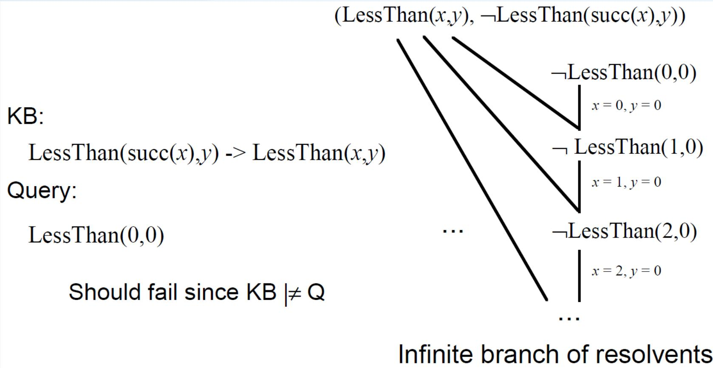

对于谓词逻辑，若子句集不可满足，则必存在一个从该子句集到空子句的推导；若从子句集存在一个到空子句的推导，则该子句集是不可满足的。如果没有归结出空子句，则既不能说 S 不可满足，也不能说 S 是可满足的。

# 谓词逻辑的归结推理

# Practice

例2将下列谓词公式化为不含存在量词的前束型。

$$
\exists x \forall y (\forall z (P (z) \wedge \neg Q (x, z)) \rightarrow R (x, y, f (a)))
$$

（1）消去存在量词

$$
\forall y (\forall z (P (z) \wedge \neg Q (b, z)) \rightarrow R (b, y, f (a)))
$$

（2）消去蕴涵符号

$$
\forall y (\neg \forall z (P (z) \land \neg Q (b, z)) \lor R (b, y, f (a)))
$$

$$
\forall y (\exists z (\neg P (z) \vee Q (b, z)) \vee R (b, y, f (a)))
$$

（3）设z的Skolem函数是g(y)，则

$$
\forall y (\neg P (g (y)) \vee Q (b, g (y)) \vee R (b, y, f (a)))
$$

# 谓词逻辑的归结原理和过程

在获得子句集后，证明定理演绎过程中，经常要对量化的表达式（不同子句）进行匹配操作，因而需要对项作变量置换使表达式一致起来。

# 归结过程：

$\diamond$ 若S中两个子句间有相同互补文字的谓词，但它们的项不同，则必须找出对应的不一致项；

$\spadesuit$ 进行变量置换，使它们的对应项一致;

$\diamond$ ◆ 求归结式看能否推导出空子句。

# 练习2

$$
\begin{array}{l} \text {?} \\ \mathrm {K B} \models \text {H a r d W o r k e r (s u e)} \end{array}
$$

# KB

∀x GradStudent(x) -> Student(x)∀x Student(x) -> HardWorker(x) GradStudent(sue)

# 练习3

<table><tr><td>A</td></tr><tr><td>B</td></tr><tr><td>C</td></tr></table>

<table><tr><td>green</td></tr><tr><td>non-green</td></tr></table>

Given the scene, human can easily draw the conclusion"there is a green block directly on top of a non-green block"

 · How can a machine do the same?

· S= {On(a,b),On(b,c),Green(a),-Green(c)}

· α =ExEy[Green(x) ^ -Green(y) ^On(x,y)]

$S$  logically entails $\alpha$

# 归结推理

${ \mathsf { K B } } = \{ \mathrm { O n } ( { \mathrm { a , b } } )$ ， On(b,c)， Green(a)， -Green(c)}  already in CNF

Query $=$  3x3y[On(x,y) ^ Green(x) ^ -Green(y)]

 Note: $\multimap$  has no existentials, so yields

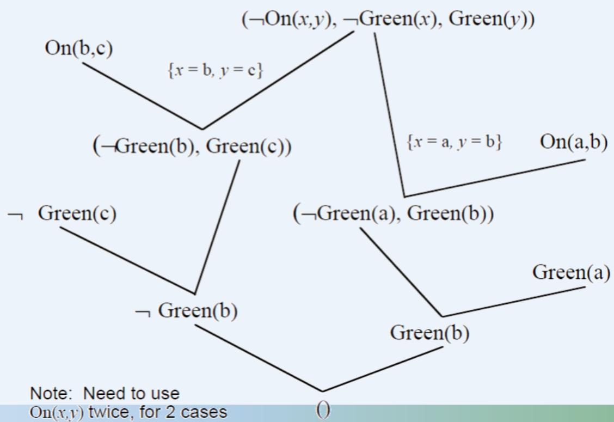

# 练习

Prove that $\exists y \forall x P ( x , y ) \models \forall x \exists y P ( x , y )$

$\exists y \forall x P ( x , y ) \Rightarrow 1 . P ( x , a )$

Exercises: Prove

$\forall x P ( x ) \lor \forall x Q ( x ) \mid = \forall x ( P ( x ) \lor Q ( x ) )$

# 问题求解

# 问题求解

# 步骤 应用归结原理求解问题：

（1）已知前提 $F$ 用谓词公式表示，并化为子句集 S；

（2）把待求解的问题 $P$ 用谓词公式表示，并否定 $P$ ， 再与 answer 构成析取式（﹁ P ∨ answer ）

（3）把 $( \neg P \lor \operatorname { a n s w e r } )$ ）化为子句集，并入到子句集S中，得到子句集S’；

（4）对 $S '$ 应用归结原理进行归结；

（5）若得到归结式answer，则答案就在answer中。

# 问题求解

# Example

设A,B,C三人中有人从不说真话，也有人从不说假话。某人向这三人分别提出同一个问题：谁是说谎者？A答：“B和C都是说谎者”；B答：“A和C都是说谎者”；C答：“A和B中至少有一个是说谎者”。求谁是老实人，谁是说谎者？

设用 $\mathrm { T } ( x )$ 表示x说真话。

T(C)∨T(A)∨T(B)

$\lnot \mathrm { T } ( \mathbf { C } ) \big \lor \lnot \mathrm { T } ( \mathbf { A } ) \big \lor \lnot \mathrm { T } ( \mathbf { B } )$

$\mathrm { T } ( \mathrm { A } ) { \longrightarrow } \mathrm { \neg { T } ( B ) } \land \mathrm { \neg { T } ( C ) }$

$\neg \mathrm { T } ( \mathrm { A } ) \neg \mathrm { T } ( \mathrm { B } ) \lor \mathrm { T } ( \mathrm { C } )$

$\mathrm { T } ( \mathrm { B } ) { \longrightarrow } \mathrm { \neg { T } ( A ) } \mathrm { \setminus \neg { T } ( C ) }$

¬T(B) $\longrightarrow$ T(A)∨T(C)

T(C)→¬T(A)∨¬T(B)

¬T(C)→T(A)∧T(B)

把所有公式化成子句集，得到S：

(1) ¬T(A)∨¬T(B)

(2) ¬T(A)∨¬T(C)

(3) T(C)∨T(A)∨T(B)

(4) ¬T(B)∨¬T(C)

(5) ¬T(C)∨¬T(A)∨¬T(B)

(6) T(A)∨T(C)

(7) T(B)∨T(C)

# 问题求解

# Example

设A,B,C三人中有人从不说真话，也有人从不说假话。某人向这三人分别提出同一个问题：谁是说谎者？A答：“B和C都是说谎者”；B答：“A和C都是说谎者”；C答：“A和B中至少有一个是说谎者”。求谁是老实人，谁是说谎者？

下面先求谁是老实人。把¬T(x)∨Answer(x)并入S得到S’。即多一个子句：

(8) ¬T(x)∨Answer(x)

应用归结原理对S1进行归结：

(9) ¬T(A)∨T(C)

(1)和(7)归结

(10) T(C)

(6)和(9)归结

(11) Answer(C)

(8)和(10)归结

所以C是老实人，即C从不说假话。

把所有公式化成子句集，得到S：

(1) ¬T(A)∨¬T(B)

(2) ¬T(A)∨¬T(C)

(3) T(C)∨T(A)∨T(B)

(4) ¬T(B)∨¬T(C)

(5) ¬T(C)∨¬T(A)∨¬T(B)

(6) T(A)∨T(C)

(7) T(B)∨T(C)

# 问题求解

# Example

设A,B,C三人中有人从不说真话，也有人从不说假话。某人向这三人分别提出同一个问题：谁是说谎者？A答：“B和C都是说谎者”；B答：“A和C都是说谎者”；C答：“A和B中至少有一个是说谎者”。求谁是老实人，谁是说谎者？

下面证明A不是老实人，即证明¬T(A)。

对¬T(A)进行否定，并入S中，得到子句集S2，即S2比S多如下子句：

(8) ¬(¬T(A)), 即T(A)

应用归结原理对S2进行归结：

(9) ¬T(A)∨T(C)

(1)和(7)归结

(10) ¬T(A)

(2)和(9)归结

(11) NIL

(8)和(10)归结

所以A不是老实人。同样可以证明B也不是老实人。

把所有公式化成子句集，得到S：

(1) ¬T(A)∨¬T(B)

(2) ¬T(A)∨¬T(C)

(3) T(C)∨T(A)∨T(B)

(4) ¬T(B)∨¬T(C)

(5) ¬T(C)∨¬T(A)∨¬T(B)

(6) T(A)∨T(C)

(7) T(B)∨T(C)

# 问题求解

# Practice

 KB: Student(john)

 Student(jane)

Happy(john)

Q: 3x[Student(x) ^ Happy(x)]

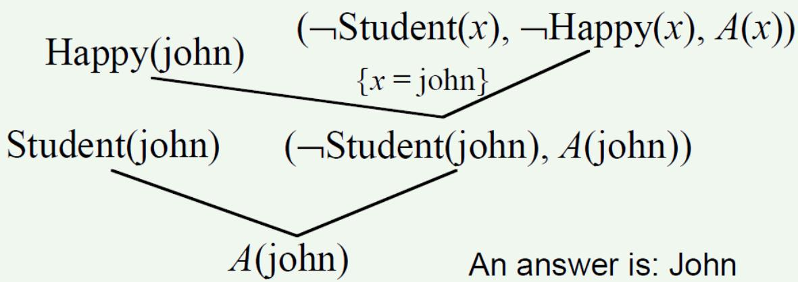

# 问题求解

# Example

KB:

 Student(john)

 Student(jane)

 Happy(john) v Happy(ja

Query:

x[Student(x) ^ Happy(x

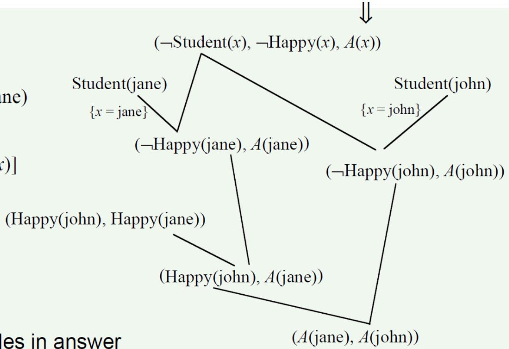

An answer is: either Jane or John

Note: can have variabl

# 问题求解

# Practice

· Whoever can read is literate.

· Dolphins are not literate.

 Flipper is an intelligent dolphin.

· Who is intelligent but cannot read.

 Use predicates: $R ( x ) , L ( x ) , D ( x ) , I ( x )$

# 吴氏方法

# 吴文俊

吴文俊（1919年5月12日－2017年5月7日），1919年5月12日出生于上海，祖籍浙江嘉兴，数学家，中国科学院院士，中国科学院数学与系统科学研究院研究员，系统科学研究所名誉所长。

吴文俊先生的研究工作涉及数学的诸多领域，其主要成就表现在拓扑学和数学机械化两个领域。他为拓扑学做了奠基性的工作；他的示性类和示嵌类研究被国际数学界称为“吴公式” “吴示性类”， “吴示嵌类”，至今仍被国际同行广泛引用。

# 吴氏方法

# 几何定理机器证明

第一步是几何问题代数化，建立坐标系，并将命题涉及的几何图形的点选取适当的坐标；然后把命题的条件和结论表示为坐标的多项式方程组；最后判断条件方程组的解是否满足结论方程。

通常的几何命题涉及的多项式方程组都是非线形的，一般无法将约束变元求出。吴氏方法是利用伪除法判定条件方程组的解是否是结论方程组的解。而且利用吴氏方法不仅可以判断定理的正确与否，还可以自动找出定理赖以成立的非退化条件，这是传统的做法无法做到的。

# 王氏算法

# 王浩

王浩（1921年5月20日—1995年5月13日）数理逻辑学家。祖籍山东省德州市齐河县，生于山东省济南市。

20世纪50年代初被选为美国科学院院士，后又被选为不列颠科学院外国院士。1983年，被国际人工智能联合会授予第一届“数学定理机械证明里程碑奖”，以表彰他在数学定理机械证明研究领域中所作的开创性贡献。著有《数理逻辑概论》、《从数学到哲学》、《哥德尔》、《超越分析哲学》等专著。

# 王氏算法

# 一阶逻辑定理证明

1959年，王浩用他首创的“王氏算法”，在一台速度不高的IBM-704电脑上再次向《数学原理》发起挑战。不到9分钟，王浩的机器把这本数学史上视为里程碑的著作中全部（350条以上）的一阶逻辑定理，统统证明了一遍。

该书作者，数学大师罗素得知此事后，在信里写到：“我真希望，在怀特海和我浪费了10年的时间用手算来证明这些定理之前，就知道有这种可能。”王浩教授因此被国际上公认为机器定理证明的开拓者之一。

# 练习

例 已知 $( \forall x ) ( ( \exists y ) ( A ( x , y ) \land B ( y ) ) {  } ( \exists y ) ( C ( y ) \land D ( x , y ) ) )$

$$
G: \neg (\exists x) C (x) \rightarrow (\forall x) (\forall y) (A (x, y) \rightarrow \neg B (y))
$$

求证：G是F的逻辑结论。

证明：首先把F和¬G化为子句集：

$$
\begin{array}{l} F = \left\{\neg A (x, y) \vee \neg B (y) \vee C (f (x)), \neg A (x, y) \vee \neg B (y) \vee D (x, f (x)) \right\} \\ \neg G = \{\neg C (z), A (a, b), B (b) \} \\ \end{array}
$$

然后进行归结：

(6)¬A(x,y)∨¬B(y)

(7)¬B(b)

(8)NIL

由(1)与(3)归结，{f(x)/z}

由(4)与(6)归结， $\{ { \mathsf { a } } / { \mathsf { x } } , { \mathsf { b } } / { \mathsf { y } } \}$

由(5)与(7)归结

所以G是F的逻辑结论。

上述归结过程如右图归结树所示。

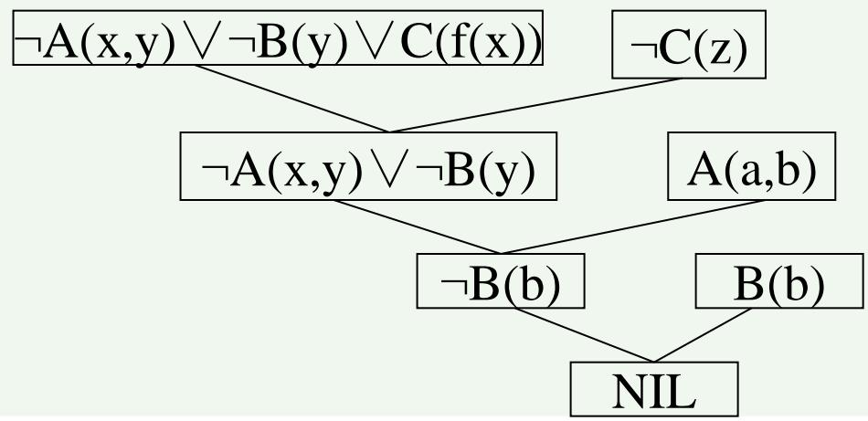

# 归结策略

# 归结策略

归结的一般过程（宽度优先策略）：

设有子句集 ${ \sf S } = \{ { \sf C } _ { 1 } , { \sf C } _ { 2 } , { \sf C } _ { 3 } , { \sf C } _ { 4 } \}$ ，则对此子句集归结的一般过程是：

1. S内任意子句两两逐一进行归结，得到一组归结式，称为第一级归结式，记为S1。

2. 把S与S1内的任意子句两两逐一进行归结，得到一组归结式，称为第二级归结式，记为 $\mathsf { S } _ { 2 }$ 。

3. S和S1内的子句与 $\mathsf { S } _ { 2 }$ 内的任意子句两两逐一进行归结，得到一组归结式，称为第三级归结式，记为 $\mathsf { S } _ { 3 }$ 。

4. 如此继续，直到出现了空子句或者不能再继续归结为止。

# 宽度优先策略

设有如下子句集：

$$
S = \{\neg I (x) V R (x), I (a), \neg R (y) V L (y), \neg L (a) \}
$$

用宽度优先策略证明S为不可满足。

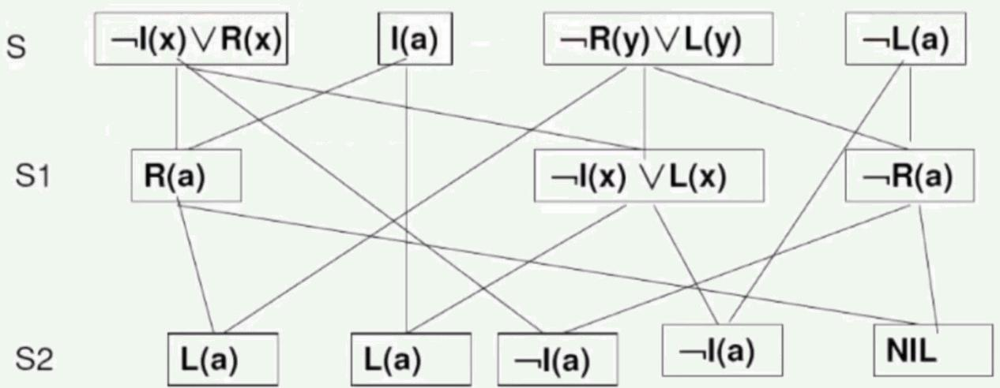

从这个例子可以看出，宽度优先策略归结出了许多无用的子句，既浪费时间，又浪费空间。但是，当问题有解时，这种策略保证能找到最短归结路径。

因此，它是一种完备的归结策略。

宽度优先对大问题的归结容易产生组合爆炸，但对小问题却仍是一种比较好的归结策略。

# 删除策略

# ⚫纯文字删除法

如果某文字L在子句集中不存在可与之互补的文字¬L，则称该文字为纯文字。包含纯文字的子句可以删除。

# 重言式删除法

如果一个子句中同时包含互补文字对，则该字句称为重言式。重言式是永远为真的子句，可以删除。

# 包孕删除法

设有子句C1和 $\mathsf { C } _ { 2 }$ ，如果存在一个代换 $\sigma$ ，使得 $C _ { 1 } \sigma \subseteq C _ { 2 }$ ，则称 ${ \sf C } _ { 1 }$ 包孕于 $\mathsf { C } _ { 2 }$ 。 ${ \sf C } _ { 2 }$ 可删除。

# 支持集策略

对参加归结的子句提出如下限制：每一次归结时，亲本子句中至少有一个是由目标公式的否定所得到的子句，或者是它的后裔。可以证明，支持集策略是完备的。

# Example

设有子句集 $S { = } \{ { \lnot \mid } \left( { \bf { x } } \right) \vee \mathsf { R } \left( { \bf { x } } \right) , \mid \left( { \bf { \bar { a } } } \right) , \lnot \mathsf { R } \left( { \bf { y } } \right) \vee \lnot \left\lfloor \left( { \bf { y } } \right) , \lfloor \left( { \bar { a } } \right) \right\rfloor$ ，其中¬I(x)∨R(x)是目标公式否定后得到的字句。

支持集策略示例

用支持集策略进行归结的过程是：

S:(1) ¬I(x)∨R(x)

(2) I(a)

(3) ¬R(y)∨¬L(y)

(4) L(a)

S1:(5) R(a)

(6) ¬I(x)∨¬L(x)

S2:(7) ¬L(a)

(8) ¬L(a)

(9) ¬I(a)

S3:(10)NIL

(1)与(2)归结

(1)与(3)归结

(2)与(6)归结

(3)与(5)归结

(4)与(6)归结

(2)与(9)归结

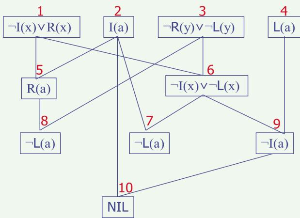

# 支持集策略

支持集策略示例

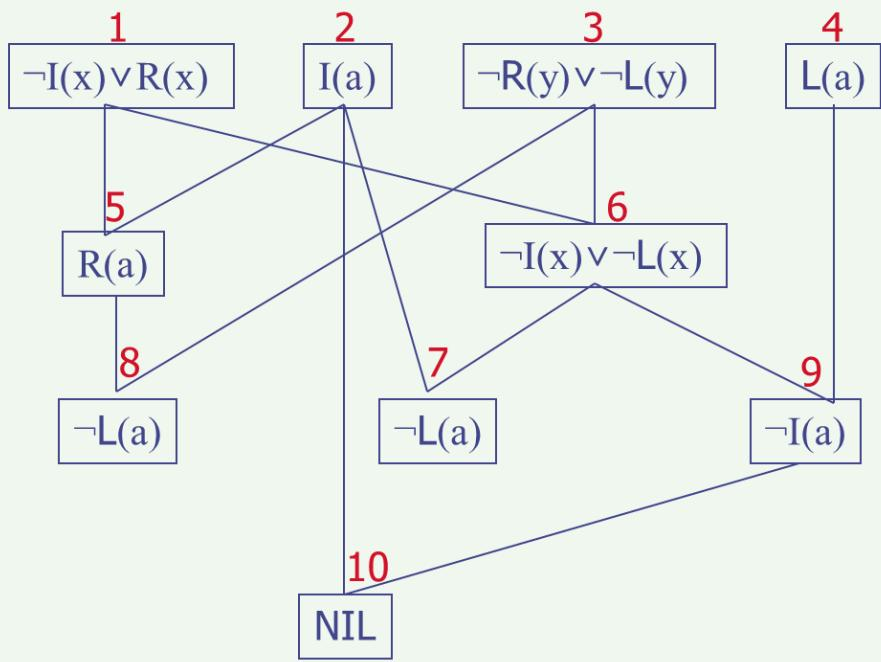

从上述归结过程可以看出，各级归结式数目要比宽度优先策略生成的少，但在第二级还没有空子句。

就是说这种策略限制了子句集元素的剧增，但会增加空子句所在的深度。

此外支持集策略具有逆向推理的含义，由于进行归结的亲本子句中至少有一个与目标子句有关，因此推理过程可以看作是沿目标、子目标的方向前进的。

# 线性输入策略

• 限制：参加归结的两个子句中必须至少有一个是初始子句集中的子句。

• 线性输入策略可限制生成归结式的数量，具有简单、高效的优点。但是它是不完备的。

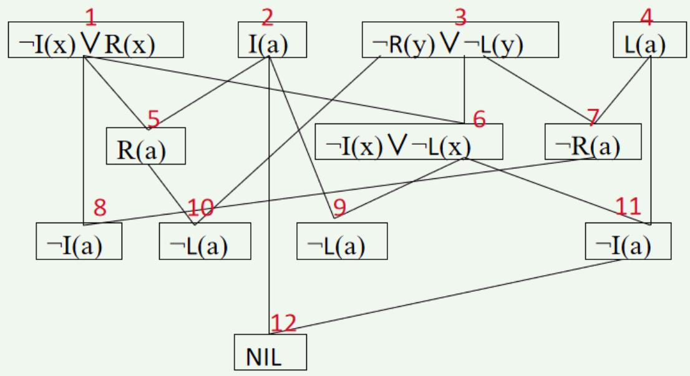

# 线性输入策略

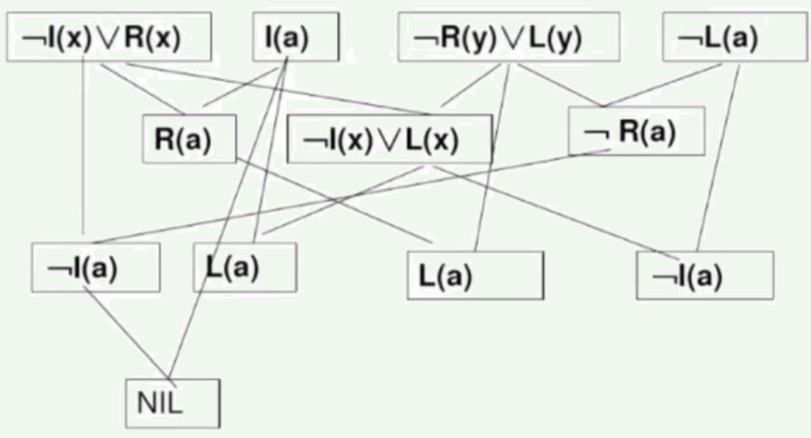

线性输入策略可限制生成归结式的数目，具有简单和高效的优点但是，这种策略也是一种不完备的策略。

例如

$$
S = \{Q (u) \vee P (a), \neg Q (w) \vee P (w),
$$

$$
\neg Q (x) \vee \neg P (x), Q (y) \vee \neg P (y) \}
$$

从S出发很容易找到一棵归结反演树，但却不存在线性输入策的归结反演树。

# 单文字策略

• 如果一个子句只包含一个文字，则称它为单文字子句。

• 限制：参加归结的两个子句中必须至少有一个是单文字子句。

用单文字子句策略归结时，归结式比亲本子句含有较少的文字，这有利于朝着空子句的方向前进，因此它有较高的归结效率。但是，这种归结策略是不完备的。当初始子句集中不包含单文字子句时，归结就无法进行。

# 单文字策略

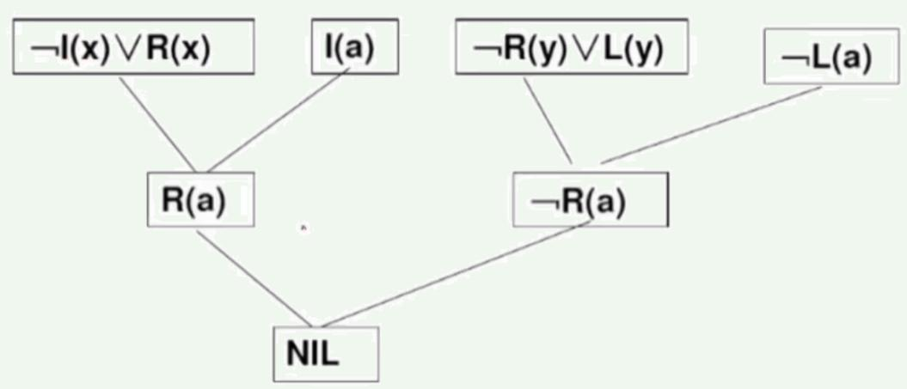

采用单文字子句策略，归结式包含的文字数将少于其亲本子句中的文字数，这将有利于向空子句的方向发展，因此会有较高的归结效率。

但这种策略是不完备的，即当子句集为不可满足时，用这种策略不一定能归结出空子句。

# 祖先过滤策略

该策略与线性策略比较相似，但放宽了限制。当对两个子句C 和 $\mathsf { C } _ { 2 }$ 进行归结时，只要它们满足下述任一个条件就可以归结。

C1和 $\mathsf { C } _ { 2 }$ 中至少有一个是初始子句集中的子句。

2. C1和 $\mathrm { { { C } } } _ { 2 }$ 中一个是另外一个的祖先子句。

祖先过滤策略是完备的。

# 祖先过滤策略

例设有如下子句集：

$$
S = \{\neg Q (x) \vee \neg P (x), Q (y) \vee \neg P (y), \neg Q (w) \vee \neg P (w), Q (a) \vee \neg P (a) \}
$$

用祖先过滤策略证明S为不可满足。

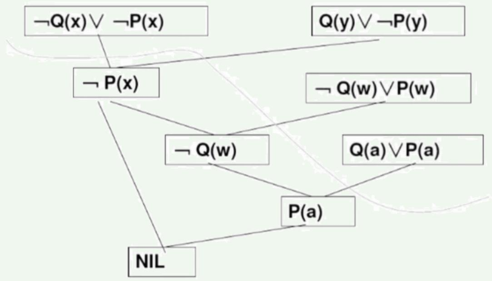

可以证明祖先过滤策略也是完备的。

在选择归结反演策略时,主要应考虑其完备性和效率问题。

# 练习

⚫ If Superman were able and willing to prevent evil, he would do so.

⚫ If Superman were unable to prevent evil, he would be impotent;

$\bullet$ if he were unwilling to prevent evil, he would be malevolent.

Superman does not prevent evil.

If Superman exists, he is neither impotent nor malevolent.

$\spadesuit$ Therefore, Superman does not exist

W: Superman is willing to prevent evil. A: Superman is able to prevent evil.

P: Superman prevents evil. I: Superman is impotent.

M: Superman is malevolent. E: Superman exists

⚫ Superman were able and willing to prevent evil, he would do so $( \mathbb { A } \land \mathbb { W } ) \to \mathbb { P }$

$\bullet$ If Superman were unable to prevent evil he would be impotent $\lnot \mathrm { A } \to \mathrm { I }$

$\bullet$ if he were unwilling to prevent evil, he would be malevolent $\lnot \mathrm { W } \to \mathrm { M }$

Superman does not prevent evil $\lnot \mathrm { P }$

$\bullet$ If Superman exists, he is neither impotent nor malevolent $\mathrm { E }  ( \neg \mathrm { ~ I ~ } \wedge \neg \mathrm { ~ M ~ }$

Superman does not exist ¬ E

# 练习

⚫ Superman were able and willing to prevent evil, he would do so $( \mathbb { A } \wedge \mathbb { W } ) \to \mathbb { P }$

⚫ If Superman were unable to prevent evil he would be impotent $\lnot \mathrm { A } \to \mathrm { I }$

⚫ if he were unwilling to prevent evil, he would be malevolent $\lnot \mathrm { W } \to \mathrm { M }$

$\bullet$ Superman does not prevent evil $\lnot \mathrm { P }$

⚫ If Superman exists, he is neither impotent nor malevolent $\mathrm { E }  ( \neg \mathrm { I } \land \neg \mathrm { M } )$

Superman does not exist ¬ E

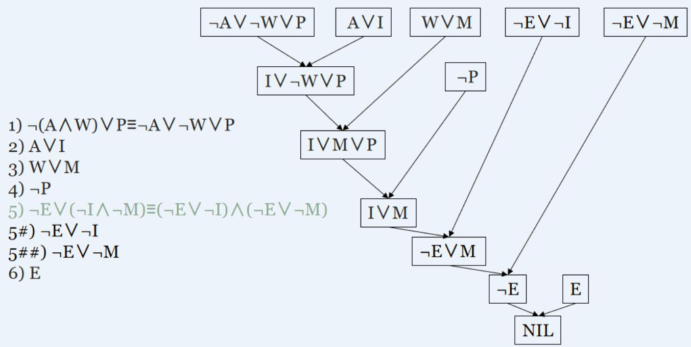

# 练习

⚫ 试用归结法证明以下论断为有效的：有些病人喜欢所有医生。没有病人喜欢任何庸医。因而没有医生是庸医。请使用以下谓词。 $P ( x )$ ： $x$ 是病人； $D ( x )$ ： $x$ 是医生； $Q ( x )$ ： $x$ 是庸医； $L ( x , y )$ ： $x$ 喜欢y。

$$
\begin{array}{l} \exists x \left(P (x) \wedge \left(\forall y \left(D (y) \rightarrow L (x, y)\right)\right)\right) \Rightarrow \exists x \forall y \left(P (x) \wedge \left(- D (y) \vee L (x, y)\right)\right) \\ \Rightarrow \forall x \left(P (a) \wedge \left(- D (x) \vee L (a, x)\right)\right) \\ \end{array}
$$

$$
\begin{array}{l} \lnot \exists x \left(P (x) \wedge \exists y \left(Q (y) \wedge L (x, y)\right)\right) \Rightarrow \forall x \forall y \left(\neg P (x) \vee \neg Q (y) \vee \neg L (x, y)\right) \\ \Rightarrow \forall y \forall z (\neg P (y) \vee \neg Q (z) \vee \neg L (y, z)) \\ \end{array}
$$

$$
\lnot \left(\lnot \exists x \left(D (x) \wedge Q (x)\right)\right) \Rightarrow \exists x \left(D (x) \wedge Q (x)\right) \Rightarrow D (b) \wedge Q (b)
$$

1. P(a)

$\left( \lnot D ( x ) , L ( a , x ) \right)$

$\left( \neg P ( y ) , \neg Q ( z ) , \neg L ( y , z ) \right)$

4. D(b)

$\mathcal { Q } ( b )$

6. $R { \big [ } 1 , 3 a { \big ] } \{ y = a \} { \big ( } \lnot Q ( z ) , \lnot L ( a , z ) { \big ) }$

$R \big [ 5 , 6 a \big ] \{ z = b \} - L ( a , b )$

$R { \big [ } 2 a , 4 { \big ] } \{ x = b \} L ( a , b )$

9. R[7,8]( )

# 练习

$$
\text {令} K B = \left\{\forall x \left(R (x) \rightarrow L (x)\right), \forall x \left(D (x) \rightarrow \neg L (x)\right), \exists x \left(I (x) \land D (x)\right)\right\},
$$

$$
f = \exists x (I (x) \wedge \neg R (x)) 。 \text {试 用 归 结 法 证 明} K B \models f _ {\circ}
$$

解答：t

$\left( \lnot R ( x ) , L ( x ) \right)$

$\left( \lnot D ( y ) , \lnot L ( y ) \right)$

3. 1(a)

$4 , D ( a )$

$\left( \lnot I ( z ) , R ( z ) \right)$

$R \left\lfloor 3 , 5 a \right\rfloor \left\{ z = a \right\} R ( a )$

$R \left[ 1 a , 6 \right] \{ x = a \} L ( a )$

$R \big [ 2 b , 7 \big ] \{ y = a \} \lrcorner D ( a )$

9. R[7,8]()

# 小结

# 内容总结：

➢ 逻辑推理：演绎、归纳、溯因

命题逻辑的归结推理

谓词逻辑的归结推理：求（最一般）合一项

谓词公式化为子句集

➢ 应用归结原理求解问题 $+$ 归结反演

➢ 归结策略

# 课外阅读：

➢ https://baike.baidu.com/item/吴文俊/44938?fr=aladdin

➢ https://baike.baidu.com/item/几何定理机器证明/2197024?fr=aladdin

➢ https://baike.baidu.com/item/王浩/22564?fr=aladdin