# 人工智能：知识表示和推理I

授课对象：计算机科学与技术专业 二年级

课程名称：人工智能（专业必修）

节选内容：第三章 知识表示和推理 I

课程学分：3学分

# 知识表示

# 知识和知识表示

数据?知识1智能

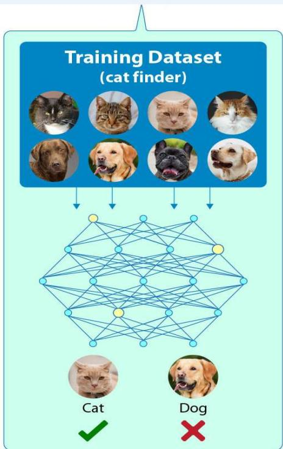

图像识别

图片

神经网络NeuralNetwork

识别

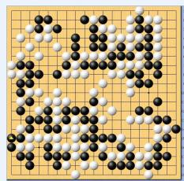

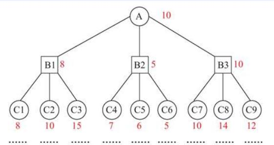

人机博弈

棋局

博弈树Game Tree

棋布策略

人工智能的本质到底是什么？ 人工智能的本质是知识的表示

# 知识和知识表示

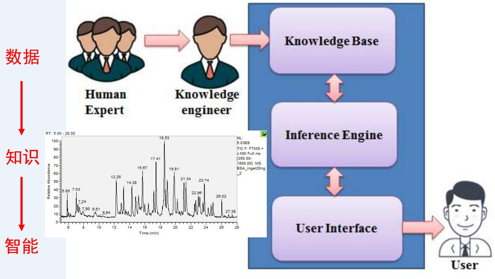

专家系统

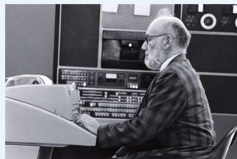

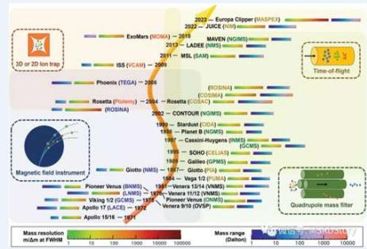

DENDRAL

 DENDRAL基于化学领域专家知识，降低需要分析的火星土壤分子结构数目

 这一套包含了专家知识的获取、分析到用规则表达的技术就叫做，知识工程

# 知识和知识表示

# 人工智能容易落地的领域

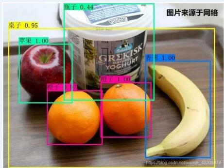

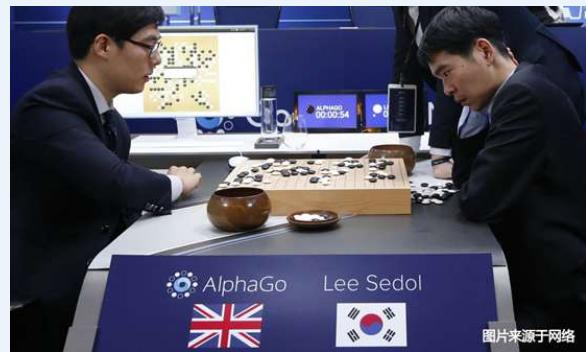

# 人工智能较难落地的领域

a)裂痕

b)釉色不均

c)凹凸不均

d)表面污染

#  人工智能成功与否取决于它所蕴含的知识表示是否清楚

# 知识和知识表示

 数据 一般指单独的事实、信号、符号，是信息的载体

 信息 由符号组成，如文字和数字，但是对符号赋予了一定的意义，因此有一定的用途或价值

 知识 由经验总结升华得到,在信息的基础上增加了上下文信息，提供了更多的意义，因此也就更加有用和有价值; 新的知识可以根据规则和已有的知识推导出来

# 知识表示

用机器表示上述知识的可行性、有效性的一般方法，可以看作是将知识符号化并输入到计算机的过程和方法

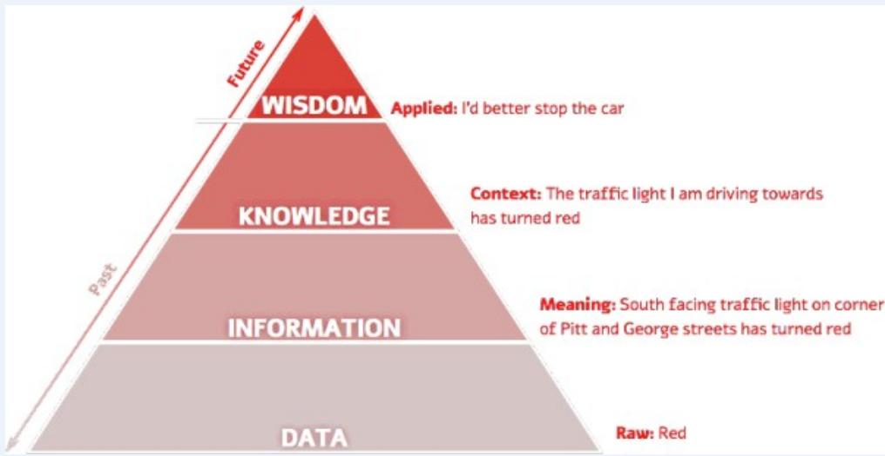

# 知识和知识表示

I will keep mycat in the candybowl!

Cat can adapt their shape totheir container as liquid.

Cat in bottle

Cat in bag

Cat in vase

WISDOM

Applied:I'd betterstopthecar

KNOWLEDGE

Context:The trafficlight lamdriving towards

Meaning:South facingtraffic lighton corner

Raw:Red

Lots of Cats

# 知识和知识表示

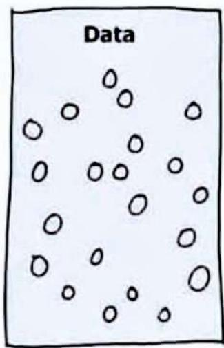

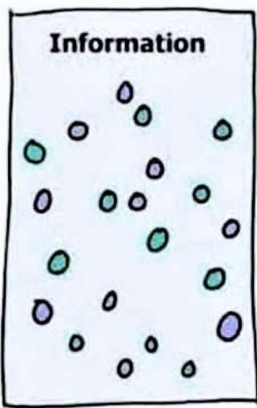

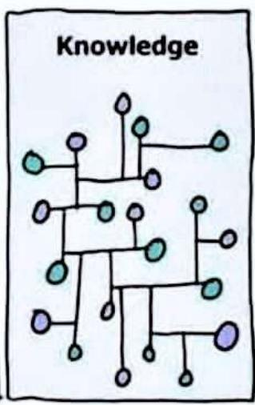

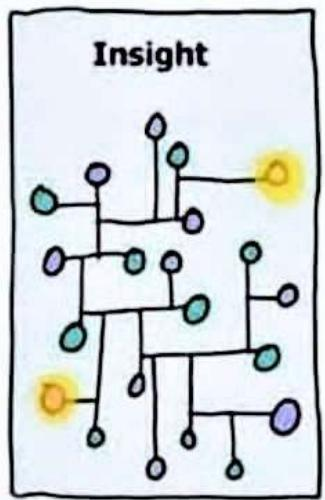

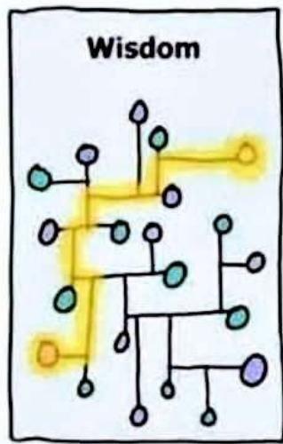

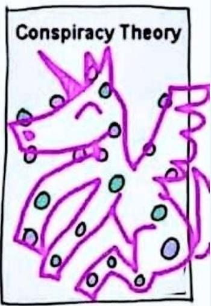

# AI对知识表示方法的要求

# 表示能力

要求能够正确、有效地将问题求解所需要的各类知识都表示出来

# 可理解性

所表示的知识应易懂、易读

# 便于知识的获取

使得智能系统能够渐进地增加知识，逐步进化

# 便于搜索

表示知识的符号结构和推理机制应支持对知识库的高效搜索，使得智能系统能够迅速地感知事物之间的关系和变化；同时很快地从知识库中找到有关的知识

# 便于推理

要能够从己有的知识中推出需要的答案和结论

数理逻辑，及其衍生的形式系统，作为用数学方法形式化模拟人类思维表达及推理的方式，是一种精确和成功的知识表示方法，也是最早一批的人工智能探索方向

# 现代逻辑学知识表示与推理

逻辑学(logic)是研究人类思维规律的科学，而现代逻辑学则是用数学(符号化、公理化、形式化)的方法来研究概念化及理性化过程的规律与本质。

概念化与理性化: 物理对象抽象为思维对象，包括对象本身的表示、对象性质的表示、对象间关系的表示等。 并对概念进行判断与推理。

符号化:即用字母、符号表示思维的物理对象、概念对象、判断对象等。

公理化:类似于我们学过的欧氏空间中定理与推演，现代逻辑学的公理化也更为彻底，它将人们的推理规则也符号化和模式化，它们本质上和公理相同。

始于亚里士多德的逻辑学被符号化、公理化，逐步演化为现代逻辑学。如 “一个条件命题等价于它的逆否命题” “全称判断蕴涵特称判断”

$$
\begin{array}{l} (A \rightarrow B) \longleftrightarrow (\neg B \rightarrow \neg A) \\ \forall x A (x) \rightarrow A (t) \\ \end{array}
$$

形式化: 在抽象公理系统中，忽略原始概念的直觉意义，公理无需任何实际意义为背景，只是形式约定。抽象公理系统一旦建成，它便应当是超脱客观背景的，它可刻画的对象已不限于原来考虑的那些对象，而是与它们有着共同结构的相当广泛的一类对象。如布尔代数。

# 现代逻辑学知识表示与推理

# 现代科学与逻辑思辩方法

 斯宾诺莎（1632-1677）（荷）：伦理学

 笛卡尔（1596-1650）（法）：第一哲学的沉思

 牛顿（1643-1727）（英）：力学体系

 罗素 （1872-1970）（英）数理逻辑与现代数学

 布劳维尔（1881-1966）（荷）：直觉主义逻辑

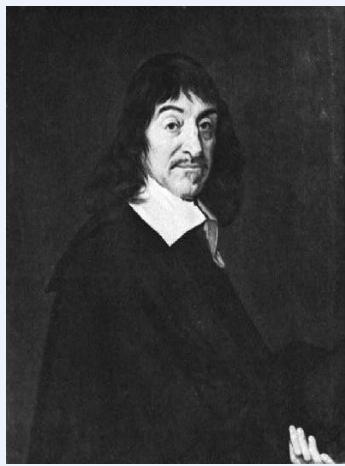

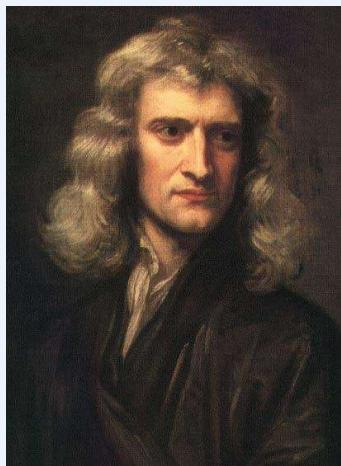

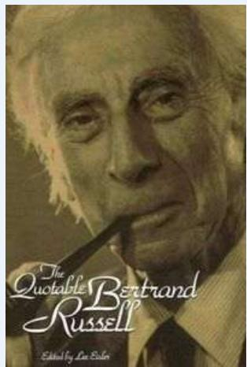

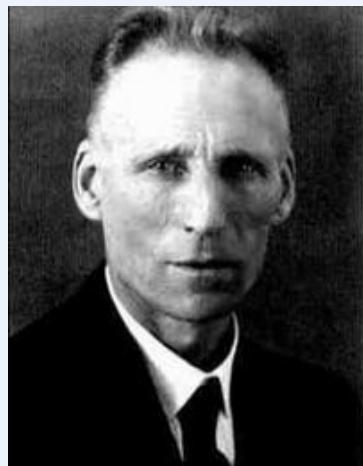

# 现代逻辑学知识表示与推理

# 现代逻辑学形式系统如下组成：

(l)用于将概念符号化的符号语言，通常为一形式语言，包括一符号表∑及语言的文法，可生成表示对象的语言成分项，表示概念、判断的公式；

(2)表示思维规律的逻辑学公理模式和推理规则模式(抽象公理系统)，及其依据它们推演可得到的全部定理组成的理论体系。

# 对形式系统的研究包括：

（1）语法研究(syntax) ：对系统内定理推演的研究，这类研究被看作是对形式系统的语法(syntax)的研究。

（2）语义研究(semantic) ：公理系统、形式系统并不一定针对某一特定的问题范畴，但可以对它作出种种解释——赋予它一定的个体域，赋予它一定的结构，即用个体域中的个体、个体上的运算、个体间的关系去解释系统中的抽象符号。

（3）语法与语义关系的研究。

# 知识表示语言

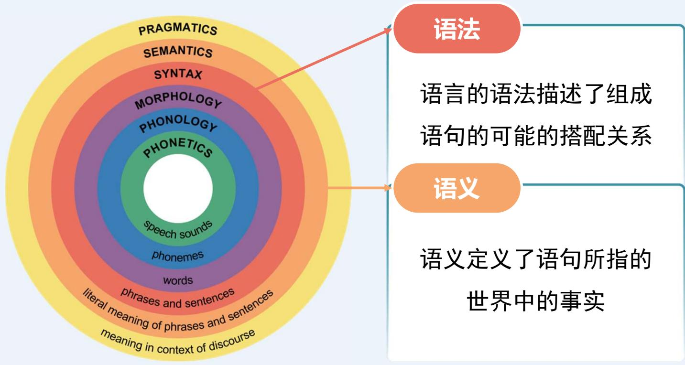

自然语言的层级

例如：在简单算术中，

x+1=2

合法

1+=x

不合法

1+1=2

真

1+2=2

假

# 知识表示语言

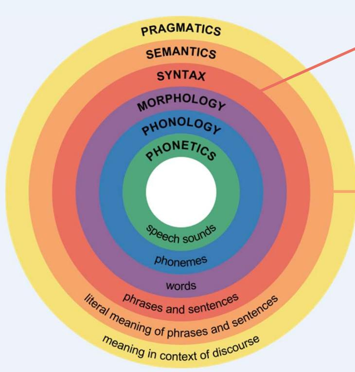

自然语言的层级

# 语法

语言的语法描述了组成语句的可能的搭配关系

# 语义

语义定义了语句所指的世界中的事实

# 逻辑蕴涵

当语句 $\alpha$ 为真时，语句 $\beta$ 必为真，那么称语句 $\alpha$ 蕴涵语句 $\beta$

例如，语句 $x = 0$ 蕴涵语句$x y = 0$

# 逻辑推理

用蕴涵推导出结论的过程

# 命题逻辑

# 语法、语义、命题演算形式系统PC

# 命题逻辑的定义

# 命题— 具有真假意义的陈述句。是数理逻辑中最基本的概念

在特殊的情况下都具有 “真 (True)”和 “假（False)”的意义句子，都是命题。真值— 用T和F表示。

什么样的语句是命题？

雪是白的。

$$
2 + 2 = 5 _ {\circ}
$$

您贵姓？

$$
x + y <   1 0.
$$

三个识别要点：

陈述句、

判断、

确定的对象

真值是命题的固有属性，但是否知道真值是另一回事，比如“Trump Love China”

悖论（自相矛盾）不能作为命题。如“这句话是错的”

# 命题逻辑的语法

# 命题有两种类型：

 原子命题

 复合命题—由联结词、标点符号和原子命题等复合构成的命题。所有这些命题都应具有确定的真值。

# 命题逻辑就是研究命题和命题之间关系的符号逻辑系统。

 用P、Q、R、S等来表示命题。如：P：今天下雨 （ P是命题标识符）

 命题常元（表示确定命题的命题标识符）

 命题变元（只表示任意命题的位置标志的命题标识符） 

命题变元是以‘真、假’为取值范围的变量。可表示任意命题，故无法确定真假，不是命题，只有指派特定命题后，才能确定真值。

# 命题逻辑的语法

（1）命题常元：True(T)和False(F)；

（2）命题符号：P、Q、R等；

（3）常见的逻辑连接词包括（优先级从高到低）：

否定（¬）：表示 “非”

合取（∧）：表示“且”

3 析取（∨）：表示“或”

4 蕴涵（ $(  )$ ）：表示“如果…那么…” ”

5 等价（ ）：表示“当且仅当…”

(4) 括号: ( ).

??：天空是蓝色的

$Q$ ：草地是绿色的

¬??：天空不是蓝色的

$P \land Q$ ：天空是蓝色的且草地是绿色的

$P$ ∨ $Q$ ：天空是蓝色的或草地是绿色的

$P  Q$ ：如果天空是蓝色的，那么草地是绿色的

$P  Q$ ：天空是蓝色的当且仅当草地是绿色的

# 命题逻辑的语法

# 命题逻辑的符号：

（1）命题常元：True(T)和False(F)；

（2）命题符号：P、Q、R等；

（3）联结词：¬（否）； ∧（合取）；∨（析取）； →（蕴含）； ←→（等价）。（优先级从高到低）

（4）括号：( )。 由命题常元、变元及联结词构成的表达式，即命题公式。

命题公式（propositional formula）的定义（归纳定义）：

$\textcircled{1}$ 命题常元和命题变元是命题公式，特别的称作原子公式或原子

$\textcircled{2}$ 如果A,B是命题公式，那么(-A),(A^B), (AvB), $( A \to \mathbb { B } )$ $( \pmb { A } $ B)也是命题公式

$\textcircled{3}$ 只有有限步引用上述两条所组成的符号串是命题公式

）命题公式简称做公式，采用大写A,B,C等表示

注意大小写符号的差别(A、B、C和p、q、r、s、t、f)

# 命题逻辑的语义

上面提到的命题公式的意义是命题组成成份的函数。

联结词的语义可以定义如下（书表2-1，48页）：

¬P为真，当且仅当P为假。

 P∧Q为真，当且仅当P和Q都为真。

 $\mathrm { P } \setminus \mathrm { Q }$ 为真，当且仅当P为真，或者Q为真。

 $\mathrm { P } \to \mathrm { Q }$ 为真，当且仅当P为假，或者Q为真。

 $\mathrm { ~ P ~ } \gets \to \mathrm { ~ Q ~ }$ 为真，当且仅当 $\mathrm { P } \to \mathrm { Q }$ 为真，并且 $\mathrm { Q \to P }$ 为真。

定义2.2 设G是公式，A1，..An，为G中出现的所有原子命题。G的一种指派是对A1，..An赋予的一组真值，其中每个Ai $( \mathsf { i } = 1 , . . . , \mathsf { n } )$ 或者为T或者为F。

定义2.3 公式G称为在一种指派下为真，当且仅当G按该指派算出的真值为T，否则称为在该指派下为假。

# 命题逻辑的语义

• 语义定义了用于判定特定模型中的语句真值的规则

每个原子语句的真值在模型中被直接指定

• 根据原子语句的真值以及5种逻辑连接词的真值运算规则，复合语句的真值可以通过递归计算得到

当公式A在一种指派（或叫赋值）α下为真，称α是A的成真赋值（α弄真A）记α(A)=T；反之，称α是A的成假赋值（α弄假A）, 记α(A)=T

# 特例的命题词：

????????为永真命题

??????????为永假命题

<table><tr><td>p</td><td>q</td><td>p∧q</td><td>p∨q</td><td>p→q</td><td>p←q</td><td>¬p</td><td>¬q</td></tr><tr><td>T</td><td>T</td><td>T</td><td>T</td><td>T</td><td>T</td><td>F</td><td>F</td></tr><tr><td>T</td><td>F</td><td>F</td><td>T</td><td>F</td><td>F</td><td>F</td><td>T</td></tr><tr><td>F</td><td>T</td><td>F</td><td>T</td><td>T</td><td>F</td><td>T</td><td>F</td></tr><tr><td>F</td><td>F</td><td>F</td><td>F</td><td>T</td><td>T</td><td>T</td><td>T</td></tr></table>

由逻辑连接词连接的命题的真值表

# 命题逻辑的语义

定义2.4 公式A称为永真式或重言式(tautology)，如果对任意指派α，α均弄真A，即α(A)=T。如果存在指派α使α(A)=T，公式A称为可满足的(satisfiable)，否则称A为不可满足的(unsatisfiable)，或永假式。

永真式是可满足的；当A为永真式(永假式)时，┐A为永假式(永真式)。

重言式例子与证明

例子：对于任何公式A

Av-A是重言式（排中律）

A-A是矛盾式（矛盾律）

采用命题公式的真值表证明重言式

证明(pvq)^-p→q是重言式

<table><tr><td>p</td><td>q</td><td>p∨q</td><td>¬p</td><td>(p∨q)∧¬p</td><td>(p∨q)∧¬p→q</td></tr><tr><td>0</td><td>0</td><td>0</td><td>1</td><td>0</td><td>1</td></tr><tr><td>0</td><td>1</td><td>1</td><td>1</td><td>1</td><td>1</td></tr><tr><td>1</td><td>0</td><td>1</td><td>0</td><td>0</td><td>1</td></tr><tr><td>1</td><td>1</td><td>1</td><td>0</td><td>0</td><td>1</td></tr></table>

# 命题逻辑的语义

定义2.5 称公式A逻辑蕴涵公式B，记为 $A  B$ ，如果所有弄真A的指派亦必弄真公式B；

称公式集Γ逻辑蕴涵公式B，记为 $\Gamma  \mathsf { B }$ ，如果弄真Γ中所有公式的指派亦必弄真公式B。

定义2.6 称公式A逻辑等价公式B，记为 $\mathsf { A }  \mathsf { B }$ ，如果A → B且B → A。

任何赋值情况下两个公式之间都等值

逻辑等价式和逻辑蕴涵式 都是永真式(重言式）

定理2.3 逻辑蕴涵关系具有自反性、反对称性及传递性；

逻辑等价关系满足自反性、对称性和传递性。

# 命题逻辑的语义 逻辑等价式、逻辑蕴涵式

# 逻辑等价式

# 交换律

$$
\begin{array}{l} E 1: P \vee Q \Leftrightarrow Q \vee P \\ E 2: P \wedge Q \Leftrightarrow Q \wedge P \\ E 3: P \leftrightarrow Q \Leftrightarrow Q \leftrightarrow P \\ \end{array}
$$

# 结合律

$$
\begin{array}{l} E 4: (P \vee Q) \vee R \Leftrightarrow P \vee (Q \vee R) \\ E 5: (P \wedge Q) \wedge R \Leftrightarrow P \wedge (Q \wedge R) \\ E 6: (P \leftrightarrow Q) \leftrightarrow R \Leftrightarrow P \leftrightarrow (Q \leftrightarrow R) \\ \end{array}
$$

# 分配律

$$
\begin{array}{l} E 7: P \wedge (Q \vee R) \Leftrightarrow (P \wedge Q) \vee (P \wedge R) \\ E 8: P \vee (Q \wedge R) \Leftrightarrow (P \vee Q) \wedge (P \vee R) \\ E 9: P \rightarrow (Q \rightarrow R) \Leftrightarrow (P \rightarrow Q) \rightarrow (P \rightarrow R) \\ \end{array}
$$

# 双重否定律

$$
E 1 0: \neg \neg P \Leftrightarrow P
$$

# 德.摩根律

$$
\begin{array}{l} E 1 1: \neg (P \wedge Q) \Leftrightarrow \neg P \vee \neg Q \\ E 1 2: \neg (P \vee Q) \Leftrightarrow \neg P \wedge \neg Q \\ \end{array}
$$

# 逆反律

$$
\begin{array}{l} E 1 3: \neg (P \leftrightarrow Q) \Leftrightarrow (P \wedge \neg Q) \vee (Q \wedge \neg P) \\ E 1 4: P \rightarrow Q \Leftrightarrow \neg Q \rightarrow \neg P \\ E 1 5: \neg P \leftrightarrow \neg Q \Leftrightarrow P \leftrightarrow Q \\ \end{array}
$$

# 幂等律

$$
\begin{array}{l} E 1 6: P \vee P \Leftrightarrow P \\ E 1 7: P \wedge P \Leftrightarrow P \\ \end{array}
$$

# 命题逻辑的语义 逻辑等价式、逻辑蕴涵式

# 逻辑等价式

# 矛盾律和排中律

$$
\begin{array}{l} E 1 8: P \wedge \neg P \Leftrightarrow F \\ E 1 9: P \vee \neg P \Leftrightarrow T \\ \end{array}
$$

# 同一律

$$
\begin{array}{l} E 2 0: P \wedge T \Leftrightarrow P \\ E 2 3: P \vee F \Leftrightarrow P \\ E 2 4: P \leftrightarrow T \Leftrightarrow P \\ E 2 5: P \leftrightarrow F \Leftrightarrow \neg P \\ \end{array}
$$

# 零律

$$
\begin{array}{l} E 2 1: P \wedge F \Leftrightarrow F \\ E 2 2: P \vee T \Leftrightarrow T \\ \end{array}
$$

# 等价等值式

$$
E 2 6: P \leftrightarrow Q \Leftrightarrow (P \rightarrow Q) \wedge (Q \rightarrow P) \Leftrightarrow (P \wedge Q) \vee (\neg P \wedge \neg Q)
$$

# 蕴涵等值式

$$
E 2 7: P \rightarrow Q \Leftrightarrow \neg P \vee Q
$$

# 输出律

$$
E 2 8: (P \wedge Q) \rightarrow R \Leftrightarrow P \rightarrow (Q \rightarrow R)
$$

# 吸收律

$$
\begin{array}{l} E 2 9: P \wedge (P \vee Q) \Leftrightarrow P \\ E 3 0: P \vee (P \wedge Q) \Leftrightarrow P \\ \end{array}
$$

# 假言易位

$$
P \rightarrow Q \Leftrightarrow \neg Q \rightarrow \neg P
$$

# 归谬论

$$
(P \rightarrow Q) \wedge (P \rightarrow \neg Q) \Leftrightarrow \neg P
$$

# 命题逻辑的语义 逻辑等价式、 逻辑蕴涵式

# 逻辑蕴涵式

# 化简式

$$
\begin{array}{l} I 1: P \wedge Q \Rightarrow P \\ I 2: P \wedge Q \Rightarrow Q \\ \end{array}
$$

# 附加式

$$
\begin{array}{l} I 3: P \Rightarrow P \vee Q \\ I 4: Q \Rightarrow P \vee Q \\ I 5: \neg P \Rightarrow P \rightarrow Q \\ I 6: Q \Rightarrow P \rightarrow Q \\ \end{array}
$$

$$
\begin{array}{l} I 7: \neg (P \rightarrow Q) \Rightarrow P \\ I 8: \neg (P \rightarrow Q) \Rightarrow \neg Q \\ \end{array}
$$

# 析取三段论

$$
I 9: \neg P \wedge (P \vee Q) \Rightarrow Q
$$

# 假言推论

$$
I 1 0: P \wedge (P \rightarrow Q) \Rightarrow Q
$$

# 拒取式

$$
I 1 1: (P \rightarrow Q) \wedge \neg Q \Rightarrow \neg P
$$

# 假言三段论

$$
I 1 2: (P \rightarrow Q) \wedge (Q \rightarrow R) \Rightarrow P \rightarrow R
$$

# 二难推论

$$
I 1 3: (P \vee R) \wedge (P \rightarrow R) \wedge (Q \rightarrow R) \Rightarrow R
$$

# 其他

$$
\begin{array}{l} I 1 4: P \rightarrow Q \Rightarrow R \vee P \rightarrow R \vee Q \\ I 1 5: P \rightarrow Q \Rightarrow R \wedge P \rightarrow R \wedge Q \\ I 1 6: P, Q \Rightarrow P \wedge Q \\ \end{array}
$$

$$
\begin{array}{l} (P \rightarrow Q) \wedge (R \rightarrow S) \Rightarrow (P \wedge R) \rightarrow (Q \wedge S) \\ (P \leftrightarrow Q) \wedge (Q \leftrightarrow R) \Rightarrow P \leftrightarrow R \\ \end{array}
$$

# 命题逻辑的语义

 定义2.7 命题公式B称为命题公式A的合取（或析取)范式，如果 $\mathsf { B }  \mathsf { A }$ ，且B呈如下形式：

$$
\mathrm {C} _ {1} \wedge \mathrm {C} _ {2} \wedge \dots \wedge \mathrm {C} _ {\mathrm {m}} (\text {或} \mathrm {C} _ {1} \vee \mathrm {C} _ {2} \vee \dots \vee \mathrm {C} _ {\mathrm {m}})
$$

其中Ci(i=1，2，…，m)形如L1∨L2∨…∨Ln (或L1∧L2∧…∧Ln)，

$\mathsf { L } _ { \mathrm { j } } \left( \mathsf { j } = 1 , 2 , . . . , \mathsf { n } \right)$ 为原子公式或原子公式的否定，称Lj为文字。

例如，析取范式：（p┐∧q）∨r, ┐p∨q∨r, p∨┐q∨r.

合取范式:(p∨q∨r)∧(┐q∨r), ┐p∧q∧r, p∧┐q∧r.

定理2.4 任一命题公式φ有其对应的合取(析取)范式。

p→q的析取范式为-pvq（合取子句-p和q的析取）

((p→q)^-p)<-q的析取范式为

pv(q- p)γq

# 命题逻辑的语义

. 定义2.8 命题公式B称为公式A的主合取(或主析取)范式，如果

(1)B是A的合取(或析取)范式

 (2)B中每一子句均有A中命题变元的全部出现，且仅出现一次

定理：主合取(或主析取)范式是存在且唯一的（证明参见离散数学内容：构造极小项）

$$
\begin{array}{l} (\mathrm {p} \wedge \mathrm {q}) \vee \mathrm {r} \\ = (\mathrm {p V r}) \Lambda (\mathrm {q V r}) \\ = (p \vee (q \wedge \neg q) \vee r) \wedge ((p \wedge \neg p) \vee q \vee r) \\ = (p \vee q \vee r) \wedge (p \vee \neg q \vee r) \wedge (p \vee q \vee r) \wedge (\neg p \vee q \vee r) \\ = (p \vee q \vee r) \wedge (p \vee \neg q \vee r) \wedge (\neg p \vee q \vee r) \\ \end{array}
$$

定理2.5 n元命题公式的全体可以划分为2的 2n次幂个等价类，每一类中的公式彼此逻辑等价，并等价于它们公同的主合取范式(或主析取范式)。

# 命题演算形式系统

形式系统是一个符号体系

系统中的概念由符号表示，推理过程即符号变换的过程

以若干最基本的重言式作为基础，称作公理（axioms）

系统内符号变换的依据是若干确保由重言式导出重言式的规则，称作推理规则（rulesof inference）

·公理和推理规则确保系统内由正确的前提总能得到正确的推理结果

# 由真理到真理

形式系统包括：命题演算形式系统PC（Propositional Calculus），

谓词演算形式系统FC（First-order Predicate Calculus）

# 命题演算形式系统

# 证明与演绎：证明Proof

公式序列A1,A2....Am称作Am的一个证明，如果Ai(1≤i<m)：

或者是公理；

或者Aj.....Ajk(j...,jk<i)用推理规则推得。

当这样的证明存在时，称Am为系统的定理(theorem)，记作*Am（*是形式系统的名称），或者简记为Am

# 命题演算形式系统

证明与演绎：演绎Deduction

称r和r的成员为Am的前提(hypothesis)

证明是演绎在r为空集时的特例

设为一公式集合。公式序列

A1,A2...,.Am称作Am的以r为前提的演绎，如果Ai(1≤i<m)：

或者是r中的公式

或者是公理

或者由A.j....A.jk(j....jk<i)用推理规则推得。

当有这样的演绎时，Am称作r的演绎结果，

记作r├*Am（*是形式系统的名称）或者简记为rAm

# 命题演算形式系统

# 命题验算形式系统PC （Propositional Calculus）

我们将命题以及重言式变换演算构造为形式系统，称为命题演算形式系统PC首先，是PC的符号系统

命题变元:p,q,r,s,p1,q1,r.,s..

命题常元：t,f

联结词：-,→（注意是功能完备集）

括号：()

命题公式：（高级成分，规定了字符的合法组合方式）

命题变元和命题常元是公式

如果A,B是公式，则（-A)， $( A  B )$ 均为公式(结合优先级和括号省略约定同前）只有有限次使用上面两条规则得到的符号串才是命题公式

# 命题演算形式系统

# 命题验算形式系统PC （Propositional Calculus）

PC的公理（A，B,C表示任意公式）

A1:A→(B→A)

A2:(A→(B→C))→((A→B)→(A→C))

A3:(-A→-B)→(B→A)

PC的推理规则（A,B表示任意公式）

A,A→B/B（分离规则）

# 命题演算形式系统

PC的性质：可靠性，一致性及完备性

如果公式A是系统PC的定理，则A是重言式（如果├PcA，则├A）

如果A是公式集合r的演绎结果，那么A是r的逻辑结果（如果rPcA，则├A）

说明了PC中的定理和演绎结果都乎逻辑

定理2.7（可靠性定理） PC是可靠的，即对任意公式集Γ及公式A，若Γ├A,则Γ ⊨ A。特别地，若A为PC的定理(├A)，则A永真(⊨ A)

# 命题演算形式系统

PC的性质：可靠性，一致性及完备性

没有公式A，

使得|PcA和|Pc-A同时成立（不会出现自相矛盾）

由PC的合理性容易证明

定理2.7 (一致性定理) PC是一致的(consistent)，即不存在公式A，使得A与┐A均为PC之定理。

# 命题演算形式系统

# PC的性质：可靠性，一致性及完备性

如果公式A是重言式，

则A一定是PC中的定理（如果├A，则PcA）

如果公式A是公式集合的逻辑结果则A一定是的演绎结果（如果├A，则r├PcA）。

证明很难，略。

合乎逻辑的命题，在PC中一定能推导出来

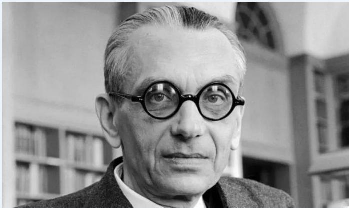

哥德爾完備性定理是數理邏輯中重要的定理，在1929年由庫爾特·哥德爾首先證明。它的最熟知的形式聲稱在階謂詞演算中所有邏輯上有效的公式都是可以證明的

定理2.7 (完备性定理) PC是完全的，即对任意公式集Γ和公式A，若Γ ⊨A，则Γ├A。特别地，若A永真(⊨ A)，则A必为PC之定理(├A)。

# TED Ed

# LESSONSWORTHSHARING

Consider the following sentence: “This statement is false."譯者：盈蓓余審译者：HelenChang

# 命题演算形式系统

定义2.12如果公式A有以Γ为前提的演绎，称A为前提Γ的演绎结果，记为Γ├ A。若Γ={B}，则用B├ A表示。

若B├PC A，A├PC B则记为A├┤B。

定理2.6(演绎定理)对PC中任意公式集Γ和公式A，B，

Γ∪{A}├PC B 当且仅当Γ├PC A→B

# 命题演算形式系统

证明定理： ├PC A→A

1] (A→(A→A)→A))→(A→(A→A))→(A→A)) : 公理A2

2] A→((A→A)→A) :公理A1

3] (A→(A→A))→(A→A) :对1,2使用分离规则

4] A→(A→A):公理A1

5] A→A：对3,4使用分离规则

上述5个公式构成的序列，即为证明

PC的公理（A,B,C表示任意公式）

A1:A→(B→A)

A2:(A→(B→C))→(A→B)→(A→C))

A3:(-A→-B)→(B→A)

PC的公理（A,B，C表示任意公式）

A1:A→(B→A)

A2:(A→(B→C))→(A→B)→(A→C))

A3:(-A→-B)→(B→A)

PC的推理规则（A,B表示任意公式）

A,A→B/B（分离规则

# 命题演算形式系统

证明定理： $\vdash \lnot \ \mathsf { B } \lnot \ ( \mathsf { B } \lnot \mathsf { A } )$

┐ ${ \mathsf { B } } \to ( { \mathsf { B } } \to { \mathsf { A } } )$ 的证明序列如下：

( $1 ) \lnot \ { \mathsf { B } } \lnot \ ( \lnot \ { \mathsf { A } } \lnot \ { \ l } _ { \ l { \mathsf { B } } } )$

(2) $( \lnot \ A { \xrightarrow { } } \lnot \ \mathbf { \to } \lnot \ \mathsf { B } ) \to ( \mathsf { B } { \xrightarrow { } } \mathsf { A } )$

(3) (B→A)))

理Al

理A3

(4)

(5) →┐B))

$$
\rightarrow (\neg \mathrm {B} \rightarrow (\mathrm {B} \rightarrow \mathrm {A}))
$$

(6) (4)(5)

(7) (1)(6)

PC的公理（A,B,C表示任意公式）

A1:A→(B→A)

A2:(A→(B→C))→(A→B)→(A→C))

A3:(-A→-B)→(B→A)

# 命题逻辑的局限性

定义：命题是对确定对象作出判断的语句，那么对于不确定的对象如何？比如x>1条件下x>0的判断？

命题逻辑关注真值推理， 命题之间互相独立，没有内在联系，在经典的三段论推理中了，显得力不从心

命题逻辑中最小研究单位是原子命题，并没有进一步的内部结构

# 三段论例子：

大前提：p:所有的学校都有学生

小前提：q:北京大学是学校

结论：r:北京大学有学生

# 命题逻辑的形式化结果：

$$
(\mathbf {p} \wedge \mathbf {q}) \rightarrow \mathbf {r}
$$

一个正确推理在命题逻辑中并不是永真式

常识：三个命题包含了某些有关联的概念，并非相互独立

# 谓词逻辑

# 语法、语义、谓词逻辑形式系统FC

# 谓词逻辑

# 也称作一阶逻辑（First-order Logic）

• 一阶谓词逻辑语言是围绕对象和关系建立起来的

命题逻辑无法实现！

• 通过引入个体、谓词、量词来表示示个体属性和个体之间的关系

Example.

“天空是蓝色的”

表示个体的属性

Example.

“ a是b的朋友”

表示个体之间的关系

个体 谓词

Example.

“所有小孩子都喜欢冰淇淋”

量词 个体

谓词 个体

# 谓词逻辑的语法

# 谓词

用于描述或判断个体的性质或关系

表示个体性质或者关系的语言成分，通常是谓语，称作谓词

“北京大学是学校”中的“...是学校”

“张三和李四是朋友”中的“...和...是朋友

或者”...和...是..”

谓词中可以放置个体的空位个数称为谓词的元数

单元、二元、三元谓词

# 个体

不依赖于人的主观而客观存在的实体，可以是具体的物体，也可以是抽象概念

谓词逻辑中将一切被讨论的对象都称作个体。

确定的个体常用a,b,c表示，称作个体常元(constants)

不确定的个体常用x,y,z,u,v,w表示，称作个体变元(variables)

被讨论对象的全体称作个体域(domainof individuals)，常记做D

包含一切对象的个体域特称为全总域(universe)，记做U

# 谓词逻辑的语法

# 谓词与函数

谓词符号：表示关系

. 函词符号：表示函数

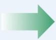

????????

??????ℎ????

# 解释

代表“更小”

代表“某人的父亲”

#  谓词（Predicate）：

通常是用大写英文字母或首字母大写表示，比如Less, Great…

它是把个体映射成 True or False 的映射关系；

# 函词/函数（function）：

通常是用小写英文字母或首字母小写表示，比如plus, father…

它是把个体映射成个体的映射关系；

# 项

指代对象的逻辑表达式

常量符号是项，如nezha

由函词和参数构成的是复合项，如father(nezha)表示“哪吒的父亲”

# 谓词逻辑的语法

# 原子语句

指代对象的项和指代关系的谓词构成陈述事实的原子语句

如????????????(lindaiyu)表示“林黛玉是女性”

# 复合语句

由原子语句和逻辑连接词构造的语句

如??????ℎ???????? linruhai, lindaiyu ¬????????????(linruhai)表示

“如果林如海是林黛玉的父亲，那么林如海不是女性”

# 谓词逻辑的语法

指数量词“所有”和“有”

"所有"为全称量词(universal quantifier)，记做∀（Any/All)

"有"为存在量词(existential quantifier)，记做（Exist）

量词作用于谓词时需要引入一个指导变元，同时放在量词后面和谓

词填式中：VxP（x）、xP（x)

指导变元是不可取值代入的，称作约束变元(boundvariables)，约束变元可以改名而不改变语句含义

可以取值代入的个体变元称作自由变元(freevariables)

量词所作用的谓词或者复合谓词表达式，称作量词的辖域(domainof quantifiers)

对于一元谓词，VxP(x)和xP(x)都是命题，对于有穷的个体域

vxP(x)等价于P(a1)>..^P(aN)

3xP(x)等价于P(a1)v...vP(aN)

# 量词

> 量词用例：

$\textcircled{1}$ 个体域是所有人，xFRD(x，张三)表示“张三在这个世界上有朋友”

$\textcircled{2}$ 个体域是{1,2}， $\forall \mathbf { x } ( \mathbf { x } > \mathbf { 0 } )$ 等价于 $( 1 > 0 ) \land ( 2 > 0 )$

$\textcircled{3}$ 个体域是所有正整数：歌德巴赫猜想

）所有大于2的偶数，均可表示为两个素数之和

) ∀xpq(Even(x)^(x>2)→(x=p+q)^Prime(p)^Prime(q))

有人勇敢，但不是所有人都勇敢

$$
\exists x \text {B r a v e} (x) \wedge \neg \forall x \text {B r a v e} (x)
$$

勇敢者未必是成功者

$$
\neg \forall x (\text {B r a v e} (x) \rightarrow \text {S u c c e s s} (x))
$$

$$
\exists x (\text {B r a v e} (x) \wedge \neg \text {S u c c e s s} (x))
$$

君子坦荡荡，小人常戚戚

$$
\forall \mathbf {x} (\mathbf {P} (\mathbf {x}) \rightarrow \mathbf {Q} (\mathbf {x})) \wedge \forall \mathbf {x} (\mathbf {R} (\mathbf {x}) \rightarrow \mathbf {S} (\mathbf {x}))
$$

张三孤独走完一生

$$
\forall x (\neg F R D (x, \text {张 三})) \text {或 者} \neg \exists x F R D (x, \text {张 三})
$$

# 谓词逻辑的语法

在谓词逻辑中，量词用于表示命题所涉及的对象的数量

# 全称量词（∀）

通常读为“对于所有的…”

$$
\forall x C h i l d (x) \rightarrow L i k e s (x, i c e c r e a m)
$$

表示“对于所有 $x$ ，如果 $x$ 是小孩子，那么 $x$ 喜欢冰淇淋”

??被称为变量

没有变量的项称为基项

# 存在量词（∃）

通常读为“存在…使得…”

$$
\exists x C h i l d (x) \rightarrow \neg L i k e s (x, i c e c r e a m)
$$

表示“存在 $x$ ，使得如果 $x$ 是小孩子，那么 $x$ 不喜欢冰淇淋”

$\exists x P$ 表示至少存在一个对象 $x$ ，使得 $P$ 为真

# 谓词逻辑的语法

∀和∃之间的关联：这两个量词通过否定词紧密关联。

断言“每个人都喜欢冰淇淋”等同于断言“不存在某个讨厌冰淇淋的人”：

$$
\forall x \operatorname {L i k e s} (x, \text {i c e c r e a m}) \leftrightarrow \neg \exists x \neg \operatorname {L i k e s} (x, \text {i c e c r e a m})
$$

断言“每个人都不喜欢咖啡”等同于断言“不存在某个喜欢咖啡的人”：

$$
\forall x \neg \text {L i k e s} (x, \text {c o f f e e}) \leftrightarrow \neg \exists x \text {L i k e s} (x, \text {c o f f e e})
$$

# 谓词逻辑的语法

∀是论域上所有对象的合取式

∃是所有对象析取式

∀和∃遵循德摩根定律

∀和∃之间的关联：这两个量词通过否定词紧密关联。

用于量化语句的德摩根定律

$$
\forall x \neg P \leftrightarrow \neg \exists x P
$$

$$
\neg \forall x P \leftrightarrow \exists x \neg P
$$

$$
\forall x P \leftrightarrow \neg \exists x \neg P
$$

$$
\exists x P \leftrightarrow \neg \forall x \neg P
$$

用于非量化语句的德摩根定律

$$
\neg P \wedge \neg Q \leftrightarrow \neg (P \vee Q)
$$

$$
\neg P \vee \neg Q \leftrightarrow \neg (P \wedge Q)
$$

$$
P \wedge Q \leftrightarrow \neg (\neg P \vee \neg Q)
$$

$$
P \vee Q \leftrightarrow \neg (\neg P \wedge \neg Q)
$$

# 谓词逻辑的语义

# 解释

给个体词在个体域中指定具体的个体，给谓词指定具体的性质或关系，以及给量词指定个体域并判定其范围

一个解释函数可以将谓词 $T$ 的含义解释为“高”

在谓词逻辑中，谓词逻辑公式的真值不是固定不变的，而是依赖于特定的解释。

$\forall x$ Frog $( x ) \Rightarrow$ Green $( x )$ : 所有青蛙都是绿色的

$\neg \forall x$ Likes (x, cat): 不是所有人都喜欢猫

 x Likes (x, cat): 没有人喜欢猫

# 谓词逻辑的语义

如果给定个体域，公式中的所有谓词都有明确意义，公式中的所有自由变元取定个体，谓词公式就成为一个命题

设个体域为实数域， $\mathbb { E } ( { \bf x } , { \bf y } )$ 表示x=y，L（x,y）表示x<y，那么

∀xL(0,x2+1)真，xE(x2+x+1,0)假

）当个体域变成复数域，则上面的真值将改变

谓词逻辑公式成为命题：赋予常元、个体、函数、谓词以语义

# 谓词逻辑的语义

# 置换

在谓词逻辑中，置换指的是利用项对变量进行替换的过程，通常用于处理不同谓词公式中可能出现的多个谓词名相同但个体不同的情况

置换是形如 $\{ \mathfrak { t } _ { 1 } / x _ { 1 } , \mathfrak { t } _ { 2 } / x _ { 2 } , \dots , \mathfrak { t } _ { n } / x _ { n } \}$ 的有限集合，其中

• $\{ x _ { 1 } , x _ { 2 } , \ldots , x _ { n } \}$ 是互不相同的变量

• $\{ \mathfrak { t } _ { 1 } , \mathfrak { t } _ { 2 } , \dots , \mathfrak { t } _ { n } \}$ 是项（常量、变量或函数）

$\mathfrak { t } _ { i } / x _ { i }$ 表示用 $\mathbf { t } _ { i }$ 置换 $x _ { i }$ ，不允许使用和 $x _ { i }$有关的项，也不允许变量 $x _ { i }$ 循环出现在另一个t௝中

（后续会在归结推演中进一步说明）

# 谓词逻辑的语义

# Example 1. 简单原子公式的真值

对于原子公式，直接根据解释中的个体词和谓词的关系来判断其真值

对于原子公式 $R e d ( x )$ ，谓词??????被解释为“是红色的”，而??是一个变量个体词apple表示“红苹果”，个体词banana表示“香蕉”

置换 $\{ x / \mathrm { a p p l e } \}$ 得到??????(apple) （即“红苹果是红色的”为真）

# 谓词逻辑的语义

# Example 2. 复合公式的真值

根据逻辑联结词的规则和各个子命题的真值来判断整个复合命题的真值

已知原子公式??????(apple)为真， ??????(banana)为假

有?????? apple ∧ ??????(banana)为假

# Example 3. 含有量词的复合公式的真值

对于含有量词的命题，需要根据量词（全称量词或存在量词）的定义和个体域中的个体来判断命题的真值

# 谓词逻辑中的逻辑蕴涵

# 逻辑蕴涵的定义

如果在一个特定的解释（或称为模型、赋值）下，公式 $P$ 为真必然导致公式??也为真，那么我们就说 $P$ 蕴含 $Q$ ，记作 $P  Q$

# 反证法证明逻辑蕴涵

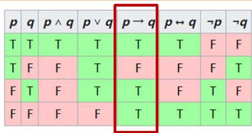

假设??为真而??为假，然后尝试在这个假设下进行逻辑推导。如果能够推导出矛盾（即得出一个已知为假的命题），那么假设不成立，从而证明 $P$ 蕴含 $Q$ 。

# 谓词逻辑中的逻辑等价

# 逻辑等价的定义

如果两个公式??和??在所有可能的解释下都取相同的真值（即要么都为真，要么都为假），那么我们就说 $P$ 和 $Q$ 是等价的，记作 $P  Q$

# 真值表法证明

如果在所有变量取值组合下， $P$ 和 $Q$的真值都相同，那么 $P$ 和 $Q$ 是等价的

# 逻辑等价变换法证明

当且仅当??蕴涵 $Q$ 并且 $Q$ 蕴涵??时， ??和 $Q$ 是等价的

# 谓词演算永真蕴含式

(1) 化简式 $\mathrm { P } \Lambda \mathrm { Q } \Rightarrow \mathrm { P } \Lambda \mathrm { Q } = > \mathrm { Q }$

(2) 附加式 $\mathrm { P } \Rightarrow \mathrm { P v Q } \quad \mathrm { Q } \Rightarrow \mathrm { P v Q }$

(3) 析取三段论 ¬P，P∨Q => Q

(4) 假言推理 P，P→Q => Q

(5) 拒取式 ¬ Q，P→Q => ¬ P

(6) 假言三段论 $\mathrm { P {  } Q , } \mathrm { Q {  } R {  } P {  } R }$

(7) 二难推理 ${ \mathrm { P v Q } } , \ { \mathrm { P \to R } } , \ { \mathrm { Q \to R } } = > { \mathrm { R } }$

(8) 全称特化 $( \forall x ) \mathrm { P } ( x ) \Rightarrow \mathrm { P } ( y )$

其中y是个体域中任一个体。利用此永真蕴涵式可以消去公式中的全称量词。

(9) 存在特化 $( \exists x ) \mathrm { P } ( x ) \Rightarrow \mathrm { P } ( y )$

# 谓词逻辑形式系统

谓词逻辑的公理组由下列公理模式及其所有全称化所组成。

AX(l.1). A→(B→A)

AX(l.2). (A→(B→C))→((A→B)→(A→C))

AX(l.3). (┐A→┐B)→(B→A)

AX2. vA→A v (t对A中变元v可代入)

AX3. v(A→B) →(v A→v B)

AX4. A→vA(v在A中无自由出现)

推理规则模式仍为rmp （分离规则）

前三条是逻辑语言里的重言式，也是谓词演算的永真式，后三条是谓词演算的永真式

# 谓词逻辑形式系统

# 前束范式

定义 设F为谓词逻辑公式，如果其中的所有量词均不以否定形式出现在公式之中，而他们的辖域为整个公式，则称F为前束范式，一般写成

$$
(Q _ {1} x _ {1}) \ldots (Q _ {n} x _ {n}) M (x _ {1}, \ldots , x _ {n})
$$

其中 $Q _ { i } ( i = 1 , 2 , \dots , n )$ 为前缀， $( Q _ { 1 } x _ { 1 } )$ … $( Q _ { n } x _ { n } )$ 是一个由全称量词或存在量词组成的量词串， $M ( x _ { 1 } , \dots , x _ { n } )$ 为母式，它是一个不含任何量词的谓词公式

# 谓词逻辑形式系统

# 化为前束范式

(1)消去蕴涵符号 $( \not  \to \bar { \not { D } }$ 联结词)。

(2)内移否定词┓的辖域范围。

(3)变量标准化。对变量作必要的换名，使每一量词只约束一个唯一的变量名。

(4)把所有量词都集中到公式左面，移动时不要改变其相对顺序。

# 谓词逻辑形式系统

# 谓词逻辑应用

例2.4 “某些患者喜欢所有医生。没有患者喜欢庸医。所以没有医生是庸医。”

解：P(x)表示“x是患者”，

D(x)表示“x是医生”，

${ \sf { Q } } \left( { \sf x } \right)$ 表示“x是庸医”，

$\mathsf { L } \left( \mathsf { x } , \mathsf { y } \right)$ 表示“x喜欢y”。

$$
F 1: (\exists x) (P (x) \land (\forall y) (D (y) \rightarrow L (x, y)))
$$

$$
F _ {2}: (\forall x) (P (x) \rightarrow (\forall y) (Q (y) \rightarrow \neg L (x, y)))
$$

$$
G: (\forall x) (D (x) \rightarrow \neg Q (x))
$$

目的是证明G是F1和F2的逻辑结论。（见书本57页）

# 谓词逻辑形式系统

# 谓词逻辑应用

例2.5 每个去临潼游览的人或者参观秦始皇兵马俑，或者参观华清池，或者洗温泉澡。凡去临潼游览的人，如果爬骊山就不能参观秦始皇兵马俑，有的游览者既不参观华清池，也不洗温泉澡。因而有的游览者不爬骊山。

解：定义G（x）表示“x去临潼游览”；

A（x）表示“x参观秦始皇兵马俑”；

B（x）表示“x参观华清池”；

C（x）表示“x洗温泉澡”；

D（x）表示“x爬骊山” 

前提：∀x(G(x)→A(x)∨B(x)∨C(x)) (1)

$$
\forall x (G (x) \wedge D (x) \rightarrow \neg A (x)) \tag {2}
$$

$$
\exists x (G (x) \wedge \neg B (x) \wedge \neg C (x)) \tag {3}
$$

结论： $\exists \mathbf { x } ( \mathbf { G } \left( \mathbf { x } \right) \land \lnot \ \mathbf { D } \left( \mathbf { x } \right) )$

# 谓词逻辑形式系统

前提： $\forall \times ( \mathsf { G } ( \mathsf { x } )  \mathsf { A } ( \mathsf { x } ) \lor \mathsf { B } ( \mathsf { x } ) \lor \mathsf { G } ( \mathsf { x } ) )$ (1)

$$
\forall x (G (x) \wedge D (x) \rightarrow \neg A (x)) \tag {2}
$$

$$
\exists x (G (x) \wedge \neg B (x) \wedge \neg C (x)) \tag {3}
$$

结论： $\exists \mathbf { x } ( \mathbf { G } ( \mathbf { x } ) \land \lnot \ \mathbf { D } ( \mathbf { x } ) )$

证明：（4）G(a) ∧¬ B(a) ∧¬ C(a) 由(3)

（5）G(a)→A(a)∨B(a)∨C(a) 由(1)

（6）G(a)∧D(a)→¬A(a) 由(2)

(7)A(a)→ ¬ G(a) ∨¬ D(a) 由(6)

（8）G(a) 由（4）

（9）A(a)∨B(a)∨C(a) 由（5）（8）

（10）¬ B(a)，¬ C(a) 由（4）

（11）A(a) 由（9）（10）

（12）¬ D(a) 由（7）（8）（11）

（13）x(G(x) ∧¬ D(x)) 由（8）（12）

# 谓词逻辑形式系统

# 课堂练习

练习1 每个旅客或者坐头等舱或者坐经济舱。旅客当且仅当富有时坐头等舱。有些旅客富有但并非所有旅客都富有。因而有些旅客坐经济舱。

练习2 婴儿的行为不合逻辑。能管理鳄鱼的人不会被人轻视。行为不可逻辑的人会被人轻视。所以婴儿不能管理鳄鱼。

# 谓词逻辑形式系统

# 课堂练习

练习1

解：定义F(x)表示“旅客x坐头等舱”$\mathsf { G } \left( \mathsf { x } \right)$ 表示“旅客x坐经济舱”$\mathsf { H } \left( \mathsf { x } \right)$ 表示“旅客x富有”；

前提： $\forall \times ( \mathsf { F } \left( \mathsf { x } \right) \vee \mathsf { G } \left( \mathsf { x } \right) )$ (1)

$$
\forall x (F (x) \leftrightarrow H (x)) \tag {2}
$$

$$
\exists x H (x) \wedge \neg \forall x H (x) \tag {3}
$$

结论： $\exists \times { \mathsf { G } } \left( \mathsf { x } \right)$

证明：

(4) ¬ ∀xH(x) 由(3)

(5)  ¬ H(x) 由(4)

(6) ¬ H(a) 由(5)

(7) F(a)←→H(a) 由(2)

(8) ¬ F(a) 由(6)(7)

(9) F(a)∨G(a) 由(1)

(10)G(a) 由(8)(9)

(11)x G(x) 由(10)

# 谓词逻辑形式系统

# 课堂练习

# 练习2

解：定义B(x)表示“x是婴儿”；L(x)表示“x的行为符合逻辑”；M(x)表示“x能管理鳄鱼”D(x)表示“x被人轻视”

前提： $\forall \times \left( \mathsf { B } \left( \mathsf { x } \right) \Rightarrow \neg \mathsf { L } \left( \mathsf { x } \right) \right)$ (1)

$$
\forall x (M (x) \rightarrow \neg D (x)) \tag {2}
$$

$$
\forall x (\neg L (x) \rightarrow D (x)) \tag {3}
$$

结论： $\forall \times \left( \mathsf { B } \left( \mathsf { x } \right) \Rightarrow \neg \mathsf { M } \left( \mathsf { x } \right) \right)$

# 证明：使用反证法

# 假设：存在婴儿能管理鳄鱼

(4) x(B(x)∧M(x)) 由假设

(5) B(a)∧M(a) 由(4)

(6) B(a) 由(5)

(7) M(a) 由(5)

(8) B(a)→¬ L(a) 由(1)

(9) ¬ L(a) 由(6)(8)

(10) $\lnot \ L \left( \mathsf { a } \right) \lnot \mathsf { D } \left( \mathsf { a } \right)$ 由(3)

(11)D(a) 由(9)(10)

(12)M $\left( \mathsf { a } \right) \to \lnot \ D \left( \mathsf { a } \right)$ 由(2)

(13)¬ D(a) 由(7)(12)

# 矛盾，故假设不成立

(14)∀x(B(x)→¬ M(x))

由(4)取否定

# 谓词逻辑的应用

# Example. 亲属关系论域

一元谓词 ????????、????????????

二元谓词 ????????????????、??????????????????、 ??????ℎ????????

除了公理之外，还有通过公理推理得到的定理

# 公理

家长和孩子是反关系：

$$
\forall p, c \operatorname {P a r e n t O f} (p, c) \leftrightarrow \operatorname {C h i l d O f} (c, p)
$$

祖父母是家长的家长：

$$
\forall g, c \operatorname {G r a n d p a r e n t O f} (g, c) \leftrightarrow \exists p \operatorname {P a r e n t O f} (g, p) \land \operatorname {P a r e n t O f} (p, c)
$$

# 小结

# 内容总结

 知识和知识表示

 命题逻辑的语法：逻辑连接词

 命题逻辑的语义：真值表

 谓词逻辑的语法：常量、谓词、函词符号

 谓词逻辑的语义：解释、置换

 谓词逻辑的应用：公理、定理