# 人工神经网络：仿生联结智慧启

Artificial Neural Network: Intelligence with Brain-inspired Neuron

授课对象：计算机科学与技术专业 二年级

课程名称：人工智能（专业必修）

节选内容：第六章 机器学习

课程学分：3学分

# 前情知识回顾： 机器学习概述

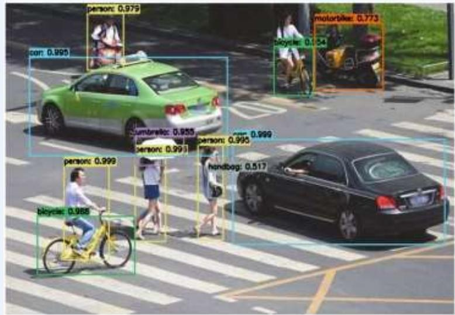

计算机视觉（Computer Vision）

语音识别（Speech Recognition）

自然语言处理(Natural Language Processing)课程人工智能助教“智小思”

# 前情知识回顾： 机器学习概述

# ≈ 机器自动找一个函数

• 回归 (Regression)：函数的输出是一个数值

• 分类 (Classification)：函数的输出是一个类别

• 生成 (Generation)：函数的输出是一个数据

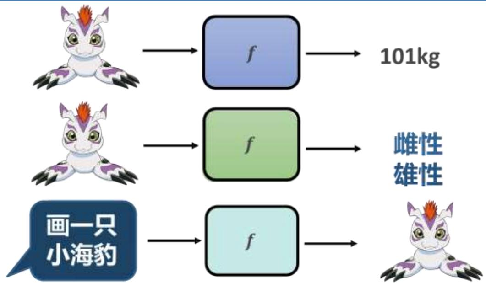

机器学习的核心目标是通过数据学习一个函数 f(x) ，完成从输入到输出的映射

关键：如何设计函数结构和优化策略来更好地完成这个映射

# 人工神经网络的发展历史

Origins: Algorithms that try to mimic the brain

Widely used in 80s and early 90s; popularitydiminished in late 90s

Resurgence: State-of-the-art technique for manyapplications in recent years

# Brain vs ANN

# 人类如何用脑

# HOW THEDEVICE WORKS

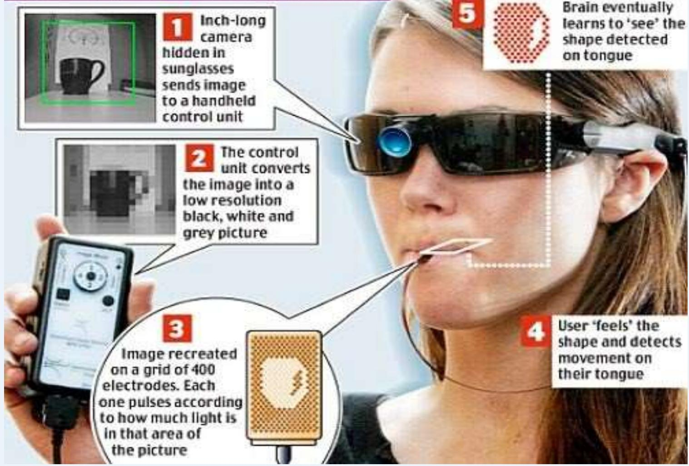

# 神经元

人脑中的神经网络是一个非常复杂的组织，由很多具有适应性的简单同构单元组成的广泛并行互连的网络，它的组织能够模拟生物神经系统对真实世界所作出的交互反应

这一简单的结构就是神经元

成人的大脑中估计有 1000 亿个神经元

# 神经元

• 1904年生物学家已经知晓神经元的组成结构

一个神经元通常具有多个树突，主要用来接受传入信息；而轴突只有一条，轴突尾端有许多轴突末梢，跟其他神经元的树突产生连接（突触），从而给其他多个神经元传递信

号

大
脑
运
作
方
式
的
启
发

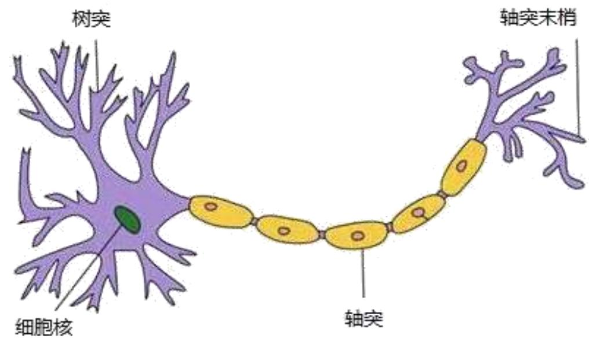

神经元结构图

# 人脑神经元的信息传递

• 当一个神经元接收的信号累积到一定程度时，它会释放神经递质，该神经递质会经过树突前端前往轴突末梢，依靠突触刺激下一个神经元，实现多个神经元间信息传递

信息的传递

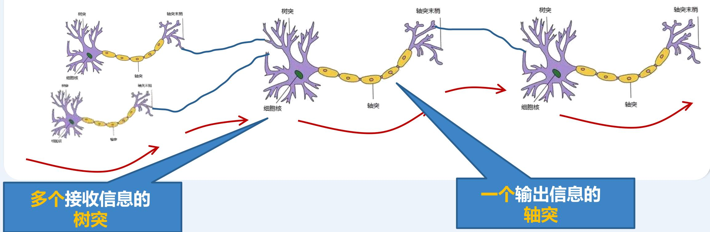

# 人脑神经元模型MP

# 人脑神经元的信息传递

• 1943年，心理学家McCulloch和数学家Pitts参考了生物神经元的结构，发表了抽象的神经元模型MP

• 类比生物结构：输入可以类比为神经元的树突，而输出可以类比为神经元的轴突，计算则可以类比为细胞核。神经元模型是一个包含输入，输出与计算功能的模型

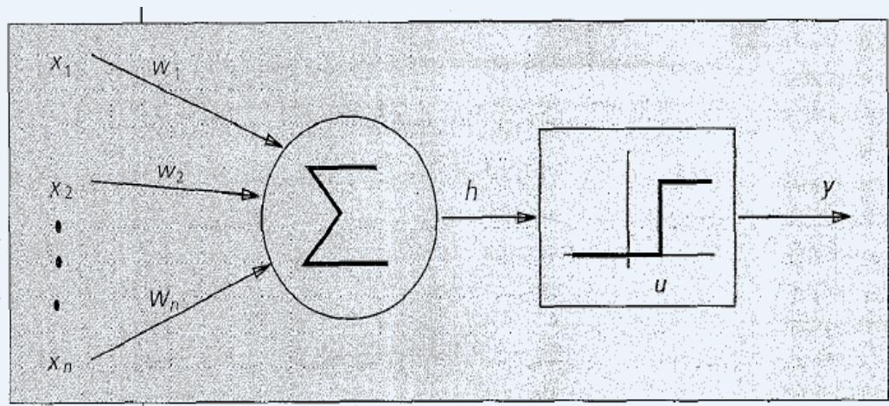

Figure 2. McCulloch-Pits model of a neuron.

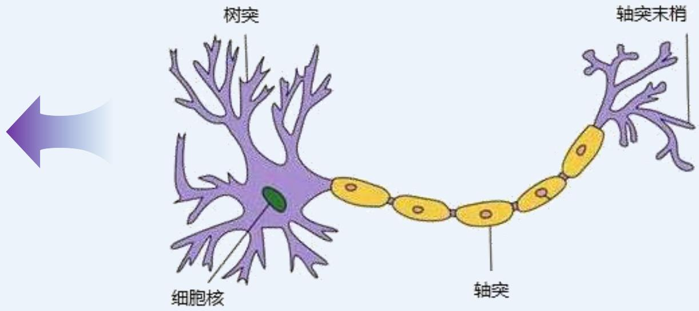

# 人工神经元模型MP

类比生物结构：输入可以类比为神经元的树突，而输出可以类比为神经元的轴突，计算则可以类比为细胞核。神经元模型是一个包含输入，输出与计算功能的模型。

下图是一个典型的神经元模型：包含有3个输入，1个输出，以及2个计算功能

注意中间的箭头线。这些线称为“连接”。每个上有一个“权值”

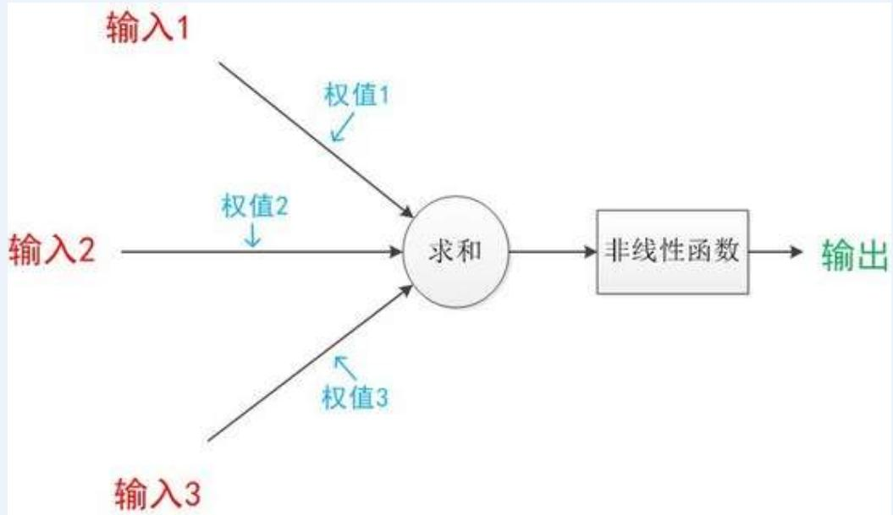

神经元模型

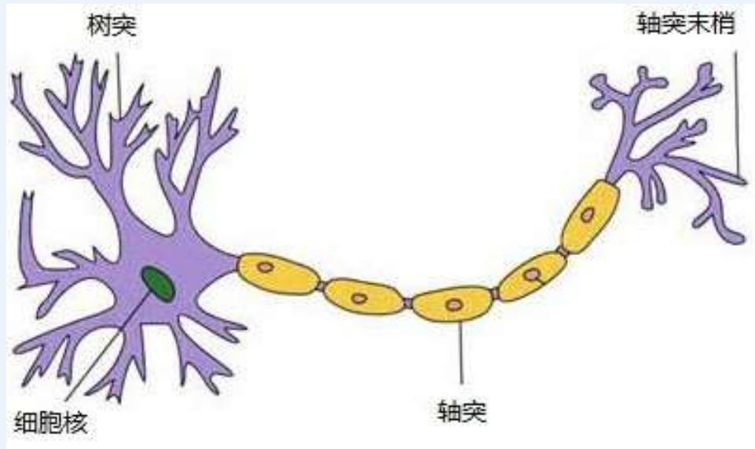

# 人工神经元模型MP

个典型的神经元模型，包含有N个输入，1个输出，以及2个计算功能，每个连接上有个权值

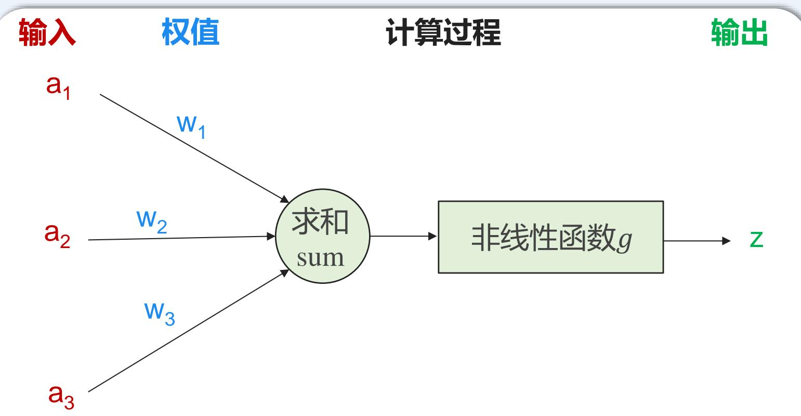

$$
\Rightarrow \quad z = g \left(a _ {1} w _ {1} + a _ {2} w _ {2} + a _ {3} w _ {3}\right)
$$

# 人工神经元模型MP

• 神经元的计算公式：用 ?? = [a1，a2，a3]T 表示输入，用 $W = \left[ \mathsf { W } _ { 1 } , \mathsf { W } _ { 2 } , \mathsf { W } _ { 3 } \right]$ 表示权值，经过加权计算末端信号为 $W \times \mathbf { \pmb { a } }$ ，再叠加非线性函数g，即是输出值z

• 在MP模型里，非线性函数g设置是符号函数（sgn）

• 由于起到类似神经元的“激活”作用，也称作激活函数（Active Function）

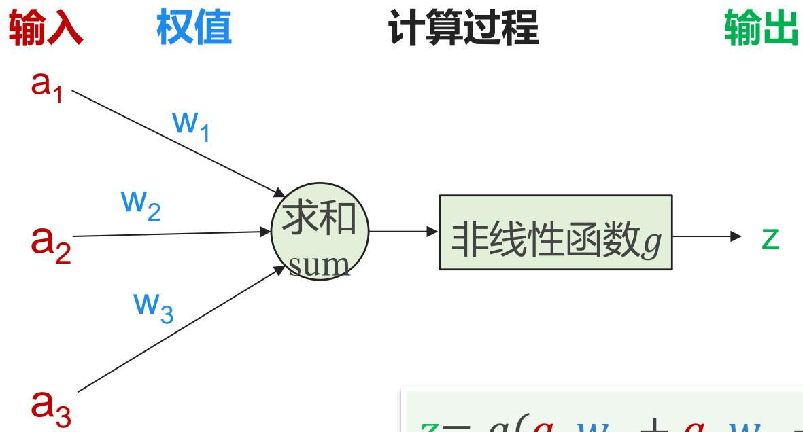

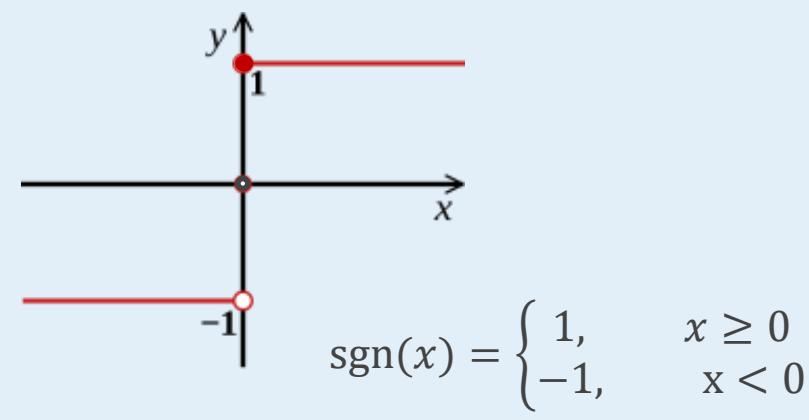

$$
z = g \left(a _ {1} w _ {1} + a _ {2} w _ {2} + a _ {3} w _ {3}\right) = g (\boldsymbol {W} \times \boldsymbol {a})
$$

# 人工神经元模型MP

• 对神经元模型的图进行简化：将求和函数sum与激活函数sgn合并到一个圆圈里，代表神经元的内部计算。此时，一个“节点”就是一个神经元

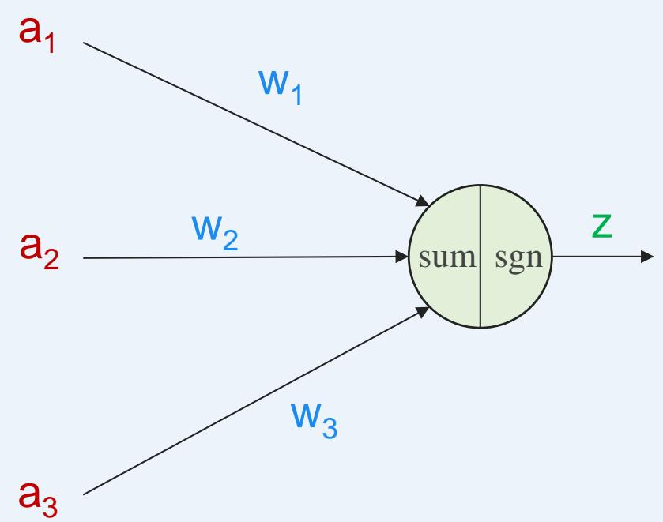

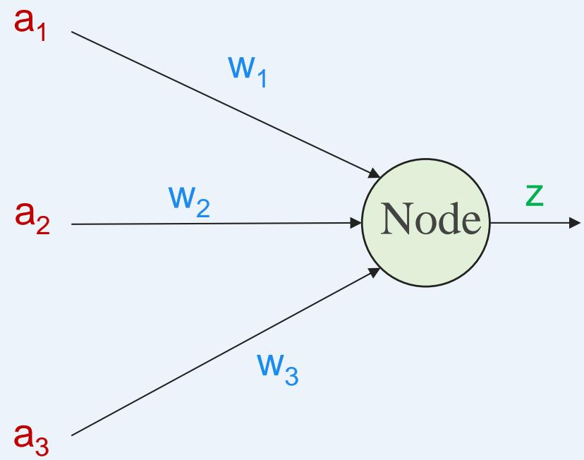

# MP神经元的理解

• 神经元模型可以这样理解：

• 根据3个已知属性预测未知属性

• 神经元模型中：3个已知属性的值是a1，a2，a3，未知属性的值是z

• 已知的属性称为特征，未知属性称为目标

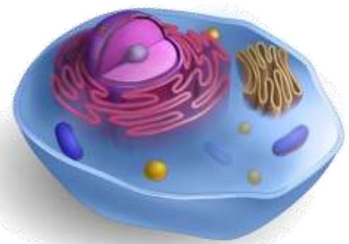

# 特征

# 已知

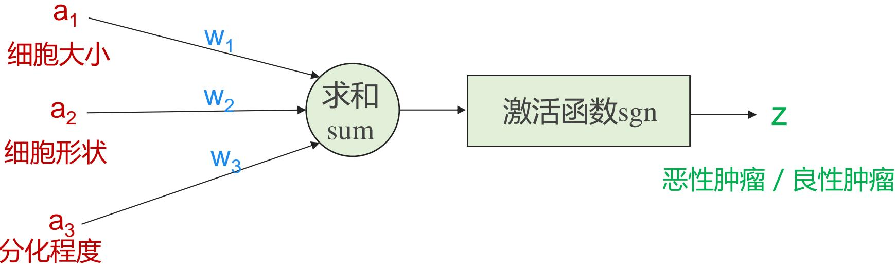

# 未知

# 目标

# MP神经元的缺陷

1943年发布的MP模型，虽然简单，但已经建立了神经网络大厦的地基。然而，MP模型中，权重的值都是预先设置的，因此不能进行学习

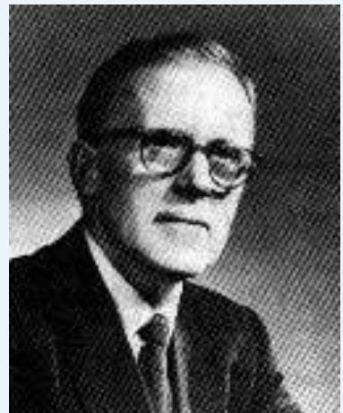

Donald Olding Hebb

1949年心理学家Hebb发现人脑神经细胞的突触上的强度是可以变化的，提出了Hebb学习率。这启发计算科学家们开始考虑用调整权值的方法来让机器自我学习，为后面的学习算法奠定了基础

基于这个启发，才诞生了感知机（Perceptron）

# 启发：学科交叉

各个学科之间有相通之处，互相启发

人工智能亦助力其它医学、生物学等多学科发展

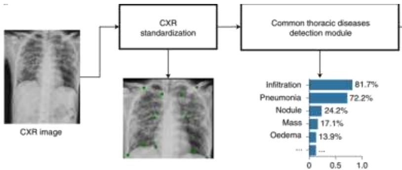

广东省某医院：基于胸片的AI诊断系统

# 感知机模型

感知机（Perceptron）：由两层神经元构成

• 输入层：在MP模型的输入位置添加神经元节点，只传输数据，不做计算

• 输出层：对前面一层的输入进行计算

输入层

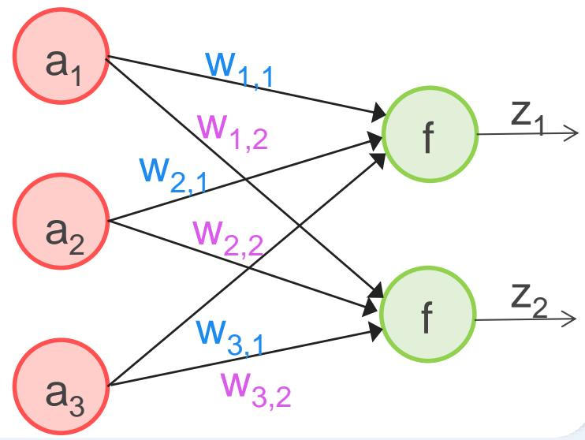

感知机拥有一个计算层，也称为“单层神经网络”

# 感知机模型

• 感知机可用于回归问题和分类问题

大小

楼层

城市

朝向

开发商

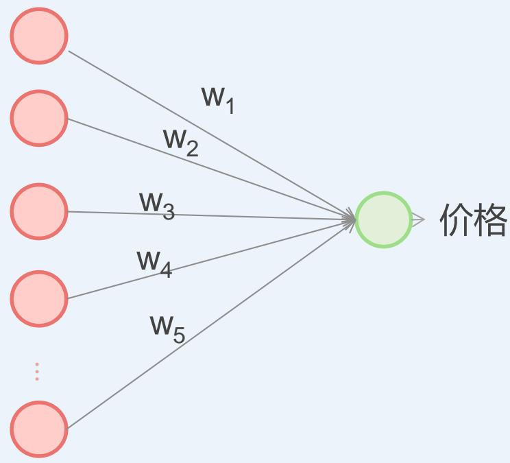

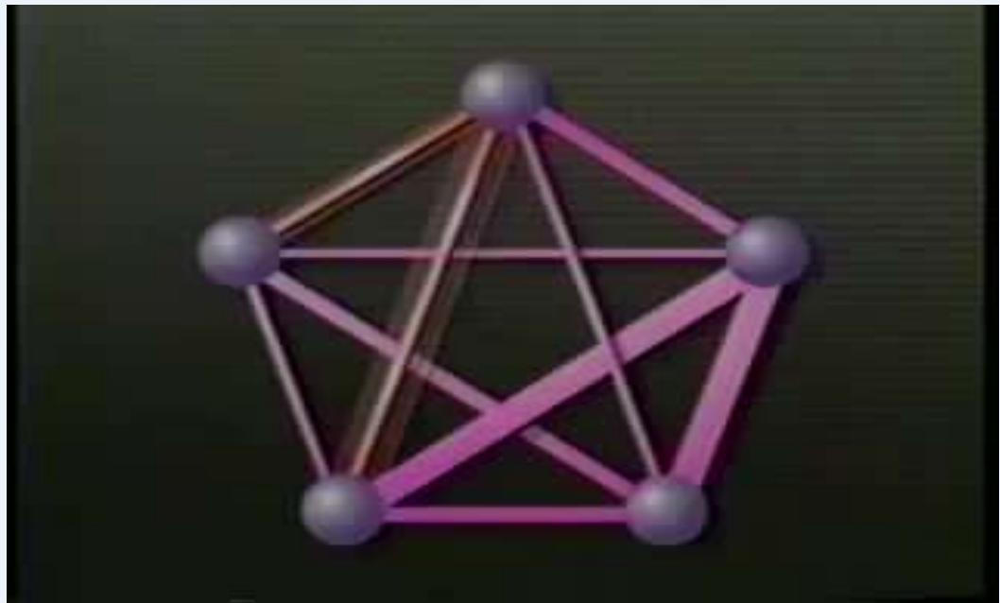

感知机的房价回归预测

感知机的早期应用：性别分类

# 感知机模型数学化公式

# [分组讨论]

• 输入向量 $\begin{array} { r } { \pmb { a } = [ \hat { \mathbf { a } } _ { 1 } , \hat { \mathbf { a } } _ { 2 } , \hat { \mathbf { a } } _ { 3 } ] ^ { \top } } \end{array}$ ，输出向量 $\begin{array} { r } { { \textbf z } = [ z _ { 1 } , z _ { 2 } ] ^ { \intercal } } \end{array}$ ，系数矩阵 $W \in \mathbb { R } ^ { 2 \times 3 }$

• 则用矩阵乘法表达感知机的计算公式为： $\mathbf { \boldsymbol { z } } = \mathbf { \boldsymbol { g } } ( \mathbf { \boldsymbol { W } } \times \mathbf { \boldsymbol { a } } )$

• 该公式也是神经网络中从前一层到后一层的运算过程

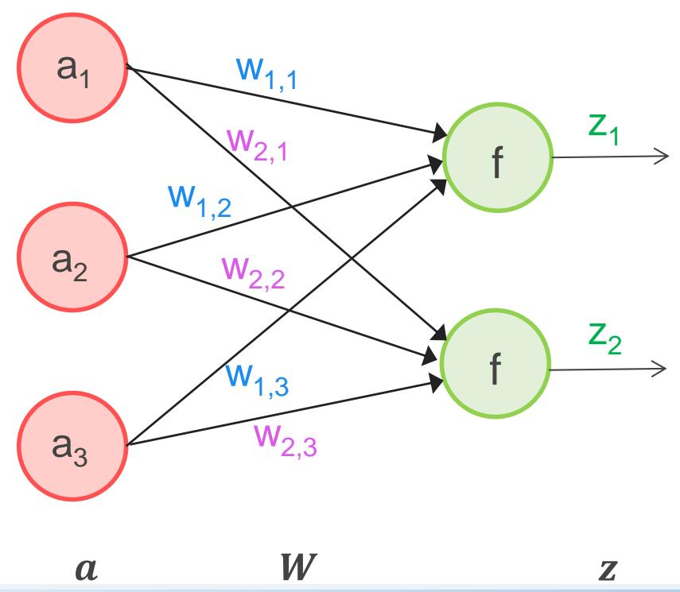

$$
\begin{array}{l} z _ {1} = g (a _ {1} w _ {1, 1} + a _ {2} w _ {1, 2} + a _ {3} w _ {1, 3}) \\ z _ {2} = g (a _ {1} w _ {2, 1} + a _ {2} w _ {2, 2} + a _ {1} w _ {2, 3}) \\ \end{array}
$$

# 感知机模型数学化公式

• 与神经元MP模型不同，感知机中的权重是通过训练得到的

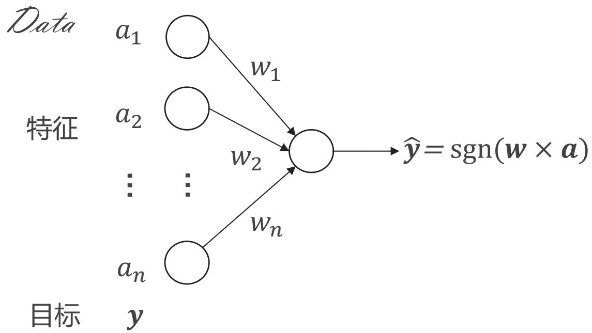

$$
\operatorname {s g n} (z) = \left\{ \begin{array}{l l} 1, & \mathrm {i f} z \geq 0 \\ - 1, & \mathrm {o t h e r w i s e} \end{array} \right.
$$

$$
\min _ {\boldsymbol {W}} | \boldsymbol {y} - \widehat {\boldsymbol {y}} |
$$

# 感知机训练法则

$$
W _ {t} \gets W _ {t} + \Delta W _ {t}
$$

$$
\Delta W _ {t} = \eta (y - \hat {y}) \pmb {a}
$$

??：是真实的目标

??ො：是感知机的输出

??：学习速率（如 0.1）

??：训练数据

# 感知机潜藏的缺陷

$$
\boldsymbol {w} \cdot \boldsymbol {x} = 0
$$

根据以前的知识我们知道，感知机类似一个 逻辑回归 模型，可以做线性分类任务。可以把感知机当做n维空间中的决策超平面，对于超平面一侧的实例感知机输出 1，对于另侧的实例输出 0

我们可以用 决策分界 来形象的表达分类的效果。决策分界就是在二维的数据平面中划出条直线，当数据的维度是3维的时候，就是划出一个平面，当数据的维度是n维时，就是划出一个n-1维的超平面。下图显示了在二维平面中划出决策分界的效果，也就是感知机的分类效果。

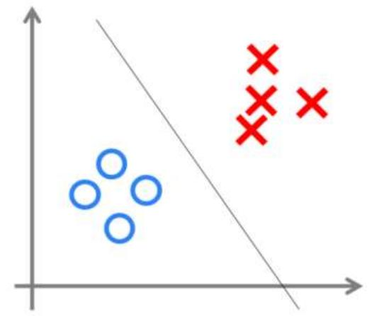

# 感知机的缺陷

# [代码演练 、分组讨论]

• Minsky在1969年出版了一本叫《Perceptron》的书，里面用详细的数学证明了感知器的弱点，尤其是单层感知器对XOR（异或）这样的简单分类任务都无法解决

Minsky

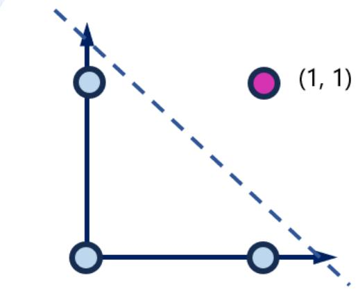

AND

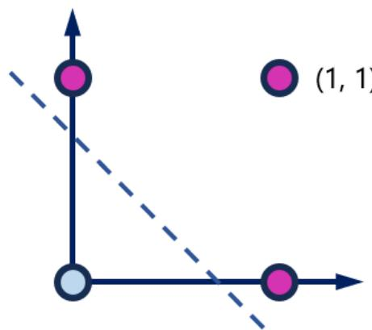

OR

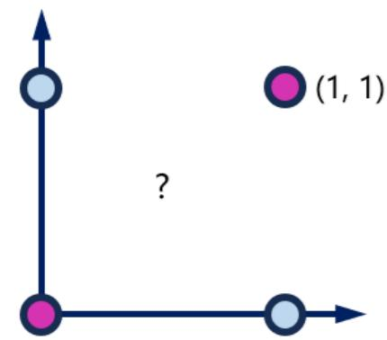

XOR

俞出0

出1

• 代码参考：https://pastebin.ubuntu.com/p/8dw4zyXfY8/

# 感知机的缺陷

# [代码演练 、分组讨论]

• Minsky在1969年出版了一本叫《Perceptron》的书，里面用详细的数学证明了感知器的弱点，尤其是单层感知器对XOR（异或）这样的简单分类任务都无法解决

线性分类任务

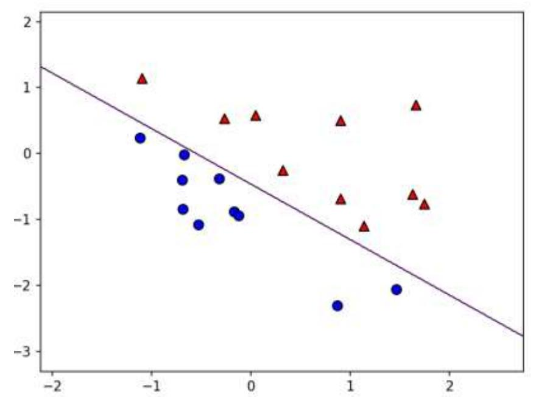

XOR任务

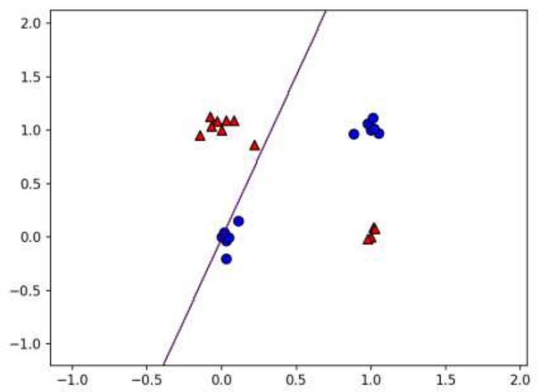

• 代码参考：https://pastebin.ubuntu.com/p/8dw4zyXfY8/

# 感知机的缺陷

# [代码演练 、分组讨论]

• 实验结论：感知机只能做简单的线性分类任务

• 给定感知机 $\mathbf { z } = \mathsf { s g n } ( W \times \mathsf { a } )$

• 考虑 $W \times \textsf { a } = 0$ ，即 $\mathsf { w } _ { 1 } { } ^ { \star } \mathsf { a } _ { 1 } + \mathsf { w } _ { 2 } { } ^ { \star } \mathsf { a } _ { 2 } { = } 0$

• 不在直线上的点 a 代入?? × a，结果>0 或 <0 经过sgn函数的作用就会划分出1或-1两个分类

一条直线

决策平面

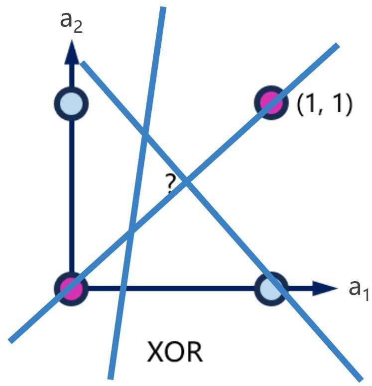

怎么解决XOR（异或）问题呢？

# 多层感知机

单层神经网络无法解决异或问题。但是当增加一个计算层以后，两层神经网络不仅可以解决异或问题，而且具有非常好的非线性分类效果。不过两层神经网络的计算是一个问题，没有一个较好的解法

1986 年， Rumelhar 和 Hinton 等人提出了反向传播（ Backpropagation ， BP ）算法，解决了两层神经网络所需要的复杂计算量问题，从而带动了业界使用两层神经网络研究的热潮

这时候的Hinton还很年轻，30年以后，正是他重新定义了神经网络，带来了神经网络复苏

David Rumelhart

Geoffery Hinton

# 多层感知机模型（多层神经网络/MLP）

• 多层神经网络：即多层感知机（Multi-Layer Perceptron，简称MLP）

• 包含三个层次：一个输入层，一个或多个中间层 (也叫隐藏层，hidden layer) 和一个输出层

• 输入层与输出层的节点数是固定的，中间层则可以自由指定

输入层

隐藏层

输出层

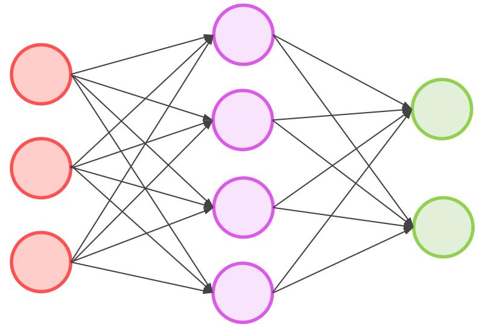

# 多层感知机模型数学化表达

• 使用向量和矩阵来表示神经网络中的变量。 $x , a , z$ 是网络中传输的向量数据。 $\mathbf { W } _ { 1 }$ 和 $\mathbf { W } _ { 2 }$ 是网络的矩阵参数

• 矩阵运算具有简洁性，节点数增多也不受影响

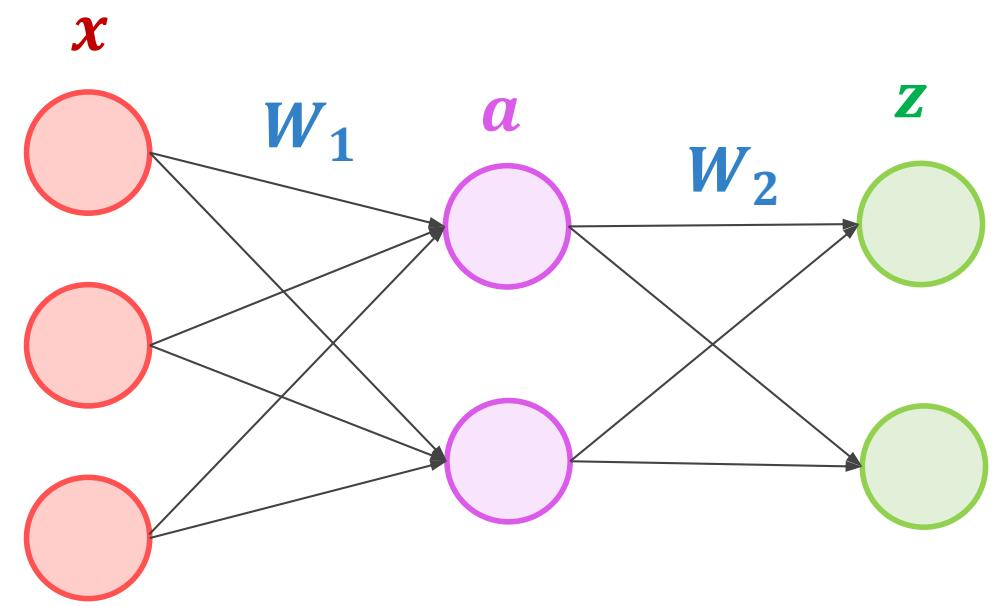

$$
\begin{array}{l} \boldsymbol {a} = g (\mathbf {W} _ {1} \times \boldsymbol {x}) \\ \mathbf {z} = g (\mathbf {W} _ {2} \times \mathbf {a}) \\ = g (\mathbf {W} _ {2} \times g (\mathbf {W} _ {1} \times \boldsymbol {x})) \\ \end{array}
$$

# 多层感知机模型数学化表达

• MLP通常还会引入偏置单元，它与后一层的所有节点都有连接

• 记所有偏置值为向量 $\pmb { b }$ ，则MLP的矩阵运算公式为：

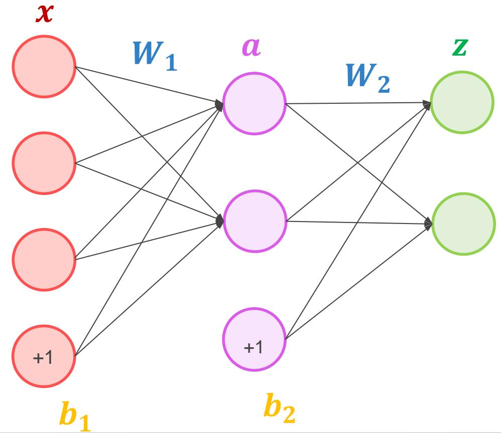

$$
\begin{array}{l} \boldsymbol {a} = g _ {1} (\mathbf {W} _ {1} \times \boldsymbol {x} + b _ {1}) \\ \mathbf {z} = g _ {2} (\mathbf {W} _ {2} \times \mathbf {a} + b _ {2}) \\ = g _ {2} \left(\mathrm {W} _ {2} \times g _ {1} \left(\mathrm {W} _ {1} \times \boldsymbol {x} + b _ {1}\right) + b _ {2}\right) \\ \end{array}
$$

# 多层感知机模型激活函数

• 两层神经网络不再使用??????函数作为激活函数，而是使用平滑函数sigmoid

# 不同的激活函数

$$
\operatorname {s g n} (x) = \left\{ \begin{array}{l l} 1, & x > 0 \\ - 1, & \mathrm {x <   0} \end{array} \right.
$$

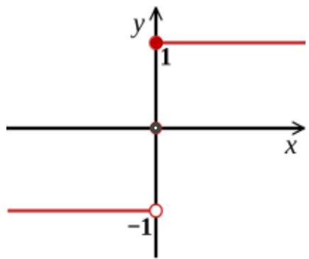

(a) sgn

用于MP神经元，感知机

$$
\operatorname {s i g m o i d} (x) = \frac {1}{1 + e ^ {- x}}
$$

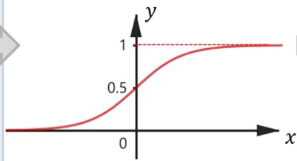

(b) sigmoid

多用于多层神经网络(MLP)

$$
\mathrm {R e L U} (x) = \max (0, x)
$$

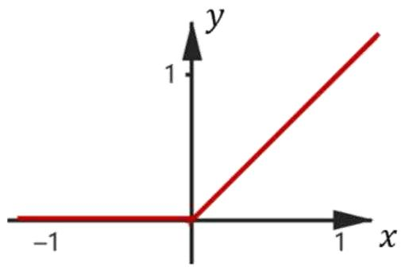

(c) ReLU

多用于深层神经网络(DNN)

$$
\tanh (x) = \frac {e ^ {x} - e ^ {- x}}{e ^ {x} + e ^ {- x}}
$$

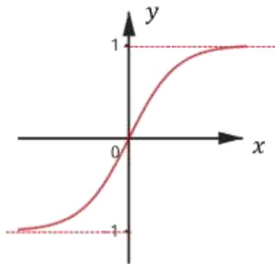

(d) tanh

多用于深层神经网络(DNN)

# 多层神经网络的拟合原理

通用近似定理(Universal Approximation Theorem)[Cybenko,1989，Hornik et al., 1989]:

令 $\varphi ( \cdot )$ 是一个非常数、有界、单调递增的连续函数, $\mathfrak { L } _ { d }$ 是一个d维的单位超立方体[0,1]d， $\mathrm { C } ( { \mathbb { I } _ { d } } )$ 是定义在 $\Sigma _ { d }$ 上的连续函数集合。对于任何一个函数 $( \pmb { x } ) \in \mathbb { C } ( \mathbb { \bot } _ { d } )$ ，存在一个整数??，和一组实数 $\pmb { \nu } _ { i } , \in \mathbb { R }$ 以及实数向量 $W _ { i }$ ∈$\mathbb { R } ^ { d } , i = 1 , \cdots , \mathbf { m }$ ，可以定义函数：

$$
\boldsymbol {F} (\boldsymbol {x}) = \sum_ {i = 1} ^ {m} \nu_ {i} \varphi \left(\boldsymbol {W} _ {i} ^ {T} \boldsymbol {x} + \boldsymbol {b} _ {i}\right)
$$

作为函数??的近似实现，即：

$| F ( { \pmb x } ) - f ( { \pmb x } ) | < \epsilon , \forall { \pmb x } \in L _ { d }$ 其中 $\epsilon > 0$ 是一个很小的正数。

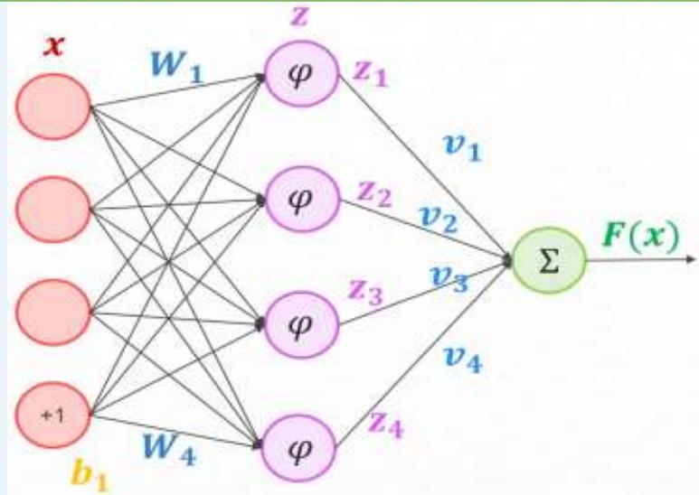

$$
\begin{array}{r l} \boxed {z _ {1}} & = \varphi (\mathbf {W} _ {1} \times \boldsymbol {x} + b _ {1}) \\ z _ {2} & = \varphi (\mathbf {W} _ {2} \times \boldsymbol {x} + b _ {2}) \\ \vdots & \vdots \\ z _ {m} & = \varphi (\mathbf {W} _ {m} \times \boldsymbol {x} + b _ {k}) \end{array}
$$

vi加权求和

# 多层神经网络的拟合原理

通用近似定理(Universal Approximation Theorem)[Cybenko,1989，Hornik et al., 1989]:

令 $\cdot \varphi \left( \cdot \right)$ 是一个非常数、有界、单调递增的连续函数, $\mathfrak { L } _ { d }$ 是一个d维的单位超立方体[0,1]d， $\mathrm { C } ( { \mathbb { I } _ { d } } )$ 是定义在 $\Sigma _ { d }$ 上的连续函数集合。对于任何一个函数 $\pmb { f } ( \pmb { x } ) \in \mathrm { C } ( \mathbb { I } _ { d } )$ ，存在一个整数??，和一组实数 $\pmb { \nu } _ { i } , \in \mathbb { R }$ 以及实数向量 $W _ { i }$ ∈$\mathbb { R } ^ { d } , i = 1 , \cdots , \mathbf { m }$ ，可以定义函数：

$$
\boldsymbol {F} (\boldsymbol {x}) = \sum_ {i = 1} ^ {m} \nu_ {i} \varphi \left(\boldsymbol {W} _ {i} ^ {T} \boldsymbol {x} + \boldsymbol {b} _ {i}\right)
$$

作为函数??的近似实现，即：

$| F ( { \pmb x } ) - f ( { \pmb x } ) | < \epsilon , \forall { \pmb x } \in L _ { d }$ 其中 $\epsilon > 0$ 是一个很小的正数。

•多层神经网络的本质就是通过矩阵参数与激活函数来拟合特征与目标之间的真实函数关系

•因此，多层神经网络也能够解决XOR异或问题！

# 多层感知机模型效果：XOR解决之道

为什么多层神经网络就可以解决XOR异或决策问题？

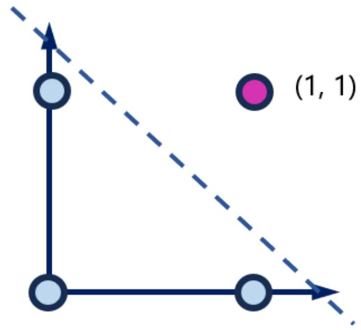

AND

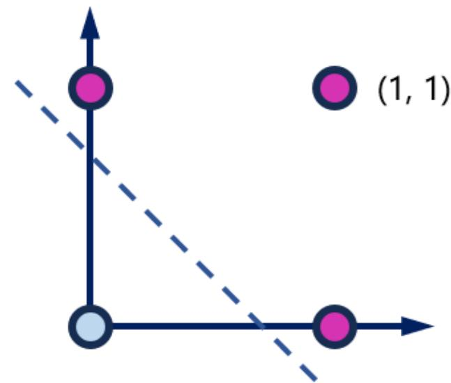

OR

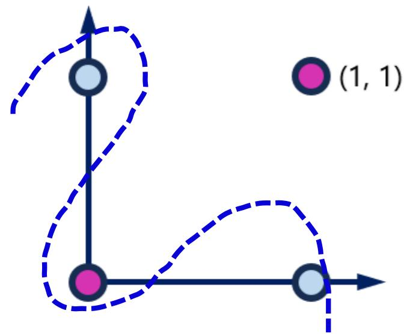

XOR

输出0

输出1

# 多层感知机模型效果：XOR解决之道

# [提问：黑板作答]

# 例子

# 用红色的线与蓝色的线代表数据

• 红色区域和蓝色区域代表由一个两层神经网络划开的区域，两者的分界线就是决策分界

• 可见决策分界是非常平滑的曲线，而且分类的很好 $\begin{array} { r l } { \mathbf { \boldsymbol { z } } } & { = g _ { 2 } ( \mathbf { \boldsymbol { W } } _ { 2 } \times \boldsymbol { g } _ { 1 } ( \mathbf { \boldsymbol { W } } _ { 1 } \times \boldsymbol { x } + \boldsymbol { b } _ { 1 } ) + \boldsymbol { b } _ { 2 } ) } \end{array}$

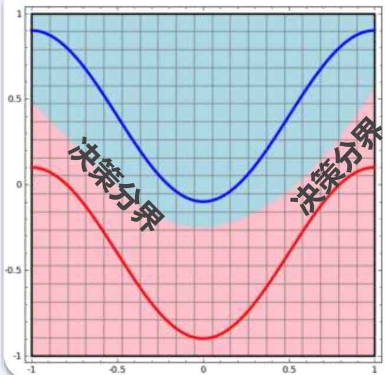

拟合

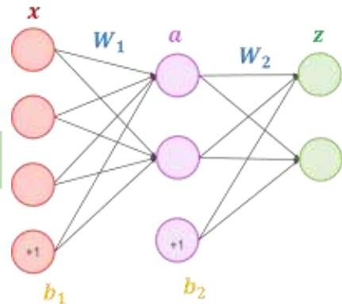

# 问题

Q：单层网络只能做线性分类任务。而两层神经网络中的两层（隐藏层 和 输出层）也都是线性层，应该只能做线性分类任务。

为什么两个线性层的结合就可以做非线性分类任务？

反过来想，如果 $g _ { 1 }$ 是一个线性函数会发生什么？

# 多层感知机模型效果：XOR解决之道

# 空间变换

• 关键在于: 从输入层到隐藏层时，数据在激活函数作用下发生了空间扭曲

• 两层神经网络中，隐藏层对原始的数据进行了一个空间变换，使其可以被线性分类，然后输出层划分出了一个线性分类分界线，对其进行分类

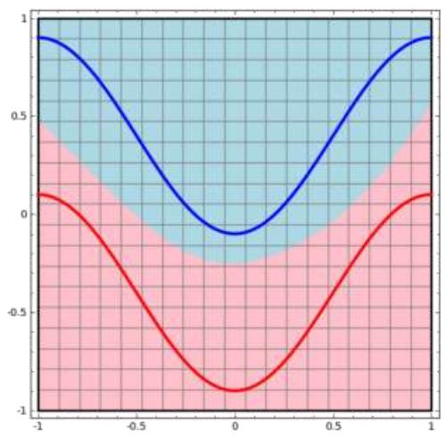

空间变换

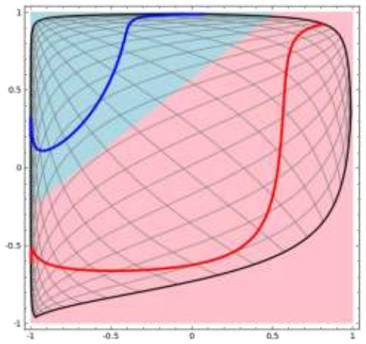

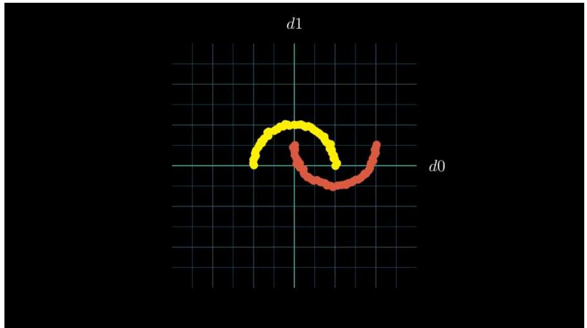

# 多层感知机效果

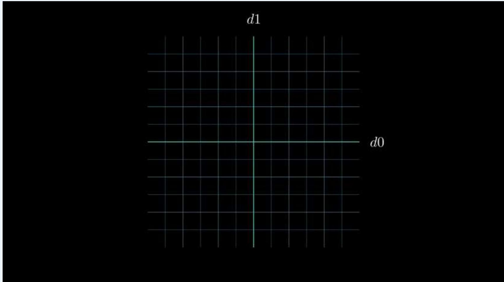

Neural Network Transformation Visualization

$$
\mathbf {z} ^ {(1)} = \tanh (\mathbf {W} _ {1} \mathbf {x} + \mathbf {b} _ {1})
$$

$$
\mathbf {z} ^ {(2)} = \tanh (\mathbf {W} _ {2} \mathbf {z} ^ {(1)} + \mathbf {b} _ {2})
$$

$$
y = \tanh (\mathbf {W} _ {3} \mathbf {z} ^ {(2)} + \mathbf {b} _ {3})
$$

# 多层感知机效果

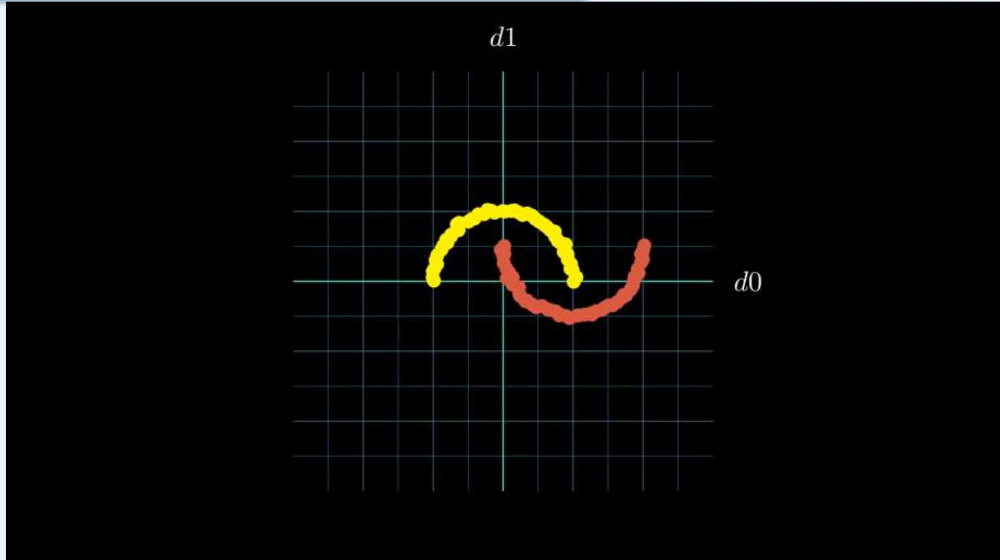

# 多层感知机效果

Input Space

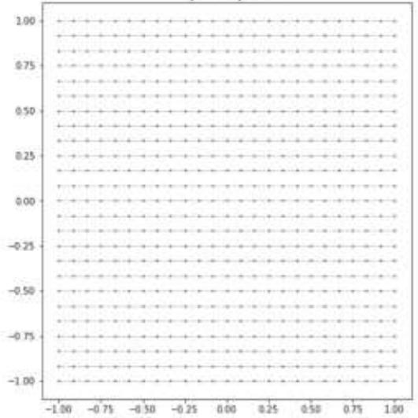

OutputSpacefrom2x32tanhMLP

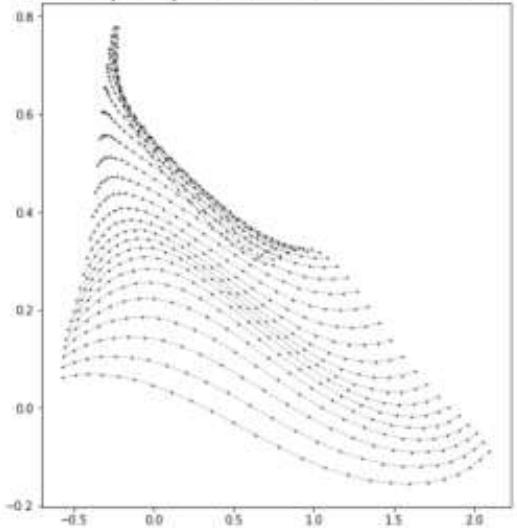

units_per_layer = 64

num_layers = 2

activation_fn $=$ 'tanh'

units_per_layer = 32

num_layers = 2

activation_fn $=$ 'tanh'

https://colab.research.google.com/github/murphyka/ml_colabs/blob/main/Simple_MLP_Visualization.ipynb#scrollTo $^ { 1 = }$ HpMdcCE7NoB0

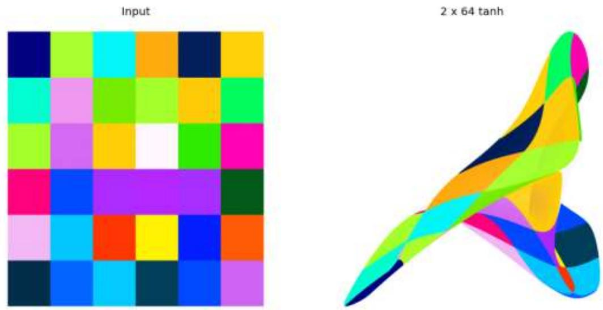

# 问题引入

# 人工神经元结构

# 多层感知机模型

# 神经网络训练

# 知识拓展

1x32tanh

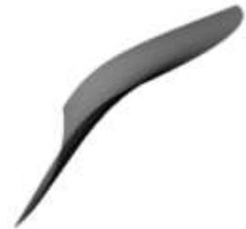

2x32tanh

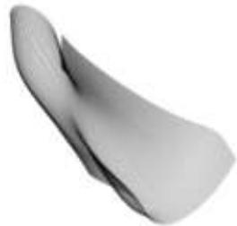

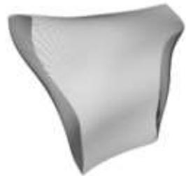

4x32 tanh

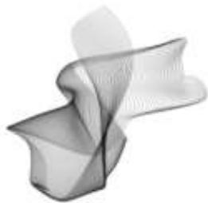

5x 32tanh

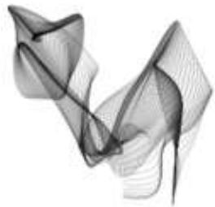

6x32tanh

7x 32tanh

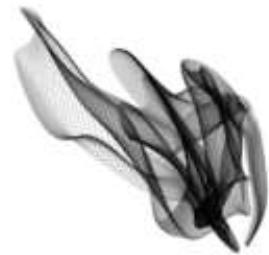

8x32tanh

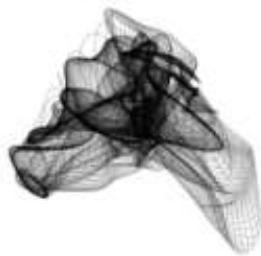

9x32tanh

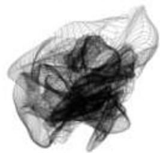

10x32tanh

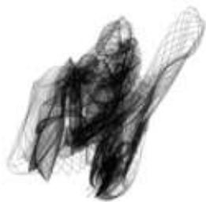

11×32tanh

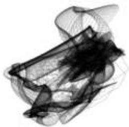

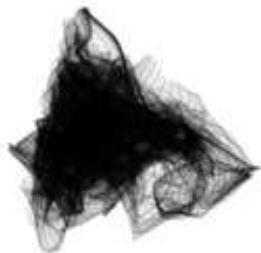

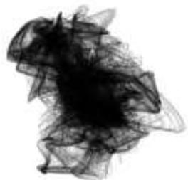

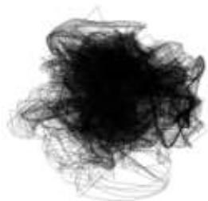

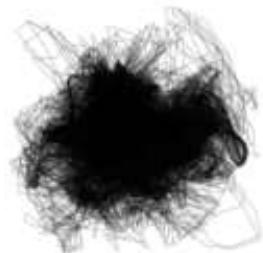

# 多层感知机效果

两层神经网络可以做非线性分类的关键--隐藏层

矩阵公式中矩阵和向量相乘以及非线性函数sigmod/tanh/…，本质上就是对向量的坐标空间进行一个变换。因此，隐藏层的作用就是使得数据的原始坐标空间从线性不可分，转换成了线性可分

两层神经网络通过两层的线性模型模拟了数据内真实的非线性函数。因此，多层的神经网络的本质就是复杂函数拟合

设计一个神经网络时，输入层的节点数需要与特征的维度匹配，输出层的节点数要与目标的维度匹配。如何决定这个自由层的节点数呢？一般根据经验来设置

Grid Search （网格搜索）：预先设定几个可选值，通过切换这几个值来看整个模型的预测效果，选择效果最好的值作为最终选择

# 训练多层感知机

Rosenblat提出的感知机模型中，模型中的参数可以被训练，但是使用的方法较为简单，并没有使用目前机器学习中通用的方法，这导致其扩展性与适用性非常有限

从两层神经网络开始，神经网络的研究人员开始使用机器学习相关的技术进行神经网络的训练。例如用大量的数据（1000-10000左右），使用算法进行优化等等，从而使得模型训练可以获得性能与数据利用上的双重优势。

机器学习模型训练的目的，就是使得参数尽可能的与真实的模型逼近。具体做法是这样的：首先给所有参数赋上随机值，然后使用这些随机生成的参数值，来预测训练数据中的样本，不断循环迭代更新参数。

样本的预测目标为 out ，真实目标为 target。损失 loss的计算公式如下，目标是使对所有训练数据的损失和尽可能的小

$$
\mathit {l o s s} = (\mathit {t a r g e t - o u t}) ^ {2}
$$

# 多层感知机如何训练： 训练过程

如何优化参数，能够让损失函数的值最小？

# 前向传播

按顺序（从输入层到输出层）计算和存储神经网络中每层的结果

# 反向传播

计算神经网络参数梯度的方法根据微积分中的链式规则，按相反的顺序从输出层到输入层遍历网络

在于计算当前参数下的误差

在于根据误差调整参数

# 多层感知机如何训练： 前向传播+反向传播

示例：一个具有两个输入、两个隐藏神经元和两个输出神经元的神经网络。

• 基本结构和初始化

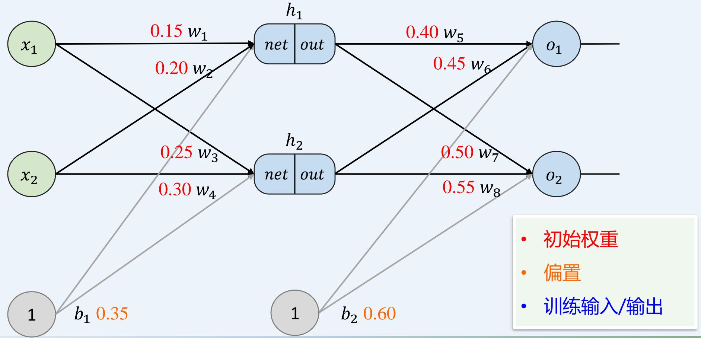

# 多层感知机如何训练： 前向传播+反向传播

示例：一个具有两个输入、两个隐藏神经元和两个输出神经元的神经网络。

• 目标：进行优化权重，使神经网络能够学习如何正确地将任意输入映射到输出

# 多层感知机如何训练： 前向传播+反向传播

示例：一个具有两个输入、两个隐藏神经元和两个输出神经元的神经网络。

• 单个训练集：给定输入0.05和0.10，我们希望神经网络输出0.01和0.99

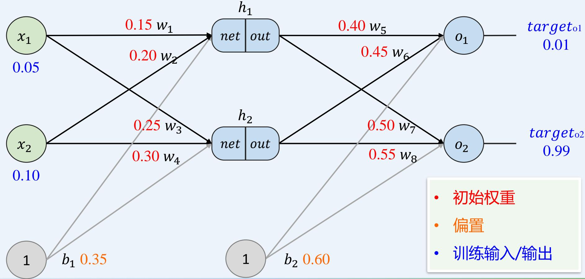

# 多层感知机如何训练： 前向传播+反向传播

示例：一个具有两个输入、两个隐藏神经元和两个输出神经元的神经网络。

前向传播----计算所有神经元的输入

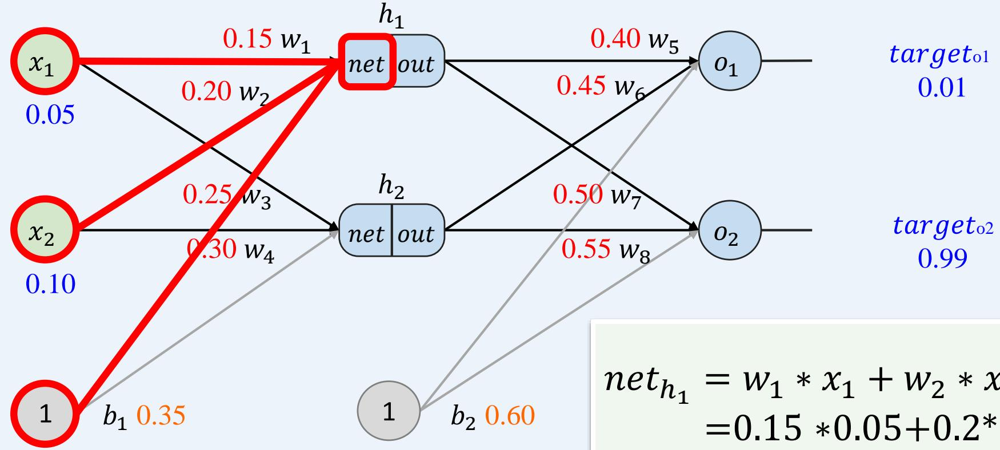

$$
\begin{array}{l} n e t _ {h _ {1}} = w _ {1} * x _ {1} + w _ {2} * x _ {2} + b _ {1} * 1 \\ = 0. 1 5 * 0. 0 5 + 0. 2 ^ {*} 0. 1 + 0. 3 5 ^ {*} 1 \\ = 0. 3 7 7 5 \\ \end{array}
$$

# 多层感知机如何训练： 前向传播+反向传播

示例：一个具有两个输入、两个隐藏神经元和两个输出神经元的神经网络。

前向传播----使用激活函数（此处为 sigmoid 函数）进行计算

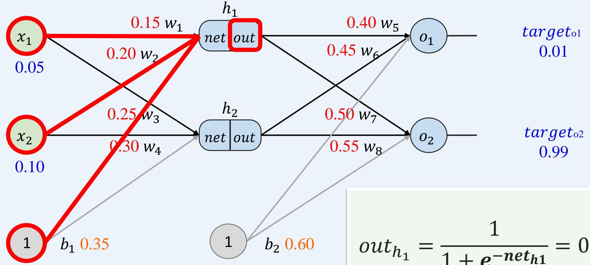

$$
o u t _ {h _ {1}} = \frac {1}{1 + e ^ {- n e t _ {h 1}}} = 0. 5 9 3 2 6 9 9 2
$$

# 多层感知机如何训练： 前向传播+反向传播

示例：一个具有两个输入、两个隐藏神经元和两个输出神经元的神经网络。

前向传播----对 $h _ { 2 }$ 也进行相同的计算

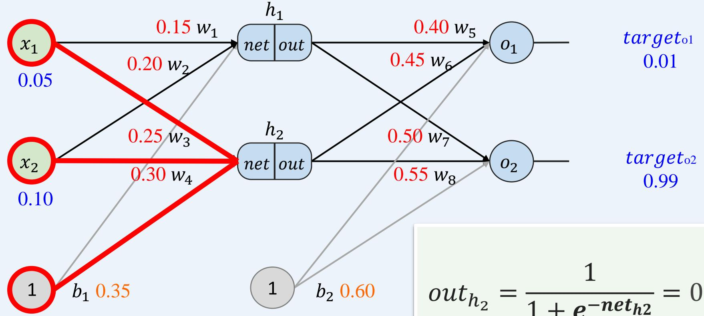

$$
o u t _ {h _ {2}} = \frac {1}{1 + e ^ {- n e t _ {h 2}}} = 0. 5 9 6 8 8 4 3 7 8
$$

# 多层感知机如何训练： 前向传播+反向传播

示例：一个具有两个输入、两个隐藏神经元和两个输出神经元的神经网络。

前向传播----重复操作计算 $. o _ { 1 }$

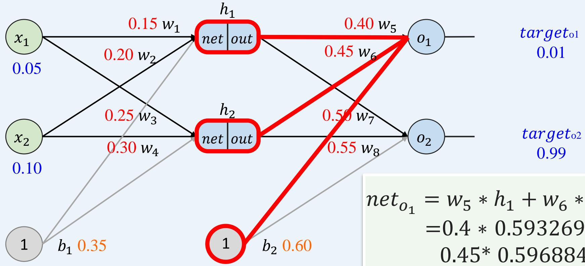

$$
\begin{array}{l} n e t _ {o _ {1}} = w _ {5} * h _ {1} + w _ {6} * h _ {2} + b _ {2} * 1 \\ = 0. 4 * 0. 5 9 3 2 6 9 9 2 + \\ 0. 4 5 ^ {*} 0. 5 9 6 8 8 4 3 7 8 + 0. 6 ^ {*} 1 \\ = 1. 1 0 5 9 0 5 9 6 7 \\ \end{array}
$$

# 多层感知机如何训练： 前向传播+反向传播

示例：一个具有两个输入、两个隐藏神经元和两个输出神经元的神经网络。

前向传播----重复操作计算 $. o _ { 1 }$ (使用激活函数)

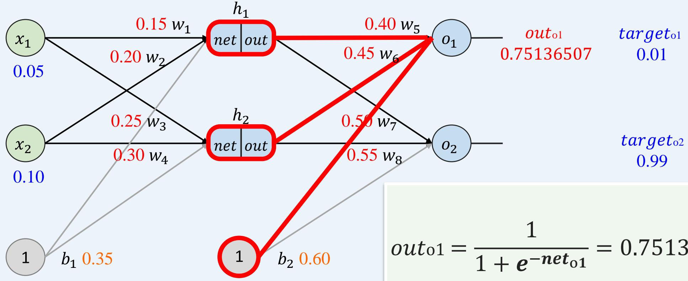

# 多层感知机如何训练： 前向传播+反向传播

示例：一个具有两个输入、两个隐藏神经元和两个输出神经元的神经网络。

前向传播----重复操作计算 $\dot { \phantom { } } O _ { 2 }$

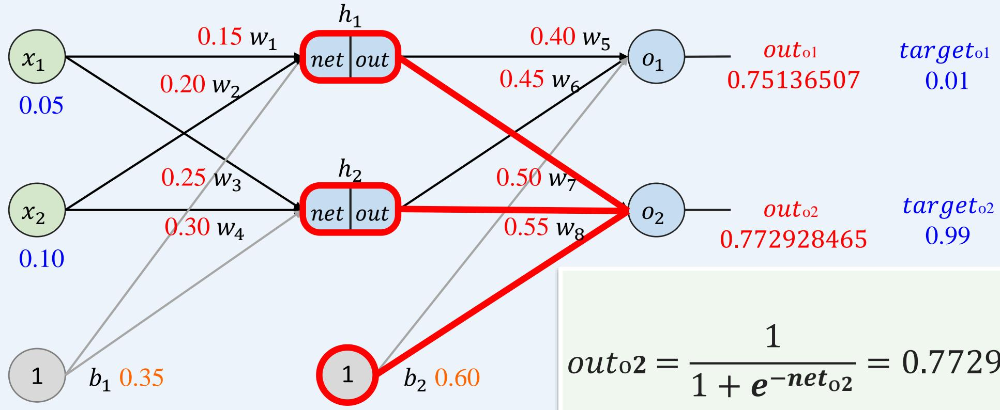

# 多层感知机如何训练： 前向传播+反向传播

示例：一个具有两个输入、两个隐藏神经元和两个输出神经元的神经网络。

$$
E _ {t o t a l} = \frac {1}{2} \sum (t a r g e t - o u t p u t) ^ {2}
$$

$$
\begin{array}{l} E _ {o 1} = \frac {1}{2} (t a r g e t _ {o 1} - o u t _ {o 1}) ^ {2} \\ = \frac {1}{2} (0. 0 1 - 0. 7 5 1 3 6 5 0 7) ^ {2} = 0. 2 7 4 8 1 1 0 8 3 \\ \end{array}
$$

$$
\begin{array}{l} E _ {o 2} = \frac {1}{2} (t a r g e t _ {o 2} - o u t _ {o 2}) ^ {2} \\ = \frac {1}{2} (0. 9 9 - 0. 7 7 2 9 2 8 4 6 5) ^ {2} = 0. 0 2 3 5 6 0 0 2 6 \\ \end{array}
$$

$$
E _ {t o t a l} = E _ {o 1} + E _ {o 2} = 0. 2 9 8 3 7 1 1 0 9
$$

预测与目标的总误差！

$$
\begin{array}{l} \begin{array}{c c} \text {o u t} _ {\mathrm {o l}} & \text {t a r g e t} _ {\mathrm {o l}} \\ 0. 7 5 1 3 6 5 0 7 & 0. 0 1 \end{array} \\ \begin{array}{c c} \text {o u t} _ {\mathrm {o} 2} & \text {t a r g e t} _ {\mathrm {o} 2} \\ 0. 7 7 2 9 2 8 4 6 5 & 0. 9 9 \end{array} \\ \end{array}
$$

问题：如何根据总误差调整参数 ??

# 多层感知机如何训练： 梯度下降

回顾数学分析：给定多元可微函数ℒ(??)和其函数曲线上的一点?? ，函数ℒ在点??上的梯度就是函数 $\mathcal { L } ( w )$ 在点 $P _ { \ l }$ 上的偏导数

$$
\begin{array}{l} \mathcal {L} (\boldsymbol {w}) = \frac {1}{2} \sum_ {n = 1} ^ {N} (\text {t a r g e t} - \text {o u t p u t} (\boldsymbol {w})) ^ {2} \\ \hline \end{array}
$$

梯度： $\begin{array} { r } { \frac { \partial \mathcal { L } ( w ) } { \partial w } = \underset { \Delta w  0 } { l i m } \frac { \mathcal { L } ( w + \Delta w ) } { \Delta w } } \end{array}$

路线：找到梯度下降的方向，求取 $\mathcal { L } ( w )$ 的最小值

# 多层感知机如何训练： 梯度下降

梯度下降法：沿着梯度下降的方向更新参数，使得 $\mathcal { L } ( w )$ 取值最小

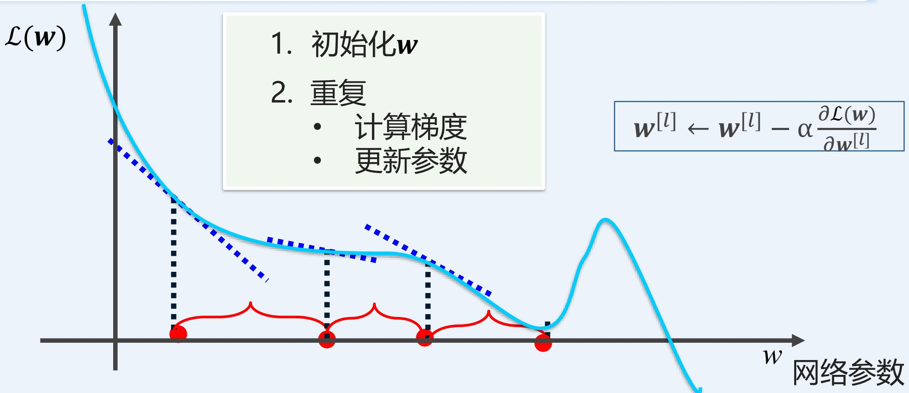

# 多层感知机如何训练： 梯度下降

反向传播算法：根据网络的特点而设计的高效梯度下降方法，用于参数的学习

复习：前向传播中神经网络内部的计算

$$
\begin{array}{l} g \big (\boldsymbol {W} ^ {(1)} \times \boldsymbol {x} ^ {(1)} \big) = \boldsymbol {h} ^ {(1)} g \big (\boldsymbol {W} ^ {(2)} \times \boldsymbol {h} ^ {(1)} \big) = \boldsymbol {h} ^ {(2)} \\ g \big (\boldsymbol {W} ^ {(3)} \times \boldsymbol {h} ^ {(2)} \big) = y ^ {\prime} \qquad \mathcal {L} = \frac {1}{2} (y - y ^ {\prime}) ^ {2} \\ \end{array}
$$

(粗体字表示向量，上标是层号)

• 这是关于??(1)的复合函数，神经网络中应用链式求导法则进行梯度计算

$$
\frac {\partial \mathcal {L}}{\partial \pmb {W} ^ {(1)}} = \frac {\partial \mathcal {L}}{\partial y ^ {\prime}} \times \frac {\partial y ^ {\prime}}{\partial \pmb {h} ^ {(2)}} \times \frac {\partial \pmb {h} ^ {(2)}}{\partial \pmb {h} ^ {(1)}} \times \frac {\partial \pmb {h} ^ {(1)}}{\partial \pmb {W} ^ {(1)}}
$$

# 多层感知机如何训练：前向传播+反向传播

示例：一个具有两个输入、两个隐藏神经元和两个输出神经元的神经网络。

• 反向传播----输出层

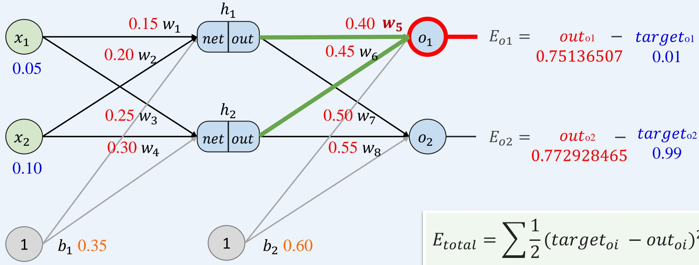

$$
= E _ {o 1} + E _ {o 2}
$$

# 多层感知机如何训练：前向传播+反向传播

示例：一个具有两个输入、两个隐藏神经元和两个输出神经元的神经网络。

• 反向传播----考虑 $w _ { 5 }$ ，探究 $w _ { 5 }$ 的变化对总误差的影响有多大？

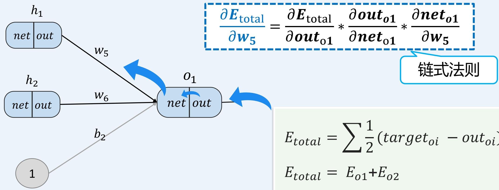

# 多层感知机如何训练：前向传播+反向传播

示例：一个具有两个输入、两个隐藏神经元和两个输出神经元的神经网络。

• 反向传播----考虑 $w _ { 5 }$ ，探究 $w _ { 5 }$ 的变化对总误差的影响有多大？

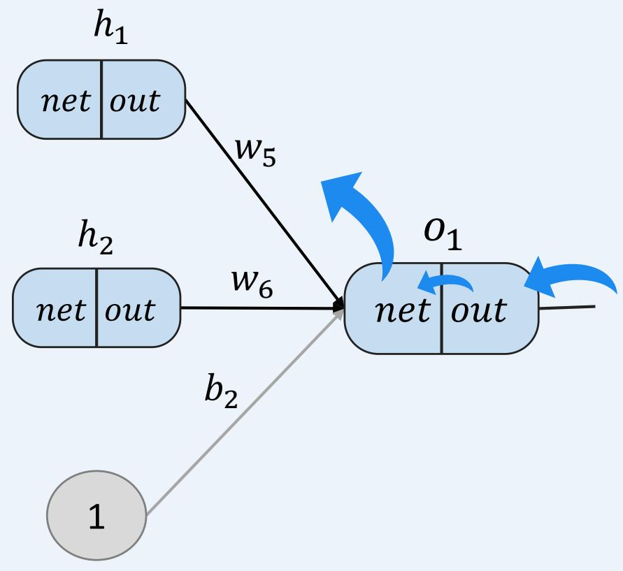

$$
\frac {\partial E _ {\text {t o t a l}}}{\partial w _ {5}} = \left| \begin{array}{l} \partial E _ {\text {t o t a l}} \\ \partial \text {o u t} _ {0 1} \end{array} \right| * \frac {\partial \text {o u t} _ {0 1}}{\partial \text {n e t} _ {0 1}} * \frac {\partial \text {n e t} _ {0 1}}{\partial w _ {5}}
$$

$$
E _ {t o t a l} = \sum \frac {1}{2} (t a r g e t _ {i} - o u t _ {o i}) ^ {2}
$$

$$
\begin{array}{l} \frac {\partial E _ {\mathrm {t o t a l}}}{\partial \boldsymbol {o u t} _ {\mathrm {o 1}}} = 2 * \frac {1}{2} (\boldsymbol {t a r g e t} _ {\mathrm {o 1}} - \boldsymbol {o u t} _ {\mathrm {o 1}}) ^ {2 - 1} * (- 1) + \mathbf {0} \\ = - \left(\mathit {t a r g e t} _ {\mathrm {o 1}} - \mathit {o u t} _ {\mathrm {o 1}}\right) \\ = - (0. 0 1 \text {-} 0. 0. 7 5 1 3 6 5 0 7) = 0. 7 4 1 3 6 5 0 7 \\ \end{array}
$$

# 多层感知机如何训练：前向传播+反向传播

示例：一个具有两个输入、两个隐藏神经元和两个输出神经元的神经网络。

• 反向传播----考虑 $w _ { 5 }$ ，探究 $w _ { 5 }$ 的变化对总误差的影响有多大？

$$
\frac {\partial E _ {\text {t o t a l}}}{\partial w _ {5}} = \frac {\partial E _ {\text {t o t a l}}}{\partial \boldsymbol {o u t} _ {0 1}} * \boxed {\frac {\partial \boldsymbol {o u t} _ {0 1}}{\partial \boldsymbol {n e t} _ {0 1}}} * \frac {\partial \boldsymbol {n e t} _ {0 1}}{\partial w _ {5}}
$$

Sigmo

$$
\text {o i d 函 数 :} \quad \text {o u t} _ {0 1} = \sigma (x) = \frac {1}{1 + e ^ {- x}} \Bigg \downarrow \quad \frac {d}{d x} \sigma (x) = \sigma (x) (1 - \sigma (x))
$$

$$
o u t _ {o 1} = \frac {1}{1 + e ^ {- n e t _ {o 1}}}
$$

$$
\frac {\partial \boldsymbol {o u t} _ {o 1}}{\partial \boldsymbol {n e t} _ {o 1}} = \boldsymbol {o u t} _ {o 1} (\boldsymbol {1} - \boldsymbol {o u t} _ {o 1}) = 0. 1 8 6 8 1 5 6 0 2
$$

# 多层感知机如何训练：前向传播+反向传播

示例：一个具有两个输入、两个隐藏神经元和两个输出神经元的神经网络。

• 反向传播----考虑 $w _ { 5 }$ ，探究 $w _ { 5 }$ 的变化对总误差的影响有多大？

$$
\frac {\partial E _ {\mathrm {t o t a l}}}{\partial w _ {5}} = \frac {\partial E _ {\mathrm {t o t a l}}}{\partial o u t _ {0 1}} * \frac {\partial o u t _ {o 1}}{\partial n e t _ {0 1}} * \boxed { \begin{array}{c} \partial n e t _ {o 1} \\ \partial w _ {5} \end{array} }
$$

$$
\begin{array}{l} n e t _ {0 1} = w _ {5} * h _ {1} + w _ {6} * h _ {2} + b _ {2} * 1 \\ \frac {\partial \boldsymbol {n e t} _ {o 1}}{\partial \boldsymbol {w} _ {5}} = \boldsymbol {1} * \boldsymbol {h} _ {1} * \boldsymbol {w} _ {5} ^ {(1 - 1)} + \boldsymbol {0} + \boldsymbol {0} \\ = h _ {1} = 0. 5 9 3 2 6 9 9 9 2 \\ \end{array}
$$

# 多层感知机如何训练：前向传播+反向传播

示例：一个具有两个输入、两个隐藏神经元和两个输出神经元的神经网络。

• 反向传播----考虑 $w _ { 5 }$ ，探究 $w _ { 5 }$ 的变化对总误差的影响有多大？

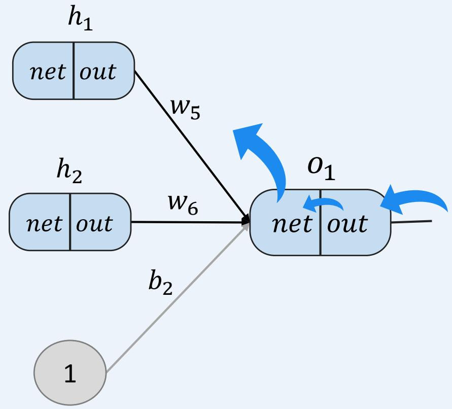

$$
\begin{array}{l} \frac {\partial E _ {\mathrm {t o t a l}}}{\partial w _ {5}} = \frac {\partial E _ {\mathrm {t o t a l}}}{\partial o u t _ {0 1}} * \frac {\partial o u t _ {0 1}}{\partial n e t _ {0 1}} * \frac {\partial n e t _ {0 1}}{\partial w _ {5}} \\ = - \left(\operatorname {t a r g e t} _ {0 1} - \operatorname {o u t} _ {0 1}\right) * \operatorname {o u t} _ {0 1} \left(1 - \operatorname {o u t} _ {0 1}\right) * h _ {1} \\ = 0. 7 4 1 3 6 5 0 7 * 0. 1 8 6 8 1 5 6 0 2 * 0. 5 9 3 2 6 9 9 9 2 \\ = 0. 0 8 2 1 6 7 0 4 1 \\ \end{array}
$$

为了减少误差，设置学习率 $\dot { \mathbf { \eta } } _ { \mathbf { \eta } } = 0 . 5$

$$
\begin{array}{l} w _ {5} ^ {+} = w _ {5} - \eta * \frac {\partial E _ {t o t a l}}{\partial w _ {5}} \\ = 0. 4 - 0. 5 ^ {*} 0. 0 8 2 1 6 7 0 4 1 = 0. 3 5 8 9 1 6 4 8 \\ \end{array}
$$

# 多层感知机如何训练：前向传播+反向传播

示例：一个具有两个输入、两个隐藏神经元和两个输出神经元的神经网络。

• 反向传播----重复操作计算 ${ \bf \dot { \mathbf { w } } _ { 6 } }$ 、 $w _ { 7 }$ 、 ????

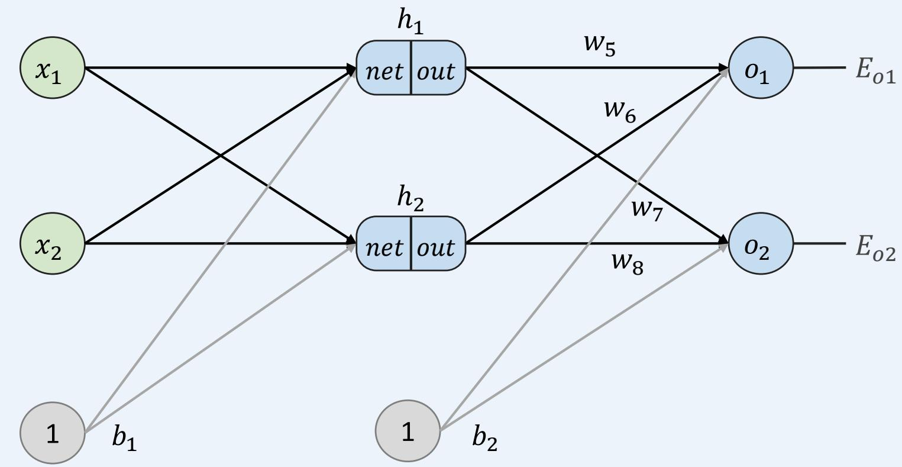

$$
\pmb {w} _ {6} ^ {+} = 0. 4 0 8 6 6 6 1 8 6
$$

$$
\mathbf {w} _ {7} ^ {+} = 0. 5 1 1 3 0 1 2 7 0
$$

$$
\pmb {w} _ {8} ^ {+} = 0. 5 6 1 3 7 0 1 2 1
$$

# 多层感知机如何训练：前向传播+反向传播

示例：一个具有两个输入、两个隐藏神经元和两个输出神经元的神经网络。

• 反向传播----隐藏层

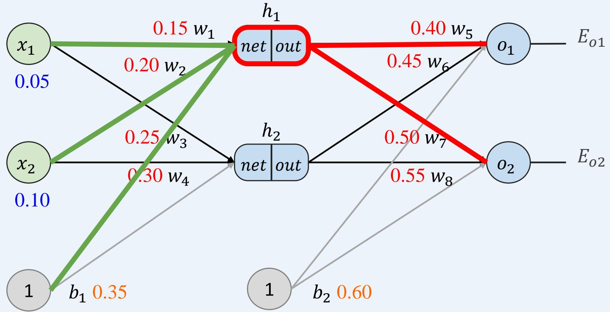

# 多层感知机如何训练：前向传播+反向传播

示例：一个具有两个输入、两个隐藏神经元和两个输出神经元的神经网络。

• 反向传播----继续反向传播??

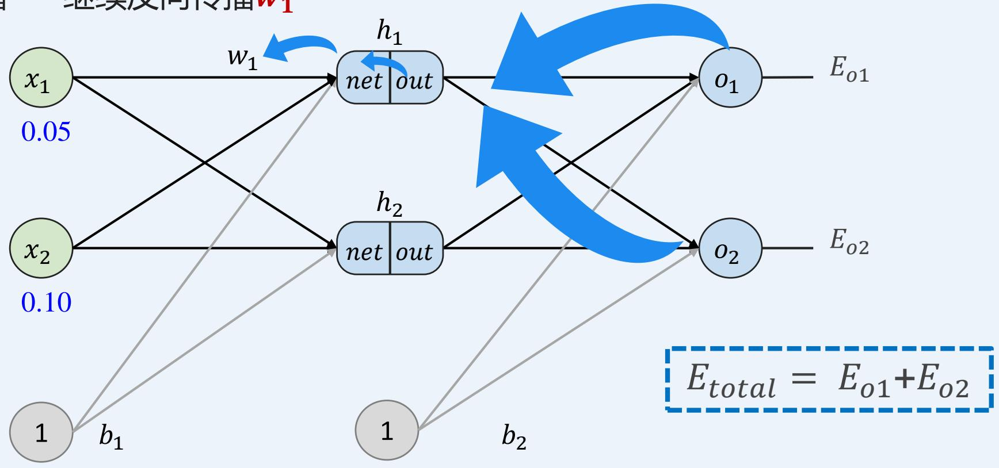

# 多层感知机如何训练：前向传播+反向传播

示例：一个具有两个输入、两个隐藏神经元和两个输出神经元的神经网络。

反向传播----继续反向传播 $w _ { 1 }$

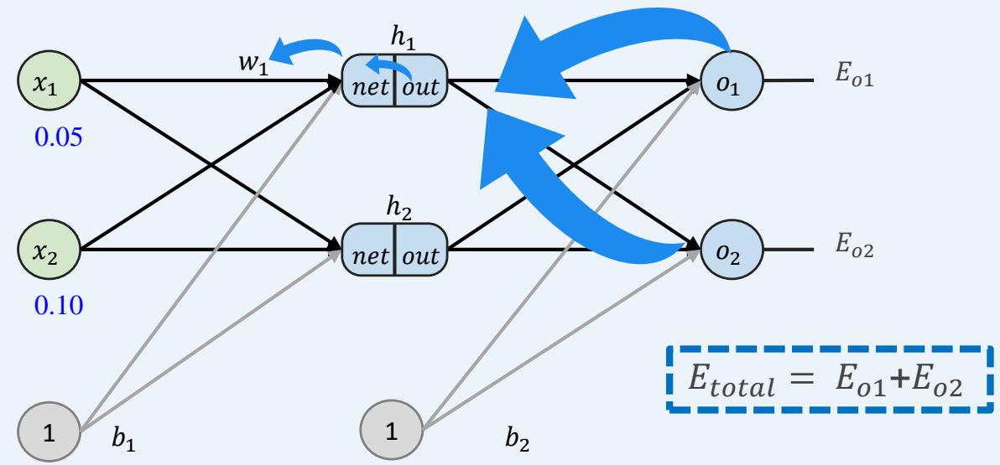

$$
\frac {\partial E _ {\text {t o t a l}}}{\partial w _ {1}} = \begin{array}{c} \frac {\partial E _ {\text {t o t a l}}}{\partial \text {o u t} _ {h 1}} * \frac {\partial \text {o u t} _ {h 1}}{\partial \text {n e t} _ {h 1}} * \frac {\partial \text {n e t} _ {h 1}}{\partial w _ {1}} \\ \downarrow \end{array}
$$

$$
\begin{array}{c} \frac {\partial E _ {\text {t o t a l}}}{\partial \boldsymbol {o u t} _ {h 1}} = \frac {\partial E _ {o 1}}{\partial \boldsymbol {o u t} _ {h 1}} + \frac {\partial E _ {o 2}}{\partial \boldsymbol {o u t} _ {h 1}} \end{array}
$$

$$
\frac {\partial E _ {o 1}}{\partial \boldsymbol {o u t} _ {h 1}} = \frac {\partial E _ {o 1}}{\partial \boldsymbol {o u t} _ {o 1}} * \frac {\partial \boldsymbol {o u t} _ {o 1}}{\partial \boldsymbol {n e t} _ {o 1}} * \frac {\partial \boldsymbol {n e t} _ {o 1}}{\partial \boldsymbol {o u t} _ {h 1}}
$$

# 多层感知机如何训练：前向传播+反向传播

示例：一个具有两个输入、两个隐藏神经元和两个输出神经元的神经网络。

反向传播----像以前一样计算并更新????

$$
\pmb {w _ {1}} ^ {+} = \pmb {w _ {1}} - \pmb {\eta} * \frac {\partial E _ {\mathrm {t o t a l}}}{\partial \pmb {w _ {1}}} = 0. 1 4 9 7 8 0 7 1 6
$$

重复操作计算 $w _ { 2 }$ 、 ????、 ????

$$
\begin{array}{l} \pmb {w} _ {2} ^ {+} = 0. 1 9 9 5 6 1 4 3 \\ \pmb {w} _ {3} ^ {+} = 0. 2 4 9 8 5 1 1 4 \\ \pmb {w} _ {4} ^ {+} = 0. 2 9 9 5 0 2 2 9 \\ \end{array}
$$

# 多层感知机如何训练：前向传播+反向传播

示例：一个具有两个输入、两个隐藏神经元和两个输出神经元的神经网络。

反向传播----更新参数并重复训练

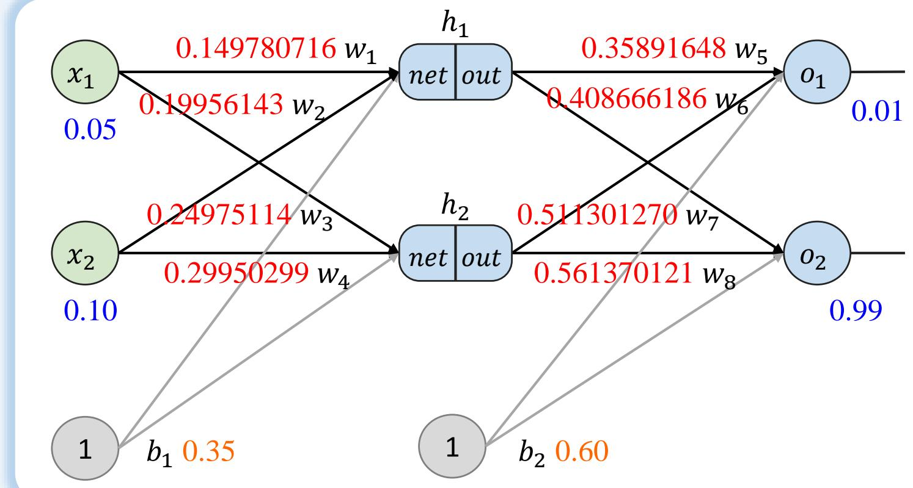

# 反向传播总结

第一轮反向传播后，总误差：

0.298371109→ 0.291027924

2. 重复此过程10000次后，误差骤降至 0.000035085

当我们输入0.05和0.1时，两个输出神经元产生

3. 0.015912196 （相对于0.01目标）

0.984065734（相对于0.99目标）

# 神经网络启示与影响

反向传播的启示是数学中的链式法则

⚫ 从此以后，研究者们更多地从数学上寻求问题的最优解。不再盲目模拟人脑网络（神经网络研究走向成熟的标志）。正如科学家们可以从鸟类的飞行中得到启发，但没有必要一定要完全模拟鸟类的飞行方式，也能制造可以飞天的飞机。

⚫ 神经网络的学者们再次登上了时代舞台。人们认为神经网络可以解决许多问题，就连《终结者》电影中的阿诺都赶时髦地说：我的CPU是一个神经网络处理器，一个会学习的计算机

# 神经网络启示与影响

# 多层神经网络的问题

存在问题：尽管使用了BP算法，一次多层神经网络的训练仍然耗时太久，而且困扰训练优化的一个问题就是局部最优解问题，这使得神经网络的优化较为困难。同时，隐藏层的节点数需要调参，这使得使用不太方便，工程和研究人员对此多有抱怨

# 非凸模型优化问题

问题a：非凸模型优化的一个问题就是局部最优解问题，这使得神经网络的优化较为困难。(Hmm… 真的非常难….)

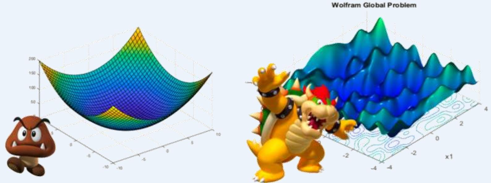

  非凸模型：g(.g(W(g(W(1) * a(1)) +g(W (2) * a(2) )))

」 优化效率慢限制了感知机规模，节点数也需要精确调配。

# 梯度消失问题

问题b：在深度网络中，不同的层的学习速度差异很大。使用sigmoid作为神经元的输入输出函数，在BP反向传播梯度时，每传递一层梯度衰减为原来的0.25。层数一多，梯度指数衰减后低层基本上接受不到有效的训练信号。

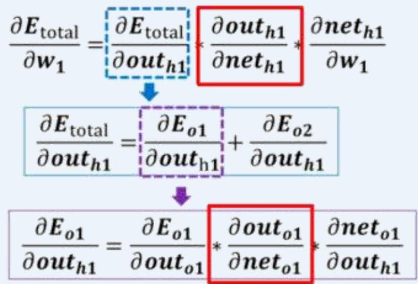

${ \mathrm { t h e ~ s i g m o i d ~ f u n c t i o n ~ a s ~ } } \sigma ( x ) = { \frac { 1 } { 1 + e ^ { - x } } } .$

$$
0 <   = \frac {d}{d x} \sigma (x) = \sigma (x) (1 - \sigma (x)). <   = 0. 2 5
$$

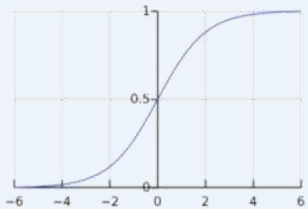

」梯度消失，使得多层网络等价于浅层网络的学习

# 非凸模型优化问题

90年代中期，由Vapnik等人发明的SvM（SupportVectorMachines，支持向量机）算法诞生，很快就在若干个方面体现出了对比神经网络的优势：无需调参；高效；全局最优解。基于以上种种理由，SVM迅速打败了神经网络算法成为主流。

Vladimir Vapnik

神经网络的研究再次陷入了冰河期。当时，只要你的论文中包含神经网络相关的字眼，非常容易被会议和期刊拒收，研究界那时对神经网络的不待见可想而知。

# 深度学习-引入

在被人摒弃的10年中，有几个学者仍然在坚持研究，包括加拿大多伦多大学的Geoffery Hinton教授

2006年，Hinton在《Science》和相关期刊上发表了论文，首次提出了“深度信念网络”的概念

与传统的训练方式不同，“深度信念网络”有一个“预训练”（pre-training）的过程，这可以方便的让神经网络中的权值找到一个接近最优解的值，之后再使用“微调”（fine-tuning）技术来对整个网络进行优化训练。这两个技术的运用大幅度减少了训练多层神经网络的时间。他给多层神经网络相关的学习方法赋予了一个新名词--“深度学习”（深度学习是多个算法的总称）

# 深度学习-引入

# 」参数越多的模型复杂度越高

－优点：“容量”(capacity)越大，能完成更复杂的任务

－ 缺点：训练效率低，数据量少时易陷入过拟合

# 」缺点解决方案

－ 云计算，大数据时代下，计算能力大幅提升，可缓解训练低效性

－ 训练数据大幅增加，降低过拟合风险

# 」以深度学习为代表的复杂模型开始受人关注

# 深度学习-引入

很快，深度学习在语音识别领域暂露头角。接着，2012年，Hinton与他的学生在ImageNet竞赛中，用多层的卷积神经网络成功地对包含一千类别的一百万张图片进行了训练，取得了分类错误率 $15 \%$ 的好成绩，这个成绩比第二名高了近11个百分点，充分证明了多层神经网络识别效果的优越性

」 在这之后，关于深度神经网络的研究与应用不断涌现。

Geoffery Hinton1986，BP算法

Geoffery Hinton

# 深度学习网络框架

」延续两层神经网络的方式来设计一个多层神经网络

在两层神经网络的输出层后面，继续添加层次。原来的输出层变成中间层，新加的层次成为新的输出层。所以可以得到下图。

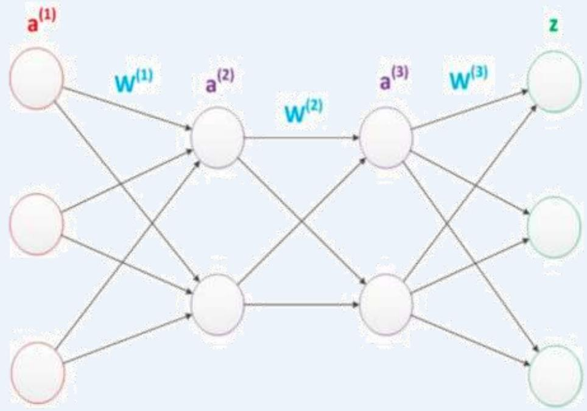

多层神经网络

$$
\begin{array}{l} g \left(W ^ {(1)} * a ^ {(1)}\right) = a ^ {(2)}; \\ g \left(W ^ {(2)} * a ^ {(2)}\right) = a ^ {(3)}; \\ g \left(W ^ {(3)} * a ^ {(3)}\right) = z; \\ \end{array}
$$

# 深度学习网络框架

」网络的参数为33个。

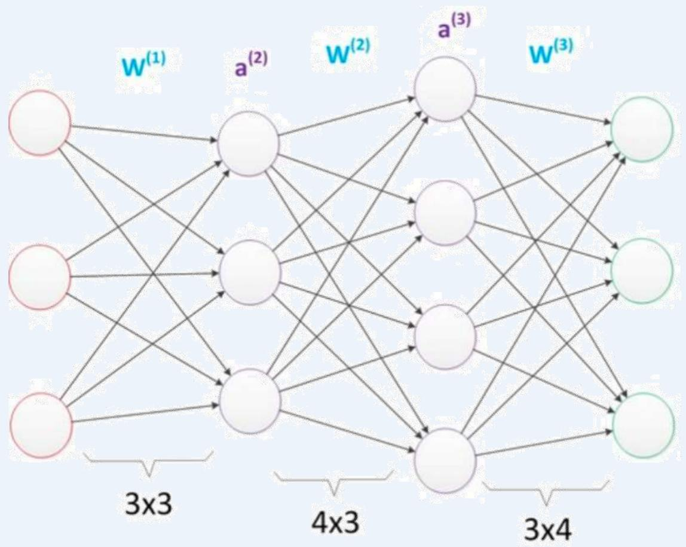

9+12+12=33

# 深度学习网络框架

·在参数一致的情况下，我们也可以获得一个“更深”的网络

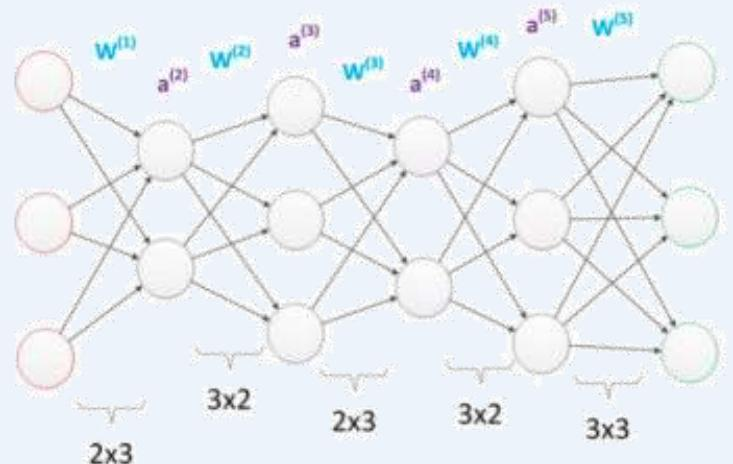

6+6+6+6+9=33

，参数数量仍然是33，但却有4个中间层，更多的层次带来更深入的特征表示能力，以及更强的函数模拟能力

随着层数增加，每一层对于前一层次的抽象表示更深入。每一层神经元学习到的是前一层神经元值的更抽象的表示。例如第一个隐藏层学习到的是“边缘”的特征，第二个隐藏层学习到由“边缘”组成的“形状”，第三个隐藏层学习到的是由“形状”组成的“图案”的特征，最后的隐藏层学习到的是由“图案”组成的“目标”的特征

」通过抽取更抽象的特征来对事物进行区分，从而获得更好的区分与分类能力

# 深度学习网络框架

」 逐层特征学习例子：

featural hierarchy

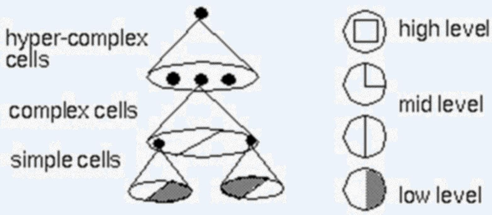

多层神经网络（特征学习）

# 深度学习优越效果

更强的函数模拟能力是由于随着层数的增加，整个网络的参数就越多。而神经网络其实本质就是模拟特征与目标之间的真实关系函数的方法，更多的参数意味着其模拟的函数可以更加的复杂，可以有更多的容量（capcity）去拟合真正的关系（强悍的非线性函数拟合）

在参数数量一样的情况下，更深的网络往往具有比浅层的网络更好的识别效率

- 2012年起，每年获得ImageNet冠军的深度神经网络的层数逐年增加

2015年最好的方法GoogleNet是一个多达22层的神经网络

－2016拿到最好成绩的MSRA团队的方法使用的更是一个152层的网络！

# 多层训练解决手段

」 2006年Hinton提出的逐层预训练方法

 pre-training + fine-tunning.

」使用Rectified Linear Unit(Relu)激活函数

X sigmoid等函数，算激活函数时（指数运算），计算量大，反向传播求误差梯度时，求导涉及除法，计算量相对大，而采用Relu激活函数，整个过程的计算量节省很多

sigmoid函数反向传播时，容易出现梯度消失

Relu会使一部分神经元的输出为0，这样就造成了网络的稀疏性，并且减少了参数的相互依存关系，缓解了过拟合问题的发生

 Dropout

模型训练时随机让网络某些隐含层节点的权重不工作，防止过拟合

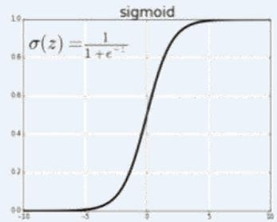

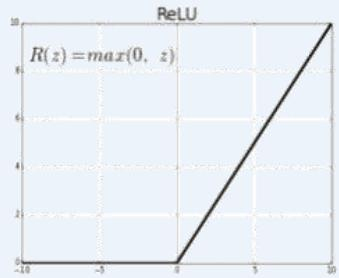

# 不同激活函数求导

Sigmoid Function

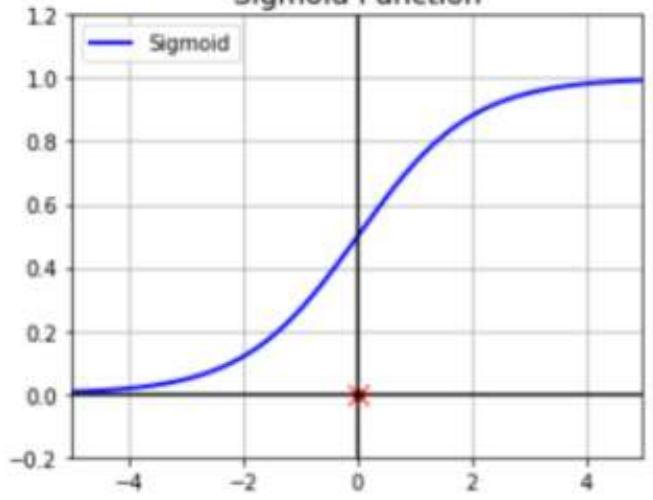

Sigmoid Derivative

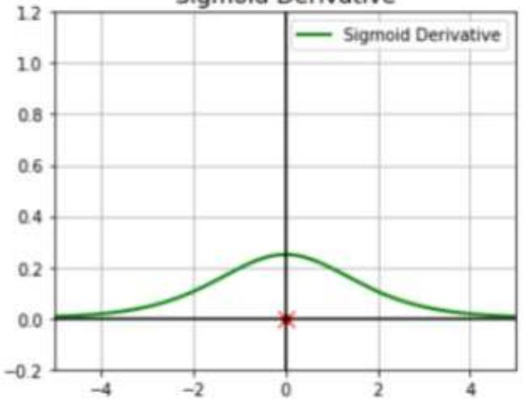

ReLUFunction

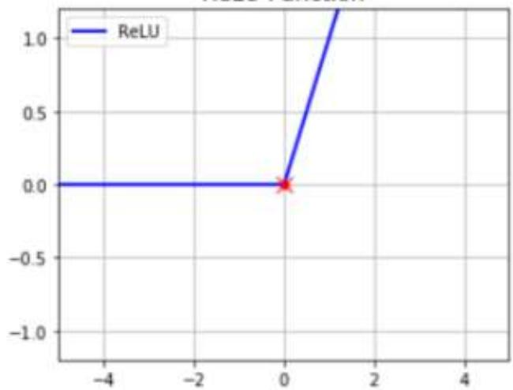

ReLU Derivative

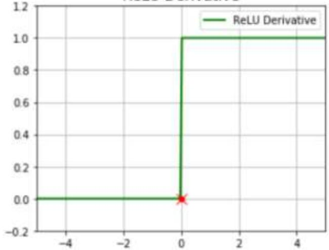

# 不同激活函数求导

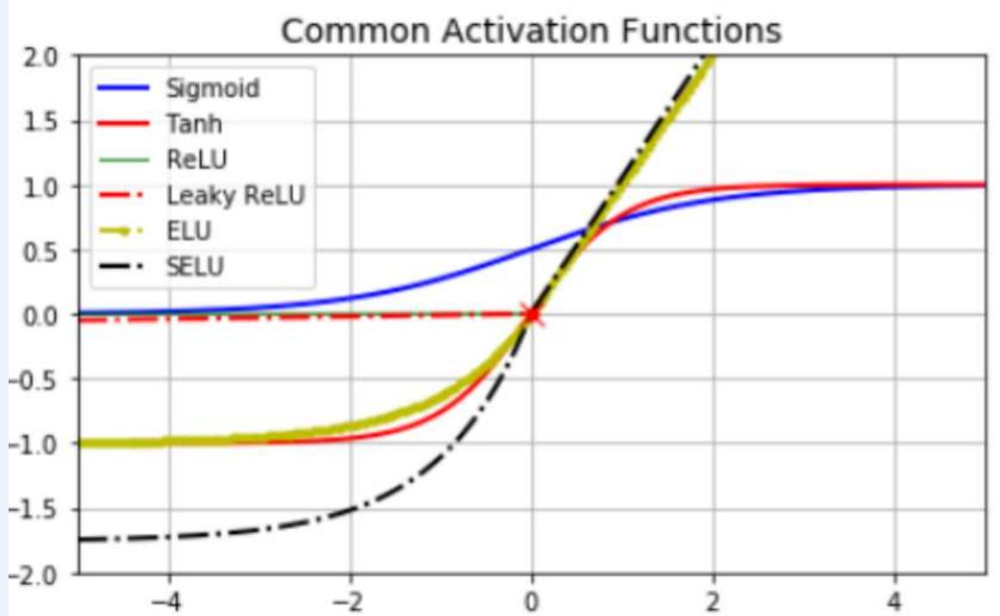

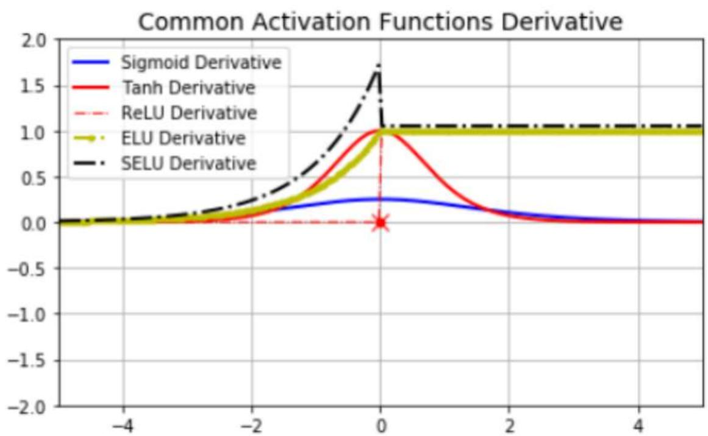

# 训练细节

」单层神经网络：sgn函数

」两层神经网络：sigmoid函数

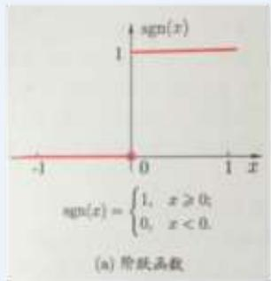

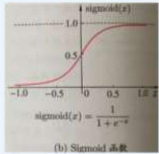

多层神经网络：ReLU函数，y=max(x,0)，在x大于0，输出就是输入，而在x小于0时，输出就保持为0。函数设计启发来自于生物神经元对于激励的线性响应，以及当低于某个阈值后就不再响应的模拟

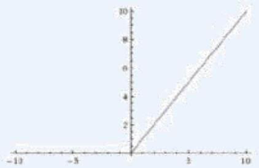

神经网络的层数增加了，参数也增加了，表示能力大幅度增强，很容易出现过拟合现象。因此正则化技术就显得十分重要。Dropout技术是目前使用的最多的正则化技术

# 不同激活函数求导

# 神经网络：激活函数

·使用Rectified Linear Unit(Relu)激活函数

Sigmoid函数及求导：

$$
\sigma (x) = \frac {1}{1 + e ^ {- x}}
$$

$$
0 \leq \frac {d}{d x} \sigma (x) \leq 0. 2 5
$$

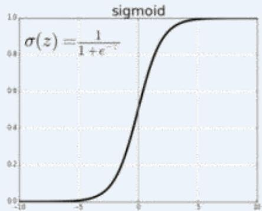

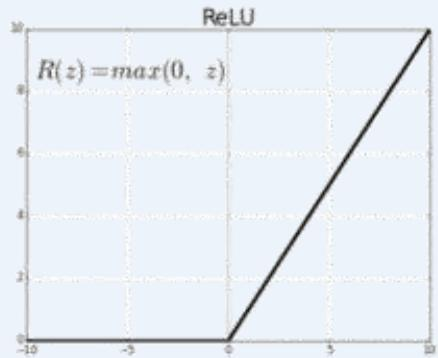

ReLU函数及求导：

$$
\sigma (x) = \max  (0, x)
$$

$$
\frac {d}{d x} \sigma (x) = \left\{ \begin{array}{l l} 0 & x \leq 0 \\ 1 & x > 0 \end{array} \right.
$$

R Sigmoid函数反向传播时，容易出现梯度消失，Relu函数避免梯度消失

R Sigmoid等函数，算激活函数时（指数运算），计算量大，反向传播求误差梯度时计算量相对大，而采用Relu激活函数，整个过程的计算量节省很多

R Relu会使一部分神经元的输出为0，这样就造成了网络的稀疏性，并且减少了参数的相互依存关系，缓解了过拟合问题的发生

# 无监督逐层训练

多隐层网络训练的方法：无监督逐层训练 (unsupervised layer-wise training)

预训练：每次训练一层隐结点，训练时将上一层隐结点的输出作为输入，而本层隐结点的输出作为下一层隐结点的输入。

－ 在预训练全部完成后，对整个网络进行“微调” (fine-tunning)训练。

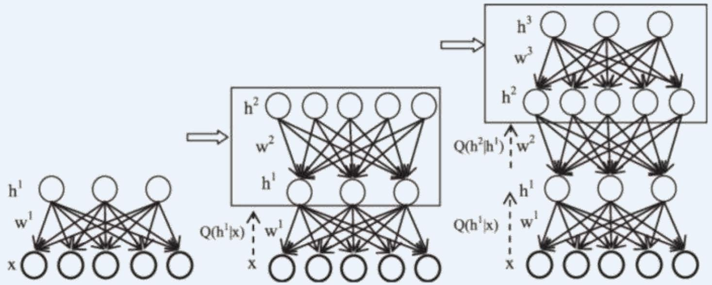

# DBN网络

」 举例- - 深度信念网络 (Deep belief network, DBN):

每层都是一个受限Boltzmann机，即整个网络可视为若干个受限玻尔兹曼机 (RBM)堆叠而成

首先训练第一层（是关于训练样本的RBM模型，可按标准的RBM训练）

将第一层预训练好的隐结点视为第二层的输入结点；对第二层进行预训练；...

各层预训练完成后，利用BP算法对整个网络进行训练

# 新范式提出

」“预训练”＋“微调”

可视为将大量参数分组，对每组先找到局部看来比较好的设置

再基于这些局部较优的结果联合起来进行全局寻优

这样利用了模型大量参数所提供的自由度的同时，有效地节省了训练开销

# 可视化过程

# 深度学习的影响

目前，深度神经网络在人工智能界占据统治地位。神经网络界当下的四位引领者除了Ng，Hinton以外，还有CNN的发明人Yann Lecun,以及《Deep Learning》的作者Bengio

马斯克的OpenAI项目，邀请Bengio作为高级顾问。马斯克认为，人工智能技术不应该掌握在大公司如Google，Facebook的手里，更应该作为一种开放技术，让所有人都可以参与研究。

Yann LeCun

Yoshua Bengio

# 历史发展的总结

神经网络为什么能这么火热？简而言之，就是其学习效果的强大。随着神经网络的发展，其表示性能越来越强

从单层神经网络，到两层神经网络，再到多层神经网络，下图说明了，随着网络层数的增加，以及激活函数的调整，神经网络所能拟合的决策分界平面的能力

神经网络发展外在原因：更强的计算性能，更多的数据，以及更好的训练方法。只有满足这些条件时，神经网络的函数拟合能力才能得已体现

Hinton 在 2006年 的论文里说道的"... provided that computers were fast enough, data sets were big enough, and the initial weights were close enough to a good solution. All three conditions are now satisfied. ”

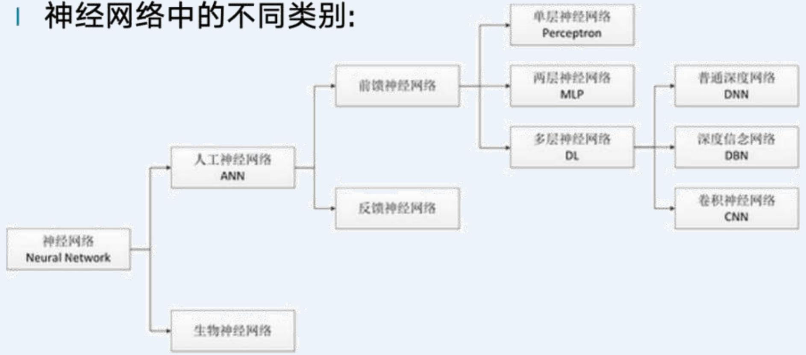

前馈神经网络：有向图是没有回路的

反馈神经网络：有向图是有回路的，Hopfield网络是反馈神经网

络，RNN也属于一种反馈神经网络

# 人工神经网络的应用：预测

团 队 针 对 时 序 预 测 问 题 ， 提 出Anticipated Learning Machine (ALM)利用多层神经网络从短期时间序列中预测复杂系统的未来动态，相关工作发表在国际顶级期刊National Science Review上

ALM 通过神经网络学习非线性特征，在短期数据的基础上准确预测长期趋势，应用于台风预测、交通流量预测等多个领域

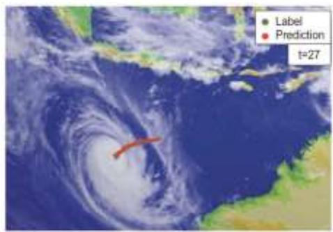

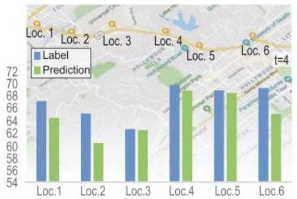

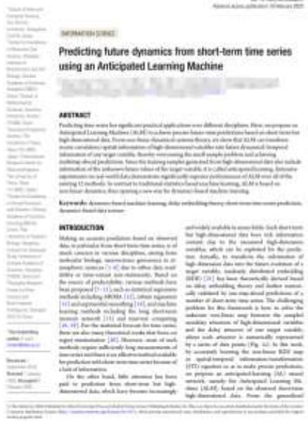

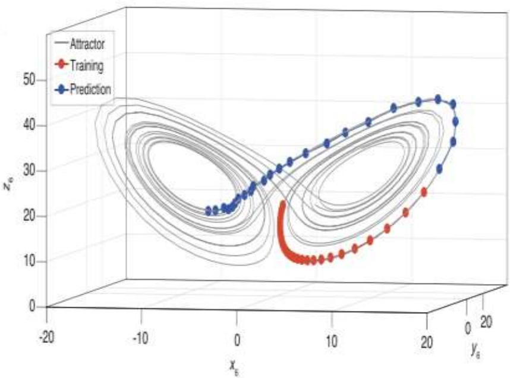

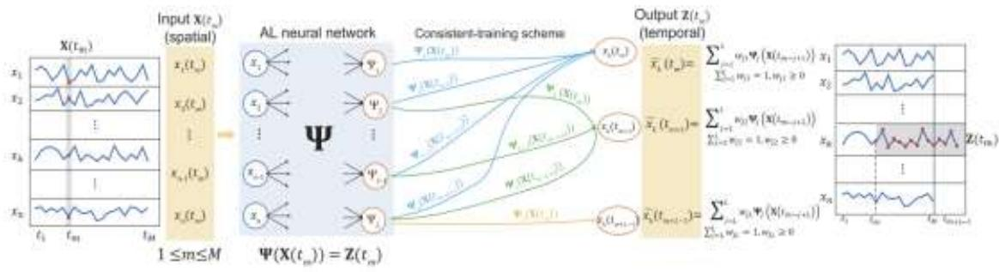

# 人工神经网络的应用：疾病早期检测

广东省某眼科中心团队通过捕捉儿童眼球运动数据, 研发全球首个婴幼儿视功能损伤手机智能筛查系统，为破解婴幼儿视功能损伤及相关眼病早期筛诊难题提供有效技术手段,研究成果发表于《Nature Medicine》

通过婴幼儿观看动画片的注视习惯和行为模式的实时捕捉，实现16种婴幼儿常见眼病的早期检测，筛查准确率超85%，降低儿保，社区筛查等多场景中婴幼儿眼病筛诊的难度

# naturemedicine

Explore content vAbout the journal v Publish with us v

Early detection of visual impairment in young childrenusingasmartphone-baseddeep learning system

# 崛起的中国科研力量！

数据采集

# 课堂练习

考虑以下神经网络，其中 node1 和 node2 为输入节点，node3 为输出节点，且输入节点均没有应用激活函数。输出节点 node3 的输 $\lambda I _ { 3 } = w _ { 1 3 } * x _ { 1 } + w _ { 2 3 } * x _ { 2 } + \theta$ ，输出节点采用 sigmoid 激活函数，即 $\begin{array} { r } { O _ { 3 } = \frac { 1 } { 1 + e ^ { - I _ { 3 } } } } \end{array}$ 1+e-13' 假定一个训练样本， $x _ { 1 } = 1 , x _ { 2 } = 0 . 5$ ，其真实的类标签 $y = 1$ ，设损失函数采用均方误差，即 $L = 0 . 5 * ( y - { \cal O } _ { 3 } ) ^ { 2 }$ ，用以更新网络参数。当前网络的参数初始值为： $\theta = 0 , w _ { 1 3 } = 0 . 5 , w _ { 2 3 } = - 1$ 。请基于上述训练样本的 $x _ { 1 } , x _ { 2 } ,$ 的取值，以及网络中 $\theta , w _ { 1 3 } , w _ { 2 3 }$ 的初始值，计算损失函数 $L$ 对 $w _ { 1 3 }$ 的偏导，即 $\frac { \partial L } { \partial w _ { 1 3 } }$ 的值0W13$( \sqrt { e } = 1 . 6 5 )$ 。

解答：

正向传播：

$$
\begin{array}{l} I _ {3} = w _ {1 3} ^ {*} x _ {1} + w _ {2 3} ^ {*} x _ {2} + \theta = 0 \\ O _ {3} = \frac {1}{1 + e ^ {- I _ {3}}} = \frac {1}{2} \\ \end{array}
$$

链式法则：

$$
\frac {\partial L}{\partial w _ {1 3}} = \frac {\partial L}{\partial O _ {3}} * \frac {\partial O _ {3}}{\partial I _ {3}} * \frac {\partial I _ {3}}{\partial w _ {1 3}} = (O _ {3} - y) * \frac {e ^ {- I _ {3}}}{(1 + e ^ {- I _ {3}}) ^ {2}} * x _ {1} = - \frac {1}{2} * \frac {1}{4} * 1 = - \frac {1}{8}
$$

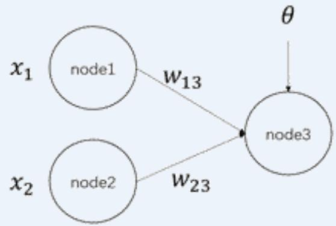

# 谢谢大家！

相关课程资源及参考文献请浏览

超算习堂：https://easyhpc.net/course/143