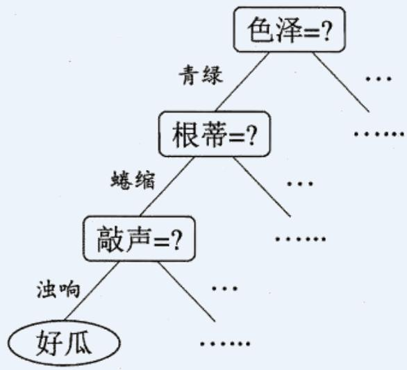
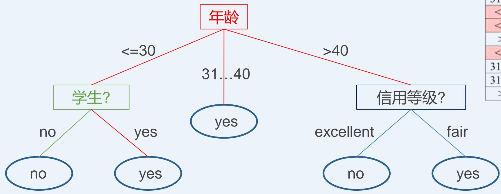
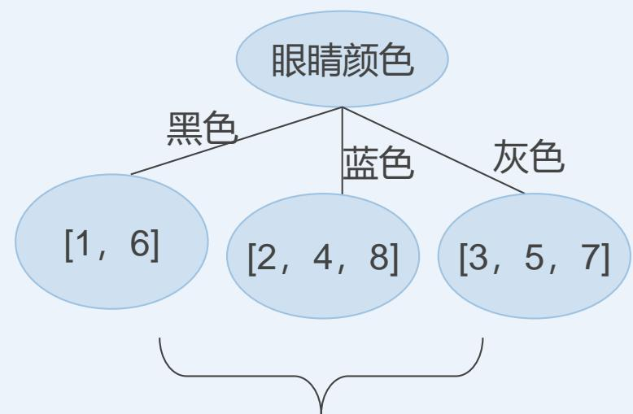
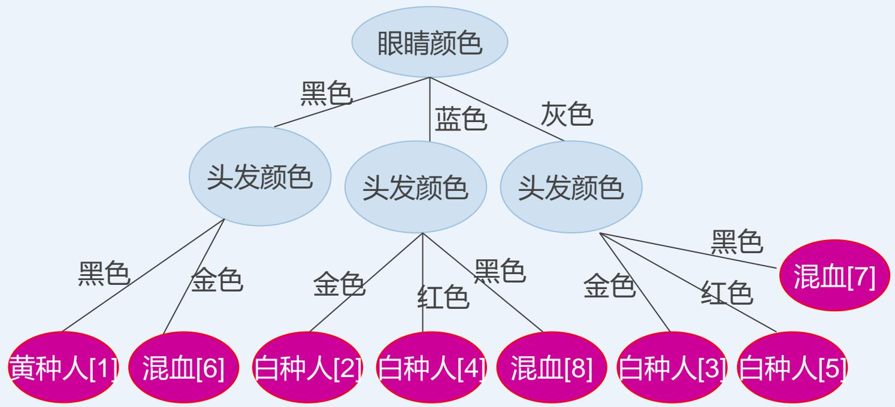
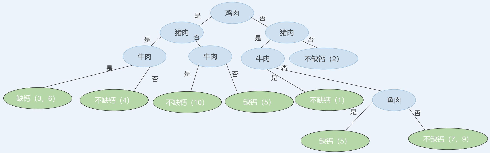
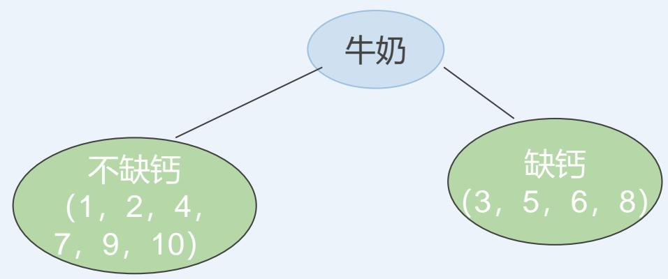
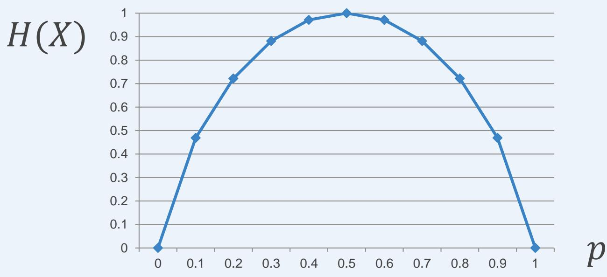
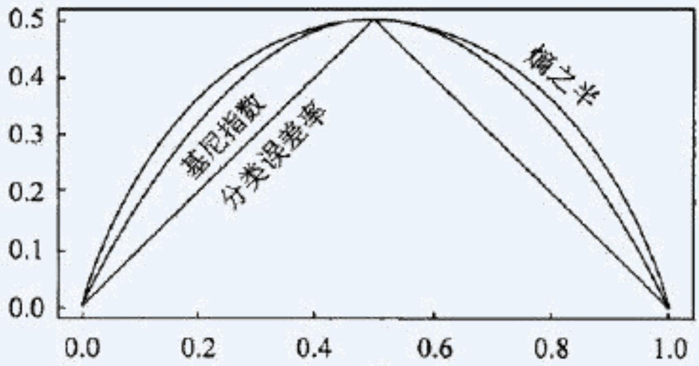

# 决策树

# Decision Tree

授课对象：计算机科学与技术专业 二年级

课程名称：人工智能（专业必修）

节选内容：第六章 机器学习

课程学分：3学分

# 什么是决策树？

一种树状结构的分类模型

◼ 每个“内部结点”对应于某个属性上的“测试”(test)

◼ 每个分支对应于该测试的一种可能结果（即该属性的某个取值）

◼ 每个“叶结点”对应于一个“预测结果”

学习过程：通过对训练样本的分析来确定“划分属性” （即内部结点所对应的属性）

预测过程：将测试示例从根结点开始，沿着划分属性所构成的“判定测试序列”下行，直到叶结点

西瓜问题的一颗决策树

# 什么是决策树？

<table><tr><td>年龄</td><td>收入</td><td>学生?</td><td>信用等级?</td><td>是否买电脑</td></tr><tr><td>&lt;=30</td><td>high</td><td>no</td><td>fair</td><td>no</td></tr><tr><td>&lt;=30</td><td>high</td><td>no</td><td>excellent</td><td>no</td></tr><tr><td>31...40</td><td>high</td><td>no</td><td>fair</td><td>yes</td></tr><tr><td>&gt;40</td><td>medium</td><td>no</td><td>fair</td><td>yes</td></tr><tr><td>&gt;40</td><td>low</td><td>yes</td><td>fair</td><td>yes</td></tr><tr><td>&gt;40</td><td>low</td><td>yes</td><td>excellent</td><td>no</td></tr><tr><td>31...40</td><td>low</td><td>yes</td><td>excellent</td><td>yes</td></tr><tr><td>&lt;=30</td><td>medium</td><td>no</td><td>fair</td><td>no</td></tr><tr><td>&lt;=30</td><td>low</td><td>yes</td><td>fair</td><td>yes</td></tr><tr><td>&gt;40</td><td>medium</td><td>yes</td><td>fair</td><td>yes</td></tr><tr><td>&lt;=30</td><td>medium</td><td>yes</td><td>excellent</td><td>yes</td></tr><tr><td>31...40</td><td>medium</td><td>no</td><td>excellent</td><td>yes</td></tr><tr><td>31...40</td><td>high</td><td>yes</td><td>fair</td><td>yes</td></tr><tr><td>&gt;40</td><td>medium</td><td>no</td><td>excellent</td><td>no</td></tr></table>

# 什么是决策树？

<table><tr><td>年龄</td><td>收入</td><td>学生?</td><td>信用等级?</td><td>是否买电脑</td></tr><tr><td>&lt;=30</td><td>high</td><td>no</td><td>fair</td><td>no</td></tr><tr><td>&lt;=30</td><td>high</td><td>no</td><td>excellent</td><td>no</td></tr><tr><td>31...40</td><td>high</td><td>no</td><td>fair</td><td>yes</td></tr><tr><td>&gt;40</td><td>medium</td><td>no</td><td>fair</td><td>yes</td></tr><tr><td>&gt;40</td><td>low</td><td>yes</td><td>fair</td><td>yes</td></tr><tr><td>&gt;40</td><td>low</td><td>yes</td><td>excellent</td><td>no</td></tr><tr><td>31...40</td><td>low</td><td>yes</td><td>excellent</td><td>yes</td></tr><tr><td>&lt;=30</td><td>medium</td><td>no</td><td>fair</td><td>no</td></tr><tr><td>&lt;=30</td><td>low</td><td>yes</td><td>fair</td><td>yes</td></tr><tr><td>&gt;40</td><td>medium</td><td>yes</td><td>fair</td><td>yes</td></tr><tr><td>&lt;=30</td><td>medium</td><td>yes</td><td>excellent</td><td>yes</td></tr><tr><td>31...40</td><td>medium</td><td>no</td><td>excellent</td><td>yes</td></tr><tr><td>31...40</td><td>high</td><td>yes</td><td>fair</td><td>yes</td></tr><tr><td>&gt;40</td><td>medium</td><td>no</td><td>excellent</td><td>no</td></tr></table>

# 什么是决策树？

<table><tr><td>年龄</td><td>收入</td><td>学生?</td><td>信用等级?</td><td>是否买电脑</td></tr><tr><td>&lt;=30</td><td>high</td><td>no</td><td>fair</td><td>no</td></tr><tr><td>&lt;=30</td><td>high</td><td>no</td><td>excellent</td><td>no</td></tr><tr><td>31...40</td><td>high</td><td>no</td><td>fair</td><td>yes</td></tr><tr><td>&gt;40</td><td>medium</td><td>no</td><td>fair</td><td>yes</td></tr><tr><td>&gt;40</td><td>low</td><td>yes</td><td>fair</td><td>yes</td></tr><tr><td>&gt;40</td><td>low</td><td>yes</td><td>excellent</td><td>no</td></tr><tr><td>31...40</td><td>low</td><td>yes</td><td>excellent</td><td>yes</td></tr><tr><td>&lt;=30</td><td>medium</td><td>no</td><td>fair</td><td>no</td></tr><tr><td>&lt;=30</td><td>low</td><td>yes</td><td>fair</td><td>yes</td></tr><tr><td>&gt;40</td><td>medium</td><td>yes</td><td>fair</td><td>yes</td></tr><tr><td>&lt;=30</td><td>medium</td><td>yes</td><td>excellent</td><td>yes</td></tr><tr><td>31...40</td><td>medium</td><td>no</td><td>excellent</td><td>yes</td></tr><tr><td>31...40</td><td>high</td><td>yes</td><td>fair</td><td>yes</td></tr><tr><td>&gt;40</td><td>medium</td><td>no</td><td>excellent</td><td>no</td></tr></table>

# 什么是决策树？

<table><tr><td>年龄</td><td>收入</td><td>学生?</td><td>信用等级?</td><td>是否买电脑</td></tr><tr><td>&lt;=30</td><td>high</td><td>no</td><td>fair</td><td>no</td></tr><tr><td>&lt;=30</td><td>high</td><td>no</td><td>excellent</td><td>no</td></tr><tr><td>31...40</td><td>high</td><td>no</td><td>fair</td><td>yes</td></tr><tr><td>&gt;40</td><td>medium</td><td>no</td><td>fair</td><td>yes</td></tr><tr><td>&gt;40</td><td>low</td><td>yes</td><td>fair</td><td>yes</td></tr><tr><td>&gt;40</td><td>low</td><td>yes</td><td>excellent</td><td>no</td></tr><tr><td>31...40</td><td>low</td><td>yes</td><td>excellent</td><td>yes</td></tr><tr><td>&lt;=30</td><td>medium</td><td>no</td><td>fair</td><td>no</td></tr><tr><td>&lt;=30</td><td>low</td><td>yes</td><td>fair</td><td>yes</td></tr><tr><td>&gt;40</td><td>medium</td><td>yes</td><td>fair</td><td>yes</td></tr><tr><td>&lt;=30</td><td>medium</td><td>yes</td><td>excellent</td><td>yes</td></tr><tr><td>31...40</td><td>medium</td><td>no</td><td>excellent</td><td>yes</td></tr><tr><td>31...40</td><td>high</td><td>yes</td><td>fair</td><td>yes</td></tr><tr><td>&gt;40</td><td>medium</td><td>no</td><td>excellent</td><td>no</td></tr></table>

# 什么是决策树？

# 建模阶段

◼ Tree construction (建树)

首先，所有训练样本都位于根节点位置

• 基于一定的指标(如：信息增益，基尼系数等)选择属性

根据选择的属性，递归地划分训练样本

◼ Tree pruning (剪枝)

识别并删除异常值和噪声影响较大的分支

# 预测阶段

◼ 使用构建的树模型预测未知样本

# 决策树算法

输入：训练集 $D = \{ ( { \pmb x } _ { 1 } , y _ { 1 } ) , ( { \pmb x } _ { 2 } , y _ { 2 } ) , . . . , ( { \pmb x } _ { m } , y _ { m } ) \} ;$ ：属性集 $A = \{ a _ { 1 } , a _ { 2 } , \ldots , a _ { d } \}$ .

过程：函数TreeGenerate $( D , A )$

1:生成结点node;

2:if $D$ 中样本全属于同一类别 $C$ then

3:将 node标记为 $C$ 类叶结点;return

4: end if

递归返回，情形(1)

5:ifA=ORD中样本在A上取值相同then

6:将 node标记为叶结点,其类别标记为 $D$ 中样本数最多的类;return

7: end if

8:从A中选择最优划分属性 $^ { a _ { * } }$

 9: for $\overline { { a _ { * } } }$ 的每一个值 $\overline { { a _ { * } ^ { v } } }$ do

10:为node生成一个分支;令 $D _ { v }$ 表示 $D$ 中在 $^ { a _ { * } }$ 上取值为 $a _ { * } ^ { v }$ 的样本子集；

11:if $\overline { { D _ { v } } }$ 为空then

12:将分支结点标记为叶结点，其类别标记为 $D$ 中样本最多的类;return

13:else

14:以 TreeGenerate $D _ { v }$ ，A\{a*}为分支结点

15:end·if

16: end for

输出：以node为根结点的一棵决策树

用当前结点的后验分布

递归返回，情形(2)

递归返回，情形(3)

将父结点的样本分布作为当前结点的先验分布

决策树算法的核心

# 决策树算法

基础算法(一种贪心算法)

◼ 根据分治的思想，用自顶向下的方法，递归建树

◼ 属性应当是离散的（如果是连续型数据，需要先进行离散化）

◼ 首先，所有训练样本都位于根节点位置

基于统计学指标或启发式的方法来对属性进行选择（如信息增益、基尼系数等）

◼ 根据选择的属性，递归地划分训练样本

停止划分的条件

◼ 被分到同一个节点内的所有样本都是同一个类别（相同label/class）

◼ 所有的属性都已经被用于之前的划分，没有属性可以继续划分——采用多数投票的方法决定该叶子节点的列表

◼ 无训练数据

# 决策树算法

与决策树相关的重要算法包括：

◼ CLS, ID3，C4.5，CART

算法的发展过程

Hunt, Marin和Stone于1966年研制的CLS学习系统，用于学习单个概念。

◼ 1979年, Quinlan给出ID3算法，并在1983年和1986年对ID3进行了总结和简化，使其成为决策树学习算法的典型。

Schlimmer和Fisher于1986年对ID3进行改造，在每个可能的决策树节点创建缓冲区，使决策树可以递增式生成，得到ID4算法。

◼ 1988年，Utgoff在ID4基础上提出了ID5学习算法，进一步提高了效率。

◼ 1993年，Quinlan 进一步发展了ID3算法，改进成C4.5算法。

另一类决策树算法为CART，与C4.5不同的是，CART由二元逻辑问题生成，每个树节点只有两个分枝，分别包括学习实例的正例与反例。

# CLS算法

⚫ CLS（Concept Learning System）算法

◼ CLS是早期的决策树学习算法。它是许多决策算法的基础

⚫ CLS的基本思想

从一棵空决策树开始，选择某一属性（分类属性）作为测试属性。该测试属性对应决策树中的决策结点。根据该属性的值的不同，可将训练样本分成相应的子集：

如果该子集为空，或该子集中的样本属于同一个类，则该子集为叶结点；

否则该子集对应于决策树的内部结点，即测试结点，需要选择一个新的分类属性对该子集进行划分，直到所有的子集都为空或者属于同一类。

# CLS算法

<table><tr><td>人员</td><td>眼睛颜色</td><td>头发颜色</td><td>所属人种</td></tr><tr><td>1</td><td>黑色</td><td>黑色</td><td>黄种人</td></tr><tr><td>2</td><td>蓝色</td><td>金色</td><td>白种人</td></tr><tr><td>3</td><td>灰色</td><td>金色</td><td>白种人</td></tr><tr><td>4</td><td>蓝色</td><td>红色</td><td>白种人</td></tr><tr><td>5</td><td>灰色</td><td>红色</td><td>白种人</td></tr><tr><td>6</td><td>黑色</td><td>金色</td><td>混血</td></tr><tr><td>7</td><td>灰色</td><td>黑色</td><td>混血</td></tr><tr><td>8</td><td>蓝色</td><td>黑色</td><td>混血</td></tr></table>

# CLS算法

<table><tr><td>人员</td><td>眼睛颜色</td><td>头发颜色</td><td>所属人种</td></tr><tr><td>1</td><td>黑色</td><td>黑色</td><td>黄种人</td></tr><tr><td>2</td><td>蓝色</td><td>金色</td><td>白种人</td></tr><tr><td>3</td><td>灰色</td><td>金色</td><td>白种人</td></tr><tr><td>4</td><td>蓝色</td><td>红色</td><td>白种人</td></tr><tr><td>5</td><td>灰色</td><td>红色</td><td>白种人</td></tr><tr><td>6</td><td>黑色</td><td>金色</td><td>混血</td></tr><tr><td>7</td><td>灰色</td><td>黑色</td><td>混血</td></tr><tr><td>8</td><td>蓝色</td><td>黑色</td><td>混血</td></tr></table>

决策树的构建

不属于同一类，非叶结点

# CLS算法

# CLS算法

# 步骤：

1. 生成一颗空决策树和一个训练样本属性表;

2. 若训练样本集 ?? 中所有的样本都属于同一类，则生成结点 ?? ，并终止学习算法；否则

3. 根据某种策略从训练样本属性表中选择属性 ?? 作为测试属性，生成测试结点??;

4. 若A的取值为??1, ??2, … , ????，则根据 ?? 的取值的不同，将 ?? 划分成??个子集??1, ??2, … , ????;

5. 从训练样本属性表中删除属性??;

6. 对每个子集递归调用CLS CLS算法有什么问题？

在步骤3中，根据某种策略从训练样本属性表中选择属性A作为测试属性。没有规定采用何种测试属性。实践表明，测试属性集的组成以及测试属性的先后对决策树的学习具有举足轻重的影响。

# CLS算法

学生膳食结构和缺钙调查表

<table><tr><td>学生</td><td>鸡肉</td><td>猪肉</td><td>牛肉</td><td>羊肉</td><td>鱼肉</td><td>鸡蛋</td><td>青菜</td><td>番茄</td><td>牛奶</td><td>健康情况</td></tr><tr><td>1</td><td>0</td><td>1</td><td>1</td><td>0</td><td>1</td><td>0</td><td>1</td><td>0</td><td>1</td><td>不缺钙</td></tr><tr><td>2</td><td>0</td><td>0</td><td>0</td><td>0</td><td>1</td><td>1</td><td>1</td><td>1</td><td>1</td><td>不缺钙</td></tr><tr><td>3</td><td>1</td><td>1</td><td>1</td><td>1</td><td>1</td><td>0</td><td>1</td><td>0</td><td>0</td><td>缺钙</td></tr><tr><td>4</td><td>1</td><td>1</td><td>0</td><td>0</td><td>1</td><td>1</td><td>0</td><td>0</td><td>1</td><td>不缺钙</td></tr><tr><td>5</td><td>1</td><td>0</td><td>0</td><td>1</td><td>1</td><td>1</td><td>0</td><td>0</td><td>0</td><td>缺钙</td></tr><tr><td>6</td><td>1</td><td>1</td><td>1</td><td>0</td><td>0</td><td>1</td><td>0</td><td>1</td><td>0</td><td>缺钙</td></tr><tr><td>7</td><td>0</td><td>1</td><td>0</td><td>0</td><td>0</td><td>1</td><td>1</td><td>1</td><td>1</td><td>不缺钙</td></tr><tr><td>8</td><td>0</td><td>1</td><td>0</td><td>0</td><td>0</td><td>1</td><td>1</td><td>1</td><td>0</td><td>缺钙</td></tr><tr><td>9</td><td>0</td><td>1</td><td>0</td><td>0</td><td>0</td><td>1</td><td>1</td><td>1</td><td>1</td><td>不缺钙</td></tr><tr><td>10</td><td>1</td><td>0</td><td>1</td><td>1</td><td>1</td><td>1</td><td>0</td><td>1</td><td>1</td><td>不缺钙</td></tr></table>

# CLS算法

采用不同的测试属性及其先后顺序将会生成不同的决策树！

# CLS算法

采用不同的测试属性及其先后顺序将会生成不同的决策树！

# ID3算法

⚫ ID3算法是一种经典的决策树学习算法，由Quinlan于1979年提出。

ID3算法主要针对属性选择问题。是决策树学习方法中最具影响和最为典型的算法。

该方法使用信息增益度选择测试属性。

当获取信息时，将不确定的内容转为确定的内容，因此信息伴着不确定性。

从直觉上讲，小概率事件比大概率事件包含的信息量大。如果某件事情是“百年一见”则肯定比“习以为常”的事件包含的信息量大。

如何度量信息量的大小？

# ID3算法

如何衡量属性的重要性 （importance）？

<table><tr><td>年龄</td><td>收入</td><td>学生?</td><td>信用等级?</td><td>是否买电脑</td></tr><tr><td>&lt;=30</td><td>high</td><td>no</td><td>fair</td><td>no</td></tr><tr><td>&lt;=30</td><td>high</td><td>no</td><td>excellent</td><td>no</td></tr><tr><td>31...40</td><td>high</td><td>no</td><td>fair</td><td>yes</td></tr><tr><td>&gt;40</td><td>medium</td><td>no</td><td>fair</td><td>yes</td></tr><tr><td>&gt;40</td><td>low</td><td>yes</td><td>fair</td><td>yes</td></tr><tr><td>&gt;40</td><td>low</td><td>yes</td><td>excellent</td><td>no</td></tr><tr><td>31...40</td><td>low</td><td>yes</td><td>excellent</td><td>yes</td></tr><tr><td>&lt;=30</td><td>medium</td><td>no</td><td>fair</td><td>no</td></tr><tr><td>&lt;=30</td><td>low</td><td>yes</td><td>fair</td><td>yes</td></tr><tr><td>&gt;40</td><td>medium</td><td>yes</td><td>fair</td><td>yes</td></tr><tr><td>&lt;=30</td><td>medium</td><td>yes</td><td>excellent</td><td>yes</td></tr><tr><td>31...40</td><td>medium</td><td>no</td><td>excellent</td><td>yes</td></tr><tr><td>31...40</td><td>high</td><td>yes</td><td>fair</td><td>yes</td></tr><tr><td>&gt;40</td><td>medium</td><td>no</td><td>excellent</td><td>no</td></tr></table>

# 信息论

⚫ 假设要为投掷一个8面骰子的结果进行编码. 需要多少个比特？（bit）

如果我们希望将投掷这个8面骰子的结果通过某种方式发送给别人，最有效的方式就是将这一信息进行二进制编码 【000 – 111】

$$
3 b i t s = \log_ {2} 8 = - \sum_ {i = 1} ^ {8} \frac {1}{8} \log_ {2} \frac {1}{8} = - \sum_ {i = 1} ^ {8} p (i) \log_ {2} p (i) = H (X)
$$

# 信息论

Entropy (熵)

represent the expectation of uncertainty for a random variable(可以用来衡量离散变量的不确定性，如抛硬币、掷骰子)

$$
\begin{array}{l} H (X) = - \sum_ {x \in X} p (x) \log_ {2} p (x) \\ = \sum_ {x \in X} p (x) \log_ {2} {\frac {1}{p (x)}} \\ = E \left(\log_ {2} {\frac {1}{p (X)}}\right) \\ \end{array}
$$

# 信息论

⚫ ??(?? = 1) = ??, ??(?? = 0) = 1 − ??

假设抛一枚硬币，正面朝上的概率为??，反面朝上的概率为1 − ??，则抛这枚硬币所得结果的不确定性（熵值）是??的下述函数：

$$
H (X) = - p \log_ {2} p - (1 - p) \log_ {2} (1 - p)
$$

# 信息论

条件/联合熵

$$
\begin{array}{l} = \sum_ {x \in X} p (x) \left[ - \sum_ {y \in Y} p (y | x) \log_ {2} p (y | x) \right] \\ = - \sum_ {x \in X} \sum_ {y \in Y} p (x) p (y | x) \log_ {2} p (y | x) \\ = - \sum_ {x \in X} \sum_ {y \in Y} p (x, y) \log_ {2} p (y | x) \\ \end{array}
$$

联合熵： $H ( X , Y ) = - \sum _ { x \in X } \sum _ { y \in Y } p ( x , y ) \log _ { 2 } p \left( x , y \right)$

# 信息论

$$
\begin{array}{l} H (X, Y) = - E _ {p (x, y)} \log_ {2} p (x, y) \\ = - E _ {p (x, y)} (\log_ {2} (p (x) p (y | x))) \\ = - E _ {p (x, y)} \left(\log_ {2} p (x) + \log_ {2} p (y | x)\right) \\ = - E _ {p (x)} \log_ {2} p (x) - E _ {p (x, y)} \log_ {2} p (y | x) \\ = H (X) + H (Y | X) \\ \end{array}
$$

两个离散变量??和??的联合熵（即，联合出现的不确定性）

= ??的熵 + 给定??，出现??的条件熵

= ??的不确定性 + 给定??，出现??的不确定性

# 信息论

Mutual information (互信息)

因为： $H ( X , Y ) = H ( X ) + H ( Y | X ) = H ( Y ) + H ( X | Y )$

所以： $H ( Y ) - H ( Y | X ) = H ( X ) - H ( X | Y ) = I ( X ; Y )$

两个离散变量X和Y的互信息I(X;Y)衡量的是这两个变量之间的相关度

一个连续变量X的不确定性，用方差??????(??)来度量

一个离散变量X的不确定性，用熵??(??)来度量

两个连续变量X和Y的相关度，用协方差或相关系数来度量

两个离散变量X和Y的相关度，用互信息??(??; ??)来度量

# 信息论

Mutual information (互信息)

因为： $H ( X , Y ) = H ( X ) + H ( Y | X ) = H ( Y ) + H ( X | Y )$

所以： $H ( Y ) - H ( Y | X ) = H ( X ) - H ( X | Y ) = \left( I ( X ; Y ) \right)$

两个离散变量X和Y的互信息I(X;Y)衡量的是这两个变量之间的相关度

"因X而有Y事件"的熵( 基于已知随机变量的不确定性) 在"Y事件"的熵之中具有多少影响地位( "Y事件所具有的不确定性" 其中包含了多少 "Y|X事件所具有的不确性" )，意即"Y具有的不确定性"有多少程度是起因于X事件;

举例来说，当 I(X;Y) = 0时，也就是 H(Y) = H(Y|X)时，即代表此时 “Y的不确定性” 即为 “Y|X的不确定性”，这说明了互信息的具体意义是在度量两个事件彼此之间的关联性。所以具体的解释就是:互信息越小，两个来自不同事件空间的随机变量彼此之间的关联性越低; 相互信息越高，关联性则越高 。

# 基于信息增益的ID3模型

类标签: 是否买电脑=“yes/no”

用字母??表示类标签，字母??表示每个属性

计算?? (类标签) 和?? (每个属性)的互信息 TRY

14个训练样本中，9个买了电脑

$$
\begin{array}{l} H (D) = - \frac {9}{1 4} \log_ {2} {\frac {9}{1 4}} - (1 - \frac {9}{1 4}) \log_ {2} (1 - \frac {9}{1 4}) = 0. 9 4 0 \\ H (D | A = " \text {年 龄} ") = \frac {5}{1 4} \times \left(- \frac {2}{5} \log_ {2} \frac {2}{5} - \frac {3}{5} \log_ {2} \frac {3}{5}\right) \\ + \frac {4}{1 4} \times \left(- \frac {4}{4} \log_ {2} {\frac {4}{4}} - \frac {0}{4} \log_ {2} {\frac {0}{4}}\right) + \frac {5}{1 4} \times \left(- \frac {3}{5} \log_ {2} {\frac {3}{5}} - \frac {2}{5} \log_ {2} {\frac {2}{5}}\right) \\ = 0. 6 9 4 \\ \end{array}
$$

<table><tr><td>年龄</td><td>收入</td><td>学生?</td><td>信用等级?</td><td>是否买电脑</td></tr><tr><td>&lt;=30</td><td>high</td><td>no</td><td>fair</td><td>no</td></tr><tr><td>&lt;=30</td><td>high</td><td>no</td><td>excellent</td><td>no</td></tr><tr><td>31...40</td><td>high</td><td>no</td><td>fair</td><td>yes</td></tr><tr><td>&gt;40</td><td>medium</td><td>no</td><td>fair</td><td>yes</td></tr><tr><td>&gt;40</td><td>low</td><td>yes</td><td>fair</td><td>yes</td></tr><tr><td>&gt;40</td><td>low</td><td>yes</td><td>excellent</td><td>no</td></tr><tr><td>31...40</td><td>low</td><td>yes</td><td>excellent</td><td>yes</td></tr><tr><td>&lt;=30</td><td>medium</td><td>no</td><td>fair</td><td>no</td></tr><tr><td>&lt;=30</td><td>low</td><td>yes</td><td>fair</td><td>yes</td></tr><tr><td>&gt;40</td><td>medium</td><td>yes</td><td>fair</td><td>yes</td></tr><tr><td>&lt;=30</td><td>medium</td><td>yes</td><td>excellent</td><td>yes</td></tr><tr><td>31...40</td><td>medium</td><td>no</td><td>excellent</td><td>yes</td></tr><tr><td>31...40</td><td>high</td><td>yes</td><td>fair</td><td>yes</td></tr><tr><td>&gt;40</td><td>medium</td><td>no</td><td>excellent</td><td>no</td></tr></table>

$$
\begin{array}{l} H (Y | X) = \sum_ {x \in X} p (x) H (Y | X = x) \\ = \sum_ {x \in X} p (x) \left[ - \sum_ {y \in Y} p (y | x) \log_ {2} p (y | x) \right] \\ = - \sum_ {x \in X} \sum_ {y \in Y} p (x) p (y | x) \log_ {2} p (y | x) \\ = - \sum_ {x \in X} \sum_ {y \in Y} p (x, y) \log_ {2} p (y | x) \\ \end{array}
$$

$$
\begin{array}{l} H (X) = - \sum_ {x \in X} p (x) \log_ {2} p (x) \\ = \sum_ {x \in X} p (x) \log_ {2} \frac {1}{p (x)} \\ = E \left(\log_ {2} \frac {1}{p (X)}\right) \\ \end{array}
$$

# 基于信息增益的ID3模型

对于下述数据集，采用ID3算法会得到哪个属性最重要？

<table><tr><td>用户ID</td><td>年龄</td><td>收入</td><td>学生?</td><td>信用等级?</td><td>是否买电脑</td></tr><tr><td>u1</td><td>&lt;=30</td><td>high</td><td>no</td><td>fair</td><td>no</td></tr><tr><td>u2</td><td>&lt;=30</td><td>high</td><td>no</td><td>excellent</td><td>no</td></tr><tr><td>u3</td><td>31...40</td><td>high</td><td>no</td><td>fair</td><td>yes</td></tr><tr><td>u4</td><td>&gt;40</td><td>medium</td><td>no</td><td>fair</td><td>yes</td></tr><tr><td>u5</td><td>&gt;40</td><td>low</td><td>yes</td><td>fair</td><td>yes</td></tr><tr><td>u6</td><td>&gt;40</td><td>low</td><td>yes</td><td>excellent</td><td>no</td></tr><tr><td>u7</td><td>31...40</td><td>low</td><td>yes</td><td>excellent</td><td>yes</td></tr><tr><td>u8</td><td>&lt;=30</td><td>medium</td><td>no</td><td>fair</td><td>no</td></tr><tr><td>u9</td><td>&lt;=30</td><td>low</td><td>yes</td><td>fair</td><td>yes</td></tr><tr><td>u10</td><td>&gt;40</td><td>medium</td><td>yes</td><td>fair</td><td>yes</td></tr><tr><td>u11</td><td>&lt;=30</td><td>medium</td><td>yes</td><td>excellent</td><td>yes</td></tr><tr><td>u12</td><td>31...40</td><td>medium</td><td>no</td><td>excellent</td><td>yes</td></tr><tr><td>u13</td><td>31...40</td><td>high</td><td>yes</td><td>fair</td><td>yes</td></tr><tr><td>u14</td><td>&gt;40</td><td>medium</td><td>no</td><td>excellent</td><td>no</td></tr></table>

# 基于信息增益的ID3模型

TRY ??(??, ?? = “收入”)、 $\textcircled { 6 } \textcircled { 1 } D _ { 2 } A =$ “学生”)、 $g ( D , A = { } ^ { \prime }$ “信用等级”)

类标签: 是否买电脑=“yes/no”

$\bullet$ 用字母 $D$ 表示类标签，字母??表示每个属性

$\bullet$ 计算 $D$ (类标签) 和?? (每个属性)的互信息

⚫ $H ( D ) = 0 . 9 4 0$

$H ( D | A = { } ^ { \prime }$ 年龄” = 0.694

$$
g (D, A) = I (D; A) = H (D) - H (D | A)
$$

$g ( D , A = "$ “年龄”) = 0.246

⚫ $g ( D , A = { } ^ { \prime }$ “收入”) = 0.029

$g ( D , A = { } ^ { \prime }$ “学生”) $) = 0 . 1 5 1$

$g ( D , A = $ “信用等级”) $) = 0 . 0 4 8$

“年龄”这个属性的条件熵最小 （等价于信息增益最大,互信息最大）因而首先被选出作为根节点

# 基于增益率的C4.5模型

⚫ 信息增益（Information gain）的衡量容易偏向那些有大量值的属性

⚫ C4.5 (ID3的一个改进版) 使用了增益率（Gain ratio）克服上述问题（对信息增益正则化）

每次选取最大增益率的属性进行划分

# 基于增益率的C4.5模型

????????????????????(??) = ??????????(??)/????????????????????(??)

$$
S p l i t I n f o _ {A} (D) = - \sum_ {j = 1} ^ {v} \frac {| D _ {j} |}{| D |} \times \log_ {2} (\frac {| D _ {j} |}{| D |})
$$

⚫ ????????????????????=“????????????” (??) =?

$$
\begin{array}{l} S p l i t I n f o _ {A = \text {" i n c o m e "}} (D) \\ = - \frac {4}{1 4} \times \log_ {2} (\frac {4}{1 4}) - \frac {6}{1 4} \times \log_ {2} (\frac {6}{1 4}) - \frac {4}{1 4} \times \log_ {2} (\frac {4}{1 4}) \\ = 0. 9 2 6 \\ \end{array}
$$

???????????????? $O _ { A = " }$ “????????????”(??) = 0.029/0.926 = 0.031

<table><tr><td>年龄</td><td>收入</td><td>学生?</td><td>信用等级?</td><td>是否买电脑</td></tr><tr><td>&lt;=30</td><td>high</td><td>no</td><td>fair</td><td>no</td></tr><tr><td>&lt;=30</td><td>high</td><td>no</td><td>excellent</td><td>no</td></tr><tr><td>31...40</td><td>high</td><td>no</td><td>fair</td><td>yes</td></tr><tr><td>&gt;40</td><td>medium</td><td>no</td><td>fair</td><td>yes</td></tr><tr><td>&gt;40</td><td>low</td><td>yes</td><td>fair</td><td>yes</td></tr><tr><td>&gt;40</td><td>low</td><td>yes</td><td>excellent</td><td>no</td></tr><tr><td>31...40</td><td>low</td><td>yes</td><td>excellent</td><td>yes</td></tr><tr><td>&lt;=30</td><td>medium</td><td>no</td><td>fair</td><td>no</td></tr><tr><td>&lt;=30</td><td>low</td><td>yes</td><td>fair</td><td>yes</td></tr><tr><td>&gt;40</td><td>medium</td><td>yes</td><td>fair</td><td>yes</td></tr><tr><td>&lt;=30</td><td>medium</td><td>yes</td><td>excellent</td><td>yes</td></tr><tr><td>31...40</td><td>medium</td><td>no</td><td>excellent</td><td>yes</td></tr><tr><td>31...40</td><td>high</td><td>yes</td><td>fair</td><td>yes</td></tr><tr><td>&gt;40</td><td>medium</td><td>no</td><td>excellent</td><td>no</td></tr></table>

# 基于Gini指数的CART模型

如果一个数据集??包含来自??个类的样本，那么基尼指数，???????? ??定义如下：

$$
g i n i (D) = \sum_ {j = 1} ^ {n} p _ {j} (1 - p _ {j}) = 1 - \sum_ {j = 1} ^ {n} p _ {j} ^ {2}
$$

$p _ { j }$ 是类??在 $D$ 中的相对频率。

$\bullet$ 如果 $n = 2$ ，那么????????(??) = 2??(1 − ??)

# 基于Gini指数的CART模型

⚫ 如果一个数据集 $D$ 被分成两个子集 $D _ { 1 }$ 和 $D _ { 2 }$ 大小分别为 $N _ { 1 }$ 和 $N _ { 2 }$ , 数据包含来自 $n$ 个类的样本, 则基尼指数 $g i n i _ { s p l i t } ( D )$ 定义如下

$$
g i n i _ {s p l i t} (D) = \frac {N _ {1}}{N} g i n i (D _ {1}) + \frac {N _ {2}}{N} g i n i (D _ {2})
$$

具有最小 ??????????????????(??)的属性被选为分裂节点的属性 (对每个属性，需要遍历所有可能的分裂位置点 ).

# 基于Gini指数的CART模型

在“是否买电脑”中， $D$ 有9个样本 “是” 5个样本 “否”

$$
g i n i (D) = 1 - (\frac {9}{1 4}) ^ {2} - (\frac {5}{1 4}) ^ {2} = 0. 4 5 9
$$

$\bullet$ 属性“收入”将 $D$ 分成：10个在 $D _ { 1 }$ : {medium, high} 以及4个在 $D _ { 2 }$ ：{low}

$$
\begin{array}{l} g i n i _ {\{\mathrm {m e d i u m , h i g h / l o w} \}} (D) = \frac {1 0}{1 4} g i n i (D _ {1}) + \frac {4}{1 4} g i n i (D _ {2}) \\ = \frac {1 0}{1 4} \bigg (1 - (\frac {6}{1 0}) ^ {2} - (\frac {4}{1 0}) ^ {2} \bigg) + \frac {4}{1 4} \bigg (1 - (\frac {1}{4}) ^ {2} - (\frac {3}{4}) ^ {2} \bigg) \\ = 0. 4 5 0 \\ \end{array}
$$

# 连续型属性的处理

应该如何计算具有连续值属性的信息增益或基尼指数？

◼ 给定??的 $v$ 个值, 那么有?? − 1个可能的分裂位置。比如在??中， $a _ { i }$ 和 $a _ { i + 1 }$ 的中点是

$$
(a _ {i} + a _ {i + 1}) / 2
$$

# 基于Gini指数的CART模型

# CART（分类树）的生成算法

输入：训练数据集??，停止计算条件

输出：CART分类树

从根节点开始，递归对每个结点操作

1. 设结点数据集为 $D$ ，对每个特征??，对其每个值 $a$ ，根据样本点对 $A = a$ 的测试为是或否，将 $D$ 分为 $D _ { 1 }$ ，??2，计算?? = ??的基尼指数

2. 在所有的特征??以及所有可能的切分点 $a$ 中，选择基尼指数最小的特征和切分点，将数据集分配到两个子结点中

3. 对两个子结点递归调用1和2步骤

4. 生成CART树

# 分类树

# 生成分类规则

将知识表示为 IF-THEN 形式的规则。

⚫ 对每条从根节点到叶子节点的路径，创建一条规则。

⚫ 从一个节点到下一层节点的一条分支上，每个属性-值对可以形成一个连接。

叶子节点代表预测的分类。

规则应当容易被人理解 (可解释性)。

# CART （回归树） 的生成

⚫ 设y是连续变量，给定训练数据集： $D = \{ ( x _ { 1 } , y _ { 1 } ) , ( x _ { 2 } , y _ { 2 } ) , \ldots , ( x _ { N } , y _ { N } ) \}$

假设已将输入空间划分为M个单元R1,R2...Rm，并且每个单元Rm上有一个固定的输出cm，回归树表示为：

$$
f (x) = \sum_ {m = 1} ^ {M} c _ {m} I (x \in R _ {m})
$$

平方误差来表示预测误差，用平方误差最小准则求解每个单元上的最优输出值:

$$
\sum_ {x _ {i} \in R _ {m}} \left(y _ {i} - f (x _ {i})\right) ^ {2}
$$

$R _ { m }$ 上的 $c _ { m }$ 的最优值： $\hat { c } _ { m } = a v e ( y _ { i } | x _ { i } \in R _ { m } )$

# CART （回归树） 的生成

问题：如何对输入空间进行划分？

启发式：选择第??个变量 $x ^ { ( j ) }$ 和它取的值??，作为切分变量和切分点，定义两个区域：

$$
R _ {1} (j, s) = \left\{x \mid x ^ {(j)} \leq s \right\} \text {和} R _ {2} (j, s) = \left\{x \mid x ^ {(j)} > s \right\}
$$

然后寻找最优切分变量和切分点：

$$
\min _ {j, s} [ \min _ {c _ {1}} \sum_ {x _ {i} \in R _ {1} (j, s)} (y _ {i} - c _ {1}) ^ {2} + \min _ {c _ {2}} \sum_ {x _ {i} \in R _ {1} (j, s)} (y _ {i} - c _ {2}) ^ {2} ]
$$

$\bullet$ 且： $\hat { c } _ { 1 } = a v e ( y _ { i } | x _ { i } \in R _ { 1 } ( j , s ) )$ 和 $\hat { c } _ { 2 } = a v e ( y _ { i } | x _ { i } \in R _ { 2 } ( j , s ) )$

$\bullet$ 再对两个区域重复上述划分，直到满足停止条件。

# CART （回归树） 的生成

输入：训练数据集D；

输出：回归树??(??)

在训练数据集所在的输入空间中，递归地将每个区域划分为两个子区域并决定每个子区域上的输出值，构建二叉决策树：

1. 选择最优切分变量??与切分点??，求解：

$$
\min _ {j, s} [ \min _ {c _ {1}} \sum_ {x _ {i} \in R _ {1} (j, s)} (y _ {i} - c _ {1}) ^ {2} + \min _ {c _ {2}} \sum_ {x _ {i} \in R _ {1} (j, s)} (y _ {i} - c _ {2}) ^ {2} ]
$$

遍历变量??，对固定的切分变量??扫描切分点??，选择使上式达到最小值

# CART （回归树） 的生成

输入：训练数据集D；

输出：回归树 $f ( x )$

在训练数据集所在的输入空间中，递归地将每个区域划分为两个子区域并决定每个子区域上的输出值，构建二叉决策树：

2. 用选定的对 $( j , s )$ 划分区域并决定相应的输出值：

$$
R _ {1} (j, s) = \{x \mid x ^ {(j)} \leq s \}, R _ {2} (j, s) = \{x \mid x ^ {(j)} > s \},
$$

$$
\hat {c} _ {m} = \frac {1}{N _ {m}} \sum_ {x _ {i} \in R _ {m} (j, s)} y _ {i}, x \in R _ {m}, m = 1, 2
$$

3. 继续对两个子区域调用步骤1、2，直至满足停止条件

4. 将输入空间划分为 $M$ 个区域 $R _ { 1 } , R _ { 2 } , \dots , R _ { M }$ ，生成决策树：

$$
f (x) = \sum_ {m = 1} ^ {M} \hat {c} _ {m} I (x \in R _ {m})
$$

# 实验方法

⚫ 分出训练集、（验证集）和测试集

使用交叉验证，比如，??折交叉验证

◼ 把数据集分成??部分

◼ 选取(?? − 1)部分用于训练，在剩下那部分上测试

◼ 重复 $k$ 次，使得每个部分都测试过一次

# 谢谢大家！

相关课程资源及参考文献请浏览

超算习堂：https://easyhpc.net/course/143