# 强化学习：决策智能

Reinforcement Learning: Decision intelligence


授课对象：计算机科学与技术专业 二年级

课程名称：人工智能（专业必修）

课程学分：3学分


# 前情知识回顾：机器学习

监督学习：在知道输入和输出的情况下训练出一个模型，被用于寻找输入和输出之间的映射关系。


SUPERVISED LEARNING


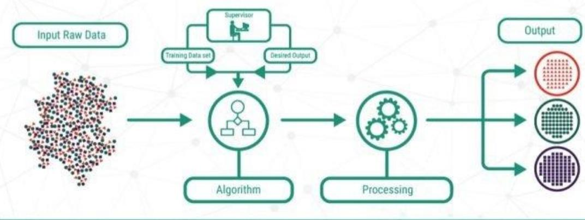


无监督学习：在训练数据中没有标签或目标值的情况下训练一个模型，被用于探索数据中隐含的模式和分布。


UNSUPERVISED LEARNING


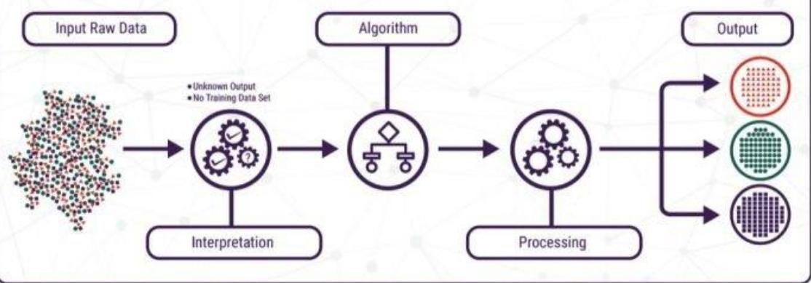


需要提前给定大量静态数据，学习目标是给定数据中的潜在结构或映射

# 动态决策场景

在大量序列决策场景中，智能体需要与环境进行动态交互，通过交互获得的数据来学习决策策略。


博弈游戏


无人机空战


机器人控制


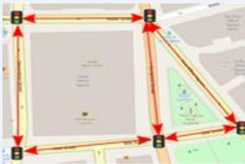


交通灯控制


无人驾驶


智能电网


# 什么是强化学习？

“Reinforcement learning problems involve learning what to do --- how to mapsituations to actions --- so as to maximize a numerical reward signal. In anessential way these are closed-loop problems because the learning system‘sactions influence its later inputs. Moreover, the learner is not told which actionsto take, as in many forms of machine learning, but instead must discover whichactions yield the most reward by trying them out. In the most interesting andchallenging cases, actions may affect not only the immediate reward but alsothe next situation and, through that, all subsequent rewards. These threecharacteristics --- being closed-loop in an essential way, not having directinstructions as to what actions to take, and where the consequences of actions,including reward signals, play out over extended time periods --- are the threemost important distinguishing features of the reinforcement learning problem”

Richard S. Sutton


# 什么是强化学习？

强化学习讨论的问题是：在一个复杂不确定的环境中，智能体如何通过与环境进行大量试错来学习一个最优决策策略。

REINFORCEMENT LEARNING

Input Raw Data

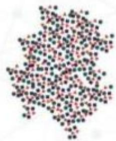


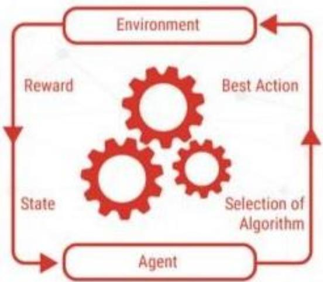


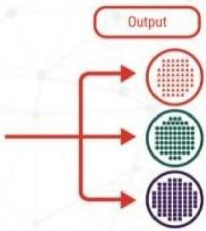


# 什么是强化学习？

# 相比于监督学习和无监督学习，强化学习是机器学习的第三种学习范式

# 强化学习：

# 监督学习：

分类或预测标签

没有交互

没有序列决策

没有探索（试错）

试错学习：通过尝试不同的动作，并根据收到的奖励信号调整策略来学习最优行为。

延迟奖励：可能需要经过一系列动作后才能得到最终的奖励，因此必须考虑长期回报。

⚫ 动态策略：智能体需要根据当前状态选择行动，选择动作的策略是动态调整的。

序列决策：智能体和环境的交互是一个序列决策过程。


简单表格场景


复杂现实场景


本章节知识脉络


# 学习目标

重点 / Importance

1.理解强化学习基本概念

2.掌握表格型强化学习三类算法

3.掌握深度强化学习基本算法

4.了解多智能体强化学习相关概念和算法

难点 / Difficulty

1.建模强化学习问题的形式化过程

2.训练强化学习算法在复杂场景上的策略模型

目标 / Goal

能灵活应用强化学习算法到任意复杂环境

# 智能体和环境

# 强化学习（Reinforcement Learning, RL）

受动物的学习过程启发，在试错中学习

不断与环境交互，获取学习所需的经验

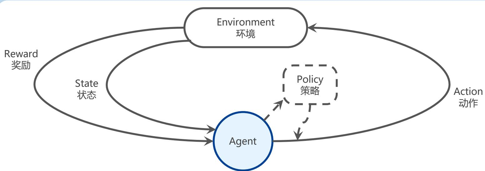


强化学习过程


# 四个基本要素

1. 环境模型

2. 交互样本（状态、动作）

3. 策略

4. 奖励

# 智能体和环境

• 智能体（Agent）：游戏中玩家所操控的角色

• 环境（Environment）：道路、障碍物、怪物等智能体外的其它元素


《冒险岛》游戏中的状态与动作


# 状态

• 状态 （State） 当前帧的画面

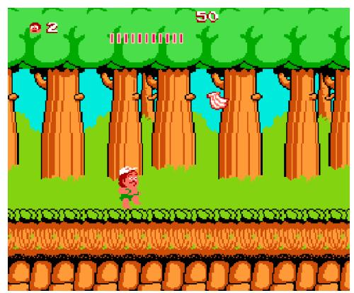


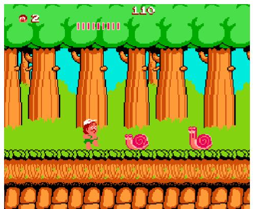


《冒险岛》游戏中的状态与动作


# 动作

• 动作（action） 当前可以采取的行动


向后走


向上跳


向前走


《冒险岛》游戏中的状态与动作

# 奖励

• 奖励（reward）：一般对应着相关任务需求


《冒险岛》游戏中存在的奖励


正向奖励：

收集苹果： $+ 5 0$

攻击小怪： $+ 1 0 0$

负向奖励：

每消耗一秒时间：-5

接触小怪： −∞ （游戏结束）

强化学习的目标就是最大化在环境中所能获得的奖励。

# 马尔科夫决策过程

• 马尔可夫性质：给定当前状态后，未来状态与过去状态（即该过程的历史状态）是条件独立的。

$$
P r \{S _ {t + h} = s | S _ {i} = s _ {i}, i \leq t \} = P r \{S _ {t + h} = s | S _ {t} = s _ {t} \}, \forall h > 0
$$

当前状态涵盖了历史中的所有相关信息

一旦当前状态已知即可忽略其余历史状态信息

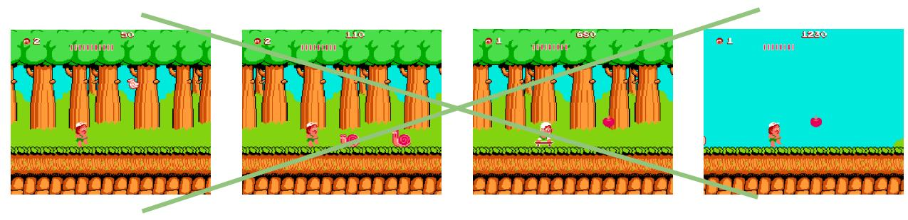


历史状态


当前状态


《冒险岛》游戏中的马尔可夫性质


# 马尔科夫决策过程

• 马尔可夫决策过程（Markov Decision Process，MDP）：对于一个马尔可夫决策过程，可以用一个五元组 ??, ??, ??, ??, ?? 来表示：

• 状态空间 ?? 是所有状态组成的集合

• 动作空间 $\mathcal { A }$ 是所有动作组成的集合

• 转移函数 $p$ 刻画了状态之间的转移概率： $p ( s ^ { \prime } | s , a ) = P r \{ S _ { t + 1 } = s ^ { \prime } | S _ { t } = s , A _ { t } = a \}$

• $R$ 表示奖励函数，不止取决于当前的状态，还受到动作的影响： $R _ { t } = R ( S _ { t } , A _ { t } , S _ { t + 1 } )$

• ?? 表示折扣因子，?? ∈ [0,1]

# 策略函数

策略（policy）：从状态空间到动作空间的映射

随机性策略 $\pi ( \boldsymbol a | \boldsymbol s )$ ：输出在状态 ?? 下选择动作 $a$ 的概率

确定性策略 $\pi ( s )$ ：输出在状态 ?? 下选择的确定动作

$$
\sum_ {a \in \mathcal {A}} \pi (a | s) = 1
$$

$$
a = \pi (s)
$$


确定性策略可以在《冒险岛》中取得不错的表现


石头剪刀布中则更适合使用随机性策略


# 策略函数

# 策略的具体形式

• 表格策略

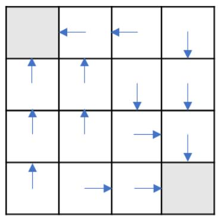


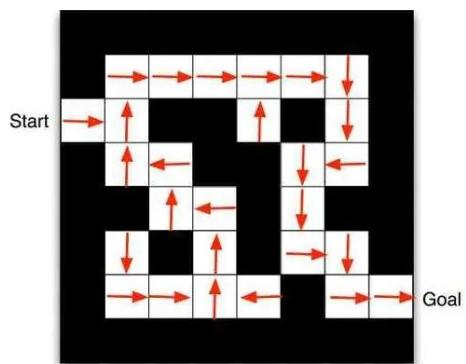


• 参数化策略

$$
\begin{array}{c} {\pi_ {\theta} (s) \triangleq \pi (s; \theta)} \\ {\pi_ {\theta} (a | s) \triangleq \pi (a | s; \theta)} \end{array}
$$

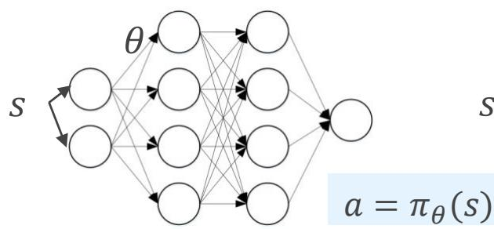


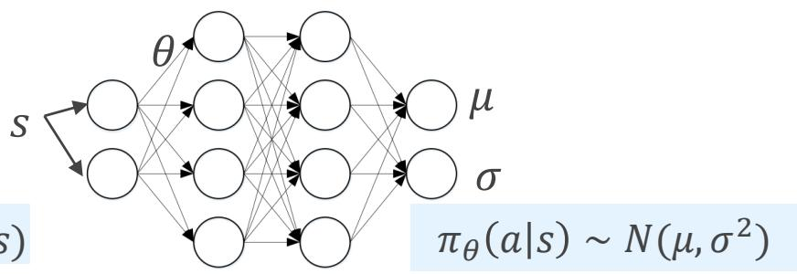


# 回报

回报（return）：回报 ??_?? 为从时间步??开始的折扣奖励总和

$$
G _ {t} = R _ {t + 1} + \gamma R _ {t + 2} + \gamma^ {2} R _ {t + 3} + \ldots = \sum_ {k = 0} ^ {\infty} \gamma^ {k} R _ {t + k + 1}
$$

折扣因子 $\gamma \in [ 0 , 1 ]$ 用于衡量未来奖励在当前所具备的价值

$k + 1$ 步后的奖励 $R$ 在当前的价值被定义为 $\gamma ^ { k } R$

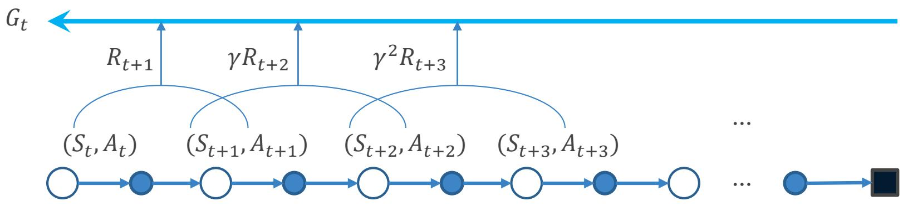


强化学习着眼于最大化累积奖励，也即上述定义的回报（return）。

# 回报

# 折扣因子的意义：

加入折扣后可以获得良好的数学性质，如确保一些算法的收敛性

避免马尔可夫过程中的循环导致的无限奖励

未来的奖励具有不确定性

动物和人类在实际场景中也更倾向于即时奖励

考虑真实的经济情况，当前收入相比未来收入具有更强的购买力

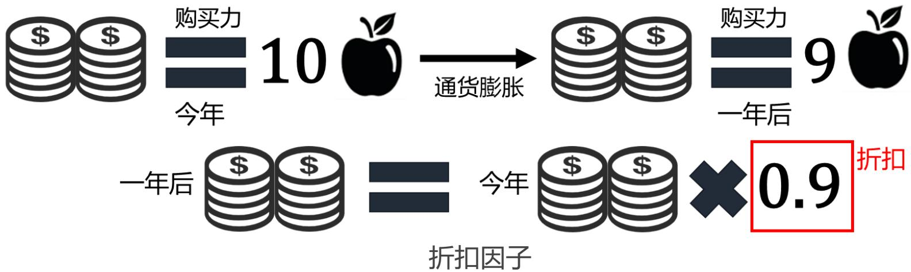


# 价值函数

# 价值函数用于评估一个策略的好坏

• 状态价值函数（State-value function）：以状态 ?? 为起始状态且按照策略 ??行动的期望回报。

$$
V _ {\pi} (s) \triangleq \mathbb {E} _ {\pi} [ G _ {t} | S _ {t} = s ]
$$

• 动作价值函数（Action-value function）：以状态 ?? 为起始状态且采取动作 ??，然后按照策略 ?? 行动得到的回报。

$$
Q _ {\pi} (s, a) \triangleq \mathbb {E} _ {\pi} [ G _ {t} | S _ {t} = s, A _ {t} = a ]
$$

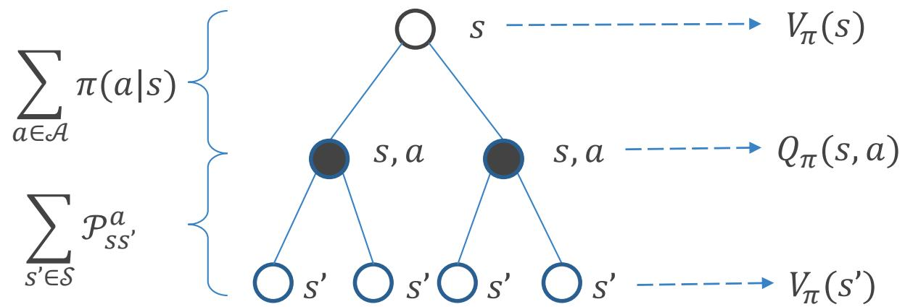


$$
V _ {\pi} (s) = \sum_ {a \in \mathcal {A}} \pi (a | s) Q _ {\pi} (s, a)
$$

$$
Q _ {\pi} (s, a) = \mathcal {R} _ {s} ^ {a} + \gamma \sum_ {s ^ {\prime} \in \mathcal {S}} \mathcal {P} _ {s s ^ {\prime}} ^ {a} V _ {\pi} (s ^ {\prime})
$$

# 价值函数

$$
V _ {\pi} (s) = \sum_ {a \in \mathcal {A}} \pi (a | s) Q _ {\pi} (s, a)
$$

$$
Q _ {\pi} (s, a) = \mathcal {R} _ {s} ^ {a} + \gamma \sum_ {s ^ {\prime} \in \mathcal {S}} \mathcal {P} _ {s s ^ {\prime}} ^ {a} V _ {\pi} (s ^ {\prime})
$$

最优价值函数： $V _ { * } ( s ) = \operatorname* { m a x } _ { \pi } V _ { \pi } ( s ) , \forall s \in \mathcal { S }$

$$
Q _ {*} (s, a) = \max _ {\pi} Q _ {\pi} (s, a)
$$

• $V _ { \ast } ( s )$ 与 $Q _ { * } ( s , a )$ 之间的关系

$$
V _ {*} (s) = \max _ {a} Q _ {*} (s, a)
$$

$$
Q _ {*} (s, a) = \mathcal {R} _ {S} ^ {a} + \gamma \sum_ {s ^ {\prime} \in \mathcal {S}} \mathcal {P} _ {S S ^ {\prime}} ^ {a} V _ {*} (s ^ {\prime})
$$

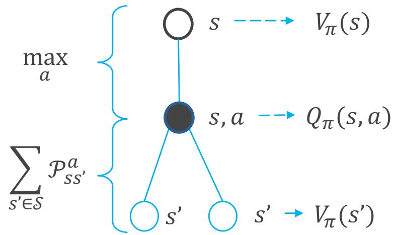


最优策略：可以通过 ??∗(??, ??)得到一个确定性的最优策略

$$
\pi_ {*} (a | s) = \left\{ \begin{array}{l l} 1 & i f a = a r g \max _ {a \in \mathcal {A}} Q _ {*} (s, a) \\ 0 & o t h e r w i s e \end{array} \right.
$$

# 贝尔曼方程

# 状态价值函数可以被拆分为即时奖励与后续状态的折扣价值

$$
\begin{array}{l} V _ {\pi} (s) = \mathbb {E} _ {\pi} [ R _ {t + 1} + \gamma R _ {t + 2} + \gamma^ {2} R _ {t + 3} + \dots | S _ {t} = s ] \\ = \mathbb {E} _ {\pi} [ R _ {t + 1} + \gamma (R _ {t + 2} + \gamma R _ {t + 3} + \ldots) | S _ {t} = s ] \\ = \mathbb {E} _ {\pi} [ R _ {t + 1} + \gamma G _ {t + 1} | S _ {t} = s ] \\ = \mathbb {E} _ {\pi} [ R _ {t + 1} + \gamma V _ {\pi} (S _ {t + 1}) | S _ {t} = s ] \\ = \sum_ {a \in \mathcal {A}} \pi (a | s) \left(\mathcal {R} _ {s} ^ {a} + \gamma \sum_ {s ^ {\prime} \in \mathcal {S}} \mathcal {P} _ {s s ^ {\prime}} ^ {a} V _ {\pi} (s ^ {\prime})\right) \\ \end{array}
$$

# 贝尔曼方程

$$
V _ {\pi} (s) = \sum_ {a \in \mathcal {A}} \pi (a | s) Q _ {\pi} (s, a)
$$

$$
Q _ {\pi} (s, a) = \mathcal {R} _ {s} ^ {a} + \gamma \sum_ {s ^ {\prime} \in \mathcal {S}} \mathcal {P} _ {s s ^ {\prime}} ^ {a} V _ {\pi} (s ^ {\prime})
$$

# 动作状态价值函数也可以被拆分为即时奖励与后续状态的折扣价值

$$
\begin{array}{l} Q _ {\pi} (s, a) = \mathbb {E} _ {\pi} [ R _ {t + 1} + \gamma Q _ {\pi} (S _ {t + 1}, A _ {t + 1}) | S _ {t} = s, A _ {t} = a ] \\ = \mathcal {R} _ {s} ^ {a} + \gamma \sum_ {s ^ {\prime} \in \mathcal {S}} \mathcal {P} _ {s s ^ {\prime}} ^ {a} \sum_ {a \in \mathcal {A}} \pi (a | s ^ {\prime}) Q _ {\pi} (s ^ {\prime}, a) \\ \end{array}
$$

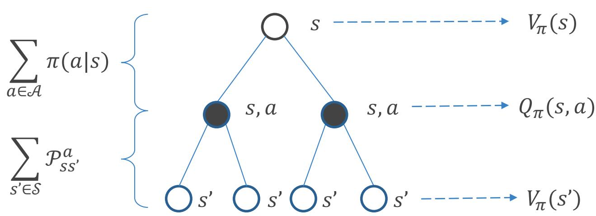


# 贝尔曼最优方程

最优状态价值函数：

$$
\begin{array}{l} V _ {*} (s) = \max _ {\pi} V _ {\pi} (s) \\ = \max _ {\pi} \mathbb {E} _ {\pi} \big [ \mathcal {R} _ {s} ^ {a} + \gamma V _ {\pi} (s ^ {\prime}) \big ] \\ = \max _ {\pi} \mathbb {E} _ {\pi} \big [ \mathcal {R} _ {s} ^ {a} + \gamma V _ {*} (s ^ {\prime}) \big ] \\ = \max _ {a} (\mathcal {R} _ {s} ^ {a} + \gamma \sum_ {s ^ {\prime} \in \mathcal {S}} \mathcal {P} _ {s s ^ {\prime}} ^ {a} v _ {*} (s ^ {\prime})) \\ \end{array}
$$

$$
V _ {*} (s) = \max _ {a} Q _ {*} (s, a)
$$

$$
V _ {\pi} (s) = \sum_ {a \in \mathcal {A}} \pi (a | s) Q _ {\pi} (s, a)
$$

$$
Q _ {\pi} (s, a) = \mathcal {R} _ {s} ^ {a} + \gamma \sum_ {s ^ {\prime} \in \mathcal {S}} \mathcal {P} _ {s s ^ {\prime}} ^ {a} V _ {\pi} (s ^ {\prime})
$$

最优动作价值函数：

$$
\begin{array}{l} Q _ {*} (s, a) = \max _ {\pi} Q _ {\pi} (s, a) \\ = \max _ {\pi} \mathbb {E} _ {\pi} \big [ \mathcal {R} _ {s} ^ {a} + \gamma Q _ {\pi} (s ^ {\prime}, a ^ {\prime}) \big ] \\ = \mathbb {E} _ {\boldsymbol {\pi}} \left[ \mathcal {R} _ {s} ^ {a} + \gamma \max _ {a ^ {\prime}} Q _ {*} (s ^ {\prime}, a ^ {\prime}) \right] \\ = \mathcal {R} _ {s} ^ {a} + \gamma \sum_ {s ^ {\prime} \in \mathcal {S}} \mathcal {P} _ {s s ^ {\prime}} ^ {a} \max _ {a ^ {\prime}} Q _ {*} (s ^ {\prime}, a ^ {\prime}) \\ \end{array}
$$

$$
Q _ {*} (s, a) = \mathcal {R} _ {s} ^ {a} + \gamma \sum_ {s ^ {\prime} \in \mathcal {S}} \mathcal {P} _ {s s ^ {\prime}} ^ {a}, V _ {*} (s ^ {\prime})
$$

# AI for Science

<table><tr><td>Paper</td><td>Publisher</td><td>Application</td></tr><tr><td>Avoiding fusion plasma tearing instability with deep reinforcement learning</td><td>Nature 2024</td><td>Tokamak control</td></tr><tr><td>Champion-level drone racing using deep reinforcement learning</td><td>Nature 2023</td><td>Drone racing</td></tr><tr><td>Top-down design of protein architectures with reinforcement learning</td><td>Science 2023</td><td>Protein design</td></tr><tr><td>Dense reinforcement learning for safety validation of autonomous vehicles</td><td>Nature 2023</td><td>Autonomous driving</td></tr><tr><td>Magnetic control of tokamak plasmas through deep reinforcement learning</td><td>Nature 2022</td><td>Tokamak control</td></tr><tr><td>Discovering faster matrix multiplication algorithms with reinforcement learning</td><td>Nature 2022</td><td>Matrix multiplication</td></tr><tr><td>A graph placement methodology for fast chip design</td><td>Nature 2021</td><td>Chip design</td></tr><tr><td>A general reinforcement learning algorithm that masters chess, shogi, and Go through self-play</td><td>Science 2018</td><td>Board game</td></tr></table>

# 应用——大模型

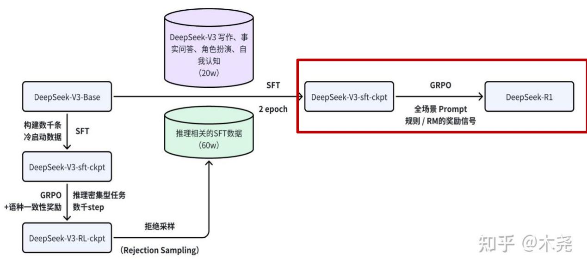


# 应用——机器人

# Real-World Humanoid Locomotionwith Reinforcement Learning

Illija Radosavovic*，Tete Xiao， Bike Zhang*Trevor Darrellt, Jitendra Malik+，Koushil Sreenatht

University of California，Berkeley

# 应用——机器人

Fully Autonomous Real-WorldReinforcementLearning forMobile Manipulation

In submission,CoR2021

# 应用——无人机

# Champion-Level Performance in DroneRacing using Deep Reinforcement Learning

E.Kaufmann,L. Bauersfeld,A.Loquercio,M.Muler, V. Koltun,D.Scaramuzza


University of

ZurichUzH


ROBOTICS&

PERCEPTION

GROUP

rpg.ifi.uzh.ch

# 应用——博弈


DouZero


AlphaGo


# 应用自动驾驶

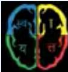


SwaayattRobots

# 近年来重要应用

<table><tr><td>Paper</td><td>Publisher</td><td>Application</td></tr><tr><td>Whole-body physics simulation of fruit fly locomotion</td><td>Nature 2025</td><td>Whole-body model of the fruit fly</td></tr><tr><td>Mastering diverse control tasks through world models</td><td>Nature 2025</td><td>Game play</td></tr><tr><td>Experiment-free exoskeleton assistance via learning in simulation</td><td>Nature 2024</td><td>Exoskeleton assistance</td></tr><tr><td>Avoiding fusion plasma tearing instability with deep reinforcement learning</td><td>Nature 2024</td><td>Tokamak control</td></tr><tr><td>Champion-level drone racing using deep reinforcement learning</td><td>Nature 2023</td><td>Drone racing</td></tr><tr><td>Top-down design of protein architectures with reinforcement learning</td><td>Science 2023</td><td>Protein design</td></tr><tr><td>Dense reinforcement learning for safety validation of autonomous vehicles</td><td>Nature 2023</td><td>Autonomous driving</td></tr><tr><td>Magnetic control of tokamak plasmas through deep reinforcement learning</td><td>Nature 2022</td><td>Tokamak control</td></tr><tr><td>Discovering faster matrix multiplication algorithms with reinforcement learning</td><td>Nature 2022</td><td>Matrix multiplication</td></tr><tr><td>A graph placement methodology for fast chip design</td><td>Nature 2021</td><td>Chip design</td></tr><tr><td>A general reinforcement learning algorithm that masters chess, shogi, and Go through self-play</td><td>Science 2018</td><td>Board game</td></tr></table>

# 本节小结

# 强化学习的基本概念

智能体

环境

动作

奖励

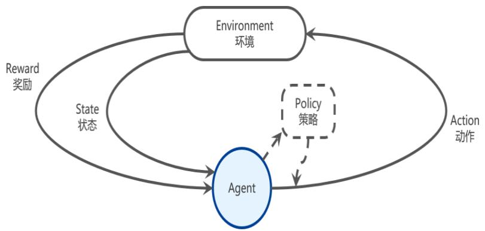


# 马尔可夫决策过程

五元组 ??, ??, ??, ??, ??

确定性策略函数

随机策略函数

累计折扣回报

$$
\begin{array}{l} \sum_ {a \in \mathcal {A}} \pi (a | s) = 1 \\ a = \pi (s) \\ \end{array}
$$

$$
G _ {t} = R _ {t + 1} + \gamma R _ {t + 2} + \gamma^ {2} R _ {t + 3} + \dots = \sum_ {k = 0} ^ {\infty} \gamma^ {k} R _ {t + k + 1}
$$

状态值函数

$$
V _ {\pi} (s) \triangleq \mathbb {E} _ {\pi} \left[ G _ {t} \mid S _ {t} = s \right]
$$

动作值函数

$$
Q _ {\pi} (s, a) \triangleq \mathbb {E} _ {\pi} \left[ G _ {t} \mid S _ {t} = s, A _ {t} = a \right]
$$

# 贝尔曼方程

状态值函数定义

$$
V _ {\pi} (s) = \sum_ {a \in \mathcal {A}} \pi (a | s) \left(\mathcal {R} _ {s} ^ {a} + \gamma \sum_ {s ^ {\prime} \in \mathcal {S}} \mathcal {P} _ {s s ^ {\prime}} ^ {a} V _ {\pi} \left(s ^ {\prime}\right)\right)
$$

动作值函数定义

$$
Q _ {\pi} (s, a) = \mathcal {R} _ {s} ^ {a} + \gamma \sum_ {s ^ {\prime} \in \mathcal {S}} \mathcal {P} _ {s s ^ {\prime}} ^ {a} \sum_ {a \in \mathcal {A}} \pi (a | s) Q _ {\pi} (s, a)
$$

最优状态值函数定义

$$
V _ {*} (s) = \max  _ {a} \left(\mathcal {R} _ {s} ^ {a} + \gamma \sum_ {s ^ {\prime} \in \mathcal {S}} \mathcal {P} _ {s s ^ {\prime}} ^ {a} v _ {*} (s ^ {\prime})\right)
$$

最优动作值函数定义

$$
Q _ {*} (s, a) = \mathcal {R} _ {s} ^ {a} + \gamma \sum_ {s ^ {\prime} \in \mathcal {S}} \mathcal {P} _ {s s ^ {\prime}} ^ {a} \max  _ {a ^ {\prime}} Q _ {*} (s ^ {\prime}, a ^ {\prime})
$$

# 表格型强化学习场景

右图展示了 Gym 的冰湖环境（Frozen Lake），智能体起点状态在左上角，目标状态在右下角，中间还有若干冰洞。

每一个状态都可以采取上、下、左、右 4 个动作。由于智能体在冰面行走，因此每次行走不一定会朝着预想方向，而是有一定的概率向与预想方向垂直的方向滑行。例如本来想向前走，最后却走到了左边或右边。

当到达宝箱位置，智能体获得正奖励值，否则没有奖励值。

当掉入冰洞或到达目标状态时结束。


冰湖路径图


# 表格型强化学习场景

冰湖环境较为简单，我们可以很容易地构建所有状态动作对的Q表。

<table><tr><td>状态\动作</td><td>上</td><td>下</td><td>左</td><td>右</td></tr><tr><td>\(s_0\)</td><td>0.0</td><td>1.0</td><td>0.0</td><td>0.0</td></tr><tr><td>\(s_1\)</td><td>0.0</td><td>1.0</td><td>0.0</td><td>1.0</td></tr><tr><td>\(s_2\)</td><td>0.0</td><td>0.5</td><td>0.0</td><td>0.5</td></tr><tr><td>\(s_3\)</td><td>0.5</td><td>2.0</td><td>0.0</td><td>0.5</td></tr><tr><td>\(s_4\)</td><td>0.0</td><td>0.0</td><td>0.0</td><td>0.5</td></tr><tr><td>...</td><td>...</td><td>...</td><td>...</td><td>...</td></tr></table>

# Q表图

根据 Q 表，我们可以知道此时每个状态对应的最优策略，即通过每个动作对应的 Q 值大小判断。对于状态 s0，最优策略是采取动作“下”，状态s1 有两个最优动作“下”和“右” 


冰湖路径图


# 表格型强化学习算法

通常， Q 表会被初始化为全 0，通过智能体和环境交互的结果不断更新 Q 表。当Q 表中的每个值函数更新幅度小于某个阈值时，表示着 Q 表已经收敛，那么每个状态对应的策略就是强化学习问题的最优策略。

Q 表的更新方法主要分为两大类：

有环境模型的求解方法：需要知道环境的状态转移函数以及奖励函数，通过动态规划方法递归求解最优策略，常用求解方法主要包括：策略迭代算法、值迭代算法；

无环境模型的求解方法：无需显式知道环境的状态转移函数和奖励函数，而是通过智能体与环境交互的数据更新 Q 值，常用求解方法主要包括：蒙特卡洛方法，时序差分方法

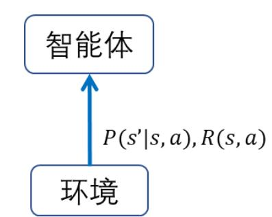


有模型强化学习


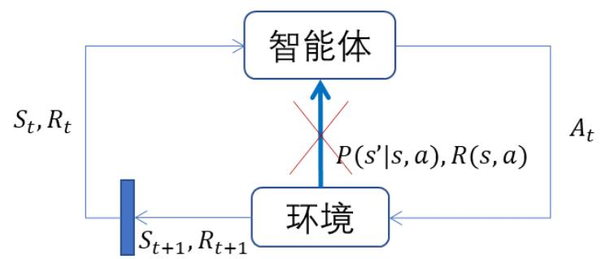


无模型强化学习


# 动态规划算法

• 动态规划 (Dynamic Programming, DP) 是一种适用于解决具有最优子结构 (OptimalSubstructure) 和重叠子问题 (overlapping subproblem) 两个性质的算法思想。

• 20 世纪 50 年代初，美国数学家贝尔曼 (R.Bellman) 等人在研究多阶段决策过程的优化问题时，提出了著名的最优化原理，从而创立了动态规划。

该方法应用十分广泛，包括但不限于工程技术、经济、工业生产、军事等。


# 动态规划算法

# 性质一

# 最优子结构

原问题可以拆分成若干个子问题

• 全局最优解可以拆分成子问题的最优解

# 性质二

# 重叠子问题

子问题可能会出现多次

子问题的解可以被记录并重复利用


贝尔曼方程含有递归分解

略
迭
代


价
值
迭
代


马尔可夫决策过程

价值函数存储了状态价值并被重复利用

# 动态规划算法

# 策略评估 （Policy Evaluation）：评估给定的策略 ??（求解该策略对应的价值函数）

迭代调用贝尔曼期望方程进行更新

使用同步更新（每次迭代更新所有状态的价值）

对于 $k = 1 : H$ （ $H$ 是让价值函数收敛所需的迭代次数）对于所有状态 $s \in \mathcal S$

$$
v _ {k + 1} (s) = \sum_ {a \in \mathcal {A}} \pi (a | s) \left(\mathcal {R} _ {s} ^ {a} + \gamma \sum_ {s ^ {\prime} \in \mathcal {S}} \mathcal {P} _ {s s ^ {\prime}} ^ {a} v _ {k} (s ^ {\prime})\right)
$$

• 右侧简要给出了该方法的收敛性证明

# 收敛性证明：

利用 $\infty$ 范数度量两个状态价值函数 u 与 v 之间的距离，即状态价值的最大差异：

$$
\left\| u - v \right\| _ {\infty} = \max _ {s \in \mathcal {S}} | u (s) - v (s) |
$$

定义贝尔曼期望算子 $B _ { \pi }$ ：

$$
B _ {\pi} v _ {k} = R _ {\pi} + \gamma P _ {\pi} v _ {k}
$$

该算子是一个 ?? −压缩：

$$
\begin{array}{l} \| B _ {\pi} u - B _ {\pi} v \| _ {\infty} = \| (R _ {\pi} + \gamma P _ {\pi} u) - (R _ {\pi} + \gamma P _ {\pi} v) \| _ {\infty} \\ = \| \gamma P _ {\pi} (u - v) \| _ {\infty} \leq \| \gamma P _ {\pi} \| u - v \| _ {\infty} \| _ {\infty} \\ \leq \gamma \| u - v \| _ {\infty} \\ \end{array}
$$

由压缩映射定理可知 $v _ { \pi }$ 是 $B _ { \pi }$ 的唯一不动点，因此策略评估能够收敛到 $v _ { \pi }$

# 动态规划算法

# 策略评估 （Policy Evaluation）：评估给定的策略 ??（求解该策略对应的价值函数）

迭代调用贝尔曼期望方程进行更新

使用同步更新（每次迭代更新所有状态的价值）

对于 $k = 1 : H$ （ $H$ 是让价值函数收敛所需的迭代次数）对于所有状态 $s \in \mathcal S$

$$
v _ {k + 1} (s) = \sum_ {a \in \mathcal {A}} \pi (a | s) \left(\mathcal {R} _ {s} ^ {a} + \gamma \sum_ {s ^ {\prime} \in \mathcal {S}} \mathcal {P} _ {s s ^ {\prime}} ^ {a} v _ {k} (s ^ {\prime})\right)
$$

• 右侧简要给出了该方法的收敛性证明

# Algorithm1.1策略评估

Input:策略 $\pi ( s )$ ，状态转移 $P ( s ^ { \prime } | s , a )$ ，奖励函数 $R ( s , a )$ ，阈值ε，衰减因子 $\gamma$值函数 $V ( s )$

Output:值函数 $V _ { \pi } ( s )$

$k  0$ $V _ { k } ( s )  V ( s )$

2:for $k = 0 , 1 , 2 , \cdots$ do

3:for 每个状态 $s \in S$ do

4: 利用公式1.25计算 $V _ { k + 1 } ( s )$

5: end for

6:if $| V _ { k + 1 } - V _ { k } | < \epsilon$ then

7: $V _ { \pi }  V _ { k + 1 }$

8: return $V _ { \pi }$

9: end if

10: end for

# 动态规划算法

# 网格环境中的策略评估


环境


<table><tr><td></td><td>1</td><td>2</td><td>3</td></tr><tr><td>4</td><td>5</td><td>6</td><td>7</td></tr><tr><td>8</td><td>9</td><td>10</td><td>11</td></tr><tr><td>12</td><td>13</td><td>14</td><td></td></tr></table>


动作


每次移动会有 -1 的奖励


奖励


<table><tr><td></td><td>-1</td><td>-1</td><td>-1</td></tr><tr><td>-1</td><td>-1</td><td>-1</td><td>-1</td></tr><tr><td>-1</td><td>-1</td><td>-1</td><td>-1</td></tr><tr><td>-1</td><td>-1</td><td>-1</td><td></td></tr></table>

• 不考虑折扣（ $\langle \gamma = 1$ ）

• 左上角与右下角为终止状态，其余为非终止状态

到达终止状态之前，每次移动获得 -1 的奖励

• 智能体采用一个随机策略

# 动态规划算法

# 网格环境中的策略评估

随
机
策
略
的
 状
态
价


<table><tr><td>0.0</td><td>0.0</td><td>0.0</td><td>0.0</td></tr><tr><td>0.0</td><td>0.0</td><td>0.0</td><td>0.0</td></tr><tr><td>0.0</td><td>0.0</td><td>0.0</td><td>0.0</td></tr><tr><td>0.0</td><td>0.0</td><td>0.0</td><td>0.0</td></tr></table>


k=0


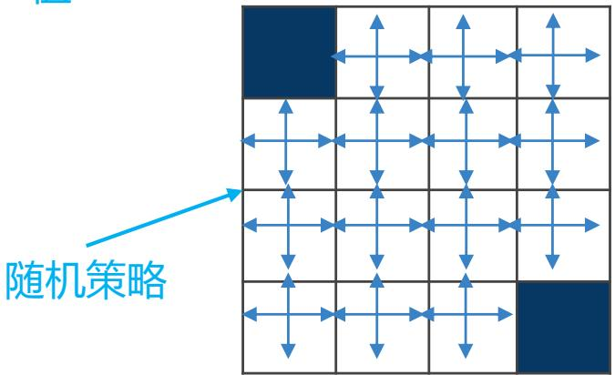


<table><tr><td>0.0</td><td>-1.0</td><td>-1.0</td><td>-1.0</td></tr><tr><td>-1.0</td><td>-1.0</td><td>-1.0</td><td>-1.0</td></tr><tr><td>-1.0</td><td>-1.0</td><td>-1.0</td><td>-1.0</td></tr><tr><td>-1.0</td><td>-1.0</td><td>-1.0</td><td>0.0</td></tr></table>


k=1


<table><tr><td>0.0</td><td>-1.7</td><td>-2.0</td><td>-2.0</td></tr><tr><td>-1.7</td><td>-2.0</td><td>-2.0</td><td>-2.0</td></tr><tr><td>-2.0</td><td>-2.0</td><td>-2.0</td><td>-1.7</td></tr><tr><td>-2.0</td><td>-2.0</td><td>-1.7</td><td>0.0</td></tr></table>


k=2


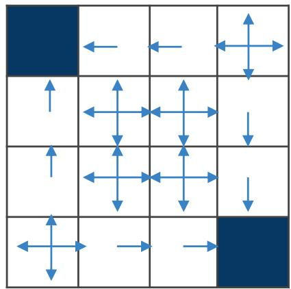


据
的
贪
心
策
略


# 动态规划算法

网格环境中的策略评估

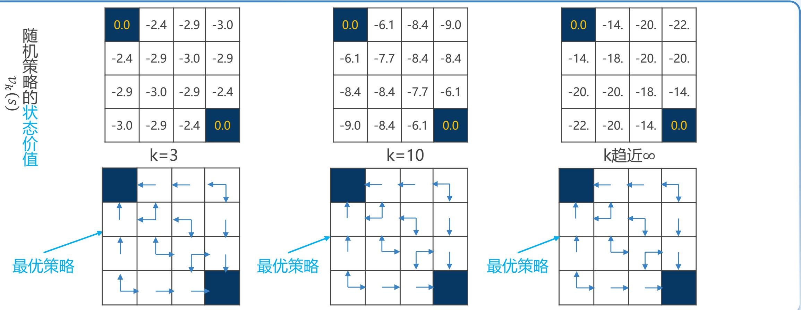


# 动态规划算法

$$
V _ {\pi} (s) = \sum_ {a \in \mathcal {A}} \pi (a | s) Q _ {\pi} (s, a)
$$

$$
Q _ {\pi} (s, a) = \mathcal {R} _ {s} ^ {a} + \gamma \sum_ {s ^ {\prime} \in \mathcal {S}} \mathcal {P} _ {s s ^ {\prime}} ^ {a} V _ {\pi} (s ^ {\prime})
$$

策略提升 （Policy Improvement） 依据策略评估得到的值函数，改进策略 ??

• 根据价值函数得到一个更优的策略

• 可以依据价值函数定义策略之间的偏序关系

$$
\pi \geq \pi^ {\prime} i f v _ {\pi} (s) \geq v _ {\pi^ {\prime}} (s), \forall s \in \mathcal {S}
$$

对于一个确定性策略 （ $a = \pi ( s ) .$ ），可以通过贪心的最大化动作价值函数得到一个新策略

$$
\pi^ {\prime} (a | s) = a r g \max _ {a \in \mathcal {A}} \mathrm {Q} _ {\pi} (s, a)
$$

而策略 π′ 比策略 π 更好或至少一样好


高手玩家 π高手 (s）较大

新手玩家 V新手 (s）较小

$$
\mathsf {Q} _ {\pi} (s, \pi^ {\prime} (s)) = \max _ {a \in \mathcal {A}} \mathsf {Q} _ {\pi} (s, a) \geq \mathsf {Q} _ {\pi} (s, \pi (s)) = v _ {\pi} (s)
$$

$$
\begin{array}{l} v _ {\pi} (s) \leq \mathrm {Q} _ {\pi} (s, \pi^ {\prime} (s)) = \mathbb {E} _ {\pi^ {\prime}} [ R _ {t + 1} + \gamma v _ {\pi} (S _ {t + 1}) | S _ {t} = s ] \\ \leq \mathbb {E} _ {\pi^ {\prime}} [ R _ {t + 1} + \gamma Q _ {\pi} (S _ {t + 1}, \pi^ {\prime} (S _ {t + 1})) | S _ {t} = s ] \\ \leq \mathbb {E} _ {\pi^ {\prime}} [ R _ {t + 1} + \gamma R _ {t + 2} + \gamma^ {2} Q _ {\pi} (S _ {t + 2}, \pi^ {\prime} (S _ {t + 2})) | S _ {t} = s ] \\ \leq \mathbb {E} _ {\pi^ {\prime}} [ R _ {t + 1} + \gamma R _ {t + 2} + \ldots) | S _ {t} = s ] = v _ {\pi^ {\prime}} (s) \\ \end{array}
$$

# 动态规划算法

# 策略迭代（Policy Iteration）

策略评估 估计原策略价值函数 $v _ { \pi }$

✓ 迭代策略评估

策略提升 生成新策略 $\pi ^ { \prime } \geq \pi$

✓ 贪心策略提升

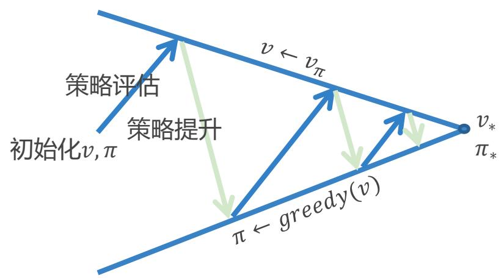


# Algorithm1.2策略迭代

Input:策略 $\pi ( s )$ ，状态转移 $P ( s ^ { \prime } | s , a )$ ，奖励函数 $R ( s , a )$ ，阈值 $\epsilon$ ，衰减因子 $\gamma$ ，值函数 $V ( s )$

Output：最优策略 $\pi _ { * } ( s )$ ，最优值函数 $V _ { \pi _ { * } } ( s )$

$k  0$ $\pi _ { k } ( s )  \pi ( s )$ $V _ { k } ( s )  V ( s ) .$

2:for $k = 0 , 1 , 2 , \cdots$ do

3: 利用策略评估得到当前策略 $\pi _ { k } ( s )$ 的值函数 $V _ { k } ( s )$

4: 利用策略改进公式1.26得到新策略 $\pi _ { k + 1 } ( s )$

5:if $\pi _ { k + 1 } ( s ) = \pi _ { k } ( s )$ then

6: $\pi _ { * } ( s )  \pi _ { k } ( s ) , \ V _ { \pi _ { * } } ( s )  V _ { k } ( s )$

7: return $\pi _ { * } ( s )$ $V _ { \pi _ { * } } ( s )$

8: end if

9:end for

# 动态规划算法

# 策略迭代（Policy Iteration）问题

策略评估 估计原策略价值函数 $v _ { \pi }$

✓ 迭代策略评估

策略提升 生成新策略 $\pi ^ { \prime } \geq \pi$

✓ 贪心策略提升


$$
k = 0
$$

$_ { v _ { k } }$ for therandom policy

greedy policyw.r.t. Uk

<table><tr><td>0.0</td><td>0.0</td><td>0.0</td><td>0.0</td></tr><tr><td>0.0</td><td>0.0</td><td>0.0</td><td>0.0</td></tr><tr><td>0.0</td><td>0.0</td><td>0.0</td><td>0.0</td></tr><tr><td>0.0</td><td>0.0</td><td>0.0</td><td>0.0</td></tr></table>

<table><tr><td>←↑→←↑→←↑→</td></tr><tr><td>←↑→←↑→←↑→</td></tr><tr><td>←↑→←↑→←↑→</td></tr><tr><td>←↑→←↑→←↑→</td></tr></table>

randompolicy

$$
k = 1
$$

<table><tr><td>0.0</td><td>-1.0</td><td>-1.0</td><td>-1.0</td></tr><tr><td>-1.0</td><td>-1.0</td><td>-1.0</td><td>-1.0</td></tr><tr><td>-1.0</td><td>-1.0</td><td>-1.0</td><td>-1.0</td></tr><tr><td>-1.0</td><td>-1.0</td><td>-1.0</td><td>0.0</td></tr></table>

<table><tr><td></td><td>←</td><td>←↑</td><td>←↓</td></tr><tr><td>↑</td><td>←↑</td><td>←↑</td><td>←↓</td></tr><tr><td>←↑</td><td>←↑</td><td>←↑</td><td>↓</td></tr><tr><td>←↓</td><td>←↓</td><td>→</td><td></td></tr></table>

$$
k = 2
$$

<table><tr><td>0.0</td><td>-1.7</td><td>-2.0</td><td>-2.0</td></tr><tr><td>-1.7</td><td>-2.0</td><td>-2.0</td><td>-2.0</td></tr><tr><td>-2.0</td><td>-2.0</td><td>-2.0</td><td>-1.7</td></tr><tr><td>-2.0</td><td>-2.0</td><td>-1.7</td><td>0.0</td></tr></table>

<table><tr><td></td><td>←</td><td>←</td><td>←↑</td></tr><tr><td>↑</td><td>←↑</td><td>←↓</td><td>↓</td></tr><tr><td>↑</td><td>←↑</td><td>→</td><td>↓</td></tr><tr><td>←↑</td><td>→</td><td>→</td><td></td></tr></table>

$$
k = 3
$$

<table><tr><td>0.0</td><td>-2.4</td><td>-2.9</td><td>-3.0</td></tr><tr><td>-2.4</td><td>-2.9</td><td>-3.0</td><td>-2.9</td></tr><tr><td>-2.9</td><td>-3.0</td><td>-2.9</td><td>-2.4</td></tr><tr><td>-3.0</td><td>-2.9</td><td>-2.4</td><td>0.0</td></tr></table>

<table><tr><td></td><td>←</td><td>←</td><td>←</td></tr><tr><td>↑</td><td>←↑</td><td>←↓</td><td>↓</td></tr><tr><td>↑</td><td>→</td><td>→</td><td>↓</td></tr><tr><td>→</td><td>→</td><td>→</td><td></td></tr></table>

$$
k = 1 0
$$

<table><tr><td>0.0</td><td>-6.1</td><td>-8.4</td><td>-9.0</td></tr><tr><td>-6.1</td><td>-7.7</td><td>-8.4</td><td>-8.4</td></tr><tr><td>-8.4</td><td>-8.4</td><td>-7.7</td><td>-6.1</td></tr><tr><td>-9.0</td><td>-8.4</td><td>-6.1</td><td>0.0</td></tr></table>

<table><tr><td></td><td>←</td><td>←</td><td>←</td></tr><tr><td>↑</td><td>←↑</td><td>←↓</td><td>↓</td></tr><tr><td>↑</td><td>↑→</td><td>→</td><td>↓</td></tr><tr><td>↑→</td><td>→</td><td>→</td><td></td></tr></table>

 optimal  optimalpolicy  policy

$$
k = \infty
$$

<table><tr><td>0.0</td><td>-14.</td><td>-20.</td><td>-22.</td></tr><tr><td>-14.</td><td>-18.</td><td>-20.</td><td>-20.</td></tr><tr><td>-20.</td><td>-20.</td><td>-18.</td><td>-14.</td></tr><tr><td>-22.</td><td>-20.</td><td>-14.</td><td>0.0</td></tr></table>

<table><tr><td></td><td>←</td><td>←</td><td>←</td></tr><tr><td>↑</td><td>←↑</td><td>←↓</td><td>↓</td></tr><tr><td>↑</td><td>→</td><td>→</td><td>↓</td></tr><tr><td>→</td><td>→</td><td>→</td><td></td></tr></table>

每次迭代都需要进行策略评估，而策略评估本身可能需要多次迭代才能收敛: 值迭代

# 动态规划算法

# 值迭代（Value Iteration）

任意的最优策略都可以分解为两个部分

最优的第一个动作 $A _ { * }$

• 对于后继状态 $S ^ { \prime }$ 的最优策略 $\pi _ { * }$

定理

策略 $\pi ( { a } | { s } )$ 能够达到状态 s 的最优价值， $v _ { \pi } ( s ) =$$v _ { * } ( s )$ ，当且仅当对于状态 s 的任意后继状态 s’策略 $\pi$ 均能达到其最优价值， $v _ { \pi } ( s ^ { \prime } ) = v _ { * } ( s ^ { \prime } )$

如果知道子问题的解 $ { \mathcal { V } _ { * } } ( s ^ { \prime } )$ ，则 $v _ { * } ( s )$ 可以通过下式得到：

$$
v _ {*} (s) \gets \max _ {a} \left(\mathcal {R} _ {s} ^ {a} + \gamma \sum_ {s ^ {\prime} \in \mathcal {S}} \mathcal {P} _ {s s ^ {\prime}} ^ {a} v _ {*} (s ^ {\prime})\right)
$$

价值迭代的思路即是迭代应用上式直至收敛

# 动态规划算法

# 值迭代（Value Iteration）

迭代的调用贝尔曼最优方程进行更新

• 使用同步更新（每次迭代更新所有状态的价值）

对于 $k = 1 : H$ （ $H$ 是迭代次数）

对于所有状态 $s \in \mathcal S$

$$
v _ {k + 1} (s) = \max _ {a} \mathcal {R} _ {s} ^ {a} + \gamma \sum_ {s ^ {\prime} \in \mathcal {S}} \mathcal {P} _ {s s ^ {\prime}} ^ {a} v _ {k} (s ^ {\prime})
$$

# 不同于策略迭代，价值迭代中没有显式的策略

# Algorithm1.3值迭代

Input:状态转移 $P ( s ^ { \prime } | s , a )$ ，奖励函数 $R ( s , a )$ ，阈值 $\epsilon$ ，衰减因子 $\gamma$ ，值函数 $V ( s )$

Output:最优策略 $\pi _ { * } ( s )$ ，最优值函数 $V _ { \pi _ { * } } ( s )$

$k  0$ $V _ { k } ( s )  V ( s )$

2:for $k = 0 , 1 , 2 , \cdots$ do

3: for每个状态 $s \in S$ do

4: 利用公式1.30计算 $V _ { k + 1 } ( s )$

5: end for

6:if $| V _ { k + 1 } - V _ { k } | < \epsilon$ then

7: $V _ { \pi _ { * } } ( s )  V _ { k + 1 }$

8: 利用公式1.31计算最优策略 $\pi _ { * } ( s )$

9: return $\pi _ { * } ( s )$ $V _ { \pi _ { * } } ( s )$

10: end if

11: end for

# 动态规划算法

# 网格环境中的值迭代

<table><tr><td>g</td><td></td><td></td><td></td></tr><tr><td></td><td></td><td></td><td></td></tr><tr><td></td><td></td><td></td><td></td></tr><tr><td></td><td></td><td></td><td></td></tr></table>


问题


<table><tr><td>0</td><td>-1</td><td>-2</td><td>-3</td></tr><tr><td>-1</td><td>-2</td><td>-3</td><td>-3</td></tr><tr><td>-2</td><td>-3</td><td>-3</td><td>-3</td></tr><tr><td>-3</td><td>-3</td><td>-3</td><td>-3</td></tr></table>

<table><tr><td>0</td><td>0</td><td>0</td><td>0</td></tr><tr><td>0</td><td>0</td><td>0</td><td>0</td></tr><tr><td>0</td><td>0</td><td>0</td><td>0</td></tr><tr><td>0</td><td>0</td><td>0</td><td>0</td></tr></table>


$v _ { 1 }$


<table><tr><td>0</td><td>-1</td><td>-2</td><td>-3</td></tr><tr><td>-1</td><td>-2</td><td>-3</td><td>-4</td></tr><tr><td>-2</td><td>-3</td><td>-4</td><td>-4</td></tr><tr><td>-3</td><td>-4</td><td>-4</td><td>-4</td></tr></table>


??5


<table><tr><td>0</td><td>-1</td><td>-1</td><td>-1</td></tr><tr><td>-1</td><td>-1</td><td>-1</td><td>-1</td></tr><tr><td>-1</td><td>-1</td><td>-1</td><td>-1</td></tr><tr><td>-1</td><td>-1</td><td>-1</td><td>-1</td></tr></table>


$v _ { 2 }$


<table><tr><td>0</td><td>-1</td><td>-2</td><td>-3</td></tr><tr><td>-1</td><td>-2</td><td>-3</td><td>-4</td></tr><tr><td>-2</td><td>-3</td><td>-4</td><td>-5</td></tr><tr><td>-3</td><td>-4</td><td>-5</td><td>-5</td></tr></table>


??6


<table><tr><td>g</td><td>-1</td><td>-2</td><td>-2</td></tr><tr><td>-1</td><td>-2</td><td>-2</td><td>-2</td></tr><tr><td>-2</td><td>-2</td><td>-2</td><td>-2</td></tr><tr><td>-2</td><td>-2</td><td>-2</td><td>-2</td></tr></table>


$v _ { 3 }$


<table><tr><td>0</td><td>-1</td><td>-2</td><td>-3</td></tr><tr><td>-1</td><td>-2</td><td>-3</td><td>-4</td></tr><tr><td>-2</td><td>-3</td><td>-4</td><td>-5</td></tr><tr><td>-3</td><td>-4</td><td>-5</td><td>-6</td></tr></table>

# 动态规划算法

<table><tr><td>求解问题</td><td>贝尔曼方程</td><td>算法</td></tr><tr><td>预测（求解价值函数）</td><td>贝尔曼期望方程</td><td>策略评估</td></tr><tr><td>控制（求解最优策略）</td><td>贝尔曼期望方程+贪心策略提升</td><td>策略迭代</td></tr><tr><td>控制（求解最优策略）</td><td>贝尔曼最优方程</td><td>价值迭代</td></tr></table>

• 以上算法都基于状态价值函数 $v _ { * } ( s )$ 或 $v _ { \pi } ( s )$ ，对于 n 个状态、m 个动作的MDP，每次迭代的复杂度为 $O \left( m n ^ { 2 } \right)$

也可以应用于动作价值函数 $q _ { * } ( s )$ 或 $q _ { \pi } ( s )$ ，每次迭代复杂度为 $\pmb { O } \big ( m ^ { 2 } n ^ { 2 } \big )$

# 蒙特卡洛估计方法

# 蒙特卡洛估计方法

• 20世纪40年代，在科学家冯·诺伊曼、斯塔尼斯拉夫·乌拉姆和尼古拉斯·梅特罗波利斯于洛斯阿拉莫斯国家实验室为核武器计划工作时，发明了蒙特卡洛估计方法。

• 出于保密需要，该方法需要一个代号，而这个代号由来是因为乌拉姆的叔叔经常在摩纳哥的蒙特卡罗赌场输钱。

• 蒙特卡洛估计方法是一种以概率统计理论为指导的数值计算方法，与之相对的是确定性算法。


# 蒙特卡洛估计方法

# 利用蒙特卡洛估计方法估计圆周率

• 设右图中圆的直径=正方形边长=a

在正方形内随机生成大量均匀分布的点，易知下式成立

$$
\frac {\mathrm {圆 内 点 的 个 数}}{\mathrm {总 的 点 个 数}} \approx \frac {\mathrm {圆 形 面 积}}{\mathrm {正 方 形 面 积}} = \frac {\pi \left(\frac {1}{2} a\right) ^ {2}}{a ^ {2}} = \frac {1}{4} \pi
$$

$$
\pi \approx 4 * \frac {\mathrm {圆 内 点 的 个 数}}{\mathrm {总 的 点 个 数}}
$$

随着采样的数目越多，估计的数值就越精确

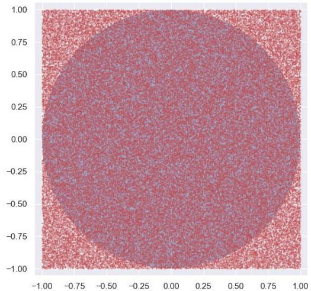


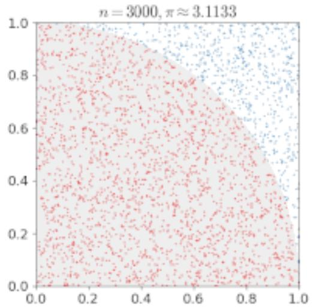


# 蒙特卡洛估计方法

# 蒙特卡洛方法中的策略评估

• 记 $G ^ { ( i ) ( j ) } ( s )$ 为在第 i 个回合中第 j 次访问状态 s 对应的累积回报

• 估计状态价值函数：

$$
v _ {\Pi} (s) = \mathbb {E} _ {\pi} [ G _ {t} | S _ {t} = s ] \approx \frac {1}{N} \sum_ {i = 1} ^ {N} G ^ {(i) (j)} (s)
$$

记 $G ^ { ( i ) ( j ) } ( s , a )$ 为在第 i 个回合中第 j 次访问状态动作对 (s, a) 对应的累积回报

• 估计动作状态价值函数：

$$
q _ {\Pi} (s, a) = \mathbb {E} _ {\pi} [ G _ {t} | S _ {t} = s, A _ {t} = a ] \approx \frac {1}{N} \sum_ {i = 1} ^ {N} G ^ {(i) (j)} (s, a)
$$

可以发现，蒙特卡洛策略评估只需要采样数据，而不需要环境模型！

# 蒙特卡洛估计方法

# 蒙特卡洛方法中的策略评估

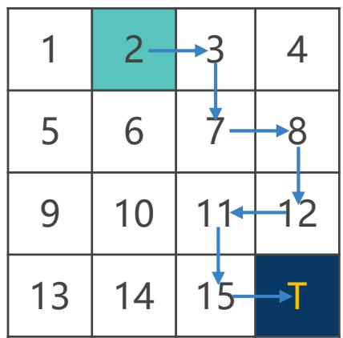


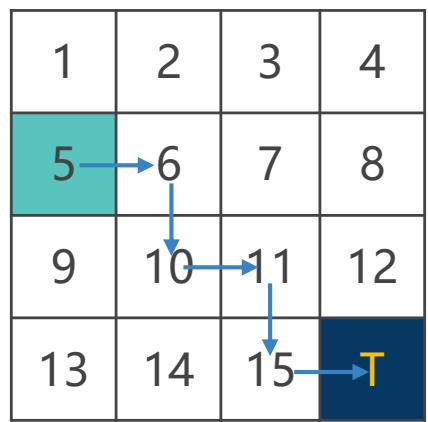


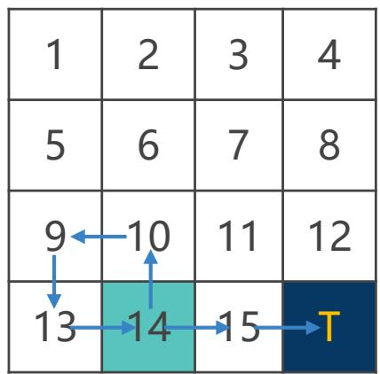


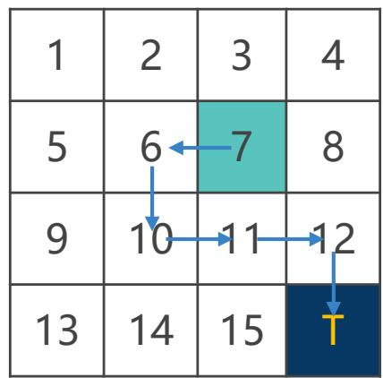


通过采样多条样本轨迹，利用其累积回报的均值来估计状态价值函数

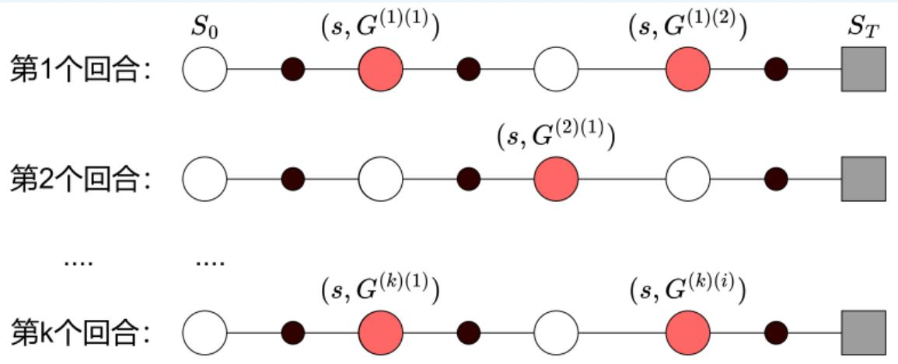


$G ^ { ( i ) ( j ) } ( s )$ 表示在第 i 个回合中第 j 次访问状态 s 的回报

# 蒙特卡洛估计方法

# 首次访问蒙特卡洛（First-Visit Monte-Carlo）

• 考虑每个回合中对状态 s 的第一次访问：

$$
V _ {N} (s) = \frac {G ^ {(1) (1)} (s) + G ^ {(2) (1)} (s) + \ldots + G ^ {(N) (1)} (s)}{N}
$$


无偏估计量

# 每次访问蒙特卡洛（Every-Visit Monte-Carlo）

• 考虑每个回合中对状态 s 的每一次访问：

$$
V _ {N \times M} (s) = \frac {G ^ {(1) (1)} (s , a) + G ^ {(1) (2)} (s , a) + \ldots + G ^ {(2) (1)} (s , a) + \ldots + G ^ {(N) (1)} (s , a) + \ldots + G ^ {(N) (M)} (s , a)}{N \times M}
$$


有偏估计量

当对状态 s 的访问次数趋于无穷时，两类方法都会收敛到精确值 $v _ { \pi } ( s )$

# 蒙特卡洛估计方法

# 蒙特卡洛方法中的策略提升

已经估计了状态价值函数 ${ \cal { V } } _ { N } ( s )$ ，策略提升部分为：

$$
\arg \max _ {\Pi} R (s, a) + \gamma \sum_ {s ^ {\prime}} p (s ^ {\prime} | s, a) V _ {N} (s ^ {\prime})
$$

已经估计了动作状态价值函数 $Q _ { N } ( s , a )$ ，策略提升部分为：

$$
a r g \max _ {\Pi} Q _ {N} (s, a)
$$

可以发现，估计动作状态价值函数不需要知道环境模型，计算更为方便（但也需要更多的数据样本）

# 蒙特卡洛估计方法

策略评估： $\begin{array} { r } { Q _ { N } ( s , a ) = \frac { 1 } { N } \sum _ { i = 1 } ^ { N } G ^ { ( i ) ( j ) } ( s , a ) } \end{array}$

• 策略提升： $a r g \operatorname* { m a x } _ { \Pi } Q _ { N } ( s , a )$

# 优点

• 无需环境模型，只需与环境交互采样样本数据即可学习策略

• 评估某个状态的价值函数与其它状态无关，从而可以只评估部分重要的状态

• 由于不使用贝尔曼方程更新，适用于非马尔可夫场景

# 缺点

若采样的回合个数不够多，容易收敛到次优策略

由于需要多个回合的回报，通常只适用有限步长的场景

# 蒙特卡洛估计方法

# 蒙特卡洛策略评估收敛需要两个很强的假设

需要无限多回合产生的数据

需要试探性出发假设产生数据

✓ 也即，对于每一对状态动作对 (s, a) 都有非零概率被选为回合的起点

这两个假设保证了每一个状态动作对 (s, a) 都能被访问到无数次，从而蒙特卡洛策略评估可以收敛到精确的动作状态价值函数。

然而，这两个假设在实践中无法实现。为了得到一个可行的算法，我们需要去除这两个假设。

# 蒙特卡洛估计方法

# 蒙特卡洛策略评估收敛需要两个很强的假设

# 有两类方法可以对第一个假设进行放松

• 在每次策略评估时，通过有限多个回合产生的数据，对精确值计算一个具有一定误差的近似值

需要做一些假设，来分析逼近误差的幅度和出现概率的上下界，并采取足够多的步数来保证这些界足够小 ⚫ 误差控制型：用数学担保替代无限数据，如同保险公司用精算模型替代全量数据

✓ 这类方法虽然可以保证收敛到较好的近似水平，但在实践中仍然需要大量的回合数据来用于计算

• 在每次策略评估时，采用广义策略迭代的思想，不再要求策略改进前就完成策略评估

✓ 例如，在每一回合结束时，就使用观测到的回报进行策略评估，然后在该回合访问到的每一个状

态上进行策略的改进

⚫ 迭代进化型：用增量更新替代完整评估，如同拼图时边找边拼而非先找齐所有碎片

# 蒙特卡洛估计方法

# 蒙特卡洛策略评估收敛需要两个很强的假设

通过“软性”策略对第二个假设进行放松

• 一个策略称为软性的，若满足任意 s, a, 都有 $\dot { \pi } ( a | s ) > 0$

• $\epsilon$ -贪心策略是保证充分探索的一个简单软性策略

✓ 以 1 − ?? 的概率贪心地选择当前最优动作

✓ 以较小的 $\epsilon$ 概率随机选择一个动作

$$
\pi^ {\prime} (a | s) = \left\{ \begin{array}{l l} \epsilon / | \mathcal {A} | + 1 - \epsilon & i f a = a r g \max  _ {a \in \mathcal {A}} Q _ {N} (s, a) \\ \epsilon / | \mathcal {A} | & o t h e r w i s e \end{array} \right.
$$

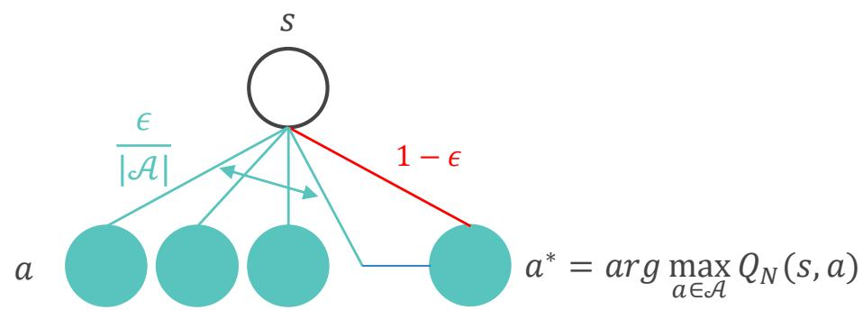


# 蒙特卡洛估计方法

# ??-贪心策略满足策略提升定理

$$
\pi^ {\prime} (a | s) = \left\{ \begin{array}{l l} \epsilon / | \mathcal {A} | + 1 - \epsilon & i f a = a r g \max _ {a \in \mathcal {A}} Q _ {N} (s, a) \\ \epsilon / | \mathcal {A} | & o t h e r w i s e \end{array} \right.
$$

• 对于任意策略 $\pi$ ，依据其动作价值函数 $q _ { \pi }$ 计算的 $\epsilon$ -贪心策略 $\pi ^ { \prime }$ 比原策略 $\pi$ 好或至少一样好

$$
\begin{array}{l} q _ {\pi} (s, \pi^ {\prime} (s)) = \sum_ {a \in \mathcal {A}} \pi^ {\prime} (a | s) q _ {\pi} (s, a) \\ = \epsilon / | \mathcal {A} | \sum_ {a \in \mathcal {A}} q _ {\pi} (s, a) + (1 - \epsilon) \max _ {a \in \mathcal {A}} q _ {\pi} (s, a) \\ \geq \epsilon / | \mathcal {A} | \sum_ {a \in \mathcal {A}} q _ {\pi} (s, a) + (1 - \epsilon) \sum_ {a \in \mathcal {A}} \frac {\pi (a | s) - \epsilon / | \mathcal {A} |}{1 - \epsilon} q _ {\pi} (s, a) \\ = \sum_ {a \in \mathcal {A}} \pi (a | s) q _ {\pi} (s, a) = v _ {\pi} (s) \\ \end{array}
$$

# 蒙特卡洛估计方法

# 增量式更新

在策略评估部分中，比起存储所有观测到的回报序列并进行均值计算，增量式更新是更高效的计算方法

$$
\begin{array}{l} Q _ {N} (s, a) = \frac {1}{N} \sum_ {i = 1} ^ {N} G ^ {(i) (j)} (s, a) \\ = \frac {1}{N} [ \sum_ {i = 1} ^ {N - 1} G ^ {(i) (j)} (s, a) + G ^ {(N) (1)} (s, a) \\ = \frac {N - 1}{N} [ \frac {1}{N - 1} \sum_ {i = 1} ^ {N - 1} G ^ {(i) (j)} (s, a) ] + \frac {1}{N} G ^ {(N) (1)} (s, a) \\ = \frac {N - 1}{N} Q _ {N - 1} (s, a) + \frac {1}{N} G ^ {(N) (1)} (s, a) \\ = Q _ {N - 1} (s, a) + \frac {1}{N} \left[ G ^ {(N) (1)} (s, a) - Q _ {N - 1} (s, a) \right] \\ \end{array}
$$

# 蒙特卡洛估计方法

# Algorithm1.4每次访问蒙特卡洛算法

Input: $\epsilon$ ，衰减因子 $\gamma$ ，最大交互回合数 $N$

Output:最优策略 $\pi _ { * } ( s )$

1:初始化初始状态 $\pi _ { 0 }$ ，计数器 $N u m ( s , a ) = 0$ ，累计回报 $G ( s , a ) = 0$

2:for 每个交互回合 $k = 0 , 1 , \cdots , N$ do

3:利用 $\pi _ { k }$ 生成一条轨迹 $\tau = ( s _ { 0 } , a _ { 0 } , r _ { 0 } , s _ { 1 } , a _ { 1 } , r _ { 1 } , \cdots , s _ { T } , a _ { T } , r _ { T } )$

$g  0$

5:for $t = T - 1 , \cdots , 0$ do

6: 计算状态动作对 $( s _ { t } , a _ { t } )$ 的累计折扣回报 $g$

7: $g  r _ { t } + \gamma g$

8: $G ( s _ { t } , a _ { t } ) \gets G ( s _ { t } , a _ { t } ) + g$

9: $N u m ( s _ { t } , a _ { t } ) \gets N u m ( s _ { t } , a _ { t } ) + 1$

10: $Q ( s _ { t } , a _ { t } ) \gets G ( s _ { t } , a _ { t } ) / N u m ( s _ { t } , a _ { t } )$

11:end for

12: 利用公式1.39更新策略，得到 $\pi _ { k + 1 }$

13:end for

14: return π*(s)

# 每次访问蒙特卡洛伪码

# Algorithm1.5首次访问蒙特卡洛算法

Input:ε，衰减因子 $\gamma$ ，最大交互回合数 $N$

Output:最优策略 $\pi _ { * } ( s )$

1:初始化初始状态 $\pi _ { 0 }$ ，计数器 $N u m ( s , a ) = 0$ ，累计回报 $G ( s , a ) = 0$

2:for每个交互回合 $k = 0 , 1 , \cdots , N$ do

3: 利用 $\pi _ { k }$ 生成一条轨迹 $\tau = ( s _ { 0 } , a _ { 0 } , r _ { 0 } , s _ { 1 } , a _ { 1 } , r _ { 1 } , \cdots , s _ { T } , a _ { T } , r _ { T } )$

$g \gets 0$

for $t = T - 1 , \cdots , 0$ do

6: 计算状态动作对 $( s _ { t } , a _ { t } )$ 的累计折扣回报 $g$

7: $g  r _ { t } + \gamma g$

8: if $s _ { t }$ not in $( s _ { 0 } , \cdots , s _ { t - 1 } )$ then

9: $G ( s _ { t } , a _ { t } ) \gets G ( s _ { t } , a _ { t } ) + g$

10: $N u m ( s _ { t } , a _ { t } ) \gets N u m ( s _ { t } , a _ { t } ) + 1$

11: $Q ( s _ { t } , a _ { t } ) \gets G ( s _ { t } , a _ { t } ) / N u m ( s _ { t } , a _ { t } )$

12: end if

13:end for

14:利用公式1.39更新策略，得到 $\pi _ { k + 1 }$

15:end for

16:return π*(s)

# 首次访问蒙特卡洛伪码

# 时序差分方法

蒙特卡洛方法：从完整轨迹中估计值

$$
V (s) \gets M e a n \{G _ {t: T} | S _ {t} = s \}
$$

缺点：

只能在整个episode结束时更新策略；

策略收敛缓慢；

值估计方差较大。

动态规划方法：用下一步值计算当前值

$$
v \left(s\right) = \max _ {a} \mathcal {R} _ {s} ^ {a} + \gamma \sum_ {s ^ {\prime} \in \mathcal {S}} \mathcal {P} _ {s s ^ {\prime}} ^ {a} v \left(s ^ {\prime}\right)
$$

缺点：

• 要求下一步状态准确值已知；

要求转移函数 $\mathcal { P } _ { s s ^ { \prime } } ^ { a }$ 已知。

时序差分方法：用下一步估计值估计当前值

$$
V (s) \gets V (s) + \alpha (R _ {t + 1} + \gamma V (s ^ {\prime}) - V (s))
$$

综合以上两者思想，实现优势互补：

可以在episode中更新策略；

无需已知转移函数 $\mathcal { P } _ { s s ^ { \prime } } ^ { a }$ ’或准确值函数；

值估计方差较小。

# 时序差分方法

蒙特卡洛方法：用整个episode的累积回报 ???? 更新 ??(????)

回顾贝尔曼等式的推导

$$
V (S _ {t}) \gets V (S _ {t}) + \alpha (G _ {t} - V (S _ {t}))
$$

更新目标： $G _ { t } = R _ { t + 1 } + \gamma R _ { t + 2 } + \ldots + \gamma ^ { T } R _ { t + T }$

$$
G _ {t} = R _ {t + 1} + \gamma R _ {t + 2} + \ldots + \gamma^ {T} R _ {t + T} = R _ {t + 1} + \gamma (R _ {t + 2} + \gamma R _ {t + 3} + \ldots) \approx R _ {t + 1} + \gamma V (S _ {t + 1})
$$

从而： $G _ { t } \approx R _ { t + 1 } + \gamma V ( S _ { t + 1 } )$

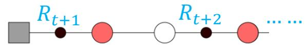


时序差分方法：将????+2 + ??????+3+. . .替换为 $V ( S _ { t + 1 } )$

$$
\overline {{V (S _ {t}) \leftarrow V (S _ {t}) + \alpha \left(R _ {t + 1} + \gamma V (S _ {t + 1}) - V (S _ {t})\right)}}
$$

• $R _ { t + 1 } + \gamma V ( S _ { t + 1 } )$ 被称为 TD 目标

• $\delta _ { t } = R _ { t + 1 } + \gamma V ( S _ { t + 1 } ) - V ( S _ { t } )$ 被称为 TD 误差


自举：用估计值 $V ( S _ { t + 1 } )$ 来作为自身 $V ( S _ { t } )$ 的学习目标

# 时序差分方法

# 动态规划

$$
\mathrm {V} (S _ {t}) \gets \mathbb {E} _ {\pi} [ R _ {t + 1} + \gamma \mathrm {V} (S _ {t + 1}) ]
$$

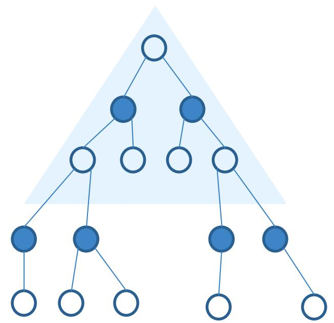


# 蒙特卡洛

$$
V (S _ {t}) \gets V (S _ {t}) + \alpha (G _ {t} - V (S _ {t}))
$$

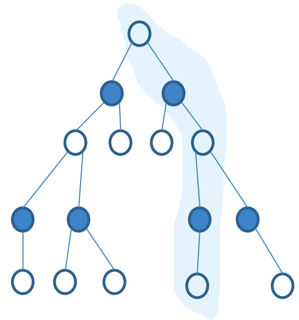


# 时序差分

$$
\begin{array}{c} {V (S _ {t}) \gets} \\ {V (S _ {t}) + \alpha (R _ {t + 1} + \gamma V (S _ {t + 1}) - V (S _ {t}))} \end{array}
$$

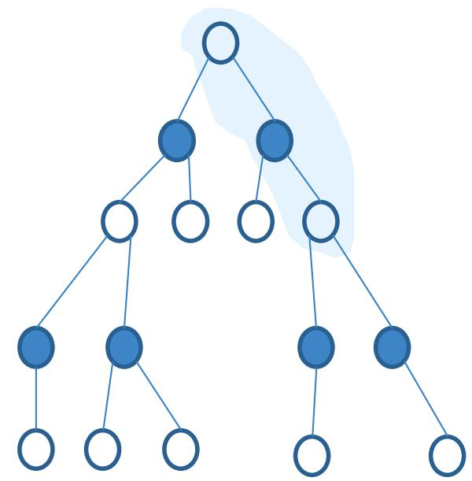


# 时序差分方法

# 偏差

• MC ： $G _ { t } = R _ { t + 1 } + \gamma R _ { t + 2 } + \gamma ^ { 2 } R _ { t + 3 } + . . .$ 是 价 值 函 数$v _ { \pi } ( S _ { t } )$ 的无偏估计

• TD：由于 $G _ { t } \approx R _ { t + 1 } + \gamma V ( S _ { t + 1 } )$ ，因此 TD 目标 $R _ { t + 1 } +$$\gamma V ( S _ { t + 1 } )$ 是价值函数 $v _ { \pi } ( S _ { t } )$ 的有偏估计

# 方差

• MC：目标依赖于多个随机变量 $S _ { t } , A _ { t } , R _ { t } , \ldots , S _ { T }$ ，方差更大

• TD： $R _ { t + 1 } + \gamma V ( S _ { t + 1 } )$ 只依赖于两个随机变量，方差更小


低偏差


低方差


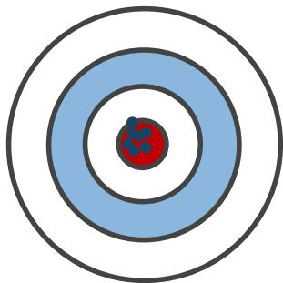


高方差


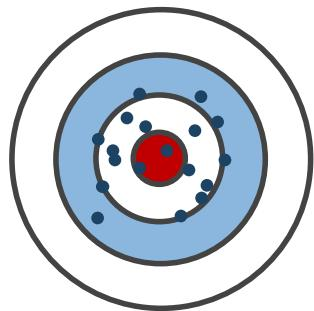


高偏差


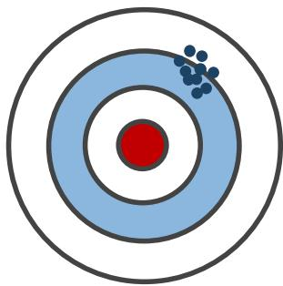


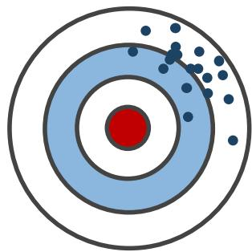


总的来说，偏差方面MC优于TD，

方差方面TD优于MC

# 时序差分方法

# 理论

蒙特卡洛方法收敛于以下最小均方误差的解

时序差分方法收敛于马尔可夫模型的极大似然解

$$
\sum_ {k = 1} ^ {K} \sum_ {t = 1} ^ {T _ {k}} (G _ {t} ^ {k} - V (s _ {t} ^ {k})) ^ {2}
$$

$$
\begin{array}{l} \hat {P} _ {s, s ^ {\prime}} ^ {a} = \frac {1}{N (s , a)} \sum_ {k = 1} ^ {K} \sum_ {t = 1} ^ {T _ {k}} \mathbf {1} (s _ {t} ^ {k}, a _ {t} ^ {k}, s _ {t + 1} ^ {k} = s, a, s ^ {\prime}) \\ \hat {R} _ {s, s ^ {\prime}} ^ {a} = \frac {1}{N (s , a)} \sum_ {k = 1} ^ {K} \sum_ {t = 1} ^ {T _ {k}} \mathbf {1} (s _ {t} ^ {k}, a _ {t} ^ {k} = s, a) r _ {t} ^ {k} \\ \end{array}
$$

# 时序差分方法

# 例子

两个状态 A、B；不考虑折扣

已知：现有 8 条轨迹 $( S _ { 1 } , R _ { 2 } , S _ { 2 } , R _ { 3 } , \ldots , S _ { T } )$ ）：

(A, 0, B, 0), (B, 1), (B, 1), (B, 1), (B, 1), (B, 1), (B, 1), (B, 0)

显然?? $( B ) { = } 0 . 7 5$

问题：状态 A 的价值 ??(??)？

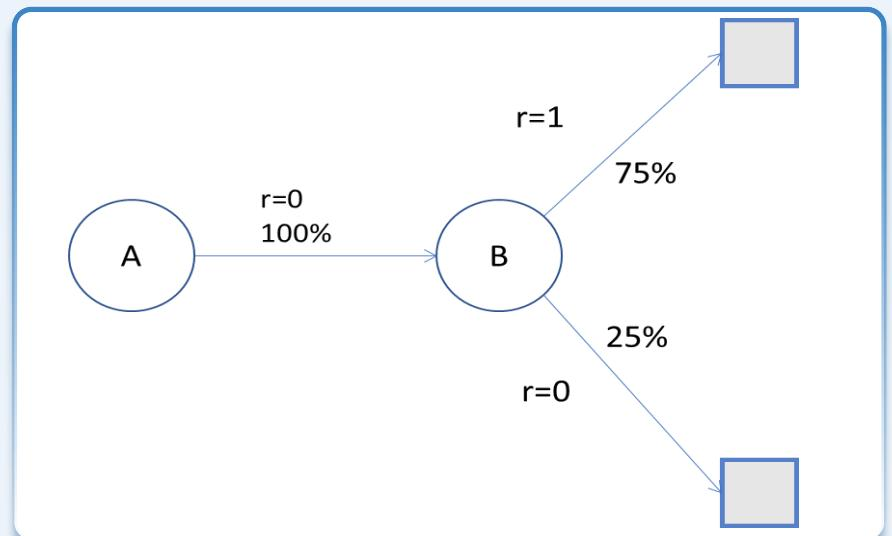


解答：

蒙特卡洛： A 的价值为 $V ( A ) = 0$

时序差分：依据 B 的价值计算 ??(??) ， $V ( A ) = 0 . 7 5$

# 时序差分方法

蒙特卡洛方法：方差大偏差小


时序差分方法：方差小偏差大

可否在两者之间进行权衡？

两个极端

$$
n = 1 \qquad G _ {t} ^ {(1)} = R _ {t + 1} + \gamma V (S _ {t + 1})
$$


时序差分

$$
n = 2 G _ {t} ^ {(2)} = R _ {t + 1} + \gamma R _ {t + 2} + \gamma^ {2} V (S _ {t + 2})
$$

折中


$$
n = \infty G _ {t} ^ {(\infty)} = R _ {t + 1} + \gamma R _ {t + 2} + \ldots + \gamma^ {T - 1} R _ {T}
$$


蒙特卡洛

定义 n 步回报如下：

$$
G _ {t} ^ {(n)} = R _ {t + 1} + \gamma R _ {t + 2} + \ldots + \gamma^ {n - 1} R _ {t + n} + \gamma^ {n} V (S _ {t + n})
$$


n 步时序差分

# 定义

利用 n 步回报作为目标进行更新的方法称为 n 步时序差分学习：

$$
V (S _ {t}) \gets V (S _ {t}) + \alpha (G _ {t} ^ {(n)} - V (S _ {t}))
$$

# 时序差分方法

# n步回报中，n取多少合适？

$$
G _ {t} ^ {(n)} = R _ {t + 1} + \gamma R _ {t + 2} + \ldots + \gamma^ {n - 1} R _ {t + n} + \gamma^ {n} V (S _ {t + n})
$$

n越大 随机变量越多 方差越大，偏差越小

• λ-回报：使用权重 $( 1 - \lambda ) \lambda ^ { n - 1 }$ 对多个n进行加权平均

$$
G _ {t} ^ {\lambda} = (1 - \lambda) \sum_ {n = 1} ^ {\infty} \lambda^ {n - 1} G _ {t} ^ {(n)}
$$

定义

前向视角TD(??)学习： $V ( S _ { t } ) \gets V ( S _ { t } ) + \alpha ( G _ { t } ^ { \lambda } - V ( S _ { t } ) )$

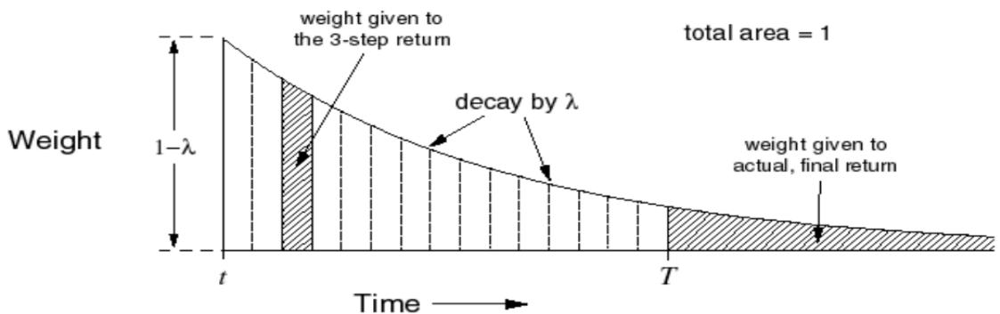


TD(λ), λ-return

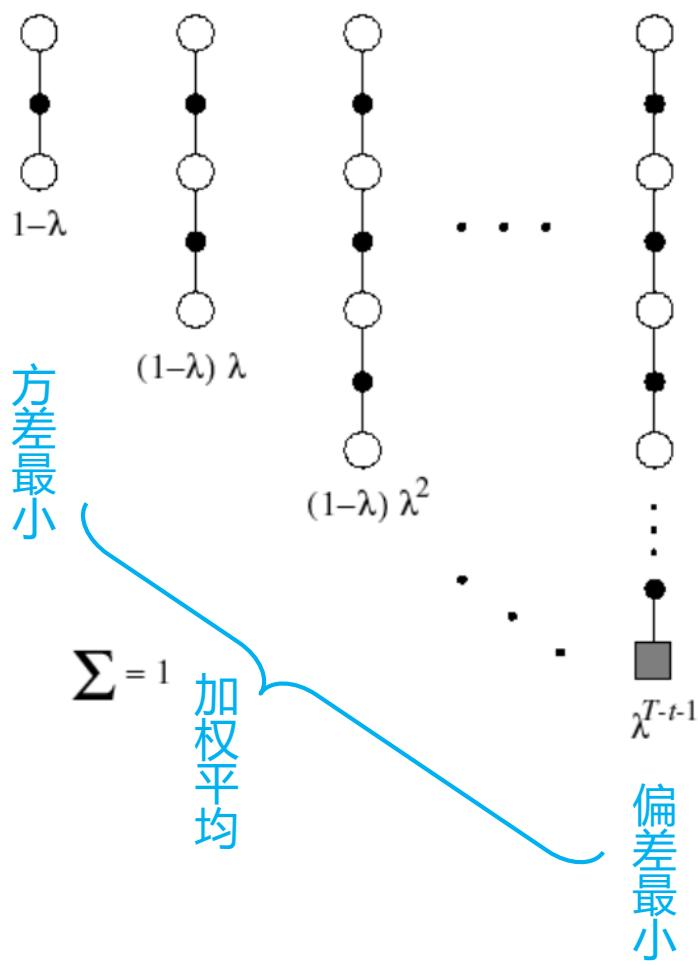


# 时序差分方法-SARSA

# 使用 TD 方法作为策略迭代中的策略评估方法

• 模型未知，因此直接估计动作价值函数

$$
Q \left(S _ {t}, A _ {t}\right) \leftarrow Q \left(S _ {t}, A _ {t}\right) + \alpha \left(R _ {t + 1} + \gamma Q \left(S _ {t + 1}, A _ {t + 1}\right) - Q \left(S _ {t}, A _ {t}\right)\right) \quad (*)
$$

策略迭代两步走：

策略评估： 使用 $( ^ { \star } )$ 式估计动作价值函数 $Q = q _ { \pi }$

• 策略提升： 使用 ?? − ???????????? 策略提升方法

由于(*)式使用 $< S _ { t } , A _ { t } , R _ { t + 1 } , S _ { t + 1 } , A _ { t + 1 } >$ 进行更新，因此称为 SARSA算法。

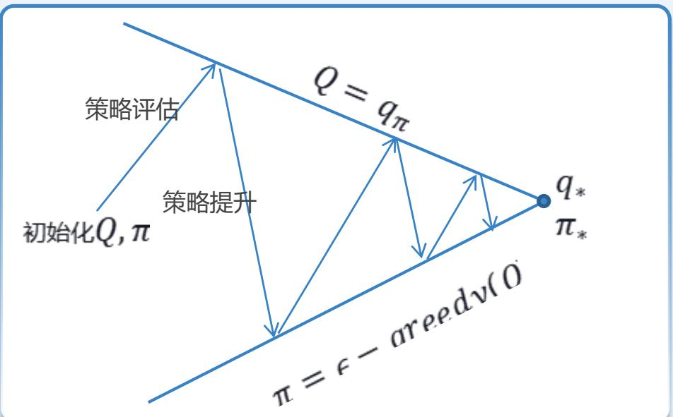


# 时序差分方法-SARSA

# Algorithm 1.6 SARSA

Input：迭代轮数T，更新步长 $\alpha$ ，衰减因子 $\gamma$ ，最大探索率 $\epsilon _ { s t a r t }$ ，最小探索率$\epsilon _ { m i n }$ ，最大交互回合数 $N$ ，最大时间步长 $T$

Output:最优值函数 $Q _ { * }$

1：随机初始化所有的状态动作对应的值函数 $Q$

2:for 每个交互回合 $k = 0 , 1 , \cdots , N$ do

3: 初始化初始状态 $s _ { 0 }$

4: 在状态 $s _ { 0 }$ 利用é－greedy 策略选择动作 $a _ { 0 }$

5: for $t = 0 , 1 , \cdots , T$ do

6: 在状态 $s _ { t }$ 执行当前动作 $a _ { t }$ ，得到新状态 $s _ { t + 1 }$ 和奖励 $r _ { t }$

7: 在新状态 $s _ { t + 1 }$ 利用ε－greedy 策略选择动作 $a _ { t + 1 }$

8: 利用公式1.44更新值函数 $Q ( s _ { t } , a _ { t } )$

9: 更新探索率 $\epsilon$

10: end for

11: end for

收敛性：由于 SARSA 是 TD 方法的一种形式，因此 SARSA具有和 TD 方法相同的收敛性：

# 时序差分方法-SARSA

考虑以下当 ?? = 1,2, . . . , ∞ 时的 n 步 Q 回报：

$$
\begin{array}{l} {n = 1} {q _ {t} ^ {(1)} = R _ {t + 1} + \gamma Q (S _ {t + 1}, A _ {t + 1})} \\ \begin{array}{c c} n = 2 & q _ {t} ^ {(2)} = R _ {t + 1} + \gamma R _ {t + 2} + \gamma^ {2} Q (S _ {t + 2}, A _ {t + 2}) \\ \vdots & \vdots \end{array} \\ n = \infty q _ {t} ^ {(\infty)} = R _ {t + 1} + \gamma R _ {t + 2} + \ldots + \gamma^ {T - 1} R _ {T} \\ \end{array}
$$

定义 n 步 Q 回报

$$
q _ {t} ^ {(n)} = R _ {t + 1} + \gamma R _ {t + 2} + \ldots + \gamma^ {n - 1} R _ {t + n} + \gamma^ {n} Q (S _ {t + n}, A _ {t + n})
$$

n 步 SARSA 以 n 步 Q 回报为目标更新动作价值函数 ??(??, ??)

$$
Q (S _ {t}, A _ {t}) \gets Q (S _ {t}, A _ {t}) + \alpha (q _ {t} ^ {(n)} - Q (S _ {t}, A _ {t}))
$$

# 时序差分方法

# 同策略 (on-policy)

边采样边学习

行为策略与目标策略一致


# 异策略 (off-policy)

• 行为策略与目标策略不一致

• 利用行为策略 $\mu ( a | s )$ 采集经验 $S _ { 1 } , A _ { 1 } , R _ { 2 } , \dots , S _ { T } { \sim } \mu$

随后利用经验 $S _ { 1 } , A _ { 1 } , R _ { 2 } , \ldots , S _ { T }$ 更新目标策略 $\pi$

# 优势：

保持充分探索环境，并同步学习最优策略

可以通过观测其他智能体的行为进行学习

• 重用旧策略 $\pi _ { 1 } , \pi _ { 2 } , \ldots , \pi _ { t - 1 }$ 的经验


目标策略


行为策略


环境


# 时序差分方法-Q Learning

# 考虑动作价值函数 ??(??, ??) 的异策略学习

• 根据贝尔曼方程，我们可以得到如下公式： $Q _ { \pi } ( S _ { t } , A _ { t } ) = \mathbb { E } _ { \pi } [ R _ { t + 1 } + \gamma Q ( S _ { t + 1 } , A _ { t + 1 } ) ]$

其中 $R _ { t + 1 }$ 为即时奖励，?? 为折扣因子， $S _ { t + 1 }$ 为下一状态， $A _ { t + 1 }$ 为策略 $\pi$ 在状态 $S _ { t + 1 }$ 下所要采取的动作。

• 如果我们令策略 $\pi$ 为依据动作价值函数 $Q ( s , a )$ 的贪婪策略，那么有

$$
\pi (s) = \arg \max  _ {a} Q (s, a)
$$

$$
Q _ {\pi} (S _ {t}, A _ {t}) = \mathbb {E} _ {\pi} \left[ R _ {t + 1} + \gamma \max _ {a ^ {\prime}} Q (S _ {t + 1}, a ^ {\prime}) \right]
$$

当给定 $S _ { t }$ 以及 $A _ { t }$ 后， $R _ { t + 1 }$ 与 $S _ { t + 1 }$ 仅由环境决定，而与所采取的策略无关。因此，当我们通过某个策略采集到样本 $< S _ { t } , A _ { t } , R _ { t + 1 } , S _ { t + 1 } >$ 后，可直接以 $R _ { t + 1 } + \gamma \operatorname* { m a x } _ { a ^ { \prime } } Q ( S _ { t + 1 } , a ^ { \prime } )$ 作为目标更新贪婪策略 $\pi$ 的动作价值函数$Q _ { \pi } ( S _ { t } , A _ { t } )$ ，而无需进行重要性采样。

$$
Q (S _ {t}, A _ {t}) \gets Q (S _ {t}, A _ {t}) + \alpha (R _ {t + 1} + \gamma \max _ {a ^ {\prime}} Q (S _ {t + 1}, a ^ {\prime}) - Q (S _ {t}, A _ {t}))
$$

# 时序差分方法-Q Learning

在实际应用时， 通常使用??-贪婪策略与环境交互，以充分探索环境，下面给出 Q-学习算法的伪代码。

# Algorithm 1.7 Q-Learning

Input：迭代轮数T，更新步长 $\alpha$ ，衰减因子 $\gamma$ ，最大探索率 $\epsilon _ { s t a r t }$ ，最小探索率Emin，最大交互回合数 $N$ ，最大时间步长 $T$

Output:最优值函数 $Q _ { * }$

1:随机初始化所有的状态动作对应的值函数 $Q$

2:for 每个交互回合 $k = 0 , 1 , \cdots , N$ do

3: 初始化初始状态 $s _ { 0 }$

4:for $t = 0 , 1 , \cdots , T$ do

5: 在状态 $s _ { t }$ 利用∈－greedy 策略选择动作 $a _ { t }$

6: 在状态 $s _ { t }$ 执行当前动作 $a _ { t }$ ，得到新状态 $s _ { t + 1 }$ 和奖励 $r _ { t }$

7: 利用公式1.47更新值函数 $Q ( s _ { t } , a _ { t } )$

8： 更新探索率 $\epsilon$

9: end for

10: end for

# MDP实例

考虑如图所示的MDP：一个学生需要学习三个科目，然后通过测验；不过也有可能只学完两个科目之后直接睡觉，或者在学习时玩手机；一旦挂科，有可能需要重新学习某些科目。其中，椭圆表示普通状态，每一条线上的数字表示从一个状态跳转到另一个状态的概率，R代表奖励，方块表示终止（terminal）状态：

（1）给定折扣因子??=0.5，计算轨迹“科目一，科目二，科目三，通过，睡觉”以及轨迹“科目一，玩手机，玩手机，科目一，科目二，睡觉”的回报值。

（2）给定折扣因子??=1 ，求所处状态“科目三”的V值。

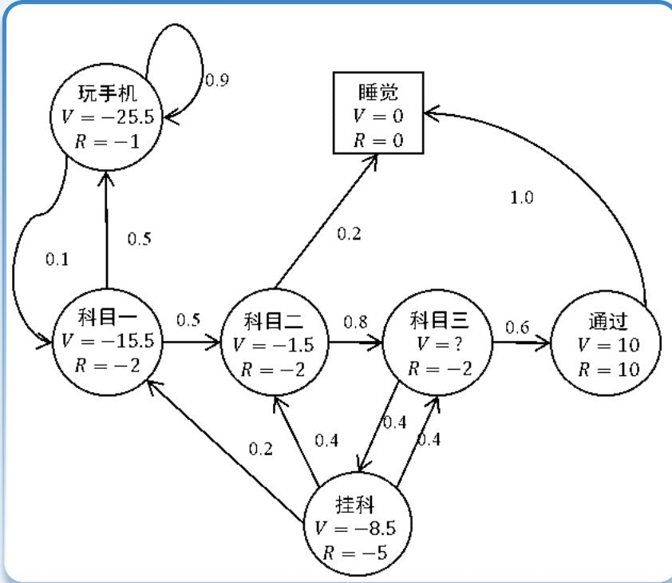


# MDP实例

（1）给定折扣因子??=0.5，计算轨迹“科目一，科目二，科目三，通过，睡觉”以及轨迹“科目一，玩手机，玩手机，科目一，科目二，睡觉”的回报值。

轨迹“科目一，科目二，科目三，通过，睡觉”:

$$
G _ {1} = - 2 + 0. 5 \times - 2 + 0. 5 ^ {2} \times - 2 + 0. 5 ^ {3} \times 1 0 + 0. 5 ^ {4} \times 0 = - 2. 2 5
$$

轨迹“科目一，玩手机，玩手机，科目一，科目二，睡觉”

$$
G _ {2} = - 2 + 0. 5 \times - 1 + 0. 5 ^ {2} \times - 1 + 0. 5 ^ {3} \times - 2 + 0. 5 ^ {4} \times - 2 + 0. 5 ^ {5} \times 0 = - 3. 1 2 5
$$

（2）给定折扣因子??=1 ，求所处状态“科目三”的V值。

$$
V = - 2 + 0. 6 \times 1 0 + 0. 4 \times - 8. 5 = 0. 6
$$

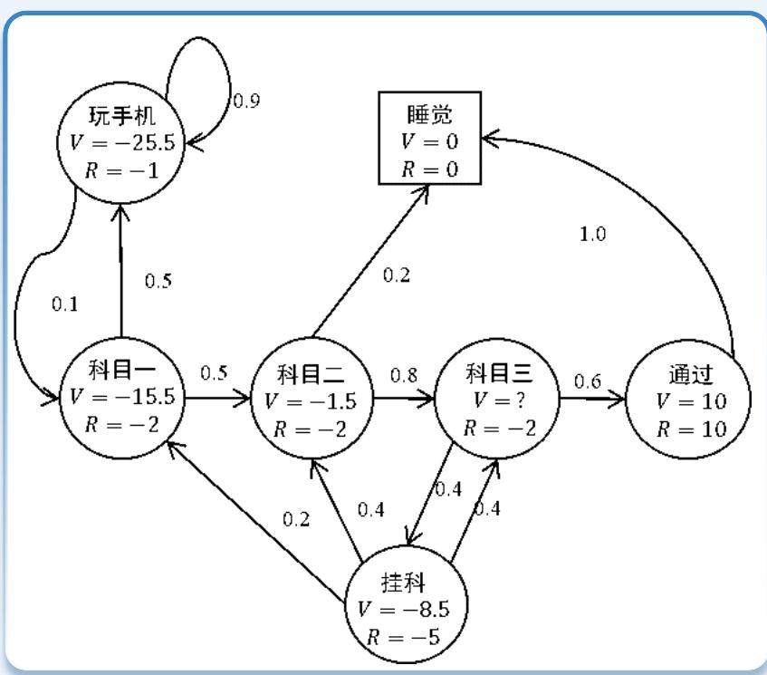


# 本节小结

# 期望更新 （动态规划）

策略评估

策略改进

策略迭代

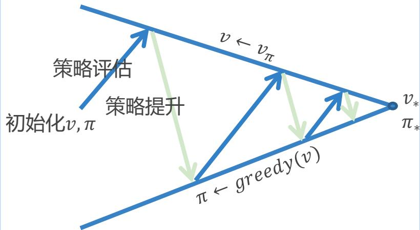


# 采样更新 （蒙特卡洛）

首次访问蒙特卡洛

$$
V _ {N} (s) = \frac {G ^ {(1) (1)} (s) + G ^ {(2) (1)} (s) + \ldots + G ^ {(N) (1)} (s)}{N}
$$

每次访问蒙特卡洛

$$
V _ {N \times M} (s) = \frac {G ^ {(1) (1)} (s , a) + \ldots + G ^ {(N) (1)} (s , a) + \ldots + G ^ {(N) (M)} (s , a)}{N \times M}
$$

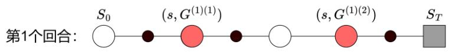


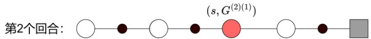


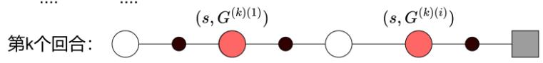


# 采样更新 （时序差分）

时序差分方法

$$
V \left(S _ {t}\right) \leftarrow V \left(S _ {t}\right) + \alpha \left(R _ {t + 1} + \gamma V \left(S _ {t + 1}\right) - V \left(S _ {t}\right)\right)
$$

SARSA

$$
Q \left(S _ {t}, A _ {t}\right) \leftarrow Q \left(S _ {t}, A _ {t}\right) + \alpha \left(R _ {t + 1} + \gamma Q \left(S _ {t + 1}, A _ {t + 1}\right) - Q \left(S _ {t}, A _ {t}\right)\right)
$$

Q-Learning

$$
\begin{array}{l} Q \left(S _ {t}, A _ {t}\right) \\ \leftarrow Q (S _ {t}, A _ {t}) + \alpha \left(R _ {t + 1} + \gamma \max _ {A _ {t + 1}} Q (S _ {t + 1}, A _ {t + 1}) - Q (S _ {t}, A _ {t})\right) \\ \end{array}
$$

同策略 (on-policy)

异策略 (off-policy)

# 深度强化学习

# 表格型强化学习方法：需要将环境的状态和动作表示为一个有限的表格（如 Q 表）来存储每个状态-动作对的价值或策略，具有

理论简单、易于实现：表格型方法如 Q-Learning 和 SARSA 的算法简单，易于入门，适合用于强化学习基础理论的教学和研究；

收敛性强：对于有限状态和动作空间的问题，只要满足一定条件（如探索足够多次），算法可以收敛到最优策略；

• 对小规模问题效果优异：在状态和动作空间有限的情况下，表格型方法往往能高效地找到最优解；

• 调试方便：表格的形式直观，可直接观察状态价值或策略的变化过程，便于调试和分析问题。

# 深度强化学习

# 然而，表格型强化学习方法面临着大量的问题：

• 扩展性差：状态和动作空间较大时，表格的大小会急剧增长（“维度灾难”），导致存储和计算成本过高，难以应用于高维或连续空间。

• 对复杂环境不适用：表格型方法无法直接处理复杂的、具有连续状态或动作空间的问题，例如机器人控制和自动驾驶中的应用场景。

• 缺乏泛化能力：表格型方法对未探索到的状态无法进行泛化处理，表现为对未见状态完全缺乏经验，导致策略表现差。

存储开销大：随着状态-动作空间增大，存储需求成指数增长，资源消耗显著增加。

采样效率低：在高维空间中，穷举式的探索会导致算法采样效率极低，难以收敛。

# 深度强化学习

如何将强化学习算法扩展到大规模状态动作空间问题上？

象棋：约 $1 0 ^ { 1 2 0 }$ 个状态

围棋：约 $1 0 ^ { 1 7 0 }$ 个状态

王者荣耀、自动驾驶：连续状态空间


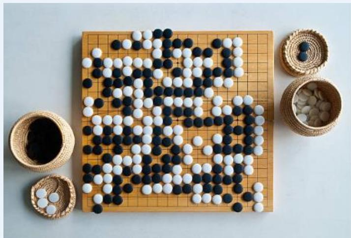


# 深度强化学习

深度学习：是机器学习的一个子领域，通过利用神经网络（特别是深层神经网络）来模拟人类大脑的思维和学习过程，从海量数据中自动提取特征并完成任务。

深度强化学习（Deep Reinforcement Learning, DRL）：是强化学习和深度学习的结合，通过深度神经网络（DNN）处理复杂环境中的强化学习问题：

• 深度神经网络：能处理图像、文本等复杂的感知数据或者高维连续的向量数据

强化学习：处理序列决策问题

深度强化学习通常使用深度神经网络表征状态值函数、状态动作值函数、策略函数、环境模型等。

# 基于值的RL

基于值函数的深度强化学习算法是由 Q-Learning算法结合深度神经网络衍生的一类算法，主要包括 DQN 算法及其改进算法Double DQN、 Dueling DQN、 Rainbow DQN。

• Q-Learning算法直接结合神经网络的算法称为Naïve DQN。

通过拟合数据集得到最优动作价值函数

Naïve DQN

使用某个策略采样数据集 $\{ \langle s _ { 1 } , a _ { 1 } , s _ { 1 } ^ { \prime } , r _ { 1 } \rangle , \dots , \langle s _ { n } , a _ { n } , s _ { n } ^ { \prime } , r _ { n } \rangle \}$$\begin{array} { r l } & { \frac { 1 } { 1 } \quad \Bigg \lfloor \quad \sum _ { w \gets a r g \ m i n } ^ { \# } \partial _ { a ^ { \prime } } Q _ { w } ( s _ { i } ^ { \prime } , a ^ { \prime } ) \qquad \quad \mathrm { ~ 1 ~ } \| } \\ & { \frac { 1 } { 1 } \quad \Bigg \lfloor \quad \sum _ { w \gets a r g \ m i n } \frac { 1 } { w } \sum _ { i = 1 } ^ { n } \| Q _ { w } ( s _ { i } , a _ { i } ) - y _ { i } \| ^ { 2 } \qquad \mathrm { ~ 1 ~ } \| } \\ & { \cdots \substack { \mathrm { ~ -- ~ -- ~ -- ~ -- ~ -- ~ -- ~ } \frac { 1 } { \| \frac { \partial \phi } { \partial \overline { { z } } } \phi } } \varepsilon \quad \mathrm { ~ --- ~ -- ~ -- ~ -- ~ } \frac { 1 } { \| } \| } \\ & { \frac { 1 } { \| \mathcal { K } \| _ { \mathcal { K } } } \mathscr { L } \ q _ { \mathcal { K } } ^ { \varphi } \mathscr { L } \quad \mathrm { ~ -- ~ -- ~ -- ~ -- ~ } \ \| } \end{array}$

$$
\varepsilon = \frac {1}{2} \mathbb {E} _ {(s, a, s ^ {\prime}, r) \sim \mathcal {B}} \left[ \left(Q _ {\boldsymbol {w}} (s, a) - \left[ r + \gamma \max _ {a ^ {\prime}} Q _ {\boldsymbol {w}} (s ^ {\prime}, a ^ {\prime}) \right]\right) ^ {2} \right]
$$

当 $\varepsilon = 0$ 时， 有

$$
Q _ {w} (s, a) = r + \gamma \max _ {a ^ {\prime}} Q _ {w} \left(s ^ {\prime}, a ^ {\prime}\right)
$$

此时为最优动作价值函数 $Q _ { w } ( s , a ) =$$q _ { * } ( s , a )$ ，可由此求得最优策略 $\pi _ { * }$ ：

$$
\pi_ {*} (a | s) = \left\{ \begin{array}{l l} 1 & i f a = a r g \max _ {a \in \mathcal {A}} q _ {*} (s, a) \\ 0 & o t h e r w i s e \end{array} \right.
$$

# 基于值的RL

• Q-Learning算法直接结合神经网络的算法称为Naïve DQN 。

# 在线版本的Naïve DQN算法

# Naïve DQN

使用某个策略采样数据集 $\{ \langle s _ { 1 } , a _ { 1 } , s _ { 1 } ^ { \prime } , r _ { 1 } \rangle , \dots , \langle s _ { n } , a _ { n } , s _ { n } ^ { \prime } , r _ { n } \rangle \}$

$$
\begin{array}{l} y _ {i} = r _ {i} + \gamma \max _ {a ^ {\prime}} Q _ {w} (s _ {i} ^ {\prime}, a ^ {\prime}) \\ \pmb {w} \gets a r g \min _ {\pmb {w}} \frac {1}{2} \sum_ {i = 1} ^ {n} | | Q _ {\pmb {w}} (s _ {i}, a _ {i}) - y _ {i} | | ^ {2} \\ \end{array}
$$

# 在线 Naïve DQN算法

采取某个动作 $a _ { i }$ ，观察得到 $\langle s _ { i } , a _ { i } , s _ { i } ^ { \prime } , r _ { i } \rangle$

$$
\begin{array}{l} \rightarrow y _ {i} = r _ {i} + \gamma \max  _ {a ^ {\prime}} Q _ {w} \left(s _ {i} ^ {\prime}, a ^ {\prime}\right) \\ \pmb {w} \gets \pmb {w} - \alpha (Q _ {\pmb {w}} (s _ {i}, a _ {i}) - y _ {i}) \nabla_ {\pmb {w}} Q (s _ {i}, a _ {i}) \\ \end{array}
$$

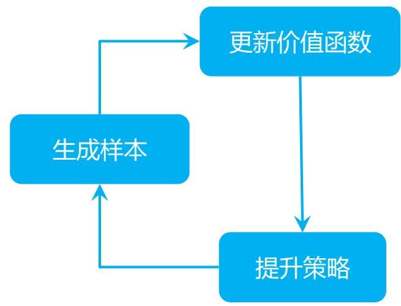


$$
\pi (a | s) = \left\{ \begin{array}{l l} 1 & i f a = a r g \max _ {a \in \mathcal {A}} Q _ {w} (s, a) \\ 0 & o t h e r w i s e \end{array} \right.
$$

# 基于值的RL

• Q-Learning算法直接结合神经网络的算法称为Naïve DQN 。

# 在线版本的Naïve DQN算法

# Algorithm 1.8 Naive DQN 算法

Input：迭代轮数 T，学习率 $\alpha$ ，衰减因子 $\gamma$ ，最大探索率 $\epsilon _ { s t a r t }$ ，最小探索率$\epsilon _ { m i n }$ ，最大交互回合数 $N$ ，最大时间步长 $T$

Output:最优值函数 $Q _ { * }$

1：随机初始化 $Q$ 值网络参数 $\phi$

2:for 每个交互回合 $k = 0 , 1 , \cdots , N$ do

3: 重置环境并获取环境的初始状态 $s _ { 0 }$

4: for $t = 0 , 1 , \cdots , T$ do

5: 在状态 $s _ { t }$ 利用é－greedy 策略选择动作 $a _ { t }$

6: 在状态 $s _ { t }$ 执行当前动作 $a _ { t }$ ，得到新状态 $s _ { t + 1 }$ 和奖励 $r _ { t }$

7: 使用公式1.50更新神经网络参数 $\phi$

8: 更新探索率 $\epsilon$

9: end for

10: end for


$$
\pi (a | s) = \left\{ \begin{array}{l l} 1 & i f a = a r g \max _ {a \in \mathcal {A}} Q _ {w} (s, a) \\ 0 & o t h e r w i s e \end{array} \right.
$$

# 基于值的RL

Naïve DQN：样本之间存在较高关联性

# 在线 Naïve DQN算法

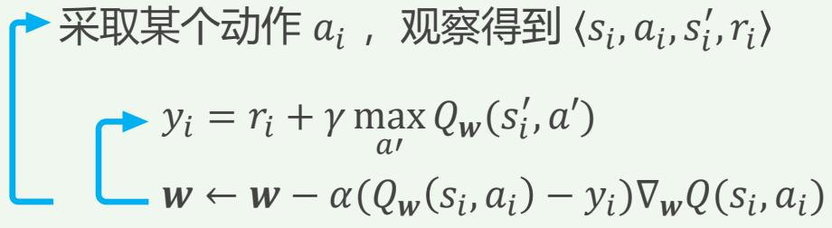


时间上相近的状态之间具有极高的关联性，不利于训练的稳定

相邻的几个帧的画面非常相似

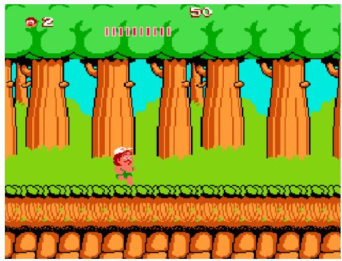


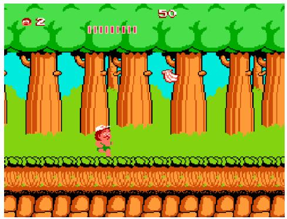


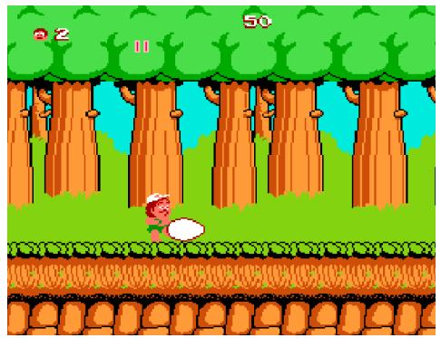


# 基于值的RL

Naïve DQN：样本之间存在较高关联性

# 使用经验回放池打破样本相关性

# 基于经验回放池的 Q-learning

与环境交互获取数据 $\{ \langle s , a , s ^ { \prime } , r \rangle \}$ ，并存入缓存 $\mathcal { B }$从缓存 $\mathcal { B }$ 中采样一批数据 $\{ \langle s _ { 1 } , a _ { 1 } , s _ { 1 } ^ { \prime } , r _ { 1 } \rangle , \dots , \langle s _ { n } , a _ { n } , s _ { n } ^ { \prime } , r _ { n } \rangle \}$$\boldsymbol { w } \gets \boldsymbol { w } - \sum _ { i = 1 } ^ { n } \alpha ( Q _ { w } ( s ^ { \prime } , a ^ { \prime } ) - y ) \nabla _ { w } Q ( s , a )$

样本之间不再具有较高的关联性批量中样本能够降低梯度的方差

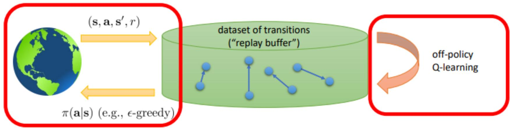


# 基于值的RL

# Naïve DQN：不是梯度下降方法

采取某个动作 $a _ { i }$ ，观察得到 $\langle s _ { i } , a _ { i } , s _ { i } ^ { \prime } , r _ { i } \rangle$

$$
\pmb {w} \gets \pmb {w} - \alpha \left(Q _ {\pmb {w}} (s _ {i}, a _ {i}) - \left[ r _ {i} + \gamma \max _ {a ^ {\prime}} Q _ {\pmb {w}} (s _ {i} ^ {\prime}, a ^ {\prime}) \right]\right) \nabla_ {\pmb {w}} Q (s _ {i}, a _ {i})
$$

# semi-gradient

Q价值网络更新的同时，拟合的目标也在变动，因此不能保证该过程的收敛性。训练过程不稳定，甚至发生震荡。


Q目标


Q估计


（a）猫追老鼠


（b）猫和老鼠都在动


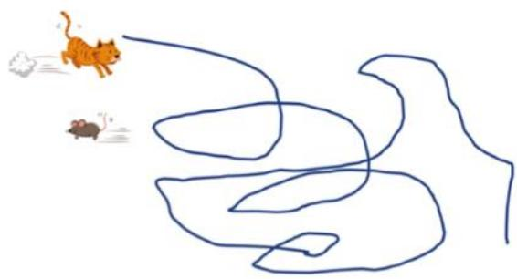


（c）猫和老鼠的优化轨迹


# 基于值的RL

# Naïve DQN：不是梯度下降方法

# 使用目标网络提高值网络训练的稳定性

# 使用经验回放池和目标网络的 Q-learning

1. 设置目标网络的参数 $w ^ { \prime }  w$

2. 与环境交互获取数据 $\{ \langle s , a , s ^ { \prime } , r \rangle \}$ ，并存入缓存 $\mathcal { B }$

3. 从缓存 $\mathcal { B }$ 中采样一批数据 $\{ \langle s _ { 1 } , a _ { 1 } , s _ { 1 } ^ { \prime } , r _ { 1 } \rangle , \dots , \langle s _ { n } , a _ { n } , s _ { n } ^ { \prime } , r _ { n } \rangle \}$

4. ?? ← ?? − ?? σ??=1?? ???? ????, ???? − ???? + ?? ?????? ????′(????′, ??′) ??????(????, ????)

使用目标网络计算目标值定期更新目标网络的参数

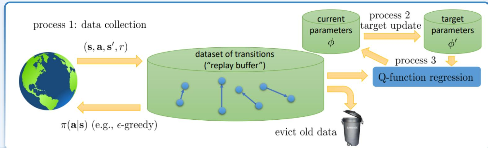


# 基于值的RL

# Classic DQN：使用经验回放池以及目标网络的DQN

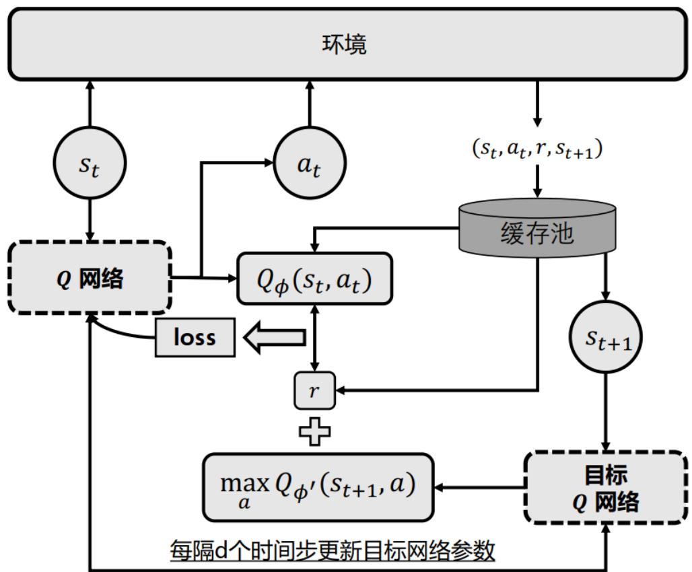


# Algorithm1.9DQN算法

Input:选代轮数T，学习率 $\alpha$ ，衰减因子 $\gamma$ ，最大探索率 $\epsilon _ { s t a r t }$ ，最小探索率$\epsilon _ { m i n }$ ，最大交互回合数 $N$ ，最大时间步长 $T$ ，梯度更新次数 $G$ ，经验回放池 $\boldsymbol { B }$批样本大小 $B$ ，目标网络更新间隔d

Output:最优值函数 $Q _ { * }$

1：随机初始化 $Q$ 值网络参数 $\phi$

2:初始化目标值网络参数 $\phi ^ { \prime }  \phi$

3:for每个交互回合 $k = 0 , 1 , \cdots , N$ do

4: 重置环境并获取环境的初始状态 $s _ { 0 }$

for $t = 0 , 1 , \cdots , T$ do

在状态 $s _ { t }$ 利用∈-greedy策略选择动作 $a _ { t }$

在状态 $s _ { t }$ 执行当前动作 $a _ { t }$ ，得到新状态 $s _ { t + 1 }$ 和奖励 $r _ { t }$

将四元组 $\left( { { s _ { t } } , { a _ { t } } , { r _ { t } } , { s _ { t + 1 } } } \right)$ 存入经验回放池 $_ B$ 中

for每个梯度更新步 $g = 1 , . . . , G$ do

10: 从经验回放池 $_ { \it B }$ 中采样一批大小为 $B$ 数据样本

使用公式1.52更新神经网络参数 $\phi$

12: end for

if $( k \times T ) + t$ mod $d = = 0$ then

使用公式1.53更新目标网络参数 $\phi ^ { \prime }$

end if

更新探索率 $\epsilon$

end for

18:end for

# 基于值的RL

Classic DQN：Q 值易被高估

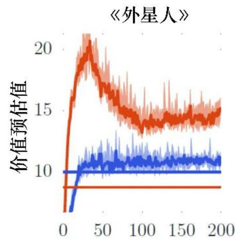


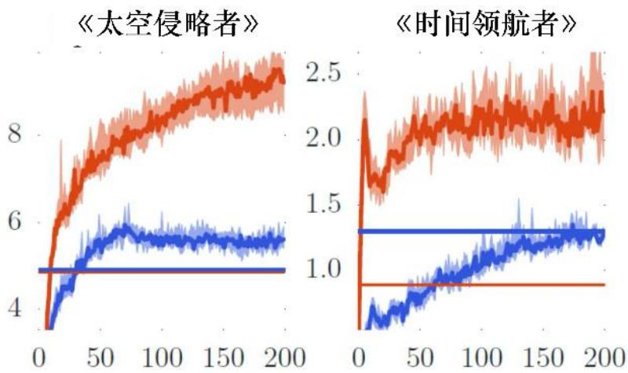


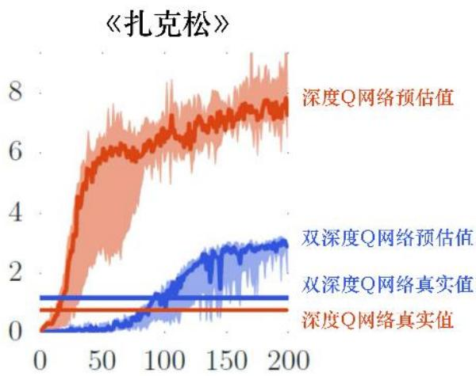


迭代轮次（百万）


• 上图为 DQN 和 DDQN 应用在不同小游戏上，得到的价值的预估值及真实值对比。

• 可以看出 DQN 容易过高的估计所能得到的回报，从而收敛到一个次优解。

为什么 DQN 会高估所能得到的回报呢？

# 基于值的RL

# Classic DQN：Q 值易被高估

• 一个数学直觉，考虑两个随机变量 $X _ { 1 } , X _ { 2 }$

$$
\mathbb {E} [ \max (X _ {1}, X _ {2}) ] \geq \max (\mathbb {E} [ X _ {1} ], \mathbb {E} [ X _ {2} ])
$$

• 不妨假设动作价值网络的估计误差为随机噪音 $X _ { 1 } , X _ { 2 } { \sim } N ( 0 , \varepsilon )$

$$
\mathbb {E} _ {X} [ \max (Q (s, a _ {1}) + X _ {1}, Q (s, a _ {2}) + X _ {2}) ]
$$

$$
\geq \max (\mathbb {E} _ {X} [ Q (s, a _ {1}) + X _ {1} ], \mathbb {E} _ {X} [ Q (s, a _ {1}) + X _ {2} ]) = \max (Q (s, a _ {1}), Q (s, a _ {2}))
$$

• 右图中蓝色为真实价值，绿色为网络对价值的估计误差。

• 算法总是选择价值最高的动作作为目标进行更新，因此存在被高估的问题。

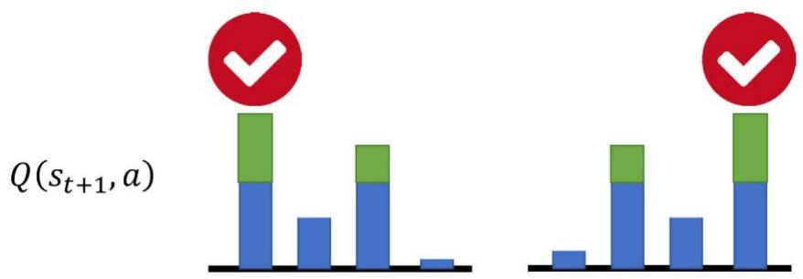


# 基于值的RL

# Double DQN：选择动作和计算价值不使用同一个网络

DQN 计算目标值时，基于 $Q _ { w }$ 选择最优动作，再使用 $Q _ { w }$ 计算目标值

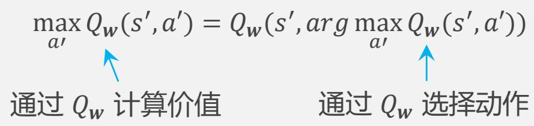


• Double DQN 使用两个网络分别进行动作选择与目标值计算

$$
Q _ {w _ {1}} \gets r + \gamma Q _ {w _ {2}} (s ^ {\prime}, a r g \max _ {a ^ {\prime}} Q _ {w _ {1}} (s, a))
$$

• 如果两个网络的误差不同，则可以在一定程度上解决问题。

# 基于值的RL

# Double DQN：选择动作和计算价值不使用同一个网络

• DQN 中的当前网络 $Q _ { w }$ 与目标网络 $Q _ { w ^ { \prime } }$

• DQN 中的目标值计算：

$$
y = r + \gamma Q _ {w ^ {\prime}} (s ^ {\prime}, a r g \max _ {a ^ {\prime}} Q _ {w ^ {\prime}} (s ^ {\prime}, a ^ {\prime}))
$$

• Double DQN 中的目标值计算：

$$
y = r + \gamma Q _ {w ^ {\prime}} (s ^ {\prime}, a r g \max _ {a ^ {\prime}} Q _ {w} (s ^ {\prime}, a ^ {\prime}))
$$

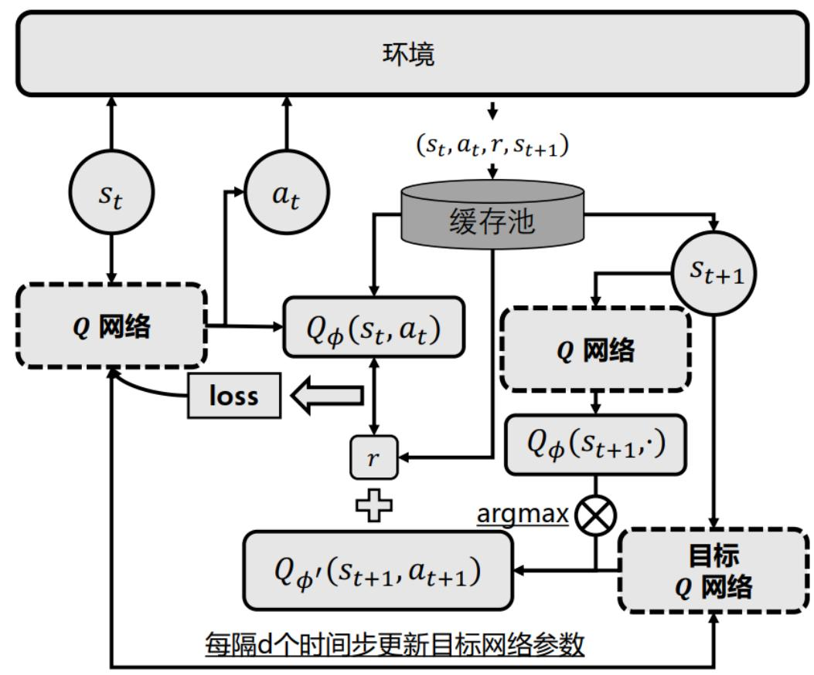


使用当前网络选择动作

使用目标网络估计价值

# 基于值的RL

Dueling DQN：尝试将原来的 Q 网络拆分为两个部分

$$
Q (s, a) = V (s) + A (s, a)
$$

• 该网络输出两个量：

✓ $V _ { \theta } ( s )$ ：状态 $s$ 的平均价值

✓ $A _ { \phi } ( s , a )$ ：动作 $a$ 优势价值

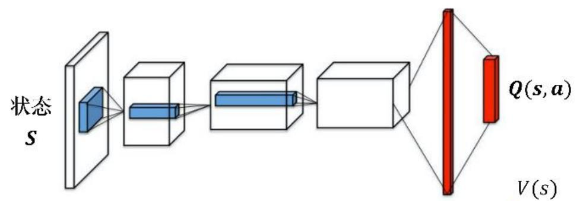


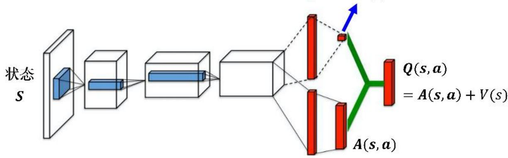


# 基于值的RL

# Dueling DQN：尝试将原来的 Q 网络拆分为两个部分

# 优势：

分辨当前价值是由状态还是动作带来的，从而进行有针对性的更新，增加样本的利用率

• 右图展示了价值函数和优势函数关注的区域

当前方无车时，不同动作的优势价值 $A _ { \phi } ( s , a )$ 应无明显差异。

而 当 前 方 有 车 时，不 同 动 作 应 有 不 同 的 优 势 价 值$A _ { \phi } ( s , a ) _ { \circ }$ 。


VALUE


VALUE


ADVANTAGE


ADVANTAGE


价值函数和优势函数关注的区域


# 基于值的RL

# Dueling DQN：尝试将原来的 Q 网络拆分为两个部分

# 训练出来的 “??(??)” 是我们想要的吗？

• 一种可能是 ${ } ^ { \prime \prime } V ( s ) ^ { \prime \prime }$ 总是输出 0，而 $" A ( s , a ) "$ 输出 $Q ( s , a )$

由优势函数定义 $\mathrm { A } _ { * } ( s , a ) = Q _ { * } ( s , a ) - V _ { * } ( s )$ 及 $V _ { * } ( s ) = \operatorname* { m a x } _ { a ^ { \prime } } Q _ { * } ( s , a ^ { \prime } )$ ，易知下式成立：

$$
\max _ {a ^ {\prime}} \mathrm {A} _ {*} (s, a ^ {\prime}) = \max _ {a ^ {\prime}} Q _ {*} (s, a ^ {\prime}) - V _ {*} (s) = 0
$$

$$
Q _ {*} (s, a) = V _ {*} (s) + A _ {*} (s, a) - \max  _ {a ^ {\prime}} A _ {*} (s, a ^ {\prime})
$$

• 在计算时使用 $Q _ { \theta , \phi } ( s , a ) = V _ { \theta } ( s ) + A _ { \phi } ( s , a ) - \operatorname* { m a x } _ { a ^ { \prime } } \mathrm { A } _ { \phi } ( s , a ^ { \prime } )$ ，而非 $Q _ { \theta , \phi } ( s , a ) = V _ { \theta } ( s ) + A _ { \phi } ( s , a )$ ，能够使得$\operatorname* { m a x } _ { a ^ { \prime } } { \ A _ { \phi } ( s , a ^ { \prime } ) }$ 在收敛时趋近于零。

• 为了回传梯度，在实际应用时一般使用平均替代最大化操作，所以最终的Q值表示为：

$$
Q _ {\theta , \phi} (s, a) = V _ {\theta} (s) + A _ {\phi} (s, a) - \sum_ {\mathrm {a}} A _ {\phi} (s, a ^ {\prime}) / | A |
$$

# 基于值的RL

Rainbow DQN：一种整合多种 DQN 改进技术的强化学习算法

Double DQN：通过分离动作选择和动作评估解决 DQN 中的过估计偏差问题；

Dueling DQN：通过引入V (s) 和A(s, a) 的分解表示改进 Q 值估计的效率；

• 优先经验回放：通过为经验样本分配优先级，优先学习关键的样本，从而提高数据利用效率；

• 多步学习：使用 n-步回报能够更快地传播奖励信号，从而提升收敛速度；

• 分布式学习：利用分布式学习对价值分布进行建模，从而能更精确地捕捉环境中随机性的影响；

噪声网络：在神经网络中引入参数化噪声，使得策略具有更为灵活的探索能力；

• 目标网络的软更新：采用软更新方式更新目标网络参数，避免更新过快导致的不稳定性。

# 基于值的RL

# 优先经验回放（ Prioritized Experience Replay）

• 具有较高 TD 误差的样本应该给予较高的优先级

• 方法一：采样第 t 个样本的概率 $p _ { t }$ 正比于 TD 误差 $\delta _ { t }$

$$
p _ {t} \propto | \delta_ {t} | + \epsilon
$$

?? 为一个很小的正数，防止采样概率为零

• 方法二：采样第 t 个样本的概率 $p _ { t }$ 反比于 TD 误差在全体样本中从大到小的位次 ???????? ??

$$
p _ {t} \propto \frac {1}{r a n k (t)}
$$

较方法一对异常点更鲁棒，异常点 TD 误差过大或过小对 ???????? ?? 没有太大影响。

# 基于值的RL

# 优先经验回放（ Prioritized Experience Replay）

• 采用经验回放的目的之一就是打破样本之间的关联性

• 而优先级采样重新引入了样本关联性

• 引入参数 ?? ∈ [0,1] 调整各个样本的学习率 $\alpha _ { t }$ ，在二者之间做权衡

$$
\alpha_ {t} \gets \alpha \cdot (n p _ {t}) ^ {- \beta}
$$

其中 n 为样本数目

均匀采样时 $p _ { 1 } = p _ { 2 } = \cdots = p _ { n } = { \frac { 1 } { n } } , ~ ( n p _ { t } ) ^ { - \beta } = 1$ ，所有样本使用相同的学习率 $\alpha$

基于优先级采样时，具有较高优先级的样本使用较低的学习率（ $\dot { \boldsymbol { p } } _ { t }$ 越大， $\alpha \cdot ( n p _ { t } ) ^ { - \beta }$ 越小）

# 优先经验回放重新引入样本相关性

# 基于AC的RL

基于值的强化学习算法（如 DQN 算法）难以直接应用于高维离散动作空间、连续动作空间、离散连续混合的动作空间。这些场景中，动作空间的维度可能极高甚至是无限大，因此直接枚举或计算每个动作的值函数所带来的计算成本十分高昂，同时在连续动作空间中也无法实现枚举所有可能的动作。

基于策略的强化学习算法（Policy-based）使用神经网络直接拟合策略函数。策略网络用于在给定状态 s 下生成对应的策略π(a|s)。对于离散动作空间的场景，策略网络通常输出所有离散动作的概率分布，通过概率采样得到最终和环境交互的动作。对于连续动作空间的场景，策略网络通常输出一个多维高斯分布的均值和方差，通过在高斯分布中采样得到最终和环境交互的动作。

• 基于 Actor-Critic 的强化学习算法（或者称为基于演员-评论家算法）使用两个不同的网络，个策略网络（Actor）和一个值网络（Critic），分别用于策略生成和策略评估。

# 基于AC的RL

# 基于值的强化学习算法

• 学习值函数

• 利用值函数导出策略

• 更高的样本训练效率

通常仅适用于具有离散动作的环境

# 基于策略的强化学习算法

• 不需要值函数

• 直接学习策略

• 在高维或连续动作空间场景中更加高效

• 适用任何动作类型的场景

• 容易收敛到次优解

基于Actor-Critic的强化学习算法

• 结合两者优势

# 基于AC的RL

# 策略优化

基于策略的强化学习方法方法直接搜索最优策略??

• 通常做法是参数化策略 $\pi _ { \theta }$ ，并利用无梯度或基于梯度的优化方法对参数进行更新

✓ 无梯度优化可以有效覆盖低维参数空间，但基于梯度的训练仍然是首选，因为其具有更高的采样效率

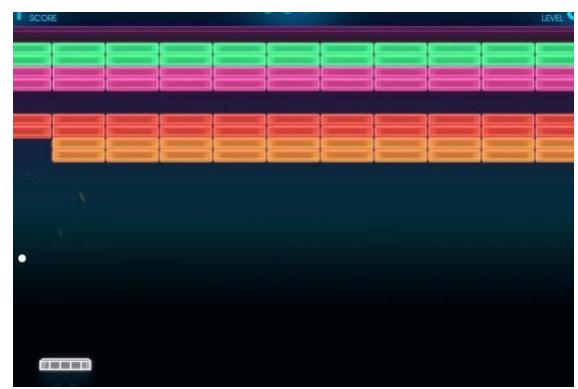


输入状态 ??


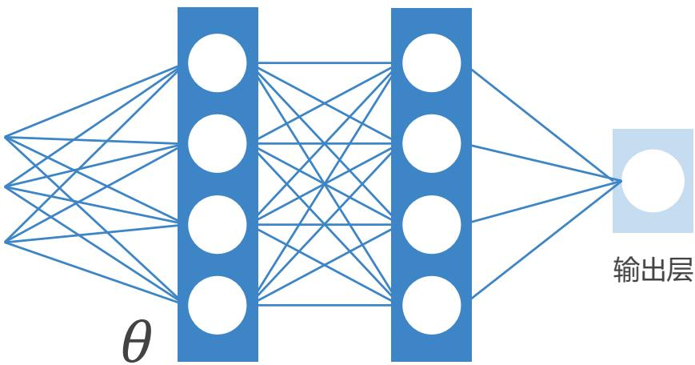


隐藏层1


隐藏层2


选择某一动作的概率

$$
\pi_ {\theta} (a | s)
$$

# 基于AC的RL

策略表征方式不同也会带来不同的性质，下面给出参数化策略和表格型策略的三点不同之处

# 采取某个动作的概率的计算方式不同

表格型策略：状态 ?? 上采取动作 $a$ 的概率直接查表可得

• 参数化策略：通过给定的函数结构和参数计算 $\pi _ { \theta } ( a | s )$

# 策略的更新方式不同

• 表格型策略：直接修改表格中对应的条目

• 参数化策略：通过更新参数 ?? 对策略进行更新

<table><tr><td></td><td>a1</td><td>a2</td></tr><tr><td>s1</td><td>0.7</td><td>0.3</td></tr><tr><td>s2</td><td>0.4</td><td>0.6</td></tr></table>

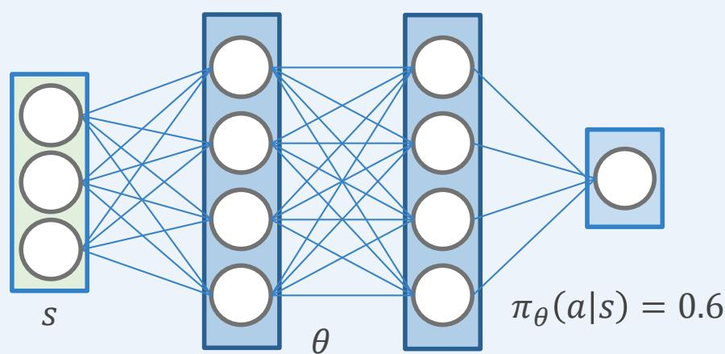


# 基于AC的RL

# 基于策略的强化学习算法

# 基本思想

• 利用目标函数定义策略优劣性： $J ( \theta ) = J ( \pi _ { \theta } )$

• 对目标函数进行优化，以寻找最优策略

# 两个问题

目标函数 ?? ?? 如何设计？

该目标函数关于参数的优化方向 （如梯度 $\nabla _ { \boldsymbol { \theta } } J ( \boldsymbol { \theta } )$ ）如何计算？

# 重点学习目标函数可微分情形

1. 目标函数不可微分时：使用无梯度算法进行最优参数搜索

2. 目标函数可微分时：利用基于梯度的优化方法寻找最优策略 ????+1 ← ???? + α∇????(????)

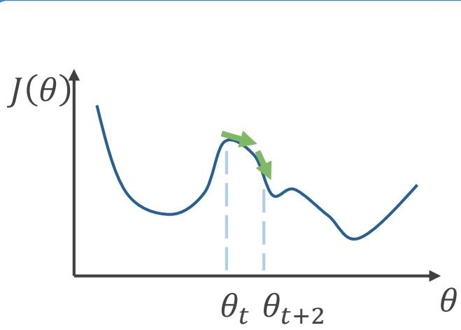


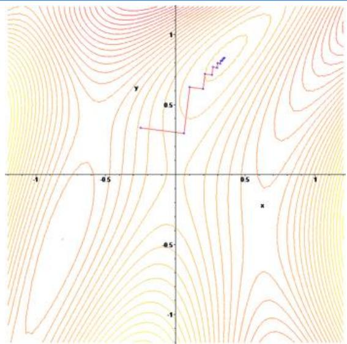


# 基于AC的RL

基于策略的强化学习算法——梯度优化

# 策略梯度计算

当目标函数可微分时，可以使用一些基于梯度的算法：

✓ 梯度下降法、拟牛顿法等

• 但在此之前，需要先计算出目标函数关于策略参数的梯度。

# 最大化平均轨迹回报目标

$$
\max _ {\theta} J (\theta) = \max _ {\theta} \mathbb {E} _ {\tau \sim p _ {\theta} (\tau)} \left[ \sum_ {t} r (s _ {t}, a _ {t}) \right]
$$

• $\tau$ 为策略 $\pi _ { \theta }$ 采样而来的轨迹

$$
\{s _ {1}, a _ {1}, r _ {1}, s _ {2}, a _ {2}, r _ {2}, \ldots , s _ {T} \}
$$

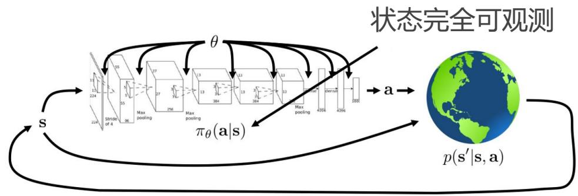


$$
\theta^ {*} = \arg \max _ {\theta} \mathbb {E} _ {\tau \sim p _ {\theta} (\tau)} \left[ \sum_ {t} r \left(s _ {t}, a _ {t}\right) \right]
$$

目标函数 ??(??)

$$
p _ {\theta} (s _ {1}, a _ {1}, \dots , s _ {T}) = p (s _ {1}) \prod_ {t = 1} ^ {T - 1} \pi_ {\theta} (a _ {t} | s _ {t}) p (s _ {t + 1} | s _ {t}, a _ {t})
$$

# 基于AC的RL

# 基于策略的强化学习算法——梯度优化

# 策略梯度计算

▪ 记 $\begin{array} { r } { G ( \tau ) = \sum _ { t } r ( s _ { t } , a _ { t } ) } \end{array}$ ，轨迹回报目标的策略梯度为：

$$
\begin{array}{l} \nabla_ {\theta} J (\theta) = \nabla_ {\theta} \int p _ {\theta} (\tau) G (\tau) d \tau \\ = \mathbb {E} _ {\tau \sim p _ {\theta} (\tau)} \left[ \sum_ {t = 1} ^ {T} \nabla_ {\theta} \log \pi_ {\theta} (a _ {t} | s _ {t}) G (\tau) \right] \\ \end{array}
$$

$$
p _ {\theta} (s _ {1}, a _ {1}, \ldots , s _ {T}) = p (s _ {1}) \prod_ {t = 1} ^ {T - 1} \pi_ {\theta} (a _ {t} | s _ {t}) p (s _ {t + 1} | s _ {t}, a _ {t})
$$

$$
\cdot \quad \text {C h a i n r u l e :} \frac {\partial \log [ \pi (\boldsymbol {\theta}) ]}{\partial \boldsymbol {\theta}} = \frac {1}{\pi (\boldsymbol {\theta})} \cdot \frac {\partial \pi (\boldsymbol {\theta})}{\partial \boldsymbol {\theta}}.
$$

关于策略参数梯度的推导：

$$
\begin{array}{l} \nabla_ {\theta} J (\theta) = \int \nabla_ {\theta} p _ {\theta} (\tau) G (\tau) d \tau \\ = \int \frac {p _ {\theta} (\tau)}{p _ {\theta} (\tau)} \nabla_ {\theta} p _ {\theta} G (\tau) d \tau \\ = \int p _ {\theta} (\tau) \frac {\nabla_ {\theta} p _ {\theta} (\tau)}{p _ {\theta} (\tau)} G (\tau) d \tau \\ = \int p _ {\theta} (\tau) \nabla_ {\theta} \log p _ {\theta} (\tau) G (\tau) d \tau \\ = \mathbb {E} _ {\tau \sim p _ {\theta} (\tau)} [ \nabla_ {\theta} \log p _ {\theta} (\tau) G (\tau) ] \\ \end{array}
$$

# 基于AC的RL

基于策略的强化学习算法——梯度优化

$$
p _ {\theta} (s _ {1}, a _ {1}, \dots , s _ {T}) = p (s _ {1}) \prod_ {t = 1} ^ {T - 1} \pi_ {\theta} (a _ {t} | s _ {t}) p (s _ {t + 1} | s _ {t}, a _ {t})
$$

# 策略梯度计算

关于 $\nabla _ { \theta } \log p _ { \theta } ( \tau )$ 的简化：

$$
\begin{array}{l} \nabla_ {\theta} \log p _ {\theta} (\tau) \\ = \nabla_ {\theta} (\log p (s _ {1}) + \sum_ {t = 1} ^ {T} \log \pi_ {\theta} (a _ {t} | s _ {t}) + \sum_ {t = 1} ^ {T} \log p (s _ {t + 1} | s _ {t}, a _ {t})) \\ = \nabla_ {\theta} \log p (s _ {1}) + \nabla_ {\theta} \sum_ {t = 1} ^ {T} \log \pi_ {\theta} (a _ {t} | s _ {t}) + \nabla_ {\theta} \sum_ {t = 1} ^ {T} \log p (s _ {t + 1} | s _ {t}, a _ {t}) \\ = \nabla_ {\theta} \sum_ {t = 1} ^ {T} \log \pi_ {\theta} (a _ {t} | s _ {t}) \\ = \sum_ {t = 1} ^ {T} \nabla_ {\theta} \log \pi_ {\theta} (a _ {t} | s _ {t}) \\ \end{array}
$$

其中 $p ( s _ { 1 } )$ ， $p ( s _ { t + 1 } | s _ { t } , a _ { t } )$ 与参数 $\theta$ 无关，因此 $\begin{array} { r } { \nabla _ { \theta } \log p ( s _ { 1 } ) = 0 , \nabla _ { \theta } \sum _ { t = 1 } ^ { T } \log p ( s _ { t + 1 } \vert s _ { t } , a _ { t } ) = 0 } \end{array}$

# 基于AC的RL

# REINFORCE 算法

# 基于蒙特卡洛方法计算策略梯度

前面我们推导出了策略梯度：

$$
\nabla_ {\theta} J (\theta) = \mathbb {E} _ {\tau \sim p _ {\theta} (\tau)} \left[ \sum_ {t = 1} ^ {T} \nabla_ {\theta} \log \pi_ {\theta} (a _ {t} | s _ {t}) R (\tau) \right]
$$

• 在实践中，我们可以通过蒙特卡洛方法进行估计

$$
\nabla_ {\theta} J (\theta) = \frac {1}{N} \sum_ {n = 1} ^ {N} \sum_ {t = 1} ^ {T ^ {n}} R (\tau^ {n}) \nabla_ {\theta} \log \pi_ {\theta} (a _ {t} ^ {n} | s _ {t} ^ {n})
$$

• 据此，我们可以得到 REINFORCE 算法


# REINFORCE 算法：

1. 利用策略 $\pi _ { \theta } ( a | s )$ 采样轨迹 $\{ \tau _ { i } \}$

2. 计算梯度 $\begin{array} { r } { \nabla _ { \theta } J ( \theta ) = \frac { 1 } { N } \sum _ { n = 1 } ^ { N } \sum _ { t = 1 } ^ { T ^ { n } } R ( \tau ^ { n } ) \nabla _ { \theta } \mathrm { l o g } \pi _ { \theta } ( a _ { t } ^ { n } | s _ { t } ^ { n } ) } \end{array}$

3. 更新参数 $\theta  \theta + \alpha \nabla _ { \theta } J ( \theta )$

# 基于AC的RL

# REINFORCE 算法

# 同策略（On-Policy）算法

$$
\begin{array}{l} \theta^ {*} = a r g \max _ {\theta} J (\theta) \\ J (\theta) = \mathbb {E} _ {\tau \sim p _ {\theta} (\tau)} [ r (\tau) ] \\ \nabla_ {\theta} J (\theta) = \mathbb {E} _ {\tau \sim p _ {\theta} (\tau)} [ \nabla_ {\theta} \log p _ {\theta} (\tau) r (\tau) ] \\ \end{array}
$$


估计策略梯度所用的数据需要由当前策略采集

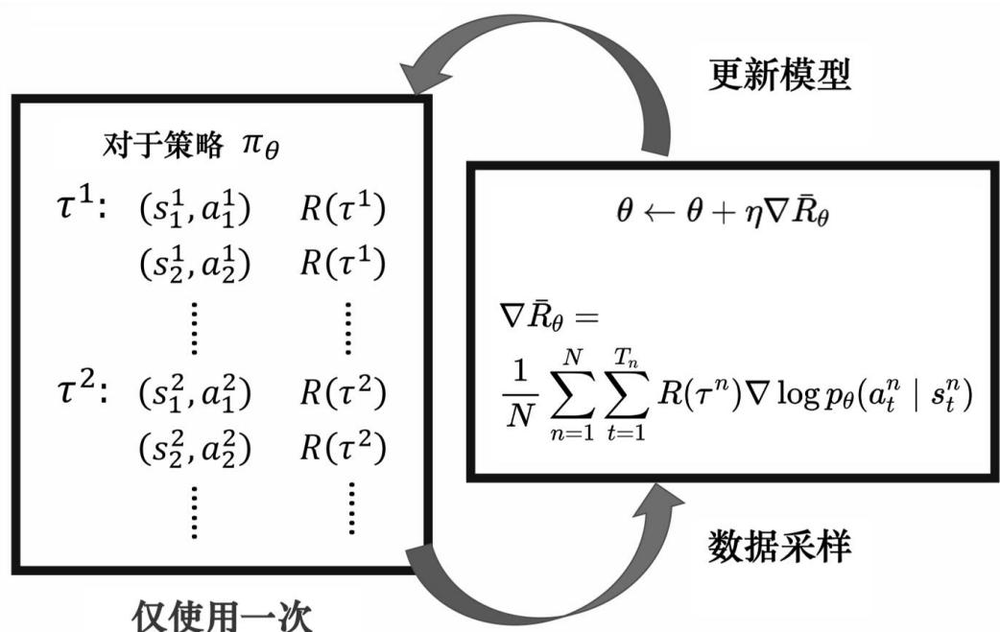


# REINFORCE 算法：

1. 利用策略 $\pi _ { \theta } ( a | s )$ 采样轨迹 $\{ \tau _ { i } \}$

2. 计算梯度 $\begin{array} { r } { \nabla _ { \theta } J ( \theta ) = \frac { 1 } { N } \sum _ { n = 1 } ^ { N } \sum _ { t = 1 } ^ { T ^ { n } } R ( \tau ^ { n } ) \nabla _ { \theta } \mathrm { l o g } \pi _ { \theta } ( a _ { t } ^ { n } | s _ { t } ^ { n } ) } \end{array}$

3. 更新参数 $\theta  \theta + \alpha \nabla _ { \theta } J ( \theta )$

# 基于AC的RL

REINFORCE 算法

# 训练可能存在偏差

• 考虑只有正奖励的场景，在理想情况下进行优化，最终能够使得奖励值高的动作分配较高的采样概率，而奖励值低的动作分配较低的采样概率：

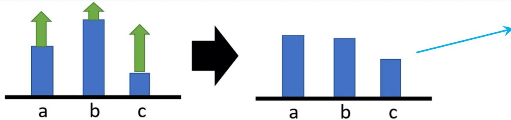


理想的结果

• 但在实际场景中我们可能并不能采样到所有的动作，如只能采样到 b 和 c ，这就会使得我们的优化有所偏差：


没有被采样到


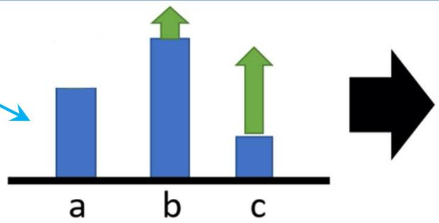


错误的结果

# 基于AC的RL

# REINFORCE 算法

# 通过添加基线帮助训练

$$
\nabla R _ {\theta} = \frac {1}{N} \sum_ {n = 1} ^ {N} \sum_ {t = 1} ^ {T ^ {n}} (R (\tau^ {n}) - b) \nabla_ {\theta} \log p _ {\theta} (a _ {t} ^ {n} | s _ {t} ^ {n})
$$

• 我们可以将奖励函数减去一个基线 $b$ ，使得 $R ( \tau ) - b$ 有正有负

$\checkmark$ 如果 $R ( \tau ) > b$ ，就让采取对应动作的概率提升

$\checkmark$ 如果 $R ( \tau ) < b$ ，就让采取对应动作的概率降低

一般来说，可以使用奖励的平均值作为基线， $\begin{array} { r } { b = \frac { 1 } { N } \sum _ { i = 1 } ^ { N } R ( \tau ) } \end{array}$

✓ 在训练时记录 $R ( \tau )$ 的值，并维护 $R ( \tau )$ 的平均值

# 基于AC的RL

REINFORCE 算法

通过添加基线帮助训练

• 减去一个基线并不会影响原梯度的期望值

$$
\begin{array}{l} \mathbb {E} [ \nabla_ {\theta} \log p _ {\theta} (\tau) b ] = \int p _ {\theta} (\tau) \nabla_ {\theta} \log p _ {\theta} (\tau) b \mathrm {d} \tau \\ = \int \nabla_ {\theta} p _ {\theta} (\tau) b \mathrm {d} \tau \\ = b \int \nabla_ {\theta} p _ {\theta} (\tau) \mathrm {d} \tau \\ = b \nabla_ {\theta} \int p _ {\theta} (\tau) \mathrm {d} \tau \\ = b \nabla_ {\theta} 1 = 0 \\ \end{array}
$$

# 基于AC的RL

基于Actor-Critic的强化学习算法

# REINFORCE 算法主循环

1. 使用当前策略 $\pi _ { \theta }$ 采样N条经验轨迹 $\{ \tau _ { i } \}$

对第??步做对数极大似然估计

2. 计算梯度 $\begin{array} { r } { \nabla _ { \theta } J ( \theta ) \approx \frac { 1 } { N } \sum _ { i } \left( \sum _ { t = 1 } ^ { T } \nabla _ { \theta } \log \pi _ { \theta } ( a _ { t } ^ { i } | s _ { t } ^ { i } ) \big ( \sum _ { t ^ { \prime } = t } ^ { T } r ( s _ { t ^ { \prime } } ^ { i } , a _ { t ^ { \prime } } ^ { i } ) \big ) \right) } \end{array}$

对N条轨迹进行平均

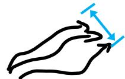


在每一条轨迹内累计回报

3. 更新策略参数 $\theta  \theta + \alpha \nabla _ { \theta } J ( \theta )$

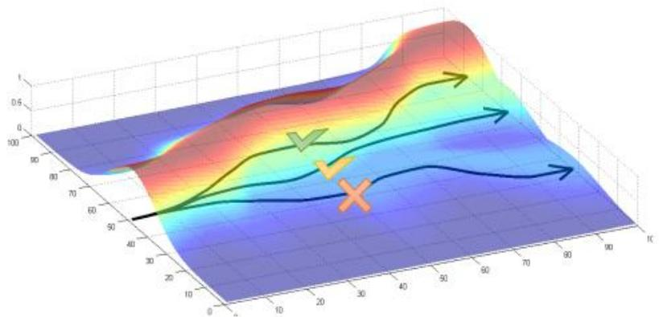


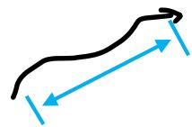


# 基于AC的RL

# 基于Actor-Critic的强化学习算法

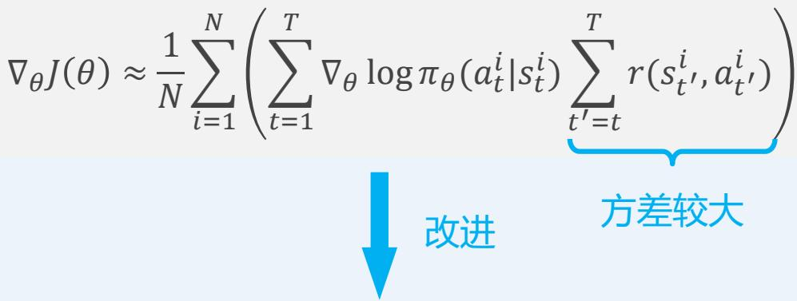


使用动作价值估计Q෡??近似轨迹回报期望?????? $7 2 \div 7 = 1 7 ( c m )$ ：

$$
\nabla_ {\theta} J (\theta) \approx \frac {1}{N} \sum_ {i = 1} ^ {N} \left(\sum_ {t = 1} ^ {T} \nabla_ {\theta} \log \pi_ {\theta} (a _ {t} ^ {i} | s _ {t} ^ {i}) \widehat {\mathbb {Q}} ^ {\pi} (s _ {t} ^ {i}, a _ {t} ^ {i})\right)
$$

$$
\widehat {\mathsf {Q}} ^ {\pi} (s _ {t} ^ {i}, a _ {t} ^ {i}) \approx \sum_ {t ^ {\prime} = t} ^ {T} \mathbb {E} _ {\pi_ {\theta}} [ r (s _ {t ^ {\prime}}, a _ {t ^ {\prime}}) | s _ {t}, a _ {t} ]
$$


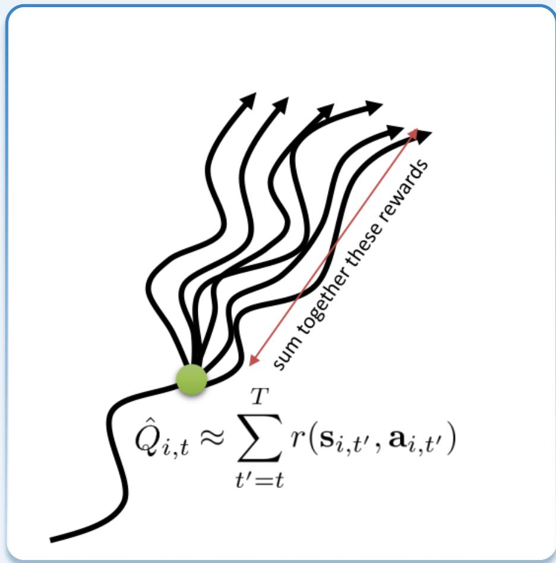


# 基于AC的RL

# 基于Actor-Critic的强化学习算法

• Actor: ????


1. 使用当前策略 $\pi _ { \theta }$ 在环境中进行采样


对第??步做对数极大似然估计

2. 策略提升： $\begin{array} { r } { \theta \gets \theta + \alpha \nabla _ { \theta } J ( \theta ) \approx \underbrace { \frac { 1 } { N } \sum _ { i = 1 } ^ { N } \bigl ( { \sum _ { t = 1 } ^ { T } } ^ { \prime } \nabla _ { \theta } \log \pi _ { \theta } ( a _ { t } ^ { i } | s _ { t } ^ { i } ) \ @ ^ { \pi } ( s _ { t } ^ { i } , a _ { t } ^ { i } ) \bigr ) } _ { \theta } } \end{array}$

对N条轨迹进行平均

动作值函数估计(Critic)

3. 拟合当前策略的动作值函数： $\begin{array} { r } { \widehat { \mathrm { Q } } ^ { \pi } ( s _ { t ^ { \prime } } ^ { i } , a _ { t ^ { \prime } } ^ { i } ) \approx \sum _ { t ^ { \prime } = t } ^ { T } r ( s _ { t ^ { \prime } } ^ { i } , a _ { t ^ { \prime } } ^ { i } ) } \end{array}$

$$
\widehat {Q} ^ {\pi} (s _ {t ^ {\prime}} ^ {i}, a _ {t ^ {\prime}} ^ {i}) = \sum_ {t ^ {\prime} = t} ^ {T} r (s _ {t ^ {\prime}} ^ {i}, a _ {t ^ {\prime}} ^ {i})
$$

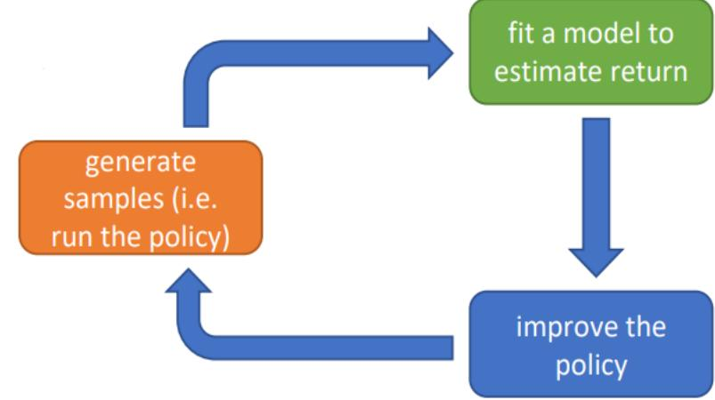


$$
\theta \leftarrow \theta + \alpha \nabla_ {\theta} J (\theta)
$$


Actor Learning


Critic Learning

# 基于AC的RL

基于Actor-Critic的强化学习算法

Actor-Critic算法的策略梯度

$$
\nabla_ {\theta} J (\theta) \approx \frac {1}{N} \sum_ {i = 1} ^ {N} \left(\sum_ {t = 1} ^ {T} \nabla_ {\theta} \log \pi_ {\theta} (a _ {t} ^ {i} | s _ {t} ^ {i}) \widehat {\mathsf {Q}} ^ {\pi} (s _ {t} ^ {i}, a _ {t} ^ {i})\right) \quad (*)
$$

进一步对策略梯度进行改进

$$
\nabla_ {\theta} J (\theta) \approx \frac {1}{N} \sum_ {i = 1} ^ {N} \left(\sum_ {t = 1} ^ {T} \nabla_ {\theta} \log \pi_ {\theta} (a _ {t} ^ {i} | s _ {t} ^ {i}) \hat {A} ^ {\pi} (s _ {t} ^ {i}, a _ {t} ^ {i})\right) \quad (* *)
$$

“优势函数”： $\hat { A } ^ { \pi } \big ( s _ { t } ^ { i } , a _ { t } ^ { i } \big ) = \widehat { \mathrm { Q } } ^ { \pi } \big ( s _ { t } ^ { i } , a _ { t } ^ { i } \big ) - \widehat { \mathrm { V } } ^ { \pi } ( s _ { t } ^ { i } )$

Advantage Actor-

Critic (A2C)算法

减去基线函数V෡??(??????)

# 基于AC的RL

# 基于Actor-Critic的强化学习算法

$$
\nabla_ {\theta} J (\theta) \approx \frac {1}{N} \sum_ {i = 1} ^ {N} \left(\sum_ {t = 1} ^ {T} \nabla_ {\theta} \log \pi_ {\theta} (a _ {t} ^ {i} | s _ {t} ^ {i}) \hat {A} ^ {\pi} (s _ {t} ^ {i}, a _ {t} ^ {i})\right) (* *)
$$

Remark: 关于优势函数 $\hat { A } ^ { \pi } \big ( s _ { t } ^ { i } , a _ { t } ^ { i } \big )$ ：

含义：衡量当前动作 $a _ { t } ^ { i }$ 相对于平均情况 $\hat { V } ^ { \pi } ( s _ { t } ^ { i } )$ 的好坏程度

等价性：用 $\hat { A } ^ { \pi }$ 代替 ${ \hat { Q } } ^ { \pi }$ 后策略梯度期望值不变，证明：

• 作用：对单个动作的梯度有正负之分，减小方差

$$
\begin{array}{l} \nabla_ {\theta} \log \pi_ {\theta} (a _ {t} ^ {i} | s _ {t} ^ {i}) \hat {Q} ^ {\pi} (s _ {t} ^ {i}, a _ {t} ^ {i}) \\ = \nabla_ {\theta} \log \pi_ {\theta} (a _ {t} ^ {i} | s _ {t} ^ {i}) (\widehat {Q} ^ {\pi} (s _ {t} ^ {i}, a _ {t} ^ {i}) - \widehat {\mathrm {V}} ^ {\pi} (s _ {t} ^ {i})) + \\ \end{array}
$$

$$
\nabla_ {\theta} \log \pi_ {\theta} (a _ {t} ^ {i} | s _ {t} ^ {i}) \widehat {\nabla} ^ {\pi} (s _ {t} ^ {i})
$$

$$
\begin{array}{l} = \sum_ {a _ {t} ^ {i} \in \mathcal {A}} \pi_ {\theta} (a _ {t} ^ {i} | s _ {t} ^ {i}) \nabla_ {\theta} \log \pi_ {\theta} (a _ {t} ^ {i} | s _ {t} ^ {i}) \widehat {\nabla} ^ {\pi} (s _ {t} ^ {i}) \\ = \sum_ {a _ {t} ^ {i} \in \mathcal {A}} \nabla_ {\theta} \pi_ {\theta} (a _ {t} ^ {i} | s _ {t} ^ {i}) \widehat {\nabla} ^ {\pi} (s _ {t} ^ {i}) \\ = \widehat {\nabla} ^ {\pi} \big (s _ {t} ^ {i} \big) \nabla_ {\theta} \sum_ {a _ {t} ^ {i} \in \mathcal {A}} \pi_ {\theta} \big (a _ {t} ^ {i} | s _ {t} ^ {i} \big) = \widehat {\nabla} ^ {\pi} \big (s _ {t} ^ {i} \big) \nabla_ {\theta} 1 = 0, \\ \end{array}
$$

可知使用 $\begin{array} { r } { | \hat { A } ^ { \pi } \big ( s _ { t } ^ { i } , a _ { t } ^ { i } \big ) = \hat { Q } ^ { \pi } \big ( s _ { t } ^ { i } , a _ { t } ^ { i } \big ) - \widehat { \mathbb { V } } ^ { \pi } ( s _ { t } ^ { i } ) | \pounds _ { \mathsf { E } } ^ { \pm } } \end{array}$ 春$\hat { Q } ^ { \pi } ( s _ { t } ^ { i } , a _ { t } ^ { i } )$ 不会影响策略梯度的期望值。

# 基于AC的RL

基于Actor-Critic的强化学习算法

$$
\nabla_ {\theta} J (\theta) \approx \frac {1}{N} \sum_ {i = 1} ^ {N} \left(\sum_ {t = 1} ^ {T} \nabla_ {\theta} \log \pi_ {\theta} (a _ {t} ^ {i} | s _ {t} ^ {i}) \hat {A} ^ {\pi} (s _ {t} ^ {i}, a _ {t} ^ {i})\right) (* *)
$$


$$
\begin{array}{l} \nabla_ {\theta} J (\theta) \approx \frac {1}{N} \sum_ {i = 1} ^ {N} \left(\sum_ {t = 1} ^ {T} \nabla_ {\theta} \log \pi_ {\theta} \left(a _ {t} ^ {i} | s _ {t} ^ {i}\right) [ \widehat {\mathsf {Q}} ^ {\pi} \left(s _ {t} ^ {i}, a _ {t} ^ {i}\right) - \widehat {\mathsf {V}} ^ {\pi} (s _ {t} ^ {i}) ]\right) \\ = \frac {1}{N} \sum_ {i = 1} ^ {N} \left(\sum_ {t = 1} ^ {T} \nabla_ {\theta} \log \pi_ {\theta} \left(a _ {t} ^ {i} \mid s _ {t} ^ {i}\right) \left[ R \left(s _ {t} ^ {i}, a _ {t} ^ {i}\right) + \gamma \widehat {V} ^ {\pi} \left(s _ {t + 1} ^ {i}\right) - \widehat {V} ^ {\pi} \left(s _ {t} ^ {i}\right) \right]\right) \\ \end{array}
$$


??෡??(??)


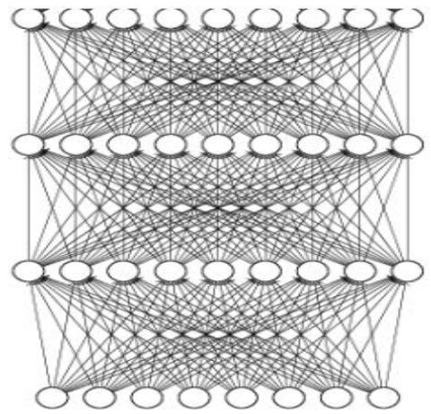


??


# 基于AC的RL

# 基于Actor-Critic的强化学习算法

• 基于AC算法的一般表达式是

$$
\nabla_ {\theta} J (\theta) \approx \frac {1}{N} \sum_ {i = 1} ^ {N} \left(\sum_ {t = 1} ^ {T} \nabla_ {\theta} \log \pi_ {\theta} (a _ {t} ^ {i} | s _ {t} ^ {i}) \Psi_ {t}\right)
$$

其中 $\boldsymbol { \psi } _ { t }$ 是值函数的某种表达式。我们列举一些可能的 $\boldsymbol { \psi } _ { t }$

$\psi _ { t } = V _ { t }$ ，用状态值函数更新策略梯度

$\psi _ { t } = Q _ { t }$ ，用状态动作值函数更新策略梯度

$\boldsymbol { \psi } _ { t } = \boldsymbol { A } _ { t }$ ，用动作优势函数更新策略梯度，即A2C算法

$\boldsymbol { \psi } _ { t } = \boldsymbol { T } \boldsymbol { D } _ { t }$ ，用TD Error更新策略梯度

$\boldsymbol { \psi } _ { t } = G _ { t } - V _ { t }$ ，用状态值函数作为基线更新策略梯度

# 基于AC的RL


方案一：实现两个神经网络分别对价值函数V෡??和策略????进行拟合：


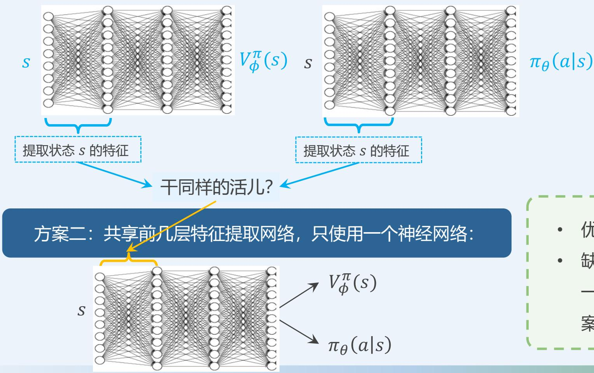


# 有两种神经网络架构方案

• 优点：简单且训练稳定

• 缺点：训练效率较低

点：减小了参数量，因此训练效率高

点：由于策略与值所需的状态特征有定差异，因此训练稳定性上要差于方

# 基于AC的RL

# 基于Actor-Critic的强化学习算法

利用单个样本进行更新：更新方差较大，训练稳定性差

解决方案：获得一个批次的数据后再进行更新

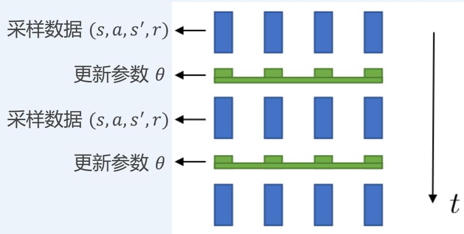


同步更新


# Algorithm 1.12 AC 算法

Input:迭代轮数T，学习率 $\alpha$ ，衰减因子 $\gamma$ ，最大交互回合数 $N$ ，最大时间步长 $T$ ，存储队列 $\boldsymbol { B }$

Output:最优策略 $\pi _ { * }$

1:随机初始化策略网络 $\pi _ { \theta }$ ，值网络 $\phi$

2:for 每个交互回合 $k = 0 , 1 , \cdots , N$ do

3: 重置环境并获取环境的初始状态 $s _ { 0 }$

4 for $t = 0 , 1 , \cdots , T$ do

5: 在状态 $s _ { t }$ ，通过策略网络 $\pi _ { \theta }$ 选择动作 $a _ { t }$

6: 在状态 $s _ { t }$ 执行当前动作 $a _ { t }$ ，得到新状态 $s _ { t + 1 }$ 和奖励 $r _ { t }$

7: 计算 $\log ( \pi _ { \theta } ( a _ { t } | s _ { t } ) )$

8: 将 $\log ( \pi _ { \theta } ( a _ { t } | s _ { t } ) )$ $s _ { t }$ $a _ { t }$ $r _ { t }$ $s _ { t + 1 }$ 存入存储队列 $\boldsymbol { B }$

9:  end for

10: 从存储队列 $_ B$ 取出交互回合 $k$ 的轨迹数据

11: 计算每个状态的 $\Psi _ { t }$

12: 利用策略更新公式和值函数更新公式分别更新 $\theta$ 和 $\phi$

13: 清空存储队列 $\boldsymbol { B }$

14: end for

# 在Gym环境下DQN的实现代码

# 智能体和环境交互

```python
def main(   ):  
    env = gym.make(args/env) 创建环境对象env  
    o_dim = envobservation_space.shape[0] 从环境对象中获取观测维度和动作维度  
    a_dim = env.action_space.n agent = DQN(env, o_dim, args.hidden, a_dim) 创建智能体对象agent  
for i Episode in range(args.n Episodes):  
    obs = env.reset() episode Reward = 0 done = False while not done: action = agentchoose_action(obs) next_obs, reward, done, info = env-step(action) agent.store_transition(obs, action, reward, next_obs, done) 交互数据存入buffer episode Reward += reward obs = next_obs if agent.buffer.len(   ) >= args_capacity: agentlearn(   ) DQN网络训练
```

# 在Gym环境下DQN的实现代码

class DQN:

|def __init__(self，env，input_size，hidden_size， output_size):

 self.env $=$  env

 self.eval_net $=$  QNet(input_size， hidden_size, output_size)

 self.target_net $=$  QNet(input_size， hidden_size， output_size)

 self.optim $=$  optim.Adam(self.eval_net.parameters()， lr=args .lr)

self.eps $=$  args.eps

self.buffer $=$  ReplayBuffer(args.capacity) 创建buffer

self.loss_fn $=$  nn .MSELoss ()

self.learn_step $\qquad = \ 0$

def choose_action(self，obs):

if np.random.uniform() $< =$ self.eps:action $=$  np.random.randint(0, self.env.action_space.n)

else:

action_value $=$  self.eval_net(obs)

action $=$  torch.max(action_value， dim=-1)[1].numpy()

return int(action)

def store_transition(self, *transition):

 self.buffer .push(*transition)

创建神经网络

利用?? − ????????????选择动作

# 在Gym环境下DQN的实现代码

# 从buffer中采样一个mini-batch 数据

# 计算TD Error，更新Q网络

```python
def learn(self):
    if self.eps > args.eps_min:
        self.eps *= args.eps Decay
    if selflearn_step % args.update_target == 0:
        self.target_net.load_state_dict(self.eval_net.state_dict())
        selfLearn_step += 1
    obs, actions, rewards, next_obs, dones = self.buffer.sample(args.batch_size)
    actions = torch.LongTensor(actions) # LongTensor to use gather latter
    dones = torch.IntTensor(dones)
    rewards = torchFloatTensor(rewards)
    q_eval = self.eval_net(obs).gather(-1, actions unsqueeze(-1)).squeeze(-1)
    q_next = self.target_net(next_obs).detach()
    q_target = rewards + args.gamma * (1 - done) * torch.max(q_next, dim=-1)[0]
    loss = self.loss_fn(q_eval, q_target)
    self/optim.zero_grad()
    loss_backward()
    self/optim.step()
```

# 在Gym环境下DQN的实现代码

```python
class ReplayBuffer: def __init__(self, capacity): self.buffer = [] self_capacity = capacity def len(self): return len(self.buffer) def push(self, *transition): if len(self.buffer) == selfcapacity: self.buffer.pop(0) self.buffer.append(transition) def sample(self, n): index = np.random.choice(len(self.buffer), n) batch = [self.buffer[i] for i in index] return zip(*batch) def clean(self): self.buffer.clear()
```

class QNet(nnModule): def __init__(self, input_size, hidden_size, output_size): super(QNet, self).__init__(self.fc1 = nn.Linear(input_size, hidden_size) self.fc2 = nn.Linear(hidden_size, output_size) def forward(self, x):  $\mathbf{x} =$  torch.Tensor(x)  $\mathbf{x} = \mathbf{F}$  .relu(self.fc1(x))  $\mathbf{x} =$  self.fc2(x) return x

# 多智能体强化学习

# 单智能体强化学习方法（Single-Agent Reinforcement Learning, SARL）：

只有一个智能体与环境交互，环境的状态转移和奖励完全由环境本身决定；

智能体的决策是独立的；

• 环境是“静态”的，智能体在学习过程中假设环境不会改变；

• 奖励完全由环境反馈给智能体，奖励函数通常是单一的且只考虑智能体的行为对环境的影响。

# 多智能体强化学习（Multi-Agent Reinforcement Learning, MARL）：

有多个智能体与环境同时交互；

• 智能体的决策是相互依赖的，每个智能体的动作不仅影响环境状态，还会影响其他智能体的状态和行为；

环境是“非平稳”的。因为每个智能体的行为都会影响到其他智能体的决策，智能体在学习过程中无法假设其他智能体的策略是固定的；

• 每个智能体可能有自己的奖励函数。在合作场景中，智能体的奖励函数可能是共享的；在竞争场景中，每个智能体的奖励通常是独立的。

# 多智能体强化学习

# 多智能体强化学习所面临的困境：

环境的非平稳性（Non-stationarity）：在多智能体环境中，由于每个智能体的行为都会影响环境状态，并且可能改变其他智能体的策略，因此整个系统是非平稳的。

部分可观测性（Partial Observability）：智能体无法完全观察到全局的环境状态，而只能获得自己局部的观察信息，限制了其决策能力。

维度灾难（Curse of dimensionality）：随着智能体的数量的增长，所有智能体的联合状态和联合动作空间呈指数级增长。

策略协同与通信（Strategy Coordination and Communication）：在合作任务中，智能体需要通过协同来共同优化整个团队的目标。在某些场景中，智能体可以通过直接的通信来交换信息或传递意图。

博弈与对抗（Game Theory and Adversarial Behavior）：在竞争性环境中，多个智能体之间的行为往往是对抗性的（如零和博弈），每个智能体都试图最大化自己的奖励，而不是共享奖励。

# 多智能体强化学习

# 多智能体强化学习算法分类：

独立学习（或者称行为分析）：在多智能体场景下，使用单智能体算法独立控制每个智能体。

通信机制：智能体与智能体在交互过程中可以传递信息。

协同学习：依据局部观测，利用一些协同机制实现智能体之间的协同。

智能体建模：推理其他智能体的策略模型。


(a) Analysis of emergent behaviors


(c) Learning cooperation


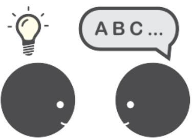


(b) Learning communication


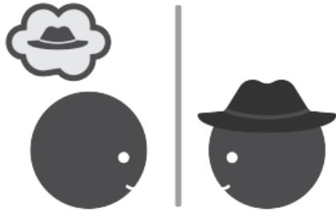


(d) Agents modeling agents


# 多智能体强化学习

# 重点介绍“合作型”的 MARL 算法

# 多智能体场景分类：

合作型场景：所有智能体合作完成某一任务，学习目标是最大化团队奖励。

竞争性场景：智能体之间争夺有限的资源或追求个体利益，学习目标是最大化个体奖励。

混合场景：部分智能体是协同关系，但与其他智能体是竞争关系。


合
作
型
场
景


竞
争
型
场
景


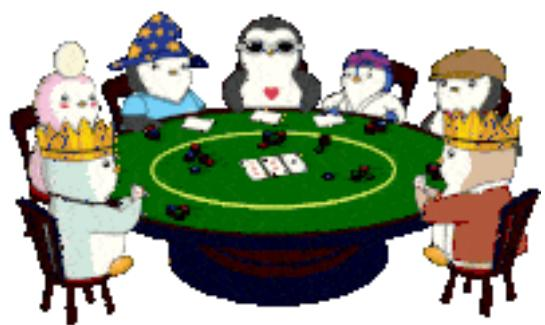


混
合
场
景


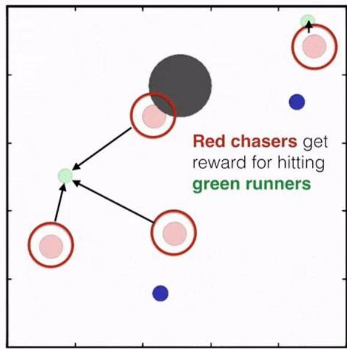


# MARL算法

基于策略的多智能体强化学习——MADDPG

# MADDPG（Multi-Agent Deep Deterministic Policy Gradient）利用中央式训练分布式执行（Centralized Training with Decentralized Execution，CTDE）框架解决多智能体环

境中的环境不稳定性以及智能体协同问题：

在训练阶段，MADDPG算法利用所有智能体的状态和动作信息进行值函数的全局优化。通过引入中心化的值函数，MADDPG能够有效地捕获智能体间的相互影响，缓解了环境的不稳定性问题。

在执行过程中，每个智能体基于自己的局部观测来进行决策。即使智能体只能访问到自己的局部信息，依据在训练阶段获得的全局信息，智能体依然能够采取协作策略。

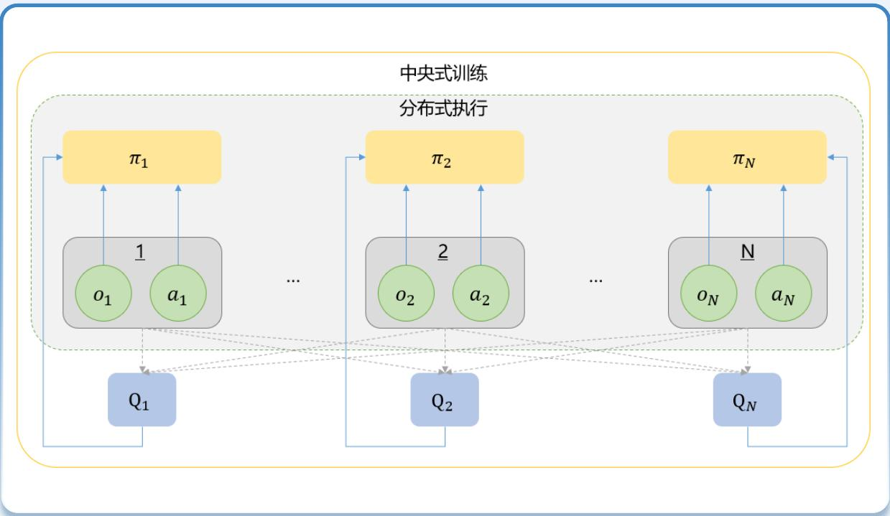


# MARL算法

# 基于值函数的多智能体强化学习——VDN

# MADDPG算法存在两个问题：

值函数学习困难：值函数所拟合的联合状态空间的维度随着智能体数量呈指数级增加。

信任分配问题：共享团队奖励导致智能体难以区分自身对团队的贡献，导致智能体无法有效地学习如何根据自己的局部信息做出有贡献的动作。

# VDN（Value Decomposition Networks）算法通过值分解的方式解决上述两问题。

• 全局的Q值函数是由所有智能体的局部Q值累加得到。

通过将全局 Q 函数分解为局部 Q 函数之和，VDN隐含地表示了每个智能体对团队目标的相对贡献，即每个智能体自身的Q值表示对团队的共享。

VDN仍是CTDE框架，在执行过程中，每个智能体依据自身的局部值函数进行决策，在训练过程中，利用全局值函数进行学习


Mixing Net 是一个线性求和函数


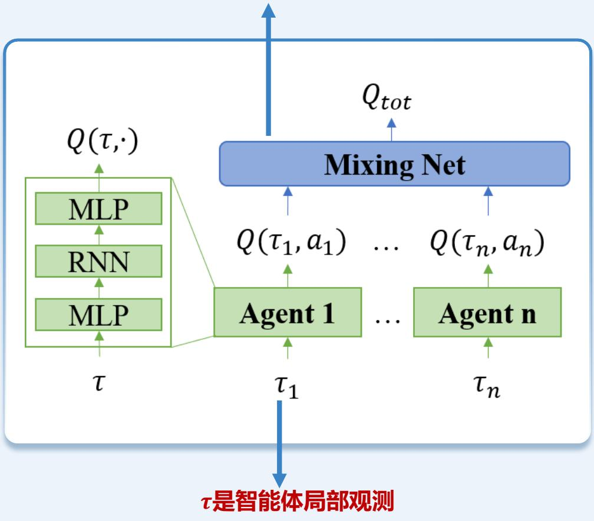


# 应用——机器人


# 应用——游戏


# 应用——无人机集群

Multi-agent Reinforcement LearningFormation Control

PurdueAIMSLabTianyu Zhou, Shaoshuai Mou


# AlphaGo

# Disclaimer

• What taught in this lecture is not exactly the same to the originalAlphaGo papers [1,2].

• There are simplifications here.

# Reference

1. Silver and others: Mastering the game of Go with deep neural networks and tree search. Nature, 2016.

2. Silver and others: Mastering the game of Go without human knowledge. Nature, 2017.

# Go Game

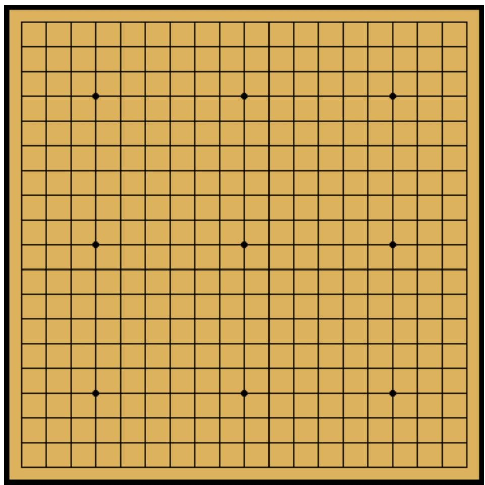


• The standard Go board has a 19×19 grid oflines, containing 361 points.

• State: arrangement of black, white, and space.

• State ?? can be a $1 9 \times 1 9 \times 2$ tensor of 0 or 1.

• (AlphaGo actually uses a 19×19×48 tensor tostore other information.)

• Action: place a stone on a vacant point.

• Action space: ?? ⊂ {1, 2, 3, ⋯ , 361 }.

• Go is very complex.

• Number of possible sequence of actions is 10170.

# AlphaGo

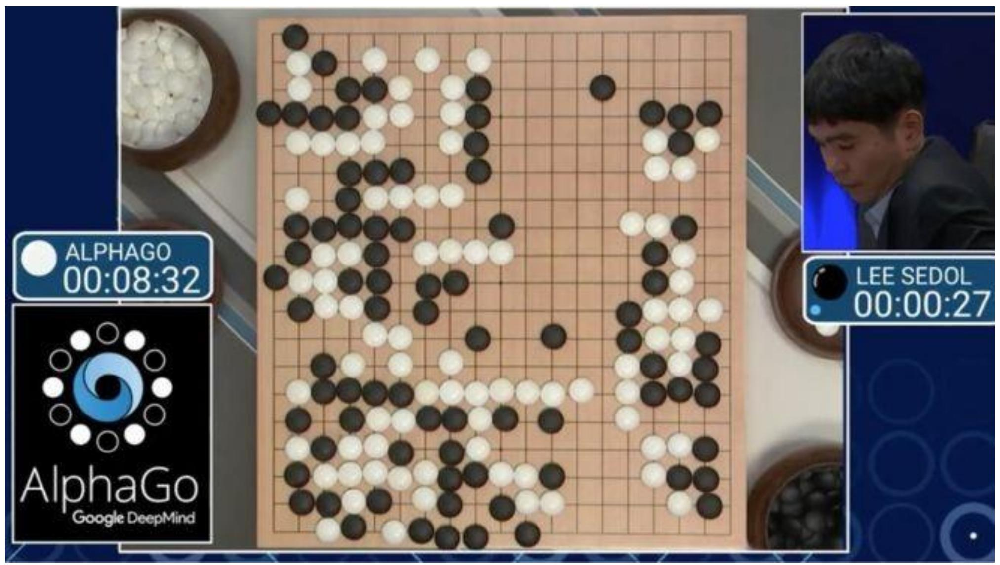


# High-Level Ideas

# Training and Execution

# Training in 3 steps:

1. Initialize policy network using behavior cloning.(Supervised learning from human experience.)

2. Train the policy network using policy gradient. (Two policynetworks play against each other.)

3. After training the policy network, use it to train a valuenetwork.

# Training and Execution

# Training in 3 steps:

1. Initialize policy network using behavior cloning.(Supervised learning from human experience.)

2. Train the policy network using policy gradient. (Two policynetworks play against each other.)

3. After training the policy network, use it to train a valuenetwork.

# Execution (actually play Go games):

• Do Monte Carlo Tree Search (MCTS) using the policy andvalue networks.

# Policy Network

# State (of AlphaGo Zero)

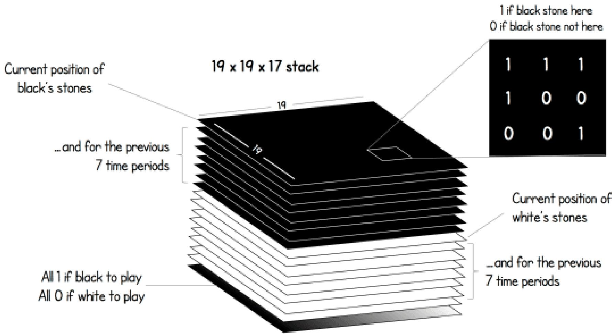


# Policy Network (of AlphaGo Zero)

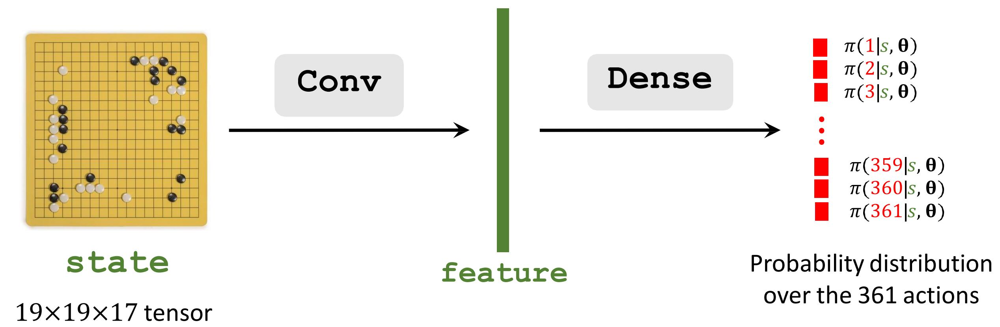


# Policy Network (of AlphaGo)

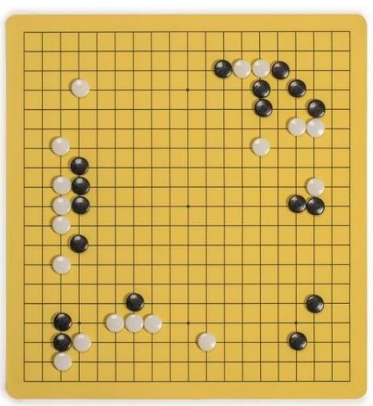


state


19×19×48 tensor

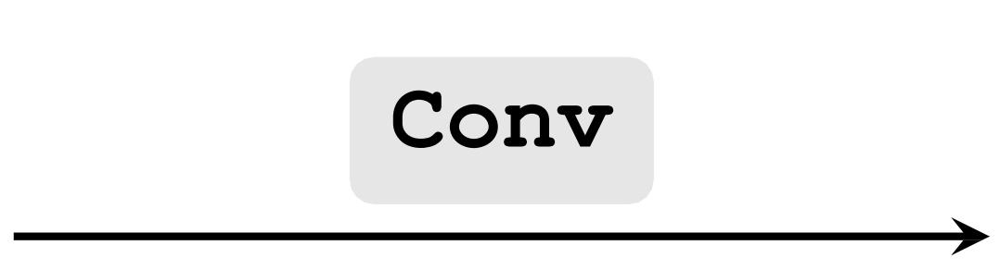


$\pi ( 1 | s , \mathbf { \boldsymbol { \theta } } )$

$\pi ( \mathbf { \partial } \left| s , \mathbf { \vec { \theta } } \right.$

$\pi ( \mathbf { \partial } \left| s , \mathbf { \vec { \theta } } \right.$

■ $\pi ( 3 5 9 | s , \mathbf { \{ \} } )$

$\pi ( \mathrm { ~ { ~ \bf ~ \sigma ~ } ~ } | s , \mathbf { \theta } )$

$\pi ( 3 6 1 | s , \mathbf { \boldsymbol { \Theta } } )$

Probability distributionover the 361 actions

# Initialize Policy Network by Behavior Cloning

# Learning from human’s record

• Initially, the network’s parameters arerandom.

• If two policy networks play against eachother, they would do random actions.

• It would take very long before they makereasonable actions.

# Learning from human’s record

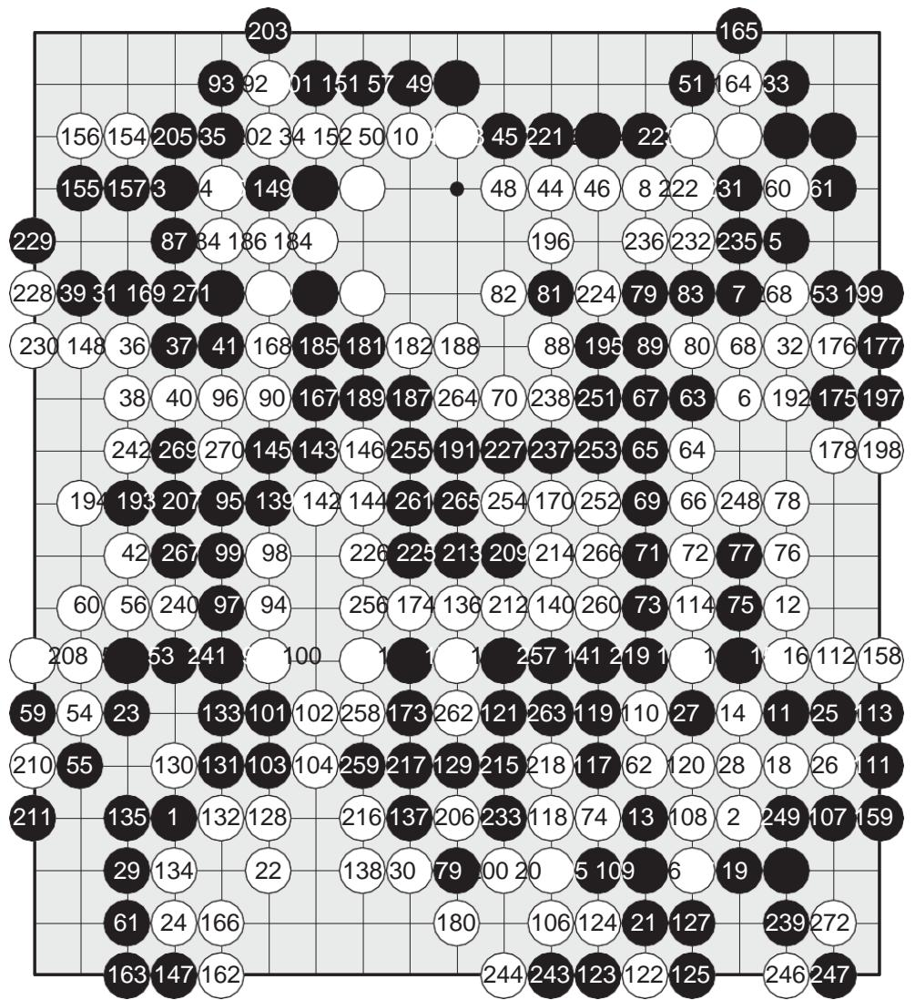


• Initially, the network’s parameters arerandom.

• Human’ sequences of actions have beenrecorded. (KGS dataset has 160K games’records form 2000.)

# Learning from human’s record

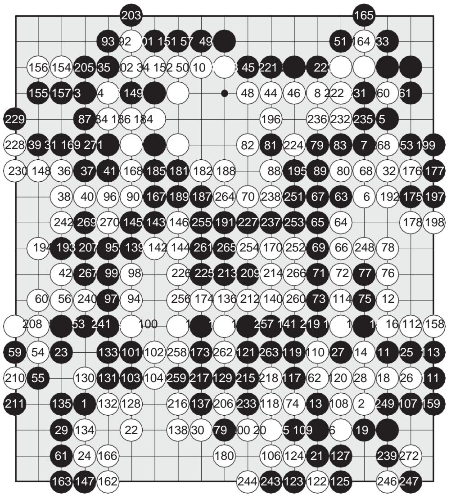


• Initially, the network’s parameters arerandom.

• Human’ sequences of actions have beenrecorded. (KGS dataset has 160K games’records.)

• Behavior cloning: Let the policy networkimitate human players.

• After behavior cloning, the policynetwork beats advanced amateur.

# Behavior Cloning

Behavior cloning is not reinforcement learning!

• Reinforcement learning: Supervision is from rewards givenby the environment.

Imitation learning 模仿学习: Supervision is from experts’actions.

• Agent does not see rewards.

• Agent simply imitates experts’ actions.

# Behavior Cloning

Behavior cloning is not reinforcement learning!

• Reinforcement learning: Supervision is from rewards givenby the environment.

Imitation learning: Supervision is from experts’ actions.

Behavior cloning is one of the imitation learning methods.

Behavior cloning is simply classification or regression.

# Behavior Cloning

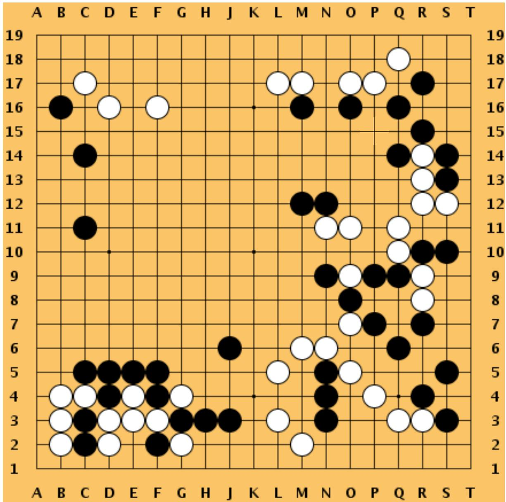


• Observe this state $S _ { \mathrm { t } }$ .

# Behavior Cloning

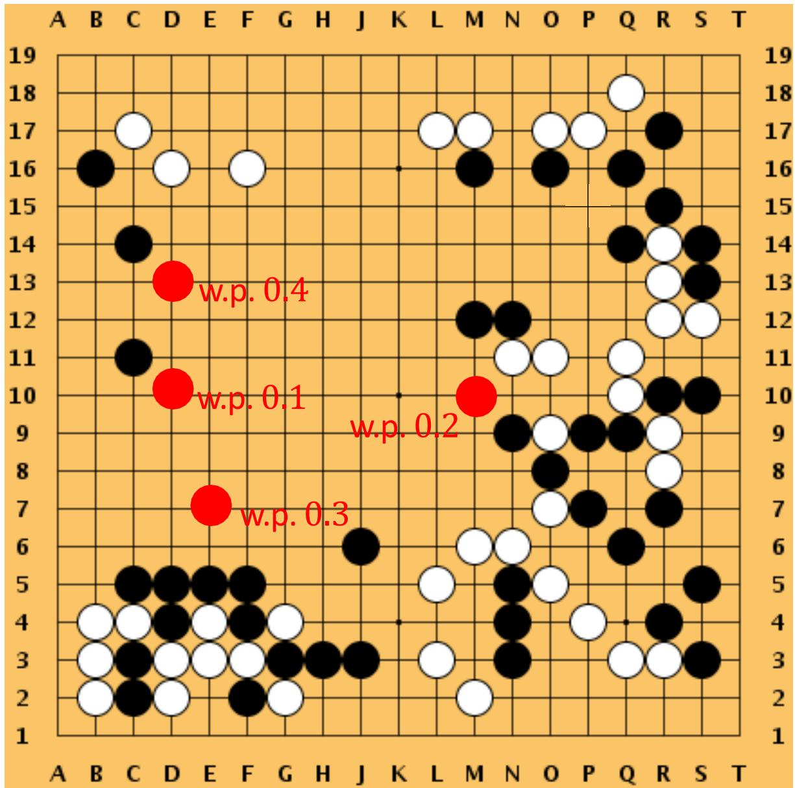


• Observe this state $S _ { \mathrm { t } }$ .

• Policy network makes a prediction:

$$
\mathbf {p} _ {\mathrm {t}} = [ \pi (1 | s _ {\mathrm {t}}, \boldsymbol {\theta}) \dots , \pi (3 6 1 | s _ {\mathrm {t}}, \boldsymbol {\theta}) ] \in (0, 1) ^ {3 6 1}.
$$

# Behavior Cloning


• Observe this state $S _ { \mathrm { t } }$ .

• Policy network makes a prediction:

$$
\mathbf {p} _ {\mathrm {t}} = [ \pi (1 | s _ {\mathrm {t}}, \boldsymbol {\theta}) \dots , \pi (3 6 1 | s _ {\mathrm {t}}, \boldsymbol {\theta}) ] \in (0, 1) ^ {3 6 1}.
$$

• The expert’s action is $\cdot$

• Let ??t ∈ 0,1 361be the one-hotencode of $\cdot$

# Behavior Cloning

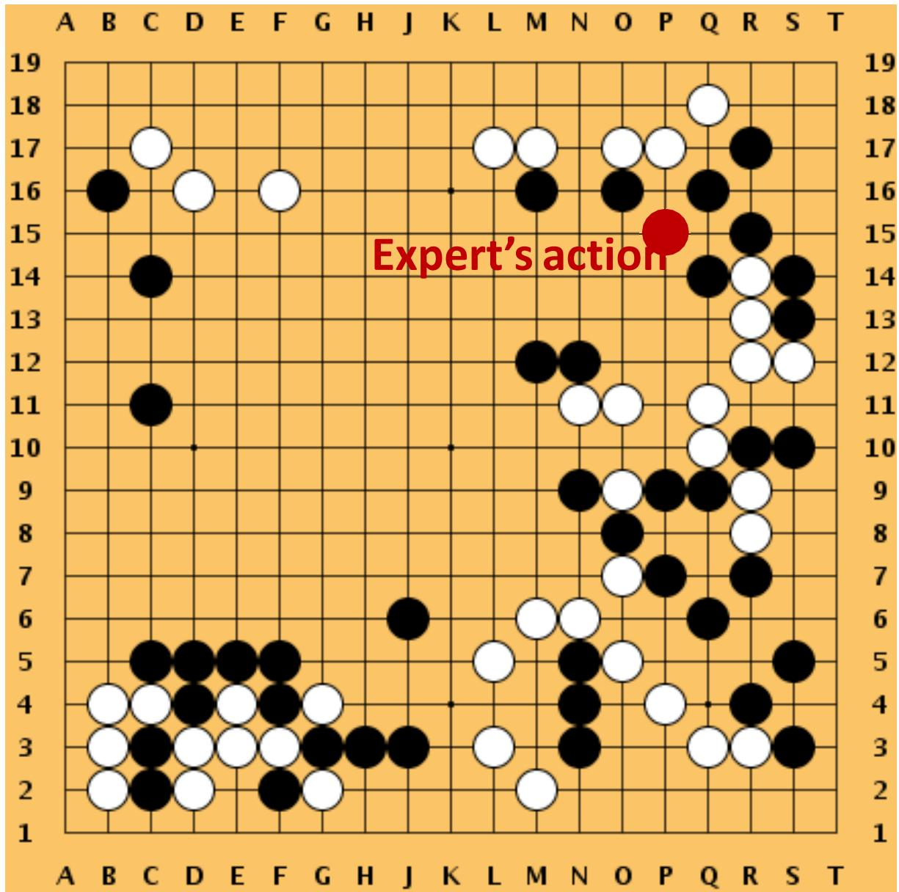


• Observe this state $S _ { \mathrm { t } }$ .

• Policy network makes a prediction:

$$
\mathbf {p} _ {\mathrm {t}} = [ \pi (1 | s _ {\mathrm {t}}, \boldsymbol {\theta}) \dots , \pi (3 6 1 | s _ {\mathrm {t}}, \boldsymbol {\theta}) ] \in (0, 1) ^ {3 6 1}.
$$

• The expert’s action is $a _ { \mathrm { \Delta t } } ^ { \star } { = } 2 8 1$ .

• Let ??t ∈ 0,1 <=0 be the one-hotencode of $a _ { \mathrm { t } } ^ { \star } = 2 8 1$ .

• Loss = CrossEntropy ??t, ??t .

• Use gradient descent to update policynetwork.

# After behavior cloning…

• Suppose the current sate ??thas appeared in training data.

• The policy network imitates expert’s action ??t. (Which is a good action!)

# After behavior cloning…

• Suppose the current sate ??thas appeared in training data.

• The policy network imitates expert’s action ??t. (Which is a good action!)

Question: Why bother doing RL after behavior cloning?

• What if the current state $S _ { \mathrm { t } }$ has not appeared in training data?

• Then the policy network’ action ??tcan be bad.

# After behavior cloning…

• Suppose the current sate ??t has appeared in training data.

• The policy network imitates expert’s action ??t. (Which is a good action!)

# Question: Why bother doing RL after behavior cloning?

• What if the current state $S _ { \mathrm { t } }$ has not appeared in training data?

• Then the policy network’ action ??tcan be bad.

• Number of possible states is too big.

• There is a big chance that $S _ { \mathrm { t } }$ has not appeared in training data.

# Behavior cloning + RL beats behavior cloning with 80% chance.

# Train Policy Network Using Policy Gradient

# Reinforcement learning of policy network

• Player’s parameters are the latest parameters of the policy network.

• Opponent’s parameters are randomly selected from previous iterations.

# Player

# (Agent)

policy network withlatest param

V.S.

# Opponent

# (Environment)

policy network withold param

# Reinforcement learning of policy network

Reinforcement learning is guided by rewards.

• Suppose a game ends at step ??.

• Rewards:

• $r _ { 1 } = r _ { 2 } { = } r _ { 3 } { = } \cdots = r _ { \mathrm { T } - 1 } = 0$ . (When the game has not ended.)

• $r _ { \mathrm { T } } { = } + 1$ (winner).

• $r _ { \mathrm { T } } { = } - 1$ (loser).

# Reinforcement learning of policy network

Reinforcement learning is guided by rewards.

• Suppose a game ends at step ??.

• Rewards:

• $r _ { 1 } = r _ { 2 } { = } r _ { 3 } { = } \cdots = r _ { \mathrm { T } { - } 1 } = 0$ . (When the game has not ended.)

• $r _ { \mathrm { T } } { = } + 1$ (winner).

• $r _ { \mathrm { T } } { = } - 1$ (loser).

• Recall that return is defined by $\begin{array} { r } { u _ { t } = \sum _ { i = t } ^ { T } r _ { i } } \end{array}$ . (No discount here.)

• Winner’s returns: $u _ { 1 } = u _ { 2 } = \cdots = u _ { \mathrm { T } } = \ + 1 \ / \qquad $

• Loser’s returns: $u _ { 1 } = u _ { 2 } = \cdots = u _ { \mathrm { T } } = \ - 1 .$

# Policy Gradient

Policy gradient: Derivative of state-value function ?? ??; ?? w.r.t. ??.

• Recall tha t ?? ????????(????|????,??)???? ∗ ????(????, ????) is approximate policy gradient.a0

# Policy Gradient

# Policy gradient: Derivative of state-value function ?? ??; ?? w.r.t. ??.

• Recall tha t ??????????(????|????,??)???? ∗ ????(????, ????) is approximate policy gradient. $\frac { \partial l o g \pi ( a _ { t } | s _ { t } , \pmb { \theta } ) } { \partial \pmb { \theta } } \ast Q _ { \pi } ( s _ { t } , a _ { t } )$

• By definition, the action value is $Q _ { \pi } ( s _ { t } , \mathrm { ~  ~ \lambda ~ } ) = \mathbb { E } ( U _ { t } | s _ { t } , \mathrm { ~  ~ \lambda ~ } ) .$ .

• Thus, we can replace $Q _ { \pi } ( s _ { t } , a _ { t } )$ by the observed return $u _ { t }$

• Approximate policy gradient: $\mathrm { ; } \frac { \partial \log \pi ( a _ { t } | \boldsymbol { s } _ { t } , \boldsymbol { \theta } ) } { \partial \boldsymbol { \theta } } \ast \boldsymbol { u } _ { t }$ ∗ ????

# Update policy network using policy gradient

# Recall…

# Algorithm

1. Observe the state $S _ { \mathrm { t } }$ .

2. Randomly sample action $\cdot$ according to $\pi ( \cdot \mid s _ { \mathrm { t } } ; \mathbf { \theta } _ { \mathrm { t } } )$

$$
\frac {\partial V (s ; \boldsymbol {\theta})}{\partial \boldsymbol {\theta}} = \mathbb {E} _ {A \sim \pi (\cdot | s; \boldsymbol {\theta})} \left[ \frac {\partial \log \pi (A | s , \boldsymbol {\theta})}{\partial \boldsymbol {\theta}} \cdot Q _ {\pi} (s, A) \right].
$$

# Algorithm

1. Observe the state $S _ { \mathrm { t } }$ .

2. Randomly sample action $a _ { \mathrm { t } }$ according to $\pi \left( \begin{array} { l } { } \end{array} \right| s _ { \mathrm { t } } ; \mathbf { \theta _ { \mathrm { t } } } )$

3. Compute $q _ { \mathrm { t } } \approx Q _ { \pi } \ ( s _ { \mathrm { t } } , \mathbf { \xi } )$ $( s _ { \mathrm { t } } , a _ { \mathrm { t } } )$ (some estimate).

4. Differentiate policy network: ${ \bf d } _ { \theta , t } = \frac { \partial \log \pi ( a _ { t } | s _ { t } , \mathbf { \theta } \mathbf { \theta } \mathbf { \theta } ) } { \partial \textbf { \theta } } \left| _ { \mathbf { \theta } = \mathbf { \theta } _ { t } } . \right.$ dθ.t 0=0t·

$$
\frac {\partial V (s ; \boldsymbol {\theta})}{\partial \boldsymbol {\theta}} = \mathbb {E} _ {A \sim \pi (\cdot | s; \boldsymbol {\theta})} \left[ \frac {\partial \log \pi (A | s , \boldsymbol {\theta})}{\partial \boldsymbol {\theta}} \cdot Q _ {\pi} (s, A) \right].
$$

# Algorithm

1. Observe the state $S _ { \mathrm { t } }$

2. Randomly sample action $a _ { \mathrm { t } }$ according to $\pi \left( \begin{array} { l } { } \end{array} \right| s _ { \mathrm { t } } ; \mathbf { \theta _ { \mathrm { t } } } )$

3. Compute $q _ { \mathrm { t } } \approx Q _ { \pi } \ ( s _ { \mathrm { t } } , \mathbf { \xi } )$ $( s _ { \mathrm { t } } , a _ { \mathrm { t } } )$ (some estimate).

4. Differentiate policy network: $\mathbf { d } _ { \theta , t } = \frac { \partial \log \pi ( \mathbf { \epsilon } \mid s _ { t } , \mathbf { \theta } ) } { \partial \mathbf { \theta } } \mid _ { \mathbf { \theta } = \mathbf { \theta } _ { t } } .$ de.t 0=0t'

5. (Approximate) policy gradient: $\mathbf { g } ( a _ { t } , \pmb { \theta } _ { t } ) = q _ { t } \cdot \mathbf { d } _ { \theta , t } .$

6. Update policy network: $\mathbf { \ o { \theta } } _ { t + 1 } = \mathbf { \ o { \theta } } _ { t } + \boldsymbol { \beta } \cdot \mathbf { g } ( \mathrm { ~  ~ \xi ~ } , \mathbf { \ o { \theta } } _ { t } ) .$

$$
\frac {\partial V (s ; \boldsymbol {\theta})}{\partial \boldsymbol {\theta}} = \mathbb {E} _ {A \sim \pi (\cdot | s; \boldsymbol {\theta})} \left[ \frac {\partial \log \pi (A | s , \boldsymbol {\theta})}{\partial \boldsymbol {\theta}} \cdot Q _ {\pi} (s, A) \right].
$$

# Algorithm

Compute qt ~Qπ (st, at) (some estimate). How? Compute ??t ≈ ??S ??t , ??t (some estimate). How?

1 Observe the state ??t .

Randomly sample action ??t according to ?? ( ⋅ |??t ;??t ).

Differentiate policy network:

5. (Approximate) policy gradient:

6 Update policy network:

Compute ??t ≈ ??S $( s _ { \mathrm { t } } , a _ { \mathrm { t } } )$ (some estimate). How?

# .Option 1: REINFORCE.

5. (Stochastic) policy gradient: ??o ?? ≈ ?? ⋅ ?? .• Play the game to the end and generate the trajectory:

$$
s _ {1}, a _ {1}, r _ {1}, s _ {2}, a _ {2}, r _ {2}, \dots , s _ {\mathrm {T}}, a _ {\mathrm {T}}, r _ {\mathrm {T}}.
$$

• Compute the discounted return $\begin{array} { r } { u _ { t } = \sum _ { k = t } ^ { T } \gamma ^ { k - t } r _ { k } } \end{array}$ , for all ??.

• Since $Q _ { \pi } ( s _ { t } , a _ { t } ) = \mathbb { E } [ U _ { t } ]$ , we can use $u _ { \mathrm { t } }$ to approximate $Q _ { \pi } ( s _ { t } , a _ { t } )$ .

• ➔ Use $q _ { \mathrm { t } } = u _ { \mathrm { t } }$

# Policy Gradient

# Policy gradient: Derivative of state-value function ?? ??; ?? w.r.t. ??.

• Recall tha t ??????????(????|????,??)???? ∗ ????(????, ????) is approximate policy gradient. $\frac { \partial l o g \pi ( a _ { t } | s _ { t } , \pmb { \theta } ) } { \partial \pmb { \theta } } \ast Q _ { \pi } ( s _ { t } , a _ { t } )$

• By definition, the action value is $Q _ { \pi } ( s _ { t } , \mathrm { ~  ~ \lambda ~ } ) = \mathbb { E } ( U _ { t } | s _ { t } , \mathrm { ~  ~ \lambda ~ } ) .$ .

• Thus, we can replace $Q _ { \pi } ( s _ { t } , \mathrm { ~  ~ \Gamma ~ } )$ by the observed return $u _ { t }$

• Approximate policy gradient: $\mathrm { ~ ; ~ } \frac { \partial \log \pi ( \mathrm { ~ \ j ~ } s _ { t } , \pmb { \theta } ) } { \partial \theta } \ast \boldsymbol { u } _ { t }$ ∗ ????

# Train policy network using policy gradient

# Repeat the followings:

• Two policy networks play a game to the end. (Player v.s. Opponent.)

• Get a trajectory: ??1, ??1, ??2, ??2, , ??T, ??T.

• After the game ends, update the player’s policy network.

• The player’s returns: $u _ { 1 } = u _ { 2 } = \cdots = u _ { \mathrm { T } }$ . (Either +1 or −1.)

• Sum of approximate policy gradients: $\begin{array} { r }  \mathbf { \langle g _ { \theta } = \sum _ { t = 1 } ^ { T } \frac { \partial \log \pi ( a _ { t } | s _ { t } , \theta ) } { \partial \theta } \ast u _ { t } } \end{array}$ ∗ ????

• Update policy network: $\theta  \theta + \beta \cdot \mathrm { g } _ { \theta }$

# Play Go using the policy network

• The policy network ?? has been learned.

• Observing the current state $S _ { \mathrm { t } }$ , randomly sample action

$$
a _ {t} \sim \pi (\cdot | s _ {t}, \boldsymbol {\theta}).
$$

# Play Go using the policy network

• The policy network ?? has been learned.

• Observing the current state $S _ { \mathrm { t } }$ , randomly sample action

$$
a _ {t} \sim \pi (\cdot | s _ {t}, \boldsymbol {\theta}).
$$

• The learned policy network ?? is strong, but not strong enough.

• A small mistake may change the game result.

⚫ 策略网络在大多数情况下表现非常好，但只要在某一步犯下一个错误就会导致全盘崩溃

⚫ 比策略网络更好、更稳定的是蒙特卡洛树搜索，将会同时用到价值网络和策略网络

# Train the Value Network

# State-Value Function

# Definition: State-value function.

• $V _ { \pi } ( s ) = \mathbb { E } [ U _ { \mathrm { t } } | S _ { \mathrm { t } } = s ] .$ , where $U _ { \mathrm { t } } { = } + 1$ (if win) and −1 (if lose) .

• The expectation is taken with respect to

• The future actions $A _ { \mathrm { t } } , A _ { \mathrm { t + 1 } } , \cdots , A _ { \mathrm { T } }$

• The future states $S _ { \mathrm { t } + 1 } , S _ { \mathrm { t } + 2 } , \cdots , S _ { \mathrm { T } }$

# State-Value Function

# Definition: State-value function.

• $V _ { \pi } ( s ) = \mathbb { E } \left[ U _ { \mathrm { t } } | S _ { \mathrm { t } } = s \right]$ , where $U _ { \mathrm { t } } { = } + 1$ (if win) and −1 (if lose) .

• The expectation is taken with respect to

• The future actions $, \qquad , \cdots ,$

• The future states $S _ { \mathrm { t } + 1 } , S _ { \mathrm { t } + 2 } , \cdots , S _ { \mathrm { T } }$

Approximate state-value function using a value network.

• Use a neural network $v ( s ; \mathbf { w } )$ to approximate $V _ { \pi } ( s )$ .

• It evaluate how good the current situation ?? is.

# Policy Value Networks (AlphaGo Zero)

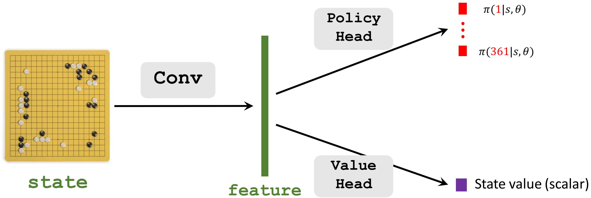


19×19×17 tensor

# Train the value network

After finishing training the policy network, train the value network.

Not Actor-Critic!

# Train the value network

After finishing training the policy network, train the value network.

Repeat the followings:

1. Play a game to the end.

• If win, let $u _ { 1 } = u _ { 2 } = \cdots = u _ { \mathrm { T } } = + 1 .$

• If lose, let $u _ { 1 } = u _ { 2 } = \cdots = u _ { \mathrm { T } } = - 1 .$

2. Loss: $\begin{array} { r } { L = \sum _ { t = 1 } ^ { T } \frac { 1 } { 2 } [ v ( s _ { t } ; w ) - u _ { t } ] ^ { 2 } } \end{array}$

3. Update: $w  w - \alpha * \frac { \partial L } { \partial w }$

Training Phase

behavior cloning Train Policy Network Train the value network（Player vs Opponent）

# Monte Carlo Tree Search

# How do human play Go?

Players must look ahead two or more steps.

• Suppose I choose action ??t.

• What will be my opponent’s action? (His action leads to state ??t+1.)

• What will I be my action $a _ { \mathrm { t } + 1 }$ upon observing $S _ { \mathrm { t } + 1 }$ ?

• What will be my opponent’s action? (His action leads to state ??t+2.)

• What will I be my action $\cdot$ upon observing $S _ { \mathrm { t } + 3 }$ ?

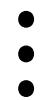


• If you can exhaustively foresee all the possibilities, you will win.

• Strange: I went forward in time... to view alternate futures. To see all the possible outcomes of the coming conflict.

• Quill: How many did you see?

• Strange: Fourteen million six hundred and five.


• Stark: How many did we win?

• Strange: … One.

# Select actions by look-ahead search

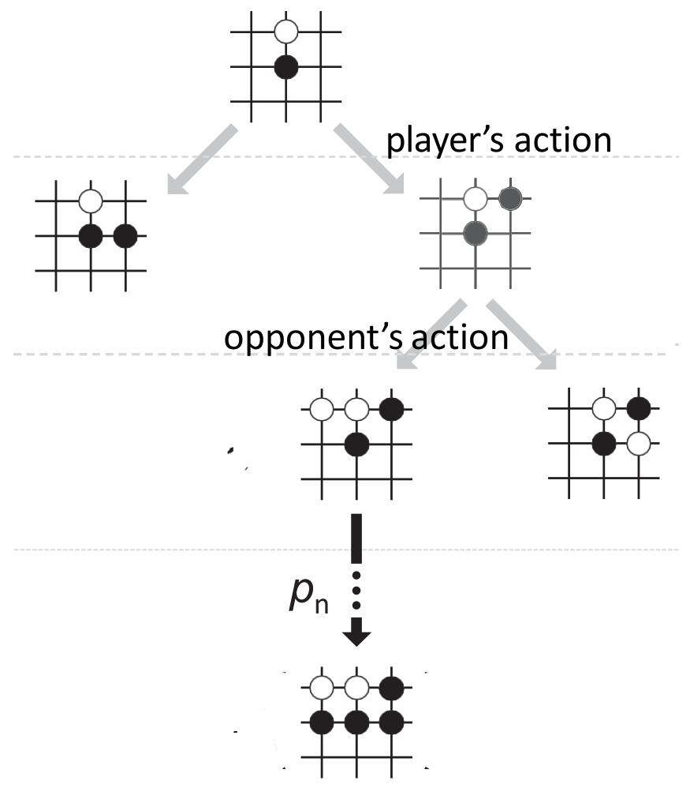


# Main idea

• Randomly select an action ??.

• Look ahead and see whether ?? leads to win orlose.

• Repeat this procedure many times.

• Choose the action ?? that has the highest score.

# Monte Carlo Tree Search (MCTS)

Every simulation of Monte Carlo Tree Search (MCTS) has 4 steps:

1. Selection: The player makes an action ??. (Imaginary action; notactual move.)

2. Expansion: The opponent makes an action; the state updates. (Alsoimaginary action; made by the policy network.)

3. Evaluation: Evaluate the state-value and get score ??. Play the gameto the end to receive reward ??. Assign score ??+?? to action ??.2

4. Backup: Use the score ??+?? to update action-values.2

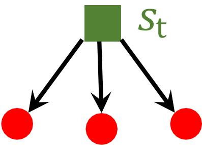


valid actions

# Step 1: Selection

Question: Observing ??t, which action shall we explore?

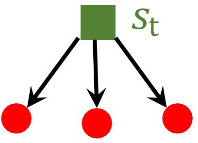


valid actions


$Q ( \mathbf \xi )$ is initialized as 0

# Step 1: Selection

Question: Observing ??t, which action shall we explore?

First, for all the valid actions ??, calculate the score:

$$
s c o r e (a) = Q (a) + \eta * \frac {\pi (a | s _ {t} ; \theta)}{1 + N (a)}
$$

• $Q ( \mathbf \xi )$ : Action-value computed by MCTS. (To be defined.)

• ${ \pi } ( a \mid s _ { \mathrm { t } } { \mathbf { \sigma } } \mathbf { \cdot } \mathbf { \vec { 0 } } ) ;$ The learned policy network.

• $N ( \quad )$ : Given $s _ { \mathrm { t } }$ how many times we have selected ?? so far.

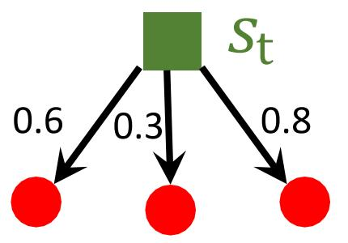


# Step 1: Selection

Question: Observing ??t , which action shall we explore?

First, for all the valid actions ??, calculate the score:

$$
s c o r e (a) = Q (a) + \eta * \frac {\pi (a | S _ {t} ; \theta)}{1 + N (a)}
$$

• $Q ( \mathbf \xi )$ : Action-value computed by MCTS. (To be defined.)

• $\pi ( a \mid s _ { \mathrm { t } } ; \mathbf { \vec { 0 } } )$ : The learned policy network.

• $N ( a )$ : Given $S _ { \mathrm { t } }$ , how many times we have selected ?? so far.

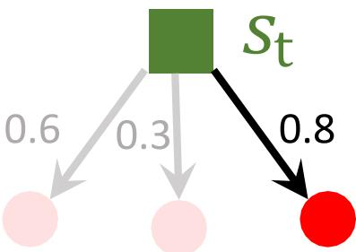


# Step 1: Selection

Question: Observing ??t , which action shall we explore?

First, for all the valid actions ??, calculate the score:

$$
s c o r e (a) = Q (a) + \eta * \frac {\pi (a | s _ {t} ; \theta)}{1 + N (a)}
$$

• $Q ( a )$ : Action-value computed by MCTS. (To be defined.)

• $\pi ( \mathrm {  ~ \Gamma ~ } | s _ { \mathrm { t } } ; { \bf { \Theta } } \mathbf { \Theta } )$ : The learned policy network.

• $N ( a )$ : Given $S _ { \mathrm { t } }$ , how many times we have selected ?? so far.

Second, the action with the biggest score ?? is selected.

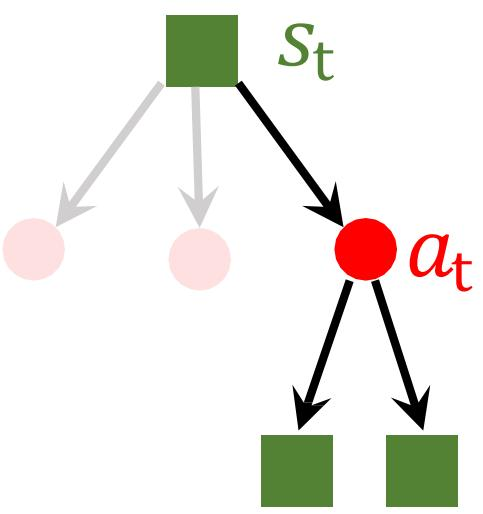


# Step 2: Expansion

Question: What will be the opponent's action?

• Given ??t , the opponent’s action $a _ { t } ^ { \prime }$ will lead to thenew state $s _ { \mathrm { t } + 1 }$ .

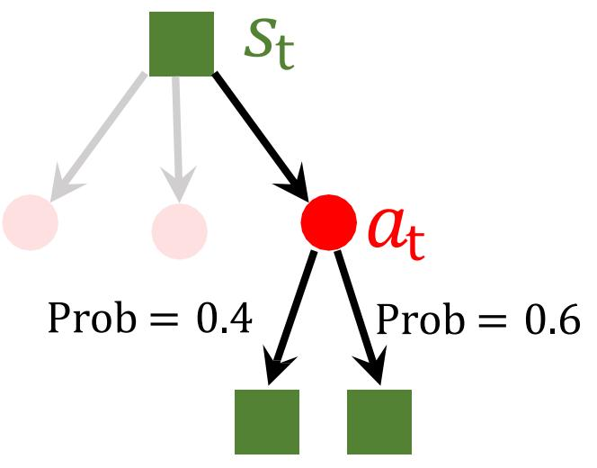


# Step 2: Expansion

# Question: What will be the opponent's action?

• Given $a _ { t }$ , the opponent’s action $a _ { t } ^ { \prime }$ will lead to thenew state $S _ { \mathrm { t } + 1 }$ .

• The opponent’s action is randomly sampled from

$$
a _ {t} ^ {\prime} \sim \pi (* | s _ {t} ^ {\prime}; \theta)
$$

Here, is the state observed by the opponent.

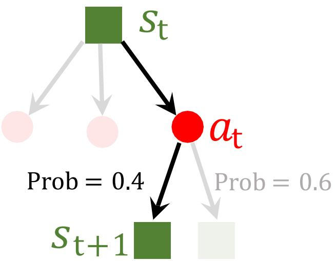


# Step 2: Expansion

# Question: What will be the opponent's action?

• Given $\cdot$ , the opponent’s action $\cdot$ will lead to thenew state $S _ { \mathrm { t } + 1 }$ .

• The opponent’s action is randomly sampled from

$$
a _ {t} ^ {\prime} \sim \pi (* | s _ {t} ^ {\prime}; \theta)
$$

Here, is the state observed by the opponent.

• The state-transition probability $p \left( s _ { \mathrm { t } + 1 } \vert s _ { \mathrm { t } } , a _ { \mathrm { t } } \right)$ is unknown.

• Use the policy function ?? as the state-transition function $p$


# Step 3: Evaluation

Run a rollout to the end of the game (step ??).

• Player’s action: ????∼ ??(∗ |????; ??)

• Opponent’s action: $\sim \pi ( * \mid s _ { k } ^ { \prime } ; \theta )$

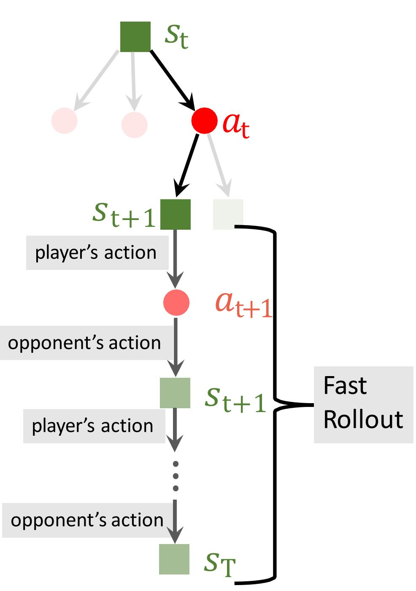


# Step 3: Evaluation

Run a rollout to the end of the game (step ??).

• Player’s action: $a _ { \mathrm { k } } \sim \pi ( { \bf \Psi } ^ { * } \mid s _ { \mathrm { k } } ; { \bf \Theta } { \bf \Theta } ) .$

• Opponent’s action: $\mathbf { \Omega } \sim \pi ( * \mid s _ { k } ^ { \prime } ; \theta )$

• Receive reward $r _ { \mathrm { T } }$ at the end.

• Win: $r _ { \mathrm { T } } = + 1$

• Lose: $r _ { \mathrm { T } } = - 1$ .

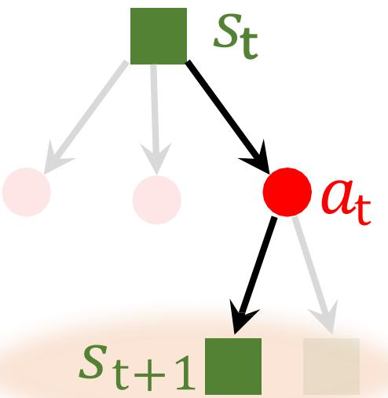


# Step 3: Evaluation

Run a rollout to the end of the game (step ??).

• Player’s action: $\sim \pi \left( \mathrm {  ~ \sigma ~ } | s _ { \mathrm { k } } ; \Theta \right) .$

• Opponent’s action: $\mathbf { \Omega } \sim \pi ( * \mid s _ { k } ^ { \prime } ; \theta )$

• Receive reward $r _ { \mathrm { T } }$ at the end.

• Win: $r _ { \mathrm { T } } = + 1$

• Lose: $r _ { \mathrm { T } } = - 1$ .

Evaluate the state $S _ { \mathrm { t } + 1 }$

• $v ( s _ { \mathrm { t } + 1 } ; \mathbf { w } )$ : output of the value network.

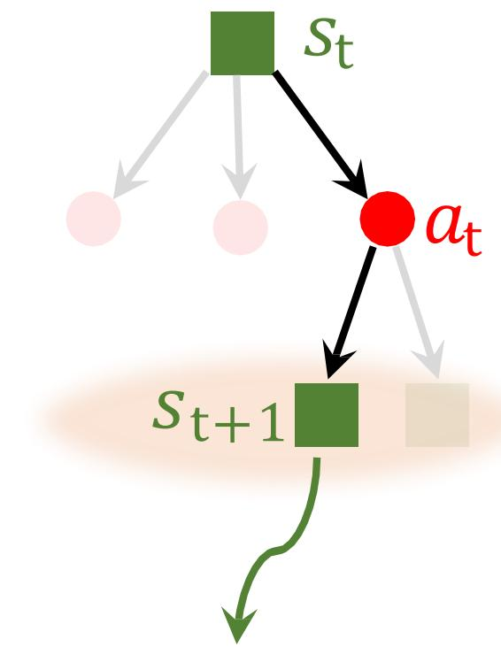


Record $V ( s _ { \mathrm { t } + 1 } )$

$$
V (s _ {t + 1}) = \frac {1}{2} v (s _ {t + 1}; w) + \frac {1}{2} r _ {T}
$$

# Step 3: Evaluation

Run a rollout to the end of the game (step ??).

• Player’s action: $\sim \pi \left( \mathrm {  ~ \sigma ~ } | s _ { \mathrm { k } } ; \Theta \right) .$

• Opponent’s action: $a _ { k } ^ { \prime } \sim \pi ( * | s _ { k } ^ { \prime } ; \theta )$

• Receive reward $r _ { \mathrm { T } }$ at the end.

• Win: $r _ { \mathrm { T } } = + 1$

• Lose: $r _ { \mathrm { T } } = - 1$ .

Evaluate the state $S _ { \mathrm { t } + 1 }$

• $v ( s _ { \mathrm { t } + 1 } ; \mathbf { w } )$ : output of the value network.

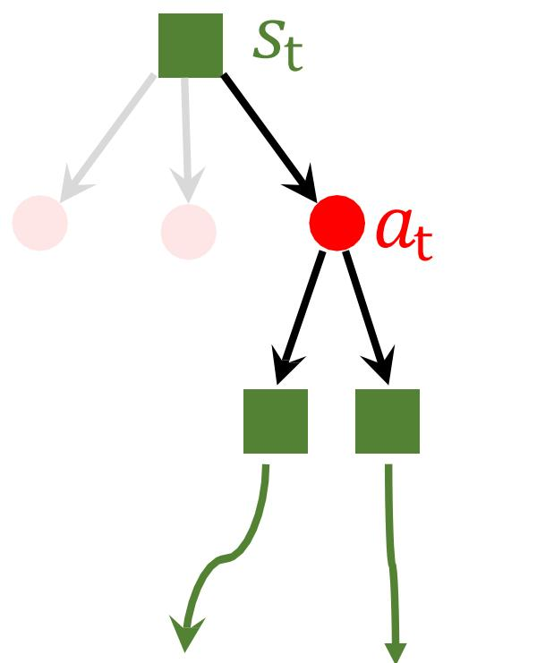


Records:

• ??1(1),

• ??2(1),

• ??3(1),

• ??4(1)

Records:

• ??1(2),

• ??2(2),

• ??3(2),

• ??4(2)

# Step 4: Backup

• MCTS repeats such a simulation many times.

• Each child of ??t has multiple recorded ?? $\left( { { S _ { \mathrm { { t } + 1 } } } } \right)$ .

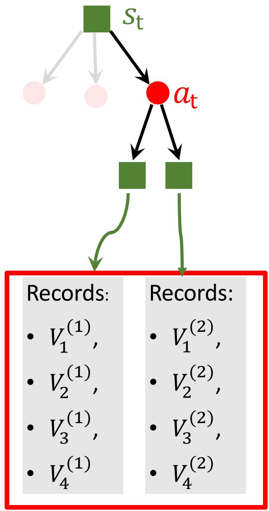


# Step 4: Backup

• MCTS repeats such a simulation many times.

• Each child of ??t has multiple recorded ?? $\left( S _ { \mathrm { t + 1 } } \right)$ .

• Update action-value:

$$
Q \left(a _ {\mathrm {t}}\right) = \mathrm {m e a n} (\mathrm {t h e r e c o r d e d V ^ {\prime} s}).
$$

• The ?? values will be used in Step 1 (selection).

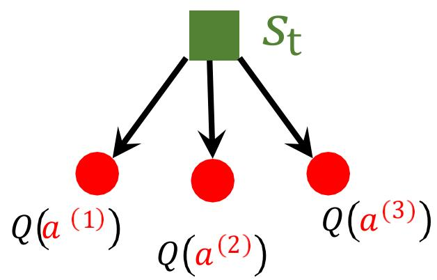


# Step 4: Backup

• MCTS repeats such a simulation many times.

• Each child of ??t has multiple recorded ?? $\left( S _ { \mathrm { t } + 1 } \right)$ .

• Update action-value:

$$
Q \left(a _ {\mathrm {t}}\right) = \mathrm {m e a n} (\mathrm {t h e r e c o r d e d V ^ {\prime} s}).
$$

• The ?? values will be used in Step 1 (selection).

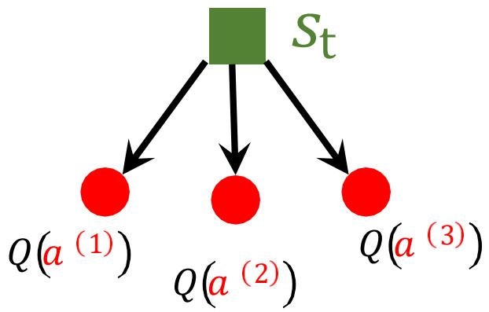


# Revisit Step 1 Selection

First, for all the valid actions ??, calculate the score:

$$
s c o r e (a) = Q (a) + \eta * \frac {\pi (a | s _ {t} ; \theta)}{1 + N (a)}
$$

Second, the action with the biggest score ?? is selected.


# Decision Making after MCTS

• $N ( \mathbf { \epsilon } )$ : How many times ?? has been selected so far.

• After MCTS, the player makes actual decision:

$$
a _ {t} = \underset {a} {\operatorname {a r g m a x}} N (a)
$$

# MCTS: Summary

• MCTS has 4 steps: selection, expansion, evaluation, and backup.

• To perform one action, AlphaGo repeats the 4 steps for manytimes to calculate $Q ( a )$ and $N ( \mathbf { \epsilon } )$ (for every action ??.)

• AlphaGo executes the action ?? with the highest $N ( a )$ value.

• To perform the next action, AlphaGo do MCTS all over again.(Initialize $Q ( a )$ and $N ( a )$ to zeros.)

# Summary

# Training and Execution

# Training in 3 steps:

1. Train a policy network using behavior cloning.（Classification）

2. Train the policy network using policy gradient algorithm. （RL）

3. Train a value network. （Regression）

# Training and Execution

# Training in 3 steps:

1. Train a policy network using behavior cloning.

2. Train the policy network using policy gradient algorithm.

3. Train a value network.

# Execution (actually play Go games):

• Select the “best” action by Monte Carlo Tree Search.

• To perform one action, AlphaGo repeats simulations manytimes.

# AlphaGo Zero

# AlphaGo Zero v.s. AlphaGo

• AlphaGo Zero is stronger than AlphaGo. (100-0 against AlphaGo.)

• Differences:

• AlphaGo Zero does not use human experience. (No behavior cloning.)

• MCTS is used to train the policy network. (MCTS or Expert as supervision)

# Is behavior cloning useless?

• AlphaGo Zero does not use human experience. (No behavior cloning.)

• For the Go game, human experience is harmful.

• In general, is behavior cloning useless?

• What if a surgery robot (randomly initialized) is learned purely byperforming surgery? (Human experience is not used.)

# Training of policy network

AlphaGo Zero uses MCTS in training. (AlphaGo does not.)

1. Observe state $S _ { \mathrm { t } }$ .

2. Predictions made by policy network:

$$
\mathbf {p} = [ \pi (a = 1 | s _ {\mathrm {t}}; \boldsymbol {\theta}), \dots , \pi (a = 3 6 1 | s _ {\mathrm {t}}; \boldsymbol {\theta}) ] \in \mathbb {R} ^ {3 6 1}.
$$

# Training of policy network

AlphaGo Zero uses MCTS in training. (AlphaGo does not.)

1. Observe state $S _ { \mathrm { t } }$ .

2. Predictions made by policy network:

$$
\mathbf {p} = [ \pi (a = 1 | s _ {\mathrm {t}}; \boldsymbol {\theta}), \dots , \pi (a = 3 6 1 | s _ {\mathrm {t}}; \boldsymbol {\theta}) ] \in \mathbb {R} ^ {3 6 1}.
$$

3. Predictions made by MCTS:

$$
\mathbf {n} = \mathrm {n o r m a l i z e} [ N (a = 1), N (a = 2), \dots , N (a = 3 6 1) ] \in \mathbb {R} ^ {3 6 1}.
$$

4. Loss: ?? = CrossEntropy ??, ?? .

5. Use ???? to update ??. ????

# Reference

• AlphaGo:

• Silver and others: Mastering the game of Go with deep neural networks andtree search. Nature, 2016.

• AlphaGo Zero:

• Silver and others: Mastering the game of Go without human knowledge.Nature, 2017.

# 本节小结

# 单智能体RL

基于值的RL：DQN及其改进：Double DQN、Dueling DQN、Rainbow DQN

基于策略的RL：REINFORCE算法

基于AC的RL：AC、A2C

$$
\widehat {\mathsf {Q}} ^ {\pi} (s _ {t ^ {\prime}} ^ {i}, a _ {t ^ {\prime}} ^ {i}) = \sum_ {t ^ {\prime} = t} ^ {T} r (s _ {t ^ {\prime}} ^ {i}, a _ {t ^ {\prime}} ^ {i})
$$

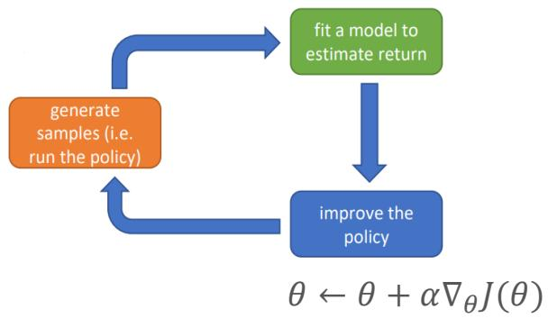


# 多智能体RL

多智能体定义

多智能体RL困境

多智能体RL算法分类

多智能体场景分类

多智能体RL应用


(a) Analysis of emergent behaviors


(c) Learning cooperation


(b)Learning communication


(d) Agents modeling agents


# 谢谢大家！