# 支持向量机

# Support Vector Machine

授课对象：计算机科学与技术专业 二年级

课程名称：人工智能（专业必修）

课程学分：3学分

# 回顾

神经网络发展历程：曲折荡漾，中间经历了数次大起大落

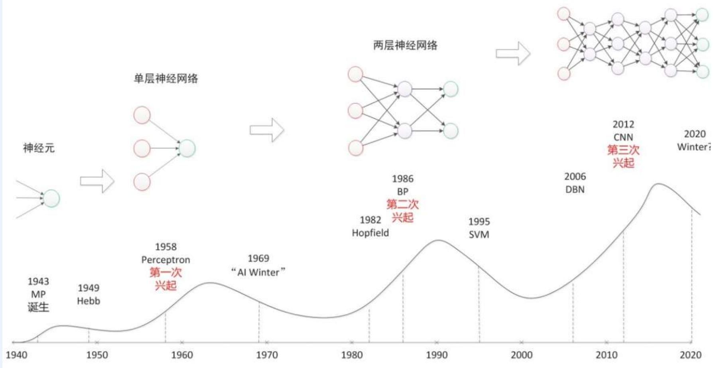

# 分类

桌子上放了两种颜色的球，用一根棍分开它们要求：即便再放更多球之后，仍然能将它们分开

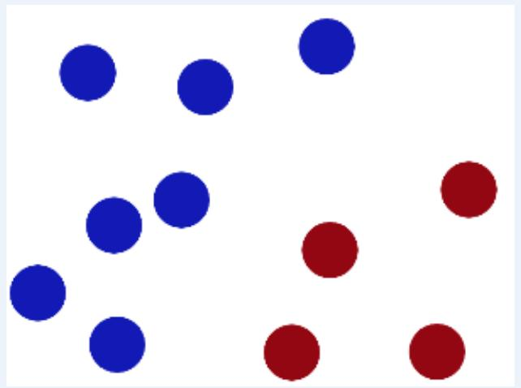

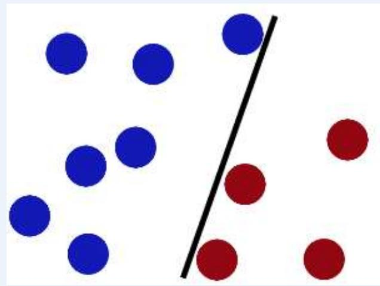

# 分类

在桌上放了更多的球，让一个球站错了阵营只是稍微调整一下棍子

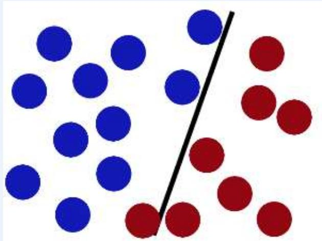

# SVM

SVM就是试图把棍放在最佳位置，好让在棍的两边有尽可能大的间隙

# SVM

新的挑战：这次的球更乱了！

遇到棘手的情况（非线性分类），像武侠片中大侠一样，桌子一拍，球飞到空中。然后使用trick绝招（SVM工具箱）抓起一张纸，飞到

了两种球的中间

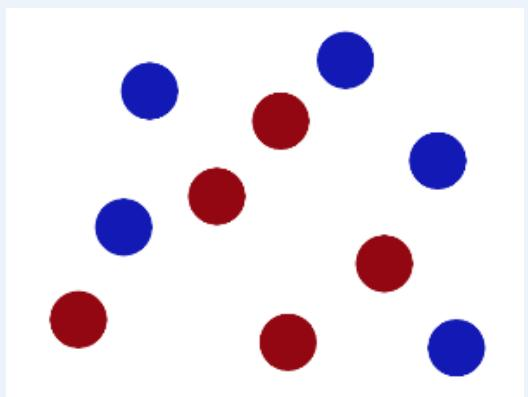

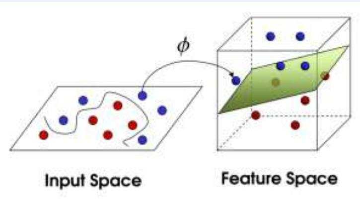

# SVM

球叫做 「data」（数据源）

棍子叫做 「classifier」（分类器）

最大间隙trick 叫做「optimization」（最优化）

拍桌子叫做「kernelling」（建立核函数）

那张纸叫做「hyperplane」（超平面）

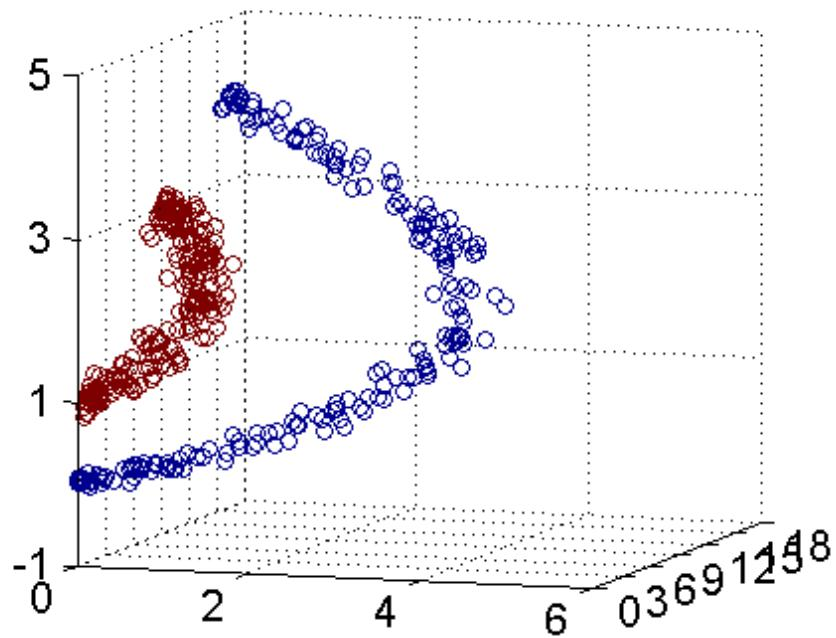

# SVM

# vapnik

<table><tr><td>TITLE</td><td>CITED BY</td><td>YEAR</td></tr><tr><td>The Nature of Statistical Learning Theory</td><td>74490*</td><td>1995</td></tr><tr><td>V Vapnik</td><td></td><td></td></tr><tr><td>Data mining and knowledge discovery.</td><td></td><td></td></tr></table>

<table><tr><td>Support-vector networks</td><td>66895</td><td>1995</td></tr><tr><td>C. Cortes, V. Vapnik</td><td></td><td></td></tr><tr><td>Machine learning 20, 273-297</td><td></td><td></td></tr></table>

<table><tr><td>Statistical learning theory</td><td>42946</td><td>1998</td></tr><tr><td>VN Vapnik, V Vapnik</td><td></td><td></td></tr><tr><td>witty 1 (1735), 1780</td><td></td><td></td></tr></table>

<table><tr><td>A training algorithm for optimal margin classifiers</td><td>17239</td><td>1992</td></tr><tr><td>BE Boser, IM Guyon, VN Vapnik</td><td></td><td></td></tr><tr><td>Proceedings of the fifth annual workshop on Computational learning theory</td><td></td><td></td></tr></table>

<table><tr><td>Backpropagation applied to handwritten zip code recognition</td><td>16525</td><td>1989</td></tr><tr><td>Y LeCun, B Boser, JS Denker, D Henderson, RE Howard, W Hubbard, ...</td><td></td><td></td></tr><tr><td>Neural computation 1 (4), 541-551</td><td></td><td></td></tr></table>

<table><tr><td>Gene selection for cancer classification using support vector machines</td><td>11692</td><td>2002</td></tr><tr><td>I Guyon, J Weston, S Bamhill, V Vapnik</td><td></td><td></td></tr><tr><td>Machine learning 46, 389-422</td><td></td><td></td></tr></table>

<table><tr><td colspan="2">Cited by</td><td colspan="2">VIEW ALL</td></tr><tr><td></td><td>All</td><td colspan="2">Since 2019</td></tr><tr><td>Citations</td><td>311003</td><td colspan="2">106174</td></tr><tr><td>h-index</td><td>103</td><td colspan="2">69</td></tr><tr><td>i10-index</td><td>281</td><td colspan="2">186</td></tr></table>

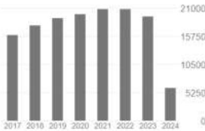

<table><tr><td>Public access</td><td>VIEW ALL</td></tr><tr><td>5 articles</td><td>26 articles</td></tr><tr><td>not available</td><td>available</td></tr><tr><td colspan="2">Based on funding mandates</td></tr></table>

Vladimir Vapnik：he has an h-index of 103 and, overall, hispublications have been cited more than 310,000 times.

# 什么是SVM

➢ 全名：Support Vector Machine（支持向量机）

➢ 支持向量：支撑平面上把两类类别划分开来的超平面的向量点

机：一个算法

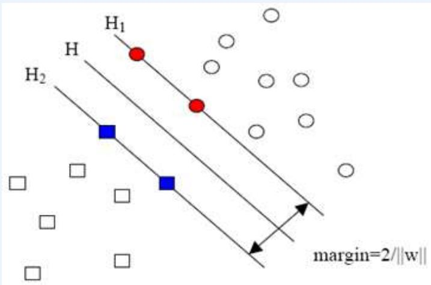

基于统计学习理论的一种机器学习方法。简单的说，就是将数据单元表示在多维空间中，然后对这个空间做划分的算法。

# 什么是SVM

SVM在解决小样本、非线性、及高维模式识别中有很多优势

– Vapnik:《Statistical Learning Theory》

SVM是建立在统计学习理论的VC维和结构风险最小原理基础上，根据有限的样本信息在模型的复杂性及学习能力之间寻求折衷，以获得最好的泛化能力

– 风险：近似模型与问题真实解之间的误差

# VC维，结构风险

VC维：对函数类的一种度量，可以简单的理解为问题的复杂程度，VC维越高，一个问题就越复杂

VC=Vapnik–Chervonenkis dimension

An Intuition using poly data fitting:

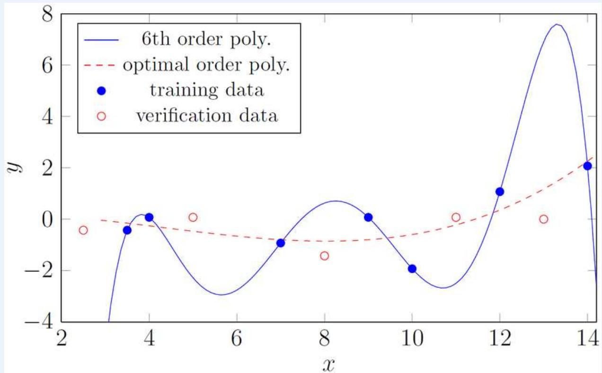

# VC维，结构风险

# 结构风险=经验风险+置信风险

经验风险 $R _ { e m p } ( w )$ ：分类器在training data上的分类的结果与真实结果之间的差值

最小化经验风险：过拟合

– 样本上100%的准确，但是VC维很高

– 推广能力差

– 样本只是九牛一毛

经验风险要能逼近真实风险

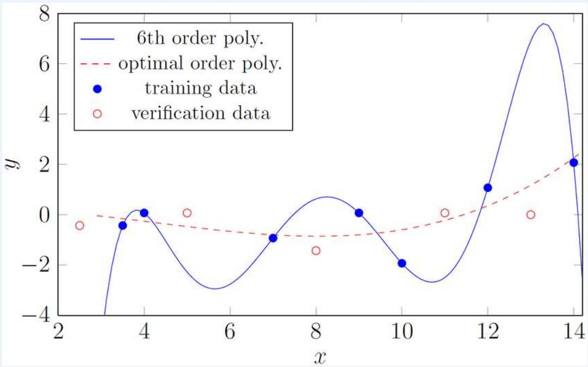

# VC维，结构风险

置信风险：在多大程度上可以信任分类器在未知样本上分类的结果

样本数量：样本数量越大，学习结果越有可能正确，置信风险越小

分类函数的VC维，显然VC维越大，推广能力越差，置信风险会变大

评价分类器好坏：经验风险 $+$ 置信风险

经验风险：在给定样本上的误差

置信风险：在多大程度上可以信任分类器在未知样本上分类的结果

# VC维， 结构风险

评价分类器好坏：经验风险 $+$ + 置信风险

经验风险：在给定样本上的误差

– 置信风险：在多大程度上可以信任分类器在未知样本上分类的结果

Abalancebetweenmodelframeworkand inputuncertainty

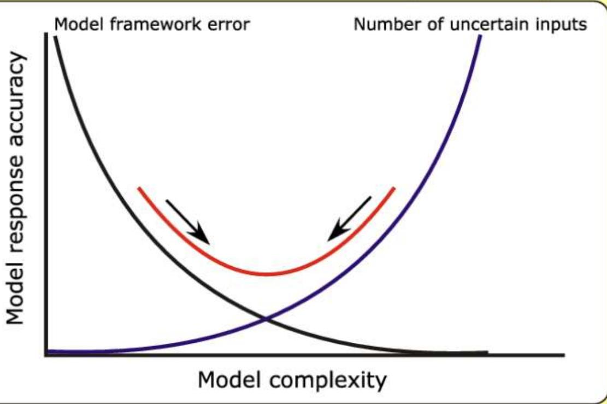

# VC维，结构风险

# Modelcomparisonand selection

Given competing hypothesesonstructure&functionalmechanismsofa system,whichmodel is the best?

Whichmodel represents thebestbalance betweenmodelfitandmodel complexity?

Forwhich modelm does $p ( \nu | m )$becomemaximal?

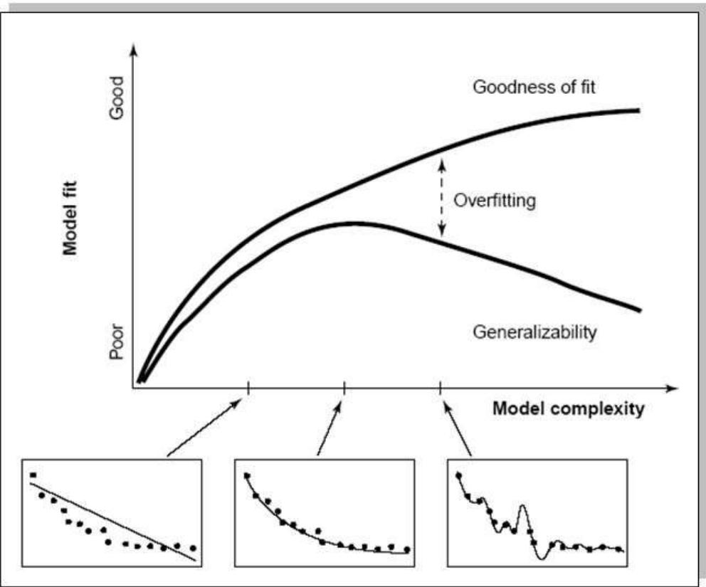

Pitt&Miyung（2002）TICS

# 泛化误差界

泛化误差界：置信风险是没有办法精确计算的，因此只能给出一个估计的区间，也使得整个误差只能计算上界，而无法计算准确的值（所以叫做泛化误差界，而不叫泛化误差）。

$$
R (w) \leq R _ {e m p} (w) + \phi (n / h)
$$

$R ( w )$ ：真实风险； $R _ { e m p } ( w )$ ：经验风险； $\phi ( n / h )$ ：置信风险

对于泛化误差的估计，可简单用交叉验证的方法来实际测试。

我们目标从经验风险最小化变为了寻求经验风险与置信风险的和最小，即结构风险最小

SVM : 最小化结构风险（不再只是优化经验风险）

对比：传统MLP其实最小化的只有经验风险，因此只有数据量较大的情况下其置信风险才会降低

# 什么是SVM：特点

SVM擅长应付样本数据线性不可分的情况

松弛变量 “slack variable”

$\spadesuit$ 核函数 “kernel function”

高维模式识别

SVM擅长处理高维数据 #samples<#dimension

$\spadesuit$ ◆ 用到的样本信息少（支持向量）

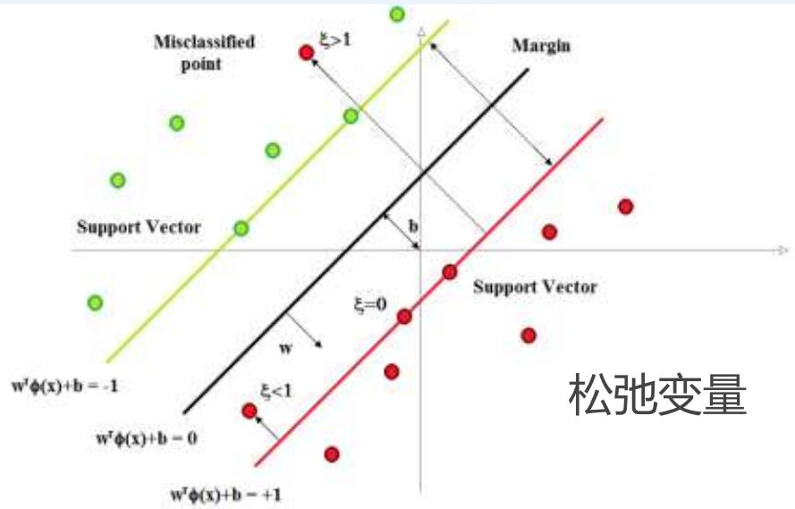

x2

InputSpace

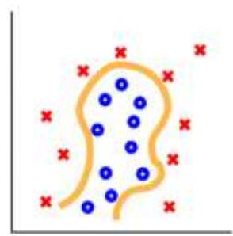

x1核函数

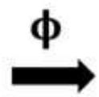

Mapped Space

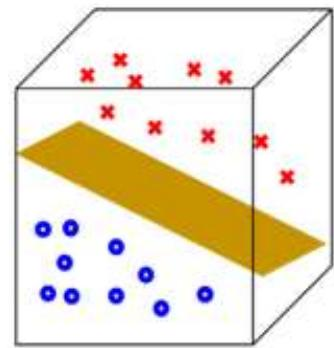

Decision function f(x）:

$$
\begin{array}{l} \bullet f (x) > 0 \\ \times f (x) <   0 \\ \end{array}
$$

# 线性分类器

线性分类器(感知机)：最简单也很有效的分类器形式

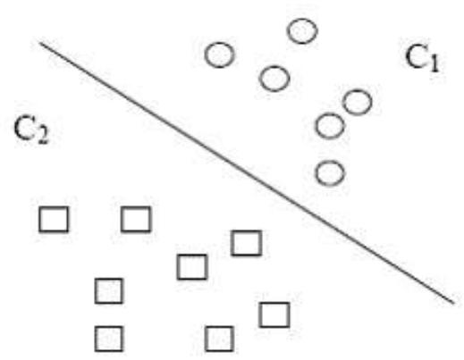

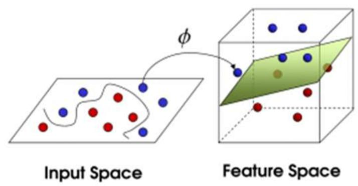

线性可分的：一个线性函数能够将样本完全正确的分开

非线性可分的：一个线性函数不能够将样本完全正确的分开

超平面（Hyperplane）：平面中的直线、空间中的平面之推广

For 1-D? 2-D? 3-D? 4-D? The hyperplanes?

# 线性分类器

# 最简单的线性分类器

◼ Logistic regression 逻辑回归分类模型

例如一个线性函数， $g ( x ) = w x + b$

取阈值0，当有一个样本xi需要判别的时候，若g(xi)>0，就判别为类别C1，若g(xi)<0，则判别为类别C0

$$
f (x) = s g n [ g (x) ] = \left\{ \begin{array}{l l} + 1 & w x + b > 0 \\ - 1 & w x + b <   0 \end{array} \right.
$$

在n维空间中，x及w都代表n维向量

g(x)=0就是中间那条分类直线（or 面 or…）的表达式，即 $W X + b = 0$ ，我们也把这个函数叫做分类面。

分类面的选择可以很多

# 线性分类器

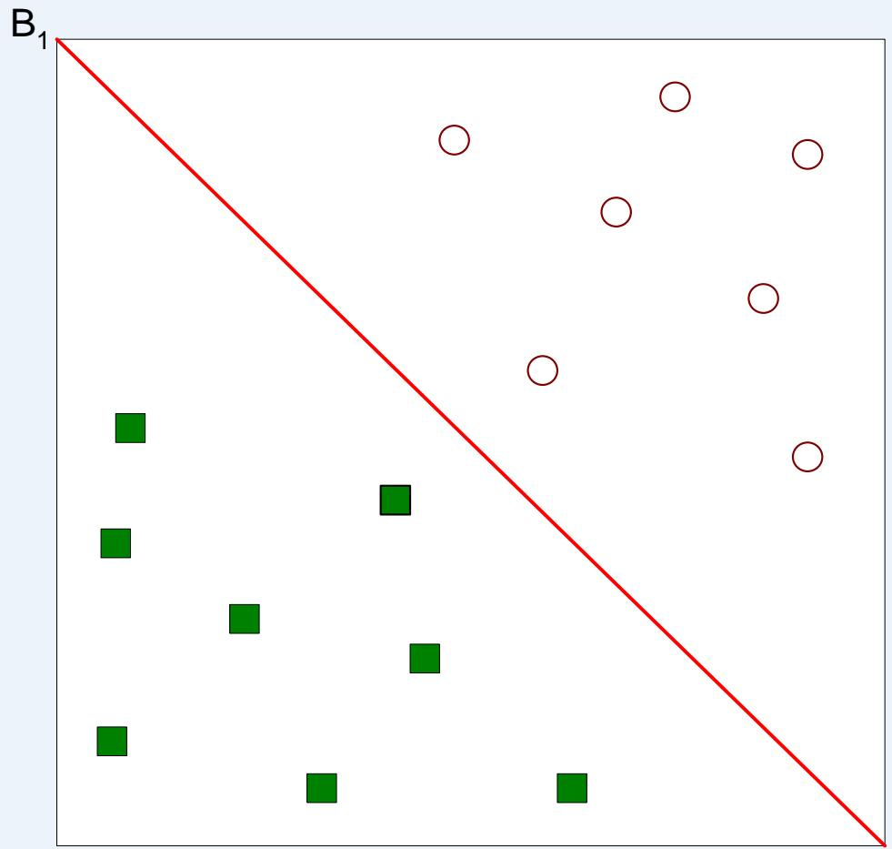

One Possible Solution

# 线性分类器

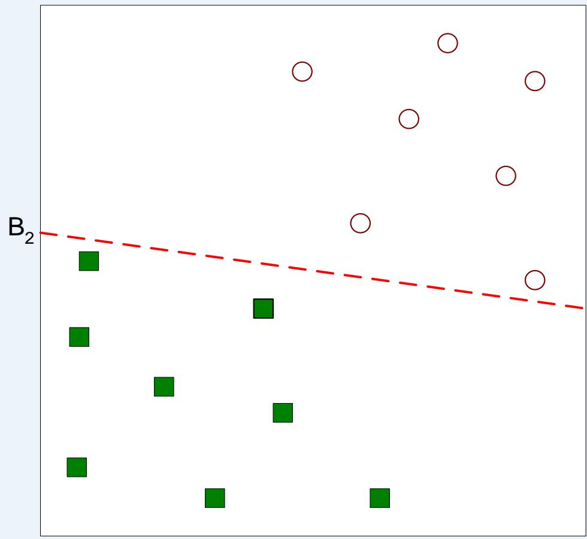

Another possible solution

# 线性分类器

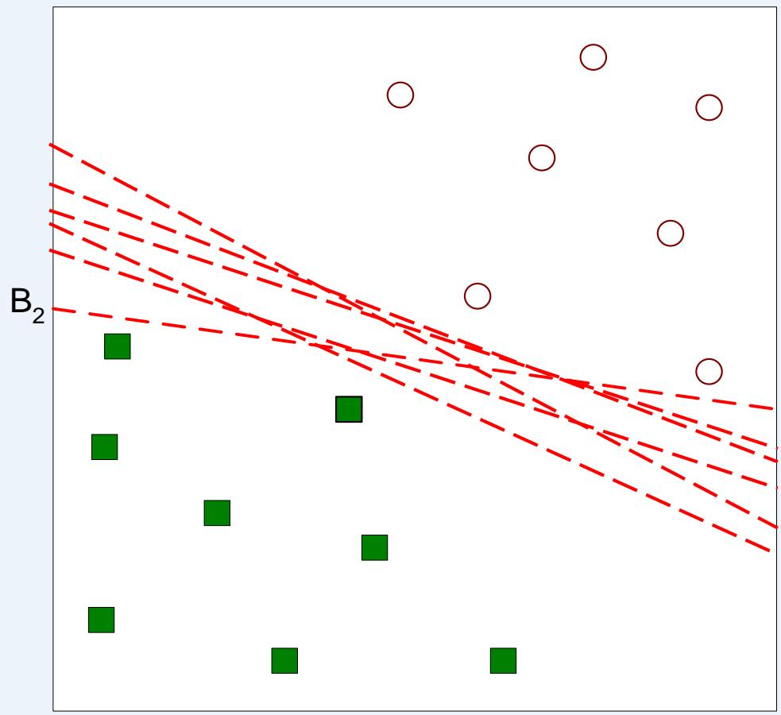

Other possible solutions

# 线性分类器

B2分割线与最近的数据点只有很小的间隔，如果测试数据有一些噪声的话可能就会被B2错误分类(即对噪声敏感、泛化能力弱)。

B1以较大间隔将它们分开，这样就能容忍测试数据的一些噪声而正确分类，是一个泛化能力不错的分类器。

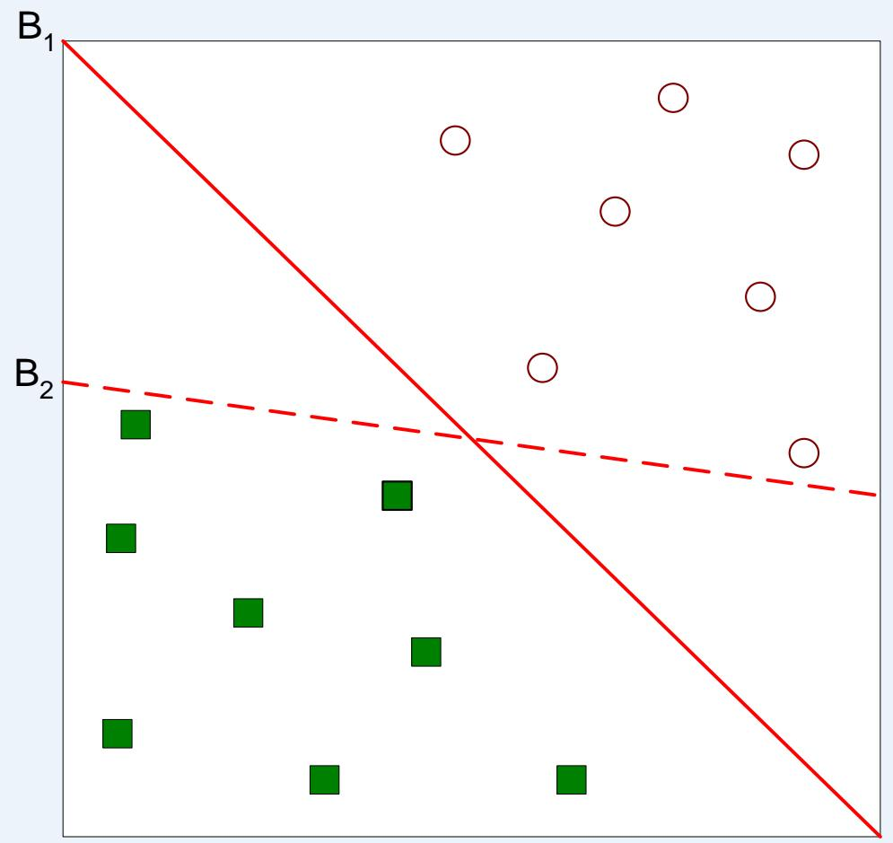

Which one is better? B1 or B2?

How do you define better?

# 线性分类器

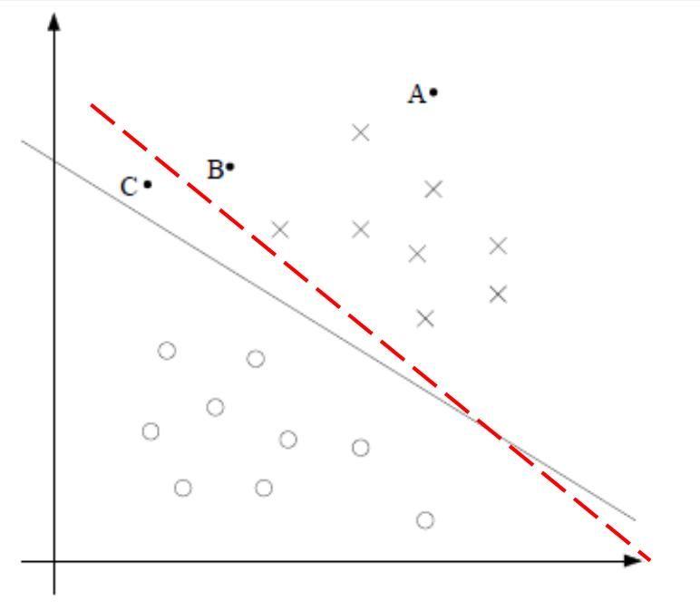

$$
g (X _ {A}) = w * X _ {A} + b > w * X _ {C} + b = g (X _ {C})
$$

A分为类别X的信心高于C: $g ( X _ { A } ) > g ( X _ { C } )$

如何量化把一个样本点分为某一类的置信度？ $g ( X ) = w * X + b$

离分类面越远越好，g(x)越大越好！

# 线性分类器

函数间隔 （Functional Margin）

$$
\widehat {\gamma^ {(i)}} = y _ {i} * (w x _ {i} + b) = | g (x _ {i}) |
$$

某个样本属于正类别， $W \times i + b > 0$ ，而yi为 $+ 1$ ；

若属于负类别，那么 $W X i + b < 0$ ，而yi为-1；

$\mathsf { y i } ( \mathsf { w x i } + \mathsf { b } )$ 总是大于0的，定义 $\widehat { \gamma ^ { ( i ) } } = \vert w x \vert + b \vert = \vert \mathfrak { g } ( \mathsf { x } )$

越大的间隔值 $( \widehat { \gamma ^ { ( i ) } }$ 、或是 $\left| \mathfrak { g } ( \times ) \right| .$ ），代表分类的信心越大

Logistic regression中， $w x + b = 2 w x + 2 b = 0$ 代表同一曲线，取决于wx+b的正负，而跟其2wx+ 2b大小无关

Functional margin中，将w、b换成2w、2b将能增大间隔 ${ \widehat { \gamma ^ { ( i ) } } }  2 { \widehat { \gamma ^ { ( i ) } } }$ , 此时最大化间隔没有意义， 般地，会对

$$
\gamma^ {(i)} = \frac {1}{\| w \|} | g (x _ {i}) |
$$

# 线性分类器：几何间隔

几何间隔（Geometric margins）

$$
\gamma^ {(i)} = \frac {1}{\| w \|} | g (x _ {i}) |
$$

$$
\gamma^ {(i)} = y _ {i} \left(\frac {w}{\| w \|} x _ {i} + \frac {b}{\| w \|}\right)
$$

Replace $( w , b )$ with ${ \bigl ( } { \frac { w } { \left\| w \right\| } } , { \frac { b } { \left\| w \right\| } } { \bigr ) }$

几何间隔就是点到超平面的欧氏距离

# 线性分类器：几何间隔

几何间隔（Geometric margins）

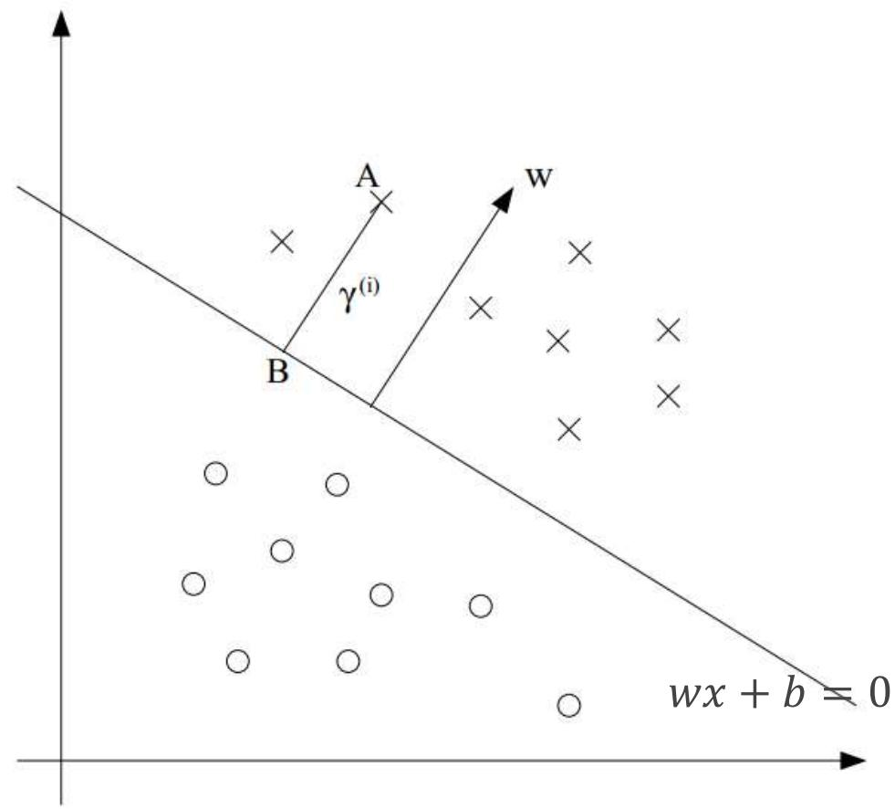

❑ ?? 与 $w x + b = 0$ 方向垂直？

$$
\gamma^ {(i)} = y _ {i} \left(\frac {w}{\| w \|} x _ {i} + \frac {b}{\| w \|}\right)
$$

❑ 给定集合 $\mathrm { S } = \{ ( x _ { i } , y _ { i } ) ; i = 1 \ldots m \}$ ,定义

$$
\gamma = \min _ {i = 1, \dots , m} \gamma^ {(i)}
$$

# 线性分类器：几何间隔

利用三角形的面积计算公式可得

$$
S = (1 / 2) a b = (1 / 2) h c
$$

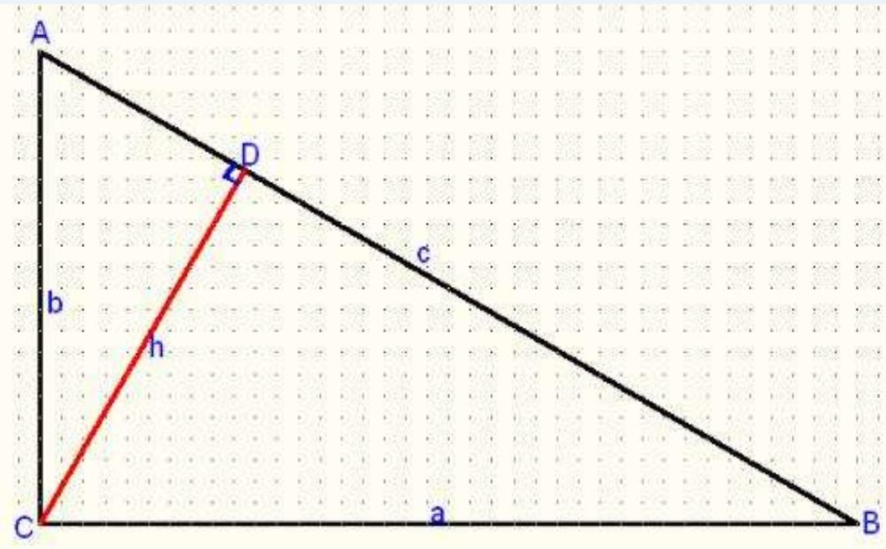

故三角形些边上的高为 h = ab/c

# 线性分类器：几何间隔

$l$

作PM//x轴交直线 $l$ 于M，作PN//y轴交直线l于N，

$\therefore d = { \frac { \left| P M \right| \cdot \left| P N \right| } { \left| M N \right| } }$

$( { \bf x } _ { 0 } , y _ { 2 } )$ $\mathrm { N } \in { l }$ $\mathbf { x } _ { 1 } = \frac { - B y _ { 0 } - C } { A } , \mathbf { y } _ { 2 } = \frac { - A x _ { 0 } - C } { B } .$

$$
\therefore | \mathrm {P M} | = | x _ {1} - x _ {0} | = | \frac {A x _ {0} + B y _ {0} + C}{A} | \dots , ①
$$

$$
\begin{array}{l} | P N | = \left| y _ {2} - y _ {0} \right| = \left| \frac {A x _ {0} + B y _ {0} + C}{B} \right| \dots , ② \\ | \mathrm {M N} | = \sqrt {\left| P M \right| ^ {2} + \left| P N \right| ^ {2}} = \frac {\sqrt {A ^ {2} + B ^ {2}}}{A B}. | A x _ {0} + B y _ {0} + C |, \dots , ③ \\ \end{array}
$$

$d = { \frac { \left| A x _ { \circ } + B y _ { \circ } + C \right| } { \sqrt { A ^ { 2 } + B ^ { 2 } } } } ( \mathbf { A } ^ { 2 } + \mathbf { B } ^ { 2 } + 0 ) .$

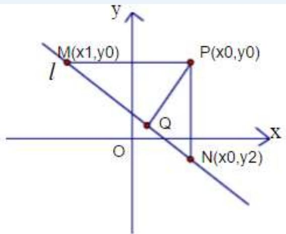

$$
A x + B y + C = 0
$$

# 线性分类器：几何间隔

点到平面的距离公式

$$
d = \frac {\left| A x _ {0} + B y _ {0} + C z _ {0} + D \right|}{\sqrt {A ^ {2} + B ^ {2} + C ^ {2}}}
$$

公式描述： 公式中的平面方程为Ax+By+Cz+D=0，点P的坐标 $\times 0 . 5 0 , \geq 0 )$ ，d为点P到平面的距离。

点到超平面的欧氏距离（几何间隔 Geometric margins）

$$
\gamma^ {(i)} = \frac {| (w x _ {i} + b) |}{\| w \|} = \frac {1}{\| w \|} | g (x _ {i}) |
$$

# 线性分类器：几何间隔

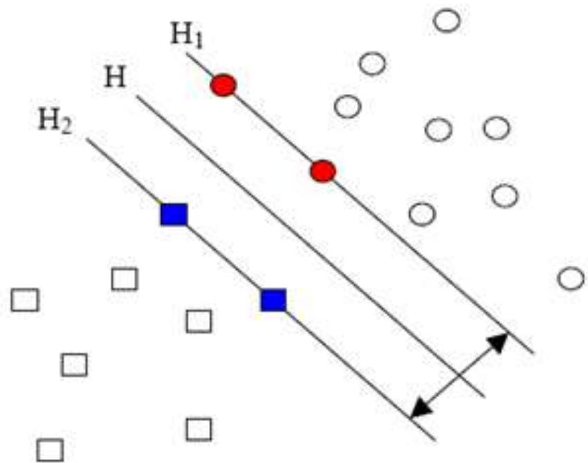

H是分类面，而H1和H2是平行于H，且过离H最近的两类样本的直线，H1与H，H2与H之间的距离就是几何间隔。

# 线性分类器：例子

线性可分，有超平面(向量化表示 $\sim$ )将数据集分开，使得一侧是“+1”类，另一侧是“-1类”

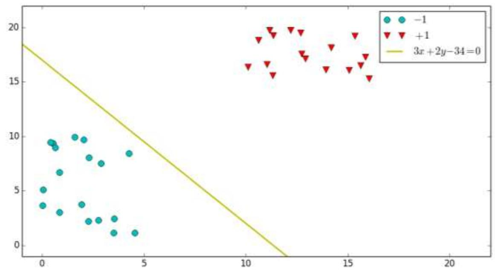

$$
\begin{array}{l} 3 x + 2 y - 3 4 = 0 \\ 0. 6 x + 0. 4 y - 6. 8 = 0 \\ - 1. 5 x - y + 1 7 = 0 \\ \end{array}
$$

# 线性分类器：例子

虽然写法不一样，但是只代表一条直线

能不能想个办法，把这条直线统一一下？

找离直线最近的点，来改进直线方程

$$
3 x + 2 y - 3 4 = 0
$$

$$
\left| 3 * 4. 3 + 2 * 8. 4 - 3 4 \right| = \left| - 4. 3 \right| = 4. 3
$$

$$
\mathbf {w} = (3, 2), b = - 3 4 \quad \text {都 除 以} 4. 3
$$

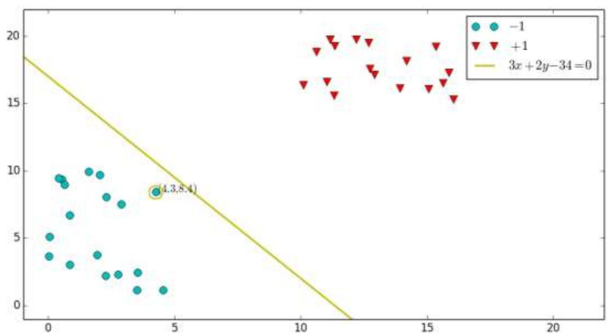

$$
\begin{array}{l} w = (0. 6 9 7 6, 0. 4 6 5 1), b = - 7. 9 \\ \left| \mathbf {w} ^ {T} \mathbf {x} + \mathbf {b} \right| = 1 \\ \left| \mathbf {w} ^ {T} \mathbf {x} + \mathbf {b} \right| \geq 1 \\ - 1. 5 x - y + 1 7 = 0 \\ \vert - 1. 5 * 4. 3 - 8. 4 + 1 7 \vert = 2. 1 5 \\ \mathbf {w} = (- 1. 5, - 1), b = 1 7 \quad \text {都 除 以} 2. 1 5 \\ \boldsymbol {w} = (- 0. 6 9 7 6, - 0. 4 6 5 1), \mathbf {b} = 7. 9 \\ - 0. 6 9 7 6 x - 0. 4 6 5 1 y + 7. 9 = 0 \\ \end{array}
$$

# 线性分类器：例子

虽然写法不一样，但是只代表一条直线能不能想个办法，把这条直线统一一下？找离直线最近的点，来改进直线方程

$$
w = (0. 6 9 7 6, 0. 4 6 5 1), b = - 7. 9
$$

$$
\mathbf {V S}
$$

$$
- 0. 6 9 7 6 x - 0. 4 6 5 1 y + 7. 9 = 0
$$

未用信息：y(i)

$$
0. 6 9 7 6 x + 0. 4 6 5 1 y - 7. 9 = 0
$$

左下方为负数，右上方为正数

$$
- 0. 6 9 7 6 x - 0. 4 6 5 1 y + 7. 9 = 0
$$

左下方为正数，右上方为负数

$$
y ^ {(i)} \left(\mathbf {w} ^ {T} x ^ {(i)} + \mathbf {b}\right) \geq 1
$$

# 线性分类器：例子

统一化w和b后，两边离线的最近的样本点使得wTx+b=1及wTx+b=-1，此时两线之间几何间隔为

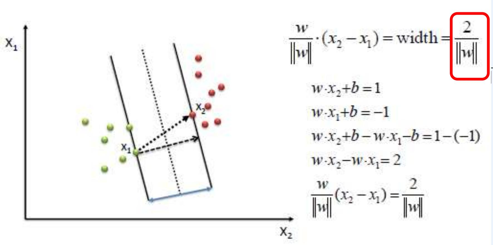

# 线性分类器：例子

$$
\max \frac {2}{| | w | |}
$$

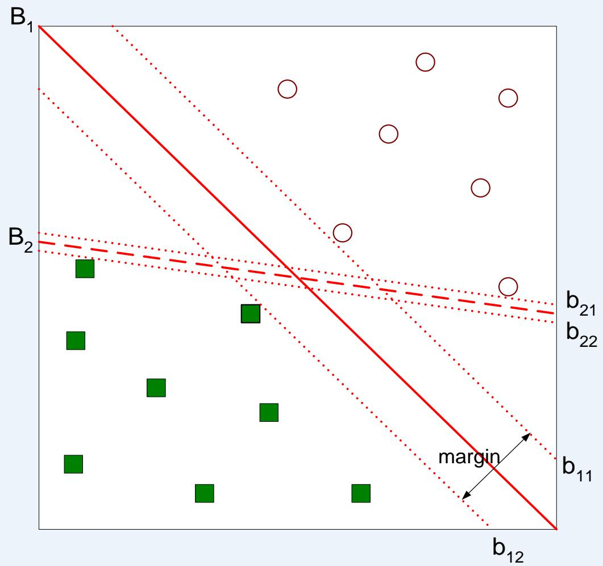

Find hyperplane maximizes the margin => B1 is better than B2

# 线性分类器：求解

目标函数：

$$
m a x \frac {2}{\| w \|} = m i n \| w \| = m i n \frac {1}{2} \| w \| ^ {2}
$$

直接来解这个求最小值问题，当||w|| $= 0$ 时得到了目标函数的最小值

无论给什么样的数据，都是这个解, 反映在图中，就是H1与H2两条直线间的距离无限大。所有的样本点（无论正样本还是负样本）都跑到H1和H2中间

如何解决？

原因：只考虑了目标，而没有加入约束条件（在求解过程中必须满足的条件）样本点必须在H1或H2的某一侧（或者至少在H1和H2上），而不能跑到两者中间

# 线性分类器：求解

约束条件：

$$
y _ {i} [ (w x _ {i} + b) ] \geq 1 (i = 1, 2, \dots , \mathrm {m})
$$

转化为和0比较：

$$
y _ {i} [ (w x _ {i} + b) ] - 1 \geq 0 (i = 1, 2, \dots , \mathrm {m})
$$

带约束的最小值问题：

min

subject to

# 支持向量机

凸二次规划

$$
\min \quad \frac {1}{2} \| w \| ^ {2}
$$

$$
\mathrm {s u b j e c t t o} y _ {i} [ (w x _ {i} + b) ] - 1 \geq 0 (i = 1, 2, \dots , \mathrm {m})
$$

自变量就是w，而目标函数是w的二次函数，所有的约束条件都是w的线性函数。故称之为二次规划 (Quadratic Programming，QP)，且是凸二次规划。

凸二次规划特点：有解（全局最优解）

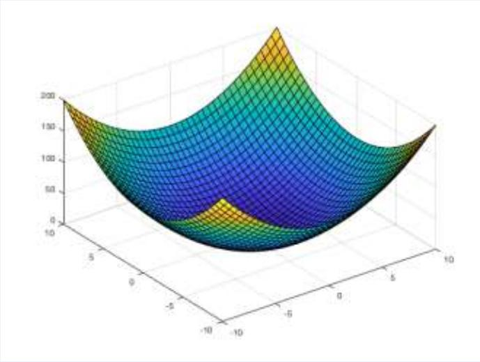

# 支持向量机

# 支持向量机-求解

# 凸二次规划

$$
\min  \quad \frac {1}{2} \| w \| ^ {2} \tag {1}
$$

$$
\mathrm {s u b j e c t t o} \quad y _ {i} [ (w x _ {i} + b) ] - 1 \geq 0 (i = 1, 2, \dots , \mathrm {m})
$$

我们称上式（1）所述问题为原始问题(primal problem), 可以应用拉格朗日乘子法构造拉格朗日函数(Lagrange function)再通过求解其对偶问题(dual problem)得到原始问题的最优解。转换的原因在于：

⚫ 对偶问题更易求解：对偶问题只需优化一个变量且约束条件更简单

# 拉格朗日函数

# 考虑一般优化问题（可能非凸）

$$
\min  \quad f _ {0} (x)
$$

$$
\begin{array}{r l} \text {s . t .} & f _ {i} (x) \leqslant 0, \quad i = 1, \dots , m, \end{array}
$$

$$
h _ {j} (x) = 0, \quad j = 1, \dots , p.
$$

对于上面这个一般形式的优化问题，假设：

·问题的定义域 $\begin{array} { r } { \mathcal { D } : = \bigcap _ { i = 0 } ^ { m } \operatorname { d o m } f _ { i } \cap \bigcap _ { j = 1 } ^ { p } \operatorname { d o m } h _ { j } } \end{array}$

·问题的最优解 $x ^ { * }$ 和最优值 $p ^ { * }$

不严谨地说，拉格朗日(Lagrange)对偶的基本思想：将原约束优化问题的目标和约束放在同一个函数（即拉格朗日函数）中来研究。

# 拉格朗日函数

以一般优化问题为例，它的Lagrange函数 $L : \mathbb { R } ^ { n } \times \mathbb { R } ^ { m } \times \mathbb { R } ^ { p } \to \mathbb { R }$ 定义为

$$
L (x, \lambda , \nu) := f _ {0} (x) + \sum_ {i = 1} ^ {m} \lambda_ {i} f _ {i} (x) + \sum_ {j = 1} ^ {p} \nu_ {j} h _ {j} (x),
$$

其中：

· $L ( x , \lambda , \nu )$ 的定义域为 $\operatorname { d o m } { \cal L } = \mathcal { D } \times \mathbb { R } ^ { m } \times \mathbb { R } ^ { p }$ ；

· $\lambda _ { i }$ 称为第 $i$ 个不等式约束 $f _ { i } ( x ) \leqslant 0$ 对应的Lagrange乘子；

· $\nu _ { j }$ 称为第 $j$ 个等式约束 $h _ { j } ( x ) = 0$ 对应的Lagrange乘子；

向量 $\lambda$ 和 $\nu$ 是分别由 $\lambda _ { i }$ 和 $\nu _ { j }$ 组成的向量，称作优化问题的对偶变量(dualvariable)或者Lagrange乘子;

·此时，将目标变量 $x$ 称作原变量(primalvariable)。

min fo(x)

$$
h _ {j} (x) = 0, \quad j = 1, \dots , p.
$$

# 拉格朗日 对偶函数

定义Lagrange对偶函数（简称对偶函数，dualfunction）如下：

$$
\begin{array}{l} g (\lambda , \nu) := \inf  _ {x \in \mathcal {D}} L (x, \lambda , \nu) \\ = \inf  _ {x \in \mathcal {D}} \left\{f _ {0} (x) + \sum_ {i = 1} ^ {m} \lambda_ {i} f _ {i} (x) + \sum_ {j = 1} ^ {p} \nu_ {j} h _ {j} (x) \right\}. \\ \end{array}
$$

性质一： $g ( \lambda , \nu )$ 是关于 $\lambda$ 和 $\nu$ 的凹函数！ （思考：为什么？）

min fo(x)

$$
\begin{array}{l l} \text {s . t .} & f _ {i} (x) \leqslant 0, \quad i = 1, \dots , m, \end{array}
$$

$$
h _ {j} (x) = 0, \quad j = 1, \dots , p.
$$

Lagrange函数L

$$
L (x, \lambda , \nu) := f _ {0} (x) + \sum_ {i = 1} ^ {m} \lambda_ {i} f _ {i} (x) + \sum_ {j = 1} ^ {p} \nu_ {j} h _ {j} (x),
$$

（超出本节课内容，大家在未来的“最优化课程” 中会有详细解答）

性质二：对 $\forall \lambda \geq 0$ 和 $\forall \nu$ ，可以推出 $g ( \lambda , \nu ) \leq p ^ { * }$ （见下一页），即 $g ( \lambda , \nu )$ 给出了原问题最优值的下界。

# 弱对偶定理

# 定理1(弱对偶定理)

对 $\forall \lambda \geq 0$ 和 $\forall \nu$ ，有 $g ( \lambda , \nu ) \leq p ^ { * }$

证明：设 $x ^ { * } \in \mathcal { D }$ 是原问题的最优解，则有 $f _ { i } ( x ^ { * } ) \leq 0$ $h _ { j } ( x ^ { * } ) = 0$ 。于是，对 $\forall \lambda \geq 0$ 和 $\forall \nu$ ，有

$$
\underbrace {\sum_ {i = 1} ^ {m} \lambda_ {i} f _ {i} \left(x ^ {*}\right)} _ {\leq 0} + \underbrace {\sum_ {j = 1} ^ {p} \nu_ {j} h _ {j} \left(x ^ {*}\right)} _ {= 0} \leqslant 0.
$$

因此

$$
L \left(x ^ {*}, \lambda , \nu\right) = f _ {0} \left(x ^ {*}\right) + \sum_ {i = 1} ^ {m} \lambda_ {i} f _ {i} \left(x ^ {*}\right) + \sum_ {j = 1} ^ {p} \nu_ {j} h _ {j} \left(x ^ {*}\right) \leqslant f _ {0} \left(x ^ {*}\right) = p ^ {*}.
$$

进一步，有

$$
g (\lambda , \nu) = \inf  _ {x \in \mathcal {D}} L (x, \lambda , \nu) \leqslant L \left(x ^ {*}, \lambda , \nu\right) \leqslant f _ {0} \left(x ^ {*}\right) = p ^ {*}.
$$

$$
\max  _ {\lambda \geq \mathbf {0}, \nu} \mathrm {g} (\lambda , \nu) = \max  _ {\lambda \geq \mathbf {0}, \nu} \inf  _ {x \in \mathcal {D}} L (x, \lambda , \nu) \leqslant f _ {0} (x ^ {*}) = p ^ {*}.
$$

min fo(x)

s.t. fi(x)≤0，i=1,·,m,

$$
h _ {j} (x) = 0, \quad j = 1, \dots , p.
$$

Lagrange函数L

$$
L (x, \lambda , \nu) := f _ {0} (x) + \sum_ {i = 1} ^ {m} \lambda_ {i} f _ {i} (x) + \sum_ {j = 1} ^ {p} \nu_ {j} h _ {j} (x),
$$

# 拉格朗日函数

$$
\max _ {\alpha \geq 0, \beta} \inf _ {\omega} L (\omega , \alpha , \beta)
$$

min

$$
\mathrm {s u b j e c t t o}
$$

$$
f (w)
$$

$$
g _ {i} (w) \leq 0 i = 1, 2, \ldots , k
$$

$$
h _ {i} (w) = 0 i = 1, 2, \dots , l
$$

To solve it,we start by defining the generalized Lagrangian

$$
\mathcal {L} (w, \alpha , \beta) = f (w) + \sum_ {i = 1} ^ {k} \alpha_ {i} g _ {i} (w) + \sum_ {i = 1} ^ {l} \beta_ {i} h _ {i} (w).
$$

Here,the $\alpha _ { i }$ 'sand $\beta _ { i }$ 'sare the Lagrange multipliers.Consider the quantity

$$
\theta_ {\mathcal {P}} (w) = \max  _ {\alpha , \beta : \alpha_ {i} \geq 0} \mathcal {L} (w, \alpha , \beta).
$$

$$
\theta_ {\mathcal {P}} (w) = \left\{ \begin{array}{l l} f (w) & \text {i f w s a t i s f i e s p r i m a l c o n s t r a i n t s} \\ \infty & \text {o t h e r w i s e .} \end{array} \right.
$$

# 拉格朗日函数

$$
\max _ {\alpha \geq 0, \beta} \inf _ {\omega} L (\omega , \alpha , \beta)
$$

$$
\inf _ {\omega} \max _ {\alpha \geq 0, \beta} L (\omega , \alpha , \beta)
$$

To solve it,we start by defining the generalized Lagrangian

$$
\mathcal {L} (w, \alpha , \beta) = f (w) + \sum_ {i = 1} ^ {k} \alpha_ {i} g _ {i} (w) + \sum_ {i = 1} ^ {l} \beta_ {i} h _ {i} (w).
$$

Here,the $\alpha _ { i }$ 'sand $\beta _ { i }$ 'sare the Lagrange multipliers. Consider the quantity

$$
\theta_ {\mathcal {P}} (w) = \max  _ {\alpha , \beta : \alpha_ {i} \geq 0} \mathcal {L} (w, \alpha , \beta).
$$

$$
\theta_ {\mathcal {P}} (w) = \left\{ \begin{array}{l l} f (w) & \text {i f w s a t i s f i e s p r i m a l c o n s t r a i n t s} \\ \infty & \text {o t h e r w i s e .} \end{array} \right.
$$

转换成原问题等价形式：

$$
\min  _ {w} \theta_ {\mathcal {P}} (w) = \min  _ {w} \max  _ {\alpha , \beta : \alpha_ {i} \geq 0} \mathcal {L} (w, \alpha , \beta),
$$

# 拉格朗日函数

定理1（弱对偶定理）

对 $\forall \lambda \geq 0$ 和 $\forall \nu$ $g ( \lambda , \nu ) \leq p ^ { * }$

$$
\theta_ {\mathcal {P}} (w) = \left\{ \begin{array}{l l} f (w) & \text {i f w s a t i s f i e s p r i m a l c o n s t r a i n t s} \\ \infty & \text {o t h e r w i s e .} \end{array} \right.
$$

转换成原问题等价形式： minθp(w)=minmaxL(wa,β),

$$
d ^ {*} = \max  _ {\alpha , \beta : \alpha_ {i} \geq 0} \min  _ {w} \mathcal {L} (w, \alpha , \beta)
$$

对偶问题 Dual Problem

$$
\min  _ {w} \max  _ {\alpha , \beta : \alpha_ {i} \geq 0} \mathcal {L} (w, \alpha , \beta) = p ^ {*}.
$$

原问题 Primal Problem

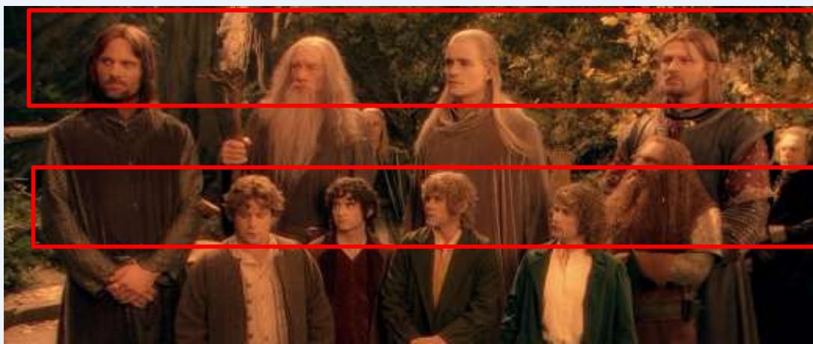

原问题

对偶问题

# Lagrange对偶问题

$$
d ^ {*} = \max  _ {\alpha , \beta : \alpha_ {i} \geq 0} \min  _ {w} \mathcal {L} (w, \alpha , \beta) \leq \min  _ {w} \max  _ {\alpha , \beta : \alpha_ {i} \geq 0} \mathcal {L} (w, \alpha , \beta) = p ^ {*}.
$$

设原问题(Primal)的最优值为 $p ^ { * } = f _ { 0 } ( x ^ { * } )$ ，对偶问题(Dual)的最优值为$d ^ { * } = g ( \lambda ^ { * } , \nu ^ { * } )$ 。1于是，

·不等式 $d ^ { * } \leq p ^ { * }$ 总是成立的，称为弱对偶性 (weak duality)

等式 $d ^ { * } = p ^ { * }$ 不必然成立！当等式成立时，称为强对偶性(strong duality)

差值 $p ^ { * } - d ^ { * }$ 称为对偶间隙(dualitygap)，根据弱对偶性可知对偶间隙总是非负的

思考：什么情况下强对偶性成立，即对偶间隙为0？

# 强对偶性

显然，强对偶性是很好的性质。如果成立，则可以通过求解对偶问题来求解原问题的最优值。遗憾的是，一般情况下强对偶性并不成立。

但是，对于凸优化问题，在一定（不是特别强）的条件下，强对偶性是成立的，这也说明了凸优化问题的优势。

# 考虑一般形式的凸优化问题

$$
\begin{array}{l} \min  f _ {0} (x) \\ \begin{array}{r l} {\mathrm {s . t .}} & {f _ {i} (x) \leqslant 0, \quad i = 1, \dots , m \quad (f _ {0}, \dots , f _ {m} \text {凸})} \end{array} \\ A x = b. \\ \end{array}
$$

Sbephen Roydand

Leven vandenberghe

Convex

Optimization

其他的充分条件还包括Slater’s condition….（超出本节课内容，大家在未来的“最优化课程” 中会有详细解答） 

# 对偶性下的最优性条件

# 研究最优解所要满足的条件

# 考虑一般优化问题（可能非凸）

$$
\min  \quad f _ {0} (x)
$$

$$
\text {s . t .} \quad f _ {i} (x) \leqslant 0, \quad i = 1, \dots , m, \tag {Primal}
$$

$$
h _ {j} (x) = 0, \quad j = 1, \dots , p.
$$

# 假设：（考虑简单情形）

·问题的定义域为 $\mathbb { R } ^ { n }$ $\begin{array} { r } { \left( \bigcap _ { i = 0 } ^ { m } \operatorname { d o m } f _ { i } \right) \cap \left( \bigcap _ { j = 1 } ^ { p } \operatorname { d o m } h _ { j } \right) = \mathbb { R } ^ { n } ; } \end{array}$

·函数 $f _ { i }$ $f _ { i } , \ i = 0 , 1 , \cdots , m$ 和 $h _ { j }$ $j = 1 , 2 , \cdots , p$ 均可微；

问题的最优解 $x ^ { * }$ 和最优值 $p ^ { * }$ 存在，且强对偶成立

写出其对偶函数 $g ( \lambda , \nu ) = \operatorname* { i n f } _ { x } \ \left\{ f _ { 0 } ( x ) + \textstyle \sum _ { i = 1 } ^ { m } \lambda _ { i } f _ { i } ( x ) + \textstyle \sum _ { j = 1 } ^ { p } \nu _ { j } h _ { j } ( x ) \right\}$

和对偶问题

$$
\max  _ {\lambda , \nu} g (\lambda , \nu), \quad \text {s . t .} \quad \lambda \geq 0. \tag {Dual}
$$

# 对偶性下的最优性条件

$$
\min  f _ {0} (x)
$$

$$
\text {s . t .} f _ {i} (x) \leqslant 0, i = 1, \dots , m, \tag {Primal}
$$

$$
h _ {j} (x) = 0, \quad j = 1, \dots , p.
$$

# KKT条件（最优解的必要条件）

对于可微且对偶间隙为0的优化问题，原对偶最优解 $( x ^ { * } , \lambda ^ { * } , \nu ^ { * } )$ 必须满足条件：

$$
f _ {i} \left(x ^ {*}\right) \leq 0, \quad i = 1, \dots , m, \quad (\text {p r i m a l f e a s i b i l i t y})
$$

$$
h _ {j} \left(x ^ {*}\right) = 0, \quad j = 1, \dots , p, \quad (\text {p r i m a l f e a s i b i l i t y})
$$

$$
\lambda_ {i} ^ {*} \geq 0, \quad i = 1, \dots , m, \quad (\text {d u a l f e a s i b i l i t y})
$$

$$
\lambda_ {i} ^ {*} f _ {i} \left(x ^ {*}\right) = 0, \quad i = 1, \dots , m, \quad (\text {c o m p l e m e n t a r y s l a c k n e s s})
$$

$$
\nabla f _ {0} \left(x ^ {*}\right) + \sum_ {i = 1} ^ {m} \lambda_ {i} ^ {*} \nabla f _ {i} \left(x ^ {*}\right) + \sum_ {j = 1} ^ {p} \nu_ {j} ^ {*} \nabla h _ {j} \left(x ^ {*}\right) = 0, \quad (\text {s t a t i o n a r i t y})
$$

以上条件合称为Karush-Kuhn-Tucker(KKT)条件。

# 定理2(KKT条件是原对偶最优解的充要条件）

对于目标函数和约束函数均可微，且强对偶性成立的凸优化问题，有：

$( \tilde { x } , \tilde { \lambda } , \tilde { \nu } )$ 为原对偶最优解 $\iff \quad ( \tilde { x } , \tilde { \lambda } , \tilde { \nu } )$ $\Longleftrightarrow$ 满足KKT条件.

# In our case

$$
\begin{array}{l} \min  _ {\gamma , w, b} \frac {1}{2} | | w | | ^ {2} \\ \text {s . t .} y ^ {(i)} \left(w ^ {T} x ^ {(i)} + b\right) \geq 1, i = 1, \dots , m \\ \end{array}
$$

We can write the constraints as

$$
g _ {i} (w) = - y ^ {(i)} \left(w ^ {T} x ^ {(i)} + b\right) + 1 \leq 0.
$$

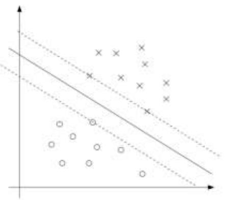

写出拉格朗日函数

When we construct the Lagrangian for our optimization problem we have:

$$
\mathcal {L} (w, b, \alpha) = \frac {1}{2} \| w \| ^ {2} - \sum_ {i = 1} ^ {m} \alpha_ {i} \left[ y ^ {(i)} \left(w ^ {T} x ^ {(i)} + b\right) - 1 \right]. \tag {8}
$$

# In our case

$$
d ^ {*} = \max  _ {\alpha : \alpha_ {i} \geq 0} \min  _ {w, b} \mathcal {L} (w, b, \alpha)
$$

When we construct the Lagrangian for our optimization problem we have:

$$
\mathcal {L} (w, b, \alpha) = \frac {1}{2} \| w \| ^ {2} - \sum_ {i = 1} ^ {m} \alpha_ {i} \left[ y ^ {(i)} \left(w ^ {T} x ^ {(i)} + b\right) - 1 \right]. \tag {8}
$$

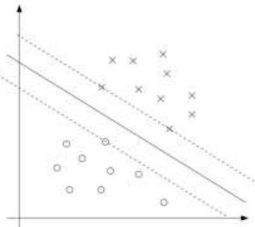

分别对参数 w b 求导：

$$
\nabla_ {w} \mathcal {L} (w, b, \alpha) = w - \sum_ {i = 1} ^ {m} \alpha_ {i} y ^ {(i)} x ^ {(i)} = 0
$$

$$
\frac {\partial}{\partial b} \mathcal {L} (w, b, \alpha) = \sum_ {i = 1} ^ {m} \alpha_ {i} y ^ {(i)} = 0.
$$

代入（8) 得到：

$$
\begin{array}{l} L (\mathbf {w}, b, \boldsymbol {\alpha}) = \frac {1}{2} \| \mathbf {w} \| ^ {2} - \sum_ {i = 1} ^ {m} \alpha_ {i} \left[ y ^ {(i)} \left(\mathbf {w} ^ {T} \mathbf {x} ^ {(i)} + b\right) - 1 \right] \\ = \frac {1}{2} \sum_ {i = 1} ^ {m} \alpha_ {i} y ^ {(i)} (\mathbf {x} ^ {(i)}) ^ {T} \sum_ {j = 1} ^ {m} \alpha_ {j} y ^ {(j)} \mathbf {x} ^ {(j)} - \sum_ {i = 1} ^ {m} \alpha_ {i} y ^ {(i)} (\mathbf {x} ^ {(i)}) ^ {T} \sum_ {j = 1} ^ {m} \alpha_ {j} y ^ {(j)} \mathbf {x} ^ {(j)} - b \sum_ {i = 1} ^ {\mathrm {m}} \alpha_ {i} y ^ {(i)} + \sum_ {i = 1} ^ {\mathrm {m}} \alpha_ {i} \\ = \sum_ {i = 1} ^ {\mathrm {m}} \alpha_ {i} - \frac {1}{2} \sum_ {i = 1} ^ {m} \alpha_ {i} y ^ {(i)} (\mathbf {x} ^ {(i)}) ^ {T} \sum_ {j = 1} ^ {m} \alpha_ {j} y ^ {(j)} \mathbf {x} ^ {(j)} = \sum_ {i = 1} ^ {\mathrm {m}} \alpha_ {i} - \frac {1}{2} \sum_ {i, j = 1} ^ {\mathrm {m}} y ^ {(i)} y ^ {(j)} \alpha_ {j} \alpha_ {j} (\mathbf {x} ^ {(i)}) ^ {T} \mathbf {x} ^ {(j)} \\ \end{array}
$$

# In our case

$$
d ^ {*} = \max  _ {\alpha : \alpha_ {i} \geq 0} \min  _ {w, b} \mathcal {L} (w, b, \alpha)
$$

$$
\begin{array}{l} L (\mathbf {w}, b, \boldsymbol {\alpha}) = \frac {1}{2} \| \mathbf {w} \| ^ {2} - \sum_ {i = 1} ^ {m} \alpha_ {i} \left[ y ^ {(i)} \left(\mathbf {w} ^ {T} \mathbf {x} ^ {(i)} + b\right) - 1 \right] \\ = \frac {1}{2} \sum_ {i = 1} ^ {m} \alpha_ {i} y ^ {(i)} (\mathbf {x} ^ {(i)}) ^ {T} \sum_ {j = 1} ^ {m} \alpha_ {j} y ^ {(j)} \mathbf {x} ^ {(j)} - \sum_ {i = 1} ^ {m} \alpha_ {i} \alpha_ {i} y ^ {(i)} (\mathbf {x} ^ {(i)}) ^ {T} \sum_ {j = 1} ^ {m} \alpha_ {j} y ^ {(j)} \mathbf {x} ^ {(j)} - b \sum_ {i = 1} ^ {\mathrm {m}} \alpha_ {i} y ^ {(i)} + \sum_ {i = 1} ^ {\mathrm {m}} \alpha_ {i} \\ = \sum_ {i = 1} ^ {\mathrm {m}} \alpha_ {i} - \frac {1}{2} \sum_ {i = 1} ^ {m} \alpha_ {i} y ^ {(i)} (\mathbf {x} ^ {(i)}) ^ {T} \sum_ {j = 1} ^ {m} \alpha_ {j} y ^ {(j)} \mathbf {x} ^ {(j)} = \sum_ {i = 1} ^ {\mathrm {m}} \alpha_ {i} - \frac {1}{2} \sum_ {i, j = 1} ^ {\mathrm {m}} y ^ {(i)} y ^ {(j)} \alpha_ {j} \alpha_ {j} (\mathbf {x} ^ {(i)}) ^ {T} \mathbf {x} ^ {(j)} \\ \end{array}
$$

对偶问题的求解：

$$
\max _ {\alpha} W (\alpha) = \sum_ {i = 1} ^ {m} \alpha_ {i} - \frac {1}{2} \sum_ {i, j = 1} ^ {m} y ^ {(i)} y ^ {(j)} \alpha_ {i} \alpha_ {j} \langle x ^ {(i)}, x ^ {(j)} \rangle .
$$

$\alpha _ { i } \ge 0 , i = 1 , \ldots , m$

$$
\sum_ {i = 1} ^ {m} \alpha_ {i} y ^ {(i)} = 0,
$$

Find the α’s that maximize W(α) subject to the constraints, then we can go back and findthe optimal w’s and b’s as a function of the α’s. 求解包括例如SMO算法, ALM方法等等

# In our case

$$
\nabla_ {w} \mathcal {L} (w, b, \alpha) = w - \sum_ {i = 1} ^ {m} \alpha_ {i} y ^ {(i)} x ^ {(i)} = 0
$$

w取得最优解时：

$$
w = \sum_ {i = 1} ^ {n} a _ {i} y _ {i} \pmb {x} _ {i} = a _ {1} y _ {1} \pmb {x} _ {1} + a _ {2} y _ {2} \pmb {x} _ {2} + \ldots + a _ {m} y _ {m} \pmb {x} _ {m}
$$

注意：

这些拉格朗日乘子中，至少存在一个 $a _ { \mathrm { i } } > 0 ,$ （若不存在，则$w = 0 , \frac { 2 } { \| w \| } = \infty$ ，显然不行）

# In our case

# 注意：

$$
\begin{array}{l} \min  _ {\gamma , w, b} \frac {1}{2} | | w | | ^ {2} \\ \text {s . t .} y ^ {(i)} \left(w ^ {T} x ^ {(i)} + b\right) \geq 1, i = 1, \dots , m \\ \end{array}
$$

这些拉格朗日乘子中，至少存在一个 $a _ { \mathrm { i } } > 0 ,$ , （若不存在，则?? = 0， $\frac { 2 } { \| w \| } = \infty$ ∞，显然不行）再根据KKT条件。

$$
\left\{ \begin{array}{l l} {\text {乘 子 非 负}: \alpha_ {i} \geq 0 (i = 1, 2, \ldots n. \text {下 同})} \\ {\text {约 束 条 件}: y _ {i} (X _ {i} ^ {T} W + b) - 1 \geq 0} \\ {\text {互 补 条 件}: \alpha_ {i} (y _ {i} (X _ {i} ^ {T} W + b) - 1) = 0} \end{array} \right.
$$

所以至少存在一个j，使得 $y _ { j } \big [ \big ( w x _ { j } + b \big ) \big ] - 1 = 0$ ，于是可以求得最优??

$$
b = \frac {1}{y _ {j}} - w \pmb {x} _ {j} = y _ {j} - w \pmb {x} _ {j} = y _ {j} - \sum_ {i = 1} ^ {n} a _ {i} y _ {i} \pmb {x} _ {i} \pmb {x} _ {j}
$$

至此，所以我们就求得了整个线性可分SVM的解。求得的分离超平面为:

$$
\sum_ {i = 1} ^ {n} \hat {\alpha} _ {i} y _ {i} X ^ {T} X _ {i} + \hat {b} = 0
$$

# In our case

求得的分离超平面为

$$
\sum_ {i = 1} ^ {n} \hat {\alpha} _ {i} y _ {i} X ^ {T} X _ {i} + \hat {b} = 0
$$

分类的决策函数就是

$$
f (X) = \operatorname {s i g n} \left(\sum_ {i = 1} ^ {n} \hat {\alpha} _ {i} y _ {i} X ^ {T} X _ {i} + \hat {b}\right)
$$

再来分析KKT条件里的互补条件，对于任意样本 $( X _ { i } , y _ { i } )$ ，总会有 $\alpha _ { i } = 0$ 或者$y _ { i } f ( X _ { i } ) = y _ { i } ( X _ { i } ^ { T } \hat { W } + b ) = 1$ 。则有若 $\omega _ { i } = 0$ ，此样本点不是支持向量，对模型没有任何作用；若 $\alpha _ { i } > 0$ ，此样本点位于最大间隔边界上，是一个支持向量，如下图所示。

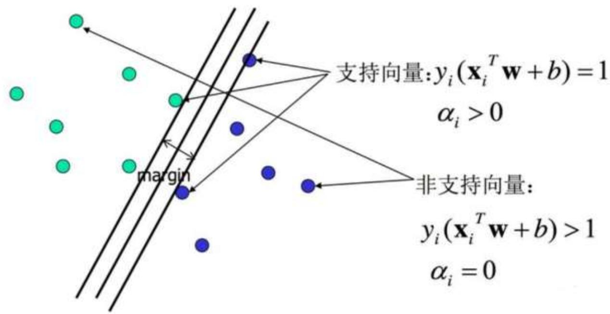

# In our case

不等于0的拉格朗日乘子后面所乘的样本点，其实都落在最大间隔边界上H1和H2上，也正是这部分样本（而不需要全部样本）唯一的确定了分类函数

严格的说，这些样本的一部分就可以确定。确定一条直线，只需要两个点就可以，即便有三五个都落在上面，我们也不是全都需要。这部分真正需要的样本点，就叫做支持向量。

$$
\hat {W} = \sum_ {i \in S V} \hat {\alpha} _ {i} y _ {i} X _ {i}
$$

$$
\hat {b} = y _ {j} - \sum_ {i \in S V} \hat {\alpha} _ {i} y _ {i} X _ {j} ^ {T} X _ {i}
$$

类似的，判别函数也可转换成如下形式：

$$
f (X) = \operatorname {s i g n} \left(\sum_ {i \in S V} \hat {\alpha} _ {i} y _ {i} X ^ {T} X _ {i} + \hat {b}\right)
$$

所以，整个SVM的解只与支持向量SV有关，与非支持向量无关。

# 近似线性可分

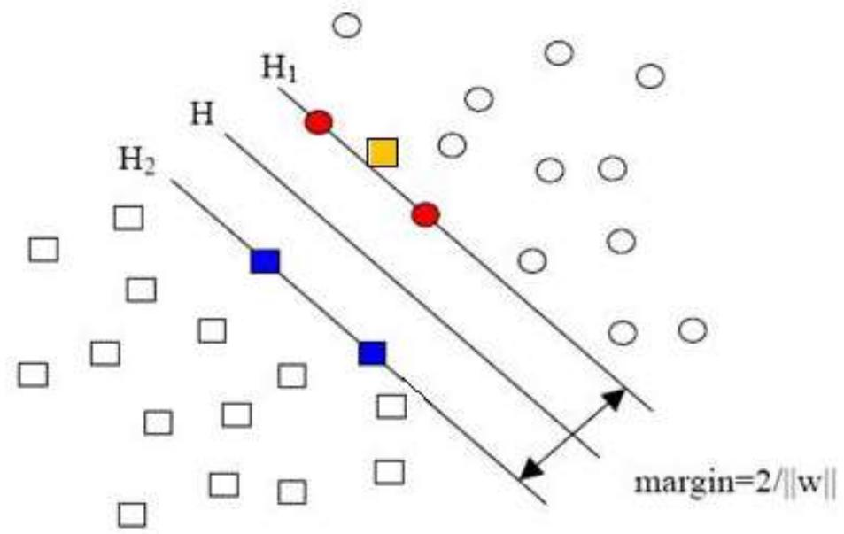

样本点往往是成千上万的。如果新增了一个样本点，映射到空间后，其位置是如黄色方块这样的

这样一个单独的样本，使得问题变成了线性不可分的。这样的问题叫做“近似线性可分”的问题

# 近似线性可分：软间隔

这个点更有可能是一个错误的点，即噪声，仍可以用原来的分类器进行分类，不会对效果造成影响。然后程序并不能区分一个点是不是噪声。

硬间隔分类法：原本的优化问题的表达式中，要考虑所有的样本点（不能忽略某一个，因为程序它怎么知道该忽略哪一个呢？）

– 寻找正负类之间的最大几何间隔

而几何间隔本身代表的是距离，是非负的，像上面这种有噪声的情况会使得整个问题无解

这种解法叫“硬间隔”分类法： 硬性的要求所有样本点都满足和分类平面间的距离必须大于某个值

缺点：硬间隔的分类法其结果容易受少数点的控制，这是很危险的

解决：允许一些点到分类平面的距离不满足原先的要求

# 软间隔：松弛变量

我们原先对样本点的要求是：

$$
y _ {i} [ (w x _ {i} + b) ] \geq 1 (i = 1, 2, \dots , l)
$$

离分类面最近的样本点函数间隔也要比1大。如果要引入容错性，就给1这个硬性的阈值加一个松弛变量，即允许：

$$
y _ {i} [ (w x _ {i} + b) ] \geq 1 - \zeta_ {i} (i = 1, 2, \dots , l \quad \zeta_ {i} \geq 0)
$$

因为松弛变量是非负的，因此最终的结果是要求间隔可以比1小。但是当某些点出现这种间隔比1小的情况时，（这些点也叫离群点），意味着我们放弃了对这些点的精确分类，而这对我们的分类器来说是种损失。

但是放弃这些点也带来了好处，那就是使分类面不必向这些点的方向移动，因而可以得到更大的几何间隔（在低维空间看来，分类边界也更平滑）。显然我们必须权衡这种损失和好处。好处很明显，我们得到的分类间隔越大，好处就越多。

# 松弛变量

优化问题：

$$
\min \frac {1}{2} \| w \| ^ {2}
$$

$$
\mathrm {s u b j e c t t o} y _ {i} [ (w x _ {i} + b) ] - 1 \geq 0 (i = 1, 2, \dots , l)
$$

衡量损失的两种方法：

$$
\sum_ {i = 1} ^ {l} \zeta_ {i} ^ {2} \quad \sum_ {i = 1} ^ {l} \zeta_ {i} \quad \text {二 阶 软 间 隔 分 类 器} \mathrm {v s} \text {一 阶 软 间 隔 分 类 器}
$$

把损失加到目标函数里：

引入惩罚因子（cost, C）

$$
\min \frac {1}{2} \| w \| ^ {2} + C \sum_ {i = 1} ^ {l} \zeta_ {i}
$$

$$
\mathrm {s u b j e c t t o} y _ {i} [ (w x _ {i} + b) ] \geq 1 - \zeta_ {i}
$$

$$
\zeta_ {i} \geq 0, i = 1, \dots , l
$$

# 松弛变量

并非所有的样本点都有一个松弛变量与其对应, 只有“离群点”才有，或者也可以这么看，所有没离群的点松弛变量都等于0

松弛变量的值实际上标示出了对应的点到底离群有多远，值越大，点就越远惩罚因子C决定了你有多重视离群点带来的损失

当所有离群点的松弛变量的和一定时，C越大，对目标函数的损失也越大，非常不愿意放弃这些离群点，

C定为无限大，这样只要稍有一个点离群，目标函数的值马上变成无限大，马上让问题变成无解，这就退化成了硬间隔问题

惩罚因子C不是一个变量，整个优化问题在解的时候，C是一个你必须事先指定的值尽管加了松弛变量这么一说，但这个优化问题仍然是一个二次规划问题，解它的过程比起原始的硬间隔问题来说，没有任何更加特殊的地方

# 软间隔问题求解

$$
\min  _ {W, b, \xi} \frac {1}{2} \left\| W \right\| ^ {2} + C \sum_ {i = 1} ^ {n} \xi_ {i} \tag {3.1.4}
$$

$$
s. t. y _ {i} \left(X _ {i} ^ {T} W + b\right) \geq 1 - \xi_ {i}
$$

$$
\xi_ {i} \geq 0, i = 1, 2, \dots n.
$$

上式所述问题即软间隔支持向量机。

式(3.1.4)表示的软间隔支持向量机依然是一个凸二次规划问题，和硬间隔支持向量机类似，我们可以通过拉格朗日乘子法将其转换为对偶问题进行求解。式(3.1.4)对应的拉格朗日函数为

$$
L (W, b, \xi , \alpha , \beta) = \frac {1}{2} \| W \| ^ {2} + C \sum_ {i = 1} ^ {n} \xi_ {i} - \sum_ {i = 1} ^ {n} \alpha_ {i} \left[ y _ {i} \left(X _ {i} ^ {T} W + b\right) - 1 + \xi_ {i} \right] - \sum_ {i = 1} ^ {n} \beta_ {i} \xi_ {i} \tag {3.2.1}
$$

类似2.4节，为了求得对偶问题的解，我们需要先求得 $L ( W , b , \xi , \alpha , \beta )$ 对 $W$ $^ { b }$ 和 $\xi$ 的极小再求对 $\alpha$ 和 $\beta$ 的极大。

# 软间隔问题求解

# 对参数部分 W b ?? 求解

（1)求 $\operatorname* { m i n } _ { W , b , \xi } ( W , b , \xi , \alpha , \beta ) ;$ 将 $L ( W , b , \xi , \alpha , \beta )$ 分别对 $W$ $b$ 和 $\xi$ 求偏导并令为0可得

$$
W = \sum_ {i = 1} ^ {n} \alpha_ {i} y _ {i} X _ {i} \tag {3.2.2}
$$

$$
\sum_ {i = 1} ^ {n} \alpha_ {i} y _ {i} = 0 \tag {3.2.3}
$$

$$
C = \alpha_ {i} + \beta_ {i} \tag {3.2.4}
$$

将上面三个式子代入式（3.2.1）并进行类似式(2.4.8）的推导即得

$$
\min  _ {W, b, \xi} L (W, b, \xi , \alpha , \beta) = - \frac {1}{2} \sum_ {i = 1} ^ {n} \sum_ {j = 1} ^ {n} \alpha_ {i} \alpha_ {j} y _ {i} y _ {j} X _ {i} ^ {T} X _ {j} + \sum_ {i = 1} ^ {n} \alpha_ {i} \tag {3.2.5}
$$

注意其中的 $\beta$ 被消去了。

# 软间隔问题求解

对 ?? 求解

$\operatorname* { m i n } _ { W , b , \xi } L ( W , b , \xi , \alpha , \beta )$ 对 $\alpha$ 的极大：

式（3.2.5）对 $\alpha$ 求极大，也等价于式(3.2.5)取负数后对 $_ \alpha$ 求极小，即

$$
\min  _ {\alpha} \frac {1}{2} \sum_ {i = 1} ^ {n} \sum_ {j = 1} ^ {n} \alpha_ {i} \alpha_ {j} y _ {i} y _ {j} X _ {i} ^ {T} X _ {j} - \sum_ {i = 1} ^ {n} \alpha_ {i} \tag {3.2.6}
$$

同时满足约束条件：

$$
\sum_ {i = 1} ^ {n} \alpha_ {i} y _ {i} = 0 \tag {3.2.7}
$$

$$
0 \leq \alpha_ {i} \leq C, i = 1, 2, \dots , n.
$$

至此，我们得到了原始最优化问题(3.1.4)和对偶最优化问题(3.2.6)、（3.2.7)。

# 软间隔问题求解

求解 W 与 b

类似2.4节地，假设我们现在通过通用的二次规划求解方法或者SMO算法求得了(3.2.6)、(3.2.7）的最优解 $\hat { \alpha }$ ，则根据式(3.2.2)可求得最优W：

$$
\hat {W} = \sum_ {i = 1} ^ {n} \hat {\alpha} _ {i} y _ {i} X _ {i} \tag {3.2.8}
$$

再根据KKT条件，即

乘子非负： $\alpha _ { i } \geq 0$ $\beta _ { i } \geq 0 ( i = 1 , 2 , . . . n .$ 下同）约束条件： $y _ { i } ( X _ { i } ^ { T } W + b ) - 1 \geq - \xi _ { i }$互补条件 $\alpha _ { i } [ y _ { i } ( X _ { i } ^ { T } W + b ) - 1 + \xi _ { i } ] = 0 , \beta _ { i } \xi _ { i } = 0$

可求得整个软间隔SVM的解，即：

$$
\hat {W} = \sum_ {i \in S V} \hat {\alpha} _ {i} y _ {i} X _ {i} \tag {3.2.9}
$$

$$
\hat {b} = y _ {j} - \sum_ {i \in S V} \hat {\alpha} _ {i} y _ {i} X _ {j} ^ {T} X _ {i} \tag {3.2.10}
$$

其中 $j$ 需满足 $0 < \hat { \alpha } _ { j } < C$

对于任意样本 $( X _ { i } , y _ { i } )$ ，若 $\alpha _ { i } = 0$ ，此样本点不是支持向量，该样本对模型没有任何的作用；若 $\alpha _ { i } > 0$ ，此样本是一个支持向量。

# 软间隔问题求解

若满足 $\alpha _ { i } > 0$ ，进一步地，若 $0 < \alpha _ { i } < C$

在间隔内部的支持向量：

$$
y _ {i} \left(\mathbf {x} _ {i} ^ {T} \mathbf {w} + b\right) = 1 - \xi_ {i}
$$

$$
\alpha_ {i} = C, 1 \geq \xi_ {i} > 0
$$

$$
\boldsymbol {\beta} _ {\mathrm {i}} = \mathbf {0}
$$

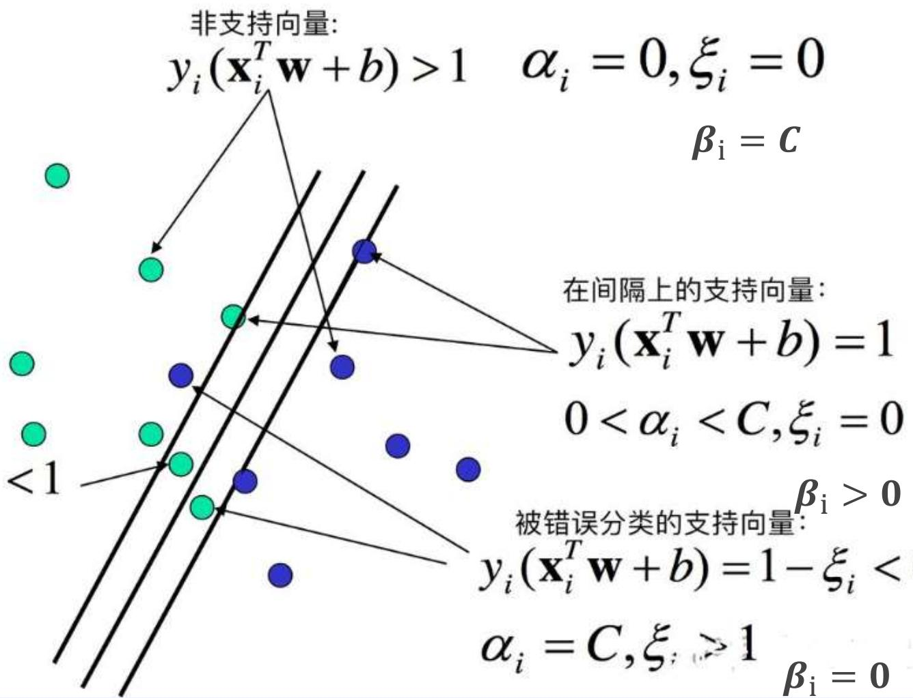

# 不同的惩罚参数C的影响

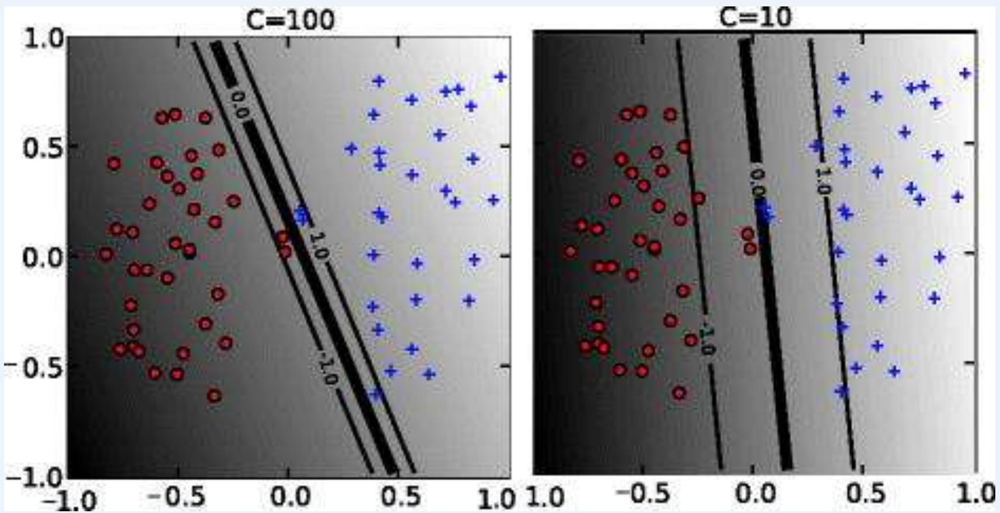

# 松弛变量

# 改进

C所起的作用：表征你有多么重视离群点，C越大越重视，越不想丢掉它们

我们可以给每一个离群点都使用不同的C，这时就意味着你对每个样本的重视程度都不一样，有些样本丢了也就丢了，错了也就错了，这些就给一个比较小的C；而有些样本很重要，决不能分类错误，就给一个很大的C。

# 松弛变量

# 偏斜/不平衡问题：

样本的偏斜 (unbalanced)问题：指的是参与分类的两个类别（也可以指多个类别）样本数量差异很大。比如说正类有10000个样本，而负类只给了100个

方形的点是负类。H，H1，H2是根据给的样本算出来的分类面

由于负类的样本很少很少，所以有一些本来是负类的样本点没有提供，比如图中两个灰色的方形点

如果这两个点有提供的话，那算出来的分类面应该是H’，H2’他们和之前的结果有出入

负类给的样本点越多，就越容易出现在灰色点附近的点，结果也就越接近于真实的分类面

由于偏斜现象的存在，使得数量多的正类可以把分类面向负类的方向“推”，因而影响了结果的准确性

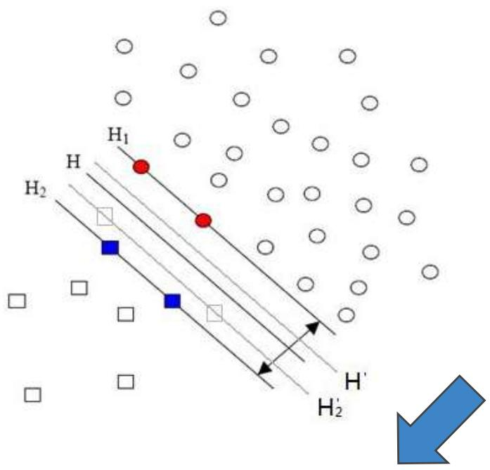

# 松弛变量

正类之所以可以“欺负”负类，其实并不是因为负类样本少，真实的原因是负类的样本分布的不够广（没扩充到负类本应该有的区域）

比如给政治类和体育类文章做分类，政治类文章很多，而体育类只有几篇关于篮球的文章，分类会明显偏向于政治类，如果要给体育类文章增加样本，但增加的样本仍然全都是关于篮球的，虽然体育类文章在数量上可以达到与政治类一样多，但过于集中了，结果仍会偏向于政治类！所以给C+和C-确定比例更好的方法应该是衡量他们分布的程度

比如：计算在空间中占据了多大的体积，例如给负类找一个超球（高维空间里的球），它包含所有负类样本，再给正类找一个，比较两个球的半径，从而大致确定分布的情况。显然半径大的分布就比较广，就给小一点的惩罚因子

但是，有的类别样本确实很集中，这不是提供的样本数量多少的问题，而是类别本身的特征（就是某些话题涉及的面很窄，例如计算机类的文章就明显不如文化类的文章那么广泛），这个时候即便超球的半径差异很大，也应该考虑是否赋予两个类别不同的惩罚因子

# 松弛变量

解决：

对付数据集偏斜问题的方法之一就是在惩罚因子上作文章，把目标函数中因松弛变量而损失的部分变成：

$$
C _ {+} \sum_ {i = 1} ^ {p} \zeta_ {i} + C _ {-} \sum_ {j = p + 1} ^ {p + q} \zeta_ {j}
$$

其中i $=$ 1…p都是正样本，j=p+1…p+q都是负样本

如何确定 $\mathsf { C } +$ ，C- ?

参数调优

使用两类样本数的比来算

比如 $\mathsf { C } +$ 设为5，C- 就设为500 （因为正负样本比例为10000：100）

# 线性不可分时：核函数

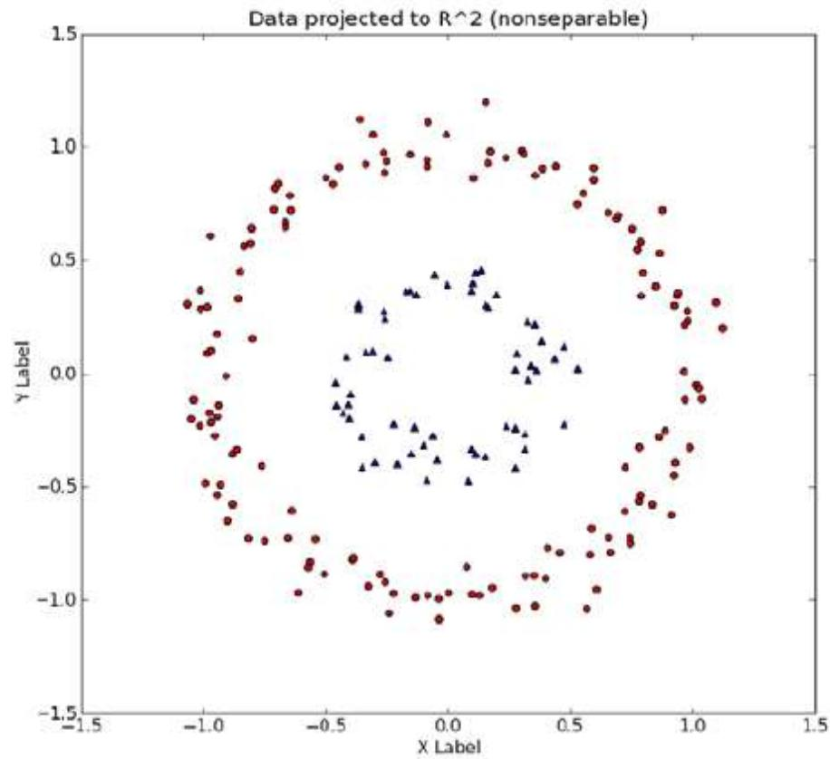

Figure5:（Left）Adataset in $\mathbb { R } ^ { 2 }$ ，notlinearly separable.（Right）The same dataset$[ x _ { 1 } , x _ { 2 } ] = [ x _ { 1 } , x _ { 2 } , x _ { 1 } { } ^ { 2 } + x _ { 2 } { } ^ { 2 } ]$

Datain R^3(separable)

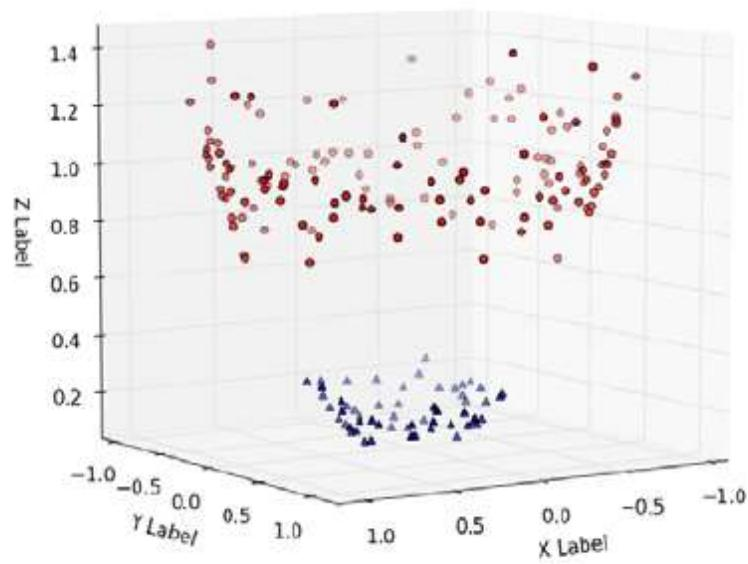

# 线性不可分

如果样本线性不可分

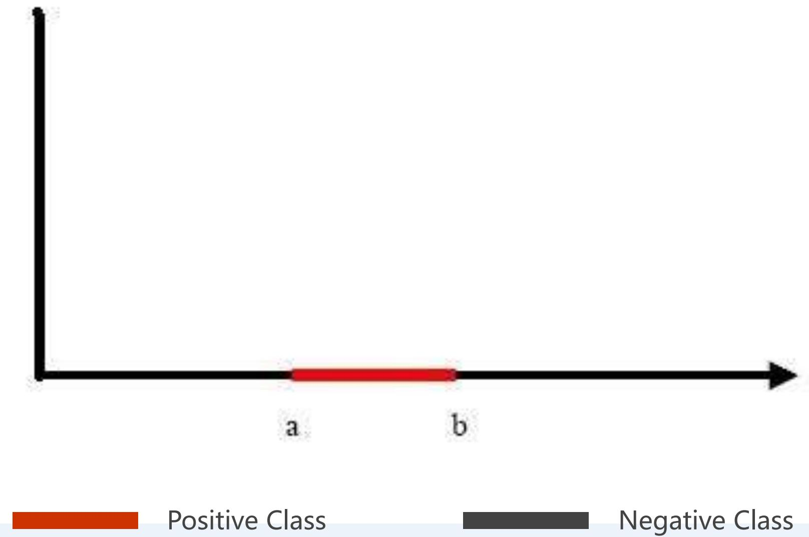

# 线性不可分

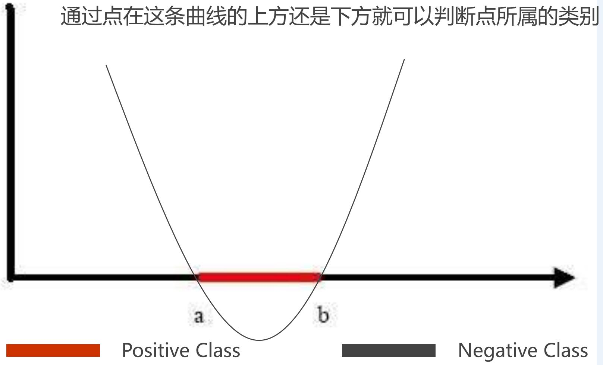

# 线性不可分

这条二次曲线的表达式可以写为：

$$
g (x) = c _ {0} + c _ {1} x + c _ {2} x ^ {2}
$$

但它并非线性函数，新建一个向量y和a：

$$
y = \left[ \begin{array}{l} y _ {1} \\ y _ {2} \\ y _ {3} \end{array} \right] = \left[ \begin{array}{l} 1 \\ x \\ x ^ {2} \end{array} \right]
$$

$$
a = \left[ \begin{array}{l} a _ {1} \\ a _ {2} \\ a _ {3} \end{array} \right] = \left[ \begin{array}{l} c _ {0} \\ c _ {1} \\ c _ {2} \end{array} \right]
$$

$$
g (x) \mathrm {转 化 为} f (y) = \langle a, y \rangle
$$

$$
\mathrm {即} g (x) = f (y) = a y
$$

在任意维度的空间中，这种形式的函数都是一个线性函数（只不过其中的a和y都是多维向量）

原来在低维空间中一个线性不可分的问题，映射到高维空间后，变成了线性可分的

最初解决线性不可分问题的基本思路：向高维空间转化，使其变得线性可分

# 线性不可分

# 文本分类示例：

一个文本分类问题的原始空间是1000维的，即每个要被分类的文档被表示为一个1000维的向量。在这个维度上问题是线性不可分的。现在我们有一个2000维空间里的线性函数：

$$
f (x ^ {\prime}) = \langle w ^ {\prime}, x ^ {\prime} \rangle + b
$$

w’和x’都是2000维向量，w’是定值，x’是向量

输出一个1000维的向量x，分类过程即：

I. 把x变换为2000维的向量x

II. 求x’与w’的内积

III. 把内积值与b相加

IV. 看结果大于阈值还是小于阈值，即得到分类结果。

# 线性不可分

我们其实只关心那个高维空间里内积的值，那个值算出来了，分类结果就算出来了

从理论上说， x’是经由x变换来的，因此广义上可以把它叫做x的函数（有一个x，就确定了一个x’），而w’是常量，它是一个低维空间里的常量w经过变换得到的，所以给了一个w 和x的值，就有一个确定的 $\mathsf { f } ( x ^ { \prime } ) = \langle w ^ { \prime } , x ^ { \prime } \rangle + b$ 值与其对应

是否能有这样一种函数 $8 ( m / \min )$ ,他接受低维空间的输入值，却能算出高维空间的内积值 $( ( 3 ) ^ { 2 } , 2 3 ) : 3$

即有这样的函数，当给了一个低维空间的输入x以后

$$
g (x) = K (w, x) + b
$$

$$
f (x ^ {\prime}) = \langle w ^ {\prime}, x ^ {\prime} \rangle + b
$$

这两个函数的计算结果就完全一样，我们也就用不着费力找那个映射关系，直接拿低维的输入往g(x)里面代就可以了

# 线性不可分: 引入核函数

线性分类器 $\begin{array} { r } { f ( x ^ { \prime } ) = \sum _ { i = 1 } ^ { n } a _ { i } y _ { i } \langle x ^ { \prime } { } _ { i } , x ^ { \prime } \rangle + b } \end{array}$

现在这个就是高维空间里的线性函数，我们就可以用一个低维空间里的函数（再一次的，这个低维空间里的函数就不再是线性的）来代替：

$$
g (x) = \sum_ {i = 1} ^ {n} a _ {i} y _ {i} K (x _ {i}, x) + b
$$

f(x’) 和g(x)里的a，y，b全都是一样的

尽管给的问题是线性不可分的，但是硬当它是线性问题来求解

求解过程中，凡是要求内积的时候就用你选定的核函数来算

这样求出来的a再和选定的核函数一组合，就得到分类器

# 核函数

# 维数爆炸

对一个二维空间做映射，假如新空间是原始空间所有1阶及2阶段组合，可以得到五个维度 $( x _ { 1 , } \ x _ { 2 , } \ x _ { 1 } x _ { 2 , } \ x _ { 1 } ^ { \ 2 } , x _ { 2 } ^ { \ 2 } )$ ）

三维空间的话就会得到19维的新空间 $( x _ { 1 , } ~ x _ { 2 , } { x _ { 3 , } } { x _ { 1 } } { x _ { 2 , } } { x _ { 1 } } { x _ { 3 , } } { x _ { 2 } } { x _ { 3 , } } { x _ { 1 } } ^ { 2 } , { x _ { 2 } } ^ { 2 } , { x _ { 3 } } ^ { 2 } { , } ~$??1??22, ??1 ??32, ??2??32, ??12??2, ??12??3,??22??3, ??13, ??23, ??33, ??1 ??2??3）

– 这个数目是呈指数爆炸的

# 映射到高维空间中，然后再根据内积的公式进行计算

不妨还是从最开始的简单例子出发，设两个向量 $x _ { 1 } = ( \eta _ { 1 } , \eta _ { 2 } ) ^ { T }$ $\boldsymbol { x } _ { 2 } = ( \xi _ { 1 } , \xi _ { 2 } ) ^ { T }$而 $\phi ( \cdot )$ 即是到前面说的五维空间的映射，因此映射过后的内积为：

$$
(\boldsymbol {\eta} _ {1}, \boldsymbol {\eta} _ {2}, \boldsymbol {\eta} _ {1} \boldsymbol {\eta} _ {2}, \boldsymbol {\eta} _ {1} ^ {2}, \boldsymbol {\eta} _ {2} ^ {2}) \qquad (\xi_ {1}, \xi_ {2}, \xi_ {1} \xi_ {2}, \xi_ {1} ^ {2}, \xi_ {2} ^ {2})
$$

$$
\left\langle \phi \left(x _ {1}\right), \phi \left(x _ {2}\right) \right\rangle = \eta_ {1} \xi_ {1} + \eta_ {1} ^ {2} \xi_ {1} ^ {2} + \eta_ {2} \xi_ {2} + \eta_ {2} ^ {2} \xi_ {2} ^ {2} + \eta_ {1} \eta_ {2} \xi_ {1} \xi_ {2} \tag {2.29}
$$

直接在低维中计算，不显式地写出映射结果

$$
\left(\langle x _ {1}, x _ {2} \rangle + 1\right) ^ {2} = 2 \eta_ {1} \xi_ {1} + \eta_ {1} ^ {2} \xi_ {1} ^ {2} + 2 \eta_ {2} \xi_ {2} + \eta_ {2} ^ {2} \xi_ {2} ^ {2} + 2 \eta_ {1} \eta_ {2} \xi_ {1} \xi_ {2} + 1
$$

解决了维数爆炸的问题，而上面的函数为核函数

# 核函数

设X是输入空间（欧式空间 $R ^ { n }$ 的子集或离散集合），又设 $\mathcal { H }$ 是特征空间（希尔伯特空间)，如果存在一个X到 $\mathcal { H }$ 的映射 $\phi ( { \boldsymbol { x } } ) : { \mathcal { X } } \to { \mathcal { H } }$ 使得对所有 $_ x$ , $z \in \mathcal { X }$ ，函数 $K ( x , z )$ 满足条件$K ( x , z ) = \phi ( x ) \cdot \phi ( z )$ 则称 $K ( x , z )$ 为核函数， $\phi ( x )$ 为映射函数，式中 $\phi ( { \boldsymbol { x } } ) \cdot \phi ( { \boldsymbol { z } } )$$\phi ( x )$ 和 $\phi ( z )$ 的内积。

一个是映射到高维空间中，然后再根据内积的公式进行计算，计算复杂度高

而另一个则直接在原来的低维空间中进行计算，而不需要显式地写出映射后的结果，

计算复杂度低

把这里的计算两个向量在隐式映射过后的空间中的内积的函数K（x，z）叫做核函数(Kernel Function)

核函数能简化映射空间中的内积运算

# 核函数

# 几个常见的核函数：

$K ( x _ { 1 } , x _ { 2 } ) = ( \langle x _ { 1 } , x _ { 2 } \rangle + R ) ^ { d }$

·高斯核 $K ( x _ { 1 } , x _ { 2 } ) = e x p ( - \| x _ { 1 } - x _ { 2 } \| ^ { 2 } / 2 \sigma ^ { 2 } )$

$K ( x _ { 1 } , x _ { 2 } ) = \langle x _ { 1 } , x _ { 2 } \rangle$

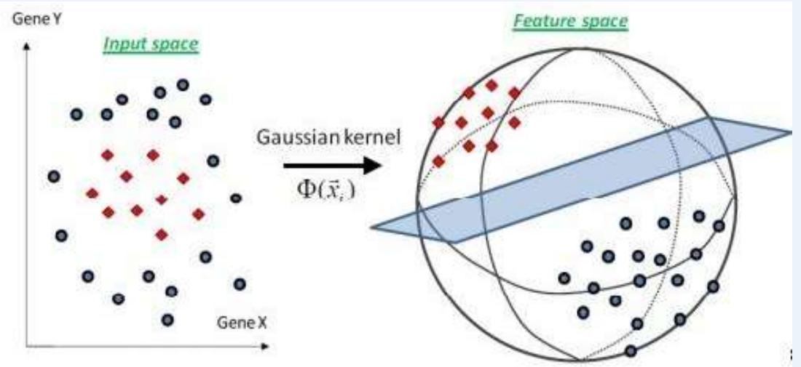

# 非线性SVM

·首先选取适当的核函数 $K ( x , z )$ 和适当的参数 $C$ ，构造最优化问题

$$
\min  _ {\alpha} \frac {1}{2} \sum_ {i = 1} ^ {n} \sum_ {j = 1} ^ {n} \alpha_ {i} \alpha_ {j} y _ {i} y _ {j} K (X _ {i}, X _ {j}) - \sum_ {i = 1} ^ {n} \alpha_ {i}
$$

$$
s. t. \quad \sum_ {i = 1} ^ {n} \alpha_ {i} y _ {i} = 0
$$

$$
0 \leq \alpha_ {i} \leq C, i = 1, 2, \dots , n.
$$

·再利用现成的二次规划问题求解算法或者SMO算法求得最优解 $\hat { \alpha }$

·选择 $\hat { \alpha }$ 的一个满足 $0 < \hat { \alpha } _ { j } < C$ 的分量 ${ \hat { \alpha } } _ { j }$ ，计算

$$
\hat {b} = y _ {j} - \sum_ {i \in S V} \hat {\alpha} _ {i} y _ {i} K (X _ {j}, X _ {i})
$$

·构造决策函数：

$$
f (x) = \operatorname {s i g n} \left(\sum_ {i \in S V} \hat {\alpha} _ {i} y _ {i} K \left(X _ {j}, X _ {i}\right) + \hat {b}\right)
$$

# 非线性SVM：Kernel SVM

svC(kernel='rbf',gamma=0.01).fit(X

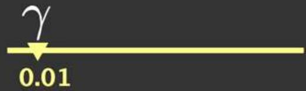

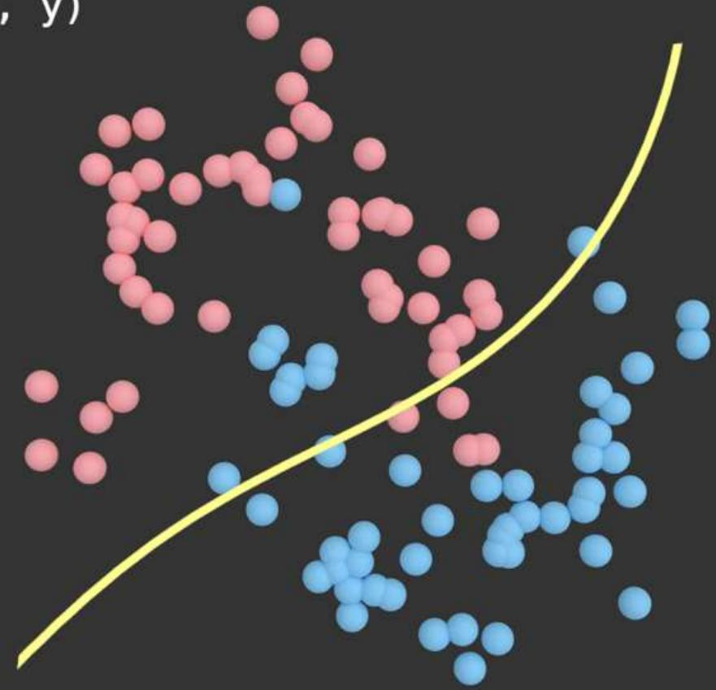

# 核函数选择

如针对具体问题在多种核函数中进行选择？

– 对核函数的选择，现在还缺乏指导原则

实验的观察结果表明，某些问题用某些核函数效果很好，用另些就比较差

般来讲，径向基（高斯）核函数不会出太大偏差

– http://yann.lecun.com/exdb/mnist/

如果使用核函数向高维空间映射后，问题仍然是线性不可分的，怎么办？

由松弛变量这一概念来解决。

# 核函数

假设现在你是一个农场主，圈养了一批羊群，但为预防狼群袭击羊群，你需要搭建一个篱笆来把羊群围起来。但是篱笆应该建在哪里呢？

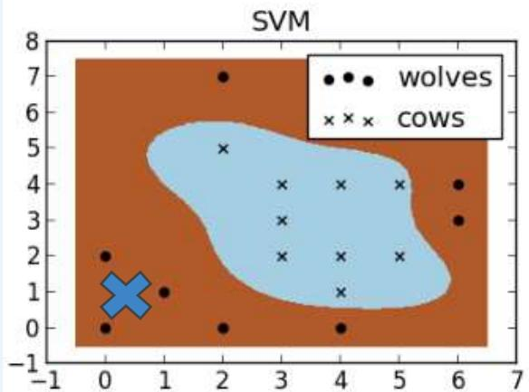

Decision Tree

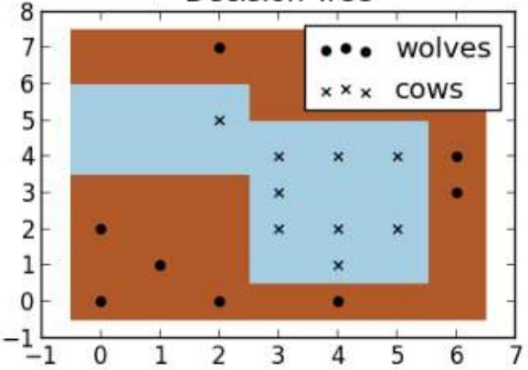

Logistic

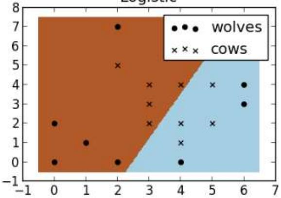

假如有一只羊跑到图中位置，又该如何划分？

# 回顾松弛变量

松弛变量与核函数解决线性不可分问题的区别

在原始的低维空间中，样本相当的不可分，无论如何找分类平面，总会有大量的离群点

用核函数向高维空间映射一下，虽然结果仍然是不可分的但比原始空间里的要更加接近线性可分的状态（就是达到了近似线性可分的状态）

再用松弛变量处理那些少数“冥顽不化”的离群点，就简单有效得多了。

简单说来，就是使用了核函数的软间隔线性分类法

# SVM用于多分类

从前面可以看出，SVM是一个典型的二分类器，如何由二分类器得到多分类器？

一次性考虑所有样本，并求解一个多目标函数的优化问题，一次性得到多个分类面，即多个超平面把空间划分为多个区域，每个区域对应一个类别？

就像这样：

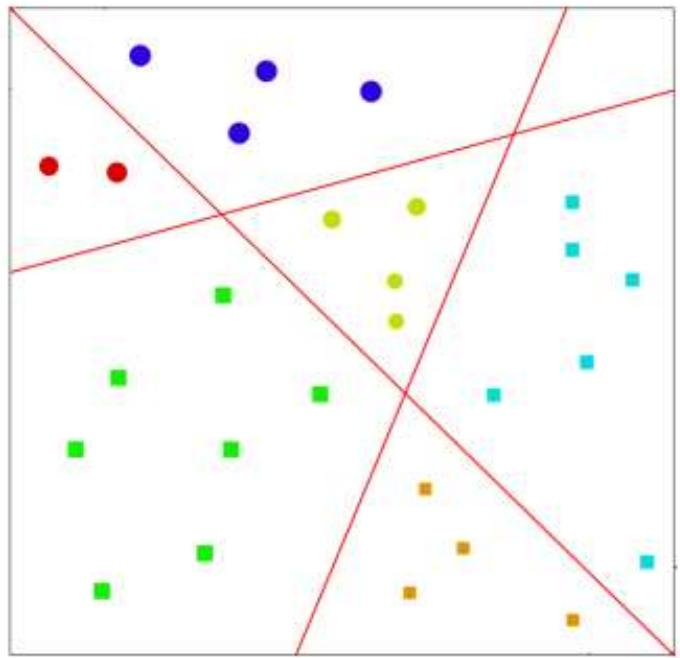

这个方法是不可行的，一次性求解的方法计算量实在太大，大到无法实用的地步。

# SVM用于多分类

“一类对其余”方法：就是每次仍然解一个两类分类的问题。比如我们有5个类别，第一次就把类别1的样本定为正样本，其余2，3，4，5的样本合起来定为负样本，这样得到一个两类分类器，它能够指出一篇文章是还是不是第1类的；第二次我们把类别2 的样本定为正样本，把1，3，4，5的样本合起来定为负样本，得到一个分类器，如此下去，我们可以得到5个这样的两类分类器（总是和类别的数目一致）。

优点：优化问题的规模比较小，分类速度比较快。

缺点：

$\spadesuit$ ◆ 分类重叠现象：每个分类器都说某个样本属于它的类。

$\spadesuit$ ◆ 不可分类现象：每个分类器都说某个样本不属于它的类

$\spadesuit$ 偏斜问题

# SVM用于多分类

每次选一个类的样本作正类样本，而负类样本则变成只选一个类（避免偏斜）。算出这样一些分类器：第一个只回答“是第1类还是第2类”，第二个只回答“是第1类还是第3类”，第三个只回答“是第1类还是第4类”，如果有k个类别，则总的两类分类器数目为k(k-1)/2

虽然分类器的数目多了，但是相应的训练速度快

假设一个文章有5个类别1，2，3，4，5，则有10个分类器：

– 12，13，14，15

– 23，24，25

– 34，35

– 45

输入一个类别为1的文章，结果出来4个类别1，及6个其它的4种类别。类别为1的数量最多，因此最终分为类别1

# SVM用于多分类

真正分类时，把一篇文章输入给所有分类器，第一个分类器会投票说它是“1”或者“2”，第二个会说它是“1”或者“3”，让每一个都投上自己的一票，最后统计票数如果类别“1”得票最多，就判这篇文章属于第1类会有分类重叠的现象，但不会有不可分类现象，因为不可能所有类别的票数都是0

对于大类别数的情况，比如有1000个类别，则要调用的分类器数目会达到500,000个

# SVM用于多分类

“一对一”方法：在对一篇文章进行分类之前，先按照下面图的样子来组织分类器（一个有向无环图，也叫DAG SVM）

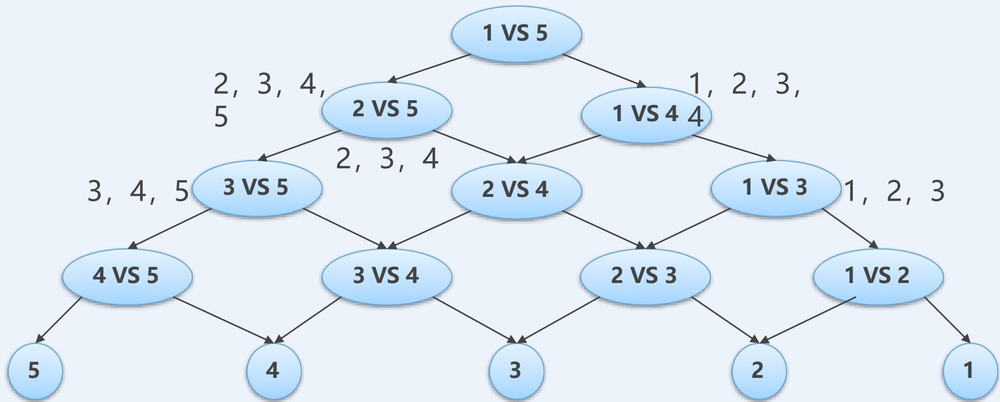

# SVM用于多分类

只调用了4个分类器（如果类别数是k，则只调用k-1个），分类速度快，且没有分类重叠和不可分类现象

缺点：如果最一开始的分类器回答错误（明明是类别1的文章，它说成了5），那么后面的分类器是无论如何也无法纠正它的错误的（因为后面的分类器压根没有出现“1”这个类别标签），其实对下面每层的分类器都存在这种错误向下累积的现象

DAG的累积上限，是有定论的，有理论证明。而一对其余和一对一方法中，尽管每一个两类分类器的泛化误差限是知道的，但是合起来做多类分类的时候，无法知道误差上界，意味着准确率低到0也是有可能的

# SVM用于多分类

DAG方法改善：希望根节点少犯错误为好，因此参与第一次分类的两个类别，最好是差别特别大，大到以至于不太可能把他们分错

或者总取在两类分类中正确率最高的那个分类器作根节点，或者我们让两类分类器在分类的时候，不光输出类别的标签还输出一个类似“置信度”的值，当它对自己的结果不太自信的时候，我们就不光按照它的输出走，把它旁边的那条路也走一走，等等

# SVM的计算复杂度

SVM：训练和分类两个完全不同的过程

训练阶段的复杂度，即解那个二次规划问题的复杂度

要划分为两大块：解析解和数值解。

解析解就是理论上的解，它的形式是表达式，因此它是精确的，一个问题只要有解那它的解析解是一定存在的。

对SVM来说，求得解析解的时间复杂度最坏可以达到 $O \left( N _ { S V } ^ { 3 } \right)$ ，其中 $N _ { S V }$ 是支持向量的个数，而虽然没有固定的比例，但支持向量的个数多少也和训练集的大小有关。

数值解就是可以使用的解，是一个一个的数，往往都是近似解。求数值解的过程从一个数开始，试一试它当解效果怎样，不满足一定条件（叫做停机条件，就是满足这个以后就认为解足够精确了，不需要继续算下去了）就试下一个，当然下一个数不是乱选的，也有一定章法可循(如梯度下降)。

有的算法，每次只尝试一个数，有的就尝试多个，而且找下一个数字（或下一组数）的方法也各不相同，停机条件也各不相同，最终得到的解精度也各不相同，可见对求数值解的复杂度的讨论不能脱开具体的算法。

# SVM的计算复杂度

一个具体的算法，Bunch-Kaufman训练算法，典型的时间复杂度在 ${ \cal O } \left( N _ { S V } ^ { 3 } + L N _ { S V } ^ { 2 } + \right.$൯?????????? 和 $O ( d L ^ { 2 } )$ 之间，其中 $N _ { S V }$ 是支持向量的个数，L是训练集样本的个数，d是每个样本的维数（原始的维数，没有经过向高维空间映射之前的维数）

复杂度会有变化，是因为它不光跟输入问题的规模有关（不光和样本的数量，维数有关），也和问题最终的解有关（即支持向量有关），如果支持向量比较少，过程会快很多，如果支持向量很多，接近于样本的数量，就会产生?? ????2 这个十分糟糕的结果（给10，000个样本，每个样本1000维，基本就不用算了，算不出来，这种输入规模对文本分类来说很正常了）

为什么一对一方法尽管要训练的两类分类器数量多，但总时间实际上比一对其余方法要少了？

因为一对其余方法每次训练都考虑了所有样本（只是每次把不同的部分划分为正类或者负类而已），自然慢上很多

# Reference

SVM入门

http://www.blogjava.net/zhenandaci/archive/2016/03/17/254519.ht

ml#429695

支持向量机通俗导论（理解SVM的三层境界）

http://www.cnblogs.com/v-July-v/archive/2012/06/01/2539022.html

https://zhuanlan.zhihu.com/p/49331510

CS229 Lecture notes, Andrew Ng

Lecture from Prof. Lei Yang

# 谢谢大家！

相关课程资源及参考文献请浏览

超算习堂：https://easyhpc.net/course/143