# 无监督 （聚类）算法

Unsupervised Learning (Clustering) Algorithms

授课对象：计算机科学与技术专业 二年级

课程名称：人工智能（专业必修）

节选内容：第六章 机器学习

课程学分：3学分

# 什么是聚类分析？

Finding groups of objects such that the objects in a group will besimilar (or related) to one another and different from (or unrelated to)the objects in other groups

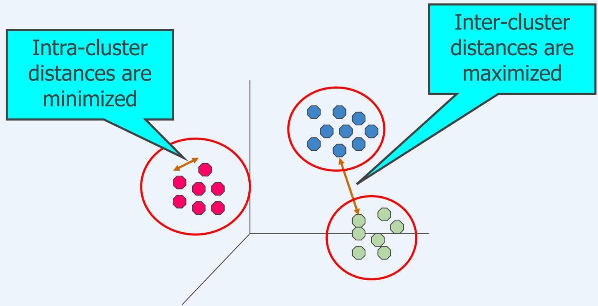

# 聚类分析的应用

# ⚫ Understanding

Group related documents forbrowsing

Group genes and proteins thathave similar functionality

Group stocks with similar pricefluctuations

# ⚫ Summarization

Reduce the size of large datasets

<table><tr><td></td><td>Discovered Clusters</td><td>Industry Group</td></tr><tr><td>1</td><td>Applied-Matl-DOWN,Bay-Network-Down,3-COM-DOWN,Cabletron-Sys-DOWN,CISCO-DOWN,HP-DOWN,DSC-Comm-DOWN,INTEL-DOWN,LSI-Logic-DOWN,Micron-Tech-DOWN,Texas-Inst-Down,Tellabs-Inc-Down,Natl-Semiconductor-DOWN,Oracl-DOWN,SGI-DOWN,Sun-DOWN</td><td>Technology1-DOWN</td></tr><tr><td>2</td><td>Apple-Comp-DOWN,Autodesk-DOWN,DEC-DOWN,ADV-Micro-Device-DOWN,Andrew-Corp-DOWN,Computer-Assoc-DOWN,Circuit-City-DOWN,Compaq-DOWN,EMC-Corp-DOWN,Gen-Inst-DOWN,Motorola-DOWN,Microsoft-DOWN,Scientific-Atl-DOWN</td><td>Technology2-DOWN</td></tr><tr><td>3</td><td>Fannie-Mae-DOWN,Fed-Home-Loan-DOWN,MBNA-Corp-DOWN,Morgan-Stanley-DOWN</td><td>Financial-DOWN</td></tr><tr><td>4</td><td>Baker-Hughes-UP,Dresser-Inds-UP,Halliburton-HLD-UP,Louisiana-Land-UP,Phillips-Petro-UP,Unocal-UP,Schlumberger-UP</td><td>Oil-UP</td></tr></table>

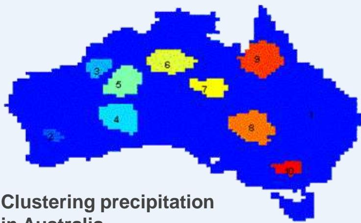

# 聚类：社交网络

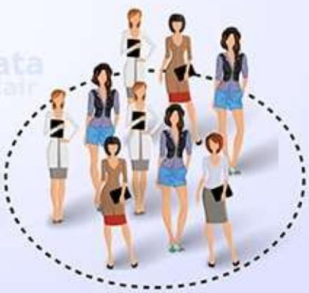

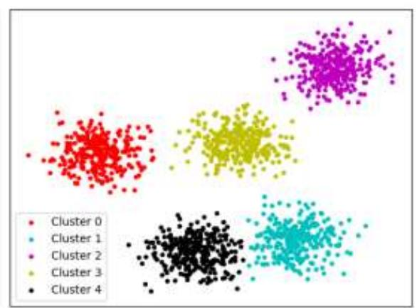

# 聚类：图像分割

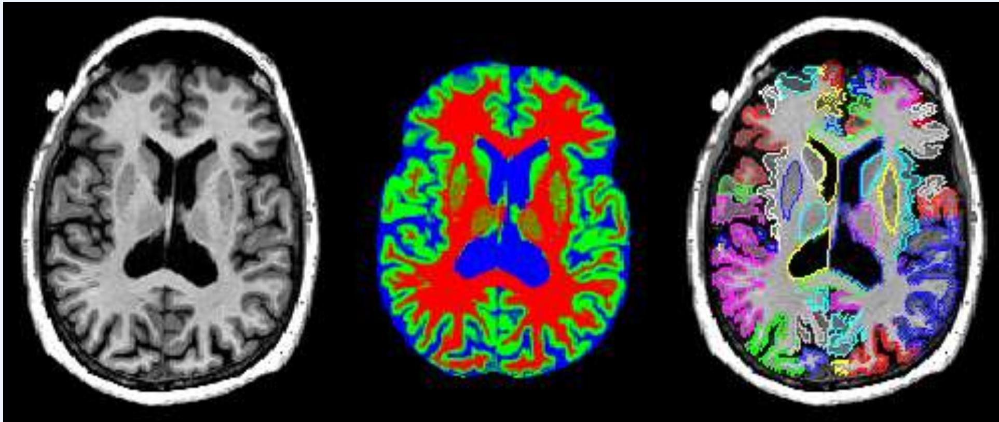

# 聚类：视频检测

TVCP

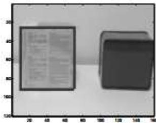

Frame #50

F-m.=0.9630

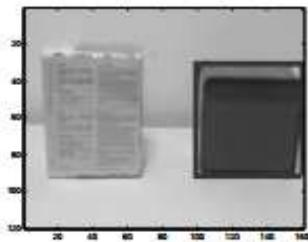

Frame #70

$\mathrm { F - m . } { = } 0 . 9 7 5 2$

Nonnegative PARAFAC

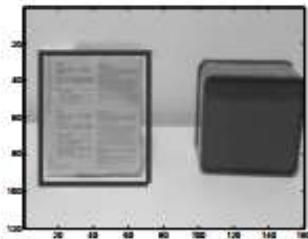

Frame#50

F-m.=0.9209

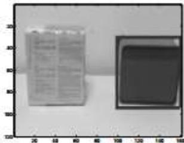

Frame #70

F-m.=0.9512

# 什么不是聚类分析？

⚫ Supervised classification

➢ Have class label information

Simple segmentation

Dividing students into different registrationgroups alphabetically, by last name

# 簇的概念：二义性

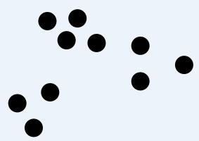

How many clusters?

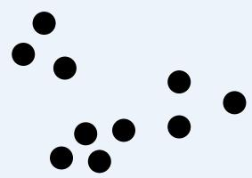

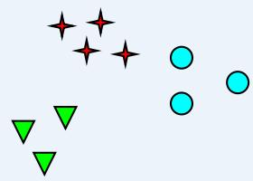

Six Clusters

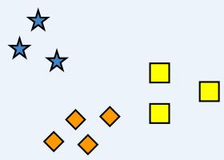

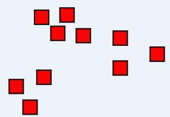

Two Clusters

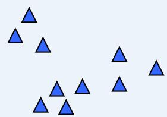

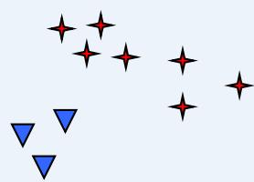

Four Clusters

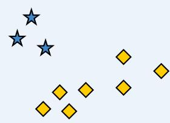

# 簇的概念：二义性

What is a natural grouping among these objects?

# 聚类(Clustering)类型

⚫ A clustering is a set of clusters

⚫ Important distinction between hierarchical and partitional sets of clusters

Partitional Clustering (分割式聚类)

➢ A division data objects into non-overlapping subsets (clusters) such thateach data object is in exactly one subset

➢ # clusters is needed, kmeans….

Hierarchical clustering (阶层式聚类)

➢ A set of nested clusters organized as a hierarchical tree

➢ # clusters is not needed

# 分割式聚类

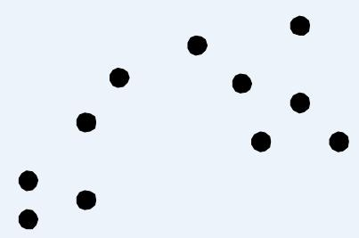

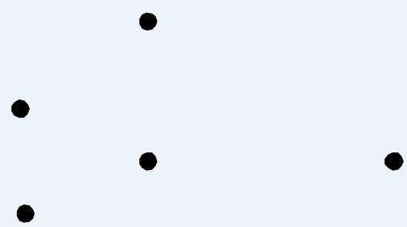

Original Points

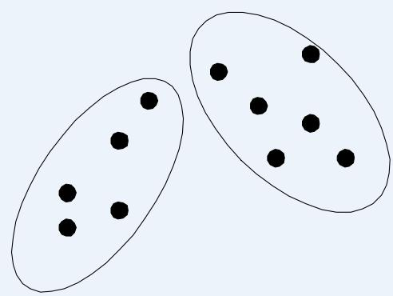

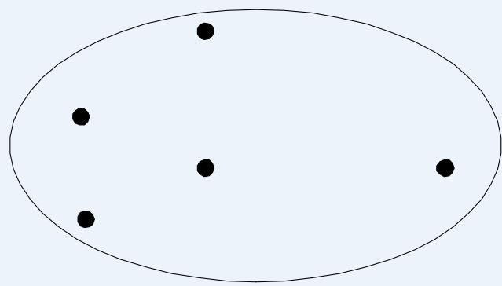

A Partitional Clustering

# 阶层式聚类

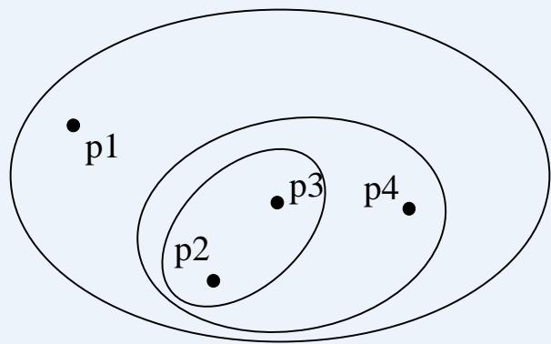

Traditional Hierarchical Clustering

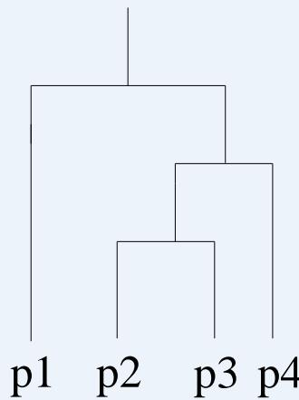

Traditional Dendrogram

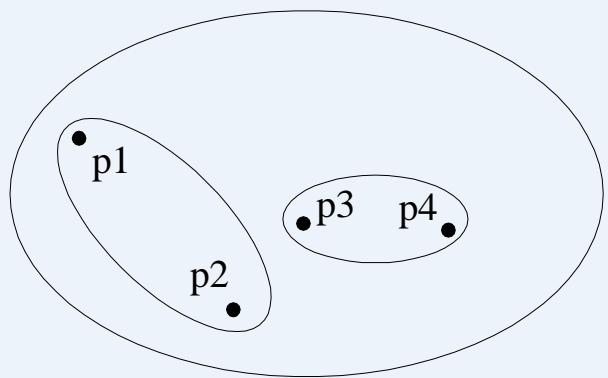

Non-traditional Hierarchical Clustering

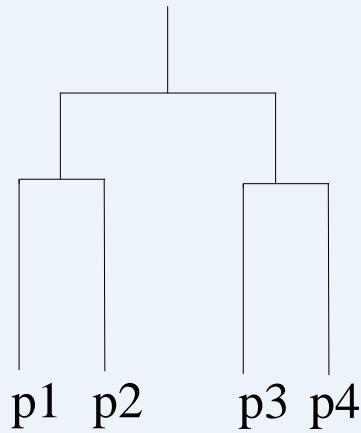

Non-traditional Dendrogram

# 不同聚类集合的其他差异

Fuzzy versus non-fuzzy 模糊聚类

➢ In fuzzy clustering, a point belongs to every cluster with someweight between 0 and 1

➢ Weights must sum to 1

➢ Probabilistic clustering has similar characteristics

Partial versus complete

➢ In some cases, we only want to cluster some of the data

⚫ Heterogeneous versus homogeneous 异质vs同质

➢ Cluster of widely different sizes, shapes, and densities

# 簇(Cluster)的类型

⚫ Well-separated clusters 分离良好

⚫ Center-based clusters 基于中心

⚫ Contiguous clusters 基于邻近程度

⚫ Density-based clusters 基于密度

Property or Conceptual 基于属性或概念

Described by an Objective Function 基于目标函数

# Well-Separated Clusters

Well-Separated Clusters:

➢ A cluster is a set of points such that any point in a cluster iscloser (or more similar) to every other point in the cluster than toany point not in the cluster.

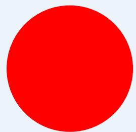

3 well-separated clusters

# Center-Based Clusters

# ⚫ Center-based

➢ A cluster is a set of objects such that an object in a cluster is closer(more similar) to the “center” of a cluster, than to the center of anyother cluster

The center of a cluster is often a centroid, the average of all thepoints in the cluster, or a medoid, the most “representative” point of acluster

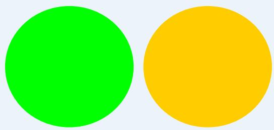

4 center-based clusters

# Contiguity(邻近)-Based Clusters

⚫ Contiguous Cluster (Nearest neighbor or Transitive)

➢ A cluster is a set of points such that a point in a cluster is closer (ormore similar) to one or more other points in the cluster than to anypoint not in the cluster.

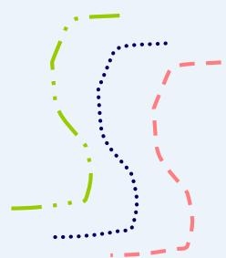

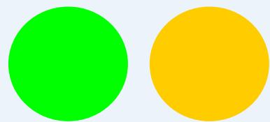

8 contiguous clusters

# Density-Based Clusters

# ⚫ Density-based

➢ A cluster is a dense region of points, which is separated by low-density regions, from other regions of high density.

➢ Used when the clusters are irregular or intertwined(不规则or纠缠), andwhen noise and outliers are present.

6 density-based clusters

# Conceptual(概念) Clusters

⚫ Shared Property or Conceptual Clusters

➢ Finds clusters that share some common property or represent aparticular concept.

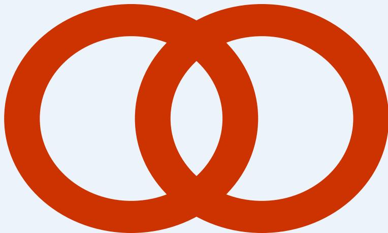

2 Overlapping Circles

# Objective Function

⚫ Clusters Defined by an Objective Function

➢ Finds clusters that minimize or maximize an objective function.

穷举法：Enumerate all possible ways of dividing the points intoclusters and evaluate the `goodness' of each potential set of clustersby using the given objective function. (NP Hard)

➢ Can have global or local objectives.

Hierarchical clustering algorithms typically have local objectives

• Partitional algorithms typically have global objectives

# Objective Function

Map the clustering problem to a different domain and solve a related problem in thatdomain

➢ Proximity（亲近度） matrix defines a weighted graph, where the nodes are thedata points, and the weighted edges represent the proximities (similarity ordissimilarity) between data points

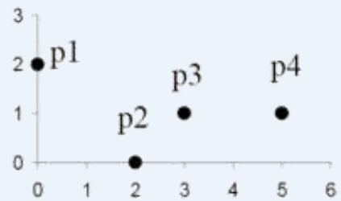

<table><tr><td>point</td><td>x</td><td>y</td></tr><tr><td>p1</td><td>0</td><td>2</td></tr><tr><td>p2</td><td>2</td><td>0</td></tr><tr><td>p3</td><td>3</td><td>1</td></tr><tr><td>p4</td><td>5</td><td>1</td></tr></table>

<table><tr><td></td><td>p1</td><td>p2</td><td>p3</td><td>p4</td></tr><tr><td>p1</td><td>0.000</td><td>2.828</td><td>3.162</td><td>5.099</td></tr><tr><td>p2</td><td>2.828</td><td>0.000</td><td>1.414</td><td>3.162</td></tr><tr><td>p3</td><td>3.162</td><td>1.414</td><td>0.000</td><td>2.000</td></tr><tr><td>p4</td><td>5.099</td><td>3.162</td><td>2.000</td><td>0.000</td></tr></table>

Figure Four points and their corresponding data and proximity (distance) matrices.

Similarity? Dissimilarity?

Euclidean Distance / Manhattan Distance / Chebyshev Distance/

Cosine Similarity /…..

Similarity=1-Dissimilarity

# 距离度量指标

$\begin{array} { r } { L _ { p } ( x _ { 1 } , x _ { 2 } ) = \left( \sum _ { l = 1 } ^ { n } \left| x _ { i } ^ { ( l ) } - x _ { j } ^ { ( l ) } \right| ^ { p } \right) ^ { \frac { 1 } { p } } } \end{array}$

$\begin{array} { r } { L _ { 1 } ( x _ { 1 } , x _ { 2 } ) = \sum _ { l = 1 } ^ { n } \left| x _ { i } ^ { ( l ) } - x _ { j } ^ { ( l ) } \right| } \end{array}$ Manhattan Distance

⚫ $\begin{array} { r } { L _ { 2 } ( x _ { 1 } , x _ { 2 } ) = \sum _ { l = 1 } ^ { n } \sqrt { \left( x _ { i } ^ { ( l ) } - x _ { j } ^ { ( l ) } \right) ^ { 2 } } } \end{array}$ Euclidean Distance

$\begin{array} { r } { L _ { \infty } ( x _ { 1 } , x _ { 2 } ) = \sqrt { \sum _ { l = 1 } ^ { n } \left| x _ { i } ^ { ( l ) } - x _ { j } ^ { ( l ) } \right| ^ { \infty } } = m a x \big ( | x _ { i } - x _ { j } | \big ) } \end{array}$

Chebyshev Distance

⚫ $\begin{array} { r } { L _ { - \infty } ( x _ { 1 } , x _ { 2 } ) = \sqrt { \sum _ { l = 1 } ^ { n } \left| x _ { i } ^ { ( l ) } - x _ { j } ^ { ( l ) } \right| ^ { - \infty } } = m i n \big ( \big | x _ { i } - x _ { j } \big | \big ) } \end{array}$

⚫ Cosine Distance: $\begin{array} { r } { D ( x _ { 1 } , x _ { 2 } ) = 1 - \cos ( x _ { 1 } , x _ { 2 } ) = 1 - \frac { x _ { 1 } \cdot x _ { 2 } } { \left| \left| x _ { 1 } \right| \right| _ { 2 } \left| \left| x _ { 2 } \right| \right| _ { 2 } } } \end{array}$ ??1 2 ??2 2

# Objective Function …

7 Clustering is equivalent to breaking the graph into connected components, one foreach cluster.

➢ Want to minimize the edge weight between clusters and maximize the edge weightwithin clusters

$$
\text {R a t i o C u t} (\pi) = \frac {1}{k} \sum_ {i = 1} ^ {k} \frac {\operatorname {c u t} \left(C _ {i} , \bar {C} _ {i}\right)}{\left| C _ {i} \right|},
$$

$$
\text {N o r m a l i z e d} \operatorname {C u t} (\pi) = \frac {1}{k} \sum_ {i = 1} ^ {k} \frac {\operatorname {c u t} \left(C _ {i} , \bar {C} _ {i}\right)}{\operatorname {v o l} \left(C _ {i}\right)}
$$

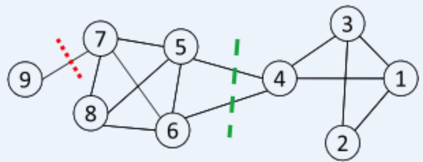

$C _ { i }$ : a community

$| C i |$ : # nodes in $C _ { i }$

$v o l ( C i )$ : sum of degrees in $C _ { i }$

# 聚类算法

Hierarchical clustering (Omit, because…)

⚫ K-means and its variants

⚫ Density-based clustering

# 聚类算法

⚫ Hierarchical clustering

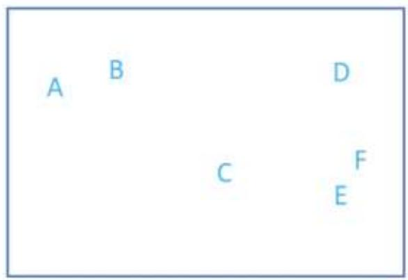

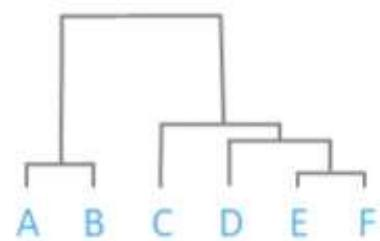

Hierarchical clustering starts by treating each observation as aseparate cluster.

Then, it repeatedly executes the following two steps:

(1) identify the two clusters that are closest together,

(2) merge the two most similar clusters.

This iterative process continues until all the clusters are mergedtogether.

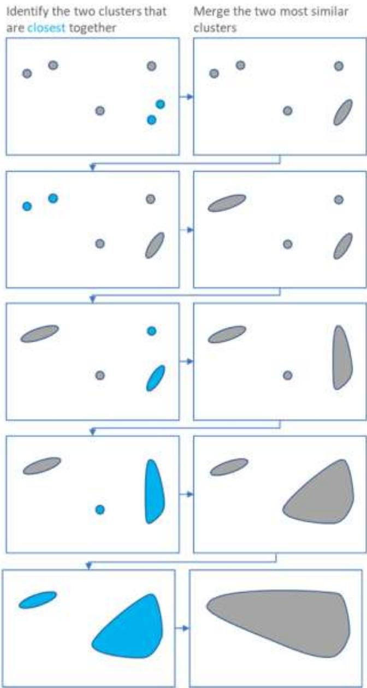

# K-means聚类

Partitional clustering approach

◼ Each cluster is associated with a centroid (center point)

◼ Each point is assigned to the cluster with the closest centroid

➢ Number of clusters, K, must be specified

➢ The basic algorithm is very simple

# Algorithm 1 Basic K-means Algorithm.

 1: Select $K$  points as the initial centroids.

 2: repeat

3:Form $K$  clusters by assigning all points to the closest centroid.

 4:Recompute the centroid of each cluster.

 5: until The centroids don't change

# 标准K-means流程

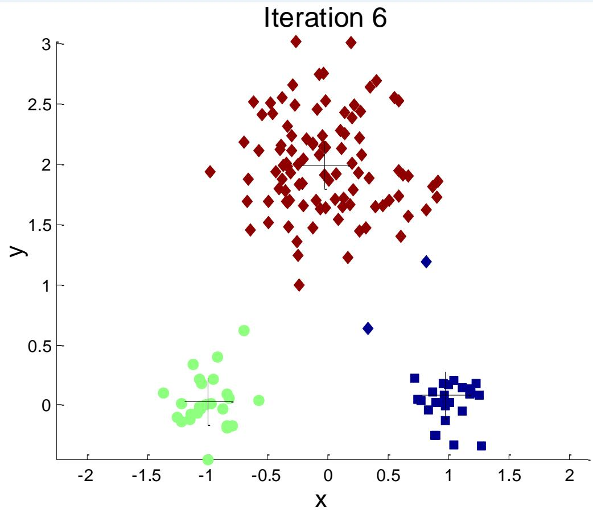

# 标准K-means流程

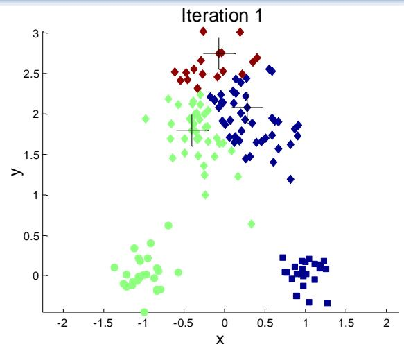

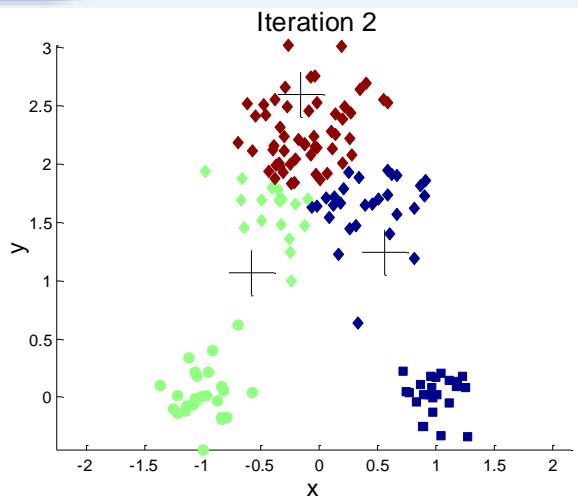

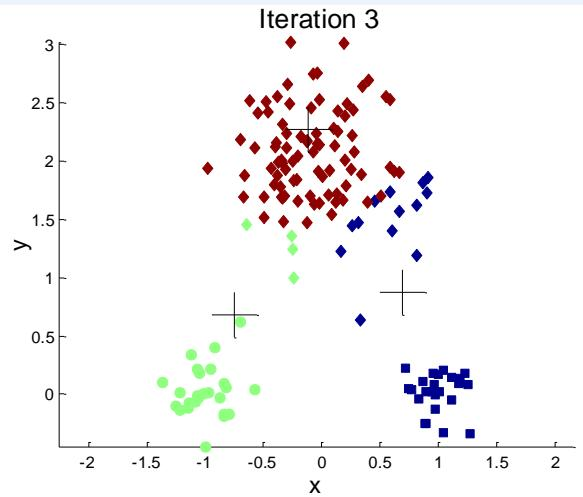

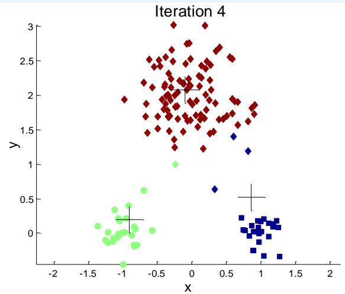

# K-mean聚类细节

⚫ Initial centroids are often chosen randomly.

➢ Clusters produced vary from one run to another.

⚫ The centroid is (typically) the mean of the points in the cluster.

‘Closeness’ is measured by Euclidean distance, cosine similarity,correlation, etc.

K-means will converge for common similarity measures mentionedabove.

Most of the convergence happens in the first few iterations.

➢ Often the stopping condition is changed to ‘Until relatively fewpoints change clusters’

⚫ Complexity is ${ \mathsf { O } } ( { \mathsf { n } } ^ { \star } { \mathsf { K } } ^ { \star } \mid ^ { \star } { \mathsf { d } } )$

${ \mathsf n } =$ number of points, $\mathsf { K } =$ number of clusters,I = number of iterations, ${ \mathsf { d } } =$ number of attributes

# 两个不同的K-mean聚类

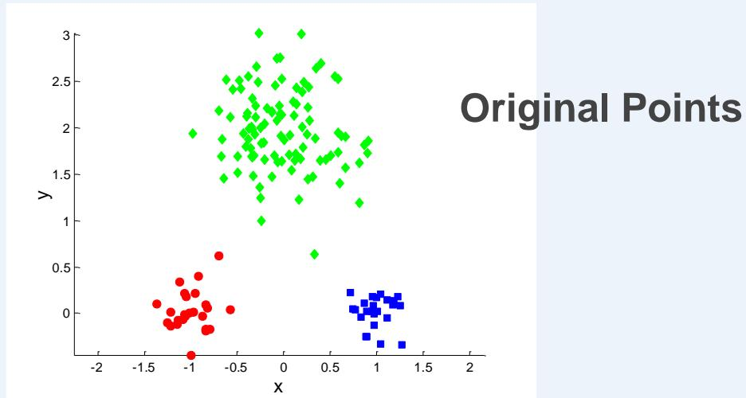

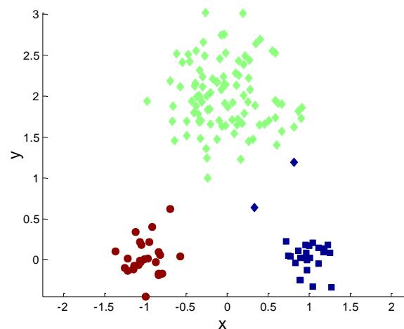

Optimal Clustering

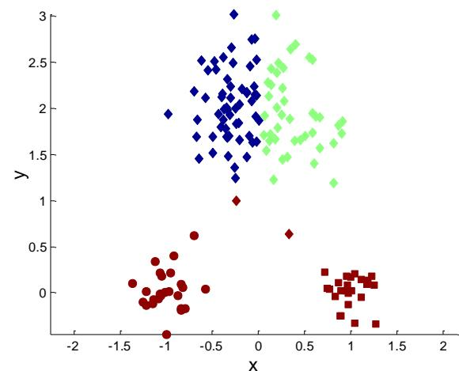

Sub-optimal Clustering

# 选择初始质心的重要性

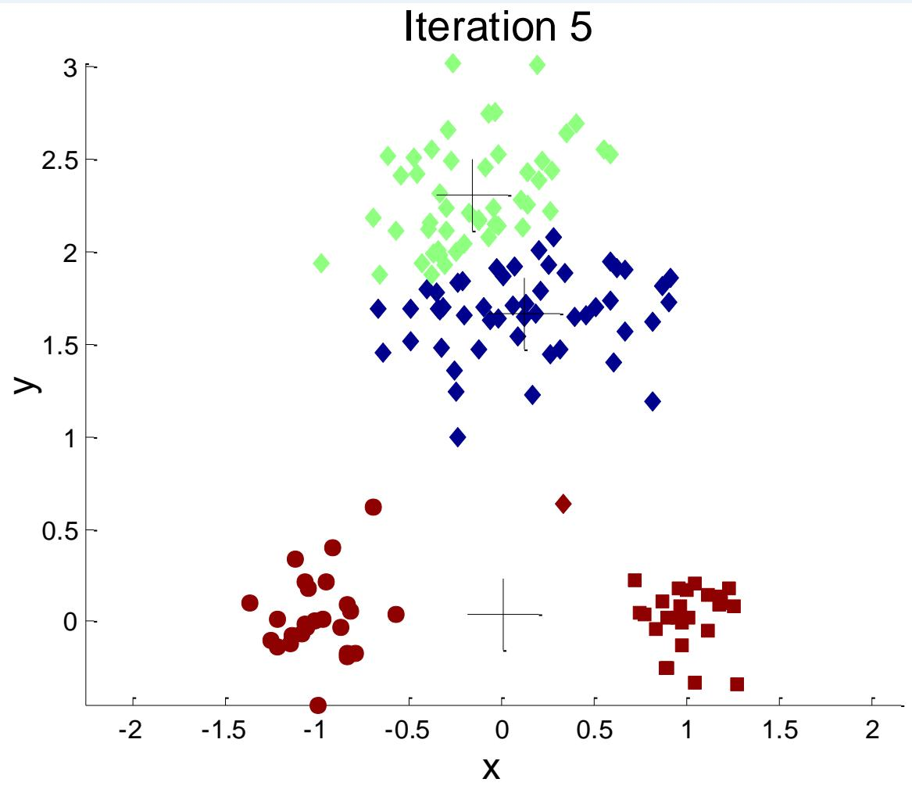

# 选择初始质心的重要性

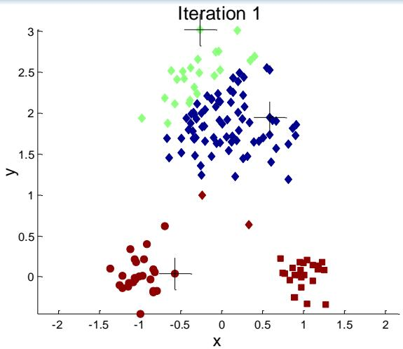

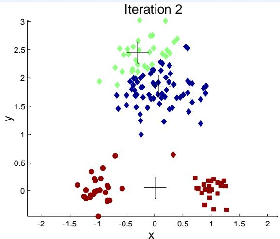

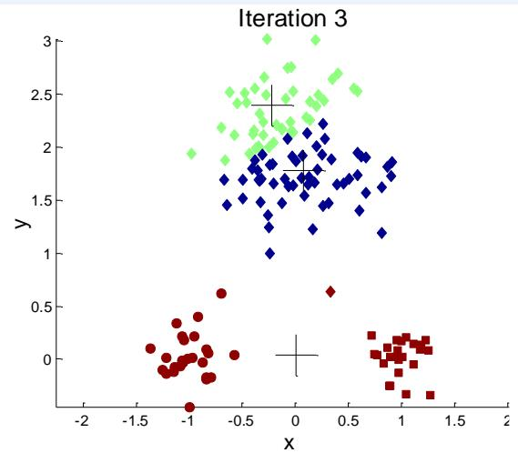

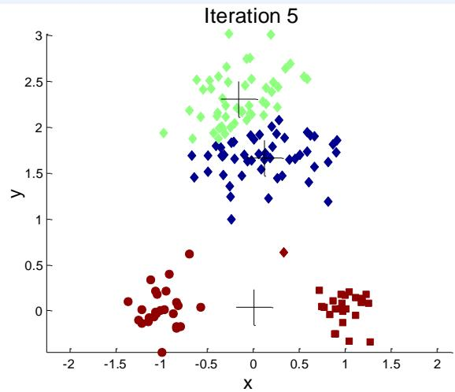

# 选择初始质心的重要性

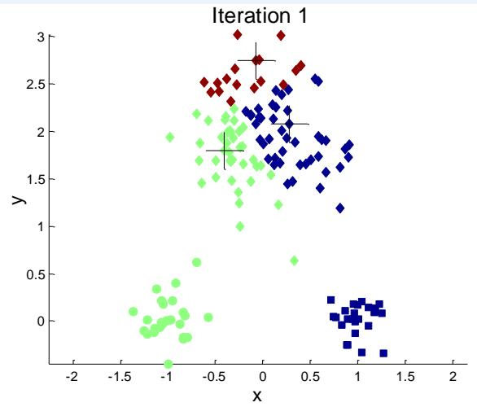

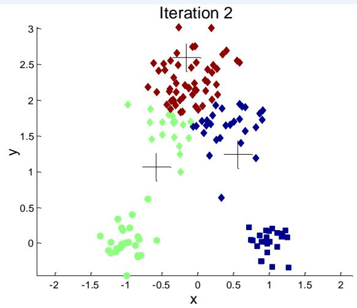


# K-means簇的评估

⚫ Most common measure is Sum of Squared Error (SSE)

➢ For each point, the error is the distance to the nearest cluster

➢ To get SSE, we square these errors and sum them.

$$
S S E = \sum_ {i = 1} ^ {K} \sum_ {x \in C _ {i}} d i s t ^ {2} (m _ {i}, x)
$$

➢ x is a data point in cluster Ci and $m _ { i }$ is the representative point forcluster Ci

• can show that $m _ { i }$ corresponds to the center (mean) of the cluster

➢ Given two clusters, we can choose the one with the smallesterror

➢ One easy way to reduce SSE is to increase K, the number ofclusters

• A good clustering with smaller K can have a lower SSE than a poorclustering with higher K

# K的选择

Elbow method: plot a line chart of the SSE for each value of k. If theline chart looks like an arm, then the "elbow" on the arm is the valueof K that is the best.

手臂曲线的肘关节


# 选择初始点的问题

If there are K ‘real’ clusters then the chance of selecting one centroidfrom each cluster is small.

➢ Chance is relatively small when K is large

➢ If clusters are the same size, n, then

$$
P = \frac {\mathrm {n u m b e r o f w a y s t o s e l e c t o n e c e n t r o i d f r o m e a c h c l u s t e r}}{\mathrm {n u m b e r o f w a y s t o s e l e c t} K \mathrm {c e n t r o i d s}} = \frac {K ! n ^ {K}}{(K n) ^ {K}} = \frac {K !}{K ^ {K}}
$$

➢ For example, if $K = 1 0$ , then probabil $\mathrm { { t y } = 1 0 ! / 1 0 ^ { 1 0 } = 0 . 0 0 0 3 6 }$

Sometimes the initial centroids will readjust themselves in ‘right’ way,and sometimes they don’t

➢ Consider an example of five pairs of clusters

# 例子：10个簇

Iteration 4


# 例子：10个簇

Iteration 1


Iteration 2


# 例子：10个簇

Iteration 4


Starting with some pairs of clusters having three initial centroids, while other have only one.

# 例子：10个簇

Iteration 1


Iteration 3


Iteration 2


Iteration 4

X

# 如何选择初始质心？

⚫ Multiple runs

➢ Helps, but probability is not on your side

⚫ Sample and use hierarchical clustering to determine initial centroids

⚫ Select more than k initial centroids and then select among these initialcentroids

➢ Select most widely separated

Bisecting K-means （二分kmeans）

➢ 不容易受到初始化问题的影响

# Bisecting(二分) K-means

# Bisecting K-means algorithm

7 Variant of K-means that can produce a partitional or ahierarchical clustering

Algorithm 3 Bisecting K-means Algorithm.

1: Initialize the list of clusters to contain the cluster containing all points.  
2: repeat  
3: Select a cluster from the list of clusters  
4: for  $i = 1$  to number_of_iterations do  
5: Bisect the selected cluster using basic K-means  
6: end for  
7: Add the two clusters from the bisection with the lowest SSE to the list of clusters.  
8: until Until the list of clusters contains  $K$  clusters

# 例子：二分K-means


# 处理空簇

⚫ Basic K-means algorithm can yield empty clusters


# 处理空簇

⚫ Basic K-means algorithm can yield empty clusters

If happens, find a replacement centroid to replace the centroid of theempty cluster, several strategies:

➢ Choose the point that contributes most to SSE

➢ Choose a point from the cluster with the highest SSE

➢ If there are several empty clusters, the above can be repeatedseveral times.

# Algorithm 1 Basic K-means Algorithm.

1: Select $K$  points as the initial centroids.

 2: repeat

3:Form $K$  clusters by assigning all points to the closest centroid.

 4: Recompute the centroid of each cluster.

 5: until The centroids don't change

# 预处理和后处理

⚫ Pre-processing

➢ Normalize the data

➢ Eliminate outliers

⚫ Post-processing

➢ Eliminate small clusters that may represent outliers

➢ Split ‘loose’ clusters, i.e., clusters with relatively high SSE

➢ Merge clusters that are ‘close’ and that have relatively low SSE

# K-means的其他局限性

K-means has problems when clusters are of differing

➢ Sizes

➢ Densities

➢ Non-globular shapes

⚫ K-means has problems when the data contains outliers.

# K-means的局限: 不同大小


Original Points


K-means (3 Clusters)

# K-means的局限: 不同密度


Original Points


K-means (3 Clusters)

# K-means的局限: 非球形


Original Points


K-means (2 Clusters)

# 克服K-means的局限性


Original Points


K-means Clusters

One solution is to use many clusters.

Find parts of clusters, but need to put together.

# 克服K-means的局限性


Original Points


K-means Clusters

# 克服K-means的局限性


Original Points


K-means Clusters

# K-means++ [Arthur et al. ’07]

Spreads out the centers

⚫ Choose first center, x1, uniformly at random from the data set

Repeat for $2 \leq i \leq k$ :

➢ Choose $x ^ { \prime }$ to be equal to a data point sampled from the distribution:

$$
\frac {D (x ^ {\prime}) ^ {2}}{\sum_ {x \in \mathcal {X}} D (x) ^ {2}}
$$

$\triangleright \ D ( x ) .$ : the shortest distance from a data point x to the closest centerwe have already chosen

# K-means++ [Arthur et al. ’07]


$$
\frac {D (x ^ {\prime}) ^ {2}}{\sum_ {x \in \mathcal {X}} D (x) ^ {2}}
$$

K-means++

# K-means++ [Arthur et al. ’07]

What’s wrong with K-means++?

➢ Needs K passes over the data

➢ In large data applications, not only the data is massive, but also K istypically large (e.g., easily 1000).

➢ Does not scale!

# 可伸缩K-means: K-means||

# Intuition of

➢ K-means++ samples one point per iteration and updates itsdistribution

➢ What if we oversample by sampling each point independently with alarger probability?

➢ Intuitively equivalent to updating the distribution much less frequently

➢ Coarser sampling

➢ Turns out to be sufficient: K-means||

# 可伸缩K-means: K-means||

主要思路在于改变每次遍历时的取样策略，并非按照 k-means++ 那样每次遍历只取样一个样本，而是每次遍历取样 O(k) 个样本，重复该取样过程大约 O(logn) 次，共得到 O(klogn) 个样本点组成的集合

⚫ 然后再聚类这 O(klogn) 个点成 k 个点，最后将这 k 个点作为初始聚类中心

实际实验证明 O(logn) 次重复取样是不需要的，一般5次重复取样就可以得到一个较好的聚类初始中心

# 可伸缩K-means: K-means||

⚫ K-means|| Initialization

K=4,

 Oversampling factor $= 3$


# 可伸缩K-means: K-means||

⚫ K-means|| Initialization

$$
\mathrm {K} = 4,
$$

$$
\text {O v e r s a m p l i n g f a c t o r} = 3
$$


Cluster the intermediate centers

# 几类kmeans算法的理论保障

# K-means, K-means++, and K-means||

 Number of  iterations (R)

 R=k: Simulating K-means++ (=1)→Strong gaantee

 Small R: K-means| → Can it possibly give any guarantees?

$\mathrm { R } { = } 0$ : Lloyd → No guarantees

# 可伸缩K-means

# ⚫ Theorem

➢ Optimal clustering： the sum of the squared distances between eachpoint and its closest center is minimal

• Solving this problem exactly is NP-hard

➢ Let ψ= cost of initial clustering, ψ’=cost of clustering after convergence,OPT $\circeq$ cost of the optimal clustering

➢ Using K-means++ for clustering the intermediate centers, the overallapproximation factor $=$ O(log k)

• It means ψ’ = O(log k)*OPT

也就是说最终确定的质心能够使cost达到最优聚类的cost的O（log k）倍

➢ K-means|| produces a constant-factor approximation to OPT, using onlyO(log (ψ/OPT)) iterations

# 可伸缩K-means

# Experimental Results: Quality

Let $v = \{ \mathrm { c } _ { 1 } , . . . , E _ { k } \}$ be a set of points and let $Y = \lambda$We define the cost of $Y$ with respect to $C$ as

$$
\phi_ {Y} (\mathcal {C}) = \sum_ {y \in Y} d ^ {2} (y, \mathcal {C}) = \sum_ {y \in Y} \min  _ {i = 1, \dots , k} \| y - c _ {i} \| ^ {2}.
$$

<table><tr><td></td><td>Clustering Cost Right
After Initialization</td><td>Clustering Cost After
Convergence</td></tr><tr><td>Random</td><td>NA</td><td>22,000</td></tr><tr><td>K-means++</td><td>430</td><td>65</td></tr><tr><td>K-means||</td><td>16</td><td>14</td></tr></table>

GAUSSMIXTURE: 10,000 points in 15 dimensions$\yen 50$

Costs scaled down by $\mathbf { 1 0 ^ { 4 } }$

# 可伸缩K-means

Experimental Results: Convergence

➢ K-means|| reduces number of iterations even more than K-means++

<table><tr><td></td><td>Iterations
After Initialization</td></tr><tr><td>Random</td><td>167</td></tr><tr><td>K-means++</td><td>42</td></tr><tr><td>K-means||</td><td>28</td></tr></table>

SPAM: 4,601 points in 58 dimensions

$\mathtt { K } = 5 0$

# K-means 练习

假设有如下八个点：(1, 2)，(2, 4)，(1, 9)，(6, 5)，(4, 2)，(7, 2)，(8, 2)，(4, 3)，使用k-Means算法对其进行聚类。设K=2，初始聚类两个中心点 坐标分别为(1, 2)，(8, 2)，算法使用曼哈顿距离（L1 距离）作为距离度量。请计算一次迭代后的聚类中心坐标，并写出上述八个点分别属于哪个簇（cluster）

对于点(1,2):

$$
d _ {1 1} = | 1 - 1 | + | 2 - 2 | = 0, d _ {1 2} = | 1 - 8 | + | 2 - 2 | = 7 。
$$

因此，(1,2)应当被聚为第1类;

对于点(2,4):

$$
d _ {2 1} = | 2 - 1 | + | 4 - 2 | = 3, d _ {2 2} = | 2 - 8 | + | 4 - 2 | = 8 。
$$

因此，(2,4)应当被聚为第1类;

对于点(1,9):

$$
d _ {3 1} = | 1 - 1 | + | 9 - 2 | = 7, d _ {3 2} = | 1 - 8 | + | 9 - 2 | = 1 4 。
$$

因此，(1,9)应当被聚类为第1类;

对于点(6,5):

$$
d _ {4 1} = | 6 - 1 | + | 5 - 2 | = 8, d _ {4 2} = | 6 - 8 | + | 5 - 2 | = 5 。
$$

因此，(6,5)应当被聚类为第 2类;

# K-means 练习

假设有如下八个点：(1, 2)，(2, 4)，(1, 9)，(6, 5)，(4, 2)，(7, 2)，(8, 2)，(4, 3)，使用k-Means算法对其进行聚类。设K=2，初始聚类两个中心点 坐标分别为(1, 2)，(8, 2)，算法使用曼哈顿距离（L1 距离）作为距离度量。请计算一次迭代后的聚类中心坐标，并写出上述八个点分别属于哪个簇（cluster）。

对于点(4,2):

$$
d _ {5 1} = | 4 - 1 | + | 2 - 2 | = 3, d _ {5 2} = | 4 - 8 | + | 2 - 2 | = 4 。
$$

因此，点(4,2)应当被聚类为第1类;

对于点(7,2):

$$
d _ {6 1} = | 7 - 1 | + | 2 - 2 | = 6, d _ {6 2} = | 7 - 8 | + | 2 - 2 | = 1 。
$$

因此，点(7,2)应当被聚类为第 2类；

对于点(8,2):

$$
d _ {7 1} = | 8 - 1 | + | 2 - 2 | = 7, d _ {7 2} = | 8 - 8 | + | 2 - 2 | = 0 。
$$

因此，点(8,2)应当被聚类为第2类;

对于点(4,3):

$$
d _ {8 1} = | 4 - 1 | + | 3 - 2 | = 4, d _ {8 2} = | 4 - 8 | + | 3 - 2 | = 5 。
$$

因此，点(4,3)应当被聚类为第1类。

综上，类1的点有(1,2)(2,4)(1,9) (4,2)(4,3)，则对应的聚类中心为：(2.4,4)。

类2的点有(6,5)(7,2) (8,2)，则对应的聚类中心为：(7,3)。

# DBSCAN

⚫ DBSCAN is a density-based algorithm.

Density $=$ number of points within a specified radius (Eps)

A point is a core point if it has more than a specified number ofpoints (MinPts) within Eps（半径范围内有一定数量的点）

• These are points that are at the interior of a cluster

A border point has fewer than MinPts within Eps, but is in theneighborhood of a core point （半径范围内未达到一定数量的点，但是在core point 范围内）

A noise point is any point that is not a core point or a border point.（啥都不是）

# DBSCAN


 Density = 7 points

Figure 8.20. Center-baseddensity.

Density $\underline { { \underline { { \mathbf { \delta \pi } } } } }$  number of points within a specified radius(Eps)

# DBSCAN：核心点、边界点、噪声点

 MinPts = 4


Figure 8.21. Core,border,and noise points.

 A point is a core point if it has more than a specified number of points (MinPts) within Eps. These are points that are at the interior of a cluster

· A border point has fewer than MinPts within Eps, but is in the neighborhood of a core point

· A noise point is any point that is not a core point or aborder point.

核心点

边界点

噪声点

# DBSCAN：核心点、边界点、噪声点


# DBSCAN 算法

⚫ Center-based approach

# Algorithm 8.4 DBSCAN algorithm.

1: Label all points as core,border, or noise points.

 2: Eliminate noise points.

3: Put an edge between all core points that are within Eps of each other.

 4: Make each group of connected core points into a separate cluster.

5: Assign each border point to one of the clusters of its associated core points.

# DBSCAN：核心点、边界点、噪声点


Original Points


Point types: core,border and noise

$$
E p s = 1 0, M i n P t s = 4
$$

# DBSCAN擅长的情况


Original Points


Clusters

• Resistant to Noise

• Can handle clusters of different shapes and sizes

# DBSCAN


# DBSCAN不擅长的情况


Original Points

• Varying densities

• High-dimensional data

维度灾难：距离失效


(MinPts=4, Eps=9.75).


(MinPts=4, Eps=9.92)

# DBSCAN: 确定EPS和MinPts

Idea is that for points in a cluster, their kth nearest neighbors are atroughly the same distance

Noise points have the kth nearest neighbor at farther distance

So, plot sorted distance of every point to its ${ \sf k } ^ { \sf t h }$ nearest neighbor


# 时间、 空间复杂度

# Time and Space Complexity

 The basic time complexity of the DBSCAN algorithm is $O ( m \times$  time to findpoints in the Eps-neighborhood),where $m$  is the number of points. In the worst case, this complexity is $O ( m ^ { 2 } )$ . However, in low-dimensional spaces, there are data structures, such as kd-trees, that allow effcient retrieval of all points within a given distance of a specified point,and the time complexity can be as low as $O ( m \log m )$ . The space requirement of DBSCAN, even forhigh-dimensional data, is $O ( m )$ because it is only necessary to keep a small amount of data for each point, i.e., the cluster label and the identification of each point as a core, border, or noise point .

# 2014 KDD TEST OF TIME AWARD

⚫ A Density-Based Algorithm for Discovering Clusters in LargeSpatial Databases with Noise [KDD 1996]


# 2014 KDD TEST OF TIME AWARD

⚫ A Density-Based Algorithm for Discovering Clusters in LargeSpatial Databases with Noise [KDD 1996]

➢ Proposed the now well-known clustering algorithm DBSCAN

➢ 10000+ citations

[PDF] A density-based algorithm for discovering clusters in large spatial databaseswith noise.

M Ester. HP Krieqel, J Sander, X Xu - Kdd, 1996 - aaai.orgAbstract Clustering algorithms are attractive for the task of class identification in spatial databases. However, the application to large spatial databases rises the followingrequirements for clustering algorithms: minimal requirements of domain knowledge to determine the input parameters, discovery of clusters with arbitrary shape and good efficiency on large databases. The well-known clustering algorithms offer no solution to

被引用次数：10010相关文章所有75个版本引用保存更多

# 2014 KDD TEST OF TIME AWARD

⚫ A Density-Based Algorithm for Discovering Clusters in LargeSpatial Databases with Noise [KDD 1996]

➢ Claimed that the average run time complexity of DBSCAN is（ O(n*logn)

➢ Follow papers mis-claimed that the complexity of DBSCAN isO(n*logn)

# 2015 SIGMOD Best Paper Award

⚫ DBSCAN Revisited: Mis-Claim, Un-Fixability, and Approximation.

<table><tr><td colspan="2">SIGMOD Best Paper Award</td></tr><tr><td colspan="2">Recipients of the award are the following:</td></tr><tr><td>2015</td><td>DESCAN Revisited: Mis-Claim, Un-Fixability, and Approximation. Yufei Tao, Junhao Gan</td></tr><tr><td>2014</td><td>Materialization Optimizations for Feature Selection Workloads. Ce Zhang, Arun Kumar, Christopher Ré</td></tr><tr><td>2013</td><td>Massive Graph Triangulation. Xiaocheng Hu, Yufei Tao, Chin-Wan Chung</td></tr><tr><td>2012</td><td>High-Pe 2013 SIGMOD Best Paper Award: Processing over XML Streams. Barzan Mozafari, Kai Zeng, Carlo Zaniolo RSS SIGMOD News</td></tr><tr><td>2011</td><td>Entangled Queries: Enabling Declarative Data-Driven Coordination. Nitin Gupta, Lucja Kot, Sudip Roy, Gabriel Bender, Johannes Gehrke, Christoph Koch SIGMOD Record</td></tr><tr><td>Website</td><td rowspan="2">FAST: Fast Architecture Sensitive Tree Search on Modern CPUs and GPUs. Changkyu Kim, Jatin Chhugani, Nadathur Satish, Eric Sedlar, Anthony Nguyen, Tim Kaldewey, Victor Lee, Scott Brandt, and Pradeep Dubey [award citation] SIGMOD RECORD Weih</td></tr><tr><td>Facebook</td></tr></table>

# 2015 SIGMOD Best Paper Award

⚫ DBSCAN Revisited: Mis-Claim, Un-Fixability, and Approximation.

➢ For d ≥ 3, DBSCAN can’t have O(n*logn) time complexity.

D Prove that the DBSCAN problem requires $\Omega ( n ^ { 4 / 3 } )$ time to solve in${ \mathsf { d } } \geq 3$ .

➢ Introduce a new concept called ρ-approximate DBSCAN as analternative to DBSCAN on large datasets of ${ \mathsf { d } } \geq 3$ .

# 2015 SIGMOD Best Paper Award

# Yufei Tao

Profes sor

Room 633, Building 78

School of Information Technology and Electrical Engineering

 University of Queensland

Brisbane, Queensland 4072

Aus tralia

Tel:+61-7-33658319

Enail:taoyf@i tee.uq. edu au

 Publications and Google Scholar

# General

# Short Bio

Yufei Tao joined as a Frofessor the School of Information Technology and Electrical Engineering,theUniversityof Queensland (UQinJan 2016.He obtained his PhDdegree from Hong Kong Universityof Scienceand Technology (HKusT) in 2002,proudlyunder the supervision of Prof.Dimitris Papadias.He wasa VisitingScientist at the CarmegieMellon Universityduring 2oo2-20o3,and then an Assistant Professor at the CityUniversityof Hong Kong dring 20o3-2006,after which he worked till Jan 2016at the ChineseUniversity ofHong Kong (CUHK)，where he was promoted to Professor in 2009.From 2011 to 2013,he was simultaneouslyaVisiting Professorunderthe World Class Universityprogranof the Koreangoverment,inthe Korea AdvancedInstitute of Science and Technology KAIST)，Korea.Currently，he also holds an honorary position of AdjunctProfessor in the Department of Computer Science and Engineering,CUHK.

He servedasanassociateeditor of ACM Transactians an Database Systems (ToDS from 2008 to2015,and ofIETransactions onKnowledge and DataErgineering(TKDE from 2012 to 2014.He servedasaPCco-chairofIntemational Conference on Data Engineering(ICDE2014,and of International Symposium on Spatial andTemporal Databases (SSTD) 2011.He gavea keynote speech at Intermational Conference on Database Theory(ICDD 2016.

# Ma jor Awards

SIGMOD Best Paper Award 2015

SIGMOD Best Paper Award 2013

Hong Kong Young Scientist Award 2002

# 2015 SIGMOD Best Paper Award

怀疑的精神

善于思考，善于发现问题

科学研究的发展是在曲折中不断前进的！


# Reference

Ester, Martin, et al. "A density-based algorithm for discovering clusters in large spatialdatabases with noise." Kdd. Vol. 96. No. 34. 1996.

Gan, Junhao, and Yufei Tao. "DBSCAN Revisited: Mis-Claim, Un-Fixability, andApproximation." Proceedings of the 2015 ACM SIGMOD International Conference onManagement of Data. ACM, 2015.

如何评价 SIGMOD 2015 最佳论文《DBSCAN Revisited》？http://www.zhihu.com/question/31845624

# K-means和DBSCAN的比较

⚫ Both are partitional clustering that assign each object to a single cluster

➢ K-means: all object

➢ DBSCAN: discard noise

⚫ Type

➢ K-means: prototype-based notion

➢ DBSCAN: density-based notion

Both perform poorly with widely differing densities

➢ K-means: has difficult with non-globular cluster and clusters withdifferent size

➢ DBSCAN: can handle clusters of different size and shapes, notaffected by nosie

# K-means和DBSCAN的比较

⚫ Definition requirement

➢ K-means: need well-defined centroid

➢ DBSCAN: need definition of density

⚫ Sparse, high-dimensional data

➢ K-means: work well, such as document data

➢ DBSCAN: performs poorly for Euclidean definition of density

⚫ Distribution of data

➢ K-means: spherical Gaussian distributions

➢ DBSCAN: no assumption

# K-means和DBSCAN的比较

Both using all attributes

⚫ Number of clusters

➢ K-means: user define

➢ DBSCAN: automatically,

Two parameters: Eps and Minpts

⚫ Determination

➢ K-means: no

➢ DBSCAN: yes

# 簇有效性

⚫ For cluster analysis, the analogous question is how to evaluate the“goodness” of the resulting clusters?

⚫ But “clusters are in the eye of the beholder”! 主观性太强！

⚫ Then why do we want to evaluate them?

➢ To compare clustering algorithms

➢ To compare two sets of clusters

➢ To compare two clusters

# 簇评估(Cluster Validation)的方面

1. Determining the clustering tendency聚类趋势 of a set of data, i.e.,distinguishing whether non-random structure actually exists in the data先看看是不是真的有簇结构存在

2. Comparing the results of a cluster analysis to externally knowninformation, e.g., to externally given class labels.

3. Evaluating how well the results of a cluster analysis fit the data withoutreference to external information.

- Use only the data

4. Comparing the results of two different sets of cluster analyses todetermine which is better.

5. Determining the ‘correct’ number of clusters.

For 2, 3, and 4, we can further distinguish whether we want to evaluatethe entire clustering or just individual clusters.

# 簇有效性指标

⚫ Numerical measures that are applied to judge various aspects of clustervalidity, are classified into the following three types.

External Index: Used to measure the extent to which cluster labels matchexternally supplied class labels.

• Entropy 熵

Internal Index: Used to measure the goodness of a clustering structurewithout respect to external information.

• Sum of Squared Error (SSE)

Relative Index: Used to compare two different clusterings or clusters. 实际上不是 个单独的簇评估类型，而是度量的具体使用

• Often an external or internal index is used for this function, e.g., SSE or entropy

⚫ Sometimes these are referred to as criteria instead of indices

➢ However, sometimes criterion is the general strategy and index is thenumerical measure that implements the criterion.

# 簇有效性指标：相关性

⚫ Two matrices

➢ Proximity Matrix (Similarity/Dissimilarity Matrix)

➢ “Incidence” Matrix

• One row and one column for each data point

• An entry is 1 if the associated pair of points belong to the same cluster

• An entry is 0 if the associated pair of points belongs to different clusters

⚫ Compute the correlation between the two matrices

➢ Since the matrices are symmetric, only the correlation betweenn(n-1) / 2 entries needs to be calculated.

⚫ High correlation indicates that points that belong to the same cluster are closeto each other.

⚫ Not a good measure for some density or contiguity based clusters.

# 簇有效性指标：相关性

⚫ Correlation of incidence and proximity matrices for the K-means clusterings ofthe following two data sets.

Corr = 0.9235


Corr = 0.5810

# 簇评估：使用相似矩阵

⚫ Order the similarity matrix with respect to cluster labels and inspect visually.


# 簇评估：使用相似矩阵

⚫ Clusters in random data are not so crisp


DBSCAN

# 簇评估：使用相似矩阵

⚫ Clusters in random data are not so crisp


K-means

# 簇评估：使用相似矩阵

⚫ Clusters in random data are not so crisp


Complete linkage hierarchical clustering

# 簇评估：使用相似矩阵


DBSCAN

# 内部指标: SSE

⚫ Clusters in more complicated figures aren’t well separated

Internal Index: Used to measure the goodness of a clustering structurewithout respect to external informationSSE

SSE is good for comparing two clusterings or two clusters (averageSSE).

⚫ Can also be used to estimate the number of clusters


# 内部指标: SSE

⚫ SSE curve for a more complicated data set


SSE of clusters found using K-means

# 内部指标: 凝聚度和分离度

Cluster Cohesion 凝聚度: Measures how closely related are objects in acluster

➢ Example: SSE

Cluster Separation 分离度: Measure how distinct or well-separated a clusteris from other clusters

Example: Squared Error

➢ Cohesion is measured by the within cluster sum of squares (SSE)

$$
S S E = \sum_ {i} \sum_ {x \in C _ {i}} \left(x - m _ {i}\right) ^ {2}
$$

➢ Separation is measured by the between cluster sum of squares

$$
S S B = \sum_ {i} \left| C _ {i} \right| (m - m _ {i}) ^ {2}
$$

• Where $| C i |$ is the size of cluster ??

# 内部指标: 凝聚度和分离度

Example:

SSE+SSB $^ { 1 = }$ TSS constant

$$
T S S = \sum_ {x} (x - m) ^ {2}
$$


$K = 1$ cluster: $S S E { = } \left( 1 - 3 \right) ^ { 2 } + \left( 2 - 3 \right) ^ { 2 } + \left( 4 - 3 \right) ^ { 2 } + ( 5 - 3 ) ^ { 2 } = 1 0$

$$
S S B = 4 \times (3 - 3) ^ {2} = 0
$$

$$
T o t a l = 1 0 + 0 = 1 0
$$

$\mathsf { K } \mathsf { = } \mathsf { 2 }$ clusters: $S S E { = } ( 1 { - } 1 . 5 ) ^ { 2 } + ( 2 { - } 1 . 5 ) ^ { 2 } + ( 4 { - } 4 . 5 ) ^ { 2 } + ( 5 { - } 4 . 5 ) ^ { 2 } = 1 1$

$$
S S B = 2 \times (3 - 1. 5) ^ {2} + 2 \times (4. 5 - 3) ^ {2} = 9
$$

$$
T o t a l = 1 + 9 = 1 0
$$

# 内部指标: 凝聚度和分离度

⚫ A proximity graph based approach can also be used for cohesion andseparation.

➢ Cluster cohesion is the sum of the weight of all links within a cluster.

Cluster separation is the sum of the weights between nodes in thecluster and nodes outside the cluster.


cohesion


separation

# 簇有效性：“Black Arts”

“The validation of clustering structures is the most difficult and frustrating part ofcluster analysis. Without a strong effort in this direction, cluster analysis willremain a black art accessible only to those true believers who haveexperience and great courage.” 聚类结构的验证是聚类分析中最困难和最令人沮丧的部分。如果不在这方面付出巨大努力，聚类分析将仍然是一门只有那些有经验和极大勇气的真正信徒才能掌握的黑暗魔法。

Algorithms for Clustering Data, Jain and Dubes

# 讨论

The entire time I knew Thanos, he only ever had one goal.To bring balance to the universe by wiping out half of all life.

Q：灭霸一个响指就能灭掉一半生命，那怎么保证物种均衡平衡嘞~？

A：聚类分析帮助你！

# 讨论

# Method ：K-means Clustering

宇宙包含 “九大国度”，为防止某个国度灭绝，在每个国度选取一个聚类中心，通过K-means得到聚类簇，再在每个聚类中随机选取一半生物进行消灭，宇宙生物多样性得到进一步保证。

# 讨论

Method ：K-means Clustering

# 谢谢大家！

相关课程资源及参考文献请浏览

超算习堂：https://easyhpc.net/course/143