# 机器学习：智能要从数据习

Machine Learning: Intelligence Begins with Data

授课对象：计算机科学与技术专业 二年级

课程名称：人工智能（专业必修）

节选内容：第六章 机器学习

课程学分：3学分

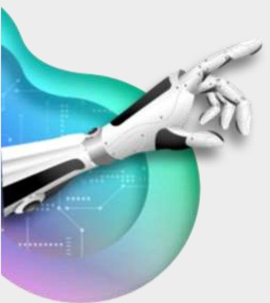

# 前情知识回顾： 符号主义学派

“刘备的义弟是关羽““关羽的义弟是张飞““姜维的主公是刘备”

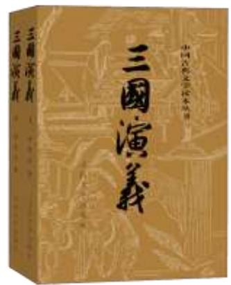

构建知识图谱

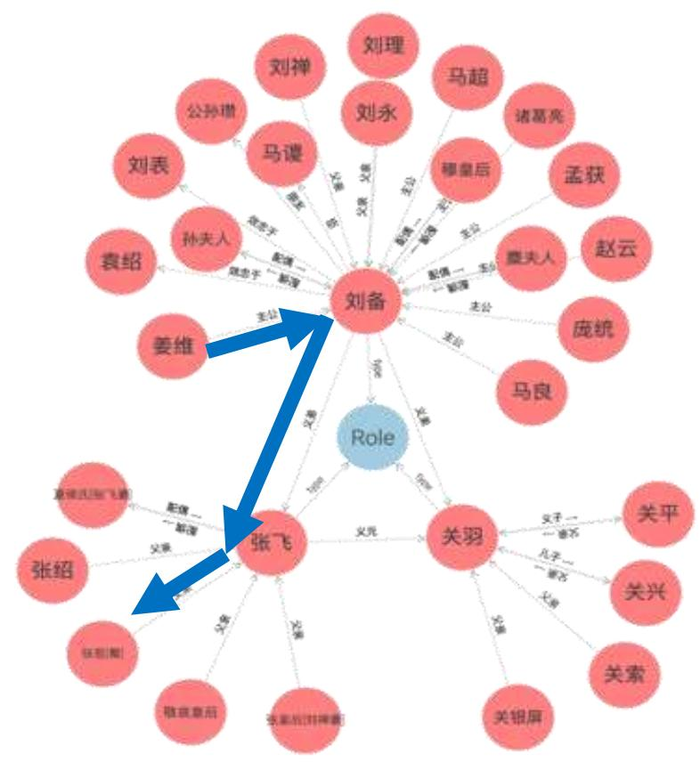

问：姜维和张苞的关系？

姜维主公的兄弟的儿子是张苞

谓词逻辑归结推理搜索技术

这些规则推理适用于数据关系明确、规则固定的场景

问：如果规则不完整、数据庞杂呢？

# 前情知识回顾： 符号主义学

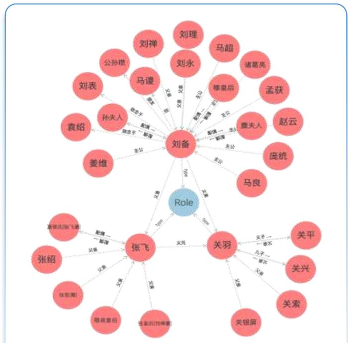

# 符号主义学派

清晰的完整的规则、静态的数据

# 规则不完整、数据庞杂多变下…

能否通过数据训练，自动生成规则并从数据中找到模式？

# 现实中

不清晰不完整的规则、动态海量数据

机器学习（连接主义学派）

# 机器学习的场景：文字领域

# ChatGPT写诗

如果李白活在2024年，他会做一首什么诗

# 《题人工智能》

妙算如神应万事，虚怀若谷似真人。

机芯纵巧无灵性，算法虽奇欠醉心。

问道何时还本我，诗魂归处觅知音。

若教李白持长剑，敢与天工再斗深！

# 机器学习的场景：文字领域

# 垃圾邮件检测

• 二元分类任务：为输入（电子邮件）分配标签（即 spam/not-spam）

• 需要一个模型作为分类器。

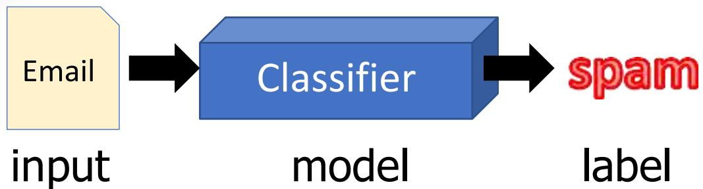

# 机器学习的场景：文字领域

# 文档分类

• 多类分类任务k:

o预测输入所属的标签 (i.e.Politics, Sports, Finance, Arts)

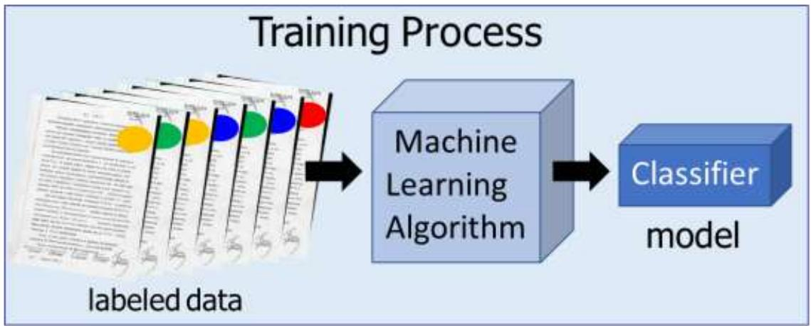

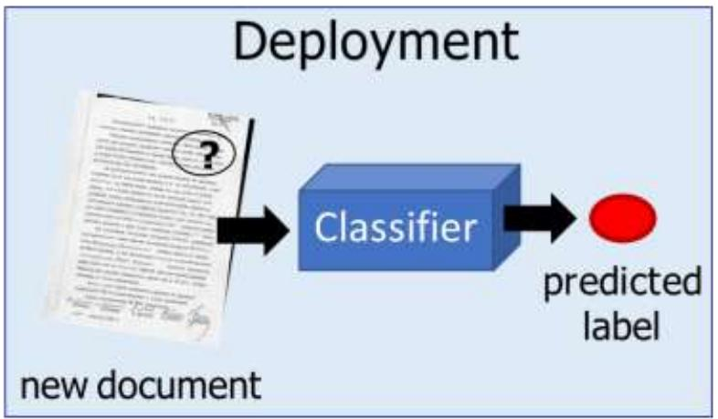

Inthis class,we studyalgorithmsand techniques to learn such models from data

# 机器学习的场景：文字领域

# 其他分类任务

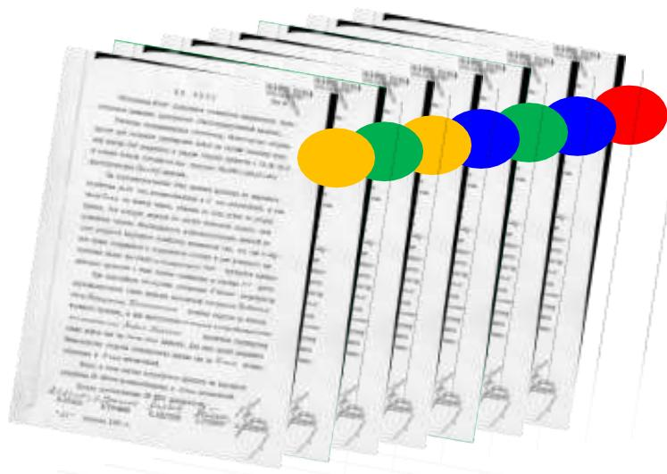

# Data

Documents

Sentences

Phrases

Images

Medical records

# Labels

Politics,Sports, Finance

Positive, Negative

Person, Location

Cat, Dog, Snake,Horse

Re-admit soon/Not

# 机器学习的场景： 图像领域

# AI绘图：MidJourney

2022年8月，在美国举办的艺术竞赛中，参赛者提交绘画作品《太空歌剧院》获得了此次比赛“数字艺术/数字修饰照片”类别一等奖，而参赛者没有绘画基础，通过AI绘图软件MidJourney耗时80个小时创作了该作品

太空歌剧院

利用AI创作诗词的“李白”

# 机器学习的场景：视频领域

# 视频生成：泰迪熊洗盘子

# IMAGENVIDEO:HIGHDEFINITIONVIDEOGENERATIONWITHDIFFUSIONMODES

JtinChtWayGDederikPKm,BnPe，mdNel，DdFetTGoget, T

higbdefitioidosisaseideogeetmodedequeofinkextrtioiticstldsi3DetsesnSoe

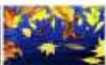

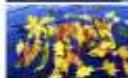

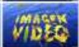

# 机器学习的场景：视频领域

# 物体检测

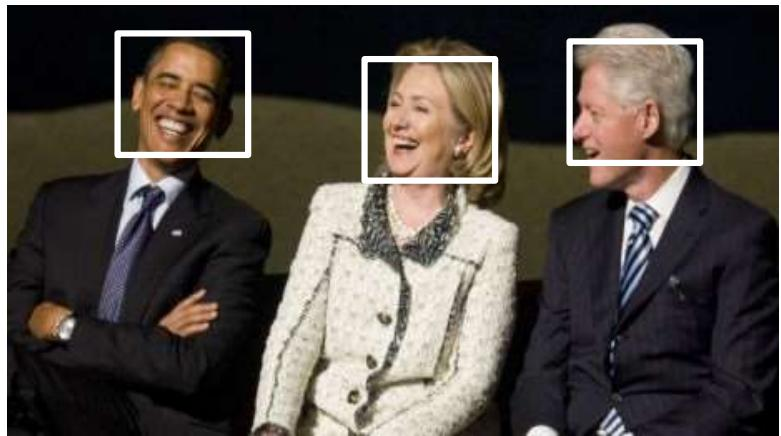

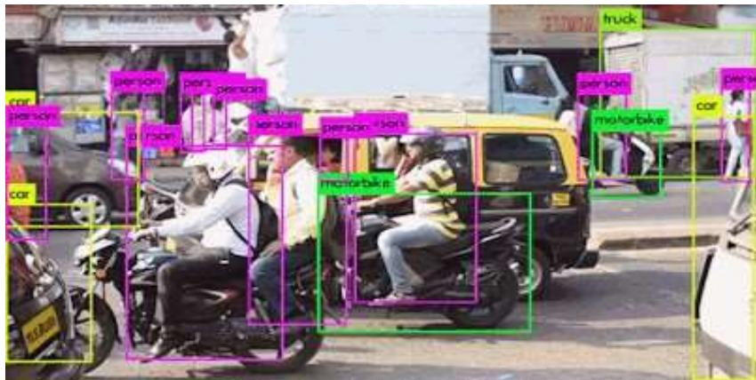

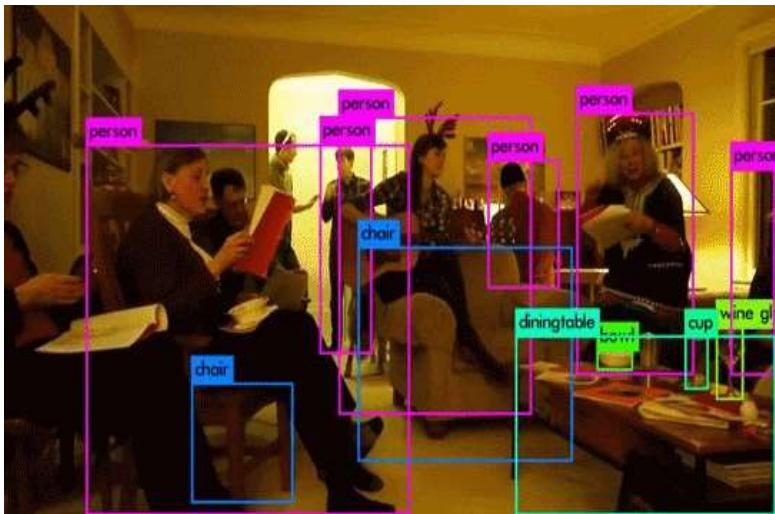

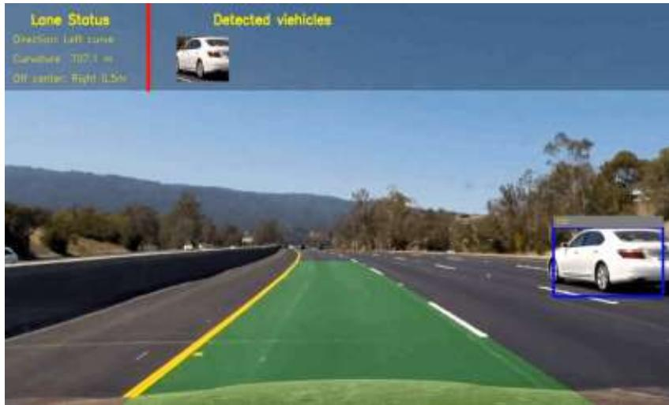

# 机器学习的场景：视频领域

智能驾驶

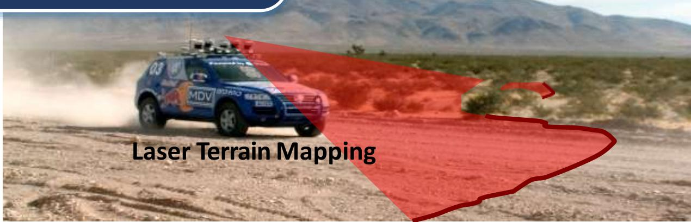

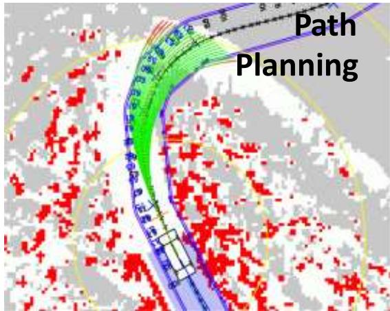

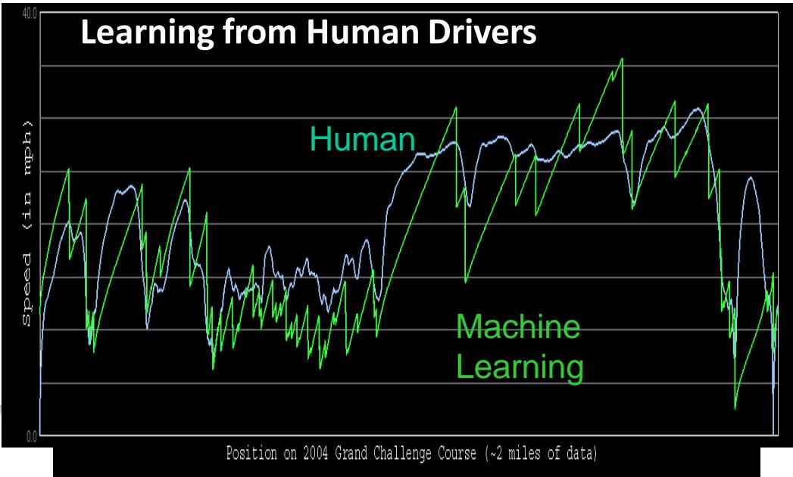

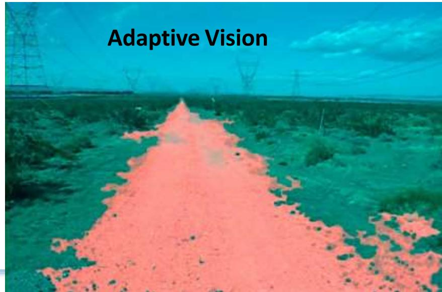

# 机器学习的场景：语音领域

# 语音生成

语句内容：大家再努把力，今天是我们今年在西藏工作的最后一天了，只要我们样本采集好了我们就可以圆满地完成任务了

一本正经地说

• 语气哽咽，微微颤抖，想要表达内心的悲痛

# 为什么需要机器学习

# Traditional Programming

Works well when we know how tospecify theprogram

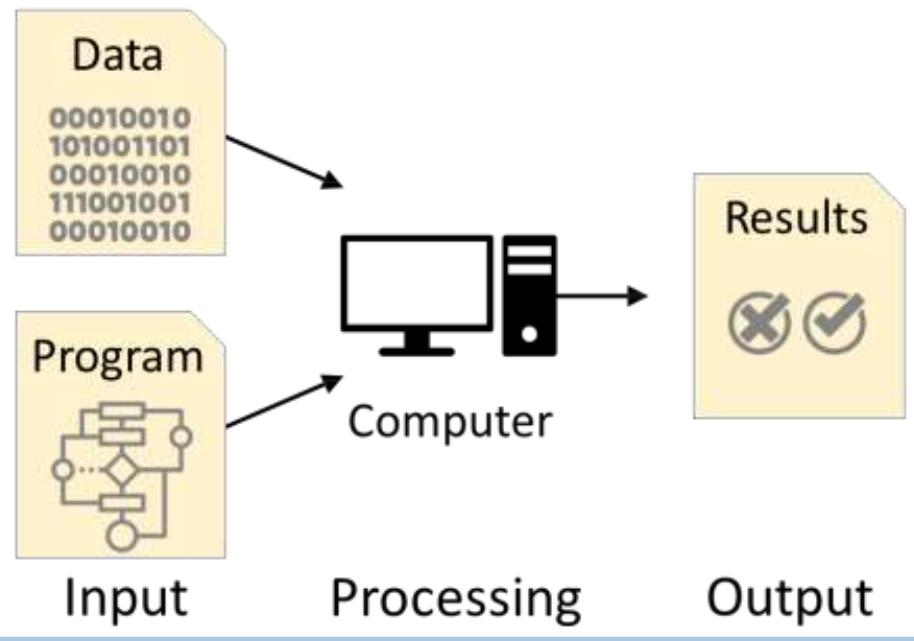

# Machine Learning

Needed when we don't know how tospecify theprogram

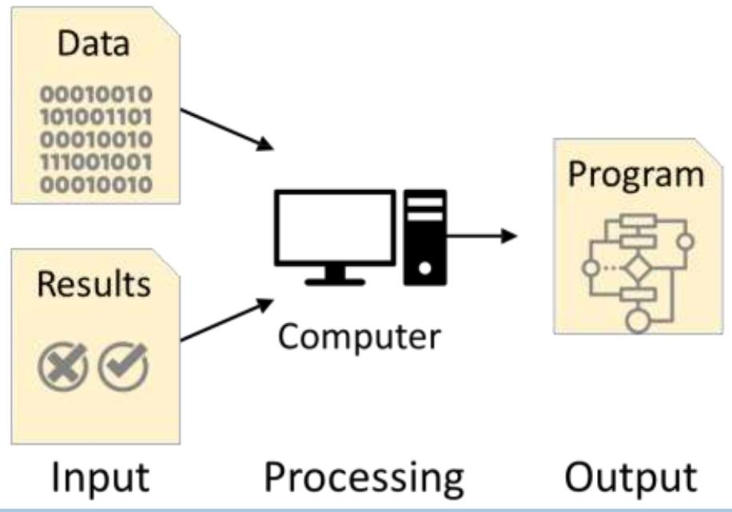

# 为什么需要机器学习

Tasks involving big data

o Genomics

o Internet search

o Anomaly detection

# 模型基于大量数据

Tasks for which it is challengingto specify our knowledge

Facial recognition

o Understanding speech

o Medical diagnosis

# 人类无法解释其专业知识

Tasks requiringcustomization

o Email filters

o Personalized medicine

o Image inpainting

# 模型必须定制

Tasks for which we don't havehuman expertise

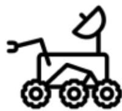

o Space exploration

o Undersea manipulation

o Cellular robotics

# 人类专业知识不存在

# 如何定义机器学习

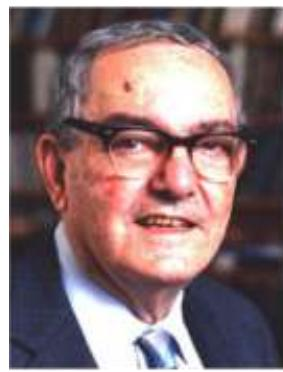

"Learning is any process by which a systemimproves performance from experience."

- Herbert Simon

"Learning denotes changes in the system that are 197adaptive in the sense that they enable the system to dothe task or tasks drawn from the same population moreefficiently and more effectively the next time."

 - Herbert Simon

Learning requires generalization: theabilitytoperformataskinanovel situation

Herbert A. Simon司马贺，美国学者、计算器科学家和心理学家，研究领域涉及认知心理学、计算器科学、公共行政、经济学、管理学和科学哲学等多个方向。 为1975年图灵奖得主，1978年，获得诺贝尔经济学奖。

# 如何定义机器学习

# Definition by Tom Mitchell (1998):

Machine Learning is the study of algorithms that

·improve their performance $P$

·at some task T

·with experience E

A well-defined learning task is given by <P, T, E>

# Examples:

T: Playing Chess (or Go)

P:Percent games won againstanopponent

E:Playing gamesagainstitself

T:Classify emailsas legitimate or spam

P:Percentage of emails labeled correctly

E:Repositoryof emails,somewith

human-specified labels

汤姆·迈克尔·米切尔（Tom Michael Mitchell），1951年8月9日出生，是美国计算机科学家，也是卡内基梅隆大学（CMU）的E. Fredkin大学教授。米切尔以其在机器学习、人工智能和认知神经科学领域的贡献而闻名，他还是教科书《机器学习》的作者。

# 如何定义机器学习

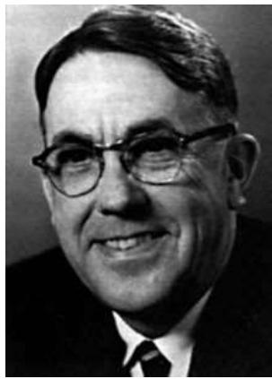

Samuel’s Checkers Player

“Machine Learning: Field of study that gives computers the abilityto learn without being explicitly programmed.”

-Arthur Samuel (1959)

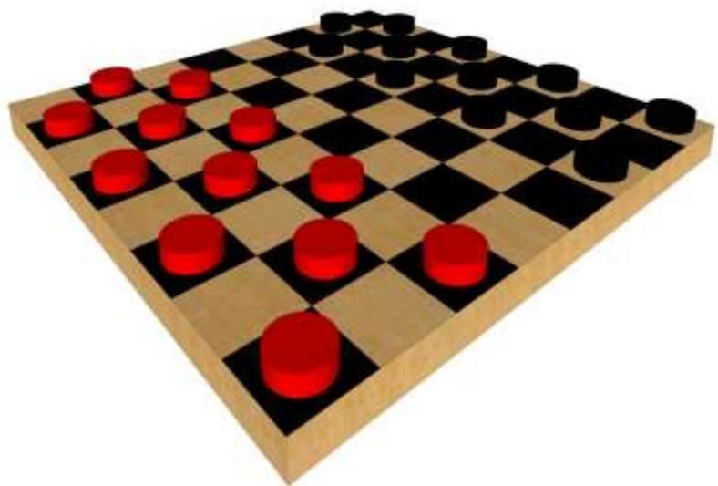

阿瑟·塞繆爾 (December 5, 1901 – July 29, 1990)他是美国计算机游戏和人工智能领域的先驱。1959年，他普及了“机器学习”这一术语。Samuel跳棋程序是世界上首批成功的自学习程序之一，因此是人工智能（AI）基本概念的非常早期的示范。他在1983年还是TeX社区的资深成员。

# 机器学习

# ≈ 机器自动找一个函数

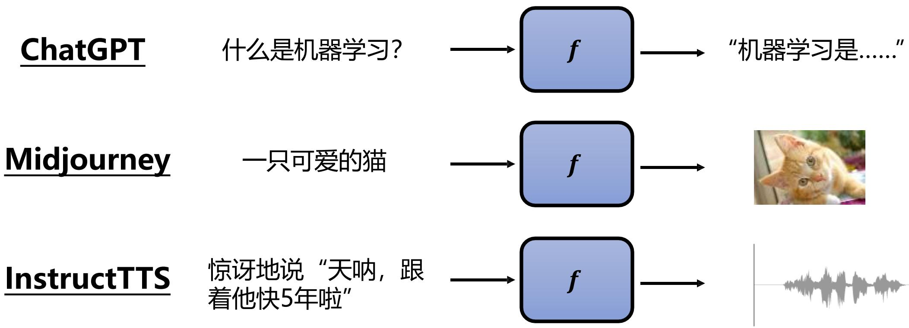

# 机器学习的三大任务

回归 (Regression)：函数的输出是一个数值

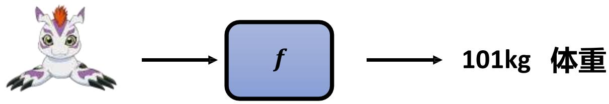

分类 (Classification)：函数的输出是一个类别

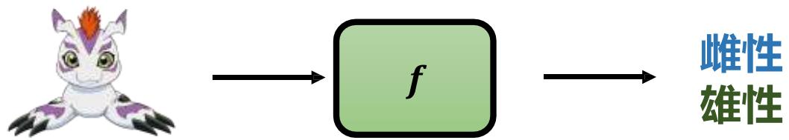

生成 (Generation)：函数的输出是一个数据

# 机器学习原理： 三大步骤

设定范围

Model

确定候选函数的集合

设定标准

达成目标

# 机器学习原理： 确定候选函数集

# 候选函数集合

机器学习中人工神经网络的结构 (例如：CNN, RNN, Transformer 等等)

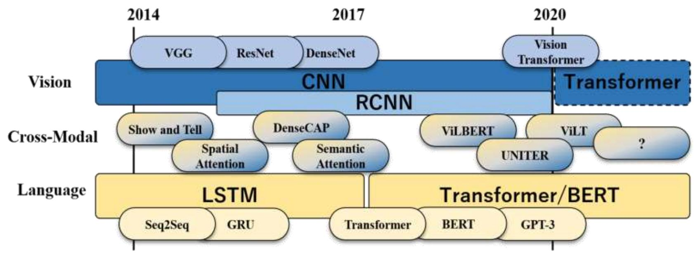

某类人工神经网络的结构集合

不同的AI结构有不同的专长

# 机器学习原理： 三大步骤

设定范围

# Model

确定候选函数的集合

设定标准

# Loss

确定 “评价函数好坏”的标准

达成目标

# 机器学习原理：确定“评价函数好坏” 的标准

$$
\begin{array}{c c c} x _ {i} & f (x _ {i}) & y _ {i} \end{array}
$$

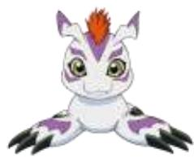

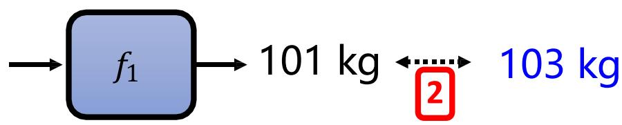

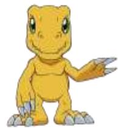

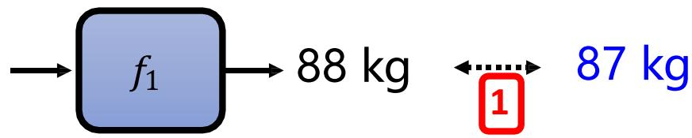

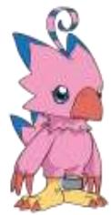

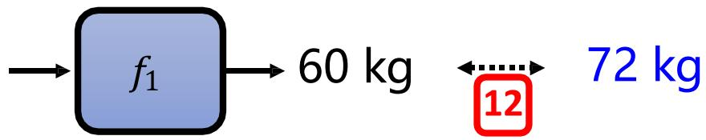

# 监督式学习

# Supervised Learning

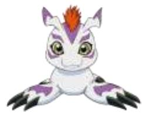

103 kg

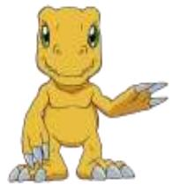

87 kg

真实标签正确答案

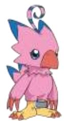

72 kg

??1的输出距离正确答案总和为 15 ??（??1）= 15

$$
L (f _ {1}) := \sum_ {i} ^ {N} \| f _ {1} (x _ {i}) - y _ {i} \|
$$

误差函数（Loss function）

# 机器学习原理：确定“评价函数好坏” 的标准

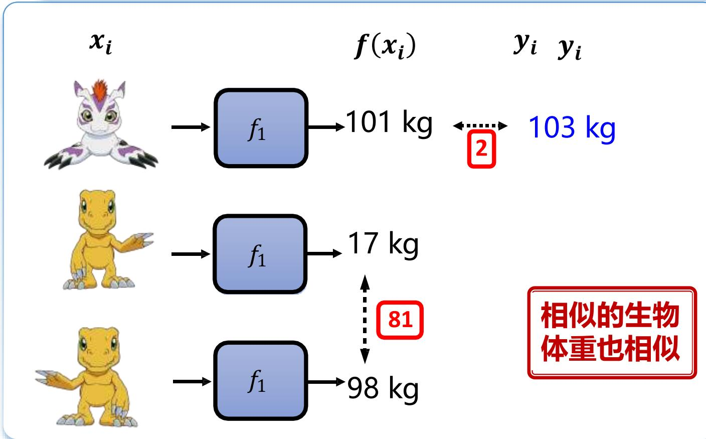

?? (??1) = 输出距离正确答案 +相似的样本间距离

$$
L (\pmb {f} _ {1}) := \sum_ {i} ^ {N} \| \pmb {f} _ {1} (\pmb {x} _ {i}) - \pmb {y} _ {i} \| + \sum_ {k \sim j} \| \pmb {f} _ {1} (\pmb {x} _ {k}) - \pmb {f} _ {1} (\pmb {x} _ {j}) \|
$$

# 半监督式学习

# Semi-Supervised Learning

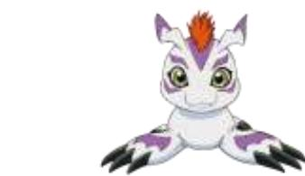

103 kg

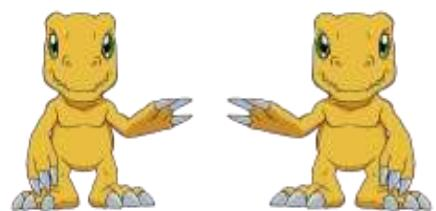

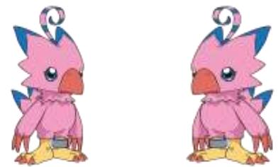

# 机器学习原理：确定“评价函数好坏”的标准

# 训
练
样
本

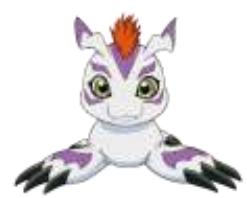

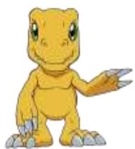

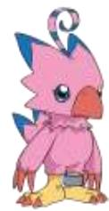

$$
f ^ {*}
$$

$$
f ^ {*} = \arg \min  _ {f \in \mathcal {H}} L (f)
$$

$$
L (f) \mathrm {小}
$$

Training

# 测
试
样
本

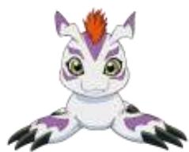

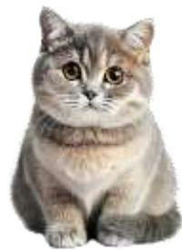

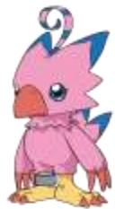

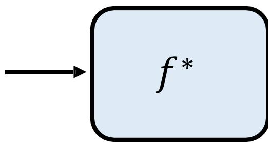

测试不一定好

Testing

?? (??1) = 输出距离正确答案 $+$ 相似的样本间距离 $^ +$ 函数泛化性

$$
L (f _ {1}) := \sum_ {i} ^ {N} \| f _ {1} (x _ {i}) - y _ {i} \| + \sum_ {k \sim j} \left\| f _ {1} (x _ {k}) - f _ {1} (x _ {j}) \right\| + R e g u l a r (f _ {1})
$$

# 机器学习原理： 三大步骤

设定范围

Model

确定候选函数的集合

设定标准

Loss

确定 “评价函数好坏”的标准

达成目标

找出最好的函数

最优化 (Optimization)

# 机器学习原理：找到最好的函数

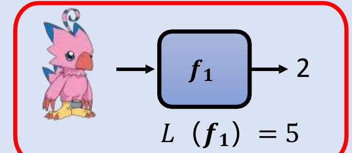


$$
\begin{array}{c} f ^ {*} = \arg \min  _ {f \in \mathcal {H}} L (f) \\ \end{array}
$$

实际上函数数量无穷多，如何去找就是最优化(Optimization)

如搜索技术章节中遗传算法等等

# 机器学习原理： 三大步骤

设定范围

考虑任务特性，确定候选函数的集合

Deep Learning (CNN, Transformer … ), Decision Tree, etc.

设定标准

确定「评价函数好坏」的标准

Supervised Learning, Semi-supervised Learning, RL, etc.

达成目标

找出最好的函数

Gradient Descent (Adam … ), Genetic Algorithm, etc.

# 机器学习类别：学习范式

# 监督学习

# (Supervised Learning)

训练数据(Data)+全部标签(Label)

# 半监督学习

# (Semi-supervised Learning)

训练数据+部分标签

# 无监督学习

# (Unsupervised Learning)

训练数据 (无需标签)

# 强化学习

# (Reinforcement Learning)

智能体在环境中采取行动时的状态(State) 和 奖励(Reward)

# 监督学习

# 回归

训练数据： $( x _ { 1 } , y _ { 1 } ) , ( x _ { 2 } , y _ { 2 } ) , . . . , ( x _ { n } , y _ { n } )$

目标：学习函数 $f ( x )$ ，由 $x$ 预测??

标签??是数值； $x$ 可以是多维的，每个维度代表一维属性


NSIDC Index of Arctic Sea Ice in September


# 监督学习

# 分类

训练数据： $( x _ { 1 } , y _ { 1 } ) , ( x _ { 2 } , y _ { 2 } ) , . . . , ( x _ { n } , y _ { n } )$

目标：学习函数 $f ( x )$ ，由 $x$ 预测??

标签??是种类； $x$ 可以是多维的，每个维度代表一维属性


Malignant

Benign

Ocular Tumor (Malignant / Benign)

眼部肿瘤（恶性 / 良性）


# 监督学习

# 分类

训练数据： $( x _ { 1 } , y _ { 1 } ) , ( x _ { 2 } , y _ { 2 } ) , . . . , ( x _ { n } , y _ { n } )$

目标：学习函数 $f ( x )$ ，由 $x$ 预测??

标签??是种类； $x$ 可以是多维的，每个维度代表一维属性


发病年龄

肿块厚度

肿瘤颜色

眼部神经距离


恶性

良性

# 半监督学习

• 训练数据： $( x _ { 1 } , y _ { 1 } ) , ( x _ { 2 } , y _ { 2 } ) , . . . , ( x _ { m } , y _ { m } ) , x _ { m + 1 } , . . . , x _ { n }$

• 目标：学习函数 $f ( x )$ ，在 $\ b { x }$ 只有部分标注的情况下，也能够预测??

• 例如：在只有部分标注的图像上学习分类任务

只有部分效据是标注时

猫：


狗：


无标注：


猫

狗

# 无监督学习

• 训练数据： $x _ { 1 } , x _ { 2 } , \ldots , x _ { n }$ （无需标签）

• 输出：数据 $x$ 背后的隐藏结构特征

• 例如：聚类— 样本点距离/相似性


# 无监督学习

基因表达相似性

基因数据：

• 行：不同的基因

• 列：不同状态的神经母细胞瘤患者


神经母细胞瘤基因表达谱分析

# 无监督学习

# Similarity Learning 相似性

Triwater三水

bili


法国国旗是红蓝白三色

# 无监督学习


组织计算集群


市场划分


社交网络分析


天文数据分析

# 无监督学习 BSS Blind signal separation 盲信号分离

# 独立成分分析 – 将组合信号分离到其原始信号源中


# 无监督学习

脑电图：盲信号分离


# 强化学习

• 任务：给定一系列带有(延迟)奖励 (reward) 的 状态 (state) 和 动作 (action)，输出一个策略(policy)

• 策略：状态 动作的映射，代表给定状态下应该完成的动作

# 例子

无人机飞行避障

抓取物体的机械臂


基于强化学习的多无人机协同导航


往届学生作品：基于强化学习的步行控制

环境Environment

智能体Agent

# 强化学习


# 强化学习


# 强化学习

状态(state) s


环境 (environment)

动作 (action) ?? ∈ {左，右，上}


智能体 (agent)

# 强化学习


# 奖励 (reward) R

• 收集一个硬币： ?? = +??

游戏胜利： ?? = +??????????

碰到毒蘑菇 (游戏结束)：?? = −??????????

无事发生： ?? = ??

# 从0开始机器学习

# Components of Every ML Application

# Representation 知识的表示

• How is the data specified?

• What is the form of the model?

# Optimization 知识的求解

• How is the model trained on the data?

# Evaluation 知识的检验

• How are we assessing whether themodel is successful?

• What is the performance measure?

# Representations 如何表示知识

# Numericalfunctions

·Linearregression

·Lineardiscriminant

·Neural network

# Symbolicfunctions

·Decision tree

·Propositionallogicrules

·First-orderlogicrules

# Instance-basedfunctions

·Nearest-neighbor

·Case-based

# ProbabilisticGraphical Models

·Naive Bayes

·Bayesian network

·Hidden-Markovmodel (HMMs)

·Probabilisticcontext-freegrammar(PCFGs)

·Markovnetwork

# Optimization 如何优化知识

# Gradient Descent

·Perceptron

·Backpropagation

·StochasticGD

·RMSprop

·ADAM

# DynamicProgramming

·HMMtraining

·Viterbialgorithm

# DivideandConquer

·Decision treeinduction

·Rule learning

# EvolutionaryComputation

·GeneticAlgorithms

·Neuro-evolution

# Evaluation 如何检验知识

• Accuracy

• Squared error

• Precision / recall

• F-measure

• Utility (expected cost)

• Likelihood

• Posterior probability

• Margin

• Information gain / Entropy

• KL divergence

# Designing a Learning System

• Choose the training experience(data)

Choose exactly what is to be learned– i.e. the target function

• Choose how to represent the target function

• Choose a learning algorithm to infer the target function fromthe experience


# Train vs Test

We generally assume that the training and test examplesare independently drawn from the same overalldistribution of data

– We call this “i.i.d” which stands for “independent and identicallydistributed”

• If examples are not independent, requirescollective classification

• If test distribution is different, requirestransfer learning

# Workflow


# Case：Online Dating


# Case：Online Dating

Chelsea,26

Chelsea,26

# Case：Online Dating

# Buttercup13

Attended Post-grad,Doesn'tsmoke

cigarettes,Drinks socially,

Doesn'tdodrugs,Has dogs


# Buttercup13

Attended Post-grad,Doesn'tsmoke

cigarettes,Drinks socially

Doesn't dodrugs,Has dogs

Myself-summary

lenjoy longwalksonthebeach,smooth

appletinis,and witty banterabout dragons.

Ihaveaweakness for $5 7 \%$ dark chocolate.

"Excellent bicuspids"-Mydentist

# Case：Online Dating

Browse Matches

DoubleTake

Purchase A-List

99.8%

Highest match possible

You've answered 416 questions

PUBLIC 413

IMPORTANT 71

EXPLAINED 21

PRIVATE 3

SKIPPED 116

Do humans and modern primates (apes,chimps,etc) shareacommon evolutionaryancestor?

# RE-ANSWER

What'sthehighest levelofeducation you'vecompleted?

# RE-ANSWER

Should we be fighting to close the gender wage gap?

Are you a cat person or a dog person?

Dogs

# RE-ANSWER

Would you consider yourself a feminist?

# RE-ANSWER

Do you enjoy intense intellectual conversations?

# RE-ANSWER

# Case：Online Dating

# From a Profile to Features

Anika30

-Hates pizza


Shelly


# Case：Online Dating

# Case：Online Dating

# Obtaining User Feedback


# Case：Online Dating

# Getting Labeled Data

Anika30


Peter34

# Case：Online Dating

# Getting Labeled Data


Append feature vectors

Label

# Case：Online Dating

# Getting Labeled Data


# Case：Online Dating

# Forming the Training Data


# Case：Online Dating

# Forming the Training Data


# Case：Online Dating

# Forming the Training Data

data matrix X


labels y

# Case：Online Dating

# Training the Model


MachineLearner


# Case：Online Dating

# Applying the Model


new pair

feature vector


# 机器学习 vs 知识工程

Rule-based approach


Machine leaming


# ■知识工程

□基于手工设计规则建立专家系统（~80年代末期）

□结果容易解释

$\sqsupset$ 系统构建费时费力

$\sqcap$ 依赖专家主观经验，难以保证一致性和准确性

# ■机器学习

$\sqcap$ 基于数据自动学习（90年代中期~）

$\sqcap$ 减少人工繁杂工作，但结果可能不易解释

$\sqcap$ 提高信息处理的效率，且准确率较高

□来源于真实数据，减少人工规则主观性，可信度高

# 流行机器学习模型的演变


# 流行机器学习模型的演变


# 神经网络的三起两落


# 人工智能>机器学习>深度学习


# 传统机器学习：人工设计特征

# ■实际应用中，特征往往比分类器更重要

□预处理：经过数据预处理，如去除噪声等；如在文本分类中，去除停用词等。

□特征提取：从原始数据中提取有效特征，如在图像分类中，提取边缘、尺度不变特征变换特征等。

$\sqcap$ 特征转换：对特征进行一定的加工，比如降维和升维。降维包括

$\checkmark$ 特征抽取（Feature Extraction）：PCA、LDA

特征选择（FeatureSelection）：互信息、TF-IDF


# 传统机器学习 vs 深度学习


# 一切的开始： 感知机

# ■ Rosenblatt & Perceptron

计算模型：1943年最初由WarrenMcCulloch和WalterPitts提出

感知器（Perceptron）：康奈尔大学FrankRosenblatt1957年提出

Perceptron是第一个具有自组织自学习能力的数学模型

Rosenblatt乐观预测：感知器最终可以“学习，做决定，翻译语言”

感知器技术六十年代一度走红，美国海军曾出资支持，期望它“以后可以自己走，说话，看，读，自我复制，甚至拥有自我意识


Perceptron(1957)


Original Perceptron

(FromPerceptronsbyM.LMimskyandS.Papert,1969,Cambridge,MA:MTPres.Copyrigbt1969byMITPres

Simplified model:

Frank Rosenblatt（1928-1971)


# 一切的开始： 感知机

# ■ Rosenblatt vs. Minsky

·Rosenblatt和Minsky是间隔一级的高中校友。但是六十年代，两个人在感知器的问题上展开了长时间的激辩：R认为感应器将无所不能，M则认为它应用有限

·1969年,MarvinMinsky和Seymour Papert出版了新书:"感知器：计算几何简介".书中论证了感知器模型的两个关键问题：

·第一，单层的神经网络无法解决不可线性划分的问题，典型例子如异或门

·第二，更致命的问题是，当时的电脑完全没有能力完成神经网络模型所需要的超大的计算量

此后的十几年，以神经网络为基础的人工智能研究进入低潮相关项目长期无法得到政府经费支持，这段时间被称为业界的核冬天

Rosenblatt自己则没有见证日后神经网络研究的复兴。1971年他43岁生日时，不幸在海上开船时因为事故而丧生


# 传统神经网络

# ■ Geoffrey Hinton & NNs

Geoffrey Hinton

"The Godfatherof deeplearning"


·1970年，当神经网络研究的第一个寒冬降临时，在英国的爱丁堡大学，一位23岁的年轻人GeoffreyHinton,刚刚获得心理学的学士学位.

·Hinton六十年代还是中学生时就对脑科学着迷。当时一个同学给他介绍关于大脑记忆的理论是：大脑对于事物和概念的记忆，不是存储在某个单一的地点，而是像全息照片一样，分布式地存在于一个巨大的神经元的网络里

●分布式表征(Distributed Representation)和传统的局部表征(LocalizedRep.）相比

存储效率高很多：线性增加的神经元数目，可以表达指数级增加的大量不同概念

鲁棒性好：即使局部出现硬件故障，信息的表达不会受到根本性的破坏

·这个理念让Hinton顿悟，使他40多年来一直在神经网络研究的领域里坚持

·本科毕业后，Hinton选择继续在爱丁堡大学读研，把人工智能作为自己的博士研究方向

1978年，Hinton在爱丁堡获得博士学位后，来到美国继续他的研究工作

# 传统神经网络

# ■ Rumelhart & BP Algorithm

神经网络被Minsky诟病的问题：巨大的计算量；XOR问题

传统的感知器用所谓“梯度下降”的算法纠错时，耗费的计算量和神经元数目的平方成正比.当神经元数目增多，庞大的计算量是当时的硬件无法胜任的

·1986年7月,Hinton和David Rumelhart合作在Nature杂志上发表论文：LearningRepresentationsbyBack-propagatingErrors,第一次系统简洁地阐述BP算法及其应用

》反向传播算法把纠错的运算量下降到只和神经元数目本身成正比

》BP算法通过在神经网络里增加一个所谓隐层(hiddenlayer),解决了XOR难题

》使用了BP算法的神经网络在做如形状识别之类的简单工作时，效率比感知器大大提高，八十年代末计算机的运行速度，也比二十年前高了几个数量级

神经网络及其应用的研究开始复苏！


# 传统神经网络

# ■ Yann Lecun &CNN

YannLecun于1960年出生于巴黎

·1987年在法国获得博士学位后，他曾追随Hinton教授到多伦多大学做了一年博士后的工作,随后搬到新泽西州的BellLab继续研究工作

·在BellLab，Lecun1989年发表了论文，“反向传播算法在手写邮政编码上的应用”他用美国邮政系统提供的近万个手写数字的样本来训练神经网络系统，训练好的系统在独立的测试样本中，错误率只有 $5 \%$

·Lecun进一步运用一种叫做“卷积神经网络”(ConvolutionalNeuralNetworks)的技术，开发出商业软件，用于读取银行支票上的手写数字，这个支票识别系统在九十年代末占据了美国接近 $2 0 \%$ 的市场

·此时就在BellLab,YannLecunl临近办公室的一个同事VladmirVapnik的工作,又把神经网络的研究带入第二个寒冬！

# 深度学习发展

# ■ Hinton & Deep Learning

Geoffrey Hinton

"The Godfatherof deep learning"


·2003年，GeoffreyHinton,还在多伦多大学,在神经网络的领域苦苦坚守

·2003年在温哥华大都会酒店，以Hinton为首的十五名来自各地的不同专业的科学家，和加拿大先进研究院(CanadianInstituteofAdvancedResearch,CIFAR)的基金管理负责人Melvin Silverman 交谈

》Silverman问大家，为什么CIFAR要支持他们的研究项目

》计算神经科学研究者，SebastianSung(现为普林斯顿大学教授)回答道：“喔，因为我们有点古怪.如果CIFAR要跳出自己的舒适区，寻找一个高风险，极具探索性的团体，就应当资助我们了！”

》最终CIFAR同意从2004年开始资助这个团体十年，总额一干万加元.CIFAR成为当时世界上唯一支持神经网络研究的机构

·Hinton拿到资金支持不久，做的第一件事，就是把“神经网络”改名换姓为"深度学习”

·此后，Hinton的同事不时会听到他突然在办公室大叫：“我知道人脑是如何工作的了!".

# 深度学习发展

# ■DBN& RBM

）2006年Hinton和合作者发表论文:AFast Algorithm for Deep Belief Nets

·算法上借用了统计力学中“玻尔兹曼分布概念：一个微粒在某个状态的几率，和那个状态的能量的指数成反比，和它的温度的倒数之指数成反比。使用所谓的限制玻尔兹曼机”(RBM)来学习

》RBM相当于一个两层网络，同一层神经元之间不可连接(所以叫“限制")，可以对神经网络实现"unsupervisedtraining”。深度置信网络DBN就是几层RBM叠加在一起

》RBM可以从输入数据进行预先训练，自己发现重要的特征，对神经网络连接的权重进行有效的初始化.被称作：特征提取器(FeatureExtractor)或自动编码器(Autoencoder)

Hinton指出：深度学习的突破除了计算蛮力的大幅度提高以外，聪明有效地对网络链接权重的初始化也是一个重要原因

》经过六万个MNIST数据库的图像训练后，对于一万个测试图像的识别错误率最低降到了只有 $1 . 2 5 \%$


# 深度学习发展

# ■Andrew Y. Ng& GPU

2007年之前，用GPU编程缺乏一个简单的软件接口，编程繁琐,Debug困难2007年Nvidia推出CUDA的GPU软件接口后才真正改善

●2009年6月，斯坦福大学的RajatRaina和吴恩达合作发表论文：Large-scaleDeepUnsupervised LearningusingGraphic Processors (ICML09);论文采用DBNs模型和稀疏编码(SparseCoding)，模型参数达到一亿（与Hinton模型参数的对比见下表）

·论文结果显示：使用GPU运行速度和用传统双核CPU相比，最快时要快近70倍.在一个四层，一亿个参数的深信度网络上使用GPU把程序运行时间从几周降到一天

<table><tr><td>Published source</td><td>Application</td><td>Params</td></tr><tr><td>Hinton et al., 2006</td><td>Digit images</td><td>1.6mn</td></tr><tr><td>Hinton &amp; Salakhutdinov</td><td>Face images</td><td>3.8mn</td></tr><tr><td>Salakhutdinov &amp; Hinton</td><td>Sem. hashing</td><td>2.6mn</td></tr><tr><td>Ranzato &amp; Szummer</td><td>Text</td><td>3mn</td></tr><tr><td colspan="2">Our model</td><td>100mn</td></tr></table>


Figure1.Simplified schematic for the Nvidia GeForceGTX280 graphics card,with 240 total cores(30multi-processors with8stream processorseach).


# 深度学习发展

# ■ Jen-Hsun Huang& GPU

·黄仁勋,1963年出生于台湾

·1993年从斯坦福大学硕士毕业后不久创立了Nvidia

·Nvidia起家时做的是图像处理的芯片，主要面对电脑游戏市场.1999年Nvidia推销自己的Geforce256芯片时，发明了GPU(GraphicsProcessingUnit)这个名词

·GPU的主要任务，是要在最短时间内显示上百万、千万甚至更多的像素.这在电脑游戏中是最核心的需求.这个计算工作的核心特点，是要同时并行处理海量的数据

·传统的CPU芯片架构，关注点不在并行处理，一次只能同时做一两个加减法运算.而GPU在最底层的算术逻辑单元(ALU,ArithmeticLogicUnit),是基于所谓的SingleInstructionMultipleData（单指令多数据流)的架构，擅长对于大批量数据并行处理

一个GPU，往往包含几百个ALU，并行计算能力极高.所以尽管GPU内核的时钟速度往往比CPU的还要慢，但对大规模并行处理的计算工作，速度比CPU快许多

·神经网络的计算工作，本质上就是大量的矩阵计算的操作，因此特别适合于使用GPU

# 深度学习发展

# ■Image Classification:ILSVRC竞赛

TopFiveCategory：计算机会对图像的分类，答出最有可能的头五个类别，如果正确答案都不在里面即为错误

2010年冠军：NEC和伊利诺伊大学香槟分校的联合团队，用支持向量机(SVM)的技术，识别分类的错误率为 $2 8 \%$

2011年冠军：用FisherVector的计算方法(类似sVM),将错误率降到了 $2 5 . 7 \%$

2012年冠军：Hinton和两个研究生AlexKrizhevsky,IllyaSutskever，利用CNN+Dropout算法+RELU激励函数，用了两个Nvidia的GTX580CPU（内存3GB,计算速度1.6

TFLOPS),花了接近六天时间，错误率只有 $1 5 . 3 \%$

·2012年10月13日，当竞赛结果公布后，学术界沸腾了这是神经网络二十多年来，第一次在图像识别领域，毫无疑义的，大幅度挫败了别的技术

这也许是人工智能技术突破的一个转折点


# 深度学习发展

# ■Schmidhuber& LSTM

1997年瑞士Lugano 大学的 Schmidhuber和他的学生 Sepp Hochreiter合作,提出了长短期记忆(LSTM,LongShort-TermMemory)的计算模型

·LSTM：背后要解决的问题，是如何将有效信息，在多层循环神经网络传递之后，仍能输送到需要的地方去

●LSTM模块,是通过内在参数的设定(如图,input gate,output gate,forget gate),决定某个输入信息在很久以后是否还值得记住，何时取出使用，何时废弃不用


# 神经网络结构的发展


# 神经网络结构的发展

<table><tr><td>2012 Teams</td><td>%error</td></tr><tr><td>Supervision (Toronto)</td><td>15.3</td></tr><tr><td>ISI (Tokyo)</td><td>26.1</td></tr><tr><td>VGG (Oxford)</td><td>26.9</td></tr><tr><td>XRCE/INRIA</td><td>27.0</td></tr><tr><td>UvA (Amsterdam)</td><td>29.6</td></tr><tr><td>INRIA/LEAR</td><td>33.4</td></tr></table>

<table><tr><td>2013 Teams</td><td>%error</td></tr><tr><td>Clarifai (NYU spinoff)</td><td>11.7</td></tr><tr><td>NUS (singapore)</td><td>12.9</td></tr><tr><td>Zeiler-Fergus (NYU)</td><td>13.5</td></tr><tr><td>A. Howard</td><td>13.5</td></tr><tr><td>OverFeat (NYU)</td><td>14.1</td></tr><tr><td>Uva (Amsterdam)</td><td>14.2</td></tr><tr><td>Adobe</td><td>15.2</td></tr><tr><td>VGG (Oxford)</td><td>15.2</td></tr><tr><td>VGG (Oxford)</td><td>23.0</td></tr></table>

<table><tr><td>2014 Teams</td><td>%error</td></tr><tr><td>GoogLeNet</td><td>6.6</td></tr><tr><td>VGG (Oxford)</td><td>7.3</td></tr><tr><td>MSRA</td><td>8.0</td></tr><tr><td>A. Howard</td><td>8.1</td></tr><tr><td>DeeperVision</td><td>9.5</td></tr><tr><td>NUS-BST</td><td>9.7</td></tr><tr><td>TTIC-ECP</td><td>10.2</td></tr><tr><td>XYZ</td><td>11.2</td></tr><tr><td>UvA</td><td>12.1</td></tr></table>


source:https://wwwdsac.og/esources/ouals/dsiac/wnter27voue-4umbr-1/eal-timesituinteligentvideaalytic

# 我们身边的机器学习

广 东 省 某 大 学 医 学 院 基 于 机 器 学 习Transformer模型，在大量学习病毒和非病毒基因组序列后，可以自主形成一套关于病毒的判断标准，从而在大量的RNA测序数据集中挖掘出病毒序列

相关工作在《细胞》 （Cell）杂志上发表，报告了180个超群、超过16万种全球RNA病毒的发现，这是迄今为止规模最大的RNA病毒研究， 大幅扩展全球RNA病毒的多样性

# 基于机器学习的病毒学研究


基于机器学习对全球病毒圈深度挖掘并分类

# 我们身边的机器学习

# 立体定向脑活检机器人

• 团队研发立体定向脑活检手术机器人

• 定位导航精度高：可将1.8 mm直径的活检针通过直径为3 mm的小孔送达目标病灶区域

• 活检指标可控：活检取样中气压、速度、深度等的数字化

• 功能齐全：可自动完成导航、穿刺、活检等一系列任务


# 我们身边的机器学习

# 眼科手术机器人

如何提高眼底手术治疗的安全性和精准性？如何解决眼底手术资源供需的严重失衡？ 眼科手术机器人是“良策”

学院科研团队联合某医院眼科中心研发的“5G远程微米级眼科手术机器人” 于海南省眼科医院成功开展了全球首例5G远程微米级眼科手术

• 主刀医生在600公里外的海口远程操作机械臂，为广州的实验动物完成视网膜下注射手术，实现跨时空限制的高精度手术


# 本章小结

# 机器学习原理

·回归(Regression)：函数的输出是一个数值


·分类（Classification）：函数的输出是一个类别


·生成(Generation)：函数的输出是一个数据

理解机器学习的核心概念

• 符号和公式定义

• 三大任务

• 寻找函数的三大步骤

# 机器学习的范式


学习四种不同机器学习范式的特点与应用场景

• 监督学习 • 半监督学习

• 无监督学习 • 强化学习

# 机器学习前沿应用


从具体应用实例领略机器学习的重要性

• 病毒发现

• 手术机器人

# 预习思考

机器学习的核心是通过数据寻找函数映射关系，人类大脑的神经元结构也有相同的学习能力，请思考以下问题：

“如何仿照人类大脑进行人工神经网络设计，它又如何通过怎样的学习方式实现复杂的非线性函数映射？它与传统的机器学习模型（如逻辑回归或决策树）相比，有哪些优势？”


传统机器学习模型（如决策树）


人工神经网络
