# 深度学习与典型神经网络

Deep Learning and Classical Neural Networks

授课对象：计算机科学与技术专业 二年级

课程名称：人工智能（专业必修）

节选内容：第六章 机器学习

课程学分：3学分

# 前情知识回顾：神经网络

输入层

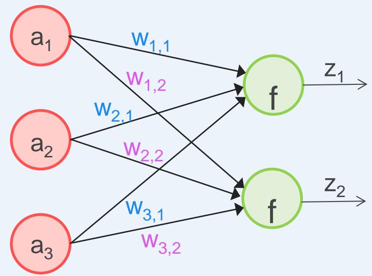

单层神经网络/感知机（Perceptron）无法解决XOR（异或）这样简单分类

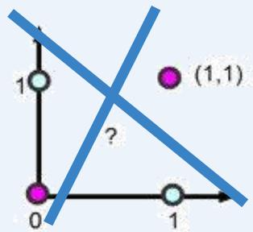

XOR

输入层

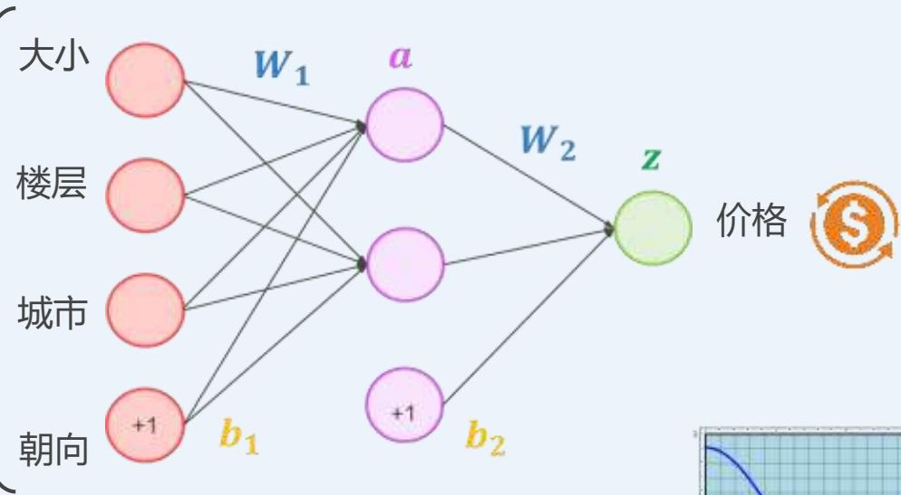

多层神经网络/多层感知机（MLP）可以解决复杂分类任务

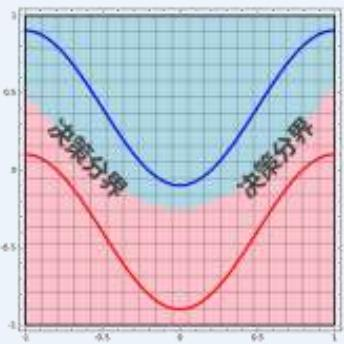

随着层数的增加，神经网络的学习能力越来越强，能完成更多更难的任务

# 前情知识回顾：神经网络

# 深度学习

# 随着层数的增加，神经网络的学习能力越来越强，能完成更多更难的任务

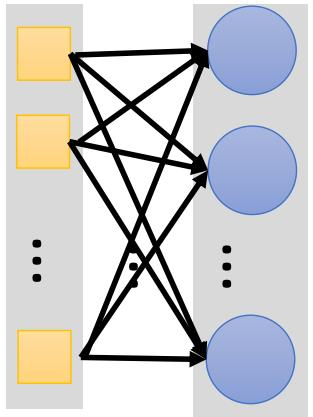

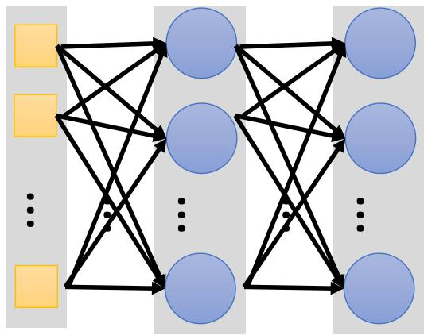

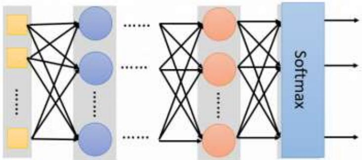

更深，更复杂……

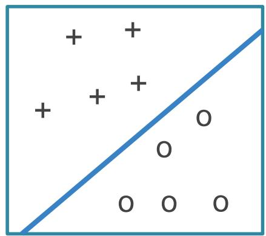

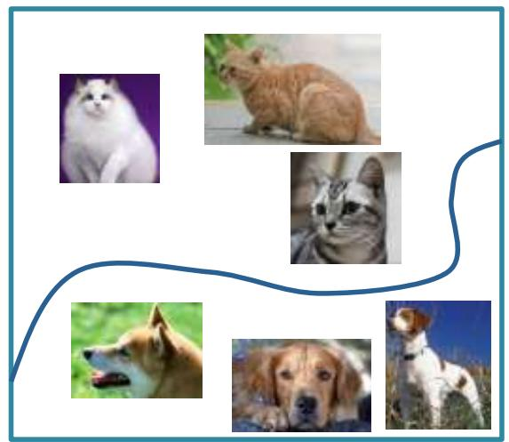

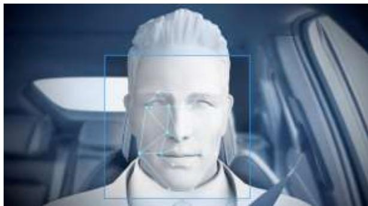

# 前情知识回顾：神经网络

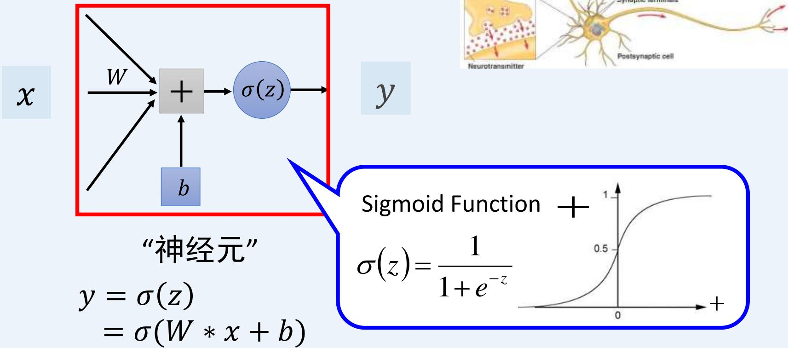

# 前情知识回顾：神经网络

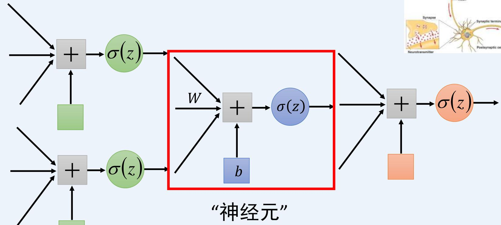

$$
\begin{array}{l} y = \sigma (z) \\ = \sigma (W * x + b) \\ \end{array}
$$

神经网络参数 : “神经元”中的权重(????????ℎ????) ?? 和 偏置(????????????) ??

# 前情知识回顾：神经网络

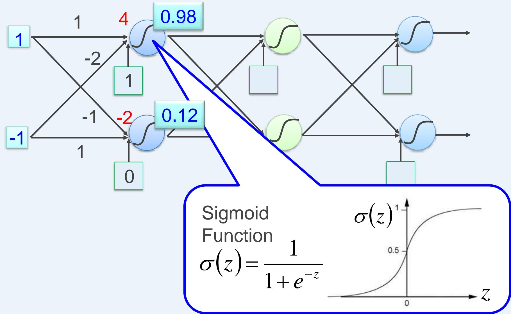

# 前情知识回顾：神经网络

Try it！

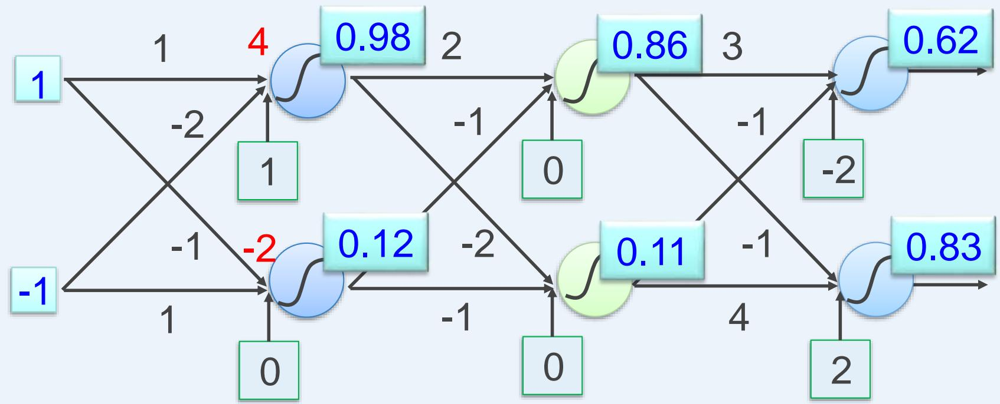

# 前情知识回顾：神经网络

# 函数视角

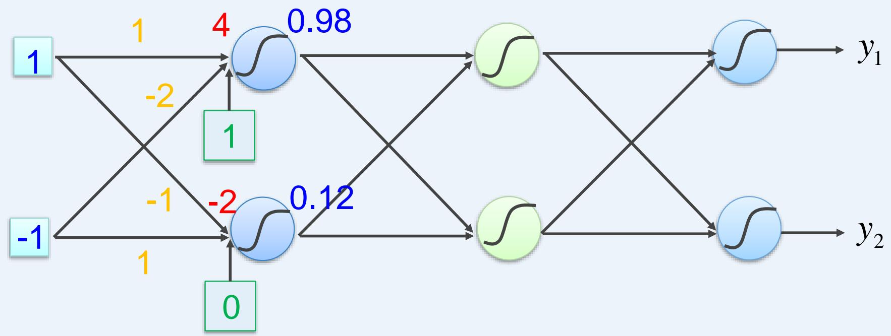

$$
\sigma (\underbrace {\left[ \begin{array}{l l} 1 & - 2 \\ - 1 & 1 \end{array} \right] \left[ \begin{array}{l} 1 \\ - 1 \end{array} \right] + \left[ \begin{array}{l} 1 \\ 0 \end{array} \right]} _ {\left[ \begin{array}{l} 4 \\ - 2 \end{array} \right]}) = \left[ \begin{array}{l} 0. 9 8 \\ 0. 1 2 \end{array} \right]
$$

# 前情知识回顾：神经网络

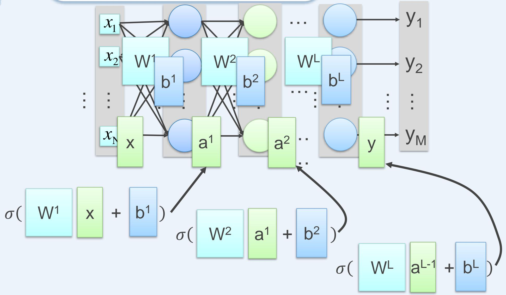

# 前情知识回顾：神经网络

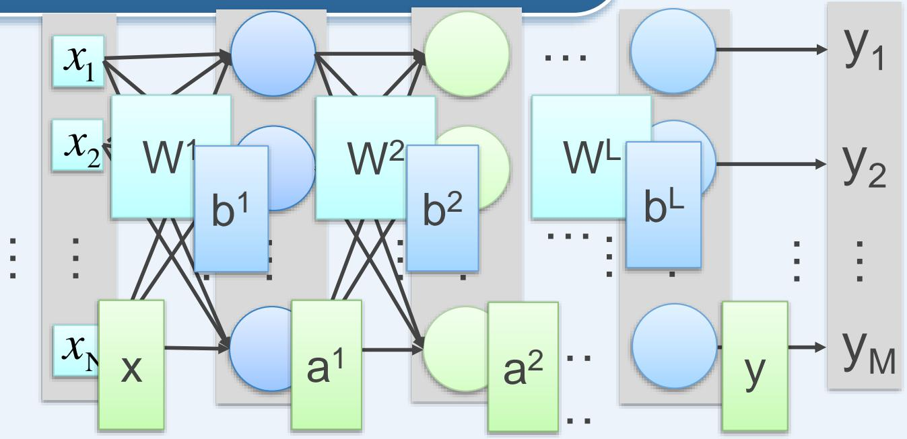

$$
\begin{array}{c} \boxed {\mathbf {y}} = f (\boxed {\mathbf {x}}) \end{array}
$$

使用并行计算技术来加速矩阵操作

$$
= \sigma (\boxed {W ^ {L}} \dots \sigma (\boxed {W ^ {2}} \sigma (\boxed {W ^ {1}} \boxed {x} + \boxed {b ^ {1}}) + \boxed {b ^ {2}}) \dots + \boxed {b ^ {L}})
$$

# 前情知识回顾：神经网络

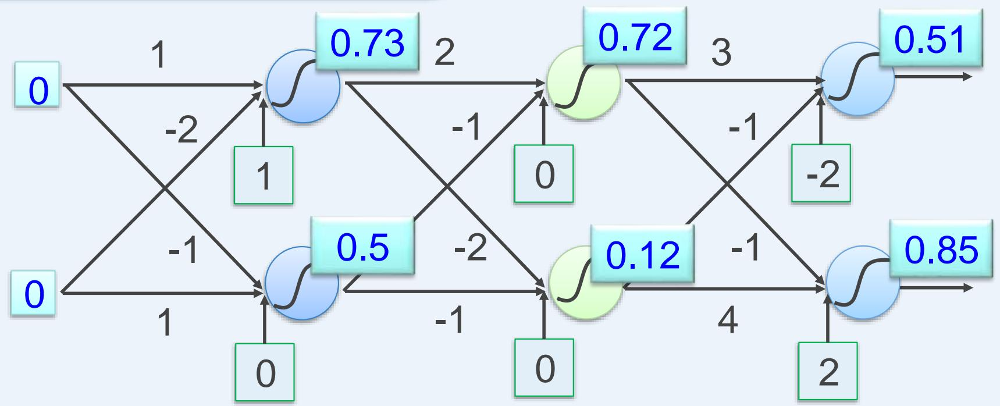

相当于函数功能

$$
f \left(\left[ \begin{array}{c} 1 \\ - 1 \end{array} \right]\right) = \left[ \begin{array}{c} 0. 6 2 \\ 0. 8 3 \end{array} \right] f \left(\left[ \begin{array}{c} 0 \\ 0 \end{array} \right]\right) = \left[ \begin{array}{c} 0. 5 1 \\ 0. 8 5 \end{array} \right]
$$

输入一个向量，输出另一个向量

# 网络结构相当于定义了函数空间

# 前情知识回顾：神经网络

# 功能视角

特征提取器取代特征工程

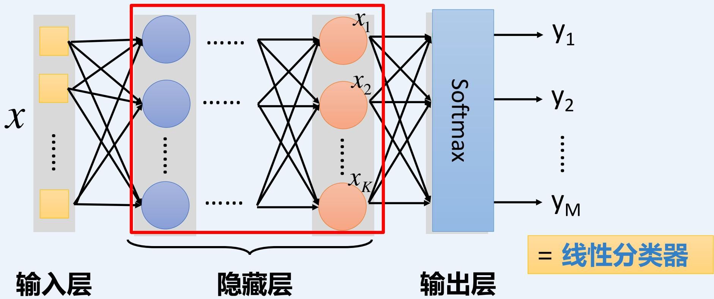

从功能角度讲，神经网络就是多层的特征提取加上线性分类

# 深度学习概念与分类

# “深度” = 非常多隐藏层

误差率: 16.4%

8 layers

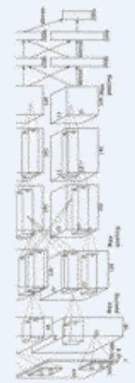

AlexNet (2012)

7.3%

19 layers

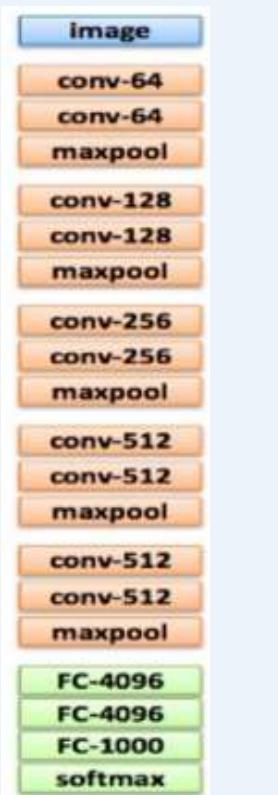

VGG (2014)

6.7%

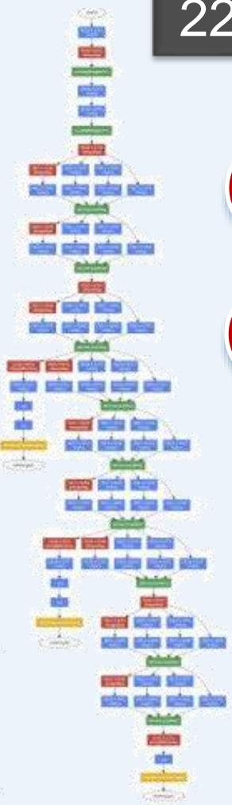

GoogleNet (2014)

layers

深度学习只是堆叠层数吗？

只堆叠层数会有什么问题？

回顾上节：随着层数增加，参数更新梯度呈现指数衰减，低层基本上接受不到有效的训练信号，即梯度消失问题！

# 深度学习概念与分类

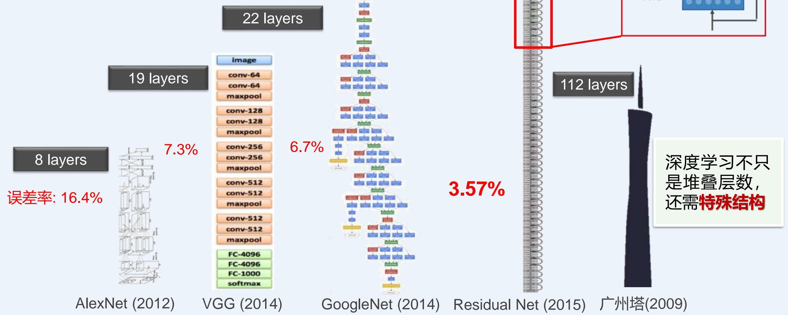

# 深度学习概念与分类

• 视觉数据：CNN（卷积神经网络）, ResNet, DenseNet, ….

• 文本数据：RNN, LSTM, Transformer, Bert, ChatGPT…

其他数据：AlphaFold（2024年诺贝尔化学奖：蛋白质结构预测）

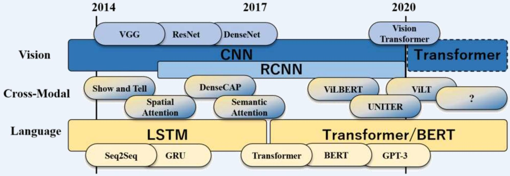

# 深度学习发展历史

Bengio在自然语言处理与注意力机制、 生成式模型、序列概率模型上有贡献

Hinton是反向传播算法和玻尔兹曼机的提出者 ， 也 是 2024年诺贝尔物理学奖获得者

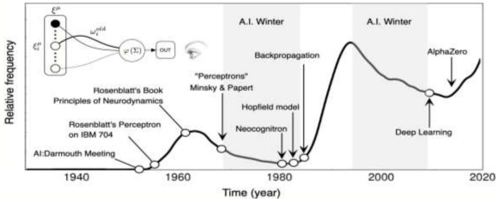

历史上的AI寒冬期

20世纪80~90年代AI寒冬中，许多研究者和资金转向其他领域

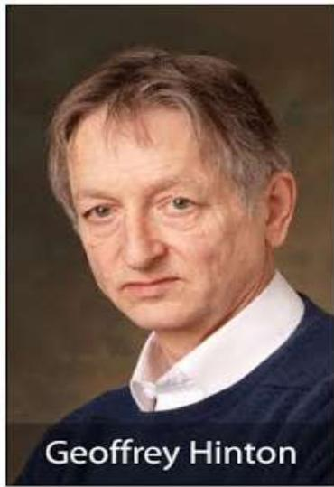

2018年图灵奖获得者

他们持之以恒地研究神经网络，取得诸多开创性成就

LeCun独立发现并改进了反向传播算法，提出卷积神经网络 （CNN）

# 卷积神经网络的视觉机理

任务：

猫 or 狗 ？

# 卷积神经网络的视觉机理

# [分组讨论]

# 有什么问题？

# • 思路

计时停止

使用多层感知机处理二维图片有什么问题？

# 狗 ？

藏讨论内容

# 忽略图

刘

93分

多层感知机对二维图片的处理没有充分利用图片的空间信息。MLP将图片展开为一维向量后处理，这样会丢失像素之间的局部空间关系，而这些信息对图像的模式识别非常重要。

陈

91分

二维图片中的物体如果位置发生改变，MLP可能无法正确识别，因为… … …列。

张

90分

由于二维图片通常包含大量像素，展开为一维就是一个幅增加，模型的参数量会变得非常庞大。这不仅增加了计算开销，还可能导致过拟合。

# 数量庞大！

# 卷积神经网络

# 人类视觉机理的启发

人观测图片的特点：

人不必看完整张图片来识别

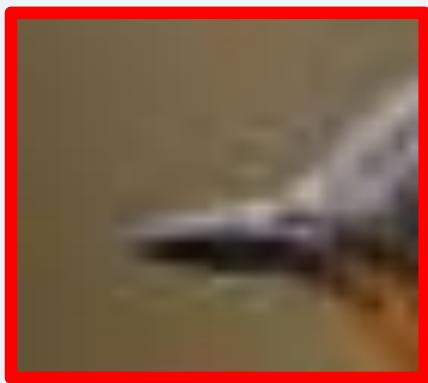

# 人类视觉机理的启发

人观测图片的特点： ① 局部特征影响大

人不必看完整张图片来识别

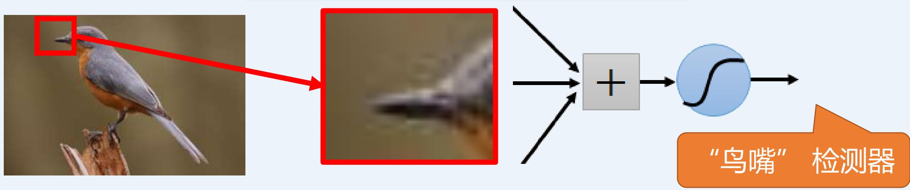

些局部特征要比整张图片小得多

# 人类视觉机理的启发

人观测图片的特点： ① 局部特征影响大 ② 重要位置常变化

相同特征会出现在不同区域

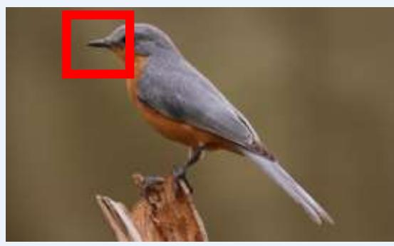

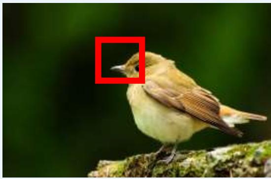

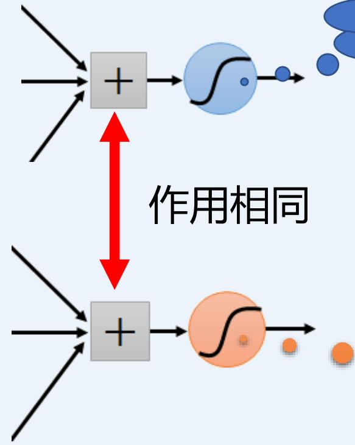

“左上鸟嘴”检测器

“中间鸟嘴” 检测器

# 人类视觉机理的启发

人观测图片的特点：

① 局部特征影响大

② 重要位置常变化

③ 采样压缩也没差

对图片进行下采样不会改变识别对象信息

下采样压缩

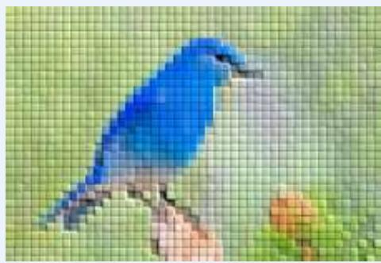

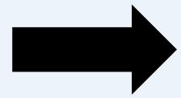

通过下采样可以压缩图片，使用更少的参数来处理

# 基于视觉机理的卷积神经网络架构设计

如何根据人类视觉特点设计网络？① 局部特征影响大

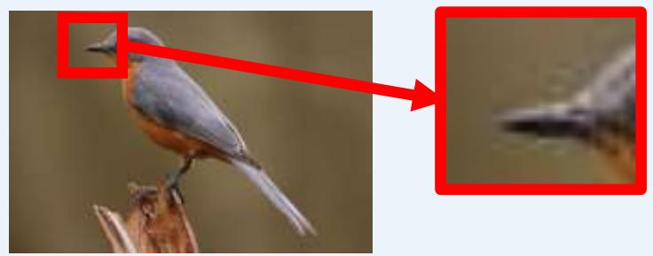

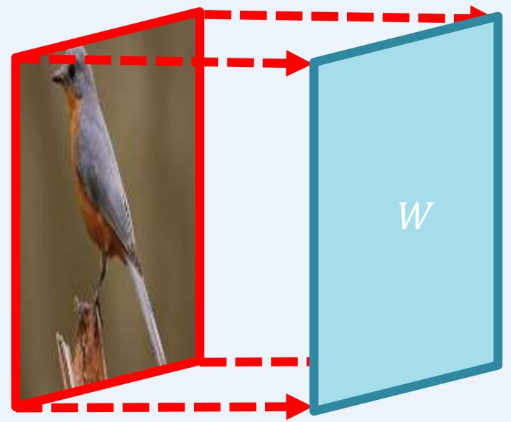

多层感知机MLP

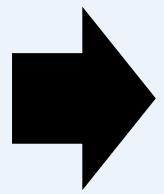

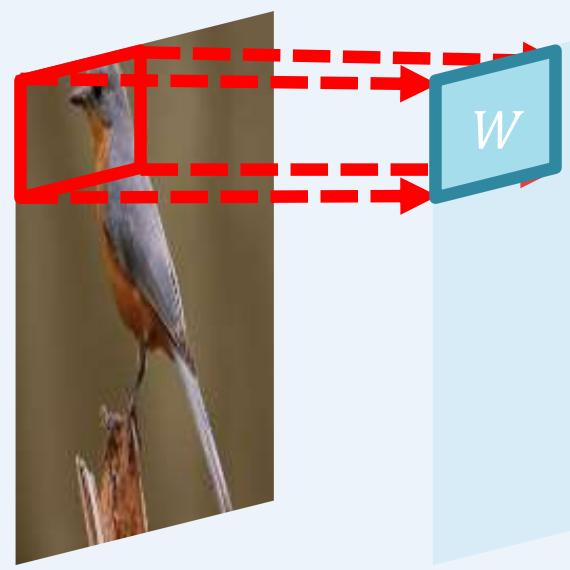

CNN

# 基于视觉机理的卷积神经网络架构设计

如何根据人类视觉特点设计网络？ $\textcircled{2}$ 重要位置常变化

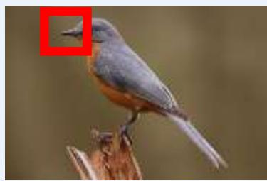

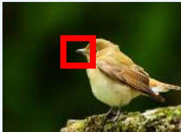

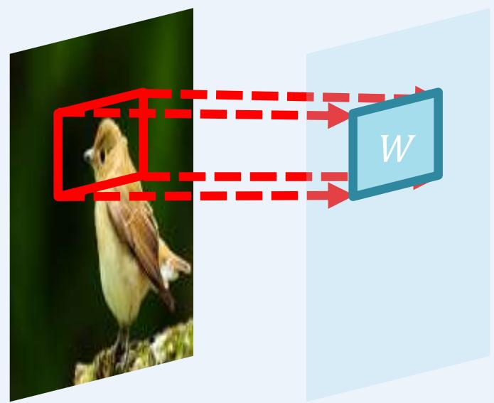

??

卷积核：可移动的权重矩阵

# 卷积核运算

<table><tr><td>1</td><td>0</td><td>0</td><td>0</td><td>0</td><td>1</td></tr><tr><td>0</td><td>1</td><td>0</td><td>0</td><td>1</td><td>0</td></tr><tr><td>0</td><td>0</td><td>1</td><td>1</td><td>0</td><td>0</td></tr><tr><td>1</td><td>0</td><td>0</td><td>0</td><td>1</td><td>0</td></tr><tr><td>0</td><td>1</td><td>0</td><td>0</td><td>1</td><td>0</td></tr><tr><td>0</td><td>0</td><td>1</td><td>0</td><td>1</td><td>0</td></tr></table>

$$
6 \times 6
$$

<table><tr><td>1</td><td>-1</td><td>-1</td></tr><tr><td>-1</td><td>1</td><td>-1</td></tr><tr><td>-1</td><td>-1</td><td>1</td></tr></table>

<table><tr><td>-1</td><td>1</td><td>-1</td></tr><tr><td>-1</td><td>1</td><td>-1</td></tr><tr><td>-1</td><td>1</td><td>-1</td></tr></table>

卷积核 1

卷积核 2

需要学习的网络参数

Property 1

局部特征影响大

每个卷积核可以识别区域特征(3 x 3)

# 卷积核运算

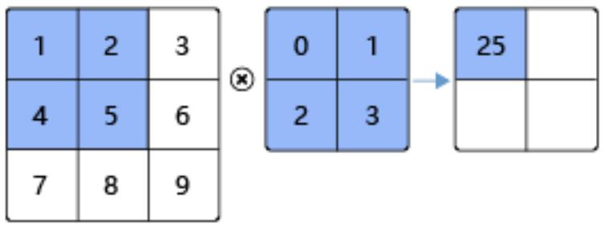

(a)0x1+1x2+2x4+3x5=25

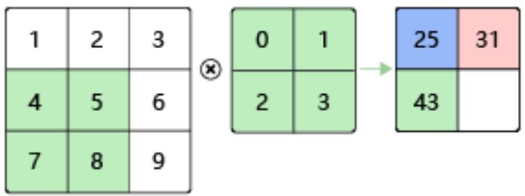

(c)0x4+1x5+2x7+3x8=43

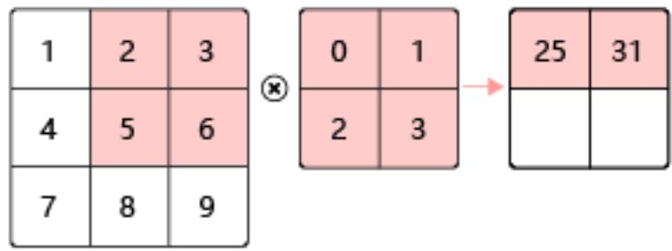

(b)0x2+1x3+2x5+3x6=31

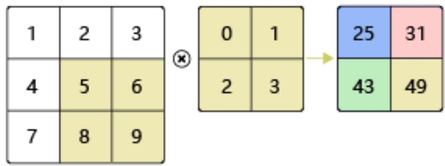

(d)0x5+1x6+2x8+3x9=49

# 卷积核运算

stride(步长)=1

<table><tr><td>1</td><td>0</td><td>0</td><td>0</td><td>0</td><td>1</td></tr><tr><td>0</td><td>1</td><td>0</td><td>0</td><td>1</td><td>0</td></tr><tr><td>0</td><td>0</td><td>1</td><td>1</td><td>0</td><td>0</td></tr><tr><td>1</td><td>0</td><td>0</td><td>0</td><td>1</td><td>0</td></tr><tr><td>0</td><td>1</td><td>0</td><td>0</td><td>1</td><td>0</td></tr><tr><td>0</td><td>0</td><td>1</td><td>0</td><td>1</td><td>0</td></tr></table>

6 x 6

<table><tr><td>1</td><td>-1</td><td>-1</td></tr><tr><td>-1</td><td>1</td><td>-1</td></tr><tr><td>-1</td><td>-1</td><td>1</td></tr></table>

卷积核 1

3

-1

# 卷积核运算

stride(步长)=2

<table><tr><td>1</td><td>0</td><td>0</td><td>0</td><td>0</td><td>1</td></tr><tr><td>0</td><td>1</td><td>0</td><td>0</td><td>1</td><td>0</td></tr><tr><td>0</td><td>0</td><td>1</td><td>1</td><td>0</td><td>0</td></tr><tr><td>1</td><td>0</td><td>0</td><td>0</td><td>1</td><td>0</td></tr><tr><td>0</td><td>1</td><td>0</td><td>0</td><td>1</td><td>0</td></tr><tr><td>0</td><td>0</td><td>1</td><td>0</td><td>1</td><td>0</td></tr></table>

6 x 6

<table><tr><td>1</td><td>-1</td><td>-1</td></tr><tr><td>-1</td><td>1</td><td>-1</td></tr><tr><td>-1</td><td>-1</td><td>1</td></tr></table>

卷积核 1

3

-3

# 卷积核运算

stride=1

<table><tr><td>1</td><td>0</td><td>0</td><td>0</td><td>0</td><td>1</td></tr><tr><td>0</td><td>1</td><td>0</td><td>0</td><td>1</td><td>0</td></tr><tr><td>0</td><td>0</td><td>1</td><td>1</td><td>0</td><td>0</td></tr><tr><td>1</td><td>0</td><td>0</td><td>0</td><td>1</td><td>0</td></tr><tr><td>0</td><td>1</td><td>0</td><td>0</td><td>1</td><td>0</td></tr><tr><td>0</td><td>0</td><td>1</td><td>0</td><td>1</td><td>0</td></tr></table>

6 x 6 image

<table><tr><td>1</td><td>-1</td><td>-1</td></tr><tr><td>-1</td><td>1</td><td>-1</td></tr><tr><td>-1</td><td>-1</td><td>1</td></tr></table>

卷积核 1

<table><tr><td>3</td><td>-1</td><td>-3</td><td>-1</td></tr><tr><td>-3</td><td>1</td><td>0</td><td>-3</td></tr><tr><td colspan="4">特征图</td></tr><tr><td>-3</td><td>-3</td><td>0</td><td>1</td></tr><tr><td>3</td><td>-2</td><td>-2</td><td>-1</td></tr></table>

Property 2

特征位置可变化

不同区域的相似特征可识别

# 卷积核运算

# 计算下不同步长下的特征图

步长=1 and 2

<table><tr><td>1</td><td>0</td><td>0</td><td>0</td><td>0</td><td>1</td></tr><tr><td>0</td><td>1</td><td>0</td><td>0</td><td>1</td><td>0</td></tr><tr><td>0</td><td>0</td><td>1</td><td>1</td><td>0</td><td>0</td></tr><tr><td>1</td><td>0</td><td>0</td><td>0</td><td>1</td><td>0</td></tr><tr><td>0</td><td>1</td><td>0</td><td>0</td><td>1</td><td>0</td></tr><tr><td>0</td><td>0</td><td>1</td><td>0</td><td>1</td><td>0</td></tr></table>

6 x 6

# 影响特征图的维度还有哪些因素？

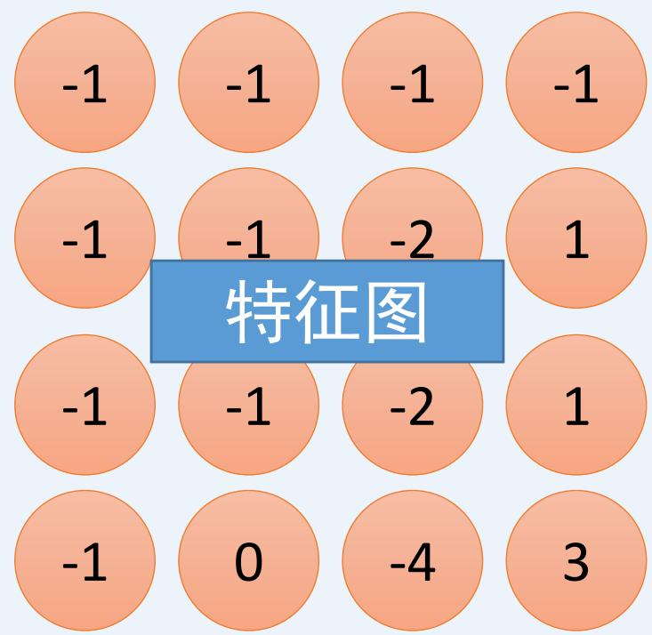

步长=1: 4 x 4

<table><tr><td>-1</td><td>1</td><td>-1</td></tr><tr><td>-1</td><td>1</td><td>-1</td></tr><tr><td>-1</td><td>1</td><td>-1</td></tr></table>

卷积核 2

-1 -1

特征图

-1 -2

步长=2: 2 x 2

# 特征图的维度

假设图片为（高度 ${ n } _ { h } \times$ 宽度 $n _ { w }$ ）

卷积核为（?? x?? ），步长为 $s = 1$

特征图为（高度 $h \times$ 宽度??）

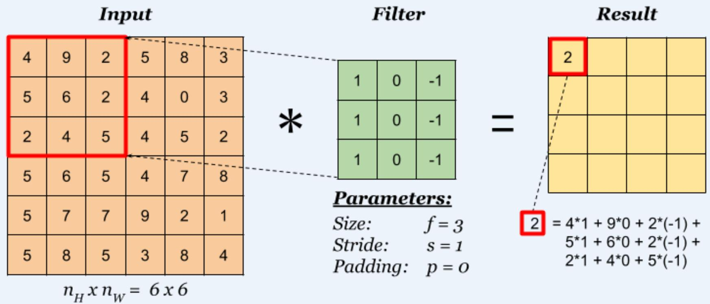

# 特征图的维度

# [分组讨论：维度公式]

假设图片为（高度 ${ n } _ { h } \times$ 宽度 $n _ { w }$ ）

卷积核为（?? x?? ），步长为 $s = 2 .$ , …

特征图为（高度 $h \times$ 宽度??）

 Input

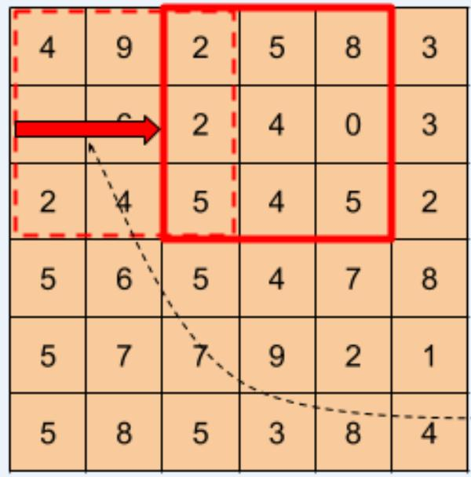

Filter

*

Parameters:

Size: $f { } = { } 3$

Stride:s = 2

Padding: $p = o$

Result

二

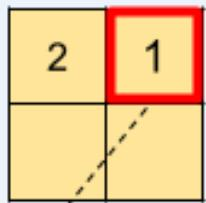

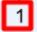

$$
= 2 ^ {*} 1 + 5 ^ {*} 0 + 3 ^ {*} (- 1) +
$$

$$
2 ^ {*} 1 + 4 ^ {*} 0 + 3 ^ {*} (- 1) +
$$

$$
5 ^ {*} 1 + 4 ^ {*} 0 + 2 ^ {*} (- 1)
$$

Dimension: 6 x 6

# 特征图的维度

# [分组讨论：维度公式]

假设图片为（高度 ${ n } _ { h } \times$ 宽度 $n _ { w }$ ）

卷积核为（?? x?? ），步长为 $s = 2 .$ , …

 Input

Filter

*

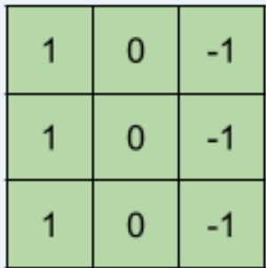

Parameters:

Size: $f { } = { } 3$

Stride:s = 2

Padding: $p = o$

特征图维度:

高度 $\begin{array} { r } { h = \left\lfloor { \frac { n _ { h } - f } { s } } + 1 \right\rfloor } \end{array}$

宽度 $w = \left\lfloor { \frac { n _ { w } - f } { s } } + 1 \right\rfloor$

Result


$$
= 2 ^ {*} 1 + 5 ^ {*} 0 + 3 ^ {*} (- 1) +
$$

$$
2 ^ {*} 1 + 4 ^ {*} 0 + 3 ^ {*} (- 1) +
$$

$$
5 ^ {*} 1 + 4 ^ {*} 0 + 2 ^ {*} (- 1)
$$

Dimension: 6 x 6

# 特征图的维度

假设图片为（高度 ${ n } _ { h } \times$ 宽度 $n _ { w }$ ）

卷积核为（?? x?? ），步长为 $\pmb { S }$ ，填充宽度为??


Dimension:6x 6

特征图维度:

高度 $\begin{array} { r } { \pmb { h } = \left\lfloor \frac { \pmb { n } _ { h } - \pmb { f } + 2 p } { s } + \pmb { 1 } \right\rfloor } \end{array}$ ????−??+???? + ??

宽度 $w = \left\lfloor { \frac { n _ { w } - f + 2 p } { s } } + 1 \right\rfloor$

# 特征图的维度

图片为（高度 ${ n } _ { h } \times$ 宽度 ${ \pmb n } _ { \pmb w } \star$ 深度 $n _ { c }$ ）

卷积核为（ $( f \times f \times n _ { c } )$ ），步长为 $\pmb { S }$ ，填充为??

特征图维度:

$$
\text {高 度} h = \left\lfloor \frac {n _ {h} - f + 2 p}{s} + 1 \right\rfloor
$$

$$
\text {宽 度} \boldsymbol {w} = \left\lfloor \frac {n _ {w} - f + 2 p}{s} + 1 \right\rfloor
$$


# 特征图的维度

图片为（高度 ${ n } _ { h } \times$ 宽度 ${ \pmb n } _ { \pmb w } \star$ 深度 $n _ { c }$ ）

??个卷积核为（ $( f \times f \times n _ { c } )$ ），步长为 $\pmb { S }$ ，填充为??

Input


6x6x3

Filter 1


3x3x3


4 x 4

Filter 2


3 x3x3

二


4x 4

特征图维度:

高度 $\begin{array} { r } { \pmb { h } = \left\lfloor \frac { \pmb { n } _ { h } - \pmb { f } + 2 \pmb { p } } { s } + \pmb { 1 } \right\rfloor } \end{array}$ ????−??+???? + ??

宽度 $w = \left\lfloor { \frac { n _ { w } - f + 2 p } { s } } + 1 \right\rfloor$

深度?? = ??

Output


4x4x 2

# 特征图的维度

【练习】算一算


# 一个完整的卷积层


*


A Convolution Layer

# 卷积神经网络

如何根据人类视觉特点设计网络？ $\textcircled{3}$ 采样压缩也没差


# 卷积神经网络

Max Pooling (最大池化)

<table><tr><td>1</td><td>-1</td><td>-1</td></tr><tr><td>-1</td><td>1</td><td>-1</td></tr><tr><td>-1</td><td>-1</td><td>1</td></tr></table>

卷积核 1

<table><tr><td>-1</td><td>1</td><td>-1</td></tr><tr><td>-1</td><td>1</td><td>-1</td></tr><tr><td>-1</td><td>1</td><td>-1</td></tr></table>

卷积核 2


# 卷积神经网络

Max Pooling (最大池化)

<table><tr><td>1</td><td>0</td><td>0</td><td>0</td><td>0</td><td>1</td></tr><tr><td>0</td><td>1</td><td>0</td><td>0</td><td>1</td><td>0</td></tr><tr><td>0</td><td>0</td><td>1</td><td>1</td><td>0</td><td>0</td></tr><tr><td>1</td><td>0</td><td>0</td><td>0</td><td>1</td><td>0</td></tr><tr><td>0</td><td>1</td><td>0</td><td>0</td><td>1</td><td>0</td></tr><tr><td>0</td><td>0</td><td>1</td><td>0</td><td>1</td><td>0</td></tr></table>

6 x 6 image

池化的好处是什么？

更少的特征信息


2 x 2 image

# 卷积神经网络模


# 卷积神经网络模型架构


猫？ 狗？


# 卷积神经网络(CNN) vs 人工神经网络(ANN)

<table><tr><td>1</td><td>0</td><td>0</td><td>0</td><td>0</td><td>1</td></tr><tr><td>0</td><td>1</td><td>0</td><td>0</td><td>1</td><td>0</td></tr><tr><td>0</td><td>0</td><td>1</td><td>1</td><td>0</td><td>0</td></tr><tr><td>1</td><td>0</td><td>0</td><td>0</td><td>1</td><td>0</td></tr><tr><td>0</td><td>1</td><td>0</td><td>0</td><td>1</td><td>0</td></tr><tr><td>0</td><td>0</td><td>1</td><td>0</td><td>1</td><td>0</td></tr></table>

图像

<table><tr><td>1</td><td>-1</td><td>-1</td></tr><tr><td>-1</td><td>1</td><td>-1</td></tr><tr><td>-1</td><td>-1</td><td>1</td></tr></table>

<table><tr><td>-1</td><td>1</td><td>-1</td></tr><tr><td>-1</td><td>1</td><td>-1</td></tr><tr><td>-1</td><td>1</td><td>-1</td></tr></table>


卷积


<table><tr><td>1</td><td>0</td><td>0</td><td>0</td><td>0</td><td>1</td></tr><tr><td>0</td><td>1</td><td>0</td><td>0</td><td>1</td><td>0</td></tr><tr><td>0</td><td>0</td><td>1</td><td>1</td><td>0</td><td>0</td></tr><tr><td>1</td><td>0</td><td>0</td><td>0</td><td>1</td><td>0</td></tr><tr><td>0</td><td>1</td><td>0</td><td>0</td><td>1</td><td>0</td></tr><tr><td>0</td><td>0</td><td>1</td><td>0</td><td>1</td><td>0</td></tr></table>

图像


（CNN）

v.s.

（ANN）

卷积的好处？

以ANN视角看CNN

CNN


6 x 6 image

更少的参数！


以ANN视角看CNN


6 x 6 image


ANN

16: 1

36: 0

# 卷积神经网络应用

# 图像处理领域


高速公路测速


机器人视觉


医学图像分析

# 卷积神经网络应用

广东省某眼科中心团队通过捕捉儿童眼球运动数据, 研发全球首个婴幼儿视功能损伤手机智能筛查系统，为破解婴幼儿视功能损伤及相关眼病早期筛诊难题提供有效技术手段,研究成果发表于《Nature Medicine》

通过婴幼儿观看动画片的注视习惯和行为模式的实时捕捉，实现16种婴幼儿常见眼病的早期检测，筛查准确率超85%，降低儿保，社区筛查等多场景中婴幼儿眼病筛诊的难度

# 数据采集

# 崛起的中国科研力量！

# naturemedicine

ExplorecontentAbout the journal~Publishwithus

Earlydetectionofvisualimpairmentinyoungchildrenusingasmartphone-baseddeeplearningsystem

# 婴幼儿视功能损伤手机智能筛查

# 系统工作流程演示

# 循环神经网络

# 为什么使用Recurrent Neural Network?

在订票系统中设置几个槽位（Slot），希望算法能够将关键词 ‘Guangzhou’ 放入目的地（Destination）槽位，将 May 和 31th 放入到达时间（Time of Arrival）槽位。


# 循环神经网络

输入: 一个单词

(每个单词用一个向量表示)

使用全连接神经网络解决？

Guangzhou


# 循环神经网络

# 如何用向量表示单词？

# One-hot Encoding

词典 = {apple, bag, cat, dog, elephant}

向量和词典大小相同

每个维度对应一个单词

对应维度的单词为1，其他位置为0

$$
a p p l e = \left[ \begin{array}{l l l l l} 1 & 0 & 0 & 0 & 0 \end{array} \right]
$$

$$
\mathrm {b a g} = \left[ \begin{array}{l l l l l} 0 & 1 & 0 & 0 & 0 \end{array} \right]
$$

$$
\mathrm {c a t} = \left[ \begin{array}{l l l l l} 0 & 0 & 1 & 0 & 0 \end{array} \right]
$$

$$
\mathrm {d o g} = \left[ \begin{array}{l l l l l} 0 & 0 & 0 & 1 & 0 \end{array} \right]
$$

$$
\text {e l e p h a n t} = \left[ \begin{array}{l l l l l l} 0 & 0 & 0 & 0 & 1 \end{array} \right]
$$

# 循环神经网络

输入: 一个单词

(每个单词用一个向量表示)

输出:

分类标签的概率分布

# 使用全连接神经网络解决？


# 循环神经网络


存在什么问题？


Guangzhou

# 使用全连接神经网络解决？


# 循环神经网络


额外输入信息

# 循环神经网络

输入序列:

$$
\left[ \begin{array}{l} 1 \\ 1 \end{array} \right] \left[ \begin{array}{l} 1 \\ 1 \end{array} \right] \left[ \begin{array}{l} 2 \\ 2 \end{array} \right] \dots \dots
$$

输出序列

$$
\begin{array}{l} \left[ \begin{array}{l} 4 \\ 4 \end{array} \right] \end{array}
$$

给定初始化值


假设所有权重为且所有激活

# 循环神经网络

输入序列:

$$
\left[ \begin{array}{l} 1 \\ 1 \end{array} \right] \left[ \begin{array}{l} 1 \\ 1 \end{array} \right] \left[ \begin{array}{l} 2 \\ 2 \end{array} \right] \dots \dots
$$

输出序列

$$
\left[ \begin{array}{l} 4 \\ 4 \end{array} \right] \left[ \begin{array}{l} 1 2 \\ 1 2 \end{array} \right]
$$

给定初始化值


假设所有权重为且所有激活

# 循环神经网络

输入序列:

$$
\left[ \begin{array}{l} 1 \\ 1 \end{array} \right] \left[ \begin{array}{l} 1 \\ 1 \end{array} \right] \left[ \begin{array}{l} 2 \\ 2 \end{array} \right] \dots \dots
$$

输出序列 :

$$
\left[ \begin{array}{l} 4 \\ 4 \end{array} \right] \left[ \begin{array}{l} 1 2 \\ 1 2 \end{array} \right] \left[ \begin{array}{l} 3 2 \\ 3 2 \end{array} \right]
$$

改变输入序列的顺序将会对输出产生影响！

Try the following sequence

$$
\text {W i t h R e L U !} \left[ \begin{array}{l} 2 \\ 2 \end{array} \right] \left[ \begin{array}{l} - 1 \\ - 1 \end{array} \right] \left[ \begin{array}{l} 1 \\ 1 \end{array} \right] \dots \dots
$$

给定初始化值


假设所有权重为且所有激活

# 循环神经网络

# 相同的网络结构多次使用

“arrive” 对应每个类别的概率

“Guangzhou” 对应每个类别的概率

“on” 对应每个类别的概率


# 循环神经网络

# 概率分布不同

“leave” 对应每个类别的概率

“Guangzhou”对应类别概率

“arrive” 对应每个类别的概率

“Guangzhou”对应类别概率


记忆中存储的信息是不同的

# 循环神经网络训练

RNN forward pass

$$
\begin{array}{l} s _ {t} = \tanh  \left(U x _ {t} + W s _ {t - 1}\right) \\ \hat {y} _ {t} = \operatorname {s o f t m a x} \left(V s _ {t}\right) \\ \end{array}
$$

$$
E (y, \hat {y}) = - \sum_ {t} E _ {t} \left(y _ {t}, \hat {y} _ {t}\right)
$$


# 循环神经网络训练

$$
s _ {t} = \tanh  \left(U x _ {t} + W s _ {t - 1}\right)
$$

$$
\hat {y} _ {t} = \text {s o f t m a x} \left(V s _ {t}\right)
$$

Backpropagation Through Time（BPTT）

$$
E (y, \hat {y}) = - \sum_ {t} E _ {t} \left(y _ {t}, \hat {y} _ {t}\right)
$$

$$
\frac {\partial E}{\partial \boldsymbol {W}} = \sum_ {t} \frac {\partial E _ {t}}{\partial \boldsymbol {W}}
$$

$$
\frac {\partial E _ {3}}{\partial \boldsymbol {W}} = \frac {\partial E _ {3}}{\partial \hat {y} _ {3}} \frac {\partial \hat {y} _ {3}}{\partial s _ {3}} \frac {\partial s _ {3}}{\partial \boldsymbol {W}}
$$

But $s _ { \scriptscriptstyle 3 } = \operatorname { t a n h } \left( U x _ { \scriptscriptstyle t } + W s _ { \scriptscriptstyle 2 } \right)$

S_3 depends on s_2, whichdepends on W and s_1,and so on.

$$
\frac {\partial E _ {3}}{\partial W} = \sum_ {k = 0} ^ {3} \frac {\partial E _ {3}}{\partial \hat {y} _ {3}} \frac {\partial \hat {y} _ {3}}{\partial s _ {3}} \frac {\partial s _ {3}}{\partial s _ {k}} \frac {\partial s _ {k}}{\partial W}
$$


# 循环神经网络训练

# The Vanishing Gradient Problem

$$
\frac {\partial E _ {3}}{\partial \boldsymbol {W}} = \sum_ {k = 0} ^ {3} \frac {\partial E _ {3}}{\partial \hat {y} _ {3}} \frac {\partial \hat {y} _ {3}}{\partial s _ {3}} \frac {\partial s _ {3}}{\partial s _ {k}} \frac {\partial s _ {k}}{\partial \boldsymbol {W}}
$$

$$
\frac {\partial E _ {3}}{\partial \boldsymbol {W}} = \sum_ {k = 0} ^ {3} \frac {\partial E _ {3}}{\partial \hat {\boldsymbol {y}} _ {3}} \frac {\partial \hat {\boldsymbol {y}} _ {3}}{\partial s _ {3}} \left(\prod_ {j = k + 1} ^ {3} \frac {\partial s _ {j}}{\partial s _ {j - 1}}\right) \frac {\partial s _ {k}}{\partial \boldsymbol {W}}
$$

Derivative of a vector w.r.t a vector is a matrix called jacobian

tanh maps all values into a range between -1 and 1, and the derivativeis bounded by 1

⚫ 2-norm of the above Jacobian matrix has an upper bound of 1

With multiple matrix multiplications, gradient values shrinkexponentially

⚫ Gradient contributions from “far away” steps become zero

Depending on activation functions and network parameters, gradients couldexplode instead of vanishing

Each partial isa

$$
\frac {d \mathbf {f}}{d \mathbf {x}} = \left[ \begin{array}{l l l} \frac {\partial \mathbf {f}}{\partial x _ {1}} & \dots & \frac {\partial \mathbf {f}}{\partial x _ {n}} \end{array} \right] = \left[ \begin{array}{l l l} \frac {\partial f _ {1}}{\partial x _ {1}} & \dots & \frac {\partial f _ {1}}{\partial x _ {n}} \\ \vdots & \ddots & \vdots \\ \frac {\partial f _ {m}}{\partial x _ {1}} & \dots & \frac {\partial f _ {m}}{\partial x _ {n}} \end{array} \right]
$$


# 循环神经网络训练

当然，循环结构可以构造得很深 …


# 长短期记忆网络

# 经典循环神经网络 (Recurrent Neural network)


回忆过去,痛苦的相思忘不了…

為何你還來 撥動我心跳…

緣難了 情難了…

# 长短期记忆网络 (Long Short-term Memory)

…你的影子無所不在…

落在过去，飘向未来,…

就让往事随风都随风都随风，

心随你动…


Ref：1. 萧敬腾，《新不了情》，2010

2. 齐秦，《往事随风》，1995

# 长短期记忆网络

# 长短期记忆网络 (Long Short-term Memory)


# 长短期记忆网络

通常使用 sigmoid 激活函数限制在 0 到 1 之间

模拟门的开关

$$
c ^ {\prime} = g (z) f (z _ {i}) + c f \big (z _ {f} \big)
$$


# 长短期记忆网络

# LSTM 示例


当 $\mathsf X _ { 2 } = \mathsf 1$ , 把 $\mathsf { X } _ { 1 }$ 的值累加到记忆中

当 $x _ { 2 } = - 1$ , 重置记忆

当 $\mathsf { X } _ { 3 } = 1$ , 输出记忆的值


# 问题引入

# 卷积神经网络

# 循环神经网络

# 长短期记忆网络

# 可解释性


# 问题引入

# 卷积神经网络

# 循环神经网络

# 长短期记忆网络

# 可解释性


# 问题引入

# 卷积神经网络

# 循环神经网络

# 长短期记忆网络

# 可解释性


# 问题引入

# 卷积神经网络

# 循环神经网络

# 长短期记忆网络

# 可解释性

# 网络结构

➢用 LSTM 替换原始神经元


# 学习目


# 学习过程

Backpropa


# 但是 … 基于 RNN 的网络并不总是容易学习的

语言模型的真实案例


# 误差表面相当粗糙


# Why?


# 深度学习的可解释性


# Local Explanation

为什么你认为 这张图片 是猫？

# Global Explanation

你认为“猫”应该是什么样子？

# 深度学习的可解释性

为什么我们需要可解释的机器学习？


# 深度学习的可解释性

为什么我们需要可解释的机器学习？

# 用机器来协助判断简历

具体能力？还是性别？

# 用机器来协助判断犯人是否可以假释

具体证据？还是肤色？

# 金融相关的决策常常依法需要提供理由

为什麽拒绝了某個人的贷款？

# 模型诊断：到底机器学到了什么

不能只看正确率？想想神马汉斯的故事

# 深度学习的可解释性

我们可以根据可解释性来改进机器学习模型

THIS IS YOUR MACHINE LEARNING SYSTEM?

YUP! YOUPOURTHEDATA INTOTHISBIGPILEOFLINEARALGEBRA,THENCOLLECTTHEANSWERS ONTHE OTHERSIDE.

WHATIFTHEANSUERSAREWRONG?

JUST STIRTHEPILEUNTILTHEYSTART LOOKINGRIGHT.


我知道答案为什么错，所以我可以修正它


https://www.explainxkcd.com/wiki/index.php/1838:_Machine_Learning

# 深度学习的可解释性

机器学习可解释性的目标 $\neq$ 完全清楚机器学习模型的工作机理

• 人脑也是一个黑盒模型!

• 人类不相信深度学习因为它是黑盒，但他们却相信其他人类的决策！

w

机器学习可解释性的目标是(个人观点)

Make people (your customers,your boss, yourself) comfortable.

⚫ Make machine controllable.

让人觉得 “舒坦”

让机器变得“可控”

# 深度学习的可解释性

# 可解释性 v.s. 功能强大

某些模型本质上是可解释的

• 例如，线性模型(可以从权重知道特征的重要性)

• 但是，这种模型功能并不强大.

➢ 深度神经网络很难解释

• 深度神经网络是黑盒

因为深度网络是黑盒，所以我们不用它。

= 削足适履 

• 但它功能远强大于线性模型 …

Let’s make deep network interpretable.

# 深度学习的可解释性


应该扩大 “照明” 范围，让强大的模型 (钥匙) 处于可解释 (光照) 范围内，而不是放弃使用照明范围外的物体。

Powerful Model

# 深度学习的可解释性

# Local Explanation:Explain the Decision

Questions: Why do you think this image is a cat?

# 深度学习的可解释性

# Basic Idea

Image: pixel, segment, etc.

Text: a word


Object ??

??1, ⋯ , ????, ⋯ , ????Components:

我们想知道每个部分对于决策的重要程度

Idea: 移除或改变该部分的值，观察决策结果是否变化

决策变化较大

该部分很重要

# 深度学习的可解释性

$$
\{x _ {1}, \dots , x _ {n}, \dots , x _ {N} \} \longrightarrow \{x _ {1}, \dots , x _ {n} + \Delta x, \dots , x _ {N} \}
$$

$$
y _ {k} \longrightarrow y _ {k} + \Delta y
$$

$y _ { k }$ : the prob of the predictedclass of the model

$$
| \frac {\Delta y}{\Delta x} | \Rightarrow | \frac {\partial y _ {k}}{\partial x _ {n}} |
$$


特征图

# 深度学习的可解释性

# Global Explanation:Explain the whole Model

Question: What do you think a “cat” looks like?

# 深度学习的可解释性

$$
x ^ {*} = a r g \max _ {x} y _ {i}
$$


我们找出让卷积为最容易辨识的各个类别的输入（给定输出类别，卷积层最希望看到的输入）


# 深度学习的可解释性

DeepNeural Networksare Easily Fooled

HighPredictionScoresfor Unrecognizable Images

# 深度学习的可解释性

# 来自生成器 (Generator) 的限制


$$
x ^ {*} = \arg \max _ {x} y _ {i} \quad \Longrightarrow z ^ {*} = \arg \max _ {z} y _ {i}
$$

$$
x ^ {*} = G (z ^ {*})
$$


# 深度学习的可解释性

https://arxiv.org/abs/1612.00005


# 谢谢大家！

相关课程资源及参考文献请浏览

超算习堂：https://easyhpc.net/course/143