# 第10章  $z$  变换

# 10.0 引言

第9章讨论了拉普拉斯变换，将它作为连续时间傅里叶变换的一种推广。进行这种推广的部分原因是由于拉普拉斯变换比傅里叶变换有更广的适用范围；因为有不少信号，其傅里叶变换不存在，但却有拉普拉斯变换。例如，对不稳定系统有可能用拉普拉斯变换进行变换域分析，这就为线性时不变系统的分析提供了另一种角度和手段。

在这一章讨论  $z$  变换时，将对离散时间情况采用同一途径，这就是将  $z$  变换当成在离散时间情况下与拉普斯变换相对应。读者将会看到，在为什么要引入  $z$  变换，以及  $z$  变换的性质等方面，都与拉普拉斯变换十分相似。然而，正如连续时间和离散时间傅里叶变换之间的关系一样，在  $z$  变换和拉普拉斯变换之间也一定存在一些很重要的不同；而这些不同正是来自连续时间和离散时间信号与系统之间的基本差异。

# 10.1  $z$  变换

由3.2节讨论可知，单位脉冲响应为  $h[n]$  的离散时间线性时不变系统对复指数输入  $z^n$  的响应  $y[n]$  为

$$
y [ n ] = H (z) z ^ {n} \tag {10.1}
$$

其中，

$$
H (z) = \sum_ {n = - \infty} ^ {+ \infty} h [ n ] z ^ {- n} \tag {10.2}
$$

若  $z = \mathrm{e}^{\mathrm{i}\omega}$ ，这里  $\omega$  为实数（即  $|z| = 1$ ），则式(10.2)的求和式就是  $h[n]$  的离散时间傅里叶变换。在更为一般的情况下，当  $|z|$  不限制为1的时候，式(10.2)就称为  $h[n]$  的  $z$  变换（ $z$ -transform）。

一个离散时间信号  $x[n]$  的  $z$  变换定义为①

$$
\boxed {X (z) \triangleq \sum_ {n = - \infty} ^ {+ \infty} x [ n ] z ^ {- n}} \tag {10.3}
$$

其中  $z$  是一个复变量。有时为了方便，也将  $x[n]$  的  $z$  变换写为  $\mathcal{Z}\{x[n]\}$ ，而  $x[n]$  和它的  $z$  变换之间的关系记为

$$
x [ n ] \stackrel {z} {\longleftrightarrow} X (z) \tag {10.4}
$$

在第9章中，对于连续时间信号，讨论了拉普拉斯变换和傅里叶变换之间的几个重要关系。与此相仿，但不完全一样， $z$  变换和离散时间傅里叶变换之间也存在几个重要关系。为了说明这些关系，现将复变量  $z$  表示成极坐标形式为

$$
z = r \mathrm {e} ^ {\mathrm {j} \omega} \tag {10.5}
$$

用  $r$  表示  $z$  的模，而用  $\omega$  表示它的相角。利用  $r$  和  $\omega$  ，式(10.3)变成

$$
X (r e ^ {j \omega}) = \sum_ {n = - \infty} ^ {+ \infty} x [ n ] (r e ^ {j \omega}) ^ {- n}
$$

或等效为

$$
X (r e ^ {j \omega}) = \sum_ {n = - \infty} ^ {+ \infty} \{x [ n ] r ^ {- n} \} e ^ {- j \omega n} \tag {10.6}
$$

由式(10.6)可见，  $X(re^{j\omega})$  就是序列  $x[n]$  乘以实指数  $r^{-n}$  后的傅里叶变换，即

$$
X (r e ^ {j \omega}) = \mathcal {F} \{x [ n ] r ^ {- n} \} \tag {10.7}
$$

指数加权  $r^{-n}$  可以随  $n$  增加而衰减，也可以随  $n$  增加而增长，这取决于  $r$  大于1还是小于1。特别注意到，若  $r = 1$  ，或等效为  $|z| = 1$  ，式(10.3)就变为傅里叶变换，即

$$
X (z) \Big | _ {z = e ^ {j \omega}} = X (e ^ {j \omega}) = \mathcal {F} \{x [ n ] \} \tag {10.8}
$$

离散时间信号的  $z$  变换和傅里叶变换之间关系的讨论与9.1节对连续时间信号的讨论是紧密并行的，但具有一些重要的不同。在连续时间情况下，当变换变量的实部为零时，拉普拉斯变换就演变为傅里叶变换。利用复平面  $s$  来解释，这就意味着，在虚轴  $\mathrm{j}\omega$  上的拉普拉斯变换就是傅里叶变换。与此对应的是，在  $z$  变换中是当变换变量  $z$  的模为1，即  $z = \mathrm{e}^{\mathrm{j}\omega}$  时， $z$  变换就演变为傅里叶变换。于是，傅里叶变换就成为在复数  $z$  平面中，半径为1的圆上的  $z$  变换，如图10.1所示。在  $z$  平面上，这个圆称为单位圆

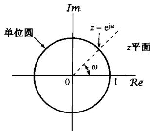

图10.1 复数  $z$  平面。当变量  $z$  在单位圆上时， $z$  变换就变为傅里叶变换

(unit circle)。这个单位圆在  $z$  变换讨论中所起的作用, 非常类似于  $s$  平面上的虚轴在拉普拉斯变换讨论中所起的作用。

从式(10.7)可知，为了使  $z$  变换收敛，要求  $x[n]r^{-n}$  的傅里叶变换收敛。对于任何一个具体的序列  $x[n]$  来说，可以想到对某些  $r$  值，其傅里叶变换收敛，而对另一些  $r$  值来说则不收敛。一般来说，对于某一序列的  $z$  变换，存在着某一个  $z$  值的范围，对该范围内的  $z, X(z)$  收敛。和拉普拉斯变换一样，这样一些值的范围称为收敛域(ROC)。如果收敛域包括单位圆，则傅里叶变换也收敛。为了说明  $z$  变换及其有关的收敛域，现举下面几个例子。

例10.1 有一序列  $x[n] = a^{n}u[n]$ ，根据式(10.3)，它的  $X(z)$  应为

$$
X (z) = \sum_ {n = - \infty} ^ {+ \infty} a ^ {n} u [ n ] z ^ {- n} = \sum_ {n = 0} ^ {\infty} (a z ^ {- 1}) ^ {n}
$$

为使  $X(z)$  收敛，就要求  $\sum_{n=0}^{\infty}|az^{-1}|^{n}<\infty$  。于是收敛域就是满足  $|az^{-1}|<1$  的  $z$  值范围，或等效表示为  $|z|>|a|$  的范围。这样就有

$$
X (z) = \sum_ {n = 0} ^ {\infty} \left(a z ^ {- 1}\right) ^ {n} = \frac {1}{1 - a z ^ {- 1}} = \frac {z}{z - a}, \quad | z | > | a | \tag {10.9}
$$

因此，这个信号的  $z$  变换对于任何  $a$  值都有定义，它的收敛域按式(10.9)由  $a$  的模确定。例如，若  $a = 1$  ，  $x[n]$  就是单位阶跃序列，其  $z$  变换为

$$
X (z) = \frac {1}{1 - z ^ {- 1}}, \quad | z | > 1
$$

可以看到，式(10.9)的  $z$  变换是一个有理函数。当然，和拉普拉斯变换一样， $z$  变换也能够用它的零点（分子多项式的根）和极点（分母多项式的根）来表示。对于这个例子，有一个在  $z = 0$  的零点和一个在  $z = a$  的极点，当  $a$  为0和1之间的某个值时，例10.1的零-极点图和收敛域如图10.2所示。若  $|a| > 1$  ，则收敛域不包括单位圆；这一点与下述事实是一致的：当  $|a| > 1$  时， $a^n u[n]$  的傅里叶变换不收敛。

例10.2 设  $x[n] = -a^{n}u[-n - 1]$ ，那么

$$
\begin{array}{l} X (z) = - \sum_ {n = - \infty} ^ {+ \infty} a ^ {n} u [ - n - 1 ] z ^ {- n} = - \sum_ {n = - \infty} ^ {- 1} a ^ {n} z ^ {- n} \\ = - \sum_ {n = 1} ^ {\infty} a ^ {- n} z ^ {n} = 1 - \sum_ {n = 0} ^ {\infty} (a ^ {- 1} z) ^ {n} \tag {10.10} \\ \end{array}
$$

若  $|a^{-1}z| < 1$  ，即  $|z| < |a|$  ，式(10.10)的求和收敛为

$$
X (z) = 1 - \frac {1}{1 - a ^ {- 1} z} = \frac {1}{1 - a z ^ {- 1}} = \frac {z}{z - a}, | z | <   | a | \tag {10.11}
$$

当  $a$  的值位于0和1之间时，该例的零-极点图和收敛域如图10.3所示。

比较式(10.9)和式(10.10)及图10.2和图10.3，可以看出，在例10.1和例10.2中，两者的  $X(z)$  代数表示式和零-极点图都是一样的，不同的仅是  $\pmb{z}$  变换的收敛域。因此，和拉普拉斯变换一样，  $\pmb{z}$  变换的表述既要求它的代数表示式，又要求相应的收敛域。另外，还可看出在这两个例子中，序列都是指数的，所得到的变换就是有理的。事实上，在下面的例子中将进一步阐明，只要  $x[n]$  是实指数或复指数的线性组合，  $X(z)$  就一定是有理的。

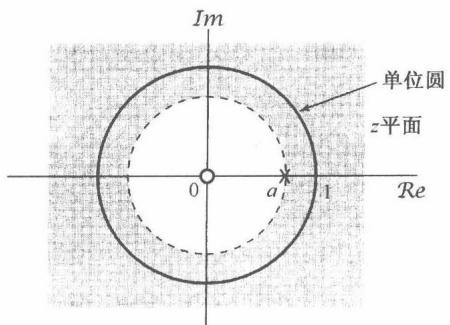

图10.2  $0 < a < 1$  时，例10.1的零-极点图和收敛域

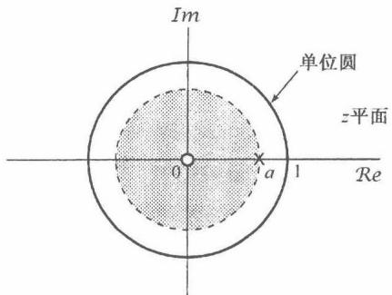

图10.3 当  $0 < a < 1$  时，例10.2的零-极点图和收敛域

例10.3 设一个信号是两个实指数序列之和：

$$
x [ n ] = 7 \left(\frac {1}{3}\right) ^ {n} u [ n ] - 6 \left(\frac {1}{2}\right) ^ {n} u [ n ] \tag {10.12}
$$

那么，  $z$  变换为

$$
\begin{array}{l} X (z) = \sum_ {n = - \infty} ^ {+ \infty} \left\{7 \left(\frac {1}{3}\right) ^ {n} u [ n ] - 6 \left(\frac {1}{2}\right) ^ {n} u [ n ] \right\} z ^ {- n} \\ = 7 \sum_ {n = - \infty} ^ {+ \infty} \left(\frac {1}{3}\right) ^ {n} u [ n ] z ^ {- n} - 6 \sum_ {n = - \infty} ^ {+ \infty} \left(\frac {1}{2}\right) ^ {n} u [ n ] z ^ {- n} (10.13) \\ = 7 \sum_ {n = 0} ^ {\infty} \left(\frac {1}{3} z ^ {- 1}\right) ^ {n} - 6 \sum_ {n = 0} ^ {+ \infty} \left(\frac {1}{2} z ^ {- 1}\right) ^ {n} \\ = \frac {7}{1 - \frac {1}{3} z ^ {- 1}} - \frac {6}{1 - \frac {1}{2} z ^ {- 1}} = \frac {1 - \frac {3}{2} z ^ {- 1}}{(1 - \frac {1}{3} z ^ {- 1}) (1 - \frac {1}{2} z ^ {- 1})} (10.14) \\ = \frac {z (z - \frac {3}{2})}{(z - \frac {1}{3}) (z - \frac {1}{2})} (10.15) \\ \end{array}
$$

为了保证  $X(z)$  收敛，式(10.13)中的两个和式都必须收敛，这就要求  $\left|(1 / 3)z^{-1}\right| < 1$  并且  $\left|(1 / 2)z^{-1}\right| < 1$  ，或者等效为  $|z| > 1 / 3$  且  $|z| > 1 / 2$  。因此，收敛域就是  $|z| > 1 / 2$  。

这个例子的  $z$  变换也可以利用例10.1的结果来求得。根据  $z$  变换的定义式(10.3)可见， $z$  变换是一个线性变换。这就是说，如果  $x[n]$  是两项的和，那么  $X(z)$  就是单独每一项  $z$  变换的和，并且当这两项  $z$  变换都收敛时， $X(z)$  也一定收敛。由例10.1有

$$
\left(\frac {1}{3}\right) ^ {n} u [ n ] \xleftrightarrow {z} \frac {1}{1 - \frac {1}{3} z ^ {- 1}}, \quad | z | > \frac {1}{3} \tag {10.16}
$$

和

$$
\left(\frac {1}{2}\right) ^ {n} u [ n ] \xleftrightarrow {z} \frac {1}{1 - \frac {1}{2} z ^ {- 1}}, \quad | z | > \frac {1}{2} \tag {10.17}
$$

结果就得到

$$
7 \left(\frac {1}{3}\right) ^ {n} u [ n ] - 6 \left(\frac {1}{2}\right) ^ {n} u [ n ] \xleftrightarrow {z} \frac {7}{1 - \frac {1}{3} z ^ {- 1}} - \frac {6}{1 - \frac {1}{2} z ^ {- 1}}, | z | > \frac {1}{2} \tag {10.18}
$$

这就是前面已经得到的结果。图10.4分别画出了每一项  $z$  变换的零-极点图和收敛域，以及组合信号  $z$  变换的零-极点图和收敛域。

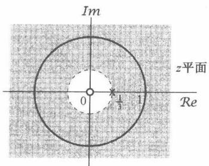

(a)

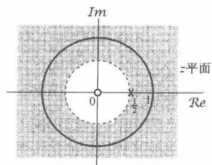

(b)

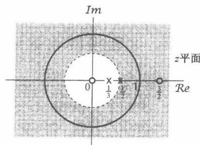

(c)

图10.4 例10.3中每一项及其和的拉普拉斯变换的零-极点图和收敛域。（a）  $1 / \left(1 - \frac{1}{3} z^{-1}\right)$

$$
| z | > \frac {1}{3}; (b) 1 / \left(1 - \frac {1}{2} z ^ {- 1}\right), | z | > \frac {1}{2}; (c) 7 / \left(1 - \frac {1}{3} z ^ {- 1}\right) - 6 / \left(1 - \frac {1}{2} z ^ {- 1}\right), | z | > \frac {1}{2}
$$

例10.4 考虑信号  $x[n]$  为

$$
\begin{array}{l} x [ n ] = \left(\frac {1}{3}\right) ^ {n} \sin \left(\frac {\pi}{4} n\right) u [ n ] \\ = \frac {1}{2 j} \left(\frac {1}{3} e ^ {j \pi / 4}\right) ^ {n} u [ n ] - \frac {1}{2 j} \left(\frac {1}{3} e ^ {- j \pi / 4}\right) ^ {n} u [ n ] \\ \end{array}
$$

这个信号的  $z$  变换是

$$
\begin{array}{l} X (z) = \sum_ {n = - \infty} ^ {\infty} \left\{\frac {1}{2 j} \left(\frac {1}{3} e ^ {j \pi / 4}\right) ^ {n} u [ n ] - \frac {1}{2 j} \left(\frac {1}{3} e ^ {- j \pi / 4}\right) ^ {n} u [ n ] \right\} z ^ {- n} \\ = \frac {1}{2 j} \sum_ {n = 0} ^ {\infty} \left(\frac {1}{3} e ^ {j \pi / 4} z ^ {- 1}\right) ^ {n} - \frac {1}{2 j} \sum_ {n = 0} ^ {\infty} \left(\frac {1}{3} e ^ {- j \pi / 4} z ^ {- 1}\right) ^ {n} \\ = \frac {1}{2 j} \frac {1}{1 - \frac {1}{3} e ^ {j \pi / 4} z ^ {- 1}} - \frac {1}{2 j} \frac {1}{1 - \frac {1}{3} e ^ {- j \pi / 4} z ^ {- 1}} \tag {10.19} \\ \end{array}
$$

或等效为

$$
X (z) = \frac {\frac {1}{3 \sqrt {2}} z}{\left(z - \frac {1}{3} \mathrm {e} ^ {\mathrm {j} \pi / 4}\right) \left(z - \frac {1}{3} \mathrm {e} ^ {- \mathrm {j} \pi / 4}\right)} \tag {10.20}
$$

为了保证  $X(z)$  收敛，式(10.19)中的两个和式都必须收敛，这就要求  $\mid (1 / 3)\mathrm{e}^{\mathrm{j}\pi /4}z^{-1}\mid <  1$  并且 $|(1 / 3)\mathrm{e}^{-\mathrm{j}\pi /4}z^{-1}| <   1$  ，或等效为  $|z| > 1 / 3$  。这个例子的零-极点图和收敛域如图10.5所示。

在以上4个例子中，都将  $z$  变换既表示成  $z$  的多项式之比，又表示成  $z^{-1}$  的多项式之比。从式(10.3)这种  $z$  变换的定义形式中可以看到，对于那些在  $n < 0$  时为零的序列， $X(z)$  仅涉及  $z$  的负幂，因此对这种信号，把  $X(z)$  表示成  $z^{-1}$  的多项式特别方便。在以后的讨论中，只要合适，都采用这种表示形式。

然而，关于极点和零点，总是利用以  $z$  为多项式表示的分母与分子多项式的根。另外，将  $X(z)$  写成  $z$  多项式之比有时也很方便，如在考察无限远点的零极点时就是这样，若分子的阶次超过分母的阶次，那么在无限远点就有极点；若分子的阶次小于分母的阶次，那么在无限远点就有零点。

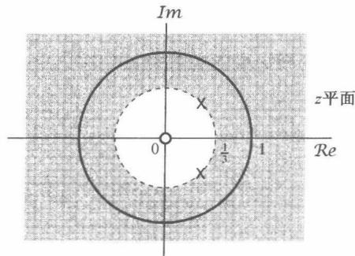

图10.5 例10.4中  $z$  变换的零-极点图和收敛域

# 10.2  $z$  变换的收敛域

在第9章中已看到，对于各种不同类型的信号，在拉普拉斯变换收敛域上都有一些特别的性质，而且理解了这些性质会对拉普拉斯变换有更进一步的理解。这一节将以类似的方式来说明  $z$  变换收敛域的几个性质。以下讨论的每一个性质及其证明都是与9.2节讨论的每一个性质相并行的。

性质1  $X(z)$  的收敛域是在  $z$  平面内以原点为中心的圆环。

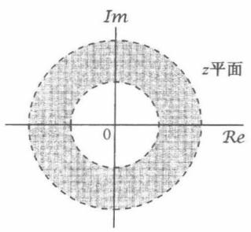

图10.6 收敛域为  $z$  平面的一个圆环。在某些情况下，内圆边界可延伸到原点，这时收敛域就是一个圆盘。在另一些情况下，外圆边界可延伸至无限远

这个性质如图10.6所示。这是由于收敛域是由这样一些  $z = r\mathrm{e}^{\mathrm{j}\omega}$  值组成的，对于这些  $z$  值， $x[n]r^{-n}$  的傅里叶变换收敛。这就是说， $x[n]$  的  $z$  变换的收敛域是由  $x[n]r^{-n}$  绝对可和的那些  $z$  值组成的①：

$$
\sum_ {n = - \infty} ^ {+ \infty} | x [ n ] | r ^ {- n} <   \infty \tag {10.21}
$$

因此，收敛域仅决定于  $r = |z|$ ，而与  $\omega$  无关。结果，若某一具体的  $z$  值在收敛域内，那么位于同一圆上的全部  $z$  值（即具有相同的模）也一定在收敛域内。这本身就保证了收敛域是由同心圆环组成的。在讨论性质6时将会看到，事实上收敛域必须仅由一个单一的圆环组成。在某些情况下，收敛域的内圆边界可

以向内延伸到原点，而在另一些情况下，外圆边界可以向外延伸到无限远。

# 性质2 收敛域内不包含任何极点。

和拉普拉斯变换一样，这一性质是由于在极点处，  $X(z)$  为无穷大，因此根据定义，  $z$  变换不收敛。

性质3 如果  $x[n]$  是有限长序列，那么收敛域就是整个  $z$  平面，可能除去  $z = 0$  和/或  $z = \infty$ 。

一个有限长序列仅有有限个非零值，例如从  $n = N_{1}$  到  $n = N_{2}$ ，其中  $N_{1}$  和  $N_{2}$  都是有限值。于是  $z$  变换就是一个有限项的和，即

$$
X (z) = \sum_ {n = N _ {1}} ^ {N _ {2}} x [ n ] z ^ {- n} \tag {10.22}
$$

当  $z$  不等于零或无穷大时，和式中的每一项都是有限的， $X(z)$  就一定收敛。如果  $N_{1}$  为负值且  $N_{2}$  为正值，那么  $x[n]$  对  $n < 0$  和  $n > 0$  都有非零值，式(10.22)的和式中既包括  $z$  的正幂次项，又包括  $z$  的负幂次项。当  $|z| \to 0$  时，涉及  $z$  的负幂次的那些项就成为无界的；而当  $|z| \to \infty$  时，涉及  $z$  的正幂次的那些项就成为无界的。因此，在  $N_{1}$  为负值且  $N_{2}$  为正值时，收敛域不包括  $z = 0$  和  $z = \infty$  。如果  $N_{1}$  为零或为正值，那么式(10.22)中仅有  $z$  的负幂次项，这时收敛域就可以包括  $z = \infty$ ；而如果  $N_{2}$  为零或为负值，式(10.22)中就仅有  $z$  的正幂次项，收敛域就可以包括  $z = 0$ 。

例10.5 考虑单位脉冲信号  $\delta[n]$  的  $z$  变换，按定义为

$$
\delta [ n ] \xleftrightarrow {z} \sum_ {n = - \infty} ^ {+ \infty} \delta [ n ] z ^ {- n} = 1 \tag {10.23}
$$

收敛域由整个  $z$  平面组成，包括  $z = 0$  和  $z = \infty$  。另一方面，考虑一个延时的单位脉冲  $\delta[n - 1]$ ，它的  $z$  变换为

$$
\delta [ n - 1 ] \xleftrightarrow {Z} \sum_ {n = - \infty} ^ {+ \infty} \delta [ n - 1 ] z ^ {- n} = z ^ {- 1} \tag {10.24}
$$

这个  $z$  变换除  $z = 0$  外都有定义，在  $z = 0$  是一个极点。因此，收敛域由整个  $z$  平面组成，其中包括  $z = \infty$  ，但不包括  $z = 0$  。同理，考虑一个超前的单位脉冲信号，即  $\delta [n + 1]$  ，这时

$$
\delta [ n + 1 ] \xleftrightarrow {z} \sum_ {n = - \infty} ^ {+ \infty} \delta [ n + 1 ] z ^ {- n} = z \tag {10.25}
$$

这个变换对全部有限的  $z$  值都有定义，因此收敛域由整个有限  $z$  平面组成（包括  $z = 0$ ），但在无限远点有一个极点。

性质4 如果  $x[n]$  是一个右边序列，并且  $|z| = r_0$  的圆位于收敛域内，那么  $|z| > r_0$  的全部有限  $z$  值都一定在这个收敛域内。

这个性质的证明和9.2节性质4的论述是相同的。一个右边序列就是在某一个  $n$  值，如  $N_{1}$  以前是零。如果  $|z| = r_{0}$  的圆位于收敛域内，那么  $x[n]r_0^{-n}$  就是绝对可和的。现在考虑  $|z| = r_{1}$ ， $r_1 > r_0$ ，这样  $r_1^{-n}$  随  $n$  的增加衰减得比  $r_0^{-n}$  还要快。正如图10.7所示，当  $n$  为正值时，这个加快了衰减的指数将进一步使序列值衰减，而负的  $n$  值却不能使序列值成为无界，因为  $x[n]$  是右边序列，尤其是  $n < N_{1}$  时  $x[n]z^{-n} = 0$ 。因此， $x[n]r_1^{-n}$  是绝对可和的。

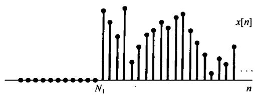

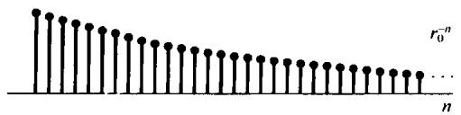

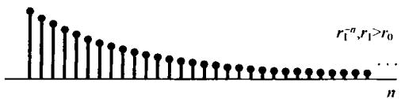

图10.7 由于  $r_1 > r_0$  时  $x[n]r_1^{-n}$  当  $n$  增加时衰减得比  $x[n]r_0^{-n}$  快，又因为  $n < N_{1}$  时  $x[n] = 0$  ，这就意味着：若  $x[n]r_0^{-n}$  是绝对可和的，则  $x[n]r_1^{-n}$  一定是绝对可和的

对于右边序列，通常式(10.3)可取如下形式：

$$
X (z) = \sum_ {n = N _ {1}} ^ {\infty} x [ n ] z ^ {- n} \tag {10.26}
$$

其中  $N_{1}$  是有限值，可以正也可以负。如果  $N_{1}$  是负的，那么式(10.26)的和式中将包括  $z$  的正幂次项，这些项将随  $|z|\to \infty$  而变成无界的。因此，一般来说，右边序列的收敛域不包括无限远点。然而，对于因果序列，即  $n < 0$  时序列值为零的序列， $N_{1}$  一定为非负，因此收敛域一定包括  $z = \infty$  。

性质5 如果  $x[n]$  是一个左边序列，而且  $|z| = r_0$  的圆位于收敛域内，那么满足  $0 < |z| < r_0$  的全部  $z$  值都一定在这个收敛域内。

这个性质与拉普拉斯变换相应的性质也是并行的，并且它的证明和直观性与性质4是类似的。一般来说，根据式(10.3)，一个左边序列的  $z$  变换将有如下形式：

$$
X (z) = \sum_ {n = - \infty} ^ {N _ {2}} x [ n ] z ^ {- n} \tag {10.27}
$$

其中  $N_{2}$  可正可负。如果  $N_{2}$  为正值，那么式(10.27)中将包括  $\pmb{z}$  的负幂次项，这些项将随  $|z|\to 0$  而变成无界的。因此，一般左边序列的  $\pmb{z}$  变换，其收敛域不包括  $z = 0$  ，然而如果  $N_{2}\leqslant 0$  （即  $n > 0$  时 $\pmb {x}[n] = 0)$  ，那么收敛域一定包括  $z = 0$  。

性质6 如果  $x[n]$  是双边序列，而且  $|z| = r_0$  的圆位于收敛域内，那么该收敛域在  $z$  域中一定是包含  $|z| = r_0$  这一圆环的环状区域。

与9.2节的性质6一样，双边序列的收敛域可以把  $x[n]$  表示成一个右边信号和一个左边信号之和来确定。右边分量的收敛域在内部被一个圆所界定，而向外延伸到(或可能包括)无限远点；左边分量的收敛域向外被一个圆所界定，而向内延伸到(或可能包括)原点。整个序列的收敛域就是这两部分收敛域的相交。如图10.8所示。重叠部分(假定有)就是  $z$  平面内的一个圆环。

下面将用几个例子来说明上面几个性质，这些例子与例9.6和例9.7是并列的。

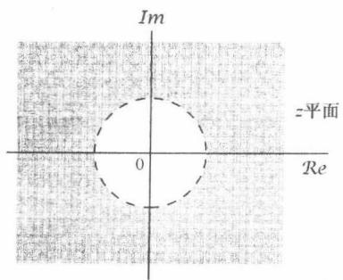

(a)

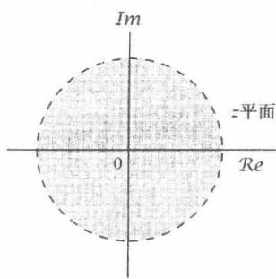

(b)

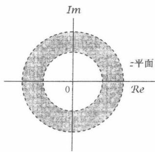

(c)

图10.8 (a) 右边序列的收敛域；(b) 左边序列的收敛域；(c) (a) 与 (b) 中收敛域的相交部分，它就是由该右边序列和左边序列之和构成的双边序列的收敛域

例10.6 有一个序列  $x[n]$  为

$$
x [ n ] = \left\{ \begin{array}{l l} {a ^ {n},} & {\qquad 0 \leqslant n \leqslant N - 1, a > 0} \\ {0,} & {\qquad \text {其 他}} \end{array} \right.
$$

那么它的  $z$  变换为

$$
X (z) = \sum_ {n = 0} ^ {N - 1} a ^ {n} z ^ {- n} = \sum_ {n = 0} ^ {N - 1} (a z ^ {- 1}) ^ {n} = \frac {1 - (a z ^ {- 1}) ^ {N}}{1 - a z ^ {- 1}} = \frac {1}{z ^ {N - 1}} \frac {z ^ {N} - a ^ {N}}{z - a} \tag {10.28}
$$

因为  $x[n]$  是有限长的，由性质3立即可得收敛域包括整个  $\pmb{z}$  平面，可能除去原点和/或无限远点。事实上，由性质3的讨论知道，因为  $n < 0$  时  $x[n] = 0$  ，所以收敛域将延伸至无限远。然而，因为  $x[n]$  从某些正  $\pmb{n}$  值起是非零值，所以收敛域不包括原点。由式(10.28)也很明显看出，因为在  $z = 0$  有一个  $N - 1$  阶的极点。分子多项式的 $N$  个根是

$$
z _ {k} = a e ^ {\mathrm {j} (2 \pi k / N)}, \quad k = 0, 1, \dots , N - 1 \tag {10.29}
$$

在  $k = 0$  的根抵消掉在  $z = a$  的极点。因此，除原点外就没有任何极点。余下的零点是在

$$
z _ {k} = a \mathrm {e} ^ {\mathrm {j} (2 \pi k / N)}, \quad k = 1, \dots , N - 1 \tag {10.30}
$$

它的零-极点图如图10.9所示。

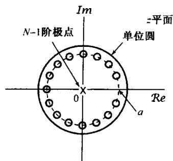

图10.9 当  $N = 16$  和  $0 < a < 1$  时，例10.6的零-极点图。这个例子的收敛域除  $z = 0$  外，由全部  $z$  值所组成

例10.7 设  $x[n]$  为

$$
x [ n ] = b ^ {| n |}, \quad b > 0 \tag {10.31}
$$

该双边序列在  $b < 1$  和  $b > 1$  时，如图10.10所示。这个序列的  $z$  变换可以通过表示成一个右边序列和一个左边序列之和来求得。这就是

$$
x [ n ] = b ^ {n} u [ n ] + b ^ {- n} u [ - n - 1 ] \tag {10.32}
$$

由例10.1有

$$
b ^ {n} u [ n ] \xleftrightarrow {z} \frac {1}{1 - b z ^ {- 1}}, \quad | z | > b \tag {10.33}
$$

由例10.2有

$$
b ^ {- n} u [ - n - 1 ] \xleftrightarrow {z} \frac {- 1}{1 - b ^ {- 1} z ^ {- 1}}, \quad | z | <   \frac {1}{b} \tag {10.34}
$$

在图10.11(a)至图10.11(d)中，给出了在  $b > 1$  和  $0 < b < 1$  时，由式(10.31)和式(10.34)表示的

零-极点图和收敛域。对于  $b > 1$  ，没有任何公共的收敛域，因此由式(10.31)表示的序列没有  $\pmb{z}$  变换，尽管其右边和左边序列都有单独的  $\pmb{z}$  变换。对于  $b < 1$  ，式(10.33)和式(10.34)的收敛域有重叠，因此合成序列的  $\pmb{z}$  变换是

$$
X (z) = \frac {1}{1 - b z ^ {- 1}} - \frac {1}{1 - b ^ {- 1} z ^ {- 1}}, \quad b <   | z | <   \frac {1}{b} \tag {10.35}
$$

或等效为

$$
X (z) = \frac {b ^ {2} - 1}{b} \frac {z}{(z - b) (z - b ^ {- 1})}, \quad b <   | z | <   \frac {1}{b} \tag {10.36}
$$

对应的零-极点图和收敛域如图10.11(e)所示。

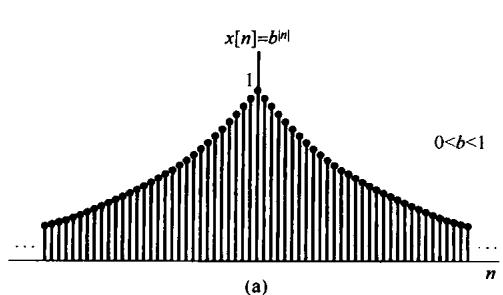

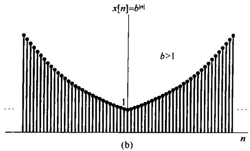

图10.10  $0 < b < 1$  和  $b > 1$  时的序列  $x[n] = b^{l n i}$  。(a)  $b = 0.95$ ; (b)  $b = 1.05$

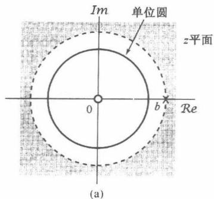

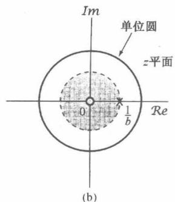

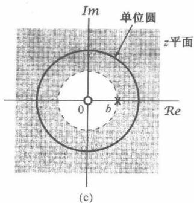

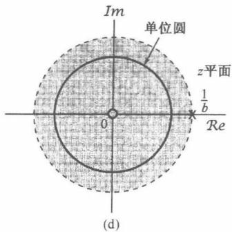

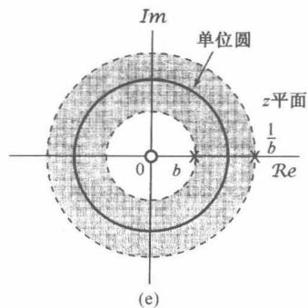

图10.11 例10.7的零-极点图和收敛域。(a)  $b > 1$  时的式(10.33); (b)  $b > 1$  时的式(10.34); (c)  $0 < b < 1$  时的式(10.33); (d)  $0 < b < 1$  时的式(10.34); (e)  $0 < b < 1$  时的式(10.36)的零-极点图和收敛域。 $b > 1$  时，式(10.31)中  $\pmb{x}[n]$  的  $\pmb{z}$  变换对任何  $\pmb{z}$  都不收敛

在第9章拉普拉斯变换的讨论中曾提到，对一个有理拉普拉斯变换来说，收敛域总是被极点或无限远点所界定的。在前面几个例子中可以看到，这一点对于  $z$  变换来说也是成立的，并且事实上这总是对的，从而有

性质7 如果  $x[n]$  的  $z$  变换  $X(z)$  是有理的，那么它的收敛域就被极点所界定，或者延伸至无限远。

将性质7与性质4和性质5结合在一起，就有：

性质8 如果  $x[n]$  的  $z$  变换  $X(z)$  是有理的，并且  $x[n]$  是右边序列，那么收敛域就位于  $z$  平面内最外层极点的外边，也就是半径等于  $X(z)$  极点中最大模值的圆的外边。而且，若  $x[n]$  是因果序列，即  $x[n]$  为  $n < 0$  时等于零的右边序列，那么收敛域也包括  $z = \infty$  。

因此，对于具有有理变换的右边序列，它的全部极点比收敛域中的任何一点都更加靠拢原点。

性质9 如果  $x[n]$  的  $z$  变换  $X(z)$  是有理的，并且  $x[n]$  是左边序列，那么收敛域就位于  $z$  平面内最里层的非零极点的里边，也就是半径等于  $X(z)$  中除去  $z = 0$  的极点中最小模值的圆的里边，并且向内延伸到可能包括  $z = 0$  。特别是，若  $x[n]$  是反因果序列，即  $x[n]$  为  $n > 0$  时等于零的左边序列，那么收敛域也包括  $z = 0$  。

因此，对于左边序列，除了可能在  $z = 0$  的极点外， $X(z)$  的极点都比收敛域中任何一点更加远离原点。

对于一个给定的零-极点图，或等效为一个给定的有理  $X(z)$  的代数表示式，存在着有限的几个不同的收敛域与上述性质相符。为了说明不同的收敛域是如何与同一零-极点图相联系的，现给出下面这个例子。这个例子与例9.8是并行的。

例10.8 有一个  $z$  变换  $X(z)$  为

$$
X (z) = \frac {1}{\left(1 - \frac {1}{3} z ^ {- 1}\right) \left(1 - 2 z ^ {- 1}\right)} \tag {10.37}
$$

现在来讨论与该  $X(z)$  有关的所有可能的收敛域。 $X(z)$  的零-极点图如图10.12(a)所示。根据本节的讨论，有三种可能所收敛域都能与这个  $z$  变换的代数表示式相联系，这些收敛域分别在图10.12(b)至图10.12(d)中指出。三种收敛域中的每一个都对应于不同的序列，其中图10.12(b)所示收敛域对应于一个右边序列，而图10.12(c)所示的收敛域则对应于一个左边序列。图10.12(d)是一个双边序列  $z$  变换的收敛域。三种情况中唯有图10.12(d)才包括单位圆，因此只有与其对应的序列才有傅里叶变换。

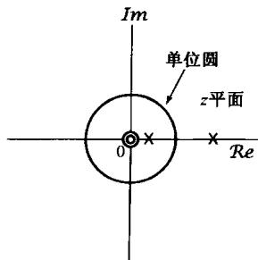

(a)

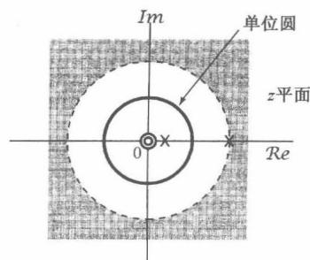

(b)

图10.12 与例10.8的  $z$  变换的表示式有关的三种可能收敛域。（a） $X(z)$  的零-极点图；（b） $x[n]$  是右边序列时的零-极点图和收敛域。在每种情况下，原点的零点都是二阶零点

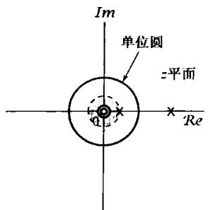

(c)

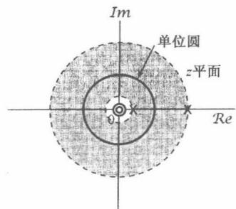

(d)

图10.12(续）与例10.8的  $z$  变换的表示式有关的三种可能收敛域。（c）  $x[n]$  是左边序列时的零-极点图和收敛域；（d）  $x[n]$  是双边序列时的零-极点图和收敛域。在每种情况下，原点的零点都是二阶零点

# 10.3  $z$  逆变换

这一节来讨论从已知  $z$  变换求得一个序列的几种方法。首先，考虑用  $z$  变换表示一个序列的数学关系。在10.1节曾把  $z$  变换看成一个指数加权后的序列的傅里叶变换，根据这种解释就可以得到这一关系。按式(10.7)的表示

$$
X (r e ^ {j \omega}) = \mathcal {F} \{x [ n ] r ^ {- n} \} \tag {10.38}
$$

其中的  $r$  值是位于收敛域内的  $z = r\mathrm{e}^{\mathrm{j}\omega}$  的模。对式(10.38)两边进行傅里叶逆变换，得

$$
x [ n ] r ^ {- n} = \mathcal {F} ^ {- 1} \left\{X (r e ^ {j \omega}) \right\}
$$

或者

$$
x [ n ] = r ^ {n} \mathcal {F} ^ {- 1} \left[ X \left(r e ^ {j \omega}\right) \right] \tag {10.39}
$$

利用式(5.8)的傅里叶逆变换表示式，可得

$$
x [ n ] = r ^ {n} \frac {1}{2 \pi} \int_ {2 \pi} X (r e ^ {j \omega}) e ^ {j \omega n} d \omega
$$

或者，将  $r^n$  的指数因子移进积分号内，与  $\mathrm{e}^{\mathrm{j}\omega n}$  项归并成  $(\mathrm{re}^{\mathrm{j}\omega})^{n}$ ，则得

$$
x [ n ] = \frac {1}{2 \pi} \int_ {2 \pi} X (r e ^ {j \omega}) (r e ^ {j \omega}) ^ {n} d \omega \tag {10.40}
$$

这就是说，将  $z$  变换沿着收敛域内  $z = r\mathrm{e}^{\mathrm{j}\omega}$  ，  $r$  固定而  $\omega$  在一个  $2\pi$  区间内变化的闭合围线求值，就能够将  $x[n]$  恢复出来。现在将积分变量从  $\omega$  变为  $z_{0}$  。由于  $z = r\mathrm{e}^{\mathrm{j}\omega}$  ，  $r$  固定，  $\mathrm{dz} = \mathrm{jre}^{\mathrm{j}\omega}\mathrm{d}\omega = \mathrm{jz}\mathrm{d}\omega$  ，或者  $\mathrm{d}\omega = (1 / \mathrm{j})z^{-1}\mathrm{d}z$  。这样，式(10.40)在  $\omega$  的  $2\pi$  区间的积分，利用  $z$  以后，就对应于以变量  $z$  在环绕  $|z| = r$  的圆上一周的积分。因此，根据  $z$  平面内的积分，式(10.40)就可重写为

$$
\boxed {x [ n ] = \frac {1}{2 \pi \mathrm {j}} \oint X (z) z ^ {n - 1} \mathrm {d} z} \tag {10.41}
$$

式中  $\oint$  记为在半径为  $r$  ，以原点为中心的封闭圆上沿逆时针方向环绕一周的积分。  $r$  的值可选为使  $X(z)$  收敛的任何值；也就是使  $|z| = r$  的积分围线位于收敛域内的任何值。式(10.41)就是  $z$  逆变换的正规数学表示式，并且它与拉普拉斯逆变换式(9.56)是对应的。和式(9.56)一样，式(10.41)逆变换的求值要利用复平面的围线积分。然而，还有另外几个方法可以从  $z$  变换求得

与其对应的序列。和拉普拉斯变换一样，其中特别有用的是，对于一个有理  $z$  变换，可以首先将它进行部分分式展开，然后逐项求其逆变换。现用下例给予具体说明。

例10.9  $z$  变换  $X(z)$  为

$$
X (z) = \frac {3 - \frac {5}{6} z ^ {- 1}}{\left(1 - \frac {1}{4} z ^ {- 1}\right) \left(1 - \frac {1}{3} z ^ {- 1}\right)}, \quad | z | > \frac {1}{3} \tag {10.42}
$$

有两个极点，一个在  $z = 1 / 3$  ，另一个在  $z = 1 / 4$  ，而收敛域位于最外边极点的外边。也就是收敛域由所有的模大于最大极点模值（即  $z = 1 / 3$  的极点）的点组成。根据10.2节的性质4可知，逆变换是一个右边序列。由附录A所述， $X(z)$  可按部分分式方法展开。对于这个例子，以  $z^{-1}$  多项式表示的部分分式展开式为

$$
X (z) = \frac {1}{1 - \frac {1}{4} z ^ {- 1}} + \frac {2}{1 - \frac {1}{3} z ^ {- 1}} \tag {10.43}
$$

因此， $x[n]$  为两项之和，其中一项的  $z$  变换是  $1 / [1 - (1 / 4)z^{-1}]$ ，而另一项是  $2 / [1 - (1 / 3)z^{-1}]$ 。为了确定每一项的逆变换，必须要为每一项标出收敛域。由于  $X(z)$  的收敛域位于最外层极点的外边，所以在式(10.43)中每一项的收敛域都必须位于自己极点的外边；也就是每一项的收敛域由所有模大于相应极点模值的点组成。于是

$$
x [ n ] = x _ {1} [ n ] + x _ {2} [ n ] \tag {10.44}
$$

其中，

$$
x _ {1} [ n ] \stackrel {z} {\longleftrightarrow} \frac {1}{1 - \frac {1}{4} z ^ {- 1}}, | z | > \frac {1}{4} \tag {10.45}
$$

$$
x _ {2} [ n ] \stackrel {z} {\longleftrightarrow} \frac {2}{1 - \frac {1}{3} z ^ {- 1}}, \quad | z | > \frac {1}{3} \tag {10.46}
$$

由例10.1可以确定这两个序列是

$$
x _ {1} [ n ] = \left(\frac {1}{4}\right) ^ {n} u [ n ] \tag {10.47}
$$

和

$$
x _ {2} [ n ] = 2 \left(\frac {1}{3}\right) ^ {n} u [ n ] \tag {10.48}
$$

因此可得

$$
x [ n ] = \left(\frac {1}{4}\right) ^ {n} u [ n ] + 2 \left(\frac {1}{3}\right) ^ {n} u [ n ] \tag {10.49}
$$

例10.10 现在考虑和式(10.42)相同的  $X(z)$  的代数表示式，但  $X(z)$  的收敛域是  $1/4 < |z| < 1/3$ 。式(10.43)的部分分式展开式仍然有效，但与每一项有关的收敛域将改变。因为  $X(z)$  的收敛域在  $z = 1/4$  的极点的外边，那么在式(10.43)中对应于这一项的收敛域也就在这个极点的外边，并由模值大于  $1/4$  的全部点组成，这就如同在前面例子中所做的那样。然而，又因为在这个例子中  $X(z)$  的收敛域位于  $z = 1/3$  的极点的里边；也就是说，因为收敛域内的所有点的模值都小于  $1/3$ ，那么对应于这一项的收敛域也必须位于这个极点的里边。这样，对于式(10.44)每一分量的  $z$  变换对就是

$$
x _ {1} [ n ] \xleftrightarrow {z} \frac {1}{1 - \frac {1}{4} z ^ {- 1}}, \quad | z | > \frac {1}{4} \tag {10.50}
$$

和

$$
x _ {2} [ n ] \stackrel {z} {\longleftrightarrow} \frac {2}{1 - \frac {1}{3} z ^ {- 1}}, \quad | z | <   \frac {1}{3} \tag {10.51}
$$

信号  $x_{1}[n]$  仍旧与式(10.47)相同，而从例10.2可得

$$
x _ {2} [ n ] = - 2 \left(\frac {1}{3}\right) ^ {n} u [ - n - 1 ] \tag {10.52}
$$

这样

$$
x [ n ] = \left(\frac {1}{4}\right) ^ {n} u [ n ] - 2 \left(\frac {1}{3}\right) ^ {n} u [ - n - 1 ] \tag {10.53}
$$

例10.11 最后，考虑  $X(z)$  仍如式(10.42)表示，但收敛域是  $|z| < 1/4$  的情况。这时，收敛域在两个极点的里边，即收敛域内的点的模值比极点  $z = 1/3$  或  $z = 1/4$  的模值都小，因此在式(10.43)的部分分式展开式中的每一项的收敛域也必须位于相应极点的里边。结果， $x_{1}[n]$  的  $z$  变换对为

$$
x _ {1} [ n ] \stackrel {z} {\longleftrightarrow} \frac {1}{1 - \frac {1}{4} z ^ {- 1}}, \quad | z | <   \frac {1}{4} \tag {10.54}
$$

而  $x_{2}[n]$  的  $z$  变换对仍由式(10.51)给出。将例10.2的结果用于式(10.54)，可得

$$
x _ {1} [ n ] = - \left(\frac {1}{4}\right) ^ {n} u [ - n - 1 ]
$$

因此有

$$
x [ n ] = - \left(\frac {1}{4}\right) ^ {n} u [ - n - 1 ] - 2 \left(\frac {1}{3}\right) ^ {n} u [ - n - 1 ]
$$

前面这些例子说明了利用部分分式展开的方法来确定  $z$  变换的基本步骤。和拉普拉斯变换对应的方法一样，这个方法依赖于将  $z$  变换表示成一组较简单项的线性组合，而对每一简单项的逆变换都能凭直观求得。特别是，假定  $X(z)$  的部分分式展开式具有如下形式：

$$
X (z) = \sum_ {i = 1} ^ {m} \frac {A _ {i}}{1 - a _ {i} z ^ {- 1}} \tag {10.55}
$$

$X(z)$  的逆变换就等于式(10.55)中每一项逆变换之和。若  $X(z)$  的收敛域位于极点  $z = a_{i}$  的外边，那么与式(10.55)中相应项的逆变换就是  $A_{i}a_{i}^{n}u[n]$ ；另一方面，若  $X(z)$  的收敛域位于极点  $z = a_{i}$  的里边，那么对应于这一项的逆变换就是  $-A_{i}a_{i}^{n}u[-n-1]$ 。一般来说，在  $X(z)$  的部分分式展开式中，可以包括除了在式(10.55)中的一次项以外的其他项。10.6节将列出其他几个  $z$  变换对，利用这些变换对，再与10.5节将要讨论的  $z$  变换性质结合起来，就能将上述例子中建立的求逆变换方法推广到任意有理  $z$  变换中。

确定  $z$  逆变换的另一种十分有用的方法建立在  $X(z)$  的幂级数展开的基础上。这个方法直接来自  $z$  变换的定义式(10.3)，因为由这个定义可看到，实际上  $z$  变换就是涉及  $z$  的正幂和负幂的一个幂级数，这个幂级数的系数就是序列值  $x[n]$  。为了说明一个幂级数的展开式如何用来得到  $z$  逆变换，现考虑如下三个例子。

例10.12 有  $z$  变换为

$$
X (z) = 4 z ^ {2} + 2 + 3 z ^ {- 1}, \quad 0 <   | z | <   \infty \tag {10.56}
$$

根据式(10.3)中  $z$  变换的幂级数定义，凭直观就能确定  $X(z)$  的逆变换为

$$
x [ n ] = \left\{ \begin{array}{l l} 4, & n = - 2 \\ 2, & n = 0 \\ 3, & n = 1 \\ 0, & \text {其 他} \end{array} \right.
$$

即

$$
x [ n ] = 4 \delta [ n + 2 ] + 2 \delta [ n ] + 3 \delta [ n - 1 ] \tag {10.57}
$$

比较式(10.56)和式(10.57)可以看出，不同的  $z$  的幂在序列中作为不同的占位符；也就是说，若应用如下变换对：

$$
\delta [ n + n _ {0} ] \xleftrightarrow {z} z ^ {n _ {0}}
$$

就能立即由式(10.56)过渡到式(10.57)，反之亦然。

例10.13 考虑一个  $z$  变换  $X(z)$  为

$$
X (z) = \frac {1}{1 - a z ^ {- 1}}, \quad | z | > | a |
$$

该式可用长除法将其展开成幂级数

$$
\begin{array}{l} 1 - a z ^ {- 1}) \frac {1 + a z ^ {- 1} + a ^ {2} z ^ {- 2} + \cdots}{1} \\ \frac {1 - a z ^ {- 1}}{a z ^ {- 1}} \\ \frac {a z ^ {- 1} - a ^ {2} z ^ {- 2}}{a ^ {2} z ^ {- 2}} \\ \end{array}
$$

或者写为

$$
\frac {1}{1 - a z ^ {- 1}} = 1 + a z ^ {- 1} + a ^ {2} z ^ {- 2} + \dots \tag {10.58}
$$

因为  $|z| > |a|$ ，或  $|az^{-1}| < 1$ ，所以式(10.58)的级数收敛。将该式与式(10.3)的  $z$  变换定义进行比较可见： $n < 0$  时  $x[n] = 0, x[0] = 1, x[1] = a, x[2] = a^2, \dots, x[n] = a^n u[n]$ ，这个结果与例10.1是一致的。

如果  $X(z)$  的收敛域是  $|z| < |a|$ ，或者等效为  $|az^{-1}| > 1$ ，那么式(10.58)中  $1 / (1 - az^{-1})$  的幂级数展开式就不收敛。然而，再利用一次长除法可以得到一个收敛的幂级数为

$$
\begin{array}{l} - a z ^ {- 1} + 1) \frac {- a ^ {- 1} z - a ^ {- 2} z ^ {2} - \cdots}{1} \\ \frac {1 - a ^ {- 1} z}{a ^ {- 1} z} \\ \end{array}
$$

或者

$$
\frac {1}{1 - a z ^ {- 1}} = - a ^ {- \mathrm {i}} z - a ^ {- 2} z ^ {2} - \dots \tag {10.59}
$$

在这种情况下，  $n\geqslant 0$  时  $x[n] = 0,x[-1] = -a^{-1},x[-2] = -a^{-2},\dots ,$  即  $x[n] = -a^{n}u[-n - 1]$  。这个结果与例10.2是一致的。

用幂级数展开法来求  $z$  逆变换对非有理  $z$  变换式特别有用，现用下面的例子来说明。

例10.14 考虑如下  $z$  变换  $X(z)$

$$
X (z) = \log (1 + a z ^ {- 1}), \quad | z | > | a | \tag {10.60}
$$

由于  $|z| > |a|$ ，或等效为  $|az^{-1}| < 1$ ，可将式(10.60)展开为泰勒级数

$$
\log (1 + v) = \sum_ {n = 1} ^ {\infty} \frac {(- 1) ^ {n + 1} v ^ {n}}{n}, | v | <   1 \tag {10.61}
$$

将上式用于式(10.60)就有

$$
X (z) = \sum_ {n = 1} ^ {\infty} \frac {(- 1) ^ {n + 1} a ^ {n} z ^ {- n}}{n} \tag {10.62}
$$

据此，就可确认出

$$
x [ n ] = \left\{ \begin{array}{l l} (- 1) ^ {n + 1} \frac {a ^ {n}}{n}, & n \geqslant 1 \\ 0, & n \leqslant 0 \end{array} \right. \tag {10.63}
$$

或等效为

$$
x [ n ] = \frac {- (- a) ^ {n}}{n} u [ n - 1 ]
$$

在习题10.63中将考虑收敛域为  $|z| < |a|$  的一个例子。

# 10.4 利用零-极点图对傅里叶变换进行几何求值

10.1节曾提到，只要  $z$  变换的收敛域包括单位圆，而使傅里叶变换收敛，那么对于  $|z| = 1$  （在  $z$  平面上对应于单位圆的围线）， $z$  变换就变为傅里叶变换。同样，在第9章中也可看到，连续时间信号在  $s$  平面  $\mathrm{j}\omega$  轴上的拉普拉斯变换就变成傅里叶变换。9.4节还讨论了从拉普拉斯变换的零-极点图可以用几何方法对傅里叶变换进行求值。在离散时间情况下，利用  $z$  平面内零极点向量也能对傅里叶变换进行几何求值。然而，因为在这种情况下，有理函数是在  $|z| = 1$  的单位圆上进行求值，所以应该考虑从极点和零点到这一单位圆上的向量，而不是到虚轴上的向量。为了说明这一方法，现考虑曾在6.6节讨论过的一阶系统和二阶系统。

# 10.4.1 一阶系统

一阶因果离散时间系统的单位脉冲响应具有如下一般形式：

$$
h [ n ] = a ^ {n} u [ n ] \tag {10.64}
$$

由例10.1，它的  $z$  变换是

$$
H (z) = \frac {1}{1 - a z ^ {- 1}} = \frac {z}{z - a}, | z | > | a | \tag {10.65}
$$

若  $|a| < 1$  ，收敛域就包括单位圆，结果  $h[n]$  的傅里叶变换收敛并等于  $H(z)$ ， $z = \mathrm{e}^{\mathrm{j}\omega}$  。因此，一阶系统的频率响应是

$$
H \left(\mathrm {e} ^ {\mathrm {j} \omega}\right) = \frac {1}{1 - a \mathrm {e} ^ {- \mathrm {j} \omega}} \tag {10.66}
$$

图10.13(a)画出了由式(10.65)表示的  $H(z)$  的零-极点图，其中包括从极点  $(z = a)$  和零点  $(z = 0)$  到单位圆的向量。利用这个图， $H(z)$  的几何求值可以用9.4节讨论的同一方法来完成。如果想要求式(10.65)的频率响应，就需以  $z = \mathrm{e}^{\mathrm{j}\omega}$  来完成对各  $z$  值的求值。频率响应在频率  $\omega$  处的模就是向量  $\nu_{1}$  的长度与向量  $\nu_{2}$  的长度之比，如图10.13(a)所示。频率响应的相位是向量  $\nu_{1}$  相对于实轴的角度减去向量  $\nu_{2}$  相对于实轴的角度。此外，从在原点的零点到单位圆的向量  $\nu_{1}$  长度不变且为1，因此对  $H(\mathrm{e}^{\mathrm{j}\omega})$  的模特性没有任何影响。而该零点对  $H(\mathrm{e}^{\mathrm{j}\omega})$  相位的贡献则是该零点向量相对于实轴的角度，可以由图看到它就等于  $\omega$  。对于  $0 < a < 1$  ，该极点向量在  $\omega = 0$  处其长度为最小，然后随  $\omega$  从0增加到  $\pi$  单调增加，因此频率响应的模在  $\omega = 0$  一定为最大，然后随  $\omega$  从0到  $\pi$  增加而单调下降。该极点向量的角度开始时为0，然后随  $\omega$  从0增加到  $\pi$  而单调增加。对于两个不同的  $a$  值，所得到的频率响应  $H(\mathrm{e}^{\mathrm{j}\omega})$  的模和相位特性分别如图10.13(b）和图10.13(c)所示。

在离散时间一阶系统中，参数  $a$  的大小所起的作用类似于9.4.1节连续时间一阶系统中的时间常数  $\tau$  的作用。在图10.13中首先注意到， $H(\mathrm{e}^{\mathrm{j}\omega})$  在  $\omega = 0$  峰值的大小随着  $|a|$  朝向0减小而减

小。另外，如同6.6.1节所讨论的，以及在图6.26和图6.27中所说明的，当  $|a|$  减小时，单位脉冲响应衰减得更陡峭了，而阶跃响应建立得更快了。如果不是一个极点，而有多个极点，那么与每个极点有关的响应速度与该极点到原点的距离有关，最靠近原点的那些极点在单位脉冲响应中提供了最快的衰减项。这将在下面的二阶系统中进一步说明。

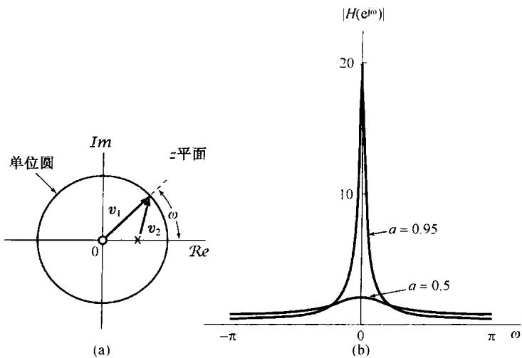

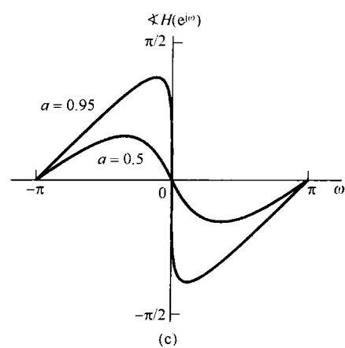

图10.13 (a)  $0 < a < 1$  时，一阶系统频率响应几何求值的极点和零点向量；(b)  $a = 0.95$  和  $a = 0.5$  时的频率响应模特性；(c)  $a = 0.95$  和  $a = 0.5$  时的频率响应的相位特性

# 10.4.2 二阶系统

接下来考虑6.6.2节讨论的一类二阶系统，它的单位脉冲响应和频率响应分别由式(6.64)和式(6.60)给出，这里重复如下：

$$
h [ n ] = r ^ {n} \frac {\sin (n + 1) \theta}{\sin \theta} u [ n ] \tag {10.67}
$$

和

$$
H \left(\mathrm {e} ^ {\mathrm {j} \omega}\right) = \frac {1}{1 - 2 r \cos \theta \mathrm {e} ^ {- \mathrm {j} \omega} + r ^ {2} \mathrm {e} ^ {- \mathrm {j} 2 \omega}} \tag {10.68}
$$

其中  $0 < r < 1$  且  $0 \leqslant \theta \leqslant \pi$ 。因为  $H(e^{\mathrm{j}\omega}) = H(z)|_{z = e^{\mathrm{j}\omega}}$ ，所以就能从式(10.68)推出系统函数，相应于系统单位脉冲响应的  $z$  变换，为

$$
H (z) = \frac {1}{1 - (2 r \cos \theta) z ^ {- 1} + r ^ {2} z ^ {- 2}} \tag {10.69}
$$

$H(z)$  的极点位于

$$
z _ {1} = r \mathrm {e} ^ {\mathrm {j} \theta}, \quad z _ {2} = r \mathrm {e} ^ {- \mathrm {j} \theta} \tag {10.70}
$$

并且在  $z = 0$  有二阶零点。 $H(z)$  的零-极点图，以及  $0 < \theta < \pi / 2$  时的零-极点向量都示于图10.14(a)中。这时，频率响应的模等于向量  $\pmb{\nu}_{1}$  模的平方（因为在原点是二阶零点）除以向量  $\pmb{\nu}_{1}$  和  $\pmb{\nu}_{3}$  模的乘积。由于向量  $\pmb{\nu}_{1}$  的长度对所有  $\omega$  值都是1，所以频率响应的模就等于两个极点向量  $\pmb{\nu}_{2}$  和  $\pmb{\nu}_{3}$  长度乘积的倒数。另外，频率响应的相位等于向量  $\pmb{\nu}_{1}$  相对于实轴的角度的两倍减去向量  $\pmb{\nu}_{2}$  和  $\pmb{\nu}_{3}$  的角度之和。图10.14(b)展示了  $r = 0.95$  和  $r = 0.75$  时频率响应的模特性，而在图10.14(c)中，对于同样两个  $r$  值展示出的是  $H(e^{\mathrm{j}\omega})$  的相位特性。在图中特别注意到，随着  $\omega$  沿单位圆从  $\omega = 0$  向  $\omega = \pi$  移动，向量  $\pmb{\nu}_{2}$  的长度起初是减小，然后增加，在极点位置  $\omega = \theta$  附近有一个最小值。这就与当向量  $\pmb{\nu}_{2}$  的长度比较小时，频率响应的模特性在  $\omega$  接近  $\theta$  时出现峰值是一致的。根据极点向量的性质，

很明显，随着  $r$  接近于1，极点向量的最小长度也减小，因此频率响应的峰值将随着  $r$  的增加而变得更为尖锐。另外，对于  $r$  接近于1，向量  $\nu_{2}$  的角度在  $\omega$  在接近  $\theta$  时变化很剧烈。根据式(10.67)和图6.29所示的单位脉冲响应或式(6.67)和图6.30所示的阶跃响应可以看到，就像在一阶系统中那样，随着极点向原点移近，这就相应于  $r$  减小，单位脉冲响应衰减得更为迅速，而阶跃响应则建立得更快。

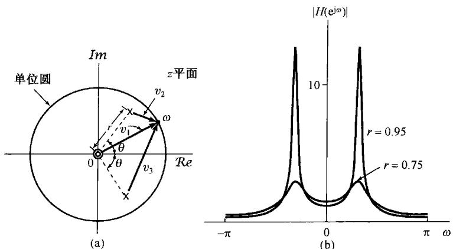

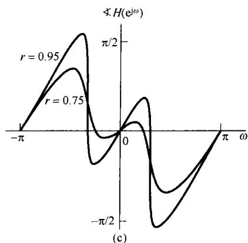

图10.14 (a) 用于二阶系统频率响应几何求值中的零点向量  $\nu_{1}$  及极点向量  $\nu_{2}$  和  $\nu_{3}$ ; (b)  $r = 0.95$  和  $r = 0.75$  时, 对应于极点向量长度乘积的倒数的频率响应模特性; (c)  $r = 0.95$  和  $r = 0.75$  时, 频率响应的相位特性

# 10.5  $z$  变换的性质

和已经讨论过的其他变换一样， $z$  变换也具有许多性质，这些性质在离散时间信号与系统的研究中成为很有价值的工具。这一节将综述这些性质。由于这些性质的推导都与其他变换相类似，所以很多推导都留给读者作为练习（见习题10.43和习题10.51至习题10.54）。

# 10.5.1 线性性质

若

$$
x _ {1} [ n ] \stackrel {z} {\longleftrightarrow} X _ {1} (z), \quad \mathrm {R O C} = R _ {1}
$$

且

$$
x _ {2} [ n ] \stackrel {z} {\longleftrightarrow} X _ {2} (z), \quad \mathrm {R O C} = R _ {2}
$$

则

$$
\boxed {a x _ {1} [ n ] + b x _ {2} [ n ] \xleftrightarrow {z} a X _ {1} (z) + b X _ {2} (z), \quad \text {R O C 包 括} R _ {1} \cap R _ {2}} \tag {10.71}
$$

如同所指出的，线性组合的收敛域至少是  $R_{1}$  和  $R_{2}$  相重合的部分。对于具有有理  $z$  变换的序列，如果  $aX_{1}(z) + bX_{2}(z)$  的极点是由  $X_{1}(z)$  和  $X_{2}(z)$  的全部极点构成的（也就是说，没有零极点相消），那么收敛域就一定是各单个收敛域的重叠部分。如果线性组合是这样来构成的，使某些零点的引入抵消掉某些极点，那么收敛域就可以增大。属于这种情况的一个简单例子是， $x_{1}[n]$  和  $x_{2}[n]$  都是无限长序列，但线性组合以后成为有限长序列了。在这种情况下，线性组合后的序列的  $z$  变换，其收敛域就是整个  $z$  平面，可能除去原点和/或无限远点。例如，序列  $a^{n}u[n]$  和序列  $a^{n}u[n-1]$  都有一个  $z$  变换的收敛域为  $|z| > |a|$ ，但它们之差的序列  $(a^{n}u[n] - a^{n}u[n-1]) = \delta[n]$  的  $z$  变换却有一个收敛域是整个  $z$  平面。

# 10.5.2 时移性质

若

$$
x [ n ] \stackrel {z} {\longleftrightarrow} X (z), \quad \mathrm {R O C} = R
$$

则

$$
x [ n - n _ {0} ] \stackrel {z} {\longleftrightarrow} z ^ {- n _ {0}} X (z), \quad \mathrm {R O C} = R, \text {原 点 或 无 限 远 点 可 能 加 上 或 除 掉} \tag {10.72}
$$

由于乘以  $z^{-n_0}$ ，因此若  $n_0 > 0$ ， $z^{-n_0}$  将会在  $z = 0$  引入极点，而这些极点可以抵消  $X(z)$  在  $z = 0$  的零点。因此，虽然  $z = 0$  可以不是  $X(z)$  的一个极点，但却可以是  $z^{-n_0}X(z)$  的一个极点。在这种情况下， $z^{-n_0}X(z)$  的收敛域等于  $X(z)$  的收敛域，但原点要除去。类似地，若  $n_0 < 0$ ， $z^{-n_0}$  将在  $z = 0$  引入零点，它可以抵消  $X(z)$  在  $z = 0$  的极点。这样当  $z = 0$  不是  $X(z)$  的一个极点时，却可以是  $z^{-n_0}X(z)$  的一个零点。在这种情况下， $z = \infty$  是  $z^{-n_0}X(z)$  的一个极点，因此  $z^{-n_0}X(z)$  的收敛域等于  $X(z)$  的收敛域，但  $z = \infty$  要除去。

# 10.5.3  $z$  域尺度变换

若

$$
x [ n ] \stackrel {z} {\longleftrightarrow} X (z), \quad \operatorname {R O C} = R
$$

则

$$
z _ {0} ^ {n} x [ n ] \xleftrightarrow {z} X \left(\frac {z}{z _ {0}}\right), \operatorname {R O C} = | z _ {0} | R \tag {10.73}
$$

其中  $|z_0|R$  代表域  $R$  的一种尺度变化。这就是说，若  $z$  是  $X(z)$  的收敛域内的一点，那么点  $|z_0|z$  就在  $X(z / z_0)$  的收敛域内。同样，若  $X(z)$  有一个极点(或零点)在  $z = a$  ，那么  $X(z / z_0)$  就有一个极点(或零点)在  $z = z_0a$  。

式(10.73)的一个重要的特例是当  $z_0 = \mathrm{e}^{\mathrm{j}\omega_0}$  时，这时  $|z_0|R = R$  ，并且

$$
\mathrm {e} ^ {\mathrm {j} \omega_ {0} n} x [ n ] \xleftarrow {z} X (\mathrm {e} ^ {- \mathrm {j} \omega_ {0}} z) \tag {10.74}
$$

式(10.74)的左边相应于乘以复指数序列，而右边可以看成在  $z$  平面内的旋转，也就是说，全部零极点的位置在  $z$  平面内旋转一个  $\omega_0$  的角度，如图10.15所示。这一过程可以这样来看，如果 $X(z)$  中有一个因式  $(1 - az^{-1})$  ，那么  $X(\mathrm{e}^{-\mathrm{j}\omega_0z})$  中将有一个因式为  $(1 - ae^{\mathrm{j}\omega_0}z^{-1})$  ，于是  $X(z)$  在  $z = a$  的一个极点或零点就变成  $X(\mathrm{e}^{-\mathrm{j}\omega_0}z)$  中在  $z = ae^{\mathrm{j}\omega_0}$  的一个极点或零点。这样，  $z$  变换在单位圆上的特性也将移动一个角度  $\omega_0$  。这一点与5.3.3节的频移性质是一致的，即时域内乘以复指数是与傅里叶变换的频移相对应的。另外，在  $z_0 = r_0\mathrm{e}^{\mathrm{j}\omega_0}$  的一般情况下，式(10.73)所代表的极点和零点的位置变化除了有一个  $\omega_0$  旋转以外，在大小上还要有  $r_0$  倍的变化。

# 10.5.4 时间反转

若

$$
x [ n ] \stackrel {z} {\longleftrightarrow} X (z), \quad \mathrm {R O C} = R
$$

则

$$
\boxed {x [ - n ] \stackrel {Z} {\longleftrightarrow} X (\frac {1}{z}), \quad \mathrm {R O C} = \frac {1}{R}} \tag {10.75}
$$

这就是说，若  $z_0$  在  $x[n]$  的  $z$  变换收敛域内，那么  $1 / z_0$  就在  $x[-n]$  的  $z$  变换的收敛域内。

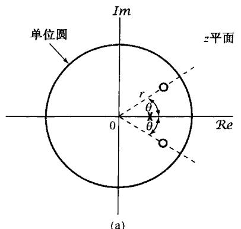

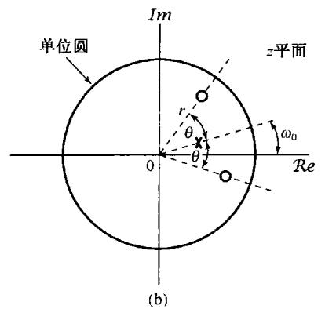

图10.15 时域乘以复指数序列  $\mathrm{e}^{\mathrm{j}\omega_0n}$  在零-极点图上的效果。（a）信号  $x[n]$  的 $z$  变换的零-极点图；（b）  $x[n]\mathrm{e}^{\mathrm{j}\omega_0n}$  的  $z$  变换的零-极点图

# 10.5.5 时间扩展

在5.3.7节中已讨论到，连续时间的时域尺度变换的概念不能直接推广到离散时间中，因为离散时间变量仅仅定义在整数值上。然而，离散时间的时间扩展的概念（即在离散时间序列  $x[n]$  的各个值之间插入若干零值）还是可以定义的，并且在离散时间信号与系统分析中起着重要的作用。这就是5.3.7节所介绍的  $x_{(k)}[n]$ ，其定义为

$$
x _ {(k)} [ n ] = \left\{ \begin{array}{l l} {x [ n / k ],} & {\quad n \text {是} k \text {的 整 倍 数}} \\ {0,} & {\quad n \text {不 是} k \text {的 整 倍 数}} \end{array} \right. \tag {10.76}
$$

它在原有序列  $x[n]$  的各连续值之间插入  $(k - 1)$  个零值序列，在这种情况下，若

$$
x [ n ] \stackrel {z} {\longleftrightarrow} X (z), \quad \mathrm {R O C} = R
$$

则

$$
\boxed {x _ {(k)} [ n ] \stackrel {z} {\longleftrightarrow} X (z ^ {k}), \quad \mathrm {R O C} = R ^ {1 / k}} \tag {10.77}
$$

这就是说，若  $z$  位于  $X(z)$  的收敛域内，那么  $z^{1 / k}$  就在  $X(z^k)$  的收敛域内；同时，若  $X(z)$  有一个极点（或零点）在  $z = a$  ，那么  $X(z^{k})$  就有一个极点(或零点)在  $z = a^{1 / k}$  。

这一结果的解释由  $z$  变换的幂级数形式可直接得出，由这个幂级数可见， $z^{-n}$  项的系数就等于序列在时刻  $n$  的值。也就是说，由于

$$
X (z) = \sum_ {n = - \infty} ^ {+ \infty} x [ n ] z ^ {- n}
$$

立即可得

$$
X (z ^ {k}) = \sum_ {n = - \infty} ^ {+ \infty} x [ n ] (z ^ {k}) ^ {- n} = \sum_ {n = - \infty} ^ {+ \infty} x [ n ] z ^ {- k n} \tag {10.78}
$$

仔细检查式(10.78)的右边可见，仅仅能出现的是具有  $z^{-kn}$  的那些项；即  $z^{-m}$  项的系数；若  $m$  不是  $k$  的整倍数，则为0，而若  $m$  是  $k$  的整倍数，则等于  $x[m / k]$  。因此，式(10.78)的逆变换就是  $x_{(k)}[n]$  。

# 10.5.6 共轭

若

$$
x [ n ] \stackrel {z} {\longleftrightarrow} X (z), \quad \mathrm {R O C} = R \tag {10.79}
$$

则

$$
x ^ {*} [ n ] \stackrel {z} {\longleftrightarrow} X ^ {*} \left(z ^ {*}\right), \quad \operatorname {R O C} = R \tag {10.80}
$$

结果，若  $x[n]$  是实序列，就可由式(10.80)得到

$$
X (z) = X ^ {*} \left(z ^ {*}\right)
$$

因此，若  $X(z)$  有一个  $z = z_0$  的极点(或零点)，那么就一定有一个与  $z_0$  共轭成对的  $z = z_0^*$  的极点（或零点）。例如，在例10.4中实序列  $x[n]$  的  $z$  变换  $X(z)$  就有一对共轭成对的极点  $z = (1 / 3)\mathrm{e}^{\pm \mathrm{j}\pi /4}$ 。

# 10.5.7 卷积性质

若

$$
x _ {1} [ n ] \stackrel {z} {\longleftrightarrow} X _ {1} (z), \quad \mathrm {R O C} = R _ {1}
$$

且

$$
x _ {2} [ n ] \stackrel {z} {\longleftrightarrow} X _ {2} (z), \quad \mathrm {R O C} = R _ {2}
$$

则

$$
\left. x _ {1} [ n ] * x _ {2} [ n ] \xleftrightarrow {\mathcal {Z}} X _ {1} (z) X _ {2} (z), \quad \text {R O C 包 括} R _ {1} \cap R _ {2} \right| \tag {10.81}
$$

与拉普斯变换的卷积性质一样， $X_{1}(z)X_{2}(z)$  的收敛域包括  $R_{1}$  和  $R_{2}$  的相交部分，如果在乘积中发生零极点相消，则收敛域可以扩大。 $z$  变换的卷积性质可以用不同的方法导出来。一种正规的推导将在习题 10.56 中讨论。另一种方法也能把它导出来，这很类似于在 4.4 节对连续时间傅里叶变换的卷积性质所做的那样，依赖于把傅里叶变换看成一个复指数信号，通过一个线性时不变系统后，在该复指数信号的振幅上所给予的变化。

对于  $z$  变换，还有一种关于卷积性质的解释。根据式(10.3)的定义，将  $z$  变换看成一个  $z^{-1}$  的级数，其中  $z^{-n}$  的系数就是序列值  $x[n]$  。这样，实质上式(10.81)的卷积性质是：当两个多项式或幂级数  $X_{1}(z)$  和  $X_{2}(z)$  相乘时，代表该乘积的多项式的系数就是在多项式  $X_{1}(z)$  和  $X_{2}(z)$  中的系数的卷积（见习题10.57）。

例10.15 有一个线性时不变系统

$$
y [ n ] = h [ n ] * x [ n ] \tag {10.82}
$$

其中，

$$
h [ n ] = \delta [ n ] - \delta [ n - 1 ]
$$

注意

$$
\delta [ n ] - \delta [ n - 1 ] \xleftrightarrow {Z} 1 - z ^ {- 1} \tag {10.83}
$$

其收敛域等于整个  $z$  平面，但不包括原点。同时，式(10.83)的  $z$  变换在  $z = 1$  有一个零点，根据式(10.81)可见，若

$$
x [ n ] \stackrel {Z} {\longleftrightarrow} X (z), \quad \mathrm {R O C} = R
$$

则

$$
y [ n ] \xleftarrow {Z} (1 - z ^ {- 1}) X (z) \tag {10.84}
$$

其收敛域等于  $R$  ，但可能会除去  $z = 0$  和/或增加  $z = 1$  。

注意，这个系统有

$$
y [ n ] = [ \delta [ n ] - \delta [ n - 1 ] ] * x [ n ] = x [ n ] - x [ n - 1 ]
$$

这就是说， $y[n]$  是序列  $x[n]$  的一次差分。因为一次差分(first-difference)运算一般被认为相当于离散时间情况下的“微分”，因此，式(10.83)也就可认为是9.5.7节讨论的拉普拉斯变换微分性质在  $z$  变换中所对应的性质。

例10.16 现在考虑一次差分的逆运算，即累加器或求和器。 $w[n]$  是  $x[n]$  的连续求和，即

$$
w [ n ] = \sum_ {k = - \infty} ^ {n} x [ k ] = u [ n ] * x [ n ] \tag {10.85}
$$

那么，利用式(10.81)，再结合例10.1中单位阶跃的  $z$  变换，就有

$$
w [ n ] = \sum_ {k = - \infty} ^ {n} x [ k ] \xleftrightarrow {z} \frac {1}{1 - z ^ {- 1}} X (z) \tag {10.86}
$$

其收敛域至少包括  $R$  与  $|z| > 1$  的相交部分。式(10.86)就是在9.5.9节得到的拉普拉斯变换积分性质在  $z$  变换中所对应的性质。

# 10.5.8  $z$  域微分

若

$$
x [ n ] \stackrel {z} {\longleftrightarrow} X (z), \quad \mathrm {R O C} = R
$$

则

$$
n x [ n ] \xleftrightarrow {Z} - z \frac {\mathrm {d} X (z)}{\mathrm {d} z}, \quad \mathbf {R O C} = R \tag {10.87}
$$

只要将式(10.3)的  $z$  变换式两边对  $z$  进行微分，就可直接得出这个性质。作为应用该性质的一个例子，利用它对例10.14考虑的  $z$  变换求逆变换。

例10.17 若  $X(z)$  为

$$
X (z) = \log (1 + a z ^ {- 1}), \quad | z | > | a | \tag {10.88}
$$

则有

$$
n x [ n ] \xleftrightarrow {z} - z \frac {\mathrm {d} X (z)}{\mathrm {d} z} = \frac {a z ^ {- 1}}{1 + a z ^ {- 1}}, | z | > | a | \tag {10.89}
$$

这样，利用微分就把这个非有理  $z$  变换转换为一个有理函数的表示式。式(10.89)右边部分的逆变换可以用例10.1和10.5.2节所得的时移性质式(10.72)来求得。由例10.1和线性性质，有

$$
a (- a) ^ {n} u [ n ] \xleftrightarrow {z} \frac {a}{1 + a z ^ {- 1}}, | z | > | a | \tag {10.90}
$$

将上式与时移性质结合起来，就得到

$$
a (- a) ^ {n - 1} u [ n - 1 ] \xleftrightarrow {z} \frac {a z ^ {- 1}}{1 + a z ^ {- 1}}, \quad | z | > | a |
$$

因此有

$$
x [ n ] = \frac {- (- a) ^ {n}}{n} u [ n - 1 ] \tag {10.91}
$$

例10.18 作为应用  $z$  域微分性质的另一个例子，考虑求下列  $z$  变换的逆变换：

$$
X (z) = \frac {a z ^ {- 1}}{(1 - a z ^ {- 1}) ^ {2}}, \quad | z | > | a | \tag {10.92}
$$

由例10.1，有

$$
a ^ {n} u [ n ] \xleftrightarrow {z} \frac {1}{1 - a z ^ {- 1}}, \quad | z | > | a | \tag {10.93}
$$

所以有

$$
n a ^ {n} u [ n ] \xleftrightarrow {z} - z \frac {\mathrm {d}}{\mathrm {d} z} \left(\frac {1}{1 - a z ^ {- 1}}\right) = \frac {a z ^ {- 1}}{(1 - a z ^ {- 1}) ^ {2}}, \quad | z | > | a | \tag {10.94}
$$

# 10.5.9 初值定理

若  $n < 0$  时  $x[n] = 0$  ，则

$$
x [ 0 ] = \lim  _ {z \rightarrow \infty} X (z) \tag {10.95}
$$

只要考虑  $z$  变换表示式每一项的极限，利用  $n < 0$  时  $x[n] = 0$  的条件，就可以得出这个性质。由于这个限制，

$$
X (z) = \sum_ {n = 0} ^ {\infty} x [ n ] z ^ {- n}
$$

随着  $z \to \infty$  ，当  $n > 0$  时， $z^{-n} \to 0$  ，而当  $n = 0$  时， $z^{-n} = 1$  ，于是得到式(10.95)。

对于一个因果序列，初值定理的一个直接结果就是：如果  $x[0]$  是有限值，那么  $\lim_{z \to \infty} X(z)$  就是有限值。结果，将  $X(z)$  表示成两个多项式之比，分子多项式的阶次不能大于分母多项式的阶次；或者说，零点的个数不能多于极点的个数。

例10.19 初值定理也能够用于检验一个信号  $z$  变换计算中的正确性。例如，考虑例10.3的信号  $x[n]$ ，由式(10.12)知道  $x[0] = 1$ ，同时，由式(10.14)可知

$$
\lim  _ {z \rightarrow \infty} X (z) = \lim  _ {z \rightarrow \infty} \frac {1 - \frac {3}{2} z ^ {- 1}}{(1 - \frac {1}{3} z ^ {- 1}) (1 - \frac {1}{2} z ^ {- 1})} = 1
$$

这是与初值定理一致的。

# 10.5.10 性质小结

表10.1综合列出以上所讨论的  $z$  变换性质。

表 10.1  $z$  变换性质

<table><tr><td>节次</td><td>性质</td><td>信号</td><td>z变换</td><td>收敛域</td></tr><tr><td></td><td></td><td>x[n]</td><td>X(z)</td><td>R</td></tr><tr><td></td><td></td><td>x1[n]</td><td>X1(z)</td><td>R1</td></tr><tr><td></td><td></td><td>x2[n]</td><td>X2(z)</td><td>R2</td></tr><tr><td>10.5.1</td><td>线性</td><td>ax1[n] + bx2[n]</td><td>aX1(z) + bX2(z)</td><td>至少是R1和R2的相交</td></tr><tr><td>10.5.2</td><td>时移</td><td>x[n - n0]</td><td>z- n0X(z)</td><td>R(除了可能增加或除去原点或∞点)</td></tr><tr><td>10.5.3</td><td>z域尺度变换</td><td>ejω0n x[n]</td><td>X(e- jω0z)</td><td>R</td></tr><tr><td></td><td></td><td>z0nx[n]</td><td>X(z/ z0)</td><td>z0R</td></tr><tr><td></td><td></td><td>anx[n]</td><td>X(a-1z)</td><td>R的比例伸缩,即|a|R=在R中z的这些{|a|z|点的集合</td></tr><tr><td>10.5.4</td><td>时间反转</td><td>x[-n]</td><td>X(z-1)</td><td>R-1,即R-1=在R中的z的这些z-1点的集合</td></tr><tr><td>10.5.5</td><td>时间扩展</td><td>x(k)[n] = {x[r], n=rk 0, n≠rk 对某整数r</td><td>X(zk)</td><td>R1/k,即在R中的z的这些z1/k点的集合</td></tr><tr><td>10.5.6</td><td>共轭</td><td>x*[n]</td><td>X*(z*)</td><td>R</td></tr><tr><td>10.5.7</td><td>卷积</td><td>x1[n]*x2[n]</td><td>X1(z)X2(z)</td><td>至少是R1和R2的相交</td></tr><tr><td>10.5.7</td><td>一次差分</td><td>x[n] - x[n-1]</td><td>(1-z-1)X(z)</td><td>至少是R和|z|&gt;0的相交</td></tr><tr><td>10.5.7</td><td>累加</td><td>Σnk=-∞n x[k]</td><td>1/1-z-1X(z)</td><td>至少是R和|z|&gt;1的相交</td></tr><tr><td>10.5.8</td><td>z域微分</td><td>nx[n]</td><td>-z dX(z)/dz</td><td>R</td></tr><tr><td>10.5.9</td><td colspan="4">初值定理
若n&lt;0时x[n]=0,则
x[0]=lim X(z)</td></tr></table>

# 10.6 几个常用  $z$  变换对

与拉普拉斯逆变换一样， $z$  逆变换往往也能够很容易地把  $X(z)$  表示成若干简单项的线性组合来求得。表10.2中列出了几个常用的  $z$  变换对。其中每一对都可以从前面举出的例子，再结合  $z$  变换的性质而导得。例如变换对2和5直接由例10.1得出；变换对7则来自例10.18。有了这些，再结合分别由10.5.4节和10.5.2节建立的时间反转和时移性质，就可以导出变换对3,6和8。变换对9和10可以利用变换对2，再结合分别由10.5.1节和10.5.3节建立的线性和  $z$  域尺度变换性质而得到。

表 10.2 几个常用  $z$  变换对

<table><tr><td>信 号</td><td>变 换</td><td>收 敛 域</td></tr><tr><td>1.δ[n]</td><td>1</td><td>全部z</td></tr><tr><td>2.u[n]</td><td>1/1-z-1</td><td>|z|&gt;1</td></tr><tr><td>3.-u[-n-1]</td><td>1/1-z-1</td><td>|z|&lt;1</td></tr><tr><td>4.δ[n-m]</td><td>z-m</td><td>全部z,除去0(若m&gt;0)或∞(若m&lt;0)</td></tr><tr><td>5.a^n u[n]</td><td>1/1-az-1</td><td>|z|&gt;|a|</td></tr><tr><td>6.-a^n u[-n-1]</td><td>1/1-az-1</td><td>|z|&lt;|a|</td></tr><tr><td>7.na^n u[n]</td><td>az-1/(1-az-1)²</td><td>|z|&gt;|a|</td></tr><tr><td>8.-na^n u[-n-1]</td><td>az-1/(1-az-1)²</td><td>|z|&lt;|a|</td></tr><tr><td>9.[cos ω0n]u[n]</td><td>1-[cos ω0]z-1/1-[2cos ω0]z-1+z-2</td><td>|z|&gt;1</td></tr><tr><td>10.[sin ω0n]u[n]</td><td>[sin ω0]z-1/1-[2cos ω0]z-1+z-2</td><td>|z|&gt;1</td></tr><tr><td>11.[r^n cos ω0n]u[n]</td><td>1-[rcos ω0]z-1/1-[2rcos ω0]z-1+r^2z-2</td><td>|z|&gt;r</td></tr><tr><td>12.[r^n sin ω0n]u[n]</td><td>[rsin ω0]z-1/1-[2rcos ω0]z-1+r^2z-2</td><td>|z|&gt;r</td></tr></table>

# 10.7 利用  $z$  变换分析与表征线性时不变系统

在离散时间线性时不变系统的分析和表示中， $z$  变换有其特别重要的作用。根据10.5.7节的卷积性质

$$
Y (z) = H (z) X (z) \tag {10.96}
$$

其中  $X(z), Y(z)$  和  $H(z)$  分别是系统输入、输出和单位脉冲响应的  $z$  变换。 $H(z)$  称为系统的系统函数（system function）或转移函数（transfer function）。只要单位圆在  $H(z)$  的收敛域内，将  $H(z)$  在单位圆上求值（即  $z = \mathrm{e}^{\mathrm{j}\omega}$ ）， $H(z)$  就变成系统的频率响应。另外，从3.2节的讨论可知，若一个线性时不变系统的输入是复指数信号  $x[n] = z^n$ ，那么输出一定是  $H(z)z^n$ ；这就是说， $z^n$  是系统的特征函数，其特征值由  $H(z)$  给出，而  $H(z)$  就是单位脉冲响应的  $z$  变换。

一个系统的很多性质都能够直接与系统函数的零极点和收敛域的性质相联系，这一节将通过讨论几个重要的系统性质和一类重要的系统来说明这些关系。

# 10.7.1 因果性

一个因果线性时不变系统的单位脉冲响应  $h[n]$ , 当  $n < 0$  时  $h[n] = 0$ , 因此是一个右边序列。由10.2节的性质4知道  $H(z)$  的收敛域位于  $z$  平面内某个圆的外边。对于某些系统, 例如, 若  $h[n] = \delta[n]$ , 而有  $H(z) = 1$ , 则收敛域可以延伸至所有地方, 并可能包括原点。同时, 一般来说, 对于一个右边序列, 它的收敛域可以或者不可以包括无限远点。例如, 若  $h[n] = \delta[n + 1]$ , 那么  $H(z) = z$ , 它在无限远点有一个极点。然而, 根据10.2节性质8, 对于一个因果序列, 这个幂级数中,

$$
H (z) = \sum_ {n = 0} ^ {\infty} h [ n ] z ^ {- n}
$$

不包含任何  $z$  的正幂次项，因此收敛域包括无限远点。综合上述，就得出如下属性。

一个离散时间线性时不变系统，当且仅当它的系统函数的收敛域在某个圆的外边，且包括无限远点时，该系统就是因果的。

如果  $H(z)$  是有理的，那么由10.2节的性质8，该系统若要是因果的，其收敛域必须位于最外层极点的外边，且无限远点必须在收敛域内；等效地说，随  $z \to \infty$  时， $H(z)$  的极限必须是有限的。正如10.5.9节所讨论的，这就等效于，当  $H(z)$  的分子和分母都表示成  $z$  的多项式时，其分子的阶次不会高于分母的阶次，即

一个具有有理系统函数  $H(z)$  的线性时不变系统是因果的，当且仅当：(a)收敛域位于最外层极点外边某个圆的外边；并且(b)若  $H(z)$  表示成  $z$  的多项式之比，其分子的阶次不能高于分母的阶次。

例10.20 考虑一个系统的系统函数，其代数表示式为

$$
H (z) = \frac {z ^ {3} - 2 z ^ {2} + z}{z ^ {2} + \frac {1}{4} z + \frac {1}{8}}
$$

甚至用不着知道它的收敛域，就能得出该系统不是因果的，因为  $H(z)$  分子的阶次高于分母的阶次。

例10.21 考虑一个系统，其系统函数是

$$
H (z) = \frac {1}{1 - \frac {1}{2} z ^ {- 1}} + \frac {1}{1 - 2 z ^ {- 1}}, \quad | z | > 2 \tag {10.97}
$$

因为该系统函数的收敛域在最外层极点外边的某个圆的外边，就能知道它的单位脉冲响应是右边序列。为了确定是否是因果的，仅需要用因果性所要求的其他条件来检验就可以了，这就是当  $H(z)$  表示成  $z$  的两个多项式之比时，  $H(z)$  分子的阶次不能高于分母的阶次。对于这个例子，

$$
H (z) = \frac {2 - \frac {5}{2} z ^ {- 1}}{(1 - \frac {1}{2} z ^ {- 1}) (1 - 2 z ^ {- 1})} = \frac {2 z ^ {2} - \frac {5}{2} z}{z ^ {2} - \frac {5}{2} z + 1} \tag {10.98}
$$

$H(z)$  的分子和分母的阶次都是2，因此可得该系统是因果的。计算出  $H(z)$  的逆变换可以证实这一点。利用表10.2的变换对5，可求得该系统的单位脉冲响应为

$$
h [ n ] = \left[ \left(\frac {1}{2}\right) ^ {n} + 2 ^ {n} \right] u [ n ] \tag {10.99}
$$

$n < 0$  时  $h[n] = 0$  ，所以就能证实该系统是因果的。

# 10.7.2 稳定性

2.3.7节曾讨论过，一个离散时间线性时不变系统的稳定性就等效于它的单位脉冲响应是绝对可和的。在这种情况下， $h[n]$  的傅里叶变换收敛，结果就是  $H(z)$  的收敛域必须包括单位圆。综上所述，可得如下结果：

一个线性时不变系统，当且仅当它的系统函数  $H(z)$  的收敛域包括单位圆  $|z| = 1$  时，该系统就是稳定的。

例10.22再次考虑式(10.97)的系统函数，因为与其有关的收敛域是  $|z| > 2$  ，它不包括单位圆，所以系统不是稳定的。这一点也能从它的单位脉冲响应式(10.99)不是绝对可和的看出来。然而，如果一个系统的系统函数和式(10.97)有相同的代数表示式，但收敛域位于  $1 / 2 < |z| < 2$  ，那么收敛域就包括单位圆，这样对应的系统就是非因果的，但是稳定的。在这种情况下，利用表10.2中的变换对5和6，可求得相应的单位脉冲响应是

$$
h [ n ] = \left(\frac {1}{2}\right) ^ {n} u [ n ] - 2 ^ {n} u [ - n - 1 ] \tag {10.100}
$$

它是绝对可和的。

第三种可供选择的收敛域是  $|z| < 1/2$ ，这时系统既不是因果的（因为收敛域不是在最外层极点的外边），又不是稳定的（因为收敛域不包括单位圆）。这也能从它的单位脉冲响应中看出，利用表10.2中的变换对6，可求得为

$$
h [ n ] = - \left[ \left(\frac {1}{2}\right) ^ {n} + 2 ^ {n} \right] u [ - n - 1 ]
$$

正如在例10.22中所表示的，一个系统是稳定的，但不是因果的，这是完全可能的。然而，如果仅集中在因果系统上，那么系统的稳定性就很容易通过检查极点的位置来验证。对于一个具有有理系统函数的因果系统而言，收敛域位于最外层极点的外边。对于这个包括单位圆的收敛域，系统的全部极点都必须位于单位圆内，即

一个具有有理系统函数的因果线性时不变系统，当且仅当  $H(z)$  的全部极点都位于单位圆内时，即全部极点的模均小于1时，该系统就是稳定的。

例10.23 考虑一个因果系统，其系统函数为

$$
H (z) = \frac {1}{1 - a z ^ {- 1}}
$$

它有一个极点在  $z = a$  。这个系统若要是稳定的，极点就必须位于单位圆内，即必须  $|a| < 1$  。这与对应的单位脉冲响应  $h[n] = a^{n}u[n]$  绝对可和的条件是一致的。

例10.24 由式(10.69)给出的二阶系统的系统函数具有复数极点，即

$$
H (z) = \frac {1}{1 - (2 r \cos \theta) z ^ {- 1} + r ^ {2} z ^ {- 2}} \tag {10.101}
$$

其极点位于  $z_{1} = r\mathrm{e}^{\mathrm{j}\theta}$  和  $z_{2} = r\mathrm{e}^{-\mathrm{j}\theta}$  。假定系统为因果的，可知收敛域位于最外层极点的外边（即  $|z| > |r|$ ）。当  $r > 1$  和  $r < 1$  时，这个系统的零-极点图和收敛域均如图10.16所示。当  $r < 1$  时，极点位于单位圆内，收敛域包括单位圆，因此系统是稳定的。当  $r > 1$  时，极点在单位圆外，收敛域不包括单位圆，因此系统是不稳定的。

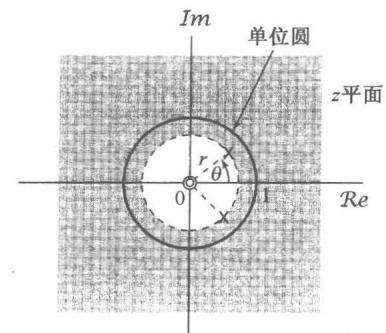

(a)

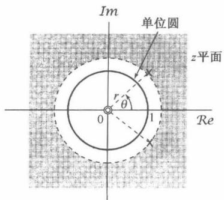

(b)

图10.16 具有复数极点的二阶系统的零-极点图。(a)  $r < 1$ ; (b)  $r > 1$

# 10.7.3 由线性常系数差分方程表征的线性时不变系统

对于由线性常系数差分方程表征的系统， $z$  变换的这些性质对于求得系统的系统函数、频率响应或时域响应等，都提供了一个特别方便的方法。现用一个例子来说明。

例10.25 考虑一个线性时不变系统，其输入  $x[n]$  和输出  $y[n]$  满足如下线性常系数差分方程：

$$
y [ n ] - \frac {1}{2} y [ n - 1 ] = x [ n ] + \frac {1}{3} x [ n - 1 ] \tag {10.102}
$$

在式(10.102)两边应用  $z$  变换，并利用10.5.1节的线性性质和10.5.2节的时移性质，可得

$$
Y (z) - \frac {1}{2} z ^ {- 1} Y (z) = X (z) + \frac {1}{3} z ^ {- 1} X (z)
$$

或者

$$
Y (z) = X (z) \left[ \frac {1 + \frac {1}{3} z ^ {- 1}}{1 - \frac {1}{2} z ^ {- 1}} \right] \tag {10.103}
$$

由式(10.96)可得

$$
H (z) = \frac {Y (z)}{X (z)} = \frac {1 + \frac {1}{3} z ^ {- 1}}{1 - \frac {1}{2} z ^ {- 1}} \tag {10.104}
$$

该式给出了  $H(z)$  的代数表示式，但没有收敛域。事实上有两种不同的单位脉冲响应都与式(10.102)这个差分方程相符，一个是右边的，另一个是左边的。相应地，式(10.104)就有两种不同的收敛域选择：一个是  $|z| > 1/2$  ，它是与  $h[n]$  为右边的假设有关的收敛域；另一个是  $|z| < 1/2$  ，它是与  $h[n]$  为左边的假设有关的收敛域。

首先考虑收敛域选为  $|z| > 1 / 2$  。将  $H(z)$  写成

$$
H (z) = \left(1 + \frac {1}{3} z ^ {- 1}\right) \frac {1}{1 - \frac {1}{2} z ^ {- 1}}
$$

利用表10.2中的变换对5，再结合线性和时移性质，就能求得相应的单位脉冲响应为

$$
h [ n ] = \left(\frac {1}{2}\right) ^ {n} u [ n ] + \frac {1}{3} \left(\frac {1}{2}\right) ^ {n - 1} u [ n - 1 ]
$$

对于另一种收敛域的选择，即  $|z| < 1 / 2$  ，可利用表10.2中的变换对6，再结合线性和时移性质，求得

$$
h [ n ] = - \left(\frac {1}{2}\right) ^ {n} u [ - n - 1 ] - \frac {1}{3} \left(\frac {1}{2}\right) ^ {n - 1} u [ - n ]
$$

这种情况下，该系统是反因果的  $(n > 0$  时  $h[n] = 0)$  ，并且是不稳定的。

对于一般的  $N$  阶差分方程，可以用类似于例10.25的方法进行，即对方程两边进行  $z$  变换，并利用线性和时移性质。现考虑一个线性时不变系统，其输入、输出满足如下线性常系数差分方程：

$$
\sum_ {k = 0} ^ {N} a _ {k} y [ n - k ] = \sum_ {k = 0} ^ {M} b _ {k} x [ n - k ] \tag {10.105}
$$

在式(10.105)两边取  $z$  变换，并利用线性和时移性质可得

$$
\sum_ {k = 0} ^ {N} a _ {k} z ^ {- k} Y (z) = \sum_ {k = 0} ^ {M} b _ {k} z ^ {- k} X (z)
$$

或者

$$
Y (z) \sum_ {k = 0} ^ {N} a _ {k} z ^ {- k} = X (z) \sum_ {k = 0} ^ {M} b _ {k} z ^ {- k}
$$

这样就有

$$
H (z) = \frac {Y (z)}{X (z)} = \frac {\sum_ {k = 0} ^ {M} b _ {k} z ^ {- k}}{\sum_ {k = 0} ^ {N} a _ {k} z ^ {- k}} \tag {10.106}
$$

特别要注意，一个满足线性常系数差分方程的系统，其系统函数总是有理的。另外，与前面所举的例子及与拉普拉斯变换有关讨论相一致的是，差分方程本身也没有提供关于与代数表示式  $H(z)$  有关的收敛域的信息。因此，诸如因果性、稳定性之类的附加限制，应该用来作为标定收敛域的条件。例如，如果知道系统是因果的，收敛域就一定位于最外层极点的外边；如果系统是稳定的，收敛域就一定包括单位圆。

# 10.7.4 系统特性与系统函数的关系举例

正如在前面几节所说明的，离散时间线性时不变系统的很多性质都能直接与系统函数及其特性有关。这一节将给出另外几个例子来表明  $z$  变换是如何用于系统分析的。

例10.26 假设关于一个线性时不变系统给出下列信息：

1. 若系统的输入是  $x_{1}[n] = (1 / 6)^{n}u[n]$ ，那么输出是

$$
y _ {1} [ n ] = \left[ a \left(\frac {1}{2}\right) ^ {n} + 1 0 \left(\frac {1}{3}\right) ^ {n} \right] u [ n ]
$$

其中  $\pmb{a}$  为实数。

2. 若  $x_{2}[n] = (-1)^{n}$ , 那么输出是  $y_{2}[n] = \frac{7}{4} (-1)^{n}$  。现在要说明, 从这两条信息中就能确定该系统的系统函数  $H(z)$ , 包括  $a$  的值, 同时也能立即推导出该系统的几个性质。

由第一条信息，所给出的这些信号的  $z$  变换是

$$
X _ {1} (z) = \frac {1}{1 - \frac {1}{6} z ^ {- 1}}, \quad | z | > \frac {1}{6} \tag {10.107}
$$

$$
\begin{array}{l} Y _ {1} (z) = \frac {a}{1 - \frac {1}{2} z ^ {- 1}} + \frac {1 0}{1 - \frac {1}{3} z ^ {- 1}} \\ = \frac {(a + 1 0) - (5 + \frac {a}{3}) z ^ {- 1}}{(1 - \frac {1}{2} z ^ {- 1}) (1 - \frac {1}{3} z ^ {- 1})}, \quad | z | > \frac {1}{2} \tag {10.108} \\ \end{array}
$$

由式(10.96)可得系统函数的代数表示式为

$$
H (z) = \frac {Y _ {1} (z)}{X _ {1} (z)} = \frac {[ (a + 1 0) - (5 + \frac {a}{3}) z ^ {- 1} ] [ 1 - \frac {1}{6} z ^ {- 1} ]}{(1 - \frac {1}{2} z ^ {- 1}) (1 - \frac {1}{3} z ^ {- 1})} \tag {10.109}
$$

此外，对于  $x_{2}[n] = (-1)^{n}$  的响应必须等于  $(-1)^{n}$  乘以系统函数  $H(z)$  在  $z = -1$  的值，因此根据第二条信息，有

$$
\frac {7}{4} = H (- 1) = \frac {\left[ (a + 1 0) + 5 + \frac {a}{3} \right] \left[ \frac {7}{6} \right]}{\left(\frac {3}{2}\right) \left(\frac {4}{3}\right)} \tag {10.110}
$$

解出式(10.110)，求得  $a = -9$  ，所以

$$
H (z) = \frac {\left(1 - 2 z ^ {- 1}\right) \left(1 - \frac {1}{6} z ^ {- 1}\right)}{\left(1 - \frac {1}{2} z ^ {- 1}\right) \left(1 - \frac {1}{3} z ^ {- 1}\right)} \tag {10.111}
$$

或者

$$
H (z) = \frac {1 - \frac {1 3}{6} z ^ {- 1} + \frac {1}{3} z ^ {- 2}}{1 - \frac {5}{6} z ^ {- 1} + \frac {1}{6} z ^ {- 2}} \tag {10.112}
$$

或者最后写为

$$
H (z) = \frac {z ^ {2} - \frac {1 3}{6} z + \frac {1}{3}}{z ^ {2} - \frac {5}{6} z + \frac {1}{6}} \tag {10.113}
$$

由卷积性质知道， $Y_{1}(z)$  的收敛域必须至少包括  $X_{1}(z)$  和  $H(z)$  的收敛域的相交部分，对  $H(z)$  检查一下三种可能的收敛域，即  $|z| < 1/3$ ， $1/3 < |z| < 1/2$  和  $|z| > 1/2$ ，可以发现，只有  $|z| > 1/2$  才能与  $X_{1}(z)$  和  $Y_{1}(z)$  的收敛域相符。

因为该系统的收敛域包括单位圆，系统是稳定的。此外，根据式(10.113)将  $H(z)$  表示成  $z$  的多项式之比，可见其分子的阶次不超过分母的阶次，由此可得该系统是因果的。同时利用式(10.112)和式(10.106)，可以写出在初始松弛条件下表征该系统的差分方程为

$$
y [ n ] - \frac {5}{6} y [ n - 1 ] + \frac {1}{6} y [ n - 2 ] = x [ n ] - \frac {1 3}{6} x [ n - 1 ] + \frac {1}{3} x [ n - 2 ]
$$

例10.27 已知一个单位脉冲响应为  $h[n]$ ，有理系统函数为  $H(z)$  的因果稳定系统，假设已经知道  $H(z)$  有一个极点在  $z = 1/2$ ，并在单位圆的某个地方有一个零点，其余极点和零点的真正数量和位置均不知道。试对下面每一种说法进行判断，能否肯定地说是对的，还是错的，或者由于条件不充分而难以置评：

(a)  $\mathcal{F}\{(1/2)^n h[n]\}$  收敛。

(b) 对某一  $\omega$  有  $H(e^{j\omega}) = 0$

(c)  $h[n]$  为有限长。

(d)  $h[n]$  是实序列。

(e)  $g[n] = n[h[n]*h[n]]$  是一个稳定系统的单位脉冲响应。

(a) 是对的。因为  $\mathcal{F}\{(1/2)^n h[n]\}$  相应于  $h[n]$  的  $z$  变换在  $z = 2$  的值，因此它的收敛就等于点  $z = 2$  在收敛域内。因为该系统是稳定和因果的， $H(z)$  的全部极点都必须位于单位圆内，因此收敛域就应该包括所有位于单位圆外的点，当然也包括  $z = 2$ 。

(b) 是对的，因为有一个零点在单位圆上。

(c) 是错的, 因为有限长序列的收敛域必须包括整个  $z$  平面, 可能除去  $z = 0$  和/或  $z = \infty$ , 而这是与在  $z = 1 / 2$  有一个极点相矛盾的。

(d) 这个说法要求  $H(z) = H^{*}(z^{*})$  ，这就意味着，若在一个非实数的地方  $z = z_{0}$  有一个极点（或零点），那么就必定在  $z = z_{0}^{*}$  还有一个极点(或零点)。所给出的信息太少，而不足以证实该说法是否属实。

(e) 是对的。因为系统是因果的， $n < 0$  时  $h[n] = 0$ ，因此  $n < 0$  时  $h[n] * h[n] = 0$ ，也就是说以  $h[n] * h[n]$  作为单位脉冲响应的系统是因果的，那么同一结论对于  $g[n] = n[h[n] * h[n]]$  也是对的。此外，由10.5.7节的卷积性质可知，对应于单位脉冲响应  $h[n] * h[n]$  的系统函数是  $H^{2}(z)$ ，再由10.5.8节的微分性质可知，对应于  $g[n]$  的系统函数就是

$$
G (z) = - z \frac {\mathrm {d}}{\mathrm {d} z} H ^ {2} (z) = - 2 z H (z) \left[ \frac {\mathrm {d}}{\mathrm {d} z} H (z) \right] \tag {10.114}
$$

由式(10.114)可以得出， $G(z)$  的极点与  $H(z)$  的极点有相同的位置，可能的例外是原点。因此，因为  $H(z)$  的全部极点在单位圆内，所以  $G(z)$  也必须是这样， $g[n]$  就是一个因果稳定系统的单位脉冲响应。

# 10.8 系统函数的代数属性与方框图表示

和连续时间的拉普拉斯变换一样，离散时间中的  $z$  变换也能将时域中诸如卷积和时移等运算用代数运算来代替。这一点已经在10.7.3节中应用过了，在那里将一个线性时不变系统的差分方程描述用一个代数方程描述来代替。将系统描述转换到代数方程的  $z$  变换的这种作用在分析线性时不变系统的互联，以及用基本系统的构造单元的互联来综合出其他系统时也是很有帮助的。

# 10.8.1 线性时不变系统互联的系统函数

对于分析像级联、并联和反馈互联这些离散时间方框图的系统函数方面的代数问题，与9.8.1节对应的连续时间系统是完全一样的。例如，两个离散时间线性时不变系统级联后的系统函数是各自系统函数的乘积。同时，考虑图10.17所示的两个系统的反馈互联问题，也是要确定整个系统的差分方程或单位脉冲响应这样一些在时域中的关系。然而，由于系统和序列都是

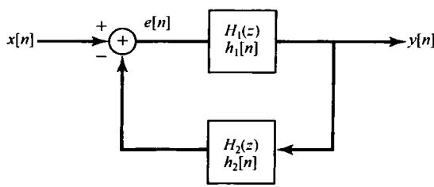

图10.17 两个系统的反馈互联

用它们的  $z$  变换来表示的，分析中仅涉及代数方程。对于图10.17互联系统的具体方程，完全可采用与式(9.159)到式(9.163)相并行的步骤，得出该反馈互联后总的系统函数为

$$
\frac {Y (z)}{X (z)} = H (z) = \frac {H _ {1} (z)}{1 + H _ {1} (z) H _ {2} (z)} \tag {10.115}
$$

# 10.8.2 由差分方程和有理系统函数描述的因果线性时不变系统的方框图表示

与9.8.2节一样，可以用三种基本运算，即相加、乘以系数和单位延时的方框图来表示由差分方程描述的因果线性时不变系统。2.4.3节曾对一阶差分方程描述过这样的方框图。现在首先

再回到那个例子，这次是用系统函数的代数属性，然后再考虑其他稍许复杂一些的例子来说明构成方框图表示中的一些基本概念。

例10.28 考虑一个因果线性时不变系统，其系统函数为

$$
H (z) = \frac {1}{1 - \frac {1}{4} z ^ {- 1}} \tag {10.116}
$$

利用10.7.3节的结果，可求得该系统的差分方程为

$$
y [ n ] - \frac {1}{4} y [ n - 1 ] = x [ n ]
$$

具有初始松弛条件。2.4.3节曾对这种形式的一阶系统构造出一种方框图表示，图10.18(a)示出一种等效的方框图表示（相应于图2.28中的  $a = -1 / 4$  和  $b = 1$ ），其中  $z^{-1}$  是单位延时的系统函数。也就是说，由时移性质，这个系统的输入和输出是由

$$
w [ n ] = y [ n - 1 ]
$$

所表示的。图10.18(a)的方框图中包括一个反馈回路，它很像上一节中考虑的系统并画在图10.17中。事实上稍加变化就能得到图10.18(b)所示的等效方框图，这就与图10.17所示的完全一样了，其中  $H_{1}(z) = 1$  且  $H_{2}(z) = (-1 / 4)z^{-1}$  。应用式(10.115)就能证实图10.18的系统函数是由式(10.116)给出的。

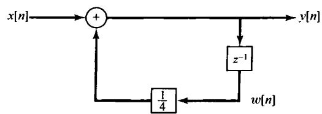

(a)

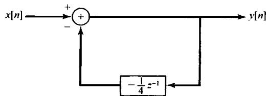

(b)

图10.18 (a) 例10.28的因果线性时不变系统的方框图表示；(b)等效方框图表示

例10.29 假设现在考虑一个因果线性时不变系统，其系统函数为

$$
H (z) = \frac {1 - 2 z ^ {- 1}}{1 - \frac {1}{4} z ^ {- 1}} = \left(\frac {1}{1 - \frac {1}{4} z ^ {- 1}}\right) (1 - 2 z ^ {- 1}) \tag {10.117}
$$

按式(10.117)所建议的，可以将系统看成系统函数为  $1 / [1 - (1 / 4)z^{-1}]$  和另一系统函数为  $(1 - 2z^{-1})$  的系统级联。在图10.19(a)中指出了这种级联实现，图中已经用了图10.18(a)的方框图来表示  $1 / [1 - (1 / 4)z^{-1}]$ ，并且用一个单位延时、一个加法器和一个系数相乘器来表示  $(1 - 2z^{-1})$  。根据时移性质，系统函数为  $(1 - 2z^{-1})$  的系统，其输入  $v[n]$  和输出  $y[n]$  是由下列差分方程相联系的：

$$
y [ n ] = v [ n ] - 2 v [ n - 1 ]
$$

尽管图10.19(a)的方框图确实是式(10.117)所示系统的一个正确表示，但是这个方框图不够经济。为了看出这一点，注意图10.19(a)中这两个单位延时单元的输入都是  $v[n]$ ，因此它们的输出都是相同的，即

$$
w [ n ] = s [ n ] = v [ n - 1 ]
$$

这样就没必要保留两个延时单元，只需用它们中的一个为两个系数相乘器提供输入信号。这个结果就是图10.19(b)的方框图表示。因为每个单位延时单元都要求一个存储寄存器来保留它的输入中的前一个值，所以图10.19(b)比图10.19(a)的表示需要用较少的存储器。

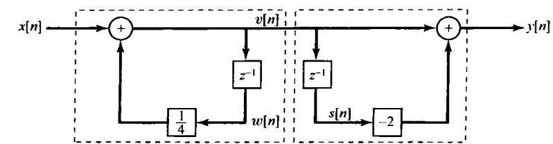

(a)

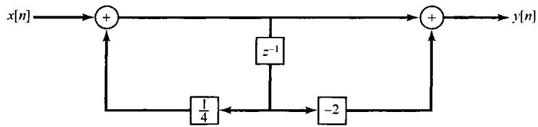

(b)

图10.19（a）例10.29所示系统的方框图表示；（b）只用一个单位延时单元的等效方框图表示

例10.30 有一个二阶系统函数为

$$
H (z) = \frac {1}{\left(1 + \frac {1}{2} z ^ {- 1}\right) \left(1 - \frac {1}{4} z ^ {- 1}\right)} = \frac {1}{1 + \frac {1}{4} z ^ {- 1} - \frac {1}{8} z ^ {- 2}} \tag {10.118}
$$

它的差分方程为

$$
y [ n ] + \frac {1}{4} y [ n - 1 ] - \frac {1}{8} y [ n - 2 ] = x [ n ] \tag {10.119}
$$

利用和例10.28相同的思路，可得该系统的方框图表示如图10.20(a)所示。因为在图中系统函数为  $z^{-1}$  的两个方框都是单位延时，因此有

$$
f [ n ] = y [ n - 1 ]
$$

$$
e [ n ] = f [ n - 1 ] = y [ n - 2 ]
$$

这样式(10.119)可重写成

$$
y [ n ] = - \frac {1}{4} y [ n - 1 ] + \frac {1}{8} y [ n - 2 ] + x [ n ]
$$

或者

$$
y [ n ] = - \frac {1}{4} f [ n ] + \frac {1}{8} e [ n ] + x [ n ]
$$

这就和图中的表示完全一样了。

图10.20(a)的方框图一般称为直接型表示，因为出现在方框图中的系数可以直接根据出现在差分方程或系统函数中的系数来确定。另外，与连续时间系统一样，对系统函数略作代数运算，就能得到级联型方框图和并联型方框图。具体而言就是将式(10.118)重写成

$$
H (z) = \left(\frac {1}{1 + \frac {1}{2} z ^ {- 1}}\right) \left(\frac {1}{1 - \frac {1}{4} z ^ {- 1}}\right) \tag {10.120}
$$

该式的级联型表示如图10.20(b)所示，图中系统是用式(10.120)中代表两个因式的系统级联来表示的。

同样，将式(10.118)进行部分分式展开，可得

$$
H (z) = \frac {\frac {2}{3}}{1 + \frac {1}{2} z ^ {- 1}} + \frac {\frac {1}{3}}{1 - \frac {1}{4} z ^ {- 1}}
$$

这样就得到了图10.20(c)的并联型表示。

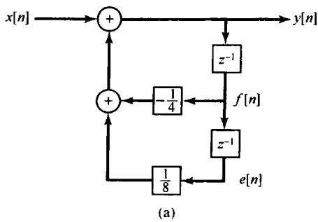

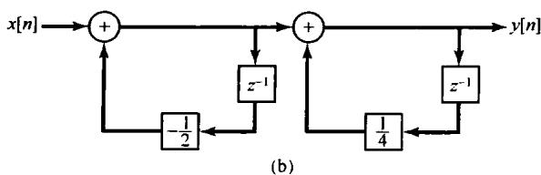

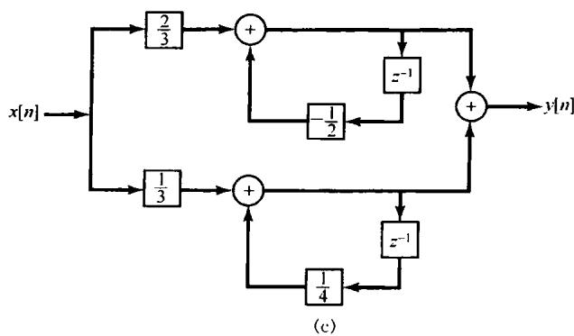

图10.20 例10.30的系统方框图表示。（a）直接型；（b）级联型；（c）并联型

例10.31 最后，考虑的系统函数为

$$
H (z) = \frac {1 - \frac {7}{4} z ^ {- 1} - \frac {1}{2} z ^ {- 2}}{1 + \frac {1}{4} z ^ {- 1} - \frac {1}{8} z ^ {- 2}} \tag {10.121}
$$

将它写成

$$
H (z) = \left(\frac {1}{1 + \frac {1}{4} z ^ {- 1} - \frac {1}{8} z ^ {- 2}}\right) \left(1 - \frac {7}{4} z ^ {- 1} - \frac {1}{2} z ^ {- 2}\right) \tag {10.122}
$$

该式就代表了用图10.20(a)的系统与系统函数为  $\left(1 - \frac{7}{4} z^{-1} - \frac{1}{2} z^{-2}\right)$  的系统的级联表示。然而，与例10.29一样，为实现在式(10.122)第一项所需的这些单位延时单元，也产生了在计算第二个系统输出时所要求的延时信号，这个结果就是图10.21所示的直接型方框图，有关它的一些构成细节将在习题10.38中讨论。在直接型表示中的这些系数可以直接由式(10.121)的系统函数中的系数来确定。

$H(z)$  也能写成如下形式：

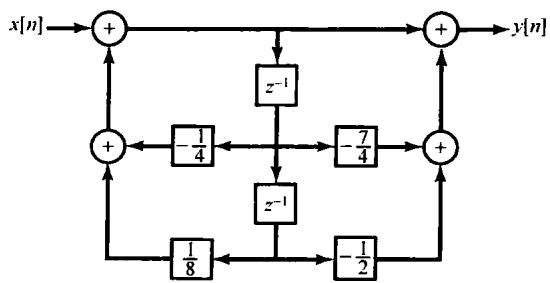

图10.21 例10.31系统的直接型表示

$$
H (z) = \left(\frac {1 + \frac {1}{4} z ^ {- 1}}{1 + \frac {1}{2} z ^ {- 1}}\right) \left(\frac {1 - 2 z ^ {- 1}}{1 - \frac {1}{4} z ^ {- 1}}\right) \tag {10.123}
$$

和

$$
H (z) = 4 + \frac {5 / 3}{1 + \frac {1}{2} z ^ {- 1}} - \frac {1 4 / 3}{1 - \frac {1}{4} z ^ {- 1}} \tag {10.124}
$$

由式(10.123)可以想到一种级联型表示，而式(10.124)可以导致一种并联型表示，这些都将在习题10.38中考虑。

在前面几个例子中用到的有关构造方框图表示的一些概念，都能够直接用到高阶系统中，在习题10.39中将考虑几个例子。与连续时间情况相同，在具体进行时一般都有很大的灵活性。例如，在式(10.123)的乘积表示中，分子和分母的因式如何配对；对每一个因式以什么方式来实现；以及这些因式的级联次序等都有很大的选择余地。尽管所有这些变化都会导致同一个系统表示，但实际上这些不同方框图的性能还是有差别的。具体而言，一个系统的每一种方框图表示，对于系统实现来说都能直接转换为一个计算机算法，然而由于计算机的有限字长，要对方框图中的这些系数进行量化，又由于在算法运算过程中会有数值上的舍入，因此每一种方框图表示所引进的算法仅仅是对原系统特性的一种近似。然而，每种近似中的误差或多或少是不同的。由于这些差别，借助于对量化效应的准确度和灵敏度，以对各种不同的方框图表示进行相对的评价，在这一方面已经做了极大的努力。有关这一专题的讨论，读者可查阅书末参考文献中有关数字信号处理方面的参考书。

# 10.9 单边  $z$  变换

到目前为止，本章所考虑的  $z$  变换一般都称为双边  $z$  变换（bilateral  $z$ -transform）。与拉普拉斯变换一样，也有另一种形式称为单边  $z$  变换（unilateral  $z$ -transform）。单边  $z$  变换在分析由线性常系数差分方程描述的具有初始条件（即系统不是初始松弛的）的因果系统时特别有用。这一节将采用与9.9节讨论单边拉普拉斯变换相同的方式来讨论单边  $z$  变换，并说明它的有关性质和应用。

一个序列  $x[n]$  的单边  $\pmb{z}$  变换定义为

$$
\mathcal {X} (z) = \sum_ {n = 0} ^ {\infty} x [ n ] z ^ {- n} \tag {10.125}
$$

与前一章相同，对于一个信号和它的单边  $z$  变换采用一种方便的简化符号记为

$$
x [ n ] \stackrel {{\mathcal {U Z}}} {{\longleftrightarrow}} \mathcal {X} (z) = \mathcal {U Z} \{x [ n ] \} \tag {10.126}
$$

单边  $z$  变换与双边变换的差别在于，求和仅在  $n$  的非负值上进行，而不考虑  $n < 0$  时  $x[n]$  是否为零。因此， $x[n]$  的单边  $z$  变换就能看成  $x[n]u[n]$ （即  $x[n]$  乘以单位阶跃）的双边变换。特别是，若任何序列在  $n < 0$  时本身就为零，那么该序列的单边和双边  $z$  变换就是一致的。根据10.2节有关收敛域的讨论也可看到，因为  $x[n]u[n]$  总是一个右边序列， $\mathcal{X}(z)$  的收敛域就总是位于某个圆的外边。

由于双边和单边  $z$  变换之间的紧密联系，因此单边变换的计算和双边变换的也相差不多，但是要考虑到在变换求和中的极限是对  $n \geqslant 0$  进行的。同理，单边  $z$  逆变换的计算也基本上与双边变换相同，但是要考虑到对单边变换而言，其收敛域总是位于某个圆的外边。

# 10.9.1 单边  $z$  变换和单边  $z$  逆变换举例

例10.32 设信号  $x[n]$  为

$$
x [ n ] = a ^ {n} u [ n ] \tag {10.127}
$$

因为  $n < 0$  时  $x[n] = 0$  ，所以该例的单边和双边变换相等，为

$$
\chi (z) = \frac {1}{1 - a z ^ {- 1}}, \quad | z | > | a | \tag {10.128}
$$

例10.33 设  $x[n]$  为

$$
x [ n ] = a ^ {n + 1} u [ n + 1 ] \tag {10.129}
$$

这种情况下，单边和双边  $z$  变换并不相等，因为  $x[-1] = 1 \neq 0$ 。它的双边变换由例10.1和10.5.2节中的时移性质可求得为

$$
X (z) = \frac {z}{1 - a z ^ {- 1}}, \quad | z | > | a | \tag {10.130}
$$

与此对比，它的单边  $z$  变换为

$$
\mathcal {X} (z) = \sum_ {n = 0} ^ {\infty} x [ n ] z ^ {- n} = \sum_ {n = 0} ^ {\infty} a ^ {n + 1} z ^ {- n}
$$

或者

$$
\chi (z) = \frac {a}{1 - a z ^ {- 1}}, \quad | z | > | a | \tag {10.131}
$$

例10.34 考虑如下单边  $z$  变换  $\mathcal{X}(z)$

$$
\mathcal {X} (z) = \frac {3 - \frac {5}{6} z ^ {- 1}}{\left(1 - \frac {1}{4} z ^ {- 1}\right) \left(1 - \frac {1}{3} z ^ {- 1}\right)} \tag {10.132}
$$

在例10.9中，曾对几个不同的收敛域，讨论过与式(10.132)相同的双边  $z$  变换  $X(z)$  的逆变换问题。在单边变换的情况下，收敛域必须位于半径等于  $\chi (z)$  极点最大模值的圆的外边，该例就是 $|z| > 1 / 3$  ，然后就与例10.9完全一样地求单边逆变换，得到

$$
x [ n ] = \left(\frac {1}{4}\right) ^ {n} u [ n ] + 2 \left(\frac {1}{3}\right) ^ {n} u [ n ], \quad n \geqslant 0 \tag {10.133}
$$

在式(10.133)中已经强调了这样一点，即单边  $z$  逆变换所给出的仅为  $n \geqslant 0$  时  $x[n]$  的有关情况。

10.3节所介绍的求逆变换的另一种方法，即通过  $z$  变换的幂级数展开式的系数来求逆变换的方法，也能够用于单边变换的情况。不过，在单边情况下必须满足的一种限制是，根据式(10.125)的定义，变换的幂级数展开式中不能包括  $z$  的正幂次项。例如，在例10.13中对如下双边变换：

$$
X (z) = \frac {1}{1 - a z ^ {- 1}} \tag {10.134}
$$

进行长除可有两种方式，分别对应于  $X(z)$  的两种可能的收敛域。其中只有一种，即对应于  $|z| > |a|$  的收敛域，才会有一个无  $z$  的正幂次项的级数展开式，即

$$
\frac {1}{1 - a z ^ {- 1}} = 1 + a z ^ {- 1} + a ^ {2} z ^ {- 2} + \dots \tag {10.135}
$$

而这个才是式(10.134)的展开代表一个单边变换的唯一选择。

应该注意， $\mathcal{X}(z)$  的幂级数展开式中没有  $z$  的正幂次项的要求，意味着不是每一个  $z$  函数都能是一个单边  $z$  变换。特别是，若考虑将  $z$  的一个有理函数写成以  $z$  （而不是以  $z^{-1}$  )的多项式之比，即

$$
\frac {p (z)}{q (z)} \tag {10.136}
$$

那么，这个  $z$  的有理函数若能成为一个单边变换（适当地选择收敛域为某一个圆的外边），其分子的阶次必须不能高于分母的阶次。

例10.35 说明前面结论的一个简单例子是由式(10.130)给出的有理函数，现在将它写成  $z$  的多项式之比为

$$
\frac {z ^ {2}}{z - a} \tag {10.137}
$$

有两种可能的双边变换都与这个函数有关，即它们对应于两种可能的收敛域，  $|z| < |a|$  和  $|z| > |a|$  。选择  $|z| > |a|$  就对应于一个右边序列，但它不是一个对所有  $n < 0$  都为零的序列，因为它的逆变换由式(10.129)给出，对于  $n = -1$  ，它并不为零。

更一般地说，若将式(10.136)与一个其收敛域位于半径为  $q(z)$  的根的最大模值的圆的外边的双边  $z$  变换相联系，那么其逆变换肯定是右边的；然而，要使它对所有  $n < 0$  都为零，就必须也有  $p(z)$  的阶次小于或等于  $q(z)$  的阶次。

# 10.9.2 单边  $z$  变换性质

单边  $z$  变换有许多重要性质，其中有一些与双边变换对应的性质相同，而另有几个明显不同。表10.3综合列出了这些性质。在表中可以注意到，并没有包括这么一列，明确指出每一信号的单边  $z$  变换的收敛域。这是因为任何单边  $z$  变换的收敛域总是位于某个圆的外边，例如一个有理单边  $z$  变换的收敛域总是位于最外层极点的外边。

表 10.3 单边  $z$  变换性质

<table><tr><td>性质</td><td>信号</td><td>单边Z变换</td></tr><tr><td>-</td><td>x[n]</td><td>X(z)</td></tr><tr><td>-</td><td>x1[n]</td><td>X1(z)</td></tr><tr><td>-</td><td>x2[n]</td><td>X2(z)</td></tr><tr><td>线性</td><td>ax1[n] + bx2[n]</td><td>aX1(z) + bX2(z)</td></tr><tr><td>时延</td><td>x[n-1]</td><td>z-1X(z) + x[-1]</td></tr><tr><td>时间超前</td><td>x[n+1]</td><td>zx(z) - zx[0]</td></tr><tr><td rowspan="3">z域尺度变换</td><td>e^jω0n x[n]</td><td>X(e^-jω0z)</td></tr><tr><td>z0nx[n]</td><td>X(z/z0)</td></tr><tr><td>anx[n]</td><td>X(a^-1z)</td></tr><tr><td>时间扩展</td><td>x_k[n] = {x[m], n=mk/0, n≠mk, 对任意m}</td><td>X(z^k)</td></tr><tr><td>共轭</td><td>x*[n]</td><td>X*(z*)</td></tr><tr><td>卷积(假设n&lt;0时x1[n]和x2[n]均为零)</td><td>x1[n] * x2[n]</td><td>X1(z)X2(z)</td></tr><tr><td>一次差分</td><td>x(n) - x[n-1]</td><td>(1-z^-1)X(z) - x[-1]</td></tr><tr><td>累加</td><td>∑_{k=0}^{n} x[k]</td><td>1/(1-z^-1)X(z)</td></tr><tr><td>z域微分</td><td>nx[n]</td><td>-z dX(z)/dz</td></tr><tr><td colspan="3">初值定理
x[0] = lim X(z)</td></tr></table>

将这个表与双边  $z$  变换对应的表10.1进行对比，就会对单边变换的性质有更深入的理解。特别是有几个性质，即线性、 $z$  域尺度变换、时间扩展、共轭和  $z$  域微分等与它们的双边变换相应的性质都是一样的。至于10.5.9节所提到的初值定理，这本来就是一个单边变换的性质，因为它要求  $n < 0$  时  $x[n] = 0$  。有一个双边变换的性质，即10.5.4节得出的时间反转性质，很明显地在单边变换情况下找不到对应的性质，而其余这些性质在双边和单边变换之间有一些重要的差异。

首先来考察在卷积性质上的差别。表10.3表明，对于全部  $n < 0$  ，若  $x_{1}[n] = x_{2}[n] = 0$  ，则有

$$
x _ {1} [ n ] * x _ {2} [ n ] \stackrel {u z} {\longleftrightarrow} \mathcal {X} _ {1} (z) \mathcal {X} _ {2} (z) \tag {10.138}
$$

因为在这种情况下，对这两个信号的双边和单边变换都是相同的，所以式(10.138)由双边变换的卷积性质就能得出。因此，只要考虑的是因果线性时不变系统（这时，系统函数既是单位脉冲响应的双边  $z$  变换，又是它的单边  $z$  变换），其输入对  $n < 0$  均为零，那么在这一章所建立并应用的系统分析和系统函数的代数属性，都能毫无变化地应用到单边变换中。这种应用的一个例子是表10.3中的累加或求和性质。若  $n < 0$  时  $x[n] = 0$  ，那么

$$
\sum_ {k = 0} ^ {n} x [ k ] = x [ n ] * u [ n ] \xleftrightarrow {\mathcal {U Z}} \mathcal {X} (z) \mathcal {U} (z) = \mathcal {X} (z) \frac {1}{1 - z ^ {- 1}} \tag {10.139}
$$

作为第二个例子，考虑下面这个例子。

例10.36 考虑由下列差分方程描述的因果线性时不变系统：

$$
y [ n ] + 3 y [ n - 1 ] = x [ n ] \tag {10.140}
$$

结合初始松弛条件，其系统函数为

$$
\mathcal {H} (z) = \frac {1}{1 + 3 z ^ {- 1}} \tag {10.141}
$$

假定系统的输入是  $x[n] = \alpha u[n]$ ，这是  $\alpha$  是某个给定的常数。这时，系统输出  $y[n]$  的单边（和双边） $z$  变换是

$$
\mathcal {Y} (z) = \mathcal {H} (z) \mathcal {X} (z) = \frac {\alpha}{(1 + 3 z ^ {- 1}) (1 - z ^ {- 1})} = \frac {(3 / 4) \alpha}{1 + 3 z ^ {- 1}} + \frac {(1 / 4) \alpha}{1 - z ^ {- 1}} \tag {10.142}
$$

将例10.32用于式(10.142)中的每一项可得

$$
y [ n ] = \alpha \left[ \frac {1}{4} + \left(\frac {3}{4}\right) (- 3) ^ {n} \right] u [ n ] \tag {10.143}
$$

这里值得注意的一点是，单边  $z$  变换的卷积性质仅适用于式(10.138)中信号  $x_{1}[n]$  和  $x_{2}[n]$  在  $n < 0$  时全都为零的情况。尽管对双边变换来讲这点一般都是对的，即  $x_{1}[n] * x_{2}[n]$  的双边变换等于  $x_{1}[n]$  和  $x_{2}[n]$  的双边变换的乘积，但如果  $x_{1}[n]$  或  $x_{2}[n]$  中有一个在  $n < 0$  时不为零，那么  $x_{1}[n] * x_{2}[n]$  的单边变换并不等于  $x_{1}[n]$  和  $x_{2}[n]$  的单边变换的乘积。这一点将在习题10.41中进一步讨论。

单边  $z$  变换最重要的应用是分析因果系统，特别是由线性常系统差分方程描述的，可能具有非零初始条件的因果系统。在10.7节中曾看到，双边变换(特别是双边  $z$  变换中的时移性质)是如何用来分析和计算假定初始松弛条件下，由这样的差分方程表征的线性时不变系统的求解的。现在要看到，单边变换中的时移性质（不同于双边变换的时移性质）对具有初始条件的系统也起着类似的作用。

为了建立单边变换的时移性质，考虑下列信号：

$$
y [ n ] = x [ n - 1 ] \tag {10.144}
$$

那么

$$
\begin{array}{l} y (z) = \sum_ {n = 0} ^ {\infty} x [ n - 1 ] z ^ {- n} \\ = x [ - 1 ] + \sum_ {n = 1} ^ {\infty} x [ n - 1 ] z ^ {- n} \\ = x [ - 1 ] + \sum_ {n = 0} ^ {\infty} x [ n ] z ^ {- (n + 1)} \\ \end{array}
$$

或者

$$
y (z) = x [ - 1 ] + z ^ {- 1} \sum_ {n = 0} ^ {\infty} x [ n ] z ^ {- n} \tag {10.145}
$$

这样有

$$
\mathcal {Y} (z) = x [ - 1 ] + z ^ {- 1} \mathcal {X} (z) \tag {10.146}
$$

重复应用式(10.146)，

$$
w [ n ] = y [ n - 1 ] = x [ n - 2 ] \tag {10.147}
$$

的单边变换就是

$$
\mathcal {W} (z) = x [ - 2 ] + x [ - 1 ] z ^ {- 1} + z ^ {- 2} \mathcal {X} (z) \tag {10.148}
$$

继续这个迭代过程，就能确定对任意正整数  $m$  的  $x[n - m]$  的单边  $\pmb{z}$  变换。

式(10.146)有时称为时延性质，因为在式(10.144)中的  $y[n]$  就是延迟了的  $x[n]$  。单边变换也有一个时间超前的性质，它将超前了的  $x[n]$  的变换与  $\mathcal{X}(z)$  联系起来，这就如习题10.60所指出的：

$$
x [ n + 1 ] \stackrel {\mathcal {U Z}} {\longleftrightarrow} z \mathcal {X} (z) - z x [ 0 ] \tag {10.149}
$$

# 10.9.3 利用单边  $z$  变换求解差分方程

下面的例子说明利用单边  $z$  变换和时延性质来解具有非零初始条件的线性常系数差分方程。

例10.37再次考虑式(10.140)的差分方程，其输入  $x[n] = \alpha u[n]$  ，初始条件为

$$
y [ - 1 ] = \beta \tag {10.150}
$$

在式(10.140)两边进行单边  $z$  变换，并利用线性和时延性质可得

$$
y (z) + 3 \beta + 3 z ^ {- 1} y (z) = \frac {\alpha}{1 - z ^ {- 1}} \tag {10.151}
$$

对  $y(z)$  求解得

$$
y (z) = - \frac {3 \beta}{1 + 3 z ^ {- 1}} + \frac {\alpha}{(1 + 3 z ^ {- 1}) (1 - z ^ {- 1})} \tag {10.152}
$$

对照例10.36，特别是式(10.142)可见，式(10.152)右边的第二项等于当式(10.150)的初始条件为零  $(\beta = 0)$  时系统响应的单边  $z$  变换；也就是说，这一项代表由式(10.140)描述的因果线性时不变系统在初始松弛条件下的响应。与连续时间情况相同，这个响应往往称为零状态响应，即当初始条件或初始状态为零时的响应。

式(10.152)右边第一项可看成零输入响应的单边  $z$  变换，即输入为零  $(\alpha = 0)$  时系统的响应。零输入响应是初始条件  $\beta$  值的线性函数。此外，式(10.152)表明，一个具有非零初始状态的线性常系数差分方程的解是零状态响应和零输入响应的叠加。将初始条件置于零得到的零状态响应，就对应于由该差分方程定义的因果线性时不变系统在初始松弛条件下的响应。零输入响应是在输入为零的条件下，单独对初始条件的响应。习题10.20和习题10.42还给出了其他几个例子来说明单边  $z$  变换在解非零初始条件下差分方程方面的应用。

最后，对于任意  $\alpha$  和  $\beta$  值，都能将式(10.152)中的  $y(z)$  展开成部分分式，然后求逆变换而得到  $y[n]$  。例如，若  $\alpha = 8$  且  $\beta = 1$  ，则

$$
y (z) = \frac {3}{1 + 3 z ^ {- 1}} + \frac {2}{1 - z ^ {- 1}} \tag {10.153}
$$

为上式中每一项应用例10.32的单边变换对，得

$$
y [ n ] = [ 3 (- 3) ^ {n} + 2 ] u [ n ], \quad n \geqslant 0 \tag {10.154}
$$

# 10.10 小结

这一章讨论了离散时间信号与系统的  $z$  变换。整个讨论都是和连续时间信号的拉普拉斯变换紧密并行的，但在讨论过程中给出了它们之间某些重要的不同。例如，拉普拉斯变换在  $s$  平面内演变为虚轴  $\mathrm{j}\omega$  上的傅里叶变换，而  $z$  变换则在  $z$  平面的单位圆上成为傅里叶变换；对拉普拉斯变换来说，收敛域由一条带状，或该带状在一个方向上延伸到无限远的半平面所组成，而  $z$  变换的收敛域则由一个圆环，或者圆环向外延伸到无限远，或向内延伸到原点所组成。与拉普拉斯变换一样，一个序列的时域特性，诸如右边序列、左边序列和双边序列等，以及一个线性时不变系统的因果性或稳定性等，都能与收敛域的性质联系起来。尤其是对有理  $z$  变换来说，这些时域特性都能与相对于收敛域的极点位置联系起来。

由于  $z$  变换的性质，线性时不变系统，其中包括由线性常系数差分方程所描述的系统，都能够凭借代数运算在变换域进行分析。系统函数的代数属性对于线性时不变系统互联的分析，以及对于由差分方程描述的线性时不变系统构造方框图的表示，都是很有用的工具。

本章大部分关注的都是双边  $z$  变换。然而，与拉普拉斯变换一样，我们也介绍了  $z$  变换的第二种形式，称为单边  $z$  变换。单边  $z$  变换可以看成一个信号在  $n < 0$  时置为零的该信号的双边  $z$  变换，单边  $z$  变换在分析非零初始条件下，由线性常系数差分方程描述的系统时是特别有用的。

# 习题

习题的第一部分属于基本题，答案由书末给出，余下的三部分题分别属于基本题、深入题和扩充题。

# 基本题（附答案）

10.1 试对下列和式，为保证收敛确定在  $r = |z|$  上的限制：

(a)  $\sum_{n = -1}^{\infty}\left(\frac{1}{2}\right)^{n + 1}z^{-n}$

(b)  $\sum_{n=1}^{\infty}\left(\frac{1}{2}\right)^{-n+1}z^{n}$

(c)  $\sum_{n=0}^{\infty}\left\{\frac{1 + (-1)^n}{2}\right\}z^{-n}$

(d)  $\sum_{n = -\infty}^{\infty}\left(\frac{1}{2}\right)^{|n|}\cos \left(\frac{\pi}{4} n\right)z^{-n}$

10.2 设信号  $x[n]$  为

$$
x [ n ] = \left(\frac {1}{5}\right) ^ {n} u [ n - 3 ]
$$

利用式(10.3)求该信号的  $z$  变换，并标出对应的收敛域。

10.3 设信号  $x[n]$  为

$$
x [ n ] = (- 1) ^ {n} u [ n ] + \alpha^ {n} u [ - n - n _ {0} ]
$$

已知它的  $z$  变换  $X(z)$  的收敛域是

$$
1 <   | z | <   2
$$

试确定在复数  $\alpha$  和整数  $n_0$  上的限制。

10.4 考虑下面信号：

$$
x [ n ] = \left\{ \begin{array}{l l} (\frac {1}{3}) ^ {n} \cos (\frac {\pi}{4} n), & \quad n \leqslant 0 \\ 0, & \quad n > 0 \end{array} \right.
$$

对  $X(z)$  确定它的极点和收敛域。

10.5 对下列信号  $z$  变换的每个代数表示式，确定在有限  $z$  平面内的零点个数和在无限远点的零点个数。

(a)  $\frac{z^{-1}\left(1 - \frac{1}{2}z^{-1}\right)}{\left(1 - \frac{1}{3}z^{-1}\right)\left(1 - \frac{1}{4}z^{-1}\right)}$

(b)  $\frac{(1 - z^{-1})(1 - 2z^{-1})}{(1 - 3z^{-1})(1 - 4z^{-1})}$

（c）  $\frac{z^{-2}(1 - z^{-1})}{\left(1 - \frac{1}{4}z^{-1}\right)\left(1 + \frac{1}{4}z^{-1}\right)}$

10.6 设  $x[n]$  是一个绝对可和的信号，其有理  $z$  变换为  $X(z)$  。若已知  $X(z)$  在  $z = 1 / 2$  有一个极点， $x[n]$  能够是（a）有限长信号吗？（b）左边信号吗？（c）右边信号吗？（d）双边信号吗？

10.7 假设  $x[n]$  的  $\pmb{z}$  变换代数表示式是

$$
X (z) = \frac {1 - \frac {1}{4} z ^ {- 2}}{(1 + \frac {1}{4} z ^ {- 2}) (1 + \frac {5}{4} z ^ {- 1} + \frac {3}{8} z ^ {- 2})}
$$

$X(z)$  可能有多少不同的收敛域？

10.8 设  $x[n]$  的有理  $z$  变换  $X(z)$  有一个极点在  $z = 1 / 2$  ，已知

$$
x _ {1} [ n ] = \left(\frac {1}{4}\right) ^ {n} x [ n ]
$$

是绝对可和的，而

$$
x _ {2} [ n ] = \left(\frac {1}{8}\right) ^ {n} x [ n ]
$$

不是绝对可和的。试确定  $x[n]$  是否是左边的、右边的或双边的。

10.9 已知

$$
a ^ {n} u [ n ] \xleftrightarrow {z} \frac {1}{1 - a z ^ {- 1}}, | z | > | a |
$$

利用部分分式展开求下面  $X(z)$

$$
X (z) = \frac {1 - \frac {1}{3} z ^ {- 1}}{(1 - z ^ {- 1}) (1 + 2 z ^ {- 1})}, | z | > 2
$$

的逆变换。

10.10 有一个信号  $x[n]$  的  $z$  变换的代数表示式为

$$
X (z) = \frac {1 + z ^ {- 1}}{1 + \frac {1}{3} z ^ {- 1}}
$$

(a) 假定收敛域是  $|z| > 1/3$ ，利用长除法求  $x[0]$ ， $x[1]$  和  $x[2]$  的值。

(b) 假定收敛域是  $|z| < 1/3$ ，利用长除法求  $x[0]$ ， $x[-1]$  和  $x[-2]$  的值。

10.11 求下面  $X(z)$  的逆变换：

$$
X (z) = \frac {1}{1 0 2 4} \left[ \frac {1 0 2 4 - z ^ {- 1 0}}{1 - \frac {1}{2} z ^ {- 1}} \right], | z | > 0
$$

10.12 根据由零-极点图对傅里叶变换的几何解释，确定下列每个  $z$  变换其对应是否都有一个近似的低通、带通或高通特性：

(a)  $X(z) = \frac{z^{-1}}{1 + \frac{8}{9}z^{-1}},\quad |z| > \frac{8}{9}$

(b)  $X(z) = \frac{1 + \frac{8}{9}z^{-1}}{1 - \frac{16}{9}z^{-1} + \frac{64}{81}z^{-2}},\quad |z| > \frac{8}{9}$

(c)  $X(z) = \frac{1}{1 + \frac{64}{81}z^{-2}},\quad |z| > \frac{8}{9}$

10.13 有一个矩形序列

$$
x [ n ] = \left\{ \begin{array}{l l} {1,} & {0 \leqslant n \leqslant 5} \\ {0,} & {\text {其 他}} \end{array} \right.
$$

设

$$
g [ n ] = x [ n ] - x [ n - 1 ]
$$

(a) 求信号  $g[n]$ ，并直接计算它的  $z$  变换。

(b) 注意到

$$
x [ n ] = \sum_ {k = - \infty} ^ {n} g [ k ]
$$

利用表10.1求  $x[n]$  的  $z$  变换  $X[z]$ 。

10.14 考虑三角形序列  $g[n]$

$$
g [ n ] = \left\{ \begin{array}{l l} {n - 1,} & {2 \leqslant n \leqslant 7} \\ {1 3 - n,} & {8 \leqslant n \leqslant 1 2} \\ {0,} & {\text {其 他}} \end{array} \right.
$$

(a) 求  $n_0$  的值, 使之有

$$
g [ n ] = x [ n ] * x [ n - n _ {0} ]
$$

这里  $x[n]$  是习题10.13中考虑的矩形序列。

(b) 利用卷积和时移性质, 再结合在习题 10.13 中求得的  $X(z)$ , 求  $G(z)$  。证实所得结果满足初值定理。

10.15 设  $y[n]$  为

$$
y [ n ] = \left(\frac {1}{9}\right) ^ {n} u [ n ]
$$

试确定两个不同的信号，其每一个都有一个  $z$  变换为  $X(z)$ ，且满足下列条件：

1.  $[X(z) + X(-z)] / 2 = Y(z^2)$  2. 在  $z$  平面内， $X(z)$  仅有一个极点和一个零点。

10.16 考虑稳定线性时不变系统的下列系统函数，不用求逆变换，试判断该系统是否为因果系统。

(a)  $\frac{1 - \frac{4}{3}z^{-1} + \frac{1}{2}z^{-2}}{z^{-1}\left(1 - \frac{1}{2}z^{-1}\right)\left(1 - \frac{1}{3}z^{-1}\right)}$

(b)  $\frac{z - \frac{1}{2}}{z^2 + \frac{1}{2}z - \frac{3}{16}}$

（c）  $\frac{z + 1}{z + \frac{4}{3} - \frac{1}{2}z^{-2} - \frac{2}{3}z^{-3}}$

10.17 关于一个单位脉冲响应为  $h[n]$ ， $z$  变换为  $H(z)$  的线性时不变系统  $S$ ，已知下列5个事实：

1.  $h[n]$  是实序列。

2.  $h[n]$  是右边序列。

3.  $\lim_{z\to \infty}H(z) = 1$

4.  $H(z)$  有两个零点。

5.  $H(z)$  的极点中有一个位于  $|z| = 3 / 4$  圆上的一个非实数位置。

试回答下列两个问题：

(a)  $S$  是因果的吗？ (b)  $S$  是稳定的吗？

10.18 有一个因果线性时不变系统，其输入  $x[n]$  和输出  $y[n]$  由图 P10.18 的方框图表示，

(a) 求关联  $y[n]$  和  $x[n]$  的差分方程。

(b) 该系统是稳定的吗？

10.19 求下列每个信号的单边  $z$  变换，并标出相应的收敛域：

(a)  $x_{1}[n] = \left(\frac{1}{4}\right)^{n}u[n + 5]$

(b)  $x_{2}[n] = \delta [n + 3] + \delta [n] + 2^{n}u[-n]$

(c)  $x_{3}[n] = \left(\frac{1}{2}\right)^{|n|}$

10.20 一个系统的其输入  $x[n]$  和输出  $y[n]$  由下列差分方程表示：

$$
y [ n - 1 ] + 2 y [ n ] = x [ n ]
$$

(a) 若  $y[-1] = 2$ ，求系统的零输入响应。

(b) 若  $x[n] = (1/4)^n u[n]$ ，求系统的零状态响应。

(c) 当  $x[n] = (1/4)^n u[n]$  和  $y[-1] = 2$  时，求  $n \geqslant 0$  时的系统的输出。

# 基本题

10.21 求出下列每个序列的  $z$  变换，画出零-极点图，指出收敛域，并指出序列的傅里叶变换是否存在。

(a)  $\delta [n + 5]$

(b)  $\delta [n - 5]$

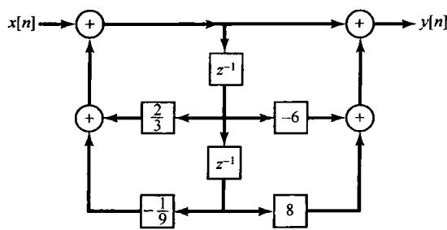

图P10.18

(c）  $(-1)^{n}u[n]$

(d)  $\left(\frac{1}{2}\right)^{n + 1}u[n + 3]$

(e)  $\left(-\frac{1}{3}\right)^n u[-n - 2]$

(f)  $\left(\frac{1}{4}\right)^n u[3 - n]$

(g)  $2^{n}u[-n] + \left(\frac{1}{4}\right)^{n}u[n - 1]$

(h)  $\left(\frac{1}{3}\right)^{n - 2}u[n - 2]$

10.22 求下列各序列的  $z$  变换。将全部和式均以闭式表示，画出零-极点图，指出收敛域，并指出其傅里叶变换是否存在。

(a)  $\left(\frac{1}{2}\right)^n\{u[n + 4] - u[n - 5]\}$

(b)  $n\left(\frac{1}{2}\right)^{|n|}$

(c)  $|n|\left(\frac{1}{2}\right)^{|n|}$

(d)  $4^n\cos \left[\frac{2\pi}{6} n + \frac{\pi}{4}\right]u[-n - 1]$

10.23 对下列每个  $z$  变换，分别用部分分式展开法和长除法求逆变换：

$$
X (z) = \frac {1 - z ^ {- 1}}{1 - \frac {1}{4} z ^ {- 2}}, | z | > \frac {1}{2}
$$

$$
X (z) = \frac {1 - z ^ {- 1}}{1 - \frac {1}{4} z ^ {- 2}}, | z | <   \frac {1}{2}
$$

$$
X (z) = \frac {z ^ {- 1} - \frac {1}{2}}{1 - \frac {1}{2} z ^ {- 1}}, | z | > \frac {1}{2}
$$

$$
X (z) = \frac {z ^ {- 1} - \frac {1}{2}}{1 - \frac {1}{2} z ^ {- 1}}, | z | <   \frac {1}{2}
$$

$$
X (z) = \frac {z ^ {- 1} - \frac {1}{2}}{(1 - \frac {1}{2} z ^ {- 1}) ^ {2}}, | z | > \frac {1}{2}
$$

$$
X (z) = \frac {z ^ {- 1} - \frac {1}{2}}{(1 - \frac {1}{2} z ^ {- 1}) ^ {2}}, | z | <   \frac {1}{2}
$$

10.24 利用指定的方法，求下列各  $z$  变换对应的序列：

(a) 部分分式展开法

$$
X (z) = \frac {1 - 2 z ^ {- 1}}{1 + \frac {5}{2} z ^ {- 1} + z ^ {- 2}},
$$

$x[n]$  是绝对可和的

(b) 长除法

$$
X (z) = \frac {1 - \frac {1}{2} z ^ {- 1}}{1 + \frac {1}{2} z ^ {- 1}},
$$

$x[n]$  为右边序列

（c）部分分式展开法

$$
X (z) = \frac {3}{z - \frac {1}{4} - \frac {1}{8} z ^ {- 1}},
$$

$x[n]$  是绝对可和的

10.25 一个右边序列  $x[n]$  的  $z$  变换为

$$
X (z) = \frac {1}{(1 - \frac {1}{2} z ^ {- 1}) (1 - z ^ {- 1})} \tag {P10.25-1}
$$

(a) 将式(P10.25-1)表示成  $z^{-1}$  的多项式之比，再进行部分分式展开，由展开式求  $x[n]$ 。

(b) 将式(P10.25-1)重写成  $z$  的多项式之比, 再进行部分分式展开, 由展开式求  $x[n]$ , 并说明所得序列与(a)所得的是一样的。

10.26 一个左边序列  $x[n]$  的  $\pmb{z}$  变换为

$$
X (z) = \frac {1}{(1 - \frac {1}{2} z ^ {- 1}) (1 - z ^ {- 1})}
$$

(a) 将  $X(z)$  写成  $z$  的多项式之比。

(b) 利用部分分式展开, 将  $X(z)$  表示成若干项的和, 其中每一项都代表(a)中答案的一个极点。

(c) 求  $x[n]$ 。

10.27 一个右边序列  $x[n]$  的  $z$  变换为

$$
X (z) = \frac {3 z ^ {- 1 0} + z ^ {- 7} - 5 z ^ {- 2} + 4 z ^ {- 1} + 1}{z ^ {- 1 0} - 5 z ^ {- 7} + z ^ {- 3}}
$$

求  $n < 0$  时的  $x[n]$ 。

10.28 (a) 求序列

$$
x [ n ] = \delta [ n ] - 0. 9 5 \delta [ n - 6 ]
$$

的  $z$  变换。

(b) 画出(a)中  $z$  变换的零-极点图。

(c) 利用极点向量和零点向量沿单位圆横穿一周时的特性，近似画出  $x[n]$  傅里叶变换的模特性。

10.29 利用10.4节讨论的频率响应的几何求值法，对图P10.29的每个零-极点图大致画出有关傅里叶变换的模特性。

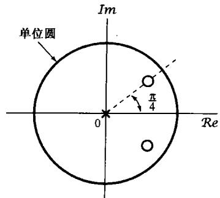

(a)

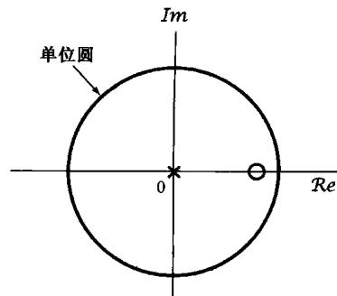

(b)

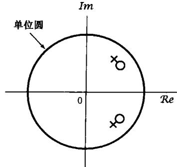

(c)

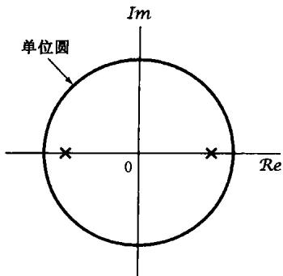

(d)

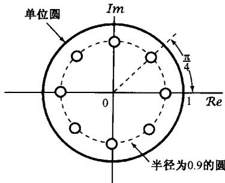

(e)

图P10.29

10.30 有一个信号  $y[n]$ ，它与另两个信号  $x_{1}[n]$  和  $x_{2}[n]$  的关系是

$$
y [ n ] = x _ {1} [ n + 3 ] * x _ {2} [ - n + 1 ]
$$

其中，

$$
x _ {1} [ n ] = \left(\frac {1}{2}\right) ^ {n} u [ n ], \quad x _ {2} [ n ] = \left(\frac {1}{3}\right) ^ {n} u [ n ]
$$

已知

$$
a ^ {n} u [ n ] \xleftrightarrow {z} \frac {1}{1 - a z ^ {- 1}}, | z | > | a |
$$

利用  $z$  变换性质求  $y[n]$  的  $z$  变换  $Y(z)$  。

10.31 关于  $z$  变换为  $X(z)$  的一个离散时间信号  $x[n]$ ，给出下面5个事实：

1.  $x[n]$  是实序列且为右边序列。

2.  $X(z)$  只有两个极点。

3.  $X(z)$  在原点有二阶零点。

4.  $X(z)$  有一个极点在  $z = \frac{1}{2}\mathrm{e}^{\mathrm{j}n / 3}$

5.  $X(1) = 8 / 3$

试求  $X(z)$  并给出它的收敛域。

10.32 考虑一个线性时不变系统，其单位脉冲响应为

$$
h [ n ] = \left\{ \begin{array}{l l} a ^ {n}, & n \geqslant 0 \\ 0, & n <   0 \end{array} \right.
$$

且输入为

$$
x [ n ] = {\left\{ \begin{array}{l l} {1,} & {0 \leqslant n \leqslant N - 1} \\ {0,} & {{\text {其 他}}} \end{array} \right.}
$$

(a) 用  $x[n]$  和  $h[n]$  的离散卷积求输出  $y[n]$ 。

(b) 通过计算  $x[n]$  和  $h[n]$  的  $z$  变换的乘积求逆变换，再求  $y[n]$ 。

10.33 (a) 求由差分方程

$$
y [ n ] - \frac {1}{2} y [ n - 1 ] + \frac {1}{4} y [ n - 2 ] = x [ n ]
$$

表示的因果线性时不变系统的系统函数。

(b) 若  $x[n]$  为

$$
x [ n ] = \left(\frac {1}{2}\right) ^ {n} u [ n ]
$$

用  $z$  变换求  $y[n]$

10.34 有一个因果线性时不变系统，其差分方程为

$$
y [ n ] = y [ n - 1 ] + y [ n - 2 ] + x [ n - 1 ]
$$

(a) 求该系统的系统函数，画出  $H(z) = Y(z) / X(z)$  的零-极点图，指出收敛域。

(b) 求系统的单位脉冲响应。

(c) 你应该能发现该系统是不稳定的，求一个满足该差分方程的稳定（非因果）单位脉冲响应。

10.35 考虑一个线性时不变系统，其输入  $x[n]$  和输出  $y[n]$  满足下列差分方程：

$$
y [ n - 1 ] - \frac {5}{2} y [ n ] + y [ n + 1 ] = x [ n ]
$$

系统可以是也可以不是稳定的或因果的。

利用考虑与上述差分方程相联系的零-极点图，求三种可能的系统单位脉冲响应，并证明其中每一个都满足该差分方程。

10.36 考虑一个离散时间线性时不变系统，其输入  $x[n]$  和输入  $y[n]$  的差分方程为

$$
y [ n - 1 ] - \frac {1 0}{3} y [ n ] + y [ n + 1 ] = x [ n ]
$$

该系统是稳定的，求单位脉冲响应。

10.37 一个因果线性时不变系统的输入  $x[n]$  和输出  $y[n]$  由图P10.37的方框图表示，

(a) 求  $y[n]$  和  $x[n]$  之间的差分方程。

(b) 该系统是稳定的吗？

10.38 考虑一个因果线性时不变系统  $S$ ，其输入为  $x[n]$ ，系统函数表示为

$$
\boldsymbol {H} (z) = \boldsymbol {H} _ {1} (z) \boldsymbol {H} _ {2} (z)
$$

其中，

$$
H _ {1} (z) = \frac {1}{1 + \frac {1}{4} z ^ {- 1} - \frac {1}{8} z ^ {- 2}}
$$

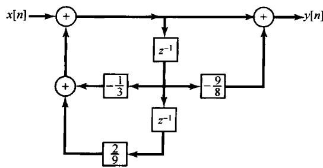

图P10.37

$$
H _ {2} (z) = 1 - \frac {7}{4} z ^ {- 1} - \frac {1}{2} z ^ {- 2}
$$

将  $H_{1}(z)$  的方框图与  $H_{2}(z)$  的方框图级联就得到  $H(z)$  的方框图，如图P10.38所示。图中还标出了各中间信号  $e_1[n]$ ， $e_2[n]$ ， $f_1[n]$  和  $f_2[n]$ 。

(a)  $e_1[n]$  与  $f_1[n]$  是什么关系？

(b)  $e_2[n]$  与  $f_2[n]$  是什么关系？

（c）利用上面两部分的结果，构造一个仅含两个时延单元的直接型方框图。

(d）依据

$$
H (z) = \left(\frac {1 + \frac {1}{4} z ^ {- 1}}{1 + \frac {1}{2} z ^ {- 1}}\right) \left(\frac {1 - 2 z ^ {- 1}}{1 - \frac {1}{4} z ^ {- 1}}\right)
$$

画出系统  $S$  的级联型方框图表示。

(e）依据

$$
H (z) = 4 + \frac {5 / 3}{1 + \frac {1}{2} z ^ {- 1}} - \frac {1 4 / 3}{1 - \frac {1}{4} z ^ {- 1}}
$$

画出系统  $S$  的并联型方框图表示。

图P10.38

10.39 考虑下列对应于因果线性时不变系统的三个系统函数：

$$
H _ {1} (z) = \frac {1}{(1 - z ^ {- 1} + \frac {1}{4} z ^ {- 2}) (1 - \frac {2}{3} z ^ {- 1} + \frac {1}{9} z ^ {- 2})}
$$

$$
H _ {2} (z) = \frac {1}{(1 - z ^ {- 1} + \frac {1}{2} z ^ {- 2}) (1 - \frac {1}{2} z ^ {- 1} + z ^ {- 2})}
$$

$$
H _ {3} (z) = \frac {1}{(1 - z ^ {- 1} + \frac {1}{2} z ^ {- 2}) (1 - z ^ {- 1} + \frac {1}{4} z ^ {- 2})}
$$

(a) 对每一个系统函数画出直接型方框图。

（b）对每一个系统函数画出两个二阶系统级联的方框图，其中每个二阶系统应该都是直接型的。

(c) 对每个系统函数判断是否都存在一种方框图表示，它是由 4 个全由实系数相乘的一阶系统的方框图级联而成的。

10.40 求习题 10.21 中每个序列的单边  $z$  变换。

10.41 考虑下面两个信号：

$$
x _ {1} [ n ] = \left(\frac {1}{2}\right) ^ {n + 1} u [ n + 1 ], \quad x _ {2} [ n ] = \left(\frac {1}{4}\right) ^ {n} u [ n ]
$$

令  $\mathcal{X}_1(z)$  和  $X_{1}(z)$  分别代表  $x_{1}[n]$  的单边和双边  $z$  变换，  $\mathcal{X}_2(z)$  和  $X_{2}(z)$  分别代表  $x_{2}[n]$  的单边和双边 $z$  变换。

(a) 取  $X_{1}(z)X_{2}(z)$  的双边  $z$  逆变换, 求  $g[n] = x_{1}[n]*x_{2}[n]$  。

(b) 取  $\mathcal{X}_1(z)\mathcal{X}_2(z)$  的单边  $z$  逆变换, 得到一个信号  $q[n]$ ,  $n\geqslant 0$  。注意观察, 当  $n\geqslant 0$  时  $q[n]$  和  $g[n]$  是不相同的。

10.42 对下面给出的各差分方程、输入  $x[n]$  和初始条件，利用单边  $z$  变换求零输入响应和零状态响应。

(a)  $y[n] + 3y[n - 1] = x[n]$

(b)  $y[n] - \frac{1}{2} y[n - 1] = x[n] - \frac{1}{2} x[n - 1]$

$$
x [ n ] = \left(\frac {1}{2}\right) ^ {n} u [ n ]
$$

$$
\boldsymbol {x} [ n ] = \boldsymbol {u} [ n ]
$$

$$
\mathbf {y} [ - 1 ] = \mathbf {1}
$$

$$
\mathbf {y} [ - 1 ] = \mathbf {0}
$$

(c)  $y[n] - \frac{1}{2} y[n - 1] = x[n] - \frac{1}{2} x[n - 1]$

$$
\boldsymbol {x} [ n ] = \boldsymbol {u} [ n ]
$$

$$
y [ - 1 ] = 1
$$

# 深入题

10.43 考虑一个偶序列  $x[n]$ ，即  $x[n] = x[-n]$ ，它的有理  $z$  变换为  $X(z)$ 。

(a) 根据  $z$  变换的定义, 证明

$$
X (z) = X \left(\frac {1}{z}\right)
$$

(b) 根据(a)中的结果，证明若  $X(z)$  的一个极点(零点)出现在  $z = z_0$  ，那么在  $z = 1 / z_0$  也一定有一个极点(零点)。

(c) 对下列序列验证(b)的结果：

(i)  $\delta [n + 1] + \delta [n - 1]$

(ii)  $\delta [n + 1] - \frac{5}{2}\delta [n] + \delta [n - 1]$

10.44 设  $x[n]$  是一个离散时间信号，其  $z$  变换为  $X(z)$ ，对下列信号利用  $X(z)$  求其  $z$  变换：

(a)  $\Delta x[n]$ , 这里  $\Delta$  记为一次差分算子, 定义为

$$
\Delta x [ n ] = x [ n ] - x [ n - 1 ]
$$

(b)  $x_{1}[n] = \left\{ \begin{array}{ll}x[n / 2], & n\text{为偶数}\\ 0, & n\text{为奇数} \end{array} \right.$

(c)  $x_{1}[n] = x[2n]$

10.45 确定下列  $z$  变换中的哪一个能够是一个离散时间线性系统的转移函数，这些系统不一定是稳定的，但是其单位脉冲响应在  $n < 0$  时为零。试清楚地陈述理由。

(a)  $\frac{(1 - z^{-1})^2}{1 - \frac{1}{2}z^{-1}}$

(b)  $\frac{(z - 1)^2}{z - \frac{1}{2}}$

（c）  $\frac{\left(z - \frac{1}{4}\right)^5}{\left(z - \frac{1}{2}\right)^6}$

(d)  $\frac{\left(z - \frac{1}{4}\right)^6}{\left(z - \frac{1}{2}\right)^5}$

10.46 一个序列  $x[n]$  是输入为  $s[n]$  时一个线性时不变系统的输出，该系统由下列差分方程描述：

$$
x [ n ] = s [ n ] - e ^ {8 \alpha} s [ n - 8 ]
$$

其中  $0 < \alpha < 1$ 。

(a) 求系统函数

$$
H _ {1} (z) = \frac {X (z)}{S (z)}
$$

并画出零-极点图，指出收敛域。

(b) 想用一个线性时不变系统从  $x[n]$  中恢复出  $s[n]$ , 求系统函数

$$
H _ {2} (z) = \frac {Y (z)}{X (z)}
$$

以使得  $y[n] = s[n]$  。求  $H_{2}(z)$  的所有可能的收敛域，并对每一种收敛域回答该系统是否是因果的，或稳定的。

(c) 求单位脉冲响应  $h_2[n]$  的所有可能选择，使得有

$$
y [ n ] = h _ {2} [ n ] * x [ n ] = s [ n ]
$$

10.47 关于一个输入为  $x[n]$ ，输出为  $y[n]$  的离散时间线性时不变系统，已知下列情况：

1. 若对全部  $n, x[n] = (-2)^{n}$ ，则对所有  $n$  有  $y[n] = 0$ 。

2. 若对全部  $n, x[n] = (1/2)^n u[n]$ ，则对所有  $n, y[n]$  为

$$
y [ n ] = \delta [ n ] + a \left(\frac {1}{4}\right) ^ {n} u [ n ]
$$

其中  $a$  为一常数。

(a) 求常数  $a$  的值。

(b) 若对于所有  $n$ ，有输入  $x[n] = 1$ ，求响应  $y[n]$ 。

10.48 假设一个二阶因果线性时不变系统已经设计或具有实值单位脉冲响应  $h_1[n]$  和一个有理系统函数  $H_{1}(z)$  ， $H_{1}(z)$  的零-极点图如图P10.48(a)所示。现在要考虑另一个二阶因果系统，其单位脉冲响应为  $h_2[n]$ ，有理系统函数为  $H_{2}(z)$ ， $H_{2}(z)$  的零-极点图如图P10.48(b)所示。求一个序列  $g[n]$ ，使下面三个条件都得到满足：

1.  $h_2[n] = g[n]h_1[n]$

2.  $g[n] = 0$  ，  $n <   0$

3.  $\sum_{k=0}^{\infty} |g[k]| = 3$

(a)

(b)

图P10.48

10.49 10.2节的性质4是，若  $x[n]$  是一个右边序列，并且  $|z| = r_0$  的圆在收敛域内，则全部  $|z| > r_0$  的有限  $z$  值都一定在这个收敛域内。一种直观解释在讨论中已经给出。更为正规一些的证明是与9.2节的性质4有关拉普拉斯变换的讨论紧密并行的。这就是，考虑一个右边序列

$$
x [ n ] = 0, \quad n <   N _ {1}
$$

对此有

$$
\sum_ {n = - \infty} ^ {\infty} | x [ n ] | r _ {0} ^ {- n} = \sum_ {n = N _ {1}} ^ {\infty} | x [ n ] | r _ {0} ^ {- n} <   \infty
$$

那么，若  $r_0 \leqslant r_1$  ，则

$$
\sum_ {n = N _ {1}} ^ {\infty} | x [ n ] | r _ {1} ^ {- n} \leqslant A \sum_ {n = N _ {1}} ^ {\infty} | x [ n ] | r _ {0} ^ {- n} \tag {P10.49-1}
$$

其中  $A$  是某个正常数。

(a) 证明式(P10.49-1)是正确的，并用  $r_0, r_1$  和  $N_1$  来确定常数  $A$ 。

(b) 根据(a)的结果，证明可得10.2节的性质4。

(c) 利用类似的方法证明 10.2 节的性质 5 成立。

10.50 一个离散时间系统，其零-极点图如图 P10.50(a) 所示，因为无论频率为什么，频率响应的模都是常数，所以该系统称为一阶全通系统。

(a) 用代数方法说明  $|H(\mathrm{e}^{\mathrm{j}\omega})|$  是常数。为了用几何方法说明同一性质，考虑图 P10.50(b) 中的向量图。希望证明：向量  $\nu_{2}$  的长度正比于向量  $\nu_{1}$  的长度而与频率  $\omega$  无关。

(b) 利用余弦定理和下列事实来表示  $\pmb{\nu}_{1}$  的长度:  $\pmb{\nu}_{1}$  是一个三角形的一条边, 该三角形的另两条边是单位向量和长度为  $\pmb{a}$  的向量。

(c) 用与(b)中相似的方法，确定  $\pmb{\nu}_{2}$  的长度，并证明它正比于  $\pmb{\nu}_{1}$  的长度而与频率  $\omega$  无关。

(a)

(b)

图P10.50

10.51 有一个实值序列  $x[n]$ ，其有理  $z$  变换为  $X(z)$ 。

(a) 由  $z$  变换的定义, 证明

$$
X (z) = X ^ {*} \left(z ^ {*}\right)
$$

(b) 根据(a)中的结果, 证明: 若  $X(z)$  有一个极点(零点)出现在  $z = z_0$ , 那么在  $z = z_0^*$  也一定有一个极点(零点)。

(c) 对下列每个序列验证(b)的结果：

(i)  $x[n] = \left(\frac{1}{2}\right)^n u[n]$

(ii)  $x[n] = \delta [n] - \frac{1}{2}\delta [n - 1] + \frac{1}{4}\delta [n - 2]$

(d) 将 (b) 的结果与习题 10.43(b) 的结果相结合, 证明: 对于一个实值偶序列, 若  $H(z)$  有一个极点 (零点) 在  $z = \rho e^{j\theta}$ , 那么  $H(z)$  在  $z = (1 / \rho)e^{j\theta}$  和  $z = (1 / \rho)e^{-j\theta}$  也都有一个极点 (零点)。

10.52 序列  $x_{1}[n]$  的  $z$  变换为  $X_{1}(z)$ ，另一个序列  $x_{2}[n]$  的  $z$  变换为  $X_{2}(z)$ ，

$$
x _ {2} [ n ] = x _ {1} [ - n ]
$$

证明  $X_{2}(z) = X_{1}(1 / z)$  。并由此证明：若  $X_{1}(z)$  在  $z = z_0$  有一个极点（零点），那么  $X_{2}(z)$  一定有一个极点（零点）在  $z = 1 / z_0$  。

10.53 (a) 完成表 10.1 中下列性质的证明:

(i) 10.5.2 节的性质。

(ii) 10.5.3 节的性质。

（iii）10.5.4节的性质。

(b) 若以  $X(z)$  表示  $x[n]$  的  $z$  变换，以  $R_{x}$  表示  $X(z)$  的收敛域，试用  $X(z)$  和  $R_{x}$  确定下列每个序列的  $z$  变换及其收敛域：

(i)  $x^{*}[n]$

(ii)  $z_0^n x[n]$ ， $z_0$  为某一复数。

10.54 在10.5.9节提到并证明了因果序列的初值定理。

(a) 若  $x[n]$  是反因果序列，即若  $n > 0$  则有  $x[n] = 0$ ，陈述并证明相应的定理。

(b) 证明: 若  $n < 0$  时  $x[n] = 0$ , 那么

$$
x [ 1 ] = \lim  _ {z \rightarrow \infty} z (X (z) - x [ 0 ])
$$

10.55 设  $x[n]$  是一个  $x[0]$  为非零且为有限的因果序列，即  $n < 0$  时  $x[n] = 0$

(a) 利用初值定理证明:  $X(z)$  在  $z = \infty$  不存在任何极点或零点。

(b) 作为(a)的结论的一个结果, 证明在有限  $z$  平面内  $X(z)$  的极点个数等于零点个数 (有限  $z$  平面不包括  $z = \infty$ )。

10.56 在 10.5.7 节曾提到  $z$  变换的卷积性质，为了证明这个性质成立，现从卷积和表示式入手，即

$$
x _ {3} [ n ] = x _ {1} [ n ] * x _ {2} [ n ] = \sum_ {k = - \infty} ^ {\infty} x _ {1} [ k ] x _ {2} [ n - k ] \tag {P10.56-1}
$$

(a) 将式(P10.56-1)取  $z$  变换，并利用式(10.3)证明

$$
X _ {3} (z) = \sum_ {k = - \infty} ^ {\infty} x _ {1} [ k ] \hat {X} _ {2} (z)
$$

其中  $\hat{X}_2(z)$  是  $x_{2}[n - k]$  的  $z$  变换。

(b) 利用(a)的结果和表10.1中的性质10.5.2，证明

$$
X _ {3} (z) = X _ {2} (z) \sum_ {k = - \infty} ^ {\infty} x _ {1} [ k ] z ^ {- k}
$$

(c) 由 (b), 证明

$$
X _ {3} (z) = X _ {1} (z) X _ {2} (z)
$$

这就是式(10.81)所陈述的。

10.57 设  $X_{1}(z)$  和  $X_{2}(z)$  为

$$
X _ {1} (z) = x _ {1} [ 0 ] + x _ {1} [ 1 ] z ^ {- 1} + \dots + x _ {1} [ N _ {1} ] z ^ {- N _ {1}}
$$

$$
X _ {2} (z) = x _ {2} [ 0 ] + x _ {2} [ 1 ] z ^ {- 1} + \dots + x _ {2} [ N _ {2} ] z ^ {- N _ {2}}
$$

定义

$$
Y (z) = X _ {1} (z) X _ {2} (z)
$$

并令

$$
Y (z) = \sum_ {k = 0} ^ {M} y [ k ] z ^ {- k}
$$

(a) 用  $N_{1}$  和  $N_{2}$  表示  $M$  。

（b）用多项式相乘确定  $y[0]$  ，  $y[1]$  和  $y[2]$  。

（c）用多项式相乘证明：对于  $0 \leqslant k \leqslant M$  有

$$
y [ k ] = \sum_ {m = - \infty} ^ {\infty} x _ {1} [ m ] x _ {2} [ k - m ]
$$

10.58 一个最小相位系统是这样一个系统，它是因果稳定的，而它的逆系统也是因果稳定的。试确定一个最小相位系统的系统函数，其零极点在  $z$  平面内的位置应受到的必要限制。

10.59 考虑图P10.59所示的数字滤波器结构。

(a) 求该因果滤波器的  $H(z)$ , 画出零-极点图, 指出收敛域。

(b)  $k$  为何值时该系统是稳定的？

(c) 若  $k = 1$  且  $x[n] = (2/3)^n$  (对全部  $n$ ), 求  $y[n]$ 。

10.60 信号  $x[n]$  的单边  $\pmb{z}$  变换是  $\mathcal{X}(z)$  。证明  $y[n] = x[n + 1]$  的单边  $\pmb{z}$  变换是

图P10.59

$$
\mathcal {Y} (z) = z \mathcal {X} (z) - z x [ 0 ]
$$

10.61 若  $\mathcal{X}(z)$  为  $z[n]$  的单边  $z$  变换，利用  $\mathcal{X}(z)$ ，求下列序列的单边  $z$  变换：

(a)  $x[n + 3]$

(b)  $x[n - 3]$

(c)  $\sum_{k = -\infty}^{n}x[k]$

# 扩充题

10.62 序列  $x[n]$  的自相关序列定义为

$$
\phi_ {x x} [ n ] = \sum_ {k = - \infty} ^ {\infty} x [ k ] x [ n + k ]
$$

利用  $x[n]$  的  $\textbf{z}$  变换确定  $\phi_{xx}[n]$  的  $\pmb{z}$  变换。

10.63 利用幂级数展开式

$$
\log (1 - w) = - \sum_ {i = 1} ^ {\infty} \frac {w ^ {i}}{i}, \quad | w | <   1
$$

求下面两个  $z$  变换的逆变换：

(a)  $X(z) = \log (1 - 2z),\quad |z| <   \frac{1}{2}$

(b)  $X(z) = \log \left(1 - \frac{1}{2} z^{-1}\right),\quad |z| > \frac{1}{2}$

10.64 首先对  $X(z)$  微分，再利用  $z$  变换的适当性质，求下列每个  $z$  变换所对应的序列：

(a)  $X(z) = \log (1 - 2z),\quad |z| <   \frac{1}{2}$

(b)  $X(z) = \log \left(1 - \frac{1}{2} z^{-1}\right),\quad |z| > \frac{1}{2}$

将(a)和(b)所得结果与利用幂级数展开在习题10.63中所得结果进行比较。

10.65 双线性变换(bilinear transformation)是一个从有理拉普拉斯变换  $H_{c}(s)$  求得一个有理  $\textbf{z}$  变换  $H_{d}(z)$  的映射，这种映射有两个重要性质：

1. 若  $H_{c}(s)$  是一个因果稳定线性时不变系统的拉普拉斯变换，那么  $H_{d}(z)$  就是一个因果稳定线性时不变系统的  $z$  变换。

2.  $|H_{c}(\mathrm{j}\omega)|$  的某些重要特性在  $|H_{d}(\mathrm{e}^{\mathrm{j}\omega})|$  中得到保留。本题对全通滤波器来说明第二个性质。

(a) 设  $H_{c}(s)$  为

$$
H _ {c} (s) = \frac {a - s}{s + a}
$$

其中  $\pmb{a}$  为正实数。证明

$$
\left| H _ {c} (\mathrm {j} \omega) \right| = 1
$$

(b) 现在对  $H_{c}(s)$  进行双线性变换，以求得  $H_{d}(z)$ ，即

$$
H _ {d} (z) = H _ {c} (s) \Big | _ {s = \frac {1 - z - 1}{1 + z - 1}}
$$

证明：  $H_{d}(z)$  有一个极点(在单位圆里)和一个零点(在单位圆外)。

(c) 对于由(b)中导得的系统函数  $H_{d}(z)$ ，证明  $\left|H_{d}\left(e^{j\omega}\right)\right|=1$ 。

10.66 上题中所引入的双线性变换也可以用来得到一个离散时间滤波器，该滤波器频率响应的模是与给定的连续时间低通滤波器的模特性类似的。本题将以一个连续时间二阶巴特沃思滤波器[系统函数为  $H_{c}(s)$ ]为例来说明这一相似性。

(a) 设

$$
H _ {d} (z) = H _ {c} (s) \Big | _ {s = \frac {1 - z ^ {- 1}}{1 + z ^ {- 1}}}
$$

证明

$$
H _ {d} \left(\mathrm {e} ^ {\mathrm {j} \omega}\right) = H _ {c} \left(\mathrm {j} \tan \frac {\omega}{2}\right)
$$

(b) 已知

$$
H _ {c} (s) = \frac {1}{(s + e ^ {j \pi / 4}) (s + e ^ {- j \pi / 4})}
$$

并设该滤波器是因果的。证明：  $H_{c}(0) = 1$  ，  $\left|H_{c}(\mathrm{j}\omega)\right|$  随  $\omega$  向正值方向增大而单调下降，  $\left|H_{c}(\mathrm{j}\omega)\right|^{2}$ $= 1 / 2$  （即  $\omega_{c} = 1$  是半功率点频率）及  $H_{c}(\infty) = 0$  。

(c) 若对于(b)题中的  $H_{c}(s)$  应用双线性变换而得到  $H_{d}(z)$ ，那么有关  $H_{d}(z)$  和  $H_{d}(\mathrm{e}^{\mathrm{j}\omega})$  可以得出如下结论：

1.  $H_{d}(z)$  仅有两个极点，均在单位圆内。

2.  $H_{d}(\mathbf{e}^{\mathrm{j}\theta}) = \mathbf{1}$

3.  $|H_{d}(e^{\mathrm{j}\omega})|$  随  $\omega$  从0到  $\pi$  变化而单调下降。

4.  $H_{d}(e^{j\omega})$  的半功率点频率是  $\pi /2$