# 第2章 线性时不变系统

# 2.0 引言

1.6节介绍并讨论了几个系统的基本性质。其中两个性质，即线性和时不变性，在信号与系统分析中是最主要的。其理由是：第一，很多物理过程都具有这两个性质，因此都能用线性时不变系统来表征；第二，可以对线性时不变系统进行详细的分析。这样既求得了对系统性质的深入理解，又提供了形成信号与系统分析核心的一整套强有力的方法。

本书的一个主要目的就是为了阐明这些性质和方法，并介绍这些方法的几个主要应用方面。在这一章就从导出并分析一种最基本而又极为有用的线性时不变系统的表示方法入手，并引入其中一类重要的系统。

线性时不变系统之所以能够被深入分析的主要原因之一在于该类系统具有1.6.6节所说的叠加性质。这样，如果能够将线性时不变系统的输入用一组基本信号的线性组合来表示，就可以根据该系统对这些基本信号的响应，然后利用叠加性质求得整个系统的输出。

正如将在以下各节中看到的，无论在离散时间或连续时间情况下，单位冲激函数的重要特性之一就是一般信号都可以表示为延迟冲激的线性组合。这个事实，再与叠加性和时不变性结合起来，就能够用线性时不变的单位冲激响应来完全表征任何一个线性时不变系统的特性。这样一种表示，在离散时间情况下称为卷积和，在连续时间情况下称为卷积积分，这种表示方式在分析线性时不变系统时提供了极大的方便性。在建立了卷积和与卷积积分之后，再用这些特性来分析线性时不变系统的某些其他性质。然后讨论由线性常系数微分方程所描述的连续时间系统，由线性常系数差分方程所描述的离散时间系统，在后续各章中还会不时地回到分析这两种重要的系统上来。最后，将从另一角度来审视连续时间单位冲激函数，以及与其有关的其他几个信号，以期对这些理想化的信号提供另一些认识，特别是在分析线性时不变系统方面的应用和理解上。

# 2.1 离散时间线性时不变系统：卷积和

# 2.1.1 用脉冲表示离散时间信号

如何把任何离散时间信号看成由离散时间单位脉冲构成的关键是：要把一个离散时间信号当成一串单个脉冲来想象。为了明了如何把这种直观认识变成一种数学表示式，让我们来看图2.1(a)中的信号。在该图的其余部分画出了5个时间移位并加权了的单位脉冲序列，每个脉冲的大小与  $x[n]$  所对应的时刻序列值相等，例如

$$
\begin{array}{l} x [ - 1 ] \delta [ n + 1 ] = \left\{ \begin{array}{l l} x [ - 1 ], & n = - 1 \\ 0, & n \neq - 1 \end{array} \right. \\ x [ 0 ] \delta [ n ] = \left\{ \begin{array}{l l} x [ 0 ], & \quad n = 0 \\ 0, & \quad n \neq 0 \end{array} \right. \\ x [ 1 ] \delta [ n - 1 ] = \left\{ \begin{array}{l l} x [ 1 ], & \quad n = 1 \\ 0, & \quad n \neq 1 \end{array} \right. \\ \end{array}
$$

因此，图2.1中这5个序列的和就等于在  $-2 \leqslant n \leqslant 2$  区间内的  $x[n]$  。若把这样的表示式扩大到包括更多的移位加权脉冲，就可以得到一般的表示式为

$$
\begin{array}{l} x [ n ] = \dots + x [ - 3 ] \delta [ n + 3 ] + x [ - 2 ] \delta [ n + 2 ] + x [ - 1 ] \delta [ n + 1 ] + x [ 0 ] \delta [ n ] \tag {2.1} \\ + x [ 1 ] \delta [ n - 1 ] + x [ 2 ] \delta [ n - 2 ] + x [ 3 ] \delta [ n - 3 ] + \dots \\ \end{array}
$$

在式(2.1)的右边，对所有的  $n$  值，只有一项是非零的，而非零项的大小就是  $x[n]$  。上式写成更为紧凑的形式是

$$
x [ n ] = \sum_ {k = - \infty} ^ {+ \infty} x [ k ] \delta [ n - k ] \tag {2.2}
$$

这个式子相应于把任意一个序列表示成一串移位的单位脉冲序列  $\delta[n - k]$  的线性组合，而这个线性组合式中的权因子就是  $x[k]$ 。例如，若  $x[n] = u[n]$ ，即单位阶跃序列。在这种情况下，因为  $k < 0$  时  $u[k] = 0$ ，而  $k \geqslant 0$  时  $u[k] = 1$ ，所以式(2.2)变为

$$
u [ n ] = \sum_ {k = 0} ^ {+ \infty} \delta [ n - k ]
$$

这与1.4节所得结果式(1.67)是完全一致的。

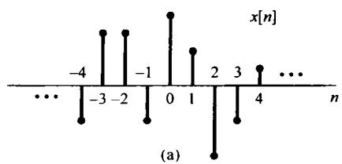

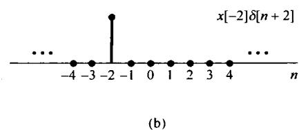

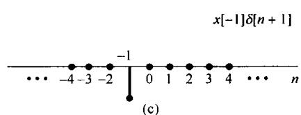

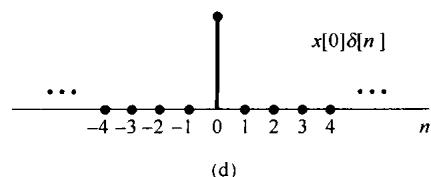

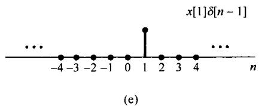

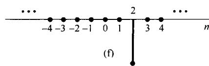

图2.1 一个离散时间信号分解为一组加权的移位脉冲之和

式(2.2)称为离散时间单位脉冲序列的筛选性质（sifting property）。因为序列  $\delta[n - k]$  仅当  $k = n$  时为非零，所以在式(2.2)右边的和就把  $x[k]$  序列进行了筛除，而仅保留下对应于  $k = n$  时的值。下面将利用离散时间信号这种表示来建立一个离散时间线性时不变系统的卷积和表示。

# 2.1.2 离散时间线性时不变系统的单位脉冲响应及卷积和表示

式(2.1)和式(2.2)筛选性质的重要性在于它把  $x[n]$  表示成一组加权的基本函数的叠加，这个极简单的基本函数就是移位单位脉冲  $\delta [n - k]$ ，其中每一个在相应于  $k$  的单一时刻点上非零，其值为1。一个线性系统对  $x[n]$  的响应就是系统对这些移位脉冲中的每一个响应加权后的叠加；而且，时不变性又意味着一个时不变系统对移位单位脉冲的响应就是未被移位的单位脉冲响应的移位。将这两点结合在一起，即可得到具有线性和时不变性的离散时间系统的卷积和表示。

具体而言，现在来考虑某一线性（但可能为时变的）系统对任一输入  $x[n]$  的响应。由式(2.2)可以将输入表示为一组移位单位脉冲的线性组合，令  $h_k[n]$  为该线性系统对移位单位脉冲  $\delta [n - k]$  的响应，那么根据线性系统的叠加性质，即式(1.123)和式(1.124)，该线性系统对输入  $x[n]$  的响应  $y[n]$  就是这些基本响应的加权线性组合，见式(2.2)。也就是说，若线性系统的输入  $x[n]$  表示成式(2.2)，则输出  $y[n]$  就可表示为

$$
y [ n ] = \sum_ {k = - \infty} ^ {+ \infty} x [ k ] h _ {k} [ n ] \tag {2.3}
$$

由式(2.3)可知，如果已知一个线性系统对每一个移位单位脉冲序列的响应，那么系统对任何输入的响应都可求出。图2.2给出了一个简单的例子来说明式(2.3)的意义。图2.2(b)分别给出了该系统对  $\delta [n + 1]$ ， $\delta [n]$  和  $\delta [n - 1]$  的响应  $h_{-1}[n]$ ， $h_0[n]$  和  $h_1[n]$ ，因为  $x[n]$  可以写成  $\delta [n + 1]$ ， $\delta [n]$  和  $\delta [n - 1]$  的线性组合。所以根据叠加性质，对  $x[n]$  的响应就可以表示成系统对这些单个移位脉冲响应的线性组合。这些单个的移位并加权了的脉冲分别于图2.2(c)的左边，而其响应则示于该图的右边。图2.2(d)的左边就是真正的输入  $x[n]$ ，它是图2.2(c)左边各信号之和；该图的右边就是真正的输出  $y[n]$ ，它是图2.2(c)右边各分量的叠加。由此可见，一个线性系统在时刻  $n$  的响应就是在时间上每一点的输入值所产生的各个响应在该时刻  $n$  的叠加。

一般来说，在线性系统中，对于不同的  $k$  值，其响应  $h_k[n]$  相互之间并不必有什么关系。但是，若该线性系统也是时不变(time invariant)的，那么这些对时间移位的单位脉冲的响应也全都互相移位了。具体而言，因为  $\delta [n - k]$  是  $\delta [n]$  的时间移位，响应  $h_k[n]$  也就是  $h_0[n]$  的一个时移，即

$$
h _ {k} [ n ] = h _ {0} [ n - k ] \tag {2.4}
$$

为了简化符号，现将  $h_0[n]$  的下标除掉，而定义系统单位脉冲(样本)序列响应[unit impulse（sample）response]为

$$
h [ n ] = h _ {0} [ n ] \tag {2.5}
$$

也就是说，  $h[n]$  是线性时不变系统当输入为  $\delta [n]$  时的输出。那么，对线性时不变系统而言，式(2.3)就变成

$$
\boxed {y [ n ] = \sum_ {k = - \infty} ^ {+ \infty} x [ k ] h [ n - k ]} \tag {2.6}
$$

这个结果称为卷积和(convolution sum)或叠加和(superposition sum)，并且式(2.6)右边的运算称为  $x[n]$  和  $h[n]$  的卷积，并用符号记为

$$
y [ n ] = x [ n ] * h [ n ] \tag {2.7}
$$

式(2.6)意味着一个很重要的结果：既然一个线性时不变系统对任意输入的响应可以用系统对单位脉冲的响应来表示，那么线性时不变系统的单位脉冲响应就完全刻画了系统的特征。

式(2.6)和前面给出的式(2.3)的含义是类似的，不过现在情况下是线性时不变系统，由于在时刻  $k$  加入的输入  $x[k]$  引起的响应  $x[k]h[n - k]$  就是  $h[n]$  移位并经加权的结果。与前面一样，真正的输出是所有这些响应的叠加。

例2.1 考虑一个线性时不变系统，其单位脉冲响应为  $h[n]$ ，输入为  $x[n]$ ，如图2.3(a)所示。这时，因为仅有  $x[0]$  和  $x[1]$  为非零，式(2.6)就简化为

$$
y [ n ] = x [ 0 ] h [ n - 0 ] + x [ 1 ] h [ n - 1 ] = 0. 5 h [ n ] + 2 h [ n - 1 ] \tag {2.8}
$$

在求  $y[n]$  时仅涉及两个单位脉冲响应的移位和加权的结果，即  $0.5h[n]$  和  $2h[n - 1]$  两个序列，它们分别示于图2.3(b)。在每个  $n$  值上相加这两个序列就得到  $y[n]$ ，如图2.3(c)所示。

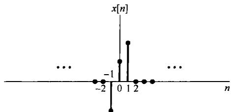

(a)

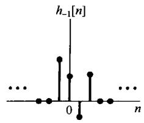

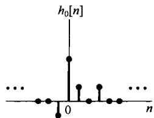

(b)

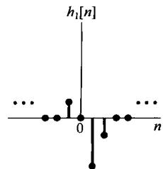

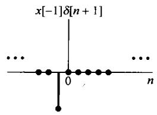

$\longrightarrow$

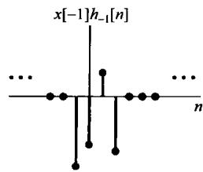

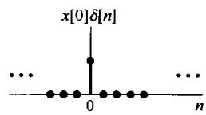

C

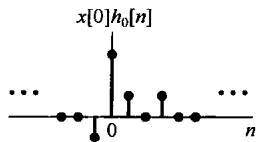

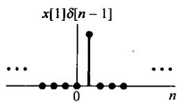

C

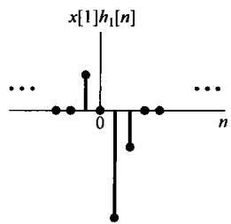

(c)

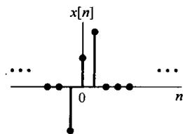

C

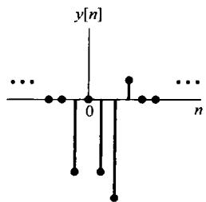

(d)

图2.2 由式(2.3)表示的离散时间线性系统响应的图解表示

利用在每个单独输出样本上的叠加求和的结果，可以得出另一种有用的方法，即用卷积和来想象  $y[n]$  的计算。现在具体考虑对某个特定的  $n$  值求  $y[n]$  的问题。用图来展现这种计算的一种特别有用的方式是一开始就将信号  $x[k]$  和  $h[n - k]$  都看成  $k$  的函数，将它们相乘就得到序列  $g[k] = x[k]h[n - k]$ ，它可看成在每一个时刻  $k$ ，输入  $x[k]$  对输出在时刻  $n$  做出的贡献，这样就能得出如下结论：将全部  $g[k]$  序列中的样本值相加就是在所选定的时刻  $n$  的输出值。由此，为了

对  $y[n]$  计算出对所有的  $n$  时的值，就需要对每个  $n$  值重复这一过程。所幸的是，对  $x[k]$  和  $h[n - k]$ ，将它们看成  $k$  的函数，改变  $n$  值可以有一个非常简单的图解表示。下面的例子用来说明这一点，并利用前面提到的观点来求卷积和。

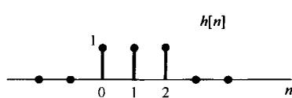

(a)

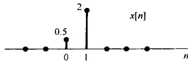

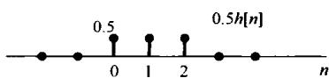

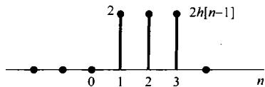

(b)

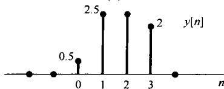

(c)

图2.3（a）线性时不变系统的单位脉冲响应  $h[n]$  及其输入  $x[n]$ ；(b）对  $x[0] = 0.5$  和  $x[1] = 2$  的响应  $0.5h[n]$  和  $2h[n - 1]$ ；(c）总的响应  $y[n]$  就是(b)的和

例2.2 重新考虑例2.1中的卷积问题。序列  $x[k]$  示于图2.4(a)；而序列  $h[n - k]$  看成固定  $n$  时  $k$  的函数，对于几个不同的  $n$  值的序列示于图2.4(b)。在画这些序列时已经用到了这一点，就是  $h[n - k]$  是单位脉冲响应  $h[k]$  的时间反转与移位。随着  $k$  的增加，宗量  $n - k$  减小，这就说明了需要对  $h[k]$  进行一个时间反转。知道了这一点，为了画出信号  $h[n - k]$ ，仅仅需要确定对某个特定  $k$  值的  $h[n - k]$  值就够了，例如，在  $k = n$  时，宗量  $n - k$  等于0。于是，如果画出了信号  $h[-k]$ ，只是将它右移  $n(n > 0$  时），或左移  $n(n < 0$  时），就得到了信号  $h[n - k]$  。图2.4(b)画出了  $n < 0, n = 0, 1, 2, 3$  和  $n > 3$  时的结果。

对于任何具体的  $n$  值，画出了  $x[k]$  和  $h[n - k]$  之后，将这两个信号相乘并在全部  $k$  值上相加。对该例来说，对于  $n < 0$  ，由图2.4看出，因为  $x[k]$  和  $h[n - k]$  的非零值都不重合，所以 $x[k]h[n - k] = 0$  ，结果就是  $n < 0$  时  $y[n] = 0$  。对于  $n = 0$  ，因为序列  $x[k]$  与序列  $h[0 - k]$  的乘积仅有一个非零样本，其值为0.5，所以有

$$
y [ 0 ] = \sum_ {k = - \infty} ^ {\infty} x [ k ] h [ 0 - k ] = 0. 5 \tag {2.9}
$$

序列  $x[k]$  与序列  $h[1 - k]$  的乘积有两个非零样本，相加之后得

$$
y [ 1 ] = \sum_ {k = - \infty} ^ {\infty} x [ k ] h [ 1 - k ] = 0. 5 + 2. 0 = 2. 5 \tag {2.10}
$$

类似地有

$$
y [ 2 ] = \sum_ {k = - \infty} ^ {\infty} x [ k ] h [ 2 - k ] = 0. 5 + 2. 0 = 2. 5 \tag {2.11}
$$

和

$$
y [ 3 ] = \sum_ {k = - \infty} ^ {\infty} x [ k ] h [ 3 - k ] = 2. 0 \tag {2.12}
$$

最后，对于  $n > 3$  ，乘积  $x[k]h[n - k]$  对于所有的  $k$  都是零，由此可得  $n > 3$  时  $y[n] = 0$  。所得到的输出值与例2.1中得到的相同。

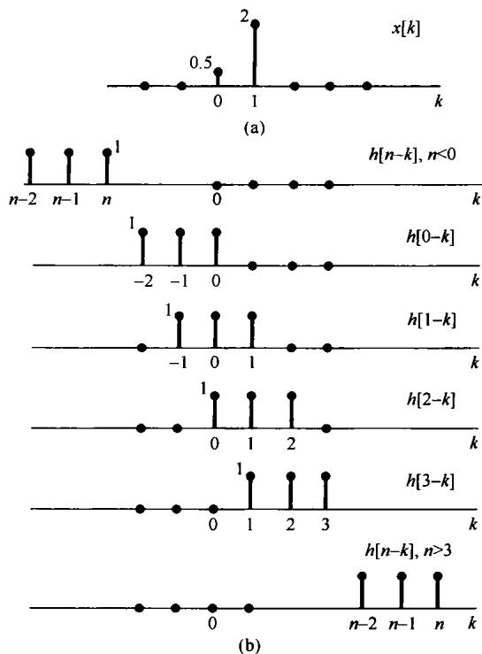

图2.4 对于图2.3中信号  $h[n]$  和  $x[n]$ ，式(2.6)的说明。（a）信号  $x[k]$ ；（b）将  $h[n - k]$  看成固定  $n$  时  $k$  的函数，对于几个  $n$  值  $(n < 0; n = 0, 1, 2, 3; n > 3)$  时的信号  $h[n - k]$ ，这些信号都是由  $h[k]$  的反转和移位来得出的。对每个  $n$  值的  $y[n]$  是将图(a)中的  $x[k]$  与图(b)中的  $h[n - k]$  相乘，然后在全部  $k$  值上将乘积相加后得出的。这个例子的计算在例2.2中已详细做过

例2.3 已知输入  $x[n]$  和单位脉冲响应  $h[n]$  为

$$
x [ n ] = \alpha^ {n} u [ n ]
$$

$$
h [ n ] = u [ n ]
$$

其中  $0 < \alpha < 1$  。图2.5中画出了这两个信号。为了帮助我们想象并计算这两个信号的卷积，在图2.6中已经画出了  $x[k]$ ， $h[-k]$ ， $h[-1-k]$  和  $h[1-k]$ （也就是  $n = 0, -1$  和  $+1$  时的  $h[n-k]$ ），以及最后对任意正  $n$  和负  $n$  值时的  $h[n-k]$  。由这个图可知，对于  $n < 0$ ， $x[k]$  和  $h[n-k]$  的非零部分没有任何重合，所以对于  $n < 0$  而言， $x[k]h[n-k]$  对于所有的  $k$  值都为零，由式(2.6)可知  $n < 0$  时  $y[n] = 0$  。对于  $n \geqslant 0$

$$
x [ k ] h [ n - k ] = \left\{ \begin{array}{l l} {\alpha^ {k},} & {0 \leqslant k \leqslant n} \\ {0,} & {\text {其 他}} \end{array} \right.
$$

因此，对于  $n\geqslant 0$

$$
y [ n ] = \sum_ {k = 0} ^ {n} \alpha^ {k}
$$

利用习题1.54的结果，就可写成

$$
y [ n ] = \sum_ {k = 0} ^ {n} \alpha^ {k} = \frac {1 - \alpha^ {n + 1}}{1 - \alpha}, \quad n \geqslant 0 \tag {2.13}
$$

于是，对于所有的  $n$  就有

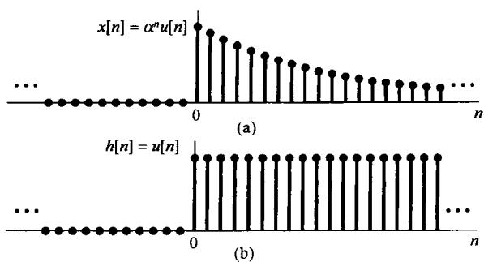

图2.5 例2.3中的信号  $x[n]$  和  $h[n]$

$$
y [ n ] = \left(\frac {1 - \alpha^ {n + 1}}{1 - \alpha}\right) u [ n ]
$$

信号  $y[n]$  如图2.7所示。

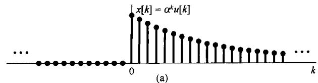

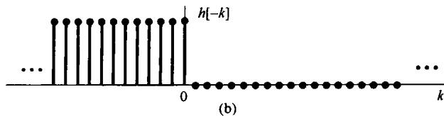

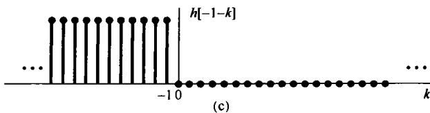

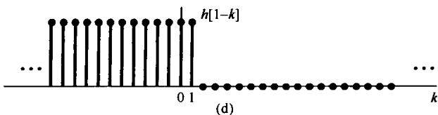

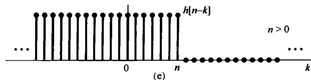

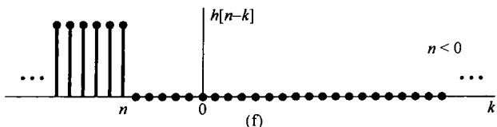

图2.6 计算例2.3卷积和的图解说明

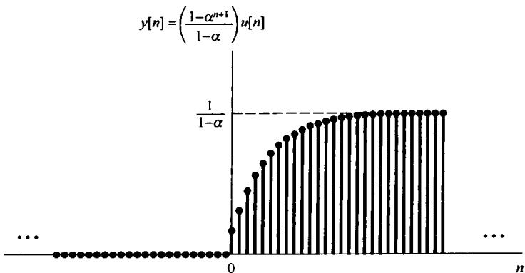

图2.7 例2.3的输出

卷积运算有时也用序列  $h[n - k]$  沿  $x[k]$  的“滑动”来说明。例如，对某一  $n$  值，比如  $n = n_0$ ，已经求得了  $y[n]$ ，这就是说已经画出了信号  $h[n_0 - k]$ ，将它与  $x[k]$  相乘，并对所有的  $k$  值将乘积相加。现在想要求下一个  $n$  值，即  $n = n_0 + 1$  时的  $y[n]$ 。这时就需要画出信号  $h[(n_0 + 1) - k]$ ，然而这时只需要将信号  $h[n_0 - k]$  右移一点即可；对于接踵而来的每一个  $n$  值，继续这一过程，把  $h[n - k]$  一点一点地向右移，再与  $x[k]$  相乘，并对所有的  $k$  将全部乘积相加即可。

例2.4 作为一个深入一些的例子，考虑如下两个序列：

$$
x [ n ] = \left\{ \begin{array}{l l} 1, & \quad 0 \leqslant n \leqslant 4 \\ 0, & \quad \text {其 他} \end{array} \right.
$$

和

$$
h [ n ] = \left\{ \begin{array}{l l} {\alpha^ {n},} & {\qquad 0 \leqslant n \leqslant 6} \\ {0,} & {\qquad \text {其 他}} \end{array} \right.
$$

对于某个正的  $\alpha > 1$  的值，这两个信号如图2.8所示。为了计算这两个信号的卷积，将  $n$  分成5个不同的区间来考虑比较方便，如图2.9所示。

区间1 对于  $n < 0$  ，由于  $x[k]$  与  $h[n - k]$  的非零部分无任何重合，故  $y[n] = 0$  。

区间2 对于  $0 \leqslant n \leqslant 4$

$$
x [ k ] h [ n - k ] = \left\{ \begin{array}{l l} {\alpha^ {n - k},} & {\qquad 0 \leqslant k \leqslant n} \\ {0,} & {\qquad \text {其 他}} \end{array} \right.
$$

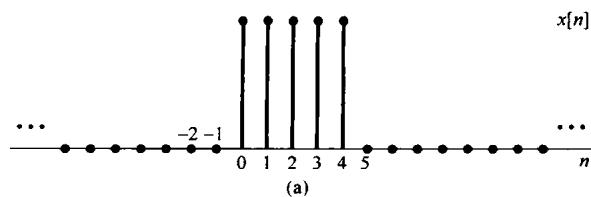

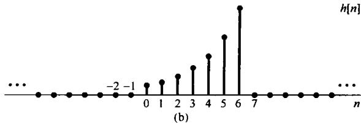

图2.8 例2.4中待卷积的信号

因此，在该区间内

$$
y [ n ] = \sum_ {k = 0} ^ {n} \alpha^ {n - k} \tag {2.14}
$$

利用有限项求和公式(2.13)可以求出这个和。具体而言，将式(2.14)中的求和变量由  $k$  置换成 $r = n - k$  ，得到

$$
y [ n ] = \sum_ {r = 0} ^ {n} \alpha^ {r} = \frac {1 - \alpha^ {n + 1}}{1 - \alpha}
$$

区间3 对于  $n > 4$  ，但  $n - 6 \leqslant 0$  ，即  $4 < n \leqslant 6$  ，这时

$$
x [ k ] h [ n - k ] = \left\{ \begin{array}{l l} {\alpha^ {n - k},} & {\qquad 0 \leqslant k \leqslant 4} \\ {0,} & {\qquad \text {其 他}} \end{array} \right.
$$

则在该区间内

$$
y [ n ] = \sum_ {k = 0} ^ {4} \alpha^ {n - k} \tag {2.15}
$$

再次利用式(2.13)的求和公式来求式(2.15)，为此将式(2.15)中的  $\alpha^n$  常数因子提出来后可得

$$
y [ n ] = \alpha^ {n} \sum_ {k = 0} ^ {4} (\alpha^ {- 1}) ^ {k} = \alpha^ {n} \frac {1 - \left(\alpha^ {- 1}\right) ^ {5}}{1 - \alpha^ {- 1}} = \frac {\alpha^ {n - 4} - \alpha^ {n + 1}}{1 - \alpha} \tag {2.16}
$$

区间4 对于  $n > 6$  ，但  $n - 6 \leqslant 4$  ，即  $6 < n \leqslant 10$  ，这时

$$
x [ k ] h [ n - k ] = \left\{ \begin{array}{l l} {\alpha^ {n - k},} & {(n - 6) \leqslant k \leqslant 4} \\ {0,} & {\text {其 他}} \end{array} \right.
$$

所以

$$
y [ n ] = \sum_ {k = n - 6} ^ {4} \alpha^ {n - k}
$$

令  $r = k - n + 6$  ，再利用式(2.13)来求这个和式，可得

$$
y [ n ] = \sum_ {r = 0} ^ {1 0 - n} \alpha^ {6 - r} = \alpha^ {6} \sum_ {r = 0} ^ {1 0 - n} (\alpha^ {- 1}) ^ {r} = \alpha^ {6} \frac {1 - \alpha^ {n - 1 1}}{1 - \alpha^ {- 1}} = \frac {\alpha^ {n - 4} - \alpha^ {7}}{1 - \alpha}
$$

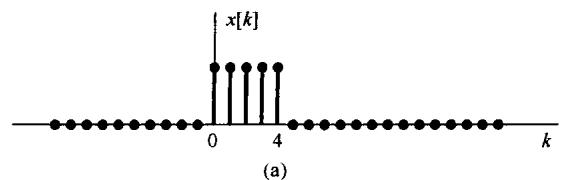

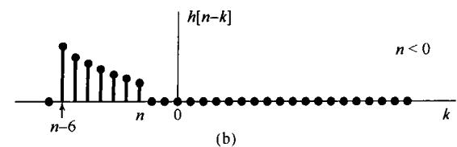

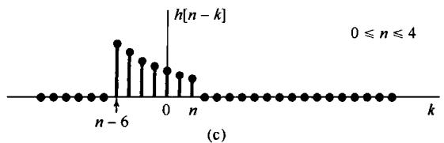

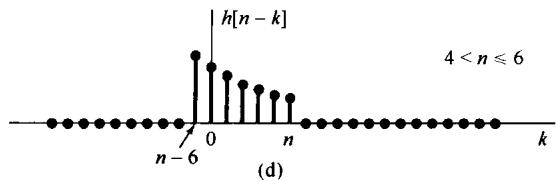

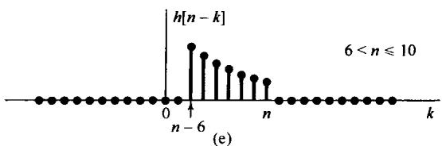

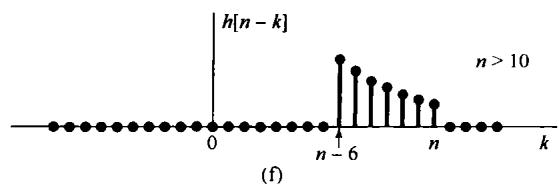

图2.9 例2.4卷积的图解说明

区间5 对于  $n - 6 > 4$  ，即  $n > 10$  ， $x[k]$  和  $h[n - k]$  的非零部分没有任何重合，所以

$$
y [ n ] = 0
$$

综合以上所得，  $y[n]$  可归纳如下：

$$
y [ n ] = \left\{ \begin{array}{l l} 0, & n <   0 \\ \frac {1 - \alpha^ {n + 1}}{1 - \alpha}, & 0 \leqslant n \leqslant 4 \\ \frac {\alpha^ {n - 4} - \alpha^ {n + 1}}{1 - \alpha}, & 4 <   n \leqslant 6 \\ \frac {\alpha^ {n - 4} - \alpha^ {7}}{1 - \alpha}, & 6 <   n \leqslant 1 0 \\ 0, & 1 0 <   n \end{array} \right.
$$

整个  $y[n]$  如图2.10所示。

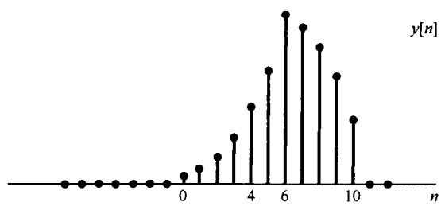

图2.10 例2.4的卷积结果

例2.5 一个线性时不变系统，其输入  $x[n]$  和单位脉冲响应  $h[n]$  如下：

$$
x [ n ] = 2 ^ {n} u [ - n ] \tag {2.17}
$$

$$
h [ n ] = u [ n ] \tag {2.18}
$$

序列  $x[k]$  和  $h[n - k]$  作为  $k$  的函数画在图2.11(a)中，注意， $x[k]$  对于  $k > 0$  是零，而  $h[n - k]$  对于  $k > n$  是零。同时还能看到，无论  $n$  为何值，序列  $x[k]h[n - k]$  沿  $k$  轴总是有非零的样本值。当  $n \geqslant 0$  时  $x[k]h[n - k]$  在  $k \leqslant 0$  区间内有非零的样本值，于是对  $n \geqslant 0$  就有

$$
y [ n ] = \sum_ {k = - \infty} ^ {0} x [ k ] h [ n - k ] = \sum_ {k = - \infty} ^ {0} 2 ^ {k} \tag {2.19}
$$

式(2.19)是一个无穷项的和式，可以用无限项求和公式(infinite sum formula)

$$
\sum_ {k = 0} ^ {\infty} \alpha^ {k} = \frac {1}{1 - \alpha}, \quad 0 <   | \alpha | <   1 \tag {2.20}
$$

将式(2.19)中的求和变量由  $k$  置换为  $r = -k$  ，可得

$$
\sum_ {k = - \infty} ^ {0} 2 ^ {k} = \sum_ {r = 0} ^ {\infty} \left(\frac {1}{2}\right) ^ {r} = \frac {1}{1 - (1 / 2)} = 2 \tag {2.21}
$$

因此，对于  $n \geqslant 0$  ， $y[n]$  为常数2。

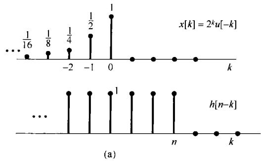

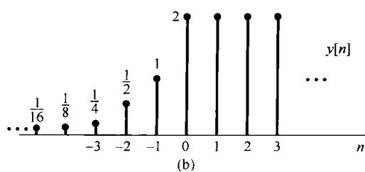

图2.11 (a) 例2.5中的序列  $x[k]$  和  $h[n - k]$ ; (b) 输出结果  $y[n]$

当  $n < 0$  时，对于  $k \leqslant n, x[k]h[n - k]$  有非零样本值，因此对  $n < 0$  有

$$
y [ n ] = \sum_ {k = - \infty} ^ {n} x [ k ] h [ n - k ] = \sum_ {k = - \infty} ^ {n} 2 ^ {k} \tag {2.22}
$$

以  $l = -k$  和  $m = l + n$  进行变量置换，再次利用无限项求和公式(2.20)来求式(2.22)，其结果是对于  $n < 0$  为

$$
y [ n ] = \sum_ {l = - n} ^ {\infty} \left(\frac {1}{2}\right) ^ {l} = \sum_ {m = 0} ^ {\infty} \left(\frac {1}{2}\right) ^ {m - n} = \left(\frac {1}{2}\right) ^ {- n} \sum_ {m = 0} ^ {\infty} \left(\frac {1}{2}\right) ^ {m} = 2 ^ {n} \cdot 2 = 2 ^ {n + 1} \tag {2.23}
$$

整个  $y[n]$  序列如图2.11(b)所示。

以上这些例子都说明用图解的方法来进行卷积和的计算是很有用的。另外，卷积和除了给出计算线性时不变系统响应的一种有用方法外，还给出了线性时不变系统一种极其有用的表示，借此可以对线性时不变系统的性质进行深入研究。在2.3节将讨论卷积的某些性质，并且还要研究前一章所介绍的某些系统性质，以便看看对线性时不变系统而言，这些系统性质是如何被表征的。

# 2.2 连续时间线性时不变系统：卷积积分

与上一节讨论并导出的结果相类似，这一节的目的也是要利用一个连续时间线性时不变系统的单位冲激响应来对系统给出完全的表征。在离散时间情况下，导出卷积和的关键是离散时间单位脉冲的筛选性质，这就是把一个信号作为一组加权并移位的单位脉冲函数叠加的数学表示式。这样一来，直观上看也就能把离散时间系统当成对这一串单个脉冲的响应。当然，在连续时间情况下没有一个离散的输入序列。然而，正如1.4.2节所讨论的，如果把单位冲激看成它的持续期短到对任何实际物理系统已毫无意义的一个短脉冲理想化的结果，那么就能够利用这些持续期小到难以察觉的理想化脉冲，即冲激，来表示任何连续时间信号。下面将导出这种表示，并接着用与2.1节类似的方式来建立连续时间线性时不变系统的卷积积分表示。

# 2.2.1 用冲激表示连续时间信号

为了建立与离散时间筛选性质式(2.2)对应的连续时间下的性质，先考虑用一串脉冲或者说阶梯信号  $\hat{x}(t)$  来近似  $x(t)$ ，如图2.12(a)所示。如同离散时间情况一样，对于近似式  $\hat{x}(t)$  来说，可以用一串延时脉冲的线性组合来表示，如图2.12(a)至图2.12(e)所示。若定义

$$
\delta_ {\Delta} (t) = \left\{ \begin{array}{l l} { \frac {1}{\Delta},} & {0 \leqslant t <   \Delta} \\ {0,} & {\text {其 他}} \end{array} \right. \tag {2.24}
$$

由于  $\Delta \delta_{\Delta}(t)$  为1，则  $\hat{x} (t)$  可表示成

$$
\hat {x} (t) = \sum_ {k = - \infty} ^ {\infty} x (k \Delta) \delta_ {\Delta} (t - k \Delta) \Delta \tag {2.25}
$$

从图2.12中可以看到，与离散时间情况下的式(2.2)一样，式(2.25)右边的和式中对任何  $t$  值来说，只有一项为非零。

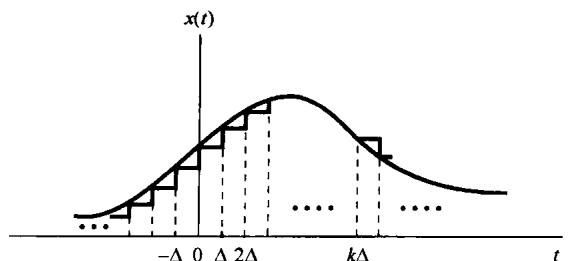

(a)

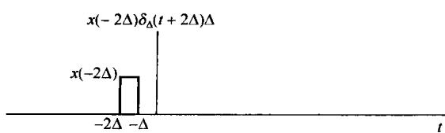

(b)

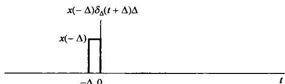

(c)

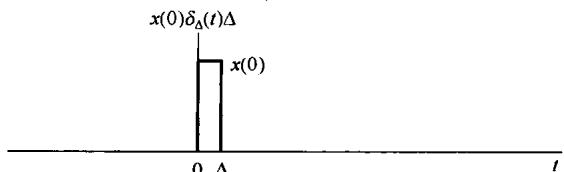

(d)

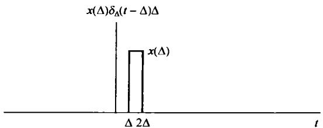

(e)

图2.12 一个连续时间信号的阶梯形近似

随着  $\Delta$  逐近于零， $\hat{x}(t)$  将越来越近似于  $x(t)$ ，最后极限就是  $x(t)$ ，因此

$$
x (t) = \lim  _ {\Delta \rightarrow 0} \sum_ {k = - \infty} ^ {+ \infty} x (k \Delta) \delta_ {\Delta} (t - k \Delta) \Delta \tag {2.26}
$$

同时，随着  $\Delta \to 0$  ，式(2.26)的求和趋近为一个积分式。利用图2.13把式(2.26)用图解来表示可以看出这一变化过程。图中画出了  $x(\tau)$  ，  $\delta_{\Delta}(t - \tau)$  及其乘积。当  $\Delta \to 0$  时，图中阴影部分的面积应趋近于  $x(\tau)\delta_{\Delta}(t - \tau)$  下的面积。注意，图中阴影部分面积等于  $x(m\Delta)$  ，其中  $t - \Delta < m\Delta < t$  。而且，在式(2.26)中，对于该  $t$  值来说，仅有  $k = m$  这一项是非零的，因此该式的右边部分也应等于  $x(m\Delta)$  。于是，从式(2.26)以及前面的讨论，  $x(t)$  就应为当  $\Delta \to 0$  时，位于  $x(\tau)\delta_{\Delta}(t - \tau)$  下的面积。另外，由式(1.74)已经知道，当  $\Delta \to 0$  时，  $\delta_{\Delta}(t)$  的极限就是单位冲激函数  $\delta (t)$  。所以得

$$
x (t) = \int_ {- \infty} ^ {+ \infty} x (\tau) \delta (t - \tau) d \tau \tag {2.27}
$$

与离散时间情况一样，式(2.27)为连续时间冲激函数的筛选性质（sifting property）。特别是，若以  $x(t) = u(t)$  为例，因为  $\tau < 0$  时  $u(\tau) = 0$  ， $\tau > 0$  时  $u(\tau) = 1$  ，所以式(2.27)就变成

$$
u (t) = \int_ {- \infty} ^ {+ \infty} u (\tau) \delta (t - \tau) d \tau = \int_ {0} ^ {\infty} \delta (t - \tau) d \tau \tag {2.28}
$$

式(2.28)与1.4.2节所得结果式(1.75)是完全一致的。

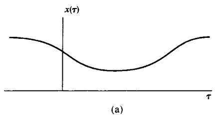

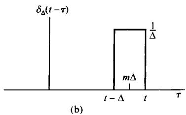

图2.13 式(2.26)的图解表示

再次提出，式(2.27)应该看成在这种意义下的一种理想化结果。这就是从任何实际情况来看，对于“足够小”的  $\Delta$  来说，式(2.25)中  $x(t)$  的近似基本上就是准确的了。这样，式(2.27)就只是表示在  $\Delta$  取为“难以觉察得到小”时式(2.25)的一种理想化结果。同时，也应该注意到，我们本来就能够利用1.4.2节讨论过的单位冲激函数的性质来直接导出式(2.27)。具体而言，如图2.14(b)所示，信号  $\delta (t - \tau)$  是一个在  $\pmb{\tau}$  的时间轴上，发生在  $\pmb {\tau} = t(t$  固定)时的单位冲激函数。这样，信号  $x(\tau)\delta (t - \tau)$  还是看成  $\pmb{\tau}$  的函数，就等于  $x(t)\delta (t - \tau)$  （也就是一个发生在  $\pmb {\tau} = t$  ，面积等于  $x(t)$  值的冲激)，如图2.14(c)所示。那么，这个信号从  $\tau = -\infty$  到  $\tau = +\infty$  的积分就应等于 $x(t)$  ，也就是

$$
\int_ {- \infty} ^ {+ \infty} x (\tau) \delta (t - \tau) d \tau = \int_ {- \infty} ^ {+ \infty} x (t) \delta (t - \tau) d \tau = x (t) \int_ {- \infty} ^ {+ \infty} \delta (t - \tau) d \tau = x (t)
$$

尽管这样的导出很直接，但是我们采用的由式(2.24)到式(2.27)的推导强调了与离散时间情况的类似性；特别是强调了式(2.27)把信号  $x(t)$  表示成了一个加权的移位冲激函数的“和”（即积分）。

图2.14（a）任意信号  $x(\tau)$ ；(b)  $t$  固定，作为  $\tau$  的函数的冲激  $\delta(t - \tau)$ ；(c) 该二信号的乘积

# 2.2.2 连续时间线性时不变系统的单位冲激响应及卷积积分表示

和离散时间情况一样，上一节得出的表示就是把任意一个连续时间信号看成加权和移位脉冲的叠加。尤其是式(2.25)的近似式代表了信号  $\hat{x}(t)$  是基本脉冲信号  $\delta_{\Delta}(t)$  的加权和移位的和。这样，一个线性系统对该信号的响应  $\hat{y}(t)$  就是系统对这些  $\delta_{\Delta}(t)$  加权和移位脉冲响应的叠加。具体而言，令  $\hat{h}_{k\Delta}(t)$  为一个线性时不变系统对输入  $\delta_{\Delta}(t - k\Delta)$  的响应，那么由式(2.25)和叠加性质，对连续时间线性系统而言，就有

$$
\hat {y} (t) = \sum_ {k = - \infty} ^ {+ \infty} x (k \Delta) \hat {h} _ {k \Delta} (t) \Delta \tag {2.29}
$$

式(2.29)与离散时间的式(2.3)是类似的，我们也像图2.2一样，用图2.15来解释式(2.29)。图2.15(a)是输入  $x(t)$  和它的近似值  $\hat{x}(t)$ ，而图2.15(b)至图2.15(d)则画出了  $\hat{x}(t)$  中的三个加权脉冲及其响应。那么，相应于  $\hat{x}(t)$  的输出  $\hat{y}(t)$  就应该是这些响应的叠加，如图2.15(e)所示。

(a)

(b)

(c)

(d)

(e)

(f)

图2.15 由式(2.29)和式(2.30)表示的连续时间线性系统响应的图解说明

接下来要考虑的就是当  $\Delta$  变成无穷小，即  $\Delta \rightarrow 0$  时会产生什么结果。特别是，由于  $x(t)$  表示成式(2.26)，因此当  $\Delta \rightarrow 0$  后  $\hat{x}(t)$  愈逼近  $x(t)$ ，事实上两者最终趋于一致，其结果就是对  $\hat{x}(t)$  的响应  $\hat{y}(t)$  一定收敛于  $y(t)$ ，即对真正输入  $x(t)$  的响应，如图2.15(f)所示。此外，正如早已提到的，对于“足够小”的  $\Delta$ ，就考虑的系统而言， $\delta_{\Delta}(t - k\Delta)$  脉冲的持续期已没有任何意义，系统对这个脉冲的响应实质上与在同一时刻单位冲激的响应是一样的。这就是说，因为脉冲  $\delta_{\Delta}(t - k\Delta)$  当  $\Delta \rightarrow 0$  时相当于一个移位的单位冲激，所以对这个输入脉冲的响应  $\hat{h}_{k\Delta}(t)$  就成为在极限情况下的冲激响应。若令  $h_{\tau}(t)$  表示系统在时间  $t$  对发生于时间  $\tau$  的单位冲激  $\delta(t - \tau)$  的响应，那么

$$
y (t) = \lim  _ {\Delta \rightarrow 0} \sum_ {k = - \infty} ^ {+ \infty} x (k \Delta) \hat {h} _ {k \Delta} (t) \Delta \tag {2.30}
$$

随着  $\Delta \to 0$  ，右边的求和就变成一个积分，如图2.16所示。图中阴影部分的矩形代表式(2.30)右边和式中的一项，而随着  $\Delta \to 0$  ，这个和式就逼近于作为  $\pmb{\tau}$  的函数的 $x(\tau)h_{\tau}(t)$  下的面积，因此得到

$$
y (t) = \int_ {- \infty} ^ {+ \infty} x (\tau) h _ {\tau} (t) d \tau \tag {2.31}
$$

式(2.31)的意义和式(2.29)是完全类似的。因为在2.2.1节已经证明，任何输入  $x(t)$  都可以表示为

$$
x (t) = \int_ {- \infty} ^ {+ \infty} x (\tau) \delta (t - \tau) d \tau
$$

图2.16 式(2.30)和式(2.31)的图解说明

直观上可以把  $x(t)$  看成一组加权移位的冲激函数之“和”，这里对冲激  $\delta (t - \tau)$  的权是  $x(\tau)\mathrm{d}\tau$  。借助于这种解释之后，式(2.31)就是系统对这些加权移位冲激函数响应的叠加。因此，根据线性性质，对  $\delta (t - \tau)$  的响应  $h_\tau (t)$  的权也就是  $x(\tau)\mathrm{d}\tau$  。

式(2.31)代表了连续时间情况下一个线性系统响应的一般形式。如果系统除了是线性的，而且还是时不变的，那么  $h_{\tau}(t) = h_0(t - \tau)$  。这就是说，一个线性时不变系统对单位冲激  $\delta (t - \tau)$  的响应，就是对  $\delta (t)$  响应的时移。再次为了符号上的方便，略去下标，而定义单位冲激响应(unit impulse response)  $h(t)$  为

$$
h (t) = h _ {0} (t) \tag {2.32}
$$

也就是  $h(t)$  是系统对  $\delta (t)$  的响应。这时，式(2.31)变为

$$
\boxed {y (t) = \int_ {- \infty} ^ {+ \infty} x (\tau) h (t - \tau) d \tau} \tag {2.33}
$$

式(2.33)称为卷积积分(convolution integral)或叠加积分(superposition integral)。它是与离散时间情况下式(2.6)的卷积和相对应的，并且表明了一个连续时间线性时不变系统的特性可以用它的单位冲激响应来刻画。两个信号  $x(t)$  和  $h(t)$  的卷积，以后就表示成

$$
y (t) = x (t) * h (t) \tag {2.34}
$$

虽然在离散时间和连续时间情况下都用同一符号 * 来表示卷积，不过一般根据上下文就能区分这两种情况。

可以看到，与在离散时间情况下相同，一个连续时间线性时不变系统是完全由它的冲激响应，即对单一的基本信号单位冲激  $\delta(t)$  的响应来表征的，它的内涵在下一节研究连续时间和离散时间情况下卷积的几个性质和线性时不变系统的性质时将会用到。

求解卷积积分的步骤与求卷积和是十分相似的。由式(2.33)知道，在任意时刻  $t$  的输出  $y(t)$  是输入的加权积分，对  $x(\tau)$  其权是  $h(t - \tau)$  。因此，为了求出对某一给定  $t$  时的这个积分值，首先需要得到  $h(t - \tau)$  。 $h(t - \tau)$  是  $\tau$  的函数， $t$  为某一固定值，利用  $h(\tau)$  的反转再加上平移  $(t > 0$  时就向右移  $t; t < 0$  时就向左移  $|t|$ ），就可以求得  $h(t - \tau)$  。然后将  $x(\tau)$  与  $h(t - \tau)$  相乘，将该乘积在  $\tau = -\infty$  到  $\tau = +\infty$  区间内积分就得到  $y(t)$  。下面用几个例子来予以说明。

例2.6 设某一线性时不变系统的输入为  $x(t)$ ，其单位冲激响应为  $h(t)$

$$
x (t) = \mathrm {e} ^ {- a t} u (t), \quad a > 0 \text {和} h (t) = u (t)
$$

图2.17分别画出了  $h(\tau), x(\tau)$  及对应于某个正值  $t$  和负值  $t$  的  $h(t - \tau)$  。由图中可以看出，由于  $t < 0$  时， $x(\tau)$  与  $h(t - \tau)$  的乘积为零，所以  $y(t) = 0$ ；而对  $t > 0$  有

$$
x (\tau) h (t - \tau) = {\left\{ \begin{array}{l l} {{\mathrm {e}} ^ {- a \tau},} & {0 <   \tau <   t} \\ {0,} & {{\text {其 他}}} \end{array} \right.}
$$

图2.17 例2.6卷积积分的计算

由该式可算出  $t > 0$  时

$$
\begin{array}{l} y (t) = \int_ {0} ^ {t} \mathrm {e} ^ {- a \tau} \mathrm {d} \tau = - \frac {1}{a} \mathrm {e} ^ {- a \tau} \Bigg | _ {0} ^ {t} \\ = \frac {1}{a} (1 - e ^ {- a t}) \\ \end{array}
$$

因此，对于所有的  $t, y(t)$  是

$$
y (t) = \frac {1}{a} (1 - e ^ {- a t}) u (t)
$$

如图2.18所示。

图2.18 例2.6的系统响应

例2.7 求以下两信号的卷积：

$$
x (t) = \left\{ \begin{array}{l l} 1, & \quad 0 <   t <   T \\ 0, & \quad \text {其 他} \end{array} \right.
$$

$$
h (t) = {\left\{ \begin{array}{l l} {t,} & {\qquad 0 <   t <   2 T} \\ {0,} & {\qquad {\text {其 他}}} \end{array} \right.}
$$

在这种情况下，与例2.4一样，最方便的是分别在几个不同的区间内求  $y(t)$  。图2.19画出了  $x(\tau)$  及在各个有关区间内的  $h(t - \tau)$  。不难看出，在  $t < 0$  和  $t > 3T$  区间上，对所有的  $\tau$  都有  $x(\tau)h(t - \tau) = 0$ ，所以  $y(t) = 0$  。而在其他区间内，乘积  $x(\tau)h(t - \tau)$  示于图2.20。根据图2.20，对该三个区间内的  $y(t)$ ，这个积分值可用图解方法求出，全部  $y(t)$  为

图2.19 例2.7中信号  $x(\tau)$  和不同  $t$  值时的  $h(t - \tau)$

图2.20 例2.7中乘积  $x(\tau)h(t - \tau)$  不为零(见图2.19)的三个不同  $t$  区间的  $x(\tau)h(t - \tau)$

$$
y (t) = \left\{ \begin{array}{l l} 0, & t <   0 \\ \frac {1}{2} t ^ {2}, & 0 <   t <   T \\ T t - \frac {1}{2} T ^ {2}, & T <   t <   2 T \\ - \frac {1}{2} t ^ {2} + T t + \frac {3}{2} T ^ {2}, & 2 T <   t <   3 T \\ 0, & 3 T <   t \end{array} \right.
$$

$y(t)$  如图2.21所示。

图2.21 例2.7中信号  $y(t) = x(t)*h(t)$

例2.8 令  $y(t)$  为下列两信号的卷积：

$$
x (t) = \mathrm {e} ^ {2 t} u (- t) \tag {2.35}
$$

$$
h (t) = u (t - 3) \tag {2.36}
$$

信号  $x(\tau)$  和  $h(t - \tau)$  作为  $\pmb{\tau}$  的函数均画在图2.22(a)中。先观察一下，无论  $t$  为何值，这两个信号都有非零的重合区。当  $t - 3\leqslant 0$  ，  $x(\tau)$  和  $h(t - \tau)$  的乘积在  $-\infty <  \tau <  t - 3$  时非零，其卷积积分为

$$
y (t) = \int_ {- \infty} ^ {t - 3} \mathrm {e} ^ {2 \tau} \mathrm {d} \tau = \frac {1}{2} \mathrm {e} ^ {2 (t - 3)} \tag {2.37}
$$

对于  $t - 3 \geqslant 0$  ，在  $-\infty < \tau < 0$  内，乘积  $x(\tau)h(t - \tau)$  为非零，其卷积积分为

$$
y (t) = \int_ {- \infty} ^ {0} e ^ {2 \tau} d \tau = \frac {1}{2} \tag {2.38}
$$

其结果  $y(t)$  如图2.22(b)所示。

图2.22 例2.8的卷积结果

以上这些例子及在2.1节提到的例子都表明，图解方法在求卷积积分和卷积和时都有很大的用处。

# 2.3 线性时不变系统的性质

前面两节得出了借助于连续时间和离散时间线性时不变系统的单位冲激响应来表示这些系统的重要结论。在离散时间情况下，这种表示是取卷积和的形式，而在连续时间情况下是取卷积积分的形式。为方便起见，现将两者重复如下：

$$
\begin{array}{l} y [ n ] = \sum_ {k = - \infty} ^ {+ \infty} x [ k ] h [ n - k ] = x [ n ] * h [ n ] (2.39) \\ y (t) = \int_ {- \infty} ^ {+ \infty} x (\tau) h (t - \tau) d \tau = x (t) * h (t) (2.40) \\ \end{array}
$$

正如已经指出过的，这些表示的一种结果就是：一个线性时不变系统的特性可以完全由它的冲激响应来决定。要特别强调的是，一般来说这个结论仅对线性时不变系统成立。下面的例子将说明，一个非线性系统的单位冲激响应是不能完全表征系统的特性行为的。

例2.9 考虑一个离散时间系统，其单位冲激响应为

$$
h [ n ] = \left\{ \begin{array}{l l} 1, & \quad n = 0, 1 \\ 0, & \quad \text {其 他} \end{array} \right. \tag {2.41}
$$

如果该系统是线性时不变的，那么式(2.41)就可完全确定系统的输入-输出关系。尤其是，将式(2.41)代入式(2.39)的卷积和中，可得出描述该线性时不变系统输入和输出之间的方程如下：

$$
y [ n ] = x [ n ] + x [ n - 1 ] \tag {2.42}
$$

另一方面，却有许多非线性系统也具有由式(2.41)所表示的单位冲激响应，例如下面两个系统都有如式(2.41)所表示的单位冲激响应：

$$
\begin{array}{l} y [ n ] = (x [ n ] + x [ n - 1 ]) ^ {2} \\ y [ n ] = \max  (x [ n ], x [ n - 1 ]) \\ \end{array}
$$

因此，如果系统是非线性的，它就不能被式(2.41)的单位冲激响应完全表征。

由线性时不变系统具有卷积和与卷积积分这种特别的表示形式入手，上面这个例子说明了这样一点，就是线性时不变系统具有一些其他系统不具备的性质。本节余下部分将研究这些性质中的几个最基本和最重要的性质。

# 2.3.1 交换律性质

在连续时间和离散时间情况下，卷积运算的一个基本性质是：它满足交换律（commutative）。即，在离散时间情况下有

$$
x [ n ] * h [ n ] = h [ n ] * x [ n ] = \sum_ {k = - \infty} ^ {+ \infty} h [ k ] x [ n - k ] \tag {2.43}
$$

在连续时间情况下有

$$
x (t) * h (t) = h (t) * x (t) = \int_ {- \infty} ^ {+ \infty} h (\tau) x (t - \tau) d \tau \tag {2.44}
$$

这两个表示式通过变量置换可由式(2.39)和式(2.40)直接得到。例如，在离散时间情况下，若

令  $r = n - k$  或等效为  $k = n - r$  ，则式(2.39)变为

$$
x [ n ] * h [ n ] = \sum_ {k = - \infty} ^ {+ \infty} x [ k ] h [ n - k ] = \sum_ {r = - \infty} ^ {+ \infty} x [ n - r ] h [ r ] = h [ n ] * x [ n ] \tag {2.45}
$$

利用这种变量置换， $x[n]$  和  $h[n]$  的作用就互换了。根据式(2.45)表明，一个输入为  $x[n]$  且单位冲激响应为  $h[n]$  的线性时不变系统的输出，与输入为  $h[n]$  且单位冲激响应为  $x[n]$  的输出，是完全一样的。例如，在例2.4中本来就可以先将  $x[k]$  反转和移位，然后将信号  $x[n - k]$  与  $h[k]$  相乘，最后对所有的  $k$  值将乘积相加来完成这个卷积和的计算。

式(2.44)也能依此来证明，其内涵也是相同的，即输入为  $x(t)$  且单位冲激响应为  $h(t)$  的线性时不变系统的输出，与输入为  $h(t)$  且单位冲激响应为  $x(t)$  的输出，是完全一样的。因此，在例2.7中也就可以将  $x(t)$  进行反转和移位，再将  $x(t - \tau)$  与  $h(\tau)$  相乘，最后将乘积在  $-\infty < \tau < +\infty$  积分来完成这个卷积积分的计算。在有些情况下，两种形式中的一种在计算卷积时可能比另一种要容易些，即离散时间情况下的式(2.39)或式(2.43)，连续时间情况下的式(2.40)或式(2.44)，但是两者的结果总是相同的。

# 2.3.2 分配律性质

卷积的另一个基本性质是: 它满足分配律 (distributive)。具体而言, 卷积可以在相加项上进行分配, 即在离散时间情况下有

$$
x [ n ] * \left(h _ {1} [ n ] + h _ {2} [ n ]\right) = x [ n ] * h _ {1} [ n ] + x [ n ] * h _ {2} [ n ] \tag {2.46}
$$

在连续时间情况下有

$$
x (t) * \left[ h _ {1} (t) + h _ {2} (t) \right] = x (t) * h _ {1} (t) + x (t) * h _ {2} (t) \tag {2.47}
$$

这个性质也能直接给予证明。

分配律在系统互联中有一个很有用的解释。图2.23(a)所示为两个连续时间线性时不变系统的并联，图中方框内都给出了它们的单位冲激响应。这种方框图的表示法是特别方便的，并且再次强调了一个线性时不变系统是完全由它的冲激响应来表征的这一事实。

(a)

(b)

图2.23 线性时不变系统并联中卷积分配律的说明

这两个系统，其单位冲激响应为  $h_1(t)$  和  $h_2(t)$ ，具有相同的输入，而输出相加。因为

$$
y _ {1} (t) = x (t) * h _ {1} (t)
$$

且

$$
y _ {2} (t) = x (t) * h _ {2} (t)
$$

整个图2.23(a)的输出

$$
y (t) = x (t) * h _ {1} (t) + x (t) * h _ {2} (t) \tag {2.48}
$$

就相应于式(2.47)的右边。图2.23(b)系统的输出为

$$
y (t) = x (t) * \left[ h _ {1} (t) + h _ {2} (t) \right] \tag {2.49}
$$

就相应于式(2.47)的左边。将式(2.47)应用于式(2.49)，再与式(2.48)的结果相比较，可得图2.23(a)和图2.23(b)的系统是完全一样的。

对于离散时间情况也有相同的解释，只要在图2.23中每个信号用相应的离散量代替即可，即  $x(t), h_1(t), h_2(t), y_1(t), y_2(t)$  和  $y(t)$  分别用  $x[n], h_1[n], h_2[n], y_1[n], y_2[n]$  和  $y[n]$  代替。总之，由于卷积运算的分配律，线性时不变系统的并联可以用一个单一的线性时不变系统来代替，而该系统的单位冲激响应就是并联时各个单位冲激响应的和。

同时，由于交换律和分配律，就有

$$
\left[ x _ {1} [ n ] + x _ {2} [ n ] \right] * h [ n ] = x _ {1} [ n ] * h [ n ] + x _ {2} [ n ] * h [ n ] \tag {2.50}
$$

和

$$
\left[ x _ {1} (t) + x _ {2} (t) \right] * h (t) = x _ {1} (t) * h (t) + x _ {2} (t) * h (t) \tag {2.51}
$$

这两个式子又说明：线性时不变系统对两个输入和的响应一定等于系统对单个输入响应的和。

下面例子还说明，由于卷积的分配律，可以利用它将一个复杂的卷积分为几个较简单的卷积。

例2.10 令  $y[n]$  为下面两个序列的卷积：

$$
x [ n ] = \left(\frac {1}{2}\right) ^ {n} u [ n ] + 2 ^ {n} u [ - n ] \tag {2.52}
$$

$$
h [ n ] = u [ n ] \tag {2.53}
$$

注意，沿整个时间轴，序列  $x[n]$  都是非零的，因此直接来求这个卷积有些烦琐，可以用分配律性

质把  $y[n]$  表示为两个较为简单的卷积之和来解。若令

$x_{1}[n] = \left(\frac{1}{2}\right)^{n}u[n]$  和  $x_{2}[n] = 2^{n}u[-n]$ ，那么

$$
y [ n ] = \left(x _ {1} [ n ] + x _ {2} [ n ]\right) * h [ n ] \tag {2.54}
$$

根据卷积的分配律，可将式(2.54)重新写成

$$
y [ n ] = y _ {1} [ n ] + y _ {2} [ n ] \tag {2.55}
$$

其中

$$
y _ {1} [ n ] = x _ {1} [ n ] * h [ n ] \tag {2.56}
$$

且

$$
y _ {2} [ n ] = x _ {2} [ n ] * h [ n ] \tag {2.57}
$$

式(2.56)的卷积  $y_{1}[n]$  由例2.3可得  $(\alpha = 1 / 2)$ ，而  $y_{2}[n]$  则由例2.5求出。它们的和  $y[n]$  如图2.24所示。

图2.24 例2.10的  $y[n] = x[n]*h[n]$

# 2.3.3 结合律性质

卷积的另一个重要而有用的性质是它满足结合律(associative)。即，在离散时间情况下有

$$
x [ n ] * \left(h _ {1} [ n ] * h _ {2} [ n ]\right) = \left(x [ n ] * h _ {1} [ n ]\right) * h _ {2} [ n ] \tag {2.58}
$$

并且在连续时间情况下有

$$
x (t) * \left[ h _ {1} (t) * h _ {2} (t) \right] = \left[ x (t) * h _ {1} (t) \right] * h _ {2} (t) \tag {2.59}
$$

这个性质可以直接用求和与积分运算得到证明，习题2.43给出了证明的例子。

作为结合律的一个结果就是对于下面的表示式

$$
y [ n ] = x [ n ] * h _ {1} [ n ] * h _ {2} [ n ] \tag {2.60}
$$

和

$$
y (t) = x (t) * h _ {1} (t) * h _ {2} (t) \tag {2.61}
$$

不存在二义性，即按照式(2.58)和式(2.59)，按什么顺序来卷积这些信号是没有关系的。

图2.25(a)和图2.25(b)以离散时间系统为例来解释结合律的意义。在图2.25(a)中，

$$
\begin{array}{l} y [ n ] = w [ n ] * h _ {2} [ n ] \\ = (x [ n ] * h _ {1} [ n ]) * h _ {2} [ n ] \\ \end{array}
$$

在图2.25(b)中，

$$
\begin{array}{l} y [ n ] = x [ n ] * h [ n ] \\ = x [ n ] * \left(h _ {1} [ n ] * h _ {2} [ n ]\right) \\ \end{array}
$$

根据结合律，图2.25(a)中两个系统的级联就等效于图2.25(b)中的单一系统。这一结果可以一般化到任意多个线性时不变系统的级联，并且对连续时间情况也有相同的意义和结论。

将交换律与结合律结合在一起，可以发现线性时不变系统的另一个十分重要的性质。根据图2.25(a)和图2.25(b)可以得出，两个线性时不变系统级联后的冲激响应就是它们单个冲激响应的卷积。因为卷积是可以交换的，所以能够用两种次序中的任一种来求  $h_1[n]$  和  $h_2[n]$  的卷积；这样图2.25(b)和图2.25(c)就是等效的了，再根据结合律，又依次等效到图2.25(d)中的系统。因此，图2.25(a)所示的系统和图2.25(d)所示的系统是完全等效的，但它们级联的次序却交换了。因此，两个线性时不变系统级联后的单位冲激响应与它们在级联中的次序无关。事实上，这个结论对任意多个线性时不变系统的级联都成立，即只要关注的是整个系统的冲激响应，它们的级联次序就是无关紧要的。对于连续时间情况也有同样的结论。

(a)

(b)

(c)

(d)

图2.25 卷积的结合律性质及结合律与交换律性质对线性时不变系统级联的意义

值得特别强调的是，线性时不变系统级联的特性，其总系统响应与系统级联次序无关这一点对这样一类系统是很特别的。相比之下，一般来说非线性系统的级联，要想不改变总的响应，其级联次序就不能改变。例如，有两个无记忆系统，一个是乘以2，而另一个是将输入平方，那么先乘以2，再求平方，就得

$$
y [ n ] = 4 x ^ {2} [ n ]
$$

而若先求平方，再乘以2，就是

$$
y [ n ] = 2 x ^ {2} [ n ]
$$

因此，在级联中次序可以交换只是线性时不变系统的一种特性。事实上，如习题2.51所证明的，一般而言既要求线性，又要求时不变性，才能使这一性质成立。

# 2.3.4 有记忆和无记忆线性时不变系统

1.6.1节已经指出，若一个系统在任何时刻的输出仅与同一时刻的输入值有关，它就是无记忆的。由式(2.39)可见，对一个离散时间线性时不变系统来说，唯一能使这一点成立的就只有：对  $n \neq 0$  ， $h[n] = 0$  ，这时其单位冲激响应为

$$
h [ n ] = K \delta [ n ] \tag {2.62}
$$

其中  $K = h[0]$  是一个常数，卷积和就变为如下关系：

$$
y [ n ] = K x [ n ] \tag {2.63}
$$

如果一个离散时间线性时不变系统，它的单位脉冲响应  $h[n]$  对于  $n \neq 0$  不全为零，这个系统就是有记忆的。由式(2.42)所给出的系统就是一个有记忆的线性时不变系统的例子，这个系统单位脉冲响应由式(2.41)给出，它在  $n = 1$  时不等于零。

对于连续时间线性时不变系统，根据式(2.40)也能推出有关记忆和无记忆的类似性质。这就是若一个连续时间线性时不变系统  $h(t)$ ，在  $t \neq 0$  时  $h(t) = 0$ ，则该系统就是无记忆的；并且这样一个无记忆的线性时不变系统具有

$$
y (t) = K x (t) \tag {2.64}
$$

其单位冲激响应为

$$
h (t) = K \delta (t) \tag {2.65}
$$

其中  $K$  为某一常数。

注意，若  $K = 1$  ，那么这些系统就变成恒等系统，其输出等于输入，单位冲激响应等于单位冲激。这时，卷积和与卷积积分公式就意味着

$$
x [ n ] = x [ n ] * \delta [ n ]
$$

$$
x (t) = x (t) * \delta (t)
$$

这两个式子就是离散时间和连续时间单位冲激函数的筛选性质，即

$$
x [ n ] = \sum_ {k = - \infty} ^ {+ \infty} x [ k ] \delta [ n - k ]
$$

$$
x (t) = \int_ {- \infty} ^ {+ \infty} x (\tau) \delta (t - \tau) d \tau
$$

# 2.3.5 线性时不变系统的可逆性

考虑冲激响应为  $h(t)$  的连续时间线性时不变系统，根据在1.6.2节的讨论，仅当存在一个逆系统，其与原系统级联后所产生的输出等于第一个系统的输入时，这个系统才是可逆的。而且，如果一个线性时不变系统是可逆的，那么它就有一个线性时不变的逆系统(见习题2.50)。因此，就有图2.26这样的图，给定一个系统，其冲激响应为  $h(t)$ ，逆系统的冲激响应是  $h_1(t)$ ，它的输出是  $w(t) = x(t)$ ，这样图2.26(a)的级联系统就与图2.26(b)的恒等系统一样。因为图2.26(a)的总冲激响应是  $h(t)*h_1(t)$ ，而  $h_1(t)$  又必须满足它是逆系统冲激响应的条件，即

$$
h (t) * h _ {1} (t) = \delta (t) \tag {2.66}
$$

类似地，在离散时间情况下，一个冲激响应为  $h[n]$  的线性时不变系统的逆系统的冲激响应  $h_1[n]$  也必须满足

$$
h [ n ] * h _ {1} [ n ] = \delta [ n ] \tag {2.67}
$$

图2.26 连续时间线性时不变系统的逆系统概念。如果  $h(t)*h_1(t) = \delta (t)$ ，冲激响应为  $h_1(t)$  的系统就是冲激响应为  $h(t)$  的系统的逆系统

下面两个例子用来说明可逆性及其逆系统的构成。

例2.11 考虑一个纯时移组成的线性时不变系统

$$
y (t) = x \left(t - t _ {0}\right) \tag {2.68}
$$

若  $t_0 > 0$  则系统是延时的；若  $t_0 < 0$  则系统是超前的。例如，若  $t_0 > 0$ ，那么在  $t$  时刻的输出等于更早些时刻  $t - t_0$  的输入值。若  $t_0 = 0$ ，式(2.68)就是恒等系统，因此是无记忆的；而对于其他任何  $t_0$  值，系统都是有记忆的，因为系统所响应的输入值不在当前时刻。

令输入为  $\delta(t)$ ，可得式(2.68)系统的单位冲激响应

$$
h (t) = \delta \left(t - t _ {0}\right) \tag {2.69}
$$

因此，

$$
x \left(t - t _ {0}\right) = x (t) * \delta \left(t - t _ {0}\right) \tag {2.70}
$$

即，一个信号与一个移位冲激的卷积就是该信号的移位。

为了从输出中恢复输入，即其逆系统要做的就是将输出再移回来，那么具有这种补偿时间移位的系统就是其逆系统，即

$$
h _ {1} (t) = \delta (t + t _ {0})
$$

那么

$$
h (t) * h _ {1} (t) = \delta (t - t _ {0}) * \delta (t + t _ {0}) = \delta (t)
$$

类似地，在离散时间情况下，一个纯时移系统的单位脉冲响应为  $\delta [n - n_0]$ ，这样任一信号与一个移位单位脉冲的卷积就是该信号的移位。另外，具有单位脉冲响应为  $\delta [n - n_0]$  的线性时不变系统的逆系统就是将输出朝相反方向再移位相同量的线性时不变系统，即具有单位脉冲响应为  $\delta [n + n_0]$  的线性时不变系统。

例2.12 有一个线性时不变系统，其单位脉冲响应为

$$
h [ n ] = u [ n ] \tag {2.71}
$$

利用卷积和来计算该系统对任意输入的响应：

$$
y [ n ] = \sum_ {k = - \infty} ^ {+ \infty} x [ k ] u [ n - k ] \tag {2.72}
$$

因为，  $n - k < 0$  时  $u[n - k] = 0$  ，而  $n - k \geqslant 0$  时  $u[n - k] = 1$  ，所以式(2.72)变成

$$
y [ n ] = \sum_ {k = - \infty} ^ {n} x [ k ] \tag {2.73}
$$

这就是最早在1.6.1节曾遇到的系统[见式(1.6.1)]，它是一个相加器或称累加器，将直到当前时刻的全部输入值加起来。在1.6.2节已经知道，该系统是可逆的，其逆系统由式(1.99)给出为

$$
y [ n ] = x [ n ] - x [ n - 1 ] \tag {2.74}
$$

这就是一次差分(first difference)运算。令  $x[n] = \delta[n]$ ，求得该逆系统的冲激响应是

$$
h _ {1} [ n ] = \delta [ n ] - \delta [ n - 1 ] \tag {2.75}
$$

检查一下就会发现，式(2.71)的  $h[n]$  和式(2.75)的  $h_1[n]$  的确是一对互为可逆的线性时不变系统的冲激响应，只要证明式(2.67)成立就能得出这一结论，由简单计算

$$
\begin{array}{l} h [ n ] * h _ {1} [ n ] = u [ n ] * \{\delta [ n ] - \delta [ n - 1 ] \} \\ = u [ n ] * \delta [ n ] - u [ n ] * \delta [ n - 1 ] \tag {2.76} \\ = u [ n ] - u [ n - 1 ] \\ = \delta [ n ] \\ \end{array}
$$

# 2.3.6 线性时不变系统的因果性

1.6.3节已经介绍过因果性质，即一个因果系统的输出只取决于现在和过去的输入值。现在利用线性时不变系统的卷积和与卷积积分，可以把这一性质与线性时不变系统冲激响应的相应性质联系起来。一个离散时间线性时不变系统若要是因果的， $y[n]$  就必须与  $k > n$  的  $x[k]$  无关，由式(2.39)可以看出，为此乘以  $x[k]$  的所有系数  $h[n - k]$  对于  $k > n$  都必须为零，那么这就要求

因果离散时间线性时不变系统的冲激响应满足下面条件：

$$
h [ n ] = 0, \quad n <   0 \tag {2.77}
$$

根据式(2.77)，一个因果线性时不变系统的冲激响应在冲激出现之前必须为零，这就与因果性的直观概念相一致。更一般的情况如习题1.44所指出的，一个线性系统的因果性就等效于初始松弛(initial rest)的条件；也就是说，如果一个因果系统的输入在某个时刻点以前是零，那么其输出在那个时刻以前也必须是零。要强调的是，因果性和初始松弛条件的等效仅适合于线性系统。例如在1.6.6节所讨论的，系统  $y[n] = 2x[n] + 3$  不是线性的，然而它却是因果的，并且还是无记忆的。但是，在  $x[n] = 0$  时，  $y[n] = 3 \neq 0$ ，所以它并不满足初始松弛的条件。

对于一个因果离散时间线性时不变系统，式(2.77)的条件就意味着式(2.39)的卷积和变为

$$
y [ n ] = \sum_ {k = - \infty} ^ {n} x [ k ] h [ n - k ] \tag {2.78}
$$

而式(2.43)的另一种等效形式就为

$$
y [ n ] = \sum_ {k = 0} ^ {\infty} h [ k ] x [ n - k ] \tag {2.79}
$$

类似地，若

$$
h (t) = 0, \quad t <   0 \tag {2.80}
$$

一个连续时间线性时不变系统就是因果的，这时卷积积分由下式给出：

$$
y (t) = \int_ {- \infty} ^ {t} x (\tau) h (t - \tau) d \tau = \int_ {0} ^ {\infty} h (\tau) x (t - \tau) d \tau \tag {2.81}
$$

例2.12中的累加器  $h[n] = u[n]$  及其逆系统  $h[n] = \delta [n]$  一  $\delta [n - 1]$  都满足式(2.77)，因此都是因果的。当  $t_0\geqslant 0$  时冲激响应  $h(t) = \delta (t - t_0)$  的纯时移系统是因果的（这时的时移是一个延时），而当  $t_0 < 0$  时就不是因果的（这时的时移是一个超前，说明输出可以预计将来的输入值）。

最后，虽然因果性只是系统的一个特性，但是一般也将  $n < 0$  或  $t < 0$  时为零的信号称为因果信号。这一术语来自式(2.77)和式(2.80)：一个线性时不变系统的因果性就等效于它的冲激响应是一个因果信号。

# 2.3.7 线性时不变系统的稳定性

1.6.4节曾提到，如果一个系统对于每一个有界的输入，其输出都是有界的，就称该系统是稳定的。现在来看看一个稳定的线性时不变系统应该具备什么条件。设输入  $x[n]$  是有界的，其界为  $B$  ，即

$$
| x [ n ] | <   B, \text {对 所 有 的} n \tag {2.82}
$$

现在把这样一个有界的输入加到一个单位脉冲响应为  $h[n]$  的线性时不变系统上，则按卷积和公式，响应输出的绝对值为

$$
| y [ n ] | = \left| \sum_ {k = - \infty} ^ {+ \infty} h [ k ] x [ n - k ] \right| \tag {2.83}
$$

因为乘积和的绝对值总不大于绝对值乘积的和，所以

$$
\left| y [ n ] \right| \leqslant \sum_ {k = - \infty} ^ {+ \infty} | h [ k ] | | x [ n - k ] | \tag {2.84}
$$

由于式(2.82)的条件，对于任何  $n$  和  $k$  都有  $\left|x[n - k]\right| < B$  ，那么再结合式(2.84)，这就意味着

$$
| y [ n ] | \leqslant B \sum_ {k = - \infty} ^ {+ \infty} | h [ k ] |, \quad \text {对 所 有 的} n \tag {2.85}
$$

由式(2.85)可以得出，如果单位脉冲响应是绝对可和（absolutely summable）的，即

$$
\sum_ {k = - \infty} ^ {+ \infty} | h [ k ] | <   \infty \tag {2.86}
$$

那么  $y[n]$  就是有界的，因此系统是稳定的。式(2.86)是保证一个离散时间线性时不变系统稳定性的充分条件；事实上，这个条件也是一个必要条件。因为如习题2.49所证明的，若式(2.86)不满足，就会由一些有界的输入而产生无界的输出。由此，一个离散时间线性时不变系统的稳定性就完全等效于式(2.86)。

在连续时间情况下，利用线性时不变系统的单位冲激响应可以得出有关稳定性的类似结果。这就是，若对所有的  $t$  有  $|x(t)| < B$  ，与式(2.83)至式(2.85)类似地就有

$$
\begin{array}{l} | y (t) | = \left| \int_ {- \infty} ^ {+ \infty} h (\tau) x (t - \tau) d \tau \right| \\ \leqslant \int_ {- \infty} ^ {+ \infty} | h (\tau) | | x (t - \tau) | d \tau \\ \leqslant B \int_ {- \infty} ^ {+ \infty} | h (\tau) | d \tau \\ \end{array}
$$

因此，若单位冲激响应是绝对可积（absolutely integrable）的，即

$$
\int_ {- \infty} ^ {+ \infty} | h (\tau) | d \tau <   \infty \tag {2.87}
$$

则该系统是稳定的。与离散时间情况一样，如果式(2.87)不满足，总能找到一些有界的输入而产生无界的输出，因此一个连续时间线性时不变系统的稳定性就完全等效于式(2.87)。下面两个例子就用式(2.86)和式(2.87)来检验系统的稳定性。

例2.13 现考虑在连续时间和离散时间情况下都是纯时移的系统。在离散时间情况下，

$$
\sum_ {n = - \infty} ^ {+ \infty} | h [ n ] | = \sum_ {n = - \infty} ^ {+ \infty} | \delta [ n - n _ {0} ] | = 1 \tag {2.88}
$$

而在连续时间情况下，

$$
\int_ {- \infty} ^ {+ \infty} | h (\tau) | \mathrm {d} \tau = \int_ {- \infty} ^ {+ \infty} | \delta (\tau - t _ {0}) | \mathrm {d} \tau = 1 \tag {2.89}
$$

可以得出，这两个系统都是稳定的。这点毫不奇怪，因为一个在幅度上有界的信号，这个信号经任意时移后仍是有界的。

现在再考虑例2.12中的累加器。1.6.4节已经讨论过这是一个不稳定的系统，因为如果将一个常数输入加到一个累加器上，输出就会无界地增长；由该系统的单位脉冲响应  $u[n]$  不是绝对可和的这一点也能判断该系统是不稳定的，

$$
\sum_ {n = - \infty} ^ {\infty} | u [ n ] | = \sum_ {n = 0} ^ {\infty} u [ n ] = \infty
$$

类似地，现在来考虑积分器，它就是连续时间情况下的累加器

$$
y (t) = \int_ {- \infty} ^ {t} x (\tau) \mathrm {d} \tau \tag {2.90}
$$

这是一个不稳定的系统，其理由与累加器时完全一样，即一个常数输入会引起一个无限增长的输出。令  $x(t) = \delta(t)$ ，该积分器的单位冲激响应就为

$$
h (t) = \int_ {- \infty} ^ {t} \delta (\tau) d \tau = u (t)
$$

以及

$$
\int_ {- \infty} ^ {+ \infty} | u (\tau) | d \tau = \int_ {0} ^ {+ \infty} d \tau = \infty
$$

因为单位冲激响应不是绝对可积的，所以系统不是稳定的。

# 2.3.8 线性时不变系统的单位阶跃响应

到现在为止可以看到，利用单位冲激响应来表示一个线性时不变系统，使我们能对系统的性质进行非常简洁而清晰的表征；尤其是，由于  $h[n]$  或  $h(t)$  完全确定了一个线性时不变系统的特性，所以就有可能把稳定性和因果性之类的系统性质与  $h[n]$  或  $h(t)$  的性质联系起来。

除了单位冲激响应外，单位阶跃响应(unit step response)  $s[n]$  或  $s(t)$  也常用来描述一个线性时不变系统的特性， $s[n]$  或  $s(t)$  是当  $x[n] = u[n]$  或  $x(t) = u(t)$  时的系统输出响应。由于单位阶跃响应还是有不少应用，值得把它与  $h[n]$  或  $h(t)$  的关系联系起来。根据卷积和的表示，一个离散时间线性时不变系统的阶跃响应就是单位阶跃序列与单位脉冲响应的卷积

$$
s [ n ] = u [ n ] * h [ n ]
$$

然而，根据卷积的交换律， $s[n] = h[n]*u[n]$ ，因此  $s[n]$  可以看成输入为  $h[n]$ ，系统的单位脉冲响应为  $u[n]$  时的响应。根据例2.12， $u[n]$  是一个累加器的单位脉冲响应，因此有

$$
s [ n ] = \sum_ {k = - \infty} ^ {n} h [ k ] \tag {2.91}
$$

根据式(2.91)和例2.12，很显然  $h[n]$  可以依据

$$
h [ n ] = s [ n ] - s [ n - 1 ] \tag {2.92}
$$

从  $s[n]$  中恢复出来。这就是说，一个离散时间线性时不变系统的单位阶跃响应是其单位脉冲响应[见式(2.91)]的求和函数。相反，一个离散时间线性时不变系统的单位脉冲响应就是其单位阶跃响应[见式(2.92)]的一次差分。

类似地，在连续时间情况下，单位冲激响应为  $h(t)$  的一个线性时不变系统的单位阶跃响应是  $s(t) = u(t)*h(t)$ ，它也等于一个积分器，其单位冲激响应为  $u(t)$ ，对输入  $h(t)$  的响应。这就是说，一个连续时间线性时不变系统的单位阶跃响应是其单位冲激响应的积分函数，即

$$
s (t) = \int_ {- \infty} ^ {t} h (\tau) \mathrm {d} \tau \tag {2.93}
$$

或者由式(2.93)，单位冲激响应是其单位阶跃响应的一阶导数①，即

$$
h (t) = \frac {\mathrm {d} s (t)}{\mathrm {d} t} = s ^ {\prime} (t) \tag {2.94}
$$

因此，在连续时间和离散时间情况下，由于线性时不变系统的单位阶跃响应可由其单位冲激响应中求出来，所以单位阶跃响应也能够用来刻画线性时不变系统。在习题2.45中，将利用单位阶跃响应导出线性时不变系统类似于卷积和与卷积积分的表示式。

# 2.4 用微分和差分方程描述的因果线性时不变系统

一类极为重要的连续时间系统是其输入输出关系用线性常系数微分方程（linear constant-coefficient differential equation)描述的系统。这种形式的方程可以用来描述范围广泛的系统和物理现象。例如，图1.1所示的  $RC$  电路的响应和图1.2中汽车在受到加速输入和各种摩擦力之下的运

动响应，都能够通过线性常系数微分方程来描述，包括有恢复力和阻尼力的力学系统，化学反应动力学，以及其他很多方面都有类似的微分方程出现。

相对应地，一类重要的离散时间系统是其输入输出关系用线性常系数差分方程（linear constant-coefficient difference equation）描述的系统。这种形式的方程可以用来描述许多不同过程的序列行为。例如，在例1.10中可看到差分方程如何用来描述一个银行存户余款的总数，而例1.11则用来描述由微分方程表征的连续时间系统的数字仿真。差分方程也常常出现在专门用于对输入信号完成某种特定运算的离散时间系统中，例如式(1.99)所示的计算相继输入值之差的系统，以及由式(1.104)所代表的计算输入在某一区间内平均值的系统等，都是由差分方程描述的。

全书将会经常考虑和研究由线性常系数微分方程和差分方程描述的系统。这一节只是介绍这类系统在涉及微分和差分方程解法上的一些基本概念，并揭示和剖析由这类方程所描述的系统的某些性质。在以后的各章中，将要研究其他一些信号与系统的分析方法，这些方法在分析由这类方程所描述的系统能力上，以及在理解它们的特性行为上，都提供了强有力的工具。

# 2.4.1 线性常系数微分方程

为了介绍由线性常系数微分方程所表征的系统的一些重要概念，考虑类似式(1.85)的一阶微分方程

$$
\frac {\mathrm {d} y (t)}{\mathrm {d} t} + 2 y (t) = x (t) \tag {2.95}
$$

其中  $y(t)$  为系统的输出， $x(t)$  是其输入。例如，若将式(2.95)与微分方程式(1.84)进行对比，就会发现：如果认为  $y(t)$  是汽车的速度  $v(t)$ ， $x(t)$  为外力  $f(t)$ ，而式(1.84)中的参数在单位上进行归一化，以使得  $b / m = 2$  和  $1 / m = 1$ ，那么式(2.95)就完全是该系统的响应方程。

诸如式(2.95)这样的微分方程，很重要的一点是：它们所给出的是该系统的一种隐含的特性；也就是说，它们所描述的输入和输出的关系并不是将系统输出作为输入函数的一种明确的表达式。为了得到一个明确的表达式，就必须解这个微分方程。要求得一个解，就需要比单独由这个微分方程提供的信息更多的信息。例如，当汽车一直受到  $1\mathrm{m} / \mathrm{s}^2$  的固定加速持续了  $10\mathrm{s}$ ，要确定  $10\mathrm{s}$  时的末速度，就同时需要知道正在行进中的汽车在这个间隔开始时是多快。同样道理，如果  $1\mathrm{V}$  的恒定电压源加在图1.1的  $RC$  上有  $10\mathrm{s}$ ，在不知道初始电容上的电压是多少时，也无法能确定第  $10\mathrm{s}$  时电容器上的电压是多少。

一般来说，为了求解一个微分方程，必须给定一个或多个附加条件；一旦这些条件给定，原则上就能得到一个用输入表示输出的明确的表达式。换句话说，类似式(2.95)的这样一个微分方程描述的只是系统输入和输出间的一种约束关系，但是为了完全表征系统，就必须同时给出附加条件。对于附加条件的不同选择可以导致输入和输出间的不同关系。本书的绝大部分都关注的是将微分方程用于描述因果线性时不变系统，而对这样一类系统，附加条件是取一种特殊而简单的形式。为了说明这一点，并揭示微分方程解的某些基本性质，考虑有一个特定输入信号  $x(t)$  时式(2.95)的解①。

例2.14 现在考虑式(2.95)中当输入信号为

$$
x (t) = K \mathrm {e} ^ {3 t} u (t) \tag {2.96}
$$

时的解，其中  $K$  为某一实数。

式(2.96)的完全解由一个特解(particular solution)  $y_{p}(t)$  和一个齐次解(homogeneous solution)  $y_{h}(t)$  组成，即

$$
y (t) = y _ {p} (t) + y _ {h} (t) \tag {2.97}
$$

这里特解  $y_{p}(t)$  满足式(2.95)，而  $y_{h}(t)$  是以下齐次微分方程的一个解：

$$
\frac {\mathrm {d} y (t)}{\mathrm {d} t} + 2 y (t) = 0 \tag {2.98}
$$

对于像式(2.96)这样的指数输入信号，求特解的通用方法是找一个所谓的受迫响应（forced response），即一个与输入形式相同的信号。就式(2.95)而言，因为  $t > 0$  时  $x(t) = K\mathrm{e}^{3t}$ ，就可以设想  $t > 0$  时一个解的形式为

$$
y _ {p} (t) = Y \mathrm {e} ^ {3 t} \tag {2.99}
$$

其中  $Y$  是一个待定的数。将式(2.96)和式(2.99)代入式(2.95)，对  $t > 0$  可得

$$
3 Y \mathrm {e} ^ {3 t} + 2 Y \mathrm {e} ^ {3 t} = K \mathrm {e} ^ {3 t} \tag {2.100}
$$

在式(2.100)两边消去因子  $\mathrm{e}^{3t}$ ，就得到了

$$
3 Y + 2 Y = K \tag {2.101}
$$

或者

$$
Y = \frac {K}{5} \tag {2.102}
$$

所以

$$
y _ {p} (t) = \frac {K}{5} \mathrm {e} ^ {3 t}, \quad t > 0 \tag {2.103}
$$

为了求  $y_{h}(t)$  ，假定一个解的形式为

$$
y _ {h} (t) = A \mathrm {e} ^ {s t} \tag {2.104}
$$

将其代入式(2.98)后给出

$$
A s e ^ {s t} + 2 A e ^ {s t} = A e ^ {s t} (s + 2) = 0 \tag {2.105}
$$

根据这个方程，必须取  $s = -2$  ，那么  $A\mathrm{e}^{-2t}$  就是式(2.98)在选取任意  $A$  下的一个解。利用这一点和式(2.103)，对于  $t > 0$  ，式(2.97)微分方程的解就是

$$
y (t) = A \mathrm {e} ^ {- 2 t} + \frac {K}{5} \mathrm {e} ^ {3 t}, \quad t > 0 \tag {2.106}
$$

正如早先已经指出的，式(2.95)微分方程本身并没有唯一确定对式(2.96)的输入  $x(t)$  的响应 $y(t)$  。特别是，式(2.106)中的常数  $A$  还未确定。为了确定  $A$  的值，除微分方程式(2.95)外需要再给出一个附加条件。习题2.34已说明，不同的附加条件选取会导致不同的解  $y(t)$  ，结果就有不同的输入和输出之间的关系。已经说过，本书的绝大部分都关注的是用微分和差分方程来描述因果线性时不变系统。所以在这种情况下附加条件要取初始松弛这种形式的条件。如同习题1.44所指出的，这就是：对于一个因果线性时不变系统，若  $t < t_0$  时  $x(t) = 0$  ，那么  $t < t_0$  时  $y(t)$  必须也等于0。由式(2.96)可以看到，对这个例子就是  $t < 0$  时  $x(t) = 0$  ，初始松弛条件就意味着 $t < 0$  时  $y(t) = 0$  。在式(2.106)中  $t = 0$  ，以  $y(0) = 0$  代入，得

$$
0 = A + \frac {K}{5}
$$

或者

$$
A = - \frac {K}{5}
$$

据此，对  $t > 0$  有

$$
y (t) = \frac {K}{5} \left[ e ^ {3 t} - e ^ {- 2 t} \right] \tag {2.107}
$$

而对  $t < 0$  有  $y(t) = 0$  （由于初始松弛），将两者结合在一起，就得到完全解为

$$
y (t) = \frac {K}{5} \left[ e ^ {3 t} - e ^ {- 2 t} \right] u (t) \tag {2.108}
$$

由例2.14关于线性常系数微分方程及其表示的系统可以说明很重要的几点。首先，对某个输入  $x(t)$  的响应一般都是由一个特解和一个齐次解（即输入置于零时该微分方程的解）所组成。该齐次解往往称为系统的自然响应。简单电路和力学系统的自然响应在习题2.61和习题2.62中说明。

在例2.14中还看到，为了完全确定由式(2.95)的微分方程所描述的系统输入和输出之间的关系，就必须给出附加条件。这一事实的内涵，正如在习题2.34所说明的，就是不同的附加条件的选取会导致不同的输入输出关系。在本例中已经说明，对大部分情况，由微分方程描述的系统都采用初始松弛的条件。在这个例子中，由于  $t < 0$  时输入为零，所以初始松弛条件就意味着初始条件  $y(0) = 0$  。如同习题2.33所表明的，在初始松弛条件下，由式(2.95)所描述的系统就是线性时不变的，而且是因果的①。例如，如果将式(2.96)的输入乘以2，所得出的输出也是式(2.108)输出的两倍。

值得强调的是，初始松弛条件并不表明在某一固定时刻点上的零初始条件，而是在时间上调整这一点，以使在输入变成非零之前，响应一直为零。因此，若  $t \leqslant t_0$  时  $x(t) = 0$ ，那么对于由式(2.95)描述的因果线性时不变系统，就是  $t \leqslant t_0$  时  $y(t) = 0$ ，并且将用初始条件  $y(t_0) = 0$  来求解  $t > t_0$  时的输出。作为一个具体例子，再次考虑图1.1的电路（同时也在例1.8中讨论过）。对于这个例子来说，初始松弛等效于：直到把一个非零的电压源接入该电路为止，电容器上的电压都是零。因此，如果准备在今天中午开始用这个电路，那么当今天中午接入这个电压源时，初始电容器电压是零；同样，如果明天中午开始用这个电路，那么当明天中午接入这个电压源时，初始电容器电压是零。

这个例子也给我们提供了某些直观认识，就是为什么初始松弛条件会使一个由线性常系数微分方程描述的系统成为时不变的。例如，如果在这个电路上完成一个实验，假定系数  $R$  和  $C$  不随时间而变化，那么由初始松弛条件开始做，就可以预期，不管这个实验是在今天做，还是在明天做，都会有相同的结果。也就是说，如果在两天里做同样一个实验，在每天的中午电路都是从初始松弛开始，那么就会有相同的响应；只是这两个响应互相有一个一天的时移罢了。

虽然用一阶微分方程式(2.95)来讨论这些问题，但是相同的概念可以直接推广到由高阶微分方程描述的系统中。一个  $N$  阶线性常系数微分方程由如下方程给出：

$$
\sum_ {k = 0} ^ {N} a _ {k} \frac {\mathrm {d} ^ {k} y (t)}{\mathrm {d} t ^ {k}} = \sum_ {k = 0} ^ {M} b _ {k} \frac {\mathrm {d} ^ {k} x (t)}{\mathrm {d} t ^ {k}} \tag {2.109}
$$

阶次指的是出现在这个方程中输出  $y(t)$  的最高阶导数。当  $N = 0$  时，式(2.109)就变为

$$
y (t) = \frac {1}{a _ {0}} \sum_ {k = 0} ^ {M} b _ {k} \frac {\mathrm {d} ^ {k} x (t)}{\mathrm {d} t ^ {k}} \tag {2.110}
$$

这时， $y(t)$  就是输入  $x(t)$  及其导数的一个明确的函数。对于  $N \geqslant 1$  ，式(2.109)就以隐含的形式用输入来给出输出，这时这个方程的分析就以在例2.14中一阶微分方程的讨论相同的步骤进行。 $y(t)$  的解由两部分组成：式(2.109)的特解加上如下齐次微分方程的解：

$$
\sum_ {k = 0} ^ {N} a _ {k} \frac {\mathrm {d} ^ {k} y (t)}{\mathrm {d} t ^ {k}} = 0 \tag {2.111}
$$

这个方程的解称为该系统的自然响应（natural response）。

与一阶的情况相同，微分方程式(2.109)不能完全用输入来表征输出，而需要给出附加条件以完全确定系统的输入输出关系。这些附加条件的不同选取，同样会产生不同的输入输出关系，但本书中大多数情况在处理由微分方程描述的系统时都用初始松弛条件，即若  $t \leqslant t_0$  时  $x(t) = 0$  则假设  $t \leqslant t_0$  时  $y(t) = 0$  。因此，对  $t > t_0$  的响应可以用初始条件

$$
y \left(t _ {0}\right) = \frac {\mathrm {d} y \left(t _ {0}\right)}{\mathrm {d} t} = \dots = \frac {\mathrm {d} ^ {N - 1} y \left(t _ {0}\right)}{\mathrm {d} t ^ {N - 1}} = 0 \tag {2.112}
$$

从式(2.109)的微分方程中计算出来。在初始松弛条件下，由式(2.109)描述的系统是因果的，并且是线性时不变的。给出式(2.112)的初始条件，原则上输出  $y(t)$  就能用例2.14所示的方式解出微分方程来确定，本章末有几道习题对此做进一步的说明。然而在第4章和第9章中还将讨论某些方法，对于连续时间线性时不变系统分析来说，这些方法对微分方程的求解极为方便，特别是还对分析与表征由这类方程描述的系统性质提供了强有力的工具。

# 2.4.2 线性常系数差分方程

和式(2.109)相对应的离散时间方程就是  $N$  阶线性常系数差分方程

$$
\sum_ {k = 0} ^ {N} a _ {k} y [ n - k ] = \sum_ {k = 0} ^ {M} b _ {k} x [ n - k ] \tag {2.113}
$$

这类形式的方程可以完全按对微分方程的类似解法来求解（见习题2.32）①。具体而言， $y[n]$  的解可以写成一个式(2.113)的特解和一个齐次方程

$$
\sum_ {k = 0} ^ {N} a _ {k} y [ n - k ] = 0 \tag {2.114}
$$

解的和。对该齐次方程的解往往称为由式(2.113)所描述的系统的自然响应。

与连续时间情况下一样，式(2.113)不能用输入来完全表征输出。为此，必须给出某些附加条件。附加条件虽然存在很多可能的选择，都会导致不同的输入-输出关系；但在大多数情况下都用初始松弛条件给出，即若  $n < n_0$  时  $x[n] = 0$ ，那么  $n < n_0$  时  $y[n] = 0$  。在初始松弛条件下，由式(2.113)描述的系统就是线性时不变的，并且是因果的。

虽然全部这些性质可以直接沿着讨论微分方程的方式并行地予以建立，但是对于离散时间情况还提供了另一种途径。这来源于对式(2.113)的直接观察，式(2.113)可以重新写成如下形式：

$$
y [ n ] = \frac {1}{a _ {0}} \left\{\sum_ {k = 0} ^ {M} b _ {k} x [ n - k ] - \sum_ {k = 1} ^ {N} a _ {k} y [ n - k ] \right\} \tag {2.115}
$$

式(2.115)就把  $n$  时刻的输出直接用以前的输入和输出值来表示；据此可立即看出需要附加条件。为了计算出  $y[n]$ ，就需要知道  $y[n - 1]$ ，…， $y[n - N]$ ，因此如果给出了所有  $n$  时的输入和一组附加条件，如  $y[-N]$ ， $y[-N + 1]$ ，…， $y[-1]$ ，那么式(2.115)就能够连续求得各  $y[n]$  值。

式(2.113)至式(2.115)这样形式的方程称为递归方程（recursive equation），因为它表明利用输入和以前的输出来求输出的过程是一个递归过程。在  $N = 0$  的特殊情况下，式(2.115)就演变成

$$
y [ n ] = \sum_ {k = 0} ^ {M} \left(\frac {b _ {k}}{a _ {0}}\right) x [ n - k ] \tag {2.116}
$$

这就是在离散时间情况下与连续时间系统式(2.110)相对应的公式。现在， $y[n]$  是以前的输入值和当前输入值的显函数。为此，式(2.116)称为非递归方程(nonrecursive equation)，因为没有递归地利用前面计算出来的输出值来计算当前的输出值。因此，和式(2.110)给出的系统一样，无须附加条件来确定  $y[n]$  。另外，式(2.116)描述了一个线性时不变系统，由直接计算，这个系统的单位脉冲响应是

$$
h [ n ] = \left\{ \begin{array}{l l} \frac {b _ {n}}{a _ {0}}, & 0 \leqslant n \leqslant M \\ 0, & \text {其 他} \end{array} \right. \tag {2.117}
$$

这就是说，式(2.116)本身就是卷积和的表示。注意，它的单位脉冲响应是有限长的；也就是说，仅仅在一个有限的时间间隔内是非零的。由于这个特点，由式(2.116)表征的系统往往称为有限脉冲响应(finite impulse response，FIR)系统。

虽然对于  $N = 0$  的情况不要求附加条件，但是这样的条件对于  $N \geqslant 1$  的递归情况是需要的。为了说明这类方程的求解，并对递归差分方程的性质和特性有所领悟，看一看下面这个简单例子。

例2.15 考虑如下差分方程：

$$
y [ n ] - \frac {1}{2} y [ n - 1 ] = x [ n ] \tag {2.118}
$$

式(2.118)可以表示成

$$
y [ n ] = x [ n ] + \frac {1}{2} y [ n - 1 ] \tag {2.119}
$$

很容易看出，为了求得当前的输出值，需要前一个输出值  $y[n - 1]$  。因此，为开始进行递归就要求一个初始条件。

例如，假设强加给初始松弛的条件，并考虑输入为

$$
x [ n ] = K \delta [ n ] \tag {2.120}
$$

这时，因为有  $n \leqslant -1$  时  $x[n] = 0$  ，初始松弛条件就意味着对于  $n \leqslant -1$  有  $y[n] = 0$  ，所以就有一个初始条件为  $y[-1] = 0$  。由这个初始条件出发，对  $n \geqslant 0$  的各个  $y[n]$  值解出如下：

$$
y [ 0 ] = x [ 0 ] + \frac {1}{2} y [ - 1 ] = K \tag {2.121}
$$

$$
y [ 1 ] = x [ 1 ] + \frac {1}{2} y [ 0 ] = \frac {1}{2} K \tag {2.122}
$$

$$
y [ 2 ] = x [ 2 ] + \frac {1}{2} y [ 1 ] = \left(\frac {1}{2}\right) ^ {2} K \tag {2.123}
$$

中

$$
y [ n ] = x [ n ] + \frac {1}{2} y [ n - 1 ] = \left(\frac {1}{2}\right) ^ {n} K \tag {2.124}
$$

因为初始松弛条件，由式(2.118)表征的系统就是线性时不变的，它的输入-输出特性是完全由它

的单位脉冲响应表征的。令  $K = 1$  ，该系统的单位脉冲响应就是

$$
h [ n ] = \left(\frac {1}{2}\right) ^ {n} u [ n ] \tag {2.125}
$$

应该注意，例2.15的因果线性时不变系统的单位脉冲响应是无限长的。事实上，如果式(2.113)中的  $N\geqslant 1$  ，该差分方程就是递归的，相应于这个方程的线性时不变系统再与初始松弛条件结合在一起，一定有无限长的单位脉冲响应。这类系统通常就称为无限脉冲响应(infinite impulse response，IIR)系统。

前面已经指出过，本书的大多数情况都用递归差分方程来描述和分析线性、时不变和因果的系统，因此通常都有初始松弛的假设。第5章和第10章还要研究分析离散时间系统的其他方法，这些方法对于线性常系数差分方程的求解，以及分析由这类方程描述的系统性质，提供了更为有用和有效的手段。

# 2.4.3 用微分和差分方程描述的一阶系统的方框图表示

由线性常系数差分和微分方程描述的系统的一个重要的特点是：能以很简单而且很自然的方式用若干基本运算的方框图互联来表示。这样做是很有意义的。其一是给出一种形象化的表示，这有助于加深对这些系统的特性和性质的理解。另外，这种表示对于系统的仿真或实现有很大的价值。例如，本节要介绍的连续时间系统的方框图表示就是早期模拟计算机对由微分方程描述的系统仿真的基础，并且还能够直接转换为一个程序，以便在数字计算机上对这类系统进行仿真。除此以外，离散时间差分方程的方框图表示还能为由差分方程描述的系统以数字硬件来实现提供一些简便而有效的方式。这一节将用例1.8到例1.11的一阶因果系统的方框图构成为例，说明隐含在这些方框图表示中的基本概念。习题2.57到习题2.60及第9章和第10章将考虑其他一些更为复杂的微分和差分方程描述的系统方框图的实现问题。

我们由离散时间情况入手，就是由一阶差分方程

$$
y [ n ] + a y [ n - 1 ] = b x [ n ] \tag {2.126}
$$

描述的因果系统开始。为了建立这个系统的方框图表示，注意到式(2.126)的求值要求三种基本运算：相加、乘以系数和延迟（体现  $y[n]$  和  $y[n - 1]$  之间的关系）。因此，我们来定义三种基本网络单元，如图2.27所示。为了看出这些基本单元怎样用来表示由式(2.126)描述的因果系统，可以把这个方程重新写成一种直接计算输出  $y[n]$  的递归算法形式：

$$
y [ n ] = - a y [ n - 1 ] + b x [ n ] \tag {2.127}
$$

这个算法可用图2.28形象化地表示出来。这就是一个反馈系统的例子，因为输出经由一个延迟并乘以一个系数反馈回来，然后与  $bx[n]$  相加。反馈的存在是式(2.127)递归性质的一个直接结果。

图2.27 用于由式(2.126)描述的因果系统方框图表示的基本单元。（a）相加器；（b）乘以系数；（c）单位延迟

图2.28的方框图很清楚地表明这个系统要求有记忆(存储)，这样就必然需要初始条件。特别是，一个延迟就对应于一个记忆单元，因为它必须保留它的输入的前一个值。因此，这个记忆单元的初始值就可作为一个必要的初始条件提供给图2.28或式(2.127)表示的递归运算。当然，

如果由式(2.126)描述的系统是初始松弛的，存储在该记忆单元内的初始值就为零。

接下来考虑由一阶微分方程描述的因果连续时间系统：

$$
\frac {\mathrm {d} y (t)}{\mathrm {d} t} + a y (t) = b x (t) \tag {2.128}
$$

第一步就是对该系统确定一种方框图表示，先将方程改写为

$$
y (t) = - \frac {1}{a} \frac {\mathrm {d} y (t)}{\mathrm {d} t} + \frac {b}{a} x (t) \tag {2.129}
$$

图2.28 由式(2.126)描述的离散时间系统的方框图表示

该方程的右边涉及三种基本运算：相加、乘以系数和微分。因此，如果如图2.29所示定义三种基本网络，那么就像离散时间系统所讨论的，可以把式(2.129)表示为这些基本运算单元的互联，如图2.30的方框图表示。

图2.29 用于由式(2.128)描述的连续时间系统方框图表示中的一组可能的基本单元。(a) 相加器；(b) 乘以系数；(c) 微分器

虽然后一个图是由式(2.128)描述的因果系统的一种正确表示，但是它并不是最常用的或者直接导致实际实现的表示，这是因为微分器不仅实现困难，并且对误差和噪声又极为灵敏。更为广泛应用的另一种实现是先将式(2.128)写成

$$
\frac {\mathrm {d} y (t)}{\mathrm {d} t} = b x (t) - a y (t) \tag {2.130}
$$

然后从  $-\infty$  到  $t$  积分。若假设由式(2.130)描述的系统是初始松弛的，那么  $\mathrm{dy}(t) / \mathrm{dt}$  从  $-\infty$  到  $t$  的积分就是  $y(t)$ ，因为  $y(-\infty)$  的值是零，结果可得

图2.30 利用相加器、乘以系数和微分器的式(2.128)和式(2.129)所示系统的方框图表示

$$
y (t) = \int_ {- \infty} ^ {\prime} [ b x (\tau) - a y (\tau) ] d \tau \tag {2.131}
$$

这种表示形式的系统就可以用图2.29中的相加器和系数相乘器，以及由图2.31定义的积分器来实现。图2.32就是利用这些基本单元对该系统的一种方框图表示。

图2.31 积分器的方框图表示

图2.32 利用相加器、乘以系数和积分器的式(2.128)和式（2.131）所示系统的方框图表示

因为积分器可以很方便地用运算放大器来实现，因此图2.32的表示就直接导致了模拟实现；确实如此，这种实现既是早期模拟计算机，又是当今模拟计算系统的基础。应该注意，在连续时间情况下，积分器就代表了该系统的记忆存储单元，若将式(2.130)的积分考虑为从某一有限点  $t_0$  开始，或许能更加容易地看出这一点，这时

$$
y (t) = y \left(t _ {0}\right) + \int_ {t _ {0}} ^ {t} [ b x (\tau) - a y (\tau) ] d \tau \tag {2.132}
$$

式(2.132)清楚地表明： $y(t)$  的表征要求有一个初始条件，即  $y(t_0)$  值，这个值就是积分器在  $t_0$  时刻存储的值。

尽管我们只是说明了最简单的一阶微分和差分方程的方框图构成，但是对高阶系统同样可以构成这样的方框图表示，这些都对系统的直观认识和各种可能的实现提供了有价值的启示。习题2.58和习题2.60将给出高阶系统方框图实现的例子。

# 2.5 奇异函数

这一节将从另一角度来审视连续时间单位冲激函数，以便对这一重要的理想化信号得到进一步的认识，并据此介绍一组与之相关的称为奇异函数（singularity function）的信号。特别是在1.4.2节中曾提到，一个连续时间单位冲激可以看成一个脉冲的理想化，它的持续期“足够短”，以至于它的形状和持续期已不具有任何实际意义；也就是说，就所关心的任何特定线性时不变系统的响应来说，在这个脉冲下的全部面积可认为是瞬间已经加上的。这一节首先给出一个具体的例子来说明这是什么意思，然后利用这个例子的意义来说明单位冲激和其他奇异函数应用的关键在于：线性时不变系统对这些理想化信号的响应是如何表征的；也就是说，本质上这些信号如何借助于它们与其他信号在卷积意义下的特性来定义的。

# 2.5.1 作为理想化短脉冲的单位冲激

根据式(2.27)的筛选性质，单位冲激  $\delta (t)$  是恒等系统的单位冲激响应，即对任意信号  $x(t)$  有

$$
x (t) = x (t) * \delta (t) \tag {2.133}
$$

因此，如果取  $x(t) = \delta (t)$  ，就有

$$
\delta (t) = \delta (t) * \delta (t) \tag {2.134}
$$

式(2.134)是单位冲激的一个基本性质，并且对于将单位冲激理解为一个理想化的脉冲时，它还有一个重要的隐含意义。例如，如1.4.2节所论及的，设想将  $\delta(t)$  看成一个短形脉冲的极限形式，令  $\delta_{\Delta}(t)$  相应于图1.34所定义的矩形脉冲，并设

$$
r _ {\Delta} (t) = \delta_ {\Delta} (t) * \delta_ {\Delta} (t) \tag {2.135}
$$

那么  $r_{\Delta}(t)$  就如图2.33所示。若将  $\delta(t)$  解释为  $\delta_{\Delta}(t)$  在  $\Delta \to 0$  下的极限，那么由于式(2.134)， $r_{\Delta}(t)$  在  $\Delta \to 0$  时的极限也一定是一个单位冲激。同样，还能证明  $r_{\Delta}(t) * r_{\Delta}(t)$  或者  $r_{\Delta}(t) * \delta_{\Delta}(t)$  等在  $\Delta \to 0$  时都是单位冲激！由此可见，如果将单位冲激定义为某信号的极限形式，那么事实上就存在着无限多个看起来很不相同的信号，但在极限之下其表现都像一个冲激。

图2.33 由式(2.135)定义的信号  $r_{\Delta}(t)$

上面一段中关键一句话是“其表现都像一个冲激”。

正如已经指出过的，这里所指的意思是一个线性时不变系统对所有这些信号的响应在本质上都是一样的，只要这个脉冲“足够短”，即  $\Delta$  “足够小”。下面这个例子用来阐明这一概念。

例2.16 现在考虑由一阶微分方程描述的线性时不变系统

$$
\frac {\mathrm {d} y (t)}{\mathrm {d} t} + 2 y (t) = x (t) \tag {2.136}
$$

它是初始松弛的。图2.34画出了对几个不同的  $\Delta$  值，该系统对  $\delta_{\Delta}(t), r_{\Delta}(t), r_{\Delta}(t) * \delta_{\Delta}(t)$  和  $r_{\Delta}(t) * r_{\Delta}(t)$  的响应。对于较大的  $\Delta$  ，这些信号的响应明显不相同。然而，对于足够小的  $\Delta$  而言，这些响应实质上是无法区分的，以至于对所有这些信号都以相同的方式“表现”出来。另外，正如在图2.34中所看到的，全部这些响应的极限形式就是  $\mathrm{e}^{-2t} u(t)$  。因为这些信号中的每一个随  $\Delta \to 0$  ，其极限都是单位冲激，所以就得出该系统的冲激响应是  $\mathrm{e}^{-2t} u(t)$  。

(a)

(b)

(c)

(d)

(e)

图2.34 单位冲激作为一个持续期“足够短”的脉冲理想化的解释，只要关心的是线性时不变系统对这个脉冲的响应，这个脉冲就可认为是瞬间已经加上了的。（a）由式(2.136)给出的因果线性时不变系统对  $\delta_{\Delta}(t)$  的响应，其中  $\Delta = 0.25, 0.1$  和  $0.0025$ ；（b）同一系统在各相同  $\Delta$  值时对  $r_{\Delta}(t)$  的响应；（c）对  $\delta_{\Delta}(t)*r_{\Delta}(t)$  的响应；（d）对  $r_{\Delta}(t)*r_{\Delta}(t)$  的响应；（e）该系统的单位冲激响应  $h(t) = e^{-2t}u(t)$ 。注意： $\Delta = 0.25$  时这些不同信号的响应之间有明显的差别；随着  $\Delta$  变得愈来愈小，这些差别消失，最终所有响应都收敛于图(e)的单位冲激响应

要强调的重要一点是，我们所指的“ $\Delta$  足够小”是与特定的线性时不变系统有关的。为此，图2.35画出了对下面一阶微分方程所给出的因果线性时不变系统，在不同的  $\Delta$  下，该系统对这些脉冲的响应。

$$
\frac {\mathrm {d} y (t)}{\mathrm {d} t} + 2 0 y (t) = x (t) \tag {2.137}
$$

由图2.35可见，这时为了使得这些响应之间，以及这些响应与该系统单位冲激响应  $h(t) = \mathrm{e}^{-20t} u(t)$  之间成为不可区分的，就需要更小的  $\Delta$  值。因此尽管对这两个系统而言，所谓的“ $\Delta$  足够小”是不同的，但是对两者而言，总能找到这些  $\Delta$  足够小的值。那么单位冲激就是对所有系统来说其持续期都足够小的那么一个短脉冲的理想化结果。

(a)

(b)

(c)

(d)

(e)

图2.35 找一个“足够小”的  $\Delta$  值取决于这些输入所作用的系统。（a）由式(2.137)给出的因果线性时不变系统对  $\delta_{\Delta}(t)$  的响应，其中  $\Delta = 0.025, 0.01$  和  $0.00025$ ；（b）对  $r_{\Delta}(t)$  的响应；（c）对  $\delta_{\Delta}(t) * r_{\Delta}(t)$  的响应；（d）对  $r_{\Delta}(t) * r_{\Delta}(t)$  的响应；（e）该系统的单位冲激响应  $h(t) = e^{-20t} u(t)$ 。将这些响应与图2.34的各响应进行比较，可见这时需要更小的  $\Delta$  值，才能使这些脉冲的形状失去意义

# 2.5.2 通过卷积定义单位冲激

正如前面例子所说明的，对于足够小的  $\Delta$  ，信号  $\delta_{\Delta}(t), r_{\Delta}(t), r_{\Delta}(t) * \delta_{\Delta}(t)$  及  $r_{\Delta}(t) * r_{\Delta}(t)$  当它们作用于一个线性时不变系统时，其表现全像是冲激。事实上，还有很多其他的信号，对这一点也是对的。所以就想到应该借助于一个线性时不变系统对它的响应如何来考虑单位冲激。虽然，通常一个函数或者信号总是用它在自变量每一点的值来定义的，但是单位冲激主要考虑的不是在每个  $t$  值时它怎么样，而是在卷积的意义下它有何作为。因此从线性系统分析的角度，可以用另一种办法将单位冲激定义为这样的信号，即当它加到一个线性时不变系统上时，就产生了冲激响应。这就是，定义  $\delta(t)$  为一个信号，其对任何  $x(t)$  有

$$
x (t) = x (t) * \delta (t) \tag {2.138}
$$

在这种意义下， $\delta_{\Delta}(t)$  和  $r_{\Delta}(t)$  等这些信号都对应一些短脉冲，持续期随  $\Delta \to 0$  而逐渐消失，因为如果用这些信号代替  $\delta(t)$  后，在极限之下，式(2.138)仍然成立，那么这些信号在极限之下的表现全像一个单位冲激。

根据式(2.138)的运算定义（operational definition）可以得到所需的有关单位冲激的全部性质。例如，若令  $x(t) = 1$  （对所有的  $t$ ），则

$$
\begin{array}{l} 1 = x (t) = x (t) * \delta (t) = \delta (t) * x (t) = \int_ {- \infty} ^ {+ \infty} \delta (\tau) x (t - \tau) d \tau \\ = \int_ {- \infty} ^ {+ \infty} \delta (\tau) d \tau \\ \end{array}
$$

所以单位冲激的面积为1。

有时也用另一种完全等效的  $\delta(t)$  运算定义。为了求得另一种形式，取任意信号  $g(t)$ ，将其反转得到  $g(-t)$ ，然后再与  $\delta(t)$  求卷积。由式(2.138)，有

$$
g (- t) = g (- t) * \delta (t) = \int_ {- \infty} ^ {+ \infty} g (\tau - t) \delta (\tau) d \tau
$$

对于  $t = 0$  ，得

$$
g (0) = \int_ {- \infty} ^ {+ \infty} g (\tau) \delta (\tau) d \tau \tag {2.139}
$$

因此，由式(2.138)给出的  $\delta(t)$  的运算定义就包含了式(2.139)；另一方面，式(2.139)也隐含着有式(2.138)。为此，令  $x(t)$  为一个已知信号，固定某一时间  $t$  ，定义

$$
g (\tau) = x (t - \tau)
$$

则由式(2.139)就有

$$
x (t) = g (0) = \int_ {- \infty} ^ {+ \infty} g (\tau) \delta (\tau) d \tau = \int_ {- \infty} ^ {+ \infty} x (t - \tau) \delta (\tau) d \tau
$$

这就是式(2.138)。因此，式(2.139)是单位冲激的一个等效的运算定义；这就是说：单位冲激是这样一种信号，当它与某一信号  $g(t)$  相乘并在  $-\infty$  到  $+\infty$  上积分时，其结果就是  $g(0)$  。

因为我们主要关心的是线性时不变系统，因此也就关心的是卷积。所以由式(2.138)给出的  $\delta(t)$  的特性是大多数情况下乐意采用的。然而，在确定单位冲激的其他性质时，式(2.139)也是有用的。例如，考虑信号  $f(t)\delta(t)$ 。这里  $f(t)$  是另一个信号，那么由式(2.139)有

$$
\int_ {- \infty} ^ {+ \infty} g (\tau) f (\tau) \delta (\tau) d \tau = g (0) f (0) \tag {2.140}
$$

另一方面，若考虑信号  $f(0)\delta (t)$  ，可见

$$
\int_ {- \infty} ^ {+ \infty} g (\tau) f (0) \delta (\tau) d \tau = g (0) f (0) \tag {2.141}
$$

比较式(2.140)至式(2.141)，可发现对于  $f(t)\delta (t)$  和  $f(0)\delta (t)$  这两个信号，当它们与任一信号 $g(t)$  相乘之后，再从  $-\infty$  到  $+\infty$  积分，它们的表现是完全一样的。结果，利用信号的这种运算定义，可得

$$
f (t) \delta (t) = f (0) \delta (t) \tag {2.142}
$$

这就是曾在1.4.2节用另外的方法导出的一个性质，见式(1.76)。

# 2.5.3 单位冲激偶和其他奇异函数

单位冲激是一类称为奇异函数（singularity function）的信号中的一种，其中每一种信号都是借助于它在卷积运算中的特性来定义的。考虑输出是输入的导数的线性时不变系统，即

$$
y (t) = \frac {\mathrm {d} x (t)}{\mathrm {d} t} \tag {2.143}
$$

这个系统的单位冲激响应是单位冲激的导数，称为单位冲激偶(unit doublet)  $u_{1}(t)$  。根据线性时不变系统的卷积表示，对任何信号  $x(t)$  应有

$$
\frac {\mathrm {d} x (t)}{\mathrm {d} t} = x (t) * u _ {1} (t) \tag {2.144}
$$

与式(2.138)作为  $\delta(t)$  的运算定义一样，我们要将式(2.144)取为  $u_{1}(t)$  的运算定义。同理，也能依此定义  $\delta(t)$  的二阶导数  $u_{2}(t)$ ，取输入的二阶导数的线性时不变系统的冲激响应为

$$
\frac {\mathrm {d} ^ {2} x (t)}{\mathrm {d} t ^ {2}} = x (t) * u _ {2} (t) \tag {2.145}
$$

由式(2.144)，可见

$$
\frac {\mathrm {d} ^ {2} x (t)}{\mathrm {d} t ^ {2}} = \frac {\mathrm {d}}{\mathrm {d} t} \left(\frac {\mathrm {d} x (t)}{\mathrm {d} t}\right) = x (t) * u _ {1} (t) * u _ {1} (t) \tag {2.146}
$$

因此，

$$
u _ {2} (t) = u _ {1} (t) * u _ {1} (t) \tag {2.147}
$$

一般情况下， $k > 0$  时， $u_{k}(t)$  就是  $\delta(t)$  的  $k$  次导数，因此是一个取输入  $k$  次导数系统的单位冲激响应。因为该系统可以由  $k$  个微分器级联得到，所以就有

$$
u _ {k} (t) = \underbrace {u _ {1} (t) * \cdots * u _ {1} (t)} _ {k \text {次}} \tag {2.148}
$$

与单位冲激一样，这些奇异函数中的每一个，其性质都能由它的运算定义导出。例如，若考虑常数信号  $x(t) = 1$ ，可得

$$
\begin{array}{l} 0 = \frac {\mathrm {d} x (t)}{\mathrm {d} t} = x (t) * u _ {1} (t) = \int_ {- \infty} ^ {+ \infty} u _ {1} (\tau) x (t - \tau) \mathrm {d} \tau \\ = \int_ {- \infty} ^ {+ \infty} u _ {1} (\tau) d \tau \\ \end{array}
$$

所以单位冲激偶的面积为零。而且，若考虑信号  $g(-t)$  与  $u_{1}(t)$  卷积，得

$$
\int_ {- \infty} ^ {+ \infty} g (\tau - t) u _ {1} (\tau) d \tau = g (- t) * u _ {1} (t) = \frac {d g (- t)}{d t} = - g ^ {\prime} (- t)
$$

对于  $t = 0$  ，得出

$$
- g ^ {\prime} (0) = \int_ {- \infty} ^ {+ \infty} g (\tau) u _ {1} (\tau) d \tau \tag {2.149}
$$

用类似的道理可以导得  $u_{1}(t)$  及高阶奇异函数的有关性质，在习题2.69中将研究它们的几个性质。

和单位冲激一样，这些奇异函数中的每一个都可以与一些短脉冲相联系。例如，因为单位冲激偶就是单位冲激的导数，因此就可以将单位冲激偶认为是面积为1的短脉冲导数的理想化。考虑图1.34的短脉冲  $\delta_{\Delta}(t)$ ，随着  $\Delta \to 0$ ，这个脉冲的表现像一个冲激，那么可以期望它的导数随着  $\Delta \to 0$ ，其表现也应该像一个冲激偶。如同在习题2.72所证明的， $\mathrm{d}\delta_{\Delta}(t) / \mathrm{d}t$  就是如图2.36所画的那样：它由一个发生在  $t = 0$  的面积为  $+1 / \Delta$  的单位冲激，与紧随其后的发生在  $t = \Delta$  的面积为  $-1 / \Delta$  的单位冲激所组成，即

$$
\frac {\mathrm {d} \delta_ {\Delta} (t)}{\mathrm {d} t} = \frac {1}{\Delta} [ \delta (t) - \delta (t - \Delta) ] \tag {2.150}
$$

这样，利用式(2.70)的  $x(t)*\delta (t - t_0) = x(t - t_0)$  ，求得

$$
x (t) * \frac {\mathrm {d} \delta_ {\Delta} (t)}{\mathrm {d} t} = \frac {x (t) - x (t - \Delta)}{\Delta} \approx \frac {\mathrm {d} x (t)}{\mathrm {d} t} \tag {2.151}
$$

随着  $\Delta \to 0$  ，式中的这个近似变得愈来愈准确。将式(2.151)与式(2.144)比较后可见， $\mathrm{d}\delta_{\Delta}(t) / \mathrm{d}t$  随着  $\Delta \to 0$  ，其表现确实像一个单位冲激偶。

除了单位冲激各不同阶导数的这些奇异函数之外，还能定义代表单位冲激函数连续多次积分的一些信号。正如在例2.13中所看到的，单位阶跃是一个积分器的单位冲激响应：

$$
y (t) = \int_ {- \infty} ^ {t} x (\tau) \mathrm {d} \tau
$$

因此，

$$
u (t) = \int_ {- \infty} ^ {t} \delta (\tau) \mathrm {d} \tau \tag {2.152}
$$

从而就有  $u(t)$  的如下运算定义：

$$
x (t) * u (t) = \int_ {- \infty} ^ {t} x (\tau) \mathrm {d} \tau \tag {2.153}
$$

同理，也能定义由两个积分器的级联所组成的系统，它的单位冲激响应记为  $u_{-2}(t)$ ，这就是一个积分器的单位冲激响应  $u(t)$  与自身的卷积：

$$
u _ {- 2} (t) = u (t) * u (t) = \int_ {- \infty} ^ {t} u (\tau) \mathrm {d} \tau \tag {2.154}
$$

因为  $t < 0$  时  $u(t) = 0, t > 0$  时  $u(t) = 1$ ，所以

$$
u _ {- 2} (t) = t u (t) \tag {2.155}
$$

这个信号称为单位斜坡函数（unit ramp function）如图2.37所示。同时根据式(2.153)和式(2.154)，  $u_{-2}(t)$  的特性也能在卷积的形式下得到一个运算定义：

$$
\begin{array}{l} x (t) * u _ {- 2} (t) = x (t) * u (t) * u (t) \\ = \left(\int_ {- \infty} ^ {t} x (\sigma) \mathrm {d} \sigma\right) * u (t) \tag {2.156} \\ = \int_ {- \infty} ^ {l} \left(\int_ {- \infty} ^ {\tau} x (\sigma) \mathrm {d} \sigma\right) \mathrm {d} \tau \\ \end{array}
$$

以类似的方式可以将  $\delta(t)$  的高阶积分定义为多个积分器级联的单位冲激响应：

$$
u _ {- k} (t) = \underbrace {u (t) * \cdots * u (t)} _ {k \text {次}} = \int_ {- \infty} ^ {t} u _ {- (k - 1)} (\tau) \mathrm {d} \tau \tag {2.157}
$$

$x(t)$  与  $u_{-3}(t), u_{-4}(t), \cdots$  的卷积就相应产生  $x(t)$  的高阶积分。式(2.157)的积分也能直接像式(2.155)所做的那样求出来（见习题2.73），得到

图2.37 单位斜坡函数

$$
u _ {- k} (t) = \frac {t ^ {k - 1}}{(k - 1) !} u (t) \tag {2.158}
$$

因此，不像  $\delta(t)$  的各阶导数那样，单位冲激的连续多次积分仍是在每个  $t$  值都有定义的函数，见式(2.158)，与它们在卷积定义下的特性一样。

对  $\delta(t)$  和  $u(t)$  有时也需要用另一种符号，即

$$
\delta (t) = u _ {0} (t) \tag {2.159}
$$

$$
u (t) = u _ {- 1} (t) \tag {2.160}
$$

利用这一符号，  $k > 0$  时  $u_{k}(t)$  ，就记为  $\pmb{k}$  个微分器级联的单位冲激响应，  $u_{0}(t)$  就是恒等系统的单位冲激响应，而  $k < 0$  时  $u_{k}(t)$  就是|k|个积分器级联的单位冲激响应。而且，因为微分器是积分器的逆系统，

$$
u (t) * u _ {1} (t) = \delta (t)
$$

或者用另一种符号表示：

$$
u _ {- 1} (t) * u _ {1} (t) = u _ {0} (t) \tag {2.161}
$$

由式(2.148)、式(2.157)和式(2.161)可见，更为一般的情况是对任何整数  $k$  和  $r$  ，有

$$
u _ {k} (t) * u _ {r} (t) = u _ {k + r} (t) \tag {2.162}
$$

若  $k$  和  $r$  都是正的，式(2.162)就是  $k$  个微分器的级联，再接着  $r$  个微分器，产生的输出就是输入的  $(k + r)$  次微分。类似地，如果  $k$  和  $r$  都是负的，那就是  $|k|$  个积分器的级联，再跟着另外的  $|r|$  个积分器。若  $k$  是负的，而  $r$  为正的，则是  $|k|$  个积分器的级联，再跟着  $r$  个微分器，整个系统就等效于：若  $k + r < 0$  则  $|k + r|$  个积分器级联；若  $k + r > 0$  则  $k + r$  个微分器级联；或者，若  $k + r = 0$  则是一个恒等系统。因此，利用在卷积意义下的特性来定义奇异函数，就能够相对容易地对它们进行运算，并直接用它们对线性时不变系统的意义来予以解释。这是本书主要关注的问题，因此我们在本节所给出的有关奇异函数的运算定义对此目的已经是足够了①。

# 2.6 小结

这一章研究了线性时不变系统(包括离散时间和连续时间系统)的一些很重要的表示。在离散时间情况下，把离时间信号表示成一组移位的单位脉冲的加权和，并据此导出了对离散时间线性时不变系统响应的卷积和表示。在连续时间情况下，类似地把连续时间信号表示成移位的单位冲激函数的加权积分，并据此导出了对连续时间线性时不变系统响应的卷积积分表示。这些表示方法是极为重要的，因为这样就可以利用系统的单位冲激响应来计算系统对任何输入信号的响应。此外，2.3节还提供了一种分析线性时不变系统性质的方法。特别是这一方法把包括因果性和稳定性在内的线性时不变系统性质与单位冲激响应的对应性质联系起来。最后，2.5节讨论了卷积意义下连续时间单位冲激函数及其有关的奇异函数的意义，这些讨论和阐述在线性时不变系统分析中特别有用。

一类重要的连续时间系统是由线性常系数微分方程描述的系统，在离散时间情况下对应的就是由线性常系数差分方程描述的系统，它们都起着重要的作用。2.4节分析了简单的微分和差分方程的例子，并讨论了由这类方程描述的系统的一些性质。尤其是，由线性常系数微分和差分方程描述的系统再与初始松弛的条件结合起来，它们就是因果的，并且是线性时不变的。在后续各章中将建立其他方法，这些方法将大大方便于对这类系统的分析。

# 习题

习题的第一部分属于基本题，答案在书末给出。其余三部分分属基本题、深入题和扩充题。

扩充题介绍一些超出本章内容的应用、概念或方法。

# 基本题（附答案）

2.1 设  $x[n] = \delta[n] + 2\delta[n-1] - \delta[n-3]$  和  $h[n] = 2\delta[n+1] + 2\delta[n-1]$ ，计算并画出下列各卷积。

(a)  $y_{1}[n] = x[n] * h[n]$

(b)  $y_{2}[n] = x[n + 2]*h[n]$

(c)  $y_{3}[n] = x[n] * h[n + 2]$

2.2 考虑信号

$$
h [ n ] = \left(\frac {1}{2}\right) ^ {n - 1} \{u [ n + 3 ] - u [ n - 1 0 ] \}
$$

将  $A$  和  $B$  用  $n$  来表示，以使下式成立：

$$
h [ n - k ] = \left\{ \begin{array}{l l} {(\frac {1}{2}) ^ {n - k - 1},} & {A \leqslant k \leqslant B} \\ {0,} & {\text {其 他}} \end{array} \right.
$$

2.3 已知输入  $x[n]$  和单位脉冲响应  $h[n]$  为

$$
x [ n ] = \left(\frac {1}{2}\right) ^ {n - 2} u [ n - 2 ]
$$

$$
h [ n ] = u [ n + 2 ]
$$

确定并画出输出  $y[n] = x[n] * h[n]$ 。

2.4 计算并画出  $y[n] = x[n] * h[n]$ ，其中

$$
x [ n ] = \left\{ \begin{array}{l l} 1, & 3 \leqslant n \leqslant 8 \\ 0, & \text {其 他} \end{array} \right.
$$

$$
h [ n ] = \left\{ \begin{array}{l l} {1,} & {4 \leqslant n \leqslant 1 5} \\ {0,} & {\text {其 他}} \end{array} \right.
$$

2.5 设

$$
x [ n ] = \left\{ \begin{array}{l l} {1,} & {0 \leqslant n \leqslant 9} \\ {0,} & {\text {其 他}} \end{array} \right. \quad \text {且} \quad h [ n ] = \left\{ \begin{array}{l l} {1,} & {0 \leqslant n \leqslant N} \\ {0,} & {\text {其 他}} \end{array} \right.
$$

其中  $N \leqslant 9$  ，是一个整数。已知  $y[n] = x[n] * h[n]$  且

$$
y [ 4 ] = 5, y [ 1 4 ] = 0
$$

试求  $N$  的值。

2.6 计算并画出卷积  $y[n] = x[n] * h[n]$ ，其中

$$
x [ n ] = \left({\frac {1}{3}}\right) ^ {- n} u [ - n - 1 ] \quad {\text {且}} \quad h [ n ] = u [ n - 1 ]
$$

2.7 一个线性系统  $S$  的输入  $\pmb{x}[n]$  输出  $\pmb{y}[n]$  之间有如下关系：

$$
y [ n ] = \sum_ {k = - \infty} ^ {\infty} x [ k ] g [ n - 2 k ]
$$

其中  $g[n] = u[n] - u[n - 4]$  。

(a) 当  $x[n] = \delta [n - 1]$  时，求  $y[n]$ 。

(b) 当  $x[n] = \delta [n - 2]$  时，求  $y[n]$ 。

(c)  $S$  是线性时不变的吗？

(d) 当  $x[n] = u[n]$  时，求  $y[n]$ 。

2.8 确定并概略画出下列两个信号的卷积：

$$
x (t) = {\left\{ \begin{array}{l l} {t + 1,} & {0 \leqslant t \leqslant 1} \\ {2 - t,} & {1 <   t \leqslant 2} \\ {0,} & {{\text {其 他}}} \end{array} \right.}
$$

$$
h (t) = \delta (t + 2) + 2 \delta (t + 1)
$$

2.9 令

$$
h (t) = \mathrm {e} ^ {2 t} u (- t + 4) + \mathrm {e} ^ {- 2 t} u (t - 5)
$$

确定  $A$  和  $B$  ，使之有

$$
h (t - \tau) = \left\{ \begin{array}{l l} \mathrm {e} ^ {- 2 (t - \tau)}, & \tau <   A \\ 0, & A <   \tau <   B \\ \mathrm {e} ^ {2 (t - \tau)}, & B <   \tau \end{array} \right.
$$

2.10 假设

$$
x (t) = {\left\{ \begin{array}{l l} {1,} & {0 \leqslant t \leqslant 1} \\ {0,} & {{\text {其 他}}} \end{array} \right.}
$$

且  $h(t) = x(t / \alpha)$  ，其中  $0 <   \alpha \leqslant 1$

(a) 求出并画出  $y(t) = x(t)*h(t)$ 。

(b) 若  $\mathrm{dy}(t) / \mathrm{dt}$  仅含有三个不连续点， $\alpha$  值为多少？

2.11 令

$$
x (t) = u (t - 3) - u (t - 5) \quad {\text {且}} \quad h (t) = \mathrm {e} ^ {- 3 t} u (t)
$$

(a) 计算  $y(t) = x(t)*h(t)$ 。

(b) 计算  $g(t) = \left( \frac{\mathrm{d}x(t)}{\mathrm{d}t} \right) * h(t)$ 。

(c)  $g(t)$  与  $\pmb{y}(t)$  有什么关系？

2.12 令

$$
y (t) = \mathrm {e} ^ {- t} u (t) * \sum_ {k = - \infty} ^ {\infty} \delta (t - 3 k)
$$

证明：  $y(t) = Ae^{-t}$ ，  $0 \leqslant t < 3$ ，并求出  $A$  值。

2.13 考虑一个离散时间系统  $S_{1}$ ，其单位脉冲响应为

$$
h [ n ] = \left(\frac {1}{5}\right) ^ {n} u [ n ]
$$

(a) 求整数  $A$  以满足  $h[n] - Ah[n - 1] = \delta [n]$ 。

(b) 利用(a)的结果, 求  $S_{1}$  的逆系统  $S_{2}$  是线性时不变的单位脉冲响应  $g[n]$ 。

2.14 下面的单位冲激响应中哪些对应于稳定的线性时不变系统？

(a)  $h_1(t) = \mathrm{e}^{-(1 - 2\mathrm{j})t}u(t)$

(b)  $h_2(t) = \mathrm{e}^{-t}\cos (2t)u(t)$

2.15 下面的单位脉冲响应中哪些对应于稳定的线性时不变系统？

(a)  $h_1[n] = n\cos \left(\frac{\pi}{4} n\right)u[n]$

(b)  $h_2[n] = 3^n u[-n + 10]$

2.16 对下列各说法，判断是对还是错。

(a) 若  $n < N_{1}$  时  $x[n] = 0$  且  $n < N_{2}$  时  $h[n] = 0$  ，那么  $n < N_{1} + N_{2}$  时  $x[n] * h[n] = 0$  。

(b) 若  $y[n] = x[n] * h[n]$ ，则  $y[n - 1] = x[n - 1] * h[n - 1]$ 。

(c) 若  $y(t) = x(t)*h(t)$ ，则  $y(-t) = x(-t)*h(-t)$ 。

(d) 若  $t > T_{1}$  时  $x(t) = 0$  且  $t > T_{2}$  时  $h(t) = 0$  ，则  $t > T_{1} + T_{2}$  时  $x(t)*h(t) = 0$  。

2.17 考虑一个线性时不变系统，其输入  $x(t)$  和输出  $y(t)$  由下面的微分方程描述：

$$
\frac {\mathrm {d}}{\mathrm {d} t} y (t) + 4 y (t) = x (t) \tag {P2.17-1}
$$

并且系统满足初始松弛的条件。

(a) 若  $x(t) = \mathrm{e}^{(-1 + 3\mathrm{j})t}u(t)$ , 求  $y(t)$ 。

(b) 注意到式(P2.17-1)对  $\mathcal{R}e\{x(t)\}$  与  $\mathcal{R}e\{y(t)\}$  的关系也满足，若

$$
x (t) = \mathrm {e} ^ {- t} \cos (3 t) u (t)
$$

求该线性时不变系统的输出  $y(t)$ 。

2.18 考虑一个因果线性时不变系统，其输入  $x[n]$  和输出  $y[n]$  由下面的差分方程给出：

$$
y [ n ] = \frac {1}{4} y [ n - 1 ] + x [ n ]
$$

若  $x[n] = \delta [n - 1]$  ，求  $y[n]$  。

2.19 考虑图P2.19所示的两个系统  $S_{1}$  和  $S_{2}$  的级联：

$S_{1}$  ：因果线性时不变系统，  $w[n] = \frac{1}{2} w[n - 1] + x[n]$

$S_{2}$  ：因果线性时不变系统，  $y[n] = \alpha y[n - 1] + \beta w[n]$  。

$x[y]$  与  $y[n]$  的关系由下面的差分方程给出：

$$
y [ n ] = - \frac {1}{8} y [ n - 2 ] + \frac {3}{4} y [ n - 1 ] + x [ n ]
$$

图P2.19

(a) 求  $\alpha$  和  $\beta$ 。

(b) 给出  $S_{1}$  和  $S_{2}$  级联后的单位脉冲响应。

2.20 求下列积分。

(a)  $\int_{-\infty}^{\infty}u_0(t)\cos (t)\mathrm{d}t$

(b)  $\int_0^5\sin (2\pi t)\delta (t + 3)\mathrm{d}t$

(c)  $\int_{-5}^{5} u_1(1 - \tau) \cos (2\pi \tau) \, \mathrm{d}\tau$

# 基本题

2.21 计算下列各对信号的卷积  $y[n] = x[n] * h[n]$ 。

(a)  $\left. \begin{array}{l}x[n] = \alpha^n u[n]\\ h[n] = \beta^n u[n] \end{array} \right\} \alpha \neq \beta$

(b)  $x[n] = h[n] = \alpha^n u[n]$

(c)  $x[n] = \left(-\frac{1}{2}\right)^n u[n - 4], h[n] = 4^n u[2 - n]$

(d)  $x[n]$  和  $h[n]$  如图P2.21所示。

图P2.21

2.22 对以下各对波形求单位冲激响应为  $h(t)$  的线性时不变系统对输入  $x(t)$  的响应  $y(t)$ ，并概略画出结果。

(a)  $x(t) = \mathrm{e}^{-\alpha t}u(t),h(t) = \mathrm{e}^{-\beta t}u(t)$  （分别在  $\alpha \neq \beta$  和  $\alpha = \beta$  时完成）

(b)  $x(t) = u(t) - 2u(t - 2) + u(t - 5), h(t) = \mathrm{e}^{2t}u(1 - t)$

(c)  $x(t)$  和  $h(t)$  如图P2.22(a)所示。

(d)  $x(t)$  和  $h(t)$  如图P2.22(b)所示。

(e)  $x(t)$  和  $h(t)$  如图P2.22(c)所示。

(a)

(b)

(c)

图P2.22

2.23 设  $h(t)$  是如图 P2.23(a) 所示的三角脉冲,  $x(t)$  为图 P2.23(b) 所示的单位冲激串, 即

$$
x (t) = \sum_ {k = - \infty} ^ {+ \infty} \delta (t - k T)
$$

对下列  $T$  值，求出并画出  $y(t) = x(t)*h(t)$

(a)  $T = 4$

(b)  $T = 2$

(c)  $T = 3 / 2$

(d)  $T = 1$

2.24 考虑图P2.24(a)中的三个因果线性时不变系统的级联，单位脉冲响应  $h_2[n]$  为

$$
h _ {2} [ n ] = u [ n ] - u [ n - 2 ]
$$

整个系统的单位脉冲响应如图P2.24(b)所示。

(a) 求  $h_1[n]$ 。

(b) 求整个系统对输入  $x[n] = \delta[n] - \delta[n-1]$  的响应。

图P2.23

图P2.24

# 2.25 令信号

$$
y [ n ] = x [ n ] * h [ n ]
$$

其中

$$
x [ n ] = 3 ^ {n} u [ - n - 1 ] + \left(\frac {1}{3}\right) ^ {n} u [ n ] \text {且} h [ n ] = \left(\frac {1}{4}\right) ^ {n} u [ n + 3 ]
$$

(a) 不利用卷积的分配律性质求  $y[n]$ 。

(b) 利用卷积的分配律性质求  $y[n]$ 。

2.26 考虑求  $y[n] = x_{1}[n]*x_{2}[n]*x_{3}[n]$  的值，其中  $x_{1}[n] = (0.5)^{n}u[n]$ ， $x_{2}[n] = u[n + 3]$  且  $x_{3}[n] = \delta [n] - \delta [n - 1]$ 。

(a) 求卷积  $x_{1}[n] * x_{2}[n]$ 。

(b) 将 (a) 的结果与  $x_{3}[n]$  卷积，以求  $y[n]$ 。

（c）求卷积  $x_{2}[n]*x_{3}[n]$

(d) 将 (c) 的结果与  $x_{1}[n]$  卷积，以求  $y[n]$ 。

2.27 定义一个连续时间信号  $v(t)$  下的面积为

$$
A _ {v} = \int_ {- \infty} ^ {+ \infty} v (t) d t
$$

证明：若  $y(t) = x(t)*h(t)$ ，则

$$
A _ {y} = A _ {x} A _ {h}
$$

2.28 下面均为离散时间线性时不变系统的单位脉冲响应，试判定每一系统是否是因果和/或稳定的。陈述理由。

(a)  $h[n] = \left(\frac{1}{5}\right)^n u[n]$

(b)  $h[n] = (0.8)^n u[n + 2]$

(c)  $h[n] = \left(\frac{1}{2}\right)^n u[-n]$

(d)  $h[n] = (5)^n u[3 - n]$

(e)  $h[n] = \left(-\frac{1}{2}\right)^n u[n] + (1.01)^n u[n - 1]$

(f)  $h[n] = \left(-\frac{1}{2}\right)^n u[n] + (1.01)^n u[1 - n]$

(g)  $h[n] = n\left(\frac{1}{3}\right)^n u[n - 1]$

2.29 下面均为连续时间线性时不变系统的单位冲激响应，试判定每一系统是否是因果和/或稳定的。陈述理由。

(a)  $h(t) = \mathrm{e}^{-4t}u(t - 2)$

(b)  $h(t) = \mathrm{e}^{-6t}u(3 - t)$

(c)  $h(t) = \mathrm{e}^{-2t}u(t + 50)$

(d)  $h(t) = e^{2t}u(-1 - t)$

(e)  $h(t) = \mathrm{e}^{-6|t|}$

(f)  $h(t) = t\mathrm{e}^{-t}u(t)$

$$
\left(\mathrm {g}\right) h (t) = \left(2 \mathrm {e} ^ {- t} - \mathrm {e} ^ {\left(t - 1 0 0\right) / 1 0 0}\right) u (t)
$$

2.30 考虑一阶差分方程

$$
y [ n ] + 2 y [ n - 1 ] = x [ n ]
$$

并设系统初始松弛，即若  $n < n_0$  时  $x[n] = 0$  ，则  $n < n_0$  时  $y[n] = 0$  ，求该系统的单位脉冲响应。可以将该方程重新安排成将  $y[n]$  用  $y[n - 1]$  和  $x[n]$  来表示求解，这样依次得出  $y[0], y[+1], y[+2], \dots$  等。

2.31 考虑一个初始松弛的线性时不变系统，其差分方程为

$$
y [ n ] + 2 y [ n - 1 ] = x [ n ] + 2 x [ n - 2 ]
$$

利用递归过程求该系统对图P2.31所示的输入  $x[n]$  的响应。

2.32 考虑一个差分方程

$$
y [ n ] - \frac {1}{2} y [ n - 1 ] = x [ n ] \tag {P2.32-1}
$$

设

$$
x [ n ] = \left(\frac {1}{3}\right) ^ {n} u [ n ] \tag {P2.32-2}
$$

图P2.31

假定解  $y[n]$  由式(P2.32-1)的一个特解  $y_{p}[n]$  和一个满足下列方程：

$$
y _ {h} [ n ] - \frac {1}{2} y _ {h} [ n - 1 ] = 0
$$

的齐次解  $y_{h}[n]$  组成，

(a) 证明, 齐次解  $y_{h}[n]$  为

$$
y _ {h} [ n ] = A \left(\frac {1}{2}\right) ^ {n}
$$

(b) 求得的特解  $y_{p}[n]$  满足

$$
y _ {p} [ n ] - \frac {1}{2} y _ {p} [ n - 1 ] = \left(\frac {1}{3}\right) ^ {n} u [ n ]
$$

假设  $y_{p}[n]$  具有形式为  $B\left(\frac{1}{3}\right)^{n}, n \geqslant 0$ ，将其代入以上方程以确定  $B$  值。

(c) 假设由式(P2.32-1)给出的线性时不变系统初始松弛，其输入为式(P2.32-2)所示。因为  $n < 0$  时  $x[n] = 0$ ，所以就有  $n < 0$  时  $y[n] = 0$  。同时，根据上面的(a)和(b)，  $n \geqslant$  时  $y[n]$  就为

$$
y [ n ] = A \left(\frac {1}{2}\right) ^ {n} + B \left(\frac {1}{3}\right) ^ {n}
$$

为了求出未知常数  $A$  ，必须在  $n\geqslant 0$  给出某一个  $\gamma [n]$  的值。利用初始松弛条件和式(P2.32-1)及式(P2.32-2)确定  $\gamma [0]$  ，根据这个值确定  $A$  。这样计算，就会得到差分方程式(P2.32-1)在初始松弛条件下，当输入  $x[n]$  由式(P2.32-2)给出时的解。

2.33 一个系统的输入  $x(t)$  和输出  $y(t)$  满足如下一阶微分方程：

$$
\frac {\mathrm {d} y (t)}{\mathrm {d} t} + 2 y (t) = x (t) \tag {P2.33-1}
$$

同时系统也满足初始松弛条件。

(a) (i) 当输入  $x_{1}(t) = \mathrm{e}^{3t}u(t)$  时，求系统输出  $y_{1}(t)$ 。

(ii) 当输入  $x_{2}(t) = \mathrm{e}^{2t}u(t)$  时，求系统输出  $y_{2}(t)$  。

(iii) 当输入  $x_{3}(t) = \alpha \mathrm{e}^{3t}u(t) + \beta \mathrm{e}^{2t}u(t)$  时， $\alpha$  和  $\beta$  是实数，求系统输出  $y_{3}(t)$ 。证明： $y_{3}(t) = \alpha y_{1}(t) + \beta y_{2}(t)$ 。

(iv) 现在令  $x_{1}(t)$  和  $x_{2}(t)$  为任意信号，且

$$
x _ {1} (t) = 0, \quad t <   t _ {1}
$$

$$
x _ {2} (t) = 0, \quad t <   t _ {2}
$$

设  $y_{1}(t)$  是系统对输入  $x_{1}(t)$  的输出， $y_{2}(t)$  是系统对输入  $x_{2}(t)$  的输出， $y_{3}(t)$  是对  $x_{3}(t) = \alpha x_{1}(t) + \beta x_{2}(t)$  的输出，证明：

$$
y _ {3} (t) = \alpha y _ {1} (t) + \beta y _ {2} (t)
$$

因此可得该系统是线性的。

(b) (i) 当  $x_{1}(t) = K\mathrm{e}^{2t}u(t)$  时，求系统输出  $y_{1}(t)$  。

(ii) 当  $x_{2}(t) = K\mathrm{e}^{2(t - T)}u(t - T)$  时，求系统输出  $y_{2}(t)$  。并证明： $y_{2}(t) = y_{1}(t - T)$ 。

（iii）现在设  $x_{1}(t)$  是任意信号，且有  $t < t_0$  时  $x_{1}(t) = 0$  ，令  $y_{1}(t)$  是系统对输入  $x_{1}(t)$  的输出， $y_{2}(t)$  是系统对  $x_{2}(t) = x_{1}(t - T)$  的输出，证明：

$$
y _ {2} (t) = y _ {1} (t - T)
$$

因此可得该系统是时不变的。再与(a)所得结论联系起来，所给系统是线性时不变的。因为系统满足初始松弛条件，所以它也是因果的。

2.34 初始松弛的条件相应于在输入信号所加入时刻的零附加条件。本题要证明，如果附加条件是非零的，或者它总是在某一固定时刻给出，而不考虑输入信号何时加入，那么相应的系统就不可能是线性时不变的。考虑一个系统，其输入  $x(t)$  和输出  $y(t)$  满足式(P2.33-1)的一阶微分方程。

(a) 给定附加条件  $y(1) = 1$ ，用一个反例证明：系统不是线性的。

(b) 给定附加条件  $y(1) = 1$ ，用一个反例证明：系统不是时不变的。

(c) 给定附加条件  $y(1) = 1$ ，证明：系统是增量线性的。

(d) 给定附加条件  $y(1) = 0$ ，证明：系统是线性的，但不是时不变的。

(e) 给定附加条件  $y(0) + y(4) = 0$ ，证明：系统是线性的，但不是时不变的。

2.35 在前一个题中看到，在某一固定时刻应用附加条件，而不考虑输入信号加入的时刻，会导致相应的系统不是时不变的。本题将研究固定时刻的附加条件对系统因果性的影响。现考虑一个系统的输入  $x(t)$  和输出  $y(t)$  满足式(P2.33-1)给出的一阶微分方程。假设与该微分方程有关的附加条件是  $y(0) = 0$  。求系统对下列两个输入的系统输出：

(a)  $x_{1}(t) = 0$  ，对所有  $t$

(b)  $x_{2}(t) = \left\{ \begin{array}{ll}0, & t < - 1\\ 1, & t > - 1 \end{array} \right.$

凭直观观察，若  $y_{1}(t)$  是对输入  $x_{1}(t)$  的输出， $y_{2}(t)$  是对  $x_{2}(t)$  的输出，那么即使  $x_{1}(t)$  和  $x_{2}(t)$  在  $t < -1$  时是完全一样的， $y_{1}(t)$  和  $y_{2}(t)$  在  $t < -1$  时也是不同的。以这一点作为证明的基础来得出所给系统不是因果的。

2.36 考虑一个离散时间系统，其输入  $x[n]$  和输出  $y[n]$  的关系由下列差分方程给出：

$$
y [ n ] = \left(\frac {1}{2}\right) y [ n - 1 ] + x [ n ]
$$

(a) 证明：若该系统满足初始松弛条件，即若  $n < n_0$  时  $x[n] = 0$ ，则  $n < n_0$  时  $y[n] = 0$ ，那么该系统是线性和时不变的。

(b) 证明, 若系统不满足初始松弛条件, 而是利用附加条件  $y[n] = 0$ , 那么它不是因果的。提示: 利用类似于习题2.35的证明方法。

2.37 考虑一个系统其输入和输出关系由式(P2.33-1)的一阶微分方程给出，假定系统满足初始松弛条件，即若  $t > t_0$  时  $x(t) = 0$  ，则  $t > t_0$  时  $y(t) = 0$  。证明：该系统不是因果的。提示：对该系统考虑两个输入， $x_{1}(t) = 0$  和  $x_{2}(t) = \mathrm{e}^{t}(u(t) - u(t - 1))$  ，其输出分别为  $y_{1}(t)$  和  $y_{2}(t)$  ，然后证明：对于  $t < 0$  有  $y_{1}(t) \neq y_{2}(t)$  。

2.38 对于由下列差分方程描述的因果线性时不变系统，画出它们的方框图表示。

(a)  $y[n] = \frac{1}{3} y[n - 1] + \frac{1}{2} x[n]$

(b)  $y[n] = \frac{1}{3} y[n - 1] + x[n - 1]$

2.39 对于由下列微分方程描述的因果线性时不变系统，画出它们的方框图表示。

(a)  $y(t) = -\left(\frac{1}{2}\right)\frac{\mathrm{d}y(t)}{\mathrm{d}t} + 4x(t)$

(b)  $\frac{\mathrm{d}y(t)}{\mathrm{d}t} + 3y(t) = x(t)$

# 深入题

2.40 (a) 考虑一个线性时不变系统，其输入和输出关系通过如下方程联系：

$$
y (t) = \int_ {- \infty} ^ {t} \mathrm {e} ^ {- (t - \tau)} x (\tau - 2) \mathrm {d} \tau
$$

求该系统的单位冲激响应  $h(t)$  ？

(b) 当输入  $x(t)$  如图 P2.40 所示时，求系统的响应。

2.41 有一个信号

$$
x [ n ] = \alpha^ {n} u [ n ]
$$

(a) 画出  $g[n] = x[n] - \alpha x[n - 1]$ 。

(b) 利用(a)的结果，再与卷积性质结合起来，求一个序列  $h[n]$ ，使之满足

$$
x [ n ] * h [ n ] = \left(\frac {1}{2}\right) ^ {n} \{u [ n + 2 ] - u [ n - 2 ] \}
$$

图P2.40

2.42 假定信号

$$
x (t) = u (t + 0. 5) - u (t - 0. 5)
$$

与下列信号  $h(t)$  卷积：

$$
h (t) = \mathrm {e} ^ {\mathrm {j} \omega t}
$$

(a) 确定一个  $\omega_0$  值，保证  $y(0) = 0$  ，其中  $y(t) = x(t)*h(t)$  。

(b) 你认为上述答案是唯一的吗？

2.43 卷积的一个重要性质是满足结合律，本题将验证并说明这个性质。

(a) 证明

$$
[ x (t) * h (t) ] * g (t) = x (t) * [ h (t) * g (t) ] \tag {P2.43-1}
$$

利用式(P2.43-1)两边都等于

$$
\int_ {- \infty} ^ {+ \infty} \int_ {- \infty} ^ {+ \infty} x (\tau) h (\sigma) g (t - \tau - \sigma) d \tau d \sigma
$$

来证明。

(b) 考虑两个线性时不变系统, 其单位脉冲响应  $h_1[n]$  和  $h_2[n]$  分别如图 P2.43(a) 所示。这两个系统按图 P2.43(b) 级联, 令  $x[n] = u[n]$  。

$$
h _ {2} [ n ] = u [ n ] + \frac {1}{2} u [ n - 1 ]
$$

图P2.43

(i) 先计算  $w[n] = x[n] * h_1[n]$ ，然后再计算  $y[n] = w[n] * h_2[n]$ ，也就是按  $y[n] = [x[n] * h_1[n]] * h_2[n]$  来求  $y[n]$ 。

(ii) 先将  $h_1[n]$  和  $h_2[n]$  卷积，得出  $g[n] = h_1[n] * h_2[n]$ ，然后再将  $x[n]$  与  $g[n]$  卷积，求出  $y[n] = x[n] * [h_1[n] * h_2[n]]$ 。

(i)  $\sim$  (ii)的结果应该相同，这就说明了离散时间卷积的结合律性质。

（c）再次考虑图P2.43(b)所示两个线性时不变系统的级联，这时

$$
h _ {1} [ n ] = \sin 8 n   \text {且}     h _ {2} [ n ] = a ^ {n} u [ n ],       | a | <   1
$$

输入是

$$
x [ n ] = \delta [ n ] - a \delta [ n - 1 ]
$$

求输出  $y[n]$  。提示：利用卷积性质的结合律和交换律将大大方便此题的求解。

2.44 (a) 若

$$
x (t) = 0, \left| t \right| > T _ {1} \text {且} h (t) = 0, \left| t \right| > T _ {2}
$$

则

$$
x (t) * h (t) = 0, | t | > T _ {3}
$$

$T_{3}$  是某个正数。试用  $T_{1}$  和  $T_{2}$  来表示  $T_{3}$  。

(b) 一个离散时间线性时不变系统的输入为  $x[n]$ ，单位脉冲响应为  $h[n]$ ，且输出为  $y[n]$ 。若已知  $h[n]$  在  $N_0 \leqslant n \leqslant N_1$  区间以外都是零，而已知  $x[n]$  在  $N_2 \leqslant n \leqslant N_3$  区间以外都是零，那么输出  $y[n]$  除了在某一区间  $N_4 \leqslant n \leqslant N_5$  内，在其余地方也都是零。

(i) 利用  $N_{0}, N_{1}, N_{2}$  和  $N_{3}$  来求出  $N_{4}$  和  $N_{5}$  。

(ii) 若间隔  $N_{0} \leqslant n \leqslant N_{1}$  长度为  $M_{h}$ ,  $N_{2} \leqslant n \leqslant N_{3}$  长度为  $M_{x}$ , 而  $N_{4} \leqslant n \leqslant N_{5}$  长度为  $M_{y}$ , 试用  $M_{h}$  和  $M_{x}$  来表示  $M_{y}$  。

（c）考虑一个离散时间线性时不变系统，它具有这么一个特点，即若对全部  $n \geqslant 10$  ， $x[n] = 0$  ，则对所有的  $n \geqslant 15$  都有  $y[n] = 0$  。系统单位脉冲响应  $h[n]$  必须满足什么条件才有此特性？

(d) 有一个线性时不变系统的单位冲激响应如图 P2.44 所示。为了确定  $y(0)$ ，必须要知道在什么一个区间上的  $x(t)$ ？

2.45

(a) 证明, 若一个线性时不变系统对  $x(t)$  的响应是输出  $y(t)$ , 则该系统对

$$
x ^ {\prime} (t) = \frac {\mathrm {d} x (t)}{\mathrm {d} t}
$$

图P2.44

的响应是  $y'(t)$  。做这道题有三种不同的方法：

（i）直接由线性和时不变性，并根据

$$
x ^ {\prime} (t) = \lim  _ {h \rightarrow 0} \frac {x (t) - x (t - h)}{h}
$$

(ii）通过将卷积积分取微分来解。

（iii）利用图P2.45所示的系统来解。

图P2.45

（b）说明下列关系的正确性：

(i)  $y^{\prime}(t) = x(t)*h^{\prime}(t)$

(ii)  $y(t) = \left(\int_{-\infty}^{t} x(\tau) \, \mathrm{d}\tau\right) * h'(t) = \int_{-\infty}^{t} [x'(\tau) * h(\tau)] \, \mathrm{d}\tau = x'(t) * \left(\int_{-\infty}^{t} h(\tau) \, \mathrm{d}\tau\right)$

提示：利用本题(a)中(iii)题的方框图和  $u_{1}(t)*u_{-1}(t) = \delta (t)$  ，这些都很容易证明。

(c) 一个线性时不变系统对输入  $x(t) = \mathrm{e}^{-5t}u(t)$  的响应为  $y(t) = \sin \omega_0t$ ，用本题的(a)的结果，会有助于确定该系统的单位冲激响应。

(d) 令  $s(t)$  是一个连续时间线性时不变系统的单位阶跃响应, 利用 (b) 的结果, 推出对输入  $x(t)$  的响应  $y(t)$  为

$$
y (t) = \int_ {- \infty} ^ {+ \infty} x ^ {\prime} (\tau) s (t - \tau) d \tau \tag {P2.45-1}
$$

同时证明

$$
x (t) = \int_ {- \infty} ^ {+ \infty} x ^ {\prime} (\tau) u (t - \tau) d \tau \tag {P2.45-2}
$$

(e) 利用式(P2.45-1)求单位阶跃响应为

$$
s (t) = \left(\mathrm {e} ^ {- 3 t} - 2 \mathrm {e} ^ {- 2 t} + 1\right) u (t)
$$

的线性时不变系统对输入  $x(t) = \mathbf{e}^t u(t)$  的响应。

(f) 令  $s[n]$  为一个离散时间线性时不变系统的单位阶跃响应，在离散时间情况下与式(P2.45-1)和式(P2.45-2)对应的是什么？

2.46 考虑一个线性时不变系统  $S$  和一个信号  $x(t) = 2\mathrm{e}^{-3t}u(t - 1)$ ，若

$$
x (t) \longrightarrow y (t)
$$

且

$$
\frac {\mathrm {d} x (t)}{\mathrm {d} t} \longrightarrow - 3 y (t) + \mathrm {e} ^ {- 2 t} u (t)
$$

求系统  $S$  的单位冲激响应  $h(t)$  。

2.47 已知单位冲激响应为  $h_0(t)$  的某一线性时不变系统，当输入为  $x_0(t)$  时，输出为  $y_0(t)$ ，如图 P2.47 所示。现在给出下列一组输入和线性时不变系统的单位冲激响应：

输入  $x(t)$

(a)  $x(t) = 2x_0(t)$

(b)  $x(t) = x_0(t) - x_0(t - 2)$

(c)  $x(t) = x_0(t - 2)$

(d)  $x(t) = x_0(-t)$

(e)  $x(t) = x_0(-t)$

(f)  $x(t) = x_0'(t)$

单位冲激响应  $h(t)$

$$
\begin{array}{l} \boldsymbol {h} (t) = \boldsymbol {h} _ {0} (t) \\ \boldsymbol {h} (t) = h _ {0} (t) \\ h (t) = h _ {0} (t + 1) \\ h (t) = h _ {0} (t) \\ h (t) = h _ {0} (- t) \\ \boldsymbol {h} (t) = \boldsymbol {h} _ {0} ^ {\prime} (t) \\ \end{array}
$$

这里  $x_0'(t)$  和  $h_0'(t)$  分别为  $x_0(t)$  和  $h_0(t)$  的一阶导数。

图P2.47

在每一种情况下，判断当输入为  $x(t)$ ，系统的单位冲激响应为  $h(t)$  时，有无足够的信息来确定输出  $y(t)$ 。如果有可能确定  $y(t)$ ，请准确地画出  $y(t)$ ，并在图上标明数值。

2.48 判断下面有关线性时不变系统的说法是对还是错，并陈述理由。

(a) 若  $h(t)$  是一个线性时不变系统的单位冲激响应，并且  $h(t)$  是周期的且非零，则系统是不稳定的。

(b) 一个因果线性时不变系统的逆系统总是因果的。

(c) 若  $|h[n]| \leqslant K$  (对每一个  $n$ ),  $K$  为某已知数, 则以  $h[n]$  作为单位脉冲响应的线性时不变系统是稳定的。

(d) 若一个离散时间线性时不变系统的单位脉冲响应  $h[n]$  为有限长的，则系统是稳定的。

(e) 若一个线性时不变系统是因果的，它就是稳定的。

(f) 一个非因果线性时不变系统与一个因果线性时不变系统级联，必定是非因果的。

（g）当且仅当一个连续时间线性时不变系统的单位阶跃响应  $s(t)$  是绝对可积的，即

$$
\int_ {- \infty} ^ {+ \infty} | s (t) | d t <   \infty
$$

该系统就是稳定的。

（h）当且仅当一个离散时间线性时不变系统的单位阶跃响应  $s[n]$  在  $n < 0$  时为零，该系统就是因果的。

2.49 本章中已证明，若  $h[n]$  是绝对可和的，即

$$
\sum_ {k = - \infty} ^ {+ \infty} | h [ k ] | <   \infty
$$

那么具有单位脉冲响应为  $h[n]$  的线性时不变系统就是稳定的。这意味着绝对可和是稳定性的充分条

件。本题将证明它也是一个必要条件。现考虑一个线性时不变系统，它的单位脉冲响应  $h[n]$  不是绝对可和的，即

$$
\sum_ {k = - \infty} ^ {+ \infty} \left| h [ k ] \right| = \infty
$$

(a) 假定这个系统的输入是

$$
x [ n ] = \left\{ \begin{array}{l l} 0, & \text {若} h [ - n ] = 0 \\ \frac {h [ - n ]}{| h [ - n ] |}, & \text {若} h [ - n ] \neq 0 \end{array} \right.
$$

这个输入信号代表了一个有界的输入吗？若是，什么是最小的  $B$  ，使得

$$
\left| x [ n ] \right| \leqslant B \quad {\text {对 全 部}} n
$$

(b) 对这一特选的输入求  $n = 0$  时的输出。这个结果能证明绝对可和是稳定性必要条件这一论点吗？

(c) 用相同的方法证明: 当且仅当单位冲激响应是绝对可积的时, 一个连续时间线性时不变系统就是稳定的。

2.50 图P2.50所示为两个系统的级联，其中第一个系统  $A$  是线性时不变的，而第二个系统  $B$  是系统  $A$  的逆系统。设  $y_{1}(t)$  是系统  $A$  对  $x_{1}(t)$  的响应， $y_{2}(t)$  是系统  $A$  对  $x_{2}(t)$  的响应。

(a) 若输入为  $ay_{1}(t) + by_{2}(t)$ ， $a$  和  $b$  都是常数，求系统  $B$  的响应。

(b) 若输入为  $y_{1}(t - \tau)$ ，求系统  $B$  的响应。

2.51 在本章已经看到，两个线性时不变系统的级联其总的输入-输出关系与它们在级联中的次序没有关系。这一交换律性质都依赖于这两个系统的线性和时不变性。在本题中要说明这一点。

(a) 考虑两个离散时间系统  $A$  和  $B$ , 其中系统  $A$  是一个线性时不变系统, 其单位脉冲响应  $h[n] = (1/2)^n u[n]$ , 系统  $B$  是线性的, 但是时变的。具体而言, 若  $w[n]$  是系统  $B$  的输入, 其输出是

$$
z [ n ] = m v [ n ]
$$

图P2.50

分别计算图P2.51(a)和图P2.51(b)两个级联系统的单位脉冲响应，证明这两个系统不具备交换律性质。

(b) 将图 P2.51 的两个级联系统中的系统  $B$  代之以输入  $w[n]$  和输出  $z[n]$  满足下列关系的系统：

$$
z [ n ] = w [ n ] + 2
$$

重新按(a)的要求计算。

(a)

(b)

图P2.51

2.52 考虑一个离散时间线性时不变系统，其单位脉冲响应为

$$
h [ n ] = (n + 1) \alpha^ {n} u [ n ]
$$

其中  $|\alpha| < 1$  。证明：该系统的单位阶跃响应是

$$
s [ n ] = \left[ \frac {1}{(\alpha - 1) ^ {2}} - \frac {\alpha}{(\alpha - 1) ^ {2}} \alpha^ {n} + \frac {\alpha}{(\alpha - 1)} (n + 1) \alpha^ {n} \right] u [ n ]
$$

提示：利用下面的等式：

$$
\sum_ {k = 0} ^ {N} (k + 1) \alpha^ {k} = \frac {\mathrm {d}}{\mathrm {d} \alpha} \sum_ {k = 0} ^ {N + 1} \alpha^ {k}
$$

2.53 (a) 有齐次微分方程

$$
\sum_ {k = 0} ^ {N} a _ {k} \frac {\mathrm {d} ^ {k} y (t)}{\mathrm {d} t ^ {k}} = 0 \tag {P2.53-1}
$$

证明：若  $s_0$  是方程

$$
p (s) = \sum_ {k = 0} ^ {N} a _ {k} s ^ {k} = 0 \tag {P2.53-2}
$$

的一个解，则  $A\mathrm{e}^{\mathrm{i}\theta}$  是式(P2.53-1)的一个解，其中  $A$  是任意复常数。

(b) 式(P2.53-2)的多项式  $p(s)$  可以根据方程的根  $s_1, \dots, s_r$  进行因式分解为

$$
p (s) = a _ {N} \left(s - s _ {1}\right) ^ {\sigma_ {1}} \left(s - s _ {2}\right) ^ {\sigma_ {2}} \dots \left(s - s _ {r}\right) ^ {\sigma_ {r}}
$$

其中  $s_i$  是式(P2.53-2)的互异根，而  $\sigma_{i}$  是重根数(即在解中每个根出现的次数)。应该有

$$
\sigma_ {1} + \sigma_ {2} + \dots + \sigma_ {r} = N
$$

一般来说，若  $\sigma_{i} > 1$  ，那么不仅  $A\mathrm{e}^{s^t}$  是式(P2.53-1)的一个解，而且  $A t^{j}\mathrm{e}^{s^{t}}$  也是它的解，只要  $j$  是整数且  $0\leqslant j\leqslant \sigma_{i} - 1$  。为了说明这一点，证明：若  $\sigma_{i} = 2$  ，那么  $A\mathrm{e}^{s^t}$  就是式(P2.53-1)的一个解。

提示：证明，若  $s$  是某任意复数，则

$$
\sum_ {k = 0} ^ {N} \frac {\mathrm {d} ^ {k} (A t \mathrm {e} ^ {s t})}{\mathrm {d} t ^ {k}} = A p (s) t \mathrm {e} ^ {s t} + A \frac {\mathrm {d} p (s)}{\mathrm {d} s} \mathrm {e} ^ {s t}
$$

因此，式(P2.53-1)的最一般解是

$$
\sum_ {i = 1} ^ {r} \sum_ {j = 0} ^ {\sigma_ {i} - 1} A _ {i j} t ^ {j} \mathrm {e} ^ {s _ {i} t}
$$

其中  $A_{ij}$  是任意复常数。

（c）用给出的附加条件解下列齐次微分方程。

(i)  $\frac{\mathrm{d}^2y(t)}{\mathrm{d}t^2} + 3\frac{\mathrm{d}y(t)}{\mathrm{d}t} + 2y(t) = 0, y(0) = 0, y'(0) = 2$

(ii)  $\frac{\mathrm{d}^2y(t)}{\mathrm{d}t^2} +3\frac{\mathrm{d}y(t)}{\mathrm{d}t} +2y(t) = 0,y(0) = 1,y'(0) = -1$

(iii)  $\frac{\mathrm{d}^2y(t)}{\mathrm{d}t^2} + 3\frac{\mathrm{d}y(t)}{\mathrm{d}t} + 2y(t) = 0, y(0) = 0, y'(0) = 0$

(iv)  $\frac{\mathrm{d}^2y(t)}{\mathrm{d}t^2} + 2\frac{\mathrm{d}y(t)}{\mathrm{d}t} + y(t) = 0, y(0) = 1, y'(0) = 1$

(v)  $\frac{\mathrm{d}^3y(t)}{\mathrm{d}t^3} +\frac{\mathrm{d}^2y(t)}{\mathrm{d}t^2} -\frac{\mathrm{d}y(t)}{\mathrm{d}t} -y(t) = 0,y(0) = 1,y'(0) = 1,y''(0) = -2$

(vi)  $\frac{\mathrm{d}^2y(t)}{\mathrm{d}t^2} + 2\frac{\mathrm{d}y(t)}{\mathrm{d}t} + 5y(t) = 0, y(0) = 1, y'(0) = 1$

2.54 (a) 考虑齐次差分方程

$$
\sum_ {k = 0} ^ {N} a _ {k} y [ n - k ] = 0 \tag {P2.54-1}
$$

证明：若  $z_0$  是方程

$$
\sum_ {k = 0} ^ {N} a _ {k} z ^ {- k} = 0 \tag {P2.54-2}
$$

的一个解，则  $A z_{0}^{n}$  就是式(P2.54-1)的一个解，其中  $A$  为任意常数。

(b) 由于现在对仅有非负幂的  $z$  多项式操作起来比较方便，所以将式(P2.54-2)的两边各乘以  $z^N$  ，可得

$$
p (z) = \sum_ {k = 0} ^ {N} a _ {k} z ^ {N - k} = 0 \tag {P2.54-3}
$$

$p(z)$  多项式可以因式分解为

$$
p (z) = a _ {0} \left(z - z _ {1}\right) ^ {\sigma_ {1}} \dots \left(z - z _ {r}\right) ^ {\sigma_ {r}}
$$

其中  $z_{1},\dots ,z_{r}$  为  $p(z)$  的各互异根。

证明：若  $y[n] = nz^{n - 1}$  则

$$
\sum_ {k = 0} ^ {N} a _ {k} y [ n - k ] = \frac {\mathrm {d} p (z)}{\mathrm {d} z} z ^ {n - N} + (n - N) p (z) z ^ {n - N - 1}
$$

利用上面的结果，证明：若  $\sigma_{i} = 2$  ，则  $A z_{i}^{n}$  和  $B n z_{i}^{n - 1}$  都是式(P2.54-1)的解，其中  $A$  和  $B$  为任意复常数。更一般的情况是可以利用相同的过程证明：若  $\sigma_{i} > 1$  ，则

$$
A \frac {n !}{r ! (n - r) !} z ^ {n - r}
$$

是式(P2.54-1)的一个解，  $r = 0,1,\dots ,\sigma_{i} - 1$  ①

（c）用给出的附加条件解下列齐次差分方程。

(i)  $y[n] + \frac{3}{4} y[n - 1] + \frac{1}{8} y[n - 2] = 0; y[0] = 1, y[-1] = -6$

(ii)  $y[n] - 2y[n - 1] + y[n - 2] = 0$ ;  $y[0] = 1$ ,  $y[1] = 0$

(iii)  $y[n] - 2y[n - 1] + y[n - 2] = 0$ ;  $y[0] = 1$ ,  $y[10] = 21$

(iv)  $y[n] - \frac{\sqrt{2}}{2} y[n - 1] + \frac{1}{4} y[n - 2] = 0; y[0] = 0, y[-1] = 1$

2.55 本章中讨论了一种解线性常系数差分方程的方法，而在习题2.30中又给了另一种解法。如果已进行了初始松弛假设，由该差分方程描述的系统就是线性时不变和因果的，那么原则上就能利用这两种方法中的任何一种来确定系统的单位脉冲响应  $h[n]$  。第5章将讨论另一种方法，可以更简洁地确定  $h[n]$  。本题还将介绍另一种方法，这种方法基本上表明，  $h[n]$  可以通过在适当的初始条件下解齐次方程来确定。

(a) 考虑系统初始松弛，并由下列方程描述：

$$
y [ n ] - \frac {1}{2} y [ n - 1 ] = x [ n ] \tag {P2.55-1}
$$

假设  $x[n] = \delta [n]$  ，  $y[0]$  是什么？对于  $n\geqslant 1$  ，  $h[n]$  满足什么样的方程和怎样的附加条件？解出这个方程就求得  $h[n]$  的一个闭式表达式。

(b) 接下来考虑该线性时不变系统，初始松弛且由下列差分方程描述：

$$
y [ n ] - \frac {1}{2} y [ n - 1 ] = x [ n ] + 2 x [ n - 1 ] \tag {P2.55-2}
$$

这个系统作为两个初始松弛的线性时不变系统的级联，如图P2.55(a)所示。由于线性时不变系统的性质，可以颠倒级联中系统的次序，就得到另一种表示，如图P2.55(b)所示。据此，利用(a)的结果来确定由式(P2.55-2)给出的系统单位脉冲响应。

(a)

(b)

图P2.55

(c) 再考虑(a)中的系统， $h[n]$  记为它的单位脉冲响应。利用证明式(P2.55-3)满足差分方程式(P2.55-1)来证明对任意输入  $x[n]$  的响应  $y[n]$  事实上可由下面的卷积和给出：

$$
y [ n ] = \sum_ {m = - \infty} ^ {+ \infty} h [ n - m ] x [ m ] \tag {P2.55-3}
$$

(d) 考虑一个初始松弛并由下列差分方程描述的线性时不变系统：

$$
\sum_ {k = 0} ^ {N} a _ {k} y [ n - k ] = x [ n ] \tag {P2.55-4}
$$

假定  $a_0 \neq 0$ ，若  $x[n] = \delta[n]$ ， $y[0]$  是什么？利用这个结果，列出齐次方程和系统单位脉冲响应必须满足的初始条件。

接下来考虑由差分方程

$$
\sum_ {k = 0} ^ {N} a _ {k} y [ n - k ] = \sum_ {k = 0} ^ {M} b _ {k} x [ n - k ] \tag {P2.55-5}
$$

描述的因果线性时不变系统。将这个系统的单位脉冲响应用由式(P2.55-4)给出的线性时不变系统的单位脉冲响应来表示。

(e) 还有另一种方法来确定由式(P2.55-5)描述的线性时不变系统的单位脉冲响应。已知初始松弛，这种情况下即  $y[-N] = y[-N + 1] = \dots = y[-1] = 0$ ，当  $x[n] = \delta[n]$  时，用递归运算解式(P2.55-5)，求得  $y[0], \dots, y[M]$  。对  $n \geqslant M$ ， $h[n]$  满足什么方程？对这个方程合适的初始条件是什么？

(f) 利用(d)和(e)中所讨论的任一种方法，求由下列方程描述的因果线性时不变系统的单位脉冲响应。

(i)  $y[n] - y[n - 2] = x[n]$

(ii)  $y[n] - y[n - 2] = x[n] + 2x[n - 1]$

(iii)  $y[n] - y[n - 2] = 2x[n] - 3x[n - 4]$

(iv)  $y[n] - (\sqrt{3}/2)y[n - 1] + \frac{1}{4}y[n - 2] = x[n]$

2.56 本题和上题一样是对连续时间系统讨论一种求单位冲激响应的办法。下面将再次看到，对于一个具有初始松弛条件的，由线性常系数微分方程描述的线性时不变系统，求  $t > 0$  时单位冲激响应  $h(t)$  的问题，转变为解一个具有适初始条件的齐次方程问题。

(a) 考虑初始松弛并由下面的微分方程描述的线性时不变系统：

$$
\frac {\mathrm {d} y (t)}{\mathrm {d} t} + 2 y (t) = x (t) \tag {P2.56-1}
$$

设  $x(t) = \delta (t)$  。为了在单位冲激加入以后立即确定  $y(t)$  的值，可以考虑将式(P2.56-1)从  $t = 0^{-}$  到  $t = 0^{+}$  （也就是从冲激“刚刚加入之前”到“刚刚加入之后”）积分，可得

$$
y \left(0 ^ {+}\right) - y \left(0 ^ {-}\right) + 2 \int_ {0} ^ {0 ^ {+}} y (\tau) d \tau = \int_ {0 ^ {-}} ^ {0 ^ {+}} \delta (\tau) d \tau = 1 \tag {P2.56-2}
$$

因为系统初始松弛，以及  $t < 0$  时  $x(t) = 0$  ，所以  $y(0^{-}) = 0$  。为了满足式(P2.56-2)，必须有 $y(0^{+}) = 1$  。因为  $t > 0$  时  $x(t) = 0$  ，因此系统的单位冲激响应就是齐次微分方程

$$
\frac {\mathrm {d} y (t)}{\mathrm {d} t} + 2 y (t) = 0
$$

在初始条件  $y(0^{+}) = 1$  下的解。解这个微分方程可以求得该系统的单位冲激响应  $h(t)$  。证明

$$
y (t) = \int_ {- \infty} ^ {+ \infty} h (t - \tau) x (\tau) d \tau
$$

对任何输入  $x(t)$  都满足式(P2.56-1)，就可验证所得结果。

（b）为了把前面的论据一般化，现考虑初始松弛并由下面的微分方程描述的线性时不变系统：

$$
\sum_ {k = 0} ^ {N} a _ {k} \frac {\mathrm {d} ^ {k} y (t)}{\mathrm {d} t ^ {k}} = x (t) \tag {P2.56-3}
$$

设  $x(t) = \delta (t)$  。因为  $t < 0$  时  $x(t) = 0$  ，所以初始松弛条件就意味着

$$
y \left(0 ^ {-}\right) = \frac {\mathrm {d} y}{\mathrm {d} t} \left(0 ^ {-}\right) = \dots = \frac {\mathrm {d} ^ {N - 1} y}{\mathrm {d} t ^ {N - 1}} \left(0 ^ {-}\right) = 0 \tag {P2.56-4}
$$

将式(P2.56-3)两边从  $t = 0^{-}$  到  $t = 0^{+}$  积分，并应用式(P2.56-4)，采用类似于在(a)中所用的证明

方式，可以证明所得方程满足：

$$
y \left(0 ^ {+}\right) = \frac {\mathrm {d} y}{\mathrm {d} t} \left(0 ^ {+}\right) = \dots = \frac {\mathrm {d} ^ {N - 2} y}{\mathrm {d} t ^ {N - 2}} \left(0 ^ {+}\right) = 0 \tag {P2.56-5a}
$$

和

$$
\frac {\mathrm {d} ^ {N - 1} y}{\mathrm {d} t ^ {N - 1}} (0 ^ {+}) = \frac {1}{a ^ {N}} \tag {P2.56-5b}
$$

这样，对于  $t > 0$  的系统单位冲激响应就可以用式(P2.56-5)的初始条件，解下面的齐次方程求出：

$$
\sum_ {k = 0} ^ {N} a _ {k} \frac {\mathrm {d} ^ {k} y (t)}{\mathrm {d} t ^ {k}} = 0
$$

（c）考虑由下面的微分方程描述的因果线性时不变系统：

$$
\sum_ {k = 0} ^ {N} a _ {k} \frac {\mathrm {d} ^ {k} y (t)}{\mathrm {d} t ^ {k}} = \sum_ {k = 0} ^ {M} b _ {k} \frac {\mathrm {d} ^ {k} x (t)}{\mathrm {d} t ^ {k}} \tag {P2.56-6}
$$

将该系统的单位冲激响应应用(b)系统的单位冲激响应来表示。提示：考察图P2.56。

图P2.56

(d) 应用在(b)和(c)中所说的步骤，求由下列微分方程描述的初始松弛的线性时不变系统的单位冲激响应。

(i)  $\frac{\mathrm{d}^2y(t)}{\mathrm{d}t^2} +3\frac{\mathrm{d}y(t)}{\mathrm{d}t} +2y(t) = x(t)$

(ii)  $\frac{\mathrm{d}^2y(t)}{\mathrm{d}t^2} + 2\frac{\mathrm{d}y(t)}{\mathrm{d}t} + 2y(t) = x(t)$

(e) 利用(b)和(c)中所得的结果，推论：若在式(P2.56-6)中  $M \geqslant N$  ，那么单位冲激响应  $h(t)$  一定在  $t = 0$  处含有奇异函数项。特别是  $h(t)$  一定包含有形式为

$$
\sum_ {r = 0} ^ {M - N} \alpha_ {r} u _ {r} (t)
$$

的项，其中  $\alpha_{r}$  是常数，而  $u_{r}(t)$  是2.5节所定义的奇异函数。

(f) 求由下列微分方程描述的因果线性时不变系统的单位冲激响应。

(i)  $\frac{\mathrm{d}y(t)}{\mathrm{d}t} + 2y(t) = 3\frac{\mathrm{d}x(t)}{\mathrm{d}t} + x(t)$

(ii)  $\frac{\mathrm{d}^2\gamma(t)}{\mathrm{d}t^2} + 5\frac{\mathrm{d}\gamma(t)}{\mathrm{d}t} + 6\gamma(t) = \frac{\mathrm{d}^3x(t)}{\mathrm{d}t^3} + 2\frac{\mathrm{d}^2x(t)}{\mathrm{d}t^2} + 4\frac{\mathrm{d}x(t)}{\mathrm{d}t} + 3x(t)$

2.57 考虑一个因果线性时不变系统  $S$ ，其输入  $x[n]$  和输出  $y[n]$  由下列差分方程给出：

$$
y [ n ] = - a y [ n - 1 ] + b _ {0} x [ n ] + b _ {1} x [ n - 1 ]
$$

(a) 证明, 系统  $S$  可以由  $S_{1}$  和  $S_{2}$  两个因果线性时不变系统的级联构成,  $S_{1}$  和  $S_{2}$  的输入-输出关系分别为

$$
S _ {1}: y _ {1} [ n ] = b _ {0} x _ {1} [ n ] + b _ {1} x _ {1} [ n - 1 ]
$$

$$
S _ {2}: y _ {2} [ n ] = - a y _ {2} [ n - 1 ] + x _ {2} [ n ]
$$

(b) 画出  $S_{1}$  的方框图表示。

(c) 画出  $S_{2}$  的方框图表示。

(d) 将  $S$  的方框图表示画成  $S_{1}$  的方框图表示紧跟着  $S_{2}$  的方框图表示的级联。

(e) 将  $S$  的方框图表示画成  $S_{2}$  的方框图表示紧跟着  $S_{1}$  的方框图表示的级联。

(f) 证明: 在 (e) 中得到的  $S$  方框图表示中, 2 个单位延迟单元可以合并成 1 个单位延迟单元。这样所得的方框图称为  $S$  的直接 II 型实现; 而在 (d) 和 (e) 中得到的方框图称为  $S$  的直接 I 型实现。

2.58 考虑一个因果线性时不变系统  $S$ ，其输入  $x[n]$  和输出  $y[n]$  由下列差分方程给出：

$$
2 y [ n ] - y [ n - 1 ] + y [ n - 3 ] = x [ n ] - 5 x [ n - 4 ]
$$

(a) 证明: 系统  $S$  可以由  $S_{1}$  和  $S_{2}$  两个因果线性时不变系统的级联构成,  $S_{1}$  和  $S_{2}$  的输入-输出关系分别为

$$
S _ {1}: 2 y _ {1} [ n ] = x _ {1} [ n ] - 5 x _ {1} [ n - 4 ]
$$

$$
S _ {2}: y _ {2} [ n ] = \frac {1}{2} y _ {2} [ n - 1 ] - \frac {1}{2} y _ {2} [ n - 3 ] + x _ {2} [ n ]
$$

(b) 画出  $S_{1}$  的方框图表示。

（c）画出  $S_{2}$  的方框图表示。

(d) 将  $S$  的方框图表示画成  $S_{1}$  的方框图表示紧跟着  $S_{2}$  的方框图表示的级联。

(e) 将  $S$  的方框图表示画成  $S_{2}$  的方框图表示紧跟着  $S_{1}$  的方框图表示的级联。

(f) 证明: 在 (e) 中得到的  $S$  方框图表示中, 4 个延迟单元可以合并成 3 个。这样所得到的方框图称为  $S$  的直接 II 型实现; 而在 (d) 和 (e) 中得到的方框图称为  $S$  的直接 I 型实现。

2.59 考虑一个因果线性时不变系统  $S$ ，其输入  $x(t)$  和输出  $y(t)$  由下列微分方程给出：

$$
a _ {1} \frac {\mathrm {d} y (t)}{\mathrm {d} t} + a _ {0} y (t) = b _ {0} x (t) + b _ {1} \frac {\mathrm {d} x (t)}{\mathrm {d} t}
$$

(a) 证明

$$
y (t) = A \int_ {- \infty} ^ {t} y (\tau) d \tau + B x (t) + C \int_ {- \infty} ^ {t} x (\tau) d \tau
$$

并用常数  $a_0, a_1, b_0$  和  $b_1$  来表示常数  $A, B$  和  $C$ 。

(b) 证明  $S$  可以认为是下面两个因果线性时不变系统的级联：

$$
S _ {1}: y _ {1} (t) = B x _ {1} (t) + C \int_ {- \infty} ^ {t} x (\tau) d \tau
$$

$$
S _ {2}: y _ {2} (t) = A \int_ {- \infty} ^ {t} y _ {2} (\tau) \mathrm {d} \tau + x _ {2} (t)
$$

(c) 画出  $S_{1}$  的方框图表示。

(d) 画出  $S_{2}$  的方框图表示。

(e) 将  $S$  的方框图表示画成  $S_{1}$  的方框图表示紧跟着  $S_{2}$  的方框图表示的级联。

(f) 将  $S$  的方框图表示画成  $S_{2}$  的方框图表示紧跟着  $S_{1}$  的方框图表示的级联。

(g) 证明: 在 (f) 中 2 个积分器可以合并成 1 个。这样所得到的方框图称为  $S$  的直接 II 型实现; 而在 (e) 和 (f) 中所得到的方框图称为  $S$  的直接 I 型实现。

2.60 考虑一个因果线性时不变系统  $S$ ，其输入  $x(t)$  和输出  $y(t)$  由下列微分方程给出：

$$
a _ {2} \frac {\mathrm {d} ^ {2} y (t)}{\mathrm {d} t ^ {2}} + a _ {1} \frac {\mathrm {d} y (t)}{\mathrm {d} t} + a _ {0} y (t) = b _ {0} x (t) + b _ {1} \frac {\mathrm {d} x (t)}{\mathrm {d} t} + b _ {2} \frac {\mathrm {d} ^ {2} x (t)}{\mathrm {d} t ^ {2}}
$$

(a) 证明

$$
y (t) = A \int_ {- \infty} ^ {t} y (\tau) d \tau + B \int_ {- \infty} ^ {t} \left(\int_ {- \infty} ^ {\tau} y (\sigma) d \sigma\right) d \tau +
$$

$$
C x (t) + D \int_ {- \infty} ^ {t} x (\tau) \mathrm {d} \tau + E \int_ {- \infty} ^ {t} \left(\int_ {- \infty} ^ {\tau} x (\sigma) \mathrm {d} \sigma\right) \mathrm {d} \tau
$$

并用常数  $a_0, a_1, a_2, b_0, b_1$  和  $b_2$  来表示常数  $A, B, C, D$  和  $E$ 。

（b）证明：  $S$  可以认为是下面两个因果线性时不变系统的级联：

$$
S _ {1}: y _ {1} (t) = C x _ {1} (t) + D \int_ {- \infty} ^ {t} x _ {1} (\tau) \mathrm {d} \tau + E \int_ {- \infty} ^ {t} \left(\int_ {- \infty} ^ {\tau} x _ {1} (\sigma) \mathrm {d} \sigma\right) \mathrm {d} \tau
$$

$$
S _ {2}: y _ {2} (t) = A \int_ {- \infty} ^ {t} y _ {2} (\tau) \mathrm {d} \tau + B \int_ {- \infty} ^ {t} \left(\int_ {- \infty} ^ {\tau} y _ {2} (\sigma) \mathrm {d} \sigma\right) \mathrm {d} \tau + x _ {2} (t)
$$

(c) 画出  $S_{1}$  的方框图表示。

(d) 画出  $S_{2}$  的方框图表示。

(e) 将  $S$  的方框图表示画成  $S_{1}$  的方框图表示紧跟着  $S_{2}$  的方框图表示的级联。

(f) 将  $S$  的方框图表示画成  $S_{2}$  的方框图表示紧跟着  $S_{1}$  的方框图表示的级联。

(g) 证明: 在 (f) 中 4 个积分器可以合并成 2 个。这样所得到的方框图称为  $S$  的直接 II 型实现; 而在 (e) 和 (f) 中所得到的方框图称为  $S$  的直接 I 型实现。

# 扩充题

2.61 (a) 图 P2.61(a) 中,  $x(t)$  是输入电压, 电容器上的电压  $y(t)$  是该系统的输出。

(i) 求联系  $x(t)$  和  $y(t)$  的微分方程。

(ii）证明由(i)得出的微分方程的齐次解的形式为  $K_{1}\mathrm{e}^{\mathrm{j}\omega_{1}t} + K_{2}\mathrm{e}^{\mathrm{j}\omega_{2}t}$  ，给出  $\omega_{1}$  和  $\omega_{2}$  的值。

（iii）因为电压和电流都为实数，证明：系统的自然响应是正弦的。

(b) 图 P2.61(b) 中,  $x(t)$  是输入电压, 电容器上的电压  $y(t)$  是系统的输出。

(i) 求关联  $x(t)$  和  $\gamma (t)$  的微分方程。

(ii）证明该系统的自然响应的形式为  $K\mathrm{e}^{-a t}$  ，给出  $\alpha$  的值。

(c) 图 P2.61(c) 中的  $x(t)$  是输入电压，电容器上的电压  $y(t)$  是系统输出。

(i) 求关联  $x(t)$  和  $y(t)$  的微分方程。

(ii）证明由(i)得出的微分方程的齐次解的形式为  $e^{-\alpha t}\left|K_1\mathrm{e}^{\mathrm{j}2t} + K_2\mathrm{e}^{-\mathrm{j}2t}\right|$ ，给出  $\pmb{a}$  的值。

（iii）因为电压和电流都是实数，证明：该系统的自然响应为一个衰减的正弦振荡。

(a)

(b)

(c)

图P2.61

2.62 (a) 在图 P2.62(a) 所示的力学系统中，作用于质量上的力  $x(t)$  代表输入，而该质量的位移  $y(t)$  代表输出。求关联  $x(t)$  和  $y(t)$  的微分方程。证明：该系统的自然响应是周期的。

(b) 考虑图 P2.62(b)，其中外力  $x(t)$  是输入，速度  $\gamma(t)$  是输出。小车的质量是  $m$ ，而运动摩擦系数是  $\rho$ 。证明：该系统的自然响应随时间增加而衰减。

(c) 在图 P2.62(c) 所示的力学系统中, 作用于质量上的力  $x(t)$  代表输入, 而该质量的位移  $y(t)$  代表输出。

(i) 求关联  $x(t)$  和  $y(t)$  的微分方程。

(ii）证明由(i)得出的微分方程的齐次解的形式为  $\mathrm{e}^{-\alpha t}\left\{K_1\mathrm{e}^{\mathrm{j}t} + K_2\mathrm{e}^{-\mathrm{j}t}\right\}$  ，给出  $a$  的值。

（iii）因为力和位移都是实数，证明：该系统的自然响应是一个衰减的正弦振荡。

图P2.62

2.63 以每月支付  $D$  美元的办法偿还一笔100000美元的抵押贷款。利息(按月复利)是按每年末偿还金额 $12\%$  计息的。例如，第一个月，总的欠款等于

$$
\$ 100 000 + \left(\frac {0 . 1 2}{1 2}\right) \$ 100 000 = \$ 101 000
$$

现在的问题是要确定  $D$  ，以使得在某一规定时间内，贷款全部还清，留下的余额为零。

(a) 为了拟定这个问题，令  $y[n]$  记为第  $n$  个月支付后余下的未付欠款。假设贷款是在第0月借的，第1个月开始每月偿还。证明  $y[n]$  满足下列差分方程：

$$
y [ n ] - \gamma y [ n - 1 ] = - D, \quad n \geqslant 1 \tag {P2.63-1}
$$

初始条件为

$$
y [ 0 ] = \$ 1 0 0 0 0 0
$$

其中  $\gamma$  是一个常数。确定  $\gamma$  的值。

(b) 解(a)中的差分方程，求出  $n \geqslant 0$  时的  $y[n]$ 。

提示：式(P2.63-1)的特解是一个常数  $Y$  ，求出  $Y$  的值，并将  $n\geqslant 1$  时的  $y[n]$  表示成特解与齐次解的和。通过式(P2.63-1)直接计算  $y[1]$  ，定出齐次解中的未知常数，并与你的解进行比较。

(c) 若该抵押贷款要在30年内（即每月支付  $D$  美元，共付360个月）偿清，求所需要的  $D$  值。

(d) 在30年内总共付给银行的金额是多少？

(e）银行为什么要发放贷款？

2.64 逆系统的一个重要应用是希望消除某种类型的失真。其中一个很好的例子就是从声音信号中消除回音的问题。例如，如果某一礼堂有明显的回音，那么一个初始的声音冲激之后将会跟着一些衰减了的原声音冲激，它们在空间间隔上都是有规律分布开的。因此，对这一现象常常使用的模型是一个线性时不变系统，该系统的冲激响应由一个冲激串组成，即

$$
h (t) = \sum_ {k = 0} ^ {\infty} h _ {k} \delta (t - k T) \tag {P2.64-1}
$$

其中，  $T$  表示回波发生的间隔，  $h_k$  表示由初始声音冲激产生的第  $k$  次回波的增益因子。

(a) 假定  $x(t)$  代表原声音信号（比如由某一乐队发出的音乐），而  $y(t) = x(t)*h(t)$  是实际听到的未经回音消除处理的信号。为了消除由回音引入的失真，假定用拾音器检测  $y(t)$ ，并把获得的信号转换成电信号，仍然用  $y(t)$  表示这个信号，因为它代表了与该声音信号等价的电信号，并且经由声-电转换系统可从一处传至其他地方。

重要的是，由式(P2.64-1)给定的冲激响应的系统是可逆的。因此，可以找到一个线性时不变系统，使它的冲激响应  $g(t)$  满足

$$
y (t) * g (t) = x (t)
$$

于是按此方法处理电信号  $y(t)$ ，然后再变换成声音信号，就能消除令人烦恼的回音。

所要求的冲激响应  $g(t)$  也是一个冲激串：

$$
g (t) = \sum_ {k = 0} ^ {\infty} g _ {k} \delta (t - k T)
$$

求各个  $g_{k}$  所必须满足的代数方程组，并用  $h_k$  解出  $g_0,g_1$  和  $g_{2}$  。

(b) 假设  $h_0 = 1, h_1 = 1/2$ ，而当  $i \geqslant 2$  时所有的  $h_i = 0$ ，这时， $g(t)$  是什么？

(c) 回波产生器的一个很好的模型如图 P2.64 所示。所以，每一个回波都代表了被延迟  $T$  秒并乘以比例因子  $\alpha$  后被反馈回来的  $y(t)$  。由于回波总是衰减了的，所以  $0 < \alpha < 1$  。

（i）该系统的单位冲激响应是什么？假定系统初始松弛，即若  $t < 0$  时  $x(t) = 0$  ，则  $t < 0$  时 $y(t) = 0$  。

(ii）证明：若  $0 < \alpha < 1$  则系统是稳定的；若  $\alpha > 1$  则系统是不稳定的。

（iii）这时  $g(t)$  是什么？用相加器、系数相乘器和  $T$  秒延迟单元构成这个逆系统。

(d) 由于一直在考虑连续时间情况下的应用，所以讨论就以连续时间系统来进行。但是，同样的一般概念在离散时间情况下也是成立的，也就是说，单位脉冲响应为

$$
h [ n ] = \sum_ {k = 0} ^ {\infty} h _ {k} \delta [ n - k N ]
$$

的线性时不变系统是可逆的，而且有一个线性时不变系统作为它的逆系统，其单位脉冲响应是

图P2.64

$$
g [ n ] = \sum_ {k = 0} ^ {\infty} g _ {k} \delta [ n - k N ]
$$

不难验证，  $g_{k}$  段满足与(a)中同样的代数方程组。

现在考虑单位脉冲响应为

$$
h [ n ] = \sum_ {k = - \infty} ^ {\infty} \delta [ n - k N ]
$$

的离散时间线性时不变系统。该系统是不可逆的。试找出能够产生同样输出的两个输入。

2.65 在习题1.45中，介绍并研究了连续时间信号相关函数的某些基本性质。离散时间信号的相关函数基本上也具有与连续时间信号相关函数相同的性质，并且两者在很多应用中都是极为重要的（如在习题2.66和习题2.67中所讨论的）。本题将介绍离散时间相关函数，并研究它的几个性质。

令  $x[n]$  和  $y[n]$  是两个实数值的离散时间信号。 $x[n]$  和  $y[n]$  的自相关函数（autocorrelation function） $\phi_{xx}[n]$  和  $\phi_{yy}[n]$  分别定义如下：

$$
\phi_ {x x} [ n ] = \sum_ {m = - \infty} ^ {+ \infty} x [ m + n ] x [ m ] \text {和} \phi_ {y y} [ n ] = \sum_ {m = - \infty} ^ {+ \infty} y [ m + n ] y [ m ]
$$

而互相关函数（cross-correlation function）则由下式给出：

$$
\phi_ {x y} [ n ] = \sum_ {m = - \infty} ^ {+ \infty} x [ m + n ] y [ m ] \text {和} \phi_ {y x} [ n ] = \sum_ {m = - \infty} ^ {+ \infty} y [ m + n ] x [ m ]
$$

与连续时间情况下相同，这些函数也具有某些对称特性。具体而言， $\phi_{xx}[n]$  和  $\phi_{yy}[n]$  是偶函数，而  $\phi_{xy}[n] = \phi_{yx}[-n]$ 。

(a) 对图 P2.65 所示信号  $x_{1}[n]$ ， $x_{2}[n]$ ， $x_{3}[n]$  和  $x_{4}[n]$  计算自相关序列。

(b) 对图 P2.65 所示的  $x_{i}[n], i = 1, 2, 3, 4$  计算互相关序列

$$
\phi_ {x _ {i} x _ {j}} [ n ], \quad i \neq j, i, j = 1, 2, 3, 4
$$

(c) 设  $x[n]$  是单位脉冲响应为  $h[n]$  的线性时不变系统的输入，相应的输出为  $y[n]$  。求用  $\phi_{xx}[n]$  和  $h[n]$  表示  $\phi_{xy}[n]$  和  $\phi_{yy}[n]$  的表达式。说明怎样能够把  $\phi_{xy}[n]$  和  $\phi_{yy}[n]$  看成以  $\phi_{xx}[n]$  作为输入时，线性时不变系统的输出。提示：要通过明确地给出这两个系统的单位脉冲响应来做此题。

(d) 设  $h[n] = x_1[n]$ ,  $x_1[n]$  示于图 P2.65 中, 并设单位脉冲响应为  $h[n]$  的线性时不变系统, 当输入  $x[n]$  也等于  $x_1[n]$  时的输出为  $y[n]$  。利用 (c) 的结果, 计算  $\phi_{xy}[n]$  和  $\phi_{yy}[n]$  。

图P2.65

2.66 设图P2.66中的  $h_1(t)$ ， $h_2(t)$  和  $h_3(t)$  是三个线性时不变系统的单位冲激响应。这三个信号称为沃尔什函数（Walsh function）。由于沃尔什函数很容易用数字逻辑电路产生，而且与这些函数中的每一个相乘都可以用一种极性倒换开关的简单方式来实现，因此具有很大的实际意义。

图P2.66

(a) 确定并草拟出一个连续时间信号  $x_{1}(t)$ ，使它具有如下性质：

(i)  $x_{1}(t)$  是实信号。

(ii)  $t < 0$  时  $x_{1}(t) = 0$  。

(iii)  $t \geqslant 0$  时  $|x_{1}(t)| \leqslant 1$ 。

(iv)  $y_{1}(t) = x_{1}(t)*h(t)$  在  $t = 4$  时尽可能大。

(b) 对  $x_{2}(t)$  和  $x_{3}(t)$  重做(a)，并使  $y_{2}(t) = x_{2}(t)*h_{2}(t)$  和  $y_{3}(t) = x_{3}(t)*h_{3}(t)$  的值在  $t = 4$  时尽可能大。

(c) 当  $i, j = 1, 2, 3$  时，在  $t = 4$  处

$$
y _ {i j} (t) = x _ {i} (t) * h _ {j} (t), i \neq j
$$

的值是什么？

具有单位冲激响应为  $h_i(t)$  的系统，对信号  $x_{i}(t)$  来说称为匹配滤波器(matched filter)。这是因为，为了产生最大的输出信号，系统的单位冲激响应已对信号  $x_{i}(t)$  进行了“调谐”。在下题中，将把匹配滤波器的概念与连续时间信号相关函数的概念联系起来。

2.67 两个连续时间实信号  $x(t)$  和  $y(t)$  的互相关函数是

$$
\phi_ {x y} (t) = \int_ {- \infty} ^ {+ \infty} x (t + \tau) y (\tau) d \tau \tag {P2.67-1}
$$

在上式中令  $y(t) = x(t)$  就可以得到一个信号  $x(t)$  的自相关函数

$$
\phi_ {x x} (t) = \int_ {- \infty} ^ {+ \infty} x (t + \tau) x (\tau) d \tau
$$

(a) 对图 P2.67(a) 中的  $x_{1}(t)$  和  $x_{2}(t)$  分别计算它们的自相关函数。

(b) 设  $x(t)$  是一个已知信号，并假定  $x(t)$  为有限持续期，即  $t < 0$  和  $t > T$  时  $x(t) = 0$ 。求一个线性时不变系统的单位冲激响应，使该系统当输入为  $x(t)$  时，输出为  $\phi_{xx}(t - T)$ 。

(a)

图P2.67

(c) 在(b)中所确定的系统就是信号  $x(t)$  的匹配滤波器。匹配波波器的这个定义与习题2.66中介绍的定义是等同的，关于这一点可由下面看出：

设  $x(t)$  与(b)中相同， $y(t)$  是一个具有实单位冲激响应  $h(t)$  的线性时不变系统对  $x(t)$  的响应。假设  $t < 0$  和  $t > T$  时  $h(t) = 0$  。证明：在约束条件

$$
\int_ {0} ^ {T} h ^ {2} (t) \mathrm {d} t = M, \qquad M \text {为 某 一 固 定 正 数} \tag {P2.67-2}
$$

下，使  $y(T)$  为最大的  $h(t)$  就是(b)中所确定的单位冲激响应乘以一个标量因子。

提示：对任意两个信号  $u(t)$  和  $v(t)$ ，施瓦兹(Schwartz)不等式表明

$$
\int_ {b} ^ {a} u (t) v (t) \mathrm {d} t \leqslant \left[ \int_ {a} ^ {b} u ^ {2} (t) \mathrm {d} t \right] ^ {1 / 2} \left[ \int_ {a} ^ {b} v ^ {2} (t) \mathrm {d} t \right] ^ {1 / 2}
$$

利用这一关系可求得  $y(T)$  的界。

(d) 由式(P2.67-2)给出的约束条件只是对单位冲激响应给出了一个尺度，因为  $M$  的增加只不过改变(c)中提到的标量乘数。因此可以看出，在(b)和(c)中特别选取的  $h(t)$  就是为了产生最大输出而与信号  $x(t)$  达到了匹配。正如将要指出的，这在很多应用中是极为重要的性质。

在通信问题中，人们往往都愿意发送信息含量尽可能少的那种信号。例如，如果某一复杂的消息编成一串二进制数的序列，就可想象一个系统，该系统是一比特接着一比特地发送这条信息。每一比特都可以通过发送一种信号来传送，例如：如果这个比特是0，就发信号  $x_0(t)$ ；如果是1就发不同的信号  $x_1(t)$ 。这时，接收这些信号的系统必须能够辨别出已经接收到的是  $x_0(t)$ ，还是  $x_1(t)$ 。直观看来，在接收装置中必须有两个系统，一个对  $x_0(t)$ “调谐”，另一个对  $x_1(t)$ “调谐”。这里所指的“调谐”就是对某信号“调谐”的系统在接收到该信号后，系统会产生一个大的输出。当一个特定信号被接收时，系统能产生一个大的输出的这种性质正是匹配滤波器所具有的。

实际上，在信号发送和接收过程中，失真和干扰总是存在的。因此，就希望匹配波波器对与其相匹配的输入信号的响应和其他被传送信号的响应之间有最大的差别。为了说明这一点。考虑图P2.67(b)中的两个信号  $x_0(t)$  和  $x_1(t)$  。设  $L_0$  表示对  $x_0(t)$  匹配的滤波器，  $L_1$  表示对  $x_1(t)$  匹配的滤波器。

(i) 分别概略画出  $L_{0}$  和  $L_{1}$  各自对  $x_{0}(t)$  和  $x_{1}(t)$  的响应。

(ii) 比较这些响应在  $t = 4$  时的值。在  $L_{0}$  对  $x_{1}(t)$  的响应和  $L_{1}$  对  $x_{0}(t)$  的响应在  $t = 4$  两者都为零时，如何改变  $x_{0}(t)$  以使接收机更容易区分开  $x_{0}(t)$  和  $x_{1}(t)$ ？

2.68匹配滤波器和相关函数起着重要作用的另一个应用是雷达系统。雷达的基本原理是向目标发送的电磁脉冲被目标反射而回到发送端，反射波的延时与目标距离成正比。在理想情况下，被接收的信号只不过是时移了的，并在大小上可能有些变化的原发送信号。

设  $p(t)$  是发出的原脉冲，证明

$$
\phi_ {p p} (0) = \max  _ {t} \phi_ {p p} (t)
$$

也说是  $\phi_{pp}(0)$  是从  $\phi_{pp}(t)$  中取到的最大值。利用这一关系推论：若发送端接收到的回波为

$$
x (t) = \alpha p (t - t _ {0})
$$

其中  $\alpha$  为一个正常数，那么

$$
\phi_ {x p} (t _ {0}) = \max  _ {t} \phi_ {x p} (t)
$$

提示：利用施瓦兹不等式。

因此，简单的雷达测距系统工作方式就是基于利用一个对发送波形  $p(t)$  匹配的匹配滤波器，并记录下该系统的输出达到最大值时的时刻来完成的。

2.69 2.5节曾将单位冲激偶用如下方程来表征：

$$
x (t) * u _ {1} (t) = \int_ {- \infty} ^ {+ \infty} x (t - \tau) u _ {1} (\tau) d \tau = x ^ {\prime} (t) \tag {P2.69-1}
$$

其中  $x(t)$  为任意信号。并据此导出了如下关系：

$$
\int_ {- \infty} ^ {+ \infty} g (\tau) u _ {1} (\tau) d \tau = - g ^ {\prime} (0) \tag {P2.69-2}
$$

(a) 通过证明式(P2.69-2)包含有式(P2.69-1)来证明式(P2.69-2)是  $u_{1}(t)$  的一种等效表示。

提示：固定  $t$  ，定义信号  $g(\tau) = x(t - \tau)$  。

因此看到，单位冲激或单位冲激偶用在卷积意义下的表现如何来表征，与当它和任意信号  $g(t)$  相乘之后在积分意义下的表现如何来表征是等价的。事实上，正如2.5节所指出的，这些运算定义的等效性对所有信号，特别是对所有奇异函数都是成立的。

(b) 设  $f(t)$  是一个已知信号，证明

$$
f (t) u _ {1} (t) = f (0) u _ {1} (t) - f ^ {\prime} (0) \delta (t)
$$

（通过证明等式两边具有相同的运算定义来证明）。

(c)  $\int_{-\infty}^{+\infty}x(\tau)u_2(t)\mathrm{d}\tau$  的值是什么？

对  $f(t)u_{2}(t)$  找一个类似于(b)中对  $f(t)u_{1}(t)$  的表示式。

2.70 用类似于连续时间奇异函数的方法，可以定义一组离散时间信号。具体而言，令

$$
u _ {- 1} [ n ] = u [ n ] \text {和} u _ {0} [ n ] = \delta [ n ]
$$

并定义

$$
u _ {k} [ n ] = \underbrace {u _ {1} [ n ] * u _ {1} [ n ] * \cdots * u _ {1} [ n ]} _ {k \text {次}}, k > 0
$$

和

$$
u _ {k} [ n ] = \underbrace {u _ {- 1} [ n ] * u _ {- 1} [ n ] * \cdots * u _ {- 1} [ n ]} _ {| k | \text {次}}, k <   0
$$

注意到

$$
x [ n ] * \delta [ n ] = x [ n ]
$$

$$
x [ n ] * u [ n ] = \sum_ {m = - \infty} ^ {\infty} x [ m ]
$$

和

$$
x [ n ] * u _ {1} [ n ] = x [ n ] - x [ n - 1 ]
$$

(a) 求  $\sum_{m = \infty}^{\infty}x[m]u_1[m]$  的值。

(b) 证明:  $x[n]u_{1}[n] = x[0]u_{1}[n] - [x[1] - x[0]]\delta[n - 1] = x[1]u_{1}[n] - [x[1] - x[0]]\delta[n]$ 。

（c）概略画出信号  $u_{2}[n]$  和  $u_{3}[n]$  。

(d) 画出  $u_{-2}[n]$  和  $u_{-3}[n]$ 。

（e）证明：一般对  $k > 0$  ，有

$$
u _ {k} [ n ] = \frac {(- 1) ^ {n} k !}{n ! (k - n) !} [ u [ n ] - u [ n - k - 1 ] ] \tag {P2.70-1}
$$

提示：用归纳法。由(c)很明显，当  $k = 2$  和3时，  $u_{k}[n]$  满足式(P2.70-1)；然后假定对  $u_{k}[n]$  ，式(P2.70-1)成立，再用  $u_{k}[n]$  写出  $u_{k + 1}[n]$  ，并证明对  $u_{k + 1}[n]$  ，等式也是成立的。

(f) 证明: 一般对  $k > 0$ , 有

$$
u _ {- k} [ n ] = \frac {(n + k - 1) !}{n ! (k - 1) !} u [ n ] \tag {P2.70-2}
$$

提示：再次应用归纳法。注意

$$
u _ {- (k + 1)} [ n ] - u _ {- (k + 1)} [ n - 1 ] = u _ {- k} [ n ] \tag {P2.70-3}
$$

然后假定式(P2.70-2)对  $u_{-k}[n]$  成立，利用式(P2.70-3)证明它对  $u_{-(k+1)}[n]$  也是正确的。

# 2.71 这一章已经利用了使线性时不变系统分析大为简化的几个性质和概念。本题中对其中两个性质进行比较深入的讨论。我们将要看到，在某些很特殊的情况下，应用这些性质时必须倍加细心，因为这些性质不是无条件成立的。

(a) 卷积(无论对连续时间还是离散时间情况)的一个基本而重要的性质是结合律性质, 即如果  $x(t)$ ,  $h(t)$  和  $g(t)$  是三个信号, 那么

$$
x (t) * [ g (t) * h (t) ] = [ x (t) * g (t) ] * h (t) = [ x (t) * h (t) ] * g (t) \tag {P2.71-1}
$$

只要这三个表示式都有确切的定义并且是有限的，这个关系一般都成立。因为现实中一般都属于这种情况，所以在应用时无须评注或进行什么假定。然而，在某些情况下却不是这样。例如，考虑图P2.71所示的系统，取  $h(t) = u_1(t), g(t) = u(t)$ ，比较这个系统对输入

$x(t) = 1$  ，对所有的  $t$

的响应。根据式(P2.71-1)所建议的三种不同方法，并根据图P2.71来做。

(i) 先将两个冲激响应卷积，再把所得结果与  $x(t)$  卷积。

(ii) 先将  $x(t)$  和  $u_{1}(t)$  卷积，再把结果与  $u(t)$  卷积。

（iii）先将  $x(t)$  与  $u(t)$  卷积，再把结果与  $u_{1}(t)$  卷积。

图P2.71

(b) 当

$$
\begin{array}{l} x (t) = \mathrm {e} ^ {- t} \\ h (t) = e ^ {- t} u (t) \\ g (t) = u _ {1} (t) + \delta (t) \\ \end{array}
$$

时，重做(a)。

(c) 对

$$
x [ n ] = \left(\frac {1}{2}\right) ^ {n}
$$

$$
h [ n ] = \left(\frac {1}{2}\right) ^ {n} u [ n ]
$$

$$
g [ n ] = \delta [ n ] - \frac {1}{2} \delta [ n - 1 ]
$$

重做(a)。

因此，一般来说，当且仅当式(P2.71-1)中的三个表达式都有意义（即用线性时不变系统来解释有意义）时，卷积的结合律性质才成立。例如，在(a)中先对一个常数微分，然后再积分是有意义的；而先对常数从  $t = -\infty$  积分，然后再微分却无意义，这是因为在这种情况下结合律性质被破坏了。与上述讨论密切相关的是逆系统的问题。现考虑单位冲激响应  $h(t) = u(t)$  的线性时不变系统。如同在(a)中看到的，有一些输入，比如  $x(t) = \text{非零常数}$ ，使该系统对它们的输出为无穷大。因此，研究把这种输出取逆来恢复输入的问题就毫无意义了。然而，如果只限于讨论产生有限输出的输入，也即满足

$$
\left| \int_ {- \infty} ^ {t} x (\tau) d \tau \right| <   \infty \tag {P2.71-2}
$$

的那些输入，那么该系统仍是可逆的，并且单位冲激响应为  $u_{1}(t)$  的线性时不变系统就是它的逆系统。

(d) 证明: 冲激响应为  $u_{1}(t)$  的线性时不变系统是不可逆的。

提示：找出两个不同的输入，它们在所有时间上都产生零输出。

然而，若将输入限于满足式(P2.71-2)的输入，试证明该系统是可逆的。

提示：在习题1.44中已证明，除  $x(t) = 0$  以外，没有其他任何输入能在全部时间内产生零输出，这个线性时不变系统就是可逆的。能有两个都满足式(P2.71-2)的输入  $x(t)$ ，当它们与  $u_{1}(t)$  卷积时产生的响应都恒等于零吗？

在本题中业已说明的可归纳如下：

(i) 如果  $x(t), h(t)$  和  $g(t)$  是三个信号，且  $x(t)*g(t), x(t)*h(t)$  和  $h(t)*g(t)$  全都有确切的定义，而且是有限值，则结合律，即式(P2.71-1)成立。

(ii) 设  $h(t)$  是一个线性时不变系统的单位冲激响应，并假设第二个系统的单位冲激响应  $g(t)$  有如下性质：

$$
h (t) * g (t) = \delta (t) \tag {P2.71-3}
$$

那么由(i)，对所有输入  $x(t)$  ，当  $x(t)*h(t)$  和  $x(t)*g(t)$  都有确切定义且为有限值时，图P2.71所示系统的两种级联所起的作用都相当于恒等系统，因此这两个系统可互相认为是另一个系统的逆系统。例如，若  $h(t) = u(t), g(t) = u_1(t)$  ，只要限定输入满足式(P2.71-2)，就可认为这两个系统互为逆系统。

因此可以看出，只要涉及的所有卷积都是有限的，那么式(P2.71-1)的结合律性质和由式(P2.71-3)给出的线性时不变逆系统的定义都是正确的。由于在任何实际问题中确实都是这种情况，一般在应用这些性质时都无须加以评注或者限制。应该指出：尽管大多数讨论都是以连续时间信号和系统为例的，但是相同的结论在离散时间情况下也能得到，(c)中就是一个例证。

2.72 设  $\delta_{\Delta}(t)$  为  $0 < t \leqslant \Delta$  条件下的高为  $\frac{1}{\Delta}$  的矩形脉冲，证明

$$
\frac {\mathrm {d}}{\mathrm {d} t} \delta_ {\Delta} (t) = \frac {1}{\Delta} [ \delta (t) - \delta (t - \Delta) ]
$$

2.73 用归纳法证明：

$$
u _ {- k} (t) = \frac {t ^ {k - 1}}{(k - 1) !} u (t), \quad k = 1, 2, 3 \dots
$$