# 第3章 周期信号的傅里叶级数表示

# 3.0 引言

通过第2章所建立的卷积和来表示、分析线性时不变系统，基于将信号表示成一组移位单位冲激的线性组合。第3章至第5章将讨论信号与线性时不变系统的另一种表示。和第2章一样，讨论的出发点仍是将信号表示成一组基本信号的线性组合，不过这时所用的基本信号是复指数，所得到的表示就是连续时间和离散时间傅里叶级数和傅里叶变换。读者将会看到，这些表示法也能够用来构成范围相当广泛而有用的一类信号。

这样就可以按照在第2章所做的那样来处理，即根据叠加性质，线性时不变系统对任意一个由这些基本信号线性组合而成的输入信号的响应，就是系统对这些基本信号单个响应的线性组合。在第2章中，这些单个响应皆为单位脉冲(或冲激)响应的移位，这样就导出了卷积和或卷积积分。这一章将会发现，线性时不变系统对复指数信号的响应也具有一种特别简单的形式，这样就提供了另一种非常方便的线性时不变系统表示法，以及另一种线性时不变系统的分析方法，从而对系统的性质求得更为深入的了解。

这一章集中讨论连续时间和离散时间周期信号的傅里叶级数表示，到第4章和第5章再把这种分析推广到非周期的有限能量信号的傅里叶变换表示中。这两者合在一起就为分析、设计和理解信号与线性时不变系统提供了一种最有力和最重要的方法。这一章及后面的各章还把相当大的注意力放在研究傅里叶方法的应用上。

为了对下面各章节要详细讨论的一些概念和问题有较深入的理解，下一节先对傅里叶分析方法进行简短的历史回顾。

# 3.1 历史回顾

傅里叶分析方法的建立有过一段漫长的历史，涉及到很多人的工作和许多不同物理现象的研究①。利用“三角函数和”（即，成谐波关系的正弦和余弦函数或周期复指数函数的和）的概念来描述周期性过程至少可以追溯到古巴比伦人时代，当时他们利用这一想法来预测天体运动②。这一问题的近代历史始于1748年欧拉对振动弦的研究工作。图3.1画出了弦振动的前几个标准振荡模式。如果用  $f(t,x)$  来表示弦在时间  $t$  和沿着弦的某一横向距离  $\pmb{x}$  处的垂直偏离，则对任意固定时刻  $t$  来说，所有这些振荡模式均为  $\pmb{x}$  的正弦函数，并成谐波关系。欧拉得出的结论是：如果

在某一时刻振动弦的形状是这些标准振荡模的线性组合，那么在其后任何时刻，振动弦的形状也都是这些振荡模的线性组合。另外欧拉还证明了：在该线性组合中，其后面时间的加权系数可以直接从前面时间的加权系数中导得。与此同时，欧拉还完成了相同的计算形式，这一点将在下一节导出有关三角函数和的一个性质中看到，这些性质使三角函数和的概念在线性时不变系统分析中变得十分有用。具体而言，如果一个线性时不变系统的输入可以表示为周期复指数或正弦信号的线性组合，则输出也一定能表示成这种形式；并且输出线性组合中的加权系数直接与输入中对应的系数有关。

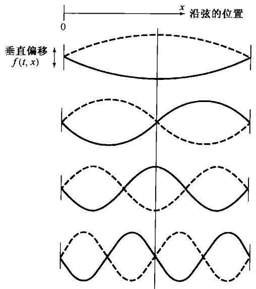

图3.1 振动弦的标准振荡模(实线是在某一瞬时  $t$  ，每一个振荡模的波形)

显然，除非很多有用信号都能用复指数的线性组合来表示，否则上面所讨论的性质就不会特别有用。在18世纪中期，这一点曾是激烈争论的主题。1753年，伯努利(D.Bernoulli)曾经声称：一根弦的实际运动都可以用标准振荡模的线性组合来表示。但是，他并没有继续从数学上深入探求，并且当时他的想法也并未被广泛接受。事实上，欧拉本人后来也抛弃了三角级数的想法，并且在1759年拉格朗日(J.L.Lagrange)也曾强烈批评使用三角级数来研究振动弦运动的主张。他反对的论据是基于他自己的信念，即不可能用三角级数来表示一个具有间断点的函数。因为振动弦的波形是由拨动弦而引起的（即把弦绷紧再松开），所以拉格朗日认为三角级数的应用范围非常有限。

正是在这种多少有些敌意和怀疑的处境下，傅里叶（Jean Baptiste Joseph Fourier，见图3.2）约于半个世纪后提出了他自己的想法。傅里叶于1768年3月21日生于法国奥克斯雷，到他加入这场有关三角级数论战的时候，他已有了相当的阅历。他当时进行研究所处的境遇使他的很多贡献（特别是以他的名字命名的级数和变换）更是令人难忘。他的重大发现虽然在他自己的有生之年没有得到完全的承认，但却对数学这门学科的发展产生了深刻的影响，并在极为广泛的科学和工程领域内一直具有并仍然继续具有很大的价值。

除了在数学方面的研究外，傅里叶还有一段活跃的政治生涯。

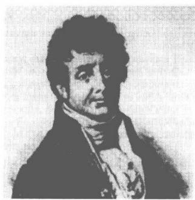

图3.2 傅里叶

事实上，就在法国大革命后的那些年里，他的一些活动几乎导致他的垮台。他曾经两次差一点走上了断头台。其后，傅里叶又成为波拿巴(Napoleon Bonaparte)的伙伴而跟随着他远征埃及(在此期间，傅里叶搜集了后来作为他的“埃及学”论文基础的有关资料)。1802年他被波拿巴任命为法国某一地区的行政长官，就在任职行政长官的期间，傅里叶构思了关于三角级数的想法。

热的传播和扩散现象是导致傅里叶研究成果的实际物理背景。在当时数学物理学领域中大多数前人的研究已经涉及理论力学和天体力学的背景下，这一问题本身就是十分有意义的一步。到了1807年，傅里叶已经完成了一项研究，他发现在表示一个物体的温度分布时，成谐波关系的正弦函数级数是非常有用的。另外，他还断言：“任何”周期信号都可以用这样的级数来表示。虽然在这一问题上他的论述很有意义，但隐藏在这一问题后面的很多基本概念已经被其他科学家们所发现；同时，傅里叶的数学证明也不是很完善。后来于1829年，狄里赫利(P.L.Dirichlet)给出了若干精确的条件，在这些条件下，一个周期信号才可以用一个傅里叶级数表示①。因此，傅里叶实际上并没有对傅里叶级数的数学理论做出什么贡献。然而，他确实洞察出这个级数表示法的潜在威力，并且在很大程度上正是由于他的工作和断言，才大大激励和推动了傅里叶级数问题的深入研究。另外，傅里叶在这一问题上的研究成果比他的任何先驱者都大大前进了一步，这指的是他还得出了关于非周期信号的表示——不是成谐波关系的正弦信号的加权和，而是不全成谐波关系的正弦信号的加权积分。这就是第4章和第5章所关注的从傅里叶级数到傅里叶积分(或变换)的推广。和傅里叶级数一样，傅里叶变换仍然是分析线性时不变系统的最强有力的工具之一。

当时指定了4位著名的数学家和科学家来评审1807年傅里叶的论文，其中3位，即拉克劳克斯(S.F.Lacroix)、孟济(G.Monge)和拉普拉斯(P.S.Laplace)，赞成发表傅里叶的论文，而第4位拉格朗日仍然顽固地坚持他于50年前就已经提出过的关于拒绝接受三角级数的论点。由于拉格朗日的强烈反对，傅里叶的论文从未公开发表过。为了使他的研究成果能让法兰西研究院接受并发表，在经过了几次其他的尝试以后，傅里叶才把他的成果以另一种方式出现在“热的分析理论”这本书中②。这本书出版于1822年，也即比他最初想在法兰西研究院宣读自己的研究成果晚15年！

直到傅里叶的晚年，他才得到了某种应有的承认！但是，对他来说最有意义的称赞是他的研究成果已经在数学、科学和工程等如此众多的领域内产生的巨大影响。傅里叶级数和积分的分析在很多数学问题中都留下了足迹，积分理论、点集拓扑和特征函数展开等仅是这方面的几个例子③。再者，除了最初在振动问题和传热问题中的研究外，在科学和工程领域中有大量的其他问题，正弦信号（以及由此得出的傅里叶级数和变换）在其中起着很重要的作用。例如，在描述行星运动和反映地球气候的周期性变化中，很自然地会出现正弦信号；交流电源产生的正弦电压和电流；以及我们将要看到的，傅里叶分析方法能够用来分析线性时不变系统的响应，比如一个电路对正弦输入的响应等。同时，如图3.3所示，海浪也是由不同波长的正弦波的线性组合所组成的；无线电台和电视台发射的信号都是正弦的；以及依据傅里叶分析可以给出任何文本的快速阅读，等等。总之，正弦信号和傅里叶分析方法的应用范围远远超出以上所列举的这几个例子。

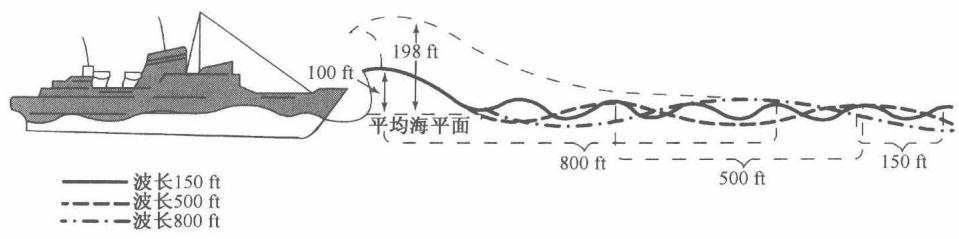

图3.3 遭遇到三种波列叠加袭击的船只。这三种波各有不同的波长，当这些波处于互相增强的情况时，可以形成一个很大的波浪。在更为严峻的海浪下，可以形成由图中虚线指出的一个巨大的波浪。这种情况是否出现决定于这些分量的相对相位

前一自然段中提及的许多应用，以及傅里叶和他的同伴们在数学物理学方面的最初研究，都是集中在连续时间内的现象。与此同时，离散时间信号与系统的傅里叶分析方法，却有着它们自己不同的历史根基，并且也有众多的应用领域。尤其是，离散时间概念和方法是数值分析这门学科的基础。用于处理离散点集以产生数值近似的有关内插、积分和微分等方面的公式，远在17世纪的牛顿时代就被研究过。另外，在已知一组天体观察数据序列下，预测某一天体运动的问题在18世纪和19世纪曾吸引着包括高斯(Gauss)在内的许多著名科学家和数学家从事调和时间序列的研究，从而为大量的初始工作能在离散时间信号与系统下完成提供了第二个舞台。

在20世纪60年代中期，一种称为快速傅里叶变换(FFT)的算法被引入。这一算法在1965年被库利(Cooley)和图基(Tukey)独立地发现，其实它也有相当长的历史。事实上，这一算法在高斯的手稿中已能找到①。之所以它成为重要的近代发现，是由于快速傅里叶变换被证明非常适合于高效的数字实现，并且它将计算变换所需的时间减少了几个数量级。有了这一算法，在利用离散时间傅里叶级数和变换时的许多有兴趣而过去认为不切实际的想法突然变得实际起来，并且使离散时间信号与系统分析技术的发展加速向前迈进。

由这样一个很长历史的发展所涌现出的，对于连续时间和离散时间信号与系统分析来说，是一个强有力而严谨的分析体系，并有着极为广泛的现有和潜在的应用范围。这一章和后续几章将建立这个体系中的一些基本方法，并研究其中某些重要的内涵。

# 3.2 线性时不变系统对复指数信号的响应

正如在3.0节已经指出的，在研究线性时不变系统时，将信号表示成基本信号的线性组合是很有利的，但这些基本信号应该具有以下两个性质：

1. 由这些基本信号能够构成相当广泛的一类有用信号；

2. 线性时不变系统对每一个基本信号的响应应该十分简单，以使系统对任意输入信号的响应有一个很方便的表示式。

傅里叶分析的很多重要价值都来自于这一点，即连续和离散时间复指数信号集都具有上述两个性质，即连续时间的  $e^{st}$  和离散时间的  $z^n$  信号，其中  $s$  和  $z$  都是复数。在本章的后续各节和下面两章将详细研究第一个性质。这一节集中在第二个性质上，并且以此说明在线性时不变系统分析中应用傅里叶级数和傅里叶变换的缘由。

在研究线性时不变系统时，复指数信号的重要性在于这样一个事实，即一个线性时不变系统

对复指数信号的响应也是同样一个复指数信号，不同的只是在幅度上的变化；也就是说：

$$
\text {连 续 时 间 ：} \quad \mathrm {e} ^ {s t} \longrightarrow H (s) \mathrm {e} ^ {s t} \tag {3.1}
$$

$$
\text {离 散 时 间 ：} \quad z ^ {n} \longrightarrow H (z) z ^ {n} \tag {3.2}
$$

其中  $H(s)$  或  $H(z)$  是一个复振幅因子，一般来说是复变量  $s$  或  $z$  的函数。一个信号，若系统对该信号的输出响应仅是一个常数（可能是复数）乘以输入，则称该信号为系统的特征函数(eigenfunction)，而幅度因子称为系统的特征值(eigenvalue）。

为了证明复指数确实是线性时不变系统的特征函数，现考虑一个单位冲激响应为  $h(t)$  的连续时间线性时不变系统。对任意输入  $x(t)$ ，可由卷积积分来确定输出，因此若  $x(t) = \mathrm{e}^{st}$ ，则有

$$
\begin{array}{l} y (t) = \int_ {- \infty} ^ {+ \infty} h (\tau) x (t - \tau) d \tau \tag {3.3} \\ = \int_ {- \infty} ^ {+ \infty} h (\tau) \mathrm {e} ^ {s (t - \tau)} \mathrm {d} \tau \\ \end{array}
$$

$\mathbf{e}^{s(t - \tau)}$  可写为  $\mathrm{e}^{\mathrm{st}}\mathrm{e}^{-\mathrm{st}}$  ，而  $\mathbf{e}^{\mu}$  可以从积分号内移出来。这样式(3.3)变成

$$
y (t) = \mathrm {e} ^ {s t} \int_ {- \infty} ^ {+ \infty} h (\tau) \mathrm {e} ^ {- s \tau} \mathrm {d} \tau \tag {3.4}
$$

假定式(3.4)右边的积分收敛，于是系统对  $\mathbf{e}^{\prime \prime}$  的响应就为

$$
y (t) = H (s) \mathrm {e} ^ {s t} \tag {3.5}
$$

其中  $H(s)$  是一个复常数，其值决定于  $s$  ，并且它与系统单位冲激响应的关系为

$$
H (s) = \int_ {- \infty} ^ {+ \infty} h (\tau) e ^ {- s \tau} d \tau \tag {3.6}
$$

从而证明了复指数是线性时不变系统的特征函数；对某一给定的  $s$  值，常数  $H(s)$  就是与特征函数  $\mathbf{e}^{st}$  有关的特征值。

可以用完全并行的方式证明，复指数序列也是离散时间线性时不变系统的特征函数；这就是说，单位脉冲响应为  $h[n]$  的线性时不变系统，其输入序列为

$$
x [ n ] = z ^ {n} \tag {3.7}
$$

其中  $z$  为某一复数。由卷积和可以确定系统的输出为

$$
\begin{array}{l} y [ n ] = \sum_ {k = - \infty} ^ {+ \infty} h [ k ] x [ n - k ] \tag {3.8} \\ = \sum_ {k = - \infty} ^ {+ \infty} h [ k ] z ^ {n - k} = z ^ {n} \sum_ {k = - \infty} ^ {+ \infty} h [ k ] z ^ {- k} \\ \end{array}
$$

假定式(3.8)右边的求和收敛，可见若输入  $x[n]$  是如式(3.7)给出的复指数，那么输出就是同一复指数乘以一个常数。该常数决定于  $z$  的值，即

$$
y [ n ] = H (z) z ^ {n} \tag {3.9}
$$

其中，

$$
H (z) = \sum_ {k = - \infty} ^ {+ \infty} h [ k ] z ^ {- k} \tag {3.10}
$$

结果和连续时间情况一样，复指数是离散时间线性时不变系统的特征函数；对于某一给定的  $z$  值，常数  $H(z)$  就是与特征函数  $z^n$  有关的特征值。

对于线性时不变系统分析来说，把一个更为一般的信号借助于特征函数来分解的有效性，可用一个例子来说明。令  $x(t)$  为三个复指数信号的线性组合，即

$$
x (t) = a _ {1} \mathrm {e} ^ {s _ {1} t} + a _ {2} \mathrm {e} ^ {s _ {2} t} + a _ {3} \mathrm {e} ^ {s _ {3} t} \tag {3.11}
$$

根据特征函数的性质，系统对其中每一个分量的响应分别是

$$
\begin{array}{l} a _ {1} \mathrm {e} ^ {s _ {1} t} \longrightarrow a _ {1} H (s _ {1}) \mathrm {e} ^ {s _ {1} t} \\ a _ {2} \mathrm {e} ^ {s _ {2} t} \longrightarrow a _ {2} H (s _ {2}) \mathrm {e} ^ {s _ {2} t} \\ a _ {3} \mathrm {e} ^ {s _ {3} t} \longrightarrow a _ {3} H (s _ {3}) \mathrm {e} ^ {s _ {3} t} \\ \end{array}
$$

再根据叠加性质，和的响应就是响应的和，因而

$$
y (t) = a _ {1} H \left(s _ {1}\right) \mathrm {e} ^ {s _ {1} t} + a _ {2} H \left(s _ {2}\right) \mathrm {e} ^ {s _ {2} t} + a _ {3} H \left(s _ {3}\right) \mathrm {e} ^ {s _ {3} t} \tag {3.12}
$$

更一般地说，在连续时间情况下，式(3.5)与叠加性质结合在一起就意味着：将信号表示成复指数的线性组合，就会导致一个线性时不变系统响应的方便表达式。具体而言，若一个连续时间线性时不变系统的输入表示成复指数的线性组合，即

$$
x (t) = \sum_ {k} a _ {k} \mathrm {e} ^ {s _ {k} t} \tag {3.13}
$$

那么输出就一定是

$$
y (t) = \sum_ {k} a _ {k} H \left(s _ {k}\right) \mathrm {e} ^ {s _ {k} t} \tag {3.14}
$$

对于离散时间情况，完全类似地，若一个离散时间线性时不变系统的输入表示成复指数的线性组合，即

$$
x [ n ] = \sum_ {k} a _ {k} z _ {k} ^ {n} \tag {3.15}
$$

那么输出就一定是

$$
y [ n ] = \sum_ {k} a _ {k} H \left(z _ {k}\right) z _ {k} ^ {n} \tag {3.16}
$$

换句话说，对于连续时间和离散时间来说，如果一个线性时不变系统的输入能够表示成复指数的线性组合，那么系统的输出也能够表示成相同复指数信号的线性组合；并且在输出表示式中的每一个系数可以用输入中相应的系数  $a_{k}$  分别与特征函数  $\mathrm{e}^{s\cdot k}$  或  $z_k^n$  有关的系统特征值  $H(s_{k})$  或 $H(z_{k})$  相乘来求得。欧拉在振动弦问题的研究中发现的正是这一事实，高斯及其他学者在时间序列分析中所用的也是这一点。这就促使傅里叶及其后的其他人考虑这样一个问题：究竟有多大范围的信号可以用复指数的线性组合来表示？！在下面几节中将对周期信号来研究这个问题，次序是先连续后离散。到第4章和第5章再把这些表示式推广到非周期信号中去。一般来说，在式(3.1)到式(3.16)中的  $s$  和  $z$  都可以是任意复数，但傅里叶分析仅限于这些变量的特殊形式。在连续时间情况下仅涉及  $s$  的纯虚部值，即  $s = \mathrm{j}\omega$  ，因此仅考虑  $\mathrm{e}^{\mathrm{j}\omega t}$  形式的复指数。类似地，在离散时间情况下仅限于单位振幅的  $z$  值，即  $z = \mathrm{e}^{\mathrm{j}\omega}$  ，因此仅考虑  $\mathrm{e}^{\mathrm{j}\omega n}$  形式的复指数。

例3.1 作为式(3.5)和式(3.6)的一个解释，考虑输入  $x(t)$  和输出  $y(t)$  的时延为3的线性时不变系统，即

$$
y (t) = x (t - 3) \tag {3.17}
$$

若该系统的输入是复指数信号  $x(t) = \mathrm{e}^{j2t}$ ，那么由式(3.17)有

$$
y (t) = \mathrm {e} ^ {\mathrm {j} 2 (t - 3)} = \mathrm {e} ^ {- \mathrm {j} 6} \mathrm {e} ^ {\mathrm {j} 2 t} \tag {3.18}
$$

正如我们能想到的，式(3.18)具有与式(3.5)相同的形式，因为  $\mathrm{e}^{\mathrm{j}2t}$  是一个特征函数，有关的特征值是  $H(\mathrm{j}2) = \mathrm{e}^{-\mathrm{j}6}$  。对这个例子可以直接来验证式(3.6)。根据式(3.17)，该系统的单位冲激响应是  $h(t) = \delta (t - 3)$  ，将其代入式(3.6)后可得

$$
H (s) = \int_ {- \infty} ^ {+ \infty} \delta (\tau - 3) \mathrm {e} ^ {- s \tau} \mathrm {d} \tau = \mathrm {e} ^ {- 3 s}
$$

所以  $H(\mathrm{j}2) = \mathrm{e}^{-\mathrm{j}\phi}$

以输入信号为  $x(t) = \cos (4t) + \cos (7t)$  作为第二个例子，用以说明式(3.11)和式(3.12)。根据式(3.17)， $y(t)$  当然就为

$$
y (t) = \cos (4 (t - 3)) + \cos (7 (t - 3)) \tag {3.19}
$$

为了说明这也就是式(3.12)的结果，可以先用欧拉关系将  $x(t)$  展开为

$$
x (t) = \frac {1}{2} \mathrm {e} ^ {\mathrm {j} 4 t} + \frac {1}{2} \mathrm {e} ^ {- \mathrm {j} 4 t} + \frac {1}{2} \mathrm {e} ^ {\mathrm {j} 7 t} + \frac {1}{2} \mathrm {e} ^ {- \mathrm {j} 7 t} \tag {3.20}
$$

根据式(3.11)和式(3.12)，有

$$
y (t) = \frac {1}{2} e ^ {- j 1 2} e ^ {j 4 t} + \frac {1}{2} e ^ {j 1 2} e ^ {- j 4 t} + \frac {1}{2} e ^ {- j 2 1} e ^ {j 7 t} + \frac {1}{2} e ^ {j 2 1} e ^ {- j 7 t}
$$

或者

$$
\begin{array}{l} y (t) = \frac {1}{2} e ^ {j 4 (t - 3)} + \frac {1}{2} e ^ {- j 4 (t - 3)} + \frac {1}{2} e ^ {j 7 (t - 3)} + \frac {1}{2} e ^ {- j 7 (t - 3)} \\ = \cos (4 (t - 3)) + \cos (7 (t - 3)) \\ \end{array}
$$

对于这个简单例子来说， $x(t)$  中的每一个周期指数分量（如  $\frac{1}{2}\mathrm{e}^{\mathrm{j}4t}$ ）乘以相应的特征值（如  $H(\mathrm{j}4) = \mathrm{e}^{-\mathrm{j}12}$ ），引起了该输入分量的时延为3。很显然，在这种情况下，凭直观观察就可以用式(3.19)来确定  $y(t)$ ，而无须使用式(3.11)和式(3.12)。然而，下文中将会看到，寄寓在式(3.11)和式(3.12)中的一般特性不仅可以用来计算更复杂的线性时不变系统响应，而且还提供了线性时不变系统分析和频域表示的基础。

# 3.3 连续时间周期信号的傅里叶级数表示

# 3.3.1 成谐波关系的复指数信号的线性组合

正如在第1章中所定义的，如果一个信号是周期的，那么对所有的  $t$  ，存在某个正值的  $T$  ，有

$$
x (t) = x (t + T), \qquad {\text {对 所 有 的}} t \tag {3.21}
$$

$x(t)$  的基波周期就是满足式(3.21)的最小非零正值  $T$  ，而  $\omega_0 = 2\pi / T$  称为基波频率。

在第1章中还介绍了两个基本周期信号，即正弦信号

$$
x (t) = \cos \omega_ {0} t \tag {3.22}
$$

和周期复指数信号

$$
x (t) = \mathrm {e} ^ {\mathrm {j} \omega_ {0} t} \tag {3.23}
$$

这两个信号都是周期的，而且其基波频率为  $\omega_0$  ，基波周期  $T = 2\pi /\omega_0$  。与式(3.23)有关的成谐波关系(harmonically related)的复指数信号集就是

$$
\phi_ {k} (t) = \mathrm {e} ^ {\mathrm {j} k \omega_ {0} t} = \mathrm {e} ^ {\mathrm {j} k (2 \pi / T) t}, \quad k = 0, \pm 1, \pm 2, \dots \tag {3.24}
$$

这些信号中的每一个都有一个基波频率，它是  $\omega_0$  的倍数。因此每一个信号对周期  $T$  来说都是周期的（虽然，对  $|k| \geqslant 2$  来说， $\phi_k(t)$  的基波周期是  $T$  的约数）。于是，一个由成谐波关系的复指数线性组合形成的信号

$$
x (t) = \sum_ {k = - \infty} ^ {+ \infty} a _ {k} \mathrm {e} ^ {\mathrm {j} k \omega_ {0} t} = \sum_ {k = - \infty} ^ {+ \infty} a _ {k} \mathrm {e} ^ {\mathrm {j} k (2 \pi / T) t} \tag {3.25}
$$

对  $T$  来说也是周期的。在式(3.25)中， $k = 0$  这一项就是一个常数， $k = +1$  和  $k = -1$  这两项都有

基波频率等于  $\omega_0$  ，两者合在一起称为基波分量(fundamental component)或称为一次谐波分量(first harmonic component)。  $k = +2$  和  $k = -2$  这两项也是周期的，其周期是基波分量周期的1/2（或者说频率是基波频率的两倍），称为二次谐波分量(second harmonic component)。一般来说，  $k = +N$  和  $k = -N$  的分量称为第  $N$  次谐波分量。

一个周期信号表示成式(3.25)的形式，就称为傅里叶级数(Fourier series)表示。在研究这一表示法的性质以前，先来看一个例子。

例3.2 有一个周期信号  $x(t)$  的基波频率为  $2\pi$ ，写成式(3.25)的形式为

$$
x (t) = \sum_ {k = - 3} ^ {+ 3} a _ {k} \mathrm {e} ^ {\mathrm {j} k 2 \pi t} \tag {3.26}
$$

其中，

$$
a _ {0} = 1, \quad a _ {1} = a _ {- 1} = \frac {1}{4}, \quad a _ {2} = a _ {- 2} = \frac {1}{2}, \quad a _ {3} = a _ {- 3} = \frac {1}{3}
$$

将式(3.26)中具有同一基波频率的谐波分量合在一起，重新写成

$$
x (t) = 1 + \frac {1}{4} \left(\mathrm {e} ^ {\mathrm {j} 2 \pi t} + \mathrm {e} ^ {- \mathrm {j} 2 \pi t}\right) + \frac {1}{2} \left(\mathrm {e} ^ {\mathrm {j} 4 \pi t} + \mathrm {e} ^ {- \mathrm {j} 4 \pi t}\right) + \frac {1}{3} \left(\mathrm {e} ^ {\mathrm {j} 6 \pi t} + \mathrm {e} ^ {- \mathrm {j} 6 \pi t}\right) \tag {3.27}
$$

再用欧拉关系，  $x(t)$  可写为

$$
x (t) = 1 + \frac {1}{2} \cos 2 \pi t + \cos 4 \pi t + \frac {2}{3} \cos 6 \pi t \tag {3.28}
$$

图3.4中用图解的方法说明了  $x(t)$  是如何由这些谐波分量构成的。

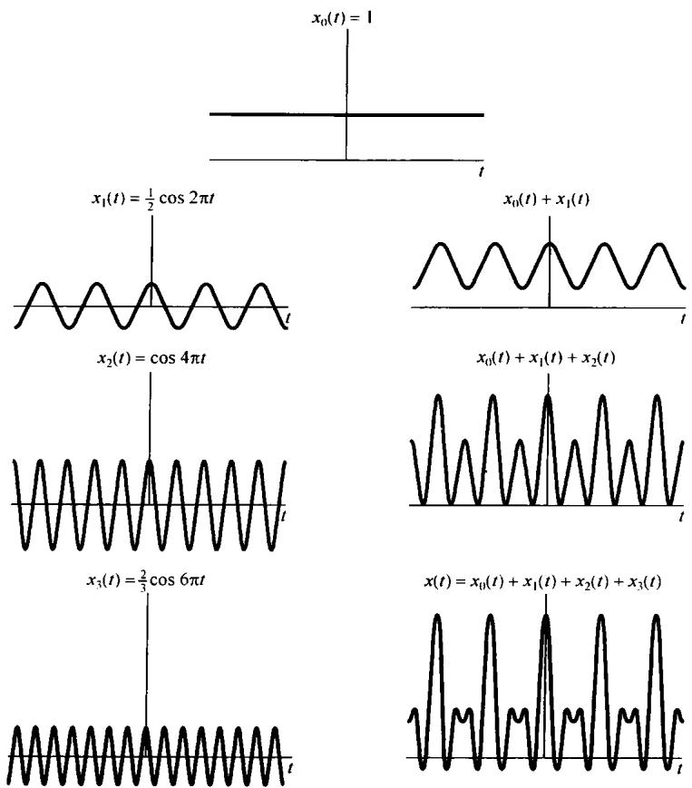

图3.4 例3.2中的  $x(t)$  作为成谐波关系的正弦信号的线性组合来构成的图解说明

式(3.28)是实周期信号傅里叶级数的另一种表示形式的例子。具体而言，若  $x(t)$  是一个实信号，而且能表示成式(3.25)的形式，那么因为  $x^{*}(t) = x(t)$ ，所以就有

$$
x (t) = \sum_ {k = - \infty} ^ {+ \infty} a _ {k} ^ {*} e ^ {- j k \omega_ {0} t}
$$

在该求和式中，以  $-k$  代替  $k$  ，则有

$$
x (t) = \sum_ {k = - \infty} ^ {+ \infty} a _ {- k} ^ {*} e ^ {j k \omega_ {0} t}
$$

将此式与式(3.25)进行比较，则要求  $a_{k} = a_{-k}^{*}$ ，或者

$$
a _ {k} ^ {*} = a _ {- k} \tag {3.29}
$$

注意，例3.2就属于这种情况，在那里  $a_{k}$  还是实数，且有  $a_{k} = a_{-k}$ 。

为导出傅里叶级数的另一种形式，首先将式(3.25)的求和重新写成

$$
x (t) = a _ {0} + \sum_ {k = 1} ^ {\infty} \left[ a _ {k} \mathrm {e} ^ {\mathrm {j} k \omega_ {0} t} + a _ {- k} \mathrm {e} ^ {- \mathrm {j} k \omega_ {0} t} \right]
$$

由式(3.29)，以  $a_{k}^{*}$  取代  $a_{-k}$ ，上式变为

$$
x (t) = a _ {0} + \sum_ {k = 1} ^ {\infty} \left[ a _ {k} \mathrm {e} ^ {\mathrm {j} k \omega_ {0} t} + a _ {k} ^ {*} \mathrm {e} ^ {- \mathrm {j} k \omega_ {0} t} \right]
$$

因为在括号内的两项互为共轭，于是

$$
x (t) = a _ {0} + \sum_ {k = 1} ^ {\infty} 2 \mathcal {R e} \left\{a _ {k} \mathrm {e} ^ {\mathrm {j} k \omega_ {0} t} \right\} \tag {3.30}
$$

若将  $a_{k}$  以极坐标形式给出为

$$
a _ {k} = A _ {k} \mathrm {e} ^ {\mathrm {j} \theta_ {k}}
$$

那么式(3.30)就可写成

$$
x (t) = a _ {0} + \sum_ {k = 1} ^ {\infty} 2 \mathcal {R e} \left\{A _ {k} \mathrm {e} ^ {\mathrm {j} \left(k \omega_ {0} t + \theta_ {k}\right)} \right\}
$$

这就是

$$
x (t) = a _ {0} + 2 \sum_ {k = 1} ^ {\infty} A _ {k} \cos (k \omega_ {0} t + \theta_ {k}) \tag {3.31}
$$

式(3.31)就是在连续时间情况下，对实周期信号常常见到的傅里叶级数的表示式。若将  $a_{k}$  以笛卡儿坐标形式表示，则可以得到另一种表示形式。令

$$
a _ {k} = B _ {k} + \mathrm {j} C _ {k}
$$

其中  $B_{k}$  和  $C_k$  都是实数。于是式(3.30)可改写为

$$
x (t) = a _ {0} + 2 \sum_ {k = 1} ^ {\infty} \left[ B _ {k} \cos k \omega_ {0} t - C _ {k} \sin k \omega_ {0} t \right] \tag {3.32}
$$

在例3.2中，由于  $a_{k}$  全都是实数，所以  $a_{k} = A_{k} = B_{k}$  。因此，式(3.31)和式(3.32)这两个表示式最后都变成如式(3.28)那样的形式。

由此可见，对实周期函数来说，按式(3.25)所给出的复指数形式的傅里叶级数，在数学上就等效为式(3.31)和式(3.32)这两种形式之一，即都是三角函数的表示式。尽管式(3.31)和

式(3.32)这两种形式是最普遍采用的傅里叶级数表示式①，但是式(3.25)的复指数表示式对于我们要讨论的问题来说，却是特别方便的。所以今后将几乎毫无例外地采用这种傅里叶级数表示式。

式(3.29)的关系是与傅里叶级数有关的诸多性质之一。这些性质无论在计算上，或是对本质问题的了解上都是非常有用的。3.5节将把大部分重要的性质集中在一起列出，其中几个性质的导出将在本章末习题中考虑。4.3节将在傅里叶变换这样一个更为广泛的范围内讨论它的大部分性质。

# 3.3.2 连续时间周期信号傅里叶级数表示的确定

假设一个给定的周期信号能表示成式(3.25)的级数形式，这就需要一种办法来确定这些系数  $a_{k}$  。将式(3.25)两边各乘以  $\mathrm{e}^{-\mathrm{j}n\omega_{0}t}$ ，可得

$$
x (t) \mathrm {e} ^ {- \mathrm {j} n \omega_ {0} t} = \sum_ {k = - \infty} ^ {+ \infty} a _ {k} \mathrm {e} ^ {\mathrm {j} k \omega_ {0} t} \mathrm {e} ^ {- \mathrm {j} n \omega_ {0} t} \tag {3.33}
$$

将上式两边从0到  $T = 2\pi /\omega_0$  对  $\pmb{t}$  积分，有

$$
\int_ {0} ^ {T} x (t) \mathrm {e} ^ {- \mathrm {j} n \omega_ {0} t} \mathrm {d} t = \int_ {0} ^ {T} \sum_ {k = - \infty} ^ {+ \infty} a _ {k} \mathrm {e} ^ {\mathrm {j} k \omega_ {0} t} \mathrm {e} ^ {- \mathrm {j} n \omega_ {0} t} \mathrm {d} t
$$

这里  $T$  是  $x(t)$  的基波周期，以上就是在该周期内积分。将上式右边的积分和求和次序交换后得

$$
\int_ {0} ^ {T} x (t) \mathrm {e} ^ {- \mathrm {j} n \omega_ {0} t} \mathrm {d} t = \sum_ {k = - \infty} ^ {+ \infty} a _ {k} \left[ \int_ {0} ^ {T} \mathrm {e} ^ {\mathrm {j} (k - n) \omega_ {0} t} \mathrm {d} t \right] \tag {3.34}
$$

式(3.34)右边括号内的积分是很容易的，为此利用欧拉关系可得

$$
\int_ {0} ^ {T} \mathrm {e} ^ {\mathrm {j} (k - n) \omega_ {0} t} \mathrm {d} t = \int_ {0} ^ {T} \cos (k - n) \omega_ {0} t \mathrm {d} t + \mathrm {j} \int_ {0} ^ {T} \sin (k - n) \omega_ {0} t \mathrm {d} t \tag {3.35}
$$

对于  $k \neq n$ ,  $\cos (k - n)\omega_0t$  和  $\sin (k - n)\omega_0t$  都是周期函数, 其基波周期为  $T / |k - n|$  。现在做的积分是在  $T$  区间内进行的, 而  $T$  又一定是它们的基波周期  $(T / |k - n|)$  的整倍数。由于积分可以看成被积函数在积分区间内所包括的面积, 所以式(3.35)右边的两个积分对于  $k \neq n$  来说, 其值为 0; 而对  $k = n$ , 式(3.35)左边的被积函数是 1, 所以其积分值为  $T$  。综合上述得到

$$
\int_ {0} ^ {T} \mathrm {e} ^ {\mathrm {j} (k - n) \omega_ {0} t} \mathrm {d} t = \left\{ \begin{array}{l l} T, & k = n \\ 0, & k \neq n \end{array} \right.
$$

这样式(3.34)的右边就化为  $Ta_{n}$  。因此有

$$
a _ {n} = \frac {1}{T} \int_ {0} ^ {T} x (t) e ^ {- j n \omega_ {0} t} d t \tag {3.36}
$$

该式给出了确定系数的关系式。另外，在求式(3.35)时仅仅用到这一点，即积分是在一个  $T$  的间隔内进行，而该  $T$  又是  $\cos (k - n)\omega_0t$  和  $\sin (k - n)\omega_0t$  周期的整倍数。因此，如果在任意  $T$  的间隔求积分，结果一定是相同的；这就是说，若以  $\int_{T}$  表示在任何一个  $T$  间隔内的积分，则应该有

$$
\int_ {T} \mathrm {e} ^ {\mathrm {j} (k - n) \omega_ {0} t}   \mathrm {d} t = \left\{ \begin{array}{l l} T, & k = n \\ 0, & k \neq n \end{array} \right.
$$

因此

$$
a _ {n} = \frac {1}{T} \int_ {T} x (t) \mathrm {e} ^ {- \mathrm {j} n \omega_ {0} t} \mathrm {d} t \tag {3.37}
$$

上述过程可归纳如下：如果  $x(t)$  有一个傅里叶级数表示式，即  $x(t)$  能表示成一组组成谐波关系的复指数信号的线性组合，如式(3.25)所示，那么傅里叶级数中的系数就由式(3.37)所确定。这一对关系式就定义为一个周期连续时间信号的傅里叶级数：

$$
x (t) = \sum_ {k = - \infty} ^ {+ \infty} a _ {k} \mathrm {e} ^ {\mathrm {j} k \omega_ {0} t} = \sum_ {k = - \infty} ^ {+ \infty} a _ {k} \mathrm {e} ^ {\mathrm {j} k (2 \pi / T) t} \tag {3.38}
$$

$$
a _ {k} = \frac {1}{T} \int_ {T} x (t) \mathrm {e} ^ {- \mathrm {j} k \omega_ {0} t} \mathrm {d} t = \frac {1}{T} \int_ {T} x (t) \mathrm {e} ^ {- \mathrm {j} k (2 \pi / T) t} \mathrm {d} t \tag {3.39}
$$

其中分别给出了用基波频率  $\omega_0$  和基波周期  $T$  表示的傅里叶级数的等效表示式。式(3.38)称为综合(synthesis)公式，而式(3.39)则称为分析(analysis)公式。系数  $\{a_k\}$  往往称为  $x(t)$  的傅里叶数级系数(Fourier series coefficients)或称为  $x(t)$  的频谱系数(spectral coefficients)①。这些复数系数是对信号  $x(t)$  中的每一个谐波分量大小的度量。系数  $a_0$  就是  $x(t)$  中的直流或常数分量，由式(3.39)以  $k = 0$  代入可得

$$
a _ {0} = \frac {1}{T} \int_ {T} x (t) \mathrm {d} t \tag {3.40}
$$

这就是  $x(t)$  在一个周期内的平均值。

式(3.38)和式(3.39)在18世纪中叶对欧拉和拉格朗日来说都是熟悉的，然而他们两人都放弃了这条分析途径，而没有去研究这样一个问题：究竟有多大一类的周期信号可以表示成这种形式？在下一节讨论这个问题之前，先举几个例子来说明傅里叶级数的展开。

例3.3 考虑信号

$$
x (t) = \sin \omega_ {0} t
$$

其基波频率为  $\omega_0$  。确定该信号  $x(t)$  的傅里叶级数系数的一个方法是利用式(3.39)，但是在该例这样简单的情况下，只要将  $x(t)$  直接展开成复指数的线性组合，就能凭直观确定傅里叶级数的系数，即将  $\sin \omega_0 t$  表示成

$$
\sin \omega_ {0} t = \frac {1}{2 j} e ^ {j \omega_ {0} t} - \frac {1}{2 j} e ^ {- j \omega_ {0} t}
$$

将上式与式(3.38)比较可得

$$
a _ {1} = \frac {1}{2 j}, \quad a _ {- 1} = - \frac {1}{2 j}
$$

$$
a _ {k} = 0, \quad k \neq + 1 \text {或} - 1
$$

例3.4 令

$$
x (t) = 1 + \sin \omega_ {0} t + 2 \cos \omega_ {0} t + \cos \left(2 \omega_ {0} t + \frac {\pi}{4}\right)
$$

$x(t)$  的基波频率是  $\omega_0$  。和例3.3一样，将  $x(t)$  直接展开成复指数的形式，则有

$$
x (t) = 1 + \frac {1}{2 j} \left[ e ^ {j \omega_ {0} t} - e ^ {- j \omega_ {0} t} \right] + \left[ e ^ {j \omega_ {0} t} + e ^ {- j \omega_ {0} t} \right] + \frac {1}{2} \left[ e ^ {j (2 \omega_ {0} t + \pi / 4)} + e ^ {- j (2 \omega_ {0} t + \pi / 4)} \right]
$$

将相应项归并后可得

$$
x (t) = 1 + \left(1 + \frac {1}{2 \mathrm {j}}\right) \mathrm {e} ^ {\mathrm {j} \omega_ {0} t} + \left(1 - \frac {1}{2 \mathrm {j}}\right) \mathrm {e} ^ {- \mathrm {j} \omega_ {0} t} + \left(\frac {1}{2} \mathrm {e} ^ {\mathrm {j} (\pi / 4)}\right) \mathrm {e} ^ {\mathrm {j} 2 \omega_ {0} t} + \left(\frac {1}{2} \mathrm {e} ^ {- \mathrm {j} (\pi / 4)}\right) \mathrm {e} ^ {- \mathrm {j} 2 \omega_ {0} t}
$$

由此可得该例的傅里叶级数系数为

$$
a _ {0} = 1
$$

$$
\begin{array}{l} a _ {1} = \left(1 + \frac {1}{2 j}\right) = 1 - \frac {1}{2} j \\ a _ {- 1} = \left(1 - \frac {1}{2 j}\right) = 1 + \frac {1}{2} j \\ a _ {2} = \frac {1}{2} e ^ {j (\pi / 4)} = \frac {\sqrt {2}}{4} (1 + j) \\ a _ {- 2} = \frac {1}{2} e ^ {- j (\pi / 4)} = \frac {\sqrt {2}}{4} (1 - j) \\ a _ {k} = 0, \quad | k | > 2 \\ \end{array}
$$

在图3.5上用条线图表示出  $a_{k}$  的幅度和相位。

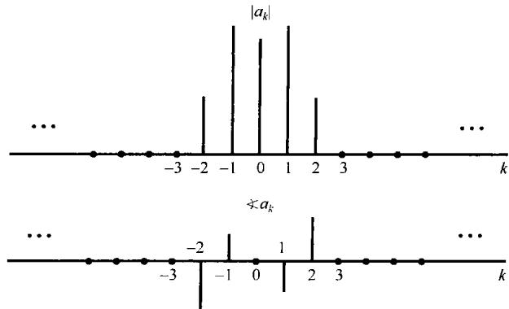

图3.5 例3.4中信号的傅里叶系数的幅度和相位

例3.5 图3.6所示为一个周期性方波，在一个周期内定义如下：

$$
x (t) = \left\{ \begin{array}{l l} 1, & | t | <   T _ {1} \\ 0, & T _ {1} <   | t | <   T / 2 \end{array} \right. \tag {3.41}
$$

这个信号是在本书中经常遇到的。该信号的基波周期是  $T$  ，基波频率就为  $\omega_0 = 2\pi / T$  。

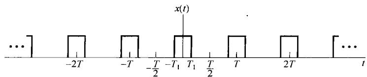

图3.6 周期性方波

现在用式(3.39)来确定  $x(t)$  的傅里叶级数系数。由于  $x(t)$  对于  $t = 0$  是对称的，因此在一个周期内积分取积分区间为  $-T / 2 \leqslant t < T / 2$  最为方便。

首先，对  $k = 0$  有

$$
a _ {0} = \frac {1}{T} \int_ {- T _ {1}} ^ {T _ {1}} \mathrm {d} t = \frac {2 T _ {1}}{T} \tag {3.42}
$$

前面已经提到，  $a_0$  代表  $x(t)$  的平均值。在本例中它代表在一个周期内信号  $x(t) = 1$  时所占的比例。对  $k \neq 0$  有

$$
a _ {k} = \frac {1}{T} \int_ {- T _ {1}} ^ {T _ {1}} \mathrm {e} ^ {- \mathrm {j} k \omega_ {0} t} \mathrm {d} t = - \left. \frac {1}{\mathrm {j} k \omega_ {0} T} \mathrm {e} ^ {- \mathrm {j} k \omega_ {0} t} \right| _ {- T _ {1}} ^ {T _ {1}}
$$

或重写为下式：

$$
a _ {k} = \frac {2}{k \omega_ {0} T} \left[ \frac {\mathrm {e} ^ {\mathrm {j} k \omega_ {0} T _ {1}} - \mathrm {e} ^ {- \mathrm {j} k \omega_ {0} T _ {1}}}{2 \mathrm {j}} \right] \tag {3.43}
$$

上式括号内就是  $\sin k\omega_0T_1$  ，系数  $a_{k}$  就能表示成

$$
a _ {k} = \frac {2 \sin (k \omega_ {0} T _ {1})}{k \omega_ {0} T} = \frac {\sin (k \omega_ {0} T _ {1})}{k \pi}, \quad k \neq 0 \tag {3.44}
$$

在此用到  $\omega_0 T = 2\pi$  这一关系。

在图3.7中，画出了在某一固定的  $T_{1}$  值和几个不同的  $T$  值下傅里叶级数系数的条线图。对这个例子来说，傅里叶系数是实数，所以用一个图就能表示。当然，在更一般的情况下，它们是复数，需要两个图来分别表示每个系数的实部和虚部，或模与相位。当  $T = 4T_{1}$  时， $x(t)$  是一个一半为0，一半为1的方波，这时  $\omega_0 T_1 = \pi / 2$ ，由式(3.44)

$$
a _ {k} = \frac {\sin (\pi k / 2)}{k \pi}, \quad k \neq 0 \tag {3.45}
$$

而

$$
a _ {0} = \frac {1}{2} \tag {3.46}
$$

根据式(3.45)，当  $k$  为偶数且非零时， $a_{k} = 0$ ，同时， $\sin (\pi k / 2)$  当  $k$  为奇数时，相继在  $\pm 1$  之间交替变化，因此

$$
a _ {1} = a _ {- 1} = \frac {1}{\pi}
$$

$$
a _ {3} = a _ {- 3} = - \frac {1}{3 \pi}
$$

$$
a _ {5} = a _ {- 5} = \frac {1}{5 \pi}
$$

中 中

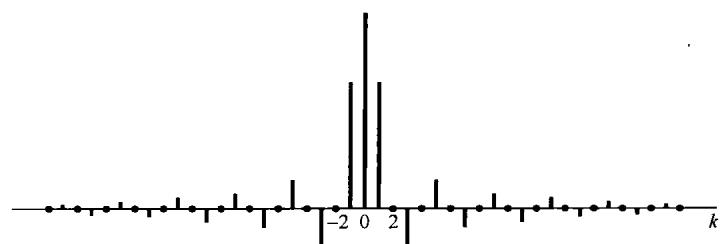

(a)

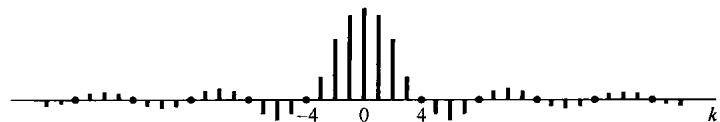

(b)

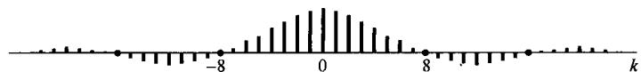

(c)

图3.7 在某一固定的  $T_{1}$  值和几个不同的  $T$  值时，周期性方波傅里叶级数系数  $Ta_{k}$  的图。（a） $T = 4T_{1}$ ；（b） $T = 8T_{1}$ ；（c） $T = 16T_{1}$ 。这些系数都是包络  $(2\sin \omega T_{1}) / \omega$  的等间隔样本，样本间隔为  $2\pi / T$ ，随  $T$  的增加而减小

# 3.4 傅里叶级数的收敛

虽然欧拉和拉格朗日对例3.3和例3.4的结果一直是很满意的，但是他们都反对例3.5的情况。因为例3.5中  $x(t)$  是不连续的，而每个谐波分量却都是连续的。另一方面，傅里叶研究了同一个例子，并且认为方波的傅里叶级数表示也是对的。事实上，傅里叶坚持的是任何周期信号都能用傅里叶级数表示！虽然这一点并不完全正确，但傅里叶级数的确能用于表示相当广泛的一类周期信号，其中包括周期方波和其他本书将要涉及并在实际中很重要的一些周期信号。

为了对所给的周期方波例子有更进一步的理解，并更为一般地看看傅里叶级数表示的有效性问题，先来研究一个周期信号  $x(t)$  用成谐波关系的有限项复指数信号的线性组合来近似的问题；也就是说，用下列有限项级数：

$$
x _ {N} (t) = \sum_ {k = - N} ^ {N} a _ {k} \mathrm {e} ^ {\mathrm {j} k \omega_ {0} t} \tag {3.47}
$$

来近似  $x(t)$  的问题。令  $e_N(t)$  为近似误差

$$
e _ {N} (t) = x (t) - x _ {N} (t) = x (t) - \sum_ {k = - N} ^ {+ N} a _ {k} \mathrm {e} ^ {\mathrm {j} k \omega_ {0} t} \tag {3.48}
$$

为了确定近似的程度，需要对近似误差的大小给出一种定量的度量。所采用的标准是在一个周期内误差的能量：

$$
E _ {N} = \int_ {T} | e _ {N} (t) | ^ {2} \mathrm {d} t \tag {3.49}
$$

在习题3.66中已证明，要使误差能量最小，对式(3.47)各系数的特别选取是

$$
a _ {k} = \frac {1}{T} \int_ {T} x (t) \mathrm {e} ^ {- \mathrm {j} k \omega_ {0} t} \mathrm {d} t \tag {3.50}
$$

把式(3.50)和式(3.39)进行比较可以发现，这与确定傅里叶级数系数的表示式是一致的。由此得到：如果  $x(t)$  能展开成傅里叶级数，那么当把这一无穷项级数在所要求的某一项处截断时，这就是仅用成谐波关系的有限项复指数来近似  $x(t)$  的最佳近似。随着  $N$  的增加，附加上新的项， $E_N$  减小。事实上，如果  $x(t)$  有一个傅里叶级数展开式，那么随着  $N \to \infty$  ， $E_N$  的极限就是零。

现在再回到这样一个问题上来，即一个周期信号  $x(t)$  什么时候才确实具有一个傅里叶级数的表示。当然，对于任何周期信号，总是能用式(3.39)求得一组傅里叶系数。然而，在某些情况下式(3.39)的积分可能不收敛；也就是说，对某些  $a_{k}$  求得的值可能是无穷大。而且，即使从式(3.39)求得的全部系数都是有限值，当把这些系数代入式(3.38)中时，所得到的无限项级数也可能不收敛于原来的信号  $x(t)$  。

所幸的是，对大部分周期性信号而言不存在任何收敛上的困难。例如，全部连续的周期信号都有一个傅里叶级数表示，使其近似误差能量  $E_N$  随着  $N$  趋于无穷大而趋于零。这一点对很多不连续信号也是对的。由于考虑包括像以上讨论的方波这样一些不连续信号是很有用的，因此值得对收敛问题进行稍许详细一些的研究。有两类稍微有些不同的条件，如果一个周期信号满足这些条件，就能保证该信号能用傅里叶级数来表示。在讨论这些问题时，我们不打算给出完整的数学证明，更为严谨的讨论可以从很多有关傅里叶分析的教科书中找到①。

可以用傅里叶级数表示的一类周期信号  $x(t)$  是它在一个周期内能量有限的信号，即

$$
\int_ {T} | x (t) | ^ {2} \mathrm {d} t <   \infty \tag {3.51}
$$

当满足这一条件时，就能保证由式(3.39)求得的各系数  $a_{k}$  是有限值。进一步，若令  $x_{N}(t)$  是对 $x(t)$  的近似，而  $x_{N}(t)$  是用  $\lvert k\rvert\leqslant N$  时的这些系数得到的，即

$$
x _ {N} (t) = \sum_ {k = - N} ^ {+ N} a _ {k} \mathrm {e} ^ {\mathrm {j} k \omega_ {0} t} \tag {3.52}
$$

那么就能保证近似误差中的能量  $E_N$  [由式(3.49)定义], 随着所增加的项数愈来愈多, 即  $N$  趋于无穷大而收敛于零。这也就是说, 如果定义一个误差函数为

$$
e (t) = x (t) - \sum_ {k = - \infty} ^ {+ \infty} a _ {k} e ^ {j k \omega_ {0} t} \tag {3.53}
$$

那么就有

$$
\int_ {T} | e (t) | ^ {2} \mathrm {d} t = 0 \tag {3.54}
$$

正如在本节末尾的一个例子中将看到的，式(3.54)并不意味着信号  $x(t)$  和它的傅里叶级数表示

$$
\sum_ {k = - \infty} ^ {+ \infty} a _ {k} e ^ {j k \omega_ {0} t} \tag {3.55}
$$

在每一个  $t$  值上都相等，而只表示两者没有任何能量上的差别。

当  $x(t)$  在一个周期内具有有限能量时就保证收敛，这在实际中是很有用的。这时式(3.54)代表的是  $x(t)$  和它的傅里叶级数表示之间没有能量上的差别。因为实际系统都是对信号能量做出响应，从这个角度讲， $x(t)$  和它的傅里叶级数表示就是不可区分的了。由于要研究的大多数周期信号在一个周期内的能量都是有限的，因此它们都有傅里叶级数的表示。然后，狄里赫利得到了另一组条件，这组条件对于我们所关注的信号也基本上都能满足。这组条件除了在某些对  $x(t)$  不连续的孤立的  $t$  值外，保证  $x(t)$  等于它的傅里叶级数表示；而在那些  $x(t)$  不连续的点上，式(3.55)的无穷级数收敛于不连续点两边值的平均值。

狄里赫利条件如下所示。

条件1. 在任何周期内， $x(t)$  必须绝对可积(absolutely integrable)，即

$$
\int_ {T} | x (t) | \mathrm {d} t <   \infty \tag {3.56}
$$

与平方可积条件相同，这一条件保证了每一系数  $a_{k}$  都是有限值，因为

$$
\left| a _ {k} \right| \leqslant \frac {1}{T} \int_ {T} | x (t) \mathrm {e} ^ {- \mathrm {j} k \omega_ {0} t} | \mathrm {d} t = \frac {1}{T} \int_ {T} | x (t) | \mathrm {d} t
$$

所以，如果

$$
\int_ {T} | x (t) | \mathrm {d} t <   \infty
$$

则  $|a_{k}| < \infty$  。不满足狄里赫利第一条件的周期信号可以举例如下：

$$
x (t) = \frac {1}{t}, \quad 0 <   t \leqslant 1
$$

也就是说，  $x(t)$  是周期的，周期为1。这个信号如图3.8(a)所示。

条件2 在任意有限区间内， $x(t)$  具有有限个起伏变化；也就是说，在任何单个周期内， $x(t)$  的最大值和最小值的数目有限。

满足条件1而不满足条件2的一个函数是

$$
x (t) = \sin \left(\frac {2 \pi}{t}\right), \quad 0 <   t \leqslant 1 \tag {3.57}
$$

如图3.8(b)所示。对此函数，其周期  $T = 1$  ，有

$$
\int_ {0} ^ {1} | x (t) | \mathrm {d} t <   1
$$

然而，它在一个周期内有无限多的最大点和最小点。

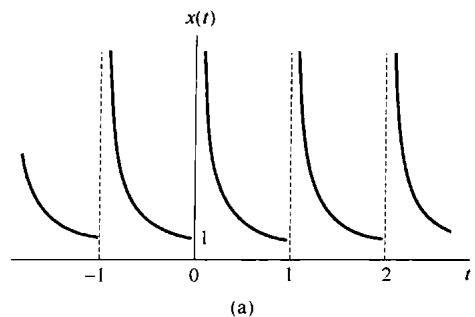

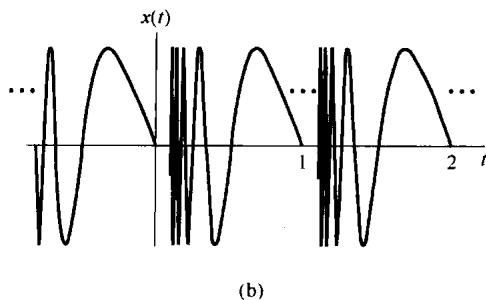

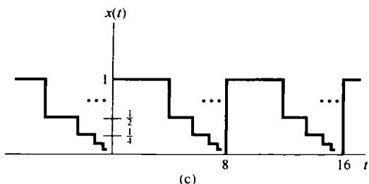

图3.8 不满足狄里赫利条件的信号。(a) 信号  $x(t) = 1 / t, 0 < t \leqslant 1$  。周期为1(该信号违反狄里赫利条件1); (b) 由式(3.57)定义的周期信号，它不满足条件2；(c) 周期为8的一个周期信号，它不满足条件3。该信号  $x(t)$  的值在区间  $0 \leqslant t < 8$  内，随着从  $t$  到8的距离减半， $x(t)$  的值也减半，即  $x(t) = 1, 0 \leqslant t < 4; x(t) = 1 / 2, 4 \leqslant t < 6; x(t) = 1 / 4, 6 \leqslant t < 7; x(t) = 1 / 8, 7 \leqslant t < 7.5$ ；等等

条件3 在  $x(t)$  的任何有限区间内，只有有限个不连续点，而且在这些不连续点上，函数是有限值。

不满足条件3的例子如图3.8(c)所示。这个信号  $x(t)$  的周期  $T = 8$  ，它是这样组成的：后一个阶梯的高度和宽度都是前一个阶梯的一半。可见  $x(t)$  在一个周期内的面积不会超过8，即满足条件1。但是不连续点的数目却是无穷多个，从而不满足条件3。

由图3.8给出的例子可知，一个不满足狄里赫利条件的信号，一般来说在自然界中都属于比较反常的信号，结果在实际场合不会出现。因此，傅里叶级数的收敛问题对本书要讨论的问题不具有特别重要的意义。对于一个不存在任何间断点的周期信号而言，傅里叶级数收敛，并且在每一点上该级数都等于原来的信号  $x(t)$  。对于在一个周期内存在有限数目不连续点的周期信号而言，除去那些孤立的不连续点外，其余所有点上傅里叶级数都等于原来的  $x(t)$  ；而在那些孤立的不连续点上，傅里叶级数收敛于不连续点处的值的平均值。在这种情况下，原来信号和它的傅里叶级数表示之间没有任何能量上的差别。因此，两者从所有实际目的来看可以认为是一样的；具体而言，因为两者

只是在一些孤立点上有差异，所以两者在任意区间内的积分是一样的。为此，在卷积的意义下，两者的特性是一样的，因而从线性时不变系统分析的角度来看，两个信号完全是一致的。

为了进一步理解对一个具有不连续点的周期信号，其傅里叶级数是如何收敛的，我们还是回到方波的例子。1898年①，美国物理学家米切尔森(Albert Michelson)制作了一台谐波分析仪。该仪器可以计算任何一个周期信号  $x(t)$  的傅里叶级数截断后的近似式(3.52)，其中  $N$  可以算到80。米切尔森用了很多函数来测试他的仪器，结果发现  $x_{N}(t)$  都和  $x(t)$  非常一致。然而当他测试方波信号时，他得到了一个令他吃惊的重要结果！于是他根据这一结果而怀疑他的仪器是否有不完善的地方。他将这一问题写了一封信给著名的数学物理学家吉伯斯(Josiah Gibbs)，吉伯斯研究了这一结果，并于1899年发表了他的看法。

米切尔森所观察到的现象可以用图3.9来说明。图中，设  $x(t)$  是一个对称方波  $(T = 4T_{1})$  ，画出了对应几个  $N$  值时  $x_{N}(t)$  的波形，并且在每一种情况下，都将部分和的结果套在原来的方波上，以便比较。因为方波满足狄里赫利条件，因此随着  $N\to \infty$  ，  $x_{N}(t)$  在不连续点的极限应该是不连续点处的平均值。从图3.9可以看到确实如此，因为对于任意的  $N$  来说，  $x_{N}(t)$  在不连续点都具有这个平均值。而且，对任何其他的  $t$  ，例如  $t = t_1$  ，可以保证

$$
\lim  _ {N \rightarrow \infty} x _ {N} (t _ {1}) = x (t _ {1})
$$

因此，方波的傅里叶级数表示式的平方误差，如式(3.53)和式(3.54)所示，其面积也是零。

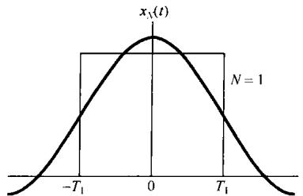

(a)

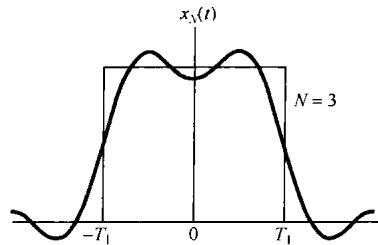

(b)

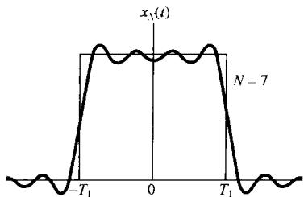

(c)

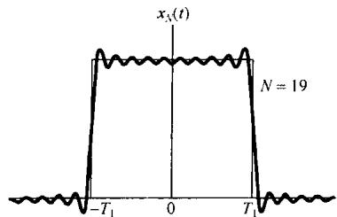

(d)

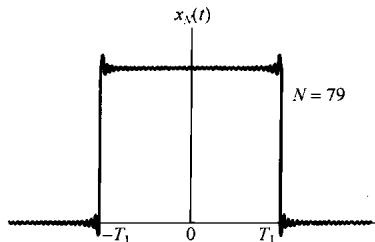

(e)

图3.9 方波傅里叶级数表示的收敛：吉伯斯现象。图中对几个  $N$  值画出了有限项近似  $x_{N}(t) = \sum_{k = -N}^{N}a_{k}\mathrm{e}^{\mathrm{j}k\omega_{0}t}$  的波形

对于这个例子，米切尔森所观察到的有趣现象是在不连续点附近部分和  $x_{N}(t)$  所呈现的起伏，而且这个起伏的峰值大小似乎不随  $N$  的增大而下降！吉伯斯证明：情况确实是这样，而且也应该是这样。若不连续点处的高度是1，则部分和所呈现的峰值的最大值是1.09，即有  $9\%$  的超量。无论  $N$  取多大，这个超量不变。对这个现象必须给予正确的解释！如前所述，对任何一个给定的  $t$  ，例如  $t = t_1$  ，部分和将会收敛于  $x(t_1)$  的真正值，而在不连续点处将收敛于不连续点两边信号值之和的一半。然而，当  $t_1$  取得越接近不连续点时，为了把误差减小到低于某一给定值， $N$  就必须取得越大。于是，随着  $N$  的增加，部分和的起伏就向不连续点处压缩，但是对任何有限的  $N$  值，起伏的峰值大小保持不变，这就是吉伯斯现象(Gibbs phenomenon)。这个现象的含义是：一个不连续信号  $x(t)$  的傅里叶级数的截断近似  $x_{N}(t)$ ，一般来说，在接近不连续点处将呈现高频起伏和超量。而且，若在实际情况下利用这样一个近似式，就应该选择足够大的  $N$  ，以保证这些起伏拥有的总能量可以忽略。当然，在极限情况下，我们知道近似误差的能量是零，而且一个不连续信号(如方波)的傅里叶级数表示是收敛的。

# 3.5 连续时间傅里叶级数性质

前面曾提到过，傅里叶级数表示具有一系列重要的性质，这些性质对于在概念上深入理解这样的表示是很有用的；并且，它们还有助于简化求取很多信号傅里叶级数的复杂性。表3.1中综合列出了这些性质，其中几个性质将放在本章末习题中去考虑。第4章讨论傅里叶变换时将看到，大部分性质都可以从对应的连续时间傅里叶变换的性质中推演出来。所以这里只限于几个性质的讨论，以此来说明这些性质是如何被导出、解释和应用的。

下面从表3.1中挑选出的几个性质的讨论都用一种简便的符号来表明一个周期信号及其傅里叶级数之间的关系，即假设  $x(t)$  是一个周期信号，周期为  $T$  ，基波频率  $\omega_0 = 2\pi / T$  。那么，若  $x(t)$  的傅里叶级数系数记为  $a_k$  ，则用

$$
x (t) \stackrel {{\mathcal {F S}}} {{\longleftrightarrow}} a _ {k}
$$

来表示一个周期信号及其傅里叶级数系数的一对关系。

# 3.5.1 线性性质

令  $x(t)$  和  $y(t)$  为两个周期信号，周期为  $T$  ，它们的傅里叶级数系数分别为  $a_{k}$  和  $b_{k}$  ，即

$$
\begin{array}{l} x (t) \stackrel {\mathcal {F S}} {\longleftrightarrow} a _ {k} \\ y (t) \xleftrightarrow {F S} b _ {k} \\ \end{array}
$$

因为  $x(t)$  和  $y(t)$  具有相同的周期  $T$  ，因此极易得出这两个信号的任意线性组合也一定是周期的，且周期为  $T$  。而且， $x(t)$  和  $y(t)$  的线性组合  $z(t) = Ax(t) + By(t)$  的傅里叶级数系数  $c_k$  由  $x(t)$  和  $y(t)$  的傅里叶级数系数的同一线性组合给出，即

$$
z (t) = A x (t) + B y (t) \xleftrightarrow {\mathcal {F S}} c _ {k} = A a _ {k} + B b _ {k} \tag {3.58}
$$

根据式(3.39)可以直接证明这一点。同时可以看到，线性性质很容易推广到具有相同周期  $T$  的任意多个信号的线性组合中去。

# 3.5.2 时移性质

当给一个周期信号  $x(t)$  以某个  $t_0$  时移时，该信号的周期  $T$  保持不变，所得到的信号  $y(t) = x(t - t_0)$  的傅里叶级数系数  $b_{k}$  可以表示为

$$
b _ {k} = \frac {1}{T} \int_ {T} x (t - t _ {0}) e ^ {- j k \omega_ {0} t} d t \tag {3.59}
$$

令  $\tau = t - t_0$  ，并注意到新的变量  $\pmb{\tau}$  也是在某一  $T$  的区间内变化的，于是可得

$$
\begin{array}{l} \frac {1}{T} \int_ {T} x (\tau) \mathrm {e} ^ {- \mathrm {j} k \omega_ {0} \left(\tau + t _ {0}\right)} \mathrm {d} \tau = \mathrm {e} ^ {- \mathrm {j} k \omega_ {0} t _ {0}} \frac {1}{T} \int_ {T} x (\tau) \mathrm {e} ^ {- \mathrm {j} k \omega_ {0} \tau} \mathrm {d} \tau \tag {3.60} \\ = \mathrm {e} ^ {- \mathrm {j} k \omega_ {0} t _ {0}} a _ {k} = \mathrm {e} ^ {- \mathrm {j} k (2 \pi / T) t _ {0}} a _ {k} \\ \end{array}
$$

其中  $a_{k}$  就是  $x(t)$  的第  $k$  个傅里叶级数系数。也就是说，若

$$
x (t) \stackrel {\mathcal {F S}} {\longleftrightarrow} a _ {k}
$$

那么

$$
x (t - t _ {0}) \stackrel {\mathcal {F S}} {\longleftrightarrow} \mathrm {e} ^ {- \mathrm {j} k \omega_ {0} t _ {0}} a _ {k} = \mathrm {e} ^ {- \mathrm {j} k (2 \pi / T) t _ {0}} a _ {k}
$$

这个性质的一个结果就是：当一个周期信号在时间上移位时，它的傅里叶级数系数的模保持不变，即  $|b_k| = |a_k|$ 。

# 3.5.3 时间反转

当一个周期信号  $x(t)$  经过时间反转后，其周期  $T$  仍然保持不变，为了确定  $y(t) = x(-t)$  的傅里叶级数系数，先看一下时间反转对综合公式(3.38)所带来的影响：

$$
x (- t) = \sum_ {k = - \infty} ^ {\infty} a _ {k} \mathrm {e} ^ {- \mathrm {j} k 2 \pi t / T} \tag {3.61}
$$

进行变量置换  $k = -m$  ，得

$$
y (t) = x (- t) = \sum_ {m = - \infty} ^ {\infty} a _ {- m} \mathrm {e} ^ {\mathrm {j} m 2 \pi t / T} \tag {3.62}
$$

可见上式的右边就具有对  $x(-t)$  的傅里叶级数展开形式，其傅里叶级数系数  $b_{k}$  就是

$$
b _ {k} = a _ {- k} \tag {3.63}
$$

这就是说，若

$$
x (t) \stackrel {\mathcal {F S}} {\longleftrightarrow} a _ {k}
$$

那么

$$
x (- t) \stackrel {\mathcal {F S}} {\longleftrightarrow} a _ {- k}
$$

换句话说，施加于连续时间信号上的时间反转会导致其对应的傅里叶级数系数序列的时间反转。时间反转性质的一种结果是：若  $x(t)$  为偶函数，即  $x(-t) = x(t)$ ，则其傅里叶级数系数也为偶，即  $a_{-k} = a_k$ ；类似地，若  $x(t)$  为奇函数，即  $x(-t) = -x(t)$ ，则其傅里叶级数系数也为奇，即  $a_{-k} = -a_k$ 。

# 3.5.4 时域尺度变换

时域尺度变换是一种运算。一般来说，这种运算会改变被变换的信号的周期。如果  $x(t)$  是周期的，周期为  $T$  ，基波频率  $\omega_0 = 2\pi / T$  ，那么  $x(\alpha t)$  ，  $\alpha$  为一个正实数，就是一个周期为  $T / \alpha$  且基波频率为  $\alpha \omega_0$  的周期信号。因为时间尺度运算是直接加在  $x(t)$  的每一次谐波分量上的，所以能很容易得出，这些谐波分量中每一个的傅里叶系数仍是相同的。也就是说，若  $x(t)$  具有式(3.38)的傅里叶级数表示，那么

$$
x (\alpha t) = \sum_ {k = - \infty} ^ {+ \infty} a _ {k} \mathrm {e} ^ {\mathrm {j} k (\alpha \omega_ {0}) t}
$$

就是  $x(\alpha t)$  的傅里叶级数表示。要强调的是，虽然傅里叶系数没有改变，但由于基波频率变化了，傅里叶级数表示却改变了。

# 3.5.5 相乘

假设  $x(t)$  和  $y(t)$  是两个周期为  $T$  的周期信号，且有

$$
\begin{array}{l} x (t) \stackrel {{\mathcal {F S}}} {{\longleftrightarrow}} a _ {k} \\ y (t) \stackrel {\mathcal {F S}} {\longleftrightarrow} b _ {k} \\ \end{array}
$$

因为乘积  $x(t)y(t)$  也是周期的，周期为  $T$  ，就可以将它展开成傅里叶级数，而其傅里叶级数系数 $h_k$  可以用  $x(t)$  和  $y(t)$  的傅里叶系数来表示，结果是

$$
x (t) y (t) \stackrel {\mathcal {F S}} {\longleftrightarrow} h _ {k} = \sum_ {l = - \infty} ^ {\infty} a _ {l} b _ {k - l} \tag {3.64}
$$

导出上面关系的一种办法(见习题3.46)就是将  $x(t)$  和  $\gamma (t)$  的傅里叶级数表示式相乘，并注意到在这个乘积中的第  $k$  次谐波分量一定有一个系数是具有  $a_{l}b_{k - l}$  形式的项之和。可以看出，式(3.64)右边的和式可以看成代表  $x(t)$  的傅里叶系数序列与代表  $\gamma (t)$  的傅里叶系数序列的离散时间卷积。

# 3.5.6 共轭及共轭对称

将一个周期信号  $x(t)$  取它的复数共轭，在它的傅里叶级数系数上就会有复数共轭并进行时间反转的结果，即若

$$
x (t) \stackrel {{\mathcal {F S}}} {{\longleftrightarrow}} a _ {k}
$$

那么

$$
x ^ {*} (t) \stackrel {\mathcal {F S}} {\longleftrightarrow} a _ {- k} ^ {*} \tag {3.65}
$$

将式(3.38)两边各取复数共轭，并在求和中以  $-k$  代替  $k$  ，就很容易证明这个性质。

当  $x(t)$  为实函数时，可以从这个性质导出一些很有用的结果。这时，由式(3.65)可以看出，由于  $x(t) = x^{*}(t)$ ，傅里叶级数系数就一定是共轭对称(conjugate symmetric)的，即

$$
a _ {- k} = a _ {k} ^ {*} \tag {3.66}
$$

如前在式(3.29)中所见。这样，对于实信号的傅里叶级数系数的模、相位、实部和虚部，又依次意味着各种对称性质（均列于表3.1中）。例如，若  $x(t)$  为实信号，由式(3.66)看出， $a_0$  就为实数，且有

$$
\left| a _ {k} \right| = \left| a _ {- k} \right|
$$

同时，若  $x(t)$  为实偶函数，那么由3.5.3节可知  $a_{k} = a_{-k}$  。然而，根据式(3.66)又有  $a_{k}^{*} = a_{-k}$ ，所以  $a_{k} = a_{k}^{*}$  。这就是说，若  $x(t)$  为实偶函数，那么它的傅里叶级数系数也为实偶函数。类似地，若  $x(t)$  为实奇函数，那么它的傅里叶级数系数为纯虚奇函数。由此，例如  $x(t)$  为实奇函数，则  $a_{0} = 0$  。傅里叶级数的对称性质将在习题3.42中进一步讨论。

# 3.5.7 连续时间周期信号的帕斯瓦尔定理

正如在习题3.46中所证明的，连续时间周期信号的帕斯瓦尔定理是

$$
\frac {1}{T} \int_ {T} | x (t) | ^ {2} d t = \sum_ {k = - \infty} ^ {+ \infty} | a _ {k} | ^ {2} \tag {3.67}
$$

其中  $a_{k}$  是  $x(t)$  的傅里叶级数系数， $T$  是该信号的周期。

式(3.67)的左边是周期信号  $x(t)$  在一个周期内的平均功率（也就是单位时间内的能量），而同时有

$$
\frac {1}{T} \int_ {T} \left| a _ {k} \mathrm {e} ^ {\mathrm {j} k \omega_ {0} t} \right| ^ {2} \mathrm {d} t = \frac {1}{T} \int_ {T} | a _ {k} | ^ {2} \mathrm {d} t = | a _ {k} | ^ {2} \tag {3.68}
$$

所以  $|a_k|^2$  就是  $x(t)$  中第  $k$  次谐波的平均功率。于是，帕斯瓦尔定理所说的就是：一个周期信号的总平均功率等于它的全部谐波分量的平均功率之和。

# 3.5.8 连续时间傅里叶级数性质列表

在表3.1中列出了连续时间傅里叶级数的全部重要性质。

表 3.1 连续时间傅里叶级数性质

<table><tr><td>性 质</td><td>节 号</td><td>周期信号</td><td>傅里叶级数系数</td></tr><tr><td></td><td></td><td>x(t) 周期为T, y(t) 基本频率 ω0=2π/T</td><td>akb_k</td></tr><tr><td>线性</td><td>3.5.1</td><td>Ax(t)+By(t)</td><td>Aa_k+Bb_k</td></tr><tr><td>时移</td><td>3.5.2</td><td>x(t-t_0)</td><td>ak e^-jkω0t_0 = ak e^-jk(2π/T)t_0</td></tr><tr><td>频移</td><td></td><td>e^jMω0t_x(t) = e^jM(2π/T)t_x(t)</td><td>ak-M</td></tr><tr><td>共轭</td><td>3.5.6</td><td>x*(t)</td><td>a*-k</td></tr><tr><td>时间反转</td><td>3.5.3</td><td>x(-t)</td><td>a-k</td></tr><tr><td>时域尺度变换</td><td>3.5.4</td><td>x(αt), α&gt;0(周期为T/α)</td><td>ak</td></tr><tr><td>周期卷积</td><td></td><td>∫_T x(τ)y(t-τ)dτ</td><td>Ta_kb_k</td></tr><tr><td>相乘</td><td>3.5.5</td><td>x(t)y(t)</td><td>∑_{l=-∞}^{+∞} a_l b_{k-l}</td></tr><tr><td>微分</td><td></td><td>dx(t)/dt</td><td>jkω0ak=jk 2π/Tak</td></tr><tr><td>积分</td><td></td><td>∫_{-\infty}^{t} x(t)dt (仅当 a_0=0 才为有限值且为周期的)</td><td>{1/jkω0}ak=(1/jk(2π/T))ak</td></tr><tr><td rowspan="4">实信号的共轭对称性</td><td rowspan="4">3.5.6</td><td rowspan="4">x(t)为实信号</td><td>{ak=a*-kRe{ak|=Re{ak}}</td></tr><tr><td>{Im{ak}= -Im{ak}}</td></tr><tr><td>{ak|=|ak|</td></tr><tr><td>{ak=-ik}</td></tr><tr><td>实偶信号</td><td>3.5.6</td><td>x(t)为实偶信号</td><td>ak为实偶函数</td></tr><tr><td>实奇信号</td><td>3.5.6</td><td>x(t)为实奇信号</td><td>ak为纯虚奇函数</td></tr><tr><td rowspan="2">实信号的奇偶分解</td><td></td><td>{x_t(t)=E_V{x(t)} [x(t)为实信号]}</td><td>Re{ak}</td></tr><tr><td></td><td>{x_o(t)=Oa{x(t)} [x(t)为实信号]}</td><td>jIm{ak}</td></tr><tr><td colspan="4">周期信号的帕斯瓦尔定理</td></tr><tr><td colspan="4">1/T ∫_T |x(t)|^2 dt = ∑_{k=-∞}^{+\infty} |ak|^2</td></tr></table>

# 3.5.9 举例

在求取一个已知信号的傅里叶系数时，可以利用列于表3.1中的这些傅里叶级数性质，绕过一些繁杂的代数运算。下面用三个例子来说明这一点。最后一个例子用来说明，如何用一个信号的性质来详细地表征该信号。

例3.6 信号  $g(t)$  的基波周期是4，如图3.10所示。本可以用分析公式(3.39)直接求  $g(t)$  的傅里叶级数表示式，现在利用  $g(t)$  与例3.5中对称周期方波  $x(t)$  的关系来求。由例3.5可见， $T = 4$ ， $T_{1} = 1$  而

$$
g (t) = x (t - 1) - 1 / 2 \tag {3.69}
$$

根据表3.1中的时移性质，若  $x(t)$  的傅里叶级数系数为  $a_{k}$ ，那么  $x(t - 1)$  的傅里叶系数  $b_{k}$  就是

$$
b _ {k} = a _ {k} \mathrm {e} ^ {- \mathrm {j} k \pi / 2} \tag {3.70}
$$

在  $g(t)$  中直流偏移，即式(3.69)右边的 $-\frac{1}{2}$  这一项的傅里叶系数  $c_{k}$  是

$$
c _ {k} = \left\{ \begin{array}{l l} 0, & k \neq 0 \\ - \frac {1}{2}, & k = 0 \end{array} \right. \tag {3.71}
$$

利用表3.1的线性性质，  $g(t)$  的傅里叶系数 $d_{k}$  可表示为

$$
d _ {k} = \left\{ \begin{array}{l l} a _ {k} \mathrm {e} ^ {- \mathrm {j} k \pi / 2}, & k \neq 0 \\ a _ {0} - \frac {1}{2}, & k = 0 \end{array} \right.
$$

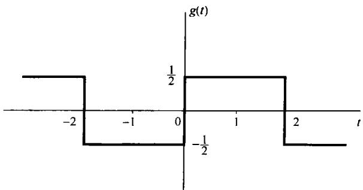

图3.10 例3.6中的周期信号

再将式中的  $a_{k}$  用式(3.45)和式(3.46)的表示式代入，可得

$$
d _ {k} = \left\{ \begin{array}{l l} \frac {\sin (\pi k / 2)}{k \pi} \mathrm {e} ^ {- j k \pi / 2}, & k \neq 0 \\ 0, & k = 0 \end{array} \right. \tag {3.72}
$$

例3.7 考虑一个周期为  $T = 4$  的三角波信号  $x(t)$ ，其基波频率  $\omega_0 = \pi /2$ ，如图3.11所示。这个信号的导数就是例3.6中的  $g(t)$ 。将  $g(t)$  的傅里叶系数记为  $d_k$ ， $x(t)$  的傅里叶系数记为  $e_k$ ，根据表3.1的微分性质，有

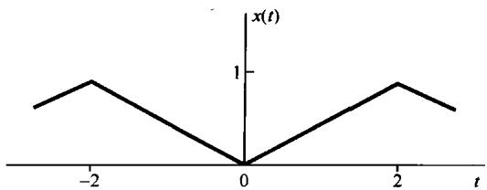

图3.11 例3.7中的三角波信号

$$
d _ {k} = \mathrm {j} k (\pi / 2) \mathrm {e} _ {k} \tag {3.73}
$$

除去  $k = 0$  外，上式可用来用  $d_{k}$  表示  $\pmb{e}_{k}$  。具体而言，由式(3.72)

$$
e _ {k} = \frac {2 d _ {k}}{\mathrm {j} k \pi} = \frac {2 \sin (\pi k / 2)}{\mathrm {j} (k \pi) ^ {2}} \mathrm {e} ^ {- \mathrm {j} k \pi / 2}, \quad k \neq 0 \tag {3.74}
$$

对于  $k = 0$  ，用在一个周期内  $x(t)$  所包含的面积除以周期长度得到  $e_0 = 1 / 2$  。

例3.8 现在来考察一个周期冲激串的傅里叶级数表示的某些性质。在第7章讨论采样时，这种信号及其利用复指数的表示将起着重要的作用。周期为  $T$  的冲激串可表示如下式：

$$
x (t) = \sum_ {k = - \infty} ^ {\infty} \delta (t - k T) \tag {3.75}
$$

如图3.12(a)所示。为了求傅里叶级数系数  $a_{k}$ ，可用式(3.39)，并选取积分区间为  $-T / 2 \leqslant t \leqslant T / 2$ ，以避开在积分上下限处发生冲激。在该积分区间内， $x(t)$  就与  $\delta(t)$  一样，所以有

$$
a _ {k} = \frac {1}{T} \int_ {- T / 2} ^ {T / 2} \delta (t) \mathrm {e} ^ {- \mathrm {j} k 2 \pi t / T} \mathrm {d} t = \frac {1}{T} \tag {3.76}
$$

换句话说，该冲激串的全部傅里叶系数都是一样的；并且这些系数都是实数，对于  $k$  来说还是偶函数。这也正是我们预料中的。因为根据表3.1，任何实的偶信号（就像现在的冲激串）其傅里叶系数本该就是实的和偶的。

冲激串与类似于例3.6中的方波信号  $g(t)$  还有一种直接的关系。图3.12(b)重复了一种方波信号。  $g(t)$  的导数就是图3.12(c)所示的信号  $q(t)$ ，可以将  $q(t)$  表示为两个经移位了的冲激串  $x(t)$  之差，即

$$
q (t) = x \left(t + T _ {1}\right) - x \left(t - T _ {1}\right) \tag {3.77}
$$

利用傅里叶级数性质，就可以计算出  $q(t)$  和  $g(t)$  的傅里叶级数系数，而无须经由傅里叶级数分析公式直接计算。首先，根据时移性质和线性性质，由式(3.77)， $q(t)$  的傅里叶级数系数  $b_{k}$  可以

用  $x(t)$  的傅里叶系数  $a_{k}$  表示为

$$
b _ {k} = \mathrm {e} ^ {\mathrm {j} k \omega_ {0} T _ {1}} a _ {k} - \mathrm {e} ^ {- \mathrm {j} k \omega_ {0} T _ {1}} a _ {k}
$$

其中  $\omega_0 = 2\pi /T$  。利用式(3.76)，就有

$$
b _ {k} = \frac {1}{T} \left[ \mathrm {e} ^ {\mathrm {j} k \omega_ {0} T _ {1}} - \mathrm {e} ^ {- \mathrm {j} k \omega_ {0} T _ {1}} \right] = \frac {2 \mathrm {j} \sin (k \omega_ {0} T _ {1})}{T}
$$

最后，因为  $q(t)$  是  $g(t)$  的导数，所以由表3.1的微分性质，直接写出

$$
b _ {k} = \mathrm {j} k \omega_ {0} c _ {k} \tag {3.78}
$$

其中  $c_{k}$  是  $g(t)$  的傅里叶级数系数。于是

$$
c _ {k} = \frac {b _ {k}}{\mathrm {j} k \omega_ {0}} = \frac {2 \mathrm {j} \sin (k \omega_ {0} T _ {1})}{\mathrm {j} k \omega_ {0} T} = \frac {\sin (k \omega_ {0} T _ {1})}{k \pi}, \quad k \neq 0 \tag {3.79}
$$

其中用到  $\omega_0T = 2\pi$  。注意，式(3.79)对  $k \neq 0$  成立，因为由式(3.78)，当  $k = 0$  时无法解得  $c_0$  。然而， $c_0$  就是  $g(t)$  在一个周期内的平均值，由图3.12(b)凭直观就可求出为

$$
c _ {0} = \frac {2 T _ {1}}{T} \tag {3.80}
$$

式(3.80)和式(3.79)分别与在例3.5中导出的式(3.42)和式(3.44)是一样的。

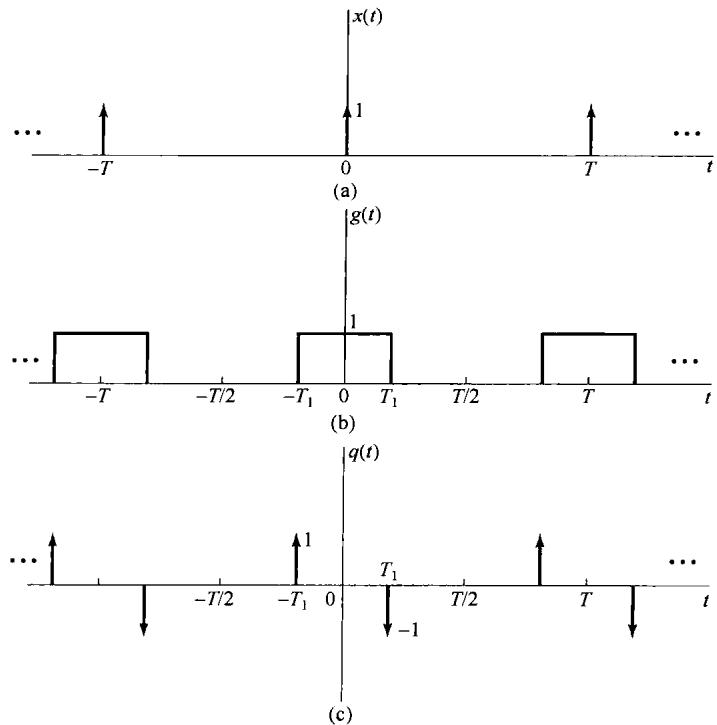

图3.12（a）周期冲激串；（b）周期方波；（c）图(b)中周期方波的导数

下面的例子用来说明表3.1中很多性质的应用。

例3.9 假设关于某一信号  $x(t)$  给出下列条件：

1.  $x(t)$  是一个实信号。

2.  $x(t)$  是周期的，周期为  $T = 4$  ，它的傅里叶级数系数是  $a_{k}$  。

3.  $a_{k} = 0, |k| > 1$ 。

4. 傅里叶系数为  $b_{k} = \mathrm{e}^{-\mathrm{j}\pi k / 2}a_{-k}$  的信号是奇信号。

$$
5. \frac {1}{4} \int_ {4} | x (t) | ^ {2} d t = 1 / 2 。
$$

现在要证明，以上所给条件，除了一个正负号可供选择外，足以将信号  $x(t)$  确定。根据条件3， $x(t)$  至多只有三个非零的傅里叶系数  $a_{k}$ ，即  $a_0, a_1$  和  $a_{-1}$ 。然后，因为  $x(t)$  的基波频率  $\omega_0 = 2\pi /4 = \pi /2$ ，于是

$$
x (t) = a _ {0} + a _ {1} \mathrm {e} ^ {\mathrm {j} \pi t / 2} + a _ {- 1} \mathrm {e} ^ {- \mathrm {j} \pi t / 2}
$$

又由条件1，  $x(t)$  为实信号，利用表3.1中的对称性质可得  $a_0$  为实数，且  $a_{1} = a_{-1}^{*}$  。这样就有

$$
x (t) = a _ {0} + a _ {1} \mathrm {e} ^ {\mathrm {j} \pi t / 2} + \left(a _ {1} \mathrm {e} ^ {\mathrm {j} \pi t / 2}\right) ^ {*} = a _ {0} + 2 \mathcal {R e} \left\{a _ {1} \mathrm {e} ^ {\mathrm {j} \pi t / 2} \right\} \tag {3.81}
$$

现在来确定由条件4给出的傅里叶系数为  $b_{k}$  的信号。根据表3.1的时间反转性质，  $a_{-k}$  就对应于信号  $x(-t)$  。另外，时移性质又指出，第  $k$  次傅里叶系数乘以  $\mathrm{e}^{-\mathrm{j}k\pi /2} = \mathrm{e}^{-\mathrm{j}k\omega_0}$  就相应于信号向右移1（即以  $t - 1$  代替  $t$  )。这样就可得出，系数  $b_{k}$  对应于信号  $x(-(t - 1)) = x(-t + 1)$  ；又根据条件4，它必须为奇信号。因为  $x(t)$  为实信号，  $-x(-t + 1)$  也必须为实信号。根据表3.1，  $x(-t + 1)$  的傅里叶系数一定为纯虚数，而且为奇函数，于是  $b_{0} = 0$  和  $b_{-1} = -b_{1}$  。由于时间反转和时移运算都不可能改变每个周期内的平均功率，所以条件5即使在  $x(t)$  被  $x(-t + 1)$  替代后仍然成立，即

$$
\frac {1}{4} \int_ {4} | x (- t + 1) | ^ {2} \mathrm {d} t = 1 / 2 \tag {3.82}
$$

现在利用帕斯瓦尔定理可得

$$
\left| b _ {1} \right| ^ {2} + \left| b _ {- 1} \right| ^ {2} = 1 / 2 \tag {3.83}
$$

在式(3.83)中以  $b_{1} = -b_{-1}$  代入，可得  $|b_{1}| = 1 / 2$  。因为已知  $b_{1}$  也为纯虚数，所以  $b_{1}$  一定为  $j / 2$ ，或者  $-j / 2$  。

现在，可以把加在  $b_{0}$  和  $b_{1}$  上的这些条件转移到加在  $a_{0}$  和  $a_{1}$  上的等效条件。首先。因为  $b_{0} = 0$  ，条件4就意味着  $a_{0} = 0$  ；当  $k = 1$  时，这一条件就意味着  $a_{1} = \mathrm{e}^{-\mathrm{j}\pi /2}b_{-1} = -\mathrm{j}b_{-1} = \mathrm{j}b_{1}$  。据此，若取  $b_{1} = \mathrm{j} / 2$  ，那么  $a_1 = -1 / 2$  ，由式(3.81)，  $x(t) = -\cos (\pi t / 2)$  ；若取  $b_{1} = -\mathrm{j} / 2$  ，那么  $a_1 = 1 / 2$  ， $x(t) = \cos (\pi t / 2)$  。

# 3.6 离散时间周期信号的傅里叶级数表示

本节讨论离散时间周期信号的傅里叶级数表示。虽然这一讨论采用了与3.3节的讨论完全并行的方式进行，但是它们之间有一些很重要的差别。特别是，一个离散时间周期信号的傅里叶级数是有限项级数，而在连续时间周期信号情况下是一个无穷级数。其结果就是在离散时间情况下不存在曾在3.4节讨论的数学上的收敛问题。

# 3.6.1 成谐波关系的复指数信号的线性组合

正如第1章所定义的，一个离散时间信号  $x[n]$  ，若有

$$
x [ n ] = x [ n + N ] \tag {3.84}
$$

就是一个周期为  $N$  的周期信号。基波周期就是使式(3.84)成立的最小正整数  $N$  ，而  $\omega_0 = 2\pi /N$  就是基波频率。例如，复指数  $\mathrm{e}^{\mathrm{j}(2\pi /N)n}$  是周期的，周期为  $N$  。而且，由下式

$$
\phi_ {k} [ n ] = \mathrm {e} ^ {\mathrm {j} k \omega_ {0} n} = \mathrm {e} ^ {\mathrm {j} k (2 \pi / N) n}, \quad k = 0, \pm 1, \pm 2, \dots \tag {3.85}
$$

给出的所有离散时间复指数信号的集合都是周期的，且周期为  $N$  。  $\phi_k[n]$  中的全部信号，其基波频率都是  $2\pi / N$  的倍数，因此它们之间是成谐波关系的。

1.3.3节曾提到，由式(3.85)给出的信号集中只有  $N$  个信号是不相同的，这是由于在频率上相

差  $2\pi$  的整倍数的离散时间复指数信号都是一样的；具体而言，  $\phi_0[n] = \phi_N[n]$  ，  $\phi_1[n] = \phi_{N + 1}[n]$  ，以及一般关系为

$$
\phi_ {k} [ n ] = \phi_ {k + r N} [ n ] \tag {3.86}
$$

这就是说，当  $k$  变化一个  $N$  的整倍数时，就得到一个完全一样的序列。这一点与连续时间情况是不同的，在那里由式(3.24)定义的信号  $\phi_k(t)$  全都是不相同的。

现在我们希望利用式(3.85)中的序列  $\phi_k[n]$  的线性组合来表示更为一般的周期序列，这样一个线性组合就有如下形式：

$$
x [ n ] = \sum_ {k} a _ {k} \phi_ {k} [ n ] = \sum_ {k} a _ {k} \mathrm {e} ^ {\mathrm {j} k \omega_ {0} n} = \sum_ {k} a _ {k} \mathrm {e} ^ {\mathrm {j} k (2 \pi / N) n} \tag {3.87}
$$

序列  $\phi_k[n]$  只在  $k$  的  $N$  个相继值的区间上是不同的，因此式(3.87)的求和仅仅需要包括  $N$  项。于是，式(3.87)的求和是当  $k$  在  $N$  个相继整数的区间上变化时，从任意  $k$  值开始对  $k$  进行的。为了指出这一点，特将求和限表示成  $k = \langle N \rangle$ ，即

$$
x [ n ] = \sum_ {k = \langle N \rangle} a _ {k} \phi_ {k} [ n ] = \sum_ {k = \langle N \rangle} a _ {k} e ^ {j k \omega_ {0} n} = \sum_ {k = \langle N \rangle} a _ {k} e ^ {j k (2 \pi / N) n} \tag {3.88}
$$

例如， $k$  既可以取  $k = 0, 1, 2, \dots, N - 1$ ，也可以取  $k = 3, 4, \dots, N + 2$ ，等等，无论怎样取法，由于式(3.86)的关系存在，式(3.88)右边的求和都是一样的。式(3.88)称为离散时间傅里叶级数，而系数  $a_{k}$  则称为傅里叶级数系数。

# 3.6.2 周期信号傅里叶级数表示的确定

假设一个周期序列  $x[n]$ ，其周期为  $N$ 。现在想确定， $x[n]$  能否表示成式(3.88)的形式？如果可以，那么这些系数  $a_{k}$  是什么？这个问题实质上就是要求得一组线性联立方程的解。如果对式(3.88)在  $x[n]$  的一个周期内对  $n$  的  $N$  个连续的值进行求值，则有

$$
x[0] = \sum_ {k = \langle N \rangle} a _ {k}
$$

$$
x [ 1 ] = \sum_ {k = \langle N \rangle} a _ {k} \mathrm {e} ^ {\mathrm {j} 2 \pi k / N} \tag {3.89}
$$

中

$$
x [ N - 1 ] = \sum_ {k = \langle N \rangle} a _ {k} e ^ {j 2 \pi k (N - 1) / N}
$$

这样，式(3.89)就表示当  $k$  在  $N$  个连续整数值变化时，对应于  $N$  个未知系数  $a_{k}$  的  $N$  个线性方程。可以证明，这  $N$  个方程是线性独立的，因此可以利用已知的  $x[n]$  值求得系数  $a_{k}$  。在习题3.32中考虑的一个例子就是用式(3.89)解出这组联立方程来得到这些傅里叶级数的系数。然而，以下采用与连续时间情况下并行的方法，有可能利用  $x[n]$  来求得  $a_{k}$  的一个闭式表示式。

导出这一结果的基础是在习题3.54中所证明的如下事实：

$$
\sum_ {n = \langle N \rangle} \mathrm {e} ^ {\mathrm {j} k (2 \pi / N) n} = \left\{ \begin{array}{l l} N, & k = 0, \pm N, \pm 2 N, \dots \\ 0, & \text {其 他} \end{array} \right. \tag {3.90}
$$

式(3.90)所说明的是：一个周期复指数序列的值在整个一个周期内求和，除非该复指数是某一常数，否则其和为零。

现在再来考虑式(3.88)的傅里叶级数表示式。在该式两边各乘以  $\mathrm{e}^{-\mathrm{j}r(2\varepsilon /N)n}$ ，然后在  $N$  项上求和，得到

$$
\sum_ {n = \langle N \rangle} x [ n ] e ^ {- j r (2 \pi / N) n} = \sum_ {n = \langle N \rangle} \sum_ {k = \langle N \rangle} a _ {k} e ^ {j (k - r) (2 \pi / N) n} \tag {3.91}
$$

交换上式右边的求和次序得

$$
\sum_ {n = \langle N \rangle} x [ n ] e ^ {- j r (2 \pi / N) n} = \sum_ {k = \langle N \rangle} a _ {k} \sum_ {n = \langle N \rangle} e ^ {j (k - r) (2 \pi / N) n} \tag {3.92}
$$

根据式(3.90)的恒等关系，式(3.92)右边内层对  $n$  求和为零，除非  $(k - r)$  为零或  $N$  的整倍数。因此，如果把  $r$  值的变化范围选成与外层求和  $k$  值的变化范围一样，而在该范围内选择  $r$  值，那么式(3.92)右边最内层的求和，在  $k = r$  时就等于  $N$ ；在  $k \neq r$  时就等于0。因此，式(3.92)右边就演变为  $Na_{r}$ ，于是有

$$
a _ {r} = \frac {1}{N} \sum_ {n = \langle N \rangle} x [ n ] e ^ {- j r (2 \pi / N) n} \tag {3.93}
$$

这样，就求得一个傅里叶级数系数的闭式表示式，离散时间傅里叶级数对就为

$$
\begin{array}{l} x [ n ] = \sum_ {k = \langle N \rangle} a _ {k} e ^ {j k \omega_ {0} n} = \sum_ {k = \langle N \rangle} a _ {k} e ^ {j k (2 \pi / N) n} (3.94) \\ a _ {k} = \frac {1}{N} \sum_ {n = \langle N \rangle} x [ n ] e ^ {- j k \omega_ {0} n} = \frac {1}{N} \sum_ {n = \langle N \rangle} x [ n ] e ^ {- j k (2 \pi / N) n} (3.95) \\ \end{array}
$$

这两个公式对离散时间周期信号所起的作用，与式(3.38)和式(3.39)对连续时间周期信号所起的作用完全一样，其中式(3.94)就是综合公式，而式(3.95)则是分析(analysis)公式。和连续时间情况一样，离散时间傅里叶级数系数以  $a_{k}$  往往也称为  $x[n]$  的频谱系数（spectral coefficient）。这些系数说明了  $x[n]$  可分解成  $N$  个成谐波关系的复指数信号之和。

再回到式(3.88)，我们看到若从0到  $N - 1$  范围内取  $k$  ，则有

$$
x [ n ] = a _ {0} \phi_ {0} [ n ] + a _ {1} \phi_ {1} [ n ] + \dots + a _ {N - 1} \phi_ {N - 1} [ n ] \tag {3.96}
$$

类似地，若从1到  $N$  范围内取  $k$  ，则有

$$
x [ n ] = a _ {1} \phi_ {1} [ n ] + a _ {2} \phi_ {2} [ n ] + \dots + a _ {N} \phi_ {N} [ n ] \tag {3.97}
$$

由式(3.86)知道， $\phi_0[n] = \phi_N[n]$ ，因此只要把式(3.96)和式(3.97)进行比较，就可以得出  $a_0 = a_N$ 。类似地，若  $k$  取任何一组  $N$  个相连的整数，利用式(3.86)，就一定有

$$
a _ {k} = a _ {k + N} \tag {3.98}
$$

这就是说，假设考虑的  $k$  值多于  $N$  个，那么  $a_{k}$  的值必定以  $N$  为周期，周期性重复。详细地说明这一点是很重要的。特别是，因为只有  $N$  个不同的复指数(周期均为  $N$  )，所以离散时间傅里叶级数表示式就是一个  $N$  项的有限级数。因此，如果在定义傅里叶级数式(3.94)的  $N$  个连续  $k$  值上，固定这  $N$  个连续  $k$  值，就一定能由式(3.95)求得  $N$  个傅里叶系数。另一方面，常常为了方便而要利用不同的一组  $N$  个  $k$  值，把式(3.94)看成在任意  $N$  个顺序  $k$  值上求和是很有用的。由于这个缘故，有时把  $a_{k}$  也看成定义在全部  $k$  值上的一个序列，而在傅里叶级数表示式中仅仅利用其中某  $N$  个连续序列值。此外，因为随着  $k$  值的变化，由式(3.86)，  $\phi_k[n]$  值必然以周期  $N$  周期性重复，根据式(3.98)，  $a_{k}$  值也必然以周期  $N$  周期性重复。现用下面的例子来说明这一点。

例3.10 考虑信号

$$
x [ n ] = \sin \omega_ {0} n \tag {3.99}
$$

该信号与例3.3中的连续时间信号  $x(t) = \sin \omega_0 t$  是对应的。仅当  $2\pi / \omega_0$  是一个整数，或整数的比时， $x[n]$  才是周期的。在  $2\pi / \omega_0$  是一个整数  $N$ ，即

$$
\omega_ {0} = \frac {2 \pi}{N}
$$

的情况下， $x[n]$  是周期的，其基波周期为  $N$ ，这时所得到的结果与连续时间情况下的结果完全类

似。把信号展开为两个复指数信号之和，可得

$$
x [ n ] = \frac {1}{2 \mathrm {j}} \mathrm {e} ^ {\mathrm {j} (2 \pi / N) n} - \frac {1}{2 \mathrm {j}} \mathrm {e} ^ {- \mathrm {j} (2 \pi / N) n} \tag {3.100}
$$

将它与式(3.94)进行比较，可直接得到

$$
a _ {1} = \frac {1}{2 j}, \quad a _ {- 1} = - \frac {1}{2 j} \tag {3.101}
$$

其余系数均为0。如同前面所说的，这些系数以  $N$  为周期重复，所以  $a_{N + 1} = 1 / 2\mathrm{j}$  ，  $a_{N - 1} = -1 / 2\mathrm{j}$  。对于这个例子，  $N = 5$  时，其傅里叶级数的系数示于图3.13中。图中指出，这些系数是周期性重复的。然而，在综合公式(3.94)中仅仅用到其中一个周期内的系数。

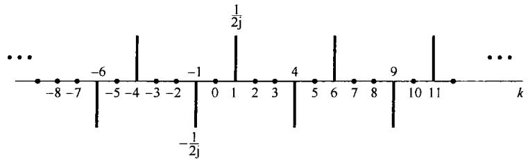

图3.13  $x[n] = \sin (2\pi /5)n$  的傅里叶系数

现在考虑  $2\pi /\omega_0$  为两个整数之比，即当

$$
\omega_ {0} = \frac {2 \pi M}{N}
$$

时的情况。假定  $M$  和  $N$  没有公共因子， $x[n]$  就有一个基波周期为  $N$ 。再将  $x[n]$  展开为两个复指数之和

$$
x [ n ] = \frac {1}{2 j} e ^ {j M (2 \pi / N) n} - \frac {1}{2 j} e ^ {- j M (2 \pi / N) n}
$$

由该式可以直接确定  $a_{M} = (1 / 2\mathrm{j})$  ，  $a_{-M} = (-1 / 2\mathrm{j})$  ，而在一个长度为  $N$  的周期内，其余系数均为0。以  $M = 3$  和  $N = 5$  为例的傅里叶系数示于图3.14中。图中再次表明这些系数的周期性。例如，对于  $N = 5$  ，  $a_{2} = a_{-3}$  ，在该例中就等于  $(-1 / 2\mathrm{j})$  。然而，应该注意到，在长度为5的任意周期内，仅有两个非零的傅里叶系数，因此在综合公式中仅有两个非零项。

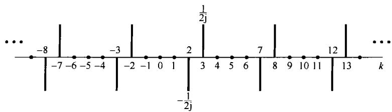

图3.14  $x[n] = \sin 3(2\pi /5)n$  的傅里叶系数

例3.11 考虑如下信号：

$$
x [ n ] = 1 + \sin \left(\frac {2 \pi}{N}\right) n + 3 \cos \left(\frac {2 \pi}{N}\right) n + \cos \left(\frac {4 \pi}{N} n + \frac {\pi}{2}\right)
$$

这个信号是周期的，其周期为  $N$  ，与例3.10类似，将  $x[n]$  直接展开成复指数形式，得到

$$
x [ n ] = 1 + \frac {1}{2 j} \left[ e ^ {j (2 \pi / N) n} - e ^ {- j (2 \pi / N) n} \right] + \frac {3}{2} \left[ e ^ {j (2 \pi / N) n} + e ^ {- j (2 \pi / N) n} \right] + \frac {1}{2} \left[ e ^ {j (4 \pi n / N + \pi / 2)} + e ^ {- j (4 \pi n / N + \pi / 2)} \right]
$$

相应项归并后，可得

$$
x [ n ] = 1 + \left(\frac {3}{2} + \frac {1}{2 \mathrm {j}}\right) \mathrm {e} ^ {\mathrm {j} (2 \pi / N) n} + \left(\frac {3}{2} - \frac {1}{2 \mathrm {j}}\right) \mathrm {e} ^ {- \mathrm {j} (2 \pi / N) n} + \left(\frac {1}{2} \mathrm {e} ^ {\mathrm {j} \pi / 2}\right) \mathrm {e} ^ {\mathrm {j} 2 (2 \pi / N) n} + \left(\frac {1}{2} \mathrm {e} ^ {- \mathrm {j} \pi / 2}\right) \mathrm {e} ^ {- \mathrm {j} 2 (2 \pi / N) n}
$$

因此，该例的傅里叶级数系数为

$$
\begin{array}{l} a _ {0} = 1 \\ a _ {1} = \frac {3}{2} + \frac {1}{2 \mathrm {j}} = \frac {3}{2} - \frac {1}{2} \mathrm {j} \\ a _ {- 1} = \frac {3}{2} - \frac {1}{2 j} = \frac {3}{2} + \frac {1}{2} j \\ a _ {2} = \frac {1}{2} j \\ a _ {- 2} = - \frac {1}{2} j \\ \end{array}
$$

对于综合公式(3.94)求和间隔内其余的  $k$  值， $a_{k} = 0$ 。再次指出，这些傅里叶系数是周期的，其周期为  $N$ 。例如， $a_{N} = 1$ ， $a_{3N - 1} = \frac{3}{2} + \frac{1}{2}\mathrm{j}$  及  $a_{2 - N} = \frac{1}{2}\mathrm{j}$ ，等等。在图3.15(a)中，以  $N = 10$  为例，画出了这些系数的实部和虚部，而图3.15(b)则是同一组系数的模和相位。

在这个例子中，可注意到对所有的  $k$  值， $a_{-k} = a_k^*$  。事实上，只要  $x[n]$  是实序列，这个关系总是成立的。这一性质与3.3节对连续时间周期信号讨论的性质是一致的；并且与连续时间情况下的一样，这一点就意味着，对于一个实周期序列的离散时间傅里叶级数，可有两种等效的表达形式。这些形式与连续时间傅里叶级数的两种表示，即式(3.31)和式(3.32)是很类似的，在习题3.52中将对此进行讨论。对于我们的讨论目的，由式(3.94)和式(3.95)给出的傅里叶级数的指数表达式尤为方便，今后将毫无例外地使用这一形式。

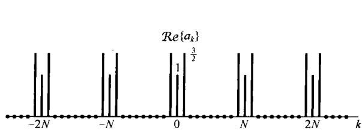

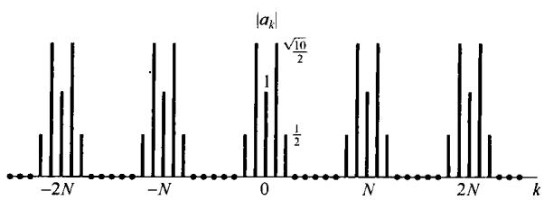

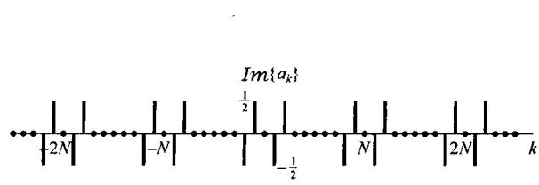

(a)

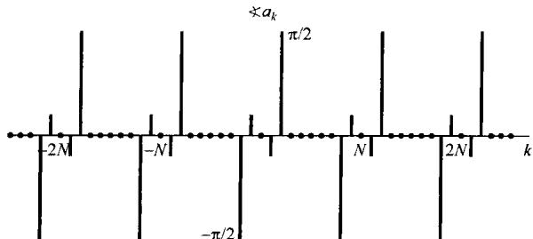

(b)

图3.15（a）例3.11的傅里叶级数系数的实部和虚部；（b）同一系数的模和相位

例3.12 在这个例子中，考虑图3.16的离散时间周期方波序列，可以利用式(3.95)求其傅里叶级数。由于在  $-N_{1} \leqslant n \leqslant N_{1}$  内有  $x[n] = 1$  。所以将式(3.95)的求和区间选在包括  $-N_{1} \leqslant n \leqslant N_{1}$  这一范围内是特别有利的。这时就可将式(3.95)表示为

$$
a _ {k} = \frac {1}{N} \sum_ {n = - N _ {1}} ^ {N _ {1}} e ^ {- j k (2 \pi / N) n} \tag {3.102}
$$

令  $m = n + N_{1}$  ，可见式(3.102)就变为

$$
a _ {k} = \frac {1}{N} \sum_ {m = 0} ^ {2 N _ {1}} \mathrm {e} ^ {- \mathrm {j} k (2 \pi / N) (m - N _ {1})} = \frac {1}{N} \mathrm {e} ^ {\mathrm {j} k (2 \pi / N) N _ {1}} \sum_ {m = 0} ^ {2 N _ {1}} \mathrm {e} ^ {- \mathrm {j} k (2 \pi / N) m} \tag {3.103}
$$

式(3.103)的和是一个几何级数的前  $(2N_{1} + 1)$  项之和，利用习题1.54所得的结果，可以求出为

$$
\begin{array}{l} a _ {k} = \frac {1}{N} \mathrm {e} ^ {\mathrm {j} k (2 \pi / N) N _ {1}} \left(\frac {1 - \mathrm {e} ^ {- \mathrm {j} k 2 \pi (2 N _ {1} + 1) / N}}{1 - \mathrm {e} ^ {- \mathrm {j} k (2 \pi / N)}}\right) \\ = \frac {1}{N} \frac {\mathrm {e} ^ {- \mathrm {j} k (2 \pi / 2 N)} \left[ \mathrm {e} ^ {\mathrm {j} k 2 \pi (N _ {1} + 1 / 2) / N} - \mathrm {e} ^ {- \mathrm {j} k 2 \pi (N _ {1} + 1 / 2) / N} \right]}{\mathrm {e} ^ {- \mathrm {j} k (2 \pi / 2 N)} \left[ \mathrm {e} ^ {\mathrm {j} k (2 \pi / 2 N)} - \mathrm {e} ^ {- \mathrm {j} k (2 \pi / 2 N)} \right]} \tag {3.104} \\ = \frac {1}{N} \frac {\sin [ 2 \pi k (N _ {1} + 1 / 2) / N ]}{\sin (\pi k / N)}, \quad k \neq 0, \pm N, \pm 2 N, \dots \\ \end{array}
$$

且

$$
a _ {k} = \frac {2 N _ {1} + 1}{N}, \quad k = 0, \pm N, \pm 2 N, \dots \tag {3.105}
$$

在图3.17(a)至图3.17(c)中，对于  $2N_{1} + 1 = 5$  ，当  $N = 10$  ，20和40时的  $a_{k}$  示于图中。

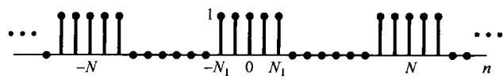

图3.16 离散时间周期方波序列

3.4节讨论连续时间傅里叶级数的收敛问题时，我们曾以对称周期方波信号为例，并看到随着取的项数趋于无限多，式(3.52)中的有限项和是如何收敛于方波信号的。尤其是在不连续点处观察到吉伯斯现象，随着所考虑的项数的增加，部分和的起伏（见图3.9）愈来愈向不连续点处压缩，但起伏峰值的大小与部分和中的项数无关而保持不变。现在来研究一个相类似的离散时间方波序列的部分和序列。为了方便起见，先假定周期  $N$  为奇数。用图3.16的例子，取 $N = 9,2N_{1} + 1 = 5$  ，并对几个不同的  $M$  值，在图3.18中对如下信号  $\hat{x} [n]$

$$
\hat {x} [ n ] = \sum_ {k = - M} ^ {M} a _ {k} \mathrm {e} ^ {\mathrm {j} k (2 \pi / N) n} \tag {3.106}
$$

作图。

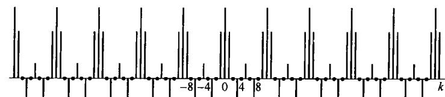

(a)

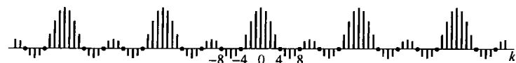

(b)

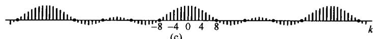

图3.17 例3.12周期方波序列的傅里叶级数系数。图中  $Na_{k}$  是在  $2N_{1} + 1 = 5$  时分别对三种  $N$  值画出的。（a） $N = 10$ ；（b） $N = 20$ ；（c） $N = 40$

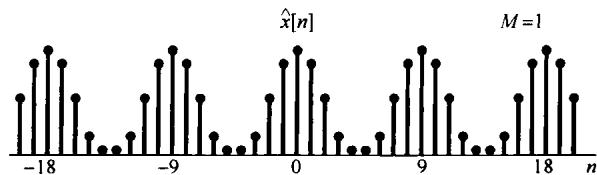

(a)

x[n]

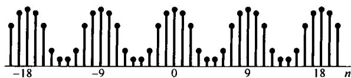

(b)

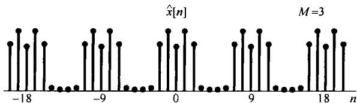

(c)

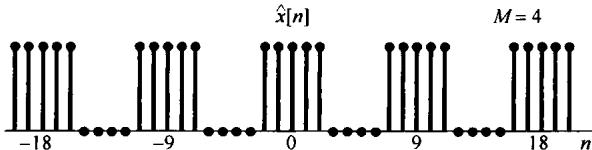

(d)

图3.18 图3.16中的周期方波序列的部分和表示，即式(3.106)和式(3.107)，在  $N = 9$  和  $2N_{1} + 1 = 5$  时对应于几个不同  $M$  值时的波形。(a)  $M = 1$ ; (b)  $M = 2$ ; (c)  $M = 3$ ; (d)  $M = 4$

由图3.18可见，对于  $M = 4$  ，部分和  $\hat{x}[n] = x[n]$  。可见，与连续时间情况相比，这里不存在任何收敛问题，也没有吉伯斯现象。事实上，一般来讲离散时间傅里叶级数不存在任何收敛问题。究其原因，依赖于这样一个事实：任何离散时间周期序列  $x[n]$  完全是由有限个参数（即  $N$  个）来表征的，这就是在一个周期内的  $N$  个序列值。傅里叶级数分析公式(3.95)只是把这  $N$  个参数变换为一组等效的  $N$  个傅里叶系数值；而综合公式(3.94)则告诉我们如何利用一个有限项级数来恢复原来的序列值。因此，若  $N$  为奇数，而我们取  $M = (N - 1)/2$  ，那么式(3.106)中的和就完全包括了  $N$  项，于是由综合公式就能得到  $\hat{x}[n] = x[n]$  。类似地，若  $N$  为偶数，可以令

$$
\hat {x} [ n ] = \sum_ {k = - M + 1} ^ {M} a _ {k} \mathrm {e} ^ {\mathrm {j} k (2 \pi / N) n} \tag {3.107}
$$

那么，在  $M = N / 2$  时，这个和式仍由  $N$  项组成，由式(3.94)仍可得出  $\hat{x}[n] = x[n]$  的结论。

相比之下，一个连续时间周期信号在单个周期内有连续取值问题，这就要求用无限多个傅里叶系数来表示它。因此，式(3.52)中没有任何一个部分和可以得到真正的  $x(t)$  值。这样，就像3.4节所讨论的，随着项数趋于无穷多而考虑求极限的问题时，收敛问题就自然产生了。

# 3.7 离散时间傅里叶级数性质

离散时间和连续时间傅里叶级数性质之间存在着很大的相似性。将列于表3.2的离散时间傅里叶级数的性质与表3.1的性质进行对比很容易就能证实这一点。

表 3.2 离散时间傅里叶级数性质

<table><tr><td>性 质</td><td>周期信号</td><td>傅里叶级数系数</td></tr><tr><td></td><td>x[n] 周期为N, y[n] 基本频率 ω0=2π/N</td><td>ak/bk 周期的，周期为N</td></tr><tr><td>线性</td><td>Ax[n] + By[n]</td><td>Aa_k + Bb_k</td></tr><tr><td>时移</td><td>x[n - n_0]</td><td>ak e^-jk(2π/N)n_0</td></tr><tr><td>频移</td><td>e^jM(2π/N)n_x[n]</td><td>ak-M</td></tr><tr><td>共轭</td><td>x* [n]</td><td>a*-k</td></tr><tr><td>时间反转</td><td>x[-n]</td><td>a-k</td></tr><tr><td>时域尺度变换</td><td>x_m [n] = {x[n/m], 若n是m的倍数 0, 若n不是m的倍数</td><td>1/m a_k (看成周期的，周期为mN)</td></tr><tr><td>周期卷积</td><td>∑_{r=⟨N⟩} x[r] y[n-r]</td><td>Na_kb_k</td></tr><tr><td>相乘</td><td>x[n] y[n]</td><td>∑_{l=⟨N⟩} a_l b_{k-l}</td></tr><tr><td>一阶差分</td><td>x[n] - x[n-1]</td><td>(1 - e^-jk(2π/N)) a_k</td></tr><tr><td>求和</td><td>\(\sum_{k=-\infty}^{n} x[k]\) (仅当a_0=0才为有限值且为周期的)</td><td>\(\left(\frac{1}{1-e^{-jk(2\pi/N)}}\right)a_k\)</td></tr><tr><td>实信号的共轭对称性</td><td>x[n]为实信号</td><td>{ak=a*-k
Re{ak}=Re{ak-k}
Im{ak}=−Im{ak-k}
|ak|=|ak-k|
&lt;ak=-ak-a-k</td></tr><tr><td>实偶信号</td><td>x[n]为实偶信号</td><td>ak为实偶数</td></tr><tr><td>实奇信号</td><td>x[n]为实奇信号</td><td>ak为纯虚奇数</td></tr><tr><td>实信号的奇偶分解</td><td>{x_e[n] = Eγ{x[n]} [x[n]为实]
x_o[n] = Od{x[n]} [x[n]为实}</td><td>Re{ak}
jIm{ak}</td></tr><tr><td colspan="3">周期信号的帕斯瓦尔定理</td></tr><tr><td colspan="3">1/N = ∑_{n=⟨N⟩} |x[n]|^2 = ∑_{k=⟨N⟩} |ak|^2</td></tr></table>

上述大部分性质的导出与对应的连续时间傅里叶级数性质的导出是很类似的，并且其中的几个将在本章末的习题中考虑。另外，在第5章中将会看到，大部分性质都能够从离散时间傅里叶变换相应的性质中推论出来。因此，在下面的各小节中将只限于讨论与连续时间情况相比有重要差别的几个性质。同时，用一些例子来说明离散时间傅里叶级数性质在建立一些概念和简化许多周期序列的傅里叶级数的复杂性方面的一些用处。

与连续时间情况相同，下面将用一种简便的符号来表示一个周期信号和它的傅里叶级数系数之间的关系。若  $x[n]$  是一个周期信号，周期为  $N$ ，其傅里叶级数系数记为  $a_{k}$ ，那么就写成

$$
x [ n ] \stackrel {{\mathcal {F S}}} {{\longleftrightarrow}} a _ {k}
$$

# 3.7.1 相乘

傅里叶级数表示的相乘性质是体现出连续时间和离散时间情况之间性质有差别的例子。由表3.1知道，两个周期为  $T$  的连续时间信号的乘积还是一个周期为  $T$  的周期信号，它的傅里叶级数系数序列就是被乘的这两个信号的傅里叶级数系数序列的卷积。在离散时间情况下，假设

$$
x [ n ] \stackrel {\mathcal {F S}} {\longleftrightarrow} a _ {k}
$$

和  $y[n]\xleftarrow{\mathcal{FS}}b_k$

都是周期的，且周期为  $N$  ，那么乘积  $x[n]y[n]$  也是一个周期为  $N$  的周期序列。由习题3.57所证明的，它的傅里叶系数  $d_{k}$  为

$$
x [ n ] y [ n ] \stackrel {F S} {\longleftrightarrow} d _ {k} = \sum_ {l = \langle N \rangle} a _ {l} b _ {k - l} \tag {3.108}
$$

除了求和变量现在要限制在  $N$  个连续的样本区间以外，式(3.108)就类似于卷积的定义。正如习题3.57所指出的，求和可以在任何  $l$  的相继  $N$  个值上进行。这种类型的运算称为两个周期的傅里叶系数序列之间的周期卷积（periodic convolution），而求和变量从  $-\infty$  到  $\infty$  的这种卷积和的形式有时就称为非周期卷积（aperiodic convolution），以区别于周期卷积。

# 3.7.2 一次差分

与连续时间傅里叶级数的微分性质相并列的是离散时间序列的一次差分运算，其定义为  $x[n] - x[n - 1]$  。若  $x[n]$  是周期的，周期为  $N$  ，那么  $y[n]$  也是周期的，周期为  $N$  ，因为将  $x[n]$  移位，或者把  $x[n]$  与另一个周期为  $N$  的周期信号进行线性组合，总是得到一个周期为  $N$  的周期信号。同样，若

$$
x [ n ] \stackrel {\mathcal {F S}} {\longleftrightarrow} a _ {k}
$$

则对应于  $x[n]$  一次差分的傅里叶系数可表示成

$$
x [ n ] - x [ n - 1 ] \stackrel {\mathcal {F S}} {\longleftrightarrow} (1 - e ^ {- j k (2 \pi / N)}) a _ {k} \tag {3.109}
$$

利用表3.2的时移和线性性质，这是很容易得到的。在求一次差分的傅里叶级数系数比求原序列的傅里叶系数更容易时，常常使用这个性质(见习题3.31)。

# 3.7.3 离散时间周期信号的帕斯瓦尔定理

习题3.57已经指出，离散时间周期信号的帕斯瓦尔定理是

$$
\frac {1}{N} \sum_ {n = \langle N \rangle} | x [ n ] | ^ {2} = \sum_ {k = \langle N \rangle} | a _ {k} | ^ {2} \tag {3.110}
$$

其中  $a_{k}$  是  $x[n]$  的傅里叶级数系数， $N$  是周期。和连续时间情况相同，上式左边是  $x[n]$  在一个周期内的平均功率，而  $\left|a_{k}\right|^2$  是  $x[n]$  的第  $k$  次谐波的平均功率。据此，帕斯瓦尔定理再一次表明：一个周期信号的平均功率等于它的所有谐波分量的平均功率之和。当然，在离散时间中只有  $N$  个不同的谐波分量。同时，由于  $a_{k}$  也是周期的，周期为  $N$  ，所以式(3.110)右边的求和可以在任何  $k$  的  $N$  个相继值上进行。

# 3.7.4 举例

这一小节将给出几个例子来说明如何利用离散时间傅里叶级数的性质来表征离散时间周期信号，以及计算它们的傅里叶级数表示式。具体而言，列于表3.2的这些性质可用于简化求取一个给定信号的傅里叶级数系数的过程。首先，这涉及到利用其他信号来表示这个给定信号，而前者的傅里叶级数系数是已知的，或者是比较容易求得的，然后利用表3.2就可以利用其表示给定信号的傅里叶级数系数。例3.13就是这种应用的例子。例3.14则用来说明根据某些部分信息来确定一个序列。例3.15说明表3.2中周期卷积性质的应用。

例3.13 现在来考虑求图3.19(a)的  $x[n]$  的傅里叶级数系数  $a_{k}$  的问题。该序列有一个基波周期为5。 $x[n]$  可以看成由图3.19(b)的方波序列  $x_{1}[n]$  与图3.19(c)的直流序列  $x_{2}[n]$  之和。现将  $x_{1}[n]$  的傅里叶级数系数记为  $b_{k}, x_{2}[n]$  的傅里叶级数系数记为  $c_{k}$ ，利用表3.2的线性性质可以得出

$$
a _ {k} = b _ {k} + c _ {k} \tag {3.111}
$$

由例3.12  $(N_{1} = 1$  和  $N = 5)$  可知，相应于  $x_{1}[n]$  的  $b_{k}$  可以表示为

$$
b _ {k} = \left\{ \begin{array}{l l} \frac {1}{5} \frac {\sin (3 \pi k / 5)}{\sin (\pi k / 5)}, & k \neq 0, \pm 5, \pm 1 0, \dots \\ \frac {3}{5}, & k = 0, \pm 5, \pm 1 0, \dots \end{array} \right. \tag {3.112}
$$

序列  $x_{2}[n]$  仅有一个直流值，它由零次傅里叶级数系数表示为

$$
c _ {0} = \frac {1}{5} \sum_ {n = 0} ^ {4} x _ {2} [ n ] = 1 \tag {3.113}
$$

因为离散时间傅里叶级数系数是周期的，所以当  $k$  为5的整倍数时， $c_{k} = 1$ 。 $x_{2}[n]$  其余的系数都必须为零，因为  $x_{2}[n]$  仅包含一个直流分量。将  $b_{k}$  和  $c_{k}$  的表示式代入式(3.111)可求得

$$
a _ {k} = \left\{ \begin{array}{l l} b _ {k} = \frac {1}{5} \frac {\sin (3 \pi k / 5)}{\sin (\pi k / 5)}, & k \neq 0, \pm 5, \pm 1 0, \dots \\ \frac {8}{5}, & k = 0, \pm 5, \pm 1 0, \dots \end{array} \right. \tag {3.114}
$$

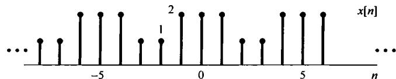

(a)

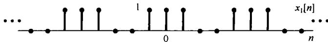

(b)

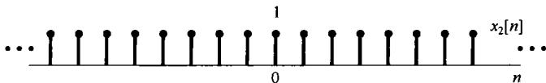

(c)

图3.19 (a) 例3.13的周期序列  $x[n]$ ，表示为(b)和(c)之和；(b)方波序列  $x_{1}[n]$ ；(c)直流序列  $x_{2}[n]$

例3.14 关于某一序列  $x[n]$  给出如下条件：

1.  $x[n]$  是周期的，周期  $N = 6$ 。

2.  $\sum_{n=0}^{5} x[n] = 2$ 。

3.  $\sum_{n=2}^{7} (-1)^{n} x[n] = 1$ 。

4. 在满足上述三个条件的所有信号中， $x[n]$  具有在每个周期内最小的功率。

试求  $x[n]$  。将  $x[n]$  的傅里叶级数系数记为  $a_{k}$ ，根据条件2，可以得出  $a_0 = 1 / 3$  。注意， $(-1)^n = \mathrm{e}^{-\mathrm{j}m} = \mathrm{e}^{-\mathrm{j}(2\pi /6)3n}$ ，由条件3可得  $a_3 = 1 / 6$  。根据帕斯瓦尔定理（见表3.2）， $x[n]$  的平均功率是

$$
P = \sum_ {k = 0} ^ {5} | a _ {k} | ^ {2} \tag {3.115}
$$

因为每一个非零系数都在  $P$  中提供一个正的量，又因为  $a_0$  和  $a_3$  的值已经确定，所以要使  $P$  最小，就只有选  $a_1 = a_2 = a_4 = a_5 = 0$  ，这样就得到

$$
x [ n ] = a _ {0} + a _ {3} \mathrm {e} ^ {\mathrm {j} \pi n} = (1 / 3) + (1 / 6) (- 1) ^ {n} \tag {3.116}
$$

如图3.20所示。

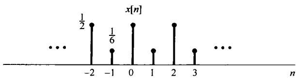

图3.20 满足例3.14所给条件的序列  $x[n]$

例3.15 这个例子在已知一个傅里叶级数系数代数表示式的情况下，要求确定一个周期序列，并画出它。在这个过程中也将用到离散时间傅里叶级数的周期卷积性质（见表3.2）。如该表所示及习题3.58所证明的，若  $x[n]$  和  $y[n]$  都是周期为  $N$  的周期序列，则信号

$$
w [ n ] = \sum_ {r = \langle N \rangle} x [ r ] y [ n - r ]
$$

也是周期为  $N$  的周期序列。这里，求和可以在任意  $r$  的  $N$  个相继值上进行；另外， $w[n]$  的傅里叶级数系数等于  $N_{a,b_k}$ ，其中  $a_k$  和  $b_k$  分别为  $x[n]$  和  $y[n]$  的傅里叶系数。

现在假设已被告知，某一信号  $w[n]$  是周期的，其基波周期  $N = 7$ ，而且它的傅里叶级数系数为

$$
c _ {k} = \frac {\sin^ {2} (3 \pi k / 7)}{7 \sin^ {2} (\pi k / 7)} \tag {3.117}
$$

由此式可观察到  $c_{k} = 7d_{k}^{2}$ ，其中  $d_{k}$  就是如例3.12中的方波  $\pmb{x}[n]$ ，在  $N_{1} = 1$  和  $N = 7$  时的傅里叶级数系数序列。利用周期卷积性质，可见

$$
w [ n ] = \sum_ {r = (7)} x [ r ] x [ n - r ] = \sum_ {r = - 3} ^ {3} x [ r ] x [ n - r ] \tag {3.118}
$$

其中，在最后的等式中已将求和区间选为  $-3 \leqslant r \leqslant 3$ 。除了求和必须限定在一个有限区间内这一点外，对于求卷积的“先乘再加”的方法在这里也是适用的。事实上，若定义另一信号  $\hat{x}[n]$ ，它在  $-3 \leqslant n \leqslant 3$  内就等于  $x[n]$ ，而在这区间以外全是零，就可将式(3.118)转换成一般的卷积，由式(3.118)可得

$$
w [ n ] = \sum_ {r = - 3} ^ {3} \hat {x} [ r ] x [ n - r ] = \sum_ {r = - \infty} ^ {+ \infty} \hat {x} [ r ] x [ n - r ]
$$

也就是说，  $w[n]$  是  $\hat{x}[n]$  和  $x[n]$  的非周期卷积。

序列  $x[r]$ ， $\hat{x}[r]$  和  $x[n - r]$  分别图示于图3.21(a)至图3.21(c)中，由该图可立即计算出  $w[n]$ ，这就是  $w[0] = 3$ ， $w[-1] = w[1] = 2$ ， $w[-2] = w[2] = 1$ ，以及  $w[-3] = w[3] = 0$ 。因为  $w[n]$  是周期的，周期为7，所以可以将  $w[n]$  画出，如图3.21(d)所示。

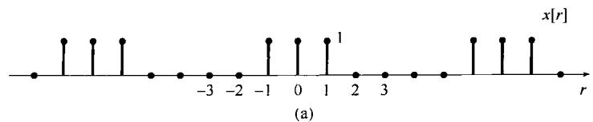

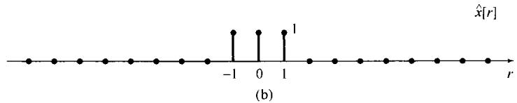

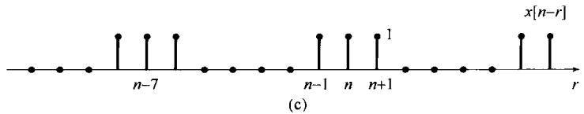

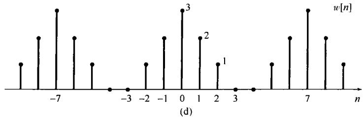

图3.21 (a) 例3.15中的方波序列  $x[r]$ ; (b) 序列  $\hat{x}[r]$ ,  $-3 \leqslant r \leqslant 3$  时  $\hat{x}[r] = x[r]$ , 对于其余  $r$ ,  $\hat{x}[r] = 0$ ; (c) 序列  $x[n - r]$ ; (d) 序列  $w[n]$  等于  $x[n]$  与其本身的周期卷积, 也等于  $\hat{x}[n]$  与  $x[n]$  的非周期卷积

# 3.8 傅里叶级数与线性时不变系统

从前面几节已经看出，傅里叶级数表示可以用来构造任何离散时间周期信号，以及在实践中具有重要意义的几乎所有连续时间周期信号。另外，在3.2节中也看到，一个线性时不变系统对一组复指数信号的线性组合的响应具有特别简单的形式。具体而言，在连续时间情况下，若  $x(t) = \mathrm{e}^{st}$  是一个连续时间线性时不变系统的输入，那么其输出就为  $y(t) = H(s)\mathrm{e}^{st}$ ，其中， $H(s)$  由式(3.6)

$$
H (s) = \int_ {- \infty} ^ {+ \infty} h (\tau) e ^ {- s \tau} d \tau \tag {3.119}
$$

给出，其中  $h(\tau)$  是该线性时不变系统的单位冲激响应。

类似地，若  $x[n] = z^n$  是一个离散时间线性时不变系统的输入，那么其输出就为  $y[n] = H(z)z^n$  ，  $H(z)$  由式(3.10)

$$
H (z) = \sum_ {k = - \infty} ^ {+ \infty} h [ k ] z ^ {- k} \tag {3.120}
$$

给出，其中  $h[k]$  是该线性时不变系统的单位脉冲响应。

当  $s$  或  $z$  是一般复数时， $H(s)$  和  $H(z)$  就称为该系统的系统函数（system function）。对于连续时间信号与系统而言，本章和下一章都将注意力放在  $\mathcal{R}e\{s\} = 0$  这一特殊情况，这样  $s = \mathrm{j}\omega$  ， $\mathrm{e}^{st}$  就具有  $\mathrm{e}^{\mathrm{j}\omega t}$  的形式。这个输入是在频率  $\omega$  上的一个复指数。具有  $s = \mathrm{j}\omega$  形式的系统函数[即  $H(\mathrm{j}\omega)$  被看成  $\omega$  的函数]就称为该系统的频率响应(frequency response)，它由下式给出：

$$
H (\mathrm {j} \omega) = \int_ {- \infty} ^ {+ \infty} h (t) \mathrm {e} ^ {- \mathrm {j} \omega t} \mathrm {d} t \tag {3.121}
$$

类似地，对于离散时间信号与系统而言，本章和第5章都将集中在  $|z| = 1$  的  $z$  值上，这样

$z = \mathrm{e}^{\mathrm{j}\omega}, z^n$  就具有  $\mathrm{e}^{\mathrm{j}\omega n}$  的形式。对  $z$  局限在  $z = \mathrm{e}^{\mathrm{j}\omega}$  形式的系统函数  $H(z)$  称为该系统的频率响应，它由下式给出：

$$
H \left(\mathrm {e} ^ {\mathrm {j} \omega}\right) = \sum_ {n = - \infty} ^ {+ \infty} h [ n ] \mathrm {e} ^ {- \mathrm {j} \omega n} \tag {3.122}
$$

利用系统的频率响应来表示一个线性时不变系统，对  $\mathrm{e}^{\mathrm{j}\omega t}$  （连续时间）或  $\mathrm{e}^{\mathrm{j}\omega n}$  （离散时间）这种形式的复指数信号的响应是特别简单的；而且，由于线性时不变系统具有叠加性质，因此一个线性时不变系统对复指数信号线性组合的响应也同样简单和容易表示。到第4章和第5章，读者将会看到如何把这些概念与连续时间和离散时间傅里叶变换结合起来，以分析线性时不变系统对非周期信号的响应。这一章的余下部分，作为首次接触这些重要的概念和结果，将集中在周期信号方面来解释和理解这一概念。

首先考虑连续时间情况。令  $x(t)$  为一个周期信号，其傅里叶级数表示为

$$
x (t) = \sum_ {k = - \infty} ^ {+ \infty} a _ {k} \mathrm {e} ^ {\mathrm {j} k \omega_ {0} t} \tag {3.123}
$$

假定将该信号加入单位冲激响应为  $h(t)$  的线性时不变系统作为它的输入，因为在式(3.123)中每一个复指数信号都是该系统的特征函数，在式(3.13)中以  $s_k = \mathrm{j}k\omega_0$  代入，那么其输出就是

$$
y (t) = \sum_ {k = - \infty} ^ {+ \infty} a _ {k} H \left(\mathrm {j} k \omega_ {0}\right) \mathrm {e} ^ {\mathrm {j} k \omega_ {0} t} \tag {3.124}
$$

于是  $y(t)$  也是周期的，且与  $x(t)$  有相同的基波频率。而且，若  $\{a_k\}$  是输入  $x(t)$  的一组傅里叶级数系数，那么  $\{a_kH(\mathrm{j}k\omega_0)\}$  就是输出  $y(t)$  的一组傅里叶级数系数；这就是说，线性时不变系统的作用就是通过乘以相应频率点上的频率响应值来逐个改变输入信号的每一个傅里叶系数。

例3.16 假设例3.2中讨论的周期信号  $x(t)$  是某个线性时不变系统的输入信号，该系统的单位冲激响应是

$$
h (t) = \mathrm {e} ^ {- t} u (t)
$$

为了计算输出  $y(t)$  的傅里叶级数系数，就是首先求频率响应

$$
H (\mathrm {j} \omega) = \int_ {0} ^ {\infty} \mathrm {e} ^ {- \tau} \mathrm {e} ^ {- \mathrm {j} \omega \tau} \mathrm {d} \tau = - \left. \frac {1}{1 + \mathrm {j} \omega} \mathrm {e} ^ {- \tau} \mathrm {e} ^ {- \mathrm {j} \omega \tau} \right| _ {0} ^ {\infty} = \frac {1}{1 + \mathrm {j} \omega} \tag {3.125}
$$

利用式(3.124)和式(3.125)，考虑到本例中  $\omega_0 = 2\pi$  ，因此可得

$$
y (t) = \sum_ {k = - 3} ^ {+ 3} b _ {k} \mathrm {e} ^ {\mathrm {j} k 2 \pi t} \tag {3.126}
$$

由于  $b_{k} = a_{k}H(\mathrm{jk}2\pi)$  ，所以

$$
\begin{array}{l} b _ {0} = 1 \\ b _ {1} = \frac {1}{4} \left(\frac {1}{1 + j 2 \pi}\right), \quad b _ {- 1} = \frac {1}{4} \left(\frac {1}{1 - j 2 \pi}\right) \\ b _ {2} = \frac {1}{2} \left(\frac {1}{1 + \mathrm {j} 4 \pi}\right), \quad b _ {- 2} = \frac {1}{2} \left(\frac {1}{1 - \mathrm {j} 4 \pi}\right) \tag {3.127} \\ b _ {3} = \frac {1}{3} \left(\frac {1}{1 + j 6 \pi}\right), \quad b _ {- 3} = \frac {1}{3} \left(\frac {1}{1 - j 6 \pi}\right) \\ \end{array}
$$

应该注意， $y(t)$  一定是实值信号，因为  $y(t)$  是  $x(t)$  和  $h(t)$  的卷积，而这两个都是实信号。检查一下式(3.127)，并注意到  $b_{k}^{*} = b_{-k}$  就能证明这一点。因此， $y(t)$  也能够表示成式(3.31)和式(3.32)两种形式，即

$$
y (t) = 1 + 2 \sum_ {k = 1} ^ {3} D _ {k} \cos (2 \pi k t + \theta_ {k}) \tag {3.128}
$$

或者

$$
y (t) = 1 + 2 \sum_ {k = 1} ^ {3} \left[ E _ {k} \cos 2 \pi k t - F _ {k} \sin 2 \pi k t \right] \tag {3.129}
$$

其中，

$$
\cdot b _ {k} = D _ {k} \mathrm {e} ^ {\mathrm {j} \theta_ {k}} = E _ {k} + \mathrm {j} F _ {k}, \quad k = 1, 2, 3 \tag {3.130}
$$

这些系数都能直接由式(3.127)求出，例如：

$$
D _ {1} = \left| b _ {1} \right| = \frac {1}{4 \sqrt {1 + 4 \pi^ {2}}}, \quad \theta_ {1} = \angle b _ {1} = - \arctan (2 \pi)
$$

$$
E _ {1} = \operatorname {R e} \left\{b _ {1} \right\} = \frac {1}{4 (1 + 4 \pi^ {2})}, \quad F _ {1} = I m \left\{b _ {1} \right\} = - \frac {\pi}{2 (1 + 4 \pi^ {2})}
$$

在离散时间情况下，一个线性时不变系统的输出与输入傅里叶级数系数之间的关系完全是与式(3.123)和式(3.124)相并列的。具体而言，令  $x[n]$  为一个周期信号，其傅里叶级数表示为

$$
x [ n ] = \sum_ {k = \langle N \rangle} a _ {k} e ^ {j k (2 \pi / N) n}
$$

若将该信号加入单位脉冲响应为  $h[n]$  的线性时不变系统作为它的输入，那么按式(3.16)，以 $z_{k} = \mathrm{e}^{\mathrm{j}k(2\pi /N)}$  代入，输出就是

$$
y [ n ] = \sum_ {k = \langle N \rangle} a _ {k} H \left(\mathrm {e} ^ {\mathrm {j} 2 \pi k / N}\right) \mathrm {e} ^ {\mathrm {j} k (2 \pi / N) n} \tag {3.131}
$$

于是  $y[n]$  也是周期的，且与  $x[n]$  有相同的周期， $y[n]$  的第  $k$  个傅里叶系数就是输入的第  $k$  个傅里叶系数与该系统在对应频率点上的频率响应值  $H(\mathrm{e}^{\mathrm{j}2\pi k / N})$  的乘积。

例3.17 考虑一个线性时不变系统，其单位脉冲响应  $h[n] = \alpha^n u[n]$ ， $-1 < \alpha < 1$ ，输入为

$$
x [ n ] = \cos \left(\frac {2 \pi n}{N}\right) \tag {3.132}
$$

和例3.10相同，  $x[n]$  能写成傅里叶级数形式

$$
x [ n ] = \frac {1}{2} e ^ {j (2 \pi / N) n} + \frac {1}{2} e ^ {- j (2 \pi / N) n}
$$

同时，由式(3.122)

$$
H \left(e ^ {j \omega}\right) = \sum_ {n = 0} ^ {\infty} \alpha^ {n} e ^ {- j \omega n} = \sum_ {n = 0} ^ {\infty} \left(\alpha e ^ {- j \omega}\right) ^ {n} \tag {3.133}
$$

利用习题1.54的结果，该几何级数收敛为

$$
H \left(\mathrm {e} ^ {\mathrm {j} \omega}\right) = \frac {1}{1 - \alpha \mathrm {e} ^ {- \mathrm {j} \omega}} \tag {3.134}
$$

利用式(3.131)，得到输出的傅里叶级数为

$$
\begin{array}{l} y [ n ] = \frac {1}{2} H \left(\mathrm {e} ^ {\mathrm {j} 2 \pi / N}\right) \mathrm {e} ^ {\mathrm {j} (2 \pi / N) n} + \frac {1}{2} H \left(\mathrm {e} ^ {- \mathrm {j} 2 \pi / N}\right) \mathrm {e} ^ {- \mathrm {j} (2 \pi / N) n} \\ = \frac {1}{2} \left(\frac {1}{1 - \alpha e ^ {- j 2 \pi / N}}\right) e ^ {j (2 \pi / N) n} + \frac {1}{2} \left(\frac {1}{1 - \alpha e ^ {j 2 \pi / N}}\right) e ^ {- j (2 \pi / N) n} \tag {3.135} \\ \end{array}
$$

若写成下式：

$$
\frac {1}{1 - \alpha \mathrm {e} ^ {- \mathrm {j} 2 \pi / N}} = r \mathrm {e} ^ {\mathrm {j} \theta}
$$

那么式(3.135)就化简为

$$
y [ n ] = r \cos \left(\frac {2 \pi}{N} n + \theta\right) \tag {3.136}
$$

例如，若  $N = 4$  ，则

$$
\frac {1}{1 - \alpha \mathrm {e} ^ {- \mathrm {j} 2 \pi / 4}} = \frac {1}{1 + \alpha \mathrm {j}} = \frac {1}{\sqrt {1 + \alpha^ {2}}} \mathrm {e} ^ {\mathrm {j} (- \arctan (\alpha))}
$$

因此

$$
y [ n ] = \frac {1}{\sqrt {1 + \alpha^ {2}}} \cos \left(\frac {\pi n}{2} - \arctan (\alpha)\right)
$$

应该注意，对于诸如式(3.124)和式(3.131)这样的表示式，若使其有意义，式(3.121)和式(3.122)中的频率响应  $H(\mathrm{j}\omega)$  和  $H(\mathrm{e}^{\mathrm{j}\omega})$  就必须是有明确定义，而且是有限的。在第4章和第5章中将会看到，如果考虑中的线性时不变系统是稳定的，就属于这种情况。例如，在例3.16中的线性时不变系统，它的冲激响应  $h(t) = \mathrm{e}^{-t}u(t)$  是稳定的，该系统就有一个明确定义的频率响应如式(3.125)所给出。另一方面，冲激响应为  $h(t) = \mathrm{e}^{-t}u(t)$  的线性时不变系统是不稳定的；这一点由式(3.121)的积分， $H(\mathrm{j}\omega)$  对任何  $\omega$  值都发散而极易得到证实。类似地，例3.17中的线性时不变系统，其单位脉冲响应  $h[n] = \alpha^n u[n]$ ，对于  $|\alpha| < 1$  就是稳定的，而且有一个如式(3.134)所给出的频率响应；然而，若  $|\alpha| > 1$ ，该系统就是不稳定的，式(3.133)的求和将不收敛。

# 3.9 滤波

在各种不同的应用中，改变一个信号中各频率分量的相对大小，或者全部消除某些频率分量之类的要求，常常是颇受关注的，这样一种过程称为滤波（filter）。用于改变频谱形状的线性时不变系统往往称为频率成形滤波器（frequency-shaping filter）。专门设计成基本上无失真地通过某些频率，而显著地衰减掉或消除掉另一些频率的系统称为频率选择性滤波器（frequency-selective filter）。正如式(3.124)和式(3.131)已指出的，一个线性时不变系统输出的傅里叶级数系数就是输入的这些系数乘以该系统的频率响应。因此，滤波就能够通过恰当地选取系统的频率响应，利用线性时不变系统很方便地予以实现；并且频域的方法为检验这一重要的应用领域提供了理想的工具。这一节和下面两节将首先通过几个例子来看看滤波方面的问题。

# 3.9.1 频率成形滤波器

经常应用频率成形滤波器的场合是在音响系统中。例如，在这类系统中一般都包含有线性时不变滤波器，以让听众可以改变声音中高低频分量的相对大小。这些滤波器就相应于线性时不变系统，而它们的频率响应能够通过操纵音调控制来改变。同时，在高保真度的音响系统中，为了补偿扬声器的频率响应特性，往往在前置放大器中还包括一个所谓的均衡滤波器。这些级联的滤波器合在一起称为音响系统的均衡或均衡器电路。图3.22示出一个用于一组特殊音频扬声器系统的三级均衡器电路。图中每一级频率响应的模都是以“对数-对数”坐标作图的，即模取  $20\log_{10}|H(\mathrm{j}\omega)|$ ，单位为分贝（dB）。频率轴以对数尺度标出，单位是赫兹  $\mathrm{Hz}(\omega /2\pi)$  。6.2.3节将会更详细地讨论到，频率响应的模用这种对数展示的形式很普遍，而且很有用。

图3.22的三部分合在一起形成的均衡电路，其设计目的是为了补偿扬声器和听音室的频率响应，并允许听音者能够控制整个频率响应。特别是由于这三个系统是级联的，而每一个系统都将一个复指数的输入  $K\mathrm{e}^{\mathrm{j}\omega t}$  乘以在那个频率上的该系统的频率响应，所以这三个系统级联后的总频率响应就是这三个频率响应的乘积。示于图3.22(a)和图3.22(b)的前两个滤波器共同组成系统的控制级，因为这两个滤波器的频率特性可以由听者来调节；而示于图3.22(c)的第三个滤波

器是均衡级，它有如图所示的固定频率响应。图3.22(a)的滤波器是一个低频滤波器，它由一个双位开关来控制，可以给出图中指出的两种频率响应中的一种。在控制级中的第二个滤波器有两个连续可调的滑动开关，用以在图3.22(b)所指出的范围内改变频率响应。

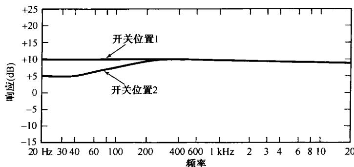

(a)

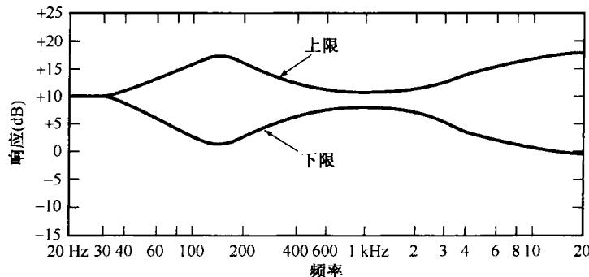

(b)

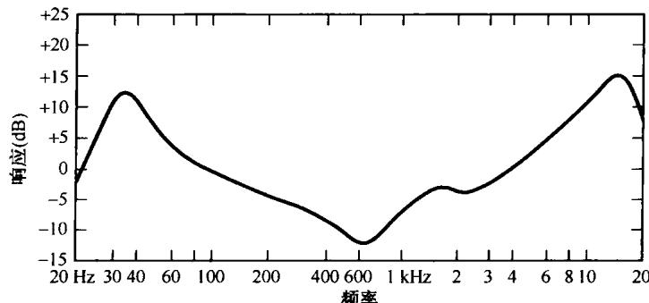

(c)

图3.22 用于一组特殊音频扬声器系统中的均衡器电路频率响应的模特性，图中示出为  $20\log_{10}|H(\mathrm{j}\omega)|$  ，单位dB。（a）用双位开关控制的低频滤波器；（b）连续可调成形滤波器频率响应的上、下限特性范围；(c)均衡器级的固定频率响应

常见的还有另一类频率成形滤波器，其输出为输入的导数，即  $y(t) = \mathrm{d}x(t) / \mathrm{d}t$ 。在  $x(t)$  为  $x(t) = \mathrm{e}^{\mathrm{j}\omega t}$  的情况下， $y(t)$  也一定为  $y(t) = \mathrm{j}\omega \mathrm{e}^{\mathrm{j}\omega t}$ ，由此其频率响应就为

$$
H (\mathrm {j} \omega) = \mathrm {j} \omega \tag {3.137}
$$

一个微分滤波器的频率响应如图3.23所示。因为  $H(\mathrm{j}\omega)$  一般为复数（在该例子中尤为如此），所以在图上展示  $H(\mathrm{j}\omega)$  时，就把  $\mid H(\mathrm{j}\omega)\mid$  和  $\nmid H(\mathrm{j}\omega)$  的图分别画出来。这个频率响应的形状就意味着：对复指数输入  $\mathbf{e}^{\mathrm{j}\omega t}$  来说，较大的  $\omega$  值将有较大的放大；其结果就是微分滤波器在增强信号中的快速变化部分时或在信号快速变换中是有用的。

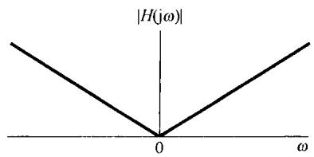

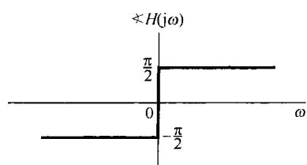

图3.23 具有输出是输入的导数的特性的滤波器的频率响应特性

微分滤波器经常应用的一种目的是在图像处理中用于边缘的增晰。一幅黑白图像可以认为是一个二维的“连续时间”信号  $x(t_{1},t_{2})$  ，这里  $t_1$  和  $t_2$  分别是水平与垂直坐标，而  $x(t_{1},t_{2})$  是图像的亮度。如果图像在水平和垂直方向上周期性重复，就能用由复指数  $\mathrm{e}^{\mathrm{j}\omega_1t_1}$  与  $\mathrm{e}^{\mathrm{j}\omega_2t_2}$  乘积的和所构成的二维傅里叶级数来表示它（见习题3.70），  $\mathrm{e}^{\mathrm{j}\omega_1t_1}$  与  $\mathrm{e}^{\mathrm{j}\omega_2t_2}$  表示在两个坐标方向的每一方向上以可能不同的频率振荡，在某一特定方向上亮度的慢变化用该方向较低的谐波分量来表示。例如，考虑在一幅图像沿垂直方向亮度急剧变化的某一边缘。因为沿着这条边缘亮度是不变或变化很缓慢的，在垂直方向这条边缘的频率分量就集中在低频域；相反，因为跨过这条边缘在亮度上有一个陡峭的变化，在水平方向这条边缘的频率分量就集中在较高的频域。图3.24说明了一个二维等效微分器在图像上的效果①。图3.24(a)是两幅原始图像，而图3.24(b)则是用该滤波器处理的结果，因为在图像边缘处的导数比亮度随距离缓慢变化区域的导数要大，所以该滤波器的效果就使得边缘增晰。

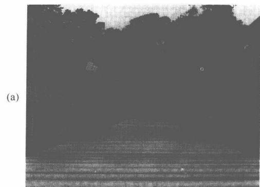

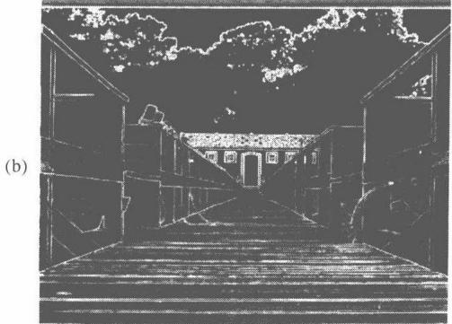

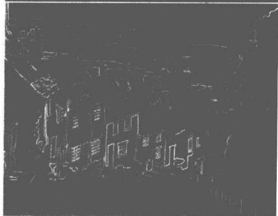

图3.24 微分滤波器在一幅图像上的效果。(a)两幅原始图像；(b)用微分滤波器处理该原始图像的结果

离散时间线性时不变系统也能找到一些很广泛的应用领域。其中很多都涉及通过通用或专用数字处理器实现的离散时间系统的应用，以处理连续时间信号（在第7章将较深入地讨论这一论题）。另外，包括人口统计学中的数据和股票市场平均值之类的经济数据序列在内的时间序列信息的分析，一般都涉及离散时间滤波器的应用。往往长期变化(相应于低频)与短期变化(相应于高频)相比具有不同的意义，分别分析这些分量是很有用的。将这些分量重新给予相对的加权，一般是用离散时间滤波器来完成的。

作为简单离散时间滤波器的一个例子，现考虑一个线性时不变系统，它在输入值上连续取两点的平均：

$$
y [ n ] = \frac {1}{2} (x [ n ] + x [ n - 1 ]) \tag {3.138}
$$

在这一情况下，  $h[n] = \frac{1}{2} (\delta [n] + \delta [n - 1])$  ，由式(3.122)可知该系统的频率响应是

$$
H \left(\mathrm {e} ^ {\mathrm {j} \omega}\right) = \frac {1}{2} \left[ 1 + \mathrm {e} ^ {- \mathrm {j} \omega} \right] = \mathrm {e} ^ {- \mathrm {j} \omega / 2} \cos (\omega / 2) \tag {3.139}
$$

$H(\mathrm{e}^{\mathrm{j}\omega})$  的模示于图3.25(a)，  $\nless H(\mathrm{e}^{\mathrm{j}\omega})$  示于图3.25(b)。1.3.3节已讨论过，离散时间复指数的低频域发生在  $\omega = 0$  ，  $\pm 2\pi$  ，  $\pm 4\pi$  ，…附近，而高频域在  $\omega = \pm \pi$  ，  $\pm 3\pi$  ，…附近。由于  $\mathrm{e}^{\mathrm{j}(\omega +2\pi)n} = \mathrm{e}^{\mathrm{j}\omega n}$  所以在离散时间情况下仅仅需要考虑  $\omega$  的某一  $2\pi$  区间，以覆盖整个不同的离散时间频率范围。结果是，任何离散时间频率响应  $H(\mathrm{e}^{\mathrm{j}\omega})$  一定是周期的，周期为  $2\pi$  。其实这一结果也能直接从式(3.122)推导出来。

对于由式(3.138)和式(3.139)定义的这个特殊滤波器，由图3.25(a)可见，  $|H(\mathrm{e}^{\mathrm{j}\omega})|$  在  $\omega = 0$  附近是比较大的，随着  $|\omega |$  朝π方向增加而减小，这就表明了在高频域比在低频域有较多的衰减。例如，若该系统的输入是常数，也就是具有零频率的复指数  $x[n] = K\mathrm{e}^{\mathrm{j}0\cdot n} = K$  ，那么输出就一定是

$$
y [ n ] = H \left(\mathrm {e} ^ {\mathrm {j} 0} \right. K \mathrm {e} ^ {\mathrm {j} \omega 0 \cdot n} = K = x [ n ]
$$

另一方面，若输入是高频信号  $x[n] = K\mathrm{e}^{\mathrm{j}n}\mathrm{e}^{n} = K(-1)^{n}$  ，那么输出将是

$$
y [ n ] = H \left(e ^ {j \pi}\right) K e ^ {j \pi \cdot n} = 0
$$

因此，这个系统就将一个信号的长期不变值从它的高频起伏中区分开来。这就代表了频率选择性滤波的第一个例子，在下面的小节中还将更详细地关注这一问题。

(a)

(b)

图3.25 离散时间线性时不变系统  $y[n] = \frac{1}{2} (x[n] + x[n - 1])$  的频率响应的(a)模和(b)相位

# 3.9.2 频率选择性滤波器

频率选择性滤波器是一类专门用于完全地或近似地选取某些频带范围内的信号和除掉其他频带范围内信号的滤波器。频率选择性滤波器的应用极为广泛。例如，在一个音频录制系统中，如果噪声比录制的音乐或声音的频率更高，就可以通过频率选择性滤波器将噪声滤除掉。频率选择性滤波器的另一类重要应用是在通信系统中。正如第8章要详细讨论的，幅度调制(AM)系统的基础就是利用许多频率选择性滤波器，把来自不同信源的各种待发送的信号，安排在彼此分开的频带内，然后组合起来一起发送；而在接收端，还是利用这类滤波器从这单一信道内提取出各路信号。用于划分信道的频率选择性滤波器和用于调节音质的频率成形滤波器（如图3.22所示的均衡器），是构成所有家用收音机和电视接收机的一个主要部分。

频率选择性不只是在应用中受到关注，由于它的普遍意义，已经产生了一组被广泛接受的术语，用来描述频率选择性滤波器的特性。特别是，尽管应用的不同，一个频率选择性滤波器通过的频率特性有很大的变化，但是几种基本类型的滤波器还是被广泛采用，并且已被赋予了一些名称来标明它们的功能。例如，一个低通滤波器(lowpass filter)就是通过低频（即在  $\omega = 0$  附近的频率），而衰减或阻止较高频率的滤波器。一个高通滤波器(highpass filter)就是通过高频而衰减或阻止较低频率的滤波器；带通滤波器(bandpass filter)就是通过某一频带范围，而衰减掉既高于又低于所要通过的这段频带的滤波器。在每一种情况下，截止频率(cutoff frequency)都是用来定义那些边界频率的，以标明要通过的频率与要阻止的频率之间的边界，也就是在通带(passband)和阻带(stopband)内频率的边界。

在定义和评价一个频率选择性滤波器的性能时会出现很多问题。在通带内这个滤波器在所通过的频率上效果究竟怎么样？在阻带内这个滤波器在衰减的频率上又衰减到什么程度？在靠近截止频率附近过渡带（也就是由通带内接近无失真到阻带内大的衰减这一过渡区）有多陡峭？其中的每一个问题都涉及到一个真实的频率选择性滤波器的特性与一个理想滤波器特性之间的比较。一个理想频率选择性滤波器(ideal frequency-selective filter)是这样一种滤波器，它无失真地通过一组频率上的复指数信号，并全部阻止掉所有其他频率的信号。例如，一个截止频率为  $\omega_{c}$  的连续时间理想低通滤波器(ideal lowpass filter)就是一个线性时不变系统，它通过  $\omega$  位于  $-\omega_{c} \leqslant$

$\omega \leqslant \omega_{c}$  内的复指数信号  $\mathrm{e}^{\mathrm{j}\omega t}$ ，而阻止掉所有其他频率的信号。这就是说，一个连续时间理想低通滤波器的频率响应是

$$
H (\mathrm {j} \omega) = \left\{ \begin{array}{l l} 1, & | \omega | \leqslant \omega_ {c} \\ 0, & | \omega | > \omega_ {c} \end{array} \right. \tag {3.140}
$$

如图3.26所示。

图3.27(a)是一个截止频率为  $\omega_{c}$  的理想连

图3.26 理想低通滤波器的频率响应

续时间高通滤波器的频率响应，而图3.27(b)则是一个下截止频率为  $\omega_{c1}$ ，上截止频率为  $\omega_{c2}$  的理想连续时间带通滤波器的频率响应。可以注意到，每一种滤波器的特性对于  $\omega = 0$  都是对称的，因此看起来对高通和带通滤波器好像有两个通带！这其实是由于我们采用了复指数信号  $\mathrm{e}^{\mathrm{j}\omega t}$ ，而不是采用正弦信号  $\sin \omega t$  和  $\cos \omega t$  的结果。因为  $\mathrm{e}^{\mathrm{j}\omega t} = \cos \omega t + \mathrm{j}\sin \omega t$  和  $\mathrm{e}^{-\mathrm{j}\omega t} = \cos \omega t - \mathrm{j}\sin \omega t$ ，两个这样的复指数就组成了在同一频率  $\omega$  的正弦信号。为此，通常在定义理想滤波器时都用图3.26和图3.27所示的对称频率响应特性。

完全以相似的方式，可以定义出相应的一组离散时间理想频率选择性滤波器，其频率响应如图3.28所示。图3.28(a)是一个理想离散时间低通滤波器，图3.28(b)是一个理想高通滤波器，

而图3.28(c)则是一个理想带通滤波器。应该注意到，正如前面所讨论过的，连续时间和离散时间理想滤波器的特性之差异在于：对离散时间滤波器来说，频率响应  $H(\mathrm{e}^{\mathrm{j}\omega})$  一定是周期的，周期为  $2\pi$ ，其低频在  $\pi$  的偶数倍附近，而高频在  $\pi$  的奇数倍附近。

(a)

(b)

图3.27 (a)理想高通滤波器的频率响应；(b)理想带通滤波器的频率响应

(a)

(b)

(c)

图3.28 离散时间理想频率选择性滤波器。(a) 低通；(b) 高通；(c) 带通

在许多情况下，理想滤波器在很多应用中描述理想化系统的构成时很有用。然而，实际上它们又是不可实现的，只能近似地实现。再者，即便它们可以被实现，理想滤波器的某些特性使其对于某些特殊应用并不适合；事实上，一个非理想的滤波器或许更为可取。

滤波包含着很多专题内容，其中包括设计与实现。尽管我们不会深入探究滤滤器设计方法方面的一些细节问题，但是在本章的余下部分和下面各章都将见到连续时间和离散时间滤波器的几个例子，并且将建立有关形成这一重要工程学科的一些概念和方法。

# 3.10 用微分方程描述的连续时间滤波器举例

在许多应用中，频率选择性滤波器是用线性常系数微分或差分方程描述的线性时不变系统来实现的。这有许多理由，例如很多具有滤波作用的物理系统都是由微分或差分方程表征的。这方面的一个很好的例子就是将在第6章研究的汽车减震系统，在某种程度上这个系统的设计就是为了滤掉由道路表面不平坦引起的高频颠簸和起伏。利用由微分或差分方程描述的滤波器的第二个原因是，它们能很方便地用模拟硬件或数字硬件来实现。另外，由微分或差分方程描述的系统提供了一个极为广泛而灵活的设计空间，例如它可以得到一个很近似于理想的滤波器，或具有所要求的其他特性的滤波器。本节和下一节将研究几个例子，用以说明如何利用微分和差分方程来实现连续时间和离散时间频率选择性滤波器。在第4章到第6章中还会见到这类滤波器的其他一些例子，并且一定会对使此类滤波器如此有用的一些性质得到更深入的理解。

# 3.10.1 简单  $RC$  低通滤波器

电路广泛用于实现连续时间滤波功能。其中最简单的一个例子就是示于图3.29的一阶RC电路，图中电压源  $v_{s}(t)$  是系统的输入。这个电路既能用来实现低通滤波，又能用来实现高通滤波，这取决于以什么作为输出信号。假定取电容器上的电压  $v_{c}(t)$  作为输出，这时输出电压与输入电压就由下列线性常系数微分方程所关联：

$$
R C \frac {\mathrm {d} v _ {c} (t)}{\mathrm {d} t} + v _ {c} (t) = v _ {s} (t) \tag {3.141}
$$

假定系统为最初松弛的，由式(3.141)描述的系统就是线性时不变的。为了确定频率响应  $H(\mathrm{j}\omega)$ ，根据定义，当输入电压  $v_{s}(t) = \mathrm{e}^{\mathrm{j}\omega t}$  时，输出电压一定是  $v_{c}(t) = H(\mathrm{j}\omega)\mathrm{e}^{\mathrm{j}\omega t}$ ，将这些代入式(3.141)，可得

$$
R C \frac {\mathrm {d}}{\mathrm {d} t} [ H (\mathrm {j} \omega) \mathrm {e} ^ {\mathrm {j} \omega t} ] + H (\mathrm {j} \omega) \mathrm {e} ^ {\mathrm {j} \omega t} = \mathrm {e} ^ {\mathrm {j} \omega t} \tag {3.142}
$$

图3.29 一阶  $RC$  滤波器

或者

$$
R C \mathrm {j} \omega H (\mathrm {j} \omega) \mathrm {e} ^ {\mathrm {j} \omega t} + H (\mathrm {j} \omega) \mathrm {e} ^ {\mathrm {j} \omega t} = \mathrm {e} ^ {\mathrm {j} \omega t} \tag {3.143}
$$

由此可直接得出

$$
H (\mathrm {j} \omega) \mathrm {e} ^ {\mathrm {j} \omega t} = \frac {1}{1 + R C \mathrm {j} \omega} \mathrm {e} ^ {\mathrm {j} \omega t} \tag {3.144}
$$

或

$$
H (\mathrm {j} \omega) = \frac {1}{1 + R C \mathrm {j} \omega} \tag {3.145}
$$

该例的频率响应  $H(\mathrm{j}\omega)$  的模和相位如图3.30所示。应该注意到，在频率  $\omega = 0$  附近， $|H(\mathrm{j}\omega)| \approx 1$ ；而在较大的  $\omega$  值时（正值或负值）， $|H(\mathrm{j}\omega)|$  显著较小，实际上就是随  $|\omega|$  的增加而平缓地减小。因此，这一简单的  $RC$  滤波器，在以  $v_{c}(t)$  为输出的情况下就是一个非理想的低通滤波器。

(a)

(b)

图3.30 图3.29的  $RC$  电路以  $\nu_{c}(t)$  为输出时的频率响应的(a)模和(b)相位图

为了初步了解滤波器设计中涉及的一些折中和权衡等问题，简要考虑一下该电路的时域特性，尤其是由式(3.141)描述的系统单位冲激响应是

$$
h (t) = \frac {1}{R C} \mathrm {e} ^ {- t / R C} u (t) \tag {3.146}
$$

它的单位阶跃响应是

$$
s (t) = [ 1 - \mathrm {e} ^ {- t / R C} ] u (t) \tag {3.147}
$$

两者都示于图3.31中，图中  $\tau = RC$  。将图3.30和图3.31进行对比，可以看到一种基本的折中。这就是：假如希望让滤波器仅仅通过很低的一些频率，那么由图3.30(a)可知  $1 / RC$  必须要小，或者等效为  $RC$  要大，以使那些不需要的频率有足够大的衰减；然而，由图3.31(b)可知，  $RC$  一旦变大，阶跃响应就得用较长的时间才能达到它的长期稳态值1。这就是说，该系统对阶跃输入的响应是缓慢的。相反，如果希望有较快的阶跃响应，就需要较小的  $RC$  值，这就意味着该滤波器将通过较高的频率。这种在频域和时域特性之间的折中是线性时不变系统和滤波器的分析与设计中出现的典型问题。这就是第6章将要详细讨论的一个主题。

图3.31 (a)  $\tau = RC$  的一阶  $RC$  低通滤波器的单位冲激响应；(b)该滤波器的阶跃响应

# 3.10.2 简单  $RC$  高通滤波器

将  $RC$  电路的输出选为电阻两端的电压是另一种选择输出的方式。这时，关联输入和输出的微分方程是

$$
R C \frac {\mathrm {d} v _ {r} (t)}{\mathrm {d} t} + v _ {r} (t) = R C \frac {\mathrm {d} v _ {s} (t)}{\mathrm {d} t} \tag {3.148}
$$

求这个系统的频率响应  $G(\mathrm{j}\omega)$  完全可以和前面讨论的情况一样，即若  $v_{s}(t) = \mathrm{e}^{\mathrm{j}\omega t}$ ，就一定有  $v_{r}(t) = G(\mathrm{j}\omega)\mathrm{e}^{\mathrm{j}\omega t}$ ，将它们代入式(3.148)并稍许进行代数演算，可得

$$
G (\mathrm {j} \omega) = \frac {\mathrm {j} \omega R C}{1 + \mathrm {j} \omega R C} \tag {3.149}
$$

图3.32所示为这个系统频率响应的模和相位。由图可见，该系统衰减掉较低的频率，而让较高的频率通过；也就是对于  $|\omega| \gg 1 / RC$  的频率有最小的衰减。这就是说，该系统是一个非理想的高通滤波器。

与低通滤波器的情况类似，电路参数既控制了该高通滤波器的频率响应，又控制了它的时间响应特性。例如，考虑该滤波器的阶跃响应，由图3.29可见  $v_{r}(t) = v_{s}(t) - v_{c}(t)$ ，因此若  $v_{s}(t) = u(t)$ ，则  $v_{c}(t)$  就由式(3.147)给出。结果，该高通滤波器的阶跃响应是

$$
v _ {r} (t) = \mathrm {e} ^ {- t / R C} u (t) \tag {3.150}
$$

如图3.33所示。结果是，因为随着  $RC$  的增加，响应变得更为迟钝，即阶跃响应要用较长的时间才能达到它的长期稳态值零。另外，由图3.32看出，增大  $RC$  （即减小  $1 / RC$  )，在频率响应上的影响就是将通带朝着更低的频率方向扩展。

图3.32 图3.29以  $v_{r}(t)$  作为输出的  $RC$  电路频率响应的(a)模和(b)相位图

图3.33  $\tau = RC$  的一阶  $RC$  高通滤波器的阶跃响应

由本节的两个例子看到，一个简单  $RC$  电路，根据所选取的不同输出变量，既能作为一个高通滤波器的粗略近似，又能作为一个低通滤波器的粗略近似。习题3.71曾提到，由一个质量块和一个机械式减震器组成的简单机械系统，也能作为由类似的一阶微分方程所描述的低通或高通滤波器。由于它们过于简单，这些电的和机械的滤波器例子都没有从通带到阻带的陡峭过渡区；事实上，这里仅有一个参数（在电路的情况下就是  $RC$ ），既要控制系统的频率响应，又要控制系统的时间响应特性，勉为其难而不可兼顾。设计更加复杂的滤波器，就需要利用更多的储能元件（在电的滤波器中就是电容和电感，在机械滤波器中就是弹簧和减震装置），这样就得到了由高阶微分方程所描述的滤波器。这样的滤波器在特性上能提供更多的灵活性，譬如通带到阻带的陡峭过渡区，或者对时间响应和频率响应之间的折中有更多的控制等。

# 3.11 用差分方程描述的离散时间滤波器举例

与连续时间情况相同，由线性常系数差分方程描述的离散时间滤波器，在实践中也具有很大的重要性。由于离散时间系统能有效地用专用或通用数字系统来实现，由差分方程描述的滤波器在实际中被广泛地采用。当研究由差分方程描述的离散时间滤波器时，正如信号与系统分析的各个方面，与连续时间情况相比，它们既有很多类似性，又有一些重要的差异。特别是，由差

分方程描述的离散时间线性时不变系统既可以是递归的，从而具有无限脉冲响应（infinite impulse response, IIR），又可以是非递归的，从而具有有限脉冲响应（finite impulse response, FIR）。前者是与上节讨论的由微分方程描述的连续时间系统直接对应的；而后者在数字系统中也具有很大的实际意义。针对一个特定的设计目标，在实现的难易程度，滤波器的阶次或者复杂性等方面，这两类滤波器都各有明显的优点和缺点。这一节只限于递归和非递归滤波器的几个简单例子。第5章和第6章将通过另外的方法和工具，对这些系统的性质进行更详细的分析和理解。

# 3.11.1 一阶递归离散时间滤波器

与3.10节讨论的一阶滤波器相对应的离散时间滤波器是由一阶差分方程所描述的线性时不变系统

$$
y [ n ] - a y [ n - 1 ] = x [ n ] \tag {3.151}
$$

根据复指数信号的特征函数性质知道，若  $x[n] = \mathrm{e}^{\mathrm{j}\omega n}$ ，则  $y[n] = H(\mathrm{e}^{\mathrm{j}\omega})\mathrm{e}^{\mathrm{j}\omega n}$ ，其中  $H(\mathrm{e}^{\mathrm{j}\omega})$  是该系统的频率响应。将这些代入式(3.151)，得

$$
H \left(\mathrm {e} ^ {\mathrm {j} \omega}\right) \mathrm {e} ^ {\mathrm {j} \omega n} - a H \left(\mathrm {e} ^ {\mathrm {j} \omega}\right) \mathrm {e} ^ {\mathrm {j} \omega (n - 1)} = \mathrm {e} ^ {\mathrm {j} \omega n} \tag {3.152}
$$

或者

$$
[ 1 - a \mathrm {e} ^ {- \mathrm {j} \omega} ] H (\mathrm {e} ^ {\mathrm {j} \omega}) \mathrm {e} ^ {\mathrm {j} \omega n} = \mathrm {e} ^ {\mathrm {j} \omega n} \tag {3.153}
$$

于是

$$
H \left(\mathrm {e} ^ {\mathrm {j} \omega}\right) = \frac {1}{1 - a \mathrm {e} ^ {- \mathrm {j} \omega}} \tag {3.154}
$$

$a = 0.6$  和  $a = -0.6$  时  $H(\mathrm{e}^{\mathrm{j}\omega})$  的模和相位分别示于图3.34(a)和图3.34(b)中。可以看到，对于正的  $a$  值，式(3.151)的差分方程表现为一个低通滤波器，其在  $\omega = 0$  附近的低频域有最小的衰减，而随着  $\omega$  朝  $\omega = \pi$  增加，衰减加大。对于负的  $a$  值，该系统是一个高通滤波器，通过  $\omega = \pi$  附近的频率，而衰减掉较低的频率。事实上，对于任何正的  $a < 1$  ，该系统都近似为一个低通滤波器；而对任何负的  $a > -1$  ，该系统都近似为一个高通滤波器。这里  $|a|$  控制了该滤波器通带的宽度，随着  $|a|$  的减小，带宽愈宽。

H(ejω)

(a)

H(e)

(b)

图3.34式(3.151)中一阶递归离散时间滤波器的频率响应。（a）  $a = 0.6$  ；（b）  $a = -0.6$

与连续时间情况的例子一样，在时域和频域特性之间仍有一个折中问题。由式(3.151)描述的系统的单位脉冲响应是

$$
h [ n ] = a ^ {n} u [ n ] \tag {3.155}
$$

阶跃响应  $s[n] = u[n]*h[n]$  是

$$
s [ n ] = \frac {1 - a ^ {n + 1}}{1 - a} u [ n ] \tag {3.156}
$$

从上两式可看到，  $|a|$  也控制着单位脉冲响应和阶跃响应趋向它们长期稳态值的速度。较小的  $|a|$  值会有较快的响应，所以滤波器也就具有较宽的通带宽度。与微分方程一样，高阶递归差分方程能够给出较陡峭的滤波器特性，并且在时域和频域特性的均衡上也能提供更大的灵活性。

最后应注意，由式(3.155)可知，用式(3.151)描述的系统在  $|a| \geqslant 1$  时是不稳定的，于是它对复指数的输入没有一个有限的响应。正如先前曾提到过的，基于傅里叶方法和频域分析都集中在对复指数具有有限响应的系统上，所以，像式(3.151)这样的例子都限制在稳定系统的范畴内。

# 3.11.2 非递归离散时间滤波器

一个有限脉冲响应非递归差分方程的一般形式是

$$
y [ n ] = \sum_ {k = - N} ^ {M} b _ {k} x [ n - k ] \tag {3.157}
$$

这就是输出  $y[n]$  是  $x[n - M]$  到  $x[n + N]$  的  $(N + M + 1)$  个值的加权平均（weighted average），其加权系数为  $b_{k}$  。这种形式的系统可以满足很广泛的一些滤波要求，其中包括频率选择性滤波器。

这类滤波器常用的一个例子是移动平均滤波器，这时对任意  $n$ ，如  $n_0$  的输出  $y[n]$ ，就是在  $n_0$  点附近  $x[n]$  的平均。它的基本思想就是局部平均，输入中的快速变化的高频分量被平均掉，而低频变化部分得到保留，这就相应于将原始序列进行平滑或低通滤波。一个简单的两点移动平均曾在3.9节作过简要介绍，见式(3.138)。稍许再复杂一点的例子是三点移动平均滤波器，其形式为

$$
y [ n ] = \frac {1}{3} (x [ n - 1 ] + x [ n ] + x [ n + 1 ]) \tag {3.158}
$$

每一输出  $y[n]$  是三个连续输入值的平均。这时

$$
h [ n ] = \frac {1}{3} [ \delta [ n + 1 ] + \delta [ n ] + \delta [ n - 1 ])
$$

根据式(3.122)，相应的频率响应是

$$
H \left(e ^ {j \omega}\right) = \frac {1}{3} \left[ e ^ {j \omega} + 1 + e ^ {- j \omega} \right] = \frac {1}{3} (1 + 2 \cos \omega) \tag {3.159}
$$

$H(\mathrm{e}^{\mathrm{j}\omega})$  的模如图3.35所示。可见，虽然和一阶递归滤波器相同，从通带到阻带没有陡峭的过渡带，但该滤波器仍具有低通滤波器的一般特性。

在式(3.158)的三点移动平均滤波器中，没有任何参数可供变化以调节有效截止频率，作为这类移动平均滤波器的一般化，可以考虑在  $(N + M + 1)$  个相邻点上求平均，即利用如下形式的差分方程：

$$
y [ n ] = \frac {1}{N + M + 1} \sum_ {k = - N} ^ {M} x [ n - k ] \tag {3.160}
$$

相应的单位脉冲响应就是一个矩形脉冲，即  $h[n] = 1 / (N + M + 1)$ ， $-N \leqslant n \leqslant M$ ；对于其他  $n$  值， $h[n] = 0$ 。该滤波器的频率响应是

$$
H \left(\mathrm {e} ^ {\mathrm {j} \omega}\right) = \frac {1}{N + M + 1} \sum_ {k = - N} ^ {M} \mathrm {e} ^ {- \mathrm {j} \omega k} \tag {3.161}
$$

式(3.161)的求和可用类似于例3.12的方法求得为

$$
H \left(\mathrm {e} ^ {\mathrm {j} \omega}\right) = \frac {1}{N + M + 1} \mathrm {e} ^ {\mathrm {j} \omega [ (N - M) / 2 ]} \frac {\sin [ \omega (M + N + 1) / 2 ]}{\sin (\omega / 2)} \tag {3.162}
$$

图3.35 一个三点移动平均低通滤波器频率响应的模特性

通过调节平均窗口  $N + M + 1$  的大小，就可以改变截止频率。例如，对于  $M + N + 1 = 33$  和  $M + N + 1 = 65$  ， $H(\mathrm{e}^{\mathrm{j}\omega})$  的模分别如图3.36(a)和图3.36(b)所示。

图3.36式(3.162)中低通移动平均滤波器频率响应的模特性。（a）  $M = N = 16$  ；（b）  $M = N = 32$

非递归滤波器也能用于实现高通滤波。为此，再用一个简单例子，考虑如下差分方程：

$$
y [ n ] = \frac {x [ n ] - x [ n - 1 ]}{2} \tag {3.163}
$$

这个系统在输入信号近似不变时， $y[n]$  的值就接近于零。对于从一个样本到另一个样本变化很大的输入信号来说，可以预期  $y[n]$  会有较大的输出值。因此，由式(3.163)所描述的系统可近似表示一种高通过滤的作用：对慢变化的低频分量进行衰减；对于快变化的较高频率分量几乎无衰减地给予通过。为了更仔细地看出这一点，需要看看系统的频率响应。这时， $h[n] = \frac{1}{2}\{\delta[n] - \delta[n-1]\}$ ，直接利用式(3.122)，可得

$$
H \left(\mathrm {e} ^ {\mathrm {j} \omega}\right) = \frac {1}{2} \left[ 1 - \mathrm {e} ^ {- \mathrm {j} \omega} \right] = \mathrm {j e} ^ {\mathrm {j} \omega / 2} \sin (\omega / 2) \tag {3.164}
$$

图3.37中画出了  $H(\mathrm{e}^{\mathrm{j}\omega})$  的模特性，指出该简单系统可近似表示一个高通滤波器，尽管从通带到阻带的过渡非常平缓。若考虑更为一般的非递归滤波器，就能够实现具有更为陡峭过渡区的各种低通、高通和其他频率选择性滤波器。

因为任何有限冲激响应系统的冲激响应都是有限长的，即由式(3.157)，  $h[n] = b_{n}$

$-N \leqslant n \leqslant M$ ；对于其他  $n$  值  $h[n] = 0$ ，因此无论怎样选取  $b_{n}$ ，它总是绝对可加的，所以这种类型的所有滤波器都是稳定的。同时，若  $N > 0$ ，由式(3.157)给出的系统就是非因果的，因为  $y[n]$  要依赖于输入的未来值。在先前信号已被录制而要进行事后处理的应用中，因果性不是一个必要的限制，因此可以使用  $N > 0$  的滤波器。在另外的情形下，如涉及很多实时处理，因果性就是必要的了，这时必须取  $N \leqslant 0$ 。

图3.37 一个简单高通滤波器的频率响应

# 3.12 小结

本章对连续时间和离散时间系统引入并建立了傅里叶级数表示，而且利用这些表示初步涉及了信号与系统分析方法中的一个重要应用领域——滤波。在3.2节中已经提到过，利用傅里叶级数的主要原因就是由于复指数信号是线性时不变系统的特征函数的关系。由3.3节到3.7节已经看到，任何具有实际意义的周期信号都可以表示成一个傅里叶级数，也就是成谐波关系的复指数信号的加权和，并与被表示的信号具有相同的周期。另外还看到，傅里叶级数表示具有许多重要的性质，这些性质体现了信号的各种特征如何反映到它们的傅里叶级数系数中。

傅里叶级数最重要的性质之一是复指数特征函数性质的一个直接结果，这就是：若一个周期信号加到一个线性时不变系统上，那么输出也一定是周期的，且与输入信号的周期相同；并且，输出的每一个傅里叶系数就是对应的输入傅里叶系数乘以复指数，该复指数的值是相应于傅里叶系数的那个频率的函数。这一频率函数是该线性时不变系统的表征，称为该系统的频率响应。考察系统的频率响应就能直接导得利用线性时不变系统对信号进行过滤的思想，这是一个具有很多应用的概念，其中几个本章已进行了介绍。一个重要的应用是有关频率选择性滤波的概念，也就是利用线性时不变系统通过某些给定频带的频率，而阻止或显著衰减掉其余频率的概念。本章还介绍了理想频率选择性滤波器的概念，并给出了由线性常系数微分和差分方程描述的频率选择性滤波器的几个例子。

在建立傅里叶分析方法并在应用中利用这些方法进行正确评价等方面，本章是一个开端。在后续各章将继续这一论题，以建立连续时间和离散时间非周期信号的傅里叶变换表示，并且不仅在滤波方面，也会在傅里叶方法其他的一些重要应用领域进行较为深入的介绍。

# 习题

习题的第一部分属于基本题，答案在书末给出。其余三个部分分别属于基本题、深入题和扩充题。

# 基本题（附答案）

3.1 有一个实值连续时间周期信号  $x(t)$ ，其基波周期  $T = 8$ ， $x(t)$  的非零傅里叶级数系数是

$$
a _ {1} = a _ {- 1} = 2, \quad a _ {3} = a _ {- 3} ^ {*} = 4 j
$$

试将  $x(t)$  表示成如下形式：

$$
x (t) = \sum_ {k = 0} ^ {\infty} A _ {k} \cos (\omega_ {k} t + \phi_ {k})
$$

3.2 有一个实值离散时间周期信号  $x[n]$ ，其基波周期  $N = 5$ ， $x[n]$  的非零傅里叶级数系数是

$$
a _ {0} = 1, \quad a _ {2} = a _ {- 2} ^ {*} = e ^ {j \pi / 4}, \quad a _ {4} = a _ {- 4} ^ {*} = 2 e ^ {j \pi / 3}
$$

试将  $x[n]$  表示成如下形式：

$$
x [ n ] = A _ {0} + \sum_ {k = 1} ^ {\infty} A _ {k} \sin (\omega_ {k} n + \phi_ {k})
$$

3.3 对下面的连续时间周期信号

$$
x (t) = 2 + \cos \left(\frac {2 \pi}{3} t\right) + 4 \sin \left(\frac {5 \pi}{3} t\right)
$$

求基波频率  $\omega_0$  和傅里叶级数系数  $a_{k}$  ，以表示成

$$
x (t) = \sum_ {k = - \infty} ^ {\infty} a _ {k} \mathrm {e} ^ {\mathrm {j} k \omega_ {0} t}
$$

3.4 利用傅里叶级数分析式(3.39)，计算下列连续时间周期信号

$$
x (t) = \left\{ \begin{array}{l l} 1. 5, & 0 \leqslant t <   1 \\ - 1. 5, & 1 \leqslant t <   2 \end{array} \right.
$$

（基波频率  $\omega_0 = \pi$  的系数  $a_{k}$  。

3.5 设  $x_{1}(t)$  为连续时间周期信号，其基波频率为  $\omega_{1}$ ，傅里叶系数为  $a_{k}$ ，已知

$$
x _ {2} (t) = x _ {1} (1 - t) + x _ {1} (t - 1)
$$

问  $x_{2}(t)$  的基波频率  $\omega_{2}$  与  $\omega_{1}$  是什么关系？求  $x_{2}(t)$  的傅里叶级数系数  $b_{k}$  与系数  $a_{k}$  之间的关系。可以使用列于表3.1中的性质。

3.6 有三个连续时间周期信号，其傅里叶级数表示如下：

$$
x _ {1} (t) = \sum_ {k = 0} ^ {1 0 0} \left(\frac {1}{2}\right) ^ {k} \mathrm {e} ^ {\mathrm {j} k \frac {2 \pi}{5 0} t}
$$

$$
x _ {2} (t) = \sum_ {k = - 1 0 0} ^ {1 0 0} \cos (k \pi) e ^ {j k \frac {2 \pi}{5 0} t}
$$

$$
x _ {3} (t) = \sum_ {k = - 1 0 0} ^ {1 0 0} \mathrm {j} \sin \left(\frac {k \pi}{2}\right) \mathrm {e} ^ {\mathrm {j} k \frac {2 \pi}{5 0} t}
$$

利用傅里叶级数性质帮助回答下列问题：

(a) 三个信号中哪些是实值的？

（b）哪些信号是偶函数？

3.7 假定周期信号  $x(t)$  的基波周期为  $T$ ，傅里叶系数为  $a_{k}$ ，在各种情况下，与直接计算  $a_{k}$  相比，都是求  $g(t) = \mathrm{d}x(t) / \mathrm{d}t$  的傅里叶级数系数  $b_{k}$  更容易。现在已知

$$
\int_ {T} ^ {2 T} x (t) \mathrm {d} t = 2
$$

试利用  $b_{k}$  和  $T$  求  $a_{k}$  的表示式。利用表3.1的性质有助于求得这个表示式。

3.8 现对一个信号  $x(t)$  给出如下信息：

1.  $x(t)$  是实奇函数。

2.  $x(t)$  是周期的，周期  $T = 2$  ，傅里叶系数为  $a_{k}$  。

3. 对  $|k| > 1, a_k = 0$ 。

4.  $\frac{1}{2}\int_{0}^{2}|x(t)|^{2}\mathrm{d}t = 1$ 。

试确定两个不同的信号都满足这些条件。

3.9 利用分析式(3.95)求下面的周期信号在一个周期内的傅里叶级数系数值：

$$
x [ n ] = \sum_ {m = - \infty} ^ {\infty} \left\{4 \delta [ n - 4 m ] + 8 \delta [ n - 1 - 4 m ] \right\}
$$

3.10 令  $x[n]$  是一个实奇周期信号，周期  $N = 7$  ，傅里叶系数为  $a_{k}$  ，已知

$$
a _ {1 5} = j, \quad a _ {1 6} = 2 j, \quad a _ {1 7} = 3 j
$$

确定  $a_0, a_{-1}, a_{-2}$  和  $a_{-3}$  的值。

3.11 现对一个信号  $x[n]$  给出如下信息：

1.  $x[n]$  是实偶信号。

2.  $x[n]$  的周期  $N = 10$  ，傅里叶系数为  $a_{k}$  。

3.  $a_{11} = 5$  。

4.  $\frac{1}{10} \sum_{n=0}^{9} |x[n]|^2 = 50$ 。

证明：  $x[n] = A\cos (Bn + C)$  ，并给出常数  $A$  ，  $B$  和  $C$  的值。

3.12 序列  $x_{1}[n]$  和  $x_{2}[n]$  都有一个周期  $N = 4$  ，对应的傅里叶系数是

$$
x _ {1} [ n ] \longleftrightarrow a _ {k}, \quad x _ {2} [ n ] \longleftrightarrow b _ {k}
$$

其中，

$$
a _ {0} = a _ {3} = \frac {1}{2} a _ {1} = \frac {1}{2} a _ {2} = 1, \quad b _ {0} = b _ {1} = b _ {2} = b _ {3} = 1
$$

利用表3.1中的相乘性质，确定信号  $g[n] = x_{1}[n]x_{2}[n]$  的傅里叶级数系数  $c_{k}$ 。

3.13 考虑一个连续时间线性时不变系统，其频率响应是

$$
H (\mathrm {j} \omega) = \int_ {- \infty} ^ {\infty} h (t) \mathrm {e} ^ {- \mathrm {j} \omega t} \mathrm {d} t = \frac {\sin (4 \omega)}{\omega}
$$

若输入至该系统的信号是一个周期信号  $x(t)$ ，即

$$
x (t) = \left\{ \begin{array}{l l} 1, & 0 \leqslant t <   4 \\ - 1, & 4 \leqslant t <   8 \end{array} \right.
$$

周期  $T = 8$  ，求系统的输出  $y(t)$  。

3.14 当一个频率响应为  $H(\mathrm{e}^{\mathrm{j}\omega})$  的线性时不变系统，其输入为如下冲激串时，

$$
x [ n ] = \sum_ {k = - \infty} ^ {\infty} \delta [ n - 4 k ]
$$

其输出为

$$
y [ n ] = \cos \left(\frac {5 \pi}{2} n + \frac {\pi}{4}\right)
$$

求  $H(\mathrm{e}^{j\pi /2})$  在  $k = 0,1,2$  和3时的值。

3.15 考虑一个连续时间理想低通滤波器  $S$  ，其频率响应是

$$
H (\mathrm {j} \omega) = \left\{ \begin{array}{l l} 1, & | \omega | \leqslant 1 0 0 \\ 0, & | \omega | > 1 0 0 \end{array} \right.
$$

当该滤波器的输入是基波周期  $T = \pi /6$  且傅里叶级数系数为  $a_{k}$  的信号  $x(t)$  时，发现有

$$
x (t) \xrightarrow {S} y (t) = x (t)
$$

试问什么  $k$  值才能保证  $a_{k} = 0?$

3.16 对于下列周期输入，求示于图P3.16的滤波器的输出：

(a)  $x_{1}[n] = (-1)^{n}$

(b)  $x_{2}[n] = 1 + \sin \left(\frac{3\pi}{8} n + \frac{\pi}{4}\right)$

(c)  $x_{3}[n] = \sum_{k = -\infty}^{\infty}\left(\frac{1}{2}\right)^{n - 4k}u[n - 4k]$

3.17 有三个连续时间系统  $S_{1}$ ， $S_{2}$  和  $S_{3}$ ，它们对复指数输入  $\mathrm{e}^{\mathrm{j}5t}$  的响应分别给出如下：

$$
S _ {1}: e ^ {j 5 t} \longrightarrow t e ^ {j 5 t}
$$

$$
S _ {2}: \mathrm {e} ^ {\mathrm {j} 5 t} \longrightarrow \mathrm {e} ^ {\mathrm {j} 5 (t - 1)}
$$

$$
S _ {3}: \mathrm {e} ^ {\mathrm {j} 5 t} \longrightarrow \cos (5 t)
$$

对每一系统，确定根据所给出的信息能否充分肯定地得出该系统不是线性时不变的结论？

图P3.16

3.18 有三个离散时间系统  $S_{1}, S_{2}$  和  $S_{3}$ ，它们对复指数输入  $\mathrm{e}^{\mathrm{j}n\omega /2}$  的响应分别给出如下：

$$
\begin{array}{l} S _ {1}: \mathrm {e} ^ {\mathrm {j} \pi n / 2} \longrightarrow \mathrm {e} ^ {\mathrm {j} \pi n / 2} u [ n ] \\ S _ {2}: \mathrm {e} ^ {\mathrm {j} \pi n / 2} \longrightarrow \mathrm {e} ^ {\mathrm {j} 3 \pi n / 2} \\ S _ {3}: \mathrm {e} ^ {\mathrm {j} \pi n / 2} \longrightarrow 2 \mathrm {e} ^ {\mathrm {j} 5 \pi n / 2} \\ \end{array}
$$

对每一系统，确定根据所给出的信息能否充分肯定地得出该系统不是线性时不变的结论？

3.19 由图P3.19所示的  $RL$  电路实现的因果线性时不变系统，电流源输出电流为输入  $x(t)$ ，系统的输出是流经电感线圈的电流  $y(t)$ 。

(a) 求关联  $x(t)$  和  $y(t)$  的微分方程。

(b) 求系统对输入为  $x(t) = \mathrm{e}^{\mathrm{j}\omega t}$  的系统频率响应。

(c) 若  $x(t) = \cos (t)$ , 求输出  $y(t)$ 。

3.20 由图P3.20所示的RLC电路实现的因果线性时不变系统，  $x(t)$  为输入电压，跨于电容器上的电压取为该系统的输出  $\pmb{y}(t)$  。

(a) 求关联  $x(t)$  和  $y(t)$  的微分方程。

(b) 求系统对输入为  $x(t) = \mathrm{e}^{\mathrm{j}\omega t}$  的系统频率响应。

(c) 若  $x(t) = \sin (t)$ ，求输出  $y(t)$ 。

图P3.19

图P3.20

# 基本题

3.21 有一个连续时间周期信号  $x(t)$  是实值信号，其基波周期  $T = 8$  ， $x(t)$  的非零傅里叶级数系数为

$$
a _ {1} = a _ {- 1} ^ {*} = j, \quad a _ {5} = a _ {- 5} = 2
$$

试将  $x(t)$  表示为如下形式：

$$
x (t) = \sum_ {k = 0} ^ {\infty} A _ {k} \cos \left(w _ {k} t + \phi_ {k}\right)
$$

3.22 求下面信号的傅里叶级数表示：

(a) 示于图 P3.22(a) 至图 P3.22(f) 的每一个  $x(t)$ 。

(b)  $x(t)$  的周期为2，且

$$
x (t) = \mathrm {e} ^ {- t}, \quad - 1 <   t <   1
$$

(c)  $x(t)$  的周期为4，且

$$
x (t) = \left\{ \begin{array}{l l} \sin \pi t, & 0 \leqslant t \leqslant 2 \\ 0, & 2 <   t \leqslant 4 \end{array} \right.
$$

3.23 给出下面周期为4的各连续时间信号的傅里叶级数系数，求每一个 $x(t)$  信号：

(a)  $a_{k} = \left\{ \begin{array}{ll}0, & k = 0\\ (\mathrm{j})^{k}\frac{\sin k\pi / 4}{k\pi}, & \text{其他} \end{array} \right.$

(b)  $a_{k} = (-1)^{k}\frac{\sin k\pi / 8}{2k\pi}, a_{0} = \frac{1}{16}$

(c)  $a_{k} = \left\{ \begin{array}{ll}\mathrm{j}k, & |k| <   3\\ 0, & \text{其他} \end{array} \right.$

(d)  $a_{k} = \left\{ \begin{array}{ll}1, & k\text{为偶数}\\ 2, & k\text{为奇数} \end{array} \right.$

3.24 令

$$
x (t) = \left\{ \begin{array}{l l} t, & 0 \leqslant t \leqslant 1 \\ 2 - t, & 1 \leqslant t \leqslant 2 \end{array} \right.
$$

是一个基波周期  $T = 2$  的周期信号，傅里叶系数为  $a_{k}$

(a) 求  $a_0$  。

(b) 求  $\mathrm{dx}(t) / \mathrm{dt}$  的傅里叶级数表示。

(c) 利用(b)的结果和连续时间傅里叶级数的微分性质求  $x(t)$  的傅里叶级数系数。

3.25 下面三个连续时间周期信号的基波周期  $T = 1 / 2$

$$
\begin{array}{l} x (t) = \cos (4 \pi t) \\ y (t) = \sin (4 \pi t) \\ z (t) = x (t) y (t) \\ \end{array}
$$

(a) 求  $x(t)$  的傅里叶级数系数。

(b) 求  $y(t)$  的傅里叶级数系数。

(c) 利用(a)和(b)的结果，按照连续时间傅里叶级数的相乘性质，求  $z(t) = x(t)y(t)$  的傅里叶级数

(d) 通过直接将  $z(t)$  展开成三角函数的形式，求  $z(t)$  的傅里叶级数系数，并与(c)的结果进行比较。

3.26 设  $x(t)$  是一个周期信号，其傅里叶级数系数是

$$
a _ {k} = \left\{ \begin{array}{l l} 2, & k = 0 \\ \mathrm {j} (\frac {1}{2}) ^ {| k |}, & \text {其 他} \end{array} \right.
$$

利用傅里叶级数性质回答下列问题：

(a)  $x(t)$  是实的吗？

(b)  $x(t)$  是偶的吗？

(c)  $\mathrm{d}x(t) / \mathrm{d}t$  是偶的吗？

3.27 有一个实值离散时间周期信号  $x[n]$ ，基波周期  $N = 5$ ， $x[n]$  的非零傅里叶级数系数是

$$
a _ {0} = 2, \quad a _ {2} = a _ {- 2} ^ {*} = 2 \mathrm {e} ^ {\mathrm {j} \pi / 6}, \quad a _ {4} = a _ {- 4} ^ {*} = \mathrm {e} ^ {\mathrm {j} \frac {\pi}{3}}
$$

试将  $x[n]$  表示成如下形式：

$$
x [ n ] = A _ {0} + \sum_ {k = 1} ^ {\infty} A _ {k} \sin (\omega_ {k} n + \phi_ {k})
$$

(a)

(b)

x(t)

(c)

(d)

(e)

(f)

图P3.22

(d) 通过直接将  $z(t)$  展开成三角函数的形式，求  $z(t)$  的傅里叶级数系数，并与(c)的结果进行比较。

3.26 设  $x(t)$  是一个周期信号，其傅里叶级数系数是

$$
a _ {k} = \left\{ \begin{array}{l l} 2, & k = 0 \\ \mathrm {j} (\frac {1}{2}) ^ {| k |}, & \text {其 他} \end{array} \right.
$$

3.28 对下面每一个离散时间周期信号，求其傅里叶级数系数，并画出每一组系数  $a_{k}$  的模和相位。

(a) 图 P3.28(a) 至图 P3.28(c) 中的每一个  $x[n]$ 。

(b)  $x[n] = \sin (2\pi n / 3)\cos (\pi n / 2)$

(c)  $x[n]$  的周期为4，且有

$$
x [ n ] = 1 - \sin \frac {\pi n}{4}, \quad 0 \leqslant n \leqslant 3
$$

(d)  $x[n]$  的周期为12，且有

$$
x [ n ] = 1 - \sin \frac {\pi n}{4}, \quad 0 \leqslant n \leqslant 1 1
$$

$x[n]$

(a)

(b)

(c)

图P3.28

3.29 下面每一种情况都给出了周期为8的某一信号的傅里叶级数系数，求各  $x[n]$ 。

(a)  $a_{k} = \cos \left(\frac{k\pi}{4}\right) + \sin \left(\frac{3k\pi}{4}\right)$

(b)  $a_{k} = \left\{ \begin{array}{ll}\sin \Bigl {(}\frac{k\pi}{3}\Bigr), & 0\leqslant k\leqslant 6\\ 0, & k = 7 \end{array} \right.$

(c)  $a_{k}$  如图P3.29(a)所示。

(d)  $a_{k}$  如图P3.29(b)所示。

图P3.29

3.30 考虑下面三个基波周期为6的离散时间信号：

$$
x [ n ] = 1 + \cos \left(\frac {2 \pi}{6} n\right), \quad y [ n ] = \sin \left(\frac {2 \pi}{6} n + \frac {\pi}{4}\right), \quad z [ n ] = x [ n ] y [ n ]
$$

(a) 求  $x[n]$  的傅里叶级数系数。

(b) 求  $y[n]$  的傅里叶级数系数。

(c) 利用(a)和(b)的结果，并按照离散时间傅里叶级数的相乘性质，求  $z[n] = x[n]y[n]$  的傅里叶级数系数。

(d) 通过直接求值, 求  $z[n]$  的傅里叶级数系数, 并将结果与 (c) 进行比较。

3.31 令

$$
x [ n ] = \left\{ \begin{array}{l l} 1, & 0 \leqslant n \leqslant 7 \\ 0, & 8 \leqslant n \leqslant 9 \end{array} \right.
$$

是一个基波周期  $N = 10$  的周期信号，傅里叶级数系数为  $a_{k}$ ，同时令

$$
g [ n ] = x [ n ] - x [ n - 1 ]
$$

(a) 证明  $g[n]$  的基波周期也为10。

(b) 求  $g[n]$  的傅里叶级数系数。

(c) 利用  $g[n]$  的傅里叶级数系数和表3.2中的一次差分性质求  $a_{k}$ ， $k \neq 0$ 。

3.32 考虑图P3.32的信号  $x[n]$ ，它是周期的，周期  $N = 4$ 。该信号的离散时间傅里叶级数表示式为

$$
x [ n ] = \sum_ {k = 0} ^ {3} a _ {k} \mathrm {e} ^ {\mathrm {j} k (2 \pi / 4) n} \tag {P3.32-1}
$$

图P3.32

在正文中曾提到，求这个傅里叶级数系数的一种办法就是将式(P3.32-1)当成含4个未知数  $(a_0, a_1, a_2$  和  $a_3)$  的一组(4个)线性方程  $(n = 0, 1, 2, 3)$  来对待。

(a) 明确写出这 4 个方程，并用任何标准方法直接解这 4 个联立方程组，以求得该 4 个未知数（首先一定要将上面的复指数化简成最简形式）。

（b）利用离散时间傅里叶级数分析公式

$$
a _ {k} = \frac {1}{4} \sum_ {n = 0} ^ {3} x [ n ] e ^ {- j k (2 \pi / 4) n}
$$

直接计算  $a_{k}$  ，并验证你的答案。

3.33 考虑一个因果连续时间线性时不变系统，其输入  $x(t)$  和输出  $y(t)$  由下列微分方程所关联：

$$
\frac {\mathrm {d}}{\mathrm {d} t} y (t) + 4 y (t) = x (t)
$$

在下面两种输入下，求输出  $y(t)$  的傅里叶级数表示：

(a)  $x(t) = \cos 2\pi t$  (b)  $x(t) = \sin 4\pi t + \cos (6\pi t + \pi /4)$

3.34 考虑一个连续时间线性时不变系统，其单位冲激响应为

$$
h (t) = \mathrm {e} ^ {- 4 | t |}
$$

对下列各输入情况下，求输出  $y(t)$  的傅里叶级数表示：

(a)  $x(t) = \sum_{n = -\infty}^{+\infty}\delta (t - n)$

(b)  $x(t) = \sum_{n = -\infty}^{+\infty}(-1)^{n}\delta (t - n)$

(c)  $x(t)$  为如图P3.34所示的周期性方波。

3.35 考虑一个连续时间线性时不变系统  $S$ ，其频率响应是

$$
H (\mathrm {j} \omega) = \left\{ \begin{array}{l l} 1, & | \omega | \geqslant 2 5 0 \\ 0, & \text {其 他} \end{array} \right.
$$

图P3.34

当输入到该系统的信号  $x(t)$  的基波周期  $T = \pi /7$  ，傅里叶级数系数为  $a_{k}$  时，发现输出  $y(t) = x(t)$  。问对于什么样的  $k$  值，才有  $a_{k} = 0?$

3.36 考虑一个因果离散时间线性时不变系统，其输入  $x[n]$  和输出  $y[n]$  由下列差分方程所关联：

$$
y [ n ] - \frac {1}{4} y [ n - 1 ] = x [ n ]
$$

在下面两种输入下，求输出  $y[n]$  的傅里叶级数表示：

(a)  $x[n] = \sin \left(\frac{3\pi}{4} n\right)$

(b)  $x[n] = \cos \left(\frac{\pi}{4} n\right) + 2\cos \left(\frac{\pi}{2} n\right)$

3.37 考虑一个离散时间线性时不变系统，其单位脉冲响应为

$$
h [ n ] = \left(\frac {1}{2}\right) ^ {| n |}
$$

在下面两种输入下，求输出  $y[n]$  的傅里叶级数表示：

(a)  $x[n] = \sum_{k = -\infty}^{\infty}\delta [n - 4k]$

(b)  $x[n]$  是周期的，周期为6，且有

$$
x [ n ] = \left\{ \begin{array}{l l} 1, & n = 0, \pm 1 \\ 0, & n = \pm 2, \pm 3 \end{array} \right.
$$

3.38 考虑一个离散时间线性时不变系统，其单位脉冲响应为

$$
h [ n ] = \left\{ \begin{array}{l l} 1, & 0 \leqslant n \leqslant 2 \\ - 1, & - 2 \leqslant n \leqslant - 1 \\ 0, & \text {其 他} \end{array} \right.
$$

已知系统的输入是

$$
x [ n ] = \sum_ {k = - \infty} ^ {+ \infty} \delta [ n - 4 k ]
$$

求输出  $y[n]$  的傅里叶级数系数。

3.39 考虑一个离散时间线性时不变系统  $S$ ，其频率响应是

$$
H \left(e ^ {j \omega}\right) = \left\{ \begin{array}{l l} 1, & | \omega | \leqslant \frac {\pi}{8} \\ 0, & \frac {\pi}{8} <   | \omega | <   \pi \end{array} \right.
$$

试证明：若该系统的输入  $x[n]$  具有周期  $N = 3$  ，则输出  $y[n]$  在每个周期内仅有一个非零傅里叶级数系数。

# 深入题

3.40 令  $x(t)$  为一个周期信号，基波周期为  $T$  ，傅里叶级数系数为  $a_{k}$  ，利用  $a_{k}$  导出下列各信号的傅里叶级数系数：

(a)  $x(t - t_0) + x(t + t_0)$

(b)  $\mathcal{E}\mathcal{V}\{x(t)\}$

(c)  $\mathcal{R}e\{x(t)\}$

(d)  $\frac{\mathrm{d}^2x(t)}{\mathrm{d}t^2}$

(e)  $x(3t - 1)$  [先确定  $x(3t - 1)$  的周期]

3.41 关于一个周期为 3 和傅里叶系数为  $a_{k}$  的连续时间周期信号, 给出下列信息:

1.  $a_{k} = a_{k + 2}$

2.  $a_{k} = a_{-k}$

3.  $\int_{-0.5}^{0.5}x(t)\mathrm{d}t = 1$

4.  $\int_{1}^{2}x(t)\mathrm{d}t = 2$

试确定  $x(t)$  。

3.42 令  $x(t)$  是一个基波周期为  $T$ ，傅里叶级数系数为  $a_{k}$  的实值信号。

(a) 证明:  $a_{k} = a_{-k}^{*}$ , 并且  $a_{0}$  一定为实数。

(b) 证明: 若  $x(t)$  为偶函数, 则它的傅里叶级数系数一定为实偶函数。

(c) 证明: 若  $x(t)$  为奇函数, 则它的傅里叶级数系数是虚数且为奇函数,  $a_0 = 0$  。

(d) 证明:  $x(t)$  偶部的傅里叶系数等于  $\mathcal{Re}\{a_k\}$ 。

(e) 证明:  $x(t)$  奇部的傅里叶系数等于  $\mathrm{j} \operatorname{Im}\left\{a_{k}\right\}$ 。

3.43 (a) 一个周期为  $T$  的连续时间周期信号  $x(t)$ ，若在其傅里叶级数表示式

$$
x (t) = \sum_ {k = - \infty} ^ {+ \infty} a _ {k} \mathrm {e} ^ {\mathrm {j} k (2 \pi / T) t} \tag {P3.43-1}
$$

中，对全部非零的偶整数  $k$  ，有  $a_{k} = 0$  ，则称  $x(t)$  是奇谐(odd-harmonic)的。

(i) 证明: 若  $x(t)$  是奇谐的, 则有

$$
x (t) = - x \left(t + \frac {T}{2}\right) \tag {P3.43-2}
$$

(ii) 证明: 若  $x(t)$  满足式(P3.43-2), 则它是奇谐的。

(b) 假设  $x(t)$  是一个周期为 2 的奇谐周期信号, 且有

$$
x (t) = t, \quad 0 <   t <   1
$$

画出  $x(t)$  并求出它的傅里叶级数系数。

(c) 类似地，可以把在式(P3.43-1)中，当  $k$  为奇数时  $a_{k} = 0$  的函数定义为偶谐信号。试问， $T$  可能是这种信号的基波周期吗？试陈述理由。

(d) 更一般的情况是证明: 若出现下面两种情况之一, 则  $T$  是式(P3.43-1)中  $x(t)$  的基波周期:

（1）  $a_1$  或  $a_{-1}$  为非零。

(2）存在两个没有公共因子的整数  $k$  和  $l$  ，使  $a_{k}$  和  $a_{l}$  都是非零的。

3.44 假设关于信号  $x(t)$  给出如下信息：

1.  $x(t)$  是实信号。

2.  $x(t)$  是周期的，周期  $T$  为6，傅里叶系数为  $a_{k}$  。

3. 对于  $k = 0$  和  $k > 2$ ，有  $a_{k} = 0$ 。

4.  $x(t) = -x(t - 3)$

5.  $\frac{1}{6}\int_{-3}^{3}|x(t)|^2\mathrm{d}t = \frac{1}{2}$

6.  $a_1$  是正实数。

证明：  $x(t) = A\cos (Bt + C)$  ，并求常数  $A$  ，  $B$  和  $C$  。

3.45 设  $x(t)$  是一实周期信号，其正弦-余弦形式[见式(3.32)]的傅里叶级数表示为

$$
x (t) = a _ {0} + 2 \sum_ {k = 1} ^ {\infty} \left[ B _ {k} \cos k \omega_ {0} t - C _ {k} \sin k \omega_ {0} t \right] \tag {P3.45-1}
$$

(a) 求  $x(t)$  的偶部和奇部的指数形式的傅里叶级数表示；也就是利用式(P3.45-1)的系数求下列两式中的  $\alpha_{k}$  和  $\beta_{k}$  ：

$$
\mathcal {E V} \{x (t) \} = \sum_ {k = - \infty} ^ {+ \infty} \alpha_ {k} \mathrm {e} ^ {\mathrm {j} k \omega_ {0} t}
$$

$$
O d \{x (t) \} = \sum_ {k = - \infty} ^ {+ \infty} \beta_ {k} e ^ {j k \omega_ {0} t}
$$

(b) 在 (a) 中  $\alpha_{k}$  和  $\alpha_{-k}$  之间是什么关系？ $\beta_{k}$  和  $\beta_{-k}$  之间是什么关系？

(c) 假设信号  $x(t)$  和  $z(t)$  如图P3.45所示，它的正弦-余弦形式的级数表示式为

$$
x (t) = a _ {0} + 2 \sum_ {k = 1} ^ {\infty} \left[ B _ {k} \cos \left(\frac {2 \pi k t}{3}\right) - C _ {k} \sin \left(\frac {2 \pi k t}{3}\right) \right]
$$

$$
z (t) = d _ {0} + 2 \sum_ {k = 1} ^ {\infty} \left[ E _ {k} \cos \left(\frac {2 \pi k t}{3}\right) - F _ {k} \sin \left(\frac {2 \pi k t}{3}\right) \right]
$$

试画出信号

$$
y (t) = 4 \left(a _ {0} + d _ {0}\right) + 2 \sum_ {k = 1} ^ {\infty} \left\{\left[ B _ {k} + \frac {1}{2} E _ {k} \right] \cos \left(\frac {2 \pi k t}{3}\right) + F _ {k} \sin \left(\frac {2 \pi k t}{3}\right) \right\}
$$

3.46 在本题中，要导出连续时间傅里叶级数的两个重要性质：相乘性质和帕斯瓦尔定理。令  $x(t)$  和  $y(t)$  是两个周期为  $T_{0}$  的连续时间周期信号，其傅里叶级数表示为

$$
x (t) = \sum_ {k = - \infty} ^ {+ \infty} a _ {k} \mathrm {e} ^ {\mathrm {j} k \omega_ {0} t}, \quad y (t) = \sum_ {k = - \infty} ^ {+ \infty} b _ {k} \mathrm {e} ^ {\mathrm {j} k \omega_ {0} t} \tag {P3.46-1}
$$

(a) 证明信号

$$
z (t) = x (t) y (t) = \sum_ {k = - \infty} ^ {+ \infty} c _ {k} \mathrm {e} ^ {\mathrm {j} k \omega_ {0} t}
$$

的傅里叶级数系数由离散卷积

$$
c _ {k} = \sum_ {n = - \infty} ^ {+ \infty} a _ {n} b _ {k - n}
$$

给出。

(b) 利用(a)的结果，计算图P3.46中信号  $x_{1}(t), x_{2}(t)$  和  $x_{3}(t)$  的傅里叶级数系数。

(c) 假设式(P3.46-1)中的  $y(t)$  等于  $x^{*}(t)$ ，用  $a_{k}$  来表示  $b_{k}$ ，并用(a)的结果证明周期信号的帕斯瓦尔定理，即

图P3.45

图P3.46

3.47 考虑信号  $x(t)$

$$
x (t) = \cos 2 \pi t
$$

因为  $x(t)$  是周期的，基波周期为1，因此对任意正整数  $N$  ，该信号也是周期的。若将  $\pmb {x}(t)$  看成周期为3的周期信号，那么  $\pmb {x}(t)$  的傅里叶级数系数是什么？

3.48 令  $x[n]$  是一个周期为  $N$  的周期序列，其傅里叶级数表示为

$$
x [ n ] = \sum_ {k = <   N >} a _ {k} \mathrm {e} ^ {\mathrm {j} k (2 \pi / N) n} \tag {P3.48-1}
$$

下列每个信号的傅里叶级数系数都能用式(P3.48-1)中的  $a_{k}$  来表示，试导出如下信号的表示式：

(a)  $x[n - n_0]$

(b)  $x[n] - x[n - 1]$

(c)  $x[n] - x\left[n - \frac{N}{2}\right]$  （设  $N$  为偶数）

(d)  $x[n] + x\left[n + \frac{N}{2}\right]$  (设  $N$  为偶数; 注意该信号是周期的, 周期为  $N / 2$ )

(e)  $x^{*}[-n]$

(f)  $(-1)^{n}x[n]$  （设  $N$  为偶数）

(g)  $(-1)^{n}x[n]$  (设  $N$  为奇数; 注意该信号是周期的, 周期为  $2N$ )

(h)  $y[n] = \begin{cases} x[n], & n \text{ 为偶数} \\ 0, & n \text{ 为奇数} \end{cases}$

3.49 令  $x[n]$  是一个周期序列，周期为  $N$  ，其傅里叶级数表示为

$$
x [ n ] = \sum_ {k = <   N >} a _ {k} \mathrm {e} ^ {\mathrm {j} k (2 \pi / N) n} \tag {P3.49-1}
$$

(a) 设  $N$  为偶数, 式(P3.49-1)中的  $x[n]$  满足

$x[n] = -x\left[n + \frac{N}{2}\right]$  对全部  $n$

证明：对全部偶整数  $k$  ，  $a_{k} = 0$  。

(b) 设  $N$  可被 4 除尽, 证明: 若

$x[n] = -x\left[n + \frac{N}{4}\right]$  对全部  $n$

则对每一个是4的倍数的  $k$  值，有  $a_{k} = 0$  。

(c) 更一般地是, 设  $N$  能被某一整数  $M$  除尽, 证明: 若

$\sum_{r = 0}^{(N / M) - 1}x\left[n + r\frac{N}{M}\right] = 0$  对全部  $n$

则对每一个是  $M$  的倍数的  $k$  值，有  $a_{k} = 0$ 。

3.50 假设对一个周期为8，傅里叶系数为  $a_{k}$  的周期信号给出如下信息：

1.  $a_{k} = -a_{k - 4}$

2.  $x[2n + 1] = (-1)^{n}$

试画  $x[n]$  的一个周期内的波形。

3.51 令  $x[n]$  是一个周期  $N = 8$ ，傅里叶级数系数有  $a_{k} = -a_{k-4}$  的周期信号，现产生一个周期  $N = 8$  的信号  $y[n]$  为

$$
y [ n ] = \left(\frac {1 + (- 1) ^ {n}}{2}\right) x [ n - 1 ]
$$

将  $y[n]$  的傅里叶级数系数记为  $b_{k}$ ，试求一个函数  $f[k]$ ，使得

$$
b _ {k} = f [ k ] a _ {k}
$$

3.52  $x[n]$  是一个周期为  $N$  的实周期信号，其复数傅里叶级数系数为  $a_{k}$ ，设  $a_{k}$  用笛卡儿坐标表示为

$$
a _ {k} = b _ {k} + \mathrm {j} c _ {k}
$$

其中  $b_{k}$  和  $c_{k}$  都是实数。

(a) 证明:  $a_{-k} = a_k^*$ ,  $b_k$  和  $b_{-k}$  之间是何关系?  $c_k$  和  $c_{-k}$  之间又是何关系?

(b) 设  $N$  是偶数，证明  $a_{N/2}$  是实数。

(c) 证明  $x[n]$  也能表示成如下三角函数形式的傅里叶级数，若  $N$  为奇数，则有

$$
x [ n ] = a _ {0} + 2 \sum_ {k = 1} ^ {(N - 1) / 2} b _ {k} \cos \left(\frac {2 \pi k n}{N}\right) - c _ {k} \sin \left(\frac {2 \pi k n}{N}\right)
$$

若  $N$  为偶数，则有

$$
x [ n ] = \left(a _ {0} + a _ {N / 2} (- 1) ^ {n}\right) + 2 \sum_ {k = 1} ^ {(N - 2) / 2} b _ {k} \cos \left(\frac {2 \pi k n}{N}\right) - c _ {k} \sin \left(\frac {2 \pi k n}{N}\right)
$$

(d) 证明: 若  $a_{k}$  的极坐标为  $A_{k} \mathrm{e}^{\mathrm{j} \omega k}$ , 那么  $x[n]$  的傅里叶级数表示也能写成如下形式, 若  $N$  为奇数, 则有

$$
x [ n ] = a _ {0} + 2 \sum_ {k = 1} ^ {(N - 1) / 2} A _ {k} \cos \left(\frac {2 \pi k n}{N} + \theta_ {k}\right)
$$

若  $N$  为偶数，则有

$$
x [ n ] = \left(a _ {0} + a _ {N / 2} (- 1) ^ {n}\right) + 2 \sum_ {k = 1} ^ {(N / 2) - 1} A _ {k} \cos \left(\frac {2 \pi k n}{N} + \theta_ {k}\right)
$$

(e) 假设  $x[n]$  和  $z[n]$  如图 P3.52 所示，它们都有一个正弦-余弦的级数表示式

$$
x [ n ] = a _ {0} + 2 \sum_ {k = 1} ^ {3} \left\{b _ {k} \cos \left(\frac {2 \pi k n}{7}\right) - c _ {k} \sin \left(\frac {2 \pi k n}{7}\right) \right\}
$$

$$
z [ n ] = d _ {0} + 2 \sum_ {k = 1} ^ {3} \left\{d _ {k} \cos \left(\frac {2 \pi k n}{7}\right) - f _ {k} \sin \left(\frac {2 \pi k n}{7}\right) \right\}
$$

试画如下信号  $y[n]$

$$
y [ n ] = a _ {0} - d _ {0} + 2 \sum_ {k = 1} ^ {3} \left\{d _ {k} \cos \left(\frac {2 \pi k n}{7}\right) + \left(f _ {k} - c _ {k}\right) \sin \left(\frac {2 \pi k n}{7}\right) \right\}
$$

图P3.52

3.53 设  $x[n]$  是一个周期为  $N$  的实周期信号，其傅里叶系数为  $a_{k}$ 。

(a) 证明: 若  $N$  为偶数, 那么在  $a_{k}$  的一个周期内至少有两个傅里叶系数是实数。

(b) 证明: 若  $N$  为奇数, 那么在  $a_{k}$  的一个周期内至少有一个傅里叶系数是实数。

3.54 考虑下列函数：

$$
a [ k ] = \sum_ {n = 0} ^ {N - 1} \mathrm {e} ^ {\mathrm {j} (2 \pi / N) k n}
$$

(a) 证明: 对于  $k = 0, \pm N, \pm 2N, \pm 3N, \dots$ , 有  $a[k] = N$ 。

(b) 证明: 只要  $k$  不是  $N$  的整倍数, 则有  $a[k] = 0$  。提示: 利用有限和公式。

(c) 若

$$
a [ k ] = \sum_ {n = <   N >} \mathrm {e} ^ {\mathrm {j} (2 \pi / N) k n}
$$

重复(a)和(b)。

3.55 设  $x[n]$  是一个基波周期为  $N$  的周期信号，其傅里叶级数系数为  $a_{k}$  。在本题中欲导出列于表3.2中的时域尺度变换性质

$$
x _ {(m)} [ n ] = \left\{ \begin{array}{l l} x [ \frac {n}{m} ], & n = 0, \pm m, \pm 2 m, \dots \\ 0, & \text {其 他} \end{array} \right.
$$

(a) 证明,  $x_{(m)}[n]$  的周期为  $mN$ 。

(b) 证明, 若

$$
x [ n ] = v [ n ] + w [ n ]
$$

则

$$
x _ {(m)} [ n ] = v _ {(m)} [ n ] + w _ {(m)} [ n ]
$$

（c）假定对某整数  $k_{0},x[n] = \mathrm{e}^{\mathrm{j}2\pi k_{0}n / N}$  ，证明：

$$
x _ {(m)} [ n ] = \frac {1}{m} \sum_ {l = 0} ^ {m - 1} \mathrm {e} ^ {\mathrm {j} 2 \pi (k _ {0} + l N) n / (m N)}
$$

这就是说，在  $x[n]$  中的一个复指数，在  $x_{(m)}[n]$  中就变成了  $m$  个复指数的线性组合。

(d) 利用(a)，(b)和(c)的结果，证明：若  $x[n]$  有傅里叶系数  $a_{k}$ ，那么  $x_{(m)}[n]$  一定有傅里叶系数  $\frac{1}{m} a_{k}$ 。

3.56 设  $x[n]$  是周期为  $N$  的周期信号，其傅里叶系数为  $a_{k}$ 。

(a) 用  $a_{k}$  来表示  $\left|x[n]\right|^{2}$  的傅里叶系数  $b_{k}$ 。

(b) 若系数  $a_{k}$  为实数，那么可以保证系数  $b_{k}$  也是实数吗？

3.57 (a) 设  $x[n]$  为

$$
x [ n ] = \sum_ {k = 0} ^ {N - 1} a _ {k} e ^ {j k (2 \pi / N) n} \tag {P3.57-1}
$$

$\pmb{y}[n]$  为

$$
y [ n ] = \sum_ {k = 0} ^ {N - 1} b _ {k} e ^ {j k (2 \pi / N) n}
$$

它们都是周期信号。证明，

$$
x [ n ] y [ n ] = \sum_ {k = 0} ^ {N - 1} c _ {k} e ^ {j k (2 \pi / N) n}
$$

其中，

$$
\boldsymbol {c} _ {k} = \sum_ {l = 0} ^ {N - 1} a _ {l} \boldsymbol {b} _ {k - l} = \sum_ {l = 0} ^ {N - 1} a _ {k - l} \boldsymbol {b} _ {l}
$$

(b) 将 (a) 的结果一般化, 证明

$$
c _ {k} = \sum_ {l = <   N >} a _ {l} b _ {k - l} = \sum_ {l = <   N >} a _ {k - l} b _ {l}
$$

(c) 利用(b)的结果，求下列各信号的傅里叶级数表示，其中  $x[n]$  由式(P3.57-1)给出：

(i)  $x[n]\cos \left(\frac{6\pi n}{N}\right)$

(ii)  $x[n]\sum_{r = -\infty}^{+\infty}\delta [n - rN]$

(iii)  $x[n](\sum_{r = -\infty}^{+\infty}\delta \left[n - \frac{rN}{3}\right])$  （设  $N$  可被3除尽）

(d) 求  $x[n]y[n]$  的傅里叶级数表示, 其中

$$
x [ n ] = \cos (\pi n / 3)
$$

$$
y [ n ] = \left\{ \begin{array}{l l} 1, & | n | \leqslant 3 \\ 0, & 4 \leqslant | n | \leqslant 6 \end{array} \right.
$$

$y[n]$  的周期为12。

(e) 利用(b)的结果证明：

$$
\sum_ {n = <   N >} x [ n ] y [ n ] = N \sum_ {l = <   N >} a _ {l} b _ {- l}
$$

并从这个表示式导出离散时间周期信号的帕斯瓦尔定理。

3.58  $x[n]$  和  $y[n]$  是具有公共周期  $N$  的周期信号，令

$$
z [ n ] = \sum_ {r = <   N >} x [ r ] y [ n - r ]
$$

是它们的周期卷积。

(a) 证明:  $z[n]$  也是周期的, 周期为  $N$  。

（b）证明：若  $a_{k}, b_{k}$  和  $c_{k}$  分别是  $x[n]$ ， $y[n]$  和  $z[n]$  的傅里叶系数，则

$$
c _ {k} = N a _ {k} b _ {k}
$$

(c) 令

$$
x [ n ] = \sin \left(\frac {3 \pi n}{4}\right)
$$

和

$$
y [ n ] = \left\{ \begin{array}{l l} 1, & 0 \leqslant n \leqslant 3 \\ 0, & 4 \leqslant n \leqslant 7 \end{array} \right.
$$

是两个周期都为8的周期信号，求它们的周期卷积的傅里叶级数表示。

(d) 对于下面两个周期也为 8 的周期信号重复 (c)

$$
x [ n ] = \left\{ \begin{array}{l l} \sin \left(\frac {3 \pi n}{4}\right), & 0 \leqslant n \leqslant 3 \\ 0, & 4 \leqslant n \leqslant 7 \end{array} \right.
$$

$$
y [ n ] = \left(\frac {1}{2}\right) ^ {n}, \quad 0 \leqslant n \leqslant 7
$$

3.59 (a) 假设  $x[n]$  是周期为  $N$  的周期信号，证明周期信号  $g(t)$

$$
g (t) = \sum_ {k = - \infty} ^ {\infty} x [ k ] \delta (t - k T)
$$

的傅里叶级数系数也是周期的，周期为  $N$ 。

(b) 假设  $x(t)$  是一个周期信号, 周期为  $T$ ; 其傅里叶级数系数  $a_{k}$  的周期为  $N$ , 证明: 一定存在一个周期序列  $g[n]$ , 使得有

$$
x (t) = \sum_ {k = - \infty} ^ {\infty} g [ k ] \delta (t - k T / N)
$$

(c) 一个连续周期信号能有周期的傅里叶系数吗？

3.60 考虑下面各对信号  $x[n]$  和  $y[n]$  。对每一对信号判断是否有一个离散时间线性时不变系统，当该系统相应的输入是  $x[n]$  时，其输出是  $y[n]$  。若这样的系统存在，解释该系统是否是唯一的（即：是否有一个以上的线性时不变系统具有所给定的输入-输出对），并求出具有所要求特性的线性时不变系统的频率响应。如果对给出的一对  $x[n]$  和  $y[n]$  不存在这样的线性时不变系统，试说明为什么？

(a)  $x[n] = \left(\frac{1}{2}\right)^n,\quad y[n] = \left(\frac{1}{4}\right)^n$

(b)  $x[n] = \left(\frac{1}{2}\right)^n u[n]$ ,  $y[n] = \left(\frac{1}{4}\right)^n u[n]$

(c)  $x[n] = \left(\frac{1}{2}\right)^n u[n]$ ,  $y[n] = 4^n u[-n]$

(d)  $x[n] = \mathrm{e}^{\mathrm{j}n / 8},\quad y[n] = 2\mathrm{e}^{\mathrm{j}n / 8}$

(e)  $x[n] = \mathrm{e}^{jn / 8}u[n]$  ，  $y[n] = 2\mathrm{e}^{jn / 8}u[n]$

(f)  $x[n] = j^n$  ，  $y[n] = 2j^{n}(1 - j)$

(g)  $x[n] = \cos (\pi n / 3),y[n] = \cos (\pi n / 3) + \sqrt{3}\sin (\pi n / 3)$

(h)  $x[n]$  和  $y_{1}[n]$  如图P3.60所示。

（i）  $x[n]$  和  $y_{2}[n]$  如图P3.60所示。

图P3.60

3.61 正如已经看到的，由于周期性复指数函数是线性时不变系统的特征函数，因此在研究连续时间线性时不变系统时，傅里叶分析方法是很有价值的。在本题中，希望证实下列论述：尽管某些线性时不变系统可能有另外的特征函数，但复指数函数是唯一能够成为一切线性时不变系统特征函数的信号。

(a) 单位冲激响应为  $h(t) = \delta(t)$  的线性时不变系统的特征函数是什么？其相应的特征值是什么？

(b) 考虑单位冲激响应  $h(t) = \delta (t - T)$  的线性时不变系统，试找到一个信号，它不具有  $\mathbf{e}^{\mathrm{i}\theta}$  的形式，但却是该系统的特征函数，且特征值为1。与此类似，找出两个特征函数，它们的特征值分别是1/2和2，但都不是复指数函数。[提示：能够找到满足这些要求的冲激串。]

(c) 考虑一个稳定线性时不变系统, 其单位冲激响应  $h(t)$  是实偶函数, 证明:  $\cos \omega t$  和  $\sin \omega t$  都是该系统的特征函数。

(d) 考虑单位冲激响应  $h(t) = u(t)$  的线性时不变系统，假如  $\phi(t)$  是该系统的特征函数，其特征值为  $\lambda$ 。找出  $\phi(t)$  必须满足的微分方程，并解出这个微分方程。此结果连同(a)至(c)的结果能证明本题最初论述的正确性。

3.62 产生直流电源的一种办法是将交流信号进行全波整流。这就是说，将交流信号  $x(t)$  通过一个具有  $y(t) = |x(t)|$  的系统。

(a) 若  $x(t) = \cos \omega t$ ，画出输入、输出波形。输入和输出的基波周期是什么？

(b) 若  $x(t) = \cos \omega t$ ，求输出  $y(t)$  傅里叶级数系数。

(c) 输入信号中的直流分量是多少？输出信号中的直流分量是多大？

3.63 假设有一连续时间周期信号加到一个线性时不变系统上，该信号用傅里叶级数表示为

$$
x (t) = \sum_ {k = - \infty} ^ {\infty} \alpha^ {| k |} e ^ {j k (\pi / 4) t}
$$

其中  $\alpha$  是位于0和1之间的实数，系统的频率响应为

$$
H (\mathrm {j} \omega) = \left\{ \begin{array}{l l} 1, & | \omega | \leqslant W \\ 0, & | \omega | > W \end{array} \right.
$$

为了使系统的输出至少有  $x(t)$  在每个周期内  $90\%$  的平均能量，问  $\mathbb{W}$  必须有多宽？

3.64 在这一章已经看到，在研究线性时不变系统时，特征函数概念是一个极为重要而有用的方法。这对于线性时变系统来说同样是正确的。具体而言，考虑一个输入为  $x(t)$ ，输出为  $y(t)$  的系统，如果有

$$
\phi (t) \longrightarrow \lambda \phi (t)
$$

也即若  $x(t) = \phi (t)$  ，则  $y(t) = \lambda \phi (t)$  ，那么就说信号  $\phi (t)$  是该系统的一个特征函数，这里复常数  $\lambda$  称为与  $\phi (t)$  有关的特征值。

(a) 假设能够把系统的输入  $x(t)$  表示为特征函数  $\phi_k(t)$  的线性组合，即

$$
x (t) = \sum_ {k = - \infty} ^ {\infty} c _ {k} \phi_ {k} (t)
$$

而且每一个特征函数都有相应的特征值  $\lambda_{k}$  。试用  $\{c_k\} ,\{\phi_k(t)\}$  和  $\{\lambda_k\}$  表示该系统的输出  $y(t)$  。

（b）考虑由下列微分方程表征的系统：

$$
y (t) = t ^ {2} \frac {\mathrm {d} ^ {2} x (t)}{\mathrm {d} t ^ {2}} + t \frac {\mathrm {d} x (t)}{\mathrm {d} t}
$$

这个系统是线性的吗？是时不变的吗？

(c）证明

$$
\phi_ {k} (t) = t ^ {k}
$$

这一组函数是(b)中所述系统的特征函数。对每一个  $\phi_k(t)$ ，确定其相应的特征值  $\lambda_{k}$ 。

(d) 如果

$$
x (t) = 1 0 t ^ {- 1 0} + 3 t + \frac {1}{2} t ^ {4} + \pi
$$

求该系统的输出。

# 扩充题

3.65 设两个函数  $u(t)$  和  $v(t)$ ，如果

$$
\int_ {a} ^ {b} u (t) v ^ {*} (t) \mathrm {d} t = 0 \tag {P3.65-1}
$$

则称  $u(t)$  和  $v(t)$  在区间  $(a, b)$  上是正交的。如果另外有

$$
\int_ {a} ^ {b} | u (t) | ^ {2} \mathrm {d} t = 1 = \int_ {a} ^ {b} | v (t) | ^ {2} \mathrm {d} t
$$

则称这两个函数是归一化的。因此称这两个函数为归一化正交。如果在一个函数集  $\{\phi_k(t)\}$  中，每一对函数都是正交(或归一化正交)的，则称这个函数集为正交(或归一化正交)函数集。

(a) 考虑图P3.65所示的各对信号  $u(t)$  和  $v(t)$ ，判定每一对信号是否在区间(0,4)上正交。

（b）函数  $\sin m\omega_0t$  和  $\sin n\omega_0t$  在区间  $(0,T)$  上是正交的吗？这里  $T = 2\pi /\omega_0$  。它们也是归一化正交的吗？

（c）对函数  $\phi_{m}(t)$  和  $\phi_n(t)$ ，重做(b)，其中

$$
\phi_ {k} (t) = \frac {1}{\sqrt {T}} [ \cos k \omega_ {0} t + \sin k \omega_ {0} t ]
$$

(d) 证明函数集  $\phi_{k}(t) = \mathrm{e}^{\mathrm{j}k\omega_{1}t}$  。在任何长度为  $T = 2\pi /\omega_0$  的区间上都是正交的。它们也是归一化正交的吗？

(e) 设  $x(t)$  是一个任意信号， $x_{o}(t)$  和  $x_{e}(t)$  分别是  $x(t)$  的奇部和偶部。证明对任何  $T$ ， $x_{o}(t)$  和  $x_{e}(t)$  在区间  $(-T, T)$  上是正交的。

(f) 证明: 如果  $\{\phi_k(t)\}$  是区间  $(a, b)$  上的正交信号集, 则信号集  $\{(1 / \sqrt{A_k})\phi_k(t)\}$  是归一化正交的, 其中

$$
A _ {k} = \int_ {a} ^ {b} | \phi_ {k} (t) | ^ {2} d t
$$

(g) 设  $\{\phi_i(t)\}$  是区间  $(a, b)$  的归一化正交信号集，考虑如下形式的信号：

$$
x (t) = \sum_ {i} a _ {i} \phi_ {i} (t)
$$

其中  $a_{i}$  为复常数。证明：

$$
\int_ {a} ^ {b} | x (t) | ^ {2} \mathrm {d} t = \sum_ {i} | a _ {i} | ^ {2}
$$

(h) 假设声  $\phi_1(t), \dots, \phi_N(t)$  仅在时间区间  $0 \leqslant t \leqslant T$  上是非零的，而且它们在此时间区间上是归一化正交的。令  $L_i$  为一个线性时不变系统，其单位冲激响应为

$$
h _ {i} (t) = \phi_ {i} (T - t) \tag {P3.65-2}
$$

证明：若将  $\phi_j(t)$  加到该系统上，则当  $i = j$  时，在时刻  $T$ ，系统的输出为1；当  $i \neq j$  时，在时刻  $T$ ，系统的输出为0。单位冲激响应由式(P3.65-2)给出的系统在习题2.66和习题2.67中称为信号  $\phi_i(t)$  的匹配滤波器。

(a)

(b)

(c)

(d)

图P3.65

3.66 本题的目的在于证明任何一个周期信号用傅里叶级数，或更一般地用任何一组正交函数的线性组合来表示，在计算上是很有效的；并且，事实上，它对于得到信号的很好近似是非常有用的①。

令  $\{\phi_i(t)\}$  ，  $i = 0$  ，  $\pm 1$  ，  $\pm 2$  ，…是在区间  $a\leqslant t\leqslant b$  上的一组归一化正交函数，  $x(t)$  为已知信号。现研究  $x(t)$  在区间  $a\leqslant t\leqslant b$  上的近似：

$$
\hat {x} _ {n} (t) = \sum_ {i = - N} ^ {+ N} a _ {i} \phi_ {i} (t) \tag {P3.66-1}
$$

其中  $a_{i}$  是常数(一般为复数)。为了度量  $x(t)$  与级数近似  $\hat{x}_N(t)$  之间的差别，定义误差  $e_N(t)$  为

$$
e _ {N} (t) = x (t) - \hat {x} _ {N} (t) \tag {P3.66-2}
$$

对于衡量近似的好坏，一种合理并广泛应用的准则是所研究区间上误差信号的能量；也就是在区间  $a \leqslant t \leqslant b$  上，误差信号模平方的积分

$$
E = \int_ {a} ^ {b} | e _ {N} (t) | ^ {2} d t \tag {P3.66-3}
$$

(a) 证明，当选择

$$
a _ {i} = \int_ {a} ^ {b} x (t) \phi_ {i} ^ {*} (t) \mathrm {d} t \tag {P3.66-4}
$$

时，  $E$  达到最小值。

提示：利用式(P3.66-1)~式(P3.66-3)，以  $a_{i}$ ， $\phi_{i}(t)$  和  $x(t)$  表示  $E$ ，然后按照  $a_{i} = b_{i} + \mathrm{j}c_{i}$  把  $a_{i}$  表示成笛卡儿坐标形式，并证明式(P3.66-4)所给定的  $a_{i}$  满足下列各式：

$$
\frac {\partial E}{\partial b _ {i}} = 0, \quad \frac {\partial E}{\partial c _ {i}} = 0, \quad i = 0, \pm 1, \pm 2, \dots , N
$$

(b) 若

$$
A _ {i} = \int_ {a} ^ {b} | \phi_ {i} (t) | ^ {2} d t
$$

而且  $\{\phi_i(t)\}$  是正交的，但不是归一化正交的，问(a)的结果将有何变化？

(c) 设  $\phi_{n}(t) = \mathrm{e}^{\mathrm{j}\pi \omega_{0}t}$  并选任何一个长度为  $T_{0} = 2\pi /\omega_{0}$  的区间，证明：使  $E$  最小的  $a_{i}$  由式(3.50)给出。

(d) 沃尔什(Walsh)函数集是一个经常用到的归一化正交函数集（见习题2.66），它的前5个函数  $\phi_0(t),\phi_1(t),\dots ,\phi_4(t)$  如图P3.66所示。在此已对时间进行了归一化，使得  $\phi_i(i)$  在区间  $0\leqslant t\leqslant 1$  上为非零，而且在该区间上归一化正交。设  $x(t) = \sin \pi t$  ，求出形式为

$$
\hat {x} (t) = \sum_ {i = 0} ^ {4} a _ {i} \phi_ {i} (t)
$$

的  $x(t)$  的近似式，使得

$$
\int_ {0} ^ {1} | x (t) - \hat {x} (t) | ^ {2} d t
$$

达到最小。

(e) 证明: 如果  $a_{i}$  依式(P3.66-4)选取, 则式(P3.66-1)中的  $\hat{x}_{N}(t)$  和式(P3.66-2)中的  $e_{N}(t)$  是正交的。(a)和(b)的结果是极其重要的。这些结果表明, 在  $i \neq j$  时, 每个系数  $a_{i}$  对其他所有的  $a_{j}$  都是独立的。因而, 如果给近似式增添更多的项, 例如计算近似式  $\hat{x}_{N+1}(t)$ , 那么先前已经确定的  $\phi_{i}(t), i = 1, \cdots, N$  的系数将不会改变。与此作为对比的是泰勒(Taylor)级数的多项式展开。 $\mathbf{e}^{t}$  的无穷泰勒级数由式  $\mathbf{e}^{t} = 1 + t + t^{2}/2! + \cdots$  给出, 后文将要指出, 当研究一个有限项多项式级数和式(P3.66-3)的误差准则时, 就会得到一个完全不同的结果。

具体而言，令  $\phi_0(t) = 1$  ，  $\phi_{1}(t) = t$  ，  $\phi_{2}(t) = t^{2}$  ，等等。

(f) 在区间  $0 \leqslant t \leqslant 1$  上这些  $\phi_{i}(t)$  是正交的吗？

(g) 考虑  $x(t) = \mathrm{e}^t$  在区间  $0 \leqslant t \leqslant 1$  上的近似式, 其形式为

$$
\hat {x} _ {0} (t) = a _ {0} \phi_ {0} (t)
$$

求使误差信号在该区间内的能量为最小的  $a_0$  值。

(h) 现在希望用泰勒级数近似  $\mathbf{e}^t$ ，并只取两项，即  $\hat{x}_1(t) = a_0 + a_1(t)$ ，求出  $a_0$  和  $a_1$  的最佳值。

提示：用  $a_0$  和  $a_1$  计算  $E$  ，然后解联立方程

$$
\frac {\partial E}{\partial a _ {0}}   =   0 \quad \text {和} \quad \frac {\partial E}{\partial a _ {1}}   =   0
$$

注意， $a_0$  的结果已经不同于  $(\mathbf{g})$  中的值了，因为在那里级数只有一项。进而，随着增加级数的项数，那个系数及其他所有系数都将不断变化。因此，可以看出应用正交函数展开的优点。

(a)

(b)

(c)

(d)

(e)

图P3.66

3.67 在正文中曾提到，傅里叶分析最初源于数学物理学问题，特别是，傅里叶的工作受到他对热扩散问题研究的激励。在本题中将说明傅里叶级数是如何被引入这一研究课题的①。

现在考虑将地球表面正下方给定深度处的温度作为一个时间函数来测定它的温度问题，此处假定地球表面温度是一个已知的时间函数  $T(t)$ ，并且是周期为1的周期函数（时间的单位是以年计）。令  $T(x, t)$  记为在  $t$  时间，位于地表下方  $x$  深度处的温度，这个函数服从热扩散方程

$$
\frac {\partial T (x , t)}{\partial t} = \frac {1}{2} k ^ {2} \frac {\partial^ {2} T (x , t)}{\partial x ^ {2}} \tag {P3.67-1}
$$

其附加条件为

$$
T (0, t) = T (t) \tag {P3.67-2}
$$

其中  $k$  是地球的热扩散系数  $(k > 0)$  。假设将  $T(t)$  展开为傅里叶级数

$$
T (t) = \sum_ {n = - \infty} ^ {+ \infty} a _ {n} \mathrm {e} ^ {\mathrm {j} n 2 \pi t} \tag {P3.67-3}
$$

类似地，在任意给定深度  $x$  处，将  $T(x, t)$  对  $t$  展开为傅里叶级数

$$
T (x, t) = \sum_ {n = - \infty} ^ {+ \infty} b _ {n} (x) e ^ {j n 2 \pi t} \tag {P3.67-4}
$$

其中傅里叶系数  $b_{n}(x)$  与深度  $x$  有关。

(a) 利用式(P3.67-1)至式(P3.67-4)证明， $b_{n}(x)$  满足下列微分方程：

$$
\frac {\mathrm {d} ^ {2} b _ {n} (x)}{\mathrm {d} x ^ {2}} = \frac {4 \pi \mathrm {j} n}{k ^ {2}} b _ {n} (x) \tag {P3.67-5a}
$$

其附加条件为

$$
b _ {n} (0) = a _ {n} \tag {P3.67-5b}
$$

因为式(P3.67-5a)是一个二阶方程，所以需要两个附加条件。基于物理原因，可以认为在地表下面很深的地方，由于地表温度的起伏所引起的温度变化应该消失，即

$$
\lim  _ {x \to \infty} T (x, t)   \text {为 常 量} \tag {P3.67-5c}
$$

（b）证明式(P3.67-5)的解是

$$
b _ {n} (x) = \left\{ \begin{array}{l l} a _ {n} \exp [ - \sqrt {2 \pi | n |} (1 + j) x / k ], & n \geqslant 0 \\ a _ {n} \exp [ - \sqrt {2 \pi | n |} (1 - j) x / k ], & n \leqslant 0 \end{array} \right.
$$

(c) 因此，在深度为  $x$  处温度的波动就是地表温度的波动，只是幅度上有衰减，相位上有平移。为了更清楚地看出这一点，设

$$
T (t) = a _ {0} + a _ {1} \sin 2 \pi t
$$

（因此  $a_0$  表示每年的平均温度），试对

$$
x = k \sqrt {\frac {\pi}{2}}
$$

且  $a_0 = 2$  和  $a_1 = 1$  的情况，画出一年内  $T(t)$  和  $T(x, t)$  的图形。注意，在此深度上，温度的波动不只是明显被衰减了，而且相位的平移使得在冬季最暖，夏季最冷。这就是为什么要构筑莱窖的道理！

图P3.68

3.68 考虑图P3.68所示的封闭曲线。我们可以把这条曲线看成一个

变长度旋转矢量的端点所走出来的轨迹。令  $r(\theta)$  为该矢量的长度，它是角度  $\theta$  的函数。这样， $r(\theta)$  对0而言就是周期的，周期为  $2\pi$  ，从而有一个傅里叶级数表示，令  $\{a_k\}$  为  $r(\theta)$  的傅里叶系数。

(a) 现在来研究矢量  $r(\theta)$  如图 P3.68 所示在  $\pmb{x}$  轴上的投影  $x(\theta)$ , 求用  $a_{k}$  表示的  $x(\theta)$  的傅里叶系数。

(b) 考虑如下系数序列：

$$
b _ {k} = a _ {k} \mathrm {e} ^ {\mathrm {j} k \pi / 4}
$$

在平面上概略画出与这组系数相对应的图形。

(c) 若

$$
b _ {k} = a _ {k} \delta [ k ]
$$

重做(b)。

(d) 在平面上作图, 要求  $r(\theta)$  不是常数, 但却有下面每一个性质:

(i)  $r(\theta)$  是偶函数。 (ii)  $r(\theta)$  的基波周期是  $\pi$  。 (iii)  $r(\theta)$  的基波周期是  $\pi / 2$  。

3.69 在本题中，要考虑在离散时间情况下与习题3.65和习题3.66中所介绍的相对应概念。与连续时间情况类似，如果两个离散时间信号  $\phi_k[n]$  和  $\phi_m[n]$  满足

$$
\sum_ {n = N _ {1}} ^ {N _ {2}} \phi_ {k} [ n ] \phi_ {m} ^ {*} [ n ] = \left\{ \begin{array}{l l} A _ {k}, & k = m \\ 0, & k \neq m \end{array} \right. \tag {P3.69-1}
$$

则称  $\phi_k[n]$  与  $\phi_m[n]$  在区间  $(N_1, N_2)$  上是正交的。若常数  $A_k$  和  $A_m$  的值都是 1，则称这两个信号是归一化正交的。

(a) 考虑信号

$$
\phi_ {k} [ n ] = \delta [ n - k ], \quad k = 0, \pm 1, \pm 2, \dots , \pm N
$$

证明这些信号在区间  $(-N, N)$  上是归一化正交的。

(b) 证明信号

$$
\phi_ {k} [ n ] = \mathrm {e} ^ {\mathrm {j} k (2 \pi / N) n}, \quad k = 0, 1, \dots , N - 1
$$

在长度为  $N$  的任何区间上是正交的。

(c) 证明, 若

$$
x [ n ] = \sum_ {i = 1} ^ {M} a _ {i} \phi_ {i} [ n ]
$$

其中  $\phi_i[n]$  在区间  $(N_1, N_2)$  上是正交的，那么

$$
\sum_ {n = N _ {1}} ^ {N _ {2}} | x [ n ] | ^ {2} = \sum_ {i = 1} ^ {M} | a _ {i} | ^ {2} A _ {i}
$$

(d) 设  $\phi_i[n], i = 0,1,\dots,M$  是一组在区间  $(N_1,N_2)$  上正交的函数， $x[n]$  是一个给定的信号。若希望用  $\phi_i[n]$  的线性组合来近似  $x[n]$ ，即

$$
\hat {x} [ n ] = \sum_ {i = 0} ^ {M} a _ {i} \phi_ {i} [ n ]
$$

其中  $a_{i}$  是常数系数。令

$$
e [ n ] = x [ n ] - \hat {x} [ n ]
$$

证明：欲使

$$
E = \sum_ {n = N _ {1}} ^ {N _ {2}} | e [ n ] | ^ {2}
$$

为最小，则  $a_{i}$  应由下式给出：

$$
a _ {i} = \frac {1}{A _ {i}} \sum_ {n = N _ {1}} ^ {N _ {2}} x [ n ] \phi_ {i} ^ {*} [ n ] \tag {P3.69-2}
$$

提示：与习题3.66相同，用  $a_{i}, \phi_{i}[n], A_{i}$  和  $x[n]$  来表示  $E$ ；把  $a_{i}$  写成  $a_{i} = b_{i} + \mathrm{j}c_{i}$ ，并证明：由式(P3.69-2)给出的  $a_{i}$  满足以下关系：

$$
\frac {\partial E}{\partial b _ {i}} = 0 \quad \text {和} \quad \frac {\partial E}{\partial c _ {i}} = 0
$$

注意，当  $\phi_i[n]$  是(b)的形式时，应用这个结果就能得到式(3.95)的  $a_{k}$ 。

(e) 当  $\phi_{i}[n]$  为(a)的形式时，应用(d)的结果，用  $x[n]$  来确定系数  $a_{i}$ 。

3.70 (a) 在本题中考虑具有两个独立变量的周期信号的二维傅里叶级数的定义。考虑一个信号  $x(t_{1},t_{2})$  它对所有的  $t_1,t_2$  都满足

$$
x \left(t _ {1}, t _ {2}\right) = x \left(t _ {1} + T _ {1}, t _ {2} + T _ {2}\right), \quad \text {对 于 所 有} t _ {1}, t _ {2}
$$

这个信号是周期的，它在  $t_1$  方向具有周期  $T_{1}$  ，在  $t_2$  方向具有周期  $T_{2}$  。这样一个信号有如下的级数表示式：

$$
x \left(t _ {1}, t _ {2}\right) = \sum_ {n = - \infty} ^ {+ \infty} \sum_ {m = - \infty} ^ {+ \infty} a _ {m n} \mathrm {e} ^ {\mathrm {j} (m \omega_ {1} t _ {1} + n \omega_ {2} t _ {2})}
$$

其中，

$$
\omega_ {1} = 2 \pi / T _ {1}, \quad \omega_ {2} = 2 \pi / T _ {2}
$$

求用  $x(t_{1},t_{2})$  表示  $a_{mn}$  的表示式。

（b）对下列信号确定傅里叶级数系数  $a_{mn}$

(i)  $\cos (2\pi t_1 + 2t_2)$  。 (ii) 图P3.70所示信号。

图P3.70

3.71 考虑图P3.71的系统，速度  $v(t)$  和输入力  $f(t)$  的关系由下列微分方程给出：

$$
B v (t) + K \int v (t) d t = f (t)
$$

(a) 假定输出是作用在弹簧上的压缩力  $f_{s}(t)$ , 试写出关于  $f_{s}(t)$  和  $f(t)$  的微分方程, 求得该系统的频率响应, 并确认该系统近似为一个低通滤波器。

(b) 假定输出是作用在减震器上的压缩力  $f_{d}(t)$ ，试写出关于  $f_{d}(t)$  和  $f(t)$  的微分方程，求得该系统的频率响应，并确认该系统近似为一个高通滤波器。

图P3.71
