# 第4章 连续时间傅里叶变换

# 4.0 引言

第3章建立了周期信号作为复指数信号线性组合的表示，同时也我们也看到了这一表示是如何用来描述线性时不变系统对这些信号的作用效果的。

这一章和下一章将把这些概念推广应用到非周期信号中。读者将会看到，相当广泛的一类信号，其中包括全部有限能量的信号，也能够经由复指数信号的线性组合来表示。对周期信号而言，这些复指数基本信号构造单元全是成谐波关系的；而对非周期信号，它们则是在频率上无限小地靠近的。因此，作为线性组合表示所取的形式是一个积分，而不是求和。在这种表示中所得到的系数谱称为傅里叶变换；而利用这些系数将信号表示为复指数信号线性组合的综合积分式本身则称为傅里叶逆变换。

对连续时间非周期信号建立这种表示是傅里叶的最重要的贡献之一，现在我们来讨论傅里叶变换也是紧随着他最初研究所采用的途径进行的；特别是傅里叶所曾认为的，一个非周期信号能够看成周期无限长的周期信号这一点。更确切地说，在一个周期信号的傅里叶级数表示中，当周期增加时，基波频率就减小，成谐波关系的各分量在频率上愈趋靠近。

当周期变成无穷大时，这些频率分量就形成了一个连续域，从而傅里叶级数的求和也就变成了一个积分。下一节将建立连续时间非周期信号的傅里叶变换表示，并且在以后的各节中将据此来讨论形成连续时间信号与系统频域法基础的连续时间傅里叶变换的很多重要性质。第5章将并行地对离散时间信号进行讨论。

# 4.1 非周期信号的表示：连续时间傅里叶变换

# 4.1.1 非周期信号傅里叶变换表示的导出

为了对傅里叶变换表示的实质求得更深入的了解，我们还是先由在例3.5中研究过的连续时间周期方波的傅里叶级数表示入手。即，在一个周期内

$$
x (t) = \left\{ \begin{array}{l l} 1, & | t | <   T _ {1} \\ 0, & T _ {1} <   | t | <   T / 2 \end{array} \right.
$$

以周期  $T$  周期重复，如图4.1所示。

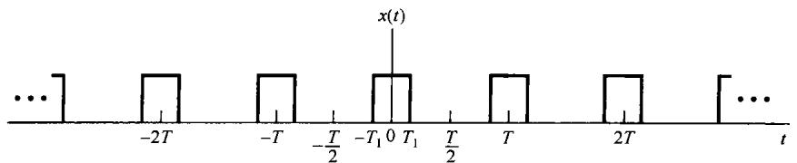

图4.1 连续时间周期方波信号

在例3.5中曾求出，该方波信号的傅里叶级数系数  $a_{k}$  是

$$
a _ {k} = \frac {2 \sin \left(k \omega_ {0} T _ {1}\right)}{k \omega_ {0} T} \tag {4.1}
$$

其中  $\omega_0 = 2\pi /T$  。在图3.7中，已展示出对某个固定的  $T_{1}$  值和几个不同的  $T$  值，这些系数的条状图。理解式(4.1)的另一种方式是把它当成一个包络函数的样本，即

$$
T a _ {k} = \left. \frac {2 \sin \omega T _ {1}}{\omega} \right| _ {\omega = k \omega_ {0}} \tag {4.2}
$$

也就是说，若将  $\omega$  看成一个连续变量，则函数  $(2\sin \omega T_{1}) / \omega$  就代表  $T a_{k}$  的包络，这些系数就是在此包络上等间隔取得的样本。而且，若  $T_{1}$  固定，则  $T a_{k}$  的包络就与  $T$  无关。在图4.2中，再次表明了该周期方波的傅里叶级数系数，但这次是按式(4.2)作为  $T a_{k}$  包络的样本给出的。从该图可以看到，随着  $T$  增加（或等效地，基波频率  $\omega_0 = 2\pi /T$  减小），该包络就被以愈来愈密集的间隔采样。随着  $T$  变成任意大，原来的周期方波就趋近于一个矩形脉冲（也就是说，在时域保留的是一个非周期信号，它对应于原方波的一个周期）。与此同时，傅里叶级数系数（乘以  $T$  后）作为包络上的样本也变得愈来愈密集，这样从某种意义上说（稍后将说明），随着  $T\to \infty$  ，傅里叶级数系数就趋近于这个包络函数。

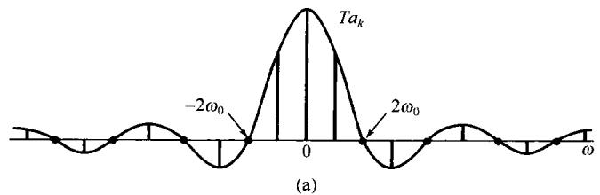

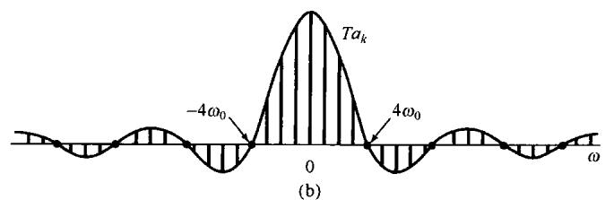

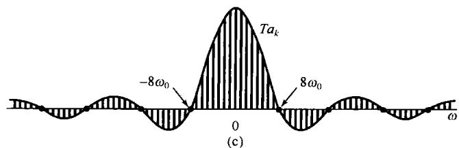

图4.2 周期方波的傅里叶级数系数及其包络，  $T_{1}$  固定。（a）  $T = 4T_{1}$  ；（b）  $T = 8T_{1}$  ；（c）  $T = 16T_{1}$

这个例子说明了对非周期信号建立傅里叶表示的基本思想。具体而言，在建立非周期信号的傅里叶变换时，可以把非周期信号当成一个周期信号在周期任意大时的极限来看待，并且研究这个周期信号傅里叶级数表示式的极限特性。现在考虑一个信号  $x(t)$ ，它具有有限持续期，即对某个  $T_{1}$ ，当  $|t| > T_{1}$  时， $x(t) = 0$ ，如图4.3(a)所示。从这个非周期信号出发，可以构成一个周期信号  $\bar{x}(t)$ ，使  $x(t)$  就是  $\bar{x}(t)$  的一个周期，如图4.3(b)所示。当把  $T$  选得比较大时， $\bar{x}(t)$  就在一个更长的时段上与  $x(t)$  相一致，并且随着  $T \to \infty$ ，对任意有限时间  $t$  值而言， $\bar{x}(t)$  就等于  $x(t)$ 。

现在来考察在这种情况下  $\tilde{x}(t)$  的傅里叶级数表示式的变化。这里，为方便起见，将式(3.38)和式(3.39)重写如下，并将式(3.39)的积分区间取为  $-T/2 \leqslant t \leqslant T/2$ ，就有

$$
\tilde {x} (t) = \sum_ {k = - \infty} ^ {+ \infty} a _ {k} \mathrm {e} ^ {\mathrm {j} k \omega_ {0} t} \tag {4.3}
$$

$$
a _ {k} = \frac {1}{T} \int_ {- T / 2} ^ {T / 2} \tilde {x} (t) e ^ {- j k \omega_ {0} t} d t \tag {4.4}
$$

其中  $\omega_0 = 2\pi /T$  。由于在  $|t| < T / 2$  时  $\bar{x} (t) = x(t)$  ，而在其他情况下  $x(t) = 0$  ，所以式(4.4)可以重新写成

$$
a _ {k} = \frac {1}{T} \int_ {- T / 2} ^ {T / 2} x (t) \mathrm {e} ^ {- \mathrm {j} k \omega_ {0} t} \mathrm {d} t = \frac {1}{T} \int_ {- \infty} ^ {+ \infty} x (t) \mathrm {e} ^ {- \mathrm {j} k \omega_ {0} t} \mathrm {d} t
$$

因此，定义  $Ta_{k}$  的包络  $X(\mathrm{j}\omega)$  为

$$
X (\mathrm {j} \omega) = \int_ {- \infty} ^ {+ \infty} x (t) \mathrm {e} ^ {- \mathrm {j} \omega t} \mathrm {d} t \tag {4.5}
$$

这时，系数  $a_{k}$  可以写为

$$
a _ {k} = \frac {1}{T} X (\mathrm {j} k \omega_ {0}) \tag {4.6}
$$

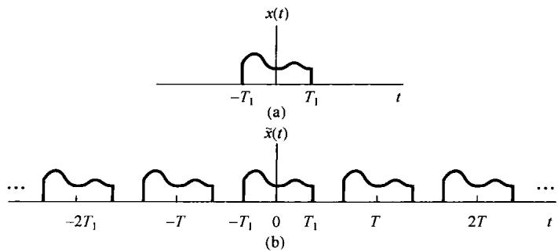

图4.3 (a) 非周期信号  $x(t)$ ; (b) 由  $x(t)$  为一个周期构成的周期信号  $\bar{x}(t)$

将式(4.6)和式(4.3)结合在一起， $\hat{x}(t)$  就可以用  $X(\mathrm{j}\omega)$  表示为

$$
\tilde {x} (t) = \sum_ {k = - \infty} ^ {+ \infty} \frac {1}{T} X (\mathrm {j} k \omega_ {0}) \mathrm {e} ^ {\mathrm {j} k \omega_ {0} t}
$$

或者，因为  $2\pi /T = \omega_0$  ，  $\bar{x} (t)$  又可表示为

$$
\tilde {x} (t) = \frac {1}{2 \pi} \sum_ {k = - \infty} ^ {+ \infty} X (\mathrm {j} k \omega_ {0}) \mathrm {e} ^ {\mathrm {j} k \omega_ {0} t} \omega_ {0} \tag {4.7}
$$

随着  $T \to \infty$ ,  $\tilde{x}(t)$  趋近于  $x(t)$ , 结果式(4.7)的极限就变成  $x(t)$  的表示式。再者, 当  $T \to \infty$  时, 有  $\omega_0 \to 0$ , 式(4.7)的右边就过渡为一个积分。这一点可以利用图4.4给予说明。在式(4.7)右边和式中的每一项都是高度为  $X(\mathrm{j}k\omega_0)\mathrm{e}^{\mathrm{j}k\omega_0t}$  (这里  $t$  被认为是固定的), 宽度为  $\omega_0$  的一个矩形的面积。当  $\omega_0 \to 0$  时, 求和收敛于  $X(\mathrm{j}\omega)\mathrm{e}^{\mathrm{j}\omega t}$  的积分, 因此利用  $T \to +\infty$  时,  $\tilde{x}(t) \to x(t)$  这一事实, 可见

式(4.7)和式(4.5)就分别变成

$$
\boxed {x (t) = \frac {1}{2 \pi} \int_ {- \infty} ^ {+ \infty} X (\mathrm {j} \omega) \mathrm {e} ^ {\mathrm {j} \omega t} \mathrm {d} \omega} \tag {4.8}
$$

和

$$
\boxed {X (j \omega) = \int_ {- \infty} ^ {+ \infty} x (t) e ^ {- j \omega t} d t} \tag {4.9}
$$

式（4.8）和式（4.9）称为傅里叶变换对(Fourier transform pair)。函数  $X(\mathrm{j}\omega)$  称为  $\pmb {x}(t)$

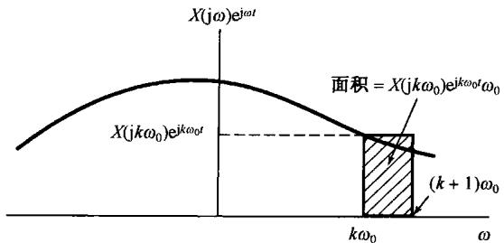

图4.4 式(4.7)的图解说明

的傅里叶变换或傅里叶积分(Fourier integral)，而式(4.8)称为傅里叶逆变换(inverse Fourier transform)。综合公式(4.8)对非周期信号所起的作用与式(3.38)对周期信号所起的作用相同，因为两者都相当于把一个信号表示为一组复指数信号的线性组合。对周期信号来说，这些复指数信号的幅度为  $\{a_{k}\}$ ，由式(3.39)给出，并且在成谐波关系的一组离散点  $k\omega_0, k = 0, \pm 1, \pm 2, \dots$  上出现。对非周期信号而言，这些复指数信号出现在连续频率上，并且根据综合公式(4.8)，其“幅度”为  $X(\mathrm{j}\omega)(\mathrm{d}\omega / 2\pi)$  。与周期信号傅里叶级数系数所用的术语类似，一个非周期信号  $x(t)$  的变换  $X(\mathrm{j}\omega)$  通常称为  $x(t)$  的频谱，因为  $X(\mathrm{j}\omega)$  告诉我们将  $x(t)$  表示为不同频率正弦信号的线性组合（就是积分）所需要的信息。

基于以上讨论，或者等效地基于式(4.9)和式(3.39)的比较，也可以注意到，一个周期信号  $\tilde{x}(t)$  的傅里叶系数  $a_{k}$  能够利用  $\tilde{x}(t)$  的一个周期内信号的傅里叶变换的等间隔样本来表示。具体而言，设  $\tilde{x}(t)$  是一个周期为  $T$  的周期信号，其傅里叶系数为  $a_{k}$ ；令  $x(t)$  是一个有限持续期信号，它等于在一个周期（比如  $s \leqslant t \leqslant s + T$ ， $s$  为某一个任意值）内等于  $\tilde{x}(t)$ ，而在该周期外全为零。那么，因为式(3.39)求  $\tilde{x}(t)$  的傅里叶系数时可以在任何周期内求积分，因此

$$
a _ {k} = \frac {1}{T} \int_ {s} ^ {s + T} \tilde {x} (t) \mathrm {e} ^ {- \mathrm {j} k \omega_ {0} t} \mathrm {d} t = \frac {1}{T} \int_ {s} ^ {s + T} x (t) \mathrm {e} ^ {- \mathrm {j} k \omega_ {0} t} \mathrm {d} t
$$

由于  $x(t)$  在  $s \leqslant t \leqslant s + T$  以外为零，所以又可写成

$$
a _ {k} = \frac {1}{T} \int_ {- \infty} ^ {+ \infty} x (t) \mathrm {e} ^ {- \mathrm {j} k \omega_ {0} t} \mathrm {d} t
$$

将上式与式(4.9)比较后可得

$$
a _ {k} = \left. \frac {1}{T} X (\mathrm {j} \omega) \right| _ {\omega = k \omega_ {0}} \tag {4.10}
$$

这里，  $X(\mathrm{j}\omega)$  就是  $x(t)$  的傅里叶变换。式(4.10)表明  $\tilde{x} (t)$  的傅里叶系数正比于一个周期内的 $\tilde{x} (t)$  信号傅里叶变换的样本。这一点在实际中常常是有用的，将在习题4.37中进一步阐明。

# 4.1.2 傅里叶变换的收敛

虽然在导出式(4.8)和式(4.9)的傅里叶变换对时，假设  $x(t)$  是任意的，但具有有限持续期。事实上这一对变换关系对于相当广泛的一类无限持续期的信号仍然成立。我们对傅里叶变换所采用的推导过程，本身似乎就暗示了  $x(t)$  的傅里叶变换是否存在的条件应该和傅里叶级数收敛所要求的那一组条件一样。事实证明确实如此①！现在考虑按照式(4.9)求出的  $X(\mathrm{j}\omega)$ ，令  $\hat{x}(t)$  表示将  $X(\mathrm{j}\omega)$  代入式(4.8)中所得到的信号，即

$$
\hat {x} (t) = \frac {1}{2 \pi} \int_ {- \infty} ^ {+ \infty} X (\mathrm {j} \omega) \mathrm {e} ^ {\mathrm {j} \omega t} \mathrm {d} \omega
$$

要想知道的是，什么时候式(4.8)成立[也就是说，什么时候  $\hat{x} (t)$  才是原来信号  $x(t)$  的真正表示？]。如果  $x(t)$  能量有限，也即  $x(t)$  平方可积，因而

$$
\int_ {- \infty} ^ {+ \infty} | x (t) | ^ {2} d t <   \infty \tag {4.11}
$$

那么就可以保证  $X(\mathrm{j}\omega)$  是有限的，即式(4.9)收敛。现用  $e(t)$  表示  $\hat{x} (t)$  和  $x(t)$  之间的误差，即 $e(t) = \hat{x} (t) - x(t)$  ，那么

$$
\int_ {- \infty} ^ {+ \infty} | e (t) | ^ {2} \mathrm {d} t = 0 \tag {4.12}
$$

式(4.11)和式(4.12)与周期信号的式(3.51)和式(3.54)是相对应的。因此，与周期信号相类似，如果  $x(t)$  能量有限，那么虽然  $x(t)$  和它的傅里叶表示  $\hat{x}(t)$  在个别点上或许有明显的不同，但是在能量上没有任何差别。

也与周期信号一样，有另一组条件，这组条件充分保证了  $\hat{x}(t)$  除了那些不连续点外，在任何其他的  $t$  上都等于  $x(t)$ ，而在不连续点处  $\hat{x}(t)$  等于  $x(t)$  在不连续点两边值的平均值。这组条件也称为狄里赫利条件，它们是：

1.  $x(t)$  绝对可积，即

$$
\int_ {- \infty} ^ {+ \infty} | x (t) | \mathrm {d} t <   \infty \tag {4.13}
$$

2. 在任何有限区间内， $x(t)$  只有有限个最大值和最小值。

3. 在任何有限区间内， $x(t)$  有有限个不连续点，并且在每个不连续点都必须是有限值。因此，本身是连续的或者只有有限个不连续点的绝对可积信号都存在傅里叶变换。

尽管这两组条件都给出了一个信号存在傅里叶变换的充分条件，但是下一节将会看到，倘若在变换过程中可以使用冲激函数，那么，在一个无限区间内，既不绝对可积，又不具备平方可积的周期信号也可以认为具有傅里叶变换。这样，就有可能把傅里叶级数和傅里叶变换纳入一个统一的框架内。在以后的各章讨论中将会发现这样做是非常方便的。在下一节进一步讨论这一问题之前，先举几个有关傅里叶变换的例子。

# 4.1.3 连续时间傅里叶变换举例

例4.1 考虑信号

$$
x (t) = \mathrm {e} ^ {- u t} u (t), \quad a > 0
$$

由式(4.9)，有

$$
X (\mathrm {j} \omega) = \int_ {0} ^ {\infty} \mathrm {e} ^ {- a t} \mathrm {e} ^ {- \mathrm {j} \omega t} \mathrm {d} t = - \frac {1}{a + \mathrm {j} \omega} \mathrm {e} ^ {- (a + \mathrm {j} \omega) t} \Bigg | _ {0} ^ {\infty}
$$

也就是

$$
X (\mathrm {j} \omega) = \frac {1}{a + \mathrm {j} \omega}, \quad a > 0
$$

这个傅里叶变换是复数，要画出作为  $\omega$  的函数，就需要利用它的模和相位来表示  $X(j\omega)$

$$
\left| X (\mathrm {j} \omega) \right| = \frac {1}{\sqrt {a ^ {2} + \omega^ {2}}}, \quad \angle X (\mathrm {j} \omega) = - \arctan \left(\frac {\omega}{a}\right)
$$

$|X(\mathrm{j}\omega)|$  和  $\prec X(\mathrm{j}\omega)$  如图4.5所示。注意，若  $a$  是复数而不是实数，那么只要  $\mathcal{Re}\{a\} > 0, x(t)$  就是绝对可积的，并且在这种情况下  $X(\mathrm{j}\omega)$  具有同样的形式，即

$$
X (j \omega) = \frac {1}{a + j \omega}, \quad R e \{a \} > 0
$$

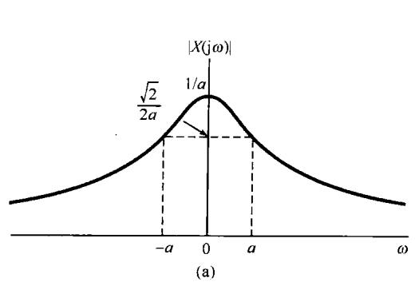

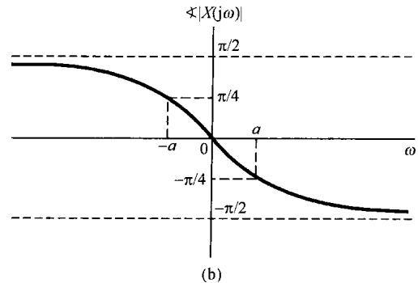

图4.5 例4.1中信号  $x(t) = \mathrm{e}^{-at}u(t)$ ， $a > 0$  的傅里叶变换

例4.2 设  $x(t)$  为

$$
x (t) = \mathrm {e} ^ {- a | t |}, \quad a > 0
$$

如图4.6所示。该信号的傅里叶变换是

$$
\begin{array}{l} X (\mathrm {j} \omega) = \int_ {- \infty} ^ {+ \infty} \mathrm {e} ^ {- a | t |} \mathrm {e} ^ {- \mathrm {j} \omega t} \mathrm {d} t = \int_ {- \infty} ^ {0} \mathrm {e} ^ {a t} \mathrm {e} ^ {- \mathrm {j} \omega t} \mathrm {d} t + \int_ {0} ^ {\infty} \mathrm {e} ^ {- a t} \mathrm {e} ^ {- \mathrm {j} \omega t} \mathrm {d} t \\ = \frac {1}{a - j \omega} + \frac {1}{a + j \omega} \\ = \frac {2 a}{a ^ {2} + \omega^ {2}} \\ \end{array}
$$

这时，  $X(\mathrm{j}\omega)$  是实数，如图4.7所示。

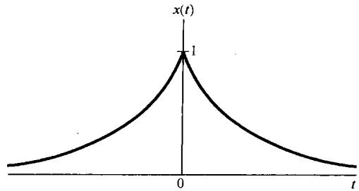

图4.6 例4.2中的信号  $x(t) = e^{-a|t|}$

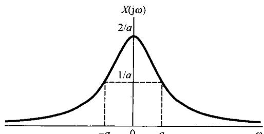

图4.7 例4.2中考虑的并示于图4.6中的信号的傅里叶变换

例4.3 现在求单位冲激函数的傅里叶变换

$$
x (t) = \delta (t) \tag {4.14}
$$

将上式代入式(4.9)，得

$$
X (\mathrm {j} \omega) = \int_ {- \infty} ^ {+ \infty} \delta (t) \mathrm {e} ^ {- \mathrm {j} \omega t} \mathrm {d} t = 1 \tag {4.15}
$$

这就是说，单位冲激函数的频谱在所有频率上都是相同的。

例4.4 考虑如下矩形脉冲信号

$$
x (t) = \left\{ \begin{array}{l l} 1, & | t | <   T _ {1} \\ 0, & | t | > T _ {1} \end{array} \right. \tag {4.16}
$$

如图4.8(a)所示。利用式(4.9)求得它的傅里叶变换为

$$
X (\mathrm {j} \omega) = \int_ {- T _ {1}} ^ {T _ {1}} \mathrm {e} ^ {- \mathrm {j} \omega t} \mathrm {d} t = 2 \frac {\sin \omega T _ {1}}{\omega} \tag {4.17}
$$

如图4.8(b)所示。

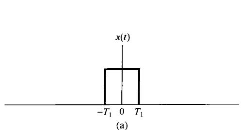

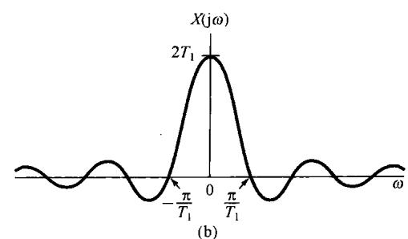

图4.8（a）例4.4中的矩形脉冲信号；（b）该信号的傅里叶变换

正如本节一开始所讨论的，由式(4.16)给出的信号可以看成一个周期方波信号当周期变得任意大时的极限形式。因此，可以估计到，这个信号综合公式的收敛将具有与例3.5中方波信号收敛时所观察到的类似现象。事实确实如此！现在来考虑矩形脉冲信号傅里叶变换的逆变换，即

$$
\hat {x} (t) = \frac {1}{2 \pi} \int_ {- \infty} ^ {+ \infty} 2 \frac {\sin \omega T _ {1}}{\omega} e ^ {j \omega t} d \omega
$$

因为  $x(t)$  是平方可积的，所以

$$
\int_ {- \infty} ^ {+ \infty} | x (t) - \hat {x} (t) | ^ {2} d t = 0
$$

再者，因为  $x(t)$  满足狄里赫利条件，因此  $t \neq \pm T_{1}$  时  $\hat{x}(t) = x(t)$ ；而当  $t = \pm T_{1}$  时， $\hat{x}(t)$  收敛于  $1/2$ ，这就是  $x(t)$  在不连续点两边的平均值。另外， $\hat{x}(t)$  收敛于  $x(t)$  时呈现的吉伯斯现象，也很像图3.9中对周期方波所画的那样。具体而言，就是类似于有限项傅里叶级数的近似式(3.47)那样，考虑下列在一个有限频率区间上的积分

$$
\frac {1}{2 \pi} \int_ {- W} ^ {W} 2 \frac {\sin \omega T _ {1}}{\omega} e ^ {j \omega t} d \omega
$$

随着  $W \to \infty$ ，这个信号除去不连续点外，均收敛于  $x(t)$ 。在接近不连续点处，这一信号呈现起伏，起伏的峰值大小不随  $W$  的增大而减小，但起伏会向不连续点压缩，而且起伏中的能量将收敛于零。

例4.5 考虑一个信号  $x(t)$ ，其傅里叶变换  $X(\mathrm{j}\omega)$  为

$$
X (\mathrm {j} \omega) = \left\{ \begin{array}{l l} 1, & | \omega | <   W \\ 0, & | \omega | > W \end{array} \right. \tag {4.18}
$$

如图4.9(a)所示。利用综合公式(4.8)可求得

$$
x (t) = \frac {1}{2 \pi} \int_ {- W} ^ {W} \mathrm {e} ^ {\mathrm {j} \omega t} \mathrm {d} \omega = \frac {\sin W t}{\pi t} \tag {4.19}
$$

如图4.9(b)所示。

将图4.8和图4.9相比较，或者将式(4.16)和式(4.17)与式(4.18)和式(4.19)相比较，可以发现一个很有意义的关系。在每种情况下，傅里叶变换对都是由形式为  $(\sin a\theta) / b\theta$  的函数和一个矩形脉冲所组成的，只是在例4.4中信号  $x(t)$  是一个脉冲，而在例4.5中变换  $X(\mathrm{j}\omega)$  是一个脉冲。这种特殊关系，很显然是傅里叶变换具有对偶性(duality property)的一个直接结果。关于这一点，将在4.3.6节给予详细讨论。

由式(4.17)和式(4.19)给出的函数形式在傅里叶分析和线性时不变系统的研究中经常出现，称为sinc函数。sinc函数通常所用的形式为

$$
\operatorname {s i n c} (\theta) = \frac {\sin \pi \theta}{\pi \theta} \tag {4.20}
$$

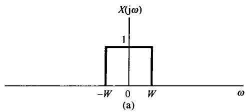

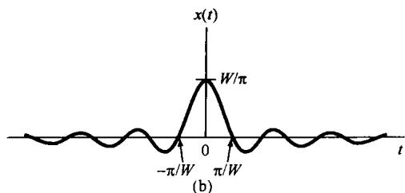

图4.9 例4.5的傅里叶变换对。（a）例4.5的傅里叶变换；（b）相应的时间函数

如图4.10所示。由式(4.17)和式(4.19)表示的信号都能用sinc函数表示为

$$
\begin{array}{l} \frac {2 \sin \omega T _ {1}}{\omega} = 2 T _ {1} \operatorname {s i n c} \left(\frac {\omega T _ {1}}{\pi}\right) \\ \frac {\sin W t}{\pi t} = \frac {W}{\pi} \operatorname {s i n c} \left(\frac {W t}{\pi}\right) \\ \end{array}
$$

最后，从图4.9的分析中还可以得到傅里叶变换的另一个性质，对应于几个不同的  $W$  值，在图4.11中重画了这几个图。从该图可以看到，当  $W$  增大时， $X(\mathrm{j}\omega)$  变宽，而  $x(t)$  在  $t = 0$  处的主峰变得愈来愈高。该信号的第一

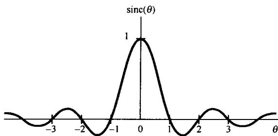

图4.10 sinc函数

个波瓣(就是信号在  $|t| < \pi / W$  的部分)的宽度也变窄。事实上，在  $W \to \infty$  的极限情况下，对所有的  $\omega, X(\mathrm{j}\omega) = 1$  ，其结果是，由例4.3可知，由式(4.19)给出的  $x(t)$ ，随着  $W \to \infty$  而收敛于一个冲激函数。由图4.11所描述的特性就是存在于时域和频域之间的一种相反关系的例子；并且，在图4.8中可以看到一种相类似的结果，即当  $T_{1}$  增加时， $x(t)$  加宽，而  $X(\mathrm{j}\omega)$  变窄。在4.3.5节将以傅里叶变换的尺度性质来解释这一特性。

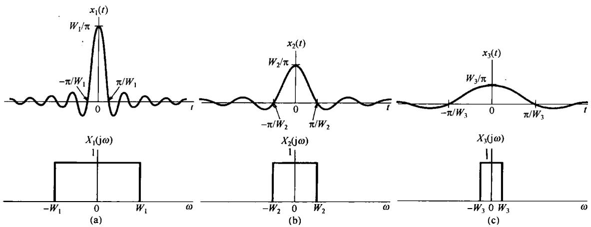

图4.11 对于几个不同的  $W$  值，图4.9的傅里叶变换对

# 4.2 周期信号的傅里叶变换

上一节介绍了傅里叶变换表示，并给出了几个例子。那一节重点关注非周期信号，但其实对于周期信号也能够建立傅里叶变换表示。这样就可以在统一框架内考虑周期和非周期信号。事实上将会看到，可以直接由周期信号的傅里叶级数表示构造出一个周期信号的傅里叶变换；所得

到的变换在频域由一串冲激所组成，各冲激的面积正比于傅里叶级数系数。这是一个非常有用的表示。

为了得到一般性的结果，考虑一个信号  $x(t)$  ，其傅里叶变换  $X(\mathrm{j}\omega)$  是一个面积为  $2\pi$  ，出现在 $\omega = \omega_0$  处的单独冲激，即

$$
X (\mathrm {j} \omega) = 2 \pi \delta (\omega - \omega_ {0}) \tag {4.21}
$$

为了求出与  $X(\mathrm{j}\omega)$  相应的  $\pmb {x}(t)$  ，可以应用式(4.8)的逆变换公式得到

$$
\begin{array}{l} x (t) = \frac {1}{2 \pi} \int_ {- \infty} ^ {+ \infty} 2 \pi \delta (\omega - \omega_ {0}) e ^ {j \omega t} d \omega \\ = e ^ {j \omega_ {0} t} \\ \end{array}
$$

将上面结果再加以推广，如果  $X(\mathrm{j}\omega)$  是在频率上等间隔的一组冲激函数的线性组合，即

$$
X (\mathrm {j} \omega) = \sum_ {k = - \infty} ^ {+ \infty} 2 \pi a _ {k} \delta (\omega - k \omega_ {0}) \tag {4.22}
$$

那么利用式(4.8)，可得

$$
x (t) = \sum_ {k = - \infty} ^ {+ \infty} a _ {k} \mathrm {e} ^ {\mathrm {j} k \omega_ {0} t} \tag {4.23}
$$

可以看出，式(4.23)就是如式(3.38)所给出的一个周期信号的傅里叶级数(series)表示。因此，一个傅里叶级数系数为  $\{a_{k}\}$  的周期信号的傅里叶变换，可以看成出现在成谐波关系的频率上的一串冲激函数，发生于第  $k$  次谐波频率  $k\omega_0$  上的冲激函数的面积是第  $k$  个傅里叶级数系数  $a_{k}$  的 $2\pi$  倍。

例4.6 再次考虑图4.1的方波信号，其傅里叶级数系数为

$$
a _ {k} = \frac {\sin k \omega_ {0} T _ {1}}{\pi k}
$$

因此，该信号的傅里叶变换  $X(\mathrm{j}\omega)$  是

$$
X (\mathrm {j} \omega) = \sum_ {k = - \infty} ^ {+ \infty} \frac {2 \sin k \omega_ {0} T _ {1}}{k} \delta (\omega - k \omega_ {0})
$$

如图4.12所示（图对应于  $T = 4T_{1}$  画出）。将该图与图3.7(a)进行比较，不同的仅仅是比例因子 $2\pi$  ，以及用的是冲激函数而不是条线图。

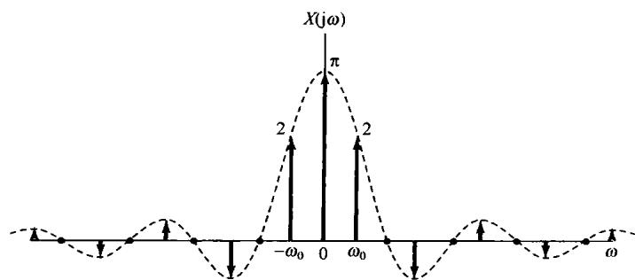

图4.12 一个对称周期方波的傅里叶变换

例4.7 设  $x(t)$  为

$$
x (t) = \sin \omega_ {0} t
$$

该信号的傅里叶级数系数是

$$
a _ {1} = \frac {1}{2 j}
$$

$$
a _ {- 1} = - \frac {1}{2 j}
$$

$$
a _ {k} = 0, \qquad k \neq 1 \text {且} k \neq - 1
$$

因此，其傅里叶变换就如图4.13(a)所示。类似地，对

$$
x (t) = \cos \omega_ {0} t
$$

它的傅里叶级数系数是

$$
a _ {1} = a _ {- 1} = \frac {1}{2}
$$

$$
a _ {k} = 0, \qquad k \neq 1 \text {且} k \neq - 1
$$

该信号的傅里叶变换如图4.13(b)所示。这两个变换在第8章分析正弦调制系统时都是非常重要的。

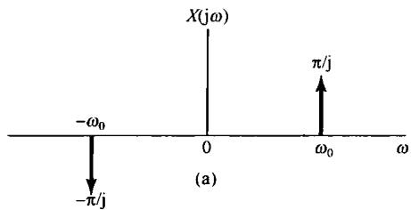

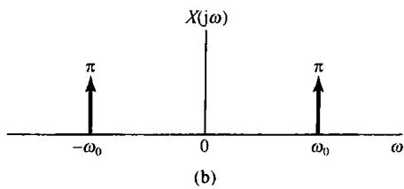

图4.13 (a)  $x(t) = \sin \omega_0 t$  的傅里叶变换；(b)  $x(t) = \cos \omega_0 t$  的傅里叶变换

例4.8 在第7章关于采样系统的分析中，一种极为有用的信号是周期为  $T$  的周期冲激串

$$
x (t) = \sum_ {k = - \infty} ^ {+ \infty} \delta (t - k T)
$$

如图4.14(a)所示。

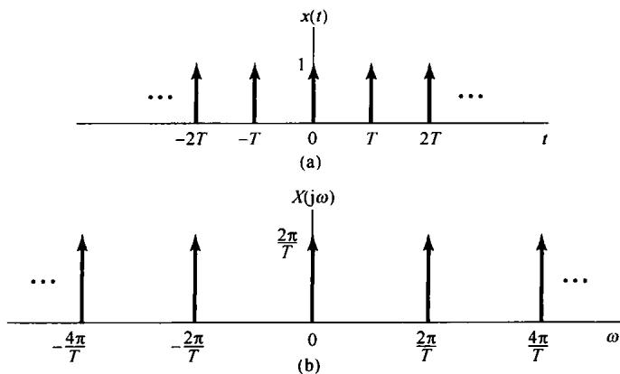

图4.14 (a) 周期冲激串；(b) 该冲激串的傅里叶变换

在例3.8中已求出该信号的傅里叶级数系数是

$$
a _ {k} = \frac {1}{T} \int_ {- T / 2} ^ {+ T / 2} \delta (t) \mathrm {e} ^ {- \mathrm {j} k \omega_ {0} t} \mathrm {d} t = \frac {1}{T}
$$

也就是说，周期冲激串的每一个傅里叶系数都有相同的值  $1 / T$  。将这个  $a_{k}$  值代入式(4.22)可得

$$
X (\mathrm {j} \omega) = \frac {2 \pi}{T} \sum_ {k = - \infty} ^ {+ \infty} \delta \left(\omega - \frac {2 \pi k}{T}\right)
$$

由此可见，在时域周期为  $T$  的周期冲激串的傅里叶变换在频域是一个周期为  $2\pi / T$  的周期冲激串，如图4.14(b)所示。这里，再次看到了时域和频域之间相反关系的另一个例证：随着时域冲激之间间隔（也就是周期）的增大，在频域各冲激之间的间隔（即基波频率）就会变小。

# 4.3 连续时间傅里叶变换性质

这一节以及后面两节将讨论傅里叶变换的几个重要性质。4.6节的表4.1详细地列出了这些性质。与周期信号的傅里叶级数表示的情况相同，通过这些性质能够透彻地认识变换本身以及一个信号的时域描述和频域描述之间的关系。另外，很多性质对简化傅里叶变换或逆变换的求取往往很有用。再者，正如上一节所指出的，由于一个周期信号的傅里叶级数和傅里叶变换表示之间存在着密切的关系，利用这一关系就能够把傅里叶变换的性质直接转移到对应的傅里叶级数性质中，而傅里叶级数性质已在第3章中单独讨论过(见3.5节和表3.1)。

为了方便起见，在本节的整个讨论中，步骤使用时间函数及其傅里叶变换，并用一些简便的符号来代表信号与其变换之间的成对关系。4.1节已经给出，一个信号  $x(t)$  及其傅里叶变换 $X(\mathrm{j}\omega)$  由如下傅里叶变换的综合和分析公式

$$
x (t) = \frac {1}{2 \pi} \int_ {- \infty} ^ {+ \infty} X (\mathrm {j} \omega) \mathrm {e} ^ {\mathrm {j} \omega t} \mathrm {d} \omega \tag {4.24}
$$

和

$$
X (\mathrm {j} \omega) = \int_ {- \infty} ^ {+ \infty} x (t) \mathrm {e} ^ {- \mathrm {j} \omega t} \mathrm {d} t \tag {4.25}
$$

联系起来的。有时为了方便，将  $X(\mathrm{j}\omega)$  用  $\mathcal{F}\{x(t)\}$  表示，将  $x(t)$  用  $\mathcal{F}^{-1}\{X(\mathrm{j}\omega)\}$  表示；也将  $x(t)$  和  $X(\mathrm{j}\omega)$  这一对傅里叶变换用下列符号表示：

$$
x (t) \xleftarrow {\mathcal {F}} X (\mathrm {j} \omega)
$$

例如，以例4.1为例就有

$$
\frac {1}{a + j \omega} = \mathcal {F} \left\{\mathrm {e} ^ {- a t} u (t) \right\}
$$

$$
\mathrm {e} ^ {- a t} u (t) = \mathcal {F} ^ {- 1} \left\{\frac {1}{a + \mathrm {j} \omega} \right\}
$$

以及

$$
\mathrm {e} ^ {- a t} u (t) \xleftrightarrow {\mathcal {F}} \frac {1}{a + \mathrm {j} \omega}
$$

# 4.3.1 线性性质

若

$$
x (t) \xleftarrow {\mathcal {F}} X (\mathrm {j} \omega)
$$

且

$$
y (t) \xleftarrow {\mathcal {F}} Y (\mathrm {j} \omega)
$$

则

$$
\boxed {a x (t) + b y (t) \xleftrightarrow {\mathcal {F}} a X (\mathrm {j} \omega) + b Y (\mathrm {j} \omega)} \tag {4.26}
$$

将分析公式(4.25)应用于  $ax(t) + by(t)$  就可直接得出式(4.26)。线性性质很容易推广到任意个信号的线性组合中。

# 4.3.2 时移性质

若

$$
x (t) \xleftarrow {\mathcal {F}} X (\mathrm {j} \omega)
$$

则

$$
\boxed {x (t - t _ {0}) \xleftarrow {\mathcal {F}} e ^ {- j \omega t _ {0}} X (j \omega)} \tag {4.27}
$$

为了得到这一性质，可先考虑式(4.24)

$$
x (t) = \frac {1}{2 \pi} \int_ {- \infty} ^ {\infty} X (\mathrm {j} \omega) \mathrm {e} ^ {\mathrm {j} \omega t} \mathrm {d} \omega
$$

在该式中以  $t - t_0$  取代  $t$  ，可得

$$
\begin{array}{l} x (t - t _ {0}) = \frac {1}{2 \pi} \int_ {- \infty} ^ {+ \infty} X (\mathrm {j} \omega) \mathrm {e} ^ {\mathrm {j} \omega (t - t _ {0})} \mathrm {d} \omega \\ = \frac {1}{2 \pi} \int_ {- \infty} ^ {+ \infty} \left(\mathrm {e} ^ {- \mathrm {j} \omega t _ {0}} X (\mathrm {j} \omega)\right) \mathrm {e} ^ {\mathrm {j} \omega t} \mathrm {d} \omega \\ \end{array}
$$

这就是对  $x(t - t_0)$  的综合公式，所以得

$$
\mathcal {F} \{x (t - t _ {0}) \} = \mathrm {e} ^ {- \mathrm {j} \omega t _ {0}} X (\mathrm {j} \omega)
$$

这个性质说明：信号在时间上移位，并不改变它的傅里叶变换的模；也就是说，若将  $X(\mathrm{j}\omega)$  用极坐标表示为

$$
\mathcal {F} \{x (t) \} = X (\mathrm {j} \omega) = | X (\mathrm {j} \omega) | \mathrm {e} ^ {\mathrm {j} x (X (\mathrm {j} \omega)}
$$

那么

$$
\mathcal {F} \{x (t - t _ {0}) \} = e ^ {- j \omega t _ {0}} X (j \omega) = | X (j \omega) | e ^ {j [ \pm X (j \omega) - \omega t _ {0} ]}
$$

因此，信号在时间上的移位只是在它的变换中引入相移，即  $-\omega_0t$  ，相移与频率  $\omega$  成线性关系。

例4.9 为了说明傅里叶变换线性和时移性质的用处，现考虑对图4.15(a)的信号  $x(t)$  求其傅里叶变换。

首先看出，  $x(t)$  可以表示成如下的线性组合：

$$
x (t) = \frac {1}{2} x _ {1} (t - 2. 5) + x _ {2} (t - 2. 5)
$$

其中信号  $x_{1}(t)$  和  $x_{2}(t)$  都是如图4.15(b)和图4.15(c)所示的矩形脉冲。利用例4.4的结果，分别有

$$
X _ {1} (\mathrm {j} \omega) = \frac {2 \sin (\omega / 2)}{\omega}
$$

和

$$
X _ {2} (\mathrm {j} \omega) = \frac {2 \sin (3 \omega / 2)}{\omega}
$$

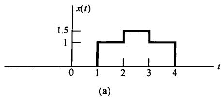

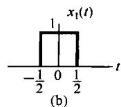

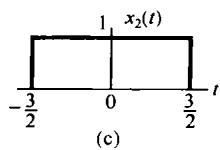

图4.15 将一个信号分解为两个简单信号的线性组合。（a）例4.9中的信号  $x(t)$ ；（b）和（c）用来表示  $x(t)$  的两个简单信号

最后，利用傅里叶变换的线性和时移性质，可得

$$
X (\mathrm {j} \omega) = \mathrm {e} ^ {- \mathrm {j} 5 \omega / 2} \left\{\frac {\sin (\omega / 2) + 2 \sin (3 \omega / 2)}{\omega} \right\}
$$

# 4.3.3 共轭与共轭对称性

共轭性质是指，若

$$
x (t) \stackrel {\mathcal {F}} {\longleftrightarrow} X (\mathrm {j} \omega)
$$

则

$$
\boxed {x ^ {*} (t) \xleftarrow {\mathcal {F}} X ^ {*} (- j \omega)} \tag {4.28}
$$

将式(4.25)取共轭就可得出这一性质，即

$$
\begin{array}{l} X ^ {*} (j \omega) = \left[ \int_ {- \infty} ^ {+ \infty} x (t) e ^ {- j \omega t} d t \right] ^ {*} \\ = \int_ {- \infty} ^ {+ \infty} x ^ {*} (t) \mathrm {e} ^ {\mathrm {j} \omega t} \mathrm {d} t \\ \end{array}
$$

以  $-\omega$  代替  $\omega$  ，得

$$
X ^ {*} (- \mathrm {j} \omega) = \int_ {- \infty} ^ {+ \infty} x ^ {*} (t) \mathrm {e} ^ {- \mathrm {j} \omega t} \mathrm {d} t \tag {4.29}
$$

式(4.29)的右边就是  $x^{*}(t)$  的傅里叶变换的分析公式，于是就得到式(4.28)所示的关系。

共轭性质就能证明，若  $x(t)$  为实函数，那么  $X(\mathrm{j}\omega)$  就具有共轭对称性，即

$$
\boxed {X (- \mathrm {j} \omega) = X ^ {*} (\mathrm {j} \omega) \qquad x (t) \text {为 实 函 数}} \tag {4.30}
$$

具体而言，若  $x(t)$  为实数，就有  $x^{*}(t) = x(t)$ ，由式(4.29)

$$
X ^ {*} (- \mathrm {j} \omega) = \int_ {- \infty} ^ {+ \infty} x (t) \mathrm {e} ^ {\mathrm {j} \omega t} \mathrm {d} t = X (\mathrm {j} \omega)
$$

用  $-\omega$  替换  $\omega$  就可得出式(4.30)。

由例4.1，  $x(t) = \mathrm{e}^{-at}u(t)$  ，于是

$$
X (\mathrm {j} \omega) = \frac {1}{a + \mathrm {j} \omega}
$$

且

$$
X (- \mathrm {j} \omega) = \frac {1}{a - \mathrm {j} \omega} = X ^ {*} (\mathrm {j} \omega)
$$

作为式(4.30)的一个结果，若将  $X(\mathrm{j}\omega)$  用笛卡儿坐标表示为

$$
X (\mathrm {j} \omega) = \operatorname {R e} \{X (\mathrm {j} \omega) \} + \mathrm {j I m} \{X (\mathrm {j} \omega) \}
$$

那么若  $x(t)$  为实函数，则有

$$
\mathcal {R e} \{X (\mathrm {j} \omega) \} = \mathcal {R e} \{X (- \mathrm {j} \omega) \}
$$

和

$$
I m \{X (\mathrm {j} \omega) \} = - I m \{X (- \mathrm {j} \omega) \}
$$

也就是说，傅里叶变换的实部是频率的偶函数，而虚部则是频率的奇函数。类似地，若将  $X(\mathrm{j}\omega)$  用极坐标表示为

$$
X (j \omega) = | X (j \omega) | e ^ {j x (j \omega)}
$$

那么，根据式(4.30)就可得出：  $|X(\mathrm{j}\omega)|$  是频率  $\omega$  的偶函数，  $\nless X(\mathrm{j}\omega)$  是频率  $\omega$  的奇函数。因此，当

欲计算或图示一个实值信号的傅里叶变换，该变换的实部和虚部，或者模与相位时，只需给出正频率时的值就可以了；因为对负频率时的值，可以利用上面导出的关系，直接从  $\omega > 0$  时的值得出。

作为式(4.30)进一步的结果，若  $x(t)$  为实偶函数，那么  $X(\mathrm{j}\omega)$  也一定为实偶函数。为此，可以写出

$$
X (- \mathrm {j} \omega) = \int_ {- \infty} ^ {+ \infty} x (t) \mathrm {e} ^ {\mathrm {j} \omega t} \mathrm {d} t
$$

或者用  $\tau = -t$  替换，可得

$$
X (- \mathrm {j} \omega) = \int_ {- \infty} ^ {+ \infty} x (- \tau) \mathrm {e} ^ {- \mathrm {j} \omega \tau} \mathrm {d} \tau
$$

因为  $x(-\tau) = x(\tau)$ ，所以有

$$
\begin{array}{l} X (- \mathrm {j} \omega) = \int_ {- \infty} ^ {+ \infty} x (\tau) \mathrm {e} ^ {- \mathrm {j} \omega t} \mathrm {d} \tau \\ = X (j \omega) \\ \end{array}
$$

因此，  $X(\mathrm{j}\omega)$  是偶函数。再与式(4.30)相结合，这也就要求  $X^{*}(\mathrm{j}\omega) = X(\mathrm{j}\omega)$ ，即  $X(\mathrm{j}\omega)$  为实函数。在例4.2中的实偶信号  $\mathbf{e}^{-a|t|}$  就表明了这个性质。同样可以证明，若  $x(t)$  是时间的实奇函数，而有  $x(t) = -x(-t)$ ，那么  $X(\mathrm{j}\omega)$  就是纯虚奇函数。

最后，在第1章曾讨论过，一个实函数  $x(t)$  总是可以用一个偶函数  $x_{e}(t) = E\nu \{x(t)\}$  和一个奇函数  $x_{o}(t) = Od\{x(t)\}$  之和来表示，即

$$
x (t) = x _ {e} (t) + x _ {o} (t)
$$

根据傅里叶变换的线性性质，有

$$
\mathcal {F} \{x (t) \} = \mathcal {F} \{x _ {e} (t) \} + \mathcal {F} \{x _ {o} (t) \}
$$

并且，根据上面的讨论， $\mathcal{F}\{x_{e}(t)\}$  是一个实函数， $\mathcal{F}\{x_{o}(t)\}$  是一个纯虚数，于是可以得出，若  $x(t)$  为实函数则有

$$
\begin{array}{l} x (t) \stackrel {\mathcal {F}} {\longleftrightarrow} X (\mathrm {j} \omega) \\ \mathcal {E} \nu \{x (t) \} \stackrel {\mathcal {F}} {\longleftrightarrow} \mathcal {R e} \{X (\mathrm {j} \omega) \} \\ O d \{x (t) \} \xleftarrow {\mathcal {F}} \mathrm {j I m} \{X (\mathrm {j} \omega) \} \\ \end{array}
$$

下面这个例子用来说明这些对称性质的一种应用。

例4.10 重新考虑例4.2中的信号  $x(t) = \mathrm{e}^{-a|t|}$ ， $a > 0$  的傅里叶变换求解问题，现在用傅里叶变换的对称性质来帮助求解。

由例4.1，有

$$
\mathrm {e} ^ {- a t} u (t) \xleftrightarrow {\mathcal {F}} \frac {1}{a + \mathrm {j} \omega}
$$

注意到，若  $t > 0$  ，则  $x(t)$  就等于  $\mathrm{e}^{-\alpha t}u(t)$  ；而对  $t < 0$  ，  $x(t)$  取的是镜像值，即

$$
\begin{array}{l} x (t) = \mathrm {e} ^ {- a | t |} = \mathrm {e} ^ {- a t} u (t) + \mathrm {e} ^ {a t} u (- t) \\ = 2 \left[ \frac {\mathrm {e} ^ {- a t} u (t) + \mathrm {e} ^ {a t} u (- t)}{2} \right] \\ = 2 \mathcal {E} \nu \left\{\mathrm {e} ^ {- a t} u (t) \right\} \\ \end{array}
$$

因为  $\mathbf{e}^{-at}u(t)$  是实值函数，由傅里叶变换的对称性质就可导得

$$
\mathcal {E} \nu \left\{\mathrm {e} ^ {- a t} u (t) \right\} \xleftrightarrow {\mathcal {F}} \mathcal {R e} \left\{\frac {1}{a + \mathrm {j} \omega} \right\}
$$

于是就有

$$
X (\mathrm {j} \omega) = 2 R e \left\{\frac {1}{a + \mathrm {j} \omega} \right\} = \frac {2 a}{a ^ {2} + \omega^ {2}}
$$

这与例4.2中的结果是一致的。

# 4.3.4 微分与积分

令  $x(t)$  的傅里叶变换是  $X(\mathrm{j}\omega)$ ，将傅里叶变换综合公式(4.24)两边对  $t$  进行微分，可得

$$
\frac {\mathrm {d} x (t)}{\mathrm {d} t} = \frac {1}{2 \pi} \int_ {- \infty} ^ {+ \infty} \mathrm {j} \omega X (\mathrm {j} \omega) \mathrm {e} ^ {\mathrm {j} \omega t} \mathrm {d} \omega
$$

因此有

$$
\boxed {\frac {\mathrm {d} x (t)}{\mathrm {d} t} \xleftarrow {\mathcal {F}} \mathrm {j} \omega X (\mathrm {j} \omega)} \tag {4.31}
$$

这是一个特别重要的性质，因为它将时域内的微分用频域内乘以  $\mathrm{j}\omega$  所代替。4.7节讨论利用傅里叶变换来分析由微分方程描述的线性时不变系统时，这一性质极其有用。

因为时域内的微分对应于频域内乘以  $\mathrm{j}\omega$  ，这就使人或许可能得出，时域内的积分是否应该对应于频域内除以  $\mathrm{j}\omega$  ？的确是这样，但这只是事情的一部分，真正的关系应该是

$$
\boxed {\int_ {- \infty} ^ {t} x (\tau) \mathrm {d} \tau \xleftrightarrow {\mathcal {F}} \frac {1}{\mathrm {j} \omega} X (\mathrm {j} \omega) + \pi X (0) \delta (\omega)} \tag {4.32}
$$

式(4.32)右边的冲激函数项反映了由积分所产生的直流或平均值。

下面用两个例子来说明式(4.31)和式(4.32)的应用。

例4.11 求单位阶跃函数  $x(t) = u(t)$  的傅里叶变换  $X(\mathrm{j}\omega)$  。利用式(4.32)，并已知

$$
g (t) = \delta (t) \xleftarrow {\mathcal {F}} G (\mathrm {j} \omega) = 1
$$

注意到

$$
x (t) = \int_ {- \infty} ^ {t} g (\tau) \mathrm {d} \tau
$$

上式两边各取傅里叶变换，得

$$
X (\mathrm {j} \omega) = \frac {G (\mathrm {j} \omega)}{\mathrm {j} \omega} + \pi G (0) \delta (\omega)
$$

此处已经用到列于表4.1中的积分性质。因为  $G(\mathrm{j}\omega) = 1$  ，所以可得

$$
X (\mathrm {j} \omega) = \frac {1}{\mathrm {j} \omega} + \pi \delta (\omega) \tag {4.33}
$$

还可以看到，应用式(4.31)的微分性质可以复原单位冲激函数的傅里叶变换，即

$$
\delta (t) = \frac {\mathrm {d} u (t)}{\mathrm {d} t} \xleftrightarrow {\mathcal {F}} \mathrm {j} \omega \left[ \frac {1}{\mathrm {j} \omega} + \pi \delta (\omega) \right] = 1
$$

式中最末的等式是由于  $\omega \delta (\omega) = 0$  的结果。

例4.12 现在要想求图4.16(a)所示  $x(t)$  的傅里叶变换  $X(\mathrm{j}\omega)$  。不直接对  $x(t)$  应用傅里叶积分来求，而考虑如下信号：

$$
g (t) = \frac {\mathrm {d}}{\mathrm {d} t} x (t)
$$

如图4.16(b)所示，  $g(t)$  是一个矩形脉冲和两个冲激函数的和。这些分量信号的傅里叶变换可以用表4.2求出为

$$
G (\mathrm {j} \omega) = \left(\frac {2 \sin \omega}{\omega}\right) - \mathrm {e} ^ {\mathrm {j} \omega} - \mathrm {e} ^ {- \mathrm {j} \omega}
$$

注意，  $G(0) = 0$  。利用积分性质就有

$$
X (\mathrm {j} \omega) = \frac {G (\mathrm {j} \omega)}{\mathrm {j} \omega} + \pi G (0) \delta (\omega)
$$

由于  $G(0) = 0$  ，所以最后得出

$$
X (\mathrm {j} \omega) = \frac {2 \sin \omega}{\mathrm {j} \omega^ {2}} - \frac {2 \cos \omega}{\mathrm {j} \omega}
$$

可见，  $X(\mathrm{j}\omega)$  的表示式是纯虚奇函数，这与  $x(t)$  是实奇函数这一点是一致的。

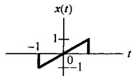

(a)

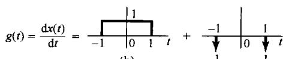

(b)

图4.16（a）欲求傅里叶变换的信号  $x(t)$ ；(b)  $x(t)$  的导数表示为两个分量的和

# 4.3.5 时间与频率的尺度变换

若

$$
x (t) \stackrel {\mathcal {F}} {\longleftrightarrow} X (\mathrm {j} \omega)
$$

则

$$
\boxed {x (a t) \xleftrightarrow {\mathcal {F}} \frac {1}{| a |} X \left(\frac {\mathrm {j} \omega}{a}\right)} \tag {4.34}
$$

其中  $a$  是一个实常数。这个性质可以直接由傅里叶变换的定义得到，即

$$
\mathcal {F} \{x (a t) \} = \int_ {- \infty} ^ {+ \infty} x (a t) e ^ {- j \omega t} d t
$$

利用置换  $\tau = at$  ，可得

$$
\mathcal {F} \{x (a t) \} = \left\{ \begin{array}{c c} \frac {1}{a} \int_ {- \infty} ^ {+ \infty} x (\tau) e ^ {- j (\omega / a) \tau} d \tau , & a > 0 \\ - \frac {1}{a} \int_ {- \infty} ^ {+ \infty} x (\tau) e ^ {- j (\omega / a) \tau} d \tau , & a <   0 \end{array} \right.
$$

这就相应于式(4.34)。因此，除了一个  $1 / |a|$  的幅度因子外，信号在时间上有一个线性尺度因子  $a$  的变换，相应于它在频率上有一个线性因子  $1 / a$  的变换，反之亦然。若令  $a = -1$  ，则由式(4.34)就有

$$
\boxed {x (- t) \xleftarrow {\mathcal {F}} X (- \mathrm {j} \omega)} \tag {4.35}
$$

也就是说，在时间上反转一个信号，它的傅里叶变换也反转。

式(4.34)一个最通俗的说明是当一盘磁带在录制时的速度和放音时的速度不同时，对其所含频率分量的影响。假设有一盘已经录好的磁带，如果重放时，其放音速度比原磁带录制时的速度要高，这就相当于信号在时间上受到压缩（即  $a > 1$ ），那么其频谱就应该扩展，因而听起来就会感到声音的频率变高了。反之，如果放音的速度比原来的慢（即  $0 < a < 1$ ），那么听起来在频率上就感到减低了。例如，如果一只小铃的声音被录制在磁带上，放的时候把速度变慢，那么听起来就宛如声音深沉的大钟了。

尺度变换性质又一次说明了时间和频率之间的相反关系。关于这一点，我们已经遇到好几次了。例如，增加正弦信号的周期，其频率就下降，再如曾在例4.5（见图4.11）中所看到的，若考虑如下变换：

$$
X (\mathrm {j} \omega) = \left\{ \begin{array}{l l} 1, & | \omega | <   W \\ 0, & | \omega | > W \end{array} \right.
$$

那么，随着  $W$  的增加， $X(\mathrm{j}\omega)$  的逆变换就愈来愈窄，幅度愈来愈高，最终当  $W \to \infty$  时，其逆变换就趋近于一个冲激函数。最后，在例4.8中也看到，一个周期冲激串的傅里叶变换也是一个冲激串，其在频域中的频率间隔是反比于时域中冲激串的时间间隔的。

时域与频域之间的相反关系在信号与系统的各个方面都十分重要，其中包括滤波和滤波器设计，并且在本书后续许多地方还会看到它的重要性。另外，读者或许在科学和工程领域的各个方面已经熟悉了这一性质的含义，例如物理学中的不确定性原理就是其中一例，另一个例子将在习题4.49中讨论。

# 4.3.6 对偶性

比较一下正变换和逆变换的关系式(4.24)和式(4.25)，可以看到，这两个式子在形式上是很相似的，但不完全一样。这一对称性就导致了傅里叶变换的一个性质，称为对偶性。通过例4.4和例4.5中这一双傅里叶变换对之间存在的关系，在例4.5之后讲解了对偶性。在前面的例子中导出了如下一对傅里叶变换：

$$
x _ {1} (t) = \left\{ \begin{array}{l l} 1, & | t | <   T _ {1} \\ 0, & | t | > T _ {1} \end{array} \right. \stackrel {\mathcal {F}} {\longleftrightarrow} X _ {1} (\mathrm {j} \omega) = \frac {2 \sin \omega T _ {1}}{\omega} \tag {4.36}
$$

而在后面的例子，又考虑了下面的变换对：

$$
x _ {2} (t) = \frac {\sin W t}{\pi t} \stackrel {\mathcal {F}} {\longleftrightarrow} X _ {2} (\mathrm {j} \omega) = \left\{ \begin{array}{l l} 1, & | \omega | <   W \\ 0, & | \omega | > W \end{array} \right. \tag {4.37}
$$

这两个变换对及其之间的关系绘于图4.17中。

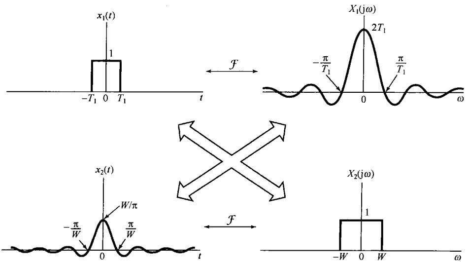

图4.17 式(4.36)和式(4.37)两对傅里叶变换之间的关系

由这两个例子所呈现出的对称性可以推广到一般的傅里叶变换中。具体而言，由于式(4.24)和式(4.25)之间的对称性，对于任何变换对来说，在时间和频率变量互换之后都有一种对偶的关系。对于这一点最好还是用例子来说明。

例4.13 考虑利用对偶性来求如下信号：

$$
g (t) = \frac {2}{1 + t ^ {2}}
$$

的傅里叶变换  $G(\mathrm{j}\omega)$  。在例4.2中曾经遇到一个傅里叶变换对，其中作为  $\omega$  的函数的傅里叶变换与该信号  $g(t)$  有类似的函数形式。这就是，设某一信号  $x(t)$  ，它的傅里叶变换是

$$
X (\mathrm {j} \omega) = \frac {2}{1 + \omega^ {2}}
$$

那么，由例4.2就有

$$
x (t) = \mathrm {e} ^ {- | t |} \xleftrightarrow {\mathcal {F}} X (\mathrm {j} \omega) = \frac {2}{1 + \omega^ {2}}
$$

对于这一变换对的综合公式是

$$
\mathrm {e} ^ {- | t |} = \frac {1}{2 \pi} \int_ {- \infty} ^ {\infty} \left(\frac {2}{1 + \omega^ {2}}\right) \mathrm {e} ^ {\mathrm {j} \omega t} \mathrm {d} \omega
$$

将上式两边乘以  $2\pi$  ，并将  $t$  以  $-t$  置换，可得

$$
2 \pi e ^ {- | t |} = \int_ {- \infty} ^ {\infty} \left(\frac {2}{1 + \omega^ {2}}\right) e ^ {- j \omega t} d \omega
$$

现在将变量  $t$  和  $\omega$  的名称交换一下，得出

$$
2 \pi \mathrm {e} ^ {- | \omega |} = \int_ {- \infty} ^ {\infty} \left(\frac {2}{1 + t ^ {2}}\right) \mathrm {e} ^ {- \mathrm {j} \omega t} \mathrm {d} t \tag {4.38}
$$

式(4.38)的右边就是  $2 / (1 + t^2)$  的傅里叶变换分析公式，因此最后得到

$$
\mathcal {F} \left\{\frac {2}{1 + t ^ {2}} \right\} = 2 \pi \mathrm {e} ^ {- | \boldsymbol {\omega} |}
$$

对偶性也能用来确定或联想到傅里叶变换的其他性质。具体而言，如果一个时间函数有某些特性，而这些特性在其傅里叶变换中隐含着一些别的什么东西，那么与频率函数有关的同一特性也会在时域中隐含着对偶的东西。例如，在4.3.4节中曾见到，时域中的微分对应于在频域内乘以  $\mathrm{j}\omega$  ，于是由前面的讨论，可以想到在时域中乘以  $\mathrm{j}t$  ，大概也会对应于频域的微分。为了确定这一对偶性质的确切形式，完全可以像在4.3.4节中所做的，将式(4.25)两边对  $\omega$  微分，得到

$$
\frac {\mathrm {d} X (\mathrm {j} \omega)}{\mathrm {d} \omega} = \int_ {- \infty} ^ {+ \infty} - \mathrm {j} t x (t) \mathrm {e} ^ {- \mathrm {j} \omega t} \mathrm {d} t \tag {4.39}
$$

即

$$
- \mathrm {j} t x (t) \xleftarrow {\mathcal {F}} \frac {\mathrm {d} X (\mathrm {j} \omega)}{\mathrm {d} \omega} \tag {4.40}
$$

同样，对于式(4.27)和式(4.32)可导出它们的对偶性质为

$$
\boxed {\mathrm {e} ^ {\mathrm {j} \omega_ {0} t} x (t) \xleftrightarrow {\mathcal {F}} X (\mathrm {j} (\omega - \omega_ {0}))} \tag {4.41}
$$

和

$$
\boxed {- \frac {1}{j t} x (t) + \pi x (0) \delta (t) \xleftrightarrow {\mathcal {F}} \int_ {- \infty} ^ {\omega} x (\eta) d \eta} \tag {4.42}
$$

# 4.3.7 帕斯瓦尔定理

若  $x(t)$  和  $X(\mathrm{j}\omega)$  是一对傅里叶变换，则

$$
\boxed {\int_ {- \infty} ^ {+ \infty} | x (t) | ^ {2} \mathrm {d} t = \frac {1}{2 \pi} \int_ {- \infty} ^ {+ \infty} | X (\mathrm {j} \omega) | ^ {2} \mathrm {d} \omega} \tag {4.43}
$$

该式称为帕斯瓦尔定理。该式直接用傅里叶变换就能得出，即

$$
\begin{array}{l} \int_ {- \infty} ^ {+ \infty} | x (t) | ^ {2} \mathrm {d} t = \int_ {- \infty} ^ {+ \infty} x (t) x ^ {*} (t) \mathrm {d} t \\ = \int_ {- \infty} ^ {+ \infty} x (t) \left[ \frac {1}{2 \pi} \int_ {- \infty} ^ {+ \infty} X ^ {*} (\mathrm {j} \omega) \mathrm {e} ^ {- \mathrm {j} \omega t} \mathrm {d} \omega \right] \mathrm {d} t \\ \end{array}
$$

改变一下积分次序，有

$$
\int_ {- \infty} ^ {+ \infty} | x (t) | ^ {2} d t = \frac {1}{2 \pi} \int_ {- \infty} ^ {+ \infty} X ^ {*} (\mathrm {j} \omega) \left[ \int_ {- \infty} ^ {+ \infty} x (t) e ^ {- \mathrm {j} \omega t} d t \right] d \omega
$$

上式右边括号的这一项就是  $x(t)$  的傅里叶变换，因此可以得到

$$
\int_ {- \infty} ^ {+ \infty} | x (t) | ^ {2} d t = \frac {1}{2 \pi} \int_ {- \infty} ^ {+ \infty} | X (\mathrm {j} \omega) | ^ {2} d \omega
$$

式(4.43)的左边是信号  $x(t)$  的总能量。帕斯瓦尔定理指出，这个总能量既可以按每单位时间内的能量  $(|x(t)|^2)$  在整个时间内积分计算出来，也可以按每单位频率内的能量  $(|X(\mathrm{j}\omega)|^2 /2\pi)$  在整个频率范围内积分而得到。因此，  $|X(\mathrm{j}\omega)|^2$  常称为信号  $x(t)$  的能谱密度(energy-density spectrum)(见习题4.45)。应该注意，对于有限能量信号的帕斯瓦尔定理与周期信号的帕斯瓦尔定理式(3.67)是直接对应的，表明一个周期信号的平均功率等于它的各次谐波分量的平均功率之和，而这些谐波分量的平均功率就等于傅里叶级数系数的模平方。

帕斯瓦尔定理和其他傅里叶变换性质在直接从傅里叶变换来确定一个信号的某些时域特性时是很有用处的。下面的例子就是一个简单的说明。

例4.14 对于图4.18中的每个傅里叶变换，希望能求得如下时域表示式：

$$
E = \int_ {- \infty} ^ {\infty} | x (t) | ^ {2} d t
$$

$$
D = \left. \frac {\mathrm {d}}{\mathrm {d} t} x (t) \right| _ {t = 0}
$$

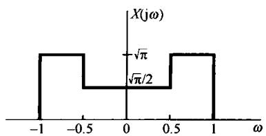

(a)

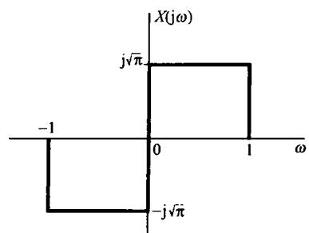

(b)

图4.18 例4.14中要考虑的傅里叶变换

为了在频域中求  $E$  ，可以用帕斯瓦尔定理，即

$$
E = \frac {1}{2 \pi} \int_ {- \infty} ^ {\infty} | X (\mathrm {j} \omega) | ^ {2} \mathrm {d} \omega \tag {4.44}
$$

对图4.18(a)，该值是  $5 / 8$  ，对于图4.18(b)，该其值则是1。为了在频域中求  $D$  ，首先应该用微分性质

$$
g (t) = \frac {\mathrm {d}}{\mathrm {d} t} x (t) \xleftrightarrow {\mathcal {F}} \mathrm {j} \omega X (\mathrm {j} \omega) = G (\mathrm {j} \omega)
$$

注意到

$$
D = g (0) = \frac {1}{2 \pi} \int_ {- \infty} ^ {\infty} G (\mathrm {j} \omega) \mathrm {d} \omega \tag {4.45}
$$

最后得到

$$
D = \int_ {- \infty} ^ {\infty} \mathrm {j} \omega X (\mathrm {j} \omega) \mathrm {d} \omega \tag {4.46}
$$

对图4.18(a)，该值为零，对图4.18(b)，该值为  $-\sqrt{\pi}$ 。

除了以上讨论到的这些性质外，傅里叶变换还有一些其他的性质。下面两节将特别讨论另外两个性质，这两个性质在线性时不变系统研究及其应用中起着特别重要的作用。其中的第一个性质(在4.4节讨论)称为卷积性质(convolution property)，它是很多信号与系统应用中的核心，其中包括滤波。第二个性质称为相乘性质(multiplication property)，将在4.5节讨论。相乘性质是第7章讨论采样和第8章讨论幅度调制的基础。4.6节将综合讨论傅里叶变换的性质。

# 4.4 卷积性质

在第3章已经知道，如果一个周期信号用一个傅里叶级数来表示，也就是按式(3.38)作为成谐波关系的复指数信号的线性组合来表示，那么一个线性时不变系统对这个输入的响应也能够用一个傅里叶级数来表示。因为复指数信号是线性时不变系统的特征函数，所以输出的傅里叶级数系数是输入的那些系数乘以对应谐波频率上的系统频率响应的值。

这一节将把这一结论推广到非周期信号的情况。首先以第3章对周期信号所建立的直观认识为基础，通过稍微欠正规的方式来导出这一性质。然后直接由卷积积分出发，以简短但是正规的方式来导出这一性质。

回想一下，我们是把作为  $x(t)$  的一种表示式的傅里叶变换综合公式当成复指数信号的一种线性组合来理解的。重新回到式(4.7)， $x(t)$  是作为一个和的极限来表示的，即

$$
x (t) = \frac {1}{2 \pi} \int_ {- \infty} ^ {+ \infty} X (\mathrm {j} \omega) \mathrm {e} ^ {\mathrm {j} \omega t} \mathrm {d} \omega = \lim  _ {\omega_ {0} \rightarrow 0} \frac {1}{2 \pi} \sum_ {k = - \infty} ^ {+ \infty} X (\mathrm {j} k \omega_ {0}) \mathrm {e} ^ {\mathrm {j} k \omega_ {0} t} \omega_ {0} \tag {4.47}
$$

3.2节和3.8节都讨论过，单位冲激响应为  $h(t)$  的线性系统对复指数信号  $\mathbf{e}^{\mathrm{j}k\omega_0t}$  的响应是 $H(\mathrm{j}k\omega_0)\mathrm{e}^{\mathrm{j}k\omega_0t}$  ，其中

$$
H (\mathrm {j} k \omega_ {0}) = \int_ {- \infty} ^ {+ \infty} h (t) \mathrm {e} ^ {- \mathrm {j} k \omega_ {0} t} \mathrm {d} t \tag {4.48}
$$

按照式(3.121)的定义，可以把频率响应  $H(\mathrm{j}\omega)$  当成该系统单位冲激响应的傅里叶变换。换句话说，单位冲激响应的傅里叶变换（在  $\omega = k\omega_0$  上求值）就是线性时不变系统对于特征函数  $\mathrm{e}^{\mathrm{j}k\omega_0t}$  的复标尺因子。由叠加原理[见式(3.124)]，就有

$$
\frac {1}{2 \pi} \sum_ {k = - \infty} ^ {+ \infty} X (\mathrm {j} k \omega_ {0}) \mathrm {e} ^ {\mathrm {j} k \omega_ {0} t} \omega_ {0} \longrightarrow \frac {1}{2 \pi} \sum_ {k = - \infty} ^ {+ \infty} X (\mathrm {j} k \omega_ {0}) H (\mathrm {j} k \omega_ {0}) \mathrm {e} ^ {\mathrm {j} k \omega_ {0} t} \omega_ {0}
$$

因此，根据式(4.47)，该线性系统对  $x(t)$  的响应就为

$$
\begin{array}{l} y (t) = \lim  _ {\omega_ {0} \rightarrow 0} \frac {1}{2 \pi} \sum_ {k = - \infty} ^ {+ \infty} X (\mathrm {j} k \omega_ {0}) H (\mathrm {j} k \omega_ {0}) \mathrm {e} ^ {\mathrm {j} k \omega_ {0} t} \omega_ {0} \tag {4.49} \\ = \frac {1}{2 \pi} \int_ {- \infty} ^ {+ \infty} X (\mathrm {j} \omega) H (\mathrm {j} \omega) \mathrm {e} ^ {\mathrm {j} \omega t} \mathrm {d} \omega \\ \end{array}
$$

因为  $y(t)$  和它的傅里叶变换是由下式联系在一起的：

$$
y (t) = \frac {1}{2 \pi} \int_ {- \infty} ^ {+ \infty} Y (\mathrm {j} \omega) \mathrm {e} ^ {\mathrm {j} \omega t} \mathrm {d} \omega \tag {4.50}
$$

所以，根据式(4.49)，就可以将  $Y(\mathrm{j}\omega)$  认为是

$$
Y (\mathrm {j} \omega) = X (\mathrm {j} \omega) H (\mathrm {j} \omega) \tag {4.51}
$$

作为比较正规的推导，可考虑如下卷积积分：

$$
y (t) = \int_ {- \infty} ^ {+ \infty} x (\tau) h (t - \tau) d \tau \tag {4.52}
$$

要求的  $Y(\mathrm{j}\omega)$  是

$$
Y (\mathrm {j} \omega) = \mathcal {F} \{y (t) \} = \int_ {- \infty} ^ {+ \infty} \left[ \int_ {- \infty} ^ {+ \infty} x (\tau) h (t - \tau) \mathrm {d} \tau \right] \mathrm {e} ^ {- \mathrm {j} \omega t} \mathrm {d} t \tag {4.53}
$$

交换积分次序，并注意到  $x(\tau)$  与  $\pmb{t}$  无关，则有

$$
Y (\mathrm {j} \omega) = \int_ {- \infty} ^ {+ \infty} x (\tau) \left[ \int_ {- \infty} ^ {+ \infty} h (t - \tau) \mathrm {e} ^ {- \mathrm {j} \omega t} \mathrm {d} t \right] \mathrm {d} \tau \tag {4.54}
$$

根据时移性质式(4.27)，上式方括号内就是  $\mathrm{e}^{-\mathrm{j}\omega \tau}H(\mathrm{j}\omega)$  ，将其代入式(4.54)得

$$
Y (\mathrm {j} \omega) = \int_ {- \infty} ^ {+ \infty} x (\tau) \mathrm {e} ^ {- \mathrm {j} \omega \tau} H (\mathrm {j} \omega) d \tau = H (\mathrm {j} \omega) \int_ {- \infty} ^ {+ \infty} x (\tau) \mathrm {e} ^ {- \mathrm {j} \omega \tau} \mathrm {d} \tau \tag {4.55}
$$

上式右边的积分部分就是  $X(\mathrm{j}\omega)$  ，所以

$$
Y (\mathrm {j} \omega) = H (\mathrm {j} \omega) X (\mathrm {j} \omega)
$$

也即

$$
\boxed {y (t) = h (t) * x (t) \xleftrightarrow {\mathcal {F}} Y (\mathrm {j} \omega) = H (\mathrm {j} \omega) X (\mathrm {j} \omega)} \tag {4.56}
$$

式(4.56)在信号与系统分析中十分重要。正如该式所表达的，它将两个信号的卷积映射为其傅里叶变换的乘积。单位冲激响应的傅里叶变换  $H(\mathrm{j}\omega)$  是按式(3.121)所定义的频率响应，它控制着在每一频率  $\omega$  输入傅里叶变换复振幅的变化。例如，在频率选择性滤波中，可以要求在某一频率范围内  $H(\mathrm{j}\omega)\approx 1$  ，以便让通带内的各频率分量几乎不受任何由于系统带来的衰减或变化；而在另一些频率范围内，可能要求  $H(\mathrm{j}\omega)\approx 0$  ，以便将该范围内的各频率分量消除或显著衰减掉。

在线性时不变系统分析中，频率响应  $H(\mathrm{j}\omega)$  所起的作用与其逆变换——单位冲激响应  $h(t)$  所起的作用是同样的。一方面，因为  $h(t)$  完全表征了一个线性时不变系统，因此  $H(\mathrm{j}\omega)$  也一定是这样；另外，线性时不变系统的很多性质也能够很方便地借助于  $H(\mathrm{j}\omega)$  来反映。例如，在2.3节已经知道两个线性时不变系统级联后的冲激响应就是这些系统冲激响应的卷积，而且总的特性与级联次序无关。利用式(4.56)就可以用频率响应来描述这种系统的级联特性。正如图4.19所表明的，由于两个线性时不变系统级联后的单位冲激响应是每个冲激响应的卷积，应用卷积性质即可得出，两个线性时不变系统级联后的总频率响应就是这些单个频率响应的乘积，而且由此可明显看出，总的频率响应与级联次序无关。

正如在4.1.2节曾讨论过的，傅里叶变换的收敛是在几个条件之下才得以保证的，这样就不是对所有的线性时不变系统都能定义出频率响应。然而，如果一个线性时不变系统是稳定的，那么正如2.3.7节和习题2.49中所介绍的，该系统的单位冲激响应就一定是绝对可积的，也就是

$$
\int_ {- \infty} ^ {+ \infty} | h (t) | \mathrm {d} t <   \infty \tag {4.57}
$$

式(4.57)是三个狄里赫利条件之一，而这三个条件合在一起才保证  $h(t)$  的傅里叶变换  $H(\mathrm{j}\omega)$  存在。因此，假设  $h(t)$  也满足另外两个条件（因为所有物理上或实际上有意义的信号都是这样的），那么一个稳定的线性时不变系统就有一个频率响应  $H(\mathrm{j}\omega)$  。

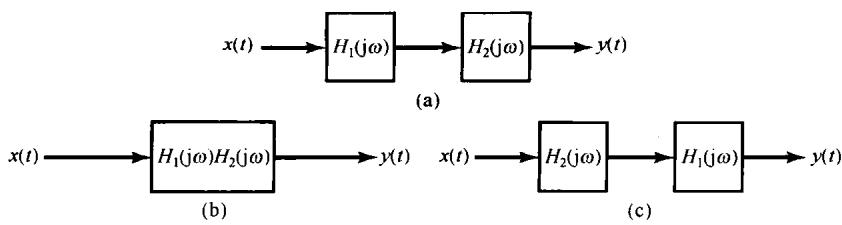

图4.19 三种等效的线性时不变系统，其中每一方框代表一个线性时不变系统，其频率响应函数如图示

在利用傅里叶分析来研究线性时不变系统时，将只局限于系统的冲激响应有傅里叶变换的情况。为了应用变换法来研究不稳定的线性时不变系统，就要建立一种更为一般化的连续时间傅里叶变换，这就是拉普拉斯变换，我们将其推迟到第9章讨论。在这之前都只讨论能够利用傅里叶变换来分析的很多问题和实际应用。

# 4.4.1 举例

为了进一步说明卷积性质及其应用，现举几个例子。

例4.15 有一个连续时间线性时不变系统，其单位冲激响应为

$$
h (t) = \delta \left(t - t _ {0}\right) \tag {4.58}
$$

该系统的频率响应就是  $h(t)$  的傅里叶变换，为

$$
H (\mathrm {j} \omega) = \mathrm {e} ^ {- \mathrm {j} \omega t _ {0}} \tag {4.59}
$$

因此，对于具有傅里叶变换  $X(\mathrm{j}\omega)$  的任何输入  $\pmb {x}(t)$  ，输出的傅里叶变换是

$$
\begin{array}{r l} Y (\mathrm {j} \omega) & = H (\mathrm {j} \omega) X (\mathrm {j} \omega) \\ & = e ^ {- \mathrm {j} \omega t _ {0}} Y (\mathrm {j} \omega) \end{array} \tag {4.60}
$$

其实，这个结果与4.3.2节的时移性质是一致的。单位冲激响应为  $\delta (t - t_0)$  的系统对输入将产生一个时延  $t_0$  ，即

$$
y (t) = x \left(t - t _ {0}\right)
$$

因此，由式(4.27)给出的时移性质也可得到式(4.60)。值得注意的是，无论由4.3.2节的讨论，或直接从式(4.59)来看，一个属于纯时移的系统的频率响应在所有频率上其模为1（即  $|\mathrm{e}^{-\mathrm{j}\omega t_0}| = 1$ ），而相位则与  $\omega$  成线性关系  $-\omega t_{0}$ 。

例4.16 作为第二个例子，考虑一个微分器，即一个线性时不变系统的输入  $x(t)$  和输出  $\gamma (t)$  由下列关系给出：

$$
y (t) = \frac {\mathrm {d} x (t)}{\mathrm {d} t}
$$

根据4.3.4节的微分性质，

$$
Y (\mathrm {j} \omega) = \mathrm {j} \omega X (\mathrm {j} \omega) \tag {4.61}
$$

于是由式(4.56)，一个微分器的频率响应就是

$$
H (\mathrm {j} \omega) = \mathrm {j} \omega \tag {4.62}
$$

例4.17 考虑一个积分器，即一个线性时不变系统由下列方程给出：

$$
y (t) = \int_ {- \infty} ^ {t} x (\tau) d \tau
$$

这个系统的单位冲激响应是单位阶跃  $u(t)$ ，因此，根据例4.11和式(4.33)，该系统的频率响应是

$$
H (\mathrm {j} \omega) = \frac {1}{\mathrm {j} \omega} + \pi \delta (\omega)
$$

然后，利用式(4.56)，就有

$$
\begin{array}{l} Y (\mathrm {j} \omega) = H (\mathrm {j} \omega) X (\mathrm {j} \omega) \\ = \frac {1}{j \omega} X (j \omega) + \pi X (j \omega) \delta (\omega) \\ = \frac {1}{j \omega} X (j \omega) + \pi X (0) \delta (\omega) \\ \end{array}
$$

这与式(4.32)的积分性质是一致的。

例4.18 在3.9.2节已讨论过，频率选择性滤波可以用一个线性时不变系统来实现，该系统的频率响应  $H(\mathrm{j}\omega)$  通过所需的频率范围，而大大衰减掉在该范围以外的频率分量。例如，考虑在3.9.2节介绍过的理想低通滤波器，它的频率响应如图4.20所示，并由下式给出：

$$
H (\mathrm {j} \omega) = \left\{ \begin{array}{l l} 1, & \quad | \omega | <   \omega_ {c} \\ 0, & \quad | \omega | > \omega_ {c} \end{array} \right. \tag {4.63}
$$

现在已经有了它的傅里叶变换表示，并且知道该理想滤波器的单位冲激响应  $h(t)$  就是式(4.63)的逆变换。利用例4.5的结果，就有

$$
h (t) = \frac {\sin \omega_ {c} t}{\pi t} \tag {4.64}
$$

如图4.21所示。

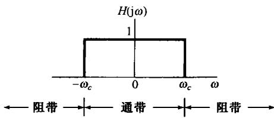

图4.20 理想低通滤波器的频率响应

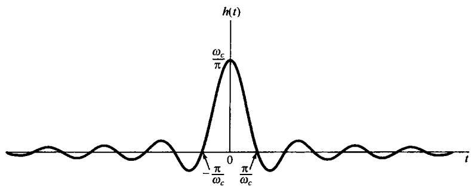

图4.21 理想低通滤波器的单位冲激响应

由例4.18这个例子，已经能够开始看到在滤波器设计中所出现的一些问题，滤波器设计中涉及到时域和频域两方面的要求。尽管理想低通滤波器确实有非常完美的频率选择性，但是它的单位冲激响应的某些特性却可能是我们不希望的。首先注意到， $h(t)$  在  $t < 0$  时不是零，其结果就是理想低通滤波器不是因果的，因此在要求因果系统的应用中，就无法采用理想低通滤波器。进而，正如第6章将要讨论的，即使因果性不是一个主要的限制，理想滤波器也不是很容易近似实现的，倒是较为容易实现的非理想滤波器常常让人乐于接受。再者，在某些应用中（正如6.7.1节将要讨论的汽车减震系统），一个低通滤波器单位冲激响应中的起伏振荡特性可能是我们不希望有的。在这样一些应用中，像图4.21这样的理想低通滤波器的时域特性或许是不可接受的。这就意味着，需要在像理想频率选择性这样的频域特性与时域特性之间进行一些折中和权衡。

例如，考虑单位冲激响应为

$$
h (t) = \mathrm {e} ^ {- t} u (t) \tag {4.65}
$$

的线性时不变系统，其频率响应是

$$
H (\mathrm {j} \omega) = \frac {1}{\mathrm {j} \omega + 1} \tag {4.66}
$$

将式(3.145)和式(4.66)相比较就会发现，这个系统能用3.10节讨论的简单  $RC$  电路来实现。系统的单位冲激响应和频率响应的模特性示于图4.22中。虽然这个系统没有理想低通滤波器那么好的频率选择性，但它是因果的，并且其冲激响应是单调衰减的，也就是说没有振荡。这种滤波器，或者相应于更高阶微分方程的稍许更为复杂一些的滤波器，由于它们的因果性，容易实现，以及在诸如频率选择性和时域振荡特性等这样一些设计考虑上能灵活地做出一些权衡等原因，相对于理想滤波器来说倒是常常被采纳。这些问题将在第6章更详细地讨论。

卷积性质在求卷积积分时是很有用的，也就是在计算线性时不变系统的响应中是很有用的。下面用例子来给予说明。

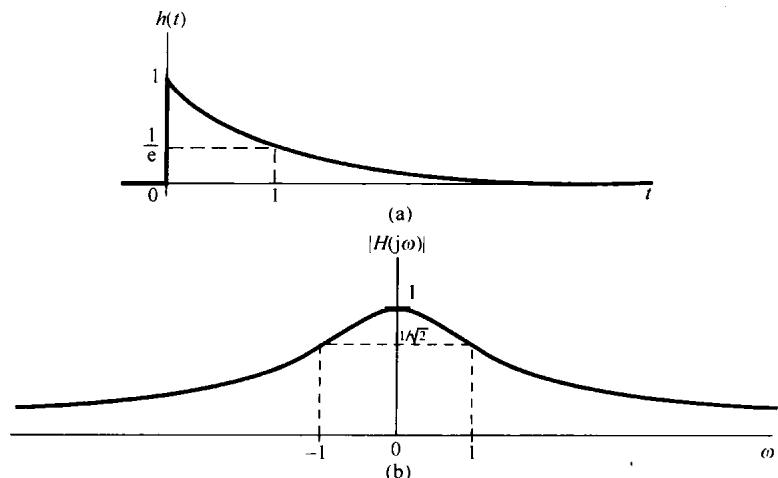

图4.22（a）式(4.65)所示线性时不变系统的单位冲激响应；（b）该系统频率响应的模特性

例4.19 考虑一个线性时不变系统对输入信号  $x(t)$  的响应，系统的单位冲激响应为  $h(t)$ ，它们是

$$
h (t) = \mathrm {e} ^ {- a t} u (t), \quad a > 0
$$

$$
x (t) = \mathrm {e} ^ {- b t} u (t), \quad b > 0
$$

不直接计算  $y(t) = x(t)*h(t)$ ，而是将问题先变换到频域。由例4.1， $x(t)$  和  $h(t)$  的傅里叶变换是

$$
X (\mathrm {j} \omega) = \frac {1}{b + \mathrm {j} \omega}
$$

和

$$
H (\mathrm {j} \omega) = \frac {1}{a + \mathrm {j} \omega}
$$

因此

$$
Y (\mathrm {j} \omega) = \frac {1}{(a + \mathrm {j} \omega) (b + \mathrm {j} \omega)} \tag {4.67}
$$

为了求出输出  $y(t)$ ，希望得到  $Y(\mathrm{j}\omega)$  的逆变换。最简单地做法就是将  $Y(\mathrm{j}\omega)$  展开成部分分式。这样的展开式在求逆变换时极为有用，其一般的展开法在附录中已给出。对于这个例子，假设  $b \neq a$ ， $Y(\mathrm{j}\omega)$  的部分分式展开为

$$
Y (\mathrm {j} \omega) = \frac {A}{a + \mathrm {j} \omega} + \frac {B}{b + \mathrm {j} \omega} \tag {4.68}
$$

其中  $A$  和  $B$  都是待定常数。求  $A$  和  $B$  的一种办法是将式(4.67)和式(4.68)两式的右边相等，然后两边各乘以  $(a + \mathrm{j}\omega)(b + \mathrm{j}\omega)$ ，解出  $A$  和  $B$ 。在附录中给出了另一种更一般且更为有效的方法来求像式(4.68)这样的部分分式展开式中的系数。无论用哪种办法，都能求得

$$
A = \frac {1}{b - a} = - B
$$

因此

$$
Y (\mathrm {j} \omega) = \frac {1}{b - a} \left[ \frac {1}{a + \mathrm {j} \omega} - \frac {1}{b + \mathrm {j} \omega} \right] \tag {4.69}
$$

式(4.69)中每一项的逆变换都可凭直观得到，利用4.3.1节的线性性质，有

$$
y (t) = \frac {1}{b - a} [ e ^ {- a t} u (t) - e ^ {- b t} u (t) ]
$$

当  $b = a$  时，式(4.69)的部分分式展开不成立。然而，当  $b = a$  时，式(4.67)就变为

$$
Y (\mathrm {j} \omega) = \frac {1}{(a + \mathrm {j} \omega) ^ {2}}
$$

这就是可看成

$$
\frac {1}{(a + j \omega) ^ {2}} = j \frac {d}{d \omega} \left[ \frac {1}{a + j \omega} \right]
$$

利用由式(4.40)给出的微分性质的对偶特性，因此，

$$
\mathrm {e} ^ {- a t} u (t) \xleftrightarrow {\mathcal {F}} \frac {1}{a + \mathrm {j} \omega}
$$

$$
t \mathrm {e} ^ {- a t} u (t) \xleftrightarrow {\mathcal {F}} \mathrm {j} \frac {\mathrm {d}}{\mathrm {d} \omega} \left[ \frac {1}{a + \mathrm {j} \omega} \right] = \frac {1}{(a + \mathrm {j} \omega) ^ {2}}
$$

结果有

$$
y (t) = t \mathrm {e} ^ {- a t} u (t)
$$

例4.20卷积性质应用的另一个例子是考虑求一个理想低通滤滤器对具有sinc函数形式的 $x(t)$  的响应问题，即

$$
x (t) = \frac {\sin \omega_ {i} t}{\pi t}
$$

当然，该理想低通滤波器的冲激响应具有与  $x(t)$  相类似的形式，即

$$
h (t) = \frac {\sin \omega_ {c} t}{\pi t}
$$

因此，滤波器的输出  $y(t)$  就是这两个sinc函数的卷积。现在来证明，它还是一个sinc函数。导出这一结果的特别方便的方法是先看一下

$$
Y (\mathrm {j} \omega) = X (\mathrm {j} \omega) H (\mathrm {j} \omega)
$$

其中，

$$
X (\mathrm {j} \omega) = \left\{ \begin{array}{l l} 1, & \quad | \omega | \leqslant \omega_ {i} \\ 0, & \quad \text {其 他} \end{array} \right.
$$

且

$$
H (\mathrm {j} \omega) = \left\{ \begin{array}{l l} 1, & \quad | \omega | \leqslant \omega_ {c} \\ 0, & \quad \text {其 他} \end{array} \right.
$$

因此有

$$
Y (\mathrm {j} \omega) = \left\{ \begin{array}{l l} 1, & | \omega | \leqslant \omega_ {0} \\ 0, & \text {其 他} \end{array} \right.
$$

其中，  $\omega_0$  等于  $\omega_{i}$  和  $\omega_{c}$  中较小的一个。最后，  $Y(\mathrm{j}\omega)$  的逆变换为

$$
y (t) = \left\{ \begin{array}{l l} \frac {\sin \omega_ {c} t}{\pi t}, & \quad \omega_ {c} \leqslant \omega_ {i} \\ \frac {\sin \omega_ {i} t}{\pi t}, & \quad \omega_ {i} \leqslant \omega_ {c} \end{array} \right.
$$

即，取决于  $\omega_{c}$  和  $\omega_{i}$  中哪一个较小，输出或者等于  $x(t)$ ，或者等于  $h(t)$ 。

# 4.5 相乘性质

卷积性质说的是时域内的卷积对应于频域内的相乘。由于时域和频域之间的对偶性，可以期望对此也一定有一个相应的对偶性质存在，即时域内的相乘应该对应于频域内的卷积。具体而言，就是

$$
\boxed {r (t) = s (t) p (t) \longleftrightarrow R (\mathrm {j} \omega) = \frac {1}{2 \pi} \int_ {- \infty} ^ {+ \infty} S (\mathrm {j} \theta) P (\mathrm {j} (\omega - \theta)) \mathrm {d} \theta} \tag {4.70}
$$

式(4.70)可以利用4.3.6节的对偶关系与卷积性质一起来证明，或者直接利用傅里叶变换关系，像推导卷积性质一样的步骤来得到。

一个信号被另一个信号去乘，可以理解为用一个信号去调制另一个信号的振幅，因此两个信号相乘往往也称为幅度调制。为此，式(4.70)有时也称为调制性质(modulation property)。在第7章和第8章中将会看到，这个性质有几个很重要的应用。为了说明式(4.70)及今后将要讨论到的若干应用，先来举几个例子。

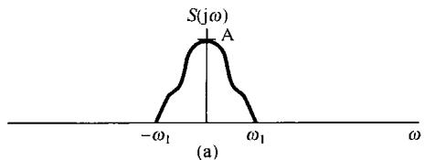

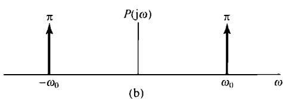

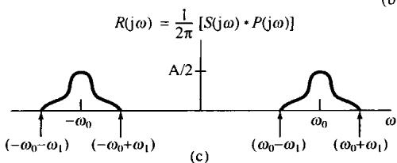

图4.23 例4.21中相乘性质的应用。（a）信号  $s(t)$  的傅里叶变换；（b）  $p(t) = \cos \omega_0t$  的傅里叶变换；（c）  $r(t) = s(t)p(t)$  的傅里叶变换

例4.21 设信号  $s(t)$  的频谱  $S(\mathrm{j}\omega)$  如图4.23(a)所示，同时考虑另一信号  $p(t)$ ，

$$
p (t) = \cos \omega_ {0} t
$$

那么

$$
P (j \omega) = \pi \delta (\omega - \omega_ {0}) + \pi \delta (\omega + \omega_ {0})
$$

如图4.23(b)所示。利用式(4.70)可以求得  $r(t) = s(t)p(t)$  的频谱  $R(\mathrm{j}\omega)$  为

$$
\begin{array}{l} R (\mathrm {j} \omega) = \frac {1}{2 \pi} \int_ {- \infty} ^ {+ \infty} S (\mathrm {j} \theta) P (\mathrm {j} (\omega - \theta)) \mathrm {d} \theta \tag {4.71} \\ = \frac {1}{2} S (\mathrm {j} (\omega - \omega_ {0})) + \frac {1}{2} S (\mathrm {j} (\omega + \omega_ {0})) \\ \end{array}
$$

如图4.23(c)所示。这里已假定  $\omega_0 > \omega_1$  ，所以  $R(\mathrm{j}\omega)$  中两个非零的部分互不重叠。很显然， $r(t)$  的频谱是由  $S(\mathrm{j}\omega)$  移位并受到加权的两个部分所组成的。

由式(4.71)和图4.23可见，当该信号  $s(t)$  被一正弦信号相乘以后，虽然信号中所包含的信息全都搬移到较高的频率中，但  $s(t)$  中的全部信息却被原封不动地保留了下来！这一点就构成了通信中正弦幅度调制系统的基础。在下一个例子中将明了如何从该幅度已调信号  $r(t)$  中恢复出原始信号  $s(t)$  。

例4.22 现在考虑在例4.21中得到的信号  $r(t)$ ，并令

$$
g (t) = r (t) p (t)
$$

其中，  $p(t) = \cos \omega_0t$  。这时，  $R(\mathrm{j}\omega)$  ，  $P(\mathrm{j}\omega)$  和  $G(\mathrm{j}\omega)$  均如图4.24所示。

由图4.24(c)并根据傅里叶变换的线性性质，可见  $g(t)$  是  $(1 / 2)s(t)$  与一个其频谱仅在较高的频率上（以  $\pm 2\omega_0$  为中心附近）为非零的信号之和。假设将信号  $g(t)$  作为一个输入加在一个频率响应  $H(\mathrm{j}\omega)$  只局限在低频域（如  $|\omega| < \omega_1$ ），而在  $|\omega| > \omega_1$  的高频域为零的频率选择性低通滤波器上，那么系统的输出频谱就为  $H(\mathrm{j}\omega)G(\mathrm{j}\omega)$ ，由于对  $H(\mathrm{j}\omega)$  给以如上的特殊选取，它除了在幅度上有一个加权外，就是  $S(\mathrm{j}\omega)$ 。因此，输出就是一个受到加权的  $s(t)$ 。当第8章更详细地讨论幅度调制的原理后，将会大大扩展这一概念。

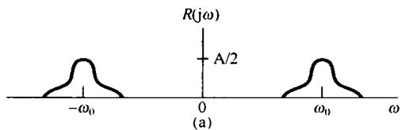

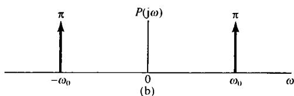

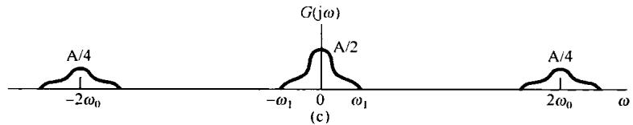

图4.24 例4.22中考虑的各信号的频谱。(a)  $R(\mathrm{j}\omega)$ ; (b)  $P(\mathrm{j}\omega)$ ; (c)  $G(\mathrm{j}\omega)$

例4.23 作为傅里叶变换相乘性质的另一个应用是用来求下面信号  $x(t)$  的傅里叶变换

$$
x (t) = \frac {\sin (t) \sin (t / 2)}{\pi t ^ {2}}
$$

这里的关键是要将  $x(t)$  当成两个sinc函数的乘积：

$$
x (t) = \pi \left(\frac {\sin (t)}{\pi t}\right) \left(\frac {\sin (t / 2)}{\pi t}\right)
$$

应用傅里叶变换的相乘性质，就得到

$$
X (\mathrm {j} \omega) = \frac {1}{2} \mathcal {F} \left\{\frac {\sin (t)}{\pi t} \right\} * \mathcal {F} \left\{\frac {\sin (t / 2)}{\pi t} \right\}
$$

注意，每一个sinc函数的傅里叶变换都是一个矩形脉冲，把这两个脉冲卷积就得到  $X(\mathrm{j}\omega)$  ，如图4.25所示。

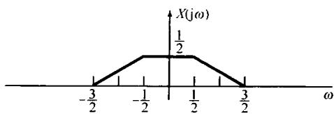

图4.25 例4.23中  $x(t)$  的傅里叶变换

# 4.5.1 具有可变中心频率的频率选择性滤波

正如在例4.21和例4.22中所想到的，并将更全面地在第8章将讨论的，相乘性质的一个重要应用是在通信系统中的幅度调制。另一个重要应用是在中心频率可调的频率选择性带通滤波器的实现上，其中心频率可以很简单地用一个调谐旋钮来调节。在由电阻器、运算放大器和电容器构成的频率选择性带通滤波器中，其中心频率决定于许多元件值，若要直接调节中心频率，全部元件都必须同时以一种正确的方式变化。这一点一般说来是十分困难的，而且与仅制作一个固定特性的滤波器相比很麻烦。另一种办法是利用一个固定特性的频率选择性滤波器，然后用恰当地移动信号频谱的办法来改变滤波器的中心频率，其中就要用到正弦幅度调制的原理。

例如，考虑示于图4.26的系统。这里，输入信号  $x(t)$  被一个复指数信号  $\mathrm{e}^{\mathrm{j}\omega_ct}$  相乘，所得信号然后通过一个截止频率为  $\omega_{c}$  的低通滤波器，其输出再乘以  $\mathrm{e}^{-\mathrm{j}\omega_ct}$  。信号  $x(t),y(t),w(t)$  和 $f(t)$  的频谱如图4.27所示。无论从相乘性质或频移性质来看，  $y(t) = \mathrm{e}^{\mathrm{j}\omega_ct}x(t)$  的傅里叶变换都是

$$
Y (\mathrm {j} \omega) = \int_ {- \infty} ^ {+ \infty} \delta (\theta - \omega_ {c}) X (\omega - \theta) \mathrm {d} \theta
$$

这样  $Y(\mathrm{j}\omega)$  就等于  $X(\mathrm{j}\omega)$  向右移  $\omega_{c}$ ，在  $X(\mathrm{j}\omega)$  中靠近  $\omega = \omega_{c}$  附近的频谱就移进该低通滤波器的通带内。同样，  $f(t) = \mathrm{e}^{-\mathrm{j}\omega_ct}w(t)$  的傅里叶变换是

$$
F (j \omega) = W (j (\omega + \omega_ {c}))
$$

$F(\mathrm{j}\omega)$  就是  $W(\mathrm{j}\omega)$  向左移  $\omega_{c}$  。由图4.27可见，图4.26整个系统等效于一个中心频率为  $-\omega_{c}$ ，带宽为  $2\omega_{0}$  的理想带通滤波器，如图4.28所示。随着复指数振荡器的频率  $\omega_{c}$  的改变，该带通滤波器的中心频率也就改变了。

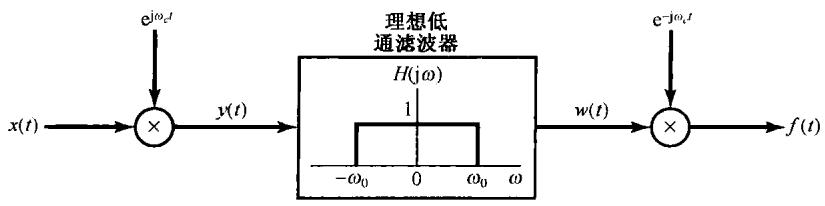

图4.26 利用复指数载波的幅度调制实现带通滤波器

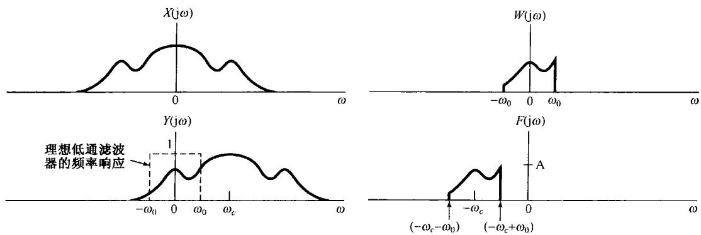

图4.27 图4.26系统中各信号的频谱

在图4.26的系统中，  $x(t)$  为实信号，而  $\gamma (t),w(t)$  和 $f(t)$  则全都是复信号。如果仅保留  $f(t)$  中的实部，那么得到的频谱就如图4.29所示，而与其相应的等效带通滤器就应有分别以  $\omega_{c}$  和  $-\omega_{c}$  为中心的两个频带，如图4.30所示。在一定的条件下，利用正弦调制而不用复指数调制来实现图4.30的系统也是可能的。这将在习题4.46中进一步说明。

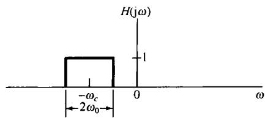

图4.28 与图4.26等效的带通滤波器

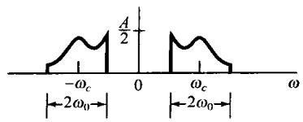

图4.29 与图4.26有关的  $\mathcal{Re}\{f(t)\}$  的频谱

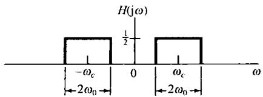

图4.30 对应图4.29中  $\mathcal{Re}\{f(t)\}$

的等效带通滤波器

# 4.6 傅里叶变换性质和基本傅里叶变换对列表

在前面几节和本章末的习题中已经研究过傅里叶变换的若干重要性质，现将这些综合出来列于表4.1中。表中还给出了每个性质所在的节号。

表4.2汇总了一些重要的基本傅里叶变换对，这些变换对在用傅里叶分析这一工具研究信号与系统时是会反复遇到的。所列变换对除了最后一个外，都在前面各节作为例子讨论过。最后一个变换对将在习题4.40中考虑。另外，要注意在表4.2中有几个信号是周期的，这时还列出了相应的傅里叶级数系数。

表 4.1 傅里叶变换性质

<table><tr><td>节号</td><td>性质</td><td>非周期信号</td><td>傅里叶变换</td></tr><tr><td></td><td></td><td>x(t)</td><td>X(jω)</td></tr><tr><td></td><td></td><td>y(t)</td><td>Y(jω)</td></tr><tr><td>4.3.1</td><td>线性</td><td>ax(t)+by(t)</td><td>aX(jω)+bY(jω)</td></tr><tr><td>4.3.2</td><td>时移</td><td>x(t-t0)</td><td>e-ωt0X(jω)</td></tr><tr><td>4.3.6</td><td>频移</td><td>ejωt0x(t)</td><td>X(j(ω-ω0))</td></tr><tr><td>4.3.3</td><td>共轭</td><td>x*(t)</td><td>X*(−jω)</td></tr><tr><td>4.3.5</td><td>时间反转</td><td>x(-t)</td><td>X(−jω)</td></tr><tr><td>4.3.5</td><td>时间与频率尺度变换</td><td>x(at)</td><td>1/aX(jω/a)</td></tr><tr><td>4.4</td><td>卷积</td><td>x(t)*y(t)</td><td>X(jω)Y(jω)</td></tr><tr><td>4.5</td><td>相乘</td><td>x(t)y(t)</td><td>1/2π∫_{−∞}^{+∞} X(jθ)Y(j(ω-θ)) dθ</td></tr><tr><td>4.3.4</td><td>时域微分</td><td>d/dt x(t)</td><td>jωX(jω)</td></tr><tr><td>4.3.4</td><td>积分</td><td>∫_{−∞}^{t} x(t) dt</td><td>1/jωX(jω)+πX(0)δ(ω)</td></tr><tr><td>4.3.6</td><td>频域微分</td><td>tx(t)</td><td>j d/dω X(jω)</td></tr><tr><td>4.3.3</td><td>实信号的共轭对称性</td><td>x(t)为实信号</td><td>{X(jω)=X*(-jω)Re{X(jω)}=Re{X(-jω)}Im{X(jω)}=-Im{X(-jω)}|X(jω)|=|X(-jω)|&lt;X(jω)=-&lt;X(-jω)</td></tr><tr><td>4.3.3</td><td>实偶信号的对称性</td><td>x(t)为实偶信号</td><td>X(jω)为实偶</td></tr><tr><td>4.3.3</td><td>实奇信号的对称性</td><td>x(t)为实奇信号</td><td>X(jω)为纯虚奇</td></tr><tr><td>4.3.3</td><td>实信号的奇偶分解</td><td>x_e(t)=Eν{x(t)}[x(t)为实]x_o(t)=Od{x(t)}[x(t)为实]</td><td>Re{X(jω)}jIm{X(jω)}</td></tr><tr><td>4.3.7</td><td colspan="3">非周期信号的帕斯瓦尔定理</td></tr><tr><td></td><td colspan="3">∫_{-∞}^{+\infty}|x(t)|^2dt = 1/2π∫_{-∞}^{+\infty}|X(jω)|^2dω</td></tr></table>

表 4.2 基本傅里叶变换对

<table><tr><td>信号</td><td>傅里叶变换</td><td>傅里叶级数系数(若为周期的)</td></tr><tr><td>∑k=∞akexjkw0t</td><td>2π ∑k=∞akδ(ω-kω0)</td><td>ak</td></tr><tr><td>ejkω0t</td><td>2πδ(ω-kω0)</td><td>a1=1
ak=0,其余k</td></tr><tr><td>cos ω0t</td><td>π[δ(ω-ω0)+δ(ω+ω0)]</td><td>a1=a-1=1/2
ak=0,其余k</td></tr><tr><td>sin ω0t</td><td>π/j[δ(ω-ω0)-δ(ω+ω0)]</td><td>a1=-a-1=1/2j
ak=0,其余k</td></tr><tr><td>x(t)=1</td><td>2πδ(ω)</td><td>a0=1,ak=0,k≠0(这是对任意T&gt;0选择的傅里叶级数表示)</td></tr><tr><td>周期方波 x(t)={1, |t|&lt;T1
0, T1&lt;|t|≤T/2}</td><td>∑k=-∞+∞ 2sin kω0T1/k δ(ω-kω0)</td><td>ω0T1/πsinc(kω0T1/π)=sin kω0T1/kπ</td></tr><tr><td>和 x(t+T)=x(t)</td><td></td><td></td></tr><tr><td>∑n=-∞δ(t-nT)</td><td>2π ∑k=-∞+∞ δ(ω-2πk/T)</td><td>ak=1/T,对全部k</td></tr><tr><td>x(t) {1, |t|&lt;T1
0, |t|&gt;T1}</td><td>2sin ωT1/ω</td><td>-</td></tr><tr><td>sin Wt/πt</td><td>X(jω)={1, |ω|&lt;W
0, |ω|&gt;W}</td><td>-</td></tr><tr><td>δ(t)</td><td>1</td><td>-</td></tr><tr><td>u(t)</td><td>1/jω+πδ(ω)</td><td>-</td></tr><tr><td>δ(t-t0)</td><td>e-jωt0</td><td>-</td></tr><tr><td>e-atu(t), Re{a}&gt;0</td><td>1/a+jω</td><td>-</td></tr><tr><td>te-atu(t), Re{a}&gt;0</td><td>1/(a+jω)^2</td><td></td></tr><tr><td>tn-1/(n-1)!e-atu(t), Re{a}&gt;0</td><td>1/(a+jω)^n</td><td>-</td></tr></table>

# 4.7 由线性常系数微分方程表征的系统

在几种场合都曾经讨论过，一类特别重要而有用的连续时间线性时不变系统是其输入输出满足如下形式的线性常系数微分方程的系统：

$$
\sum_ {k = 0} ^ {N} a _ {k} \frac {\mathrm {d} ^ {k} y (t)}{\mathrm {d} t ^ {k}} = \sum_ {k = 0} ^ {M} b _ {k} \frac {\mathrm {d} ^ {k} x (t)}{\mathrm {d} t ^ {k}} \tag {4.72}
$$

这一节将要讨论如何确定这样一个线性时不变系统的频率响应问题。全部讨论中都假定系统是稳定的，所以它的频率响应存在，即式(3.121)收敛。

有两种密切联系的途径可以确定由式(4.72)的微分方程所描述的线性时不变系统的频率响应  $H(\mathrm{j}\omega)$  。其中第一个是依赖于复指数信号是线性时不变系统的特征函数这一事实，这个事实曾在3.10节分析几个简单的非理想滤波器时使用过。具体而言，若  $x(t) = \mathrm{e}^{\mathrm{j}\omega t}$ ，那么输出就一定是  $y(t) = H(\mathrm{j}\omega)\mathrm{e}^{\mathrm{j}\omega t}$ ，将这些代入式(4.72)的微分方程，并进行一些代数运算，就能解出  $H(\mathrm{j}\omega)$  。这一节将用另一种方法来达到同样的结果，这就是应用傅里叶变换的微分性质式(4.31)。

现考虑一个由式(4.72)表征的线性时不变系统。根据卷积性质，

$$
Y (\mathrm {j} \omega) = H (\mathrm {j} \omega) X (\mathrm {j} \omega)
$$

或等效为

$$
H (\mathrm {j} \omega) = \frac {Y (\mathrm {j} \omega)}{X (\mathrm {j} \omega)} \tag {4.73}
$$

其中  $X(\mathrm{j}\omega)$  ，  $Y(\mathrm{j}\omega)$  和  $H(\mathrm{j}\omega)$  分别是输入  $\pmb {x}(t)$  ，输出  $\gamma (t)$  和系统单位冲激响应  $h(t)$  的傅里叶变换。现在，对式(4.72)两边取傅里叶变换，得

$$
\mathcal {F} \left\{\sum_ {k = 0} ^ {N} a _ {k} \frac {\mathrm {d} ^ {k} y (t)}{\mathrm {d} t ^ {k}} \right\} = \mathcal {F} \left\{\sum_ {k = 0} ^ {M} b _ {k} \frac {\mathrm {d} ^ {k} x (t)}{\mathrm {d} t ^ {k}} \right\} \tag {4.74}
$$

根据式(4.26)的线性性质，上式变为

$$
\sum_ {k = 0} ^ {N} a _ {k} \mathcal {F} \left\{\frac {\mathrm {d} ^ {k} y (t)}{\mathrm {d} t ^ {k}} \right\} = \sum_ {k = 0} ^ {M} b _ {k} \mathcal {F} \left\{\frac {\mathrm {d} ^ {k} x (t)}{\mathrm {d} t ^ {k}} \right\} \tag {4.75}
$$

并且由微分性质式(4.31)，可得

$$
\sum_ {k = 0} ^ {N} a _ {k} (\mathrm {j} \omega) ^ {k} Y (\mathrm {j} \omega) = \sum_ {k = 0} ^ {M} b _ {k} (\mathrm {j} \omega) ^ {k} X (\mathrm {j} \omega)
$$

或者等效为

$$
Y (\mathrm {j} \omega) \left[ \sum_ {k = 0} ^ {N} a _ {k} (\mathrm {j} \omega) ^ {k} \right] = X (\mathrm {j} \omega) \left[ \sum_ {k = 0} ^ {M} b _ {k} (\mathrm {j} \omega) ^ {k} \right]
$$

因此，由式(4.73)有

$$
H (\mathrm {j} \omega) = \frac {Y (\mathrm {j} \omega)}{X (\mathrm {j} \omega)} = \frac {\sum_ {k = 0} ^ {M} b _ {k} (\mathrm {j} \omega) ^ {k}}{\sum_ {k = 0} ^ {N} a _ {k} (\mathrm {j} \omega) ^ {k}} \tag {4.76}
$$

可以看出，  $H(\mathrm{j}\omega)$  是一个有理函数，也就是两个  $(\mathrm{j}\omega)$  的多项式之比。其分子多项式的系数与式(4.72)右边的系数相同，分母多项式的系数就是式(4.72)左边的系数。因此，由式(4.72)表征的线性时不变系统的频率响应式(4.76)可根据该式的系数直接写出来。

式(4.72)的微分方程一般统称为  $N$  阶微分方程，因为方程中涉及到直至输出  $y(t)$  的第  $N$  阶导数。同时，式(4.76)中  $H(\mathrm{j}\omega)$  的分母也是一个  $(\mathrm{j}\omega)$  的  $N$  阶多项式。

例4.24 有一个稳定的线性时不变系统，由如下微分方程表征：

$$
\frac {\mathrm {d} y (t)}{\mathrm {d} t} + a y (t) = x (t) \tag {4.77}
$$

其中  $a > 0$  。由式(4.76)可知，频率响应为

$$
H (\mathrm {j} \omega) = \frac {1}{\mathrm {j} \omega + a} \tag {4.78}
$$

将该式与例4.1的结果进行比较，可见式(4.78)就是  $\mathbf{e}^{-\alpha t}u(t)$  的傅里叶变换。因此该系统的单位冲激响应就是

$$
h (t) = \mathrm {e} ^ {- a t} u (t)
$$

例4.25 有一个稳定的线性时不变系统，由如下微分方程表征：

$$
\frac {\mathrm {d} ^ {2} y (t)}{\mathrm {d} t ^ {2}} + 4 \frac {\mathrm {d} y (t)}{\mathrm {d} t} + 3 y (t) = \frac {\mathrm {d} x (t)}{\mathrm {d} t} + 2 x (t)
$$

由式(4.76)可知，频率响应是

$$
H (\mathrm {j} \omega) = \frac {(\mathrm {j} \omega) + 2}{(\mathrm {j} \omega) ^ {2} + 4 (\mathrm {j} \omega) + 3} \tag {4.79}
$$

为了求出相应的单位冲激响应，需要求出  $H(\mathrm{j}\omega)$  的逆变换，这就要用到在例4.19中所用的并在附录中详细讨论的部分分式展开[具体见例A.1，其中详细地对式(4.79)的部分分式展开进行了计算]。作为第一步，要将式(4.79)右边的分母因式分解为较低阶项的乘积：

$$
H (\mathrm {j} \omega) = \frac {\mathrm {j} \omega + 2}{(\mathrm {j} \omega + 1) (\mathrm {j} \omega + 3)} \tag {4.80}
$$

然后，利用部分分式展开，求得

$$
H (\mathrm {j} \omega) = \frac {\frac {1}{2}}{\mathrm {j} \omega + 1} + \frac {\frac {1}{2}}{\mathrm {j} \omega + 3}
$$

这里每一项的逆变换都能从例4.24中得出，其结果是

$$
h (t) = \frac {1}{2} \mathrm {e} ^ {- t} u (t) + \frac {1}{2} \mathrm {e} ^ {- 3 t} u (t)
$$

例4.25所采用的求逆变换的过程，一般来说，对于变换式是两个  $(\mathrm{j}\omega)$  的多项式之比的情况是适用的。特别是，可以用式(4.76)来确定任何一个由线性常系数微分方程描述的线性时不变系统的频率响应  $H(\mathrm{j}\omega)$ ，然后利用部分分式展开来计算单位冲激响应。由于部分分式展开的结果，就把频率响应  $H(\mathrm{j}\omega)$  变成这样一种形式，使得其中每一项的逆变换都能够一目了然。另外，如果系统输入的傅里叶变换  $X(\mathrm{j}\omega)$  也是两个  $(\mathrm{j}\omega)$  的多项式之比，那么  $Y(\mathrm{j}\omega) = H(\mathrm{j}\omega)X(\mathrm{j}\omega)$  也一定是两个  $(\mathrm{j}\omega)$  的多项式之比。在这种情况下，就可以用同样的办法来解微分方程，也就是求对输入  $x(t)$  的响应  $y(t)$  。下面用一个例子给予说明。

例4.26 假设例4.25所示系统的输入是

$$
x (t) = \mathrm {e} ^ {- t} u (t)
$$

那么应用式(4.80)，有

$$
\begin{array}{l} Y (\mathrm {j} \omega) = H (\mathrm {j} \omega) X (\mathrm {j} \omega) = \left[ \frac {\mathrm {j} \omega + 2}{(\mathrm {j} \omega + 1) (\mathrm {j} \omega + 3)} \right] \left[ \frac {1}{\mathrm {j} \omega + 1} \right] \tag {4.81} \\ = \frac {\mathrm {j} \omega + 2}{(\mathrm {j} \omega + 1) ^ {2} (\mathrm {j} \omega + 3)} \\ \end{array}
$$

正如附录中所指出的，这种情况，其部分分式展开应为

$$
Y (\mathrm {j} \omega) = \frac {A _ {1 1}}{\mathrm {j} \omega + 1} + \frac {A _ {1 2}}{(\mathrm {j} \omega + 1) ^ {2}} + \frac {A _ {2 1}}{\mathrm {j} \omega + 3} \tag {4.82}
$$

其中  $A_{11}, A_{12}$  和  $A_{21}$  均是待定常数。为了确定这些常数，可以应用附录中例A.2的部分分式展开法求得为

$$
A _ {1 1} = \frac {1}{4}, \quad A _ {1 2} = \frac {1}{2}, \quad A _ {2 1} = - \frac {1}{4}
$$

于是得到

$$
Y (\mathrm {j} \omega) = \frac {\frac {1}{4}}{\mathrm {j} \omega + 1} + \frac {\frac {1}{2}}{(\mathrm {j} \omega + 1) ^ {2}} - \frac {\frac {1}{4}}{\mathrm {j} \omega + 3} \tag {4.83}
$$

式(4.83)中每一项的逆变换都能直接得到，其中第一项和第三项与前两个例子的形式相同，而第二项的逆变换可以从表4.2中得到，或者像例4.19那样，利用微分性质的对偶性质式(4.40)，对  $1 / (\mathrm{j}\omega +1)$  进行频域微分求得。这样式(4.83)的逆变换为

$$
y (t) = \left[ \frac {1}{4} e ^ {- t} + \frac {1}{2} t e ^ {- t} - \frac {1}{4} e ^ {- 3 t} \right] u (t)
$$

由以上这些例子可以看到，傅里叶变换方法如何把一个由微分方程表征的线性时不变系统的问题演变为直接的代数问题，本章末习题中将用更多的例子来说明这一点。另外（见第6章），在处理由微分方程描述的线性时不变系统时，有理变换的代数结构非常便于其频域性质的分析，并且对这类重要系统在时域和频域特性上都能得到更为透彻的认识。

# 4.8 小结

这一章建立了连续时间信号的傅里叶变换表示，并研究了许多很有用的性质。特别是在把一个非周期信号看成周期变得任意大时一个周期信号的极限之后，由第3章所建立的周期信号的傅里叶级数表示导出了非周期信号的傅里叶变换表示。另外，周期信号本身也可以用傅里叶变换来表示，这个傅里叶变换由发生在该周期信号各谐波频率上的冲激串所组成，并且每个冲激串的面积正比于各傅里叶级数系数。

傅里叶变换具有一系列重要性质，这些性质表达了不同的信号特性是如何反映到它们的变换中去的，并且在这一章推导并研究了其中的许多性质。在这些性质当中，有两个性质在研究信号与系统时具有特别重要的意义。第一个就是卷积性质。这个性质是复指数信号的特征函数性质的一个直接结果，并由此导致可以用系统的频率响应来表征一个线性时不变系统。这种表征是用频域的方法来分析线性时不变系统的基础，在后续各章中将继续给予讨论。具有极其重要内涵的傅里叶变换的第二个性质是相乘性质，它是频域分析方法研究采样和调制系统的基础。这些系统将在第7章和第8章中讨论。

本章还可看出，傅里叶分析方法特别适合于研究由线性常系数微分方程描述的线性时不变系统。具体而言，这种系统的频率响应能直接根据微分方程的系数来确定，并利用部分分式展开法，极易求出系统的单位冲激响应。在下面的各章中将会发现，这些系统频率响应的代数结构对于深入分析它们的时域和频域特性极为方便。

# 习题

习题的第一部分属于基本题，答案在书末给出。其余三个部分属基本题、深入题和扩充题。

# 基本题（附答案）

4.1 利用傅里叶变换分析式(4.9)，求下列信号的傅里叶变换：

(a)  $\mathrm{e}^{-2(t - 1)} u(t - 1)$

(b)  $\mathbf{e}^{-2|t - 11}$

概略画出每一个傅里叶变换的模特性并给以标注。

4.2 利用傅里叶变换分析式(4.9)，求下列信号的傅里叶变换：

(a)  $\delta (t + 1) + \delta (t - 1)$

(b)  $\frac{\mathrm{d}}{\mathrm{d}t}\left\{u(-2 - t) + u(t - 2)\right\}$

概略画出每一个傅里叶变换的模特性并给以标注。

4.3 求下列各周期信号的傅里叶变换：

(a)  $\sin \left(2\pi t + \frac{\pi}{4}\right)$

(b)  $1 + \cos \left(6\pi t + \frac{\pi}{8}\right)$

4.4 利用傅里叶变换综合式(4.8)，求下列逆变换：

(a)  $X_{1}(\mathrm{j}\omega) = 2\pi \delta (\omega) + \pi \delta (\omega -4\pi) + \pi \delta (\omega +4\pi)$

(b)  $X_{2}(\mathrm{j}\omega) = \left\{ \begin{array}{ll}2, & 0\leqslant \omega \leqslant 2\\ -2, & -2\leqslant \omega <  0\\ 0, & |\omega | > 2 \end{array} \right.$

4.5 利用傅里叶变换综合式(4.8)，求  $X(\mathrm{j}\omega) = |\mathrm{X}(\mathrm{j}\omega)|\mathrm{e}^{\mathrm{j}\omega X(\mathrm{j}\omega)}$  的逆变换，其中

$$
\begin{array}{l} \left| X (j \omega) \right| = 2 \{u (\omega + 3) - u (\omega - 3) \} \\ \left\langle X (\mathrm {j} \omega) = - \frac {3}{2} \omega + \pi \right. \\ \end{array}
$$

用所得答案确定  $x(t) = 0$  时的  $t$  值。

4.6 已知  $x(t)$  的傅里叶变换为  $X(\mathrm{j}\omega)$ ，试将下列各信号的傅里叶变换用  $X(\mathrm{j}\omega)$  来表示。列于表 4.1 中的各傅里叶变换性质对解此题是有用的。

(a)  $x_{1}(t) = x(1 - t) + x(-1 - t)$

(b)  $x_{2}(t) = x(3t - 6)$

(c)  $x_{3}(t) = \frac{\mathrm{d}^{2}}{\mathrm{d}t^{2}} x(t - 1)$

4.7 对于下列各傅里叶变换，根据傅里叶变换性质(见表4.1)确定对应于时域信号，是否为(i)实，虚，或都不是；(ii)偶、奇，或都不是。应该不通过求出逆变换来解此题。

(a)  $X_{1}(\mathrm{j}\omega) = u(\omega) - u(\omega -2)$

(b)  $X_{2}(\mathrm{j}\omega) = \cos (2\omega)\sin \left(\frac{\omega}{2}\right)$

(c)  $X_{3}(\mathrm{j}\omega) = A(\omega)\mathrm{e}^{\mathrm{i}B(\omega)}$  ，其中  $A(\omega) = (\sin 2\omega) / \omega$  且  $B(\omega) = 2\omega +\frac{\pi}{2}$

(d)  $X(\mathrm{j}\omega) = \sum_{k = -\infty}^{\infty}\left(\frac{1}{2}\right)^{|kl|}\delta \left(\omega -\frac{k\pi}{4}\right)$

4.8 考虑信号

$$
x (t) = \left\{ \begin{array}{l l} 0, & t <   - \frac {1}{2} \\ t + \frac {1}{2}, & - \frac {1}{2} \leqslant t \leqslant \frac {1}{2} \\ 1, & t > \frac {1}{2} \end{array} \right.
$$

(a) 利用表4.1的微分和积分性质，及表4.2中的矩形脉冲傅里叶变换对，求  $X(\mathrm{j}\omega)$  的闭式表示式。

(b)  $g(t) = x(t) - \frac{1}{2}$  的傅里叶变换是什么？

4.9 考虑信号

$$
x (t) = \left\{ \begin{array}{l l} 0, & | t | > 1 \\ (t + 1) / 2, & - 1 \leqslant t \leqslant 1 \end{array} \right.
$$

(a) 借助于表4.1和表4.2，求  $X(\mathrm{j}\omega)$  的闭式表示式。

(b) 取(a)中答案的实部，证明它就是  $x(t)$  的偶部的傅里叶变换。

(c)  $x(t)$  奇部的傅里叶变换是什么？

4.10 (a) 借助于表 4.1 和表 4.2, 求下列信号的傅里叶变换:

$$
x (t) = t \left(\frac {\sin t}{\pi t}\right) ^ {2}
$$

(b) 利用帕斯瓦尔定理和上面结果, 求

$$
A = \int_ {- \infty} ^ {+ \infty} t ^ {2} \left(\frac {\sin t}{\pi t}\right) ^ {4} d t
$$

的值。

4.11 已知下列关系：

$$
y (t) = x (t) * h (t)
$$

和

$$
g (t) = x (3 t) * h (3 t)
$$

并已知  $x(t)$  的傅里叶变换是  $X(\mathrm{j}\omega),h(t)$  的傅里叶变换是  $H(\mathrm{j}\omega)$  ，利用傅里叶变换性质证明  $\pmb {g}(t)$  为

$$
g (t) = A y (B t)
$$

求出  $A$  和  $B$  的值。

4.12 考虑下面的傅里叶变换对：

$$
e ^ {- | t |} \xleftrightarrow {\mathcal {F}} \frac {2}{1 + \omega^ {2}}
$$

(a) 利用恰当的傅里叶变换性质求  $t \mathrm{e}^{-|t|}$  的傅里叶变换。

(b) 根据(a)的结果，再结合对偶性质，求

$$
\frac {4 t}{(1 + t ^ {2}) ^ {2}}
$$

的傅里叶变换[提示：见例4.13]。

4.13 设  $x(t)$  的傅里叶变换为

$$
X (\mathrm {j} \omega) = \delta (\omega) + \delta (\omega - \pi) + \delta (\omega - 5)
$$

并令

$$
h (t) = u (t) - u (t - 2)
$$

(a)  $x(t)$  是周期的吗？

(b)  $x(t)*h(t)$  是周期的吗？

(c) 两个非周期信号的卷积有可能是周期的吗？

4.14 考虑一个信号  $x(t)$ ，其傅里叶变换为  $X(\mathrm{j}\omega)$ ，假设给出下列条件：

1.  $x(t)$  是实值且非负的。

2.  $\mathcal{F}^{-1}\{(1 + \mathrm{j}\omega)X(\mathrm{j}\omega)\} = Ae^{-2t}u(t)$ ，其中  $A$  与  $t$  无关。

3.  $\int_{-\infty}^{\infty}|X(\mathrm{j}\omega)|^{2}\mathrm{d}\omega = 2\pi$

求  $x(t)$  的闭式表达式。

4.15 设  $x(t)$  有傅里叶变换  $X(\mathrm{j}\omega)$ ，假设给出下列条件：

1.  $x(t)$  为实值信号。

2.  $x(t) = 0, t \leqslant 0$

3.  $\frac{1}{2\pi}\int_{-\infty}^{\infty}\mathcal{R}e\{X(\mathrm{j}\omega)\} \mathrm{e}^{\mathrm{j}\omega t}\mathrm{d}\omega = |t|\mathrm{e}^{-|t|}$

求  $x(t)$  的闭式表达式。

4.16 考虑信号

$$
x (t) = \sum_ {k = - \infty} ^ {\infty} \frac {\sin \left(k \frac {\pi}{4}\right)}{\left(k \frac {\pi}{4}\right)} \delta \left(t - k \frac {\pi}{4}\right)
$$

(a) 求满足

$$
x (t) = \left(\frac {\sin t}{\pi t}\right) g (t)
$$

的  $g(t)$  。

(b) 利用傅里叶变换的相乘性质, 证明  $X(\mathrm{j}\omega)$  是周期的, 给出一个周期内的  $X(\mathrm{j}\omega)$  。

4.17 试判断下面每一种说法是对还是错的，并给出理由。

(a) 一个纯虚奇函数的信号总是有一个纯虚奇函数的傅里叶变换。

(b) 一个奇的傅里叶变换与一个偶的傅里叶变换的卷积总是奇的。

4.18 有一个系统的频率响应为

$$
H (\mathrm {j} \omega) = \frac {(\sin^ {2} (3 \omega)) \cos \omega}{\omega^ {2}}
$$

求它的单位冲激响应。

4.19 有一个因果线性时不变系统，其频率响应为

$$
H (\mathrm {j} \omega) = \frac {1}{\mathrm {j} \omega + 3}
$$

对于某一特定的输入  $x(t)$  ，观察到该系统的输出是

$$
y (t) = \mathrm {e} ^ {- 3 t} u (t) - \mathrm {e} ^ {- 4 t} u (t)
$$

求  $x(t)$  。

4.20 求习题3.20考虑的由RLC电路表示的该因果线性时不变系统的单位冲激响应。通过求该电路频率响应的逆变换来做此题。表4.1和表4.2都将有助于逆变换的求取。

# 基本题

4.21 求下列每一信号的傅里叶变换：

(a)  $\left[\mathrm{e}^{-\alpha t}\cos \omega_0t\right]u(t),\alpha >0$

(b)  $\mathrm{e}^{-3|t|}\sin 2t$

(c)  $x(t) = \begin{cases} 1 + \cos \pi t, & |t| \leqslant 1 \\ 0, & |t| > 1 \end{cases}$

(d)  $\sum_{k=0}^{\infty} \alpha^{k} \delta(t-kT), |\alpha|<1$

(e)  $[t\mathrm{e}^{-2t}\sin 4t]u(t)$

（f）  $\left[\frac{\sin\pi t}{\pi t}\right]\left[\frac{\sin 2\pi(t - 1)}{\pi(t - 1)}\right]$

(g)  $x(t)$  如图P4.21(a)所示。

(h)  $x(t)$  如图P4.21(b)所示。

（i）  $x(t) = \left\{ \begin{array}{ll}1 - t^2, & 0 <   t <   1\\ 0, & \text{其他} \end{array} \right.$

(j)  $\sum_{n = -\infty}^{+\infty}\mathrm{e}^{-1t - 2n1}$

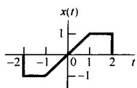

(a)

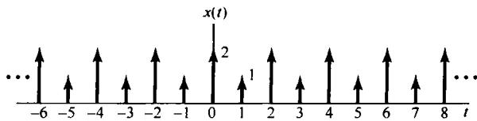

(b)

图P4.21

4.22 对下列每一个变换求对应的连续时间信号：

(a)  $X(\mathrm{j}\omega) = \frac{2\sin[3(\omega - 2\pi)]}{(\omega - 2\pi)}$

(b)  $X(\mathrm{j}\omega) = \cos (4\omega +\pi /3)$

(c)  $|X(\mathrm{j}\omega)|$  的模和相位如图P4.22(a)所示。

(d)  $X(\mathrm{j}\omega) = 2[\delta (\omega -1) - \delta (\omega +1)] + 3[\delta (\omega -2\pi) + \delta (\omega +2\pi)]$

(e)  $X(\mathrm{j}\omega)$  如图P4.22(b)所示。

4.23 考虑信号  $x_0(t)$  为

$$
x _ {0} (t) = \left\{ \begin{array}{l l} {\mathrm {e} ^ {- t},} & {0 \leqslant t \leqslant 1} \\ {0,} & {\text {其 他}} \end{array} \right.
$$

求图P4.23所示每一个信号的傅里叶变换。解此题时，应该能够仅需具体求出  $x_0(t)$  的变换，然后利用傅里叶变换性质来求其他的变换。

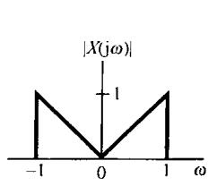

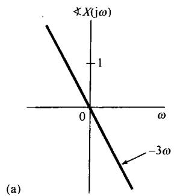

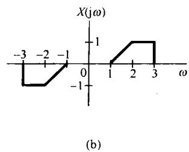

图P4.22

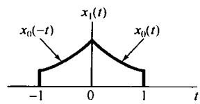

(a)

(b)

(c)

(d)

图P4.23

4.24 (a) 图 P4.24 中所示实信号有哪些（如果有），其傅里叶变换满足下列性质中的哪一项：

(1)  $\mathcal{R}e\{X(j\omega)\} = 0$

(2)  $\mathbf{Im}\{X(\mathrm{j}\omega)\} = 0$

（3）存在一个实数  $\alpha$  ，使  $\mathrm{e}^{\mathrm{j}\omega X}(\mathrm{j}\omega)$  为实函数。

(4)  $\int_{-\infty}^{\infty} X(j\omega)\mathrm{d}\omega = 0$

(5)  $\int_{-\infty}^{\infty}\omega X(j\omega)\mathrm{d}\omega = 0$

(6)  $X(\mathrm{j}\omega)$  是周期的。

(b) 构造一个信号，它具有上述性质(1)，(4)和(5)，但没有其余性质。

4.25 设  $X(\mathrm{j}\omega)$  为图P4.25信号  $x(t)$  的傅里叶变换：

(a) 求  $\angle X(j\omega)$

(b) 求  $X(j0)$

（c）求  $\int_{-\infty}^{\infty} X(\mathrm{j}\omega) \, \mathrm{d}\omega$

(d) 计算  $\int_{-\infty}^{\infty} X(j\omega)\frac{2\sin\omega}{\omega}\mathrm{e}^{j2\omega}\mathrm{d}\omega$

(e) 计算  $\int_{-\infty}^{\infty} |X(\mathrm{j}\omega)|^{2} \mathrm{d}\omega$

(f) 画出  $\mathcal{R}e\{X(\mathrm{j}\omega)\}$  的逆变换。

注意：不必具体算出  $X(\mathrm{j}\omega)$  就应能完成以上全部计算。

(a)

(b)

(c)

(d)

(e)

(f)

图P4.24

4.26 (a) 利用卷积性质和逆变换，用计算  $X(\mathrm{j}\omega)$  和  $H(\mathrm{j}\omega)$  求下列各对信号  $x(t)$  和  $h(t)$  的卷积：

(1)  $x(t) = t\mathrm{e}^{-2t}u(t),h(t) = \mathrm{e}^{-4t}u(t)$

(2)  $x(t) = t\mathrm{e}^{-2t}u(t),h(t) = t\mathrm{e}^{-4t}u(t)$

(3)  $x(t) = \mathrm{e}^{-t}u(t),h(t) = \mathrm{e}^{t}u(-t)$

(b) 假设  $x(t) = \mathrm{e}^{-(t - 2)}u(t - 2)$ ， $h(t)$  如图P4.26所示，对这一对信号，通过证明  $y(t) = x(t)*h(t)$  的傅里叶变换等于  $H(\mathrm{j}\omega)X(\mathrm{j}\omega)$  来验证卷积性质。

图P4.25

4.27 考虑信号

$$
x (t) = u (t - 1) - 2 u (t - 2) + u (t - 3)
$$

和

$$
\tilde {x} (t) = \sum_ {k = - \infty} ^ {\infty} x (t - k T)
$$

图P4.26

其中  $T > 0$  。令  $a_{k}$  记为  $\tilde{x}(t)$  的傅里叶级数系数， $X(\mathrm{j}\omega)$  为  $x(t)$  的傅里叶变换。

(a) 求  $X(\mathrm{j}\omega)$  的闭式表达式。

(b) 求傅里叶系数  $a_{k}$  的表达式，并验证  $a_{k} = \frac{1}{T} X\left(\mathrm{j}\frac{2\pi k}{T}\right)$ 。

4.28 (a) 设  $x(t)$  有傅里叶变换  $X(\mathrm{j}\omega)$ ，令  $p(t)$  为基波频率  $\omega_0$  的周期信号，其傅里叶级数表示是

$$
p (t) = \sum_ {n = - \infty} ^ {+ \infty} a _ {n} \mathrm {e} ^ {\mathrm {j} n \omega_ {0} t}
$$

求

$$
y (t) = x (t) p (t) \tag {P4.28-1}
$$

的傅里叶变换表示式。

(b) 设  $X(\mathrm{j}\omega)$  如图P4.28(a)所示，对下列每一个  $p(t)$  画出式(P4.28-1)中  $y(t)$  的频谱：

(1)  $p(t) = \cos (t / 2)$

(2)  $p(t) = \cos t$

(3)  $p(t) = \cos 2t$

(4)  $p(t) = (\sin t)(\sin 2t)$

(5)  $p(t) = \cos 2t - \cos t$

(6)  $p(t) = \sum_{n = -\infty}^{+\infty}\delta (t - \pi n)$

(7)  $p(t) = \sum_{n = -\infty}^{+\infty}\delta (t - 2\pi n)$

(8)  $p(t) = \sum_{n = -\infty}^{+\infty}\delta (t - 4\pi n)$

(9)  $p(t) = \sum_{n = -\infty}^{+\infty}\delta (t - 2\pi n) - \frac{1}{2}\sum_{n = -\infty}^{+\infty}\delta (t - \pi n)$

(10)  $p(t)$  为图P4.28(b)所示周期方波。

(a)

(b)

图P4.28

4.29 一个实值连续时间函数  $x(t)$  有傅里叶变换  $X(\mathrm{j}\omega)$ ，其模与相位如图P4.29(a)所示。

函数  $x_{a}(t), x_{b}(t), x_{c}(t)$  和  $x_{d}(t)$  都有傅里叶变换，它们的模都与  $X(\mathrm{j}\omega)$  的模完全相同，但相位不同，分别如图P4.29(b)至图P4.29(e)所示。相位函数  $\angle X_{a}(\mathrm{j}\omega)$  和  $\angle X_{b}(\mathrm{j}\omega)$  是通过给  $\angle X(\mathrm{j}\omega)$  附加一个线性相位而形成的；相位函数  $\angle X_{c}(\mathrm{j}\omega)$  是把  $\angle X(\mathrm{j}\omega)$  关于  $\omega = 0$  反转得来的；而  $\angle X_{d}(\mathrm{j}\omega)$  则是把反转和附加线性相位结合在一起得到的。利用傅里叶变换性质，确定用  $x(t)$  表示  $x_{a}(t), x_{b}(t), x_{c}(t)$  和  $x_{d}(t)$  的表示式。

4.30 假设  $g(t) = x(t)\cos t$  ，而  $g(t)$  的傅里叶变换是

$$
G (\mathrm {j} \omega) = \left\{ \begin{array}{l l} 1, & | \omega | \leqslant 2 \\ 0, & \text {其 他} \end{array} \right.
$$

(a) 求  $x(t)$

(b) 若有

$$
g (t) = x _ {1} (t) \cos \left(\frac {2}{3} t\right)
$$

试标明  $x_{1}(t)$  的傅里叶变换  $X_{1}(\mathrm{j}\omega)$  。

4.31 (a) 证明下面三个不同单位冲激响应的线性时不变系统：

$$
h _ {1} (t) = u (t)
$$

$$
h _ {2} (t) = - 2 \delta (t) + 5 \mathrm {e} ^ {- 2 t} u (t)
$$

和

$$
h _ {3} (t) = 2 t \mathrm {e} ^ {- t} u (t)
$$

对输入为  $x(t) = \cos t$  的响应全都一样。

（b）求另一个线性时不变系统的单位冲激响应，它对  $\cos t$  的响应也相同。

这道题说明，对  $\cos t$  的响应不能唯一用来标定一个线性时不变系统。

4.32 考虑一个线性时不变系统  $S$ ，其单位冲激响应为

$$
h (t) = \frac {\sin (4 (t - 1))}{\pi (t - 1)}
$$

求系统  $S$  对下面每个输入信号的输出：

(a)  $x_{1}(t) = \cos \left(6t + \frac{\pi}{2}\right)$

(b)  $x_{2}(t) = \sum_{k = 0}^{\infty}\left(\frac{1}{2}\right)^{k}\sin (3kt)$

(c)  $x_{3}(t) = \frac{\sin(4(t + 1))}{\pi(t + 1)}$

(d)  $x_4(t) = \left(\frac{\sin 2t}{\pi t}\right)^2$

(a)

(b)

(c)

(d)

(e)

图P4.29

4.33 一个因果线性时不变系统的输入和输出，由下列微分方程表征：

$$
\frac {\mathrm {d} ^ {2} y (t)}{\mathrm {d} t ^ {2}} + 6 \frac {\mathrm {d} y (t)}{\mathrm {d} t} + 8 y (t) = 2 x (t)
$$

(a) 求该系统的单位冲激响应。

(b) 若  $x(t) = t\mathrm{e}^{-2t}u(t)$ , 该系统的响应是什么?

（c）对于由下列方程描述的因果线性时不变系统，重做(a)：

$$
\frac {\mathrm {d} ^ {2} y (t)}{\mathrm {d} t ^ {2}} + \sqrt {2} \frac {\mathrm {d} y (t)}{\mathrm {d} t} + y (t) = 2 \frac {\mathrm {d} ^ {2} x (t)}{\mathrm {d} t ^ {2}} - 2 x (t)
$$

# 4.34 一个因果稳定线性时不变系统  $S$ ，有频率响应为

$$
H (\mathrm {j} \omega) = \frac {\mathrm {j} \omega + 4}{6 - \omega^ {2} + 5 \mathrm {j} \omega}
$$

(a) 写出关联系统  $S$  输入  $x(t)$  和输出  $y(t)$  的微分方程。

(b) 求该系统  $S$  的单位冲激响应  $h(t)$ 。

(c) 若输入  $x(t)$  为

$$
x (t) = \mathrm {e} ^ {- 4 t} u (t) - t \mathrm {e} ^ {- 4 t} u (t)
$$

求系统的输出。

4.35 在本题中给出有关相位非线性变化产生的影响的几个例子。

(a) 有一个连续时间线性时不变系统，其频率响应为

$$
H (\mathrm {j} \omega) = \frac {a - \mathrm {j} \omega}{a + \mathrm {j} \omega}
$$

其中  $a > 0$  。问  $H(\mathrm{j}\omega)$  的模是什么？  $\nless H(\mathrm{j}\omega)$  是什么？该系统的单位冲激响应是什么？

(b) 若在(a)中， $a = 1$ ，当输入为

$$
\cos (t / \sqrt {3}) + \cos t + \cos \sqrt {3} t
$$

时，求该系统的输出。大致画出输入和输出。

4.36 考虑一个线性时不变系统，输入  $x(t)$  为

$$
x (t) = \left[ e ^ {- t} + e ^ {- 3 t} \right] u (t)
$$

响应  $y(t)$  是

$$
y (t) = [ 2 \mathrm {e} ^ {- t} - 2 \mathrm {e} ^ {- 4 t} ] u (t)
$$

(a) 求系统的频率响应。

(b) 确定该系统的单位冲激响应。

（c）求关联该系统输入和输出的微分方程。

# 深入题

4.37 考虑示于图P4.37的信号  $x(t)$

(a) 求  $x(t)$  的傅里叶变换  $X(\mathrm{j}\omega)$ 。

（b）概略画出信号

$$
\tilde {x} (t) = x (t) * \sum_ {k = - \infty} ^ {\infty} \delta (t - 4 k)
$$

(c) 找另一个  $g(t)$ ,  $g(t)$  不同于  $x(t)$ , 而有

$$
\bar {x} (t) = g (t) * \sum_ {k = - \infty} ^ {\infty} \delta (t - 4 k)
$$

图P4.37

(d) 证明: 虽然  $G(\mathrm{j}\omega)$  不同于  $X(\mathrm{j}\omega)$ , 但是对全部整数  $k$  有  $G\left(\mathrm{j}\frac{\pi k}{2}\right) = X\left(\mathrm{j}\frac{\pi k}{2}\right)$ 。不必经由算出  $G(\mathrm{j}\omega)$  来回答此题。

4.38 设  $x(t)$  为任意信号，其傅里叶变换为  $X(\mathrm{j}\omega)$  。傅里叶变换的频移性质可陈述为

$$
\mathrm {e} ^ {\mathrm {j} \omega_ {0} t} x (t) \xleftarrow {\mathcal {F}} X (\mathrm {j} (\omega - \omega_ {0}))
$$

(a) 对分析公式

$$
X (\mathrm {j} \omega) = \int_ {- \infty} ^ {\infty} x (t) \mathrm {e} ^ {- \mathrm {j} \omega t} \mathrm {d} t
$$

施加频率偏移来证明频移性质。

（b）利用  $\mathrm{e}^{\mathrm{j}\omega_0t}$  的傅里叶变换，再与傅里叶变换的相乘性质结合起来证明频移性质。

4.39 假设一个信号  $x(t)$  有傅里叶变换  $X(\mathrm{j}\omega)$ ，现考虑另一信号  $g(t)$ ，它的形状与  $X(\mathrm{j}\omega)$  的形状完全相同，即

$$
g (t) = X (\mathrm {j} t)
$$

(a) 证明:  $g(t)$  的傅里叶变换  $G(\mathrm{j}\omega)$  有与  $2\pi x(-t)$  同样的形状, 也即要证明

$$
G (j \omega) = 2 \pi x (- \omega)
$$

(b) 利用

$$
\mathcal {F} \{\delta (t + B) \} = \mathrm {e} ^ {\mathrm {j} B \omega}
$$

再结合(a)中的结果，证明：

$$
\mathcal {F} \left\{\mathrm {e} ^ {\mathrm {i} B t} \right\} = 2 \pi \delta (\omega - B)
$$

4.40 利用傅里叶变换性质，用归纳法证明：

$$
x (t) = \frac {t ^ {n - 1}}{(n - 1) !} \mathrm {e} ^ {- a t} u (t), \quad a > 0
$$

的傅里叶变换是

$$
\frac {1}{(a + j \omega) ^ {n}}
$$

4.41 本题要导出连续时间傅里叶变换的相乘性质。令  $x(t)$  和  $y(t)$  是两个连续时间信号，其傅里叶变换分别为  $X(\mathrm{j}\omega)$  和  $Y(\mathrm{j}\omega)$  。同时，令  $g(t)$  是  $\frac{1}{2\pi} \{X(\mathrm{j}\omega)*Y(\mathrm{j}\omega)\}$  的傅里叶逆变换。

(a) 证明：

$$
g (t) = \frac {1}{2 \pi} \int_ {- \infty} ^ {+ \infty} X (\mathrm {j} \theta) \left[ \frac {1}{2 \pi} \int_ {- \infty} ^ {+ \infty} Y (\mathrm {j} (\omega - \theta)) \mathrm {e} ^ {\mathrm {j} \omega t} \mathrm {d} \omega \right] \mathrm {d} \theta
$$

（b）证明：

$$
\frac {1}{2 \pi} \int_ {- \infty} ^ {+ \infty} Y (\mathrm {j} (\omega - \theta)) \mathrm {e} ^ {\mathrm {j} \omega t} \mathrm {d} \omega = \mathrm {e} ^ {\mathrm {j} \theta t} y (t)
$$

(c) 将 (a) 和 (b) 中的结果结合起来得出

$$
g (t) = x (t) y (t)
$$

4.42 令

$$
g _ {1} (t) = \left\{\left[ \cos \left(\omega_ {0} t\right) \right] x (t) \right\} * h (t) \quad \text {和} \quad g _ {2} (t) = \left\{\left[ \sin \left(\omega_ {0} t\right) \right] x (t) \right\} * h (t)
$$

其中，

$$
x (t) = \sum_ {k = - \infty} ^ {\infty} a _ {k} \mathrm {e} ^ {\mathrm {j} k 1 0 0 t}
$$

是一个实值周期信号，  $h(t)$  是一个稳定的线性时不变系统的单位冲激响应。

(a) 给出某一  $\omega_0$  值，并在  $H(\mathrm{j}\omega)$  上给予任何必要的限制，以保证

$$
g _ {1} (t) = \mathcal {R e} \{a _ {5} \} \qquad \text {和} \qquad g _ {2} (t) = I m \{a _ {5} \}
$$

(b) 给出  $h(t)$  的一个例子，以使  $H(\mathrm{j}\omega)$  满足在(a)中所给定的限制。

4.43 令

$$
g (t) = x (t) \cos^ {2} t * \frac {\sin t}{\pi t}
$$

假定  $x(t)$  是实信号，并且  $X(\mathrm{j}\omega) = 0$  ，  $\left|\omega \right|\geqslant 1$  。证明存在一个线性时不变系统  $S$  ，使之有

$$
x (t) \xrightarrow {S} g (t)
$$

4.44 一个因果线性时不变系统的输入  $x(t)$  和输出  $y(t)$  的关系由下列方程给出：

$$
\frac {\mathrm {d} y (t)}{\mathrm {d} t} + 1 0 y (t) = \int_ {- \infty} ^ {+ \infty} x (\tau) z (t - \tau) \mathrm {d} \tau - x (t)
$$

其中  $z(t) = \mathrm{e}^{-t}u(t) + 3\delta (t)$

(a) 求该系统的频率响应  $H(\mathrm{j}\omega) = Y(\mathrm{j}\omega) / X(\mathrm{j}\omega)$ 。

(b) 求该系统的单位冲激响应。

4.45 在4.3.7节讨论连续时间信号的帕斯瓦尔定理时，可看到

$$
\int_ {- \infty} ^ {+ \infty} | x (t) | ^ {2} d t = \frac {1}{2 \pi} \int_ {- \infty} ^ {+ \infty} | X (\mathrm {j} \omega) | ^ {2} d \omega
$$

表明信号中的总能量可以通过在全部频率积分  $|X(\mathrm{j}\omega)|^2$  来求得。现在考虑一个实值信号  $\pmb{x}(t)$  经由图P4.45的理想带通滤波器处理后得输出信号  $y(t)$ ，试将  $y(t)$  的能量用  $|X(\mathrm{j}\omega)|^2$  在频率上的积分来表示。对于足够小的  $\Delta$ ，以使  $|X(\mathrm{j}\omega)|$  在宽度为  $\Delta$  的频率区间内近似为一常数，证明该带通滤波器输出  $y(t)$  的能量近似正比于  $\Delta |X(\mathrm{j}\omega_0)|^2$ 。

基于上述结论， $\Delta |X(\mathrm{j}\omega_0)|^2$  正比于该信号在以  $\omega_0$  为中心，带宽为  $\Delta$  内的能量。为此， $|X(\mathrm{j}\omega)|^2$  往往称为信号  $x(t)$  的能量密度谱（energy-density spectrum）。

图P4.45

4.46 在 4.5.1 节曾讨论过用复指数载波的幅度调制来实现一个带通滤波器，对于图 4.26 这样的系统，若仅保留  $f(t)$  的实部，其等效带通滤波器就如图 4.30 所示。

在图P4.46中示出利用正弦调制和低通滤波器实现一个带通滤波器的原理图。证明该系统的输出  $y(t)$  与图4.26仅保留  $\mathcal{Re}\{f(t)\}$  所得到的输出是一样的。

4.47 具有实的因果单位冲激响应  $h(t)$  的连续时间线性时不变系统的频率响应  $H(\mathrm{j}\omega)$  的一个重要性质是 $H(\mathrm{j}\omega)$  可完全由它的实部  $\mathcal{Re}\{H(\mathrm{j}\omega)\}$  来表征。这一特性通常称为实部自满特性(real-part sufficiency）。本题所关心的是导出并研究这一特性的某些内涵。

(a) 通过研究信号  $h(t)$  的偶部  $h_e(t)$  来证明实部自满特性。 $h_e(t)$  的傅里叶变换是什么？指出如何能从  $h_e(t)$  来得到  $h(t)$ 。

(b) 若一个因果系统频率响应的实部是

$$
\mathcal {R e} \{H (j \omega) \} = \cos \omega
$$

那么，  $h(t)$  是什么？

(c) 证明: 除了  $t = 0$  外, 对一切  $t$  值, 都能够从  $h(t)$  的奇部  $h_{\circ}(t)$  得到  $h(t)$  。注意, 如果  $h(t)$  在  $t = 0$  不包含任何奇异函数  $[\delta(t), u_1(t), u_2(t)$ , 等等], 那么频率响应

$$
H (j \omega) = \int_ {- \infty} ^ {+ \infty} h (t) e ^ {- j \omega t} d t
$$

图P4.46

将不因  $h(t)$  在  $t = 0$  这一点置于任意有限值而改变。从而，在这种情况下，证明  $H(\mathrm{j}\omega)$  也完全由它的虚部来确定。

# 扩充题

4.48 现在考虑一个实的因果单位冲激响应  $h(t)$  的系统，并假定  $h(t)$  在  $t = 0$  没有任何奇异性。在习题4.47中已看到，无论  $H(\mathrm{j}\omega)$  的实部或虚部都能完全确定  $H(\mathrm{j}\omega)$  。在本题将导出  $H(\mathrm{j}\omega)$  的实部  $H_{R}(\mathrm{j}\omega)$  和虚部 $H_{I}(\mathrm{j}\omega)$  之间的明确关系。

(a) 首先由于  $h(t)$  是因果的，因而可能除去  $t = 0$  以外，有

$$
h (t) = h (t) u (t) \tag {P4.48-1}
$$

现在，因为  $h(t)$  在  $t = 0$  不包含任何奇异函数，所以式(P4.48-1)两边的傅里叶变换必是恒等。根据这一点再结合相乘性质。证明：

$$
H (\mathrm {j} \omega) = \frac {1}{\mathrm {j} \pi} \int_ {- \infty} ^ {+ \infty} \frac {H (\mathrm {j} \eta)}{\omega - \eta} \mathrm {d} \eta \tag {P4.48-2}
$$

利用式(P4.48-2)确定用  $H_{I}(\mathrm{j}\omega)$  来表示  $H_{R}(\mathrm{j}\omega)$  的表示式，以及用  $H_{R}(\mathrm{j}\omega)$  来表示  $H_{I}(\mathrm{j}\omega)$  的表示式。

$$
y (t) = \frac {1}{\pi} \int_ {- \infty} ^ {+ \infty} \frac {x (\tau)}{t - \tau} d \tau \tag {P4.48-3}
$$

这种运算称为希尔伯特变换（Hilbert transform）。刚才已经看到，对一个实的因果单位冲激响应  $h(t)$ ，其傅里叶变换的实部和虚部可以互相利用希尔伯特变换来确定。

现在考虑式(P4.48-3)，并认为  $y(t)$  是一个线性时不变系统对输入  $\pmb{x}(t)$  的输出。证明该系统的频率响应是

$$
H (\mathrm {j} \omega) = \left\{ \begin{array}{l l} - \mathrm {j}, & \omega > 0 \\ \mathrm {j}, & \omega <   0 \end{array} \right.
$$

(c) 信号  $x(t) = \cos 3t$  的希尔伯特变换是什么？

4.49 设  $H(\mathrm{j}\omega)$  是一个连续时间线性时不变系统的频率响应，并假定  $H(\mathrm{j}\omega)$  是实偶函数且为正值。同时还假定

$$
\max  _ {\omega} \{H (\mathrm {j} \omega) \} = H (0)
$$

(a) 证明: (i) 单位冲激响应  $h(t)$  是实的。

(ii)  $\max \left\{\mid h(t)\mid \right\} = h(0)$

[提示：若  $f(t,\omega)$  是两个变量的复函数，则

$$
\left| \int_ {- \infty} ^ {+ \infty} f (t, \omega) \mathrm {d} \omega \right| \leqslant \int_ {- \infty} ^ {+ \infty} | f (t, \omega) | \mathrm {d} \omega
$$

(b) 在系统分析中, 一个重要的概念是线性时不变系统的带宽。有几个不同的方式来定义带宽, 但它们都与这样一个定性的和直观的概念有关, 即频率响应为  $G(\mathrm{j}\omega)$  的系统, 在  $G(\mathrm{j}\omega)$  为零或较小的那些  $\omega$  值上能基本“阻止”形式为  $\mathrm{e}^{\mathrm{j}\omega t}$  的信号, 而在  $G(\mathrm{j}\omega)$  较大的频带内则能够让这些复指数信号“通过”, 这一频带的宽度就是带宽。这些概念在第 6 章将变得更为清楚。但是现在将研究带宽的一种特殊定义, 这个定义对于具有上面所规定的  $H(\mathrm{j}\omega)$  特性的频率响应的系统是合适的。具体而言, 这种系统的带宽  $B_{w}$  的一种定义是, 把高度为  $H(\mathrm{j}0)$  的一个矩形的宽度作为带宽, 该矩形的面积等于  $H(\mathrm{j}\omega)$  下的面积。这可以用图 P4.49(a) 说明。注意, 由于  $H(\mathrm{j}0) = \max_{\omega} H(\mathrm{j}\omega)$ , 因此图中所指出的位于频带内的那些频率就是  $H(\mathrm{j}\omega)$  最大的那些频率。在这个图中, 当然, 宽度的严格选取是有点任意性的, 但是已经选择了一种定义, 就能够在不同的系统之间进行比较, 并使时间和频率之间的一种很重要的关系更精确。

频率响应为

$$
H (\mathrm {j} \omega) = \left\{ \begin{array}{l l} 1, & \quad | \omega | <   W \\ 0, & \quad | \omega | > W \end{array} \right.
$$

的系统，其带宽为什么？

（c）求出用  $H(\mathrm{j}\omega)$  表示带宽  $B_{w}$  的表示式。

(d) 设  $s(t)$  代表(a)中所设定系统的阶跃响应。对一个系统的响应速率的重要度量是上升时间（rise time）。与带宽一样，上升时间也是一个定性概念，从而可能导致许多数学上不同的定义，在此将使用其中的一种。直观上看，一个系统的上升时间是其阶跃响应从零上升到它的终值

$$
s (\infty) = \lim  _ {t \rightarrow \infty} s (t)
$$

有多快的一种度量。因而，上升时间越小，该系统的响应就越快。对于在本题中所考虑的系统，将上升时间  $t_r$  定义为

$$
t _ {r} = \frac {s (\infty)}{h (0)}
$$

因为

$$
s ^ {\prime} (t) = h (t)
$$

又因为有  $h(0) = \max_t h(t)$  这一性质，所以可以把  $t_r$  看成这样一个时间，即：在保持  $s(t)$  的最大变化率的情况下， $s(t)$  由零上升到  $s(\infty)$  所需的时间，这就如图 P4.49(b) 所说明的。求用  $H(\mathrm{j}\omega)$  表示  $t_r$  的表达式。

(e) 将 (c) 和 (d) 的结果结合起来, 证明:

$$
\boldsymbol {B} _ {w} \boldsymbol {t} _ {r} = 2 \pi \tag {P4.49-1}
$$

因此，我们不能独立地既要求系统有一定的上升时间，又要求有一定的带宽。例如，如果要求一个快速响应的系统  $(t_r$  小)，那么式(P4.49-1)就意味着该系统必须有较大的带宽。这是一个基本的折中关系，这一点在许多系统设计中是最为核心的问题。

图P4.49

4.50 在习题1.45和习题2.67中，曾定义并研究了相关函数的几个性质和用途。在本题中将考虑这些函数在频域的性质。设  $x(t)$  和  $y(t)$  是两个实信号，那么  $x(t)$  和  $y(t)$  的互相关函数就定义为

$$
\phi_ {x y} (t) = \int_ {- \infty} ^ {+ \infty} x (t + \tau) y (\tau) d \tau
$$

类似地，也可以定义  $\phi_{yx}(t)$ ， $\phi_{xx}(t)$  和  $\phi_{yy}(t)$ ，后两个分别称为  $x(t)$  和  $y(t)$  的自相关函数。设  $\Phi_{yx}(\mathrm{j}\omega)$ ， $\Phi_{yx}(\mathrm{j}\omega)$ ， $\Phi_{xx}(\mathrm{j}\omega)$  和  $\Phi_{yy}(\mathrm{j}\omega)$  分别代表  $\phi_{xy}(t)$ ， $\phi_{yx}(t)$ ， $\phi_{xx}(t)$  和  $\phi_{yy}(t)$  的傅里叶变换。

(a)  $\Phi_{xy}(\mathrm{j}\omega)$  和  $\Phi_{yx}(\mathrm{j}\omega)$  之间的关系是什么？

(b) 求出用  $X(\mathrm{j}\omega)$  和  $Y(\mathrm{j}\omega)$  表示  $\Phi_{xy}(\mathrm{j}\omega)$  的表达式。

（c）证明：对一切  $\omega$  ，  $\Phi_{xx}(\mathrm{j}\omega)$  是非负实函数。

(d) 现在假设  $x(t)$  是一个线性时不变系统的输入,  $y(t)$  为输出, 该系统的单位冲激响应为实数值, 频率响应为  $H(\mathrm{j}\omega)$  。求出用  $\Phi_{xx}(\mathrm{j}\omega)$  和  $H(\mathrm{j}\omega)$  表示  $\Phi_{yy}(\mathrm{j}\omega)$  和  $\Phi_{xy}(\mathrm{j}\omega)$  的表示式。

(e) 设  $x(t)$  如图 P4.50 所示, 线性时不变系统的单位冲激响应为  $h(t) = \mathrm{e}^{-\alpha t} u(t)$ ,  $a > 0$ , 利用 (a) 至 (d) 的结果计算  $\Phi_{xx}(\mathrm{j}\omega)$ ,  $\Phi_{xy}(\mathrm{j}\omega)$  和  $\Phi_{yy}(\mathrm{j}\omega)$ 。

(f) 假设已知函数  $\phi(t)$  的傅里叶变换为

$$
\Phi (\mathrm {j} \omega) = \frac {\omega^ {2} + 1 0 0}{\omega^ {2} + 2 5}
$$

求出两个因果稳定线性时不变系统的单位冲激响应，它们的自相关函数都等于  $\phi (t)$  。这两个系统中，哪一个具有因果稳定的逆系统？

图P4.50

4.51 (a) 考虑两个线性时不变系统, 其单位冲激响应分别为  $h(t)$  和  $g(t)$ , 假设这两个系统是彼此互逆的, 而且它们的频率响应分别记为  $H(\mathrm{j}\omega)$  和  $G(\mathrm{j}\omega)$  。试问  $H(\mathrm{j}\omega)$  和  $G(\mathrm{j}\omega)$  之间的关系是什么?

(b) 有一个连续时间线性时不变系统, 其频率响应为

$$
H (\mathrm {j} \omega) = \left\{ \begin{array}{l l} 1, & 2 <   | \omega | <   3 \\ 0, & \text {其 他} \end{array} \right.
$$

(i) 对该系统能够找到一个输入  $x(t)$ , 使得输出如图 P4.50 所示吗? 如果能, 请找出这样的  $x(t)$ ; 若不能, 请说明理由。

（ii）该系统是可逆的吗？请说明理由。

(c) 考虑一个有回声问题的会场。正如在习题2.64中所讨论的，可以把会场的声学机理作为一个线性时不变系统来建立其模型，该系统的单位冲激响应由一冲激串组成，其中第  $k$  个冲激就对应于第  $k$  次回声。假定在此特定情况下，单位冲激响应是

$$
h (t) = \sum_ {k = 0} ^ {\infty} \mathrm {e} ^ {- k T} \delta (t - k T)
$$

其中因子  $\mathbf{e}^{-kT}$  表示第  $k$  次回声的衰减。

为了获得高质量的舞台录音效果，必须对录制设备所检测到的声音进行某些处理，以消除回声的影响。在习题2.64中，曾有用卷积的方法设计此类处理器的例子(对某一个不同的声学模型)。在本题中，将用频域的方法来考虑这一问题。设  $G(\mathrm{j}\omega)$  代表用来处理检测到的声音信号的线性时不变系统的频率响应。试选取  $G(\mathrm{j}\omega)$ ，使得回声完全被消除，而得到的信号是原来舞台声音的准确再现。

(d) 求单位冲激响应为

$$
h (t) = 2 \delta (t) + u _ {1} (t)
$$

系统的逆系统的微分方程。

(e) 一个初始松弛且由下列微分方程描述的线性时不变系统：

$$
\frac {\mathrm {d} ^ {2} y (t)}{\mathrm {d} t ^ {2}} + 6 \frac {\mathrm {d} y (t)}{\mathrm {d} t} + 9 y (t) = \frac {\mathrm {d} ^ {2} x (t)}{\mathrm {d} t ^ {2}} + 3 \frac {\mathrm {d} x (t)}{\mathrm {d} t} + 2 x (t)
$$

该系统的逆系统也是初始松弛的，而且也可以用一个微分方程来描述。求出描述这个逆系统的微分方程，并求出原来系统的单位冲激响应  $h(t)$  和它的逆系统的单位冲激响应  $g(t)$  。

4.52 在涉及性能不完善的测量装置的问题中，往往会发现逆系统的应用。例如，考虑一个测量液体温度的装置，由于测量元件(如温度计中的水银)的响应特性，系统不能对温度的变化做出瞬时响应，因此通常将它作为一个线性时不变系统来建模是合理的。假定这个装置对温度的单位阶跃响应为

$$
s (t) = \left(1 - e ^ {- t / 2}\right) u (t) \tag {P4.52-1}
$$

(a) 设计一个补偿系统，当把测量装置的输出提供给该系统时，它产生的输出等于液体的瞬时温度。

(b) 在把逆系统作为测量装置的补偿器时，常常发生的一个问题是：如果由于装置内微小而无规律的一些现象致使测量装置的实际输出包含有误差，就可能会发生很大的读数误差。由于在实际系统中，这种误差源总是存在的，因此就必须要考虑它们。为了说明这一点，现研究一个测量装置，它的总输出可以用式(P4.52-1)所表示的测量装置的响应与干扰“噪声”信号  $n(t)$  之和来模拟。这样一个模型示于图P4.52(a)中，图中也包括了逆系统，该系统以测量装置的总输出作为输入。假定  $n(t) = \sin \omega t$ ，那么  $n(t)$  对逆系统的输出有什么影响？随着  $\omega$  的增加，这个输出又如何变化？

(c) 在(b)中所提出的问题在许多线性时不变系统分析应用中是一个很重要的问题。具体而言，要在系统的响应速度和系统抑制高频干扰的能力之间进行基本的折中。在(b)中看到，这种折中意味着如果试图提高测量装置的响应速度(利用一个逆系统)，那么也就产生了一个把那些不需要的正弦信号也放大了的系统。为了进一步说明这一概念，考虑一个测量装置，它对被噪声污损了的温度变化做出瞬时响应。这个系统的响应可以用图P4.52(b)的模型来表示，即它的响应可以用理想化的测量装置的响应与污损信号  $n(t)$  之和表示。假如我们希望设计一个补偿系统，该系统将减慢对实际温度变化的响应，并且也衰减了噪声  $n(t)$  。设这个补偿系统的单位冲激响应是

$$
h (t) = a \mathrm {e} ^ {- a t} u (t)
$$

选择  $a$  ，使得图P4.52(b)的总系统在对噪声  $n(t) = \sin 6t$  所产生的输出幅度不大于1/4的条件下，对温度阶跃变化的响应尽可能快。

(a)

(b)

图P4.52

4.53 正如在正文中所提到的，傅里叶分析方法可推广到具有两个独立变量的信号。在某些应用（如图像处理）中，这些方法所起的重要作用，就像一维傅里叶变换在其他应用中所起的作用一样。在本题中将介绍二维傅里叶变换的一些基本概念。

设  $x(t_{1},t_{2})$  是两个独立变量  $t_1$  和  $t_2$  的信号，其二维傅里叶变换定义为

$$
X (\mathrm {j} \omega_ {1}, \mathrm {j} \omega_ {2}) = \int_ {- \infty} ^ {+ \infty} \int_ {- \infty} ^ {+ \infty} x (t _ {1}, t _ {2}) \mathrm {e} ^ {- \mathrm {j} (\omega_ {1} t _ {1} + \omega_ {2} t _ {2})} \mathrm {d} t _ {1} \mathrm {d} t _ {2}
$$

(a) 证明这个二重积分可以按照两个逐次一维傅里叶变换来进行，即先对  $t_1$  进行变换而把  $t_2$  看成固定值，然后再对  $t_2$  进行变换。

(b) 利用(a)的结果，求逆变换式，即用  $X(\mathrm{j}\omega_{1},\mathrm{j}\omega_{2})$  来表示  $x(t_{1},t_{2})$  的表达式。

(c) 求下列信号的二维傅里叶变换：

(1)  $x(t_{1},t_{2}) = \mathrm{e}^{-t_{1} + 2t_{2}}u(t_{1} - 1)u(2 - t_{2})$

(2)  $x(t_{1},t_{2}) = \left\{ \begin{array}{ll}\mathrm{e}^{-|t_{1}| - |t_{2}|}, & -1 <   t_{1}\leqslant 1\\ 0, & \text{其他} \end{array} \right.$  且  $-1\leqslant t_2\leqslant 1$

(3)  $x(t_{1},t_{2}) = \left\{ \begin{array}{ll}\mathbf{e}^{-|t_{1}| - |t_{2}|}, & 0\leqslant t_{1}\leqslant 1\\ 0, & \text{其他} \end{array} \right.$  或  $0\leqslant t_2\leqslant 1$  （或两者兼有）

(4)  $x(t_{1},t_{2})$  如图P4.53所示。

(5)  $\mathrm{e}^{-|t_1 + t_2| - |t_1 - t_2|}$

图P4.53

(d) 已知信号  $x(t_{1}, t_{2})$  的二维傅里叶变换是

$$
X (\mathrm {j} \omega_ {1}, \mathrm {j} \omega_ {2}) = \frac {2 \pi}{4 + \mathrm {j} \omega_ {1}} \delta (\omega_ {2} - 2 \omega_ {1})
$$

求  $x(t_{1},t_{2})$  。

(e) 设  $x(t_{1}, t_{2})$  和  $h(t_{1}, t_{2})$  是两个信号，其二维傅里叶变换分别为  $X(\mathrm{j}\omega_{1}, \mathrm{j}\omega_{2})$  和  $H(\mathrm{j}\omega_{1}, \mathrm{j}\omega_{2})$  。用  $X(\mathrm{j}\omega_{1}, \mathrm{j}\omega_{2})$  和  $H(\mathrm{j}\omega_{1}, \mathrm{j}\omega_{2})$  确定下列信号的变换：

(1)  $x(t_{1} - T_{1}, t_{2} - T_{2})$

(2)  $x(at_{1}, bt_{2})$

(3)  $y(t_{1}, t_{2}) = \int_{-\infty}^{+\infty} \int_{-\infty}^{+\infty} x(\tau_{1}, \tau_{2}) h(t_{1} - \tau_{1}, t_{2} - \tau_{2}) \, \mathrm{d}\tau_{1} \, \mathrm{d}\tau_{2}$