# 第5章 离散时间傅里叶变换

# 5.0 引言

第4章研究了连续时间傅里叶变换，并研究了这种变换的许多特性，这些特性使傅里叶分析方法在分析和理解连续时间信号与系统的性质时具有很大的价值。这一章将介绍并研究离散时间傅里叶变换，这样就完整地建立了傅里叶分析方法。

在第3章讨论傅里叶级数时，曾看到在连续时间和离散时间信号分析中存在着很多相类似的地方，并且在分析途径上也是并行的；然而，也有一些重大的差别。例如，在3.6节里，离散时间周期信号的傅里叶级数表示是一个有限项级数；而连续时间周期信号则要求用一个无穷项级数来表示。这一章将会看到，连续时间和离散时间傅里叶变换之间也存在着相应的差别。

这一章将基本上与第4章所采用的办法相同，即充分利用连续时间和离散时间傅里叶分析之间的类似性来展开讨论。具体而言，首先为了建立离散时间非周期信号的傅里叶变换表示，而将周期信号的傅里叶级数表示进行推广，接着采用与第4章相平行的做法，分析离散时间傅里叶变换的性质和特点。这样做不仅加深了对连续时间和离散时间所共有的傅里叶分析基本概念的理解，而且还对比了它们之间的差别，以更加突出对它们各自独特性质的理解。

# 5.1 非周期信号的表示：离散时间傅里叶变换

# 5.1.1 离散时间傅里叶变换的导出

在4.1节的式(4.2)和图4.2中曾经看到，一个连续时间周期方波的傅里叶级数可以看成一个包络函数的采样值，并且随着这个方波周期的增大，这些样本变得愈来愈密。这一性质就使人想到一个非周期信号  $x(t)$  可以这样来表示，即首先产生一个周期信号  $\tilde{x}(t)$ ，使  $\tilde{x}(t)$  在一个周期内等于  $x(t)$ ，然后随着这个周期趋于无限大， $\tilde{x}(t)$  就会在一个愈来愈大的时间间隔上等于  $x(t)$ ，这样对  $\tilde{x}(t)$  的傅里叶级数表示也就收敛于  $x(t)$  的傅里叶变换表示。在这一节，对离散时间非周期序列，为了建立它的傅里叶变换表示，将采用与在连续时间情况下完全类似的步骤进行。

考虑某一序列  $x[n]$ ，它具有有限持续期；也就是说，对于某个整数  $N_{1}$  和  $N_{2}$ ，在  $-N_{1} \leqslant n \leqslant N_{2}$  范围以外， $x[n] = 0$ 。图5.1(a)示出这种类型的一个信号。由这个非周期信号可以构成一个周期序列  $\tilde{x}[n]$ ，使得对  $\tilde{x}[n]$  来说  $x[n]$  是它的一个周期，如图5.1(b)所示。随着所选周期  $N$  的增大， $\tilde{x}[n]$  就在一个更长的时间间隔内与  $x[n]$  一样，而当  $N \to \infty$  时，对任意有限  $n$  值来说，有  $\tilde{x}[n] = x[n]$ 。

现在来考虑  $\tilde{x}[n]$  的傅里叶级数表示式。由式(3.94)和式(3.95)有

$$
\tilde {x} [ n ] = \sum_ {k = \langle N \rangle} a _ {k} \mathrm {e} ^ {\mathrm {j} k (2 \pi / N) n} \tag {5.1}
$$

$$
a _ {k} = \frac {1}{N} \sum_ {n = \langle N \rangle} \tilde {x} [ n ] e ^ {- j k (2 \pi / N) n} \tag {5.2}
$$

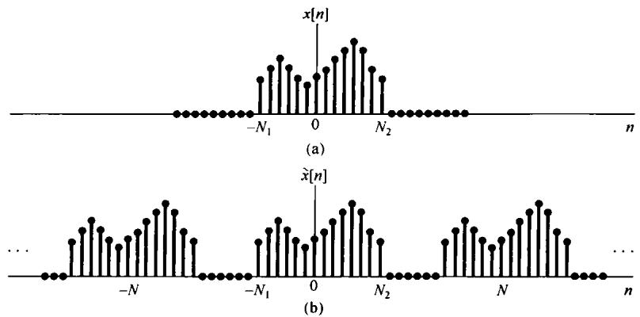

图5.1 (a) 有限长序列  $x[n]$ ; (b) 由  $x[n]$  构成的周期序列  $\bar{x}[n]$

因为在包括  $-N_{1} \leqslant n \leqslant N_{2}$  区间的一个周期上  $x[n] = \tilde{x}[n]$ ，因此在式(5.2)中，求和区间就选在这个周期上，这样在式(5.2)的求和中就可用  $x[n]$  来代替  $\tilde{x}[n]$ ，而得到

$$
a _ {k} = \frac {1}{N} \sum_ {n = - N _ {1}} ^ {N _ {2}} x [ n ] e ^ {- j k (2 \pi / N) n} = \frac {1}{N} \sum_ {n = - \infty} ^ {+ \infty} x [ n ] e ^ {- j k (2 \pi / N) n} \tag {5.3}
$$

上式中已经考虑到在  $-N_{1} \leqslant n \leqslant N_{2}$  区间以外， $x[n] = 0$  这一点。现定义函数

$$
X \left(\mathrm {e} ^ {\mathrm {j} \omega}\right) = \sum_ {n = - \infty} ^ {+ \infty} x [ n ] \mathrm {e} ^ {- \mathrm {j} \omega n} \tag {5.4}
$$

可见这些系数  $a_{k}$  是正比于  $X(\mathrm{e}^{\mathrm{j}\omega})$  的各样本值，即

$$
a _ {k} = \frac {1}{N} X \left(\mathrm {e} ^ {\mathrm {j} k \omega_ {0}}\right) \tag {5.5}
$$

其中  $\omega_0 = 2\pi /N$  用来表示频域中的样本间隔。将式(5.1)和式(5.5)组合在一起后得

$$
\tilde {x} [ n ] = \sum_ {k = \langle N \rangle} \frac {1}{N} X \left(\mathrm {e} ^ {\mathrm {j} k \omega_ {0}}\right) \mathrm {e} ^ {\mathrm {j} k \omega_ {0} n} \tag {5.6}
$$

因为  $\omega_0 = 2\pi /N$  ，或写为  $1 / N = \omega_0 / 2\pi$  ，所以式(5.6)又可写成

$$
\tilde {x} [ n ] = \frac {1}{2 \pi} \sum_ {k = \langle N \rangle} X \left(\mathrm {e} ^ {\mathrm {j} k \omega_ {0}}\right) \mathrm {e} ^ {\mathrm {j} k \omega_ {0} n} \omega_ {0} \tag {5.7}
$$

与式(4.7)相同，随着  $N$  增加， $\omega_0$  减小，一旦  $N \to \infty$ ，式(5.7)就过渡为一个积分。为了更清楚地看到这一点，把  $X(\mathrm{e}^{\mathrm{j}\omega})\mathrm{e}^{\mathrm{j}\omega n}$  画在图5.2中。根据式(5.4)， $X(\mathrm{e}^{\mathrm{j}\omega})$  对  $\omega$  来说是周期的，周期为  $2\pi$ ；而  $\mathrm{e}^{\mathrm{j}\omega n}$  也是以  $2\pi$  为周期的。所以，乘积  $X(\mathrm{e}^{\mathrm{j}\omega})\mathrm{e}^{\mathrm{j}\omega n}$  也一定是周期的。如图中所指出的，在式(5.7)求和中的每一项都代表了一个高为  $X(\mathrm{e}^{\mathrm{j}\omega_{0}})\mathrm{e}^{\mathrm{j}\omega_{0}n}$ ，宽为  $\omega_0$  的矩形面积。当  $\omega_0 \to 0$  时，这个求和式就演变为一个积分。再者，因为这个求和是在  $N$  个宽为  $\omega_0 = 2\pi / N$  的间隔内完成的，所以总的积分区间总是有一个  $2\pi$  的宽度。因此，随着  $N \to \infty$ ， $\tilde{x}[n] = x[n]$ ，式(5.7)就变成

$$
x [ n ] = \frac {1}{2 \pi} \int_ {2 \pi} X (e ^ {j \omega}) e ^ {j \omega n} d \omega
$$

其中，因为  $X(\mathrm{e}^{\mathrm{j}\omega})\mathrm{e}^{\mathrm{j}\omega n}$  是周期的，周期为  $2\pi$  ，因此积分区间可以取任何长度为  $2\pi$  的间隔。这样，就得到一对公式：

$$
\boxed {x [ n ] = \frac {1}{2 \pi} \int_ {2 \pi} X (\mathrm {e} ^ {\mathrm {j} \omega}) \mathrm {e} ^ {\mathrm {j} \omega n} \mathrm {d} \omega} \tag {5.8}
$$

$$
X \left(\mathrm {e} ^ {\mathrm {j} \omega}\right) = \sum_ {n = - \infty} ^ {+ \infty} x [ n ] \mathrm {e} ^ {- \mathrm {j} \omega n} \tag {5.9}
$$

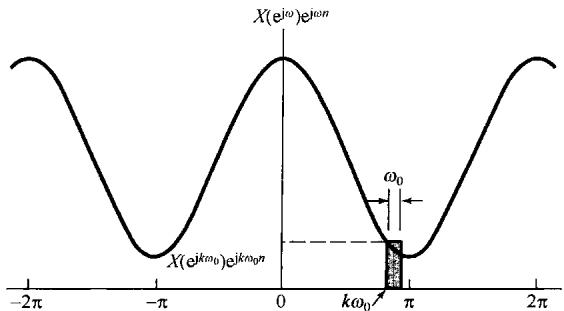

图5.2 式(5.7)的图解说明

式(5.8)和式(5.9)是式(4.8)和式(4.9)在离散时间情况下所对应的关系。  $X(\mathrm{e}^{\mathrm{j}\omega})$  称为离散时间傅里叶变换（discrete-time Fourier transform），这一对式子就是离散时间傅里叶变换对。式(5.8)是综合公式，而式(5.9)则是分析公式。在推导这些公式的过程中，可看出一个非周期序列是怎样被看成复指数信号的线性组合的。事实上，综合公式本身就是把序列  $x[n]$  作为一种复指数序列的线性组合来表示的，这些复指数序列在频率上是无限靠近的，其幅度是  $X(\mathrm{e}^{\mathrm{j}\omega})(\mathrm{d}\omega /2\pi)$  。为此，与连续时间情况一样，傅里叶变换  $X(\mathrm{e}^{\mathrm{j}\omega})$  往往称为  $x[n]$  的频谱(spectrum)，因为它给出了这样的信息： $x[n]$  是怎样由这些不同频率的复指数序列组成的。

值得提及的是，与连续时间情况一样，上述离散时间傅里叶变换的推导过程给我们在离散时间傅里叶级数和离散时间傅里叶变换之间提供了一种重要的关系。特别是一个周期信号  $\tilde{x}[n]$  的傅里叶系数  $a_{k}$  可以用一个有限长序列  $x[n]$  的傅里叶变换的等间隔样本来表示，这个  $x[n]$  就等于在一个周期上的  $\tilde{x}[n]$ ，而在其余地方为零。这一点在实际的信号处理和傅里叶分析中极为重要，在习题5.41中将进一步给予讨论。

正如在推导过程中所表明的，离散时间傅里叶变换和连续时间情况相比具有许多类似之处。两者的主要差别在于离散时间变换  $X(\mathrm{e}^{\mathrm{j}\omega})$  的周期性和在综合公式中的有限积分区间。这两者均来自这样一个事实（以前已经多次提到）：在频率上相差  $2\pi$  的离散时间复指数信号是完全一样的。在3.6节已看到，对周期离散时间信号而言，这就意味着傅里叶级数系数也是周期的，并且傅里叶级数表示式是一个有限项的和式。对非周期信号而言，这就意味着  $X(\mathrm{e}^{\mathrm{j}\omega})$  也是周期的（周期为 $2\pi)$  ，并且综合公式只涉及在一个频率区间内的积分，这个频率区间就是产生不同复指数信号的那个间隔，即任何  $2\pi$  长度的间隔。1.3.3节曾指出过  $\mathbf{e}^{\mathrm{j}\omega n}$  作为  $\omega$  函数的周期性的进一步结果是： $\omega = 0$  和  $\omega = 2\pi$  都得出同一个信号。因此，位于这些频率值或任何  $\pi$  偶数倍的  $\omega$  附近都是慢变化的，从而都相应于低频率的信号；而靠近  $\pi$  的奇数倍的  $\omega$  ，在离散时间情况下都相应于高的频率。因此，在图5.3(a)中的信号  $x_{1}[n]$  [其傅里叶变换见图5.3(b)]的变化比图5.3(c)的信号  $x_{2}[n]$  [其傅里叶变换见图5.3(d)]的变化要更慢一些。

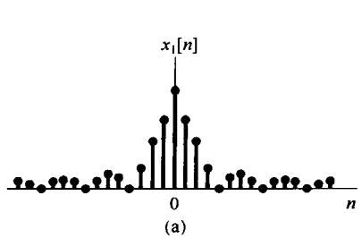

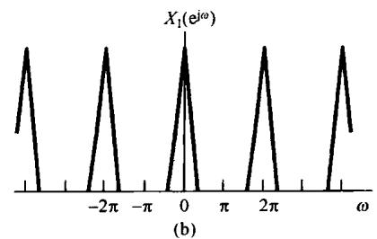

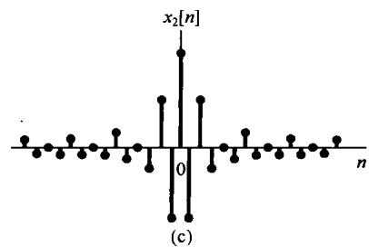

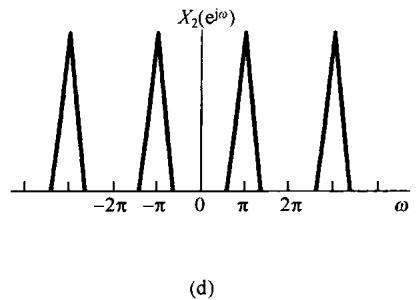

图5.3 (a) 离散时间信号  $x_{1}[n]$ ; (b)  $x_{1}[n]$  的傅里叶变换, 注意  $X_{1}(\mathrm{e}^{\mathrm{j}\omega})$  集中在  $\omega = 0$ ,  $\pm 2\pi$ ,  $\pm 4\pi$ , …附近; (c) 离散时间信号  $x_{2}[n]$ ; (d)  $x_{2}[n]$  的傅里叶变换, 注意  $X_{2}(\mathrm{e}^{\mathrm{j}\omega})$  集中在  $\omega = \pm \pi$ ,  $\pm 3\pi$ , …附近

# 5.1.2 离散时间傅里叶变换举例

为了说明离散时间傅里叶变换，考虑下面几个例子。

例5.1 考虑信号

$$
x [ n ] = a ^ {n} u [ n ], \quad | a | <   1
$$

这时

$$
X \left(\mathrm {e} ^ {\mathrm {j} \omega}\right) = \sum_ {n = - \infty} ^ {+ \infty} a ^ {n} u [ n ] \mathrm {e} ^ {- \mathrm {j} \omega n} = \sum_ {n = 0} ^ {\infty} \left(a \mathrm {e} ^ {- \mathrm {j} \omega}\right) ^ {n} = \frac {1}{1 - a \mathrm {e} ^ {- \mathrm {j} \omega}}
$$

图5.4(a)示出了  $a > 0$  时， $X(\mathrm{e}^{\mathrm{j}\omega})$  的模和相位；图5.4(b)示出了  $a < 0$  时的模和相位。应该注意，图中所有这些函数都是周期为  $2\pi$  的周期函数。

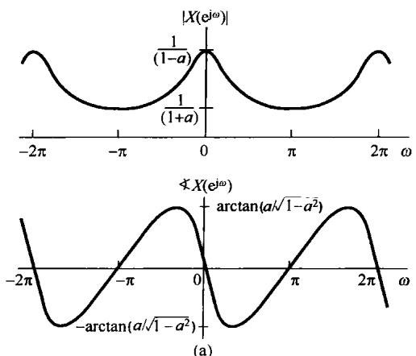

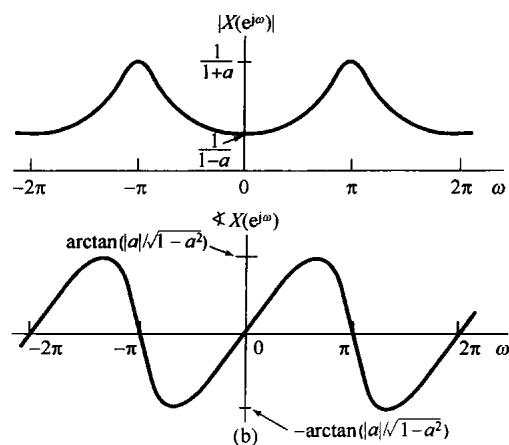

图5.4 例5.1傅里叶变换的模和相位。（a）  $a > 0$  ；（b）  $a < 0$

例5.2 设

$$
x [ n ] = a ^ {| n |}, \quad | a | <   1
$$

该信号对于  $0 < a < 1$  如图5.5(a)所示。它的傅里叶变换由式(5.9)可求出为

$$
\begin{array}{l} X (e ^ {j \omega}) = \sum_ {n = - \infty} ^ {+ \infty} a ^ {| n |} e ^ {- j \omega n} \\ = \sum_ {n = 0} ^ {\infty} a ^ {n} \mathrm {e} ^ {- \mathrm {j} \omega n} + \sum_ {n = - \infty} ^ {- 1} a ^ {- n} \mathrm {e} ^ {- \mathrm {j} \omega n} \\ \end{array}
$$

在上式第二个求和式中，以  $m = -n$  置换，可得

$$
X \left(e ^ {j \omega}\right) = \sum_ {n = 0} ^ {\infty} \left(a e ^ {- j \omega}\right) ^ {n} + \sum_ {m = 1} ^ {\infty} \left(a e ^ {j \omega}\right) ^ {m}
$$

这两个求和式都是无穷几何级数，可以用闭式表示为

$$
\begin{array}{l} X \left(\mathrm {e} ^ {\mathrm {j} \omega}\right) = \frac {1}{1 - a \mathrm {e} ^ {- \mathrm {j} \omega}} + \frac {a \mathrm {e} ^ {\mathrm {j} \omega}}{1 - a \mathrm {e} ^ {\mathrm {j} \omega}} \\ = \frac {1 - a ^ {2}}{1 - 2 a \cos \omega + a ^ {2}} \\ \end{array}
$$

在此情况下，  $X(\mathrm{e}^{\mathrm{j}\omega})$  是实函数，对于  $0 < a < 1$  ，如图5.5(b)所示。

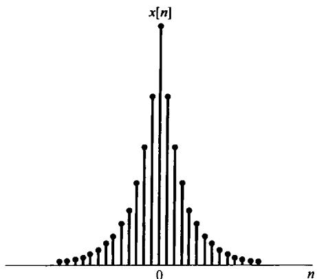

(a)

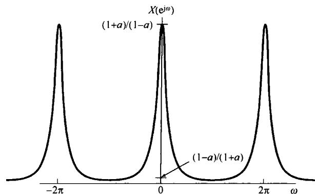

(b)

图5.5（a）例5.2中的信号  $x[n] = a^{|\mathfrak{n}|}$  ；(b）它的傅里叶变换  $(0 < a < 1)$

例5.3 考虑下列矩形脉冲序列

$$
x [ n ] = \left\{ \begin{array}{l l} 1, & \quad | n | \leqslant N _ {1} \\ 0, & \quad | n | > N _ {1} \end{array} \right. \tag {5.10}
$$

图5.6(a)示出  $N_{1} = 2$  时的  $x[n]$ ，这时

$$
X \left(\mathrm {e} ^ {\mathrm {j} \omega}\right) = \sum_ {n = - N _ {1}} ^ {N _ {1}} \mathrm {e} ^ {- \mathrm {j} \omega n} \tag {5.11}
$$

利用在例3.12中求式(3.104)时使用过的类似计算，可得

$$
X \left(\mathrm {e} ^ {\mathrm {j} \omega}\right) = \frac {\sin \omega \left(N _ {1} + \frac {1}{2}\right)}{\sin (\omega / 2)} \tag {5.12}
$$

$N_{1} = 2$  时的  $X(\mathrm{e}^{\mathrm{j}\omega})$  如图5.6(b)所示。式(5.12)的函数是sinc函数在离散时间情况下所对应的形式（见例4.4）。这两个函数之间最重要的差别就是式(5.12)的函数是周期的，周期为  $2\pi$  ，而sinc函数是非周期的。

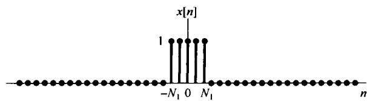

(a)

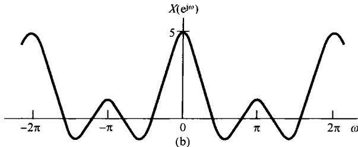

图5.6（a）例5.3在  $N_{1} = 2$  时的矩形脉冲序列；(b）对应的傅里叶变换

# 5.1.3 关于离散时间傅里叶变换的收敛问题

尽管以上讨论都是假设  $x[n]$  是任意的，但属有限长情况下得到的结论，但是式(5.8)和式(5.9)对极为广泛的一类无限长序列(例如例5.1和例5.2中的信号)也是成立的。在信号为无限长的情况下，还必须考虑分析公式(5.9)中无穷项求和的收敛问题。保证这个和式收敛而对  $x[n]$  所加的条件是与连续时间傅里叶变换的收敛条件直接相对应的①。如果  $x[n]$  是绝对可和的，即

$$
\sum_ {n = - \infty} ^ {+ \infty} | x [ n ] | <   \infty \tag {5.13}
$$

或者，如果这个序列的能量是有限的，即

$$
\sum_ {n = - \infty} ^ {+ \infty} | x [ n ] | ^ {2} <   \infty \tag {5.14}
$$

那么，式(5.9)就一定收敛。

与分析公式(5.9)的情况相比，综合公式(5.8)的积分是在一个有限的积分区间内进行的，因此一般不存在收敛问题。这一点与离散时间傅里叶级数综合公式(3.94)的情况非常相像，在那里由于只涉及一个有限项和式，所以也就没有任何收敛问题存在。特别是，若用在频率范围为  $|\omega| \leqslant W$  的复指数信号的积分来近似一个非周期信号  $x[n]$ ，即

$$
\hat {x} [ n ] = \frac {1}{2 \pi} \int_ {- W} ^ {W} X \left(\mathrm {e} ^ {\mathrm {j} \omega}\right) \mathrm {e} ^ {\mathrm {j} \omega n} \mathrm {d} \omega \tag {5.15}
$$

那么，若  $W = \pi$  ，则有  $\hat{x}[n] = x[n]$  。因此，正如图3.18所示，在求离散时间傅里叶变换综合公式时，看不到任何类似于吉伯斯现象的行为存在！这一点可用下例来说明。

例5.4 令  $x[n]$  是一单位脉冲序列，即

$$
x [ n ] = \delta [ n ]
$$

这时由分析公式(5.9)极易求得

$$
X (\mathrm {c} ^ {\mathrm {j} \omega}) = 1
$$

这就是说，与连续时间情况一样，单位脉冲序列的傅里叶变换在所有频率上都是相等的。如果将式(5.15)用到这个例子中来，就得到

$$
\hat {x} [ n ] = \frac {1}{2 \pi} \int_ {- W} ^ {W} \mathrm {e} ^ {\mathrm {j} \omega n} \mathrm {d} \omega = \frac {\sin W n}{\pi n} \tag {5.16}
$$

对应于几个不同的  $W$  值， $\hat{x}[n]$  图示于图5.7中。由图可见，当  $W$  增加时，近似式  $\hat{x}[n]$  的振荡频率就增加，这一点很像在连续时间情况下所观察到的；但是，另一方面，与连续时间情况相反，这些振荡的幅度相对于  $\hat{x}[0]$  的幅度来说，则随着  $W$  的增大而减小，直至  $W = \pi$  时，这些振荡完全消失。

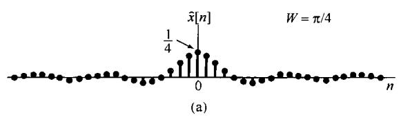

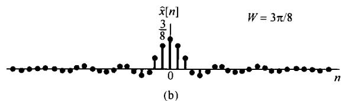

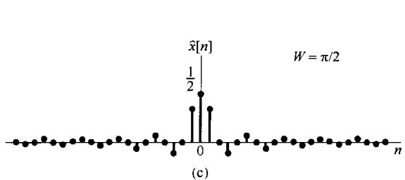

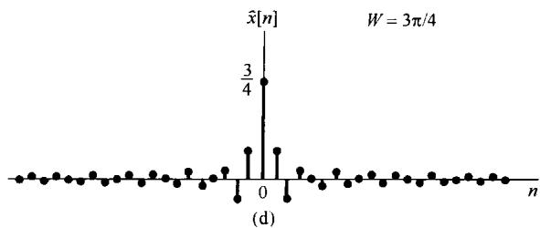

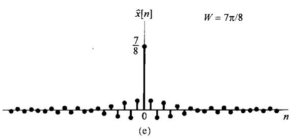

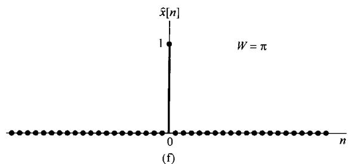

图5.7 利用  $\mid \omega \mid \leqslant W$  范围内的复指数信号，按式(5.16)得到的一个近似单位脉冲序列。（a）  $W = \pi /4$  (b)  $W = 3\pi /8$  ；（c）  $W = \pi /2$  ；（d）  $W = 3\pi /4$  ；（e）  $W = 7\pi /8$  ；（f）  $W = \pi$  。应注意：  $W = \pi$  时  $\hat{x} [n] = \delta [n]$

# 5.2 周期信号的傅里叶变换

与连续时间情况下相同，利用把一个周期信号的变换表示成频域中的冲激串的办法，就可以把离散时间周期信号也归并到离散时间傅里叶变换的范畴中。为了导出这种表示的形式，考虑如下信号：

$$
x [ n ] = \mathrm {e} ^ {\mathrm {j} \omega_ {0} n} \tag {5.17}
$$

在连续时间情况下，已经看到  $\mathrm{e}^{\mathrm{j}\omega_{\mathrm{d}}t}$  的傅里叶变换就是在  $\omega = \omega_0$  处的冲激。因此，可以期望对离散时间情况下的式(5.17)的变换，或许会有相同的结果。然而，离散时间傅里叶变换对  $\omega$  来说必须是周期的，周期为  $2\pi$  。由此可以想到，式(5.17)  $x[n]$  的傅里叶变换应该是在  $\omega_0, \omega_0 \pm 2\pi, \omega_0 \pm 4\pi, \dots$  等处的冲激。事实上， $x[n]$  的傅里叶变换正是如下冲激串：

$$
X \left(\mathrm {e} ^ {\mathrm {j} \omega}\right) = \sum_ {l = - \infty} ^ {+ \infty} 2 \pi \delta \left(\omega - \omega_ {0} - 2 \pi l\right) \tag {5.18}
$$

如图5.8所示。为了验证该式，必须求出式(5.18)的逆变换。现将式(5.18)代入综合公式(5.8)得

$$
\frac {1}{2 \pi} \int_ {2 \pi} X \left(\mathrm {e} ^ {\mathrm {j} \omega}\right) \mathrm {e} ^ {\mathrm {j} \omega n} \mathrm {d} \omega = \frac {1}{2 \pi} \int_ {2 \pi} \sum_ {l = - \infty} ^ {+ \infty} 2 \pi \delta \left(\omega - \omega_ {0} - 2 \pi l\right) \mathrm {e} ^ {\mathrm {j} \omega n} \mathrm {d} \omega
$$

注意，在任意一个长度为  $2\pi$  的积分区间内，在式(5.18)的和式中真正包括的只有一个冲激，因此，如果所选的积分区间包含在  $\omega_0 + 2\pi r$  处的冲激，那么

$$
\frac {1}{2 \pi} \int_ {2 \pi} X (\mathrm {e} ^ {\mathrm {j} \omega}) \mathrm {e} ^ {\mathrm {j} \omega n} \mathrm {d} \omega = \mathrm {e} ^ {\mathrm {j} (\omega_ {0} + 2 \pi r) n} = \mathrm {e} ^ {\mathrm {j} \omega_ {0} n}
$$

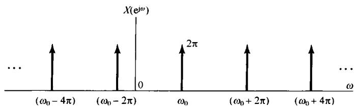

图5.8  $x[n] = \mathrm{e}^{\mathrm{j}\omega_0n}$  的傅里叶变换

现在考虑一个周期序列  $x[n]$ ，周期为  $N$ ，其傅里叶级数为

$$
x [ n ] = \sum_ {k = \langle N \rangle} a _ {k} \mathrm {e} ^ {\mathrm {j} k (2 \pi / N) n} \tag {5.19}
$$

这时，傅里叶变换就是

$$
X \left(\mathrm {e} ^ {\mathrm {j} \omega}\right) = \sum_ {k = - \infty} ^ {+ \infty} 2 \pi a _ {k} \delta \left(\omega - \frac {2 \pi k}{N}\right) \tag {5.20}
$$

这样，一个周期信号的傅里叶变换就能直接从它的傅里叶系数得到。

为了证明式(5.20)是对的，只要注意到式(5.19)的  $x[n]$  是式(5.17)这类信号的线性组合，因此  $x[n]$  的傅里叶变换也一定是式(5.18)这类变换形式的线性组合。特别是，假设选取式(5.19)的求和区间为  $k = 0, 1, \dots, N - 1$  ，则有

$$
x [ n ] = a _ {0} + a _ {1} \mathrm {e} ^ {\mathrm {j} (2 \pi / N) n} + a _ {2} \mathrm {e} ^ {\mathrm {j} 2 (2 \pi / N) n} + \dots + a _ {N - 1} \mathrm {e} ^ {\mathrm {j} (N - 1) (2 \pi / N) n} \tag {5.21}
$$

$x[n]$  就是如式(5.17)所示信号的线性组合，其中  $\omega_0 = 0$  ，  $2\pi /N$  ，  $4\pi /N$  ，…，  $(N - 1)2\pi /N_{\circ}$  所得到的傅里叶变换如图5.9所示。在图5.9(a)中示出式(5.21)右边第一项的傅里叶变换：常数序列  $a_0 = a_0\mathrm{e}^{\mathrm{j}0n}$  的傅里叶变换，按式(5.18)，就是  $\omega_0 = 0$  ，每个冲激的大小为  $2\pi a_{0}$  的周期冲激串。再者，由第4章的讨论可知，这些傅里叶系数  $a_{k}$  都是周期的，周期为  $N$  ，所以有 $2\pi a_{0} = 2\pi a_{N} = 2\pi a_{-N}$  。图5.9(b)是式(5.21)中第二项的傅里叶变换，这里再次应用式(5.18）的结果，并且有  $2\pi a_{1} = 2\pi a_{N + 1} = 2\pi a_{-N + 1}$  。类似地，图5.9(c)是最后一项的傅里叶变换。最后，图5.9(d)就是整个  $X(\mathrm{e}^{\mathrm{j}\omega})$  。应该注意，由于  $a_{k}$  的周期性，  $X(\mathrm{e}^{\mathrm{j}\omega})$  就能看成发生在基波频率 $2\pi /N$  的整倍数频率上的一串冲激，位于  $\omega = 2\pi k / N$  处的冲激面积是  $2\pi a_{k}$  。这就是式(5.20)所表达的意思。

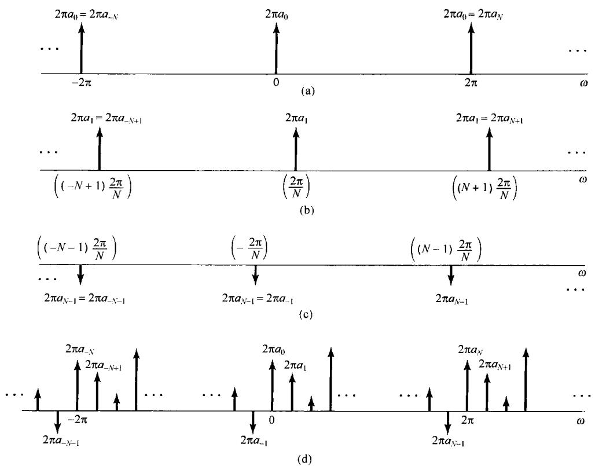

图5.9 一个离散时间周期信号的傅里叶变换。（a）式(5.21)右边第一项的傅里叶变换；（b)式(5.21)第二项的傅里叶变换；（c)式(5.21)最后一项的傅里叶变换；（d）式（5.21）中  $x[n]$  的傅里叶变换

例5.5 考虑周期信号

$$
x [ n ] = \cos \omega_ {0} n = \frac {1}{2} e ^ {j \omega_ {0} n} + \frac {1}{2} e ^ {- j \omega_ {0} n}, \quad \omega_ {0} = \frac {2 \pi}{5} \tag {5.22}
$$

根据式(5.18)，可立即写出

$$
X \left(\mathrm {e} ^ {\mathrm {j} \omega}\right) = \sum_ {l = - \infty} ^ {+ \infty} \pi \delta \left(\omega - \frac {2 \pi}{5} - 2 \pi l\right) + \sum_ {l = - \infty} ^ {+ \infty} \pi \delta \left(\omega + \frac {2 \pi}{5} - 2 \pi l\right) \tag {5.23}
$$

也就是

$$
X \left(\mathrm {e} ^ {\mathrm {j} \omega}\right) = \pi \delta \left(\omega - \frac {2 \pi}{5}\right) + \pi \delta \left(\omega + \frac {2 \pi}{5}\right), \quad - \pi \leqslant \omega <   \pi \tag {5.24}
$$

$X(\mathrm{e}^{\mathrm{j}\omega})$  以  $2\pi$  为周期重复，如图5.10所示。

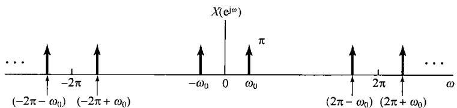

图5.10  $x[n] = \cos \omega_0 n$  的离散时间傅里叶变换

例5.6 与例4.8的周期冲激串相对应的离散时间冲激串是序列

$$
x [ n ] = \sum_ {k = - \infty} ^ {+ \infty} \delta [ n - k N ] \tag {5.25}
$$

如图5.11(a)所示。这个信号的傅里叶级数系数能由式(3.95)直接算出来为

$$
a _ {k} = \frac {1}{N} \sum_ {n = \langle N \rangle} x [ n ] e ^ {- j k (2 \pi / N) n}
$$

选取求和区间为  $0 \leqslant n \leqslant N - 1$  ，有

$$
a _ {k} = \frac {1}{N} \tag {5.26}
$$

利用式(5.26)和式(5.20)，该信号的傅里叶变换就能表示为

$$
X \left(\mathrm {e} ^ {\mathrm {j} \omega}\right) = \frac {2 \pi}{N} \sum_ {k = - \infty} ^ {+ \infty} \delta \left(\omega - \frac {2 \pi k}{N}\right) \tag {5.27}
$$

如图5.11(b)所示。

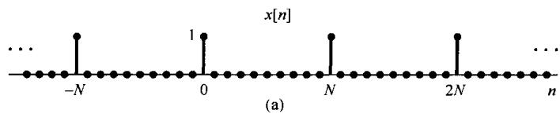

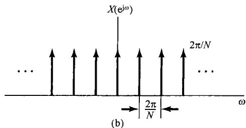

图5.11 (a) 离散时间周期冲激串；(b) (a) 的傅里叶变换

# 5.3 离散时间傅里叶变换性质

与连续时间傅里叶变换一样，离散时间傅里叶变换的各种性质也提供了对变换本质的进一步了解，同时往往在简化一个信号的正变换和逆变换的求取上是很有用的。这一节及下面两节将考虑这些性质，并将这些性质简明扼要地综合于表5.1中。将表5.1和表4.1进行比较就会发现，连续时间和离散时傅里叶变换性质之间所呈现出的相似和差别。若某一性质的推导及陈述基本上与连续时间情况下的一样，则从简。同时，由于傅里叶级数和傅里叶变换之间的紧密关系，因此就将傅里叶变换的很多性质直接移至离散时间傅里叶级数的相应性质中。这些性质已经列于表3.2中，并在3.7节简要讨论过。

在以下的讨论中，与4.3节一样，采用如下符号来表明一个信号及其傅里叶变换的一对关系，即

$$
X \left(\mathrm {e} ^ {\mathrm {j} \omega}\right) = \mathcal {F} \{x [ n ] \}
$$

$$
x [ n ] = \mathcal {F} ^ {- 1} \{X (\mathrm {e} ^ {\mathrm {j} \omega}) \}
$$

$$
x [ n ] \stackrel {{\mathcal {F}}} {{\longleftrightarrow}} X (\mathrm {e} ^ {\mathrm {j} \omega})
$$

# 5.3.1 离散时间傅里叶变换的周期性

正如5.1节所讨论的，离散时间傅里叶变换对  $\omega$  来说总是周期的，其周期为  $2\pi$  ，即

$$
\boxed {X \left(\mathrm {e} ^ {\mathrm {j} (\omega + 2 \pi)}\right) = X \left(\mathrm {e} ^ {\mathrm {j} \omega}\right)} \tag {5.28}
$$

这一点与连续时间傅里叶变换是不同的，一般来说，后者不是周期的。

# 5.3.2 线性性质

若

$$
x _ {1} [ n ] \stackrel {\mathcal {F}} {\longleftrightarrow} X _ {1} \left(\mathrm {e} ^ {\mathrm {j} \omega}\right)
$$

且

$$
x _ {2} [ n ] \stackrel {\mathcal {F}} {\longleftrightarrow} X _ {2} \left(\mathrm {e} ^ {\mathrm {j} \omega}\right)
$$

则

$$
\boxed {a x _ {1} [ n ] + b x _ {2} [ n ] \xleftrightarrow {\mathcal {F}} a X _ {1} \left(\mathrm {e} ^ {\mathrm {j} \omega}\right) + b X _ {2} \left(\mathrm {e} ^ {\mathrm {j} \omega}\right)} \tag {5.29}
$$

# 5.3.3 时移与频移性质

若

$$
x [ n ] \xleftarrow {\mathcal {F}} X (\mathrm {e} ^ {\mathrm {j} \omega})
$$

则

$$
\boxed {x [ n - n _ {0} ] \xleftarrow {\mathcal {F}} e ^ {- j \omega n _ {0}} X (e ^ {j \omega})} \tag {5.30}
$$

和

$$
\boxed {\mathrm {e} ^ {\mathrm {j} \omega_ {0} n} x [ n ] \xleftrightarrow {\mathcal {F}} X (\mathrm {e} ^ {\mathrm {j} (\omega - \omega_ {0})})} \tag {5.31}
$$

将  $x[n - n_0]$  直接代入分析公式(5.9)即可得到式(5.30)，而将  $X(\mathrm{e}^{\mathrm{j}(\omega -\omega_0)})$  代人综合公式(5.8)即可导出式(5.31）。

作为离散时间傅里叶变换周期性和频移性质的一个结果，就是在理想低通和理想高通离散时间滤波器之间存在的一种特别关系。

例5.7 图5.12(a)示出一个截止频率为  $\omega_{c}$  的低通滤波器的频率响应  $H_{\mathrm{lp}}(\mathrm{e}^{\mathrm{j}\omega})$  ，而图5.12(b)则是将  $H_{\mathrm{lp}}(\mathrm{e}^{\mathrm{j}\omega})$  频移半个周期(即  $\pi$  )后的  $H_{\mathrm{lp}}(\mathrm{e}^{\mathrm{j}(\omega -\pi)})$  。因为在离散时间情况下，高频集中在  $\pi$  (或  $\pi$  的奇数倍)附近，所以图5.12(b)所示特性就是一个截止频率为  $\pi -\omega_{c}$  的理想高通滤波器，也即

$$
H _ {\mathrm {h p}} \left(\mathrm {e} ^ {\mathrm {j} \omega}\right) = H _ {\mathrm {l p}} \left(\mathrm {e} ^ {\mathrm {j} (\omega - \pi)}\right) \tag {5.32}
$$

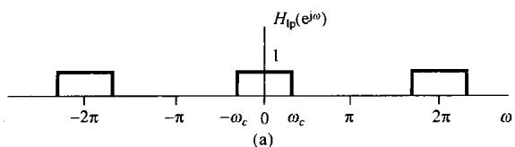

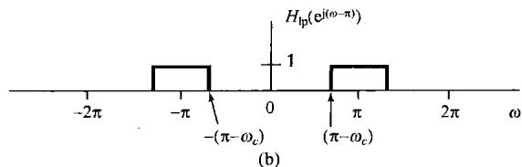

图5.12（a）某一低通滤波器的频率响应；(b)将(a)的频率响应频移半个周期  $\omega = \pi$  得到一高通滤波器的频率响应

由式(3.122)可知，并且在5.4节将再次讨论到，一个线性时不变系统的频率响应是该系统单位脉冲响应的傅里叶变换。于是，若  $h_{\mathrm{lp}}[n]$  和  $h_{\mathrm{hp}}[n]$  分别记为图5.12(a)和图5.12(b)的单位脉冲响应，那么式(5.32)和频移性质就意味着低通和高通滤波器有如下关系：

$$
\begin{array}{l} h _ {\mathrm {h p}} [ n ] = \mathrm {e} ^ {\mathrm {j} \pi n} h _ {\mathrm {l p}} [ n ] (5.33) \\ = (- 1) ^ {n} h _ {\mathrm {l p}} [ n ] (5.34) \\ \end{array}
$$

# 5.3.4 共轭与共轭对称性

若

$$
x [ n ] \stackrel {\mathcal {F}} {\longleftrightarrow} X (\mathrm {e} ^ {\mathrm {j} \omega})
$$

则

$$
\boxed {x ^ {*} [ n ] \xleftarrow {\mathcal {F}} X ^ {*} \left(\mathrm {e} ^ {- \mathrm {j} \omega}\right)} \tag {5.35}
$$

同时，若  $x[n]$  是实值序列，那么其变换是共轭对称的，即

$$
X \left(\mathrm {e} ^ {\mathrm {j} \omega}\right) = X ^ {*} \left(\mathrm {e} ^ {- \mathrm {j} \omega}\right) \quad x [ n ] \text {为 实 值} \tag {5.36}
$$

据此可得，  $\mathcal{Re}\{X(\mathrm{e}^{\mathrm{j}\omega})\}$  是  $\pmb{\omega}$  的偶函数，而  $Im\{X(\mathrm{e}^{\mathrm{j}\omega})\}$  是  $\pmb{\omega}$  的奇函数。同理，  $X(\mathrm{e}^{\mathrm{j}\omega})$  的模是  $\pmb{\omega}$  的偶函数，相角是  $\pmb{\omega}$  的奇函数。另外进一步可得

$$
\mathcal {E} \nu \{x [ n ] \} \stackrel {{\mathcal {F}}} {{\longleftrightarrow}} \operatorname {R e} \{X (\mathrm {e} ^ {\mathrm {j} \omega}) \}
$$

和

$$
O d \{x [ n ] \} \xleftarrow {\mathcal {F}} \mathrm {j} I m \{X (\mathrm {e} ^ {\mathrm {j} \omega}) \}
$$

这里， $\mathcal{E}\nu$  和  $Od$  分别表示  $x[n]$  的偶部和奇部。例如，若  $x[n]$  为实偶序列，那么其傅里叶变换也是实偶函数。例5.2的序列  $x[n] = a^{|n|}$  就说明了这种对称性。

# 5.3.5 差分与累加

离散时间情况下的累加就相应于连续时间情况下的积分。现在来讨论离散时间序列的累加及其逆运算，即一次差分的傅里叶变换。设  $x[n]$  的傅里叶变换为  $X(\mathrm{e}^{\mathrm{j}\omega})$  ，那么根据线性和时移性质，一次差分信号  $x[n] - x[n - 1]$  的傅里叶变换对就是

$$
\boxed {x [ n ] - x [ n - 1 ] \stackrel {\mathcal {F}} {\longleftrightarrow} (1 - e ^ {- j \omega}) X (e ^ {j \omega})} \tag {5.37}
$$

再考虑信号

$$
y [ n ] = \sum_ {m = - \infty} ^ {n} x [ m ] \tag {5.38}
$$

因为  $y[n] - y[n - 1] = x[n]$ ，似乎可能得出  $y[n]$  的变换应为  $x[n]$  的变换被  $(1 - e^{-j\omega})$  所除！但是，这只是对了一部分，与式(4.32)所给出的连续时间积分性质一样，除此以外，还会涉及到更多的项，其精确的关系是

$$
\boxed {\sum_ {m = - \infty} ^ {n} x [ m ] \xleftrightarrow {\mathcal {F}} \frac {1}{1 - e ^ {- j \omega}} X (e ^ {j \omega}) + \pi X (e ^ {j 0}) \sum_ {k = - \infty} ^ {+ \infty} \delta (\omega - 2 \pi k)} \tag {5.39}
$$

其中，右边的冲激串反映了累加过程中可能出现的直流或平均值。

例5.8 现利用累加性质来导出单位阶跃序列  $x[n] = u[n]$  的傅里叶变换  $X(e^{j\omega})$  。已知

$$
g [ n ] = \delta [ n ] \xleftarrow {\mathcal {F}} G (e ^ {j \omega}) = 1
$$

由1.4.1节知道，单位阶跃序列就是单位脉冲序列的累加，即

$$
x [ n ] = \sum_ {m = - \infty} ^ {n} g [ m ]
$$

上式两边取傅里叶变换，并应用累加性质可得

$$
\begin{array}{l} X \left(\mathrm {e} ^ {\mathrm {j} \omega}\right) = \frac {1}{\left(1 - \mathrm {e} ^ {- \mathrm {j} \omega}\right)} G \left(\mathrm {e} ^ {\mathrm {j} \omega}\right) + \pi G \left(\mathrm {e} ^ {\mathrm {j} 0}\right) \sum_ {k = - \infty} ^ {\infty} \delta (\omega - 2 \pi k) \\ = \frac {1}{1 - e ^ {- j \omega}} + \pi \sum_ {k = - \infty} ^ {\infty} \delta (\omega - 2 \pi k) \\ \end{array}
$$

# 5.3.6 时间反转

设信号  $x[n]$  的频谱为  $X(\mathrm{e}^{\mathrm{j}\omega})$  ，考虑  $y[n] = x[-n]$  的变换  $Y(\mathrm{e}^{\mathrm{j}\omega})$  。由式(5.9)

$$
Y \left(\mathrm {e} ^ {\mathrm {j} \omega}\right) = \sum_ {n = - \infty} ^ {+ \infty} y [ n ] \mathrm {e} ^ {- \mathrm {j} \omega n} = \sum_ {n = - \infty} ^ {+ \infty} x [ - n ] \mathrm {e} ^ {- \mathrm {j} \omega n} \tag {5.40}
$$

在式(5.40)中进行  $m = -n$  置换，得

$$
Y \left(\mathrm {e} ^ {\mathrm {j} \omega}\right) = \sum_ {m = - \infty} ^ {+ \infty} x [ m ] \mathrm {e} ^ {- \mathrm {j} (- \omega) m} = X \left(\mathrm {e} ^ {- \mathrm {j} \omega}\right) \tag {5.41}
$$

也即

$$
\boxed {x [ - n ] \stackrel {\mathcal {F}} {\longleftrightarrow} X (\mathrm {e} ^ {- \mathrm {j} \omega})} \tag {5.42}
$$

# 5.3.7 时域扩展

由于离散时间信号在时间上的离散性，因此时间和频率的尺度变换性质与在连续时间情况下相比都稍许有些不同。在4.3.5节曾导出连续时间情况下的性质为

$$
x (a t) \xleftarrow {\mathcal {F}} \frac {1}{| a |} X \left(\frac {\mathrm {j} \omega}{a}\right) \tag {5.43}
$$

然而，如果试图定义一个信号  $x[an]$ ，若  $a$  不是一个整数时就遇到了困难。因此就不能用  $a < 1$  来减慢这个信号的变化；另一方面，就是令  $a$  是一个不同于  $\pm 1$  的整数，比如说考虑  $x[2n]$ ，这也不只是使原信号的变化加速。因为  $n$  仅仅取整数值， $x[2n]$  仅由  $x[n]$  中的偶次样本所组成。

然而，若令  $k$  是一个正整数，并且定义

$$
x _ {(k)} [ n ] = \left\{ \begin{array}{l l} {x [ n / k ],} & {\quad n \text {为} k \text {的 整 倍 数}} \\ {0,} & {\quad n \text {不 为} k \text {的 整 倍 数}} \end{array} \right. \tag {5.44}
$$

那么, 则有一个与式(5.43)相并行的结果。图5.13示出一个  $k = 3$  的例子, 这时的  $x_{(k)}[n]$  是在  $x[n]$  的连续值之间插入  $(k - 1)$  个零值而得到的。直观上看, 可以把  $x_{(k)}[n]$  看成减慢了的  $x[n]$  。因为, 除非  $n$  是  $k$  的某一倍数, 也即  $n = rk$ , 否则  $x_{(k)}[n]$  都等于0, 所以  $x_{(k)}[n]$  的傅里叶变换可由下式给出:

$$
X _ {(k)} \left(\mathrm {e} ^ {\mathrm {j} \omega}\right) = \sum_ {n = - \infty} ^ {+ \infty} x _ {(k)} [ n ] \mathrm {e} ^ {- \mathrm {j} \omega n} = \sum_ {r = - \infty} ^ {+ \infty} x _ {(k)} [ r k ] \mathrm {e} ^ {- \mathrm {j} \omega r k}
$$

再者，由于  $x_{(k)}[rk] = x[r]$  ，可求得

$$
X _ {(k)} (\mathrm {e} ^ {\mathrm {j} \omega}) = \sum_ {r = - \infty} ^ {+ \infty} x [ r ] \mathrm {e} ^ {- \mathrm {j} (k \omega) r} = X (\mathrm {e} ^ {\mathrm {j} k \omega})
$$

也即

$$
\boxed {x _ {(k)} [ n ] \xleftrightarrow {\mathcal {F}} X (\mathrm {e} ^ {\mathrm {j} k \omega})} \tag {5.45}
$$

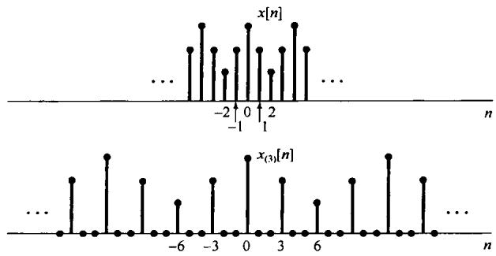

图5.13 在序列  $x[n]$  的每两个连续值之间插入两个零值而得到的序列  $\pmb{x}_{(3)}[n]$

应该注意到，当取  $k > 1$  时，该信号在时间上被拉开了，从而在时间上就减慢了，而它的傅里叶变换就会受到压缩。例如，由于  $X(\mathrm{e}^{\mathrm{j}\omega})$  是周期的，周期为  $2\pi$  ，因而  $X(\mathrm{e}^{\mathrm{j}k\omega})$  也是周期的，其周期为  $2\pi / k$  。图5.14示出一个矩形脉冲的例子来说明这一性质。

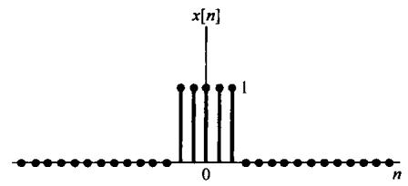

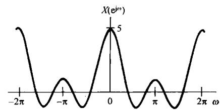

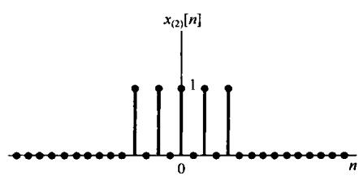

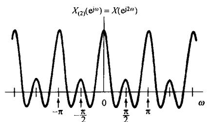

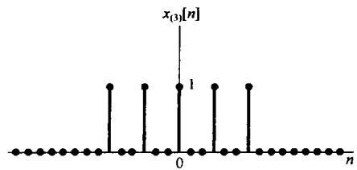

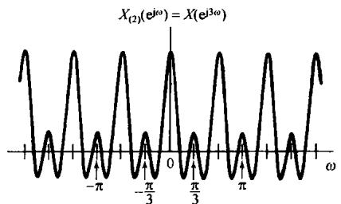

$X_{(3)}(\mathfrak{e}^{j\omega}) = X(\mathfrak{e}^{j3\omega})$

图5.14 时域和频域之间的相反关系：当  $k$  增加时， $x_{(k)}[n]$  在时域上拉开，而其变换则在频域上压缩

例5.9 作为时域扩展性质在确定傅里叶变换应用中的一个例子，让我们来考虑图5.15(a)所示的序列  $x[n]$  。可以将这个序列与图5.15(b)这一较为简单的序列  $y[n]$  联系起来，这就是

$$
x [ n ] = y _ {(2)} [ n ] + 2 y _ {(2)} [ n - 1 ]
$$

其中，

$$
y _ {(2)} [ n ] = \left\{ \begin{array}{l l} {y [ n / 2 ],} & {n \text {为 偶 数}} \\ {0,} & {n \text {为 奇 数}} \end{array} \right.
$$

而  $y_{(2)}[n - 1]$  则代表  $y_{(2)}[n]$  右移一个单位。信号  $y_{2}[n]$  和  $2y_{(2)}[n - 1]$  分别示于图5.15(c)和图5.15(d)。

接下来可以看到，  $y[n] = g[n - 2]$ ，  $g[n]$  就是曾在例5.3中讨论过的当  $N_{1} = 2$  时的矩形脉冲，并示于图5.6(a)中。结果，根据例5.3和时移性质，有

$$
Y \left(\mathrm {e} ^ {\mathrm {j} \omega}\right) = \mathrm {e} ^ {- \mathrm {j} 2 \omega} \frac {\sin (5 \omega / 2)}{\sin (\omega / 2)}
$$

利用时域扩展性质可得

$$
y _ {(2)} [ n ] \xleftrightarrow {\mathcal {F}} e ^ {- j 4 \omega} \frac {\sin (5 \omega)}{\sin (\omega)}
$$

再根据线性和时移性质有

$$
2 y _ {(2)} [ n - 1 ] \xleftarrow {\mathcal {F}} 2 e ^ {- j 5 \omega} \frac {\sin (5 \omega)}{\sin (\omega)}
$$

将以上两个结果合在一起，最后得

$$
X \left(e ^ {j \omega}\right) = e ^ {- j 4 \omega} \left(1 + 2 e ^ {- j \omega}\right) \left(\frac {\sin (5 \omega)}{\sin (\omega)}\right)
$$

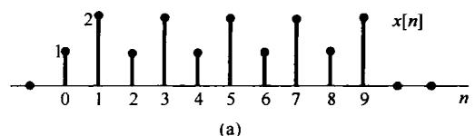

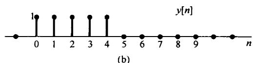

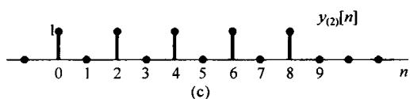

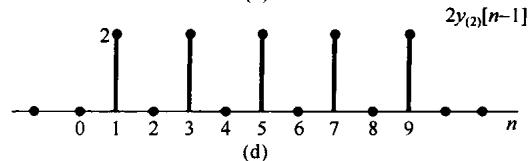

图5.15（a）例5.9的信号  $x[n]$ ；(b）信号  $y[n]$ ；(c）由  $y[n]$  每两点之间插入一个零值所得到的信号  $y_{(2)}[n]$ ；(d）信号  $2y_{(2)}[n - 1]$

# 5.3.8 频域微分

设

$$
x [ n ] \stackrel {{\mathcal {F}}} {{\longleftrightarrow}} X (\mathrm {e} ^ {\mathrm {j} \omega})
$$

如果利用分析公式(5.9)  $X(\mathrm{e}^{\mathrm{j}\omega})$  的定义，并在两边对  $\omega$  微分，可得

$$
\frac {\mathrm {d} X \left(\mathrm {e} ^ {\mathrm {j} \omega}\right)}{\mathrm {d} \omega} = \sum_ {n = - \infty} ^ {+ \infty} - \mathrm {j} n x [ n ] \mathrm {e} ^ {- \mathrm {j} \omega n}
$$

这个式子的右边就是  $-\mathrm{j}nx[n]$  的傅里叶变换，因此两边各乘以  $j$  ，就得

$$
\boxed {n x [ n ] \xleftarrow {\mathcal {F}} j \frac {\mathrm {d} X \left(\mathrm {e} ^ {\mathrm {j} \omega}\right)}{\mathrm {d} \omega}} \tag {5.46}
$$

这个性质的用途将在5.4节的例5.13中说明。

# 5.3.9 帕斯瓦尔定理

若  $x[n]$  和  $X(\mathrm{e}^{\mathrm{j}\omega})$  是一对傅里叶变换，则

$$
\boxed {\sum_ {n = - \infty} ^ {+ \infty} | x [ n ] | ^ {2} = \frac {1}{2 \pi} \int_ {2 \pi} | X (e ^ {j \omega}) | ^ {2} d \omega} \tag {5.47}
$$

这个关系类似于式(4.43)，并且推导过程也很类似。式(5.47)左边的量就是信号  $x[n]$  中的总能量，帕斯瓦尔定理表明这个总能量可以在离散时间频率的  $2\pi$  区间上用积分每单位频率上的能量  $|X(\mathrm{e}^{\mathrm{j}\omega})|^2 / 2\pi$  来获得。与连续时间情况类似，  $|X(\mathrm{e}^{\mathrm{j}\omega})|^2$  称为信号  $x[n]$  的能量密度谱（energy-density spectrum）。同时也注意到，式(5.47)是与周期信号的帕斯瓦尔定理式(3.110)相对应的，在那里说的是：在一个周期信号中的平均功率等于它的各次谐波分量的平均功率之和。

已知一个序列的傅里叶变换，就有可能根据傅里叶变换的性质来确定某一特殊的序列是否有某些不同的性质。现在用下面的例子来说明这一概念。

例5.10 考虑序列  $x[n]$ ，其傅里叶变换  $X(\mathrm{e}^{\mathrm{j}\omega})$  在  $-\pi \leqslant \omega \leqslant \pi$  区间上示于图5.16。现在想要确定在时域  $x[n]$  是否是周期的，实信号，偶信号和/或有限能量的。

首先注意到，在时域上的周期性就意味着其傅里叶变换除了在各个基波频率的整倍数频率上有可能出现冲激外，其余地方均为零。现在  $X(\mathrm{e}^{\mathrm{j}\omega})$  不是这样的，所以得出： $x[n]$  不是周期的。

接下来，根据傅里叶变换的对称性知道，一个实值序列一定有一个傅里叶变换，其模是  $\omega$  的偶函数，相位是  $\omega$  的奇函数。对于给出的  $|X(\mathrm{e}^{\mathrm{j}\omega})|$  和  $\langle X(\mathrm{e}^{\mathrm{j}\omega})$  来看是这样，因此  $x[n]$  是实序列。

第三，若  $x[n]$  是偶函数，那么根据实信号的对称性， $X(\mathrm{e}^{\mathrm{j}\omega})$  必须为实偶函数。然而，因为  $X(\mathrm{j}\omega) = |X(\mathrm{e}^{\mathrm{j}\omega})|\mathrm{e}^{-\mathrm{j}2\omega}, X(\mathrm{e}^{\mathrm{j}\omega})$  不是一个实值函数，因此  $x[n]$  不是偶信号。

最后，为了检查是否为有限能量，可以用帕斯瓦尔定理

$$
\sum_ {n = - \infty} ^ {\infty} | x [ n ] | ^ {2} = \frac {1}{2 \pi} \int_ {2 \pi} | X (\mathrm {e} ^ {\mathrm {j} \omega}) | ^ {2} \mathrm {d} \omega
$$

由图5.16很显然可知，在  $-\pi$  到  $\pi$  上积分  $|X(e^{j\omega})|^2$  一定为一个有限量，所以  $x[n]$  是有限能量的。

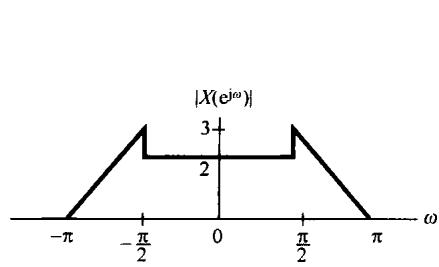

(a)

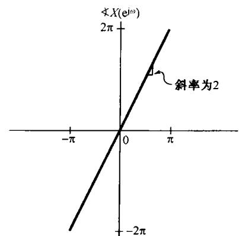

(b)

图5.16 例5.10中傅里叶变换的模和相位

在下面的各节中将讨论另外的几个性质。其中前两个就是卷积和相乘性质，这个很类似于4.4节和4.5节所讨论过的那些性质。第三个是对偶性质，将在5.7节中讨论。这里所考虑的对偶性不仅仅是离散时域中的对偶性，而且也考虑到存在于连续时间和离散时域之间的对偶性。

# 5.4 卷积性质

4.4节曾经讨论过连续时间傅里叶变换在处理卷积运算，以及涉及在连续时间线性时不变系统应用中的重要性。在离散时间情况下也有完全相同的关系，并且这也就是离散时间傅里叶变换在表示和分析离散时间线性时不变系统时具有如此重要价值的主要原因之一。若  $x[n]$ ， $h[n]$

和  $y[n]$  分别为某一线性时不变系统的输入、单位脉冲响应和输出，而有

$$
y [ n ] = x [ n ] * h [ n ]
$$

那么

$$
\boxed {Y \left(\mathrm {e} ^ {\mathrm {j} \omega}\right) = X \left(\mathrm {e} ^ {\mathrm {j} \omega}\right) H \left(\mathrm {e} ^ {\mathrm {j} \omega}\right)} \tag {5.48}
$$

其中  $X(\mathrm{e}^{\mathrm{j}\omega}), H(\mathrm{e}^{\mathrm{j}\omega})$  和  $Y(\mathrm{e}^{\mathrm{j}\omega})$  分别为  $x[n]$ ,  $h[n]$  和  $y[n]$  的傅里叶变换。将式(3.122)与式(5.9)进行比较即可看出，一个离散时间线性时不变系统的频率响应，如同第一次在3.8节中所定义的，就是该系统单位脉冲响应的傅里叶变换。

式(5.48)的导出可完全与4.4节的导出过程一样来进行。尤其是，与连续时间情况相同，对  $x[n]$  的综合公式(5.8)可以看成将  $x[n]$  分解成一组复指数信号的线性组合，其中每个复指数信号的振幅都是无限小的，正比于  $X(\mathrm{e}^{\mathrm{j}\omega})$  ，并且每一个复指数信号都是系统的特征函数。在第3章正是应用这一点证明了，一个线性时不变系统对一个周期信号响应的傅里叶级数系数就是输入的傅里叶系数乘以该系统频率响应在相应谐波频率上的值。卷积性质式(5.48)代表了这一结果对于非周期输入和输出情况下的推广，不过所用的是傅里叶变换，而不是傅里叶级数。

与连续时间情况一样，式(5.48)将两个信号的卷积转化为它们的傅里叶变换相乘这样简单的代数运算，这一点既方便于信号与系统的分析，又大大深化了一个线性时不变系统对施加于它的输入信号的响应这一问题的理解。特别是，从式(5.48)可见，频率响应  $H(\mathrm{e}^{\mathrm{j}\omega})$  控制了输入的傅里叶变换在每一频率  $\omega$  上复振幅的变化。因此，在频率选择性滤波中，就要求在对应于所需的通带频率范围内  $H(\mathrm{e}^{\mathrm{j}\omega})\approx 1$  ，而在需要消除或大大衰减的频带内  $H(\mathrm{e}^{\mathrm{j}\omega})\approx 0$  。

# 5.4.1 举例

为了说明卷积性质及其他几个性质的应用，本节研究以下几个例子。

例5.11 考虑一个线性时不变系统，其单位脉冲响应为

$$
h [ n ] = \delta [ n - n _ {0} ]
$$

它的频率响应  $H(\mathrm{e}^{\mathrm{j}\omega})$  就是

$$
H \left(e ^ {j \omega}\right) = \sum_ {n = - \infty} ^ {+ \infty} \delta [ n - n _ {0} ] e ^ {- j \omega n} = e ^ {- j \omega n _ {0}}
$$

因此，对于傅里叶变换为  $X(e^{j\omega})$  的任意输入  $\pmb {x}[n]$  ，其输出的傅里叶变换是

$$
Y \left(\mathrm {e} ^ {\mathrm {j} \omega}\right) = \mathrm {e} ^ {- \mathrm {j} \omega n _ {0}} X \left(\mathrm {e} ^ {\mathrm {j} \omega}\right) \tag {5.49}
$$

对于这个例子，  $y[n] = x[n - n_0]$ ，式(5.49)就与时移性质相一致。同时，频率响应  $H(\mathrm{e}^{\mathrm{j}\omega}) = \mathrm{e}^{-\mathrm{j}\omega n_0}$ ，它是一个纯时移系统，对所有频率其模为1，而相移则与频率成线性关系，即  $-\omega n_{0}$  。

例5.12 考虑3.9.2节介绍过的离散时间理想低通滤波器。该系统的频率响应  $H(\mathrm{e}^{\mathrm{j}\omega})$  如图5.17(a)所示。因为一个线性时不变系统的单位脉冲响应和频率响应是一对傅里叶变换，所以就能利用傅里叶变换的综合公式(5.8)由频率响应来确定该理想低通滤波器的单位脉冲响应。以  $-\pi \leqslant \omega \leqslant \pi$  作为积分区间，由图5.17(a)有

$$
\begin{array}{l} h [ n ] = \frac {1}{2 \pi} \int_ {- \pi} ^ {\pi} H (\mathrm {e} ^ {\mathrm {j} \omega}) \mathrm {e} ^ {\mathrm {j} \omega n} \mathrm {d} \omega = \frac {1}{2 \pi} \int_ {- \omega_ {c}} ^ {\omega_ {c}} \mathrm {e} ^ {\mathrm {j} \omega n} \mathrm {d} \omega \tag {5.50} \\ = \frac {\sin \omega_ {c} n}{\pi n} \\ \end{array}
$$

$h[n]$  如图5.17(b)所示。

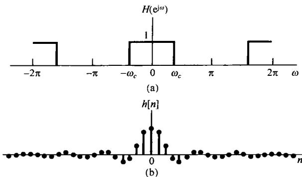

图5.17（a）离散时间理想低通滤波器的频率响应；(b）该理想低通滤波器的单位脉冲响应

在图5.17中，遇到了许多同样的问题，这些问题曾在例4.18的连续时间理想低滤波器中出现过。首先，因为  $h[n]$  在  $n < 0$  不为零，因此该理想低通滤波器不是因果的。第二，即便因果性不是一个重要的因素，也还有一些其他原因而选择用非理想滤波器来实现频率选择性滤波，这里面包括易于实现以及对时域特性的一些要求等。特别是，图5.17(b)的理想低通滤波器的单位脉冲响应是振荡型的，这一点在某些应用中是不希望有的。在这样一些情况下，必须在频域要求（如频率选择性）和时域特性（如非振荡性）之间进行某种折中。第6章将详细讨论这些问题及其有关的概念。

下面的例子用来说明，卷积性质在卷积和的计算上也是很有用的。

例5.13 考虑一个线性时不变系统，其单位脉冲响应为

$$
h [ n ] = \alpha^ {n} u [ n ]
$$

其中  $|\alpha| < 1$  。假设该系统的输入是

$$
x [ n ] = \beta^ {n} u [ n ]
$$

其中  $|\beta| < 1$ 。求  $h[n]$  和  $x[n]$  的傅里叶变换，有

$$
H \left(\mathrm {e} ^ {\mathrm {j} \omega}\right) = \frac {1}{1 - \alpha \mathrm {e} ^ {- \mathrm {j} \omega}} \tag {5.51}
$$

和

$$
X \left(\mathrm {e} ^ {\mathrm {j} \omega}\right) = \frac {1}{1 - \beta \mathrm {e} ^ {- \mathrm {j} \omega}} \tag {5.52}
$$

这样就有

$$
Y (\mathrm {e} ^ {\mathrm {j} \omega}) = H (\mathrm {e} ^ {\mathrm {j} \omega}) X (\mathrm {e} ^ {\mathrm {j} \omega}) = \frac {1}{(1 - \alpha \mathrm {e} ^ {- \mathrm {j} \omega}) (1 - \beta \mathrm {e} ^ {- \mathrm {j} \omega})} \tag {5.53}
$$

和例4.19相同，求  $Y(\mathrm{e}^{\mathrm{j}\omega})$  的逆变换，最容易的做法就是用部分分式将  $Y(\mathrm{e}^{\mathrm{j}\omega})$  展开。  $Y(\mathrm{e}^{\mathrm{j}\omega})$  是含  $\mathrm{e}^{-\mathrm{j}\omega}$  的两个多项式之比，我们总是愿意将它表示成比较简单的一些项之和，这样就能直观地（或许再结合利用5.3.8节的频率微分性质）求得每一项的逆变换。对于有理变换的一般情况，其运算步骤在附录中给予讨论。对于本例，若  $\alpha \neq \beta$ ，则  $Y(\mathrm{e}^{\mathrm{j}\omega})$  的部分分式展开具有如下形式：

$$
Y \left(\mathrm {e} ^ {\mathrm {j} \omega}\right) = \frac {A}{1 - \alpha \mathrm {e} ^ {- \mathrm {j} \omega}} + \frac {B}{1 - \beta \mathrm {e} ^ {- \mathrm {j} \omega}} \tag {5.54}
$$

令式(5.53)和式(5.54)的右边相等，可得

$$
A = \frac {\alpha}{\alpha - \beta}, \quad B = - \frac {\beta}{\alpha - \beta}
$$

因此，根据例5.1和线性性质，凭直观可得式(5.54)的逆变换为

$$
\begin{array}{l} y [ n ] = \frac {\alpha}{\alpha - \beta} \alpha^ {n} u [ n ] - \frac {\beta}{\alpha - \beta} \beta^ {n} u [ n ] \tag {5.55} \\ = \frac {1}{\alpha - \beta} [ \alpha^ {n + 1} u [ n ] - \beta^ {n + 1} u [ n ]) \\ \end{array}
$$

若  $\alpha = \beta$  ，则式(5.54)的部分分式展开式不成立，然而，这时

$$
Y \left(\mathrm {e} ^ {\mathrm {j} \omega}\right) = \left(\frac {1}{1 - \alpha \mathrm {e} ^ {- \mathrm {j} \omega}}\right) ^ {2}
$$

这就能表示成

$$
Y \left(\mathrm {e} ^ {\mathrm {j} \omega}\right) = \frac {\mathrm {j}}{\alpha} \mathrm {e} ^ {\mathrm {j} \omega} \frac {\mathrm {d}}{\mathrm {d} \omega} \left(\frac {1}{1 - \alpha \mathrm {e} ^ {- \mathrm {j} \omega}}\right) \tag {5.56}
$$

和例4.19相同，可以利用频域微分性质式(5.46)，再结合傅里叶变换对

$$
\alpha^ {n} u [ n ] \xleftrightarrow {\mathcal {F}} \frac {1}{1 - \alpha \mathrm {e} ^ {- \mathrm {j} \omega}}
$$

得出

$$
n \alpha^ {n} u [ n ] \xleftrightarrow {\mathcal {F}} j \frac {d}{d \omega} \left(\frac {1}{1 - \alpha e ^ {- j \omega}}\right)
$$

为了计及因子  $\mathbf{e}^{\mathrm{j}\omega}$  ，可应用时移性质得到

$$
(n + 1) \alpha^ {n + 1} u [ n + 1 ] \xleftrightarrow {\mathcal {F}} \mathrm {j e} ^ {\mathrm {j} \omega} \frac {\mathrm {d}}{\mathrm {d} \omega} \left(\frac {1}{1 - \alpha \mathrm {e} ^ {- \mathrm {j} \omega}}\right)
$$

最后再考虑到式(5.56)中的  $1 / \alpha$  因子，可得

$$
y [ n ] = (n + 1) \alpha^ {n} u [ n + 1 ] \tag {5.57}
$$

值得注意的是，虽然上式的右边乘了一个起始于  $n = -1$  的阶跃，但是序列  $(n + 1)\alpha^{n}u[n + 1]$  在  $n = 0$  以前仍然为零，因为因子  $(n + 1)$  在  $n = -1$  时为零。因此，也能换成另一种形式将  $y[n]$  表示为

$$
y [ n ] = (n + 1) \alpha^ {n} u [ n ] \tag {5.58}
$$

下面的例子表明，卷积性质与其他傅里叶变换性质一起，在分析系统互联中往往也是很有用的。

例5.14 考虑图5.18(a)的系统，其输入为  $x[n]$ ，输出为  $y[n]$ 。频率响应为  $H_{\mathrm{lp}}(\mathrm{e}^{\mathrm{j}\omega})$  的线性时不变系统是一个截止频率为  $\pi / 4$  的理想低通滤波器，通带内增益为1。

先考虑图5.18(a)中的上部路径。信号  $w_{1}[n]$  的傅里叶变换可以通过  $(-1)^{n} = \mathrm{e}^{\mathrm{j}mn}$  而有  $w_{1}[n] = \mathrm{e}^{\mathrm{j}n\pi}x[n]$ ，再利用频移性质而得到

$$
W _ {1} \left(\mathrm {e} ^ {\mathrm {j} \omega}\right) = X \left(\mathrm {e} ^ {\mathrm {j} (\omega - \pi)}\right)
$$

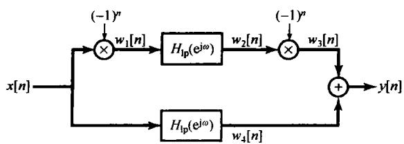

(a)

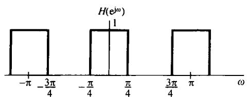

(b)

图5.18 (a) 例5.14中的系统互联；(b) 该系统的总频率响应

由卷积性质得出

$$
W _ {2} \left(\mathrm {e} ^ {\mathrm {j} \omega}\right) = H _ {\mathrm {l p}} \left(\mathrm {e} ^ {\mathrm {j} \omega}\right) X \left(\mathrm {e} ^ {\mathrm {j} (\omega - \pi)}\right)
$$

因为  $w_{3}[n] = \mathrm{e}^{jm}w_{2}[n]$  ，再次利用频移性质就得

$$
\begin{array}{l} W _ {3} \left(\mathrm {c} ^ {\mathrm {j} \omega}\right) = W _ {2} \left(\mathrm {c} ^ {\mathrm {j} (\omega - \pi)}\right) \\ = H _ {\mathrm {l p}} \left(\mathrm {e} ^ {\mathrm {j} (\omega - \pi)}\right) X \left(\mathrm {e} ^ {\mathrm {j} (\omega - 2 \pi)}\right) \\ \end{array}
$$

因为离散时间傅里叶变换总是周期的，周期为  $2\pi$

$$
W _ {3} \left(\mathrm {e} ^ {\mathrm {j} \omega}\right) = H _ {\mathrm {l p}} \left(\mathrm {e} ^ {\mathrm {j} (\omega - \pi)}\right) X \left(\mathrm {e} ^ {\mathrm {j} \omega}\right)
$$

再在图5.18(a)的下部路径应用卷积性质，可得

$$
W _ {4} \left(\mathrm {e} ^ {\mathrm {j} \omega}\right) = H _ {\mathrm {l p}} \left(\mathrm {e} ^ {\mathrm {j} \omega}\right) X \left(\mathrm {e} ^ {\mathrm {j} \omega}\right)
$$

根据傅里叶变换的线性性质，有

$$
\begin{array}{l} Y \left(\mathrm {e} ^ {\mathrm {j} \omega}\right) = W _ {3} \left(\mathrm {e} ^ {\mathrm {j} \omega}\right) + W _ {4} \left(\mathrm {e} ^ {\mathrm {j} \omega}\right) \\ = \left[ H _ {\mathrm {l p}} \left(\mathrm {e} ^ {\mathrm {j} (\omega - \pi)}\right) + H _ {\mathrm {l p}} \left(\mathrm {e} ^ {\mathrm {j} \omega}\right) \right] X \left(\mathrm {e} ^ {\mathrm {j} \omega}\right) \\ \end{array}
$$

结果，图5.18(a)整个系统的频率响应为

$$
H \left(e ^ {j \omega}\right) = \left[ H _ {\mathrm {l p}} \left(e ^ {j (\omega - \pi)}\right) + H _ {\mathrm {l p}} \left(e ^ {j \omega}\right) \right]
$$

如图5.18(b)所示。

如同在例5.7中所看到的，  $H_{\mathrm{lp}}(\mathbf{e}^{\mathrm{j}(\omega - \pi)})$  是一个理想高通滤波器的频率响应。因此，整个系统既通过低频，又通过高频，而阻止这两个频带之间的频率通过。也就是说，这是一个称为具有理想带阻特性(ideal bandstop characteristic)的滤波器，其阻带范围是  $\pi / 4 < |\omega| < 3\pi / 4$ 。

值得提及的是，和连续时间情况相同，不是每一个线性时不变系统都有一个频率响应。例如，单位脉冲响应  $h[n] = 2^n u[n]$  的线性时不变系统，对正弦输入就不是一个有限的响应，这就反映出对  $h[n]$  的傅里叶变换的分析公式是发散的。然而，若一个线性时不变系统是稳定的，那么由2.3.7节可知，它的单位脉响应就是绝对可和的，即

$$
\sum_ {n = - \infty} ^ {+ \infty} | h [ n ] | <   \infty \tag {5.59}
$$

因此，对稳定系统而言，频率响应总是收敛的。在利用傅里叶方法时，总是局限到单位脉冲响应的傅里叶变换存在的系统内。第10章将把傅里叶变换推广到  $z$  变换中，在那里就可以对频率响应不收敛的线性时不变系统应用变换法。

# 5.5 相乘性质

4.5节介绍了连续时间信号的相乘性质，并通过几个例子指出了它的某些应用。对于离散时间信号也有一个类似的性质，在应用中也起着同样的作用。这一节直接来导出这一结果，并给出一个例子来说明它的应用。第7章和第8章将用相乘性质在采样和通信的范畴内进行讨论。

考虑  $y[n]$  等于  $x_{1}[n]$  和  $x_{2}[n]$  的乘积，它们的傅里叶变换分别是  $Y(\mathrm{e}^{\mathrm{j}\omega})$  ，  $X_{1}(\mathrm{e}^{\mathrm{j}\omega})$  和  $X_{2}(\mathrm{e}^{\mathrm{j}\omega})$  那么

$$
Y \left(\mathrm {e} ^ {\mathrm {j} \omega}\right) = \sum_ {n = - \infty} ^ {+ \infty} y [ n ] \mathrm {e} ^ {- \mathrm {j} \omega n} = \sum_ {n = - \infty} ^ {+ \infty} x _ {1} [ n ] x _ {2} [ n ] \mathrm {e} ^ {- \mathrm {j} \omega n}
$$

或者，因为

$$
x _ {1} [ n ] = \frac {1}{2 \pi} \int_ {2 \pi} X _ {1} \left(\mathrm {e} ^ {\mathrm {j} \theta}\right) \mathrm {e} ^ {\mathrm {j} \theta n} \mathrm {d} \theta \tag {5.60}
$$

于是有

$$
Y \left(\mathrm {e} ^ {\mathrm {j} \omega}\right) = \sum_ {n = - \infty} ^ {+ \infty} x _ {2} [ n ] \left\{\frac {1}{2 \pi} \int_ {2 \pi} X _ {1} \left(\mathrm {e} ^ {\mathrm {j} \theta}\right) \mathrm {e} ^ {\mathrm {j} \theta n} \mathrm {d} \theta \right\} \mathrm {e} ^ {- \mathrm {j} \omega n} \tag {5.61}
$$

交换求和与积分次序，可得

$$
Y \left(\mathrm {e} ^ {\mathrm {j} \omega}\right) = \frac {1}{2 \pi} \int_ {2 \pi} X _ {1} \left(\mathrm {e} ^ {\mathrm {j} \theta}\right) \left[ \sum_ {n = - \infty} ^ {+ \infty} x _ {2} [ n ] \mathrm {e} ^ {- \mathrm {j} (\omega - \theta) n} \right] \mathrm {d} \theta \tag {5.62}
$$

上式方括号内的和就是  $X_{2}(\mathrm{e}^{\mathrm{j}(\omega -\theta)})$  ，结果式(5.62)就变成

$$
\boxed {Y \left(\mathrm {e} ^ {\mathrm {j} \omega}\right) = \frac {1}{2 \pi} \int_ {2 \pi} X _ {1} \left(\mathrm {e} ^ {\mathrm {j} \theta}\right) X _ {2} \left(\mathrm {e} ^ {\mathrm {j} (\omega - \theta)}\right) \mathrm {d} \theta} \tag {5.63}
$$

式(5.63)就相应于  $X_{1}(\mathrm{e}^{\mathrm{j}\omega})$  和  $X_{2}(\mathrm{e}^{\mathrm{j}\omega})$  的周期卷积，并且在这个式子中的积分可以在任意  $2\pi$  长度的区间内进行。卷积的一般形式（积分区间从  $-\infty$  到  $+\infty$  )常称为非周期卷积，以与周期卷积相区分。周期卷积的机理最好通过例子来说明。

例5.15 有一个信号  $x[n]$ ，它为另外的两个信号的乘积，求其傅里叶变换  $X(\mathrm{e}^{\mathrm{j}\omega})$ ，即

$$
x [ n ] = x _ {1} [ n ] x _ {2} [ n ]
$$

其中，

$$
x _ {1} [ n ] = \frac {\sin (3 \pi n / 4)}{\pi n}
$$

且

$$
x _ {2} [ n ] = \frac {\sin (\pi n / 2)}{\pi n}
$$

根据式(5.63)的相乘性质知道，  $X(\mathrm{e}^{\mathrm{j}\omega})$  是  $X_{1}(\mathrm{e}^{\mathrm{j}\omega})$  和  $X_{2}(\mathrm{e}^{\mathrm{j}\omega})$  的周期卷积，其中式(5.63)的积分可以在任意  $2\pi$  长度的区间内进行。现选取积分区间为  $-\pi < \theta \leqslant \pi$  ，可得

$$
X \left(e ^ {j \omega}\right) = \frac {1}{2 \pi} \int_ {- \pi} ^ {\pi} X _ {1} \left(e ^ {j \theta}\right) X _ {2} \left(e ^ {j (\omega - \theta)}\right) d \theta \tag {5.64}
$$

式(5.64)类似于非周期卷积，除了积分是限制在区间  $-\pi < \theta \leqslant \pi$  这一点外。然而，这个式子可以转换成一般的卷积，定义

$$
\hat {X} _ {1} (\mathrm {e} ^ {\mathrm {j} \omega}) = \left\{ \begin{array}{l l} X _ {1} (\mathrm {e} ^ {\mathrm {j} \omega}), & - \pi <   \omega \leqslant \pi \\ 0, & \text {其 他} \end{array} \right.
$$

然后，在式(5.64)中用  $\hat{X}_1(\mathbf{e}^{\mathrm{j}\theta})$  替代  $X_{1}(\mathbf{e}^{\mathrm{j}\theta})$  ，并利用  $|\theta | > \pi$  时  $\hat{X}_1(\mathbf{e}^{\mathrm{j}\theta})$  为零，就有

$$
\begin{array}{l} X \left(e ^ {j \omega}\right) = \frac {1}{2 \pi} \int_ {- \pi} ^ {\pi} \hat {X} _ {1} \left(e ^ {j \theta}\right) X _ {2} \left(e ^ {j (\omega - \theta)}\right) d \theta \\ = \frac {1}{2 \pi} \int_ {- \infty} ^ {\infty} \hat {X} _ {1} (\mathrm {e} ^ {\mathrm {j} \theta}) X _ {2} (\mathrm {e} ^ {\mathrm {j} (\omega - \theta)}) \mathrm {d} \theta \\ \end{array}
$$

因此，  $X(\mathrm{e}^{\mathrm{j}\omega})$  是矩形脉冲  $\hat{X} (\mathrm{e}^{\mathrm{j}\omega})$  和周期方波  $X_{2}(\mathrm{e}^{\mathrm{j}\omega})$  的非周期卷积的  $\frac{1}{2\pi}$  倍，  $\hat{X}_1(\mathrm{e}^{\mathrm{j}\omega})$  和  $X_{2}(\mathrm{e}^{\mathrm{j}\omega})$  如图5.19所示。这一卷积的结果就是傅里叶变换  $X(\mathrm{e}^{\mathrm{j}\omega})$  ，如图5.20所示。

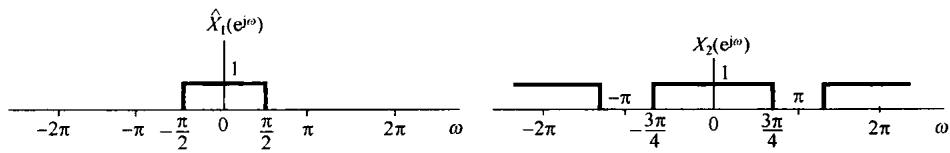

图5.19 代表  $X_{1}(\mathrm{e}^{\mathrm{j}\omega})$  的一个周期的  $\hat{X}_1(\mathrm{e}^{\mathrm{j}\omega})$  及  $X_{2}(\mathrm{e}^{\mathrm{j}\omega})$  。  $\hat{X}_{1}(\mathrm{e}^{\mathrm{j}\omega})$  和 $X_{2}(\mathrm{e}^{\mathrm{j}\omega})$  的线性卷积就相应于  $X_{1}(\mathrm{e}^{\mathrm{j}\omega})$  和  $X_{2}(\mathrm{e}^{\mathrm{j}\omega})$  的周期卷积

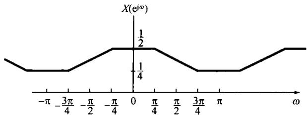

图5.20 例5.15周期卷积的结果

# 5.6 傅里叶变换性质和基本傅里叶变换对列表

表5.1综合了离散时间傅里叶变换的若干重要性质，并指出在文中讨论它们的节号。表5.2汇总了一些基本而最重要的离散时间傅里叶变换对，其中大多数在文中的例子里都曾导出过。

表 5.1 傅里叶变换性质

<table><tr><td>节号</td><td>性质</td><td>非周期信号</td><td>傅里叶变换</td></tr><tr><td></td><td></td><td>x[n]y[n]</td><td>X(ejω)Y(ejω)周期的,周期为2π</td></tr><tr><td>5.3.2</td><td>线性</td><td>ax[n]+by[n]</td><td>aX(ejω)+bY(ejω)</td></tr><tr><td>5.3.3</td><td>时移</td><td>x[n-n0]</td><td>e-jωn0X(ejω)</td></tr><tr><td>5.3.3</td><td>频移</td><td>ejωnx[n]</td><td>X(ej(ω-ω0))</td></tr><tr><td>5.3.4</td><td>共轭</td><td>x*[n]</td><td>X*(e-jω)</td></tr><tr><td>5.3.6</td><td>时间反转</td><td>x[-n]</td><td>X(e-jω)</td></tr><tr><td>5.3.7</td><td>时域扩展</td><td>x(k)[n]= {x[n/k], n为k的倍数0, n不为k的倍数</td><td>X(ejkω)</td></tr><tr><td>5.4</td><td>卷积</td><td>x[n]*y[n]</td><td>X(ejω)Y(ejω)</td></tr><tr><td>5.5</td><td>相乘</td><td>x[n]y[n]</td><td>1/2π∫2πX(ejθ)Y(ej(ω-θ))dθ</td></tr><tr><td>5.3.5</td><td>时域差分</td><td>x[n]-x[n-1]</td><td>(1-e-jω)X(ejω)</td></tr><tr><td>5.3.5</td><td>累加</td><td>∑n k=-∞ x[k]</td><td>1/(1-e-juω)X(ejω)+πX(ej0) ∑k=-∞+∞δ(ω-2πk)</td></tr><tr><td>5.3.8</td><td>频域微分</td><td>nx[n]</td><td>j dX(ejω)/dω</td></tr><tr><td>5.3.4</td><td>实信号的共轭对称性</td><td>x[n]为实信号</td><td>{X(ejω)=X*(e-jω)Re{X(ejω)}=Re{X(e-jω)}Im{X(ejω)}=-Im{X(e-jω)}|X(ejω)|=|X(e-jω)|&lt;X(ejω)=-&lt;X(e-jω)</td></tr><tr><td>5.3.4</td><td>实偶信号的对称性</td><td>X[n]为实偶信号</td><td>X(ejω)为实偶</td></tr><tr><td>5.3.4</td><td>实奇信号的对称性</td><td>X[n]为实奇信号</td><td>X(ejω)纯虚且为奇</td></tr><tr><td rowspan="2">5.3.4</td><td rowspan="2">实信号的奇偶分解</td><td>Xe[n]=Eγ{x[n]} [x[n]为实]</td><td>Re{X(ejω)}</td></tr><tr><td>Xo[n]=Oa{x[n]} [x[n]为实]</td><td>jIm{X(ejω)}</td></tr><tr><td>5.3.9</td><td></td><td>非周期信号的帕斯瓦尔定理</td><td></td></tr><tr><td></td><td></td><td>∑n=-∞+∞ |x[n]|2 = 1/2π ∫2π |X(ejω)|2 dω</td><td></td></tr></table>

表 5.2 基本傅里叶变换对

<table><tr><td>信号</td><td>傅里叶变换</td><td>傅里叶级数系数(若为周期的)</td></tr><tr><td>∑k=(N)akej(k(2π/N)n</td><td>2π ∑k=∞aδ(ω-2πk/N)</td><td>ak</td></tr><tr><td>ejω0n</td><td>2π ∑k=∞δ(ω-ω0-2πl)</td><td>(a) ω0=2πm/N
ak=1, k=m, m±N, m±2N, ...其他
(b) ω0/2π无理数表明信号是非周期的</td></tr><tr><td>cos ω0n</td><td>π ∑k=∞{δ(ω-ω0-2πl)+δ(ω+ω0-2πl)}</td><td>(a) ω0=2πm/N
ak=1/2, k=±m, ±m±N, ±m±2N, ...其他
(b) ω0/2π无理数表明信号是非周期的</td></tr><tr><td>sin ω0n</td><td>π ∑k=∞{δ(ω-ω0-2πl)-δ(ω+ω0-2πl)}</td><td>(a) ω0=2πr/N
ak=1/2j, k=r, r±N, r±2N, ...其他
(b) ω0/2π无理数表明信号是非周期的</td></tr><tr><td>x[n]=1</td><td>2π ∑k=∞δ(ω-2πl)</td><td>ak=1, k=0, ±N, ±2N, ...其他</td></tr><tr><td>周期方波x[n] = {1, |n| ≤ N10, N1&lt; |n| ≤ N/2和 x[n+N] = x[n]</td><td>2π ∑k=∞aδ(ω - 2πk/N)</td><td>ak = sin[(2πk/N)(N1 + 1/2)]/Nsin[2πk/2N],k≠0, ±N, ±2N,···ak = 2N1+1/N, k=0, ±N, ±2N,···</td></tr><tr><td>∑k=∞δ[n-kN]</td><td>2π ∑k=∞δ(ω - 2πk/N)</td><td>ak = 1/N, 对全部k</td></tr><tr><td>anu[n], |a| &lt; 1</td><td>1/1 - ae^-jω</td><td>-</td></tr><tr><td>x[n] {1, |n| ≤ N10, |n| &gt; N1</td><td>sin[ω(N1 + 1/2)]/sin(ω/2)</td><td>-</td></tr><tr><td>sinWn/πn = W/π sinc(Wn/π)</td><td>X(ω) = {1, 0 ≤ |ω| ≤ W/0, W&lt; |ω| ≤ π}</td><td>-</td></tr><tr><td>0 &lt; W &lt; π</td><td>X(ω)周期的, 周期为2π</td><td></td></tr><tr><td>δ[n]</td><td>1</td><td>-</td></tr><tr><td>u[n]</td><td>1/1 - e^-jω + ∑k=-∞+∞πδ(ω - 2πk)</td><td>-</td></tr><tr><td>δ[n-n0]</td><td>e^-jωn0</td><td>-</td></tr><tr><td>(n+1)a^n u[n], |a| &lt; 1</td><td>1/(1 - ae^-jω)^2</td><td>-</td></tr><tr><td>(n+r-1)! a^n u[n], |a| &lt; 1</td><td>1/(1 - ae^-jω)^r</td><td>-</td></tr></table>

# 5.7 对偶性

在讨论连续时间傅里叶变换时，已经观察到在分析公式(4.9)和综合公式(4.8)之间有某种对称性或对偶性存在，然而对离散时间傅里叶变换而言，分析公式(5.9)和综合公式(5.8)之间却不存在相应的对偶性。但是，在离散时间傅里叶级数公式(3.94)和公式(3.95)之间却存在一种对偶关系，这将在5.7.1节中进行讨论。另外，在离散时间傅里叶变换和连续时间傅里叶级数之间也存在一种对偶关系，这一关系将在5.7.2节中讨论。

# 5.7.1 离散时间傅里叶级数的对偶性

因为一个周期信号  $x[n]$  的傅里叶级数系数  $a_{k}$  本身就是一个周期序列，我们就能将这个序列 $a_{k}$  展开成傅里叶级数。离散时间傅里叶级数的对偶性质意味着周期序列  $a_{k}$  的傅里叶级数系数是 $(1 / N)x[-n]$  的值(也就是说正比于原信号在时间反转后的值)。为了更仔细地看出这一点，现考虑两个周期均为  $N$  的周期序列，这两个序列通过下列和式联系起来：

$$
f [ m ] = \frac {1}{N} \sum_ {r = \langle N \rangle} g [ r ] e ^ {- j r (2 \pi / N) m} \tag {5.65}
$$

如果令  $m = k$  和  $r = n$  ，则式(5.65)就变成

$$
f [ k ] = \frac {1}{N} \sum_ {n = \langle N \rangle} g [ n ] e ^ {- j k (2 \pi / N) n}
$$

将该式与式(3.95)比较可知，序列  $f[k]$  就相应于信号  $g[n]$  的傅里叶级数系数。也就是说，如果对一个周期离散时间信号和它的傅里叶级数系数采用在第3章所引入的记法：

$$
x [ n ] \stackrel {\mathcal {F S}} {\longleftrightarrow} a _ {k}
$$

那么，通过式(5.65)相联系的两个周期序列就满足

$$
g [ n ] \xleftrightarrow {\mathcal {F} S} f [ k ] \tag {5.66}
$$

另一方面，若令  $m = n$  和  $r = -k$  ，则式(5.65)就变为

$$
f [ n ] = \sum_ {k = \langle N \rangle} \frac {1}{N} g [ - k ] \mathrm {e} ^ {\mathrm {j} k (2 \pi / N) n}
$$

将该式与式(3.94)比较可知，  $(1 / N)g[-k]$  就相应于  $f[n]$  的傅里叶级数的系数序列，即

$$
f [ n ] \xleftarrow {\mathcal {F S}} \frac {1}{N} g [ - k ] \tag {5.67}
$$

与连续时间情况下一样，这一对偶性意味着：离散时间傅里叶级数的每个性质都有对应的一个对偶关系存在。例如，参照表3.2，如下一对性质就是对偶的：

$$
x [ n - n _ {0} ] \stackrel {\mathcal {F S}} {\longleftrightarrow} a _ {k} \mathrm {e} ^ {- \mathrm {j} k (2 \pi / N) n _ {0}} \tag {5.68}
$$

$$
e ^ {j m (2 \pi / N) n} x [ n ] \xleftrightarrow {\mathcal {F S}} a _ {k - m} \tag {5.69}
$$

同理，从该表可以提取的另一对对偶关系如下：

$$
\sum_ {r = \langle N \rangle} x [ r ] y [ n - r ] \xleftrightarrow {F S} N a _ {k} b _ {k} \tag {5.70}
$$

$$
x [ n ] y [ n ] \xleftarrow {f S} \sum_ {l = \langle N \rangle} a _ {l} b _ {k - l} \tag {5.71}
$$

对于离散时间傅里叶级数的性质除了上述结果以外，对偶性还常常用以简化涉及求取傅里叶级数表示式的复杂计算上。这一点将用如下例子给予说明。

例5.16 考虑周期为  $N = 9$  的如下周期信号：

$$
x [ n ] = \left\{ \begin{array}{l l} \frac {1}{9} \frac {\sin (5 \pi n / 9)}{\sin (\pi n / 9)}, & n \text {不 是} 9 \text {的 倍 数} \\ \frac {5}{9}, & n \text {是} 9 \text {的 倍 数} \end{array} \right. \tag {5.72}
$$

第3章曾求得一个矩形方波的傅里叶系数在形式上与式(5.72)很相像。由对偶性使人想到， $x[n]$  的傅里叶系数也一定具有矩形方波的形式。为了更仔细地看出这点，令  $g[n]$  是一个周期为  $N = 9$  的周期方波，而有

$$
g [ n ] = \left\{ \begin{array}{l l} 1, & | n | \leqslant 2 \\ 0, & 2 <   | n | \leqslant 4 \end{array} \right.
$$

$g[n]$  的傅里叶级数系数  $b_{k}$  可由例3.12确定为

$$
b _ {k} = \left\{ \begin{array}{l l} { \frac {1}{9} \frac {\sin (5 \pi k / 9)}{\sin (\pi k / 9)},} & {\quad k \text {不 是} 9 \text {的 倍 数}} \\ { \frac {5}{9},} & {\quad k \text {是} 9 \text {的 倍 数}} \end{array} \right.
$$

对于  $g[n]$  的傅里叶级数分析公式(3.95)，现在可以写成

$$
b _ {k} = \frac {1}{9} \sum_ {n = - 2} ^ {2} (1) e ^ {- j 2 \pi n k / 9}
$$

将变量  $k$  和  $n$  的名称互换，并令  $x[n] = b_{k}$ ，求得

$$
x [ n ] = \frac {1}{9} \sum_ {k = - 2} ^ {2} (1) e ^ {- j 2 \pi n k / 9}
$$

再在右边和式中令  $k^{\prime} = -k$  ，得到

$$
x [ n ] = \frac {1}{9} \sum_ {k ^ {\prime} = - 2} ^ {2} \mathrm {e} ^ {+ \mathrm {j} 2 \pi n k ^ {\prime} / 9}
$$

最后，将因子1/9移至求和号里面，可见这个式子的右边就具有对  $x[n]$  的综合公式(3.94)的形式，据此得出  $x[n]$  的傅里叶系数就是

$$
a _ {k} = \left\{ \begin{array}{l l} 1 / 9, & | k | \leqslant 2 \\ 0, & 2 <   | k | \leqslant 4 \end{array} \right.
$$

当然这是周期的，周期  $N = 9$ 。

# 5.7.2 离散时间傅里叶变换和连续时间傅里叶级数之间的对偶性

除了离散时间傅里叶级数的对偶性以外，在离散时间傅里叶变换和连续时间傅里叶级数之间也存在着一种对偶关系。现在让我们将连续时间傅里叶级数公式(3.38)和公式(3.39)与离散时间傅里叶变换公式(5.8)和公式(5.9)进行比较。为方便起见，将这些公式重新写出如下：

$$
x [ n ] = \frac {1}{2 \pi} \int_ {2 \pi} X \left(\mathrm {e} ^ {\mathrm {j} \omega}\right) \mathrm {e} ^ {\mathrm {j} \omega n} \mathrm {d} \omega \tag {5.73}
$$

$$
X \left(\mathrm {e} ^ {\mathrm {j} \omega}\right) = \sum_ {n = - \infty} ^ {+ \infty} x [ n ] \mathrm {e} ^ {- \mathrm {j} \omega n} \tag {5.74}
$$

$$
x (t) = \sum_ {k = - \infty} ^ {+ \infty} a _ {k} \mathrm {e} ^ {\mathrm {j} k \omega_ {0} t} \tag {5.75}
$$

$$
a _ {k} = \frac {1}{T} \int_ {T} x (t) \mathrm {e} ^ {- \mathrm {j} k \omega_ {0} t} \mathrm {d} t \tag {5.76}
$$

可以注意到，式(5.73)和式(5.76)很相像，式(5.74)和式(5.75)也很类似。事实上，可以将式(5.73)和式(5.74)看成周期性频率响应  $X(\mathrm{e}^{\mathrm{j}\omega})$  的傅里叶级数表示。特别是，因为  $X(\mathrm{e}^{\mathrm{j}\omega})$  是  $\omega$  的周期函数，周期为  $2\pi$  ，它就有一个用成谐波关系的周期指数函数的加权和的傅里叶级数表示，所有这些成谐波关系的周期指数函数都有一个公共周期  $2\pi$  。也就是说， $X(\mathrm{e}^{\mathrm{j}\omega})$  能够表示成信号  $\mathrm{e}^{\mathrm{j}\omega n}$ ， $n = 0$ ， $\pm 1$ ， $\pm 2$ ，…的加权和的傅里叶级数。由式(5.74)可见，在这个展开式中的第  $n$  次傅里叶系数（也即与  $\mathrm{e}^{\mathrm{j}\omega n}$  相乘的系数）是  $x[-n]$ 。再者，因为  $X(\mathrm{e}^{\mathrm{j}\omega})$  的周期是  $2\pi$ ，所以式(5.73)也就能够看成对傅里叶级数系数  $x[n]$  的傅里叶级数的分析公式，也就是在式(5.74)中  $X(\mathrm{e}^{\mathrm{j}\omega})$  的表示式里与  $\mathrm{e}^{-\mathrm{j}\omega n}$  相乘的系数。这一对偶关系的应用最好用一个例子来说明。

例5.17 可以利用离散时间傅里叶变换综合公式和连续时间傅里叶级数分析公式之间的对偶性来求下面序列的离散时间傅里叶变换：

$$
x [ n ] = \frac {\sin (\pi n / 2)}{\pi n}
$$

为了利用对偶性，首先必须要确认一个周期  $T = 2\pi$  的连续时间信号  $g(t)$ ，其傅里叶系数  $a_{k} = x[k]$ 。由例3.5知道， $g(t)$  是一个周期为  $2\pi$ （或者等效为基波频率  $\omega_0 = 1$ ）的周期性方波，

$$
g (t) = \left\{ \begin{array}{l l} 1, & \quad | t | \leqslant T _ {1} \\ 0, & \quad T _ {1} <   | t | \leqslant \pi \end{array} \right.
$$

那么，  $g(t)$  的傅里叶级数系数是

$$
a _ {k} = \frac {\sin (k T _ {1})}{k \pi}
$$

这样，若取  $T_{1} = \pi /2$  ，就有  $a_{k} = x[k]$  。这时，  $g(t)$  的分析公式是

$$
\frac {\sin (\pi k / 2)}{\pi k} = \frac {1}{2 \pi} \int_ {- \pi} ^ {\pi} g (t) e ^ {- j k t} d t = \frac {1}{2 \pi} \int_ {- \pi / 2} ^ {\pi / 2} (1) e ^ {- j k t} d t
$$

将  $k$  写为  $n, t$  写为  $\omega$ , 则有

$$
\frac {\sin (\pi n / 2)}{\pi n} = \frac {1}{2 \pi} \int_ {- \pi / 2} ^ {\pi / 2} (1) e ^ {- j n \omega} d \omega \tag {5.77}
$$

在上式两边以  $-n$  代换  $n$  ，并注意到sinc函数是偶函数，得出

$$
\frac {\sin (\pi n / 2)}{\pi n} = \frac {1}{2 \pi} \int_ {- \pi / 2} ^ {\pi / 2} (1) \mathrm {e} ^ {\mathrm {j} n \omega} \mathrm {d} \omega
$$

上式的右边具有  $x[n]$  的傅里叶变换综合公式的形式，这里

$$
X (\mathrm {e} ^ {\mathrm {j} \omega}) = \left\{ \begin{array}{l l} 1, & \quad | \omega | \leqslant \pi / 2 \\ 0, & \quad \pi / 2 <   | \omega | \leqslant \pi \end{array} \right.
$$

表5.3简要地综合了连续和离散时间信号的傅里叶级数和傅里叶变换表示式，同时也指出了每一种情况下的对偶关系。

表 5.3 傅里叶级数与傅里叶变换综合

<table><tr><td rowspan="2"></td><td colspan="2">连续时间</td><td colspan="2">离散时间</td></tr><tr><td>时域</td><td>频域</td><td>时域</td><td>频域</td></tr><tr><td rowspan="3">傅里叶级数</td><td>x(t) = ∑k=−∞+∞ak ejkω0t</td><td>ak = 1/T0 ∫T0 x(t) e-jkω0t dt</td><td>x[n] = ∑k=⟨N⟩ak ejk(2π/N)n</td><td>ak = 1/N ∑n=⟨N⟩x[n] e-jk(2π/N)n</td></tr><tr><td>连续时间,在时间上是周期的</td><td>离散频率,在频率上是非周期的</td><td>离散时间。在时间上是周期的</td><td>离散频率,在频率上是周期的</td></tr><tr><td></td><td>对偶</td><td>←对偶→</td><td></td></tr><tr><td rowspan="3">傅里叶变换</td><td>x(t) = 1/2π ∫-∞+∞ X(jω) ejkω dω</td><td>X(jω) = ∫-∞+∞ x(t) e-jkω dt</td><td>x[n] = 1/2π ∫2π X(ejω) ejkω dω</td><td>X(ejω) = ∑n=−∞+∞ x[n] e-jkωn</td></tr><tr><td>连续时间,在时间上是非周期的</td><td>连续频率,在频率上是非周期的</td><td>离散时间,在时间上是非周期的</td><td>连续频率,在频率上是周期的</td></tr><tr><td></td><td>←对</td><td>偶→</td><td></td></tr></table>

# 5.8 由线性常系数差分方程表征的系统

对一个线性时不变系统而言，其输出  $y[n]$  和输入  $x[n]$  之间的线性常系数差分方程一般具有如下形式：

$$
\sum_ {k = 0} ^ {N} a _ {k} y [ n - k ] = \sum_ {k = 0} ^ {M} b _ {k} x [ n - k ] \tag {5.78}
$$

由这样的差分方程描述的系统是十分重要而有用的一类系统。这一节将利用离散时间傅里叶变换的几个性质导出由这样一个方程所描述的线性时不变系统的频率响应  $H(\mathrm{e}^{\mathrm{j}\omega})$  。所采用的方法与4.7节讨论的由线性常系数微分方程所描述的连续时间线性时不变系统是紧密并行的。

有两种方法来确定  $H(\mathrm{e}^{\mathrm{j}\omega})$  。其中的第一种是曾在3.11节对几个简单的差分方程所说明的，这就是利用复指数是线性时不变系统特征函数这一事实来求。若  $x[n] = \mathrm{e}^{\mathrm{j}\omega n}$  是一个线性时不变系统的输入，那么其输出就一定具有  $H(\mathrm{e}^{\mathrm{j}\omega})\mathrm{e}^{\mathrm{j}\omega n}$  这种形式。将这些表达式代入式(5.78)，并做一些代数运算就可以解出  $H(\mathrm{e}^{\mathrm{j}\omega})$  。这一节将采用第二种途径，利用离散时间傅里叶变换的卷积、线性和时移性质来求。设  $X(\mathrm{e}^{\mathrm{j}\omega}),Y(\mathrm{e}^{\mathrm{j}\omega})$  和  $H(\mathrm{e}^{\mathrm{j}\omega})$  分别为输入  $x[n]$  、输出  $y[n]$  和单位脉冲响应  $h[n]$  的傅里叶变换，那么离散时间傅里叶变换的卷积性质就意味着有

$$
H \left(\mathrm {e} ^ {\mathrm {j} \omega}\right) = \frac {Y \left(\mathrm {e} ^ {\mathrm {j} \omega}\right)}{X \left(\mathrm {e} ^ {\mathrm {j} \omega}\right)} \tag {5.79}
$$

在式(5.78)两边应用傅里叶变换，并利用线性和时移性质，可得

$$
\sum_ {k = 0} ^ {N} a _ {k} \mathrm {e} ^ {- \mathrm {j} k \omega} Y (\mathrm {e} ^ {\mathrm {j} \omega}) = \sum_ {k = 0} ^ {M} b _ {k} \mathrm {e} ^ {- \mathrm {j} k \omega} X (\mathrm {e} ^ {\mathrm {j} \omega})
$$

或者等效为

$$
H \left(\mathrm {e} ^ {\mathrm {j} \omega}\right) = \frac {Y \left(\mathrm {e} ^ {\mathrm {j} \omega}\right)}{X \left(\mathrm {e} ^ {\mathrm {j} \omega}\right)} = \frac {\sum_ {k = 0} ^ {M} b _ {k} \mathrm {e} ^ {- \mathrm {j} k \omega}}{\sum_ {k = 0} ^ {N} a _ {k} \mathrm {e} ^ {- \mathrm {j} k \omega}} \tag {5.80}
$$

将式(5.80)与式(4.76)进行比较可见，与连续时间情况下一样，  $H(\mathrm{e}^{\mathrm{j}\omega})$  是两个多项式的比，但是在离散时间情况下，这些多项式的变量是  $\mathrm{e}^{-\mathrm{j}\omega}$  。分子多项式的系数就是出现在式(5.78)右边的系数，而分母多项式的系数就是式(5.78)左边的系数。因此，由式(5.78)表征的线性时不变系统的频率响应就能够凭直观写出来。

式(5.78)的差分方程一般称为  $N$  阶差分方程，因为它涉及输出  $y[n]$  直到  $N$  步的延迟。同时式(5.80)  $H(\mathrm{e}^{\mathrm{j}\omega})$  的分母也是  $\mathrm{e}^{-\mathrm{j}\omega}$  的  $N$  阶多项式。

例5.18 考虑一个因果线性时不变系统，其差分方程为

$$
y [ n ] - a y [ n - 1 ] = x [ n ] \tag {5.81}
$$

其中  $|a| < 1$  。由式(5.80)，该系统的频率响应是

$$
H \left(\mathrm {e} ^ {\mathrm {j} \omega}\right) = \frac {1}{1 - a \mathrm {e} ^ {- \mathrm {j} \omega}} \tag {5.82}
$$

将式(5.82)与例5.1比较可知，它就是序列  $a^n u[n]$  的傅里叶变换。因此，该系统的单位脉冲响应是

$$
h [ n ] = a ^ {n} u [ n ] \tag {5.83}
$$

例5.19 考虑一个因果线性时不变系统，其差分方程为

$$
y [ n ] - \frac {3}{4} y [ n - 1 ] + \frac {1}{8} y [ n - 2 ] = 2 x [ n ] \tag {5.84}
$$

由式(5.80)可知，频率响应是

$$
H \left(\mathrm {e} ^ {\mathrm {j} \omega}\right) = \frac {2}{1 - \frac {3}{4} \mathrm {e} ^ {- \mathrm {j} \omega} + \frac {1}{8} \mathrm {e} ^ {- \mathrm {j} 2 \omega}} \tag {5.85}
$$

为求单位脉冲响应，第一步是要将式(5.85)的分母因式分解为

$$
H \left(\mathrm {e} ^ {\mathrm {j} \omega}\right) = \frac {2}{\left(1 - \frac {1}{2} \mathrm {e} ^ {- \mathrm {j} \omega}\right) \left(1 - \frac {1}{4} \mathrm {e} ^ {- \mathrm {j} \omega}\right)} \tag {5.86}
$$

$H(\mathrm{e}^{\mathrm{j}\omega})$  就能按部分分式展开，如同附录中的例A.3那样，展开的结果为

$$
H \left(\mathrm {e} ^ {\mathrm {j} \omega}\right) = \frac {4}{1 - \frac {1}{2} \mathrm {e} ^ {- \mathrm {j} \omega}} - \frac {2}{1 - \frac {1}{4} \mathrm {e} ^ {- \mathrm {j} \omega}} \tag {5.87}
$$

其中每一项的逆变换都可凭直观写出，其结果为

$$
h [ n ] = 4 \left(\frac {1}{2}\right) ^ {n} u [ n ] - 2 \left(\frac {1}{4}\right) ^ {n} u [ n ] \tag {5.88}
$$

在例5.19中所采用的步骤与在连续时间情况下所用的是相同的。具体而言，在将  $H(\mathrm{e}^{\mathrm{j}\omega})$  利用部分分式方法展开以后，就能凭直观求得每一项的逆变换。这一方法可用于由线性常系数差分方程所描述的任何线性时不变系统的频率响应，以确定该系统的单位脉冲响应。同时，正如下面这个例子将要说明的，若这样的系统输入的傅里叶变换  $X(\mathrm{e}^{\mathrm{j}\omega})$  也是  $\mathrm{e}^{-\mathrm{j}\omega}$  的多项式之比，那么 $Y(\mathrm{e}^{\mathrm{j}\omega})$  也一定是  $\mathrm{e}^{-\mathrm{j}\omega}$  的多项式之比。这时可用同样的办法求得系统对输入  $x[n]$  的响应  $y[n]$  。

例5.20 考虑例5.19的线性时不变系统，并设系统输入为

$$
x [ n ] = \left(\frac {1}{4}\right) ^ {n} u [ n ]
$$

利用式(5.80)和例5.1或例5.18，可得

$$
\begin{array}{l} Y \left(\mathrm {e} ^ {\mathrm {j} \omega}\right) = H \left(\mathrm {e} ^ {\mathrm {j} \omega}\right) X \left(\mathrm {e} ^ {\mathrm {j} \omega}\right) = \left[ \frac {2}{\left(1 - \frac {1}{2} \mathrm {e} ^ {- \mathrm {j} \omega}\right) \left(1 - \frac {1}{4} \mathrm {e} ^ {- \mathrm {j} \omega}\right)} \right] \left[ \frac {1}{1 - \frac {1}{4} \mathrm {e} ^ {- \mathrm {j} \omega}} \right] \tag {5.89} \\ = \frac {2}{\left(1 - \frac {1}{2} e ^ {- j \omega}\right) \left(1 - \frac {1}{4} e ^ {- j \omega}\right) ^ {2}} \\ \end{array}
$$

如同在附录中给出的，这种情况下的部分分式展开式是

$$
Y \left(\mathrm {e} ^ {\mathrm {j} \omega}\right) = \frac {B _ {1 1}}{1 - \frac {1}{4} \mathrm {e} ^ {- \mathrm {j} \omega}} + \frac {B _ {1 2}}{\left(1 - \frac {1}{4} \mathrm {e} ^ {- \mathrm {j} \omega}\right) ^ {2}} + \frac {B _ {2 1}}{1 - \frac {1}{2} \mathrm {e} ^ {- \mathrm {j} \omega}} \tag {5.90}
$$

其中常数  $B_{11}, B_{12}$  和  $B_{21}$  可用附录中给出的方法求出。这个特定的展开式在附录例A.4中详细地列出来了，所得到的值是

$$
B _ {1 1} = - 4, \quad B _ {1 2} = - 2, \quad B _ {2 1} = 8
$$

这样

$$
Y \left(\mathrm {e} ^ {\mathrm {j} \omega}\right) = - \frac {4}{1 - \frac {1}{4} \mathrm {e} ^ {- \mathrm {j} \omega}} - \frac {2}{\left(1 - \frac {1}{4} \mathrm {e} ^ {- \mathrm {j} \omega}\right) ^ {2}} + \frac {8}{1 - \frac {1}{2} \mathrm {e} ^ {- \mathrm {j} \omega}} \tag {5.91}
$$

上式第一项和第三项与在例5.19中所遇到的形式相同，而第二项与在例5.13中所见过的一样。无论由这些例子，还是根据表5.2，都能将式(5.91)中的每一项求逆变换，而得出

$$
y [ n ] = \left\{- 4 \left(\frac {1}{4}\right) ^ {n} - 2 (n + 1) \left(\frac {1}{4}\right) ^ {n} + 8 \left(\frac {1}{2}\right) ^ {n} \right\} u [ n ] \tag {5.92}
$$

# 5.9 小结

这一章和第4章并行地研究了离散时间信号的傅里叶变换，并考察了它的许多重要性质。贯穿整章，我们已经看到连续时间和离散时间傅里叶分析之间有很多类似之处，同时也看到了某些重要的差别。例如，在离散时间情况下，傅里叶级数和傅里叶变换之间的关系非常类似于在连续时间情况下两者之间的关系。尤其是，由离散时间傅里叶级数表示导出非周期信号的离散时间傅里叶变换的过程与在连续时间情况下所对应的过程几乎完全一样。再者，连续时间傅里叶变换的很多性质都能在离散时间情况下找到相对应的性质。但另一方面，与连续时间情况相比，一个非周期信号的离散时间傅里叶变换总是周期的，且周期为  $2\pi$  。除了上述这些异同点之外，本章还讨论了连续时间和离散时间信号的傅里叶表示之间的对偶关系。

连续时间和离散时间傅里叶分析之间最重要的类同之处还在于它们在分析和表示信号及在线性时不变系统中的应用。具体而言，卷积性质提供了线性时不变系统频域分析的基础。我们已经看到了这一途径在第3章至第5章滤波问题的讨论，以及在研究由线性常系数微分及差分方程所描述的系统中的某些应用。并且，第6章更详细地研究滤波和时域与频域的关系问题时，将会对此有更进一步的了解。另外，连续时间和离散时间情况下的相乘性质则是第7章研究采样和第8章讨论通信系统问题的基础。

# 习题

习题的第一部分属于基本题，答案在书末给出。其余三个部分属于基本题、深入题和扩充题。

# 基本题（附答案）

5.1 利用傅里叶变换分析公式(5.9)，计算下列傅里叶变换：

(a)  $\left(\frac{1}{2}\right)^{n - 1}u[n - 1]$

(b)  $\left(\frac{1}{2}\right)^{|n - 1|}$

概略画出每个傅里叶变换在一个周期内的模，并给以标注。

5.2 利用傅里叶变换分析公式(5.9)，计算下列傅里叶变换：

(a)  $\delta [n - 1] + \delta [n + 1]$

(b)  $\delta [n + 2] - \delta [n - 2]$

概略画出每个傅里叶变换在一个周期内的模，并给以标注。

5.3 对于  $-\pi \leqslant \omega < \pi$  ，求下列周期信号的傅里叶变换：

(a)  $\sin \left(\frac{\pi}{3} n + \frac{\pi}{4}\right)$

(b)  $2 + \cos \left(\frac{\pi}{6} n + \frac{\pi}{8}\right)$

5.4 利用傅里叶变换的综合公式(5.8)求下列逆变换：

(a)  $X_{1}(\mathrm{e}^{\mathrm{i}\omega}) = \sum_{k = -\infty}^{\infty}\left\{2\pi \delta (\omega - 2\pi k) + \pi \delta \left(\omega - \frac{\pi}{2} - 2\pi k\right) + \pi \delta \left(\omega + \frac{\pi}{2} - 2\pi k\right)\right\}$

(b)  $X_{2}(\mathrm{e}^{\mathrm{j}\omega}) = \left\{ \begin{array}{ll}2\mathrm{j}, & 0 <   \omega \leqslant \pi \\ -2\mathrm{j}, & -\pi <  \omega \leqslant 0 \end{array} \right.$

5.5 利用傅里叶变换的综合公式(5.8)，求  $X(\mathrm{e}^{\mathrm{j}\omega}) = |X(\mathrm{e}^{\mathrm{j}\omega})|\mathrm{e}^{\mathrm{j}\pi X(\mathrm{e}^{\mathrm{j}\omega})}$  的逆变换，其中

$$
\left| X \left(e ^ {j \omega}\right) \right| = \left\{ \begin{array}{l l} 1, & 0 \leqslant | \omega | <   \frac {\pi}{4} \\ 0, & \frac {\pi}{4} \leqslant | \omega | \leqslant \pi \end{array} \right. \quad \Leftrightarrow X \left(e ^ {j \omega}\right) = - \frac {3 \omega}{2}
$$

根据答案求  $x[n] = 0$  时的  $\pmb{n}$  值。

5.6 已知  $x[n]$  有傅里叶变换  $X(\mathrm{e}^{\mathrm{j}\omega})$  ，用  $X(\mathrm{e}^{\mathrm{j}\omega})$  表示下列信号的傅里叶变换。可以利用表5.1的傅里叶变换性质来做。

(a)  $x_{1}[n] = x[1 - n] + x[-1 - n]$

(b)  $x_{2}[n] = \frac{x^{*}[-n] + x[n]}{2}$

(c)  $x_{3}[n] = (n - 1)^{2}x[n]$

5.7 对于下面每个傅里叶变换，利用傅里叶变换性质（见表5.1），确定对应的时域信号是否是(i)实信号、虚信号，或均不是；(ii)偶信号、奇信号，或均不是。解本题时无须求出任何逆变换。

(a)  $X_{1}(\mathrm{e}^{\mathrm{j}\omega}) = \mathrm{e}^{-\mathrm{j}\omega}\sum_{k = 1}^{10}(\sin k\omega)$

(b)  $X_{2}(\mathrm{e}^{\mathrm{j}\omega}) = \mathrm{j}\sin (\omega)\cos (5\omega)$

(c)  $X_{3}(\mathrm{e}^{\mathrm{j}\omega}) = A(\omega) + \mathrm{e}^{\mathrm{j}B(\omega)}$  ，其中

$$
A (\omega) = \left\{ \begin{array}{l l} 1, & 0 \leqslant | \omega | \leqslant \frac {\pi}{8} \\ 0, & \frac {\pi}{8} <   | \omega | \leqslant \pi \end{array} \right. \quad B (\omega) = - \frac {3 \omega}{2} + \pi
$$

5.8 借助于表 5.1 和表 5.2, 当  $X(\mathrm{e}^{\mathrm{j}\omega})$  为

$$
X \left(e ^ {j \omega}\right) = \frac {1}{1 - e ^ {- j \omega}} \left(\frac {\sin \frac {3}{2} \omega}{\sin \frac {\omega}{2}}\right) + 5 \pi \delta (\omega), \quad - \pi <   \omega \leqslant \pi
$$

求  $x[n]$  。

5.9 对某一特殊的  $x[n]$ ，其傅里叶变换为  $X(\mathrm{e}^{\mathrm{j}\omega})$ ，已知下面四个条件：

1.  $x[n] = 0, n > 0$

2.  $x[n] > 0$

3.  $\text{Im}\{X(e^{j\omega})\} = \sin \omega - \sin 2\omega$

4.  $\frac{1}{2\pi}\int_{-\pi}^{\pi}|x(e^{j\omega})|^2 d\omega = 3$

求  $x[n]$  。

5.10 利用表5.1和表5.2，并结合

$$
X (e ^ {j 0}) = \sum_ {n = - \infty} ^ {\infty} x [ n ]
$$

确定

$$
A = \sum_ {n = 0} ^ {\infty} n \left(\frac {1}{2}\right) ^ {n}
$$

的数值。

5.11 考虑一个信号  $g[n]$ ，其傅里叶变换为  $G(\mathrm{e}^{\mathrm{j}\omega})$ ，假设

$$
g [ n ] = x _ {(2)} [ n ]
$$

其中信号  $x[n]$  的傅里叶变换为  $X(\mathrm{e}^{\mathrm{j}\omega})$  。试确定某一实数  $\alpha$  ，  $0 < \alpha < 2\pi$  ，并有  $G(\mathrm{e}^{\mathrm{j}\omega}) = G(\mathrm{e}^{\mathrm{j}(\omega -\alpha)})$  。

5.12 设

$$
y [ n ] = \left(\frac {\sin \frac {\pi}{4} n}{\pi n}\right) ^ {2} * \left(\frac {\sin \omega_ {c} n}{\pi n}\right)
$$

其中  $\ast$  表示卷积，且  $|\omega_{c}|\leqslant \pi_{\circ}$  试对  $\omega_{c}$  确定一个较严格的限制，以保证

$$
y [ n ] = \left(\frac {\sin \frac {\pi}{4} n}{\pi n}\right) ^ {2}
$$

5.13 一个单位脉冲响应为  $h_1[n] = \left(\frac{1}{3}\right)^n u[n]$  的线性时不变系统与另一单位脉冲响应为  $h_2[n]$  的因果线性时不变系统并联，并联后的频率响应为

$$
H \left(\mathrm {e} ^ {\mathrm {j} \omega}\right) = \frac {- 1 2 + 5 \mathrm {e} ^ {- \mathrm {j} \omega}}{1 2 - 7 \mathrm {e} ^ {- \mathrm {j} \omega} + \mathrm {e} ^ {- \mathrm {j} 2 \omega}}
$$

求  $h_2[n]$  。

5.14 假设一个单位脉冲响应为  $h[n]$ ，频率响应为  $H(\mathrm{e}^{\mathrm{j}\omega})$  的线性时不变系统  $S$ ，具有下列条件：

1.  $\left(\frac{1}{4}\right)^n u[n] \rightarrow g[n]$ ，其中  $g[n] = 0, n \geqslant 2$  且  $n < 0$

2.  $H(\mathrm{e}^{\mathrm{j}\pi /2}) = 1$

3.  $H(\mathrm{e}^{\mathrm{j}\omega}) = H(\mathrm{e}^{\mathrm{j}(\omega -\pi)})$

求  $h[n]$  。

5.15 设  $Y(\mathrm{e}^{\mathrm{j}\omega})$  的逆变换是

$$
y [ n ] = \left(\frac {\sin \omega_ {c} n}{\pi n}\right) ^ {2}
$$

其中  $0 < \omega_{c} < \pi_{\circ}$  试确定  $\omega_{c}$  的值，以保证

$$
Y \left(e ^ {j \pi}\right) = \frac {1}{2}
$$

5.16 有一个信号的傅里叶变换是

$$
X \left(\mathrm {e} ^ {\mathrm {j} \omega}\right) = \sum_ {k = 0} ^ {3} \frac {(1 / 2) ^ {k}}{1 - \frac {1}{4} \mathrm {e} ^ {- \mathrm {j} (\omega - \pi / 2 k)}}
$$

可以证明

$$
x [ n ] = g [ n ] q [ n ]
$$

其中  $g[n]$  具有  $\alpha^n u[n]$  形式， $q[n]$  是周期为  $N$  的周期信号。

(a)求  $\alpha$  的值。

(b) 求  $N$  的值。

(c)  $x[n]$  是实序列吗？

5.17 信号  $x[n] = (-1)^n$  有一基波周期为 2，傅里叶级数系数为  $a_k$ ，利用对偶性求基波周期为 2 的信号  $g[n] = a_n$  的傅里叶级数系数  $b_k$ 。

5.18 已知

$$
a ^ {| n |} \xleftrightarrow {\mathcal {F}} \frac {1 - a ^ {2}}{1 - 2 a \cos \omega + a ^ {2}}, | a | <   1
$$

利用对偶性求下面周期  $T = 1$  的连续时间信号的傅里叶级数系数：

$$
x (t) = \frac {1}{5 - 4 \cos (2 \pi t)}
$$

5.19 考虑一个因果稳定线性时不变系统  $S$ ，其输入  $x[n]$  和输出  $y[n]$  通过如下二阶差分方程所关联：

$$
y [ n ] - \frac {1}{6} y [ n - 1 ] - \frac {1}{6} y [ n - 2 ] = x [ n ]
$$

(a) 求该系统  $S$  的频率响应  $H(\mathrm{e}^{\mathrm{j}\omega})$  。

(b) 求系统  $S$  的单位脉冲响应  $h[n]$ 。

5.20 有一因果稳定线性时不变系统  $S$ ，具有如下性质：

$$
\left(\frac {4}{5}\right) ^ {n} u [ n ] \longrightarrow n \left(\frac {4}{5}\right) ^ {n} u [ n ]
$$

(a) 求该系统的频率响应  $H(\mathrm{e}^{\mathrm{j}\omega})$  。

(b) 求该系统的差分方程。

# 基本题

5.21 计算下列信号的傅里叶变换：

(a)  $x[n] = u[n - 2] - u[n - 6]$

(b)  $x[n] = \left(\frac{1}{2}\right)^{-n}u[-n - 1]$

(c)  $x[n] = \left(\frac{1}{3}\right)^{|n|}u[-n - 2]$

(d)  $x[n] = 2^{n}\sin \left(\frac{\pi}{4} n\right)u[-n]$

(e)  $x[n] = \left(\frac{1}{2}\right)^{|n|} \cos \left(\frac{\pi}{8} (n - 1)\right)$

(f)  $x[n] = \left\{ \begin{array}{ll}n, & -3\leqslant n\leqslant 3\\ 0, & \text{其他} \end{array} \right.$

(g)  $x[n] = \sin \left(\frac{\pi}{2} n\right) + \cos (n)$

(h)  $x[n] = \sin \left(\frac{5\pi}{3} n\right) + \cos \left(\frac{7\pi}{3} n\right)$

(i)  $x[n] = x[n - 6]$  和  $x[n] = u[n] - u[n - 5]$ ， $0 \leqslant n \leqslant 5$

(j)  $x[n] = (n - 1)\left(\frac{1}{3}\right)^{|n|}$

$(\mathbf{k})x[n] = \left(\frac{\sin(\pi n / 5)}{\pi n}\right)\cos \left(\frac{7\pi}{2} n\right)$

5.22 下列是各离散时间信号的傅里叶变换，求相应于每一变换的信号。

(a)  $X(\mathrm{e}^{\mathrm{j}\omega}) = \left\{ \begin{array}{ll}1, & \frac{\pi}{4}\leqslant |\omega |\leqslant \frac{3\pi}{4}\\ 0, & \frac{3\pi}{4}\leqslant |\omega |\leqslant \pi ,0\leqslant |\omega | <   \frac{\pi}{4} \end{array} \right.$

(b)  $X(\mathrm{e}^{\mathrm{j}\omega}) = 1 + 3\mathrm{e}^{-\mathrm{j}\omega} + 2\mathrm{e}^{-\mathrm{j}2\omega} - 4\mathrm{e}^{-\mathrm{j}3\omega} + \mathrm{e}^{-\mathrm{j}10\omega}$

(c)  $X(\mathrm{e}^{\mathrm{j}\omega}) = \mathrm{e}^{-\mathrm{j}\omega /2}, - \pi \leqslant \omega \leqslant \pi$

(d)  $X(\mathrm{e}^{\mathrm{j}\omega}) = \cos^2\omega +\sin^2 3\omega$

(e)  $X(\mathrm{e}^{\mathrm{j}\omega}) = \sum_{k = -\infty}^{\infty}(-1)^{k}\delta \left(\omega -\frac{\pi}{2} k\right)$

（f）  $X(\mathrm{e}^{\mathrm{j}\omega}) = \frac{\mathrm{e}^{-\mathrm{j}\omega} - \frac{1}{5}}{1 - \frac{1}{5}\mathrm{e}^{-\mathrm{j}\omega}}$

(  $\mathrm{g})X(\mathrm{e}^{\mathrm{j}\omega}) = \frac{1 - \frac{1}{3}\mathrm{e}^{-\mathrm{j}\omega}}{1 - \frac{1}{4}\mathrm{e}^{-\mathrm{j}\omega} - \frac{1}{8}\mathrm{e}^{-2\mathrm{j}\omega}}$

(h)  $X(\mathrm{e}^{\mathrm{j}\omega}) = \frac{1 - \left(\frac{1}{3}\right)^{6}\mathrm{e}^{-\mathrm{j}6\omega}}{1 - \frac{1}{3}\mathrm{e}^{-\mathrm{j}\omega}}$

5.23 设  $X(\mathrm{e}^{\mathrm{j}\omega})$  是图P5.23所示的  $x[n]$  信号的傅里叶变换，不经求出  $X(\mathrm{e}^{\mathrm{j}\omega})$  完成下列计算：

(a) 求  $X(\mathrm{e}^{\mathrm{j}\theta})$

(b)求  $\angle X(\mathrm{e}^{\mathrm{j}\omega})$

(c) 求  $\int_{-\pi}^{\pi} X(\mathrm{e}^{\mathrm{j}\omega}) \, \mathrm{d}\omega$

(d) 求  $X(\mathrm{e}^{j\pi})$

(e)求并画出傅里叶变换为  $\mathcal{Re}\{x(\omega)\}$  的信号。

(f)求

(i)  $\int_{-\pi}^{\pi}|X(e^{j\omega})|^{2}\mathrm{d}\omega$

（ii）  $\int_{-\pi}^{\pi}\left|\frac{\mathrm{d}X(\mathbf{e}^{\mathrm{j}\omega})}{\mathrm{d}\omega}\right|^2\mathrm{d}\omega$

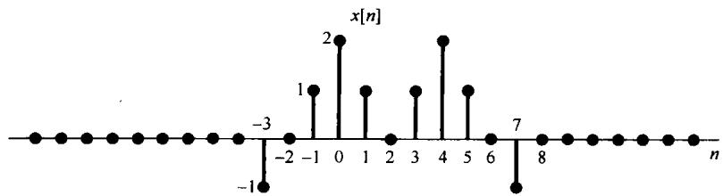

图P5.23

5.24 试判定下列各信号，其傅里叶变换有哪一个（如果有）满足下面每一个条件：

1.  $\mathbf{Re}\{X(\mathrm{e}^{\mathrm{j}\omega})\} = 0$

2.  $\mathbf{Im}\{X(\mathrm{e}^{\mathrm{j}\omega})\} = 0$

3. 存在一个实数  $\alpha$ ，使得  $\mathrm{e}^{\mathrm{j}\omega x} (x) = 0$  为实的。

4.  $\int_{-\pi}^{\pi} X(\mathrm{e}^{\mathrm{j}\omega}) \, \mathrm{d}\omega = 0$

5.  $X(\mathrm{e}^{\mathrm{j}\omega})$  是周期的。

6.  $X(\mathrm{e}^{\mathrm{j}\theta}) = 0$

(a)  $x[n]$  如图P5.24(a)所示。

(b)  $x[n]$  如图P5.24(b)所示。

(c)  $x[n] = \left(\frac{1}{2}\right)^n u[n]$

(d)  $x[n] = \left(\frac{1}{2}\right)^{|n|}$

(e)  $x[n] = \delta [n - 1] + \delta [n + 2]$

(f)  $x[n] = \delta [n - 1] + \delta [n + 3]$

(g)  $x[n]$  如图P5.24(c)所示。

(h)  $x[n]$  如图P5.24(d)所示。

(i)  $x[n] = \delta [n - 1] - \delta [n + 1]$

5.25 考虑图P5.25的信号，设该信号的傅里叶变换用笛卡儿坐标写出为

$$
X \left(\mathrm {e} ^ {\mathrm {j} \omega}\right) = A (\omega) + \mathrm {j} B (\omega)
$$

试画出对应于变换为

$$
Y \left(\mathrm {e} ^ {\mathrm {j} \omega}\right) = \left[ B (\omega) + A (\omega) \mathrm {e} ^ {\mathrm {j} \omega} \right]
$$

的时间信号。

5.26 设  $x_{1}[n]$  的傅里叶变换  $X_{1}(\mathrm{e}^{\mathrm{j}\omega})$  如图P5.26(a)所示。

(a) 考虑信号  $x_{2}[n]$ ，其傅里叶变换  $X_{2}(e^{j\omega})$  如图 P5.26(b) 所示，试用  $x_{1}[n]$  来表示  $x_{2}[n]$ 。

提示：首先用  $X_{1}(\mathrm{e}^{\mathrm{j}\omega})$  来表示  $X_{2}(\mathrm{e}^{\mathrm{j}\omega})$  ，然后利用傅里叶变换性质。

(b)  $x_{3}[n]$  的傅里叶变换  $X_{3}(\mathrm{e}^{\mathrm{i}\omega})$  如图P5.26(c)所示，对  $x_{3}[n]$  重做(a)。

(c) 设

$$
\alpha = \frac {\sum_ {n = - \infty} ^ {\infty} n x _ {1} [ n ]}{\sum_ {n = - \infty} ^ {\infty} x _ {1} [ n ]}
$$

这个  $\alpha$  量是信号  $x_{1}[n]$  的重心，通常称为  $x_{1}[n]$  的延迟时间(delay time)。求  $\alpha$  （做该题无须首先明确地求出  $x_{1}[n]$ ）。

(d) 考虑信号  $x_{4}[n] = x_{1}[n]*h[n]$ , 其中

$$
h [ n ] = \frac {\sin (\pi n / 6)}{\pi n}
$$

概略画出  $X_{4}(\mathrm{e}^{\mathrm{j}\omega})$  。

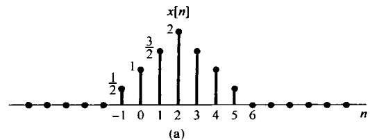

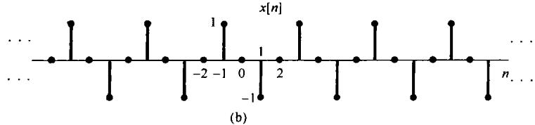

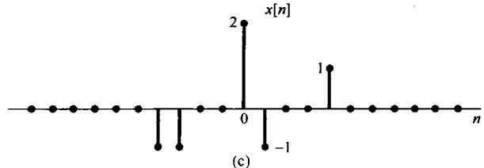

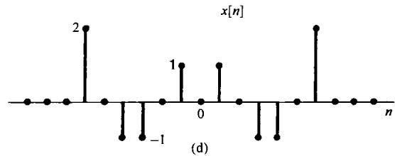

图P5.24

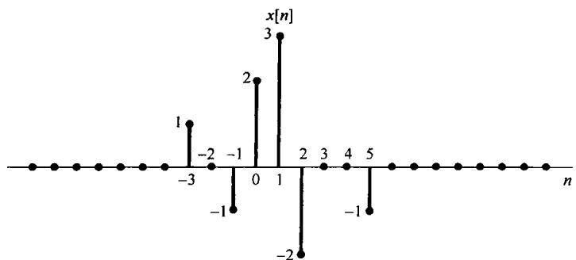

图P5.25

5.27 (a) 设  $x[n]$  的傅里叶变换为  $X(\mathrm{e}^{\mathrm{j}\omega})$  ，如图P5.27所示。对于下列每一  $p[n]$  ，概略画出

$$
w [ n ] = x [ n ] p [ n ]
$$

的傅里叶变换。

(i)  $p[n] = \cos \pi n$

(ii)  $p[n] = \cos (\pi n / 2)$

(iii)  $p[n] = \sin(\pi n / 2)$

(iv)  $p[n] = \sum_{k = -\infty}^{\infty}\delta [n - 2k]$

(v)  $p[n] = \sum_{k=-\infty}^{\infty} \delta[n - 4k]$

(b) 假设(a)中的信号  $w[n]$  作为输入加到一个单位脉冲响应为

$$
h [ n ] = \frac {\sin (\pi n / 2)}{\pi n}
$$

的线性时不变系统中，求对应于(a)中所选  $p[n]$  的输出  $y[n]$  。

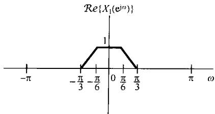

(a)

(b)

(c)

图P5.26

图P5.27

5.28 已知信号  $x[n]$  和  $g[n]$  分别有傅里叶变换  $X(\mathrm{e}^{\mathrm{j}\omega})$  和  $G(\mathrm{e}^{\mathrm{j}\omega})$  。另外， $X(\mathrm{e}^{\mathrm{j}\omega})$  和  $G(\mathrm{e}^{\mathrm{j}\omega})$  之间的关系如下：

$$
\frac {1}{2 \pi} \int_ {- \pi} ^ {+ \pi} X (\mathrm {e} ^ {\mathrm {j} \theta}) G (\mathrm {e} ^ {\mathrm {j} (\omega - \theta)}) \mathrm {d} \theta = 1 + \mathrm {e} ^ {- \mathrm {j} \omega} \tag {P5.28-1}
$$

(a) 若  $x[n] = (-1)^n$ ，求  $g[n]$ ，使其傅里叶变换  $G(\mathrm{e}^{\mathrm{j}\omega})$  满足式(P5.28-1)。对于  $g[n]$  还存在其他可能的解吗？

(b) 若  $x[n] = \left(\frac{1}{2}\right)^n u[n]$ ，重做(a)。

5.29 (a) 考虑一个离散时间线性时不变系统，其单位脉冲响应为

$$
h [ n ] = \left(\frac {1}{2}\right) ^ {n} u [ n ]
$$

利用傅里叶变换求在下列各输入信号下的响应：

(i)  $x[n] = \left(\frac{3}{4}\right)^n u[n]$

(ii)  $x[n] = (n + 1)\left(\frac{1}{4}\right)^n u[n]$

(iii)  $x[n] = (-1)^n$

(b) 假设

$$
h [ n ] = \left[ \left(\frac {1}{2}\right) ^ {n} \cos \left(\frac {\pi n}{2}\right) \right] u [ n ]
$$

利用傅里叶变换求在下列各输入信号下的响应：

(i)  $x[n] = \left(\frac{1}{2}\right)^n u[n]$

(ii)  $x[n] = \cos (\pi n / 2)$

(c) 设  $x[n]$  和  $h[n]$  的傅里叶变换为

$$
X \left(e ^ {j \omega}\right) = 3 e ^ {j \omega} + 1 - e ^ {- j \omega} + 2 e ^ {- j 3 \omega}
$$

$$
H \left(e ^ {j \omega}\right) = - e ^ {j \omega} + 2 e ^ {- 2 j \omega} + e ^ {j 4 \omega}
$$

求  $y[n] = x[n] * h[n]$ 。

5.30 第4章曾指出过，单位冲激响应为

$$
h (t) = \frac {W}{\pi} \operatorname {s i n c} \left(\frac {W t}{\pi}\right) = \frac {\sin W t}{\pi t}
$$

的连续时间线性时不变系统在线性时不变系统分析中起着很重要的作用。同样正确的是，单位脉冲响应为

$$
h [ n ] = \frac {W}{\pi} \operatorname {s i n c} \left(\frac {W n}{\pi}\right) = \frac {\sin W n}{\pi n}
$$

的离散时间线性时不变系统在线性时不变系统分析中也起着重要的作用。

(a) 求并画出单位脉冲响应为  $h[n]$  的系统的频率响应。

(b) 考虑信号

$$
x [ n ] = \sin \left(\frac {\pi n}{8}\right) - 2 \cos \left(\frac {\pi n}{4}\right)
$$

假定该信号是具有下列单位脉冲响应的线性时不变系统的输入，求每种情况的输出。

(i)  $h[n] = \frac{\sin(\pi n / 6)}{\pi n}$

(ii)  $h[n] = \frac{\sin(\pi n / 6)}{\pi n} +\frac{\sin(\pi n / 2)}{\pi n}$

(iii)  $h[n] = \frac{\sin(\pi n / 6)\sin(\pi n / 3)}{\pi^2n^2}$

(iv)  $h[n] = \frac{\sin(\pi n / 6)\sin(\pi n / 3)}{\pi n}$

(c) 考虑单位脉冲响应为

$$
h [ n ] = \frac {\sin (\pi n / 3)}{\pi n}
$$

的线性时不变系统，求对下列各输入信号下的输出：

(i)  $x[n]$  为图P5.30所示的方波。

(ii)  $x[n] = \sum_{k = -\infty}^{\infty}\delta [n - 8k]$

（iii）  $x[n] = (-1)^n$  乘以图P5.30所示的方波。

(iv)  $x[n] = \delta [n + 1] + \delta [n - 1]$

图P5.30

5.31 有一个单位脉冲响应为  $h[n]$ ，频率响应为  $H(\mathrm{e}^{\mathrm{j}\omega})$  的线性时不变系统  $S$ ，当  $-\pi \leqslant \omega_0 \leqslant \pi$  时具有如下特性：

$$
\cos \omega_ {0} n \longrightarrow \omega_ {0} \cos \omega_ {0} n
$$

(a) 求  $H(\mathrm{e}^{\mathrm{j}\omega})$  。

(b) 求  $h[n]$ 。

5.32 设  $h_1[n]$  和  $h_2[n]$  是因果线性时不变系统的单位脉冲响应，相应的频率响应是  $H_1(\mathrm{e}^{\mathrm{j}\omega})$  和  $H_2(\mathrm{e}^{\mathrm{j}\omega})$  ，在这些条件下，下面的式子一般来说是对还是不对？陈述理由。

$$
\left[ \frac {1}{2 \pi} \int_ {- \pi} ^ {\pi} H _ {1} (\mathrm {e} ^ {\mathrm {j} \omega}) \mathrm {d} \omega \right] \left[ \frac {1}{2 \pi} \int_ {- \pi} ^ {\pi} H _ {2} (\mathrm {e} ^ {\mathrm {j} \omega}) \mathrm {d} \omega \right] = \frac {1}{2 \pi} \int_ {- \pi} ^ {\pi} H _ {1} (\mathrm {e} ^ {\mathrm {j} \omega}) H _ {2} (\mathrm {e} ^ {\mathrm {j} \omega}) \mathrm {d} \omega
$$

5.33 考虑一个因果线性时不变系统，其差分方程为

$$
y [ n ] + \frac {1}{2} y [ n - 1 ] = x [ n ]
$$

(a) 求该系统的频率响应  $H(\mathrm{e}^{\mathrm{j}\omega})$  。

(b) 在下列输入时求系统响应：

(i)  $x[n] = \left(\frac{1}{2}\right)^n u[n]$

(ii)  $x[n] = \left(-\frac{1}{2}\right)^n u[n]$

(iii)  $x[n] = \delta [n] + \frac{1}{2}\delta [n - 1]$

(iv)  $x[n] = \delta [n] - \frac{1}{2}\delta [n - 1]$

(c) 在输入具有下列傅里叶变换时，求系统响应：

(i)  $X(\mathrm{e}^{\mathrm{j}\omega}) = \frac{1 - \frac{1}{4}\mathrm{e}^{-\mathrm{j}\omega}}{1 + \frac{1}{2}\mathrm{e}^{-\mathrm{j}\omega}}$

（ii）  $X(\mathrm{e}^{\mathrm{j}\omega}) = \frac{1 + \frac{1}{2}\mathrm{e}^{-\mathrm{j}\omega}}{1 - \frac{1}{4}\mathrm{e}^{-\mathrm{j}\omega}}$

(iii)  $X(e^{j\omega}) = \frac{1}{\left(1 - \frac{1}{4}e^{-j\omega}\right)\left(1 + \frac{1}{2}e^{-j\omega}\right)}$

(iv)  $X(\mathrm{e}^{\mathrm{j}\omega}) = 1 + 2\mathrm{e}^{-3\mathrm{j}\omega}$

5.34 考虑一个由两个线性时不变系统级联组成的系统，这两个系统的频率响应为

$$
H _ {1} (\mathrm {e} ^ {\mathrm {j} \omega}) = \frac {2 - \mathrm {e} ^ {- \mathrm {j} \omega}}{1 + \frac {1}{2} \mathrm {e} ^ {- \mathrm {j} \omega}} \text {和} H _ {2} (\mathrm {e} ^ {\mathrm {j} \omega}) = \frac {1}{1 - \frac {1}{2} \mathrm {e} ^ {- \mathrm {j} \omega} + \frac {1}{4} \mathrm {e} ^ {- \mathrm {j} 2 \omega}}
$$

(a) 求描述整个系统的差分方程。

(b) 求整个系统的单位脉冲响应。

5.35 一个因果线性时不变系统由如下差分方程所描述：

$$
y [ n ] - a y [ n - 1 ] = b x [ n ] + x [ n - 1 ]
$$

其中  $a$  为实数，且  $|a| < 1$ 。

(a) 找一个  $b$  值，使该系统的频率响应满足

$$
\left| H (\mathrm {e} ^ {\mathrm {j} \omega}) \right| = 1, \text {对 全 部} \omega
$$

因为对任何  $\omega$  值的输入  $\mathrm{e}^{\mathrm{j}\omega n}$  都不衰减，所以这类系统称为全通系统。利用该  $b$  值解余下的问题。

（b）粗略画出  $a = 1 / 2$  时的  $\angle H(\mathrm{e}^{\mathrm{j}\omega})$  ，  $0\leqslant \omega \leqslant \pi_{\circ}$

（c）粗略画出  $a = -1 / 2$  时的  $\angle H(\mathrm{e}^{\mathrm{j}\omega})$  ，  $0\leqslant \omega \leqslant \pi_{\circ}$

(d) 当  $a = -\frac{1}{2}$  时，系统的输入  $x[n]$  为

$$
x [ n ] = \left(\frac {1}{2}\right) ^ {n} u [ n ]
$$

求出并画出该系统的输出。由这个例子可见，一个非线性相移对信号造成的影响明显不同于一个线性相移所引起的信号的时移。

5.36 (a) 设  $h[n]$  和  $g[n]$  是两个互逆的离散时间线性时不变系统的单位脉冲响应，并且都是稳定的。问这两个系统频率响应之间是什么关系？

(b) 考虑由下列各差分方程描述的因果线性时不变系统，在每一种情况下，求逆系统的单位脉冲响应和表征该逆系统的差分方程。

(i)  $y[n] = x[n] - \frac{1}{4} x[n - 1]$

(ii)  $y[n] + \frac{1}{2} y[n - 1] = x[n]$

(iii)  $y[n] + \frac{1}{2} y[n - 1] = x[n] - \frac{1}{4} x[n - 1]$

(iv)  $y[n] + \frac{5}{4} y[n - 1] - \frac{1}{8} y[n - 2] = x[n] - \frac{1}{4} x[n - 1] - \frac{1}{8} x[n - 2]$

(v)  $y[n] + \frac{5}{4} y[n - 1] - \frac{1}{8} y[n - 2] = x[n] - \frac{1}{2} x[n - 1]$

(vi)  $y[n] + \frac{5}{4} y[n - 1] - \frac{1}{8} y[n - 2] = x[n]$

（c）考虑由下列差分方程所描述的因果离散时间线性时不变系统

$$
y [ n ] + y [ n - 1 ] + \frac {1}{4} y [ n - 2 ] = x [ n - 1 ] - \frac {1}{2} x [ n - 2 ] \tag {P5.36-1}
$$

该系统的逆系统是什么？证明：逆系统是非因果的。试找出另一个因果线性时不变系统，它是由式(P5.36-1)描述的系统的“逆再加延时”，也即找一个因果线性时不变系统，使得图P5.36中的输出  $w[n]$  等于  $x[n - 1]$  。

图P5.36

# 深入题

5.37 设  $X(\mathrm{e}^{\mathrm{j}\omega})$  是  $x[n]$  的傅里叶变换。利用  $X(\mathrm{e}^{\mathrm{j}\omega})$  导出下列信号傅里叶变换表示式（没有假设  $x[n]$  是实序列）。

(a)  $\mathcal{Re}\{x[n]\}$

(b)  $x^{*}[-n]$

(c)  $\mathcal{E}\nu \{x[n]\}$

5.38 设  $X(e^{j\omega})$  是一实信号  $x[n]$  的傅里叶变换，证明： $x[n]$  可以写成

$$
x [ n ] = \int_ {0} ^ {\pi} \left\{B (\omega) \cos \omega + C (\omega) \sin \omega \right\} d \omega
$$

提示：找出利用  $X(\mathrm{e}^{\mathrm{j}\omega})$  来表示  $B(\omega)$  和  $C(\omega)$  的表示式。

5.39 导出卷积性质

$$
x [ n ] * h [ n ] \stackrel {\mathcal {F}} {\longleftrightarrow} X (\mathrm {e} ^ {\mathrm {j} \omega}) H (\mathrm {e} ^ {\mathrm {j} \omega})
$$

5.40  $x[n]$  和  $h[n]$  是两个信号，并令  $y[n] = x[n]*h[n]$  。试对  $y[0]$  写出两个表示式：一个利用  $x[n]$  和 $h[n]$  （直接用卷积和）；另一个用  $X(\mathrm{e}^{\mathrm{j}\omega})$  和  $H(\mathrm{e}^{\mathrm{j}\omega})$  （用傅里叶变换的卷积性质)。然后，选择一个恰当的  $h[n]$  ，利用这两个表示式导出帕斯瓦尔定理，即

$$
\sum_ {n = - \infty} ^ {+ \infty} | x [ n ] | ^ {2} = \frac {1}{2 \pi} \int_ {- \pi} ^ {\pi} | X (\mathrm {e} ^ {\mathrm {j} \omega}) | ^ {2} \mathrm {d} \omega
$$

用类似的方式，导出下面帕斯瓦尔定理的一般形式：

$$
\sum_ {n \rightarrow \infty} ^ {+ \infty} x [ n ] z ^ {*} [ n ] = \frac {1}{2 \pi} \int_ {- \pi} ^ {\pi} X (\mathrm {e} ^ {\mathrm {j} \omega}) Z ^ {*} (\mathrm {e} ^ {\mathrm {j} \omega}) \mathrm {d} \omega
$$

5.41 令  $\tilde{x}[n]$  是一个周期为  $N$  的周期信号，另一有限长信号  $x[n]$  通过下式与  $\tilde{x}[n]$  关联：

$$
x [ n ] = \left\{ \begin{array}{l l} {\tilde {x} [ n ],} & {n _ {0} \leqslant n \leqslant n _ {0} + N - 1} \\ {0,} & {\text {其 他}} \end{array} \right.
$$

其中  $n_0$  为某整数。也就是说， $x[n]$  等于一个周期上的  $\tilde{x}[n]$ ，而在其余地方均为零。

(a) 若  $\tilde{x}[n]$  的傅里叶级数系数为  $a_k$ ,  $x[n]$  的傅里叶变换为  $X(\mathrm{e}^{\mathrm{j}\omega})$  。证明:

$$
a _ {k} = \frac {1}{N} X \left(\mathrm {e} ^ {\mathrm {j} 2 \pi k / N}\right)
$$

且与  $n_0$  的值无关。

(b) 考虑下面两个信号：

$$
\begin{array}{l} x [ n ] = u [ n ] - u [ n - 5 ] \\ \bar {x} [ n ] = \sum_ {k = - \infty} ^ {\infty} x [ n - k N ] \\ \end{array}
$$

其中  $N$  为一个正整数。令  $a_{k}$  为  $\bar{x}[n]$  的傅里叶系数， $X(\mathrm{e}^{\mathrm{j}\omega})$  为  $x[n]$  的傅里叶变换，

(i) 求  $X(e^{j\omega})$  的闭式表示式。

(ii) 利用 (i) 的结果, 求傅里叶系数  $a_{k}$  的表示式。

5.42 本题将导出作为相乘性质的一种特殊情况的离散时间傅里叶变换的频移性质。令  $x[n]$  为任意离散时间信号，其傅里叶变换为  $X(\mathrm{e}^{\mathrm{j}\omega})$  ，并令

$$
g [ n ] = \mathrm {e} ^ {\mathrm {j} \omega_ {0} n} x [ n ]
$$

(a) 求出并画出下面信号的傅里叶变换：

$$
p [ n ] = \mathrm {e} ^ {\mathrm {j} \omega_ {0} n}
$$

(b) 傅里叶变换的相乘性质有

$$
g [ n ] = p [ n ] x [ n ]
$$

$$
G \left(\mathrm {e} ^ {\mathrm {j} \omega}\right) = \frac {1}{2 \pi} \int_ {<   2 \pi >} X \left(\mathrm {e} ^ {\mathrm {j} \theta}\right) P \left(\mathrm {e} ^ {\mathrm {j} (\omega - \theta)}\right) \mathrm {d} \theta
$$

求出这个积分以证明

$$
G \left(e ^ {j \omega}\right) = X \left(e ^ {j \left(\omega - \omega_ {0}\right)}\right)
$$

5.43 令  $x[n]$  的傅里叶变换为  $X(\mathrm{e}^{\mathrm{j}\omega})$  ，并令

$$
g [ n ] = x [ 2 n ]
$$

它的傅里叶变换是  $G(\mathrm{e}^{\mathrm{j}\omega})$  。在本题中要导出  $G(\mathrm{e}^{\mathrm{j}\omega})$  和  $X(\mathrm{e}^{\mathrm{j}\omega})$  之间的关系。

(a) 设

$$
v [ n ] = \frac {\left(e ^ {- j \pi n} x [ n ]\right) + x [ n ]}{2}
$$

试用  $X(\mathrm{e}^{\mathrm{j}\omega})$  表示  $\boldsymbol {v}[n]$  的傅里叶变换  $V(\mathrm{e}^{\mathrm{j}\omega})$  。

(b) 注意到, 当  $n$  为奇数时,  $\pmb{v}[n] = 0$ , 证明  $\pmb{v}[2n]$  的傅里叶变换等于  $V(\mathrm{e}^{\mathrm{j}\frac{\pi}{2}})$  。

(c）证明

$$
x [ 2 n ] = v [ 2 n ]
$$

于是就有

$$
G \left(\mathrm {e} ^ {\mathrm {j} \omega}\right) = V \left(\mathrm {e} ^ {\mathrm {j} \omega / 2}\right)
$$

现在利用(a)的结果，用  $X(\mathrm{e}^{\mathrm{j}\omega})$  来表示  $G(\mathrm{e}^{\mathrm{j}\omega})$  。

5.44 (a) 令

$$
x _ {1} [ n ] = \cos \left(\frac {\pi n}{3}\right) + \sin \left(\frac {\pi n}{2}\right)
$$

是一个信号，  $x_{1}[n]$  的傅里叶变换记为  $X_{1}(\mathrm{e}^{\mathrm{j}\omega})$  ，画出  $x_{1}[n]$  和具有下列傅里叶变换的信号：

(i)  $X_{2}(\mathrm{e}^{\mathrm{j}\omega}) = X_{1}(\mathrm{e}^{\mathrm{j}\omega})\mathrm{e}^{\mathrm{j}\omega},|\omega | <   \pi$

(ii)  $X_{3}\left(\mathrm{e}^{\mathrm{j}\omega}\right) = X_{1}\left(\mathrm{e}^{\mathrm{j}\omega}\right)\mathrm{e}^{-\mathrm{j}3\omega /2},|\omega | <   \pi$

(b) 令

$$
w (t) = \cos \left(\frac {\pi t}{3 T}\right) + \sin \left(\frac {\pi t}{2 T}\right)
$$

是一个连续时间信号。可以注意到，  $x_{1}[n]$  可以看成  $\pmb {w}(t)$  的等间隔采样的序列，即

$$
x _ {1} [ n ] = w (n T)
$$

证明

$$
x _ {2} [ n ] = w (n T - \alpha) \text {和} x _ {3} [ n ] = w (n T - \beta)
$$

并给出  $\alpha$  和  $\beta$  的值。由此可以得出， $x_{2}[n]$  和  $x_{3}[n]$  也都是  $w(t)$  的等间隔样本序列。

5.45 考虑一个离散时间信号  $x[n]$ ，其傅里叶变换如图P5.45所示。试画出下面连续时间信号，并进行标注：

(a)  $x_{1}(t) = \sum_{n = -\infty}^{\infty}x[n]\mathrm{e}^{\mathrm{j}(2\pi /10)nt}$

(b)  $x_{2}(t) = \sum_{n = -\infty}^{\infty}x[-n]\mathrm{e}^{\mathrm{j}(2\pi /10)nt}$

(c)  $x_{3}(t) = \sum_{n = -\infty}^{\infty}Od\{x[n]\}\mathrm{e}^{\mathrm{j}(2\pi /8)n t}$

(d)  $x_{4}(t) = \sum_{n = -\infty}^{\infty}\mathcal{R}e\{x[n]\mid \mathrm{e}^{\mathrm{j}(2n / 6)nt}$

图P5.45

5.46 在例5.1中已证明了，对  $|\alpha| < 1$  有

$$
\alpha^ {n} u [ n ] \xleftrightarrow {\mathcal {F}} \frac {1}{1 - \alpha e ^ {- j \omega}}
$$

(a) 利用傅里叶变换性质, 证明

$$
(n + 1) \alpha^ {n} u [ n ] \xleftrightarrow {\mathcal {F}} \frac {1}{(1 - \alpha e ^ {- j \omega}) ^ {2}}
$$

(b) 用归纳法证明

$$
X \left(\mathrm {e} ^ {\mathrm {j} \omega}\right) = \frac {1}{\left(1 - \alpha \mathrm {e} ^ {- \mathrm {j} \omega}\right) ^ {r}}
$$

的傅里叶逆变换是

$$
x [ n ] = \frac {(n + r - 1) !}{n ! (r - 1) !} \alpha^ {n} u [ n ]
$$

5.47 判定下列说法是对还是错，并陈述理由。下列每一条陈述中， $x[n]$  与  $X(e^{j\omega})$  为一对傅里叶变换：

(a) 若  $X(\mathrm{e}^{\mathrm{j}\omega}) = X(\mathrm{e}^{\mathrm{j}(\omega -1)})$  ，则  $x[n] = 0,|n| > 0$

(b) 若  $X(\mathrm{e}^{\mathrm{j}\omega}) = X(\mathrm{e}^{\mathrm{j}(\omega -\pi)})$  ，则  $x[n] = 0$  ，  $\lfloor n\rfloor >0$

（c）若  $X(\mathrm{e}^{\mathrm{j}\omega}) = X(\mathrm{e}^{\mathrm{j}\omega /2})$  ，则  $\pmb {x}[n] = 0$  ，  $\lfloor n\rfloor >0$

(d) 若  $X(\mathrm{e}^{\mathrm{j}\omega}) = X(\mathrm{e}^{\mathrm{j}2\omega})$  ，则  $\pmb{x}[n] = 0$  ，  $|n| > 0$

5.48 已知一个离散时间线性时不变的因果系统，其输入为  $x[n]$ ，输出为  $y[n]$ 。该系统由下面一对差分方程所表征：

$$
y [ n ] + \frac {1}{4} y [ n - 1 ] + w [ n ] + \frac {1}{2} w [ n - 1 ] = \frac {2}{3} x [ n ]
$$

$$
y [ n ] - \frac {5}{4} y [ n - 1 ] + 2 w [ n ] - 2 w [ n - 1 ] = - \frac {5}{3} x [ n ]
$$

其中  $w[n]$  是一个中间信号。

(a) 求该系统的频率响应和单位脉冲响应。

（b）对该系统找出单一的关联  $x[n]$  和  $y[n]$  的差分方程。

5.49 (a) 有一个离散时间系统，其输入为  $x[n]$ ，输出为  $y[n]$  。它们的傅里叶变换由下式所关联：

$$
Y \left(e ^ {j \omega}\right) = 2 X \left(e ^ {j \omega}\right) + e ^ {- j \omega} X \left(e ^ {j \omega}\right) - \frac {d X \left(e ^ {j \omega}\right)}{d \omega}
$$

（i）该系统是线性的吗？陈述理由。

（ii）曲该系统是时不变的吗？陈述理由。

（iii）若  $x[n] = \delta [n]$  ，问  $\gamma [n]$  是什么？

(b) 考虑一个离散时间系统，其输出的傅里叶变换  $Y(\mathrm{e}^{\mathrm{j}\omega})$  与输入的变换  $X(\mathrm{e}^{\mathrm{j}\omega})$  关系如下：

$$
Y \left(e ^ {j \omega}\right) = \int_ {\omega - \pi / 4} ^ {\omega + \pi / 4} X \left(e ^ {j \omega}\right) d \omega
$$

找出用  $x[n]$  来表示  $y[n]$  的表示式。

5.50 (a) 假设想要设计一个离散时间线性时不变系统具有如下性质: 若输入是

$$
x [ n ] = \left(\frac {1}{2}\right) ^ {n} u [ n ] - \frac {1}{4} \left(\frac {1}{2}\right) ^ {n - 1} u [ n - 1 ]
$$

那么，输出就是

$$
y [ n ] = \left(\frac {1}{3}\right) ^ {n} u [ n ]
$$

（i）求具有上述性质的离散时间线性时不变系统的单位脉冲响应和频率响应。

(ii) 求表征该系统  $x[n]$  和  $y[n]$  的差分方程。

(b) 假定有一系统，它对输入  $(n + 2)(1 / 2)^{n}u[n]$  的响应是  $(1 / 4)^{n}u[n]$ 。

问：若该系统的输出是  $\delta [n] - (-1 / 2)^{n}u[n]$  ，输入该是什么？

5.51 (a) 考虑一个离散时间系统，其单位脉冲响应为

$$
h [ n ] = \left(\frac {1}{2}\right) ^ {n} u [ n ] + \frac {1}{2} \left(\frac {1}{4}\right) ^ {n} u [ n ]
$$

求一个关联该系统输入和输出的线性常系数差分方程。

图P5.51

（b）图P5.51示出一个因果线性时不变系统的方框图实现。

（i）求关联该系统  $x[n]$  和  $y[n]$  的差分方程。

(ii) 该系统的频率响应是什么？

（iii）求该系统的单位脉冲响应。

5.52 (a) 设  $h[n]$  是一个实因果离散时间线性时不变系统，证明该系统可由它的频率响应的实部完全表征。提示：证明  $h[n]$  如何由  $\mathcal{E}\nu\{h[n]\}$  恢复， $\mathcal{E}\nu\{h[n]\}$  的傅里叶变换是什么？

这就是与习题4.47中讨论的连续时间因果线性时不变系统的实部自满性质在离散时间下相对应的关系。

(b) 设  $h[n]$  为实因果系统, 若

$$
\mathcal {R e} \{H (\mathrm {e} ^ {\mathrm {j} \omega}) \} = 1 + \alpha \cos 2 \omega , \quad \alpha \text {为 实 数}
$$

求  $h[n]$  和  $H(\mathrm{e}^{\mathrm{j}\omega})$  。

(c) 证明:  $h[n]$  完全可由  $Im\{H(\mathrm{e}^{\mathrm{j}\omega})\}$  和  $h[0]$  恢复。

(d) 找出两个实因果线性时不变系统，其频率响应的虚部都等于  $\sin \omega$ 。

# 扩充题

5.53 在信号与系统的分析与综合中，离散时间方法应用的急剧增加，其原因之一就是由于对离散时间序列实现傅里叶分析的高效算法的出现。这些方法的核心是一种与离散时间傅里叶分析关系紧密，而又非常适合于应用数字计算机或以数字硬件实现的技术，称为有限长序列的离散傅里叶变换（DFT）。

设  $x[n]$  是一有限长信号，即存在某一整数  $N_{1}$ ，在  $0 \leqslant n \leqslant N_{1} - 1$  以外，有

$$
x [ n ] = 0
$$

另外，令  $x[n]$  的傅里叶变换是  $X(\mathrm{e}^{\mathrm{j}\omega})$  。现在可以构成一个周期信号  $\bar{x}[n]$ ， $\bar{x}[n]$  在一个周期内等于  $x[n]$  。也即，令  $N \geqslant N_{1}$  是一个已知的整数，并令  $\bar{x}[n]$  的周期为  $N$ ，使之有

$$
\tilde {x} [ n ] = x [ n ], \quad 0 \leqslant n \leqslant N - 1
$$

$\bar{x} [n]$  的傅里叶级数系数为

$$
a _ {k} = \frac {1}{N} \sum_ {\langle N \rangle} \tilde {x} [ n ] e ^ {- j k (2 \pi / N) n}
$$

选取求和区间，以便在该区间内有  $\bar{x}[n] = x[n]$ ，于是可得

$$
a _ {k} = \frac {1}{N} \sum_ {n = 0} ^ {N - 1} x [ n ] e ^ {- j k (2 \pi / N) n} \tag {P5.53-1}
$$

由式(P5.53-1)定义的系数就构成了  $x[n]$  的离散时间傅里叶变换。  $x[n]$  的离散时间傅里叶变换通常记为 $\tilde{X} [k]$  。并定义为

$$
\tilde {X} [ k ] = a _ {k} = \frac {1}{N} \sum_ {n = 0} ^ {N - 1} x [ n ] \mathrm {e} ^ {- \mathrm {j} k (2 \pi / N) n}, \quad k = 0, 1, \dots , N - 1 \tag {P5.53-2}
$$

离散时间傅里叶变换的重要性来自于几个原因。第一，原先的有限长信号可以从它的离散时间傅里叶变换恢复，具体而言，

$$
x [ n ] = \sum_ {k = 0} ^ {N - 1} \tilde {X} [ k ] \mathrm {e} ^ {\mathrm {j} k (2 \pi / N) n}, \quad n = 0, 1, \dots , N - 1 \tag {P5.53-3}
$$

因此，有限长信号既可以看成由所给的有限个非零值所表征，也能看成由它的有限个离散时间傅里叶变换值  $\tilde{X}[k]$  来确定。离散时间傅里叶变换的第二个重要特点是对于它的计算有一个称为快速傅里叶变换(FFT)的极快的算法（见习题5.54对这一极为重要方法的介绍）。同时，由于它与离散时间傅里叶级数和变换之间的密切关系，离散时间傅里叶变换本身就有一些傅里叶分析的重要特性。

图P5.53

(a) 假设  $N \geqslant N_{1}$ , 证明

$$
\tilde {X} [ k ] = \frac {1}{N} X \left(\mathrm {e} ^ {\mathrm {j} (2 \pi k / N)}\right)
$$

其中  $\tilde{X}[k]$  是  $x[n]$  的离散时间傅里叶变换。也就是说，离散时间傅里叶变换就相应于  $X(e^{j\omega})$  每隔  $2\pi / N$  所取的样本值。式(P5.53-3)可以导出结论： $x[n]$  能唯一地由  $X(e^{j\omega})$  的这些样本值来表示。

（b）现在考虑每隔  $2\pi /M$  ，  $M < N_{1}$  所取的  $X(\mathrm{e}^{\mathrm{j}\omega})$  的样本值。取得这些样本值所对应的序列就不仅是一个长度为  $N_{1}$  的序列。为了说明这一点，现考虑两个信号  $x_{1}[n]$  和  $x_{2}[n]$  ，如图P5.53所示，证明：若取  $M = 4$  ，则对所有的  $k$  值有

$$
X _ {1} \left(\mathrm {e} ^ {\mathrm {j} (2 \pi k / 4)}\right) = X _ {2} \left(\mathrm {e} ^ {\mathrm {j} (2 \pi k / 4)}\right)
$$

5.54 正如习题5.53所指出的，有许多实际上很重要的问题，都希望计算离散时间信号的离散时间傅里叶变换。通常，这些信号的持续期很长，在这种情况下，使用高效的算法是非常重要的。使用计算机化的技术分析信号显著增长的原因之一就是出现了一种高效算法，这就是用来计算有限长序列离散时间傅里叶变换的所谓快速傅里叶变换算法。本题将讨论快速傅里叶变换的基本原理。

设  $x[n]$  是一个在区间  $0 \leqslant n \leqslant N_{1} - 1$  以外为零的信号，对于  $N \geqslant N_{1}$ ， $x[n]$  的  $N$  点离散时间傅里叶变换

可为

$$
\tilde {X} [ k ] = \frac {1}{N} \sum_ {k = 0} ^ {N - 1} x [ n ] e ^ {- j k (2 \pi / N) n}, k = 0, 1, \dots , N - 1 \tag {P5.54-1}
$$

为了方便，将式（P5.54-1）改写为

$$
\bar {X} [ k ] = \frac {1}{N} \sum_ {k = 0} ^ {N - 1} x [ n ] W _ {N} ^ {n k} \tag {P5.54-2}
$$

其中，

$$
W _ {N} = \mathrm {e} ^ {- \mathrm {j} 2 \pi / N}
$$

(a) 计算  $\tilde{X}[k]$  的一个方法是直接计算式(P5.54-2)。对这种计算的复杂程度的一种有用度量是所需复数乘法的总数。证明，对  $k = 0,1,\dots ,N - 1$  ，直接计算式(P5.54-2)所需的复数乘法次数是  $N^2$  。假定  $x[n]$  是复数，且所需的  $W_{N}^{nk}$  值已经预先计算出来，并存放在一张表中。为简单起见，不计如下情况：对于某些  $n$  和  $k$  的值， $W_{N}^{nk}$  等于  $\pm 1$  或  $\pm j$  ，因而严格说来并不需要全都做复数乘法。

(b) 假设  $N$  是偶数。令  $f[n] = x[2n]$  表示  $x[n]$  的偶数下标样本，令  $g[n] = x[2n + 1]$  表示  $x[n]$  的奇数下标样本。

(i) 证明:  $f[n]$  和  $g[n]$  在区间  $0 \leqslant n \leqslant (N / 2) - 1$  以外是零。

（ii）证明：  $x[n]$  的  $N$  点离散时间傅里叶变换  $\tilde{X} [k]$  可以表示为

$$
\begin{array}{l} \tilde {X} [ k ] = \frac {1}{N} \sum_ {n = 0} ^ {(N / 2) - 1} f [ n ] W _ {N / 2} ^ {n k} + \frac {1}{N} W _ {N} ^ {k} \sum_ {n = 0} ^ {(N / 2) - 1} g [ n ] W _ {N / 2} ^ {n k} \tag {P5.54-3} \\ = \frac {1}{2} \tilde {F} [ k ] + \frac {1}{2} W _ {N} ^ {k} \tilde {G} [ k ], \quad k = 0, 1, \dots , N - 1 \\ \end{array}
$$

其中，

$$
\begin{array}{l} \tilde {F} [ k ] = \frac {2}{N} \sum_ {n = 0} ^ {(N / 2) - 1} f [ n ] W _ {N / 2} ^ {n k} \\ \tilde {G} [ k ] = \frac {2}{N} \sum_ {n = 0} ^ {(N / 2) - 1} g [ n ] W _ {N / 2} ^ {n k} \\ \end{array}
$$

（iii）证明：对所有  $k$  ，有

$$
\begin{array}{l} \tilde {F} \left[ k + \frac {N}{2} \right] = \tilde {F} [ k ] \\ \tilde {G} \left[ k + \frac {N}{2} \right] = \tilde {G} [ k ] \\ \end{array}
$$

注意： $\tilde{F}[k]$ ， $k = 0, 1, \dots, (N/2) - 1$ ，和  $\tilde{G}[K]$ ， $k = 0, 1, \dots, (N/2) - 1$  分别是  $f[n]$  和  $g[n]$  的  $(N/2)$  点离散时间傅里叶变换。因此，式(P5.54-3)表明， $x[n]$  的长度为  $N$  点的离散时间傅里叶变换可以用两个长度为  $(N/2)$  的离散时间傅里叶变换来计算。

(iv) 当根据式(P5.54-3)，通过先计算  $\tilde{F}[k]$  和  $\tilde{G}[k]$  来计算  $\tilde{X}[k]$ ， $k = 0,1,\dots,N - 1$  时，确定所需的复数乘法次数。[有关做乘法时的假定与(a)相同，且不计入式(P5.54-3)中乘  $1 / 2$  量的运算。]

(c) 若像  $N$  一样， $N/2$  还是偶数，则  $f[n]$  和  $g[n]$  都可以被分解为偶数下标和奇数下标的样本序列。因此，它们的离散时间傅里叶变换可以利用与式(P5.54-3)中相同的步骤来计算。进而，若  $N$  是2的整数幂，就可以继续重复这一过程，从而有效地节省计算时间。当  $N$  为32, 256, 1024和4096时，用这个过程来做，大约各需要多少次复数乘法？试将此方法与(a)中的直接计算法进行比较。

5.55 本题将介绍“加窗”的概念，它无论在线性时不变系统的设计，还是在信号的频谱分析中都非常重要。“加窗”就是把信号  $x[n]$  乘以一个有限长的窗口信号  $w[n]$  的一种运算，也就是

$$
p [ n ] = x [ n ] w [ n ]
$$

注意， $p[n]$  也是有限长的。

在频谱分析中，加窗的重要性来自于：在大量应用场合，人们总是希望计算被测信号的傅里叶变换。由于在实际中只能在有限时间区间（即时窗）上测得信号  $x[n]$ ，因而对频谱分析来说，实际可利用的信号是

$$
p [ n ] = \left\{ \begin{array}{l l} {x [ n ],} & {- M \leqslant n \leqslant M} \\ {0,} & {\text {其 他}} \end{array} \right.
$$

其中  $-M \leqslant n \leqslant M$  就是时窗。于是

$$
p [ n ] = x [ n ] w [ n ]
$$

这里  $w[n]$  是矩形窗，即

$$
w [ n ] = \left\{ \begin{array}{l l} 1, & - M \leqslant n \leqslant M \\ 0, & \text {其 他} \end{array} \right. \tag {P5.55-1}
$$

“加窗”在线性时不变系统设计中也起着重要的作用。具体而言，由于种种原因[例如快速傅里叶变换算法的潜在应用；见习题P5.54]，需要设计一个具有有限长脉冲响应的系统，以便达到某种要求的信号处理目的；也就是说，往往从所需的频率响应  $H(\mathrm{e}^{\mathrm{j}\omega})$  开始，它的逆变换  $h[n]$  是一个无限长（或至少是非常长）的单位脉冲响应，而要求构成一个有限长单位脉冲响应  $g[n]$ ，使它的傅里叶变换  $G(\mathrm{e}^{\mathrm{j}\omega})$  充分地逼近  $H(\mathrm{e}^{\mathrm{j}\omega})$ 。选择  $g[n]$  的一般方法是找一个窗函数  $\boldsymbol{w}[n]$ ，使  $h[n]w[n]$  的傅里叶变换满足所需的  $G(\mathrm{e}^{\mathrm{j}\omega})$  的指标要求。

很明显，将一个信号加窗对所得到的频谱是会有影响的，本题将说明这种影响。

(a) 为了对加窗的效果加深理解，现用式(P5.55-1)所给的矩形窗对信号

$$
x [ n ] = \sum_ {k = - \infty} ^ {\infty} \delta [ n - k ]
$$

进行加窗。

(i)  $X(\mathrm{e}^{\mathrm{j}\omega})$  是什么？

(ii) 当  $M = 1$  时，概略画出  $p[n] = x[n]w[n]$  的变换。

(iii) 当  $M = 10$  时，重做(ii)。

(b) 考虑一个信号  $x[n]$ , 其傅里叶变换为

$$
X (e ^ {j \omega}) = \left\{ \begin{array}{l l} 1, & | \omega | <   \pi / 4 \\ 0, & \pi / 4 <   | \omega | \leqslant \pi \end{array} \right.
$$

设  $p[n] = x[n]w[n]$ ，其中  $w[n]$  是式(P5.55-1)的矩形窗。对  $M = 4,8$  和16，大致画出  $P(\mathrm{e}^{\mathrm{j}\omega})$ 。（c）应用矩形窗的一个问题是它在变换  $P(\mathrm{e}^{\mathrm{j}\omega})$  中引入了起伏(这一点与吉伯斯现象直接有关)。由于这个原因，人们又研究了其他各种窗口信号，这些窗口信号不是陡峭变化的，也就是说，它们从0到1的变化要比矩形窗的陡峭变化平缓得多。这样做是为了利用进一步平滑  $X(\mathrm{e}^{\mathrm{j}\omega})$  ，从而增加一点失真作为代价来减小  $P(\mathrm{e}^{\mathrm{j}\omega})$  中的起伏。

为了说明上面这一点，考虑(b)中所描述的信号  $x[n]$ ，并设  $p[n] = x[n]w[n]$ ，这里  $w[n]$  是三角形窗或巴特利特(Bartlett)窗，即

$$
w [ n ] = \left\{ \begin{array}{l l} {1 - \frac {| n |}{M + 1},} & {- M \leqslant n \leqslant M} \\ {0,} & {\text {其 他}} \end{array} \right.
$$

对于  $M = 4,8$  和16，大致画出  $\pmb {p}[n] = \pmb {x}[n]\pmb {w}[n]$  的傅里叶变换。

提示：注意三角形信号可作为矩形信号与它自身的卷积得到，这会导致  $W(\mathbf{e}^{\mathrm{j}\omega})$  一个方便的表达式。（d）设  $p[n] = x[n]w[n]$ ，其中  $w[n]$  是一个升余弦信号，称为海宁（Hanning）窗，即

$$
w [ n ] = \left\{ \begin{array}{l l} \frac {1}{2} [ 1 + \cos (\pi n / M) ], & - M \leqslant n \leqslant M \\ \tilde {0}, & \text {其 他} \end{array} \right.
$$

对于  $M = 4$  ，8和16，大致画出  $P(\mathrm{e}^{\mathrm{i}\omega})$  。

5.56 设  $x[m, n]$  是一个信号，它是两个独立的离散变量  $m$  和  $n$  的函数。和一维的情况，以及与在习题4.53中处理的连续时间情况相类似，可以定义  $x[m, n]$  的二维傅里叶变换为

$$
\boldsymbol {X} \left(\mathrm {e} ^ {\mathrm {j} \omega_ {1}}, \mathrm {e} ^ {\mathrm {j} \omega_ {2}}\right) = \sum_ {n = - \infty} ^ {\infty} \sum_ {m = - \infty} ^ {\infty} x [ m, n ] \mathrm {e} ^ {- \mathrm {j} (\omega_ {1} m + \omega_ {2} n)} \tag {P5.56-1}
$$

(a) 证明: 式(P5.56-1)可以按照两个逐次的一维傅里叶变换来计算, 即先对  $m$  变换, 而认为  $n$  是固定的; 然后再对  $n$  变换。利用这一结果, 确定用  $X(\mathrm{e}^{\mathrm{j}\omega_1}\mathrm{e}^{\mathrm{j}\omega_2})$  表示  $x[m,n]$  的表达式。

(b) 假设

$$
x [ m, n ] = a [ m ] b [ n ]
$$

其中  $a[m]$  和  $b[n]$  都是一个独立变量的函数。设  $A(\mathrm{e}^{\mathrm{j}\omega})$  和  $B(\mathrm{e}^{\mathrm{j}\omega})$  分别代表  $a[m]$  和  $b[n]$  的傅里叶变换，试用  $A(\mathrm{e}^{\mathrm{j}\omega})$  和  $B(\mathrm{e}^{\mathrm{j}\omega})$  来表示  $X(\mathrm{e}^{\mathrm{j}\omega_1},\mathrm{e}^{\mathrm{j}\omega_2})$  。

(c) 求下列信号的二维傅里叶变换：

(i)  $x[m,n] = \delta [m - 1]\delta [n + 4]$

(ii)  $x[m, n] = \left(\frac{1}{2}\right)^{n - m} u[n - 2]u[-m]$

(iii)  $x[m, n] = \left(\frac{1}{2}\right)^n \cos(2\pi m / 3) u[n]$

(iv)  $x[m, n] = \begin{cases} 1, & -2 < m < 2 \text{ 和 } -4 < n < 4 \\ 0, & \text{其他} \end{cases}$

(v)  $x[m, n] = \begin{cases} 1, & -2 + n < m < 2 + n \text{ 和 } -4 < n < 4 \\ 0, & \text{其他} \end{cases}$

(vi)  $x[m, n] = \sin \left(\frac{\pi n}{3} + \frac{2\pi m}{5}\right)$

（d）已知信号  $x[m,n]$  的傅里叶变换为

$$
X (e ^ {j \omega_ {1}}, e ^ {j \omega_ {2}}) = \left\{ \begin{array}{l l} {1,} & {0 <   | \omega_ {1} | \leqslant \pi / 4   \text {和}     0 <   | \omega_ {2} | \leqslant \pi / 2} \\ {0,} & {\pi / 4 <   | \omega_ {1} | <   \pi   \text {或}     \pi / 2 <   | \omega_ {2} | <   \pi} \end{array} \right.
$$

求  $x[m,n]$  。

(e) 设  $x[m, n]$  和  $h[m, n]$  是两个信号，它们的二维傅里叶变换分别为  $X(\mathrm{e}^{\mathrm{j}\omega_1}, \mathrm{e}^{\mathrm{j}\omega_2})$  和  $H(\mathrm{e}^{\mathrm{j}\omega_1}, \mathrm{e}^{\mathrm{j}\omega_2})$ 。试用  $X(\mathrm{e}^{\mathrm{j}\omega_1}, \mathrm{e}^{\mathrm{j}\omega_2})$  和  $H(\mathrm{e}^{\mathrm{j}\omega_1}, \mathrm{e}^{\mathrm{j}\omega_2})$  表示下列信号的傅里叶变换式：

(i)  $x[m,n]\mathrm{e}^{\mathrm{j}\omega_{1}m}\mathrm{e}^{\mathrm{j}\omega_{2}n}$

(ii)  $y[m, n] = \begin{cases} x[k, r], & \text{若 } m = 2k \text{ 且 } n = 3r \\ 0, & \text{若 } m \text{ 不是 } 2 \text{ 的倍数，或 } n \text{ 不是 } 3 \text{ 的倍数} \end{cases}$

(iii)  $y[m, n] = x[m, n]h[m, n]$