# 第6章 信号与系统的时域和频域特性

# 6.0 引言

对于一个线性时不变系统来说，除了通过卷积的时域特性外，利用系统频率响应的频域特性是另一种可供选择的表示方法。在线性时不变系统分析中，由于时域中的微分(差分)方程和卷积运算在频域都变成了代数运算，所以利用频域往往特别方便。再说像频率选择性滤波这样一些概念在频域是很容易而且能很直接地被想象到的。然而，在系统设计中，对频域和时域的要求一般都有一些考虑。例如，正如在例4.18和例5.12的一些简单讨论，本章将要详细说明，在一个频率选择性滤波器的单位冲激响应上存在的显著振荡特性可能是我们不希望的，因此需要在一个滤波器的频率选择性上做些牺牲，以满足在单位冲激响应上所要求的容限。在实际中，类似这样的情况是一个普遍规律，而不是一种个别的例外。因为，在大量的应用中，对于一个系统，既从频域又从时域方面提出或限定了一定的特性要求，而往往这些又是互相矛盾的要求。所以，在系统设计和分析中，将时域特性与频域特性联系起来并给以权衡考虑是很必要的。介绍这些方面的问题和关系就是本章的主题。

# 6.1 傅里叶变换的模和相位表示

正如前几章讨论过的，一般来说，傅里叶变换是复数值的，并且可以用它的实部和虚部，或者用它的模和相位来表示。连续时间傅里叶变换  $X(\mathrm{j}\omega)$  的模-相表示是

$$
X (\mathrm {j} \omega) = | X (\mathrm {j} \omega) | \mathrm {e} ^ {\mathrm {j} \xi X (\mathrm {j} \omega)} \tag {6.1}
$$

类似地，离散时间傅里叶变换  $X(\mathrm{e}^{\mathrm{j}\omega})$  的模-相表示是

$$
X \left(\mathrm {e} ^ {\mathrm {j} \omega}\right) = | X (\mathrm {e} ^ {\mathrm {j} \omega}) | \mathrm {e} ^ {\mathrm {j} \frac {}{} \lambda X (\mathrm {e} ^ {\mathrm {j} \omega})} \tag {6.2}
$$

下面在叙述和说明有关模-相表示的几个问题上，大多数都集中在连续时间情况来讨论，但是这些基本要点对离散时间系统都是同样适用的。

从傅里叶变换综合公式(4.8)来看， $X(\mathrm{j}\omega)$ 本身就可以看成信号  $x(t)$  的一种分解，即把信号 $x(t)$ 分解成不同频率的复指数之“和”。事实上，正如4.3.7节讨论过的， $|X(\mathrm{j}\omega)|^2$  可以看成 $x(t)$ 的能谱密度；这就是说， $|X(\mathrm{j}\omega)|^2\mathrm{d}\omega / 2\pi$ 可以认为是信号  $x(t)$  中位于频率由  $\omega$  到  $\omega + \mathrm{d}\omega$  之间这样一个无限小的频带内所占有的能量。因此，模  $|X(\mathrm{j}\omega)|$  所描述的是一个信号的基本频率含量，也即给出的是组成  $x(t)$  的各复指数信号相对振幅的信息。例如，如果在频率为零附近一个小的频带范围以外  $|X(\mathrm{j}\omega)| = 0$ ，那么  $x(t)$  所呈现的仅是相当低的频率振荡。

另一方面，相位角  $\angle X(\mathrm{j}\omega)$  不影响各个频率分量的大小，但提供的是有关这些复指数信号的相对相位信息。由  $\angle X(\mathrm{j}\omega)$  所代表的相位关系对信号  $x(t)$  的本质属性有显著的影响，因此一般包含了信号的大量信息。尤其是，依赖于什么样的相位函数，即使模函数保持不变也能得出看上去很不相同的信号。例如，再来考虑图3.3所表明的例子。这时，一艘船遭遇到三种波串叠加后的波浪袭击，其中每一种都可以模拟为一个正弦信号。在这些正弦波的幅度保持不变的条件，根据它们的相对相位关系，其和的大小可能很小或者很大。因此，对于这艘船来说，相位的寓意就非常明显了。作为相位影响的另一个例子，考虑下面的信号：

$$
x (t) = 1 + \frac {1}{2} \cos (2 \pi t + \phi_ {1}) + \cos (4 \pi t + \phi_ {2}) + \frac {2}{3} \cos (6 \pi t + \phi_ {3}) \tag {6.3}
$$

图3.4曾示出过该信号  $x(t)$  在  $\phi_1 = \phi_2 = \phi_3 = 0$  时的情况。在图6.1中，分别选择了另外几个不同的相位关系，画出了各个相位情况下的  $x(t)$  。该图说明，不同的相对相位关系使得到的信号很不相同。

一般来说， $X(\mathrm{j}\omega)$  的相位函数的变化会导致信号  $x(t)$  时域特性的改变。在某些情况下，相位失真可能很重要，而在另一些情况下，也可能不重要。例如，听觉系统一个众所周知的特性是对相位相对不灵敏，具体而言，如果某个元音信号的傅里叶变换受到一些失真，而使相位发生变化，但模没有改变，这样虽然在时域中的波形看起来可能会有很大的不同，但这一影响在感觉上是可忽略的。尽管那些影响单个音调信号的轻微相位失真不会导致对整个语音信号的可理解性，但是语言上严重的相位失真肯定就不是那样了。作为一个极端的例子，若  $x(t)$  是录制在磁带上的一句话，那么  $x(-t)$  就代表把这个句子倒过来放。根据表4.1，假设  $x(t)$  是实值信号，那么  $x(-t)$  的频谱是

$$
\mathcal {F} \{x (- t) \} = X (- j \omega) = | X (j \omega) | e ^ {- j x (j \omega)}
$$

这就是说，一个倒过来放的句子其频谱的模函数与原句子的模函数是一样的，而相位函数则反相。显然，这样的相位变化对录制信号的可理解性会有很大的影响。

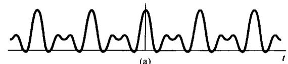

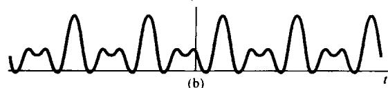

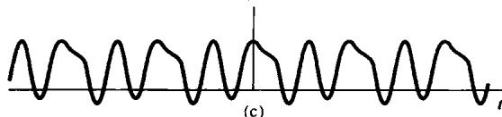

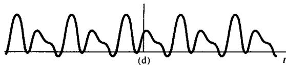

图6.1 选择不同的  $\phi_1, \phi_2$  和  $\phi_3$ ，由式(6.3)给出的信号  $x(t)$ 。（a） $\phi_1 = \phi_2 = \phi_3 = 0$ ；

$$
\begin{array}{l} \left(\mathrm {b}\right) \phi_ {1} = 4 \mathrm {r a d}, \phi_ {2} = 8 \mathrm {r a d}, \phi_ {3} = 1 2 \mathrm {r a d}; \left(\mathrm {c}\right) \phi_ {1} = 6 \mathrm {r a d}, \phi_ {2} = \\ - 2. 7 \mathrm {r a d}, \phi_ {3} = 0. 9 3 \mathrm {r a d}; (\mathrm {d}) \phi_ {1} = 1. 2 \mathrm {r a d}, \phi_ {2} = 4. 1 \mathrm {r a d}, \phi_ {3} = - 7. 0 2 \mathrm {r a d} \\ \end{array}
$$

说明相位重要性及其影响的第二个例子是在研究图像信号时发现的。第3章已简要介绍了一些，一幅黑白照片可以认为是一个具有两个独立变量的信号  $x(t_{1},t_{2})$  ，其中  $t_1$  表示照片上一个点的水平坐标，  $t_2$  是它的垂直坐标，而  $x(t_{1},t_{2})$  代表在点  $(t_{1},t_{2})$  上图像的亮度。这幅图像的傅里叶变换  $X(\mathrm{j}\omega_{1},\mathrm{j}\omega_{2})$  代表了将图像信号分解成形为  $\mathbf{e}^{\mathrm{j}\omega_{1}t_{1}}\mathbf{e}^{\mathrm{j}\omega_{2}t_{2}}$  这样的复指数信号的组合，这两个复指数信号体现了  $x(t_{1},t_{2})$  在两个坐标方向的每一个方向上，以不同的频率所呈现的空间变化。有关二维傅里叶分析的若干基本知识在习题4.53和习题5.56中均介绍过。

看一幅图像最重要的信息是图像边缘和那些高对比度的区域。从直观上看，在一幅图像上最大和最小强度的地方就是这些不同频率的复指数信号发生同相位的地方。因此，可以想到一幅图像的傅里叶变换的相位包含了图像中的大部分信息，尤其是关于边缘方面的信息。为了证实这一点，现将图1.4的照片重新印在图6.2(a)中，图6.2(b)是图6.2(a)所示照片的二维傅里叶变换的模，图中水平坐标是  $\omega_{1}$ ，垂直坐标是  $\omega_{2}$ ，在图中  $(\omega_{1},\omega_{2})$  这一点的亮度正比于图6.2(a)照片的傅里叶变换  $X(\mathrm{j}\omega_{1},\mathrm{j}\omega_{2})$  的模  $|X(\mathrm{j}\omega_{1},\mathrm{j}\omega_{2})|$  的大小。类似地，图6.2(c)画出的则是  $X(\mathrm{j}\omega_{1},\mathrm{j}\omega_{2})$  的相位。现在取图6.2(b)的模特性，而把相位特性人为地全部置于零相位，利用这组模-相特性求逆变换而得到的结果就是图6.2(d)。图6.2(e)则正相反，是保持原相位特性不变，

即图6.2(c)，而置  $X(\mathrm{j}\omega_{1},\mathrm{j}\omega_{2})$  的模全都为1时所得到的逆变换结果。最后，图6.2(f)则是用图6.2(c)的相位特性，而用另一幅完全不同的照片[见图6.2(g)]的傅里叶变换的模特性，经逆变换后得到的一幅照片！这几张图清楚地说明了相位在图像的表示中多么重要。

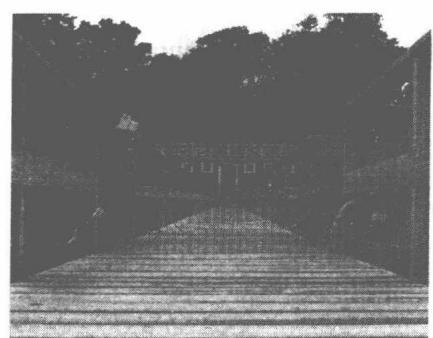

(a)

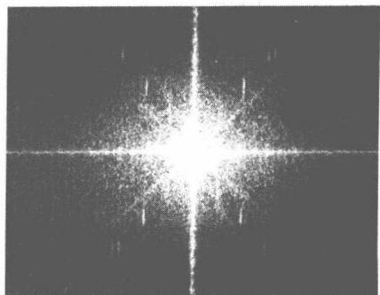

(b)

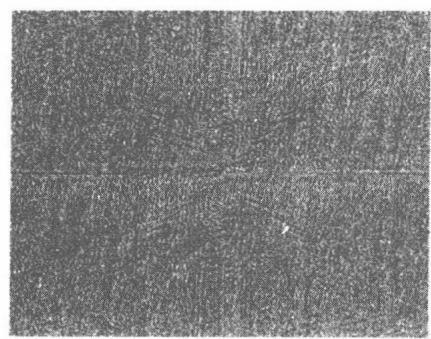

(c)

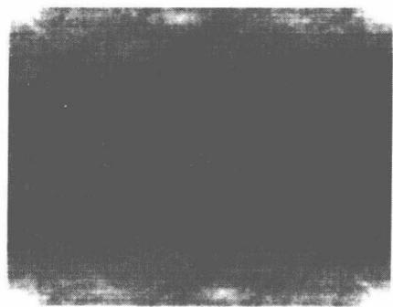

(d)

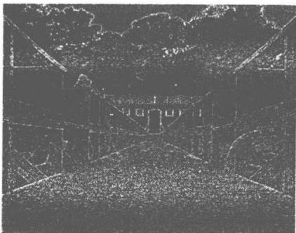

(e)

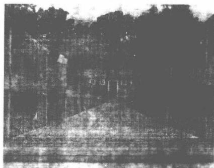

(f)

(g)

图6.2 (a) 示于图1.4的照片；(b) 图(a)二维傅里叶变换的模；(c) 图(a)傅里叶变换的相位；(d) 傅里叶变换的模与图(b)相同，而相位为零的照片；(e) 傅里叶变换的模为1，相位与图(c)相同的照片；(f) 相位与图(c)相同，模为图(g)照片的傅里叶变换的模所得的照片

# 6.2 线性时不变系统频率响应的模和相位表示

根据连续时间傅里叶变换的卷积性质，一个线性时不变系统的输入和输出的傅里叶变换  $X(\mathrm{j}\omega)$  和  $Y(\mathrm{j}\omega)$  是由如下关系联系起来的：

$$
Y (\mathrm {j} \omega) = H (\mathrm {j} \omega) X (\mathrm {j} \omega)
$$

其中  $H(\mathrm{j}\omega)$  是系统的频率响应，也即系统单位冲激响应的傅里叶变换。类似地，在离散时间情况下，一个频率响应为  $H(\mathrm{e}^{\mathrm{j}\omega})$  的线性时不变系统，其输入和输出的傅里叶变换  $X(\mathrm{e}^{\mathrm{j}\omega})$  和  $Y(\mathrm{e}^{\mathrm{j}\omega})$  的关系是

$$
Y \left(\mathrm {e} ^ {\mathrm {j} \omega}\right) = H \left(\mathrm {e} ^ {\mathrm {j} \omega}\right) X \left(\mathrm {e} ^ {\mathrm {j} \omega}\right) \tag {6.4}
$$

因此，一个线性时不变系统对输入的作用就是改变信号中每一频率分量的复振幅。利用模-相表示来看，就能更详细地明了这个作用的性质。具体而言，在连续时间情况下，

$$
\left| Y (\mathrm {j} \omega) \right| = \left| H (\mathrm {j} \omega) \right| \left| X (\mathrm {j} \omega) \right| \tag {6.5}
$$

且

$$
\left. \right. \prec Y (\mathrm {j} \omega) = \left. \right. \prec H (\mathrm {j} \omega) + \left. \right. \prec X (\mathrm {j} \omega) \tag {6.6}
$$

在离散时间情况下有完全类似的关系。从式(6.5)可见，一个线性时不变系统对输入傅里叶变换模特性的作用就是将其乘以系统频率响应的模，为此，  $|H(\mathrm{j}\omega)|$  （或  $|H(\mathrm{e}^{\mathrm{j}\omega})|$  ）一般称为系统的增益(gain)。同时，由式(6.6)可见，由线性时不变系统将输入的相位  $\prec X(\mathrm{j}\omega)$  变化成在它基础上附加了一个相位  $\prec H(\mathrm{j}\omega)$ ，因此  $\prec H(\mathrm{j}\omega)$  一般就称为系统的相移（phase shift）。系统的相移可以改变输入信号中各分量之间的相对相位关系，这样即使系统的增益对所有频率都为常数的情况下，也有可能在输入的时域特性上产生很大的变化。如果，系统对输入的改变是以一种有意义的方式进行的，那么这种在模和相位上的变化可能都是我们所希望的；否则，就是不希望有的。在后一种情况下，式(6.5)和式(6.6)的影响一般称为幅度和相位失真(distortion)。下面将给出几个概念和方法，以便更完整地了解这些影响。

# 6.2.1 线性与非线性相位

当相移是  $\omega$  的线性函数时，相移在时域中的作用就有一个非常直接的解释。考虑频率响应为

$$
H (\mathrm {j} \omega) = \mathrm {e} ^ {- \mathrm {j} \omega I _ {0}} \tag {6.7}
$$

的连续时间线性时不变系统，它有单位增益和线性相位，即

$$
\left| H (\mathrm {j} \omega) \right| = 1, \quad \prec H (\mathrm {j} \omega) = - \omega t _ {0} \tag {6.8}
$$

如同在例4.15中所指出的，具有这种频率响应特性的系统所产生的输出就是输入的时移，即

$$
y (t) = x \left(t - t _ {0}\right) \tag {6.9}
$$

在离散时间情况下，当线性相位的斜率是一个整数时，其产生的效果与连续时间情况下是类似的。具体而言，由例5.11可知，具有线性相位函数  $-\omega n_{0}$  的频率响应  $\mathrm{e}^{-\mathrm{j}\omega n_0}$  的线性时不变系统所产生的输出就是输入的简单移位，即  $y[n] = x[n - n_0]$  。因此，具有整数斜率的线性相位就相应于  $x[n]$  一个整数样本的移位。当相位特性的斜率不是一个整数时，其在时域中的效果就要稍微更复杂一些，这个留待7.5节讨论。大致说来，这一效果是序列值包络的时移，但这些序列值本身可能要改变。

虽然线性相移对一个信号产生的变化是很简单并很容易理解和想象的，但是如果输入信号

受到的是一个  $\omega$  的非线性函数的相移，那么在输入中各不同频率的复指数分量都将以某种方式移位，从而在它们的相对相位上发生变化。当这些复指数再次叠加在一起时，就会得到一个看起来与输入信号有很大不同的信号。这一点将以连续时间情况为例，用图6.3给予说明。

在图6.3(a)中画出了一个信号，该信号作为输入分别加到三个不同的系统上。图6.3(b)表示的是当系统频率响应具有  $H_{1}(\mathrm{j}\omega) = \mathrm{e}^{-\mathrm{j}\omega t_{0}}$  时的输出，它就等于输入延时  $t_0$  秒。图6.3(c)展示的是系统的增益为1，具有非线性相位特性的系统输出，也即

$$
H _ {2} (\mathrm {j} \omega) = e ^ {\mathrm {j} x H _ {2} (\mathrm {j} \omega)} \tag {6.10}
$$

其中  $\prec H_{2}(\mathrm{j}\omega)$  是  $\omega$  的非线性函数。图6.3(d)是另一个具有非线性相移的系统的输出，这时的频率响应的相移是  $\prec H_{2}(\mathrm{j}\omega)$  再附加一个线性相移项，即

$$
H _ {3} (\mathrm {j} \omega) = H _ {2} (\mathrm {j} \omega) \mathrm {e} ^ {- \mathrm {j} \omega t _ {0}} \tag {6.11}
$$

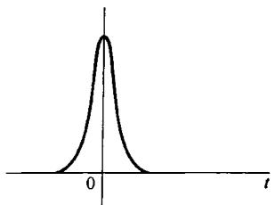

(a)

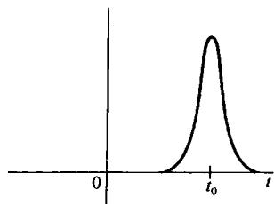

(b)

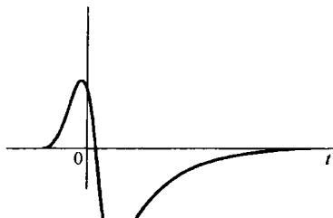

(c)

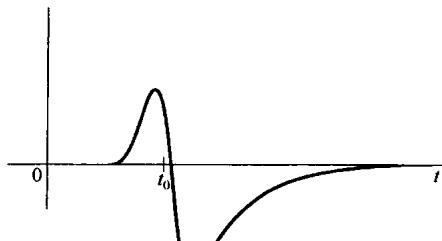

(d)

图6.3（a）作为输入加到几个频率响应模为1的系统上的信号；(b)具有线性相位的系统的响应；(c)具有非线性相位的系统的响应；(d)相位特性为(c)的系统的非线性相位外加一个线性相移项的系统响应

因此，图6.3(d)的输出也可看成  $H_{2}(\mathrm{j}\omega)$  系统的输出再级联一个时移系统，所以图6.3(c)和图6.3(d)的波形就是通过一个单一的时移联系起来的。

图6.4用以说明在离散时间情况下，线性和非线性相移产生的影响。同样，图6.4(a)是分别加到三个不同的线性时不变系统的输入，这三个系统增益都为1，即  $|H(\mathrm{e}^{\mathrm{j}\omega})| = 1$  。图6.4其余部分都是相应的输出信号。图6.4(b)是系统具有线性相位，且斜率为-5的系统输出，所以输出就等于输入时延5。与图6.4(c)和图6.4(d)有关的系统相移都是非线性的，但是这两个相位函数之差是一个具有整数斜率的线性相移，所以图6.4(c)和图6.4(d)的信号就是通过一个时移联系起来的。

应该提及的是，在图6.3和图6.4所举的例子中考虑的系统都具有单位增益，这样输入信号傅里叶变换的模通过这些系统时都没有改变。为此，这样的系统一般称为全通(all-pass)系统。一个全通系统的特性是完全由它的相位特性决定的。当然，一般的线性时不变系统  $H(\mathrm{j}\omega)$  或  $H(\mathrm{e}^{\mathrm{j}\omega})$  既会在幅度上（通过增益  $|H(\mathrm{j}\omega)|$  或  $|H(\mathrm{e}^{\mathrm{j}\omega})|$ ），也会在相位上（可能线性或不是线性的）给予影响。

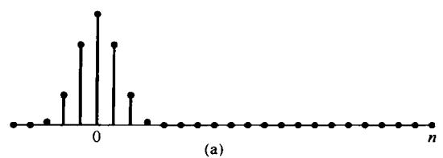

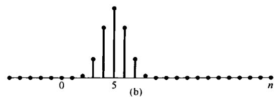

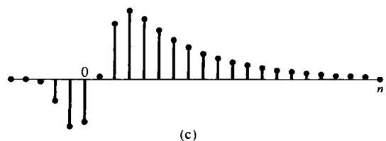

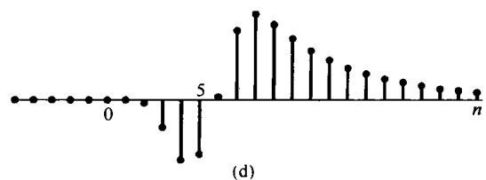

图6.4（a）作为输入加到几个频率响应模为1的系统上的信号；(b)斜率为-5的线性相位系统的响应；(c）非线性相位系统的响应；（d）相位特性为(c)的系统的非线性相位外加一个具有整数斜率的线性相移项的系统响应

# 6.2.2 群时延

如同6.2.1节讨论过的，具有线性相位特性的系统有一个特别简单的意义，这就是时移。事实上，根据式(6.8)和式(6.9)，相位特性的斜率就是时移的大小。也就是说，在连续时间情况下，若  $\angle H(\mathrm{j}\omega) = -\omega t_0$  ，那么系统给出的时移就是  $-t_{0}$  ，或者等效地说延时  $t_0$  。类似地，在离散时间情况下，  $\angle H(\mathrm{e}^{\mathrm{j}\omega}) = -\omega n_{0}$  就对应于一个  $n_0$  的时延。

时延的概念能够很自然地直接推广到包括非线性相位特性的情况。设想想要检查一个连续时间线性时不变系统的相位对于一个窄带输入信号所产生的效果，该窄带输入  $x(t)$  的傅里叶变换在以  $\omega = \omega_0$  为中心的一个很小的频率范围以外都是零或非常小。将这一频带取得很小，就可以将该系统的相位特性在这个频带内准确地用线性关系来近似，即

$$
\left. \not h H (\mathrm {j} \omega) \approx - \phi - \omega \alpha \right. \tag {6.12}
$$

这样就有

$$
Y (\mathrm {j} \omega) = X (\mathrm {j} \omega) | H (\mathrm {j} \omega) | \mathrm {e} ^ {- \mathrm {j} \phi} \mathrm {e} ^ {- \mathrm {j} \omega \alpha} \tag {6.13}
$$

因此，这个系统对于窄带输入信号傅里叶变换的近似效果就由如下部分组成：对应于  $|H(\mathrm{j}\omega)|$  的幅度成形部分，乘以一个总的恒定复数因子  $\mathbf{e}^{-\mathrm{j}\phi}$  以及对应于延时  $\alpha$  秒的线性相移项  $\mathbf{e}^{-\mathrm{j}\omega \alpha}$  。这个时延称为在  $\omega = \omega_0$  的群时延（group delay），因为它代表了以  $\omega = \omega_0$  为中心一个很小的频带或很少的一组频率上所受到的有效公共时延。

在每个频率上的群时延就等于在那个频率上相位特性斜率的负值，即群时延定义为

$$
\tau (\omega) = - \frac {\mathrm {d}}{\mathrm {d} \omega} \{x H (j \omega) \} \tag {6.14}
$$

群时延的概念也可直接用到离散时间系统中。下面的例子将说明非线性群时延对一个信号的影响。

例6.1 考虑一个全通系统的单位冲激响应，该系统的群时延是频率的函数。本例所用系统的频率响应  $H(\mathrm{j}\omega)$  由三个因式的乘积构成，即

$$
H (\mathrm {j} \omega) = \prod_ {i = 1} ^ {3} H _ {i} (\mathrm {j} \omega)
$$

其中，

$$
H _ {i} (\mathrm {j} \omega) = \frac {1 + \left(\mathrm {j} \omega / \omega_ {i}\right) ^ {2} - 2 \mathrm {j} \zeta_ {i} \left(\omega / \omega_ {i}\right)}{1 + \left(\mathrm {j} \omega / \omega_ {i}\right) ^ {2} + 2 \mathrm {j} \zeta_ {i} \left(\omega / \omega_ {i}\right)} \tag {6.15}
$$

$$
\left\{ \begin{array}{l l} \omega_ {1} = 3 1 5 \mathrm {r a d / s}, & \zeta_ {1} = 0. 0 6 6 \\ \omega_ {2} = 9 4 3 \mathrm {r a d / s}, & \zeta_ {2} = 0. 0 3 3 \\ \omega_ {3} = 1 8 8 8 \mathrm {r a d / s}, & \zeta_ {3} = 0. 0 5 8 \end{array} \right.
$$

将以弧度/秒(rad/s)计的频率  $\omega_{i}$  用以赫兹（Hz）计的频率  $f_{i}$  来表示，通常较为有利，即

$$
\omega_ {i} = 2 \pi f _ {i}
$$

这样就有

$$
f _ {1} \simeq 5 0 \mathrm {H z}
$$

$$
f _ {2} \simeq 1 5 0 \mathrm {H z}
$$

$$
f _ {3} \simeq 3 0 0 \mathrm {H z}
$$

因为每一  $H_{i}(\mathrm{j}\omega)$  的分子就是对应分母的复数共轭，所以有  $\left|H_{i}(\mathrm{j}\omega)\right| = 1$  ，这样就可以得出

$$
\left| H (\mathrm {j} \omega) \right| = 1
$$

每一  $H_{i}(\mathrm{j}\omega)$  的相位由式(6.15)确定为

$$
\left. \angle H _ {i} (\mathrm {j} \omega) = - 2 \arctan \left[ \frac {2 \zeta_ {i} \left(\omega / \omega_ {i}\right)}{1 - \left(\omega / \omega_ {i}\right) ^ {2}} \right] \right.
$$

和

$$
\left\langle H (\mathrm {j} \omega) = \sum_ {i = 1} ^ {3} \right. \left\langle H _ {i} (\mathrm {j} \omega) \right.
$$

如果将  $\angle H(j\omega)$  的值限制在  $-\pi$  到  $\pi$  之间，就得到所谓主值相位(principal-phase)函数（也就是将相位以  $2\pi$  取模数），如图6.5(a)所示，图中画出的是相位与以  $\mathrm{Hz}$  计的频率的关系图。要注意，这个函数包括了在各个频率上的  $2\pi$  大小的几个不连续点，使得该相位函数在这些点上是不可微分的。然而，在任何频率上将这个相位值加上或减去任何  $2\pi$  的整倍数，原来的频率响应仍旧未变，因此在主值相位的各个部分适当地加上或减去这样的  $2\pi$  整倍数值，就得到图6.5(b)所示展开的相位特性。作为频率函数的群时延现在就可计算为

$$
\tau (\omega) = - \frac {\mathrm {d}}{\mathrm {d} \omega} \{x [ H (\mathrm {j} \omega) ] \}
$$

其中  $\chi[H(j\omega)]$  代表对应于  $H(j\omega)$  的展开后的相位特性。 $\tau(\omega)$  如图6.5(c)所示。由图可以看出，在邻近  $50\mathrm{Hz}$  频率处，其延时要比邻近  $150\mathrm{Hz}$  或  $300\mathrm{Hz}$  处的频率延时要大。这个非恒定群时延的效果也能够由该线性时不变系统的单位冲激响应[见图6.5(d)]定性地观察到。回想一下， $\mathcal{F}\{\delta(t)\} = 1$ ，因此冲激函数频谱的每一频率分量在时间上是全部对准的，以使各频率分量组合起来可形成一个冲激；当然，这是在时间上高度集中了的。因此该全通系统具有非恒定群时延，所以在输入中的不同频率就被延时了不同的量。这个现象称为弥散(dispersion)。在本例中，群时延在  $50\mathrm{Hz}$  处最大，因此可预期单位冲激响应的后面部分就会在接近  $50\mathrm{Hz}$  的较低频率上振荡。这点在图6.5(d)中显而易见。

例6.2 在评价交换式电信网的传输性能时，非恒定群时延在所考虑的诸因素中是很重要的一种。在涉及横跨美国大陆各地的一项调查中①，AT & T/Bell System 发表了各种类别长途电话的群时延特性。图6.6显示了其中两类的研究结果。特别是，图6.6(a)所示的是每一类长途电

话群时延的非恒定部分；也即对每一类来说，对所有频率都有一个公共的恒定时延（这就相应于时延特性的最小值），将这部分从时延特性上减去，将所得到的差示于图6.6(a)中。这样，图6.6(a)中的每一条曲线就代表在每一类里长途电话的各个频率分量所受到的附加时延（超过公共恒定时延的部分）。图中曲线分别为短距离  $(0\sim 289.68~\mathrm{km})$  和中距离  $(289.68\mathrm{km}\sim 1166.77\mathrm{km}$  直线)长途电话的结果。由图可见，群时延作为频率的函数在  $1700\mathrm{Hz}$  最小，并在此点向两边移开都单调增加。

把图6.6(a)的群时延特性与AT&T/Bell System调查报告所报道的频率响应的模特性图6.6(b)结合起来，就可以得到示于图6.7中的单位冲激响应。图6.7(a)对应于短距离类的单位冲激响应。该响应中的很低和很高频率分量都出现得比中间频率范围内的分量更早。这一点是与图6.6(a)对应的群时延特性相符的。图6.7(b)说明的是对应于中距离长途电话单位冲激响应的同一现象。

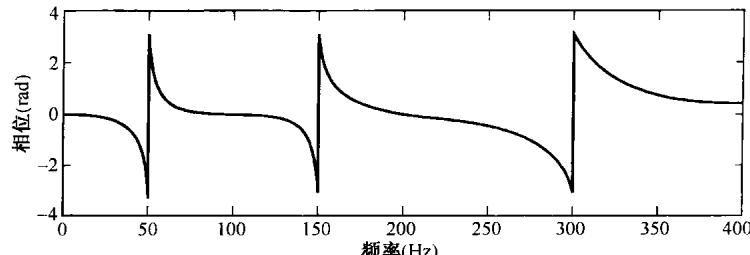

(a)

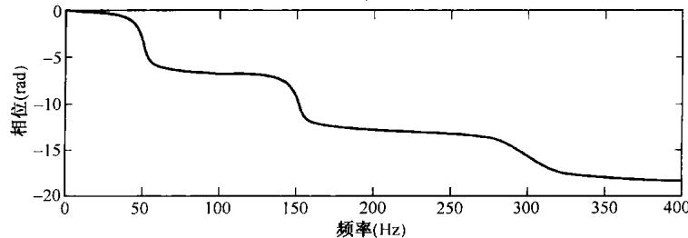

(b)

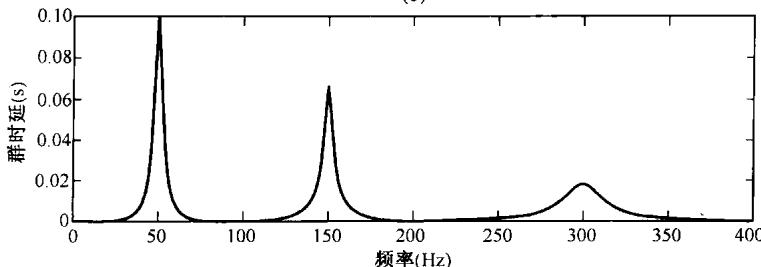

(c)

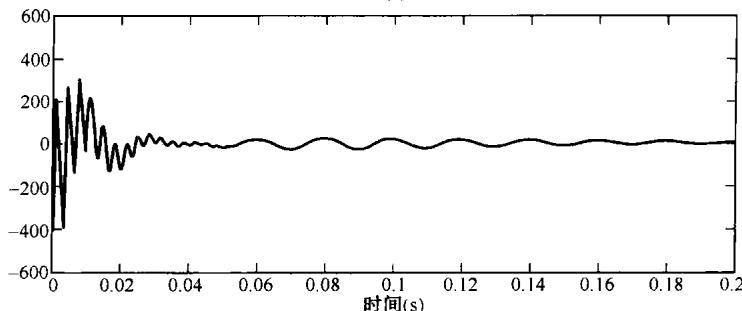

(d)

图6.5 例6.1中全通系统的相位，群时延和单位冲激响应。（a）主值相位；（b）展开的相位特性；（c）群时延；（d）单位冲激响应。这些量都是以  $\mathrm{Hz}$  计的频率绘出的

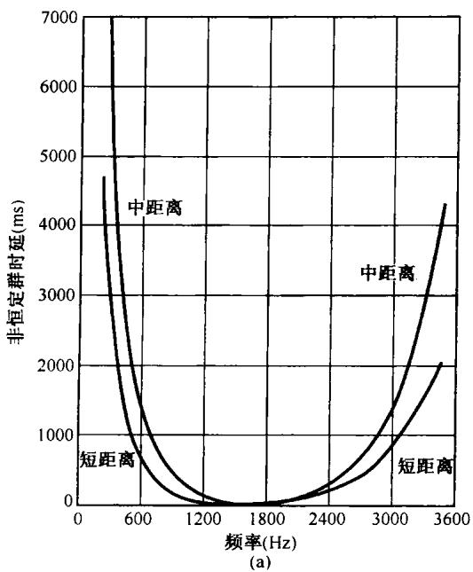

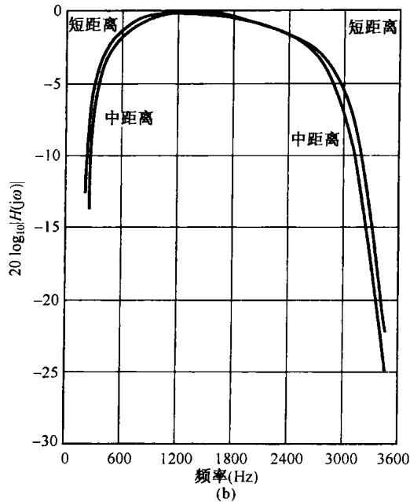

图6.6（a）群时延的非恒定部分；(b)在交换式电信网中短距离和中距离长途电话频率响应的模[引自Duffy和Thatcher的文章]。这些量都是对于频率  $(\mathrm{Hz})$  画出的。另外，在实际中一般频率响应的模都用单位为分贝(dB)的对数标尺作图，即图6.6(b)中对应于短距离和中距离长途电话频率响应的模画出 $20\log_{10}|H(\mathrm{j}\omega)|$  。对频率响应的模采用对数标尺的问题将在6.2.3节中详细讨论

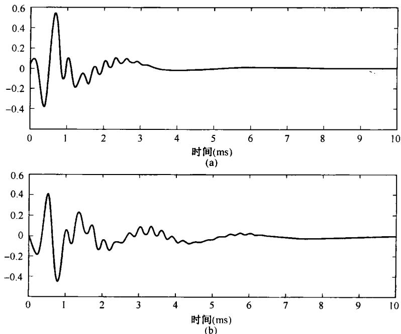

图6.7 与图6.6的群时延和模特性有关的单位冲激响应。（a）对应于短距离类长途电话的单位冲激响应；（b）对应于中距离类长途电话的单位冲激响应

# 6.2.3 对数模和相位图

用极坐标形式来展现连续时间和离散时间傅里叶变换和系统频率响应时，对傅里叶变换的模采用对数尺度往往很方便。这样做的主要原因之一可以由式(6.5)和式(6.6)看出，这两式都将一个线性时不变系统输出的模和相位与输入和频率响应的模和相位联系在一起。可以注意到，相位关系是相加的，而模的关系则涉及  $|H(\mathrm{j}\omega)|$  和  $|X(\mathrm{j}\omega)|$  的相乘。因此，如果傅里叶变换的模是在一个对数幅度尺度上展示的，那么式(6.5)就会有一个相加的关系，即

$$
\log | Y (\mathrm {j} \omega) | = \log | H (\mathrm {j} \omega) | + \log | X (\mathrm {j} \omega) | \tag {6.16}
$$

在离散时间情况下也有完全一样的表示式。

因此，如果有一幅输入的傅里叶变换和一个线性时不变系统频率响应的对数模和相位图，那么输出的傅里叶变换就可以将两者的对数模图相加，相位图相加来得到。同样，由于线性时不变系统级联的频率响应就是各个频率响应的乘积，因此一个级联系统的总频率响应的对数模和相位图就可以分别将相应的各部分系统的图相加而求得。另外，在一个对数标尺上展现傅里叶变换的模还能在一个较宽的动态范围上将细节显示出来。例如，在线性标尺上，具有很大衰减的频率选择性滤波器阻带内的模特性细节一般是不明显的，而在一个对数标尺上它就非常明显。

一般所采用的对数标尺是以  $20\log_{10}$  为单位的，称为分贝①(decibels，缩写为dB)。因此，0 dB就对应于频率响应的模等于1,20dB就对应于10倍的增益，-20dB相应于衰减0.1，等等。另外，6dB就近似地对应于2倍增益，记住这个值通常很有用。

对于连续时间系统，采用对数频率坐标也是很通常的，而且是有用的。  $20\log_{10}|H(\mathrm{j}\omega)|$  和  $\prec H(\mathrm{j}\omega)$  对于  $\log_{10}(\omega)$  的图称为伯德图(Bode)。图6.8是一个典型的伯德图例子。应该注意，正如4.3.3节所讨论的，如果  $h(t)$  是实函数，那么  $|H(\mathrm{j}\omega)|$  是  $\omega$  的偶函数，而  $\prec H(\mathrm{j}\omega)$  是  $\omega$  的奇函数。由于这个原因，负  $\omega$  部分的图就是多余的了，它可以立即由正  $\omega$  部分的图来得到。因此，画出频率响应特性在  $\omega > 0$  对于  $\log_{10}(\omega)$  的图就足够了，如图6.8所示。

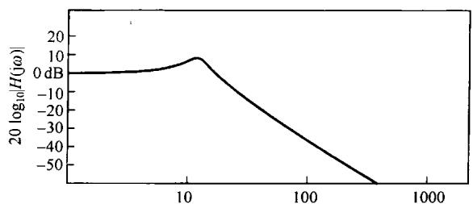

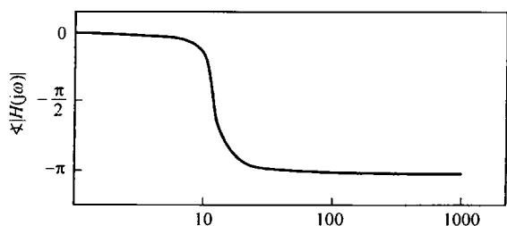

图6.8 一个典型的伯德图（注意，  $\omega$  是用对数坐标画出的）

在连续时间情况下，应用对数频率坐标有几个优点。例如，它常常可以比线性频率坐标展示宽得多的频率范围。另外，在对数频率坐标上，一种特定的响应曲线的形状不会因频率的加权而改变(见习题6.30)。再者，对于由微分方程描述的连续时间线性时不变系统来说，对数模对于

对数频率的近似图往往很容易通过利用渐近线绘出。6.5节将通过对一阶和二阶连续时间系统建立简单的分段线性近似的伯德图来说明这一点。

在离散时间情况下，傅里叶变换和频率响应的模常常也是用dB来表示的，其理由与在连续时间情况下相同。然而，在离散时间情况下对数频率坐标一般是不用的，因为这时要考虑的频率范围总是有限的，并且对微分方程所具有的优点（也即线性渐近线）对差分方程不适用。图6.9示出一个典型的离散时间频率响应的模和相位图。图中作为  $\omega$  的函数画出了  $\prec H(\mathrm{e}^{\mathrm{j}\omega})$  （弧度）和 $|H(\mathrm{e}^{\mathrm{j}\omega})|[\mathrm{dB}$  ，即  $20\log_{10}|H(\mathrm{e}^{\mathrm{j}\omega})|$  。注意，对实值的  $h[n]$  ，仅需画出  $0\leqslant \omega \leqslant \pi$  范围的  $H(\mathrm{e}^{\mathrm{j}\omega})$  ，因为在这种情况下，傅里叶变换的对称性质意味着利用  $|H(\mathrm{e}^{\mathrm{j}\omega})| = |H(\mathrm{e}^{-\mathrm{j}\omega})|$  和  $\prec H(\mathrm{e}^{-\mathrm{j}\omega}) = -\prec H(\mathrm{e}^{\mathrm{j}\omega})$  的关系，就能计算出  $-\pi \leqslant \omega \leqslant 0$  范围内的  $H(\mathrm{e}^{\mathrm{j}\omega})$  。再者，由于  $H(\mathrm{e}^{\mathrm{j}\omega})$  的周期性，无须考虑  $|\omega | > \pi$  时的值。

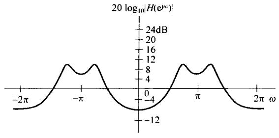

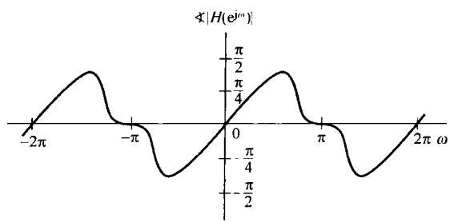

图6.9 一个离散时间频率响应  $H(\mathrm{e}^{\mathrm{j}\omega})$  的模和相位的典型作图表示

正如在这一节曾强调过的，对数坐标往往是有用的而且是重要的。然而，也有许多情况应用线性坐标很方便。例如，在讨论理想滤波器时，频率响应的模在某些频带上是一个非零常数，而在其他频带上则是零，这时线性坐标就更为合适。因此，对傅里叶变换模的表示，既介绍了线性的，又介绍了对数的作图表示，今后将根据使用方便而择其一。

# 6.3 理想频率选择性滤波器的时域特性

第3章介绍了频率选择性滤波器，即按所选频率响应的线性时不变系统，它几乎没有衰减或很小衰减地通过一个或几个频带范围的信号，而阻止或大大衰减掉在这些频带以外的频率分量。如同在第3章至第5章所讨论的，在频率选择性滤波的应用中，出现了几个重要的问题，并且这些问题都直接与频率选择性滤波器的特性有关。这一节将从另一角度来看看这样的滤波器及其性质。这里将把注意力集中放在低通滤波器上，对于其他类型的频率选择性滤波器，如高通或带通滤波器，非常类似的一些概念和结果也都成立（见习题6.5，习题6.6，习题6.26和习题6.38）。

第3章已提到，一个连续时间理想低通滤波器具有如下形式的频率响应：

$$
H (\mathrm {j} \omega) = \left\{ \begin{array}{l l} 1, & | \omega | \leqslant \omega_ {c} \\ 0, & | \omega | > \omega_ {c} \end{array} \right. \tag {6.17}
$$

如图6.10(a)所示。同样，一个离散时间理想低通滤波器的频率响应为

$$
H \left(\mathrm {e} ^ {\mathrm {j} \omega}\right) = \left\{ \begin{array}{l l} 1, & \left| \omega \right| \leqslant \omega_ {c} \\ 0, & \omega_ {c} <   \left| \omega \right| \leqslant \pi \end{array} \right. \tag {6.18}
$$

如图6.10(b)所示，它对  $\omega$  是周期的。由式(6.17)和式(6.18)，或者从图6.10中可以看到，理想低通滤波器具有极好的频率选择性。也就是说，它们无衰减地通过低于截止频率  $\omega_{c}$  （包括  $\omega_{c}$  中的所有频率，而完全阻掉阻带（即高于  $\omega_{c}$  ）内的所有频率。再者，这些滤波器具有零相位特性，所以它们不会引入相位失真。

在6.2节中已经看到，即使信号频谱的模不被系统改变，非线性相位特性也能导致一个信号的时域特性有很大的变化。因此一个模(magnitude)特性如式(6.17)或式(6.18)所示的滤波器，具有非线性相位，在某些应用中还是可能产生一些不希望有的效果。另一方面，在通带内具有线性相位的理想滤波器，如图6.11所示，相对于零相位特性的理想低通滤波器的响应来说，仅引入一个单一的时移。

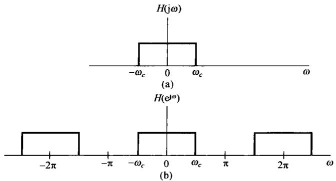

图6.10 (a) 一个连续时间理想低通滤波器的频率响应；(b) 一个离散时间理想低通滤波器的频率响应

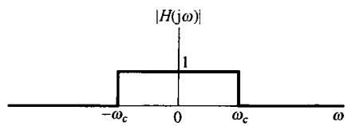

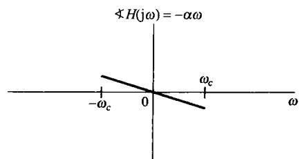

图6.11 具有线性相位特性的连续时间理想低通滤波器

在例4.18和例5.12中，曾求出过理想低通滤波器的单位冲激(脉冲)响应。对应于式(6.17)滤波器的单位冲激响应是

$$
h (t) = \frac {\sin \omega_ {c} t}{\pi t} \tag {6.19}
$$

如图6.12(a)所示。类似地，与式(6.18)所示离散时间理想滤波器对应的单位脉冲响应是

$$
h [ n ] = \frac {\sin \omega_ {c} n}{\pi n} \tag {6.20}
$$

如图6.12(b)所示，其中  $\omega_{c} = \pi /4$  。如果式(6.17)和式(6.18)这两个理想频率响应中的任何一个再附加上线性相位特性，那么单位冲激响应就只是延时一个等于该相位特性斜率的负值的量，对于连续时间单位冲激响应的情况就如图6.13所示。应当注意，无论是在连续时间还是离散时间情况下，滤波器的通带宽度都是正比于  $\omega_{c}$  的，而单位冲激响应的主瓣宽度都是正比于  $1 / \omega_{c}$  的。当滤波器的带宽增加时，单位冲激响应就变得愈来愈窄；反之亦然，这个是与在第4章和第5章讨论过的时间和频率之间的相反关系一致的。

连续时间和离散时间理想低通滤波器的单位阶跃响应  $s(t)$  和  $s[n]$  如图6.14所示。在两种情况下都可以看到，阶跃响应所表现出的几个特性可能都是我们不希望有的。特别是，对于这些滤波器其阶跃响应都有比它们最后稳态值大的超量，并且呈现出称为振铃(ringing)的振荡行为。另外，回忆一下，阶跃响应就是单位冲激响应的积分或求和，即

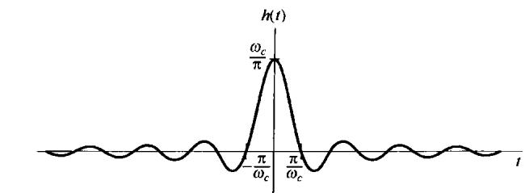

(a)

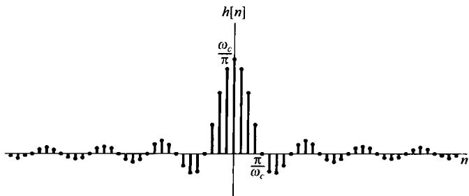

(b)

图6.12 (a) 图6.10(a)的连续时间理想低通滤波器的单位冲激响应；(b) 图6.10(b)的离散时间理想低通滤波器在  $\omega_{c} = \pi /4$  时的单位脉冲响应

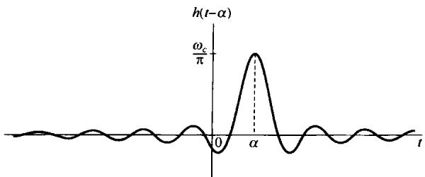

图6.13 模和相位特性如图6.11所示的理想低通滤波器的单位冲激响应

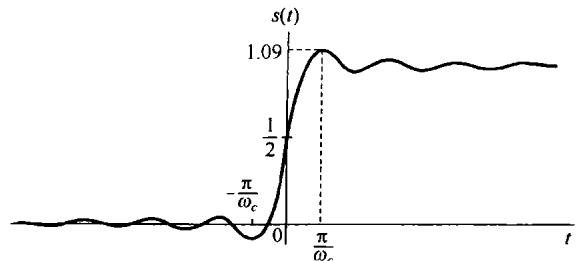

(a)

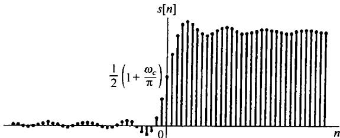

(b)

图6.14（a）连续时间理想低通滤波器的阶跃响应；（b）离散时间理想低通滤波器的阶跃响应

$$
s (t) = \int_ {- \infty} ^ {t} h (\tau) d \tau
$$

$$
s [ n ] = \sum_ {m = - \infty} ^ {n} h [ m ]
$$

因为理想滤波器的单位冲激响应其主瓣是从  $-\pi /\omega_{c}$  延伸到  $+\pi /\omega_{c}$ ，所以阶跃响应就在这个时间间隔内其值发生最显著的变化。也就是说，阶跃响应的所谓上升时间（rise time）也就反比于相关滤波器的带宽。这个上升时间也是该滤波器响应时间的一种大致度量。

# 6.4 非理想滤波器的时域和频域特性讨论

理想滤波器的特性在实际中不一定总是所要求的。例如，在许多滤波问题中，要进行分离的

信号不总是位于完全分隔开的频带上。图6.15或许是一种典型的情况，这里两个信号的频谱稍微有些重叠。在这样一种情况下，或许愿意在两个信号的保真度上进行一些权衡，例如滤波器保留  $x_{1}(t)$ ，而对 $x_{2}(t)$  中的频率分量给予衰减。当过滤具有重叠频谱的混合信号时，我们宁肯希望有一个从通带到阻带具有渐渐过渡特性的滤波器。

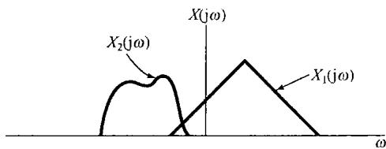

图6.15 稍微有些重叠的两个频谱

另一个原因就是考虑到理想低通滤波器的阶跃响应问题（见图6.14）。在连续时间和离散时间两种情况下，阶跃响应都渐渐地趋近一个等于阶跃值的恒定值。然而，在跳变点附近呈现过冲（超量)和振荡。在某些情况下，这种时域特性是不希望的。

退一步说，即使在某些情况下，需要一个理想的频率选择性滤波器特性，它们也是不可能实现的。例如，根据式(6.18)和式(6.19)及图6.12，很显然理想低通滤波器是非因果的，而当滤波必须实时来完成时，因果性就是一个必要的限制，因此就需要对理想特性进行一个因果的近似。在滤波器特性方面要再进一步考虑，进行一些折中，即实现它的难易程度。一般来讲，若对一个理想频率选择特性愈逼近或实现得愈接近，那么其复杂程度和付出的代价就愈高，而无论该滤波器是用一些什么基本元件构成的。例如，在连续时间情况下的电阻器、电容器和运算放大器等，在离散时间情况下如寄存器、乘法器和加法器等。在很多场合下，或许并不需要一个精密的滤波器，往往一个简单的滤波器就足够了。

基于上述原因，非理想滤波器具有很大的实际意义，而且它们的特性常常在频域和时域两方面都用几个参数来标定。首先，由于理想频率选择性滤波器的模特性是不能实现的，或者是不需要的，因此更可取的是在滤波器的通带和阻带特性上容许有某些灵活性，以及相对于理想滤波器的陡峭的过渡带来说，容许在通带和阻带之间有一个渐渐的过渡特性。例如，在低通滤波器情况下，通带内在单位增益上可以有某些偏离；阻带内在零增益上也可以有某些偏离；以及在通带边缘和阻带边缘之间容许有一个过渡带存在。因此，对一个连续时间低通滤波器的特性要求常常是要求滤波器频率响应的模限制在图6.16的非阴影区之内。在该图中，偏离单位增益的  $\pm \delta_{1}$  ，就是可容许的通带偏离，而 $\delta_{2}$  就是可容许的阻带偏离，分别称为通带起伏(passband ripple）（或波纹）和阻带起伏（stopband ripple）（或波纹）。  $\omega_{p}$  和  $\omega_{s}$  分别称为通带边缘(passband edge)和阻带边缘(stopband edge)。从  $\omega_{p}$  到  $\omega_{s}$  的频率范围就是从通带到阻带的过渡，称为过渡带(transition band)。以上所讨论的概念和定义也适用于离散时间低通滤波器，以及其他连续时间和离散时间频率选择性滤波器。

在频域除了模特性的要求外，在某些情况下，相位特性的要求也很重要。尤其是，一个在通

带内线性或接近线性相位的特性往往是我们所希望的。

为了控制时域特性，一般都将指标要求放在一个滤波器的阶跃响应上。现用图6.17来给予说明。在阶跃响应中往往关心的一个量是上升时间  $t_r$  ，也就是阶跃响应上升到它的终值所需的时间。另外，在阶跃响应上有无振荡也很重要。如果这样的振荡存在，那么就由三个其他的量来表征这些振荡的性质，它们是：超过阶跃响应终值的超量  $\Delta$  ，振荡频率  $\omega_r$  和建立时间  $t_s$  。  $t_s$  代表阶跃响应位于偏离终值容许范围内所要求的时间。

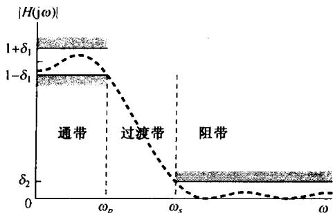

图6.16 低通滤波器模特性的容限。可容许的通带波纹是  $\delta_{1}$ ，阻带波纹是  $\delta_{2}$ 。图中虚线指出一种可能的频率响应模特性，它们位于所给容限之内

对于非理想低通滤波器来说，可以看到在过渡带的宽度(频域特性)与阶跃响应的建立时间（时域特性）之间可能有一种折中。下面这个例子用来说明这种折中。

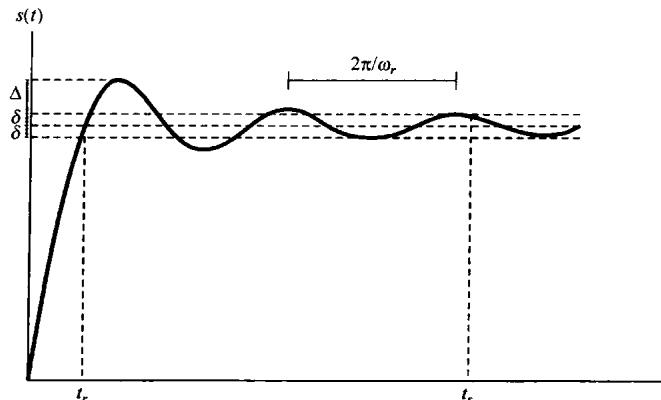

图6.17 一个连续时间低通滤波器的阶跃响应，图中指出上升时间  $t_r$  ，超量  $\Delta$  ，振荡频率  $\omega_r$  和建立时间  $t_s$  。 $t_s$  即阶跃响应位于其终值  $\pm \delta$  内所需要的时间

例6.3 现在来考虑两个具体的低通滤波器，它们都有一个截止频率为  $500\mathrm{Hz}$ 。每一个滤波器都有一个五阶的有理频率响应和一个实值的单位冲激响应。这两个滤波器都是特殊类型的，一个称为巴特沃思(Butterworth)滤波器，另一个是椭圆滤波器。这两类滤波器在实际中常常被采用。

这两个滤波器频率响应的模(对频率以  $\mathrm{Hz}$  为计量单位作出)如图6.18(a)所示。现以下述标准取每个滤波器的过渡带：以截止频率  $500\mathrm{Hz}$  为中心，使频率响应的模既不在偏离1的0.05以内（通带波纹），又不在偏离0的0.05以内（阻带波纹）的范围。由图6.18(a)可见，巴特沃思滤波器的过渡带宽于椭圆滤波器的过渡带。

椭圆滤波器所具有的较窄的过渡带所付出的代价可由图6.18(b)看到，该图示出了这两个滤波器的阶跃响应。由图可见，椭圆滤波器阶跃响应中的振荡比巴特沃思滤波器显著得多，特别是椭圆滤波器阶跃响应的建立时间要更长一些。

滤波器时域和频域特性之间的折中，以及诸如复杂度和成本之间的折中之类问题的考虑，成为滤波器设计方面的核心领域。下面几节以及章末的几个习题，会给出其他几个线性时不变系统和滤波器及其时域和频域特性的例子。

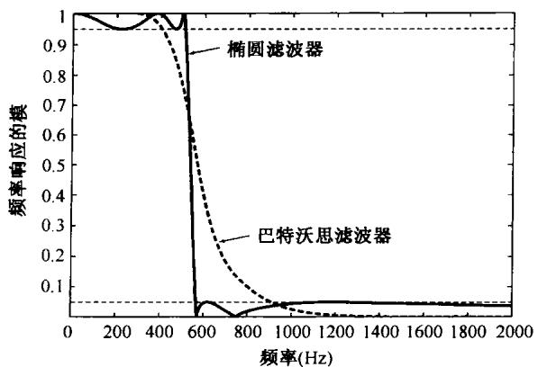

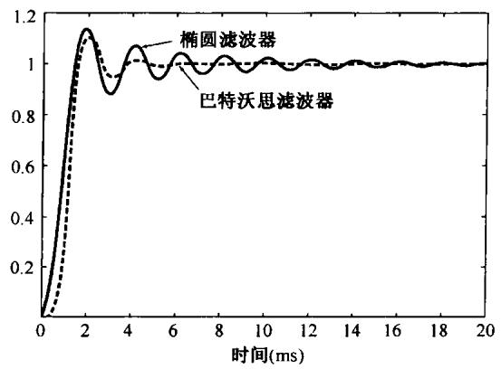

图6.18 具有相同通带和阻带波纹，相同截止频率的五阶巴特沃思滤波器和五阶椭圆滤波器的例子。（a）频率响应的模特性；（b）阶跃响应

# 6.5 一阶与二阶连续时间系统

由线性常系数微分方程描述的线性时不变系统，在实际中具有很大的重要性，这是因为很多物理系统都可以用这样的方程来建模，并且这种类型的系统往往又很容易实现。有很多实际理由表明，高阶系统总是常常由一阶和二阶系统以级联或并联的形式来实现或表示的。因此，一阶和二阶系统的性质在分析、设计和理解高阶系统的时域和频域特性方面起着重要作用。这一节将详细讨论连续时间系统中的这些低阶系统，6.6节将讨论离散时间系统中的这些低阶系统。

# 6.5.1 一阶连续时间系统

对于一个一阶系统，其微分方程往往表示成下列形式：

$$
\tau \frac {\mathrm {d} y (t)}{\mathrm {d} t} + y (t) = x (t) \tag {6.21}
$$

其中  $\pmb{\tau}$  是一个系数，它的意义下面就会清楚。相应的一阶系统的频率响应是

$$
H (\mathrm {j} \omega) = \frac {1}{\mathrm {j} \omega \tau + 1} \tag {6.22}
$$

其单位冲激响应为

$$
h (t) = \frac {1}{\tau} \mathrm {e} ^ {- t / \tau} u (t) \tag {6.23}
$$

系统的阶跃响应为

$$
s (t) = h (t) * u (t) = \left[ 1 - \mathrm {e} ^ {- t / \tau} \right] u (t) \tag {6.24}
$$

这些都分别绘于图6.19(a)和图6.19(b)中。参数  $\tau$  称为系统的时间常数（time constant），它控制着一阶系统响应的快慢。例如，如图6.19所示，当  $t = \tau$  时，冲激响应衰减到  $t = 0$  时的  $1 / \mathrm{e}$  倍，而阶跃响应则离终值1还有  $1 / \mathrm{e}$  。因此，当  $\tau$  减小时，冲激响应衰减得就更快，而阶跃响应上升的时间就更短；也就是说，阶跃响应朝最终值就上升得更加陡峭了。注意，一阶系统的阶跃响应不会出现任何振荡。

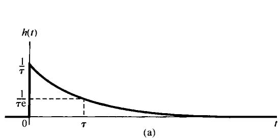

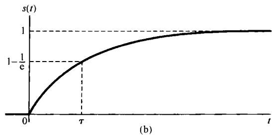

图6.19 一阶连续时间系统。（a）单位冲激响应；（b）阶跃响应

图6.20画出了式(6.22)频率响应的伯德图。这幅图体现了使用对数频率坐标的一个优点，这就是没有多大困难就可以得到一阶系统一个很有用的近似伯德图。为此，先检查一下频率响应的对数模特性，由式(6.22)可得

$$
2 0 \log_ {1 0} | H (\mathrm {j} \omega) | = - 1 0 \log_ {1 0} [ (\omega \tau) ^ {2} + 1 ] \tag {6.25}
$$

从该式可见，对于  $\omega \tau \ll 1$  ，对数模近似为零；而对于  $\omega \tau \gg 1$  ，对数模就近似为  $\log_{10}(\omega)$  的线性函数。也就是说

$$
2 0 \log_ {1 0} | H (\mathrm {j} \omega) | \simeq 0, \quad \omega \ll 1 / \tau \tag {6.26}
$$

和

$$
\begin{array}{l} 2 0 \log_ {1 0} | H (\mathrm {j} \omega) | \simeq - 2 0 \log_ {1 0} (\omega \tau) \\ = - 2 0 \log_ {1 0} (\omega) - 2 0 \log_ {1 0} (\tau), \quad \omega \gg 1 / \tau \tag {6.27} \\ \end{array}
$$

换句话说，一阶系统其对数模特性在低频和高频域的渐近线都是直线。低频渐近线[由式(6.26)给出]就是一条0dB线；而高频渐近线[由式(6.27)给出]相应于在  $|H(\mathrm{j}\omega)|$  上每隔十倍频程有 $20\mathrm{dB}$  的衰减，有时这就称为“每十倍频程  $20~\mathrm{dB}$  ”渐近线。

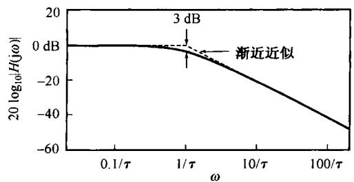

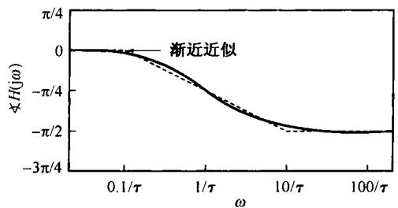

图6.20 一个一阶连续时间系统的伯德图

注意，由式(6.26)和式(6.27)所表示的这两条渐近线在  $\log_{10}(\omega) = -\log_{10}(\tau)$  这一点，也即  $\omega = 1 / \tau$  这一点是相等的。由图来看，这就意味着两条渐近线应在  $\omega = 1 / \tau$  相交，这样就提供了对数模特性图的一种直线近似。这就是，对于  $\omega \leqslant 1 / \tau$  ，  $20\log_{10}|H(j\omega)| = 0$  ；而对于  $\omega \geqslant 1 / \tau$  ，则由

式(6.27)给出。在图6.20中用虚线画出了这一近似。由于在  $\omega = 1 / \tau$  这一点，近似特性的斜率发生变化，因此这一点往往就称为转折频率（break frequency）。同时，由式(6.25)可知，在 $\omega = 1 / \tau$  这一点，式中对数内的两项  $[(\omega \tau)^{2}$  和1]相等，所以在这一点模的实际值为

$$
2 0 \log_ {1 0} \left| H \left(j \frac {1}{\tau}\right) \right| = - 1 0 \log_ {1 0} (2) \simeq - 3 \mathrm {d B} \tag {6.28}
$$

由于这个原因，  $\omega = 1 / \tau$  这一点有时又称为3dB点。从该图还可以看到，直线近似的伯德图仅在转折频率附近有明显的误差。因此，如果希望得到更准确一些的伯德图，仅仅需要在转折频率附近对近似进行一些修正。

对  $\angle H(\mathrm{j}\omega)$  也能求得一个有用的直线近似式为

$$
\begin{array}{l} \prec H (j \omega) = - \arctan (\omega \tau) \\ \simeq \left\{ \begin{array}{l l} 0, & \omega \leqslant 0. 1 / \tau \\ - (\pi / 4) [ \log_ {1 0} (\omega \tau) + 1 ], & 0. 1 / \tau \leqslant \omega \leqslant 1 0 / \tau \\ - \pi / 2, & \omega \geqslant 1 0 / \tau \end{array} \right. \tag {6.29} \\ \end{array}
$$

可以注意到这条近似特性作为  $\log_{10}(\omega)$  的函数，在

$$
\frac {0 . 1}{\tau} \leqslant \omega \leqslant \frac {1 0}{\tau}
$$

范围内是线性下降的（从0到  $-\pi /2$ ），也就是说在转折频率上下各有一个十倍频程的范围内。同时，在  $\omega \ll 1 / \tau$  时， $\angle H(\mathrm{j}\omega)$  的准确渐近值是零，而当  $\omega \gg 1 / \tau$  时， $\angle H(\mathrm{j}\omega)$  的准确渐近值就是  $-\pi /2$ 。再者，在转折频率  $\omega = 1 / \tau$  处， $\angle H(\mathrm{j}\omega)$  的近似值与真正值是一致的，其值为

$$
\left. \right.\left. \right.\left. \right.\left. \right.\left. \right.\left. \right.\left. \right.\left. \right.\left. \right.\left. \right.\left. \right.\left. \right.\left. \right.\left. \right.\left. \right.\left.\left.\left.\left.\left.\left.\left.\left.\left.\left.\left.\left.\left.\left.\left.\left.\left.\left.\left. \text {j} \frac {1}{\tau}\right) = - \frac {\pi}{4} \right.\right) = - \frac {\pi}{4} \right.\right) = - \frac {\pi}{4} \right.\right) = - \frac {\pi}{4} \right.\right) = - \frac {\pi}{4} \right.\right) = - \frac {\pi}{4} \right.\right) = - \frac {\pi}{4} \right.\right) = - \frac {\pi}{4} \right.\right)\right) = - \frac {\pi}{4} \right.
$$

这条渐近近似线也画在图6.20中。由图6.20可以看出，如果需要一幅更准确一点的  $\langle H(\mathrm{j}\omega)$  图，可以修正这条直线近似，以得到一条更准确一点的  $\langle H(\mathrm{j}\omega)$  图。

从这个一阶系统可以再次看到时间和频率之间的相反关系。当  $\tau$  减小时，就加速了系统的时间响应，即  $h(t)$  变得更向原点压缩，阶跃响应的上升时间就减小了；与此同时，转折频率升高，即  $|H(\mathrm{j}\omega)|\approx 1$  的频率范围更宽， $H(\mathrm{j}\omega)$  就变宽了。这一点也可以将单位冲激响应乘以  $\tau$  而从  $\tau h(t)$  和  $H(\mathrm{j}\omega)$  之间的关系中看出：

$$
\tau h (t) = \mathrm {e} ^ {- t / \tau} u (t), \quad H (\mathrm {j} \omega) = \frac {1}{\mathrm {j} \omega \tau + 1}
$$

于是， $\tau h(t)$  是  $t / \tau$  的函数，而  $H(\mathrm{j}\omega)$  是  $\omega \tau$  的函数。因此从这一点可以看出，改变  $\tau$  在本质上等效于在时间和频率上给予一个尺度的变化。

# 6.5.2 二阶连续时间系统

二阶系统的线性常系数微分方程的一般形式可表示为

$$
\frac {\mathrm {d} ^ {2} y (t)}{\mathrm {d} t ^ {2}} + 2 \zeta \omega_ {n} \frac {\mathrm {d} y (t)}{\mathrm {d} t} + \omega_ {n} ^ {2} y (t) = \omega_ {n} ^ {2} x (t) \tag {6.31}
$$

这种形式的方程可以在很多物理系统中见到，其中包括RLC电路及图6.21所示的力学系统，该力学系统由弹簧、质量  $m$  和黏性阻尼器或减震器组成。在图中，输入是外力  $x(t)$  ，输出是物体从某一平衡位置的位移  $\gamma (t)$  。该系统的运动方程是

$$
m \frac {\mathrm {d} ^ {2} y (t)}{\mathrm {d} t ^ {2}} = x (t) - k y (t) - b \frac {\mathrm {d} y (t)}{\mathrm {d} t}
$$

或者

$$
\frac {\mathrm {d} ^ {2} y (t)}{\mathrm {d} t ^ {2}} + \left(\frac {b}{m}\right) \frac {\mathrm {d} y (t)}{\mathrm {d} t} + \left(\frac {k}{m}\right) y (t) = \frac {1}{m} x (t)
$$

将上式与式(6.31)进行比较，若定义该系统的

$$
\omega_ {n} = \sqrt {\frac {k}{m}} \tag {6.32}
$$

和

$$
\zeta = \frac {b}{2 \sqrt {k m}}
$$

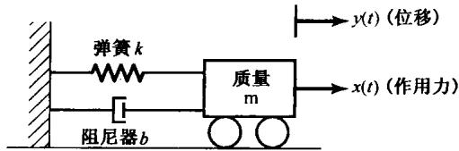

图6.21 由弹簧、减震器及一个连接着它们的可移动质量和一个固定支撑组成的二阶系统

那么，除了在  $x(t)$  上有一个尺度变化因子  $1 / k$  外，该系统的运动方程就化简为式(6.31）。

由式(6.31)所代表的二阶系统的频率响应是

$$
H (\mathrm {j} \omega) = \frac {\omega_ {n} ^ {2}}{(\mathrm {j} \omega) ^ {2} + 2 \zeta \omega_ {n} (\mathrm {j} \omega) + \omega_ {n} ^ {2}} \tag {6.33}
$$

将  $H(\mathrm{j}\omega)$  的分母因式化后，得

$$
H (\mathrm {j} \omega) = \frac {\omega_ {n} ^ {2}}{(\mathrm {j} \omega - c _ {1}) (\mathrm {j} \omega - c _ {2})}
$$

其中，

$$
c _ {1} = - \zeta \omega_ {n} + \omega_ {n} \sqrt {\zeta^ {2} - 1} \tag {6.34}
$$

$$
c _ {2} = - \zeta \omega_ {n} - \omega_ {n} \sqrt {\zeta^ {2} - 1}
$$

若  $\zeta \neq 1$  ，则  $c_{1} \neq c_{2}$  ，进行部分分式展开得到

$$
H (\mathrm {j} \omega) = \frac {M}{\mathrm {j} \omega - c _ {1}} - \frac {M}{\mathrm {j} \omega - c _ {2}} \tag {6.35}
$$

其中，

$$
M = \frac {\omega_ {n}}{2 \sqrt {\zeta^ {2} - 1}} \tag {6.36}
$$

由式(6.35)，系统的单位冲激响应为

$$
h (t) = M \left[ \mathrm {e} ^ {c _ {1} t} - \mathrm {e} ^ {c _ {2} t} \right] u (t) \tag {6.37}
$$

如果  $\zeta = 1$  ，则  $c_{1} = c_{2} = -\omega_{n}$  ，这时有

$$
H (\mathrm {j} \omega) = \frac {\omega_ {n} ^ {2}}{(\mathrm {j} \omega + \omega_ {n}) ^ {2}} \tag {6.38}
$$

由表4.2可得，此时的单位冲激响应为

$$
h (t) = \omega_ {n} ^ {2} t \mathrm {e} ^ {- \omega_ {n} t} u (t) \tag {6.39}
$$

由式(6.37)和式(6.39)可注意到，  $h(t) / \omega_{n}$  是  $\omega_{n}t$  的函数。另外，式(6.33)还可写成

$$
H (\mathrm {j} \omega) = \frac {1}{\left(\mathrm {j} \omega / \omega_ {n}\right) ^ {2} + 2 \zeta \left(\mathrm {j} \omega / \omega_ {n}\right) + 1}
$$

由这里可以看到，频率响应  $H(\mathrm{j}\omega)$  是  $\omega /\omega_{n}$  的函数，因此改变  $\omega_{n}$  实质上与一个时间和频率的尺度变换是一致的。

参数  $\zeta$  称为阻尼系数（damping ratio）， $\omega_{n}$  称为无阻尼自然频率（undamped natural frequency）。这些术语的意义会随着对二阶系统单位冲激响应和阶跃响应研究的深入，而愈渐明确。首先由式(6.35)看出，当  $0 < \zeta < 1$  时， $c_{1}$  和  $c_{2}$  都是复数，因此可以将式(6.37)的单位冲激响应写成

$$
\begin{array}{l} h (t) = \frac {\omega_ {n} \mathrm {e} ^ {- \zeta \omega_ {n} t}}{2 \mathrm {j} \sqrt {1 - \zeta^ {2}}} \left\{\exp \left[ \mathrm {j} \left(\omega_ {n} \sqrt {1 - \zeta^ {2}}\right) t \right] - \exp \left[ - \mathrm {j} \left(\omega_ {n} \sqrt {1 - \zeta^ {2}}\right) t \right] \right\} u (t) \tag {6.40} \\ = \frac {\omega_ {n} \mathrm {e} ^ {- \zeta \omega_ {n} t}}{\sqrt {1 - \zeta^ {2}}} [ \sin (\omega_ {n} \sqrt {1 - \zeta^ {2}}) t ] u (t) \\ \end{array}
$$

因此，对于  $0 < \zeta < 1$  ，二阶系统的单位冲激响应就是一个衰减的振荡。这时系统称为欠阻尼的(underdamped)。如果  $\zeta > 1$  ，则  $c_{1}$  和  $c_{2}$  都是实数，并且是负的，单位冲激响应就是两个衰减的指数之差，这时系统称为过阻尼的(overdamped)。当  $\zeta = 1$  时， $c_{1} = c_{2}$ ，这时系统称为临界阻尼的(critically damped)。二阶系统在不同  $\zeta$  值下的单位冲激响应(乘以  $1 / \omega_{n}$ ) 如图6.22(a)所示。

对于  $\zeta \neq 1$  ，二阶系统的阶跃响应可由式(6.37)算出，其表达式是

$$
s (t) = h (t) * u (t) = \left\{1 + M \left[ \frac {\mathrm {e} ^ {c _ {1} t}}{c _ {1}} - \frac {\mathrm {e} ^ {c _ {2} t}}{c _ {2}} \right] \right\} u (t) \tag {6.41}
$$

对于  $\zeta = 1$  ，利用式(6.39)可得

$$
s (t) = \left[ 1 - \mathrm {e} ^ {- \omega_ {n} t} - \omega_ {n} t \mathrm {e} ^ {- \omega_ {n} t} \right] u (t) \tag {6.42}
$$

在几个不同的  $\zeta$  值下，二阶系统的阶跃响应，绘于图6.22(b)。从该图可以看出，在欠阻尼情况下，阶跃响应既有超量(overshoot)(即阶跃响应超过它的终值)，又呈现出振荡。当  $\zeta = 1$  时，阶跃响应是在没有超量的情况下所能得到的最快的响应（也即最短的上升时间），从而有最短的建立时间。随着  $\zeta$  的增加(超过1)，响应愈来愈慢，这一点可以从式(6.34)和式(6.41)看出。随着  $\zeta$  的增加， $c_{1}$  的模越来越小，而  $c_{2}$  的模则增大，因此虽然与  $\mathrm{e}^{c_{1}t}$  有关的时间常数  $(1 / |c_{2}|)$  减小了，但与  $\mathrm{e}^{c_{1}t}$  有关的时间常数  $(1 / |c_{1}|)$  增大了。结果，在式(6.41)中涉及  $\mathrm{e}^{c_{1}t}$  的这一项要用一个较长的时间衰减到零，因此正是与该项有关的时间常数决定了阶跃响应的建立时间。于是，对于大的  $\zeta$  值，阶跃响应就要用较长的时间才能建立起来。用弹簧-减震器这个力学系统的例子来说，当衰减系数  $b$  增大，使  $\zeta$  超过临界值1时[见式(6.33)]，该质量的运动变得愈来愈迟纯。

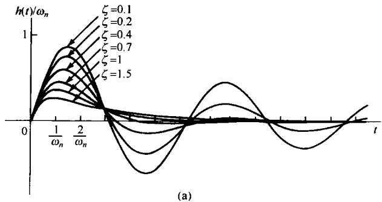

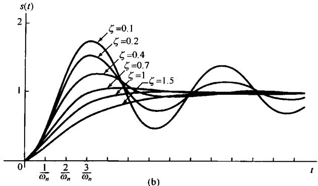

图6.22 不同阻尼系数  $\zeta$  下的二阶系统响应。(a) 单位冲激响应；(b) 阶跃响应

最后，正如已经说过的， $\omega_{n}$  的值本质上只是控制响应  $h(t)$  和  $s(t)$  的时间尺度。例如，在欠阻尼情况下， $\omega_{n}$  愈大，作为  $t$  的函数的单位冲激响应在时间上更为压缩，并且  $h(t)$  和  $s(t)$  中的振荡频率就更高。事实上，从式(6.40)中可以看到， $h(t)$  和  $s(t)$  中的振荡频率是  $\omega_{n} \sqrt{1 - \zeta^{2}}$ ，它就是随着  $\omega_{n}$  增加而增加的。然而，应当注意，这个频率明显地与阻尼系数有关，而且不等于（而是小于） $\omega_{n}$ ，除非在  $\zeta = 0$  的无阻尼情况下，才等于  $\omega_{n}$ 。由于这个原因，传统上就把这个参数  $\omega_{n}$  称为无阻尼自然频率。对于上述弹簧-减震器的例子来说，就是当减震器不存在时，该质量的振荡频率就等于  $\omega_{n}$ ，而当加入减震器后，振荡频率下降。

在图6.23中画出了由式(6.33)给出的频率响应对于几个不同  $\zeta$  值的伯德图。和一阶系统中一样，由对数频率坐标导出对数模特性的高、低频率的线性渐近线。具体而言，由式(6.33)可得

$$
2 0 \log_ {1 0} | H (\mathrm {j} \omega) | = - 1 0 \log_ {1 0} \left\{\left[ 1 - \left(\frac {\omega}{\omega_ {n}}\right) ^ {2} \right] ^ {2} + 4 \zeta^ {2} \left(\frac {\omega}{\omega_ {n}}\right) ^ {2} \right\} \tag {6.43}
$$

从这个表示式可以导出高、低频率两条线性渐近线为

$$
2 0 \log_ {1 0} | H (j \omega) | \simeq \left\{ \begin{array}{l l} 0, & \omega \ll \omega_ {n} \\ - 4 0 \log_ {1 0} \omega + 4 0 \log_ {1 0} \omega_ {n}, & \omega \gg \omega_ {n} \end{array} \right. \tag {6.44}
$$

因此，对数模特性的低频渐近线是  $0\mathrm{dB}$  线，而高频渐近线则有一个每隔十倍频程-40dB的斜率；也就是说，当  $\omega$  每增加10倍时，  $|H(\mathrm{j}\omega)|$  就下降40dB。另外，两条渐近线在  $\omega = \omega_{n}$  处相交。因此得出，对  $\omega \leqslant \omega_{n}$  ，可以利用式(6.44)给出的近似，对对数模特性求得一个直线渐近近似。为此，  $\omega_{n}$  称为二阶系统的转折频率。近似特性用虚线也画在图6.23中。

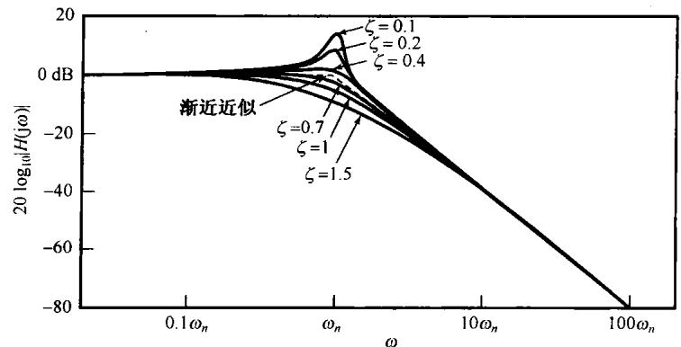

图6.23 在几个不同阻尼系数  $\zeta$  值下，二阶系统的伯德图

另外，也能求得  $\angle H(\mathrm{j}\omega)$  的一个直线近似，  $\angle H(\mathrm{j}\omega)$  的准确表示式可由式(6.33)得到

$$
\left. \prec H (\mathrm {j} \omega) = - \arctan \left(\frac {2 \zeta \left(\omega / \omega_ {n}\right)}{1 - \left(\omega / \omega_ {n}\right) ^ {2}}\right) \right. \tag {6.45}
$$

对  $\nless H(j\omega)$  的近似式是

$$
\left\langle \right. H (\mathrm {j} \omega) \simeq \left\{\begin{array}{l l}0,&\omega \leqslant 0. 1 \omega_ {n}\\- \frac {\pi}{2} \left[ \log_ {1 0} \left(\frac {\omega}{\omega_ {n}}\right) + 1 \right],&0. 1 \omega_ {n} \leqslant \omega \leqslant 1 0 \omega_ {n}\\- \pi ,&\omega \geqslant 1 0 \omega_ {n}\end{array}\right. \tag {6.46}
$$

它也画在图6.23中。注意，在转折频率  $\omega = \omega_{\mathrm{n}}$  处，近似值和真正值又相等，且为

$$
\left\langle H (\mathrm {j} \omega_ {n}) = - \frac {\pi}{2} \right.
$$

对于二阶系统，其渐近线式(6.44)和式(6.46)与  $\zeta$  无关，而  $|H(j\omega)|$  和  $\prec H(j\omega)$  的真正图形变化肯定是与  $\zeta$  有关的，注意到这一点是很重要的。因为如果要想在一个渐近近似的特性上画出准确的图（特别是在转折频率附近），就必须考虑到这一点，才能把一张近似图修改得与真正的图更为一致。这个差别在  $\zeta$  值较小时最为明显；特别是，在这种情况下，真正的对数模特性在  $\omega = \omega_{n}$  附近有一个峰值。事实上，利用式(6.43)直接计算可以证明，当  $\zeta < \sqrt{2}/2 \approx 0.707$  时， $|H(j\omega)|$  在

$$
\omega_ {\max } = \omega_ {n} \sqrt {1 - 2 \zeta^ {2}} \tag {6.47}
$$

处有一个最大值，其值为

$$
\left| H \left(\mathrm {j} \omega_ {\max }\right) \right| = \frac {1}{2 \zeta \sqrt {1 - \zeta^ {2}}} \tag {6.48}
$$

然而，对于  $\zeta > 0.707$  ， $H(\mathrm{j}\omega)$  从  $\omega = 0$  开始，随  $\omega$  的增加而单调衰减。 $H(\mathrm{j}\omega)$  可能有一个峰值这一点在设计频率选择性滤波器和选频放大器中是非常重要的。在某些应用中，可能想要设计这样一种电路，使其频率响应的模在某一给定频率上有一个陡峭的尖峰，从而能在某一较窄的频率范围内，对一些正弦信号提供选频性放大。这种电路用品质因数（quality） $Q$  来衡量峰值的尖锐程度。对于一个由式(6.31)描述的二阶电路， $Q$  通常取为

$$
Q = \frac {1}{2 \zeta}
$$

并且由图6.23和式(6.48)可见，这个定义有这样的性质：系统中阻尼愈小，  $|H(\mathrm{j}\omega)|$  中的峰值就愈尖锐。

# 6.5.3 有理型频率响应的伯德图

本节一开始曾指出过，一阶和二阶系统都能用来作为基本单元，以构成更复杂的，具有有理型频率响应的线性时不变系统。本节给出的伯德图基本上提供了为构成任何一个有理型频率响应的伯德图所需的全部信息。具体而言，这一节已经讨论了由式(6.22)和式(6.33)给出的频率响应的伯德图。另外，对于具有如下频率响应形式：

$$
H (\mathrm {j} \omega) = 1 + \mathrm {j} \omega \tau \tag {6.49}
$$

和

$$
H (\mathrm {j} \omega) = 1 + 2 \zeta \left(\frac {\mathrm {j} \omega}{\omega_ {n}}\right) + \left(\frac {\mathrm {j} \omega}{\omega_ {n}}\right) ^ {2} \tag {6.50}
$$

的伯德图(见图6.20和图6.23)就能很快得到，因为

$$
2 0 \log_ {1 0} | H (\mathrm {j} \omega) | = - 2 0 \log_ {1 0} \left| \frac {1}{H (\mathrm {j} \omega)} \right|
$$

且

$$
\left. \varkappa (H (\mathrm {j} \omega)) = - \varkappa \left(\frac {1}{H (\mathrm {j} \omega)}\right) \right.
$$

同时，对于系统函数为恒定增益的系统

$$
H (\mathrm {j} \omega) = K
$$

因为，若  $K > 0$  则  $K = |K| \mathrm{e}^{\mathrm{j}\theta}$ ；若  $K < 0$  则  $K = |K| \mathrm{e}^{\mathrm{j}\pi}$ ，所以

$$
2 0 \log_ {1 0} | H (j \omega) | = 2 0 \log_ {1 0} | K |
$$

$$
\left\langle H (\mathrm {j} \omega) = \left\{ \begin{array}{l l} 0, & K > 0 \\ \pi , & K <   0 \end{array} \right. \right.
$$

因为一个有理型频率响应可以按因式分解为一个恒定增益和一阶、二阶项的乘积，所以它的伯德图就能由乘积中每一项的伯德图相加得到。下面两个例子将用来进一步说明伯德图的构成。

例6.4 求频率响应为

$$
H (\mathrm {j} \omega) = \frac {2 \times 1 0 ^ {4}}{(\mathrm {j} \omega) ^ {2} + 1 0 0 \mathrm {j} \omega + 1 0 ^ {4}}
$$

的伯德图。首先注意到

$$
H (j \omega) = 2 \hat {H} (j \omega)
$$

这里  $\tilde{H} (\mathrm{j}\omega)$  就是由式(6.33)所给出的标准二阶频率响应的形式，于是有

$$
2 0 \log_ {1 0} | H (\mathrm {j} \omega) | = 2 0 \log_ {1 0} 2 + 2 0 \log | \hat {H} (\mathrm {j} \omega) |
$$

将  $\hat{H} (\mathrm{j}\omega)$  与式(6.33)的频率响应进行比较，可得  $\omega_{n} = 100$  ，  $\zeta = 1 / 2$  。利用式(6.44)，现在就可以对  $20\log_{10}|\hat{H} (\mathrm{j}\omega)|$  标定渐近线：

$$
2 0 \log_ {1 0} | \hat {H} (\mathrm {j} \omega) | \simeq 0, \quad \omega \ll 1 0 0
$$

和

$$
2 0 \log_ {1 0} | \hat {H} (\mathrm {j} \omega) | \simeq - 4 0 \log_ {1 0} \omega + 8 0, \quad \omega \gg 1 0 0
$$

$20\log_{10}|H(\mathrm{j}\omega)|$  除了由于另加  $20\log_{10}2$  （近似为6dB)这一项而对所有频率有一个恒定偏置外，具有与  $\hat{H} (\mathrm{j}\omega)$  相同的渐近线。图6.24(a)中的虚线就代表了这一渐近线。图6.24(b)中的实线代表 $20\log_{10}|H(\mathrm{j}\omega)|$  由计算机产生的真正伯德图。因为对  $\hat{H} (\mathrm{j}\omega)$  来说，  $\zeta$  的值小于  $\sqrt{2} /2$  ，所以真正的伯德图在接近  $\omega = 100$  的地方有一个微小的峰值。

(a)

(b)

图6.24 例6.4的系统函数伯德图。（a）模；（b）相位

为了得到  $\varkappa H(j\omega)$  的图，可注意到

$$
\left\langle \chi H (\mathrm {j} \omega) = \chi \hat {H} (\mathrm {j} \omega) \right.
$$

而  $\prec \hat{H} (\mathrm{j}\omega)$  的渐近线按式(6.46)给出为

$$
\left\langle \hat {H} (\mathrm {j} \omega) = \left\{ \begin{array}{l l} 0, & \omega \leqslant 1 0 \\ - (\pi / 2) [ \log_ {1 0} (\omega / 1 0 0) + 1 ], & 1 0 \leqslant \omega \leqslant 1 0 0 0 \\ - \pi , & \omega \geqslant 1 0 0 0 \end{array} \right. \right.
$$

图6.24(b)中分别用虚线和实线画出了  $\angle H(j\omega)$  的渐近线和真实值。

例6.5 考虑如下频率响应：

$$
H (j \omega) = \frac {1 0 0 (1 + j \omega)}{(1 0 + j \omega) (1 0 0 + j \omega)}
$$

为了获得  $H(\mathrm{j}\omega)$  的伯德图，将  $H(\mathrm{j}\omega)$  重写成如下因式的形式：

$$
H (\mathrm {j} \omega) = \left(\frac {1}{1 0}\right) \left(\frac {1}{1 + \mathrm {j} \omega / 1 0}\right) \left(\frac {1}{1 + \mathrm {j} \omega / 1 0 0}\right) (1 + \mathrm {j} \omega)
$$

这里，第一个因子是一个常数，接下来两个因式都与式(6.22)给出的一阶频率响应有相同的标准形式，而第四个因式是一阶标准形式的倒数。因此，  $20\log_{10}|H(\mathrm{j}\omega)|$  的伯德图就是相应于每个因式的伯德图之和。另外，可以将每一个的渐近线相加以得到总的伯德图的渐近线。这些渐近线和  $20\log_{10}|H(\mathrm{j}\omega)|$  的真正值都画在图6.25(a)中。应该注意，常数因子1/10在所有频率都是-20dB的偏置。  $\omega = 1$  的转折频率对应于  $(1 + \mathrm{j}\omega)$  这一因式，它由  $\omega = 1$  开始产生20dB/十倍频程的上升，然后由于因式  $1 / (1 + \mathrm{j}\omega /10)$  而在转折频率  $\omega = 10$  处，被以20dB/十倍频程的下降而抵消。最后，因式  $1 / (1 + \mathrm{j}\omega /100)$  提供了另一转折频率  $\omega = 100$ ，随后就以20dB/十倍频程的速率下降。

(a)

(b)

图6.25 例6.5的系统函数的伯德图。（a）模；（b）相位

根据如上说明的每个因式的渐近线，再与图6.25(b)的真实相位图相结合，就可以对  $\angle H(j\omega)$  的相位构成渐近近似。特别是，常数因子  $1 / 10$  对相位的贡献是0，而因式  $(1 + j\omega)$  的贡献是：  $\omega < 0.1$  时为0，然后在  $\omega = 0.1$  从零相位开始，随  $\log_{10}(\omega)$  线性上升，本应在  $\omega = 10$  时，升到一个  $\pi /2$  值。然而，这一上升在  $\omega = 1$  处被困式  $1 / (1 + j\omega /10)$  的相位的渐近近似所抵消，该因式对相位的贡献是：从  $\omega = 1$  到  $\omega = 100$  的频率范围内线性减小  $\pi /2$  rad。最后，因式  $1 / (1 + j\omega /100)$  相位的渐近近似在从  $\omega = 10$  到  $\omega = 1000$  的频率范围内提供了另一个  $\pi /2$  rad的线性下降。

在本节关于一阶系统的讨论中，我们只关心  $\tau > 0$  的值。事实上，如果  $\tau < 0$  ，很容易证明，由式(6.21)所描述的因果一阶系统的单位冲激响应不是绝对可积的，结果系统是不稳定的。同样，在分析式(6.31)的二阶因果系统时要求  $\zeta$  和  $\omega_{n}^{2}$  都是正数，如果有哪一个不是正的，所得到的单位冲激响应也不是绝对可积的。因此，这一节只关心稳定的因果一阶和二阶系统，对它们可以定义出频率响应。

# 6.6 一阶与二阶离散时间系统

这一节将与上一节的讨论相并行来研究一阶和二阶离散时间线性时不变系统的性质。与连续时间情况一样，具有频率响应为  $\mathbf{e}^{-\mathrm{j}\omega}$  的两个多项式之比的任何系统（也就是由线性常系数差分方程描述的任何离散时间线性时不变系统），都能够写成一阶和二阶系统的乘积或和，这意味着这些基本系统在实现和分析更为复杂的系统时具有很大的价值（例如习题6.45）。

# 6.6.1 一阶离散时间系统

考虑由如下差分方程描述的一阶因果线性时不变系统

$$
y [ n ] - a y [ n - 1 ] = x [ n ] \tag {6.51}
$$

其中  $|a| < 1$  。由例5.18，该系统的频率响应为

$$
H \left(\mathrm {e} ^ {\mathrm {j} \omega}\right) = \frac {1}{1 - a \mathrm {e} ^ {- \mathrm {j} \omega}} \tag {6.52}
$$

其单位脉冲响应为

$$
h [ n ] = a ^ {n} u [ n ] \tag {6.53}
$$

对于几个不同的  $a$  值，其  $h[n]$  如图6.26所示。同时，该系统的阶跃响应为

$$
s [ n ] = h [ n ] * u [ n ] = \frac {1 - a ^ {n + 1}}{1 - a} u [ n ] \tag {6.54}
$$

如图6.27所示。

图6.26 一阶系统单位脉冲响应  $h[n] = a^{n}u[n]$  。（a）  $a = \pm 1 / 4$

(b)  $a = \pm 1 / 2$ ; (c)  $a = \pm 3 / 4$ ; (d)  $a = \pm 7 / 8$

这里参数  $a$  的模  $|a|$  所起的作用很类似于连续时间一阶系统中时间常数  $\tau$  的作用，即  $|a|$  决定了一阶系统响应的速率。例如，由式(6.53)和式(6.54)及图6.26和图6.27都可以看到， $h[n]$  和  $s[n]$  收敛于它们终值的速率就是  $|a|^n$  收敛于零的速率。因此对于小的  $|a|$  值，单位脉冲响应急剧衰减，而阶跃响应则很快地建立起来。当  $|a|$  接近于1时，这些响应都是比较慢的。值得注意的是，与一阶连续时间系统不同，由式(6.51)所确定的一阶系统可以呈现出振荡的特性。这发生在  $a < 0$  时，在这种情况下，阶跃响应既呈现出超量，又呈现出振荡特性。

图6.27 一阶系统的阶跃响应  $s[n]$  。(a)  $a = \pm 1/4$ ; (b)  $a = \pm 1/2$ ; (c)  $a = \pm 3/4$ ; (d)  $a = \pm 7/8$

由式(6.51)描述的一阶系统频率响应的模和相位分别是

$$
\left| H \left(\mathrm {e} ^ {\mathrm {j} \omega}\right) \right| = \frac {1}{\left(1 + a ^ {2} - 2 a \cos \omega\right) ^ {1 / 2}} \tag {6.55}
$$

和

$$
\left. \angle H \left(e ^ {j \omega}\right) = - \arctan \left[ \frac {a \sin \omega}{1 - a \cos \omega} \right] \right. \tag {6.56}
$$

在图6.28(a)中，画出了式(6.52)中  $a > 0$  时对应几个  $a$  值的频率响应的对数模和相位特性；图6.28(b)是  $a < 0$  时的情况。从这些图中可以看到，当  $a > 0$  时，系统呈现出高频衰减的特性，即  $\left|H\left(\mathrm{e}^{\mathrm{j}\omega}\right)\right|$  在  $\omega$  接近  $\pm \pi$  时的值比  $\omega$  接近0时的值小；而当  $a < 0$  时，系统对高频分量放大，而对低频分量衰减。同时，也可注意到，对于小的  $|a|$  值， $\left|H\left(\mathrm{e}^{\mathrm{j}\omega}\right)\right|$  的最大值  $1 / (1 + a)$  和最小值  $1 / (1 - a)$  在数值上就逐渐靠近，因此  $\left|H\left(\mathrm{e}^{\mathrm{j}\omega}\right)\right|$  的变化就相对地平坦。另一方面，在  $|a|$  接近于1时，这两个值就相差很大， $\left|H\left(\mathrm{e}^{\mathrm{j}\omega}\right)\right|$  呈现出更为陡峭的峰值，这样就在一个较窄的频带内提供了具有良好选择性的滤波和放大。

(a)

(b)

图6.28 由式(6.52)确定的一阶系统频率响应的模和相位特性。（a）  $a > 0$  时几个不同  $a$  值的图；（b）  $a < 0$  时几个不同  $a$  值的图

# 6.6.2 二阶离散时间系统

考虑一个二阶因果线性时不变系统，其差分方程为

$$
y [ n ] - 2 r \cos \theta y [ n - 1 ] + r ^ {2} y [ n - 2 ] = x [ n ] \tag {6.57}
$$

其中  $0 < r < 1, 0 \leqslant \theta \leqslant \pi$  。该系统的频率响应是

$$
H \left(\mathrm {e} ^ {\mathrm {j} \omega}\right) = \frac {1}{1 - 2 r \cos \theta \mathrm {e} ^ {- \mathrm {j} \omega} + r ^ {2} \mathrm {e} ^ {- \mathrm {j} 2 \omega}} \tag {6.58}
$$

$H(e^{j\omega})$  的分母可以因式分解，从而得

$$
H \left(e ^ {j \omega}\right) = \frac {1}{\left[ 1 - \left(r e ^ {j \theta}\right) e ^ {- j \omega} \right] \left[ 1 - \left(r e ^ {- j \theta}\right) e ^ {- j \omega} \right]} \tag {6.59}
$$

当  $\theta$  不等于0或π时，这两个因式是不同的，利用部分分式展开可得

$$
H \left(\mathrm {e} ^ {\mathrm {j} \omega}\right) = \frac {A}{1 - \left(r \mathrm {e} ^ {\mathrm {j} \theta}\right) \mathrm {e} ^ {- \mathrm {j} \omega}} + \frac {B}{1 - \left(r \mathrm {e} ^ {- \mathrm {j} \theta}\right) \mathrm {e} ^ {- \mathrm {j} \omega}} \tag {6.60}
$$

其中，

$$
A = \frac {\mathrm {e} ^ {\mathrm {j} \theta}}{2 \mathrm {j} \sin \theta}, \quad B = - \frac {\mathrm {e} ^ {- \mathrm {j} \theta}}{2 \mathrm {j} \sin \theta} \tag {6.61}
$$

这时系统的单位脉冲响应是

$$
\begin{array}{l} h [ n ] = \left[ A (r e ^ {i \theta}) ^ {n} + B (r e ^ {- j \theta}) ^ {n} \right] u [ n ] \\ = r ^ {n} \frac {\sin [ (n + 1) \theta ]}{\sin \theta} u [ n ] \tag {6.62} \\ \end{array}
$$

当  $\theta$  等于0或π时，式(6.58)分母的这两个因式相同。当  $\theta = 0$  时，

$$
H \left(\mathrm {e} ^ {\mathrm {j} \omega}\right) = \frac {1}{\left(1 - r \mathrm {e} ^ {- \mathrm {j} \omega}\right) ^ {2}} \tag {6.63}
$$

且

$$
h [ n ] = (n + 1) r ^ {\prime \prime} u [ n ] \tag {6.64}
$$

当  $\theta = \pi$  时，

$$
H \left(\mathrm {e} ^ {\mathrm {j} \omega}\right) = \frac {1}{\left(1 + r \mathrm {e} ^ {- \mathrm {j} \omega}\right) ^ {2}} \tag {6.65}
$$

且

$$
h [ n ] = (n + 1) (- r) ^ {n} u [ n ] \tag {6.66}
$$

图6.29示出了  $r$  和  $\theta$  的值在某一范围内改变时二阶系统的单位脉冲响应。由该图及式(6.62)都可看到， $h[n]$  的衰减速率受  $r$  的控制，即  $r$  愈接近1， $h[n]$  衰减得愈慢。类似地， $\theta$  值决定振荡频率。例如  $\theta = 0$  时，在  $h[n]$  中就没有振荡，而  $\theta = \pi$  时，振荡就加剧。不同的  $r$  和  $\theta$  值的影响也可以从式(6.57)的阶跃响应中看到。当  $\theta$  不等于0或  $\pi$  时，

$$
s [ n ] = h [ n ] * u [ n ] = \left[ A \left(\frac {1 - \left(r e ^ {j \theta}\right) ^ {n + 1}}{1 - r e ^ {j \theta}}\right) + B \left(\frac {1 - \left(r e ^ {- j \theta}\right) ^ {n + 1}}{1 - r e ^ {- j \theta}}\right) \right] u [ n ] \tag {6.67}
$$

同时，利用习题2.52的结果，对  $\theta = 0$  ，可以求得

$$
s [ n ] = \left[ \frac {1}{(r - 1) ^ {2}} - \frac {r}{(r - 1) ^ {2}} r ^ {n} + \frac {r}{r - 1} (n + 1) r ^ {n} \right] u [ n ] \tag {6.68}
$$

而当  $\theta = \pi$  时，

$$
s [ n ] = \left[ \frac {1}{(r + 1) ^ {2}} + \frac {r}{(r + 1) ^ {2}} (- r) ^ {n} + \frac {r}{r + 1} (n + 1) (- r) ^ {n} \right] u [ n ] \tag {6.69}
$$

对于一组  $r$  和  $\theta$  值的阶跃响应示于图6.30中。

图6.29 由式(6.57)表示的二阶系统对于一组不同的  $r$  和  $\theta$  值的单位脉冲响应

由式(6.57)给出的二阶系统就是相应于连续时间系统欠阻尼情况下的二阶系统，而  $\theta = 0$  的特殊情况就是临界阻尼情况。这就是说，对于任何不等于零的  $\theta$  值，单位脉冲响应都有一个衰减振荡的特性，阶跃响应则呈现超量和起伏。对于一组不同的  $r$  和  $\theta$  值，该系统的频率响应如图6.31所示。从该图可见，系统在某一频率范围内具有放大作用，并且  $r$  决定了在这一段频率范围内频率响应的尖锐程度。

正如我们刚才看到的，由式(6.59)定义的二阶系统具有复数系数因子（除非  $\theta$  等于0或  $\pi$ ）。但是，二阶系统也可能具有实系数因子。现考虑如下的  $H(e^{j\omega})$ ：

$$
H \left(\mathrm {e} ^ {\mathrm {j} \omega}\right) = \frac {1}{\left(1 - d _ {1} \mathrm {e} ^ {- \mathrm {j} \omega}\right) \left(1 - d _ {2} \mathrm {e} ^ {- \mathrm {j} \omega}\right)} \tag {6.70}
$$

其中  $d_{1}$  和  $d_{2}$  都是实数，且  $|d_{1}|$  和  $|d_{2}|$  都小于1。式(6.70)就是下列差分方程的频率响应：

$$
y [ n ] - \left(d _ {1} + d _ {2}\right) y [ n - 1 ] + d _ {1} d _ {2} y [ n - 2 ] = x [ n ] \tag {6.71}
$$

在该情况下，

$$
H \left(\mathrm {e} ^ {\mathrm {j} \omega}\right) = \frac {A}{1 - d _ {1} \mathrm {e} ^ {- \mathrm {j} \omega}} + \frac {B}{1 - d _ {2} \mathrm {e} ^ {- \mathrm {j} \omega}} \tag {6.72}
$$

其中，

$$
A = \frac {d _ {1}}{d _ {1} - d _ {2}}, \quad B = \frac {d _ {2}}{d _ {2} - d _ {1}} \tag {6.73}
$$

由此

$$
h [ n ] = \left[ A d _ {1} ^ {n} + B d _ {2} ^ {n} \right] u [ n ] \tag {6.74}
$$

这是两个衰减的实指数序列之和。同时，

$$
s [ n ] = \left[ A \left(\frac {1 - d _ {1} ^ {n + 1}}{1 - d _ {1}}\right) + B \left(\frac {1 - d _ {2} ^ {n + 1}}{1 - d _ {2}}\right) \right] u [ n ] \tag {6.75}
$$

图6.30 由式(6.57)表示的二阶系统对于一组不同的  $r$  和  $\theta$  值时的阶跃响应

由式(6.70)所给出的频率响应相应于两个一阶系统的级联。因此，可以从对一阶系统的研究中演绎出该系统的大部分性质。例如，它的对数模及相位特性就可以通过把两个一阶系统的特性相加而得到。同时，如同在一阶系统中所看到的，如果  $|d_1|$  和  $|d_2|$  都较小，系统响应就快；如果两者的大小有一个接近于1，系统就会有一个比较长的建立时间。再者，如果  $d_1$  和  $d_2$  都是负的，响应就是振荡型的。最后，当  $d_1$  和  $d_2$  都是正数的情况，就相应于连续时间过阻尼的情况，因为这时单位脉冲响应和阶跃响应在建立过程中都没有振荡。

(a)

(b)

图6.31 由式(6.57)所示的二阶系统频率响应的模和相位特性。（a）  $\theta = 0$  ；（b）  $\theta = \pi /4$  （c）  $\theta = \pi /2$  ；（d）  $\theta = 3\pi /4$  ；（e）  $\theta = \pi_{\circ}$  每幅图都包括r等于1/4，1/2和3/4时的曲线

(c)

(d)

图6.31（续）

这一节仅关心那些稳定的因果一阶和二阶系统，也即频率响应是有定义的一阶和二阶系统。特别是，由式(6.51)定义的因果系统，在  $|a| \geqslant 1$  时是不稳定的；同时，由式(6.56)定义的因果系统，在  $r \geqslant 1$  时也是不稳定的，而由式(6.71)定义的因果系统，在  $|d_1|$  和  $|d_2|$  中有一个超过1时也是不稳定的。

图6.31（续）

# 6.7 系统的时域分析与频域分析举例

本章一直在说明从时域和频域两方面来观察系统的重要性，以及意识到在这两个域的特性之间进行某些权衡或折中的意义。这一节将进一步来说明这些问题中的某些方面。6.7.1节将用一个汽车减震系统为例来讨论在连续时间情况下的这些折中；6.7.2节将讨论称为移动平均或非递归系统的这样一类重要的离散时间滤波器。

# 6.7.1 汽车减震系统的分析

我们已经得出的在连续时间系统中有关特性和折中的几点可以用汽车减震系统作为一个低通滤波器来给予说明。图6.32示出一个简单的减震装置的原理图，它由一个弹簧和一个减震器（震动吸收器)所组成。路面可以看成两部分叠加的结果，一个代表路面不平度，因而在高度上有一些快速的小幅度变化，这就对应着高频分量；另一部分是由于整个地形的变化，因而在高度上有缓慢的变化，这就对应着低频分量。汽车减震系统一般来说就是想要滤掉由于路面不平，从而在驾驶中引起的这些快速波动；也就是说该系统是作为一个低通滤波器来使用的。

这个减震系统基本目的是提供平稳的驾驶，而且在要通过的和不让通过的频率之间没有一个明显的界限。因此，接受(事实上更倾向于)一个从通带到阻带具有渐渐过渡特性的低通滤器是合理的。另外，这个系统的时域特性是重要的。如果该减震系统的单位冲激响应或阶跃响应呈现振荡，那么在路面上一个大的冲撞(相当于冲激输入)，或者是有一个道路缘石(相当于阶跃输入)，都会形成一个很不舒服的振荡响应。事实上，在减震系统的一般检验中都要引入一个先将底盘猛压一下然后再释放的激励。如果减震系统在这种激励下的响应有振荡，说明系统中的减震器需要更换。

图6.32 汽车减震系统原理图。  $y_{0}$  代表当汽车静止时汽车底盘和路面间的距离， $y(t) + y_{0}$  是底盘在参考高度上的位置， $x(t)$  是高于参考高度的路面高度

经济上的考虑和实现上的难易程度在汽车减震系统的设计上也起着很重要的作用。从乘客舒适的角度出发，已经完成了很多最理想的减震系统频率响应特性的研究。而在另一些情况下，经济上的因素可能不是一个主要问题，例如像火车客车车厢，这时就采用复杂而昂贵的减震系统。对汽车工业来说，成本是一个很重要的因素，因此多采用简单而成本低廉的减震系统。一个典型的汽车减震系统就是通过一个弹簧和一个减震器与轮子相连的底盘。

在图6.32中，  $y_{0}$  代表汽车在静止时，底盘与路面间的距离，  $y(t) + y_0$  是底盘在参考高度上的位置，而  $x(t)$  是道路在参考高度上的高度。制约底盘运动的微分方程就是

$$
M \frac {\mathrm {d} ^ {2} y (t)}{\mathrm {d} t ^ {2}} + b \frac {\mathrm {d} y (t)}{\mathrm {d} t} + k y (t) = k x (t) + b \frac {\mathrm {d} x (t)}{\mathrm {d} t} \tag {6.76}
$$

其中  $M$  是底盘的质量， $k$  和  $b$  是分别与弹簧和减震器有关的系数。于是系统的频率响应是

$$
H (\mathrm {j} \omega) = \frac {k + b \mathrm {j} \omega}{(\mathrm {j} \omega) ^ {2} M + b (\mathrm {j} \omega) + k}
$$

或者

$$
H (\mathrm {j} \omega) = \frac {\omega_ {n} ^ {2} + 2 \zeta \omega_ {n} (\mathrm {j} \omega)}{(\mathrm {j} \omega) ^ {2} + 2 \zeta \omega_ {n} (\mathrm {j} \omega) + \omega_ {n} ^ {2}} \tag {6.77}
$$

其中，

$$
\omega_ {n} = \sqrt {\frac {k}{M}}, \quad 2 \zeta \omega_ {n} = \frac {b}{M}
$$

和6.5.2节相同，参数  $\omega_{n}$  称为无阻尼自然频率， $\zeta$  称为阻尼系数。由式(6.77)给出的频率响应对数模的伯德图可以用一阶和二阶系统的伯德图来构成。在几个不同  $\zeta$  值下的频率响应模的伯德图如图6.33所示。图6.34是在几个不同  $\zeta$  值下系统的阶跃响应特性。

如同在6.5.2节里曾看到的，该滤波器的截止频率基本上是通过  $\omega_{n}$  来控制的，或者等效地说，对于某一个底盘质量  $M$  ，通过对弹簧系统  $k$  的适当选择来控制的。对某一个给定的  $\omega_{n}$  ，阻尼系数  $\zeta$  是由与减震器有关的阻尼因子  $b$  来调整的。当自然频率  $\omega_{n}$  减小时，减震系统就趋于滤掉较慢的路面变化，从而提供平滑的驾驶。另一方面，由图6.34可见，系统的上升时间却增加了，因此系统反应就更加迟钝一些。一方面要想保持小的  $\omega_{n}$  ，以改善低通滤波性能；另一方面又想有大的  $\omega_{n}$  ，以便有更快的时间响应！自然，这都是互为矛盾的要求，从而说明了需要在时域和频域特性之间求得某种折中。一般将具有低的  $\omega_{n}$  值，从而上升时间长的这种减震系统称为“软”系统；而具有高的  $\omega_{n}$  值，从而上升时间短的这种减震系统称为“硬”系统。从图6.33和图6.34也能看到，随着阻尼系数的减小，系统频率响应截止得就更陡峭一些，但在阶跃响应中的过冲和振荡就趋于增加。因此，系统在时域和频域之间还存在着这样一种折中考虑。一般来讲，减震器的阻

尼选为有一个快速的上升时间，但又避免过冲和振荡，这种选择相应于曾在6.5.2节考虑过的 $\zeta = 1.0$ 时的临界阻尼情况。

图6.33 对应于几个不同的阻尼系数  $\zeta$  值，汽车减震系统频率响应模的伯德图

图6.34 在各种不同阻尼系数  $(\zeta = 0.1, 0.2, 0.3, 0.4, 0.5, 0.6, 0.7, 0.8, 0.9, 1.0, 1.2, 1.5, 2.0, 5.0)$  下汽车减震系统的阶跃响应

# 6.7.2 离散时间非递归滤波器举例

3.11节曾介绍过由差分方程描述的两种基本类型的线性时不变滤波器，即递归或无限脉冲响应(IIR)滤波器和非递归或有限脉冲响应(FIR)滤波器。在实际中，这两类滤波器都十分重要，并各有优缺点。例如，6.6节讨论的用一阶和二阶系统互联来实现的递归滤波器，实现灵活而且高效，并且它的特性可用改变每个一阶和二阶子系统的参数和数目来调整。另一方面，如在习题6.64中所证明的，不可能设计一个具有真正线性相位的因果递归滤波器；而线性相位这个性质如我们已经看到的，往往又是希望有的，因为在线性相位的情况下，相位在输出上的影响只是一个单一的时延。与此相对照，在本节将证明，非递归滤波器可以有一个真正的线性相位特性。然而，一般来讲这也是肯定的：对于同一特性要求的滤波器，当用一个非递归方程来实现时，与用递归差分方程相比，则要求一个阶次更高的方程，从而也就需要更多的系数和延时。因此，对FIR滤波器来说，时域和频域之间的主要权衡之一是：在给出滤波器频域特性上要有更多的灵活性(例如其中包括实现高频率选择性的要求)，就需要用一个更长的单位脉冲响应的FIR滤波器。

最基本的非递归滤波器之一就是曾在3.11.2节介绍过的移动平均滤波器。对于这类滤波器，输出是输入在一个有限窗口内的平均：

$$
y [ n ] = \frac {1}{N + M + 1} \sum_ {k = - N} ^ {M} x [ n - k ] \tag {6.78}
$$

对应的单位脉冲响应是一个矩形脉冲，它的频率响应为

$$
H \left(\mathrm {e} ^ {\mathrm {j} \omega}\right) = \frac {1}{N + M + 1} \mathrm {e} ^ {\mathrm {j} \omega [ (N - M) / 2 ]} \frac {\sin [ \omega (M + N + 1) / 2 ]}{\sin (\omega / 2)} \tag {6.79}
$$

图6.35示出在  $M + N + 1 = 33$  和  $M + N + 1 = 65$  时的对数模特性。这些频率响应的主瓣就对应于该滤波器的有效带宽。可以注意到，当单位脉冲响应在长度上增加时，频率响应模特性的主瓣宽度随之减小。这就提供了在时域和频域之间进行折中的另一个例子。具体而言，为了有一个较窄的带宽，式(6.78)和式(6.79)的滤波器就必须有一个更长的单位脉冲响应。因为一个FIR滤波器的单位脉冲响应的长度直接影响着实现时的复杂性，这就意味着频率选择性和滤波器的复杂性之间有一个折中。这是在滤波器设计中关心的主要问题之一。

(a)

(b)

图6.35 (a)  $M + N + 1 = 33$  和(b)  $M + N + 1 = 65$  时由式(6.78)和式(6.79)所表示的移动平均滤波器的对数模特性

在经济问题分析中，通常应用移动平均滤波器来衰减长期经济倾向中的短期波动。图6.36给出了式(6.78)的移动平均滤波器应用于道·琼斯股票市场每周指数(10年)的例子。图6.36(a)示出了10年的道·琼斯股票市场的指数。图6.36(b)是图6.36(a)取51天（即  $M = N = 25$  )的移动平均，而图6.36(c)则是取201天(即  $M = N = 100$  )的移动平均。这两个移动平均都是有用的，51天的平均指出发生在一年期间内有循环性(即周期性)的趋势；而201天的平均主要突出了较长时间的变化趋势。

离散时间非递归滤波器的更一般形式是

$$
y [ n ] = \sum_ {k = - N} ^ {M} b _ {k} x [ n - k ] \tag {6.80}
$$

这样，这个滤波器的输出就可以认为是在  $(N + M + 1)$  个相邻点上进行的加权平均，而由式(6.78)所表示的简单移动平均就相应将所有这些加权系数都置于同样的值  $1 / (N + M + 1)$  。然而，用其他方法来选择这些系数，就能在调整滤波器的频率响应上有相当大的灵活性。

有很多方法来选择式(6.80)中的这些系数，以满足滤波器的某些特性要求，例如，在一个滤波器的给定长度内（即  $N + M + 1$  固定），尽可能地锐化过渡带。这些方法在一些教科书中都已详细讨论到①。虽然在这里不讨论这一问题，但是值得强调的是，这些设计方法都强烈地依赖于本书所建立的基本概念和方法。为了说明这些系数的调整如何影响滤波器的响应，现考虑一个 $N = M = 16$  的形如式(6.80)的滤波器，其系数选择成

$$
b _ {k} = \left\{ \begin{array}{l l} \frac {\sin (2 \pi k / 3 3)}{\pi k}, & | k | \leqslant 3 2 \\ 0, & | k | > 3 2 \end{array} \right. \tag {6.81}
$$

该滤波器的单位脉冲响应是

$$
h [ n ] = \left\{ \begin{array}{l l} \frac {\sin (2 \pi n / 3 3)}{\pi n}, & | n | \leqslant 3 2 \\ 0, & | n | > 3 2 \end{array} \right. \tag {6.82}
$$

将该式与式(6.20)相比较可知，式(6.82)的  $h[n]$  相应于把截止频率为  $\omega_{c} = 2\pi /33$  的理想低通滤波器的单位脉冲响应在  $|n| > 32$  时截断的结果。

一般来讲，系数  $b_{k}$  可以调整到使截止频率处于所要求的频率上。对于图6.37的例子来说，其截止频率选择得与  $N = M = 16$  的图6.35的截止频率近似匹配。图6.37(a)是它的单位脉冲响应，而图6.37(b)则是以dB计的频率响应的对数模特性。与图6.35的频率响应相比，可以看到两者有近似相等的滤波器的通带宽度，但是图6.37(b)有较陡峭的过渡带。图6.38(a)和图6.38(b)给出了这两种滤波器的模特性(在相同的线性坐标上)以供比较。从这两个例子的比较应该看到，恰当地选择加权系数，可以使过渡带变得尖锐。图6.39是一个高阶低通滤波器的例子  $(N + M + 1 = 125)$ ，它的系数是通过一个称为Parks-McClellan算法②的数值计算来确定的。这再一次说明时域和频域之间的折中：如果增加滤波器的长度  $N + M + 1$ ，那么利用对式(6.80)中这些滤波器系数的明智选择，就可能实现更为尖锐的过渡带特性和更优越的频率选择性。

图6.36 对10年内道·琼斯每周股票市场指数利用移动平均滤波器进行低通滤波的效果。(a) 每周指数；(b) 对(a)作51天的移动平均；(c) 对(a)作201天的移动平均。图中每周股票市场指数和两个移动平均值都是离散时间序列，为了图示清楚起见，三张图的序列值都用直线相连形成了一条连续曲线

已经给出的这些例子有一个重要的性质：它们全都有零或线性相位特性。例如，由式(6.79)表示的移动平均滤波器的相位特性是  $\omega[(N - M)/2]$  。同时，因为式(6.82)的单位脉冲响应是实偶序列，它的频率响应就具有零相位。根据实信号傅里叶变换的对称性质知道，任何具有实偶单位脉冲响应的非递归滤波器都一定有一个实偶函数的频率响应  $H(\mathrm{e}^{\mathrm{j}\omega})$  ，从而具有零相位。当然，这样的滤波器是非因果的，因为它的单位脉冲响应  $h[n]$  在  $n < 0$  时不为零。然而，如果要求一个因果滤波器，那么在单位脉冲响应上进行一些改变也能完成这一目的，这样就得出一个具有线性

相位的系统。具体而言，因为  $h[n]$  是一个FIR滤波器的单位脉冲响应，它在以原点为中心的某一范围外都为零（即对全部  $\lfloor n\rfloor >N$  有  $h[n] = 0)$  ，现在将  $h[n]$  仅作  $N$  位延迟而得到一个非递归线性时不变系统，即

$$
h _ {1} [ n ] = h [ n - N ] \tag {6.83}
$$

那么，在  $n < 0$  时  $h_1[n] = 0$  ，所以该线性时不变系统是因果的。另外，依据时移性质，该系统的频率响应就是

$$
H _ {1} \left(\mathrm {e} ^ {\mathrm {j} \omega}\right) = H \left(\mathrm {e} ^ {\mathrm {j} \omega}\right) \mathrm {e} ^ {- \mathrm {j} \omega N} \tag {6.84}
$$

因为  $H(\mathrm{e}^{\mathrm{j}\omega})$  具有零相位，  $H_{1}(e^{j\omega})$  的确具有线性相位。

(a)

(b)

图6.37 (a) 由式(6.82)表示的非递归滤波器的单位脉冲响应；（b）该滤波器频率响应的对数模特性

图6.38 (a) 图6.37和(b) 图6.35两个频率响应(线性坐标)的比较

图6.39 用251个系数设计的以获得最锐截止的低通非递归滤波器

# 6.8 小结

这一章，我们依据第3章至第5章所建立的信号与系统的傅里叶分析基础，详细地研究了线性时不变系统的特性及其在信号上的作用。特别是，仔细地审视了信号与系统的模和相位特性，并且引入了线性时不变系统的对数模和伯德图。同时，还讨论了相位及相位失真对于信号与系统的影响。这一研究让我们了解了线性相位特性所起的特别作用，这就是它对所有频率都给出了一个恒定时延。这样就引入了与具有非线性相位特性的系统有关的非恒定群时延和弥散的概念。利用这些方法和概念，又从另一个角度审视了频率选择性滤波器及涉及的时域和频域之间的折中问题。我们既研究了理想的又研究了非理想的频率选择性滤波器的性质，并且看到，时域和频域的考虑、因果性的限制，以及实现方面的问题等常常使得具有过渡带和在通带与阻带具有容限的非理想滤波器成为最优先的选择。

另外，还详细地研究了连续和离散时间一阶与二阶系统的时域和频域特性，特别注意到这些系统的响应时间和频域带宽之间的折中。因为一阶和二阶系统是构成更复杂的高阶线性时不变系统的基本构造单元，所以对这些基本系统所得出的细节在实际中是非常有用的。

最后，给出了几个线性时不变系统的例子，以说明本章得出的一些结论。特别是，研究了一个简单的汽车减震系统的模型，以提供一个关注时间响应与频率响应的具体例子，正是这些关注在实际中指导着系统设计。我们还讨论了几个离散时间非递归滤波器的例子，这其中涉及从简单的移动平均滤波器到旨在用于增强频率选择性的高阶FIR滤波器。除此以外，还看到FIR滤波器能够设计成具有真正的线性相位。这些例子，先前所建立的傅里叶分析方法，以及这些方法所提供的概念和细节都说明了傅里叶分析方法在分析和设计线性时不变系统时具有很高价值。

# 习题

习题的第一部分属基本题，答案由书末给出。其余两部分分属基本题与深入题。

# 基本题（附答案）

6.1 考虑一个频率响应为  $H(\mathrm{j}\omega) = |\mathcal{H}(\mathrm{j}\omega)|\mathrm{e}^{\mathrm{j}\omega H(\mathrm{j}\omega)}$  且实值单位冲激响应为  $h(t)$  的连续时间线性时不变系统。假设在该系统上施加一个输入  $x(t) = \cos (\omega_0t + \phi_0)$ ，所得到的输出可表示成如下形式：

$$
y (t) = A x \left(t - t _ {0}\right)
$$

其中  $A$  是一个非负实数，代表一个幅度放大因子， $t_0$  是一个延时。

(a) 用  $|H(\mathrm{j}\omega_0)|$  表示  $A$

(b) 用  $\nless H(j\omega_0)$  表示  $t$ 。

6.2 考虑一个频率响应为  $H(\mathrm{e}^{\mathrm{j}\omega}) = |\mathcal{H}(\mathrm{e}^{\mathrm{j}\omega})|\mathrm{e}^{\mathrm{j}\xi H(\mathrm{e}^{\mathrm{j}\omega})}$  且实值单位脉冲响应为  $h[n]$  的离散时间线性时不变系统。假设在该系统上施加一个输入  $x[n] = \sin (\omega_0n + \phi_0)$ ，所得到的输出可表示成为

$$
y [ n ] = \left| H \left(\mathrm {e} ^ {\mathrm {j} \omega_ {0}}\right) \right| x [ n - n _ {0} ]
$$

假设  $\angle H(e^{j\omega_0})$  和  $\omega_0$  以一种特别的方式相关联，试求这个关系。

6.3 一个因果稳定线性时不变系统具有如下频率响应：

$$
H (\mathrm {j} \omega) = \frac {\mathrm {l} - \mathrm {j} \omega}{\mathrm {l} + \mathrm {j} \omega}
$$

(a) 证明:  $|H(\mathrm{j}\omega)| = A$ , 并求出  $A$  的值。

(b) 对该系统的群时延  $\tau(\omega)$ , 试判断下面哪种说法是对的。注意:  $\tau(\omega) = -\mathrm{d}(\triangleleft H(\mathrm{j}\omega)) / \mathrm{d}\omega$ , 其中  $\triangleleft H(\mathrm{j}\omega)$  表示成不包含任何不连续点的形式。

1.  $\tau (\omega) = 0$  ，  $\omega >0$

2.  $\tau (\omega) > 0$ $\omega >0$

3.  $\tau (\omega) < 0, \omega > 0$

6.4 考虑一个频率响应为  $H(\mathrm{e}^{\mathrm{j}\omega})$  且实值单位脉冲响应为  $h[n]$  的离散时间线性时不变系统，该系统的群时延函数定义为

$$
\tau (\omega) = - \frac {\mathrm {d}}{\mathrm {d} \omega} \not <   H \left(\mathrm {e} ^ {\mathrm {j} \omega}\right)
$$

其中  $\triangleleft H(e^{j\omega})$  没有不连续点。假设，对该系统有

$$
\left| H \left(e ^ {j \pi / 2}\right) \right| = 2, \quad \angle H \left(e ^ {j 0}\right) = 0, \quad \tau \left(\frac {\pi}{2}\right) = 2
$$

试求下面两种输入情况下系统的输出。

(a)  $\cos \left(\frac{\pi}{2} n\right)$

(b)  $\sin \left(\frac{7\pi}{2} n + \frac{\pi}{4}\right)$

6.5 考虑一个连续时间理想带通滤波器，其频率响应为

$$
H (\mathrm {j} \omega) = \left\{ \begin{array}{l l} 1, & \omega_ {c} \leqslant | \omega | \leqslant 3 \omega_ {c} \\ 0, & \text {其 他} \end{array} \right.
$$

(a) 若  $h(t)$  是该滤波器的单位冲激响应，确定一个函数  $g(t)$ ，使之有

$$
h (t) = \left(\frac {\sin \omega_ {c} t}{\pi t}\right) g (t)
$$

(b) 当  $\omega_{c}$  增加时，该滤波器的单位冲激响应是更加向原点集中呢，还是不是？

6.6 考虑一个离散时间理想高通滤波器，其频率响应是

$$
H (\mathrm {e} ^ {\mathrm {j} \omega}) = \left\{ \begin{array}{l l} 1, & \pi - \omega_ {c} \leqslant | \omega | \leqslant \pi \\ 0, & | \omega | <   \pi - \omega_ {c} \end{array} \right.
$$

(a) 若  $h[n]$  是该滤波器的单位脉冲响应，确定一个函数  $g[n]$ ，使之有

$$
h [ n ] = \left(\frac {\sin \omega_ {c} n}{\pi n}\right) g [ n ]
$$

(b) 当  $\omega_{c}$  增加时，该滤波器的单位脉冲响应是更加向原点集中呢，还是不是？

6.7 一个连续时间低通滤波器设计成通带频率为  $1000\mathrm{Hz}$ ，阻带频率为  $1200\mathrm{Hz}$ ，通带波纹为0.1，阻带波纹为0.05。该低通滤波器的单位冲激响应为  $h(t)$ ，现在希望把该滤波器转换成具有如下单位冲激响应的带通滤波器：

$$
g (t) = 2 h (t) \cos (4 0 0 0 \pi t)
$$

假设对于  $|\omega| > 4000\pi$ ， $|H(\mathrm{j}\omega)|$  可忽略，请回答下列问题：

(a) 若对该带通滤波器的通带波纹限制为 0.1，与带通滤波器有关的两个通带频率是什么？

(b) 若对该带通滤波器的阻带波纹限制为 0.05，与带通滤波器有关的两个阻带频率是什么？

6.8 一个因果非理想低通滤波器设计成具有频率响应  $H(\mathrm{e}^{\mathrm{j}\omega})$  ，关联该滤波器输入  $x[n]$  和输出  $y[n]$  的差分方程是

$$
y [ \eta ] = \sum_ {k = 1} ^ {N} a _ {k} y [ n - k ] + \sum_ {k = 0} ^ {M} b _ {k} x [ n - k ]
$$

该滤波器也满足下列频率响应模特性的要求：

$$
\text {通 带 频 率} = \omega_ {p} \quad \text {通 带 波 纹} = \delta_ {p}
$$

$$
\text {阻 带 频 率} = \omega_ {s} \quad \text {阻 带 波 纹} = \delta_ {s}
$$

现在考虑某一个因果线性时不变系统，其输入和输出的差分方程是

$$
y [ n ] = \sum_ {k = 1} ^ {N} (- 1) ^ {k} a _ {k} y [ n - k ] + \sum_ {k = 0} ^ {M} (- 1) ^ {k} b _ {k} x [ n - k ]
$$

证明：该滤波器有一个波纹为  $\delta_p$  的通带，并给出对应的通带位置。

6.9 考虑一个连续时间因果稳定线性时不变系统，其关联输入  $x(t)$  和输出  $y(t)$  的微分方程是

$$
\frac {\mathrm {d} y (t)}{\mathrm {d} t} + 5 y (t) = 2 x (t)
$$

问该滤波器阶跃响应  $s(t)$  的终值  $s(\infty)$  是什么？另外，求满足

$$
s (t _ {0}) = s (\infty) \left[ 1 - \frac {1}{e ^ {2}} \right]
$$

的  $t_0$  值。

6.10 对下列一阶系统的频率响应，试给出模的伯德图的直线近似。

(a)  $40\left(\frac{\mathrm{j}\omega + 0.1}{\mathrm{j}\omega + 40}\right)$

(b)  $0.04\left(\frac{\mathrm{j}\omega + 50}{\mathrm{j}\omega + 0.2}\right)$

6.11 对下列二阶系统的频率响应，试给出模的伯德图的直线近似。

(a)  $\frac{250}{(\mathrm{j}\omega)^2 + 50.5\mathrm{j}\omega + 25}$

(b)  $0.02\left(\frac{\mathrm{j}\omega + 50}{(\mathrm{j}\omega)^{2} + 0.2\mathrm{j}\omega + 1}\right)$

6.12 有一连续时间线性时不变系统  $S$ ，其频率响应  $H(\mathrm{j}\omega)$  由两个频率响应分别为  $H_{1}(\mathrm{j}\omega)$  和  $H_{2}(\mathrm{j}\omega)$  的线性时不变系统级联而成，图 P6.12(a) 和图 P6.12(b) 分别为  $H_{1}(\mathrm{j}\omega)$  和  $H(\mathrm{j}\omega)$  的模特性伯德图的直线近似，试画出  $H_{2}(\mathrm{j}\omega)$  模的伯德图。

(a)

(b)

图P6.12

6.13 一个二阶连续时间线性时不变系统  $S$  的模特性伯德图的直线近似如图 P6.13 所示。 $S$  既可由两个一阶系统  $S_{1}$  和  $S_{2}$  级联而构成，也可以由两个一阶系统  $S_{3}$  和  $S_{4}$  并联而构成。试判断下列说法是对，还是错？并陈述理由。

(a)  $S_{1}$  和  $S_{2}$  的频率响应可唯一确定。

(b)  $S_{3}$  和  $S_{4}$  的频率响应可唯一确定。

图P6.13

6.14 一个因果稳定连续时间线性时不变系统  $S$  的模特性伯德图的直线近似如图 P6.14 所示。试给出系统  $S$  的逆系统的频率响应。

图P6.14

6.15 对于因果稳定线性时不变系统，确定下列各二阶微分方程的单位冲激响应是否为欠阻尼、过阻尼或临界阻尼的。

(a)  $\frac{\mathrm{d}^2y(t)}{\mathrm{d}t^2} + 4\frac{\mathrm{d}y(t)}{\mathrm{d}t} + 4y(t) = x(t)$

(b)  $5\frac{\mathrm{d}^2y(t)}{\mathrm{d}t^2} +4\frac{\mathrm{d}y(t)}{\mathrm{d}t} +5y(t) = 7x(t)$

(c)  $\frac{\mathrm{d}^2y(t)}{\mathrm{d}t^2} + 20\frac{\mathrm{d}y(t)}{\mathrm{d}t} + y(t) = x(t)$

(d)  $5\frac{\mathrm{d}^2y(t)}{\mathrm{d}t^2} +4\frac{\mathrm{d}y(t)}{\mathrm{d}t} +5y(t) = 7x(t) + \frac{1}{3}\frac{\mathrm{d}x(t)}{\mathrm{d}t}$

6.16 有一个一阶因果稳定离散时间线性时不变系统，它的阶跃响应的最大超量是其终值的  $50\%$  。若终值为1，试求该滤波器的关联输入  $x[n]$  和输出  $y[n]$  的差分方程。

6.17 对下列因果稳定线性时不变系统的每个二阶差分方程，确定这个系统的阶跃响应是否是振荡型的。

(a)  $y[n] + y[n - 1] + \frac{1}{4} y[n - 2] = x[n]$

(b)  $y[n] - y[n - 1] + \frac{1}{4} y[n - 2] = x[n]$

6.18 考虑由图P6.18所示的  $RC$  电路实现的连续时间线性时不变系统，电压源  $\pmb{x}(t)$  是系统的输入，横跨电容器上的电压  $\pmb{y}(t)$  是系统的输出。该系统的阶跃响应有无可能具有振荡特性？

6.19 考虑由图P6.19所示的RLC电路实现的线性时不变系统，电压源  $x(t)$  是系统的输入，横跨电容器上的电压  $y(t)$  是系统的输出。 $R, L$  和  $C$  应具有什么样的关系，才会使该系统的阶跃响应不存在振荡？

图P6.18

图P6.19

6.20 考虑一个非递归滤波器，其单位脉冲响应如图P6.20所示。对该滤波器作为频率函数的群时延是什么？

图P6.20

# 基本题

6.21 有一个因果线性时不变滤波器，其频率响应  $H(\mathrm{j}\omega)$  如图P6.21所示。对以下给定的输入，求经过滤波后的输出  $y(t)$  ：

图P6.21

(a)  $x(t) = \mathrm{e}^{\mathrm{j}t}$

(b)  $x(t) = (\sin \omega_0 t) u(t)$

(c)  $X(\mathrm{j}\omega) = \frac{1}{(\mathrm{j}\omega)(6 + \mathrm{j}\omega)}$

(d)  $X(\mathrm{j}\omega) = \frac{1}{2 + \mathrm{j}\omega}$

6.22 一个称为低通微分器的连续时间滤波器的频率响应  $H(\mathrm{j}\omega)$  如图P6.22(a)所示，试对以下每个输入信号  $\pmb {x}(t)$  ，求输出信号  $\pmb {y}(t)$  。

(a)  $x(t) = \cos (2\pi t + \theta)$

(b)  $x(t) = \cos (4\pi t + \theta)$

(c)  $x(t)$  是一个经半波整流后的正弦信号，如图P6.22(b)所示。

$$
x (t) = \left\{ \begin{array}{l} \sin 2 \pi t, \\ 0, \end{array} \right.
$$

$$
m \leqslant t \leqslant \left(m + \frac {1}{2}\right)
$$

对于任意整数  $m, \left(m + \frac{1}{2}\right) \leqslant t \leqslant m$

(a)

(b)

图P6.22

6.23 示于图 P6.23 的是一个低通滤波器的  $|H(\mathrm{j}\omega)|$  。对于具有下列每一相位特性的滤波器，求并画出其单位冲激响应。

(a)  $\prec \mathrm{H}(\mathrm{j}\omega) = 0$

(b)  $\angle H(j\omega) = \omega T$  ，其中  $T$  为常数。

(c)  $\angle H(j\omega) = \left\{ \begin{array}{ll} \frac{\pi}{2}, & \omega > 0 \\ \frac{-\pi}{2}, & \omega < 0 \end{array} \right.$

图P6.23

6.24 考虑一个连续时间低通滤波器，它的单位冲激响应  $h(t)$  已知为实值，且其频率响应的模为

$$
| H (\mathrm {j} \omega) | = \left\{ \begin{array}{l l} 1, & | \omega | \leqslant 2 0 0 \pi \\ 0, & \text {其 他} \end{array} \right.
$$

(a) 当相应的群时延函数为下列所给出时，求并画出该滤波器的实值单位冲激响应  $h(t)$  ：

(i)  $\tau (\omega) = 5$

(ii)  $\tau (\omega) = \frac{5}{2}$

(iii)  $\tau (\omega) = -\frac{5}{2}$

(b) 如果单位冲激响应  $h(t)$  未限定为实值，由  $|H(\mathrm{j}\omega)|$  和  $\tau (\omega)$  可以唯一确定  $h(t)$  吗？为什么？

6.25 利用在两个挑选的频率上计算群时延，证明下列每个频率响应都具有非线性相位：

(a)  $H(\mathrm{j}\omega) = \frac{1}{\mathrm{j}\omega + 1}$

(b)  $H(\mathrm{j}\omega) = \frac{1}{(\mathrm{j}\omega + 1)^2}$

(c)  $H(\mathrm{j}\omega) = \frac{1}{(\mathrm{j}\omega + 1)(\mathrm{j}\omega + 2)}$

6.26 考虑一个理想高通滤波器，其频率响应为

$$
H (\mathrm {j} \omega) = \left\{ \begin{array}{l l} 1, & | \omega | > \omega_ {c} \\ 0, & \text {其 他} \end{array} \right.
$$

(a) 求该滤波器的单位冲激响应  $h(t)$ 。

(b) 当  $\omega_{c}$  增加时,  $h(t)$  是向原点更集中, 还是不是?

(c) 求  $s(0)$  和  $s(\infty)$ , 其中  $s(t)$  是该滤波器的阶跃响应。

6.27 因果线性时不变系统的输出  $y(t)$  与其输入  $x(t)$  由下列微分方程联系：

$$
\frac {\mathrm {d} y (t)}{\mathrm {d} t} + 2 y (t) = x (t)
$$

(a) 求频率响应

$$
H (\mathrm {j} \omega) = \frac {Y (\mathrm {j} \omega)}{X (\mathrm {j} \omega)}
$$

并画出它的伯德图。

(b) 给出该系统作为频率函数的群时延。

(c) 若  $x(t) = \mathrm{e}^{-t}u(t)$ , 求输出的傅里叶变换  $Y(\mathrm{j}\omega)$ 。

(d) 利用部分分式展开法求 (c) 的输入  $x(t)$  的输出  $y(t)$ 。

(e) 如果输入的傅里变换分别为

(i)  $X(\mathrm{j}\omega) = \frac{1 + \mathrm{j}\omega}{2 + \mathrm{j}\omega}$

(ii)  $X(\mathrm{j}\omega) = \frac{2 + \mathrm{j}\omega}{1 + \mathrm{j}\omega}$

(iii)  $X(\mathrm{j}\omega) = \frac{1}{(2 + \mathrm{j}\omega)(1 + \mathrm{j}\omega)}$

重做(c)和(d)。

6.28 (a) 画出下列频率响应的伯德图：

(i)  $1 + (\mathrm{j}\omega /10)$

(ii)  $1 - (\mathrm{j}\omega /10)$

(iii)  $\frac{16}{(\mathrm{j}\omega + 2)^4}$

(iv)  $\frac{1 - (\mathrm{j}\omega / 10)}{1 + \mathrm{j}\omega}$

(v)  $\frac{(\mathrm{j}\omega / 10) - 1}{1 + \mathrm{j}\omega}$

(vi)  $\frac{1 + (\mathrm{j}\omega / 10)}{1 + \mathrm{j}\omega}$

(vii)  $\frac{1 - (\mathrm{j}\omega / 10)}{(\mathrm{j}\omega)^2 + (\mathrm{j}\omega) + 1}$

(viii)  $\frac{10 + 5\mathrm{j}\omega + 10(\mathrm{j}\omega)^2}{1 + (\mathrm{j}\omega / 10)}$

$(\mathrm{ix})$ $1 + \mathrm{j}\omega +(\mathrm{j}\omega)^2$

(x)  $1 - \mathrm{j}\omega +(\mathrm{j}\omega)^{2}$

（xi）  $\frac{(\mathrm{j}\omega + 10)(10\mathrm{j}\omega + 1)}{[\mathrm{j}\omega / 100 + 1][(\mathrm{j}\omega)^2 + \mathrm{j}\omega + 1]}$

(b) 求出并画出频率响应为(a)中的(iv)和(vi)的系统单位冲激响应和阶跃响应。

由(iv)所给出的系统常称为非最小相位系统，而由(vi)所表征的系统称为最小相位系统。对应于(iv)和(vi)的单位冲激响应分别称为非最小相位信号和最小相位信号。比较这两个系统的伯德图可见，它们有相同的模特性；然而，系统(iv)的相位值要大于系统(vi)的相位值。

我们也能看到这两个系统在时域特性上的差异。例如，最小相位系统的单位冲激响应比非最小相位系统有更多的能量集中  $t = 0$  附近；另外，(iv)系统的阶跃响应的初始值和随  $t \to \infty$  时的渐近值有相反的符号，而对于系统(vi)则不是这样。

最小相位系统和非最小相位系统的重要概念可以推广到比在这里讨论的简单一阶系统更为一般的线性时不变系统中，而且对这些系统独特性质的描述可以比现在所做的更为详尽。

6.29 如果在一个特定频率  $\omega = \omega_0$  处，有  $\angle H(\mathrm{j}\omega_0) > 0$  ，则说该线性时不变系统在  $\omega = \omega_0$  处有相位超前（phase ahead）。这个术语来自于如下事实：若  $\mathrm{e}^{\mathrm{j}\omega_0t}$  是该系统的输入，那么输出的相位将超过或导前于输入的相位。同样，若  $\angle H(\mathrm{j}\omega_0) < 0$  ，则说该系统在此频率处有相位滞后（phase lag）。应当注意，频率响应为

$$
\frac {1}{1 + \mathrm {j} \omega \tau}
$$

的系统对所有  $\omega > 0$  都有相位滞后，而频率响应为

$$
1 + \mathrm {j} \omega \tau
$$

的系统，对所有  $\omega > 0$  都有相位超前。

(a) 作出下面两个系统的伯德图，哪一个系统有相位超前？哪一个有相位滞后？另外，哪一个在某些频率上放大信号？

(i)  $\frac{1 + (\mathrm{j}\omega / 10)}{1 + 10\mathrm{j}\omega}$

（ii）  $\frac{1 + 10\mathrm{j}\omega}{1 + (\mathrm{j}\omega / 10)}$

(b) 对下列三个频率响应，重做(a)

(i)  $\frac{(1 + (\mathrm{j}\omega / 10))^2}{(1 + 10\mathrm{j}\omega)^3}$

(1)  $\frac{1 + \mathrm{j}\omega / 10}{100(\mathrm{j}\omega)^2 + 10\mathrm{j}\omega + 1}$

(iii)  $\frac{1 + 10\mathrm{j}\omega}{0.01(\mathrm{j}\omega)^2 + 0.2\mathrm{j}\omega + 1}$

6.30 设  $h(t)$  有一个伯德图如图 P6.30 所示，图中虚线代表直线近似。试画出  $10h(10t)$  的伯德图。

图P6.30

6.31 一个积分器的频率响应为

$$
H (\mathrm {j} \omega) = \frac {1}{\mathrm {j} \omega} + \pi \delta (\omega)
$$

其中在  $\omega = 0$  处的冲激是由于一个常数输入从  $t = -\infty$  积分所产生的无限输出的结果。因此，若要避免输入为常数，或等效为只考虑  $\omega > 0$  的  $H(\mathrm{j}\omega)$ ，可见

$$
2 0 \log | H (\mathrm {j} \omega) | = - 2 0 \log (\omega)
$$

$$
\left\langle H (j \omega) = \frac {- \pi}{2} \right.
$$

换句话说，一个积分器的伯德图(见图P6.31)，是由两条直线的图组成的。这两个图反映出一个积分器的主要特征：对全部正频率均相移  $-90^{\circ}$  ，以及低频域的放大作用。

(a) 一部电机的有用而简单的模型是一个线性时不变系统, 其输入为外加电压, 而输出则可由电机轴的角度给出。该系统可想象为一个稳定的线性时不变系统(电压作为输入, 轴的角速度作为输出)和一个积分器的级联(代表角速度的积分)。往往用一个一阶系统的模型作为级联中的第一部分。假设这个一阶系统的时间常数是  $0.1 \mathrm{~s}$ , 就可以得到总的电机频率响应的形式为

$$
H (\mathrm {j} \omega) = \frac {1}{\mathrm {j} \omega (1 + \mathrm {j} \omega / 1 0)} + \pi \delta (\omega)
$$

试画出  $\omega > 0.001$  的伯德图。

（b）试画出一个微分器的伯德图。

（c）对具有如下频率响应的系统画伯德图：

(i)  $H(\mathrm{j}\omega) = \frac{\mathrm{j}\omega}{1 + \mathrm{j}\omega / 100}$

(ii)  $H(\mathrm{j}\omega) = \frac{\mathrm{j}\omega}{1 + (\mathrm{j}\omega) / 10 + (\mathrm{j}\omega)^2 / 100}$

图P6.31

6.32 考虑图P6.32所示的系统。标有“补偿器”的框代表一个连续时间线性时不变系统。

(a) 假若要求选择补偿器的频率响应，使得整个级联系统的频率响应  $H(\mathrm{j}\omega)$  满足下列两个条件：

图P6.32

(i)  $H(\mathrm{j}\omega)$  的对数模在超过  $\omega = 1000$  的频段有一个-40dB/十倍频程的斜率。

(ii）对  $0 < \omega < 1000$  的所有频率，  $H(\mathrm{j}\omega)$  的对数模应在  $\pm 10\mathrm{dB}$  之间。

请设计一个合适的补偿器(也即确定一个满足上述要求的补偿器的频率响应), 画出所得  $H(\mathrm{j}\omega)$  的伯德图。

(b) 如果对  $H(\mathrm{j}\omega)$  的对数模作如下要求，重做(a)：

(i) 对  $0 < \omega < 10$  ，应有  $+20\mathrm{dB}$  /十倍频程的斜率。

(ii）对  $10 < \omega < 100$  ，应在  $+10\mathrm{dB}$  和  $+30\mathrm{dB}$  之间。

（iii）对  $100 < \omega < 1000$  ，应有-20dB/十倍频程的斜率。

(iv）对  $\omega >1000$  ，应有-40dB/十倍频程的斜率。

6.33 图P6.33所表示的系统通常用于从一个低通滤波器获得一个高通滤波器，反之亦然。

(a) 如果  $H(\mathrm{j}\omega)$  是一个截止频率为  $\omega_{\mathrm{lp}}$  的理想低通滤波器，试证明整个系统相当于一个理想高通滤波器。求它的截止频率并大致画出它的单位冲激响应。

(b) 如果  $H(\mathrm{j}\omega)$  是一个截止频率为  $\omega_{\mathrm{hp}}$  的理想高通滤波器，试证明整个系统相当于一个理想低通滤波器，并求它的截止频率。

(c) 如果把一个理想离散时间低通滤波器按图 P6.33 连接, 那么所得到的系统是一个理想离散时间高通滤波器吗?

6.34 在习题6.33中，研究了一个通常用于从低通滤波器获得高通滤波器的系统(反之亦然)。在本题中，

我们进一步来利用这个系统，并特别研究当  $H(\mathrm{j}\omega)$  的相位没有适当选定时所存在的潜在困难。

(a) 根据图 P6.33, 首先假定  $H(\mathrm{j}\omega)$  是实函数, 并且如图 P6.34 所示。此外, 特别假定:

$$
\begin{array}{l} 1 - \delta_ {1} <   H (\mathrm {j} \omega) <   1 + \delta_ {1}, 0 \leqslant \omega \leqslant \omega_ {1} \\ - \delta_ {2} <   H (j \omega) <   + \delta_ {2}, \quad \omega_ {2} <   \omega \\ \end{array}
$$

对图P6.33的整个系统，确定并概略画出所得的频率响应。所得出的系统相当于一个高通滤波器的近似吗？

图P6.33

图P6.34

(b) 现在假设图 P6.33 中的  $H(\mathrm{j}\omega)$  具有如下形式：

$$
H (\mathrm {j} \omega) = H _ {1} (\mathrm {j} \omega) \mathrm {e} ^ {\mathrm {j} \theta (\omega)} \tag {P6.34-1}
$$

其中  $H_{1}(\mathrm{j}\omega)$  与图P6.34相同，而  $\theta (\omega)$  是未给定的相位特性。如果  $H(\mathrm{j}\omega)$  具有这种更为一般的形式，它仍相当于对一个低通滤波器的近似吗？

(c) 若对  $\theta (\omega)$  不作任何假设，试确定图P6.33的整个系统频率响应的模并画出其容限。

(d) 如果图 P6.33 中的  $H(\mathrm{j}\omega)$  是一个对低通滤波器的近似，而其相位特性未被规定，那么图 P6.33 的整个系统必定相当于对一个高通滤波器的近似吗？

6.35 示于图 P6.35 的是一个离散时间微分器的频率响应  $H(\mathrm{e}^{\mathrm{j}\omega})$ ，若输入  $x[n]$  为

$$
x [ n ] = \cos [ \omega_ {0} n + \theta ]
$$

求作为  $\omega_0$  函数的输出信号  $y[n]$ 。

图P6.35

6.36 考虑一个离散时间低通滤波器，已知它的单位脉冲响应  $h[n]$  为实值序列，频率响应在  $-\pi \leqslant \omega \leqslant \pi$  内为

$$
| H (\mathrm {e} ^ {\mathrm {j} \omega}) | = \left\{ \begin{array}{l l} 1, & | \omega | \leqslant \frac {\pi}{4} \\ 0, & \text {其 他} \end{array} \right.
$$

求出并画出该滤波器在下列所给出的群时延函数下的实值单位脉冲响应：

(a)  $\tau (\omega) = 5$

(b)  $\tau (\omega) = \frac{5}{2}$

(c)  $\tau (\omega) = -\frac{5}{2}$

6.37 考虑一个因果线性时不变系统，其频率响应给出如下：

$$
H \left(e ^ {j \omega}\right) = e ^ {- j \omega} \frac {1 - \frac {1}{2} e ^ {j \omega}}{1 - \frac {1}{2} e ^ {- j \omega}}
$$

(a) 证明， $|H(\mathbf{e}^{\mathrm{j}\omega})|$  对所有频率均为1。

(b）证明

$$
\left. \angle H \left(e ^ {j \omega}\right) = - \omega - 2 \arctan \left(\frac {\frac {1}{2} \sin \omega}{1 - \frac {1}{2} \cos \omega}\right) \right.
$$

（c）证明该滤波器的群时延为

$$
\tau (\omega) = \frac {\frac {3}{4}}{\frac {5}{4} - \cos \omega}
$$

并大致画出  $\tau (\omega)$  。

(d) 当输入为  $\cos \left(\frac{\pi}{3} n\right)$  时，该滤波器的输出是什么？

6.38 考虑一个理想带通滤波器，其频率响应在  $-\pi \leqslant \omega \leqslant \pi$  内为

$$
H (\mathrm {e} ^ {\mathrm {j} \omega}) = \left\{ \begin{array}{l l} 1, & \frac {\pi}{2} - \omega_ {c} \leqslant | \omega | \leqslant \frac {\pi}{2} + \omega_ {c} \\ 0, & \text {其 他} \end{array} \right.
$$

求出并画出在下列  $\omega_{c}$  时，该滤波器的单位脉冲响应  $h[n]$

(a)  $\omega_{c} = \frac{\pi}{5}$

(b)  $\omega_{c} = \frac{\pi}{4}$

(c)  $\omega_{c} = \frac{\pi}{3}$

随着  $\omega_{c}$  的增加，  $h[n]$  是向原点更集中了吗？

6.39 作出下列每个频率响应的对数模和相位特性图。

(a)  $1 + \frac{1}{2}\mathrm{e}^{-\mathrm{j}\omega}$

(b)  $1 + 2\mathrm{e}^{-j\omega}$

(c)  $1 - 2\mathrm{e}^{-\mathrm{j}\omega}$

(d)  $1 + 2\mathrm{e}^{-2\mathrm{j}\omega}$

1 (e) 1 1+2e

(1）  $\frac{1 + \frac{1}{2}\mathrm{e}^{-\mathrm{j}\omega}}{1 - \frac{1}{2}\mathrm{e}^{-\mathrm{j}\omega}}$

(g)  $\frac{1 + 2\mathrm{e}^{-\mathrm{j}\omega}}{1 + \frac{1}{2}\mathrm{e}^{-\mathrm{j}\omega}}$

（h）  $\frac{1 - 2\mathrm{e}^{-\mathrm{j}\omega}}{1 + \frac{1}{2}\mathrm{e}^{-\mathrm{j}\omega}}$

(i)  $\frac{1}{\left(1 - \frac{1}{4}\mathrm{e}^{-\mathrm{j}\omega}\right)\left(1 - \frac{3}{4}\mathrm{e}^{-\mathrm{j}\omega}\right)}$

1 (j)  $\frac{1}{\left(1 - \frac{1}{4}\mathrm{e}^{-\mathrm{j}\omega}\right)\left(1 + \frac{3}{4}\mathrm{e}^{-\mathrm{j}\omega}\right)}$

(k)  $\frac{1 + 2\mathrm{e}^{-2\mathrm{j}\omega}}{\left(1 - \frac{1}{2}\mathrm{e}^{-\mathrm{j}\omega}\right)^2}$

6.40 考虑一个理想离散时间低通滤波器，其单位脉冲响应为  $h[n]$ ，而与  $h[n]$  相对应的频率响应如图P6.40所示。现在要得到一个新滤波器，其单位脉冲响应为  $h_1[n]$ ，对应的频率响应为  $H_{1}(\mathrm{e}^{\mathrm{j}\omega})$  而  $h_1[n]$  为

$$
h _ {1} [ n ] = {\left\{ \begin{array}{l l} {h [ n / 2 ],} & {n {\text {为 偶 数}}} \\ {0,} & {n {\text {为 奇 数}}} \end{array} \right.}
$$

这就相应于在  $h[n]$  的每一个序列值之间插入一个零值序列。求出并画出  $H_{1}(e^{\mathrm{j}\omega})$  ，并说说这类理想滤波器属于哪一类(即低通、高通、带通、多通带等)。

图P6.40

6.41 由下列差分方程描述的一个因果线性时不变系统

$$
y [ n ] - \frac {\sqrt {2}}{2} y [ n - 1 ] + \frac {1}{4} y [ n - 2 ] = x [ n ] - x [ n - 1 ]
$$

(a) 求该系统的单位脉冲响应。

(b) 画出该系统频率响应的对数模和相位特性。

6.42 (a) 考虑两个具有如下频率响应的线性时不变系统：

$$
H _ {1} \left(\mathrm {e} ^ {\mathrm {j} \omega}\right) = \frac {1 + \frac {1}{2} \mathrm {e} ^ {- \mathrm {j} \omega}}{1 + \frac {1}{4} \mathrm {e} ^ {- \mathrm {j} \omega}}
$$

$$
H _ {2} \left(\mathrm {e} ^ {\mathrm {j} \omega}\right) = \frac {\frac {1}{2} + \mathrm {e} ^ {- \mathrm {j} \omega}}{1 + \frac {1}{4} \mathrm {e} ^ {- \mathrm {j} \omega}}
$$

证明：这两个频率响应有相同的模函数，即  $|H_{1}(\mathrm{e}^{\mathrm{j}\omega})| = |H_{2}(\mathrm{e}^{\mathrm{j}\omega})|$ ，但是  $H_{2}(\mathrm{e}^{\mathrm{j}\omega})$  的群时延在  $\omega > 0$  时大于  $H_{1}(\mathrm{e}^{\mathrm{j}\omega})$  的群时延。

（b）求出并画出这两个系统的单位冲激响应和阶跃响应。

（c）证明：

$$
H _ {2} \left(\mathrm {e} ^ {\mathrm {j} \omega}\right) = G \left(\mathrm {e} ^ {\mathrm {j} \omega}\right) H _ {1} \left(\mathrm {e} ^ {\mathrm {j} \omega}\right)
$$

其中  $G(e^{j\omega})$  是一个全通系统(all-pass system)，即对于所有  $\omega$  有  $|G(e^{j\omega})| = 1$ 。

6.43 当设计具有高通或带通特性的滤波器时，常常首先设计一个具有所需通带和阻带要求的低通滤波器，然后将这个原型低通滤波器变换到所要求的带通或高通滤波器。这样的变换称为低通-高通或高通-低通变换。用这种方式设计滤波器之所以方便，是由于只需要对低通特性的一类滤波器拟定一个滤波器设计算法。作为一个例子，考虑一个单位脉冲响应为  $h_{\mathrm{lp}}[n]$  且频率响应为  $H_{\mathrm{lp}}(\mathbf{e}^{\mathrm{j}\omega})$  的离散时间低通滤波器，其  $H_{\mathrm{lp}}(\mathbf{e}^{\mathrm{j}\omega})$  如图P6.43所示。假设该滤波器的单位脉冲响应  $h_{\mathrm{lp}}[n]$  用一个  $(-1)^n$  的序列来调制，以得到  $h_{\mathrm{hp}}[n] = (-1)^n h_{\mathrm{lp}}[n]$  。

(a) 利用  $H_{\mathrm{lp}}(\mathrm{e}^{\mathrm{j}\omega})$  ，求出并画出  $H_{\mathrm{hp}}(\mathrm{e}^{\mathrm{j}\omega})$  。证明：若  $H_{\mathrm{lp}}(\mathrm{e}^{\mathrm{j}\omega})$  如图P6.43所示，则  $H_{\mathrm{hp}}(\mathrm{e}^{\mathrm{j}\omega})$  就对应于一个高通滤波器。

图P6.43

(b) 证明: 一个离散时间高通滤波器的单位脉冲响应被  $(-1)^{n}$  所调制后, 一定变换为一个低通滤波器。

6.44 按图P6.44实现一个离散时间系统，图中系统  $S$  是一个单位脉冲响应为  $h_{\mathrm{lp}}[n]$  的线性时不变系统。

(a) 证明: 整个系统是时不变的。

（b）若  $h_{\mathrm{hp}}[n]$  是一个低通滤波器，由这个图实现了什么类型的滤波器？

图P6.44

6.45 考虑下面三个因果稳定的三阶线性时不变系统，利用6.6节讨论的一阶和二阶系统的性质确定：每个三阶系统的单位脉冲响应是否有振荡（注意：不用求出三阶系统频率响应的逆变换就能够回答这一问题）。

$$
\begin{array}{l} H _ {1} \left(\mathrm {e} ^ {\mathrm {j} \omega}\right) = \frac {1}{\left(1 - \frac {1}{2} \mathrm {e} ^ {- \mathrm {j} \omega}\right) \left(1 - \frac {1}{3} \mathrm {e} ^ {- \mathrm {j} \omega}\right) \left(1 - \frac {1}{4} \mathrm {e} ^ {- \mathrm {j} \omega}\right)} \\ H _ {2} \left(\mathrm {e} ^ {\mathrm {j} \omega}\right) = \frac {1}{\left(1 + \frac {1}{2} \mathrm {e} ^ {- \mathrm {j} \omega}\right) \left(1 - \frac {1}{3} \mathrm {e} ^ {- \mathrm {j} \omega}\right) \left(1 - \frac {1}{4} \mathrm {e} ^ {- \mathrm {j} \omega}\right)} \\ H _ {3} \left(\mathrm {e} ^ {\mathrm {j} \omega}\right) = \frac {1}{\left(1 - \frac {1}{2} \mathrm {e} ^ {- \mathrm {j} \omega}\right) \left(1 - \frac {3}{4} \mathrm {e} ^ {- \mathrm {j} \omega} + \frac {9}{1 6} \mathrm {e} ^ {- \mathrm {j} 2 \omega}\right)} \\ \end{array}
$$

6.46 考虑一个因果的非递归(FIR)滤波器，其实值单位脉冲响应  $h[n]$  对于  $n \geqslant N$  为零。

(a) 假定  $N$  为奇数，证明：若  $h[n]$  关于  $(N - 1) / 2$  对称，即  $h[(N - 1) / 2 + n] = h[(N - 1) / 2 - n]$ ，则

$$
H \left(e ^ {j \omega}\right) = A (\omega) e ^ {- j [ (N - 1) / 2 ] \omega}
$$

其中，  $A(\omega)$  是  $\omega$  的实值函数。从而得出该滤波器具有线性相位。

(b) 给出一个因果线性相位 FIR 滤波器的单位脉冲响应  $h[n]$  的例子，使其有  $h[n] = 0$ ， $n \geqslant 5$  和  $h[n] \neq 0$ ， $0 \leqslant n \leqslant 4$ 。

(c) 假定  $N$  为偶数，证明：若  $h[n]$  关于  $(N - 1) / 2$  对称，即  $h[(N / 2) + n] = h[N / 2 - n - 1]$ ，则

$$
H \left(\mathrm {e} ^ {\mathrm {j} \omega}\right) = A (\omega) \mathrm {e} ^ {- \mathrm {j} [ (N - 1) / 2 ] \omega}
$$

其中，  $A(\omega)$  是  $\omega$  的实值函数。

(d) 给出一个因果线性相位 FIR 滤波器的单位脉冲响应  $h[n]$  的例子，使其有  $h[n] = 0$ ， $n \geqslant 4$  和  $h[n] \neq 0$ ， $0 \leqslant n \leqslant 3$ 。

6.47 称为加权移动平均的一个三点对称移动平均具有如下形式：

$$
y [ n ] = b \{a x [ n - 1 ] + x [ n ] + a x [ n + 1 ] \} \tag {P6.47-1}
$$

(a) 求作为  $a$  和  $b$  的函数的，由式(P6.47-1)表示的三点移动平均的频率响应  $H(e^{j\omega})$ 。

(b) 求让  $H(\mathrm{e}^{\mathrm{j}\omega})$  在零频率有单位增益的加权系数  $b$ 。

(c) 在许多时间序列分析问题中，在式(P6.47-1)的加权移动平均中系数  $a$  一般都选为  $1 / 2$  。求出并画出所得滤波器的频率响应。

6.48 考虑一个 4 点移动平均的离散时间滤波器, 其差分方程为

$$
y [ n ] = b _ {0} x [ n ] + b _ {1} x [ n - 1 ] + b _ {2} x [ n - 2 ] + b _ {3} x [ n - 2 ]
$$

求出并画出下列每一种情况的频率响应的模特性：

(a)  $b_{0} = b_{3} = 0$ ,  $b_{1} = b_{2}$

(b)  $b_{1} = b_{2} = 0, b_{0} = b_{3}$

(c)  $b_{0} = b_{1} = b_{2} = b_{3}$

(d)  $b_{0} = -b_{1} = b_{2} = -b_{3}$

# 深入题

6.49 时间常数是一阶系统对输入的响应快慢的一种度量。度量一个系统响应速度的概念对高阶系统也是重要的，本题中将研究这一概念对高阶系统的推广。

(a) 回想一下, 单位冲激响应为

$$
h (t) = a \mathrm {e} ^ {- a t} u (t), \quad a > 0
$$

的一阶系统的时间常数是  $1 / a$  ，它是从  $t = 0$  到系统阶跃响应  $s(t)$  达到其终值[即  $s(\infty) = \lim_{t\to \infty}s(t)]$  的  $1 / e$  时所需的时间。利用与此定量关系相同的定义，找出为了确定由微分方程

$$
\frac {\mathrm {d} ^ {2} y (t)}{\mathrm {d} t ^ {2}} + 1 1 \frac {\mathrm {d} y (t)}{\mathrm {d} t} + 1 0 y (t) = 9 x (t) \tag {P6.49-1}
$$

所描述的因果线性时不变系统的时间常数所必须解的方程式。

(b) 正如从(a)中所能看到的，如果采用(a)中所给出的时间常数的精确定义，就能对一阶系统的时间常数给出一个简单的表示式。但对式(P6.49-1)的系统来说，其计算是明显地复杂化了。然而，这个系统可以看成两个一阶系统的并联，因此通常认为式(P6.49-1)的系统具有两个时间常数，它们分别对应于两个一阶因式。试问这个系统的两个时间常数是什么？

(c) 在 (b) 中所进行的讨论可以直接推广到单位冲激响应为衰减指数函数线性组合的所有系统。在这种类型的任何系统中, 都可以找出系统的主 (dominant) 时间常数, 这些主时间常数就是各时间常数中最大的。它们代表了系统响应中的最慢部分, 因此对于系统作为一个整体响应有多快, 它们就有支配作用。式 (P6.49-1) 所示系统的主时间常数是什么? 将这个时间常数代入 (a) 中所确定的方程式, 尽管这个数不能恰好满足此方程, 但是接近于满足。这表明它很接近于在 (a) 中所定义的时间常数。因此, 在 (b) 和 (c) 中所提出的方法, 对于深入了解线性时不变系统的响应速度是有价值的, 而且又无须进行过多的计算。

(d) 主时间常数这一概念的一个重要应用是在简化线性时不变系统的阶数上。这在涉及具有几个主时间常数和另一些很小时间常数的复杂系统分析中，有很大的实际意义。为了简化待分析系统模型的复杂性，往往能够把系统的快变化部分简化掉。也就是说，假如把一个复杂系统看成一些一阶和二阶系统的并联连接，假设这些子系统中，具有单位冲激响应  $h(t)$  和阶跃响应  $s(t)$  的那一个是快速变化的，也就是说， $s(t)$  达到它的终值  $s(\infty)$  非常快，那么在此情况下，就可以用一个瞬时上升到同样终值的子系统来近似这个系统。这就是说，若  $\hat{s}(t)$  是近似阶跃响应，则

$$
\hat {s} (t) = s (\infty) u (t)
$$

如图P6.49所示。注意，该近似系统的单位冲激响应因而是

$$
\hat {h} (t) = s (\infty) \delta (t)
$$

这表明近似系统是无记忆的。

图P6.49

再次考虑由式(P6.49-1)所描述的因果线性时不变系统，并且特别地把它表示成在(b)中所确定的两个一阶系统的并联连接。用上面提出的方法，以无记忆系统来代替两个子系统中较快的一个。问：描述所得到的总系统的微分方程是什么？这个系统的频率响应是什么？对原系统和近似系统画出模  $|H(\mathrm{j}\omega)|$  （不是  $\log |H(\mathrm{j}\omega)|$  ）和相位  $\prec H(\mathrm{j}\omega)$  。在什么频率范围内这两个频率响应近于相等？画出这两个系统的阶跃响应。在什么时间范围内，这两个阶跃响应近于相等？从这些曲线图中，将看到原系统与近似系统之间的某些相同与不同之处。这种近似的实用性取决于具体的应用场合。特别是，既要考虑不同的时间常数之间分散性究竟有多大，又要考虑输入信号的性质。正如从本题这一部分的答案中所看到的，近似系统的频率响应在低频域与原系统基本相同。这就是说，当系统的快变化部分与输入的波动快慢相比足够快时，近似系统就成为有用的了。

6.50 与频率选择性滤波相联系的概念往往被用来分离两个互为相加的信号。如果两个信号的频谱不重叠，那么理想的频率选择性滤波器就是所希望的了。然而，当频谱重叠时，将滤波器设计成从通带到阻带逐渐过渡的形状往往更为可取。本题将研究确定用来分离频谱重叠信号的滤波器频率响应的一种方法。设  $(x(t)$  代表一个复合连续时间信号，它由两个信号  $s(t) + w(t)$  的和组成。如图P6.50(a)所指出的，我们想要设计一个线性时不变滤波器，以便从  $x(t)$  中将  $s(t)$  恢复出来。该滤波器的频率响应  $H(\mathrm{j}\omega)$  要选择成在某种意义上， $y(t)$  是对  $s(t)$  的一个“好”的近似。

现在把在每个频率  $\omega$  上，  $y(t)$  和  $s(t)$  之间误差的度量定义为

$$
\epsilon (\omega) \triangleq | S (j \omega) - Y (j \omega) | ^ {2}
$$

其中  $S(\mathrm{j}\omega)$  和  $Y(\mathrm{j}\omega)$  分别是  $s(t)$  和  $y(t)$  的傅里叶变换。

(a) 用  $S(\mathrm{j}\omega)$ ,  $H(\mathrm{j}\omega)$  和  $\mathbb{W}(\mathrm{j}\omega)$  来表示  $\epsilon(\omega)$ , 其中  $\mathbb{W}(\mathrm{j}\omega)$  是  $w(t)$  的傅里叶变换。

(b) 将  $H(\mathrm{j}\omega)$  限定为实函数, 有  $H(\mathrm{j}\omega) = H^{*}(\mathrm{j}\omega)$  。令  $\epsilon (\omega)$  对  $H(\mathrm{j}\omega)$  的导数为零, 求使误差  $\epsilon (\omega)$  为最小的  $H(\mathrm{j}\omega)$  。

(c) 证明, 若  $S(\mathrm{j}\omega)$  和  $\mathbb{W}(\mathrm{j}\omega)$  的频谱不重叠, 那么(b)中的结果就变为一个理想的频率选择性滤波器。

(d) 如果  $S(\mathrm{j}\omega)$  和  $\mathbb{W}(\mathrm{j}\omega)$  如图P6.50(b)所示，由(b)中的结果，求出并画出  $H(\mathrm{j}\omega)$  。

(a)

(b)

图P6.50

6.51 一个理想带通滤波器是这样一种滤波器，它只在某一频率范围内通过信号，并且没有在幅度或相位上的改变。如图 P6.51(a) 所示，设通带是

$$
\omega_ {0} - \frac {w}{2} \leqslant | \omega | \leqslant \omega_ {0} + \frac {w}{2}
$$

(a) 该滤波器的单位冲激响应  $h(t)$  是什么？

(b) 通过把一个一阶低通滤波器和一个一阶高通滤波器按照图 P6.51(b) 级联起来, 可以近似一个理想带通滤波器。对这两个滤波器  $H_{1}(\mathrm{j}\omega)$  和  $H_{2}(\mathrm{j}\omega)$  中的每一个画出其伯德图。

(c) 利用(b)的结果，确定整个带通滤波器的伯德图。

(a)

(b)

图P6.51

6.52 在图 P6.52(a) 中, 给出了一个理想连续时间微分器频率响应的模特性。一个非理想微分器的频率响应与图 P6.52(a) 的频率响应也应有某些近似。

(a)

(b)

图P6.52

(a) 考虑一个频率响应为  $G(\mathrm{j}\omega)$  的非理想微分器，在所有频率上，该微分器的  $|G(\mathrm{j}\omega)|$  都被限制在理想微分器频率响应的模的  $\pm 10\%$  以内，即

$$
- 0. 1 \left| H (\mathrm {j} \omega) \right| \leqslant \left[ \left| G (\mathrm {j} \omega) \right| - \left| H (\mathrm {j} \omega) \right| \right] \leqslant 0. 1 \left| H (\mathrm {j} \omega) \right|
$$

在  $G(\mathrm{j}\omega)$  关于  $\omega$  的图上指明并画出为了满足这个指标，  $|G(\mathrm{j}\omega)|$  必须被限定的区域。

(b) 由于在图 P6.52(b) 中有一个  $T$  秒的理想时延，因而有时用它来近似一个连续时间微分器。当  $T = 10^{-2} \mathrm{~s}$  时，试确定一个频率范围，使得在此范围内，图 P6.52(b) 所示系统频率响应的模在理想微分器频率响应的模的  $\pm 10\%$  以内。

6.53 在许多滤波应用中，往往不希望滤波器的阶跃响应超过它的终值。例如，在图像处理中，一个线性滤波器阶跃响应中的超量会在陡峭的边界上产生闪烁，也就是在强度上的增加。然而，如果要求滤波器单位冲激响应对全部时间都是正值，就可能消除超量。

证明：如果一个连续时间线性时不变滤波器的单位冲激响应  $h(t)$  总大于或等于零，即  $h(t) \geq 0$ ，那么该滤波器的阶跃响应就是一个单调非减的函数，因此一定没有超量。

6.54 假定利用某一特定的滤波器设计方法，设计了一个非理想的连续时间低通滤波器，它的频率响应为  $H_0(\mathrm{j}\omega)$ ，单位冲激响应为  $h_0(t)$ ，阶跃响应为  $s_0(t)$ 。该滤波器的截止频率在  $\omega = 2\pi \times 10^2 \, \mathrm{rad/s}$ ，阶跃响应上升时间为  $\tau_r = 10^{-2} \, \mathrm{s}$ ， $\tau_r = 10^{-2}$  定义为阶跃响应从其终值的  $10\%$  上升到终值的  $90\%$  所需的时间。根据这个设计，通过利用频率的尺度变换，可以得到一个具有任意截止频率  $\omega_c$  的新滤波器，并且所得滤波器的频率响应  $H_{\mathrm{lp}}(\mathrm{j}\omega)$  具有如下关系：

$$
H _ {\mathrm {l p}} (\mathrm {j} \omega) = H _ {0} (\mathrm {j} a \omega)
$$

其中  $a$  是一个适当的比例因子。

(a) 确定比例因子  $a$  ，以使  $H_{\mathrm{lp}}(\mathrm{j}\omega)$  的截止频率为  $\omega_{c}$  。

(b) 利用  $\omega_{c}$  和  $h_0(t)$  确定新滤波器的单位冲激响应  $h_{\mathrm{lp}}(t)$  。

(c) 利用  $\omega_{c}$  和  $s_{0}(t)$  确定新滤波器的阶跃响应  $s_{\mathrm{hp}}(t)$  。

(d) 作为截止频率  $\omega_{c}$  的函数，确定并画出新滤波器的上升时间。

这个例子说明了时域特性和频域特性之间的一种折中；特别是，随着截止频率的减小，上升时间就趋向增大。

6.55 一类称为巴特沃思滤波器的连续时间低通滤波器的频率响应的模平方为

$$
| B (\mathrm {j} \omega) | ^ {2} = \frac {1}{1 + (\omega / \omega_ {c}) ^ {2 N}}
$$

将其通带边缘频率  $\omega_{p}$  定义成  $|B(\mathrm{j}\omega)|^2$  大于它在  $\omega = 0$  处的值的一半，即

$$
\left| B (\mathrm {j} \omega) \right| ^ {2} \geqslant \frac {1}{2} \left| B (\mathrm {j} 0) \right| ^ {2}, \quad \left| \omega \right| <   \omega_ {p}
$$

将阻带边缘频率  $\omega_{s}$  定义成  $|B(\mathrm{j}\omega)|^2$  小于它在  $\omega = 0$  处的值的  $10^{-2}$ ，即

$$
\left| B (\mathrm {j} \omega) \right| ^ {2} \leqslant 1 0 ^ {- 2} \left| B (\mathrm {j} 0) \right| ^ {2}, \quad \left| \omega \right| > \omega_ {s}
$$

$\omega_{p}$  和  $\omega_{s}$  之间的频率范围称为过渡带，比值  $\omega_{s} / \omega_{p}$  称为过渡比。

固定  $\omega_{p}$ ，并作合理近似的情况下，确定并画出作为  $N$  的函数的巴特沃思滤波器的过渡比。

6.56 在本题中将研究用于大多数现代盒式磁带走带机构中用以减少噪音的一种商业化的典型系统中涉及的某些滤波问题。主要的噪声源是磁带放音过程中的高频咝咝声，这种噪声一部分是由磁带和放音头之间的摩擦引起的。现假定一旦放音噪音咝咝声就叠加在信号上，当以dB为单位计量时，具有图P6.56(a)所示的频谱，且在  $100\mathrm{Hz}$  处，信号电平等于  $0\mathrm{dB}$  。信号的频谱  $S(\mathrm{j}\omega)$  如图P6.56(b)所示。该系统有一个滤波器  $H_{1}(\mathrm{j}\omega)$ ，在录音前，该波滤器适当改变信号  $s(t)$  。放音时，咝咝声加到信号上。该系统的方框图如图P6.56(c)所示。

希望整个系统在频率范围  $50\mathrm{Hz} < \omega /2\pi < 20\mathrm{kHz}$  内，具有40dB的信噪比。

(a) 确定滤波器  $H_{1}(\mathrm{j}\omega)$  的传输特性，画出  $H_{1}(\mathrm{j}\omega)$  的伯德图。

（b）如果要听的是信号  $p(t)$  ，并假定放音过程只是给信号叠加了咝呦声，你认为听到的将是什么声音？

(c) 滤波器  $H_{2}(\mathrm{j}\omega)$  的伯德图和传输特性应该是什么样的，才能使信号  $\hat{s}(t)$  听起来与  $s(t)$  相近。

6.57 证明：若一个离散时间线性时不变滤波器的单位脉冲响应  $h[n]$  总是大于或等于零，即  $h[n] \geqslant 0$ ，那么该滤波器的阶跃响应就是单调非减小的，因此就一定没有超量。

6.58 无论是在模拟滤波器还是在数字滤波器设计中，通常都是逼近一个给定的模特性，而没有特别考虑相位问题。例如，低通和带通滤波器的标准设计方法就是只考虑模特性而导出的。

图P6.56

在许多滤波问题中，人们总是希望能有一个零相位或线性相位的特性。对于因果滤波器来说，具有零相位是不可能的。然而，在许多数字滤波器的应用场合，如果对信号的处理不一定要实时，那么就不必要使滤波器的单位脉冲响应在  $n < 0$  时为零。

当被过滤的数据具有有限长，并且被存储在磁盘或磁带上时，通常应用于数字滤波中的一种方法是把数据先按顺序，然后再颠倒过来通过同一个滤波器来进行处理。

令  $h[n]$  是一个具有任意相位特性的因果滤波器的单位脉冲响应。假定  $h[n]$  为实序列，其傅里叶变换为  $H(\mathrm{e}^{\mathrm{j}\omega})$  。设  $x[n]$  是要过滤的数据。这一滤波运算按如下步骤进行：

(a) 方法 A: 按图 P6.58(a) 所示步骤处理  $x[n]$ , 得到  $s[n]$ 。

（1）确定从  $x[n]$  到  $s[n]$  的总的单位脉冲响应  $h_1[n]$ ，并证明它具有零相位特性。

(2）确定  $|H_{1}(\mathrm{e}^{\mathrm{j}\omega})|$  ，并用  $|H(\mathrm{e}^{\mathrm{j}\omega})|$  和  $\triangleleft H(\mathrm{e}^{\mathrm{j}\omega})$  来表示  $H_{1}(\mathrm{e}^{\mathrm{j}\omega})$  。

(b) 方法 B: 通过滤波器  $h[n]$  处理  $x[n]$  以得到  $g[n]$  [见图 P6.58(b)], 并且让  $x[n]$  倒置过来通过  $h[n]$  以得到  $r[n]$ , 而输出  $y[n]$  是  $g[n]$  与  $r[-n]$  之和。这一组复合运算可以用一个输入为  $x[n]$ , 输出为  $y[n]$ , 单位脉冲响应为  $h_2[n]$  的滤波器来表示。

（1）证明该复合滤波器  $h_2[n]$  具有零相位特性。

(2）确定  $|H_{2}(\mathrm{e}^{\mathrm{j}\omega})|$  ，并用  $|H(\mathrm{e}^{\mathrm{j}\omega})|$  和  $\prec H(\mathrm{e}^{\mathrm{j}\omega})$  来表示  $H_{2}(\mathrm{e}^{\mathrm{j}\omega})$  。

(c) 假若已知一个有限长序列, 现欲对它进行带通、零相位过滤; 再者, 假定已知带通滤波器  $h[n]$ , 其频率响应由图 P6.58(c) 给出, 它具有所需的模特性, 但相位是线性的。为了实现零相位, 既可以应用方法 A, 也可以应用方法 B。确定并画出  $|H_{1}(\mathrm{e}^{\mathrm{j}\omega})|$  和  $|H_{2}(\mathrm{e}^{\mathrm{j}\omega})|$  。根据这些结果, 应该用哪一种方法才能实现所要求的带通滤波? 为什么? 更一般地讲, 若  $h[n]$  具有所要求的模特性, 但相位特性是非线性的, 那么为了得到零相位特性, 哪一种方法更为可取?

图P6.58

6.59 设  $h_d[n]$  代表一个所需理想系统的单位脉冲响应，其频率响应为  $H_d(\mathrm{e}^{\mathrm{j}\omega})$  ，再设  $h[n]$  代表一个长度为 $N$  ，频率响应为  $H(\mathrm{e}^{\mathrm{j}\omega})$  的FIR系统的单位脉冲响应。在本题中，要证明对  $h_d[n]$  施加一个长度为  $N$  个样本点的矩形窗，将得到一个单位脉冲响应  $h[n]$  ，使得均方误差

$$
\epsilon^ {2} = \frac {1}{2 \pi} \int_ {- \pi} ^ {\pi} | H _ {d} (\mathrm {e} ^ {\mathrm {j} \omega}) - H (\mathrm {e} ^ {\mathrm {j} \omega}) | ^ {2} \mathrm {d} \omega
$$

为最小。

(a) 误差函数  $E(\mathrm{e}^{\mathrm{j}\omega}) = H_{d}(\mathrm{e}^{\mathrm{j}\omega}) - H(\mathrm{e}^{\mathrm{j}\omega})$  可以表示为幂级数

$$
E \left(\mathrm {e} ^ {\mathrm {j} \omega}\right) = \sum_ {n = - \infty} ^ {\infty} e [ n ] \mathrm {e} ^ {- \mathrm {j} \omega n}
$$

求用  $h_d[n]$  和  $h[n]$  表示的系数  $e[n]$ 。

(b) 利用帕斯瓦尔定理，用系数  $e[n]$  表示均方误差  $\epsilon^2$ 。

(c) 证明: 对长度为  $N$  个样本点的单位脉冲响应  $h[n]$ , 当

$$
h [ n ] = \left\{ \begin{array}{l l} {h _ {d} [ n ],} & {0 \leqslant n \leqslant N - 1} \\ {0,} & {\text {其 他}} \end{array} \right.
$$

时， $\epsilon^2$  为最小。也就是说，对于一个固定的  $N$  值，简单地截断就给出了对所需频率响应的最好均方近似。

6.60 在习题 6.50 中, 曾讨论一个连续时间滤波器用于从频谱有重叠的两个信号中恢复一个信号的问题, 并就该滤波器频率响应的确定考虑了一个特定的准则, 现就离散时间情况, 对应于习题 6.50 的 (b) 部分所得结果, 建立相应的结论。

6.61 在许多场合，都有某种模拟或数字滤波器模块可资利用，例如一个基本的硬件单元或一个计算机子程序。重复使用这些模块或者把一些相同的模块组合起来，就可实现通带或阻带特性有所改善的新的滤波器。在本题和下一个习题中，讨论这样做的两种方法。虽然讨论是对离散时间滤波器进行的，但大部分都能直接用到连续时间滤波器中。

考虑频率响应为  $H(\mathrm{e}^{\mathrm{j}\omega})$  的一个低通滤波器，它的  $|H(\mathrm{e}^{\mathrm{j}\omega})|$  位于图P6.61所示的容限之内，即

$$
\begin{array}{l} 1 - \delta_ {1} \leqslant | H (e ^ {j \omega}) | \leqslant 1 + \delta_ {1}, \quad 0 \leqslant \omega \leqslant \omega_ {1} \\ 0 \leqslant | H (e ^ {j \omega}) | \leqslant \delta_ {2}, \quad \omega_ {2} \leqslant \omega \leqslant \pi \\ \end{array}
$$

现在由两个频率响应均为  $H(\mathrm{e}^{\mathrm{j}\omega})$  的滤波器经级联后构成一个新的滤波器，其频率响应为  $G(\mathrm{e}^{\mathrm{j}\omega})$  。

(a) 确定  $|G(\mathrm{e}^{\mathrm{j}\omega})|$  的容限。

(b) 假定  $H(\mathrm{e}^{\mathrm{j}\omega})$  是对一个低通滤波器的很好近似，因此  $\delta_1 \ll 1, \delta_2 \ll 1$  ，那么  $G(\mathrm{e}^{\mathrm{j}\omega})$  的通带起伏比  $H(\mathrm{e}^{\mathrm{j}\omega})$  的通带起伏是大还是小？  $G(\mathrm{e}^{\mathrm{j}\omega})$  的阻带起伏比  $H(\mathrm{e}^{\mathrm{j}\omega})$  的是大还是小？

(c) 若将  $N$  个频率响应均为  $H(\mathrm{e}^{\mathrm{j}\omega})$  的相同滤波器级联起来，从而得到一个新的频率响应  $G(\mathrm{e}^{\mathrm{j}\omega})$  ，并再次假定  $\delta_1 \ll 1, \delta_2 \ll 1$  ，试决定  $|G(\mathrm{e}^{\mathrm{j}\omega})|$  的近似容限。

图P6.61

6.62 在习题 6.61 中, 讨论了重复利用基本滤波器模块实现特性改善了的新滤波器的一种方法。现在来考虑另一种方法, 这个方法是由 J.W.Tukey 在 Exploratory Date-Analysis(Reading MA: Addison-Wesley Publishing Co., Inc., 1976) 一书中提出来的。这种方法以方框图的形式示于图 P6.62(a)。

(a) 假设  $H(\mathrm{e}^{\mathrm{j}\omega})$  是实函数，而且具有通带起伏  $\pm \delta_{1}$  和阻带起伏  $\pm \delta_{2}$ ，即  $H(\mathrm{e}^{\mathrm{j}\omega})$  位于图 P6.62(b) 所示的

容限之内。图P6.62(a)中整个系统的频率响应  $G(\mathrm{e}^{\mathrm{j}\omega})$  位于图P6.62(c)所指出的容限内。试用  $\delta_{1}$  和  $\delta_{2}$  来确定  $A, B, C$  和  $D$  。

(b) 若  $\delta_1 \ll 1, \delta_2 \ll 1$ ，与  $G(\mathrm{e}^{\mathrm{j}\omega})$  有关的近似通带和阻带起伏是什么？特别要指出： $G(\mathrm{e}^{\mathrm{j}\omega})$  的通带起伏是比  $H(\mathrm{e}^{\mathrm{j}\omega})$  的通带起伏大还是小？同时也应指出： $G(\mathrm{e}^{\mathrm{j}\omega})$  的阻带起伏是比  $H(\mathrm{e}^{\mathrm{j}\omega})$  的阻带起伏大还是小？

(c) 在 (a) 和 (b) 中都假定  $H(\mathrm{e}^{\mathrm{j}\omega})$  是实函数。现考虑  $H(\mathrm{e}^{\mathrm{j}\omega})$  具有更一般的形式为

$$
H \left(e ^ {j \omega}\right) = H _ {1} \left(e ^ {j \omega}\right) e ^ {j \theta (\omega)}
$$

其中  $H_{1}(\mathrm{e}^{\mathrm{j}\omega})$  是实函数，且  $\theta (\omega)$  是一个未给定的相位特性。如果  $|H(\mathrm{e}^{\mathrm{j}\omega})|$  是对某个理想低通滤波器的一个合理近似，问  $|G(\mathrm{e}^{\mathrm{j}\omega})|$  必定是对某一理想低通滤波器的一个合理近似吗？

(d) 现在假定  $H(\mathrm{e}^{\mathrm{j}\omega})$  是一个FIR线性相位低通滤波器，因此有

$$
H \left(e ^ {j \omega}\right) = H _ {1} \left(e ^ {j \omega}\right) e ^ {j M \omega}
$$

其中  $H_{1}(\mathrm{e}^{\mathrm{j}\omega})$  是实函数，且  $M$  为整数。说明如何修改图P6.62(a)的系统，使得整个系统可近似为一个低通滤波器。

(a)

(b)

(c)

图P6.62

6.63 在数字滤波器的设计中，往往选择一种具有最短长度而又有所给定模特性的滤波器；也就是说，单位脉冲响应（它是复频谱的傅里叶逆变换）应该尽可能短。假定  $h[n]$  是实序列，要证明：如果与频率响应 $H(e^{j\omega})$  有关的相位  $\theta (\omega)$  是零，则单位脉冲响应的长度就是最短的。设频率响应可表示为

$$
H \left(e ^ {j \omega}\right) = \left| H \left(e ^ {j \omega}\right) \right| e ^ {j \theta (\omega)}
$$

以  $D$  作为与单位脉冲响应  $h[n]$  的长度有关的一种度量，这里  $D$  为

$$
D = \sum_ {n = - \infty} ^ {\infty} n ^ {2} h ^ {2} [ n ] = \sum_ {n = - \infty} ^ {\infty} (n h [ n ]) ^ {2}
$$

(a) 利用傅里叶变换的微分性质和帕斯瓦尔定理，用  $H(\mathrm{e}^{\mathrm{i}\omega})$  表示  $D$ 。

(b) 通过把  $H(\mathrm{e}^{\mathrm{j}\omega})$  表示为它的模  $\left|H(\mathrm{e}^{\mathrm{j}\omega})\right|$  和相位  $\theta (\omega)$ , 利用(a)中的结果, 证明当相位  $\theta (\omega) = 0$  时,  $D$  为最小。

6.64 对于一个因果的且具有真正线性相位的离散时间滤波器，其单位脉冲响应必须是有限长的，因此其差分方程也必然是非递归的。为了看一看这种说法所包含的深层意义，现来考虑一种特殊的情况，这种情况的线性相位其斜率为一整数，因此假定频率响应具有如下形式：

$$
H \left(\mathrm {e} ^ {\mathrm {j} \omega}\right) = H _ {r} \left(\mathrm {e} ^ {\mathrm {j} \omega}\right) \mathrm {e} ^ {- \mathrm {j} M \omega}, \quad - \pi <   \omega <   \pi \tag {P6.64-1}
$$

其中  $H_{r}(\mathrm{e}^{\mathrm{j}\omega})$  为实偶函数。

令  $h[n]$  为频率响应为  $H(\mathrm{e}^{\mathrm{j}\omega})$  的滤波器的单位脉冲响应， $h_r[n]$  为频率响应为  $H_r(\mathrm{e}^{\mathrm{j}\omega})$  的滤波器的单位脉冲响应。

(a) 利用表5.1的相关性质，证明：

(1)  $h_r[n] = h_r[-n]$ ，即  $h_r[n]$  关于  $n = 0$  对称。

(2）  $h[n] = h_r[n - M]$

(b) 利用(a)中结果, 证明: 如果  $H(\mathrm{e}^{\mathrm{j}\omega})$  具有式(P6.64-1)的形式, 则  $h[n]$  关于  $n = M$  对称, 也即

$$
h [ M + n ] = h [ M - n ] \tag {P6.64-2}
$$

(c) 根据(b)的结果, 式(P6.64-1)中的线性相位特性就一定有单位脉冲响应的对称性。证明: 若  $h[n]$  是因果的, 并且具有式(P6.64-2)的对称性, 则

$$
h [ n ] = 0, \quad 2 M <   n <   0
$$

即  $h[n]$  必定是有限长的。

6.65 对离散时间巴特沃思低通滤波器来说，其频率响应的模平方为

$$
| B (e ^ {j \omega}) | ^ {2} = \frac {1}{1 + \left(\frac {\tan (\omega / 2)}{\tan (\omega_ {c} / 2)}\right) ^ {2 N}}
$$

其中  $\omega_{c}$  是截止频率(将它取为  $\pi /2$  )， $N$  是滤波器的阶数（将其定为  $N = 1$  )，因此有

$$
| B (\mathrm {e} ^ {\mathrm {j} \omega}) | ^ {2} = \frac {1}{1 + \tan^ {2} (\omega / 2)}
$$

(a) 利用三角恒等式证明  $|B(\mathrm{e}^{\mathrm{j}\omega})|^2 = \cos^2 (\omega / 2)$ 。

(b) 令  $B(e^{j\omega}) = a \cos(\omega / 2)$ , 当  $a$  取什么复数值时,  $|B(e^{j\omega})|^2$  与 (a) 中的相同?

（c）证明(b)中的  $B(e^{j\omega})$  是与如下差分方程：

$$
y [ n ] = \alpha x [ n ] + \beta x [ n - \gamma ]
$$

对应的传输函数。确定  $\alpha, \beta$  和  $\gamma$  。

6.66 在图 P6.66(a) 中, 给出一个离散时间系统, 它由  $N$  个单位脉冲响应为  $h_k[n]$ ,  $k = 0, 1, \dots, N-1$  的线性时不变滤波器并联组合而成。对任何  $k$ ,  $h_k[n]$  由如下表达式与  $h_0[n]$  相联系:

$$
h _ {k} [ n ] = \mathrm {e} ^ {\mathrm {j} (2 \pi n k / N)} h _ {0} [ n ]
$$

(a) 如果  $h_0[n]$  是一个理想的离散时间低通滤波器, 其频率响应  $H_0(\mathrm{e}^{\mathrm{j}\omega})$  如图 P6.66(b) 所示, 试对  $-\pi < \omega \leqslant +\pi$  范围内的  $\omega$ , 大致画出  $h_1[n]$  和  $h_{N-1}[n]$  的傅里叶变换。

(b) 利用  $N$  确定图 P6.66(b) 中的截止频率  $\omega_{c}(0 < \omega_{c} \leqslant \pi)$ , 使得图 P6.66(a) 的系统是一个恒等系统。也就是说, 对所有的  $n$  和任何输入  $x[n]$ , 都有  $y[n] = x[n]$  。

(c) 假定  $h[n]$  不再限定为理想低通滤波器，而如果  $h[n]$  代表图 P6.66(a) 整个系统的单位脉冲响应，该系统的输入为  $x[n]$ ，输出为  $y[n]$ ，那么  $h[n]$  可以表示为如下形式：

$$
h [ n ] = r [ n ] h _ {0} [ n ]
$$

$$
h [ n ] = r [ n ] h _ {0} [ n ]
$$

试确定并画出  $r[n]$

(d) 根据(c)的结果, 对  $h_0[n]$  确定一个必要与充分条件, 以保证整个系统是一个恒等系统 (即对任何输入  $x[n]$ , 输出  $y[n]$  都一定等于  $x[n]$ )。答案中不应包含任何和式。

图P6.66
