# 第7章采样

# 7.0 引言

在一定条件下，一个连续时间信号完全可以用该信号在等时间间隔点上的值或样本（sample）来表示，并且可以用这些样本值把该信号全部恢复出来。这个略微令人吃惊的性质来自于采样定理（sampling theorem）。这一定理是极为重要和有用的。例如，电影就是由一组按时序的单个画面（一帧）所组成的，其中每一帧都代表着连续变化景象中的一个瞬时画面（也就是时间样本），当以足够快的速度来看这些时序样本时，我们就会感觉到原来连续活动景象的重现。又如印刷照片，一般是由很多非常细小的网点组成的，其中每一点就相应于空间连续图像的一个采样点，如果这些样点在空间距离上足够靠近，那么这幅照片看起来在空间还是连续的。当然，借助于放大镜，这些样点的不连续性还是可以看得见的。

采样定理的重要性还在于它在连续时间信号和离散时间信号之间所起的桥梁作用。正如我们将在本章中看到的，在一定条件下，一个连续时间信号可以由它的样本完全恢复出来，这样就提供了用一个离散时间信号来表示一个连续时间信号的想法。在很多方面，离散时间信号的处理要更灵活方便些，因此往往比处理连续时间信号更为可取。这主要是由于在过去的几十年中数字技术的急剧发展，产生了大量价廉、轻便、可编程并易于再生产的离散时间系统可资利用的缘故。采样的概念使人们想到一种极富吸引力并广泛使用的方法，就是利用离散时间系统技术来实现连续时间系统并处理连续时间信号：可以利用采样先把一个连续时间信号变换为一个离散时间信号，再用一个离散时间系统将该离散时间信号进行处理，之后再把它变换回到连续时间中。

在下面的讨论中，首先介绍并建立采样的概念和从样本值重建一个连续时间信号的过程。在讨论中，既要证明一个连续时间信号能真正由它的样本值恢复出来的条件，也要研究当这些条件不满足时所产生的后果。接着研究经由采样已经变换到离散时间信号的连续时间信号处理。最后讨论离散时间信号的采样，以及有关抽取和内插的概念。

# 7.1 用信号样本表示连续时间信号：采样定理

一般来讲，在没有任何附加条件或说明下，我们不能指望一个信号都能唯一地由一组等间隔的样本值来表征。例如，在图7.1中示出了三个不同的连续时间信号，在  $T$  的整倍数时刻点上，它们全部有相同的值，即

$$
x _ {1} (k T) = x _ {2} (k T) = x _ {3} (k T)
$$

很明显，有无限多个信号都可以产生一组给定的样本值。然而，读者将会看到，如果一个信号是带限的（即它的傅里叶变换在某一有限频带范围以外均为零），并且它的样本取得足够密（相对于信号中的最高频率而言），那么这些样本值就能唯一地(uniquely)用来表征这一信号，并且能从这些样本中把信号完全恢复出来。这一结果就是采样定理（sampling theorem），它在信号与系统分析方法的实际应用中极为重要。

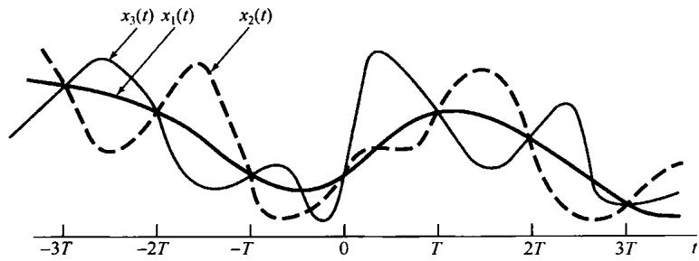

图7.1 在  $T$  的整倍数时刻点上具有相同值的三个连续时间信号

# 7.1.1 冲激串采样

为了建立采样定理，我们需要一种方便的方式来表示一个连续时间信号在均匀间隔上的采样。为此，一种有用的办法就是通过用一个周期冲激串去乘待采样的连续时间信号  $x(t)$  。这一方法称为冲激串采样（impluse-train sampling），如图7.2所示。该周期冲激串  $p(t)$  称为采样函数（sampling function），周期  $T$  称为采样周期（sampling period），而  $p(t)$  的基波频率  $\omega_s = 2\pi / T$  称为采样频率（sampling frequency）。

在时域中有

$$
x _ {p} (t) = x (t) p (t) \tag {7.1}
$$

其中，

$$
p (t) = \sum_ {n = - \infty} ^ {+ \infty} \delta (t - n T) \tag {7.2}
$$

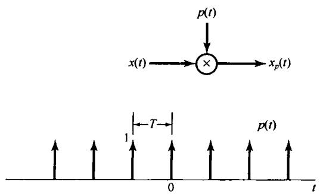

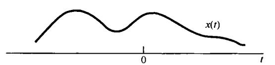

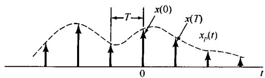

图7.2 冲激串采样

由1.4.2节曾讨论过的单位冲激函数的采样性质可知， $x(t)$  被一个单位冲激函数相乘以后就将冲激发生的这一点的信号值采出来，即  $x(t)\delta (t - t_0) = x(t_0)\delta (t - t_0)$  。将此应用于式(7.1)，如图7.2所示，可见  $x_{p}(t)$  本身就是一个冲激串，其冲激的幅度等于  $x(t)$  在以  $T$  为间隔处的样本值，即

$$
x _ {p} (t) = \sum_ {n = - \infty} ^ {+ \infty} x (n T) \delta (t - n T) \tag {7.3}
$$

由4.5节的相乘性质知道

$$
X _ {p} (\mathrm {j} \omega) = \frac {1}{2 \pi} \int_ {- \infty} ^ {+ \infty} X (\mathrm {j} \omega) P (\mathrm {j} (\omega - \theta)) \mathrm {d} \theta \tag {7.4}
$$

并由例4.8有

$$
P (\mathrm {j} \omega) = \frac {2 \pi}{T} \sum_ {k = - \infty} ^ {+ \infty} \delta (\omega - k \omega_ {s}) \tag {7.5}
$$

因为信号与一个单位冲激函数的卷积就是该信号的移位，即  $X(\mathrm{j}\omega)*\delta (\omega -\omega_0) = X(\mathrm{j}(\omega -\omega_0))$  ，于是有

$$
X _ {p} (\mathrm {j} \omega) = \frac {1}{T} \sum_ {k = - \infty} ^ {+ \infty} X (\mathrm {j} (\omega - k \omega_ {s})) \tag {7.6}
$$

这就是说，  $X_{p}(\mathrm{j}\omega)$  是频率  $\omega$  的周期函数，它由一组移位的  $X(\mathrm{j}\omega)$  的叠加组成，但在幅度上标以 $1 / T$  的变化，如图7.3所示。在图7.3(c)中，由于  $\omega_{M} <   (\omega_{s} - \omega_{M})$  ，或者  $\omega_{s} > 2\omega_{M}$  ，因此在互相移位的这些  $X(\mathrm{j}\omega)$  之间，并无重叠现象出现；而在图7.3(d)中，由于  $\omega_{s} <   2\omega_{M}$  ，从而存在重叠。对于图7.3(c)这样的情况，  $X(\mathrm{j}\omega)$  如实地在采样频率的整数倍频率上重现，因而如果  $\omega_{s} > 2\omega_{M}$ $x(t)$  就能够完全用一个低通滤波器从  $x_{p}(t)$  中恢复出来。该低通滤波器的增益为  $T$  ，截止频率大于  $\omega_{M}$  而小于  $\omega_{s} - \omega_{M}$  ，如图7.4所示。这一基本结果称为采样定理，可叙述如下①。

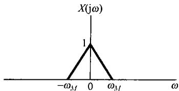

(a)

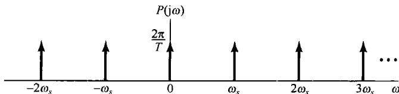

(b)

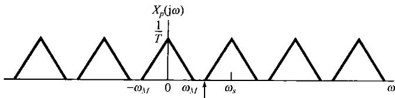

(c)  $(\omega_{s} - \omega_{\lambda})$

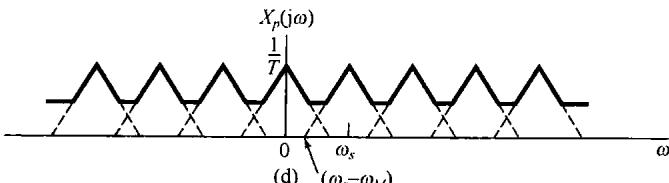

图7.3 时域采样在频域中的效果。（a）原始信号频谱；（b）采样函数的频谱；（c）  $\omega_{s} > 2\omega_{M}$  时已采样信号的频谱；（d）  $\omega_{s} < 2\omega_{M}$  时已采样信号的频谱

采样定理：

设  $x(t)$  是某一个带限信号，在  $|\omega| > \omega_{M}$  时， $X(\mathrm{j}\omega) = 0$ 。如果  $\omega_{s} > 2\omega_{M}$ ，其中  $\omega_{s} = 2\pi / T$ ，那么  $x(t)$  就唯一地由其样本  $x(nT)$ ， $n = 0$ ， $\pm 1$ ， $\pm 2$ ，…所确定。

已知这些样本值，我们能用如下办法重建  $x(t)$  ：产生一个周期冲激串，其冲激幅度就是这些依次而来的样本值；然后将该冲激串通过一个增益为  $T$  ，截止频率大于  $\omega_{M}$  而小于 $\omega_{s} - \omega_{M}$  的理想低通滤波器，该滤波器的输出就是  $x(t)$  。

在采样定理中，采样频率必须大于  $2\omega_{M}$ ，该频率  $2\omega_{M}$  一般称为奈奎斯特率(sampling theorem)①。

正如在第6章所讨论的，有各种不同的理由表明在实际中一般不用理想滤波器。在任何实际应用中，图7.4中的理想低通滤波器都用一个非理想滤波器  $H(\mathrm{j}\omega)$  所代替，该  $H(\mathrm{j}\omega)$  对于所关心的问题来说已足够准确地近似于所要求的频率特性，即  $|\omega| < \omega_{M}$  时  $H(\mathrm{j}\omega) \simeq 1$  ，  $|\omega| > \omega_{s} - \omega_{M}$  时  $H(\mathrm{j}\omega) \simeq 0$  。显然。在这个低通滤波部分，任何这样的近似都会带来图7.4中  $x(t)$  与  $x_{r}(t)$  之间的某些差异，或者说  $X(\mathrm{j}\omega)$  与  $X_{r}(\mathrm{j}\omega)$  之间的某些差异。这样，考虑到特定应用中所能接受的失真程度，非理想滤波器的选择就很关键了。为了方便，同时也是为了强调诸如采样定理这样一些基本原理，本章和下一章都假定使用这些理想滤波器，但是要明白，在实际中就所讨论的问题来说，这样一个滤波器都必须被一个专门设计的，对理想特性足够近似的非理想滤波器所代替。

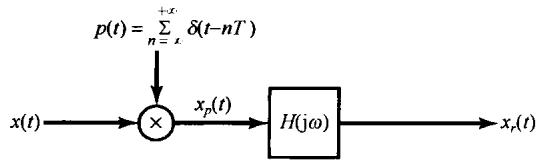

(a)

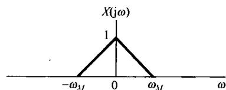

(b)

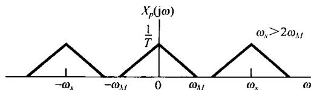

(c)

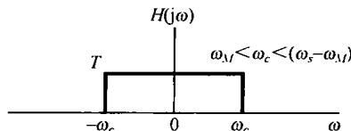

(d)

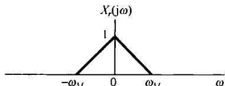

(e)

图7.4 利用一个理想低通滤波器从信号的样本中完全恢复一个连续时间信号。(a) 采样与恢复系统；(b)  $x(t)$  的频谱；(c)  $x_{p}(t)$  的频谱；(d) 用于从  $X_{p}(\mathrm{j}\omega)$  恢复  $X(\mathrm{j}\omega)$  的理想低通滤波器；(e)  $x_{r}(t)$  的频谱

# 7.1.2 零阶保持采样

最容易利用冲激串采样来说明的采样定理确立了这样一个事实，即一个带限信号唯一地可以用它的样本来代表。实际上，产生和传输窄而幅度大的脉冲（这就很近似于冲激）都是相当困难的，因此以所谓零阶保持(zero-order hold)的方式来产生采样信号往往更方便些。在这样的系统中，在一个给定的瞬时对  $x(t)$  采样并保持这一样本值，直到下一个样本被采到为止，如图7.5

所示。由一个零阶保持系统的输出来重建  $x(t)$  仍然可以用低通滤波的办法来实现。然而，在这一情况下，所要求的滤波器特性不再是在通带内具有恒定的增益。为了求得所要求的滤波器特性，首先注意到这个零阶保持的输出  $x_0(t)$  在原理上可以用冲激串采样，再紧跟着一个线性时不变系统(该系统具有矩形的单位冲激响应)来得到，如图7.6所示。为了由  $x_0(t)$  重建  $x(t)$ ，可以考虑用一个单位冲激响应为  $h_r(t)$ ，频率响应为  $H_r(\mathrm{j}\omega)$  的线性时不变系统来处理  $x_0(t)$ 。这个系统与图7.6的系统级联后如图7.7所示，这里希望给出一个  $H_r(\mathrm{j}\omega)$ ，以使  $r(t) = x(t)$ 。把图7.7的系统与图7.4的系统比较一下，可以看出，如果  $h_0(t)$  与  $h_r(t)$  级联后的特性是在图7.4中所用的理想低通滤波器  $H(\mathrm{j}\omega)$  的特性，那么  $r(t) = x(t)$ 。因为根据例4.4和4.3.2节的时移性质，有

$$
H _ {0} (\mathrm {j} \omega) = \mathrm {e} ^ {- \mathrm {j} \omega T / 2} \left[ \frac {2 \sin (\omega T / 2)}{\omega} \right] \tag {7.7}
$$

这就要求

$$
H _ {r} (\mathrm {j} \omega) = \frac {\mathrm {e} ^ {\mathrm {j} \omega T / 2} H (\mathrm {j} \omega)}{\frac {2 \sin (\omega T / 2)}{\omega}} \tag {7.8}
$$

例如，若  $H(\mathrm{j}\omega)$  的截止频率等于  $\omega_{s} / 2$  ，则紧跟在一个零阶保持系统后面的重建滤波器的理想模和相位特性如图7.8所示。

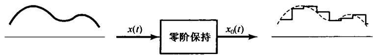

图7.5 利用零阶保持采样

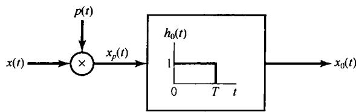

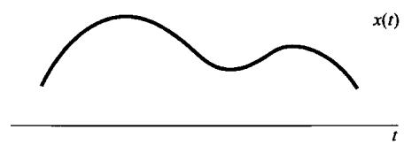

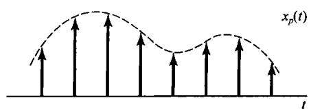

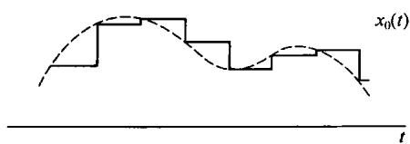

图7.6 作为冲激串采样，再紧跟一个具有矩形单位冲激响应的线性时不变系统的零阶保持

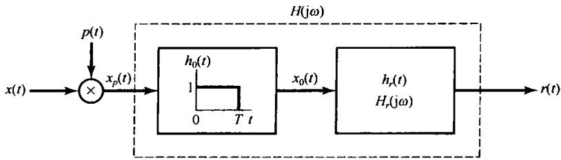

图7.7 零阶保持（见图7.6）与一个重建滤波器的级联

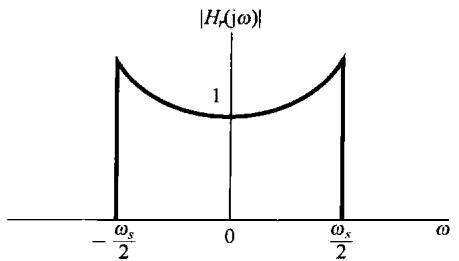

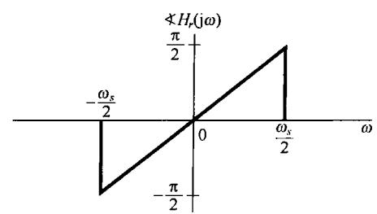

图7.8 为零阶保持采样重建信号的重建滤波器的模和相位特性

再次提及，实际上式(7.8)的频率响应也是不可能真正实现的，因此必须对它进行充分近似的设计。事实上，在很多情况下，零阶保持输出本身就被认为是一种对原始信号的充分近似，而用不着附加任何低通滤波。并且，实质上它就代表了一种可能的（虽然肯定很粗糙）样本值之间的内插。另一方面，在某些应用中也可能希望在样本值之间进行某些较平滑的内插。下一节将更为详细地把从信号的样本来重建信号看成一个内插的过程，以研究内插的一般概念。

# 7.2 利用内插由样本重建信号

内插（也就是用一连续信号对一组样本值的拟合）是一个由样本值来重建某一函数的常用过程，这一重建结果既可以是近似的，也可以是完全准确的。一种简单的内插过程就是7.1节讨论过的零阶保持。另一种简单而有用的内插形式是线性内插（linear interpolation），就是将相邻的样本点用直线直接连起来，如图7.9所示。在更为复杂的内插公式中，样本点之间可以用高阶多项式或其他数学函数来进行拟合。

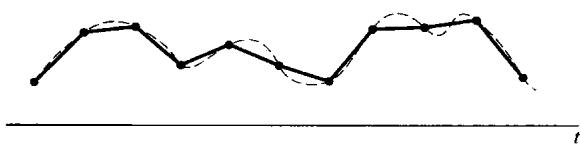

图7.9 样本点之间的线性内插。虚线代表原始信号，实线就是线性内插

在7.1节中已经看到，一个带限信号，如果采样足够密，那么信号就能完全被恢复。这就是说，通过应用一个低通滤波器在样本点之间的真正内插就可以实现。当考虑图7.4中该低通滤波器在时域中的效果时，把重建  $x(t)$  作为一个内插过程就变得愈加清楚了。特别是，输出  $x_{r}(t)$  为

$$
x _ {r} (t) = x _ {p} (t) * h (t)
$$

或者，以式(7.3)的  $x_{p}(t)$  代入得

$$
x _ {r} (t) = \sum_ {n = - \infty} ^ {+ \infty} x (n T) h (t - n T) \tag {7.9}
$$

式(7.9)体现了在样本点  $x(nT)$  之间如何拟合成一条连续曲线，因此代表了一种内插公式。对于图7.4中的理想低通滤波器  $H(\mathrm{j}\omega), h(t)$  为

$$
h (t) = \frac {\omega_ {c} T \sin \left(\omega_ {c} t\right)}{\pi \omega_ {c} t} \tag {7.10}
$$

所以有

$$
x _ {r} (t) = \sum_ {n = - \infty} ^ {+ \infty} x (n T) \frac {\omega_ {c} T}{\pi} \frac {\sin \left(\omega_ {c} (t - n T)\right)}{\omega_ {c} (t - n T)} \tag {7.11}
$$

按照式(7.11)，在  $\omega_{c} = \omega_{s} / 2$  时的重建过程如图7.10所示。图7.10(a)代表原始带限信号  $x(t)$  图7.10(b)是样本冲激串  $x_{p}(t)$  ，图7.10(c)则是由式(7.11)中每一项叠加的结果。

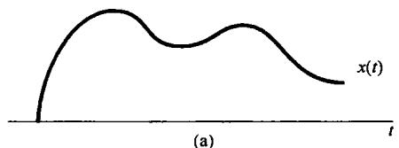

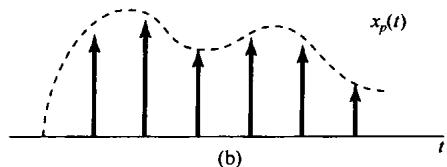

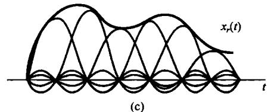

图7.10 利用sinc函数的理想带限内插。（a）带限信号  $x(t)$ ；（b） $x(t)$  的样本冲激串；（c）用式(7.11)的sinc函数的叠加取代冲激串的理想带限内插

像在式(7.11)中那样，利用理想低通滤波器的单位冲激响应的内插通常称为带限内插（band-limited interpolation）。因为这种内插，只要  $x(t)$  是带限的，而采样频率又满足采样定理中的条件，就实现了信号的真正重建。正如已经指出过的，在很多情况下，宁可采用准确性差一些，但稍微简单一些的滤波器，或者说比式(7.10)简单一些的内插函数。例如，零阶保持就可以看成在样本值之间进行内插的一种形式，在那里内插函数  $h(t)$  就是图7.6所示的单位冲激响应 $h_0(t)$  。在这种意义下，若图7.6中的  $x_0(t)$  相应于对  $x(t)$  的近似，那么系统  $h_0(t)$  就代表对一个能实现真正内插的理想低通滤波器的近似。图7.11给出了零阶保持内插滤波器传输函数的模特性，图中把该模特性叠放在一个能实现真正内插的滤波器特性之上，以供比较。

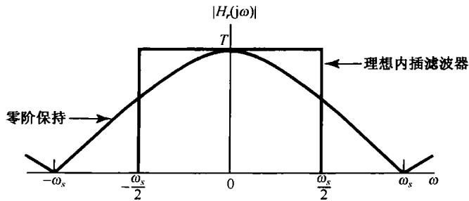

图7.11 零阶保持和理想内插滤波器的传输函数

由图7.11和图7.6都能看出，零阶保持是一种很粗糙的近似，尽管在某些情况下这已经足够了。例如，如果在某一具体应用中，本身就有某种附加的低通滤波作用，那么就会有助于改善总的内插效果。这一点可以用图7.12所示的照片例子来说明。图7.12(a)示出的是照片经冲激采样的结果（即用空间上很窄的脉冲来采样）。图7.12(b)则是将图7.12(a)的样本通过一个二维零阶保持系统的结果，图中具有明显的镶嵌效应。然而，由于人的视觉系统具有固有的某种低通滤波作用，因此如果站在远处看，镶嵌上的不连续处得到平滑。例如，图7.12(c)仍旧采用零阶保持，但在每一个方向上的采样间隔都是图7.12(a)所用的采样间隔的1/4，这时虽然镶嵌效应仍然明显，但在正常观察下，好似加了一个很强的低通过滤。

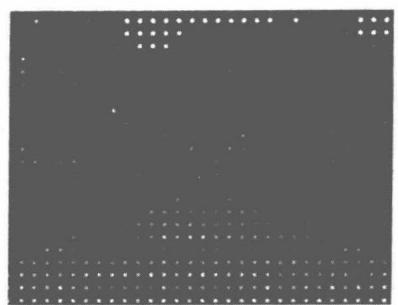

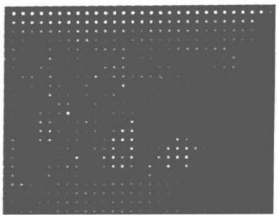

(a)

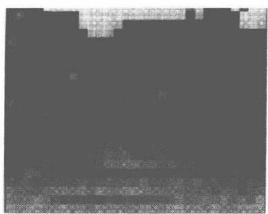

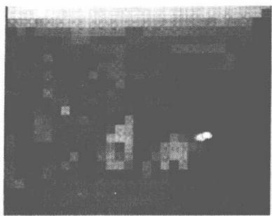

(b)

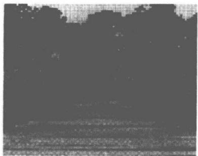

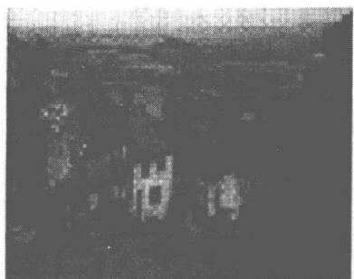

(c)

图7.12 (a) 将图6.2的(a)和(g)的照片冲激串采样的结果；(b) 对图(a)施加零阶保持滤波。由于人的视觉系统具有固有的低通过滤作用，其截止频率随距离而减小，因此当从远距离观察时，图7.12(b)中镶嵌的不连续处得到平滑；(c) 水平和垂直方向采样间隔都只是(a)和(b)时的  $1/4$ ，仍用零阶保持过滤的结果

如果由零阶保持所给出的粗糙内插令人不够满意，则可以使用各种更为平滑的内插手段，其中的一些合起来统称为高阶保持(higher order hold)。特别是，零阶保持产生的图7.5所示的输出信号是不连续的；而与此相比，图7.9所示的线性内插产生的恢复信号是连续的，但由于在各样本点上斜率的改变而导致导数是不连续的。线性内插(有时也称一阶保持)也能看成一种如图7.4和式(7.9)形式的内插，不过  $h(t)$  为三角形特性，如图7.13所示。其传输函数 $H(\mathrm{j}\omega)$  也如图7.13所示，并且

$$
H (\mathrm {j} \omega) = \frac {1}{T} \left[ \frac {\sin (\omega T / 2)}{\omega / 2} \right] ^ {2} \tag {7.12}
$$

一阶保持系统的传输函数在图7.13中叠放在理想内插滤波器传输函数特性上，以供比较。图7.14相应于图7.12(b)的同一张照片的样本在用一阶保持内插后的结果。与此相仿，也可以定义二阶或高阶保持系统，它们所产生的恢复信号具有更好的平滑度。例如，二阶保持系统的输出在样本值间的内插可以给出连续的曲线，并有连续的一阶导数和不连续的二阶导数。

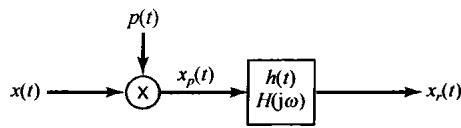

(a)

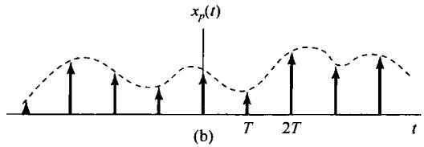

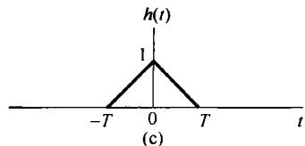

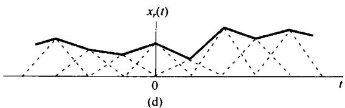

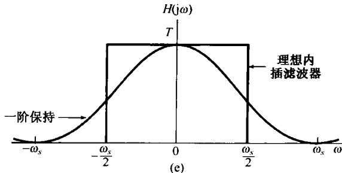

图7.13 把线性内插(一阶保持)看成冲激串采样与三角形冲激响应特性卷积的结果。（a）采样与恢复系统；（b）冲激串采样；（c）一阶保持的单位冲激响应；(d）对已采样信号施加一阶保持；（e）理想内插和一阶保持传输函数的比较

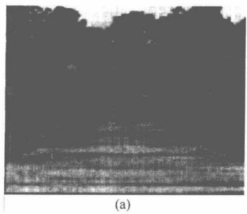

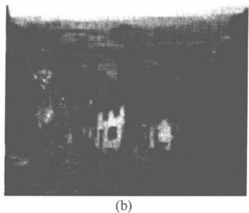

图7.14 在水平和垂直方向采样间隔都是图7.12的(a)和(b)所用的采样间隔的1/4时的冲激串采样，再用一阶保持内插的结果

# 7.3 欠采样的效果：混叠现象

在前面的讨论中都假定采样频率足够高，因而满足采样定理中的条件。正如在图7.3中所说明的，当  $\omega_s > 2\omega_M$  时，采样信号的频谱是由  $x(t)$  的频谱重复组成的，而这正是采样定理的基础。当  $\omega_s < 2\omega_M$  时， $x(t)$  的频谱  $X(\mathrm{j}\omega)$  不再在  $X_p(\mathrm{j}\omega)$  中重复，因此利用低通滤波也不再能把  $x(t)$  从采样信号中恢复出来。这时，式(7.6)中的那些单项发生重叠，这一现象称为混叠（aliasing）。本节将讨论它的影响和一些结果。

显然，如果图7.4这样的系统用于某一信号，这时  $\omega_{s} < 2\omega_{M}$ ，那么被重建的信号  $x_{r}(t)$  不会再等于  $x(t)$ 。然而（见习题7.25），原始信号  $x(t)$  和利用带限内插得到的  $x_{r}(t)$  在那些采样瞬时总是相等的，即对任意选取的  $\omega_{s}$  都有

$$
x _ {r} (n T) = x (n T), \quad n = 0, \pm 1, \pm 2, \dots \tag {7.13}
$$

若以  $x(t)$  为一种比较简单的正弦信号的例子，更为详细地讨论当  $\omega_{s} < 2\omega_{M}$  时的情况，就会对  $x(t)$  和  $x_{r}(t)$  之间的关系有一些深入和透彻的了解。于是设

$$
x (t) = \cos \omega_ {0} t \tag {7.14}
$$

这个信号的傅里叶变换  $X(\mathrm{j}\omega)$  如图7.15(a)所示。图中，为了讨论的方便，画图时已经把在  $\omega_0$  处的冲激与在  $-\omega_0$  处的冲激进行了区别。现在来讨论  $X_{p}(\mathrm{j}\omega)$ ，即已采样信号的频谱。在讨论中特别把注意力放在：对一个固定的采样频率  $\omega_{s}$  来说，当改变  $\omega_0$  后对  $X_{p}(\mathrm{j}\omega)$  所产生的影响。在图7.15(b)至图7.15(e)中，画出了几个  $\omega_0$  值时的  $X_{p}(\mathrm{j}\omega)$  。同时用虚线框起来的是图7.4中  $\omega_{c} = \omega_{s} / 2$  的低通滤波器的通带。可以看到，在图7.15(b)和图7.15(c)中，由于  $\omega_0 < \omega_s / 2$  ，因此没有混叠现象发生，而在图7.15(d)和图7.15(e)中，混叠现象就出现了。在这4种情况下，经过低通滤波后的输出  $x_{r}(t)$  分别是：

(a)  $\omega_0 = \frac{\omega_s}{6}$ ;  $x_r(t) = \cos \omega_0 t = x(t)$

(b)  $\omega_0 = \frac{2\omega_s}{6}; x_r(t) = \cos \omega_0 t = x(t)$

(c)  $\omega_0 = \frac{4\omega_s}{6}; x_r(t) = \cos (\omega_s - \omega_0)t \neq x(t)$

(d)  $\omega_0 = \frac{5\omega_s}{6}; x_r(t) = \cos (\omega_s - \omega_0)t \neq x(t)$

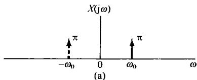

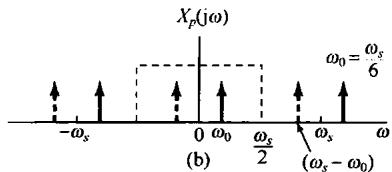

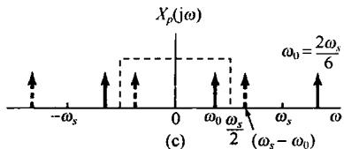

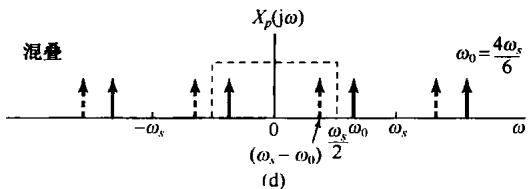

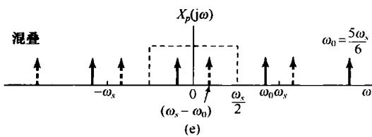

图7.15 过采样和欠采样在频域中的效果。（a）原始正弦信号的频谱；(b)和(c)  $\omega_{s} > 2\omega_{0}$  时已采样信号的频谱；(d)和(e)  $\omega_{s} < 2\omega_{0}$  时已采样信号的频谱。当从(b)到(d)增大  $\omega_{0}$  时，用实线标出的冲激向右边移动，而用虚线标出的冲激则向左边移动。(d)和(e)中，这些冲激都移动了足够大，以至于落在该理想低通滤波器通带内的那些部分就产生了变化

当混叠现象发生时，原始频率  $\omega_0$  就被混叠成一个较低的频率  $(\omega_s - \omega_0)$  。对于  $\omega_s / 2 < \omega_0 < \omega_s$  随着  $\omega_0$  相对于  $\omega_s$  的增加，输出频率  $(\omega_s - \omega_0)$  就会下降，当  $\omega_s = \omega_0$  时，被重建的信号就是一个常数。这一点是与如下事实相一致的：即当每一个周期只采样一次时，这些样本值都是相等的，这与对一个直流信号  $(\omega_0 = 0)$  采样所得的结果无疑是一样的。在图7.16中分别画出了图7.15中4种情况的每一种中的信号  $x(t), x(t)$  的样本值，以及重建信号  $x_r(t)$  。从这些图中可以看到，低通滤波器是如何在这些样本值之间进行内插的，尤其是总有一个频率小于  $\omega_s / 2$  的正弦信号与  $x(t)$  的样本值相对应。

对上面例子进行一点变化，考虑信号

$$
x (t) = \cos \left(\omega_ {0} t + \phi\right) \tag {7.15}
$$

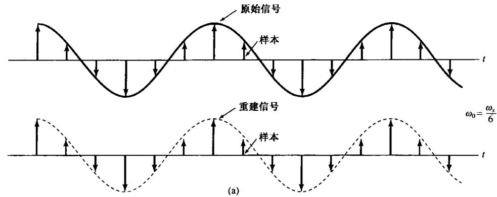

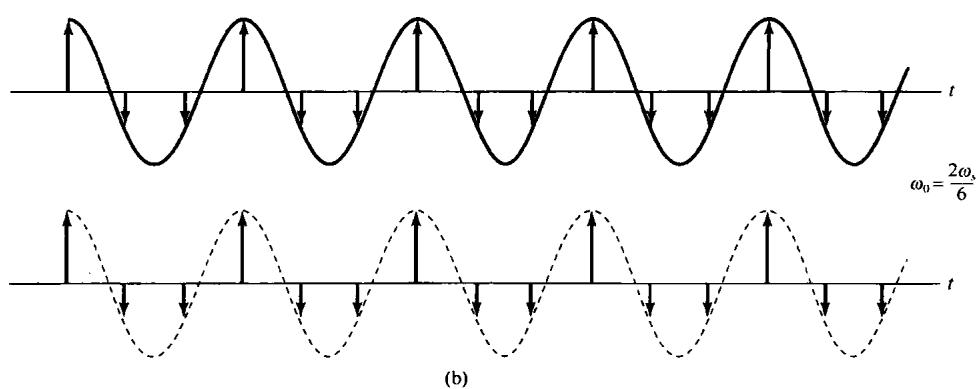

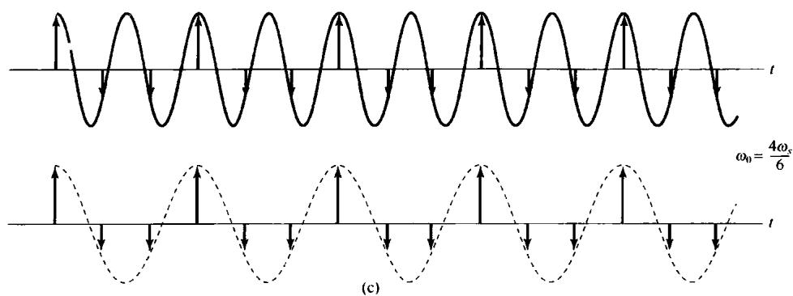

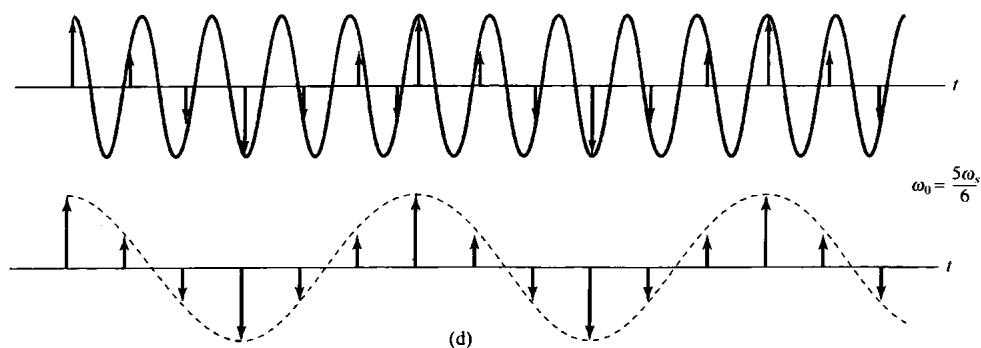

图7.16 在一个正弦信号上混叠的效果。对应于4种不同的  $\omega_0$  值，画出了原始正弦信号（实线），它的样本和重建信号（虚线）。（a） $\omega_0 = \omega_s / 6$ ；（b） $\omega_0 = 2\omega_s / 6$ ；（c） $\omega_0 = 4\omega_s / 6$ ；（d） $\omega_0 = 5\omega_s / 6$ 。在(a)和(b)中没有混叠发生，而在(c)和(d)中则存在混叠

在这种情况下， $x(t)$  的傅里叶变换基本上与图7.15(a)是相同的，只是现在用实线标出的冲激有一个幅度因子  $\pi e^{\mathrm{j}\phi}$ ，而用虚线标出的冲激，其幅度因子有一个相反的相位，即  $\pi e^{-\mathrm{j}\phi}$ 。如果现在考虑用与图7.15所选的同一组  $\omega_0$  值，那么得到的  $\cos (\omega_0t + \phi)$  的已采样信号的频谱与该图也是一样的。只是所有的实线冲激都有  $\pi e^{\mathrm{j}\phi}$  的幅度因子，而所有的虚线冲激都有  $\pi e^{-\mathrm{j}\phi}$  的幅度因子。再者，在图7.15(b)和图7.15(c)情况下，采样定理中的条件满足，所以  $x_r(t) = \cos (\omega_0t + \phi) = x(t)$ ；而在图7.15(d)和图7.15(e)情况下，再次发生混叠。然而，现在可以看到，出现在低通滤波器通带内的实线冲激和虚线冲激在位置上发生了颠倒，结果发现在这些情况下， $x_r(t) = \cos [(\omega_s - \omega_0)t - \phi]$ ，这里在相位中的符号上有一个改变，即有一个相位倒置（phase reversal）。

注意到这一点是很重要的：采样定理明确要求采样频率大于信号中最高频率的2倍，而不是大于或等于最高频率的2倍。下面这个例子用来说明用真正2倍于正弦信号的频率对它进行采样（即每一周期采两个样本）是不够的。

例7.1 考虑下面的正弦信号

$$
x (t) = \cos \left(\frac {\omega_ {s}}{2} t + \phi\right)
$$

假定以2倍于该正弦信号的频率即  $\omega_{s}$  对它进行冲激串采样。如在习题7.39中所证明的，若这个已采样的冲激信号作为输入加到一个截止频率为  $\omega_{s} / 2$  的理想低通滤波器上，其产生的输出是

$$
x _ {r} (t) = (\cos \phi) \cos \left(\frac {\omega_ {s}}{2} t\right)
$$

结果可见， $x(t)$  的完全恢复仅仅发生在相位  $\phi$  是零（或  $2\pi$  整倍数）的情况，否则信号  $x_r(t)$  不等于  $x(t)$ 。

作为一个极端的例子，考虑  $\phi = -\pi /2$  的情况，这样就有

$$
x (t) = \sin \left(\frac {\omega_ {s}}{2} t\right)
$$

这个信号如图7.17所示。可见该信号在采样周期  $2\pi /\omega_{s}$  整倍数点上的值都是零。因此，在这个采样率下所产生的信号全是零；当这个零输入加到该理想低通滤波器上时，所得输出  $x_{r}(t)$  当然也都是零。

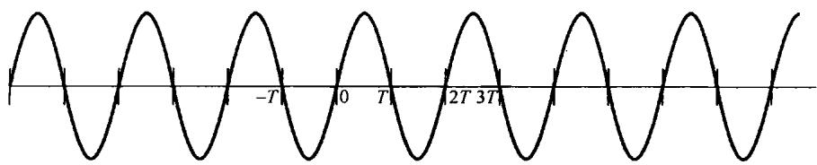

图7.17 例7.1中的正弦信号

欠采样的效果(在此，较高频率被折转到较低的频率中)就是频闪效应所基于的原理。例如，考虑图7.18的情况，这里有一个圆盘，以恒定速度旋转，在圆盘上标一根径向直线。闪光灯就当成一个采样系统，因为它以某一周期率在一个极短的时间间隔内照亮圆盘。若闪光灯的闪烁频率比圆盘的旋转速度高得多，那么圆盘的旋转速度就会被正确地觉察到。当闪烁频率变得小于圆盘旋转速度的2倍时，圆盘的旋转速度看起来就比它真正的速度低。甚至，由于相位倒置的关系，圆盘还会像在相反的方向上旋转！粗略地说，如果通过接连不断的样本跟踪圆盘上的一根固定线的位置，那么当  $\omega_0 < \omega_s < 2\omega_0$  时，采样就比每转一周要略微频繁一些，这样每次采得的圆盘样本就将这根固定的线显示在好像它以逆时针方向展现的位置上，而这是与圆盘本身以顺时针

方向旋转相反的。若闪光灯只在圆盘转一周时闪烁一次（这就相当于  $\omega_{s} = \omega_{0}$ ），那么这根径线看起来好像静止不动，这就相当于圆盘的旋转频率及其谐波都被混叠到零频率上了。一种类似的现象也常在西部电影中观察到。电影中马车的轮子看起来旋转得比马车真正向前运动的速度更慢一些，并且有时会看到以相反的方向在旋转。在这种情况下采样过程就相应于：活动图像就是一串单个的画面（或称为一帧），帧频（通常每秒  $18\sim 24$  帧）就相当于采样频率。

在上面的讨论中，把频闪效应看成在欠采样下所产生混叠的一种应用的例子，是很有启发性的。在测量仪器中有一种取样示波器（sampling oscilloscope），借助于采样原理，把欲观察而又不便于显示的很高频率混叠到一个更容

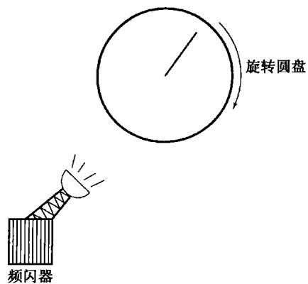

图7.18 频闪效应

易显示的低频率上。这就是在欠采样情况下，混叠现象的另一个有用的例子。关于取样示波器，将在习题7.38中进行更为详细的讨论。

# 7.4 连续时间信号的离散时间处理

在很多应用中，首先把一个连续时间信号转换为一个离散时间信号，然后进行处理，处理完后再把它转换为连续时间信号。这种处理方式有一个显著的优点：离散时间信号的处理可以借助于某一通用或专用计算机，借助于各种微处理器，或面向离散时间信号处理而专门设计的各种装置来实现。

广而言之，对连续时间信号的这种处理方法可以看成图7.19所示的三个环节的级联，其中  $x_{c}(t)$  和  $y_{c}(t)$  都是连续时间信号，而  $x_{d}[n]$  和  $y_{d}[n]$  都是对应于  $x_{c}(t)$  和  $y_{c}(t)$  的离散时间信号。当然，就图7.19的整个系统而言，仍是一个连续时间系统，因为系统的输入和输出都是连续时间信号。将一个连续时间信号转换为一个离散时间信号，以及从信号的离散时间表示重建连续时间信号所依据的理论基础，都是7.1节讨论的采样定理。通过这样一个周期采样的过程（其采样频率满足采样定理中的条件），连续时间信号  $x_{c}(t)$  就可以完全用一串瞬时样本值  $x_{c}(nT)$  来表示；也就是说，离散时间序列  $x_{d}[n]$  以下式

$$
x _ {d} [ n ] = x _ {c} (n T) \tag {7.16}
$$

与  $x_{c}(t)$  相联系。将  $x_{c}(t)$  变换到  $x_{d}[n]$  相应于图7.19中的第一个系统，称为连续时间到离散时间的转换（continuous-to-discrete time conversion, C/D）。图7.19中的第三个系统是一个与上述相反的变换，即离散时间到连续时间的转换（discrete-time to continuous-time conversion, D/C）。D/C实现的是作为它的输入的各样本点之间的内插；这就是说，经D/C后产生一个连续时间信号 $y_{c}(t)$ ，该  $y_{c}(t)$  与其输入的离散时间信号  $y_{d}[n]$  以下式关联：

$$
y _ {d} [ n ] = y _ {c} (n T)
$$

这一概念在图7.20中表示得更为明显。在诸如数字计算机和其他数字系统中，离散时间信号是以数字形式给出的，这时用于实现C/D转换的器件就称为模拟-数字(analog-to-digital，A/D)转换器，而实现D/C转换的就称为数字-模拟(digital-to-analog，D/A)转换器。

为了进一步明了连续时间信号  $x_{c}(t)$  和它的离散时间表示  $x_{d}[n]$  之间的关系，可以把从连续时间到离散时间的变换表示成一个周期采样的过程，再紧跟着一个把冲激串映射为一个序列的环节，这样做是非常有益的。这两步都表示在图7.21中。图中的第一步代表一个采样过程，冲

激串  $x_{p}(t)$  就是一个冲激序列，各冲激的幅度与  $x_{c}(t)$  的样本值相对应，而在时间间隔上等于采样周期  $T$  。然后，在从冲激串到离散时间序列的转换中，得到  $x_{d}[n]$  ；这就是以  $x_{c}(t)$  的样本值为序列值的同一序列，但是其单位间隔采用新的自变量  $n$  。因此，实际上从样本的冲激串到样本的离散时间序列的转换可认为是一个时间的归一化过程。图7.21(b)和图7.21(c)明确地表示了由 $x_{p}(t)$  到  $x_{d}[n]$  的转换中这种时间的归一化过程。在这里，  $x_{p}(t)$  和  $x_{d}[d]$  分别以  $T = T_{1}$  和  $T = 2T_{1}$  的两种采样率表示。

图7.19 连续时间信号的离散时间处理

图7.20 连续到离散时间转换和离散到连续时间转换的概念。  $T$  代表采样周期

(a)

(b)

(c)

图7.21 用一个周期冲激串采样，再跟着一个到离散时间序列的转换。（a）整个系统；（b)两种采样率的  $x_{p}(t)$ ，虚线包络代表  $x_{c}(t)$ ；（c）两种不同采样率的输出序列

在频域来考察图7.19的处理过程也是很有启发意义的。由于我们面临着既要在连续时间又要在离散时间处理傅里叶变换，因此仅在这一节将连续时间的频率变量用  $\omega$  表示，将离散时间的频率变量用  $\Omega$  表示，以便加以区分。例如，  $x_{c}(t)$  和  $y_{c}(t)$  的连续时间傅里叶变换分别用  $X_{c}(\mathrm{j}\omega)$  和 $Y_{c}(\mathrm{j}\omega)$  表示；而  $x_{d}[n]$  和  $y_{d}[n]$  的离散时间傅里叶变换分别用  $X_{d}(\mathrm{e}^{\mathrm{j}\Omega})$  和  $Y_{d}(\mathrm{e}^{\mathrm{j}\Omega})$  表示。

现在，对式(7.3)应用傅里叶变换，以便利用  $x_{c}(t)$  的样本值来表示  $x_{p}(t)$  的连续时间傅里叶变换  $X_{p}(\mathrm{j}\omega)$  。因为

$$
x _ {p} (t) = \sum_ {n = - \infty} ^ {+ \infty} x _ {c} (n T) \delta (t - n T) \tag {7.17}
$$

又根据  $\delta(t - nT)$  的傅里叶变换是  $\mathbf{e}^{-\mathrm{j}\omega nT}$ ，所以得到

$$
X _ {p} (\mathrm {j} \omega) = \sum_ {n = - \infty} ^ {+ \infty} x _ {c} (n T) \mathrm {e} ^ {- \mathrm {j} \omega n T} \tag {7.18}
$$

现在考虑  $x_{d}[n]$  的离散时间傅里叶变换，即

$$
X _ {d} \left(\mathrm {e} ^ {\mathrm {j} \Omega}\right) = \sum_ {n = - \infty} ^ {+ \infty} x _ {d} [ n ] \mathrm {e} ^ {- \mathrm {j} \Omega n} \tag {7.19}
$$

或者，利用式(7.16)有

$$
X _ {d} \left(\mathrm {e} ^ {\mathrm {j} \Omega}\right) = \sum_ {n = - \infty} ^ {+ \infty} x _ {c} (n T) \mathrm {e} ^ {- \mathrm {j} \Omega n} \tag {7.20}
$$

将式(7.18)和式(7.20)进行比较可见，  $X_{d}(\mathrm{e}^{\mathrm{j}\Omega})$  和  $X_{p}(\mathrm{j}\omega)$  是通过如下关系关联的：

$$
X _ {d} \left(\mathrm {e} ^ {\mathrm {j} \Omega}\right) = X _ {p} (\mathrm {j} \Omega / T) \tag {7.21}
$$

另外，回想一下式(7.6)和图7.3所说明的

$$
X _ {p} (\mathrm {j} \omega) = \frac {1}{T} \sum_ {k = - \infty} ^ {+ \infty} X _ {c} (\mathrm {j} (\omega - k \omega_ {s})) \tag {7.22}
$$

因此得到

$$
X _ {d} \left(\mathrm {e} ^ {\mathrm {j} \Omega}\right) = \frac {1}{T} \sum_ {k = - \infty} ^ {+ \infty} X _ {c} (\mathrm {j} (\Omega - 2 \pi k) / T) \tag {7.23}
$$

图7.22中，对应两种不同的采样率，示出了  $X_{c}(\mathrm{j}\omega), X_{p}(\mathrm{j}\omega)$  和  $X_{d}(\mathrm{e}^{\mathrm{j}\Omega})$  三者之间的关系。从该图中可以注意到， $X_{d}(\mathrm{e}^{\mathrm{j}\Omega})$  就是  $X_{p}(\mathrm{j}\omega)$  的重复，唯频率坐标有一个尺度变换。特别应注意到  $X_{d}(\mathrm{e}^{\mathrm{j}\Omega})$  是  $\Omega$  的周期函数，周期为  $2\pi$  。当然，这种周期性是任何离散时间傅里叶变换都具有的特征。因此， $x_{d}[n]$  和  $x_{c}(t)$  之间的频谱关系，是通过先把  $x_{c}(t)$  的频谱  $X_{c}(\mathrm{j}\omega)$  按式(7.22)进行周期重复，然后再跟着一个按式(7.21)的线性频率尺度变换联系起来的。频谱的周期性重复是图7.21转换过程中第一步的结果，即冲激串采样；而按式(7.21)进行的线性频率尺度变换，可以不太正规地看成由冲激串  $x_{p}(t)$  转换到离散时间序列  $x_{d}[n]$  时所引入的时间归一化的结果。根据4.3.5节傅里叶变换的时域尺度变换性质，时间轴上有一个  $1 / T$  的变化，一定在频率轴上引入一个  $T$  倍的变化。因此， $\Omega = \omega T$  的关系就与从  $x_{p}(t)$  到  $x_{d}[n]$  的转换过程中，时间轴上有一个  $1 / T$  的尺度变换，在概念上完全一致。

图7.19所示的系统中，经过离散时间系统处理以后，所得到的序列又转换为一个连续时间信号，这一过程就是图7.21中各步骤的逆过程。具体而言，就是可以由序列  $y_{d}[n]$  产生一个连续时间冲激串  $y_{p}(t)$ ，而连续时间信号  $y_{c}(t)$  的恢复就可以借助于图7.23所示的低通滤波的办法来实现。

现在，考虑将图7.19所示的整个系统用图7.24来表示。很清楚，如果图中的离散时间系统是一个恒等系统（即  $x_{d}[n] = y_{d}[n]$ ），而且假定满足采样定理中的条件，那么整个系统也一定是一个恒等系统。将图7.24中离散时间系统的频率响应一般化为  $H_{d}(\mathrm{e}^{\mathrm{j}\Omega})$ ，这时用图7.25这样一个有代表性的例子来说明图7.24的整个系统特性，或许会得到最好的理解。该图的左边是某一

具有代表性的频谱  $X_{c}(\mathrm{j}\omega), X_{p}(\mathrm{j}\omega)$  和  $X_{d}(\mathrm{e}^{\mathrm{j}\Omega})$ ，其中假定  $\omega_{M} < \omega_{s} / 2$ ，所以没有混叠发生。相应于离散时间滤波器输出的谱  $Y_{d}(\mathrm{e}^{\mathrm{j}\Omega})$  就是  $X_{d}(\mathrm{e}^{\mathrm{j}\Omega})$  和  $H_{d}(\mathrm{e}^{\mathrm{j}\Omega})$  相乘，如图7.25(d)所示，图中是将  $X_{d}(\mathrm{e}^{\mathrm{j}\Omega})$  和  $H_{d}(\mathrm{e}^{\mathrm{j}\Omega})$  重合画在一起的。变换到  $Y_{c}(\mathrm{j}\omega)$  就相应于进行频率尺度的变换，然后进行低通滤波，所得到的频谱分别如图7.25(e)和图7.25(f)所示。因为  $Y_{d}(\mathrm{e}^{\mathrm{j}\Omega})$  是两个互为重叠的频谱的乘积，如图7.25(d)所示，所以对两者都应施加频率尺度的变换和滤波。将图7.25(a)和图7.25(f)进行比较，显而易见有

$$
Y _ {c} (\mathrm {j} \omega) = X _ {c} (\mathrm {j} \omega) H _ {d} \left(\mathrm {e} ^ {\mathrm {j} \omega T}\right) \tag {7.24}
$$

这样，在输入是充分带限的，并满足采样定理的条件下，图7.24的整个系统事实上就等效于一个频率响应为  $H_{c}(\mathrm{j}\omega)$  的连续时间系统，而  $H_{c}(\mathrm{j}\omega)$  与离散时间频率响应  $H_{d}(\mathrm{e}^{\mathrm{j}\Omega})$  的关系为

$$
H _ {c} (\mathrm {j} \omega) = \left\{ \begin{array}{l l} H _ {d} \left(\mathrm {e} ^ {\mathrm {j} \omega T}\right), & | \omega | <   \omega_ {s} / 2 \\ 0, & | \omega | > \omega_ {s} / 2 \end{array} \right. \tag {7.25}
$$

这个等效的连续时间滤波器的频率响应就是该离散时间滤波器在一个周期内的特性，只是频率轴有一个线性尺度变化。离散时间频率响应和等效的连续时间频率响应之间的关系如图7.26所示。

图7.22 在两种不同采样率下，  $X_{c}(\mathrm{j}\omega),X_{p}(\mathrm{j}\omega)$  和  $X_{d}(e^{\mathrm{j}\Omega})$  之间的关系

图7.23 一个离散时间序列到连续时间信号的转换

图7.24 利用离散时间滤波器过滤连续时间信号的系统

(a)

(d)

(b)

(e)

(c)

(f)

图7.25 图7.24所示系统的频域说明。（a）连续时间信号的频谱  $X_{c}(\mathrm{j}\omega)$  ；（b）冲激串采样以后的谱；（c）离散时间序列  $\pmb{x}_d[n]$  的谱；（d）  $H_{d}(\mathrm{e}^{\mathrm{j}\Omega})$  和  $X_{d}(\mathrm{e}^{\mathrm{j}\Omega})$  相乘后得到的  $Y_{d}(\mathrm{e}^{\mathrm{j}\Omega})$  ；（e）  $H_{p}(\mathrm{j}\omega)$  和  $X_{p}(\mathrm{j}\omega)$  相乘后得到的  $Y_{p}(\mathrm{j}\omega)$  ；（f）  $H_{c}(\mathrm{j}\omega)$  和  $X_{c}(\mathrm{j}\omega)$  相乘后得到的  $Y_{c}(\mathrm{j}\omega)$

图7.26 图7.24所示系统的离散时间频率响应及其等效的连续时间频率响应

由于被一个冲激串相乘不是一个时不变的环节，因此图7.24所示整个系统能等效为一个线性时不变系统多少有些令人吃惊！事实上，图7.24所示的整个系统对任意输入来讲并不都是时不变的。例如，如果  $x_{c}(t)$  是一个窄的矩形脉冲，持续期小于  $T$ ，那么  $x_{c}(t)$  的时间移位就可能产生一个序列  $x[n]$ ，该  $x[n]$  要么全部序列值为零，要么有一个非零的序列值，这取决于矩形脉冲相对于采样冲激串来说，符合的程度如何。然而，正如通过图7.25所示频谱中所想到的，对于一个带限输入信号（band-limited input signal）来说，若采样率足够高，从而避免了混叠发生，那么图7.25所示系统就等效为一个连续时间线性时不变系统。对于这样的输入信号来说，图7.24和式(7.25)就提供了利用离散时间滤波器对连续时间信号进行处理的基础。下面将以某些例子对此进行深入探讨。

# 7.4.1 数字微分器

现在来考虑一个连续时间带限微分器的离散时间实现。正如3.9.1节所讨论的，连续时间微分滤波器的频率响应是

$$
H _ {c} (\mathrm {j} \omega) = \mathrm {j} \omega \tag {7.26}
$$

截止频率为  $\omega_{c}$  的带限微分器的频率响应就是

$$
H _ {c} (\mathrm {j} \omega) = \left\{ \begin{array}{l l} \mathrm {j} \omega , & | \omega | <   \omega_ {c} \\ 0, & | \omega | > \omega_ {c} \end{array} \right. \tag {7.27}
$$

如图7.27所示。利用式(7.25)的关系，若  $\omega_{s} = 2\omega_{c}$ ，则相应的离散时间的频率响应  $H_{d}(e^{j\Omega})$  是

$$
H _ {d} \left(\mathrm {e} ^ {\mathrm {j} \Omega}\right) = \mathrm {j} \left(\frac {\Omega}{T}\right), \quad | \Omega | <   \pi \tag {7.28}
$$

如图7.28所示。利用这一离散时间频率响应，在图7.24中只要  $x_{c}(t)$  的采样中没有混叠产生， $y_{c}(t)$  就一定是  $x_{c}(t)$  的导数。

图7.27 连续时间理想带限微分器的频率响应  $H_{c}(\mathrm{j}\omega) = \mathrm{j}\omega$  ，  $\{\omega | < \omega_{c}$

图7.28 用于实现一个连续时间带限微分器的离散时间滤波器的频率响应

例7.2 利用该数字微分器在连续时间sinc函数输入时的输出，可以很方便地确定在数字微分器的实现中，该离散时间滤波器的单位脉冲响应  $h_d[n]$  。参照图7.24，令

$$
x _ {c} (t) = \frac {\sin (\pi t / T)}{\pi t} \tag {7.29}
$$

其中  $T$  是采样周期。那么

$$
X _ {c} (\mathrm {j} \omega) = \left\{ \begin{array}{l l} 1, & | \omega | <   \pi / T \\ 0, & \text {其 他} \end{array} \right.
$$

它是充分带限的，以确保在采样频率  $\omega_{s} = 2\pi /T$  时对  $x_{c}(t)$  采样不会引起任何混叠。这样，数字微分器的输出就是

$$
y _ {c} (t) = \frac {\mathrm {d}}{\mathrm {d} t} x _ {c} (t) = \frac {\cos (\pi t / T)}{T t} - \frac {\sin (\pi t / T)}{\pi t ^ {2}} \tag {7.30}
$$

对于由式(7.29)给出的  $x_{c}(t)$ ，相应于图7.24的信号  $x_{d}[n]$  可以表示为

$$
x _ {d} [ n ] = x _ {c} (n T) = \frac {1}{T} \delta [ n ] \tag {7.31}
$$

即  $x_{c}(nT) = 0$  ，  $n\neq 0$  ；而

$$
x _ {d} [ 0 ] = x _ {c} (0) = \frac {1}{T}
$$

这个可以用洛必达法则来证明。类似地，可以求出在图7.24中对应于式(7.30)中  $y_{c}(t)$  的  $y_{d}[n]$  为

$$
y _ {d} [ n ] = y _ {c} (n T) = \left\{ \begin{array}{l l} \frac {(- 1) ^ {n}}{n T ^ {2}}, & n \neq 0 \\ 0, & n = 0 \end{array} \right. \tag {7.32}
$$

对于  $n \neq 0$  ，上式可以直接代入式(7.30)而得到证明；对于  $n = 0$  ，可利用洛必达法则求证。

因此，当由式(7.28)给出的离散时间滤波器的输入是由式(7.31)表示的加权单位脉冲时，所得到的输出就由式(7.32)给出。那么就可以得出该滤波器的单位脉冲响应为

$$
h _ {d} [ n ] = \left\{ \begin{array}{l l} \frac {(- 1) ^ {n}}{n T}, & n \neq 0 \\ 0, & n = 0 \end{array} \right.
$$

# 7.4.2 半采样间隔延时

这一节要讨论利用图7.19的系统来实现一个连续时间信号的时间移位(延时)问题。于是，根据要求，在输入  $x_{c}(t)$  是带限的，且采样率足够高以避免混叠的条件下，整个系统的输入、输出是用下列关系联系起来的：

$$
y _ {c} (t) = x _ {c} (t - \Delta) \tag {7.33}
$$

其中  $\Delta$  代表延时时间。根据4.3.2节的时移性质有

$$
Y _ {c} (\mathrm {j} \omega) = \mathrm {e} ^ {- \mathrm {j} \omega \Delta} X _ {c} (\mathrm {j} \omega)
$$

根据式(7.25)，要被实现的等效连续时间系统必须是带限的，因此选取

$$
H _ {c} (\mathrm {j} \omega) = \left\{ \begin{array}{l l} {\mathrm {e} ^ {- \mathrm {j} \omega \Delta},} & {| \omega | <   \omega_ {c}} \\ {0,} & {\text {其 他}} \end{array} \right. \tag {7.34}
$$

这里  $\omega_{c}$  是该连续时间滤波器的截止频率。也就是说，  $H_{c}(\mathrm{j}\omega)$  对于带限内的信号就相应于式(7.33)的一个时间移位，而对于比  $\omega_{c}$  高的频率则全部滤除。这个频率响应的模和相位特性如图7.29(a)所示。若取采样频率  $\omega_{s} = 2\omega_{c}$ ，则相应的离散时间频率响应  $H_{d}(\mathrm{e}^{\mathrm{j}\Omega})$  是

$$
H _ {d} \left(\mathrm {e} ^ {\mathrm {j} \Omega}\right) = \mathrm {e} ^ {- \mathrm {j} \Omega \Delta / T}, \quad | \Omega | <   \pi \tag {7.35}
$$

如图7.29(b)所示。

(a)

(b)

图7.29 (a) 连续时间延时系统频率响应的模和相位特性；(b) 相应的离散时间延时系统频率响应的模和相位特性

对于适当的带限输入来说，图7.24系统的输出，若其  $H_{d}(\mathrm{e}^{\mathrm{i}\varOmega})$  如式(7.35)所示，就是输入的延时，若  $\Delta /T$  是一个整数，序列  $y_{d}[n]$  就是  $x_{d}[n]$  的延时，即

$$
y _ {d} [ n ] = x _ {d} \left[ n - \frac {\Delta}{T} \right] \tag {7.36}
$$

若  $\Delta /T$  不为一个整数，式(7.36)就没有任何意义，因为序列仅仅在整数  $n$  值上才有定义。然而，我们却能够利用带限内插来解释在这些情况下的  $x_{d}[n]$  和  $y_{d}[n]$  之间的关系。信号  $x_{c}(t)$  和  $x_{d}[n]$  是通过采样和带限内插联系在一起的， $y_{c}(t)$  和  $y_{d}[n]$  之间也是如此。若  $H_{d}(\mathrm{e}^{\mathrm{j}\Omega})$  如式(7.35)所示，那么  $y_{d}[n]$  就等于序列  $x_{d}[n]$  带限内插后移位的样本。正如图7.30所示的  $(\Delta /T) = 1 / 2$  ，这种情况有时称为半采样间隔延时。

(a)

(b)

图7.30 (a) 连续时间信号  $x_{c}(t)$  的样本序列；(b) 在(a)中延时半个采样间隔的序列

例7.3 例7.2中所采用的办法也可以用来确定半采样间隔延时系统中的离散时间滤波器的单位脉冲响应  $h_d[n]$  。参照图7.24，令

$$
x _ {c} (t) = \frac {\sin (\pi t / T)}{\pi t} \tag {7.37}
$$

由例7.2可得

$$
x _ {d} [ n ] = x _ {c} (n T) = \frac {1}{T} \delta [ n ]
$$

同时，因为对于式(7.37)的输入不存在混叠，所以半采样间隔延时系统的输出就是

$$
y _ {c} (t) = x _ {c} (t - T / 2) = \frac {\sin (\pi (t - T / 2) / T)}{\pi (t - T / 2)}
$$

并且，图7.24中的序列  $y_{d}[n]$  就是

$$
y _ {d} [ n ] = y _ {c} (n T) = \frac {\sin (\pi (n - \frac {1}{2}))}{T \pi (n - \frac {1}{2})}
$$

从而可得

$$
h [ n ] = \frac {\sin (\pi (n - \frac {1}{2}))}{\pi (n - \frac {1}{2})}
$$

# 7.5 离散时间信号采样

到目前为止，这一章已经讨论了连续时间信号的采样，而且为明了连续时间采样进行了必要的分析，并给出了若干应用。在这一节将会看到，对离散时间信号的采样也有一些十分类似的性质和结果，包括若干重要应用。

# 7.5.1 脉冲串采样

与利用图7.2的系统完成的连续时间采样类似，离散时间信号的采样也能表示成图7.31所示的系统。这里，由采样过程形成的新序列  $x_{p}[n]$  在采样周期  $N$  的整倍数点上就等于原来的序列  $x[n]$ ，而在采样点之间都是零，即

$$
x _ {p} [ n ] = {\left\{ \begin{array}{l l} {x [ n ],} & {{\text {若}} n {\text {为}} N {\text {的 整 倍 数}}} \\ {0,} & {{\text {其 他}}} \end{array} \right.} \tag {7.38}
$$

图7.31 离散时间采样

与7.1节的连续时间采样类似，离散时间采样的频域效果可用5.5节的相乘性质得出。于是，由于

$$
x _ {p} [ n ] = x [ n ] p [ n ] = \sum_ {k = - \infty} ^ {+ \infty} x [ k N ] \delta [ n - k N ] \tag {7.39}
$$

在频域内就有

$$
X _ {p} \left(\mathrm {e} ^ {\mathrm {j} \omega}\right) = \frac {1}{2 \pi} \int_ {2 \pi} P \left(\mathrm {e} ^ {\mathrm {j} \theta}\right) X \left(\mathrm {e} ^ {\mathrm {j} (\omega - \theta)}\right) \mathrm {d} \theta \tag {7.40}
$$

由例5.6，采样序列  $p[n]$  的傅里叶变换是

$$
P \left(\mathrm {e} ^ {\mathrm {j} \omega}\right) = \frac {2 \pi}{N} \sum_ {k = - \infty} ^ {+ \infty} \delta (\omega - k \omega_ {s}) \tag {7.41}
$$

式中采样频率  $\omega_{s} = 2\pi /N$  。将式(7.40)和式(7.41)结合起来，即得

$$
X _ {p} \left(\mathrm {e} ^ {\mathrm {j} \omega}\right) = \frac {1}{N} \sum_ {k = 0} ^ {N - 1} X \left(\mathrm {e} ^ {\mathrm {j} \left(\omega - k \omega_ {s}\right)}\right) \tag {7.42}
$$

式(7.42)对应于连续时间采样中的式(7.6)，并由图7.32给予说明。在图7.32(c)中，由于  $(\omega_{s} - \omega_{M}) > \omega_{M}$  ，或者说  $\omega_{s} > 2\omega_{M}$  ，因此没有频谱重叠，即这些  $X(\mathrm{e}^{\mathrm{j}\omega})$  重复的非零部分不重叠；而在图7.32(d)中，由于  $\omega_{s} < 2\omega_{M}$  ，频域中的混叠就产生了。在没有任何混叠的情况下，  $X(\mathrm{e}^{\mathrm{j}\omega})$  如实地在  $\omega = 0$  和  $2\pi$  的整数倍附近再现，这样  $x[n]$  就能利用增益为  $N$  ，截止频率大于  $\omega_{M}$  而小于 $\omega_{s} - \omega_{M}$  的低通滤波器从  $x_{p}[n]$  中恢复出来，如图7.33所示。图中已经给出该低通滤波器的截止频率为  $\omega_{s} / 2$  。如果对图7.33(a)所示的整个系统，所加的输入序列属于  $\omega_{s} < 2\omega_{M}$  从而有混叠存在，那么  $x_{r}[n]$  就一定不再等于  $x[n]$  。然而，与连续时间采样类似，这两个序列  $x[n]$  和  $x_{r}[n]$  在采样周期的整数倍点上总是相等的；这就是说，与式(7.13)相对应有

$$
x _ {r} [ k N ] = x [ k N ], \quad k = 0, \pm 1, \pm 2, \dots \tag {7.43}
$$

这一点与是否存在混叠无关（见习题7.46）。

(a)

(b)

X(ejω)

(d)

图7.32 一个离散时间信号经脉冲串采样后的频域效果。（a）原始信号的频谱；（b）采样序列的频谱；(c)在  $\omega_{s} > 2\omega_{M}$  时已采样信号的频谱；（d）在  $\omega_{s} < 2\omega_{M}$  时已采样信号的频谱，这时发生了混叠

(e)

图7.33 利用理想低通滤波器从样本中完全恢复一个离散时间信号。（a）一个带限信号采样并从样本中恢复的方框图；(b) 信号  $x[n]$  的频谱；(c)  $x_{p}[n]$  的频谱；(d) 截止频率为  $\omega_{s} / 2$  的理想低通滤波器的频率响应；(e) 重建信号  $x_{r}[n]$  的频谱。由于此图是对应于  $\omega_{s} > 2\omega_{M}$  画的，所以没有混叠， $x_{r}[n] = x[n]$

例7.4 有一序列  $x[n]$ ，其傅里叶变换  $X(\mathrm{e}^{\mathrm{j}\omega})$  具有如下特点：

$$
X \left(\mathrm {e} ^ {\mathrm {j} \omega}\right) = 0, \quad 2 \pi / 9 \leqslant | \omega | \leqslant \pi
$$

为了确定确保不发生混叠而能对  $x[n]$  采样的最低采样率，就必须求出最大的  $N$  ，以使

$$
\frac {2 \pi}{N} \geqslant 2 \left(\frac {2 \pi}{9}\right) \Longrightarrow N \leqslant 9 / 2
$$

从而可得  $N_{\mathrm{max}} = 4$ ，对应的采样频率是  $2\pi / 4 = \pi / 2$ 。

通过对  $x_{p}[n]$  利用一个低通滤波器来重建  $x[n]$  的过程，也能看成在时域中类似于式(7.11)的一个内插公式。用  $h[n]$  表示该低通滤波器的单位脉冲响应，则有

$$
h [ n ] = \frac {N \omega_ {c}}{\pi} \frac {\sin \omega_ {c} n}{\omega_ {c} n} \tag {7.44}
$$

重建的序列  $x_r[n]$  就是

$$
x _ {r} [ n ] = x _ {p} [ n ] * h [ n ] \tag {7.45}
$$

或者等效地写成

$$
x _ {r} [ n ] = \sum_ {k = - \infty} ^ {+ \infty} x [ k N ] \frac {N \omega_ {c}}{\pi} \frac {\sin \omega_ {c} (n - k N)}{\omega_ {c} (n - k N)} \tag {7.46}
$$

式(7.46)代表一种理想的带限内插，从而要求实现一个理想低通滤波器。在一般应用中，往往在图7.33中使用一个适当近似的低通滤波器，这时等效的内插公式具有如下形式：

$$
x _ {r} [ n ] = \sum_ {k = - \infty} ^ {+ \infty} x [ k N ] h _ {r} [ n - k N ] \tag {7.47}
$$

其中  $h_r[n]$  就是内插滤波器的单位脉冲响应。与连续时间内插类似，在离散时间内插中，也有零阶保持和一阶保持这样的内插近似，其中几个具体例子可见习题7.50。

# 7.5.2 离散时间抽取与内插

离散时间采样的原理在诸如滤波器设计和实现或在通信中都有很多重要应用。在许多这样的应用中，直接按照图7.31的形式来表示、传输或存储这个已采样的序列  $x_{p}[n]$  是很不经济的，因为该序列  $x_{p}[n]$  在采样点之间明知都是零。因此，往往将该序列用一个新序列  $x_{b}[n]$  来代替，而  $x_{b}[n]$  就是用  $x_{p}[n]$  中的每隔  $N$  点上的序列值构成的，即

$$
x _ {b} [ n ] = x _ {p} [ n N ] \tag {7.48}
$$

或者，因为  $x_{p}[n]$  和  $x[n]$  在  $N$  的整数倍上都是相等的，可等效为

$$
x _ {b} [ n ] = x [ n N ] \tag {7.49}
$$

一般就把提取每第  $N$  个点上的样本的过程称为抽取①。 $x[n]、x_p[n]$  和  $x_b[n]$  之间的关系如图7.34所示。

为了确定抽取在频域中的效果，希望能求得  $x_{b}[n]$  的傅里叶变换  $X_{b}(\mathrm{e}^{\mathrm{j}\omega})$  和  $X(\mathrm{e}^{\mathrm{j}\omega})$  之间的关系。为此，注意到

$$
X _ {b} \left(\mathrm {e} ^ {\mathrm {j} \omega}\right) = \sum_ {k = - \infty} ^ {+ \infty} x _ {b} [ k ] \mathrm {e} ^ {- \mathrm {j} \omega k} \tag {7.50}
$$

或利用式(7.48)，有

$$
X _ {b} \left(\mathrm {e} ^ {\mathrm {j} \omega}\right) = \sum_ {k = - \infty} ^ {+ \infty} x _ {p} [ k N ] \mathrm {e} ^ {- \mathrm {j} \omega k} \tag {7.51}
$$

如果令  $n = kN$  ，或者  $k = n / N$  ，那么就能写成

$$
X _ {b} (\mathrm {e} ^ {\mathrm {j} \omega}) = \sum_ {\substack {n \text{为} N \text{的}\\ \text{整数倍}}} x _ {p} [ n ] \mathrm {e} ^ {- \mathrm {j} \omega n / N}
$$

因为当  $n$  不为  $N$  的整数倍时， $x_{p}[n] = 0$ ，所以上式也能写成

$$
X _ {b} \left(\mathrm {e} ^ {\mathrm {j} \omega}\right) = \sum_ {n = - \infty} ^ {+ \infty} x _ {p} [ n ] \mathrm {e} ^ {- \mathrm {j} \omega n / N} \tag {7.52}
$$

进而，式(7.52)的右边就是  $x_{p}[n]$  的傅里叶变换，即

$$
\sum_ {n = - \infty} ^ {+ \infty} x _ {p} [ n ] e ^ {- j \omega n / N} = X _ {p} (e ^ {j \omega / N}) \tag {7.53}
$$

由此，由式(7.52)和式(7.53)可得

$$
X _ {b} \left(\mathrm {e} ^ {\mathrm {j} \omega}\right) = X _ {p} \left(\mathrm {e} ^ {\mathrm {j} \omega / N}\right) \tag {7.54}
$$

这一关系如图7.35所示，从中可以看到，已采样序列  $x_{p}[n]$  和抽取序列  $x_{b}[n]$  的频谱差别只体现在频率尺度上或归一化上。如果原来的频谱  $X(\mathrm{e}^{\mathrm{j}\omega})$  被适当地带限，以至于在  $X_{p}(\mathrm{e}^{\mathrm{j}\omega})$  中不存在混叠，那么就如图7.35所示，抽取的效果就是将原来序列的频谱扩展到一个较宽的频带部分。

图7.34 已采样序列  $x_{p}[n]$  和抽取序列  $x_{b}[n]$  之间的关系

图7.35 采样与抽取之间的关系在频域中的说明

如果这个原始序列  $x[n]$  经由连续时间信号采样而得到，那么抽取过程就可以看成在连续时间信号上将采样率减小为原来的  $1 / N$  的结果。因此，为了避免在抽取过程中产生混叠，原序列  $x[n]$  的  $X(\mathrm{e}^{\mathrm{j}\omega})$  就不能占满整个频带。换句话说，如果序列能够被抽取而又不引入混叠，那么原来

的连续时间信号是被过采样了的，从而原采样率可以减小而不会发生混叠。因此，抽取的过程往往就称为减采样（downsampling）。

在某些应用中，序列是由对某一连续时间信号采样而得到的，原有采样率可能在不发生混叠的前提下尽可能取低，而在经过另外的处理和滤波后，序列的带宽可能减小。这样的一个例子如图7.36所示。因为图中离散时间滤波器的输出是带限的，从而就有可能进行减采样或抽取。

图7.36 连续时间信号最初是在奈奎斯特率下进行的采样，经过离散时间滤波以后，所得到的序列可以进一步减采样。图中  $X_{c}(\mathrm{j}\omega)$  是  $\pmb{x}_{c}(t)$  的连续时间傅里叶变换，  $X_{d}(\mathrm{e}^{\mathrm{j}\omega})$  和  $Y_{d}(\mathrm{e}^{\mathrm{j}\omega})$  分别是  $\pmb{x}_d[n]$  和  $\gamma_d[n]$  的离散时间傅里叶变换，而  $H_{d}(\mathrm{e}^{\mathrm{j}\omega})$  是离散时间低通滤波器的频率响应

正如减采样在某些应用中很有用，也存在着一些情况，需要把一个序列转换到一个较高的等效采样率上，这种称为增采样(upsampling)或内插(interpolation)的过程也是有用的。增采样基本上就是抽取或减采样的逆过程。正如在图7.34和图7.35中所表明的，在抽取中是先采样，然而仅保留采样瞬时的序列值。为了增采样，应将上述过程颠倒过来。例如，参照图7.34，考虑将序列  $x_{b}[n]$  增采样以得到  $x[n]$  的过程。由  $x_{b}[n]$  可形成序列  $x_{p}[n]$ ，这只需要在  $x_{b}[n]$  的每一个序列值之间插入  $(N - 1)$  个幅度为零的序列值即可。然后就可以利用低通滤波从  $x_{p}[n]$  中得到这个已被内插了的序列  $x[n]$ 。整个过程全部综合在图7.37中。

例7.5 这个例子用来说明如何将内插和抽取结合起来，用于对一个序列减采样而不会带来混叠。应该注意的是：一旦离散时间序列频谱在一个周期内的非零部分已经扩展到将  $-\pi$  到  $\pi$  的整个频带内填满，就达到了最大可能的减采样。

考虑序列  $x[n]$ ，其傅里叶变换  $X(\mathrm{e}^{\mathrm{j}\omega})$  如图7.38(a)所示。正如在例7.4中所讨论的，对于这个序列，在脉冲串采样时为了不带来混叠而能用的最低采样率是  $2\pi / 4$ 。这就相应于对  $x[n]$  每4个值采样一次。如果对该已采样序列以4抽取，就可以得到序列  $x_{b}[n]$ ，它的频谱如图7.38(b)所示。很显然，这时对原有的频谱来说，仍然没有任何混叠。然而，在  $8\pi / 9 \leq |\omega| \leq \pi$  这段频带内频谱还是零，这就使人想到仍有进一步减采样的余地。

具体而言，考虑图7.38(a)可见，如果能够将频率标尺扩大9/2倍，那么所得到的频谱的非零值就占满了  $-\pi$  到  $\pi$  的整个频率范围。但是，9/2不是一个整数，因此无法单凭减采样来实现它，而必须先将  $x[n]$  以2增采样，然后再以9减采样。 $x[n]$  以2增采样后得到的序列  $x_{u}[n]$  的频谱  $X_{u}(\mathrm{e}^{\mathrm{j}\omega})$  如图7.38(c)所示。 $x_{u}[n]$  再以9减采样后得到的序列  $x_{ub}[n]$  的频谱  $X_{ub}(\mathrm{e}^{\mathrm{j}\omega})$  如图7.38(d)所示。这样一个联合作用的结果就相当于将  $x[n]$  以一个非整数值9/2减采样。假设  $x[n]$  代表一个连续时间信号  $x_{c}(t)$  的无混叠样本，那么这个已内插和抽取的序列就代表了  $x_{c}(t)$  的最大可能（无混叠）减采样。

图7.37 增采样。(a) 整个系统的方框图；(b) 增采样(一倍)后的序列与频谱

图7.38 例7.5的有关频谱。(a)  $x[n]$  的频谱；(b) 减采样4后的频谱；(c) 将  $x[n]$  增采样2后的频谱；(d) 将  $x[n]$  增采样2后再减采样9的频谱

# 7.6 小结

本章研究了采样的概念，据此一个连续时间或离散时间信号可以用该信号的等间隔样本值序列来表示。信号能完全从这些样本序列中恢复出来的条件存在于采样定理中。该定理要求，为了完全恢复被采样的信号，信号必须是带限的，而且采样频率必须大于要被采样信号中最高频率的两倍。在这些条件下，原始信号的重建是通过理想低通滤波来完成的，这种理想的重建信号过程的时域解释一般称为理想带限内插。在实际实现中，低通滤波器是近似理想的，时域内插就不再是完善的。在某些情形下，诸如像零阶保持或线性内插(一阶保持)等这些简单的内插过程就已足够。

如果一个信号是欠采样了的（即采样频率小于采样定理中要求的频率），那么理想带限内插所重建的信号，就会是混叠失真了的原信号。在很多情况下，选取采样率以避免出现混叠是很重要的；然而，也有一些重要的例子，譬如频闪器，混叠现象又被加以利用。

采样有许多重要的应用。一个特别有意义的应用场合是利用采样的原理，采用离散时间系统来处理连续时间信号，这就可以通过利用微处理机、微处理器或任何面向离散时间信号处理的各种专用器件来完成。

对于连续时间信号和离散时间信号而言，采样的基本理论是类似的。在离散时间情况下，有一个与离散时间采样密切相关的概念称为抽取，抽取序列是对原序列在相等间隔上提取序列值得到的。采样与抽取之间的差别在于：对已采样序列来说，诸样本值之间是若干个零值，而对抽取序列来说，这些零值点被摒弃，从而在时间上对序列进行了压缩。抽取的逆过程是内插。抽取和内插的概念出现在很多重要的信号与系统的实际应用中，其中包括通信系统、数字音频、高分辨率电视，以及其他很多应用领域。

# 习题

习题的第一部分属基本题，答案在书末给出。其余两部分分属基本题和深入题。

# 基本题（附答案）

7.1 已知一实值信号  $x(t)$ ，当采样频率  $\omega_{s} = 10000\pi$  时， $x(t)$  能用它的样本值唯一确定。问  $X(\mathrm{j}\omega)$  在什么  $\omega$  值下保证为零？

7.2 一连续时间信号  $x(t)$  从一个截止频率为  $\omega_{c} = 1000\pi$  的理想低通滤波器的输出得到，如果对  $x(t)$  完成冲激串采样，那么下列采样周期中的哪一些可能保证  $x(t)$  在利用一个合适的低通滤波器后能从它的样本中得到恢复？

(a)  $T = 0.5 \times 10^{-3}$

(b)  $T = 2 \times 10^{-3}$

(c)  $T = 10^{-4}$

7.3 在采样定理中，采样频率必须要超过的那个频率称为奈奎斯特率(Nyquist rate)。试确定下列各信号的奈奎斯特率：

(a)  $x(t) = 1 + \cos (2000\pi t) + \sin (4000\pi t)$

(b)  $x(t) = \frac{\sin(4000\pi t)}{\pi t}$

(c)  $x(t) = \left(\frac{\sin(4000\pi t)}{\pi t}\right)^2$

7.4 设  $x(t)$  是一个奈奎斯特率为  $\omega_0$  的信号，试确定下列各信号的奈奎斯特率：

(a)  $x(t) + x(t - 1)$

(b)  $\frac{\mathrm{d}x(t)}{\mathrm{d}t}$

(c)  $x^{2}(t)$

(d)  $x(t)\cos \omega_0t$

7.5 设  $x(t)$  是一个奈奎斯特率为  $\omega_0$  的信号，同时设

$$
y (t) = x (t) p (t - 1)
$$

其中，

$$
p (t) = \sum_ {n = - \infty} ^ {\infty} \delta (t - n T), \quad T <   \frac {2 \pi}{\omega_ {0}}
$$

当某一滤波器以  $y(t)$  为输入，  $x(t)$  为输出时，试给出该滤波器频率响应的模和相位特性上的限制。

7.6 在图P7.6所示系统中，有两个时间函数  $x_{1}(t)$  和  $x_{2}(t)$  相乘，其乘积  $w(t)$  由一冲激串采样，  $x_{1}(t)$  带限于  $\omega_{1}$ ，  $x_{2}(t)$  带限于  $\omega_{2}$ ，即

$$
X _ {1} (j \omega) = 0, \quad | \omega | \geqslant \omega_ {1}
$$

$$
X _ {2} (j \omega) = 0, \quad | \omega | \geqslant \omega_ {2}
$$

试求最大的采样间隔  $T$  ，以使  $\pmb{w}(t)$  通过利用某一理想低通滤波器能从  $\pmb{w}_p(t)$  中恢复出来。

图P7.6

7.7 一信号  $x(t)$  用一采样周期  $T$  经过一个零阶保持的处理产生一个信号  $x_0(t)$ ，设  $x_1(t)$  是在  $x(t)$  的样本上经过一阶保持处理的结果，即

$$
x _ {1} (t) = \sum_ {n = - \infty} ^ {\infty} x (n T) h _ {1} (t - n T)
$$

其中  $h_1(t)$  是图P7.7所示的函数。试给出一个滤波器的频率响应，当输入为 $x_0(t)$  时，该滤波器产生的输出为  $x_{1}(t)$  。

图P7.7

7.8 有一实值且为奇函数的周期信号  $x(t)$ ，它的傅里叶级数表示为

$$
x (t) = \sum_ {k = 0} ^ {5} \left(\frac {1}{2}\right) ^ {k} \sin (k \pi t)
$$

令  $\hat{x}(t)$  代表用采样周期  $T = 0.2$  的周期冲激串对  $x(t)$  进行采样的结果。

(a) 混叠会发生吗？

(b) 若  $\hat{x}(t)$  通过一个截止频率为  $\pi / T$  和通带增益为  $T$  的理想低通滤波器，求输出信号  $g(t)$  的傅里叶级数表示。

7.9 考虑信号  $x(t)$  为

$$
x (t) = \left(\frac {\sin 5 0 \pi t}{\pi t}\right) ^ {2}
$$

现在想用采样频率  $\omega_{s} = 150\pi$  对  $x(t)$  进行采样，以得到一个信号  $g(t)$ ，其傅里叶变换为  $G(j\omega)$  。为确保

$$
G (\mathrm {j} \omega) = 7 5 X (\mathrm {j} \omega), \quad | \omega | \leqslant \omega_ {0}
$$

求  $\omega_0$  的最大值，其中  $X(\mathrm{j}\omega)$  为  $x(t)$  的傅里叶变换。

7.10 判断下面每一种说法是否正确。

(a) 只要采样周期  $T < 2T_{0}$ ，信号  $x(t) = u(t + T_{0}) - u(t - T_{0})$  的冲激串采样就不会有混叠。

(b) 只要采样周期  $T < \pi / \omega_0$ ，傅里叶变换为  $X(\mathrm{j}\omega) = u(\omega + \omega_0) - u(\omega - \omega_0)$  的信号  $x(t)$  的冲激串采样就不会有混叠。

(c) 只要采样周期  $T < 2\pi / \omega_0$ ，傅里叶变换为  $X(\mathrm{j}\omega) = u(\omega) - u(\omega - \omega_0)$  的信号  $x(t)$  的冲激串采样就不会有混叠。

7.11 设  $x_{c}(t)$  是一连续时间信号，它的傅里叶变换具有如下特点：

$$
X _ {c} (j \omega) = 0, \quad | \omega | \geqslant 2 0 0 0 \pi
$$

某一离散时间信号经由

$$
x _ {d} [ n ] = x _ {c} \left(n \left(0. 5 \times 1 0 ^ {- 3}\right)\right)
$$

而得到。试对下列每一个有关  $x_{d}[n]$  的傅里叶变换  $X_{d}(\mathrm{e}^{\mathrm{j}\omega})$  所给限制，确定在  $X_{c}(\mathrm{j}\omega)$  上的相应限制：

(a)  $X_{d}(\mathrm{e}^{\mathrm{j}\omega})$  为实函数

(b) 对所有  $\omega, X_{d}(\mathrm{e}^{\mathrm{j}\omega})$  的最大值是 1

(c)  $X_{d}(\mathrm{e}^{\mathrm{j}\omega}) = 0, \frac{3\pi}{4} \leqslant |\omega| \leqslant \pi$

(d)  $X_{d}(\mathrm{e}^{\mathrm{j}\omega}) = X_{d}(\mathrm{e}^{\mathrm{j}(\omega -\pi)})$

7.12 有一离散时间信号  $x_{d}[n]$ ，其傅里叶变换  $X_{d}(\mathrm{e}^{\mathrm{j}\omega})$  具有如下性质：

$$
X _ {d} \left(e ^ {j \omega}\right) = 0, \quad 3 \pi / 4 \leqslant | \omega | \leqslant \pi
$$

现该信号被转换为一连续时间信号为

$$
x _ {c} (t) = T \sum_ {n = - \infty} ^ {\infty} x _ {d} [ n ] \frac {\sin \frac {\pi}{T} (t - n T)}{\pi (t - n T)}
$$

其中  $T = 10^{-3}$  。确定  $x_{c}(t)$  的傅里叶变换  $X_{c}(\mathrm{j}\omega)$  保证为零的  $\omega$  值。

7.13 参照图7.24所示的滤波方法，假定所用的采样周期为  $T$  ，输入  $x_{c}(t)$  为带限，而有  $X_{c}(\mathrm{j}\omega) = 0,|\omega |\geqslant \pi /T$  。若整个系统具有  $y_{c}(t) = x_{c}(t - 2T)$  ，试求图7.24中离散时间滤波器的单位脉冲响应  $h[n]$  。

7.14 假定在上题中有

$$
y _ {c} (t) = \frac {\mathrm {d}}{\mathrm {d} t} x _ {c} \left(t - \frac {T}{2}\right)
$$

重做习题7.13。

7.15 对  $x[n]$  进行脉冲串采样，得到

$$
g [ n ] = \sum_ {k = - \infty} ^ {\infty} x [ n ] \delta [ n - k N ]
$$

若  $X(\mathrm{e}^{\mathrm{j}\omega}) = 0,3\pi /7\leqslant |\omega |\leqslant \pi$  ，试确定当采样  $x[n]$  时保证不发生混叠的最大采样间隔  $N_{\circ}$

7.16 关于  $x[n]$  及其傅里叶变换  $X(\mathrm{e}^{\mathrm{j}\omega})$  给出下列条件：

1.  $x[n]$  为实序列

2:  $X(\mathrm{e}^{\mathrm{j}\omega})\neq 0,0 < \omega < \pi$

3.  $x[n]\sum_{k = -\infty}^{\infty}\delta [n - 2k] = \delta [n]$

求  $x[n]$  。解题时注意到：  $\left(\sin \frac{\pi}{2} n\right) / (\pi n)$  满足其中的两个条件是有用的。

7.17 考虑一理想离散时间带阻滤波器，其单位脉冲响应为  $h[n]$ ，频率响应在  $-\pi \leqslant \omega \leqslant \pi$  条件下为

$$
H (\mathrm {e} ^ {\mathrm {j} \omega}) = \left\{ \begin{array}{l l} 1, & | \omega | \leqslant \frac {\pi}{4}, \quad | \omega | \geqslant \frac {3 \pi}{4} \\ 0, & \text {其 他} \end{array} \right.
$$

求单位脉冲响应为  $h[2n]$  的滤波器的频率响应。

7.18 假设截止频率为  $\pi /2$  的一个理想离散时间低通滤波器的单位脉冲响应是用于内插(按图7.37)的，以得到一个2倍的增采样序列，求对应于这个增采样单位脉冲响应的频率响应。

7.19 考虑图P7.19所示的系统，输入为  $x[n]$ ，输出为  $y[n]$  。零值插入系统在每一序列  $x[n]$  值之间插入两个零值点，抽取系统定义为

$$
y [ n ] = w [ 5 n ]
$$

其中  $w[n]$  是抽取系统的输入序列。若输入  $x[n]$  为

$$
x [ n ] = \frac {\sin \omega_ {1} n}{\pi n}
$$

试确定下列  $\omega_{1}$  值时的输出  $y[n]$

(a)  $\omega_{1} \leqslant \frac{3\pi}{5}$

(b)  $\omega_{1} > \frac{3\pi}{5}$

图P7.19

7.20 有两个离散时间系统  $S_{1}$  和  $S_{2}$  用于实现一个截止频率为  $\pi /4$  的理想低通滤波器。系统  $S_{1}$  如图P7.20(a)所示，系统  $S_{2}$  如图P7.20(b)所示。在这些图中， $S_{\mathrm{A}}$  相应于一个零值插入系统，在每一个输入样本之后插入一个零值点；而  $S_{\mathrm{B}}$  相应于一个抽取系统，在其输入中每两个取一个。

(a)  $S_{1}$  相应于所要求的理想低通滤波器吗？

(b)  $S_{2}$  相应于所要求的理想低通滤波器吗？

(a)

(b)

图P7.20

# 基本题

7.21 一信号  $x(t)$ ，其傅里叶变换为  $X(\mathrm{j}\omega)$ ，对  $x(t)$  进行冲激串采样，产生  $x_{p}(t)$  为

$$
x _ {p} (t) = \sum_ {n = - \infty} ^ {\infty} x (n T) \delta (t - n T)
$$

其中  $T = 10^{-4}$  。关于  $x(t)$  和/或  $X(\mathrm{j}\omega)$  进行下列一组限制中的每一种，采样定理(见7.1.1节)能保证 $x(t)$  可完全从  $x_{\varrho}(t)$  中恢复吗？

(a)  $X(\mathrm{j}\omega) = 0,|\omega | > 5000\pi$

(b)  $X(\mathrm{j}\omega) = 0,|\omega | > 15000\pi$

(c)  $\mathcal{R}e\{X(j\omega)\} = 0, |j\omega| > 5000\pi$

(d)  $x(t)$  为实数， $X(\mathrm{j}\omega) = 0$  ， $\omega > 5000\pi$

(e)  $x(t)$  为实数， $X(\mathrm{j}\omega) = 0$  ， $\omega < -15000\pi$

(f)  $X(\mathrm{j}\omega)*X(\mathrm{j}\omega) = 0,|\omega | > 15000\pi$

(g)  $|X(\mathrm{j}\omega)| = 0$  ，  $\omega >5000\pi$

7.22 信号  $y(t)$  由两个均为带限的信号  $x_{1}(t)$  和  $x_{2}(t)$  卷积而成，即

$$
y (t) = x _ {1} (t) * x _ {2} (t)
$$

其中，

$$
X _ {1} (\mathrm {j} \omega) = 0, \quad | \omega | > 1 0 0 0 \pi
$$

$$
X _ {2} (\mathrm {j} \omega) = 0, \quad | \omega | > 2 0 0 0 \pi
$$

现对  $y(t)$  进行冲激串采样，以得到

$$
y _ {P} (t) = \sum_ {n = - \infty} ^ {+ \infty} y (n T) \delta (t - n T)
$$

试给出  $y(t)$  保证能从  $y_{p}(t)$  中恢复出来的采样周期  $T$  的范围。

7.23 图P7.23所示是一个用交替符号冲激串来采样信号的系统。输入信号的傅里叶变换  $X(\mathrm{j}\omega)$  如图中所示。

(a) 对于  $\Delta < \pi / (2\omega_{M})$ ，画出  $x_{p}(t)$  和  $y(t)$  的傅里叶变换。

(b) 对于  $\Delta < \pi / (2\omega_{M})$  ，确定一个能从  $x_{p}(t)$  中恢复  $x(t)$  的系统。

(c) 对于  $\Delta < \pi / (2\omega_{M})$  ，确定一个能从  $y(t)$  中恢复  $x(t)$  的系统。

(d) 确定  $x(t)$  既能从  $x_{p}(t)$  又能从  $y(t)$  中恢复的最大  $\Delta$  值（相对于  $\omega_{M}$ ）。

图P7.23

7.24 图P7.24所示是一个将输入信号乘以一个周期方波的系统， $s(t)$  的周期是  $T$ ，输入信号是带限的，且为  $|X(\mathrm{j}\omega)| = 0$ ， $|\omega| \geqslant \omega_M$ 。

(a) 对于  $\Delta = T / 3$  ，利用  $\omega_{M}$  确定  $T$  的最大值，以使在  $W(\mathrm{j}\omega)$  中  $X(\mathrm{j}\omega)$  的重复部分之间没有混叠。

(b) 对于  $\Delta = T / 4$  ，利用  $\omega_{M}$  确定  $T$  的最大值，以使在  $W(\mathrm{j}\omega)$  中  $X(\mathrm{j}\omega)$  的重复部分之间没有混叠。

图P7.24

7.25 图P7.25所示是一个采样器紧跟着一个用于从样本  $x_{p}(t)$  中恢复出  $x(t)$  的理想低通滤波器。根据采样定理知道，若  $\omega_{s} = 2\pi /T$  大于  $x(t)$  中存在的最高频率的2倍，而且  $\omega_{c} = \omega_{s} / 2$  ，那么重建信号  $x_{r}(t)$  就一定等于  $x(t)$  。如果在  $x(t)$  的带宽上这个条件不满足， $x_{r}(t)$  就一定不等于  $x(t)$  。本题要证明，如果  $\omega_{c} = \omega_{s} / 2$  ，那么无论选什么  $T$  ， $x_{r}(t)$  和  $x(t)$  在采样瞬时总是相等的，即

$$
x _ {r} (k T) = x (k T), \quad k = 0, \pm 1, \pm 2, \dots
$$

为了得到这一结果，考虑式(7.11)，它将  $x_{r}(t)$  用  $x(t)$  的样本值表示成

$$
x _ {r} (t) = \sum_ {n = - \infty} ^ {\infty} x (n T) T \frac {\omega_ {c}}{\pi} \frac {\sin [ \omega_ {c} (t - n T) ]}{\omega_ {c} (t - n T)}
$$

由于  $\omega_{c} = \omega_{s} / 2$  ，上式变为

$$
x _ {r} (t) = \sum_ {n = - \infty} ^ {\infty} x (n T) \frac {\sin \left[ \frac {\pi}{T} (t - n T) \right]}{\frac {\pi}{T} (t - n T)} \tag {P7.25-1}
$$

只要考虑到  $\left[\sin (\alpha)\right] / \alpha = 0$  的  $\alpha$  值，无须对  $x(t)$  进行任何限制，由式(P7.25-1)证明：对任意整数  $k$  ，都有  $x_{r}(kT) = x(kT)$  。

7.26 采样定理表明，一个信号必须以大于它的2倍带宽的采样率来采样（或者等效为大于它的最高频率的2倍）。这就意味着，如果有一个信号  $x(t)$  的频谱如图P7.26(a)所示，那么就必须用大于  $2\omega_{2}$  的采样率对  $x(t)$  进行采样。然而，因为这个信号的大部分能量是集中在一个窄带范围内的，因此似乎有理由期望能用一个低于2倍最高频率的采样率来采样。能量集中于某一频带范围内的信号往往称为带通信号（bandpass signal）。有各种办法来对这样的信号进行采样，一般统称为带通采样（bandass-sampling）技术。

为了研究有可能在一个小于总带宽的采样率下对一个带通信号进行采样，考虑图P7.26(b)所示的系统。假定  $\omega_{1} > \omega_{2} - \omega_{1}$ ，求能有  $x_{r}(t) = x(t)$  的最大  $T$  值，以及常数  $A$ ， $\omega_{a}$  和  $\omega_{b}$  的值。

图P7.25

图P7.26

7.27 在习题7.26中讨论了带通采样和恢复的一种方法。当  $x(t)$  为实信号时可用另一种方法，这种方法先将  $x(t)$  乘以一个复指数，然后再对乘积采样。采样系统如图P7.27(a)所示。由于  $x(t)$  为实函数，且  $X(\mathrm{j}\omega)$  仅在  $\omega_{1} < |\omega| < \omega_{2}$  时为非零，频率  $\omega_{0}$  选为  $\omega_{0} = (1/2)(\omega_{1} + \omega_{2})$ ，低通滤波器  $H_{1}(\mathrm{j}\omega)$  的截止频率为  $(1/2)(\omega_{2} - \omega_{1})$ 。

(a) 若  $X(\mathrm{j}\omega)$  如图P7.27(b)所示，画出  $X_{p}(\mathrm{j}\omega)$ 。

（b）确定最大的采样周期  $T$  ，以使可以从  $x_{p}(t)$  中恢复  $x(t)$  。

(c) 确定一个从  $x_{p}(t)$  中恢复  $x(t)$  的系统。

图P7.27

7.28 图P7.28(a)所示的系统将一个连续时间信号转换为一个离散时间信号。输入  $x(t)$  是周期的，周期为0.1s， $x(t)$  的傅里叶级数系数是

$$
a _ {k} = \left(\frac {1}{2}\right) ^ {| k |}, \quad - \infty <   k <   + \infty
$$

低通滤波器  $H(\mathrm{j}\omega)$  的频率响应如图P7.28(b)所示，采样周期  $T = 5\times 10^{-3}$  。

(a) 证明  $x[n]$  是一个周期序列，并确定它的周期。

（b）确定  $x[n]$  的傅里叶级数系数。

(a)

(b)

图P7.28

7.29 图 P7.29(a) 所示系统利用离散时间滤波器过滤连续时间信号。若  $X_{c}(\mathrm{j}\omega)$  和  $H(\mathrm{e}^{\mathrm{j}\omega})$  如图 P7.29(b) 所示，以  $1 / T = 20\mathrm{kHz}$ ，画出  $X_{p}(\mathrm{j}\omega), X(\mathrm{e}^{\mathrm{j}\omega}), Y(\mathrm{e}^{\mathrm{j}\omega}), Y_{p}(\mathrm{j}\omega)$  和  $Y_{c}(\mathrm{j}\omega)$ 。

(a)

(b)

图P7.29

7.30 图P7.30所示系统由一个连续时间线性时不变系统接一个采样器，转换为一个序列，再后接一个离散时间线性时不变系统。该连续时间线性时不变系统是因果的，且满足如下线性常系数微分方程：

$$
\frac {\mathrm {d} y _ {c} (t)}{\mathrm {d} t} + y _ {c} (t) = x _ {c} (t)
$$

输入  $x_{c}(t)$  是一个单位冲激函数  $\delta (t)$  。

(a) 确定  $y_{c}(t)$ 。

(b) 确定频率响应  $H(\mathrm{e}^{\mathrm{j}\omega})$  和单位脉冲响应  $h[n]$ ，使得有  $w[n] = \delta[n]$ 。

图P7.30

7.31 图P7.31所示系统利用一个数字滤波器  $h[n]$  来处理连续时间信号，该数字滤波器是线性的，因果的，

且满足如下差分方程：

$$
y [ n ] = \frac {1}{2} y [ n - 1 ] + x [ n ]
$$

图P7.31

对于带限输入的信号，即  $X_{c}(\mathrm{j}\omega) = 0$  ，  $\mid \omega \mid >\pi /T$  ，图中的系统等效为一个连续时间LTI系统。确定从输入  $x_{c}(t)$  到输出  $y_{c}(t)$  的整个系统的等效频率响应  $H_{c}(\mathrm{j}\omega)$  。

7.32 信号  $x[n]$  的傅里叶变换  $X(e^{j\omega})$  在  $(\pi /4)\leqslant |\omega |\leqslant \pi$  时为零，另一信号

$$
g [ n ] = x [ n ] \sum_ {k = - \infty} ^ {\infty} \delta [ n - 1 - 4 k ]
$$

试给出一个低通滤波器的频率响应  $H(e^{j\omega})$  ，使得当该滤波器的输入为  $\pmb {g}[n]$  时，输出等于  $\pmb {x}[n]$  。

7.33 傅里叶变换为  $X(\mathrm{e}^{\mathrm{j}\omega})$  的信号  $x[n]$  具有如下性质：

$$
\left(x [ n ] \sum_ {k = - \infty} ^ {\infty} \delta [ n - 3 k ]\right) * \left(\frac {\sin \frac {\pi}{3} n}{\frac {\pi}{3} n}\right) = x [ n ]
$$

对于什么样的  $\omega$  值，可以保证  $X(e^{j\omega}) = 0?$

7.34 一个实值离散时间信号  $x[n]$ ，其傅里叶变换  $X(\mathrm{e}^{\mathrm{j}\omega})$  在  $3\pi /14 \leq |\omega| \leq \pi$  时为零，可首先利用增采样  $L$  倍，然而再减采样  $M$  倍的办法将  $X(\mathrm{e}^{\mathrm{j}\omega})$  的非零部分占满到  $|\omega| < \pi$  的区域，试求  $L$  和  $M$  的值。

7.35 考虑一个离散时间序列  $x[n]$ ，由  $x[n]$  形成两个新序列  $x_{p}[n]$  和  $x_{d}[n]$ ，其中  $x_{p}[n]$  相应于以采样周期为2对  $x[n]$  采样而得，而  $x_{d}[n]$  则以2对  $x[n]$  进行抽取而得，即

$$
x _ {p} [ n ] = \left\{ \begin{array}{l l} x [ n ], & n = 0, \pm 2, \pm 4, \dots \\ 0, & n = \pm 1, \pm 3, \dots \end{array} \right. \quad \text {且} x _ {d} [ n ] = x [ 2 n ]
$$

(a) 若  $x[n]$  如图 P.35(a) 所示，画出序列  $x_{p}[n]$  和  $x_{d}[n]$ 。

(b) 若  $X(\mathrm{e}^{\mathrm{j}\omega})$  如图P.35(b)所示，画出  $X_{p}(\mathrm{e}^{\mathrm{j}\omega})$  和  $X_{d}(\mathrm{e}^{\mathrm{j}\omega})$  。

(a)

图P7.35

# 深入题

7.36 设  $x(t)$  为一带限信号， $X(\mathrm{j}\omega) = 0$  ， $|\omega| \geqslant \pi / T$ 。

(a) 若  $x(t)$  用采样周期  $T$  对其采样，试确定一个内插函数  $g(t)$ ，使得有

$$
\frac {\mathrm {d} x (t)}{\mathrm {d} t} = \sum_ {n = - \infty} ^ {\infty} x (n T) g (t - n T)
$$

(b) 函数  $g(t)$  是唯一的吗？

7.37 只要平均采样密度为每秒  $2(\overline{W} / 2\pi)$  个样本，那么一个带限于  $|\omega| < \overline{W}$  的信号就能够从非均匀间隔的样本中得到恢复。本题说明一个特殊的非均匀采样的例子。假设在图 P7.37(a) 中：

1.  $x(t)$  是带限的，  $X(\mathrm{j}\omega) = 0$  ，  $\left|\omega \right| > W_{\circ}$

2.  $p(t)$  是一个非均匀间隔的周期冲激串，如图P7.37(b)所示。

3.  $f(t)$  是一个周期性波形，其周期  $T = 2\pi /W$  ，由于  $f(t)$  与一个冲激串相乘，因而只在  $t = 0$  和  $t = \Delta$  时的值  $f(0) = a$  和  $f(\Delta) = b$  才有意义。

(a)

图P7.37

4.  $H_{1}(\mathrm{j}\omega)$  是一个  $90^{\circ}$  的相移器，即

$$
H _ {1} (j \omega) = \left\{ \begin{array}{l l} j, & \omega > 0 \\ - j, & \omega <   0 \end{array} \right.
$$

5.  $H_{2}(\mathrm{j}\omega)$  是一个理想低通滤波器，即

$$
H _ {2} (\mathrm {j} \omega) = \left\{ \begin{array}{l l} K, & 0 <   \omega <   W \\ K ^ {*}, & - W <   \omega <   0 \\ 0, & | \omega | > W \end{array} \right.
$$

其中  $K$  是一个常数（可能是复数）。

(a) 求  $p(t), y_1(t), y_2(t)$  和  $y_3(t)$  的傅里叶变换。

(b) 给出作为  $\Delta$  的函数的  $a, b$  和  $K$  值，以使对任何带限信号  $x(t)$  和任何  $\Delta, 0 < \Delta < \pi / W$ ，都有  $z(t) = x(t)$ 。

7.38 往往需要在示波器的屏幕上显示出具有极短时间的一些波形部分（例如，千分之几毫微秒量级），由于最快的示波器的上升时间也比这个时间长，因此这种波形无法直接显示。然而，如果这个波形是周期的，那么可以采用一种称为取样示波器的仪器来间接地得到所需的结果。

图P7.38(a)就是用来对快速变化的波形  $x(t)$  进行采样，采样时每个周期采一次，但在相邻的下一个周期内，采样依次推迟。增量  $\Delta$  应该是根据  $x(t)$  的带宽而适当选择的一个采样间隔。如果让所得到的冲激串通过一个合适的低通内插滤波器，那么输出  $y(t)$  将正比于减慢了的，或者在时间上被展宽了的原始快变化波形，即  $y(t)$  正比于  $x(at)$ ，其中  $a < 1$ 。

若  $x(t) = A + B\cos \left[(2\pi /T)t + \theta \right]$ ，试求出  $\Delta$  的取值范围，使得图P7.38(b)中的  $y(t)$  正比于  $x(at)$ ， $a < 1$ ；同时，用  $T$  和  $\Delta$  确定  $a$  的值。

7.39 信号  $x_{p}(t)$  是对一个频率等于采样频率  $\omega_{s}$  一半的正弦信号  $x(t)$  进行冲激串采样得到的，即

$$
x (t) = \cos \left({\frac {\omega_ {N}}{2}} t + \phi\right) \quad {\text {且}} \quad x _ {p} (t) = \sum_ {n = - \infty} ^ {+ \infty} x (n T) \delta (t - n T)
$$

其中  $T = 2\pi /\omega_{s}$

(a) 求一个  $g(t)$ , 使得有

$$
x (t) = \cos (\phi) \cos \left(\frac {\omega_ {s}}{2} t\right) + g (t)
$$

(b）证明

$$
g (n T) = 0, \quad n = 0, \pm 1, \pm 2, \dots
$$

(c) 利用前两部分的结果证明: 若  $x_{p}(t)$  作为输入加到截止频率为  $\omega_{s} / 2$  的理想低通滤波器上, 则其输出为

$$
y (t) = \cos (\phi) \cos \left(\frac {\omega_ {s}}{2} t\right)
$$

(a)

$$
H (\mathrm {j} \omega) = \left\{ \begin{array}{l l} 1, & | \omega) <   \frac {1}{2 (T + \Delta)} \\ 0, & \text {其 他} \end{array} \right. \tag {b}
$$

图P7.38

7.40 考虑一个圆盘，在该圆盘上画有一个正弦曲线的 4 个周期。圆盘以近似  $15 \mathrm{r} / \mathrm{s}$  的速度旋转，因此当通过一个窄缝看时，正弦曲线具有  $60 \mathrm{~Hz}$  的频率。整个装置如图 P7.40 所示。设  $v(t)$  代表从窄缝看到的线的位置，因而  $v(t)$  有如下形式：

$$
v (t) = A \cos (\omega_ {0} t + \phi), \quad \omega_ {0} = 1 2 0 \pi
$$

为了符号上的方便，现将  $v(t)$  归一化，以使  $A = 1$  。在  $60\mathrm{Hz}$  频率下，人的眼睛是不可能跟踪  $v(t)$  的变化的，现假定这一效果可以通过把眼睛模型化为截止频率为  $20\mathrm{Hz}$  的理想低通滤波器来代替。

对正弦曲线的采样可以用一个频闪灯照亮圆盘来完成，因此光照度  $i(t)$  可以用一个冲激串来表示，即

$$
i (t) = \sum_ {k = - \infty} ^ {+ \infty} \delta (t - k T)
$$

其中  $1 / T$  是频闪频率  $(\mathrm{Hz})$  。所得到的已采样信号是乘积  $r(t) = v(t)i(t)$  。令  $R(\mathrm{j}\omega), V(\mathrm{j}\omega)$  和  $I(\mathrm{j}\omega)$  分别记为  $r(t), v(t)$  和  $i(t)$  的傅里叶变换。

(a) 画出  $V(\mathrm{j}\omega)$ , 并明确指出参量  $\phi$  和  $\omega_0$  的影响。

(b) 画出  $I(\mathrm{j}\omega)$ , 并指出  $T$  的影响。

(c) 根据采样定理, 利用  $\omega_0$  来表示存在一个最大的  $T$  值, 使得  $v(t)$  能够利用一个低通滤波器从  $r(t)$  中得到恢复。试确定这个  $T$  值和该低通滤波器的截止频率, 画出当  $T$  微微小于这个最大  $T$  值时的  $R(j\omega)$  。

图P7.40

如果采样周期  $T$  取得大于(c)中所确定的值，将会发生频谱混叠。由于混叠的结果，感觉看到的将是一个较低频率的正弦波。

(d) 假定  $2\pi / T = \omega_0 + 20\pi$  ，对  $|\omega| < 40\pi$  ，画出  $R(\mathrm{j}\omega)$  。用  $v_{a}(t)$  表示看到的线的视在位置，如果假定眼睛表现为一个截止频率为  $20\mathrm{Hz}$  并具有单位增益的理想低通滤波器，试将  $v_{a}(t)$  表示成如下形式：

$$
v _ {a} (t) = A _ {a} \cos (\omega_ {a} + \phi_ {a})
$$

其中  $A_{a}$  是  $v_{a}(t)$  的视在振幅，  $\omega_{a}$  是  $v_{a}(t)$  的视在频率，  $\phi_{a}$  是它的视在相位。

(e) 当  $2\pi / T = \omega_0 - 20\pi$  时，重做(d)。

7.41 在许多实际场合，是在有回波的情况下记录信号的，因而希望通过适当的处理消除这些回波。例如，图P7.41(a)示意了一个系统，在该系统中接收机同时接收到信号  $x(t)$  和一个回波，该回波是用衰减并延迟了的  $x(t)$  来表示的。于是，接收机的输出是  $s(t) = x(t) + \alpha x(t - T_0)$ ，其中  $|\alpha| < 1$ 。为了恢复  $x(t)$ ，先将  $s(t)$  变换成一个序列，并用合适的数字滤波器  $h[n]$  对接收机的输出进行处理，如图P7.41(b)所示。

图P7.41

假定  $x(t)$  是带限的，即  $X(\mathrm{j}\omega) = 0$  ，  $\left|\omega\right|>\omega_{M}$  ，且  $\alpha < 1$  。

(a) 若  $T_0 < \pi/\omega_M$ ，并取采样周期等于  $T_0$ （即  $T = T_0$ ），试确定数字滤波器  $h[n]$  的差分方程，以使  $y_c(t)$  正比于  $x(t)$ 。

(b) 在(a)的假定条件下，确定该理想低通波波器的增益  $A$  ，以使  $\gamma_{c}(t) = x(t)$  。

(c) 现在假定  $\pi / \omega_{M} < T_{0} < 2\pi / \omega_{M}$ , 试选择采样周期  $T$ 、低通滤波器增益  $A$  和数字滤波器  $h[n]$  的频率响应, 使得  $y_{c}(t)$  正比于  $x(t)$ 。

7.42 考虑一带限信号  $x_{c}(t)$ ，以高于奈奎斯特率对其采样，然后将相隔  $T$  秒的各样本按图 P7.42 转换为一个序列  $\pmb{x}[n]$ 。

试确定序列的能量  $E_{d}$  、原始信号的能量  $E_{c}$  和采样间隔  $T$  之间的关系。序列  $\pmb {x}[n]$  的能量定义为

$$
\boldsymbol {E} _ {d} = \sum_ {n = - \infty} ^ {\infty} | x [ n ] | ^ {2}
$$

而连续时间函数  $x_{c}(t)$  的能量定义为

$$
E _ {c} = \int_ {- \infty} ^ {+ \infty} | x _ {c} (t) | ^ {2} d t
$$

7.43 图P7.43(a)所示系统的输入和输出都是离散时间信号。离散时间输入  $x[n]$  转换为一连续时间冲激串  $x_{p}(t)$ ，然后将  $x_{p}(t)$  经过一个线性时不变系统过滤产生输出  $y_{c}(t)$ ，而  $y_{c}(t)$  又被转换成离散时间信号  $y[n]$  。其中输入为  $x_{c}(t)$  且输出为  $y_{c}(t)$  的线性时不变系统是因果的，且由如下线性常系数微分方程所表征：

$$
\frac {\mathrm {d} ^ {2} y _ {c} (t)}{\mathrm {d} t ^ {2}} + 4 \frac {\mathrm {d} y _ {c} (t)}{\mathrm {d} t} + 3 y _ {c} (t) = x _ {c} (t)
$$

整个系统等效为一个因果离散时间线性时不变系统，如图P7.43(b)所示。

试确定该等效线性时不变系统的频率响应  $H(\mathrm{e}^{\mathrm{j}\omega})$  和单位脉冲响应  $h[n]$ 。

图P7.42

图P7.43

7.44 设想要设计一个连续时间正弦信号发生器，该发生器对  $\omega_{1} \leqslant \omega \leqslant \omega_{2}$  内的任何频率都能产生正弦信号，其中  $\omega_{1}$  和  $\omega_{2}$  是已知的正数。

设计准备这样来做：现在已经存储了一个周期为  $N$  的离散时间余弦波，也就是说已经存储了  $\pmb {x}[0]$  ，  $\pmb{x}$  [1]，…，  $\pmb {x}[N - 1]$  ，其中

$$
x [ k ] = \cos \left(\frac {2 \pi k}{N}\right)
$$

每隔  $T$  秒输出一个被  $\pmb {x}[k]$  的值加权了的冲激，这是通过按周期方式取  $k = 0,1,\dots ,N - 1$  来实现的，即

$$
y _ {p} (k T) = x (k \mathrm {模} N)
$$

或等效为

$$
y _ {p} (k T) = \cos \left({\frac {2 \pi k}{N}}\right) \quad {\text {和}} \quad y _ {p} (t) = \sum_ {k = - \infty} ^ {+ \infty} \cos \left({\frac {2 \pi k}{N}}\right) \delta (t - k T)
$$

(a) 证明: 通过调整  $T$ , 可以调节被采样的余弦信号的频率, 也就是证明

$$
y _ {p} (t) = (\cos \omega_ {0} t) \sum_ {k = - \infty} ^ {+ \infty} \delta (t - k T)
$$

其中  $\omega_0 = 2\pi /NT$  。试确定  $T$  的取值范围，使得  $y_{p}(t)$  能代表一个余弦信号的样本值，而该余弦信号的频率在整个范围  $\omega_{1}\leqslant \omega \leqslant \omega_{2}$  内可调。

(b) 概略画出  $Y_{p}(\mathrm{j}\omega)$  。

产生连续时间正弦波的整个系统示于图P7.44(a)，图中  $H(\mathrm{j}\omega)$  是一个具有单位增益的理想低通滤波器，即

$$
H (\mathrm {j} \omega) = \left\{ \begin{array}{l l} 1, & | \omega | <   \omega_ {c} \\ 0, & \text {其 他} \end{array} \right.
$$

参数  $\omega_{\mathrm{c}}$  是需要确定的，使得  $y(t)$  在所需的频带内是一个连续时间余弦信号。

(c) 对在 (a) 中所确定范围内的任何  $T$  值, 确定最小的  $N$  值和  $\omega_{c}$  的某个值, 使  $y(t)$  在  $\omega_{1} \leqslant \omega \leqslant \omega_{2}$  范围内是一个余弦信号。

(d)  $y(t)$  的振幅将随在  $\omega_{1}$  和  $\omega_{2}$  之间所选定的  $\omega$  值而变化。因此，有必要设计一个系统  $G(j\omega)$ ，该系统将信号进行归一化，如图P7.44(b)所示。求此系统  $G(j\omega)$ 。

(a)

(b)

图P7.44

7.45 在图P7.45所示的系统中，输入  $x_{c}(t)$  是带限的，有  $X_{c}(\mathrm{j}\omega) = 0$ ，  $|\omega| > 2\pi \times 10^{4}$  。数字滤波器  $h[n]$  的输入输出关系为

$$
y [ n ] = T \sum_ {k = - \infty} ^ {n} x [ k ] \tag {P7.45-1}
$$

图P7.45

(a) 若从  $x_{c}(t)$  到  $x_{p}(t)$  的变换中避免混叠发生，所允许的最大  $T$  值是什么？

(b) 确定由式(P7.45-1)给出的离散时间线性时不变系统的单位脉冲响应。

(c) 确定是否有任何  $T$  值能使

$$
\lim  _ {n \rightarrow \infty} y [ n ] = \lim  _ {t \rightarrow \infty} \int_ {- \infty} ^ {t} x _ {c} (\tau) d \tau \tag {P7.45-2}
$$

若有，求出最大的  $T$  值；若没有，陈述理由，并说明应该如何选择  $T$  ，才能使式(P7.45-2)最接近成立(这一部分要仔细想想，否则很容易导出错误结论）。

7.46 图P7.46所示为一个信号  $x[n]$  的离散时间采样， $h_r[n]$  是一个理想低通滤波器，其频率响应为

$$
H _ {r} \left(\mathrm {e} ^ {\mathrm {j} \omega}\right) = \left\{ \begin{array}{l l} N, & | \omega | <   \frac {\pi}{N} \\ 0, & \frac {\pi}{N} <   | \omega | <   \pi \end{array} \right.
$$

根据式(7.46)和式(7.47)，该滤波器的输出可表示为

$$
x _ {r} [ n ] = \sum_ {k = - \infty} ^ {+ \infty} x [ k N ] h _ {r} [ n - k N ] = \sum_ {k = - \infty} ^ {+ \infty} x [ k N ] \frac {N \omega_ {c}}{\pi} \frac {\sin \omega_ {c} (n - k N)}{\omega_ {c} (n - k N)}
$$

其中  $\omega_{c} = \pi /N$  。证明：无论序列  $x[n]$  是在高于还是低于奈奎斯特率下进行采样的，都有  $x_{r}[mN] = x[mN]$ ， $m$  为任意正或负的整数。

图P7.46

7.47 假设  $x[n]$  的傅里叶变换在  $\pi /3\leqslant |\omega |\leqslant \pi$  内为零，证明：

$$
x [ n ] = \sum_ {k = - \infty} ^ {\infty} x [ 3 k ] \left(\frac {\sin \left(\frac {\pi}{3} (n - 3 k)\right)}{\frac {\pi}{3} (n - 3 k)}\right)
$$

7.48 若  $x[n] = \cos \left(\frac{\pi}{4} n + \phi_0\right)$ ,  $0 \leqslant \phi_0 < 2\pi$  和  $g[n] = x[n]\sum_{k = -\infty}^{\infty}\delta [n - 4k]$ , 为保证

$$
g [ n ] * \left(\frac {\sin \frac {\pi}{4} n}{\frac {\pi}{4} n}\right) = x [ n ]
$$

必须对  $\phi_0$  施加什么样的另外限制？

7.49 正如在 7.5 节中讨论并于图 7.37 中说明的, 用一个整数因子  $N$  内插或增采样的过程可以看成两个运算的级联。第一个涉及系统 A, 相应于在  $x[n]$  的每一个序列值之间插入  $(N - 1)$  个零值序列, 而有

$$
x _ {p} [ n ] = \left\{ \begin{array}{l l} x _ {d} \left[ \frac {n}{N} \right], & n = 0, \pm N, \pm 2 N, \dots \\ 0, & \text {其 他} \end{array} \right.
$$

对于真正的带限内插来说，  $H(e^{j\omega})$  应是一个理想的低通滤波器。

(a) 确定系统  $\mathbf{A}$  是否是线性的？

(b) 确定系统  $\mathbf{A}$  是否是时不变的？

(c) 若  $X_{d}(\mathrm{e}^{\mathrm{j}\omega})$  如图P7.49所示，  $N = 3$  ，画出  $X_{p}(\mathrm{e}^{\mathrm{j}\omega})$  。

(d)  $N = 3$  ，  $X_{d}(\mathrm{e}^{\mathrm{j}\omega})$  如图P7.49所示，而  $H(\mathrm{e}^{\mathrm{j}\omega})$  已适当选择成具有真正的带限内插，画出  $X(\mathrm{e}^{\mathrm{j}\omega})$  。

7.50 在本题中考虑与在7.2.1节和7.2节中讨论的连续时间零阶和一阶保持相对应的离散时间零阶保持和一阶保持问题。

图P7.49

设  $x[n]$  为一序列，按图7.31所指出的对它进行离散时间采样。假定满足离散时间采样定理中的条件，即  $\omega_s > 2\omega_M$  ，这里  $\omega_s$  是采样频率，并且有  $X(\mathrm{e}^{\mathrm{j}\omega}) = 0$  ，  $\omega_M < |\omega| \leqslant \pi$  。那么，原信号  $x[n]$  就可用理想低通滤波器由  $x_p[n]$  完全恢复，这如同在7.5节中所讨论的相应于带限内插。

零阶保持代表一种近似内插，借此每个样本被重复(或保持)  $N - 1$  次，图P7.50(a)给出  $N = 3$  的情况。一阶保持则代表样本之间的线性内插，也如图P7.50(a)所示。

(a) 零阶保持(ZOH)可以表示成式(7.47)的内插，或等效为图P7.50(b)所示的系统。对采样周期为  $N$  的一般情况，试确定并画出  $h_0[n]$  。

(b) 如图 P7.50(c) 所示, 利用一个合适的线性时不变滤波器  $H(\mathrm{e}^{\mathrm{j}\omega})$ , 可以从零阶保持序列  $x_0[n]$  中完全恢复  $x[n]$  。试确定并画出  $H(\mathrm{e}^{\mathrm{j}\omega})$  。

(c) 一阶保持(FOH)可以表示成式(7.47)的内插，或等效为图P7.50(d)所示的系统。对采样周期为  $N$  的一般情况，试确定并画出  $h_1[n]$ 。

(d) 利用一个合适的, 频率响应为  $H(\mathrm{e}^{\mathrm{j}\omega})$  的线性时不变滤波器, 可以从一阶保持序列  $x_{1}[n]$  中完全恢复  $x[n]$  。试确定并画出  $H(\mathrm{e}^{\mathrm{j}\omega})$  。

7.51 正如图 7.37 所示和 7.5.2 节所讨论的，以整数因子  $N$  内插或增采样的过程可以看成两种运算的级联。对于真正的带限内插，图 7.37 中的滤波器  $H(\mathrm{e}^{\mathrm{j}\omega})$  是一个理想低通滤波器。但在任何实际应用中，就

有必要实现一个近似的低通滤波器。在本题中要研究的是，在这些近似滤波器的设计上往往要施加一些有用的限制条件。

(a) 假定  $H(\mathbf{e}^{\mathrm{i}\omega})$  用一个零相位的FIR滤波器来近似，这个滤波器是用这样的约束条件来设计的：原始序列  $\pmb{x}_d[n]$  的值得到真正的重现，即

$$
x [ n ] = x _ {d} \left[ \frac {n}{L} \right], \quad n = 0, \pm L, \pm 2 L, \dots \tag {P7.51-1}
$$

这就保证了虽然在原始序列值之间的内插并不完善，但原始序列值在内插中得到真正重现。为了保证对任何序列  $x_{d}[n]$ ，式（P7.51-1）都严格成立，试确定对低通滤波器单位脉冲响应  $h[n]$  的限制。

（b）现在假设内插是用一个长度为  $N$  的线性相位、因果、对称的FIR滤波器来进行的，即

$$
h [ n ] = 0, \quad n <   0, n > N - 1 \tag {P7.51-2}
$$

$$
H \left(e ^ {j \omega}\right) = H _ {R} \left(e ^ {j \omega}\right) e ^ {- j \alpha \omega} \tag {P7.51-3}
$$

其中  $H_{R}(\mathrm{e}^{\mathrm{j}\omega})$  是实函数。这个滤波器按下述条件来设计：使原始序列值  $\boldsymbol{x}_d[n]$  得到真正重现，但具有一个整数延迟  $\alpha$  ，这里  $\alpha$  是  $H(\mathrm{e}^{\mathrm{j}\omega})$  相位特性斜率的负值，也就是

$$
x [ n ] = x _ {d} \left[ \frac {n - \alpha}{L} \right], \quad n - \alpha = 0, \pm L, \pm 2 L, \dots \tag {P7.51-4}
$$

确定这是否意味着对滤波器的长度  $N$  是奇数还是偶数施加了什么限制。

（c）再次假定内插是用线性相位、因果、对称的FIR滤波器来进行的，因而  $H(e^{j\omega})$  具有

$$
H \left(e ^ {j \omega}\right) = H _ {R} \left(e ^ {j \omega}\right) e ^ {- j \beta \omega}
$$

其中  $H_{R}(\mathbf{e}^{\mathrm{j}\omega})$  是实函数。该滤波器按下述条件来设计：使原始序列值  $\pmb{x}_d[n]$  得到真正重现，但具有一个延迟  $M$  ，而  $M$  不一定就等于相位特性斜率的负值，即

$$
x [ n ] = x _ {d} \left[ \frac {n - \alpha}{L} \right], \quad n - M = 0, \pm L, \pm 2 L, \dots
$$

确定这是否意味着对滤波器的长度  $N$  是奇数还是偶数施加了什么限制。

图P7.50

7.52 在本题中要建立与时域采样定理对偶的频域采样定理，借此一个时限信号可以由它的频域样本得到重建。为了得到这一结果，考虑图P7.52中的频域采样。

(a) 证明

$$
\tilde {x} (t) = x (t) * p (t)
$$

其中  $\widetilde{x}(t), x(t)$  和  $p(t)$  分别是  $\widetilde{X}(\mathrm{j}\omega), X(\mathrm{j}\omega)$  和  $P(\mathrm{j}\omega)$  的傅里叶逆变换。

(b) 假设  $x(t)$  是时限的, 即  $x(t) = 0$ ,  $|t| \geqslant \frac{\pi}{\omega_0}$ , 证明: 通过一个“低时窗”的运算,  $x(t)$  可从  $\tilde{x}(t)$  中恢复。即

$$
x (t) = \tilde {x} (t) w (t)
$$

其中，

$$
w (t) = \left\{ \begin{array}{l l} \omega_ {0}, & | t | \leqslant \frac {\pi}{\omega_ {0}} \\ 0, & | t | > - \frac {\pi}{\omega_ {0}} \end{array} \right.
$$

(c) 证明: 若  $x(t)$  在  $|t| \geqslant \pi / \omega_0$  时不限制为零, 就不能从  $\tilde{x}(t)$  中恢复  $x(t)$  。

图P7.52
