# 第8章 通信系统

# 8.0 引言

在当今社会中，通信系统在人、系统和计算机之间的信息传递上都起着至关重要的作用。一般而言，在所有通信系统中，源信息都要首先被某一发射装置或调制器所处理，以便将它变化到在通信信道上最适合传输的形式，而在接收端则通过适当的处理将信号予以恢复。有各种理由要求进行这样的处理。特别是，任何特定的通信信道都有一个与其相关的频率范围，在该范围内最适合传输某一类信号，而在该范围以外，通信将严重受阻，甚至根本不可能传输信号。例如，在大气层，音频范围(10 Hz到20 kHz)的信号传输将急剧衰减，而较高频率范围的信号将能传播到很远的距离。因此，要想在通过大气层进行传播的通信信道上传输像语言或音乐这样的音频信号，就必须首先在发射机中通过适当的处理把这些信号嵌入另一个较高频率的信号中。

本书前几章所建立的许多概念和方法在通信系统的分析和设计中都起着核心的作用。关于与各种重要应用密切相关的概念，有很多细节问题值得研究，并且如同在参考文献中所指出的，在这一方面已有了很多优秀的参考书。尽管全面而详细地分析通信系统已远远超出我们的讨论范围，但是利用前几章的基础仍可介绍一些基本原理，以及在这些系统的分析和设计中所遇到的一些问题。

将某一个载有信息的信号嵌入另一个信号中的过程一般称为调制（modulation）；而将这个载有信息的信号提取出来的过程称为解调（demodulation）。将会看到，调制技术不仅能够将信息嵌入可以有效传输的信号中，而且还能够把频谱重叠的多个信号通过称为复用（multiplexing）的概念在同一信道上同时传输。

在实际中应用的有各种不同的调制方法，这一章只讨论其中几种最重要的方法。有一大类调制方法建立在幅度调制(amplitude modulation，AM)概念的基础上，在其中待传输的信号用来调制另一个信号的振幅。幅度调制中最通常的形式是正弦幅度调制(sinusoidal amplitude modulation)，对其将在8.1节到8.4节与频分多路复用的有关概念一起进行比较详细的讨论。另外一类重要的幅度调制系统涉及一个脉冲信号的幅度调制，将在8.5节和8.6节与时分多路复用的概念一起讨论这类调制形式。在8.7节还要讨论一种不同形式的调制，即正弦频率调制(sinusoidal frequency modulation)，其中载有信息的信号用来改变正弦信号的频率。

直到8.7节为止，所有的讨论都集中在连续时间信号上，这是因为大多数的传输媒质（譬如大气层）都是最适合作为连续时间现象考虑的。尽管如此，对于离散时间信号不仅能够建立类似的调制技术，而且讨论这些信号的调制概念也有很大的实际意义，因此在8.8节将对在离散时间信号通信中所涉及的一些有关概念给予介绍。

# 8.1 复指数与正弦幅度调制

很多通信系统都建立在正弦幅度调制的基础上，在这里一个复指数信号或正弦信号  $c(t)$  的振幅被载有信息的信号  $x(t)$  相乘(或调制)。信号  $x(t)$  一般称为调制信号（modulating signal），而信号  $c(t)$  称为载波信号（carrier signal），已调信号  $y(t)$  就是这两个信号的乘积，即

$$
y (t) = x (t) c (t)
$$

正如在8.0节所讨论的，调制的一个重要目的就是产生一个信号，该信号的频率范围适合于在所用的通信信道上传输。例如，在电话传输系统中，长距离传输往往是在微波或卫星中继通信系统中完成的。单个声音信号在  $200\mathrm{Hz}$  到  $4\mathrm{kHz}$  的频率范围内，而微波中继则要求信号在  $300\mathrm{MHz}$  到  $300\mathrm{GHz}$  的范围内，卫星中继通信工作在从数百兆赫到  $40\mathrm{GHz}$  的频率范围内。因此，要在这些信道上传输以声音信号表示的信息，就必须将其搬移到这些较高的频率范围中去。本节将看到，正弦幅度调制可用很简单的方式来完成这样的频率搬移。

# 8.1.1 复指数载波的幅度调制

正弦幅度调制有两种常用的形式，其一是载波信号  $c(t)$  为如下复指数：

$$
c (t) = \mathrm {e} ^ {\mathrm {j} \left(\omega_ {c} t + \theta_ {c}\right)} \tag {8.1}
$$

第二种载波信号是正弦的，

$$
c (t) = \cos \left(\omega_ {c} t + \theta_ {c}\right) \tag {8.2}
$$

在这两种情况下，频率  $\omega_{c}$  都称为载波频率（carrier frequency）。先考虑复指数载波的情况。为了方便起见，选  $\theta_{c} = 0$  ，这样已调信号  $y(t)$  就是

$$
y (t) = x (t) \mathrm {e} ^ {\mathrm {j} \omega_ {c} t} \tag {8.3}
$$

根据相乘性质（见4.5节），并把  $x(t),y(t)$  和  $c(t)$  的傅里叶变换分别记为  $X(\mathrm{j}\omega),Y(\mathrm{j}\omega)$  和 $C(\mathrm{j}\omega)$  ，则有

$$
Y (\mathrm {j} \omega) = \frac {1}{2 \pi} \int_ {- \infty} ^ {+ \infty} X (\mathrm {j} \theta) C (\mathrm {j} (\omega - \theta)) \mathrm {d} \theta \tag {8.4}
$$

当  $c(t)$  是一个由式(8.1)给出的复指数信号时，

$$
C (\mathrm {j} \omega) = 2 \pi \delta (\omega - \omega_ {c}) \tag {8.5}
$$

因此有

$$
Y (\mathrm {j} \omega) = X (\mathrm {j} \omega - \mathrm {j} \omega_ {c}) \tag {8.6}
$$

由此可见，已调输出  $y(t)$  的频谱就是输入的谱，只是在频率轴上位移了一个等于载波频率  $\omega_{c}$  的量。例如，若  $X(\mathrm{j}\omega)$  带限于最高频率为  $\omega_{M}$  （带宽为  $2\omega_{M}$ ），如图8.1(a)所示，那么输出的谱  $Y(\mathrm{j}\omega)$  就如图8.1(c)所示。

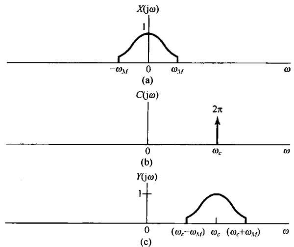

图8.1 复指数载波的幅度调制在频域上的效果。（a）调制信号  $x(t)$  的频谱；（b）载波信号  $c(t) = \mathrm{e}^{\mathrm{j}\omega_{c}t}$  的谱；（c）幅度已调信号  $y(t) = x(t)\mathrm{e}^{\mathrm{j}\omega_{c}t}$  的谱

由式(8.3)可以很明显地看出，  $x(t)$  能够从已调信号  $y(t)$  中恢复出来，只要将  $y(t)$  乘以复指数  $\mathrm{e}^{-\mathrm{j}\omega_{c}t}$ ，即

$$
x (t) = y (t) \mathrm {e} ^ {- \mathrm {j} \omega_ {c} t} \tag {8.7}
$$

在频域，这就等于把已调信号的频谱在频率轴上往回挪到调制信号原先所在的频谱位置上。从已调信号中恢复原始信号的过程称为解调。8.2节将对此进行更多的讨论。

因为  $\mathrm{e}^{\mathrm{j}\omega_{\mathrm{c}}t}$  是复指数信号，所以式(8.3)又可以写成

$$
y (t) = x (t) \cos \omega_ {c} t + j x (t) \sin \omega_ {c} t \tag {8.8}
$$

在  $x(t)$  为实信号时，可以用图8.2来实现式(8.7)或式(8.8)，这里要用两个单独的乘法器和两个相位相差 $\pi /2$  的正弦载波信号。在8.4节将给出一个应用的例子来说明使用图8.2所示的系统(用两个相位差  $\pi /2$  的正弦载波)将具有一些特别的好处。

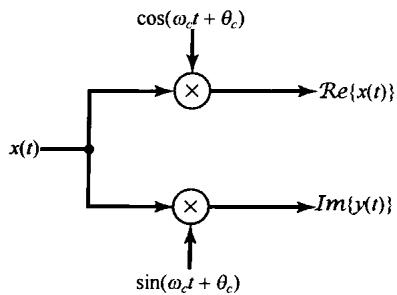

图8.2 用复指数信号  $c(t) = \mathrm{e}^{\mathrm{j}(\omega_c t + \theta_c)}$  作为载波的幅度调制的实现

# 8.1.2 正弦载波的幅度调制

在很多情况下，使用式(8.2)所示的正弦载波往往

更为简单一些，并且和复指数载波一样有效。事实上，使用正弦载波就相应于仅仅保留图8.2所示系统中输出的实部或虚部部分，这样的系统如图8.3所示。

用式(8.2)所示的正弦载波来进行幅度调制的效果也可以采用与8.1.1节相同的方法进行分析。为方便起见，再次选  $\theta_{c} = 0$  。这一情况下，载波信号的频谱是

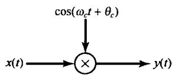

图8.3 正弦载波的幅度调制

$$
C (\mathrm {j} \omega) = \pi [ \delta (\omega - \omega_ {c}) + \delta (\omega + \omega_ {c}) ] \tag {8.9}
$$

根据式(8.4)，就有

$$
Y (\mathrm {j} \omega) = \frac {1}{2} [ X (\mathrm {j} \omega - \mathrm {j} \omega_ {c}) + X (\mathrm {j} \omega + \mathrm {j} \omega_ {c}) ] \tag {8.10}
$$

图8.3 正弦载波的幅度调制 若  $X(\mathrm{j}\omega)$  如图8.4(a)所示，则  $y(t)$  的频谱如图8.4(c)所示。从图中可以注意到，以  $+\omega_{c}$  和  $-\omega_{c}$  为中心都有一个原始信号频谱形状的重复。结果只要  $\omega_{M} < \omega_{c}$ ，就能从  $y(t)$  中恢复出  $x(t)$ ；否则，这两个重复的频谱将会有重叠。与复指数载波的情况相比，在那里原始信号频谱形状的重复仅在  $\omega_{c}$  附近出现，因此，正如在8.1.1节所看到的，在以复指数为载波的幅度调制中，对任意选取的  $\omega_{c}$ ，总是可以按式(8.7)采用乘以  $\mathrm{e}^{-\mathrm{j}\omega_{c}t}$ ，将频谱移回到它原来位置的办法，将  $x(t)$  从  $y(t)$  中恢复出来。另一方面，用正弦载波，如果  $\omega_{c} < \omega_{M}$ ，由图8.4可见， $X(\mathrm{j}\omega)$  的两个重复的频谱之间将会有重叠。例如在图8.5中， $\omega_{c} = \omega_{M} / 2$  时的  $Y(\mathrm{j}\omega)$  就是那样。很明显，这时  $x(t)$  的频谱不再在  $Y(\mathrm{j}\omega)$  中重复原样，因此也就不再可能从  $y(t)$  中将  $x(t)$  恢复出来。

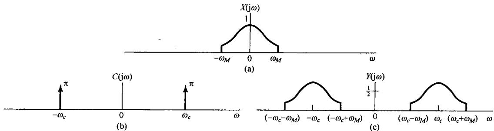

图8.4 正弦载波幅度调制在频域中的效果。（a）调制信号  $x(t)$  的频谱；

(b) 载波信号  $c(t) = \cos \omega_c t$  的频谱；(c) 幅度已调信号的频谱

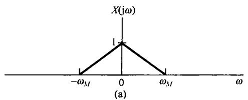

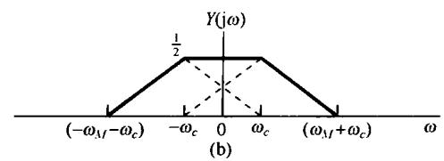

图8.5 载波为  $\cos \omega_{c}t$  ，在  $\omega_{c} = \omega_{M} / 2$  时的正弦幅度调制。

(a) 调制信号的频谱；(b) 已调信号的频谱

# 8.2 正弦幅度调制的解调

在通信系统的接收端，载有信息的信号  $x(t)$  是经由解调而得到恢复的。这一节研究正弦幅度调制的解调过程。其中有两种常用的解调方法，每一种都有各自的优缺点。8.2.1节先讨论的第一种方法称为同步解调（synchronous demodulation），其中发射机和接收机在相位上是同步的；8.2.2节将介绍的另一种方法称为非同步解调（asynchronous demodulation）。

# 8.2.1 同步解调

假设  $\omega_{c} > \omega_{M}$  ，将一个用正弦载波调制的已调信号进行解调就相对很直接了。具体而言，若

$$
y (t) = x (t) \cos \omega_ {c} t \tag {8.11}
$$

正如在例4.21中所做的那样，原始信号可以通过用  $y(t)$  来调制同样一个正弦载波并用一个低通滤波器把它恢复出来。为了说明这一点，考虑如下过程：

$$
w (t) = y (t) \cos \omega_ {c} t \tag {8.12}
$$

图8.6中示出了  $y(t)$  和  $\pmb{w}(t)$  的频谱，并看到  $x(t)$  可以用一个增益为2，截止频率大于  $\omega_{M}$  而小于 $(2\omega_{c} - \omega_{M})$  的理想低通滤波器从  $\pmb {w}(t)$  中恢复出来。该低通滤波器的频率响应在图8.6(c)中用虚线示出。

利用式(8.12)和一个低通滤波器来解调  $y(t)$  的原理也可以从代数运算中看出。根据式(8.11)和式(8.12)立即可得

$$
w (t) = x (t) \cos^ {2} \omega_ {c} t
$$

或者利用三角恒等式

$$
\cos^ {2} \omega_ {c} t = \frac {1}{2} + \frac {1}{2} \cos 2 \omega_ {c} t
$$

就可以将  $w(t)$  重新写成

$$
w (t) = \frac {1}{2} x (t) + \frac {1}{2} x (t) \cos 2 \omega_ {c} t \tag {8.13}
$$

于是， $w(t)$  由两项之和组成：一项是原始信号的一半，另一项则是用原始信号的一半去调制一个  $2\omega_{c}$  的正弦载波。这两项在图8.6(c)所示的频谱中都是显而易见的。对  $w(t)$  应用低通滤波器就相应于保留式(8.13)中右边的第一项，而消除掉第二项。

利用复指数载波进行幅度调制和解调的整个系统示于图8.7中，而利用正弦载波调制和解调的整个系统示于图8.8中。在这两个图上，都指出了更为一般的情况，即在复指数和正弦载波两种情况下，都包括了载波相位  $\theta_{c}$  。为了包括  $\theta_{c}$ ，以上分析相应会有些变化，但也是很直接的，并将在习题8.21中讨论。

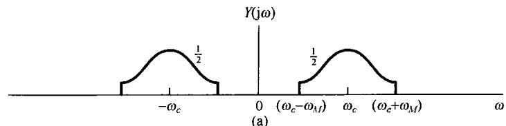

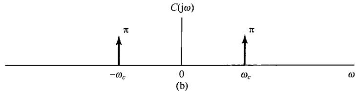

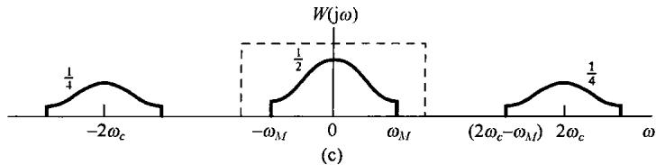

图8.6 正弦载波的幅度已调信号的解调。(a) 已调信号的频谱；(b) 载波信号的频谱；(c) 已调信号乘以载波后的频谱。图中虚线指出用于提取已解调信号的低通滤波器的频率响应

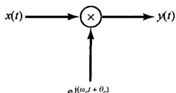

(a)

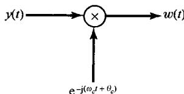

(b)

图8.7 利用复指数载波的幅度调制和解调系统。(a)调制；(b)解调

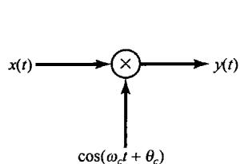

(a)

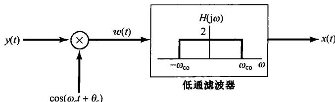

(b)

图8.8 正弦载波的幅度调制与解调。（a）调制系统；（b）解调系统。低通滤波器的截止频率  $\omega_{\mathrm{co}}$  大于  $\omega_{M}$  而小于  $(2\omega_{c} - \omega_{M})$

在图8.7和图8.8所示的系统中，都假设解调器载波在相位上与调制器载波是同相的，因而这一过程称为同步解调（synchronous demodulation）。然而，以下分析当调制器和解调器在相位上不同步时这两种系统的解调结果。在复指数载波的情况下，用  $\theta_{c}$  代表调制用载波的相位，用  $\phi_{c}$  代表解调用载波的相位，即

$$
y (t) = \mathrm {e} ^ {\mathrm {j} \left(\omega_ {c} t + \theta_ {c}\right)} x (t) \tag {8.14}
$$

$$
w (t) = \mathrm {e} ^ {- \mathrm {j} \left(\omega_ {c} t + \phi_ {c}\right)} y (t) \tag {8.15}
$$

或者

$$
w (t) = \mathrm {e} ^ {\mathrm {j} \left(\theta_ {c} - \phi_ {c}\right)} x (t) \tag {8.16}
$$

因此，如果  $\theta_c \neq \phi_c$ ，那么  $w(t)$  将有一个复振幅因子。对于  $x(t)$  为正值的特殊情况， $x(t) = |w(t)|$ ，因而  $x(t)$  可以通过取已解调信号的绝对值而恢复出来。

对正弦载波而言，还是设  $\theta_{c}$  和  $\phi_c$  分别为调制载波和解调载波的相位，如图8.9所示。现在低通滤波器的输入  $w(t)$  就是

$$
w (t) = x (t) \cos \left(\omega_ {c} t + \theta_ {c}\right) \cos \left(\omega_ {c} t + \phi_ {c}\right) \tag {8.17}
$$

或者利用三角恒等式

$$
\cos \left(\omega_ {c} t + \theta_ {c}\right) \cos \left(\omega_ {c} t + \phi_ {c}\right) = \frac {1}{2} \cos \left(\theta_ {c} - \phi_ {c}\right) + \frac {1}{2} \cos \left(2 \omega_ {c} t + \theta_ {c} + \phi_ {c}\right) \tag {8.18}
$$

可得

$$
w (t) = \frac {1}{2} \cos \left(\theta_ {c} - \phi_ {c}\right) x (t) + \frac {1}{2} x (t) \cos \left(2 \omega_ {c} t + \theta_ {c} + \phi_ {c}\right) \tag {8.19}
$$

这样，低通滤波器的输出就是  $x(t)$  乘以振幅因子  $\cos (\theta_c - \phi_c)$  。如果调制器和解调器中的振荡器是同相位的，即  $\theta_{c} = \phi_{c}$ ，那么低通滤波器的输出就是  $x(t)$  。另一方面，如果这些振荡器有  $\pi /2$  的相位差，则输出就是零。一般来说，为了获得最大的输出信号，振荡器应该同相。更为重要的是，这两个振荡器之间的相位关系必须在全部时间内保持不变，以使振幅因子  $\cos (\theta_c - \phi_c)$  不变。这就要求在调制器和解调器之间准确地同步，这一点往往是困难的，特别是在通信系统中，一般调制和解调总是被分隔在两个不同的地点。同步的需要和相应的影响不仅存在于调制器和解调器的相位之间，而且还存在于两者所用的载波频率之间。关于这两点将在习题8.23中详细讨论。

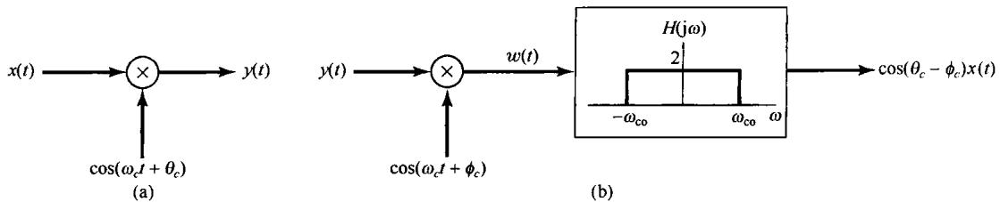

图8.9 调制器和解调器中载波信号不同步时的正弦幅度调制和解调系统。(a) 调制器；(b) 解调器

# 8.2.2 非同步解调

在很多应用正弦幅度调制的系统中，还有另一种称为非同步解调（asynchronous demodulation）的方法也经常被采用。非同步解调避免了在调制器和解调器间需要同步的困难。特别是，假设  $x(t)$  总是正的，而载波频率  $\omega_{c}$  比调制信号的最高频率  $\omega_{M}$  高得多，在这种情况下已调信号  $y(t)$  就会有图8.10所示的一般形式。特别是连接  $y(t)$  中峰值的一条平滑曲线，称为  $y(t)$  的包络线（envelope），将表现为  $x(t)$  的一个合理的近似。于是， $x(t)$  就能够近似地通过一个系统而得到恢复，该系统可以跟踪着  $y(t)$  的峰值，通过提取这一包络即可将  $x(t)$  恢复出来。这样的系统称为包络检波器（envelope detector）。图8.11(a)是用来作为包络检波器的一个简单电路的例子，这种电路一般都跟着一个低通滤波器以减小包络中载频的波动，这种波动在图8.11(b)中很明显，并且一般都会在图8.11(a)所示的包络检波器的输出端存在。

对于非同步解调需要两个基本假设:  $x(t)$  总是正的;  $x(t)$  的变化比  $\omega_{c}$  慢得多, 以使包络线容易被跟踪。第二个条件是满足的, 例如在射频信道上进行音频传输,  $x(t)$  的最高频率一般约为  $15 \sim 20 \mathrm{kHz}$ , 而  $\omega_{c} / 2\pi$  总在  $500 \sim 2000 \mathrm{kHz}$  范围内。第一个条件,  $x(t)$  总是正的, 也能够满足, 只

要把一个适当的常数值加到  $x(t)$  上，或者在调制器中进行一些简单的变化，如图8.12所示，都能保证这一点。这样，包络检波器的输出就近似为  $x(t) + A$  ，从这里  $x(t)$  是很容易获得的。

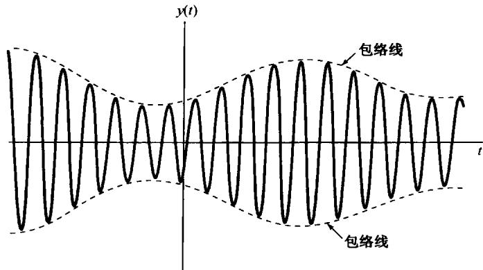

图8.10 调制信号为正的幅度已调信号，图中虚线代表已调信号的包络

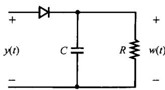

(a)

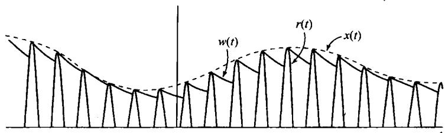

(b)

图8.11 用包络检波解调。（a）利用半波整流的包络检波器电路；（b）与图(a)有关的波形。  $r(t)$  是半波整流信号，  $x(t)$  是真正的包络，而  $\boldsymbol{w}(t)$  是从图(a）中电路得到的包络。为了说明问题，图(b)中  $x(t)$  和  $\boldsymbol{w}(t)$  之间的差别已经夸大了。在一个实际的非同步解调系统中，  $\boldsymbol{w}(t)$  是非常接近于  $x(t)$  的

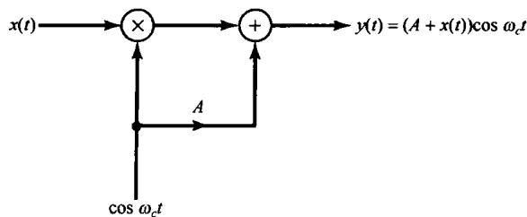

图8.12 非同步调制/解调系统中的调制器

为了用包络检波器解调，就要求  $A$  足够大，以使  $x(t) + A$  总是正的。现在令  $K$  是  $x(t)$  的最大幅度值，即  $|x(t)| \leqslant K$  。欲要  $x(t) + A$  总是正的，就要求  $A > K$  。一般  $K / A$  之比称为调制指数（modulation index） $m$ ；若以百分数表示，则称为调制百分数（percent modulation）。图8.13示出当

$x(t)$  为正弦变化的情况下，在两个不同的  $m$  [分别为  $m = 0.5(50\%$  调制)和  $m = 1(100\%$  调制)]时，图8.13所示为调制器的输出波形。

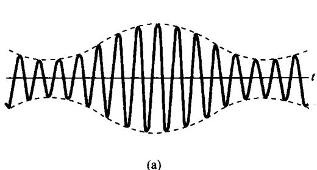

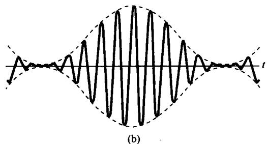

图8.13 图8.12所示幅度调制系统的输出。（a）调制指数  $m = 0.5$ ；（b）调制指数  $m = 1.0$

当分别利用同步解调和非同步解调时，与已调信号有关的频谱示于图8.14中，以供比较。特别注意到，对于图8.12所示的非同步解调系统，其调制器的输出有一个额外的分量  $A\cos \omega_{c}t$ ，这个分量在同步解调系统中是不存在的，也是不必要的。在图8.14中，这就是反映在图(c)中存在于  $+\omega_{c}$  和  $-\omega_{c}$  处的冲激。若调制信号的最大幅度  $K$  固定不变，则随着  $A$  的减小，存在于已调信号输出中载波分量的相对值就会减小。因为输出中的载波分量不含有任何信息，所以它的存在是不经济的。例如，对发射已调信号所要求的功率大小来说就是这样，因此从这种意义上来说，希望  $K / A$  之比，即调制指数  $m$  尽可能大。但在另一方面，如图8.11所示的简单包络检波器，跟踪包络线以提取  $x(t)$  的能力，则是随着调制指数  $m$  的下降而改善的。因此在调制器输出中，系统在功率利用上的效率和解调信号的质量之间存在一个折中考虑。

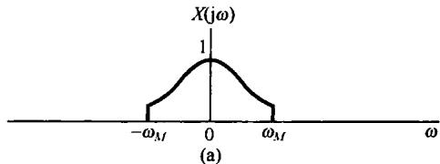

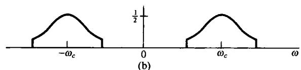

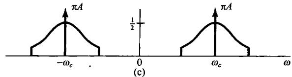

图8.14 同步与非同步正弦幅度调制系统频谱的比较。（a）调制信号的谱；（b）在同步系统中代表已调信号  $x(t)\cos \omega_{c}t$  的谱；（c）在非同步系统中代表已调信号  $[x(t) + A]\cos \omega_{c}t$  的谱

图8.11和图8.12所示的非同步调制/解调系统与图8.8所示的同步系统相比各有优缺点。同步系统要求有一个更高档的解调器，因为解调器中的振荡器必须与调制器中的振荡器在相位和频率上保持同步；而在另一方面，非同步调制器则比同步调制器要求有更大的输出功率，因为若要包络检波器能正常工作，则包络线必须是正的，或者等效地说，在被发射的信号中必须有载波分量存在。这种情况往往在像公共无线电广播这样的系统中是受欢迎的，因为它要求批量生产为数众多而又价格适中的接收机(解调器)供大家收听；另外，在发射功率上付出的额外代价还可以在大量的廉价接收机上得到补偿。但是，在发射机的功率要求非常宝贵的情况下，如在卫星通信系统中，花在一个更为高档的同步接收机上的代价就是很值得的了。

# 8.3 频分多路复用

用于传输信号的许多系统都可以提供一个比信号本身所要求的频带宽得多的带宽。例如，

一个典型的微波中继系统的总带宽可达几千兆赫，而这个带宽比单个声音信道要求的带宽大得多。如果有频谱互相重叠的单个声音信号，利用正弦幅度调制把它们的频谱在频率上进行搬移，使这些已调信号的频谱不再重叠，就能够在同一个宽带信道上同时传输这些信号。这就是频分多路复用（frequency-division multiplexing，FDM)的概念。利用正弦载波的频分多路复用原理如图8.15所示。每一个欲传输的信号假设都是带限的，并且用不同的载波频率进行调制，然后把这些已调信号组合在同一个通信信道上同时传输。每一个子信道和复合多路信号的频谱都示于图8.16中。通过这一复用过程，每一输入信号都安排在这个频带内

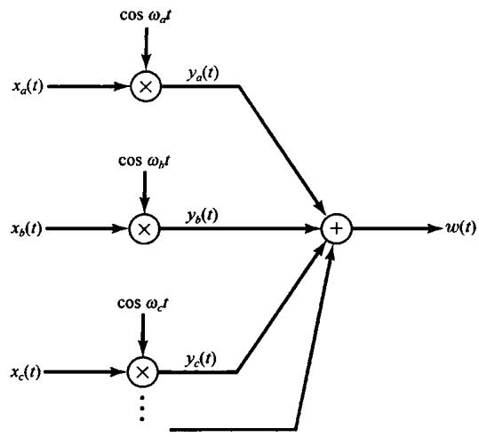

图8.15 利用正弦幅度调制的频分多路复用

的不同部分。为了在解复用过程中恢复每一信道，要求有两个基本步骤：先用带通滤波器来滤出某一特定信道的已调信号，然后紧跟着利用解调来恢复原始信号。例如，要恢复信道  $a$  ，而又采用同步解调，则如图8.17所示。

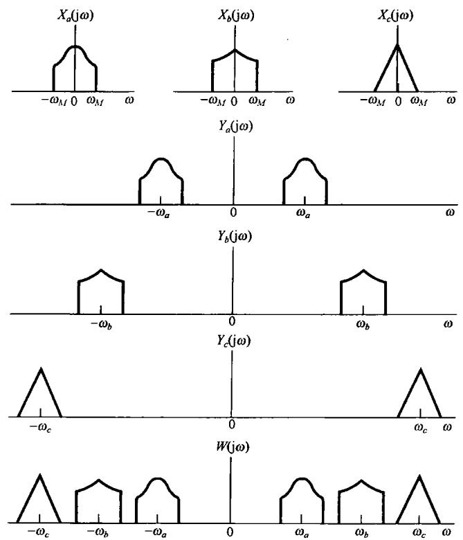

图8.16 图8.15所示频分多路复用系统中的有关频谱

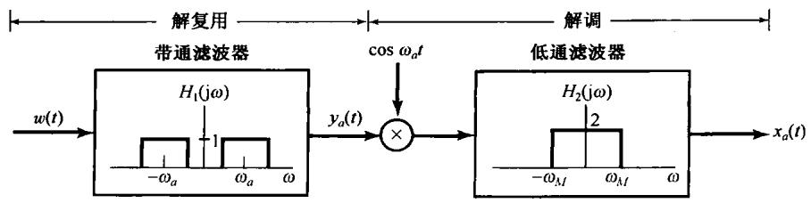

图8.17 对某一路频分多路复用信号的解复用与解调

电话通信是频分多路复用系统的一个重要应用场合，另一个重要应用场合就是在射频频带内，经由大气层的信号传输。在美国，用于传输信号的频率范围从  $10\mathrm{kHz}$  到257GHz，并受联邦通信委员会(Federal Communications Commission)控制来合理安排它的使用。图8.18所示为本书落笔时的频段分配。由图可见，在1MHz附近的频率范围是安排给调幅(AM)广播波段（这里AM特指正弦幅度调制)的。每一个调幅无线电台都安排在调幅波段某一特定的频率范围内，从而使许多电台可以利用频分多路复用同时广播。在接收机方面，原则上每一个电台都可以用图8.17所示的解复用和解调系统选出来。接收机面板上的调谐旋钮既控制了带通滤波器的中心频率，又控制了解调振荡器的频率。事实上，对民用公共广播来说，都采用非同步调制和解调系统，以简化接收机并降低它的成本。再者，图8.17所示的解复用系统要求一个锐截止的中心频率可变的带通滤波器。实现一个可变的频率选择性滤波器是困难的，结果代替它的是一个固定频率的滤波器，并采用一个中间调制级和滤波，在无线电接收机中称为中频（intermediate-frequency，IF）。不用可变带通滤波器，而利用调制来把信号的频谱搬移到一个固定频率的带通滤波器内，这一过程和4.5.1节讨论的过程是类似的。这就是目前家用调幅无线电接收机所用的基本原理。关于这个问题的更多细节将在习题8.36中讨论。

<table><tr><td>频率范围</td><td>符号</td><td>用途</td><td>传播方式</td><td>信道特点</td></tr><tr><td>30~300 Hz</td><td>ELF(极低频)</td><td>长波、海底通信</td><td>兆米波</td><td>穿透导电大地与海水</td></tr><tr><td>0.3~3 kHz</td><td>VF(音频)</td><td>数据终端、电话</td><td>铜导线</td><td></td></tr><tr><td>3~30 kHz</td><td>VLF(甚低频)</td><td>导航、电话、电报、频率和时间标准</td><td>地表面波</td><td>低损耗、小衰落、极稳定的相位与频率、大天线</td></tr><tr><td>30~300 kHz</td><td>LF(低频)</td><td>工业通信(电力线)、航空与海上远距离导航、无线电航标</td><td>大多为地表面波</td><td>些微衰落、高大气噪声</td></tr><tr><td>0.3~3 MHz</td><td>MF(中频)</td><td>移动通信,调幅广播,业余波段、公用保险</td><td>地波与电离层反射(天空波)</td><td>衰落增加,仍可靠</td></tr><tr><td>3~30 MHz</td><td>HF(高频)</td><td>军事通信、飞行器、国际固定、业余及民用波段、工业应用</td><td>电离层反射天空波(50~400 km电离层高度)</td><td>周期性和频率选择性衰落、多径效应</td></tr><tr><td>30~300 MHz</td><td>VHF(甚高频)</td><td>调频和TV广播,地面通信(出租汽车、公共汽车、铁路)</td><td>天空波(电离层反射和对流层散射)效应</td><td>衰落、散射和多径效应</td></tr><tr><td>0.3~3 GHz</td><td>UHF(特高频)</td><td>特高频TV、空间遥测、雷达、军事</td><td>穿越地表至对流层散射与视距中继</td><td></td></tr><tr><td>3~30 GHz</td><td>SHF(超高频)</td><td>卫星与空间通信、公用载频(CC)、微波</td><td>视距电离层穿透</td><td>电离层穿透、宇宙噪声、高方向性</td></tr><tr><td>30~300 GHz</td><td>EHF(极高频)</td><td>科研、政府机关、射电天文学</td><td>视距</td><td>水蒸气和氧吸收</td></tr><tr><td>10^3~10^7 GHz</td><td>红外线,可见光,紫外线</td><td>光通信</td><td>视距</td><td></td></tr></table>

图8.18 射频频谱的频率分配

如图8.16所说明的，在图8.15所示的频分多路复用系统中，每一个信号的频谱都在正和负的频率上重复，因此已调信号占据的带宽是原始信号的2倍。这一点在频带的利用上是不经济的。下一节将讨论另一种正弦幅度调制的形式，它能更有效地利用频带，但为此付出的代价却是调制和解调系统都大大地复杂化了。

# 8.4 单边带正弦幅度调制

在8.1节讨论的正弦幅度调制系统中，原始信号  $x(t)$  的总带宽是  $2\omega_{M}$ ，既包括正的频率部分，又包括负的频率部分，其中  $\omega_{M}$  是  $x(t)$  中的最高频率。利用复指数载波，这个频谱被搬到  $\omega_{c}$  上，虽然已调信号现在是复数的，但占有信号能量的总的频带宽度仍是  $2\omega_{M}$  。利用正弦载波，信号的频谱搬移到  $+\omega_{c}$  和  $-\omega_{c}$  上，因此要求2倍于前面的频带宽度。这意味着利用正弦载波，在已调信号中有冗余度，利用一种称为单边带调制（single-sideband modulation，SSB）的技术，可以把这个冗余度除掉。

图8.19(a)示出了  $x(t)$  的频谱，这里用不同的阴影线标出正负频率分量。图8.19(b)是用正弦载波调制得到的频谱，图中特别用上边带和下边带标出在  $+\omega_{c}$  和  $-\omega_{c}$  两边的频谱部分。比较图8.19(a)和图8.19(b)可以看出，如果仅保留正、负频率的上边带部分，那么  $X(\mathrm{j}\omega)$  就可以恢复出来；或者类似地仅保留正、负频率的下边带部分，也可以将  $X(\mathrm{j}\omega)$  恢复出来。仅保留上边带所得到的频谱如图8.19(c)所示，而图8.19(d)则是仅保留下边带时的频谱。将  $x(t)$  转换到相应于图8.19(c)或图8.19(d)所示的形式称为单边带调制。与图8.19(b)相比，上、下两个边带都保留的称为双边带调制（double-sideband modulation，DSB）。

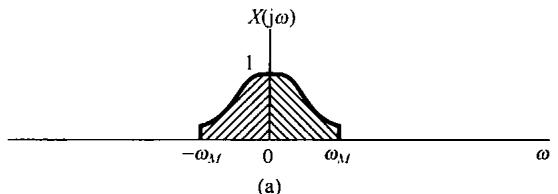

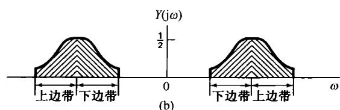

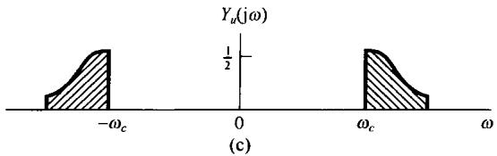

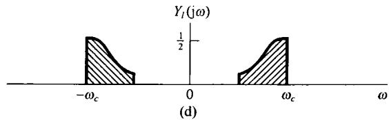

图8.19 双边带与单边带调制。（a）调制信号频谱；（b）用正弦载波调制后的频谱；（c）仅包含上边带的频谱；（d）仅包含下边带的频谱

有几种方法可以获得单边带信号。一种方法是应用一个锐截止的带通或高通滤波器，滤掉图8.19(b)中不需要的边带，如图8.20所示。第二种方法是采用移相技术来滤掉一个边带而保留另一个边带。图8.21就是一个用于保留下边带的这种系统。该图中的  $H(\mathrm{j}\omega)$  称为“ $90^{\circ}$  相移网络”，其频率特性为

$$
H (\mathrm {j} \omega) = \left\{ \begin{array}{l l} - \mathrm {j}, & \omega > 0 \\ \mathrm {j}, & \omega <   0 \end{array} \right. \tag {8.20}
$$

$x(t), y_1(t) = x(t)\cos \omega_ct, y_2(t) = x_p(t)\sin \omega_ct$  和  $y(t)$  的频谱都示于图8.22中。正如习题8.28中所讨论的，若要保留上边带， $H(\mathrm{j}\omega)$  的相位特性就应该相反，而为

$$
H (\mathrm {j} \omega) = \left\{ \begin{array}{l l} \mathrm {j}, & \omega > 0 \\ - \mathrm {j}, & \omega <   0 \end{array} \right. \tag {8.21}
$$

正如习题8.29中所讨论的，单边带系统的同步解调可以和双边带系统的同步解调采用一样的方式来实现。为单边带系统频谱利用率的提高所付出的代价是增加了调制器的复杂性。

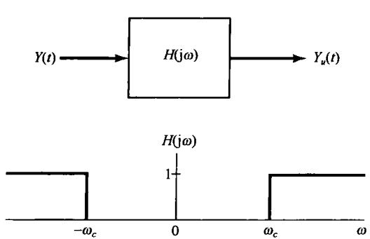

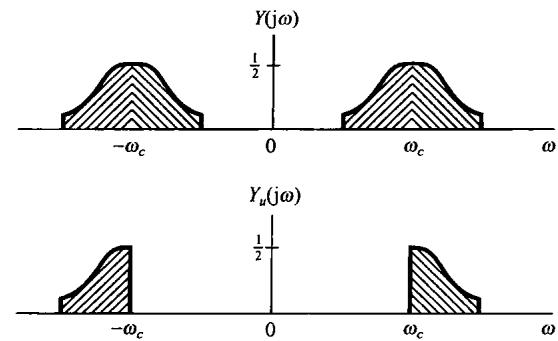

图8.20 利用理想高通滤波器保留上边带的系统

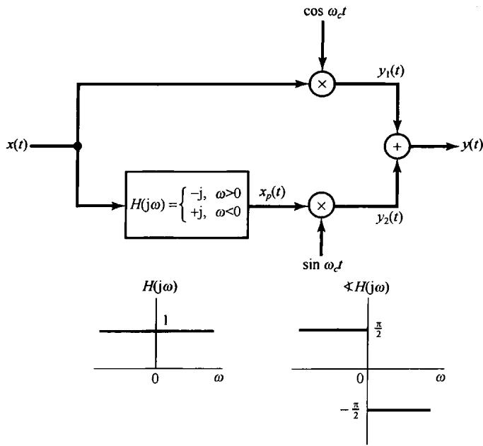

图8.21 利用一个  $90^{\circ}$  相移网络，仅保留下边带的单边带幅度调制系统

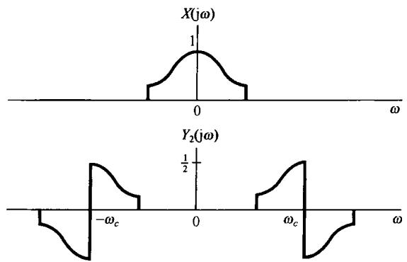

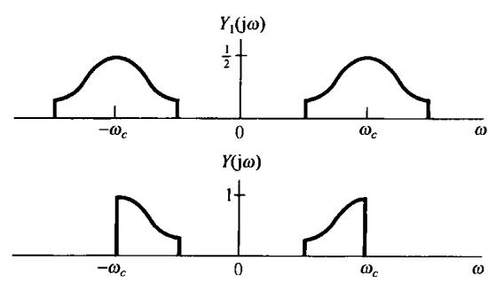

图8.22 图8.21单边带系统的有关频谱

总之，从8.1节到8.4节已经见到几种复指数和正弦幅度调制。若利用8.2.2节讨论的非同步解调，就必须在调制信号上增加一个常数值以使它总为正，这就在已调输出中形成了载波分量信号的存在，从而在传输时就要求更多的功率，但却使解调器比在一个同步系统中所要求的简单得多。另外，若在已调输出中仅保留上边带或下边带，则频带和发射机功率的使用都更加经济有效，但要求使用一个更高档的解调器。具有双边带并含有载波的正弦幅度调制，一般就缩写为AM-DSB/WC，意即“幅度调制双边带/载波存在”；而当载波抑制或不存在时就缩写为AM-DSB/SC，意即“幅度调制双边带/载波抑制”。相应的单边带系统分别缩写为AM-SSB/WC和AM-SSB/SC。

8.1节到8.4节都在对与正弦幅度调制有关的许多基本概念进行简单介绍，有关它们的很多细节和实现的进一步讨论，可参阅书末所列的有关文献。

# 8.5 用脉冲串进行载波的幅度调制

# 8.5.1 脉冲串载波调制

前几节讨论的幅度调制利用的是正弦载波。另一类重要的幅度调制技术利用的载波信号是一个脉冲串，如图8.23所示。这种类型的幅度调制相应于等间隔地传输  $x(t)$  的时隙样本。一般来说，不能期望任何一个信号都能从这样一组时隙样本中得到恢复。然而，从第7章中采样概念的讨论使人能想到，如果  $x(t)$  是带限的，并且脉冲重复频率足够高，这就应该是可能的。

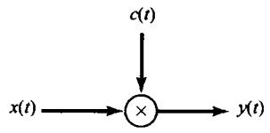

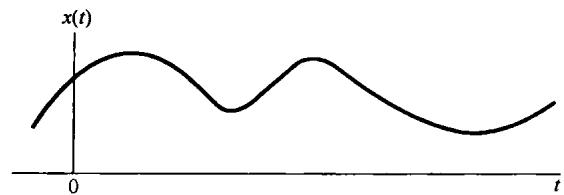

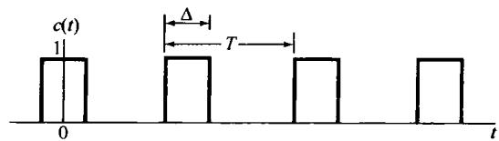

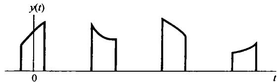

图8.23 脉冲串幅度调制

由图8.23可见

$$
y (t) = x (t) c (t) \tag {8.22}
$$

也就是说，已调信号  $y(t)$  是  $x(t)$  和载波  $c(t)$  的乘积。若用  $Y(\mathrm{j}\omega)$ ， $X(\mathrm{j}\omega)$  和  $C(\mathrm{j}\omega)$  分别代表这些信号的傅里叶变换，那么由相乘性质可得

$$
Y (\mathrm {j} \omega) = \frac {1}{2 \pi} \int_ {- \infty} ^ {+ \infty} X (\mathrm {j} \theta) C (\mathrm {j} (\omega - \theta)) \mathrm {d} \theta \tag {8.23}
$$

因为  $c(t)$  是周期的，周期为  $T$  ，所以  $C(\mathrm{j}\omega)$  就是由在频域中相隔  $2\pi /T$  的冲激所组成的，即

$$
C (\mathrm {j} \omega) = 2 \pi \sum_ {k = - \infty} ^ {- \infty} a _ {k} \delta (\omega - k \omega_ {\mathrm {c}}) \tag {8.24}
$$

其中  $\omega_{c} = 2\pi /T$  ，系数  $a_{k}$  就是  $c(t)$  的傅里叶级数系数，由例3.5可知

$$
a _ {k} = \frac {\sin (k \omega_ {c} \Delta / 2)}{\pi k} \tag {8.25}
$$

$c(t)$  的频谱如图8.24(b)所示。若  $x(t)$  的频谱如图8.24(a)所示，那么已调信号  $\gamma (t)$  所得到的谱就如图8.24(c)所示。由式(8.23)和式(8.24)可知，  $Y(\mathrm{j}\omega)$  就是  $X(\mathrm{j}\omega)$  的加权和移位的各部分之和：

$$
Y (\mathrm {j} \omega) = \sum_ {k = - \infty} ^ {+ \infty} a _ {k} X (\mathrm {j} (\omega - k \omega_ {c})) \tag {8.26}
$$

比较式(8.26)和式(7.6)，并比较图8.24和图7.3(c)可见， $y(t)$  的频谱非常类似于由周期冲激串采样所得到的频谱，唯一的差别在脉冲串的傅里叶系数值上。对于第7章中所用的周期冲激串来说，所有的傅里叶系数都等于  $1 / T$  ，而在图8.23中的脉冲串  $c(t)$  ，其傅里叶系数则由式(8.25)给出。这样，只要  $\omega_{c} > 2\omega_{M}$  ， $X(\mathrm{j}\omega)$  的周期重复并受  $a_{k}$  加权的各部分之间就不会互相重叠，这就相应于奈奎斯特采样定理中的条件。如果这一条件可以满足，那么就与冲激串采样相同， $x(t)$  可以应用一个截止频率大于  $\omega_{M}$  ，小于  $\omega_{c} - \omega_{M}$  的低通滤波器从  $y(t)$  中恢复出来。

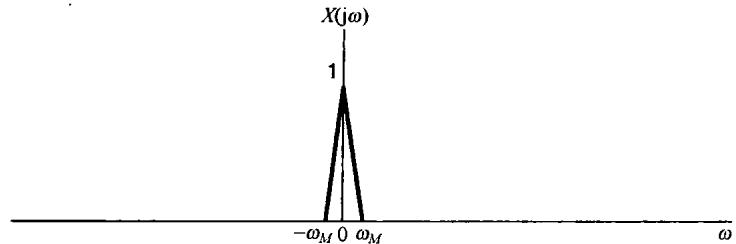

(a)

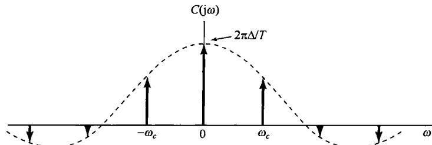

(b)

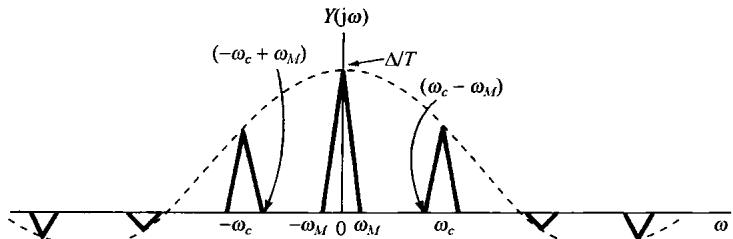

(c)

图8.24 脉冲串幅度调制的有关频谱。(a) 带限信号  $x(t)$  的频谱；(b) 图8.23中的脉冲载波信号  $c(t)$  的频谱；(c) 已调脉冲串  $y(t)$  的频谱

值得注意的是，上述结论对其他各种形状的脉冲载波波形也都成立，即如果  $c(t)$  是任意具有某傅里叶系数  $a_{k}$  的，由式(8.24)表示的傅里叶变换的周期信号，那么  $Y(\mathrm{j}\omega)$  就由式(8.26)给出。然后，只要  $\omega_{c} = 2\pi /T > 2\omega_{M}$ ，在  $Y(\mathrm{j}\omega)$  中各加权和移位的  $X(\mathrm{j}\omega)$  就不会重叠，在直流傅里叶系数  $a_0$  非零的条件下，可以用低通滤波的方法将  $x(t)$  恢复出来。如同在习题8.11中所指出的，如果  $a_0$  是零或非常小，那么利用一个带通滤波器选取  $a_{k}$  较大的那个  $X(\mathrm{j}\omega)$  的移位分量，就可以得到一个正弦幅度调制信号，唯有这时作为调制信号的  $x(t)$  受到某一加权。利用8.2节的解调方法可以将  $x(t)$  恢复出来。

# 8.5.2 时分多路复用

利用脉冲串载波的幅度调制常用于在某单一信道上传输几路信号。如图8.23所指出过的，已调信号  $y(t)$  仅当载波信号  $c(t)$  非零时才不为零，而在这个  $c(t)$  的间隔内，就能传输其他类似的已调信号。这一过程的两种等效表示如图8.25所示。在一个单一的信道内，利用这种技术来实现多路信号的传输就是：每一路信号被安排在一组持续期为  $\Delta$  的时隙内，该  $\Delta$  时隙每隔  $T$  秒重复一次，并且它不会与安排给其他路信号的时隙相重合。  $\Delta / T$  的比值越小，在这个信道内能传输的信号路数就越多。这一过程称为时分多路复用（time-division multiplexing，TDM）。8.3节讨论的频分多路复用是为每一路信号指定不同的频率间隔，而时分多路复用则是为每一路信号指定不同的时间间隔。在图8.25中，对每一路信号从复合信号中解复用，是通过时间控制门的办法来选择与每一路信号有关的特定时隙来完成的。

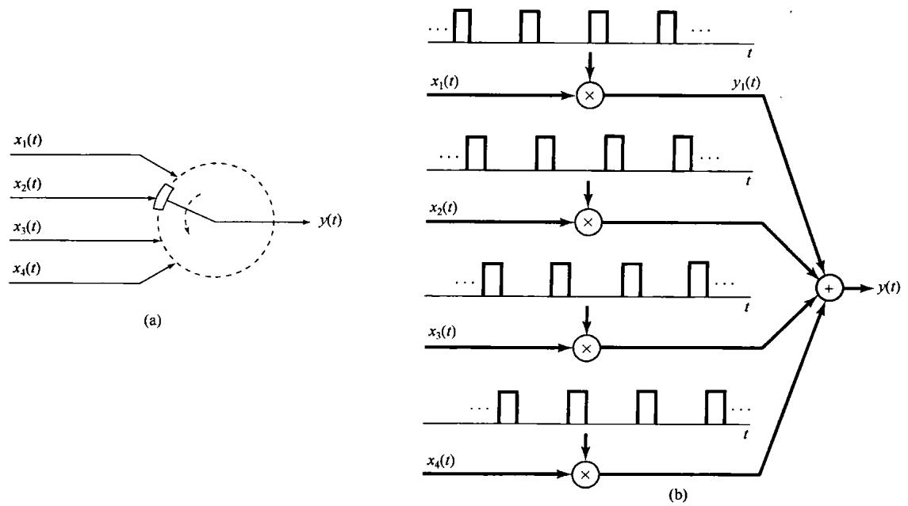

图8.25 时分多路复用

# 8.6 脉冲幅度调制

# 8.6.1 脉冲幅度已调信号

在8.5节中讨论了一种调制系统，在该系统中用一个连续时间信号  $x(t)$  去调制一个周期脉冲串，这就相当于每隔  $T$  秒，传输  $x(t)$  中一个  $\Delta$  时隙的信号。无论是在上节的讨论中，或是在第7章关于采样的研究中都已看到，从这些时隙信号中恢复  $x(t)$  的能力并不取决于  $\Delta$  的大小，而是与频率  $2\pi / T$  有关；为了保证  $x(t)$  的重建是无混叠的，这个频率必须超过奈奎斯特率。这就是说，原则上仅需要传输信号  $x(t)$  的样本  $x(nT)$  。

事实上，在现代通信系统中，要传输的是这些载有信息信号  $x(t)$  的样本值，而不是那些时隙内的值。但是由于一些实际的问题，在一个通信信道上能传输的最大幅度有限制，这样传输  $x(t)$  的冲激样本就不实际，而代之以样本  $x(nT)$  去调制一脉冲序列的幅度，这样就形成了所谓的脉冲幅度调制（pulse-amplitude modulation，PAM）系统。

利用短形脉冲就相当于采样保持的办法，将持续期为  $\Delta$  的、幅度正比于  $x(t)$  的瞬时样本值的这些脉冲传输出去，图8.26所示为这种形式的单一PAM信道的波形图，图中虚线代表信号 $x(t)$  。与8.5节的调制方法类似，脉冲幅度调制信号也是能够时分多路复用的，如图8.27所示。图中画出了三路时分多路复用信道的传输波形，与各路有关的脉冲用阴影线加以区分，并且在每路的脉冲上方还用信道号码标出。对某一给定的重复周期  $T$  来说，随着脉冲宽度的减小，在同一通信信道或媒质内就能传输更多的时分多路复用信号。然而，当脉冲宽度减小时，一般就需要增大传输脉冲的幅度，以使每个脉冲在传输中有一定的能量。

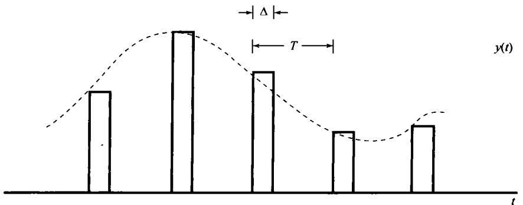

图8.26 对一路脉冲幅度调制信道传输的波形，图中虚线代表信号  $x(t)$

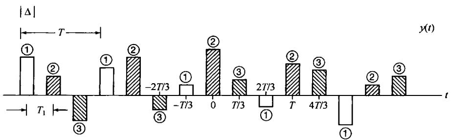

图8.27 三路时分多路复用的脉冲幅度调制信道的传输波形。与每路有关的波形是用不同的阴影线来区分的，同时在每一路脉冲上还标出了信道号码。这里符号间的间隔是  $T_{1} = T / 3$

除了在能量方面的考虑外，在设计一个脉冲幅度调制信号时还有其他一些因素要顾及。特别是，我们知道，只要采样频率超过奈奎斯特率， $x(t)$ 都能完全由它的样本恢复出来，这样就能用这些样本去调制任何形状的一串脉冲的幅度！脉冲形状的选择受制于一些因素，诸如所用的通信媒质的频率选择性、码间干扰问题等，下面将对此进行讨论。

# 8.6.2 脉冲幅度调制系统中的码间干扰

在刚才所讨论的时分多路复用脉冲幅度调制系统中，原则上接收机都能够凭借在一些适当的时间对时分多路复用的波形进行采样，从而将各路信道分隔开。例如，考虑图8.27所示的时分多路复用信号，它是由三个信号  $x_{1}(t)$ ， $x_{2}(t)$  和  $x_{3}(t)$  的脉冲幅度调制所组成的。如果在每个脉冲的中间点上用适当的时间对  $y(t)$  采样，就能将这三路信号的样本分隔开，即

$$
\begin{array}{l} y (t) = A x _ {1} (t), \quad t = 0, \pm 3 T _ {1}, \pm 6 T _ {1}, \dots \\ y (t) = A x _ {2} (t), \quad t = T _ {1}, T _ {1} \pm 3 T _ {1}, T _ {1} \pm 6 T _ {1}, \dots \tag {8.27} \\ y (t) = A x _ {3} (t), \quad t = 2 T _ {1}, 2 T _ {1} \pm 3 T _ {1}, T _ {1} \pm 6 T _ {1}, \dots \\ \end{array}
$$

其中  $T_{1}$  是码间间隔，这里等于  $T / 3$  ，而  $A$  是一个适当的比例常数。换句话说，利用对已接收到的时分多路复用的脉冲幅度调制信号进行合适的采样，就能得出  $x_{1}(t), x_{2}(t)$  和  $x_{3}(t)$  的各样本值。

上述方法都是假定传输的脉冲形状在通信信道上传播时都能保持得相当好。然而，在经由任何实际的信道传输时，这些脉冲由于加性噪声和过滤的影响都会有失真。加性噪声自然会在采样时刻引入幅度误差，而由于信道非理想的频率响应而带来的滤波会招致单个脉冲的变形，这就会引起已接收到的脉冲在时间上互相重合。这种干扰如图8.28所示，并称为码间干扰（inter-symbol interference）。

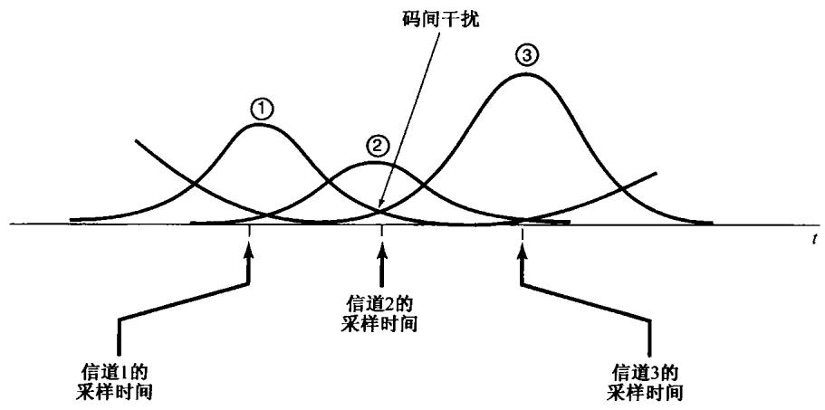

图8.28 码间干扰

图8.27中这些理想化的脉冲形状受到破坏有可能是由于该信道带宽的限制产生的，或者就如6.2.2节讨论过的，是由于非恒定群时延所引起的相位弥散而产生的(特别是见例6.1)。如果码间干扰的产生仅仅是由于信道的有限带宽，那么可以利用一种脉冲形状  $p(t)$  来解决问题，它本身是带限的，因此不受(或很少受)信道有限带宽的影响。尤其是，如果信道有一种频率响应 $H(\mathrm{j}\omega)$ ，它在某一给定频带上是无失真的，即若  $\mid \omega \mid < W$  时  $H(\mathrm{j}\omega) = 1$  ，而所用的脉冲又是带限于它的频带内的，即若  $\mid \omega \mid \geqslant W$  时  $P(\mathrm{j}\omega) = 0$  ，那么每一路脉冲幅度调制信号一定会在无失真的条件下被接收。另一方面，利用这样一个脉冲以后，也就不会再有像图8.27那样互不重合的脉冲了。然而，即使用一种带限的脉冲，在时域中的码间干扰仍然可以避免，只要该脉冲形状在其他采样时刻都限制为具有过零特性，以使式(8.27)继续成立就可以。例如，考虑如下sinc脉冲：

$$
p (t) = \frac {T _ {1} \sin (\pi t / T _ {1})}{\pi t}
$$

该脉冲及其频谱都如图8.29所示。因为该脉冲在符号间隔  $T_{1}$  的整数倍上都是零，如图8.30所示，所以在这些瞬时就不会有码间干扰。也就是说，如果在  $t = kT_{1}$  对已接收信号采样，那么来自其他所有脉冲[即  $p(t - mT_{1}),m\neq k]$  的对这个采样值的贡献都为零。当然，为了避免从邻近脉冲来的干扰，就一定要求在采样瞬间有高的精确度，以使采样在邻近码的过零时刻发生。

sinc脉冲仅是时域中在  $\pm T_{1}$  ，  $\pm 2T_{1}$  ，…等过零的许多带限脉冲之一。更一般的情况是，考虑一个脉冲  $p(t)$  ，其频谱具有如下形式：

$$
P (\mathrm {j} \omega) = \left\{ \begin{array}{l l} 1 + P _ {1} (\mathrm {j} \omega), & | \omega | \leqslant \frac {\pi}{T _ {1}}, \\ P _ {1} (\mathrm {j} \omega), & \frac {\pi}{T _ {1}} <   | \omega | \leqslant \frac {2 \pi}{T _ {1}} \\ 0, & \text {其 他} \end{array} \right. \tag {8.28}
$$

并且  $P_{1}(\mathrm{j}\omega)$  关于  $\pi /T_{1}$  奇对称，则有

$$
P _ {1} \left(- \mathrm {j} \omega + \mathrm {j} \frac {\pi}{T _ {1}}\right) = - P _ {1} \left(\mathrm {j} \omega + \mathrm {j} \frac {\pi}{T _ {1}}\right), \quad 0 \leqslant \omega \leqslant \frac {\pi}{T _ {1}} \tag {8.29}
$$

如图8.31所示。若  $P_{1}(\mathrm{j}\omega) = 0$  ，  $p(t)$  就是sinc脉冲。如同在习题8.42中所讨论的，更一般的情况是，对任何满足式(8.28)和式(8.29)条件的  $P(\mathrm{j}\omega)$  ，  $p(t)$  在  $\pm T_{1}$  ，  $\pm 2T_{1}$  ，都有过零特性。

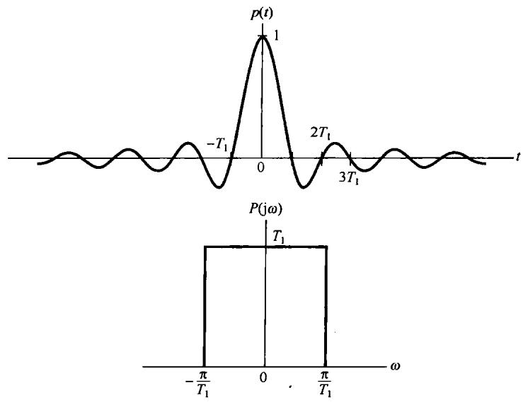

图8.29 sinc脉冲及其频谱

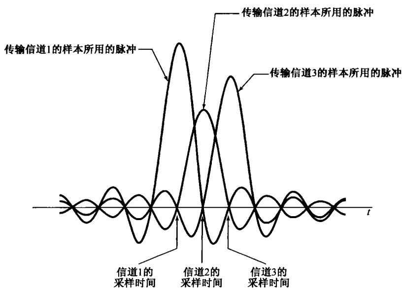

图8.30 当利用具有准确选择的过零sinc脉冲时，码间干扰不存在的情况

虽然满足式(8.28)和式(8.29)的信号可以克服有限信道带宽的问题，但是其他信道失真也可能产生。这就要求选择不同的脉冲波形，或者在分离不同的时分多路复用信号之前对已接收到的信号进行一些附加的处理。特别是，如果  $|H(\mathrm{j}\omega)|$  在通带内不是恒定的，就可能需要进行信道均衡

(channel equalization)，也就是对已接收到的信号进行滤波，以校正非恒定的信道增益。同时，如果信道具有非线性相位特性，除非进行补偿处理，否则失真也会导致码间干扰。习题8.43和习题8.44将给出这些影响的例子。

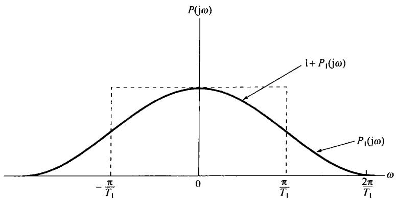

图8.31 按式(8.29)定义的关于  $\pi /T_{1}$  的奇对称

# 8.6.3 数字脉冲幅度调制和脉冲编码调制

8.6.2节所讨论的脉冲幅度调制系统涉及用一组离散的样本去调制一个脉冲序列。这组样本可以认为是一个离散时间信号  $x[n]$ ，并且在许多应用中，事实上  $x[n]$  被存储在某一数字系统中，或者是由某一数字系统所产生的。在这样的情况下，一个数字系统的有限字长就意味着， $x[n]$  仅能取到一个有限的量化值，这就造成了对这些已调脉冲来说只有有限个可能的幅度值。

事实上，在很多情况下，这种数字脉冲幅度调制的量化形式就演变为仅用几个（典型的是两个）幅度值的系统。也就是说，如果  $x[n]$  的每一个样本表示成一个二进制数（即一串有限个0和1），那么具有两个可能值（一个值对应于0，另一个值对应于1）之一的脉冲就可以被置为这串二进制数中的每一个二进制位，或称比特(bit)。更一般的情况是，为了防止传输误差或者提供可靠的通信，代表  $x[n]$  的这个二进制位的序列在传输之前首先可以变换或编码成另一个0和1的序列。例如，一个很简单的误差校正机理就是对  $x[n]$  的每个样本传输一个附加的已调脉冲，它代表一种奇偶(parity)校验。也就是说，若  $x[n]$  的二进制表示中有奇数个1，就将这个附加的比特置为1；若有偶数个1就置为0。然后，接收机就可以将这个已接收到的奇偶校验位与另外已接收到的比特位进行对照，以检测出它们的不一致性。更为复杂的编码和误差校正设计肯定都能使用，并且具有特殊要求的码形设计是通信系统设计中的一个重要内容。由上讨论显而易见，一个由编码的0和1的序列所调制的脉冲幅度调制系统就称为脉冲编码调制(pulse-code modulation, PCM)系统。

# 8.7 正弦频率调制

前面几节讨论了几种幅度调制系统，其中调制信号用来改变一个正弦或脉冲载波的振幅。已经看到，这样的系统可以用前面几章所建立的频域方法给予详细分析。还有一类很重要的调制技术称为频率调制（Frequency modulation，FM），其中调制信号用来控制一个正弦载波的频率。这种类型的调制系统与幅度调制系统相比有很多优点。正如由图8.10所想到的，在正弦幅度调制下，载波包络线的峰值幅度直接与调制信号  $x(t)$  的大小有关，而  $x(t)$  可能有一个大的动态范围，也就是说有一个显著的变化；而在频率调制下，载波的包络是一个常数。这样，一个频率调

制发射机总是可以工作在峰值功率状态。另外，在频率调制系统中，在传输信道中由于加性扰动或衰落所引起的幅度变化，能在相当大的范围内接收机中被消除掉。因此，在公共广播和其他一些场合，频率调制的接收质量总是比幅度调制的接收质量更好。另一方面，将会看到，频率调制一般比正弦幅度调制要求更宽的信号带宽。

频率调制系统具有高度的非线性，因此分析起来不像前面讨论的正弦幅度调制系统那样更直接。然而，前面各章所建立的分析方法也能使我们对频率调制系统的工作和性质有一定了解。

现在我们从引入角调制(angle modulation)的一般概念入手来分析频率调制问题，为此考虑一个以下式表示的正弦载波：

$$
c (t) = A \cos \left(\omega_ {c} t + \theta_ {c}\right) = A \cos \theta (t) \tag {8.30}
$$

其中  $\theta(t) = \omega_c t + \theta_c$ ， $\omega_c$  是载波的频率， $\theta_c$  是载波的相位。一般来说，角调制就是用调制信号去改变或使相角  $\theta(t)$  发生变化。改变相角  $\theta(t)$  的一种方式是利用调制信号  $x(t)$  去改变相位  $\theta_c$ ，这样已调信号  $y(t)$  就为

$$
y (t) = A \cos \left[ \omega_ {c} t + \theta_ {c} (t) \right] \tag {8.31}
$$

其中  $\theta_{c}$  现在是时间的函数，具体而言就是

$$
\theta_ {c} (t) = \theta_ {0} + k _ {\mathrm {p}} x (t) \tag {8.32}
$$

如果  $x(t)$  是常数，那么  $y(t)$  的相位也一定是常数，而且正比于  $x(t)$  的大小。式(8.31)的角调制称为相位调制（phase modulation）。角调制的另一种方式是用调制信号线性地变化相角的导数（derivative），即

$$
y (t) = A \cos \theta (t) \tag {8.33}
$$

其中，

$$
\frac {\mathrm {d} \theta (t)}{\mathrm {d} t} = \omega_ {c} + k _ {f} x (t) \tag {8.34}
$$

如果  $x(t)$  为常数，那么  $y(t)$  就是正弦的，其频率相对于载频  $\omega_{c}$  的偏离量正比于  $x(t)$  的大小。为此，式(8.33)和式(8.34)这样的角调制一般称为频率调制。

虽然相位调制和频率调制都是角调制的不同形式，但它们能很容易地联系起来。由式(8.31)和式(8.32)，对相位调制来说，有

$$
\frac {\mathrm {d} \theta (t)}{\mathrm {d} t} = \omega_ {c} + k _ {p} \frac {\mathrm {d} x (t)}{\mathrm {d} t} \tag {8.35}
$$

据此，将式(8.34)和式(8.35)进行比较可得，用  $x(t)$  进行相位调制就等于用  $x(t)$  的导数  $\mathrm{d}x(t) / \mathrm{d}t$  进行频率调制；同样，用  $x(t)$  进行频率调制和用  $x(t)$  的积分进行相位调制也完全是一样的。图8.32(a)和图8.32(b)给出了有关相位调制和频率调制的示例说明。在这两种情况下，调制信号都是  $x(t) = tu(t)$  （也就是在  $t > 0$  时，随时间线性增加）。图8.32(c)是用阶跃（即斜坡信号的导数）信号作为调制信号来进行频率调制的例子。图8.32(a)和图8.32(c)之间的一致性应该很明显。

用阶跃信号进行频率调制就相应于正弦载波的频率在  $t = 0$  时刻，当  $x(t)$  变化时从一个频率瞬时地变化到另一个频率，这就很像一个正弦振荡器，当频率置定开关瞬时变化时引起频率突然改变。当频率调制是用一个斜坡信号来控制时，如图8.32(b)所示，频率是随时间呈线性变化的。这一时变频率的概念往往最好用瞬时频率(instantaneous frequency)的概念来表示。对于具有如下形式的  $y(t)$  ：

$$
y (t) = A \cos \theta (t) \tag {8.36}
$$

该正弦波的瞬时频率  $\omega_{i}$  定义为

$$
\omega_ {i} (t) = \frac {\mathrm {d} \theta (t)}{\mathrm {d} t} \tag {8.37}
$$

因此，当  $y(t)$  是真正的正弦波时，即  $\theta(t) = (\omega_c t + \theta_0)$ ，瞬时频率就是  $\omega_c$ ，正如我们所期望的。对于由式(8.31)和式(8.32)表示的相位调制来说，瞬时频率就是  $[\omega_c + k_p(\mathrm{d}x(t) / \mathrm{d}t)]$ ，而对于由式(8.33)和式(8.34)表示的频率调制来说，瞬时频率就是  $[\omega_c + k_f x(t)]$ 。

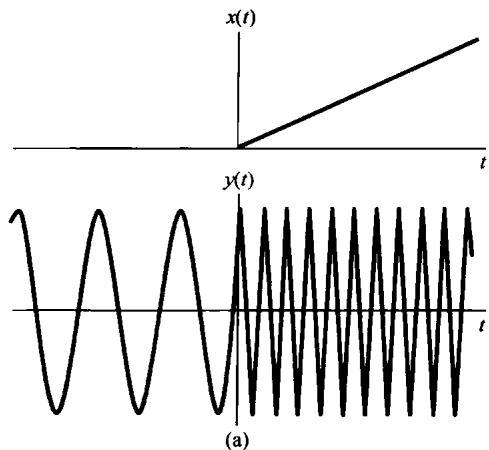

图8.32 相位调制、频率调制及其关系。（a）用斜坡信号作为调制信号的相位调制；（b）用斜坡信号作为调制信号的频率调制；（c）用阶跃信号（斜坡信号的导数）作为调制信号的频率调制

因为频率调制和相位调制极易联系起来，所以下面的讨论只用频率调制来进行。为了对已调频信号的频谱如何受调制信号  $x(t)$  的影响有本质的了解，考虑两种简单的情况，以说明调频的一些基本性质。

# 8.7.1 窄带频率调制

考虑  $x(t)$  为正弦变化时的频率调制：

$$
x (t) = A \cos \omega_ {m} t \tag {8.38}
$$

由式(8.34)和式(8.37)可知瞬时频率  $\omega_{i}(t)$  是

$$
\omega_ {i} (t) = \omega_ {c} + k _ {f} A \cos \omega_ {m} t \tag {8.39}
$$

$\omega_{i}(t)$  就在  $\omega_{c} + k_{f}A$  和  $\omega_{c} - k_{f}A$  之间作正弦变化。若定义  $\Delta \omega$  为

$$
\Delta \omega = k _ {f} A
$$

就有

$$
\boldsymbol {\omega} _ {i} (t) = \boldsymbol {\omega} _ {c} + \Delta \boldsymbol {\omega} \cos \boldsymbol {\omega} _ {m} t
$$

并且

$$
\begin{array}{l} y (t) = \cos [ \omega_ {c} t + \int x (t) \mathrm {d} t ] \tag {8.40} \\ = \cos \left(\omega_ {c} t + \frac {\Delta \omega}{\omega_ {m}} \sin \omega_ {m} t + \theta_ {0}\right) \\ \end{array}
$$

其中  $\theta_0$  是一个积分常数。为了方便起见，选  $\theta_0 = 0$  ，则

$$
y (t) = \cos \left(\omega_ {c} t + \frac {\Delta \omega}{\omega_ {m}} \sin \omega_ {m} t\right) \tag {8.41}
$$

记  $\Delta \omega / \omega_{m}$  为  $m$ ，定义为频率调制的调制指数。根据调制指数  $m$  的大小，频率调制系统的性质就会不一样， $m$  较小的系统称为窄带频率调制系统。一般来说，可以将式(8.41)重写成

$$
y (t) = \cos \left(\omega_ {c} t + m \sin \omega_ {m} t\right) \tag {8.42}
$$

或者

$$
y (t) = \cos \omega_ {c} t \cos (m \sin \omega_ {m} t) - \sin \omega_ {c} t \sin (m \sin \omega_ {m} t) \tag {8.43}
$$

当  $m$  足够小时（ $\ll \pi / 2$ ），可进行如下近似：

$$
\cos (m \sin \omega_ {m} t) \simeq 1 \tag {8.44}
$$

$$
\sin (m \sin \omega_ {m} t) \simeq m \sin \omega_ {m} t \tag {8.45}
$$

这样，式(8.42)就变为

$$
y (t) \simeq \cos \omega_ {c} t - m (\sin \omega_ {m} t) (\sin \omega_ {c} t) \tag {8.46}
$$

根据这一近似式，  $y(t)$  的频谱如图8.33所示。可以注意到，这时  $y(t)$  的频谱与AM-DSB/WC的频谱有些类似，频谱中既有载波，又有代表调制信号频谱的两个边带。然而，在AM-DSB/WC中，所引入的附加载波与已调载波是同相的。而由式(8.46)可见，在窄带频率调制情况下，这个附加载波与已调的载波之间有一个  $\pi /2$  的相位差。对应于AM-DSB/WC和

图8.33 窄带频率调制的近似频谱

频率调制的波形也很不同。图8.34(a)示出了相应于式(8.46)的窄带频率调制的时间波形。为比较起见，图8.34(b)示出了AM-DSB/WC信号

$$
y _ {2} (t) = \cos \omega_ {c} t + m (\cos \omega_ {m} t) (\cos \omega_ {c} t) \tag {8.47}
$$

的时间波形。

(a)

(b)

图8.34 窄带频率调制与AM-DSB/WC的对比。

(a) 窄带频率调制；(b) AM-DSB/WC

对于式(8.46)所示的窄带频率调制信号，其边带宽度就等于调制信号的宽度；特别是，虽然这个近似式是在  $m \ll \pi / 2$  条件下得到的，边带的宽度仍然与调制指数  $m$  无关（即，边带宽度仅取决于调制信号的带宽，而与它的大小无关）。即使不是正弦调制信号，而是更一般的调制信号，对窄带调频来说，上述结论也是成立的。

# 8.7.2 宽带频率调制

当  $m$  增大以后，近似式(8.46)不再成立，这时  $y(t)$  的频谱与调制信号  $x(t)$  的幅度和频率都有关。由  $y(t)$  的表示式(8.43)可知， $\cos(m \sin \omega_m t)$  和  $\sin(m \sin \omega_m t)$  这两项都是基波频率为  $\omega_m$  的周期信号。因此，这两个信号中的每一个的傅里叶变换都是一个冲激串，这些冲激串发生在  $\omega_m$  的整数倍上，其大小正比于它们的傅里叶级数系数。这两个周期信号的傅里叶级数系数涉及第一类贝塞尔函数。式(8.43)中的第一项相当于正弦载波  $\cos \omega_ct$  被一个周期信号  $\cos(m \sin \omega_m t)$  调幅的结果；而第二项相当于正弦载波  $\sin \omega_ct$  被一个周期信号  $\sin(m \sin \omega_m t)$  调幅的结果。我们知道，一个信号乘以某一载波，在频域内就有把原频谱搬移到载波频率  $\omega_c$  两边的效果。图8.35(a)和图8.35(b)分别画出了式(8.43)中单独两项对于  $\omega > 0$  时频谱的模，而图8.35(c)则代表已调信号  $y(t)$  的频谱的模。可见， $y(t)$  的频谱是由在频率  $\pm \omega_c + n\omega_m, n = 0, \pm 1, \pm 2, \dots$  的冲激所组成的，并且严格地讲，围绕  $\pm \omega_c, y(t)$  的频谱不是带限的。然而，由于  $\cos(m \sin \omega_m t)$  和  $\sin(m \sin \omega_m t)$  的傅里叶级数系数，对于  $|n| > m$  的  $n$  次谐波的幅度可认为忽略不计，因此在  $+\omega_c$  和  $-\omega_c$  两边每一边带的总有效宽度  $B$  还是限于  $2m\omega_m$ ，即

$$
B \simeq 2 m \omega_ {m} \tag {8.48}
$$

或者，因为  $m = k_{f}A / \omega_{m} = \Delta \omega /\omega_{m}$

$$
B \simeq 2 k _ {f} A = 2 \Delta \omega \tag {8.49}
$$

(a)

(b)

(c)

图8.35 宽带频率调制  $(m = 12)$  频谱的模。（a）cos  $\omega_{c}t\cos (m\sin \omega_{m}t)$  频谱的模特性；（b）sin  $\omega_{c}t\sin (m\sin \omega_{m}t)$  频谱的模特性；(c）cos  $(\omega_{c}t + m\sin \omega_{m}t)$  频谱的模特性

将式(8.39)和式(8.49)进行比较可以得出，每一边带的有效带宽就等于在载波频率附近瞬时频率的总偏移值。因此，对宽带频率调制来说，已调信号的带宽比调制信号的带宽宽得多，因

为假定  $m$  比较大。并且与窄带情况正好形成对照，在宽带频率调制中已调信号的带宽正比于调制信号的幅度  $A$  和增益系数  $k_{f}$  。

# 8.7.3 周期方波调制信号

用来理解频率调制性质的另一个例子是调制信号为一个周期方波的情况。在式(8.39)中令  $k_{f} = 1$  ，则有  $\Delta \omega = A$  ，并令  $x(t)$  如图8.36所示。这时已调信号  $y(t)$  就如图8.37所示。当  $x(t)$  为正时，瞬时频率就是  $\omega_c + \Delta \omega$  ；当  $x(t)$  为负时，瞬时频率就是  $\omega_c - \Delta \omega$  。因此  $y(t)$  也可写成

$$
y (t) = r (t) \cos [ (\omega_ {c} + \Delta \omega) t ] + r \left(t - \frac {T}{2}\right) \cos [ (\omega_ {c} - \Delta \omega) t ] \tag {8.50}
$$

其中  $r(t)$  就是图8.38所示的方波。因此，对于这样一个特别的调制信号来说，也能够把确定频率调制信号  $y(t)$  的频谱问题当成求式(8.50)中两个幅度调制信号之和的频谱问题，具体而言，

$$
\begin{array}{l} Y (\mathrm {j} \omega) = \frac {1}{2} \left[ R \left(\mathrm {j} \omega + \mathrm {j} \omega_ {c} + \mathrm {j} \Delta \omega\right) + R \left(\mathrm {j} \omega - \mathrm {j} \omega_ {c} - \mathrm {j} \Delta \omega\right) \right] \tag {8.51} \\ + \frac {1}{2} \left[ R _ {T} \left(\mathrm {j} \omega + \mathrm {j} \omega_ {c} - \mathrm {j} \Delta \omega\right) + R _ {T} \left(\mathrm {j} \omega - \mathrm {j} \omega_ {c} + \mathrm {j} \Delta \omega\right) \right] \\ \end{array}
$$

其中  $R(\mathrm{j}\omega)$  是图8.38中周期方波  $r(t)$  的傅里叶变换，而  $R_{T}(\mathrm{j}\omega)$  则是  $r(t - T / 2)$  的傅里叶变换。由例4.6可知，当  $T = 4T_{1}$  时，有

$$
R (\mathrm {j} \omega) = \sum_ {k = - \infty} ^ {\infty} \frac {2}{2 k + 1} (- 1) ^ {k} \delta \left[ \omega - \frac {2 \pi (2 k + 1)}{T} \right] + \pi \delta (\omega) \tag {8.52}
$$

和

$$
R _ {T} (\mathrm {j} \omega) = R (\mathrm {j} \omega) \mathrm {e} ^ {- \mathrm {j} \omega T / 2} \tag {8.53}
$$

$Y(\mathrm{j}\omega)$  频谱的模特性如图8.39所示。和宽带频率调制一样，这个谱以  $\omega_{c} \pm \Delta \omega$  为中心，各自呈现了两个边带，这两个边带在  $\omega < (\omega_{c} - \Delta \omega)$  和  $\omega > (\omega_{c} + \Delta \omega)$  的区域都衰减了。

图8.36 对称周期方波

频率调制信号的解调系统典型地有两种类型，其一是通过微分将频率调制信号变换为幅度调制信号，而第二种类型的解调系统则直接跟踪已调信号的相位或频率。以上仅简单讨论了频率调制的特性，通过这些讨论再次看到前几章所建立的基本方法如何用来分析这一类重要系统，并了解对这类重要系统的本质。

图8.37 用周期方波作为调制信号的频率调制

图8.38 式(8.50)中的对称方波  $r(t)$

图8.39 用一个周期方波调制信号时， $\omega > 0$  时频率调制的频谱的模特性。图中每根垂直线都代表面积正比于这条线高度的冲激

# 8.8 离散时间调制

# 8.8.1 离散时间正弦幅度调制

一个离散时间幅度调制系统如图8.40所示，其中  $c[n]$  是载波， $x[n]$  是调制信号。分析连续时间幅度调制的基础是傅里叶变换的相乘性质，即时域内相乘会导致频域内的卷积。正如在5.5节中所讨论的，对离散时间也存在一个相应的性质可以用来分析离散时间幅度调制。现考虑

$$
y [ n ] = x [ n ] c [ n ]
$$

分别用  $X(\mathrm{e}^{\mathrm{j}\omega})$  ，  $Y(\mathrm{e}^{\mathrm{j}\omega})$  和  $C(\mathrm{e}^{\mathrm{j}\omega})$  来代表  $\pmb {x}[n]$  ，  $y[n]$  和  $c[n]$  的傅里叶变换，那么  $Y(\mathrm{e}^{\mathrm{j}\omega})$  就正比于 $X(\mathrm{e}^{\mathrm{j}\omega})$  和  $C(\mathrm{e}^{\mathrm{j}\omega})$  的周期卷积，即

$$
Y \left(\mathrm {e} ^ {\mathrm {j} \omega}\right) = \frac {1}{2 \pi} \int_ {2 \pi} X \left(\mathrm {e} ^ {\mathrm {j} \theta}\right) C \left(\mathrm {e} ^ {\mathrm {j} (\omega - \theta)}\right) \mathrm {d} \theta \tag {8.54}
$$

因为  $X(\mathrm{e}^{\mathrm{j}\omega})$  和  $C(\mathrm{e}^{\mathrm{j}\omega})$  都是周期的，周期为  $2\pi$  ，因此该积分就可以在任何一个  $2\pi$  的频率区间内完成。

首先考虑为复指数载波的正弦幅度调制

$$
c [ n ] = \mathrm {e} ^ {\mathrm {j} \omega_ {c} n} \tag {8.55}
$$

图8.40 离散时间幅度调制

在5.2节中已经知道，  $c[n]$  的傅里叶变换是一个周期冲激串，即

$$
C \left(\mathrm {e} ^ {\mathrm {j} \omega}\right) = \sum_ {k = - \infty} ^ {+ \infty} 2 \pi \delta \left(\omega - \omega_ {c} + k 2 \pi\right) \tag {8.56}
$$

$C(\mathrm{e}^{\mathrm{j}\omega})$  如图8.41(b)所示。若  $X(\mathrm{e}^{\mathrm{j}\omega})$  如图8.41(a)所示，那么已调信号的频谱则如图8.41(c)所示。特别要注意到，  $Y(\mathrm{e}^{\mathrm{j}\omega}) = X(\mathrm{e}^{\mathrm{j}(\omega -\omega_{r})})$  ，这与图8.1是完全相对应的，并且当  $\pmb {x}[n]$  是实序列时，已调信号也是复数的。将已调信号乘以  $\mathbf{e}^{-\mathrm{j}\omega_{r}n}$  ，使频谱返回到频率轴上它原来的地方就实现了解调，即

$$
x [ n ] = y [ n ] \mathrm {e} ^ {- \mathrm {j} \omega_ {c} n} \tag {8.57}
$$

(a)

(b)

(c)

图8.41 (a)  $x[n]$  的频谱；(b)  $c[n] = \mathrm{e}^{\mathrm{j}\omega_{c}n}$  的频谱；(c)  $y[n] = x[n]c[n]$  的频谱

正如在习题6.43中所讨论的，若  $\omega_{c} = \pi$  ，那么  $c[n] = (-1)^{n}$  ，这样在时域调制的结果就是逢奇数  $n$  将  $x[n]$  改变代数符号；而在频域则是将高低频分量相互交换。习题6.44就采用这种调制方式，利用一个低通滤波器来实现一个高通的过滤，反之亦然。

除了复指数载波外，还可以利用正弦载波。这时，若  $x[n]$  是实序列，则  $y[n]$  也一定是实序列。若  $c[n] = \cos \omega_c n$  ，载波的频谱就由在  $\omega = \pm \omega_c + k2\pi$  的周期重复的冲激对组成，如图8.42(b)所示。若  $X(\mathrm{e}^{\mathrm{j}\omega})$  如图8.42(a)所示，那么已调信号的频谱则如图8.42(c)所示，相应于  $X(\mathrm{e}^{\mathrm{j}\omega})$  在  $\pm \omega_c + k2\pi$  处重复。为使每一个重复的  $X(\mathrm{e}^{\mathrm{j}\omega})$  不重叠，就要求

$$
\omega_ {c} > \omega_ {M} \tag {8.58}
$$

和

$$
2 \pi - \omega_ {c} - \omega_ {M} > \omega_ {c} + \omega_ {M}
$$

或等效为

$$
\omega_ {c} <   \pi - \omega_ {M} \tag {8.59}
$$

第一个条件与8.2节讨论的连续时间正弦幅度调制的条件是一致的；而第二个结果则来自离散时间频谱固有的周期性质。把式(8.58)和式(8.59)合并，对于正弦载波的幅度调制， $\omega_{c}$  就必须受

如下限制：

$$
\omega_ {M} <   \omega_ {c} <   \pi - \omega_ {M} \tag {8.60}
$$

解调也可以采用与连续时间情况类似的方式来实现。该系统如图8.43所示。将  $y[n]$  乘以在调制器中利用的同一载波，结果就得到了原始信号频谱的若干重复，而其中之一是在以  $\omega = 0$  为中心处出现的，利用低通滤波滤掉不需要的  $X(\mathrm{e}^{\mathrm{j}\omega})$  重复部分，就可得到已解调的信号。

图8.42 利用正弦载波的离散时间幅度调制的有关频谱。（a）带限信号  $x[n]$  的频谱；（b）正弦载波信号  $c[n] = \cos \omega_c n$  的频谱；（c）已调信号  $y[n] = x[n] c[n]$  的频谱

图8.43 离散时间同步解调系统及其相关频谱

由前面的讨论应该明显看出，离散时间幅度调制的分析在处理上和连续时间幅度调制很类似，只有一些很少的差别。例如，如同在习题8.47中所讨论的，在同步调制与解调系统中，调制器和解调器中正弦载波之间在相位和频率上的差异所带来的影响，在这两种系统中都是一样的。另外，和连续时间情况下一样，在离散时间情况下也能应用离散时间正弦幅度调制作为频分多路复用的基础。再者，也可以利用一个离散时间信号去调制一个脉冲串，导致离散时间信号的时分多路复用，这种方法可参见习题8.48。

离散时间多路复用系统的实现，给出了一个极好的例子来说明一般情况下离散时间处理的灵活性，以及增采样(见7.5.2节)运算的重要性。考虑一个具有  $M$  路序列的离散时间系统，希

望要构成频分多路复用。由于为  $M$  个信道，就要求每一路  $X_{i}[n]$  是带限的，即

$$
X _ {i} (\omega) = 0, \quad \frac {\pi}{M} <   | \omega | <   \pi \tag {8.61}
$$

例如，如果原来的这些序列都相应于在奈奎斯特率下对连续时间信号采样而得到，从而这些原有序列都占满了整个频带，那么在频分多路复用之前，首先就必须将它们变换到某个较高的采样率（即增采样）。这一概念在习题8.33中将进一步讨论。

# 8.8.2 离散时间调制转换

广泛使用离散时间调制并结合第7章介绍的抽取、增采样和内插等运算的一个领域是数字通信系统。一般来说，在这样的系统中，连续时间信号均以由采样得到的离散时间信号的形式在通信信道上进行传输。这些连续时间信号往往是以时分多路复用或频分多路复用的信号方式组成的，然后将这些信号转换为离散时间序列，为了存储和远距离传输的需要，序列值均以数字表示。在某些系统中，由于在发送端或接收端所受的不同限制或要求，或者由于已经用不同的方式分别被复用的若干组信号现在要被重新复用在一起，这样就要求把用时分多路复用表示的信号序列转换到用频分多路复用表示的信号序列，或者相反。这种从一种调制或复用方式转换到另一种的过程称为调制转换(transmodulation)或复用转换(transmultiplexing)。在数字通信系统方面，一种显而易见的实现复用转换的方式是，首先通过解复用和解调把它转换回连续时间信号，然后按要求再对信号进行调制和复用。然而，如果这个新的信号要被再转换成离散时间信号，那么很显然对整个过程来说，更有效的办法是直接在离散时间域中完成。图8.44以方框图的形式表示出，在把一个离散时间时分多路复用信号转换为离散时间频分多路复用信号的过程中所涉及的各个环节。应该注意，在将时分多路复用信号解复用以后，每一信道都必须增采样，以准备频分多路复用。

图8.44 时分多路复用到频分多路复用转换的方框图

# 8.9 小结

这一章讨论了与通信系统有关的一些基本概念，特别是调制的概念。在调制中，一个希望传输的信号用来调制称为载波的第二个信号。这一章详细地讨论了幅度调制的问题。幅度调制的

性质最容易通过傅里叶变换的相乘性质在频域得到解释。用一个复指数或正弦载波的幅度调制，一般就是用来在频率上搬移一个信号的频谱，例如在通信系统中的应用就是用来将信号的频谱搬移到一个适合于传输的频率范围内，并能够实现频分多路复用。这一章还讨论了各种正弦幅度的调制，例如带有载波信号的非同步系统、单边带及双边带系统等。

我们还讨论了基于调制通信的几种其他形式。在这一点上，简短地介绍了频率和相位调制的概念。虽然这种调制类型的详细分析更困难一些，但是通过频域的分析，还是有可能获得一些实质性的了解。

我们还进一步比较详细地讨论了一个脉冲信号的幅度调制，从而产生了时分多路复用和脉冲幅度调制的概念。在脉冲幅度调制中，一个离散时间信号的连续样本用来调制一串脉冲的幅度。这样又反过来引发了对离散时间调制和数字通信问题的关注，并且在数字通信中，离散时间处理的灵活性对于更高级的通信系统的设计与实现提供了方便，其中涉及了像脉冲编码调制和调制转换之类的内容。

# 习题

习题第一部分属于基本题，答案在书末给出。其余两部分分属基本题和深入题。

# 基本题（附答案）

8.1 设  $x(t)$  为一信号，其中  $X(\mathrm{j}\omega) = 0$  ，  $|\omega | > \omega_{M}$  ，另一信号  $y(t)$  有傅里叶变换  $Y(\mathrm{j}\omega) = 2X(\mathrm{j}(\omega -\omega_c))$  ，试确定一信号  $m(t)$  ，使之有

$$
x (t) = y (t) m (t)
$$

8.2 设  $x(t)$  为一实值信号，并有  $X(\mathrm{j}\omega) = 0$  ，  $\left|\omega\right|>1000\pi$  ，设  $y(t)=\mathrm{e}^{\mathrm{j}\omega_{c}t}x(t)$  ，试回答下列问题：

(a) 对  $\omega_{c}$  应施加什么限制，才能保证  $x(t)$  可以从  $y(t)$  中恢复出来？

(b) 对  $\omega_{\epsilon}$  应施加什么限制，才能保证  $x(t)$  可以从  $\mathcal{Re}\{\gamma(t)\}$  中恢复出来？

8.3 设  $x(t)$  是一实值信号，并有  $X(\mathrm{j}\omega) = 0$  ，  $\left|\omega\right|>2000\pi$  ，现进行幅度调制以产生信号

$$
g (t) = x (t) \sin (2 0 0 0 \pi t)
$$

图P8.3给出一种解调方法，其中  $g(t)$  是输入， $y(t)$  是输出，理想低通滤波器截止频率为  $2000\pi$  ，通带增益为2，试确定  $y(t)$  。

图P8.3

8.4 假设  $x(t)$  为

$$
x (t) = \sin 2 0 0 \pi t + 2 \sin 4 0 0 \pi t
$$

$g(t)$  为

$$
g (t) = x (t) \sin 4 0 0 \pi t
$$

若乘积  $g(t)(\sin 400\pi t)$  通过一个截止频率为  $400\pi$  ，通带增益为2的理想低通滤波器，试确定该低通滤波器输出端所得到的信号。

8.5 假设想传输信号  $x(t)$

$$
x (t) = \frac {\sin 1 0 0 0 \pi t}{\pi t}
$$

利用产生如下信号的调制器：

$$
w (t) = (x (t) + A) \cos (1 0 0 0 0 \pi t)
$$

试确定最大可容许的调制指数  $m$  的值，以保证可用非同步解调从  $\pmb{w}(t)$  中恢复  $x(t)$  。解这个题目，应该要假设sinc函数的一个旁瓣所取得的最大值发生在包围这个旁瓣的两个过零点之间一半的时刻。

8.6 假设  $x(t)$  的傅里叶变换  $X(\mathrm{j}\omega) = 0$  ，  $\left|\omega \right| > \omega_{M}$  ，而信号  $g(t)$  可用  $x(t)$  表示成

$$
g (t) = x (t) \cos \omega_ {c} t - \left\{x (t) \cos \omega_ {c} t \times \left(\frac {\sin \omega_ {c} t}{\pi t}\right) \right\}
$$

其中  $*$  表示卷积，且  $\omega_{c} > \omega_{M}$  。试确定常数  $A$  的值，以使得

$$
x (t) = \left(g (t) \cos \omega_ {c} t\right) * \frac {A \sin \omega_ {M} t}{\pi t}
$$

8.7 一个AM-SSB/SC系统被加到信号  $x(t)$  上， $x(t)$  的傅里叶变换  $X(\mathrm{j}\omega) = 0$  ， $|\omega| > \omega_{M}$  。在该系统中所用的载波频率  $\omega_{c}$  大于  $\omega_{M}$  。令  $g(t)$  是该系统仅保留上边带时的输出， $q(t)$  是该系统仅保留下边带时的输出。图P8.7所示的系统用来将  $g(t)$  转换成  $q(t)$  。图中的参数  $\omega_{0}$  对于  $\omega_{c}$  的关系如何？通带增益  $A$  应该是多少？

8.8 考虑图P8.8所示的调制系统。输入信号  $x(t)$  的傅里叶变换  $X(\mathrm{j}\omega) = 0$  ，  $\left|\omega\right|>\omega_{M}$  ，假设  $\omega_{c} > \omega_{M}$  ，试回答下列问题：

(a) 若  $x(t)$  为实值信号,  $y(t)$  保证为实信号吗?

(b)  $x(t)$  可以从  $\gamma (t)$  中恢复吗？

图P8.7

图P8.8

8.9 有两个信号  $x_{1}(t)$  和  $x_{2}(t)$ ，它们的傅里叶变换对于  $|\omega| > \omega_{c}$  都为零，现要用频分多路复用将它们组合起来。对每个信号都用图8.21的AM-SSB/SC技术保留下边带，对  $x_{1}(t)$  和  $x_{2}(t)$  所用的载波频率分别是  $\omega_{c}$  和  $2\omega_{c}$  。然后将这两个已调信号加在一起以得到频分多路复用信号  $y(t)$  。

(a) 对于什么样的  $\omega$  值,  $Y(\mathrm{j}\omega)$  保证是零?

(b) 试给出  $A$  和  $\omega_0$  的值，以使得

$$
x _ {1} (t) = \left[ \left\{y (t) * \frac {\sin \omega_ {0} t}{\pi t} \right\} \cos \omega_ {0} t \right] * \frac {A \sin \omega_ {c} t}{\pi t}
$$

其中  $\ast$  表示卷积。

8.10 有一信号  $x(t)$  被图P8.10所示的矩形脉冲串  $c(t)$  相乘。

(a) 在  $X(\mathrm{j}\omega)$  上应加什么限制，才能保证利用一个理想低通滤波器由乘积  $x(t)c(t)$  中将  $x(t)$  恢复出来？

(b) 给出为从  $x(t)c(t)$  中恢复出  $x(t)$  所需理想低通滤波器的截止频率  $\omega_{c}$  和通带增益  $A$  。假设  $X(j\omega)$  满足(a)中确定的限制。

图P8.10

8.11 设  $c(t)$  为一实值周期信号

$$
c (t) = \sum_ {k = - \infty} ^ {\infty} a _ {k} e ^ {j k \omega_ {c} t}
$$

其中  $a_0 = 0$  ，  $a_1\neq 0$  。同时令  $x(t)$  是一个  $X(\mathrm{j}\omega) = 0$  ，  $\left|\omega \right|\geqslant \omega_{c} / 2$  的信号，信号  $x(t)$  用来调制载波  $c(t)$  ，以得到

$$
y (t) = x (t) c (t)
$$

(a) 试给出一个理想带通滤波器的通带和通带增益，以使得当输入为  $y(t)$  时，该滤波器的输出是

$$
g (t) = \left(a _ {1} \mathrm {e} ^ {\mathrm {j} \omega_ {c} t} + a _ {1} ^ {*} \mathrm {e} ^ {- \mathrm {j} \omega_ {c} t}\right) x (t)
$$

(b) 若  $a_1 = |a_1| \mathrm{e}^{\mathrm{j}x a_1}$ , 证明:

$$
g (t) = A \cos \left(\omega_ {c} t + \phi\right) x (t)
$$

并将  $A$  和  $\phi$  分别用  $\left|a_{1}\right|$  和  $\varkappa a_{1}$  表示。

8.12 考虑有 10 个信号  $x_{i}(t), i = 1, 2, 3, \dots, 10$  。假定每个  $x_{i}(t)$  的傅里叶变换  $X_{i}(\mathrm{j}\omega) = 0$ ， $|\omega| \geqslant 2000\pi$ ，这 10 个信号中的每一个都乘以图 P8.12 的载波  $c(t)$ ，之后要被时分多路复用。如果  $c(t)$  的周期  $T$  已选成最大可容许的值，求这 10 个信号能时分多路复用的最大  $\Delta$  值。

图P8.12

8.13 在脉冲幅度调制中普遍采用的一类脉冲是具有升余弦（raised cosine）频率响应的脉冲，其中之一的频率响应是

$$
P (\mathrm {j} \omega) = \left\{ \begin{array}{l l} {\frac {1}{2} \Big (1 + \cos   \frac {\omega T _ {1}}{2} \Big),} & {0 \leqslant | \omega | \leqslant  \frac {2 \pi}{T _ {1}}} \\ {0,} & {\text {其 他}} \end{array} \right.
$$

其中  $T_{1}$  为码间间隔。

(a) 确定  $p(0)$ 。

(b) 确定声  $p(kT_{1}), k = \pm 1, \pm 2, \dots$ 。

8.14 考虑频率已调信号  $y(t)$

$$
y (t) = \cos (\omega_ {c} t + m \cos \omega_ {m} t)
$$

其中  $\omega_{c} \gg \omega_{m}$ ,  $m \ll \pi / 2$ , 试给出  $\omega > 0$  时  $Y(\mathrm{j}\omega)$  的近似式。

8.15 对于在  $-\pi < \omega_0 \leqslant \pi$  范围内的什么样的  $\omega_0$  值，载波为  $\mathrm{e}^{\mathrm{j}\omega_0n}$  的幅度调制等效于载波为  $\cos \omega_0 n$  的幅度调制？

8.16 假设  $x[n]$  是一个实值离散时间信号，其傅里叶变换  $X(\mathrm{e}^{\mathrm{j}\omega})$  具有

$$
X (e ^ {j \omega}) = 0, \quad \frac {\pi}{8} \leqslant \omega \leqslant \pi
$$

现用  $x[n]$  去调制一个正弦载波  $c[n] = \sin (5\pi /2)n$  以产生

$$
y [ n ] = x [ n ] c [ n ]
$$

试确定  $\omega$  的值  $(0 \leqslant \omega \leqslant \pi)$  以保证  $Y(e^{j\omega})$  为零？

8.17 考虑任意有限长序列  $x[n]$ ，其傅里叶变换为  $X(\mathrm{e}^{\mathrm{j}\omega})$ ，现用插入零值样本的方法产生一个信号  $g[n]$

$$
g [ n ] = x _ {(4)} [ n ] = \left\{ \begin{array}{l l} {x [ n / 4 ],} & {n = 0, \pm 4, \pm 8, \pm 1 2, \ldots} \\ {0,} & {\text {其 他}} \end{array} \right.
$$

将  $g[n]$  通过一个截止频率为  $\pi /4$  ，通带增益为1的理想低通滤波器产生一个信号  $q[n]$  。最后得到

$$
y [ n ] = q [ n ] \cos \left(\frac {3 \pi}{4} n\right)
$$

问对于什么样的  $\omega$  值，可保证  $Y(e^{j\omega})$  为零？

8.18 设  $x[n]$  是一个实值序列，其傅里叶变换  $X(\mathrm{e}^{\mathrm{j}\omega}) = 0$  ，  $\omega \geqslant \pi /4$  ，现在想要得到一个信号  $y[n]$  ，它的傅里叶变换在  $-\pi < \omega \leqslant \pi$  内为

$$
Y (e ^ {j \omega}) = \left\{ \begin{array}{l l} X (e ^ {j (\omega - \frac {\pi}{2})}), & \frac {\pi}{2} <   \omega \leqslant \frac {3 \pi}{4} \\ X (e ^ {j (\omega + \frac {\pi}{2})}), & - \frac {3 \pi}{4} <   \omega \leqslant - \frac {\pi}{2} \\ 0, & \text {其 他} \end{array} \right.
$$

图P8.18所示的系统用于从  $x[n]$  得到  $y[n]$  。试确定要使该系统正常工作，图中滤波器的频率响应 $H(\mathrm{e}^{\mathrm{j}\omega})$  必须满足什么限制。

8.19 考虑 10 路任意实值序列  $x_{i}[n]$ ， $i = 1,2,\dots ,10$ 。假设每一  $x_{i}[n]$  都以因子  $N$  增采样，然后用载波频率  $\omega_{i} = i\pi /10$  进行正弦幅度调制，现在再将这 10 路已调信号加在一起以构成频分多路复用信号，为使每一路  $x_{i}[n]$  都能从这个频分多路复用信号  $y[N]$  中恢复，试确定  $N$  值。

8.20 设  $\nu_{1}[n]$  和  $\nu_{2}[n]$  是两个通过采样(无混叠)连续时间信号而得来的序列，设

$$
y [ n ] = \hat {v} _ {1} [ n ] + \hat {v} _ {2} [ n - 1 ]
$$

是一个时分多路复用信号，式中  $\hat{v}_i[n]$  ，  $i = 1$  ，2为

$$
\hat {v} _ {i} [ n ] = \left\{ \begin{array}{l l} v _ {i} \left[ \frac {n}{2} \right], & n = 0, \pm 2, \pm 4, \pm 6, \dots \\ 0, & \text {其 他} \end{array} \right.
$$

信号  $y[n]$  由图P8.20所示的系统  $S$  处理，得到信号  $g[n]$  。对于在  $S$  中所用的这两个滤波器，有

$$
H _ {0} (e ^ {j \omega}) = \left\{ \begin{array}{l l} 1, & | \omega | \leqslant \frac {\pi}{2} \\ 0, & \frac {\pi}{2} <   \omega \leqslant \pi \end{array} \right.
$$

试确定在系统  $S$  中所用的  $p[n]$ ，以使得  $g[n]$  代表  $\nu_{1}[n]$  和  $\nu_{2}[n]$  的频分多路复用。

图P8.18

图P8.20

# 基本题

8.21 在8.1节和8.2节分析图8.8的正弦幅度调制和解调系统时都假设载波信号的相位  $\theta_{c}$  为零。

(a) 对于在该图中任意相位  $\theta_{c}$  的一般情况下，证明在解调系统中的信号可以表示成

$$
w (t) = \frac {1}{2} x (t) + \frac {1}{2} x (t) \cos \left(2 \omega_ {c} t + 2 \theta_ {c}\right)
$$

(b) 若  $x(t)$  的频谱在  $|\omega| \geqslant \omega_{M}$  为零，试确定  $\omega_{\mathrm{co}}$  [图8.8(b)中理想低通滤波器的截止频率]、 $\omega_{c}$  （载波频率）和  $\omega_{M}$  三者之间的关系，以使得该低通滤波器的输出正比于  $x(t)$  。所得答案与载波相位  $\theta_{c}$  有关吗？

8.22 图P8.22(a)示出一个系统，其输入是  $x(t)$ ，输出是  $y(t)$ ，输入信号的傅里叶变换  $X(\mathrm{j}\omega)$  如图P8.22(b)所示，试确定并画出  $y(t)$  的频谱  $Y(\mathrm{j}\omega)$ 。

(a)

(b)

图P8.22

8.23 在 8.2 节中曾讨论过，在正弦幅度调制系统中调制器和解调器载波之间在相位上不同步所带来的影响，并指出，解调器的输出要受到一个相位差的余弦的衰减，尤其是当相位差为  $\pi / 2$  时，解调器输出为零。本题要说明，调制器和解调器之间频率上的同步也很重要。考虑图 8.8 的幅度调制和解调系统， $\theta_{c} = 0$  而解调器载波在频率上有一个变化，从而使

$$
w (t) = y (t) \cos \omega_ {d} t
$$

其中，

$$
y (t) = x (t) \cos \omega_ {c} t
$$

将调制器和解调器之间的频率差记为  $\Delta \omega$  （即  $\omega_{d} - \omega_{c} = \Delta \omega$ ）。同时假设  $x(t)$  是带限的，而有  $X(\mathrm{j}\omega) = 0$  ， $|\omega| \geqslant \omega_{M}$ ，并假定解调器中低通滤波器的截止频率  $\omega_{\infty}$  满足下列不等式：

$$
\omega_ {M} + \Delta \omega <   \omega_ {\mathrm {c o}} <   2 \omega_ {c} + \Delta \omega - \omega_ {M}
$$

图P8.23

(a) 证明: 在解调器中低通滤波器的输出正比于  $x(t)\cos (\Delta \omega t)$  。

(b) 若  $x(t)$  的频谱如图 P8.23 所示，画出解调器输出的频谱。

8.24 图P8.24示出一个用于正弦幅度调制的系统，其中  $x(t)$  是带限的，其最高频率为  $\omega_{M}$ ，即  $X(\mathrm{j}\omega) = 0$ ， $|\omega| > \omega_{M}$ 。如图所指出的，信号  $s(t)$  是一个周期为  $T$  的周期冲激串，不过对于  $t = 0$  有一个偏移  $\Delta$ 。系统  $H(\mathrm{j}\omega)$  是一个带通滤波器。

(a) 若  $\Delta = 0$  ，  $\omega_{M} = \pi /2T$  ，  $\omega_{l} = \pi /T$  和  $\omega_{h} = 3\pi /T$  ，证明：  $y(t)$  正比于  $x(t)\cos \omega_{c}t$  ，  $\omega_{c} = 2\pi /T$  。

(b) 如果  $\omega_{M}, \omega_{l}$  和  $\omega_{h}$  与(a)中给出的相同，但  $\Delta$  不一定为零，证明： $y(t)$  正比于  $x(t)\cos (\omega_ct + \theta_c)$ ，并用  $T$  和  $\Delta$  来确定  $\omega_{c}$  和  $\theta_{c}$ 。

(c) 在  $y(t)$  仍正比于  $x(t)\cos (\omega_ct + \theta_c)$  的前提下，确定与  $T$  有关的  $\omega_{M}$  最大容许值。

图P8.24

8.25 在语音通信中，为了保密，最常使用的一种系统是语音加密器(speech scrambling)。正如图P8.25(a)所说明的，该系统的输入是正常的语音信号  $x(t)$ ，而输出是加密以后的  $y(t)$  。信号  $y(t)$  被发送出去，然后在接收机中解密。

图P8.25

假定输入至加密器的所有输入都是实信号且带限于频率  $\omega_{M}$ ，即  $X(\mathrm{j}\omega) = 0$ ， $|\omega| > \omega_{M}$ 。当给定任何一个这样的输入以后，加密器就把这个输入信号的频谱变换到不同的频带内。另外，输出信号也是实信号，且带限于同一频带，即  $Y(\mathrm{j}\omega) = 0$ ， $|\omega| > \omega_{M}$ 。对该加密器来说，其具体的变换算法是

$$
Y (\mathrm {j} \omega) = X (\mathrm {j} (\omega - \omega_ {M})), \quad \omega > 0
$$

$$
Y (\mathrm {j} \omega) = X (\mathrm {j} (\omega + \omega_ {M})), \quad \omega <   0
$$

(a) 若  $X(\mathrm{j}\omega)$  如图P8.25(b)所示，画出加密后信号  $\gamma(t)$  的频谱。

(b) 利用放大器、乘法器、相加器、振荡器，以及你认为必要的无论什么类型的理想滤波器，画出这样一个理想加密器的方框图。

(c) 再次利用放大器、乘法器、相加器、振荡器和各种理想滤波器，画出相应的解密器的方框图。

8.26 在 8.2.2 节中讨论过， $y(t) = [x(t) + A]\cos(\omega_ct + \theta_c)$  这种形式的幅度调制信号的非同步解调要用一个包络检波器。还有另外一种解调系统，它也不要求相位同步，但要求频率同步，该系统如图 P8.26 方框图所示。两个低通滤波器截止频率都为  $\omega_c$ ，信号  $y(t) = [x(t) + A]\cos(\omega_ct + \theta_c)$ ，其中  $\theta_c$  为常数但大小未知。信号  $x(t)$  带限于  $\omega_M$ ，即  $X(\mathrm{j}\omega) = 0, |\omega| > \omega_M$  且  $\omega_M < \omega_c$ 。与利用包络检波器的要求相同，对所有的  $t, [x(t) + A] > 0$ 。

证明：图P8.26所示系统可用于从  $y(t)$  中恢复出  $\pmb {x}(t)$  ，而无须知道调制器相位  $\theta_{c}$  。

图P8.26

8.27 在8.2.2节中讨论过，非同步调制-解调需要加入载波信号，使得已调信号具有如下形式：

$$
y (t) = [ A + x (t) ] \cos \left(\omega_ {c} t + \theta_ {c}\right) \tag {P8.27-1}
$$

其中，对所有  $t$  ，  $[A + x(t)] > 0$  。载波的存在意味着需要发射更大的功率，也表明了这种系统的低效率。（a）设  $x(t) = \cos \omega_{M}t$  ，  $\omega_{M} < \omega_{c}$  且  $[A + x(t)] > 0$  。对一个周期为  $T$  的周期信号  $y(t)$  ，其平均功率定义为  $P_{y} = (1 / T)\int_{T}y^{2}(t)\mathrm{d}t$  。试对式(P8.27-1)的信号  $y(t)$  确定并画出  $P_{y}$  。要将答案结果表示成调制指数  $m$  的函数；调制指数定义为  $x(t)$  的最大绝对值除以  $A$  。

(b) 一个幅度已调信号的传输效率定义为该信号的边带功率与信号的总功率之比。如果  $x(t) = \cos \omega_{M} t, \omega_{M} < \omega_{c}$ , 且  $[A + x(t)] > 0$ , 作为调制指数  $m$  的函数, 确定并画出已调信号的效率。

8.28 在 8.4 节中讨论了利用  $90^{\circ}$  相移网络来实现单边带调制，并在图 8.21 和图 8.22 中具体画出了这个系统，以及为保留下边带所要求的有关频谱。

图P8.28(a)示出一个为保留上边带的对应系统。

(a) 若  $X(\mathrm{j}\omega)$  与图8.22中相同，试画出该系统的  $Y_{1}(\mathrm{j}\omega), Y_{2}(\mathrm{j}\omega)$  和  $Y(\mathrm{j}\omega)$ ，并说明仅仅保留了上边带。

(b) 若  $X(\mathrm{j}\omega)$  为纯虚数，如图P8.28(b)所示，试画出该系统的  $Y_{1}(\mathrm{j}\omega), Y_{2}(\mathrm{j}\omega)$  和  $Y(\mathrm{j}\omega)$ ，并说明这种情况下也是仅仅保留了上边带。

图P8.28

8.29 单边带调制最常用在点对点的语音通信中。它有很多优点，其中包括功率利用率高，带宽节省，以及对于信道中的某些随机衰落不敏感等。在双边带载波抑制(DSB/SC)系统中，调制信号的频谱在发射频谱中全部出现在两个地方。单边带调制除掉了这一冗余度，因此节省频带并提高了余下的要发射频谱部分内的信(号)噪(声)比。

图P8.29(a)示出了产生幅度调制的单边带信号的两个系统。该图上部的系统可以产生保留下边带的单边带信号，而下部的系统则用于产生保留上边带的单边带信号。

(a) 若  $X(\mathrm{j}\omega)$  如图P8.29(b)所示，确定并画出下边带已调信号的傅里叶变换  $S(\mathrm{j}\omega)$  和上边带已调信号的傅里叶变换  $R(\mathrm{j}\omega)$  。假定  $\omega_{c} > \omega_{3}$  。

上边带调制方案在语音通信中特别有用，因为任何实际滤波器在截止频率  $\omega_{c}$  附近都有一个有限的过渡带。由于语音信号在  $\omega = 0$  附近（即对  $|\omega| < \omega_{1} = 2\pi \times 40\mathrm{Hz}$ ）没有多少能量，因此在这个区域可以容许很小的失真。

(b) 产生单边带信号的另一种方法称为移相法（phase-shift method），如图 P8.29(c) 所示。证明：用这种方法产生的单边带信号正比于由图 P8.29(a) 的下边带调制方案所产生的信号[即  $p(t)$  正比于  $s(t)$ ]。

(c) 所有以上三个 AM-SSB 信号都可以用图 P8.29(a) 右边所示的方案解调。证明: 只要接收机和发射机中的振荡器相位相同, 并且  $w = \omega_{c}$ , 那么无论接收到的信号是  $s(t)$ ,  $r(t)$  还是  $p(t)$ , 解调器的输出都是  $x(t)$ 。

当接收机中的振荡器与发射机中的振荡器不同相时产生的失真称为正交失真（quadrature distortion），在数据通信中是最令人烦恼的。

8.30 用一个脉冲串载波的幅度调制可以按图P8.30(a)建模。该系统的输出是  $q(t)$  。

(a) 设  $x(t)$  是一带限信号，即有  $X(\mathrm{j}\omega) = 0$  ，  $|\omega |\geqslant \pi /T$  ，如图P8.30(b)所示。确定并画出  $R(\mathrm{j}\omega)$  和 $Q(\mathrm{j}\omega)$  。

(b) 求最大的  $\Delta$  值，使得通过一个合适的滤波器  $M(\mathrm{j}\omega)$  后有  $w(t) = x(t)$ 。

(c) 确定并画出使  $w(t) = x(t)$  的补偿滤波器  $M(\mathrm{j}\omega)$ 。

图P8.29

图P8.30

8.31 设  $x[n]$  是一离散时间信号，其频谱为  $X(\mathrm{e}^{\mathrm{j}\omega})$  ，并设  $p(t)$  是一个频谱为  $P(\mathrm{j}\omega)$  的连续时间脉冲函数。现形成信号  $y(t)$  为

$$
y (t) = \sum_ {n = - \infty} ^ {+ \infty} x [ n ] p (t - n)
$$

(a) 用  $X(e^{j\omega})$  和  $P(j\omega)$  确定  $Y(j\omega)$  。

(b) 如果有

$$
p (t) = \left\{ \begin{array}{l l} {\cos 8 \pi t,} & {0 \leqslant t \leqslant 1} \\ {0,} & {\text {其 他}} \end{array} \right.
$$

试确定  $P(\mathrm{j}\omega)$  和  $Y(\mathrm{j}\omega)$  。

8.32 考虑离散时间信号  $x[n]$ ，其傅里叶变换如图P8.32(a)所示。该信号被一个正弦序列所调制，如图P8.32(b)所示。

(a) 确定并画出  $y[n]$  的傅里叶变换  $Y(\mathrm{e}^{\mathrm{j}\omega})$ 。

(b) 图 P8.32(c) 是一个解调系统, 对于什么样的  $\theta_{c}, \omega_{\mathrm{lp}}$  和  $G$  值, 将有  $\hat{x}[n] = x[n]$ ? 为保证可从  $y[n]$  中恢复出  $x[n]$ , 有必要对  $\omega_{c}$  和  $\omega_{\mathrm{lp}}$  施加任何限制吗?

图P8.32

8.33 现在考虑一组离散时间信号  $x_{i}[n]$ ， $i = 0,1,2,3$  的频分多路复用。另外，每一路  $x_{i}[n]$  都可能占满了整个频带  $(-\pi < \omega < \pi)$ ，这些信号中的每一个增采样后的正弦调制既可以用双边带技术，也可以用单边带技术来实现。

(a) 假设每一路信号  $x_{i}[n]$  都经过适当增采样，然后与  $\cos [i(\pi /4)n]$  调制。为确保频分多路复用的频谱不发生任何混叠，试问对  $x_{i}[n]$  最小的增采样量是多少？

（b）若每一路  $x_{i}[n]$  的增采样因子局限为4，如何利用单边带技术以保证频分多路复用信号没有任何混叠？提示：见习题8.17。

# 深入题

8.34 在讨论幅度调制系统时，调制和解调都是通过使用乘法器来完成的。由于乘法器的实现往往比较困难，因而在许多实际系统中都用一种非线性单元。本题将要说明这一基本概念。

图P8.34示出了这样一个用于幅度调制的非线性系统。该系统由以下两部分组成：先将调制信号和载波相加再平方，然后通过带通滤波获得幅度已调信号。

假设  $x(t)$  带限， $X(\mathrm{j}\omega) = 0$ ， $|\omega| > \omega_{M}$ 。试确定带通滤波器的参数  $A$ ， $\omega_{l}$  和  $\omega_{h}$ ，使得  $y(t)$  就是用  $x(t)$  进行幅度调制的结果，即有  $y(t) = x(t)\cos \omega_{c}t$ 。如果有，试给出对  $\omega_{r}$  和  $\omega_{M}$  的必要的限制。

图P8.34

8.35 本题提出的这个调制-解调系统，除了在解调中用一个与  $\cos \omega_{c}t$  具有相同过零点的方波外，与正弦幅度调制是类似的。该系统如图P8.35(a)所示，而  $\cos \omega_{c}t$  与  $p(t)$  之间的关系如图P8.35(b)所示。设输入信号  $x(t)$  带限于最高频率  $\omega_{M}$ ，而  $\omega_{M} < \omega_{c}$ ，如图P8.35(c)所示。

(a) 分别画出  $z(t), p(t)$  和  $y(t)$  的傅里叶变换  $Z(\mathrm{j}\omega), P(\mathrm{j}\omega)$  和  $Y(\mathrm{j}\omega)$  的实部和虚部，并加以标注。

(b) 画出使  $v(t) = x(t)$  的滤波器  $H(\mathrm{j}\omega)$ , 并加以标注。

8.36 无线电与电视信号的准确解复用(解调)通常是利用一种称为超外差接收机的系统来实现的，这等效于一种可变调谐滤波器。图P8.36(a)示出了它的基本组成系统。

(a) 输入信号  $y(t)$  由已频分多路复用过的众多幅度已调信号叠加而成，所以每一路信号都占有一个不同频率的信道。现在来考虑一个这样的信道，它包括幅度已调信号  $y_{1}(t) = x_{1}(t)\cos \omega_{c}t$ ，其频谱  $Y_{1}(\mathrm{j}\omega)$  如图P8.36(b)所示。现在想要利用图P8.36(a)所示的系统对  $y_{1}(t)$  先解复用，再解调以便恢复调制信号  $x_{1}(t)$  。粗调谐滤波器有一个示于图P8.36(b)下部的频率响应  $H_{1}(\mathrm{j}\omega)$  。确定输入至固定选频滤波器  $H_{2}(\mathrm{j}\omega)$  的输入信号  $z(t)$  的频谱  $Z(\mathrm{j}\omega)$ ，并对  $\omega > 0$  画出  $Z(\mathrm{j}\omega)$  且加以标注。

(b) 固定选频滤波器是一个以频率  $\omega_{f}$  为中心的带通滤波器，如图 P8.36(c) 所示。希望该滤波器  $H_{2}(\mathrm{j}\omega)$  的输出是  $r(t) = x_{1}(t)\cos \omega_{f}t$ ，依据  $\omega_{c}$  和  $\omega_{M}$ ，为了保证  $x_{1}(t)$  的一个不失真的频谱集中于  $\omega = \omega_{f}$  周围， $\omega_{T}$  必须满足什么约束？

(c) 图 P8.36(c) 中,  $G, \alpha$  和  $\beta$  必须等于什么, 才能使  $r(t) = x_1(t)\cos \omega_t t$ ?

(a)

(b)

(c)

图P8.35

(a)

输入信号

粗调谐滤波器

(c)

图P8.36

8.37 现在设想用下面的方案来实现幅度调制：输入信号  $x(t)$  与载波信号  $\cos \omega_{c}t$  相加，然后通过一个非线性器件，使输出  $z(t)$  与输入  $x(t)$  满足如下关系：

$$
\begin{array}{l} z (t) = \mathrm {e} ^ {\gamma (t)} - 1 \\ y (t) = x (t) + \cos \omega_ {c} t \\ \end{array}
$$

如图P8.37(a)所示。这样一种非线性关系可以通过二极管的电流-电压特性来实现。若分别以  $i(t)$  和  $\upsilon (t)$  代表二极管的电流和电压，则有

$$
i (t) = I _ {0} \mathrm {e} ^ {a v (t)} - 1 \quad (a \text {为 实 数})
$$

为了研究这种非线性的效果，可以研究  $z(t)$  的频谱，看它与  $X(\mathrm{j}\omega)$  和  $\omega_{c}$  有何关系。为此，利用  $\mathbf{e}^{\gamma}$  的幂级数展开，即

$$
e ^ {y} = 1 + y + \frac {1}{2} y ^ {2} + \frac {1}{6} y ^ {3} + \dots
$$

(a) 若  $x(t)$  的频谱如图 P8.37(b) 所示, 且  $\omega_{c} = 100\omega_{1}$ , 利用  $\mathbf{e}^{y}$  幂级数中的前 4 项, 画出  $z(t)$  的频谱  $Z(j\omega)$ , 并加以标注。

(b) 带通滤波器(BPF)具有图P8.37(c)所示的参数，试确定  $\alpha$  和  $\beta$  的范围，使得  $r(t)$  就是用  $x(t)$  进行幅度调制的结果。

图P8.37

8.38 图P8.38(a)示出一种通信系统，该系统把一个带限信号  $x(t)$  转换为周期性高频能量脉冲来发射。假定  $X(\mathrm{j}\omega) = 0$ ，  $|\omega| > \omega_{M}$ ，对调制信号  $m(t)$  有两种可能的选择，分别用  $m_{1}(t)$  和  $m_{2}(t)$  来表示，其中  $m_{1}(t)$  是周期性的正弦脉冲串，每个脉冲的持续期为  $D$ ，如图P8.38(b)所示，即

$$
m _ {1} (t) = \sum_ {k = - \infty} ^ {\infty} p (t - k T)
$$

其中，

$$
p (t) = \left\{ \begin{array}{l l} \cos \omega_ {c} t, & | t | <   (D / 2) \\ 0, & | t | > (D / 2) \end{array} \right.
$$

$m_{2}(t)$  是被周期性阻断或选通了的  $\cos \omega_{c} t$ ，即  $m_{2}(t) = g(t) \cos \omega_{c} t, g(t)$  如图 P8.38(b) 所示。假定参数  $T, D, \omega_{c}$  和  $\omega_{M}$  之间有下列关系：

$$
D <   T, \quad \omega_ {c} > > \frac {2 \pi}{D}, \quad \frac {2 \pi}{T} > 2 \omega_ {M}
$$

同时假定对于  $x \gg 1$ ,  $(\sin x) / x$  可以忽略。

确定是否对某一选定的  $\omega_{\mathrm{lp}}$  ，无论  $m_{1}(t)$  或  $m_{2}(t)$  ，都将产生一个已解调信号  $x(t)$  。对你认为肯定的每一种情况，确定  $\omega_{\mathrm{lp}}$  可容许的范围。

8.39 设想希望传送两个可能的消息中的一个，即消息  $m_0$  或消息  $m_1$  。为此，在长度为  $T$  的时间间隔内，发送两种频率之一的高频脉冲。注意，  $T$  与传送哪一个消息是无关的。对消息  $m_0$  将送出  $\cos \omega_0 t$ ，而对消息  $m_1$  则送出  $\cos \omega_1 t$  。于是，脉冲  $b(t)$  看上去如图 P8.39(a) 所示。这种通信系统称为频移键控（FSK）。当高频脉冲  $b(t)$  被收到时，就要判断它是代表消息  $m_0$  还是消息  $m_1$  。为此，按图 P8.39(b) 的方案去实现。

图P8.38

(a) 证明: 当  $\cos \omega_0 t$  和  $\cos \omega_1 t$  满足关系

$$
\int_ {0} ^ {T} \cos \omega_ {0} t \cos \omega_ {1} t d t = 0
$$

时，在图P8.39(b)中两条线路的绝对值之间差别最大。

(b) 选择  $\omega_0$  和  $\omega_1$ , 使得没有一个长度为  $T$  的区间能满足

$$
\int_ {0} ^ {T} \cos \omega_ {0} t \cos \omega_ {1} t d t = 0
$$

这可能实现吗？

图P8.39

8.40 在 8.3 节中曾讨论过利用正弦幅度调制实现频分多路复用，借以把几个信号搬移到不同的频带上，然后把它们加起来同时发送出去。本题将研究另一种称为正交多路复用（quadrature multiplexing）的概念。按此多路复用方法，如果两个载波信号的相位相差  $90^{\circ}$ ，那么这两个信号可以同时在同一频带内传送。该多路复用系统如图 P8.40(a) 所示，其解复用系统如图 P8.40(b) 所示。

假定  $x_{1}(t)$  和  $x_{2}(t)$  都是带限的，其最高频率为  $\omega_{M}$ ，即有  $X_{1}(\mathrm{j}\omega) = X_{2}(\mathrm{j}\omega) = 0, |\omega| > \omega_{M}$ 。假定载波频率  $\omega_{c}$  大于  $\omega_{M}$ ，证明： $y_{1}(t) = x_{1}(t)$  和  $y_{2}(t) = x_{2}(t)$ 。

8.41 在习题 8.40 中介绍了正交多路复用的概念，借此将频率相同但相位相差  $90^{\circ}$  的两个载波信号分别由每个信号进行调制之后，再把两者相加。与此对应的离散时间多路复用器和解复用器示于图 P8.41 中。假定信号  $x_{1}[n]$  和  $x_{2}[n]$  都是带限于  $\omega_{M}$  的，即

$$
X _ {1} \left(\mathrm {e} ^ {\mathrm {j} \omega}\right) = X _ {2} \left(\mathrm {e} ^ {\mathrm {j} \omega}\right) = 0, \quad \omega_ {M} <   \omega <   2 \pi - \omega_ {M}
$$

(a) 确定  $\omega_{c}$  的取值范围，使得  $x_{1}[n]$  和  $x_{2}[n]$  能够从  $r[n]$  中恢复出来。

(b) 如果  $\omega_{c}$  满足(a)中的条件，确定  $H(e^{j\omega})$  ，使得有

$$
\begin{array}{r} {\pmb {y} _ {1} \left[ \pmb {n} \right] = \pmb {x} _ {1} \left[ \pmb {n} \right] \quad \text {和} \quad \pmb {y} _ {2} \left[ \pmb {n} \right] = \pmb {x} _ {2} \left[ \pmb {n} \right]} \end{array}
$$

图P8.40

(a)

(b)

图P8.41

8.42 为了避免码间干扰，在脉冲幅度调制中所用的脉冲都设计成在码间间隔  $T_{1}$  的整数倍上其值为零。本题将建立一类这样的脉冲，它们在  $t = kT_{1}$ ， $k = \pm 1$ ， $\pm 2$ ， $\pm 3$ ，…都是零。

考虑一个脉冲  $p_1(t)$ ，它为实偶函数，傅里叶变换为  $P_{1}(\mathrm{j}\omega)$ 。同时假定

$$
P _ {1} \left(- j \omega + j \frac {\pi}{T _ {1}}\right) = - P _ {1} \left(j \omega + j \frac {\pi}{T _ {1}}\right), 0 \leqslant \omega \leqslant \frac {\pi}{T _ {1}}
$$

(a) 定义一个周期脉冲串  $\tilde{p}_{1}(t)$ , 其傅里叶变换为

$$
\tilde {P} _ {1} (j \omega) = \sum_ {m = - \infty} ^ {\infty} P _ {1} \left(j \omega - j m \frac {4 \pi}{T _ {1}}\right)
$$

证明：

$$
\tilde {P} _ {1} (j \omega) = - \tilde {P} _ {1} \left(j \omega - j \frac {2 \pi}{T _ {1}}\right)
$$

(b) 利用(a)的结果, 证明: 对某些  $T$  有

$$
\tilde {p} _ {1} (t) = 0, \quad t = k T, \quad k = 0, \pm 2, \pm 4, \dots
$$

(c) 利用上述结果，证明：

$$
p _ {1} \left(k T _ {1}\right) = 0, k = \pm 1, \pm 2, \pm 3, \dots
$$

(d) 证明: 具有傅里叶变换为  $P(\mathrm{j}\omega)$

$$
P (\mathrm {j} \omega) = \left\{ \begin{array}{l l} 1 + P _ {1} (\mathrm {j} \omega), & | \omega | \leqslant \frac {\pi}{T _ {1}} \\ P _ {1} (\mathrm {j} \omega), & \frac {\pi}{T _ {1}} \leqslant | \omega | \leqslant \frac {2 \pi}{T _ {1}} \\ 0, & \text {其 他} \end{array} \right.
$$

的脉冲  $p(t)$  也有如下性质：

$$
p (k T _ {1}) = 0, \quad k = \pm 1, \pm 2, \pm 3, \dots
$$

8.43 用于脉冲幅度调制通信的某一信道的单位冲激响应为

$$
h (t) = 1 0 0 0 0 \mathrm {e} ^ {- 1 0 0 0 t} u (t)
$$

假定该信道的相位特性在信道的通带内近似为线性的。通过该信道后接收到的脉冲然后用一个单位冲激响应为  $g(t)$  的线性时不变系统  $S$  来处理，以补偿信道带宽内的不均匀增益。

(a) 证明: 若  $g(t)$  具有傅里叶变换为

$$
G (j \omega) = A + j B \omega
$$

其中  $A$  和  $B$  都为实系数，那么  $g(t)$  就能够补偿在该信道通带内的不均匀增益。试确定  $A$  和  $B$  的值。（b）现在建议由图P8.43所示系统来实现系统  $S$  ，试确定在该系统中的增益因子  $\alpha$  和  $\beta$  的值。

图P8.43

8.44 本题要研究一种均衡方法，该方法用于避免由于信道在其通带内的非线性相位而在脉冲幅度调制系统中所引起的码间干扰。

当一个在码间间隔  $T_{1}$  的整数倍点上具有过零点的脉冲通过具有非线性相位特性的信道时，接收到的脉冲可能就不再在  $T_{1}$  的整数倍点上过零。因此，为了避免码间干扰，将已接收脉冲通过一个置零均衡器（Zero-forcing equalizer），强制该脉冲在  $T_{1}$  的整数倍点上过零。这种均衡器产生一个新的脉冲  $\gamma(t)$ ，它由加权和移位了的已接收脉冲  $x(t)$  相加而成，即

$$
y (t) = \sum_ {l = - N} ^ {N} a _ {l} x (t - l T _ {1}) \tag {P8.44-1}
$$

其中  $a_{l}$  全为实数，并且选成使得有

$$
y (k T _ {1}) = \left\{ \begin{array}{l l} 1, & k = 0 \\ 0, & k = \pm 1, \pm 2, \pm 3, \dots , \pm N \end{array} \right.
$$

（a）证明：该均衡器是一个滤波器，并确定它的冲激响应。

(b) 为了说明加权值  $a_{l}$  的选取，现考虑一个例子。若  $x(0T_{1}) = 0$  ， $x(-T_{1}) = 0.2$  ， $x(T_{1}) = -0.2$  和  $x(kT_{1}) = 0$  ， $|k| > 1$  ，试求  $a_{0}$  ， $a_{1}$  和  $a_{-1}$  的值，使得  $\gamma (\pm T_1) = 0$  。

8.45 利用窄带频率调制技术来传输一带限信号  $x(t)$ ，也就是说，按8.7节所定义的，调制指数  $m \ll \pi / 2$ 。在  $x(t)$  被传送到调制器之前，先进行一个处理而有  $X(\mathrm{j}\omega)|_{\omega = 0} = 0$  和  $|x(t)| < 1$ 。这个经归一化了的  $x(t)$  现在用角调制去调制一个载波，从而形成频率调制信号

$$
y (t) = \cos \left(\omega_ {c} t + m \int_ {- \infty} ^ {t} x (\tau) d \tau\right)
$$

(a) 求瞬时频率  $\omega_{i}$  。

(b) 利用式(8.44)和式(8.45)，假设窄带  $(m \ll \pi / 2)$ ，以及上面的归一化条件，证明

$$
y (t) \approx \cos \omega_ {c} t - \left(m \int_ {- \infty} ^ {t} x (\tau) d \tau\right) \sin \omega_ {c} t
$$

(c) 在  $y(t)$  的带宽，  $x(t)$  的带宽和载波频率  $\omega_{c}$  之间有什么关系？

# 8.46 考虑复指数时间函数

$$
s (t) = \mathrm {e} ^ {\mathrm {j} \theta (t)} \tag {P8.46-1}
$$

其中  $\theta (t) = \omega_0t^2 /2$

因为瞬时频率  $\omega_{\mathrm{i}} = \mathrm{d}\theta /\mathrm{d}t$  也是时间的函数，所以信号  $s(t)$  就可以当成一个频率调制信号。特别是，因为这个信号的瞬时频率是随时间线性地扫过频谱，因此通常就称它为线性调频信号，或称“鸟声”信号。

(a) 求瞬时频率。

(b) 确定并画出“鸟声”信号傅里叶变换的模和相位特性。为了计算傅里叶变换积分，你会发现，将被积函数的复指数“完全平方”，并利用如下关系：

$$
\int_ {- \infty} ^ {+ \infty} e ^ {j z ^ {2}} d z = \sqrt {\frac {\pi}{2}} (1 + j)
$$

是有用的。

(c) 考虑图P8.46所示系统，图中  $x(t)$  是“鸟声”信号，如式(P8.46-1)所给出。证明： $y(t) = X(\mathrm{j}\omega_0t)$ ， $x(\mathrm{j}\omega)$  是  $x(t)$  的傅里叶变换。

图P8.46

注意：图P8.46的系统称为“鸟声”变换算法（chirp transform algorithm），在实际中常用于获取一个信号的傅里叶变换。

8.47 在 8.8 节中讨论了正弦载波时的同步离散时间调制和解调系统。本题要研究当相位和/或频率失去同步时的影响。图 P8.47(a) 示出了这个调制和解调系统，图中都指出了调制器和解调器载波之间的相位差和频率差。设频率差  $\omega_{d} - \omega_{c}$  记为  $\Delta \omega$  ，相位差  $\theta_{d} - \theta_{c}$  记为  $\Delta \theta$  。

图P8.47

(a) 若  $x[n]$  的频谱如图 P8.47(b) 所示, 并假定  $\Delta \omega = 0$ , 试画出  $w[n]$  的频谱。

(b) 若  $\Delta \omega = 0$  ，证明：可以通过选择  $w$  ，使输出  $r[n]$  为  $r[n] = x[n]\cos (\Delta \theta)$  。特别是，若  $\Delta \theta = \pi /2$  ， $r[n]$  是什么？

(c) 当  $\Delta \theta = 0$  ，且  $w = \omega_{M} + \Delta \omega$  时，证明输出  $r[n] = x[n]\cos (\Delta \omega n)$  （假定  $\Delta \omega$  很小）。

8.48 在本题中要讨论用脉冲串作载波的离散时间幅度调制的分析。要讨论的系统如图P8.48(a)所示。

(a) 确定并画出图 P8.48(a) 中周期方波信号  $p[n]$  的离散时间傅里叶变换。

(b) 假设  $x[n]$  的频谱如图 P8.48(b) 所示, 若  $\omega_{M} = \pi / 2N$  且图 P8.48(a) 中的  $M = 1$ , 试画出  $y[n]$  的傅里叶变换  $Y(e^{j\omega})$ 。

(c) 现在假设  $X(\mathrm{e}^{\mathrm{j}\omega})$  已知带限于  $X(\mathrm{e}^{\mathrm{j}\omega}) = 0, \omega_{M} < \omega < 2\pi - \omega_{M}$ , 但其他的并未给出, 对于图 P8.48(a) 所示的系统, 确定: 为使  $x[n]$  可以从  $y[n]$  中恢复出来, 作为  $N$  的函数的最大可容许  $\omega_{M}$  值, 并指出所得结果与  $M$  有关吗?

(d) 若  $\omega_{M}$  和  $N$  满足(c)中所确定的条件，试用方框图形式表明如何从  $y[n]$  中恢复出  $x[n]$ 。

图P8.48

8.49 在实际中，要构成在很低频率上工作的放大器往往是很困难的。因此，低频放大器一般都采用幅度调制原理，将信号搬移到较高的频段。这样的放大器称为斩波器放大器（chopper amplifier），图P8.49给出了它的方框图。

(a) 如果要使  $y(t)$  正比于  $x(t)$  (即整个系统等效为一个放大器), 试用  $T$  来确定在  $x(t)$  中容许存在的最高频率。

(b) 若  $x(t)$  按(a)中所确定的是带限的，试用  $A$  和  $T$  确定图P8.49所示系统的增益。

图P8.49
