# 第9章 拉普拉斯变换

# 9.0 引言

前面几章已经看到，傅里叶分析工具在研究涉及信号和线性时不变系统的很多问题中是极为有用的。在很大程度上，这是由于相当广泛的一类信号都能用周期复指数信号的线性组合来表示，而复指数信号又是线性时不变系统的特征函数的缘故。连续时间傅里叶变换提供了将信号表示成形如  $\mathbf{e}^{\mathrm{i}\omega}$ ， $s = \mathrm{j}\omega$  的复指数信号的线性组合；然而，由3.2节引入的特征函数性质及其他很多结果对任意  $s$  值都是适用的，而并不是将它仅限于纯虚数的情况。这样的看法就导致了连续时间傅里叶变换的推广，称为拉普拉斯变换，这正是本章要讨论的。下一章将建立对应的离散时间的推广，称为  $z$  变换。

读者将会看到，拉普拉斯变换和  $z$  变换都有很多使傅里叶分析如此有用的性质。然而，这些变换不仅仅为那些能用傅里叶变换进行分析的信号与系统提供了另一种分析工具和分析角度，而且在一些不能应用傅里叶变换的重要方面，它们也能够应用。例如，拉普拉斯变换和  $z$  变换能用于许多不稳定系统的分析，从而在系统的稳定性或不稳定性的研究中起着重要的作用。这一事实再与拉普拉斯变换和  $z$  变换与傅里叶变换共有的代数性质组合在一起，就形成了一整套重要的系统分析工具，尤其是在第11章要讨论的反馈系统分析中更是如此。

# 9.1 拉普拉斯变换

在第3章中已经知道，一个单位冲激响应为  $h(t)$  的线性时不变系统，对  $\mathbf{e}^{it}$  复指数输入信号的响应  $y(t)$  是

$$
y (t) = H (s) \mathrm {e} ^ {s t} \tag {9.1}
$$

其中，

$$
H (s) = \int_ {- \infty} ^ {+ \infty} h (t) e ^ {- s t} d t \tag {9.2}
$$

若  $s$  为虚数（即  $s = \mathrm{j}\omega$ ），式(9.2)的积分就对应于  $h(t)$  的傅里叶变换。对一般的复变量  $s$  来说，式(9.2)就称为单位冲激响应  $h(t)$  的拉普拉斯变换(Laplace transform）。

一个信号  $x(t)$  的拉普拉斯变换定义如下①：

$$
\boxed {X (s) \triangleq \int_ {- \infty} ^ {+ \infty} x (t) e ^ {- s t} d t} \tag {9.3}
$$

应该特别注意到，这是一个自变量为  $s$  的函数，而  $s$  是在  $\mathbf{e}^{-\mu}$  中指数的复变量。复变量  $s$  一般可写成  $s = \sigma + \mathrm{j}\omega$  ，其中  $\sigma$  和  $\omega$  分别是它的实部和虚部。为方便起见，常将拉普拉斯变换表示为算子  $\mathcal{L}\{x(t)\}$  形式，而把  $x(t)$  和  $X(s)$  之间的变换关系记为

$$
x (t) \xleftarrow {\mathcal {L}} X (s) \tag {9.4}
$$

当  $s = \mathrm{j}\omega$  时，式(9.3)就变成

$$
X (\mathrm {j} \omega) = \int_ {- \infty} ^ {+ \infty} x (t) \mathrm {e} ^ {- \mathrm {j} \omega t} \mathrm {d} t \tag {9.5}
$$

这就是  $x(t)$  的傅里叶变换，即

$$
\left. X (s) \right| _ {s = j \omega} = \mathcal {F} \{x (t) \} \tag {9.6}
$$

当复变量  $s$  不为纯虚数时，拉普拉斯变换与傅里叶变换也有一个直接的关系。为了看出这一点，将式(9.3)的  $X(s)$  中的  $s$  表示成  $s = \sigma + \mathrm{j}\omega$ ，则有

$$
X (\sigma + \mathrm {j} \omega) = \int_ {- \infty} ^ {+ \infty} x (t) \mathrm {e} ^ {- (\sigma + \mathrm {j} \omega) t} \mathrm {d} t \tag {9.7}
$$

或者

$$
X (\sigma + \mathrm {j} \omega) = \int_ {- \infty} ^ {+ \infty} [ x (t) \mathrm {e} ^ {- \sigma t} ] \mathrm {e} ^ {- \mathrm {j} \omega t} \mathrm {d} t \tag {9.8}
$$

我们可以把式(9.8)的右边看成  $x(t)\mathrm{e}^{-\sigma t}$  的傅里叶变换。这就是说， $x(t)$  的拉普拉斯变换可以看成  $x(t)$  乘以一个实指数信号以后的傅里叶变换。这个实指数  $\mathbf{e}^{-\sigma t}$  在时间上可以是衰减的，或者是增长的，这取决于  $\sigma$  是正还是负的。

为了说明拉普拉斯变换，以及它与傅里叶变换的关系，考虑下面的例子。

例9.1 设信号  $x(t) = \mathrm{e}^{-\alpha t}u(t)$ ，由例4.1，它的傅里叶变换  $X(\mathrm{j}\omega)$  在  $a > 0$  时收敛，且为

$$
X (\mathrm {j} \omega) = \int_ {- \infty} ^ {+ \infty} \mathrm {e} ^ {- a t} u (t) \mathrm {e} ^ {- \mathrm {j} \omega t} \mathrm {d} t = \int_ {0} ^ {\infty} \mathrm {e} ^ {- a t} \mathrm {e} ^ {- \mathrm {j} \omega t} \mathrm {d} t = \frac {1}{\mathrm {j} \omega + a}, \quad a > 0 \tag {9.9}
$$

根据式(9.3)，其拉普拉斯变换为

$$
X (s) = \int_ {- \infty} ^ {+ \infty} \mathrm {e} ^ {- a t} u (t) \mathrm {e} ^ {- s t} \mathrm {d} t = \int_ {0} ^ {\infty} \mathrm {e} ^ {- (s + a) t} \mathrm {d} t \tag {9.10}
$$

或者，用  $s = \sigma +\mathrm{j}\omega$

$$
X (\sigma + \mathrm {j} \omega) = \int_ {0} ^ {\infty} \mathrm {e} ^ {- (\sigma + a) t} \mathrm {e} ^ {- \mathrm {j} \omega t} \mathrm {d} t \tag {9.11}
$$

将式(9.11)与式(9.9)相比较，可以看出式(9.11)就是  $\mathrm{e}^{-(\sigma +a)^t}u(t)$  的傅里叶变换，于是有

$$
X (\sigma + \mathrm {j} \omega) = \frac {1}{(\sigma + a) + \mathrm {j} \omega}, \quad \sigma + a > 0 \tag {9.12}
$$

因为  $s = \sigma +\mathrm{j}\omega$  和  $\sigma = \mathcal{R}e\{s\}$  ，又可等效为

$$
X (s) = \frac {1}{s + a}, \quad \mathcal {R e} \{s \} > - a \tag {9.13}
$$

这就是

$$
e ^ {- a t} u (t) \xleftrightarrow {\mathcal {L}} \frac {1}{s + a}, \quad \mathcal {R e} \{s \} > - a \tag {9.14}
$$

例如，若  $a = 0$  ，则  $x(t)$  就是单位阶跃函数，其拉普拉斯变换为  $X(s) = 1 / s$  ，  $\mathcal{R}e\{s\} >0$  。

从这个例子应该特别注意到，正如傅里叶变换不是对所有信号都收敛一样，拉普拉斯变换也可能对某些  $\mathcal{Re}\{s\}$  值收敛，而对另一些  $\mathcal{Re}\{s\}$  值则不收敛。在式(9.13)中，该拉普拉斯变换仅对  $\sigma = \mathcal{Re}\{s\} > -a$  收敛，如果  $a$  为正值，那么  $X(s)$  就能在  $\sigma = 0$  求值，而得到

$$
X (0 + \mathrm {j} \omega) = \frac {1}{\mathrm {j} \omega + a} \tag {9.15}
$$

如式(9.6)所指出的，对于  $\sigma = 0$  ，拉普拉斯变换就等于傅里叶变换，这只要将式(9.9)和式(9.15)比较一下就能看出。如果  $a$  是负的或为零，则拉普拉斯变换仍然存在，但傅里叶变换却不存在。

例9.2 为了与例9.1相比较，现考虑第二个例子。信号  $x(t)$  为

$$
x (t) = - \mathrm {e} ^ {- a t} u (- t) \tag {9.16}
$$

那么

$$
\begin{array}{l} X (s) = - \int_ {- \infty} ^ {+ \infty} \mathrm {e} ^ {- a t} \mathrm {e} ^ {- s t} u (- t) \mathrm {d} t \tag {9.17} \\ = - \int_ {- \infty} ^ {0} e ^ {- (s + a) t} d t \\ \end{array}
$$

或

$$
X (s) = \frac {1}{s + a} \tag {9.18}
$$

对这个例子，为保证收敛，则要求  $\mathcal{Re}\{s + a\} < 0$  ，或者  $\mathcal{Re}\{s\} < -a$  ，这就是说

$$
- \mathrm {e} ^ {- a t} u (- t) \xleftrightarrow {\mathcal {L}} \frac {1}{s + a}, \quad \mathcal {R e} \{s \} <   - a \tag {9.19}
$$

比较一下式(9.14)和式(9.19)可见，对例9.1和例9.2中的两个信号，它们的拉普拉斯变换代数表示式都是一样的；然而，这个代数表示式能成立的  $s$  域却大不相同。这就说明，在给出一个信号的拉普拉斯变换时，代数表示式和该表示式能成立的变量  $s$  值的范围都应该给出。一般把使积分式(9.3)收敛的  $s$  值的范围称为拉普拉斯变换的收敛域（region of convergence），特简记为ROC。也就是说，收敛域是由这样一些  $s = \sigma + \mathrm{j}\omega$  组成的，对这些  $s$  来说， $x(t)\mathrm{e}^{-\sigma t}$  的傅里叶变换收敛。随着我们深入讨论拉普拉斯变换的性质，关于收敛域将有更多的话要说。

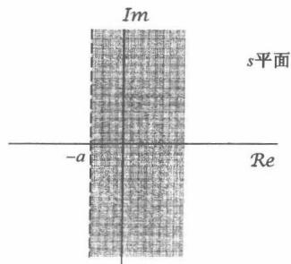

(a)

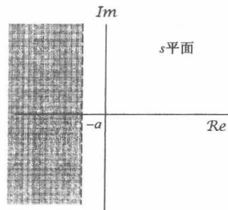

(b)

图9.1 (a) 例9.1的收敛域；(b) 例9.2的收敛域

表示收敛域的一个简便方法如图9.1所示。变量  $s$  是一个复数，在图9.1上展示出的复平面，一般称为与这个复变量有关的  $s$  平面。沿水平轴是  $\mathcal{R}e\{s\}$  轴，沿垂直轴是  $Im\{s\}$  轴，水平轴和垂直轴有时分别称为  $\sigma$  轴和  $\mathrm{j}\omega$  轴。图9.1(a)的阴影部分就是对应例9.1的收敛域；而图9.1(b)的阴影部分指出了例9.2的收敛域。

例9.3 本例考虑的信号是两个实指数信号的和，即

$$
x (t) = 3 \mathrm {e} ^ {- 2 t} u (t) - 2 \mathrm {e} ^ {- t} u (t) \tag {9.20}
$$

于是其拉普拉斯变换的代数表示式为

$$
\begin{array}{l} X (s) = \int_ {- \infty} ^ {+ \infty} \left[ 3 e ^ {- 2 t} u (t) - 2 e ^ {- t} u (t) \right] e ^ {- s t} d t \tag {9.21} \\ = 3 \int_ {- \infty} ^ {+ \infty} e ^ {- 2 t} e ^ {- s t} u (t) d t - 2 \int_ {- \infty} ^ {+ \infty} e ^ {- t} e ^ {- s t} u (t) d t \\ \end{array}
$$

式(9.21)中的每个积分式都与式(9.10)中的积分式具有相同的形式，这样就能利用例9.1的结果而得到

$$
X (s) = \frac {3}{s + 2} - \frac {2}{s + 1} \tag {9.22}
$$

为了确定它的收敛域，我们注意到，因为  $x(t)$  是两个实指数信号的和，而由式(9.21)可知， $X(s)$  是单独每一项的拉普拉斯变换之和。第一项是  $3\mathrm{e}^{-2t}u(t)$  的拉普拉斯变换，而第二项是  $-2\mathrm{e}^{-t}u(t)$  的拉普拉斯变换。由例9.1知道

$$
\mathrm {e} ^ {- t} u (t) \xleftrightarrow {\mathcal {L}} \frac {1}{s + 1}, \quad \mathcal {R e} \{s \} > - 1
$$

$$
e ^ {- 2 t} u (t) \xleftarrow {\mathcal {L}} \frac {1}{s + 2}, \quad R e \{s \} > - 2
$$

于是，使这两项拉普拉斯变换都收敛的那些  $\mathcal{Re}\{s\}$  值的集合就是  $\mathcal{Re}\{s\} > -1$  ，这样把式(9.22)右边这两项合起来，就得到

$$
3 e ^ {- 2 t} u (t) - 2 e ^ {- t} u (t) \xleftarrow {\mathcal {L}} \frac {s - 1}{s ^ {2} + 3 s + 2}, \quad \operatorname {R e} \{s \} > - 1 \tag {9.23}
$$

例9.4 本例要考虑实指数和复指数之和的信号为

$$
x (t) = \mathrm {e} ^ {- 2 t} u (t) + \mathrm {e} ^ {- t} (\cos 3 t) u (t) \tag {9.24}
$$

利用欧拉关系，可写为

$$
x (t) = \left[ e ^ {- 2 t} + \frac {1}{2} e ^ {- (1 - 3 j) t} + \frac {1}{2} e ^ {- (1 + 3 j) t} \right] u (t)
$$

那么  $x(t)$  的拉普拉斯变换就能表示成

$$
X (s) = \int_ {- \infty} ^ {+ \infty} e ^ {- 2 t} u (t) e ^ {- s t} d t + \frac {1}{2} \int_ {- \infty} ^ {+ \infty} e ^ {- (1 - 3 j) t} u (t) e ^ {- s t} d t + \frac {1}{2} \int_ {- \infty} ^ {+ \infty} e ^ {- (1 + 3 j) t} u (t) e ^ {- s t} d t \tag {9.25}
$$

式(9.25)中的每个积分都代表了在例9.1中所遇到过的拉普拉斯变换，即

$$
e ^ {- 2 t} u (t) \xleftarrow {\mathcal {L}} \frac {1}{s + 2}, \quad \operatorname {R e} \{s \} > - 2 \tag {9.26}
$$

$$
\mathrm {e} ^ {- (1 - 3 \mathrm {j}) t} u (t) \xleftrightarrow {\mathcal {L}} \frac {1}{s + (1 - 3 \mathrm {j})}, \quad \mathcal {R e} \{s \} > - 1 \tag {9.27}
$$

$$
\mathrm {e} ^ {- (1 + 3 \mathrm {j}) t} u (t) \xleftarrow {\mathcal {L}} \frac {1}{s + (1 + 3 \mathrm {j})}, \quad \mathcal {R e} \{s \} > - 1 \tag {9.28}
$$

为了使这三个拉普拉斯变换都同时收敛，必须有  $\mathcal{Re}\{s\} > -1$  ，因此  $x(t)$  的拉普拉斯变换为

$$
\frac {1}{s + 2} + \frac {1}{2} \left(\frac {1}{s + (1 - 3 j)}\right) + \frac {1}{2} \left(\frac {1}{s + (1 + 3 j)}\right), \quad \mathcal {R e} \{s \} > - 1 \tag {9.29}
$$

或者，合并为公共分母得

$$
e ^ {- 2 t} u (t) + e ^ {- t} (\cos 3 t) u (t) \xleftrightarrow {\mathcal {L}} \frac {2 s ^ {2} + 5 s + 1 2}{(s ^ {2} + 2 s + 1 0) (s + 2)}, \quad \mathcal {R e} \{s \} > - 1 \tag {9.30}
$$

以上4个例子中的每一个，其拉普拉斯变换式都是有理的，也即都是复变量  $s$  的两个多项式之比，具有如下形式：

$$
X (s) = \frac {N (s)}{D (s)} \tag {9.31}
$$

其中，  $N(s)$  和  $D(s)$  分别是分子多项式和分母多项式。正如在例9.3和例9.4中所见到的，只要 $x(t)$  是实指数或复指数信号的线性组合，  $X(s)$  就一定是有理的。并且，在9.7节中将会看到，当

线性时不变系统用线性常系数微分方程表征时，也会见到有理变换。除去一个常数因子外，在一个有理拉普拉斯变换式中，分子与分母多项式都能够用它们的根来表示，据此，在  $s$  平面内标出 $N(s)$  和  $D(s)$  根的位置，并指出收敛域，就提供了一种描述拉普拉斯变换的方便而形象的表示。例如，如果用“  $\times$  ”来表示式(9.23)中分母多项式的每个根的位置；用“  $\bigcirc$  ”来表示式(9.23)中分子多项式的每个根的位置，在图9.2(a)中就展示了例9.3的拉普拉斯变换的  $s$  平面表示。图9.2(b)则是例9.4的拉普拉斯变换式分子和分母多项式的根所对应的图。每一个例子的收敛域都在相应的图上用阴影区给出。

对于有理拉普拉斯变换来说，因为在分子多项式的那些根上  $X(s) = 0$  ，故称其为  $X(s)$  的零点(zero)；而在分母多项式的那些根上  $X(s)$  变成无界的，故称分母多项式的根为  $X(s)$  的极点(pole)。在有限  $s$  平面内， $X(s)$  的零点和极点，除了一个常数因子外可以完全表征  $X(s)$  的代数表示式。通过  $s$  平面内的极点和零点的  $X(s)$  的表示就称为  $X(s)$  的零-极点图(pole-zero plot)。然而，正如在例9.1和例9.2中所看到的， $X(s)$  的代数表示式本身并不能确认该拉普拉斯变换的收敛域。这也就是说，除了一个常数因子外，一个有理拉普拉斯变换的完全表征是由该变换的零-极点图与它的收敛域一起组成的(一般在  $s$  平面内，收敛域用阴影区表示，如图9.1和图9.2所示)。

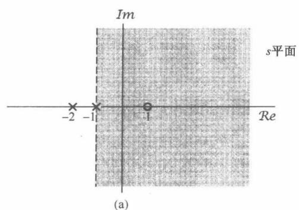

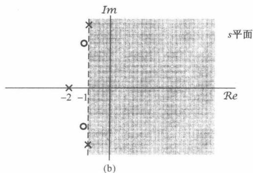

图9.2 (a)和(b)分别为9.3和例9.4的拉普拉斯变换的  $s$  平面表示。图中每一个  $\times$  标出相应拉普拉斯变换的一个极点位置，也就是分母多项式的一个根的位置。同理，每个  $\bigcirc$  标出一个零点，即分子多项式的一个根的位置。收敛域用阴影区指出

另外，虽然不一定都需要给出一个有理变换  $X(s)$  的代数表示式，但是有时为了指明  $X(s)$  在无限远点的极点或零点，有了代数表示式倒是较为方便的。也就是说，如果分母多项式的阶次高于分子多项式的阶次，那么  $X(s)$  将随  $s$  趋于无穷大而变为零。相反，若分子多项式的阶次高于分母多项式的阶次，那么  $X(s)$  将随  $s$  趋于无穷大而变成无界。这样一种特性就可以把它们看成无穷远处的零点或极点。例如，在式(9.23)中的拉普拉斯变换的分母的阶为2，而分子的阶仅为1，所以在这种情况下， $X(s)$  在无穷远点有一个零点。同样，在式(9.30)中的拉普拉斯变换的分子的阶为2，而分母的阶为3，在无穷远点也有一个零点。一般来说，如果分母的阶次超出分子的阶次为  $k$  次，则  $X(s)$  在无穷远点一定有  $k$  阶零点；同理，若分子的阶次超出分母的阶次为  $k$  次，则  $X(s)$  在无穷远点一定有  $k$  阶极点。

例9.5 设信号  $x(t)$  为

$$
x (t) = \delta (t) - \frac {4}{3} \mathrm {e} ^ {- t} u (t) + \frac {1}{3} \mathrm {e} ^ {2 t} u (t) \tag {9.32}
$$

式(9.32)中右边第二项和第三项的拉普拉斯变换都可由例9.1求出，而单位冲激函数的拉普拉斯变换可直接求出为

$$
\mathcal {L} \{\delta (t) \} = \int_ {- \infty} ^ {+ \infty} \delta (t) e ^ {- s t} d t = 1 \tag {9.33}
$$

该结果对任何  $s$  值都成立。这就是说，  $\mathcal{L}\{\delta (t)\}$  的收敛域是整个  $s$  平面。利用这个结果，再考虑到式(9.32)的其余两项，就得出

$$
X (s) = 1 - \frac {4}{3} \frac {1}{s + 1} + \frac {1}{3} \frac {1}{s - 2}, \quad \mathcal {R e} \{s \} > 2 \tag {9.34}
$$

或者

$$
X (s) = \frac {(s - 1) ^ {2}}{(s + 1) (s - 2)}, \quad \mathcal {R e} \{s \} > 2 \tag {9.35}
$$

其中，这个收敛域是对  $x(t)$  的三项拉普拉斯变换都收敛的  $s$  值的集合。该例的零-极点图及其收敛域如图9.3所示。另外，因为  $X(s)$  的分子、分母同阶次，所以  $X(s)$  在无穷远点既无极点，也无零点。

回顾式(9.6)，当  $s = \mathrm{j}\omega$  时，拉普拉斯变换就是傅里叶变换。然而，如果这个拉普拉斯变换的收敛域不包括  $\mathrm{j}\omega$  轴，即  $\mathcal{Re}\{s\} = 0$  ，那么傅里叶变换就不收敛。正如从图9.3中所看到的，事实上这就是例9.5的情况，与在  $x(t)$  中  $(1 / 3)\mathrm{e}^{2t}u(t)$  这一项没有傅里叶变换是一致

的。同时，从这个例子还可看到，式(9.35)中的两个零点出现在同一个  $s$  值上。一般都用零点或极点标志的重复次数来指出它们的阶数。在例9.5中有一个二阶零点在  $s = 1$  ，并且有两个一阶极点分别在  $s = -1$  和  $s = 2$  。在这个例子中，收敛域位于最右边极点的右边。一般来说，对于一个有理拉普拉斯变换，在极点位置和与一个给定的零-极点图有关的收敛域之间存在一种紧密的关系，并且一些具体的限制都与  $\pmb{x}(t)$  的时域性质密切有关。下一节将说明这些限制和有关的性质。

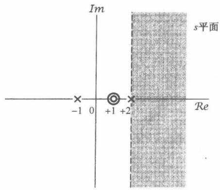

图9.3 例9.5的零-极点图和收敛域

# 9.2 拉普拉斯变换收敛域

从前面的讨论已经看到，拉普拉斯变换的全部特性不仅要求  $X(s)$  的代数表示式，而且还应该伴随着收敛域的说明。这一点在例9.1和例9.2中体现得最为明显：两个很不相同的信号能够有完全相同的  $X(s)$  代数表示式，因此它们的拉普拉斯变换只有靠收敛域才能区分。这一节将说明对各种信号在收敛域上的某些具体限制。读者将会看到，理解了这些限制往往使我们仅仅从 $X(s)$  的代数表示式和  $\pmb {x}(t)$  在时域中的某些一般特征，就能明确地给出或构成收敛域。

# 性质1  $X(s)$  的收敛域在  $s$  平面内由平行于  $\mathrm{j}\omega$  轴的带状区域所组成。

这一性质来自于这样一个事实：  $X(s)$  的收敛域是由这样一些  $s = \sigma +\mathrm{j}\omega$  所组成的，在那里 $x(t)\mathrm{e}^{-\sigma t}$  的傅里叶变换收敛，也就是说，  $x(t)$  的拉普拉斯变换的收敛域是由这样一些  $s$  值组成的，对于这些  $s$  值，  $x(t)\mathrm{e}^{-\sigma t}$  是绝对可积的①，即

$$
\int_ {- \infty} ^ {+ \infty} | x (t) | e ^ {- \sigma t} d t <   \infty \tag {9.36}
$$

因为这个条件只与  $\sigma$  ，即  $s$  的实部有关，所以就得到性质1。

# 性质2 对有理拉普拉斯变换来说，收敛域内不包括任何极点。

这个性质，在到目前为止所研究的例子中都能很容易地看出。因为，在一个极点处， $X(s)$  为无限大，式(9.3)的积分显然在极点处不收敛，所以收敛域内不能包括属于极点的  $s$  值。

# 性质3 如果  $x(t)$  是有限持续期，并且是绝对可积的，那么收敛域就是整个  $s$  平面。

这个结果背后的直观性由图9.4和图9.5可以想到。也就是说，一个有限持续期的信号具有这个性质，它在某一有限区间之外都是零，如图9.4所示。在图9.5(a)中画出了图9.4这样的  $x(t)$  乘以一个衰减的指数函数，而在图9.5(b)中则画出同一类型的信号乘以一个增长的指数函数。因

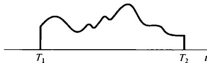

图9.4 有限持续期信号

为， $x(t)$  为非零的区间是有限长的，所以指数加权永远不会无界，这样  $x(t)$  的可积性不会由于这个指数加权而破坏就是合情合理的了。

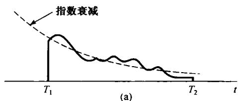

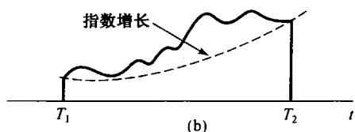

图9.5（a）有限持续期信号乘以衰减指数；（b）有限持续期信号乘以增长指数

性质3的一个更加正规的证明如下：假设  $x(t)$  是绝对可积的，所以有

$$
\int_ {T _ {1}} ^ {T _ {2}} | x (t) | \mathrm {d} t <   \infty \tag {9.37}
$$

对于在收敛域内的  $s = \sigma +\mathrm{j}\omega$  ，就要求  $x(t)\mathrm{e}^{-\sigma t}$  是绝对可积的，即

$$
\int_ {T _ {1}} ^ {T _ {2}} | x (t) | \mathrm {e} ^ {- \sigma t} \mathrm {d} t <   \infty \tag {9.38}
$$

式(9.37)表明当  $\mathcal{R}\mathcal{e}\{s\} = \sigma = 0$  时的  $s$  平面在收敛域内。对于  $\sigma > 0, \mathrm{e}^{-\sigma t}$  在  $x(t)$  为非零的区间内的最大值是  $\mathrm{e}^{-\sigma T_1}$ ，因此可以写成

$$
\int_ {T _ {1}} ^ {T _ {2}} | x (t) | \mathrm {e} ^ {- \sigma t} \mathrm {d} t <   \mathrm {e} ^ {- \sigma T _ {1}} \int_ {T _ {1}} ^ {T _ {2}} | x (t) | \mathrm {d} t \tag {9.39}
$$

因为式(9.39)的右边是有界的，所以左边也就是有界的；因此当  $\mathcal{Re}\{s\} > 0$  时的  $s$  平面必须也在收敛域内。依类似的证明方法，若  $\sigma < 0$  ，那么

$$
\int_ {T _ {1}} ^ {T _ {2}} | x (t) | \mathrm {e} ^ {- \sigma t} \mathrm {d} t <   \mathrm {e} ^ {- \sigma T _ {2}} \int_ {T _ {1}} ^ {T _ {2}} | x (t) | \mathrm {d} t \tag {9.40}
$$

$x(t)\mathrm{e}^{-\sigma t}$  也是绝对可积的。因此，收敛域包括整个  $s$  平面。

例9.6 设  $x(t)$  为

$$
x (t) = \left\{ \begin{array}{l l} {\mathrm {e} ^ {- a t},} & {\quad 0 <   t <   T} \\ {0,} & {\quad \text {其 他}} \end{array} \right. \tag {9.41}
$$

那么其傅里叶变换

$$
X (s) = \int_ {0} ^ {T} \mathrm {e} ^ {- a t} \mathrm {e} ^ {- s t} \mathrm {d} t = \frac {1}{s + a} [ 1 - \mathrm {e} ^ {- (s + a) T} ] \tag {9.42}
$$

在这个例子中，因为  $x(t)$  是有限长的，由性质3，其收敛域就是整个  $s$  平面。在式(9.42)中，形式上好像  $X(s)$  有一个极点在  $s = -a$  ，而这与根据性质3与收敛域由整个  $s$  平面所组成是不一致的。然而，事实上式(9.42)的代数表示式在  $s = -a$  都是分子和分母的零点！为了确定  $s = -a$  处的  $X(s)$  值，可以应用洛必达法则而得

$$
\lim  _ {s \rightarrow - a} X (s) = \lim  _ {s \rightarrow - a} \left[ \frac {\frac {\mathrm {d}}{\mathrm {d} s} (1 - \mathrm {e} ^ {- (s + a) T})}{\frac {\mathrm {d}}{\mathrm {d} s} (s + a)} \right] = \lim  _ {s \rightarrow - a} T \mathrm {e} ^ {- a T} \mathrm {e} ^ {- s T}
$$

所以

$$
X (- a) = T \tag {9.43}
$$

在  $x(t)$  为非零的区间上，保证指数型权函数是有界的，认识到这一点很重要，上面的讨论主要依据这一事实： $x(t)$  是有限持续期的。下面两个性质要讨论有关这一结果的一种变形，即  $x(t)$  具有的有限范围仅仅在正时间或负时间方向上。

性质4 如果  $x(t)$  是右边信号，并且  $\mathcal{Re}\{s\} = \sigma_0$  这条线位于收敛域内，那么  $\mathcal{Re}\{s\} > \sigma_0$  的全部  $s$  值都一定在收敛域内。

若在某有限时间  $T_{1}$  之前， $x(t) = 0$ ，则称该信号为右边(right-side)信号，如图9.6所示。对于这样一个信号，有可能不存在任何s值，使其拉普拉斯变换收敛。一个例子就是  $x(t) = e^{t^2}u(t)$ 。然而，假如拉普拉斯变换对某一  $\sigma$  值收敛，比如  $\sigma_0$ ，那么

$$
\int_ {- \infty} ^ {+ \infty} | x (t) | e ^ {- \sigma_ {0} t} d t <   \infty \tag {9.44}
$$

或者，因为  $x(t)$  是右边信号，可等效为

$$
\int_ {T _ {1}} ^ {+ \infty} | x (t) | e ^ {- \sigma_ {0} t} d t <   \infty \tag {9.45}
$$

如果  $\sigma_{1} > \sigma_{0}$ , 由于随  $t \to +\infty$ ,  $\mathrm{e}^{-\sigma_{1}t}$  衰减得比  $\mathrm{e}^{-\sigma_{1}t}$  快, 如图9.7所示, 那么  $x(t)\mathrm{e}^{-\sigma_{1}t}$  也就一定绝对可积。正规一些, 可以说, 由于  $\sigma_{1} > \sigma_{0}$ , 而有

$$
\begin{array}{l} \int_ {T _ {1}} ^ {\infty} | x (t) | \mathrm {e} ^ {- \sigma_ {1} t} \mathrm {d} t = \int_ {T _ {1}} ^ {\infty} | x (t) | \mathrm {e} ^ {- \sigma_ {0} t} \mathrm {e} ^ {- (\sigma_ {1} - \sigma_ {0}) t} \mathrm {d} t \tag {9.46} \\ \leqslant \mathrm {e} ^ {- (\sigma_ {1} - \sigma_ {0}) T _ {1}} \int_ {T _ {1}} ^ {\infty} | x (t) | \mathrm {e} ^ {- \sigma_ {0} t} \mathrm {d} t \\ \end{array}
$$

因为  $T_{1}$  是有限值，根据式(9.45)，在式(9.46)不等式的右边就是有限的，所以  $x(t)\mathrm{e}^{-\sigma t}$  就是绝对可积的。

应该注意到，在以上的证明中明显依赖这一事实： $x(t)$  是右边信号。因而即使  $\sigma_{1} > \sigma_{0}$ ，随着  $t \to -\infty$ ， $\mathrm{e}^{-\sigma_{1}t}$  发散快于  $\mathrm{e}^{-\sigma_{0}t}$ ，但是由于  $t < T_{1}$  时  $x(t) = 0$ ， $x(t)\mathrm{e}^{-\sigma_{1}t}$  在负的时间轴方向也不能无界地增长。同时，在这种情况下，如果有某一点  $s$  在收敛域内，那么所有位于这个  $s$  点右边的点，也就是所有具有更大实部的点，都在收敛域内。为此，这时一般就说收敛域是在右半平面（right-half plane）。

性质5 如果  $x(t)$  是左边信号，并且  $\mathcal{Re}\{s\} = \sigma_0$  这条线位于收敛域内，那么  $\mathcal{Re}\{s\} < \sigma_0$  的全部  $s$  值也一定在收敛域内。

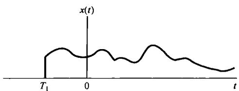

图9.6 右边信号

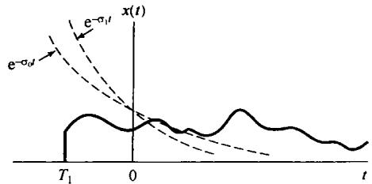

图9.7 若  $x(t)$  是右边信号，而  $x(t)\mathrm{e}^{-\sigma_0t}$  是绝对可积的，那么  $x(t)\mathrm{e}^{-\sigma_1t}$ ， $\sigma_{1} > \sigma_{0}$  也一定绝对可积

若在某一有限时间  $T_{2}$  以后， $x(t) = 0$ ，则称该信号为左边(left-sided)信号，如图9.8所示。这个性质的证明和直观性完全与性质4所做的类似。同时，对于一个左边信号，如果有某一点  $s$  在收敛域内，那么所有位于这个  $s$  点左边的点也都在收敛域内。因此一般就说收敛域是在左半平面(left-half plane)。

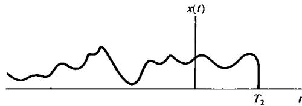

图9.8 左边信号

性质6 如果  $x(t)$  是双边信号，并且  $\mathcal{Re}\{s\} = \sigma_0$  这条线位于收敛域内，那么收敛域就一定由  $s$  平面的一条带状区域组成，直线  $\mathcal{Re}\{s\} = \sigma_0$  位于带中。

一个双边(two-sided)信号就是对  $t > 0$  和  $t < 0$  都具有无限范围的信号，如图9.9(a)所示。对于这样一个信号，其收敛域可以这样求出：选取任一时间  $T_{0}$ ，然而将  $x(t)$  分成右边信号  $x_{R}(t)$  和左边信号  $x_{L}(t)$  之和，如图9.9(b)和图9.9(c)所示。 $x(t)$  的拉普拉斯变换的收敛域就是能使  $x_{R}(t)$  和  $x_{L}(t)$  两者的拉普拉斯变换都收敛的区域。根据性质4，对于某  $\sigma_{R}$  值， $\mathcal{L}\{x_{R}(t)\}$  的收敛域由  $\mathcal{Re}\{s\} > \sigma_{R}$  的半平面组成；而根据性质5，对于某  $\sigma_{L}$  值， $\mathcal{L}\{x_{L}(t)\}$  的收敛域由  $\mathcal{Re}\{s\} < \sigma_{L}$  的半平面组成。 $\mathcal{L}\{x(t)\}$  的收敛域就是这两个半平面的重叠部分，如图9.10所示。当然，这里假设  $\sigma_{R} < \sigma_{L}$ ，因而这两半平面有某些重合。如果不是这种情况，那么即使  $x_{R}(t)$  和  $x_{L}(t)$  的拉普拉斯变换存在， $x(t)$  的拉普拉斯变换也不存在。

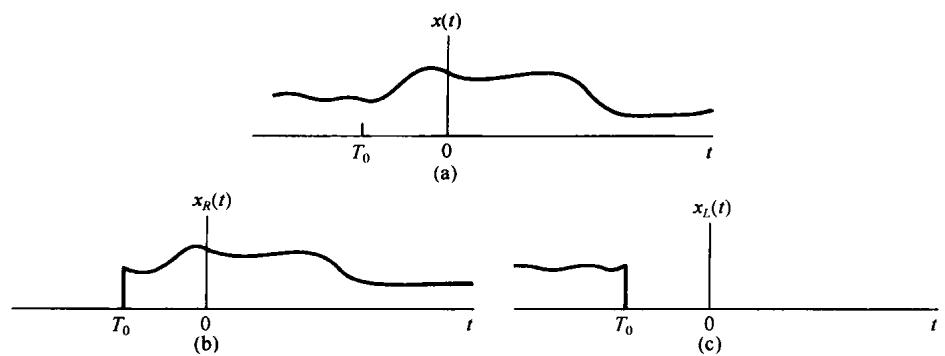

图9.9 双边信号分成右边信号和左边信号之和。(a) 双边信号  $x(t)$ ; (b)  $t < T_0$  等于零, 而  $t > T_0$  等于  $x(t)$  的右边信号; (c)  $t > T_0$  等于零, 而  $t < T_0$  等于  $x(t)$  的左边信号

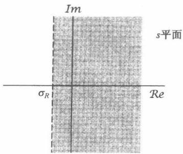

(a)

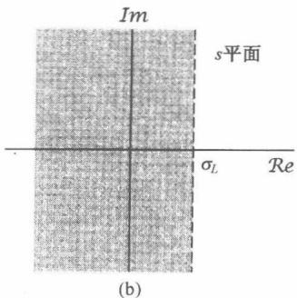

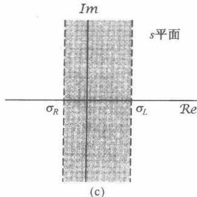

图9.10 (a) 图9.9中  $x_{R}(t)$  的收敛域；(b) 图9.9中  $x_{L}(t)$  的收敛域；(c)  $x(t) = x_{R}(t) + x_{L}(t)$  的收敛域，这里假定(a)和(b)中的收敛域有重叠

例9.7 设  $x(t)$  为

$$
x (t) = \mathrm {e} ^ {- b | t |} \tag {9.47}
$$

对于  $b > 0$  和  $b < 0$  均如图9.11所示。因为这是一个双边信号，可将它分为右边信号和左边信号之和，即

$$
x (t) = \mathrm {e} ^ {- b t} u (t) + \mathrm {e} ^ {+ b t} u (- t) \tag {9.48}
$$

由例9.1有

$$
\mathrm {e} ^ {- b t} u (t) \xleftrightarrow {\mathcal {L}} \frac {1}{s + b}, \quad \operatorname {R e} \{s \} > - b \tag {9.49}
$$

由例9.2有

$$
\mathrm {e} ^ {+ b t} u (- t) \xleftrightarrow {\mathcal {L}} \frac {- 1}{s - b}, \quad \mathcal {R e} \{s \} <   + b \tag {9.50}
$$

虽然，式(9.48)中每一单独项的拉普拉斯变换都有一个收敛域，但如果  $b \leqslant 0$  ，就没有公共的收敛域，于是对这样一些  $b$  值， $x(t)$  就没有拉普拉斯变换。如果  $b > 0$  则  $x(t)$  的拉普拉斯变换是

$$
\mathrm {e} ^ {- b | \mid} \xleftrightarrow {\mathcal {L}} \frac {1}{s + b} - \frac {1}{s - b} = \frac {- 2 b}{s ^ {2} - b ^ {2}}, \quad - b <   \operatorname {R e} \{s \} <   + b \tag {9.51}
$$

相应的零-极点图如图9.12所示，阴影区所指为收敛域。

一个信号要么没有拉普拉斯变换，否则就一定属

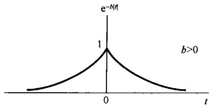

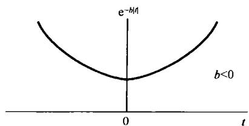

图9.11  $b > 0$  和  $b <   0$  时的信号  $x(t) = \mathrm{e}^{-b|t|}$

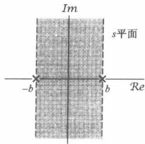

图9.12 例9.7的零-极点图及其收敛域

于由性质3到性质6这4类情况中的某一种。于是对具有某一拉普拉斯变换的信号而言，收敛域一定是整个  $s$  平面(有限长信号)、某一左半平面(左边信号)、某一右半平面(右边信号)或者一条带状收敛域(双边信号)这4种中的一种。在所有已经讨论过的例题中，收敛域都有一个另外的性质：收敛域在每一个方向上（也就是  $\mathcal{Re}\{s\}$  增加和  $\mathcal{Re}\{s\}$  减小）都是被极点所界定的，或者延伸到无限远。事实上，对有理拉普拉斯变换来说，下面这个性质总是成立的。

性质7 如果  $x(t)$  的拉普拉斯变换  $X(s)$  是有理的，那么它的收敛域是被极点所界定的或延伸到无限远。另外，在收敛域内不包含  $X(s)$  的任何极点。

对于这一性质的正规证明有些烦琐，但它基本上是由于如下事实的一个结果：一个具有有理拉普拉斯变换的信号均由指数信号的线性组合构成，并且根据例9.1和例9.2，该线性组合中的每一项变换的收敛域一定有这一性质。作为性质7的一个结果，再与性质4和性质5结合在一起就有如下性质。

性质8 如果  $x(t)$  的拉普拉斯变换  $X(s)$  是有理的，那么若  $x(t)$  是右边信号，则其收敛域在  $s$  平面上位于最右边极点的右边；若  $x(t)$  是左边信号，则其收敛域在  $s$  平面上位于最左边极点的左边。

为了说明不同的收敛域如何与相同的零-极点图相联系，考虑下面这个例子。

例9.8 设有一拉普拉斯变换代数表示式为

$$
X (s) = \frac {1}{(s + 1) (s + 2)} \tag {9.52}
$$

其零-极点图如图9.13(a)所示。正如在图9.13(b)~图9.13(d)中所指出的，与这个代数表示式有关的有三种可能的收敛域，对应着三种不同的信号。与图9.13(b)零-极点图有关的是右边信号。因为收敛域包括  $\mathrm{j}\omega$  轴，所以该信号的傅里叶变换收敛。图9.13(c)对应于一个左边信号，而图9.13(d)则对应于一个双边信号。后面这两个信号中没有一个有傅里叶变换，因为它们的收敛域都不包括  $\mathrm{j}\omega$  轴。

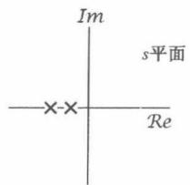

(a)

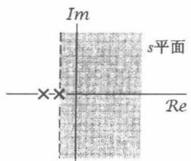

(b)

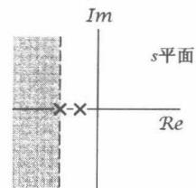

(c)

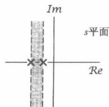

(d)

图9.13（a）例9.8的零-极点图；（b）对应于右边信号的收敛域；

(c) 对应于左边信号的收敛域；(d) 对应于双边信号的收敛域

# 9.3 拉普拉斯逆变换

9.1节讨论了把一个信号的拉普拉斯变换看成该信号经指数加权后的傅里叶变换；也就是说，将  $s$  表示成  $s = \sigma +\mathrm{j}\omega$  ，一个信号  $x(t)$  的拉普拉斯变换是

$$
X (\sigma + \mathrm {j} \omega) = \mathcal {F} \{x (t) \mathrm {e} ^ {- \sigma t} \} = \int_ {- \infty} ^ {+ \infty} x (t) \mathrm {e} ^ {- \sigma t} \mathrm {e} ^ {- \mathrm {j} \omega t} \mathrm {d} t \tag {9.53}
$$

其中，  $s = \sigma +\mathrm{j}\omega$  在收敛域中。可以利用式(4.9)的傅里叶逆变换关系对式(9.53)求逆变换为

$$
x (t) \mathrm {e} ^ {- \sigma t} = \mathcal {F} ^ {- 1} \left\{X (\sigma + \mathrm {j} \omega) \right\} = \frac {1}{2 \pi} \int_ {- \infty} ^ {+ \infty} X (\sigma + \mathrm {j} \omega) \mathrm {e} ^ {\mathrm {j} \omega t} \mathrm {d} \omega \tag {9.54}
$$

或者将两边各乘以  $\mathbf{e}^{\sigma t}$  ，可得

$$
x (t) = \frac {1}{2 \pi} \int_ {- \infty} ^ {+ \infty} X (\sigma + j \omega) e ^ {(\sigma + j \omega) t} d \omega \tag {9.55}
$$

这就是说，可以这样从拉普拉斯变换中来恢复  $x(t)$  ：在收敛域内，将  $\sigma$  固定不变，在  $\omega$  从  $-\infty$  到  $+\infty$  变化的这一组  $s = \sigma + \mathrm{j}\omega$  值上按式(9.55)求值。若将变量在式(9.55)中从  $\omega$  改变为  $s$  ，并利用  $\sigma$  是常数这一点，可以将该式的意义更为突出，并对根据  $X(s)$  恢复  $x(t)$  有更深刻的认识。因为  $\sigma$  是常数，所以  $\mathrm{ds} = \mathrm{j}\mathrm{d}\omega$  ，可得拉普拉斯逆变换的基本关系式为

$$
\boxed {x (t) = \frac {1}{2 \pi \mathrm {j}} \int_ {\sigma - \mathrm {j} ^ {\infty}} ^ {\sigma + \mathrm {j} ^ {\infty}} X (s) \mathrm {e} ^ {s t} \mathrm {d} s} \tag {9.56}
$$

上式说明，  $x(t)$  可以用一个复指数信号的加权积分来表示。式(9.56)的积分路径是在  $\pmb{S}$  平面内对应于满足  $\mathcal{R}e\{s\} = \sigma$  的全部  $\pmb{S}$  点的这条直线，该直线平行于  $\mathrm{j}\omega$  轴。再者，在收敛域内可以选取任何这样一条直线；也就是说，在收敛域内可以选取任何  $\sigma$  值，而使  $X(\sigma +\mathrm{j}\omega)$  收敛。对于一般的  $X(s)$  来说，这个积分的求值要求利用复平面的围线积分(在此不讨论)。然而，对于有理变换，求其拉普拉斯逆变换不必直接计算式(9.56)，而可以像在第4章求傅里叶逆变换所做的那样，采用部分分式展开的办法。这一过程基本上就是把一个有理代数表示式展开成低阶次项的线性组合。

例如，假设没有重阶极点，并假设分母多项式的阶高于分子多项式的阶，那么  $X(s)$  就可以展开为如下形式：

$$
X (s) = \sum_ {i = 1} ^ {m} \frac {A _ {i}}{s + a _ {i}} \tag {9.57}
$$

根据  $X(s)$  的收敛域，该式中每一项的收敛域都能推演出来，然后由例9.1和例9.2，每一项的拉普拉斯逆变换都可被确定。在式(9.57)中每一项  $A_{i} / (s + a_{i})$  的逆变换都有两种可能的选择，若收敛域位于极点  $s = -a_{i}$  的右边，那么这一项的逆变换就是  $A_{i}\mathrm{e}^{-\alpha_{i}t}u(t)$ ，是一个右边信号；若收敛域位于极点  $s = -a_{i}$  的左边，那么这一项的逆变换就是  $-A_{i}\mathrm{e}^{-\alpha_{i}t}u(-t)$ ，是一个左边信号。将式(9.57)中每一项的逆变换相加，就得到  $X(s)$  的逆变换。详细过程最好通过几个例子来给出。

例9.9 设有  $X(s)$  为

$$
X (s) = \frac {1}{(s + 1) (s + 2)}, \quad \operatorname {R e} \{s \} > - 1 \tag {9.58}
$$

为了求它的逆变换，先对它进行部分分式展开为

$$
X (s) = \frac {1}{(s + 1) (s + 2)} = \frac {A}{s + 1} + \frac {B}{s + 2} \tag {9.59}
$$

根据附录A介绍的办法，将式(9.59)两边各乘以  $(s + 1)(s + 2)$  。然后令两边  $s$  的同阶次项的系数相等，可求出系数  $A$  和  $B$  。另一种方法是利用下列关系：

$$
A = [ (s + 1) X (s) ] | _ {s = - 1} = 1 \tag {9.60}
$$

$$
B = [ (s + 2) X (s) ] | _ {s = - 2} = - 1 \tag {9.61}
$$

由此，  $X(s)$  的部分分式展开式为

$$
X (s) = \frac {1}{s + 1} - \frac {1}{s + 2} \tag {9.62}
$$

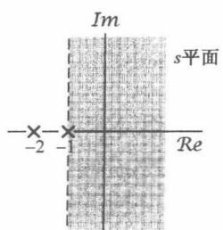

(a)

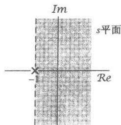

(b)

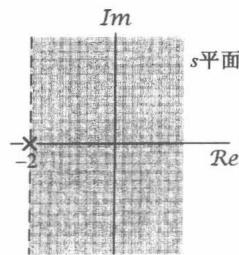

(c)

图9.14 例9.8的  $X(s)$  的部分分式展开式中每一项收敛域的构成。（a）  $X(s)$  的零-极点图和收敛域；（b）在  $s = -1$  的极点及其收敛域；（c）在  $s = -2$  的极点及其收敛域

由例9.1和例9.2可知，根据收敛域是位于极点的左边还是右边，对于  $1 / (s + a)$  都有两种可能的逆变换，因此就需要确定与式(9.62)中每个一次项有关的收敛域。这个可以参照9.2节建立的收敛域性质来完成。因为  $X(s)$  的收敛域是  $\mathcal{R}e\{s\} > - 1$  ，那么式(9.62)中的每一项的收敛域都应包括  $\mathcal{R}e\{s\} > - 1$  。然后，对于每一项来说，其收敛域就可以向左或向右（或向两边）延伸，直到被一个极点所界定或至无限远为止，如图9.14所示。图9.14(a)是由式(9.58)给出的 $X(s)$  的零-极点图和收敛域，而图9.14(b)和图9.14(c)就是式(9.62)中每一项的零-极点图及其收敛域。总的收敛域在图中用阴影区表示。由图9.14(c)所代表的这一项，其收敛域还可以向左延伸如图示，直至被一个极点所界定。

因为收敛域位于这两个极点的右边，所以正如在图9.14(b)和图9.14(c)中所看到的，这两个单独项中的每一项的收敛域也就应在各自极点的右边，结果根据前一节的性质8可知，它们都对应于右边信号。由例9.1，式(9.62)中每一项的逆变换就是

$$
e ^ {- t} u (t) \xleftrightarrow {\mathcal {L}} \frac {1}{s + 1}, \quad \mathcal {R e} \{s \} > - 1 \tag {9.63}
$$

$$
\mathrm {e} ^ {- 2 t} u (t) \xleftrightarrow {\mathcal {L}} \frac {1}{s + 2}, \quad \operatorname {R e} \{s \} > - 2 \tag {9.64}
$$

由此可得

$$
\left[ e ^ {- t} - e ^ {- 2 t} \right] u (t) \xleftrightarrow {\mathcal {L}} \frac {1}{(s + 1) (s + 2)}, \quad R e \{s \} > - 1 \tag {9.65}
$$

例9.10 现在假设  $X(s)$  的代数表示式仍由式(9.58)给出，但收敛域是在  $\mathcal{Re}\{s\} < -2$  的左半平面。 $X(s)$  的部分分式展开仅与它的代数表示式有关，所以式(9.62)仍然不变。然而，由于这个新的收敛域位于两个极点的左边，所以式(9.62)中每一项的收敛域也都必须位于极点的左边。这就是说，对应于极点  $s = -1$  这一项的收敛域是  $\mathcal{Re}\{s\} < -1$ ；而对应于极点  $s = -2$  这一项的收敛域是  $\mathcal{Re}\{s\} < -2$ 。那么，根据例9.2就有

$$
- \mathrm {e} ^ {- t} u (- t) \xleftrightarrow {\mathcal {L}} \frac {1}{s + 1}, \quad \mathcal {R e} \{s \} <   - 1 \tag {9.66}
$$

$$
- \mathrm {e} ^ {- 2 t} u (- t) \xleftrightarrow {\mathcal {L}} \frac {1}{s + 2}, \quad \operatorname {R e} \{s \} <   - 2 \tag {9.67}
$$

所以有

$$
x (t) = \left[ - e ^ {- t} + e ^ {- 2 t} \right] u (- t) \xleftrightarrow {\mathcal {L}} \frac {1}{(s + 1) (s + 2)}, \quad \mathcal {R e} \{s \} <   - 2 \tag {9.68}
$$

例9.11 最后，假设式(9.58)的  $X(s)$ ，其收敛域是  $-2 < \mathcal{Re}\{s\} < -1$ ，这时收敛域在  $s = -1$  极点的左边，所以这一项对应于式(9.66)的左边信号；而收敛域在  $s = -2$  极点的右边，所

以这一项对应于式(9.64)的右边信号。将两者合在一起求得

$$
x (t) = - \mathrm {e} ^ {- t} u (- t) - \mathrm {e} ^ {- 2 t} u (t) \stackrel {\mathcal {L}} {\longleftrightarrow} \frac {1}{(s + 1) (s + 2)}, \quad - 2 <   \mathcal {R e} \{s \} <   - 1 \tag {9.69}
$$

正如在附录A中所讨论的，当  $X(s)$  有重阶极点，或者分母的阶次不高于分子的阶次时，部分分式展开式中除了在例9.9到例9.11中考虑的一次项外，还应包括其他项。到9.5节，当讨论完拉普拉斯变换的性质以后，还将讨论其他一些拉普拉斯变换对，连同拉普拉斯变换的性质一起，就能将例9.9所给出的求逆变换的方法推广到任意有理变换中去。

# 9.4 由零-极点图对傅里叶变换进行几何求值

在9.1节已经看到，一个信号的傅里叶变换就是拉普拉斯变换在  $\mathrm{j}\omega$  轴上的求值。这一节将讨论由与一个有理拉普拉斯变换有关的零-极点图来求傅里叶变换的一种求值方法，并且更一般

地说，求拉普拉斯在任意  $s$  点上的值的几何求值法。为了建立这一方法，首先考虑只有单个零点的拉普拉斯变换[即 $X(s) = (s - a)]$  在某一给定的  $s$  ，如  $s = s_{1}$  处求值。这个代数表示式  $s_1 - a$  是两个复数的和，一个是  $s_1$  ，另一个是  $-a$  ；它们中的每一个都能在复平面内用一个向量来表示，如图9.15所示。然后，代表这个复数  $(s_1 - a)$  的向量就是向量  $s_1$  和  $-a$  之和；在图9.15中可以看出，这个向量就是从  $s = a$  这个零点到点  $s_1$  的向量  $s_1 - a$  。这样，  $X(s_{1})$  的模就是这个向量的长度，而相位就是这个向量对于实轴的角度。如果  $X(s)$  在  $s = a$  是一个极点，即  $X(s) = 1 / (s - a)$  ，那么  $X(s)$  的分母就是上面讨论的同一向量，这时  $X(s_{1})$  的模是该向量（从极点  $s = a$  到 $s = s_1$  点)长度的倒数(reciprocal)，而相位则是该向量相对于实轴角度的负值(negative）。

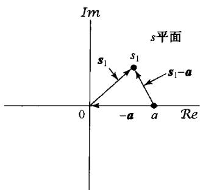

图9.15 分别代表复数  $s_1$  ，  $-a$  和 $(s_{1} - a)$  的向量  $s_1$  ，  $-a$  和 $s_1 - a$  的复平面表示

一个更一般的有理拉普拉斯变换是由上述讨论的零点和极点项的乘积所组成的，也就是说，一个有理拉普拉斯变换可以因式分解成

$$
X (s) = M \frac {\prod_ {i = 1} ^ {R} \left(s - \beta_ {i}\right)}{\prod_ {j = 1} ^ {P} \left(s - \alpha_ {j}\right)} \tag {9.70}
$$

为了求取  $X(s)$  在  $s = s_1$  的值，乘积中的每一项都可用一个从零点或极点到  $s_1$  点的向量来表示。那么， $X(s_1)$  的模就是各零点向量（从各个零点到  $s_1$  的向量）长度乘积的  $M$  倍被各极点向量（从各个极点到  $s_1$  的向量）长度的积相除，而复数  $X(s_1)$  的相角则是这些零点向量相角的和减去这些极点向量相角的和。如果在式(9.70)中比例因子  $M$  是负的，则对应有一个附加相角  $\pi$ 。如果  $X(s)$  有多阶极点或零点（或均有），即相应于某些  $\alpha_i$  或/和  $\beta_i$  是相等的，那么这些多阶极点或零点向量的长度和相角在  $X(s_1)$  中都应包括相应的倍数（等于极点或零点的阶）。

例9.12 有一  $X(s)$  为

$$
X (s) = \frac {1}{s + \frac {1}{2}}, \quad \operatorname {R e} \{s \} > - \frac {1}{2} \tag {9.71}
$$

傅里叶变换为  $X(s)\mid_{s = \mathrm{j}\omega}$  ，故该例的傅里叶变换就是

$$
X (\mathrm {j} \omega) = \frac {1}{\mathrm {j} \omega + 1 / 2} \tag {9.72}
$$

$X(s)$  的零-极点图如图9.16所示。为了用几何法确定傅里叶变换，在图中构造了一个极点向量。傅里叶变换在频率  $\omega$  处的模，就是从极点到虚轴上  $\mathrm{j}\omega$  点向量长度的倒数，而傅里叶变换的相位就是该向量相角的负值。由图9.16，从几何上可写出

$$
| X (\mathrm {j} \omega) | ^ {2} = \frac {1}{\omega^ {2} + (1 / 2) ^ {2}} \tag {9.73}
$$

和

$$
\left\langle X (\mathrm {j} \omega) = - \arctan 2 \omega \right. \tag {9.74}
$$

傅里叶变换几何确定的价值往往在于近似观察整

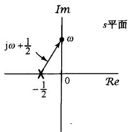

图9.16 例9.12的零-极点图。  $\mid X(\mathrm{j}\omega)\mid$  就是图示向量长度的倒数， $\varkappa X(\mathrm{j}\omega)$  是向量相角的负值

体特性。例如，在图9.16中很快能看出，极点向量的长度随  $\omega$  的增加而单调增加，因此傅里叶变换的模将随  $\omega$  的增加而单调下降。由零-极点图对傅里叶变换特性得出一般性结论的能力，下面会用一阶和二阶系统作为例子进一步说明。

# 9.4.1 一阶系统

作为例9.12的一般化，现在来考虑曾在6.5.1节较详细讨论过的一阶系统。这类系统的单位冲激响应是

$$
h (t) = \frac {1}{\tau} \mathrm {e} ^ {- t / \tau} u (t) \tag {9.75}
$$

它的拉普拉斯变换就是

$$
H (s) = \frac {1}{s \tau + 1}, \quad \operatorname {R e} \{s \} > - \frac {1}{\tau} \tag {9.76}
$$

其零-极点图如图9.17所示。从该图可以看到，极点向量的长度在  $\omega = 0$  最短，并随  $\omega$  增加而单调增加；同时，极点向量的相角随  $\omega$  从0增加到  $\infty$  而单调地从0增加到  $\pi /2$  。

从极点向量随  $\omega$  变化的规律来看，很明显其频率响应  $H(\mathrm{j}\omega)$  的模随  $\omega$  增加而单调下降，而  $\angle H(\mathrm{j}\omega)$  则单调地从0下降到  $-\pi /2$  ，如图9.18中该系统的伯德图所示。同时也注意到，当  $\omega = 1 / \tau$  时，极点向量的实部和虚部相等，从而频率响应的模从它在  $\omega = 0$  时的最大值下降了

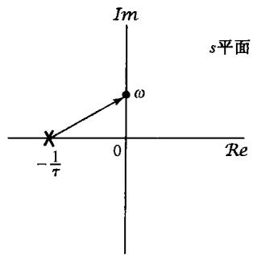

图9.17 式(9.76)一阶系统的零-极点图

$1 / \sqrt{2}$  ，或近似下降3dB；而此时频率响应的相位是  $\pi /4$  值。这与6.5.1节讨论一阶系统时所得结论相一致，在那里就将  $\omega = 1 / \tau$  称为3dB点或转折频率，也就是  $|H(j\omega)|$  伯德图的直线近似在斜率上有一个转折处的频率。在6.5.1节也已看到，时间常数控制了一阶系统的响应速度，而现在看到，这样一个系统在  $s = -1 / \tau$  的极点在负实轴上，它到原点的距离就是该时间常数的倒数。

从图示效果也能看到，时间常数，或者等效地说  $H(s)$  极点位置的变化如何改变一阶系统的特性。特别是，极点越朝左半平面移，系统的转折频率，或有效截止频率就会增加；同时，由式(9.75)和图6.19都可看到，极点向左移动对应于时间常数  $\tau$  的减小，结果单位冲激响应就衰减得更快，而阶跃响应则有一个更快的上升时间。极点位置的实部和系统响应速度之间的这一关系一般总是成立的，即远离  $\mathrm{j}\omega$  轴的那些极点，总是对应于单位冲激响应中的那些快速响应项。

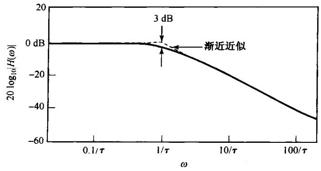

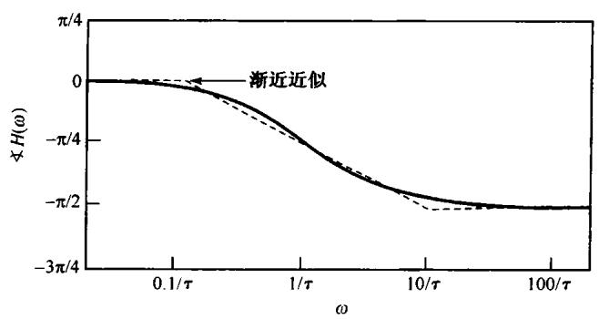

图9.18 一阶系统的频率响应

# 9.4.2 二阶系统

下面来讨论二阶系统，该系统也曾在6.5.2节较为详细地讨论过。对于这类系统的单位冲激响应和频率响应，曾分别由式(6.37)和式(6.33)给出为

$$
h (t) = M \left[ e ^ {c _ {1} t} - e ^ {c _ {2} t} \right] u (t) \tag {9.77}
$$

其中，

$$
c _ {1} = - \zeta \omega_ {n} + \omega_ {n} \sqrt {\zeta^ {2} - 1}
$$

$$
c _ {2} = - \zeta \omega_ {n} - \omega_ {n} \sqrt {\zeta^ {2} - 1}
$$

$$
M = \frac {\omega_ {n}}{2 \sqrt {\zeta^ {2}} - 1}
$$

且

$$
H (\mathrm {j} \omega) = \frac {\omega_ {n} ^ {2}}{(\mathrm {j} \omega) ^ {2} + 2 \zeta \omega_ {n} (\mathrm {j} \omega) + \omega_ {n} ^ {2}} \tag {9.78}
$$

单位冲激响应的拉普拉斯变换是

$$
H (s) = \frac {\omega_ {n} ^ {2}}{s ^ {2} + 2 \zeta \omega_ {n} s + \omega_ {n} ^ {2}} = \frac {\omega_ {n} ^ {2}}{(s - c _ {1}) (s - c _ {2})} \tag {9.79}
$$

若  $\zeta > 1$  时,  $c_{1}$  和  $c_{2}$  都是实数, 因此两个极点都位于实轴上, 如图9.19(a)所示。 $\zeta > 1$  的情况实质上就是如9.4.1节讨论的两个一次项的乘积。因此在这种情况下,  $|H(j\omega)|$  随着  $|\omega|$  的增加而单调下降, 而  $\angle H(j\omega)$  则由  $\omega = 0$  时为0变到  $\omega \to \infty$  时的  $-\pi$  。这点可从图9.19(a)得到证实, 因为这两个极点中的每一个到点  $j\omega$  的向量长度都随  $\omega$  的增加而单调增加, 而每个极点向量的相角则随  $\omega$  从0到  $\infty$  的增加相应地从0增加到  $\pi / 2$  。同时也注意到, 随着  $\zeta$  的增加, 一个极点移向

$\mathrm{j}\omega$  轴(这就是在单位冲激响应中衰减较慢的一项)；而另一个极点则移向左半平面（这就是在单位冲激响应中衰减较快的一项)。于是，在大的  $\zeta$  值下，正是紧靠  $\mathrm{j}\omega$  轴的这一极点支配着系统的响应。同样，从图9.19(b)所示的在  $\zeta \gg 1$  下的极点向量来考虑，在低的频率部分，紧靠  $\mathrm{j}\omega$  轴的极点向量的长度和相角随  $\omega$  的变化，比远离  $\mathrm{j}\omega$  轴的极点向量灵敏得多，所以在低频区域，频率响应特性主要受紧靠  $\mathrm{j}\omega$  轴极点的影响。

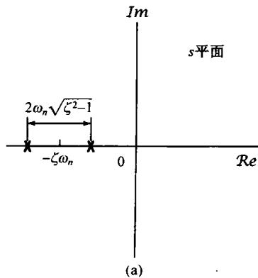

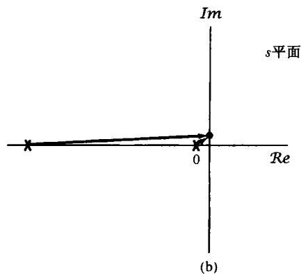

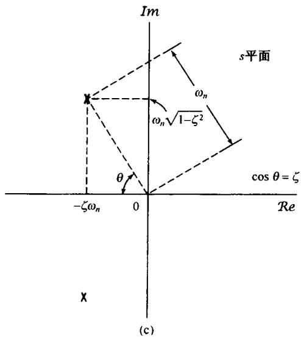

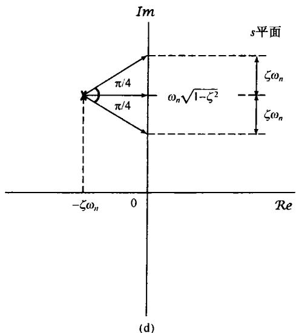

图9.19 (a)  $\zeta > 1$  时二阶系统的零-极点图；(b)  $\zeta \gg 1$  时的极点向量；(c)  $0 < \zeta < 1$  时二阶系统的零-极点图；(d)  $0 < \zeta < 1$  时， $\omega = \omega_{n} \sqrt{1 - \zeta^{2}}$  和  $\omega = \omega_{n} \sqrt{1 - \zeta^{2}} \pm \zeta \omega_{n}$  的极点向量

对于  $0 < \zeta < 1$ ， $c_{1}$  和  $c_{2}$  都是复数，所以零-极点图如图9.19(c)所示。相应地，单位冲激响应和阶跃响应都有振荡的部分。应该注意到，这两个极点发生在复数共轭的位置上。事实上，由9.5.5节的讨论可知，对于一个实值信号，复数极点(和零点)总是共轭成对地出现的。从这个图上，特别是当  $\zeta$  较小时，这些极点很靠近  $\mathrm{j}\omega$  轴，随着  $\omega$  接近于  $\omega_{n}\sqrt{1 - \zeta^{2}}$ ，频率响应特性主要由第二象限内的这个极点所决定。尤其是，在  $\omega = \omega_{n}\sqrt{1 - \zeta^{2}}$  处，这个极点向量的长度有一个最小值，因此可以定性地预期到，频率响应的模在该频率附近应有一个峰值。由于有其他极点的存在，峰值不是真正出现在  $\omega = \omega_{n}\sqrt{1 - \zeta^{2}}$  处，而是在略比它小一点的频率上。图9.20(a)对于  $\omega_{n} = 1$  和几个不同的  $\zeta$  值，给出了频率响应的模，显然在极点附近有一个所期望的特性。当然，这与6.5.2节对二阶系统进行的分析是一致的。

因此，对于  $0 < \zeta < 1$  ，这个二阶系统是一个非理想的带通滤波器，参数  $\zeta$  控制着频率响应的尖锐程度和峰值宽度。从图9.19(d)的几何性质也可看到，当频率  $\omega$  在  $\omega_{n}\sqrt{1 - \zeta^{2}}$  上下各增减一个  $\zeta \omega_{n}$  的值时，第二象限极点向量的长度对于  $\omega = \omega_{n}\sqrt{1 - \zeta^{2}}$  处的最小值来说就增加了  $\sqrt{2}$  倍。这样，对于小的  $\zeta$  值来说，远在第三象限的极点，其影响可以忽略， $|H(j\omega)|$  在频率范围

$$
\omega_ {n} \sqrt {1 - \zeta^ {2}} - \zeta \omega_ {n} <   \omega <   \omega_ {n} \sqrt {1 - \zeta^ {2}} + \zeta \omega_ {n}
$$

内就在其峰值  $1 / \sqrt{2}$  之内。若定义相对带宽  $B$  为这个频率间隔（即  $2\zeta \omega_{n}$ ）除以自然频率  $\omega_{n}$ ，则有

$$
B = 2 \zeta
$$

因此， $\zeta$  越接近于零，频率响应的峰值就越尖锐，峰值宽度就越窄。另外， $B$  就是在6.5.2节定义的二阶系统品质因数  $Q$  值的倒数，因此随着品质因数的增加，相对带宽减小，滤波器的频率选择性就越强。

对于  $\omega_{n} = 1$  和几个不同的  $\zeta$  值，该二阶系统的相位特性如图9.20(b)所示。由图9.19(d)可以看到，第二象限极点向量的相角在频率  $\omega$  由  $\omega_{n}\sqrt{1 - \zeta^{2}} -\zeta \omega_{n}$  变到  $\omega_{n}\sqrt{1 - \zeta^{2}}$  再变到  $\omega_{n}\sqrt{1 - \zeta^{2}} +\zeta \omega_{n}$  的过程中，由  $-\pi /4$  到0再到  $\pi /4$  内变化。对于较小的  $\zeta$  值，第三象限极点向量的相角在这个频率范围内的变化很小，其结果就是在这个频率间隔上，  $< H(j\omega)$  就有一个  $\pi /2$  的急剧变化。这就是在图9.20(b)中所指出的。

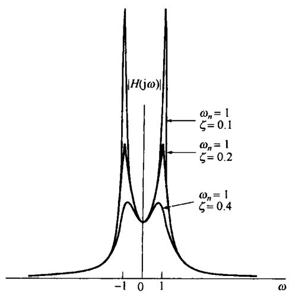

(a)

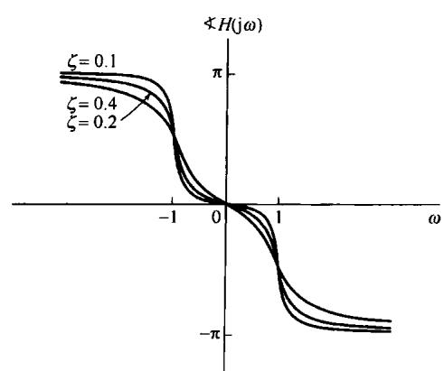

(b)

图9.20  $0 < \zeta < 1$  时二阶系统的频率响应。（a）模特性；（b）相位特性

$\zeta$  固定而改变  $\omega_{n}$ , 在上面的讨论中仅改变了频率坐标的尺度, 也就是说,  $|H(\mathrm{j}\omega)|$  和  $\prec H(\mathrm{j}\omega)$  仅仅取决于  $\omega / \omega_{n}$  。从图9.19(c)中也很容易确定, 当保持  $\omega_{n}$  不变而变化  $\zeta$  时, 这些极点和系统特性是如何随  $\zeta$  而改变的。因为  $\cos \theta = \zeta$ , 所以这两个极点就沿着半径为  $\omega_{n}$  的半圆移动。当  $\zeta = 0$  时, 这两个极点都在虚轴上, 这就对应于在时域中单位冲激响应是无衰减的正弦振荡。随着  $\zeta$  从0增加到1, 这两个极点仍为复数, 并移向左半平面, 而且从原点到这两个极点的向量长度保持为常数  $\omega_{n}$  。随着极点的实部变得更负, 有关的时间响应随  $t \to \infty$  衰减得更快。同时, 正如已经看到的, 随着  $\zeta$  从0增加到1的过程, 频率响应的相对带宽也随着增加, 频率响应的尖锐程度渐渐降低, 频率选择性变差。

# 9.4.3 全通系统

作为利用频率响应几何求值的最后一个例子，我们来考虑一个系统，其单位冲激响应的拉普拉斯变换有如图9.21(a)所示的零-极点图。由该图可明显看出，沿着  $\mathrm{j}\omega$  轴的任何一点，其极点向量和零点向量的长度都是相等的，因而频率响应的模是一个常数而与频率无关。这样的系统称为全通系统(all-pass system)，因为它等增益(或等衰减)地通过所有频率。频率响应的相位是 $\theta_{1} - \theta_{2}$ ，或者因为  $\theta_{1} = \pi -\theta_{2}$ ，所以

$$
\left. \right. \left. \right. H (\mathrm {j} \omega) = \pi - 2 \theta_ {2} \tag {9.80}
$$

由图9.21(a)可知，  $\theta_{2} = \arctan (\omega /a)$  ，因此

$$
\left. \right.\left. \right.\left. \right.\left. \right.\left. \right.\left. \right.\left. \right.\left. \right.\left. \right.\left. \right.\left. \right.\left. \right.\left. \right.\left. \right.\left. \right.\left. \right.\left. \right.\left. \right.\left. \right.\left. \right.\left. \right.\left. \right.\left. \right.\left. \right.\left. \right.\left. \right.\left. \right.\left. \right.\left. \right.\left. \right.\left. \right.\left. \right.\left. \right.\left. \right. \int_ {a} ^ {b} d x d y d z d w d x d y d z d w d x d y d z d w d x d y d z d w d x d y d z d w d x d y d z d w d x d y d z d w d x d y d z d w d x d y d z d w d x d y d z d w d x d y d z d w d x d y d z d w d x d y d z d w d x d w d y d z d w d x d y d z d w d x d y d z d w d x d y d z d w d x d y d z d w d x d y d z d w d x d y d z d w d x d y d z d w d x d y d z d w d x d y d z d w d x d y d z d w d x d y d z d w d x d y d
$$

$H(\mathrm{j}\omega)$  的模和相位特性均如图9.21(b)所示。

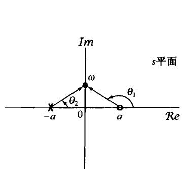

(a)

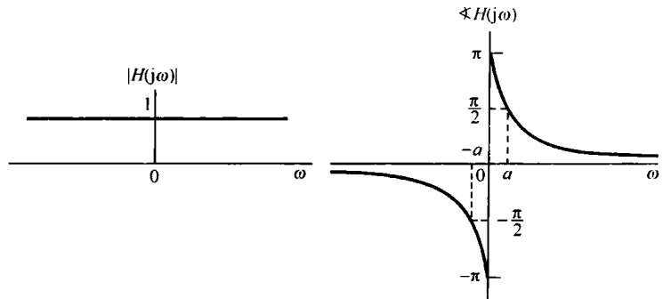

(b)

图9.21 (a) 全通系统的零-极点图；(b) 全通系统频率响应的模和相位特性

# 9.5 拉普拉斯变换的性质

在傅里叶变换的应用中，主要依赖于4.3节所获得的一组性质。这一节，将考虑相应的一组拉普拉斯变换的性质。很多结果的导出都和傅里叶变换中相应性质的导出是类似的，因此这里不进行详细推导，有些将在本章末习题中作为课后作业（见习题9.52至习题9.54）。

# 9.5.1 线性性质

若

$$
x _ {1} (t) \stackrel {\mathcal {L}} {\longleftrightarrow} X _ {1} (s), \mathrm {R O C} \text {为} R _ {1}
$$

且

$$
x _ {2} (t) \stackrel {\mathcal {L}} {\longleftrightarrow} X _ {2} (s), \mathrm {R O C} \text {为} R _ {2}
$$

则

$$
\boxed {a x _ {1} (t) + b x _ {2} (t) \xleftarrow {\mathcal {L}} a X _ {1} (s) + b X _ {2} (s), \text {R O C 包 括} R _ {1} \cap R _ {2}} \tag {9.82}
$$

正如所指出的，  $X(s)$  的收敛域至少是  $R_{1}$  和  $R_{2}$  的相交，这个交可以是空的；若是这样，  $X(s)$  就没有收敛域，即  $x(t)$  不存在拉普拉斯变换。例如，例9.7中式(9.47)的  $x(t)$ ，在  $b > 0$  时  $X(s)$  的收

敛域就是在和式中这两项收敛域的交。若  $b < 0$  则在  $R_{1}$  和  $R_{2}$  中没有公共点，即这个交是空的，因此  $x(t)$  就没有拉普拉斯变换。 $X(s)$  的收敛域也可能比这个“交”大。作为一个简单例子，在式(9.82)中，若  $x_{1}(t) = x_{2}(t)$  且  $a = -b$ ，则有  $x(t) = 0$ ，因此  $X(s) = 0$ ，这样  $X(s)$  的收敛域就是整个  $s$  平面。

与一些项的线性组合相联系的收敛域，总可以利用在9.2节得到的关于收敛域的性质来构成。具体而言，根据这些单项收敛域的公共相交部分（假定各单项收敛域有相交部分），就能找到一条线或一个带状区域在这个线性组合的收敛域中，然后将其向右延伸  $(\mathcal{Re}\{s\}$  增加)和向左延伸  $(\mathcal{Re}\{s\}$  减小)，直到最近的极点(这个极点也可能在无限远)为止。

例9.13 这个例子要说明一个由信号的线性组合构成的信号，其拉普拉斯变换的收敛域有时可能会延伸到超过这些单项收敛域的交。考虑信号

$$
x (t) = x _ {1} (t) - x _ {2} (t) \tag {9.83}
$$

其中  $x_{1}(t)$  和  $x_{2}(t)$  的拉普拉斯变换分别是

$$
X _ {1} (s) = \frac {1}{s + 1}, \quad \mathcal {R e} \{s \} > - 1 \tag {9.84}
$$

和

$$
X _ {2} (s) = \frac {1}{(s + 1) (s + 2)}, \quad \operatorname {R e} \{s \} > - 1 \tag {9.85}
$$

$X_{1}(s)$  和  $X_{2}(s)$  的零-极点图及收敛域如图9.22(a)和图9.22(b)所示。由式(9.82)知

$$
X (s) = \frac {1}{s + 1} - \frac {1}{(s + 1) (s + 2)} = \frac {s + 1}{(s + 1) (s + 2)} = \frac {1}{s + 2} \tag {9.86}
$$

由此，在  $x_{1}(t)$  和  $x_{2}(t)$  的线性组合中，在  $s = -1$  的极点被  $s = -1$  的零点所抵消。 $X(s) = X_{1}(s) - X_{2}(s)$  的零-极点图如图9.22(c)所示。 $X_{1}(s)$  和  $X_{2}(s)$  的收敛域的交是  $\mathcal{Re}\{s\} > -1$  。然而，因为收敛域总是被一个极点或无限远点所界定，对这个例子来说， $X(s)$  的收敛域就能够再向左延伸，直至被  $s = -2$  的极点所界定为止，这就是由于在  $s = -1$  零极点抵消的结果。

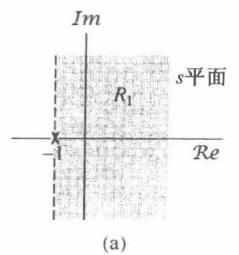

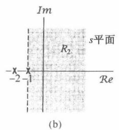

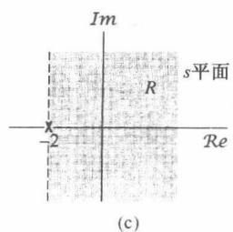

图9.22 例9.13的零-极点图和收敛域。(a)  $X_{1}(s)$ ; (b)  $X_{2}(s)$ ; (c)  $X_{1}(s) - X_{2}(s)$  。 $X_{1}(s) - X_{2}(s)$  的收敛域包括  $R_{1}$  和  $R_{2}$  的交，这个交可以延伸到被极点  $s = -2$  界定为止

# 9.5.2 时移性质

若

$$
x (t) \xleftarrow {\mathcal {L}} X (s), \quad \operatorname {R O C} = R
$$

则

$$
\boxed {x (t - t _ {0}) \stackrel {\mathcal {L}} {\longleftrightarrow} \mathrm {e} ^ {- s t _ {0}} X (s), \quad \mathrm {R O C} = R} \tag {9.87}
$$

# 9.5.3  $s$  域平移

若

$$
x (t) \stackrel {\mathcal {L}} {\longleftrightarrow} X (s), \quad \operatorname {R O C} = R
$$

则

$$
\boxed {e ^ {s _ {0} t} x (t) \xleftrightarrow {\mathcal {L}} X (s - s _ {0}), \quad \mathrm {R O C} = R + \mathcal {R e} \{s _ {0} \}} \tag {9.88}
$$

这就是说，  $X(s - s_0)$  的收敛域是  $X(s)$  的收敛域平移一个  $\mathcal{Re}\{s_0\}$  。于是，对位于  $R$  中的任何一个 $s$  值，  $s + \mathcal{Re}\{s_0\}$  的值一定在  $R_{1}$  中，如图9.23所示。应该注意，如果  $X(s)$  有一个极点或零点在  $s$ $= a$  ，那么  $X(s - s_0)$  就有一个极点或零点在  $s - s_0 = a$  ，也就是  $s = a + s_0$  。

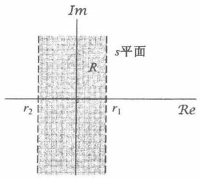

(a)

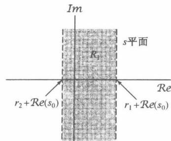

(b)

图9.23  $s$  域平移在收敛域上的影响。（a） $X(s)$  的收敛域；（b） $X(s - s_0)$  的收敛域

式(9.88)的一个重要的特殊情况是当  $s_0 = \mathrm{j}\omega_0$  时，也就是当一个信号  $x(t)$  用来调制一个周期复指数信号  $\mathrm{e}^{\mathrm{j}\omega_0t}$  时，式(9.88)就变成

$$
\mathrm {e} ^ {\mathrm {j} \omega_ {0} t} x (t) \xleftrightarrow {\mathcal {L}} X (s - \mathrm {j} \omega_ {0}), \quad \mathrm {R O C} = R \tag {9.89}
$$

式(9.89)的右边可以看成在  $s$  平面内平行于实轴的一个平移，这就是说，若  $\pmb{x}(t)$  的拉普拉斯变换在  $s = a$  有一个极点或零点，那么  $\mathrm{e}^{\mathrm{j}\omega_0t}\pmb{x}(t)$  就在  $s = a + \mathrm{j}\omega_0$  有一个极点或零点。

# 9.5.4 时域尺度变换

若

$$
x (t) \stackrel {\mathcal {L}} {\longleftrightarrow} X (s), \quad \mathrm {R O C} = R
$$

则

$$
\boxed {x (a t) \stackrel {\mathcal {L}} {\longleftrightarrow} \frac {1}{| a |} X \left(\frac {s}{a}\right), \quad \operatorname {R O C} R _ {1} = | a | R} \tag {9.90}
$$

这就是说，对于在  $R$  中的任何  $s$  值[见图9.24(a)],  $a \cdot s$  的值一定位于  $R_{1}$  中，如图9.24(b)所示，这里  $0 < a < 1$  。注意，对于  $0 < a < 1, X(s)$  的收敛域要变为原来的  $a$  倍，如图9.24(b)所示；而对于  $a > 1$  ，收敛域要扩展为原来的  $a$  倍。另外，式(9.90)还意味着，若  $a$  为负，收敛域就要进行倒置再加一个尺度变换。特别是，如图9.24(c)所示，该图是对应于  $-1 < a < 0$  的情况， $1 / |a|X(s / a)$  的收敛域涉及关于  $\mathrm{j}\omega$  轴的反转，再加上一个  $1 / |a|$  因子的收敛域大小的变化。因此， $x(t)$  的时间反转就形成收敛域的反转，即

$$
x (- t) \stackrel {\mathcal {L}} {\longleftrightarrow} X (- s), \quad \operatorname {R O C} = - R \tag {9.91}
$$

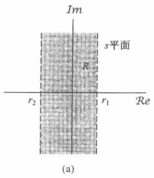

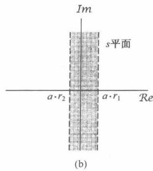

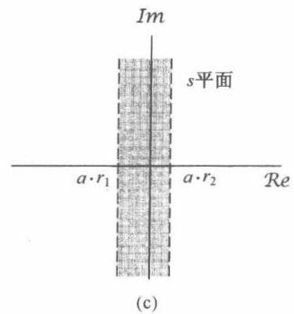

图9.24 时域尺度变换在收敛域上的影响。(a)  $X(s)$  的收敛域；(b)  $0 < a < 1$ ， $(1 / |a|)X(s / a)$  的收敛域；(c)  $-1 < a < 0$ ， $(1 / |a|)X(s / a)$  的收敛域

# 9.5.5 共轭

若

$$
x (t) \stackrel {\mathcal {L}} {\longleftrightarrow} X (s), \quad \operatorname {R O C} = R \tag {9.92}
$$

则

$$
\boxed {x ^ {*} (t) \xleftarrow {\mathcal {L}} X ^ {*} (s ^ {*}), \quad \mathrm {R O C} = R} \tag {9.93}
$$

因此

$$
X (s) = X ^ {*} (s ^ {*}) \quad x (t) \text {为 实 数} \tag {9.94}
$$

因此，若  $x(t)$  为实函数并且若  $X(s)$  有一个极点或零点在  $s = s_0$  ，即如果  $X(s)$  在  $s = s_0$  无界或为零，那么  $X(s)$  也一定有一个复数共轭的  $s = s_0^*$  的极点或零点。例如，例9.4中的实信号  $x(t)$  的拉普拉斯变换  $X(s)$  就有共轭成对极点  $s = 1 \pm 3\mathrm{j}$  和零点  $s = (-5 \pm \mathrm{j} \sqrt{71}) / 2$  。

# 9.5.6 卷积性质

若

$$
x _ {1} (t) \stackrel {\mathcal {L}} {\longleftrightarrow} X _ {1} (s), \quad \operatorname {R O C} = R _ {1}
$$

且

$$
x _ {2} (t) \stackrel {\mathcal {L}} {\longleftrightarrow} X _ {2} (s), \quad \operatorname {R O C} = R _ {2}
$$

那么

$$
\boxed {x _ {1} (t) * x _ {2} (t) \stackrel {\mathcal {L}} {\longleftrightarrow} X _ {1} (s) X _ {2} (s), \quad \mathrm {R O C} \text {包 括} R _ {1} \cap R _ {2}} \tag {9.95}
$$

因此，和9.5.1节的线性性质一样，  $X_{1}(s)X_{2}(s)$  的收敛域包括  $X_{1}(s)$  和  $X_{2}(s)$  的收敛域的相交部分，如果在乘积中有零极点相消，那么  $X_{1}(s)X_{2}(s)$  的收敛域也可以比它们的相交部分大。例如，若

$$
X _ {1} (s) = \frac {s + 1}{s + 2}, \quad \mathcal {R e} \{s \} > - 2 \tag {9.96}
$$

且

$$
X _ {2} (s) = \frac {s + 2}{s + 1}, \quad \mathcal {R e} \{s \} > - 1 \tag {9.97}
$$

那么  $X_{1}(s)X_{2}(s) = 1$  ，它的收敛域就是整个  $s$  平面。

正如在第4章中所看到的，傅里叶变换中的卷积性质在线性时不变系统的分析中起着很重要的作用。在9.7节和9.8节中，也将利用拉普拉斯变换的卷积性质来分析线性时不变系统，更具体一些就是分析由线性常系数微分方程所表征的系统。

# 9.5.7 时域微分

若

$$
x (t) \stackrel {\mathcal {L}} {\longleftrightarrow} X (s), \quad \operatorname {R O C} = R
$$

则

$$
\boxed {\frac {\mathrm {d} x (t)}{\mathrm {d} t} \stackrel {\mathcal {L}} {\longleftrightarrow} s X (s), \quad \text {R O C 包 括} R} \tag {9.98}
$$

将式(9.56)的逆变换式两边对  $t$  微分，就可得到这个性质，即设

$$
x (t) = \frac {1}{2 \pi \mathrm {j}} \int_ {\sigma - \mathrm {j} \infty} ^ {\sigma + \mathrm {j} \infty} X (s) \mathrm {e} ^ {s t} \mathrm {d} s
$$

那么就有

$$
\frac {\mathrm {d} x (t)}{\mathrm {d} t} = \frac {1}{2 \pi \mathrm {j}} \int_ {\sigma - \mathrm {j} ^ {\infty}} ^ {\sigma + \mathrm {j} ^ {\infty}} s X (s) \mathrm {e} ^ {s t} \mathrm {d} s \tag {9.99}
$$

可见，  $\mathrm{d}x(t) / \mathrm{d}t$  就是  $sX(s)$  的逆变换。  $sX(s)$  的收敛域包括  $X(s)$  的收敛域，并且如果  $X(s)$  中有一个  $s = 0$  的一阶极点被乘以  $s$  抵消了，还可以比  $X(s)$  的收敛域更大。例如，若  $x(t) = u(t)$ ，那么  $X(s) = 1 / s$  ，收敛域是  $\mathcal{R}e\{s\} > 0$  ，而  $x(t)$  的导数是一个单位冲激函数  $\delta (t)$  ，它的拉普拉斯变换是1，而且收敛域是整个  $s$  平面。

# 9.5.8  $s$  域微分

将式(9.3)的拉普拉斯变换，即

$$
X (s) = \int_ {- \infty} ^ {+ \infty} x (t) e ^ {- s t} d t
$$

两边对  $s$  微分，得到

$$
\frac {\mathrm {d} X (s)}{\mathrm {d} s} = \int_ {- \infty} ^ {+ \infty} (- t) x (t) \mathrm {e} ^ {- s t} \mathrm {d} t
$$

因此，若

$$
x (t) \stackrel {\mathcal {L}} {\longleftrightarrow} X (s), \quad \operatorname {R O C} = R
$$

则

$$
- t x (t) \xleftrightarrow {\mathcal {L}} \frac {\mathrm {d} X (s)}{\mathrm {d} s}, \quad \operatorname {R O C} = R \tag {9.100}
$$

下面两个例子用来说明这个性质的应用。

例9.14 求下面  $x(t)$  的拉普拉斯变换

$$
x (t) = t \mathrm {e} ^ {- a t} u (t) \tag {9.101}
$$

因为

$$
\mathrm {e} ^ {- a t} u (t) \xleftarrow {\mathcal {L}} \frac {1}{s + a}, \quad \mathcal {R e} \{s \} > - a
$$

因此由式(9.100)可得

$$
t \mathrm {e} ^ {- a t} u (t) \xleftrightarrow {\mathcal {L}} - \frac {\mathrm {d}}{\mathrm {d} s} \left[ \frac {1}{s + a} \right] = \frac {1}{(s + a) ^ {2}}, \quad \mathcal {R e} \{s \} > - a \tag {9.102}
$$

事实上，反复利用式(9.100)，可得

$$
\frac {t ^ {2}}{2} \mathrm {e} ^ {- a t} u (t) \xleftarrow {\mathcal {L}} \frac {1}{(s + a) ^ {3}}, \quad \operatorname {R e} \{s \} > - a \tag {9.103}
$$

或更一般的形式为

$$
\frac {t ^ {n - 1}}{(n - 1) !} \mathrm {e} ^ {- a t} u (t) \xleftrightarrow {\mathcal {L}} \frac {1}{(s + a) ^ {n}}, \quad \mathcal {R e} \{s \} > - a \tag {9.104}
$$

下一个例子要说明，当将部分分式展开用于求一个具有重阶极点的有理函数的逆变换时，这个特殊的拉普拉斯变换对是特别有用的。

例9.15 考虑下面的拉普拉斯变换  $X(s)$

$$
X (s) = \frac {2 s ^ {2} + 5 s + 5}{(s + 1) ^ {2} (s + 2)}, \quad \operatorname {R e} \{s \} > - 1
$$

将附录A中介绍的部分分式展开法应用于  $X(s)$  ，可写成

$$
X (s) = \frac {2}{(s + 1) ^ {2}} - \frac {1}{(s + 1)} + \frac {3}{s + 2}, \quad \operatorname {R e} \{s \} > - 1 \tag {9.105}
$$

因为收敛域在极点  $s = -1$  和  $s = -2$  的右边，所以每一项逆变换都是一个右边信号，再应用式(9.14)和式(9.104)，可得逆变换为

$$
x (t) = [ 2 t \mathrm {e} ^ {- t} - \mathrm {e} ^ {- t} + 3 \mathrm {e} ^ {- 2 t} ] u (t)
$$

# 9.5.9 时域积分

若

$$
x (t) \stackrel {\mathcal {L}} {\longleftrightarrow} X (s), \quad \operatorname {R O C} = R
$$

则

$$
\boxed {\int_ {- \infty} ^ {t} x (\tau) \mathrm {d} \tau \stackrel {\mathcal {L}} {\longleftrightarrow} \frac {1}{s} X (s), \quad \text {R O C 包 括} R \cap \{\operatorname {R e} \{s \} > 0 \}} \tag {9.106}
$$

这个性质是9.5.7节所述微分性质的逆性质，利用9.5.6节的卷积性质可以将它导出，即

$$
\int_ {- \infty} ^ {t} x (\tau) \mathrm {d} \tau = u (t) * x (t) \tag {9.107}
$$

由例9.1，若  $a = 0$  ，则有

$$
u (t) \xleftarrow {\mathcal {L}} \frac {1}{s}, \quad \mathcal {R e} \{s \} > 0 \tag {9.108}
$$

根据卷积性质有

$$
u (t) * x (t) \xleftarrow {\mathcal {L}} \frac {1}{s} X (s) \tag {9.109}
$$

它的收敛域应包括  $X(s)$  的收敛域和式(9.108)中  $\pmb{u}(t)$  拉普拉斯变换收敛域的相交，这就是式(9.106)给出的收敛域结果。

# 9.5.10 初值定理与终值定理

若  $t < 0$  ，  $x(t) = 0$  ，并且在  $t = 0$  时，  $x(t)$  不包含冲激或高阶奇异函数，在这些特别限制下，就可以直接从拉普拉斯变换式中计算出初值  $x(0^{+})$  ，即当  $\pmb{t}$  从正值方向趋于0时  $\pmb {x}(t)$  的值，以及终值，即  $t\to \infty$  时的  $x(t)$  值。

初值定理(initial-value theorem)

$$
x \left(0 ^ {+}\right) = \lim  _ {s \rightarrow \infty} s X (s) \tag {9.110}
$$

终值定理(final-value theorem)

$$
\lim  _ {t \rightarrow \infty} x (t) = \lim  _ {s \rightarrow 0} s X (s) \tag {9.111}
$$

这些结果的导出留在习题9.53中考虑。

例9.16 初值定理与终值定理在验证一个信号的拉普拉斯变换计算结果的正确性方面很有用。例如，考虑例9.4中的信号  $x(t)$ ，由式(9.24)可见  $x(0^{+}) = 2$ ，同时利用式(9.29)可求出

$$
\lim  _ {s \rightarrow \infty} s X (s) = \lim  _ {s \rightarrow \infty} \frac {2 s ^ {3} + 5 s ^ {2} + 1 2 s}{s ^ {3} + 4 s ^ {2} + 1 4 s + 2 0} = 2
$$

这与式(9.110)的初值定理是一致的。

# 9.5.11 性质列表

表9.1综合了本节中所得到的全部性质，在9.7节将拉普拉斯变换用于线性时不变系统的分析和表征时，会用到很多这些性质。正如已在几个例子中所说明的，拉普拉斯变换及其收敛域的各种性质，都能为一个信号及其变换提供大量的信息，而这些无论是在表征信号方面，还是校核一个计算的结果方面，都是有用的。在9.7节和9.8节及本章末的习题中，将给出应用这些性质的其他一些例子。

表 9.1 拉普拉斯变换性质

<table><tr><td>节次</td><td>性质</td><td>信号</td><td>拉普拉斯变换</td><td>收敛域</td></tr><tr><td></td><td></td><td>x(t)</td><td>X(s)</td><td>R</td></tr><tr><td></td><td></td><td>x1(t)</td><td>X1(s)</td><td>R1</td></tr><tr><td></td><td></td><td>x2(t)</td><td>X2(s)</td><td>R2</td></tr><tr><td>9.5.1</td><td>线性</td><td>ax1(t)+bx2(t)</td><td>aX1(s)+bX2(s)</td><td>至少R1∩R2</td></tr><tr><td>9.5.2</td><td>时移</td><td>x(t-t0)</td><td>e-αt0X(s)</td><td>R</td></tr><tr><td>9.5.3</td><td>s域平移</td><td>e+0&#x27;tx(t)</td><td>X(s-s0)</td><td>R的平移,即若(s-s0)在R中,则s就位于收敛域中</td></tr><tr><td>9.5.4</td><td>时域尺度变换</td><td>x(at)</td><td>1/|a|X(s/a)</td><td>R/a,即若s/a在R中,则s就位于收敛域中</td></tr><tr><td>9.5.5</td><td>共轭</td><td>x*(t)</td><td>X*(s*)</td><td>R</td></tr><tr><td>9.5.6</td><td>卷积</td><td>x1(t)*x2(t)</td><td>X1(s)X2(s)</td><td>至少R1∩R2</td></tr><tr><td>9.5.7</td><td>时域微分</td><td>d/dt x(t)</td><td>sX(s)</td><td>至少R</td></tr><tr><td>9.5.8</td><td>s域微分</td><td>-tx(t)</td><td>d/ds X(s)</td><td>R</td></tr><tr><td>9.5.9</td><td>时域积分</td><td>∫_−∞^t x(τ)d(τ)</td><td>1/sX(s)</td><td>至少R∩{Re{s}&gt;0}</td></tr><tr><td>9.5.10</td><td colspan="4">初值定理和终值定理
若t&lt;0,x(t)=0且在t=0不包括任何冲激或高阶奇异函数,则
x(0*) = lim sX(s)
lim x(t) = lim sX(s)</td></tr></table>

# 9.6 常用拉普拉斯变换对

正如9.3节所指出的，把  $X(s)$  分解成较简单的一些项的线性组合，拉普拉斯逆变换往往很容易求得，因为这些简单项的拉普拉斯变换可以直接写出来，或者极易求得。表9.2列出了若干

常用的拉普拉斯变换对。第1对直接由式(9.3)得到。第2对和第6对可由例9.1分别以  $a = 0$  和  $a = \alpha$  代入求出。利用微分性质，由例9.14可得变换对4。在变换对4的基础上，利用9.5.3节的性质可得变换对8。变换对3,5,7和9分别在变换对2,4,6和8的基础上，再结合9.5.4节的时域尺度变换性质，以  $a = -1$  代入而得出。类似地，变换对10到16都可以利用表9.1的有关性质，在前面那些变换对的基础上导得（见习题9.55）。

表 9.2 基本函数的拉普拉斯变换

<table><tr><td>变 换 对</td><td>信 号</td><td>变 换</td><td>收 敛 域</td></tr><tr><td>1</td><td>δ(t)</td><td>1</td><td>全部s</td></tr><tr><td>2</td><td>u(t)</td><td>1/s</td><td>Re{s}&gt;0</td></tr><tr><td>3</td><td>-u(-t)</td><td>1/s</td><td>Re{s}&lt;0</td></tr><tr><td>4</td><td>t^{n-1} \overline{(n-1)!} u(t)</td><td>1/s^n</td><td>Re{s}&gt;0</td></tr><tr><td>5</td><td>- t^{n-1} \overline{(n-1)!} u(-t)</td><td>1/s^n</td><td>Re{s}&lt;0</td></tr><tr><td>6</td><td>e^{-at} u(t)</td><td>1/s+a</td><td>Re{s}&gt; -a</td></tr><tr><td>7</td><td>- e^{-at} u(-t)</td><td>1/s+a</td><td>Re{s}&lt; -a</td></tr><tr><td>8</td><td>t^{n-1} \overline{(n-1)!} e^{-at} u(t)</td><td>1/(s+a)^n</td><td>Re{s}&gt; -a</td></tr><tr><td>9</td><td>- t^{n-1} \overline{(n-1)!} e^{-at} u(-t)</td><td>1/(s+a)^n</td><td>Re{s}&lt; -a</td></tr><tr><td>10</td><td>δ(t-T)</td><td>e^{-sT}</td><td>全部s</td></tr><tr><td>11</td><td>[cos ω₀t] u(t)</td><td>s/s² + ω₀²</td><td>Re{s}&gt;0</td></tr><tr><td>12</td><td>[sin ω₀t] u(t)</td><td>ω₀/s² + ω₀²</td><td>Re{s}&gt;0</td></tr><tr><td>13</td><td>[e^{-at}cos ω₀t] u(t)</td><td>s+a/(s+a)² + ω₀²</td><td>Re{s}&gt; -a</td></tr><tr><td>14</td><td>[e^{-at}sin ω₀t] u(t)</td><td>ω₀/(s+a)² + ω₀²</td><td>Re{s}&gt; -a</td></tr><tr><td>15</td><td>u_n(t) = d^n δ(t)/dt^n</td><td>sn</td><td>全部s</td></tr><tr><td>16</td><td>u_{-n}(t)=\underline{u(t)*...*u(t)}_{n次}</td><td>1/s^n</td><td>Re{s}&gt;0</td></tr></table>

# 9.7 用拉普拉斯变换分析与表征线性时不变系统

拉普拉斯变换的重要应用之一是对线性时不变系统的分析与表征。对于线性时不变系统，拉普拉斯变换的作用直接来自于卷积性质(见9.5.6节)。根据这一性质就可以得到，一个线性时不变系统输入和输出的拉普拉斯变换是通过乘以系统单位冲激响应的拉普拉斯变换联系起来的，即

$$
Y (s) = H (s) X (s) \tag {9.112}
$$

其中，  $X(s)$  ，  $Y(s)$  和  $H(s)$  分别是系统输入、输出和单位冲激响应的拉普拉斯变换。式(9.112)是与傅里叶变换场合的式(4.56)相对应的。事实上，当  $s = \mathrm{j}\omega$  时，式(9.112)拉普拉斯变换中的每一项都变成相应的傅里叶变换，这样式(9.112)就完全相当于式(4.56)。另外，根据3.2节关于线性时不变系统对复指数信号响应的讨论，若一个线性时不变系统的输入是  $x(t) = \mathbf{e}^{st}$  ，那么其输

出就一定是  $H(s)\mathrm{e}^{st}$  ；也就是说，  $\mathbf{e}^{\prime \prime}$  是系统的一个特征函数，而其特征值就等于单位冲激响应的拉普拉斯变换。

当  $s = \mathrm{j}\omega$  时， $H(s)$  就是这个线性时不变系统的频率响应。在拉普拉斯变换的范畴内，一般称  $H(s)$  为系统函数或转移函数（transfer function）。线性时不变系统的很多性质都与系统函数（system function）在  $s$  平面的特性密切有关。下面将通过几个重要的系统性质和几类重要系统来说明这一点。

# 9.7.1 因果性

对于一个因果线性时不变系统，其单位冲激响应在  $t < 0$  时为零，因此是一个右边信号，这样根据9.2节的讨论，可见有

一个因果系统的系统函数的收敛域是某个右半平面。

应该强调的是，相反的结论未必是成立的。如例9.19所说明的，位于最右边极点的右边的收敛域并不保证系统是因果的，它只保证单位冲激响应是右边的。然而，如果  $H(s)$  是有理的，那么如例9.17和例9.18所表明的，只须看它的收敛域是否是右半平面的，就能确定该系统是否是因果的，从而有

对于一个具有有理系统函数的系统来说，系统的因果性就等效于收敛域位于最右边极点的右边的右半平面。

例9.17 有一个系统，其单位冲激响应为

$$
\boldsymbol {h} (t) = \mathrm {e} ^ {- t} \boldsymbol {u} (t) \tag {9.113}
$$

因为  $t < 0, h(t) = 0$  ，所以该系统是因果的。同时它的系统函数由例9.1可得

$$
H (s) = \frac {1}{s + 1}, \quad \operatorname {R e} \{s \} > - 1 \tag {9.114}
$$

在这种情况下，系统函数是有理的，并且收敛域在最右边极点的右边，这就与具有有理系统函数的系数的因果性等效于收敛域位于最右边极点的右边的结论相一致。

例9.18 有一个系统，其单位冲激响应为

$$
\boldsymbol {h} (t) = \mathrm {e} ^ {- | t |}
$$

因为  $t < 0, h(t) \neq 0$  ，所以该系统是非因果的。同时它的系统函数由例9.7有

$$
H (s) = \frac {- 2}{s ^ {2} - 1}, \quad - 1 <   \mathcal {R e} \{s \} <   + 1
$$

因此，  $H(s)$  是有理的，但收敛域不在最右边极点的右边，这与系统的非因果性是一致的。

例9.19 考虑如下系统函数：

$$
H (s) = \frac {\mathrm {e} ^ {s}}{s + 1}, \quad \operatorname {R e} \{s \} > - 1 \tag {9.115}
$$

对于该系统，其收敛域位于最右边极点的右边，因此单位冲激响应必须是右边的。为了确定它的单位冲激响应，首先利用例9.1的结果

$$
e ^ {- t} u (t) \xleftrightarrow {\mathcal {L}} \frac {1}{s + 1}, \quad R e \{s \} > - 1 \tag {9.116}
$$

接下来，根据9.5.2节的时移性质[见式(9.87)]，在式(9.115)中的因子  $\mathbf{e}^{\mathrm{i}}$  可以认为是

式(9.116)中时间函数的移位，那么

$$
\mathrm {e} ^ {- (t + 1)} u (t + 1) \xleftrightarrow {\mathcal {L}} \frac {\mathrm {e} ^ {s}}{s + 1}, \quad \mathcal {R e} \{s \} > - 1 \tag {9.117}
$$

所以系统的单位冲激响应是

$$
h (t) = \mathrm {e} ^ {- (t + 1)} u (t + 1) \tag {9.118}
$$

它在  $-1 < t < 0$  不等于零，所以系统不是因果的。这个例子可以作为一个提示：因果性确实意味着收敛域位于最右边极点的右边，但是相反的结论一般是不成立的，除非系统函数是有理的。

可以用完全类似的方式来处理有关反因果性的概念。如果系统的单位冲激响应在  $t > 0$  ， $h(t) = 0$  ，就说该系统是反因果(anticausal)的。因为在这种情况下， $h(t)$  是左边信号，由9.2节知道，系统函数  $H(s)$  的收敛域就必须是某个左半平面。同样，一般来说其相反的结论是不成立的；也就是说，如果  $H(s)$  的收敛域是某个左半平面，那么我们所知道的只是  $h(t)$  是左边的。然而，如果  $H(s)$  是有理的，那么收敛域位于最左边极点的左边就等效于系统是反因果的。

# 9.7.2 稳定性

$H(s)$  的收敛域也可以与系统的稳定性联系起来。正如2.3.7节曾提到的，一个线性时不变系统的稳定性等效于它的单位冲激响应是绝对可积的，这时单位冲激响应的傅里叶变换收敛（见4.4节）。因为一个信号的傅里叶变换就等于拉普拉斯变换沿  $\mathrm{j}\omega$  轴求值，所以就有

当且仅当系统函数  $H(s)$  的收敛域包括  $\mathrm{j}\omega$  轴，即  $\mathcal{Re}\{s\} = 0$  时，一个线性时不变系统就是稳定的。

例9.20 考虑一个线性时不变系统，其系统函数为

$$
H (s) = \frac {s - 1}{(s + 1) (s - 2)} \tag {9.119}
$$

因为没有给出收敛域，那么根据9.2节的讨论知道，存在几种不同的收敛域，就会有几种不同的单位冲激响应与式(9.119)给出的  $H(s)$  代数表示式相联系。然而，如果有关于系统的因果性或稳定性方面的信息，那么适当的收敛域还是能被确定的。例如，若系统已知是因果的，那么收敛域一定为图9.25(a)所示，这时的单位冲激响应就是

$$
\boldsymbol {h} (t) = \left(\frac {2}{3} e ^ {- t} + \frac {1}{3} e ^ {2 t}\right) u (t) \tag {9.120}
$$

注意，这种收敛域的选择并未包括  $\mathrm{j}\omega$  轴，因此对应的系统是不稳定的。只要看看  $h(t)$  不是绝对可积的就能得出这个结果。另一方面，若系统已知是稳定的，那么收敛域就如图9.25(b)所示，相应的单位冲激响应是

$$
h (t) = \frac {2}{3} \mathrm {e} ^ {- t} u (t) - \frac {1}{3} \mathrm {e} ^ {2 t} u (- t)
$$

这是绝对可积的。最后，收敛域为图9.25(c)所示，这时的单位冲激响应为

$$
\boldsymbol {h} (t) = - \left(\frac {2}{3} \mathrm {e} ^ {- t} + \frac {1}{3} \mathrm {e} ^ {2 t}\right) \boldsymbol {u} (- t)
$$

系统是反因果的，而且是不稳定的。

当然，一个系统是稳定(或不稳定)的，而有一个非有理的系统函数，这完全是可能的。例如，式(9.115)的系统函数不是有理的，而它的单位冲激响应式(9.118)是绝对可积的，这就表明系统是稳定的。然而，对于具有有理系统函数的系统，其稳定性很容易用系统的极点来说明。例如，对于图9.25的零-极点图，稳定性就对应于收敛域的选择要在两个极点之间，以使  $\mathrm{j}\omega$  轴位于收敛域内。

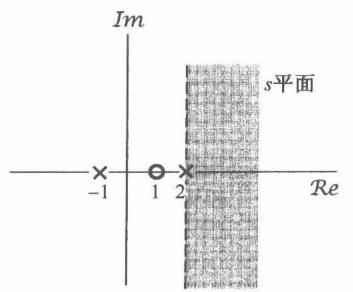

(a)

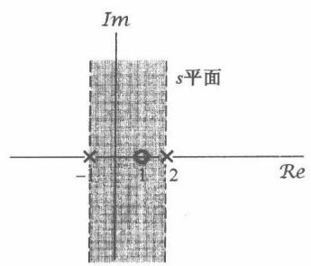

(b)

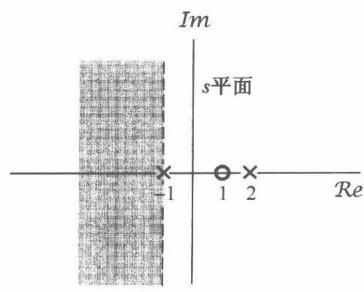

(c)

图9.25 例9.20所示系统函数(极点为  $s = -1$  和  $s = 2$  ，零点在  $s = 1$  )的几种可能收敛域。(a)因果不稳定系统；(b)非因果稳定系统；(c)反因果不稳定系统

对于一种特别而重要的系统，稳定性可以很简单地用极点的位置来表征。具体而言，考虑一个因果线性时不变系统，具有有理系统函数  $H(s)$ ，因为系统是因果的，收敛域就在最右边极点的右边，因此这个系统若是稳定的，即收敛域包括  $\mathrm{j}\omega$  轴， $H(s)$  的最右边的极点就必须位于  $\mathrm{j}\omega$  轴的左边，即

当且仅当  $H(s)$  的全部极点都位于  $s$  平面的左半平面时，也即全部极点都有负实部时，一个具有有理系统函数  $H(s)$  的因果系统才是稳定的。

例9.21再次考虑例9.17的因果系统，式(9.113)的单位冲激响应是绝对可积的，因此该系统是稳定的。与此相一致的是，由式(9.114)给出的  $H(s)$  ，其极点在  $s = -1$  ，它在  $\pmb{S}$  平面的左半平面。与此相反，单位冲激响应为

$$
h (t) = \mathrm {e} ^ {2 t} u (t)
$$

的因果系统是不稳定的，因为  $h(t)$  不是绝对可积的。同时，在这种情况下

$$
H (s) = \frac {1}{s - 2}, \quad \mathcal {R e} \{s \} > 2
$$

系统有一个极点在  $s = 2$  ，它位于  $s$  平面的右半平面。

例9.22 考虑曾在9.4.2节和6.5.2节讨论过的因果二阶系统，单位冲激响应和系统函数分别是

$$
h (t) = M \left[ e ^ {c _ {1} t} - e ^ {c _ {2} t} \right] u (t) \tag {9.121}
$$

和

$$
H (s) = \frac {\omega_ {n} ^ {2}}{s ^ {2} + 2 \zeta \omega_ {n} s + \omega_ {n} ^ {2}} = \frac {\omega_ {n} ^ {2}}{(s - c _ {1}) (s - c _ {2})} \tag {9.122}
$$

其中，

$$
c _ {1} = - \zeta \omega_ {n} + \omega_ {n} \sqrt {\zeta^ {2} - 1} \tag {9.123}
$$

$$
c _ {2} = - \zeta \omega_ {n} - \omega_ {n} \sqrt {\zeta^ {2} - 1} \tag {9.124}
$$

$$
M = \frac {\omega_ {n}}{2 \sqrt {\zeta^ {2} - 1}} \tag {9.125}
$$

在图9.19中，已经标出了  $\zeta > 0$  时的极点位置。在图9.26中标出的是  $\zeta < 0$  时的极点位置。从后面这个图及式(9.124)和式(9.125)都很容易看出，对于  $\zeta < 0$  ，两个极点都有正的实部，结果对于  $\zeta < 0$  ，这个因果的二阶系统不可能是稳定的。这个结果在式(9.121)中也是显然的，因为  $\mathcal{Re}\{c_1\} > 0$  和  $\mathcal{Re}\{c_2\} > 0$  每一项都随  $t$  的增加而呈指数增长，因此  $h(t)$  不可能是绝对可积的。

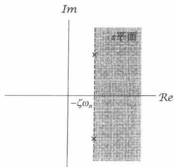

图9.26  $\zeta < 0$  时，一个因果二阶系统的极点位置和收敛域

# 9.7.3 由线性常系数微分方程表征的线性时不变系统

4.7节已经讨论过利用傅里叶变换来得到一个由线性常系数微分方程表征的线性时不变系统的频率响应，而用不着首先解出单位冲激响应或时域解。用完全类似的方式，拉普拉斯变换的性质也能用来直接求得一个由线性常系统微分方程所表征系统的系统函数。下面的例子用来说明这一过程。

例9.23 考虑一个线性时不变系统，其输入  $x(t)$  和输出  $y(t)$  满足如下线性常系数微分方程：

$$
\frac {\mathrm {d} y (t)}{\mathrm {d} t} + 3 y (t) = x (t) \tag {9.126}
$$

在式(9.126)两边应用拉普拉斯变换，并分别用9.5.1节的线性性质和9.5.7节的微分性质，即式(9.82)和式(9.98)，可得代数方程

$$
s Y (s) + 3 Y (s) = X (s) \tag {9.127}
$$

因为由式(9.112)知系统函数是

$$
H (s) = \frac {Y (s)}{X (s)}
$$

可得该系统的系统函数是

$$
H (s) = \frac {1}{s + 3} \tag {9.128}
$$

这样就给出了系统函数的代数表示式，但没有收敛域。事实上，正如在2.4节所讨论的，微分方程本身并不能完全表征这个线性时不变系统，有不同的单位冲激响应都与这个微分方程相吻合。如果除了这个微分方程之外，还知道系统是因果的，那么就可以推断出收敛域在最右边极点的右边，在这个例子中就对应于  $\mathcal{Re}\{s\} > -3$ ；如果已知系统是反因果的，那么收敛域就是  $\mathcal{Re}\{s\} < -3$ 。在因果的情况下，相应的单位冲激响应是

$$
h (t) = \mathrm {e} ^ {- 3 t} u (t) \tag {9.129}
$$

而在反因果的情况下则是

$$
h (t) = - \mathrm {e} ^ {- 3 t} u (- t) \tag {9.130}
$$

在例9.23中，由微分方程得到  $H(s)$  的过程可以应用到更一般的情况。考虑如下形式的线性常系数微分方程：

$$
\sum_ {k = 0} ^ {N} a _ {k} \frac {\mathrm {d} ^ {k} y (t)}{\mathrm {d} t ^ {k}} = \sum_ {k = 0} ^ {M} b _ {k} \frac {\mathrm {d} ^ {k} x (t)}{\mathrm {d} t ^ {k}} \tag {9.131}
$$

在上式两边进行拉普拉斯变换，并反复应用线性和微分性质，可得

$$
\left(\sum_ {k = 0} ^ {N} a _ {k} s ^ {k}\right) Y (s) = \left(\sum_ {k = 0} ^ {M} b _ {k} s ^ {k}\right) X (s) \tag {9.132}
$$

或者

$$
H (s) = \frac {\left\{\sum_ {k = 0} ^ {M} b _ {k} s ^ {k} \right\}}{\left\{\sum_ {k = 0} ^ {N} a _ {k} s ^ {k} \right\}} \tag {9.133}
$$

因此，一个由微分方程表征的系统，其系统函数总是有理的，它的零点就是如下方程的解：

$$
\sum_ {k = 0} ^ {M} b _ {k} s ^ {k} = 0 \tag {9.134}
$$

而它的极点就是如下方程的解：

$$
\sum_ {k = 0} ^ {N} a _ {k} s ^ {k} = 0 \tag {9.135}
$$

和前面的讨论一样，式(9.133)并没有包括  $H(s)$  收敛域的说明，因为该线性常系数微分方程本身没有限制收敛域。然而，如果给出系统有关稳定性或因果性的附加说明，收敛域就可以被推演出来。例如，如果在系统中强加上初始松弛的条件，它就是因果的，那么收敛域就一定位于最右边极点的右边。

例9.24 一个RLC电路，若其电容器上的电压和电感线圈中的电流最初都是零，就构成了一个可用线性常系数微分方程描述的线性时不变系统。现考虑图9.27中的串联RLC电路。设跨于电压源的电压是输入信号  $x(t)$ ，跨于电容器上的电压是输出信号  $y(t)$  。令在电阻、电感和电容器上的电压之和等于电源电压，就得到

$$
R C \frac {\mathrm {d} y (t)}{\mathrm {d} t} + L C \frac {\mathrm {d} ^ {2} y (t)}{\mathrm {d} t ^ {2}} + y (t) = x (t) \tag {9.136}
$$

应用式(9.133)，可得

$$
H (s) = \frac {1 / L C}{s ^ {2} + (R / L) s + (1 / L C)} \tag {9.137}
$$

正如在习题9.64中所指出，如果  $R, L$  和  $C$  的值全是正的，该系统函数的极点就全具有负的实部，因此该系统一定是稳定的。

图9.27 串联RLC电路

# 9.7.4 系统特性与系统函数的关系举例

已经看到，诸如因果性和稳定性之类的系统性质，都能直接与系统函数及其特性联系起来。事实上，已经给出的拉普拉斯变换的每一个性质都能以这种方式用于将系统特性与系统函数联系起来。这一节将用几个例子来说明这一点。

例9.25 假设已知一个线性时不变系统的输入是

$$
x (t) = \mathrm {e} ^ {- 3 t} u (t)
$$

那么其输出就是

$$
y (t) = [ e ^ {- t} - e ^ {- 2 t} ] u (t)
$$

现在要证明，根据这些认识就能确定该系统的系统函数，并且由此还可以立即推断出系统的其他性质。将  $x(t)$  和  $y(t)$  分别取拉普拉斯变换得

$$
X (s) = \frac {1}{s + 3}, \quad \mathcal {R e} \{s \} > - 3
$$

和

$$
Y (s) = \frac {1}{(s + 1) (s + 2)}, \quad \mathcal {R e} \{s \} > - 1
$$

由式(9.112)可以得到

$$
H (s) = \frac {Y (s)}{X (s)} = \frac {s + 3}{(s + 1) (s + 2)} = \frac {s + 3}{s ^ {2} + 3 s + 2}
$$

而且，还可以确定系统函数的收敛域。由9.5.6节的卷积性质知道， $Y(s)$  的收敛域至少必须包括  $X(s)$  和  $H(s)$  的收敛域相交部分。检查一下  $H(s)$  的收敛域的三种可能情况（即极点  $s = -2$  的左边，极点  $-2$  和极点  $-1$  之间，以及极点  $s = -1$  的右边），可见只有  $\mathcal{Re}\{s\} > -1$  一种选择才能与  $X(s)$  和  $Y(s)$  的收敛域相符。因为这个收敛域就是  $H(s)$  的最右边极点的右边，因此可得  $H(s)$  是因果的。又因为  $H(s)$  的两个极点都有负的实部，所以系统又是稳定的。再者，根据式(9.131)和式(9.133)之间的关系，还能给出下列微分方程：

$$
\frac {\mathrm {d} ^ {2} y (t)}{\mathrm {d} t ^ {2}} + 3 \frac {\mathrm {d} y (t)}{\mathrm {d} t} + 2 y (t) = \frac {\mathrm {d} x (t)}{\mathrm {d} t} + 3 x (t)
$$

与初始松弛条件一起来表征这个系统。

例9.26 假定关于某个线性时不变系统已知下列条件信息：

1. 系统是因果的。

2. 系统函数是有理的，且仅有两个极点在  $s = -2$  和  $s = 4$ 。

3. 若  $x(t) = 1$ ，则  $\gamma(t) = 0$ 。

4.单位冲激响应在  $t = 0^{+}$  时的值是4。

根据以上信息，我们想要确定该系统的系统函数。

根据条件1和条件2可知，系统是不稳定的（因为系统是因果的，而又有一个实部为正的极点在  $s = 4$ ），并且系统函数具有如下形式：

$$
H (s) = \frac {p (s)}{(s + 2) (s - 4)} = \frac {p (s)}{s ^ {2} - 2 s - 8}
$$

其中  $p(s)$  是一个  $s$  的多项式。由于对输入  $x(t) = 1 = \mathbf{e}^{0\cdot t}$  的响应  $y(t)$  必须等于  $H(0)\cdot \mathbf{e}^{0\cdot t} = H(0)$ ，因此由条件3可得  $p(0) = 0$ ，也就是说  $p(s)$  必定有一个根在  $s = 0$ ，于是  $p(s)$  就应具有

$$
p (s) = s q (s)
$$

其中  $q(s)$  是另一个  $s$  多项式。

最后，根据条件4和9.5.10节中的初值定理，可知

$$
\lim  _ {s \rightarrow \infty} s H (s) = \lim  _ {s \rightarrow \infty} \frac {s ^ {2} q (s)}{s ^ {2} - 2 s - 8} = 4 \tag {9.138}
$$

当  $s \to \infty$  时， $sH(s)$  的分子和分母中  $s$  的最高阶次项起支配作用，从而在求式(9.138)中是仅仅起作用的项；再者，若分子的阶次比分母的阶次高，那么这个极限一定发散。因此，对于这个极限要能得到一个有限的非零值，只有  $sH(s)$  是分子分母同阶次的情况下才有可能。现在已经知道分母阶次为2，因此要使式(9.138)能成立， $q(s)$  必须是一个常数，即  $q(s) = K$ 。这个常数可以按如下求出：

$$
\lim  _ {s \rightarrow \infty} \frac {K s ^ {2}}{s ^ {2} - 2 s - 8} = \lim  _ {s \rightarrow \infty} \frac {K s ^ {2}}{s ^ {2}} = K \tag {9.139}
$$

令式(9.138)和式(9.139)相等，可见  $K = 4$  ，因此

$$
H (s) = \frac {4 s}{(s + 2) (s - 4)}
$$

例9.27 考虑一个稳定的因果系统，其单位冲激响应为  $h(t)$ ，系统函数为  $H(s)$ 。假定  $H(s)$  是有理的，有一个极点在  $s = -2$ ，原点没有零点，其余的极点和零点位置都不知道。对于下列每一种说法，判断是否能肯定地说是对的，是否能肯定地说是错的，或者说由于条件不充分而无法确认它的真实性。

(a)  $\mathcal{F}\{h(t)\mathrm{e}^{3t}\}$  收敛。

(b)  $\int_{-\infty}^{+\infty}h(t)\mathrm{d}t = 0$

(c)  $th(t)$  是一个稳定因果系统的单位冲激响应。

(d)  $\mathrm{dh}(t) / \mathrm{dt}$  在它的拉普拉斯变换中至少有一个极点。

(e)  $h(t)$  是有限持续期的。

(f)  $H(s) = H(-s)$  。

(g)  $\lim_{s\to \infty}H(s) = 2$  。

(a) 是错的。因为  $\mathcal{F}\{h(t)\mathrm{e}^{3t}\}$  相应于  $h(t)$  的拉普拉斯变换在  $s = -3$  的值，如果这个值收敛，那就意味着  $s = -3$  在收敛域内。但是，一个稳定因果系统的收敛域总是在它的全部极点的右边，而  $s = -3$  不在极点  $s = -2$  的右边。

(b) 也是错的。因为这等于说  $H(0) = 0$ ，可是已知  $H(s)$  在原点没有零点。

(c) 这个说法是对的。按表 9.1 所列的根据 9.5.8 节得到的性质,  $th(t)$  的拉普拉斯变换与  $H(s)$  有相同的收敛域, 而  $H(s)$  的收敛域包括  $\mathrm{j}\omega$  轴, 因此对应的系统是稳定的。同时, 对于  $t < 0$ ,  $h(t) = 0$ , 这意味着对于  $t < 0$  也有  $th(t) = 0$ , 因此  $th(t)$  代表的是一个因果系统的单位冲激响应。

(d) 这个说法也是对的。因为根据表 9.1,  $\mathrm{dh}(t) / \mathrm{dt}$  的拉普拉斯变换为  $sH(s)$ , 而乘以一个  $s$  并没有消去在  $s = -2$  的极点。

(e) 是错的。如果  $h(t)$  是有限持续期的，它的拉普拉斯变换的收敛域就必须是整个  $s$  平面，然而  $H(s)$  在  $s = -2$  已经有极点。

(f) 也是错的。倘若这是对的，那么因为  $H(s)$  在  $s = -2$  有一个极点，那就必须在  $s = 2$  也有一个极点；而对于一个稳定因果系统，其全部极点都一定位于  $s$  平面的左半平面，这是相矛盾的。

(g) 这个说法的真假由给出的条件无法肯定。因为这种情况要求  $H(s)$  分子分母同阶次，但是缺乏足够的条件来判断  $H(s)$  是否属于这种情况。

# 9.7.5 巴特沃思滤波器

在例6.3中曾简要介绍过称为巴特沃思滤波器的一类应用广泛的线性时不变系统。这类滤波器有几个性质，其中包括这类滤波器中的每一种频率响应的模特性，在实际实现中颇具吸引力。作为拉普拉斯变换应用的进一步说明，这一节将用拉普拉斯变换技术从频率响应模特性的要求中确定巴特沃思滤波器的系统函数。

一个  $N$  阶低通巴特沃思滤波器频率响应的模平方是

$$
\left| B (\mathrm {j} \omega) \right| ^ {2} = \frac {1}{1 + \left(\mathrm {j} \omega / \mathrm {j} \omega_ {c}\right) ^ {2 N}} \tag {9.140}
$$

其中  $N$  是滤波器的阶。从式(9.140)要确定系统函数  $B(s)$ ，该系统函数可给出  $|B(\mathrm{j}\omega)|^2$  的特性。首先按定义

$$
\left| B (\mathrm {j} \omega) \right| ^ {2} = B (\mathrm {j} \omega) B ^ {*} (\mathrm {j} \omega) \tag {9.141}
$$

如果将该巴特沃思滤波器的单位冲激响应限制为实值函数，那么由傅里叶变换的共轭对称性质，就有

$$
B ^ {*} (\mathrm {j} \omega) = B (- \mathrm {j} \omega) \tag {9.142}
$$

这样

$$
B (\mathrm {j} \omega) B (- \mathrm {j} \omega) = \frac {1}{1 + (\mathrm {j} \omega / \mathrm {j} \omega_ {c}) ^ {2 N}} \tag {9.143}
$$

注意到  $B(s)\mid_{s = \mathrm{j}\omega} = B(\mathrm{j}\omega)$  ，由式(9.143)就有

$$
B (s) B (- s) = \frac {1}{1 + (s / j \omega_ {c}) ^ {2 N}} \tag {9.144}
$$

这个分母多项式的根就是  $B(s)B(-s)$  的极点，这些极点应位于

$$
s = (- 1) ^ {1 / 2 N} (\mathrm {j} \omega_ {c}) \tag {9.145}
$$

式(9.145)对如下  $s = s_p$  都满足

$$
\left| s _ {p} \right| = \omega_ {c} \tag {9.146}
$$

$$
\leftarrow s _ {p} = \frac {\pi (2 k + 1)}{2 N} + \frac {\pi}{2}, \qquad k \text {为 整 数} \tag {9.147}
$$

也即

$$
s _ {p} = \omega_ {c} \exp \left(j \left[ \frac {\pi (2 k + 1)}{2 N} + \pi / 2 \right]\right) \tag {9.148}
$$

在图9.28中画出了  $N = 1,2,3$  和6时，  $B(s)B(-s)$  的极点位置。关于  $B(s)B(-s)$  的极点，一般可以给出如下几点判断：

图9.28  $N = 1,2,3$  和6时，  $B(s)B(-s)$  的极点位置

1. 在  $s$  平面内，半径为  $\omega_{c}$  的圆上，有  $2N$  个极点在角度上呈等分割配置。

2. 极点永远不会位于  $\mathrm{j}\omega$  轴上，而且当  $N$  为奇数时，在  $\sigma$  轴上有极点，  $N$  为偶数时则没有。

3. 相邻极点之间的角度差是  $\pi / N$  弧度。

在已知  $B(s)B(-s)$  极点的情况下，为了确定  $B(s)$  的极点，可以观察到， $B(s)B(-s)$  的极点总是成对出现的，即如果有一个极点是在  $s = s_p$ ，那么就也有一个极点在  $s = -s_p$ 。因此，为了构成  $B(s)$  的极点，可以从每对极点中选取一个。若将系统限制为稳定和因果的，那么与  $B(s)$  有关的极点就应该是位于该圆上沿左半平面半圆上的极点。除了一个常数因子外，这些极点位置就给出了  $B(s)$  的性质。然而，从式(9.144)可看到  $B^2(s)|_{s=0} = 1$ ，或者等效地说，按式(9.140)，常数因子选择成使频率响应的模平方在  $\omega = 0$  时为单位增益。

为了说明  $B(s)$  的确定，现考虑  $N = 1$  ，  $N = 2$  和  $N = 3$  时的情况。根据式(9.148)已在图9.28中画出了  $B(s)B(-s)$  的极点，对于所给三种  $N$  值的情况，在图9.29中指出了与  $B(s)$  有关的极点。这些相应的转移函数就是

$$
N = 1: \quad B (s) = \frac {\omega_ {c}}{s + \omega_ {c}} \tag {9.149}
$$

$$
N = 2: \quad B (s) = \frac {\omega_ {c} ^ {2}}{(s + \omega_ {c} e ^ {j (\pi / 4)}) (s + \omega_ {c} e ^ {- j (\pi / 4)})} = \frac {\omega_ {c} ^ {2}}{s ^ {2} + \sqrt {2} \omega_ {c} s + \omega_ {c} ^ {2}} \tag {9.150}
$$

$$
\begin{array}{l} N = 3: \quad B (s) = \frac {\omega_ {c} ^ {3}}{(s + \omega_ {c}) (s + \omega_ {c} e ^ {j (\pi / 3)}) (s + \omega_ {c} e ^ {- j (\pi / 3)})} \\ = \frac {\omega_ {c} ^ {3}}{\left(s + \omega_ {c}\right) \left(s ^ {2} + \omega_ {c} s + \omega_ {c} ^ {2}\right)} \tag {9.151} \\ = \frac {\omega_ {c} ^ {3}}{s ^ {3} + 2 \omega_ {c} s ^ {2} + 2 \omega_ {c} ^ {2} s + \omega_ {c} ^ {3}} \\ \end{array}
$$

根据9.7.3节的讨论，由  $B(s)$  可以确定与其相关的线性常系数微分方程。对应以上三种  $N$  值，相应的微分方程就是

$$
N = 1: \quad \frac {\mathrm {d} y (t)}{\mathrm {d} t} + \omega_ {c} y (t) = \omega_ {c} x (t) \tag {9.152}
$$

$$
N = 2: \quad \frac {\mathrm {d} ^ {2} y (t)}{\mathrm {d} t ^ {2}} + \sqrt {2} \omega_ {c} \frac {\mathrm {d} y (t)}{\mathrm {d} t} + \omega_ {c} ^ {2} y (t) = \omega_ {c} ^ {2} x (t) \tag {9.153}
$$

$$
N = 3: \quad \frac {\mathrm {d} ^ {3} y (t)}{\mathrm {d} t ^ {3}} + 2 \omega_ {c} \frac {\mathrm {d} ^ {2} y (t)}{\mathrm {d} t ^ {2}} + 2 \omega_ {c} ^ {2} \frac {\mathrm {d} y (t)}{\mathrm {d} t} + \omega_ {c} ^ {3} y (t) = \omega_ {c} ^ {3} x (t) \tag {9.154}
$$

图9.29  $N = 1,2$  和3时，  $B(s)$  的极点位置

# 9.8 系统函数的代数属性与方框图表示

利用拉普拉斯变换可将微分、卷积、时移等这些时域中的运算用代数运算来代替。我们已经看到这样做在分析线性时不变系统时的很多好处。这一节将要讨论系统函数代数属性的另一个重要应用，即通过分析线性时不变系统的互联及基本系统的构造单元的互联来综合出复杂系统中的应用。

# 9.8.1 线性时不变系统互联的系统函数

考虑两个系统的并联，如图9.30(a)所示。总系统的单位冲激响应是

$$
h (t) = h _ {1} (t) + h _ {2} (t) \tag {9.155}
$$

由拉普拉斯变换的线性性质，有

$$
H (s) = H _ {1} (s) + H _ {2} (s) \tag {9.156}
$$

同理，两个系统的级联，如图9.30(b)所示，其单位冲激响应为

$$
h (t) = h _ {1} (t) * h _ {2} (t) \tag {9.157}
$$

系统函数为

$$
H (s) = H _ {1} (s) H _ {2} (s) \tag {9.158}
$$

通过代数运算，在表示线性系统的互联时利用拉普拉斯变换，可以扩展到远比图9.30这种简单的并联和级联更为复杂的互联中去。为此，考虑图9.31所示两个系统的反馈互联。第11章将要详细讨论这类互联系统的设计、应用和分析。尽管在时域中这类系统的分析不是特别简单，但是确定由输入  $x(t)$  到输出  $y(t)$  的总系统函数还是一个直接的代数运算。具体而言，由图9.31有

$$
Y (s) = H _ {1} (s) E (s) \tag {9.159}
$$

$$
E (s) = X (s) - Z (s) \tag {9.160}
$$

和

$$
Z (s) = H _ {2} (s) Y (s) \tag {9.161}
$$

由此可得

$$
Y (s) = H _ {1} (s) \left[ X (s) - H _ {2} (s) Y (s) \right] \tag {9.162}
$$

或者

$$
\frac {Y (s)}{X (s)} = H (s) = \frac {H _ {1} (s)}{1 + H _ {1} (s) H _ {2} (s)} \tag {9.163}
$$

图9.30 (a)两个线性时不变系统的并联；(b)两个线性时不变系统的级联

图9.31 两个线性时不变系统的反馈互联

# 9.8.2 由微分方程和有理系统函数描述的因果线性时不变系统的方框图表示

2.4.3节曾说明过，利用相加、乘以一个系数和积分这些基本运算，可将由一阶微分方程描述的线性时不变系统用方框图来表示。这三种运算也能用来构造更高阶系统的方框图，本节将用几个例子来给予说明。

例9.28 考虑一个因果线性时不变系统，其系统函数  $H(s)$  为

$$
H (s) = \frac {1}{s + 3}
$$

由9.7.3节可知，这个系统也能用下列微分方程来描述：

$$
\frac {\mathrm {d} y (t)}{\mathrm {d} t} + 3 y (t) = x (t)
$$

具有初始松弛条件。在2.4.3节曾构造出一个方框图表示，如图2.32所示。另一种等效的方框图（相应于图2.32中的  $a = 3$  和  $b = 1$ ）如图9.32(a)所示。图中  $1 / s$  是一个单位冲激响应为  $u(t)$  的系统的系统函数，也就是一个积分器的系统函数。在图9.32(a)的反馈回路中的系统函数-3就相应于乘以系数-3。这个方框图所涉及的反馈回路很像上一小节考虑并画在图9.31中的反馈回路，唯一的差别是输入到相加器中的这两个信号在图9.32(a)中是相加的，而在图9.31中是相减的。然而，若在反馈回路中改变相乘系数的符号，所得出的图9.32(b)就与图9.31完全一样了。这样可用式(9.163)证明出

$$
H (s) = \frac {1 / s}{1 + 3 / s} = \frac {1}{s + 3}
$$

(a)

(b)

图9.32 (a) 例9.28的因果线性时不变系统的方框图表示；(b）等效方框图表示

例9.29 现在考虑一个因果线性时不变系统，其系统函数  $H(s)$  为

$$
H (s) = \frac {s + 2}{s + 3} = \left(\frac {1}{s + 3}\right) (s + 2) \tag {9.164}
$$

由式(9.164)可以想到，这个系统可以看成一个系统函数为  $1 / (s + 3)$  的系统与系统函数为  $(s + 2)$  的系统的级联结果。如图9.33(a)所示，图中已经用了图9.32(a)的方框图来代表  $1 / (s + 3)$  。

对于式(9.164)的系统，还有可能得到另一种方框图表示。利用拉普拉斯变换的线性和微分性质可知，图9.33(a)中的  $y(t)$  和  $z(t)$  是由下列方程关联起来的：

$$
y (t) = \frac {\mathrm {d} z (t)}{\mathrm {d} t} + 2 z (t)
$$

然而，输入至积分器的  $e(t)$  就是输出  $z(t)$  的导数，所以

$$
y (t) = e (t) + 2 z (t)
$$

这样就直接导出了另一种方框图表示，如图9.33(b)所示。注意，因为

$$
y (t) = \frac {\mathrm {d} z (t)}{\mathrm {d} t} + 2 z (t)
$$

图9.33(a)中的方框图要求  $z(t)$  的微分，而与此对照，图9.33(b)并不涉及任何信号的直接微分。

(a)

(b)

图9.33 (a) 例9.29的系统方框图表示；(b）等效方框图表示

例9.30 接下来考虑一个因果二阶系统，其系统函数为

$$
H (s) = \frac {1}{(s + 1) (s + 2)} = \frac {1}{s ^ {2} + 3 s + 2} \tag {9.165}
$$

这个系统的输入  $x(t)$  和输出  $y(t)$  满足如下微分方程：

$$
\frac {\mathrm {d} ^ {2} y (t)}{\mathrm {d} t ^ {2}} + 3 \frac {\mathrm {d} y (t)}{\mathrm {d} t} + 2 y (t) = x (t) \tag {9.166}
$$

采用与前面例子类似的想法，可以得出这个系统的方框图表示，如图9.34(a)所示。因为，积分器的输入就是积分器输出的导数，所以方框图中各信号关联如下：

$$
f (t) = \frac {\mathrm {d} y (t)}{\mathrm {d} t}
$$

$$
e (t) = \frac {\mathrm {d} f (t)}{\mathrm {d} t} = \frac {\mathrm {d} ^ {2} y (t)}{\mathrm {d} t}
$$

同时，将式(9.166)重写成

$$
\frac {\mathrm {d} ^ {2} y (t)}{\mathrm {d} t ^ {2}} = - 3 \frac {\mathrm {d} y (t)}{\mathrm {d} t} - 2 y (t) + x (t)
$$

或者

$$
e (t) = - 3 f (t) - 2 y (t) + x (t)
$$

这是与图9.34(a)所代表的完全相同的。

图9.34(a)中出现的系数可以直接根据系统函数中的系数或等效微分方程中的系数确认出来，所以称这种方框图为直接型（direct-form）表示。对系统函数进行稍许变化，可以得到实际中很重要的其他方框图表示。特别是，式(9.165)中的  $H(s)$  可重写成

$$
H (s) = \left(\frac {1}{s + 1}\right) \left(\frac {1}{s + 2}\right)
$$

这就令人想到能将该系统表示成两个一阶系统的级联。这种级联型（cascade-form）表示如图9.34(b)所示。另外，将  $H(s)$  进行部分分式展开，可得

$$
H (s) = \frac {1}{s + 1} - \frac {1}{s + 2}
$$

这就产生了并联型(parallel-form)表示，如图9.34(c)所示。

(a)

(b)

(c)

图9.34 例9.30系统的方框图表示。（a）直接型；（b）级联型；（c）并联型

例9.31 作为最后一个例子，考虑如下系统函数：

$$
H (s) = \frac {2 s ^ {2} + 4 s - 6}{s ^ {2} + 3 s + 2} \tag {9.167}
$$

再次利用系统函数的代数属性，可将  $H(s)$  写成几种不同的形式，其中每一种都有对应方框图表示。特别是，能将  $H(s)$  写成

$$
H (s) = \left(\frac {1}{s ^ {2} + 3 s + 2}\right) (2 s ^ {2} + 4 s - 6)
$$

因此  $H(s)$  可看成图9.34(a)的系统与系统函数为  $(2s^{2} + 4s - 6)$  的系统的级联。完全就像在例9.29中所做的那样，可以用“抽头”信号的办法把出现在第一个系统积分器输入端的信号抽出来，以提取第二个系统所要求的导数。有关这一详细过程将在习题9.36中讨论，而所得的直接型方框图表示则如图9.35所示。再一次看到，在直接型表示中，方框图中出现的系数可以直观地由系统函数式(9.167)中的系数来确定。

作为一种替代方式，还能将  $H(s)$  写成

$$
H (s) = \left(\frac {2 (s - 1)}{s + 2}\right) \left(\frac {s + 3}{s + 1}\right) \tag {9.168}
$$

或者

$$
H (s) = 2 + \frac {6}{s + 2} - \frac {8}{s + 1} \tag {9.169}
$$

其中第一个是一种级联型表示，而第二个则是一种并联型表示。这些都将在习题9.36中讨论。

图9.35 例9.31系统的直接型表示

对于由微分方程和有理系统函数描述的因果线性时不变系统，构造方框图表示的方法都可以用于高阶的系统。另外，往往在如何构成上有很大的灵活性。例如，若将式(9.168)中的分子颠倒一下次序，就可以写成

$$
H (s) = \left(\frac {s + 3}{s + 2}\right) \left(\frac {2 (s - 1)}{s + 2}\right)
$$

这又是一种不同的级联型表示。同样，正如在习题9.38中所说明的，一个四阶系统函数可以写成两个二阶系统函数的乘积，而其中每个二阶系统函数又有几种不同的表示方式（如直接型、级联型或并联型）；并且还能写成低阶项的和，而每个低阶项又有几种不同的表示。这样一来，简单的低阶系统就可以作为基本的构造单元，用来实现更复杂的高阶系统。

# 9.9 单边拉普拉斯变换

本章前面各节讨论的拉普拉斯变换一般称为双边拉普拉斯变换。稍许有些不同的另一种拉普拉斯变换形式称为单边拉普拉斯变换(unilateral Laplace transform)，将在这一节给予介绍和讨论。单边拉普拉斯变换在分析具有非零初始条件的（即系统最初不是松弛的），由线性常系数微分方程所描述的因果系统时有很大的价值。

一个连续时间信号  $x(t)$  的单边拉普拉斯变换  $\mathcal{X}(s)$  定义为

$$
\mathcal {X} (s) \triangleq \int_ {0 ^ {-}} ^ {\infty} x (t) e ^ {- s t} d t \tag {9.170}
$$

这里，积分的下限取为  $0^{-}$ ，以表明在积分区间内包括了集中于  $t = 0$  的任何冲激或高阶奇异函数。对于一个信号及其单边拉普拉斯变换，再次采用一个方便的简化符号为

$$
x (t) \stackrel {\mathcal {U L}} {\longleftrightarrow} \chi (s) = \mathcal {U L} \{x (t) \} \tag {9.171}
$$

比较式(9.170)和式(9.3)即可发现，单边和双边拉普拉斯变换在定义上的不同在于积分的下限。双边拉普拉斯变换决定于  $t = -\infty$  到  $t = +\infty$  的整个信号，而单边拉普拉斯变换仅仅决定于  $t = 0^{-}$ 到  $\infty$  的信号。这样一来，在  $t < 0$  时不同，而在  $t \geqslant 0$  时相同的两个信号，将有不同的双边拉普拉斯变换，而有相同的单边拉普拉斯变换。同理，任何在  $t < 0$  时都为零的信号，其双边和单边拉普拉斯变换相同。

因为  $x(t)$  的单边拉普拉斯变换就是将信号  $x(t)$  在  $t < 0$  时将它的值置为零而求得的双边拉普拉斯变换，因此有关双边拉普拉斯变换中的很多细节、概念和结果都能直接用于单边的情况。例如，利用9.2节对右边信号的性质4即可得出，式(9.170)的收敛域总是位于某个右半平面。单边拉普拉斯逆变换的求取也与双边变换是相同的，只是单边变换的收敛域一定总是在右半面的。

# 9.9.1 单边拉普拉斯变换举例

为了说明单边拉普拉斯变换，考虑下面这些例子。

例9.32 考虑信号  $x(t)$

$$
x (t) = \frac {t ^ {n - 1}}{(n - 1) !} \mathrm {e} ^ {- a t} u (t) \tag {9.172}
$$

因为  $t < 0$  时  $x(t) = 0$  ，所以  $x(t)$  的单边和双边拉普拉斯变换是一致的。于是，由表9.2可得

$$
\chi (s) = \frac {1}{(s + a) ^ {n}}, \quad \operatorname {R e} \{s \} > - a \tag {9.173}
$$

例9.33 考虑信号  $x(t)$

$$
x (t) = \mathrm {e} ^ {- a (t + 1)} u (t + 1) \tag {9.174}
$$

这个信号的双边变换  $X(s)$  可由例9.1和时移性质(见9.5.2节)求得为

$$
X (s) = \frac {\mathrm {e} ^ {s}}{s + a}, \quad \mathcal {R e} \{s \} > - a \tag {9.175}
$$

与此对照的是，其单边变换是

$$
\begin{array}{l} \mathcal {X} (s) = \int_ {0 ^ {-}} ^ {\infty} \mathrm {e} ^ {- a (t + 1)} u (t + 1) \mathrm {e} ^ {- s t} \mathrm {d} t \\ = \int_ {0 ^ {-}} ^ {\infty} e ^ {- a} e ^ {- t (s + a)} d t \tag {9.176} \\ = \mathrm {e} ^ {- a} \frac {1}{s + a}, \quad \operatorname {R e} \{s \} > - a \\ \end{array}
$$

因此，这个例子的单边和双边拉普拉斯变换是明显不同的。事实上，应该将  $\mathcal{X}(s)$  看成不是  $x(t)$ ，而是  $x(t)u(t)$  的双边变换，这就与先前关于单边变换就是在  $t < 0^{-}$ 时置一个信号为零的双边变换这一结论一致了。

例9.34 考虑下面的信号  $x(t)$

$$
x (t) = \delta (t) + 2 u _ {1} (t) + e ^ {t} u (t) \tag {9.177}
$$

因为  $t < 0$  时  $x(t) = 0$ ，并且在积分区间内包括了在原点的奇异函数，所以  $x(t)$  的单边变换与双边变换相同。根据表9.2的变换对15， $u_n(t)$ 的双边变换是  $s^n$ ，所以有

$$
\mathcal {X} (s) = X (s) = 1 + 2 s + \frac {1}{s - 1} = \frac {s (2 s - 1)}{s - 1}, \quad \operatorname {R e} \{s \} > 1 \tag {9.178}
$$

例9.35 考虑如下单边拉普拉斯变换：

$$
\chi (s) = \frac {1}{(s + 1) (s + 2)} \tag {9.179}
$$

在例9.9中已经讨论过一个双边拉普拉斯变换的逆变换问题，其代数表示式与式(9.179)一样，不过是对几种不同的收敛域来做的。对于单边变换，收敛域一定位于  $\chi(s)$  的最右边极点的右边的右半平面，即这种情况下收敛域由  $\mathcal{R}e\{s\} > -1$  的所有点  $s$  组成。然后，就完全和例9.9一样，将这个单边变换求逆变换而得

$$
x (t) = \left[ e ^ {- t} - e ^ {- 2 t} \right] u (t), \quad t > 0 ^ {-} \tag {9.180}
$$

这里要强调，单边拉普拉斯变换所提供的仅为  $t > 0^{-}$ 时信号的有关信息。

例9.36 考虑如下单边变换：

$$
\chi (s) = \frac {s ^ {2} - 3}{s + 2} \tag {9.181}
$$

因为  $\mathcal{X}(s)$  分子的阶次不是严格地小于分母的阶次，所以可将  $\mathcal{X}(s)$  展开为

$$
\mathcal {X} (s) = A + B s + \frac {C}{s + 2} \tag {9.182}
$$

令式(9.181)和式(9.182)相等，并通分约去分母可得

$$
s ^ {2} - 3 = (A + B s) (s + 2) + C \tag {9.183}
$$

令左右两边  $s$  阶次的系数相等，就有

$$
\chi (s) = - 2 + s + \frac {1}{s + 2} \tag {9.184}
$$

其收敛域为  $\mathcal{Re}\{s\} > -2$  。将每一项求逆变换可得

$$
x (t) = - 2 \delta (t) + u _ {1} (t) + \mathrm {e} ^ {- 2 t} u (t), \quad t > 0 ^ {-} \tag {9.185}
$$

# 9.9.2 单边拉普拉斯变换性质

与双边拉普拉斯变换一样，单边拉普拉斯变换也有许多重要的性质，其中有一些与双边变换是相同的，而另有几个则明显不同。表9.3综合了这些性质。要注意的是，对每个信号的单边拉普拉斯变换，并没有另辟一列明确地指出其收敛域，这是由于任何单边拉普拉斯变换的收敛域总是某一右半平面的缘故。例如，一个有理单边拉普拉斯变换的收敛域总是在最右边极点的右边。

表 9.3 单边拉普拉斯变换性质

<table><tr><td>性 质</td><td>信 号</td><td>单边拉普拉斯变换</td></tr><tr><td></td><td>x(t)</td><td>X(s)</td></tr><tr><td></td><td>x1(t)</td><td>X1(s)</td></tr><tr><td></td><td>x2(t)</td><td>X2(s)</td></tr><tr><td>线性</td><td>ax1(t) + bx2(t)</td><td>aX1(s) + bX2(s)</td></tr><tr><td>s域平移</td><td>e^{i0t}x(t)</td><td>X(s - s0)</td></tr><tr><td>时域尺度变换</td><td>x(at), a &gt; 0</td><td>1/aX(s/a)</td></tr><tr><td>共轭</td><td>x*(t)</td><td>X*(s)</td></tr><tr><td>卷积[假设t&lt;0, x1(t)和x2(t)均为零]</td><td>x1(t)*x2(t)</td><td>X1(s)X2(s)</td></tr><tr><td>时域微分</td><td>d/dt x(t)</td><td>sX(s) - x(0-)</td></tr><tr><td>s域微分</td><td>-tx(t)</td><td>d/ds X(s)</td></tr><tr><td>时域积分</td><td>\(\int_{0}^{t} -x(\tau)\mathrm{d}\tau\)</td><td>\(\frac{1}{s}X(s)\)</td></tr></table>

初值定理和终值定理

若  $x(t)$  在  $t = 0$  不包含任何冲激或高阶奇异函数，则

$x(0^{+}) = \lim_{s\to \infty}sX(s)$

$\lim_{t\to \infty}x(t) = \lim_{s\to 0}sX(s)$

将表9.3和表9.1进行对比可见，单边拉普拉斯变换的收敛域总是在右半平面，线性、s域平移、时域尺度变换，共轭和  $s$  域微分等性质都与双边变换是一样的。9.5.10节的初值定理与终值定理对单边拉普拉斯变换也成立①。这些性质的推导也与双边变换情况相同。

单边变换的卷积性质也与双边变换情况十分类似。这个性质表明，若

$$
x _ {1} (t) = x _ {2} (t) = 0. \quad \cdot t <   0 \tag {9.186}
$$

则

$$
x _ {1} (t) * x _ {2} (t) \stackrel {\mathcal {U L}} {\longleftrightarrow} \mathcal {X} _ {1} (s) \mathcal {X} _ {2} (s) \tag {9.187}
$$

因为在式(9.186)的条件下，  $x_{1}(t)$  和  $x_{2}(t)$  的单边变换和双边变换是一样的，所以就可以立即由双边变换的卷积性质得出式(9.187)。因此，只要是在  $t < 0$ ，输入为零时处理因果线性时不变系统（对此，系统函数既是单位冲激响应的双边拉普拉斯变换，又是单边拉普拉斯变换），那么在这一章所建立并应用的系统分析方法和系统函数的代数属性，无须任何变化都适用于单边拉普拉斯变换。表9.3的积分性质就是一个例子，若  $t < 0$  时  $x(t) = 0$ ，则

$$
\int_ {0 ^ {-}} ^ {t} x (\tau) \mathrm {d} \tau = x (t) * u (t) \xleftrightarrow {\mathcal {U} \mathcal {L}} \mathcal {X} (s) \mathcal {U} (s) = \frac {1}{s} \mathcal {X} (s) \tag {9.188}
$$

作为第二种情况，考虑下面这个例子。

例9.37 假设由下列微分方程描述的一个因果线性时不变系统：

$$
\frac {\mathrm {d} ^ {2} y (t)}{\mathrm {d} t ^ {2}} + 3 \frac {\mathrm {d} y (t)}{\mathrm {d} t} + 2 y (t) = x (t) \tag {9.189}
$$

具有初始松弛条件。利用式(9.133)，可求得该系统的系统函数是

$$
\mathcal {H} (s) = \frac {1}{s ^ {2} + 3 s + 2} \tag {9.190}
$$

设系统的输入是  $x(t) = \alpha u(t)$  。这时，输出  $y(t)$  的单边（和双边）拉普拉斯变换是

$$
\begin{array}{l} \mathcal {Y} (s) = \mathcal {H} (s) \mathcal {X} (s) = \frac {\alpha}{s (s + 1) (s + 2)} \\ = \frac {\alpha / 2}{s} - \frac {\alpha}{s + 1} + \frac {\alpha / 2}{s + 2} \tag {9.191} \\ \end{array}
$$

将例9.32用于式(9.191)中的每一项，得到

$$
y (t) = \alpha \left[ \frac {1}{2} - e ^ {- t} + \frac {1}{2} e ^ {- 2 t} \right] u (t) \tag {9.192}
$$

重要的是要注意，仅当式(9.187)中  $x_{1}(t)$  和  $x_{2}(t)$  两者在  $t < 0$  时都为零，单边拉普拉斯变换的卷积性质才成立。这就是说，虽然  $x_{1}(t)*x_{2}(t)$  的双边拉普拉斯变换总是等于  $x_{1}(t)$  和  $x_{2}(t)$  的双边拉普拉斯变换的乘积，但是如果  $x_{1}(t)$  或  $x_{2}(t)$  中有一个在  $t < 0$  时不为零，那么一般来说 $x_{1}(t)*x_{2}(t)$  的单边拉普拉斯变换不等于各自单边拉普拉斯变化的乘积(见习题9.39)。

单边和双边变换的性质之间一个特别重要的差别是微分性质。考虑某一信号  $x(t)$ ，其单边拉普拉斯变换为  $\mathcal{X}(s)$ ，那么根据分部积分法可求得  $\mathrm{d}x(t) / \mathrm{d}t$  的单边变换为

$$
\begin{array}{l} \int_ {0 ^ {-}} ^ {\infty} \frac {\mathrm {d} x (t)}{\mathrm {d} t} \mathrm {e} ^ {- s t} \mathrm {d} t = x (t) \mathrm {e} ^ {- s t} \Bigg | _ {0 ^ {-}} ^ {\infty} + s \int_ {0 ^ {-}} ^ {\infty} x (t) \mathrm {e} ^ {- s t} \mathrm {d} t \tag {9.193} \\ = s \chi (s) - x \left(0 ^ {-}\right) \\ \end{array}
$$

同理，再次利用分部积分又可求得  $\mathrm{d}^2 x(t) / \mathrm{d}t^2$  的单边拉普拉斯变换，即

$$
s ^ {2} \mathcal {X} (s) - s x \left(0 ^ {-}\right) - x ^ {\prime} \left(0 ^ {-}\right) \tag {9.194}
$$

其中  $x^{\prime}(0^{-})$  为  $x(t)$  的导数在  $t = 0^{-}$  的值。显而易见，可以继续这一过程而得到高阶导数的单边拉普拉斯变换。

# 9.9.3 利用单边拉普拉斯变换求解微分方程

单边拉普拉斯变换的一个主要应用是求解具有非零初始条件的线性常系数微分方程，现用下面的例子来说明它。

例9.38 考虑由式(9.189)的微分方程表征的系统，其初始条件为

$$
y \left(0 ^ {-}\right) = \beta , \quad y ^ {\prime} \left(0 ^ {-}\right) = \gamma \tag {9.195}
$$

设  $x(t) = \alpha u(t)$  。那么在式(9.189)两边应用单边拉普拉斯变换，可得

$$
s ^ {2} \mathcal {Y} (s) - \beta s - \gamma + 3 s \mathcal {Y} (s) - 3 \beta + 2 \mathcal {Y} (s) = \frac {\alpha}{s} \tag {9.196}
$$

或者

$$
y (s) = \frac {\beta (s + 3)}{(s + 1) (s + 2)} + \frac {\gamma}{(s + 1) (s + 2)} + \frac {\alpha}{s (s + 1) (s + 2)} \tag {9.197}
$$

其中  $y(s)$  是  $y(t)$  的单边拉普拉斯变换。

参照例9.37特别是式(9.191)可以看出，式(9.197)右边最后一项就是当式(9.195)的初始条件均为零  $(\beta = \gamma = 0)$  时系统响应的单边拉普拉斯变换。也就是说，最后一项代表了由式(9.189)描述因果线性时不变系统在初始松弛条件下的响应。这个响应常称为零状态响应（zero-state response），也即当初始状态[式(9.195)的一组初始条件]为零时的响应。

对于式(9.197)右边的前两项也可给出类似的解释。这两项所代表的是当输入为零  $(\alpha = 0)$  时，该系统响应的单边拉普拉斯变换。这个响应常称为零输入响应(zero-input response)。注意，零输入响应是初始条件值的线性函数（即，  $\beta$  和  $\gamma$  的值增大一倍，零输入响应也随之加倍）。再者，式(9.197)对于具有非零初始条件的线性常系数微分方程的解说明了一个重要事实，即总的响应就是零状态响应和零输入响应的叠加。零状态响应是将初始置于零所得到的响应，也即一个由该微分方程定义的线性时不变系统在初始松弛条件下的响应。零输入响应则是输入为零时系统对初始条件的响应。在习题9.20，习题9.40和习题9.66中还能找到其他的例子。

最后，对于任何  $\alpha, \beta$  和  $\gamma$  值，当然都能将  $y(s)$  展开成部分分式，而求逆变换得出  $y(t)$ 。例如，若  $\alpha = 2, \beta = 3$  且  $\gamma = -5$ ，那么式(9.197)部分分式展开的结果就是

$$
y (s) = \frac {1}{s} - \frac {1}{s + 1} + \frac {3}{s + 2} \tag {9.198}
$$

对每一项应用例9.32则有

$$
y (t) = [ 1 - \mathrm {e} ^ {- t} + 3 \mathrm {e} ^ {- 2 t} ] u (t), \quad t > 0 \tag {9.199}
$$

# 9.10 小结

这一章讨论并研究了拉普拉斯变换，它可以看成傅里叶变换的一种推广。在线性时不变系统的分析和研究中，拉普拉斯变换是一种特别有用的分析工具。由于拉普拉斯变换具有的性质，线性时不变系统，其中包括由线性常系数微分方程表示的系统，都能够利用代数运算在变换域中进行表征和分析。另外，系统函数的代数属性为分析线性时不变系统的互联和由微分方程描述的线性时不变系统的方框图表示的构成，都提供了一个方便的工具。

对于具有有理拉普拉斯变换的信号与系统，变换往往很便于通过在复平面内标出零点和极点的位置，并指出它们的收敛域来表示。从零-极点图上，傅里叶变换，除一个常数因子外，可以用几何方法求得。因果性、稳定性及其他一些特征也很容易从极点位置和有关收敛域的了解中得以识别。

本章主要关注的是双边拉普拉斯变换，同时也介绍了略有不同的另一种拉普拉斯变换形式，即单边拉普拉斯变换。单边拉普拉斯变换可看成在  $t = 0^{-}$ 之前为零的信号的双边拉普拉斯变换。这种单边拉普拉斯变换在求解具有非零初始条件的线性常系数微分方程时特别有用。

# 习题

习题的第一部分属基本题，答案在书末给出。余下的三部分题分属基本题、深入题和扩充题。

# 基本题（附答案）

9.1 对下列每个积分，给出保证积分收敛的实参数  $\sigma$  的值：

(a)  $\int_0^\infty \mathrm{e}^{-5t}\mathrm{e}^{-(\sigma +j\omega)t}\mathrm{d}t$

(b)  $\int_{-\infty}^{0}\mathrm{e}^{-5t}\mathrm{e}^{-(\sigma +j\omega)t}\mathrm{d}t$

(c)  $\int_{-5}^{5}\mathrm{e}^{-5t}\mathrm{e}^{-(\sigma +j\omega)t}\mathrm{d}t$

(d)  $\int_{-\infty}^{\infty}\mathrm{e}^{-5t}\mathrm{e}^{-(\sigma +j\omega)t}\mathrm{d}t$

(e)  $\int_{-\infty}^{\infty}\mathrm{e}^{-5|t|}\mathrm{e}^{-(\sigma +j\omega)t}\mathrm{d}t$

(f)  $\int_{-\infty}^{0}\mathrm{e}^{-5t\mathrm{i}}\mathrm{e}^{-(\sigma +j\omega)t}\mathrm{d}t$

# 9.2 考虑信号

$$
x (t) = \mathrm {e} ^ {- 5 t} u (t - 1)
$$

其拉普拉斯变换记为  $X(s)$

(a) 利用式(9.3)求  $X(s)$ ，并给出它的收敛域。

(b) 确定有限数  $A$  和  $t_0$ , 以使  $g(t)$

$$
g (t) = A \mathrm {e} ^ {- 5 t} u (- t - t _ {0})
$$

的拉普拉斯变换  $G(s)$  与  $X(s)$  有相同的代数式。对应于  $G(s)$  的收敛域是什么？

# 9.3 考虑信号

$$
x (t) = \mathrm {e} ^ {- 5 t} u (t) + \mathrm {e} ^ {- \beta t} u (t)
$$

其拉普拉斯变换记为  $X(s)$  。若  $X(s)$  的收敛域是  $\mathcal{Re}\{s\} > -3$  ，应在  $\beta$  的实部和虚部上施加什么限制？

# 9.4 对于  $x(t)$

$$
x (t) = \left\{ \begin{array}{l l} \mathrm {e} ^ {t} \sin 2 t, & t \leqslant 0 \\ 0, & t > 0 \end{array} \right.
$$

的拉普拉斯变换，指出它的极点位置及其收敛域。

9.5 对下列每个信号拉普拉斯变换的代数表示式，确定位于有限  $s$  平面的零点个数和在无限远点的零点个数：

(a)  $\frac{1}{s + 1} +\frac{1}{s + 3}$

(b)  $\frac{s + 1}{s^2 - 1}$

(c)  $\frac{s^3 - 1}{s^2 + s + 1}$

9.6 已知一个绝对可积的信号  $x(t)$  有一个极点在  $s = 2$ ，试回答下列问题：

(a)  $x(t)$  可能是有限持续期的吗？

(b)  $x(t)$  是左边的吗？

(c)  $x(t)$  是右边的吗？

(d)  $x(t)$  是双边的吗？

9.7 有多少个信号在其收敛域内都有如下式所示的拉普拉斯变换：

$$
\frac {(s - 1)}{(s + 2) (s + 3) (s ^ {2} + s + 1)}
$$

9.8 设  $x(t)$  是某一信号，它有一个有理拉普拉斯变换，共有两个极点在  $s = -1$  和  $s = -3$ 。若  $g(t) = \mathrm{e}^{2t}x(t)$ ，其傅里叶变换  $G(\mathrm{j}\omega)$  收敛，试问  $x(t)$  是左边的，右边的，还是双边的？

9.9 已知

$$
\mathrm {e} ^ {- a t} u (t) \xleftrightarrow {\mathcal {L}} \frac {1}{s + a}, \quad \mathcal {R e} \{s \} > \mathcal {R e} \{- a \}
$$

求

$$
X (s) = \frac {2 (s + 2)}{s ^ {2} + 7 s + 1 2}, \quad \operatorname {R e} \{s \} > - 3
$$

的拉普拉斯逆变换。

9.10 根据相应的零-极点图，利用傅里叶变换模的几何求值方法，确定下列每个拉普拉斯变换其相应的傅里叶变换的模特性是否近似为低通、高通或带通：

(a)  $H_{1}(s) = \frac{1}{(s + 1)(s + 3)}$

$$
\mathcal {R e} \{s \} > - 1
$$

$$
\left(\mathrm {b}\right) H _ {2} (s) = \frac {s}{s ^ {2} + s + 1},
$$

$$
\mathcal {R e} \{s \} > - \frac {1}{2}
$$

(c)  $H_{3}(s) = \frac{s^{2}}{s^{2} + 2s + 1}$

$$
\mathcal {R e} \{s \} > - 1
$$

9.11 利用零-极点图的几何求值方法，确定拉普拉斯变换为

$$
X (s) = \frac {s ^ {2} - s + 1}{s ^ {2} + s + 1}, \quad \mathcal {R e} \{s \} > - \frac {1}{2}
$$

的信号的傅里叶变换的模特性。

9.12 关于信号  $x(t)$ ，假设已知下面三点：

1.  $x(t) = 0, t < 0$

2.  $x(k / 80) = 0, k = 1, 2, 3, \dots$

3.  $x(1 / 160) = \mathrm{e}^{-120}$

设  $X(s)$  为  $x(t)$  的拉普拉斯变换，确定下面哪种说法与给出的有关  $x(t)$  的信息相一致：

(a)  $X(s)$  在有限  $s$  平面内仅有一个极点。

(b)  $X(s)$  在有限  $s$  平面内仅有两个极点。

(c)  $X(s)$  在有限  $s$  平面内有多于两个的极点。

9.13 设  $g(t)$  为

$$
g (t) = x (t) + \alpha x (- t)
$$

其中，

$$
x (t) = \beta e ^ {- t} u (t)
$$

$g(t)$  的拉普拉斯变换是

$$
G (s) = \frac {s}{s ^ {2} - 1}, \quad - 1 <   \mathcal {R e} \{s \} <   1
$$

试确定  $\alpha$  和  $\beta$  的值。

9.14 关于信号  $x(t)$  及其拉普拉斯变换  $X(s)$ ，给出如下条件：

1.  $x(t)$  是实值的偶信号。

2. 在有限  $s$  平面内， $X(s)$  有4个极点而没有零点。

3.  $X(s)$  有一个极点在  $s = (1 / 2)\mathrm{e}^{\mathrm{j}\pi /4}$

4.  $\int_{-\infty}^{\infty}x(t)\mathrm{d}t = 4$

试确定  $X(s)$  及其收敛域。

9.15 有两个右边信号  $x(t)$  和  $y(t)$ ，满足如下微分方程：

$$
\frac {\mathrm {d} x (t)}{\mathrm {d} t} = - 2 y (t) + \delta (t)
$$

和

$$
\frac {\mathrm {d} y (t)}{\mathrm {d} t} = 2 x (t)
$$

试确定  $Y(s)$  和  $X(s)$  及其收敛域。

9.16 有一单位冲激响应为  $h(t)$  的因果线性时不变系统  $S$ ，其输入  $\pmb{x}(t)$  和输出  $\pmb{y}(t)$  由如下线性常系数微分方程所关联：

$$
\frac {\mathrm {d} ^ {3} y (t)}{\mathrm {d} t ^ {3}} + (1 + \alpha) \frac {\mathrm {d} ^ {2} y (t)}{\mathrm {d} t ^ {2}} + \alpha (\alpha + 1) \frac {\mathrm {d} y (t)}{\mathrm {d} t} + \alpha^ {2} y (t) = x (t)
$$

(a) 若

$$
g (t) = \frac {\mathrm {d} h (t)}{\mathrm {d} t} + h (t)
$$

那么  $G(s)$  有多少个极点？

(b) 实参数  $\alpha$  为何值才能保证系统  $S$  是稳定的？

9.17 有一因果线性时不变系统  $S$ ，其方框图表示如图 P9.17 所示，试确定描述该系统输入  $x(t)$  到输出  $y(t)$  的微分方程。

9.18 考虑习题3.20所讨论的RLC电路所代表的因果线性时不变系统。

(a) 确定  $H(s)$  并给出它的收敛域。答案应与系统是因果和稳定的条件一致。

(b) 利用  $H(s)$  的零-极点图和傅里叶变换模特性的几何求值法，判断对应的傅里叶变换的模特性是否近似为一个低通、高通或带通特性。

图P9.17

(c) 若将  $R$  的值改变为  $10^{-3}\Omega$ , 试确定  $H(s)$  并给出它的收敛域。

(d) 利用在(c)中所得  $H(s)$  的零-极点图和傅里叶变换模特性的几何求值法，判断对应的傅里叶变换的模特性是否近似为一个低通、高通或带通特性。

9.19 确定下列各信号的单边拉普拉斯变换，并给出相应的收敛域：

(a)  $x(t) = \mathrm{e}^{-2t}u(t + 1)$

$$
\left(\mathrm {b}\right) x (t) = \delta (t + 1) + \delta (t) + \mathrm {e} ^ {- 2 (t + 3)} u (t + 1)
$$

(c)  $x(t) = \mathrm{e}^{-2t}u(t) + \mathrm{e}^{-4t}u(t)$

9.20 考虑习题3.19的  $RL$  电路。

(a) 当输入电流  $x(t) = e^{-2t} u(t)$  时，确定该电路的零状态响应。

（b）已知  $y(0^{-}) = 1$ ，确定该电路在  $t > 0^{-}$ 时的零输入响应。

(c) 当输入电流  $x(t) = e^{-2t}u(t)$ ，初始条件同(b)时，确定电路的输出。

# 基本题

9.21 确定下列时间函数的拉普拉斯变换、收敛域及零-极点图：

(a)  $x(t) = \mathrm{e}^{-2t}u(t) + \mathrm{e}^{-3t}u(t)$

$$
(b) x (t) = e ^ {- 4 t} u (t) + e ^ {- 5 t} (\sin 5 t) u (t)
$$

(c)  $x(t) = \mathrm{e}^{2t}u(-t) + \mathrm{e}^{3t}u(-t)$

$$
\left(\mathrm {d}\right) x (t) = t \mathrm {e} ^ {- 2 | t |}
$$

(e)  $x(t) = |t|\mathrm{e}^{-2|t|}$

$$
(x (t) = | t | e ^ {2 t} u (- t) \tag {f}
$$

(g)  $x(t) = \left\{ \begin{array}{ll}1, & 0\leqslant t\leqslant 1\\ 0, & \text{其他} \end{array} \right.$

$$
\text {(h)} x (t) = \left\{ \begin{array}{l l} t, & 0 \leqslant t \leqslant 1 \\ 2 - t, & 1 \leqslant t \leqslant 2 \end{array} \right.
$$

(i)  $x(t) = \delta (t) + u(t)$

$$
\left(j\right) x (t) = \delta (3 t) + u (3 t)
$$

9.22 对下列每个拉普拉斯变换及其收敛域，确定时间函数  $x(t)$

(a)  $\frac{1}{s^2 + 9},\quad \mathcal{Re}\{s\} >0$

(b)  $\frac{s}{s^2 + 9},\quad \mathcal{Re}\{s\} < 0$

(c)  $\frac{s + 1}{(s + 1)^2 + 9},\quad \mathcal{Re}\{s\} < - 1$

(d)  $\frac{s + 2}{s^2 + 7s + 12}, -4 < Re\{s\} < -3$

(e)  $\frac{s + 1}{s^2 + 5s + 6}, -3 < \mathcal{Re}\{s\} < -2$

(f)  $\frac{(s + 1)^2}{s^2 - s + 1},\quad \mathcal{Re}\{s\} >\frac{1}{2}$

(g)  $\frac{s^2 - s + 1}{(s + 1)^2},\quad \mathcal{Re}\{s\} > - 1$

9.23 对于下面关于  $x(t)$  的每一种说法，和图P9.23中4个零-极点图中的每一个，确定在收敛域上的相应限制：

1.  $x(t)\mathrm{e}^{-3t}$  是绝对可积的。

2.  $x(t)*(e^{-t}u(t))$  是绝对可积的。

3.  $x(t) = 0, t > 1$

4.  $x(t) = 0, t < -1$

图P9.23

9.24 本题中认为拉普拉斯变换的收敛域总是包括  $\mathrm{j}\omega$  轴的。

(a) 考虑一个信号  $x(t)$ , 其傅里叶变换为  $X(\mathrm{j}\omega)$ , 而拉普拉斯变换为  $X(s) = s + 1/2$  。画出  $X(s)$  的零-极点图。另外, 对某一给定的  $\omega$  画出一个向量, 其长度代表  $|X(\mathrm{j}\omega)|$ , 而其对实轴的角度代表  $\angle X(\mathrm{j}\omega)$  。

(b) 通过该零-极点图和(a)中的向量图，确定另一个不同的拉普拉斯变换  $X_{1}(s)$ ，其对应于时间函数是  $x_{1}(t)$ ，使得有

$$
\left| X _ {1} (\mathrm {j} \omega) \right| = \left| X (\mathrm {j} \omega) \right|
$$

但

$$
x _ {1} (t) \neq x (t)
$$

给出零-极点图和代表  $X_{1}(\mathbf{j}\omega)$  的有关向量。

(c) 对于 (b) 的答案, 再通过有关的向量图, 确定  $\angle X(j\omega)$  和  $\angle X_{1}(j\omega)$  之间的关系。

(d) 确定某一拉普拉斯变换  $X_{2}(s)$ , 使得有

$$
\prec X _ {2} (\mathrm {j} \omega) = \prec X (\mathrm {j} \omega)
$$

但是  $x_{2}(t)$  不是正比于  $x(t)$  的。给出  $X_{2}(s)$  的零-极点图和代表  $X_{2}(\mathrm{j}\omega)$  的有关向量。

(e) 对于(d)的答案，确定  $|X_{2}(\mathrm{j}\omega)|$  和  $|X(\mathrm{j}\omega)|$  之间的关系。

(f) 考虑一个信号  $x(t)$ , 其拉普拉斯变换为  $X(s)$ , 零-极点图如图 P9.24 所示。确定  $X_{1}(s)$ , 以使  $\left|X(j\omega)\right| = \left|X_{1}(j\omega)\right|$ , 而且  $X_{1}(s)$  的全部极点和零点都位于  $s$  平面的左半平面, 即  $\mathcal{R}e\{s\} < 0$  。另外, 再确定  $X_{2}(s)$ , 以使  $\angle X(j\omega) = \angle X_{2}(j\omega)$ , 而且  $X_{2}(s)$  的全部极点和零点都位于  $s$  平面的左半平面。

9.25 利用9.4节建立的傅里叶变换的几何确定法，对图P9.25中的每个零-极点图画出有关傅里叶变换的模特性。

图P9.24

(a)

(b)

(c)

(d)

(e)

(f)

图P9.25

9.26 考虑一个信号  $y(t)$ ，它与两个信号  $x_{1}(t)$  和  $x_{2}(t)$  的关系是

$$
y (t) = x _ {1} (t - 2) * x _ {2} (- t + 3)
$$

其中，

$$
x _ {1} (t) = \mathrm {e} ^ {- 2 t} u (t)
$$

且

$$
x _ {2} (t) = \mathrm {e} ^ {- 3 t} u (t)
$$

已知

$$
\mathrm {e} ^ {- a t} u (t) \xleftrightarrow {\mathcal {L}} \frac {1}{s + a}, \quad \mathcal {R e} \{s \} > - a
$$

利用拉普拉斯变换性质，确定  $y(t)$  的拉普拉斯变换  $Y(s)$  。

9.27 关于一个拉普拉斯变换为  $X(s)$  的实信号  $x(t)$ ，给出下列5个条件：

1.  $X(s)$  只有两个极点。

2.  $X(s)$  在有限  $s$  平面没有零点。

3.  $X(s)$  有一个极点在  $s = -1 + j$ 。

4.  $\mathrm{e}^{2t}x(t)$  不是绝对可积的。

5.  $X(0) = 8$  。

试确定  $X(s)$  并给出它的收敛域。

9.28 考虑一个线性时不变系统，其系统函数  $H(s)$  的零-极点图如图P9.28所示。

(a) 指出与该零-极点图有关的所有可能的收敛域。

(b) 对于(a)中所标定的每个收敛域，给出有关的系统是否是稳定和/或因果的。

9.29 有一个线性时不变系统，输入  $x(t) = \mathrm{e}^{-t}u(t)$ ，单位冲激响应  $h(t) = \mathrm{e}^{-2t}u(t)$ 。

(a) 确定  $x(t)$  和  $h(t)$  的拉普拉斯变换。

(b) 利用卷积性质确定输出  $y(t)$  的拉普拉斯变换  $Y(s)$  。

(c) 由(b)所求得的  $y(t)$  的拉普拉斯变换求  $y(t)$  。

(d) 将  $x(t)$  和  $h(t)$  直接卷积验证 (c) 的结果。

9.30 压力计可以用一个线性时不变系统来仿真，对于一个单位阶跃的输入，其响应为  $(1 - \mathrm{e}^{-t} - t\mathrm{e}^{-t})u(t)$  。现在某一输入  $x(t)$  下，观察到的输出是  $(2 - 3\mathrm{e}^{-t} + \mathrm{e}^{-3t})u(t)$  。

对于这个已观察到的结果，确定该压力计的真正压力输入（作为时间的函数）。

9.31 有一个连续时间线性时不变系统，其输入  $x(t)$  和输出  $y(t)$  由下列微分方程所关联：

$$
\frac {\mathrm {d} ^ {2} y (t)}{\mathrm {d} t ^ {2}} - \frac {\mathrm {d} y (t)}{\mathrm {d} t} - 2 y (t) = x (t)
$$

设  $X(s)$  和  $Y(s)$  分别是  $x(t)$  和  $y(t)$  的拉普拉斯变换， $H(s)$  是系统单位冲激响应  $h(t)$  的拉普拉斯变换。

(a) 求  $H(s)$  作为  $s$  的两个多项式之比，画出  $H(s)$  的零-极点图。

(b) 对下列每一种情况求  $h(t)$ :

(i)系统是稳定的。（ii）系统是因果的。（iii）系统既不是稳定的又不是因果的。

9.32 一个单位冲激响应为  $h(t)$  的因果线性时不变系统有下列性质：

1. 当系统的输入为对于所有的  $t$  有  $x(t) = \mathrm{e}^{2t}$  时，输出对于所有的  $t$  是  $y(t) = (1 / 6)\mathrm{e}^{2t}$ 。

2. 单位冲激响应  $h(t)$  满足下列微分方程：

$$
\frac {\mathrm {d} h (t)}{\mathrm {d} t} + 2 h (t) = \left(\mathrm {e} ^ {- 4 t}\right) u (t) + b u (t)
$$

其中  $b$  是一个未知常数。

确定该系统的系统函数  $H(s)$ ，以与上述性质相符。在答案中不应该有未知常数，也就是说该未知常数  $b$  不应该出现在答案中。

9.33 有一个因果线性时不变系统的系统函数是

$$
H (s) = \frac {s + 1}{s ^ {2} + 2 s + 2}
$$

当输入  $x(t)$  为

$$
x (t) = \mathrm {e} ^ {- | t |}, \quad - \infty <   t <   \infty
$$

求出并画出响应  $y(t)$  。

9.34 假设关于一个单位冲激响应为  $h(t)$  和有理系统函数为  $H(s)$  的因果稳定线性时不变系统  $S$ ，给出下列信息：

1.  $H(1) = 0.2$ 。

2. 当输入为  $u(t)$  时，输出是绝对可积的。

3. 当输入为  $tu(t)$  时，输出不是绝对可积的。

4. 信号  $\mathrm{d}^2 h(t) / \mathrm{d}t^2 + 2\mathrm{d}h(t) / \mathrm{d}t + 2h(t)$  是有限长的。

5.  $H(s)$  在无限远处只有一个零点。

确定  $H(s)$  及其收敛域。

9.35 一个因果线性时不变系统的输入  $x(t)$  和输出  $y(t)$  是通过图P9.35所示方框图来表示的。

图P9.28

(a) 求联系  $y(t)$  和  $x(t)$  的微分方程。

(b) 该系统是稳定的吗？

9.36 本题要讨论输入为  $x(t)$ ，输出为  $y(t)$  且系统函数为

$$
H (s) = \frac {2 s ^ {2} + 4 s - 6}{s ^ {2} + 3 s + 2}
$$

的因果线性时不变系统  $S$  的各种方框图表示的结构。为了导出  $S$  的直接型方框图表示，首先考虑一个因果线性时不变系统  $S_{1}$  其输入与系统  $S$  的输入同为  $\pmb {x}(t)$  ，但它的系统函数为  $H_{1}(s)$

$$
H _ {1} (s) = \frac {1}{s ^ {2} + 3 s + 2}
$$

图P9.35

若系统  $S_{1}$  的输出为  $y_{1}(t)$ ，则  $\mathbf{S}_1$  的直接型方框图表示如图P9.36所示。图中信号  $e(t)$  和  $f(t)$  分别代表两个积分器的输入。

(a) 将  $y(t)$  （系统  $S$  的输出）表示成  $y_{1}(t)$ ， $\mathrm{d}y_{1}(t) / \mathrm{d}t$  和  $\mathrm{d}^2 y_1(t) / \mathrm{d}t^2$  的线性组合。

(b)  $\mathrm{dy}_1(t) / \mathrm{dt}$  是如何与  $f(t)$  相关联的？

(c)  $\mathrm{d}^2\gamma_1(t) / \mathrm{d}t^2$  是如何与  $e(t)$  相关联的？

(d) 将  $y(t)$  表示成  $e(t), f(t)$  和  $y_1(t)$  的线性组合。

(e) 利用前面部分的结果将  $S_{1}$  的直接型方框图表示推广，形成  $S$  的方框图表示。

(f) 注意到

$$
H (s) = \left(\frac {2 (s - 1)}{s + 2}\right) \left(\frac {s + 3}{s + 1}\right)
$$

画出将  $S$  作为两个子系统级联的方框图表示。

（g）注意到

$$
H (s) = 2 + \frac {6}{s + 2} - \frac {8}{s + 1}
$$

画出将  $S$  作为三个子系统并联的方框图表示。

图P9.36

9.37 画出具有下列系统函数的因果线性时不变系统的直接型表示：

(a)  $H_{1}(s) = \frac{s + 1}{s^{2} + 5s + 6}$

(b)  $H_{2}(s) = \frac{s^{2} - 5s + 6}{s^{2} + 7s + 10}$

(c)  $H_{3}(s) = \frac{s}{(s + 2)^{2}}$

9.38 有一个四阶因果线性时不变系统  $S$ ，其系统函数为

$$
H (s) = \frac {1}{(s ^ {2} - s + 1) (s ^ {2} + 2 s + 1)}
$$

(a) 证明: 由四个一阶系统级联组成的  $S$  的直接型表示中一定包含不是纯实数的系数相乘。

(b) 画出将  $S$  作为两个二阶系统级联的方框图表示，每一个二阶系统都用直接型表示。在得到的方框图中不应该有非实数系数的相乘。

(c) 画出将  $S$  作为两个二阶系统并联的方框图表示，每一个二阶系统都用直接型表示。在得到的方框图中不应该有非实数系数的相乘。

9.39 设  $x_{1}(t)$  和  $x_{2}(t)$  为

$$
x _ {1} (t) = \mathrm {e} ^ {- 2 t} u (t), \quad x _ {2} (t) = \mathrm {e} ^ {- 3 (t + 1)} u (t + 1)
$$

(a) 对  $x_{1}(t)$  求单边拉普拉斯变换  $\mathcal{X}_1(s)$  和双边拉普拉斯变换  $X_{1}(s)$  。

(b) 对  $x_{2}(t)$  求单边拉普拉斯变换  $\mathcal{X}_2(s)$  和双边拉普拉斯变换  $X_{2}(s)$  。

(c) 取  $X_{1}(s)X_{2}(s)$  的双边逆变换，求信号  $g(t) = x_{1}(t)*x_{2}(t)$  。

(d) 证明  $\mathcal{X}_1(s)\mathcal{X}_2(s)$  的单边逆变换在  $t > 0^{-}$ 时不同于  $g(t)$ 。

9.40 考虑由下列微分方程表征的系统  $S$

$$
\frac {\mathrm {d} ^ {3} y (t)}{\mathrm {d} t ^ {3}} + 6 \frac {\mathrm {d} ^ {2} y (t)}{\mathrm {d} t ^ {2}} + 1 1 \frac {\mathrm {d} y (t)}{\mathrm {d} t} + 6 y (t) = x (t)
$$

(a) 当输入  $x(t) = \mathrm{e}^{-4t}u(t)$  时，求该系统的零状态响应。

(b) 已知

$$
y \left(0 ^ {-}\right) = 1, \quad \left. \frac {\mathrm {d} y (t)}{\mathrm {d} t} \right| _ {t = 0 ^ {-}} = - 1, \quad \left. \frac {\mathrm {d} ^ {2} y (t)}{\mathrm {d} t ^ {2}} \right| _ {t = 0 ^ {-}} = 1
$$

求  $t > 0^{-}$ 时系统的零输入响应。

(c) 当输入为  $x(t) = \mathrm{e}^{-4t}u(t)$  且初始条件同于(b)所给出的时，求系统  $S$  的输出。

# 深入题

9.41 (a) 证明：若  $x(t)$  是偶函数，即  $x(t) = x(-t)$ ，则  $X(s) = X(-s)$ 。

(b) 证明: 若  $x(t)$  是奇函数, 即  $x(t) = -x(-t)$ , 则  $X(s) = -X(-s)$ 。

(c) 对于图 P9.41 所示的零-极点图，判断有无与一个偶时间函数相对应的零-极点图？若有，对这些图指出所需的收敛域。

(a)

(b)

(c)

(d)

图P9.41

9.42 判断下列每种说法是否正确。若是正确的，则为它构造一个有力的证据；若是错误的，就给出一个反例。

(a)  $t^2 u(t)$  的拉普拉斯变换在  $s$  平面的任何地方都不收敛。

(b)  $\mathrm{e}^{t^2}u(t)$  的拉普拉斯变换在  $s$  平面的任何地方都不收敛。

(c)  $\mathrm{e}^{\mathrm{j}\omega_0t}$  的拉普拉斯变换在  $s$  平面的任何地方都不收敛。

(d)  $e^{\mathrm{j}\omega_0t}u(t)$  的拉普拉斯变换在  $s$  平面的任何地方都不收敛。

(e)  $|t|$  的拉普拉斯变换在  $s$  平面的任何地方都不收敛。

9.43 设  $h(t)$  是一个具有有理系统函数的因果稳定线性时不变系统的单位冲激响应，

(a) 单位冲激响应为  $\mathrm{d}h(t) / \mathrm{d}t$  的系统能保证是因果和稳定的吗？

(b) 单位冲激响应为  $\int_{-\infty}^{t} h(\tau) \, \mathrm{d}\tau$  的系统能保证是因果和不稳定的吗？

9.44 设  $x(t)$  是如下的已采样信号：

$$
x (t) = \sum_ {n = 0} ^ {\infty} \mathrm {e} ^ {- n T} \delta (t - n T)
$$

其中  $T > 0$  。

(a) 求  $X(s)$ , 包括它的收敛域。

(b) 画出  $X(s)$  的零-极点图。

(c) 利用零-极点图的几何解释，证明  $X(\mathrm{j}\omega)$  是周期的。

9.45 对于图P9.45(a)所示的线性时不变系统，已知下列情况：

$$
\begin{array}{l} X (s) = \frac {s + 2}{s - 2} \\ x (t) = 0, \quad t > 0 \\ \end{array}
$$

和

$y(t) = -\frac{2}{3}\mathrm{e}^{2t}u(-t) + \frac{1}{3}\mathrm{e}^{-t}u(t)$  [见图P9.45(b)]

(a) 求  $H(s)$  及其收敛域。

(b) 求  $h(t)$ 。

（c）若输入为

$$
x (t) = e ^ {3 t}, \quad - \infty <   t <   + \infty
$$

利用(a)中求得的系统函数  $H(s)$ ，求输出  $\pmb{y}(t)$ 。

9.46 设  $H(s)$  代表一个因果稳定系统的系统函数，该系统的输入是由三项之和组成的，其中之一是一个冲激  $\delta(t)$ ，而其余的则是  $e^{s\theta}$  的复指数形式，这里  $s_0$  是一个复常数。系统的输出是

$$
y (t) = - 6 \mathrm {e} ^ {- t} u (t) + \frac {4}{3 4} \mathrm {e} ^ {4 t} \cos 3 t + \frac {1 8}{3 4} \mathrm {e} ^ {4 t} \sin 3 t + \delta (t)
$$

(a)

(b)

图P9.45

求与这些条件相符的  $H(s)$  。

9.47 设信号

$$
y (t) = \mathrm {e} ^ {- 2 t} u (t)
$$

是系统函数为

$$
H (s) = \frac {s - 1}{s + 1}
$$

的因果全通系统的输出。

(a) 求出并画出至少两种都能产生  $y(t)$  的可能的输入  $x(t)$  。

(b) 若已知

$$
\int_ {- \infty} ^ {\infty} | x (t) | d t <   \infty
$$

(c) 如果已知存在某个稳定(但不一定因果)的系统，它若以  $y(t)$  为输入，则输出为  $x(t)$ ，问这个输入  $x(t)$  是什么？求这个滤波器的单位冲激响应，并用直接卷积证明它有所声称的性质，即  $y(t) * h(t) = x(t)$ 。

9.48 一个线性时不变系统  $H(s)$  的逆系统是这样定义的系统：当它与  $H(s)$  级联后所得到的总系统函数为1，或者说，总的系统的单位冲激响应是一个单位冲激函数。

(a) 若将  $H_{1}(s)$  记为  $H(s)$  逆系统的系统函数，确定  $H(s)$  和  $H_{1}(s)$  之间一般的代数关系。

(b) 图 P9.48 给出一个因果稳定系统  $H(s)$  的零-极点图, 试确定它的逆系统的零-极点图。

9.49 一种系统称为最小时延系统或最小相位系统，有时是通过这一说法来定义的：这些系统是因果稳定的，而它们的逆系统也是因果稳定的。

基于上面的定义，试建立一个论据来说明：一个最小相位系统的系统函数，其全部极点和零点都必须位于  $s$  平面的左半平面，即  $\mathcal{Re}\{s\} < 0$ 。

图P9.48

9.50 关于线性时不变系统，判断下列每一种说法是否正确。若一种说法是正确的，则给出一个有力的证据；若是错误的，就给出一个反例。

(a) 一个连续时间稳定系统的全部极点必须位于  $s$  平面的左半平面，即  $\mathcal{Re}\{s\} < 0$ 。

(b) 若一个系统函数的极点数多于零点数，而这个系统是因果的，那么阶跃响应在  $t = 0$  一定连续。

(c) 若一个系统函数的极点数多于零点数，而这个系统不限定是因果的，那么阶跃响应在  $t = 0$  可能不连续。

(d) 一个因果稳定系统的系统函数的全部极点和零点都必须在  $s$  平面的左半平面。

9.51 有一个因果稳定系统，其单位冲激响应  $h(t)$  是实值函数，系统函数为  $H(s)$  。已知  $H(s)$  是有理的，它的极点之一在  $(-1 + j)$ ，零点之一在  $(3 + j)$ ，并且在无限远处只有两个零点。判断下面每种说法是否正确，或者条件不充分而难以置评。

(a)  $h(t)\mathrm{e}^{-3t}$  是绝对可积的。

(b)  $H(s)$  的收敛域是  $\mathcal{R}e\{s\} > - 1$

(c) 关联系统  $S$  的输入  $\pmb{x}(t)$  和输出  $\pmb{y}(t)$  的微分方程可以仅用实系数的形式写出。

(d)  $\lim_{n\to \infty}H(s) = 1$

(e)  $H(s)$  有不少于4个极点。

(f) 至少存在一个有限的  $\omega$ ，有  $H(\mathrm{j}\omega) = 0$ 。

(g) 若系统  $S$  的输入是  $\mathrm{e}^{3t}\sin t$ ，输出就是  $\mathrm{e}^{3t}\cos t$ 。

9.52 正如9.5节所指出的，拉普拉斯变换的许多性质和推导都与对应的傅里叶变换的性质和推导类似。本题将要求导出几个拉普拉斯变换的性质。

细心注意第4章对傅里叶变换有关性质的推导过程，导出下列每个拉普拉斯变换的性质，导出时必须包括有关收敛域的考虑。

(a) 时移(9.5.2节)

(b)  $s$  域平移(9.5.3节）

(c) 时域尺度变换(9.5.4节)

(d) 卷积性质(9.5.6节)

9.53 正如 9.5.10 节所提到的，初值定理指的是，对一个拉普拉斯变换为  $X(s)$  的信号  $\pmb{x}(t)$ ，若  $t < 0$  时  $\pmb{x}(t) = 0$ ，那么  $\pmb{x}(t)$  的初值，即， $\pmb{x}(0^{+})$  可以由  $X(s)$  通过关系

$$
x \left(0 ^ {+}\right) = \lim  _ {s \rightarrow \infty} s X (s)
$$

求得。首先注意到，因为  $t < 0$  时  $x(t) = 0$  ，所以  $x(t) = x(t)u(t)$  。接下来将  $x(t)$  在  $t = 0^{+}$  展开成泰勒级数，得到

$$
x (t) = \left[ x \left(0 ^ {+}\right) + x ^ {(1)} \left(0 ^ {+}\right) t + \dots + x ^ {(n)} \left(0 ^ {+}\right) \frac {t ^ {n}}{n !} + \dots \right] u (t) \tag {P9.53-1}
$$

其中  $x^{(n)}(0^+)$  代表  $x(t)$  的  $n$  阶导数在  $t = 0^{+}$  的值。

(a) 求式(P9.53-1)右边任意项  $x^{(n)}(0^+) (t^n / n!) u(t)$  的拉普拉斯变换(参考例9.14有助于求解)。

(b) 由(a)的结果和式(P9.53-1)的展开式，证明  $X(s)$  可以表示成

$$
X (s) = \sum_ {n = 0} ^ {\infty} x ^ {(n)} \left(0 ^ {+}\right) \frac {1}{s ^ {n + 1}}
$$

(c) 证明由(b)的结果就可得出式(9.110)。

(d) 通过首先求出  $x(t)$ ，对下列各个例子验证初值定理：

(i)  $X(s) = \frac{1}{s + 2}$

(ii)  $X(s) = \frac{s + 1}{(s + 2)(s + 3)}$

(e) 初值定理的更一般的形式是: 若  $n < N$  时  $x^{(n)}(0^+) = 0$ , 那么  $x^{(N)}(0^+) = \lim_{s \to \infty} s^{N+1} X(s)$  。证明这个一般的形式也可由 (b) 的结果得到。

9.54 有一个拉普拉斯变换为  $X(s)$  的实值信号  $x(t)$

(a) 在式(9.56)两边应用复数共轭，证明  $X(s) = X^{*}(s^{*})$ 。

(b) 根据(a)的结果, 证明: 若  $X(s)$  在  $s = s_0$  有一个极点 (零点), 那么在  $s = s_0^*$  也必须有一个极点 (零点); 也就是说, 对于实值的  $x(t), X(s)$  的极点和零点必须共轭成对地出现, 除非它们是在实轴上。

9.55 在9.6节中，表9.2中列出了几个拉普拉斯变换对，并具体指出了从变换对1到9是如何从例9.1和例9.14，以及结合表9.1的各种性质得到的。利用表9.1的各个性质，证明变换对  $10\sim 16$  是如何根据表9.2中的变换对  $1\sim 9$  来得到的。

9.56 对于某一具体的复数  $s$  ，若变换的模是有限的，即若  $|X(s)| < \infty$  ，就认为这个拉普拉斯变换存在。

证明：变换  $X(s)$  在  $s = s_0 = \sigma_0 + \mathrm{j}\omega_0$  存在的一个充分条件是

$$
\int_ {- \infty} ^ {+ \infty} | x (t) | e ^ {- \sigma_ {0} t} d t <   \infty
$$

换句话说，证明  $x(t)$  被  $\mathrm{e}^{-\sigma_0t}$  指数加权后是绝对可积的。求证时，需要利用复函数  $f(t)$  的如下结论：

$$
\left| \int_ {a} ^ {b} f (t) \mathrm {d} t \right| \leqslant \int_ {a} ^ {b} | f (t) | \mathrm {d} t \tag {P9.56-1}
$$

如果不对式(P9.56-1)进行严格证明，你能证明这是可能的吗？

9.57 一个信号  $x(t)$  的拉普拉斯变换  $X(s)$  有4个极点，而零点个数未知；又知信号  $x(t)$  在  $t = 0$  有一个冲激。试确定在什么样的有关信息下（如果有），可以提供有关零点的个数及其位置的情况。

9.58 设  $h(t)$  是一个具有有理系统函数  $H(s)$  的因果稳定线性时不变系统的单位冲激响应，证明  $g(t) = \mathcal{Re}\{h(t)\}$  也是一个因果稳定系统的单位冲激响应。

9.59 若  $\mathcal{X}(s)$  是  $x(t)$  的单边拉普拉斯变换，利用  $\mathcal{X}(s)$  求下列各信号的单边拉普拉斯变换：

(a)  $x(t - 1)$

(b)  $x(t + 1)$

(c)  $\int_{-\infty}^{\infty}x(\tau)\mathrm{d}\tau$

(d)  $\frac{\mathrm{d}^3x(t)}{\mathrm{d}t^3}$

# 扩充题

9.60 在长途电话通信中，由于被传输的信号在接收端被反射，有时候会遇到回波，回波又经线路被送回来，再次在发射端被反射，又返回到接收端。这样的过程可以用图P9.60所示的单位冲激响应系统来仿

真，图中已假定只接收到一个回波。参数  $T$  相当于沿通信信道的单向传播时间。参数  $\alpha$  代表发射端与接收端之间在幅度上的衰减。

图P9.60

(a) 求该系统的系统函数  $H(s)$  及其收敛域。

(b) 从(a)的结果应该看到,  $H(s)$  已不是由两个多项式之比组成的。不过, 用极点和零点来表示仍是有用的。这里和一般

情况相同，零点就是使  $H(s) = 0$  的那些  $s$  值，而极点是使  $1 / H(s) = 0$  的那些  $s$  值。试对(a)中所确定的系统，确定它的零点，并说明它没有任何极点。

(c) 根据(b)的结果，画出  $H(s)$  的零-极点图。

(d) 通过考虑在  $s$  平面内合适的向量，大致画出该系统频率响应的模特性。

# 9.61 一个信号  $x(t)$  的自相关函数定义为

$$
\phi_ {x x} (\tau) = \int_ {- \infty} ^ {\infty} x (t) x (t + \tau) d t
$$

(a) 求如图 P9.61(a) 所示的输入为  $x(t)$ , 输出为  $\phi_{xx}(t)$  的线性时不变系统的单位冲激响应  $h(t)$ , 要求利用  $x(t)$  来表示。

(b) 根据(a)的结果，求利用  $X(s)$  来表示的  $\phi_{xx}(\tau)$  的拉普拉斯变换  $\Phi_{xx}(s)$ ；另外将  $\phi_{xx}(\tau)$  的傅里叶变换  $\Phi_{xx}(\mathrm{j}\omega)$  用  $X(\mathrm{j}\omega)$  来表示。

(c) 如果  $x(t)$  的拉普拉斯变换  $X(s)$  有图 P9.61(b) 所示的零-极点图和收敛域，画出  $\Phi_{xx}(s)$  的零-极点图并指出收敛域。

(a)

(b)

图P9.61

# 9.62 在信号设计和分析的一些应用中，会遇到这样一类信号

$$
\phi_ {n} (t) = \mathrm {e} ^ {- t / 2} L _ {n} (t) u (t), \quad n = 0, 1, 2, \dots \tag {P9.62-1}
$$

其中，

$$
L _ {n} (t) = \frac {\mathrm {e} ^ {t}}{n !} \frac {\mathrm {d} ^ {n}}{\mathrm {d} t ^ {n}} \left(t ^ {n} \mathrm {e} ^ {- t}\right) \tag {P9.62-2}
$$

(a) 函数  $L_{n}(t)$  称为Laguerre多项式。为了证明它们事实上具有多项式的形式，试明确地确定  $L_{0}(t)$ ， $L_{1}(t)$  和  $L_{2}(t)$ 。

(b) 利用表9.1的拉普拉斯变换性质和表9.2的拉普拉斯变换时，求  $\phi_n(t)$  的拉普拉斯变换  $\Phi_n(s)$ 。

(c) 用一个单位冲激函数去激励图 P9.62 中的网络, 就可以产生信号集  $\phi_{n}(t)$  。求  $H_{1}(s)$  和  $H_{2}(s)$ , 使得沿此级联链路的单位冲激响应正是所指出的信号  $\phi_{n}(t)$  。

图P9.62

# 9.63 在滤波器设计中，将一个低通滤波器转换到一个高通滤波器（反之亦然），往往是可能的，而且也很方便。现用  $H(s)$  代表原滤波器的转移函数，用  $G(s)$  代表已被转换的滤波器的转移函数，通常这种转换是用  $1 / s$  代替  $s$  构成的，即

$$
G (s) = H \left(\frac {1}{s}\right)
$$

(a) 若  $H(s) = 1 / (s + \frac{1}{2})$ ，画出  $|H(\mathrm{j}\omega)|$  和  $|G(\mathrm{j}\omega)|$ 。

(b) 确定与  $H(s)$  和  $G(s)$  有关的线性常系数微分方程。

(c) 现在考虑一般的情况, 其中  $H(s)$  是与下面一般形式的线性常系数微分方程相联系的转移函数:

$$
\sum_ {k = 0} ^ {N} a _ {k} \frac {\mathrm {d} ^ {k} y (t)}{\mathrm {d} t ^ {k}} = \sum_ {k = 0} ^ {N} b _ {k} \frac {\mathrm {d} ^ {k} x (t)}{\mathrm {d} t ^ {k}} \tag {P9.63-1}
$$

不失一般性，假定上式两边的最高阶导数  $N$  相等，尽管在任何具体情况下，其中的某些系数可能是零。求  $H(s)$  和  $G(s)$  。

(d) 根据(c)的结果，利用式(P9.63-1)中的系数，确定与  $G(s)$  有关的线性常系数微分方程。

9.64 考虑图9.27所示的RLC电路，设输入为  $x(t)$  ，输出为  $\gamma (t)$  。

(a) 证明: 若  $R, L$  和  $C$  全部是正的, 则这个线性时不变系统是稳定的。

(b)  $R, L$  和  $C$  相互之间应该有怎样的关系，才能使该系统代表二阶巴特沃思滤波器？

9.65（a）求图P9.65所示RLC电路关于  $v_{i}(t)$  和  $v_{0}(t)$  之间的微分方程。

(b) 假定  $v_{i}(t) = \mathrm{e}^{-3t} u(t)$ ，利用单边拉普拉斯变换求  $t > 0$  时的  $v_{0}(t)$ 。

图P9.65

9.66 考虑图P9.66所示  $RL$  电路。假设电流  $i(t)$  在开关位于  $A$  时已到达稳态。在  $t = 0$  ，开关由  $A$  移至  $B$  。(a）求  $t > 0^{-}$  时，  $i(t)$  和  $\pmb{v}_{2}$  之间的微分方程。利用  $\pmb{v}_{1}$  为这个微分方程标出初始条件，即  $i(0^{-})$  的值。(b）利用表9.3中单边拉普拉斯变换的性质，求出并画出对于下列  $\pmb{v}_{1}$  和  $\pmb{v}_{2}$  值的  $i(t)$  ：

(i)  $v_{1} = 0\mathrm{V},v_{2} = 2\mathrm{V}$

(ii)  $v_{1} = 4\mathrm{V},v_{2} = 0\mathrm{V}$

(iii)  $v_{1} = 4\mathrm{V},v_{2} = 2\mathrm{V}$

利用(i)，(ii)和(iii)中的答案，证明  $i(t)$  可以表示成电流的零状态响应和零输入响应之和。

图P9.66
