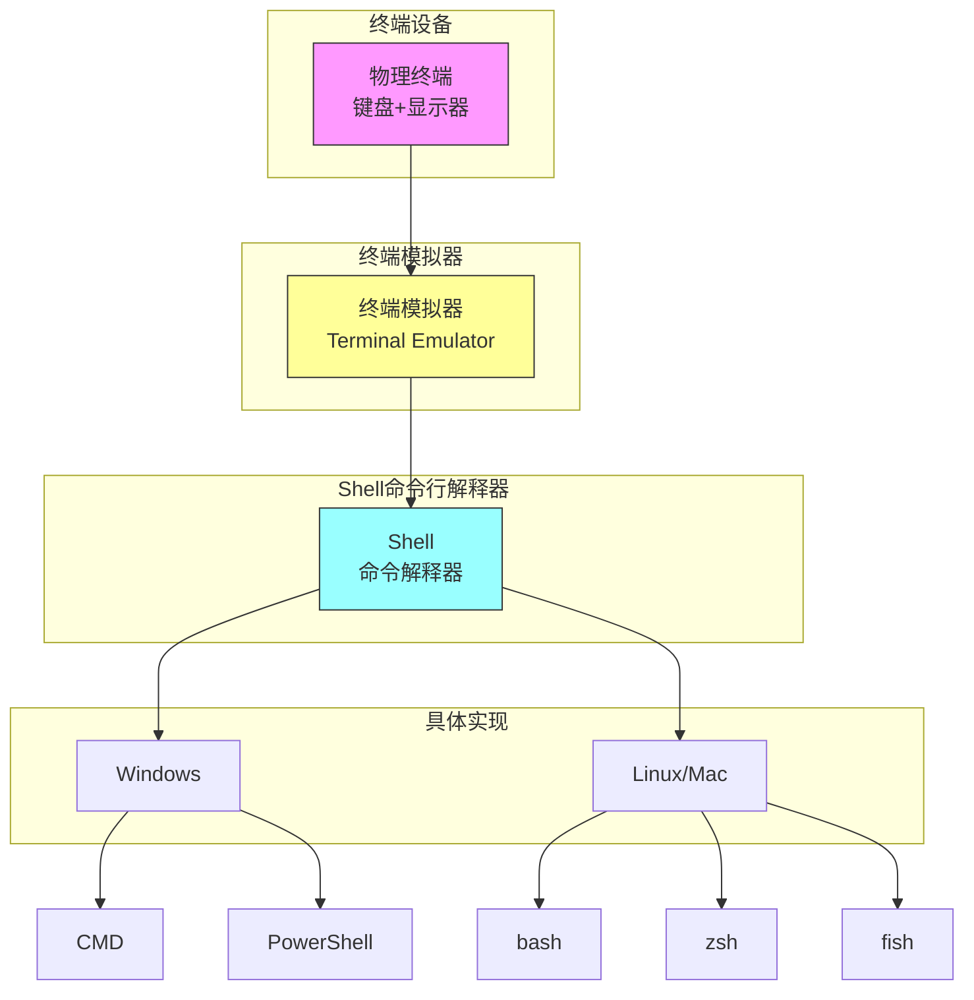
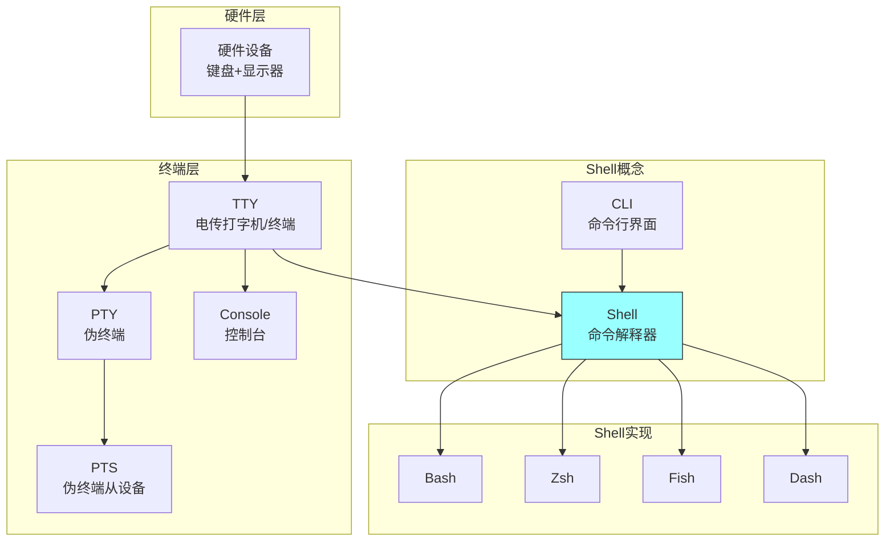
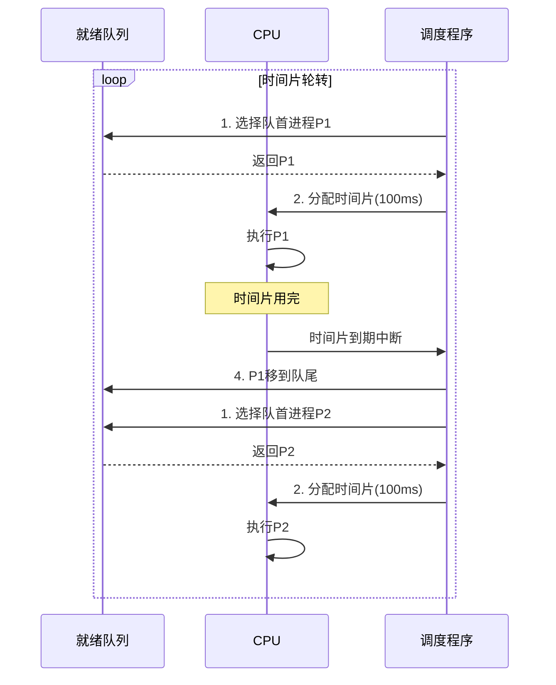

## 阶段

- 串行处理
- 简单批处理
- 多道批处理
- 分时系统（当前阶段）

## 批处理系统

### 概念

- **批处理Batch Processing**：用户将作业提交给操作员，操作员将多个作业收集成一批，然后一次性输入计算机进行处理
- **作业Job**：用户提交给计算机的一项任务，由程序、数据和控制信息组成

### 特点

- **脱机操作**：用户与计算机无直接交互，作业提交后等待结果
- **自动过渡**：作业之间自动转换，减少人工干预
- **批量处理**：一次性处理一组作业，提高效率

### 优点

- 提高CPU利用率（减少作业切换的人工延迟）
- 实现作业的自动过渡和调度

### 缺点

- 无交互能力，提交后无法干预
- 平均周转时间长（作业需等待整个批次处理）
- CPU和IO设备利用率低（CPU与IO设备无法并行）

### 分类

- **单道批处理系统**：内存仅一道作业，顺序执行
  - 自动性：作业自动过渡
  - 顺序性：作业顺序处理
  - 单道性：内存仅一道程序
- **多道批处理系统**：内存同时存放多道程序，宏观上并行执行
  - 多道性：内存同时多道程序
  - 调度性：作业从提交到完成经两级调度
  - 无序性：作业完成顺序与提交顺序不同
  - 系统资源利用率高

## 分时系统

- 能处理多个交互式作业
- 处理器时间在多个用户之间共享TODO补充例子
- 多个用户通过终端同时访问系统

|          | 多道批处理系统       | 分时系统           |
| -------- | -------------------- | ------------------ |
| 原则     | 最大化处理器使用     | 最小化响应时间     |
| 指令来源 | Job Control Language | 通过终端输入的命令 |



- **终端**：输入输出设备，本身无计算能力
- **终端模拟器**：软件模拟传统终端（如PowerShell窗口、Windows Terminal）
- **Shell**：命令解释器，用户与内核之间的接口
  - **Bash**：Bourne Again SHell，Linux默认
  - **Zsh**：Z Shell，功能丰富
  - **Fish**：Friendly Interactive Shell
  - **Dash**：Debian Almquist Shell，轻量快速
- **TTY**：Teletype，电传打字机，泛指终端设备
  - **PTY**：Pseudo Terminal，伪终端（软件模拟）
  - **PTS**：Pseudo Terminal Slave，伪终端从设备
  - **Console**：控制台，系统物理终端



### CTSS

- **定义**：麻省理工1961年开发的第一个分时操作系统
- **特点**：
  - 首次实现多用户交互式计算
  - 使用磁盘作为内存的扩充（虚拟内存雏形）
  - 每个用户分配一个时间片，轮流使用CPU

### Time Slicing（时间片）

- **定义**：CPU时间被划分为多个固定长度的时间片，每个进程轮流使用一个时间片
- **工作方式**：
  1. 调度程序选择就绪队列中的一个进程
  2. 分配一个时间片（如100ms）
  3. 时间片用完，调度程序切换到下一个进程
  4. 被抢占的进程放回就绪队列末尾



- **优点**：
  - 响应时间短（用户感觉自己在独占计算机）
  - 公平性好（所有进程轮流执行）
  - 适用于交互式任务
- **缺点**：
  - 进程切换有开销
  - 时间片过小 → 切换频繁，开销大
  - 时间片过大 → 响应变慢

### 分时系统与批处理系统的区别

|          | 多道批处理系统       | 分时系统           |
| -------- | -------------------- | ------------------ |
| 原则     | 最大化处理器利用率   | 最小化响应时间     |
| 指令来源 | Job Control Language | 通过终端输入的命令 |

## 操作系统服务

- 提供以下功能：
  - 程序执行的运行环境
  - 程序和用户使用的各种服务
- 三个角度：
  - 用户：系统提供的服务
  - 程序员：用户与程序员采用的接口
  - 操作系统涉及人员：系统组件及其相互关系
- 三种UI：
  - GUI：桌面菜单图标
  - CLI：终端输入的相关命令
  - 批处理：.bat、.sh脚本
- 服务种类：
  - UI：**GUI**：桌面菜单图标、**CLI**：终端输入的相关命令、**批处理**：.bat、.sh脚本
  - Program Execution：系统必须能够将程序加载到内存中并运行该程序，正常或异常结束执行（指示错误）
  - IO operations
  - file systems
  - communication：进程可以在同一台计算机上或通过网络在计算机之间交换信息（通信可以通过**共享内存或通过消息传递**进行）
    - 二者可相互实现：消息传递可通过共享内存 + 同步机制实现；共享内存也可通过消息传递的请求/应答方式模拟
    - 本质区别主要在于抽象和管理方式不同，而不是是否能够完成信息交换
  - resource allocation：资源包括CPU周期、主内存、文件存储、IO设备、寄存器、Cache等
  - accounting：跟踪哪些用户使用了多少及哪些类型的计算机资源
  - error detection
  - protection and security

![[../assets/屏幕截图 2026-03-11 154000.png]]

## 系统调用

- 提供用户程序与操作系统间的接口
- 由程序通过API访问
- 操作系统暴露核心服务接口
- 用户态与内核态的转换的方式
- 例子：`open()`不是系统调用，是一个API，在高级语言中大部分函数都是系统调用封装过的API而不是系统调用本身

### API与syscall的联系

- API是程序员在应用层直接调用的接口，syscall是操作系统内核真正提供的服务入口
- 应用程序通常先调用库函数API，再由API去触发相应的syscall
- API比syscall更高层，接口更友好、可移植性更好；syscall更底层，与具体操作系统实现相关
- 一个API可能对应一个syscall，也可能对应多个syscall
- 多个不同API也可能最终对应同一个syscall
- 调用syscall时会发生从用户态到内核态的切换，执行完后再返回用户态
- 例子：C语言中的`printf()`主要是库函数，最终可能通过`write()`系统调用把数据输出到终端或文件

### `ptrace()`和系统调用追踪

- `ptrace()` 是 Linux 内核提供的系统调用，用于进程跟踪（Process Tracing），是调试器和系统调用追踪工具的核心机制。

### 系统调用参数传递

- 三种传递方式：
  - 寄存器传递
  - 内存块
  - 堆栈
- 后两种方式不限制所传递参数的数量或长度
- 栈从上往下走，因此`push(A)`时，`esp=ebp-4`（4个字节）

### 系统调用类型

- 进程控制
  - 例子：`fork()`创建子进程，`execve()`装入并执行新程序，`exit()`终止进程，`wait()`等待子进程结束
- 文件管理
  - 例子：`open()`打开文件，`read()`读文件，`write()`写文件，`close()`关闭文件
- 设备管理
  - 例子：对设备文件执行`read()`、`write()`，或通过`ioctl()`设置设备参数
- 信息维护
  - 例子：`getpid()`获取进程ID，`alarm()`设置定时器，`time()`获取当前时间
- 通信
  - 例子：`pipe()`创建管道，`shmget()`申请共享内存，`socket()`建立套接字通信，**一种是消息传递，另一种是共享内存，二者可相互实现，如消息传递可通过共享内存实现**
- 安全保护
  - 例子：`chmod()`修改文件权限，`chown()`修改文件属主，`setuid()`设置用户身份

## 系统服务

- 应用程序通常不被认为是操作系统的一部分
- 后台服务：在用户上下文而不是内核上下文中运行，因为它们通常只是长期运行的服务进程，比如日志、打印、网络、定时任务；它们需要系统资源，但不需要一直拥有内核级特权。

## 程序编译与运行

- 现代通用系统不会将库链接到可执行文件中，而是根据需要加载动态链接库（比如Windows的dll，Linux的.so），缺点是迁移困难
- 程序无法跨OS运行的原因：不同系统的二进制格式、系统调用不同
- API是源代码层面的接口，规定程序员在源码中如何调用功能
- ABI是二进制层面的接口，可看作API在体系结构层面的等价物，规定编译后的机器码如何在特定CPU和OS上与其他二进制组件交互
- ABI通常涉及调用约定、寄存器用法、栈布局、数据类型大小、字节序、二进制文件格式、系统调用约定等
- 因此即使两个系统提供相似API，只要ABI不同，编译好的程序通常也不能直接通用
- 解释语言、包含VM的应用程序（如Java）、用标准语言（C）编写的程序可以在多操作系统运行

## 操作系统的结构

- IPC：进程间通信（通过端口）
- UNIX操作系统由系统程序和内核组成。
  - 内核：包括系统调用接口下方和物理硬件上方的所有内容；提供文件系统、CPU调度、内存管理等操作系统功能一个级别的大量函数
- 任务是资源分配的基本单位，线程是执行的基本单位

## 操作系统实例

### Windows操作系统

#### Windows对象

Windows利用了大量的面向对象的概念，关键的面向对象概念包括：

- 封装
- 对象类和实例
- 继承
- 多态

#### Windows内核控制对象

| 对象类型                    | 描述                                                                                                                         |
| --------------------------- | ---------------------------------------------------------------------------------------------------------------------------- |
| Asynchronous Procedure Call | 用于中断指定线程的执行，并在指定的处理器模式中调用过程                                                                       |
| Deferred Procedure Call     | 用于推迟中断处理以避免延迟硬件中断，也用于实现定时器和处理器间通信                                                           |
| Interrupt                   | 通过中断分发表(IDT)中的条目将中断源连接到中断服务例程，每个处理器都有自己的IDT                                               |
| Process                     | 表示执行线程对象集合所需的虚拟地址空间和控制信息，包含地址映射指针、就绪线程列表、属于进程的线程列表、总累积时间和基本优先级 |
| Thread                      | 表示线程对象，包括调度优先级、时间量子以及线程可运行的处理器                                                                 |
| Profile                     | 用于测量代码块内的运行时间分布，可以分析用户和系统代码                                                                       |

#### Windows家族

Windows操作系统有多个版本，从早期的Windows NT到现代的Windows 10/11，形成了完整的操作系统家族。

### 传统Unix操作系统

#### 发展历程

- 1970年在贝尔实验室开发，在PDP-7计算机上运行
- 融合了Multics的许多思想
- PDP-11是里程碑，首次展示UNIX可作为所有计算机的操作系统
- 用C语言重写UNIX是另一个里程碑：
  - 展示了使用高级语言编写系统代码的优势
  - 1974年首次在技术期刊上描述
  - 1976年发布第一个贝尔实验室外的广泛可用版本(Version 6)
  - 1978年发布的Version 7是大多数现代UNIX系统的祖先
  - 最重要的非AT&T系统是UNIX BSD(Berkeley Software Distribution)

#### 传统Unix架构

```
用户程序 → 系统调用接口 → 内核 → 硬件
```

传统UNIX内核包括：

- 文件子系统
- 进程控制子系统
- 内存管理
- 调度器
- 设备驱动程序

#### 现代Unix内核

现代UNIX内核更加复杂，包含：

- 多种文件系统支持(NFS、FFS、s5fs、RFS)
- 虚拟内存框架
- 公共设施
- 设备驱动程序切换
- 调度器框架
- STREAMS框架

### Unix家族

#### System V Release 4 (SVR4)

- 由AT&T和Sun Microsystems联合开发
- 融合了SVR3、4.3BSD、Microsoft Xenix System V和SunOS的特性
- 新特性包括：
  - 实时处理支持
  - 进程调度类
  - 动态分配的数据结构
  - 虚拟内存管理
  - 虚拟文件系统
  - 抢占式内核

#### BSD (Berkeley Software Distribution)

- 4.xBSD广泛用于学术机构，是许多商业UNIX产品的基础
- 4.4BSD是Berkeley发布的最终版本：
  - 对4.3BSD的重大升级
  - 包括新的虚拟内存系统、内核结构变化和其他功能增强
- FreeBSD：
  - 最广泛使用和文档最完善的UNIX版本之一
  - 流行于基于互联网的服务器和防火墙
  - 用于许多嵌入式系统
  - Mac OS X基于FreeBSD 5.0和Mach 3.0微内核

#### SUN Solaris 10

- Sun基于SVR4的UNIX版本
- 提供SVR4的所有特性加上更多高级特性：
  - 完全可抢占、多线程内核
  - 完全支持SMP
  - 文件系统的面向对象接口
- 最广泛使用和最成功的商业UNIX实现

### MacOS家族

MacOS操作系统家族包括从早期的Mac OS到现代的macOS，形成了完整的苹果桌面操作系统生态。

### Linux操作系统

#### Linux概述

- 最初是为IBM PC设计的UNIX变体
- 由芬兰计算机科学学生Linus Torvalds编写初始版本
- 1991年首次在互联网上发布
- 现在是运行在多个平台上的功能齐全的UNIX系统
- 免费且源代码可用
- 成功的关键在于免费软件包的可用性
- 高度模块化且易于配置

### Android操作系统

#### Android概述

- Android是为触屏移动设备设计的基于Linux的操作系统
- 是最流行的操作系统
- 由Android公司开发，2015年被Google收购
- 最新版本是Android 14
- 2007年成立开放手机联盟(OHA)，负责Android发布
- Android的开源属性是其成功的关键因素
- 第一个商业版本Android 1.0于2008年发布

#### Android软件架构

1. **应用程序层**：包括Home、Dialer、SMS/MMS、IM、Browser、Camera、Alarm、Contacts、Voice Dial、Email、Calendar、Media Player、Albums、Clock、Calculator等应用
2. **应用框架层**：
   - Activity Manager：管理应用程序生命周期
   - Window Manager：管理窗口显示
   - Content Providers：封装需要在应用间共享的应用数据
   - Resource Manager：管理应用资源
   - View System：提供用户界面原语
   - Location Manager：提供基于位置的服务
   - Notification Manager：管理事件通知
   - Telephony Manager：与电话、SMS、MMS服务交互
   - XMPP：提供应用间的标准化消息功能
3. **系统库层**：由C/C++编写的实用系统函数集
4. **Android运行时**：每个应用运行在自己的进程中，有自己的Dalvik虚拟机实例
5. **Linux内核**：提供硬件驱动和底层系统服务

#### Android活动(Activity)

- 活动是单个视觉用户界面组件，包括菜单选择、图标和复选框等内容
- 应用程序中的每个屏幕都是Activity类的扩展
- 使用视图形成图形用户界面，显示信息并响应用户操作

#### Android电源管理

- **Alarms**：在Linux内核中实现，通过AlarmManager对应用开发者可见
- **Wakelocks**：防止Android系统进入睡眠模式，应用程序通过API请求锁
  - Full_Wake_Lock
  - Partial_Wake_Lock
  - Screen_Dim_Wake_Lock
  - Screen_Bright_Wake_Lock

### 麒麟操作系统(Kylin OS)

#### 发展历程

- 2001年：863计划起源
- 2010年：军民融合整合
- 2019年：组建麒麟软件
- 2020年：国之重器V10
- 2025年：生态引领

#### 系统构成

麒麟操作系统是国产操作系统的核心力量，在系统构成、产品矩阵和行业应用方面都有完整布局。
