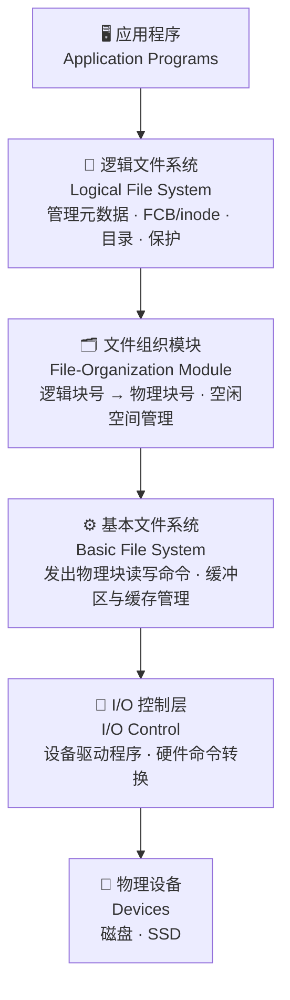
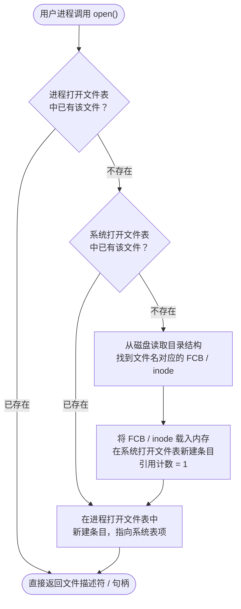
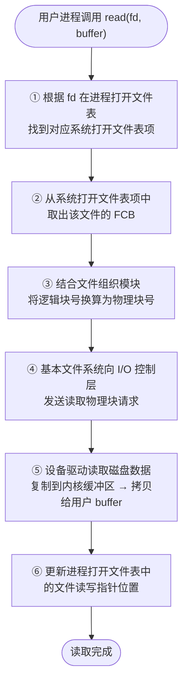
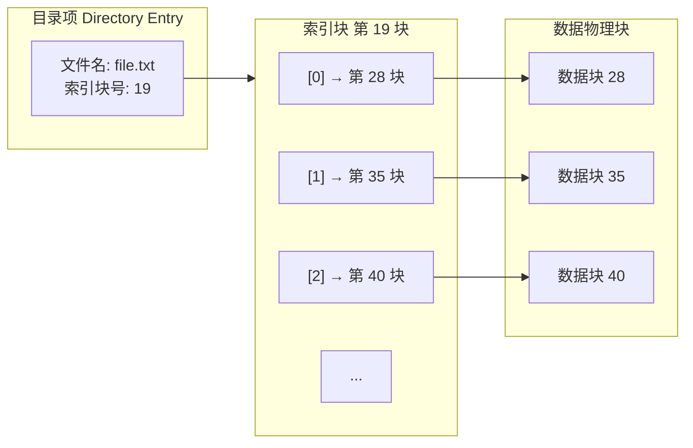

## 1. 文件系统结构 (File System Structure)

*   **文件结构 (File Structure)**
    *   **逻辑存储单元**：文件是相关信息的集合，是逻辑上的存储单元。
    *   **存储位置**：文件系统驻留在辅助存储（通常是磁盘或 SSD）上，提供用户界面，并将逻辑文件系统映射到物理外存设备。
    *   **外存特性**：磁盘支持**原地重写**和**随机访问**。I/O 传输通常以扇区块（经典为 512 字节）为单位执行。
*   **文件控制块 (FCB, File Control Block)**
    *   由文件元数据信息组成的存储结构，每个文件都对应一个唯一的 FCB，包含文件在系统中的唯一标识号（如 Unix 中的 Inode 号）。
*   **分层设计的文件系统 (Layered File System)**
    *   分层有助于**降低复杂性和代码冗余**，但会**增加系统开销并降低性能**。
    *   **层次结构自顶向下**：
        1.  **应用程序 (Application Programs)**：发出高层的文件操作请求。
        2.  **逻辑文件系统 (Logical File System)**：管理元数据。通过维护 FCB (Unix 中的 inode) 将文件名转换为文件号、文件句柄和物理位置；负责目录管理、权限保护。
        3.  **文件组织模块 (File-Organization Module)**：理解文件、逻辑地址和物理块。负责将**逻辑块号**转换为**物理块号**，并管理空闲空间和磁盘分配。
        4.  **基本文件系统 (Basic File System)**：向设备驱动程序发送通用命令（例如“读取第 123 块”），并管理内存中的缓冲区和缓存（分配、释放与替换）。
            *   *缓冲区 (Buffer)*：暂存传输中的数据。
            *   *缓存 (Cache)*：保存常用数据以提高读取效率。
        5.  **I/O 控制层 (I/O Control)**：包含设备驱动程序，管理具体的 I/O 硬件设备。将高级的通用命令转换为低级硬件相关的具体命令（例如“读取驱动器 1、柱面 72、磁道 2、扇区 10，并送入主存地址 1060”）。
        6.  **设备 (Devices)**：物理硬件。

*   **常见文件系统格式**
    *   **CD-ROM**：ISO 9660
    *   **Unix**：UFS, FFS
    *   **Windows**：FAT, FAT32, NTFS
    *   **Linux**：支持 130 多种类型，以 ext3 和 ext4 为主
    *   **现代/分布式/其他文件系统**：ZFS, GoogleFS, Oracle ASM, FUSE 等

---

## 2. 文件系统实现与数据结构

为了实现文件系统，操作系统需要维护磁盘上的结构（On-disk Structures）和内存中的结构（In-memory Structures）。

### 2.1 磁盘上的结构 (On-disk Structures)
*   **引导控制块 (Boot Control Block)**：包含系统从该卷引导操作系统所需的信息。如果该卷不含操作系统，则该块为空或不存在。通常为卷的第一个块（Unix 中称为引导块/boot block，Windows NTFS 中称为分区引导扇区/Partition Boot Sector）。
*   **卷控制块 (Volume Control Block)**：包含该卷的详细信息，如总块数、可用块数、块大小、空闲块指针或数组（Unix 中称为超级块/superblock，Windows NTFS 中称为主文件表/MFT）。
*   **目录结构 (Directory Structure)**：用于组织文件，存储文件名和与之对应的 inode 号（或指向 MFT 的指针）。
*   **文件控制块 (FCB)**：包含文件的具体元数据（文件大小、权限、创建/修改日期、物理数据块指针等）。

### 2.2 内存中的结构 (In-memory Structures)
*   **内存挂载表 (Mount Table)**：存储每个已挂载的文件系统信息，包括挂载点、文件系统类型等。
*   **系统打开文件表 (System-wide Open-file Table)**：包含当前整个系统所有打开文件的 FCB 副本以及其他共享信息。
*   **进程打开文件表 (Per-process Open-file Table)**：为每个进程单独维护，包含指向系统打开文件表对应条目的指针、进程级别的文件指针（当前读写位置）、文件描述符/句柄和访问权限。

> [!NOTE]
> 在 Windows 中，该映射标识称为 **文件句柄 (File Handle)**；在 Unix/Linux 中，称为 **文件描述符 (File Descriptor, FD)**。

### 2.3 文件的打开与读取流程

**打开文件流程 (Open)**

- 目的是拿到fd

**读取文件流程 (Read)**

---

## 3. 目录实现 (Directory Implementation)

目录实现的效率直接影响文件定位的速度。

*   **线性列表 (Linear List)**
    *   **实现**：使用文件名和指向数据块指针的线性表。
    *   **优点**：编程简单。
    *   **缺点**：查找时间长（线性查找，$O(N)$）。
    *   **优化**：可以通过链表对文件名按字母排序，或采用 B+ 树结构来减少搜索时间。
*   **哈希表 (Hash Table)**
    *   **实现**：哈希结构结合线性表。
    *   **优点**：显著缩短目录搜索时间（平均 $O(1)$）。
    *   **缺点**：
        *   **冲突 (Collisions)**：两个不同的文件名哈希到相同的位置。
        *   通常仅适用于条目为固定大小的情况，或需要采用**溢出链表法 (Chained-overflow)** 来处理冲突。

---

## 4. 物理块分配方法 (Allocation Methods)

分配方法决定了如何为文件分配磁盘块，主要有以下四种方法：

### 4.1 连续分配 (Contiguous Allocation)
*   **原理**：每个文件在磁盘上占用一组连续的物理块。
*   **管理参数**：仅需记录文件的**起始块号**和**块数（长度）**。
*   **地址映射公式 (以块大小 512 字节为例)**：
    *   逻辑地址 $LA$
    *   要访问的逻辑块号 $Q = LA / 512$
    *   物理块内偏移量 $R = LA \% 512$
    *   **目标物理块号 = 起始物理块号 + Q**
    *   **块内位移 = R**
*   **优缺点**：
    *   **优点**：
        *   **性能最佳**：寻道数量和寻道时间最小，非常适合频繁连续读写的场景。
        *   **支持随机访问**：可以根据地址映射公式直接跳到指定位置读取。
    *   **缺点**：
        *   **外部碎片 (External Fragmentation)**：文件创建和删除后，会产生无法利用的零碎空间，需要进行代价极高的磁盘整理（Compaction，包括离线和在线整理）。
        *   **需要预先知道文件大小**：文件在创建时必须声明其所需的最大空间。

### 4.2 基于扩展/区段的系统 (Extent-Based Systems)
*   **原理**：是对连续分配方法的改良。磁盘块按**扩展段 (Extent)** 分配，一个 Extent 是一组连续的物理块。
*   **结构**：文件由一个或多个 Extents 组成。文件块的位置记录为：`地址、块数、下一个扩展的首块指针`。
*   **应用**：许多现代文件系统（如 Veritas File System）采用该方法。

| **特性**    | **连续分配 (Contiguous)**            | **基于扩展的系统 (Extent-Based)**          |
| --------- | -------------------------------- | ----------------------------------- |
| **文件组成**  | 整个文件必须都在**一个**连续区域内              | 文件由**一个或多个**连续的区段（Extents）组成        |
| **元数据记录** | 只需：`起始块号 + 长度`                   | 需要记录：`[地址, 块数, 下一个Extent指针]` 的列表    |
| **大文件增长** | 很难增长，必须在创建时声明最大大小                | 支持动态增长，空间不够时追加新的 Extent 即可          |
| **外部碎片**  | **非常严重**，需要频繁进行磁盘整理 (Compaction) | **大幅缓解**，能更有效地利用离散的磁盘空洞             |
| **随机访问**  | 性能最佳，通过简单数学公式即可直接定位              | 性能极佳，只需先定位在哪个 Extent，再在内部偏移         |
| **典型应用**  | 早期文件系统、CD-ROM (ISO 9660)         | 现代高性能文件系统 (如 Veritas FS, ext4, XFS) |

### 4.3 链接分配 (Linked Allocation)
*   **原理**：每个文件都是磁盘块的链表。物理块可以分散在磁盘的任何地方，每个物理块内包含指向下一个物理块的指针（文件的最后一个块的指针为 `nil`）。
*   **优缺点**：
    *   **优点**：
        *   **无外部碎片**：只要磁盘有空闲块，就可以分配给文件。
        *   **无需紧凑**。
        *   **创建文件简单**：无需预先声明文件大小。
    *   **缺点**：
        *   **不支持随机访问**：定位一个块必须沿着链表逐个物理块查找，产生多次 I/O，只适用于顺序访问。
        *   **空间开销**：指针需要占用每个块内的空间（例如 512 字节中占 4 字节），导致有效数据块大小不再是 2 的幂次方。
        *   **可靠性问题**：一旦某个块内的指针发生损坏或丢失，会导致后续的所有文件数据丢失。
    *   **优化**：将多个块组合成**聚簇 (Cluster)**，以 Cluster 为单位进行链接分配。这提高了寻道效率，但会增加**内部碎片**。

### 4.4 文件分配表 (FAT, File Allocation Table)
*   **原理**：链接分配的重要变种。将所有用于链接的指针从数据块中提取出来，统一存放在磁盘开头的一个特殊表项中，该表称为 **FAT**。
    *   FAT 表项与磁盘物理块一一对应。
    *   表项中存储的是该物理块的下一个块号。文件的起始块号记录在目录项中。
*   **优缺点**：
    *   **优点**：
        *   **随机访问速度极大提升**：由于整个 FAT 可以被装入或缓存到内存中，寻找文件块只需在内存的 FAT 中进行指针追踪，不需要多次磁盘 I/O。
        *   **磁盘块完全用于存储数据**，没有块内指针的空间开销。
    *   **缺点**：
        *   若磁盘容量很大，FAT 表也会变得非常庞大，会占用较多的内存空间。

### 4.5 索引分配 (Indexed Allocation)
*   **原理**：每个文件都有自己独立的**索引块 (Index Block)**。索引块中存放的是一系列指针，直接指向文件的数据物理块。

*   **优缺点**：
    *   **优点**：
        *   支持**随机存取/直接访问**。
        *   动态分配，**无外部碎片**。
    *   **缺点**：
        *   **索引块空间开销**：对于只有一两个数据块的小文件，也要为其分配一整个索引块，浪费存储空间。
*   **索引分配的大文件映射方案**：
    若文件非常大，单块索引块装不下所有指针，需要采用以下方案：
    1.  **链接方案**：将多个索引块串联起来（最后一个指针指向下一个索引块）。
    2.  **多级索引 (Multi-level Index)**：外层索引块指向内层索引块，内层索引块再指向数据块。
	    - 块大小 $B$，每个块含指针数 $N$
        *   *两级索引映射计算实例* (块大小 $B = 4KB$，32位地址/4字节指针，可存储 $1024$ 个指针)：
            *   外层索引可指向 1024 个内层索引块，共可存储 $1024 \times 1024 = 1,048,576$ 个数据块。
            *   最大文件容量：$1,048,576 \times 4KB = 4GB$。
            *   映射公式：
                *   逻辑地址 $LA$
                *   外层索引偏移量 $Q_1 = LA / (N \times B)$
                *   余数 $R_1 = LA \% (N \times B)$
                *   内层索引表块内偏移量 $Q_2 = R_1 / B$
                *   物理块内位移 $R_2 = R_1 \% B$
    3.  **组合方案 (Combined Scheme)**：如 UNIX UFS 中的 Inode 结构。
        *   包含 12 个直接块指针（指向数据块，适合小文件快速访问）。
        *   1 个一级间接指针（指向一个索引块）。
        *   1 个二级间接指针。
        *   1 个三级间接指针。

---

## 6. 空闲空间管理 (Free-Space Management)

为了分配物理块，文件系统必须维护一个空闲空间列表 (Free-Space List)。

### 6.1 位图/位向量法 (Bit Vector / Bit Map)
*   **原理**：每个物理块用 1 位表示。`bit[i] = 1` 表示块 `i` 空闲；`bit[i] = 0` 表示块 `i` 已被占用。
*   **块号计算**：
    $$\text{块号} = (\text{字大小}) \times (\text{值为 0 的字数量}) + \text{第一个值为 1 的位偏移}$$
    *(许多 CPU 包含专门的硬件指令来快速查找字内第一个值为 1 的位偏移，如 `bsf` 或 `clz`)*。
*   **空间开销计算实例**：
    *   磁盘大小 = 1TB = $2^{40}$ 字节
    *   块大小 = 4KB = $2^{12}$ 字节
    *   物理块总数 $n = 2^{40} / 2^{12} = 2^{28}$ 块
    *   位图所需内存大小 = $2^{28}$ bits = $2^{25}$ 字节 = **32 MB**。
    *   如果以 4 块组成的簇为单位管理，则位图只需 **8 MB**。
*   **特点**：
    *   容易找到连续的空闲块。
    *   如果磁盘容量过大，位图本身会占用过多内存。

### 6.2 链表法 (Linked Free-space List)
*   **原理**：将所有空闲块链接在一起，首块地址保存在内存中。
*   **特点**：
    *   **无额外空间浪费**：指针直接存在空闲块中，不需要专门存储空间。
    *   无法轻易获取连续的空闲空间。
    *   若记录了空闲块总数，则在分配时无需遍历整个链表。

### 6.3 成组链接法 / 分组法 (Grouping)
*   **原理**：修改链表法。在第一个空闲块中存储后面 $n-1$ 个空闲块的地址，以及指向下一个包含类似指针的空闲块的指针。
*   **特点**：可在极短时间内找到大量空闲块的地址。

### 6.4 计数法 (Counting)
*   **原理**：由于空间经常连续分配和释放，记录首个空闲块的地址，以及其后连续的空闲块数量。
*   **特点**：空闲空间表的每一条目包含 `(起始地址, 连续块数)`，结构类似于 Extent，能有效缩短空闲表长度。

### 6.5 空间映射 (Space Maps - ZFS 方案)
*   **原理**：针对海量存储。此时位图极大，无法完整装入内存，会引发频繁的元数据 I/O。
    *   ZFS 将物理设备空间划分为数百个 **元片 (Metaslabs)**。
    *   每个 Metaslab 对应一个空间映射（使用计数算法）。
    *   这些分配与释放记录以**时间顺序**作为日志（Log）写入磁盘，而不是每次都修改文件系统结构。
    *   当需要使用某个 Metaslabs 时，系统在内存中建立一棵平衡树（按偏移量索引），重放（Replay）日志并将连续的空闲块合并为单个条目。

---

## 7. 效率与性能 (Efficiency and Performance)

### 7.1 影响效率 (Efficiency) 的因素
*   磁盘分配和目录算法的选择。
*   文件目录项中保留的数据类型（如文件访问时间等，会引发频繁的写更新）。
*   元数据结构的预分配（Pre-allocation）或动态分配。
*   固定大小或可变大小的数据结构。

### 7.2 提升性能 (Performance) 的技术
*   **数据邻近性**：将数据块与元数据块（如 inode）尽量存放在磁盘邻近区域（如 UFS 的柱面群/Cylinder Groups）。
*   **缓冲区缓存 (Buffer Cache)**：在主存中开辟一块独立区域，专门用来缓存频繁使用的物理块。
*   **写入模式选择**：
    *   *同步写入 (Synchronous writes)*：不使用缓冲区缓存，必须等数据真实落盘后才返回确认（通常用于关键元数据更新）。
    *   *异步写入 (Asynchronous writes)*：写入缓存即返回，由操作系统异步刷入磁盘。速度更快。
*   **滞后释放 (Free-behind)** 与 **提前读取 (Read-ahead)**：用于优化顺序访问性能。
    *   *Free-behind*：一旦请求了下一个物理页，立即将前一个物理页移出缓冲区（因为顺序访问后通常短期内不会再访问）。
    *   *Read-ahead*：读取当前请求的物理块时，顺便把后续的几个块一起读入缓冲区。
*   **读取通常比写入慢**：因为写入往往可以通过缓冲和异步执行，而读取操作经常需要阻塞等待数据返回。
*   **非易失性内存 (NVM / SSD) 优化**：
    NVM 没有物理磁头移动的开销。使用传统的“避开磁头移动”的老算法会白白浪费大量 CPU 周期。现代优化的目标是**减少 CPU 周期**和**缩短整个 I/O 的调用路径**。

### 7.3 统一缓冲区缓存 (Unified Buffer Cache)

在没有统一缓冲区缓存的系统中，经常面临**双重缓存 (Double Caching)** 的问题：
*   **普通 I/O**（通过 `read`/`write` 系统调用）会使用系统的**缓冲区缓存 (Buffer/Disk Cache)**。
*   **内存映射 I/O**（Memory-mapped I/O）在虚拟内存管理下会使用**页缓存 (Page Cache)**。
*   这样，同一个文件的数据可能在内存中被缓存两份（一次在 Page Cache，一次在 Buffer Cache），导致内存浪费和一致性问题。

**统一缓冲区缓存 (Unified Buffer Cache)** 使用**相同的页缓存**来缓存内存映射页面和普通文件系统 I/O，从而消除了双重缓存，提升了内存利用率和 I/O 效率。

**❌ 未统一：双重缓存 (Double Caching)**

> ⚠️ 同一文件数据在 Page Cache 和 Buffer Cache 中各存一份，造成内存浪费与一致性隐患。

**✅ 统一缓冲区缓存 (Unified Buffer Cache)**

> ✅ 两种 I/O 共享同一份页缓存，无冗余拷贝，节省内存，避免一致性问题。

---

## 8. 恢复与一致性 (Recovery & Consistency)

文件系统可能会因为断电、死机等异常导致数据不一致。

*   **一致性检查 (Consistency Checking)**
    *   系统程序（如 Unix 中的 `fsck`，Windows 中的 `chkdsk`）通过比对目录结构中的元数据与磁盘中的实际物理块状态，尝试找出并修复冲突。
    *   **缺点**：运行非常缓慢，在大容量磁盘上可能耗费数小时，且有些严重损坏无法自动修复。
*   **备份与恢复 (Backup and Restore)**
    *   利用备份程序定期将磁盘数据备份到磁带、其他磁盘或光盘等介质，在灾难发生时进行全量或增量恢复。
*   **基于日志 / 日志型文件系统 (Log-Structured / Journaling File System)**
    *   **原理**：将文件系统的每一次元数据更新都视为一次**事务 (Transaction)**。
    *   **写入流程**：
        1.  先将该事务顺序写入磁盘上独立的**日志区 (Log/Journal)**。
        2.  一旦日志写入完毕，即认为事务已提交（Committed）。
        3.  异步地将日志中的事务操作应用到真实的文件系统结构中。
        4.  在真实结构修改完成后，该事务被从日志区中移除。
    *   **崩溃恢复**：若系统在操作中途崩溃，重启后无需全盘扫描，只需检查日志区中留存的未完成事务，将它们重新执行（Redo）或者撤销（Undo），即可快速恢复一致性。
    *   **优势**：极大地缩短了崩溃后的恢复时间，几乎完全消除了由于非正常关机导致的元数据不一致问题。
