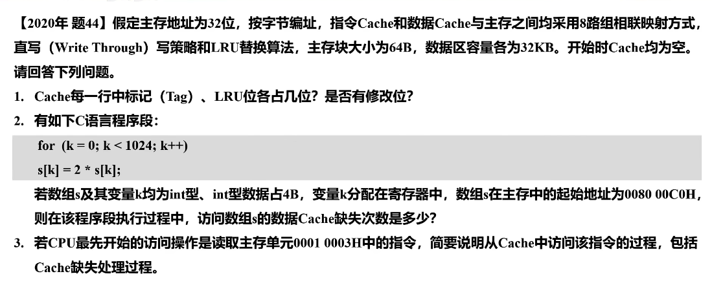
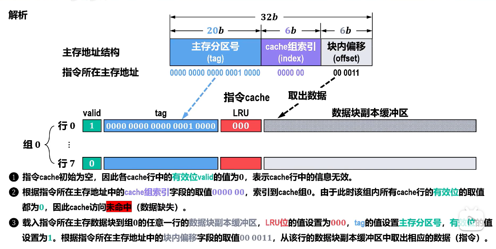

## 一些知识点

### 1. 为什么$256\textrm{MB}$=$2^{28}\textrm{B}$ , 但$800\textrm{MB}$=$8\times 10^8\textrm{B}$?

这是一个**单位定义不同**导致的经典问题，本质原因只有一句话：

**256MB 用的是“二进制意义上的 MB”，而 800MB 用的是“十进制意义上的 MB”。**

其具体单位应该如下表示:

| 名称              | 定义    |     |
| --------------- | ----- | --- |
| 1 MiB（mebibyte） | 2²⁰ B |     |
| 1 MB（megabyte）  | 10⁶ B |     |

也就是说：

- **256 MiB = 2²⁸ B**（严格）
- **800 MB = 8×10⁸ B**（严格）

但现实中大家还是混着用

只需记住:

> **凡是内存、缓存、页大小 → 默认二进制（2 的幂）**

> **凡是硬盘、文件大小、带宽 → 默认十进制（10 的幂）**

- **256MB = 2²⁸ B**
- **800MB = 8×10⁸ B**

即可

### 2. Cache缺失后的访问时间为访问Cache的时间+访问主存的时间

### 3. TLB采用SRAM实现

## 大题

### 1 Cache的访问流程

第三问中的内容:

1. 指令Cache初始为空，**因此各Cache行中有效位均为0，表示Cache行中信息无效**
2. 根据指令所在主存地址中的Cache组索引(0000 00)索引到Cache组0，此时因为有效位为0，因此访问未命中，数据缺失
3. 载入指令地址所在的主存数据块到组0的任意一行的数据副本缓冲区，把这一行的LRU位设为000，有效位设为1，tag设置为主存分区号，然后根据指令所在的主存地址的块内偏移字段得到块内偏移位(00 0011)，从数据块副本中取出该指令

### 2 为什么Cache缺失
