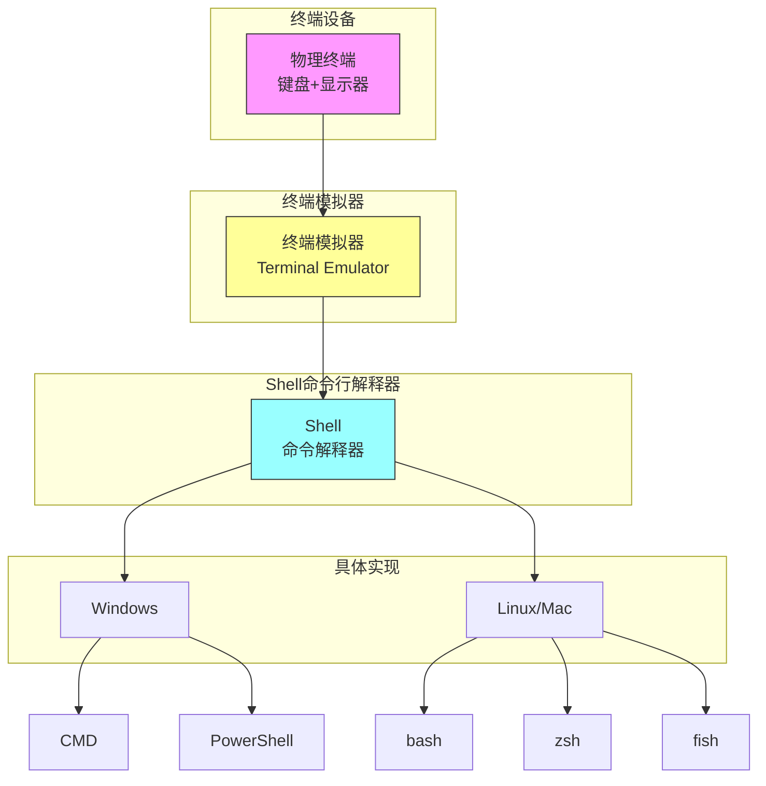
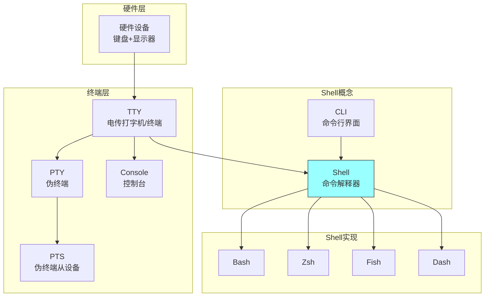
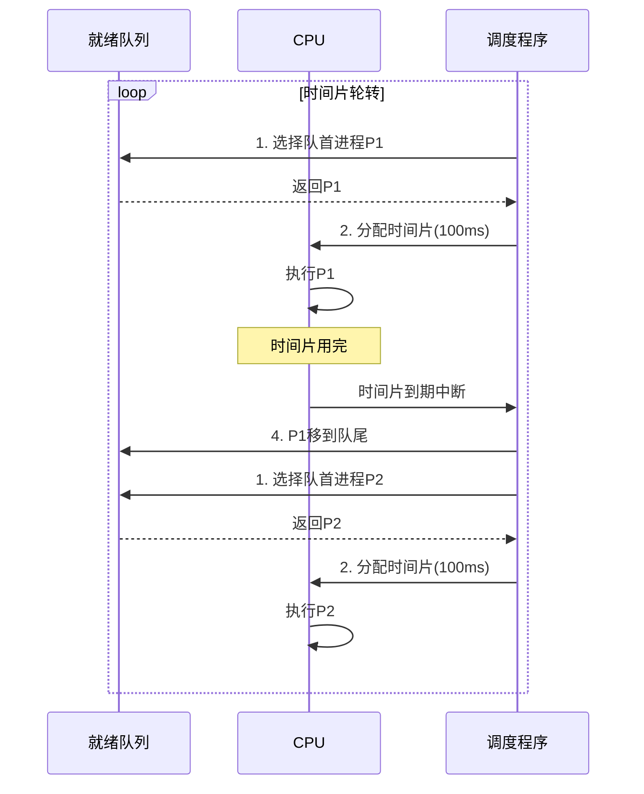

## 阶段

- 串行处理
- 简单批处理
- 多道批处理
- 分时系统（当前阶段）

## 批处理系统

### 概念

- **批处理Batch Processing**：用户将作业提交给操作员，操作员将多个作业收集成一批，然后一次性输入计算机进行处理
- **作业Job**：用户提交给计算机的一项任务，由程序、数据和控制信息组成

### 特点

- **脱机操作**：用户与计算机无直接交互，作业提交后等待结果
- **自动过渡**：作业之间自动转换，减少人工干预
- **批量处理**：一次性处理一组作业，提高效率

### 优点

- 提高CPU利用率（减少作业切换的人工延迟）
- 实现作业的自动过渡和调度

### 缺点

- 无交互能力，提交后无法干预
- 平均周转时间长（作业需等待整个批次处理）
- CPU和IO设备利用率低（CPU与IO设备无法并行）

### 分类

- **单道批处理系统**：内存仅一道作业，顺序执行
  - 自动性：作业自动过渡
  - 顺序性：作业顺序处理
  - 单道性：内存仅一道程序
- **多道批处理系统**：内存同时存放多道程序，宏观上并行执行
  - 多道性：内存同时多道程序
  - 调度性：作业从提交到完成经两级调度
  - 无序性：作业完成顺序与提交顺序不同
  - 系统资源利用率高

## 分时系统

- 能处理多个交互式作业
- 处理器时间在多个用户之间共享TODO补充例子
- 多个用户通过终端同时访问系统

|          | 多道批处理系统       | 分时系统           |
| -------- | -------------------- | ------------------ |
| 原则     | 最大化处理器使用     | 最小化响应时间     |
| 指令来源 | Job Control Language | 通过终端输入的命令 |

- **终端**：输入输出设备，本身无计算能力
- **终端模拟器**：软件模拟传统终端（如PowerShell窗口、Windows Terminal）
- **Shell**：命令解释器，用户与内核之间的接口
  - **Bash**：Bourne Again SHell，Linux默认
  - **Zsh**：Z Shell，功能丰富
  - **Fish**：Friendly Interactive Shell
  - **Dash**：Debian Almquist Shell，轻量快速
- **TTY**：Teletype，电传打字机，泛指终端设备
  - **PTY**：Pseudo Terminal，伪终端（软件模拟）
  - **PTS**：Pseudo Terminal Slave，伪终端从设备
  - **Console**：控制台，系统物理终端

### CTSS

- **定义**：麻省理工1961年开发的第一个分时操作系统
- **特点**：
  - 首次实现多用户交互式计算
  - 使用磁盘作为内存的扩充（虚拟内存雏形）
  - 每个用户分配一个时间片，轮流使用CPU

### Time Slicing（时间片）

- **定义**：CPU时间被划分为多个固定长度的时间片，每个进程轮流使用一个时间片
- **工作方式**：
  1. 调度程序选择就绪队列中的一个进程
  2. 分配一个时间片（如100ms）
  3. 时间片用完，调度程序切换到下一个进程
  4. 被抢占的进程放回就绪队列末尾

- **优点**：
  - 响应时间短（用户感觉自己在独占计算机）
  - 公平性好（所有进程轮流执行）
  - 适用于交互式任务
- **缺点**：
  - 进程切换有开销
  - 时间片过小 → 切换频繁，开销大
  - 时间片过大 → 响应变慢

### 分时系统与批处理系统的区别

|          | 多道批处理系统       | 分时系统           |
| -------- | -------------------- | ------------------ |
| 原则     | 最大化处理器利用率   | 最小化响应时间     |
| 指令来源 | Job Control Language | 通过终端输入的命令 |

## 操作系统服务

- 提供以下功能：
  - 程序执行的运行环境
  - 程序和用户使用的各种服务
- 三个角度：
  - 用户：系统提供的服务
  - 程序员：用户与程序员采用的接口
  - 操作系统涉及人员：系统组件及其相互关系
- 三种UI：
  - GUI：桌面菜单图标
  - CLI：终端输入的相关命令
  - 批处理：.bat、.sh脚本
- 服务种类：
  - UI：**GUI**：桌面菜单图标、**CLI**：终端输入的相关命令、**批处理**：.bat、.sh脚本
  - Program Execution：系统必须能够将程序加载到内存中并运行该程序，正常或异常结束执行（指示错误）
  - IO operations
  - file systems
  - communication：进程可以在同一台计算机上或通过网络在计算机之间交换信息（通信可以通过**共享内存或通过消息传递**进行）
  - resource allocation：资源包括CPU周期、主内存、文件存储、IO设备、寄存器、Cache等
  - accounting：跟踪哪些用户使用了多少及哪些类型的计算机资源
  - error detection
  - protection and security

![[../assets/屏幕截图 2026-03-11 154000.png]]
## 系统调用

- 操作系统暴露核心服务接口
- 