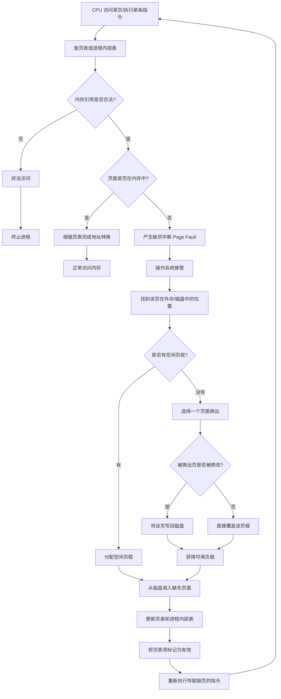

# 虚拟内存

[[操作系统/materials/2026-OS-CH-10-虚拟内存管理(1).pdf#page=8|2026-OS-CH-10-虚拟内存管理(1), 页面 8]]这里得到的结果是父子进程得到的进程号不同，但是逻辑地址是相同的。即逻辑地址相同，但值是不同的。

# 虚拟内存定义

- 将用户逻辑内存与物理内存分离
- 加载或交换进程所需的IO更少
- 通常从地址0开始，连续地址直到空间结束

# 请求分页

## 与普通分页的区别

普通分页强调的是：

进程被分成若干页，内存被分成若干页框，通过页表完成地址转换。

请求分页是在分页基础上进一步改进：

页面可以不全部在内存中，只有访问到时才调入。

**请求分页就是：程序的页面不必全部在内存中，只有当 CPU 真正访问某页且该页不在内存时，才通过缺页中断把它从外存调入内存。**

## 工作流程

```text
访问某页
   ↓
该页是否合法？
   ↓
不合法：终止程序
合法：
   ↓
是否在内存？
   ↓
在：直接访问
不在：缺页中断，调入内存
```

## 处理缺页的流程



## 请求分页时的问题

### 多页错误
[[操作系统/materials/2026-OS-CH-10-虚拟内存管理(1).pdf#page=25|2026-OS-CH-10-虚拟内存管理(1), 页面 25]]

一条指令可能涉及多个页面的例子：

比如`C = A + B`

可能涉及

```
指令本身所在的页面
A 所在的数据页面
B 所在的数据页面
C 所在的数据页面
```

如果这些页面都不在内存中，那么执行这一条指令时可能发生多次缺页。

例如：

```
第一次执行：取指令时缺页
调入指令页，重新执行

第二次执行：访问 A 时缺页
调入 A 所在页，重新执行

第三次执行：访问 B 时缺页
调入 B 所在页，重新执行

第四次执行：写 C 时缺页
调入 C 所在页，重新执行
```

### 需要硬件支持

- 页表项中要有标志位来表示页面是否在内存中
- 辅助内存：磁盘或交换区，存放暂时不在内存中的页面
- 指令重启机制：缺页发生后，那条指令可能只执行了一部份，页面调入后，CPU必须能重新执行导致缺页的指令

### 指令重启

一些简单指令很方便在执行到一半时缺页后重新继续处理，但有些指令不容易重启，比如这条指令在缺页前已经修改了内存或寄存器，如果从头重启，会导致重复写入等错误

### 指令重启的解决方案

#### 方法一

> 尽量避免执行到一半才缺页

例如要执行：`move source[1000 ~ 1999] → dest[3000 ~ 3999]`

微代码会先检查：

```
source 的起始地址
source 的结束地址
dest 的起始地址
dest 的结束地址
```

提前触发可能的缺页，如果这些地址所在页面不在内存中，就会在真正修改数据之前发生缺页

```
先检查页面
      ↓
如果缺页，先处理缺页
      ↓
页面调入后，重新开始检查
      ↓
确认所需页面在内存
      ↓
再真正执行块移动
```

能避免复制到一半才缺页

#### 方法二

> 即使执行到一半缺页，也能恢复到原状态

使用临时寄存器保存旧值，如果后面发生缺页，CPU可以把旧值写回去，把内存恢复成指令开始前的状态

可以理解为回滚

## 请求分页性能优化

- 交换空间IO（swap分区）比文件系统IO快，因为其为专门划出来的一块连续磁盘区域，管理更简单

### 方法一

**进程加载时，把整个进程映像复制到交换空间**

传统方式是：缺哪个代码页，就从这个可执行文件中读哪个页。
优化方式是：进程启动时，先把整个进程映像复制到交换空间，之后缺页时，都从交换空间调入

```
原来：
可执行文件 → 内存

优化后：
可执行文件 → 交换空间 → 内存
```

### 方法二

**从程序二进制文件请求分页，但释放页框时直接丢弃**

主要针对代码页或只读页面

如果内存不够，需要把某个代码页换出，那么就没有必要把它写到交换空间，因为它本来就在可执行文件里，这时候直接丢弃

但不是所有页面都能被直接丢弃，比如有些页面在内存中被修改过，且不对应文件系统中的固定内容

例如

```c
int *p = malloc(1000);
*p = 123;
```

123只存在于进程运行时的内存中，不在可执行文件里，如果要换出这些页面，就必须写入交换空间，否则数据会丢失

```
代码页、只读文件映射页：
可以直接丢弃，之后从文件重新读入

堆、栈、匿名页：
必须写到交换空间
```

