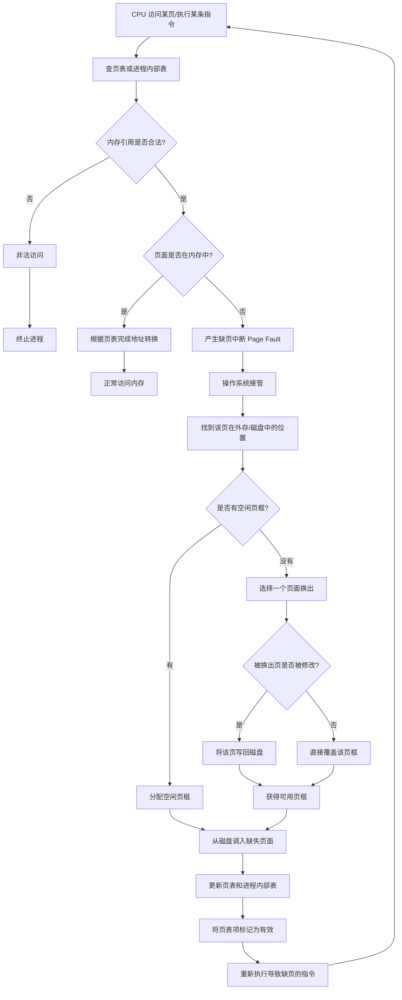

# 虚拟内存

[[操作系统/materials/2026-OS-CH-10-虚拟内存管理(1).pdf#page=8|2026-OS-CH-10-虚拟内存管理(1), 页面 8]]这里得到的结果是父子进程得到的进程号不同，但是逻辑地址是相同的。即逻辑地址相同，但值是不同的。

# 虚拟内存定义

- 将用户逻辑内存与物理内存分离
- 加载或交换进程所需的IO更少
- 通常从地址0开始，连续地址直到空间结束

# 请求分页

## 与普通分页的区别

普通分页强调的是：

进程被分成若干页，内存被分成若干页框，通过页表完成地址转换。

请求分页是在分页基础上进一步改进：

页面可以不全部在内存中，只有访问到时才调入。

**请求分页就是：程序的页面不必全部在内存中，只有当 CPU 真正访问某页且该页不在内存时，才通过缺页中断把它从外存调入内存。**

## 工作流程

```text
访问某页
   ↓
该页是否合法？
   ↓
不合法：终止程序
合法：
   ↓
是否在内存？
   ↓
在：直接访问
不在：缺页中断，调入内存
```

## 处理缺页的流程



## 请求分页时的问题

### 多页错误
[[操作系统/materials/2026-OS-CH-10-虚拟内存管理(1).pdf#page=25|2026-OS-CH-10-虚拟内存管理(1), 页面 25]]

一条指令可能涉及多个页面的例子：

比如`C = A + B`

可能涉及

```
指令本身所在的页面
A 所在的数据页面
B 所在的数据页面
C 所在的数据页面
```

如果这些页面都不在内存中，那么执行这一条指令时可能发生多次缺页。

例如：

```
第一次执行：取指令时缺页
调入指令页，重新执行

第二次执行：访问 A 时缺页
调入 A 所在页，重新执行

第三次执行：访问 B 时缺页
调入 B 所在页，重新执行

第四次执行：写 C 时缺页
调入 C 所在页，重新执行
```

### 需要硬件支持

- 页表项中要有标志位来表示页面是否在内存中
- 辅助内存：磁盘或交换区，存放暂时不在内存中的页面
- 指令重启机制：缺页发生后，那条指令可能只执行了一部份，页面调入后，CPU必须能重新执行导致缺页的指令

### 指令重启

一些简单指令很方便在执行到一半时缺页后重新继续处理，但有些指令不容易重启，比如这条指令在缺页前已经修改了内存或寄存器，如果从头重启，会导致重复写入等错误

### 指令重启的解决方案

#### 方法一

> 尽量避免执行到一半才缺页

例如要执行：`move source[1000 ~ 1999] → dest[3000 ~ 3999]`

微代码会先检查：

```
source 的起始地址
source 的结束地址
dest 的起始地址
dest 的结束地址
```

提前触发可能的缺页，如果这些地址所在页面不在内存中，就会在真正修改数据之前发生缺页

```
先检查页面
      ↓
如果缺页，先处理缺页
      ↓
页面调入后，重新开始检查
      ↓
确认所需页面在内存
      ↓
再真正执行块移动
```

能避免复制到一半才缺页

#### 方法二

> 即使执行到一半缺页，也能恢复到原状态

使用临时寄存器保存旧值，如果后面发生缺页，CPU可以把旧值写回去，把内存恢复成指令开始前的状态

可以理解为回滚

## 请求分页性能优化

- 交换空间IO（swap分区）比文件系统IO快，因为其为专门划出来的一块连续磁盘区域，管理更简单

### 方法一

**进程加载时，把整个进程映像复制到交换空间**

传统方式是：缺哪个代码页，就从这个可执行文件中读哪个页。
优化方式是：进程启动时，先把整个进程映像复制到交换空间，之后缺页时，都从交换空间调入

```
原来：
可执行文件 → 内存

优化后：
可执行文件 → 交换空间 → 内存
```

### 方法二

**从程序二进制文件请求分页，但释放页框时直接丢弃**

主要针对代码页或只读页面

如果内存不够，需要把某个代码页换出，那么就没有必要把它写到交换空间，因为它本来就在可执行文件里，这时候直接丢弃

但不是所有页面都能被直接丢弃，比如有些页面在内存中被修改过，且不对应文件系统中的固定内容

例如

```c
int *p = malloc(1000);
*p = 123;
```

123只存在于进程运行时的内存中，不在可执行文件里，如果要换出这些页面，就必须写入交换空间，否则数据会丢失

```
代码页、只读文件映射页：
可以直接丢弃，之后从文件重新读入

堆、栈、匿名页：
必须写到交换空间
```

# 页面置换算法

## FIFO算法

[[操作系统/materials/2026-OS-CH-10-虚拟内存管理(1).pdf#page=44|2026-OS-CH-10-虚拟内存管理(1), 页面 44]]按照先进来的先被置换的原则

> 注意如果被替换的页面中被修改了，还需要写入磁盘，否则直接覆盖

### Belady异常

**只在FIFO中出现，分配给进程的页框数增加了，缺页次数反而变多。**

与直觉“内存页框越多，能放的页面越多，缺页次数应该减少或至少不增加。”相悖（其他置换算法是符合此直觉的）

**原因：**

1. FIFO只看页面进入内存的先后顺序，不看页面是否常用、最近是否访问过。比如一个页面虽然经常被访问，但只要它是最早进入内存的页面，但FIFO也可能把它置换掉。
2. FIFO不满足栈性质。栈性质：如果页框数从3个增加到4个，那么3个页框时内存中的页面集合，应该始终是4个页框时内存页面集合的子集

## OPT最优页面置换算法

理想算法，不可能实现

替换在将来时间内，没有被使用的时间最长的那个页面

不能预测未来，用于测量算法的性能

## LRU算法

只要是涉及置换的，都可使用LRU算法

> Q：LRU算法和最优页面置换算法是不是挺像的，我感觉就是把最优页面置换算法的往将来看最晚再使用的，换成往之前看最早使用的，就是LRU了

> A：LRU可理解为“用过去的访问历史”去估计“未来的访问趋势”，LRU可看成是对OPT的一种现实近似

[[操作系统/materials/2026-OS-CH-10-虚拟内存管理(1).pdf#page=47|2026-OS-CH-10-虚拟内存管理(1), 页面 47]]就是往前看，找最早用的，将其置换掉

### 使用计数器实现LRU

给每个页面增加一个时间戳字段，记录它最近一次被访问的时间

系统维护一个全局时钟，每访问一个页面，就把当前clock值复制到该页面对应的计数器中

例如访问序列为：1 2 3 2 1

假设访问后各页面计数器为：

```
页面 1：5
页面 2：4
页面 3：3
```

说明：

```
页面 1 最近在时刻 5 被访问
页面 2 最近在时刻 4 被访问
页面 3 最近在时刻 3 被访问
```

因此这时发生缺页，就淘汰计数器最小的页面，即3

**优点**

页面每次被访问时，只需要更新自己的计数器

**缺点**

缺页置换时，需要遍历所有页表项，找计数器最小的页面

### 使用堆栈实现LRU

用一个双向链表维护页面的最近使用顺序。

可以把它理解为一个“最近使用栈”。

栈顶表示：

```text
最近刚被访问的页面
```

栈底表示：

```text
最久没有被访问的页面
```

每当访问一个页面，就把这个页面移动到栈顶。

例如当前栈为：

```text
栈顶  4  2  1  3  栈底
```

表示：

```text
4 最近被访问
2 次近
1 更早
3 最久没被访问
```

如果访问页面 1，就把 1 移到栈顶：

```text
栈顶  1  4  2  3  栈底
```

如果此时需要页面置换，直接淘汰栈底页面：

```text
3
```

因为它就是最久没被访问的页面。

如果用双向链表实现，把一个页面节点移动到链表头部，通常需要修改多个指针。

所以一次页面访问的更新成本比较高。

**优点**

缺页时不需要搜索，直接淘汰栈底页面。

也就是图中说的：

```text
No search for replacement
```

因为栈底天然就是 LRU 页面。

**缺点**

每次访问页面都要调整链表，更新成本更高。

**对比**

|**实现方式**|**页面访问时**|**页面置换时**|**优点**|**缺点**|
|---|---|---|---|---|
|计数器实现|更新该页的时间戳|遍历页表找最小计数器|访问时简单|置换时要搜索|
|堆栈实现|把页面移到栈顶|直接淘汰栈底|置换快|每次访问都要改链表|

## 近似LRU算法

因为精确LRU实现代价太高，所以实际中使用近似LRU算法

### 增加引用位

每个页表项中会有一个引用位，它的规则是：

```
初始值：0
页面被访问过：硬件自动把引用位置为 1
```

也就是说，只要某个页面最近被 CPU 访问过，它的引用位就会变成 1。

当发生缺页置换时，系统更倾向于淘汰引用位为 0 的页面。

因为引用位只能告诉我们：这个页面最近有没有被访问过。

但它不能精确告诉我们：这个页面具体是在什么时候被访问的。

所以为近似LRU

### 额外引用位

它的思想是：

不只记录当前这一时刻有没有被访问，而是记录最近若干个时间周期内的访问历史。

常见做法是：给每个页面维护一个 8 位寄存器。

例如页面 A 有一个 8 位历史寄存器：

```text
00110110
```

每隔一段固定时间，系统做一次更新：

1. 把当前引用位移入寄存器最高位；
2. 原来的寄存器整体右移一位；
3. 最低位被丢弃；
4. 然后把当前引用位清零，等待下一周期重新记录。

假设某页面的历史寄存器原来是：

```text
01110111
```

这一周期内它被访问过，所以引用位 R = 1。

定期更新时：

```text
R = 1
原寄存器 = 01110111
```

把 R 放到最高位，原内容右移一位：

```text
10111011
```

然后清除 R 位，进入下一个周期。

这个 8 位值就记录了最近 8 个时间周期的访问情况。

**如何判断哪个页面更该被淘汰？**

把每个页面的 8 位寄存器看成一个无符号二进制数。

数值越大，说明它越“近期”被访问过；数值越小，说明它越久没有被访问。

例如：

```text
页面 A：11000100
页面 B：01110111
```

把它们当成二进制数比较：

```text
11000100 > 01110111
```

所以页面 A 更可能是最近使用过的页面，页面 B 更久没用。

  

因此如果要淘汰，优先淘汰：

```text
01110111
```

也就是数值较小的页面。

**为什么 11000100 比 01110111 更“最近使用”？**

因为最高位代表最近一个时间周期。

```text
11000100
```

表示：

```text
最近周期：用过
上一个周期：用过
再之前：没用过
...
```

而：

```text
01110111
```

最高位是 0，说明最近一个周期没有被访问过。

所以即使后面有很多 1，它也不如最高位为 1 的页面“新”。

这就是图中这句话的意思：

具有 11000100 的历史寄存器值的页面比具有值为 01110111 的页面更为“最近使用”。

发生缺页时，选择 8 位历史寄存器值最小的页面淘汰。

例如：

|**页面**|**历史寄存器**|
|---|---|
|A|11000100|
|B|01110111|
|C|00100000|
|D|00000110|

把它们当二进制数看，最小的是：

```text
00000110
```

所以淘汰页面 D。

因为它的访问历史最弱，说明它最久没有被使用。

### 二次机会/CLOCK算法

可理解为FIFO算法+一个引用位

本质上还是按页面进入内存的先后顺序排队，但在淘汰最老页面之前，会先看它最近有没有被访问过。如果最近被访问过，就暂时不淘汰它，给它“第二次机会”。

[[操作系统/materials/2026-OS-CH-10-虚拟内存管理(1).pdf#page=52|2026-OS-CH-10-虚拟内存管理(1), 页面 52]] 图中每个页面旁边都有一个 **reference bit 引用位**：

```text
0：最近没有被访问过
1：最近被访问过
```

页面一旦被访问，硬件会把它的引用位置为 1。

内存中的页面被组织成一个 **循环队列**，并且有一个指针指向当前候选淘汰页面，也就是图中的：

```text
next victim
```

意思是：

下一次发生缺页时，先从这个页面开始检查，看它是否应该被淘汰。

二次机会算法的规则是：

当发生缺页，需要找一个页面换出时，从 `next victim` 指针指向的页面开始检查。

如果该页面的引用位是 **0**：

```text
reference bit = 0
```

说明它最近没有被访问过，直接淘汰它。

如果该页面的引用位是 **1**：

```text
reference bit = 1
```

说明它最近被访问过，不马上淘汰它，而是：

```text
把引用位清 0
指针向后移动
继续检查下一个页面
```

这就相当于给这个页面一次机会。

比如图左边，`next victim` 指向的页面引用位是 1。

这表示：

```text
它虽然在 FIFO 顺序上最老，但最近被访问过
```

所以不能直接淘汰它。

于是操作系统会：

```text
把它的引用位从 1 改为 0
指针移动到下一个页面
```

如果下一个页面引用位还是 1，也继续清 0 并跳过。

直到找到第一个引用位为 0 的页面，把它淘汰。

图右边表示的就是继续扫描后的状态。

指针移动到了某个引用位为 0 的页面，说明这个页面：

```text
既比较老
最近又没有被访问过
```

所以它就是合适的牺牲页，可以被换出。

举个简单例子，假设循环队列中有 4 个页面：

```text
A  B  C  D
```

引用位分别是：

```text
A: 1
B: 1
C: 0
D: 1
```

指针指向 A。

发生缺页时：

1. 检查 A，引用位为 1，不淘汰，清成 0；
2. 指针到 B，引用位为 1，不淘汰，清成 0；
3. 指针到 C，引用位为 0，淘汰 C。

所以最终被换出的是 C，而不是最早的 A。

这就是“第二次机会”的含义。

**如果所有页面的引用位都是 1，会发生什么？**

算法会扫描一圈，把所有引用位都清成 0。然后继续扫描，遇到第一个引用位为 0 的页面就淘汰。

这时候它的效果就退化得比较接近 FIFO。

### 增强型二次机会算法

```
普通二次机会：只根据引用位 R 判断最近是否使用
增强型二次机会：根据引用位 R 和修改位 M 一起判断
```

目标是淘汰掉最近没用过，而且没被修改过的页面

```
R = 0：最近没有被访问过
R = 1：最近被访问过

M = 0：页面没有被修改过，称为 clean page
M = 1：页面被修改过，称为 dirty page
```

|**类型**|**含义**|**淘汰优先级**|
|---|---|---|
|(0, 0)|最近未使用，且未修改|最优先淘汰|
|(0, 1)|最近未使用，但已修改|次优先淘汰|
|(1, 0)|最近使用过，但未修改|不太想淘汰|
|(1, 1)|最近使用过，且已修改|最不想淘汰|

## 页面缓冲算法

页面置换时，不要真的等到缺页发生时才临时写出脏页、读入新页，而是提前准备一些“空闲页框”，让缺页处理更快。

```
平时：
    后台选择一些页面作为牺牲页
    如果是脏页，提前写回磁盘
    把可用页框加入空闲帧池

发生缺页时：
    优先从空闲帧池取一个页框
    把缺失页面读入该页框
    进程尽快继续运行

如果被访问页面刚好还残留在空闲帧中：
    直接恢复映射
    不必重新从磁盘读取
```

缓冲体现在：

```
提前准备空闲页框
提前写回脏页
```

# 帧分配

系统中有多个进程，每个进程应该分到多少个物理页框？

比如系统一共有 100 个可用页框，现在有 4 个进程：P1-P4

可以这样分：

```
P1：25 个
P2：25 个
P3：25 个
P4：25 个
```

也可以这样分：

```
P1：40 个
P2：30 个
P3：20 个
P4：10 个
```

这就是帧分配问题

## 全局分配与局部分配

全局置换：一个进程发生缺页时，可以从系统中所有进程占有的页框里选择牺牲页。

**优点：**

全局置换比较灵活。

如果某个进程最近很活跃、需要更多内存，它可以从其他不活跃进程那里“借”页框。

所以它通常能带来更高的系统吞吐量。

**缺点：**

一个进程无法完全控制自己的缺页率，因为它的页面可能被别的进程换走，其取决于其他进程的行为


局部置换：一个进程发生缺页时，只能从自己已经分配的页框中选择牺牲页

**优点：**

每个进程的性能更加稳定

**缺点：**

可能不能充分利用内存


