# 《电路理论基础》

# ----Fundamentals of ElectricCircuit

周杰英

中山大学 计算机学院

isszjy@mail.sysu.edu.cn

# 电路理论基础(2026)

此群是企业内部群聊，仅企业成员可扫码加入

该二维码7天内(3月9日前)有效

# 一、 什么是电路 （ circuits ）

电路是由若干电气元件相互连接构成的电流的通路。

本课程主要接触的电气元件有：

电阻R、电容C、电感L、二极管D 、 MOSFET （场效应管） 、理想运算放大器、互感线圈、理想变压器

# 二、为什么要学习电路？

从学术的观点来看

电路是电气工程（ electrical engineering ）的基础。

– 电路是计算机科学（ computer science ）的基础。

从实际情况来看

电路原理是许多高级课程的先修课程。

熟练掌握电路原理对现实生活有帮助。

# 三、 什么是

EECS ？

<table><tr><td>国内习惯的归类与统称</td><td colspan="2">各学科领域</td><td>国外习惯的归类与统称</td></tr><tr><td>电气工程</td><td colspan="2">电力工程</td><td rowspan="5">电气工程</td></tr><tr><td rowspan="5">信息科学与技术(或电子信息科学与技术)</td><td colspan="2">控制工程</td></tr><tr><td colspan="2">通信工程</td></tr><tr><td colspan="2">电子工程</td></tr><tr><td colspan="2"></td></tr><tr><td colspan="2">计算机科学与技术</td><td>计算机科学计算机工程</td></tr><tr><td colspan="2">统称:电气工程与信息科学(或电气电子信息科学)</td><td colspan="2">统称:电气工程与计算机科学(简称EECS、ECE)</td></tr></table>

# 四、电路都有哪些作用？

处理能量

电能的产生、传输、分配……

处理信号

电信号的获得、变换、放大 ……

同时处理信号和能量

– 天线、 CPU 及其供电系统、智能电网……

# 电气化铁道系统——处理电能

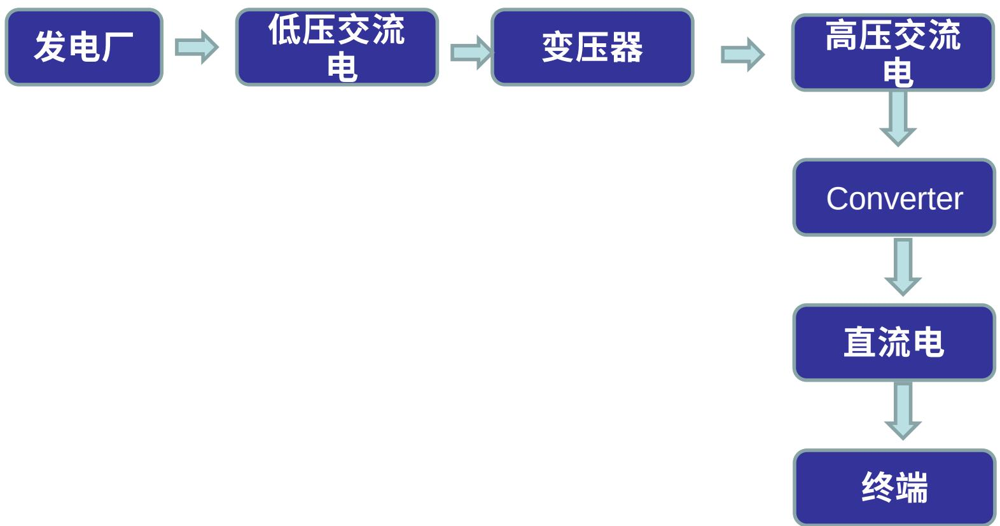

# 手机通讯系统— 处理信号

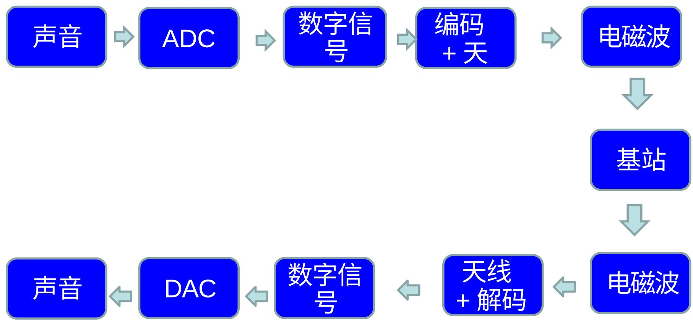

电信号的获得、处理、放大

# 五、 电路原理的后续课程

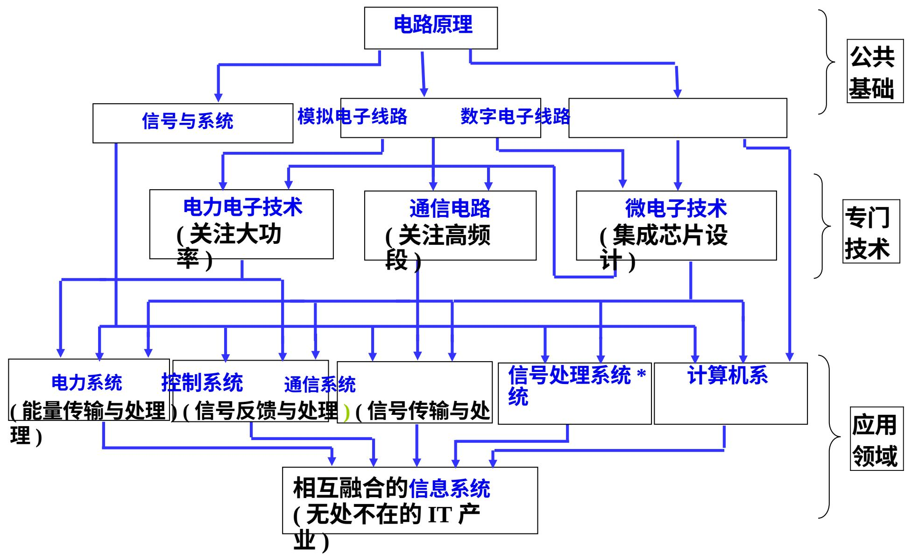

# 六、 电路分析与电路综合

电路理论 （电路原理）

电路分析 (analysis)

电路综合

(synthesis)

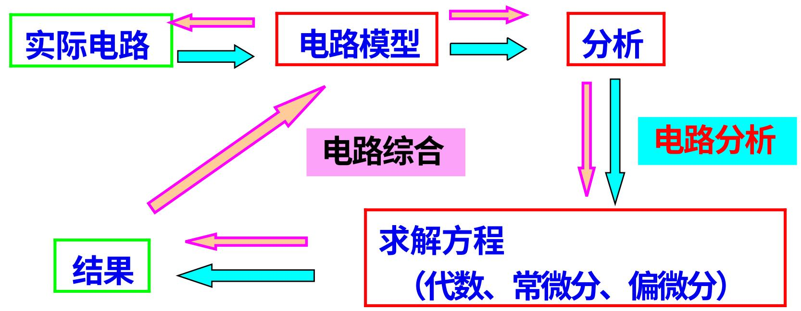

# 七、 如何看待电路

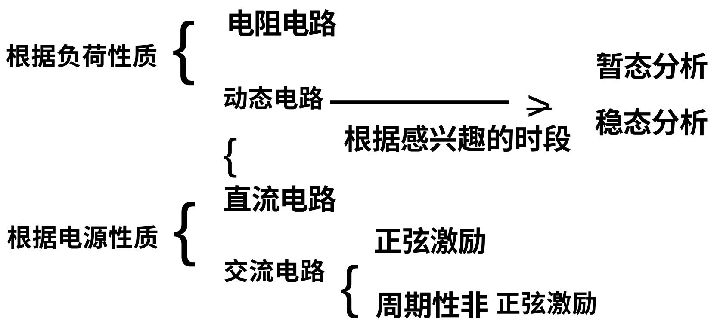

# 本学期的主要内容

线性电阻电路

非线性电阻电路

• 线性动态电路的时域分析

• 线性动态电路的稳态分析

——正弦激励

周期性非正弦激励

电阻电路 动态电路

直流电路 交流电路暂

态分析 稳态分析

# 电压、 电流和功率

电路的组成

电路的模型

电路的变量

— 电压和电流的参考方向

电路的功率

# 电路理论基础

教材：《电路基础》 ( 原书第 7 版 - 精编版 ) ，机械工业出版社，周巍、段哲民等译， 99 元。ISBN 978-7-111-72786-6

原版英文版： 《 Fundamentals of ElectricCircuit 》（ 7th edit ） : Charles K.Alexander, matthew N. O. Sadiku, 199 元。ISBN 978-7-111-58634-0

教学安排：理论课： 3 学时 / 周，共 54 学时

OXFORD

# FundamentalsofElectric Circuits

SEVENTHEDITION

DAVIDBELL

# 教 与 学

 读电路图的能力，明晰各参数的物理意义， 清晰的解题思路；

成绩考查（平时成绩 40% ，期末考试成绩60% 。平时成绩包括作业 35% ，考勤 5% ，）

研究生助教：杨佩宗，杨凯吉

 网络学习资源：超算习堂

# 教 与 学 （续）

前期知识：代数，微积分，复数计算，微分方程

课堂练习，随堂小测（手脑纸笔）

抓大放小， 掌握脉络

核心能力：电路分析 （物理头脑，不是数学头脑）

硬件与软件，电子人才与计算机人才

# 第一章

# 基本概念

— Fundamentals of Electric Circuit

电路基础

# 1.1 介绍

电路中的每个组成部分称为元件。

电路是由电气元件相互连接而成的整体。

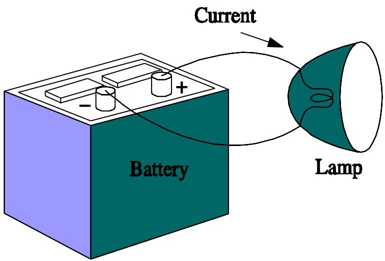

# 电路的组成

电路主要由电源、负载、连接导线及开关等构成。

电源 （ source ）：提供能量或信号。

负载（ load ）：将电能转化为其他形式的能量，或对信号进行处理。

导线（ line ）、开关（ switch ）等：将电源与负载接成通路。

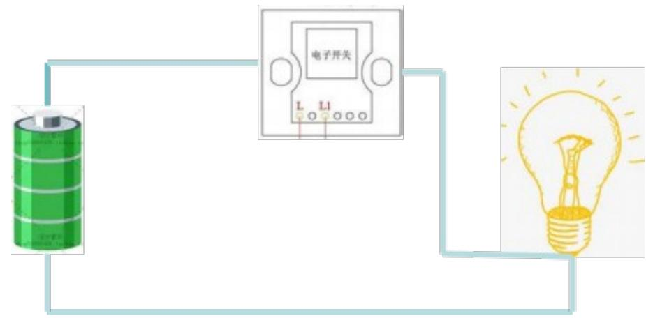

# 电路建模

模型和精度的折中。

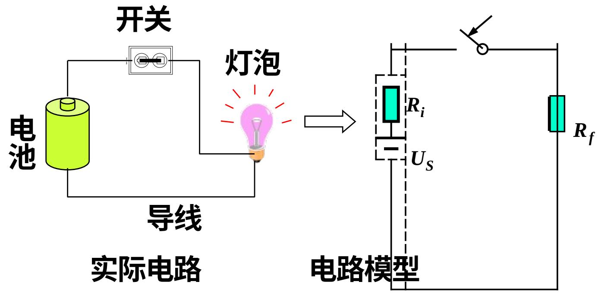

# 收音机电路

DC: 直流（ direct current ）

1

直流电压源： direct current voltage source

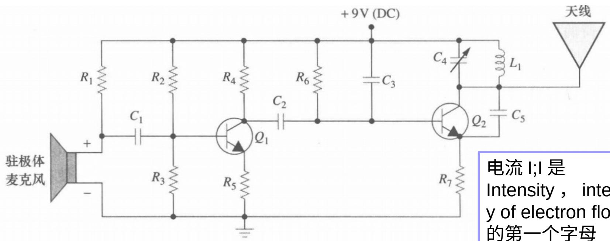

R:resistance; 电阻

C: capacitor; 电容器；

L: 电感； inductance

为什么电感用L表示？？？

I表示电流了，纪念科学家LENZ.

# 计量单位制

表1-1六个基本单位与一个和本书相关的导出单位

<table><tr><td>量的名称</td><td>单位名称</td><td>单位符号</td><td>量的名称</td><td>单位名称</td><td>单位符号</td></tr><tr><td>长度</td><td>米</td><td>m</td><td>质量</td><td>千克</td><td>kg</td></tr><tr><td>时间</td><td>秒</td><td>s</td><td>电流</td><td>安[培]</td><td>A</td></tr><tr><td>热力学温度</td><td>开[尔文]</td><td>K</td><td>电荷量</td><td>库[仑]</td><td>C</td></tr><tr><td>发光强度</td><td>坎[德拉]</td><td>cd</td><td></td><td></td><td></td></tr></table>

表1-2国际单位制前缀

<table><tr><td>所表示的因数</td><td>前缀名称</td><td>前缀符号</td><td>所表示的因数</td><td>前缀名称</td><td>前缀符号</td></tr><tr><td>1018</td><td>艾[可萨]</td><td>E</td><td>10-1</td><td>分</td><td>d</td></tr><tr><td>1015</td><td>拍[它]</td><td>P</td><td>10-2</td><td>厘</td><td>c</td></tr><tr><td>1012</td><td>太[拉]</td><td>T</td><td>10-3</td><td>毫</td><td>m</td></tr><tr><td>109</td><td>吉[咖]</td><td>G</td><td>10-6</td><td>微</td><td>μ</td></tr><tr><td>106</td><td>兆</td><td>M</td><td>10-9</td><td>纳[诺]</td><td>n</td></tr><tr><td>103</td><td>千</td><td>k</td><td>10-12</td><td>皮[可]</td><td>p</td></tr><tr><td>102</td><td>百</td><td>h</td><td>10-15</td><td>飞[母托]</td><td>f</td></tr><tr><td>101</td><td>十</td><td>da</td><td>10-18</td><td>阿[托]</td><td>a</td></tr></table>

# 电荷的基本概念

# 基本定义

电荷是物质的一种基本属性，是构成一切电磁现象的基础。

微观构成：

所有物质均由带电粒子组成，如带正电的质子和带负电的电子。

# 核心性质

两种电荷：正电荷 ( 质子 ) 与负电荷 ( 电子 ) 。

相互作用： 同种相斥， 异种相吸。

守恒定律： 电荷不能被创造或消灭，只能转移。

# 物理单位

库仑 (C)

为纪念物理学家查尔斯·库仑而命名。

基本常量：

元电荷 (电子电荷量 ) ：

$$
\mathrm {e} \approx 1. 6 0 2 \times 1 0 ^ {- 1 9} \mathrm {C}
$$

# 2. 电流的定义与单位

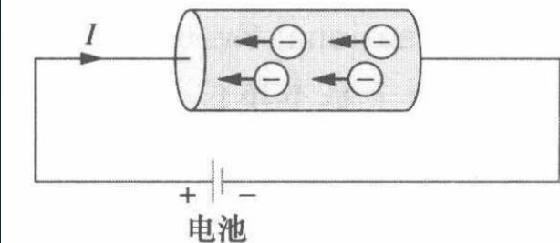

图1-3电荷在导体内流动所产生的电流

# 基本定义

电流是指单位时间内通过导体横截面的电荷量。简单来说，电流就是电荷的定向移动形成的物理量。

# 单位与换算

主单位：安培 (A) ，定义为 1 库仑 / 秒(1C/s)

辅助单位：毫安 (mA, 10⁻³A) 、微安 (μA,10⁻⁶A)

# 数学表达式

恒定电流 ( 平均电流 )

$$
I = \Delta q / \Delta t
$$

随时间变化的电流 ( 瞬时值 )

$$
i (t) = d q (t) / d t
$$

# 电流

# 电流是指电荷的时间变化率，单位为安培（ A ）

dq i  微分式 tq idt积分式dt

1 安培 = 1 库

伦 / 秒

电荷的单位为库伦 （ C ）

注：请自学简单微积分知识

# 直流电流

# 直流电流 (DC) 是随时间保持恒定的电流。

（时不变）

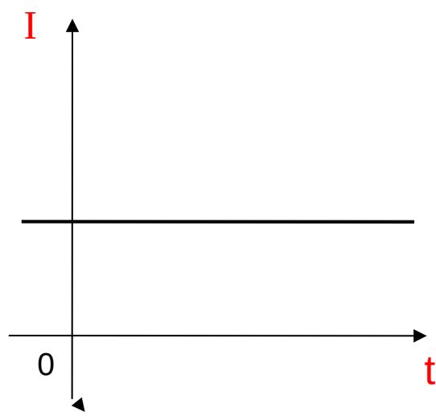

直流电流是指只在一个方向上流动并且是恒定的或者随时间变化的。

直流电（ DirectCurrent ，简称 DC ）是指方向不随时间作周期性变化的电流，但电流大小可能不固定，而产生波形。

恒定电流是直流电的一种，是大小和方向都不变的直流电，它是由爱迪生发现的。

# 交流电流

# 交流电流 (AC) 随时间按正弦规律变化的电流。

AC; alternating current ；交替的电流

交流电流是指随时间改变方向的电流。

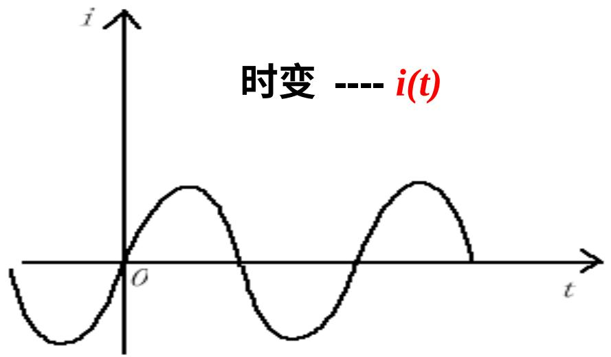

# 电流的流动方向

由于定义电荷的运动是电流，所以电流就要有相应的流动方向。如前所述，习惯上取正电荷的运动方向作为电流的流动方向。基于这一国际惯例，一个值为5A的电流既可以表示为正的，也可以表示为负的，如图1-5所示。换言之，图1-5b中沿某个方向流动的一5A的负电流与沿相反方向流动的十5A的正电流是一样的。

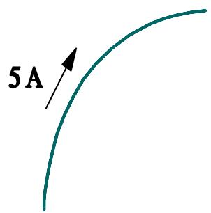

(a)

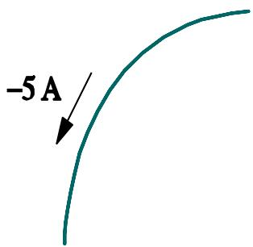

(b)

(a) 正电流

(b) 负电流

图 (a) 和图 (b) 描述的是一样的电流

# 电荷量的计算

例1-14600个电子带多少电荷量？

解：一个电子的电荷量为 $1 . 6 0 2 \times 1 0 ^ { - 1 9 }$$1 0 ^ { - 1 9 } \mathrm { C } \times 4 6 0 0 { = } { - } 7 . 3 6 9 \times 1 0 ^ { - 1 6 } \mathrm { C }$ △

练习1-1计算 $6 ~ 6 6 7 ~ 0 0 0 ~ 0 0 0$ 个质子所带的电荷量。

解： Q=1.602×10-19C×6 667 000 000 =1.0680535×10-9C

$$
= 1. 0 6 8 0 5 3 5 \mathrm {n C}
$$

# 电流的计算

例1-2 流入端点的总电荷量是 $q = 5 t \ \sin 4 \pi t \ \mathrm { m C }$ $t = 0 . 5 \mathrm { s }$ 时的电流。

解： $i = { \frac { \mathrm { d } q } { \mathrm { d } t } } = { \frac { \mathrm { d } } { \mathrm { d } t } } ( { 5 t \ } { \sin \mathrm { 4 } \pi t } ) \mathrm { m C / s } = ( { 5 \sin \mathrm { 4 } \pi t } + { 2 0 \pi t \ \cos \mathrm { 4 } \pi t }$

$t = 0 , 5$

$$
i = 5 \sin 2 \pi + 1 0 \pi \cos 2 \pi = 0 + 1 0 \pi = 3 1. 4 2 (\mathrm {m A})
$$

注意 $\pi$ 的取值，非三角函数中取3.14，三角函数中取值为180度。

练习1-2例1-2中，如果 $q = ( 1 0 - 1 0 \mathrm { e } ^ { - 2 t } ) \mathrm { m C } ,$ ，计算 $t = 1 .$ Os时的电流。

解： i=dq/dt=(-10)(-2)(e-2t)mA

t=1.0s 时

$$
i = 2 0 e ^ {- 2} m A = 2 0 / e ^ {2} m A = 2. 7 0 6 7 m A
$$

说明： e=2.71828

答案：2.707mA

# 电流瞬时值计算详解

# 基于电荷量随时间变化函数的导数求解

# 问题陈述

已知条件：

电荷量随时间变化的关系为

$$
q (t) = 5 t \cdot \sin (4 \pi t) m C
$$

求解目标：

计算在t= 0.5 s

时刻的瞬时电流

$$
\mathbf {i} (0. 5)
$$

# 核心定义：电流与电荷量的关系电流的定义是

电荷量随时间的瞬时变化率，

数学表达式为：i(t)=dq/dt

求解思路：对q(t)求导

我们的目标是计算i(0.5)= (dq/dt)在 t=0.5s 时的值。具体步骤分为两步：

1.对q(t)=5t·sin(4πt) 求导，得到电流的一般表达式i(t)。

2.将t=0.5 s代入i(t)，计算出具体数值。

# 求导过程 (1)：应用乘积法则

函数 q(t) = 5t ·sin(4πt)

是两个关于t的函数的乘积，

即 f(t)= 5t 和 g(t)= sin(4πt)。

求导时需要使用乘积法则：

$$
\frac {d}{d t} \left[ f (t) \cdot g (t) \right] = f ^ {\prime} (t) \cdot g (t) + f (t) \cdot g ^ {\prime} (t)
$$

# 求导过程(2):计算f'(t)

首先， 我们对第一个函数

f(t)= 5t 求导, 结果为

$$
f ^ {\prime} (t) = 5 。
$$

# 求导过程(3):计算g(t)

接下来，我们对第二个函数 g(t)= sin(4πt)求导。

这里需要使用链式法则：

1.设内层函数 $\ u \ u \Uparrow = 4 \pi \dagger$ ，则外层函数为 sin(u)。

2.先对外层函数求导：d/du[sin(u)]= cos(u)。

3.再对内层函数求导：du/dt = 4π。

4.合并结果:g'(t)= cos(u)·du/dt = 4π ·cos(4πt)。

$$
\begin{array}{l} i (t) = \frac {d q}{d t} = f ^ {\prime} (t) \cdot g (t) \\ + f (t) \cdot g ^ {\prime} (t) \\ = 5 \cdot \sin (4 \pi t) + 5 t \cdot 4 \pi \cos (4 \pi t) \\ = 5 \sin (4 \pi t) \\ + 2 0 \pi t \cos (4 \pi t) m A. \\ \end{array}
$$

# 数值代入：计算i(0.5)

现在我们有了电流的一般表达式，接下来将 t = 0.5 s 代入其中:

$$
i (0. 5) = 5 \sin (4 \pi \times 0. 5)
$$

$$
0. 5) + 2 0 \pi \times 0. 5 \times \cos (4 \pi \times 0. 5)
$$

# 计算三角函数值

首先计算表达式中的三角函数部分：

$$
\sin (4 \pi \times 0. 5) = \sin (2 \pi) = 0;
$$

cos(4π × 0.5)= c0s(2π) = 1。我们知道，正弦函数和余弦函数的周期都是2π，所以 sin(2π)= O，cos(2π)= 1。

# 最终计算

$$
\begin{array}{l} i (0. 5) = 5 \sin (4 \pi \times 0. 5) \\ + 2 0 \pi \times 0. 5 \times \cos (4 \pi \times 0. 5) = \\ 5 \times 0 + 2 0 \pi \times 0. 5 \times 1 \\ = 0 + 1 0 \pi = 1 0 \pi \mathrm {m A} \\ \approx 3 1. 4 2 \mathrm {m A} \\ \end{array}
$$

# 结论

在t=0.5 s时刻,

电路中的瞬时电流为：

$$
i (0. 5) = 1 0 \pi m A
$$

(约 31.42 mA)

# 回顾与总结

# 核心概念：电流定义

电流是电荷量对时间的导数 i(t)dq/dt 。

# 数学工具：求导法则

在求解复杂函数时，灵活运用：

• 乘积法则 (Product Rule)

链式法则 (Chain Rule)

# 标准解题步骤

1. 求导得到电流的一般表达式

2. 代入具体时间值进行计算

# 关键技巧：特殊角记忆

计算时注意三角函数的特殊值：

$$
\sin (2 \pi) = 0, \cos (2 \pi) = 1
$$

# 常见电流-电荷量关系求导速查表

核心定义公式

$$
\mathbf {i} (t) = d \mathbf {q} / d t
$$

# 速查表结构预览

恒定电荷量

$\mathsf { q } ( \mathsf { t } ) = \mathsf { Q }$ ( 常数 )

$$
\mathrm {i} (t) = 0
$$

线性变化

q(t) = kt

i(t) $= \boldsymbol { \mathsf { k } }$ ( 常数 )

非线性变化

${ \sf q ( t ) } = { \sf t } ^ { 2 }$ 或 e^(at)

$i ( \ t ) = 2 t$ 或 a·e^(at)

# 核心定义回顾

# 电流的定义

在电路分析中，电流 (Current) 的定义是电荷量随时间的瞬时变化率。这意味着电流本质上是电荷量对时间的一阶导数。

# 数学表达

$$
\mathbf {i} (t) = d \mathbf {q} / d t
$$

基于此公式，我们将推导出常见的q(t) 函数形式及其对应的电流i(t) 。 

# 基本函数形式

# 常数函数形式

电荷量 q(t) ：

$$
\mathbf {q} (t) = \mathbf {C} (\text {常 数})
$$

电流 i(t) ：

$$
\mathbf {i} (t) = 0
$$

说明：电荷量不随时间变化，电路中无电流。

# 线性函数形式

电荷量 q(t) ：

$$
\mathbf {q} (t) = k t \text {(k 为 常}
$$

数 )

电流 i(t) ：

$$
\mathbf {i} (t) = \mathbf {k}
$$

说明：电荷量随时间线性变化，电路中为恒定电流。

# 幂函数形式

电荷量 q(t) ：

$$
\mathbf {q} (t) = k t ^ {\wedge} \mathbf {n}
$$

电流 i(t) ：

$$
\mathbf {i} (t) = n k t ^ {\wedge} (n - 1)
$$

说明：应用幂函数求导法则，指数前置并减一。

# 二、三角函数形式

在相位上， Aω cos(ωt+φ) ⋅ 等价于 Aω sin(ωt+φ+90 ) ⋅ ∘ 。因此，我们说余弦形式的信号比正弦形式的信号相位超前了 90 度。

# 04. 正弦变化 (Sine Function)

说明：应用链式法则求导，电

电荷量

$$
\mathsf {q} (t) = \mathsf {A} \cdot \sin (\omega t + \varphi)
$$

流相位超前电压 90 度，呈现余

$$
\mathbf {i} (t) \quad \mathbf {i} (t) = A \boldsymbol {\omega} \cdot \cos (\omega t + \varphi)
$$

弦形式。

05. 余弦变化 (Cosine Function)说明：应用链式法则求导，余

电荷量

$$
\mathbf {q} (t) = \mathbf {A} \cdot \cos (\omega t + \varphi)
$$

弦函数的导数为负的正弦函数，

$$
\mathbf {i} (t) \quad \mathbf {i} (t) = - A \omega \cdot \sin (\omega t + \varphi)
$$

需注意负号的存在。

# 三、 指数函数形式

电荷量 \( q(t) \) ( 单位 : C)

$q ( t ) = A e ^ { \lambda t }$ ( 其中 A, λ 为常数 )

！电流 ( 单位 : A)

$$
i (t) = A \lambda e ^ {\lambda t}
$$

说明：指数变化的电荷量，应用指数函数求导法则。常用于描述电路的暂态过程（如 RC/RL 电路充放电）。

# 四、 常用求导法则

07. 和差法则 (Sum/DifferenceRule)

函数形式： $q ( t ) = f ( t ) + g ( t )$

导数结果： $\mathsf { i } ( \mathbf { t } ) = \mathsf { f } ^ { \mathsf { \prime } } ( \mathbf { t } ) + \mathsf { g } ^ { \mathsf { \prime } } ( \mathbf { t } )$

09. 商数法则 (QuotientRule)

函数形式： $q ( t ) = f ( t ) / g ( t )$

导数结果： $\mathsf { i } ( \mathbf { t } ) = [ \mathsf { f } ^ { \mathsf { ^ { \prime } } } ( \mathbf { t } ) \mathsf { g } ( \mathbf { t } )$ -

$$
\mathbf {f} (t) \mathbf {g} ^ {\prime} (t) ] / [ \mathbf {g} (t) ] ^ {2}
$$

08. 乘积法则 (Product

函数形式：Rule) $q ( t ) = f ( t ) \cdot g ( t )$

导数结果： $\mathbf { \dot { \mathbf { i } } } ( \mathbf { t } ) = \mathbf { f } ^ { \prime } ( \mathbf { t } ) \mathbf { g } ( \mathbf { t } ) + \mathbf { f } ( \mathbf { t } ) \mathbf { g } ^ { \prime } ( \mathbf { t } )$

示例： d/dt [5t sin(4πt)] = 5sin(4πt) + 20πtcos(4πt)

10. 链式法则 (Chain Rule)

函数形式： $q ( t ) = f ( g ( t ) )$

导数结果： $\mathbf { i } ( \mathbf { t } ) = \mathbf { f } ^ { \prime } ( \mathbf { g } ( \mathbf { t } ) ) \cdot \mathbf { g } ^ { \prime } ( \mathbf { t } )$

示例： d/dt $[ \sin ( 4 \pi t ) ] = 4 \pi \cos ( 4 \pi t )$

# 电荷的计算

例1-3如果流过端点的电流是 $i = ( 3 t ^ { 2 } - t ) \mathrm { A }$ $t = 1 \mathrm { s }$ $t = 2 \mathrm { s }$ 之间流入该端点的电荷量。

解：

$$
\begin{array}{l} Q = \int_ {i = 1} ^ {2} i \mathrm {d} t = \int_ {1} ^ {2} (3 t ^ {2} - t) \mathrm {d} t \\ = \left. \left(t ^ {3} - \frac {t ^ {2}}{2}\right) \right| _ {1} ^ {2} = (8 - 2) - \left(1 - \frac {1}{2}\right) = 5. 5 (\mathrm {C}) \\ \end{array}
$$

练习1-3如果流过某个元件的电流为：

$$
i = \left\{ \begin{array}{l l} 4 \mathrm {A}, & 0 <   t <   1 \\ 4 t ^ {2} \mathrm {A}, & t > 1 \end{array} \right.
$$

计算 $t = 0 \mathrm { s }$ $t = 2 \mathrm { s }$ 之间流人该元件的电荷量。

$$
\begin{array}{l} = \int_ {0} ^ {1} 4 d t + \int_ {1} ^ {2} 4 t ^ {2} d t \\ = 4 t \vert_ {0} ^ {1} + \frac {4}{3} t ^ {3} \vert_ {1} ^ {2} \\ = 4 + \frac {4}{3} (2 ^ {3} - 1 ^ {3}) \\ = 4 + \frac {4}{3} (8 - 1) \\ = 4 + \frac {9}{3} \times 7 \\ = 4 + \frac {2 8}{3} \\ = 1 3. 3 3 3 \dots (c) \\ \end{array}
$$

练习1-3如果流过某个元件的电流为：

$$
i = \left\{ \begin{array}{l l} 4 \mathrm {A}, & 0 <   t <   1 \\ 4 t ^ {2} \mathrm {A}, & t > 1 \end{array} \right.
$$

计算 $t = 0 \mathrm { s }$ $t = 2 \mathrm { s }$ 之间流人该元件的电荷量。

解： q = ₀² i(t) dt = ₀¹ i(t) dt + ₁² i(t) dt ∫ ∫ ∫

$$
\begin{array}{l} = \int_ {0} ^ {1} 4 d t + \int_ {1} ^ {2} 4 t ^ {2} d t \\ = 4 t \left| _ {0} ^ {1} + (4 / 3) t ^ {3} \right| _ {1} ^ {2} \\ = 4 (1 - 0) + (4 / 3) \left(2 ^ {3} - 1 ^ {3}\right) \\ = 4 + (4 / 3) (8 - 1) \\ = 4 + 2 8 / 3 \\ = (1 2 + 2 8) / 3 = 4 0 / 3 \approx 1 3. 3 3 \mathrm {C} \\ \end{array}
$$

# 电流与电荷量计算示例

# 基于定积分的物理问题求解

# 建立物理模型

分析电路中电流随时间变化的规律，确定电流函数 I(t) 的表达式，明确积分上下限。

# 构建积分方程

利用微元法思想，将总电荷量 Q 表示为电流 I(t) 对时间 t 的定积分，即Q = I(t)dt ∫ 。

# 计算与验证

代入具体数值进行积分运算，求解总电荷量，并对结果的物理意义和单位进行验证。

# 问题陈述

# 已知条件：电流函数

电路中某端点的电流随时间变化的函数为：

$$
i (t) = 3 t ^ {2} - t
$$

其中：电流 i 的单位为安培 (A)时间 t 的单位为秒 (s) 。

# 求解目标：总电荷量

计算在指定时间间隔内，流入该端点的总电荷量

$$
t = 1 s \text {到} t = 2 s
$$

提示：利用电流与电荷的积分关系进行求解。

# 核心物理公式：电荷量与电流的积分关系

$$
q = \int i (t) d t _ {t _ {2}} ^ {t _ {1}}
$$

# 电荷量 (q)

单位：库仑 (C)

表示单位时间内通过导体横截面的总电量。

# 电流函数 (i(t))

单位：安培 (A)

随时间变化的电流瞬时值，是被积函数。

# 时间区间 (t₁, t₂)

单位：秒 (s)

积分的上下限，表示测量或计算的起始和终止时刻。

# 代入已知条件

# 提取题目参数

电流函数 i(t) ：

$$
\mathbf {i} (t) = 3 t ^ {2} - t
$$

时间区间 [a, b] ：

[1, 2]

# 构建定积分模型

$$
q = \int \left(3 t ^ {2} - t\right) d t
$$

( 上限 2 ，下限 1)

结论：问题转化为求解该定积分

# 求解原函数

# 拆分被积函数

$$
\int \left(3 t ^ {2} - t\right) d t
$$

# 分项积分运算

$$
\int 3 t ^ {2} d t - \int t d t
$$

# 得到原函数

$$
t ^ {3} - (1 / 2) t ^ {2} + C
$$

注：其中 C 为积分常数，在后续计算定积分时，由于上下限相减，C 会被消去，因此在计算定积分时通常可以省略。

# 计算定积分

# 步骤 1 ：代入上下限

将原函数代入上限 t=2和下限 t=1：

$$
\begin{array}{l} q = \left[ t ^ {3} - 1 / 2 t ^ {2} \right] _ {1} ^ {2} \\ = (8 - 2) - (1 - 0. 5) \\ \end{array}
$$

# 步骤 2 ：分别求值

分别计算上限和下限的函数值：

上限值： 8 - 2 = 6下限值： 1 - 0.5 =0.5

# 步骤 3 ：计算差值

上限值减去下限值，得到最终电荷量：

$$
\begin{array}{l} q = 6 - 0. 5 \\ = 5. 5 \mathrm {C} \\ \end{array}
$$

# 结论

t=1s 到 t=2s 流入端点的总电荷量

# 5.5 库仑 (C)

总结：通过将电流对时间积分，我们成功求解了特定时间段内的总电荷量，展示了微积分在物理问题中的实际应用。

# 1.4 电压

电动势 (Electromotive force /emf)

电位差（ Potential difference ）

$$
v _ {a b} = \frac {d w}{d q}
$$

1 伏特 = 1 焦耳 / 库伦 = 1 牛顿 · 米 / 库伦

电压

电压 ( 电位差 ) 是指移动单位电荷通过某个元件所需的能量，单位是伏特 （ V ）。

（点） 电位 vs 电压 （差）

# （点） 电位 vs 电压 （差）

电动势、电位差、电压：什么关系？

是一个意思，不同的名称而已，都是指的电压。

电动势又称为电压（voltage）或电位差（potentialdifference）。

# 电势、 电位和电压又是什么关系？

电势就是电位，电势差有时候就叫做电位差，也就是电压。

在电路中设定一个参考点，规定其电位为零，即接地点，有时未必接大地，只是接电源的负极。其余各点对参考点的电压值，就是该点的电位值。

电压等于电位差。参考点不同则各点电位值不同，但是各点之间的电压不变。

# （点） 电位 vs 电压 （差） -- 续

如右图， a 是参考点，电位 Va =0 ， Vb = E1 ， Ve =- E2 。

电压 U1 = Vb - Vc ，U2 = Vc - Vd 。

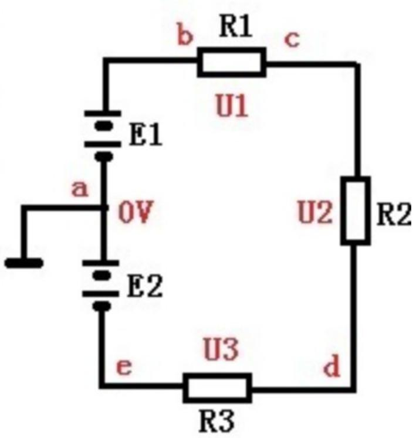

# 直流电压 用 V （大写） 来表

示：

v ： voltage

伏特

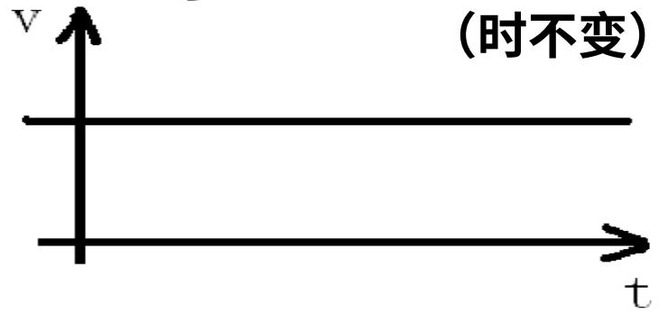

交流电压 用 v （小写） 来表示：

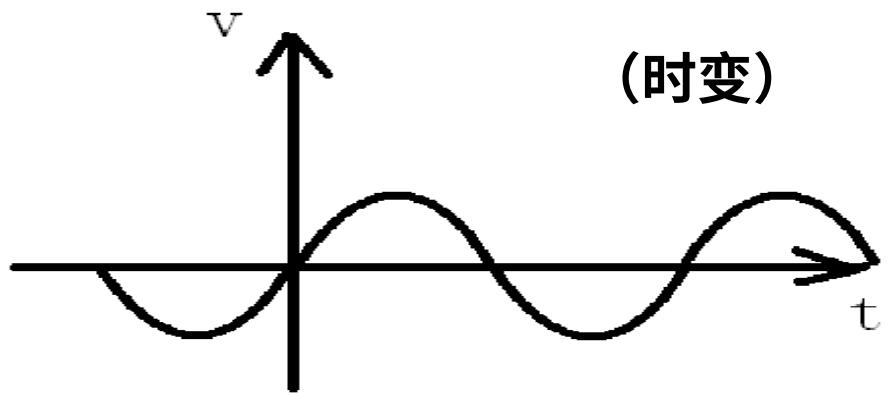

# 1.5 功率与能量

功率

功率是消耗或者吸收能量的时间变化率，单位是瓦特（ W ）。

$$
p = \frac {d w}{d t}
$$

$$
p = \frac {\mathrm {d} w}{\mathrm {d} t} = \frac {\mathrm {d} w}{\mathrm {d} q} \cdot \frac {\mathrm {d} q}{\mathrm {d} t} = v i
$$

或

$$
p = \dot {v} i
$$

功率 p 是一个时变量，称为瞬时功率 p(t) 。

# 关联参考方向 / 无源符号规则：

无规则，不方圆！

当电流从元件的正极流入，负极流出时，满足关联参考方向，则 。p vi

当电流从元件的负极流入，正极流出时，不满足关联参考方向，则 。p  vi

$$
p = \frac {d w}{d t}
$$

$$
p = \pm v i
$$

如果功率值 >0 ，该元件吸收或消耗功率。

如果功率值 <0 ，元件对外提供或释放功率。

是否符合关联参考方向？

$$
p = \pm v i
$$

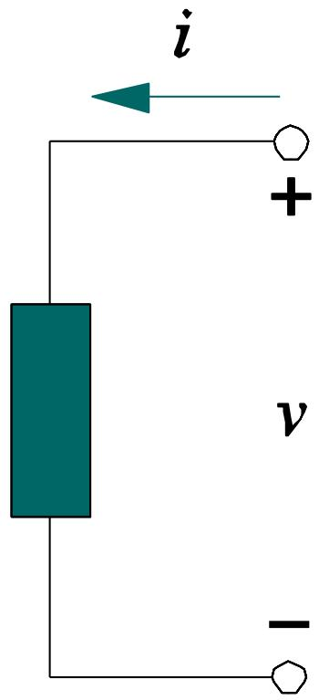

$$
p = + \nu i
$$

(a)

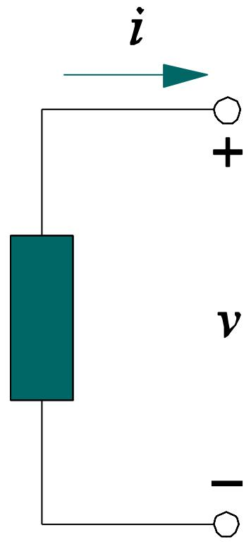

$$
p = - \nu i
$$

(b)

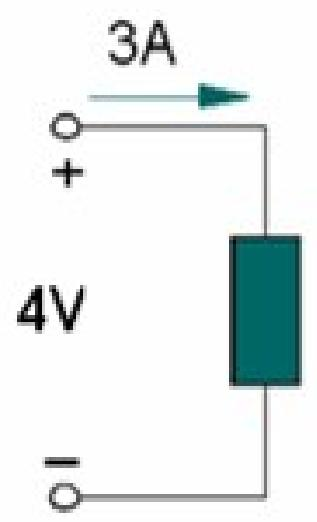

(a)

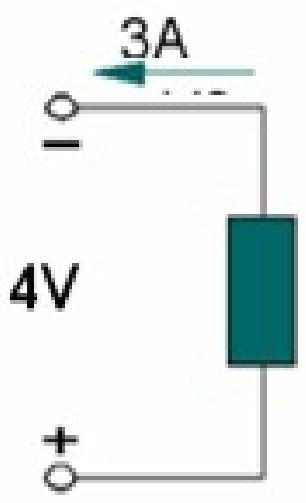

(b)

元件吸收功率为 12W 的两种情况：

(a) p = 4 * 3 = 12(W)

(b) p = 4 * 3 = 12(W)

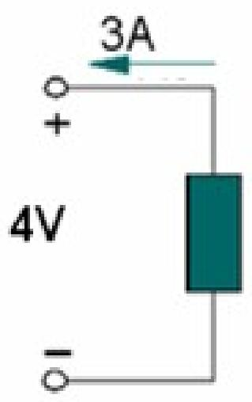

(c)

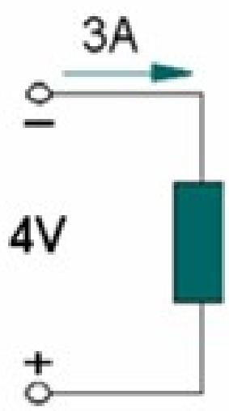

(d)

元件发出功率为 12W 的两种情况 :

(c) $p = - \ ( 4 \ ^ { \star } 3 ) = - 1 2 ( \mathsf { W } )$

或 $\mathsf { p } = 4 ^ { \star } ( - 3 ) = - 1 2 ( \mathsf { W } )$

(d) $p = - \ ( 4 \ ^ { \star } 3 ) = - 1 2 ( \mathsf { W } )$

或 $\mathsf { p } = 4 ^ { \star } ( - 3 ) = - 1 2 ( \mathsf { W } )$

# 能量

能量是指做功的能力，单位为焦耳（ J ） 0

$$
w = \int_ {0} ^ {t} p d t = \int_ {0} ^ {t} v i d t
$$

$$
1 \mathrm {W h} = 3, 6 0 0 \mathrm {J}
$$

1 度电＝1千瓦小时

注意：任何电路都必须遵守能量守恒定律。

$$
\sum p = 0
$$

吸收的正功率 发出的负功率

例1-4某电源使得2A的恒定电流流过灯泡10s，如果灯泡以光能和热能的形式消耗的能量为 $2 , 3 \mathrm { k J }$ ，计算灯泡两端的电压降。

解：总电荷量为：

$$
\Delta q = i \Delta t = 2 \times 1 0 = 2 0 (\mathrm {C})
$$

电压降为：

$$
v = \frac {\Delta w}{\Delta q} = \frac {2 . 3 \times 1 0 ^ {3}}{2 0} = 1 1 5 (\mathrm {V})
$$

练习1-4将电荷 $q$ 从 $^ { b }$ 点移动到 $a$ 点所需的能量为25J，计算下面两种情况下的电压降 $v _ { a b } \left( a \right)$ 点电压值相对于 $^ { b }$ $( \mathrm { a } ) _ { q } { = } 5 \mathrm { C }$

解：（ a)=(25J)/(5C)=5V

$$
(b) = (2 5 J) / (- 1 0 C) = - 2. 5 V
$$

# 例 1-5

计算在 t = 3 ms 时该元件所吸收的功率，如果流入某元件正极的电流为：

$$
i = 5 \cos 6 0 \pi A
$$

且该元件两端的电压为： (a) v = 3i,

(b) v = 3 di/dt.

， (a) v = 3i, 已知： i 5 cos 60t A

(b) v = 3 di/dt

解

(a) 电压为  v 3i 15cos 60t

因此功率为：

$$
p = \nu i = 7 5 \cos^ {2} 6 0 \pi t W
$$

在 t =3ms 时，所求功率为：p 75cos (60 3 10 ) 75cos 0.18 2 3 2   W53.48

注意： $\pi = 1 8 0$ 度，不是3.14

# 已知：i 5cos 60t A

(b) dtdiv 3 t tV3( 60 )5sin 60  900 sin 60

$$
p = v i = - 4 5 0 0 \pi \sin 6 0 \pi t \cos 6 0 \pi t W
$$

在 t =3ms 时，所求功率为：

$$
\begin{array}{l} p = - 4 5 0 0 \pi \sin 0. 1 8 \pi \cos 0. 1 8 \pi W \\ = - 1 4 1 3 7. 1 6 7 \sin 3 2. 4 ^ {\circ} \cos 3 2. 4 ^ {\circ} = - 6. 3 9 6 k W \\ \end{array}
$$

注意：三角函数中，π=180度；否则π=3.14

$v = 2 i \mathrm { ~ V , ( b ) } v = \left( 1 0 + 5 \int _ { 0 } ^ { t } i \mathrm { d } t \right) \mathrm { V }$$t = 5 \mathrm { m s }$ 

解a)=p=vi=2ixi=2i²

$$
\begin{array}{l} = 2 \times (5 \cos 6 0 \pi t) ^ {2} = 5 0 (\cos 6 0 \pi t) ^ {2} \\ t = 5 m s \mathrm {时}, \pi = 1 8 0 ^ {\circ}, \mathrm {代} \lambda . \\ p = 5 0 (\cos (6 0 \times 1 8 0 \times 0. 0 0 5)) ^ {2} \\ = 5 0 \times (\cos 5 4 ^ {\circ}) ^ {2} = 1 7. 2 7 W \\ \end{array}
$$

已知： i 5cos 60t A

（a)p=vi=2i×i= 2i² $p = v i = 2 i \times i = 2 i ^ { 2 }$

$$
= 2 \times (5 \cos 6 0 \pi t) ^ {2} = 5 0 (\cos 6 0 \pi t) ^ {2}
$$

当 $t = 5 \mathrm { m s }$ 时，取 $\pi = 1 8 0 ^ { \circ }$ ，代入得

$$
p = 5 0 \left[ \cos (6 0 \times 1 8 0 \times 0. 0 0 5) \right] ^ {2} = 5 0 \times \left(\cos 5 4 ^ {\circ}\right) ^ {2} \approx 1 7. 2 7 \mathrm {W}
$$

# 题目条件

·电流函数： $i ( t ) = 5$ cos(60πt) A

·计算时刻：t=0.005 s

·注意：60πt单位为弧度，计算时取π=180°

$v = 2 i \mathrm {  ~ V ~ } , ( { \mathrm { b } } ) v = \left( 1 0 + 5 \int _ { 0 } ^ { t } i \mathrm { d } t \right) \mathrm {  ~ V ~ } ,$

计算 $t = 5 \mathrm { m s }$ 时该元件所吸收的功率。

答案：（a)17.27W，（b)29.7W

$\cos 6 0 \pi + A ^ { \prime } , V = ( 1 0 + 5 6 ^ { + } d t ) V , t$

$$
\begin{array}{l} P = V i = (1 0 + 5 \int_ {0} ^ {t} i d t) i = (1 0 + 5 \int_ {0} ^ {0. 0 0 5} 5 \cos 6 0 \pi t d t) \times 5 \cos 6 0 \pi t \\ = 5 0 \cos 6 0 \pi t + 1 2 5 (\cos 6 0 \pi t) \times \left[ \frac {1}{6 0 \pi} \times \sin^ {6 0} \pi t \right] _ {0} ^ {0. 0 0 5} \\ = 5 0 \cos (6 0 \times 1 8 0 \times 0. 0 0 5) + 1 2 5 \cos 5 4 ^ {\circ} \times \frac {1}{6 0 \pi} \sin 5 4 ^ {\circ} \\ = 5 0 \cos 5 4 ^ {\circ} + 1 2 5 \cos 5 4 ^ {\circ} \times \frac {1}{6 0 \times 3 . 1 4} \sin 5 4 ^ {\circ} \\ = 5 0 \times 0. 5 8 7 8 + \frac {1 2 5 \times 0 . 5 8 7 8}{1 8 8 . 4} \times 0. 8 0 9 0 \\ = 2 9. 3 9 + 0. 3 1 5 5 = 2 9. 7 0 (w) \\ \end{array}
$$

# (b) 解

·电流表达式：i=5cos(60πt)A

·电压表达式： $\begin{array} { r } { v = \left( 1 0 + 5 \int _ { 0 } ^ { t } i \mathrm { d } t \right) \mathrm { ~ } } \end{array}$

·计算积分项：

$$
\int_ {0} ^ {t} i \mathrm {d} t = \int_ {0} ^ {t} 5 \cos (6 0 \pi \tau) \mathrm {d} \tau = \frac {5}{6 0 \pi} \sin (6 0 \pi t) = \frac {1}{1 2 \pi} \sin (6 0 \pi t)
$$

2.代入 $t = 5 \mathrm { m s } = 0 . 0 0 5 \mathrm { s }$ 计算瞬时值

·计算相位角：

$$
6 0 \pi t = 6 0 \pi \times 0. 0 0 5 = 0. 3 \pi \mathrm {r a d} = 5 4 ^ {\circ}
$$

·计算电压瞬时值：

$$
v = 1 0 + 5 \times \frac {1}{1 2 \pi} \sin (5 4 ^ {\circ}) \approx 1 0 + \frac {5}{1 2 \pi} \times 0. 8 0 9 0 \approx 1 0. 1 0 7 7 \mathrm {V}
$$

·计算电流瞬时值：

$$
i = 5 \cos (5 4 ^ {\circ}) \approx 5 \times 0. 5 8 7 8 \approx 2. 9 3 9 \mathrm {A}
$$

# 3.最终结果：瞬时功率计算

瞬时功率公式： $p = v \cdot i$

·计算结果：

$$
p \approx 1 0. 1 0 7 7 \times 2. 9 3 9 \approx 2 9. 7 \mathrm {W}
$$

·结论：当 $t = 5$ ms 时，该元件吸收的功率为29.7W。

注意：三角函数中"π=180度'， 非三角函数中"π= 3.14'

已知条件:i=5cos(60πt)A，v=10+5Sidt V

三角函数代值时用π=180°

$$
p (t) = v \cdot i
$$

$$
\begin{array}{l} = \left(1 0 + 5 \int_ {0} ^ {t} 5 \cos 6 0 \pi t d t\right) \times 5 \cos 6 0 \pi t \\ = 5 0 \cos 6 0 \pi t + 1 2 5 \cos 6 0 \pi t \cdot \int_ {0} ^ {t} \cos 6 0 \pi t d t \\ \end{array}
$$

$$
\int_ {0} ^ {0. 0 0 5} \cos 6 0 \pi t d t = \frac {1}{6 0 \pi} \sin 6 0 \pi t \Big | _ {0} ^ {0. 0 0 5} = \frac {1}{6 0 \pi} \sin 5 4 ^ {\circ}
$$

代入数值（ $\pi \approx 3 . 1 4$ ,cos 54°~ 0.5878,sin 54°~ 0.8090）:

$$
\begin{array}{l} p \approx 5 0 \times 0. 5 8 7 8 + \frac {1 2 5 \times 0 . 5 8 7 8 \times 0 . 8 0 9 0}{6 0 \times 3 . 1 4} \\ = 2 9. 3 9 + 0. 3 1 5 5 \approx 2 9. 7 0 \mathrm {W} \\ \end{array}
$$

以下是电路基础课程中最常用的积分公式，涵盖了基本函数、三角函数和指数函数的积分，这些公式在求解电压、电流、能量等问题时经常用到：

# 一、基本积分公式

$\textstyle \int k d x = k x + C$ $k$ 为常数)

2.Sxndx=n+1

$\textstyle { \int { \frac { 1 } { x } } d x = \ln | x | + C }$

# 二、三角函数积分公式

$\begin{array} { r } { . \int \sin ( a x ) d x = - \frac { 1 } { a } \cos ( a x ) + C } \end{array}$

$\begin{array} { r } { \int \cos ( a x ) d x = \frac { 1 } { a } \sin ( a x ) + C } \end{array}$

7. Scot(ax)dx = 1 In| sin(ax)| + C 0

# 三、指数函数积分公式

8 $\textstyle \int e ^ { a x } d x = { \frac { 1 } { a } } e ^ { a x } + C$

9 $\textstyle { \int a ^ { x } d x = { \frac { a ^ { x } } { \ln a } } + C \ ( a > 0 , a \neq 1 ) }$

# 四、电路分析中常用的特定积分

10.电容电流积分求电压：

$$
v _ {C} (t) = \frac {1}{C} \int_ {t _ {0}} ^ {t} i _ {C} (\tau) d \tau + v _ {C} (t _ {0})
$$

11.电感电压积分求电流：

$$
i _ {L} (t) = \frac {1}{L} \int_ {t _ {0}} ^ {t} v _ {L} (\tau) d \tau + i _ {L} (t _ {0})
$$

12.功率积分求能量：

$$
w (t) = \int_ {t _ {0}} ^ {t} p (\tau) d \tau = \int_ {t _ {0}} ^ {t} v (\tau) i (\tau) d \tau
$$

这些是电路基础中最核心的积分工具，熟练掌握它们对于分析动态电路（如含有电容和电感的电路）至关重要。

# 例 1-6

# 一个 100W 的电灯泡 2h 消耗的电能是多少？

# 解 :

$$
\begin{array}{l} w = p t = 1 0 0 (W) \times 2 (h) \times 6 0 (\min / h) \times 6 0 (s / \min) \\ = 7 2 0, 0 0 0 J = 7 2 0 k J \\ \end{array}
$$

即

$$
w = p t = 1 0 0 W \times 2 h = 2 0 0 W h
$$

练习1-6一台家用电热器连接至110V电压的时候电流为10A，计算此电热器工作6个小时消耗的能量为多少。 答案：6.9千瓦·时

解： w=pt=v*i*t=110Vx10Ax6h=6600wh=6.6 千瓦时

1 度电 = 1 千瓦时（ kWh ）

一度电，就是 1 千瓦时。

纸质版教材上 , 连接至 115V 电压：

w=pt=v*i*t=115vx10Ax6h=6900wh=6.9 千瓦时

# 1.6 电路元件

无源器件 (passive element)

有源器件 (active element)

理想独立源 (ideal independent source )

理想独立源是指能够提供特定电压或电流，而与其外接电路完全无关的有源元件。

VCR—电压 - 电流关系

理想独立电压 源

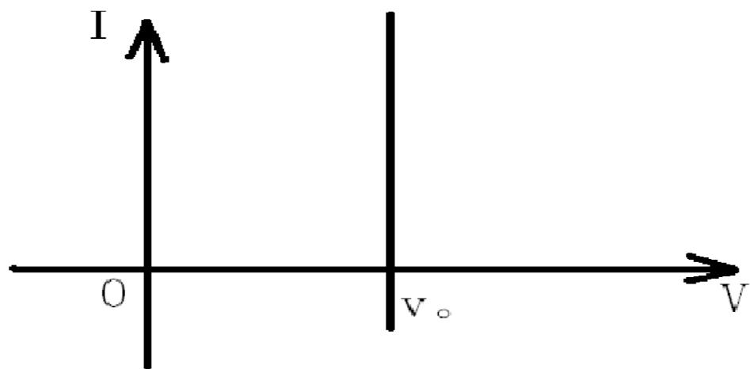

理想独立电流 源

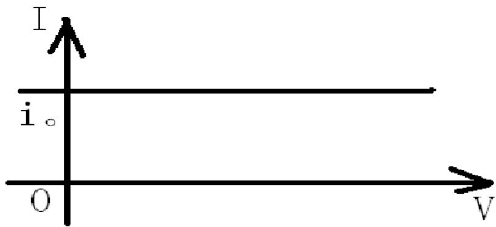

# 电路符号：

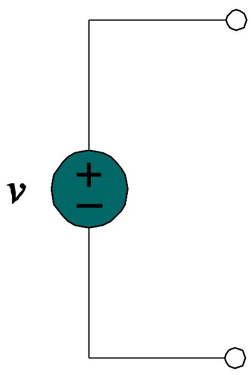

(a)

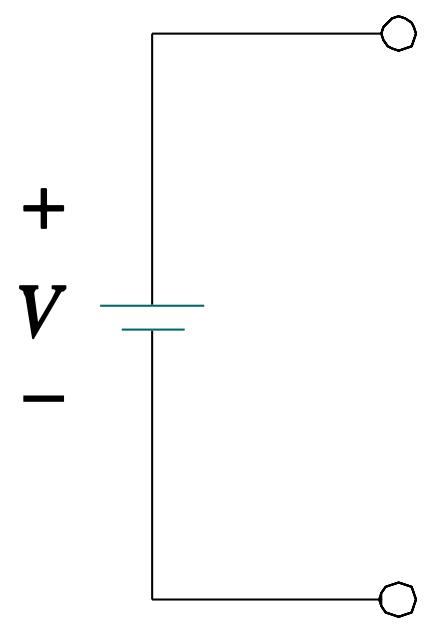

（(b）

# 独立电压源

(a)可表示直流电压源或交流电压源

(b)表示直流电压源

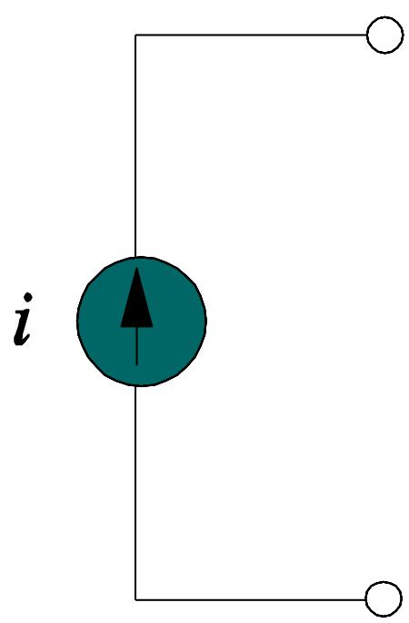

独立电流源

# 理想的非独立源 （受控源）

理想的非独立 ( 或受控源 ) 是指其所提供的电压或电流受到其他电压或电流控制的有源元件。

1.电压控制电压源 (VCVS)

2.电流控制电压源 (CCVS)

3.电压控制电流源 (VCCS)

4.电流控制电流源 (CCCS)

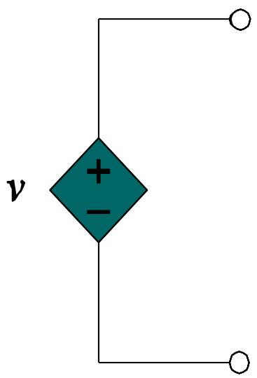

(a)

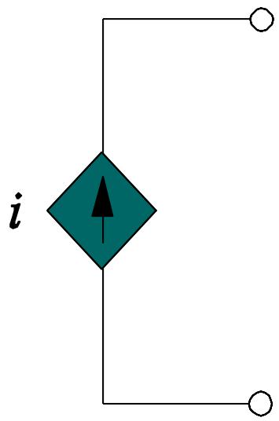

(b)

电路符号 :

(a)受控电压源

(b)受控电流源

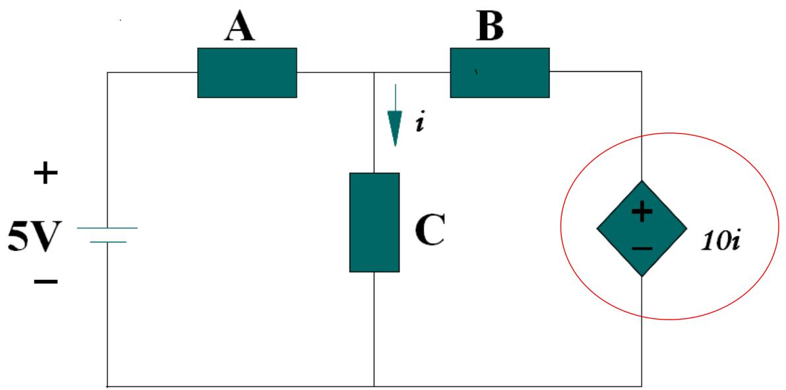

Q: 这是什么类型的受控源？。。。

Q: 这是什么类型的受控源？

A: 电流控制的电压源

大小和单位： 10i V ，不是 10i A ！

# 例 1-7 （堂练）

# 计算图中各元件所发出或吸收的功率。

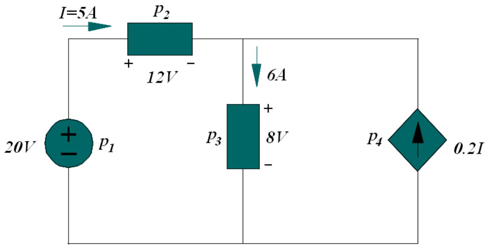

（解题规范：打标签。。。）

# 解 :

# （解题规范）根据图示标签 :

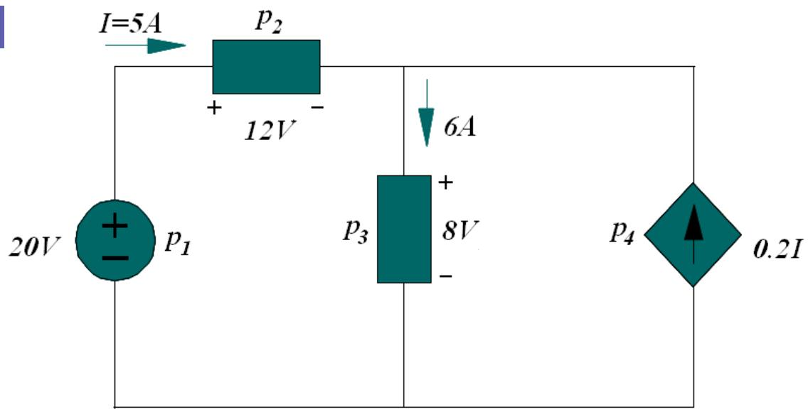

$$
p _ {1} = 2 0 (- 5) = - 1 0 0 \mathrm {W}
$$

# Supplie发出功率

$$
p _ {2} = 1 2 (5) = 6 0 \mathrm {W}
$$

Absorb吸收功率

$$
p _ {3} = 8 (6) = 4 8 \mathrm {W}
$$

Absorbe吸收功率

$$
p _ {4} = 8 (- 0. 2 I) = 8 (- 0. 2 \times 5) = - 8 W
$$

Supplie提供功率

$$
p _ {1} + p _ {2} + p _ {3} + p _ {4} = - 1 0 0 + 6 0 + 4 8 - 8 = 0
$$

练习1-7计算图1-16的电路中每个元件吸收的功率或发出的功率。

解： p1=(-5v)x(9A)=-45W;

$$
\mathrm {p} 2 = 2 \mathrm {V} \times 9 \mathrm {A} = 1 8 \mathrm {W};
$$

$$
\mathrm {p 3 = 4 A \times 0 . 6 \times 5 A = 1 2 W ;}
$$

$$
\mathrm {p 4 = 5 A x 3 V = 1 5 W ;}
$$

$$
p 1 + p 2 + p 3 + p 4 = 0
$$

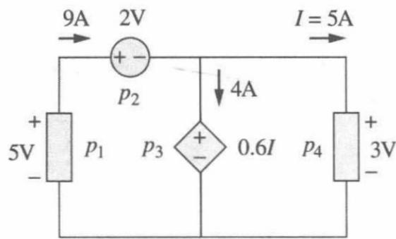

答案： ${ p _ { 1 } = - 4 5 \mathrm { W } , p _ { 2 } = 1 8 \mathrm { W } , p _ { 3 } = 1 2 \mathrm { W } , p _ { 4 } = 1 5 \mathrm { W } }$

# 1.7 应用实例

某家庭一月份耗电量为 400 kW·h ，按照如下电费标准，确定该家庭当月的电费账单 :

每月的基本供电服务费 $12.00 。

每月第一个 100kW·h 按 16 美分 /kW·h计费。

之后的 200kW·h 按 10 美分 /kW·h 计费。

超过 200 kW·h 按 6 美分 /kW·h 计费。

# 解 :

电费账单计算如下：

每月的基本供电服务费 = $12.00

第一个 100 kWh ×$0.16/kW·h = $16.00

之后的 200 kWh × $0.10/kW·h =$20.00

剩余的 100 kWh × $0.06/kW·h = $6.00

总电费 = $54.00

$54平均价格 13.5  美分 / kW·h100 200 100 

例1-9 某家庭一月份耗电量为700kW·h，按照如下电费标准确定该家庭当月的电费

每月的基本供电服务费$12.00。

$1 0 0 \mathrm { k W \cdot h }$ $/ \mathrm { k W } \cdot \mathrm { h }$

$2 0 0 \mathrm { k W \cdot h }$ $/ \mathrm { k W } \cdot \mathrm { h }$

超过 $3 0 0 \mathrm { k W \cdot h }$ $/ \mathrm { k W } \cdot \mathrm { h }$

解：电费账单计算如下：

每月的基本供电服务费 $= \$ 12.00$

$1 0 0 \mathbf { k W } \cdot \mathbf { h } \times \oint 0 . 1 6 / \mathbf { k W } \bullet \mathbf { h } = \oint 1 6 . 0 0$

之后的 $2 0 0 \mathbf { k W } \cdot \mathbf { h } \times \oint 0 . 1 0 / \mathbf { k W } \cdot \mathbf { h } = \oint 2 0 . 0 0$

剩余的 $4 0 0 \mathbf { k W } \bullet \mathbf { h } \times \oint 0 . 0 6 / \mathbf { k W } \bullet \mathbf { h } = \oint 2 4 . 0 0$

一月份的总电费 $= \$ 72.00$

平均价格 $= \ S 7 2 . 0 0 / ( 1 0 0 + 2 0 0 + 4 0 0 ) = 1 0 . 2 $

练习1-9参考例1-9中电费的计算方法，如果某家庭七月份大部分时间外出休假，只用了 $3 5 0 \mathrm { k W \cdot h }$ 的电量，计算该月每千瓦时的平均电费。答案：14.571美分/kW·h

解：平均电费 = （ $12+$0.16*100+$0.10*200+$0.06*50 ） /350 kW·h=$0.1456 /kW·h =14.56 美分 /kW·h

例1-10

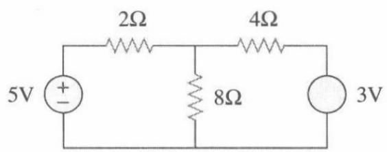

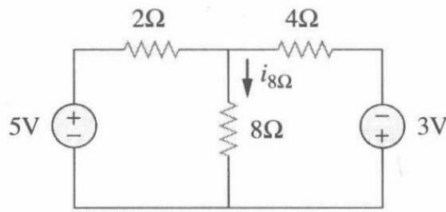

解： (V1-5)/2+V1/8+(V1+3)/4=0 (kcl)

$$
\begin{array}{l} \mathrm {i} 8 = \mathrm {V} 1 / 8 (\mathrm {A}) \\ = 0. 2 5 \mathrm {A} \\ \end{array}
$$

# 本章小结：

电路由若干相互连接在一起的电路元件构成。

电流是在给定方向下某点电荷变化的速率：

$$
i = \frac {d q}{d t}
$$

电压是指移动 1C 电荷所需要的能量：

$$
\nu = \frac {d w}{d q}
$$

功率是指单位时间所发出或吸收的能量，也可以用电压与电流的乘积表示：

$$
p = \frac {d w}{d t} = v i
$$

按照关联参考方向，如果电流从元件电压的正极流入，则功率计算式的符号为取正。

一个理想的独立电压源，无论两端连接什么元件，总是给出特定的电位差；一个理想的独立电流源，无论其两端连接什么元件，总会产生特定的电流。

电压源和电流源可以是受控源，也可以是独立源，受控源的大小受电路中其他变量的控制。

# 本章重点与难点

i , v, p 正负号的确定及其物理意义（代数，代数！）；

关联参考方向 / 无源符号约定 （规则）；

受控源是（对某种功能电路）的一种数学模型或电路模型，不是具体的某种电子器件。

# 测验题

$1 0 ^ { 6 }$

$1 0 ^ { - 3 }$

$2 \mathrm { m V }$

则其两端的电压为：

（a）电压控制电流源

（b）电压控制电压源

（c）电流控制电压源

（d）电流控制电流源

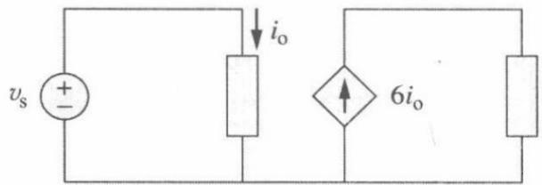

# 答案

答案 ${ \begin{array} { r l } { : 1 ( \mathrm { b } ) ; 2 ( \mathrm { d } ) ; 3 ( \mathrm { c } ) ; 4 ( \mathrm { a } } \\ { 7 ( \mathrm { a } ) ; 8 ( \mathrm { c } ) ; 9 ( \mathrm { b } ) ; 1 0 ( \mathrm { a } } \end{array} }$

# 本章作业

画出本章思维导图

1.18 （功率）

1.20 （电压， 电流）

1.23 （能量，功率）

1.36 （能量，电流） 注：原题所述“额定功率”应为“额定容量” 

* 自学：微积分初步

注：请各位独立完成。 计算结果请以小数形式呈现，勿使用分数形式。