# 第二章

# 基本定理

— Fundamentals of Electric Circuit

电路基础

# 电阻

导体对电流的阻碍作用就叫该导体的电阻。电阻（ Resistance ，通常用“ R” 表示）是一个物理量，在物理学中表示导体对电流阻碍作用的大小。导体的电阻越大，表示导体对电流的阻碍作用越大。不同的导体，电阻一般不同，电阻是导体本身的一种性质。导体的电阻通常用字母 R 表示，电阻的单位是欧姆，简称欧，符号为 Ω 。

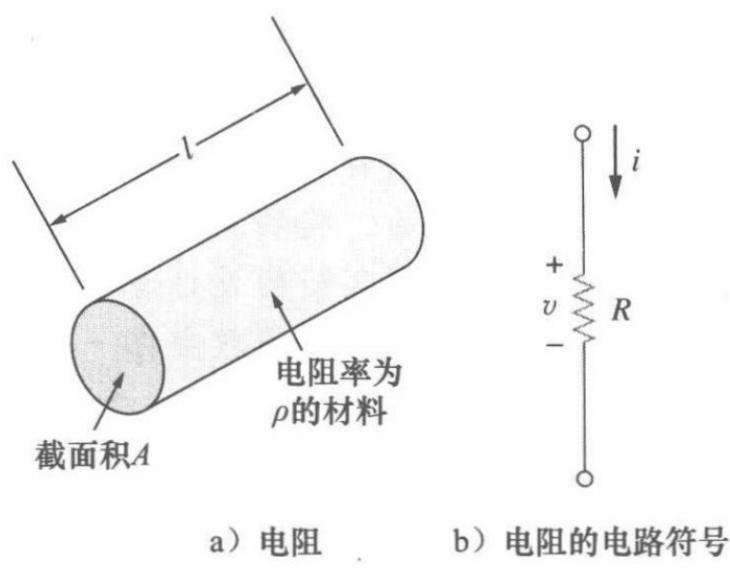

图2-1电阻及其电路符号

对于由某种材料制成的柱形均匀导体，其电阻 R 与长度 L 成正比，与横截面积 S 成反比，即：

$$
R = \rho \frac {l}{A}
$$

式中ρ为比例系数，由导体的材料和周围温度所决定，称为电阻率。

表2-1常见材料的电阻率

<table><tr><td>材料名称</td><td>电阻率(Ω·m)</td><td>用途</td><td>材料名称</td><td>电阻率(Ω·m)</td><td>用途</td></tr><tr><td>银</td><td>1.64×10-8</td><td>导体</td><td>铜</td><td>1.72×10-8</td><td>导体</td></tr><tr><td>铝</td><td>2.8×10-8</td><td>导体</td><td>金</td><td>2.45×10-8</td><td>导体</td></tr><tr><td>碳</td><td>4×10-5</td><td>半导体</td><td>锗</td><td>47×10-2</td><td>半导体</td></tr><tr><td>硅</td><td>6.4×102</td><td>半导体</td><td>纸张</td><td>1×1010</td><td>绝缘体</td></tr><tr><td>云母</td><td>5×1011</td><td>绝缘体</td><td>玻璃</td><td>1×1012</td><td>绝缘体</td></tr><tr><td>聚四氟乙烯</td><td>3×1012</td><td>绝缘体</td><td></td><td></td><td></td></tr></table>

# 2.2 欧姆定律

# 电阻

电阻 R 表示元件阻碍电流流动的能力，单位用欧姆 (Ω) 表示。

$$
v = + i R
$$

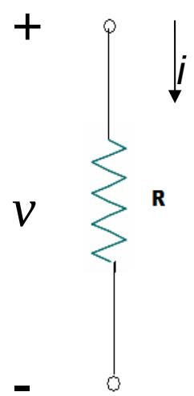

1Ω=1 V/A

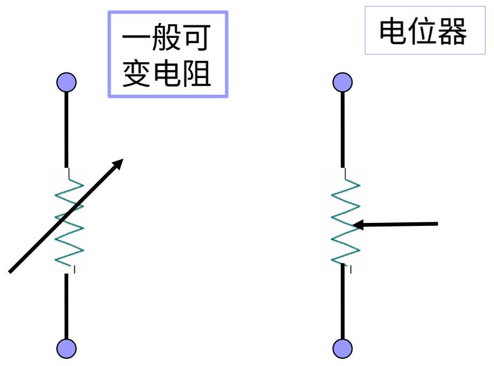

# 欧姆定律 （元件约束）

# 欧姆定律：

电阻器 R 两端的电压 v 与流过电阻器的电流 i 成正比

$$
v = + i R
$$

电流 i 的方向和电压 v 的极性必须符合关联参考方向原则。

关联参考方向：如果指定电流从标以电压“ +” 极性的一端流入，并从标以“ -” 极性的另一端流出，即电流的参考方向与电压的参考方向一致，则把电流和电压的这种参考方向称为关联参考方向，此时， v=+iR 。反之， v=-iR 。

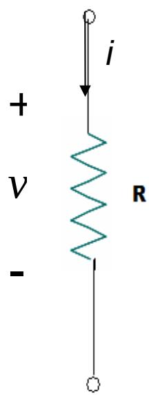

# 欧姆定律 （元件约束）

如果指定电流从标以电压“ -” 极性的一端流入，并从标以“ +” 极性的另一端流出，则 v=-iR 。

$$
v = - i R
$$

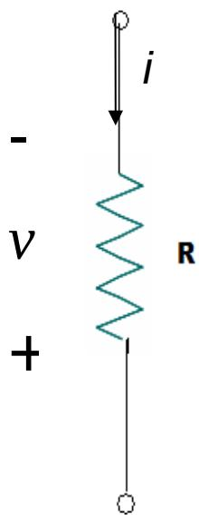

# 短路指的是电路元件的电阻接近 0 的情况。

# 开路指的是电路元件的电阻接近无穷大的情况。

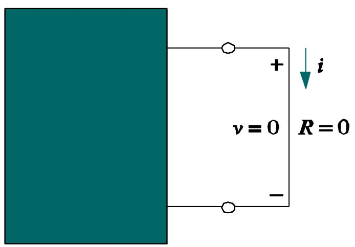

(a)

(a) 短路 $( \mathsf { R } = 0 )$

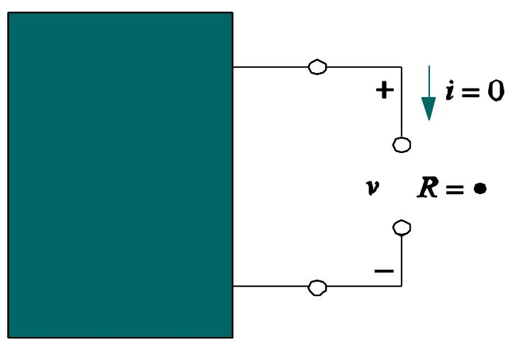

（b)

(b) 开路 $( \mathsf { R } \mathsf { = } \infty )$

# 拓展知识：

色环标记法：棕、红、橙、黄、绿、兰、紫、灰、白、黑，金、银、无色

# 色标法

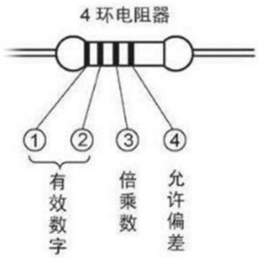

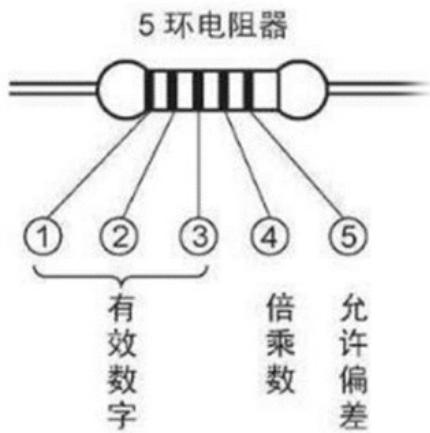

2.2K ±5%

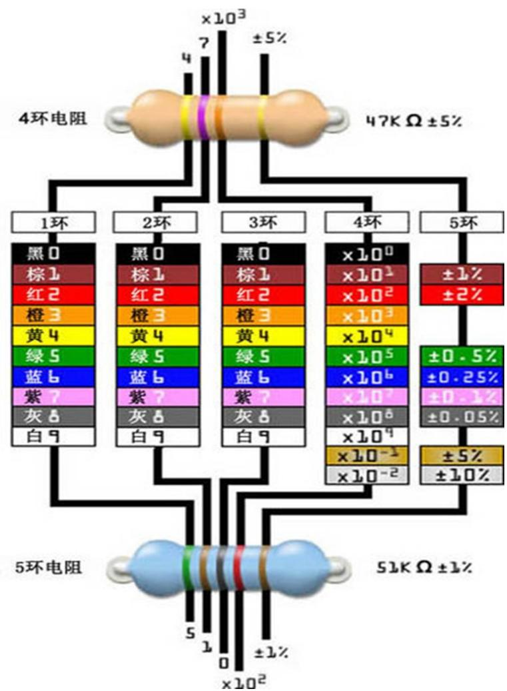

# 电导

电导指的是元件传导电流的能力，单位为姆欧 ( ) 或西门子 (S)

$$
G = \frac {1}{R} = \frac {i}{v}
$$

$$
1 S = 1 U = 1 A / V
$$

 电阻消耗的功率

$$
\begin{array}{l} p = v i = i ^ {2} R = \frac {v ^ {2}}{R} \\ p = v i = v ^ {2} G = \frac {i ^ {2}}{G} \\ \end{array}
$$

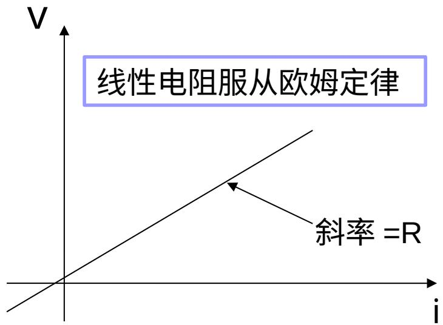

(a) 线性电阻

需要注意两点：

1. 电阻中的功率耗散是电流或电压的非线性函数。

2. 由于 R 和 G 是正的量，电阻中的功率损耗总是正的。因此，电阻总是从电路中吸收能量。

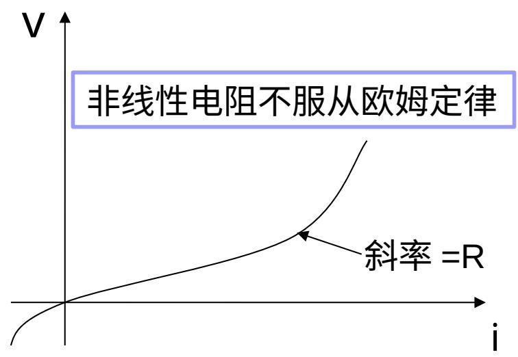

(b) 非线性电阻

例2-1一个电熨斗接120V电源时产生的电流为2A，求该熨斗的阻值。

解： R=V/I=120V/2A=60 Ω

练习2-1烤面包机的基本部件是一种将电能转换为热能的电阻元件，试求阻值为15Ω的烤面包机接110V电源时产生的电流。 答案：7.333A

解： I=V/R=110V/15 Ω=7.3333.....A

例2-3 电压为20sinπtV的电压源连接到一个5kΩ电阻上，试求流经该电阻的电流及其消耗的功率。

解： I V / R (20 sin t) / 5000 4sin t(mA)

$$
P = V ^ {2} / R = (2 0 \sin \pi t) ^ {2} / 5 0 0 0 = 8 0 (\sin \pi t) ^ {2} (m W)
$$

# 例 2-3

一个 V 的电压源和一个 的电阻器相连。20sint 5k求出通过电阻器的电流和功率损耗。

解 :

$$
i = \frac {v}{R} = \frac {2 0 \sin \pi t}{5 \times 1 0 ^ {3}} = 4 \sin \pi t (m A)
$$

因此 ,

$$
p = v i = 8 0 \sin^ {2} \pi (m W)
$$

练习2-3某电阻连接在电压源u=15costV两端，吸收的瞬时功率为30cos²tmW。

$i$ $R$

答案：2cost mA，7.5kΩ

解： i  p / v 2 cos t(mA)

$$
R = V / I = 7. 5 \mathrm {k} \Omega
$$

# 2.3 节点、 支路、 回路

# 支路

支路表示单个元件，如电压源或电阻器。

一条支路表示任意一个二端元件。

# 节点

节点是两个或多个支路之间的连接点。

具有相同电位的节点可视为同一节点。

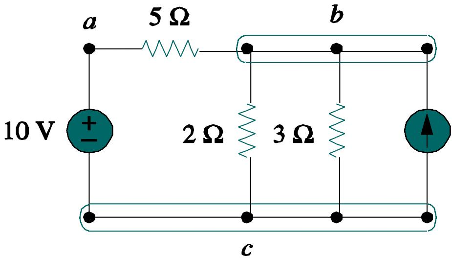

几个节点？几条支路？

答： 3 个节点， 5 条支路。

# 回路

回路是指电路中的任何闭合路径。

网孔 ( 最小的回路 )

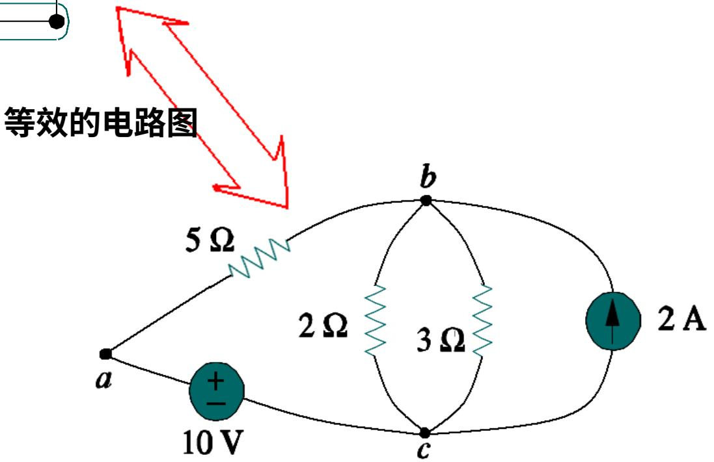

# 串联和并联

如果两个或者多个元件首尾相连，并传递同一电流，则称这种连接方式为串联。

如果两个或者多个元件分别连接到相同的两个节点上，并且它们两端的电压是相同的，则称这种连接方式为并联。

例 2-4 ：

试确定右图电路中支路和节点的数量，并确定哪些元件是串联的，哪些元件是并联的。

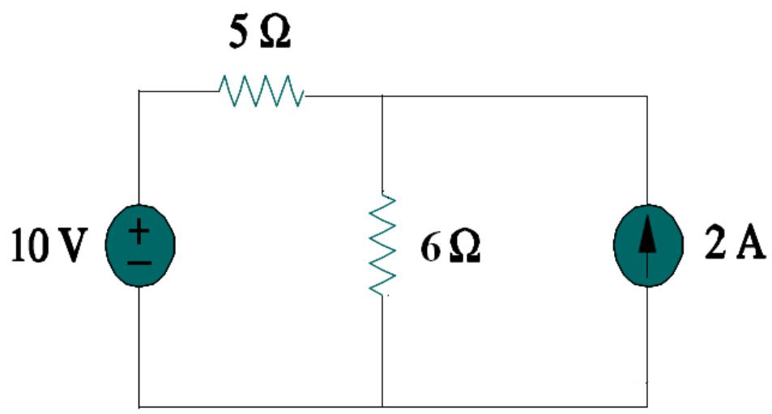

# 解 :

# Note ：

不同的节点具有不同的电压，不同的支路具有不同的电流。

电路有 4 条支路。电路有 3 个节点。

5-Ω 电阻是 10 V 电压源串联在一起。

6-Ω 电阻与 2-A 电流源并联。

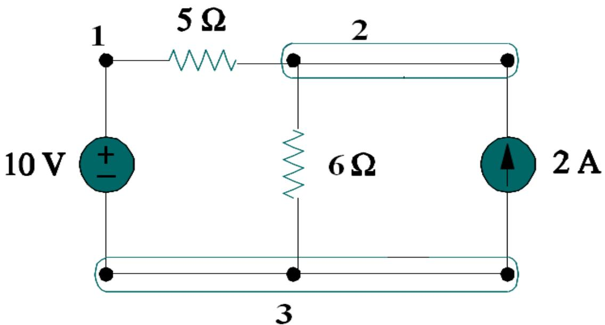

# 练习 2-4 ：

试确定右图电路中支路和节点的数量，并确定哪些元件是串联的，哪些元件是并联的。

几个节点？几条支路？

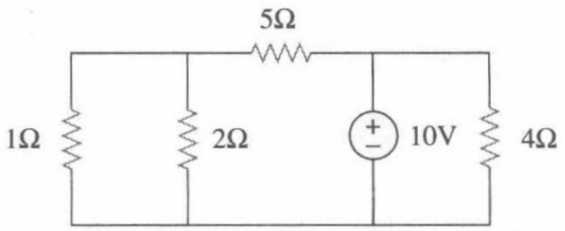

答： 3 个节点， 5 条支路。

答案：如图2-15所示，包括5条支路和3个节点、1Ω电阻和2Ω电阻是并联的，4Ω电阻与10V电压源也是并联的

独立回路。试问

包括 $b$ 条支路、n个节点和l个独立回路的网络满足如下关于网络拓扑结构的基本

$$
\boxed {b = l + n - 1} \tag {2.12}
$$

答：（ C)

# 2.4 基尔霍夫定律 （拓扑约束）

# 基尔霍夫电流定律 （ KCL ）

基尔霍夫电流定律指出，流进一个节点 ( 或一个闭合界面)的电流代数和为零。

$$
\sum_ {n = 1} ^ {N} i _ {n} = 0
$$

（电荷守恒）

 流进节点的电流可视为正电流，离开节点的电流可视为负电流，反之亦然。

# 或：基尔霍夫电流定律（ KCL ）

流进节点的电流之和等于离开节点的电流之和。

$$
i _ {\lambda} = i _ {\mathrm {出}}
$$

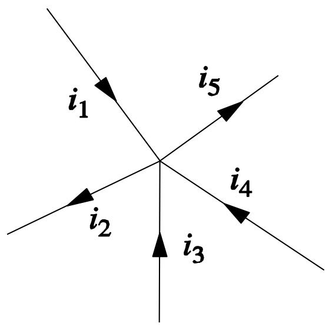

节点和节点电流

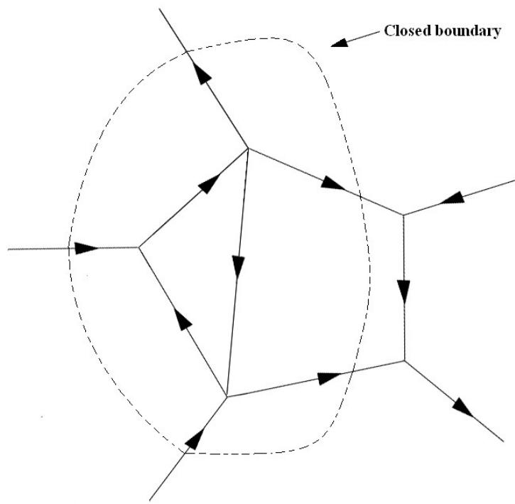

KCL 应用于封闭边界（广义节点）

如果两个电源 ( 或电路 ) 在端口处有相同的电流 -电压关系（ VCR ），那么就说它们是等效的。

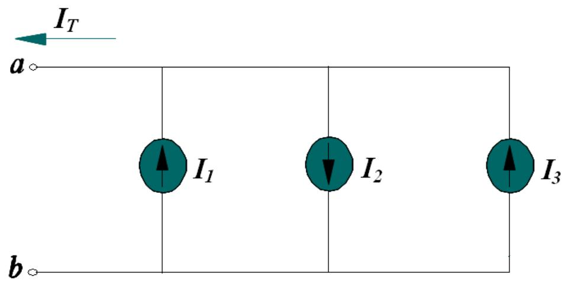

(a) 原电路

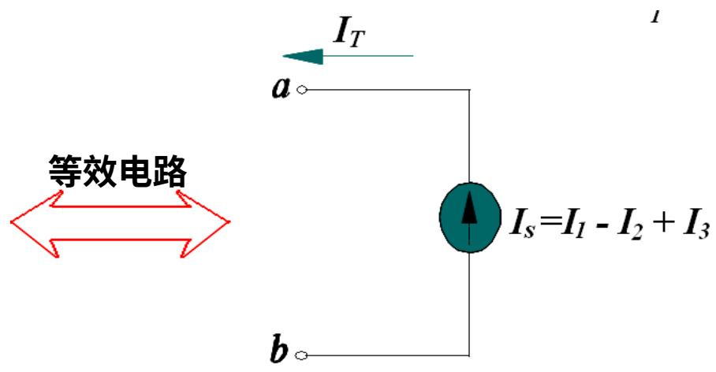

(b) 等效电路

并联电流源的等效

# 基尔霍夫电压定律 (KVL)

基尔霍夫电压定律指出，闭合路径 ( 或回路 )上所有电压的代数和为零。

$$
\boxed {\sum_ {m = 1} ^ {M} v _ {m} = 0}
$$

或：

$$
v _ {\text {升}} = v _ {\text {降}}
$$

（能量守恒）

提示：在回路中，KVL有两种应用方式：顺时针方向或逆时针方向。无论沿哪种方向环绕，回路中电压的代数和均为零。

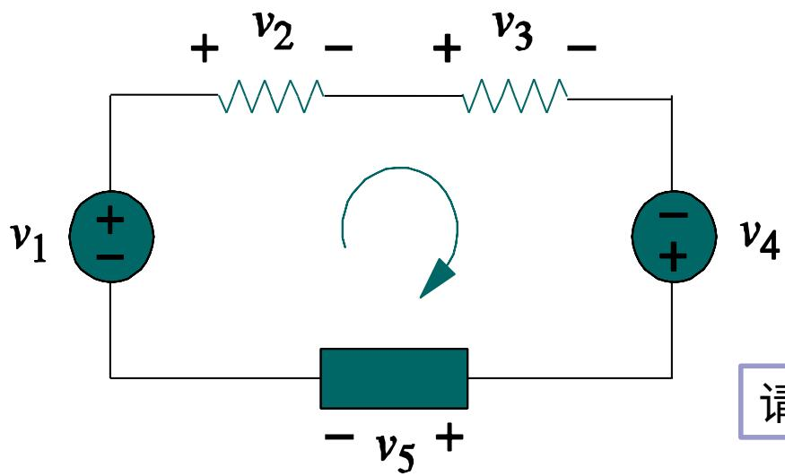

电压降：“ + →-” 为正，反之为负

$$
- \mathrm {V} 1 + \mathrm {V} 2 + \mathrm {V} 3 - \mathrm {V} 4 + \mathrm {V} 5 = 0,
$$

或：

$$
\mathrm {V} 2 + \mathrm {V} 3 + \mathrm {V} 5 = \mathrm {V} 1 + \mathrm {V} 4
$$

请写出逆时针方向的表达式，并比较结果

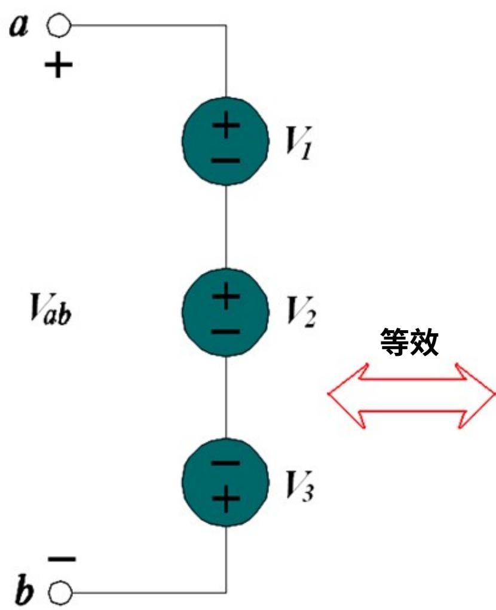

(a) 原电路

对左边电路用 KVL ：

$$
- V _ {a b} + V _ {1} + V _ {2} - V _ {3} = 0
$$

即： Vab =V1+V2-V3

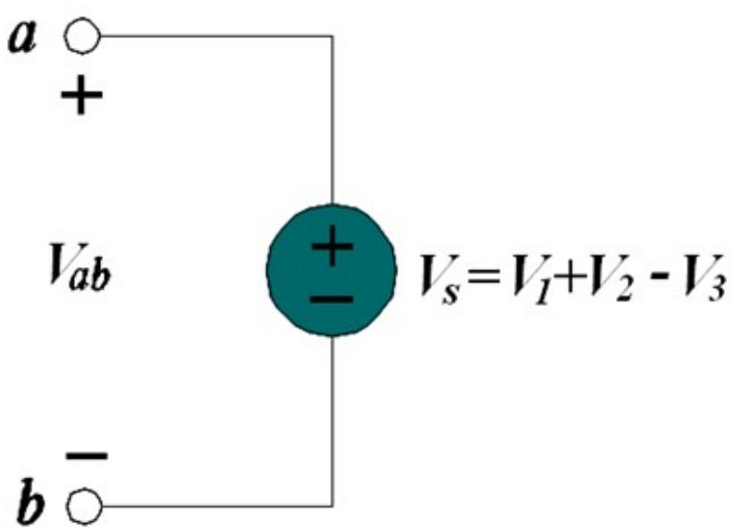

(b) 等效电路

# 那么， 问题来了：

刚才是电流源并联、电压源串联等效的例子，那么，能不能将电流源进行串联等效、电压源进行并联等效？等效的结果是什么？

为了避免违背 KVL ，电路中不可能并联两个不同的电压源 V1 和 V2 ，除非 V1=V2 ；同理，除非 I1=I2, 电流源才可能串联。

# 例 ( 注意：解题思路与规范——标签 + 原始方程！ )

# 确定图中电路的 和 。v0 i

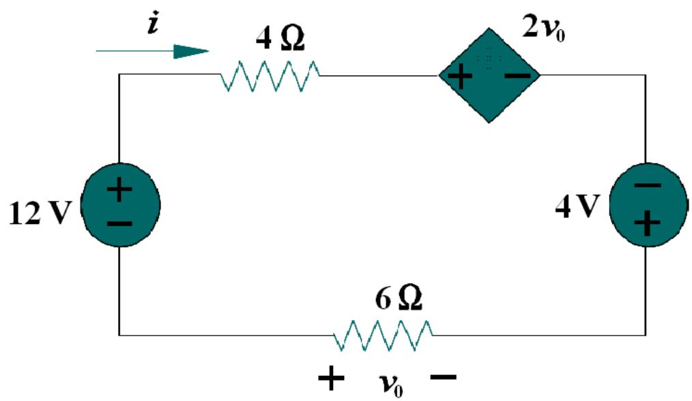

# 解 :

KVL:

12 4 2 4 0   i  v0   v0 

欧姆定律：

② v 6i0 

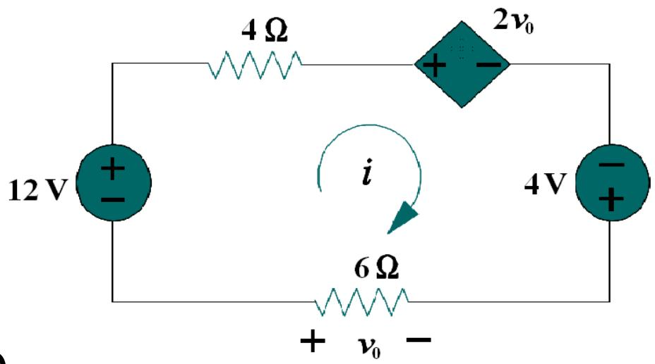

解得 16 10 12 0    i i

$$
\Rightarrow i = - 8 \mathrm {A}
$$

及 v0 48V

# 解 : （假设电流逆时针方向流再算一遍）

$$
\mathrm {K V} _ {\widehat {1}}: \quad 1 2 + v _ {0} + 4 - 2 v _ {0} + 4 i = 0
$$

欧姆定律：

② v 6i0 

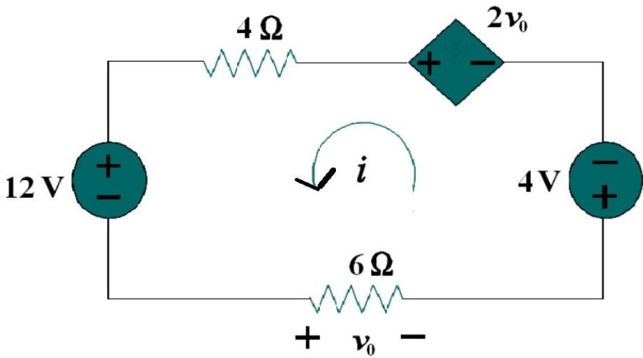

解得 1 6 4 6 0    i i

$$
\Rightarrow i = 8 \mathrm {A}
$$

及 v0 48V

例2-5 如图2-21a所示的电路，试求电压 $\mathcal { V } _ { 1 }$ $\boldsymbol { v } _ { 2 }$

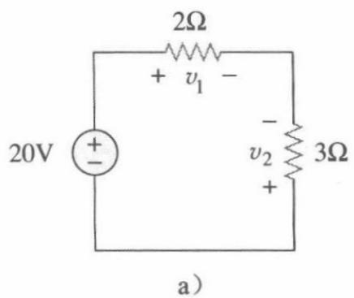

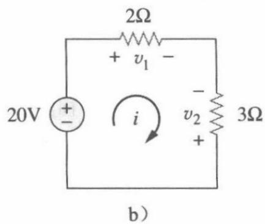

由欧姆定律可得：

$$
v _ {1} = 2 i, \quad v _ {2} = - 3 i
$$

在回路中应用 $\mathrm { K V I } _ { \mathfrak { c } }$

$$
- 2 0 + v _ {1} - v _ {2} = 0
$$

$$
- 2 0 + 2 i + 3 i = 0 \qquad \text {或} \qquad 5 i = 2 0 \qquad \Rightarrow \qquad i = 4 \mathrm {A}
$$

最后，将电流 $i$

$$
v _ {1} = 8 \mathrm {V}, \quad v _ {2} = - 1 2 \mathrm {V}
$$

$\scriptstyle \gamma _ { 1 }$ $\scriptstyle \mathcal { V } _ { 2 }$

解法（ 1 ）：设电流顺时针方向流

$$
\begin{array}{l} V 1 - (- 8) - V 2 - 3 2 = 0 \\ 4 \mathrm {i} + 8 - (- 2 \mathrm {i}) - 3 2 = 9 \\ 4 \mathrm {i} + 8 + 2 \mathrm {i} - 3 2 = 0 \\ 6 \mathrm {i} = 2 4, \mathrm {i} = 4 \mathrm {A}; \\ v 1 = 4 i = 4 \times 4 = 1 6 (V) \\ V 2 = - 2 i = - 4 \times 2 = - 8 (V) \\ \end{array}
$$

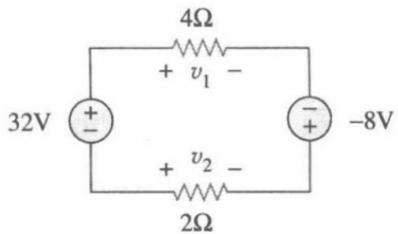

解法（ 2 ）设电流逆时针方向流

$$
4 \mathrm {i} + 3 2 + 2 \mathrm {i} + (- 8) = 0
$$

$$
6 \mathrm {i} = - 2 4, \mathrm {i} = - 4 \mathrm {A};
$$

$$
v 1 = - 4 i = (- 4) \times (- 4) = 1 6 (V)
$$

$$
\mathrm {V} 2 = 2 \mathrm {i} = 2 \times (- 4) = - 8 (\mathrm {V})
$$

两种方法得到的结果一样。

例2-6 计算图2-23a所示电路中的 $\boldsymbol { v } _ { \mathrm { o } }$

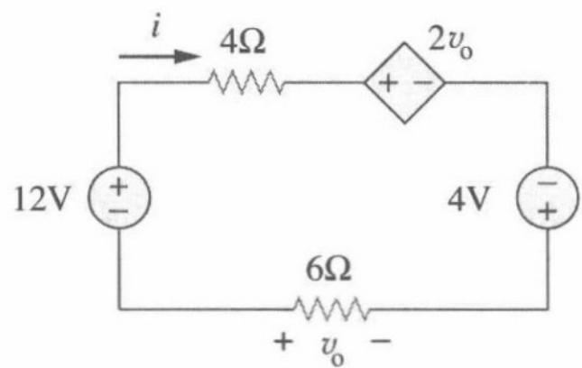

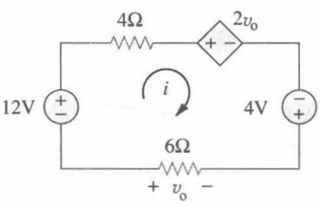

解：（ -12 ） +4i+2v0-4-v0=0; V0+4i=16

v0=-6i ; -2i=16, i=-8 （ A); V0=-6i=48(V)

解：设电流顺时针方向。

$$
(- 7 0) + 1 0 i + 2 \times 1 0 i + 5 i = 0
$$

$$
3 5 i = 7 0, i = 2 (A)
$$

$$
v _ {x} = 2 0 V
$$

$$
v _ {o} = - 5 i = - 1 0 V
$$

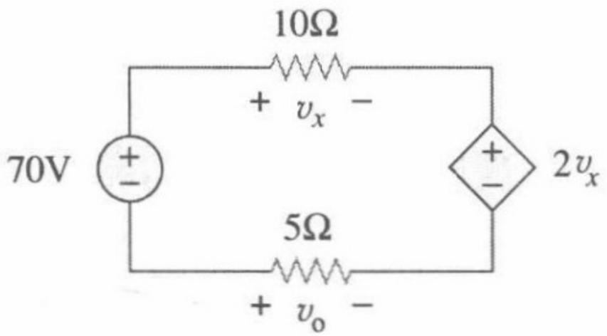

例2-7

解： 0.5i0+3=i0 ;

$$
\mathsf {i} _ {0} = 6 (\mathsf {A})
$$

$$
V _ {n} = 4 \times i _ {n} = 2 4 (V)
$$

练习2-7求图2-26所示电路中的 $i _ { \mathrm { o } }$ $\boldsymbol { v } _ { \mathrm { o } }$

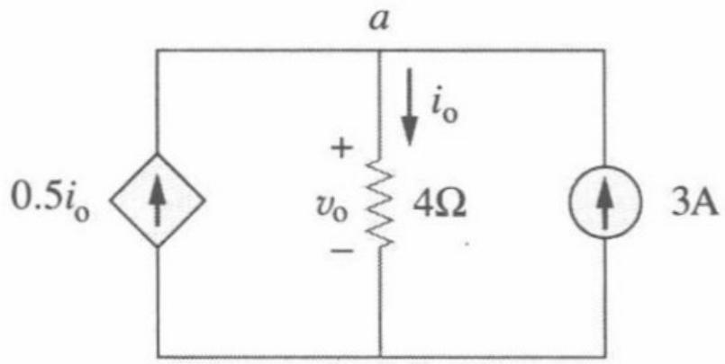

解： 15=(V0/12)+V0/2+V0/6 ;

$$
V _ {0} = 2 0 \mathrm {(V)}
$$

$$
I _ {0} = 1 0 \mathrm {(A)}
$$

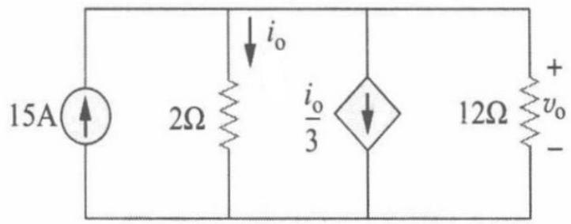

# 例 2-8 ( 堂练，注意解题思路与规范！ )

求出下图所示电路中的各电流和电压。

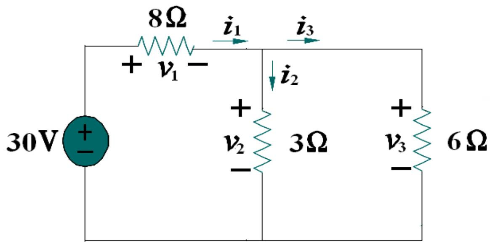

解 :

由欧姆定律，

① 1 18 ,i

2 23 ,i

③ 3 36 i

在节点 a ，由 KCL

有 ④ $i _ { 1 } ^ { - } \ : i _ { 2 } ^ { \phantom { + } } - i _ { 3 } ^ { \phantom { + } } = 0$

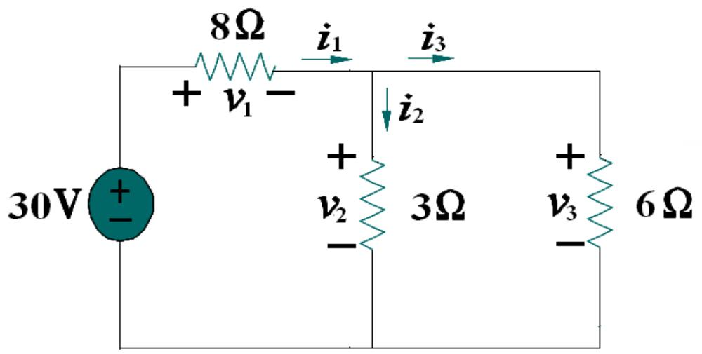

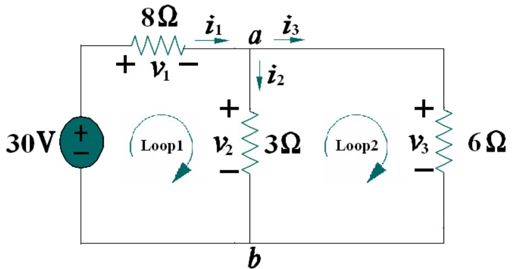

注：对各种假设给出清晰标签！

对回路 1 使用 KVL ，

⑤  30  v1  v2 0

对回路 2 使用 KVL

$$
\textcircled {6} - v _ {2} + v _ {3} = 0 \Rightarrow v _ {3} = v _ {2}
$$

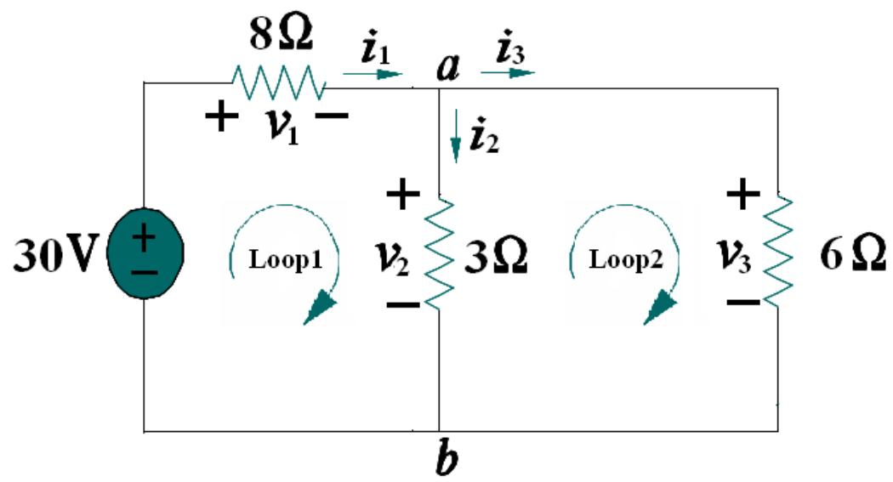

$$
i _ {1} = 3 \mathrm {A}, i _ {3} = 1 \mathrm {A}, v _ {1} = 2 4 \mathrm {V}, v _ {2} = 6 \mathrm {V}, v _ {3} = 6 \mathrm {V}
$$

$$
i _ {2} = 2 \mathrm {A}
$$

# 2.5 串联电阻的分压

等效电阻是指网络指定端口之间的电阻必须在端口上表现出与原网络相同的 i-v 特性。

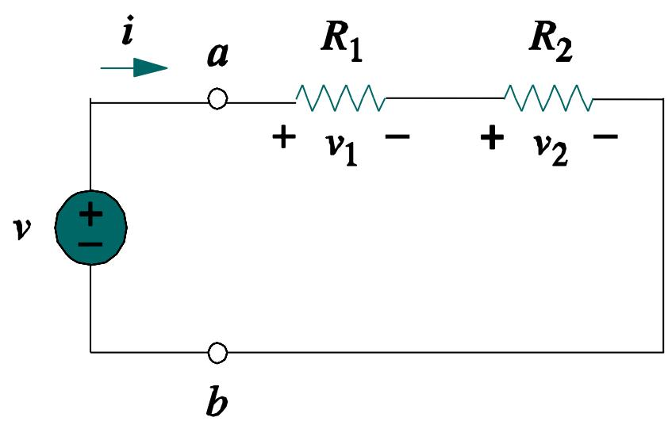

$$
v = i (R _ {1} + R _ {2})
$$

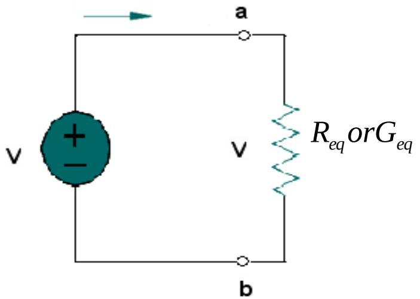

$$
v = i R _ {\mathrm {e q}}
$$

串联等效电阻 Req R1  R2

# 任何数量的串联电阻的等效电阻是单个电阻的和。

$$
R _ {e q} = R _ {1} + R _ {2} + \dots + R _ {N} = \sum_ {n \equiv 1} ^ {N} R _ {n}
$$

# 串联电阻的分压公式

两个电阻

$$
v _ {1} = \frac {R _ {1}}{R _ {1} + R _ {2}} v,
$$

$$
v _ {2} = \frac {R _ {2}}{R _ {2} + R _ {1}} v
$$

n 个电阻

$$
\nu_ {n} = \frac {R _ {n}}{R _ {1} + R _ {2} + \ldots + R _ {n}} \nu
$$

# 2.6 并联电阻的分流

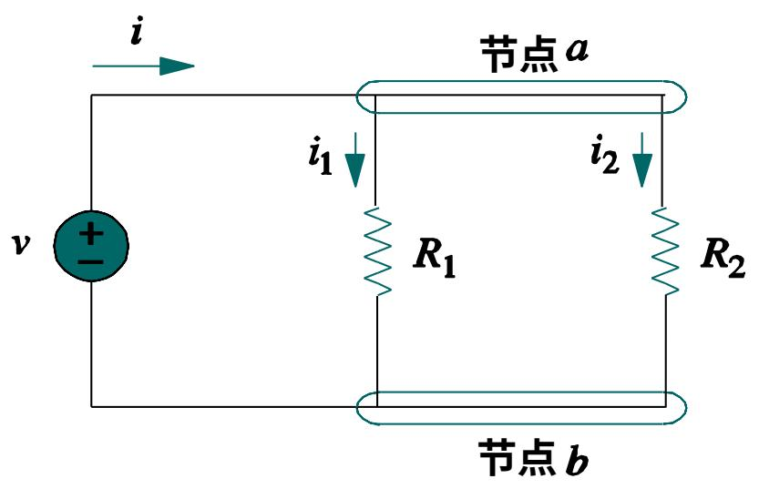

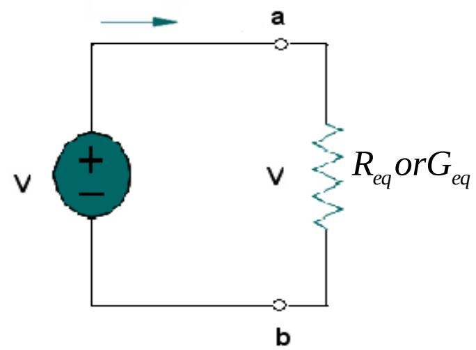

两个并联电阻的等效电阻等于它们的电阻的乘积除以它们的和。

1 1 1 或 Req 1 2R R串联等效电阻： Req 1 2 R R 1 2R R

# n 个电阻并联

$$
\frac {1}{R _ {e q}} = \frac {1}{R _ {1}} + \frac {1}{R _ {2}} + \dots + \frac {1}{R _ {\mathrm {N}}}
$$

并联电路习惯上用电导计算 （加法）。

$$
G _ {e q} = G _ {1} + G _ {2} + G _ {3} + \dots + G _ {N}
$$

并联电阻的等效电导是它们各自电导之和。

# 并联电阻分流公式：

$$
i _ {1} = \frac {R _ {2} i}{R _ {1} + R _ {2}}, i _ {2} = \frac {R _ {1} i}{R _ {1} + R _ {2}}
$$

$$
i _ {n} = \frac {G _ {n}}{G _ {1} + G _ {2} + \cdots \cdots + G _ {N}} i
$$

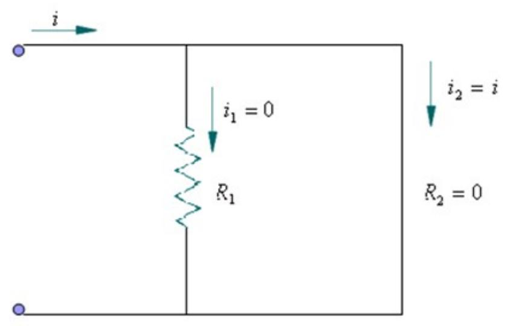

(a)

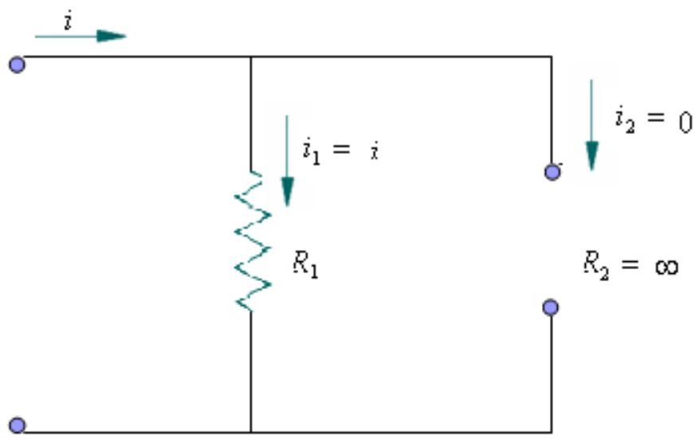

(b)

特殊情况： (a) 短路

(b) 开路

nRnv串联电路分压公式： v1 2 NRR R   

并联电路分流公式： $i _ { n } = { \frac { G _ { n } } { G _ { 1 } + G _ { 2 } + \cdots \cdots + G _ { N } } } i$

比较以上两个式子，可看出串、并联电路的对偶关系

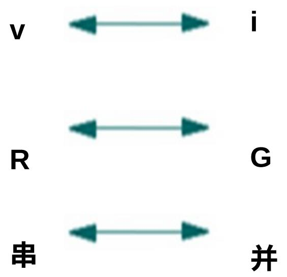

例 2-9 ：

求出右图中的 Req

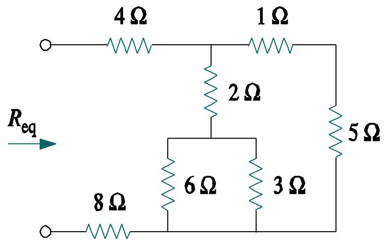

解 :

$$
6 \Omega | | 3 \Omega = \frac {6 \times 3}{6 + 3} = 2 \Omega
$$

$$
1 \Omega + 5 \Omega = 6 \Omega
$$

$$
2 \Omega + 2 \Omega = 4 \Omega
$$

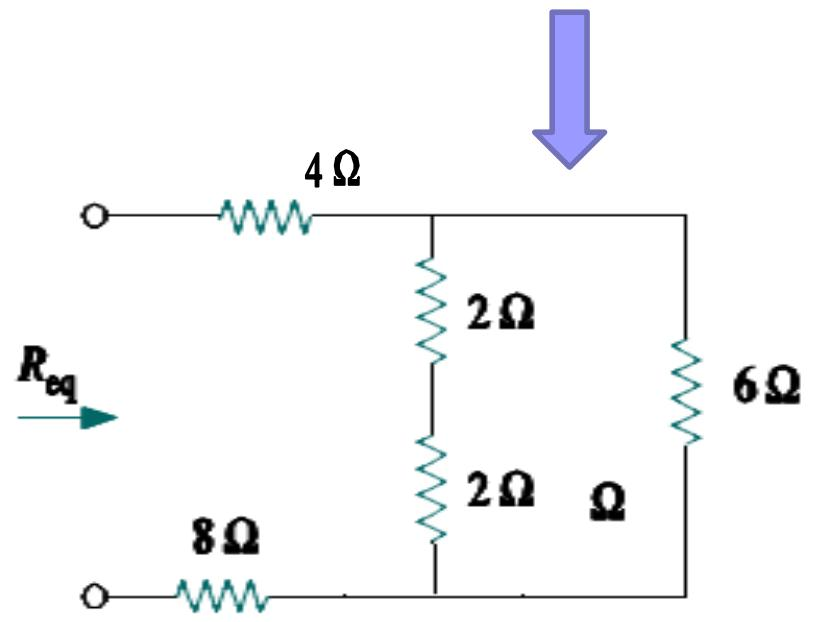

$$
6 \Omega | | 4 \Omega = \frac {6 x 4}{6 + 4} = 2. 4 \Omega
$$

$$
R _ {e q} = 4 \Omega + 2. 4 \Omega + 8 \Omega = 1 4. 4 \Omega
$$

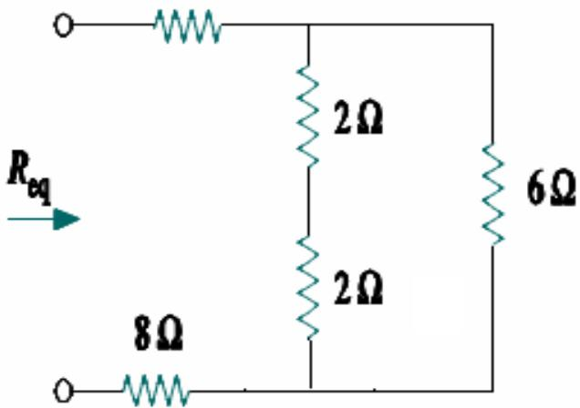

Fig.2.35(a)

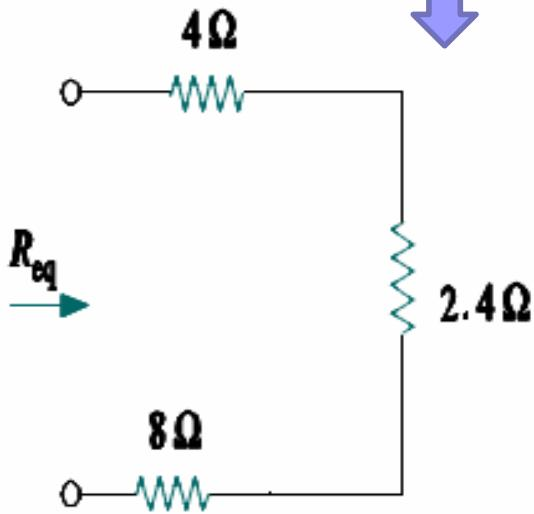

Fig.2.35(b)

练习2-9合并图2-36所示电路中的电阻，求出该电路的 $R _ { \mathrm { e q } }$

解：

$$
(6 + 1 0 + 8) \times 1 2 / 3 6 = 8;
$$

$$
(4 + 8) \times 6 / 1 8 = 4;
$$

$$
4 + 4 + 3 = 1 1 (\text {欧 姆})
$$

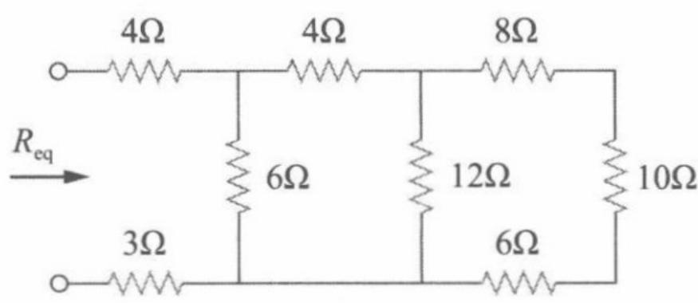

# 例 2-10 （堂练）

# 计算所示电路的等效电阻 Rab

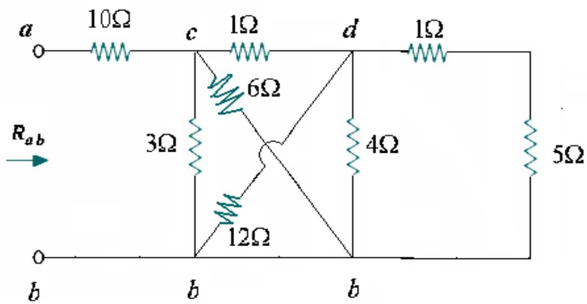

解 :

3-Ω 和 6-Ω 并联等效电阻为

$$
6 \Omega | | 3 \Omega = \frac {6 \times 3}{6 + 3} = 2 \Omega
$$

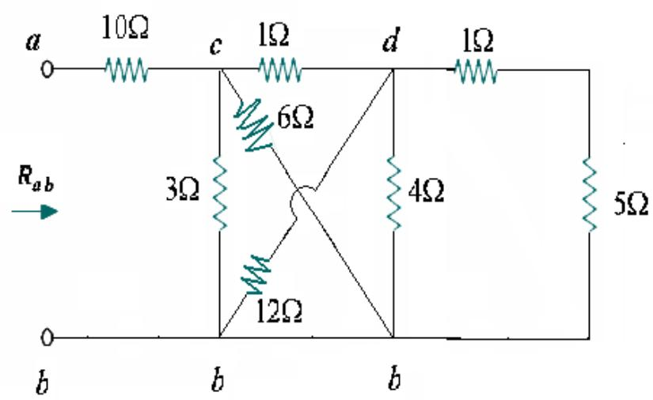

12-Ω 和 4-Ω 电阻并联为

$$
1 2 \Omega | | 4 \Omega = \frac {1 2 x 4}{1 2 + 4} = 3 \Omega
$$

1-Ω 和 5-Ω 电阻串联为

$$
1 \Omega + 5 \Omega = 6 \Omega
$$

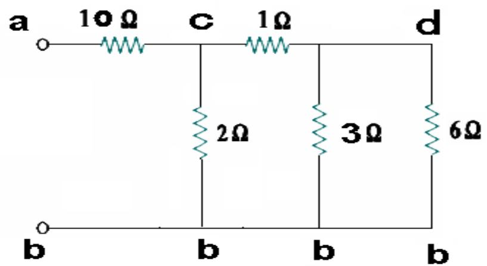

3-Ω 电阻与 6-Ω 电阻并联得： 2-Ω

 1 2 3

2x32 ||3  1.2 2 3

1.2-Ω 电阻 10-Ω 电阻串联，故

$$
R _ {a b} = 1 0 + 1. 2 = 1 1. 2 \Omega
$$

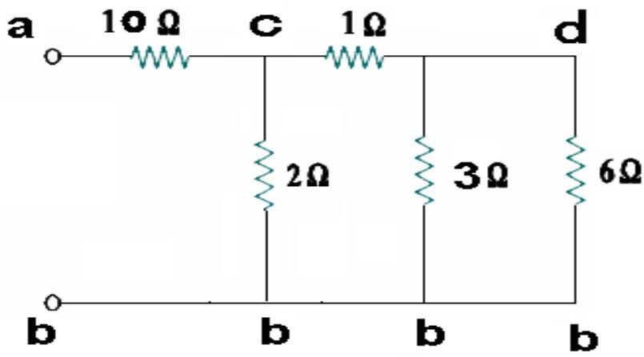

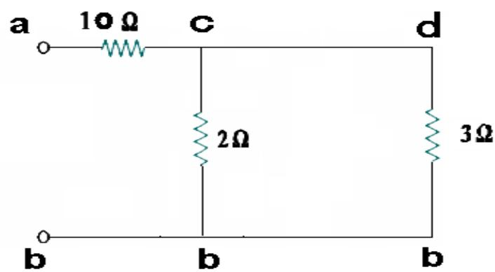

例 2-11 ：

求出如图电路中的等效电导 G eq

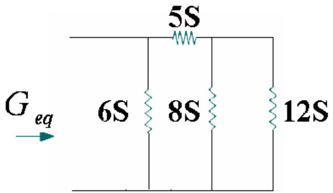

解 1 （用电导计算）

$$
8 S + 1 2 S = 2 0 S
$$

$$
\frac {2 0 \times 5}{2 0 + 5} = 4 S
$$

$$
G _ {e q} = 6 + 4 = 1 0 S
$$

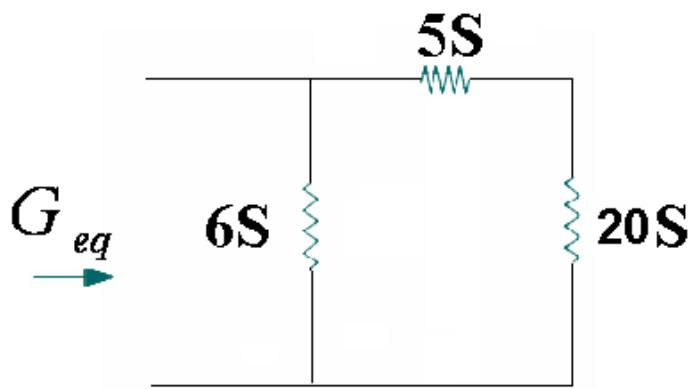

# 解 2 （用电阻计算）

$$
\begin{array}{l} R _ {e q} = \frac {1}{6} \left\| \left(\frac {1}{5} + \frac {1}{8} \right\| \frac {1}{1 2}\right) = \frac {1}{6} \left\| \left(\frac {1}{5} + \frac {1}{2 0}\right) \right. = \frac {1}{6} \left\| \frac {1}{4} \right. \\ = \frac {\frac {1}{6} \times \frac {1}{4}}{\frac {1}{6} + \frac {1}{4}} = \frac {1}{1 0} \Omega \quad \longrightarrow G _ {e q} = \frac {1}{R _ {e q}} = 1 0 S \\ \end{array}
$$

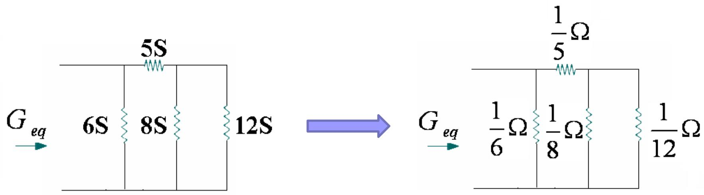

解： Geq=(7+5)(16+6)/(12+22)

$$
\begin{array}{l} = (1 2 \times 2 2) / (1 2 + 2 2) \\ = 7. 7 6 4 (S) \\ \end{array}
$$

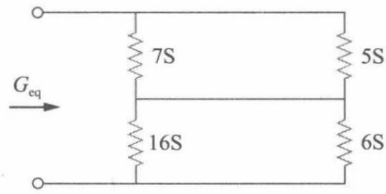

例2-12求如图2-42a所示电路的 $i _ { \mathrm { o } }$ $\Omega$ 电阻所消耗的功率。

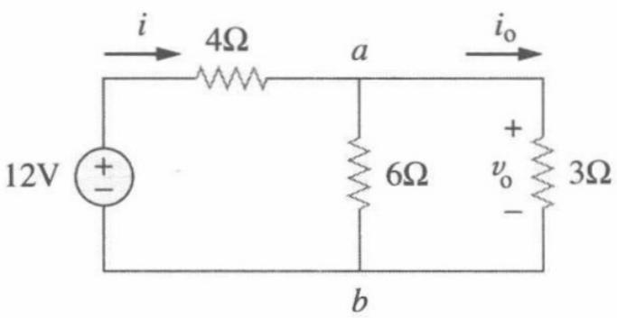

a）原始电路

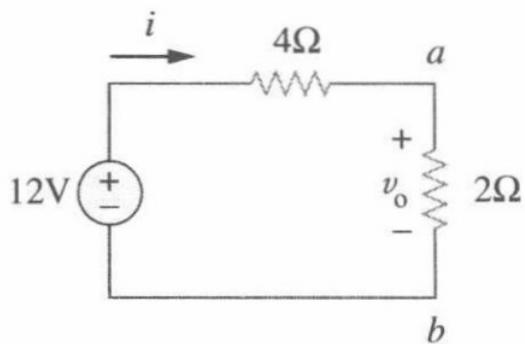

b）等效电路

解： V0=12/3=4 （ V)

$$
\mathsf {I} = 8 / 4 = 2 (\mathsf {A})
$$

$$
1 0 = (6 / 9) \times 2 = 4 / 3 (\mathrm {A})
$$

练习2-12求图2-43所示电路中的 $\boldsymbol { v } _ { 1 }$ $\boldsymbol { v _ { 2 } }$ ，并计算12Ω电阻和40Ω电阻所消耗的

解：（ 6x12)/(6+12)=4

$$
(1 0 \times 4 0) / (1 0 + 4 0) = 8
$$

$$
\mathrm {V} 1 = 4 \times 3 0 / (4 + 8) = 1 0 (\mathrm {V})
$$

$$
\mathrm {V} 2 = 2 0 \mathrm {V}
$$

$$
p 1 = 1 0 0 / 1 2 = 8. 3 3 3 \dots (W)
$$

$$
P 2 = 4 0 0 / 4 0 = 1 0 (W)
$$

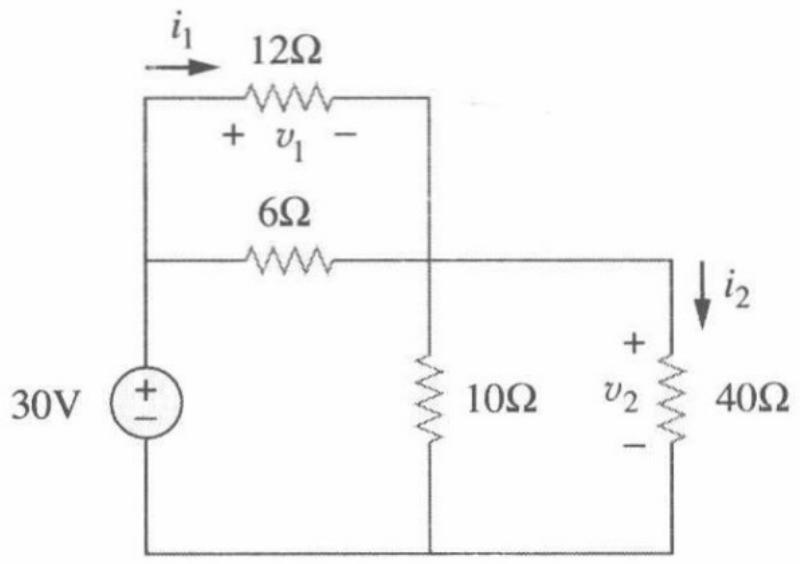

# 例 2-13

对于图示电路，确定 :(a) 电压 $\bar { \boldsymbol { v } } _ { o }$ ， (b) 电流源提供的功率， (c) 各电阻消耗的功率。

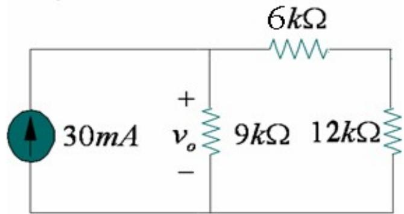

题图

解 :

(a) 6 12 18k

$$
i _ {1} = \frac {1 8 , 0 0 0}{9 0 0 0 + 1 8 , 0 0 0} (3 0 m A) = 2 0 m A
$$

$$
i _ {2} = \frac {9 0 0 0}{9 0 0 0 + 1 8 , 0 0 0} (3 0 A) = 1 0 m A
$$

$$
v _ {o} = 9, 0 0 0 i _ {1} = 1 8, 0 0 0 i _ {2} = 1 8 0 V
$$

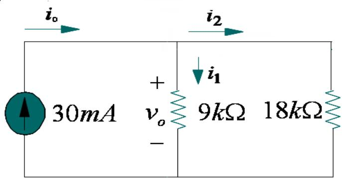

打标签

(b) 电流源提供的功率

$$
p _ {o} = v _ {o} i _ {o} = 1 8 0 (- 3 0) m W = - 5. 4 W
$$

(c) 被 12-k 电阻消耗掉的功率

$$
p = i v = i _ {2} \left(i _ {2} R\right) = i _ {2} ^ {2} R = \left(1 0 \times 1 0 ^ {- 3}\right) ^ {2} (1 2, 0 0 0) = 1. 2
$$

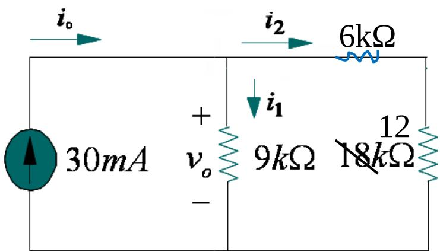

被 6-k 电阻消耗掉的功率

$$
p = i _ {2} ^ {2} R = (1 0 \times 1 0 ^ {- 3}) ^ {2} (6 0 0 0) = 0. 6 W
$$

被 9-k 电阻消耗掉的功率

$$
p = \frac {v _ {0} ^ {2}}{R} = \frac {(1 8 0) ^ {2}}{9 0 0 0} = 3. 6 W
$$

或者 $p = v _ { o } i _ { 1 }$ 180(20)mW 3.6W

 提供的功率 $( 5 . 4 \mathsf { W } ) =$ 吸收的功率供 $( 1 . 2 + 0 . 6 + 3 . 6 = 5 . 4 \mathsf { W } )$

练 $\begin{array} { r l } & { \exists ~ 2 - 1 3 \quad \forall \pm \vert \mathfrak { X } \vert \ 2 \mathrm { - } 4 5 \ \iiint \overrightarrow { n } \vert \overrightarrow { A } \rangle \in \mathbb { H } \vert \mathfrak { X } \vert \ge \vert \mathfrak { X } \vert } \\ & { : \ ( { \mathrm { a } } ) v _ { 1 } \ \stackrel { \mapsto } {  } \ v _ { 2 } \ ; \ ( { \mathrm { b } } ) 3 \mathrm { k } \Omega \ \stackrel { \mapsto } {  } \ \ \mathrm { 6 } \ \mathrm { k } \Omega } \\ & { \forall \gamma \dag \dag \Sigma \dag , \ ( { \mathrm { c } } ) \triangleq \langle { \mathrm { a } } \rangle \mathbb { H } \langle \dag \rangle \dag \langle \dag \vert \mathfrak { X } \vert \dag \vert \mathfrak { X } \vert \vert \mathfrak { X } \vert \dag \vert \mathfrak { X } \vert \dag , \vert \forall \pm \mathfrak { Z } \vert \dag , } \\ & { \ a ^ { \prime } \vert \dag \langle \mathfrak { a } \rangle \vert \mathfrak { X } \vert \ \dag \vert \mathfrak { X } \vert \dag \vert \mathfrak { X } \vert \dag , } \end{array}$求 电阻消耗

$$
9 + 3 = 1 2 \quad (\mathrm {R})
$$

(15X60)/(15+60)=12 （ K欧姆）

12||12=6 （ K 欧姆）

$$
\mathrm {V} 2 = 3 0 \times 6 = 1 8 0 (\mathrm {V})
$$

$$
\mathrm {V} 1 = 9 \times 1 8 0 / 1 2 = 1 3 5 (\mathrm {V})
$$

$$
P _ {3} = (1 8 0 - 1 3 5) ^ {2} / 3 = 6 7 5 (\mathrm {m w})
$$

$$
P _ {6 0} = 1 8 0 \times 1 8 0 / 6 0 = 5 4 0 (\mathrm {m w})
$$

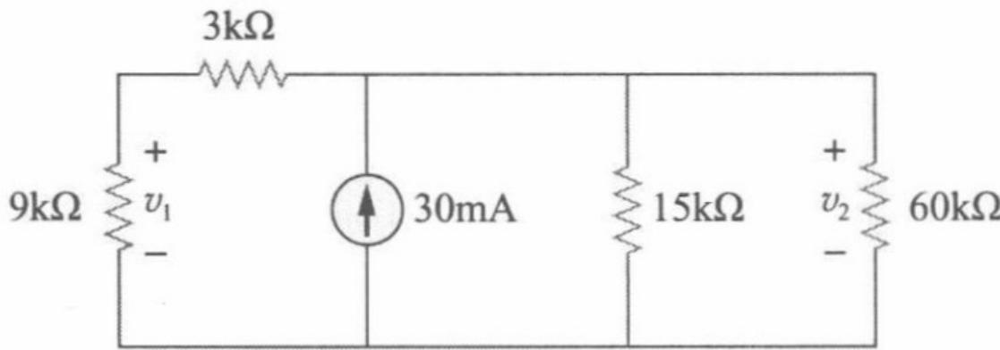

电流源提供的功率： P=30X180=5400mw=5.4W

# 2.7 WYE-DELTA

# TRANSFORMATIONS （自学）

Situations often arise incircuit analysis when theresistors are neither inparallel nor in series.

These circuits can besimplified by using three-terminal equivalentnetworks.

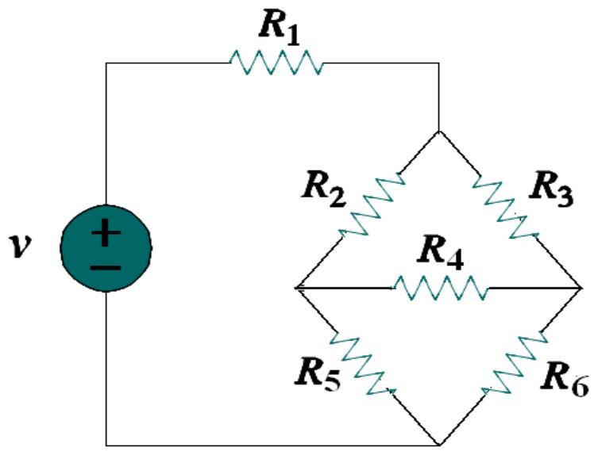

2.46 The bridge network

难以用串并联方式判断其联接形式

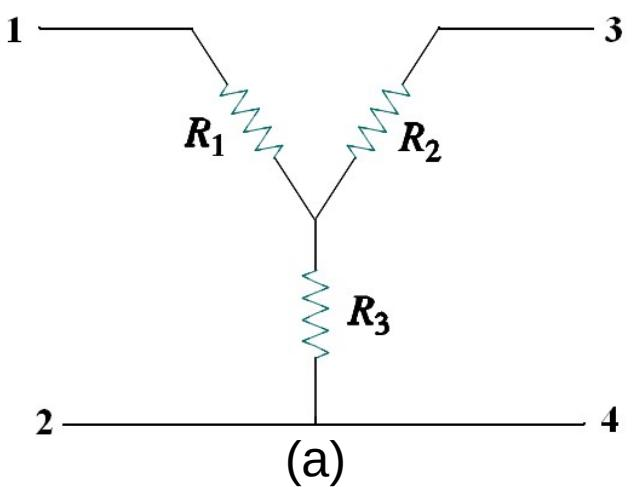

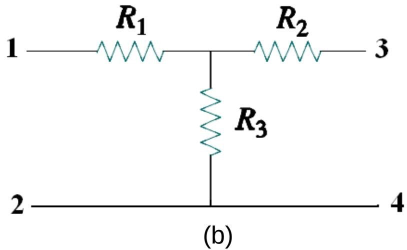

Figure 2.47 Two forms of the same network; (a)Y (b)T

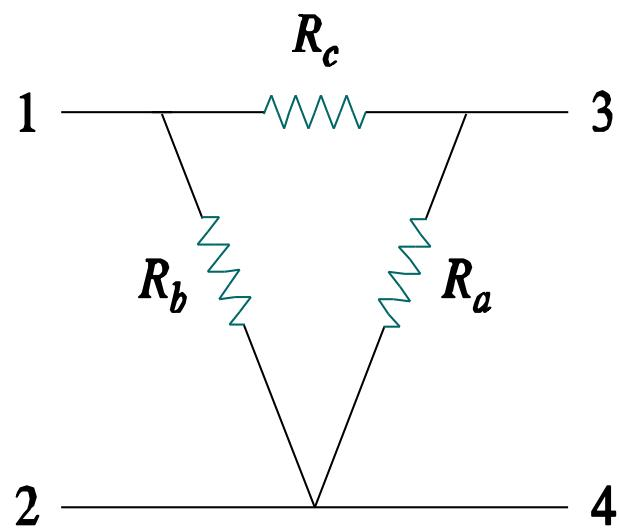

(a)

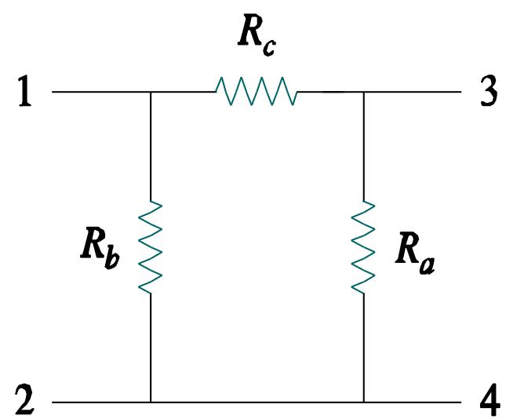

(b)

Figure 2.48 Two forms of the same network; (a) ,(b)  ∏

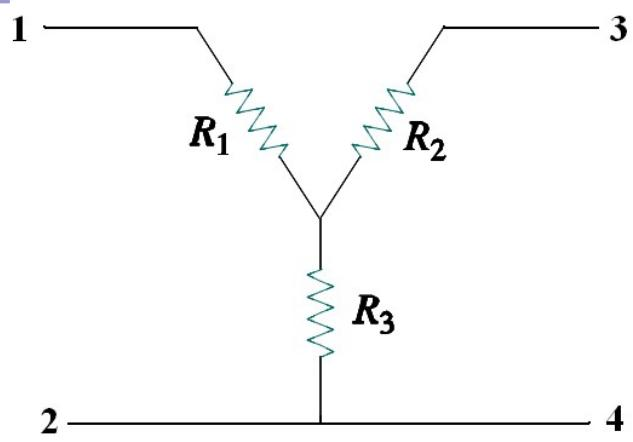

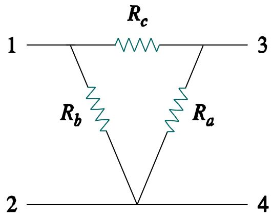

(a)

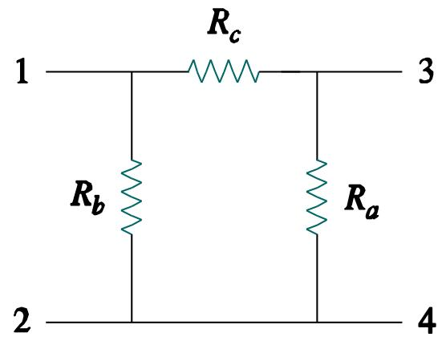

(b)

To obtain the equivalentresistances in the the

network, we compare the twonetworks and make sure that theresistance between each pair ofnodes in the network is the same as the resistance betweenthe same pair of nodes in the Ynetwork.

$$
R _ {1 2} (\mathbf {Y}) = R _ {1 2} (\Delta)
$$

$$
R _ {1 3} (\mathbf {Y}) = R _ {1 3} (\Delta)
$$

$$
R _ {2 3} (\mathbf {Y}) = R _ {2 3} (\Delta)
$$

$$
R _ {1 2} (Y) = R _ {1} + R _ {3} \tag {2.46}
$$

$$
R _ {1 2} (\triangle) = R _ {b} \| \left(R _ {a} + R _ {c}\right)
$$

▷to Y $R _ { 1 2 } \left( \mathrm { Y } \right) { = } R _ { 1 2 }$

$$
R _ {1 2} = R _ {1} + R _ {3} = \frac {R _ {b} \left(R _ {a} + R _ {c}\right)}{R _ {a} + R _ {b} + R _ {c}} \tag {2.47a}
$$

同理：

$$
R _ {1 3} = R _ {1} + R _ {2} = \frac {R _ {c} \left(R _ {a} + R _ {b}\right)}{R _ {a} + R _ {b} + R _ {c}} \tag {2.47b}
$$

$$
R _ {3 4} = R _ {2} + R _ {3} = \frac {R _ {a} \left(R _ {b} + R _ {c}\right)}{R _ {a} + R _ {b} + R _ {c}} \tag {2.47c}
$$

$$
R _ {1} - R _ {2} = \frac {R _ {c} \left(R _ {b} - R _ {a}\right)}{R _ {a} + R _ {b} + R _ {c}}
$$

$$
R _ {1} = \frac {R _ {b} R _ {c}}{R _ {a} + R _ {b} + R _ {c}} \tag {2.49}
$$

$$
R _ {2} = \frac {R _ {c} R _ {a}}{R _ {a} + R _ {b} + R _ {c}} \tag {2.50}
$$

$$
R _ {3} = \frac {R _ {a} R _ {b}}{R _ {a} + R _ {b} + R _ {c}} \tag {2.51}
$$

为了求出将Y电路转换为等效△电路的转换公式，首先由式(2.49）～式(2.51)可以得

$$
R _ {1} R _ {2} + R _ {2} R _ {3} + R _ {3} R _ {1} = \frac {R _ {a} R _ {b} R _ {c} (R _ {a} + R _ {b} + R _ {c})}{(R _ {a} + R _ {b} + R _ {c}) ^ {2}} = \frac {R _ {a} R _ {b} R _ {c}}{R _ {a} + R _ {b} + R _ {c}} \tag {2.52}
$$

$$
\begin{array}{l} R _ {a} = \frac {R _ {1} R _ {2} + R _ {2} R _ {3} + R _ {3} R _ {1}}{R _ {1}} (2.53) \\ R _ {b} = \frac {R _ {1} R _ {2} + R _ {2} R _ {3} + R _ {3} R _ {1}}{R _ {2}} (2.54) \\ R _ {c} = \frac {R _ {1} R _ {2} + R _ {2} R _ {3} + R _ {3} R _ {1}}{R _ {3}} (2.55) \\ \end{array}
$$

# Delta to wye Conversion

$$
R _ {1} = \frac {R _ {b} R _ {c}}{R _ {a} + R _ {b} + R _ {c}}
$$

$$
R _ {2} = \frac {R _ {a} R _ {c}}{R _ {a} + R _ {b} + R _ {c}}
$$

$$
R _ {3} = \frac {R _ {a} R _ {b}}{R _ {a} + R _ {b} + R _ {c}}
$$

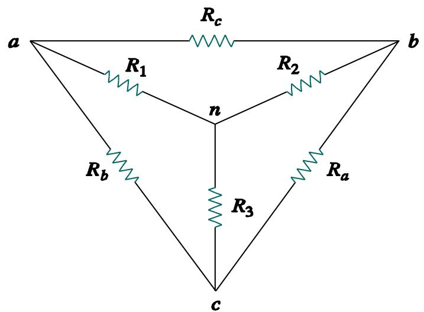

Fig. 2.49 Superposition of Yand  networks as an aid intransforming one to another

Each resister in the Y network is the product of the resistors in thetwo adjacent branches, divided by the sum of the threeresistors. 

# Wye to Delta Conversion

$$
R _ {a} = \frac {R _ {1} R _ {2} + R _ {2} R _ {3} + R _ {3} R _ {1}}{R _ {1}}
$$

$$
R _ {b} = \frac {R _ {1} R _ {2} + R _ {2} R _ {3} + R _ {3} R _ {1}}{R _ {2}}
$$

$$
R _ {c} = \frac {R _ {1} R _ {2} + R _ {2} R _ {3} + R _ {3} R _ {1}}{R _ {3}}
$$

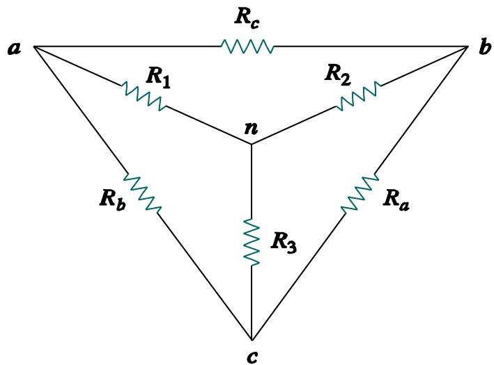

Fig. 2.49 Superposition of Yand  networks as an aid intransforming one to another

Each resistor in the network is the sum of all possible products of Y resistors taken two at a time ,divided by theopposite Y resistor.

# The Y and networks are said to be balanced when ：

$$
R _ {a} = R _ {b} = R _ {c} = R _ {\Delta}
$$

$$
R _ {1} = R _ {2} = R _ {3} = R _ {Y}
$$

$$
\begin{array}{l} R _ {Y} = \frac {R _ {D}}{3} \\ R _ {D} = 3 R _ {Y} \end{array}
$$

例2-14 将图2-50a所示的△电路变换为等效的Y电路。

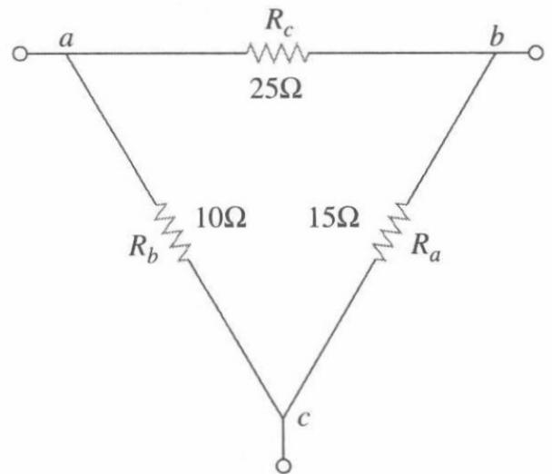

a）原始△电路

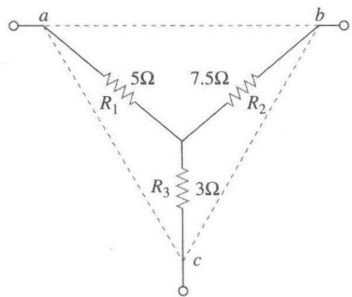

b）等效Y电路

$$
R _ {1} = \frac {R _ {b} R _ {c}}{R _ {a} + R _ {b} + R _ {c}} = \frac {1 0 \times 2 5}{1 5 + 1 0 + 2 5} = \frac {2 5 0}{5 0} = 5 (\Omega)
$$

$$
R _ {2} = \frac {R _ {c} R _ {a}}{R _ {a} + R _ {b} + R _ {c}} = \frac {2 5 \times 1 5}{5 0} = 7. 5 (\Omega)
$$

$$
R _ {3} = \frac {R _ {a} R _ {b}}{R _ {a} + R _ {b} + R _ {c}} = \frac {1 5 \times 1 0}{5 0} = 3 (\Omega)
$$

练习2-14将图2-51所示的Y电路变换为△电路。 答案： $R _ { a } = 1 4 0 \Omega , R _ { b } = 7 0 \Omega , R _ { c } = 3 5 \Omega$ $R _ { a } = 1 4 0 \Omega$ $R _ { c } = 3 5 \Omega$

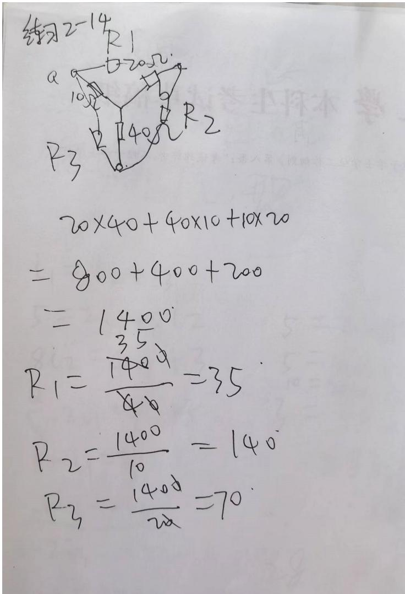

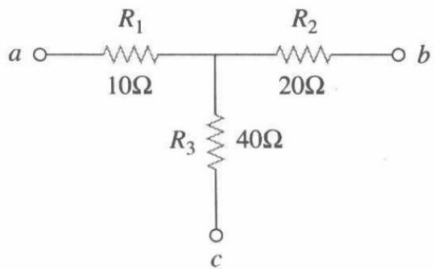

# EXAMPLE

Obtain the equivalent resistance Rab for the circuit in Fig.2.52and use it to find current i .

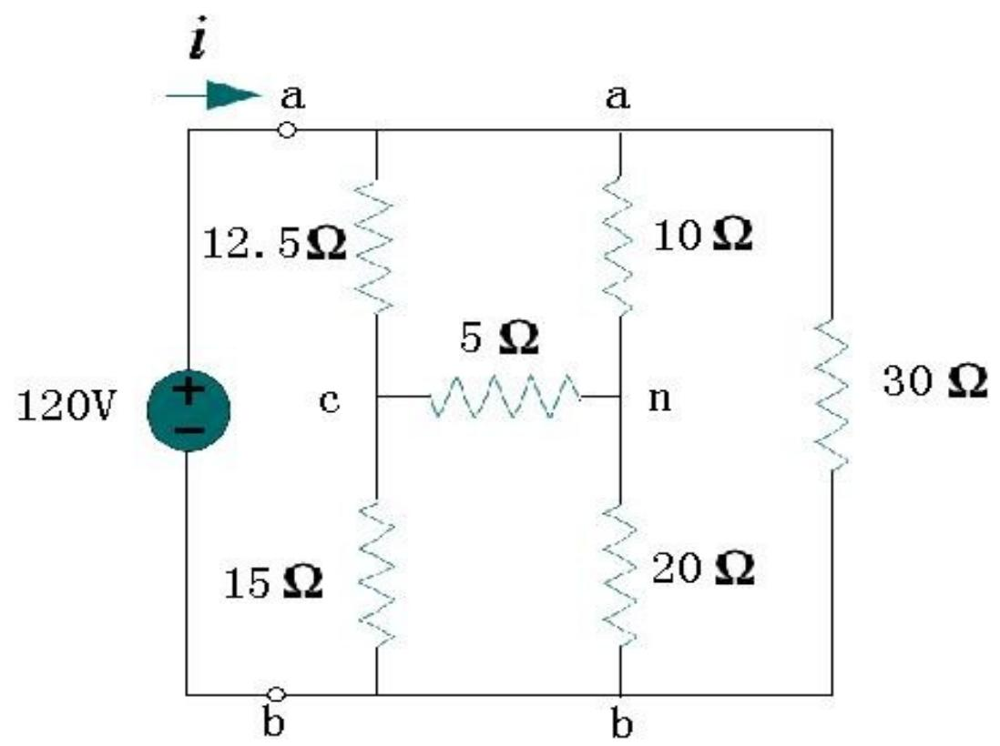

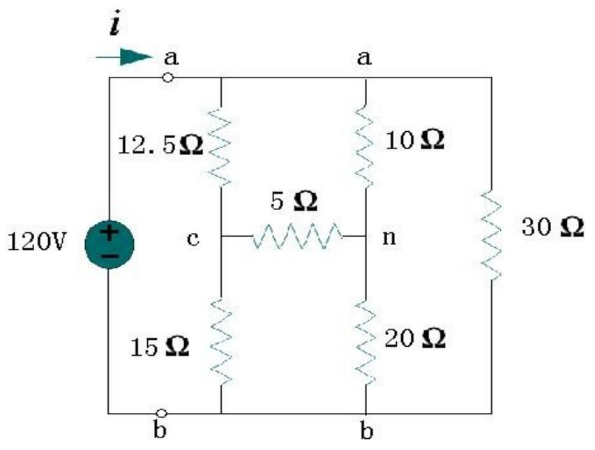

# Solution :

select R1=10 , R2=20 , R3=5

$$
\begin{array}{l} R _ {a} = \frac {R _ {1} R _ {2} + R _ {2} R _ {3} + R _ {3} R _ {1}}{R _ {1}} = \frac {1 0 \times 2 0 + 2 0 \times 5 + 5 \times 1 0}{1 0} \\ = \frac {3 5 0}{1 0} = 3 5 \Omega \\ \end{array}
$$

$$
R _ {b} = \frac {R _ {1} R _ {2} + R _ {2} R _ {3} + R _ {3} R _ {1}}{R _ {2}} = \frac {3 5 0}{2 0} = 1 7. 5 \Omega
$$

$$
R _ {\mathrm {c}} = \frac {R _ {1} R _ {2} + R _ {2} R _ {3} + R _ {3} R _ {1}}{R _ {3}} = \frac {3 5 0}{5} = 7 0 \Omega
$$

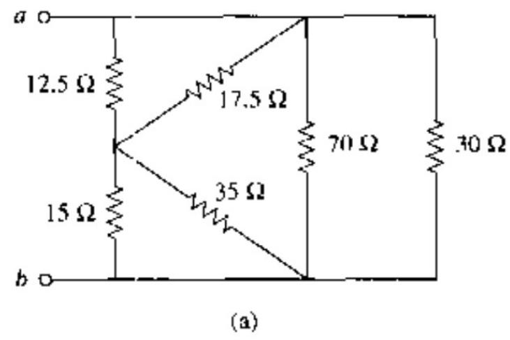

$$
7 0 \left\| 3 0 \right. = \frac {7 0 \times 3 0}{7 0 + 3 0} = 2 1 \Omega
$$

$$
1 2. 5 \left\| 1 7. 5 \right. = \frac {1 2 . 5 \times 1 7 . 5}{1 2 . 5 + 1 7 . 5} = 7. 2 9 1 7 \Omega
$$

$$
1 5 \left\| 3 5 \right. = \frac {1 5 \times 3 5}{1 5 + 3 5} = 1 0. 5 \Omega
$$

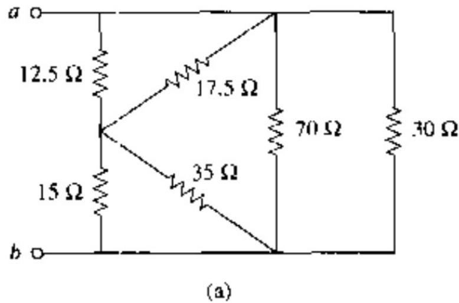

# Hence

$$
R _ {a b} = (1 7. 2 9 2 + 1 0. 5) \| 2 1 = \frac {1 7 . 7 9 2 \times 2 1}{1 7 . 2 9 2 + 2 1} = 9. 6 3 2 \Omega
$$

Then

$$
i = \frac {v _ {s}}{R _ {a b}} = \frac {1 2 0}{9 . 6 3 2} = 1 2. 4 5 8 \mathrm {A}
$$

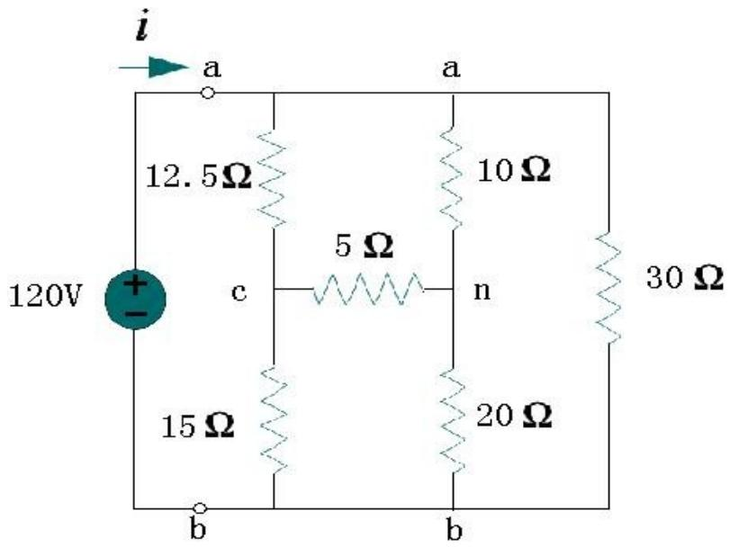

# EXAMPLE ( 还有别的解法吗？）

Obtain the equivalent resistance $R _ { \mathbf { a b } }$ for the circuit in Fig.2.52and use it to find current i .

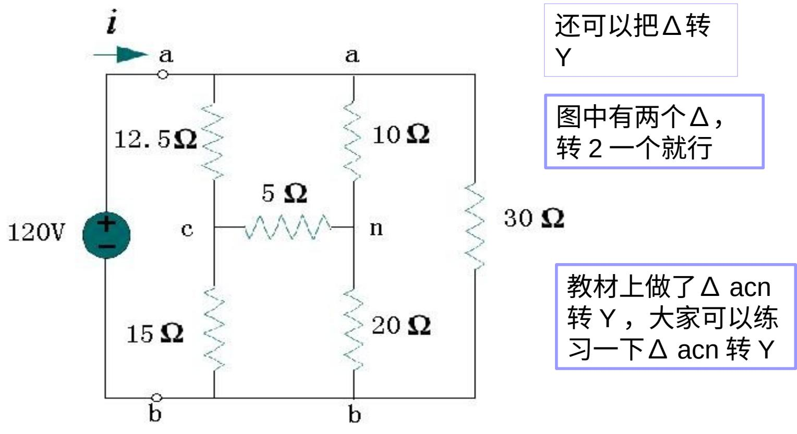

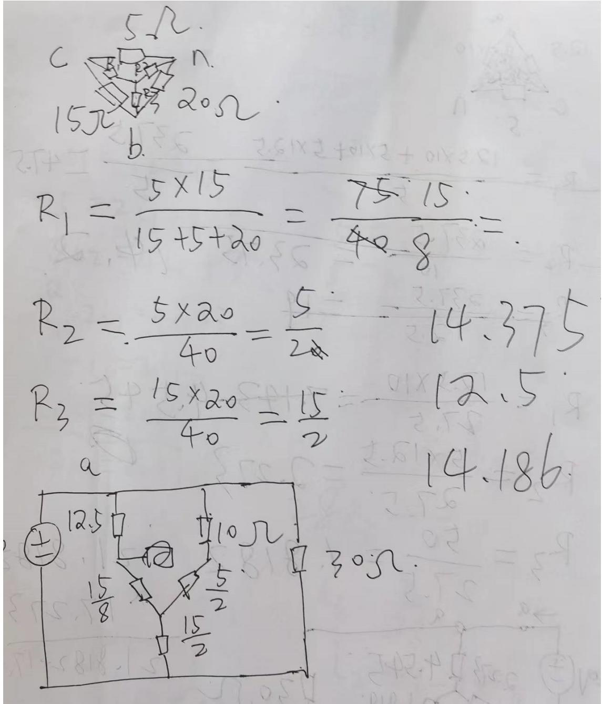

# 2.8 应用

串联连接容易实现，但实际上很少使用，其原他灯泡全都不亮；第二，维修困难，当一只灯泡出现问题时，必须逐个检查所有灯泡才能找到出问题的灯泡。

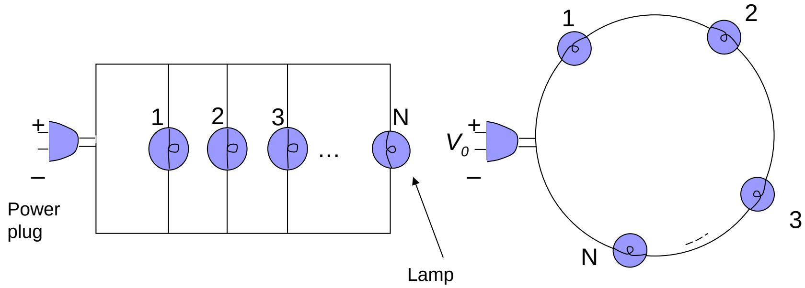

(a) 并联连接的灯泡

(b) 串联连接的灯泡

例2-16 $9 \mathrm { V }$ 电池相

连，试计算：（a)电池提供的总电流；（b)流过每支灯泡的电流；（c）每支灯泡的电阻。

解： I=9/R

$$
P = 4 5 W
$$

$$
\mathrm {I} = \mathrm {P} / \mathrm {V} = 4 5 / 9 = 5 (\mathrm {A})
$$

$$
I _ {1} = P / V = 2 0 / 9 = 2. 2 2 \quad (\mathrm {A})
$$

$$
1 2 = \mathrm {I} - \mathrm {I} 1 = 5 - 2. 2 2 = 2. 7 8 \quad (\mathrm {A})
$$

$$
R _ {1} = P / I ^ {2} = 2 0 / (2. 2 2) ^ {2} = 4. 0 5 (\text {欧 姆})
$$

$$
R _ {2} = P / I ^ {2} = 1 5 / (2. 7 8) ^ {2} = 1. 9 4 (\text {欧 姆})
$$

$$
R _ {3} = P / I ^ {2} = 1 0 / (2. 7 8) ^ {2} = 1. 2 9 4 (\text {欧 姆})
$$

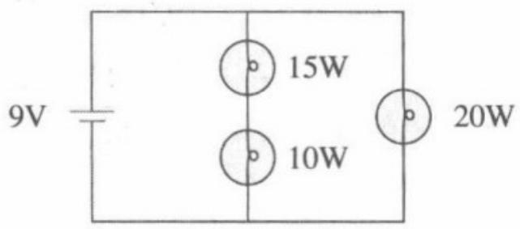

a）三只灯泡的照明系统

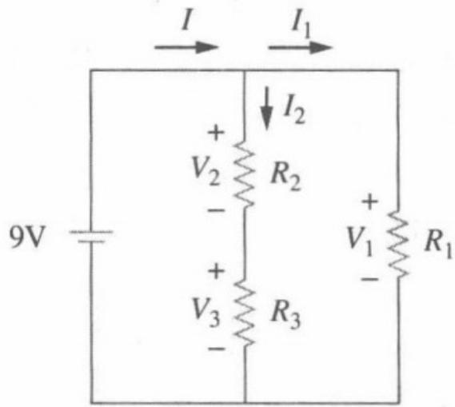

b）电阻等效电路模型

练习2-16如图2-55所示，假定有6只灯泡并联，6只灯泡串联，每只灯泡的额定功率为40W，如果电源插座

注意：书上红笔所画部分有错误。

上的电压对并联连接和串联连接两种情况都是115V，试计算在两种情况下流过每只灯泡的电压和电流。

解：（ 1 ）并联，

每个灯泡的电压都是 115V ；

$$
P = 4 0 \times 6 = 2 4 0 W
$$

$$
\mathrm {I} = \mathrm {P} / \mathrm {V} = 2 4 0 / 1 1 5 = 2. 0 9 (\mathrm {A})
$$

每个灯泡的电流 =2.09/6=0.35(A)

(2) 串联

每个电阻上的电压 =115/6=19.167V

电流 I=P/V=40/19.167=2.087(A)

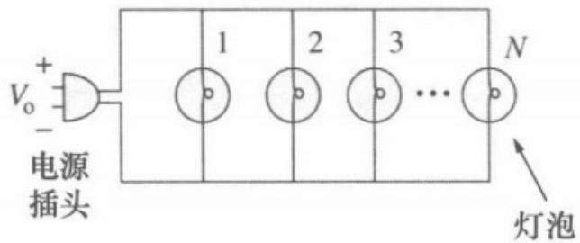

a）灯泡并联

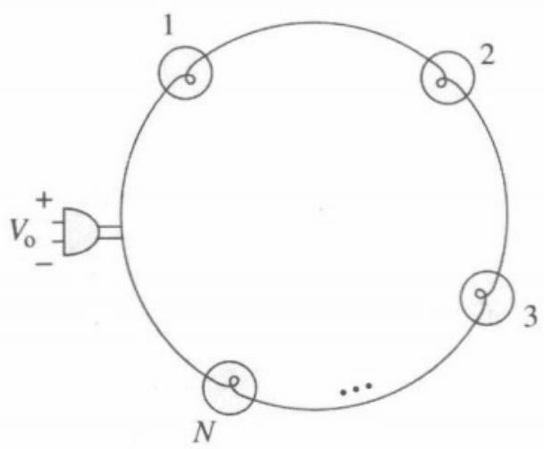

b）灯泡串联

# 直流电表的设计

电压表与负载并联

电流表与负载串联

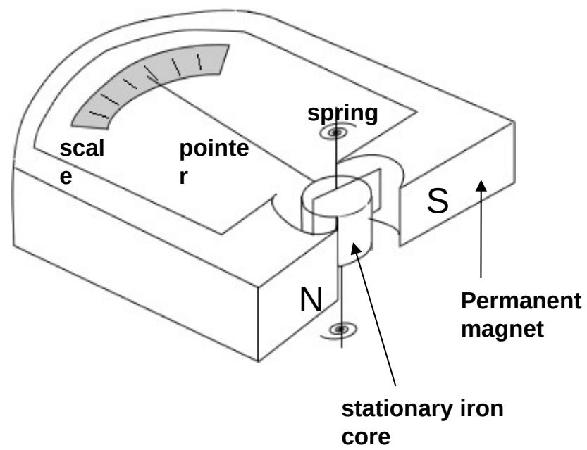

Figure 2.58 A d’Arsonval ( 达松伐尔 ) meter movement

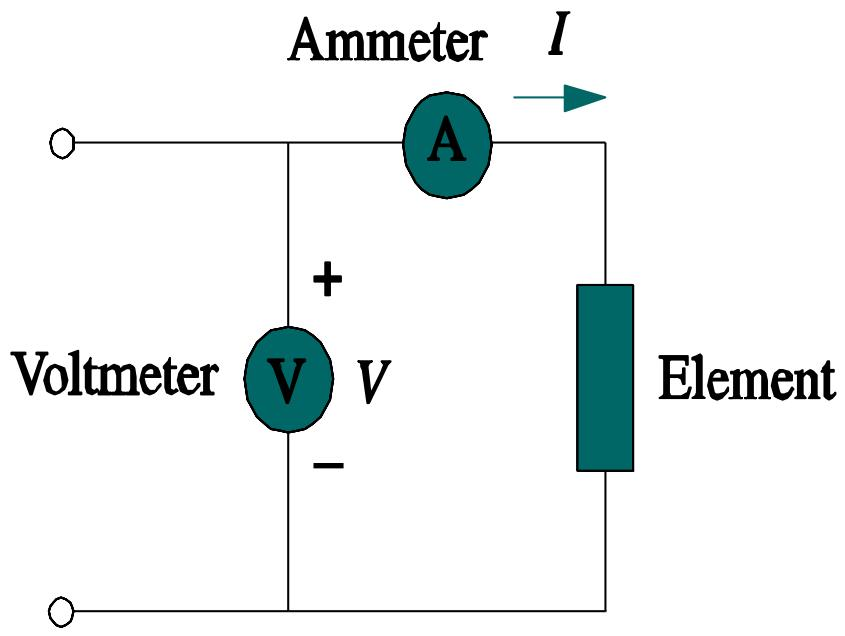

Figure 2.59 Connection of avoltmeter and an ammeter toan element

 达松伐尔测量转动装置是由一个安装在永磁体两极间枢轴上的可转动铁心线圈组成，当电流流经线圈时，产生转矩，使指针偏转。流过线圈电流的大小决定了指针偏转的幅度，并通过测量转动装置上附加的刻度指示出来。例如：当电表转动装置的额定值为1mA, 50欧时，线圈流过1mA的电流就会使电表转动装置发生满刻度偏转。

 在达松伐尔测量装置的基础上附加必要的电路，就可以构成电流比、电压表或者电阻表。这里提一下万用表：能够测量电压、电流和电阻的仪表是万用表

# Voltmeters

Mutiplier

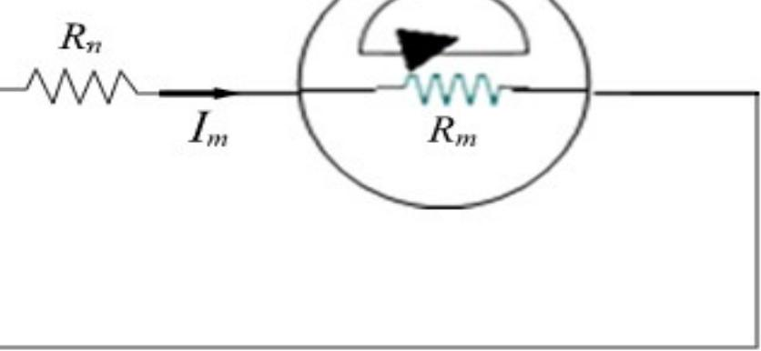

图 b 中 R3>R2>R1 ，电阻越大，上面分得的电压越大，量程越大

Mutiplier: 量程扩展

电压表串联Rm,其阻值理论上为无穷大，以使得分流趋于 0

$\mathbf { R } _ { 1 } , _ { \mathrm { ~ 2 ~ 3 ~ } }$ 的关系？

R3>R2>R1

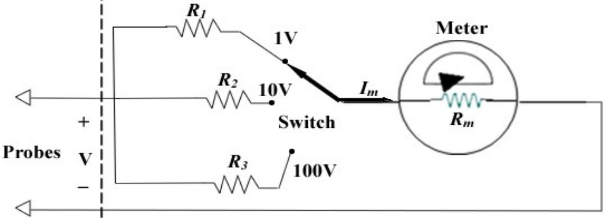

Figure2.60 Voltmeters: (a) single-range type, (b) multiple-range type

$$
V _ {\mathrm {f s}} = I _ {\mathrm {f s}} \left(R _ {n} + R _ {\mathrm {m}}\right)
$$

$$
R _ {n} = \frac {V _ {\mathrm {f s}}}{I _ {\mathrm {f s}}} - R _ {\mathrm {m}}
$$

Rn 与 Rm 串联。

量程越大， Rn 越大

图 b 中 R3>R2>R1 ，电阻越大，上面分得的电压越大，量程越大。

Mutiplier: 量程扩展

# Ammeters ( 电流表 )

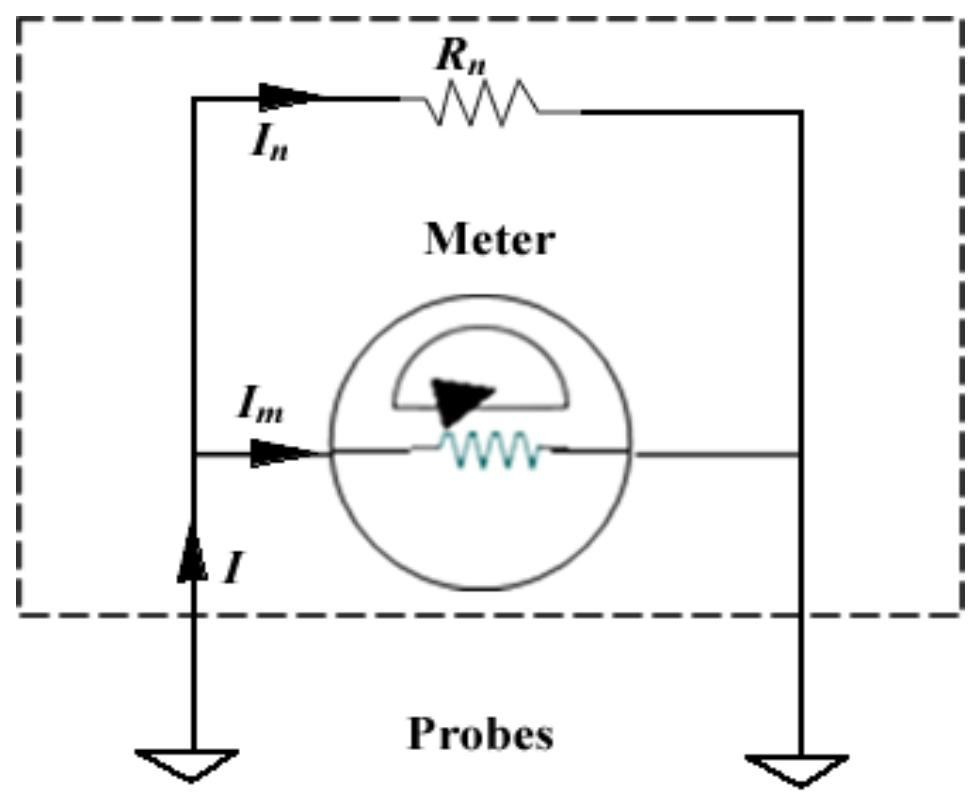

$R _ { 1 ^ { \bullet } 2 ^ { \bullet } 3 }$ R1,2,3 的关系？ R1>R2>R3

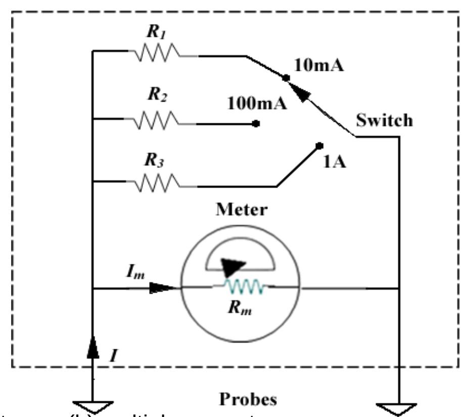

Figure 2.61 Ammeters: (a) single-range type, (b) multiple-range type

电流表由达松伐尔转动装置与一阻值为R的电阻并联构成，

电流表并联 Rm, 其阻值理论上为 0 ，以使得分压趋于 0

$$
\begin{array}{l} I _ {\mathrm {m}} = \frac {R _ {n}}{R _ {n} + R _ {\mathrm {m}}} I _ {\mathrm {f s}} \\ R _ {n} = \frac {I _ {\mathrm {m}}}{I _ {\mathrm {f s}} - I _ {\mathrm {m}}} R _ {\mathrm {m}} \\ \end{array}
$$

量程越大， Rn 约小

# Measuring Resistance

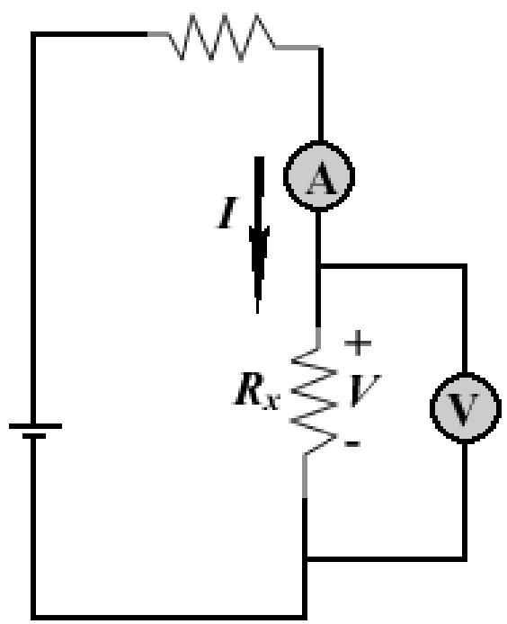

(a)

（测电阻需要内置电源）

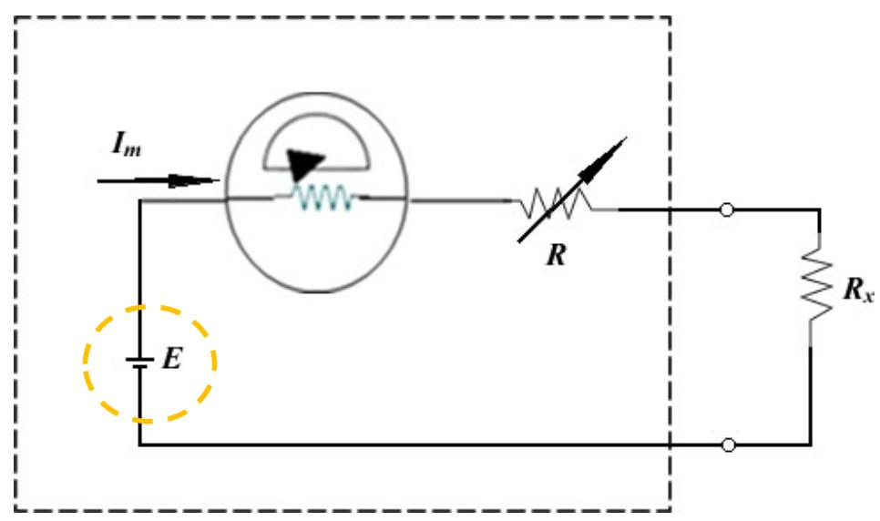

(b)

Figure 2.62 Two ways of measuring resistance:

(a) using an ammeter and a voltmeter, (b) using an ohmmeter ( 欧姆表 ).

线性电阻阻值 $R _ { x }$ 的测量方法有两种：一种是间接测量方法，如图2-62a所示，用电流表与该电阻串联，测量流过它的电流 $I ,$ 再用电压表并联在该电阻两端，测出它的电压V，从而得到：

$$
R _ {x} = \frac {V}{I} \tag {2.62}
$$

另一种测量电阻的直接方法是采用电阻表。电阻表由达松伐尔转动装置、可变电阻或电位器以及电池组成，如图2-62b所示。对图2-62b所示的电路应用KVL有：

$$
E = (R + R _ {\mathrm {m}} + R _ {x}) I _ {\mathrm {m}}
$$

即

$$
R _ {x} = \frac {E}{I _ {\mathrm {m}}} - (R + R _ {\mathrm {m}}) \tag {2.63}
$$

选取的电阻 $R$ 应使得电表满刻度偏转，即当 $R _ { x } = 0$ $I _ { \mathrm { m } } = I _ { \mathrm { f s } }$ 。这意味着：

$$
E = (R + R _ {\mathrm {m}}) I _ {\mathrm {f s}} \tag {2.64}
$$

$$
R _ {x} = \left(\frac {I _ {\mathrm {f s}}}{I _ {\mathrm {m}}} - 1\right) (R + R _ {\mathrm {m}}) \tag {2.65}
$$

例2-17 根据图2-60所示电压表的结构，试设计如下多量程电压表：

假设内阻 $R _ { \mathrm { m } } = 2 \mathrm { k } \Omega$

解：

$$
V _ {\mathrm {f s}} = I _ {\mathrm {f s}} \left(R _ {n} + R _ {\mathrm {m}}\right)
$$

$$
R _ {n} = \frac {V _ {\mathrm {f s}}}{I _ {\mathrm {f s}}} - R _ {\mathrm {m}}
$$

(a) Rn=1/0.1-2=8kƱ

(b)Rn=5/0.1-2=48kƱ

(c)Rn=50/0.1-2=498kƱ

(d)Rn=100/0.1-2=998kƱ

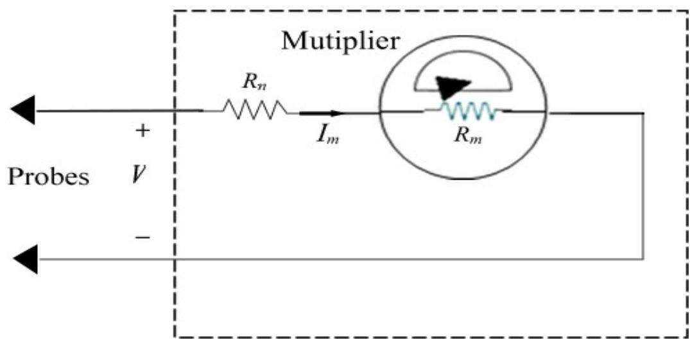

练习2-17根据图2-61所示电流表的结构，试设计如下多量程电流表：

假设满量程电流 $I _ { \mathrm { m } } { = } 1 \mathrm { m A }$ 且电流表的内阻 $R _ { \mathrm { m } } = 5 0 \Omega$

解： (a)Rn=(0.001x50)/(1-0.001)

$$
= 5 0 m \Omega
$$

(b)Rn=(1x50)/(100-1)

$$
= 5 0 5 \mathrm {m} \text {O}
$$

(c)Rn=(1x50)/(10-1)

$$
= 5. 5 5 6 \mathrm {m} \overline {{\mathrm {O}}}
$$

$$
I _ {\mathrm {m}} = \frac {R _ {n}}{R _ {n} + R _ {\mathrm {m}}} I _ {\mathrm {f s}}
$$

$$
R _ {n} = \frac {I _ {\mathrm {m}}}{I _ {\mathrm {f s}} - I _ {\mathrm {m}}} R _ {\mathrm {m}}
$$

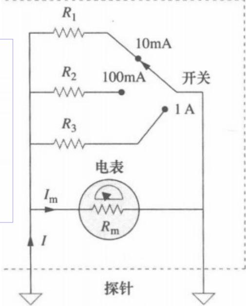

b）多量程

答案：分流电阻分别为： $5 0 \mathrm { m } \Omega$

# 2.9 本章小结

电阻是电路中的无源元件，其两端的电压 v 和流过它的电流 i 成正比，即欧姆定律（注意关联参考方向） 【 VCR 】：

$$
\boldsymbol {v} = \boldsymbol {i} \boldsymbol {R}
$$

其中R为电阻的阻值。

短路电路：阻值为零的电阻 $\mathbf { ( R = 0 }$ ，即理想的导线 ) 。开路电路是阻值为无穷大 ( $R { = } \infty )$ 的电阻。

电阻的电导 G 为该电阻阻值的导数 :1

$$
G = \frac {F}{R}
$$

支路为电路中的单个二端元件，节点为两条或者两条以上支路的连接点，回路为电路中的闭合路径。

基尔霍夫电流定律 (KCL) 表明：任意一个节点电流的代数和为零。换言之： 流入该节点的电流之和等于流出该节点的电流之和。

$$
\sum_ {n = 1} ^ {N} i _ {n} = 0
$$

 基尔霍夫电压定律(KVL)表明： 任意闭合路径上的电压的代数和为零。换言之：回路中的电压升之和等于电压降之和。

$$
\sum_ {m = 1} ^ {M} v _ {m} = 0
$$

首尾顺序连接的两个元件称为串联。流过串联元件的电流相同 $( i _ { 1 } { = } i _ { 2 } )$ . 两端连接到相同两个节点上的两个元件称为并联。并联元件两端的电压相同 $( \nu _ { 1 } { = } \nu _ { 2 } )$ .

当两个电阻 $\pmb { R } _ { 1 } ( = \pmb { 1 } / \pmb { G } _ { 1 } )$ and $\pmb { R } _ { 2 } \left( = \pmb { 1 } / \pmb { G } _ { 2 } \right)$ 串联连接时 , 它们的等效电阻 $ { R _ { e q } }$ 或等效电导 $\mathbf { G } _ { o a }$ 为

$$
R _ {e q} = R _ {1} + R _ {2}, \qquad G _ {e q} = \frac {G _ {1} G _ {2}}{G _ {1} + G _ {2}}
$$

当两个电阻 $\pmb { R } _ { 1 } ( = \pmb { 1 } / \pmb { G } _ { 1 } )$ 和 R2 $\bf ( = 1 / G _ { 2 } )$ 并联连接时 , 它们的等效电阻 $ { R _ { e q } }$ 或等效电导 $G _ { e q }$ 为

$$
R _ {e q} = \frac {R _ {1} R _ {2}}{R _ {1} + R _ {2}}, \qquad G _ {e q} = G _ {1} + G _ {2}
$$

两个串联电阻的分压原理可表示为：

$$
v _ {1} = \frac {R _ {1}}{R _ {1} + R _ {2}} v,
$$

$$
v _ {1} = \frac {R _ {2}}{R _ {1} + R _ {2}} v
$$

两个并联电阻的分流原理可表示为：

$$
i _ {1} = \frac {R _ {2}}{R _ {1} + R _ {2}} i,
$$

$$
i _ {2} = \frac {R _ {1}}{R _ {1} + R _ {2}} i
$$

The formulas for a delta-to-wye transformation are

$$
R _ {1} = \frac {R _ {b} R _ {c}}{R _ {a} + R _ {b} + R _ {c}},
$$

$$
R _ {2} = \frac {R _ {c} R _ {a}}{R _ {a} + R _ {b} + R _ {c}},
$$

$$
R _ {3} = \frac {R _ {a} R _ {b}}{R _ {a} + R _ {b} + R _ {c}}
$$

 The formulas for a wye-to delta transformation area a b ca b c

$$
R _ {a} = \frac {R _ {1} R _ {2} + R _ {2} R _ {3} + R _ {3} R _ {1}}{R _ {1}},
$$

$$
R _ {b} = \frac {R _ {1} R _ {2} + R _ {2} R _ {3} + R _ {3} R _ {1}}{R _ {2}}
$$

$$
R _ {c} = \frac {R _ {1} R _ {2} + R _ {2} R _ {3} + R _ {3} R _ {1}}{R _ {3}}
$$

# 本章重点及难点

理解电路中 “等效” 的概念（ VCR ）；

学会看电路拓朴结构，加强计算等效电阻的能力；

理解拓扑约束和元件约束；

进一步理解关联参考方向 / 无源符号规则，欧姆定律、功率公式中正负号的数学意义和物理意义。

自学 2.7 小节 (Δ-Y) ：等效， 3 端 /4端元器件。

# 复习题

1电阻的倒数为：

$1 2 0 \mathrm { V }$热器的电阻为：

4一支2W、80kΩ的电阻安全工作时的最大电

$2 5 \mu \mathrm { A }$

5一个网络包括12条支路，8条独立回路。试问该网络中有几个节点？

6图2-63所示电路中的电流 $I$

4.支路为电路中的单个二端元件，节点为两条或两条以上支路的连接点，回路为电路中的闭合路径。电路中的支路数 $b$ 、节点数 $n$ 与独立回路满足如下关系：

$$
b = l + n - 1
$$

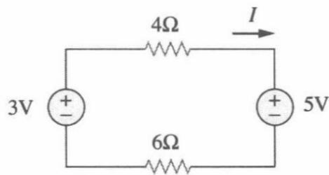

图2-63复习题6图

7图2-64中的电流 $I _ { \mathrm { o } }$

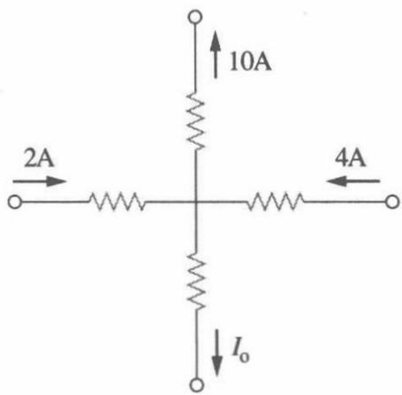

图2-64复习题7图

9图2-66中哪一个电路的 $V _ { a b } = 7 \mathrm { V ? }$

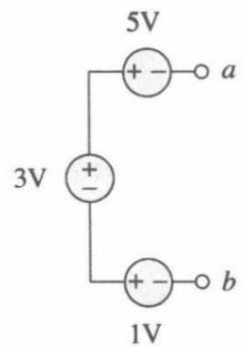

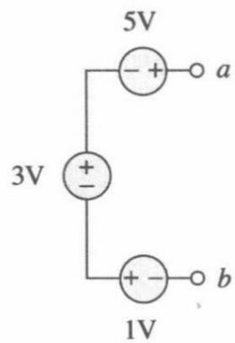

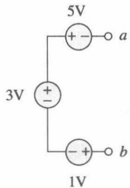

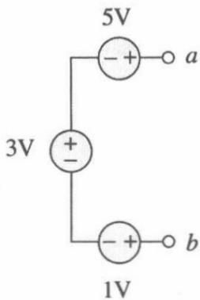

图2-66复习题9图

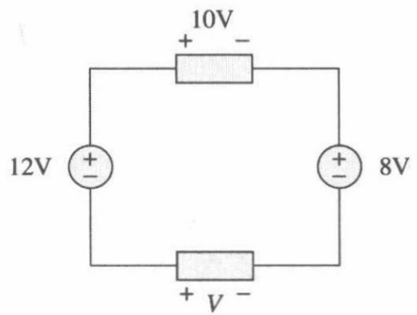

图2-65复习题8图

10在图2-67所示电路中， $R _ { 3 }$ 减小会导致以下哪个量减小：

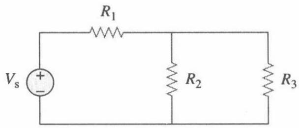

（a)流过 $R _ { 3 }$ 的电流

(b)R两端的电压

${ \bf \Pi } ( { \bf c } ) R _ { 1 }$ 两端的电压

(d)R消耗的功率

(e)以上选项均不正确

# 本章作业

 画出本章思维导图

2.33 （电压， 电流）

2.35 （电压， 电流）

2.41 （等效电阻）

2.74 （电机电流）

2.82 （电阻模块） （注意

集成块的封装边不要当成导线）

拓展题 ： 1. 如何仅依靠外观（视觉）判断电阻、电容、电感的阻（容、感）值，二级管、电解电容的极性？

2. 如何理解受控源是个电路模型？