# 第 3 章

# 分析方法

Fundamentals of Electric Circuit电路基础

# Scientists study the world asit is, engineers create the worldthat never has been.

— Theodore von Karman

# Fundamentals of Electric Circuit

# 拓扑约束

# 元件约束

KCL

KVL

VCR

I (i)

V (v)

P (p)

2 大基本法：

5 大定理：

元件（ R,C,L ）

电路（ DC,AC ）

暂态，稳态

时域，频域

电耦合，磁耦合

。

。

。

# 3.2 节点分析法

# (— 本节只含电流源 , 不含电压源 )

# 节点分析法 : 通过列节点电流方程，求得节点电压

确定节点电压的步骤 :

1. 选一个节点作为参考节点，以此点作为电压的参考电位，假设剩下的 n-1 个节点的电压为v1,,v2,……vn-1 。

2. 将基尔霍夫电流定律应用于 n-1 个非参考节点，并根据欧姆定律用电压来表示支路电流 .

3. 求解联立方程，得到未知节点电压 . （ (n-1) 个方程，解 (n-1) 个节点电压．）

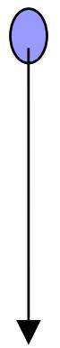

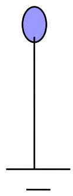

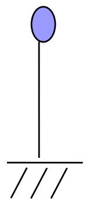

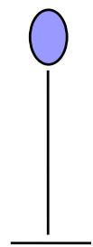

# 参考节点（地） 的常用符号

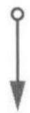

a）公共地

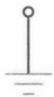

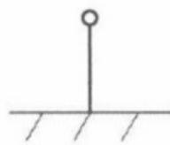

c）机壳地

# 例右图

1: 选定参考节点 ( 节点 O ，其 $\pmb { \nu } = \pmb { 0 } )$

2: 列写所有非参考节点的 KCL 方程：

注意：给假设的参数（ i1,i2 ）打标签！

节点 1

节点 2

3 ： VCR ： 1 0 ,vi -= $i _ { 1 } = \frac { v _ { 1 } - \ 0 } { R _ { _ { 1 } } } , i _ { 2 } = \frac { v _ { 1 } - \ v _ { 2 } } { R _ { _ { 2 } } } , i _ { 3 } = \frac { v _ { 2 } - \ 0 } { R _ { _ { 3 } } }$ 2 i = 1 2 , v v i - =

符号规则 : 在电阻中，电流从高电位（ + ）流向低电位（ - ）：

$$
i = \frac {V _ {\text {h i g h e r}} - V _ {\text {l o w e r}}}{R} = \frac {V _ {+} - V _ {-}}{R}
$$

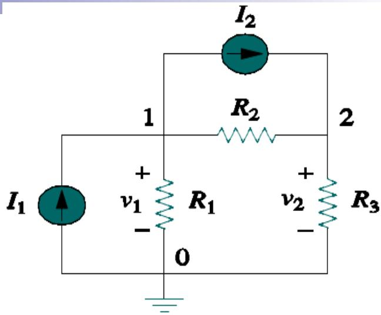

题图

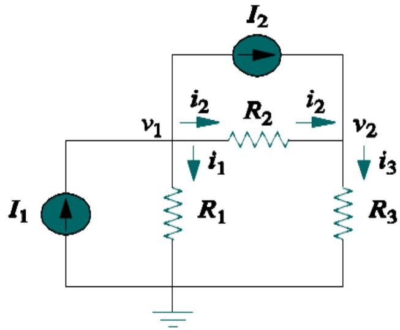

(b)

打标签！

例3-1 计算图3-3a所示电路中各节点的电压。

解： V1/2=5+(V1-V2)/4

$$
(\mathrm {V} 1 - \mathrm {V} 2) / 4 + 1 0 = \mathrm {V} 2 / 6 + 5
$$

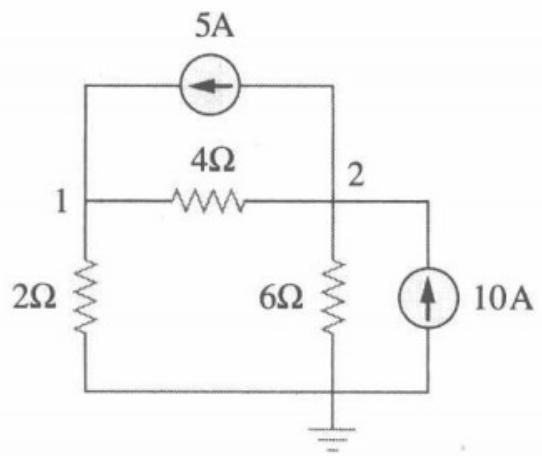

a）原始电路

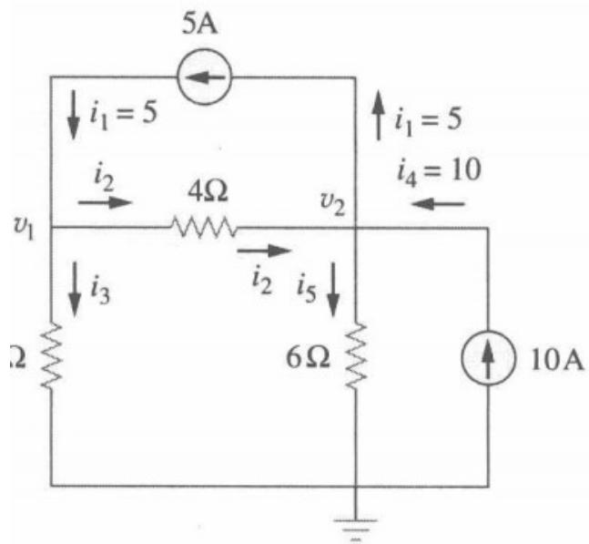

b）分析电路

练习3-1求图3-4所示电路的节点电压。

解： 14=v1/4+(v1-v2)/5

$$
(\mathrm {v} 1 \mathrm {- v} 2) / 5 = \mathrm {v} 2 / 5 + 7
$$

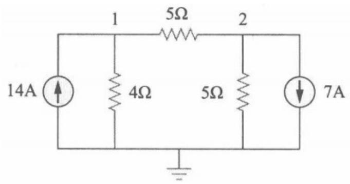

答案： $v _ { 1 } = 3 0 V , ~ v _ { 2 } = - 2 . 5 V$

# 例 3-2 ： （详

解）

# 确定图 (a) 中各节点的电压。

解： （标签 $+$ 原始方程！）

如图 (b) 所示：

选取参考节点 ; 假设节点电压 ; 标记电流

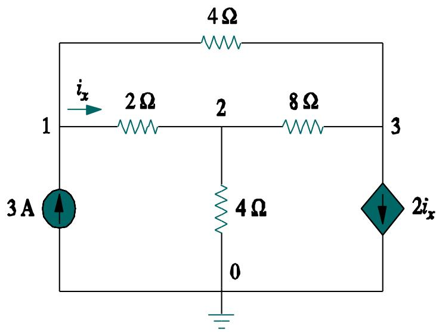

(a) 题图

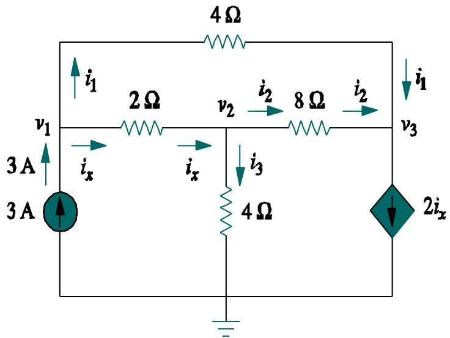

(b) 第 1 步：打标签

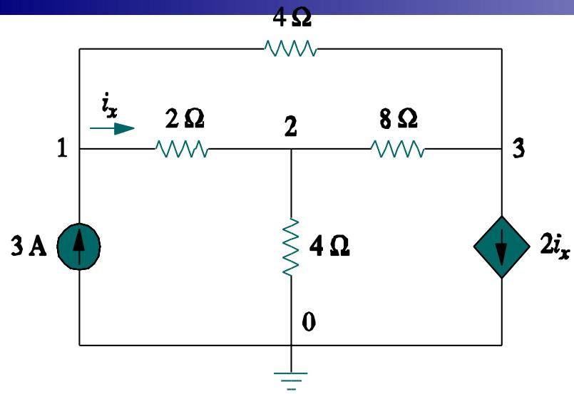

(a) 题图

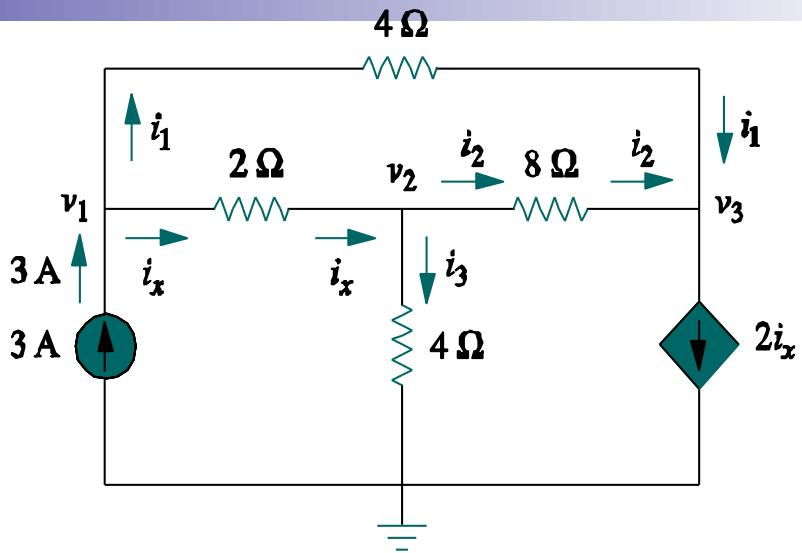

(b) 电路分析

x i    i 13 X

1i = 1 3v v-4

KCL 方程

② x 2 3

③ 1   2

VCR 方程

⑤ xi2

⑥

⑦ 2 0vi -=

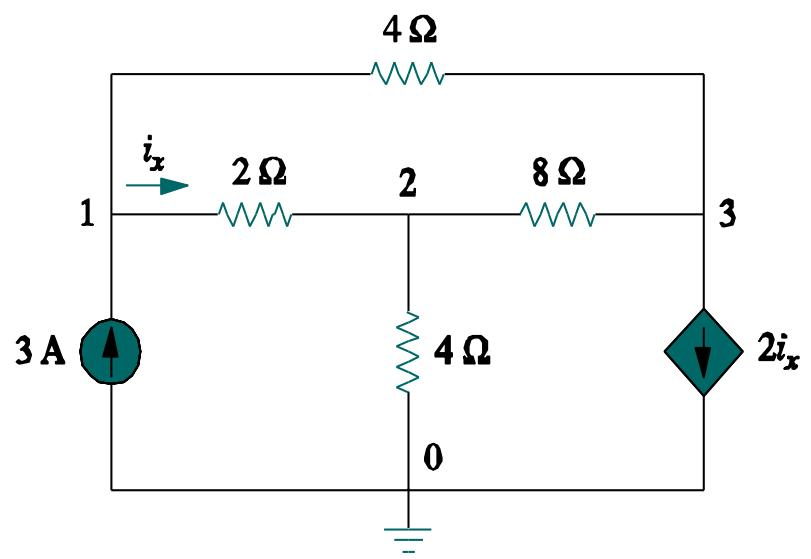

(a)

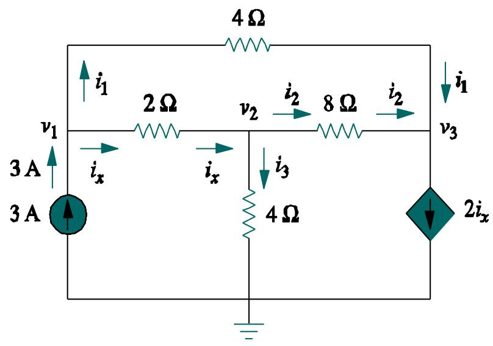

(b)

解方程组，得

$$
v _ {1} = 4. 8 \mathrm {V}, v _ {2} = 2. 4 \mathrm {V}, v _ {3} = - 2. 4 \mathrm {V}
$$

$$
i _ {1} = \ldots
$$

$$
i _ {2} = \ldots
$$

$$
i _ {3} = \ldots
$$

$$
i _ {x} = \dots
$$

练习 $\begin{array} { r l r } & { 3 { - } 2 } & { \ast \vert \ast \vert \ast \vert 3 { - } 6 ~ \vert 9 \vert \intercal \overrightarrow { \mathcal { M } } : \mathbb { H } \mathbb { H } \mathbb { H } = 1 } \\ & { \qquad } & { \ast \vert \ast \vert \ast \vert 3 \vert \ast \vert 3 \vert } \\ & { \circ } & { \ast \vert \ast \vert \ast \vert 3 \vert = 3 2 \mathrm { V } , } \end{array}$ 非参考节点的电压

$$
v _ {3} = 6 2. 4 \mathrm {V}
$$

解： 4= （ V1-V2)/3+(V1-V3)/2

$$
\mathrm {V} 2 / 4 = (\mathrm {V} 1 - \mathrm {V} 2) / 3 + 4 \mathrm {X} (\mathrm {V} 2 / 4)
$$

$$
\mathrm {V} 3 / 6 + 4 \mathrm {X} (\mathrm {V} 2 / 4) = (\mathrm {V} 1 - \mathrm {V} 3) / 2
$$

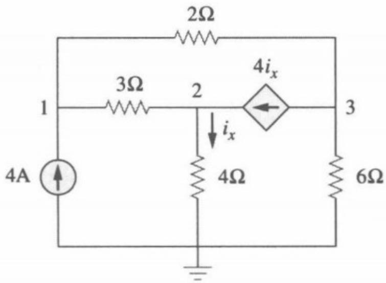

# 3.3 含电压源的节点分析法 （改）

超节点（广义节点）？

大道至简！

少即是多，以不变应万变。。。

举例

如图 , 求各节点电压。

解 :

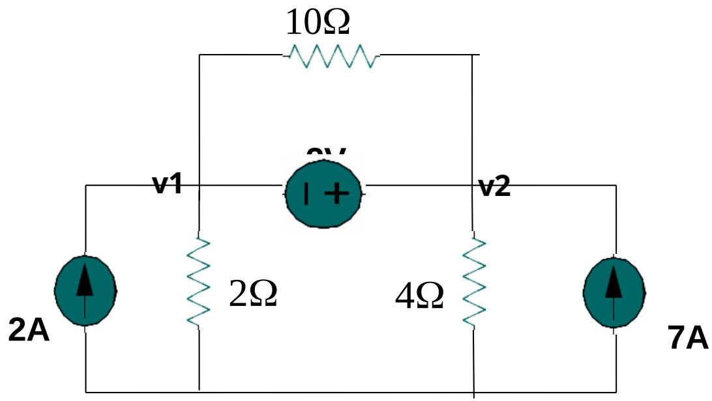

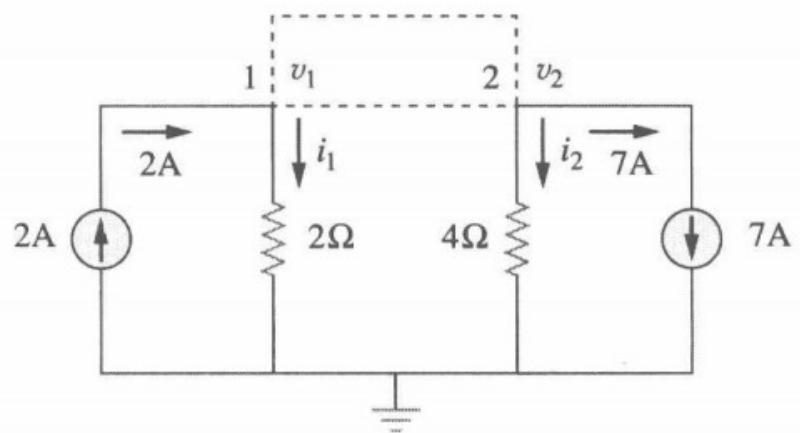

a）对超节点应用KCL

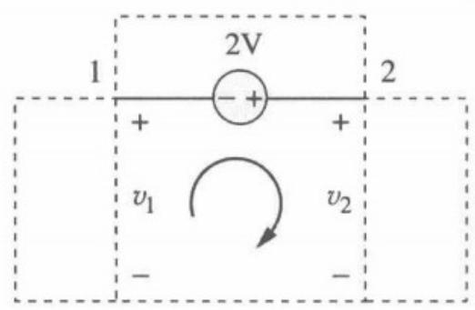

b）对回路应用KCL

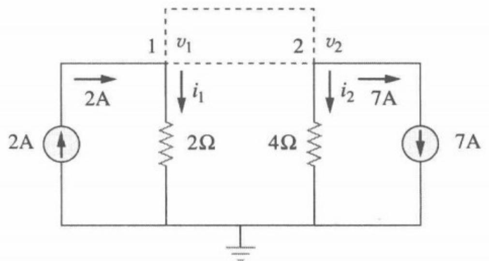

a）对超节点应用KCL

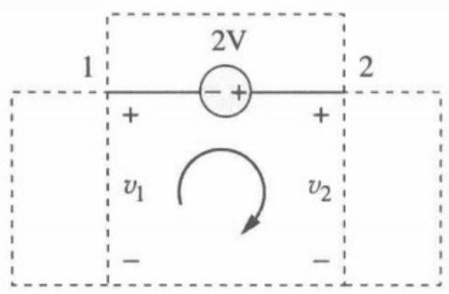

b）对回路应用KCL

$$
2 = i _ {1} + i _ {2} + 7
$$

$$
\begin{array}{l} 2 = \frac {v _ {1} - 0}{2} + \frac {v _ {2} - 0}{4} + 7 \quad \Rightarrow \quad 8 = 2 v _ {1} + v _ {2} + 2 8 \\ - v _ {1} - 2 + v _ {2} = 0 \quad \Rightarrow \quad v _ {2} = v _ {1} + 2 \\ \end{array}
$$

# 举例

如图 , 求节点电压。

# 解决方案 :

$$
v _ {2} - v _ {1} = 2
$$

③

④ 。。。

⑤ 。。。⑥ 。。。

⑦ 。。。

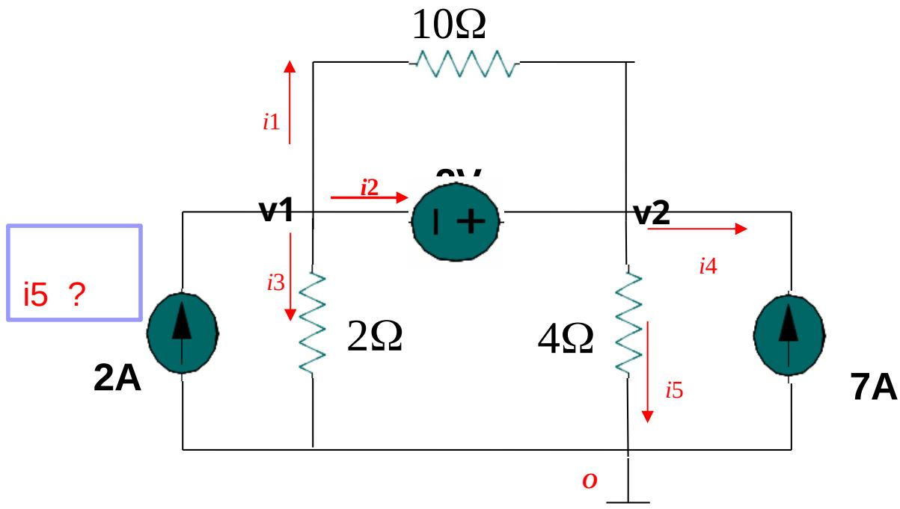

# 注意 :

1 ， 10Ω 电阻并联 2V 电源，原电路可化简为 .... ，前提是不影响外所求电路参数（即外电路等效）。

2 ， 2V 电压源上的电流 i2 。。。

# 练习3-3求图3-11所示电路中的v与i。

解：

$$
2 \mathrm {i} - \mathrm {V} = 6
$$

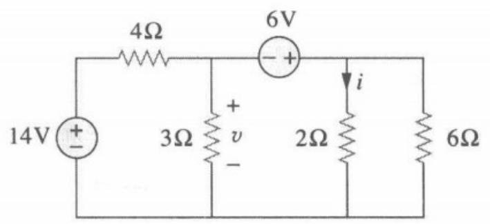

$$
(1 4 - \mathrm {V}) / 4 = \mathrm {V} / 3 + \mathrm {i} + 2 \mathrm {i} / 6
$$

答案：-400mV，2.8A

# 例题：求图 3.7 中各节点的电压？（堂练）

解： i1+i4=i2+i3

$$
(1 0 \mathrm {- V} 2) / 2 + (1 0 \mathrm {- V} 3) / 4 = \mathrm {V} 2 / 8 + \mathrm {V} 3 / 6
$$

$$
\mathrm {V 2 - V 3 = 5}
$$

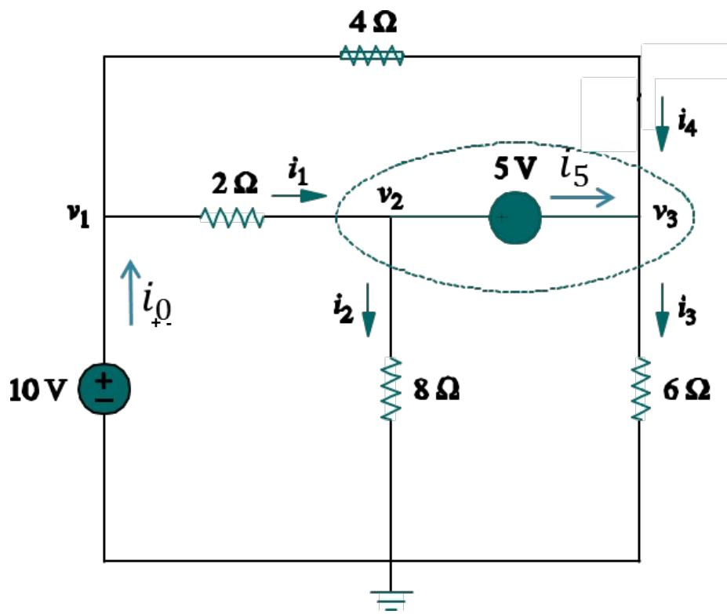

图 3.7 （堂练）

# 解决方案 : ( 原来的方案）

假设电压源电流 i5;

然后根据电压源特性增补方程：

$$
v 2 - v 3 = 5
$$

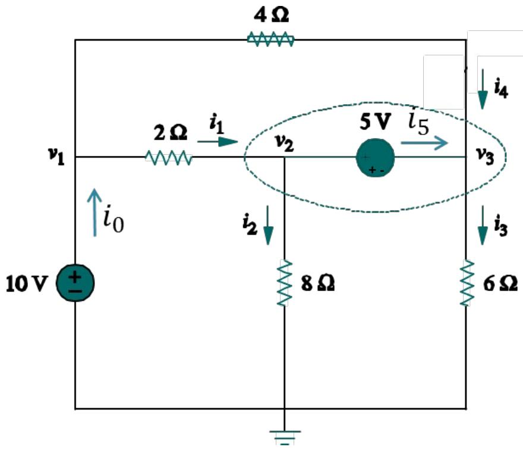

# 例3-4 求图3-12所示电路中的节点电压。

解： V1/2+(V1-V4)/3+(V2-V3)/6=10

$$
(\mathrm {V} 2 \mathrm {- V} 3) / 6 + (\mathrm {V} 1 \mathrm {- V} 4) / 3 = \mathrm {V} 3 / 4 + \mathrm {V} 4 / 1
$$

$$
\mathrm {V 1 - V 2 = 2 0}
$$

$$
\mathrm {V} 3 - \mathrm {V} 4 = 3 (\mathrm {V} 1 - \mathrm {V} 4)
$$

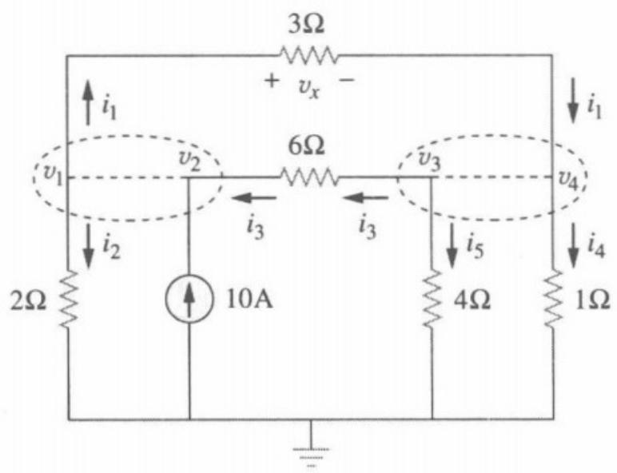

a）对两个超节点应用KCL

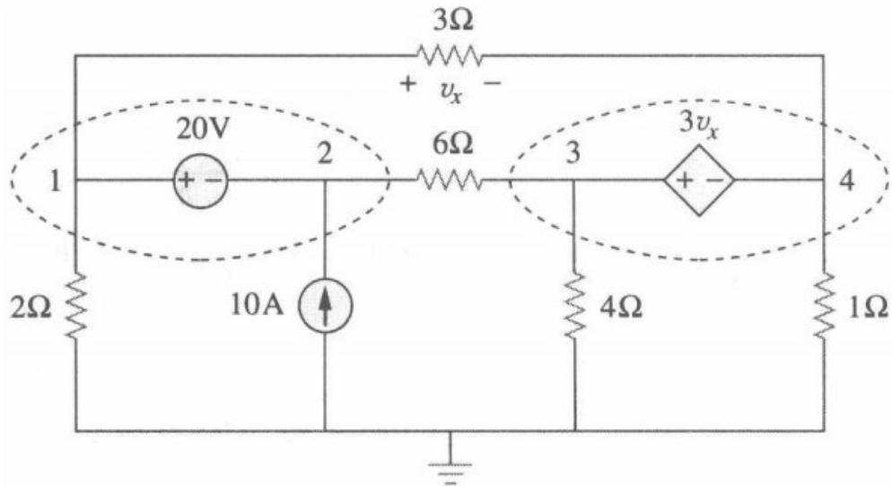

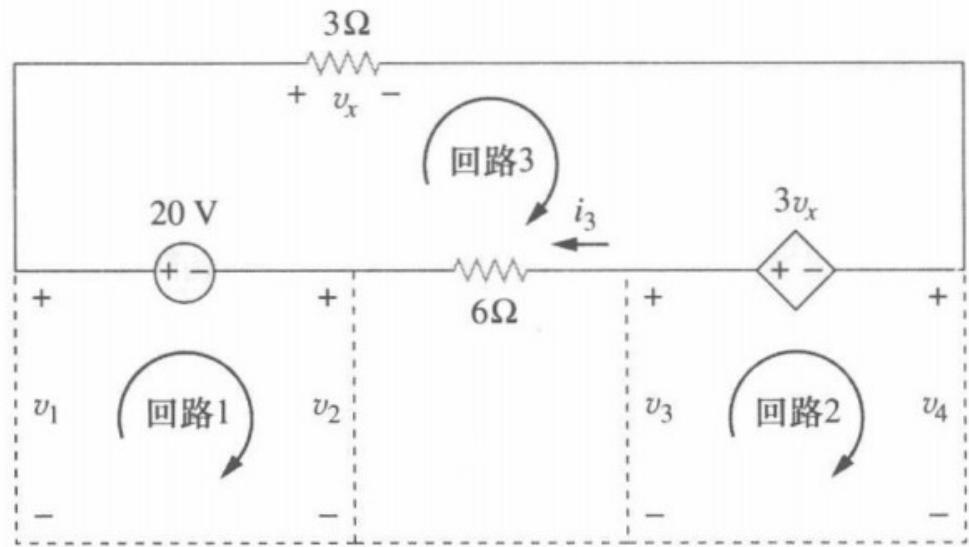

b）对回路应用KVL

解：

上课讨论。。。。

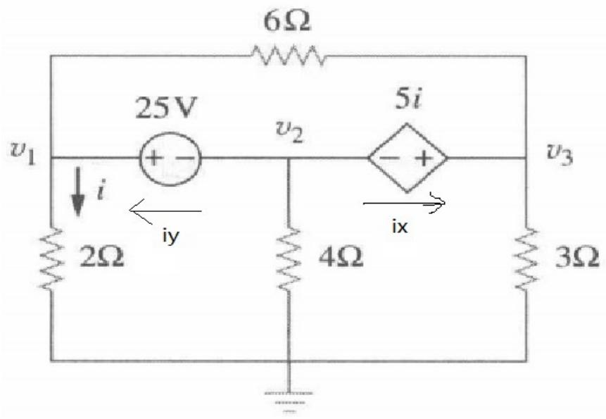

把两个电压源和 6Ω 电阻看成超节点，得到第一个式子

用克莱姆法则求解。

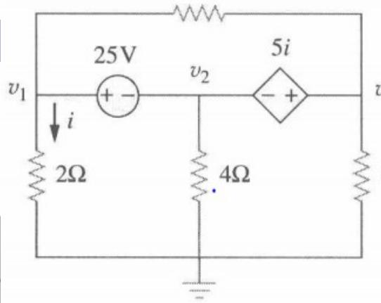

$$
\mathrm {回 路} 2: - V _ {2} - 5 i + V _ {3} = 0 \Rightarrow 0. 5 V _ {1} + 2 V _ {2} - 2 V _ {3} = 0
$$

$$
\Rightarrow \left[ \begin{array}{l l l} 6 & 3 & 4 \\ 0 & - 1 & 0 \\ 5 & 2 & - 2 \end{array} \right] \left[ \begin{array}{l} v _ {1} \\ v _ {2} \\ v _ {3} \end{array} \right] = \left[ \begin{array}{l} 0 \\ 2 5 \\ 0 \end{array} \right]
$$

$$
\Delta = 1 2 + 0 + 8 + 2 0 + 0 + 6 = 4 6
$$

$$
\Delta_ {1} = \left| \begin{array}{l l l} 0 & 3 & 4 \\ 2 5 & - 1 & 0 \\ 0 & 2 & - 2 \end{array} \right| = 0 + 0 + 2 0 0 + 0 + 0 + 1 5 0 = 3 5 0
$$

$$
\Delta_ {2} = \left| \begin{array}{l l l l} 6 & 0 & 4 \\ 1 & 2 5 & 0 \\ 5 & 0 & - 2 \end{array} \right| = - 3 0 0 + 0 + 0 - 5 0 0 + 0 + 0 = - 8 0 0
$$

$$
\Delta_ {3} = \left| \begin{array}{l l l} 6 & 3 & 0 \\ 1 & - 1 & 2 5 \\ 5 & 2 & 0 \end{array} \right| = 0 + 3 7 5 + 0 + 0 - 3 0 0 + 0 = 7 5
$$

$$
V _ {1} = \frac {3 5 0}{4 6} = 7. 6 0 8 V
$$

$$
V _ {2} = \frac {- 8 0 0}{4 6} = - 1 7. 3 9 V
$$

$$
V _ {3} = \frac {7 5}{4 6} = 1. 6 3 0 V.
$$

# 3.4 网孔分析法

列回路电压方程，求网孔电流（支路电流）

（本节讨论不带电流源，只含电压源的情况）

网孔

网孔是指不包含其他任何回路的一条回路。

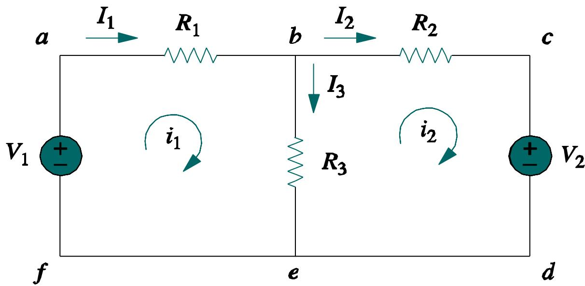

相邻网孔之间的支路电流 $=$ 相邻网孔的网孔电流的代数和

$$
I = \sum i
$$

确定网孔电流的步骤 :

1. 定义各个网孔的网孔电流

$$
i _ {1}, i _ {2}, \ldots , i _ {n}
$$

2. 应用基尔霍夫电压定律 于 n 个网孔。用欧姆定律以网孔电流来表示各个电压。

3 求解 n 个联立方程得到网孔电流 . 。

通常假定每个网孔电流都是顺时针流动的，左下角起始。

表示网孔电流，用 I 表示支路电流。

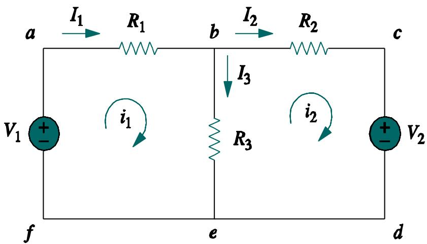

网孔 1,

$$
- V _ {1} + R _ {1} i _ {1} + R _ {3} (i _ {1} - i _ {2}) = 0
$$

网孔 2 ,

$$
R _ {3} \left(i _ {2} - i _ {1}\right) + R _ {2} i _ {2} + V _ {2} = 0
$$

2 个方程， 2 个未知数（ ），可解！ 1 2i , i $i _ { 1 } , i _ { 2 }$

# 举例 例 3-5 （堂练）

# （标签 $\cdot$ 原始方程！）

如下图 , 用网孔分析法求支路电流

$$
I _ {1}, I _ {\text {和}} \quad I _ {3}
$$

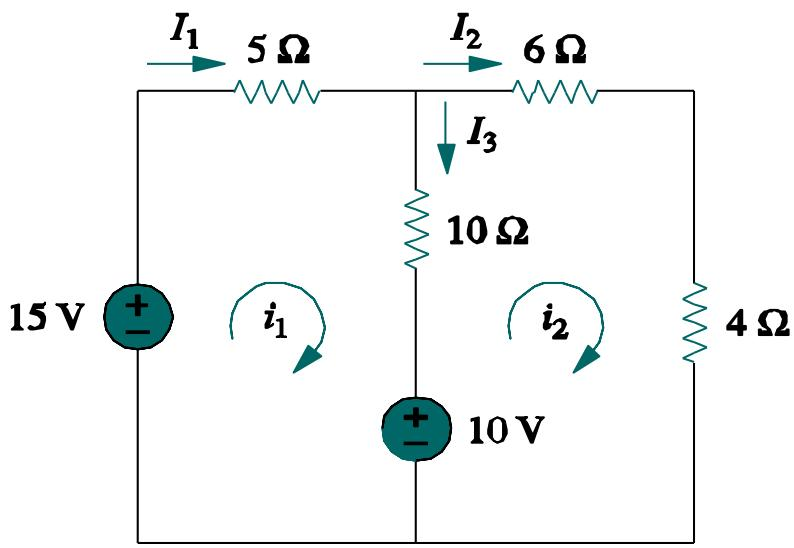

# 解决方案 :

网孔 1,

$$
- 1 5 + 5 i _ {1} + 1 0 \left(i _ {1} - i _ {2}\right) + 1 0 = 0
$$

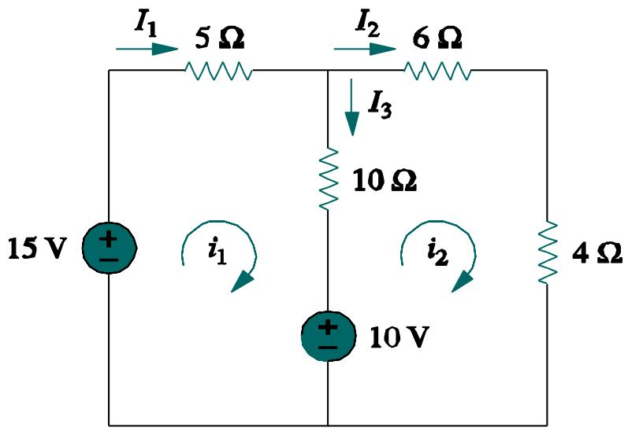

网孔 2,

$$
- 1 0 + 1 0 \left(i _ {2} - i _ {1}\right) + 6 i _ {2} + 4 i _ {2} = 0
$$

解得：

$$
i _ {2} = 1 \mathrm {A} i _ {1} = 1 \mathrm {A}
$$

$$
I _ {1} = i _ {1} = 1 \mathrm {A}, I _ {2} = i _ {2} = 1 \mathrm {A}, I _ {3} = i _ {1} - i _ {2} = 0
$$

练习3-5计算图3-19所示电路中的网孔电流 $i _ { 1 }$ $i _ { 2 }$

解：

$$
2 0 \mathrm {i} 1 - 1 0 \mathrm {i} 2 = 9 0
$$

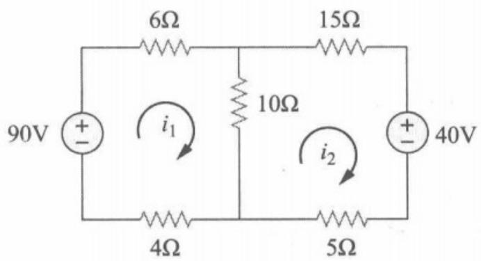

$$
- 1 0 \mathrm {i} 1 + 3 0 \mathrm {i} 2 = - 4 0
$$

答案： $i _ { 1 } = 4 . 6 \mathrm { A } , ~ i _ { 2 } = 2 0 0 \mathrm { m } i$ A

# 例 3-6 ： ( 堂练 )

用网孔分析法求图中的电流 i

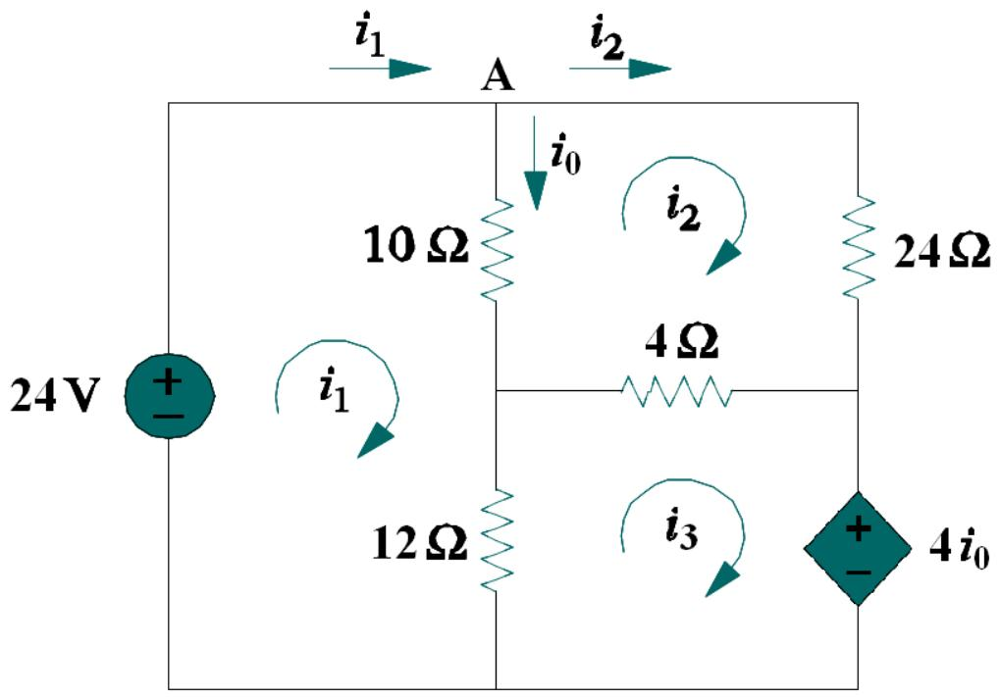

解决方案 $= 2 4 + 1 0 ( i _ { 1 } - i _ { 2 } ) + 1 2 ( i _ { 1 } - i _ { 3 } ) = 0$

网孔 1, $1 0 { \left( i _ { 2 } - \ i _ { 1 } \right) } + \ 2 4 i _ { 2 } + \ 4 { \left( i _ { 2 } - \ i _ { 3 } \right) } = \ 0$

网孔 3, $1 2 \big ( i _ { 3 } - i _ { 1 } \big ) + 4 \big ( i _ { 3 } - i _ { 2 } \big ) + 4 i _ { 0 } = 0$

网孔 2,

$$
\boldsymbol {i} _ {1} = \boldsymbol {i} _ {2} + \boldsymbol {i} _ {0}
$$

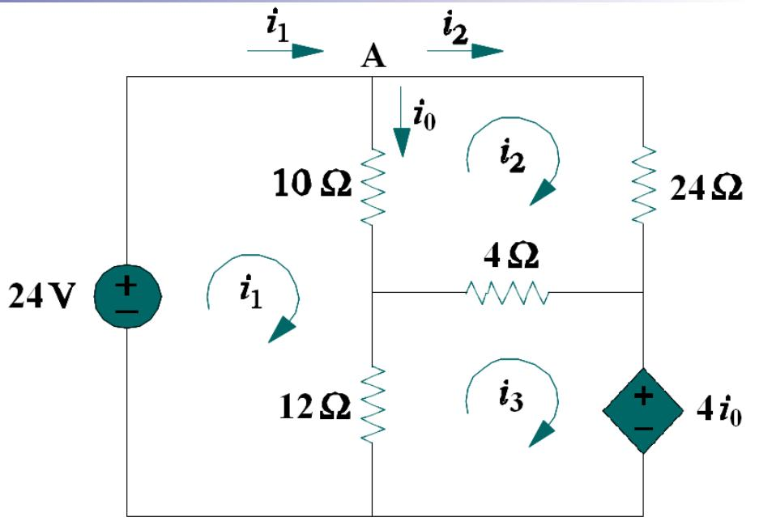

节点 A,

解得： i1 2.25A, i2 0.75A, i3 1.5A

$$
i _ {0} = i _ {1} - i _ {2} = 1. 5 \mathrm {A}
$$

$$
- 2 4 + 1 0 \left(i _ {1} - i _ {2}\right) + 1 2 \left(i _ {1} - i _ {3}\right) = 0
$$

即

$$
1 1 i _ {1} - 5 i _ {2} - 6 i _ {3} = 1 2
$$

$$
2 4 i _ {2} + 4 (i _ {2} - i _ {3}) + 1 0 (i _ {2} - i _ {1}) = 0
$$

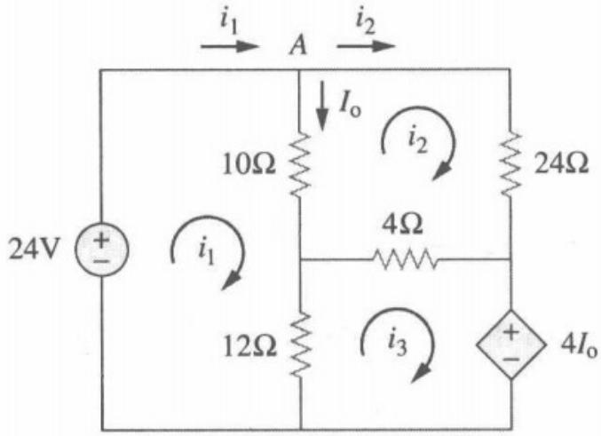

即

$$
- 5 i _ {1} + 1 9 i _ {2} - 2 i _ {3} = 0
$$

$$
4 I _ {\mathrm {o}} + 1 2 \left(i _ {3} - i _ {1}\right) + 4 \left(i _ {3} - i _ {2}\right) = 0
$$

但是在节点 $\mathrm { A }$ 处有 $I _ { \mathrm { o } } = i _ { 1 } - i _ { 2 }$

$$
4 \left(i _ {1} - i _ {2}\right) + 1 2 \left(i _ {3} - i _ {1}\right) + 4 \left(i _ {3} - i _ {2}\right) = 0
$$

即

$$
- i _ {1} - i _ {2} + 2 i _ {3} = 0
$$

$$
\left[ \begin{array}{r r r} 1 1 & - 5 & - 6 \\ - 5 & 1 9 & - 2 \\ - 1 & - 1 & 2 \end{array} \right] \left[ \begin{array}{l} i _ {1} \\ i _ {2} \\ i _ {3} \end{array} \right] = \left[ \begin{array}{l} 1 2 \\ 0 \\ 0 \end{array} \right]
$$

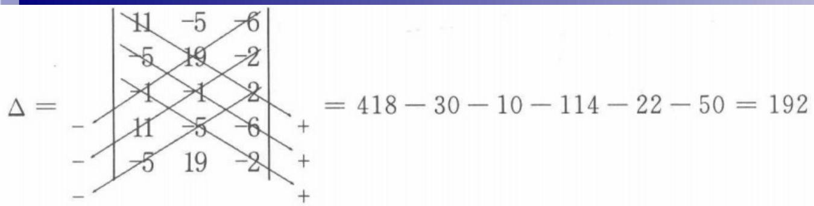

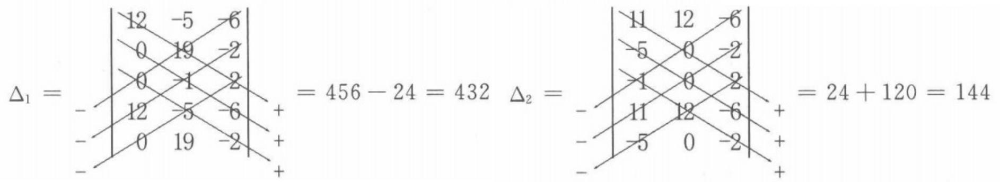

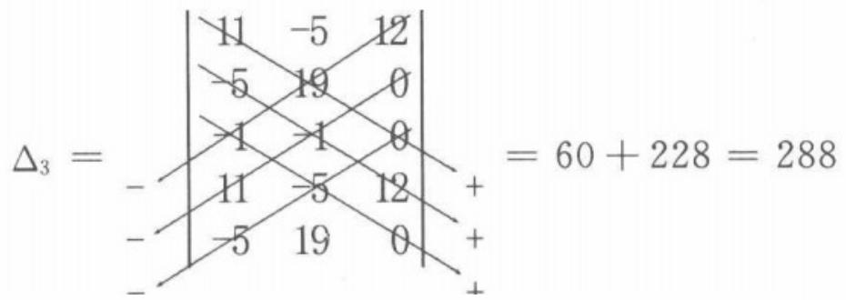

利用克莱姆法则计算的各网孔电流为：

$$
i _ {1} = \frac {\Delta_ {1}}{\Delta} = \frac {4 3 2}{1 9 2} = 2. 2 5 (\mathrm {A}), \quad i _ {2} = \frac {\Delta_ {2}}{\Delta} = \frac {1 4 4}{1 9 2} = 0. 7 5 (\mathrm {A}), \quad i _ {3} = \frac {\Delta_ {3}}{\Delta} = \frac {2 8 8}{1 9 2} = 1. 5 (\mathrm {A})
$$

$I _ { \mathrm { o } } = i _ { 1 } - i _ { 2 } = 1 .$

练习3-6利用网孔分析法计算图3-21所示电路中的I。。

解： 6x i1-2x i2-4xi3=16 (1)

$$
- 2 \mathrm {x i} 1 + 1 0 \mathrm {x i} 2 - 8 \mathrm {x i} 3 = 1 0 \mathrm {x i} 3
$$

$$
\left| \begin{array}{c c c} 6 & - 2 & - 4 \\ - 2 & 1 0 & 1 8 \\ - 4 & - 8 & 1 8 \end{array} \right| \left[ \begin{array}{l} i 1 \\ i 2 \\ i 3 \end{array} \right] + \overline {{1}} 8 x i 3 = \left| \begin{array}{c c c} 1 6 & - 2 & - 4 \\ 0 & 1 0 & 1 8 \\ 0 & - 8 & 1 8 \end{array} \right| \left| \begin{array}{c c c} 6 & 1 6 & - 4 \\ - 2 & 0 & - 1 8 \\ - 4 & 0 & 1 8 \end{array} \right| \left| \begin{array}{c c c} 6 & - 2 & 1 6 \\ - 2 & 1 0 & 0 \\ - 4 & - 8 & 0 \end{array} \right|
$$

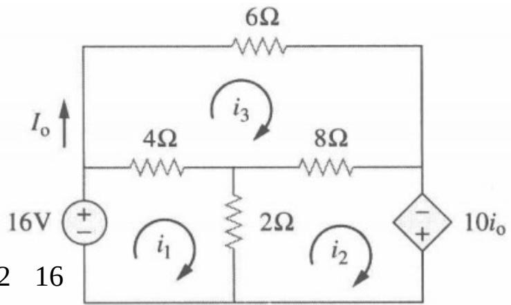

$$
\Delta = 6 0 \times 1 8 - 6 4 - 8 \times 1 8 - 1 6 0 - 4 \times 1 8 - 4 8 \times 1 8 = - 2 2 4
$$

$$
\Delta 1 = 1 6 0 \times 1 8 + 0 + 0 - 0 - 0 - 1 6 \times 8 \times 1 8 = 2 \times 1 8 = 3 6
$$

$$
\Delta 2 = 0 + 0 + 4 \times 1 6 \times 1 8 - 0 + 2 \times 1 6 \times 1 8 - 0 = 6 \times 1 6 \times 1 8 = 1 7 2 8
$$

$$
\Delta 3 = 0 + 2 \times 8 \times 1 6 + 0 + 4 0 \times 1 6 - 0 - 0 = 8 9 6
$$

# 3.5 含电流源的网孔分析法

（堂练）

①

$$
- 2 0 + 6 i _ {1} + 2 \left(i _ {1} - i _ {2}\right) + v _ {x} = 0
$$

$\textcircled{2}$

$$
- v _ {x} + 2 \left(i _ {2} - i _ {1}\right) + 1 0 i _ {2} + 4 i _ {2} = 0
$$

③

$$
i _ {2} - i _ {1} = 6
$$

（ 1 ）和（ 2 ）相加合并得：

$$
- 2 0 + 6 \mathrm {i} 1 + 1 4 \mathrm {i} 2 = 0,
$$

超网孔。和（ 3 ）式一起可以求得解。

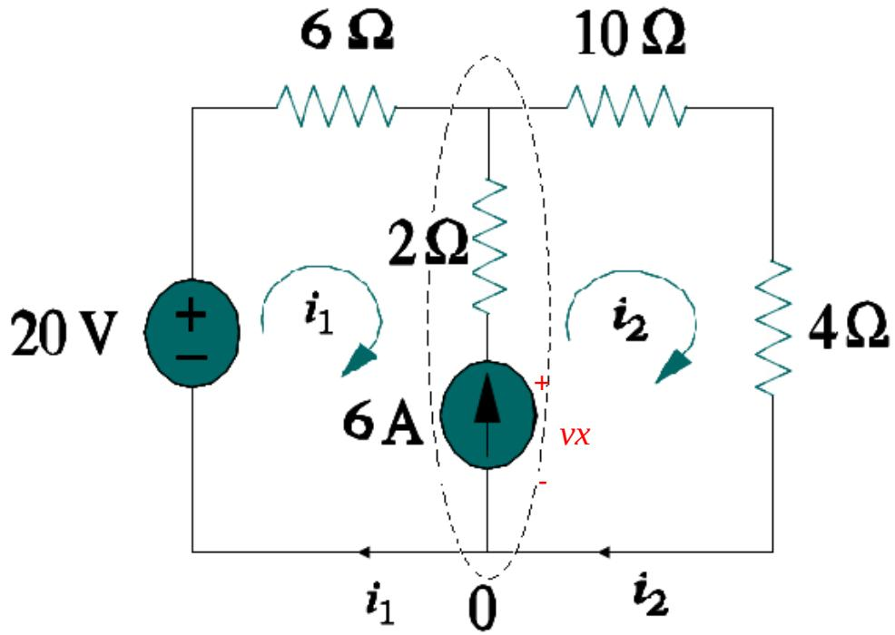

# 举例（例 3-7 ） ( 堂练 )

如图 , 用网孔分析法求 i1 、 i2 、 i3 、 i4.

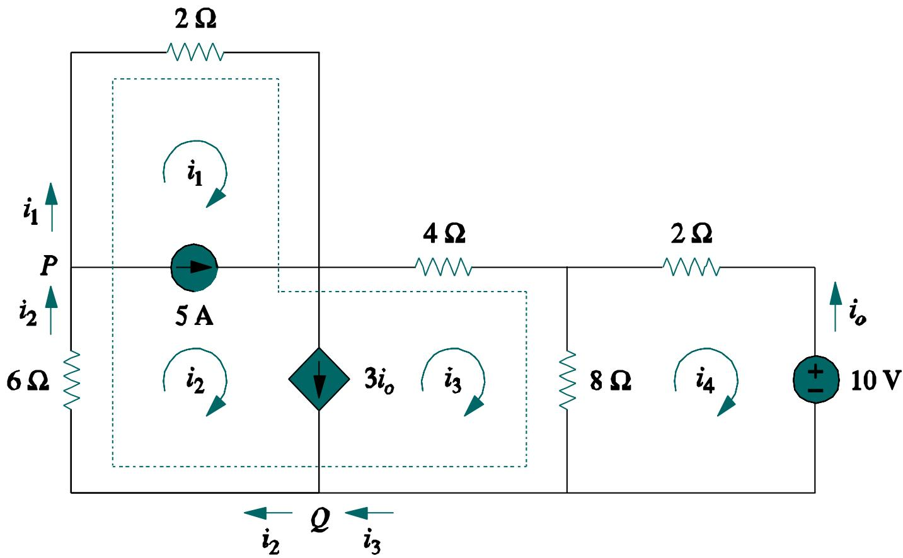

解：

假设 5A 和 3i0 这两个电流源的电压分别为 V1 和 V2

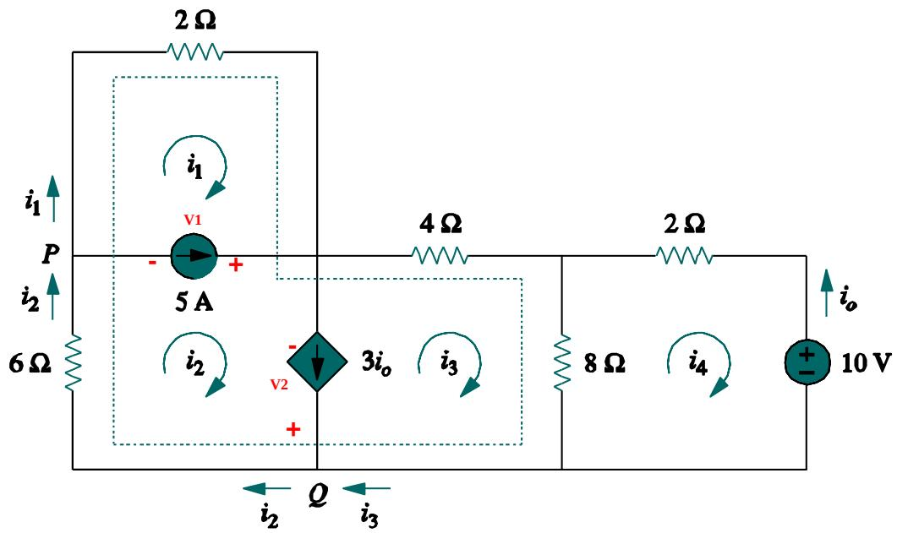

①

网孔 1 ：②

$$
2 i 1 + V 1 = 0
$$

③

网孔 2 ：

④

$$
6 i 2 - V 1 - V 2 = 0
$$

而 i0 = -i4⑤

电流源支路 :

⑥5A=i2-i1

⑦3i0 =i2 - i3

网孔 3 ：

练习3-7利用网孔分析法求图3-25所示电路

解：超级网孔 $_ { 1 + 2 }$ ：

5 （ i1-i3 ） +10 （ i2-i3)+20i2=24

$$
5 \mathrm {x i} 1 + 3 0 \mathrm {x i} 2 - 1 5 \mathrm {x i} 3 = 2 4 \quad (1)
$$

$\begin{array} { r l } { \overrightarrow { \beta } \downarrow \overrightarrow { \partial } \downarrow - 3 : _ { 3 0 } 5 ( \mathsf { i } 3 - \mathsf { i } \overrightarrow { \mathtt { k } } \overrightarrow { \mathtt { k } } ) + \overleftarrow { \beta } \times \mathsf { i } \overrightarrow { \partial } + 1 \ominus \overrightarrow { \beta } \overrightarrow { 4 } \mathsf { i } \exists - \mathsf { i } \underline { { 2 } } \overline { { \sharp } } \overline { { \exists } } } & { 3 0 \qquad - 1 5 } \\ { - 5 - 1 0 - 1 0 } & { 2 0 } \\ { - 5 \times \mathsf { i } \mathsf { i } - 1 0 \overrightarrow { \times } \mathsf { i } \underline { { 2 } } + 2 0 \mathsf { i } \mathfrak { B } = 0 } & { i 3 } \end{array}$

$$
\Delta = - 7 5 + 6 0 0 - 1 5 0 + 1 0 0 = 4 7 5
$$

$$
\Delta 1 = 2 4 0 0 - 6 0 0 + 4 8 0 = 2 2 8 0
$$

$$
\left[ \begin{array}{c c c} 5 & 2 4 & - 1 5 \\ - 5 & 0 & 2 0 \\ 1 & 4 & 0 \end{array} \right]
$$

$$
\left[ \begin{array}{c c c} 5 & 3 0 & 2 4 \\ - 5 & - 1 0 & 0 \\ 1 & - 1 & 4 \end{array} \right]
$$

$$
i 1 _ {i 1 = \Delta 1 / \Delta = 2 2 8 0 / 4 7 5 = 4. 8 (A)} ^ {- i 2 + 0 i 3 = 4}
$$

$$
i 2 = \Delta 2 / \Delta = 3 8 0 / 4 7 5 = 0. 8 (A)
$$

$$
\Delta 2 = 3 0 0 + 4 8 0 - 4 0 0 = 3 8 0
$$

$$
\Delta 3 = - 2 0 0 + 1 2 0 + 2 4 0 + 6 0 0 = 7 6 0
$$

$$
i 3 = \Delta 3 / \Delta = 7 6 0 / 4 7 5 = 1. 6 (A)
$$

书上的答案：

答案： $i _ { 1 } = 1 2 . 3 7 9 \mathrm { A } , i _ { 2 } = 3 7 8 . 9 \mathrm { m A } , i _ { 3 } = 3 . 2 8 4 \mathrm { A }$

练习3-7利用网孔分析法求图3-25所示电路

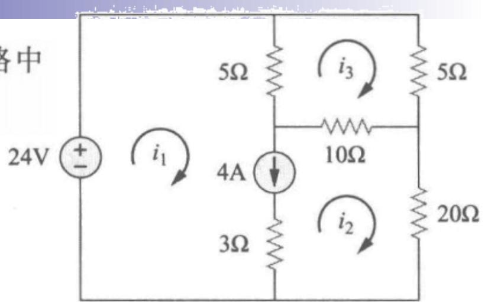

解：超级网孔 ( 最外围）：

$$
0 \mathrm {x i} 1 + 2 0 \mathrm {x i} 2 + 5 \mathrm {x i} 3 = 2 4 \quad (1)
$$

网孔 3 ： 5(i3-i1)+5xi3+10x(i3-i2)=0

$$
- 5 \times \left[ \begin{array}{c c c} 0 & 2 0 & 5 \\ 1 & - 1 & 0 \end{array} \right] = \left[ \begin{array}{l} i 1 \\ i 2 \\ i 3 \end{array} \right] = \left[ \begin{array}{l} 2 4 \\ 0 \\ 4 \end{array} \right] \quad \left[ \begin{array}{c c c} 2 4 & 2 0 & 5 \\ 0 & - 1 0 & 2 0 \\ 4 & - 1 & 0 \end{array} \right]
$$

i1-i2+0i3=4 (3) ∆=25+400+50=475

$$
\Delta 1 = 1 6 0 0 + 2 0 0 + 4 8 0 = 2 2 8 0
$$

$$
\left[ \begin{array}{c c c} 0 & 2 4 & 5 \\ - 5 & 0 & 2 0 \\ 1 & 4 & 0 \end{array} \right]
$$

$$
\left[ \begin{array}{c c c} 0 & 2 0 & 2 4 \\ - 5 & - 1 0 & 0 \\ 1 & - 1 & 4 \end{array} \right]
$$

$$
\Delta 2 = - 1 0 0 + 4 8 0 = 3 8 0
$$

$$
\Delta 3 = 1 2 0 + 2 4 0 + 4 0 0 = 7 6 0
$$

$$
i 1 = \Delta 1 / \Delta = 2 2 8 0 / 4 7 5 = 4. 8 (A)
$$

$$
i 2 = \Delta 2 / \Delta = 3 8 0 / 4 7 5 = 0. 8 (A)
$$

$$
i 3 = \Delta 3 / \Delta = 7 6 0 / 4 7 5 = 1. 6 (A)
$$

书上的答案：

答案： $\ddot { i } _ { 1 } = 1 2 . ~ 3 7 9 \mathrm { A } , ~ i _ { 2 } = 3 7 8 . ~ 9 \mathrm { m A } , ~ i _ { 3 } = 3 . ~ 2 8$

# 3.7 节点分析与网孔分析比较

两种方法可以混用。

也可选择方程个数较少的方法 :

如：含有多个串联元件的网络选用网孔法；而具有多个并联元件的网络选用节点法。

或：对于节点数小于网孔数的电路，采用节点法；对于网孔数小于节点数的电路，采用网孔法。

# 3.9 应用 : 直流晶体管电路

双极型晶体管 (BJTs) 分为两种类型：

(a) npn, (b) pnp

每种器件都有 3 个极，分别命名为

发射极 (E) 、基极 (B) 和集电极 (C)

Base

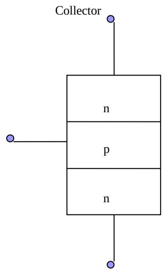

Emitter

B

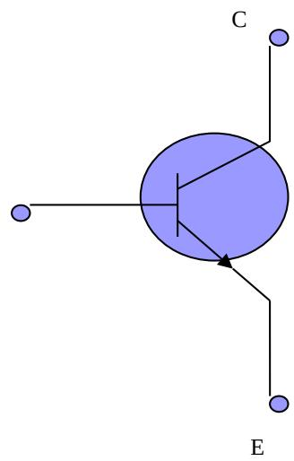

Base

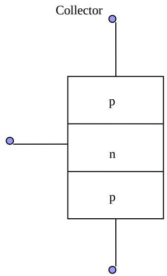

Emitter

B

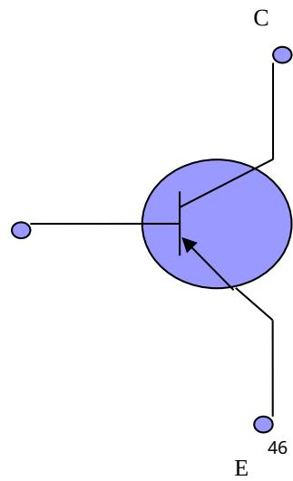

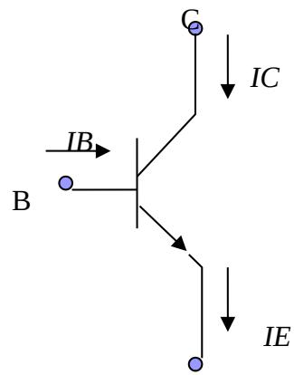

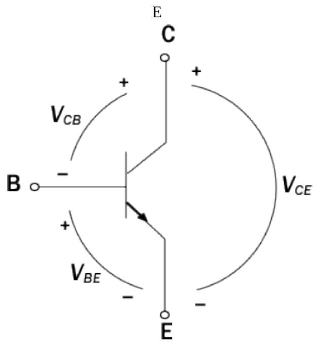

晶体管的终端变量 :

(a) 电流 , (b) 电压 .

图 (a) 应用基尔霍夫电流定律得 :

$$
I _ {E} = I _ {B} + I _ {C}
$$

图 (b) 应用基尔霍夫电压定律得 :

$$
V _ {C E} + V _ {E B} + V _ {B C} = 0
$$

通常 , $V B E { \approx } 0 . 7 \mathrm { V }$ ( 硅管 ), 0.3V( 锗管）

$$
I _ {C} = \alpha I _ {E} I _ {C} = \beta I _ {B}
$$

$\alpha$ 被称为共基极电流增益 , $\beta$ 被称为共发射极电流增益。通常 , $\alpha$ 值在 0.98 到 0.999 范围，而 $\beta$ 值在 50 到 1000 范围。

$$
I _ {E} = (1 + \beta) I _ {B} \approx \beta I _ {\mathrm {B}}
$$

(a) npn 晶体管

(b) 等效电路

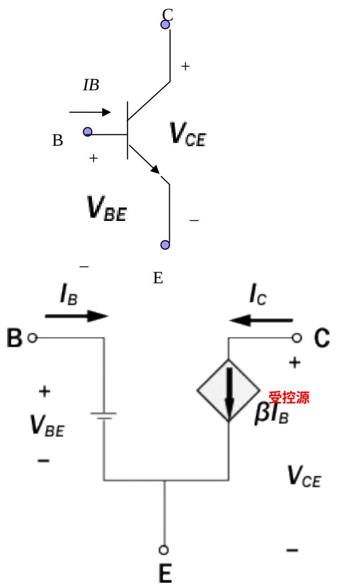

# 实例 1 ：

求晶体管电路中的 IB , IC, 和 v0 。 假设晶体管在放大模式（一般工作模式）， $\pmb { \beta } \mathbf { = } 5 \mathbf { 0 }$ 。

。。。

# 解决方案 :

对于输入回路 ,

$$
- 4 + I B (2 0 \times 1 0 ^ {①}) + V B E = 0
$$

放大模式时， VBE=0.7V ：

$$
I _ {B} = \frac {4 - 0 . 7}{2 0 \times 1 0 ^ {3}} = \underline {{1 6 5 \mu A}}
$$

且

$$
I _ {C} = \beta I _ {B} = 5 0 \times 1 6 5 \mu \mathrm {A} = 8. 2 5 \mathrm {m A}
$$

对于输出回路 ,

③

$$
- v _ {0} - 1 0 0 I _ {C} + 6 = 0
$$

$$
- v _ {0} - 1 0 0 I _ {C} = 6 - 0. 8 2 5 = 5. 1 7 5 \mathrm {V}
$$

即

注意 $\scriptstyle \pmb { v } \pmb { 0 } = \pmb { V } \pmb { C } \pmb { E } = - 5 . 1 7 5 \mathbf { V }$ ，而

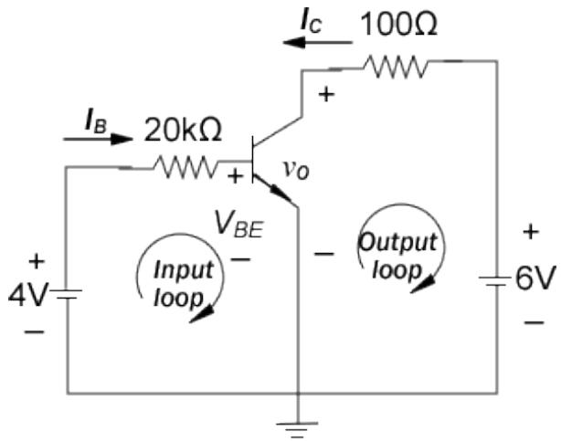

$$
V B E = 0. 7 V
$$

# 实例 2 ：

如图中所示双极型晶体管电路 , $\pmb { \beta } \mathbf { = } \mathbf { 1 5 0 }$ 、 VBE=0.7V 。 求 v0 。

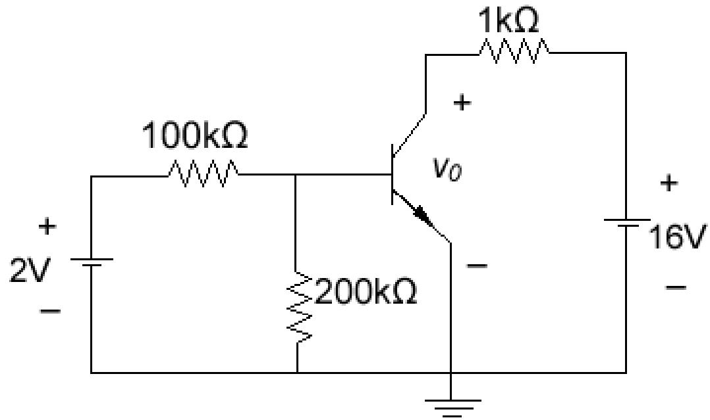

# 解决方案 :

我们可以用两种方法来解决这个问题：

方法 1 是直接分析上图中的电路；

# 支路电流法

# 方法 1

对于回路 1,

① ${ } 2 = 1 0 0 \times 1 0 ^ { 3 } I _ { \mathrm { { 1 } } } + 2 0 0 \times 1 0 ^ { 3 } I _ { \mathrm { { 2 } } }$ (3.13.1)

对于回路 2, $V _ { _ { B E } } = ~ 0 . 7 = ~ 2 0 0 ^ { ' } ~ 1 0 ^ { 3 } I _ { _ { 2 } }$ Þ $I _ { \mathrm { 2 } } = 3 . 5 \mathsf { m } \mathsf { A }$ (3.13.2)②

对于回路 3 ，

$\overline { { \mathbf { \Omega } } } \ V _ { 0 } \ ^ { } - \ 1 0 0 0 I _ { c } \ ^ { } + 1 6 = 0 $③

$$
v _ {0} = 1 6 - 1 0 0 0 I _ {C}
$$

从公式 3.13.1) 和 (3.13.2), 得：13 A, 2 0.71 3   I  9.5 A 1  2  I I I B1 100 10 

$$
I _ {C} = \beta I _ {B} = 1 5 0 \times 9. 5 \mu \mathrm {A} = 1. 4 2 5 \mathrm {m A}
$$

将 IC 代入公式（ 3.13.3),v0 16  1.425 14.575V

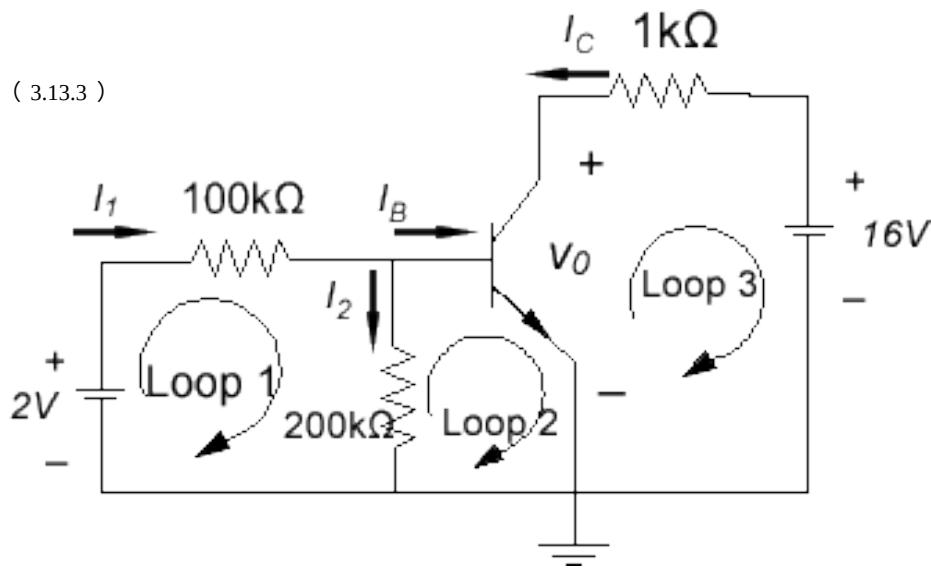

方法 2 ： 我们可以用晶体管的等效模型，替换原电路。

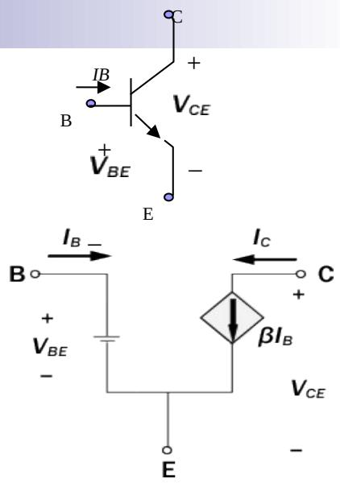

①输出回路： 0 1000( 150 ) 16 0 B- + - + = v I

输入端： ② $I _ { _ B } = I _ { 1 } - \ I _ { 2 } \ = \frac { 2 - 0 . 7 } { 1 0 0 \times 1 0 ^ { 3 } } - \frac { 0 . 7 } { 2 0 0 \times 1 0 ^ { 3 } } = ( 1 3 - 3 . 5 $ ) A 9.5 A  

$$
v _ {0} = 1 6 - 1 0 0 0 (1 5 0 \times 9. 5 \times 1 0 ^ {- 6}) = 1 4. 5 7 5 \mathrm {V}
$$

因此

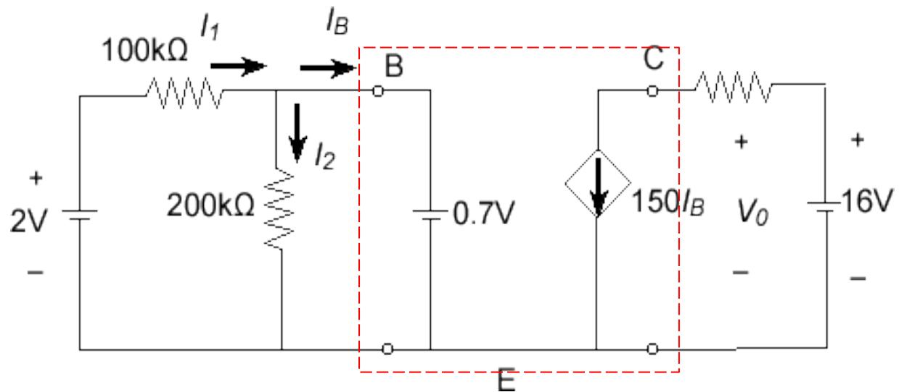

# 3.10 总结

节点分析法是基尔霍夫电流定律（ KCL ）在非参考节点上的应用。 ( 适用于平面电路和非平面电路。）我们用节点电压来表示结果。

网孔分析法是基尔霍夫电压定律（ KVL ）在平面电路中的应用。我们用网孔电流来表示结果。解联立方程得到网孔电流。

分析电路时，可以同时使用节点分析法和网孔分析法（拓扑约束），需要时补充元件约束（ VCR ）方程。 54 54

# 复习题

$1$ $\mathrm { K C l } ,$

$( \mathrm { d } ) 2 + \frac { v _ { 1 } - 1 2 } { 3 } = \frac { 0 - v _ { 1 } } { 6 } + \frac { v _ { 2 } - v _ { 1 } } { 4 }$

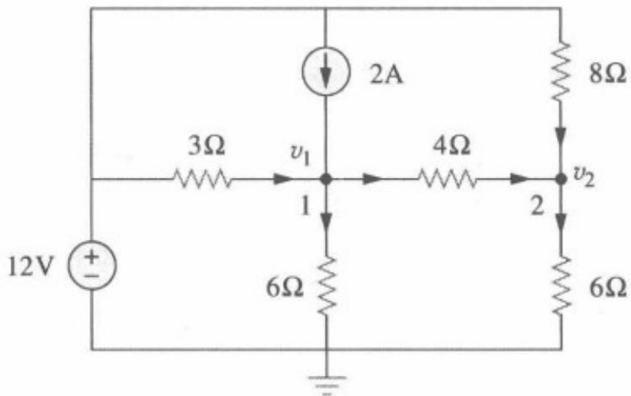

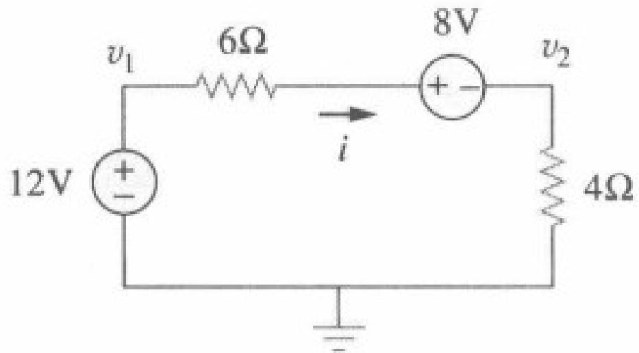

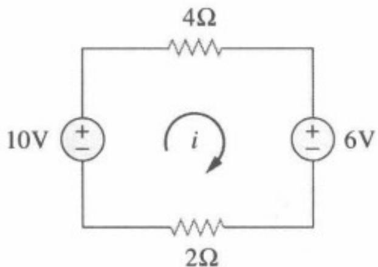

$_ { v }$

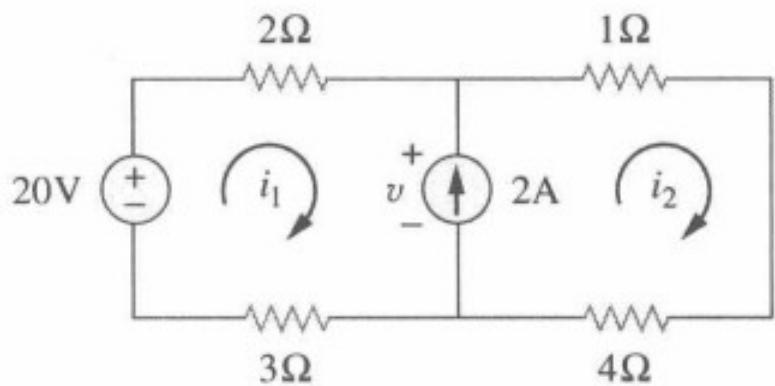

9PSpice软件中，电流控制电压源的名称为：

10以下关于伪元件IPROBE的叙述中哪些是不正确的？

（a）它必须是串联连接

（b）它绘制出支路电流的波形

（c）它显示其所连接支路的电流

（d）并联连接后，可显示电压

（e）它只用于直流分析

（f）它并不应用于某个具体电路元件

# 本章重点及难点

注意到任何元器件（包括电压源和电流源）都有加在其两端的电压及流过它的电流。

初学者不建议搞太多模型，一个通用模型，便可助你玩转所有电路！

大道至简， 大巧若拙！

# 本章作业

 画出本章思维导图

3.3

 3.10

 3.30

 3.41

 3.62

注：以上各题节点法与网孔法可随意结合使用。