# 第四章

# 电路定理

# 电路基

# 础

# Fundamentals of Electric Circuit

# 拓扑约束元件约束

# KCLKVLVCR

2 大基本法：

5 大定理： 

元件（ R,C,L ）

电路（ DC,AC ）

暂态， 稳态

时域，频域

电耦合，磁耦合

# I (i)V(v)P (p)

# 4.1 介绍

使用基尔霍夫定律（第三章）分析电路的一个主要优点，是我们可以在不改变电路原始结构的情况下分析电路；而缺点则是对于一个大的、复杂的电路，计算繁琐。

2 大基本法：

原始简单

- 直白僵化

- 适合计算机

5 大定理：

- 等效化简

- 直击灵魂

- 适合人类

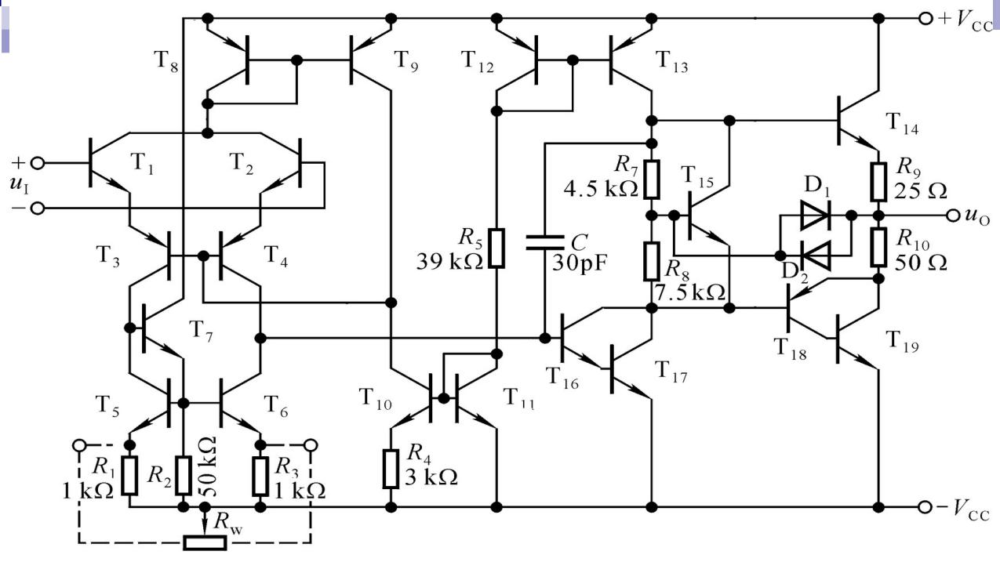

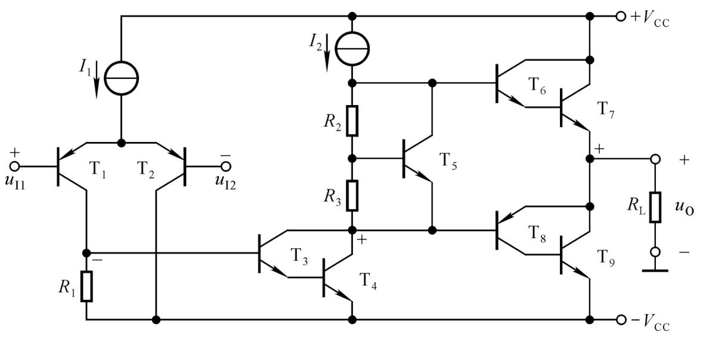

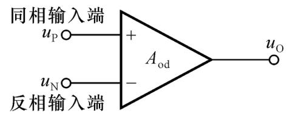

# 4.2 线性特性

线性是齐次性 ( 比例性 ) 和叠加性的结合。

线性电路是输出与输入线性相关 ( 或成正比 ) 的电路。

1. 齐次性

$$
v = i R
$$

齐次性：输入乘以 K ，输出也乘以 K 。

$$
k i R = k v
$$

2. 叠加性

$$
v _ {1} = i _ {1} R
$$

$$
v _ {2} = i _ {2} R
$$

$$
v = \left(i _ {1} + i _ {2}\right) R = i _ {1} R + i _ {2} R = v _ {1} + v _ {2}
$$

叠加性：各个输入之和的响应等于每个输入单独作用时的响应之和。

例4-1 $v _ { \mathrm { s } } = 1 2 \mathrm { V }$ 和 $v _ { \mathrm { s } } = 2 4 \mathrm { V }$ 时，分别求解

图4-2所示电路中的 $I _ { \mathrm { o } }$

解：解法 1.

(1)Vs=12V

12xi1-4xi2+12=0 。。。 （ 1 ）

-10xi1+16xi2-12=0 。。。（ 2 ）

（ 1 ） + （ 2 ）得 :

$$
2 \mathrm {x i} 1 + 1 2 \mathrm {x i} 2 = 0
$$

$$
i 1 = - 6 \times i 2
$$

$$
i 2 = 1 2 / 7 6 = 6 / 3 8 = 3 / 1 9
$$

(2)Vs=24V 时： i0=i2=2x(3/19)=6/19

# 例4-1 $v _ { \mathrm { s } } = 1 2 \mathrm { V }$ 和 $v _ { \mathrm { s } } = 2 4 \mathrm { V }$ 时，分别求解

图4-2所示电路中的 $I _ { \mathrm { o } }$

解法2：(1)Vs=12V

$$
1 2 \mathrm {x i} 1 - 4 \mathrm {x i} 2 + 1 2 = 0 \quad \dots \tag {1}
$$

$$
i 2 = 3 \times i 1 + 3
$$

$$
3 \times i 1 - i 2 = - 3 \dots \dots (1)
$$

$$
1 6 \mathrm {x i} 2 - 4 \mathrm {x i} 1 - 3 \mathrm {x} 2 \mathrm {x i} 1 - 1 2 = 0
$$

$$
1 6 \mathrm {x i} 2 - 1 0 \mathrm {x i} 1 - 1 2 = 0
$$

$$
- 1 0 \mathrm {x i} 1 + 1 6 \mathrm {x i} 2 - 1 2 = 0 \quad \dots \tag {2}
$$

$$
8 \times i 2 - 5 \times i 1 - 6 = 0
$$

$$
- 5 \mathrm {x i} 1 + 8 \mathrm {x i} 2 = 6 - - - (2)
$$

$$
\left[ \begin{array}{c c} 3 & - 1 \\ - 5 & 8 \end{array} \right] \left[ \begin{array}{c} i 1 \\ i 2 \end{array} \right] = \left[ \begin{array}{c} - 3 \\ 6 \end{array} \right], \left[ \begin{array}{c c} - 3 & - 1 \\ 6 & 8 \end{array} \right], \left[ \begin{array}{c c} 3 & - 3 \\ - 5 & 6 \end{array} \right]
$$

$$
\Delta = 2 4 - 5 = 1 9, \Delta 1 = - 2 4 + 6 = - 1 8, \Delta 2 = 1 8 - 1 5 = 3
$$

$$
i 0 = i 2 = (\Delta 2) / \Delta = 3 / 1 9
$$

$$
(2) V s = 2 4 V \text {时}: i 0 = i 2 = 2 x (3 / 1 9) = 6 / 1 9
$$

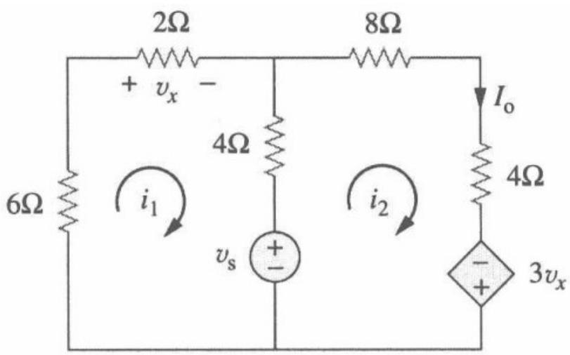

# 举例 4.1

对于图中的电路，当 ${ \pmb v } _ { s } = { \pmb 1 } 2 { \pmb V }$ ， $\pmb { V _ { s } } = 2 4 \mathbf { V }$ 时，求 $i _ { o }$ .

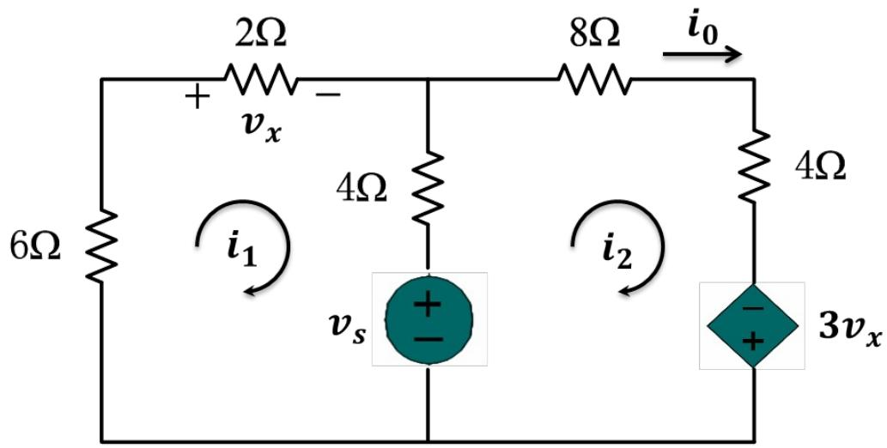

# 解决方案：

利用网孔法，将基尔霍夫电压定律应用于两个网孔即可。

循环1 :6i+2i+4(𝑖-i2)+𝑣s= 0

② 循环2 :-𝑣s+4(i-i)+8i2 +4i2-3vx = 0

③ 1v  2 i x 

线性法对于功率的运算是否可用？

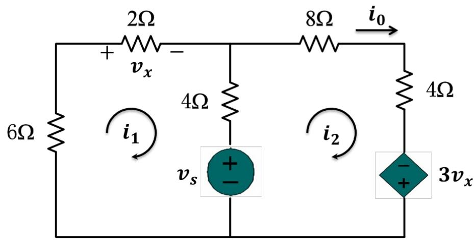

解得： $i _ { 1 } = - 6 i _ { 2 }$

$$
i _ {2} = \frac {v _ {s}}{7 6}
$$

当 vs= 12V, $i _ { 0 } = i _ { 2 } = \frac { 1 2 } { 7 6 } \mathrm { A }$

当 ② $\pmb { V _ { s } } \mathbf { = } 2 4 \mathbf { V }$ ， i0 i2 A7624

注：最后结果需要继续化简，化到最简，或用小数表示。

线性电路系统：当电源值翻倍时，电流也翻倍。

练习4-2在图4-5所示电路中，假定 $V _ { \mathrm { o } } = 1 \mathrm { V }$ ，试利用线性原理计算 $V _ { \mathrm { ~ o ~ } }$ 的实际值。

解： I0=1/8A

$$
\mathrm {V} 1 = (1 2 + 8) \times 1 / 8 = 2 0 / 8 (\mathrm {V})
$$

$$
4 0 / (2 0 / 8) = 1 6
$$

$$
\mathrm {V} 0 = 1 6 \mathrm {V}
$$

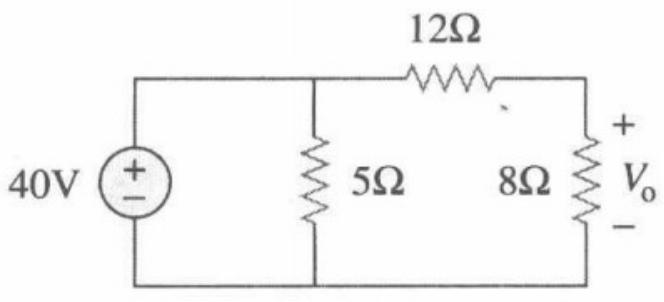

# 4.3 叠加定理

叠加定理：在线性电路中，元件两端的电压或者电流 是每个独立源单独作用下 在该元件两端产生的电压或者电流的 代数和。

1. 我们每次只考虑一个独立源，而关闭所有其他独立源。这意味着我们用0V （或短路）替换每个电压源，用 0A( 或开路 ) 替换每个电流源。 这样我们就得到了一个更简单、更易于管理的电路。

2. 受控源保持完整，因为它们是由电路变量控制的。

应用叠加定理的步骤 :

1. 关闭除一个独立源外的所有独立源。使用节点分析或网孔分析法找出该独立源作用于电路的输出( 电压或电流 ) 。

2. 对其他独立源重复步骤 1 。

3. 通过代数方法将独立源的所有值得相加，求出总贡献值。

对每个独立源的作用分别画出 分电路图，最后结果相加。

例：

利用叠加定理求出图中电路中的 v 。解决方案 :

原电路有两个电源 , 则

和 1 2v v  v分别为 6V 电压源和 3A 电流源的贡1v 2v

献。

①

$$
v _ {1}
$$

为了得到 , 我们将电流源置 0 ：

$\begin{array} { r } { \frac { | \star | | \mathrm { H } \updownarrow } { 6 } \% \nu _ { i _ { 1 } } + 4 i _ { 1 } = 0 \quad \mathsf { p } \quad i _ { 1 } = 0 . 5 \mathrm { A } } \end{array}$

$$
v _ {1} = 4 i _ {1} = 2 \mathrm {V}
$$

或用分压公式： $\nu _ { 1 } = \frac { 4 } { 4 + 8 } ( 6 ) = 2 \mathrm { V }$

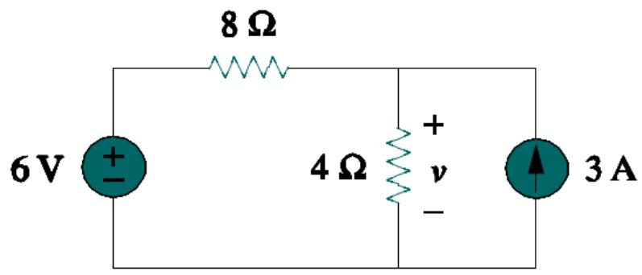

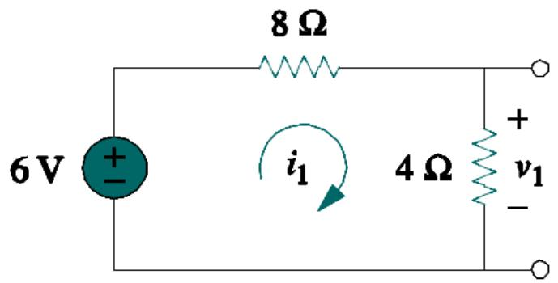

计算 $\nu _ { 1 }$

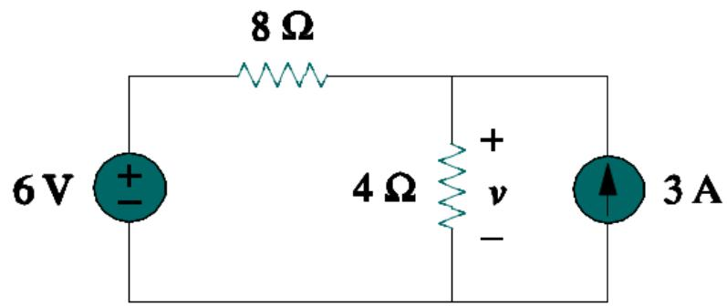

② 为了得到 $\nu _ { 2 }$ , 我们把电压源置 0 ：

$$
i _ {3} = \frac {8}{4 + 8} (3) = 2 \mathrm {A}
$$

因此 ,

$$
v _ {2} = 4 i _ {3} = 8 \mathrm {V}
$$

叠加后：

③

$$
v = v _ {1} + v _ {2} = 2 + 8 = 1 0 \mathrm {V}
$$

题图

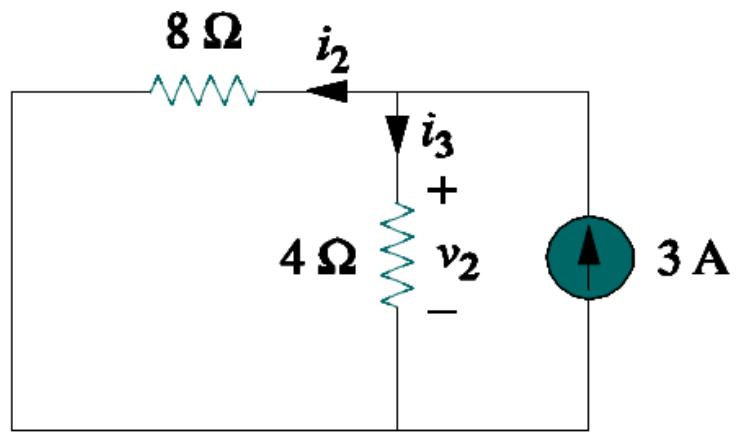

计算 $\mathsfit { V } _ { 2 }$

练习4-3利用叠加定理求出图4-8所示电路中的 $\scriptstyle \mathcal { V } _ { 0 }$

解：（ 1 ）只有 40V 电源的情况：

$$
\mathrm {v} 0 (1) = (2 / 1 0) \times 4 0 = 8 \mathrm {V}
$$

(2) 只有 8A 电流源的情况 （图上电流的单位错了）

$$
\mathrm {V} 0 (2) = 2 \times 4 = 8 \mathrm {V}
$$

(3) V0=V0(1)+V0(2)=16V

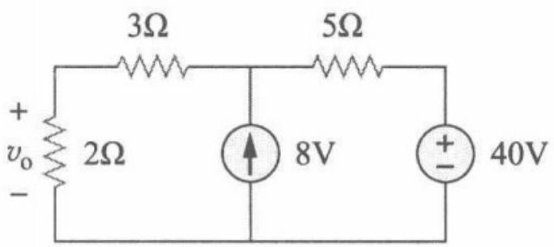

# 考核形式

平时成绩： 50% ，含作业，考勤，小测，课堂互动。。。。

期末考试： 50%

不设期中考试。

# 例 4-4 ： ( 含受控源，堂练 )

用叠加定理求出图中电路中的 $i _ { 0 }$

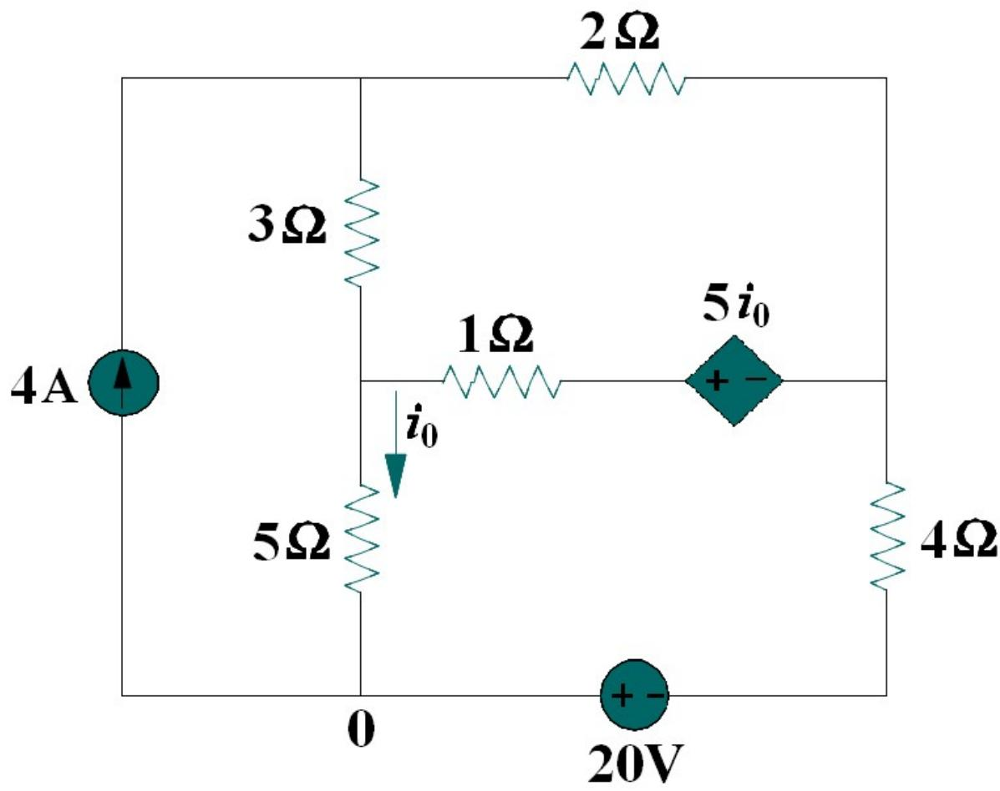

# 解决方案 :

电路中包含一个受控源，需保留，所以 ：$i _ { 0 } = i _ { 0 } ^ { \prime } + i _ { 0 } ^ { \prime \prime }$ .

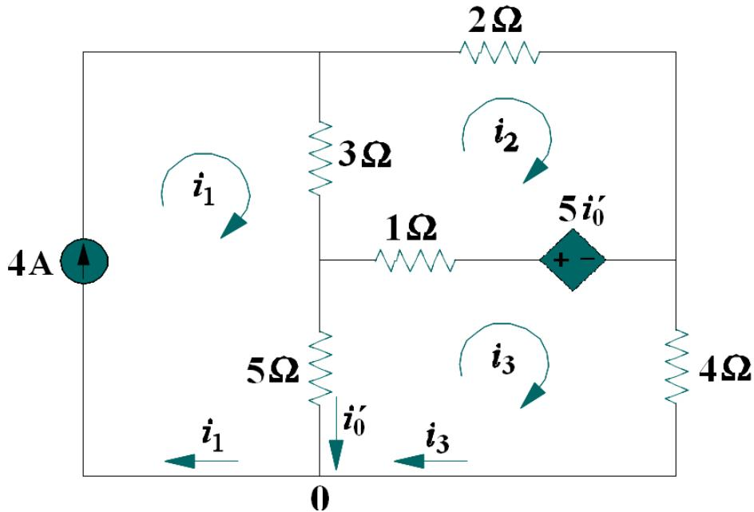

(a) 求 $i _ { 0 } ^ { ' }$

为了得到 $i _ { 0 } ^ { ' }$

回路 1 ： i 4A

回路 2 ： 3 6 1 5 0  i 1  i 2  i 3  i 0 

回路 3 ：  5i1  1i2 10i3  5i0 0

节点 0 ： $i _ { 3 } = i _ { 1 } - i _ { 0 } ^ { \prime } = 4 - i _ { 0 } ^ { \prime }$

可解得： = i ¢ $i _ { 0 } ^ { \zeta = } \frac { 5 2 } { 1 7 }$

为了得到 $i _ { 0 } ^ { \prime \prime }$ ,

回路 4 ：

$$
6 i _ {4} - i _ {5} - 5 i _ {0} ^ {\prime \prime} = 0
$$

回路 5 ：

$$
- i _ {4} + 1 0 i _ {5} - 2 0 + 5 i _ {0} ^ {\prime \prime} = 0
$$

补充方程： 5 0i  i $i _ { 5 } = - i _ { 0 } ^ { \prime \prime }$

解得： $i _ { 0 } ^ { \prime \prime } = - \ \frac { 6 0 } { 1 7 } \mathrm { A }$

叠加后，可得：

③

$$
i _ {0} = - \frac {8}{1 7} = - 0. 4 7 0 6 \mathrm {A}
$$

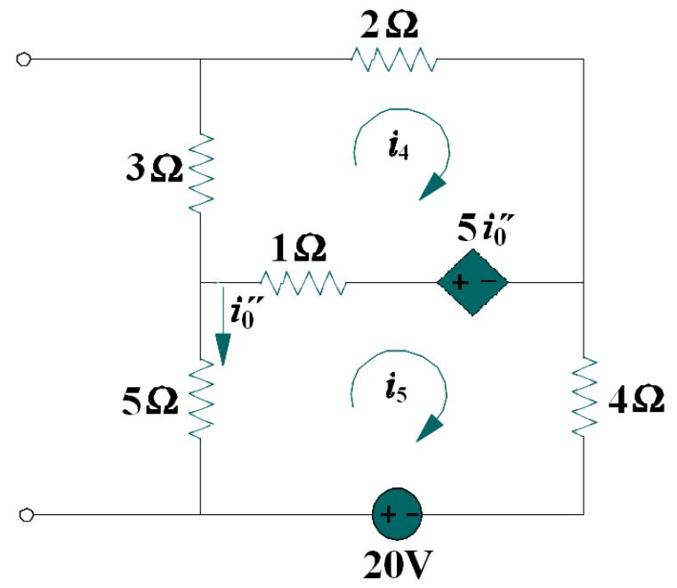

(b)  求 $i _ { 0 } ^ { \prime \prime }$

练习4-4利用叠加定理计算图4-11所示电路中的 $\mathcal { V } _ { x }$

解： (1) 只有电压源

$$
(2 5 - \mathrm {V x}) / 2 0 + 0. 1 \mathrm {V x} = \mathrm {V x} / 4
$$

$$
V x = 2 5 / 4
$$

（ 2 ）只有电流源

$$
V x / 2 0 + V x / 4 = 5 + 0. 1 V x
$$

$$
V x = 2 5
$$

(3)Vx （总） =25+25/4=31.25V

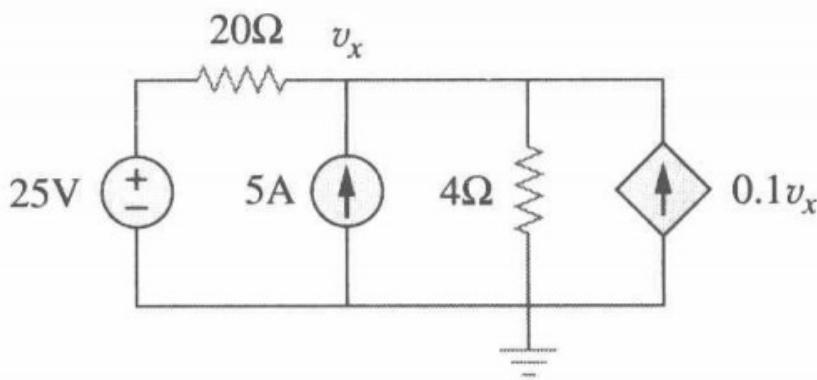

# 例 4-5 ( 堂练，请 3 位同学上来画分电路

# 图 用叠加定理求出图中电路中的 i

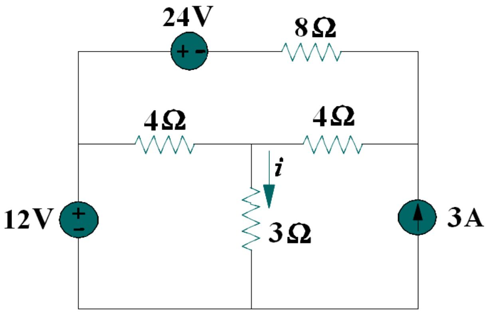

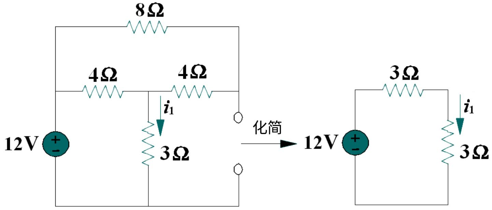

图 (a)

解决方案 :

在这题中，有三个源 , 则：

$$
i = i _ {1} + i _ {2} + i _ {3}
$$

其中 $i _ { 1 } , i _ { 2 } , i _ { 3 }$ 分别由 12V , 24V 和 3A 源贡献的电流。

① 为了得到 $i _ { 1 }$ , 如图 (a) 所示，化简后易算得：

$$
i _ {1} = \frac {1 2}{6} = 2 \mathrm {A}
$$

为了得到 $i _ { 2 }$ , 电路如图 (b) 所示。 用网孔法：

$$
1 6 i _ {a} - 4 i _ {b} + 2 4 = 0
$$

$$
7 i _ {b} - 4 i _ {a} = 0
$$

可得：i2 ib  1 $i _ { 2 } = i _ { b } = - 1$

$i _ { 3 }$为了得到 ， 电路如图 (c) 所示。用节点

法： $3 = \frac { v _ { 2 } } { 8 } + \frac { v _ { 2 } - v _ { 1 } } { 4 }$

$$
\frac {v _ {2} - v _ {1}}{4} = \frac {v _ {1}}{4} + \frac {v _ {1}}{3}
$$

可得： $: \boldsymbol { v } _ { 1 } = 3$

则： $i _ { 3 } = \frac { v _ { 1 } } { 3 } = \mathrm { { 1 A } }$

④

$$
i = i _ {1} + i _ {2} + i _ {3} = 2 - 1 + 1 = 2 \mathrm {A}
$$

叠加后 ,

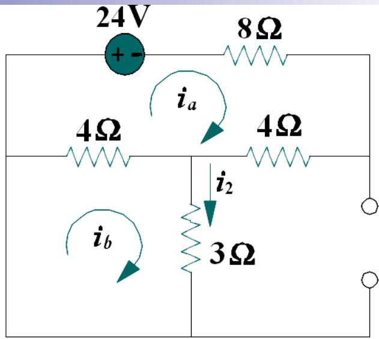

图 (b)

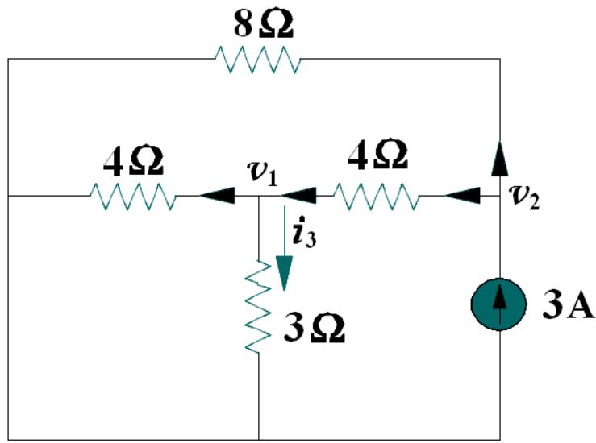

图 (c)

练习4-5利用叠加定理求出图4-14所示电路中的 $I$

解： I1=(8-6)/16=2/16=1/8(A)

$$
1 2 = 2 / (2 + 8 + 6) \times 2 = 4 / 1 6 = 2 / 8 (\mathrm {A})
$$

I( 总） =I1+I2=3/8=0.375(V)

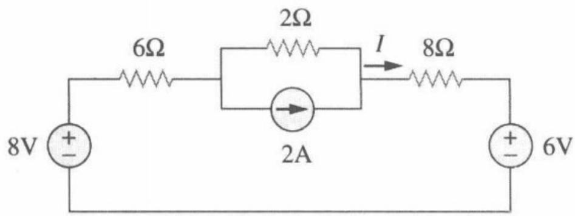

# 4.4 电源置换 / 转换定理

电源转换定理：用一个电流源 $i _ { s }$ 并联一个电阻 R ，取代一个电压源 $v _ { s }$ 串联一个电阻 $\pmb R$ 的过程，反之亦然。

等效 : $a \cdot b$ 端电压 - 电流关系（ VCR ）相同，包

含：① 等效电阻

$\textcircled{2}$ 等效短路电流

$\textcircled{3}$ 等效开路电压

$$
v _ {o c} = v _ {s} = i _ {s} R \quad \mathrm {o r} \quad i _ {s c} = i _ {s} = \frac {v _ {s}}{R}
$$

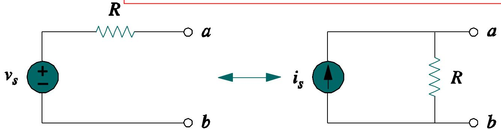

独立源的置换

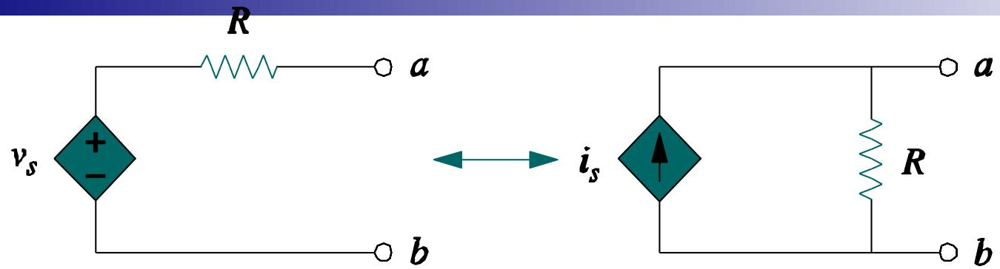

受控源的置换

$$
v _ {o c} = v _ {s} = i _ {s} R \quad \mathrm {o r} \quad i _ {s} = \frac {v _ {s}}{R} = i _ {s c}
$$

# 思考：

1. 电流源的箭头指向与电压源的极性的关系？

2. 理想电压源与理想电流源之间能相互转换吗？

# 例 4-6 ：

用电源置换求出图中电路中的电压 $\pmb { V _ { 0 } }$ v

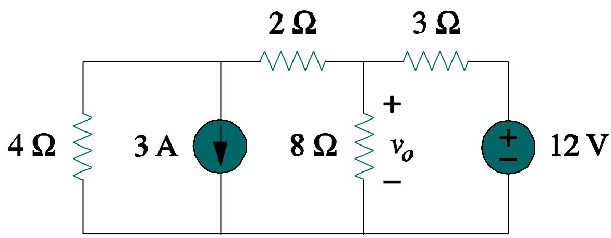

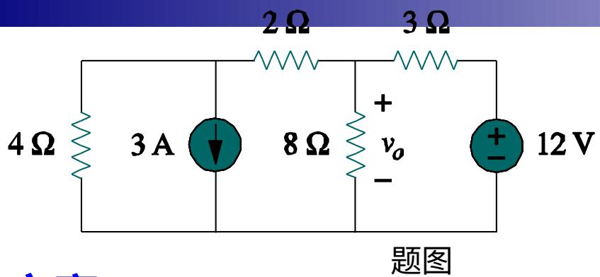

解决方案 :

$\mathbf { ( a ) } \quad \to \quad \mathbf { ( b ) } \to \mathbf { ( c ) }$

所以

$$
i = \frac {2}{2 + 8} (2) = 0. 4
$$

$$
v _ {0} = 8 i = 8 (0. 4) = 3. 2 \mathrm {V}
$$

或者

$$
v _ {0} = (8 \parallel 2) (2 \mathrm {A}) = \frac {8 \times 2}{1 0} (2) = 3. 2 \mathrm {V}
$$

外电路等效。 

思考： 8Ω 能和 2Ω 合并吗？

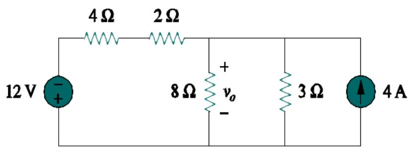

(a)

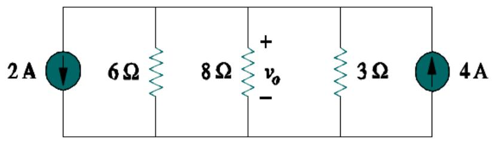

(b)

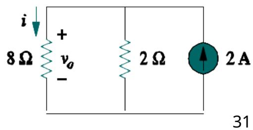

(c）

练习4-6利用电源变换的方法求图4-19所示电路中的 $i _ { \mathrm { o } }$

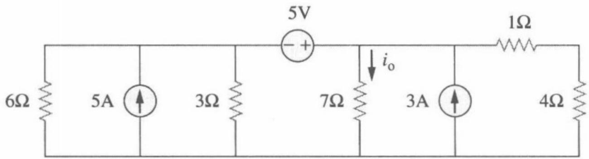

解：

$$
3 | | 6 = 2 \bar {0},
$$

$$
1 0 \mathrm {V} + 2 \Omega
$$

$$
1 5 \mathrm {V} + 2 \Omega
$$

$$
7. 5 A \parallel 2 \mathrm {D}
$$

$$
3 \mathrm {A} + 7. 5 \mathrm {A} = 1 0. 5 \mathrm {A}
$$

$$
2 \vert \vert 5 = 1 0 / 7 = 1. 4 3 \mathrm {U}
$$

$$
1 0 = 1. 4 3 \times 1 0. 5 / (1. 4 3 + 7) = 1. 7 8 A
$$

答案：1.78A

# 例 4-7 ： ( 堂练 )

用电源置换求出图中电路中的 vx $\pmb { V } _ { x }$

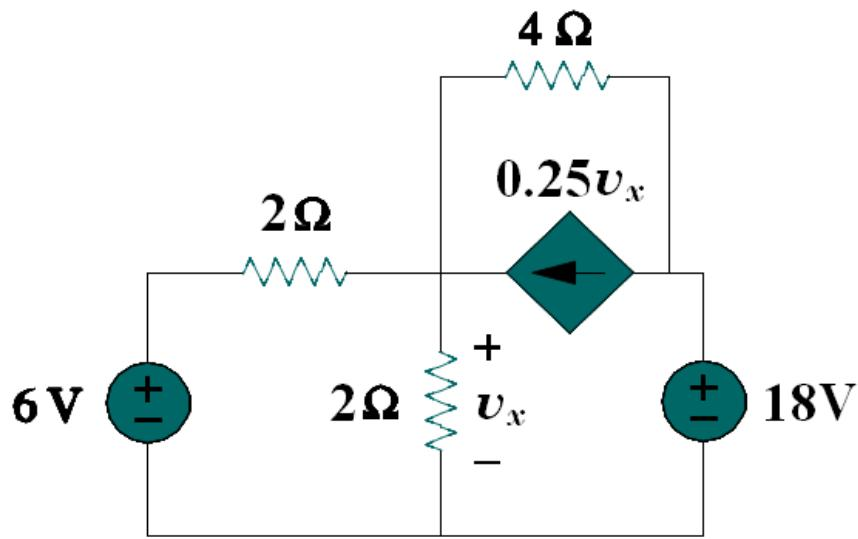

解决方案:

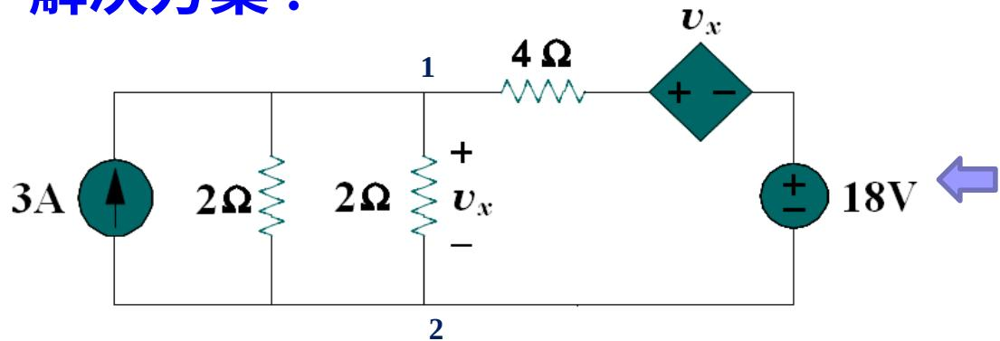

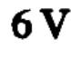

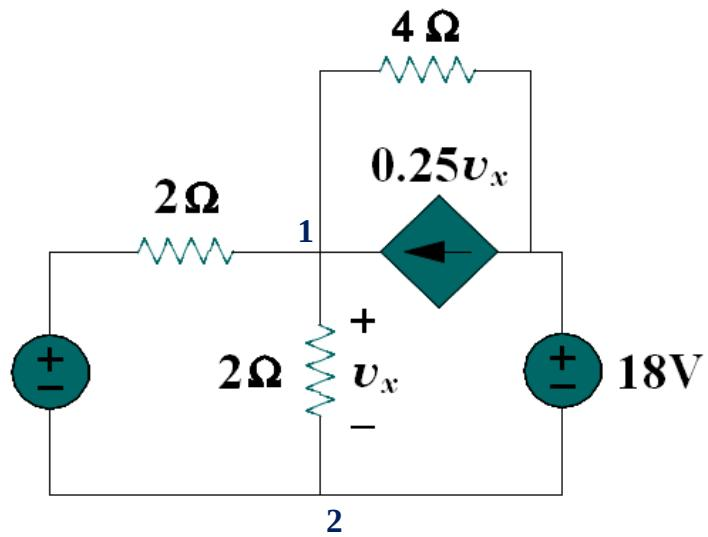

题图

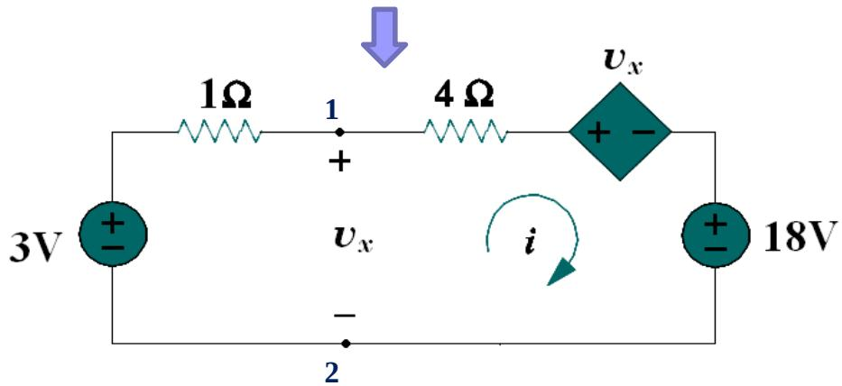

大回路 : ①  3  5i  vx 18 0

左回路 : ②  3 1  0 xi v

练习4-7利用电源变换的方法求图4-22所示电路中的 $i _ { x }$

解： 24mA||10Ʊ=0.24V+10Ʊ

左： 10i+Vx-0.24=0

右： 5i-2Ix-Vx=0

$$
\mathrm {I x} = \mathrm {V x} / 1 0
$$

大环： 15*I -2*Ix-0.24=0

解得： Ix=7.059 (mA )

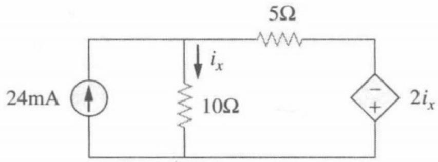

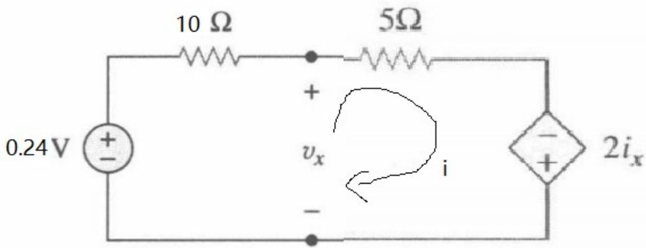

# 4.5 戴维南定理

 在实践中经常发生这样的情况 : 电路中的某个特定元件是可变的 ( 通常称为负载 ) ，而其他元件是固定的。

戴维南定理提供了一种用等效电路代替电路固定部分的方法。

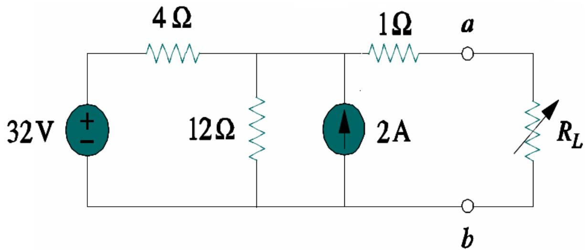

戴维南定理：线性二端电路，可由电压源 $V _ { t h }$ 串联电阻 组成的等Rth效电路代替，其中 $V _ { t h }$ Vth为端子开路电压 ， 为Rth独立电源关闭时端子的输入或等效电阻。

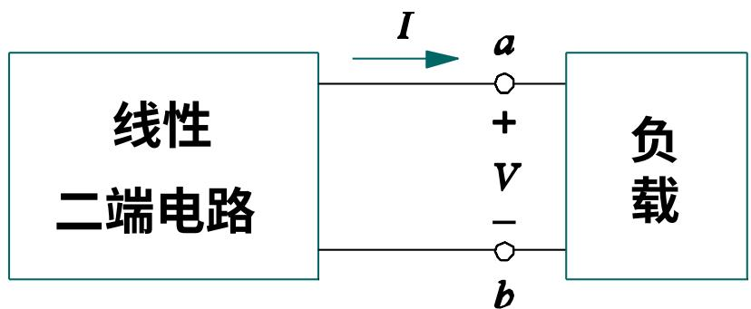

原始线性二端电路

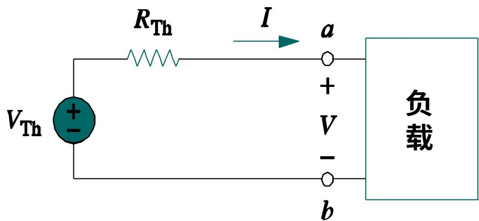

戴维南等效电路

# 情况 1 如果电路网络中没有受控源——直接法

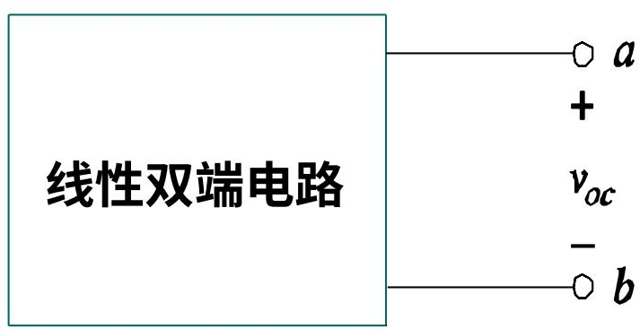

$$
V _ {\mathbf {T h}} = \nu_ {o c}
$$

(a)

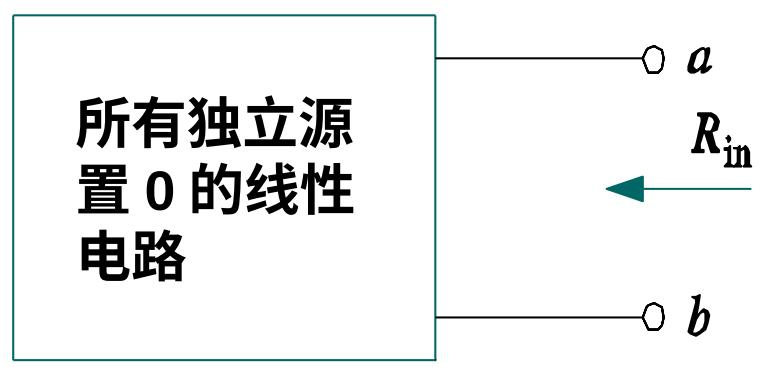

$$
R _ {\mathrm {T h}} = R _ {\mathrm {i n}}
$$

(b)

# 情况 2 电路网络中有受控源 （不可关闭） 伏安法

(a) 在 a,b 两端加一个电压源 ，然后确定产生的电流 0v 0i

$$
R _ {t h} = v _ {0} / i _ {0}
$$

则：

(b) 或在 a,b 两端加入一个电流源 0 0 / R v i th  $i _ { o }$ ，然后求出产生的

电

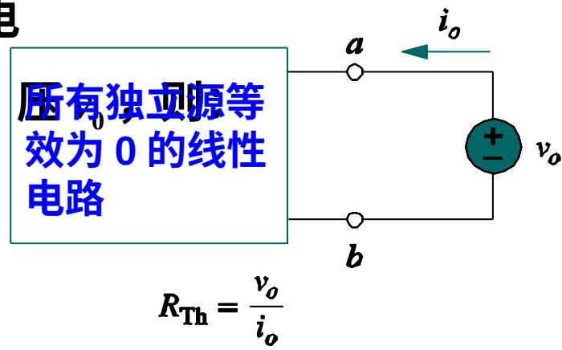

（a)

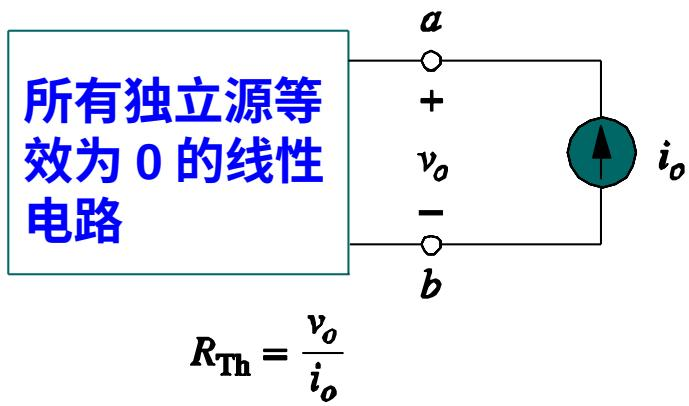

(b)

# * 情况 2 如果电路网络中有受控源时，

经常以负值出现。在这种情况下，负电阻 ( ) 表示电Rth v iR  $R _ { t h }$路正在提供电源。这在有受控源的电路中是可能的。

等效电路：等效后的电路的外部行为与原始电路相同 ( 对外等效 ) 。

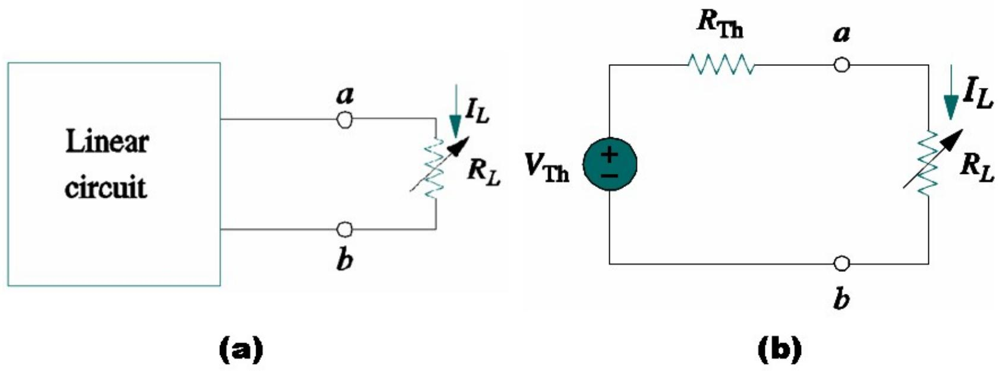

有负载的电路 : (a) 原始电路 , (b) 戴维南等效电路

# 例 4-8 ： （仅独立源）

在图示电路中，求出 a,b 端左侧的戴维南等效电路以及$\bf R _ { \mathrm { L } } { = } 6$ ， 16 或 36Ω 时的通过电流。

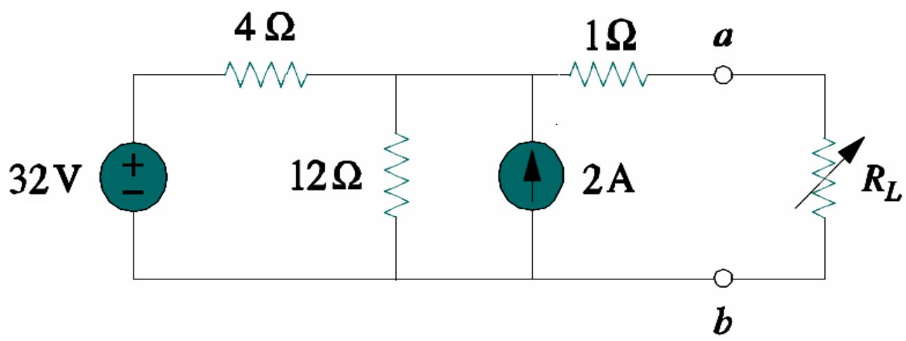

解决方案 :

: RTh 4 12 4 12 1 1 4      16

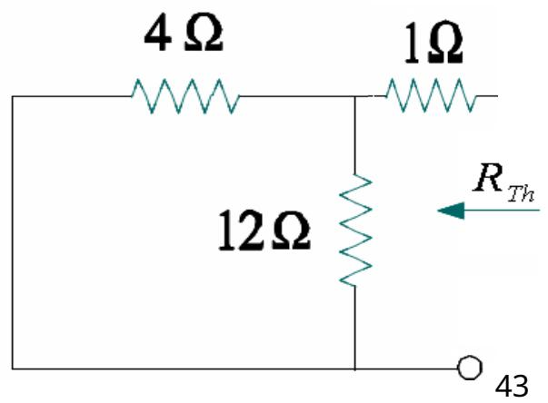

2) 求 $V _ { T h }$ , 方法 1: 网孔分析

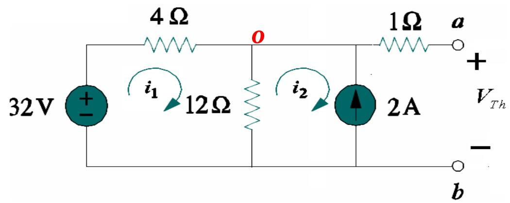

① 1 1 2     32 4 12( ) 0, i i i

② 2i A  2

可得： i1=0.5A

$$
V _ {T h} = 1 2 \left(i _ {1} - i _ {2}\right) = 1 2 (0. 5 + 2. 0) = 3 0 V
$$

方法 2 ：节点分析 , 对于节点 O, 32 2VTh   V  T h  30   V V4 12

通过 $R _ { L } |$ 的电流：

$$
I _ {L} = \frac {V _ {T h}}{R _ {T h} + R _ {L}} = \frac {3 0}{4 + R _ {L}}
$$

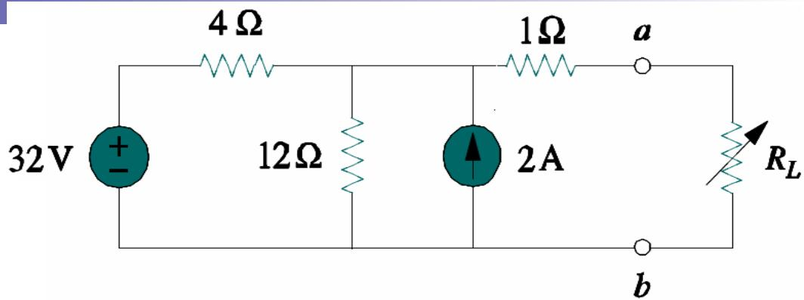

$\spadesuit$ 当 6 , RL  LI 30 3 A 10

$\spadesuit$ 当 $R _ { L }$ 16 ,  LI 30 1.5 A 20

$\spadesuit$ 当 36, RL  LI 30 0.7540 A  

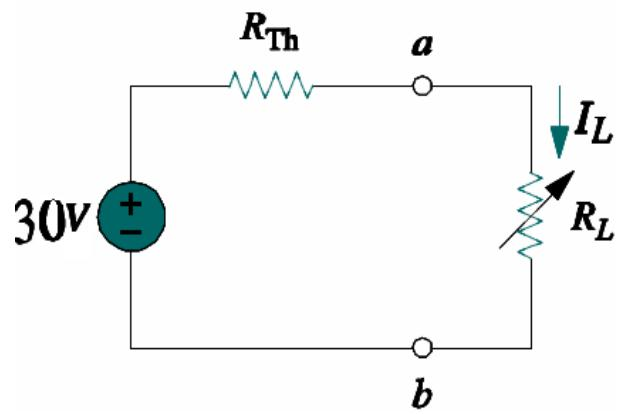

练习4-8利用戴维南定理求图4-30所示电路中端口 $a { - } b$ 左侧的等效电路，并计算电

解： Rth = 60||180=45 (Ʊ)

用叠加法求 Vth

$$
\mathrm {V t h} = (6 0 / 2 4 0) \times 1 8 0 \times 2 = 9 0 (\mathrm {V})
$$

说明：（ 1 ）先考虑只有 180V 电压源的情况， 60 欧姆电阻的分压为 (60/（ 90+90+60 ） )x180 ；

(2) 考虑只有电流源的情况：将“电流源和 90 欧姆电阻”并联，改为180V 电压源和 90 欧姆电阻串联，60 欧姆电阻的分压为 (60/（ 90+90+60 ） )x180

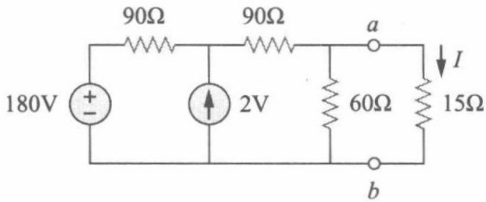

# 例 4-9 ： ( 含受控源 )

求出图示电路的戴维南等效电路。

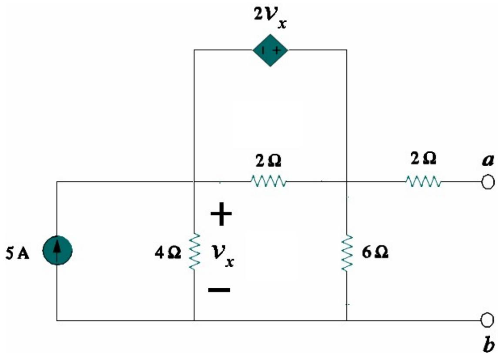

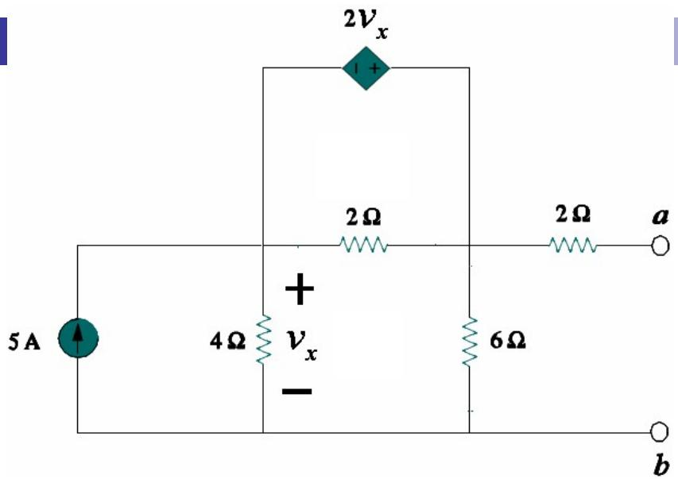

# 解决方案 :

(1) 求 $R _ { \mathrm { T h } }$

用电压源 $\boldsymbol { v } _ { 0 } = \mathbf { 1 V }$ 激发网络：

$$
R _ {T h} = \frac {1}{i _ {0}}
$$

回路 1:

且

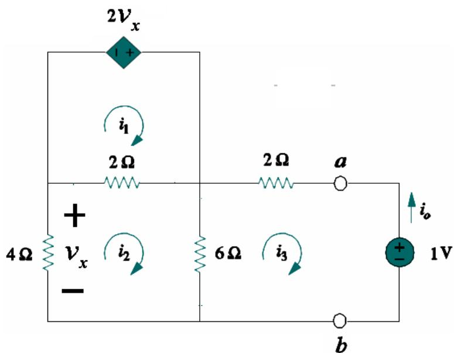

求 $R _ { \mathrm { T h } }$

# 对于回路 2 和 3,

$ \mathrm { ~ ; ~ } 4 i _ { 2 } + 2 ( i _ { 2 } - i _ { 1 } ) + 6 ( i _ { 2 } - i _ { 3 } ) = 0$

$6 ( i _ { 3 } - i _ { 2 } ) + 2 i _ { 3 } + 1 = 0$

可解得 : 3 16i A A6

而 $i _ { \scriptscriptstyle 0 } = \cdot i _ { \scriptscriptstyle 3 } = \frac 1 6 A$ ，因此：

$$
R _ {T h} = \frac {1 V}{i _ {0}} = 6 \Omega
$$

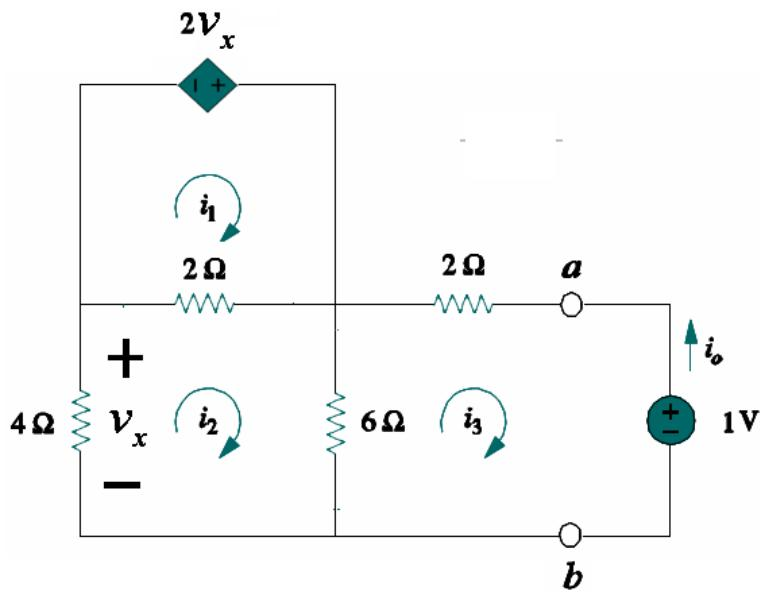

求 $R _ { \mathrm { T h } }$

（ 2 ）为求 $V _ { T h }$ , 即求右图中的 oc v

应用网孔法：

① i 1 5

2 1 2 3 24( ) 2( ) 6 0 i i i i i     

3 2 2 2( ) 0 x    v i i

1 2 4( ) x i i v  

26 20 V v i V Th oc   解得：

（ 3 ） 戴维南等效电路：

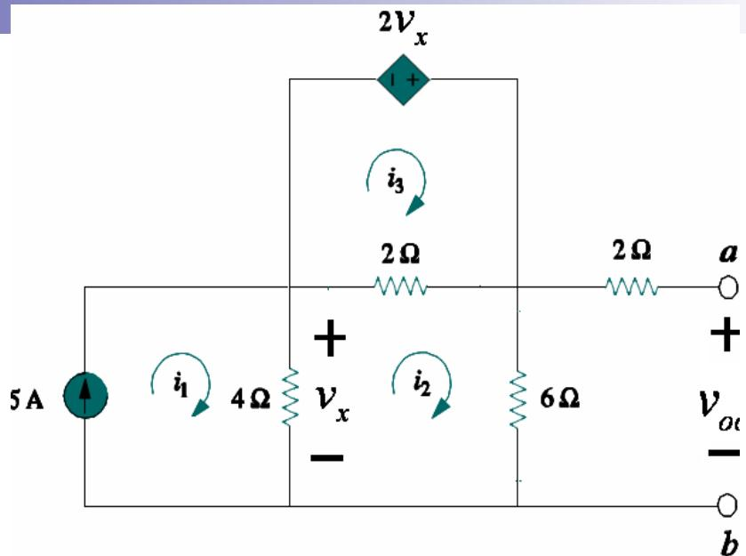

求 $V _ { \mathrm { T h } }$

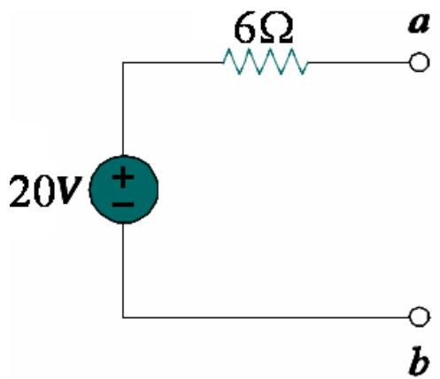

练习4-9求图4-34所示电路端口左侧的戴维南等效电路。

解：（ 1 ）求 Rth

假设在 ab 间加 1V 的电压源，流出的电流为 I0, 方向由 b 指向 a 。注意，独立电源要清零。

$$
\begin{array}{l} 5 ^ {*} \mid 1 + 3 ^ {*} \mid x + 1 = 0 \quad [ 1 ] \\ 1 1 + 1. 5 ^ {*} \mid x = \mid x \quad [ 2 ] \\ I X + I O = 1 / 4 \tag {3} \\ \end{array}
$$

$$
\begin{array}{l} \left| x = - 2, 1 0 = 2. 2 5 \right.; \\ R t h = 1 / (2. 2 5) 4 4 4. 4 (m \Omega) \\ \end{array}
$$

(2) 求 Vth

$$
\begin{array}{l} - 6 + 5 ^ {*} \mid 1 + 3 ^ {*} \mid x + 4 ^ {*} \mid x = 0 \quad [ 1 ] \\ 1 1 + 1. 5 ^ {*} \mid x = \mid x \tag {2} \\ \end{array}
$$

$$
V t h = I x ^ {*} 4 \tag {3}
$$

$$
\begin{array}{l} 4. 5 ^ {*} \mathrm {I x} = 6 \\ V t h = (4 ^ {*} 6) / 4. 5 = 5. 3 3 3 V \\ \end{array}
$$

答案： $V _ { \mathrm { T h } } { = } 5 . 3 3 3 \mathrm { V } , R _ { \mathrm { T h } } { = } 4 4 4 . 4 \mathrm { m } \Omega$

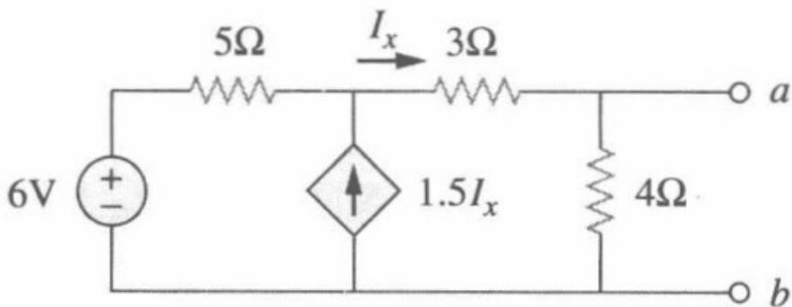

练习4-10求图4-36所示电路的戴维南等效电路。

解：因为没有独立电源，所以Vth=0;

答案： $V _ { \mathrm { T h } } { = } 0 \mathrm { V } , R _ { \mathrm { T h } } { = } - 7 . 5 \Omega$

（ 1 ）求 Rth假设在 ab 间加 1V 的电压源，流出的电流为I0,方向由b指向 a 。

$$
\begin{array}{l} 5 ^ {*} \mathsf {I} 1 + 1 0 ^ {*} \mathsf {I} 1 + 4 ^ {*} \mathsf {V} \mathsf {x} + 1 = 0 \\ \mathsf {V} \mathsf {x} = - 5 ^ {*} \mathsf {I} 1; \\ \mathsf {I} 1 = 0. 2 (\mathsf {A}) \end{array}
$$

$$
1 1 + 1 0 = 1 / 1 5
$$

$$
1 0 = 1 / 1 5 - 1 / 5 = - 2 / 1 5
$$

$$
R t h = 1 / 1 0 = - 1 5 / 2 = - 7. 5 0
$$

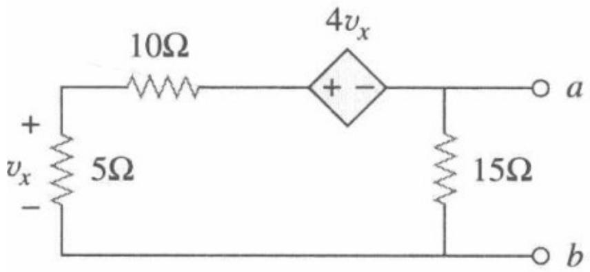

# 4.6 诺顿定理

诺顿定理：一个线性二端电路，可以被一个电流源 $I _ { \mathrm { { N } } }$ 并联一个电阻 $R _ { \mathrm { { N } } }$ 组成的等效电路替代， $I _ { \mathrm { { N } } }$ 是通过端子的短路电流， $R _ { \mathrm { { N } } }$是独立源关闭时端子的输入或者等效电阻。

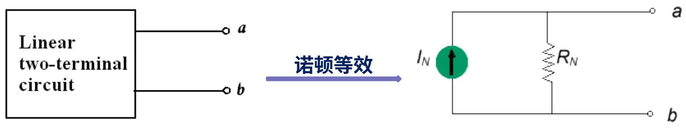

$$
I _ {N} = i _ {S C} = \frac {V _ {T h}}{R _ {T h}}
$$

$$
R _ {N} = R _ {T h} = \frac {v _ {O C}}{i _ {S C}}
$$

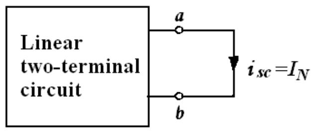

# 例 4-11 ： ( 堂练

求出图示电路的诺顿等效电路。

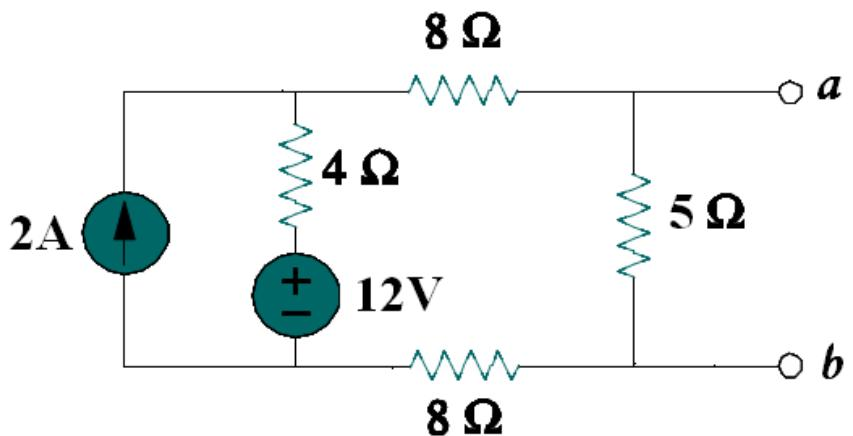

# 解决方案 :

(1) 求 $R _ { \mathrm { N } }$

$$
R _ {N} = 5 \| (8 + 4 + 8) = 5 \| 2 0 = \frac {2 0 \times 5}{2 5} = 4 \Omega
$$

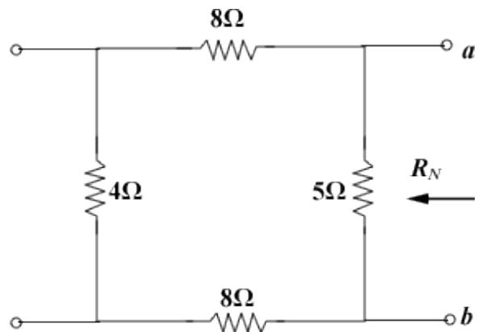

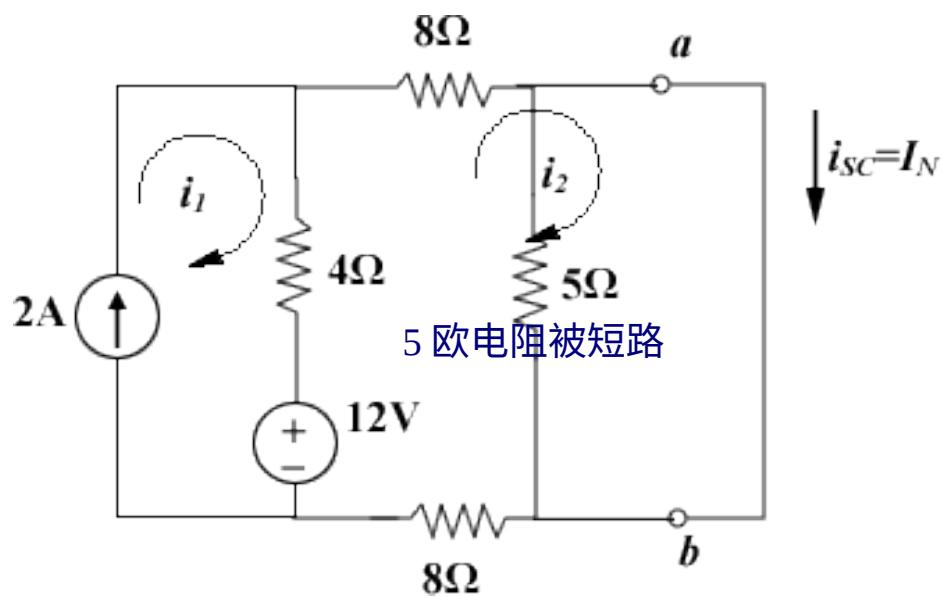

（ 2 ）求 $I _ { \mathrm { N } }$

① $i _ { 1 } = 2 A ,$

2 1 2 2 -12 4( - ) 8 8 0 i i i i + + + =

解得： $i _ { \scriptscriptstyle 2 } = 1 \mathrm { A } = i _ { \scriptscriptstyle S C } = I _ { \scriptscriptstyle N }$

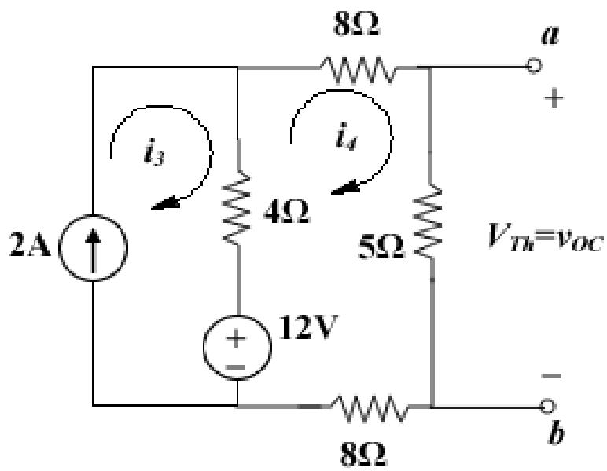

解决方案 2 （求 $I _ { \scriptscriptstyle \mathrm { N } } \big )$ ）

也可以利用 $I _ { N } { = } V _ { T h } / R _ { T h }$ ， 如上图所示， $V _ { T h }$ 为 a,b 两端开路电压。使用网孔法：

可得： $\textcircled{1}$ $i _ { 3 } = 2 \mathrm { A }$

-② $\begin{array} { r } { 1 2 + 4 ( i _ { 4 } - \ i _ { 3 } ) + 8 i _ { 4 } + 5 i _ { 4 } + 8 i _ { 4 } = 0 \quad \mathsf { ~ p ~ } \quad i _ { 4 } = } \end{array}$ 0.8A

$$
v _ {O C} = V _ {T h} = 5 i _ {4} = 4 \mathrm {V}
$$

因此： $I _ { _ { N } } = \frac { V _ { _ { T h } } } { R _ { _ { T h } } } = \frac { 4 } { 4 } = 1 \mathrm { A }$ ThR

练习4-11求图4-42所示电路在端口a-b处的诺顿等效电路。

解：

R=(90+90)||180=90 ( 欧姆）

$$
\mathrm {I} = 4 5 0 / 1 8 0 + 2 = 2. 5 + 2 = 4. 5 \mathrm {A}
$$

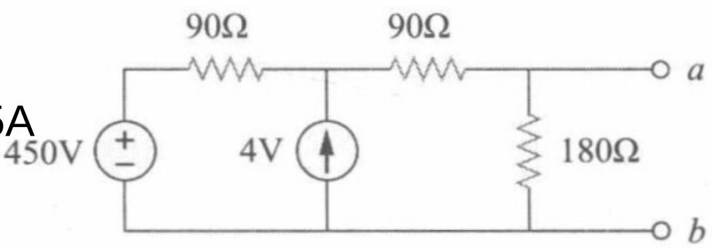

$\widehat { \Xi } \ = \frac { 5 } { 1 0 } : \ R _ { \mathrm { N } } = 9 0 \Omega , I _ { \mathrm { N } } = 4 . 5 \mathrm { A }$

# 例 4-12 ： （略，堂后练习）

使用诺顿定理 , 求出图中 ${ \mathbf { } } _ { \mathbf { 0 } , \mathbf { b } }$ 端子处的 ${ \pmb R } _ { N }$ 和 $I _ { N }$

# 解决方案 :

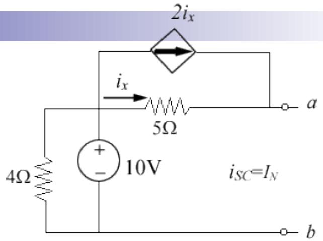

$\textcircled{1}$ 为求 ${ \pmb R } _ { N }$ , 在图 (a) 中 , 因为 4Ω 电阻短路 , 5Ω 电阻 , 电压源 , 非独立电流

源都是并联的，因此 / 5 1/ 5 0.2 0i  v  x $k _ { \mathrm { t } } = - v _ { 0 } / 5 = - 1 / 5 = - 0 . 2$

在节点 ${ \pmb q } _ { \pmb { \imath } } ^ { \prime }$

$$
i _ {0} + i _ {x} + 2 i _ {x} = 0, \Rightarrow i _ {0} = 0. 6
$$

$$
R _ {N} = \frac {v _ {0}}{i _ {0}} = \frac {1}{0 . 6} = 1. 6 7 \Omega
$$

$\textcircled{2}$ 为求 $I _ { N }$ , 在图 (b) 中 $i _ { x } = \frac { 1 0 - 0 } { 5 } = 2 \mathrm { A }$在节点 ${ \pmb q } ,$

$$
i _ {S C} = i _ {x} + 2 i _ {x} = 2 + 4 = 6 \mathrm {A}
$$

因此 , I N 6 A

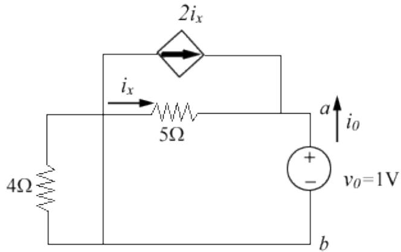

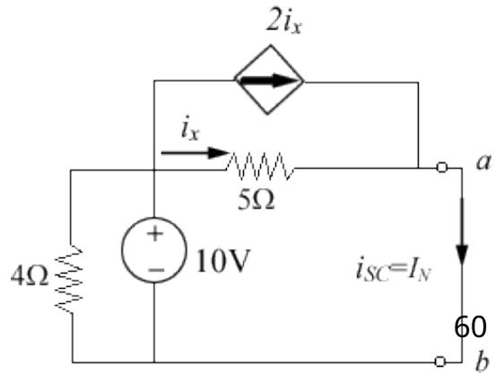

# 练习4-12求图4-45所示电路端口a-b处的诺顿等效电路。

解：（ 1 ）求 Rn

假设在ab间加1V的电压源，流出的电流为 I0, 方向由 b 指向a。电流源清零，开路。

$$
6 ^ {*} \mathrm {I} 1 + 2 ^ {*} \mathrm {V x} + \mathrm {V x} = 0
$$

$$
1 1 + 1 0 = \mathrm {V x} / 2
$$

$$
V x = 1
$$

$$
1 0 = 1
$$

$$
R n = V 0 / I 0 = 1 / 1 = 1 \Omega
$$

(2) 求 In

Ab 短路， Vxx=0,2Vx=0

Ab 短路，电流源的电流都流入ab

$$
\mathrm {I n} = 1 0 \mathrm {A}
$$

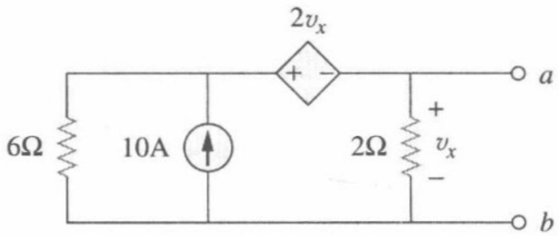

$\widehat { \Xi } \doteq \widehat { \Xi } : R _ { \mathrm { N } } = 1 \Omega , I _ { \mathrm { N } } = 1 0 \mathrm { A }$

# 4.8 最大功率传输定理

本节讨论的问题是，在具有给定系统及内部损耗的条件下，如何向负载提供最大功率。

当负载电阻等于从负载上看进去的戴维南电阻 $( R _ { \mathrm { L } } { = } R _ { \mathrm { T h } } )$ 时，传输给负载的功率最大。

$$
\frac {d p}{d R _ {L}} = 0 \quad \flat \quad R _ {L} = R _ {T h}
$$

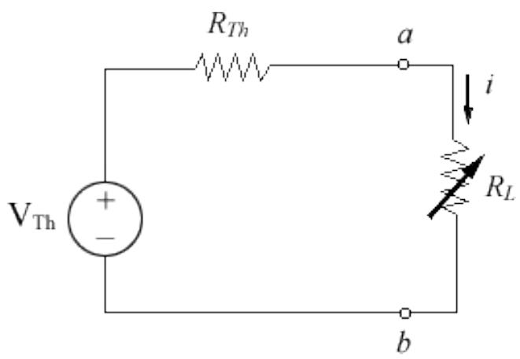

$$
P _ {\mathrm {m a x}} = \frac {V _ {T h} ^ {2}}{4 R _ {T h}}
$$

（阻抗匹配）

能量传输效率 $= ?$

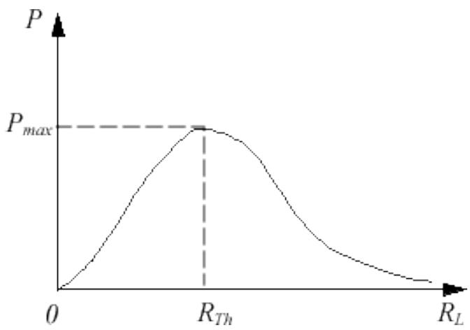

# 例 4-13 ： （堂练）

求出图中最大功率传输时的 $\pmb { R } _ { L }$ 值以及最大功率值。

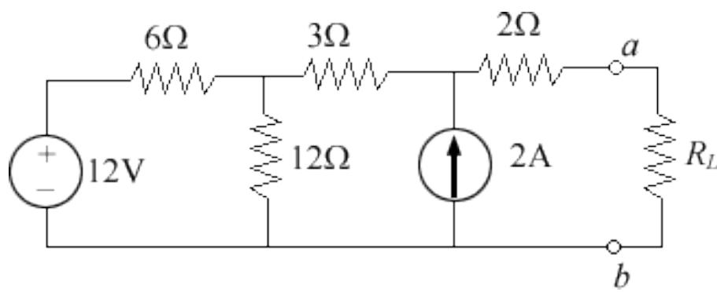

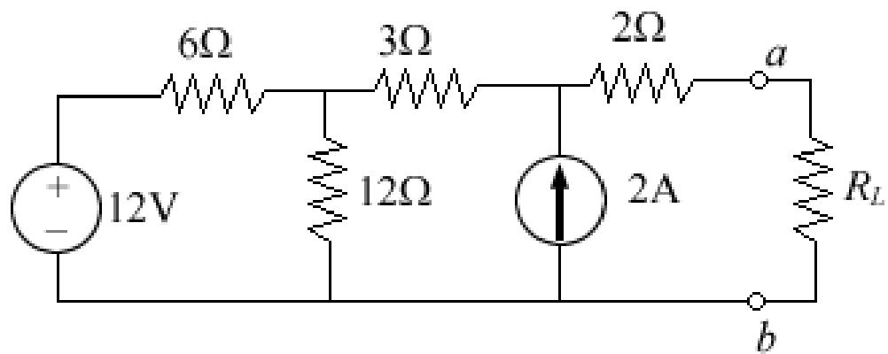

题图

# 解决方案:

$( a ) \quad R _ { \scriptscriptstyle T h } = 2 + 3 + 6 \| 1 2 = 5 + \frac { 6 \times 1 2 } { 1 8 } = 9 \Omega$

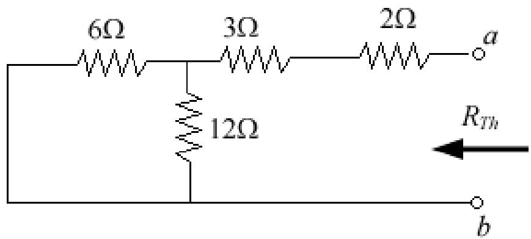

(b) 求 $V _ { T h }$

$$
\text {①} - 1 2 + 1 8 i _ {1} - 1 2 i _ {2} = 0, \text {②} i _ {2} = - 2 \mathrm {A}
$$

$$
i _ {1} = - 2 / 3
$$

对于最外（大）回路：

$$
- 1 2 + 6 i _ {1} + 3 i _ {2} + V _ {T h} = 0 \quad \flat \quad V _ {T h} = 2 2 V
$$

（ C ） 对于最大功率传输，有：

$$
R _ {L} = R _ {T h} = 9 \Omega
$$

$$
P _ {\mathrm {m a x}} = \frac {V _ {T h} ^ {2}}{4 R _ {L}} = \frac {2 2 ^ {2}}{4 \times 9} = 1 3. 4 4 \mathrm {W}
$$

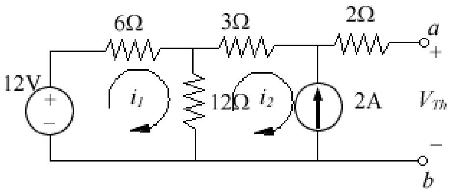

练习4-13试求图4-52所示电路实现最大功率传输时的电阻值RL，并计算相应的最大功率。

答案：126.67Ω，96.71W

解：（ 1 ）求 Rth

假设在ab间加1V的电压源，流出的电流为 I0,方向由b指向a,朝上。独立电压源清零，短路。

$$
6 0 ^ {*} \mid 1 + 1 2 0 ^ {*} \mid 2 + 1 = 0
$$

$$
6 0 ^ {*} \mathrm {I} 1 + 3 0 ^ {*} (\mathrm {I} 1 - \mathrm {I} 2) + 3 ^ {*} 6 0 ^ {*} \mathrm {I} 1 = 0
$$

$$
1 1 = - - 0. 8 7 7 m A
$$

$$
1 2 = - 7. 8 9 4 \mathrm {m A}
$$

$$
1 0 = - 1 2 = 7. 8 9 4 \mathrm {m A}
$$

$$
R t h = V 0 / I 0 = 1 / 0. 0 0 7 8 9 4 = 1 2 6. 6 7 0
$$

(2) 求 Vth

$$
9 = 6 0 ^ {*} \mid 1 + 3 0 ^ {*} \mid 1 + 3 ^ {*} 6 0 ^ {*} \mid 1
$$

$$
1 1 = 1 / 3 0
$$

$$
V t h = 3 0 ^ {*} I 1 + 3 ^ {*} 6 0 ^ {*} I 1 = 2 1 0 ^ {*} I 1 = 2 1 0 / 3 0 = 7 (V)
$$

(3)

$$
P _ {\max } = \frac {V _ {T h} ^ {2}}{4 R _ {L}} = \frac {7 ^ {2}}{4 \times 1 2 6 . 6 7} = 0. 0 9 6 7 \mathrm {W} = 9 6. 7 \mathrm {m W}
$$

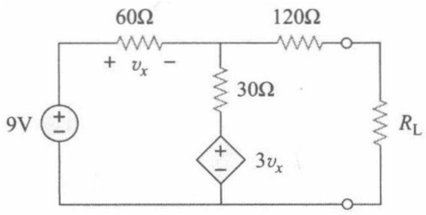

注：与答案单位不一致。查了英文教材，答案是96.71mW.

# 4.10 应用

# 4.10.1 电源建模

实际的电源（如电池），其特征通常是其戴维南或诺顿等效电路。

当内阻（源电阻） Rs 0 、 Rp 时，成为理想电源。

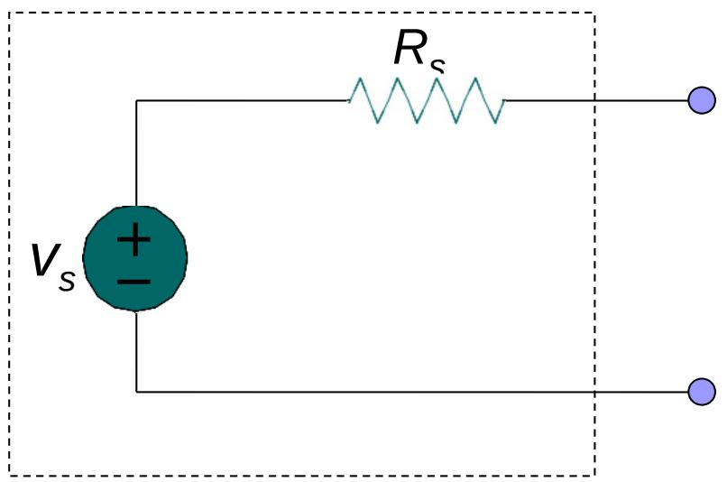

(a) 实际电压源

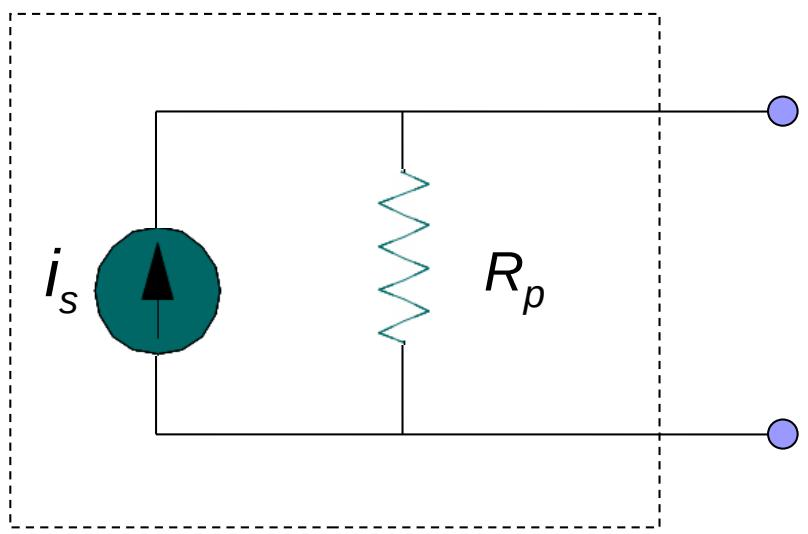

(b) 实际电流源

# 负载效应 (1) — 负载对电压源的影响

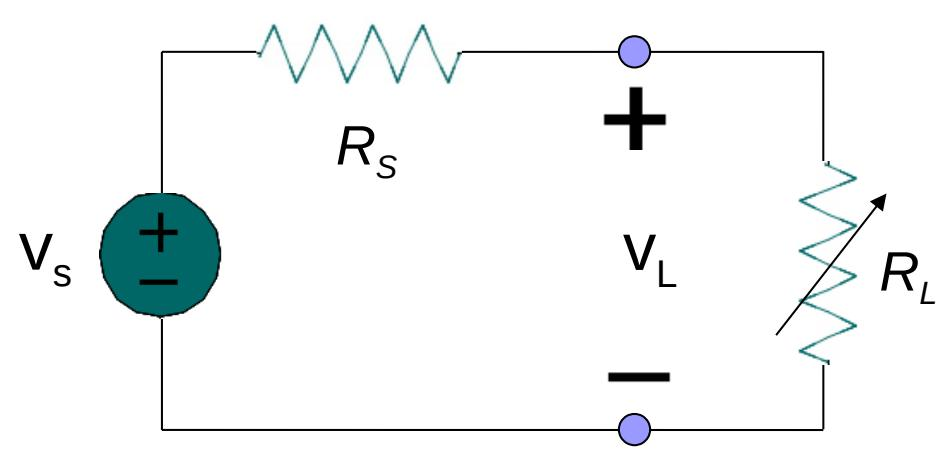

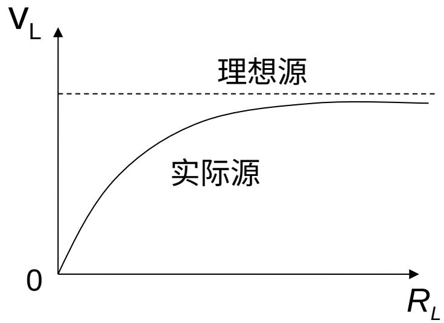

负载电压随着 $\pmb { R } _ { L }$ 的减小而减小

# 负载效应 (2)— 负载对电流源的影响

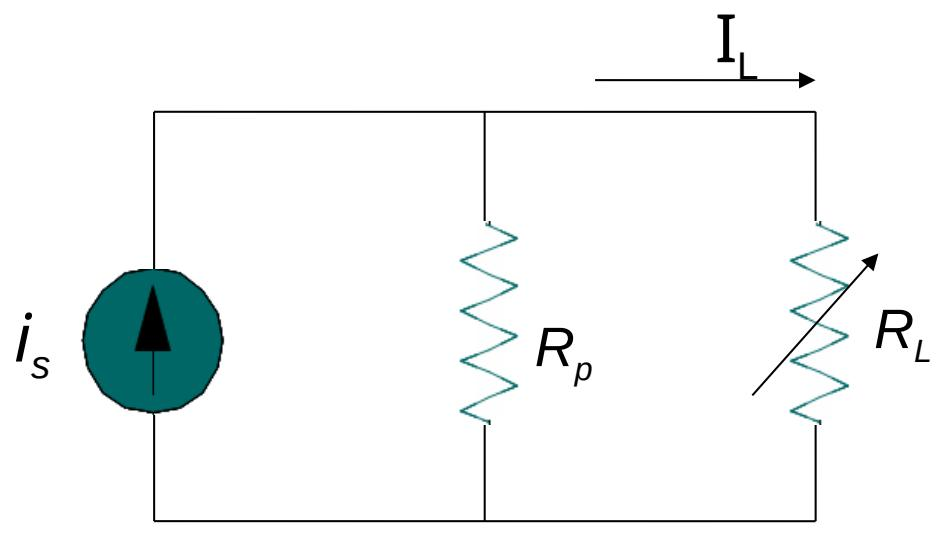

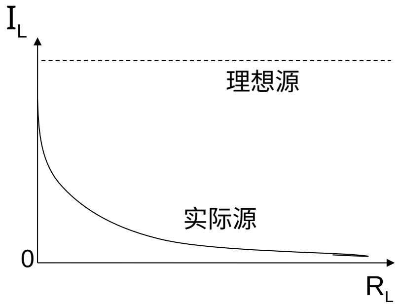

负载电流随着 $\pmb { R } _ { L }$ 的增大而减小

应用（实验）：有时，我们需要知道一个实际电压源的空载电压 $V _ { \mathrm { { s } } }$ 和内阻 ${ \pmb R } _ { s }$ 

(1) 如图 (a) 所示，测量开路电压 $V _ { o c }$ ，S oc v v则 :

(2) 然后连接一个可变负载 $\pmb { R } _ { L }$ （如图（ b ）, 调整阻值 , 使 $v _ { L } = v _ { o c } / 2$ $\boldsymbol { v } _ { L }$则 : $R _ { S } \ = R _ { L }$

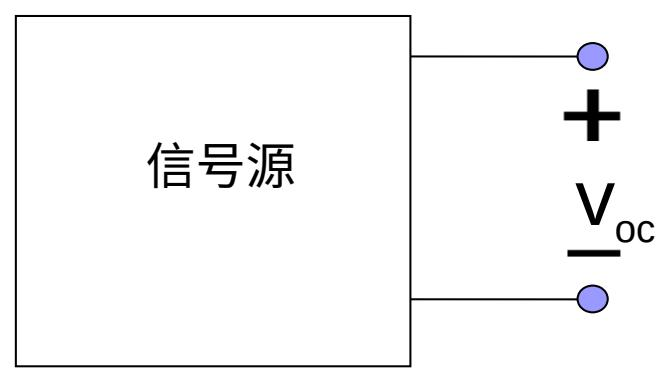

(a) 测量 $\mathsf { v } _ { \mathsf { o c } } ,$

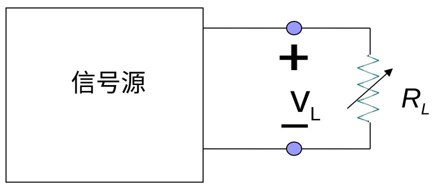

(b) 测量 ${ \mathsf { v } } _ { \mathrm { L } }$

例如 , 对于某汽车电池，其 、 vs 12V RS 0.05

有： I 测 120A0.05 212 

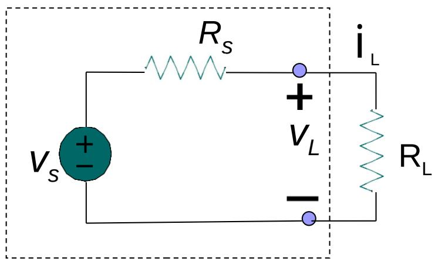

注意：这种测量方法对电池的损害非常大。 因为电流太大了！！！

# 例 4-16 ：

电压源连接 2W 负载时，终端电压为 12V 。当负载断开时，终端电压上升到 12.4V 。 (a) 计算源电压 ${ \bf V _ { s } }$ 和内阻 $\mathbf { R } _ { \mathbf { s } } ; ( \mathbf { b } )$ ${ \bf R } _ { s }$ 确定电压源连接 8Ω 负载时的终端电压。

# 解决方案 :

(a) 我们用它的戴维南等效来代替电压源：

$$
v _ {s} = v _ {o c} = 1 2. 4 V
$$

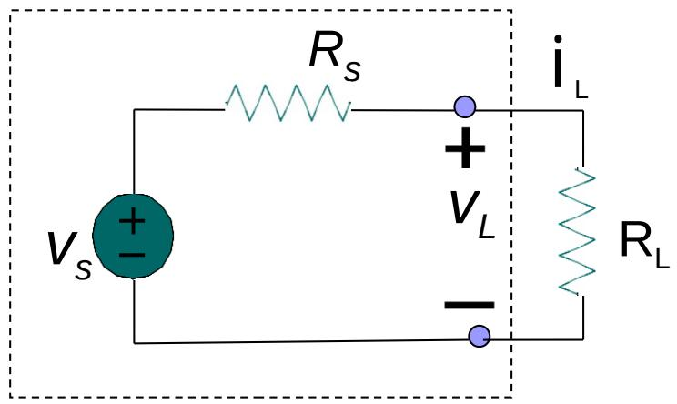

电源的戴维南等效

由题意， $V _ { \mathrm { L } } = 1 2 \mathrm { V }$ ， $\pmb { P } _ { \mathbf { L } } \mathbf { = } 2 \mathbf { W }$ 。因此：

$$
p _ {L} = \frac {v _ {L} ^ {2}}{R _ {L}} \longrightarrow R _ {L} = \frac {v _ {L} ^ {2}}{p _ {L}} = \frac {1 2 ^ {2}}{2} = 7 2 \Omega
$$

$$
i _ {L} = \frac {v _ {L}}{R _ {L}} = \frac {1 2}{7 2} = \frac {1}{6} A
$$

$$
1 2. 4 - 1 2 = 0. 4 = R _ {S} i _ {L}, \quad R _ {S} = \frac {0 . 4}{i _ {L}} = 2. 4 \Omega
$$

(b) 连接 8Ω 负载后：

$$
v = \frac {8}{8 + 2 . 4} \times 1 2. 4 = 9. 5 4 V
$$

负载效应！

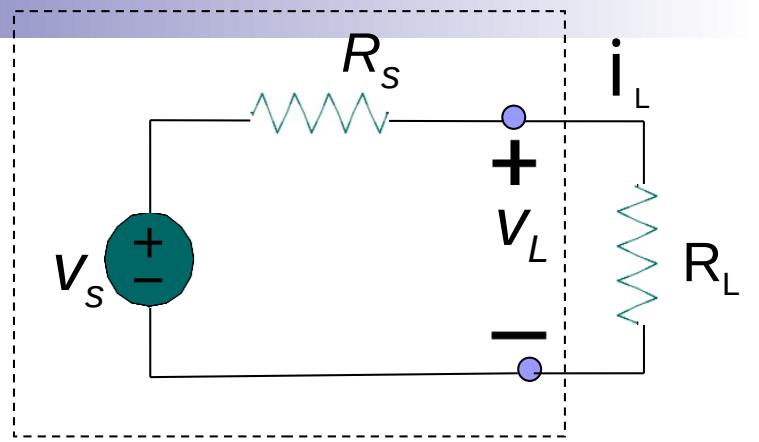

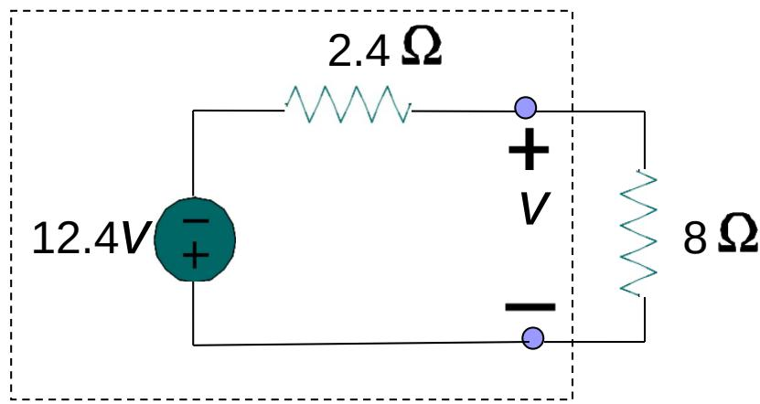

练习4-16某放大器开路时测得的开路电压为16V，当一个8Ω的扬声器与该放大器

答案：12V

解： Voc_8=(8/(8+Rs))*16=8; Rs=8Ʊ

$$
\mathrm {V o c} _ {-} 2 4 = (2 4 / (8 + 2 4)) ^ {*} 1 6 = 1 2 \mathrm {V}
$$

# 惠斯登电桥电路

CD之间接入了一个检流计 G. 当 G 上检测到的电流为 0 时，CD 间开路，且Vc=Vd,(R1+R3)||(R2+R4)

(R3/(R1+R3))*V=(R4/(R2+R4))*V

--R1*R4=R2*R3

R4=(R2*R3)/R1

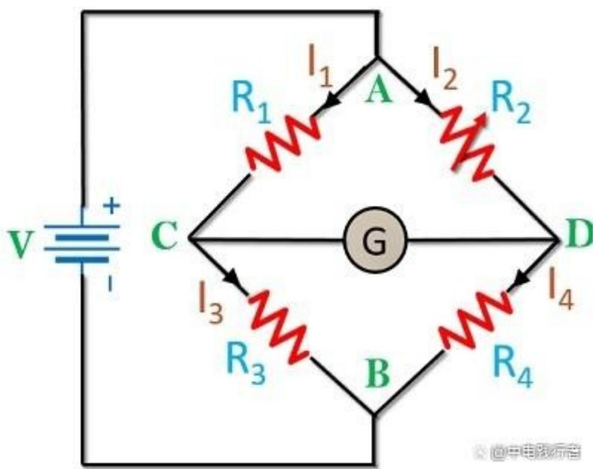

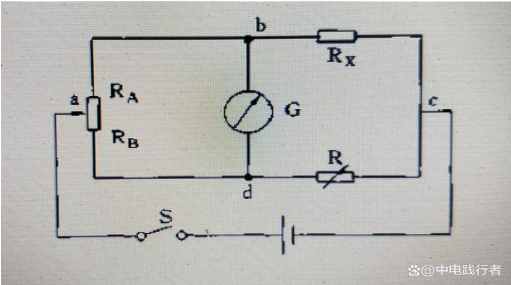

Ra * R = Rb * Rx

# 4.10.2 电阻测量

# 惠斯顿电桥 ( 或 电阻桥 )

 当 $\mathbf { v } _ { 1 } { = } \mathbf { v } _ { 2 }$ 时 , 称为电桥平衡。 平衡时， $R _ { 1 } \ \cdot \ \ R _ { 2 }$ ${ \pmb R } _ { 1 }$ $\pmb { R } _ { 2 }$ 相当于串联， ${ \pmb R } _ { 3 }$ 和 ${ \pmb R } _ { x }$

同 $\frac { \mathsf { E } } { \mathsf { v } _ { 1 } } \underbrace { \mathsf { \Pi } } _ { \begin{array} { c } { \frac { } { } \boldsymbol { R _ { 1 } } + \boldsymbol { R _ { 2 } } } \end{array} } v = v _ { 2 } = \frac { \boldsymbol { R } _ { x } } { \boldsymbol { R } _ { 3 } + \boldsymbol { R } _ { x } } v$ 2 v v 

可得 $R _ { x } = \frac { R _ { 3 } } { R _ { 1 } } R _ { 2 }$ 2R

电流计上没有电流流过

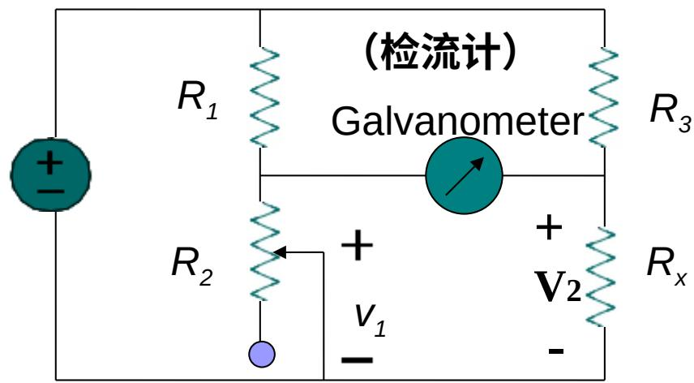

当失去平衡时，电流计上的电流：

$$
I = \frac {V _ {T h}}{R _ {T h} + R _ {m}}
$$

Vth 和 Rth 是 电流计两端的戴维南等效电压和电阻。

# 举例 4.17

如图 4.63, R1 = 500Ω ， R3 = 200Ω ， $\mathbf { R } _ { 2 } = \mathbf { 1 } 2 5 \Omega$ 时，电桥平衡。确定未知电阻 $\mathbf { R } _ { \mathbf { x } }$ 的值。

解决方案 :

利用公式 (4.30) ,

$$
R _ {x} = \frac {R _ {3}}{R _ {1}} R _ {2} = \frac {2 0 0}{5 0 0} \times 1 2 5 = 5 0 \Omega
$$

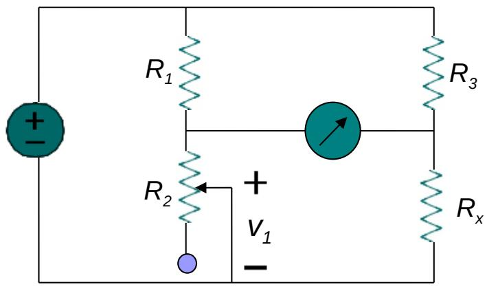

练习4-17在惠斯顿电桥电路中， $R _ { 1 } = R _ { 3 } = 2 \mathbf { k } \Omega$ ，调节 $R _ { 2 }$ 直至无电流流过检流计，此时 $R _ { 2 } = 6 . 3 { \mathrm { k } } \Omega$ ，试问未知电阻的阻值是多少？ 答案： $6 , 3 \mathrm { k } \Omega$

解： R4=(R2*R3)/R1=6.3KƱ

# 举例 4.18

图 4.64 中的电路为不平衡电桥 . 如果检流计的电阻是 40Ω, 求通过检流计的电流 .

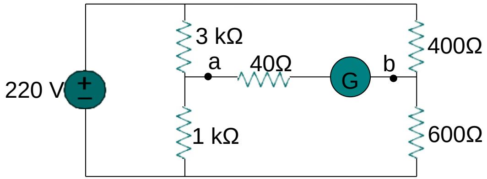

图 4.64 不平衡电桥

# 解决方案:

(a) 求戴维南电阻 :

$$
\begin{array}{l} R _ {\mathrm {T h}} = 3 0 0 0 \left\| 1 0 0 0 + 4 0 0 \right\| 6 0 0 \\ = \frac {3 0 0 0 \times 1 0 0 0}{3 0 0 0 + 1 0 0 0} + \frac {4 0 0 \times 6 0 0}{4 0 0 + 6 0 0} = 7 5 0 + 2 4 0 = 9 9 0 \Omega \\ \end{array}
$$

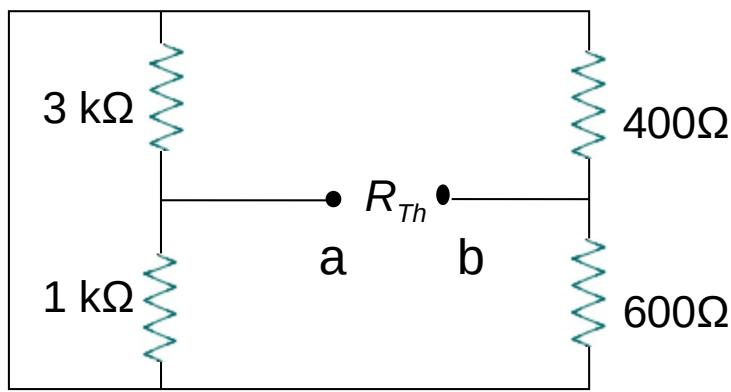

(a求 RTh 80

(b) 求戴维南电压 :

$$
\begin{array}{l} v _ {1} = \frac {1 0 0 0}{1 0 0 0 + 3 0 0 0} (2 2 0) = 5 5 V, v _ {2} = \frac {6 0 0}{6 0 0 + 4 0 0} (2 2 0) = 1 3 2 V \\ - v _ {1} + V _ {T h} + v _ {2} = 0 \quad \text {o r} \quad V _ {T h} = v _ {1} - v _ {2} = 5 5 - 1 3 2 = - 7 7 V \\ \end{array}
$$

V Th 77 RI G (c) 求 IG : $I _ { G }$ R Th m  990 40 mA74.76

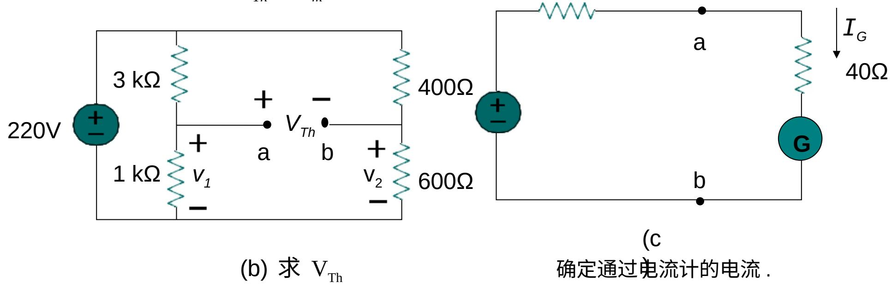

其中负号表示电流的方向与假定方向相反，也就是说电流是由 $b$ 流向 $a$ ?

练习4-18在如图4-66所示的惠斯登电桥中，试求流经阻值为14Ω的检流计的电流。 答案：64mA

解：（ 1 ）求 Rth

$$
R t h = 2 0 | | 3 0 + 6 0 | | 4 0 = 1 2 + 2 4 = 3 6;
$$

(2) 求 Vth ( 设上面的点为 a, 下面的点为 b, 电流由 a 流向 b)

$$
\mathrm {V a} = (3 0 / 5 0) ^ {*} 1 6 = 4 8 / 5 \mathrm {V}
$$

$$
V b = (4 0 / 1 0 0) ^ {*} 1 6 = 3 2 / 5 V
$$

$$
V t h = V a - V b = 1 6 / 5 = 3. 2 V
$$

(3) 流经检流计的电流为：

$$
\mathrm {I} = 3. 2 / (3 6 + 1 4) = 3. 2 / 5 0 = 0. 0 6 4 \mathrm {A} = 6 4 \mathrm {m A}
$$

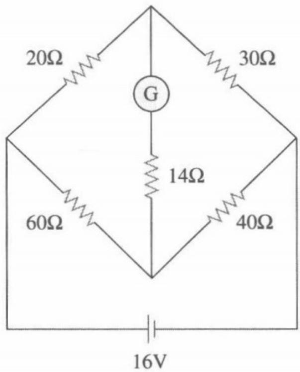

# 4.11 总结

 利用电路定理可将一个复杂的电路简化为一个简单的电路，从而使电路分析更加简单。

线性网络由线性元件、线性受控源和线性独立源组成。

叠加定理指出，对于一个有多个独立源的电路，一个元件上的电压 ( 或电流 ) 等于所有单个电压 ( 或电流 )的代数和。

电源转换是将电压源串联电阻转换为电流源并联电阻的过程，反之亦然。

戴维南定理和诺顿定理允许我们将电路网络中的一部分孤立，而将网络的其余部分用一个等效网络来替代。戴维南等效电路由一个电压源 $V _ { \mathrm { T h } }$ 串联电阻 $R _ { \mathrm { T h } }$ 组成，而诺顿等效电路由一个电流源 $I _ { \mathrm { { N } } }$ 并联电阻 $R _ { \mathrm { { N } } }$ 组成。这两个定理是由电源变换联系起来的。V

$$
R _ {N} = R _ {T h}, \qquad I _ {N} = \frac {\mathbf {\sigma} _ {T h}}{R _ {T h}}
$$

 对于给定的戴维南等效电路，当 $R _ { \mathrm { L } } { = } R _ { \mathrm { T h } }$ 时，即负载电阻等于戴维南电阻时，可实现负载的最大功率传输。

果电压降低至电流为：

A

2利用叠加定理计算电路参数时，并不要求每次仅考虑一个独立源的作用，可以同时考虑多个独立源的作用。

(b)错误

3 叠加定理可用于计算功率。

（b）错误

4图4-67所示电路中， $a { - } b$ 两端的戴维南电

$\cdot \ a \cdot b$ 电

电流

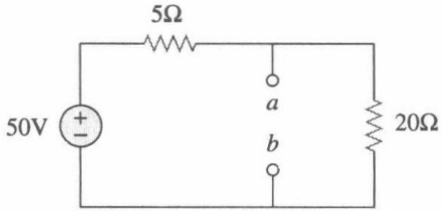

7诺顿电阻 $R _ { \mathrm { N } }$ 恰好等于戴维南电阻 $R _ { \mathrm { T h } }$

(b)错误

8图4-68所示电路中哪一组是等效的？

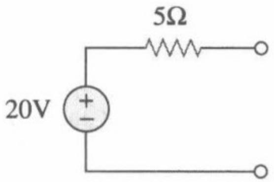

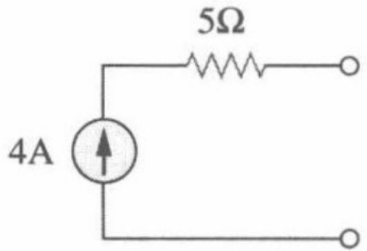

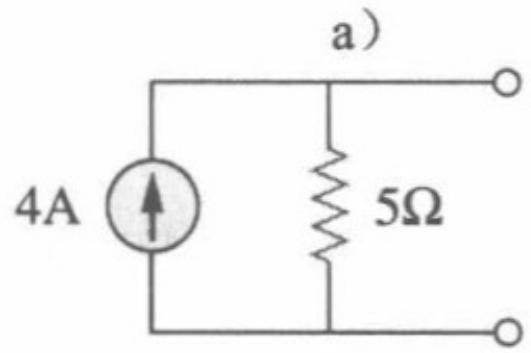

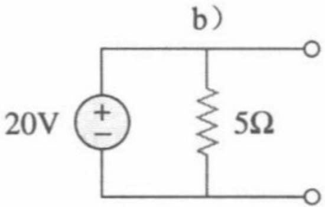

9某负载与电路网络相连，如果在连接该负载的端口处，RTh=10Ω，VTh=40V，则提供给该负载的最大功率为：

（b)80W

(d）1W

10 当负载电阻等于电源电阻时，电源向负载提供最大功率。

(a）正确

（b)错误

答案：

# 本章重点及难点

重点：在现实应用中最常用到的电路定理是戴维南定理和最大功率传递定理，并贯穿整个课程，包括交流电路。

其他重点内容包括线性叠加、电源转换、诺顿等效定理。

难点：带受控源的戴维南等效电路中 RTh的求法。

# 本章作业

画出本章思维导图

4.15 （叠加定理）

4.31 （电源转换）

4.36 （戴维南定理 - 不含受控源）

 4.57 （戴维南 / 诺顿定理 - 含受控源）

4.67 （最大功率传输定理）

拓展题：如何理解负电阻？它的伏安特性和正电阻有何不同？