# 第六章

# 电容和电感

— Fundamentals of Electric Circuit

电路基础

# 6.1 引言

电容和电感被称为储能器件

与耗能且不可逆的电阻相比，电感或电容能够储存或释放能量（具有记忆功能）

# 6.2 电容

一个电容包括两个极板，中间由绝缘体（或电介质）隔开。

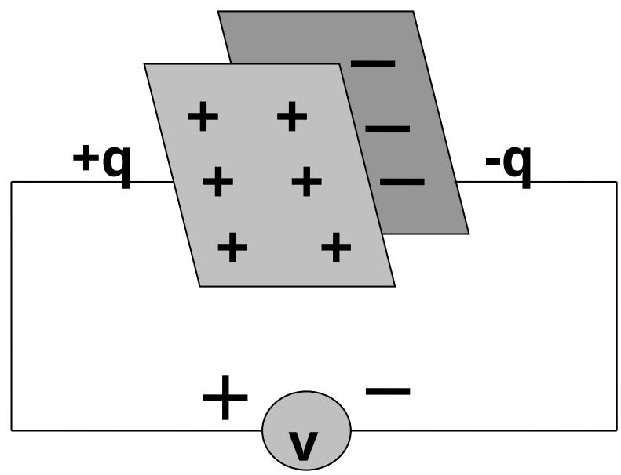

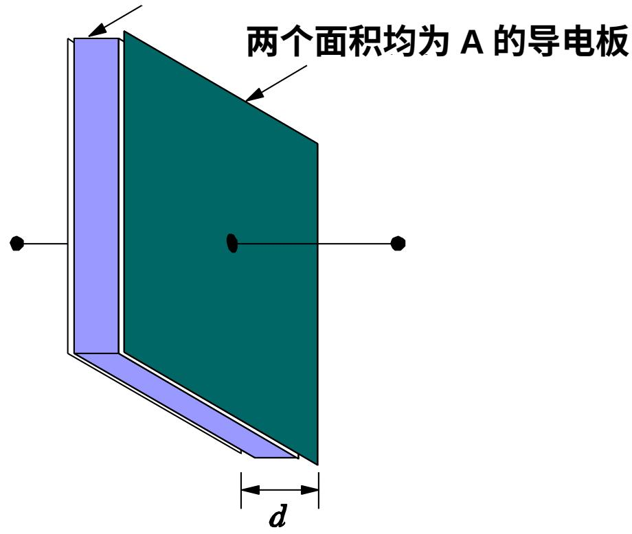

介电系数为 ε 的电介质

两个相互靠近的导体，中间夹一层不导电的绝缘介质，这就构成了电容器。当电容器的两个极板之间加上电压时，电容器就会储存电荷。电容器的电容量在数值上等于一个导电极板上的电荷量与两个极板之间的电压之比。电容器的电容量的基本单位是法拉 (F) 。在电路图中通常用字母 C表示电容元件。

在外电源作用下，两极板分别带上等量的异性电荷，并在介质中形成电场，储存电场能量。

$$
C = \frac {q (t)}{u (t)}
$$

电容器的技术指标：电容量，耐压值

# 电容的容量是电容的一个极板所携带的电荷与两个极板之间电压的比值，单位为法拉（ F ）

$$
1 \mathrm {F} = 1 \mathrm {C} / \mathrm {V}
$$

# 皮法 (pF), 微法 (uF)

$$
C = \frac {q (t)}{u (t)}
$$

1 皮法（ pF ） = ？法(F)

1 法微（ uF ） = ？法(F)

1 皮法（ pF ） ${ \tt = } 1 0 ^ { - 1 2 }$ 法(F)

1 法微（ uF ） $= 1 0 ^ { - 6 }$ 法(F)

对于平板电容器： C =d

$$
C = \frac {\varepsilon A}{d} \tag {6.2}
$$

其中，A是每个导电板的表面面积， $d$ 是两个导电板之间的距离，e则是导电板间电介质的介电常数。虽然式（6.2)仅仅作用于平行板电容器，但是可以看出，电容常数取决于三个因素：

1.导电板的表面面积 -面积越大，电容常数越大。

距离越小，电容常数越大。

3.电介质的介电常数—介电常数越高，电容常数越大。

提示：由式（6.1）和式（6.2）可以看出，电容的电压值与电容大小成反比，如果 $d$$V$ 较高，会出现电弧放电现象。

根据关联参考方向，当 $\pmb { \nu } > \mathbf { 0 }$ 且 i > 0 ， 或者 v< 0 且 i < 0 时，电容充电；当 v i < 0 时，电容放电。

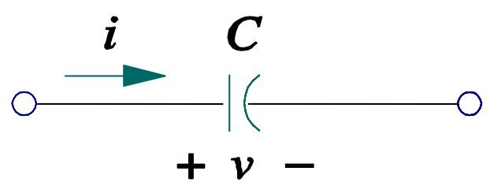

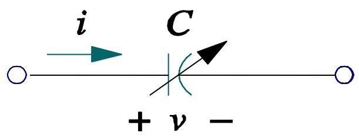

电容的电路符号 a) 固定电容 b) 可变电容

伏安关系：

$$
i = \frac {d q}{d t} = C \frac {d v}{d t}
$$

满足改方程式的电容称为线性电容

1) i 与某时刻的 v 无关，与该时刻 v 的变化量有关。若电压不变，则电流为 0. （动态特性，动态元件，隔直流，通交流） 

2 ）若 i 为有限值， v 不能跃变（ v 的连续性）。

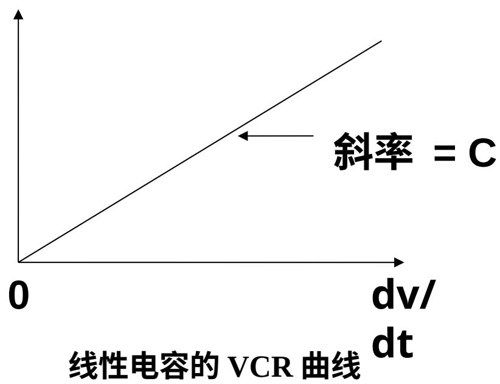

线性电容的C不随电压改变，由电容的材料决定。

有的电容是非线性电容。但大部分都是线性电容。

本课程只讲授线性电容。

$$
i = C \frac {d v}{d t} \quad \longrightarrow \quad v = \frac {1}{C} \int_ {0} ^ {t} i d t + v \left(t _ {0}\right)
$$

 起始电压 v $\left( \mathbf { \sigma } _ { t _ { 0 } } \right)$ ）体现历史（记忆特性，记忆元件）（储存特性，储存元件）.可用作动态存储器（DRAM)的存储元。

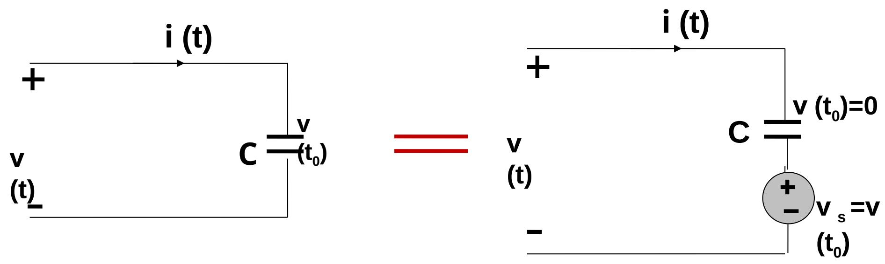

$\spadesuit$  初始电压为 $\nu ( t _ { 0 } )$ 的电容可等效成一个 $\pmb { \nu } _ { \mathrm { s } } = \pmb { \nu } ( \pmb { t } _ { 0 } )$ 的电压源和一个初始电压为 0 而电容值相同的电容串联。

# 电容上储存的能量为

$$
w = \frac {1}{2} C v ^ {2}
$$

1) 电容电压具有记忆性。

2 ） 电压的连续性。

教材上有详细的推导。

传递给电容的瞬时功率为：

$$
p = v i = C v \frac {\mathrm {d} v}{\mathrm {d} t} \tag {6.7}
$$

因此，电容上储存的能量为：

$$
w \int_ {- \infty} ^ {t} p (\tau) d \tau = C \int_ {- \infty} ^ {t} v \frac {d v}{d \tau} d \tau = C \int_ {v (- \infty)} ^ {v (t)} v d v = \left. \frac {1}{2} C v ^ {2} \right| _ {v (- \infty)} ^ {v (t)} \tag {6.8}
$$

$t = - \infty$ 时，电容处于不带电状态，因此 $v ( - \infty ) = 0$ ，这样可得到如下公式：

$$
w = \frac {1}{2} C v ^ {2} \tag {6.9}
$$

$$
w = \frac {q ^ {2}}{2 C} \tag {6.10}
$$

# 电容有以下重要特性：

1. 电容对于直流电路来说是开路的。 （但是电池与电容相连时，会对电容充电，充到电池的电压值之后就没有电流了，就相当于开路）。

2. 电容上的电压不会产生突变。

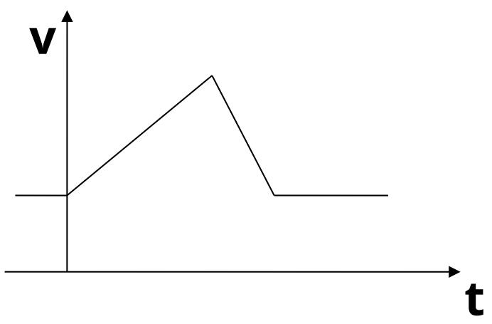

(a) 允许

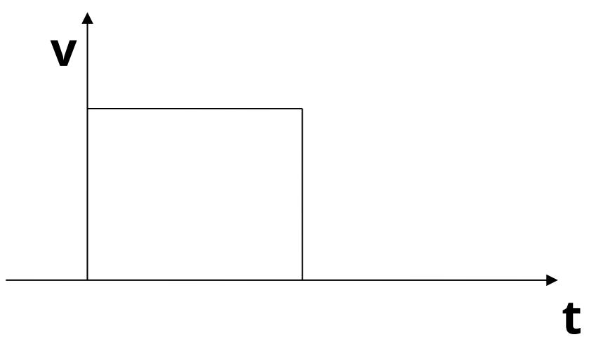

(b) 不允许

提示：可以利用式（6.9）来理解电容电压不能突变的性质。该式表明电容能量与电压的平方成正比关系，而能量的注入和释放是需要通过一段时间来完成的，因此电容电压不能

# 电容器充放电的原理：

当电容器接通电源以后，在电场力的作用下,与电源正极相接电容器极板的 自由电子将经过电源移到与电源负极相接的极板下，正极由于失去负电荷而带正电，负极由于获得负电荷而带负电,正,负极板所带电荷大小相等，符号相反。电荷定向移动形成电流,由于同性电荷的排斥作用,所以开始电流最大,以后逐渐减小。在电 荷移动过程中，电容器极板储存的电荷不断增加,电容器两极板间电压 Uc 等于电源电压 U 时电荷停止移动，电流 I=0 。

# 注意事项：

电容器由于电容器的两极具有剩留残余电荷的特点，所以，首先应设法将其电荷放尽，否则容易发生触电事故。

通过导线连接电容器正负极板 , 电容器正负极板电荷中和掉。

电容器 C 正极正电荷可以移动负极上中和掉 , 负极负电荷也可以移到正极中和掉 , 电荷逐渐减少，表现电流减小，电压也逐渐减小为零。

3. 理想的电容是不会消耗能量的。它从电路中获得能量并储存在电场中，然后将之前储存的能量释放到电路中。

4. 实际电容有一个并联模式的漏电阻 , 如下图。

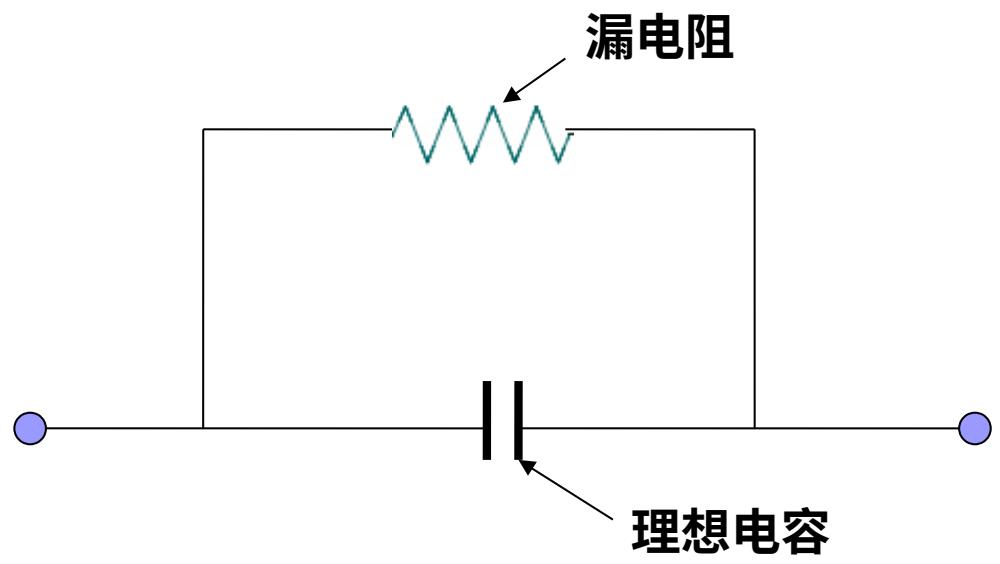

# 非理想电容的电路模型

4.实际电容有一个并联模式漏电阻，如图6-8所示。然而，这个漏电阻可高达100MΩ，因此可在很多实际应用中忽略不计。所以，本书所涉及的电容都假设为理想电容。

# 例 6-1 ：

(a) 一个 3pF 的电容两端加上 20V 的电压后，可以储存多少电荷？

(b) 电容可以储存的能量有多少？

解 :

(a) 由于 $q = \mathbf { C } \nu$ , 所以

$$
q = 3 \times 1 0 ^ {- 1 2} \times 2 0 = 6 0 (p C)
$$

(b) 储存的能量值为

$$
W = \frac {1}{2} C v ^ {2} = \frac {1}{2} \times 3 \times 1 0 ^ {- 1 2} \times 4 0 0 = 6 0 0 (\mathrm {p J})
$$

练习6-1如果一个 $4 . 5 \mu \mathrm { F }$是多少？储存了多少能量？

解： Q=CV; V=Q/C=(0.12*10-3 ） /(4.5*10-6)=26.67(V); 说明：书上答案的单位错了

$$
W = Q ^ {2} / (2 C) = \left[ \left(0. 1 2 ^ {*} 1 0 ^ {- 3}\right) ^ {2} \right] / \left(2 ^ {*} \left(4. 5 ^ {*} 1 0 ^ {- 6}\right)\right) = 1. 6 (\mathrm {m J})
$$

例 6-2 ：

作用在一个 5 µF 的电容上的电压为 v t tV ( ) 10cos 6000 计算其上的电流。

解 :

$$
\begin{array}{l} i (t) = C \frac {d v}{d t} = 5 \times 1 0 ^ {- 6} \frac {d}{d t} (1 0 \cos 6 0 0 0 t) \\ = - 5 \times 1 0 ^ {- 6} \times 1 0 \sin 6 0 0 0 t = - 0. 3 \sin 6 0 0 0 t A \\ \end{array}
$$

？上面的式子的第一个等号后面有错。改为如下：

$$
= - 5 \times 1 0 ^ {- 6} \times 1 0 \times 6 0 0 0 \times \sin 6 0 0 0 t (A) = - 0. 3 \sin 6 0 0 0 t (A)
$$

观察：电容器上 i 超前 v 900( 图）

 “ 纯电容电路，电流的相位超前电压 90 度”的意思是：在电容上的电流最大时电压为 0 ，电压最大时电流为 0 。

 对于直流电来说，当电容两端加上直流电压时的瞬间，会有很大的电流，但是电压则是随着电容充电量的增加而逐渐增加的。

 对于正弦交流电来说，同样满足上面的电压电流关系，但是注意，电流或电压为 0 时是没有正负的，电流或电压最大时可能是正，也可能是负。

 另外是先有电流才会给电容充电，充了电才会有电荷，有了电荷才有的电压，所以通常说电流超前电压90° ，而不说电流滞后电压 270° 。

# 例 6-4 ： （略）

作用在一个 200 µF 的电容上的电压如图所示，计算通过它的电流。

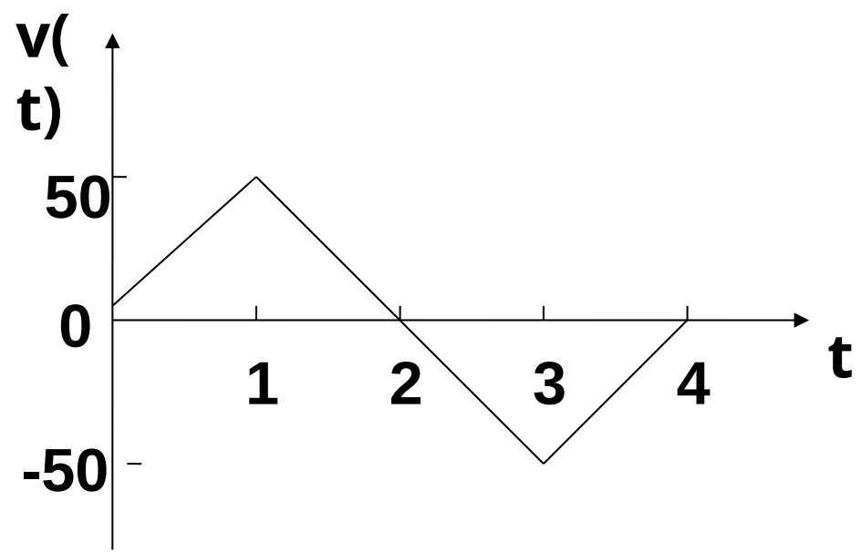

解 :

# 电压波形可以用

# 分段函数表示：

$$
v (t) = \left\{ \begin{array}{l l} 5 0 t V & 0 <   t <   1 \\ (1 0 0 - 5 0 t) \quad V & 1 <   t <   3 \\ (- 2 0 0 + 5 0 t) \quad V & 3 <   t <   4 \\ 0 & \text {o t h e r w i s e} \end{array} \right.
$$

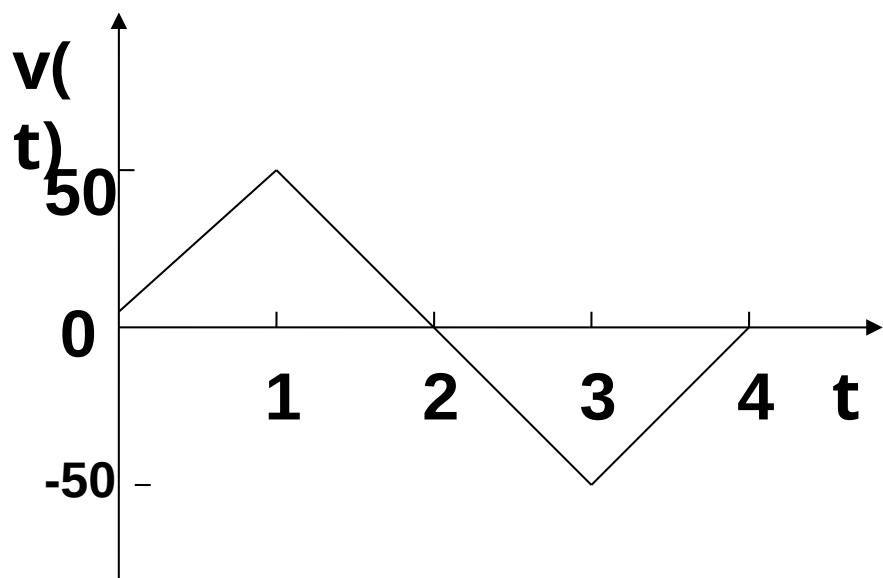

# 由于 i = C dv/dt 且 C = 200 uF , 对电压求导可得：

$$
\begin{array}{l} i (t) = 2 0 0 \times 1 0 ^ {- 6} \times \left\{ \begin{array}{l l} 5 0 & 0 <   t <   1 \\ - 5 0 & 1 <   t <   3 \\ 5 0 & 3 <   t <   4 \\ 0 & o t h e r w i s e \end{array} \right. \\ = \left\{ \begin{array}{l l} 1 0 m A & 0 <   t <   1 \\ - 1 0 m A & 1 <   t <   3 \\ 1 0 m A & 3 <   t <   4 \\ 0 & o t h e r w i s e \end{array} \right. \\ \end{array}
$$

可见电容两端电压不能跃变，电流可以跃变。

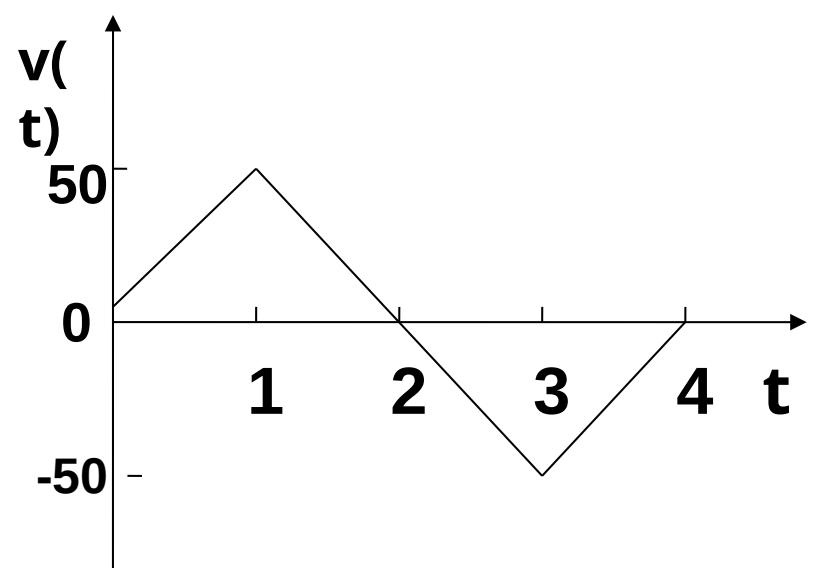

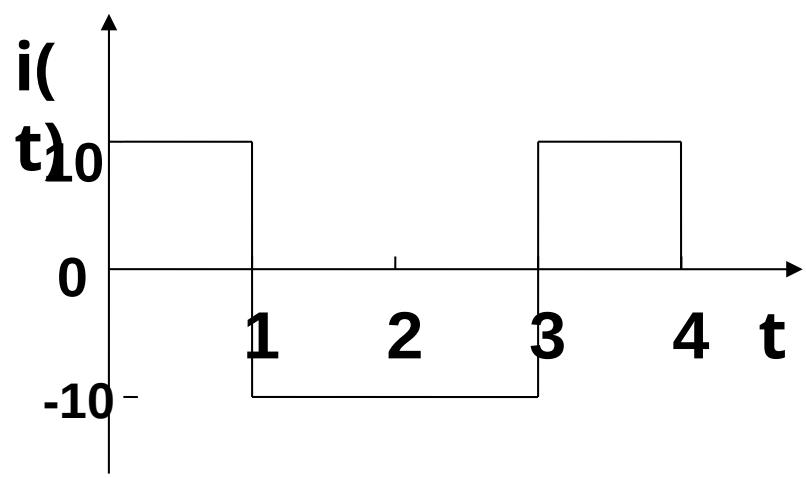

$t$$= 2 \mathrm { m s }$ $t = 5 \mathrm { m s }$ 时的电容两端电压。

解：i=dq/dt

$$
\mathbf {q} = \int_ {0} ^ {2} i d t = 1 0 0 \times 1 0 ^ {- 6} \mathrm {C}
$$

t=2ms时；V=Q/C=(100X10-6）/1x10-3=100mV;

t=2ms 到t=5ms 期间;

$$
q = 1 0 0 ^ {*} 3 ^ {*} 1 0 ^ {- 6} C
$$

$$
\begin{array}{l} \mathrm {V = Q / C = (1 0 0 \times 1 0 ^ {- 6} + 1 0 0 ^ {*} 3 ^ {*} 1 0 ^ {- 6}) / / 1 \times 1 0 ^ {- 3}} \\ = 4 0 0 \mathrm {m V}; \end{array}
$$

$$
v = \frac {1}{C} \int_ {0} ^ {t} i d t + v (t _ {0})
$$

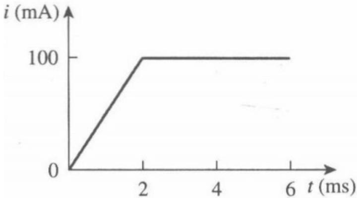

堂练

解： i=50t , 0≤t≤2

$$
v = \frac {1}{C} \int_ {0} ^ {t} i d t + v \left(t _ {0}\right)
$$

$$
V = 1 / \left(1 ^ {*} 1 0 ^ {- 3}\right) ^ {*} 5 0 ^ {*} (1 / 2) t ^ {2} = 2 5 0 0 0 ^ {*} t ^ {2}
$$

T=2ms 时

$$
V = 2 5 0 0 0 ^ {*} \quad (2 ^ {*} 1 0 ^ {- 3}) ^ {2} = 0. 1 V = 1 0 0 m V
$$

$$
i = 1 0 0 m A = 0. 1 A, \quad 2 \leq t
$$

$$
V = 1 / \left(1 ^ {*} 1 0 ^ {- 3}\right) ^ {*} 0. 1 ^ {*} t | _ {0. 0 0 2} ^ {0. 0 0 5} + 0. 1 = 0. 3 V + 0. 1 V = 0. 4 V = 4 0 0 m V
$$

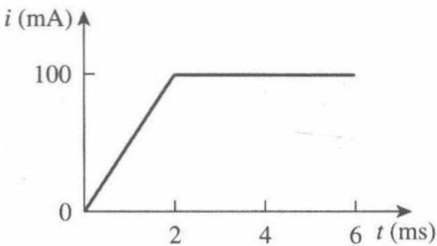

# 例 6-5 ：

计算图中每一个电容在直流电源下存储的能量。

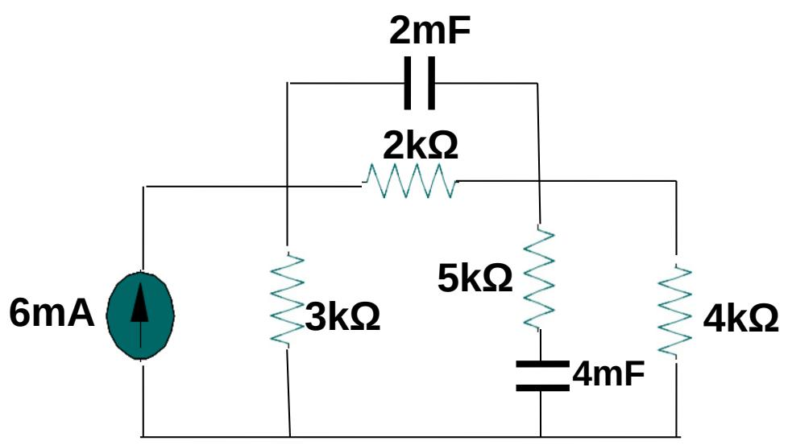

解 :

在直流电源下，电容可看做开路。

在 2-kΩ 和 4-kΩ 串联的电阻支路上的电流：

$$
i = \frac {3}{3 + (2 + 4)} (6 m A) = 2 m A
$$

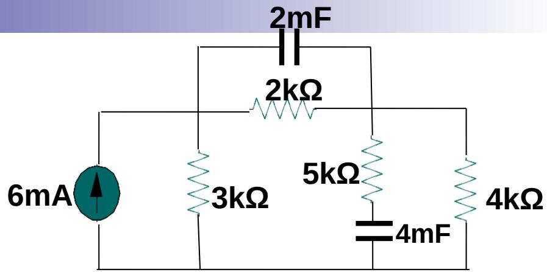

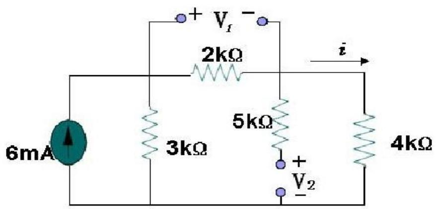

直流等效

作用在电容上的电压$V _ { 1 }$ 和 $V _ { 2 }$ 分别为：

$$
V _ {1} = 2 0 0 0 i = 4 \mathrm {V}
$$

$$
V _ {2} = 4 0 0 0 i = 8 V
$$

# 则他们存储的能量为：

$$
\begin{array}{l} W _ {1} = \frac {1}{2} C _ {1} V _ {1} ^ {2} = \frac {1}{2} (2 \times 1 0 ^ {- 3}) (4) ^ {2} = 1 6 m J \\ W _ {2} = \frac {1}{2} C _ {2} V _ {2} ^ {2} = \frac {1}{2} (4 \times 1 0 ^ {- 3}) (8) ^ {2} = 1 2 8 m J \\ \end{array}
$$

解：电容隔离直流

$$
\mathrm {I} = 5 0 / (1 + 3 + 6) = 5 \mathrm {m A}
$$

$$
\mathrm {V} (3 0) = 5 ^ {*} 3 = 1 5 \mathrm {V}
$$

$$
\mathrm {W} (3 0) = 0. 5 ^ {*} \mathrm {C} ^ {*} \mathrm {V} ^ {*} \mathrm {V} = 0. 5 ^ {*} 3 0 ^ {*} 1 5 ^ {*} 1 5 = 3. 3 7 5 \mathrm {m J}
$$

$$
\mathrm {V} (2 0) = 5 ^ {*} 9 = 4 5 \mathrm {V}
$$

$$
\mathrm {W} (3 0) = 0. 5 ^ {*} \mathrm {C} ^ {*} \mathrm {V} ^ {*} \mathrm {V} = 0. 5 ^ {*} 2 0 ^ {*} 4 5 ^ {*} 4 5 = 2 0. 2 5 \mathrm {m J}
$$

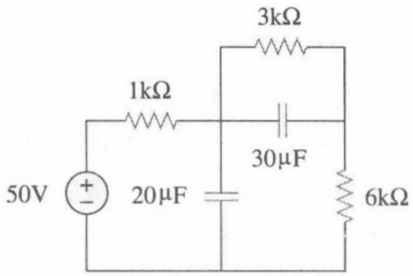

$$
w = \frac {1}{2} C v ^ {2}
$$

# 例 （堂练）

电路如图（ a ）所示，设电流 i(t) 波形如图（ b ）。已知： C=0.5uF ，当 t=0 时，电容初始电压 ${ \pmb u } _ { \mathrm { c } } ( { \pmb 0 } ) \mathrm { = } { \pmb 0 }$ 。求：t≥0 时电容电压 $u _ { \mathrm { c } } ( \mathbf { t } ) \cdot$ 、吸收功率 $ { p _ { \mathrm { c } } } ( \mathbf t )$ 和储能 ${ \pmb w } _ { \mathrm { c } } ( { \bf t } )$ ，并画出他们的波形图。

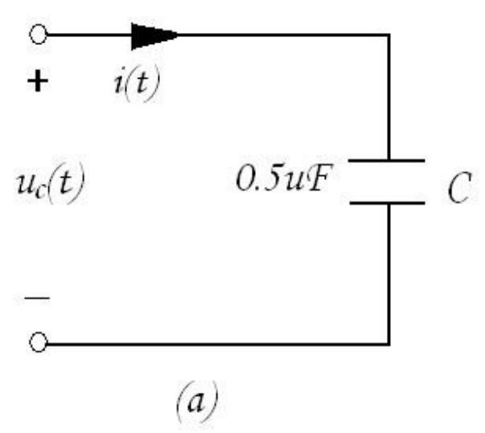

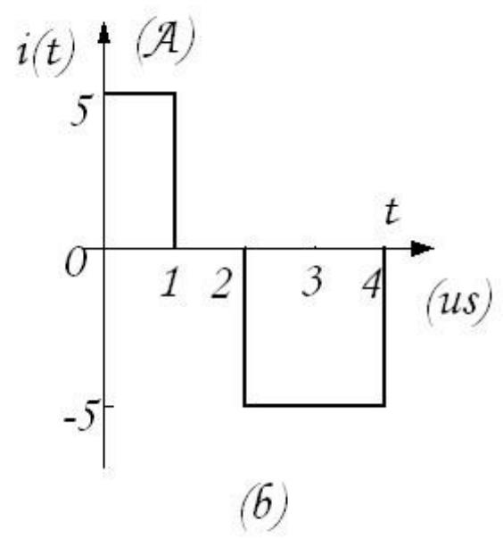

解：

电流 i(t) 的分段函数：

$$
i (t) = \left\{ \begin{array}{l l} 5 A & \quad 0 \leq t \leq 1 \mathrm {u s} \\ 0 & \quad 1 \mathrm {u s} \leq t \leq 2 \mathrm {u s} \\ - 5 A & \quad 2 \mathrm {u s} \leq t \leq 4 \mathrm {u s} \\ 0 & \quad t > 4 \mathrm {u s} \end{array} \right.
$$

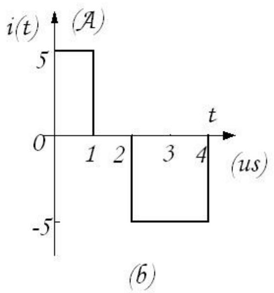

根据电容伏安关系的积分式，得：

1 ） 当 0 1  t us

$$
\begin{array}{l} u _ {c} (t) = u _ {c} (0) + \frac {1}{C} \int_ {0} ^ {t} i (\tau) d \tau = 0 + \frac {1}{0 . 5 \times 1 0 ^ {- 6}} \int_ {0} ^ {t} 5 d \tau \\ = 1 0 \times 1 0 ^ {6} t (V) \\ \end{array}
$$

$$
u _ {c} (1 u s) = 1 0 \times 1 0 ^ {6} \times 1 \times 1 0 ^ {- 6} = 1 0 (V)
$$

2 ） 当 1≤ t ≤ 2 µs

$$
\begin{array}{l} u _ {c} (t) = \underline {{u _ {c} (1 u s)}} + \frac {1}{C} \int_ {1} ^ {t} i (\tau) d \tau = 1 0 (V) \\ u _ {c} (2 u s) = 1 0 (V) \\ \end{array}
$$

3 ） 2 4 us t us  当

$$
\begin{array}{l} u _ {c} (t) = \underline {{u _ {c} (2 u s)}} + \frac {1}{C} \int_ {1} ^ {t} i (\tau) d \tau \\ = 1 0 + \frac {1 ^ {\text {C} _ {2}}}{0 . 5 \times 1 0 ^ {- 6}} \int_ {2} ^ {t} (- 5) d \tau \\ = 1 0 - 1 0 \times 1 0 ^ {6} (t - 2 \times 1 0 ^ {- 6}) \\ = 3 0 - 1 0 \times 1 0 ^ {6} t (V) \\ \end{array}
$$

$$
u _ {c} (4 u s) = 3 0 - 1 0 \times 1 0 ^ {6} \times 4 \times 1 0 ^ {- 6} = - 1 0 (V)
$$

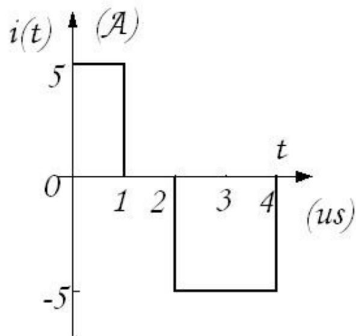

# 4 ）当 t us 4

$$
\begin{array}{r l} u _ {c} (t) & = \underline {{u _ {c} (4 u s)}} + \frac {1}{C} \int_ {4} ^ {t} i (\tau) d \tau \\ & = - 1 0 (V) \end{array}
$$

根据 $p _ { c } ( t ) = u _ { c } ( t ) \mathbb { I } i ( t )$

$$
p _ {c} (t) = \left\{ \begin{array}{l l} 5 0 \times 1 0 ^ {6} \mathrm {t} (\mathrm {W}) & 0 \leq \mathrm {t} \leq 1 \mathrm {u s} \\ 0 & 1 \mathrm {u s} \leq \mathrm {t} \leq 2 \mathrm {u s} \\ 5 0 \times 1 0 ^ {6} t - 1 5 0 (\mathrm {W}) & 2 \mathrm {u s} \leq \mathrm {t} \leq 4 \mathrm {u s} \\ 0 & \mathrm {t > 4 u s} \end{array} \right.
$$

根据 ${ \boldsymbol { w } } _ { c } ( t ) = \frac { 1 } { 2 } { \boldsymbol { C } } { \boldsymbol { u } } _ { c } ^ { 2 } ( t )$

$$
w _ {c} (t) = \left\{ \begin{array}{l l} 2 5 \times 1 0 ^ {6} t ^ {2} (\mathrm {J}) & 0 \leq t \leq 1 \mathrm {u s} \\ 2 5 (u J) & 1 \mathrm {u s} \leq t \leq 2 \mathrm {u s} \\ 2 2 5 \times 1 0 ^ {- 6} - 1 5 0 t + 2 5 \times 1 0 ^ {6} t ^ {2} (J) & 2 \mathrm {u s} \leq t \leq 4 \mathrm {u s} \\ 2 5 (\mathrm {u J}) & t > 4 \mathrm {u s} \end{array} \right.
$$

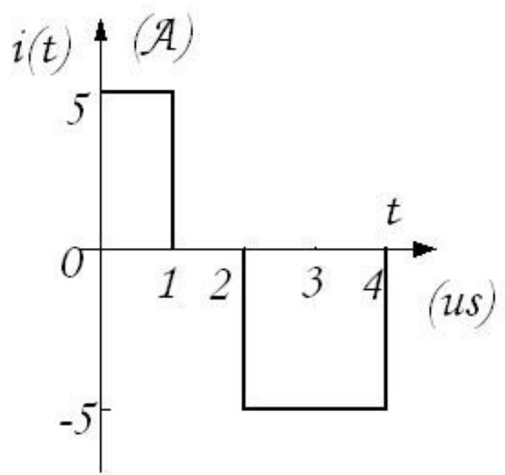

（6）

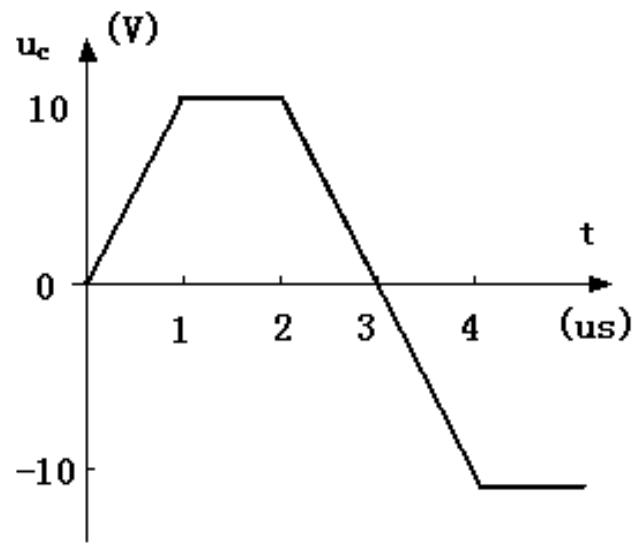

(a)电压波形

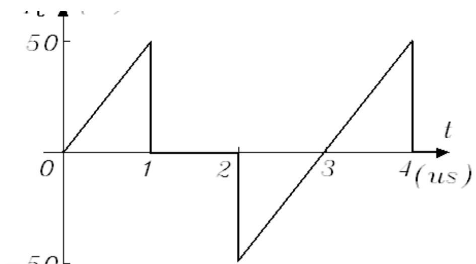

（b）功率波形

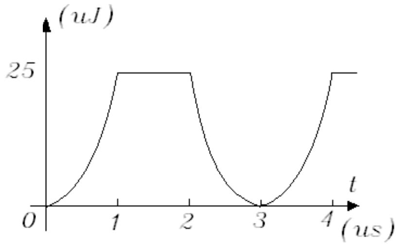

（ $c$ ）储能波形

按以上结果画出电容 和 ，如上图所示。由图可注 c c意到电容具有以下特性：

（ 1 ）电压与电流波形不相同，这是电容动态元件区别于电阻元件的特性；

（ 2 ）电压增大时电流为正值；电压减少时电流为负值；电压不变时电流为零，体现了电容的伏安特性；

（ 3 ）电压和储能具有连续性，而电流和功率可跃变；

（ 4 ）储能不小于零，体现了电容是无源元件；

（ 5 ）其功率可正可负，不同于电阻吸收功率总大于零。电压绝对值增大时功率为正，储能增大；电压绝对值减少时，功率为负，储能减少，体现了电容不断充放电的过程。

# 6.3 电容的串并联

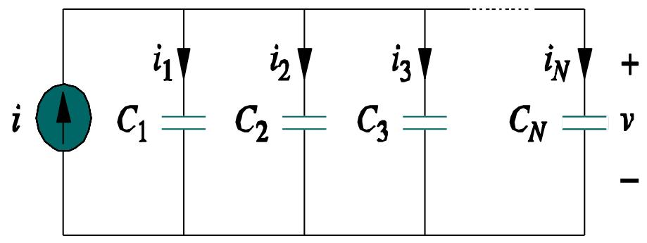

(a)

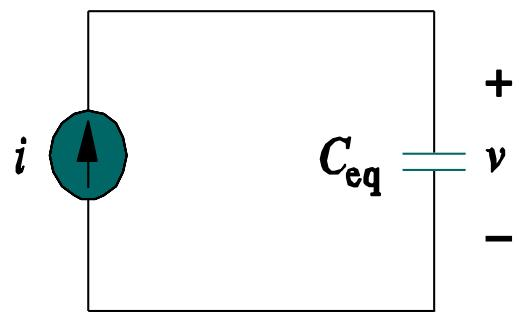

(b)

N 个并联电容的等效电容是各个电容的和。

$$
\mathbf {C} _ {e q} = \mathbf {C} _ {1} + \mathbf {C} _ {2} + \mathbf {C} _ {3} + \dots + \mathbf {C} _ {N}
$$

( 相当于平板面积

A↑ ， C↑ ）

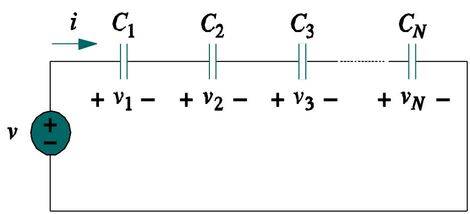

(a)

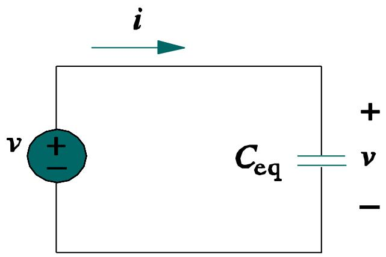

(b)

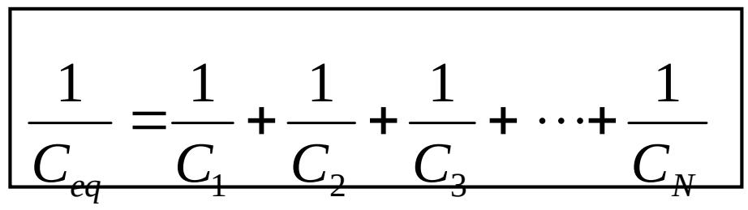

( 相当于平板间距

d↑ ， C↓ ）

串联电容的等效电容就是每个电容倒数之和的倒数。

# 例 6-6 ：

计算图示电路中 a-b 之间的等效电容。 （堂练）

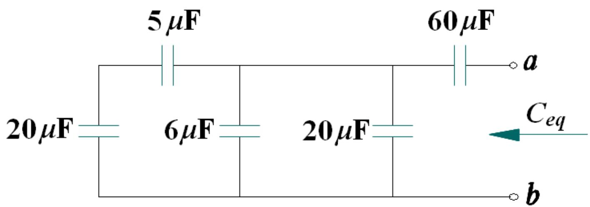

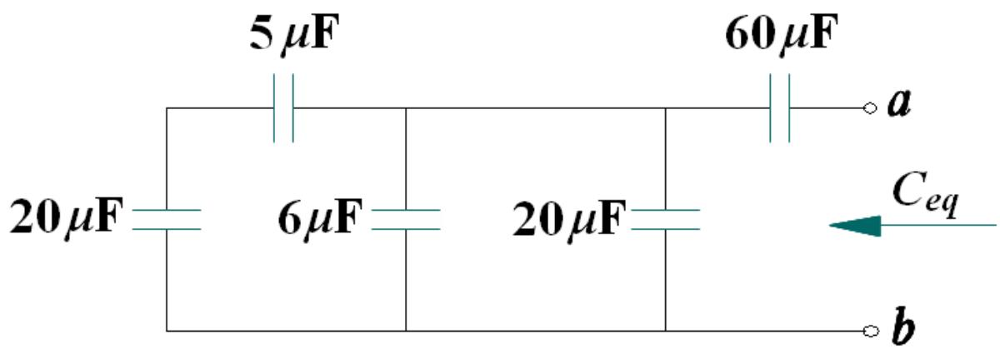

解 :

$$
\frac {2 0 \times 5}{2 0 + 5} = 4 \mu \mathrm {F}
$$

$$
4 + 6 + 2 0 = 3 0 \mu \mathrm {F}
$$

$$
C _ {e q} = \frac {3 0 \times 6 0}{3 0 + 6 0} = 2 0 \mu \mathrm {F}
$$

练习6-6计算图6-17所示电路终端的等效电容。

解：最右边 60 串 120=40 微法

40 并 $2 0 { = } 6 0$ 微法

50 并 $7 0 { = } 1 2 0$ 微法

60 串 120=40 微法

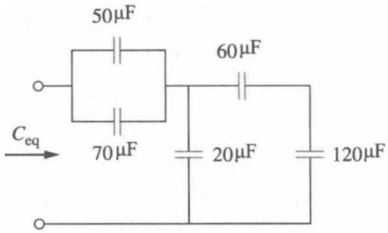

答案：40μF

# 例 6-7 ： （略，课后自

# 习） 计算图中每个电容上的电压。

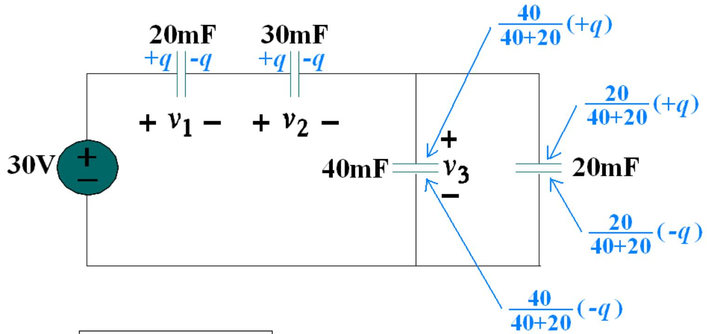

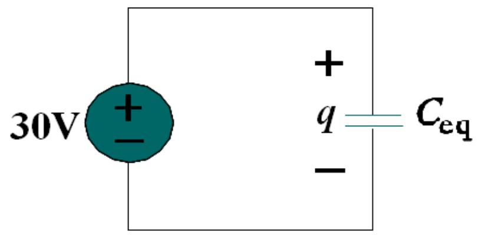

解 :

$$
4 0 + 2 0 = 6 0 \mathrm {m F}.
$$

因此 ,

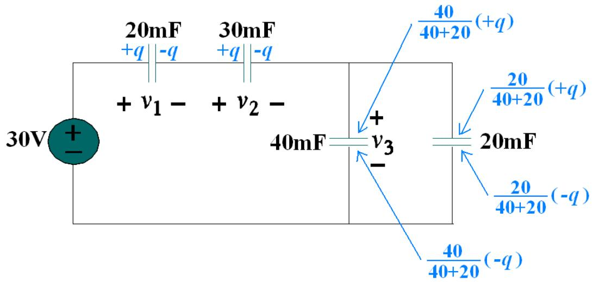

$$
C _ {e q} = \frac {1}{\frac {1}{6 0} + \frac {1}{3 0} + \frac {1}{2 0}} = 1 0 \mathrm {m F},
$$

$$
q = C _ {e q} v = 1 0 \times 1 0 ^ {- 3} \times 3 0 = 0. 3 \mathrm {C}
$$

$$
v _ {1} = \frac {q}{C _ {1}} = \frac {0 . 3}{2 0 \times 1 0 ^ {- 3}} = 1 5 \mathrm {V},
$$

$$
v _ {2} = \frac {q}{C _ {2}} = \frac {0 . 3}{3 0 \times 1 0 ^ {- 3}} = 1 0 \mathrm {V}
$$

$$
v _ {3} = 3 0 - v _ {1} - v _ {2} = 5 \mathrm {V} \quad \mathrm {o r}
$$

$$
v _ {3} = \frac {q}{6 0 \mathrm {m F}} = \frac {0 . 3}{6 0 \times 1 0 ^ {- 3}} = 5 \mathrm {V}
$$

# 练习6-7计算图6-20中每个电容上的电压。

解：先求总的等效电容 Ceq

最右边： 60 串 30=60*30/(60+30)=20

$$
\mu F
$$

20 并 20=40μF

40 串 40=20μF =Ceq

$$
\begin{array}{l} Q = C e q ^ {*} V = 2 0 ^ {*} 1 5 0 = 3 0 0 0 \mu C \\ V 1 = Q / C 1 = 3 0 0 0 / 4 0 = 7 5 V \\ \mathrm {V} 2 = \mathrm {Q} / 4 0 = 7 5 = 1 5 0 - \mathrm {V} 1 \\ \end{array}
$$

右边并联的两个支路，因为电容相同，

电荷各一半。

$$
\begin{array}{l} V 3 = 1 5 0 0 / 6 0 = 2 5 V \\ \mathrm {V} 4 = \mathrm {V} 2 - \mathrm {V} 3 = 7 5 - 2 5 = 5 0 \mathrm {V} \\ \end{array}
$$

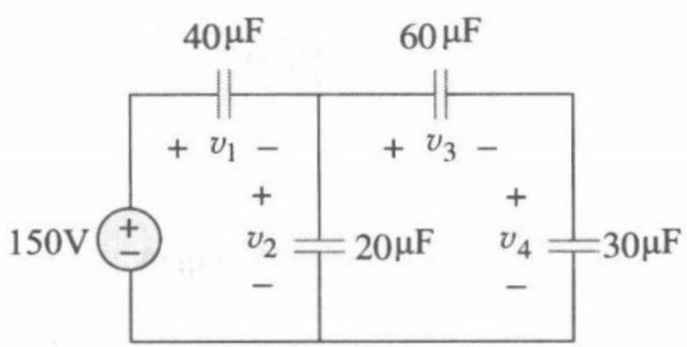

答案： $v _ { 1 } = 7 5 \mathrm { V } , v _ { 2 } = 7 5 \mathrm { V } , v _ { 3 } = 2 5 \mathrm { V } , v _ { 4 } = 5 0 \mathrm { V }$

一个关于 “能量去哪里了” 的思考题：

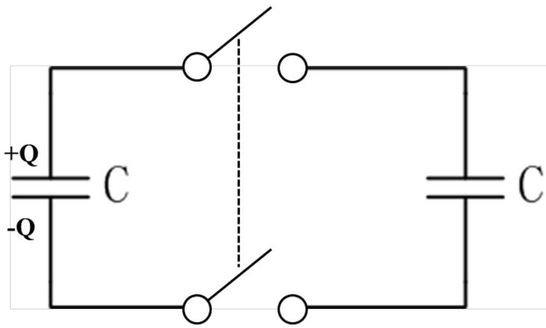

W 左 =QU,

 W=0.5CU2=0.5QU

 消失的能量去了哪里？发射电磁波？

# 6.4 电感

电感基本公式： L ＝ Ψ/I 。意义是单位电流引起线圈的磁通量（电磁场）。

# 电感由导线绕成的线圈组成。

$$
L = \frac {\varphi (t)}{i (t)}
$$

当电感线圈流过电流时，其周围建立磁场，储存磁场能量，满足右手螺旋定则。

螺线管电感量 :

$$
L = \frac {N ^ {2} \mu A}{\ell}
$$

式中 N 是匝数， l 是长度， A 是横截面积， µ 是磁芯的磁导率

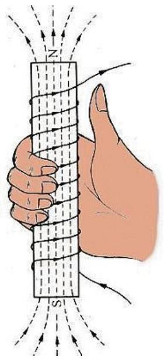

电感的指标：电感量，额定工作电流

电感量是电感在电流改变的情况下产生的特性，用亨利（ H ）来衡量。

变化的电流产生感应电动势，其方向总是阻止磁场的变化。

伏安特性：

$$
v = L \frac {d i}{d t}
$$

1. v 只与 i 的变化量有关，与 i无关 （动态性，阻交通直特性）

2. i 不能突变（ i 的连续性）

$$
i = \frac {1}{L} \int_ {0} ^ {t} v (t) d t + i \left(t _ {0}\right)
$$

1. 记忆性 , 初始电流 $i ( t _ { 0 } )$ 体现历史；

2. 存储性 , 一个有初始电流的 L可等效成一个电流源并联一个初始电流为 0 的原电感。

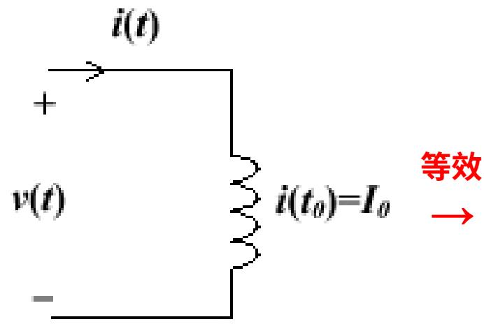

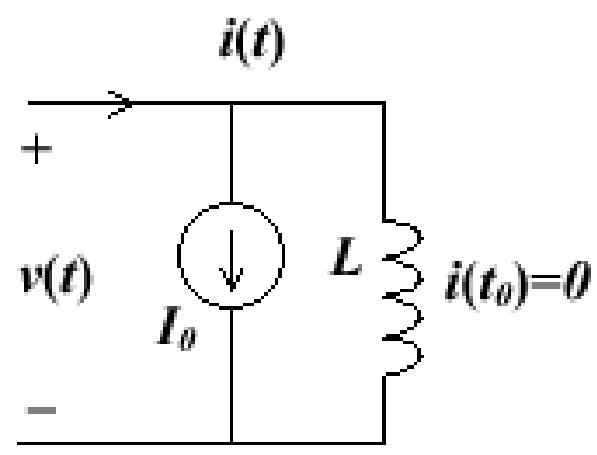

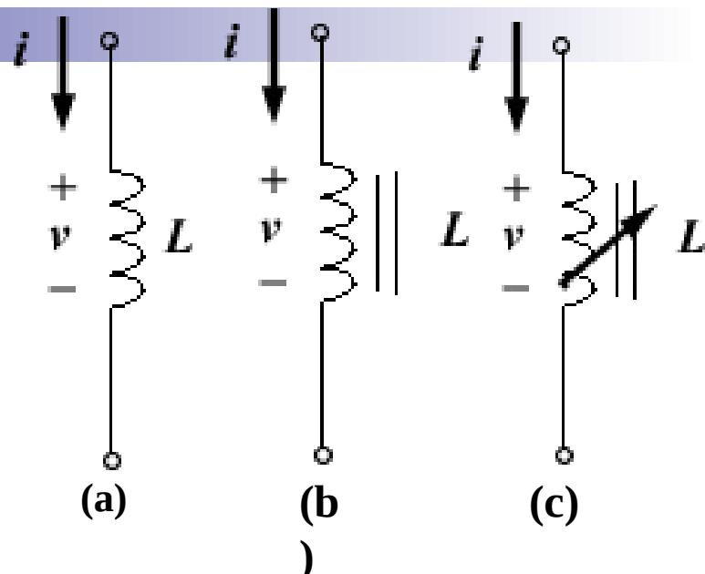

电感的电路符号 : (a) 空气磁心 ,

(b) 铁磁心 , (c) 可变磁心

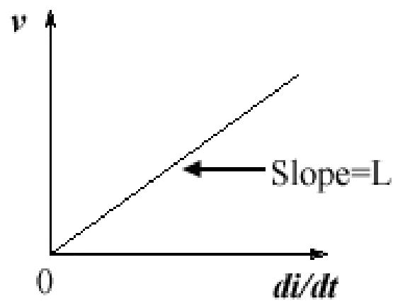

$$
w = \frac {1}{2} L i ^ {2}
$$

1. 记忆性

2. i 的连续性

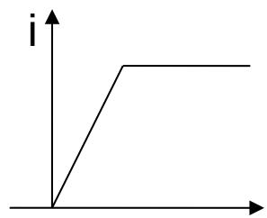

(a)

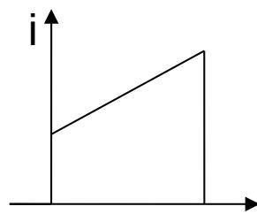

(b)

电感具有如下的重要特性：

1. 在直流电路中，电感相当于短路。

2. 通过电感的电流不能发生跃变。

3. 像理想电容一样，理想的电感也不会消耗能量，因此储存的能量可以供以后使用。电感从电路中获得能量并储存起来，之后会将储存的能量释放到电路中。

4. 实际上电感都不是理想的，因此它们可以在一定程度上被看做是电阻元件，如右图所示。

流经电感器的电流

(a) 允许

(b) 不允许

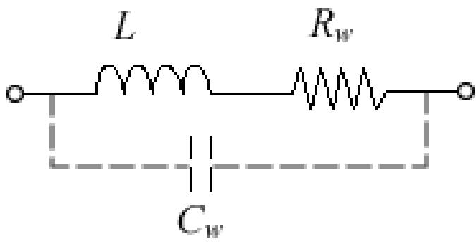

实际电感器的电路模型

# 例 6-8 ：

通过一个 0.1H 电感的电流为 i(t)=10te-5t 计算该电感两端的电压及其储存的能量。

解 :

由于 v=L di/dt 且 L=0.1 H,

$$
v = 0. 1 \frac {d}{d t} (1 0 t e ^ {- 5 t}) = e ^ {- 5 t} + t (- 5) e ^ {- 5 t} = e ^ {- 5 t} (1 - 5 t)
$$

储存的能量为：

$$
w = \frac {1}{2} L i ^ {2} = \frac {1}{2} (0. 1) 1 0 0 t ^ {2} e ^ {- 1 0 t} = 5 t ^ {2} e ^ {- 1 0 t}
$$

练习6-8通过一个 $1 \mathrm { m H }$ 电感的电流为 $i ( t ) = 9 0 \mathrm { s i n } 2 0 0 t \mathrm { m A }$ 时，计算其两端电压以及储存的能量。

解 :

由于 v=L di/dt 且 L=1mH,

$$
V = 1 d (9 0 \sin 2 0 0 t) / d t = 9 0 ^ {*} 2 0 0 \cos 2 0 0 t = 1 8 \cos 2 0 0 t m V
$$

储存的能量为：

$$
w = \frac {1}{2} L i ^ {2} = \frac {1}{2} * 1 * (9 0 * \sin 2 0 0 t) ^ {2} = 4. 0 5 * (\sin 2 0 0 t) ^ {2} \mu J
$$

例 6-9 ：加在 5H 电感两端的电压为：

$$
v (t) = \left\{ \begin{array}{l l} 3 0 t ^ {2}, & t > 0 \\ 0, & t <   0 \end{array} \right.
$$

计算通过该电感的电流。假设 $i ( \nu ) > 0$ ，计算当 $\pmb { t = 5 5 }$ 时，该电感所储存的能量。

解 :

( ) ( )1 0v t dt i tLi tt  由于 ，且 L=5 H, 所以

$$
i = \frac {1}{5} \int_ {0} ^ {t} 3 0 t ^ {2} d t + 0 = 6 \times \frac {t ^ {3}}{3} = 2 t ^ {3} A
$$

功率 $\scriptstyle { p = v i = 6 0 t ^ { 5 } }$

储存的能 56t 156.25 kJ

或 0 156.25 kJ  

练习6-9一个2H电感的终端电压为 $v { = } 1 0 ( 1 { - } t ) \mathrm { V }$ $t = 4 \mathrm { s }$ 时，通过其上的电流以及该时刻储存的能量，假设 $i ( 0 ) { = } 2 \mathrm { A }$ 答案：-18A，324J

解 :

由于 ，且 ( ) ( ) L=2 H, 所以 1 00 v t dt i tLi tt  

$$
i = \frac {1}{2} \int 1 0 (1 - t) d t + 2 = (5 t - 5 ^ {*} t ^ {*} t / 2) + 2 = 5 ^ {*} 4 - 5 ^ {*} 8 + 2 = - 1 8 A
$$

$$
W = \left(L ^ {*} I ^ {2}\right) / 2 = \left(2 ^ {*} 1 8 ^ {2}\right) / 2 = 3 2 4 J
$$

例 6-10 ：

图示电路中，在直流电源下，计算 (a) i , vC , 以及$i _ { \scriptscriptstyle L } , ( { \bf b } )$ 储存在电容和电感中的能量。

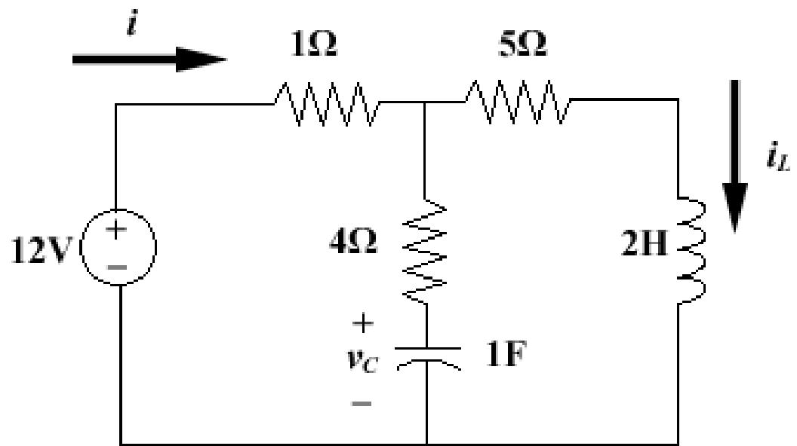

# 解 :

(a) 在直流电源下，将电容做开路处理，电感做短路处理：

$$
i = i _ {L} = \frac {1 2}{1 + 5} = 2 \mathrm {A}
$$

$$
v _ {C} = 5 i = 1 0 \mathrm {V}
$$

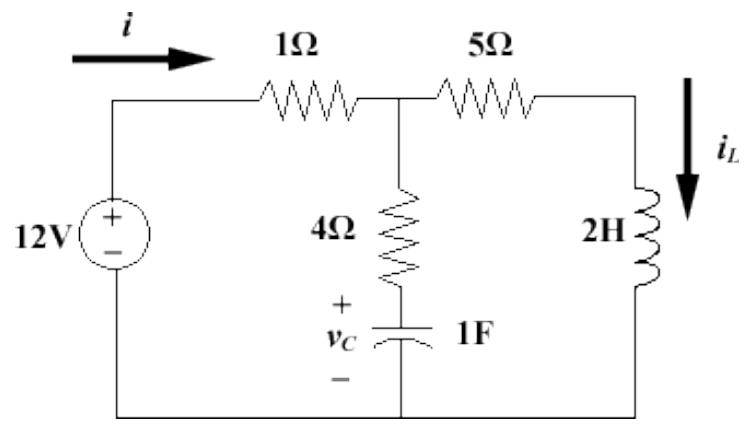

(b) 电容储存的能量为：

$$
w _ {C} = \frac {1}{2} C v _ {C} ^ {2} = \frac {1}{2} (1) \left(1 0 ^ {2}\right) = 5 0 J
$$

电感储存的能量为：

$$
w _ {L} = \frac {1}{2} L i _ {L} ^ {2} = \frac {1}{2} (2) (2 ^ {2}) = 4 J
$$

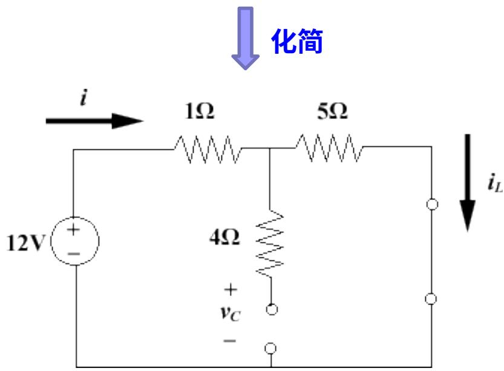

练习6-10在直流电源下，计算图6-28所示电路中电容和电感所对应的电压、电流以及它们所储存的能量。

<table><tr><td>解：电流源转换为电压源</td></tr><tr><td>Vc=(2/8)*60=15V</td></tr><tr><td>I=60/8=7.5A</td></tr><tr><td>WL=(LI²)/2=3*7.5*7.5=168.75J</td></tr><tr><td>WC=(CV2)/2=(4*15*15)/2=450J</td></tr></table>

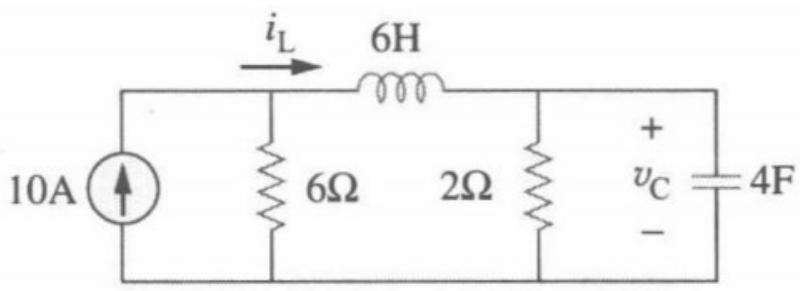

# 例 （小测）

电路如图（ a ）所示，已知： L=3H ，电感上电流 i （ t ）的波形如图（ b ）所示。求：电感上电压 u （ t ）、吸收功率p （ t ）、储能 ( ) w t L ，并画出它们的波形图。

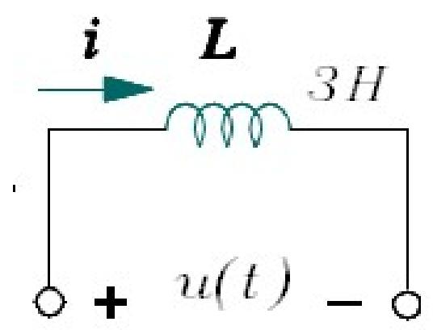

(a)

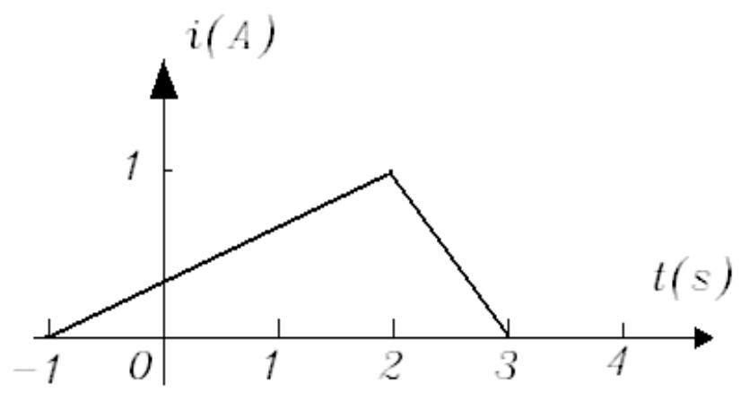

解：

根据电流 i （ t ）的波形，可分段写出其函数式：

$$
i (t) = \left\{ \begin{array}{l l} 0 & t <   - 1 s \\ \frac {1}{3} t + \frac {1}{3} (A) & - 1 s <   t <   2 s \\ - t + 3 (A) & 2 s <   t <   3 s \\ 0 & t > 3 s \end{array} \right.
$$

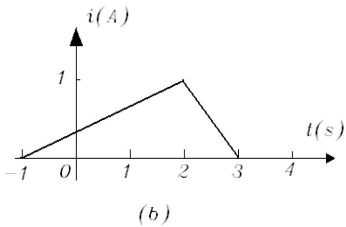

根据 $u ( t ) = L \frac { d i ( t ) } { d t } ( t \overbrace { \frac { } { } } ^ { \dag }$ ： 

$$
u (t) = \left\{ \begin{array}{l l} 0 & t <   - 1 s \\ 1 (V) & - 1 s <   t <   2 s \\ - 3 (V) & 2 s <   t <   3 s \\ 0 & t > 3 s \end{array} \right.
$$

根据 p t u t i t ( ) ( ) ( )   , 得：

$$
P (t) = \left\{ \begin{array}{l l} 0 & t <   - 1 s \\ \frac {1}{3} t + \frac {1}{3} (W) & - 1 s <   t <   2 s \\ 3 t - 9 (J) & 2 s <   t <   3 s \\ 0 & t > 3 s \end{array} \right.
$$

根据 $W _ { \scriptscriptstyle L } ( t ) = \frac 1 2 L i ^ { 2 } ( \xi ) _ { \scriptscriptstyle 1 } ^ { \xi } ;$

$$
W _ {L} (t) = \left\{ \begin{array}{l l} 0 & t <   - 1 s \\ \frac {1}{6} (t + 1) ^ {2} (J) & - 1 s <   t <   2 s \\ \frac {3}{2} (3 - t) ^ {2} (J) & 2 s <   t <   3 s \\ 0 & t > 3 s \end{array} \right.
$$

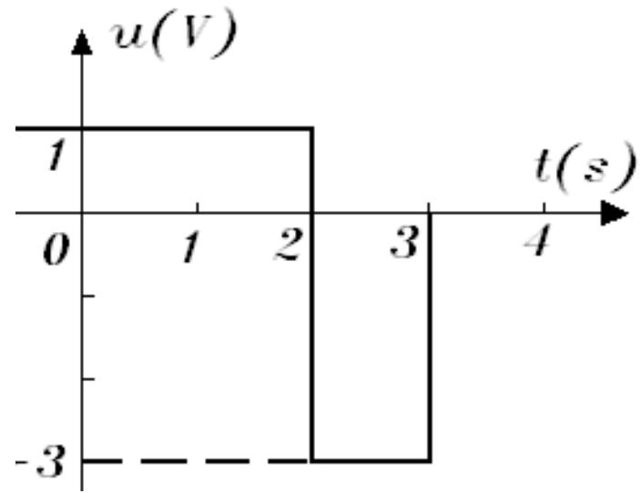

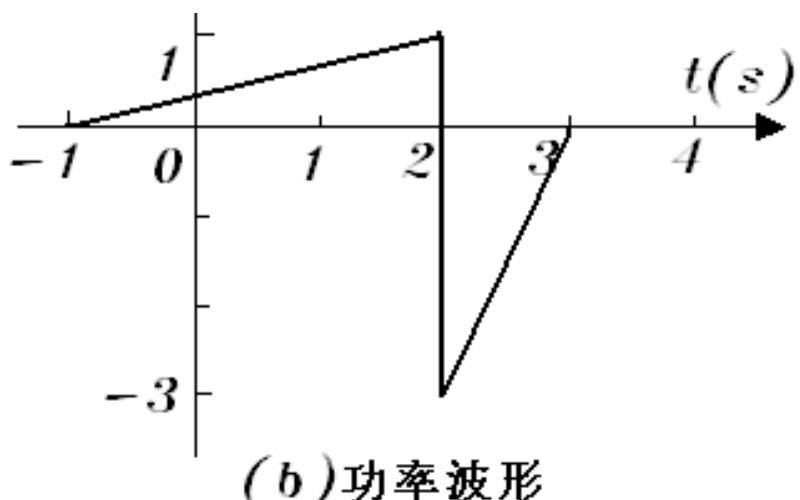

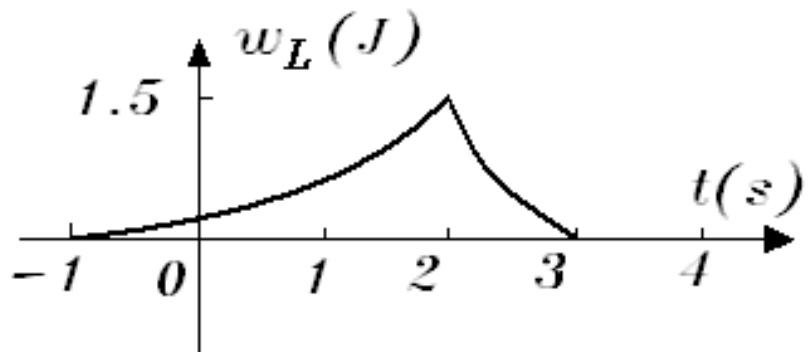

（c）储能波形

按以上结果画出 、 和 u p 的波形，如上图所示。由w图可注意到以下特性：

（ 1 ）电压与电流波形不相同，这是电感动态元件特性的表现。

（ 2 ）电流增大，电压为正值；电流减少，电压为负值；电流不变时电压为零，体现了电感的伏安特性。

（ 3 ）电流和储能具有连续性，而电压和功率可跃变。

（ 4 ）储能 总是不小于零，体现了电感是无源元件。w L

（ 5 ）吸收功率可正可负，电流绝对值增大时功率为正，储能也增大；电流绝对值减少时功率为负，储能也减少，体现了电感储存和释放储能的过程。

# 6.5 电感的串并联

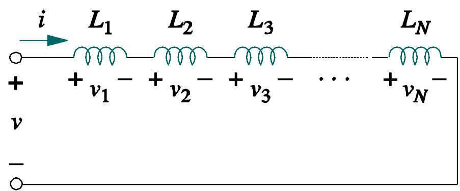

(a)

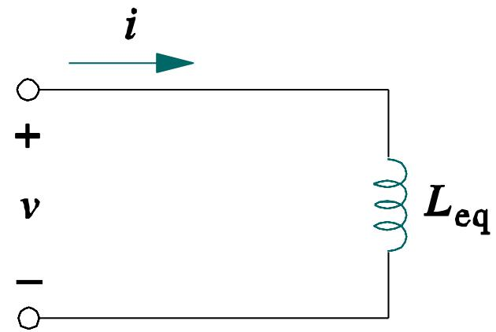

(b)

$$
L _ {e q} = L _ {1} + L _ {2} + L _ {3} + \dots + L _ {N}
$$

串联电感的等效电感系数是各电感的感应系数之和。

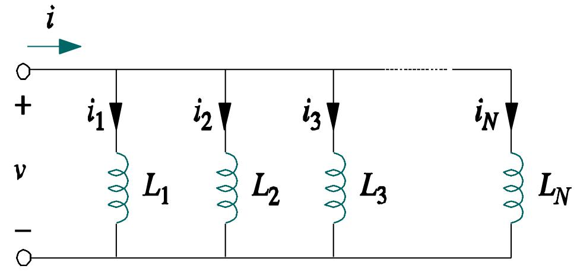

(a)

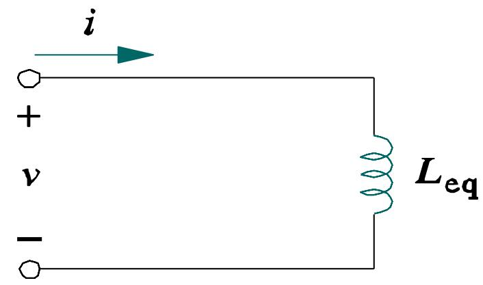

(b)

$$
\frac {1}{L _ {e a}} = \frac {1}{L _ {1}} + \frac {1}{L _ {2}} + \frac {1}{L _ {3}} + \dots + \frac {1}{L _ {N}}
$$

并联电感的等效电感系数是每个电感的感应系数倒数和的倒数。

# 三个基本电路元件的重要特性

<table><tr><td>关系</td><td>电阻(R)</td><td>电容(C)</td><td>电感(L)</td></tr><tr><td>v-i</td><td>v=iR</td><td>v=1/C∫idt+vt(t0)</td><td>v=Ldi/dt</td></tr><tr><td>i-v</td><td>i=v/R</td><td>i=C dv/dt</td><td>i=1/L∫vdt+i(t0)</td></tr><tr><td>p或w</td><td>p=i2R=v2/R</td><td>w=1/2Cv2</td><td>w=1/2Li2</td></tr><tr><td>串联</td><td>Req=R1+R2</td><td>Ceq=C1C2/C1+C2</td><td>Leq=L1+L2</td></tr><tr><td>并联</td><td>Req=R1R2/R1+R2</td><td>Ceq=C1+C2</td><td>Leq=L1L2/L1+L2</td></tr><tr><td>直流条件下</td><td>相同</td><td>开路</td><td>短路</td></tr><tr><td>不能突变的电路变量</td><td>不适用</td><td>v</td><td>i</td></tr></table>

# 例 6-11 （堂练）

计算图示电路的等效电感。

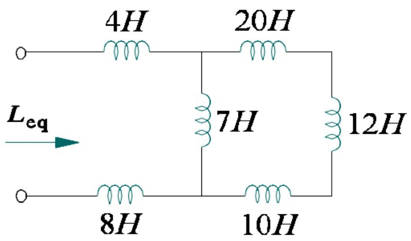

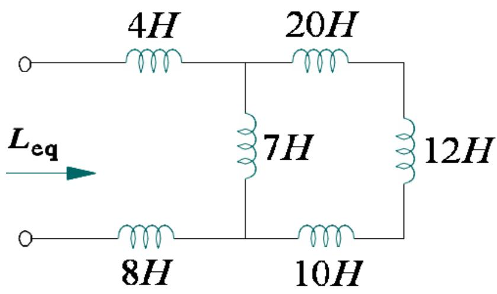

解 : 7 42 6  H 7 42 

$$
L _ {e q} = 4 + 6 + 8 = 1 8 H
$$

练习6-11计算图6-32中梯形电感网络的等效电感。

解：

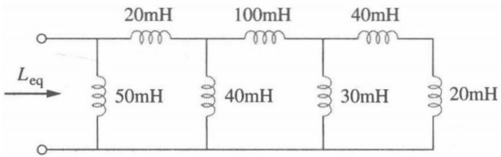

# * 例 6.12

图示电路中， $i ( t ) = 4 ( 2 - e ^ { - 1 0 t } ) m A$ 当 , 2i mA (0) 1 

计算 :

(a) ; (b) 以及 (c) 以及1i (0) 1v t v t ( ), ( ), 2v t( ); 1i t( ) 2i t( ).

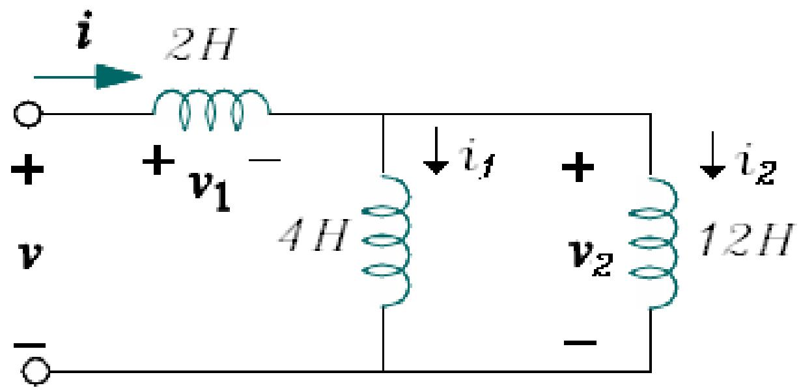

( 板图！ )

# 解 :

(a)因为 $i ( t ) = 4 ( 2 - e ^ { - 1 0 t } ) m A ,$ 所以 。 i mA (0) 4(2 1) 4   

$$
i = i _ {1} + i _ {2},
$$

由于

$$
i _ {1} (0) = i (0) - i _ {2} (0) = 4 - (- 1) = 5 m A
$$

所以

$$
L _ {e q} = 2 + 4 \left\| 1 2 = 2 + 3 = 5 H \right.
$$

(b) 等效电感为：

( )v t所以 eq L di dt 10 10  5(4)( 1)( 10) 200 t t e mV e mV      

$$
v _ {1} (t) = 2 \frac {d i}{d t} = 2 (- 4) (- 1 0) e ^ {- 1 0 t} m V = 8 0 e ^ {- 1 0 t} m V
$$

并且

由于 1 2 v v v   ,

所以 102 1( ) ( ) ( ) 120 tv t v t v t e mV    

(c) 电流 可由下式得到：1

$$
\begin{array}{l} i _ {1} (t) = \frac {1}{4} \int_ {0} ^ {t} v _ {2} d t + i _ {1} (0) = \frac {1 2 0}{4} \int_ {0} ^ {t} e ^ {- 1 0 t} d t + 5 m A \\ = - 3 e ^ {- 1 0 t} \Big | _ {0} ^ {t} + 5 m A = - 3 e ^ {- 1 0 t} + 3 + 5 \\ = 8 - 3 e ^ {- 1 0 t} m A \\ \end{array}
$$

同理 ,

$$
\begin{array}{l} i _ {2} (t) = \frac {1}{1 2} \int_ {0} ^ {t} v _ {2} d t + i _ {2} (0) = \frac {1 2 0}{1 2} \int_ {0} ^ {t} e ^ {- 1 0 t} d t - 1 m A \\ = - \left. e ^ {- 1 0 t} \right| _ {0} ^ {t} - 1 m A = - \left. e ^ {- 1 0 t} + 1 - 1 \right. \\ = - e ^ {- 1 0 t} m A \\ \end{array}
$$

可见， $\begin{array} { r } { i _ { 1 } ( t ) + i _ { 2 } ( t ) = i ( t ) . } \end{array}$

练习6-12在图6-34所示电路中， $i _ { 1 } ( t ) = 3 \mathrm { e } ^ { - 2 t } \mathrm { A }$ $i ( 0 ) { = } 7 \mathrm { A }$

$\boldsymbol { v } _ { 2 } \left( t \right)$ 以及 $\textit { v } \left( t \right)$

$$
\begin{array}{l} (b) i 2 (t) = \frac {1}{3} \int_ {0} ^ {t} (- 3 6 e ^ {- 2 t}) d t + i 2 0 \\ = (1 / 3) ^ {*} (- 3 6) ^ {*} (- 1 / 2) e ^ {- 2 t} - 6 + 4 \\ = 6 e ^ {- 2 t} - 2 \\ \end{array}
$$

$$
\begin{array}{l} i (t) = i 1 (t) + i 2 (t) = 9 e ^ {- 2 t} - 2 \\ (c) V = L (d i / d t) \\ \end{array}
$$

$$
\begin{array}{l} V 1 (t) = 6 ^ {*} 3 ^ {*} (- 2) e ^ {- 2 t} = - 3 6 e ^ {- 2 t} (V) \\ V 2 (t) = 8 (\mathrm {d i} / \mathrm {d t}) = 8 ^ {*} 9 ^ {*} (- 2) e ^ {- 2 t} = - 1 4 4 e ^ {- 2 t} (V) \\ V (t) = 1 0 ^ {*} 9 ^ {*} (- 2) e ^ {- 2 t} = - 1 8 0 e ^ {- 2 t} (V) \\ \end{array}
$$

注：先求出(C)的V1,再做（b)

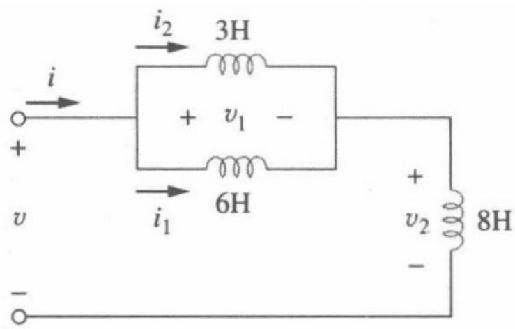

# 复习题

时，其储存的能

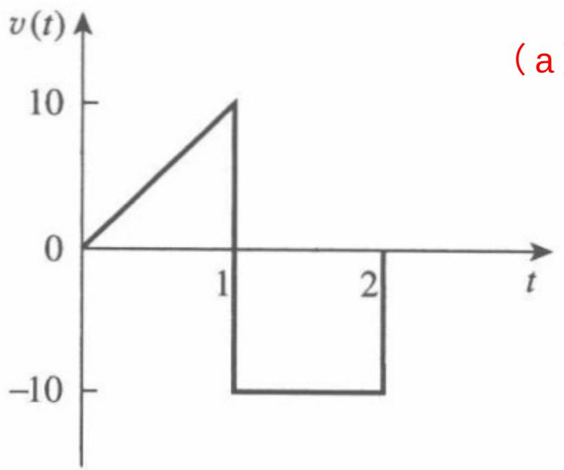

Yes (b)No

$4 \mathrm { m F }$联，总电容是：

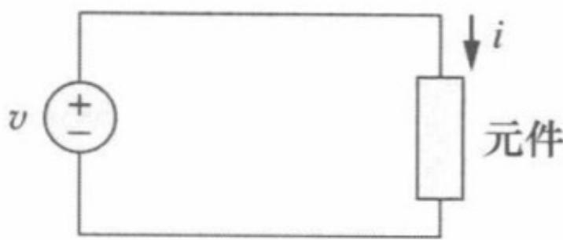

changes

… its currentby 3A in 0.2s

8

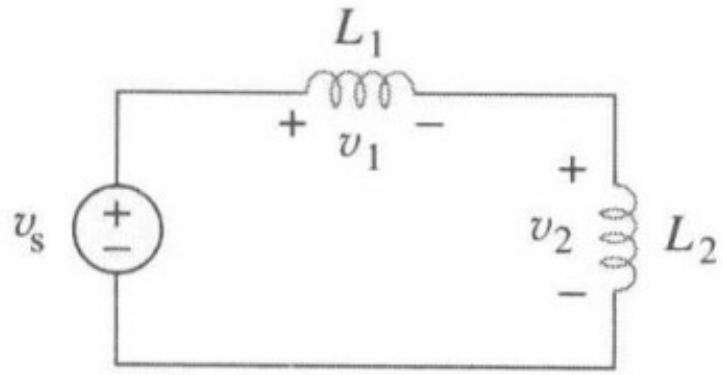

# 6.7 总结

1. 通过电容的电流与加在其上的电压变化率成正比。

$$
i = C \frac {d v}{d t}
$$

除非电容两端的电压发生变化，否则通过电容的电流为零。因此，电容在直流电路中可被看成是开路。

2. 电容两端的电压与流过电容的电流对时间积分成正比。

$$
v = \frac {1}{c} \int_ {\infty} ^ {t} i d t = \frac {1}{c} \int_ {0} ^ {t} i d t + V (t _ {0})
$$

电容上的电压不会有瞬时的改变。

3. 电容的串并联方式与电导的串并联方式相同。

4. 电感两端的电压与通过其上的电流的变化率成正比。

$$
v = L \frac {d i}{d t}
$$

除非电感上的电流改变，否则电感两端电压为零。

因此，电感在直流回路中可被看做是短路线。

5. 通过电感的电流与其两端电压对时间的积分成正比。

$$
i = \frac {1}{L} \int_ {\infty} v d t = \frac {1}{L} \int_ {0} ^ {t} v d t + i \left(t _ {0}\right)
$$

通过电感的电流不会有瞬时的改变。

6. 电感的串并联方式与电阻的串并联方式相同。

7. 在任何时间 t ，电容中所储存的能量是 1/2Cv2, 而电感中所储存的能量是 1/2Li2 。

# 本章重点及难点

运用你的想像力，想像电容、电感中电荷的流动、积累的物理过程，增强对电容、电感特性的理解。

# 本章作业

画出本章思维导图

6-11 （电容，伏安特性）

6-19 （等效电容）

6-32 （电容问题）

 6-46 （电感、 电容，能量）

6-51 （等效电感）

 拓展题 1 ：超级电容与普通电容在储能原理上有何不同？超级电容和电池的不同之处在于什么？超级电容的应用场景有哪些？

 拓展题 2 ：相对地，电容常用而电感不常用，电感通常在电路中起什么作用？如何使用电感？