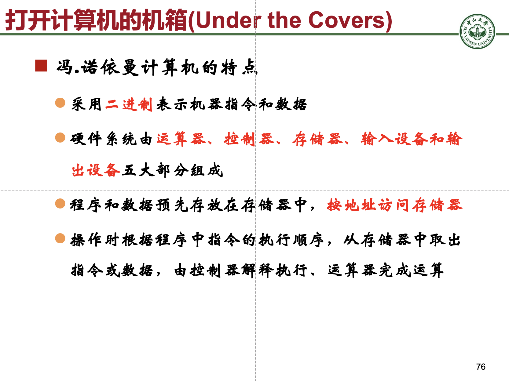
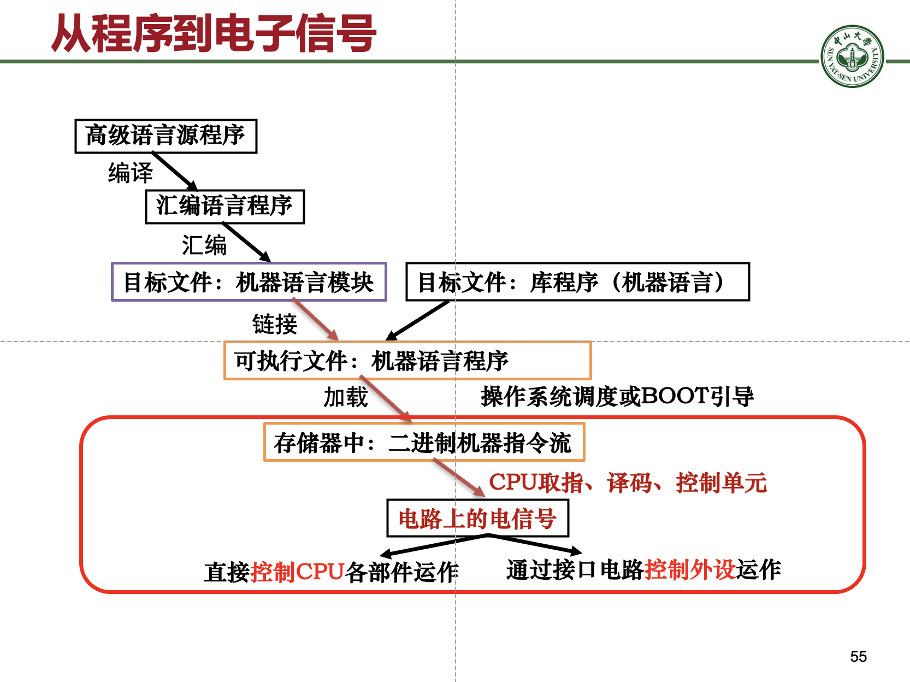

# 计算机系统概述相关笔记

## 1 冯诺伊曼体系结构的特点

> 此部分可出简答题

1. 采用**二进制**表示机器指令和数据
2. 硬件系统由**控制器、运算器、存储器、输入设备、输出设备**五大部分组成（记忆：运算控制存储+IO）
3. 程序和数据预先存放在存储器中，**按地址访问存储器**
4. 操作时根据程序中指令的执行顺序，从存储器中取出指令或数据，由控制器解释执行、运算器完成运算

## 2 程序的执行过程

编译->汇编->链接->加载

## 3 计算机性能指标
